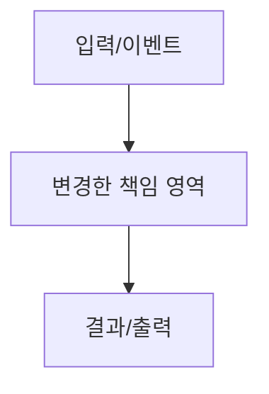

<!-- 작성 기준과 필수 메타데이터(라벨 1개 이상, assignee=ohah)는 docs/pr-checklist.md를 단일 출처로 둡니다. -->

## 의도

이 PR이 해결하려는 문제를 초보자도 이해할 수 있게 적습니다.

## 구현

- 변경한 책임 영역:
- 중요한 트레이드오프:
- 의도적으로 하지 않은 것:

## 다이어그램

<!-- 흐름·시퀀스·상태 전이는 가능하면 Mermaid로 그립니다(넣지 못할 명확한 이유가 없으면 포함).
     노드 이름은 실제 식별자(함수·타입·ABI 버전·escape 시퀀스)를 써서 본문 설명과 1:1로 대응시킵니다.
     아래 예시를 이 PR의 실제 흐름으로 교체하세요. 기준: docs/pr-checklist.md "서술 수준과 다이어그램". -->



## 문서 정합성

- [ ] 구현한 내용과 관련 문서가 같은 상태를 설명합니다.
- [ ] 문서 변경이 없다면 왜 필요 없는지 설명했습니다.
- 수정한 문서:

## Clean-room 근거

- [ ] 레퍼런스 코드 표현을 복사하지 않았습니다.
- [ ] VT/parser 변경이면 공개 명세 섹션을 인용했습니다.
- [ ] renderer/storage/platform interop 변경이면 public spec, platform 문서, 또는 독립 설계 근거를 적었습니다.
- 근거:

## 전략 영향 평가

- [ ] 기존 Maru 전략을 유지합니다.
- [ ] 아키텍처 경계가 흐려지지 않았습니다.
- [ ] TDD/E2E 전략에 빈틈이 생기지 않았습니다.
- [ ] 로그, snapshot, trace, replay, future inspector가 같은 도메인 데이터를 소비하는 방향을 유지합니다.
- [ ] 새 의존성이 있다면 왜 지금 필요한지 설명했습니다.
- [ ] 메모리 전략을 성급하게 복잡하게 만들지 않았습니다.
- [ ] plugin/extension boundary를 나중에 막지 않습니다.
- [ ] 가벼운 native shell/workspace UX 목표를 해치지 않습니다.

## 테스트

실행한 명령과 결과를 적습니다.

```text
mise run check
```

## E2E/관측 가능성

- snapshot/artifact 경로:
- trace/replay 경로:
- 자동 E2E가 불가능한 영역과 이유:

## UI 시각 검증

<!-- 디자인 시스템/chrome의 시각 결과를 바꾸는 PR은 필수입니다.
     Chrome Lab 또는 같은 제품 Metal 경로의 PNG capture 명령·scenario·viewport·theme를 적고,
     `gh attach <image> --markdown -R ohah/maru`가 출력한 Markdown image reference를 아래에 붙입니다.
     before/after가 의미 있으면 둘 다 첨부합니다. 순수 refactor로 visual output이 불변이면 그 근거를 적습니다.
     자세한 규칙은 docs/pr-checklist.md를 단일 출처로 둡니다. -->

- capture 명령:
- scenario / viewport / theme:
- visual output 불변 사유(해당 시):

<!-- gh-attach가 출력한 이미지 Markdown을 이 아래에 붙입니다. -->

## 한계

- 자동 검증하지 못한 영역:
- 실제 구현 중 발견한 기술적 한계:
- 수동 검증 방법:

## 사용자 논의 필요 여부

- [ ] 기존 전략 수정이 필요하지 않습니다.
- [ ] 문서에 없는 아키텍처/UX/의존성/테스트/보안/데이터 포맷/plugin boundary 결정을 임의로 하지 않았습니다.
- [ ] 구현이 문서화된 전략과 달라진 부분이 있다면 사용자와 논의했습니다.
