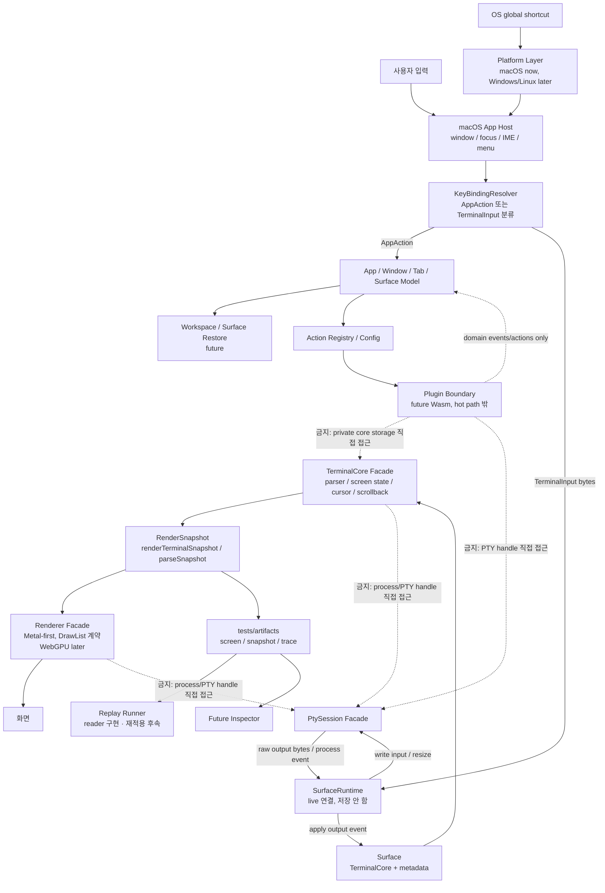

# Maru 초기 아키텍처

Maru는 외부 터미널 소스를 복사하지 않고 공개 명세를 기준으로 독립 구현하는 터미널로 시작한다. 여기서 "clean-room"은 공개 명세 기반 독립 재구현을 뜻하며, Ghostty 등은 참고용 레퍼런스/오라클로만 쓴다. 레퍼런스별 허용 상호작용과 규칙은 [필수 프로젝트 규칙](project-rules.md)을 따른다.

Ghostty 등 레퍼런스는 다음 용도로만 사용한다.

- 구조 레퍼런스
- 테스트 전략 참고
- 동작 비교 오라클
- 성능/UX 기준점

사용하지 않을 것:

- Ghostty 소스 vendoring
- `libghostty-vt` 런타임 의존
- Ghostty 타입을 Maru public API에 노출

## 1차 모듈 경계

첫 구현 목표는 [초기 세로 슬라이스](initial-vertical-slice.md)를 따른다. 각 facade가 맡는 책임과 금지된 의존성은 [Facade 계약](facade-contracts.md)을 단일 출처로 둔다. 실행 중 `Surface`와 `PtySession` 연결은 [SurfaceRuntime API 계약](surface-runtime-api.md)을 따른다. 키 입력, app shortcut, global shortcut의 충돌 규칙은 [키 입력과 단축키 경계](key-input-and-shortcuts.md)를 따른다.

```text
src/maru.zig
  -> app.zig
  -> config.zig
  -> pty.zig
  -> renderer.zig
  -> terminal.zig
```

현재 스캐폴드는 실제 터미널 구현이 아니라, 앞으로 지켜야 할 경계를 컴파일 가능한 형태로 세운 것이다.

## 아키텍처 다이어그램

이 그림은 현재 목표 구조를 보여준다. 핵심은 `TerminalCore`가 PTY, renderer, platform을 직접 알지 않고, 각 영역이 facade와 domain data를 통해서만 연결되는 것이다.

`Surface`는 복구 가능한 terminal state와 metadata를 표현한다. live `PtySession` handle은 저장하지 않는다. 실제 실행 중에는 app layer의 `SurfaceRuntime`이 `Surface`와 `PtySession`을 묶고, PTY output/input/resize를 전달한다. 이 분리는 workspace restore가 live process handle을 저장하지 않게 하고, 테스트가 PTY 없이도 surface/core를 검증할 수 있게 한다.



금지 화살표는 모든 상호작용을 금지한다는 뜻이 아니다. public facade, domain event, action을 통한 간접 상호작용은 허용한다. 금지되는 것은 private storage, live PTY handle, renderer resource 같은 내부 구현 세부사항을 직접 잡는 의존성이다.

## 핵심 경계

```text
AppWindow
  - 탭 목록
  - active tab
  - UI action 적용

Surface
  - TerminalCore
  - RenderSnapshot
  - title/cwd/process state

SurfaceRuntime
  - Surface와 PtySession의 live 연결
  - PTY output/input/resize routing
  - 저장/restore 대상 아님

TerminalCore
  - bytes 입력
  - resize
  - key encoding
  - render snapshot 생성

Renderer
  - RenderSnapshot 소비
  - v1 macOS Metal
```

## 개발 순서

구체적인 구현 순서는 [실제 구현 계획](implementation-plan.md)을 단일 출처로 둔다.

이전에는 parser를 먼저 만든다고 표현했지만, 실제 순서는 더 좁게 잡는다. 먼저 facade 계약과 snapshot/artifact 경계를 고정하고, 초기 shell 경로에 필요한 parser 동작만 fixture 기반으로 작게 추가한다. 그다음 macOS PTY, surface 연결, headless E2E, renderer/app host 순서로 진행한다.

## 테스트 원칙

Maru는 가능한 모든 영역에서 TDD를 기본값으로 둔다.

TDD가 의도하는 것은 "테스트 개수 늘리기"가 아니다. 구현 전에 원하는 동작을 작게 고정해서, 코드가 커져도 책임 경계가 흐려지지 않게 만드는 것이다.

각 테스트는 다음 질문에 답해야 한다.

```text
이 동작은 사용자의 어떤 터미널 경험을 지키는가?
이 테스트가 실패하면 어느 책임 영역을 의심해야 하는가?
이 테스트보다 더 위/아래 레이어의 테스트가 필요한가?
```

E2E는 레이어별로 둔다.

```text
Headless E2E:
  real process -> stdout bytes -> TerminalCore -> screen snapshot

PTY E2E:
  openpty -> shell/program -> TerminalCore -> screen snapshot

App E2E:
  macOS app -> key input/resize/paste -> rendered result
```

어떤 영역이 자동 E2E로 검증 불가능하면, 그 이유와 수동 검증 방법을 사용자에게 보고해야 한다.

## 관측 가능성 원칙

Maru는 처음부터 디버깅, 테스트, 로그, 리플레이가 같은 데이터를 공유하는 구조로 만든다.

이 원칙의 의도는 실제 터미널에서만 보이는 버그를 재현 가능한 테스트로 바꾸는 것이다. `println` 로그, 테스트 fixture, 나중의 GUI inspector가 서로 다른 상태 모델을 보면 버그를 고칠 때마다 같은 정보를 여러 번 해석해야 하고, 어느 도구가 진짜 상태를 말하는지 알기 어려워진다.

공통 흐름:

```text
PTY/input/parser/terminal/renderer/workspace
  -> ShellEvent (도메인 이벤트) / renderShellEvents·renderTerminalSnapshot (writer)
  -> parseEvents·parseSnapshot (reader — 구현됨)
  -> structured log
  -> headless replay (재적용은 후속)
  -> golden snapshot
  -> failure artifact
  -> future GUI inspector
```

새 기능을 만들 때는 구현 전에 다음 질문에 답해야 한다.

```text
이 기능의 중요한 상태는 어떤 snapshot으로 볼 수 있는가?
실패 상황을 replay trace로 저장할 수 있는가?
테스트 실패 시 어떤 artifact가 남아 root cause를 찾게 해주는가?
로그에 민감한 cwd/env/token/server 정보가 섞일 수 있는가?
```

구현 상태(실제 심볼명):

1. **화면 스냅샷** ✅ — `RenderSnapshot`(terminal/types.zig)을 `renderTerminalSnapshot`(writer)이 `maru.snapshot.v3` 텍스트로 직렬화하고 `parseSnapshot`(reader)이 되읽는다(cursor·grid·dirty·cell-metadata·styled-cells). 예전 개념명 `DebugSnapshot`은 코드에 없다.
2. **trace** ✅ — `maru.trace.v1` writer(shell: `renderShellEvents`, base kind: `writeOutputEvent`/`writeResizeEvent`/…)/reader(`parseEvents`)가 shell.* 와 base kind(output/input/resize/process-exit)를 왕복하고, **라이브 레코딩**(`MARU_TRACE`, `app/trace_recorder.zig`의 `TraceRecorder` — `SurfaceRuntime` 훅에서 누적, `AppSession.deinit`에서 파일로)까지 구현. 옛 개념명 `TraceRecorder`는 이 struct다.
3. **replay** ✅ — `replayTrace`(observability/replay.zig)가 `output`을 `core.write`, `resize`를 `core.resize`로 재적용해 화면을 byte-for-byte 재구성(파서가 셸 이벤트·cwd 재도출). output 없는 shell-only trace는 shell.* 를 OSC로 재발행(fallback). 옛 개념명 `ReplayRunner`는 이 함수다.
4. `FailureArtifact`(후속): 테스트 실패 시 trace, snapshot, config를 로컬 산출물로 남긴다.

릴리스 빌드에서는 이 관측 기능이 꺼졌을 때 hot path에 의미 있는 비용을 남기지 않아야 한다. trace와 artifact는 기본적으로 로컬 전용이며, 회귀 테스트로 추가할 때만 민감정보를 제거한 fixture를 git에 넣는다.

렌더러 backend 선택은 [렌더러 전략](renderer-strategy.md)을 따른다. 현재 추천은 macOS Metal-first 구현과 backend-neutral `DrawList` 계약이다. 폰트 resolve, fallback, glyph atlas, emoji/CJK 처리는 [폰트 전략](font-strategy.md)을 따른다.

## 메모리 전략

Ghostty는 앱 전체를 하나의 mmap allocator로만 운영하지 않는다. 일반 영역은 Zig allocator interface를 주입하고, terminal page backing memory처럼 성능과 zero-fill 특성이 중요한 영역은 `mmap`/`VirtualAlloc`을 직접 쓴다.

Maru도 같은 방향을 참고한다.

```text
일반 객체:
  std.mem.Allocator 주입

초기 ScreenStorage:
  단순 allocator 기반 cells

고성능 ScreenStorage later:
  page-aligned storage
  mmap/VirtualAlloc 고려
  scrollback/page 책임을 별도 모듈로 분리
```

이 결정의 의도는 메모리 최적화를 성급하게 전체 구조에 섞지 않고, hot storage가 명확해졌을 때 그 책임만 교체할 수 있게 만드는 것이다.

### 스크롤백은 화면(screen)에 귀속한다

위 "scrollback/page 책임을 별도 모듈로 분리"의 1단계로, 스크롤백 상태(ring·head·count·cap·rewrap 마크)를 `TerminalCore`의 평평한 필드가 아니라 `Scrollback` 구조체로 묶고, **활성 화면마다 별도 인스턴스**를 둔다. primary 화면은 `cap = scrollback.lines`인 ring을 갖고, **alternate screen(vim·less 등 TUI)은 `cap = 0`인 빈 인스턴스**를 갖는다. alt 진입 시 primary의 `Scrollback`을 보관 슬롯으로 옮기고 빈 인스턴스를 활성으로 세우며, 복귀 시 되돌린다(grid의 `saved_cells` 스왑과 같은 패턴).

이 모델의 핵심은 **"alt 화면엔 스크롤백이 없다"가 데이터 타입으로 보장**된다는 것이다(Ghostty의 `max_scrollback = 0` alt screen과 같다). 결과로:

- `pushScrollback`은 `cap == 0`이면 무동작이라, alt 출력이 스크롤백에 쌓이지 않는 것이 분기 없이 성립한다.
- `scrollbackLen()`(= 활성 `Scrollback.count`)이 alt에서 항상 0이라, 스크롤바 렌더·스크롤 뷰·스크롤백 검색이 모두 by-construction으로 "스크롤백 없음"을 본다.
- 과거에 흩어져 있던 데이터 모델 보정 가드(`scrollViewport`·`scrollToAbs`·`searchScrollback`·`scrollRegionUp`의 push)가 제거된다. abs 좌표를 쓰는 새 기능이 alt 보정을 "빠뜨려서" 생기는 회귀(스크롤바가 alt에서 남던 버그)가 구조적으로 불가능해진다.

단, `clearScreen`(Cmd+K)·`jumpToPrompt`의 alt 가드는 데이터 모델 보정이 아니라 "실행 중 TUI에는 적용하지 않는다"는 정책이라 유지한다(전자는 화면+스크롤백 clear, 후자는 프롬프트 블록 이동 — 둘 다 primary 화면 전용 동작). 화면 단위 config(`scrollback.lines`)는 활성 화면과 무관하게 항상 primary 인스턴스에 적용한다(`setMaxScrollback`).

후속(2단계)은 cursor·grid까지 포함한 완전한 `Screen` 구조체로 흡수하고, 그 자리에 page-aligned storage를 얹는 것이다.

**(실현·정정)** Screen 흡수는 방향 B로, page-aligned storage는 §11의 A1/A2/P4(페이지화 스크롤백 + 가변폭 trailing-trim + mmap backing)로 실현했다 — 수백만 줄 스크롤백 목표를 달성·초과한다. 단 활성 grid까지 한 리스트로 합치는 **통일 PageList(Ghostty식)는 채택하지 않았다**: A2가 스크롤백을 가변폭 packed·불변으로 만들어 메모리를 ~94×↓시켰는데, 활성 grid는 고정 `rows×cols`·제자리 mutate라 그 가변폭 구조와 양립 불가다(트레이드오프 — maru는 메모리를 택함). 따라서 maru의 종착 모델은 **"가변폭 스크롤백 page + 고정폭 활성 grid의 분리"**다. grapheme 저장을 page-local로 귀속하는 회수도 이 통일을 vehicle로 삼았다가 함께 보류됐다(전역 dedup store가 standing 답). 상세·정정 근거는 [page-aligned storage §11](plans/page-aligned-storage.md)(§11.6 종료·§11.8 §595·§11.10).

## 개발환경

필수 도구:

```text
mise
zig 0.16.0
```

명령:

```sh
mise run fmt
mise run test
mise run build
mise run check
```

현재 단계의 성공 기준:

```text
zig build
zig build test
mise run check
```
