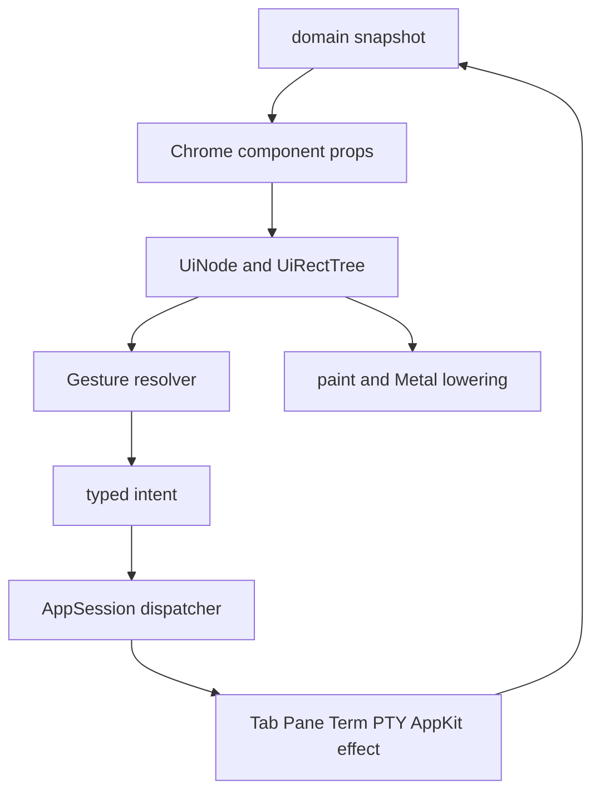

# Chrome 상호작용 컴포넌트 이관 전략

이 문서는 기존 Maru Chrome의 탭·사이드바·분할선·스크롤·overlay를 새 Metal UI
component tree로 **점진 이관**하는 단일 출처다. 공용 typed tree와 paint 경계는
[Metal UI 레이아웃·컴포넌트 시스템](metal-ui-layout.md)이, 실제 창·PTY·AppKit 효과의
소유권은 [macOS 앱 호스트 경계](macos-app-host-boundary.md)가 계속 소유한다.

이 문서는 React/React Native의 component 조합성은 참고하되 React runtime, virtual DOM,
JS callback 또는 component-local gesture state를 도입하지 않는다.

## 1. 결정과 경계

### 1.1 목표

- 모든 새 **Chrome 구조와 상호작용 선언**은 immutable component tree에서 만든다.
- click, hover, press, keyboard focus, drag, pan, scroll, resize의 공통 수명은
  `chrome/ui`의 한 interaction subsystem이 해석한다.
- 실제 `Tab`/`Pane`/`Term` 변형, PTY write/resize, window focus, native drag-and-drop과
  AppKit 호출은 계속 host `AppSession`이 단독 소유한다.
- 기존 동작을 바꾸지 않는 adapter부터 도입하고, component별로 교체한다.

### 1.2 명시적 비목표

- terminal screen/VT parser/scrollback/glyph renderer를 `Text`·`Container` node의 집합으로
  바꾸지 않는다.
- WebView, editor, terminal renderer를 일반 component renderer로 통합하지 않는다.
- 모든 기존 component를 한 PR에서 tree로 재작성하지 않는다.
- `onClick`/`onHover` closure나 `*Pane`/`*Tab` pointer를 public UI props에 넣지 않는다.
- 새 Chrome component에 TUI fallback을 추가하지 않는다. 기존 cell/TUI path는 이관 중의
  호환 코드이며 새 API의 두 번째 renderer가 아니다.

### 1.3 책임 분리



`UiNode`는 stable UI identity, rect, clip, visual props와 interaction declaration만 가진다.
`AppSession`은 그 UI identity를 해당 frame의 live domain object로 다시 검증한 뒤에만 effect를
수행한다. 어느 계층도 상대 계층의 cache나 live pointer를 소유하지 않는다.

## 2. 기존 구현 inventory

아래 대상은 이미 동작하는 제품 경로다. “미구현”으로 취급하거나, UI 외형을 바꾸는 대규모
rewrite의 근거로 삼지 않는다.

| 대상 | 현재 책임 | 이관 목표 | 이관 전 반드시 보존할 동작 |
| --- | --- | --- | --- |
| `components/divider.zig` | 순수 divider geometry/hit-test/ratio | `SplitDivider` + shared capture | split 최소 크기 clamp, resize, target split 해제 시 cancel |
| `components/tabbar.zig` | terminal tab bar segment/hit-test | `TabList`/`Tab` composite | select, close, overflow horizontal scroll, drag/drop/detach |
| `components/sidebar.zig` | workspace/group/agent row geometry·hit-test | `ReorderableList`를 쓰는 Sidebar composite | group collapse, reorder preview, pin/group invariants |
| `components/file_tree_scrollbar.zig` | scrollbar geometry/track/thumb math | `ScrollArea`/`Scrollbar` | thumb drag, track click, projection/root generation mismatch cancel |
| terminal scrollbar | `AppSession` viewport mutation | `ScrollArea` adapter | terminal scrollback/selection/mouse mode와의 입력 우선순위 |
| Session Dock | typed tree + action table + pixel scroll | 첫 modern consumer를 유지 | refresh anchor, stale action reject, read-only detail worker |
| palette/find/notice/modal/dropdown | 화면별 `State`/view/handle | `Input`/`Menu`/`Popover`/`Dialog` composite | AppKit first responder, IME, Escape/outside-dismiss, keyboard navigation |
| settings/toggle/text field | 화면별 form state | `Input`/`Toggle`/`Select`/`FormRow` | schema ownership, config write, validation/error presentation |

`AppSession.PointerGestureOwner`는 현재 실제 pointer capture의 권위다. 이 문서는 그것을
삭제하라고 요구하지 않는다. adapter 단계에서 shared interaction 결과를 이 owner의 안전한
기존 effect path로 변환하고, 각 consumer가 migration gate를 통과할 때에만 해당 variant를
줄인다.

## 3. 공개 component와 내부 capability

공개 component는 의미와 접근성 역할이 명확한 작은 집합만 둔다.

```text
Card, Text, Button, Input
Tabs, TabList, Tab
ScrollArea, Scrollbar
Menu, Popover, Dialog
Toggle, Select, FormRow
SurfaceSlot
```

`Container`는 row/column/flex/gap/align을 제공하는 내부 구조 node다. `Row`, `Column`,
`Flex`, `Box`, `Div`를 제품 API로 늘리지 않는다.

`DragRecognizer`, `PanRecognizer`, `DropTarget`, `PointerCapture`는 visual component가 아니라
internal interaction capability다. component가 capability를 선언하되, 경쟁 판정과 pointer stream
소유는 공용 resolver가 한 번만 한다.

`Badge`, `Tooltip`, `SegmentedControl`, `ReorderableList`는 두 번째 실제 consumer가 같은
keyboard·lifecycle·accessibility 계약을 공유할 때만 public component로 승격한다. 그 전에는
도메인 composite 안에 둔다.

`Input`은 모든 문자열 상태를 하나의 범용 버퍼로 합치는 약속이 아니다. 검색 입력, 주소창의
caret/selection 편집, settings의 검증 값은 서로 다른 키·Escape·IME·수명 계약을 가진다. component
tree에는 immutable presentation/semantic props와 opaque intent만 두고, 편집 모델은 해당 consumer의
순수 모델이 소유한다. AppKit first responder와 `NSTextInputClient` bridge는 host가 유지한다. 따라서
새 `Input` API가 생기더라도 기존 `OverlayInput`이나 주소창 `TextField`를 자동으로 흡수하지 않으며,
각 이관은 [텍스트 필드 에디터](text-field-editor.md)의 범위·IME gate를 충족해야 한다.

`UiActionId`만으로 keyboard와 accessibility를 표현할 수는 없다. interactive node는 같은 immutable
snapshot에 role, localized label, enabled/selected/expanded/value 및 keyboard focusability를 담은 typed
semantic descriptor를 낸다. Swift adapter만 이 descriptor를 native accessibility element로 투영하고,
Zig tree는 `NSAccessibility` object나 delegate를 보유하지 않는다. descriptor가 아직 없는 consumer는
pointer visual migration만 가능하며 접근성 이관 완료라고 표시할 수 없다.

## 4. Gesture resolver 계약

### 4.1 선언은 data이고 callback이 아니다

아래는 목표 API의 형태일 뿐 현재 구현된 public API라고 주장하지 않는다.

```zig
const tab = ui.tab(.{
    .id = ids.tab(tab_id),
    .select_action = select_action,
    .close_action = close_action,
    .gesture = .{ .drag = .{
        .payload = .{ .tab = tab_id },
        .axis = .horizontal,
        .threshold = .system,
    } },
}, children);
```

declaration은 stable component ID와 opaque action/drag payload ID만 낸다. `UiActionId`는
published snapshot의 action table에서만 domain intent로 resolve된다. component는 `AppSession`,
provider, filesystem, PTY, live pointer를 import하지 않는다.

### 4.2 input route와 승자 선택

입력은 먼저 **어느 surface가 받을 수 있는지** 판정한 뒤에만 gesture 경쟁을 시작한다.

```text
modal or active native overlay
  > explicit Chrome control (divider, thumb, tab close)
  > surface input policy
      terminal mouse reporting enabled -> PTY input
      otherwise                   -> component gesture resolver
  > unclaimed terminal input
```

여기서 explicit Chrome control은 **같은 completed snapshot의 visible rect/clip을 실제로 hit한
sibling**만 뜻한다. tab bar·divider·scrollbar처럼 terminal body 밖의 Chrome rect는 terminal mouse
reporting보다 먼저 처리할 수 있지만, terminal body 안의 보이지 않는/비-modal overlay가 입력을
전역 소비해서는 안 된다. non-modal overlay는 자기 rect 밖에서 pass-through한다. terminal body의
wheel/selection/mouse reporting은 기존 terminal input policy가 계속 결정하며, `ScrollArea`라는 이름만으로
Chrome scroll로 바꾸지 않는다. `terminalOwnsInput`은 keyboard first-responder 정책의 단일 출처이므로
pointer routing의 대체 판정으로 재사용하지 않는다.

그 뒤 같은 pointer stream 안에서는 다음 우선순위를 적용한다.

```text
captured gesture
  > resize thumb/divider
  > explicit drag handle/tab/sidebar reorder
  > scroll pan
  > press/click
```

한 pointer stream에는 정확히 하나의 capture owner만 존재한다. pointer up, cancel, window
deactivate, component removal, snapshot/window epoch mismatch는 모두 action 없이 capture를 취소한다.
macOS v1은 mouse pointer 하나만 쓰더라도 event DTO에는 `pointer_id`를 둬 future touch가 state를
암묵적으로 공유하지 못하게 한다.

### 4.3 reorder/pane drag와 resize는 같은 mutation 규칙을 쓰지 않는다

tab/sidebar/pane **reorder와 move**의 drag preview는 source layout을 mutation하지 않는다. ghost,
insertion rule, hover, temporary transform은 `InteractionState`에서 paint-only로 파생한다. up 시
host가 `ReorderTab{ source, destination }`, `MovePane{ source, destination }` 같은 typed intent를
현재 live model에 재검증하고 한 번 commit한다.

`ResizeSplit`은 예외다. divider/sidebar resize는 compatible capture의 매 move마다 host가 현재
pointer 좌표를 domain clamp에 적용하고, pane geometry·terminal PTY size를 즉시 갱신하는
**continuous geometry effect**다. 공용 resolver는 capture와 cancel만 소유하고 ratio 계산·최소 크기
clamp·resize fan-out은 기존 host/domain 경로가 소유한다. persistent configuration write가 있다면
up에서만 확정하며, resize 도중 split/window가 사라지면 effect 없이 cancel한다. 따라서
`ResizeSplit`을 reorder와 같은 one-shot drop intent로 일반화해서는 안 된다.

**중요한 미결정:** 현재 terminal tab drag는 drag 중 실제 순서를 바꾸는 live-reorder 동작이다.
`TabList` 이관 전 아래 중 하나를 별도 승인해야 한다.

1. 기존 live reorder를 유지하는 adapter를 만든다.
2. preview-only reorder로 제품 동작을 바꾸고 keyboard/accessibility·capture E2E를 함께 갱신한다.
3. **권장: provisional live reorder** — drag 중에는 인접 tab의 위치를 즉시 바꾸되 시작 순서를
   transaction에 보관하고, up에서만 model commit한다. Escape/cancel/window deactivate/target removal은
   시작 순서를 복원한다. 이는 direct manipulation의 즉시성을 유지하면서 cancel을 안전하게 만든다.

승인 전에는 generic drag substrate가 terminal tab reorder 동작을 바꾸지 않는다.

## 5. identity, snapshot, lifecycle

모든 pointer/action/drag result는 아래 세 값을 함께 검증한다.

```text
owning window/session epoch
+ completed UiRectTree snapshot generation
+ stable component/domain identity
```

array index, frame-arena address, raw `*Pane`/`*Tab` pointer는 public identity가 아니다. host의
action table은 identity를 current live object로 해석할 때 한 번 더 validate한다. stale/unknown/
ambiguous 대상은 no-op/cancel이고, 이전 snapshot의 pointer up이 새 component action을 실행해서는 안 된다.

현재 ML2b click interaction은 action/geometry가 달라진 tree replacement에서 capture를 항상
cancel한다. 이 기본값은 유지한다. 다만 drag preview는 매 move마다 visual snapshot을 갱신할 수 있으므로,
future drag extension은 단순 snapshot generation equality만 요구해서는 안 된다. capture를 다음
snapshot으로 carry하려면 새 tree가 정확히 하나의 같은 component identity를 가지며, 그 node의
`gesture compatibility key`(gesture kind, enabled policy, owner window/session epoch, source domain
identity)가 변하지 않았다는 reconcile verdict가 필요하다. 이 verdict가 없거나 duplicate/disabled/
clip-removed이면 cancel한다. up의 effect는 언제나 **현재** action table과 live domain validation을
다시 통과해야 하며, 이전 action ID를 재사용하지 않는다.

surface와 window 이동·detach/reattach은 해당 surface의 capture, hover, keyboard focus, pending
drop target을 모두 revoke한다. 다른 window/surface가 같은 numeric ID를 재사용해도 이전 epoch의
intent는 수락하지 않는다.

## 6. SurfaceSlot: terminal을 component로 감싸는 방법

terminal, WebView, editor는 `Text` node 집합이 아니다. component tree에는 외부 renderer의 rect,
clip, z-order, focus/input policy만 나타내는 `SurfaceSlot` leaf를 둔다.

```text
PaneSurface
├── TabList
├── SurfaceSlot (terminal | web | editor)
├── ScrollArea or terminal scrollbar
├── SplitDivider
└── selection/find/IME/drag-preview overlay
```

`SurfaceSlot`은 이미 host가 소유한 stable `surface_id`와 kind, clip/rect, focus action, input
policy만 선언한다. 이는 새 `SurfaceRuntime`/`SurfaceKind` case를 발급하거나 surface를 create·adopt·persist하는
API가 아니며, `ChromeLabSurface` 같은 test-only drawable과도 다르다. terminal renderer는 기존 screen
snapshot과 Metal frame을 계속 소유하며, host만 resize와 PTY input을 실행한다. WebView/editor도 같은
slot geometry를 받아 자기 renderer를 배치하지만, renderer implementation을 `chrome/ui`로 import하지 않는다.

Chrome draw·hit-test·external renderer frame은 같은 completed slot rect/clip snapshot을 소비한다.
서로 별도 rect를 재계산하거나 main thread에서 terminal screen을 tree DTO로 복사하면 실패다.

## 7. performance, platform, security

- UI tree/action/gesture candidate는 fixed-capacity 또는 명시된 bounded arena에서 만들며 pointer move마다
  heap allocation·filesystem I/O·worker wait를 하지 않는다.
- consumer는 candidate 수, drag preview buffer, action table의 상한을 PR에서 선언한다. 상한 초과나
  candidate build 실패는 partial snapshot을 publish하지 않고 마지막 completed snapshot을 유지하며,
  영향을 받은 capture는 effect 없이 cancel한다. "다음 frame에서 다시 시도"가 unbounded allocation 또는
  stale target commit의 우회가 되어서는 안 된다.
- terminal output, PTY reader, provider scan, WebView process work는 main/AppKit input thread에서
  실행하지 않는다. worker는 immutable completion만 publish한다.
- transform/drag preview는 layout rect를 바꾸지 않는 paint-only state다. future transform은 forward/inverse
  mapping을 하나의 module에서 계산해 paint/hit-test가 같은 result를 소비한다.
- Swift는 AppKit first responder, IME, native accessibility, OS drag-and-drop 호출을 소유한다. Zig
  component는 OS object/closure를 보유하지 않는다.
- native file/text drop은 host가 target `SurfaceSlot`과 overlay/modal guard를 다시 확인한 뒤에만
  실행한다. untrusted payload가 action ID, renderer selection, shell input을 직접 지정할 수 없다.
- generic component가 terminal mouse mode, selection, clipboard, OSC security policy를 우회하지 않는다.

### 7.1 native external drop은 gesture resolver의 payload가 아니다

macOS file/text drop은 OS가 소유한 별도 진입점이다. Chrome tree는 현재 completed
`SurfaceSlot` rect/clip만 제공하고, host는 drop 시점에 modal/overlay guard와 live target을 다시
판정해 `routed`, `not_applicable`, `refused`를 구분한다. `.refused`는 다른 surface 또는 generic
`DropTarget`으로 폴백하지 않으며 payload 삽입·focus 이동도 하지 않는다. `.routed`일 때만 host가
대상 surface를 고정한 뒤 기존 보안/clipboard/PTY paste 경로를 실행한다. 이 경로를 pointer drag
payload나 action ID로 표현하면 OS drag lifecycle과 terminal paste 보안 경계가 섞이므로 금지한다.

## 8. 점진 이관 순서와 검증 gate

각 단계는 최신 `main`에서 한 PR로 진행한다. 다음 단계는 이전 단계가 merge되고 회귀 gate가
green일 때만 시작한다.

1. **CIM0 — inventory와 contract (이 문서)**: 현행 gesture/renderer/effect ownership, migration
   non-goal, unresolved UX 결정을 고정한다. 코드 변경은 없다.
2. **CIM1 — interaction adapter**: generation-bound pointer DTO, capture/cancel state machine,
   action/drag intent table을 pure module로 만든다. 기존 `PointerGestureOwner` effect path는 유지한다.
3. **CIM2 — SplitDivider**: 현 divider geometry를 재사용해 press/capture/cancel adapter 하나로
   옮긴다. split tree removal, resize clamp, WebView divider pass-through AppKit E2E를 포함한다.
4. **CIM3 — ScrollArea/Scrollbar**: file tree와 Session Dock 중 하나를 first consumer로 삼는다.
   wheel/thumb/track click/keyboard, scroll anchor, stale projection cancel을 fixture와 capture로 고정한다.
5. **CIM4 — TabList/Tab**: §4.3의 live-reorder UX 결정을 승인한 뒤 terminal tab을 이관한다.
   select/close/overflow scroll/reorder/drop/split/detach와 terminal mouse routing을 분리 검증한다.
6. **CIM5 — Reorderable Sidebar**: group·pin·agent-row model은 domain에 두고, row geometry와 drag
   preview/cancel만 common capability로 바꾼다.
7. **CIM6 — Input/overlay composite**: 한 PR에서 palette/find/settings를 일괄 이관하지 않는다. 먼저
   한 consumer의 기존 keyboard/Escape/focus 계약을 `Input`, `Menu`, `Popover`, `Dialog` props로
   명시하고, 주소창 caret/selection 편집은 [텍스트 필드 에디터](text-field-editor.md)의 별도 범위로
   유지한다. AppKit first responder/IME/accessibility의 실제 host E2E가 없으면 완료로 표시하지 않는다.

모든 구현 PR은 최소한 다음 증거를 남긴다.

- pure interaction state-machine: capture winner, threshold, cancel, stale generation, disabled action.
- 기존 component와 새 component가 같은 scenario에서 내는 typed intent/commit verdict 비교.
- 실제 AppKit event → Metal frame → host effect E2E; terminal/PTY 변화가 있으면 controlled PTY fixture.
- Chrome Lab 1×/2× PNG+JSON readback. 시각 변화 PR은 PR 본문에 `gh attach`한 대표 PNG를 포함한다.
- clip/hit rect/action ID/snapshot generation 및 final allocation/worker pending의 structured summary.

## 9. 완료와 보류 기준

한 consumer가 새 tree를 사용한다고 전체 interaction system 완료가 아니다. 다음 중 하나라도 없으면
해당 consumer는 부분 이관이다.

- pointer capture가 window deactivate·surface removal·snapshot swap에서 action 0으로 cancel되는 증거
- draw/hit-test/clip/external surface rect가 같은 published generation을 쓰는 증거
- keyboard-only 동등 action과 typed semantic descriptor(role/name/state/value), 또는 명시된 접근성
  보류 사유와 제품 UI의 제한 표시
- 실제 host effect가 stale target을 거부하는 E2E
- 기존 제품 동작을 바꾸는 경우 사용자 승인과 문서/fixture 갱신

VoiceOver/IME/first-responder 전이는 headless pointer fixture만으로 증명할 수 없다. 이를 건드리는
consumer PR은 native host E2E 또는 명시된 수동 검증 절차와 결과를 남긴다. 테스트가 아직 없는 경우
그 사실을 release-ready 근거로 바꾸지 않는다.

grid, static transform, animation, multi-touch, rich accessibility tree는 이 문서의 first migration
범위 밖이다. 필요가 증명될 때 각각 별도 typed contract와 성능/host gate를 연다.

## 10. 적대적 검토 기록

이 문서는 다음 반복 검토에서 나온 수정 사항을 반영한다. 각 반복은 implementation approval이 아니라
설계의 fail-closed 조건을 강화한 것이다.

1. **runtime leak 검토** — generic UI에 live pointer를 넣지 않고 epoch/generation/identity 재검증을
   §5에 추가했다.
2. **terminal compatibility 검토** — gesture arena보다 terminal mouse reporting/input policy가 먼저
   판정돼야 함을 §4.2에 추가했다.
3. **UX regression 검토** — 현 terminal tab의 live reorder를 preview-only commit으로 무단 변경하지
   않도록 §4.3 approval gate를 추가했다.
4. **resize·native drop 검토** — divider resize의 move 중 geometry/PTY resize를 reorder preview와
   분리하고, native drop의 별도 `refused`/`not_applicable` 경계와 bounded-candidate 실패 규율을
   §4.3·§7.1에 추가했다.
5. **keyboard·IME·accessibility 검토** — `UiActionId`만으로 native semantic/IME contract를 대신하지
   못함을 확인했다. 범용 문자열 버퍼 이관을 금지하고 typed semantic descriptor, consumer별
   first-responder/IME 검증을 §3·§8~9에 추가했다.
