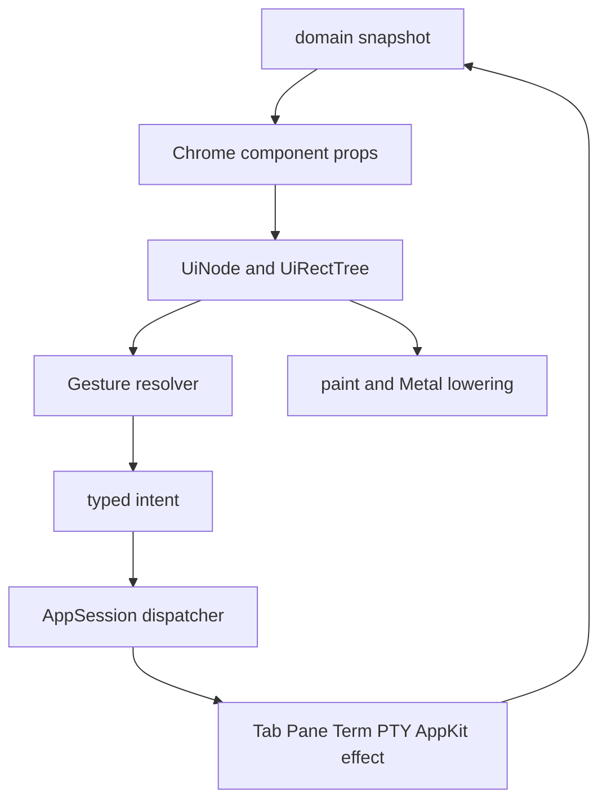

# Chrome 상호작용 컴포넌트 이관 전략

이 문서는 기존 Maru Chrome의 탭·사이드바·분할선·스크롤·overlay를 새 Metal UI
component tree로 **점진 이관**하는 단일 출처다. 공용 typed tree와 paint 경계는
[Metal UI 레이아웃·컴포넌트 시스템](metal-ui-layout.md)이, 실제 창·PTY·AppKit 효과의
소유권은 [macOS 앱 호스트 경계](macos-app-host-boundary.md)가 계속 소유한다.

이 문서는 React/React Native의 component 조합성은 참고하되 React runtime, virtual DOM,
JS callback 또는 component-local gesture state를 도입하지 않는다.

## 1. 결정과 경계

### 1.1 목표

- 모든 새 **Chrome 구조와 상호작용 선언**은 immutable component tree에서 만든다.
- click, hover, press, keyboard focus, drag, pan, scroll, resize의 공통 수명은
  `chrome/ui`의 한 interaction subsystem이 해석한다.
- 실제 `Tab`/`Pane`/`Term` 변형, PTY write/resize, window focus, native drag-and-drop과
  AppKit 호출은 계속 host `AppSession`이 단독 소유한다.
- 기존 동작을 바꾸지 않는 adapter부터 도입하고, component별로 교체한다.

### 1.2 명시적 비목표

- terminal screen/VT parser/scrollback/glyph renderer를 `Text`·`Container` node의 집합으로
  바꾸지 않는다.
- WebView, editor, terminal renderer를 일반 component renderer로 통합하지 않는다.
- 모든 기존 component를 한 PR에서 tree로 재작성하지 않는다.
- `onClick`/`onHover` closure나 `*Pane`/`*Tab` pointer를 public UI props에 넣지 않는다.
- 새 Chrome component에 TUI fallback을 추가하지 않는다. 전환 정책의 조건(설정 UI 비노출, 기존
  config 읽기 호환 유지, parser/lowering 제거는 별도 결정)은 [Chrome 전략](chrome-strategy.md)이
  단일 출처이며 이 문서는 그것을 다시 진술하거나 강화하지 않는다.

### 1.3 책임 분리



`UiNode`는 stable UI identity, rect, clip, visual props와 interaction declaration만 가진다.
`AppSession`은 그 UI identity를 해당 frame의 live domain object로 다시 검증한 뒤에만 effect를
수행한다. 어느 계층도 상대 계층의 cache나 live pointer를 소유하지 않는다.

## 2. 기존 구현 inventory

아래 대상은 이미 동작하는 제품 경로다. “미구현”으로 취급하거나, UI 외형을 바꾸는 대규모
rewrite의 근거로 삼지 않는다.

| 대상 | 현재 책임 | 이관 목표 | 이관 전 반드시 보존할 동작 |
| --- | --- | --- | --- |
| `components/divider.zig` | 순수 divider geometry/hit-test/ratio | `SplitDivider` + shared capture | split 최소 크기 clamp, resize, target split 해제 시 cancel |
| sidebar 폭 divider (`sidebar_divider`) | `AppSession` 폭 drag | `SplitDivider`와 같은 capture, 폭 domain은 host | 최소/최대 폭 clamp, 폭 0(접힘) 상태에서 drag 미시작 |
| dock outer divider (`dock_outer_divider`) | `AppSession` dock 경계 drag | `SplitDivider`와 같은 capture | dock 열림/닫힘 전이 중 offset 유효성, dock 소멸 시 cancel |
| `components/tabbar.zig` | terminal tab bar segment/hit-test | `TabList`/`Tab` composite | select, close, overflow horizontal scroll, drag/drop/detach |
| pane drag (`pane`) | `AppSession` pane move/drop slot | `MovePane` typed intent | drop slot 판정, split 생성/detach, target pane 소멸 시 cancel |
| sidebar group drag (`sidebar_group`) | `AppSession` armed→dragging 2-phase | `ReorderableList` capability | threshold 전 armed 상태의 click 보존, marker/slot 무결성 |
| 주소창 selection drag (`address_selection`) | `AppSession` caret/selection | 이관하지 않는다 — [텍스트 필드 에디터](text-field-editor.md) 범위 | caret/selection 편집 모델, IME, first responder |
| `components/sidebar.zig` | workspace/group/agent row geometry·hit-test·밴드 view·헤더 hit-test | `ReorderableList`를 쓰는 Sidebar composite | group collapse, reorder preview, pin/group invariants, 헤더 아이콘(◧/⚙/+/🔔) 영역, 검색 blur가 키 포커스를 터미널로 되돌리는 규율 |
| `components/file_tree_scrollbar.zig` | scrollbar geometry/track/thumb math | [`ScrollView`](scroll-view.md) | thumb drag, track click, projection/root generation mismatch cancel |
| terminal scrollbar | `AppSession` viewport mutation | 별도 판단(터미널 viewport는 [`ScrollView`](scroll-view.md) 범위 밖) | terminal scrollback/selection/mouse mode와의 입력 우선순위 |
| Session Dock | typed tree + action table + pixel scroll + 검색 필드(query·IME preedit 입력 owner) | 첫 modern consumer를 유지 | refresh anchor, stale action reject, read-only detail worker, `/`·필드 클릭 활성화와 Escape 해제, marked text가 필드·native 후보창에만 보이고 commit된 query만 목록을 필터하는 규율, 256 byte 절단, 검색 키·IME가 재스캔·stat·정렬을 일으키지 않고 terminal PTY로 새지 않음 |
| palette/find/notice/modal/dropdown | 화면별 `State`/view/handle | `Input`/`Menu`/`Popover`/`Dialog` composite | AppKit first responder, IME, Escape/outside-dismiss, keyboard navigation |
| settings/toggle/text field | 화면별 form state | `Input`/`Toggle`/`Select`/`FormRow` | schema ownership, config write, validation/error presentation |

pointer capture의 권위는 현재 **둘**이다. 대부분의 Chrome drag는 `app_session.zig`의
`PointerGestureOwner`가 소유하고, Session Dock은 이미 `chrome.ui.interaction.InteractionState`가
소유한다. 이 문서는 어느 쪽도 즉시 삭제하라고 요구하지 않는다. adapter 단계에서 shared
interaction 결과를 기존 effect path로 변환하고, 각 consumer가 migration gate를 통과할 때에만
해당 `PointerGestureOwner` variant를 줄인다. 위 표의 variant를 **전부** 소진해 union이 `none`만
남기 전에는 interaction 이관을 완료로 표시하지 않는다.

두 권위가 공존하는 동안 §4.2의 "한 pointer stream에 capture owner는 하나"는 다음 순서로 보장한다.

1. **진행 중인 capture가 최우선이다.** 어느 권위든 capture를 들고 있으면 그 stream의 남은
   move/up/cancel은 그 권위에만 간다. pointer가 다른 컴포넌트의 rect 위로 지나간다는 사실은
   소유권을 옮길 근거가 아니다. rect 포함 판정만 보고 capture 없는 쪽으로 이벤트를 넘기면
   진행 중이던 drag가 중간에 멈추고 up을 잃는다.
2. capture가 없을 때만 §4.2의 route를 적용한다. modal 또는 active native overlay가 최상단이며
   `InteractionState`가 그보다 앞서지 않는다.
3. 그 route에서 Chrome이 이겼을 때, 어느 권위가 down을 받을지는 **해당 컴포넌트의 rect 판정**이
   정한다. `InteractionState`가 관할하는 rect(현재는 Session Dock content) 안이면 그쪽이 capture를
   잡고, 그 동안 `PointerGestureOwner`는 `none`을 유지하며 어떤 effect도 시작하지 않는다.

한 stream이 두 권위에 동시에 들어가면 실패다. 이관 중 어느 consumer도 이 순서를 자기 화면에서
다시 정의하지 않으며, 새 권위를 추가하는 PR은 1번 규칙을 자기 진입점에서 먼저 확인한다.

## 3. 공개 component와 내부 capability

공개 component API 표면의 단일 출처는 [Metal UI 레이아웃·컴포넌트 시스템](metal-ui-layout.md)이다.
이 문서는 그 표면을 재정의하지 않고, 상호작용 이관이 **필요로 하는 후보**와 각 후보가 지켜야 할
interaction 계약만 소유한다. 아래 목록을 실제 public API로 여는 결정과 props/slot 정의는
`metal-ui-layout.md`에서 하며, 두 문서가 어긋나면 그쪽이 이긴다.

공개 component는 의미와 접근성 역할이 명확한 작은 집합만 둔다.

```text
Card, Text, Button, Input
Tabs, TabList, Tab
ScrollView
Menu, Popover, Dialog
Toggle, Select, FormRow
SurfaceSlot
```

`Container`는 row/column/flex/gap/align을 제공하는 내부 구조 node다. `Row`, `Column`,
`Flex`, `Box`, `Div`를 제품 API로 늘리지 않는다.

`DragRecognizer`, `PanRecognizer`, `DropTarget`, `PointerCapture`는 visual component가 아니라
internal interaction capability다. component가 capability를 선언하되, 경쟁 판정과 pointer stream
소유는 공용 resolver가 한 번만 한다.

`Badge`, `Tooltip`, `SegmentedControl`, `ReorderableList`는 두 번째 실제 consumer가 같은
keyboard·lifecycle·accessibility 계약을 공유할 때만 public component로 승격한다. 그 전에는
도메인 composite 안에 둔다.

`Input`은 모든 문자열 상태를 하나의 범용 버퍼로 합치는 약속이 아니다. 사이드바 검색, Session Dock 검색,
주소창의 caret/selection 편집, settings의 검증 값은 서로 다른 키·Escape·IME·수명 계약을 가진다. component
tree에는 immutable presentation/semantic props와 opaque intent만 두고, 편집 모델은 해당 consumer의
순수 모델이 소유한다. AppKit first responder와 `NSTextInputClient` bridge는 host가 유지한다. 따라서
새 `Input` API가 생기더라도 기존 `OverlayInput`, Session Dock 검색 필드, 주소창 `TextField`를 자동으로
흡수하지 않으며, 각 이관은 [텍스트 필드 에디터](text-field-editor.md)의 범위·IME gate를 충족해야 한다.
Session Dock 검색은 이미 자체 preedit 버퍼와 commit 규율을 가진 modern consumer이므로, CIM6의 first
consumer를 고를 때 "아직 아무 입력 모델도 없는 화면"으로 취급하지 않는다.

`UiActionId`만으로 keyboard와 accessibility를 표현할 수는 없다. interactive node는 같은 immutable
snapshot에 role, localized label, enabled/selected/expanded/value 및 keyboard focusability를 담은 typed
semantic descriptor를 낸다. Swift adapter만 이 descriptor를 native accessibility element로 투영하고,
Zig tree는 `NSAccessibility` object나 delegate를 보유하지 않는다. descriptor가 아직 없는 consumer는
pointer visual migration만 가능하며 접근성 이관 완료라고 표시할 수 없다.

## 4. Gesture resolver 계약

### 4.1 선언은 data이고 callback이 아니다

아래는 목표 API의 형태일 뿐 현재 구현된 public API라고 주장하지 않는다.

```zig
const tab = ui.tab(.{
    .id = ids.tab(tab_id),
    .select_action = select_action,
    .close_action = close_action,
    .gesture = .{ .drag = .{
        .payload = .{ .tab = tab_id },
        .axis = .horizontal,
        .threshold = .system,
    } },
}, children);
```

declaration은 stable component ID와 opaque action/drag payload ID만 낸다. `UiActionId`는
published snapshot의 action table에서만 domain intent로 resolve된다. component는 `AppSession`,
provider, filesystem, PTY, live pointer를 import하지 않는다.

### 4.2 input route와 승자 선택

입력은 먼저 **어느 surface가 받을 수 있는지** 판정한 뒤에만 gesture 경쟁을 시작한다.

```text
modal or active native overlay
  > explicit Chrome control (divider, thumb, tab close)
  > surface input policy
      terminal mouse reporting enabled -> PTY input
      otherwise                   -> component gesture resolver
  > unclaimed terminal input
```

여기서 explicit Chrome control은 **같은 completed snapshot의 visible rect/clip을 실제로 hit한
sibling**만 뜻한다. tab bar·divider·scrollbar처럼 terminal body 밖의 Chrome rect는 terminal mouse
reporting보다 먼저 처리할 수 있지만, terminal body 안의 보이지 않는/비-modal overlay가 입력을
전역 소비해서는 안 된다. non-modal overlay는 자기 rect 밖에서 pass-through한다. terminal body의
wheel/selection/mouse reporting은 기존 terminal input policy가 계속 결정하며, `ScrollView`라는 이름만으로
Chrome scroll로 바꾸지 않는다. keyboard 소유 판정은 pointer routing의 대체 판정으로 재사용하지 않는다.

keyboard 소유는 현재 **두 축**이 나눠 가진다. `terminalOwnsInput`은 host가 AppKit first responder를 어디에
둘지 정하는 Swift 쪽 단일 출처이고, `InputFocus`는 Zig 안에서 키를 어느 chrome 소비자에게 보낼지 고르는
별개 enum이다. 새 chrome 입력 소비자를 추가하는 PR은 **두 축을 함께** 갱신해야 한다 — `InputFocus`에만
넣고 `terminalOwnsInput`에 빠뜨리면 Zig는 키를 라우팅하는데 host는 first responder를 터미널로 되돌려
입력이 어긋난다. 이관은 이 두 축을 하나로 합치지 않으며, 각각의 소유자를 옮길 때 그 사실을 PR에 적는다.

keyboard focus는 이 pointer route를 따르지 않는다. 어느 창이 key event를 받는지는 AppKit first
responder가, 그 안에서 terminal이 키를 갖는지는 `terminalOwnsInput`이 계속 단일 출처로 정한다.
component tree가 소유하는 것은 그 뒤의 **focusable node 집합과 이동 순서**뿐이다. 즉
`InteractionState.focused`는 published snapshot의 focusable node 사이에서만 이동하고, terminal이
키를 갖는 동안에는 새 focus를 요구하지 않으며, focus를 가진 node가 사라지면 host에 요청하지 않고
focus를 비운다. keyboard로 실행하는 action은 pointer와 같은 action table·같은 live domain
validation을 통과한다. modal/overlay가 열려 있는 동안의 focus 순환은 그 overlay의 기존 계약이
소유하며, 이 문서는 그것을 generic tree로 흡수하지 않는다.

그 뒤 같은 pointer stream 안에서는 다음 우선순위를 적용한다.

```text
captured gesture
  > resize thumb/divider
  > explicit drag handle/tab/sidebar reorder
  > scroll pan
  > press/click
```

한 pointer stream에는 정확히 하나의 capture owner만 존재한다. pointer up, cancel, window
deactivate, component removal, snapshot/window epoch mismatch, **modal 또는 native overlay 진입**은
모두 action 없이 capture를 취소한다. modal이 §4.2 라우팅의 최상단이므로, 진행 중이던 capture는
modal이 열린 그 순간 cancel되어야 남은 move/up을 영영 못 받는 dangling capture가 생기지 않는다.
capture가 modal보다 우선한다는 예외는 두지 않는다.
macOS v1은 mouse pointer 하나만 쓰더라도 event DTO에는 `pointer_id`를 둬 future touch가 state를
암묵적으로 공유하지 못하게 한다.

### 4.3 reorder/pane drag와 resize는 같은 mutation 규칙을 쓰지 않는다

tab/sidebar/pane **reorder와 move**의 drag preview는 source layout을 mutation하지 않는다. ghost,
insertion rule, hover, temporary transform은 `InteractionState`에서 paint-only로 파생한다. up 시
host가 `ReorderTab{ source, destination }`, `MovePane{ source, destination }` 같은 typed intent를
현재 live model에 재검증하고 한 번 commit한다.

`ResizeSplit`은 예외다. divider/sidebar resize는 compatible capture의 매 move마다 host가 현재
pointer 좌표를 domain clamp에 적용하고, pane geometry·terminal PTY size를 즉시 갱신하는
**continuous geometry effect**다. 공용 resolver는 capture와 cancel만 소유하고 ratio 계산·최소 크기
clamp·resize fan-out은 기존 host/domain 경로가 소유한다. persistent configuration write가 있다면
up에서만 확정하며, resize 도중 split/window가 사라지면 effect 없이 cancel한다. 따라서
`ResizeSplit`을 reorder와 같은 one-shot drop intent로 일반화해서는 안 된다.

이 continuous effect는 §7의 "pointer move마다 비용을 만들지 않는다"에 대한 **명시적 예외**이며,
대신 다음을 지킨다. 한 tick에 여러 move가 들어오면 **마지막 좌표 하나만** clamp·geometry·PTY
resize에 반영한다(coalesce). 좌표가 이전 적용값과 같은 cell/pixel로 clamp되면 effect를 재실행하지
않는다. 즉 move 이벤트 수가 아니라 tick 수와 실제 geometry 변화가 resize fan-out의 상한이다.
allocation·filesystem I/O·worker wait 금지는 이 예외에서도 그대로 적용된다.

이 규칙은 divider resize만의 것이 아니라 **모든 continuous drag**(scrollbar scroll 포함)에 같이 적용된다.
소비 지점은 tick이며 up이 아니다 — up에서만 적용하면 사용자는 끄는 동안 아무 반응도 보지 못하고 손을 뗄
때 한 번에 움직이는 것을 본다. 그것은 coalescing이 아니라 continuous effect의 부재다.

### 4.4 terminal tab drag는 provisional live reorder다

이 절은 §4.3 reorder 규칙의 **특수화**이지 예외가 아니다. §4.3대로 source layout과 model은
mutation하지 않고, 그 위에서 "preview를 어떻게 보여줄지"만 정한다. ghost나 insertion line 대신
인접 tab의 자리를 실제로 바꿔 보이는 preview를 쓴다는 뜻이며, model commit 시점은 §4.3과 같은
up 한 번이다.

terminal tab drag는 **provisional live reorder**를 쓴다. drag 중에는 인접 tab의 위치를 즉시 바꿔
direct manipulation의 즉시성을 유지하되, 그 순서는 아직 model이 아니다.

- drag 시작 시 host가 **시작 순서를 transaction에 보관**한다. 이 transaction은 drag 수명 동안만
  살아 있고 다른 mutation과 공유하지 않는다.
- drag 중 보이는 순서는 그 transaction에서 파생한 provisional 배열이다. 이 배열은 paint와 hit-test가
  함께 쓰지만 `Tab` model, persisted workspace 순서, PTY, config write를 건드리지 않는다. **"보이는
  것이 조작되는 것"은 포인터에 한정되지 않는다** — 같은 배열이 키보드 탭 전환(다음/이전)과 탭 바
  스크롤 대상 판정에도 권위를 갖는다. drag 중 파생된 값은 영속 상태(스크롤 offset 등)에 쓰지 않는다.
- **up에서만** 한 번 commit한다. commit destination의 권위는 §5대로 up 좌표를 현재 published
  tree에 재hit-test한 결과이고, 그 좌표가 유효한 destination을 못 짚으면 commit 없이 시작 순서를
  복원한다.
- **진행 중인 drag는 어떤 overlay보다 먼저 자기 pointer 이벤트를 받는다.** overlay가 up을 삼키면
  drag가 끝나지 못해 preview와 ghost가 화면에 박히고 사용자가 되돌릴 방법이 없다. overlay마다
  예외를 두는 대신 라우팅 순서로 보장한다 — 새 drag를 시작하는 down만 overlay가 먼저 본다.
- drag는 **primary 버튼에서만** 시작하고 끝난다. 다른 버튼의 press/release는 진행 중인 drag를
  가로채지도, 새로 arm하지도 않는다.
- Escape, pointer cancel, window deactivate, modal 진입, source 또는 target tab removal은 모두
  **시작 순서를 복원**하고 effect 0으로 끝난다. 복원은 transaction 하나를 되돌리는 것이므로 부분
  적용된 중간 순서를 남기지 않는다. 사용자가 유발하지 않은 비-모달 알림(토스트)은 이 목록에
  **없다** — 배경 이벤트가 진행 중인 사용자 조작을 파기해서는 안 되고, 그것이 up을 가로막는
  문제는 위 라우팅 순서가 이미 없앤다. snapshot/window epoch mismatch는 이 소비자의 축이 아니다
  (§5의 generation gate는 `InteractionState` 소비자에 적용되며, terminal tab은 아직 그 축으로
  이관되지 않았다 — [검증 매트릭스](verification-matrix.md)의 CIM4 행이 그 경계를 소유한다).
- drag가 살아 있는 동안 다른 경로(단축키 select/close, 원격 관측의 Term 소멸)가 tab 집합을
  바꾸면 provisional 배열을 폐기하고 시작 순서로 복원한 뒤 그 변경을 적용한다. provisional 배열을
  새 집합에 맞춰 재봉합하지 않는다.

이 선택은 기존 영구 live reorder(사용자가 손을 떼기 전에 model이 이미 바뀜)와 preview-only
reorder(즉시성 상실) 사이에서, 즉시성은 유지하고 cancel만 안전하게 만들기 위한 것이다. 제품
승인을 받은 결정이며, `TabList` 이관은 이 계약을 구현한다.

## 5. identity, snapshot, lifecycle

모든 pointer/action/drag result는 아래 세 값을 함께 검증한다.

```text
owning window/session epoch
+ completed UiRectTree snapshot generation
+ stable component/domain identity
```

array index, frame-arena address, raw `*Pane`/`*Tab` pointer는 public identity가 아니다. host의
action table은 identity를 current live object로 해석할 때 한 번 더 validate한다. stale/unknown/
ambiguous 대상은 no-op/cancel이고, 이전 snapshot의 pointer up이 새 component action을 실행해서는 안 된다.

현재 ML2b click interaction의 `reconcile`은 tree가 어떻게 달라졌는지 **비교하지 않고**, 모든 tree
replacement에서 capture를 무조건 cancel한다. 이것이 현행 기본값이고, 이 문서는 그것을 완화하는
어떤 해석도 허용하지 않는다. "geometry가 그대로면 carry해도 된다"는 현행 계약이 아니다.

다만 drag와 continuous resize는 매 move마다 visual snapshot을 갱신하므로, 이 기본값 위에서는
capture가 첫 move에 죽는다. 그래서 carry는 **명시적 verdict가 도입될 때에만** 열린다. capture를
다음 snapshot으로 carry하려면 새 tree가 정확히 하나의 같은 component identity를 가지며, 그 node의
`gesture compatibility key`(gesture kind, enabled policy, owner window/session epoch, source domain
identity)가 변하지 않았다는 reconcile verdict가 필요하다. 이 key의 네 요소 중 **epoch와 domain
identity는 neutral `chrome/ui`가 모른다** — `InteractionState`는 `UiId`만 안다. 따라서 host가 그 둘을
opaque 값으로 주입하고 pure module은 **같은지만** 비교한다. 그것이 무엇을 뜻하는지 해석하는 쪽은
계속 host다. 이 verdict가 없거나 duplicate/disabled/
clip-removed이면 cancel한다. 이 verdict는 §8 CIM1이 소유하며, CIM2 이후의 어떤 consumer도
verdict 없이 drag/resize capture를 snapshot 너머로 유지해서는 안 된다. up의 effect는 언제나
**현재** action table과 live domain validation을 다시 통과해야 하며, 이전 action ID를 재사용하지 않는다.

reorder drag의 commit destination 권위는 **up 시점의 pointer 좌표를 현재 published tree에 다시
hit-test한 결과**다. 마지막 move가 만든 preview 배열이 아니다. 두 값이 다르면 좌표 재판정이
이기고, 그 좌표가 유효한 destination을 못 짚으면 commit 없이 cancel한다.

surface와 window 이동·detach/reattach은 해당 surface의 capture, hover, keyboard focus, pending
drop target을 모두 revoke한다. 다른 window/surface가 같은 numeric ID를 재사용해도 이전 epoch의
intent는 수락하지 않는다.

## 6. SurfaceSlot: terminal을 component로 감싸는 방법

terminal, WebView, editor는 `Text` node 집합이 아니다. component tree에는 외부 renderer의 rect,
clip, z-order, focus/input policy만 나타내는 `SurfaceSlot` leaf를 둔다.

```text
PaneSurface
├── TabList
├── SurfaceSlot (terminal | web | editor)
├── ScrollView or terminal scrollbar
├── SplitDivider
└── selection/find/IME/drag-preview overlay
```

`SurfaceSlot`은 이미 host가 소유한 stable `surface_id`와 kind, clip/rect, focus action, input
policy만 선언한다. 이는 새 `SurfaceRuntime`/`SurfaceKind` case를 발급하거나 surface를 create·adopt·persist하는
API가 아니며, `ChromeLabSurface` 같은 test-only drawable과도 다르다. terminal renderer는 기존 screen
snapshot과 Metal frame을 계속 소유하며, host만 resize와 PTY input을 실행한다. WebView/editor도 같은
slot geometry를 받아 자기 renderer를 배치하지만, renderer implementation을 `chrome/ui`로 import하지 않는다.

Chrome draw·hit-test·external renderer frame은 같은 completed slot rect/clip snapshot을 소비한다.
서로 별도 rect를 재계산하거나 main thread에서 terminal screen을 tree DTO로 복사하면 실패다.

## 7. performance, platform, security

- UI tree/action/gesture candidate는 fixed-capacity 또는 명시된 bounded arena에서 만들며 pointer move마다
  heap allocation·filesystem I/O·worker wait를 하지 않는다. 유일한 예외는 §4.3의 continuous
  `ResizeSplit` geometry/PTY effect이며, 그마저 tick당 최종 좌표 1회로 coalesce하고 allocation·I/O·
  worker wait 금지는 그대로 받는다.
- consumer는 candidate 수, drag preview buffer, action table의 상한을 PR에서 선언한다. 상한 초과나
  candidate build 실패는 partial snapshot을 publish하지 않고 마지막 completed snapshot을 유지하며,
  영향을 받은 capture는 effect 없이 cancel한다. "다음 frame에서 다시 시도"가 unbounded allocation 또는
  stale target commit의 우회가 되어서는 안 된다.
- terminal output, PTY reader, provider scan, WebView process work는 main/AppKit input thread에서
  실행하지 않는다. worker는 immutable completion만 publish한다.
- transform/drag preview는 layout rect를 바꾸지 않는 paint-only state다. future transform은 forward/inverse
  mapping을 하나의 module에서 계산해 paint/hit-test가 같은 result를 소비한다.
- Swift는 AppKit first responder, IME, native accessibility, OS drag-and-drop 호출을 소유한다. Zig
  component는 OS object/closure를 보유하지 않는다.
- native file/text drop은 host가 target `SurfaceSlot`과 overlay/modal guard를 다시 확인한 뒤에만
  실행한다. untrusted payload가 action ID, renderer selection, shell input을 직접 지정할 수 없다.
- generic component가 terminal mouse mode, selection, clipboard, OSC security policy를 우회하지 않는다.

### 7.1 native external drop은 gesture resolver의 payload가 아니다

macOS file/text drop은 OS가 소유한 별도 진입점이다. Chrome tree는 현재 completed
`SurfaceSlot` rect/clip만 제공하고, host는 drop 시점에 modal/overlay guard와 live target을 다시
판정해 `routed`, `not_applicable`, `refused`를 구분한다. `.refused`는 다른 surface 또는 generic
`DropTarget`으로 폴백하지 않으며 payload 삽입·focus 이동도 하지 않는다. `.routed`일 때만 host가
대상 surface를 고정한 뒤 기존 보안/clipboard/PTY paste 경로를 실행한다. 이 경로를 pointer drag
payload나 action ID로 표현하면 OS drag lifecycle과 terminal paste 보안 경계가 섞이므로 금지한다.

## 8. 점진 이관 순서와 검증 gate

각 단계는 최신 `main`에서 한 PR로 진행한다. 다음 단계는 이전 단계가 merge되고 회귀 gate가
green일 때만 시작한다.

이 순서는 [Metal UI 레이아웃·컴포넌트 시스템](metal-ui-layout.md)의 B1 generic Button 이관과 같은
파일(`ui/tree.zig`, `ui/interaction.zig`, `ui/button.zig`)을 건드린다. **B1 시퀀스가 선행이다.**
CIM1은 B1 이관 PR이 전부 merge된 뒤에 시작하고, 그 전에는 CIM0(문서)만 유효하다. 두 축을 동시에
열지 않는다.

1. **CIM0 — inventory와 contract (이 문서)**: 현행 gesture/renderer/effect ownership, migration
   non-goal, unresolved UX 결정을 고정한다. 코드 변경은 없다.
2. **CIM1 — interaction adapter**: pure module은 이미 있다 — `chrome/ui/interaction.zig`가
   `InteractionState`(hovered/focused/capture)와 `dispatch`/`reconcile`/`deactivate`/`activateFocused`로
   **click 수명**을 소유한다. 이 단계는 그것을 **drag 수명으로 확장**한다:
   - `UiPointerEvent`에 published snapshot generation을 실어(현재는 phase·좌표·button·timestamp뿐),
     이전 tree의 up이 새 action을 실행하지 못하게 한다.
   - drag 개념을 도입한다. 지금 `Capture`는 click용 `action_id`만 들고 drag payload·threshold·
     axis가 없다.
   - generic action/drag intent table을 만든다. action table은 지금 컴포넌트 로컬로만 있고
     (`session_dock`·`archive_detail`의 `ids.Table`) 공용 형태가 없다.
   - §5의 `gesture compatibility key` reconcile verdict를 **이 단계가 소유한다** — 그것 없이는
     CIM2의 continuous resize가 첫 move에 cancel되므로 후속 단계로 미룰 수 없다.

   §2의 두 capture 권위 상호배제는 이미 제품 경로에 있고(`6d9c8c59`) 다섯 gesture 라우팅 fixture가
   그것을 고정하므로, 이 단계가 다시 만들지 않는다. 기존 `PointerGestureOwner` effect path도 유지한다.
3. **CIM2 — SplitDivider**: 현 divider geometry를 재사용해 press/capture/cancel adapter 하나로
   옮긴다. split tree removal, resize clamp, WebView divider pass-through AppKit E2E를 포함한다.
4. **CIM3 — [`ScrollView`](scroll-view.md)**: file tree와 Session Dock 중 하나를 first consumer로 삼는다.
   wheel/thumb/track click/keyboard, scroll anchor, stale projection cancel을 fixture와 capture로 고정한다.
5. **CIM4 — TabList/Tab**: §4.4의 provisional live reorder를 구현해 terminal tab을 이관한다.
   select/close/overflow scroll/reorder/drop/split/detach와 terminal mouse routing을 분리 검증하고,
   §4.4의 복원 트리거(Escape/cancel/deactivate/modal 진입/tab removal/epoch mismatch)마다 시작 순서
   복원과 effect 0을 각각 고정한다.
6. **CIM5 — Reorderable Sidebar**: group·pin·agent-row model은 domain에 두고, row geometry와 drag
   preview/cancel만 common capability로 바꾼다.
7. **CIM6 — Input/overlay composite**: 한 PR에서 palette/find/settings를 일괄 이관하지 않는다. 먼저
   한 consumer의 기존 keyboard/Escape/focus 계약을 `Input`, `Menu`, `Popover`, `Dialog` props로
   명시하고, 주소창 caret/selection 편집은 [텍스트 필드 에디터](text-field-editor.md)의 별도 범위로
   유지한다. AppKit first responder/IME/accessibility의 실제 host E2E가 없으면 완료로 표시하지 않는다.

각 단계가 무엇을 증명해야 완료인지와 무엇을 완료로 보지 않는지는
[검증 매트릭스](verification-matrix.md)의 "Chrome 상호작용 이관 CIM gate"가 단일 출처다. 이 문서는
순서와 책임 경계를 소유하고, 단계별 종료 gate는 그쪽을 따른다. §9의 공통 완료 조건은 그 gate와
별개 축이며 두 가지를 모두 충족해야 한다.

모든 구현 PR은 최소한 다음 증거를 남긴다.

- pure interaction state-machine: capture winner, threshold, cancel, stale generation, disabled action.
- 기존 component와 새 component가 같은 scenario에서 내는 typed intent/commit verdict 비교.
- 실제 AppKit event → Metal frame → host effect E2E; terminal/PTY 변화가 있으면 controlled PTY fixture.
- Chrome Lab readback. 현재 `macos-chrome-lab-smoke`가 받는 축은 scenario와 font뿐이고 render
  scale 축은 없다. `macos-chrome-lab-font-review`의 `-review-2x.png`는 ffmpeg nearest-neighbor로
  키운 **리뷰용 확대본**이지 2× backing scale 렌더가 아니다. 따라서 이관 PR의 기본 gate는 제품
  Metal PNG + JSON readback 하나이며, 시각 변화 PR은 그 PNG를 PR 본문에 `gh attach`한다. render
  scale 1×/2×가 실제로 필요한 consumer는 [Metal UI 레이아웃·컴포넌트 시스템](metal-ui-layout.md)의
  scale-normalized rect gate를 쓰고, Chrome Lab에 scale 축을 추가하려면 그 PR이 도구 확장을
  자기 범위로 선언한다.
- clip/hit rect/action ID/snapshot generation 및 final allocation/worker pending의 structured summary.

## 9. 완료와 보류 기준

이 절은 **모든 consumer에 공통으로 적용되는 최소 조건**이고, 단계별 종료 gate는
[검증 매트릭스](verification-matrix.md)의 "Chrome 상호작용 이관 CIM gate"가 소유한다. 둘은
경쟁하지 않는다 — 한 CIM PR은 매트릭스의 해당 단계 gate와 아래 공통 조건을 **모두** 충족해야 하며,
어느 한쪽만으로 완료를 주장할 수 없다. 두 문서가 같은 항목을 다르게 적으면 그것은 drift이므로
같은 PR에서 함께 고친다.

한 consumer가 새 tree를 사용한다고 전체 interaction system 완료가 아니다. 다음 중 하나라도 없으면
해당 consumer는 부분 이관이다.

- pointer capture가 window deactivate·surface removal·snapshot swap에서 action 0으로 cancel되는 증거
- draw/hit-test/clip/external surface rect가 같은 published generation을 쓰는 증거
- keyboard-only 동등 action과 typed semantic descriptor(role/name/state/value), 또는 명시된 접근성
  보류 사유와 제품 UI의 제한 표시
- 실제 host effect가 stale target을 거부하는 E2E
- 기존 제품 동작을 바꾸는 경우 사용자 승인과 문서/fixture 갱신

VoiceOver/IME/first-responder 전이는 headless pointer fixture만으로 증명할 수 없다. 이를 건드리는
consumer PR은 native host E2E 또는 명시된 수동 검증 절차와 결과를 남긴다. 테스트가 아직 없는 경우
그 사실을 release-ready 근거로 바꾸지 않는다.

grid, static transform, animation, multi-touch, rich accessibility tree는 이 문서의 first migration
범위 밖이다. 필요가 증명될 때 각각 별도 typed contract와 성능/host gate를 연다.
