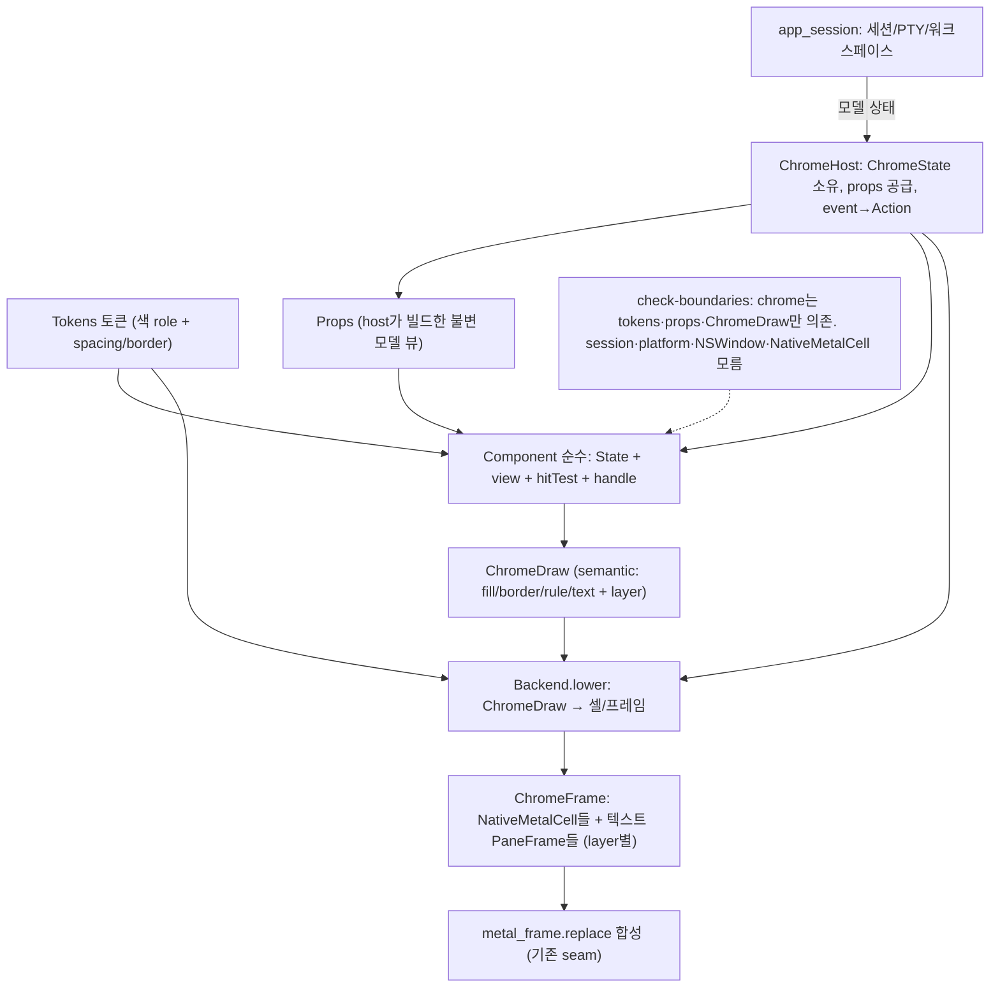

# Chrome 전략 — 디자인 시스템 구조 설계

chrome(탭바·사이드바·divider·focus 테두리·탭점·팝업·모달)을 **이식 가능한 디자인 시스템**으로 재구성하는 1차 구조 설계다. 터미널 콘텐츠(셀·글리프)는 이 문서의 범위가 아니다 — 코어 렌더러 경로를 그대로 둔다. chrome만 이 디자인 시스템을 따른다.

### Chrome 전용 전환 정책

새 디자인 시스템과 새 제품 chrome surface는 **rich/Metal Chrome만** 대상으로 한다. cell-grid TUI
룩(`chrome.theme = tui`)은 **제거됐다**(2026-08-19) — 이 문서가 오래 예고하던 그 전환이다.

**제거 방식과 기존 config 처리.** config 키 `chrome.theme`을 통째로 없앴다(값이 `rich` 하나만 남으면
선택지가 없는 키다). **`chrome.preset`도 함께 없앴다** — 그 키의 존재 이유는 "룩 + 탭 두 축을 한 번에
고르는 큐레이션"이었는데 룩 축이 사라져 `chrome.tab-style`과 1:1이 됐기 때문이다. 축이 하나면 같은 것을
두 이름으로 설정하는 셈이고, 설정 UI에도 노출되지 않아 발견 경로가 파일 직접 편집뿐이었다. 앞으로 다른
chrome 축(밀도·모서리 등)이 생겨 다시 묶을 값이 있으면 enum + switch 하나로 되살린다.

**기존 파일은 고치지 않는다** — loader가 forgiving이라 남아 있는 `chrome.theme`/`chrome.preset` 줄은
"알 수 없는 key — 무시" diagnostic만 내고 나머지 줄은 그대로 적용된다(그 동작은 `loader.zig`의
"제거된 chrome.theme 줄이 있는 옛 config도 나머지 키를 잃지 않는다" 테스트가 고정한다). migration
스크립트도 파일 자동 수정도 없다.

> **하나는 화면이 바뀐다.** `chrome.theme = tui`는 렌더가 이미 rich였으므로 제거해도 무변화다. 반면
> `chrome.preset = capsule`(또는 `cutout`)을 쓰던 파일은 그 줄이 무시되면서 탭 스타일이 기본
> `underline`으로 돌아간다 — `chrome.tab-style = pill`처럼 개별 축으로 한 줄 바꾸면 복구된다.

**아직 남은 것 하나.** 렌더 경로의 셀 밴드 갈래(`sidebar.zig`의 `has_radius == false`)는 코드에 그대로
있다. 그 분기는 `chrome.theme`이 아니라 **quad의 corner radius**로 갈리므로 config 축 제거와 독립이다.

**실측(2026-08-19)**: 그 갈래 안에 런타임 프로브를 넣고 `test-macos-app-host-abi` 전 범위(3,600여 개)를
돌리니 **도달 0회**였다 — `Tokens.rich`가 `corner_radius_px = 8`을 깔기 때문이다. 제거 후보이지만
**테스트가 닿지 않는 상태**(특정 드롭 타깃·그룹 헤더 조합에서 radius 0인 quad가 나올 여지)가 남아 있어,
제거는 그 경우를 먼저 훑은 뒤 별도 작업으로 한다. 여기서 지우지 않은 이유가 그것이다.

새 Metal UI의 component tree·typed flex layout·paint/Metal 경계는 [Metal UI 레이아웃·컴포넌트 시스템](metal-ui-layout.md)이 단일 출처다. 이 문서는 그 시스템이 소비하는 chrome token·semantic draw·host 구조를 소유한다.

이 문서의 기존 `components/*.zig`별 `view`/`hitTest` 컨벤션은 cell-grid 호환 경로와 이미 이주된
legacy component의 계약이다. 새 `UiNode` tree component는 그것을 복제하지 않고
`metal-ui-layout.md`의 `build → ui/paint_style → ui/paint → ui/interaction` 경계를 따른다.

⚠️ **이 컨벤션은 유지 대상이 아니라 전환기 형태다.** 지금 chrome 컴포넌트는 두 갈래로 나뉘어 있다 —
`UiNode` 트리를 짓고 published rect에서 히트테스트를 파생하는 쪽(`session_dock`·`archive_detail`,
프리미티브 `divider`)과, rect를 직접 계산해 ops를 내고 `hitTest`를 **따로** 유지하는
쪽(`notifications`·`palette`·`find`·`notice`·`context_menu`·`settings`·`sidebar`·`tabbar`). 후자는 "보이는
것 == 눌리는 것"을 자료구조가 아니라 **규약**(같은 헬퍼를 view·hitTest가 함께 부른다)으로 지키므로 한쪽만
고치면 어긋난다. 목표는 전자이며, 새 컴포넌트는 후자를 새로 만들지 않는다. 이주 단계와 블로커는
`plans/metal-ui-layout.md` §8 ML6.

이 문서는 chrome 레이어(L3)의 **목표 구조와 점진 경로**를 정의한다. chrome이 속한 4층 위상(renderer 계약·session core·chrome·platform 어댑터), 두 번의 추출(chrome + session core), 전체 시퀀싱, 이식성 현실은 상위 단일 출처 [레이어링과 이식성 전략](layering-and-portability.md)을 따른다. 단일 출처: 구현이 진행되면 이 문서를 코드와 맞춘다([project-rules](project-rules.md#문서와-설명)).

> **현황(구현 진행)**: C0(Notice)·S1(구조-무효화)·**C1(palette·find 이주)**·**C2(divider 이주)**·**C3a(sidebar 이주)**·**C3b(tabbar hit-test 이주)**·**C4a(rich 토큰셋)** 완료. 두 오버레이는 이제 `src/chrome/components/{notice,find,palette}.zig`(neutral State+view+handle, 헤드리스 테스트)이고, `src/chrome/host.zig`(`ChromeHost`)가 입력 라우팅·draw 수집을, platform(`app_session.zig`)이 props/tokens 빌드·카탈로그 행 주입·ChromeDraw→cell lowering(`rasterizeOverlayCells`)을 맡는다. 레거시 `command_palette.zig`/`find_overlay.zig`의 UI 상태·`build*Frame`·`handle*Key`는 **제거**됐고, palette는 카탈로그 결합 필터(`command_palette.filter`/`actionAt`)만 platform에 남는다(neutral chrome이 `command_catalog`를 import 못 함). 입력 caret은 cursor-role fill → 오버레이 `PaneFrame.cursor` → `setCursorVisible` suffix-trim으로 **터미널 커서 깜빡임을 재활용**하고, 한글 2칸 폭·IME 조합 표시도 터미널과 같은 경로를 공유한다. **C2(divider)**는 `chrome/components/divider.zig`(마우스 hit-test 컴포넌트의 첫 선례 — State 없는 순수 `hitTest`/`view`(Rule op 선)/`dragRatio`)로 이주했고, platform이 app `*Split` 매핑·드래그 상태(§6 라이브 포인터)·Rule op→부분사각형 lowering을 맡는다(divider는 pane chrome 셀이라 overlay rasterizer가 아니다). **C3a(sidebar)**도 `chrome/components/sidebar.zig`(hit-test 순수 6함수 + 밴드 view; 제목 glyph는 platform `buildSidebarTitleFrame` 유지, 드래그 재정렬은 인덱스 기반)로 이주했다. **C3b(tabbar)**는 탭 컬럼 분할 hit-test를 `chrome/components/tabbar.zig`의 `Metrics` 메서드로 이주했다(활성 밴드는 platform 단일 셀 — round-trip 회피; 라이브 `*Pane`·드롭·제목 glyph는 platform). 이로써 chrome hit-test(divider·sidebar·tabbar)가 전부 컴포넌트화. **C4a(rich 토큰셋)**도 완료 — `Tokens.rich`가 tui의 sidebar_active-공유 role을 분리 파생색으로, config `chrome.theme = tui|rich` 분기(컴포넌트·lowering 불변). 아래 §3~ 표는 이주 **전** 출발 스냅샷(설계 근거 보존)이다. **C4b(GPU 렌더 프리미티브)** 완료 — metal SDF quad/shadow·`ChromeDraw.quad`+모양 토큰·사이드바 둥근 밴드·모달 둥근 배경/테두리/그림자/패딩·tabbar §6 픽셀 retrofit(`segCols` 단일 소스)·둥근 탭+vertical gradient(draw layer 3분할). **U(C4b 이후): UI 형태 다듬기** — 사이드바 세로 카드 + 좌측 maru-accent(앰버) 막대(U1)·카드 레이아웃(U2)·가로 탭 VSCode식(U3 — 활성 탭 평평한 약한 배경 + 하단 maru 앰버 언더바(active indicator), 둥근 밴드·gradient 폐기; 활성 pane은 사각 ring 대신 탭 언더바로 일원화; 탭 전용 폭 **하한**(`tab_width_cols` — 탭이 적어 남으면 바를 균등 분할해 꽉 채우고, 많아지면 이 값 아래로는 줄지 않는다)·세로 패딩(`tab_bar_pad_y_px`, 제목 가운데)·넘치면 우측 ‹› 가로 스크롤(`tabLayout` 단일 소스 + `tab_scroll_cols`→`segCols`, `eff_scroll` clamp로 stale 복구, rich 고정폭만; ‹› affordance(사각 버튼·hover 색·클릭 가능 영역 pointingHand 커서·스크롤 여지 방향만 강조[경계 muted=부분 탭 잘림 단서]) + 트랙패드 2-finger 가로 스와이프(`scroll_wheel` delta_x, ABI v44) 완료 — **U3 전부 완료**)), **U-tab2(탭 연결형 cutout — U3 후속, '강한 기본' 모던화)** — U3의 활성 탭 '평평한 약한 배경(`sidebarActiveBg`)'을 **터미널 본문색(`theme.background`) cutout**으로 바꿔, 활성 탭이 strip(`sidebarBg`)에서 도려낸 듯 아래 본문과 이어져 보이게 한다(깊이: strip↔본문). **포커스 구분은 배경이 아니라 하단 언더바 색으로 일원화** — 포커스 pane=maru 앰버, 비포커스 pane=muted(모든 활성 탭 배경은 본문색으로 통일). 언더바 두께는 탭바 하단 하이라인(`line_thickness_px`)과 분리한 전용 토큰 **`tab_underbar_px`**(rich 3px, 하이라인보다 굵게)로 active/focus 신호를 또렷하게 한다. 본문색 cutout quad가 layer 2에서 하이라인을 **활성 탭 구간만** 덮어 '연결'이 끊기지 않는다(`appendActiveTabHighlight` 단일 출처). 또 탭 제목의 **번호 prefix(`N `)를 제거**(브라우저/VSCode/Warp식 — Term 번호는 단축키에 매핑되지 않아 시각 군더더기였다; `tabNumberLabel`·`numberPrefixCols` 폐기, rename in-place caret은 prefix 0). 이 cutout 룩은 **강한 기본 1개**이고, pill·underline 등 다른 탭 스타일은 후속 **`chrome.tab-style`(connected|pill|underline) 직교 축**(Spacing의 enum 토큰 — view·hitTest가 같은 토큰을 읽어 §5.4 레이아웃 정합 유지)으로 노출할 계획이다. 이 축은 `chrome.theme`(룩 tui|rich)·`theme.preset`(색)과 **직교**로 공존하며, 더 가면 여러 축을 묶은 `chrome.preset`(레이아웃 프리셋, `theme.preset` 패턴 동형)으로 큐레이션한다. **U4(사이드바 헤더 재설계)** — 사이드바 상단에 **검색바**(세션 카드를 이름·git 브랜치·폴더(cwd)로 실시간 필터; 검색 영역 밖 클릭/Esc로 blur해 키 포커스를 터미널로 되돌린다 — rename focus-loss와 같은 규율) + 우측에 **사이드바 접기(◧)·view options(⚙)·새 워크스페이스(+) 아이콘**(접기는 사이드바를 폭 0으로 완전히 숨기고 — pt 보존 — 좌상단 신호등 옆에 펼치기 버튼만 남긴다; 그 버튼 frame은 `metal_frame.replace`가 활성 커서 suffix '앞'에 끼워 터미널 위에 보이게 한다), view options(⚙)는 클릭 시 **체크박스 패널**(rename 컨텍스트 메뉴와 같은 `chrome/components/context_menu.zig`·`context_menu_items_buf`를 `view_options_menu` 플래그로 분기 — 라벨에 ✓ prefix로 on/off, 토글해도 닫히지 않고 바깥 클릭/Esc로 닫음)을 띄워 브랜치·폴더 표시를 토글한다(이름은 항상 표시). 토글은 `buildSidebarTitleFrame`이 `sidebar.show-branch`/`sidebar.show-folder`로 카드 줄을 즉시 게이트하고, config 파일에 양방향 반영한다(`sidebar_config_dirty` → ABI v63 `take_sidebar_config_dirty` 1회성 신호 → Swift가 `serialize_sidebar_config` 텍스트를 atomic write, 주석 보존 — `take_bell`과 같은 drain 패턴). 헤더는 **두 밴드**(`titlebar_strip_px` + `chromeBarHeightPx()` — 창 오른쪽 신호등 띠·상단 바와 한 줄로 맞춘다. 옛 `cell_height × 3.0`은 왼쪽만 terminal 폰트에 묶어 검색 줄이 탭 바와 어긋났다. 밴드 정의는 docs/file-explorer.md §3.5 단일 출처): 아이콘 줄 = 좌측 네이티브 신호등 영역을 비우고 우측에 🔔(알림)·◧·⚙·+ 아이콘 — `maru_metal_renderer.m`이 헤더 아이콘(◧·⚙·+·🔔·🔍)을 그린다 — 이들은 모두 **PUA SVG 합성 아이콘**(`renderer/icon_glyph.zig`: 빌드타임 SVG→coverage 마스터[Octicons gear·plus·sidebar-collapse·bell·search]를 슬롯 크기로 area-average 다운스케일, Plane 15 PUA(합성 게이트는 **등록된 codepoint만** — §9.6, Nerd Fonts v3 MDI 겹침). 단색이라 셰이더가 coverage×전경색으로 칠해 **테마색 자동**, 합성이라 폰트/이모지가 셀에 안 맞아 생기던 slot-stretch blur가 없다 — §9.6). 줄0 아이콘(◧⚙+🔔)은 `GlyphCacheKey.raster_*_px`(헤더 dest에서 `collectShaped`가 셀×1.7 주입)로 **목표 px 직접 래스터 1.7×** — 셀 크기로 굽고 GPU에서 확대하던 옛 slot-stretch(anti-alias 번짐)는 폐기됐고, 1.7× 텍스처가 1.7× quad에 1:1로 들어가 선명하다(`coretext_smoke.m` 측정 test: 직접 ≈0.33 vs 확대 ≈0.69 partial-alpha). 🔍는 검색 줄 텍스트 크기(1.0×). 합성 아이콘은 슬롯 중앙에 그려져 띠 안 세로 중앙 배치(`(titlebar_strip_px - cell_h) / 2` — 펼침·접힘 **공통**. 옛 펼침 전용 `py_nudge`(0.30ch)는 띠 높이와 무관한 근사라 폰트가 커지면 다시 어긋났고 토글 시 아이콘이 튀었다)만 쓰고 글리프별 ink 보정·px_nudge가 불필요하다(예전 🔔 컬러 이모지·`maru_center_ink_vertically` 경로 제거). 단 🔔은 EAW width 2라 quad 폭=`cw×span`=2cw → 1.7×면 3.4cw인데 slot은 `raster_*_px=1.7cw×1.7ch`(width 무관)라 가로 2× 늘어나므로, `is_bell_icon`이면 셀을 `width=1`로 복사하고 origin을 `+0.5cw` 밀어 코너 아이콘과 같은 1.7cw×1.7ch quad를 2칸 footprint 중앙((col+1)cw)에 그린다(slot과 종횡비 일치 → 왜곡 0·동일 폭; 우상단 배지는 원 반지름이 좁아진 종 모서리를 흡수해 `notificationBadgeCol=bell_col+2` 불변); 검색 줄 = 🔍 + 검색 입력/placeholder이며 **자기 px origin을 가진 별도 frame**으로 상단 바 밴드 중앙에 놓인다 — 아이콘 줄은 렌더러가 `origin == (0,0)`을 헤더 식별자로 써 1.7× 확대를 켜므로 origin을 옮길 수 없고, 검색 줄은 그 특수 처리가 전부 `row == 0` 조건이라 옮겨도 잃는 것이 없다), 신호등 줄과 정렬. 검색이 활성이면 입력 끝(빈 검색은 시작)에 깜빡이는 `|` caret(rename in-place caret과 동형 — `blink_visible` 토글 + 헤더 full rebuild, Find/팔레트처럼 커서 표시). 창은 **네이티브 타이틀바를 숨기고 신호등만 남긴 뒤**(`titlebarAppearsTransparent`+`titleVisibility=.hidden`+`titlebarSeparatorStyle=.none`+`.fullSizeContentView`, platform Swift `MaruAppHost` 책임) 그 영역에 maru chrome을 얹는다 — Apple HIG의 "신호등 유지 + 콘텐츠를 타이틀바까지" 패턴을 베이스로, maru의 Zig+GPU chrome 전략(네이티브 뷰 비사용)과 부합. 헤더 hit-test는 `chrome/components/sidebar.zig`의 `headerHit`(아이콘은 **띠 밴드 중앙의 한 셀 줄**에서 cell col cols-2/-4/-6, 검색은 **상단 바 밴드 전체**, 그 밖(아이콘 위아래 여백·상단 좌측 신호등 영역)=none)로 단일 출처 — 밴드 경계는 `headerSearchBandTop`이 렌더와 공유한다("그려진 것 = 클릭되는 것"). 좌표 시프트(헤더 높이만큼 카드·밴드를 아래로)는 hit-test와 `.m` py_top(`sidebar_header_height_px`)·gpu_quad 양 경로에 함께 적용. 외부 터미널은 형태만 비교, maru 독립 설계.

> **U5(창 상호작용 + cmux식 타이틀바 띠)** — (a) 네이티브 타이틀바를 숨겨 콘텐츠가 마우스를 받으므로 `MaruMetalTerminalView.mouseDownCanMoveWindow=false`로 콘텐츠 자동 창-드래그를 끄고, 창 이동(performDrag)·더블클릭 확대(zoom)는 **빈 영역에서만** 한다: ① 사이드바 헤더의 빈 곳(headerHit==.none) + ② 상단 타이틀바 띠의 빈 곳. 빈 영역 hit-test는 Zig `isWindowDragRegion`(단일 출처) → **ABI v64** `is_window_drag_region`, 동작(performDrag/zoom)은 Swift(platform 경계 — '어디가 드래그 영역인가'만 Zig). (b) **타이틀바 띠**(`titlebar_strip_px`): 숨긴 타이틀바 높이만큼 **터미널 영역**(termRect.y/h)을 아래로 들이고 spawn grid(gridFromBacking의 `gridPadding`=window padding+띠)도 같은 양을 빼, 신호등·헤더 아이콘 줄과 pane 탭 바·서페이스가 안 겹친다(cmux식: 상단 타이틀바 → 탭 → 본문). 단일 출처 termRect라 grid·렌더 origin·마우스 hit-test·IME가 함께 띠 아래로 정합. 띠 높이는 상태 의존(`computeTitlebarStripPx`): 펼침=`max(cell_h, 28pt)`(네이티브 macOS 타이틀바 높이 — 한 줄만 두면 상단 드래그 영역이 네이티브보다 좁아 사용자 피드백으로 바닥을 줌), 접힘=`max(cell_h, 30pt)`(터미널 전폭이라 신호등 세로 높이 확보, 침범 방지). 사이드바는 띠 inset 비대상(헤더 아이콘이 띠 줄에 그대로). (c) 사이드바 **접기**(◧): 폭 0(pt 보존)으로 완전히 숨기고 좌상단 신호등 옆에 펼치기 버튼만 — 버튼 frame은 `metal_frame.replace`가 활성 커서 suffix '앞'(터미널 위·커서 아래)에 끼워 보인다(접힘 터미널 origin_x=0과 겹쳐도 위에). `collapsedToggleRect`(hit-test)·`collapsedToggleCol`(render) 단일 출처.

## 1. 목표

- chrome 컴포넌트는 **플랫폼·세션·렌더 백엔드를 모른다.** 순수 로직(상태) + 순수 렌더(상태+토큰 → semantic draw) + 순수 hit-test로, macOS·PTY 없이 헤드리스 단위 테스트한다.
- 새 Chrome 디자인 시스템은 **rich/Metal 경로만** 확장한다. TUI cell-grid 룩은 기존 config와 회귀 fixture를 위한
  호환 경로로만 유지하며, 설정 UI의 선택지나 새 component의 fallback이 아니다. **TUI 룩은 최종적으로 제거한다**
  (설정 노출은 이미 막았다) — 그때까지 남는 cell-grid 경로는 회귀 fixture 전용이며, 새 기능이 그 위에 쌓이면
  제거 비용만 커진다.
- **모든 chrome 컴포넌트는 최종적으로 `chrome/ui/` 프리미티브 조합으로 구현한다.** 즉 컴포넌트가 rect를 직접
  계산해 ops를 내고 짝이 되는 `hitTest`를 따로 유지하는 지금의 방식은 **전환기 형태**이지 목표가 아니다. 목표
  형태와 남은 격차는 `plans/metal-ui-layout.md` §8 ML6이 소유한다.
- `app_session.zig`(이 문서 작성 시점 7,600줄 — 2026-08-08 실측 72,317줄)의 chrome를 `src/chrome/`로 옮겨 세션은 "세션 코어(수명·입력·워크스페이스·ABI)"로 줄인다. **단, 이 문서가 소유하는 건 chrome 컴포넌트의 *형태*(순수 State+view+hitTest → 최종적으로 `chrome/ui/` 프리미티브 조합)이지 `app_session.zig`의 *크기*가 아니다.** 그 파일을 무엇을 언제 얼마나 줄일지는 [app-session-decomposition.md](app-session-decomposition.md)가 단일 출처이며(2026-08-08 (c) 기준 — 읽기·편집 비용을 판단 기준에 추가), chrome 이주로 인한 감소는 그 계획의 부수효과로 계상한다. 두 경로의 순서·비배타성은 그 문서 §7이 정한다.

## 2. 베이스·결정 (왜 이 구조인가)

이 설계는 새 철학이 아니라 **기존 Maru 원칙을 chrome에 적용**한 것이다([document-basis-and-decision] 원칙대로 베이스를 명시):

| 결정 | 베이스(기존 원칙) | 출처 |
|---|---|---|
| semantic chrome draw → {tui 백엔드, rich 백엔드, 후속 inspector} | "디버그·로그·스냅샷·리플레이·테스트·inspector가 **같은 도메인 데이터를 소비**" | project-rules §관측 가능성 |
| 순수 컴포넌트(State) 헤드리스 테스트 | "동작을 구현 전 표현 가능하면 TDD; 모든 기능 영역에 E2E" | project-rules §테스트 |
| `src/chrome/` facade + check-boundaries | "터미널 코어 API는 Maru 내부 facade 뒤에" | project-rules §기본 규칙 |
| Zig가 chrome 로직·draw 소유, platform은 백엔드/입력 어댑터 | ABI capabilities: `zig_owns_frame_loop` vs `swift_owns_focus_and_input` | app_host_abi |
| 네이티브 UI 프레임워크 없이 Zig draw + GPU | 런타임 의존성 0·native 최소(SwiftUI=Apple 전용) | project-rules §의존성 |
| theme = 토큰(데이터), 새 UI는 rich/Metal만 | 기존 TUI는 설정 UI에서 숨긴 읽기 호환·회귀 fixture로만 유지하고 새 component는 rich/Metal만 소비 | 사용자 결정 |
| props seam + 단일 ChromeState로 구조 분해 | "버그는 루트커즈. 구조가 원인이면 구조를 바꾼다" | project-rules §버그 수정 |
| 컴포넌트·룩을 cmux/Ghostty 코드 표현 안 옮김 | clean-room(renderer·platform interop에도 적용) | project-rules §기본 규칙 |

레퍼런스 사용은 동작 비교(오라클)만 — cmux의 세로 사이드바·드래그 UX는 최종 동작만 참고하고 소스를 옮기지 않는다.

## 3. 현재 상태 (조사로 확정)

| 층 | 현재 위치 | 사실 |
|---|---|---|
| 셀 프리미티브(입력) | `renderer/draw_list.zig` `DrawCell{row,col,codepoint,combining,width,style}` | 터미널 코어→렌더러 **입력 계약**. sentinel/kind/origin/packed-color 없음 |
| 백엔드 출력 셀 | `metal_frame.zig` `NativeMetalCell`(extern) | 백엔드가 실제로 그리는 셀. `reserved`(0/2~5=부분사각형 kind), UV sentinel(-1=배경만, +2.0=컬러 글리프 — **u0·u1 둘 다**에 실어야 한다. 셰이더가 `uv.x >= 2.0`으로 판정하므로 한쪽만 실으면 정점 보간에서 컬러 분기가 왼쪽 일부에서만 성립해 글리프가 세로 조각으로 잘린다), `origin_x/y`, `foreground`(0x00RRGGBB)/`background`(0xAARRGGBB) |
| 합성 seam | `MetalFrameBuffer.replace(pane_frames, sidebar_*, pane_chrome_cells, pane_overlay_cells, overlay_frame)` | N-pane + 사이드바 + chrome + 모달을 Z-순서 단일 스트림으로. **chrome가 백엔드를 거쳐 들어오는 자리** |
| 오버레이 컴포넌트(순수) | `command_palette.zig`·`find_overlay.zig` | `PaletteState`/`FindState` 순수(std+타입만, 헤드리스 테스트). 물리적으로 platform/macos |
| chrome 렌더·hit-test | `app_session.zig`(chrome fn 다수) | `NativeMetalCell`을 **손으로 직접 구성**(`sentinelBgCell`/`appendVerticalLine`/`BarMetrics`/`sidebarBandCell`). DrawList 안 거침 |
| theme | `config/theme.zig`→`appearance.ResolvedTheme`(9 색 role, `color.Rgb`) | 파생(lighten +24/+48·hover 중점·muted 55/45·drop alpha 0x55)이 코드 리터럴로 흩어짐. **비-색 토큰(spacing/border/radius) 없음** |

**확정된 사실 3가지(설계 전제):**
1. chrome 출력은 `NativeMetalCell`(shape) + `RenderFrame`/`PaneFrame`(text glyph)다 — `DrawCell` 아님. semantic draw 백엔드의 **lowering 타깃이 NativeMetalCell**이다.
2. 컴포넌트 패턴은 이미 존재: `State`(순수) + `build*Frame`(렌더) + `handle*Key`(입력→`?Action`). 빠진 건 **마우스 hit-test 컴포넌트 선례**(palette/find는 키보드 전용; 탭/divider는 `BarMetrics`/`dividerHit` 순수 함수로 따로 존재).
3. theme 로더: config 파일로 개별 파싱되는 theme key는 **4개뿐**(`background`/`foreground`/`cursor`/`selection`). `search_match*`·`sidebar_*` 5개는 struct·resolver엔 있으나 **개별 로더 case가 없어 `theme.preset`으로만 설정**된다. *(현재는 preset 전용으로 확정 — theme.zig:285. 토큰은 preset이 채운 ResolvedTheme에서 파생하므로 per-key 파싱이 불필요하다.)*

## 4. 아키텍처 — 레이어와 의존 방향



**핵심: 컴포넌트는 `NativeMetalCell`조차 모른다.** 컴포넌트는 `ChromeDraw`(semantic)만 뱉고, **백엔드**가 그걸 `NativeMetalCell`(tui) 또는 GPU 프리미티브(rich)로 lowering한다. 이게 tui|rich를 컴포넌트 변경 0으로 만드는 단일 결정이다.

## 5. 타입 계약 (concrete)

아래는 목표 타입의 스케치다(최종 필드는 구현에서 확정). 위치는 모두 `src/chrome/`.

### 5.1 Design Tokens — `chrome/tokens.zig`
theme = 토큰 묶음(데이터). 컴포넌트는 `tokens.color(.tab_active_bg)`만 읽고 `if (rich)` 분기를 **절대 안 한다**.

```zig
pub const ColorRole = enum {
    surface_bg, surface_fg, muted_fg,          // 사이드바/패널 기본
    inset_bg,                                  // count pill·inset detail 같은 패널 내부의 한 단계 낮은 표면
    tab_active_bg, tab_hover_bg,               // 탭 밴드
    divider, focus_accent, drop_zone,          // divider는 panel-bg 대비 파생, 나머지는 rich 위해 분리 role
    search_match, search_match_current,        // Find 하이라이트
    selection, cursor,                         // 터미널과 공유하는 role(참조만)
};
pub const Tokens = struct {
    palette: std.EnumArray(ColorRole, color.Rgb),  // 9+ role을 Rgb로
    space: Spacing,    // 사이드바 폭, 슬롯 높이비, 패널 margin — 지금 흩어진 픽셀 상수
    border: Border,    // 선 두께(tui=2px strip kind), (rich) radius
    // tui와 rich는 같은 struct의 두 값. 현재 파생(+24/+48/55-45/0x55)은 tui Tokens의 기본 생성에 박는다.
    pub fn color(self: Tokens, role: ColorRole) color.Rgb { return self.palette.get(role); }
    pub fn tui(resolved: appearance.ResolvedTheme) Tokens { ... }   // 현재 ResolvedTheme → tui 토큰
    pub fn rich(resolved: appearance.ResolvedTheme) Tokens { ... }  // C4
};
```
`appearance.ResolvedTheme`(9 색)는 유지하되, `Tokens.tui()`가 그걸 받아 role+derivation을 채운다. `ColorRole.divider`를
소비하는 Chrome component는 `sidebar_active`에서 다시 파생하지 않고 panel background의 루미넌스 반대 방향으로만
파생한다. divider의 channel delta는 ±24로 고정해 1px scope/search outline과 group/row rule이 PNG 축소에서도
panel과 구별되게 한다. 따라서 rich 토큰도 그 divider의 출처를 바꾸지 않으며, active 색과 background의 우연한 조합이
component divider를 background와 같은 RGB로 만드는 회귀를 막는다. **로더 갭(5 key)은 여기서 config→Tokens로 메운다.**

### 5.2 ChromeDraw — `chrome/draw.zig` (semantic 어휘, 백엔드 중립)
컴포넌트의 유일한 출력. **픽셀 좌표**로 표현하고, Metal lowerer가 필요한 셀 경계로 스냅한다.

```zig
pub const Px = struct { x: i32, y: i32 };
pub const Rect = struct { x: i32, y: i32, w: u32, h: u32 };  // 픽셀
pub const Layer = enum { sidebar, pane_overlay, modal };  // replace()의 슬롯/Z에 매핑
pub const Sides = packed struct { top: bool=false, right: bool=false, bottom: bool=false, left: bool=false };

pub const Op = union(enum) {
    fill:   struct { rect: Rect, role: ColorRole, alpha: u8 = 0xFF },   // 밴드·탭bg·hover·drop-zone
    border: struct { rect: Rect, sides: Sides, role: ColorRole },       // focus 테두리(상/우선)
    rule:   struct { from: Px, to: Px, role: ColorRole },               // divider 선
    text:   struct { origin: Px, runs: []const Run, role: ColorRole, wide_icons: bool = false },
    // wide_icons=true는 컴포넌트가 직접 소유한 등록 SVG glyph만 2셀로 측정·lower한다.
};
pub const Run = struct { text: []const u8, bold: bool = false, role: ?ColorRole = null };
pub const ChromeDraw = struct { layer: Layer, ops: []const Op };  // 한 컴포넌트의 한 프레임 출력
```

**한 op 의 run 여럿 = 한 줄 안의 스타일 구간**이고, platform 이 **실측 advance 로 이어** 놓는다
(`system_text` 의 `continues_previous`). `Run.role` 이 있으면 그 구간만 다른 색이다. 컴포넌트는 비례
폰트의 advance 를 모르므로 색마다 op 을 나누면 x 를 셀 격자로 추정하게 되고, 그러면 구간 사이가 눈에
띄게 벌어진다(세션 카드 메타 줄에서 실제로 그렇게 벌어진 캡처를 봤다 — 2026-08-18). 그래서 한 줄
안에서 색만 바뀌는 텍스트는 **op 하나 + run 여럿**으로 낸다.

### 5.3 Backend — `platform/macos/chrome/metal_lowering.zig` (구현) + 나머지 backend 추출
ChromeDraw를 실제 합성 입력으로 lowering한다. 현재 `metal_lowering.zig`의 `lower`는 오버레이
`ChromeDraw`를 `OverlayRaster`의 cell/quad/shadow/clip 입력으로 변환하고, `AppSession`은 frame
소유·arena·합성만 맡아 이 leaf를 호출한다. 이 leaf는 표준 `maru` facade에서 `chrome`·`renderer`·`terminal`·`color`만
읽고 session·PTY·provider·`AppSession`을 import하거나 참조하지 않는다. **후속 Chrome Lab caller는** 별도
mock lowerer 없이 이 같은 제품 Metal 입력 변환을 호출해야 한다. sidebar·pane chrome의 손코드 helpers
(`sentinelBgCell`·`appendVerticalLine` 등)는 아직 `app_session.zig`에 남아 있으며, 전용 backend
분리는 별도 범위다.

```zig
pub const ChromeFrame = struct {                 // replace()가 먹을 번들(layer별)
    sidebar_cells: []NativeMetalCell,
    pane_chrome_cells: []NativeMetalCell,
    pane_overlay_cells: []NativeMetalCell,
    text_frames: []PositionedFrame,              // sidebar 제목·모달(overlay_frame) glyph
};
// Metal cell lowerer: fill→sentinel-UV bg 셀, border/rule→reserved-kind 2px 띠 셀, text→기존 glyph RenderFrame 경로
pub fn lower(allocator, draws: []const ChromeDraw, tokens: Tokens, metrics: CellMetrics) !ChromeFrame;
```
Metal cell lowerer의 lowering 로직 = 현재 `sentinelBgCell`/`appendVerticalLine`/`appendHorizontalLine`/`buildSidebarDrawList`/`appendPaletteRow`를 **이주**한 것. 즉 새 코드가 아니라 현재 수작업 셀 생성을 backend로 격상한다. 사용자 설정의 `tui` 선택지는 제공하지 않으며, 남은 `tui` 이름은 이 legacy cell 경로의 내부 호환성 표기일 뿐이다.

### 5.4 Component 계약 — `chrome/components/*.zig`
Zig엔 trait가 없으니 **계약은 컨벤션**(각 컴포넌트 모듈이 같은 4개를 노출)이고 `ChromeHost`가 명시 호출한다(vtable 없음 — 컴파일타임 고정 집합, 기존 `self.palette`/`self.find` 패턴 그대로). 선례 = `FindState`/`PaletteState`.

```zig
// 예: chrome/components/notice.zig
pub const State = struct { open: bool = false, message: []const u8 = "", ... };   // 순수
pub fn view(state: *const State, props: NoticeProps, tokens: Tokens) ChromeDraw;  // 순수
pub fn hitTest(props: NoticeProps, p: Px) ?Region;                                // 순수(키보드 전용이면 생략)
pub fn handle(k: InputEvent.KeyEvent, state: *State) ?Action;                     // 순수, 키 intent 반환
```
입력 라우팅은 `ChromeHost`가 `InputEvent`를 `.key`/`.pointer`로 가른다(CS-4-0): `.key`는 활성 컴포넌트의 `handle(KeyEvent)`로, `.pointer`는 `ChromeHost.handlePointer(PointerEvent)`로 보낸다. 그래서 컴포넌트 `handle`은 `KeyEvent`만 받고(키 전용), 마우스는 `hitTest`(순수 좌표) + host 포인터 라우팅이 맡는다 — divider/tabbar가 이미 `hitTest`를 키 경로와 분리한 선례와 같다. 포인터를 소비하는 모달 위젯(슬라이더[→ 이후 `input_box`로 대체·slider.zig 제거]·토글·색)은 CS-4-1+에서 추가하고, 그때까지 `handlePointer`는 모달이 열려 있으면 클릭을 소비(통과 차단)만 한다.
`chrome/components/confirm.zig`는 **재사용 가능한 예/아니오 확인 다이얼로그** 컴포넌트다 — host가 메시지 + 버튼 라벨을 주입하면(`show(message, .{ .confirm = "닫기", .cancel = "취소" })`) 경계선 패널 + accent 기본 버튼 + 보조 버튼 + 키 안내(Enter/Esc)를 그린다. 닫기 확인뿐 아니라 삭제·저장 등 어떤 확인에도 쓴다(컴포넌트는 용도를 모르고 host가 라벨·의미를 정함 — 경계). 의도는 notice의 1개(dismissed)가 아니라 **2개**(`confirmed`/`cancelled`): host가 confirmed면 보류한 동작을 실행, cancelled면 버린다(예: 실행 중 명령이 있는 터미널/창 닫기 — [macos-app-host-boundary.md](macos-app-host-boundary.md) "닫기 확인"). 라우팅 우선순위는 **최우선**(파괴적 게이트라 notice보다 앞).

박스 기하(폭 clamp·중앙배치·soft-lock 가드·배경 quad/테두리·콘텐츠 셀 좌표)는 `chrome/components/modal_box.zig` **공유 프리미티브**가 단일 출처로 제공한다 — notice(줄 텍스트), confirm(메시지+버튼), 향후 모달이 `layout`/`frame`/`text`/`fillCells`/`centerX`/`rowY`로 재사용한다(각 컴포넌트는 콘텐츠 구성만 소유). 폭은 `overlay_input.displayCols`(EAW 표시폭, placeText와 동일 규약)로 재 한글/CJK가 안 잘린다. 전역 모달·palette의 `ChromeProps.workspace`는 `dock_layout.Geometry.workspace`, 즉 사이드바·titlebar strip만 제외하고 terminal·divider·파일 도크를 모두 포함한 작업영역이다. 도크가 열려도 terminal-only `termRect`로 중앙을 계산하지 않으며 right/bottom 전환에서 같은 전체 작업영역 중심을 유지한다. find처럼 특정 surface에 귀속된 오버레이만 기존 `active_pane` 앵커를 쓴다.

`CellMetrics.workspace_present`는 실제 zero-size 작업영역과 옛 호출자의 미지정 값을 구분한다. production `buildCellMetrics`는 크기와 무관하게 이를 true로 투영하고, 권위 workspace의 폭이나 높이가 0이면 modal/palette는 legacy backing으로 되돌아가지 않고 그 frame을 생략한다.

**단일 줄 입력의 scroll-to-caret(tail 창).** find·palette·사이드바 검색바처럼 caret가 항상 문자열 끝에 오는 단일 줄 편집 입력은, 검색어가 패널(입력 영역)보다 길어지면 **선두 고정 + 뒤 잘림**이 아니라 **말미 고정(tail 창)**으로 그린다: 선두에 "…"를 두고 문자열 **끝**(방금 친 글자·caret)을 보여줘, 입력창이 caret를 따라 가로 스크롤하는 것과 같게 한다. 안 그러면 입력 영역을 채우는 순간 caret과 최근 글자가 오른쪽으로 잘려 무엇을 치는지 안 보인다(사용자 제보). 단일 출처는 `overlay_input`의 두 헬퍼다: `tailWindow(bytes, max_cols)`(뒤쪽 온전한 코드포인트 슬라이스 + `truncated` — `truncateToCols`의 EAW 짝, 무 alloc)와 `inputLineView(input, prompt_cols, text_cols)`(프롬프트+입력+caret 배치 — `view`의 run 배치와 `caretRect`가 **공유**해 그림과 caret이 일치, preedit(활성 조합)은 통째 보존하고 query만 tail로 줄임). find는 우측 카운터만큼 `text_cols`를 줄여 caret가 카운터에 안 가려지게 하고, 사이드바 검색바는 셀 기반이라 같은 `tailWindow`로 `app_session.sidebarSearchLine`(렌더·caret rect 공유)이 직접 배치한다. 같은 규칙의 chrome 셀-텍스트 판(탭·pane 라벨·워크스페이스 카드 rename)은 `chrome/text_layout.plan`의 `Anchor.tail`(platform `appendEllipsizedTitle`이 그 계획을 셀로 옮긴다)이다([tabs-splits-layout.md](tabs-splits-layout.md) "긴 이름 편집").

규칙(기존 패턴에서 승계):
- State는 **렌더를 모르고**, view는 **State를 읽기만**, handle은 **State를 mutate + `?Action` 반환**(단방향).
- 라이프사이클(언제 열고/배타성)은 **host**가 소유(현 `toggle*` 패턴).
- 동적 데이터(예: Find 매치)는 State에 슬롯으로 노출하고 채우기는 host(코어 단일 출처)에 위임 — State에 I/O·검색 안 넣음.
- handle은 **intent(`?Action`) 반환** 표준(palette `selectedAction` 선례). 부수효과 필요 시 host가 호출 후 수행(find `scroll`/`recompute` 선례).
- **레이아웃 단일 모델(view↔hitTest 공유) — 필수.** 마우스 컴포넌트(탭바·divider)는 `view`와 `hitTest`가 **하나의 픽셀-레이아웃 함수**(탭 advance·padding·icon slot·✕ 위치를 토큰에서 산출)를 공유한다. 그려진 위치와 클릭 영역이 같은 출처라야 한다. tui는 그 픽셀 레이아웃을 셀에 스냅하고, rich는 다른 레이아웃 토큰(둥근 탭·패딩·아이콘)만 준다 — 그래서 rich가 색뿐 아니라 *레이아웃*을 바꿔도 컴포넌트 코드는 불변이다. 현재 `BarMetrics`(hit-test)가 `paneTabWidth`(렌더)를 호출해 정렬을 맞추는 셀-열 결합을, 이 픽셀 모델로 일반화한 것. **이 공유가 깨지면 그려진 ✕와 클릭 ✕가 어긋난다(검증이 짚은 rich-layout seam).**

### 5.5 Props(seam) & ChromeState — `chrome/props.zig`, `chrome/state.zig`
컴포넌트는 **session을 모른다.** host가 매 프레임 불변 props를 빌드한다.

```zig
// 컴포넌트가 읽는 모델 데이터(불변 뷰). raw *Pane/*Split는 노출하지 않고 안정 핸들/값으로.
pub const ChromeProps = struct {
    workspaces: []const WorkspaceInfo,   // { title, active: bool } — self.tabs + active_tab
    active_tree: LayoutView,             // LeafRect[]/DividerSeg[] (이미 PaneTree.layout 산출)
    pane_tabs: []const PaneTabInfo,      // leaf별 { titles: []const []const u8, active_term }
    metrics: CellMetrics,                // cell_w/h_px, sidebar_width_px, backing_*, chrome_minimal, rects
    // 후속 richer props 후보(현재 chrome 미사용): cwd, command, process_state, exit
};
// 상호작용 상태 단일 소유 — 현재 AppSession에 흩어진 15개 필드를 한 곳으로(흩어진 stale 포인터 버그 계열 제거)
pub const ChromeState = struct {
    hovered_slot: ?usize = null, hovered_plus: bool = false, hovered_tab: ?TabRef = null,
    sidebar_drag: ?Drag = null, tab_drag: ?TabDrag = null, divider_drag: ?DividerDrag = null,
    sidebar_resize: bool = false,
    pub fn resetHover(self: *ChromeState) void { ... }  // 현 resetHoverState 승계
};
```
**수명 주의(리스크):** `divider_drag`/`tab_drag`/`drop_target`은 모델의 `*Split`/`*Pane`을 가리킨다 — heap-pin + 구조 변경 시 명시 null화로만 유효. ChromeState로 옮겨도 이 세션 트리와의 수명 결합은 그대로다. props가 안정 핸들(인덱스/`surface.id`)을 주면 이 결합을 줄일 수 있는지 C2/C3에서 평가.

### 5.6 ChromeHost — `chrome/host.zig` (드라이버)
세션과 chrome의 유일한 접점. 컴포넌트 집합·ChromeState 소유, props 공급, 입력 라우팅, 백엔드 호출.

```zig
pub const ChromeHost = struct {
    state: ChromeState,
    notice: notice.State, palette: palette.State, find: find.State, /* tabbar, sidebar, divider ... */
    pub fn buildFrame(self, props: ChromeProps, tokens: Tokens, backend, allocator) !ChromeFrame {
        var draws = ...; // 각 컴포넌트 view(state, props, tokens) 수집(layer 포함)
        return backend.lower(draws, tokens, props.metrics);
    }
    pub fn handleInput(self, ev: InputEvent, props: ChromeProps) ?Action {  // 모달 우선 라우팅(현 패턴)
        // notice/palette/find open이면 가로채 handle → ?Action; 아니면 hitTest로 마우스 라우팅
    }
};
```
세션(`view()`)은 `host.buildFrame(...)` 결과(`ChromeFrame`)를 `metal_buffer.replace(...)`의 chrome 인자들로 넘기기만 한다. 입력은 `host.handleInput(...)`이 반환한 `?Action`을 `dispatchAppAction`으로.

## 6. 현재 코드 → 새 구조 매핑

| 현재 (`app_session.zig` 등) | → 새 위치 |
|---|---|
| `PaletteState`/`FindState` | `chrome/components/palette.zig`·`find.zig` (이동, 거의 그대로) |
| `rasterizeOverlayCells`의 ChromeDraw→cell/quad/shadow/clip 변환 | `platform/macos/chrome/metal_lowering.zig` `lower` (AppSession은 호출·frame 합성만) |
| `sentinelBgCell`/`appendVerticalLine`/`appendHorizontalLine`/`buildSidebarDrawList`/`appendPaletteRow` | `platform/macos/chrome/metal_lowering.zig`의 후속 확장 (lowering) |
| `sidebarBandCell`/`rebuildSidebar`/`buildSidebarTitleFrame` | `chrome/components/sidebar.zig` view + Metal lowerer |
| `BarMetrics`/per-pane 탭바 렌더(`view()` 인라인) | `chrome/components/tabbar.zig` (view + hitTest) |
| `appendActiveTabDividers`/`dividerAtPoint`/`dividerHit` | `chrome/components/divider.zig` |
| `appendMinimalTabIndicator` | `chrome/components/pane_decor.zig` |
| 15개 상호작용 필드 + `resetHoverState` | `chrome/state.zig` `ChromeState` |
| `sidebarBg/sidebarActiveBg/.../mutedForeground` 파생 | `chrome/tokens.zig` `Tokens.tui()` |
| `handlePaletteKey`/`handleFindKey`/모달 라우팅/`toggle*` | `chrome/host.zig` `handleInput` |

세션에 남는 것: PTY·frame loop·워크스페이스·resize·ABI·입력 전처리(US 배열 변환 등).

전체 시퀀싱(C0·S1·S2·C1~C4·B)과 의존성 순서는 [레이어링과 이식성 전략 §5](layering-and-portability.md#5-시퀀싱-의존성-순서-각-단계-green)가 단일 출처다. chrome 관점 요약:

- **C0 — 스켈레톤 + Notice (저위험 수직 슬라이스).** `chrome/{tokens,draw,backend,props,state,host}.zig` + `components/notice.zig` + `platform/macos/chrome/metal_lowering.zig`의 최초 lowering 범위. Notice는 인터랙티브 영역이 없어(hitTest 불필요) 가장 작은 슬라이스로 **전 파이프라인(토큰→view→ChromeDraw→Metal lowerer→replace)을 증명**. 단 Notice는 비-인터랙티브 정보 토스트(자동 닫힘 타이머 없음)라 **아무 입력으로나 닫힌다** — 키는 `notice.handle`(키 종류 무관), 클릭·휠은 platform `mouse()`/`scrollWheel`이 닫는다(닫는 입력은 소비; hitTest는 여전히 불필요). 안 그러면 토스트가 떠 있는 동안 입력이 영구히 막힌다(키/마우스/휠 전부). 손상 알림(`workspace_window_count < 0`)을 `notice.State.show(...)`로 연결. **`search_match*`·`sidebar_*` 5개 키는 설계상 preset 전용으로 둔다**(개별 config 키 없이 `theme.preset`으로만 설정 — theme.zig:285). 토큰화는 이 5색을 per-key config 파싱으로 "메우는" 게 아니라, preset이 채운 `ResolvedTheme`(→chrome-중립 `ThemeColors`)에서 내부 legacy cell mapping과 Chrome token mapping이 role을 파생할 뿐이다. check-boundaries에 `src/chrome` 경계 추가. (C0는 neutral 모델이라 동작 보존이 아닌 **신규 기능** — "동작 보존"으로 적지 않는다.)
- **S1·S2 (chrome 큰 조각 전에 선결, 상위 문서 소유)** — S1: session-tree **구조-무효화 계약** 형식화(§5.5의 stale 포인터 UAF 선제거). S2: session core(L2) 추출. C2/C3가 이 둘에 의존한다.
- **C1 — Palette·Find 이주.** 이미 순수 → 이동 + `view`가 ChromeDraw 뱉도록 + 렌더를 tui 백엔드로. 동작·테스트 보존.
- **C2 — Divider·pane_decor.** hitTest 컴포넌트 첫 도입(`dividerHit` 승계). `divider_drag`/`tab_drag_pane`의 **세션-트리 포인터 수명**은 S1 계약으로 다룬다(props 핸들로 줄이거나, 호스트가 구조-무효화 콜백 소유). **스냅샷 가드는 UAF를 못 잡으니** 명시적 null화 계약 필수.
- **C3 — TabBar·Sidebar(최대 추출).** `BarMetrics`/드래그/hit-test. 세션에서 chrome 코드가 떠나며 monolith가 얇아짐. **rich 픽셀-레이아웃 모델(§5.4)** 위에서 — view와 hitTest가 단일 레이아웃 소스를 공유해야 셀→픽셀 전환에서 클릭이 안 어긋난다. 가장 큰 위험 — UAF(S1) + 레이아웃 정합 둘 다 가드.
- **C4 — rich 백엔드 + rich 토큰.** `chrome_rich_backend`(렌더러 프리미티브 확장: rounded rect/gradient/icon) + `Tokens.rich()`. **컴포넌트 0줄 변경**(단 §5.4 레이아웃 모델 전제 — rich가 색뿐 아니라 *레이아웃*을 바꾸면 모델이 그걸 흡수해야 컴포넌트 불변이 성립). config `chrome.theme = tui|rich` 분기.

## 7. 탭 스타일 축 (`chrome.tab-style`)

U-tab2의 **connected**(본문색 cutout + 테마 accent 언더바)를 시작점으로, 활성 탭 룩을 사용자가 고르는 **직교 축**을 추가한다. 이 절은 그 설계의 단일 출처다(구현 시 코드와 맞춘다). **기본값은 `underline`**(미니멀 — 언더바만; 사용자 요청으로 connected에서 변경, `Config.chrome_tab_style` 기본). connected·pill은 선택지로 둔다.

> **현황(TS1·TS2 완료)**: 축 토큰(`tokens.TabActiveStyle`/`Spacing.tab_active_style`) + config(`chrome.tab-style` = connected|underline|pill, `Config.schema` dropdown) + `appendActiveTabHighlight` 스타일 분기(connected=cutout+언더바 / underline=언더바만 / **pill=lifted 회색으로 채운 둥근 캡슐 + 옅은 밝은 테두리**(실제 Warp 벤치마킹 — 포커스=fill 밝기, `tab_pill_inset_px`+`corner_radius_px`+`line_thickness_px` 재사용) + 헤드리스 테스트(스타일별 `gpu_quads`) + `configuration.md` 행 구현 완료. **세 스타일 다 동작**. `chrome.preset`(여러 축 묶음 번들)은 **TS3**.

### 7.1 왜 직교 축인가 (메가 enum 금지)

maru에는 색 축(`theme.preset`)이 이미 있었고, 여기에 룩 축(`chrome.theme` = tui|rich)이 나란히 있었다.
탭 스타일은 그 위에 **또 하나의 직교 축**으로 붙는다:

```
theme.preset      = maru | gruvbox-dark | ...        (색)        — 있음
chrome.tab-style  = connected | pill | underline     (탭)        — 이 절의 축
                                                     (룩)        — 옛 chrome.theme. tui 제거로 축 자체가 사라졌다(§전환 정책)
```

**축이 하나 사라져도 이 절의 논지는 그대로다.** 요점은 "룩·색·탭을 한 메가 enum에 섞지 말자"이지 축의 개수가
아니다 — 축이 줄면 남은 축의 값이 늘 뿐, 서로의 조합을 열거하는 enum으로 되돌아가지 않는다.

`theme = rich-pill-gruvbox` 같은 **단일 메가 enum은 금지**(색 × 룩 × 탭 = 조합 폭발). 각 축은 독립 토큰/키로 두고, 더 가면 여러 축을 한 번에 까는 `chrome.preset`(레이아웃 프리셋, `theme.preset`이 색에 쓰는 preset→토큰 패턴 동형)으로 큐레이션한다.

### 7.2 토큰 (Spacing enum, neutral)

chrome `Spacing`에 enum 토큰을 둔다 — 컴포넌트는 `if (style == .pill)` 같은 분기를 **읽기만** 하고(색 토큰과 동형), 값은 platform이 채운다.

```zig
pub const TabActiveStyle = enum(u8) { connected = 0, underline = 1, pill = 2 };
// Spacing 안:
tab_active_style: TabActiveStyle = .connected,
```

platform `buildChromeTokens`가 `appearance.chrome_tab_style`(config)→이 토큰으로 매핑한다(tui/rich 색 분리와 같은 자리). 스타일은 **색이 아니라 레이아웃 선택**이라 `Spacing`에 둔다.

### 7.3 렌더 — 세그먼트 기하 불변, fill만 분기 (핵심)

탭 스타일은 `appendActiveTabHighlight`(활성 탭 draw, platform 단일 출처)가 **세그먼트 *안의* fill만** 바꾼다. **탭 세그먼트 기하(`tabbar.segOf`/`tab_width_cols`)는 세 스타일 모두 불변**이므로 hit-test(`tabbar.Metrics`)·드래그·✕·‹› 가로 스크롤은 **그대로**다 — §5.4 "view와 hitTest가 단일 레이아웃 소스 공유"가 자동으로 유지된다(스타일이 클릭 영역을 안 건드림).

| 스타일 | 활성 탭 배경 | 언더바 | 비고 |
|---|---|---|---|
| **connected** | 본문색 cutout(바 전체 높이) | 테마 accent(포커스)/muted(비포커스), `tab_underbar_px` | U-tab2 — 아래 본문과 이어짐 |
| **underline**(기본) | **없음**(strip 그대로) | 테마 accent(포커스)/muted | 가장 미니멀 — 박스 없이 언더바만(기본값, 사용자 요청) |
| **pill** | 둥근 inset 캡슐(`corner_radii` + 세로 inset, **strip보다 밝은 lifted 회색 fill** + 옅은 밝은 hairline 테두리) | 없음 — **포커스=fill 밝기**(focus=sidebarActiveBg / 비포커스=sidebarHoverBg) | 떠 있는 pill — **실제 Warp 벤치마킹**(밝은 fill로 올림) |

pill은 기존 GPU quad 프리미티브(`GpuQuad.corner_radii`+`border_widths`/`border_color`)를 그대로 쓴다 — 세로 inset(`tab_pill_inset_px`)·반경(`corner_radius_px`)·테두리 두께(`line_thickness_px`) 토큰 재사용, 단일 quad라 언더바 overhang 없음. **실제 Warp는 어두운 외곽선이 아니라 strip보다 밝은 fill로 알약을 띄운다** — 그래서 fill = lifted 회색(focus=sidebarActiveBg / 비포커스=sidebarHoverBg), 테두리는 그 fill을 흰색으로 ~16% 블렌딩한 **옅은 밝은 hairline**(`blendRgb(lifted, white, 0x28)`). 포커스는 언더바·accent가 아니라 **fill 밝기**로(Warp는 단일 탭바라 색-dot이 상태용이고 fill 밝기가 활성 신호). tui는 스타일과 무관하게 **셀 밴드(`tabbarHighlightCell`) 유지**(cutout/pill은 rich quad 개념 — tui는 `connected`를 셀 밴드로 근사하거나 스타일을 무시). 즉 tab-style은 **rich 경로(`tab_corner > 0`)에서만** 의미를 갖는다.

### 7.4 config & 세팅 GUI (거의 공짜)

`chrome.tab-style`은 (제거된 `chrome.theme`가 그랬듯) **최상위 스칼라 enum**으로 `Config.schema` + `Meta{ .key="chrome.tab-style", .widget=.dropdown, .section=.theme }`(CS-2b 패턴)에 등록한다. 다만 schema 등록은 parser/serialize와 문서 정합의 단일 출처일 뿐 항상 GUI 노출을 뜻하지 않는다. `chrome.theme`·`chrome.preset`은 **스키마에서 빠져** 행이 애초에 안 만들어지고(그래서 TUI 재진입 경로가 없다), `chrome.tab-style`만 rich/Metal 선택지로 세팅 화면에 보인다. 예전에는 `settingsExposesConfigKey`가 그 두 키를 **이름으로** 걸렀는데, 그 가드는 키 존재와 무관하게 항상 같은 답을 내는 동어반복이라 적대적 검증이 지웠다 — 지금 그 회귀를 막는 것은 실제 행 목록(`currentSectionFields`)을 훑는 테스트다. `configuration.md` 키 표에는 호환 키까지 행을 유지해야 한다(**CS-3 doc-drift 가드**). **ABI 무변경**(스타일은 Zig 렌더가 소유 — Swift로 나가는 필드 없음).

### 7.5 큐레이션·검증

- **큐레이션된 2~3개만** 연다. 세그먼트 기하 공유로 hit-test 비용은 평평하지만, 각 스타일은 시각 회귀 표면(색·모양 × 포커스/비포커스 × 색테마)을 곱으로 늘린다.
- 검증: 헤드리스 — 스타일별 `gpu_quads` 방출 단언(connected=본문색 cutout quad + 언더바 / underline=언더바 quad만·cutout 없음 / pill=`corner_radii>0` 둥근 quad). U-tab2 회귀 테스트를 스타일별로 확장.

### 7.6 단계

- **TS1 ✅** — 토큰(`tab_active_style`) + config(`chrome.tab-style`) + `connected`·`underline` 분기 + 헤드리스 테스트 + `configuration.md` 행.
- **TS2 ✅** — `pill`(실제 Warp 벤치마킹 — lifted 회색 fill로 채운 둥근 캡슐 + 옅은 밝은 테두리, `tab_pill_inset_px` 토큰; 포커스=fill 밝기). 세 스타일 다 동작.
- **TS3 ~~호환 메커니즘~~ — 되돌렸다(2026-08-19).** `chrome.preset`(여러 축 묶음 레이아웃 프리셋)은 `ChromePreset` enum + `chromePresetValues()` + loader-special 키로 구현했다가 **tui 제거와 함께 없앴다**. 묶을 축이 룩·탭 둘이어서 큐레이션이 의미가 있었는데, 룩 축이 사라지자 `chrome.tab-style`과 1:1이 됐기 때문이다(같은 것을 두 이름으로 설정하는 셈이고, GUI에 노출도 안 됐다). **다시 필요해지면 enum + switch 하나로 복원된다** — 그때는 묶을 축이 둘 이상인지부터 확인한다. GUI 드롭다운은 그때도 지금도 `chrome.tab-style` 하나다.

## 8. 테스트 전략 (관측 가능성 우선)

- **컴포넌트 단위(헤드리스)**: State 전이(현 palette/find 테스트 스타일) + `view(state,props,tokens)`가 내는 ChromeDraw를 단언(예: Notice open이면 modal layer에 text op) + `hitTest` 순수 함수(현 `sidebarBandCell`/`dividerHit`/`BarMetrics` 테스트 스타일).
- **백엔드 단위**: tui 백엔드가 ChromeDraw→NativeMetalCell을 정확히 lowering(밴드 col/width, border reserved-kind, 텍스트 glyph 수).
- **E2E/스냅샷**: ChromeDraw(또는 lowering된 셀)를 **스냅샷**으로 — 터미널 snapshot과 같은 결(chrome의 E2E 경로). 각 마이그레이션 단계가 "동작 보존"을 스냅샷 회귀로 증명.
- **게이트**: 기존 `check-boundaries`·`coretext/metal/app 스모크`로 통합 회귀.

## 9. 결정 & 트레이드오프 (해소)

1. **ChromeDraw(semantic) 도입 O.** 셀 직출력보다 레이어 +1이지만, **이게 tui|rich를 컴포넌트 churn 0으로 만드는 핵심**이고 관측 가능성 원칙("한 데이터, 여러 소비자")과 정합. 도입.
2. **ChromeDraw 범위 = tui가 쓰는 fill/border/rule/text부터.** icon/gradient/shadow는 rich(C4) 때 확장(YAGNI).
3. **좌표 = 픽셀.** rich의 sub-cell 정밀도 위해. tui 백엔드가 셀로 스냅.
4. **컴포넌트 디스패치 = 컴파일타임 고정(vtable 없음).** 3rd-party 확장은 비목표(컴파일타임 라이브러리). host가 컴포넌트 집합을 명시 소유(현 패턴).
5. **터미널 콘텐츠는 별도 경로 유지.** chrome만 이 시스템. 둘은 `replace()`에서 합성.
6. **(§9.6) 헤더·git·Explorer chrome 아이콘 = 빌드타임 SVG→coverage 합성.** 폰트에 없는 단색 아이콘(설정·검색·알림·새 워크스페이스·접기·GitHub/폴더 카드와 Explorer semantic file/folder glyph)을 SVG→coverage 마스터로 만들고(개발 시 `tools/svg_to_coverage.py` + `rsvg-convert`[librsvg] → PIL alpha → `src/renderer/icon_coverage_data.zig`로 **커밋**), `renderer/icon_glyph.zig`가 `synthesizeGlyph` 경로(box/braille 합성과 동형)로 슬롯 크기에 area-average 다운스케일해 그린다. codepoint는 **Plane 15 PUA(0xF0000~)**이며 현재 generator registry는 `0xF0001~0xF002A` 안의 명시된 41개 자산(= semantic 이름 37종 + tight 변형 4개, §9.7)만 등록한다(0xF0010은 삭제된 자산 자리로 비어 있다). 방향키 4종(`arrow_*`, 0xF0027~0xF002A)은 **모바일 보조 키바**가 쓴다 — 폰트의 `↑↓←→`가 폰트마다 작게 디자인돼 44px 키캡에서 글자 라벨보다 작아 보였고, 합성 아이콘은 슬롯을 가장자리까지 채워 크기를 우리가 정한다([mobile-ux.md](mobile-ux.md) §5.4). 합성 게이트는 **등록된 codepoint만** 본다 — Zig `icon_glyph.isRegisteredIcon`과 CoreText C 게이트가 같은 `ICONS` 소스에서 생성된 Zig/C registry를 보고, 모든 `IconKind→codepoint`도 자동 테스트가 coverage 등록을 확인한다. 단색이라 셰이더가 coverage×전경색으로 칠해 테마색이 자동 적용되고 런타임 의존성은 0이다. **주의(Nerd Fonts v3 겹침)**: Nerd Fonts v3의 Plane-15 MDI 영역과 겹치므로 미등록 in-range는 반드시 폰트로 폴백한다. 정확한 SVG provenance/license와 Maru 자작 Explorer v1 목록은 [third-party-licenses.md](third-party-licenses.md#maru-자작-explorer-아이콘)가 소유한다. 기본 Zig test는 SVG SHA-256 manifest와 C/Zig registry를 외부 도구 없이 검증하고, coverage 재생성 drift는 opt-in `mise run icons:check`가 맡는다. 컴포넌트가 직접 소유한 아이콘 text op만 `wide_icons=true`로 선언하면 component plan과 backend lowering이 같은 등록 predicate로 width-2를 쓰며, 사용자/세션 문자열은 false라 우연한 PUA가 폭을 바꾸지 않는다. Explorer glyph는 한 row에 한 셀만 쓴다.

7. **(§9.7) 아이콘은 "이름"이 단일 출처 — codepoint 리터럴 금지, 변형·크기는 직교 축.** §9.6이 정한 SVG→coverage 파이프라인 **위에** 디자인 시스템 레이어를 얹는다. 아이콘을 소비처가 `"\u{F0023}"`·`0xF0023`로 부르면 (a) 어느 그림인지 코드에서 안 읽히고 (b) 같은 그림이 서브시스템마다 새 이름으로 등록된다(실제로 `chevron_down`↔`session_dock_chevron_down`, `search`↔`session_dock_search`, `reset`↔`session_dock_refresh`가 그랬다 — 뒤의 둘은 **path가 원본과 완전히 동일**하고 viewBox만 다르다). §7.1이 탭 스타일에 적용한 **직교 축** 원칙을 아이콘에도 적용한다.

   **이름은 용도가 아니라 그림을 가리킨다.** 그래서 도크의 "새로고침"과 설정의 "되돌리기 ↺"는 같은 `reset` 그림의 두 용도이지 두 아이콘이 아니다 — 용도로 이름 붙이면 같은 그림이 다시 갈라진다(IC3에서 실제로 `refresh`라는 이름을 만들었다가 자산 실측으로 되돌렸다).

   - **이름 registry(생성물 3번째)**: `tools/svg_to_coverage.py`가 같은 `ICONS` 소스에서 coverage 데이터·C 셰이핑 게이트에 더해 **`src/icons.zig`**(`Icon` enum + `codepoint`/`utf8`/`fromCodepoint`)를 생성한다. `Icon` 태그 값 = PUA codepoint. **레이어 중립 leaf**(`color.zig`·`width.zig`와 같은 자리)라 chrome(L3)이 renderer(L1)를 import하지 못하는 경계를 지키면서 양쪽이 같은 이름을 쓴다. 세 생성물이 어긋나면 이름으로 고른 아이콘이 미등록 cp로 lower돼 **폰트 폴백(빈 칸/엉뚱한 Nerd Fonts 글리프)**이 되므로, 외부 도구 없이 도는 Zig 테스트가 세 집합의 동일성을 못박는다(`icon_glyph.zig`).
   - **SVG의 어떤 속성이 언제 결정되는가(핵심 구분)**: coverage 마스터는 **alpha 한 채널**이다(`rsvg-convert`로 48px 래스터 → PIL alpha 추출). 그래서
     - *빌드타임에 굽는 것* = 모양·**stroke 굵기**·여백(viewBox)·불투명도 그라디언트. 런타임에 못 바꾼다.
     - *런타임 토큰으로 주는 것* = **색**(셰이더가 coverage×전경색 → `ColorRole`로 테마 자동), **슬롯 크기**(정사각 마스터를 슬롯에 area-average 다운스케일), **셀 span**(1칸/2칸).
     - 따라서 **다색 아이콘·런타임 stroke 변경·애니메이션은 이 파이프라인의 비목표**다(필요해지면 별도 결정). 여백·stroke는 런타임 속성이 될 수 없으므로 **자산을 하나 더 굽고 이름이 아니라 축으로 고른다**.
   - **`Fit` 축(빌드타임 자산 선택)**: `Icon` × `Fit{standard, tight}` → codepoint(`icons.codepointFit`/`utf8Fit`, 없는 조합은 기본 fit으로 폴백). `session_dock_*` 5종은 새 아이콘이 아니라 이 축의 변형으로 흡수했다 — `session_dock_chevron_down` = `(chevron_down, .tight)`, `session_dock_chevron_right` = `(chevron_right, .tight)`, `session_dock_search` = `(search, .tight)`, `session_dock_refresh` = `(reset, .tight)`, `session_dock_host` = `host`(변형 없음). **codepoint·coverage·SVG는 그대로**라 렌더 결과는 불변이다.

     **폴백은 조용하다** — 없는 조합을 물으면 기본 fit 자산을 준다. 그래서 "요청한 fit을 실제로 받았는가"는 `icons.hasFit(icon, fit)`이 답하고, 생성물 테스트가 그 계약(자산이 있으면 그 fit, 없으면 기본)을 comptime 전수로 못박는다. 또 **모든 아이콘이 standard 자산을 갖는다**를 단언한다 — standard가 없으면 변형이 기본이 되고, 나중에 standard가 추가되는 순간 기본이 뒤집혀 fit 없이 부르던 소비처가 조용히 다른 그림을 그린다. 소비처는 그와 별개로 fit을 **명시**한다(도크 헤더·카드 affordance가 그 선례 — 단 도크의 action 아이콘 `recent`·`document`는 아직 fit 없는 접근자다).

     축 이름이 "무게(weight)"가 아닌 이유는 자산 실측이다: `search-tight.svg`는 `search.svg`와 **path가 완전히 동일**하고 `viewBox`만 `0 0 16 16` → `1.5 1.5 14 14`로 조여져 있다. 즉 이 변형의 본질은 **슬롯 대비 여백**(활자의 optical size와 같은 개념)이고, chevron이 stroke를 `.75 → 1`로 올린 것은 조인 뒤에도 형태가 버티게 하는 **부수 조정**이다. 굵기로 이름 붙이면 search 변형을 설명하지 못한다.
   - **크기 토큰(런타임) — `chrome/ui/icon.zig`**: 소비처마다 흩어져 있던 값(`ui/button`의 18/14pt, `session_dock/types`의 18pt 두 번, `app_session`의 셀×1.7, `metal_lowering`의 run 셀 수 2)을 여기로 모았다. **좌표계가 둘이라 하나의 enum으로 묶지 않는다** — UiNode 트리는 슬롯을 logical pt로 선언하고(`Size{default, compact}.extentPt()`), 셀 그리드 chrome은 셀 대비 배율로 굽는다(`cell_raster_scale_milli`/`cellRasterExtentPx`). 아이콘 run의 셀 수는 per-icon 표가 아니라 컴포넌트 선언 하나다(`chrome_run_span` — 등록 아이콘은 셀에 꽉 차게 합성되므로 `wide_icons=true`인 run만 2칸).
   - **언어를 넘는 값은 미러 가드로 못박는다**: 셀 래스터 배율은 Zig가 텍스처를 굽고 `maru_metal_renderer.m`이 같은 배율로 quad를 키운다. 어긋나면 아이콘이 잘리거나 흐려지는데 타입도 헤드리스 테스트도 못 잡으므로, `tests/boundary/icon_literals.zig`가 `.m`의 **그 두 표현식**(x·y 축)을 직접 짚어 값과 개수를 단언한다. 같은 이유로 `.m`도 codepoint 리터럴 대신 생성 매크로(`MARU_ICON_GEAR`)를 쓰고, 그 매크로의 **이름↔cp 대응**을 `coretext_frame_builder.zig`가 Zig registry와 맞춘다.
   - **단계**: IC1 ✅(이름 registry + 3-생성물 동기 가드) → IC2 ✅(소비처 리터럴 제거 + `tests/boundary/icon_literals.zig` 재발 가드) → IC3 ✅(`Fit` 축으로 `session_dock_*` 흡수) → IC4 ✅(크기 토큰 + `.m` 이름 매크로 + 배율 미러 가드).
   - **가드가 덮지 않는 것(적대적 검증이 열거 — 잊지 않게 기록)**:
     - **그림 수준 검증이 없는 소비처**: 헤더 gear·plus·search·bell, 펼친 사이드바 ◧, archive detail의 `document`, 파일 탐색기 20종(등록 여부만 확인). 소비처가 `.gear` 대신 `.plus`를 부르도록 바뀌면 아무 테스트도 안 잡는다 — 생성물 3종 대응 가드는 registry 안쪽만 본다.
     - **스캔 범위**: 리터럴 가드는 `src`·`tests` 트리의 `.zig`와 `.m`/`.h`/`.c`/`.metal`을 본다. 남은 사각지대는 생성물 자신(exempt), `.swift`(`sourceKind` 미지원), 그리고 `scan_roots` 밖인 `build.zig`·`tools/`·`web/`이다.
     - **생성기 파이썬에 자동 테스트가 0이고** `mise run icons:check`는 `check` 밖(opt-in, rsvg 필요)이다. 매니페스트 검증(키워드·중복 cp·심볼 충돌)도 그 안에 있어 CI가 안 돈다.
     - `.m`의 아이콘 세로 보정(`py_nudge` 0.30ch)은 토큰·미러 가드 밖이다(배율만 미러한다).
     - `chrome/file_tree_icon.IconKind`가 `icons.Icon`과 **다른 어휘**를 유지한다(`code`↔`file_code`, `config`↔`file_config`, `git`↔`git_branch`). 두 번째 이름 체계라 언제 합칠지 결정이 필요하다.
     - 이름이 그림과 어긋나는 후보: `data`(=데이터베이스 실린더), `web`(=지구본). 개명은 생성물 3종 + 소비처 동시 변경이라 별도 슬라이스다.
   - **chrome draw-op 소비처를 위해 남은 것**: 아이콘 색을 라벨과 **따로** 줄 수단(`Op.Text.role`이 op당 하나라 "빨간 오류 아이콘 + 중립 라벨"을 한 group으로 못 낸다), 아이콘 슬롯 밀도 세 번째 단계(도크가 이미 20·24pt를 토큰 밖에서 쓴다), 그리고 **상태 변형 축**(활성/비활성/채움)을 `Fit`에 섞지 않는다는 결정 — 섞으면 IC3가 없앤 이름 폭발이 재발한다.
     - ⚠️ **이 셋을 "다음 소비처(하단 상태표시줄)의 선결"로 적어 뒀었는데, 상태표시줄은 그 셋 없이 나왔다.** 예측이 틀린 지점은 경로다 — 바 항목은 chrome draw-op이 아니라 **셀 경로**(`coretext_frame_builder.buildStatusBarItemDrawList` → `pane_frames`)로 그려서, 아이콘 셀과 텍스트 셀이 **각각 다른 `style.foreground`**를 받는다(`icon_fg` / `fg`). 그래서 ①(아이콘 색 분리)이 애초에 걸림돌이 아니었다. 셋은 여전히 유효한 과제지만 **draw-op 경로 소비처**에 한한 것이다([status-bar.md](status-bar.md) §5.1).
   - **가드가 무엇을 증명하는가(적대적 검증으로 좁힌 범위)**: 세 생성물이 같은 **집합**을 보는 것만으로는 부족하다 — 이름↔자산 **대응**이 통째로 뒤바뀌어도 집합은 그대로다(실측: gear↔plus를 일관되게 맞바꿔도 전 테스트 통과). 그래서 `icon_glyph.zig`가 `asset_manifest[].name`과 `@tagName(icon)[+"_"+fit]`을 맞추고, `Fit`도 `@typeInfo`로 comptime 전수한다(손으로 적은 배열은 새 fit을 검증 밖에 남긴다). 렌더러가 아이콘별로 분기하는 구조(`is_corner_icon`·`is_bell_icon`·에이전트 배율) 자체를 없애는 것은 셀 DTO에 role을 싣는 별도 작업이다.

## 10. 리스크 & 미해결

- **(높음) ChromeState 포인터 수명 — 경계를 넘는 UAF**: `*Split`/`*Pane`이 라이브 세션 트리를 가리킨다. 15필드를 ChromeState로 **옮겨도 결합은 안 옮겨진다** — S1의 구조-무효화 계약(트리 변형 시 단일 콜백으로 무효화)이 없으면 C3가 use-after-free다. 스냅샷 가드는 시각 회귀만 잡고 UAF는 못 잡으니([[devsession-undefined-test-field-trap]]), 명시적 null화 계약을 C2 전에 형식화.
- **(높음) chrome 추출은 necessary-not-sufficient**: chrome이 떠나도 `app_session.zig`에 ~2500줄 OS-중립 세션 로직(workspace·split/IME·scroll)이 남아 platform/macos에 갇힌다. 2차 추출([layering-and-portability.md §3](layering-and-portability.md#3-두-번의-추출))이 이를 `src/session`으로 마저 뺀다.
- **(높음) rich-layout seam**: 현재 탭 분할(`paneTabWidth`)·hit-test(`BarMetrics`)가 셀-열에 고정 결합. rich가 레이아웃(둥근 탭·패딩·아이콘)을 바꾸면 view와 hitTest가 단일 픽셀-레이아웃 모델을 공유해야 한다(§5.4) — 안 그러면 그려진 ✕와 클릭 ✕가 어긋난다. C0 컴포넌트 계약에 이 모델을 처음부터 넣는다.
- **frame-loop 라벨**: `zig_owns_frame_loop`는 tick **본문** 소유일 뿐, 클럭은 OS(macOS `NSTimer` `.common`)다 — chrome은 무관하나 이식 시 타깃별 클럭 필요(상위 문서 §7).
- **텍스트 lowering 비용**: tui 백엔드의 text op이 glyph shaping(CoreText) 경로를 타므로, 컴포넌트별 RenderFrame 생성 빈도를 현재처럼 dirty-gated로 유지(여기에 ChromeDraw Op-slice라는 추가 transient tier가 얹히나 chrome 셀 수가 작아 무시 가능).
- **rich 범위 미정**: 어디까지 고급화(rounded/gradient/icon/shadow)는 C4 착수 전 별도 설계.
- **atlas 소유권**: 멀티 윈도우 공유는 grid-per-size로 수렴([multi-window-atlas-ownership] 메모리) — chrome glyph도 그 모델 따를지 C3에서.
- **theme key 5개는 preset 전용(설계 확정)**: `search_match*`·`sidebar_*`는 개별 config 키가 없고 `theme.preset`으로만 설정한다(theme.zig:285, loader에 per-key case 없음). rich 토큰은 이와 무관하게 동작한다 — `Tokens.rich`(와 `tui`)는 preset이 채운 `ResolvedTheme`/`ThemeColors`에서 role을 파생하므로, 이 5색이 per-key로 파싱되지 않아도 rich 토큰셋은 정상이다.

## 11. 다음

C0 착수 전, 이 문서의 §5 타입 계약(특히 ChromeDraw 어휘·Props 형태)을 확정한다. 확정되면 C0(스켈레톤 + Notice + tui 백엔드 + 손상 알림 연결)부터 구현하며 각 단계 tests green을 유지한다.
