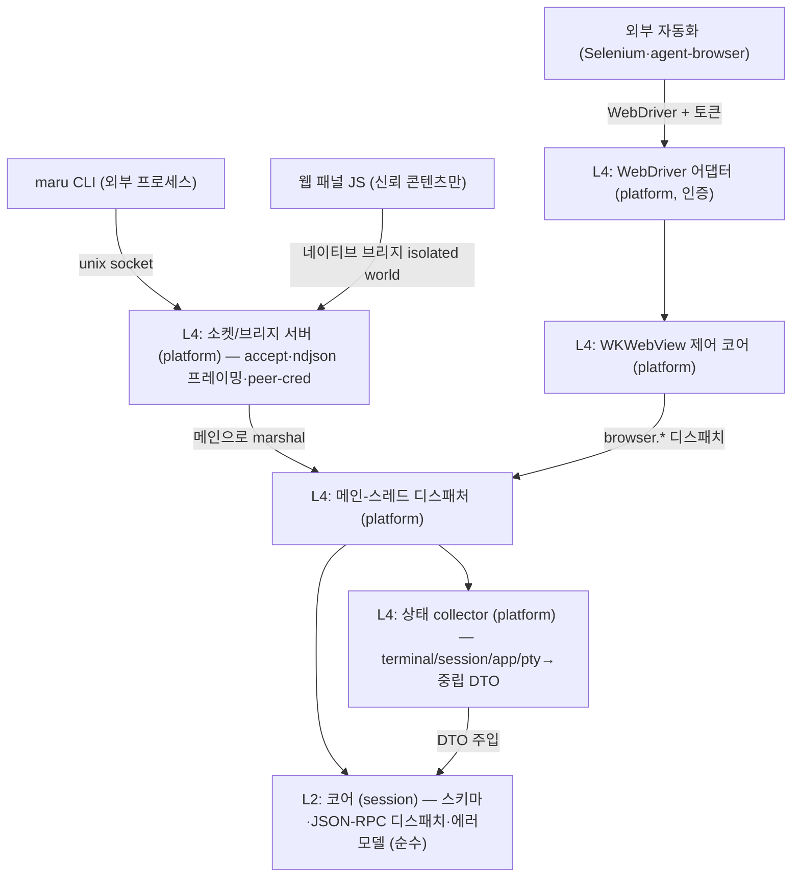

# 세션 컨트롤 플레인 (CLI·웹뷰 IPC)

이 문서는 Maru의 **세션·패널 간 상태 조회와 명령 전송**(컨트롤 플레인)의 단일 출처다. CLI(`maru ...`), 웹 패널(WKWebView 안의 JS), 외부 자동화 도구가 실행 중인 Maru의 세션·패널을 **열거·조회·제어·구독**하는 계약을 정한다.

tmux(`list-panes`/`send-keys`/`capture-pane`)·cmux(멀티 에이전트 조율)가 푸는 문제를 다루되, maru는 **하나의 wire 프로토콜을 CLI와 웹뷰가 공유**하게 해서 두 번 설계하지 않는다.

> **상태**: Phase 0(설계). 이 문서는 적대적 설계 검증(2026-06)을 1회 거쳐 §15 결함 목록을 반영했다. 일부 항목은 **사용자 승인·후속 전략 문서 갱신이 선결**이며 §16에 표시한다.

레이어 경계는 [레이어링과 이식성 전략](layering-and-portability.md), macOS 호스트 경계·Zig↔Swift 분담은 [macOS 앱 호스트 경계](macos-app-host-boundary.md), I/O–렌더 스레딩·락 모델은 [I/O–렌더 스레딩 분리](io-render-threading.md), 탭/split 모델은 [탭·split·레이아웃](tabs-splits-layout.md), 링크 클릭 라우팅(md→패널)은 [링크 감지](link-detection.md)를 단일 출처로 둔다. 웹 패널의 표시·오버레이(WKWebView 합성·z-order)는 [웹 패널 인프라](web-panel.md)(**선결 문서 — 미작성**, §16)로 분리한다.

## 1. 확정 결정

- **wire = 줄 단위(ndjson) JSON-RPC 2.0.** 메시지 1개 = 1줄. 요청/응답은 `id`로 매칭, 이벤트는 `id` 없는 notification. 직렬화는 JSON 단독(Zig `std.json` + JS `JSON.parse` — 의존성 0). 베이스: LSP/DAP/CDP가 공유하는 "로컬 도구 JSON-RPC" 메커니즘(§9). **단 대형 페이로드·프레이밍 견고성은 §4.3 규약을 따른다**(무한정 단일 라인 금지).
- **컨트롤 플레인 wire transport 둘, 메시지 스키마 하나.** 외부 프로세스는 **unix domain socket**, 웹 패널은 **WKWebView 네이티브 메시지 브리지(in-process)**. **컨트롤 플레인 wire는 TCP/HTTP를 바인드하지 않는다.** (외부 호환용 WebDriver 어댑터는 별개 표면이며 자체 인증을 가진다 — §8·§7.5.)
- **메서드 어휘 = tmux식.** `sessions.list`/`session.sendKeys`/`session.capture`. "여러 대상 열거 + 명령 + 이벤트" 구조는 tmux control mode가 이미 하므로 CDP를 끌어오지 않는다.
- **이벤트 = 스트림(push) 1급.** 계약은 `events.subscribe` notification 스트림으로 고정. 내부 구현은 점진적이어도 되나, **기존 agent 폴링은 "보이는 Term 한정"이라 background 세션 이벤트(cmux의 핵심)는 폴링 게이트 확장 또는 진짜 이벤트 소스가 선결**이다(§6, §15-D).
- **엔티티 = surface 일반화 + 안정 외부 ID.** terminal/web surface를 같은 ID 공간에 두되, **외부 ID는 `(window_token, surface_id)` 복합키 또는 전역 안정 식별자**다. 현 `surface_id`는 AppSession(창)마다 1부터 발급돼 단독으론 멀티윈도우에서 충돌한다(§3, §15-A3).
- **컨트롤 플레인 코어(L2) = 스키마 + 프로토콜 + 순수 디스패치만.** 라이브 상태 수집은 **platform collector(L4)** 가 4개 레이어(terminal/session/app/pty)·OS에서 모아 **중립 스냅샷 DTO**로 코어에 주입한다. 코어는 `LivePtyRegistry`·`PtySession`·`runtime.SurfaceId`를 직접 참조하지 않는다(`check-boundaries`가 `session→app/pty/platform`을 빌드 실패시킴 — §2, §15-A1).
- **동시성 = 단일 디스패치 지점(메인으로 marshal) 기본.** 소켓 스레드는 accept/parse/프레이밍만 하고, 코어/레지스트리/트리 접근은 메인 frame loop로 marshal해 웹뷰 in-process 경로와 같은 스레드로 수렴한다. 코어 read는 해당 surface `core_mutex` 아래에서만(§4.4, §15-B).
- **보안 = uid 단일 축이 아니라 "같은 uid 내부 신뢰 차등"까지.** 웹 패널 브리지는 **신뢰 콘텐츠에만** 노출(임의 웹페이지엔 미주입), 외부 소켓은 **peer-cred 검증 + 0700 디렉터리 + 0600 소켓**, write는 **per-surface capability**로 좁힌다(§7).
- **`browser.*` = WKWebView 직접 제어(코어) + W3C WebDriver 어댑터(외부, 인증 필수) — 둘 다 1급.** CDP가 아니라 WebDriver다(§8).
- **웹 패널 콘텐츠 빌드 = zntc(`@zntc/core`).** Zig 기반 자작 트랜스파일러/번들러(외부 npm 패키지, MIT, WASM 빌드 지원). 빌드 편입 경로·clean-room·사용자 논의는 §11·§16에 둔다.
- **리치 패널 렌더 = WKWebView (네이티브 뷰 비사용 원칙의 *명시적 예외* — 사용자 승인 선결).** "네이티브 뷰 비사용"은 `implementation-plan.md`·`macos-app-host-boundary.md`·`settings-page.md`·`config-gui.md`에 **"(사용자 결정)"**으로 박힌 전역 원칙이다(§16). 인앱 브라우저 비전을 위해 이를 예외로 두되, **그 전략 문서들의 갱신은 별도 PR로 사용자 최종 승인이 필요**하다(§15-A2, §16).

## 2. 목표 위상

| 층 | 위치 | 책임 | 이식 시 |
|---|---|---|---|
| **L2 코어** | `src/session/` | 메시지 스키마, JSON-RPC 디스패치, 에러 모델, 순수 변환. **OS/런타임 타입 0** | 재사용 |
| **L4 collector** | `platform/macos/` | 4개 레이어·OS에서 상태 수집 → 중립 DTO로 코어에 주입 | 타깃별 |
| **L4 소켓/브리지 서버 + 디스패처** | `platform/macos/` | accept, peer-cred, ndjson 프레이밍, 메인 marshal, 웹뷰 메시지 핸들러 | 타깃별 |
| **L4 WKWebView 제어 + WebDriver 어댑터** | `platform/macos/` | WKWebView API 호출(Swift) — **라우팅·디스패치·프레이밍은 Zig**([macos-app-host-boundary.md] 정책) | 타깃별 |

**의존 방향**: 코어(L2)는 OS/런타임 타입 0(`tests/boundary/imports.zig`의 `session` 규칙이 `pty/platform/chrome/app` import를 빌드 실패시킴). 상태는 **collector가 중립 DTO로 주입**하는 seam으로만 코어에 들어온다([layering-and-portability.md] §3.1 `PtyIo` vtable 선례).

## 3. 엔티티 모델 (surface 일반화 + 외부 ID)

기존 계층 `Window → Tab → Pane → Term(surface)`을 유지하되 surface에 **종류**를 더한다: `surface.kind = terminal | web`.

- **외부 ID**: `surface_id`는 AppSession(창)마다 `next_id`로 1부터 발급되고 재시작 시 재생성된다 → **단독으론 외부 키로 부적합**. 외부 노출은 `(window_token, surface_id)` 복합키 또는 프로세스 전역 안정 ID(UUID)로 한다. 외부 자동화가 저장한 ID는 재시작 후 무효일 수 있음을 계약에 명시(§15-A3).
- 세션 목록의 **진짜 출처**는 `LivePtyRegistry`(close 라우팅 헬퍼일 뿐, 메타 없음)가 아니라 platform `app_session`의 `Model(TermRuntime)` 트리(`tabs`/`Pane`/`Term`)다. collector가 이 트리를 워크한다(§15-A2).
- 공통 메타: `id`, `kind`, `title`, `window`/`tab`/`pane` 좌표, `focused`.
- terminal 전용: `cwd`(OSC 7), `git_branch`(platform fs walk), `agent`(kind/state), `has_foreground_job`(OS tcgetpgrp).
- web 전용: `url`, `panel_kind`(markdown|diff|browser|...), `loading`, **`trust`(trusted|untrusted — §7.1 브리지 노출 게이트)**.

## 4. transport·프로토콜 견고성

### 4.1 두 transport, 한 스키마
- **외부**: `~/.cache/maru/control/` (0700) 아래 인스턴스별 소켓(§7.4). accept→줄 단위 read→메인 marshal→응답. sun_path 103자 제한 준수.
- **in-process(웹 패널)**: WKWebView `WKScriptMessageHandler`(isolated `WKContentWorld`, `forMainFrameOnly`) ↔ `evaluateJavaScript`. 네트워크 비경유. 신뢰 콘텐츠에만 주입(§7.1).

### 4.2 다중 인스턴스·발견 (§15-B M1)
- 소켓 경로 키 = 인스턴스(pid/부팅 nonce). 디렉터리에 살아있는 인스턴스 인덱스 + `flock`.
- bind 전 stale 소켓: `flock`으로 살아있는지 판별 후 unlink-then-bind(살아있는 소켓 unlink 금지).
- 자식 셸은 `$MARU_SESSION`+소켓 경로로 자기 인스턴스를 안다. **Maru 밖 일반 셸의 CLI**는 단일 인스턴스면 자동, 복수면 명시 인자(미정 — §11).

### 4.3 프레이밍 견고성 (§15-B H4)
- **max frame size** 정의(초과 시 거부 코드 + 연결 종료). 부분 읽기(한 줄이 여러 read에 걸침) 누적 버퍼.
- **대형 응답(`capture` 전체 스크롤백 등)은 단일 ndjson 라인 금지** — chunked/streaming 표면 또는 길이-프리픽스로. (escape ~6배 팽창·전량 버퍼링·OOM 회피.)
- **per-connection bounded outbound 큐 + non-blocking write.** 응답 안 읽는 클라이언트가 디스패처를 막지 않게(=[io-render-threading.md]가 측정·제거한 blocking-write 결함 재발 방지). 이벤트는 느린 구독자에 대해 coalesce/drop(상태 스냅샷이라 손실 허용), 한계 초과 시 구독 강제 해제.

### 4.4 동시성·생명주기 (§15-B H1/H2/H3)
- **단일 디스패치 지점**: 소켓 스레드는 accept/parse/프레이밍만. 코어·트리·collector 접근은 메인 frame loop로 marshal(웹뷰 경로와 동일 스레드). 라우팅 테이블(`links`/`entries`)이 락 없는 메인 전용 ArrayList이므로 크로스스레드 순회 금지.
- **코어 read 락**: cwd/scrollback 등 코어 read는 surface `core_mutex` 아래에서만(리더 스레드의 evict/free와 경합 — [link-detection.md]가 같은 UAF를 `lockCore`로 고친 선례). capture는 **락 아래 복사만**, JSON 직렬화는 락 밖.
- **수명**: 외부엔 비소유 `*LivePtySession` 포인터를 절대 노출하지 않고 **ID만** 노출, 매 호출 재조회. surface_id에 generation을 달아 종료된 세션의 in-flight 요청은 `ProcessExited`로 거부. 세션 종료 단일 chokepoint가 `session.closed` 방출 + 구독 자동 해제.

## 5. 메서드 표면 (초안 — tmux 어휘)

| 메서드 | 인자 | 반환 | 비고 |
|---|---|---|---|
| `sessions.list` | `{window?}` | `[Surface]` | terminal+web 열거(collector가 트리 워크) |
| `session.get` | `{id}` | `Surface` | 단건(core_mutex read) |
| `session.sendText` | `{id, text}` | `{ok}` | **raw 쓰기 경로**(bracketed paste 미적용 — §15-D #8). capability 게이트(§7.3) |
| `session.sendKeys` | `{id, keys}` | `{ok}` | `input_report.encodeKey` 재사용. capability 게이트 |
| `session.capture` | `{id, scrollback?}` | streaming | 대형이라 §4.3 streaming. capture는 비밀 노출이라 별도 권한(§7.3) |
| `session.subscribeOutput` | `{id}` | 스트림 | **실시간 출력 구독**(tmux `pipe-pane`/`%output`) — 에이전트 모니터링 핵심(§15-D 빠진 기능) |
| `session.resize`/`focus`/`close`/`spawn` | `{id, ...}` | `{ok}` | **생애주기 명령**(tmux `resize-pane`/`select`/`kill`/`new`) — 자산 존재(`closeActive`·`createTab` 등), 노출만(§15-D) |
| `panel.open` | `{kind, args, trust}` | `{id}` | web 패널. `kind=browser`는 `trust=untrusted`(§7.1) |
| `panel.bindSession` | `{panel_id, session_id}` | `{ok}` | 패널↔세션 cwd 연동(diff/md가 어느 surface 기준인지 — §15-D) |
| `events.subscribe` | `{filter?}` | 스트림 | §6 |
| `browser.*` | (§8) | — | web surface 제어. 호출자 trust·capability 검사 |

- read-only(`*.list`/`get`/`capture`)와 write(`send*`/`panel.*`/`browser.*`/생애주기)를 구분하되, **구분만이 아니라 §7.3 인가 주체를 강제**한다.

### 5.1 에러 모델 (§15-B M3)
- JSON-RPC 2.0 표준 코드(-32700/-32600/-32601/-32602/-32603) + 도메인 코드(`unknown-surface`·`process-exited`·`payload-too-large`·`unauthorized`).
- [macos-app-host-boundary.md]의 status 3분류를 transport에 매핑: **per-request 거부**(나쁜 id·닫힌 세션)는 에러 응답+연결 유지, **transport 치명**(프레이밍 깨짐)은 연결만 종료, **세션 종료**는 notification.

## 6. 이벤트 (스트림)

`events.subscribe` 후 서버가 `id` 없는 notification을 push한다(예: `session.stateChanged`/`cwdChanged`/`created`/`closed`, `panel.navigated`).

- **계약은 push 고정, 구현은 점진.** 단 **한계 정직 표기**: 초기 소스인 agent 폴링(`pollAgentKinds`/`pollAgentState`)은 **보이는 Term에만** 동작하고(헛 재렌더 방지 게이트) ~0.5s 창이라 짧은 전이를 병합·소실한다. **cmux의 핵심인 background 멀티 에이전트 완료 신호는 이 폴링으로 못 본다** → 폴링 게이트 확장 또는 진짜 이벤트 소스가 선결(§15-D #7).
- 크로스스레드 핸드오프: 이벤트 생성(메인 tick)→per-subscriber outbound는 §4.4 단일 디스패치 지점으로 수렴.

## 7. 보안 (위협 모델 — 같은 uid 내부 신뢰 차등 포함)

§15-C가 찾은 critical/high를 반영한다. "다른 유저로 로그인했나"라는 단일 축이 아니라 **같은 uid 안의 신뢰 차등**(웹 콘텐츠·저권한 자동화·sudo 세션)을 1급으로 다룬다.

### 7.1 웹 브리지 노출 게이트 (V1 — CRITICAL)
- **`window.maru.*`는 신뢰 콘텐츠에만 주입.** maru가 빌드해 `maru-app://` 커스텀 스킴으로 서빙하는 콘텐츠(markdown/diff, zntc 빌드)만 브리지를 받는다. **`panel_kind=browser`(임의 URL)에는 브리지를 아예 주입하지 않는다.**
- 주입 시에도 **isolated `WKContentWorld` + `forMainFrameOnly`**로 페이지/서브프레임(광고 iframe) JS가 핸들러에 못 닿게.
- 신뢰 콘텐츠도 **자기 surface(또는 명시 위임)만 제어** — `sessions.list` 전체 열거·임의 id `sendText`·cross-surface `capture`는 차단 또는 사용자 확인 게이트.

### 7.2 소켓 권한·peer-cred (V3 — HIGH)
- 소켓은 **0700 전용 디렉터리** 안 + bind 후 **`fchmod 0600`**(기존 코드 관행은 0755/umask라 명시 강제 필요). `O_NOFOLLOW`/lstat로 심볼릭 링크·소유자 검증.
- **accept마다 peer uid 검증**(`LOCAL_PEERCRED`/`SO_PEERCRED`), uid 불일치 즉시 종료. 파일 권한에만 의존하지 않는 이중 방어.

### 7.3 write 인가 (V4 — HIGH)
- **"같은 uid = 같은 신뢰"는 거짓**임을 명시: 같은 uid의 임의 프로세스가 모든 surface를 제어·열람하면 sudo 세션·다른 보안등급 탭에 대한 **권한 상승**이 된다.
- write(`send*`/생애주기/`browser.*`)는 **per-surface capability**로 좁힌다 — 자식이 받은 `$MARU_SESSION` 토큰은 자기 surface만, cross-surface는 거부 또는 사용자 확인. 기본 보수적(Phase 2가 이 모델을 정의).

### 7.4 capability 핸들·redaction (V5)
- `$MARU_SESSION`은 키名에 `SESSION` 토큰을 포함하므로 [project-rules.md] §redaction의 **deny-by-default 대상**이다. control-plane이 이를 면제하려면 **사용자 확인 후 allowlist** 절차를 밟는다(현 초안의 "redaction 대상 아님"은 단일 출처 위반 — 철회).
- env는 보안 경계가 아니라 편의 채널(소켓 경로는 결정론적이라 env 없이도 발견됨). 진짜 방어는 7.2+7.3.

### 7.5 WebDriver 어댑터 (V2 — CRITICAL)
- WebDriver는 HTTP라 §1 "wire는 HTTP 안 씀"의 예외다. **TCP가 아니라 unix 소켓 위 HTTP**(또는 loopback+무작위 bearer 토큰 0600 파일 전달) + **Origin/Host 화이트리스트**(브라우저발 CSRF·DNS rebinding 차단) + **기본 off/opt-in**. 인증 없는 localhost TCP는 cross-uid·CSRF로 `execute_script`/`get_cookies` 노출이라 금지.

### 7.6 SSH 원격 (V7)
- SSH 터널은 transport 암호화만 제공, **메시지 authz는 아니다**. 원격 노출 시에도 컨트롤 플레인 자체 인증(토큰/capability) 필수. 포워딩은 명시 opt-in.

## 8. `browser.*` — WKWebView 제어 + WebDriver 어댑터

제어 코어(한 번만) 위에 두 얼굴: `browser.*`(컨트롤 플레인) + W3C WebDriver 서버(외부, §7.5 인증).

- **CDP가 아니라 W3C WebDriver.** agent-browser 코드 확인(`references/agent-browser/cli/src/native/webdriver/` — `backend.rs`의 `BrowserBackend` trait, Safari=`safaridriver`) 결과 백엔드가 ~15개 명령(navigate/get_url/execute_script/screenshot/find_element/click/send_keys/back/forward/refresh/get_cookies/...)뿐이라 CDP보다 표면이 작고 WebKit 정합.
- 명령→WKWebView API: navigate→`load`, execute_script→`evaluateJavaScript`, screenshot→`takeSnapshot`, get_cookies→`WKHTTPCookieStore`, back/forward/reload→`goBack`/`goForward`/`reload`, find_element/click/send_keys→`evaluateJavaScript`. **Swift는 API 호출만, 라우팅·매핑·프레이밍은 Zig**([macos-app-host-boundary.md] 정책 — §15-A M2).
- **제약**: `safaridriver`는 Safari.app만 제어하므로 **WKWebView용 WebDriver 서버는 우리가 직접 구현**. agent-browser가 우리 endpoint에 붙는 통합은 별도(remote WebDriver URL 옵션 — Apache-2.0 fork/PR, 또는 인터페이스 흉내). 코어+서버 후속.

## 9. 베이스와 결정 (clean-room)

- **메커니즘**: JSON-RPC 2.0 over 로컬 stdio/socket(LSP/DAP/CDP 공유). maru는 메커니즘만 빌리고 LSP 스펙(textDocument/*)은 안 쓴다. 프레이밍은 ndjson + §4.3 한계(대형은 길이-프리픽스).
- **어휘**: tmux control mode. **WebDriver 어댑터**: agent-browser 백엔드 추상화(동작 비교만, 코드 미복사 — [references.md]).
- **maru가 다르게 한 점**: ① 외부·웹뷰가 하나의 wire 공유. ② 웹뷰 transport는 네트워크가 아니라 in-process 브리지(+신뢰 게이트). ③ 외부 호환을 CDP가 아니라 WebDriver로.

## 10. 구현 Phase (의존성 순서, 각 단계 green)

> **선행(공통)**: 외부 ID 모델(§3 window 한정), collector seam(§2), 소켓 부트스트랩(서버 bind가 첫 spawn 선행 — `$MARU_SESSION` 주입 위해)을 **Phase 1 안에서 먼저** 확정. "1~3 ∥ 4 → 5(합류) → 6 → 7".

| Phase | 내용 | 서드파티 | 독립 검증(E2E) |
|---|---|---|---|
| **0. 계약** | 본 문서 | 0 | 문서 리뷰 + 적대적 검증(§15) |
| **1. 컨트롤 플레인 read-only** | **신규**: GUI 내 unix socket 서버(accept/ndjson/peer-cred) + 메인 디스패처 + collector + 외부 ID + `$MARU_SESSION` 주입 + CLI 클라이언트 서브커맨드 + `sessions.list`/`get`/`capture`. ("직렬화만"이 아니라 서버·ABI·클라이언트 신규 — §15-D #4) | 0 | `maru sessions list` → 다른 탭 보임 |
| **2. 명령 전송(write)** | `sendText`(raw)/`sendKeys` + **capability 인가 모델**(§7.3) + 에러 모델 | 0 | `maru session sendText` → 입력. cross-surface 거부 확인 |
| **3. 이벤트 스트림** | `events.subscribe` + outbound 큐/백프레셔(§4.3). background 폴링 게이트 확장 | 0 | agent 상태 push(background 포함) |
| **4. 웹 패널 껍데기** | **신규**: 단일 CAMetalLayer 위 NSView 합성 + **per-pane rect-export ABI**(현재 없음 — §15-D #5) + `kind=web` + z-order(선결, §16) | 0 | 빈 웹뷰가 탭/split 추종 |
| **5. 제어 코어 + browser.* + JS 브리지** | WKWebView 제어 코어, `browser.*`, `window.maru.*`(**신뢰 게이트·isolated world**, §7.1). **1·4 합류점** | 0 | 신뢰 콘텐츠에서 `maru.sessions.list()` 동작, browser 패널엔 미주입 |
| **6. WebDriver 어댑터** | 제어 코어 위 ~15 명령 + 인증(§7.5) | 0 | 인증된 클라이언트가 web surface 제어 |
| **7. 첫 콘텐츠** | 마크다운 뷰어+소스편집 또는 diff(zntc 빌드) + md 링크 라우팅 + `panel.bindSession` | **열린질문 ④** | md 클릭→렌더→현재 cwd 연동 |

- Phase 0~6 서드파티 0. **Phase 1·4는 "직렬화/배선"이 아니라 신규 인프라**임을 정직히 반영(§15-D).

## 11. 열린 질문 (미결정)

- **④ 서드파티 JS 라이브러리**: 마크다운/편집(TipTap)·diff(diff2html/Monaco)를 라이브러리로 쓸지 자체 구현할지. zntc는 빌드 도구라 별개. Phase 7 착수 시 콘텐츠별 결정([project-rules.md] §의존성, 사용자 논의).
- **⑤ 첫 콘텐츠**: 마크다운 뷰어 vs git diff.
- **비-자식 CLI 인스턴스 선택**(§4.2): 복수 인스턴스 시 대상 지정 규칙.
- **마크다운 편집 범위**: 뷰어+소스편집(확정) → WYSIWYG 후속 시점/방식.
- **zntc 빌드 편입**: `build.zig.zon`에 들어가는지, vendoring인지, dev-only인지(§16).

## 12. 리스크 & 미해결 (정직)

- **WKWebView z-order**: Metal 오버레이(palette/모달/find)를 네이티브 웹뷰가 가린다. **Phase 4의 차단 선결**(무시 불가 — §15-A M3). web-panel.md에서 합성 모델 확정 후 진행.
- **per-pane rect ABI 부재**: 현재 Swift는 사이드바 폭·셀 origin만 받고 per-pane 사각형 export ABI가 없다 → Phase 4 신규(§15-D #5).
- **이벤트 background 한계**: 폴링 visible-only(§6).
- **SSH 원격(미래)**: 원격 데이터는 로컬 웹뷰 렌더, 원격 웹앱은 `ssh -L`, 원격 상태는 원격 컨트롤 플레인. transport 추상으로 자리만.
- **zntc 미검증 의존**: repo/references에 아직 없음(외부 npm). 존재·라이선스·편입은 §16.

## 13. 검증 경로 (계획)

- 코어(L2): 헤드리스 단위 — fake DTO 주입으로 `sessions.list` 직렬화·디스패치·에러·이벤트 방출을 PTY/웹뷰 없이 단언. `check-boundaries`(코어에 app/pty/platform import 0).
- collector(L4): 실제 트리/락 통합 테스트(여기가 OS·크로스레이어라 헤드리스 불가 — §15-A1).
- 프로토콜: ndjson 부분읽기·max frame 초과·백프레셔·blocking 소비자 단위 테스트.
- 보안: peer-cred 거부, 웹 브리지 미주입(browser 패널), cross-surface write 거부, WebDriver 토큰/Origin 검사 테스트.
- E2E·수동: `maru sessions/send`, 웹 콘솔 브리지, 자동 불가 영역(z-order)은 완료 전 수동 검증 보고([project-rules.md] §테스트).

## 14. 코드 위치 (구현 시 채움)

- 코어(L2): `src/session/control_plane.zig`(스키마·디스패치·에러)
- collector·소켓·디스패처(L4): `platform/macos/control_{collector,socket}.{zig,m}`, `app_host_abi.{zig,h}`
- 세션 신원: `src/pty/types.zig`(`SpawnRequest`)·`pty/macos.zig`(env)
- CLI: `src/cli.zig`(`sessions`/`session` 서브커맨드 — **현재 CLI↔GUI 연결 없음, 신규**)
- WKWebView·WebDriver: `platform/macos/web_panel.{zig,swift}`

## 15. 적대적 검증 결과 (2026-06, 4 렌즈)

구현 전 적대적 검증에서 확인한 결함. 위 본문이 흡수했고, 미해결은 §12·§16.

- **A(원칙)**: A1 L2 코어가 `check-boundaries` 통과 못 함(런타임 자산 직접 참조) → collector seam(§2). A2 "네이티브 뷰 비사용(사용자 결정)" 절차 없이 역전 → §16 승인 선결. A3 layering §4 "호스트=타깃별" 범주 오용·이식성 자기모순 → 예외로 정직 프레이밍. M1 HTTP 모순, M2 Zig/Swift 분담 미매핑, M3 tabs-splits/web-panel 단일출처·z-order 선결, M4 redaction 모순 → 본문 반영.
- **B(프로토콜·동시성)**: H1 스레드 모델 미정·라우팅 표 락 없음, H2 코어 read `core_mutex` 부재(UAF), H3 구독/in-flight가 세션 종료 가로지름(dangling), H4 max frame 없음·대형 단일라인 OOM, H5 blocking write 디스패처 정지 → §4.3/§4.4. M1 다중 인스턴스 소켓, M3 에러 모델 → 반영.
- **C(보안)**: V1 웹 브리지 무차별 노출(CRITICAL), V2 인증 없는 WebDriver HTTP(CRITICAL), V3 0600/peer-cred 미강제, V4 uid 신뢰 오류, V5 redaction, V7 SSH 터널 authz → §7.
- **D(구현)**: "직렬화만"·"rect 흐름"·"각 단계 독립 green" 거짓 → Phase 1/4 정직화(§10). 빠진 기능(실시간 출력 스트림·생애주기 명령·패널↔cwd 연동) → §5 추가. encodePaste bracketed paste 부적합 → raw 경로(§5). 이벤트 background 폴링 한계(§6).

## 16. 사용자 승인·선결 (구현 착수 전 필요)

이 항목들은 [project-rules.md] §전략 유지("기존 전략 수정은 임의 금지, 사용자 논의")에 따라 **사용자 결정·후속 PR이 선결**이다:

1. **"네이티브 뷰 비사용" 원칙의 명시적 예외 승인** + `implementation-plan.md`·`macos-app-host-boundary.md`·`settings-page.md`·`config-gui.md` 갱신(별도 PR).
2. **`web-panel.md` 작성**(WKWebView 합성·z-order·rect ABI) — Phase 4 선결.
3. **zntc 빌드 편입 방식**(build 의존성 절차·라이선스·clean-room) 확인.
4. **redaction allowlist**에 `MARU_SESSION` 포함 여부(§7.4).
