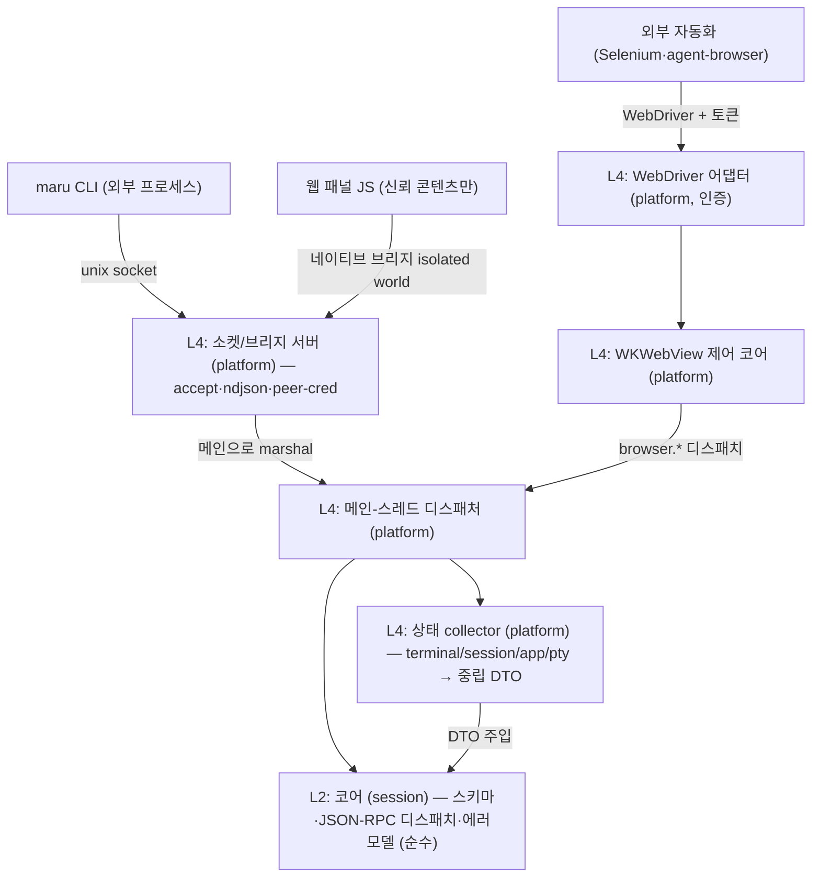

# 세션 컨트롤 플레인 (CLI·웹뷰 IPC)

이 문서는 Maru의 **세션·패널 간 상태 조회와 명령 전송**(컨트롤 플레인)의 단일 출처다. CLI(`maru ...`), 웹 패널(WKWebView 안의 JS), 외부 자동화 도구가 실행 중인 Maru의 세션·패널을 **열거·조회·제어·구독**하는 계약을 정한다.

tmux(`list-panes`/`send-keys`/`capture-pane`)·cmux가 푸는 문제를 다루되, maru는 **하나의 wire 프로토콜을 CLI와 웹뷰가 공유**하게 해서 두 번 설계하지 않는다.

레이어 경계는 [레이어링과 이식성 전략](layering-and-portability.md), macOS 호스트 경계·Zig↔Swift 분담은 [macOS 앱 호스트 경계](macos-app-host-boundary.md), I/O–렌더 스레딩·락 모델은 [I/O–렌더 스레딩 분리](io-render-threading.md), 탭/split 모델은 [탭·split·레이아웃](tabs-splits-layout.md), 윈도우 간 detach/reattach와 전역 surface 소유권은 [윈도우와 Surface 이동성](window-surface-mobility.md), 링크 클릭 라우팅(md→패널)은 [링크 감지](link-detection.md)를 단일 출처로 둔다. 웹 패널의 표시·합성(WKWebView 오버레이·z-order·per-pane rect ABI)은 [웹 패널 인프라](web-panel.md)(Phase 4 선결 상세)로 분리한다.

## 1. 확정 결정

- **wire = 줄 단위(ndjson) JSON-RPC 2.0.** 메시지 1개 = 1줄. 요청/응답은 `id`로 매칭, 이벤트는 `id` 없는 notification. 직렬화는 JSON 단독(Zig `std.json` + JS `JSON.parse`, 의존성 0). 대형 페이로드는 §4.3 규약을 따른다.
- **transport 둘, 메시지 스키마 하나.** 외부 프로세스는 **unix domain socket**, 웹 패널은 **WKWebView 네이티브 메시지 브리지(in-process)**. 컨트롤 플레인 wire는 TCP/HTTP를 바인드하지 않는다(외부 호환용 WebDriver 어댑터만 예외 — §9).
- **노출은 CLI 토대, MCP는 구현 계획 미정.** 주 사용처는 maru 안에서 도는 에이전트이고, `maru` CLI(+`SKILL.md`)가 셸로 직접 호출한다. 외부 MCP 클라이언트용 어댑터는 같은 wire 위에 얇게 얹을 수 있으나 **구현 계획은 미정**이라 막지 않을 seam(버전·네임스페이스)만 둔다(§4.1).
- **메서드 어휘 = tmux식.** `sessions.list`/`session.sendKeys`/`session.capture`.
- **이벤트 = 스트림(push) 1급.** `events.subscribe` notification 스트림. 초기 구현은 기존 agent 폴링 결과를 흘리되, background 세션 이벤트는 폴링 게이트 확장 또는 진짜 이벤트 소스가 필요하다(§7).
- **엔티티 = surface 일반화 + 앱 전역 외부 ID.** terminal/web surface를 같은 ID 공간에 두고, 외부 ID는 `surface_id + generation`이다. 하위 호환은 고려하지 않고, `surface_id`는 앱 인스턴스 전역 `SurfaceIdAllocator`가 발급하는 opaque u64로 고정한다. ID 비트에 window/session/local counter 의미를 넣지 않는다. `window_token`은 현재 위치 메타데이터로 내린다. 이유와 선행 refactor는 [윈도우와 Surface 이동성](window-surface-mobility.md)을 단일 출처로 둔다.
- **코어(L2) = 스키마 + 프로토콜 + 순수 디스패치만.** 라이브 상태 수집은 platform collector(L4)가 모아 중립 스냅샷 DTO로 코어에 주입한다. 코어는 런타임/OS 타입을 직접 참조하지 않는다(`check-boundaries`가 `session→app/pty/platform`을 막는다 — §2).
- **동시성 = 단일 디스패치 지점(메인으로 marshal) + 출력 스트림은 I/O 스레드 직송.** 제어·조회는 메인 frame loop로 marshal해 코어/레지스트리/트리에 안전 접근하고, 고처리량 출력(`subscribeOutput`)은 메인을 거치지 않고 I/O 스레드에서 per-subscriber 큐로 직송한다(§5).
- **보안 = 같은 uid 안의 신뢰 차등까지.** 웹 브리지는 신뢰 콘텐츠에만 노출, 외부 소켓은 peer-cred + 0700/0600, write는 per-surface capability(§8).
- **`browser.*` = WKWebView 직접 제어(코어) + W3C WebDriver 어댑터(외부, 인증 필수).** CDP가 아니라 WebDriver다(§9).
- **웹 패널 프론트엔드 개발환경 = zntc로 확정.** `@zntc/core`(+ 프론트엔드 앱에는 필요 시 `@zntc/web`)가 dev server/preview/build/bundle을 맡고, dev-only 빌드 도구로 두어 런타임 의존성 0을 유지한다. `web/` 하위 Bun workspace는 패키지 설치·`bun.lock`·workspace script 실행·프론트엔드 단위 테스트(`bun test`)를 맡는다. JS/TS 품질 게이트는 VoidZero/Oxc 계열의 `oxlint`·`oxfmt`를 쓴다. Vite+에는 root config override, workspace task runner, package-manager wrapper 같은 모노레포 기능이 있지만, 통합 CLI가 zntc의 dev/build와 Bun의 package-manager/test runner 책임까지 함께 가져오므로 Phase 7 기본값으로 두지 않는다. Vitest는 기본값이 아니며, Bun test로 표현할 수 없는 브라우저/DOM 특수 케이스가 검증될 때만 별도 논의한다. 필요 시 `tsgo` 같은 개별 타입체크 도구 또는 Vite Task만 별도 검토한다. lockfile·vendoring·CI 캐시·라이선스·supply-chain 고정 방식은 Phase 7 착수 전 재확인한다(§15).
- **리치 패널 렌더 = WKWebView (네이티브 뷰 비사용 원칙의 명시적 예외).** 원칙의 근거는 이식성인데, 웹 콘텐츠(HTML/JS/CSS)는 WKWebView/WebKitGTK/WebView2 어디서나 그대로 돌아 목적을 충족한다(SwiftUI와 달리 UI 코드가 Apple 전용이 아님). 예외는 **닫힌 열거**다: 마크다운 WYSIWYG 편집, 인앱 브라우저(임의 웹이라 진짜 엔진 필요). **diff 뷰어는 GPU 셀로 그리고 예외에 넣지 않는다**(색입힌 등폭 텍스트라 셀로 충분). 새 종류 추가는 사용자 승인이 필요하다. macOS=시스템 WebKit(의존 0)이나 이식 타깃은 WebKitGTK/WebView2로 의존 0이 깨진다(GPU 경로 WebGPU와 대칭).

## 2. 목표 위상



| 층 | 위치 | 책임 | 이식 시 |
|---|---|---|---|
| **L2 코어** | `src/session/` | 메시지 스키마, JSON-RPC 디스패치, 에러 모델, 순수 변환. OS/런타임 타입 0 | 재사용 |
| **L4 collector** | `src/platform/macos/` | 4개 레이어·OS에서 상태 수집 → 중립 DTO로 주입 | 타깃별 |
| **L4 소켓/브리지 서버 + 디스패처** | `src/platform/macos/` | accept, peer-cred, ndjson 프레이밍, 메인 marshal, 웹뷰 메시지 핸들러 | 타깃별 |
| **L4 WKWebView 제어 + WebDriver 어댑터** | `src/platform/macos/` | WKWebView API 호출(Swift). 라우팅·디스패치·프레이밍은 Zig | 타깃별 |

코어(L2)는 상태를 **collector가 주입하는 중립 DTO seam으로만** 받는다([layering-and-portability.md] §3.1 `PtyIo` vtable 선례).

**collector 2층(현재 코드 기준 정직)**: 지금은 Zig에 전역 AppSession 레지스트리가 없어, Swift가 살아있는 세션(`windows`+`quick`)을 순회하며 per-session collect ABI를 호출하고 Zig는 한 세션 안의 tabs→panes→terms 트리만 중립 DTO로 평탄화한다. **A1 구현 완료(Zig 측 per-session 평탄화)**: `src/platform/macos/app_session.zig`의 `AppSession.collectSessionInto`(공유 리스트에 append하는 A2용 코어)와 `collectSession`(단일 세션 편의 래퍼)이 한 AppSession의 tabs→panes→terms 트리를 walk해 `control_surface.SurfaceDto[]` + 그 창의 `window_membership.WindowMembershipSnapshot` 하나를 만든다(id={surface.id, generation=0}, title=`termLabel`, 좌표 window_id 주입·tab/pane 0-based, focused=key 창의 활성 surface). **kind별 detail 분기**(4e): terminal Term은 `.terminal`(cwd/git_branch/agent/at_prompt 3상, core_mutex 아래 복사), web Term(`kind==.web`)은 `.web`(panel_kind·trust[browser=untrusted·markdown=trusted §8.1]·url=null[콘텐츠 미영속])을 emit하고 **sentinel core를 안 만진다**(cwd/git/at_prompt 없음). 코어 read(cwd·semantic_state·alt_active)는 surface `core_mutex` 아래에서 **복사만** 하고 git fs 읽기·직렬화는 락 밖(§5). **A2b 배선 완료(라이브 서버)**: 앱이 앱-전역 컨트롤 소켓을 열고(accept 스레드) 요청을 메인 frame loop로 marshal한다 — Swift가 살아있는 창(`windows`+`quick`)을 collector 참조 배열(`MaruControlSessionRef`)로 매 tick 넘기면(§2 열거), Zig(`app_host_abi.collectSessionsInto`)가 세션마다 `collectSessionInto`를 공유 리스트로 호출해 하나의 `CollectorSnapshot`을 조립하고 auth·dispatch(1d)한다. 소켓·accept 스레드·marshal 큐는 `control_server.zig`(generic L4), collect 조립·auth·dispatch 배선은 `app_host_abi.zig`(AppSession을 아는 L4)가 소유한다. 이걸로 `maru sessions list`가 진짜 세션을 반환한다(라이브 실측: cwd·git_branch·focused·at_prompt). 그리고 cross-window detach/reattach와 web panel reparent를 위해 Phase 4 hosting 전에 `AppRuntime` + `LiveSurfaceRegistry` + `WindowGraph`로 소유권을 올린다([window-surface-mobility.md](window-surface-mobility.md)). 그 이후 collector는 AppRuntime graph를 단일 출처로 읽는다.

Phase 1 live collector 전에는 full AppRuntime을 기다리지 않고 **앱 인스턴스 전역 `SurfaceIdAllocator` + `WindowMembershipSnapshot`**을 먼저 넣는다. `SurfaceIdAllocator`는 앱 인스턴스 전역 opaque u64를 단조 발급하고, `AppSession.createTerm`은 per-session `next_id` 대신 이 allocator에서 ID를 받는다. Swift의 `makeTerminalSurface` token은 창/세션 라우팅 메타데이터일 뿐 surface ID allocator가 아니다. `WindowMembershipSnapshot`은 현재 `{window_id, window_kind, [surface_id]}`만 담아 `metadata:window` scope를 검증하고, Phase 4 전 `WindowGraph`가 들어오면 같은 DTO를 graph에서 읽게 바꾼다.

## 3. 엔티티 모델

기존 계층 `Window → Tab → Pane → Term(surface)`에 종류를 더한다: `surface.kind = terminal | web`.

- **외부 ID = `{surface_id, generation}`.** `surface_id`는 앱 인스턴스 전역 unique opaque u64이고 **절대 재사용하지 않는다**(주 방어 — 죽은 surface를 가리키는 옛 selector는 새 surface로 리다이렉트될 수 없다). `generation`은 defense-in-depth로, `surface_id`를 유지한 채 런타임만 갈리는 경우(예: PTY crash 후 같은 트리 슬롯 respawn)에만 증가한다 — 그 경로가 설계에 없으면 generation은 순수 보조다. workspace restore는 `surface_id`를 새로 발급하므로(=이동성 §7) restore를 generation 증가로 표현하지 않는다. `surface_id` 값 자체에는 window/session/local index 의미가 없다. `window_token`은 AppSession-local ID 충돌을 막기 위한 복합키가 아니라 현재 어느 window에 배치돼 있는지 알려주는 위치 메타데이터다. 외부 자동화가 저장한 ID는 재시작 후 무효일 수 있음을 계약에 명시한다.
- **재시작 영속 상관키.** workspace restore는 surface를 새 ID로 복원하지만 에이전트 대화(claude/codex `session_id`)는 영속한다. 재시작을 건너 재연결하려면 컨트롤 플레인 ID를 workspace stable-id·트리 좌표·에이전트 `session_id`에 묶는 상관키를 함께 노출한다.
- **멀티윈도우는 현재형이다.** quick terminal은 별도 window_kind를 가진 window로 취급하되, surface ID 충돌을 window_token으로 숨기지 않는다. Phase 1 전에는 `SurfaceIdAllocator`와 `WindowMembershipSnapshot`으로 ID/scope foundation을 닫고, Phase 4 hosting 전에는 살아있는 모든 일반 창과 quick terminal이 `WindowGraph`에 나타나게 한다.
- **quick terminal 정책.** quick terminal도 일반 창과 같은 surface 모델이지만 `window_kind=quick`인 별도 window 위치 메타데이터를 가진다(`window_kind` 판별자는 M0b에서 중립 L2 enum `WindowKind{normal,quick}`으로 도입됐다 — `src/session/window_membership.zig`. 실제 창을 이 enum으로 분류하는 배선(`AppSession.chrome_minimal`→`window_kind`)은 Phase 1 collector가 채운다). `metadata:self`로 quick 안에서 호출한 CLI는 quick 자신의 surface만 볼 수 있고, 일반 창 CLI는 quick을 기본으로 볼 수 없다. quick을 포함한 전체 열거는 `metadata:all` 같은 명시 grant가 있을 때만 허용한다. write(`send*`/생애주기)는 capability 게이트(§8.3)로 보수적으로 막는다.
- 공통 메타: `id`, `kind`, `title`, `window`/`tab`/`pane` 좌표, `focused`.
- terminal 전용: `cwd`(OSC 7), `git_branch`, `agent`(kind/state), `at_prompt`(OSC 133 semantic prompt 기반 3상 `true|false|unknown`). unknown의 주 출처는 **OSC 133 미통합 셸**(대다수)이라 known-not-prompt(`false`)와 no-integration(`unknown`)을 구별해야 하므로 bool로 접지 않는다. alt-screen 중에는 `semantic_state`와 무관하게 `false`(alt 진출입이 `semantic_state`를 unknown으로 리셋하긴 하나 그건 부차적 경로다).
- web 전용: `url`, `panel_kind`(markdown|browser|...), `loading`, `trust`(trusted|untrusted — §8.1).
- **wire 인코딩 결정(구현 `control_surface.zig`)**: `at_prompt` 3상은 **nullable boolean**으로 실린다 — `true`→JSON `true`, `false`→JSON `false`, `unknown`→JSON **`null`**(문자열 `"unknown"` 아님). terminal surface엔 **항상** 실린다(생략≠unknown). 반면 `cwd`/`git_branch`/`url`/`agent`는 값이 없으면 **필드 자체를 생략**한다. `agent.kind`/`agent.state`/`panel_kind`/`trust`의 wire enum은 내부 상태머신(`session_model.AgentKind`·`agent_transcript.AgentState`)과 **격리된 자체 enum**이다(collector가 내부→wire 매핑; 내부 rename이 wire를 조용히 흔들지 않게). 외부 ID는 `{surface_id, generation}` 중첩 객체(`generation`은 `u64`).

상태 수집은 기존 자산을 직렬화한다(신규 수집 로직은 collector에 둔다): app_session의 `Model` 트리, `core.currentCwd()`, `termGitBranch`, `agent_transcript`(running/idle), 코어 `semantic_state`(OSC 133) + `alt_active`(alt 중 `false` 오버라이드) — 옛 `PtySession.hasForegroundJob()`은 제거됐다. bool로 접은 형태가 `cursorIsAtPrompt`([macos-app-host-boundary.md] 닫기 확인과 같은 계열)지만 그건 unknown을 `false`로 접으므로, 컨트롤 플레인은 3상을 보존하려 `cursorIsAtPrompt`가 아니라 raw `semantic_state`를 읽는다. **A1 구현**: `app_session.zig`의 순수 매핑 `atPromptWire(semantic, alt_active)`(alt→`not_at_prompt`, prompt/input→`at_prompt`, command→`not_at_prompt`, unknown→`unknown`)과 `agentInfoWire(kind, state)`(`none`→null=필드 생략, 나머지는 내부→wire enum)가 내부 상태를 wire enum으로 격리 매핑한다(헤드리스 단위 테스트로 못박음). git branch는 `termGitBranchForCwd`(코어 무참조 변형 — 락 아래 복사한 cwd로 fs 읽기를 `core_mutex` 밖에서 수행).

## 4. transport·프로토콜

### 4.1 핸드셰이크·버전·네임스페이스
- 연결 시 server가 `hello` notification으로 `{protocol: "maru.control.v1", server_version, capabilities}`를 보낸다. 외부 도구·CLI↔GUI 버전 skew를 감지하고, 지원 메서드를 capability로 광고한다.
- 메서드 네임스페이스를 예약한다: 코어 = `sessions`/`session`/`panel`/`browser`, 확장 = `plugin.<id>.*`. 닫힌 하드코딩 테이블이 아니라 코어 표 + 등록 가능한 확장 핸들러로 디스패치해 plugin/MCP/skill을 막지 않는다. 발견 메서드(`methods.list`)는 후속.

### 4.2 다중 인스턴스·발견
- 소켓 경로 키 = 인스턴스(pid/부팅 nonce). `~/.cache/maru/control/`(0700)에 살아있는 인스턴스 인덱스 + `flock`.
- bind 전 stale 소켓은 `flock`으로 살아있는지 판별 후 unlink-then-bind(살아있는 소켓은 unlink 금지).
- **stale prune(flock 회수, 구현: `control_socket.pruneStaleSockets`)**: 위 판별은 **자기 키**의 잔해만 처리한다. crash/force-quit로 `deinit`(소켓 unlink)이 못 돈 인스턴스는 `<key>.sock`+`<key>.lock`을 남기는데, 다음 실행은 새 nonce로 **다른** 키의 소켓을 bind하므로 그 잔해가 dir에 계속 쌓여 `.sock`이 여럿이 되면 CLI `pickSocket`이 `.multiple`로 접혀 `maru sessions list`가 영구 고장난다. 이를 막으려고 **서버 start(bind)마다** dir의 각 `<key>.sock`(자기 키 제외)에 대응하는 `<key>.lock`을 non-blocking `flock(EX|NB)`으로 회수 시도한다: 취득되면(=소유 인스턴스 죽음, fd가 닫혀 flock 자동 해제) 그 `.sock`+`.lock`을 unlink하고 flock 해제, 살아있는 인스턴스는 lock을 홀드 중이라 취득 실패→보존한다(`.lock`이 아예 없는 고아 `.sock`도 liveness 증거 부재로 회수). readdir 중 unlink는 POSIX 미정의라 key를 먼저 모은 뒤 처리한다. best-effort.
- 자식 셸은 `$MARU_SESSION`+소켓 경로로 자기 인스턴스를 안다. `$MARU_SESSION`은 `{instance_nonce, surface_id, generation}`을 담은 **selector**일 뿐이고 비밀 bearer token이 아니다. `window_id`/`window_token`/`window_kind`는 응답 메타데이터로만 노출되는 현재 위치 정보다. `metadata:self`는 이 selector가 가리키는 surface와 peer process의 OS 관측 출처가 일치할 때만 열린다(§8.4). `read-output` 이상은 spawn 시 상속한 capability fd(§8.5)가 증명한다. maru 밖 일반 셸의 CLI는 단일 인스턴스면 자동 발견까지만 가능하고, 비밀 출력 열람은 별도 grant가 필요하다(어휘 미정 — §13).

### 4.3 프레이밍 견고성
- max frame size(≈ 1 MiB) 정의. 초과 시 `payload-too-large` + 연결 종료. 부분 읽기는 누적 버퍼. maru가 impl-defined server-error 범위(-32000~-32099, JSON-RPC이 미지정)에서 택한 코드(구현: `src/session/control_plane.zig` `ErrorCode`): **-32001 `payload-too-large`**(§4.3), **-32002 `unauthorized`**(§8.3 — scope 판정을 존재검사 이전에 하는 균일 오류, surface_id 열거 oracle 방지), **-32003 `process-exited`**(인가된 호출자가 물었으나 surface가 없을 때만 — 이미 볼 권한이 있어 oracle 아님). 표준 코드(parse -32700·invalid request -32600·method not found -32601·invalid params -32602·internal -32603)는 명세 그대로.
- 대형 응답(`capture` 전체 스크롤백 등)은 단일 ndjson 라인 금지 — chunk notification(예: 64 KiB/chunk)+완료 마커. **JSON 문자열은 valid UTF-8만 담으므로 임의 바이트(이스케이프 시퀀스·깨진 UTF-8)는 base64로 인코딩**한다. **일관성: capture 시작 시 `capture_id`+스냅샷 generation을 고정하고, 각 chunk는 `{capture_id, seq, generation, encoding}`을 싣는다.** chunk 복사는 surface `core_mutex` 아래에서만 수행하되 직렬화는 락 밖에서 한다. chunk 경계에서 generation이 바뀌면 server는 성공 완료 마커를 보내지 않고 `capture-invalidated` 오류/notification으로 스트림을 종료한다. client는 처음부터 재시도한다. **여기서 "generation"은 surface 재생성 카운터(§3)가 아니라 스크롤백 evict/rewrap 카운터다** — 그렇지 않으면 chunk 복사가 tick마다 나뉘는 동안 리더의 evict가 chunk 사이 내용을 shift시켜도 미검출된 torn capture가 성공 완료된다. 반대로 바쁜 surface에서 매 chunk마다 evict가 일어나 영원히 완료 불가·무한 재시도가 되지 않도록, 재시도 상한을 넘으면 "첫 락에서 전체 스크롤백을 1회 복사(락 보유·메모리 상한 명시)" 경로로 fallback하거나 부분 성공을 반환한다.
- per-connection bounded outbound 큐 + non-blocking write. 응답을 안 읽는 클라이언트가 디스패처를 막지 않게 한다. 이벤트는 느린 구독자에 대해 coalesce/drop(상태 스냅샷이라 손실 허용), 한계 초과 시 구독 강제 해제.

## 5. 동시성·생명주기

- **단일 디스패치 지점**: 소켓 스레드는 accept/parse/프레이밍만, 코어·트리·collector 접근은 메인 frame loop로 marshal한다(웹뷰 in-process 경로와 동일 스레드). 라우팅 테이블(`links`/`entries`)이 락 없는 메인 전용이므로 크로스스레드 순회는 금지한다.
  - **A2b 구현(`control_server.zig`)**: accept 스레드가 연결마다 peer-cred(same-uid) + hello → auth 셀렉터 프레임 + 요청 프레임을 읽어 `PendingRequest`(요청 바이트 + 셀렉터)를 **thread-safe marshal 큐**(`ControlRequestQueue`, `PtyEventQueue` 패턴 재사용)에 push하고, pending의 mutex+cond에서 메인 응답을 **대기**한다. 메인 tick(`maru_macos_control_server_drain`)이 `tryPop`으로 요청을 꺼내 실 collector·auth·dispatch로 응답 바이트를 만들어 `resolveRequest`로 pending에 채우면 accept 스레드가 깨어나 소켓에 **write(락 밖·소켓 스레드)** 한다. **§8.8 lock-order 엄수**: accept 스레드는 `core_mutex`를 안 쥔 채로만 큐에 push/wait, 메인은 `collectSessionInto` 안에서만 `core_mutex`를 짧게 잡고 그 락을 쥔 채 큐에 push/wait하지 않는다(교차-큐 순환대기 없음). accept 스레드 수명 = poll-gated blocking accept + `closing` 플래그(self-connect 트릭 없이 poll timeout으로 종료 확인); `deinit`(stop)이 큐 close(대기 pending cancel) → join → 소켓 close. accepted 연결엔 **read+write 타임아웃**(serial serve + 깨끗한 join 요건 — `SO_RCVTIMEO`로 요청을 안 보내는 client, `SO_SNDTIMEO`로 응답을 안 읽는 client 둘 다 무한 블록 방지; write 타임아웃 만료 시 `writeAll`이 `WriteFailed`로 접혀 그 연결 abandon). accept-loop의 `pollReady`는 3상(`ready`/`timeout`/`broken`)이라 listen fd가 치명적으로 망가지면(`POLLERR/HUP/NVAL` sticky) 재-poll tight-spin(100% CPU) 대신 루프를 종료한다. 요청 프레임이 max frame(§4.3)을 넘으면 `readFrame`이 조용히 버리지 않고 `payload_too_large(-32001)` 응답을 쓴 뒤 연결을 abandon한다(`serveReadOnly`와 동일 계약). 메인 tick은 `drain` 전에 값싼 `has_pending` 게이트를 봐 대기 요청이 없으면 collector 참조 배열(힙 할당)을 아예 짓지 않고 반환한다(렌더 핫패스 0-할당).
- **출력 스트림 직송**: `subscribeOutput`의 고처리량 데이터는 메인을 거치지 않고 I/O 스레드에서 per-subscriber bounded 큐로 직접 민다(메인 marshal에 태우면 폭주 출력이 렌더를 막는다 — [io-render-threading.md]). 메인은 라우팅 메타데이터만 다룬다.
- **subscribeOutput 백프레셔 규범(§4.3의 이벤트 coalesce와 다르다)**: 원시 출력 바이트는 손실 허용·coalesce 불가라, per-subscriber 큐 포화 시 **리더 스레드는 절대 블록하지 않는다**(블록하면 PTY read 정지→child write 블록→surface 전체 정지). 포화 시 그 구독을 `subscriber-lagged` 사유로 즉시 강제 해제하거나, gap 마커를 실어 drop한다. per-surface 구독자 수 상한도 둔다(구독 N개 = 출력 복사 N배 증폭 방지).
- **락 순서 불변식**: `core_mutex` 보유 중에는 메인으로의 marshal 대기나 blocking 큐 push를 하지 않는다(교차-큐 순환 대기 방지 — [io-render-threading.md] §8.8 선례). 렌더 신호·응답 write는 락 밖.
- **코어 read 락**: cwd/scrollback 등 코어 read는 surface `core_mutex` 아래에서만(리더 스레드의 evict/free와 경합). capture는 락 아래 복사만(§4.3), 직렬화는 락 밖.
- **인바운드 큐 bound + tick 우선순위**: 메인으로 marshal되어 대기하는 요청 큐에도 상한을 둔다(§4.3 outbound만 bound하면 pipelined 요청이 단조 증가). 한 tick 안 순서는 **렌더 준비 > 컨트롤 dispatch**이고, 컨트롤은 tick당 처리 건수 상한을 가진다. per-connection 대기 큐 초과 시 `server-busy`로 거부하거나 소켓 read를 멈춰 backpressure를 전파한다. maru 안에서 도는 에이전트가 주 사용처이므로(자기 자신이 폭주 클라이언트가 될 수 있음) 이 상한은 필수다.
- **수명**: 외부엔 ID만 노출(비소유 포인터 금지), 매 호출 재조회. surface_id에 generation을 달아 종료된 세션의 in-flight 요청은 `process-exited`로 거부. 세션 종료 단일 chokepoint가 `session.closed` 방출 + 구독 자동 해제.
- **per-tick 예산**: 컨트롤 플레인 작업이 frame tick 예산을 넘으면 다음 tick으로 분할한다([performance-budget.md]에 항목을 둔다).

## 6. 메서드 표면 (초안)

| 메서드 | 인자 | 반환 | 비고 |
|---|---|---|---|
| `sessions.list` | `{window?}` | `[Surface]` | collector는 모든 AppSession을 수집하지만 응답은 metadata scope로 필터링한다(`self`/`window`/`all`) |
| `session.get` | `{id}` | `Surface` | core_mutex read. `metadata:self`는 자기 `(surface_id, generation)`만 허용 |
| `session.sendText` | `{id, text}` | `{ok}` | **raw 쓰기 경로**(bracketed paste 미적용). capability 게이트 |
| `session.sendKeys` | `{id, keys}` | `{ok}` | `input_report.encodeKey` 재사용. 키 표기법은 tmux 호환(§13) |
| `session.capture` | `{id, scrollback?}` | streaming | 생략 시 가시 화면. 대형은 §4.3 chunk. capture 권한(§8.3) |
| `session.subscribeOutput` | `{id}` | 스트림 | 실시간 출력. I/O 직송(§5). capture와 동일 권한(§8.3) |
| `session.resize`/`focus`/`close`/`spawn` | `{id, ...}` | `{ok}` | 생애주기. 기존 자산(`closeActive`·`createTab` 등) 노출 |
| `panel.open` | `{kind, args, trust}` | `{id}` | web 패널. `kind=browser`는 `trust=untrusted`(§8.1) |
| `panel.bindSession` | `{panel_id, session_id}` | `{ok}` | 패널↔세션 cwd 연동. `bind` capability(§8.3) |
| `events.subscribe` | `{filter?}` | 스트림 | §7 |
| `browser.*` | (§9) | — | web surface 제어. trust·capability 검사 |

메서드별 필요 capability는 §8.3을 단일 출처로 따른다 — `list`/`get`/`subscribe`=`metadata:{self|window|all}`, `panel.bindSession`=`bind`, `capture`/`subscribeOutput`=`read-output`, `send*`=`write`, `resize`/`focus`/`close`/`spawn`/`panel.open`=`lifecycle`, `browser.*`=`browser`. 일반 login shell 기본 경로는 실측 gate를 통과한 `metadata:self`만 허용한다(§8.4).

## 7. 이벤트

`events.subscribe` 후 server가 notification을 push한다: `session.stateChanged`(agent running↔idle)·`cwdChanged`·`created`/`closed`, `panel.navigated`.

초기 소스는 기존 agent 폴링이다(`pollAgentKinds`/`pollAgentState`). 이 폴링은 **모든 pane×Term을 돌고 시각화(metal dirty)만 보이는 Term에 게이트**한다 — 즉 background Term 커버리지는 이미 있다. 진짜 잔여 갭은 (1) ~0.5s 병합으로 짧은 전이가 손실되는 것의 **전이-엣지 이벤트화**, (2) background **세션**(별도 AppSession, quick 등) 커버리지다 — Phase 3 선결. (2)의 소스는 per-window AppSession 순회 전제라, 이동성 M1/M2(AppRuntime graph)가 먼저 끝나 있으면 graph를 직접 읽어 재배선을 아낀다 — 권장 순서이지 차단 조건은 아니다.

## 8. 보안

컨트롤 플레인은 같은 uid 안에서도 신뢰가 다른 코드(웹 콘텐츠·저권한 자동화·sudo 세션)가 공존한다고 가정한다. "uid가 같으면 신뢰가 같다"고 보지 않는다.

### 8.1 웹 브리지 노출 게이트
- `window.maru.*`는 신뢰 콘텐츠에만 주입한다. maru가 빌드해 `maru-app://` 커스텀 스킴으로 서빙하는 콘텐츠(마크다운 등)만 브리지를 받고, `panel_kind=browser`(임의 URL)에는 주입하지 않는다.
- 브리지를 isolated `WKContentWorld`에만 등록한다(spike 실측: 임의 페이지 page-world에서 `window.maru` 접근 불가, isolated world에서만 가능). 단 **`forMainFrameOnly`는 주입 user script에만 적용**되고 메시지 핸들러 등록은 world-scope라 프레임을 안 가린다 — 따라서 **핸들러 진입에서 `frameInfo.isMainFrame`+`securityOrigin`을 검사**해 서브프레임·clickjacking을 막는다(enforcement 디테일은 [web-panel.md] §7).
- 신뢰 콘텐츠도 자기 surface(또는 명시 위임)만 제어한다.
- **브리지는 sanitizer에 전적으로 의존하지 않는다(origin 격리 명시).** `.md`는 비신뢰 데이터(§8.1 위 문단·[web-panel.md] §7)인데 브리지가 그 콘텐츠를 서빙하는 origin에 살면, sanitizer 한 번 우회(mXSS·DOM clobbering·SVG/MathML)로 브리지에 도달한다. 따라서 (a) 브리지는 **신뢰 viewer shell origin에만** 붙이고 md-derived 문서는 브리지가 없는 **별도 origin**으로 렌더한다(sanitizer 우회는 script 실행까지만, 브리지 미도달), (b) `securityOrigin` 검사는 scheme(`maru-app://`) 수준이 아니라 **정확한 shell origin**으로 pin, (c) `panel_kind=browser`(untrusted) `WKWebViewConfiguration`에는 `maru-app://` scheme handler와 message handler를 **애초에 등록하지 않고** `maru-app://` 네비게이션도 `decidePolicyForNavigationAction`에서 차단한다(origin 위장으로 브리지 탈취 방지). 상세는 [web-panel.md] §7.

#### 8.1.1 5b — trusted bridge 설계 (isolated world 주입/미주입 + 프레임 검증)

Phase 5 두 번째 슬라이스. §8.1 브리지 게이트를 **구현**한다: 신뢰 콘텐츠(maru-app:// UI, Phase 7)가 `window.maru.*`로 maru에 콜백하는 브리지를 **isolated `WKContentWorld`에만** 주입해, 임의 page-world JS(md sanitizer 우회 mXSS 등)가 브리지에 못 닿게 한다(2026-06 spike 실측: isolated world만 접근 가능).

**의존성·시퀀싱(정직)**: 브리지 origin **exact-pin**(§8.1 (b))은 신뢰 origin `maru-app://`가 필요한데 그건 **5c**다. 그리고 브리지는 **신뢰 콘텐츠 전용**인데 현재는 `browser`(untrusted, 빈 흰 HTML)만 있다. 따라서 5b는 **브리지 메커니즘 + `isMainFrame` 검증 + 격리 자동 E2E**를 **fixture 신뢰 config**로 확립하고, 실 `maru-app://` origin-pin·CSP·스킴 샌드박스는 5c, 실 `window.maru.*` API 표면·신뢰 UI는 5d+/Phase 7로 둔다. untrusted(browser) 패널엔 브리지를 **애초에 미등록**(§8.1 (c)).

**① 브리지 등록(신뢰 패널만)** — 신뢰 `WKWebViewConfiguration`에: `WKContentWorld.world(name:"MaruBridge")`(page-world와 격리된 named isolated world) + `userContentController.addScriptMessageHandler(_, contentWorld: bridgeWorld, name:"maru")`(**WKScriptMessageHandlerWithReply** — async 응답, macOS 11+) + `WKUserScript(<window.maru shim>, .atDocumentStart, forMainFrameOnly: true, in: bridgeWorld)`. shim은 isolated world에 `window.maru.request(method, params) → Promise`(핸들러 postMessage + reply)를 깐다. `forMainFrameOnly`는 **user script에만** 적용되고 핸들러 등록은 world-scope(프레임 무관)라 → ②로 별도 검증.

**② 핸들러 진입 검증(§8.1·[web-panel.md] §7)** — 매 메시지: `frameInfo.isMainFrame`(서브프레임 거부 — clickjacking·중첩 차단) + `securityOrigin` **exact 신뢰 origin 일치**(**5c에서 `maru-app://` origin으로 pin** — 5b는 fixture origin 자리만, scheme 수준 매칭 아님). 둘 중 하나라도 불일치면 거부(reply 에러). 통과 시 신뢰 method subset으로 라우팅(5b 최소: round-trip 증명 `maru.hello()`→server_version 응답 **1개**; 실 method는 5d+/Phase 7).

**③ untrusted(browser) 격리** — `browser` 패널 config엔 message handler·isolated shim **미등록**(브리지 부재 — 힙 격리 1차). `maru-app://` 네비 차단·per-surface `WKProcessPool`/`WKWebsiteDataStore` 분리는 5c/후속(§7).

**④ 격리 자동 E2E(macOS smoke)** — 신뢰 fixture 패널에 테스트 페이지 로드 후: `evaluateJavaScript("typeof window.maru", in: bridgeWorld)`→`"object"`(isolated 접근) · `evaluateJavaScript(…, in: .page)`→`"undefined"`(page-world 미접근 — §8.1 spike 자동화) · `maru.hello()` round-trip→version(핸들러 도달) · 미등록 browser 패널→window.maru 부재. smoke 요약에 `bridge_isolated_ok`/`bridge_pageworld_absent` 단언(WKWebView·evaluateJavaScript async라 헤드리스 Zig 아니라 macos smoke E2E).

**⑤ 슬라이스 경계** — 5b=브리지 메커니즘·`isMainFrame`·격리 E2E(fixture). **5c**=`maru-app://` origin exact-pin·엄격 CSP·realpath/symlink/traversal 스킴 샌드박스. **5d**=browser.* 실 ops(browser 패널 navigate/evaluate). 실 `window.maru.*` API·신뢰 UI=Phase 7.

**⑥ 구현 상태 — 5b 구현 완료(5b-1 코어 + 5b-2 Swift 배선)**
- **5b-1(브리지 디스패치 코어 — L2 순수·헤드리스)**: `src/session/control_bridge.zig` — `dispatchBridge(gpa, request_bytes, server_version)`가 신뢰 브리지 요청 한 줄(JSON-RPC 2.0)을 처리해 응답 한 줄을 만든다. **auth 없음**(신뢰는 Swift가 origin/frame으로 확립 — 위 ②). 5b 최소 method = `hello`→`{protocol, server_version}`(round-trip 증명), 미지원 method→`method_not_found`, 비-request→`invalid_request`. wire 스키마는 소켓과 동일(cp.parseMessage/serializeError/writeId 재사용). C-ABI = `maru_macos_app_bridge_dispatch`(app_host_abi.{zig,h}). server_version은 소켓 hello와 같은 단일 출처(`control_hello_version`). 헤드리스 테스트(hello round-trip·method_not_found·invalid_request·parse 실패·minified).
- **5b-2(Swift 브리지 배선 + 격리 E2E — 구현 완료)**: `MaruAppHost.swift`의 `MaruBridgeHandler`(WKScriptMessageHandlerWithReply). 신뢰(markdown) 패널 config에만 `WKContentWorld.world(name:"MaruBridge")`(page-world와 격리) + `addScriptMessageHandler(_, contentWorld: world, name:"maru")` + `WKUserScript(shim, .atDocumentStart, forMainFrameOnly:true, in: world)`을 등록한다. shim은 isolated world에 `window.maru.request/hello`(postMessage→Promise)를 깔고 로드 시 `maru.hello()` 결과를 공유 DOM(#bridge-status)에 적는다. 핸들러 진입서 **`frameInfo.isMainFrame` + `securityOrigin`(protocol=`maru-app`·host=`app`) exact-pin**을 검사(둘 중 하나라도 불일치=reply 에러)한 뒤 통과분만 `maru_macos_app_bridge_dispatch`(5b-1)로 넘긴다. browser(비신뢰) 패널엔 브리지 **미등록**(bridgeWorld=nil). **격리 자동 E2E(macos smoke, MARU_WEB_PANEL_MARKDOWN)**: `bridge_isolated_probe=object`(isolated world 접근) · `bridge_pageworld_probe=undefined`(page-world 미접근=격리) · `bridge_hello_version=0.1.0`(callAsyncJavaScript로 `await maru.hello()` round-trip) · browser 패널 `bridge_world_registered=false`. placeholder(index.html)의 #status(page-world app.js: `typeof window.maru`)·#bridge-status(isolated shim)로 GUI 손 테스트도 격리를 눈으로 확인. **범위 밖**: 실 `window.maru.*` API 표면(navigate/read 등)=5d+/Phase 7, per-surface `WKProcessPool`/`WKWebsiteDataStore` 격리=후속(§7).

### 8.2 소켓 권한·peer-cred
- 0700 전용 디렉터리 + socket path 0600. **1b 구현 확정(`control_socket.zig`)**: 권한은 `umask`가 아니라 **bind 후 `chmod(path,0600)`** 로 고정한다 — 프로세스 전역 `umask`는 멀티스레드 앱에서 다른 스레드와 경합하므로 배제하고, bind~chmod 사이 창은 부모 dir 0700이 덮는다(same-uid는 신뢰 경계 안). `fchmod(fd)`는 쓰지 않는다(spike -1). 심볼릭 링크·소유자 검증은 `fstatat(SYMLINK_NOFOLLOW)`로 bind 결과가 S_IFSOCK·소유자==우리·0600인지 확인.
- **stale 소켓 판별(§4.2)**: `flock`은 소켓 fd가 아니라 **별도 `<key>.lock` regular 파일**에 건다(macOS는 소켓 fd `flock`이 `ENOTSUP`). lock 취득 성공=옛 소유자 부재→unlink-then-bind, 실패(EWOULDBLOCK)=살아있는 인스턴스→소켓 unlink 금지·중단. bind 이후 단계 실패 시 자기 lock 파일도 errdefer로 정리(빈 잔해 누적 방지). **다른 인스턴스**의 crash 잔해는 start마다 같은 flock 메커니즘으로 회수한다(§4.2 stale prune — `pruneStaleSockets`).
- accept마다 peer uid 검증. **1b 구현**: `getpeereid(2)`(LOCAL_PEERCRED/xucred·SO_PEERCRED/ucred 이식 wrapper, uid만; pid/LOCAL_PEERPID는 1e/1g)로 peer 유효 uid를 읽어 서버 uid와 비교, 불일치 시 연결 종료. 파일 권한에만 의존하지 않는다.

### 8.3 capability 인가
- 같은 uid의 임의 프로세스가 모든 surface를 제어·열람하면 sudo 세션·다른 보안등급 탭에 대한 권한 상승이 된다. capability는 `metadata:self`(자기 surface 열거/조회), `metadata:window`(호출 surface가 현재 속한 window 안의 surface 열거/조회), `metadata:all`(primary+quick 포함 전체 열거/조회), `bind`(`panel.bindSession`), `read-output`(`capture`/`subscribeOutput`), `write`(`send*`), `lifecycle`(`spawn`/`close`/`resize`/`focus`/`panel.open`), `browser`(`browser.*`)로 나눈다(§6 매핑의 단일 출처).
- unix socket path와 peer-cred는 "같은 사용자"와 "같은 인스턴스 발견"만 증명한다. 특정 surface 권한은 (a) capability fd(§8.5)로 받은 nonce, 또는 (b) `metadata:self`에 한정된 self-origin 증명(§8.4)으로만 생긴다. fd가 없거나 scope/generation/surface가 맞지 않으면 `unauthorized`다.
- **authz 실패는 surface 존재 여부와 무관하게 균일한 `unauthorized`를 존재검사 이전에 반환한다.** `surface_id`가 monotonic u64라 추측 가능하므로(§3), "존재하나 unauthorized" vs "없음/`process-exited`"의 에러가 다르면 live surface·generation 열거 oracle이 된다. `session.get`/`capture` 등 surface-scoped 메서드는 scope 판정을 존재·generation 확인보다 먼저 수행한다.
- spawn profile의 기본 grant는 보수적으로 둔다. 일반 login shell 자식은 `$MARU_SESSION` 기반 발견과 self-origin 증명을 통과한 `metadata:self`까지만 기본으로 둔다. self-origin 증명이 구현·실측되지 않았거나 실패하면 일반 login shell CLI도 metadata를 열지 않는다. `read-output:self`는 capability fd 보존이 실측된 non-login trusted agent/control profile 또는 별도 one-shot grant UX에만 붙인다. `write`·`lifecycle`·`browser`·cross-surface 권한은 기본 거부 또는 사용자 확인이다.
- **`sessions.list`와 `events.subscribe`는 전역 표면이라 `metadata:self`만으로 다른 surface 상태(cwd·생성/종료)가 누설되면 안 된다.** `metadata:self`는 응답을 자기 `(surface_id, generation)` 하나로 필터링하고, `events.subscribe` filter도 self-surface로 강제한다. 같은 창 전체는 현재 WindowGraph membership에 대한 `metadata:window`, quick 포함 전체는 `metadata:all`이 필요하다(filter 스키마 §13).
- `capture`·`subscribeOutput`은 비밀(스크롤백·실시간 출력)을 노출하므로 `read-output` capability가 필요하다. `capture`가 처음 노출되는 Phase 1 안에서 capability fd 발급·auth·거부 테스트까지 함께 구현한다. "read-only라 토큰은 나중"으로 미루지 않는다.

### 8.4 self-origin metadata 증명(일반 login shell)

일반 login shell에서는 현재 macOS login wrapper가 capability fd를 닫는 것으로 실측됐다(§8.5). 그래도 자기 surface의 최소 metadata는 CLI UX에 필요하므로, **비밀 토큰이 아니라 OS가 관측한 프로세스 출처**로 `metadata:self`만 연다. 이 경로는 `read-output`·`write`·`lifecycle`·`browser`·`bind`·cross-surface metadata에는 절대 쓰지 않는다.

인증 순서:

1. CLI가 `$MARU_SESSION` selector(`instance_nonce`, `surface_id`, `generation`)를 auth frame에 보낸다.
2. server는 selector가 현재 registry의 live surface를 가리키는지 확인한다. `surface_id`는 앱 인스턴스 전역 unique라 window별 충돌을 허용하지 않는다.
3. server는 unix socket peer uid/pid를 OS에서 읽고 same-uid를 확인한다.
4. server는 peer pid의 controlling tty identity와 foreground process group을 읽어, 후보 surface가 spawn할 때 기록한 PTY slave identity 및 현재 foreground process group과 비교한다. 둘 중 하나라도 불일치하면 `unauthorized`다.
5. 통과하면 해당 연결/request에만 `metadata:self`를 부여한다. 응답은 항상 자기 surface 하나로 필터링한다.

**A2b 구현 상태(정직 — same-uid+selector까지, tty 검증 없음)**: 라이브 서버 A2b는 위 **1·3·5만** 구현한다. peer-cred(3, same-uid gate)는 `acceptOne`이, 셀렉터(1)는 wire의 `auth.self` 프레임(`control_plane.serializeAuthSelf`/`parseAuthSelector`)이, `metadata:self` 부여+self 필터(5)는 dispatch(1d)가 한다. **4단계(peer pid의 tty/foreground pgrp ↔ surface PTY 일치 검증)는 미구현 — 1g 후속이다.** 그리고 **셀렉터의 실제 전달 매개는 `$MARU_SESSION`이 아니라 `$MARU_PANE_ID`**(=surface.id, `pty/macos.zig`가 각 팬 셸에 주입하는 실제 env; `$MARU_SESSION` 복합 selector는 미도입)다. CLI(`main.runSessionRequest`)가 `MARU_PANE_ID`를 읽어 `auth.self{surface_id}`로 보낸다.

**⚠️ 이 auth의 경계 한계(A2b, §8.3/§8.4 대비)**: same-uid peer는 tty 검증이 없으므로 **임의 `surface_id`를 self로 주장**할 수 있다 — 즉 같은 uid의 임의 프로세스가 아무 surface_id나 셀렉터로 보내 그 **한 surface의 metadata(cwd·git_branch·focused·at_prompt)를 열람**할 수 있다. 완화 요소: (a) scope는 `metadata:self` 고정이라 한 번에 **한 surface**만 노출되고 `sessions.list` 전역 열거는 안 된다(§8.3 self 필터), (b) 하지만 surface_id가 monotonic이라 낮은 값부터 열거해 여러 surface metadata를 순차 수집할 수 있다(oracle 완전 차단 아님 — §8.4 4단계 tty 검증이 붙어야 self-origin이 진짜 경계가 된다). read-output/write/lifecycle은 A2b에서 애초에 안 열린다(§8.3). **1g가 4단계 tty/pgrp 검증을 붙이기 전까지 `metadata:self`는 "같은 uid면 selector로 임의 surface metadata 열람 가능"이라는 한계를 갖는다.**

멀티윈도우와 quick terminal 처리:

- 일반 창 A/B와 quick terminal은 모두 앱 전역 `surface_id` 공간을 공유하므로 ID 충돌을 만들지 않는다. 창 A의 CLI가 창 B의 selector를 복사해 보내면 PTY identity/foreground pgrp가 B와 맞지 않아 거부되어야 한다.
- quick terminal은 `window_kind=quick`인 window에 속한 surface다. quick 안의 CLI는 quick 자기 surface의 `metadata:self`만 얻는다. 일반 창의 CLI는 quick을 기본으로 보지 못하고, quick CLI도 primary 창을 기본으로 보지 못한다.
- quick이 숨겨져 있어도 PTY/session이 살아 있으면 selector는 live일 수 있다. 단, lifecycle/write는 기본 거부이고 quick 제어는 별도 explicit grant가 필요하다.

**경계 강도 정직(적대적 리뷰 반영)**: 이 경로가 실제로 증명하는 것은 "peer가 surface의 controlling tty를 공유한다"뿐이지 "peer가 그 surface의 셸 자신이다"가 아니다. `childExec`는 셸에 `setsid`+`TIOCSCTTY(slave)`를 한 번 걸므로 **그 셸의 모든 자손**(background job, `disown`/`nohup`, subshell, 사용자가 실행한 도구의 하위 프로세스)이 같은 ctty를 물려받는다. 따라서:
- **4단계의 foreground pgrp 비교는 보안 경계가 아니라 UX 휴리스틱이다.** CLI 자신이 실행 순간 foreground이므로 정상 경로엔 제약이 0이고, background 형제는 `SIGTTOU`를 무시하고 `tcsetpgrp(getpgrp())`로 잠깐 자기를 foreground로 올려 통과할 수 있다(POSIX 허용). 실제 boundary는 **ctty identity binding(step 4의 tty 비교)뿐**이고, `metadata:self`는 사실상 **surface 세션 단위 grant**다. cross-surface 위장(다른 창/quick selector 복사)만 막힌다.
- **same-ctty 프로세스는 이미 tty를 소유하므로 `write` capability(§8.3) 밖에 있다.** macOS는 `TIOCSTI`를 게이팅하지 않아 same-ctty 코드는 컨트롤 플레인을 우회해 PTY에 직접 입력을 주입할 수 있다. write-cap이 방어하는 것은 cross-session same-uid 코드지 same-session 코드가 아니다.
- **`LOCAL_PEERPID`→pid 검사는 TOCTOU이며 best-effort다.** macOS엔 소켓 연결과 peer ctty를 원자적으로 묶는 primitive가 없다(`xucred`는 uid만). pid는 connect-time이고 ctty/pgrp는 별도 `proc_pidinfo`로 사후 조회하므로 pid 재사용 창이 존재한다. 하드 경계로 취급하지 않고 metadata-only에만 쓴다.
- **"PTY slave identity"를 구체화한다.** 현재 코드는 `openpty(name=null)`로 slave 이름을 안 잡는다. 기록 대상(`ptsname`/`st_rdev`)을 정하되 device number는 pty 해제 후 재사용되므로 **live surface 집합 안에서만** 비교하고 시간에 걸쳐 안정하다고 가정하지 않는다.
- **self-origin grant는 per-connection 캐시가 아니라 per-request 재평가**로 둔다(foreground였다가 background로 내려 연결을 유지해도 grant가 잔존하지 않게). self-origin에는 TTL/liveness 재확인을 붙인다.

**실측 필수 gate**: 이 모델은 구현 PR에서 제품 경로로 측정하기 전까지 완료 처리하지 않는다. 최소 실측 행렬은 primary 창 2개 + quick terminal 1개를 띄우고, 각 shell 안에서 `sessions.list`가 자기 surface 하나만 반환하는지, 다른 창/quick의 selector로 변조하면 거부되는지, maru 밖 일반 shell에서 복사한 selector가 거부되는지 확인한다. zsh/bash login shell, background child, tmux/screen pane, sudo/su는 별도 행으로 기록한다. tmux/screen처럼 nested PTY가 original Maru PTY와 다르면 기본 허용하지 말고 실제 결과를 `tests/artifacts/control-plane/self-origin.summary.txt`에 남긴다.

### 8.5 환경변수 노출·redaction·capability fd
- `$MARU_SESSION`은 키名에 `SESSION` 토큰을 포함하므로 [project-rules.md] §redaction의 deny-by-default 대상이다. trace/artifact에서 값을 마스킹한다. env는 보안 경계가 아니라 편의 채널이다(소켓 경로는 결정론적이라 env 없이도 발견됨). capability fd 번호를 담는 `MARU_CONTROL_CAP_FD`는 비밀이 아니지만, 그 fd에서 읽은 nonce는 절대 로그·trace·artifact에 쓰지 않는다.
- capability 발급: server가 256-bit random nonce를 만들고 server-side에는 `hash(nonce) -> {surface_id, generation, scopes, expires_at?, revoked}`만 저장한다. nonce는 0600 임시 파일에 쓴 뒤 read-only fd로 다시 열고 즉시 unlink한다. child spawn에는 그 read-only fd만 상속한다(다른 fd는 `CLOEXEC`, capability fd만 의도적으로 상속). CLI는 `MARU_CONTROL_CAP_FD`의 fd에서 offset 0 `pread`로 payload를 읽어 control socket의 첫 auth frame에 보낸다(여러 CLI 호출이 공유 file offset에 의존하지 않게). server는 hash를 constant-time 비교하고 surface generation·scope·TTL·revocation을 확인한다.
- fd payload는 magic/version/header를 포함한다. shell startup script가 같은 fd 번호를 닫거나 재사용하면 CLI는 임의 데이터를 nonce로 오해하지 말고 `capability-fd-invalid`로 실패한다. CLI는 nonce를 읽은 직후 capability fd를 닫거나 `FD_CLOEXEC`로 바꿔 pager/editor/helper 프로세스에 fd가 새지 않게 한다.
- **위협: capability fd는 셸 서브트리 전체가 읽는 ambient grant다(headline).** CLI가 fd를 상속하려면 **셸**이 그 fd를 `CLOEXEC` 없이 열어둬야 하는데(§8.5 실측: 셸이 fd를 닫으면 grant 실패로 취급), 그러면 그 셸이 exec하는 **모든 명령**(사용자가 실행한 curl·python·untrusted 자동화 포함 — 위협모델이 격리하려던 바로 그 저권한 코드)이 `pread(MARU_CONTROL_CAP_FD, 0)`로 같은 nonce를 얻는다. nonce는 bytes라 SCM_RIGHTS 없이 다른 프로세스로 forward도 된다. CLI가 자기 복사본을 닫아도 셸 복사본·형제 프로세스는 못 막는다. TTL/revocation은 창을 좁힐 뿐 형제 상속 자체는 못 막는다. 따라서 "fd 상속 = 프로세스 신원 증명"이라는 가정을 폐기한다:
  - `read-output`을 default grant에서 제외하고 **per-invocation 짧은 TTL + 명시 one-shot UX**로만 발급한다(현 §8.3 보수화에 "서브트리 전체 노출·과거 스크롤백 history 유출" 위협을 명시적 근거로 추가).
  - cap fd는 **single-scope**만 싣는다. `write`/`lifecycle`은 어떤 상속 fd 경로로도 발급하지 않는다(상속 fd로 `write`가 새면 same-uid untrusted 코드가 셸에 키 주입 = macOS `TIOCSTI` 제거 후 새로 생기는 권한). 이 둘은 per-request `SCM_RIGHTS` fd-passing 또는 명시 확인 UX로만. **1e 구현(`control_capability.zig` `validateFdIssuance`)**: `write`/`lifecycle` fd 발급 거부, `read-output`은 TTL(`expires_at`) 필수. `bind`/`browser`는 §8.5가 명시 금지하지 않아 현재 fd 허용이나, 그 채널을 실제 여는 Phase 5(`browser`)·Phase 7(`bind`)이 자체 발급 UX에서 더 조일지 재검토한다(코드는 `Scope.allowedViaInheritedFd` 한 곳).
  - 대안 배포: 셸 통합이 rc에서 fd를 1회 읽고 즉시 `CLOEXEC`/close해 이후 명령이 상속하지 않게 한 뒤, CLI 호출마다 fresh per-invocation 채널을 mint한다.
- 실측 gate(2026-06-29, macOS Darwin 25.5): read-only unlinked fd는 offset 0 `pread` 재호출이 같은 payload를 돌려주고 write는 `EBADF`로 실패했다. 현재 macOS PTY login wrapper(`/usr/bin/login -flp ... /bin/bash --noprofile --norc -c "exec -l <shell> ..."`)는 `MARU_CONTROL_CAP_FD` env는 보존하지만 fd 자체는 닫았다(zsh/bash 모두 `EBADF`). 반면 non-login 직접 exec의 zsh/bash/sh 자식은 fd payload를 읽었다. 따라서 Phase 1의 `read-output` capability fd grant는 일반 login shell이 아니라 non-login trusted agent/control profile에서 먼저 구현한다. login shell에서 read-output이 필요하면 env bearer token으로 후퇴하지 말고 별도 one-shot grant UX를 설계한다.
- shell·daemon 영향 실측: synthetic `ZDOTDIR/.zshenv`가 fd를 닫으면 CLI는 fd read 실패로 닫힌다. 일반 background child는 fd를 유지했다. 이 환경의 tmux/screen pane은 env는 보존했지만 fd는 닫혀 있었다. 그래서 tmux/screen이 fd를 늘린다고 단정하지 않되, fd가 background/daemon에 남는 경우를 TTL+revocation 테스트로 계속 막는다. `sudo -n -E`는 로컬에서 비밀번호 요구로 미검증이므로 controlled sudoers 환경 또는 수동 gate로 둔다.
- revocation: surface close, generation 변경, grant 취소, TTL 만료 시 capability는 즉시 무효다. auth 성공 후에도 dispatch 시점과 streaming chunk 경계마다 `{surface_id, generation, scopes, revoked}`를 재검증한다. in-flight `capture`는 `capture-invalidated` 또는 `capability-revoked`로 성공 완료 없이 종료하고, `subscribeOutput`은 구독을 끊는다. **revoke·close 시 재검증은 생산 측(dispatch·chunk 경계)만이 아니라 outbound 큐도 대상이다** — 이미 직렬화돼 per-connection outbound 큐(§4.3)에 쌓인 해당 `capture_id`/구독의 잔여 프레임을 **즉시 폐기**하고 종료 오류만 보낸다(그러지 않으면 클라이언트가 일부러 느리게 read해 큐를 채운 뒤 close→revoke해도 큐 용량만큼 데이터가 revoke 이후 계속 나가, revocation의 보안 목적과 충돌한다). 같은 uid의 외부 프로세스가 결정적 socket path만 알아도 nonce fd를 상속하지 않았으면 `capture`/`subscribeOutput`을 호출할 수 없다.

### 8.6 WebDriver 어댑터
- TCP가 아니라 unix 소켓 위 HTTP(또는 loopback + 무작위 bearer 토큰 0600 파일) + Origin/Host 화이트리스트 + 기본 off. 인증 없는 localhost TCP는 cross-uid·CSRF로 `execute_script`/`get_cookies`를 노출하므로 금지한다.

### 8.7 SSH 원격
- SSH 터널은 transport 암호화만 제공하고 메시지 authz는 아니다. 원격 노출 시에도 컨트롤 플레인 자체 인증(토큰/capability)을 필수로 하고, 포워딩은 명시 opt-in이다.

## 9. `browser.*` — WKWebView 제어 + WebDriver 어댑터

제어 코어(한 번만) 위에 두 얼굴: `browser.*`(컨트롤 플레인 wire 메서드) + W3C WebDriver 서버(외부, §8.6 인증).

- **CDP가 아니라 W3C WebDriver.** agent-browser 백엔드가 ~15개 명령(navigate/get_url/execute_script/screenshot/find_element/click/send_keys/back/forward/refresh/get_cookies/...)뿐이라 CDP(수백)보다 표면이 작고 WebKit 정합이다.
- 명령→WKWebView API: navigate→`load`, execute_script→`evaluateJavaScript`, screenshot→`takeSnapshot`, get_cookies→`WKHTTPCookieStore`, back/forward/reload→`goBack`/`goForward`/`reload`, find_element/click/send_keys→`evaluateJavaScript`. Swift는 API 호출만, 라우팅·매핑·프레이밍은 Zig.
- `safaridriver`는 Safari.app만 제어하므로 WKWebView용 WebDriver 서버는 직접 구현한다. agent-browser가 우리 endpoint에 붙는 통합은 별도(remote WebDriver URL 추가 — Apache-2.0 fork/PR, 또는 인터페이스 흉내).

### 9.1 5a — browser core (헤드리스 스키마·디스패치·authz·제어코어 skeleton)

Phase 5 첫 슬라이스. **실 WKWebView 실행 없이**(=5d) `browser.*`의 **wire 스키마 + 디스패치 라우팅 + `browser` capability authz + WKWebView 제어 코어 경계(skeleton)**를 헤드리스로 확정한다. 브리지(5b)·`maru-app://`/CSP(5c)·실 ops(5d)의 토대다. 이미 존재하는 조각 위에 얹는다: `control_plane.CoreNamespace.browser`(메서드 네임스페이스 파싱)·`control_capability.ScopeClass.browser`(capability 카테고리).

**① `browser.*` 메서드 스키마** — 신규 `src/session/control_browser.zig`(L2, `control_surface.zig`와 같은 "wire 스키마만" 레이어). W3C WebDriver 병렬 명령을 자체 enum + params/result DTO로 정의한다(내부 상태와 격리 — §3 정신, 내부 rename이 wire를 안 흔들게). `id`는 대상 **web surface_id**(u64):

| 메서드 | params | result | → WKWebView(5d) |
|---|---|---|---|
| `browser.navigate` | `{id, url}` | `{ok}` | `load(URLRequest)` |
| `browser.getUrl` | `{id}` | `{url}` | `.url` |
| `browser.back`/`forward`/`refresh` | `{id}` | `{ok}` | `goBack`/`goForward`/`reload` |
| `browser.executeScript` | `{id, script, args?}` | `{result}` | `evaluateJavaScript` |
| `browser.screenshot` | `{id}` | `{png_base64}` | `takeSnapshot` |
| `browser.findElement` | `{id, using, value}` | `{element}` | `evaluateJavaScript`(CSS/xpath) |
| `browser.click` | `{id, element}` | `{ok}` | `evaluateJavaScript` |
| `browser.sendKeys` | `{id, element, text}` | `{ok}` | `evaluateJavaScript` |
| `browser.getCookies` | `{id}` | `{cookies}` | `WKHTTPCookieStore` |

`BrowserMethod` enum + `parseBrowserMethod` + 각 params 파서(InvalidParams 규율은 `control_dispatch`의 `session.get` 선례) + result 직렬화. **5a 구현 범위(사용자 결정 2026-07-10)**: 위 표는 browser.* 전체 로드맵이고, **5a는 핵심 3개 `browser.navigate`/`browser.getUrl`/`browser.executeScript`의 스키마·파싱·직렬화만** 확정한다(디스패치·authz는 네임스페이스 단위라 아래 ②③이 browser.* 전부를 균일 처리 — 스키마 없는 나머지 메서드는 `method_not_found`/`not_implemented`). 나머지 메서드(screenshot/back/forward/refresh/findElement/click/sendKeys/getCookies)의 스키마·실행은 **5d**에서 확장한다.

**② 디스패치** — `browser.*`는 **write-class**(WKWebView 상태 변경)라 read-only 라우터(`dispatchReadOnly`)가 아니라 write/lifecycle 경로다. 순서: `parseMethod`(browser 네임스페이스) → **authz(③)** → **대상 surface 검증**(surface_id 존재 + `kind==.web` — terminal id면 `invalid_params`/`unauthorized` 균일) → **main frame loop로 marshal**(WKWebView는 Swift·메인 스레드 소유, collector와 같은 marshal 패턴 §2) → Swift **제어 코어(④)**. 5a는 제어 코어를 skeleton으로 두어 dispatch가 `not_implemented`(또는 stub result)를 반환 — **파싱·authz·surface 검증까지 헤드리스 red test**, 실행은 5d.

**③ authz(§8.3)** — `browser.*` → `ScopeClass.browser`. `browser` capability가 없으면 **존재검사 이전에 §8.3 균일 unauthorized**(`session.get`의 read-output 접기와 동형 — 존재 여부 누설 금지). `browser`는 **기본 거부/사용자 확인**(§8.3 line 140: write·lifecycle·browser는 fd 상속으로 발급 금지)이라, 일반 login shell 자동경로로는 절대 안 열리고 capability fd(§8.5) 또는 명시 grant로만. 5a는 capability category 매핑 + 거부 경로를 테스트(발급 UX는 별도).

**④ WKWebView 제어 코어 skeleton (L4)** — `src/platform/macos`에 `BrowserControl`(가칭) 구조체 인터페이스. web surface_id를 받아 `TerminalSurface.webPanels[id].webView`에 §9 매핑대로 API를 호출하는 **시그니처·경계만** 5a에서 정의(navigate/getUrl/executeScript/…). 실 호출·async 완료(evaluateJavaScript/takeSnapshot은 콜백)·프레이밍은 5d. Swift는 **API 호출만**, 라우팅·매핑·wire는 Zig(§9 원칙).

**⑤ 슬라이스 경계** — 5a=헤드리스(①②③④ skeleton). **5b**=isolated `WKContentWorld` 브리지(`window.maru.*`, §8.1 origin 격리). **5c**=`maru-app://` 스킴 핸들러 + 엄격 CSP + realpath/symlink/traversal 거부([web-panel.md] §7). **5d**=제어 코어 skeleton을 실 WKWebView API로 채움(navigate/executeScript/screenshot 최소 3개 먼저, fixture E2E).

**⑥ TDD(전부 헤드리스)** — `control_browser` 스키마 파싱/직렬화 단위(각 메서드 params 유효/오류) + dispatch authz(browser capability 없음→unauthorized·있음→통과·surface_id 부재/`kind==.terminal`→균일 거부) red→green. WKWebView·브리지·스킴은 5b~5d.

**⑦ 구현 상태 — 5d(제어 코어 실 WKWebView API + fixture E2E, 구현 완료)**: `MaruAppHost.swift`의 `enum BrowserControl`(L4 어댑터) — web 패널 webView를 받아 §9 매핑대로 호출만 한다: `navigate(url)`=`load(URLRequest)`, `currentUrl()`=`.url`, `executeScript(script)`=`evaluateJavaScript`(async 콜백). 5d 범위=핵심 3개(navigate/getUrl/executeScript). **fixture E2E(macos smoke, MARU_WEB_PANEL — browser/untrusted 패널)**: 초기 로드 후 무-네트워크 `data:text/html,…` URL로 navigate→그 로드 완료 시 `currentUrl`(navigate 검증)·`executeScript("…textContent")`(스크립트 실행 검증). 실측: `browser_fixture_url=data:…maru5d…`·`browser_fixture_script=maru5d`. **범위 밖**: screenshot(`takeSnapshot`)·back/forward/refresh/findElement/click/sendKeys/getCookies는 후속. **라이브 배선(외부 소켓 → `dispatchBrowser` → 이 코어를 main-loop async marshal로 연결)은 1e(browser capability 발급)·async marshal 확장 대기**(§8.5 browser=기본거부·fd상속 발급 금지 — `dispatchBrowser`는 여전히 gate 통과 후 `not implemented (5d)` skeleton으로, 라이브 소켓 dispatch에도 미배선). 5d는 이 코어를 fixture로 확립해 실 WKWebView 실행 API·async 완료를 de-risk한다.

### 9.2 라이브 end-to-end 에이전트 제어 — 남은 슬라이스 (설계, doc-first)

**목표**: 외부/에이전트가 컨트롤 소켓으로 보낸 `browser.navigate`/`executeScript`가 **실제 인앱 WKWebView surface(7f 팝업 adopt 포함)를 움직이고 결과를 응답으로 받는** 라이브 경로. 이것이 [web-panel.md] §12의 "host-mediated 브라우저 MCP"(Safari MCP tool 표면을 자체 미러링 — 임베드 WKWebView는 `safaridriver`가 안 잡으므로) 의 실체다. maru는 **일반 브라우저 UX(사용자 브라우징) + 에이전트 제어**를 동시에 주는 게 목표고(7f adopt가 팝업까지 addressable하게 만든 전제), 엔진 피벗(CEF, §13) 없이 WKWebView에서 성립한다.

**현재 상태(드리프트 게이트 실측 — 2026-07-11, 코드 인용)**:
- **5a 완료(L2 순수)**: `src/session/control_browser.zig` — `BrowserMethod` **3개**(navigate/getUrl/executeScript, `:50`) 스키마·파서·직렬화 + `dispatchBrowser`(`:231`)가 parse→`browser` authz(`:265`, 존재검사 이전 균일 unauthorized)→surface 검증(`kind==.web`, `:283`)까지 수행. 헤드리스 테스트 있음.
- **5d 완료(L4)**: `MaruAppHost.swift` `enum BrowserControl`(`:715`) — navigate/currentUrl/executeScript 실 WKWebView API. **fixture 스모크로만 구동**(컨트롤 플레인 아님).
- **capability 순수 코어**: `control_capability.zig`에 `ScopeClass.browser`(`:58`)·`issueForFd`/`resolve`/`lookupByNonce`(`:204`·`:226`·`:240`) 정의 — **라이브 호출자 0**.

**라이브 e2e를 막는 gap(4 + 보조 2)**:
1. **라우팅 미배선** — 라이브 경로(`control_socket.zig` `serveReadOnly`·`app_host_abi.zig` `buildControlResponse` `:1807`)가 `dispatchReadOnly`만 부른다. write-class인 `browser.*`는 read-only 라우터가 받아 `method_not_found`로 접어 `dispatchBrowser`에 **도달조차 못 한다**. → **통합 dispatch 분기**(read-only vs write/browser)가 필요.
2. **capability 발급·resolve 미배선(1e 라이브)** — 라이브 서버는 `scope=.self`(metadata:self) 하드코딩(`app_host_abi.zig:1806`)이고 auth 프레임 nonce→`CapabilityStore.resolve`→`Capability` 배선이 없다. `dispatchBrowser`가 요구하는 `caller_cap: ?Capability`(`control_browser.zig:235`)를 채울 라이브 경로가 없어, 라우팅만 이어도 **항상 `unauthorized`**. → **1e가 browser뿐 아니라 write/lifecycle 라이브 auth의 공통 선행**.
3. **async marshal 부재** — 메인 drain(`app_host_abi.zig:1871`)은 pending pop→동기 `dispatchReadOnly`→**즉시 resolve**(한 tick 완결). `PendingRequest.resolve`(`control_server.zig:67`)는 1회 동기 rendezvous라, `evaluateJavaScript` completion·navigation didFinish 같은 **지연 콜백 결과를 pending으로 되돌리는** 경로가 없다. → **deferred resolve**(요청을 in-flight로 두고 콜백에서 나중에 resolve) 확장 필요.
4. **surface_id → webView 해소** — `BrowserControl`은 `WKWebView`를 인자로 받는다(`:717`). dispatch가 판정한 target surface_id를 메인에서 `webPanels[surface_id].webView`로 푸는 배선이 주소창 nav 경로(`surfaceOwning`/`webPanels`)에만 있다 — browser dispatch용으로 재사용해야.
5. *(보조)* **`panel.navigated` 이벤트** — `installNavObservers` KVO(`MaruAppHost.swift:898`)는 현재 **주소창 UI 갱신 전용**(`web_nav_states` 해시맵). 에이전트가 nav 완료를 관측하려면 이 KVO를 컨트롤 플레인 이벤트(§11 `events.subscribe`)로도 흘려야 — e2e 제어 자체는 안 막지만 폴링 없는 관측에 필요.
6. *(보조)* **나머지 browser.* 메서드** — screenshot/back/forward/refresh/findElement/click/sendKeys/getCookies는 `BrowserMethod` enum·`BrowserControl` 둘 다 미정의. e2e 토대(1~4)와 독립적으로 확장.

**슬라이스 시퀀싱(제안 — 각 헤드리스/fixture 게이트 후 머지)**:
- **1e (capability fd 발급·resolve 라이브)** — *선행이자 공통 토대*. `browser`·`write`·`lifecycle` 라이브 auth가 전부 여기 걸린다.
  - **1e-core(auth 배선 — 구현 완료)**: 순수 코어(`control_capability.resolve`)를 라이브 서버 auth에 배선했다. auth 프레임(`control_plane.auth.self`)에 optional `cap_nonce`(hex, `parseAuthFrame`/`serializeAuthSelf`)를 실어, `control_dispatch.dispatchAuthenticated`가 `{selector, cap_nonce}` + 라이브 `CapabilityStore`로 `(caller, scope)`를 발급한다 — cap_nonce 없으면 기존 metadata:self(회귀 없음), 있으면 resolve(grant=발급 scope로 dispatch, deny=§8.3 균일 unauthorized). `control_server.PendingRequest.cap_nonce`가 accept 스레드→메인 marshal로 nonce를 나르고, `app_host_abi.buildControlResponse`가 라이브 `control_cap_store`(현재 **빈**=fd 발급 전이라 nonce 요청 default-deny)로 resolve한다. **헤드리스 테스트**: `control_dispatch`(dispatchAuthenticated — metadata:all/window scope 발급·미지 nonce/surface_mismatch=unauthorized·browser cap=method_not_found[미배선] vs scope 불충족=unauthorized) + `control_plane`(cap_nonce 왕복·관대 파싱) + `control_server`(실 소켓 왕복: cap_nonce(metadata:all)→전체 조회). non-metadata cap(browser/write)은 resolve되나 read-only 라우터에 미배선이라 method_not_found(5e/2a 대기).
  - **1e-confirm(fd 발급 + 확인 모달 — 남음)**: 실 capability fd 발급/상속(§8.5, `MARU_CONTROL_CAP_FD`·CLOEXEC·셸 서브트리)로 `control_cap_store`를 채우는 경로 + 첫 grant 사용자 확인 모달(GUI, hand-test). **발급 UX 결정은 아래 "채택안" 참조**.
- **§5-async (deferred marshal)** — `PendingRequest`를 "동기 즉시 resolve"에서 "in-flight 등록 → 콜백에서 resolve" 로 확장. bounded in-flight(§11 안정성 게이트 — per-tick 처리량·타임아웃·slow 정리). browser뿐 아니라 미래 async 메서드 공용.
- **5e (browser 라이브 배선)** — 통합 dispatch가 `browser.*`를 `dispatchBrowser`로 라우팅 → authz(1e cap) → surface 검증 → **메인 marshal**(surface_id→webView 해소) → `BrowserControl` 호출 → async 완료를 5-async로 응답. 최소 3개(navigate/getUrl/executeScript)로 e2e 왕복 fixture. `dispatchBrowser`의 `notImplementedResponse`(`control_browser.zig:290`)를 `executeBrowser` 실행으로 교체.
- **5f (나머지 browser.* 메서드)** — enum + `BrowserControl` 확장(screenshot=`takeSnapshot`, back/forward/reload=이미 있는 `goBack`/`goForward`/`reload` 재노출, click/sendKeys/findElement=`evaluateJavaScript` DOM, getCookies=`WKHTTPCookieStore`). 각 스키마 헤드리스 + fixture E2E.
- **5g (panel.navigated 이벤트)** — KVO→컨트롤 이벤트 방출(§11). `events.subscribe`(Phase 3) 위에 얹음.

**결정(사용자 승인 2026-07-11) — `browser` capability 발급 UX**: `browser`는 **기본 거부**(§8.3)다 — 팝업·탭은 임의 untrusted 콘텐츠라, 에이전트 제어는 사용자 브라우징(로그인 세션·OAuth 토큰·폼)을 **읽고 대신 조작**할 수 있어 `sessions.list`와 차원이 다른 신뢰 표면이다. 검토한 후보: **(A)** capability fd 상속(maru-spawned trusted agent profile) — per-op 프롬프트 없음·기존 fd 모델 재사용, `allowedViaInheritedFd`가 이미 browser=허용(`control_capability.zig:95`); **(B)** 명시 사용자 확인 모달(per grant/session) — 가장 안전·UX 마찰; **(C)** config allowlist — 정적·오설정 위험.
  - **채택안**: **default-deny + (A) fd 상속을 주 경로**(에이전트=maru의 신뢰 자식, per-op 마찰 0, §8.5 모델 재사용) + **surface 범위 한정**(에이전트는 자기 bound surface만 제어) + **첫 browser grant에 (B) 1회 사용자 확인**(defense-in-depth — (A) 단독은 spawn 시점 신뢰에 전적 의존하므로 최소 1회 명시 동의를 얹는다). 이 결정이 1e의 grant 프로토콜·CLI/에이전트 UX를 정한다. 다른 슬라이스(§5-async/5e/5f/5g)는 "어떤 cap이든 resolve됨"만 가정해 이 결정과 독립이다.
  - **슬라이스 분할(첫 grant 1회 확인 = GUI라 hand-test 필요)**: **1e-core(헤드리스)** = fd 발급·resolve·auth 배선 + surface-scope 검증(순수 L2 + L4 wiring, red→green 헤드리스). **1e-confirm(GUI)** = 첫 grant 확인 모달(chrome overlay) — WKWebView/모달 GUI라 hand-test 안전망. 헤드리스 토대를 먼저 닫고 확인 모달은 뒤에 얹는다.

**host-mediated 얕게 vs 깊게(Web Inspector) — 이미 결정된 분기**: 위 5e/5f는 **host-mediated JS**(evaluateJavaScript로 DOM·click·eval, takeSnapshot으로 screenshot, WKHTTPCookieStore로 쿠키, 주입 JS로 console)라 **network 계층은 얕다**. CDP급 network(요청 가로채기·수정)가 필요하면 maru WKWebView를 `isInspectable`로 켜고 **Web Inspector 원격 프로토콜**로 구동한다(복잡·별도 채널 — Safari MCP의 존재가 WKWebView에서 가능함을 방증). 기본은 얕은 host-mediated, 깊은 network는 실수요 시 별도 슬라이스([web-panel.md] §12 분기와 단일 출처 정합).

**MCP 어댑터 관계**: wire가 JSON-RPC 2.0이라(§10) 향후 MCP 어댑터를 얇게 얹으면 `browser.*`가 MCP tool로 노출된다 — "host-mediated 브라우저 MCP"의 MCP 표면은 이 어댑터(§10 note, 구현 계획 미정, 네임스페이스/발견 seam만 보존)로 충족한다.

## 10. 베이스와 결정 (clean-room)

- **메커니즘**: JSON-RPC 2.0 over 로컬 stdio/socket(LSP/DAP/CDP 공유). 메커니즘만 빌리고 LSP 스펙(textDocument/*)은 채택하지 않는다. 프레이밍은 ndjson(대형은 §4.3 chunk).
- **어휘**: tmux control mode. **WebDriver 어댑터**: agent-browser 백엔드 추상화(동작 비교만, 코드 미복사 — [references.md]).
- **MCP 관계**: wire가 JSON-RPC 2.0이라 향후 MCP 어댑터를 얇게 얹을 수 있고, MCP `tools/list`는 §4.1 발견 메서드와 같은 메커니즘으로 충족된다. **MCP 구현 계획은 미정**이며, 이를 막지 않도록 네임스페이스·발견 seam만 둔다.
- **maru가 다르게 한 점**: ① 외부·웹뷰가 하나의 wire 공유, ② 웹뷰 transport는 in-process 브리지(+신뢰 게이트), ③ 외부 호환을 CDP가 아니라 WebDriver로.

## 11. 구현 Phase (의존성 순서, 각 단계 green)

> 선행(공통): 외부 ID 모델(§3), collector seam(§2), 소켓 부트스트랩(서버 bind가 첫 spawn 선행)을 Phase 1 안에서 먼저 확정. 기본 제품 세로 슬라이스는 "1~3 ∥ 4 → 5(합류) → 7(첫 콘텐츠)"가 빠르다. Phase 6(WebDriver)은 외부 자동화/agent-browser 호환이 목표가 되는 시점에 Phase 5 이후 독립으로 붙인다.

**Phase 시작 gate(모든 구현 PR 공통)**: 각 Phase 또는 micro-slice(1a/1b/7a 등)를 시작하기 전에 작업자는 사용자에게 이번 단계에서 무엇을 구현·검증할지 다시 설명한다. 설명에는 scope, 건드릴 책임 영역/파일 후보, 새로 여는 capability·transport·의존성, 자동/수동 gate, 아직 미결정인 사용자 결정 항목을 포함한다. 그 다음 새 코드를 쓰기 전에 **직전 완료 Phase의 종료 gate를 다시 실행하거나, 현재 환경에서 재현 가능한 동등 regression gate를 실행**해 이전 Phase가 무너지지 않았음을 확인한다. 실패하면 새 Phase를 진행하지 않고 먼저 원인·영향·수정 계획을 보고한다.

**착수 전 문서 재점검(drift gate) — 매 slice 필수**: 이 계획 문서가 "현재 코드"라고 전제한 사실(파일·심볼·동작·ABI 버전·자산 위치)은 구현이 진행되며 실제 코드와 어긋날 수 있다. 문서는 doc-first라 구현 후 정정이 누락되기 쉽고, 앞선 slice의 실제 결과가 뒤 slice가 소비하는 계약을 바꾼다(이 PR에서도 `has_foreground_job` 제거·restore 멀티창 현황·모달 단일 CAMetalLayer 등이 문서 전제와 어긋난 채 발견됐다). 따라서 각 slice **착수 전에 그 slice가 의존하는 문서상 전제를 실제 코드(src)로 재확인**하고, 어긋나면 **코드를 쓰기 전에 문서를 먼저 정정한 뒤** downstream 영향(어느 slice·계약·ABI가 바뀌는지)을 사용자에게 보고한다. 문서를 stale인 채로 두고 그 위에 구현하지 않는다. 구현 결과가 문서 설계와 달라지면(더 나은 경로 발견·전제 오류 등) 그 slice의 종료 조건에 문서 정정과 영향받는 뒤 slice 재점검을 포함한다.

**CLI help gate**: CLI에 새 subcommand/option/enum 값을 노출하는 Phase는 parser와 `--help`를 같은 PR에서 갱신한다. help에는 현재 Phase에서 실제 동작하는 명령만 공개하고, 다음 Phase 계획 명령을 미리 싣지 않는다. 완료 조건에는 `maru --help`와 해당 subcommand `--help` fixture 또는 스냅샷을 포함해 "구현됐는데 help에 없음"과 "help에는 있는데 parser/권한/실행 경로가 없음"을 모두 잡는다.

**TDD micro-slice gate**: 아래 Phase는 제품 milestone일 뿐, 구현 PR의 기본 단위가 아니다. 구현 PR은 가능한 한 하나의 관찰 가능한 동작 또는 하나의 보안 불변식만 열어야 한다. 새 동작은 먼저 실패하는 단위/통합/fixture 테스트를 추가한 뒤 green으로 만들고, 마지막에 refactor와 문서/PR 본문을 맞춘다. 테스트로 먼저 표현하기 어려운 AppKit/WKWebView/GUI 동작은 "spike → 수동/자동 artifact → 최소 자동 회귀 테스트" 순서로 닫고, spike 결과 없이 제품 코드를 넓히지 않는다. 한 PR이 여러 micro-slice를 묶으려면 같은 테스트 harness를 공유해 리뷰·rollback이 더 작아진다는 근거를 PR 본문에 적는다.

**안정성·성능 gate**: 각 micro-slice 시작 설명에는 이 slice가 건드리는 hot path, lock, queue, allocation/copy, thread hop, I/O, app frame tick 영향을 함께 적는다. 종료 조건에는 그 영향이 bounded임을 증명하는 테스트·artifact·측정 또는 "영향 없음" 근거가 있어야 한다. 특히 main/frame tick으로 marshal되는 작업은 per-tick 처리량을 제한하고 다음 tick으로 쪼갤 수 있어야 하며, stream·capture·subscribeOutput은 bounded queue, drop/coalesce 또는 slow-subscriber disconnect 정책이 먼저 있어야 한다. 새 반복 경로·대량 복사·렌더/PTY hot path를 건드리면 `mise run perf` 또는 해당 opt-in stress/soak를 전후 비교하고, 아직 측정 항목이 없으면 먼저 lightweight counter/artifact를 추가한다. GUI/IME/WebView처럼 시간 숫자가 흔들리는 영역은 frame/NSView 계층 값, 이벤트 순서, queue 길이, dropped/coalesced count처럼 결정적인 안정성 지표를 우선 남긴다.

**코드 배치·컨벤션 gate**: 각 micro-slice 시작 설명에는 실제 파일 후보와 책임 경계를 [파일/폴더 구조](project-structure.md)·[레이어링과 이식성 전략](layering-and-portability.md)에 맞춰 적는다. 순수 스키마·프로토콜·에러 모델·권한 판정·DTO 변환은 L2 중립 코드(`src/session/` 또는 시작 gate에서 합의한 중립 모듈)에 두고 `app`/`pty`/`platform` import 0을 `check-boundaries`로 고정한다. 소켓 bind·peer-cred·capability fd 상속·WKWebView 브리지는 L4 어댑터(`src/platform/macos/`)에 둔다. CLI parser/client/help는 `src/cli/` 하위에 두고 `main.zig`는 얇은 dispatcher로 유지한다. Swift는 AppKit/WebKit API 호출과 fixed-width ABI marshaling만 맡고, JSON-RPC 라우팅·trust/capability 정책·경로 allowlist·sanitizer 판정은 테스트 가능한 Zig 또는 `web/` 패키지 코드가 소유한다. 새 public entrypoint를 만들면 facade barrel/refAllDecls, `build.zig`·`.mise.toml` 연결, boundary rule을 같은 PR에서 갱신한다. Swift/Zig ABI가 바뀌면 ABI version과 layout test를 같이 갱신한다. `app_session.zig`나 Swift에 새 정책 로직을 넣어야 한다면, 코드를 쓰기 전에 왜 책임 분리가 불가능한지 문서와 사용자 설명에 먼저 남긴다.

**하위호환 미고려 설계 원칙**: 이 계획은 기존 외부 ID, 저장 포맷, 아직 공개되지 않은 CLI/API 호환을 보존하지 않는다. 따라서 구현 전 단계에서는 compatibility adapter보다 최종 모델을 먼저 세운다.

- Phase 1: `SurfaceIdAllocator`를 먼저 도입해 per-session `next_id`를 외부 ID로 노출하지 않는다. `metadata:window`는 임시 window token 복합키가 아니라 `WindowMembershipSnapshot`으로 판정한다.
- Phase 4: 단일 창 WKWebView를 먼저 붙인 뒤 나중에 소유권을 갈아엎는 경로를 피한다. `WindowGraph` + `LiveSurfaceRegistry`를 먼저 두고, web surface 생애주기 ABI는 그 모델을 직접 따른다.
- Phase 5: 브리지는 신뢰 콘텐츠 전용 계약으로 시작한다. untrusted browser에 제한 bridge를 열어주는 호환 모드는 만들지 않는다.
- Phase 6: WebDriver는 외부 자동화 adapter다. 내부 JSON-RPC wire를 Selenium/CDP 모양에 맞춰 굽히지 않고, adapter가 표준 WebDriver 표면으로 번역한다.
- Phase 7: 웹 프론트엔드는 greenfield로 둔다. zntc + Bun test + Oxc 품질 게이트를 기본으로 하고, Vite/Vitest 호환 레이어나 마이그레이션 스크립트는 만들지 않는다.
- Workspace restore: 옛 저장 파일은 조용한 기본 창 폴백으로 처리하고, 새 포맷에 구버전 필드 해석기를 넣지 않는다.

시작 gate의 최소 규칙:
- Phase 1은 Phase 0 문서 계약이 최신인지(`control-plane.md`·`verification-matrix.md`·PR 본문)와 `git diff --check`/`check-boundaries`를 확인한 뒤 시작한다. live collector를 열기 전 `SurfaceIdAllocator`와 `WindowMembershipSnapshot`의 red test를 먼저 둔다.
- Phase 2는 Phase 1의 read-only socket/collector/capability/self-origin/capture gate를 재실행한 뒤 write를 연다.
- Phase 3은 Phase 1~2의 read/write authz와 PTY write 회귀를 확인한 뒤 event/stream을 연다.
- Phase 4는 1~3과 병행 가능하지만, WKWebView hosting을 짓기 전에 M0a/M0b(`SurfaceIdAllocator`·`WindowMembershipSnapshot`)와 이동성 foundation(M1–M2: `WindowGraph`·`LiveSurfaceRegistry`, [window-surface-mobility.md](window-surface-mobility.md))이 **모두** 완료됐는지 확인한다(착수 순서 무관). Phase 1보다 먼저 Phase 4를 착수하면 M0a/M0b를 그 시점에 먼저 닫는다. 그다음 공통 외부 ID·collector seam·socket bootstrap 계약이 바뀌지 않았는지 확인하고 웹뷰 껍데기용 별도 plan을 사용자에게 설명한다.
- Phase 5는 Phase 1과 Phase 4의 합류 지점이므로, bridge 구현 전에 control-plane authz gate와 WKWebView frame/z-order/input gate를 모두 재검증한다.
- Phase 6은 외부 자동화가 목표가 되는 시점에만 시작하고, Phase 5의 `browser.*`/bridge 신뢰 gate가 유지되는지 확인한다.
- Phase 7은 7a/7b/7c/7d로 나눠 각각 시작 gate를 둔다. 특히 7a는 toolchain/lockfile/CI cache 계획을, 7b는 sanitizer red fixture를, 7c는 viewer/editor harness를, 7d는 `bind` capability와 링크 라우팅 권한 경계를 사용자에게 먼저 설명한다.

| Phase | 내용 | 서드파티 |
|---|---|---|
| **0. 계약** | 본 문서 | 0 |
| **1. read-only** | unix socket 서버(accept/ndjson/peer-cred/hello) + 메인 디스패처 + **SurfaceIdAllocator + WindowMembershipSnapshot** + **collector(Swift 열거 + Zig 세션내 2층)** + 외부 ID + `$MARU_SESSION` 주입 + capability fd 발급·auth(**non-login trusted profile 우선**) + CLI 클라이언트 + CLI `--help`(`sessions list`, `session get`, `session capture`) + **`metadata`/`read-output` scope 인가** + **`control.*` trace schema 확장** + `sessions.list`/`get`/`capture` | 0 |
| **2. write** | `sendText`(raw)/`sendKeys` + CLI `--help`(`send-text`, `send-keys`) + `write`/`lifecycle` capability 인가(§8.3) + 에러 모델 | 0 |
| **3. 이벤트** | `events.subscribe`(background 소스 포함) + outbound 백프레셔 + `subscribeOutput`(I/O 직송) + CLI `--help`(`events subscribe`, `session subscribe-output`) | 0 |
| **4. 웹 패널 껍데기** | 컨테이너 contentView + **입력 responder 재편 + 모달 레이어 분리(2패스)** + per-pane rect·surface 생애주기 ABI + `kind=web` + z-order. 규모·선행은 [web-panel.md] §2·§4·§6 단일 출처(가벼운 작업 아님). **선행: M0 완료 확인 + 이동성 M1–M2**([window-surface-mobility.md]) | 0 |
| **5. 제어 코어 + browser.* + JS 브리지** | WKWebView 제어 코어, `browser.*`, `window.maru.*`(신뢰 게이트·isolated world). CLI에서 노출하는 `panel`/`browser` 명령이 있으면 같은 PR에서 `--help`까지 갱신. 1·4 합류 | 0 |
| **6. WebDriver 어댑터** | 외부 자동화가 필요할 때 제어 코어 위 ~15 명령 + 인증(§8.6). CLI에서 외부 자동화 endpoint를 노출하면 `--help` fixture 포함. 첫 마크다운 콘텐츠의 필수 선행은 아님 | 0 |
| **7. 첫 콘텐츠** | 마크다운 뷰어+소스편집(zntc dev/build/bundle) + md 링크 라우팅 + `panel.bindSession` + `bind` capability 인가 + CLI `--help`(`panel open --kind markdown`, `panel bind-session`) | §13 |

Phase 0~6은 서드파티 0. 1~3(컨트롤 플레인)과 4(웹뷰 껍데기)는 독립 축이라 병행 가능하다. 단 M0a/M0b ID/scope foundation은 Phase 1 live collector와 Phase 4 hosting의 공통 선행조건이므로, 어느 축을 먼저 시작하든 먼저 닫는다. Phase 7은 한 PR로 묶지 않는다. 아래 micro-slice는 권장 PR 절단선이며, 더 잘게 쪼개도 된다.

| Slice | 먼저 실패시킬 테스트/산출물 | 열 수 있는 동작 |
|---|---|---|
| 1a protocol | ndjson 부분읽기·max frame·JSON-RPC error·`hello` schema 단위 | socket 없이 schema/parser만 |
| 1b socket bootstrap | bind/chmod/path owner/peer-cred 거부 통합 | local socket accept + hello |
| 1c surface identity/scope DTO | (identity 부분 `SurfaceIdAllocator`·`WindowMembershipSnapshot`·2-window+quick 비충돌은 **M0a/M0b가 선이행** — foundation으로 당겨짐). 1c 순net = `SurfaceDto`(§3 엔티티, terminal/web tagged), at_prompt 3상 nullable-bool 직렬화, generation(`u64`) 직렬화, `getSurface` §8.3 균일 unauthorized, scope 응답 직렬화, `ErrorCode` -32002/-32003. **완료**(`control_surface.zig`) | read-only DTO 모델 |
| 1d CLI read-only metadata | `sessions list`/`session get` parser+`--help` 스냅샷(구현 명령만), scope 필터, 바이트→바이트 dispatch 라우터, **fake collector** 소켓 왕복. **완료**(`cli/sessions.zig`·`control_dispatch.zig`) | ~~metadata-only list/get~~ → **fake snapshot 위 end-to-end만**. 라이브 `maru sessions list`(실서버 조회)는 실 collector·capability auth(1e)·accept-loop marshal(§5)이 붙어야 완성 — auth 전에 라이브 metadata를 여는 건 §8.3 위반이라 1d에서 의도적 미배선(`main`은 요청 한 줄 emit + note까지). 원 계약 "1d가 라이브 list/get을 연다"는 auth 선행 없이는 무리였음 |
| A2a CLI 실 소켓 연결 + serve 함수 | `serveReadOnly`(per-connection 동기 serve — `readInto`+`Framer`→`dispatchReadOnly`→응답+`\n`, `control_socket.zig`), `main.runSessionRequest`(결정론 경로 발견→`std.c.connect`→`buildRequestBytes`→hello skip→`Framer`→`renderResponse`), 발견 정책(`cli/sessions.controlDir`/`pickSocket`). 서버 부재면 graceful "인스턴스 없음"(exit 1·트레이스 없음). **완료**(§16 참조). 왕복은 tmpDir Server+`serveReadOnly`+실 client wire 헤드리스 테스트 + 로컬 소켓 서버 스모크로 검증 | serve 함수·client 연결까지가 A2a다. **A2b 완료(라이브 서버, `control_server.zig`)**: 앱-전역 소켓 + accept 스레드가 요청을 앱 프레임루프로 marshal(§5), 실 collector(Swift가 창+quick을 `MaruControlSessionRef[]`로 넘겨 창마다 `collectSessionInto`), 최소 auth(peer-cred same-uid + `auth.self` 셀렉터=MARU_PANE_ID → `metadata:self`; **full self-origin tty 검증은 1g 후속** — §8.4 경계 한계 참조). 라이브 실측: `maru sessions list`가 셀렉터 있는 팬의 진짜 세션을, 외부 shell엔 `(no sessions)`을 반환. 헤드리스: `control_server.zig` 왕복 테스트(accept 스레드+marshal+dispatch)·`app_session.zig` 멀티창 merge 테스트·`app_host_abi.zig` ABI layout | 
| 1e capability fd | fd 정상/누락/invalid/revoked, `FD_CLOEXEC`, redaction 단위+smoke. **1e-core(auth 배선, 구현 완료 — §9.2)**: `parseAuthFrame` cap_nonce + `dispatchAuthenticated`(nonce→`resolve`→scope) + 라이브 `control_cap_store`(빈=default-deny) — 헤드리스(dispatch/plane) + 실 소켓 왕복(control_server). **1e-confirm(남음)**: 실 fd 발급/상속 + 첫 grant 확인 모달(GUI) | non-login trusted profile capability auth |
| 1f capture | chunk seq·generation 고정·base64(비-UTF8)·빈 스크롤백·`capture-invalidated`(generation mismatch)·revoke 종료·재시도 상한 fallback·authz ack(주입 read-output). **완료**(`control_capture.zig`, L2 헤드리스). CLI `session capture`는 **미공개 유지**(read-output grant UX 없어 1d 라이브 list처럼 auth 선행 필요 — §16) | `capture` read-output 프로토콜 코어(실 스크롤백·실 auth·L4 pump 미배선) |
| 1g self-origin product gate | primary 창 2개+quick+외부 shell 복사 selector 거부 artifact | 일반 shell `metadata:self` |
| 2a write authz | `write`/`lifecycle` scope 거부와 error model 단위 | write dispatcher skeleton |
| 2b sendText | PTY 통합 red test, raw byte fixture, `send-text --help` | `sendText` |
| 2c sendKeys | key DSL/encoding fixture, `send-keys --help` | `sendKeys` |
| 3a event model | event envelope, coalesce/drop/backpressure 단위 | event queue |
| 3b session events | background source 포함 통합 | `events.subscribe` |
| 3c output stream | `read-output` scope, I/O 직송 backpressure, revoke-on-chunk | `subscribeOutput` |
| 4a host rect ABI | px↔pt/y-flip, surface lifecycle diff 단위 | web surface kind + rect data |
| 4b modal split | renderer 2-pass와 overlay layer 단위/contract + 2-quad 자연폭 셀 순서(배경 quad→전경 quad) 보존 + role 기반 cover-fit 회귀 fixture | terminal modal overlay 분리 |
| 4c empty WKWebView | NSView frame/계층 단언, GUI z-order artifact | 빈 `kind=web` panel |
| 4d input routing | responder/IME/drag spike artifact + 최소 회귀 | WKWebView focus/input routing |
| 4e web-Term 통합 | web surface를 **Term(탭)** 으로 split/Term 트리 진입, 활성 Term만 렌더(터미널 대체 — 4c의 오버레이 낭비 해소). 세부 슬라이스·순서는 [web-panel.md] §10: 4e-1/2/3(모델·렌더 skip·per-Term WKWebView) 완료 → 4e-5(생성 command화) → **4e-4(창 간 재부모화)는 Phase 5 콘텐츠와 함께**(빈 페이지론 상태 보존 검증 vacuous — [web-panel.md] "결정된 실행 순서") | 웹 패널 first-class surface(오버레이 아님) |
| 5a browser core | `browser.*` schema/dispatch/authz 단위 **(구현 완료 — §9.1)**: `control_browser.zig`(L2) — BrowserMethod 3개(navigate/getUrl/executeScript) 스키마·`dispatchBrowser`(parse→id→**authz 균일 unauthorized·존재검사 이전**→method→params→surface kind==web→skeleton `internal_error`). `authorize` 재사용, oracle 방지 byte-identical test | WKWebView control core skeleton |
| 5b trusted bridge | isolated world 주입/미주입 자동 E2E | trusted `window.maru.*` bridge |
| 5c app scheme security | CSP, realpath/symlink/traversal 거부 단위 | `maru-app://` loader |
| 5d minimal browser ops | navigate/evaluate/screenshot fixture | minimal `browser.*` **(구현 완료 — fixture 전용, §9.1 ⑦)** |
| 5e browser 라이브 배선 | 통합 dispatch가 `browser.*`→`dispatchBrowser` 라우팅 + surface_id→webView marshal + async 응답 왕복(navigate/getUrl/executeScript) 헤드리스+fixture E2E. **선행: 1e(cap 발급)·§5-async(deferred marshal)** | 소켓으로 온 `browser.*`가 실 WKWebView 구동(§9.2) |
| 5f 나머지 browser ops | screenshot/back/forward/refresh/click/sendKeys/findElement/getCookies enum+`BrowserControl` 확장, 스키마 헤드리스+fixture | full `browser.*` 표면 |
| 5g panel.navigated 이벤트 | nav KVO→컨트롤 이벤트 방출, `events.subscribe`(Phase 3) 위 통합 | 에이전트 nav 완료 관측(폴링 없이) |
| 6a WebDriver shell | token/Origin/session HTTP routing 단위 | authenticated endpoint skeleton |
| 6b WebDriver subset | navigate/evaluate/screenshot standard client smoke | read-only automation subset |
| 6c element/input subset | find/click/send_keys/cookies/download smoke | agent-browser subset compatibility |
| 7a web toolchain | Bun workspace scripts, zntc hello bundle, `web:test`/`web:lint`/`web:fmt-check` | frontend toolchain only |
| 7b markdown sanitizer | adversarial red fixtures in Bun test | sanitizer package |
| 7c viewer/editor | renderer/source editor unit + WKWebView harness | markdown viewer/source editor |
| 7d bind/link routing | `bind` capability allow/deny, md click routing, CLI help fixture | `panel.bindSession` + links |
| 7e browser chrome UI | `browser` kind용 nav chrome(GPU 셀, 탭바처럼 Zig 렌더): **back/forward/reload 버튼** + **주소창 2모드**〔① 비활성=현재 URL 표시만 ② 편집=URL 입력→load〕. 버튼→WKWebView nav API(`goBack`/`goForward`/`reload`/`load`, WebKit이 히스토리·백스택 소유)를 ABI로 호출. `canGoBack`/`canGoForward`로 버튼 활성 상태. 단위: nav 상태 투영·URL 표시·load 라우팅([web-panel.md] §8) | browser kind 네비게이션 UI(mechanics는 WKWebView 공짜, UI 껍데기만) |

## 11.1 구현 착수 순서·에이전트 분배

여러 에이전트로 병렬 구현할 때의 권장 분배다. 원칙은 **의존성 순서는 지키되 독립 축은 병렬**, 에이전트 1명 = slice 1~2개(한 관찰가능 동작 / 한 보안 불변식)다.

```text
[Track F] M0a → M0b            ← 단독 최우선(두 축 공통 선행, 병렬 불가)
   ├─[Track C 컨트롤]  A1:1a·1b → A2:1c·1d → A3:1e·1f·1g → A4:2a~2c → A5:3a~3c
   └─[Track W 웹/이동성] M1 → M2 → B1:4a·4b → B2:4c·4d
                    └────────┬────────┘
                       [Track 5] 5a~5d (C·W 합류, 단독)
                       [Track 7] 7a→7b→7c→7d
                       [Track 6] WebDriver(독립·나중)
```

- **동시 최대 2~3 에이전트**(F 이후 A-track 1 + W-track 1). ID/collector 계약이 굳기 전 과도한 병렬은 충돌 위험.
- 파일 겹침이 큰 track(B1 렌더러, W-M `session_model`)은 병렬 시 worktree 격리.
- 각 에이전트는 §11 Phase 시작 gate를 지키고, 매 slice 후 누적 `/code-review max`로 정확성 회귀를 본다.

각 slice 프롬프트에 박을 보안·동시성 불변식(적대적 리뷰 산물):

| Track | slice | 반드시 주입할 게이트 |
|---|---|---|
| A3 | 1e·1f·1g | cap fd **single-scope**, `write`/`lifecycle`은 상속 fd 금지(§8.5); self-origin은 `metadata:self`+per-request(§8.4); 1g 실측 artifact 필수 |
| A5 | 3a~3c | 리더는 subscriber 큐에 **블록 금지**, revoke 시 outbound 큐 purge(§5·§8.5) |
| B1 | 4a·4b | 착수 전 렌더 사전 gate 재실행; 두 레이어 **CATransaction 동시 커밋**·caret 조건부 소유([web-panel.md] §2) |
| B2 | 4c·4d | **코딩 전 IME responder spike 필수**([web-panel.md] §4) |
| Track5 | 5a~5d | 신뢰 shell origin에만 브리지·exact-origin·untrusted config 핸들러 미등록(§8.1) |

## 12. 테스트·검증 전략

브라우저 제어 도구라도 real-browser 의존 E2E만으로 닫지 않는다. Maru 컨트롤 플레인은 ndjson 프레이밍, JSON-RPC 디스패치, capability/scope 권한 판정, 소켓 발견, 소켓 서버를 순수 로직 또는 작은 통합 E2E로 분리해 검증한다.

기본은 TDD다. 각 micro-slice는 가능한 한 다음 순서를 따른다: (1) 실패하는 가장 작은 테스트/fixture를 만든다, (2) 해당 테스트만 통과하는 최소 구현을 한다, (3) 관련 broader gate(`check-boundaries`, CLI help snapshot, socket/PTY/WKWebView smoke 등)를 추가로 돌린다, (4) 문서와 PR 본문에 새로 열린 capability·transport·artifact를 반영한다. 자동화가 불가능한 GUI/IME/공증류는 먼저 spike로 사실을 캡처하고, 그 결과에서 자동화 가능한 계약(frame 값, 계층 값, sanitizer 결과, 권한 판정)을 최소 테스트로 고정한다.

성능은 마지막에 따로 보는 항목이 아니다. slice가 다음 중 하나를 건드리면 시작 전에 예산/관측 항목을 정한다: frame tick, PTY reader/runtime pump, renderer state, socket dispatch, capture chunking, subscribe queue, WebView frame sync, JS bridge, zntc build/watch pipeline. 기존 [성능 예산](performance-budget.md)에 항목이 있으면 그 항목을 전후 비교하고, 없으면 PR에서 "아직 숫자 예산 없음"을 한계로 적되 queue length, copy byte, chunk count, dispatch latency 같은 최소 artifact를 남긴다.

테스트 가능성:
- **순수 로직**(프로토콜·디스패치·제어 명령·보안 판정): Zig 단위(TDD).
- **소켓·collector**: 실제 unix socket bind/connect 통합 E2E + fake `Rt` 유닛.
- **웹 콘텐츠(JS/TS)**: Phase 7의 렌더러·sanitizer·라우팅 순수 로직은 Bun 내장 test runner(`bun test`)로 검증하고 `web:test` script에 고정한다. Vitest를 기본 테스트 러너로 두지 않는다.
- **웹 패널**(콘텐츠·`browser.*`·브리지·신뢰 게이트): Phase 5~7 기본 자동 E2E는 `evaluateJavaScript` 브리지 하니스로 돌리고, Phase 6 WebDriver 어댑터가 붙으면 같은 명령 subset을 표준 WebDriver 클라이언트로 다시 검증한다. 예: untrusted 패널에서 `typeof window.webkit.messageHandlers.maru === 'undefined'` 단언으로 브리지 미주입을 자동 검증. frame 값·NSView 계층(z-order)은 코드 단언.
- **렌더 사전 회귀 gate**: Phase 4가 모달 2-pass/overlay layer를 건드리기 전 `mise run test`, `mise run check-boundaries`, `mise run test-macos-coretext-smoke`, `mise run test-macos-metal-smoke`를 먼저 재실행한다. display가 있는 macOS 환경이면 `mise run macos-coretext-smoke`와 `mise run macos-metal-smoke`도 실행해 `renderer_frame_prepared=true`, `drawlist_frame_prepared=true`, `product_atlas_uploaded=true`, `product_atlas_sampled=true`, `atlas_sample_missing_cells=0`, `screenshot_artifact=true`를 확인한다. 이 gate는 현재 렌더러 계약(자연폭/2-quad/role 기반 cover-fit/atlas sampling)이 시작 전 깨져 있지 않은지 보는 사전조건이며, WKWebView 합성 자체를 증명하지는 않는다.
- **픽셀 시각 정합**(z-order·frame이 눈에 맞는가): web-panel.md §11을 단일 출처로 둔다. 현재 CI 자동화는 불가(`CGWindowListCreateImage` 제거, ScreenCaptureKit은 TCC/GUI 필요)라 Phase 4 종료 게이트는 GUI 골든 1 frame 수동 확인이다. 이 골든은 단순 z-order뿐 아니라 최근 렌더 계약도 같이 깨본다: Hack `workspace` baseline, `①②③` role-based fit, 음수 `font.letter-spacing`, SGR48/selection/block cursor 아래 2-quad 자연폭 글리프, split divider 경계 bleed.

매 단계 `check-boundaries`(코어 L2에 app/pty/platform import 0). 각 Phase 시작 PR에는 §11의 Phase 시작 gate 결과를 PR 본문에 남긴다: 사용자에게 설명한 scope, 재실행한 이전 Phase regression gate, 실패/skip한 수동 gate와 대체 확인 경로. 관측 가능성: 컨트롤 플레인 JSON-RPC 메시지를 기록하려면 먼저 [Trace와 Replay](trace-replay.md)·[Facade 계약](facade-contracts.md)의 `Trace/Event` schema를 `control.*` event로 확장한다. 그 전에는 "기존 trace 포맷을 그대로 재사용"한다고 주장하지 않는다. 실패 artifact는 redaction(§8.5) 후.

| Phase | 단위(Zig) | 통합/E2E | 수동 |
|---|---|---|---|
| 1 | 스키마·`list`/`get` 직렬화(fake DTO), ndjson 부분읽기·max frame, `SurfaceIdAllocator` 단조·비재사용·opaque ID, `WindowMembershipSnapshot`, 2-window+quick 전역 ID 비충돌, `metadata:self` 응답 필터, `metadata:window`/`metadata:all` scope 필터, self-origin auth 정상/변조 selector/다른 surface_id·generation·quick 교차 접근 거부, capability fd auth(정상/누락/잘못된 surface/generation/revoked/invalid payload), read-only fd·`pread` 재호출, CLI fd close/`FD_CLOEXEC` 후 helper 누수 방지, CLI `--help` fixture(`sessions list`/`session get`/`session capture`만 노출), dispatch·chunk 경계 revocation, `metadata`/`read-output` capability 허용·거부, `capture-invalidated` generation mismatch, `$MARU_SESSION`·nonce redaction | unix socket 왕복, peer-cred 거부, CLI, collector(fake Rt), primary 창 2개+quick terminal self-origin 제품 실측 artifact(`tests/artifacts/control-plane/self-origin.summary.txt`), maru 밖 shell 복사 selector 거부, `capture` 권한 거부·허용, capability fd 상속 smoke(**login wrapper 실패, non-login zsh/bash/sh 성공**), zsh startup fd-close 실패, background fd persistence+TTL/revocation, tmux/screen pane fd-close 및 self-origin 결과 기록 | sudo/su controlled gate |
| 2 | `sendText` raw(bracketed 미적용), capability 거부, 에러 코드, CLI `--help` fixture(`send-text`/`send-keys`) | 소켓→실제 PTY 입력(통합 PTY) | — |
| 3 | outbound 백프레셔·coalesce/drop, `subscribeOutput` 권한 거부, CLI `--help` fixture(`events subscribe`/`session subscribe-output`) | subscribe→상태 push(background 포함), `subscribeOutput` 직송 | — |
| 4 | pane→px rect 계산, leaf kind 라우팅, 2-quad 자연폭 셀 순서/role gate fixture 유지 | renderer preflight(`test`/`check-boundaries`/CoreText·Metal smoke 계약), NSView frame/계층 단언 | 픽셀 정합(스크린샷), WKWebView 위 모달 + 자간/role/cursor/selection 수동 골든 |
| 5 | `browser.*` 디스패치, 신뢰 게이트 판정 | `evaluateJavaScript`로 브리지 호출·미주입 단언, isolated world | — |
| 6 | WebDriver HTTP 라우팅, 토큰/Origin 검사 | 표준 WebDriver 클라이언트 제어 | — |
| 7 | 7a: `web:test`/`web:lint`/`web:fmt-check` script 계약, zntc hello bundle. 7b: markdown sanitizer adversarial fixture. 7c: viewer/source editor 단위 + WKWebView harness. 7d: md 클릭 라우팅, `panel.bindSession` cwd, `bind` capability 허용·거부, CLI `--help` fixture(`panel open --kind markdown`/`panel bind-session`) | WKWebView 기반 웹 콘텐츠 E2E. WebDriver 어댑터가 아직 없으면 `evaluateJavaScript` 브리지 하니스로 먼저 검증하고, Phase 6 뒤 표준 WebDriver smoke를 추가 | 실제 렌더(눈 확인) |

## 13. 열린 질문

- 웹 asset repo/tooling 구성: 프론트엔드 dev server/preview/build/bundle은 zntc로 확정. 기본 방향은 `web/` 하위 Bun workspace(`package.json`+`bun.lock`)로 패키지 설치·script 실행·`bun test` 실행을 고정하는 것이다. JS/TS lint·format은 `oxlint`·`oxfmt`로 확정한다. Vite+는 모노레포 config·task runner를 제공하지만 전체 도입은 zntc의 프론트엔드 개발환경과 Bun의 test runner와 역할이 겹치므로 기본값에서 제외한다. Phase 7 착수 시 lockfile·CI cache·라이선스·offline/reproducible build와 함께 `web:dev`/`web:build`(zntc), `web:test`(Bun 내장 test runner), `web:lint`/`web:fmt`/`web:fmt-check`(Oxc), `oxlint` rule set, `oxfmt` 적용 범위, Vite Task만 도입할 필요가 있는지를 결정한다([project-rules.md] §의존성, 사용자 논의).
- 서드파티 JS 라이브러리(마크다운/편집: TipTap 등 vs 자체). Phase 7 착수 시 결정([project-rules.md] §의존성, 사용자 논의).
- 비-자식 CLI의 인스턴스 선택 어휘(§4.2).
- 비-자식 CLI에 read-output 권한을 주는 UX(일회성 GUI 확인, 짧은 TTL grant, 설정 allowlist 중 선택).
- login shell에서 read-output 권한을 줄 UX(일회성 GUI 확인, 짧은 TTL grant, 별도 verified channel). 현재 login wrapper는 fd를 닫는 것으로 실측됐다(§8.5).
- `sendKeys` 키 표기법(tmux 호환 이름) 세부.
- `events.subscribe {filter?}` 필터 스키마.
- ~~surface 이동(이동성 M3+) 이벤트 어휘: `metadata:window` 구독자의 scope 재평가 동작(구독 유지/해제/removed 중 무엇)~~ **확정([window-surface-mobility.md] §8A.3)**: window-scope 구독은 **유지**하고, 옮겨진 surface에 대해 `session.movedOut`/`movedIn`(membership-changed) notification을 방출한다(`removed`/`closed` 아님 — surface 생존). 재평가는 이동 원자 트랜잭션 안에서 동기 수행. `metadata:self`는 surface_id 불변이라 무영향(응답 메타 window 필드만 갱신). **event 이름·params 확정·구현(M3d-1)**: `session.movedOut{surface_id, from_window, to_window}`·`session.movedIn{surface_id, from_window, to_window}` — `src/session/surface_move.zig`가 이동 원자 트랜잭션 안에서 방출하고 control_plane notification으로 직렬화한다(cross-window일 때만, 옮겨진 surface마다 out+in 둘). 라이브 구독자 fan-out 배선은 M3d-2.
- 세션 이름/별칭, 영속/재연결(전역 UUID 도입 여부).
- 마크다운 편집 WYSIWYG 시점/방식(뷰어+소스편집은 확정).

## 14. 리스크

- WKWebView z-order(Metal 오버레이를 웹뷰가 가림)는 Phase 4 차단 선결 — web-panel.md에서 합성 모델 확정 후 진행.
- per-pane rect-export ABI는 현재 없어 신규(web-panel.md).
- 이벤트 background 소스(폴링 게이트 확장/진짜 소스)가 Phase 3 선결.
- WebDriver 외부 도구 통합(agent-browser endpoint 연결)은 코어+서버 후속.
- capability fd와 self-origin 증명은 shell 환경에 민감하다. 현재 login wrapper는 fd를 닫는 것으로 실측됐으므로 일반 login shell에 `read-output` fd grant를 붙이면 동작하지 않는다. 일반 login shell의 `metadata:self`도 `$MARU_SESSION`만으로 열지 않고 peer pid의 controlling tty/foreground pgrp가 해당 surface PTY와 맞는지 제품 경로로 실측해야 한다. startup file은 fd를 닫을 수 있고, background child는 fd를 오래 붙잡을 수 있다. tmux/screen pane은 로컬 smoke에서 fd가 닫혔지만, nested PTY 때문에 self-origin도 실패할 수 있으므로 결과를 regression gate로 유지한다. Phase 1의 `read-output`은 non-login trusted profile부터 열고, TTL/revocation 테스트 없이는 기본 grant로 열지 않는다.
- zntc는 외부 npm이라 dev-only라도 supply-chain 고정이 필요하다. 2026-06 현재 `@zntc/core` 존재·MIT 라이선스는 확인했지만, Phase 7 전에 프론트엔드 앱에 필요한 `@zntc/web` 포함 여부, lockfile·CI cache·license·offline/reproducible build를 재확인한다(§15).

## 15. 선결 사항 (구현 직전 결정)

- ~~`web-panel.md` 작성~~ **완료** — WKWebView 합성·z-order·per-pane rect ABI는 [웹 패널 인프라](web-panel.md)가 단일 출처. ABI·모달 레이어 분리 구현은 Phase 4.
- zntc 프론트엔드 dev/build/bundle 편입 방식(dev-only 빌드 도구로, 런타임 의존성 0 유지)·lockfile/캐시/라이선스 재확인 — Phase 7 전. `web/` Bun workspace는 패키지 설치·락파일·script 실행·`bun test`를 맡고, JS/TS 품질 게이트는 `oxlint`·`oxfmt`를 사용한다. Vite+ 모노레포 기능은 존재하지만, 전체 도입은 zntc 개발환경과 Bun test runner와 중복되는 통합 CLI 도입이므로 기본값에서 제외한다.
- `MARU_SESSION` redaction, capability nonce redaction, `metadata:self` self-origin 실측 artifact — Phase 1.

## 16. 코드 위치 (구현 시 채움)

- 코어(L2): `src/session/control_plane.zig`(1a: wire 프로토콜 schema/parser/framer/error-model), `src/session/control_surface.zig`(1c: Surface 엔티티 DTO + scope 판정 + 메서드 수준 응답 직렬화), `src/session/control_dispatch.zig`(1d: read-only 바이트→바이트 디스패치 라우터), `src/session/control_capability.zig`(1e: capability fd 인가 코어), `src/session/control_capture.zig`(1f: session.capture 프로토콜 코어 — chunk 스트림 상태머신)
  - **1f 착수 상태(2026-07-07, capture 프로토콜 코어 L2·헤드리스)**: `control_capture.zig`가 §4.3 chunk 스트림 프로토콜의 순수 상태머신이다. **capture=chunk 스트림**: `session.capture` 요청 → **capture_id + 스냅샷 generation 고정** ack 응답(`{capture_id, generation, scrollback}`) → 서버가 **chunk notification** push(각 `{capture_id, seq, generation, encoding, data}`, `data`는 **base64**) → 전부 보내면 **완료 마커**(`session.capture.complete`). **generation 불일치 시 완료 마커 대신 `session.capture.invalidated`**로 종료(client 재시도). **§4.3 generation 정의 엄수**: 여기 generation은 **스크롤백 evict/rewrap 카운터**이지 surface 재생성(§3 `SurfaceDto.generation`)이 아니다 — chunk 경계마다 재확인해 리더 evict가 chunk 사이 내용을 shift시킨 torn capture가 성공 완료되는 걸 막는다. **핵심 타입**: `Capture`(상태머신 — `initChunked`는 경계마다 generation 대조, `initAtomic`은 pinned 스냅샷이라 generation 검사 skip; `next(bytes, Boundary{generation, revoked})→Step{chunk|terminal}`, 확인 순서=revoked(§8.5 보안 우선)→generation→chunk/complete), `RawChunk`·`Terminal{complete|invalidated|revoked}`·`Boundary`(락 아래 읽은 값 주입). **base64 결정**: raw-byte chunk 경계가 UTF-8 codepoint를 쪼갤 수 있어 per-chunk UTF-8 통과는 위험하므로 **항상 base64**(§4.3 "임의 바이트는 base64"); `encoding` 필드는 forward-compat용이나 값은 base64 하나뿐. **재시도 상한 fallback(§4.3)**: `strategyForAttempt`/`RetryCoordinator`가 invalidated 누적이 상한(기본 3)을 넘으면 `chunked`→`atomic_fallback`으로 전환 — atomic은 한 락 홀드로 전체 스크롤백을 1회 복사한 스냅샷이라 chunk 사이 generation 변경이 구조적으로 불가(invalidated 불가)해 항상 완료한다(revoke는 예외로 종료). **revoke(§8.5)**: chunk 경계에서 `revoked` 재검증(주입) 시 `session.capture.revoked` 마커로 완료 없이 종료(generation보다 우선). **authz 게이트**: `dispatchCaptureAck(request_bytes, read_output_authorized, capture_id, start_generation)`가 `session.capture` 요청을 라우팅해 read-output 인가 시 ack, 미인가 시 **§8.3 균일 unauthorized**(존재검사 이전 — target 존재 여부 무관, oracle 방지). read-output 인가는 **주입 bool**(실 grant는 1e fd·1g self-origin — 미배선). **1d 라우터(`control_dispatch.zig`)**: `session.capture`를 인식하되 metadata read-only 라우터는 `MetadataScope`만 나르고 metadata는 read-output을 절대 만족 못 하므로 **항상 §8.3 균일 unauthorized**로 접는다(실 read-output 경로는 1f `dispatchCaptureAck`). **주입 스크롤백 소스**(fake byte buffer + generation 카운터)로 헤드리스 구동한다 — 실 core 스크롤백 배선(collector L4가 `core_mutex` 아래 복사)은 안 한다. **미배선(후속)**: 실 core 스크롤백 읽기, 실 read-output auth grant(1e fd·1g), L4 pump 루프(accept-loop 스레드↔메인 marshal §5·outbound 큐), subscribeOutput 출력 직송(§5 Track 3). **CLI**: `session capture`는 **아직 미공개 유지**(§11 CLI help gate) — read-output grant UX가 없어 1d의 라이브 list처럼 auth 선행 없이 열지 않는다(`cli/sessions.zig` 후속 목록에 남음).
  - **1d 착수 상태(2026-07-07)**: `control_dispatch.zig`의 `dispatchReadOnly(request_bytes, snapshot, caller_surface_id, scope) → response_bytes`가 최상위 라우터다 — 1a `parseMessage`/`parseMethod`로 라우팅해 `sessions.list`(1c `serializeSessionsListFiltered`, `{window?}` 좁힘 추가)·`session.get`(1c `serializeSessionGet`, §8.3 균일 unauthorized)로 위임하고, 미지 method→`method_not_found`, malformed→`parse_error`/`invalid_request`, 잘못된 params→`invalid_params`로 접는다. **순수(바이트→바이트+주입 snapshot+주입 caller/scope)** 라 헤드리스 단위 테스트가 전부 커버한다. `caller_surface_id`·`scope`는 capability auth(1e)·self-origin(1g)이 발급하지만 1d는 인자로 **주입**받아 판정만 한다. **범위 밖(미배선)**: 소켓 accept-loop 스레드↔메인 marshal(§5)·실 collector(Phase 1)·capability auth(1e). session.get 셀렉터는 surface_id만(generation 한정은 후속). 소켓 왕복은 `control_socket.zig`에 최소 동기 통합 테스트(tmpDir·fake snapshot 주입)로 검증됨.
- collector·소켓·디스패처(L4): `src/platform/macos/MaruAppHost.swift`, `src/platform/macos/control_socket.zig`(1b 소켓 부트스트랩), `src/platform/macos/control_server.zig`(**A2b 라이브 서버** — 소켓+accept 스레드+marshal 큐, generic·AppSession 비의존), `src/platform/macos/app_host_abi.{zig,h}`(A2b collect 조립·auth·dispatch 배선 + start/drain/stop ABI). `.m` 동반은 현재 불요(peer-cred/bind가 Zig로 충분 — 1b 노트).
  - **A2b 착수 상태(2026-07-07, 라이브 서버 + marshal 완료)**: `control_server.zig`의 `ControlServer`(앱-전역, 주소 안정 pin)가 `control_socket.Server.bind`로 소켓을 열고 accept 스레드를 spawn한다. accept 스레드는 §5대로 accept/parse/framing/write만: 연결마다 hello → `auth.self` 셀렉터 프레임 + 요청 프레임을 읽어 `PendingRequest`를 `ControlRequestQueue`(bounded FIFO of `*PendingRequest`, `PtyEventQueue` 패턴)에 push하고 pending mutex+cond에서 메인 응답을 대기, 응답이 오면 소켓에 write(락 밖). ABI 4개: `maru_macos_control_server_start`(bind+spawn, 결정론 경로 `<cache>/maru/control`, 실패 비치명), `maru_macos_control_server_has_pending()`(#4 값싼 게이트 — Swift가 매 tick drain 전에 봐 대기 요청 0이면 refs 배열 힙 할당 없이 반환, u32 1/0, ABI 버전 bump 없음), `maru_macos_control_server_drain(refs, count)`(매 tick — Swift가 `MaruControlSessionRef[]`로 살아있는 세션을 넘기면 `app_host_abi.collectSessionsInto`가 창마다 `collectSessionInto`로 스냅샷 조립 → auth(`metadata:self`) → `dispatchReadOnly`(1d) → `resolveRequest`), `maru_macos_control_server_stop`(join+소켓 close). Swift(`MaruAppHost.swift`)는 launch서 start·매 tick has_pending→drain(창+quick 열거)·terminate서 stop만 한다(§2 열거만). **§8.8 준수**: accept 스레드는 core_mutex 미보유로만 큐 push/wait, 메인은 collectSessionInto 안에서만 락(교차-큐 순환대기 없음). auth는 §8.4 1·3·5만(4단계 tty 검증=1g 후속). **견고성(적대적 리뷰 반영)**: start마다 다른 인스턴스 crash 잔해를 flock으로 회수(`pruneStaleSockets` — §4.2, `.multiple` 발견 고장 방지), accepted 연결에 read+write 타임아웃(무한 블록·Cmd+Q 프리즈 방지), `readFrame`이 oversize 프레임에 `payload_too_large(-32001)` 응답(조용한 abandon 금지, §4.3), `pollReady` 3상으로 listen fd broken 시 tight-spin 대신 accept 루프 종료. **라이브 실측**: 비-smoke 앱에서 소켓 bind 확인 + `maru sessions list`가 셀렉터(MARU_PANE_ID) 있는 팬의 진짜 세션(cwd·git·focused·at_prompt)을, 셀렉터 없는 외부 shell엔 `(no sessions)`을 반환. **범위 밖(후속)**: subscribeOutput 출력 직송(§5 별도), full self-origin(1g), capability fd 실 발급(1e), web surface(Phase 4). **tracked follow-up**: `ControlRequestQueue`는 serial accept라 in-flight≤1이지만 검증된 `PtyEventQueue` 패턴을 의도적으로 재사용한다 — `PtyEventQueue`를 generic `BoundedQueue(T)`로 일반화·통합하는 건 별도 작업(#6/#8, 범위 밖).
  - **A1 착수 상태(2026-07-07, per-session Zig collector)**: 계획상 별도 `control_collector.zig`를 두려 했으나, collector가 재사용해야 하는 자산(`termGitBranch`/`termLabel`/`activeSurface` 등)이 `app_session.zig` 안의 **private** 헬퍼라, 재구현(재사용 금지 위반) 없이 쓰려면 같은 모듈에 둬야 한다. 그래서 실 per-session collector는 **`app_session.zig` 내 L4 메서드**로 둔다(§11 코드배치 gate가 "app_session.zig 또는 인접 L4"를 허용하고, `src/platform/macos/`는 이미 L4다). API: `AppSession.collectSessionInto(arena, window_id, window_kind, *surfaces, *windows)`(A2가 창마다 공유 리스트로 호출하는 코어 — 이 세션의 tabs→panes→terms를 `SurfaceDto[]`로 평탄화하고 `WindowMembershipSnapshot` 하나를 append)와 `collectSession(gpa, window_id, window_kind) -> SessionCollection`(단일 세션 편의 래퍼, arena 소유). 순수 매핑 `atPromptWire`/`agentInfoWire`는 같은 파일의 free fn(헤드리스 테스트). **미배선(A2/후속)**: Swift 멀티창 열거(`windows`+`quick` 순회→`collectSessionInto` 공유 리스트 호출)로 하나의 `CollectorSnapshot` 조립, accept-loop↔메인 marshal(§5), 소켓 배선, capability auth(1e). web surface는 Phase 4.
  - **1b 착수 상태(2026-07-07)**: `control_socket.zig`는 unix socket bootstrap(bind/accept/peer-cred/hello)까지 구현됐다. 순수 정책(`socketPathFits`·`peerUidAllowed`·`staleAction`·경로 파생)은 같은 파일의 테스트 가능한 헬퍼로, 소켓 syscall은 libc extern(`std.c`·`getpeereid` — Zig 0.16이 `std.posix` socket wrapper를 제거)으로 둔다. `.m` 동반은 불요(peer-cred/bind가 Zig로 충분). **CI 커버리지 갭**: `control_socket` 테스트는 `build.zig`에서 **macOS-gated**라 ubuntu `check` CI가 돌리지 않는다(Zig 0.16 socket·xucred가 macOS 검증만 됨). macOS 호스트 `zig build test`에서 돈다 — Linux-host 검증 후 un-gate가 후속. accept-loop 스레드↔메인 marshal·실제 dispatch는 1c(§5), capability/self-origin은 1e/1g. **1d(2026-07-07)**: 같은 파일에 client→server 소켓 왕복 통합 테스트를 더했다(client가 `sessions.list` 전송 → `acceptOne`(hello) → Framer로 요청 조립 → `control_dispatch.dispatchReadOnly`(fake snapshot 주입) → 응답 write). accept-loop 스레드·메인 marshal은 여전히 미배선(per-connection 동기 primitive만). **A2a(2026-07-07) — per-connection serve 함수**: `serveReadOnly(conn, gpa, snapshot, caller_surface_id, scope) ServeError!void`를 추가했다 — `readInto`로 요청 프레임(1a `Framer`) 조립 → 1d `dispatchReadOnly` → 응답 바이트 + 종단 `\n` write까지 **한 연결의 요청 1개를 동기 처리**하는 재사용 단위다(§4.3 payload-too-large 프레임은 payload-too-large 응답 후 반환, EOF면 처리 없이 반환). `snapshot`·`caller_surface_id`·`scope`는 **주입**이고(여긴 판정 안 함), **A2b의 accept-loop 스레드가 `acceptOne`(hello) 뒤 연결마다 이걸 부른다**. 왕복 테스트는 실 client wire(1d `cli/sessions.buildRequestBytes`) 전송 → `serveReadOnly` → 실 렌더(1d `renderResponse`)까지 tmpDir·주입 snapshot으로 검증한다(엣지: 미지 method·빈 목록·부분 read 조립·다중 연결·서버 부재 connect 실패). **여전히 미배선(A2b/후속)**: accept-loop 스레드↔메인 marshal(§5), 실 collector(A1 `collectSessionInto`를 Swift 멀티창으로 호출), 실 auth(capability 1e·self-origin 1g).
- 세션 신원: `src/pty/types.zig`(`SpawnRequest`)·`pty/macos.zig`(env)
- CLI: `src/cli.zig`(barrel) + `src/cli/sessions.zig`(1d: `sessions list [--window <id>]`·`session get <id>` 파서 + `--help` 텍스트 + client wire(요청 바이트 조립·응답 사람이 읽기 포맷); **A2a**: 소켓 발견 순수 정책 `controlDir(xdg, home)`(`<cache>/maru/control` — 서버 `control_socket.controlDirPath`와 같은 §4.2 계약)·`pickSocket(entries)`(`.sock` 정확히 하나=single, 0=none, 2+=multiple)). `main.zig`는 얇은 접착(인자 수집·stdout/stderr·`--help` 출력 + getenv/readdir/소켓 syscall)만. **§11 CLI help gate**: help는 구현된 `list`/`get`만 공개하고 후속(`capture` 1f·`send-*` 2·`subscribe` 3)은 싣지 않는다. **A2a 배선(2026-07-07)**: `main.runSessionRequest`가 결정론 경로 `<cache>/maru/control`에서 단일 인스턴스 소켓을 찾아(§4.2, `std.Io.Dir` readdir + `pickSocket`) `std.c.connect`(1b 선례) → `buildRequestBytes` 전송 → hello notification skip → 응답 프레임(1a `Framer`) 수신 → `renderResponse`로 사람이 읽게 낸다. 살아있는 인스턴스가 없거나(readdir 실패·`.sock` 0개·여럿) connect가 실패(ENOENT/ECONNREFUSED)하면 **crash/트레이스 없이** "실행 중인 maru 인스턴스를 찾지 못했습니다"로 안내하고 exit 1(`sessionNoInstance` sentinel). **드리프트 주의**: `control_socket.zig`(L4·macOS-gated)는 dev-CLI `maru` 모듈 그래프 밖이라 CLI가 직접 import하지 못한다 — 그래서 소켓 경로 파생은 서버 `controlDirPath`/`socketPathIn`과 **같은 `<cache>/maru/control/*.sock` 계약을 CLI-side로** 둔다(`cli/ssh.zig`가 자기 `controlSocketPath`를 두는 선례). 소켓 connect/read/write syscall도 `main`이 얇게 갖는다(§11 소켓 syscall L4 — `main`은 `runSsh`·`runInstallCli`처럼 std.c를 직접 쓴다). **여전히 A2b/후속**: 서버가 실제로 소켓을 띄우는 배선(accept-loop 스레드·메인 marshal §5)·실 collector·실 auth가 붙기 전엔 런타임에서 보통 "인스턴스 없음"으로 접힌다(라이브 왕복은 `control_socket.zig` 왕복 테스트 + 로컬 소켓 서버 스모크로 검증).
- WKWebView·WebDriver: `src/platform/macos/web_panel.{zig,swift}`
