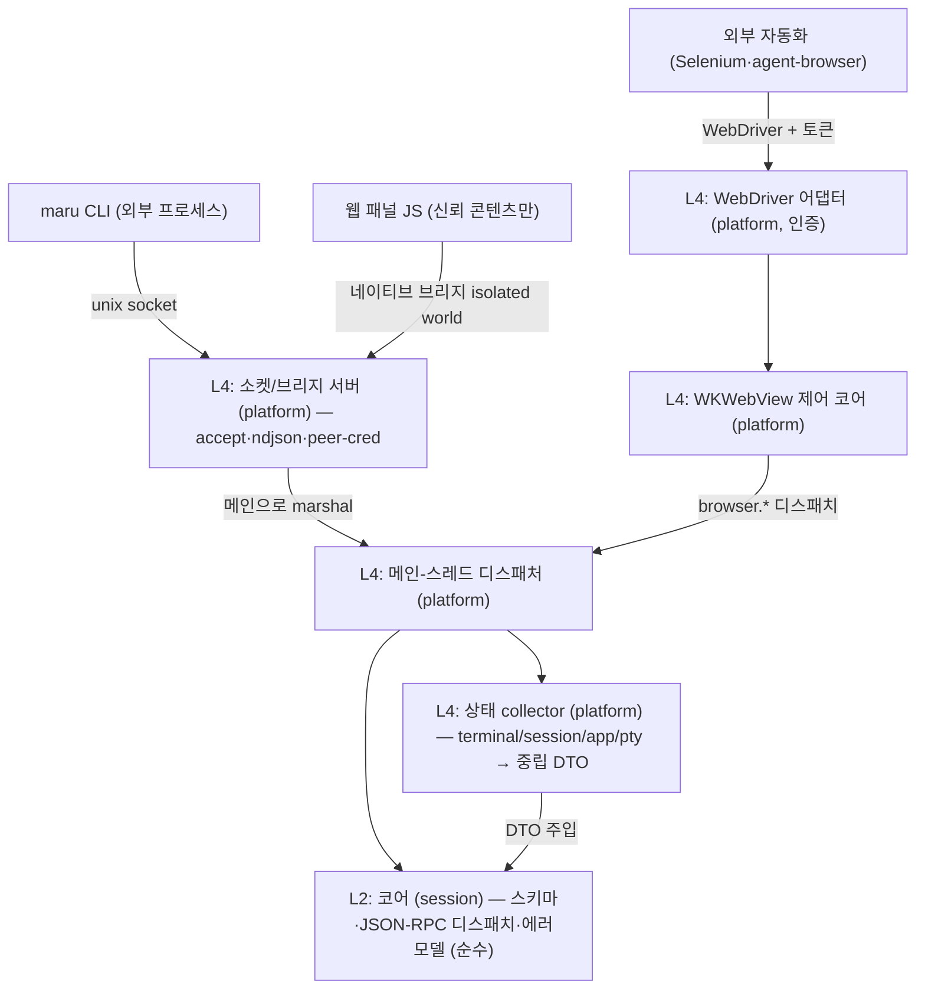

# 세션 컨트롤 플레인 (CLI·웹뷰 IPC)

이 문서는 Maru의 **세션·패널 간 상태 조회와 명령 전송**(컨트롤 플레인)의 단일 출처다. CLI(`maru ...`), 웹 패널(WKWebView 안의 JS), 외부 자동화 도구가 실행 중인 Maru의 세션·패널을 **열거·조회·제어·구독**하는 계약을 정한다.

tmux(`list-panes`/`send-keys`/`capture-pane`)·cmux가 푸는 문제를 다루되, maru는 **하나의 wire 프로토콜을 CLI와 웹뷰가 공유**하게 해서 두 번 설계하지 않는다.

레이어 경계는 [레이어링과 이식성 전략](layering-and-portability.md), macOS 호스트 경계·Zig↔Swift 분담은 [macOS 앱 호스트 경계](macos-app-host-boundary.md), I/O–렌더 스레딩·락 모델은 [I/O–렌더 스레딩 분리](io-render-threading.md), 탭/split 모델은 [탭·split·레이아웃](tabs-splits-layout.md), 링크 클릭 라우팅(md→패널)은 [링크 감지](link-detection.md)를 단일 출처로 둔다. 웹 패널의 표시·합성(WKWebView 오버레이·z-order·per-pane rect ABI)은 [웹 패널 인프라](web-panel.md)(Phase 4 선결 상세)로 분리한다.

## 1. 확정 결정

- **wire = 줄 단위(ndjson) JSON-RPC 2.0.** 메시지 1개 = 1줄. 요청/응답은 `id`로 매칭, 이벤트는 `id` 없는 notification. 직렬화는 JSON 단독(Zig `std.json` + JS `JSON.parse`, 의존성 0). 대형 페이로드는 §4.3 규약을 따른다.
- **transport 둘, 메시지 스키마 하나.** 외부 프로세스는 **unix domain socket**, 웹 패널은 **WKWebView 네이티브 메시지 브리지(in-process)**. 컨트롤 플레인 wire는 TCP/HTTP를 바인드하지 않는다(외부 호환용 WebDriver 어댑터만 예외 — §9).
- **노출은 CLI 토대, MCP는 구현 계획 미정.** 주 사용처는 maru 안에서 도는 에이전트이고, `maru` CLI(+`SKILL.md`)가 셸로 직접 호출한다. 외부 MCP 클라이언트용 어댑터는 같은 wire 위에 얇게 얹을 수 있으나 **구현 계획은 미정**이라 막지 않을 seam(버전·네임스페이스)만 둔다(§4.1).
- **메서드 어휘 = tmux식.** `sessions.list`/`session.sendKeys`/`session.capture`.
- **이벤트 = 스트림(push) 1급.** `events.subscribe` notification 스트림. 초기 구현은 기존 agent 폴링 결과를 흘리되, background 세션 이벤트는 폴링 게이트 확장 또는 진짜 이벤트 소스가 필요하다(§7).
- **엔티티 = surface 일반화 + 안정 외부 ID.** terminal/web surface를 같은 ID 공간에 두고, 외부 ID는 `(window_token, surface_id)` 복합키다. surface_id는 AppSession(창)마다 1부터 발급되므로 단독으론 멀티윈도우에서 충돌한다(§3).
- **코어(L2) = 스키마 + 프로토콜 + 순수 디스패치만.** 라이브 상태 수집은 platform collector(L4)가 모아 중립 스냅샷 DTO로 코어에 주입한다. 코어는 런타임/OS 타입을 직접 참조하지 않는다(`check-boundaries`가 `session→app/pty/platform`을 막는다 — §2).
- **동시성 = 단일 디스패치 지점(메인으로 marshal) + 출력 스트림은 I/O 스레드 직송.** 제어·조회는 메인 frame loop로 marshal해 코어/레지스트리/트리에 안전 접근하고, 고처리량 출력(`subscribeOutput`)은 메인을 거치지 않고 I/O 스레드에서 per-subscriber 큐로 직송한다(§5).
- **보안 = 같은 uid 안의 신뢰 차등까지.** 웹 브리지는 신뢰 콘텐츠에만 노출, 외부 소켓은 peer-cred + 0700/0600, write는 per-surface capability(§8).
- **`browser.*` = WKWebView 직접 제어(코어) + W3C WebDriver 어댑터(외부, 인증 필수).** CDP가 아니라 WebDriver다(§9).
- **웹 패널 콘텐츠 번들러 = zntc(`@zntc/core`)로 확정.** zntc는 dev-only 빌드 도구로 두어 런타임 의존성 0을 유지한다. 웹 빌드 환경은 `web/` 하위 Bun workspace를 기본 방향으로 둔다(`bun.lock` 고정, install/scripts/test 실행). VoidZero 계열은 번들러 대안이 아니며, Vite+ 같은 통합 CLI는 zntc와 역할이 겹치므로 Phase 7 기본값으로 두지 않는다. 필요 시 Vitest/Oxc 같은 개별 도구만 테스트/보조 도구로 별도 검토한다. lockfile·vendoring·CI 캐시·라이선스·supply-chain 고정 방식은 Phase 7 착수 전 재확인한다(§15).
- **리치 패널 렌더 = WKWebView (네이티브 뷰 비사용 원칙의 명시적 예외).** 원칙의 근거는 이식성인데, 웹 콘텐츠(HTML/JS/CSS)는 WKWebView/WebKitGTK/WebView2 어디서나 그대로 돌아 목적을 충족한다(SwiftUI와 달리 UI 코드가 Apple 전용이 아님). 예외는 **닫힌 열거**다: 마크다운 WYSIWYG 편집, 인앱 브라우저(임의 웹이라 진짜 엔진 필요). **diff 뷰어는 GPU 셀로 그리고 예외에 넣지 않는다**(색입힌 등폭 텍스트라 셀로 충분). 새 종류 추가는 사용자 승인이 필요하다. macOS=시스템 WebKit(의존 0)이나 이식 타깃은 WebKitGTK/WebView2로 의존 0이 깨진다(GPU 경로 WebGPU와 대칭).

## 2. 목표 위상

| 층 | 위치 | 책임 | 이식 시 |
|---|---|---|---|
| **L2 코어** | `src/session/` | 메시지 스키마, JSON-RPC 디스패치, 에러 모델, 순수 변환. OS/런타임 타입 0 | 재사용 |
| **L4 collector** | `src/platform/macos/` | 4개 레이어·OS에서 상태 수집 → 중립 DTO로 주입 | 타깃별 |
| **L4 소켓/브리지 서버 + 디스패처** | `src/platform/macos/` | accept, peer-cred, ndjson 프레이밍, 메인 marshal, 웹뷰 메시지 핸들러 | 타깃별 |
| **L4 WKWebView 제어 + WebDriver 어댑터** | `src/platform/macos/` | WKWebView API 호출(Swift). 라우팅·디스패치·프레이밍은 Zig | 타깃별 |

코어(L2)는 상태를 **collector가 주입하는 중립 DTO seam으로만** 받는다([layering-and-portability.md] §3.1 `PtyIo` vtable 선례).

**collector 2층(정직)**: Zig에 전역 AppSession 레지스트리가 없다 — collector는 단일 Zig 컴포넌트가 아니라 2층이다. Swift가 살아있는 세션(`windows`+`quick`)을 순회하며 per-session collect ABI를 호출하고, Zig는 한 세션 안의 tabs→panes→terms 트리만 중립 DTO로 평탄화한다. 즉 cross-session 열거는 Swift 경계에 있다(boundary 가드가 L2 코어의 AppSession 접근을 막으므로 불가피).

## 3. 엔티티 모델

기존 계층 `Window → Tab → Pane → Term(surface)`에 종류를 더한다: `surface.kind = terminal | web`.

- **외부 ID = `(window_token, surface_id)` 복합키.** `surface_id`는 AppSession마다 1부터 발급되고 재시작 시 재생성된다. 외부 자동화가 저장한 ID는 재시작 후 무효일 수 있음을 계약에 명시한다.
- **재시작 영속 상관키.** workspace restore는 surface를 새 ID로 복원하지만 에이전트 대화(claude/codex `session_id`)는 영속한다. 재시작을 건너 재연결하려면 컨트롤 플레인 ID를 workspace stable-id·트리 좌표·에이전트 `session_id`에 묶는 상관키를 함께 노출한다.
- **멀티윈도우는 현재형이다.** quick terminal은 두 번째 AppSession(독립 셸·자체 트리)이라 primary와 surface_id가 충돌한다. collector는 **살아있는 모든 AppSession(primary + quick)을 열거**하고, window_token이 이를 구분한다.
- **quick terminal 정책.** 기본으로 `sessions.list`에 열거하되, write(`send*`/생애주기)는 capability 게이트(§8.3)로 보수적으로 막는다.
- 공통 메타: `id`, `kind`, `title`, `window`/`tab`/`pane` 좌표, `focused`.
- terminal 전용: `cwd`(OSC 7), `git_branch`, `agent`(kind/state), `has_foreground_job`.
- web 전용: `url`, `panel_kind`(markdown|browser|...), `loading`, `trust`(trusted|untrusted — §8.1).

상태 수집은 기존 자산을 직렬화한다(신규 수집 로직은 collector에 둔다): app_session의 `Model` 트리, `core.currentCwd()`, `termGitBranch`, `agent_transcript`(running/idle), `PtySession.hasForegroundJob()`.

## 4. transport·프로토콜

### 4.1 핸드셰이크·버전·네임스페이스
- 연결 시 server가 `hello` notification으로 `{protocol: "maru.control.v1", server_version, capabilities}`를 보낸다. 외부 도구·CLI↔GUI 버전 skew를 감지하고, 지원 메서드를 capability로 광고한다.
- 메서드 네임스페이스를 예약한다: 코어 = `sessions`/`session`/`panel`/`browser`, 확장 = `plugin.<id>.*`. 닫힌 하드코딩 테이블이 아니라 코어 표 + 등록 가능한 확장 핸들러로 디스패치해 plugin/MCP/skill을 막지 않는다. 발견 메서드(`methods.list`)는 후속.

### 4.2 다중 인스턴스·발견
- 소켓 경로 키 = 인스턴스(pid/부팅 nonce). `~/.cache/maru/control/`(0700)에 살아있는 인스턴스 인덱스 + `flock`.
- bind 전 stale 소켓은 `flock`으로 살아있는지 판별 후 unlink-then-bind(살아있는 소켓은 unlink 금지).
- 자식 셸은 `$MARU_SESSION`+소켓 경로로 자기 인스턴스를 안다. 단, 이 둘은 발견 힌트일 뿐 권한 증명이 아니다. 실제 surface 권한은 spawn 시 상속한 capability fd(§8.4)가 증명한다. maru 밖 일반 셸의 CLI는 단일 인스턴스면 자동 발견까지만 가능하고, 비밀 출력 열람은 별도 grant가 필요하다(어휘 미정 — §13).

### 4.3 프레이밍 견고성
- max frame size(≈ 1 MiB) 정의. 초과 시 `payload-too-large` + 연결 종료. 부분 읽기는 누적 버퍼.
- 대형 응답(`capture` 전체 스크롤백 등)은 단일 ndjson 라인 금지 — chunk notification(예: 64 KiB/chunk)+완료 마커. **JSON 문자열은 valid UTF-8만 담으므로 임의 바이트(이스케이프 시퀀스·깨진 UTF-8)는 base64로 인코딩**한다. **일관성: capture 시작 시 `capture_id`+스냅샷 generation을 고정하고, 각 chunk는 `{capture_id, seq, generation, encoding}`을 싣는다.** chunk 복사는 surface `core_mutex` 아래에서만 수행하되 직렬화는 락 밖에서 한다. chunk 경계에서 generation이 바뀌면 server는 성공 완료 마커를 보내지 않고 `capture-invalidated` 오류/notification으로 스트림을 종료한다. client는 처음부터 재시도한다.
- per-connection bounded outbound 큐 + non-blocking write. 응답을 안 읽는 클라이언트가 디스패처를 막지 않게 한다. 이벤트는 느린 구독자에 대해 coalesce/drop(상태 스냅샷이라 손실 허용), 한계 초과 시 구독 강제 해제.

## 5. 동시성·생명주기

- **단일 디스패치 지점**: 소켓 스레드는 accept/parse/프레이밍만, 코어·트리·collector 접근은 메인 frame loop로 marshal한다(웹뷰 in-process 경로와 동일 스레드). 라우팅 테이블(`links`/`entries`)이 락 없는 메인 전용이므로 크로스스레드 순회는 금지한다.
- **출력 스트림 직송**: `subscribeOutput`의 고처리량 데이터는 메인을 거치지 않고 I/O 스레드에서 per-subscriber bounded 큐로 직접 민다(메인 marshal에 태우면 폭주 출력이 렌더를 막는다 — [io-render-threading.md]). 메인은 라우팅 메타데이터만 다룬다.
- **코어 read 락**: cwd/scrollback 등 코어 read는 surface `core_mutex` 아래에서만(리더 스레드의 evict/free와 경합). capture는 락 아래 복사만(§4.3), 직렬화는 락 밖.
- **수명**: 외부엔 ID만 노출(비소유 포인터 금지), 매 호출 재조회. surface_id에 generation을 달아 종료된 세션의 in-flight 요청은 `process-exited`로 거부. 세션 종료 단일 chokepoint가 `session.closed` 방출 + 구독 자동 해제.
- **per-tick 예산**: 컨트롤 플레인 작업이 frame tick 예산을 넘으면 다음 tick으로 분할한다([performance-budget.md]에 항목을 둔다).

## 6. 메서드 표면 (초안)

| 메서드 | 인자 | 반환 | 비고 |
|---|---|---|---|
| `sessions.list` | `{window?}` | `[Surface]` | terminal+web 열거(collector가 모든 AppSession 트리 워크) |
| `session.get` | `{id}` | `Surface` | core_mutex read |
| `session.sendText` | `{id, text}` | `{ok}` | **raw 쓰기 경로**(bracketed paste 미적용). capability 게이트 |
| `session.sendKeys` | `{id, keys}` | `{ok}` | `input_report.encodeKey` 재사용. 키 표기법은 tmux 호환(§13) |
| `session.capture` | `{id, scrollback?}` | streaming | 생략 시 가시 화면. 대형은 §4.3 chunk. capture 권한(§8.3) |
| `session.subscribeOutput` | `{id}` | 스트림 | 실시간 출력. I/O 직송(§5). capture와 동일 권한(§8.3) |
| `session.resize`/`focus`/`close`/`spawn` | `{id, ...}` | `{ok}` | 생애주기. 기존 자산(`closeActive`·`createTab` 등) 노출 |
| `panel.open` | `{kind, args, trust}` | `{id}` | web 패널. `kind=browser`는 `trust=untrusted`(§8.1) |
| `panel.bindSession` | `{panel_id, session_id}` | `{ok}` | 패널↔세션 cwd 연동. `bind` capability(§8.3) |
| `events.subscribe` | `{filter?}` | 스트림 | §7 |
| `browser.*` | (§9) | — | web surface 제어. trust·capability 검사 |

메서드별 필요 capability는 §8.3을 단일 출처로 따른다 — `list`/`get`/`subscribe`=`metadata`, `panel.bindSession`=`bind`, `capture`/`subscribeOutput`=`read-output`, `send*`=`write`, `resize`/`focus`/`close`/`spawn`/`panel.open`=`lifecycle`, `browser.*`=`browser`.

## 7. 이벤트

`events.subscribe` 후 server가 notification을 push한다: `session.stateChanged`(agent running↔idle)·`cwdChanged`·`created`/`closed`, `panel.navigated`.

초기 소스는 기존 agent 폴링이다(`pollAgentKinds`/`pollAgentState`). 이 폴링은 **모든 pane×Term을 돌고 시각화(metal dirty)만 보이는 Term에 게이트**한다 — 즉 background Term 커버리지는 이미 있다. 진짜 잔여 갭은 (1) ~0.5s 병합으로 짧은 전이가 손실되는 것의 **전이-엣지 이벤트화**, (2) background **세션**(별도 AppSession, quick 등) 커버리지다 — Phase 3 선결.

## 8. 보안

컨트롤 플레인은 같은 uid 안에서도 신뢰가 다른 코드(웹 콘텐츠·저권한 자동화·sudo 세션)가 공존한다고 가정한다. "uid가 같으면 신뢰가 같다"고 보지 않는다.

### 8.1 웹 브리지 노출 게이트
- `window.maru.*`는 신뢰 콘텐츠에만 주입한다. maru가 빌드해 `maru-app://` 커스텀 스킴으로 서빙하는 콘텐츠(마크다운 등)만 브리지를 받고, `panel_kind=browser`(임의 URL)에는 주입하지 않는다.
- 브리지를 isolated `WKContentWorld`에만 등록한다(spike 실측: 임의 페이지 page-world에서 `window.maru` 접근 불가, isolated world에서만 가능). 단 **`forMainFrameOnly`는 주입 user script에만 적용**되고 메시지 핸들러 등록은 world-scope라 프레임을 안 가린다 — 따라서 **핸들러 진입에서 `frameInfo.isMainFrame`+`securityOrigin`을 검사**해 서브프레임·clickjacking을 막는다(enforcement 디테일은 [web-panel.md] §7).
- 신뢰 콘텐츠도 자기 surface(또는 명시 위임)만 제어한다.

### 8.2 소켓 권한·peer-cred
- 0700 전용 디렉터리 + bind 시 `umask` 또는 bind 후 `chmod(path)`로 socket path를 0600에 고정한다. `fchmod(fd)`는 쓰지 않는다(spike에서 -1 확인). `O_NOFOLLOW`/lstat로 심볼릭 링크·소유자 검증.
- accept마다 peer uid 검증(`LOCAL_PEERCRED`/`SO_PEERCRED`), 불일치 시 종료(spike 실측 확정). 파일 권한에만 의존하지 않는다.

### 8.3 capability 인가
- 같은 uid의 임의 프로세스가 모든 surface를 제어·열람하면 sudo 세션·다른 보안등급 탭에 대한 권한 상승이 된다. capability는 `metadata`(열거/조회 — `sessions.list`/`get`/`events.subscribe`), `bind`(`panel.bindSession`), `read-output`(`capture`/`subscribeOutput`), `write`(`send*`), `lifecycle`(`spawn`/`close`/`resize`/`focus`/`panel.open`), `browser`(`browser.*`)로 나눈다(§6 매핑의 단일 출처).
- unix socket path와 peer-cred는 "같은 사용자"와 "같은 인스턴스 발견"만 증명한다. 특정 surface 권한은 capability fd(§8.4)로 받은 nonce를 첫 auth frame에 제시해야 생긴다. fd가 없거나 scope/generation/surface가 맞지 않으면 `unauthorized`다.
- spawn profile의 기본 grant는 보수적으로 둔다. 일반 login shell 자식은 `$MARU_SESSION` 기반 발견과 `metadata:self`까지만 기본으로 두고, `read-output:self`는 capability fd 보존이 실측된 non-login trusted agent/control profile 또는 별도 one-shot grant UX에만 붙인다. `write`·`lifecycle`·`browser`·cross-surface 권한은 기본 거부 또는 사용자 확인이다. 이 모델은 fd를 상속한 그 터미널의 자식 프로세스가 자기 권한을 사용할 수 있음을 인정하고, scope를 self+최소 권한으로 줄여 피해 범위를 제한한다.
- **`events.subscribe`는 전역 스트림이라 `metadata`만으로 다른 surface 상태(cwd·생성/종료)가 누설될 수 있다 — filter를 self-surface로 스코프**하고 cross-surface 구독은 추가 권한으로 둔다(filter 스키마 §13).
- `capture`·`subscribeOutput`은 비밀(스크롤백·실시간 출력)을 노출하므로 `read-output` capability가 필요하다. `capture`가 처음 노출되는 Phase 1 안에서 capability fd 발급·auth·거부 테스트까지 함께 구현한다. "read-only라 토큰은 나중"으로 미루지 않는다.

### 8.4 환경변수 노출·redaction·capability fd
- `$MARU_SESSION`은 키名에 `SESSION` 토큰을 포함하므로 [project-rules.md] §redaction의 deny-by-default 대상이다. trace/artifact에서 값을 마스킹한다. env는 보안 경계가 아니라 편의 채널이다(소켓 경로는 결정론적이라 env 없이도 발견됨). capability fd 번호를 담는 `MARU_CONTROL_CAP_FD`는 비밀이 아니지만, 그 fd에서 읽은 nonce는 절대 로그·trace·artifact에 쓰지 않는다.
- capability 발급: server가 256-bit random nonce를 만들고 server-side에는 `hash(nonce) -> {surface_id, generation, scopes, expires_at?, revoked}`만 저장한다. nonce는 0600 임시 파일에 쓴 뒤 read-only fd로 다시 열고 즉시 unlink한다. child spawn에는 그 read-only fd만 상속한다(다른 fd는 `CLOEXEC`, capability fd만 의도적으로 상속). CLI는 `MARU_CONTROL_CAP_FD`의 fd에서 offset 0 `pread`로 payload를 읽어 control socket의 첫 auth frame에 보낸다(여러 CLI 호출이 공유 file offset에 의존하지 않게). server는 hash를 constant-time 비교하고 surface generation·scope·TTL·revocation을 확인한다.
- fd payload는 magic/version/header를 포함한다. shell startup script가 같은 fd 번호를 닫거나 재사용하면 CLI는 임의 데이터를 nonce로 오해하지 말고 `capability-fd-invalid`로 실패한다. CLI는 nonce를 읽은 직후 capability fd를 닫거나 `FD_CLOEXEC`로 바꿔 pager/editor/helper 프로세스에 fd가 새지 않게 한다.
- 실측 gate(2026-06-29, macOS Darwin 25.5): read-only unlinked fd는 offset 0 `pread` 재호출이 같은 payload를 돌려주고 write는 `EBADF`로 실패했다. 현재 macOS PTY login wrapper(`/usr/bin/login -flp ... /bin/bash --noprofile --norc -c "exec -l <shell> ..."`)는 `MARU_CONTROL_CAP_FD` env는 보존하지만 fd 자체는 닫았다(zsh/bash 모두 `EBADF`). 반면 non-login 직접 exec의 zsh/bash/sh 자식은 fd payload를 읽었다. 따라서 Phase 1의 `read-output` capability fd grant는 일반 login shell이 아니라 non-login trusted agent/control profile에서 먼저 구현한다. login shell에서 read-output이 필요하면 env bearer token으로 후퇴하지 말고 별도 one-shot grant UX를 설계한다.
- shell·daemon 영향 실측: synthetic `ZDOTDIR/.zshenv`가 fd를 닫으면 CLI는 fd read 실패로 닫힌다. 일반 background child는 fd를 유지했다. 이 환경의 tmux/screen pane은 env는 보존했지만 fd는 닫혀 있었다. 그래서 tmux/screen이 fd를 늘린다고 단정하지 않되, fd가 background/daemon에 남는 경우를 TTL+revocation 테스트로 계속 막는다. `sudo -n -E`는 로컬에서 비밀번호 요구로 미검증이므로 controlled sudoers 환경 또는 수동 gate로 둔다.
- revocation: surface close, generation 변경, grant 취소, TTL 만료 시 capability는 즉시 무효다. auth 성공 후에도 dispatch 시점과 streaming chunk 경계마다 `{surface_id, generation, scopes, revoked}`를 재검증한다. in-flight `capture`는 `capture-invalidated` 또는 `capability-revoked`로 성공 완료 없이 종료하고, `subscribeOutput`은 구독을 끊는다. 같은 uid의 외부 프로세스가 결정적 socket path만 알아도 nonce fd를 상속하지 않았으면 `capture`/`subscribeOutput`을 호출할 수 없다.

### 8.5 WebDriver 어댑터
- TCP가 아니라 unix 소켓 위 HTTP(또는 loopback + 무작위 bearer 토큰 0600 파일) + Origin/Host 화이트리스트 + 기본 off. 인증 없는 localhost TCP는 cross-uid·CSRF로 `execute_script`/`get_cookies`를 노출하므로 금지한다.

### 8.6 SSH 원격
- SSH 터널은 transport 암호화만 제공하고 메시지 authz는 아니다. 원격 노출 시에도 컨트롤 플레인 자체 인증(토큰/capability)을 필수로 하고, 포워딩은 명시 opt-in이다.

## 9. `browser.*` — WKWebView 제어 + WebDriver 어댑터

제어 코어(한 번만) 위에 두 얼굴: `browser.*`(컨트롤 플레인 wire 메서드) + W3C WebDriver 서버(외부, §8.5 인증).

- **CDP가 아니라 W3C WebDriver.** agent-browser 백엔드가 ~15개 명령(navigate/get_url/execute_script/screenshot/find_element/click/send_keys/back/forward/refresh/get_cookies/...)뿐이라 CDP(수백)보다 표면이 작고 WebKit 정합이다.
- 명령→WKWebView API: navigate→`load`, execute_script→`evaluateJavaScript`, screenshot→`takeSnapshot`, get_cookies→`WKHTTPCookieStore`, back/forward/reload→`goBack`/`goForward`/`reload`, find_element/click/send_keys→`evaluateJavaScript`. Swift는 API 호출만, 라우팅·매핑·프레이밍은 Zig.
- `safaridriver`는 Safari.app만 제어하므로 WKWebView용 WebDriver 서버는 직접 구현한다. agent-browser가 우리 endpoint에 붙는 통합은 별도(remote WebDriver URL 추가 — Apache-2.0 fork/PR, 또는 인터페이스 흉내).

## 10. 베이스와 결정 (clean-room)

- **메커니즘**: JSON-RPC 2.0 over 로컬 stdio/socket(LSP/DAP/CDP 공유). 메커니즘만 빌리고 LSP 스펙(textDocument/*)은 채택하지 않는다. 프레이밍은 ndjson(대형은 §4.3 chunk).
- **어휘**: tmux control mode. **WebDriver 어댑터**: agent-browser 백엔드 추상화(동작 비교만, 코드 미복사 — [references.md]).
- **MCP 관계**: wire가 JSON-RPC 2.0이라 향후 MCP 어댑터를 얇게 얹을 수 있고, MCP `tools/list`는 §4.1 발견 메서드와 같은 메커니즘으로 충족된다. **MCP 구현 계획은 미정**이며, 이를 막지 않도록 네임스페이스·발견 seam만 둔다.
- **maru가 다르게 한 점**: ① 외부·웹뷰가 하나의 wire 공유, ② 웹뷰 transport는 in-process 브리지(+신뢰 게이트), ③ 외부 호환을 CDP가 아니라 WebDriver로.

## 11. 구현 Phase (의존성 순서, 각 단계 green)

> 선행(공통): 외부 ID 모델(§3), collector seam(§2), 소켓 부트스트랩(서버 bind가 첫 spawn 선행)을 Phase 1 안에서 먼저 확정. "1~3 ∥ 4 → 5(합류) → 6 → 7".

| Phase | 내용 | 서드파티 |
|---|---|---|
| **0. 계약** | 본 문서 | 0 |
| **1. read-only** | unix socket 서버(accept/ndjson/peer-cred/hello) + 메인 디스패처 + **collector(Swift 열거 + Zig 세션내 2층)** + 외부 ID + `$MARU_SESSION` 주입 + capability fd 발급·auth(**non-login trusted profile 우선**) + CLI 클라이언트 + **`metadata`/`read-output` scope 인가** + **`control.*` trace schema 확장** + `sessions.list`/`get`/`capture` | 0 |
| **2. write** | `sendText`(raw)/`sendKeys` + `write`/`lifecycle` capability 인가(§8.3) + 에러 모델 | 0 |
| **3. 이벤트** | `events.subscribe`(background 소스 포함) + outbound 백프레셔 + `subscribeOutput`(I/O 직송) | 0 |
| **4. 웹 패널 껍데기** | 컨테이너 contentView + **입력 responder 재편 + 모달 레이어 분리(2패스)** + per-pane rect·surface 생애주기 ABI + `kind=web` + z-order. 규모·선행은 [web-panel.md] §2·§4·§6 단일 출처(가벼운 작업 아님) | 0 |
| **5. 제어 코어 + browser.* + JS 브리지** | WKWebView 제어 코어, `browser.*`, `window.maru.*`(신뢰 게이트·isolated world). 1·4 합류 | 0 |
| **6. WebDriver 어댑터** | 제어 코어 위 ~15 명령 + 인증(§8.5) | 0 |
| **7. 첫 콘텐츠** | 마크다운 뷰어+소스편집(zntc 번들) + md 링크 라우팅 + `panel.bindSession` + `bind` capability 인가 | §13 |

Phase 0~6은 서드파티 0. 1~3(컨트롤 플레인)과 4(웹뷰 껍데기)는 독립 축이라 병행 가능하다.

## 12. 테스트·검증 전략

브라우저 제어 도구라도 real-browser 의존 E2E가 아니라 프로토콜·파싱·변환을 순수 함수로 분리해 단위 테스트한다(선례: agent-devtools — wire 프레이밍·메시지 roundtrip·discovery·daemon을 순수 Zig 테스트). maru 컨트롤 플레인에 대응: ndjson 프레이밍, JSON-RPC 디스패치, 소켓 발견, 소켓 서버.

테스트 가능성:
- **순수 로직**(프로토콜·디스패치·제어 명령·보안 판정): Zig 단위(TDD).
- **소켓·collector**: 실제 unix socket bind/connect 통합 E2E + fake `Rt` 유닛.
- **웹 패널**(콘텐츠·`browser.*`·브리지·신뢰 게이트): `evaluateJavaScript`/WebDriver 어댑터로 **자동 E2E**. 예: untrusted 패널에서 `typeof window.webkit.messageHandlers.maru === 'undefined'` 단언으로 브리지 미주입을 자동 검증. frame 값·NSView 계층(z-order)은 코드 단언.
- **픽셀 시각 정합**(z-order·frame이 눈에 맞는가): web-panel.md §11을 단일 출처로 둔다. 현재 CI 자동화는 불가(`CGWindowListCreateImage` 제거, ScreenCaptureKit은 TCC/GUI 필요)라 Phase 4 종료 게이트는 GUI 골든 1 frame 수동 확인이다.

매 단계 `check-boundaries`(코어 L2에 app/pty/platform import 0). 관측 가능성: 컨트롤 플레인 JSON-RPC 메시지를 기록하려면 먼저 [Trace와 Replay](trace-replay.md)·[Facade 계약](facade-contracts.md)의 `Trace/Event` schema를 `control.*` event로 확장한다. 그 전에는 "기존 trace 포맷을 그대로 재사용"한다고 주장하지 않는다. 실패 artifact는 redaction(§8.4) 후.

| Phase | 단위(Zig) | 통합/E2E | 수동 |
|---|---|---|---|
| 1 | 스키마·`list`/`get` 직렬화(fake DTO), ndjson 부분읽기·max frame, 2-윈도우 ID 비충돌, capability fd auth(정상/누락/잘못된 surface/generation/revoked/invalid payload), read-only fd·`pread` 재호출, CLI fd close/`FD_CLOEXEC` 후 helper 누수 방지, dispatch·chunk 경계 revocation, `metadata`/`read-output` capability 허용·거부, `capture-invalidated` generation mismatch, `$MARU_SESSION`·nonce redaction | unix socket 왕복, peer-cred 거부, CLI, collector(fake Rt), `capture` 권한 거부·허용, capability fd 상속 smoke(**login wrapper 실패, non-login zsh/bash/sh 성공**), zsh startup fd-close 실패, background fd persistence+TTL/revocation, tmux/screen pane fd-close 관측 | sudo/su controlled gate |
| 2 | `sendText` raw(bracketed 미적용), capability 거부, 에러 코드 | 소켓→실제 PTY 입력(통합 PTY) | — |
| 3 | outbound 백프레셔·coalesce/drop, `subscribeOutput` 권한 거부 | subscribe→상태 push(background 포함), `subscribeOutput` 직송 | — |
| 4 | pane→px rect 계산, leaf kind 라우팅 | NSView frame/계층 단언 | 픽셀 정합(스크린샷) |
| 5 | `browser.*` 디스패치, 신뢰 게이트 판정 | `evaluateJavaScript`로 브리지 호출·미주입 단언, isolated world | — |
| 6 | WebDriver HTTP 라우팅, 토큰/Origin 검사 | 표준 WebDriver 클라이언트 제어 | — |
| 7 | md 클릭 라우팅, `panel.bindSession` cwd, `bind` capability 허용·거부 | 웹 콘텐츠 JS 테스트 + Chrome E2E | 실제 렌더(눈 확인) |

## 13. 열린 질문

- 웹 asset repo/tooling 구성: 번들러는 zntc로 확정. 기본 방향은 `web/` 하위 Bun workspace(`package.json`+`bun.lock`)로 패키지 설치·script 실행·테스트를 고정하는 것이다. VoidZero 계열은 zntc 대체가 아니라 필요 시 Vitest/Oxc 등 개별 보조 도구로만 검토하고, Vite+ 전체 도입은 기본값에서 제외한다. Phase 7 착수 시 lockfile·CI cache·라이선스·offline/reproducible build를 함께 결정한다([project-rules.md] §의존성, 사용자 논의).
- 서드파티 JS 라이브러리(마크다운/편집: TipTap 등 vs 자체). Phase 7 착수 시 결정([project-rules.md] §의존성, 사용자 논의).
- 비-자식 CLI의 인스턴스 선택 어휘(§4.2).
- 비-자식 CLI에 read-output 권한을 주는 UX(일회성 GUI 확인, 짧은 TTL grant, 설정 allowlist 중 선택).
- login shell에서 read-output 권한을 줄 UX(일회성 GUI 확인, 짧은 TTL grant, 별도 verified channel). 현재 login wrapper는 fd를 닫는 것으로 실측됐다(§8.4).
- `sendKeys` 키 표기법(tmux 호환 이름) 세부.
- `events.subscribe {filter?}` 필터 스키마.
- 세션 이름/별칭, 영속/재연결(전역 UUID 도입 여부).
- 마크다운 편집 WYSIWYG 시점/방식(뷰어+소스편집은 확정).

## 14. 리스크

- WKWebView z-order(Metal 오버레이를 웹뷰가 가림)는 Phase 4 차단 선결 — web-panel.md에서 합성 모델 확정 후 진행.
- per-pane rect-export ABI는 현재 없어 신규(web-panel.md).
- 이벤트 background 소스(폴링 게이트 확장/진짜 소스)가 Phase 3 선결.
- WebDriver 외부 도구 통합(agent-browser endpoint 연결)은 코어+서버 후속.
- capability fd는 shell 환경에 민감하다. 현재 login wrapper는 fd를 닫는 것으로 실측됐으므로 일반 login shell에 `read-output` fd grant를 붙이면 동작하지 않는다. startup file은 fd를 닫을 수 있고, background child는 fd를 오래 붙잡을 수 있다. tmux/screen pane은 로컬 smoke에서 fd가 닫혔지만, 버전·설정 차이를 고려해 regression gate로 유지한다. Phase 1의 `read-output`은 non-login trusted profile부터 열고, TTL/revocation 테스트 없이는 기본 grant로 열지 않는다.
- zntc는 외부 npm이라 dev-only라도 supply-chain 고정이 필요하다. 2026-06 현재 `@zntc/core` 존재·MIT 라이선스는 확인했지만, Phase 7 전에 lockfile·CI cache·license·offline/reproducible build를 재확인한다(§15).

## 15. 선결 사항 (구현 직전 결정)

- ~~`web-panel.md` 작성~~ **완료** — WKWebView 합성·z-order·per-pane rect ABI는 [웹 패널 인프라](web-panel.md)가 단일 출처. ABI·모달 레이어 분리 구현은 Phase 4.
- zntc 번들 편입 방식(dev-only 빌드 도구로, 런타임 의존성 0 유지)·lockfile/캐시/라이선스 재확인 — Phase 7 전. 기본 환경은 `web/` Bun workspace이며, VoidZero 계열은 번들러가 아니라 테스트/보조 도구 후보로만 검토한다.
- `MARU_SESSION` redaction 및 capability nonce redaction 처리 — Phase 1.

## 16. 코드 위치 (구현 시 채움)

- 코어(L2): `src/session/control_plane.zig`
- collector·소켓·디스패처(L4): `src/platform/macos/MaruAppHost.swift`, `src/platform/macos/control_{collector,socket}.{zig,m}`, `src/platform/macos/app_host_abi.{zig,h}`
- 세션 신원: `src/pty/types.zig`(`SpawnRequest`)·`pty/macos.zig`(env)
- CLI: `src/cli.zig`(`sessions`/`session` 서브커맨드)
- WKWebView·WebDriver: `src/platform/macos/web_panel.{zig,swift}`
