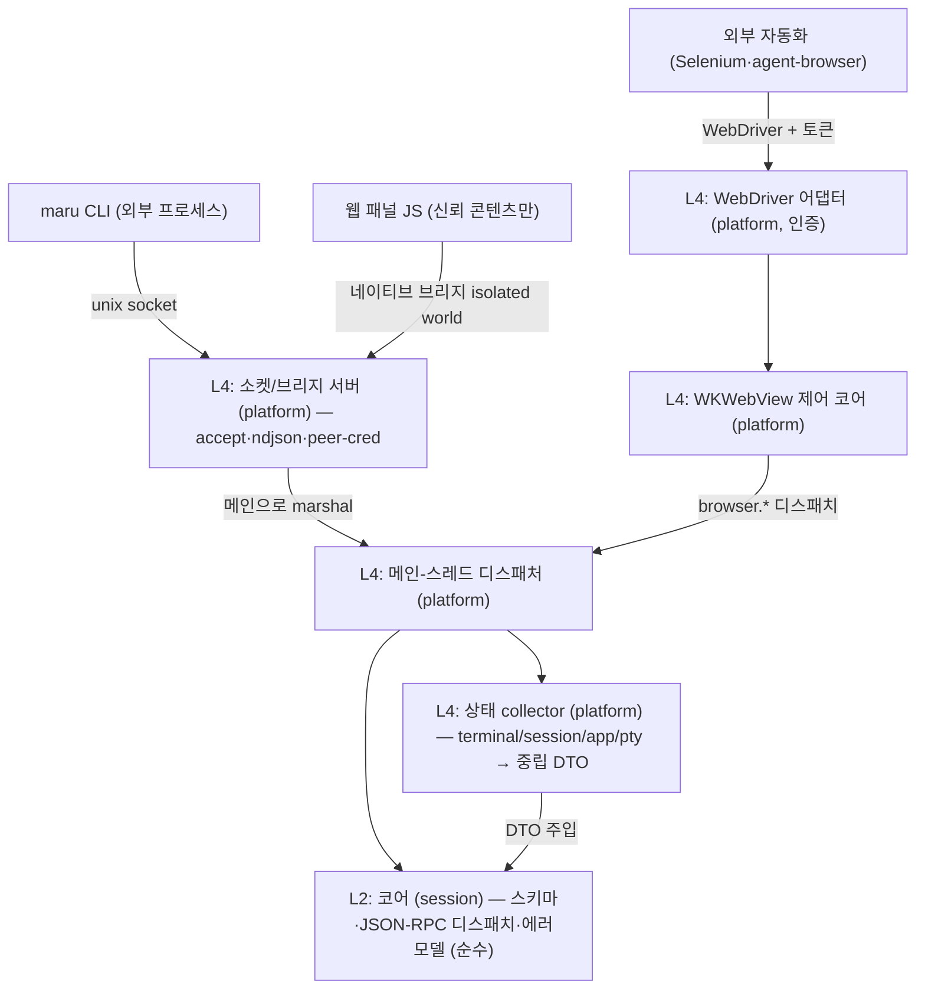

# 세션 컨트롤 플레인 (CLI·웹뷰 IPC)

이 문서는 Maru의 **세션·패널 간 상태 조회와 명령 전송**(컨트롤 플레인)의 단일 출처다. CLI(`maru ...`), 웹 패널(WKWebView 안의 JS), 외부 자동화 도구가 실행 중인 Maru의 세션·패널을 **열거·조회·제어·구독**하는 계약을 정한다.

tmux(`list-panes`/`send-keys`/`capture-pane`)·cmux가 푸는 문제를 다루되, maru는 **하나의 wire 프로토콜을 CLI와 웹뷰가 공유**하게 해서 두 번 설계하지 않는다.

레이어 경계는 [레이어링과 이식성 전략](layering-and-portability.md), macOS 호스트 경계·Zig↔Swift 분담은 [macOS 앱 호스트 경계](macos-app-host-boundary.md), I/O–렌더 스레딩·락 모델은 [I/O–렌더 스레딩 분리](io-render-threading.md), 탭/split 모델은 [탭·split·레이아웃](tabs-splits-layout.md), 윈도우 간 detach/reattach와 전역 surface 소유권은 [윈도우와 Surface 이동성](window-surface-mobility.md), **GUI process 종료를 건너는 terminal runtime 수명과 `maru attach`는 [영속 터미널 세션 호스트](persistent-session-host.md)**, 링크 클릭 라우팅(md→패널)은 [링크 감지](link-detection.md)를 단일 출처로 둔다. 웹 패널의 표시·합성(WKWebView 오버레이·z-order·per-pane rect ABI)은 [웹 패널 인프라](web-panel.md)(Phase 4 선결 상세)로 분리한다.

> **process 경계 구분:** 현재 control-plane server는 `Maru.app` 수명에 묶여 있고 `surface_id + generation`으로 GUI
> surface를 제어한다. 향후 `maru-sessiond`의 `runtime_id`, screen attach stream, process lifetime RPC는 별도
> 별도 MRSH session-host transport(현재 major v2) 설계다. 기존 `session.*` method의 의미나 ID를 조용히 바꾸지 않는다.

## 1. 확정 결정

- **wire = 줄 단위(ndjson) JSON-RPC 2.0.** 메시지 1개 = 1줄. 요청/응답은 `id`로 매칭, 이벤트는 `id` 없는 notification. 직렬화는 JSON 단독(Zig `std.json` + JS `JSON.parse`, 의존성 0). 대형 페이로드는 §4.3 규약을 따른다.
- **transport 둘, 메시지 스키마 하나.** 외부 프로세스는 **unix domain socket**, 웹 패널은 **WKWebView 네이티브 메시지 브리지(in-process)**. 컨트롤 플레인 wire는 TCP/HTTP를 바인드하지 않는다(외부 호환용 WebDriver 어댑터만 예외 — §9). **원격(폰)도 이 둘을 안 늘린다** — SSH 채널로 붙는 것은 wire 가 아니라 **그 앞단의 중계**이고, wire 는 여전히 그 PC 안의 unix socket 이다(§4a). 우리는 어떤 포트도 열지 않는다.
- **노출은 CLI 토대, MCP는 구현 계획 미정.** 주 사용처는 maru 안에서 도는 에이전트이고, `maru` CLI(+`SKILL.md`)가 셸로 직접 호출한다. 외부 MCP 클라이언트용 어댑터는 같은 wire 위에 얇게 얹을 수 있으나 **구현 계획은 미정**이라 막지 않을 seam(버전·네임스페이스)만 둔다(§4.1).
- **메서드 어휘 = tmux식.** `sessions.list`/`session.sendKeys`/`session.capture`.
- **이벤트 = 스트림(push) 1급.** `events.subscribe` notification 스트림. 초기 구현은 기존 agent 폴링 결과를 흘리되, background 세션 이벤트는 폴링 게이트 확장 또는 진짜 이벤트 소스가 필요하다(§7).
- **엔티티 = surface 일반화 + 앱 전역 외부 ID.** terminal/web surface를 같은 ID 공간에 두고, 외부 ID는 `surface_id + generation`이다. 하위 호환은 고려하지 않고, `surface_id`는 앱 인스턴스 전역 `SurfaceIdAllocator`가 발급하는 opaque u64로 고정한다. ID 비트에 window/session/local counter 의미를 넣지 않는다. `window_token`은 현재 위치 메타데이터로 내린다. **이 ID는 GUI 재실행을 건너지 않는다.** persistent host의 `runtime_handle={host_id,runtime_id}`과 별개이며 서로 같은 정수나 권한 token으로 접지 않는다. 이유와 선행 refactor는 [윈도우와 Surface 이동성](window-surface-mobility.md), process 간 binding은 [영속 터미널 세션 호스트](persistent-session-host.md)를 단일 출처로 둔다.
- **코어(L2) = 스키마 + 프로토콜 + 순수 디스패치만.** 라이브 상태 수집은 platform collector(L4)가 모아 중립 스냅샷 DTO로 코어에 주입한다. 코어는 런타임/OS 타입을 직접 참조하지 않는다(`check-boundaries`가 `session→app/pty/platform`을 막는다 — §2).
- **동시성 = 단일 디스패치 지점(메인으로 marshal) + 출력 스트림은 I/O 스레드 직송.** 제어·조회는 메인 frame loop로 marshal해 코어/레지스트리/트리에 안전 접근하고, 고처리량 출력(`subscribeOutput`)은 메인을 거치지 않고 I/O 스레드에서 per-subscriber 큐로 직송한다(§5).
- **보안 = 같은 uid 안의 신뢰 차등까지.** 웹 브리지는 신뢰 콘텐츠에만 노출, 외부 소켓은 peer-cred + 0700/0600, write는 per-surface capability(§8).
- **`browser.*` = WKWebView 직접 제어(코어) + W3C WebDriver 어댑터(외부, 인증 필수).** CDP가 아니라 WebDriver다(§9).
- **웹 패널 프론트엔드 개발환경 = zntc로 확정, FP2 편입 완료.** `@zntc/core@0.1.4`를 dev-only exact lock해 build/bundle을 맡기고, vanilla 단일 앱에 불필요한 PostCSS/Sass/HMR controller `@zntc/web`은 넣지 않는다. `web/` Bun workspace는 `bun.lock`·Bun test·SHA-384 SRI 재대조·oxlint/oxfmt·설치된 전체 lock graph license audit를 맡고 별도 path-filtered CI에서 실행한다. 기존 dependency-free Zig `mise run check`에는 합치지 않는다. Vite/Vitest/tsgo는 현재 필요가 입증되지 않아 추가하지 않는다.
- **리치 패널 렌더 = WKWebView (네이티브 뷰 비사용 원칙의 명시적 예외).** 원칙의 근거는 이식성인데, 웹 콘텐츠(HTML/JS/CSS)는 WKWebView/WebKitGTK/WebView2 어디서나 그대로 돌아 목적을 충족한다(SwiftUI와 달리 UI 코드가 Apple 전용이 아님). 예외는 **닫힌 열거**다: 마크다운 WYSIWYG 편집, 인앱 브라우저(임의 웹이라 진짜 엔진 필요). **diff 뷰어는 GPU 셀로 그리고 예외에 넣지 않는다**(색입힌 등폭 텍스트라 셀로 충분). 새 종류 추가는 사용자 승인이 필요하다. macOS=시스템 WebKit(의존 0)이나 이식 타깃은 WebKitGTK/WebView2로 의존 0이 깨진다(GPU 경로 WebGPU와 대칭).

## 2. 목표 위상



| 층 | 위치 | 책임 | 이식 시 |
|---|---|---|---|
| **L2 코어** | `src/session/` | 메시지 스키마, JSON-RPC 디스패치, 에러 모델, 순수 변환. OS/런타임 타입 0 | 재사용 |
| **L4 collector** | `src/platform/macos/` | 4개 레이어·OS에서 상태 수집 → 중립 DTO로 주입 | 타깃별 |
| **L4 소켓/브리지 서버 + 디스패처** | `src/platform/macos/` | accept, peer-cred, ndjson 프레이밍, 메인 marshal, 웹뷰 메시지 핸들러 | 타깃별 |
| **L4 WKWebView 제어 + WebDriver 어댑터** | `src/platform/macos/` | WKWebView API 호출(Swift). 라우팅·디스패치·프레이밍은 Zig | 타깃별 |

코어(L2)는 상태를 **collector가 주입하는 중립 DTO seam으로만** 받는다([layering-and-portability.md] §3.1 `PtyIo` vtable 선례).

**collector 2층(현재 코드 기준 정직)**: 지금은 Zig에 전역 AppSession 레지스트리가 없어, Swift가 살아있는 세션(`windows`+`quick`)을 순회하며 per-session collect ABI를 호출하고 Zig는 한 세션 안의 tabs→panes→terms 트리만 중립 DTO로 평탄화한다. **A1 구현 완료(Zig 측 per-session 평탄화)**: `src/platform/macos/app_session.zig`의 `AppSession.collectSessionInto`(공유 리스트에 append하는 A2용 코어)와 `collectSession`(단일 세션 편의 래퍼)이 한 AppSession의 tabs→panes→terms 트리를 walk해 `control_surface.SurfaceDto[]` + 그 창의 `window_membership.WindowMembershipSnapshot` 하나를 만든다(id={surface.id, generation=0}, title=`termLabel`, 좌표 window_id 주입·tab/pane 0-based, focused=key 창의 활성 surface). **kind별 detail 분기**(4e): terminal Term은 `.terminal`(cwd/git_branch/agent/at_prompt 3상, core_mutex 아래 복사), web Term(`kind==.web`)은 `.web`(panel_kind·trust[browser=untrusted·markdown=trusted §8.1]·url=null[콘텐츠 미영속])을 emit하고 **sentinel core를 안 만진다**(cwd/git/at_prompt 없음). 편집기 Term(`kind==.editor`)도 같은 이유로 sentinel core를 안 만지고 `.editor`(path·read_only)를 emit한다. 코어 read(cwd·semantic_state·alt_active)는 surface `core_mutex` 아래에서 **복사만** 하고 git fs 읽기·직렬화는 락 밖(§5). **A2b 배선 완료(라이브 서버)**: 앱이 앱-전역 컨트롤 소켓을 열고(accept 스레드) 요청을 메인 frame loop로 marshal한다 — Swift가 살아있는 창(`windows`+`quick`)을 collector 참조 배열(`MaruControlSessionRef`)로 매 tick 넘기면(§2 열거), Zig(`app_host_abi.collectSessionsInto`)가 세션마다 `collectSessionInto`를 공유 리스트로 호출해 하나의 `CollectorSnapshot`을 조립하고 auth·dispatch(1d)한다. 소켓·accept 스레드·marshal 큐는 `control_server.zig`(generic L4), collect 조립·auth·dispatch 배선은 `app_host_abi.zig`(AppSession을 아는 L4)가 소유한다. 이걸로 `maru sessions list`가 진짜 세션을 반환한다(라이브 실측: cwd·git_branch·focused·at_prompt). 그리고 cross-window detach/reattach와 web panel reparent를 위해 Phase 4 hosting 전에 `AppRuntime` + `LiveSurfaceRegistry` + `WindowGraph`로 소유권을 올린다([window-surface-mobility.md](window-surface-mobility.md)). 그 이후 collector는 AppRuntime graph를 단일 출처로 읽는다.

Phase 1 live collector 전에는 full AppRuntime을 기다리지 않고 **앱 인스턴스 전역 `SurfaceIdAllocator` + `WindowMembershipSnapshot`**을 먼저 넣는다. `SurfaceIdAllocator`는 앱 인스턴스 전역 opaque u64를 단조 발급하고, `AppSession.createTerm`은 per-session `next_id` 대신 이 allocator에서 ID를 받는다. Swift의 `makeTerminalSurface` token은 창/세션 라우팅 메타데이터일 뿐 surface ID allocator가 아니다. `WindowMembershipSnapshot`은 현재 `{window_id, window_kind, [surface_id]}`만 담아 `metadata:window` scope를 검증하고, Phase 4 전 `WindowGraph`가 들어오면 같은 DTO를 graph에서 읽게 바꾼다.

## 3. 엔티티 모델

기존 계층 `Window → Tab → Pane → Term(surface)`에 종류를 더한다: `surface.kind = terminal | web | editor`.

**`editor`가 갈려 나온 이유(2026-08-13).** 네이티브 편집기([native-editor.md](native-editor.md))는 **PTY가 없지만 렌더는 한다.** 기존 `kind == .web` 분기들이 그 둘("PTY 없음"과 "터미널 셀 렌더 안 함")을 함께 뜻하고 있어, 편집기를 `web`에 얹으면 웹 전용 경로(URL·trust·WKWebView 부착)까지 딸려 온다. `SurfaceKind`는 닫힌 열거라 확장이 사용자 승인 사안이고, 그 승인을 받아 값을 더했다.

wire에서 `kind`는 `"editor"` 문자열이고 detail은 `EditorMeta`다 — **web의 축(`url`·`trust`·`loading`)을 복사하지 않는다.** 편집기가 여는 것은 로컬 파일 하나이고 신뢰 경계가 파일 시스템 권한이라(native-editor-document-model.md §3.5), 없는 축을 null로 채우면 소비자가 웹과 같은 것으로 오인한다.

| 필드 | 뜻 | 생략 |
|---|---|---|
| `path` | 열린 파일의 절대 경로 | 아직 파일이 안 붙은 편집기면 생략 |
| `read_only` | 쓸 수 없는 파일이라 읽기 전용으로 열렸는가(§3.5 — 여는 것을 막지는 않는다) | 항상 실린다 |
| `dirty` | 저장하지 않은 편집이 있는가 — 계약은 [file-panel.md](file-panel.md) §1이 소유한다(**내용 동등성**이므로 undo로 저장 시점 내용에 돌아오면 `false`) | 항상 실린다 |

`dirty`는 사람이 보는 `title`에 `●` 접두로도 나간다. **소비자는 그 접두사가 아니라 이 필드를 본다** — 표식을 바꾸는 순간 문자열을 뜯던 소비자가 조용히 깨진다.

- **외부 ID = `{surface_id, generation}`.** `surface_id`는 앱 인스턴스 전역 unique opaque u64이고 **절대 재사용하지 않는다**(주 방어 — 죽은 surface를 가리키는 옛 selector는 새 surface로 리다이렉트될 수 없다). `generation`은 defense-in-depth로, `surface_id`를 유지한 채 런타임만 갈리는 경우(예: PTY crash 후 같은 트리 슬롯 respawn)에만 증가한다 — 그 경로가 설계에 없으면 generation은 순수 보조다. workspace restore는 `surface_id`를 새로 발급하므로(=이동성 §7) restore를 generation 증가로 표현하지 않는다. `surface_id` 값 자체에는 window/session/local index 의미가 없다. `window_token`은 AppSession-local ID 충돌을 막기 위한 복합키가 아니라 현재 어느 window에 배치돼 있는지 알려주는 위치 메타데이터다. 외부 자동화가 저장한 ID는 재시작 후 무효일 수 있음을 계약에 명시한다.
- **재시작 영속 상관키.** workspace restore는 surface를 새 ID로 복원하지만 에이전트 대화(claude/codex `session_id`)는 영속한다. 재시작을 건너 재연결하려면 컨트롤 플레인 ID를 workspace stable-id·트리 좌표·에이전트 `session_id`에 묶는 상관키를 함께 노출한다.
- **멀티윈도우는 현재형이다.** quick terminal은 별도 window_kind를 가진 window로 취급하되, surface ID 충돌을 window_token으로 숨기지 않는다. Phase 1 전에는 `SurfaceIdAllocator`와 `WindowMembershipSnapshot`으로 ID/scope foundation을 닫고, Phase 4 hosting 전에는 살아있는 모든 일반 창과 quick terminal이 `WindowGraph`에 나타나게 한다.
- **quick terminal 정책.** quick terminal도 일반 창과 같은 surface 모델이지만 `window_kind=quick`인 별도 window 위치 메타데이터를 가진다(`window_kind` 판별자는 M0b에서 중립 L2 enum `WindowKind{normal,quick}`으로 도입됐다 — `src/session/window_membership.zig`. 실제 창을 이 enum으로 분류하는 배선(`AppSession.chrome_minimal`→`window_kind`)은 Phase 1 collector가 채운다). `metadata:self`로 quick 안에서 호출한 CLI는 quick 자신의 surface만 볼 수 있고, 일반 창 CLI는 quick을 기본으로 볼 수 없다. quick을 포함한 전체 열거는 `metadata:all` 같은 명시 grant가 있을 때만 허용한다. write(`send*`/생애주기)는 capability 게이트(§8.3)로 보수적으로 막는다.
- 공통 메타: `id`, `kind`, `title`, `window`/`tab`/`pane` 좌표, `focused`.
- terminal 전용: `cwd`(**OSC 7 → 커널 조회** 2단 — [editor-surface-dock.md §3.5](editor-surface-dock.md)가 단일 출처. GUI의 사이드바·소스 컨트롤·탐색기·상태바 폴더줄과 **같은 값**이다. 예전에는 OSC 7 단독이라 두 방향으로 갈렸다: 셸 통합이 없는 셸·재개 Term에서는 화면엔 폴더가 보이는데 이 필드만 비었고, maru ssh 세션(OSC 5379)에서 원격 셸이 OSC 7을 안 보내면 ssh 이전의 낡은 로컬 경로가 원격 세션의 cwd인 양 실렸다. 원격 authority가 보고한 경로는 그대로 싣되 host 접두는 붙이지 않는다 — `TerminalMeta`에 host 필드가 없다. **여전히 없을 수 있다**: 영속 세션 호스트로 연 Term은 커널 조회가 닿지 않아 OSC 7이 유일한 출처다. 그때는 GUI 폴더줄도 함께 비므로 wire만 모르는 상태는 아니다), `git_branch`(**`cwd`가 아니라 저장소 판정용 축에서 파생** — 원격·ssh면 없다. 값은 종전과 같다. 표시용 경로를 저장소 파생에 넣지 않는다는 방향만 정리한 것으로, 원격 차단 자체는 파생 함수가 이미 한다), `agent`(kind/state), `at_prompt`(OSC 133 semantic prompt 기반 3상 `true|false|unknown`). unknown의 주 출처는 **OSC 133 미통합 셸**(대다수)이라 known-not-prompt(`false`)와 no-integration(`unknown`)을 구별해야 하므로 bool로 접지 않는다. alt-screen 중에는 `semantic_state`와 무관하게 `false`(alt 진출입이 `semantic_state`를 unknown으로 리셋하긴 하나 그건 부차적 경로다).
- web 전용: `url`, `panel_kind`(markdown|browser|...), `loading`, `trust`(trusted|untrusted — §8.1).
- host-backed terminal의 일시 상태는 `live | reconnecting | frozen_unavailable | termination_pending |
  termination_unconfirmed`이다. 이 값은
  workspace에 저장하는 durable runtime-state가 아니라 app-global coordinator 상태의 projection이다. reconnect 중
  reconnecting 중 read/output capture는 마지막 published generation만 볼 수 있다. `frozen_unavailable`은 screen을 보존하지
  않아 capture를 typed busy로 거부한다. `termination_pending|termination_unconfirmed` 진입은
  기존 read/capture/subscription grant와 queued frame을 revoke한다. write/resize/lifecycle mutation은 typed
  `resource-busy`의 `resource="session-reconnect"`로 거부한다. `frozen_unavailable`, `termination_pending`,
  `termination_unconfirmed`도 writable로
  세탁하지 않는다.
- wire field는 terminal surface에만 조건부로 싣는 `session_state`다. host-backed terminal에는 항상 위 enum 중 하나를
  emit하고 local terminal/web surface에서는 필드를 생략한다. 이 필드는 reconnect capability와 함께 광고하기 전까지 외부
  안정 계약이 아니며 CR6에서 serializer/parser/lifecycle event payload를 동시에 연다.
- termination revoke가 writer-owned frame과 경쟁하면 offset 0 frame은 purge한다. prefix가 이미 전송된 offset>0 frame은
  중간 폐기로 framing을 깨지 않고 해당 connection 전체를 abort한다. 그 connection의 sibling surface subscription도 EOF로
  끝나며 이미 전송된 prefix 외 해당 surface payload suffix와 후속 sibling frame은 0이다.
- **wire 인코딩 결정(구현 `control_surface.zig`)**: `at_prompt` 3상은 **nullable boolean**으로 실린다 — `true`→JSON `true`, `false`→JSON `false`, `unknown`→JSON **`null`**(문자열 `"unknown"` 아님). terminal surface엔 **항상** 실린다(생략≠unknown). 반면 `cwd`/`git_branch`/`url`/`agent`는 값이 없으면 **필드 자체를 생략**한다. `agent.kind`/`agent.state`/`panel_kind`/`trust`의 wire enum은 내부 observer enum과 **격리된 자체 enum**이다. `agent.state`는 `running`(진행 중) / `blocked`(사용자 입력 필요) / `idle`(현재 입력 가능) / `unknown`(판정 불가) 4상이다. `interrupted`는 더 이상 emit하지 않는다. `idle`은 완료 증명이 아니므로 클라이언트는 `running → idle`만으로 후속 자동화를 시작하면 안 된다. 외부 ID는 `{surface_id, generation}` 중첩 객체(`generation`은 `u64`).

상태 수집은 기존 자산을 직렬화한다(신규 수집 로직은 collector에 둔다): app_session의 `Model` 트리, `git_ops.termCwdForDisplay`(관측 OSC 7 → 커널 조회, 원격은 관측값), `git_ops.termGitBranch`, terminal agent observer, 코어 `semantic_state`(OSC 133) + `alt_active`(alt 중 `false` 오버라이드) — 옛 `PtySession.hasForegroundJob()`은 제거됐다. bool로 접은 형태가 `cursorIsAtPrompt`([macos-app-host-boundary.md] 닫기 확인과 같은 계열)지만 그건 unknown을 `false`로 접으므로, 컨트롤 플레인은 3상을 보존하려 `cursorIsAtPrompt`가 아니라 raw `semantic_state`를 읽는다. **A1 구현**: `app_session.zig`의 순수 매핑 `atPromptWire(semantic, alt_active)`(alt→`not_at_prompt`, prompt/input→`at_prompt`, command→`not_at_prompt`, unknown→`unknown`)과 `agentInfoWire(kind, state)`(`none`→null=필드 생략, 나머지는 내부→wire enum)가 내부 상태를 wire enum으로 격리 매핑한다(헤드리스 단위 테스트로 못박음). git branch는 `termGitBranch`(내부적으로 저장소 판정용 `termCwd`를 거쳐 `termGitBranchForCwd`를 부른다 — fs 읽기는 `core_mutex` 밖).

## 계약 문서 구성

컨트롤 플레인 계약은 아래 문서가 나눠 소유한다. **절 번호는 파일을 넘어 이어진다** — 다른 문서가
`control-plane.md §8.1`처럼 절 번호로 가리키므로 재번호하지 않는다.

| 절 | 문서 | 소유 |
|---|---|---|
| §1~§3 · §5~§7 · §10 · §13~§15 | 이 문서 | 확정 결정, 목표 위상, 엔티티 모델, 동시성·생명주기, 메서드 표면, 이벤트, 베이스와 결정, 열린 질문·리스크·선결 사항 |
| §4 | [transport·프로토콜](control-plane-protocol.md) | 핸드셰이크·발견·프레이밍·bulk payload |
| §8 | [보안](control-plane-security.md) | 브리지 게이트·peer-cred·capability·redaction |
| §9 · §9.1 · §9.6 | [`browser.*` 코어와 CLI](control-plane-browser.md) | 제어 표면 경계·헤드리스 코어·`maru browser` |
| §9.2~§9.3 | [라이브 배선](control-plane-browser-wiring.md) | 실제 WKWebView 연결 슬라이스 |
| §9.4 | [프로토콜 리뷰](control-plane-browser-review.md) | 5f 선행 감사 |
| §9.5 | [지속 세션·이벤트·대용량 결과](control-plane-browser-session.md) | 5f-0 구현 설계 |
| §11~§12 · §16 | [구현 Phase와 검증](control-plane-implementation.md) | Phase 순서·착수 분배·검증 전략·코드 위치 |

## 4a. 원격 축 — 폰이 붙는 길 (사용자 확정 2026-08-20)

**컨트롤 플레인은 로컬 전용으로 설계됐다**(§1 — wire 는 TCP/HTTP 를 안 바인드하고, 보안은
같은 uid 안의 peer-cred 다). 폰은 기계를 넘어오므로 그 모델이 **존재하지 않는다.** 그래서
원격 축은 "클라이언트를 하나 더 붙이는 일" 이 아니라 **전송과 신뢰를 정하는 일**이다.

### 전송 — 이미 있는 SSH 연결 위에 채널을 하나 더

모바일은 이미 SSH 로 그 PC 에 붙는다([SSH 계약](ssh-client.md)). 그 **같은 연결에 두 번째
채널**을 열고 원격에서 `maru control --stdio` 를 실행한다(S10c 로 구현됐다 — 아래 "중계가 하는 일"). 그 프로세스가 로컬 컨트롤
소켓에 붙어 ndjson 을 양방향으로 중계한다.

```
폰 ── SSH(암호화·인증) ──▶ 서버
        │ 채널 1: pty+shell      → 터미널
        └ 채널 2: exec maru control --stdio → 로컬 유닉스 소켓 → maru 앱
```

**왜 이 모양인가.**

- **인증이 이미 있다.** SSH 사용자 인증(키·비밀번호)이 곧 신원이다 — 페어링 토큰을 새로
  만들지 않는다(만들면 그 수명·폐기·저장을 우리가 또 설계해야 한다).
- **peer-cred 가 원격에서 그대로 성립한다 — 다만 조건이 있다.** 중계 프로세스는 **그 PC 에서
  그 사용자로** 도는 로컬 클라이언트라 §1 의 보안 모델이 안 깨진다. 소켓을 네트워크에 여는 것이
  아니다. **조건은 "SSH 로 로그인한 사용자 == maru 앱을 돌리는 사용자"** 다 — `ssh deploy@mac`
  으로 붙고 앱은 `yoonhb` 로 돌면 소켓이 0700 이라 **붙지 못하고, 그게 옳다**(남의 세션을 보는
  일이니까). 그때 화면은 "그 사용자로는 maru 세션이 없다" 고 말해야 한다 — 조용한 빈 목록은
  "세션이 없다" 와 "권한이 없다" 를 같아 보이게 한다.
- **터미널 채널에 명령을 쳐서 받지 않는다.** 그 채널은 pty+shell 이라 **우리가 보낸 것이 에코로
  되돌아오고**(코드 주석이 실측을 적어 뒀다: `client.zig` — "우리가 보낸 것도 그대로 되돌아온다")
  프롬프트·색 시퀀스가 섞인다. ndjson 을 그 위에 얹으면 파서가 사람 화면을 읽는 꼴이 된다.
  그래서 **채널을 따로** 열고 pty 를 안 붙인다.
- **포트 포워딩(`direct-streamlocal`)을 안 쓴다.** 우리 SSH 코어에 그 채널 타입이 없고, 있어도
  원격 쪽에서 **버전·정책을 우리 코드가 볼 수 없다**. `exec` 한 줄이면 그 둘을 우리가 쥔다.

### 언제 여는가 — 사용자 행동에 묶는다

**터미널만 쓰는 접속에서는 컨트롤 채널을 열지 않는다.** 채널을 여는 것은 그 서버에서 **명령을
하나 실행하는 일**이고, 회사 서버라면 감사 로그에 남는다 — 사용자가 "터미널 붙었을 뿐" 이라고
생각하는 동안 우리가 조용히 그러면 안 된다. 그래서 **세션 목록을 보려 할 때** 열고, 실패하면
그 화면에서 말한다(터미널은 그대로 산다). 자동 재시도로 로그를 채우지 않는다 — 재시도는
사용자가 그 화면에 다시 올 때다.

**정해진 값(S10d-3)**: 목록 화면에 **들어갈 때 열고 나갈 때 닫는다**. 여는 판정은 목록을 실제로
그리는 자리에서 하고(화면 전환 경로마다 갈고리를 달면 하나를 빠뜨린다), **이미 선 축은 다시 안
연다** — 다시 열면 그 서버에서 명령이 한 번 더 돈다. 시한(5초)은 **host 가 잰다**: 코어에는
시계가 없다.

### 한 채널, 여러 명령 — 무엇을 원하는지로 판정한다

컨트롤 채널은 **하나**다(SSH 코어가 `control` 을 한 자리만 든다). 그런데 폰이 원하는 원격 명령은
화면마다 다르다 — 목록에서는 세션을 나열하고, 세션 화면에서는 그 세션의 화면을 받는다
(`maru attach --stream`, [세션 호스트 §8](persistent-session-host.md)). 그래서 축은 **"열렸나/닫혔나"
가 아니라 "무엇을 원하나"** 로 판정한다.

- 코어는 `want`(원하는 명령)와 `open`(지금 그 채널이 돌리고 있는 명령)을 함께 든다.
- 둘이 다르면 **먼저 닫는다.** 같은 채널 번호를 닫히기 전에 다시 열면 상대의 늦은 `close` 가
  새 채널로 배달돼 방금 연 것이 이유 없이 닫힌다([SSH §3.4.1](ssh-client.md) — 적대적 검증이
  잡은 실패다). 그래서 전이는 **want≠open → 닫기 요청 → 닫힘 확인 → 새 명령으로 열기** 다.
- **열기 요청은 take-once 가 아니다.** host 가 가져갔는데 채널이 아직 안 닫혀 못 열면, 그 요청이
  사라져 축이 영영 안 선다. 코어는 열릴 때까지 그 뜻을 들고 있고, host 는 열 수 있는 상태
  (`none`·`closed`)에서만 실제로 연다.
- **같은 명령을 다시 원하면 아무 일도 안 일어난다** — 그 서버에서 명령이 한 번 더 도는 것을
  막는 위 규칙은 그대로다.
- **새 연결이면 원하는 것도 요청도 함께 비운다.** 요청만 남으면 원하는 것이 없는데 열기가 한 번
  나가고, 명령을 만들 수 없어 그 서버에서 뜻 없는 시도가 된다.
- **닫힘을 기다리는 데 시한은 없다.** 상대가 `close` 에 끝내 답하지 않으면 그 축은 안 선다 —
  그때는 연결 자체가 끊기고 축이 처음부터 다시 선다(위 재설정). 화면은 그동안 "받는 중" 이다.

**소비자도 원하는 것이 정한다.** 목록을 원할 때 오는 바이트는 ndjson 파서가 읽고, 화면을 원할 때
오는 것은 화면 조립기가 읽는다([세션 호스트 §8](persistent-session-host.md) 의 `MRSS` 프레임).
가르지 않으면 화면 레코드가 ndjson 파서에 들어가 **잡음으로 세어져 축이 꺼지고**(`too_much_noise`),
그 뒤에는 목록으로 돌아와도 축이 다시 서지 않는다(여는 조건이 `hello` 대기 상태다).

화면 조립기는 **원하는 것이 바뀌거나 새 연결이면 놓는다** — 남겨 두면 죽은 세션의 화면을 살아
있는 것처럼 보여 준다(목록이 같은 이유로 같은 규칙을 쓴다). 그리고 폰의 이미지 재조립 상한은
데스크톱 예산보다 **낮다**: 손상되거나 악의적인 delta 하나가 앱을 통째로 죽이면 안 된다.

**runtime id 는 32 소문자 hex 만 받는다.** 이 값은 **원격이 준 목록**에서 오고 `exec` 명령 줄에
그대로 실린다 — 원격 셸이 그 줄을 파싱하므로 `;` 하나면 **원격 CLI 가 형식을 거절하기 전에** 다른
명령이 그 서버에서 돈다. 경로(`maru-path`)는 임의 문자열이라 인용해서 싣지만, 형식이 정해진 값은
**아예 안 받는 편**이 낫다. 거르는 자리는 `wantControl` 하나이고, 명령을 만드는 자리는 그 불변식을
전제로 인용 없이 싣는다(거기서 또 검사해도 도달할 수 없다).

**닫는 규칙은 여는 규칙과 함께 정해야 한다.** 위 능력 목록에는 **구독**이 있는데, 구독은
채널이 살아 있어야 오는 것이다 — "목록 볼 때만 연다" 를 글자 그대로 지키면 화면을 벗어나는
순간 이벤트가 끊긴다. 둘은 같은 결정의 앞뒤다: **앞으로 올 때만 갱신**이면 구독은 그 화면에
있는 동안만이고, 배경에서도 받으려면 채널을 살려 둬야 한다(배터리·트래픽을 쓴다). S10d 가
**열기·닫기·구독 수명을 한 번에** 정한다 — 따로 정하면 서로를 깬다.

**호스트키가 바뀐 서버에는 애초에 못 붙는다.** 그 판정은 SSH 계층이 이미 한다(재키잉 포함 —
[SSH 계약](ssh-client.md)). 컨트롤 축은 그 위에 얹히므로 **따로 방어하지 않는다**.

### 그 채널이 지켜야 할 것

- **pty 를 안 붙인다.** 우리 `Options.pty` 는 기본이 참이고, 컨트롤 채널에 pty 가 붙으면 개행
  변환·에코가 끼어 **ndjson 이 깨진다**. 이 채널은 `exec` 만 요청한다.
- **stdout 은 오직 wire 다.** 중계 프로세스의 로그·경고는 **stderr** 로 간다 — 한 줄만 섞여도
  파서가 그 프레임을 잃는다. **SSH 가 그 둘을 실제로 가른다**: stderr 는 `CHANNEL_EXTENDED_DATA`
  (§5.2)로 오고 우리 코어가 이미 그것을 따로 든다(`channel.extended_data_stderr`) — 즉 이 규칙은
  희망이 아니라 **선 위에서 강제되는 것**이다(pty 를 안 붙였을 때).
- **`hello` 앞에 잡음이 올 수 있다 — 첫 줄로 판정하지 않는다.** RFC 4254 §6.5 가 이 부류를
  직접 경고한다: `exec`·`subsystem` 은 **사용자 셸을 거쳐** 돌기 때문에 "spurious output from
  the shell"(초기화 스크립트가 낸 것)이 섞일 수 있고, 그래서 명세는 프로토콜 앞에 **magic
  cookie** 를 두라고 권한다. 우리 것은 `hello` 다 — "첫 줄이 `hello` 가 아니면 실패" 로 다루면
  `~/.zshenv` 한 줄에 정상 서버가 못 붙는다. **시한 안에서 `hello` 를 찾을 때까지 줄을 버린다** —
  버리는 양은 **64KiB 까지**다(2026-08-20 확정). 셸 초기화가 내는 잡음은 몇 줄이고, 프레임 상한
  (≈1MiB)을 다 쓰게 두면 아무 프로그램의 출력이나 그만큼 받아 주는 셈이 된다. 넘으면 축을 끈다.
- **`hello` 를 무한히 기다리지 않는다.** 강제 명령이 걸린 서버는 **무언가를 출력하며 오래 살
  수도** 있어, "안 오면 끈다" 만으로는 영영 안 끝난다. 시한을 두고 넘으면 채널을 닫는다 —
  **5초**다(2026-08-20 확정). 이 시점에는 SSH 왕복이 이미 증명됐고 남은 것은 **그 기계 안의
  일**뿐이다(셸이 `exec` 하고, 중계가 뜨고, 로컬 소켓에 붙는다). 느린 기계에서도 그것은 1초
  안이지만 여유를 둔다 — 더 길게 잡으면 강제 명령 서버에서 사용자가 5초 넘게 빈 화면을 본다.
- **`hello` 는 "왔다" 만 보는 게 아니라 읽어야 한다** — 아래 "버전이 다를 때".
- **어느 인스턴스인가는 CLI 와 같은 규칙이다.** 소켓 경로는 인스턴스 키를 갖는데
  (`control_socket.socketPathIn(dir, key)`), 중계는 **`maru sessions` 가 쓰는 발견 코드를 그대로
  쓴다**(`cli/control_client.zig`): 살아 있는 소켓이 **정확히 하나면 그것**, 없거나 여럿이면
  **붙지 않고 이유를 stderr 로 말한다**. 임의로 첫 번째를 잡지 않는다 — 남의 창을 조작하게 된다.
  규칙을 두 벌로 두지 않는 이유는 그 차이가 "CLI 는 붙는데 폰만 못 붙는다" 로 나타나기 때문이다.
- **`maru` 를 PATH 에서 못 찾는 것과 "없는 것" 은 다르다.** 비대화형 `exec` 은 로그인 셸의 rc 를
  대개 안 읽어 PATH 가 좁다 — 설치돼 있어도 127 이 난다. 화면이 그 둘을 같은 말로 뭉치면
  사용자는 없는 문제를 고치러 간다. **기본은 `maru control --stdio` 를 그대로 쓴다.** 127 이
  오면 화면은 "PATH 에서 못 찾았다 — 서버 설정에 절대경로를 적어라" 고 말하고, 서버 항목에
  **선택 필드(`ssh.server.<n>.maru-path`)** 를 둔다(UI 는 S10d). 우리가 설치 경로를 추측해
  차례로 시도하지 않는다 — 추측이 맞아도 사용자는 무엇이 돌았는지 모르고, 틀리면 그만큼 느려진다.
  **그 경로는 셸을 거친다**: `exec` 문자열은 원격 셸이 파싱하므로 공백이나 따옴표가 든 경로는
  **폰이 인용해서 실어야** 한다(안 하면 `/Applications/My Apps/maru` 가 두 낱말이 된다).
- **프레임 상한과 채널 배압이 만나는 자리다.** wire 는 프레임당 ≈1MiB
  ([프로토콜](control-plane-protocol.md))이고 우리 컨트롤 채널 패킷은 8KiB·윈도 256KiB 다 —
  큰 답은 여러 패킷에 걸쳐 온다. **이어 붙이는 것은 폰 한 곳뿐이다**: 중계는 바이트를 그대로
  흘리고 프레임을 모으지 않는다(모으면 상한과 배압 규칙이 두 곳에 생기고, 두 곳이면 갈린다).
  패킷 경계는 줄 경계가 아니다.

### 우리 쪽에서 막히는 자리

- **여기까지는 길이 뚫렸다.** 코어(S10b-1)와 ABI·펌프(S10b-2)가 채널 둘을 들고, 컨트롤 바이트는
  화면과 다른 버퍼·다른 훅으로 온다. 서버 쪽 중계도 있다(S10c — `maru control --stdio`).
  **남은 것은 폰이 그 바이트를 프레임으로 읽는 일**이다: `hello` 를 찾고(위 규칙), capabilities 를
  보고, 목록을 화면에 올린다 — S10d.
- **`browser.*` 를 원격이 어떻게 쓰나는 아직 미정이다.** authz 는 `surface_id` 에 앵커되고
  ([보안](control-plane-security.md) §8), 폰은 그 surface 를 로컬에서 만들지 않는다. 신뢰
  **등급**은 정했지만(동등) **메커니즘**은 안 정했다 — S10d 가 목록을 받아 surface 를 가리키는
  방식과 함께 정한다.
- **배경에서 목록을 계속 받을지 안 정했다.** iOS 는 유예 뒤 정직하게 끊고 Android 는 포그라운드
  서비스로 산다([모바일 §3.3](mobile-platform.md)) — 컨트롤 채널을 그대로 두면 배터리·트래픽을
  쓰고, 닫으면 복귀 때 다시 열어야 한다. 기본은 **앞으로 올 때만 갱신**으로 두고 S10d 가 확정한다.
- **재접속하면 채널도 다시 열어야 한다.** 지금 요청 모델(`maru_mobile_take_server_connect`)에는 채널 개념이
  없다 — 세션이 끊겼다 다시 붙으면 컨트롤 채널은 **저절로 살아나지 않는다**.

### 중계가 하는 일 — 그리고 안 하는 일 (S10c)

원격에서 도는 것은 `maru control --stdio` 다(`cli/control_relay.zig`). 그 채널의 stdin/stdout 을
로컬 컨트롤 소켓에 잇는 **얇은 중계**이고, 규칙은 두 줄이다.

- **stdout 은 오직 wire.** 사용법·오류·끝맺음은 전부 stderr 로 간다. 한 줄만 섞여도 폰의 파서가
  그 프레임을 잃는다.
- **바이트를 해석하지 않는다.** 줄을 세지도, 다시 묶지도, `hello` 를 보지도 않는다 — 프레임
  조립은 **폰 한 곳**이다. 두 곳에서 모으면 상한(≈1MiB)과 배압 규칙이 두 벌이 되고, 두 벌이면
  갈린다.

**끝은 세 갈래로 가른다**: 폰이 채널을 닫았다 · maru 가 소켓을 닫았다(앱이 꺼졌다) · 중계가
실패했다. 하나로 뭉치면 화면이 사용자에게 할 말을 못 고른다.

**stdin 이 끝난 것은 "더 보낼 게 없다" 이지 "받을 게 없다" 가 아니다.** 폰이 쓰기 쪽만 닫고
마지막 답을 기다릴 수 있으므로, 그때는 그 fd 만 폴링에서 빼고 **소켓은 계속 읽는다** — 진짜 끝은
소켓이 닫힐 때다. 여기서 곧장 끝내면 그 답을 잃고, 그 실패는 "가끔 목록이 안 뜬다" 로만 보인다.

**인스턴스 발견은 `maru sessions` 와 같은 코드**를 쓴다(`cli/control_client.zig`) — 규칙을 두 벌로
두면 그 차이가 "CLI 는 붙는데 폰만 못 붙는다" 로 나타난다.

**중계는 `auth.self` 를 셀렉터 없이 보낸다.** 그 셀렉터는 `MARU_PANE_ID`(maru 가 띄운 셸에 주입된
값)에서 오는데, 폰이 연 `exec` 채널에는 그 환경이 **없다**. 그래서 원격은 "자기 surface" 를
주장하지 않는다 — `sessions.list` 처럼 앵커가 필요 없는 것은 되고, **`surface_id` 에 앵커되는
`browser.*` 는 그대로는 안 된다**([보안](control-plane-security.md) §8). 신뢰 **등급**이 같다는
것과 **앵커가 있다**는 것은 다른 말이다: S10d 가 목록을 받아 surface 를 가리키는 방식을 정할 때
그 자리를 함께 정한다(폰이 고른 세션의 `surface_id` 를 요청에 싣는 길이 자연스럽다).

**`SIGPIPE` 를 무시한다.** 폰이 채널을 닫으면 sshd 가 우리 stdout 을 닫고, 그때 마침 쓰고 있으면
중계는 **끝 메시지도 없이 즉사한다** — 위의 "끝을 세 갈래로 가른다" 가 그 자리에서 무의미해진다.
무시로 두면 `write` 가 `EPIPE` 를 돌려주고 **정상 종료**(폰이 닫았다)로 다룰 수 있다. 앱 쪽
서버가 `SO_NOSIGPIPE` 를 쓰는 것과 같은 이유다.

### 폰이 그 바이트를 읽는 자리 (S10d-1)

조립하는 곳은 **폰 한 곳**이다(`platform/mobile/mobile_control.zig`). 중계는 바이트를 흘릴 뿐이고,
두 곳에서 모으면 상한과 배압 규칙이 갈린다.

- **OS 를 안 부른다.** 시계도 소켓도 없다 — 시한은 host 가 재서 알리고(`timedOut`), 바이트는
  host 가 밀어 넣는다. 그래야 이 판정을 기기 없이 전부 테스트할 수 있다.
- **폰의 프레임 상한은 서버 것과 다르다.** wire 는 ≈1MiB 를 허용하지만 폰은 **64KiB**
  (`mobile_control.max_frame`)까지만 든다 — 큰 답은 chunk 로 나뉘어 오도록 프로토콜이 정해 두었고
  (§4.3), 세션 목록 한 줄은 수 KB 다. 넘으면 **그 줄을 통째로 버리고** 축을 끈다: 앞부분만 파서에
  주면 JSON 이 깨진 채로 가고, 그 실패는 원인을 짚기 어렵다.
- **`hello` 는 이 층이 소비한다** — 프레임으로 안 올린다. 프로토콜 이름이 우리 것이 아니거나
  아예 없으면 축을 끈다("아마 맞겠지" 로 읽지 않는다).
- **끈 뒤에도 바이트를 삼킨다.** 안 삼키면 호출자가 같은 조각을 들고 영원히 맴돈다.
- **왜 껐는지를 갈라 든다**: 시한 초과 · 잡음 상한 초과 · 프로토콜 불일치 · 프레임 초과 ·
  **채널을 못 엶** · **명령이 그냥 끝남**. 하나로 뭉치면 화면이 사용자에게 할 말을 못 고른다.
  **채널을 못 엶**만 유일하게 **여는 자리에서 진다** — 여는 것은 host 가 하므로(소켓이 그쪽에
  있다) 실패도 host 만 알고, 알리는 통로가 없으면 화면은 이유도 모른 채 "받는 중" 에 갇힌다.
  나머지는 전부 "열긴 열었는데 그 뒤가 틀어졌다" 이다.
- **명령이 끝난 것은 시한과 다른 말이다.** `exit-status` 는 host 가 보고 코어에 알린다
  (`commandFailed(code)` — 프로세스도 시계도 이 층에 없다). 답할 것이 이미 죽었으므로 **5초를
  더 기다리지 않고**, 코드가 화면의 말을 가른다: `127` 이면 "서버에서 maru 를 찾을 수 없습니다 —
  경로를 지정해 주세요", 다른 코드면 그 코드를 함께 보인다. **이미 `hello` 를 받아 선 축이 닫힌 것은 정상
  종료라 아무 일도 안 일어난다** — 목록을 다 받고 닫은 화면에 오류를 띄우면 안 된다.
- **연결이 없으면 축의 사유를 말하지 않는다.** 축은 그 연결 위에 서는 것이라, 연결이 사라지면
  남아 있는 사유는 **그 연결이 죽으며 난 잔해**이지 지금의 사실이 아니다. 기기에서 이것이
  물었다: 사용자가 끊자 채널도 함께 죽었고 그 종료 코드가 `127` 로 잡혀 목록이 "그 기계에
  maru 가 없다 — 경로를 적는다" 고 했다. **서버에는 있었고 고칠 것은 아무것도 없었다.**
  두 자리에서 가른다 — host 는 세션이 `READY` 일 때만 `exit-status` 를 명령 실패로 읽고
  (바닥이 사라진 것은 명령이 실패한 것이 아니다), 화면은 연결이 서 있지 않으면 축 대신
  **연결 상태**를 말한다(그 말은 이미 터미널 축이 사람 말로 바꿔 두고 있다 — 두 곳에서
  같은 사실을 말하면 갈린다). **틀린 안내는 침묵보다 나쁘다.**
- **세션 목록도 여기서 읽되 할당하지 않는다.** 값은 전부 **받은 프레임 안을 가리키는 슬라이스**라
  다음 걸음까지만 산다 — 화면이 들고 있으려면 자기 자리에 복사한다. 트리를 만들면 그 수명과
  실패 경로가 브리지로 새어 들어온다.
- **없는 것을 있는 값으로 접지 않는다**: `at_prompt` 는 3상(`true`·`false`·`null`)이고,
  `surface_id` 가 없으면 `-1` 이다(`0` 은 실제 번호일 수 있어 엉뚱한 세션을 가리킨다),
  `focused` 가 없으면 초점이 아니다.

### 서버 쪽 전제 — maru 가 돌고 있어야 한다

목록의 알맹이(`cwd`·`git_branch`·`agent`·`at_prompt`)는 **그 PC 에서 도는 maru 앱만 안다.**
그래서 이 축은 "그 PC 를 이미 maru 로 쓰고 있다" 를 전제한다 — 아니면 볼 세션 자체가 없다.

**이 전제는 목록 축에만 걸린다.** 주소·사용자를 직접 쳐서 붙는 터미널 경로(S9b)는 여기에
아무 영향을 안 받는다 — 그 서버에 maru 가 없어도, 강제 명령이 걸려 있어도 **셸은 그대로 열린다**.
컨트롤 축이 안 서는 것은 "세션 목록이 안 보이는 것" 이지 "접속이 안 되는 것" 이 아니다.

**`ForceCommand` 가 걸린 서버에서는 컨트롤 축을 켜지 않는다.** OpenSSH 는 그 설정이 있으면
클라이언트가 보낸 명령을 **무시하고** 강제된 명령을 실행한다 — 그러면 우리 중계는 엉뚱한
프로그램의 stdout 을 ndjson 으로 읽게 된다(조용히 이상한 답을 받는 부류다). 그래서 채널을 연
뒤 **`hello` 를 못 받으면 컨트롤 축을 끄고** 그 사실을 화면에 말한다 — 받은 바이트를 "혹시
목록인가" 하고 해석하지 않는다.

**없는 서버에서도 조용히 실패하지 않는다.** 다만 **어디서 실패하는지를 헷갈리면 안 된다** —
OpenSSH 는 `exec` 을 사용자 셸에 물려 돌리므로, `maru` 가 없어도 **채널 요청 자체는 성공**하고
셸이 127 로 죽으면서 `exit-status` 로 온다(`CHANNEL_FAILURE` 를 기다리면 영영 안 온다).
그러니 판정은 **`exit-status` + `hello` 없음**으로 하고, 화면은 **"이 서버에는 maru 가 없다 —
터미널만 쓸 수 있다"** 고 말한다.

**두 실패를 완벽히 가르지는 못한다 — 그것을 인정하고 말한다.** 강제 명령이 걸린 서버도 그
명령이 끝나면 `exit-status` 를 낸다(코드도 우리 것이 아니다). 그래서 규칙은 이렇게 둔다:
**`hello` 가 없는 채로 명령이 끝나거나 시한을 넘기면 축을 끄고**, 원인은 아는 만큼만 말한다 —
`exit-status` 가 `127` 이면 "maru 가 없다", 다른 코드면 그 코드와 함께 "바로 끝났다", 아무것도
안 오면 "응답이 없다". **셋을 뭉치면 사용자는 없는 문제를 고치러 간다** — 실제로 `maru-path`
가 안 잡힌 기계를 "maru 가 안 떠 있다" 로 읽어 두 번 오진했다. **셋 다 터미널은 그대로 쓸 수 있다**고 함께 말한다.

**채널 둘은 독립이다.** RFC 4254 §5 대로 서로를 안 죽인다 — 컨트롤이 끝나도 터미널은 살고,
세션은 **마지막 채널이 닫혀야** 닫힌다. 열기 거절·`exec` 거절도 컨트롤 축만 접는다.
(예전 코어는 채널 하나가 닫히면 세션을 닫았고, 그대로 뒀으면 중계 프로세스가 끝나는 순간
터미널까지 죽었다 — S10b-1 이 그 규칙을 고쳤다. 계약은 [SSH §3.4.1](ssh-client.md).)

**표준 도구로 흉내 내지 않는다.** `ps`·`tmux list-sessions` 로 목록을 만들 수는 있지만 그것은
**다른 계약**이다 — git 브랜치·에이전트 상태가 없고, 서버마다 다른 것을 보여 주게 되며, 스키마가
두 벌이 된다(사용자 확정: 안 한다).

### 신뢰 등급 — 데스크톱 클라이언트와 동등 (사용자 확정)

원격 클라이언트는 **같은 uid 로컬 클라이언트와 같은 것을 할 수 있다**: 조회·구독·세션 전환·
생성, 그리고 `browser.*` 같은 write 능력(§8 의 per-surface capability 규칙은 그대로 적용된다).

**좁혀도 실질 노출이 안 줄기 때문이다.** 폰은 이미 그 PC 에 **셸을 여는 열쇠**를 들고 있다 —
셸이 있으면 그 계정으로 무엇이든 실행할 수 있으므로, 컨트롤 플레인만 read-only 로 묶는 것은
앱을 불편하게 할 뿐 공격자를 막지 못한다. 방어선은 **SSH 키·기기 잠금**이지 이 계층이 아니다.

**그 근거가 안 통하는 경우가 하나 있다** — `authorized_keys` 의 `command=` 나 `ForceCommand` 로
**셸을 제한한 키**다. 그런 설정에서는 셸이 전권이 아니므로 컨트롤 축이 실제로 권한을 넓힌다.
다만 그 서버에서는 위 규칙(강제 명령이면 우리 명령이 무시되고 `hello` 가 안 온다) 때문에
**컨트롤 축이 애초에 안 열린다** — 두 규칙이 서로를 받쳐 준다.

**그래서 폐기 수단도 SSH 쪽에 있다**: 서버 `authorized_keys` 에서 그 기기 공개키를 지우면
터미널과 컨트롤 플레인이 **함께** 끊긴다(두 곳을 따로 관리하지 않는다).

### 버전이 다를 때

폰과 PC 의 maru 는 따로 갱신된다. **그 자리는 이미 있다** — 서버가 연결 시
`hello`(`{protocol: "maru.control.v1", server_version, capabilities}`)를 보낸다
([프로토콜](control-plane-protocol.md)). 원격 축은 **그것을 새로 만들지 않고 그대로 쓴다**:
`hello` 가 오면 컨트롤 축이 선 것이고, 안 오면(위 `ForceCommand`·maru 없음) 끈다. 모르는 필드는
무시하고 모르는 메서드는 **이름 있는 오류**로 답한다(조용히 성공으로 접지 않는다).

**다만 폰은 그 `hello` 를 "왔는지" 로만 쓰면 안 된다.** 앱스토어로 따로 배포되므로 **서버 maru
와 버전이 어긋날 확률이 데스크톱보다 구조적으로 높다** — 사용자가 그 PC 의 maru 를 안 올릴 수
있다. 그러니 폰은 `protocol` 이 `maru.control.v1` 이 아니면 축을 끄고, `capabilities` 에 없는
메서드는 **부르지 않고 그 기능을 화면에서 지운다**(불러 놓고 오류를 보여 주는 것과 다르다).

## 5. 동시성·생명주기

- **단일 디스패치 지점**: 소켓 스레드는 accept/parse/프레이밍만, 코어·트리·collector 접근은 메인 frame loop로 marshal한다(웹뷰 in-process 경로와 동일 스레드). 라우팅 테이블(`links`/`entries`)이 락 없는 메인 전용이므로 크로스스레드 순회는 금지한다.
  - **A2b 구현(`control_server.zig`)**: accept 스레드가 연결마다 peer-cred(same-uid) + hello → auth 셀렉터 프레임 + 요청 프레임을 읽어 `PendingRequest`(요청 바이트 + 셀렉터)를 **thread-safe marshal 큐**(`ControlRequestQueue`, `PtyEventQueue` 패턴 재사용)에 push하고, pending의 mutex+cond에서 메인 응답을 **대기**한다. 메인 tick(`maru_macos_control_server_drain`)이 `tryPop`으로 요청을 꺼내 실 collector·auth·dispatch로 응답 바이트를 만들어 `resolveRequest`로 pending에 채우면 accept 스레드가 깨어나 소켓에 **write(락 밖·소켓 스레드)** 한다. **§8.8 lock-order 엄수**: accept 스레드는 `core_mutex`를 안 쥔 채로만 큐에 push/wait, 메인은 `collectSessionInto` 안에서만 `core_mutex`를 짧게 잡고 그 락을 쥔 채 큐에 push/wait하지 않는다(교차-큐 순환대기 없음). accept 스레드 수명 = poll-gated blocking accept + `closing` 플래그(self-connect 트릭 없이 poll timeout으로 종료 확인); `deinit`(stop)이 큐 close(대기 pending cancel) → join → 소켓 close. accepted 연결엔 **read+write 타임아웃**(serial serve + 깨끗한 join 요건 — `SO_RCVTIMEO`로 요청을 안 보내는 client, `SO_SNDTIMEO`로 응답을 안 읽는 client 둘 다 무한 블록 방지; write 타임아웃 만료 시 `writeAll`이 `WriteFailed`로 접혀 그 연결 abandon). accept-loop의 `pollReady`는 3상(`ready`/`timeout`/`broken`)이라 listen fd가 치명적으로 망가지면(`POLLERR/HUP/NVAL` sticky) 재-poll tight-spin(100% CPU) 대신 루프를 종료한다. 요청 프레임이 max frame(§4.3)을 넘으면 `readFrame`이 조용히 버리지 않고 `payload_too_large(-32001)` 응답을 쓴 뒤 연결을 abandon한다(`serveReadOnly`와 동일 계약). 메인 tick은 `drain` 전에 값싼 `has_pending` 게이트를 봐 대기 요청이 없으면 collector 참조 배열(힙 할당)을 아예 짓지 않고 반환한다(렌더 핫패스 0-할당).
- **출력 스트림 직송**: `subscribeOutput`의 고처리량 데이터는 메인을 거치지 않고 I/O 스레드에서 per-subscriber bounded 큐로 직접 민다(메인 marshal에 태우면 폭주 출력이 렌더를 막는다 — [io-render-threading.md]). 메인은 라우팅 메타데이터만 다룬다.
- **subscribeOutput 백프레셔 규범(§4.3의 이벤트 coalesce와 다르다)**: 원시 출력 바이트는 손실 허용·coalesce 불가라, per-subscriber 큐 포화 시 **리더 스레드는 절대 블록하지 않는다**(블록하면 PTY read 정지→child write 블록→surface 전체 정지). 포화 시 그 구독을 `subscriber-lagged` 사유로 즉시 강제 해제하거나, gap 마커를 실어 drop한다. per-surface 구독자 수 상한도 둔다(구독 N개 = 출력 복사 N배 증폭 방지).
- **락 순서 불변식**: `core_mutex` 보유 중에는 메인으로의 marshal 대기나 blocking 큐 push를 하지 않는다(교차-큐 순환 대기 방지 — [io-render-threading.md] §8.8 선례). 렌더 신호·응답 write는 락 밖.
- **코어 read 락**: cwd/scrollback 등 코어 read는 surface `core_mutex` 아래에서만(리더 스레드의 evict/free와 경합). capture는 락 아래 복사만(§4.3), 직렬화는 락 밖.
- **인바운드 큐 bound + tick 우선순위**: 메인으로 marshal되어 대기하는 요청 큐에도 상한을 둔다(§4.3 outbound만 bound하면 pipelined 요청이 단조 증가). 한 tick 안 순서는 **렌더 준비 > 컨트롤 dispatch**이고, 컨트롤은 tick당 처리 건수 상한을 가진다. per-connection 대기 큐 초과 시 `server-busy`로 거부하거나 소켓 read를 멈춰 backpressure를 전파한다. maru 안에서 도는 에이전트가 주 사용처이므로(자기 자신이 폭주 클라이언트가 될 수 있음) 이 상한은 필수다.
- **수명**: 외부엔 ID만 노출(비소유 포인터 금지), 매 호출 재조회. surface_id에 generation을 달아 종료된 세션의 in-flight 요청은 `process-exited`로 거부. 세션 종료 단일 chokepoint가 `session.closed` 방출 + 구독 자동 해제.
- **per-tick 예산**: 컨트롤 플레인 작업이 frame tick 예산을 넘으면 다음 tick으로 분할한다([performance-budget.md]에 항목을 둔다).

## 6. 메서드 표면 (초안)

| 메서드 | 인자 | 반환 | 비고 |
|---|---|---|---|
| `sessions.list` | `{window?}` | `[Surface]` | collector는 모든 AppSession을 수집하지만 응답은 metadata scope로 필터링한다(`self`/`window`/`all`) |
| `session.get` | `{id}` | `Surface` | core_mutex read. `metadata:self`는 자기 `(surface_id, generation)`만 허용 |
| `session.sendText` | `{id, text}` | `{ok}` | **raw 쓰기 경로**(bracketed paste 미적용). capability 게이트 |
| `session.sendKeys` | `{id, keys}` | `{ok}` | `input_report.encodeKey` 재사용. 키 표기법은 tmux 호환(§13) |
| `session.capture` | `{id, scrollback?}` | streaming | 생략 시 가시 화면. 대형은 §4.3 chunk. capture 권한(§8.3) |
| `session.subscribeOutput` | `{id}` | 스트림 | 실시간 출력. I/O 직송(§5). capture와 동일 권한(§8.3) |
| `session.resize`/`focus`/`close`/`spawn` | `{id, ...}` | `{ok}` | 생애주기. 기존 자산(`closeActive`·`createTab` 등) 노출 |
| `panel.open` | `{kind, args, trust}` | `{id}` | web 패널. `kind=browser`는 `trust=untrusted`(§8.1) |
| `panel.bindSession` | `{panel_id, session_id}` | `{ok}` | 패널↔세션 cwd 연동. `bind` capability(§8.3) |
| `events.subscribe` | `{filter?}` | 스트림 | §7 |
| `browser.*` | (§9) | — | web surface 제어. trust·capability 검사 |

메서드별 필요 capability는 §8.3을 단일 출처로 따른다 — `list`/`get`/`subscribe`=`metadata:{self|window|all}`, `panel.bindSession`=`bind`, `capture`/`subscribeOutput`=`read-output`, `send*`=`write`, `resize`/`focus`/`close`/`spawn`/`panel.open`=`lifecycle`, `browser.getCookies`/`setCookie`/`deleteCookie`/`clearStorage`=`browser-storage`(§9.4 D4/D5 — 쿠키/스토리지 read+write·comprehensive 삭제=별도 민감 scope, 사용자 결정), 나머지 `browser.*`=`browser`(localStorage get/set/remove 포함 — eval 백엔드라 base browser, D5). 일반 login shell 기본 경로는 실측 gate를 통과한 `metadata:self`만 허용한다(§8.4).

## 7. 이벤트

`events.subscribe` 후 server가 notification을 push한다: `session.stateChanged`(agent running↔idle)·`cwdChanged`·`created`/`closed`, `panel.navigated`.

초기 소스는 기존 agent 폴링이다(`pollAgentKinds`/`pollAgentState`). 이 폴링은 **모든 pane×Term을 돌고 시각화(metal dirty)만 보이는 Term에 게이트**한다 — 즉 background Term 커버리지는 이미 있다. 진짜 잔여 갭은 (1) ~0.5s 병합으로 짧은 전이가 손실되는 것의 **전이-엣지 이벤트화**, (2) background **세션**(별도 AppSession, quick 등) 커버리지다 — Phase 3 선결. (2)의 소스는 per-window AppSession 순회 전제라, 이동성 M1/M2(AppRuntime graph)가 먼저 끝나 있으면 graph를 직접 읽어 재배선을 아낀다 — 권장 순서이지 차단 조건은 아니다.

## 10. 베이스와 결정 (clean-room)

- **메커니즘**: JSON-RPC 2.0 over 로컬 stdio/socket(LSP/DAP/CDP 공유). 메커니즘만 빌리고 LSP 스펙(textDocument/*)은 채택하지 않는다. 프레이밍은 ndjson(대형은 §4.3 chunk).
- **어휘**: tmux control mode. **WebDriver 어댑터**: agent-browser 백엔드 추상화(동작 비교만, 코드 미복사 — [references.md]).
- **MCP 관계**: wire가 JSON-RPC 2.0이라 향후 MCP 어댑터를 얇게 얹을 수 있고, MCP `tools/list`는 §4.1 발견 메서드와 같은 메커니즘으로 충족된다. **MCP 구현 계획은 미정**이며, 이를 막지 않도록 네임스페이스·발견 seam만 둔다.
- **maru가 다르게 한 점**: ① 외부·웹뷰가 하나의 wire 공유, ② 웹뷰 transport는 in-process 브리지(+신뢰 게이트), ③ 외부 호환을 CDP가 아니라 WebDriver로.

## 13. 열린 질문

- 웹 asset repo/tooling 구성: 프론트엔드 dev server/preview/build/bundle은 zntc로 확정. 기본 방향은 `web/` 하위 Bun workspace(`package.json`+`bun.lock`)로 패키지 설치·script 실행·`bun test` 실행을 고정하는 것이다. JS/TS lint·format은 `oxlint`·`oxfmt`로 확정한다. Vite+는 모노레포 config·task runner를 제공하지만 전체 도입은 zntc의 프론트엔드 개발환경과 Bun의 test runner와 역할이 겹치므로 기본값에서 제외한다. Phase 7 착수 시 lockfile·CI cache·라이선스·offline/reproducible build와 함께 `web:dev`/`web:build`(zntc), `web:test`(Bun 내장 test runner), `web:lint`/`web:fmt`/`web:fmt-check`(Oxc), `oxlint` rule set, `oxfmt` 적용 범위, Vite Task만 도입할 필요가 있는지를 결정한다([project-rules.md] §의존성, 사용자 논의).
- ~~서드파티 JS 라이브러리(마크다운/편집: TipTap 등 vs 자체). Phase 7 착수 시 결정~~ **확정(2026-07-17 사용자 결정)**: 편집기 = **CodeMirror 6**, 렌더 = markdown-it 또는 remark(FP2에서 락파일 고정과 함께 확정). 근거·공급망 고정(SRI·락파일)은 [file-panel.md](file-panel.md) §1·§9 단일 출처.
- 비-자식 CLI의 인스턴스 선택 어휘(§4.2).
- 비-자식 CLI에 read-output 권한을 주는 UX(일회성 GUI 확인, 짧은 TTL grant, 설정 allowlist 중 선택).
- login shell에서 read-output 권한을 줄 UX(일회성 GUI 확인, 짧은 TTL grant, 별도 verified channel). 현재 login wrapper는 fd를 닫는 것으로 실측됐다(§8.5).
- `sendKeys` 키 표기법(tmux 호환 이름) 세부.
- `events.subscribe {filter?}` 필터 스키마.
- ~~surface 이동(이동성 M3+) 이벤트 어휘: `metadata:window` 구독자의 scope 재평가 동작(구독 유지/해제/removed 중 무엇)~~ **확정([window-surface-mobility.md] §8A.3)**: window-scope 구독은 **유지**하고, 옮겨진 surface에 대해 `session.movedOut`/`movedIn`(membership-changed) notification을 방출한다(`removed`/`closed` 아님 — surface 생존). 재평가는 이동 원자 트랜잭션 안에서 동기 수행. `metadata:self`는 surface_id 불변이라 무영향(응답 메타 window 필드만 갱신). **event 이름·params 확정·구현(M3d-1)**: `session.movedOut{surface_id, from_window, to_window}`·`session.movedIn{surface_id, from_window, to_window}` — `src/session/surface_move.zig`가 이동 원자 트랜잭션 안에서 방출하고 control_plane notification으로 직렬화한다(cross-window일 때만, 옮겨진 surface마다 out+in 둘). 라이브 구독자 fan-out 배선은 M3d-2.
- 세션 이름/별칭, 영속/재연결(전역 UUID 도입 여부).
- ~~마크다운 편집 WYSIWYG 시점/방식(뷰어+소스편집은 확정)~~ **방향 확정(2026-07-17)**: v1 = **읽기 ↔ 소스 편집 토글**(CodeMirror 6 — [file-panel.md](file-panel.md) FP4·FP6), 옵시디언식 인라인 Live Preview(편집=렌더 통합, 소스 편집의 상위 대체)는 후속([file-panel.md] §13 — CM6 커스텀 + 보안 모델 재검토 동반). 호스팅은 워크스페이스 term이 아니라 **창 레벨 전역 도크**(file-panel.md §1). Phase 7 상세 분해는 file-panel.md §10(7a·7b⊂FP2, 7c⊂FP4+FP6, **7d는 md 클릭 라우팅만 FP5** — `panel.bindSession`·`bind` capability·CLI `panel open`은 file-panel §13 후속).

## 14. 리스크

- WKWebView z-order(Metal 오버레이를 웹뷰가 가림)는 Phase 4 차단 선결 — web-panel.md에서 합성 모델 확정 후 진행.
- per-pane rect-export ABI는 현재 없어 신규(web-panel.md).
- 이벤트 background 소스(폴링 게이트 확장/진짜 소스)가 Phase 3 선결.
- WebDriver 외부 도구 통합(agent-browser endpoint 연결)은 코어+서버 후속.
- capability fd와 self-origin 증명은 shell 환경에 민감하다. 현재 login wrapper는 fd를 닫는 것으로 실측됐으므로 일반 login shell에 `read-output` fd grant를 붙이면 동작하지 않는다. 일반 login shell의 `metadata:self`도 `$MARU_SESSION`만으로 열지 않고 peer pid의 controlling tty/foreground pgrp가 해당 surface PTY와 맞는지 제품 경로로 실측해야 한다. startup file은 fd를 닫을 수 있고, background child는 fd를 오래 붙잡을 수 있다. tmux/screen pane은 로컬 smoke에서 fd가 닫혔지만, nested PTY 때문에 self-origin도 실패할 수 있으므로 결과를 regression gate로 유지한다. Phase 1의 `read-output`은 non-login trusted profile부터 열고, TTL/revocation 테스트 없이는 기본 grant로 열지 않는다.
- zntc는 pre-release 외부 npm이라 upgrade 때마다 supply-chain 재검증이 필요하다. 현재는 `@zntc/core@0.1.4` exact lock·SRI·CI cache·license audit를 고정했고, `@zntc/web`은 불필요하다고 실측해 제외했다. 완전 offline vendoring은 하지 않으며 clean CI는 registry+lock integrity를 사용한다.

## 15. 선결 사항 (구현 직전 결정)

- ~~`web-panel.md` 작성~~ **완료** — WKWebView 합성·z-order·per-pane rect ABI는 [웹 패널 인프라](web-panel.md)가 단일 출처. ABI·모달 레이어 분리 구현은 Phase 4.
- ~~zntc 프론트엔드 dev/build/bundle 편입·lockfile/캐시/라이선스 재확인~~ **FP2+FP4 완료** — `web/README.md`의 명령·버전·보안 경계를 단일 실행 지침으로 둔다. `.app` asset 연결과 production dependency graph의 `THIRD_PARTY_NOTICES.txt` 동봉도 FP4에서 닫았다.
- `MARU_SESSION` redaction, capability nonce redaction, `metadata:self` self-origin 실측 artifact — Phase 1.
