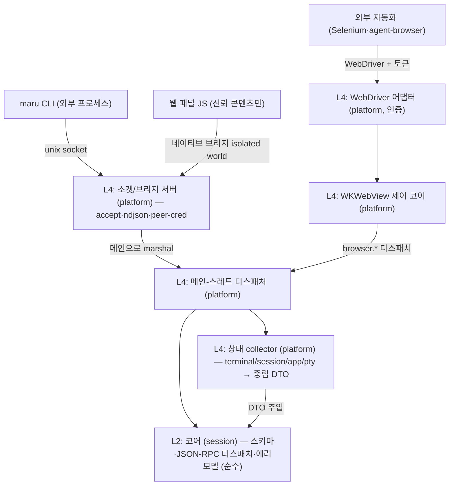

# 세션 컨트롤 플레인 (CLI·웹뷰 IPC)

이 문서는 Maru의 **세션·패널 간 상태 조회와 명령 전송**(컨트롤 플레인)의 단일 출처다. CLI(`maru ...`), 웹 패널(WKWebView 안의 JS), 외부 자동화 도구가 실행 중인 Maru의 세션·패널을 **열거·조회·제어·구독**하는 계약을 정한다.

tmux(`list-panes`/`send-keys`/`capture-pane`)·cmux가 푸는 문제를 다루되, maru는 **하나의 wire 프로토콜을 CLI와 웹뷰가 공유**하게 해서 두 번 설계하지 않는다.

레이어 경계는 [레이어링과 이식성 전략](layering-and-portability.md), macOS 호스트 경계·Zig↔Swift 분담은 [macOS 앱 호스트 경계](macos-app-host-boundary.md), I/O–렌더 스레딩·락 모델은 [I/O–렌더 스레딩 분리](io-render-threading.md), 탭/split 모델은 [탭·split·레이아웃](tabs-splits-layout.md), 윈도우 간 detach/reattach와 전역 surface 소유권은 [윈도우와 Surface 이동성](window-surface-mobility.md), 링크 클릭 라우팅(md→패널)은 [링크 감지](link-detection.md)를 단일 출처로 둔다. 웹 패널의 표시·합성(WKWebView 오버레이·z-order·per-pane rect ABI)은 [웹 패널 인프라](web-panel.md)(Phase 4 선결 상세)로 분리한다.

## 1. 확정 결정

- **wire = 줄 단위(ndjson) JSON-RPC 2.0.** 메시지 1개 = 1줄. 요청/응답은 `id`로 매칭, 이벤트는 `id` 없는 notification. 직렬화는 JSON 단독(Zig `std.json` + JS `JSON.parse`, 의존성 0). 대형 페이로드는 §4.3 규약을 따른다.
- **transport 둘, 메시지 스키마 하나.** 외부 프로세스는 **unix domain socket**, 웹 패널은 **WKWebView 네이티브 메시지 브리지(in-process)**. 컨트롤 플레인 wire는 TCP/HTTP를 바인드하지 않는다(외부 호환용 WebDriver 어댑터만 예외 — §9).
- **노출은 CLI 토대, MCP는 구현 계획 미정.** 주 사용처는 maru 안에서 도는 에이전트이고, `maru` CLI(+`SKILL.md`)가 셸로 직접 호출한다. 외부 MCP 클라이언트용 어댑터는 같은 wire 위에 얇게 얹을 수 있으나 **구현 계획은 미정**이라 막지 않을 seam(버전·네임스페이스)만 둔다(§4.1).
- **메서드 어휘 = tmux식.** `sessions.list`/`session.sendKeys`/`session.capture`.
- **이벤트 = 스트림(push) 1급.** `events.subscribe` notification 스트림. 초기 구현은 기존 agent 폴링 결과를 흘리되, background 세션 이벤트는 폴링 게이트 확장 또는 진짜 이벤트 소스가 필요하다(§7).
- **엔티티 = surface 일반화 + 앱 전역 외부 ID.** terminal/web surface를 같은 ID 공간에 두고, 외부 ID는 `surface_id + generation`이다. 하위 호환은 고려하지 않고, `surface_id`는 앱 인스턴스 전역 `SurfaceIdAllocator`가 발급하는 opaque u64로 고정한다. ID 비트에 window/session/local counter 의미를 넣지 않는다. `window_token`은 현재 위치 메타데이터로 내린다. 이유와 선행 refactor는 [윈도우와 Surface 이동성](window-surface-mobility.md)을 단일 출처로 둔다.
- **코어(L2) = 스키마 + 프로토콜 + 순수 디스패치만.** 라이브 상태 수집은 platform collector(L4)가 모아 중립 스냅샷 DTO로 코어에 주입한다. 코어는 런타임/OS 타입을 직접 참조하지 않는다(`check-boundaries`가 `session→app/pty/platform`을 막는다 — §2).
- **동시성 = 단일 디스패치 지점(메인으로 marshal) + 출력 스트림은 I/O 스레드 직송.** 제어·조회는 메인 frame loop로 marshal해 코어/레지스트리/트리에 안전 접근하고, 고처리량 출력(`subscribeOutput`)은 메인을 거치지 않고 I/O 스레드에서 per-subscriber 큐로 직송한다(§5).
- **보안 = 같은 uid 안의 신뢰 차등까지.** 웹 브리지는 신뢰 콘텐츠에만 노출, 외부 소켓은 peer-cred + 0700/0600, write는 per-surface capability(§8).
- **`browser.*` = WKWebView 직접 제어(코어) + W3C WebDriver 어댑터(외부, 인증 필수).** CDP가 아니라 WebDriver다(§9).
- **웹 패널 프론트엔드 개발환경 = zntc로 확정.** `@zntc/core`(+ 프론트엔드 앱에는 필요 시 `@zntc/web`)가 dev server/preview/build/bundle을 맡고, dev-only 빌드 도구로 두어 런타임 의존성 0을 유지한다. `web/` 하위 Bun workspace는 패키지 설치·`bun.lock`·workspace script 실행·프론트엔드 단위 테스트(`bun test`)를 맡는다. JS/TS 품질 게이트는 VoidZero/Oxc 계열의 `oxlint`·`oxfmt`를 쓴다. Vite+에는 root config override, workspace task runner, package-manager wrapper 같은 모노레포 기능이 있지만, 통합 CLI가 zntc의 dev/build와 Bun의 package-manager/test runner 책임까지 함께 가져오므로 Phase 7 기본값으로 두지 않는다. Vitest는 기본값이 아니며, Bun test로 표현할 수 없는 브라우저/DOM 특수 케이스가 검증될 때만 별도 논의한다. 필요 시 `tsgo` 같은 개별 타입체크 도구 또는 Vite Task만 별도 검토한다. lockfile·vendoring·CI 캐시·라이선스·supply-chain 고정 방식은 Phase 7 착수 전 재확인한다(§15).
- **리치 패널 렌더 = WKWebView (네이티브 뷰 비사용 원칙의 명시적 예외).** 원칙의 근거는 이식성인데, 웹 콘텐츠(HTML/JS/CSS)는 WKWebView/WebKitGTK/WebView2 어디서나 그대로 돌아 목적을 충족한다(SwiftUI와 달리 UI 코드가 Apple 전용이 아님). 예외는 **닫힌 열거**다: 마크다운 WYSIWYG 편집, 인앱 브라우저(임의 웹이라 진짜 엔진 필요). **diff 뷰어는 GPU 셀로 그리고 예외에 넣지 않는다**(색입힌 등폭 텍스트라 셀로 충분). 새 종류 추가는 사용자 승인이 필요하다. macOS=시스템 WebKit(의존 0)이나 이식 타깃은 WebKitGTK/WebView2로 의존 0이 깨진다(GPU 경로 WebGPU와 대칭).

## 2. 목표 위상



| 층 | 위치 | 책임 | 이식 시 |
|---|---|---|---|
| **L2 코어** | `src/session/` | 메시지 스키마, JSON-RPC 디스패치, 에러 모델, 순수 변환. OS/런타임 타입 0 | 재사용 |
| **L4 collector** | `src/platform/macos/` | 4개 레이어·OS에서 상태 수집 → 중립 DTO로 주입 | 타깃별 |
| **L4 소켓/브리지 서버 + 디스패처** | `src/platform/macos/` | accept, peer-cred, ndjson 프레이밍, 메인 marshal, 웹뷰 메시지 핸들러 | 타깃별 |
| **L4 WKWebView 제어 + WebDriver 어댑터** | `src/platform/macos/` | WKWebView API 호출(Swift). 라우팅·디스패치·프레이밍은 Zig | 타깃별 |

코어(L2)는 상태를 **collector가 주입하는 중립 DTO seam으로만** 받는다([layering-and-portability.md] §3.1 `PtyIo` vtable 선례).

**collector 2층(현재 코드 기준 정직)**: 지금은 Zig에 전역 AppSession 레지스트리가 없어, Swift가 살아있는 세션(`windows`+`quick`)을 순회하며 per-session collect ABI를 호출하고 Zig는 한 세션 안의 tabs→panes→terms 트리만 중립 DTO로 평탄화한다. **A1 구현 완료(Zig 측 per-session 평탄화)**: `src/platform/macos/app_session.zig`의 `AppSession.collectSessionInto`(공유 리스트에 append하는 A2용 코어)와 `collectSession`(단일 세션 편의 래퍼)이 한 AppSession의 tabs→panes→terms 트리를 walk해 `control_surface.SurfaceDto[]` + 그 창의 `window_membership.WindowMembershipSnapshot` 하나를 만든다(id={surface.id, generation=0}, title=`termLabel`, 좌표 window_id 주입·tab/pane 0-based, focused=key 창의 활성 surface). **kind별 detail 분기**(4e): terminal Term은 `.terminal`(cwd/git_branch/agent/at_prompt 3상, core_mutex 아래 복사), web Term(`kind==.web`)은 `.web`(panel_kind·trust[browser=untrusted·markdown=trusted §8.1]·url=null[콘텐츠 미영속])을 emit하고 **sentinel core를 안 만진다**(cwd/git/at_prompt 없음). 코어 read(cwd·semantic_state·alt_active)는 surface `core_mutex` 아래에서 **복사만** 하고 git fs 읽기·직렬화는 락 밖(§5). **A2b 배선 완료(라이브 서버)**: 앱이 앱-전역 컨트롤 소켓을 열고(accept 스레드) 요청을 메인 frame loop로 marshal한다 — Swift가 살아있는 창(`windows`+`quick`)을 collector 참조 배열(`MaruControlSessionRef`)로 매 tick 넘기면(§2 열거), Zig(`app_host_abi.collectSessionsInto`)가 세션마다 `collectSessionInto`를 공유 리스트로 호출해 하나의 `CollectorSnapshot`을 조립하고 auth·dispatch(1d)한다. 소켓·accept 스레드·marshal 큐는 `control_server.zig`(generic L4), collect 조립·auth·dispatch 배선은 `app_host_abi.zig`(AppSession을 아는 L4)가 소유한다. 이걸로 `maru sessions list`가 진짜 세션을 반환한다(라이브 실측: cwd·git_branch·focused·at_prompt). 그리고 cross-window detach/reattach와 web panel reparent를 위해 Phase 4 hosting 전에 `AppRuntime` + `LiveSurfaceRegistry` + `WindowGraph`로 소유권을 올린다([window-surface-mobility.md](window-surface-mobility.md)). 그 이후 collector는 AppRuntime graph를 단일 출처로 읽는다.

Phase 1 live collector 전에는 full AppRuntime을 기다리지 않고 **앱 인스턴스 전역 `SurfaceIdAllocator` + `WindowMembershipSnapshot`**을 먼저 넣는다. `SurfaceIdAllocator`는 앱 인스턴스 전역 opaque u64를 단조 발급하고, `AppSession.createTerm`은 per-session `next_id` 대신 이 allocator에서 ID를 받는다. Swift의 `makeTerminalSurface` token은 창/세션 라우팅 메타데이터일 뿐 surface ID allocator가 아니다. `WindowMembershipSnapshot`은 현재 `{window_id, window_kind, [surface_id]}`만 담아 `metadata:window` scope를 검증하고, Phase 4 전 `WindowGraph`가 들어오면 같은 DTO를 graph에서 읽게 바꾼다.

## 3. 엔티티 모델

기존 계층 `Window → Tab → Pane → Term(surface)`에 종류를 더한다: `surface.kind = terminal | web`.

- **외부 ID = `{surface_id, generation}`.** `surface_id`는 앱 인스턴스 전역 unique opaque u64이고 **절대 재사용하지 않는다**(주 방어 — 죽은 surface를 가리키는 옛 selector는 새 surface로 리다이렉트될 수 없다). `generation`은 defense-in-depth로, `surface_id`를 유지한 채 런타임만 갈리는 경우(예: PTY crash 후 같은 트리 슬롯 respawn)에만 증가한다 — 그 경로가 설계에 없으면 generation은 순수 보조다. workspace restore는 `surface_id`를 새로 발급하므로(=이동성 §7) restore를 generation 증가로 표현하지 않는다. `surface_id` 값 자체에는 window/session/local index 의미가 없다. `window_token`은 AppSession-local ID 충돌을 막기 위한 복합키가 아니라 현재 어느 window에 배치돼 있는지 알려주는 위치 메타데이터다. 외부 자동화가 저장한 ID는 재시작 후 무효일 수 있음을 계약에 명시한다.
- **재시작 영속 상관키.** workspace restore는 surface를 새 ID로 복원하지만 에이전트 대화(claude/codex `session_id`)는 영속한다. 재시작을 건너 재연결하려면 컨트롤 플레인 ID를 workspace stable-id·트리 좌표·에이전트 `session_id`에 묶는 상관키를 함께 노출한다.
- **멀티윈도우는 현재형이다.** quick terminal은 별도 window_kind를 가진 window로 취급하되, surface ID 충돌을 window_token으로 숨기지 않는다. Phase 1 전에는 `SurfaceIdAllocator`와 `WindowMembershipSnapshot`으로 ID/scope foundation을 닫고, Phase 4 hosting 전에는 살아있는 모든 일반 창과 quick terminal이 `WindowGraph`에 나타나게 한다.
- **quick terminal 정책.** quick terminal도 일반 창과 같은 surface 모델이지만 `window_kind=quick`인 별도 window 위치 메타데이터를 가진다(`window_kind` 판별자는 M0b에서 중립 L2 enum `WindowKind{normal,quick}`으로 도입됐다 — `src/session/window_membership.zig`. 실제 창을 이 enum으로 분류하는 배선(`AppSession.chrome_minimal`→`window_kind`)은 Phase 1 collector가 채운다). `metadata:self`로 quick 안에서 호출한 CLI는 quick 자신의 surface만 볼 수 있고, 일반 창 CLI는 quick을 기본으로 볼 수 없다. quick을 포함한 전체 열거는 `metadata:all` 같은 명시 grant가 있을 때만 허용한다. write(`send*`/생애주기)는 capability 게이트(§8.3)로 보수적으로 막는다.
- 공통 메타: `id`, `kind`, `title`, `window`/`tab`/`pane` 좌표, `focused`.
- terminal 전용: `cwd`(OSC 7), `git_branch`, `agent`(kind/state), `at_prompt`(OSC 133 semantic prompt 기반 3상 `true|false|unknown`). unknown의 주 출처는 **OSC 133 미통합 셸**(대다수)이라 known-not-prompt(`false`)와 no-integration(`unknown`)을 구별해야 하므로 bool로 접지 않는다. alt-screen 중에는 `semantic_state`와 무관하게 `false`(alt 진출입이 `semantic_state`를 unknown으로 리셋하긴 하나 그건 부차적 경로다).
- web 전용: `url`, `panel_kind`(markdown|browser|...), `loading`, `trust`(trusted|untrusted — §8.1).
- **wire 인코딩 결정(구현 `control_surface.zig`)**: `at_prompt` 3상은 **nullable boolean**으로 실린다 — `true`→JSON `true`, `false`→JSON `false`, `unknown`→JSON **`null`**(문자열 `"unknown"` 아님). terminal surface엔 **항상** 실린다(생략≠unknown). 반면 `cwd`/`git_branch`/`url`/`agent`는 값이 없으면 **필드 자체를 생략**한다. `agent.kind`/`agent.state`/`panel_kind`/`trust`의 wire enum은 내부 상태머신(`session_model.AgentKind`·`agent_transcript.AgentState`)과 **격리된 자체 enum**이다(collector가 내부→wire 매핑; 내부 rename이 wire를 조용히 흔들지 않게). `agent.state`는 **4상**이다: `running`(진행 중) / `idle`(**턴 완료**) / `interrupted`(**사용자 ESC 중단 — 완료 아님**) / `unknown`(판정 불가). `interrupted`를 `idle`로 접지 않는 이유: 접으면 클라이언트가 `running → idle` 전이를 "턴 완료"로 읽어 사용자가 끊은 턴을 **가짜 완료**로 보고한다(자동화가 후속 단계를 진행). "진행 중이 아님"만 알고 싶은 클라이언트는 `state != running`을 보면 된다. 외부 ID는 `{surface_id, generation}` 중첩 객체(`generation`은 `u64`).

상태 수집은 기존 자산을 직렬화한다(신규 수집 로직은 collector에 둔다): app_session의 `Model` 트리, `core.currentCwd()`, `termGitBranch`, `agent_transcript`(running/idle), 코어 `semantic_state`(OSC 133) + `alt_active`(alt 중 `false` 오버라이드) — 옛 `PtySession.hasForegroundJob()`은 제거됐다. bool로 접은 형태가 `cursorIsAtPrompt`([macos-app-host-boundary.md] 닫기 확인과 같은 계열)지만 그건 unknown을 `false`로 접으므로, 컨트롤 플레인은 3상을 보존하려 `cursorIsAtPrompt`가 아니라 raw `semantic_state`를 읽는다. **A1 구현**: `app_session.zig`의 순수 매핑 `atPromptWire(semantic, alt_active)`(alt→`not_at_prompt`, prompt/input→`at_prompt`, command→`not_at_prompt`, unknown→`unknown`)과 `agentInfoWire(kind, state)`(`none`→null=필드 생략, 나머지는 내부→wire enum)가 내부 상태를 wire enum으로 격리 매핑한다(헤드리스 단위 테스트로 못박음). git branch는 `termGitBranchForCwd`(코어 무참조 변형 — 락 아래 복사한 cwd로 fs 읽기를 `core_mutex` 밖에서 수행).

## 4. transport·프로토콜

### 4.1 핸드셰이크·버전·네임스페이스
- 연결 시 server가 `hello` notification으로 `{protocol: "maru.control.v1", server_version, capabilities}`를 보낸다. 외부 도구·CLI↔GUI 버전 skew를 감지하고, 지원 메서드를 capability로 광고한다. **5f-5c 기능 구현과 별개로 Track 5 성능 완료 gate까지 통과한 뒤** capabilities string array에 활성화된 논리 결과 상한 `browser.executeScript.max-result-bytes=16777216`을 추가한다. 5f-5c live 경로는 strict CSP·Promise·args와 16 MiB chunk를 전달하지만 현재 hello에는 이 capability가 아직 없다. 코드의 `execute_script_protocol_max_result_bytes=256 MiB`는 현재 parser나 capability에 연결되지 않은 reserved 상수다. 향후 실험도 넘지 않을 ceiling 후보일 뿐 현재 입력 방어선·지원 약속이 아니며, §4.4 재검토 뒤 실제 parser에 연결할 때 별도 테스트로 고정한다(§9.5.8).
- 메서드 네임스페이스를 예약한다: 코어 = `sessions`/`session`/`panel`/`browser`, 확장 = `plugin.<id>.*`. 닫힌 하드코딩 테이블이 아니라 코어 표 + 등록 가능한 확장 핸들러로 디스패치해 plugin/MCP/skill을 막지 않는다. 발견 메서드(`methods.list`)는 후속.

### 4.2 다중 인스턴스·발견
- 소켓 경로 키 = 인스턴스(pid/부팅 nonce). `~/.cache/maru/control/`(0700)에 살아있는 인스턴스 인덱스 + `flock`.
- bind 전 stale 소켓은 `flock`으로 살아있는지 판별 후 unlink-then-bind(살아있는 소켓은 unlink 금지).
- **stale prune(flock 회수, 구현: `control_socket.pruneStaleSockets`)**: 위 판별은 **자기 키**의 잔해만 처리한다. crash/force-quit로 `deinit`(소켓 unlink)이 못 돈 인스턴스는 `<key>.sock`+`<key>.lock`을 남기는데, 다음 실행은 새 nonce로 **다른** 키의 소켓을 bind하므로 그 잔해가 dir에 계속 쌓여 `.sock`이 여럿이 되면 CLI `pickSocket`이 `.multiple`로 접혀 `maru sessions list`가 영구 고장난다. 이를 막으려고 **서버 start(bind)마다** dir의 각 `<key>.sock`(자기 키 제외)에 대응하는 `<key>.lock`을 non-blocking `flock(EX|NB)`으로 회수 시도한다: 취득되면(=소유 인스턴스 죽음, fd가 닫혀 flock 자동 해제) 그 `.sock`+`.lock`을 unlink하고 flock 해제, 살아있는 인스턴스는 lock을 홀드 중이라 취득 실패→보존한다(`.lock`이 아예 없는 고아 `.sock`도 liveness 증거 부재로 회수). readdir 중 unlink는 POSIX 미정의라 key를 먼저 모은 뒤 처리한다. best-effort.
- 자식 셸은 `$MARU_SESSION`+소켓 경로로 자기 인스턴스를 안다. `$MARU_SESSION`은 `{instance_nonce, surface_id, generation}`을 담은 **selector**일 뿐이고 비밀 bearer token이 아니다. `window_id`/`window_token`/`window_kind`는 응답 메타데이터로만 노출되는 현재 위치 정보다. `metadata:self`는 이 selector가 가리키는 surface와 peer process의 OS 관측 출처가 일치할 때만 열린다(§8.4). `read-output` 이상은 spawn 시 상속한 capability fd(§8.5)가 증명한다. maru 밖 일반 셸의 CLI는 단일 인스턴스면 자동 발견까지만 가능하고, 비밀 출력 열람은 별도 grant가 필요하다(어휘 미정 — §13).

### 4.3 프레이밍 견고성
- max frame size(≈ 1 MiB) 정의. 이 값은 request·response·notification **각 NDJSON 물리 프레임**의 상한이지, chunk로 전달하는 논리 결과 전체의 상한이 아니다. 인바운드 프레임 초과 시 `payload-too-large` + 연결 종료, 부분 읽기는 누적 버퍼. 대형 결과 때문에 이 전역 상한을 256 MiB로 키우면 작은 요청 하나로도 프레이머 메모리·parse 비용을 증폭할 수 있으므로 금지하고, 아래 chunk 경로로만 총량을 넓힌다. maru가 impl-defined server-error 범위(-32000~-32099, JSON-RPC이 미지정)에서 택한 코드(구현: `src/session/control_plane.zig` `ErrorCode`): **-32001 `payload-too-large`**(물리 프레임, §4.3), **-32002 `unauthorized`**(§8.3 — scope 판정을 존재검사 이전에 하는 균일 오류, surface_id 열거 oracle 방지), **-32003 `process-exited`**(인가된 호출자가 물었으나 surface가 없을 때만 — 이미 볼 권한이 있어 oracle 아님), **-32004 `timeout`**, **-32005 `result-too-large`**(인가·실행은 성공했으나 bounded serializer가 요청한 논리 총량 상한을 초과; 연결 유지, `data={limit_bytes,observed_bytes_at_least}`, §9.5.8), **-32006 `script-error`**(`data={kind:"execution"|"serialization"|"navigation",name,message,stack?,diagnostics_truncated?}`; 최종 escaped error frame 32 KiB 상한), **-32007 `resource-busy`**(실행 전 자원 부족, `data={resource,retryable:true}`; `resource`는 `browser-result-bytes` 또는 `browser-execution-slots`). `max_result_bytes`가 0·비정수·protocol hard max 또는 hello가 광고한 현재 effective max를 초과하면 `invalid-params(-32602)` + `data={max_allowed_bytes}`다. 표준 코드(parse -32700·invalid request -32600·method not found -32601·invalid params -32602·internal -32603)는 명세 그대로.
- 대형 응답(`capture` 전체 스크롤백·`browser.screenshot`·큰 `browser.executeScript` 구조화 결과 등)은 단일 ndjson 라인 금지 — chunk notification+완료 마커/최종 응답. **JSON 문자열은 valid UTF-8만 담으므로 임의 바이트(이스케이프 시퀀스·깨진 UTF-8)나 프레임 경계에 독립적인 재조립이 필요한 데이터는 base64로 인코딩**한다. executeScript의 UTF-8 JSON bytes도 문자열 escape·멀티바이트 경계에 따른 프레임 크기 변동을 없애기 위해 chunk 모드에서는 base64를 쓴다(§9.5.8). **capture 일관성: 시작 시 `capture_id`+스냅샷 generation을 고정하고, 각 chunk는 `{capture_id, seq, generation, encoding}`을 싣는다.** chunk 복사는 surface `core_mutex` 아래에서만 수행하되 직렬화는 락 밖에서 한다. chunk 경계에서 generation이 바뀌면 server는 성공 완료 마커를 보내지 않고 `capture-invalidated` 오류/notification으로 스트림을 종료한다. client는 처음부터 재시도한다. **여기서 "generation"은 surface 재생성 카운터(§3)가 아니라 스크롤백 evict/rewrap 카운터다** — 그렇지 않으면 chunk 복사가 tick마다 나뉘는 동안 리더의 evict가 chunk 사이 내용을 shift시켜도 미검출된 torn capture가 성공 완료된다. 반대로 바쁜 surface에서 매 chunk마다 evict가 일어나 영원히 완료 불가·무한 재시도가 되지 않도록, 재시도 상한을 넘으면 "첫 락에서 전체 스크롤백을 1회 복사(락 보유·메모리 상한 명시)" 경로로 fallback하거나 부분 성공을 반환한다.
- per-connection bounded outbound 큐 + non-blocking write. 응답을 안 읽는 클라이언트가 디스패처를 막지 않게 한다. 이벤트는 느린 구독자에 대해 coalesce/drop(상태 스냅샷이라 손실 허용), 한계 초과 시 구독 강제 해제.

**5f-5 구현 상태 주의**: 5f-5c 기능까지 live다. 실행 전 `ActiveBrowserExecution` 등록과 process-global 256 MiB 예약, 부족 시 `resource-busy`, queued/running timeout·surface/grant revoke·late callback 정리를 적용한다. Swift immutable `Data` registry와 Zig pull/copy/release ABI v119가 raw strict-JSON ≤512 KiB를 inline으로 읽고, 그 초과~16 MiB와 screenshot ≤12 MiB를 공통 progressive pump로 보낸다. off-main syntax validation 뒤에는 같은 ABI가 running+pending+현재 인가를 재확인해 revoke/expiry/timeout 후 page side effect 시작을 막는다. execution 예약은 `ActiveBrowserTransfer`로 반환 없이 원자 이관하며 terminal 순서는 **Swift Data 제거 확인 → execution 예약 반환**이다. release callback이 제거를 확인하지 못하면 예약을 유지하고 stop의 Swift `releaseAll` backstop까지 임의 재사용하지 않는다. 연결당 4 MiB/process 32 MiB queued+writer-owned 회계, terminal carve-out, high/low watermark, typed purge와 socket abort가 live 채널에 적용된다. parser는 `max_result_bytes ≤16 MiB`를 검사하고 CLI는 512 KiB scratch+atomic 0600 no-replace spool로 전체 결과를 메모리에 모으지 않는다. `script`는 JavaScript **표현식**이고 `args`는 그 표현식에 주입되는 strict-JSON 배열이다. `callAsyncJavaScript`가 CSP-safe하게 표현식을 직접 컴파일하고 Promise를 await한 뒤 document-start bounded serializer가 host 이전에 결과를 직렬화한다. 여러 statement는 `(async()=>{ ...; return value })()` 같은 표현식으로 감싼다. hello effective-max는 별도 Track 5 성능 gate 전까지 광고하지 않는다. 선언된 256 MiB protocol ceiling은 aggregate 예약 예산과 숫자가 같지만 parser 입력 상한이나 지원 약속이 아니다.

### 4.4 bulk payload 전송의 구현 상태·채택 계약·후속 재검토

**프로토콜 결정**: 현재와 5f-5 완료 범위의 application wire는 NDJSON JSON-RPC 2.0 하나뿐이다. 별도 binary frame type, data socket, 파일 경로 반환, `SCM_RIGHTS` data attachment는 구현하거나 협상하지 않는다. base64 chunk는 별도 프로토콜이 아니라 같은 JSON-RPC envelope와 auth/outbound 수명 규칙 안에서 method별 schema로 전달한다. correlation과 terminal은 공통 형식으로 억지 통일하지 않는다: capture는 `capture_id+generation`과 complete/invalidated notification, screenshot은 `capture_id` chunks+final response, executeScript 목표 계약은 `request_id+result_id` chunks+final response를 쓴다.

**현재 live 구현 상태**:

- `browser.screenshot`은 PNG raw bytes를 Swift `BrowserResultTransferRegistry`에 pin하고 앱 전체 공통 pump가 tick당 최대 512 KiB base64 notification 또는 terminal 하나를 enqueue한다. 논리 PNG 상한은 12 MiB이며 final은 `capture_id·seq_total·bytes·width·height·format`을 검증한다. 연결당 4 MiB/process 32 MiB watermark와 typed purge/abort가 live다.
- `browser.executeScript`는 `callAsyncJavaScript` expression+args+await → page-process bounded strict-JSON wrapper → Swift-owned `Data` registry → Zig bounded pull ABI를 사용한다. raw JSON ≤512 KiB는 `{transfer:"inline",result}` 단일 응답, 그 초과~16 MiB는 `browser.executeScriptChunk` notification과 `{transfer:"chunked",result_id,seq_total,bytes}` final이다. pump는 성공 enqueue 뒤에만 offset/seq를 전진시키고 transfer/in-flight의 30초 **무진행** deadline을 함께 갱신한다. 요청 cap 초과는 `result-too-large`, execution/serialization/native WebKit 실패는 bounded `script-error(-32006)`로 끝난다. CLI는 id/seq/bytes와 strict JSON을 streaming 검증한 뒤 atomic spool을 파일 또는 stdout에 공개한다. hello max-result capability만 Track 5 성능 gate 뒤로 보류했다.
- `session.capture` chunk 상태머신은 L2에 있으나 실 scrollback producer/L4 pump/CLI는 아직 미배선이다.

**채택한 5f-5 완료 계약**: executeScript는 base64 전 strict-JSON bytes가 512 KiB 이하이면 inline, 그 이상을 최대 16 MiB까지 base64 JSON-RPC chunk로 전달한다. 512 KiB는 전체 결과 상한이 아니라 inline/chunk 전환점이자 pump의 tick당 raw-copy 상한이며, 물리 JSON-RPC frame 상한 1 MiB와는 별도 축이다. 5f-5b의 progressive pump와 queued+writer-owned byte accounting은 이 16 MiB 경로와 느린 client를 안전하게 다루기 위한 구현 gate다. screenshot도 같은 pump/watermark로 이관하되 raw PNG 논리 상한 12 MiB는 유지한다. 각 숫자의 축은 다르다: screenshot 12 MiB는 raw PNG 총량, executeScript 16 MiB는 base64 전 UTF-8 JSON 총량, 연결당 4 MiB는 동시에 queued+writer-owned인 **serialized wire window**이지 결과 총량 상한이 아니다.

현재 연결 reader는 deferred browser 요청을 기다리는 동안 peer close를 메인 실행 registry에 즉시 통지하지 않는다. 따라서 running executeScript의 연결 종료를 예약 조기 반환 근거로 삼지 않고 backend callback 또는 앱 stop까지 보수적으로 유지한다. 즉시 감지가 필요해지면 stable connection id와 reader/writer 종료 이벤트를 별도 lifecycle 채널로 추가해야 하며, `PendingRequest`나 연결 스택 포인터를 registry에 장기 보존해서는 안 된다.

대체 bulk transport는 다음 두 갈래 중 하나를 artifact로 확인한 뒤 별도 설계 PR에서 재검토한다. **workload trigger**는 현재 전송 성능과 무관하게 제품 요구 자체가 바뀐 경우다. **performance trigger**는 16 MiB 경로에서 [성능 예산](performance-budget.md)의 main tick·RSS·queue 예산을 chunk 축소/off-main 같은 단순 최적화 후에도 만족하지 못한 경우다.

- workload: 정상적인 agent workflow의 결과가 반복적으로 12/16 MiB 논리 상한을 초과한다.
- workload: download, trace archive, video처럼 처음부터 file/stream인 제품 기능이 생긴다.
- performance: base64 encode/decode 또는 JSON string copy가 단순 최적화 후에도 측정 예산을 위반한다.
- performance: 반복 screenshot이 bounded pump로도 필요한 처리량을 내지 못한다.

재검토 시에도 JSON-RPC는 method negotiation·authorization·metadata·error·cancel을 소유하는 **control channel로 유지**한다. 후보는 (a) 명시적으로 협상한 length-prefixed binary frame, (b) authorized request에 single-use nonce로 결합하고 peer credential을 다시 확인하는 별도 data socket, (c) writable fd를 닫고 read-only로 재오픈·검증한 뒤 즉시 unlink해 전달하는 `SCM_RIGHTS` data attachment다. 이 data attachment는 server→이미 인가된 request의 immutable 결과만 운반하며 **권한을 부여하지 않는다**. client→server bearer authority인 §8.5 capability fd와 direction·type·namespace·lifetime을 공유하지 않는다. 전달된 fd는 사후 revoke할 수 없으므로 cancel은 전달 전 cleanup만 보장한다. 단순 파일 경로 반환은 same-uid 유출과 파일 수명 경쟁 때문에 계속 금지한다(§9.5.3). 64/128/256 MiB stress는 [성능 예산](performance-budget.md)의 **후속 연구 gate**이며 현재 roadmap의 활성화 단계가 아니다.

## 5. 동시성·생명주기

- **단일 디스패치 지점**: 소켓 스레드는 accept/parse/프레이밍만, 코어·트리·collector 접근은 메인 frame loop로 marshal한다(웹뷰 in-process 경로와 동일 스레드). 라우팅 테이블(`links`/`entries`)이 락 없는 메인 전용이므로 크로스스레드 순회는 금지한다.
  - **A2b 구현(`control_server.zig`)**: accept 스레드가 연결마다 peer-cred(same-uid) + hello → auth 셀렉터 프레임 + 요청 프레임을 읽어 `PendingRequest`(요청 바이트 + 셀렉터)를 **thread-safe marshal 큐**(`ControlRequestQueue`, `PtyEventQueue` 패턴 재사용)에 push하고, pending의 mutex+cond에서 메인 응답을 **대기**한다. 메인 tick(`maru_macos_control_server_drain`)이 `tryPop`으로 요청을 꺼내 실 collector·auth·dispatch로 응답 바이트를 만들어 `resolveRequest`로 pending에 채우면 accept 스레드가 깨어나 소켓에 **write(락 밖·소켓 스레드)** 한다. **§8.8 lock-order 엄수**: accept 스레드는 `core_mutex`를 안 쥔 채로만 큐에 push/wait, 메인은 `collectSessionInto` 안에서만 `core_mutex`를 짧게 잡고 그 락을 쥔 채 큐에 push/wait하지 않는다(교차-큐 순환대기 없음). accept 스레드 수명 = poll-gated blocking accept + `closing` 플래그(self-connect 트릭 없이 poll timeout으로 종료 확인); `deinit`(stop)이 큐 close(대기 pending cancel) → join → 소켓 close. accepted 연결엔 **read+write 타임아웃**(serial serve + 깨끗한 join 요건 — `SO_RCVTIMEO`로 요청을 안 보내는 client, `SO_SNDTIMEO`로 응답을 안 읽는 client 둘 다 무한 블록 방지; write 타임아웃 만료 시 `writeAll`이 `WriteFailed`로 접혀 그 연결 abandon). accept-loop의 `pollReady`는 3상(`ready`/`timeout`/`broken`)이라 listen fd가 치명적으로 망가지면(`POLLERR/HUP/NVAL` sticky) 재-poll tight-spin(100% CPU) 대신 루프를 종료한다. 요청 프레임이 max frame(§4.3)을 넘으면 `readFrame`이 조용히 버리지 않고 `payload_too_large(-32001)` 응답을 쓴 뒤 연결을 abandon한다(`serveReadOnly`와 동일 계약). 메인 tick은 `drain` 전에 값싼 `has_pending` 게이트를 봐 대기 요청이 없으면 collector 참조 배열(힙 할당)을 아예 짓지 않고 반환한다(렌더 핫패스 0-할당).
- **출력 스트림 직송**: `subscribeOutput`의 고처리량 데이터는 메인을 거치지 않고 I/O 스레드에서 per-subscriber bounded 큐로 직접 민다(메인 marshal에 태우면 폭주 출력이 렌더를 막는다 — [io-render-threading.md]). 메인은 라우팅 메타데이터만 다룬다.
- **subscribeOutput 백프레셔 규범(§4.3의 이벤트 coalesce와 다르다)**: 원시 출력 바이트는 손실 허용·coalesce 불가라, per-subscriber 큐 포화 시 **리더 스레드는 절대 블록하지 않는다**(블록하면 PTY read 정지→child write 블록→surface 전체 정지). 포화 시 그 구독을 `subscriber-lagged` 사유로 즉시 강제 해제하거나, gap 마커를 실어 drop한다. per-surface 구독자 수 상한도 둔다(구독 N개 = 출력 복사 N배 증폭 방지).
- **락 순서 불변식**: `core_mutex` 보유 중에는 메인으로의 marshal 대기나 blocking 큐 push를 하지 않는다(교차-큐 순환 대기 방지 — [io-render-threading.md] §8.8 선례). 렌더 신호·응답 write는 락 밖.
- **코어 read 락**: cwd/scrollback 등 코어 read는 surface `core_mutex` 아래에서만(리더 스레드의 evict/free와 경합). capture는 락 아래 복사만(§4.3), 직렬화는 락 밖.
- **인바운드 큐 bound + tick 우선순위**: 메인으로 marshal되어 대기하는 요청 큐에도 상한을 둔다(§4.3 outbound만 bound하면 pipelined 요청이 단조 증가). 한 tick 안 순서는 **렌더 준비 > 컨트롤 dispatch**이고, 컨트롤은 tick당 처리 건수 상한을 가진다. per-connection 대기 큐 초과 시 `server-busy`로 거부하거나 소켓 read를 멈춰 backpressure를 전파한다. maru 안에서 도는 에이전트가 주 사용처이므로(자기 자신이 폭주 클라이언트가 될 수 있음) 이 상한은 필수다.
- **수명**: 외부엔 ID만 노출(비소유 포인터 금지), 매 호출 재조회. surface_id에 generation을 달아 종료된 세션의 in-flight 요청은 `process-exited`로 거부. 세션 종료 단일 chokepoint가 `session.closed` 방출 + 구독 자동 해제.
- **per-tick 예산**: 컨트롤 플레인 작업이 frame tick 예산을 넘으면 다음 tick으로 분할한다([performance-budget.md]에 항목을 둔다).

## 6. 메서드 표면 (초안)

| 메서드 | 인자 | 반환 | 비고 |
|---|---|---|---|
| `sessions.list` | `{window?}` | `[Surface]` | collector는 모든 AppSession을 수집하지만 응답은 metadata scope로 필터링한다(`self`/`window`/`all`) |
| `session.get` | `{id}` | `Surface` | core_mutex read. `metadata:self`는 자기 `(surface_id, generation)`만 허용 |
| `session.sendText` | `{id, text}` | `{ok}` | **raw 쓰기 경로**(bracketed paste 미적용). capability 게이트 |
| `session.sendKeys` | `{id, keys}` | `{ok}` | `input_report.encodeKey` 재사용. 키 표기법은 tmux 호환(§13) |
| `session.capture` | `{id, scrollback?}` | streaming | 생략 시 가시 화면. 대형은 §4.3 chunk. capture 권한(§8.3) |
| `session.subscribeOutput` | `{id}` | 스트림 | 실시간 출력. I/O 직송(§5). capture와 동일 권한(§8.3) |
| `session.resize`/`focus`/`close`/`spawn` | `{id, ...}` | `{ok}` | 생애주기. 기존 자산(`closeActive`·`createTab` 등) 노출 |
| `panel.open` | `{kind, args, trust}` | `{id}` | web 패널. `kind=browser`는 `trust=untrusted`(§8.1) |
| `panel.bindSession` | `{panel_id, session_id}` | `{ok}` | 패널↔세션 cwd 연동. `bind` capability(§8.3) |
| `events.subscribe` | `{filter?}` | 스트림 | §7 |
| `browser.*` | (§9) | — | web surface 제어. trust·capability 검사 |

메서드별 필요 capability는 §8.3을 단일 출처로 따른다 — `list`/`get`/`subscribe`=`metadata:{self|window|all}`, `panel.bindSession`=`bind`, `capture`/`subscribeOutput`=`read-output`, `send*`=`write`, `resize`/`focus`/`close`/`spawn`/`panel.open`=`lifecycle`, `browser.getCookies`/`setCookie`/`deleteCookie`/`clearStorage`=`browser-storage`(§9.4 D4/D5 — 쿠키/스토리지 read+write·comprehensive 삭제=별도 민감 scope, 사용자 결정), 나머지 `browser.*`=`browser`(localStorage get/set/remove 포함 — eval 백엔드라 base browser, D5). 일반 login shell 기본 경로는 실측 gate를 통과한 `metadata:self`만 허용한다(§8.4).

## 7. 이벤트

`events.subscribe` 후 server가 notification을 push한다: `session.stateChanged`(agent running↔idle)·`cwdChanged`·`created`/`closed`, `panel.navigated`.

초기 소스는 기존 agent 폴링이다(`pollAgentKinds`/`pollAgentState`). 이 폴링은 **모든 pane×Term을 돌고 시각화(metal dirty)만 보이는 Term에 게이트**한다 — 즉 background Term 커버리지는 이미 있다. 진짜 잔여 갭은 (1) ~0.5s 병합으로 짧은 전이가 손실되는 것의 **전이-엣지 이벤트화**, (2) background **세션**(별도 AppSession, quick 등) 커버리지다 — Phase 3 선결. (2)의 소스는 per-window AppSession 순회 전제라, 이동성 M1/M2(AppRuntime graph)가 먼저 끝나 있으면 graph를 직접 읽어 재배선을 아낀다 — 권장 순서이지 차단 조건은 아니다.

## 8. 보안

컨트롤 플레인은 같은 uid 안에서도 신뢰가 다른 코드(웹 콘텐츠·저권한 자동화·sudo 세션)가 공존한다고 가정한다. "uid가 같으면 신뢰가 같다"고 보지 않는다.

### 8.1 웹 브리지 노출 게이트
- `window.maru.*`는 신뢰 콘텐츠에만 주입한다. maru가 빌드해 `maru-app://` 커스텀 스킴으로 서빙하는 콘텐츠(마크다운 등)만 브리지를 받고, `panel_kind=browser`(임의 URL)에는 주입하지 않는다.
- 브리지를 isolated `WKContentWorld`에만 등록한다(spike 실측: 임의 페이지 page-world에서 `window.maru` 접근 불가, isolated world에서만 가능). 단 **`forMainFrameOnly`는 주입 user script에만 적용**되고 메시지 핸들러 등록은 world-scope라 프레임을 안 가린다 — 따라서 **핸들러 진입에서 `frameInfo.isMainFrame`+`securityOrigin`을 검사**해 서브프레임·clickjacking을 막는다(enforcement 디테일은 [web-panel.md] §7).
- 신뢰 콘텐츠도 자기 surface(또는 명시 위임)만 제어한다.
- **브리지는 sanitizer에 전적으로 의존하지 않는다(origin 격리 명시).** `.md`는 비신뢰 데이터(§8.1 위 문단·[web-panel.md] §7)인데 브리지가 그 콘텐츠를 서빙하는 origin에 살면, sanitizer 한 번 우회(mXSS·DOM clobbering·SVG/MathML)로 브리지에 도달한다. 따라서 (a) 브리지는 **신뢰 viewer shell origin에만** 붙이고 md-derived 문서는 브리지가 없는 **별도 origin**으로 렌더한다(sanitizer 우회는 script 실행까지만, 브리지 미도달), (b) `securityOrigin` 검사는 scheme(`maru-app://`) 수준이 아니라 **정확한 shell origin**으로 pin, (c) `panel_kind=browser`(untrusted) `WKWebViewConfiguration`에는 `maru-app://` scheme handler와 message handler를 **애초에 등록하지 않고** `maru-app://` 네비게이션도 `decidePolicyForNavigationAction`에서 차단한다(origin 위장으로 브리지 탈취 방지). 상세는 [web-panel.md] §7.

#### 8.1.1 5b — trusted bridge 설계 (isolated world 주입/미주입 + 프레임 검증)

Phase 5 두 번째 슬라이스. §8.1 브리지 게이트를 **구현**한다: 신뢰 콘텐츠(maru-app:// UI, Phase 7)가 `window.maru.*`로 maru에 콜백하는 브리지를 **isolated `WKContentWorld`에만** 주입해, 임의 page-world JS(md sanitizer 우회 mXSS 등)가 브리지에 못 닿게 한다(2026-06 spike 실측: isolated world만 접근 가능).

**의존성·시퀀싱(정직)**: 브리지 origin **exact-pin**(§8.1 (b))은 신뢰 origin `maru-app://`가 필요한데 그건 **5c**다. 그리고 브리지는 **신뢰 콘텐츠 전용**인데 현재는 `browser`(untrusted, 빈 흰 HTML)만 있다. 따라서 5b는 **브리지 메커니즘 + `isMainFrame` 검증 + 격리 자동 E2E**를 **fixture 신뢰 config**로 확립하고, 실 `maru-app://` origin-pin·CSP·스킴 샌드박스는 5c, 실 `window.maru.*` API 표면·신뢰 UI는 5d+/Phase 7로 둔다. untrusted(browser) 패널엔 브리지를 **애초에 미등록**(§8.1 (c)).

**① 브리지 등록(신뢰 패널만)** — 신뢰 `WKWebViewConfiguration`에: `WKContentWorld.world(name:"MaruBridge")`(page-world와 격리된 named isolated world) + `userContentController.addScriptMessageHandler(_, contentWorld: bridgeWorld, name:"maru")`(**WKScriptMessageHandlerWithReply** — async 응답, macOS 11+) + `WKUserScript(<window.maru shim>, .atDocumentStart, forMainFrameOnly: true, in: bridgeWorld)`. shim은 isolated world에 `window.maru.request(method, params) → Promise`(핸들러 postMessage + reply)를 깐다. `forMainFrameOnly`는 **user script에만** 적용되고 핸들러 등록은 world-scope(프레임 무관)라 → ②로 별도 검증.

**② 핸들러 진입 검증(§8.1·[web-panel.md] §7)** — 매 메시지: `frameInfo.isMainFrame`(서브프레임 거부 — clickjacking·중첩 차단) + `securityOrigin` **exact 신뢰 origin 일치**(**5c에서 `maru-app://` origin으로 pin** — 5b는 fixture origin 자리만, scheme 수준 매칭 아님). 둘 중 하나라도 불일치면 거부(reply 에러). 통과 시 신뢰 method subset으로 라우팅(5b 최소: round-trip 증명 `maru.hello()`→server_version 응답 **1개**; 실 method는 5d+/Phase 7).

**③ untrusted(browser) 격리** — `browser` 패널 config엔 message handler·isolated shim **미등록**(브리지 부재 — 힙 격리 1차). `maru-app://` 네비 차단·per-surface `WKProcessPool`/`WKWebsiteDataStore` 분리는 5c/후속(§7).

**④ 격리 자동 E2E(macOS smoke)** — 신뢰 fixture 패널에 테스트 페이지 로드 후: `evaluateJavaScript("typeof window.maru", in: bridgeWorld)`→`"object"`(isolated 접근) · `evaluateJavaScript(…, in: .page)`→`"undefined"`(page-world 미접근 — §8.1 spike 자동화) · `maru.hello()` round-trip→version(핸들러 도달) · 미등록 browser 패널→window.maru 부재. smoke 요약에 `bridge_isolated_ok`/`bridge_pageworld_absent` 단언(WKWebView·evaluateJavaScript async라 헤드리스 Zig 아니라 macos smoke E2E).

**⑤ 슬라이스 경계** — 5b=브리지 메커니즘·`isMainFrame`·격리 E2E(fixture). **5c**=`maru-app://` origin exact-pin·엄격 CSP·realpath/symlink/traversal 스킴 샌드박스. **5d**=browser.* 실 ops(browser 패널 navigate/evaluate). 실 `window.maru.*` API·신뢰 UI=Phase 7.

**⑥ 구현 상태 — 5b 구현 완료(5b-1 코어 + 5b-2 Swift 배선)**
- **5b-1(브리지 디스패치 코어 — L2 순수·헤드리스)**: `src/session/control_bridge.zig` — `dispatchBridge(gpa, request_bytes, server_version)`가 신뢰 브리지 요청 한 줄(JSON-RPC 2.0)을 처리해 응답 한 줄을 만든다. **auth 없음**(신뢰는 Swift가 origin/frame으로 확립 — 위 ②). 5b 최소 method = `hello`→`{protocol, server_version}`(round-trip 증명), 미지원 method→`method_not_found`, 비-request→`invalid_request`. wire 스키마는 소켓과 동일(cp.parseMessage/serializeError/writeId 재사용). C-ABI = `maru_macos_app_bridge_dispatch`(app_host_abi.{zig,h}). server_version은 소켓 hello와 같은 단일 출처(`control_hello_version`). 헤드리스 테스트(hello round-trip·method_not_found·invalid_request·parse 실패·minified).
- **5b-2(Swift 브리지 배선 + 격리 E2E — 구현 완료)**: `MaruAppHost.swift`의 `MaruBridgeHandler`(WKScriptMessageHandlerWithReply). 신뢰(markdown) 패널 config에만 `WKContentWorld.world(name:"MaruBridge")`(page-world와 격리) + `addScriptMessageHandler(_, contentWorld: world, name:"maru")` + `WKUserScript(shim, .atDocumentStart, forMainFrameOnly:true, in: world)`을 등록한다. shim은 isolated world에 `window.maru.request/hello`(postMessage→Promise)를 깔고 로드 시 `maru.hello()` 결과를 공유 DOM(#bridge-status)에 적는다. 핸들러 진입서 **`frameInfo.isMainFrame` + `securityOrigin`(protocol=`maru-app`·host=`app`) exact-pin**을 검사(둘 중 하나라도 불일치=reply 에러)한 뒤 통과분만 `maru_macos_app_bridge_dispatch`(5b-1)로 넘긴다. browser(비신뢰) 패널엔 브리지 **미등록**(bridgeWorld=nil). **격리 자동 E2E(macos smoke, MARU_WEB_PANEL_MARKDOWN)**: `bridge_isolated_probe=object`(isolated world 접근) · `bridge_pageworld_probe=undefined`(page-world 미접근=격리) · `bridge_hello_version=0.1.0`(callAsyncJavaScript로 `await maru.hello()` round-trip) · browser 패널 `bridge_world_registered=false`. placeholder(index.html)의 #status(page-world app.js: `typeof window.maru`)·#bridge-status(isolated shim)로 GUI 손 테스트도 격리를 눈으로 확인. **범위 밖**: 실 `window.maru.*` API 표면(navigate/read 등)=5d+/Phase 7, per-surface `WKProcessPool`/`WKWebsiteDataStore` 격리=후속(§7).

### 8.2 소켓 권한·peer-cred
- 0700 전용 디렉터리 + socket path 0600. **1b 구현 확정(`control_socket.zig`)**: 권한은 `umask`가 아니라 **bind 후 `chmod(path,0600)`** 로 고정한다 — 프로세스 전역 `umask`는 멀티스레드 앱에서 다른 스레드와 경합하므로 배제하고, bind~chmod 사이 창은 부모 dir 0700이 덮는다(same-uid는 신뢰 경계 안). `fchmod(fd)`는 쓰지 않는다(spike -1). 심볼릭 링크·소유자 검증은 `fstatat(SYMLINK_NOFOLLOW)`로 bind 결과가 S_IFSOCK·소유자==우리·0600인지 확인.
- **stale 소켓 판별(§4.2)**: `flock`은 소켓 fd가 아니라 **별도 `<key>.lock` regular 파일**에 건다(macOS는 소켓 fd `flock`이 `ENOTSUP`). lock 취득 성공=옛 소유자 부재→unlink-then-bind, 실패(EWOULDBLOCK)=살아있는 인스턴스→소켓 unlink 금지·중단. bind 이후 단계 실패 시 자기 lock 파일도 errdefer로 정리(빈 잔해 누적 방지). **다른 인스턴스**의 crash 잔해는 start마다 같은 flock 메커니즘으로 회수한다(§4.2 stale prune — `pruneStaleSockets`).
- accept마다 peer uid 검증. **1b 구현**: `getpeereid(2)`(LOCAL_PEERCRED/xucred·SO_PEERCRED/ucred 이식 wrapper, uid만; pid/LOCAL_PEERPID는 1e/1g)로 peer 유효 uid를 읽어 서버 uid와 비교, 불일치 시 연결 종료. 파일 권한에만 의존하지 않는다.

### 8.3 capability 인가
- 같은 uid의 임의 프로세스가 모든 surface를 제어·열람하면 sudo 세션·다른 보안등급 탭에 대한 권한 상승이 된다. capability는 `metadata:self`(자기 surface 열거/조회), `metadata:window`(호출 surface가 현재 속한 window 안의 surface 열거/조회), `metadata:all`(primary+quick 포함 전체 열거/조회), `bind`(`panel.bindSession`), `read-output`(`capture`/`subscribeOutput`), `write`(`send*`), `lifecycle`(`spawn`/`close`/`resize`/`focus`/`panel.open`), `browser`(페이지 조작/관찰=`browser.getCookies` 외 `browser.*`), `browser-storage`(`browser.getCookies`/`setCookie`/`deleteCookie`/`clearStorage` — 쿠키/스토리지 **읽기·쓰기·comprehensive 삭제**, §9.4 D5로 `browser`에서 분리·`allowedViaInheritedFd=false`)로 나눈다(§6 매핑의 단일 출처).
- unix socket path와 peer-cred는 "같은 사용자"와 "같은 인스턴스 발견"만 증명한다. 특정 surface 권한은 (a) capability fd(§8.5)로 받은 nonce, 또는 (b) `metadata:self`에 한정된 self-origin 증명(§8.4)으로만 생긴다. fd가 없거나 scope/generation/surface가 맞지 않으면 `unauthorized`다.
- **authz 실패는 surface 존재 여부와 무관하게 균일한 `unauthorized`를 존재검사 이전에 반환한다.** `surface_id`가 monotonic u64라 추측 가능하므로(§3), "존재하나 unauthorized" vs "없음/`process-exited`"의 에러가 다르면 live surface·generation 열거 oracle이 된다. `session.get`/`capture` 등 surface-scoped 메서드는 scope 판정을 존재·generation 확인보다 먼저 수행한다.
- spawn profile의 기본 grant는 보수적으로 둔다. 일반 login shell 자식은 `$MARU_SESSION` 기반 발견과 self-origin 증명을 통과한 `metadata:self`까지만 기본으로 둔다. self-origin 증명이 구현·실측되지 않았거나 실패하면 일반 login shell CLI도 metadata를 열지 않는다. `read-output:self`는 capability fd 보존이 실측된 non-login trusted agent/control profile 또는 별도 one-shot grant UX에만 붙인다. `write`·`lifecycle`·`browser`·cross-surface 권한은 기본 거부 또는 사용자 확인이다.
- **`sessions.list`와 `events.subscribe`는 전역 표면이라 `metadata:self`만으로 다른 surface 상태(cwd·생성/종료)가 누설되면 안 된다.** `metadata:self`는 응답을 자기 `(surface_id, generation)` 하나로 필터링하고, `events.subscribe` filter도 self-surface로 강제한다. 같은 창 전체는 현재 WindowGraph membership에 대한 `metadata:window`, quick 포함 전체는 `metadata:all`이 필요하다(filter 스키마 §13).
- `capture`·`subscribeOutput`은 비밀(스크롤백·실시간 출력)을 노출하므로 `read-output` capability가 필요하다. `capture`가 처음 노출되는 Phase 1 안에서 capability fd 발급·auth·거부 테스트까지 함께 구현한다. "read-only라 토큰은 나중"으로 미루지 않는다.

### 8.4 self-origin metadata 증명(일반 login shell)

일반 login shell에서는 현재 macOS login wrapper가 capability fd를 닫는 것으로 실측됐다(§8.5). 그래도 자기 surface의 최소 metadata는 CLI UX에 필요하므로, **비밀 토큰이 아니라 OS가 관측한 프로세스 출처**로 `metadata:self`만 연다. 이 경로는 `read-output`·`write`·`lifecycle`·`browser`·`bind`·cross-surface metadata에는 절대 쓰지 않는다.

인증 순서:

1. CLI가 `$MARU_SESSION` selector(`instance_nonce`, `surface_id`, `generation`)를 auth frame에 보낸다.
2. server는 selector가 현재 registry의 live surface를 가리키는지 확인한다. `surface_id`는 앱 인스턴스 전역 unique라 window별 충돌을 허용하지 않는다.
3. server는 unix socket peer uid/pid를 OS에서 읽고 same-uid를 확인한다.
4. server는 peer pid의 controlling tty identity와 foreground process group을 읽어, 후보 surface가 spawn할 때 기록한 PTY slave identity 및 현재 foreground process group과 비교한다. 둘 중 하나라도 불일치하면 `unauthorized`다.
5. 통과하면 해당 연결/request에만 `metadata:self`를 부여한다. 응답은 항상 자기 surface 하나로 필터링한다.

**A2b 구현 상태(정직 — same-uid+selector까지, tty 검증 없음)**: 라이브 서버 A2b는 위 **1·3·5만** 구현한다. peer-cred(3, same-uid gate)는 `acceptOne`이, 셀렉터(1)는 wire의 `auth.self` 프레임(`control_plane.serializeAuthSelf`/`parseAuthFrame` — 후자는 selector와 optional `cap_nonce`[1e]를 함께 뽑는다)이, `metadata:self` 부여+self 필터(5)는 dispatch(1d)가 한다. **4단계(peer pid의 tty/foreground pgrp ↔ surface PTY 일치 검증)는 미구현 — 1g 후속이다.** 그리고 **셀렉터의 실제 전달 매개는 `$MARU_SESSION`이 아니라 `$MARU_PANE_ID`**(=surface.id, `pty/macos.zig`가 각 팬 셸에 주입하는 실제 env; `$MARU_SESSION` 복합 selector는 미도입)다. CLI(`main.runSessionRequest`)가 `MARU_PANE_ID`를 읽어 `auth.self{surface_id}`로 보낸다.

**⚠️ 이 auth의 경계 한계(A2b, §8.3/§8.4 대비)**: same-uid peer는 tty 검증이 없으므로 **임의 `surface_id`를 self로 주장**할 수 있다 — 즉 같은 uid의 임의 프로세스가 아무 surface_id나 셀렉터로 보내 그 **한 surface의 metadata(cwd·git_branch·focused·at_prompt)를 열람**할 수 있다. 완화 요소: (a) scope는 `metadata:self` 고정이라 한 번에 **한 surface**만 노출되고 `sessions.list` 전역 열거는 안 된다(§8.3 self 필터), (b) 하지만 surface_id가 monotonic이라 낮은 값부터 열거해 여러 surface metadata를 순차 수집할 수 있다(oracle 완전 차단 아님 — §8.4 4단계 tty 검증이 붙어야 self-origin이 진짜 경계가 된다). read-output/write/lifecycle은 A2b에서 애초에 안 열린다(§8.3). **1g가 4단계 tty/pgrp 검증을 붙이기 전까지 `metadata:self`는 "같은 uid면 selector로 임의 surface metadata 열람 가능"이라는 한계를 갖는다.**

멀티윈도우와 quick terminal 처리:

- 일반 창 A/B와 quick terminal은 모두 앱 전역 `surface_id` 공간을 공유하므로 ID 충돌을 만들지 않는다. 창 A의 CLI가 창 B의 selector를 복사해 보내면 PTY identity/foreground pgrp가 B와 맞지 않아 거부되어야 한다.
- quick terminal은 `window_kind=quick`인 window에 속한 surface다. quick 안의 CLI는 quick 자기 surface의 `metadata:self`만 얻는다. 일반 창의 CLI는 quick을 기본으로 보지 못하고, quick CLI도 primary 창을 기본으로 보지 못한다.
- quick이 숨겨져 있어도 PTY/session이 살아 있으면 selector는 live일 수 있다. 단, lifecycle/write는 기본 거부이고 quick 제어는 별도 explicit grant가 필요하다.

**경계 강도 정직(적대적 리뷰 반영)**: 이 경로가 실제로 증명하는 것은 "peer가 surface의 controlling tty를 공유한다"뿐이지 "peer가 그 surface의 셸 자신이다"가 아니다. `childExec`는 셸에 `setsid`+`TIOCSCTTY(slave)`를 한 번 걸므로 **그 셸의 모든 자손**(background job, `disown`/`nohup`, subshell, 사용자가 실행한 도구의 하위 프로세스)이 같은 ctty를 물려받는다. 따라서:
- **4단계의 foreground pgrp 비교는 보안 경계가 아니라 UX 휴리스틱이다.** CLI 자신이 실행 순간 foreground이므로 정상 경로엔 제약이 0이고, background 형제는 `SIGTTOU`를 무시하고 `tcsetpgrp(getpgrp())`로 잠깐 자기를 foreground로 올려 통과할 수 있다(POSIX 허용). 실제 boundary는 **ctty identity binding(step 4의 tty 비교)뿐**이고, `metadata:self`는 사실상 **surface 세션 단위 grant**다. cross-surface 위장(다른 창/quick selector 복사)만 막힌다.
- **same-ctty 프로세스는 이미 tty를 소유하므로 `write` capability(§8.3) 밖에 있다.** macOS는 `TIOCSTI`를 게이팅하지 않아 same-ctty 코드는 컨트롤 플레인을 우회해 PTY에 직접 입력을 주입할 수 있다. write-cap이 방어하는 것은 cross-session same-uid 코드지 same-session 코드가 아니다.
- **`LOCAL_PEERPID`→pid 검사는 TOCTOU이며 best-effort다.** macOS엔 소켓 연결과 peer ctty를 원자적으로 묶는 primitive가 없다(`xucred`는 uid만). pid는 connect-time이고 ctty/pgrp는 별도 `proc_pidinfo`로 사후 조회하므로 pid 재사용 창이 존재한다. 하드 경계로 취급하지 않고 metadata-only에만 쓴다.
- **"PTY slave identity"를 구체화한다.** 현재 코드는 `openpty(name=null)`로 slave 이름을 안 잡는다. 기록 대상(`ptsname`/`st_rdev`)을 정하되 device number는 pty 해제 후 재사용되므로 **live surface 집합 안에서만** 비교하고 시간에 걸쳐 안정하다고 가정하지 않는다.
- **self-origin grant는 per-connection 캐시가 아니라 per-request 재평가**로 둔다(foreground였다가 background로 내려 연결을 유지해도 grant가 잔존하지 않게). self-origin에는 TTL/liveness 재확인을 붙인다.

**실측 필수 gate**: 이 모델은 구현 PR에서 제품 경로로 측정하기 전까지 완료 처리하지 않는다. 최소 실측 행렬은 primary 창 2개 + quick terminal 1개를 띄우고, 각 shell 안에서 `sessions.list`가 자기 surface 하나만 반환하는지, 다른 창/quick의 selector로 변조하면 거부되는지, maru 밖 일반 shell에서 복사한 selector가 거부되는지 확인한다. zsh/bash login shell, background child, tmux/screen pane, sudo/su는 별도 행으로 기록한다. tmux/screen처럼 nested PTY가 original Maru PTY와 다르면 기본 허용하지 말고 실제 결과를 `tests/artifacts/control-plane/self-origin.summary.txt`에 남긴다.

### 8.5 환경변수 노출·redaction·capability fd
- `$MARU_SESSION`은 키名에 `SESSION` 토큰을 포함하므로 [project-rules.md] §redaction의 deny-by-default 대상이다. trace/artifact에서 값을 마스킹한다. env는 보안 경계가 아니라 편의 채널이다(소켓 경로는 결정론적이라 env 없이도 발견됨). capability fd 번호를 담는 `MARU_CONTROL_CAP_FD`는 비밀이 아니지만, 그 fd에서 읽은 nonce는 절대 로그·trace·artifact에 쓰지 않는다.
- capability 발급: server가 256-bit random nonce를 만들고 server-side에는 `hash(nonce) -> {surface_id, generation, scopes, expires_at?, revoked}`만 저장한다. nonce는 0600 임시 파일에 쓴 뒤 read-only fd로 다시 열고 즉시 unlink한다. child spawn에는 그 read-only fd만 상속한다(다른 fd는 `CLOEXEC`, capability fd만 의도적으로 상속). CLI는 `MARU_CONTROL_CAP_FD`의 fd에서 offset 0 `pread`로 payload를 읽어 control socket의 첫 auth frame에 보낸다(여러 CLI 호출이 공유 file offset에 의존하지 않게). server는 hash를 constant-time 비교하고 surface generation·scope·TTL·revocation을 확인한다.
- fd payload는 magic/version/header를 포함한다. shell startup script가 같은 fd 번호를 닫거나 재사용하면 CLI는 임의 데이터를 nonce로 오해하지 말고 `capability-fd-invalid`로 실패한다. CLI는 nonce를 읽은 직후 capability fd를 닫거나 `FD_CLOEXEC`로 바꿔 pager/editor/helper 프로세스에 fd가 새지 않게 한다.
- **위협: capability fd는 셸 서브트리 전체가 읽는 ambient grant다(headline).** CLI가 fd를 상속하려면 **셸**이 그 fd를 `CLOEXEC` 없이 열어둬야 하는데(§8.5 실측: 셸이 fd를 닫으면 grant 실패로 취급), 그러면 그 셸이 exec하는 **모든 명령**(사용자가 실행한 curl·python·untrusted 자동화 포함 — 위협모델이 격리하려던 바로 그 저권한 코드)이 `pread(MARU_CONTROL_CAP_FD, 0)`로 같은 nonce를 얻는다. nonce는 bytes라 SCM_RIGHTS 없이 다른 프로세스로 forward도 된다. CLI가 자기 복사본을 닫아도 셸 복사본·형제 프로세스는 못 막는다. TTL/revocation은 창을 좁힐 뿐 형제 상속 자체는 못 막는다. 따라서 "fd 상속 = 프로세스 신원 증명"이라는 가정을 폐기한다:
  - `read-output`을 default grant에서 제외하고 **per-invocation 짧은 TTL + 명시 one-shot UX**로만 발급한다(현 §8.3 보수화에 "서브트리 전체 노출·과거 스크롤백 history 유출" 위협을 명시적 근거로 추가).
  - cap fd는 **single-scope**만 싣는다. `write`/`lifecycle`은 어떤 상속 fd 경로로도 발급하지 않는다(상속 fd로 `write`가 새면 same-uid untrusted 코드가 셸에 키 주입 = macOS `TIOCSTI` 제거 후 새로 생기는 권한). 이 둘은 per-request `SCM_RIGHTS` fd-passing 또는 명시 확인 UX로만. **1e 구현(`control_capability.zig` `validateFdIssuance`)**: `write`/`lifecycle` fd 발급 거부, `read-output`은 TTL(`expires_at`) 필수. `bind`/`browser`는 §8.5가 명시 금지하지 않아 현재 fd 허용이나, 그 채널을 실제 여는 Phase 5(`browser`)·Phase 7(`bind`)이 자체 발급 UX에서 더 조일지 재검토한다(코드는 `Scope.allowedViaInheritedFd` 한 곳). **재검토 결과(browser, 2026-07-13)**: `browser`의 **대화형 주 경로는 fd 상속이 아니라 pane-bound confirm-grant**(§9.2 Model B — grant를 tty-검증 pane 신원에 묶고 확인 모달로 게이트, bearer nonce/fd 없음)로 정한다. fd 경로(`allowedViaInheritedFd=true`)는 비대화형/상속 시나리오·스모크용으로 남기되 주 경로 아님. `browser_storage`는 fd 금지(§9.4 D5) — grant도 confirm-grant로만.
  - 대안 배포: 셸 통합이 rc에서 fd를 1회 읽고 즉시 `CLOEXEC`/close해 이후 명령이 상속하지 않게 한 뒤, CLI 호출마다 fresh per-invocation 채널을 mint한다.
- 실측 gate(2026-06-29, macOS Darwin 25.5): read-only unlinked fd는 offset 0 `pread` 재호출이 같은 payload를 돌려주고 write는 `EBADF`로 실패했다. 현재 macOS PTY login wrapper(`/usr/bin/login -flp ... /bin/bash --noprofile --norc -c "exec -l <shell> ..."`)는 `MARU_CONTROL_CAP_FD` env는 보존하지만 fd 자체는 닫았다(zsh/bash 모두 `EBADF`). 반면 non-login 직접 exec의 zsh/bash/sh 자식은 fd payload를 읽었다. 따라서 Phase 1의 `read-output` capability fd grant는 일반 login shell이 아니라 non-login trusted agent/control profile에서 먼저 구현한다. login shell에서 read-output이 필요하면 env bearer token으로 후퇴하지 말고 별도 one-shot grant UX를 설계한다.
- shell·daemon 영향 실측: synthetic `ZDOTDIR/.zshenv`가 fd를 닫으면 CLI는 fd read 실패로 닫힌다. 일반 background child는 fd를 유지했다. 이 환경의 tmux/screen pane은 env는 보존했지만 fd는 닫혀 있었다. 그래서 tmux/screen이 fd를 늘린다고 단정하지 않되, fd가 background/daemon에 남는 경우를 TTL+revocation 테스트로 계속 막는다. `sudo -n -E`는 로컬에서 비밀번호 요구로 미검증이므로 controlled sudoers 환경 또는 수동 gate로 둔다.
- revocation: surface close, generation 변경, grant 취소, TTL 만료 시 capability는 즉시 무효다. auth 성공 후에도 dispatch 시점과 streaming chunk 경계마다 `{surface_id, generation, scopes, revoked}`를 재검증한다. in-flight `capture`는 `capture-invalidated` 또는 `capability-revoked`로 성공 완료 없이 종료하고, `subscribeOutput`은 구독을 끊는다. **revoke·close 시 재검증은 생산 측(dispatch·chunk 경계)만이 아니라 outbound 큐도 대상이다** — 이미 직렬화돼 per-connection outbound 큐(§4.3)에 쌓인 해당 `capture_id`/구독의 잔여 프레임을 **즉시 폐기**하고 종료 오류만 보낸다(그러지 않으면 클라이언트가 일부러 느리게 read해 큐를 채운 뒤 close→revoke해도 큐 용량만큼 데이터가 revoke 이후 계속 나가, revocation의 보안 목적과 충돌한다). 같은 uid의 외부 프로세스가 결정적 socket path만 알아도 nonce fd를 상속하지 않았으면 `capture`/`subscribeOutput`을 호출할 수 없다.

### 8.6 WebDriver 어댑터
- TCP가 아니라 unix 소켓 위 HTTP(또는 loopback + 무작위 bearer 토큰 0600 파일) + Origin/Host 화이트리스트 + 기본 off. 인증 없는 localhost TCP는 cross-uid·CSRF로 `execute_script`/`get_cookies`를 노출하므로 금지한다.

### 8.7 SSH 원격
- SSH 터널은 transport 암호화만 제공하고 메시지 authz는 아니다. 원격 노출 시에도 컨트롤 플레인 자체 인증(토큰/capability)을 필수로 하고, 포워딩은 명시 opt-in이다.

## 9. `browser.*` — WKWebView 제어 + WebDriver 어댑터

제어 코어(한 번만) 위에 두 얼굴: `browser.*`(컨트롤 플레인 wire 메서드) + W3C WebDriver 서버(외부, §8.6 인증).

- **CDP가 아니라 W3C WebDriver.** agent-browser 백엔드가 ~15개 명령(navigate/get_url/execute_script/screenshot/find_element/click/send_keys/back/forward/refresh/get_cookies/...)뿐이라 CDP(수백)보다 표면이 작고 WebKit 정합이다.
- 명령→WKWebView API: navigate→`load`, execute_script→`evaluateJavaScript`, screenshot→`takeSnapshot`, get_cookies→`WKHTTPCookieStore`, back/forward/reload→`goBack`/`goForward`/`reload`, find_element/click/send_keys→`evaluateJavaScript`. Swift는 API 호출만, 라우팅·매핑·프레이밍은 Zig.
- `safaridriver`는 Safari.app만 제어하므로 WKWebView용 WebDriver 서버는 직접 구현한다. agent-browser가 우리 endpoint에 붙는 통합은 별도(remote WebDriver URL 추가 — Apache-2.0 fork/PR, 또는 인터페이스 흉내).

### 9.1 5a — browser core (헤드리스 스키마·디스패치·authz·제어코어 skeleton)

Phase 5 첫 슬라이스. **실 WKWebView 실행 없이**(=5d) `browser.*`의 **wire 스키마 + 디스패치 라우팅 + `browser` capability authz + WKWebView 제어 코어 경계(skeleton)**를 헤드리스로 확정한다. 브리지(5b)·`maru-app://`/CSP(5c)·실 ops(5d)의 토대다. 이미 존재하는 조각 위에 얹는다: `control_plane.CoreNamespace.browser`(메서드 네임스페이스 파싱)·`control_capability.ScopeClass.browser`(capability 카테고리).

**① `browser.*` 메서드 스키마** — 신규 `src/session/control_browser.zig`(L2, `control_surface.zig`와 같은 "wire 스키마만" 레이어). W3C WebDriver 병렬 명령을 자체 enum + params/result DTO로 정의한다(내부 상태와 격리 — §3 정신, 내부 rename이 wire를 안 흔들게). `id`는 대상 **web surface_id**(u64):

| 메서드 | params | result | → WKWebView(5d) |
|---|---|---|---|
| `browser.list` | `{}` | `{surfaces:[{id, url, title, panel_kind}]}` | collector snapshot 필터(web만) — **ungated 발견**(§9.6, cap/grant/모달 불요; 제어는 게이트) |
| `browser.navigate` | `{id, url}` | `{ok}` | `load(URLRequest)` |
| `browser.getUrl` | `{id}` | `{url}` | `.url` |
| `browser.back`/`forward`/`refresh` | `{id}` | `{ok}` | `goBack`/`goForward`/`reload` |
| `browser.executeScript` | `{id, script, args?, max_result_bytes?}` | inline `{result, transfer:"inline"}` 또는 `browser.executeScriptChunk` notification×N → 최종 `{transfer:"chunked", result_id, seq_total, bytes}` | 5f-5c live: `script`=JavaScript 표현식, `args`=strict-JSON 배열(`args` 이름으로 접근), Promise 자동 await, strict CSP에서 string-eval 없음. raw strict-JSON ≤512 KiB inline, 그 초과~16 MiB progressive pump. hello 완료 capability는 Track 5 성능 gate 뒤에 연다. 16 MiB 초과와 대체 attachment는 후속 재검토(§4.4·§9.4 D6·§9.5.8) |
| `browser.screenshot` | `{id, format?, rect?, scale?}` | `browser.screenshotChunk` notification×N → 최종 응답 `{capture_id, seq_total, bytes, width, height, format}` | `takeSnapshot`→PNG, **소켓 chunk-streaming**(§9.5.3·§9.5.7 — `{png_base64}` 단일 응답 폐기: >1MB 프레임 상한). rect=`WKSnapshotConfiguration.rect`·scale=`.snapshotWidth` |
| `browser.snapshot` | `{id, interactive_only?, max_depth?, selector?}` | ARIA 트리 `{role,name,ref?,value?,state?,children}` | eval read-only DOM walk + W3C accname, 임시 `data-maru-ref`, inline — scope=`browser`(snapshot-1 구현 §9.5.4) |
| `browser.click` | `{id, selector? \| ref?}` | `{ok}` | eval `querySelector(sel).click()` 또는 `[data-maru-ref=ref]` — scope=`browser`(5f-2 selector·snapshot-2 ref 구현 §9.5.4, 배타) |
| `browser.type` | `{id, selector? \| ref?, text}` | `{ok}` | eval input `.value` + input/change 이벤트 — scope=`browser`(5f-2 selector·snapshot-2 ref 구현) |
| `browser.scroll` | `{id, selector? \| ref?}` | `{ok}` | eval `scrollIntoView()` — scope=`browser`(5f-2 selector·snapshot-2 ref 구현) |
| `browser.wait` | `{id, condition:"selector", selector, timeout_ms?}` 또는 `{id, condition:"load", timeout_ms?}` | `{ok}` / timeout `-32004` | selector=visible DOM box, load=현재 `isLoading == false`; 기본·최대 25,000ms, 100ms 직렬 polling — scope=`browser`(5f-2) |
| `browser.console` | `{id, clear?}` | `{console:[{level,text}]}` | page-world `console.*`/onerror 주입 override → bounded 페이지 ring → throttled proactive drain → Swift 서버 버퍼(네비 넘어 보존) → pull. `clear`=반환 후 비움 — scope=`browser`(설계 §9.5.9, 핸들러 0·§8.1(c) 유지) |
| `browser.findElement`/`sendKeys` | — | — | `snapshot`+ref act로 대체(§9.5.4) — 별도 메서드 불요 |
| `browser.getCookies` | `{id}` | `{cookies}` | `WKHTTPCookieStore.getAllCookies` |
| `browser.setCookie` | `{id, name, value, domain?, path?, secure?}` | `{ok}` | `WKHTTPCookieStore.setCookie` — scope=`browser_storage`(§9.4 D4). httpOnly 미지원(WKWebView 한계) |
| `browser.deleteCookie` | `{id, name, domain?, path?}` | `{ok}` | `WKHTTPCookieStore.delete` — scope=`browser_storage` |
| `browser.getLocalStorage` | `{id, key}` | `{value}` | eval `localStorage.getItem` — scope=`browser`(exec와 동일 도달) |
| `browser.setLocalStorage` | `{id, key, value}` | `{ok}` | eval `localStorage.setItem` — scope=`browser` |
| `browser.removeLocalStorage` | `{id, key}` | `{ok}` | eval `localStorage.removeItem` — scope=`browser` |
| `browser.clearStorage` | `{id}` | `{ok}` | `WKWebsiteDataStore` 대상 origin 삭제 — scope=`browser_storage`(쿠키 포함) |

`BrowserMethod` enum + `parseBrowserMethod` + 각 params 파서(InvalidParams 규율은 `control_dispatch`의 `session.get` 선례) + result 직렬화. **5a 구현 범위(사용자 결정 2026-07-10)**: 위 표는 5a 당시 로드맵이고(§9.4 능력 택소노미가 이후 이를 대폭 확장 — snapshot/wait/이벤트/storage/performance 등; findElement는 노드-ref snapshot 모델로 대체, screenshot 결과는 §9.5.3대로 chunk 전달로 정정 — 최신 로드맵=§9.4/§9.5), **5a는 핵심 3개 `browser.navigate`/`browser.getUrl`/`browser.executeScript`의 스키마·파싱·직렬화만** 확정한다(디스패치·authz는 네임스페이스 단위라 아래 ②③이 browser.* 전부를 균일 처리 — 스키마 없는 나머지 메서드는 `method_not_found`/`not_implemented`). 나머지 메서드(screenshot/back/forward/refresh/findElement/click/sendKeys/getCookies)의 스키마·실행은 **5d**에서 확장한다.

**② 디스패치** — `browser.*`는 **write-class**(WKWebView 상태 변경)라 read-only 라우터(`dispatchReadOnly`)가 아니라 write/lifecycle 경로다. 순서: `parseMethod`(browser 네임스페이스) → **authz(③)** → **대상 surface 검증**(surface_id 존재 + `kind==.web` — terminal id면 `invalid_params`/`unauthorized` 균일) → **main frame loop로 marshal**(WKWebView는 Swift·메인 스레드 소유, collector와 같은 marshal 패턴 §2) → Swift **제어 코어(④)**. 5a는 제어 코어를 skeleton으로 두어 dispatch가 `not_implemented`(또는 stub result)를 반환 — **파싱·authz·surface 검증까지 헤드리스 red test**, 실행은 5d.

**③ authz(§8.3)** — `browser.*` → `ScopeClass.browser`. `browser` capability가 없으면 **존재검사 이전에 §8.3 균일 unauthorized**(`session.get`의 read-output 접기와 동형 — 존재 여부 누설 금지). `browser`는 **기본 거부**라 일반 login shell 자동경로로는 절대 안 열리고 capability fd(§8.5) 또는 명시 grant로만 열린다(§8.3). **fd 상속 가부(정정 — 옛 서술은 §8.5·§9.2와 정반대였음)**: base `browser`(act/perceive)는 §8.5·§9.2 채택안대로 **fd 상속 허용**(`allowedViaInheritedFd=true`, 주 경로); 단 §9.4 D5의 민감 서브스코프 `browser_storage`/`browser_network`는 **fd 상속 금지**(명시 확인/`SCM_RIGHTS`만). write·lifecycle이 fd 상속 금지인 것과 대비. 5a는 capability category 매핑 + 거부 경로를 테스트(발급 UX는 별도).

**④ WKWebView 제어 코어 skeleton (L4)** — `src/platform/macos`에 `BrowserControl`(가칭) 구조체 인터페이스. web surface_id를 받아 `TerminalSurface.webPanels[id].webView`에 §9 매핑대로 API를 호출하는 **시그니처·경계만** 5a에서 정의(navigate/getUrl/executeScript/…). 실 호출·async 완료(evaluateJavaScript/takeSnapshot은 콜백)·프레이밍은 5d. Swift는 **API 호출만**, 라우팅·매핑·wire는 Zig(§9 원칙).

**⑤ 슬라이스 경계** — 5a=헤드리스(①②③④ skeleton). **5b**=isolated `WKContentWorld` 브리지(`window.maru.*`, §8.1 origin 격리). **5c**=`maru-app://` 스킴 핸들러 + 엄격 CSP + realpath/symlink/traversal 거부([web-panel.md] §7). **5d**=제어 코어 skeleton을 실 WKWebView API로 채움(navigate/executeScript/screenshot 최소 3개 먼저, fixture E2E).

**⑥ TDD(전부 헤드리스)** — `control_browser` 스키마 파싱/직렬화 단위(각 메서드 params 유효/오류) + dispatch authz(browser capability 없음→unauthorized·있음→통과·surface_id 부재/`kind==.terminal`→균일 거부) red→green. WKWebView·브리지·스킴은 5b~5d.

**⑦ 구현 상태 — 5d(제어 코어 실 WKWebView API + fixture E2E, 구현 완료)**: `MaruAppHost.swift`의 `enum BrowserControl`(L4 어댑터) — web 패널 webView를 받아 §9 매핑대로 호출만 한다: `navigate(url)`=`load(URLRequest)`, `currentUrl()`=`.url`, `executeScript(script)`=`evaluateJavaScript`(async 콜백). 5d 범위=핵심 3개(navigate/getUrl/executeScript). **fixture E2E(macos smoke, MARU_WEB_PANEL — browser/untrusted 패널)**: 초기 로드 후 무-네트워크 `data:text/html,…` URL로 navigate→그 로드 완료 시 `currentUrl`(navigate 검증)·`executeScript("…textContent")`(스크립트 실행 검증). 실측: `browser_fixture_url=data:…maru5d…`·`browser_fixture_script=maru5d`. **범위 밖(5d 기준)**: screenshot(`takeSnapshot`)·back/forward/refresh/findElement/click/sendKeys/getCookies는 후속(5f). **라이브 배선은 5e에서 완료**(외부 소켓 → `dispatchAuthenticated`→`browserOpFromRequest`(5e-2a) → §5-async marshal(§5-async) → Zig L4 op 큐(5e-2b-1) → Swift `drainBrowserOps`→`BrowserControl`→complete(5e-2b-2)) — §9.3 5e-2a/5e-2b-1/5e-2b-2 참조. 5d는 이 코어를 fixture로 먼저 확립해 실 WKWebView 실행 API·async 완료를 de-risk했고, 5e가 인가(browser cap)·wire·async marshal을 실제로 태우는 소켓 전 경로를 붙였다.

### 9.2 라이브 end-to-end 에이전트 제어 — 남은 슬라이스 (설계, doc-first)

**목표**: 외부/에이전트가 컨트롤 소켓으로 보낸 `browser.navigate`/`executeScript`가 **실제 인앱 WKWebView surface(7f 팝업 adopt 포함)를 움직이고 결과를 응답으로 받는** 라이브 경로. 이것이 [web-panel.md] §13의 "host-mediated 브라우저 MCP"(Safari MCP tool 표면을 자체 미러링 — 임베드 WKWebView는 `safaridriver`가 안 잡으므로) 의 실체다. maru는 **일반 브라우저 UX(사용자 브라우징) + 에이전트 제어**를 동시에 주는 게 목표고(7f adopt가 팝업까지 addressable하게 만든 전제), 엔진 피벗(CEF, §13) 없이 WKWebView에서 성립한다.

**현재 상태(드리프트 게이트 실측 — 2026-07-11, 코드 인용)**:
- **5a 완료(L2 순수)**: `src/session/control_browser.zig` — `BrowserMethod` **3개**(navigate/getUrl/executeScript, `:50`) 스키마·파서·직렬화 + `dispatchBrowser`(`:231`)가 parse→`browser` authz(`:265`, 존재검사 이전 균일 unauthorized)→surface 검증(`kind==.web`, `:283`)까지 수행. 헤드리스 테스트 있음.
- **5d 완료(L4)**: `MaruAppHost.swift` `enum BrowserControl`(`:715`) — navigate/currentUrl/executeScript 실 WKWebView API. **fixture 스모크로만 구동**(컨트롤 플레인 아님).
- **capability 순수 코어**: `control_capability.zig`에 `ScopeClass.browser`(`:58`)·`issueForFd`/`resolve`/`lookupByNonce`(`:204`·`:226`·`:240`) 정의 — **라이브 호출자 0**.

**라이브 e2e를 막는 gap(4 + 보조 2)**:
1. **라우팅 미배선** — 라이브 경로(`control_socket.zig` `serveReadOnly`·`app_host_abi.zig` `buildControlResponse` `:1807`)가 `dispatchReadOnly`만 부른다. write-class인 `browser.*`는 read-only 라우터가 받아 `method_not_found`로 접어 `dispatchBrowser`에 **도달조차 못 한다**. → **통합 dispatch 분기**(read-only vs write/browser)가 필요.
2. **capability 발급·resolve 미배선(1e 라이브)** — 라이브 서버는 `scope=.self`(metadata:self) 하드코딩(`app_host_abi.zig:1806`)이고 auth 프레임 nonce→`CapabilityStore.resolve`→`Capability` 배선이 없다. `dispatchBrowser`가 요구하는 `caller_cap: ?Capability`(`control_browser.zig:235`)를 채울 라이브 경로가 없어, 라우팅만 이어도 **항상 `unauthorized`**. → **1e가 browser뿐 아니라 write/lifecycle 라이브 auth의 공통 선행**.
3. **async marshal 부재** — 메인 drain(`app_host_abi.zig:1871`)은 pending pop→동기 `dispatchReadOnly`→**즉시 resolve**(한 tick 완결). `PendingRequest.resolve`(`control_server.zig:67`)는 1회 동기 rendezvous라, `evaluateJavaScript` completion·navigation didFinish 같은 **지연 콜백 결과를 pending으로 되돌리는** 경로가 없다. → **deferred resolve**(요청을 in-flight로 두고 콜백에서 나중에 resolve) 확장 필요.
4. **surface_id → webView 해소** — `BrowserControl`은 `WKWebView`를 인자로 받는다(`:717`). dispatch가 판정한 target surface_id를 메인에서 `webPanels[surface_id].webView`로 푸는 배선이 주소창 nav 경로(`surfaceOwning`/`webPanels`)에만 있다 — browser dispatch용으로 재사용해야.
5. *(보조)* **`panel.navigated` 이벤트** — `installNavObservers` KVO(`MaruAppHost.swift:898`)는 현재 **주소창 UI 갱신 전용**(`web_nav_states` 해시맵). 에이전트가 nav 완료를 관측하려면 이 KVO를 컨트롤 플레인 이벤트(§11 `events.subscribe`)로도 흘려야 — e2e 제어 자체는 안 막지만 폴링 없는 관측에 필요.
6. *(보조)* **나머지 browser.* 메서드** — screenshot/back/forward/refresh/findElement/click/sendKeys/getCookies는 `BrowserMethod` enum·`BrowserControl` 둘 다 미정의. e2e 토대(1~4)와 독립적으로 확장.

**슬라이스 시퀀싱(제안 — 각 헤드리스/fixture 게이트 후 머지)**:
- **1e (capability fd 발급·resolve 라이브)** — *선행이자 공통 토대*. `browser`·`write`·`lifecycle` 라이브 auth가 전부 여기 걸린다.
  - **1e-core(auth 배선 — 구현 완료)**: 순수 코어(`control_capability.resolve`)를 라이브 서버 auth에 배선했다. auth 프레임(`control_plane.auth.self`)에 optional `cap_nonce`(hex, `parseAuthFrame`/`serializeAuthSelf`)를 실어, `control_dispatch.dispatchAuthenticated`가 `{selector, cap_nonce}` + 라이브 `CapabilityStore`로 `(caller, scope)`를 발급한다 — cap_nonce 없으면 기존 metadata:self(회귀 없음), 있으면 resolve(grant=발급 scope로 dispatch, deny=§8.3 균일 unauthorized). `control_server.PendingRequest.cap_nonce`가 accept 스레드→메인 marshal로 nonce를 나르고, `app_host_abi.buildControlResponse`가 라이브 `control_cap_store`(현재 **빈**=fd 발급 전이라 nonce 요청 default-deny)로 resolve한다. **헤드리스 테스트**: `control_dispatch`(dispatchAuthenticated — metadata:all/window scope 발급·미지 nonce/surface_mismatch=unauthorized·browser cap=method_not_found[미배선] vs scope 불충족=unauthorized) + `control_plane`(cap_nonce 왕복·관대 파싱) + `control_server`(실 소켓 왕복: cap_nonce(metadata:all)→전체 조회). non-metadata cap(browser/write)은 resolve되나 read-only 라우터에 미배선이라 method_not_found(5e/2a 대기).
  - **1e-confirm(대화형 grant UX — 구현 완료 2026-07-13, §9.2 개정으로 fd 상속 폐기)**: 초판은 fd 발급/상속(§8.5, `MARU_CONTROL_CAP_FD`)이었으나, **§9.2 Model B(pane-bound confirm-grant)로 개정** — 실행 중 pane 에이전트에게 확인 모달로 grant(bearer nonce/fd 없이 tty-검증 pane 신원에 grant, `PaneGrantStore` + §5-async held-request + `confirm.zig` 모달). 슬라이스 0/1a/1b/1c-1/1c-2/2a/2b 전부 완료·손 테스트 통과. **발급 UX 결정·상세는 아래 "개정 채택안 — Model B" + "슬라이스 분해" 참조**.
- **§5-async (deferred marshal)** — `PendingRequest`를 "동기 즉시 resolve"에서 "in-flight 등록 → 콜백에서 resolve"로 확장.
  - **서버 인프라(구현 완료)**: `control_server.ControlServer`에 in-flight 레지스트리 추가 — `deferRequest(pending, deadline_ns)`(메인 전용, 즉시 resolve 대신 pending 붙잡고 상관 id 반환, `max_in_flight` bounded → `TooManyInFlight`)·`completeInFlight(id, response)`(콜백이 나중에 resolve+제거, 옛/미지 id는 false 무동작)·`reapExpiredInFlight(now_ns)`(마감 지난 것 timeout=`resolve(null)` 정리, hung async op 방어)·`stop`이 in-flight도 cancel(queue.close와 대칭). 메인 스레드 전용이라 락 없음(pending.resolve/cancel만 cross-thread=thread-safe). 헤드리스 유닛(defer→complete·bounded·reap-timeout·stop-cancel). accept가 serial이라 실질 in-flight ≤1(browser op이 accept를 붙잡는 throughput 한계는 단일 에이전트엔 무해, 후속 concurrent accept 시 재검토).
  - **남음(5e에서 배선)**: drain이 async 메서드(browser.*)에 `deferRequest`를 호출하는 결정, Swift 콜백이 완료를 되돌리는 ABI export(`complete_async`), 매 tick `reapExpiredInFlight` 펌프. proper timeout 에러 응답(현재는 null 종료=client read 타임아웃)도 후속.
- **5e (browser 라이브 배선)** — 통합 dispatch가 `browser.*`를 `dispatchBrowser`로 라우팅 → authz(1e cap) → surface 검증 → **메인 marshal**(surface_id→webView 해소) → `BrowserControl` 호출 → async 완료를 5-async로 응답. 최소 3개(navigate/getUrl/executeScript)로 e2e 왕복 fixture. `dispatchBrowser`의 `notImplementedResponse`(`control_browser.zig:290`)를 `executeBrowser` 실행으로 교체.
- **5f (나머지 browser.* 메서드)** — enum + `BrowserControl` 확장(screenshot=`takeSnapshot`, back/forward/reload=이미 있는 `goBack`/`goForward`/`reload` 재노출, click/sendKeys/findElement=`evaluateJavaScript` DOM, getCookies=`WKHTTPCookieStore`). 각 스키마 헤드리스 + fixture E2E.
- **5g (panel.navigated 이벤트)** — KVO→컨트롤 이벤트 방출(§11). `events.subscribe`(Phase 3) 위에 얹음.

**결정 — `browser`/`browser_storage` capability 발급 UX**: `browser`(및 민감 `browser_storage` §9.4 D5)는 **기본 거부**(§8.3)다 — 팝업·탭은 임의 untrusted 콘텐츠라, 에이전트 제어는 사용자 브라우징(로그인 세션·OAuth 토큰·폼)을 **읽고 대신 조작**할 수 있어 `sessions.list`와 차원이 다른 신뢰 표면이다. 검토한 후보: **(A)** capability fd 상속(maru-spawned trusted agent profile) — 기존 §8.5 fd 모델 재사용; **(B)** 명시 사용자 확인 모달(per grant/session); **(C)** config allowlist — 정적·오설정 위험.
  - **초판 채택안(2026-07-11)**: default-deny + (A) fd 상속 주경로 + surface 한정 + 첫 grant (B) 1회 확인.
  - **⚠️ 개정 채택안 — Model B: pane-bound confirm-grant (사용자 결정 2026-07-13)**: (A) fd 상속을 **주 경로에서 폐기**하고, **실행 중인 pane 에이전트에게 확인 모달로 grant**한다. **개정 근거**: (1) **UX** — maru의 본질이 "터미널 안에서 협업하는 에이전트"라, 브라우저 제어를 위해 **별도 전용 봇을 spawn**(A)하면 사용자 정신모델이 둘로 갈린다; "지금 그 pane에서 돌던 에이전트가 옆 브라우저도 제어"가 직관적(사용자 지적). (2) fd 상속은 **spawn 시점** 모델이라 이미 실행 중인 에이전트에 소급 부여 불가(재spawn 필요). (3) fd 상속의 **subtree 유출**(§8.5 headline — 셸 서브트리 전 프로세스가 cap fd를 `pread`)은 확인 모달(B)이 어차피 실 게이트라, fd 전달 자체의 이점이 상쇄된다. (4) **Model B는 bearer nonce/fd를 안 쓴다** — grant를 **tty-검증 pane 신원**(§8.4 self-origin selector = `MARU_PANE_ID` tty 경화)에 묶어 서버가 기억하므로, nonce를 파일·env로 나르다 서브트리로 새는 문제 자체가 없다. (잔여 노출: pane의 tty 서브트리는 여전히 그 pane 신원을 공유하나 — 터미널 pane에 cap을 묶는 한 내재 — 확인 모달이 그 최종 게이트다. fd 상속과 동급이되 nonce 전달 표면이 없어 더 좁다.)

**Model B — grant 모델·확인 흐름 (1e-confirm 상세 설계, doc-first 2026-07-13)**:
  - **pane-bound grant 레코드**: `(pane_selector_surface_id, target_web_surface_id, scope_class) → granted`. 서버 측 저장(L2 순수 `PaneGrantStore`). 수명 = 두 surface가 살아있는 동안(어느 쪽 close/generation 변경 = grant 무효), 세션(pane) 한정(재시작 넘어 영속 안 함), 명시 revoke 가능. **bearer 토큰 없음** — 다음 CLI 호출이 `auth.self`(selector=pane)로 재연결하면 §8.4 tty 게이트가 pane 신원을 재검증하고 저장된 grant를 조회한다(CLI가 nonce/fd를 안 나름). 전제=`MARU_PANE_ID` tty 경화(§8.4 1g — 구현 시 라이브 확인).
  - **authz 합성(22차 [1]과 정합·가법)**: browser.* 요청의 인가 = **(a) 세션 cap 중 하나가 인가**(기존 `resolveAny`/browser 경로 — fd/nonce는 비대화형·미래용으로 유지) **OR (b) pane이 `(target, scope)` confirmed grant 보유**. 둘 다 아니면 → **확인 대기**. ambient self-origin(metadata:self)·세션 cap·confirmed grant가 **가법**으로 권한을 더한다(제시가 기존 권한을 revoke 안 함 — 22차 [1] 불변식 유지).
  - **확인 흐름(§5-async 붙잡기 재사용)**: (1) pane P의 browser.* 요청(target W, scope S) 인가 실패 → **`deferRequest`로 붙잡고**(§5-async in-flight) 메인 루프에 `GrantPrompt{P,W,S}` enqueue. (2) 메인이 **중복 prompt dedup**(같은 P·W·S가 대기 중이면 새 요청을 held 목록에 합류만) 후 확인 모달 표시. (3) **허용** → grant 기록 → 그 (P,W,S)의 held 요청 **전부** 완료(정상 진행). **거부** → held 요청 균일 unauthorized 완료. **timeout/pane drop** → unauthorized(§5-async reap). (4) 그 뒤 같은 pane의 (W,S) 요청은 grant 조회로 즉시 통과(재확인 없음 — 세션 기억).
  - **확인 모달 내용(사용자 결정 2026-07-13)**: **scope별 구분**(browser = "이 브라우저 제어 — 이동·클릭·입력·화면 읽기" / browser_storage = "이 사이트의 쿠키·스토리지 **읽기·쓰기** — 로그인 토큰 포함", 사용자 결정 2026-07-13 read+write 동일 scope), **target surface 식별**(url + 제목), **요청 pane 식별**(pane 제목/인덱스), **D5 eval-누출 정직 명시**(browser 권한이면 `executeScript`로 localStorage·non-HttpOnly 쿠키·DOM 토큰이 이미 도달 가능함을 숨기지 않음 — §9.4 D5), **세션 기억**(허용 시 그 grant는 세션 동안 재확인 없음 = 매 op 프롬프트 아님). 예/아니오 2버튼(`confirm.zig` 재사용).
  - **fd/nonce 경로(§8.5)와의 관계**: cap fd/nonce 모델(1e-core·§8.5)은 **폐기하지 않고** 비대화형/상속 시나리오·기존 스모크(`test_issue_browser_cap`)용으로 유지하되, **대화형 browser grant의 주 경로는 pane-bound confirm-grant**로 바꾼다. §8.5의 "browser = fd 상속 허용(`allowedViaInheritedFd=true`)"은 "가능하나 주 경로 아님"으로 정정(코드 `Scope.allowedViaInheritedFd`는 그대로 — fd 경로 자체는 남김).

**슬라이스 분해(1e-confirm — 전부 구현 완료 2026-07-13. 계획 시 coarse 0/1/2였으나 안전 위해 아래처럼 세분 구현):**
  - **1e-confirm-0 (doc, 완료)**: §9.2 Model B 채택·grant 모델·확인 흐름·모달 내용(이 개정).
  - **1e-confirm-1a (완료)**: L2 순수 `PaneGrantStore`(`control_pane_grant.zig` — `(pane,target,scope)→granted` CRUD·`removeSurface`). 미배선 mechanism.
  - **1e-confirm-1b (완료)**: browser authz **가법 합성**(`browserOpFromRequest`가 세션 cap OR pane grant 조회). behavior-preserving(빈 store=기존 unauthorized).
  - **1e-confirm-1c-1 (완료)**: `needs_grant` 방출(미grant valid[존재 web+pane]는 unauthorized 대신 확인 대기 후보; subscribe는 surface·authz 검증을 필터 파싱 앞으로=oracle 유지). L4는 우선 unauthorized로 collapse(behavior-preserving).
  - **1e-confirm-1c-2 (완료)**: held-request 흐름(needs_grant→env 스텁 inline 결정→승인 시 grant 기록+**재-dispatch**→기존 라우팅 재사용). 스모크 e2e(무-cap navigate).
  - **1e-confirm-2a (완료)**: held-across-ticks(inline 결정→`deferRequest` 붙잡기+`grant_prompt_queue`, `drainGrantPrompts`가 `server_drain`서 매 tick 결정+resolve). op은 grant async_id 재사용(`pushBrowserOp`=재-defer 금지)·subscribe=`completeInFlight`.
  - **1e-confirm-2b (완료·손 테스트 통과)**: 실 확인 모달(env 스텁→app_session): `pending_grant`+`grant_confirm_decision` latch+`showGrantConfirm`(비파괴·idempotent)+`takeGrantDecision`, `confirm_accept/cancel`에 grant 분기+`showConfirmButtons` supersede. `drainGrantPrompts`=env 설정 시 auto(스모크)·미설정 시 `firstAppSession` 모달+결정 폴. `MARU_TEST_GRANT_PROMPT`=결정 env 없이 실 모달 유발(손 테스트).
  - **realization(손 테스트가 잡음)**: held 요청은 요청 큐서 빠져 `has_pending=0`→Swift가 `server_drain` 스킵→`drainGrantPrompts`가 안 돌아 **모달 클릭 결과를 못 읽음**("허용해도 빈 화면") → `has_pending`이 `grant_prompt_queue` 비어있지 않으면 계속 1 반환하게 수정(per-tick drain 게이트는 held 대기까지 포함해야).
  - **1e-confirm 후속(완료)**: grant dedup(`drainGrantPrompts`의 `isGranted` 조회)·target 창에 모달(`appSessionOwningSurface`)·**grant revoke UX**·`maru browser` CLI(§9.6). **revoke UX(구현 완료)**: (a) **전체 취소** `maru_macos_control_revoke_all_browser_grants`(clearAll)·(b) **개별 취소** "Browser Grants ▸" 서브메뉴 — 열릴 때 `menuNeedsUpdate`가 `..._grant_count`/`..._grant_at`으로 활성 grant를 스냅샷 조회해 "pane #P → 대상 host · scope 취소" 항목을 동적 생성, 클릭 시 `..._revoke_browser_grant(pane,target,scope)`로 **한 건만** 값-기반 취소(멱등, 인덱스 시프트 안전) + 끝에 "Revoke All". scope wire=명시 매핑(0=browser·1=browser_storage, ScopeClass 순서 무관). **미구현(범위 밖)**: MCP 어댑터(§10 — CLI 검증 후 얇게).

**host-mediated 얕게 vs 깊게(Web Inspector) — 이미 결정된 분기**: 위 5e/5f는 **host-mediated JS**(evaluateJavaScript로 DOM·click·eval, takeSnapshot으로 screenshot, WKHTTPCookieStore로 쿠키, 주입 JS로 console)라 **network 계층은 얕다**. CDP급 network(요청 가로채기·수정)가 필요하면 maru WKWebView를 `isInspectable`로 켜고 **Web Inspector 원격 프로토콜**로 구동한다(복잡·별도 채널 — Safari MCP의 존재가 WKWebView에서 가능함을 방증). 기본은 얕은 host-mediated, 깊은 network는 실수요 시 별도 슬라이스([web-panel.md] §13 분기와 단일 출처 정합).

**MCP 어댑터 관계**: wire가 JSON-RPC 2.0이라(§10) 향후 MCP 어댑터를 얇게 얹으면 `browser.*`가 MCP tool로 노출된다 — "host-mediated 브라우저 MCP"의 MCP 표면은 이 어댑터(§10 note, 구현 계획 미정, 네임스페이스/발견 seam만 보존)로 충족한다.

### 9.3 5e 상세 설계 — 라이브 browser.* 배선 (doc-first)

**목표(다시)**: 소켓으로 온 `browser.navigate`/`getUrl`/`executeScript`(browser cap 인가)가 **실제 WKWebView를 구동하고 결과를 응답으로 되돌린다**. 1e-core(auth)·§5-async(deferred marshal)·5d(BrowserControl)·5a(스키마)를 잇는 슬라이스. 최소 3개 메서드로 e2e 왕복을 fixture로 증명하고, 나머지는 5f.

**전제(5e 설계 시점 출발 상태 — 1e-core·§5-async 후, 아래 항목은 전부 5e에서 해소)**: `buildControlResponse`(L4, 지금 `handleControlRequest`) → `dispatchAuthenticated`(L2)가 auth를 발급한다. browser cap grant는 당시 non-metadata라 `method_not_found`로 접혔다(미배선 — **5e-2a가 `browserOpFromRequest` 위임으로 해소**). `BrowserControl`(Swift, 5d)는 navigate/currentUrl/executeScript를 escaping completion으로 실행한다(async). `ControlServer`는 `deferRequest`/`completeInFlight`/`reapExpiredInFlight`(§5-async)를 갖췄다.

**흐름(레이어별)**:
```
소켓 요청 → accept 스레드 → PendingRequest{selector, cap_nonce, request_bytes}
  → 메인 drain(app_host_abi)
    → dispatchAuthenticated(L2): browser cap grant면 → dispatchBrowser(L2)로 위임
        → dispatchBrowser: authz·surface kind==web 검증 후 BrowserOp{surface_id, method, arg} 반환(에러면 응답 바이트)
    → L4: BrowserOp이면 deferRequest(pending)→async_id + 브라우저 op 큐에 enqueue{async_id, surface_id, method, arg}. 즉시 resolve 안 함.
  → (다음 tick) Swift가 take_browser_op으로 op를 drain → webPanels[surface_id].webView 해소
    → BrowserControl.{navigate/currentUrl/executeScript}(completion)
    → (async 완료) complete_browser_op(async_id, status, result_bytes)
  → 메인: 요청 id·method로 browser.* 응답 직렬화(control_browser.serializeXResult) → completeInFlight(async_id, 응답)
    → accept 스레드가 소켓에 write.
```

**구현 조각**:
1. **L2 `dispatchBrowser` → BrowserOp 반환(5a skeleton 교체)**: `control_browser.zig`의 `notImplementedResponse`(5a) 대신 `union(enum){ err: []u8, op: BrowserOp }` 반환. `BrowserOp{ surface_id: u64, method: BrowserMethod, arg: []const u8 }`(navigate=url·executeScript=script·getUrl=빈). authz(browser cap)·surface 검증은 그대로.
2. **L2 `dispatchAuthenticated` 반환 확장**: 현재 `[]u8`. browser cap grant를 marshal하려면 tagged 반환 필요 — `union(enum){ immediate: []u8, browser: BrowserOp }`. metadata/에러=immediate(기존), browser cap grant=browser(op). L4가 분기. (**결정 필요 ①**: dispatchAuthenticated tagged union vs buildControlResponse가 browser.*를 선-검출 — 전자가 auth·라우팅 단일 출처라 우선.)
3. **L4 marshal(app_host_abi)**: BrowserOp이면 `server.deferRequest(pending, now+timeout)`→async_id, 브라우저 op 큐(신규 Zig 큐, 메인 전용)에 `{async_id, surface_id, method, arg 복사}` push. `TooManyInFlight`면 즉시 에러 resolve(defer 안 함). op의 arg는 cross_gpa 복사(pending.request_bytes 수명과 분리).
4. **ABI(신규, take/provide async 패턴 — `take_color_sample_request`/`provide_sampled_color` 선례)**:
   - `maru_macos_control_take_browser_op(out async_id, out surface_id, out op_kind[0=navigate·1=getUrl·2=executeScript], out arg_ptr, out arg_len) u32`(1=op 있음·0=없음). Swift가 매 tick drain.
   - `maru_macos_control_complete_browser_op(async_id, status[0=ok·1=error], result_ptr, result_len)`. Swift completion이 호출.
5. **Swift 실행(MaruAppHost)**: take한 op의 surface_id를 `webPanels[surface_id]?.webView`로 해소(없으면 status=error로 즉시 complete). op_kind별 `BrowserControl` 호출 + completion에서 `complete_browser_op`. getUrl/executeScript는 결과 문자열, navigate는 ok/error.
6. **응답 직렬화(L4 complete 핸들러)**: `complete_browser_op`가 async_id로 in-flight pending을 찾고, 그 `request_bytes`를 **재파싱**해 요청 id·method를 얻어(단일 출처) status·result로 `control_browser.serializeNavigateResult`/`getUrl`/`executeScript`(또는 §8.3 에러) 직렬화 → `completeInFlight(async_id, 응답)`. (request_bytes는 pending이 아직 resolve 안 돼 유효.)
7. **reap 펌프**: `maru_macos_control_server_drain`이 매 tick `reapExpiredInFlight(now_ns)` 호출(hung op → timeout 정리).
8. **smoke용 cap 주입 훅(테스트 전용)**: 실 fd 발급(1e-confirm) 전이라 라이브 store가 비어 browser 요청이 default-deny다. **env-gated 테스트 훅**(예: `MARU_TEST_BROWSER_CAP=1`이면 디버그 web 패널 surface에 고정 nonce의 browser cap을 startup에 `issueForFd`)으로 macos smoke가 소켓 `browser.navigate`(그 nonce)→실 WKWebView 이동을 자동 증명. 프로덕션 경로 불변(env 미설정 시 무동작). (**결정 필요 ②**: 주입 훅을 env-gate vs 별도 테스트 바이너리 — env-gate가 기존 `MARU_WEB_PANEL`류 디버그 훅과 정합.)

**검증**: (a) 헤드리스 — `dispatchBrowser` BrowserOp 반환·에러 분기 단위(control_browser), dispatchAuthenticated tagged 반환 단위(control_dispatch), 브라우저 op 큐 marshal 단위. (b) **macos smoke(fixture E2E)** — 주입 cap + 소켓 `browser.navigate`(무-네트워크 `data:` URL)→WKWebView 이동→`getUrl`/`executeScript` 결과 왕복(5d fixture가 BrowserControl 직접 호출로 증명한 걸 이제 **소켓 전 경로**로). WKWebView async라 헤드리스 Zig 아니라 smoke.

**범위 밖(후속)**: 실 cap 발급 UX=1e-confirm. 나머지 메서드(screenshot/back/forward/click/sendKeys/findElement/getCookies)=5f. proper timeout 에러 응답·concurrent accept=후속. **손 테스트**: smoke가 자동 증명하므로 최소(실 에이전트가 실 웹 로그인 세션 제어하는 통합 시나리오만 사용자 확인).

**열린 결정 요약**: ① dispatchAuthenticated tagged union(권장) vs buildControlResponse 선-검출. ② smoke cap 주입 env-gate(권장) vs 별도 바이너리. 둘 다 권장안이 기존 패턴과 정합 — 이견 없으면 그대로 진행.

**구현 분할·상태(5e-2를 헤드리스/GUI 경계로 나눔)**:
- **5e-1(구현 완료)**: `control_browser.dispatchBrowser` → `BrowserOp` 반환(skeleton 교체).
- **5e-2a(구현 완료)**: `control_dispatch.dispatchAuthenticated` → `AuthDispatch{immediate|browser}`, browser.*는 nonce 유무 무관 `browserOpFromRequest` 위임(리뷰 [2]).
- **5e-2b-1(Zig L4 marshal — 구현 완료)**: `control_browser.serializeBrowserResponse`(완료 시 request_bytes 재파싱→method별 result/error) + `control_server.inFlightPending`(async_id→pending 조회) + `app_host_abi`의 `BrowserOpQueue`(bounded FIFO, 메인 전용) + `handleControlRequest`(dispatchAuthenticated의 .browser를 `deferRequest`+큐 enqueue) + ABI `maru_macos_control_take_browser_op`(reap + pop, 안정 슬롯 arg)·`maru_macos_control_complete_browser_op`(직렬화+completeInFlight). 헤드리스 유닛(BrowserOpQueue push/take/bounded·serializeBrowserResponse). op.arg 소유권=cross_gpa(큐 인수→take/deinit free), completeInFlight 미발견=free(리뷰 [1] 대칭 소유).
- **5e-2b-2(Swift 배선 + macos 소켓 E2E — 구현 완료)**: `MaruAppHost.swift`가 매 tick `drainBrowserOps`(=`take_browser_op` loop drain → `surfaceOwning(byId:)`+`webPanels[surface_id]` webView 해소 → `BrowserControl`[op_kind] 실행: navigate/getUrl=동기 완료·executeScript=async 콜백 → `complete_browser_op`; surface 부재=status 1). `BrowserControl.scriptResultString`(JS 값→문자열, §9.3 ⑥). **테스트 전용 훅**(둘 다 additive export, ABI 버전 불변): `maru_macos_control_test_issue_browser_cap`(env `MARU_TEST_BROWSER_CAP` 게이트 — surface에 묶인 browser cap 발급+nonce 반환, 프로덕션 무영향)·`maru_macos_control_socket_path`(바인딩 경로). **macos 소켓 E2E(display 필요·CI 비게이트)**: smoke가 배경 큐에서 인-프로세스 소켓 클라이언트(요청당 새 연결·`SO_NOSIGPIPE`)로 auth(cap nonce)+`browser.navigate`(무-네트워크 `data:` URL)→**소켓 전 경로**(accept 스레드→메인 marshal→drainBrowserOps→BrowserControl→complete)→응답 왕복, 이어 `browser.getUrl`로 실제 이동 확인. **실측**(`MARU_WEB_PANEL=1 MARU_TEST_BROWSER_CAP=1` smoke 요약): `browser_ctl_navigate_ok=true`·`browser_ctl_get_url=data:…maru5d…`(5d fixture가 BrowserControl **직접** 호출로 증명한 걸 이제 인가·wire·async marshal을 **실제로 태우는** 소켓 전 경로로 재증명). 헤드리스 CI green=`macos-app-build`(전 배선 컴파일)+기존 유닛; WKWebView·소켓이라 E2E는 display smoke.

### 9.4 에이전트 제어 프로토콜 리뷰 — 5f 선행 (설계, doc-first)

**목적**: 5f(나머지 browser.* 메서드)를 착수하기 전에, 에이전트가 브라우저를 **제어·지각·관측·디버깅**하는 프로토콜의 전송·세션·이벤트·capability 모델을 확정한다. §9.4 작성 시점 navigate/getUrl/executeScript 3개는 **연결당 요청 1개**(§5 `serveConnection` — one-shot)로 돌았다(**5f-0b-2b-1에서 지속 세션=auth 1회+요청 루프로 전환됨**; 이벤트 push·outbound 큐는 5f-0b-2b-2). 에이전트의 perceive-act 루프엔 지속 세션·이벤트 push·구조화 관측이 필요한데, 이걸 정하지 않고 8+개 메서드를 쌓으면 세션/이벤트 모델 변경 시 전부 리팩터해야 한다(5c를 5b보다 먼저 한 rework-회피 논리).

**전제(설계됨 vs 구현됨의 간극)**: 프로토콜 설계는 이미 **지속 연결 + 서버 push**를 상정한다 — §4.3 per-connection bounded outbound 큐·§5 `subscribeOutput` I/O 직송·§7 `events.subscribe` notification 스트림. 그러나 현 라이브 구현(A2b `serveConnection`)은 **auth+요청 1개→응답→close**의 일회성만 한다(`maru sessions list` one-shot 쿼리엔 충분했다). browser 제어가 이 **설계됐으나 미구현**인 지속연결·이벤트를 이제 실제로 요구한다. 즉 이 리뷰의 절반은 "새 설계"가 아니라 **기존 스트리밍 설계를 browser가 앞당겨 구현**하는 것이다.

**능력 택소노미 — 구현 소스·티어별** (5f의 실행 backend는 Maru 인앱 WKWebView이며, D7만 별도 외부 엔진 계약까지 비교한다):

| 축 | 능력 | 구현 소스 | 티어 |
|---|---|---|---|
| **act** 제어 | navigate·back/forward/reload·click·sendKeys/type·scroll·hover·select | `load`/`goBack`… + `evaluateJavaScript` | 얕음(5f) |
| **perceive** 지각 | snapshot(ARIA 트리+ref, **read-only eval 주입** — 설계 §9.5.4)·screenshot(`takeSnapshot`, 전체/요소)·PDF(`createPDF`)·getUrl/title/favicon/readyState/viewport/UA | eval(snapshot) + 네이티브(screenshot) | 얕음(5f) |
| **observe** 이벤트 | nav 생애주기·dialog·loadState·**웹 프로세스 crash**(주입 불요) / console·pageError·CSP 위반(주입 필요→미룸) | KVO/navigationDelegate/uiDelegate(주입 불요) + 주입 JS(console류) + `webViewWebContentProcessDidTerminate` | 주입불요분=5f-0/3, console류=미룸(D3와 동일 주입 표면) |
| **network** 네트워크 | 요청/응답 관측(url·method·status·body)·interception | 티어별(D3) | D3 |
| **storage** 스토리지 | cookies·localStorage/sessionStorage·clear/enumerate | `WKHTTPCookieStore`·eval·`WKWebsiteDataStore` | 얕음(5f, D4) |
| **performance** 성능 | 표준 Navigation/Resource/Paint Timing 후보 / 엔진별 Web Vitals·메모리 지표 | Maru WKWebView(WebKit)=`evaluateJavaScript` / 외부 Chromium=JS+CDP Performance 계열 | **보류(D7)**: 두 경로의 원시값·지원 범위를 별도 계약으로 먼저 정의한 뒤 공통 표현을 결정. Safari.app/WebDriver는 제3의 별도 경로이며 `performance.memory`는 휴대 가능한 계약에서 제외 |
| **synchronize** 대기 | wait-for(selector visible·현재 load idle·timeout) | `isLoading` + DOM 폴링 | 얕음(5f-2 구현). navigation/network-idle·URL/text/function은 후속 |
| **deep debug** 깊은 디버깅 | JS 디버거(breakpoint/step)·CPU/heap 프로파일·coverage·DOM inspector | Web Inspector 원격 프로토콜(`isInspectable`) | 깊음(후속) |

**핵심 조직 원리 — 티어 경계**: wait·crash·errors 등은 **주입 JS + 네이티브 delegate = 얕은 티어**로 커버된다. 오직 **전량 네트워크 interception·프로파일러·디버거·coverage**만 **Web Inspector 원격 프로토콜(깊은 티어)**이 필요하다(web-panel.md §13 "얕은 host-mediated vs 깊은 Web Inspector" 분기). 성능은 이 이분법으로 바로 묶지 않는다. 현재 main document/global에 버퍼된 표준 Timing 스냅샷은 얕은 eval로 읽을 수 있지만, Web Vitals·메모리 지표의 지원 범위와 결과 해석은 Maru WKWebView(WebKit)와 외부 Chromium/CDP가 다르므로 D7의 별도 후속 설계를 따른다.

**결정**:

- **D1 — 연결 모델: 지속 세션 (권장)**. auth 1회(cap nonce) 후 **같은 연결로 다중 요청**. `serveConnection`을 "auth 1회 → 요청 루프(`readFrame`→marshal→respond)"로. §4.3 per-connection outbound 큐가 이미 이걸 상정. 현행 one-shot(매 메서드 재연결·재auth)은 기각. id 상관으로 in-flight 파이프라인(§5-async가 이미 async 응답 지원).
- **D2 — 이벤트 채널 (권장)**. §7 `events.subscribe` 위에 browser 이벤트: `browser.navigated`·`browser.console`(레벨·stack)·`browser.dialog`·`browser.loadState`·`browser.crashed`(프로세스 종료)·`browser.pageError`(uncaught/CSP). 서버→클라 notification(id 없는 JSON-RPC), §4.3 coalesce/drop 백프레셔, target surface_id 스코프. **이벤트 소스 현황(감사 2026-07-12)**: `browser.navigated`만 **재사용 가능**(`installNavObservers` KVO url/canGoBack/canGoForward가 이미 browser 패널에 있음 — §9.2 5번). 나머지는 전부 **greenfield**: `dialog`는 `WKUIDelegate`가 `createWebViewWith`(팝업)만 구현하고 `runJavaScriptAlert/Confirm/TextInputPanel` **미구현**, `crashed`는 `webViewWebContentProcessDidTerminate` **미사용**, `console`/`pageError`/`network`는 **주입 world 필요**(아래). 비신뢰 패널엔 신뢰 브리지가 없으므로 **관측용 주입 world**를 신뢰 브리지와 **분리**해 둘지 결정 필요(§8.1 origin 격리 — 관측 world는 페이지에 능력을 주지 않는 read-only 후킹). **주의(D3와 공유): 이 주입 world는 "기존 인프라 재사용"이 아니라 비신뢰 콘텐츠에 스크립트를 새로 넣는 보안심사 대상**(현 코드는 비신뢰 패널에 주입 0 — §8.1 의도적).
- **D3 — 네트워크 티어 (확정: 5f에서 네트워크 제외·미룸 — 사용자 결정 2026-07-12)**. WKWebView엔 CDP 전량 네트워크가 없다. 티어 정리: **Tier 1**=주입 JS `fetch`/`XHR` 후킹(앱 레벨 요청/응답). **⚠️ Tier 1은 "공짜/재사용"이 아니다(감사 정정)**: fetch/XHR 후킹은 `.atDocumentStart` **주입 스크립트**를 요구하는데, 현 코드는 **비신뢰 browser 패널에 주입이 0**(브리지는 신뢰 markdown 패널 전용 — §8.1 origin 격리, 의도적). `browser.executeScript`는 page-world·1회성이라 `.atDocumentStart`에 고정 불가 → 페이지 스크립트보다 먼저 fetch/XHR 참조를 선점 못 한다. 따라서 Tier 1 = **비신뢰 임의 콘텐츠에 read-only 관측 world를 새로 주입하는 보안심사 대상 신규 기능**(safaridriver는 `addinitscript`가 아예 불가라 maru 직접 소유가 능력상 우위이나 비용은 보안 결정). **Tier 2(내비)**=`WKNavigationDelegate`(이미 있음)로 메인 프레임 요청/응답/status/리다이렉트 — 주입 불요. **Tier 3(전량·깊음)**=Web Inspector로 전 요청·타이밍·**interception/mock**; interception은 Tier 3 전용. **결정: 네트워크 관측을 5f에서 뺀다**(주입 관측 world의 보안 비용 + Tier 불확실성) → **5f-0의 Web Inspector viability 스파이크 결과로 티어를 정한 뒤** 별도 착수(스파이크 성공=Tier 3 관측 우선, 실패=Tier 1 주입 관측만이 천장이나 여전히 비신뢰 주입 보안심사 필요; interception은 어느 경우든 CEF까지의 후속). 에스컬레이션 사다리(주입 관측 → Web Inspector 관측 → CEF interception)는 유지하되 **어느 것도 5f 필수 아님**.
- **D4 — 스토리지 (확정: cookies+localStorage+clear — 사용자 결정 2026-07-12)**. cookies=`WKHTTPCookieStore`(get/set/delete/observe) — **greenfield(감사)**: 현 코드는 쿠키 API 미사용, 격리를 `nonPersistent` 데이터스토어로만 함(agent-browser의 safari 경로는 W3C WebDriver 쿠키 엔드포인트로 **읽기**는 됨, maru는 아직 0). localStorage/sessionStorage=eval(page-world, `browser.executeScript`로 이미 가능 — D5 세탁 구멍 주의). 관리(clear/enumerate origins)=`WKWebsiteDataStore`. 비신뢰 패널은 **ephemeral store**(7e-0)라 종료 시 소멸 — clear 범위·의미 주의. IndexedDB=후속(async·복잡). **구현(5f-4c — cookies **read** 완료)**: `browser.getCookies {id}` → `{cookies:[...]}`. async op(`BrowserMethod.get_cookies`, op_kind=4)이 §5-async marshal → Swift `BrowserControl.getCookies`가 `httpCookieStore.getAllCookies`로 읽은 쿠키를 **대상 surface 현재 문서 host로 필터**(아래 22차 [0])해 JSON 배열(`{name,value,domain,path,secure,httpOnly,expires?,sameSite?}` — `WKHTTPCookie` 프로퍼티, Swift가 필드 스키마 단일 출처, `JSONSerialization`으로 escape)로 직렬화 → L2 `serializeGetCookiesResult`가 파싱해 `cookies`에 구조화 embed(malformed=`internal_error` 방어). **범위 결정(clean-room, 22차 [0] 정정)**: 초판은 "패널마다 격리 데이터스토어라 항아리 전체 반환"이라 했으나 그 전제가 **거짓** — 비신뢰 browser 패널들은 `browserDataStore`(static `nonPersistent`) **하나를 공유**한다(탭 간 로그인 유지, MaruAppHost.swift 라인 1005~1008). 공유 store라 `getAllCookies`는 **전 패널 origin 쿠키**를 주므로, **대상 surface 현재 문서 host로 필터**해야 다른 패널(예: 은행 로그인 탭)의 세션 쿠키가 안 샌다(D5 교차-surface 격리 = §8.3 권한상승 차단). host nil(data:/opaque origin)=빈 결과. **RFC 6265 domain-match**(선행 점 제거 후 exact/dot-suffix). WebDriver getCookies "현재 문서 쿠키" 시맨틱 그대로. **잔여 한계(문서화)**: base browser+browser_storage cap을 둘 다 쥔 에이전트가 자기 surface를 다른 host로 navigate하면 그 host 쿠키를 읽을 수 있으나, 이는 공유 store + navigate cap의 성격이지 getCookies 유출이 아니다. **[3] 발급정책 제약(PLAUSIBLE)**: getCookies 대상 검증은 `kind()==.web`만 보고 trust/panel_kind는 안 본다 — 신뢰 markdown 패널(panelKind==0)은 `browserDataStore`가 아니라 **기본 persistent store**를 쓰므로, 만약 신뢰 web surface에 `browser_storage` cap이 발급되면 persistent store를 읽는다. 지금은 cap 발급이 미배선(테스트 훅=browser scope·browser 패널만)이라 도달 불가 → **발급 정책이 신뢰 surface에 browser_storage를 grant하지 않는 것**으로 막는다(라이브 발급 UX=1e-confirm 착수 시 배선). **구현(cookie write — set/delete, 사용자 결정 2026-07-13)**: `browser.setCookie {id, name, value, domain?, path?, secure?}`·`browser.deleteCookie {id, name, domain?, path?}` → `{ok}`. async op(op_kind=6/7)이 §5-async marshal → Swift `BrowserControl.setCookie`/`deleteCookie`가 `WKHTTPCookieStore.setCookie`/`.delete`로 실행(name/value 필수, domain 생략=대상 surface 현재 문서 host, path 생략=`/`; secure 생략=false). **교차-origin 쓰기 격리(23차 리뷰, 2026-07-13)**: 공유 store라 read(getCookies)의 host 필터를 **write에도 대칭 적용**해야 다른 패널 origin 쿠키를 못 건드린다(초판 write 경로는 host 필터 우회 = session fixation·로그아웃 DoS 가능이던 결함). setCookie=명시 `domain`이 현재 문서 host이거나 그 부모여야만 허용(`hostMayUseDomain`, RFC 6265 §5.3.6 domain-match·`cookieVisibleToHost`와 코어 공유), deleteCookie=대상 host **가시 쿠키에만**(명시 domain/path는 그 안에서만 좁힘·host 필터 **항상** 적용·path 생략=`/`). **httpOnly 미지원**: `HTTPCookie(properties:)`가 HttpOnly를 설정 못 해(Set-Cookie 헤더 전용) 주입 쿠키는 항상 non-HttpOnly — 후속(다른 메커니즘 필요). op.arg는 쿠키 필드를 **compact JSON**(`{"name":..,"value":..,"domain":..?,...}`)으로 실어 Swift가 `JSONSerialization`으로 파싱·`HTTPCookie(properties:)` 구성. **scope 결정(§9.4 D4 "별도 scope 판정" 해소)**: write도 **읽기와 같은 `browser_storage`** — 쿠키를 읽을 수 있으면 이미 그 사이트 세션 토큰을 쥔 것(사실상 완전 접근)이라 쓰기가 극적 상승 아니고, D5 single-scope 모델 유지가 단순. 확인 모달을 "쿠키·스토리지를 **읽고 쓰려**"로 정직하게(browser_storage=read+write). (더 조이려면 별도 `browser_storage_write` scope — 후속 여지·범위 밖.) **구현(localStorage/clear, 2026-07-13)**: `browser.getLocalStorage {id,key}`→`{value}`·`setLocalStorage {id,key,value}`·`removeLocalStorage {id,key}`→`{ok}`(op_kind 8/9/10, **base `browser` scope** — WKWebView에 네이티브 localStorage API 없어 **eval 백엔드**[`localStorage.getItem/setItem/removeItem`, Swift `jsStringLiteral`로 안전 escape]. exec와 같은 도달이라 D5 laundering-hole 불변). `browser.clearStorage {id}`→`{ok}`(op_kind 11, **`browser_storage` scope** — 쿠키 포함 comprehensive 삭제라 민감. Swift `WKWebsiteDataStore.removeData`로 대상 문서 host origin 데이터 삭제, host nil=삭제 안 함[전체 삭제 방지]. **매치는 대상 host이거나 그 부모 도메인 레코드만**(`hl==dn || hl.hasSuffix("."+dn)` — getCookies 대칭; 23차 리뷰가 역방향 `dn.hasSuffix("."+hl)` 자식/형제 서브도메인 과삭제를 제거). **잔여 한계**: `WKWebsiteDataRecord`는 registrable-domain(eTLD+1) 단위 그룹이라 부모 레코드 삭제가 그 도메인 다른 서브도메인 데이터를 포함할 수 있음(host 격리의 상한, WebKit 모델)). **범위 밖(후속)**: expires/sameSite·sessionStorage/IndexedDB 별도·observe·per-document path 필터. 스모크: browser fixture가 host 문서(`https://maru.test/`) 로드→setCookie→getCookies 되읽기·deleteCookie→getCookies 부재 확인. **읽기(getCookies)는 5f-4c 완료**(위): host 필터 JSON.
- **D5 — capability 서브스코프 (확정: 분리 + executeScript는 base 유지·구멍 정직 명시 — 사용자 결정 2026-07-12, 위 옵션 (b))**. 현재 `browser` 단일 scope가 browser.* 전부 인가한다. 그러나 **storage-read(쿠키·localStorage=토큰)·network-read(요청 body=인증 헤더)는 navigate/click보다 훨씬 민감**하다(§9.2 세션 하이재킹). → `browser`(act/perceive/observe; 성능 scope는 D7 재착수 시 결정) + 민감 read를 `browser:storage`·`browser:network` 서브스코프로 분리. **구현(감사 확정 — 모델 정합)**: metadata의 payload(self|window|all) 패턴이 **아니라** `read_output`/`write`/`lifecycle`처럼 **payload 없는 peer `ScopeClass` 변형**(`browser_storage`/`browser_network`)으로 추가한다 — metadata sub-scope는 응답 **필터**(authorize서 미검사)지만 browser sub-scope는 메서드 **게이트**(authorize의 class-equality가 그대로 거름)라 성격이 반대. `authorize`/`resolve`/`CapabilityStore` **무변경**, `methodRequiredScope`만 `browser.getCookies→browser_storage` 식 rest-dispatch + `class()`/`allowedViaInheritedFd()` switch에 arm 추가. **이 재매핑은 §6/§8.3의 "`browser.*`=`browser`" 단일 출처를 D5가 갱신하는 것**(§6·§8.3 매핑에 browser_storage/browser_network 반영 — 3차 감사 SSOT 정정). **구현(5f-4b, 완료)**: `browser_storage`를 `ScopeClass`·`Scope` peer 변형으로 추가(`browser_network`은 D3와 함께 이연) — `class()` arm + `allowedViaInheritedFd()=false`(D5 쿠키=인증 토큰, write/lifecycle 선례) + `methodRequiredScope`가 `browser.getCookies`를 generic `browser.*`보다 **먼저** 분기. `authorize`/`resolve`/`CapabilityStore` 무변경(설계대로). 헤드리스: browser cap은 getCookies 불인가(scope_insufficient)·browser_storage cap은 getCookies만 인가·navigate 거부(single-scope 대칭)·상속 fd 금지. getCookies **메서드 자체**(BrowserMethod·dispatch·L4·Swift `WKHTTPCookieStore`)는 **5f-4c 완료**(D4 참조 — D5 게이트가 실 getCookies를 browser_storage cap으로 실제 태움). **fd 상속 값(3차 감사 확정)**: `browser`(base act/perceive)=**true**(기존·주 경로), `browser_storage`/`browser_network`=**false**(민감 세션-하이재킹 표면이라 ambient 서브트리 상속 금지, 명시 확인/`SCM_RIGHTS`만 — §8.5 write/lifecycle 선례). §8.5가 이미 이 재조임을 예고("Phase 5 자체 발급 UX서 더 조일지 재검토 — 코드는 `allowedViaInheritedFd` 한 곳", §8.5). 1e-confirm 모달이 "쿠키 읽기 허용?"을 구분해 물음. **⚠️ 세탁 구멍(감사+적대적 재검증 — D5의 실 가치 한계, 확대 확인)**: (1) **executeScript**가 base `browser`면 page-world eval로 `browser_storage`를 **구조적으로 우회**한다 — `localStorage`/`sessionStorage`/IndexedDB는 **네이티브 읽기 경로가 없어 eval이 유일 통로**인데 그게 base `browser`라, `browser_storage`가 이걸 덮을 방법 자체가 없다. 게다가 `executeScript("document.cookie")`로 **non-HttpOnly 쿠키**·DOM 렌더된 토큰도 샌다 → "쿠키는 `WKHTTPCookieStore` 네이티브라 격리"는 **native getCookies 경로 + HttpOnly 쿠키에만** 참. (2) **screenshot**(base `browser`)이 렌더된 토큰/세션 화면을 캡처해 부분 우회. → **결론: `browser_storage` 서브스코프는 executeScript를 base로 두는 한 native getCookies·HttpOnly만 의미 있게 보호**한다. **확정(사용자 결정, 옵션 (b))**: 서브스코프는 분리하되 **executeScript는 base `browser` 유지**(click/findElement/sendKeys가 전부 eval 기반이라 elevate 시 perceive/act 과도 제약 — control-plane §9 매핑), 대신 **"base `browser` cap이면 eval-도달 비밀(localStorage·sessionStorage·IndexedDB·non-HttpOnly 쿠키·DOM 토큰)이 노출된다"는 한계를 1e-confirm 모달·문서에 정직히 명시**한다. 즉 `browser_storage`/`browser_network`는 native getCookies·HttpOnly·명시적 storage/network 메서드의 **추가 게이트**이고, 임의 eval을 쥔 에이전트(base browser)는 애초에 페이지 전체를 읽을 수 있음을 사용자에게 숨기지 않는다. (후속 여지: 필요 시 executeScript 전용 `browser:eval` scope 분리 — 지금은 범위 밖.) 서브스코프는 per-method 매핑만큼만 촘촘하다.
- **D6 — 결과 fidelity + bounded chunk 결과 + 에러 택소노미 (채택 목표: 물리 프레임 1 MiB·5f-5 완료 논리 결과 상한 16 MiB·JSON-RPC only — 사용자 결정 2026-07-14)**. executeScript는 문자열→**구조화 JSON 반환** + `await`(`callAsyncJavaScript`)로 바꾼다(17차 [0] 후속). 에러는 element-not-found·timeout·navigation-failed·script-error를 JSON-RPC error code+`data`로 구분(unauthorized는 §8.3 균일 유지 — oracle 방지). **wait 첫 구현**은 timeout을 전용 `-32004`와 `data={condition,timeout_ms}`로 구분하고, 잘못된 CSS selector=`invalid_params(-32602)`, surface close=`process_exited(-32003)`, grant revoke=`unauthorized(-32002)`로 보존한다. 큰 executeScript 결과는 아래 조사처럼 테스트 도구의 transport 상한과 eval 값 보장치를 혼동하지 않되, Maru의 1 MiB 단일 프레임에 갇히지도 않게 §9.5.8의 inline+chunk 혼합 계약으로 전달한다. 현재 live 한계는 §4.4에 따르며, 16 MiB를 넘는 by-value 결과와 별도 attachment는 측정 기반 후속이다.

**D6 크기 정책 조사와 트레이드오프**:

| 선택지 | 장점 | 비용·결론 |
|---|---|---|
| 전역 `default_max_frame`을 256 MiB로 상향 | 기존 단일 응답 형태 유지, 구현 단순 | **기각**. Playwright와 Puppeteer의 `256 MiB`는 Node `ws`를 쓰는 특정 원격 WebSocket transport의 inbound `maxPayload` 구현값([Playwright 고정 소스](https://github.com/microsoft/playwright/blob/91565f0ddb29c3daaebd25494fdcb8e9ecf8d545/packages/playwright-core/src/server/transport.ts#L133-L142), [Puppeteer 고정 소스](https://github.com/puppeteer/puppeteer/blob/5f5f931a0f2bc64bfb30039c507d763ce044c263/packages/puppeteer-core/src/node/NodeWebSocketTransport.ts#L21-L26))이지 `evaluate()` 결과의 portable 보장치가 아니다. 로컬 pipe 등 다른 transport까지 대표하지도 않는다. Maru에서 전역 상향하면 인바운드 요청·모든 notification까지 같은 큰 프레임을 허용해 프레이머/JSON parse DoS와 Swift→Zig→socket 다중 복사를 키운다. |
| 구조화 결과를 계속 1 MiB 단일 프레임으로 제한 | 가장 단순하고 현재 메모리 상한 유지 | **기각**. 일반 DOM/상태 추출도 1 MiB를 넘을 수 있고, agent-browser는 `eval`을 포함한 page output에 별도 `--max-output`을 제공하되 기본은 unlimited다([agent-browser configuration](https://agent-browser.dev/configuration), [security](https://agent-browser.dev/security)). CLI context 절단 정책과 RPC 결과 전송 상한은 분리해야 한다. |
| 물리 프레임 1 MiB + 논리 결과 JSON-RPC chunk(5f-5 목표 16 MiB) | 작은 요청의 방어선 유지, 기존 screenshot/capture chunk 인프라 재사용 | **채택**. inline은 최종 wire가 1 MiB에 맞을 때만, 그 이상은 512 KiB raw JSON chunk를 base64로 전송한다. 16 MiB는 executeScript의 base64 전 UTF-8 JSON 상한이며 screenshot의 12 MiB raw PNG 상한과 같은 단위나 envelope가 아니다. |
| 같은 socket의 binary frame 또는 별도 data socket | base64 팽창과 일부 JSON copy를 피할 수 있음 | **후속**. mixed framing은 parser/demux를, 별도 socket은 auth·수명·취소 결합을 추가한다. §4.4의 workload·profiling trigger 전에는 구현하지 않는다. |
| `SCM_RIGHTS` fd attachment | 큰 immutable file/blob을 경로 노출 없이 전달하고 copy를 줄일 수 있음 | **후속**. local Unix transport·fd lifetime·수신 확인/취소 cleanup에 결합된다. download/trace처럼 file-native payload가 생기고 §4.4 gate를 만족할 때만 검토한다. 단순 파일 경로 반환은 계속 기각한다. |
| object handle만 반환 | 대형 객체 전체 복사를 피하고 필요한 property만 가져올 수 있음 | **후속 보완**. CDP는 `returnByValue:false`의 `RemoteObjectId`, Playwright는 `evaluateHandle`/`JSHandle`, WebDriver BiDi는 `resultOwnership:"root"`에서 handle 수명을 연다([CDP evaluate](https://chromedevtools.github.io/devtools-protocol/tot/Runtime/#method-evaluate), [Playwright JSHandle](https://playwright.dev/docs/api/class-jshandle), [WebDriver BiDi ownership](https://www.w3.org/TR/webdriver-bidi/#cddl-type-scriptresultownership)). BiDi `maxObjectDepth`는 handle 여부와 별개의 serialization **깊이** 제어이며 큰 문자열·넓은 얕은 객체의 byte ceiling은 아니다([serialization options](https://www.w3.org/TR/webdriver-bidi/#cddl-type-scriptserializationoptions)). handle은 navigation/realm invalidation·release·capability·누수 방지 API를 먼저 요구하므로 5f-5의 구조화 by-value를 막는 선결로 두지 않는다. |

**명세 비교의 결론**: classic WebDriver의 [JSON clone](https://w3c.github.io/webdriver/#dfn-json-clone)과 CDP [`Runtime.evaluate`](https://chromedevtools.github.io/devtools-protocol/tot/Runtime/#method-evaluate)는 값 직렬화/remote object를 정의하지만 portable 결과 byte 상한은 정하지 않는다. 따라서 경쟁 도구의 256 MiB transport 값은 Maru의 지원 목표가 아니다. 5f-5 완료 보장 범위는 16 MiB JSON-RPC 결과이며, 그 이상은 §4.4에 따라 다시 결정한다.

**결정 해석(5f-5 완료 목표)**: `max_result_bytes` 생략값과 현재 parser effective max는 모두 16 MiB다. 기준은 base64 전 **UTF-8 JSON 직렬화 bytes**다. effective max보다 큰 요청은 `invalid-params(-32602)`로 거부하고, 실행 결과가 요청 상한을 넘으면 연결을 끊거나 JSON을 조용히 자르지 않고 bounded serializer가 limit+1에서 멈춘 `result-too-large(-32005)` + `data={limit_bytes,observed_bytes_at_least}`로 끝낸다. 현재 parser는 16 MiB를 직접 검사하며, 선언만 된 256 MiB reserved 상수는 아직 hard-ceiling 검사로 동작하지 않는다. 이 수치를 hello capability로 광고하는 것은 Track 5 성능 gate 뒤까지 보류한다. agent-facing CLI가 context 보호를 위해 별도 표시 길이 제한을 두더라도 raw RPC 결과를 변조하지 않는다.
- **D7 — 성능 측정 (확정: backend별 계약으로 분리·현재 보류 — 사용자 결정 2026-07-14)**. 성능 측정은 5f에서 제외한다. Maru 인앱 **WKWebView(WebKit)** 경로는 현재 main document/global에 버퍼된 표준 [Performance Timeline](https://www.w3.org/TR/performance-timeline/) 항목을 `evaluateJavaScript`로 읽는 얕은 진단 스냅샷이 기본 후보다. 외부 **Chromium/CDP** 경로는 같은 JS 표면 외에 CDP Performance/Tracing 계열을 쓸 수 있어 제공 값과 의미가 같지 않다. 이 Chromium 경로는 [web-panel.md](web-panel.md) §13의 외부 Chrome for Testing 자동화 전략이며 **Phase 6 WebDriver 어댑터와 별개이고 현재 미스케줄**이다. Safari.app/`safaridriver`도 Maru 인앱 WKWebView를 제어하지 않는 제3의 별도 경로라, 지원할 때 독립 계약을 세운다. 따라서 세 경로를 억지로 같은 점수로 만들지 않고 backend별 원시 측정 계약을 먼저 설계한 뒤 필요한 공통 표현만 상위 계층에서 결정한다. `performance.memory`는 [Chromium도 비표준·대체 대상으로 명시](https://chromium.googlesource.com/chromium/src/+/main/docs/speed_metrics/webperf_okrs.md)한 backend 비휴대 표면이라 공통 계약에서 제외한다. Web Vitals는 `PerformanceObserver.supportedEntryTypes`를 기능 탐지에만 쓰고, backend·버전별 page lifecycle과 **계산 알고리즘 이름/버전**을 함께 계약하는 별도 후속이다. 재착수 전에는 (1) OS/엔진 버전·viewport·visibility·cache·main-frame/document 식별 같은 환경 metadata, (2) `performance.timeOrigin`·수집 `performance.now()`·navigation lifecycle, (3) [Resource Timing](https://www.w3.org/TR/resource-timing/) 유한 버퍼·iframe별 timeline에 따른 누락 여부, (4) 원시 spec 값을 보존한 `supported`/`not_observed`/`buffer_dropped`/`cross_origin_redacted`/`unsupported` 상태, (5) 단일 진단 스냅샷과 cold/warm 조건·반복 횟수·통계가 고정된 benchmark의 경계를 먼저 문서로 확정한다. 미지원·미관측·cross-origin 마스킹 값을 모두 `0` 또는 `null`로 세탁하지 않는다. 현재 `browser.executeScript`로 사용자가 직접 Timing을 읽는 것은 가능하지만, Maru가 안정된 `browser.performance`/`browser.timings` RPC나 성능 점수를 보장하는 것은 아니다.

**5f 슬라이싱**: **단일 출처=§9.5 "5f 재슬라이싱"**(연결·이벤트·수명·스파이크가 얽혀 §9.5 구현 설계와 함께 유지). 개요: 5f-0(프로토콜: 지속세션·EventBroker·`browser.subscribe`/`browser.navigated`·cap 누적·Web Inspector 스파이크)→5f-1(screenshot chunk·metadata)→5f-2(act: CSS-selector click/type/scroll+wait)→5f-3(dialog·loadState·crash[손 테스트])→5f-4(cookies+localStorage+clear)→5f-5(fidelity)→**snapshot(ARIA 트리+ref act, read-only eval 주입 — 설계 §9.5.4, 스파이크 없이 착수)**. **미룸**: performance(D7)·network·console·pageError·좌표/contenteditable act. (이전 여기 있던 별도 슬라이싱 목록은 §9.5로 통합 — crashed/snapshot 배치 등 §9.4↔§9.5 불일치를 3차 감사 후 §9.5로 일원화.)

**범위 밖(후속)**: backend별 성능 측정 계약(D7), 깊은 티어(Web Inspector — 전량 네트워크 interception·CPU/heap 프로파일·JS 디버거·coverage·DOM inspector), IndexedDB, WebDriver 표준 어댑터(Phase 6·§9.1 이하), 원격(maru ssh) 소켓 터널.

**베이스·의사결정(clean-room)**: 명령 표면 base=agent-browser의 명령 표면(Chrome/CDP는 풀 지원, **Safari/WebKit-via-WebDriver 경로는 navigate·evaluate·screenshot·click·fill·back/forward/reload·쿠키읽기·close만 되고 snapshot·쿠키쓰기·localStorage·console·network·interception·tracing·init주입은 전부 CDP 전용이라 불가** — 감사 확인, 이게 WebDriver로 접근한 WebKit의 실제 천장) + 브라우저 devtools 관측 축(성능·에러·crash·wait). **maru는 safaridriver가 아니라 WKWebView를 직접 소유**해 그 천장을 일부 넘는다(주입·관측 가능) — 단 비신뢰 콘텐츠 주입은 보안 비용(D3). 스트리밍/세션 base=이미 설계된 §4.3/§5/§7(browser가 구현을 앞당김). 티어 경계 base=WKWebView가 CDP 전량을 안 주고 깊은 것만 Web Inspector(`isInspectable`)에 있다는 사실(web-panel.md §13). **확정 결정(사용자 2026-07-12)**: **D3=네트워크 관측을 5f에서 뺀다**(Web Inspector viability 스파이크 결과로 티어 확정 후 별도 착수). **D4=cookies+localStorage+clear**. **D5=서브스코프 분리(peer ScopeClass) + executeScript는 base 유지 + eval-도달 비밀 노출 한계를 정직히 명시**(옵션 b).

**후속 결정(사용자 2026-07-14)**: **D7=성능 측정을 5f에서 빼고 Maru WKWebView·외부 Chromium/CDP·Safari.app을 별도 backend 계약으로 보류**한다. agent-browser의 backend 추상화는 자동화 명령 표면 참고일 뿐, backend 간 성능값을 같은 의미로 만드는 오라클로 사용하지 않는다.

**전수조사 결론(2026-07-12, 4개 병렬 감사)**: §9.4 문서에 **하드 모순 없음**. 확인·정정 사항 — (1) 전송 계층 주장 전부 TRUE(연결당 1요청·이벤트 설계-only·marshal 경로), capture chunk-stream 상태기계가 순수 코드로 이미 있어 D2 토대. (2) **정정: "Tier 1 네트워크 훅 공짜/재사용" = 거짓** — 주입은 신뢰 markdown 패널 전용, 제어 대상 비신뢰 browser 패널은 의도적 무주입(§8.1)이라 fetch/XHR 후킹은 **비신뢰 콘텐츠 신규 주입=보안심사 대상**(D2/D3 반영). (3) **greenfield 표시**: dialog(`WKUIDelegate` alert/confirm 미구현)·crash(`webContentProcessDidTerminate` 미사용)·cookies(`WKHTTPCookieStore` 미사용); 재사용 가능=nav KVO·`WKNavigationDelegate`·ephemeral store·1회성 page-world eval. (4) **D5 모델 정합 확정**(peer ScopeClass, single-scope 유지, §8.5가 예고) **+ 세탁 구멍 발견**(executeScript·screenshot이 base browser면 storage 게이트 우회). (5) WebKit 천장 정확화(위 베이스). → 5f-0에 **Web Inspector 임베드 viability 스파이크** 추가(Tier 3 승격 가부·CEF 필요성 판정). **적대적 재검증(3개 refute 에이전트, 2026-07-12)**: 세 load-bearing 결론(비신뢰 패널 무주입 / 이벤트 설계-only·연결당 1요청 / D5 모델정합+세탁구멍)이 반증 시도에도 **전부 CONFIRMED**. 재검증서 추가로 드러난 것: 세탁 구멍이 더 넓다(localStorage·sessionStorage·IndexedDB는 네이티브 읽기 경로 부재로 eval이 유일 통로 → `browser_storage`가 구조적으로 못 덮음; `document.cookie` non-HttpOnly도 eval로 샘) — D5 경고 확대 반영.

### 9.5 5f-0 구현 설계 — 지속 세션·이벤트·대용량 결과 (doc-first, §9.4 감사 후속 구현 문제 해소)

**목적**: §9.4 프로토콜 설계 아래 **구현·테스트 층** 문제를 5f-0 코딩 **전에** 해소한다. §9.3이 5e를 앞선 것과 같은 doc-first — 9.5.1(연결 모델)은 단순 배선이 아니라 **연결·요청 수명 재아키텍처**라 먼저 못박는다. (설계 문서 3차 전수조사[2026-07-12]로 이 절을 대폭 보강 — 소유권 모델·응답 포화·artifact 보안·single-scope×세션이 초판에 빠져 있었다.)

**전제(감사 확인 사실)**: (i) `acceptLoop`이 `serveConnection`을 인라인으로 하나 다 처리 후 다음 accept = **직렬**, (ii) accept 스레드가 `waitResolved`에서 **블로킹**하며 **`PendingRequest`가 그 serve 스택에 살고 이 블로킹이 스택 수명을 보장**(control_server.zig 주석 명시 — 폐기 시 수명 재정의 필요), (iii) `default_max_frame=1MB` 초과 시 **연결 abandon**, (iv) 이벤트 소스=메인 스레드(WKWebView KVO/delegate), (v) 라우팅·구독 레지스트리는 **메인 전용**([io-render-threading.md] §8.8 lock-order 선례 + 본 문서 §5 "라우팅 테이블=락 없는 메인 전용") — **단, 5f-0b-3a-2서 leaf-mutex로 realize**(연결 스레드가 종료 시 자기 구독을 직접 제거해 churn DoS를 피함; §8.8은 여전히 지킴 — registry=leaf lock, core_mutex 밖. §9.5.6 realization 참조).

**9.5.1 — 연결 I/O 모델 (head-of-line 블로킹 폐기)**. **결정: 연결당 스레드 + 통합 outbound 큐**. `serveConnection` 인라인 직렬 호출(한 연결을 끝까지 serve 후 다음 accept) 대신 **연결마다 스레드 spawn**(bounded `max_connections` — 제어 플레인은 클라 소수)으로 **연결 간** head-of-line 블로킹을 없앤다. 각 연결은 요청을 `ControlRequestQueue`에 push하고, 메인 drain이 응답을 만들면 **그 연결의 통합 outbound 큐**(=**응답+이벤트**)에 enqueue하며, 연결이 그걸 socket에 write한다. **socket-read와 outbound-write 동시성 realize(2b-2 구현)**: 초판은 "1 스레드 + `poll([socket_fd, wakeup self-pipe])`"를 스케치했으나, **reader+writer 2-스레드**로 구현한다 — reader가 socket을 읽어 요청을 marshal하고(요청 하나마다 `waitResolved`로 **블로킹 유지** — 연결 **내** 요청은 직렬, 9.5.6 realization), writer가 `OutboundChannel`(순수 `OutboundQueue`를 Io.Mutex+condition으로 감싼 것, 2b-2-α)의 `popWait`에 블록-대기하며 프레임을 write한다. reader가 응답 resolve 후 outbound에 push하고 writer가 실제 write를 맡아, socket-read와 outbound-write가 각 스레드로 분리된다(단일 writer 불변). self-pipe/poll fd 저글링보다 **검증된 `ControlRequestQueue`의 Io.Mutex/Condition/close-cancel 패턴을 outbound 방향으로 재사용**하는 게 안전하다. §8.8 lock-order([io-render-threading.md]): **outbound 큐=leaf lock**, core_mutex 보유 중 미접근(이벤트=KVO=core_mutex 밖, 응답=`ControlRequestQueue` drain 후 push). 수명·소유권·포화는 9.5.6이 소유.

**9.5.2 — 이벤트 채널**. **구독**: 전용 메서드 **`browser.subscribe {surface_id, events?}`**(§9.2 5g `panel.navigated`를 흡수·대체 — 이름 `browser.navigated`로 통일; §6 표·§11에 반영). 요구 scope=**`browser`**(base; 민감 이벤트 console/network는 미룸 버킷이라 착수 시 sub-scope 판정). **이벤트 흐름**: 메인서 KVO/delegate 발화→매칭 구독 조회→notification 직렬화→그 연결 outbound 큐 enqueue. **백프레셔(§5 subscribeOutput 규범)**: 상태-스냅샷(navigated·loadState)=**coalesce**, 이산(dialog)=bounded drop+gap 마커, 하드 초과=`subscriber-lagged`로 강제 해제. **알려진 한계(coalesce 바이트 admission — 미수정, 문서화)**: `OutboundChannel.push`의 바이트 admission 검사가 coalesce-교체에도 걸린다. 그래서 **같은 연결**이 대용량 결과 transfer(executeScript/screenshot chunk)로 큐를 연결 바이트 예산 근처까지 채운 상태에서, 새 coalesce 프레임(예: 더 긴 URL의 `navigated`)이 **직전 큐 프레임보다 커서** `error.Full`이 나면, 새것이 버려지고 **옛(stale) 프레임이 큐에 남아** 구독자가 직전 상태를 최신으로 받는다(다음 이벤트가 오면 자동 교정). 발현 조건이 좁고(같은 연결의 transfer∥subscribe + 예산 근처 + 짧은 시간 2회 상태변화 + 새 프레임이 더 큼) 데이터 손상/크래시가 아닌 **상태 착각(정확성)** 이슈다. **완전 수정은 연결·프로세스 두 예산 계층을 coalesce에 관대하게** 바꿔야 하는데 이는 OOM/DoS 방어(느린 리더의 무한 버퍼 증가 차단) 불변식을 건드리므로 별도 설계로 이연한다. 수정 실마리: coalesce 프레임은 (surface,kind) 키당 최대 1개라 **구조적 상한**이 있어(누적 안 됨) coalesce-hit에 한해 바이트 게이트를 우회해도 무한 증가가 불가능 — 단 두 계층 회계를 동시성 하에 정확히 손대는 게 위험 지점이라 집중 테스트 필요. **수명·revocation(§8.5:205 규범)**: surface close→`browser.closed`(그 surface **전체 구독자**에 **필터 무관** 배달 — 종료 마커는 opt-out 불가; Full이면 subscriber-lagged teardown)+구독 제거(**큐 잔여 프레임은 purge 안 함** — closed가 FIFO 마지막이라 stale navigated/loadState 뒤 배달돼도 무해; 프레임 purge는 아래 revoke 전용, 21차 [0][2][5]), 연결 drop→구독 제거, cap revoke→구독 제거+**큐 purge**(9.5.6 purge API, 보안=잔여 프레임까지 폐기). **순수 코어 분리(필수)**: 구독 레지스트리+필터+coalesce/drop 정책을 **L2 순수 `EventBroker`**(`control_capture.zig` 선례 — import=std+control_plane만, 강제=tests/boundary/imports.zig)로. **seam**: broker는 L4 `connection`을 모르므로 **opaque `subscriber_id: u64`** 로 추상화(L4가 id→OutboundQueue 매핑 소유). coalesce는 outbound 큐의 `coalesce_key`(=`(surface,kind)`)로 수행, L4가 pump. WKWebView 소스는 L4가 broker에 이벤트 주입만 → fake 소스로 헤드리스 테스트. **구현(5f-0b-3a·3a-2)**: L4 `SubscriberRegistry`(`control_server.zig`, **leaf-mutex 보호** — §9.5.6 realization pivot: 초판 "메인 전용" 대신 leaf-mutex로 연결 스레드 self-deregister)가 순수 `EventBroker` + `subscriber_id→*OutboundChannel` 매핑(연결당 1:1·재구독 id 재사용) + id 발급기를 소유해 `subscribe`(→id)·`pushEvent`(매칭→구독자별 `serializeEvent`(cross_gpa)→coalesce_key로 outbound push)·`purgeOutbound`(연결 drop)·`purgeSurface`(surface close)를 제공한다. 헤드리스 유닛(fan-out·필터·coalesce vs 이산 누적·재구독·purge) + cross-thread(메인 pushEvent ∥ 연결 purgeOutbound 경쟁 무크래시). **3a-2**: ControlServer 임베드 + 연결 스레드가 종료 시 outbound free 전에 `purgeOutbound` 호출(leaf lock 아래). **3b**: `browser.subscribe {id, events?}` dispatch 배선 — `control_browser`가 browser cap authz(다른 browser.*와 동일 `browser` scope) + `events` 필터 파싱(`EventKind.fromWire`, 없으면 전체) 후 `.subscribe{surface,filter}` 반환(async op 아님), L4(`handleSubscribe`)가 연결 outbound(`PendingRequest.outbound`)를 registry에 등록하고 `{subscriber_id}` 응답. 실 소켓 e2e(subscribe→id 응답→연결 drop purge) + L2 유닛(필터·미지 event invalid_params·cap 없으면 균일 unauthorized). **cap 누적(auth.grant)은 이연** — subscribe는 `browser` scope 단일 cap이면 충분(누적은 다중 scope, 예: cookies의 `browser_storage` 착수 시). **3c**: WKWebView `url` KVO(메인 스레드)가 ABI `maru_macos_control_push_browser_navigated`→`subscriber_reg.pushEvent(.navigated)`를 호출해 실 페이지 이동을 `browser.navigated` 이벤트로 구독자에 흘린다(reader와 독립한 writer가 서버-발신 push). 헤드리스 e2e(구독 client가 pushEvent를 browser.navigated notification으로 수신) + 실 앱 스모크. **5f-3 나머지 이벤트 소스 배선**: `loadState`(isLoading KVO→`push_browser_load_state`)·`dialog`(WKUIDelegate 3종→`push_browser_dialog`, 이벤트 push+안전기본값 즉시 dismiss=현 억제 유지·관측만 추가·실 표시/에이전트 응답은 후속)·`crashed`(webViewWebContentProcessDidTerminate→`push_browser_crashed`, 실 크래시=손 테스트)·`closed`(패널 소멸 직전 `push_browser_closed`→`pushSurfaceClosed`=락 아래 원자로 **필터 무관 전체 구독자에 closed push**[종료 마커 opt-out 불가, 21차 [0]] **후** broker 구독 제거[프레임 유지=closed 배달]; Full인 구독자는 outbound close로 teardown[subscriber-lagged, 21차 [5]]; cap revoke의 `purgeSurface`[프레임 폐기]와 구분). 실 앱 스모크가 navigate+alert로 navigated/loadState/dialog 발화→집합 수집(`browser_ctl_events`). **미배선(후속)**: cap 누적(auth.grant, 다중 scope=cookies의 browser_storage), cap revoke→`purgeSurface` 배선, Web Inspector 스파이크(a11y snapshot 스파이크는 §9.5.4 조사로 폐기 — snapshot=eval 주입 설계).

**9.5.3 — 대용량 결과 (스크린샷 1MB 초과 — ⚠️ 초판 파일-경로안 폐기)**. **결정: 소켓 chunk-streaming**. 스크린샷/PDF 등 1MB 초과 바이너리는 **cap-게이트 소켓 위 chunk 스트리밍**(`control_capture.zig`의 chunk 프로토콜 재사용 — chunk/complete/invalidated notification, 이미 순수 코드)으로 전달, base64 chunk 프레임. **초판의 "파일 0600+경로 반환" 폐기 이유(3차 감사)**: control dir은 0700 소유자만이나 **같은 uid 프로세스는 통과**해 `artifacts/`를 readdir+read → cap 없이 스크린샷(=D5가 비밀 취급하는 렌더 토큰) 유출 → §8.3/§8.5가 소켓에서 닫은 **same-uid 위협을 재개방**. chunk-streaming은 결과를 cap-게이트 소켓 안에 유지해 이 구멍을 안 연다. 파일 전송이 실제 제품 요구가 되면 §8.5 nonce 패턴=0600 write→read-only fd 재오픈→**즉시 unlink**→`SCM_RIGHTS` fd-pass가 안전한 **후속 후보**지만 현재 wire에는 없고 §4.4 gate를 다시 거쳐야 한다. 단순 경로 반환은 계속 금지한다. chunk 배선은 subscribeOutput과 공유 토대라 낭비 아님.

**9.5.4 — snapshot + ref 기반 act (설계 확정 2026-07-15 — 이전 "네이티브 a11y 스파이크 gated" 전제 supersede)**.

**조사 결론(외부 도구 소스·웹 실증 2026-07-15)**: 페이지 접근성 스냅샷을 **임베드/스톡 WKWebView에서 "OS 네이티브 접근성(NSAccessibility) 무주입"으로 하는 도구는 없다** — 보편적 방식은 **페이지에 read-only JS를 일회성 주입해 ARIA 트리를 in-page 계산**하는 것이다. `references/agent-browser`(로컬 정독): `cli/src/native/snapshot.rs`는 **`CdpClient`를 직접 받아** CDP `getFullAXTree` + 임시 `data-__ab-ci` 주입으로 각 요소를 **CDP `backendNodeId`**(서버측 `RefMap`에 저장, stale하면 AX 재조회)로 해소한다 — 즉 **snapshot은 CDP 전용**이다. **백엔드 공통 `BrowserBackend` trait(`webdriver/backend.rs`)에는 `snapshot` 메서드가 아예 없고**(navigate/evaluate/screenshot/`click(selector)`/`fill(selector,value)`/back/forward/reload/get_cookies만), Safari(safaridriver) 백엔드는 **CSS-selector `find_element`로 click/fill할 뿐 snapshot·ref가 없다**. **정정(이 문서 초안 오류)**: "snapshot이 WebDriver 미지원 목록에 없으니 Safari도 지원"이라 했으나 틀렸다 — snapshot은 애초에 백엔드 trait에 없어 CDP 전용이라 목록에 넣을 필요가 없던 것. **agent-browser엔 스톡 Safari/WebKit snapshot 선례가 없다.** **cmux**(manaflow-ai — 스톡 WKWebView + 소켓 + CLI, **maru와 동형 셋업**)는 스톡 WKWebView서 a11y snapshot+ref를 하는 **유일한 도구**이나(CDP 없으니 `evaluateJavaScript` 주입일 수밖에 없음 — 존재 증명), 정확한 ref 방식은 소스서 미확인. Apple **Safari MCP**(`safaridriver --mcp`, STP 247)는 **Safari.app**을 몰지 임베드 WKWebView를 못 잡고 Apple 특권 접근이라 임베더엔 무관. → **"네이티브 a11y viability 스파이크"는 무의미**(임베더 특권 부재·아무도 안 씀). **주입이 스톡 WKWebView의 유일한 길**이고 cmux가 가능함을 증명.

**결정: snapshot = base `browser` scope의 일회성 read-only eval**(executeScript/act/wait와 **같은 주입 표면**). **§8.1 정합(핵심)**: maru는 이미 `executeScript`(임의 에이전트 코드)·`click`/`type`/`scroll`/`wait`를 비신뢰 패널 page-world eval로 실행한다(D5). snapshot은 **maru 작성 read-only DOM walk**(+임시 maru-namespaced data 속성)라 임의 executeScript보다 덜 위험하고, **같은 일회성 eval 표면**이라 새 §8.1 선(지속 `WKUserScript` 브리지=console/network 후킹, 페이지에 능력 부여)을 넘지 않는다. **스파이크 없이 doc-first로 착수**.

**메서드**:
- `browser.snapshot {id, interactive_only?, max_depth?, selector?}` → 구조화 ARIA 트리(각 노드 `{role, name, ref?, value?, state?, children}`). `interactive_only`=상호작용 role만, `max_depth`=깊이 제한, `selector`=하위트리 scope. 결과가 크면 executeScript와 **같은 bounded 결과 전송**(inline ≤512 KiB·초과 chunk — §9.5.8 D6 인프라 재사용). op_kind는 **끝에 신설**(현 0~15 뒤, `app_host_abi` assert 동기).
- **ref 기반 act**: 기존 `browser.click`/`type`/`scroll` params에 `ref`를 **selector 대안**으로 추가(`{id, selector? | ref?}` — 정확히 하나, 둘 다/둘 다 없음=`invalid_params`). **op_kind 신설 없이 12/13/14 재사용** — locator만 확장.

**ref 모델(maru 자체 설계 — 베낄 선례 없음)**: agent-browser의 ref는 **CDP `backendNodeId`**(프로토콜 노드 핸들)라 CDP 없는 WKWebView엔 **적용 불가**하고, cmux의 방식은 미확인이다. → maru가 자체 바인딩을 정한다. **선택(확정): 스냅샷 JS가 후보 요소에 임시 `data-maru-ref="e1"`를 세우고**(매 snapshot 재부여) 트리를 반환, ref act는 `querySelector('[data-maru-ref="<ref>"]')`로 해소(act eval 재사용, 미발견=`ok:false`). **선택 근거·트레이드오프**: ref의 존재 이유가 **견고함**이라 data-attr는 (a) DOM reflow에 견고(속성이 요소에 붙어 이동), (b) 실패 시 **정직하게 '요소 없음(ok:false)'**을 낸다. **안 고른 것 — (2) `window.__maruRefs` 전역 맵**: 변경 footprint가 더 작으나(요소 무변경) **지속 window 상태·GC 관리** 비용, §8.1이 더 꺼리는 지속 주입 상태. **안 고른 것 — (3) 구조 locator(경로를 ref로)**: **무변경**(maru 무주입 정신 최대)이나 DOM 변경 시 **다른 요소로 조용히 해소(silent wrong action)** — ref가 대체하려던 취약 셀렉터 문제를 재현해 (1)의 정직한 실패보다 위험, 기각. **선택의 비용(정직)**: data 속성이 요소 다수에 잠깐 남아(다음 snapshot/navigation까지) MutationObserver·DOM 직렬화에 노출될 수 있음(maru-namespaced·능력 부여 없음). footprint가 문제되면 **wire `ref`가 불투명 토큰이라 내부를 (2)로 무손상 교체 가능**. **clean-room**: ARIA role/accessible name=**W3C Accessible Name and Description Computation(accname)** spec, ref 바인딩·속성명·`ref|selector` 분기=maru 자체.

**출력**: wire는 구조화 JSON(role/name/ref/children), CLI는 compact 들여쓰기 텍스트(`button "로그인" [ref=e1]`)로 렌더. agent-browser처럼 **상호작용 요소·접근성 이름 위주로 토큰 절약**이 목적(raw HTML/DOM 덤프 아님).

**슬라이싱**: **snapshot-0**(이 설계, 완료)→**snapshot-1**(`browser.snapshot` L2 params/result 직렬화 + Swift accname DOM walk JS + op 배선 + 헤드리스 유닛[params·result 트리 형태·필터] + 실앱 손 테스트[google.com role/name/ref] — **완료·머지**)→**snapshot-2**(ref 기반 act: click/type/scroll params `ref` 대안[selector와 배타] + Swift actScript가 `[data-maru-ref]`로 해소 + 유닛[ref|selector 배타·미지정·arg emit·dispatch] — **완료**).

**베이스·의사결정(clean-room)**: 스냅샷 출력 형태·ref 표면 base=agent-browser/Playwright aria snapshot(role·accessible name·ref — 산업 표준 **형태**, 코드 아님). accname 계산 base=**W3C accname spec**. ref 바인딩(`data-maru-ref`)·act `ref|selector` 분기=maru 자체. **왜 주입인가**: 네이티브 a11y는 임베더 특권 부재로 불가·아무도 안 씀(위 조사), 주입은 maru가 이미 하는 표면(executeScript/act)이라 한계 비용, cmux가 스톡 WKWebView서 **가능함을 증명**(방식은 미확인). **엔진 중립(future — §13 CEF/Chrome 인앱 임베드)**: snapshot/ref는 **L4 엔진별 구현**이고 wire(`browser.snapshot`+op_kind·**불투명 `ref`**)는 **엔진 중립**이라, 미래 Chrome/CEF 백엔드는 **같은 op을 CDP 네이티브 AX**(`getFullAXTree`+`backendNodeId`)로 구현할 뿐 wire·설계 변경이 없다. **지금 백엔드 추상화(Safari-vs-Chrome 분기)는 엔진 하나뿐이라 premature — 안 만든다(YAGNI)**; ref가 불투명 토큰이라 엔진별 내부 바인딩이 달라도 에이전트는 모른다. **외부 도구는 설계 참고일 뿐 산출물·PR에 출처 미기재**(clean-room 규율).

**구현된 act(5f-2 selector 2026-07-13 + snapshot-2 ref 2026-07-15)**: `browser.click {id,selector|ref}`·`type {id,selector|ref,text}`·`scroll {id,selector|ref}` → `{ok:<bool>}`(op_kind 12/13/14, base `browser` scope, eval 백엔드 — locator null이면 `ok:false`; click=`.click()`·type=input/textarea `.value`+input/change 이벤트·scroll=`scrollIntoView()`, selector/text는 Swift `jsStringLiteral` escape). **locator=selector 또는 ref 정확히 하나**(둘 다/둘 다 없음=`invalid_params`; CLI=`ConflictingLocator`/`MissingLocator`). ref는 **wire 불투명 토큰**이라 L2/CLI는 값을 실어 넘길 뿐이고 `[data-maru-ref]` 해소는 Swift actScript가 한다(엔진별 바인딩=L4 소관, `ref` 값은 `JSON.stringify`로 CSS 속성 셀렉터에 안전 임베드 — 조작된 ref=미매치=`ok:false`로 정직 실패). **범위 밖(후속)**: 좌표 기반 scroll(x/y)·contenteditable type.

**5f-2 wait 구현(2026-07-14)**: `browser.wait`는 첫 컷에서 두 조건만 연다. `condition:"selector"`는 `querySelector` 결과의 bounding box가 non-empty이고 computed `display != none`, `visibility != hidden`일 때 성공한다(존재만으로 성공하지 않음). `condition:"load"`는 호출 시점의 `WKWebView.isLoading == false`를 기다리며 이미 idle이면 즉시 성공한다; **다음 navigation을 예약해 기다리는 API가 아니다**. 기본·최대 timeout은 25,000ms(최소 1ms), polling은 `@MainActor`에서 100ms 간격으로 직렬 실행해 evaluate 중첩을 금지하고 `ProcessInfo.systemUptime` monotonic deadline을 쓴다. 다음 poll wakeup은 `min(100ms, deadline 잔여)`이고, WebKit callback이 멎어도 `DispatchWorkItem` deadline task가 독립적으로 `-32004`를 완료한다. poll/callback/deadline은 한 `finish` gate를 공유해 이중 완료가 없고, 첫 idle load 확인 뒤에는 deadline을 조건보다 먼저 판정해 timeout 후 늦은 성공을 막는다. op_kind=15이며, Zig in-flight registry가 surface와 인가 provenance를 보존한다. 대상 surface close는 그 wait를 `process_exited`로 즉시 끝내고, pane grant revoke 또는 **grant origin pane surface close**는 **그 grant에서 시작된 진행 중 wait만** `unauthorized`로 끝낸다(capability-origin wait는 보존). surface 수명은 WKWebView destroy만 보지 않고 `AppSession.destroyTerm`/deinit의 공통 teardown callback에서 L4 컨트롤 수명으로 전달하므로 terminal origin pane close도 빠지지 않는다. 매 poll/DOM callback은 ABI active query를 확인해 취소 뒤 늦은 평가·completion을 중단한다. 라이브 hello `capabilities`는 구현된 `browser.*` 전체(이 메서드 포함)를 광고한다. **범위 밖**: network-idle·navigation/URL/text/function 조건, fixed sleep, hidden/detached 대기, click/type 자동 wait, MCP/WebDriver adapter, a11y/Web Inspector 기반 조건.

**공통 browser op 수명주기 보강(2026-07-14)**: socket에서 defer된 뒤 Swift queue를 타는 `navigate/getUrl/executeScript/getCookies/screenshot/setCookie/deleteCookie/getLocalStorage/setLocalStorage/removeLocalStorage/clearStorage/click/type/scroll`은 모두 하나의 `ActiveBrowserExecution` envelope에 `{async_id,surface_id,method,auth provenance,phase}`를 먼저 등록한다. executeScript/screenshot만 결과 byte 예약을 갖고 나머지는 `reserved_bytes=0`이지만, close/revoke/timeout 뒤 stale queue가 WebKit side effect를 새로 시작하지 못하게 하는 수명 슬롯은 공통이다. queue take 직전에 `pending + queued + 현재 권한`을 exact method wire 이름으로 재검사하며, completion도 같은 method로 capability TTL/revoke/generation 또는 pane grant를 다시 확인한다(`get/set/deleteCookie/clearStorage`의 `browser_storage`를 `browser`로 낮추지 않는다). 대상 surface close와 WebContent crash는 `process-exited(-32003)`, origin pane close·명시 grant/capability revoke는 `unauthorized(-32002)`, deadline은 `timeout(-32004)`를 모든 메서드에서 보존한다. queued terminal은 물리 queue entry와 arg/capacity도 같은 취소 경로에서 즉시 회수한다. 자연 TTL 만료는 다음 take/start/completion auth checkpoint에서 unauthorized가 되며, callback이 멎어 deadline terminal이 먼저 commit되면 first-terminal 규칙에 따라 timeout이 이긴다. crash는 logical surface/cap/grant/subscription은 보존하고 그 realm의 진행 중 op만 끝낸다. 첫 client terminal 뒤 running backend는 `abandoned`가 되어 결과를 버린다. Swift registry는 navigation realm change와 일반 창·quick close·crash에서 **WebContent realm에 귀속된** executeScript/screenshot/localStorage/act를 terminal 처리해 이전 문서의 late callback이 성공을 되살리지 못하게 하고, NetworkProcess/data-store에 귀속된 cookie/clearStorage는 실제 callback까지 슬롯을 유지한다. 이 구분 없이 synthetic terminal로 전부 반환하면 실제 backend 동시성이 전역 slot 8개를 넘을 수 있기 때문이다. late callback 결과는 client에 노출하지 않으며 실제 backend terminal에서 슬롯만 회수한다. 전역 execution slot은 8개라 data-store callback도 오지 않는 비정상 backend는 deadline 이후에도 슬롯을 보수적으로 붙잡을 수 있으며, 이는 실제 backend concurrency bound와 stale callback의 새 server epoch 오완료 방지를 availability보다 우선한 결과다. 단, WebKit API 호출이 이미 시작된 cookie/storage/DOM mutation은 취소·rollback API가 없으므로 revoke가 과거 side effect를 소급 취소한다고 약속하지 않는다. 보장 commit point는 **API 호출 직전 권한 재검사 + terminal 뒤 결과/새 실행 금지**다. `wait`는 polling/deadline 상태가 별도라 기존 `ActiveBrowserWait`를 유지하지만 같은 typed terminal 규칙을 쓴다.

**9.5.5 — 테스트 경계**. **헤드리스(CI 게이트)**: EventBroker(fake 소스로 구독·필터·coalesce/drop·revocation·purge)·지속세션 멀티요청 왕복(`control_server` 왕복 테스트 확장)·outbound 큐 응답/이벤트 포화 정책·chunk 결과 직렬화·D5 서브스코프 게이트(`control_capability` 순수)·연결 수명(heap pending free·drop 통지)·wait params/timeout/error/provenance/CLI wire+help snapshot+hello capability 발견성+target/origin close 판정. **스모크(display·비-CI)**: 실 WKWebView 이벤트(navigate→`browser.navigated`, `alert()`→`dialog`)·스크린샷 chunk 왕복+PNG 헤더·쿠키/localStorage 실 read·wait(hidden으로 먼저 존재한 selector의 visible 지연 성공/load idle/deadline 뒤 visible이 되는 selector의 timeout `-32004`/invalid CSS `-32602`). **fixture 페이지**(maru-app:// or data:)+**scripted-agent**(5e 소켓 클라 확장)가 subscribe→op 구동→이벤트/결과 단언. **손 테스트 only**: crash 이벤트(결정적 트리거 불가), surface close/grant revoke와 진행 중 WebKit callback의 실 GUI 경합, 실 에이전트+실 로그인.

**9.5.6 — 연결·요청 수명·소유권·포화 (3차 감사 P0 신설)**. 9.5.1이 `waitResolved`를 버리며 무너뜨린 소유권 전제를 여기서 대체한다. **① PendingRequest heap 이전**: serve 스택 대신 `cross_gpa` heap. **메인-소유 connection registry**가 각 연결의 `*OutboundQueue`를 refcount로 소유; 연결 스레드 종료 시 연결이 `closed` 플래그를 세우고, 메인이 drain서 관측→그 연결의 **구독 제거+in-flight(≤30s browser op 등) 취소+back-ref 무효화**(back-ref dangling 방지). **free 주체 재정의**: `request_bytes`·`response`·pending은 **연결 writer가 outbound에서 write 후 free**(옛 accept-serve 스택 defer 폐기). `inFlightPending`의 request_bytes 재파싱(resolve 전)은 heap pending서 그대로 유효. **② outbound 큐 정책**: bounded 크기 ≥ **per-conn in-flight 상한**이라 **응답은 절대 drop 불필요**(coalesce/drop 불가·메인 무블록 대상은 이벤트뿐, 9.5.2); 초과=구조적으로 불가능하나 방어적 발생 시 `server-busy`로 **연결 종료**. **`purge(predicate)` API**(§8.5:205 필수): revoke/surface-close 시 이미 enqueue된 해당 cap/surface 프레임을 메인이 락 아래 선택 폐기(dumb FIFO 아님) — leaf-lock과 양립. **③ single-scope × 지속 세션(§8.5×D1 충돌 해소)**: 세션이 **capability 누적** — 초기 `auth.self` 뒤 반복 `auth.grant {cap_nonce}` 프레임으로 cap을 세션에 추가; 각 cap은 §8.5 **single-scope 불변 유지**; 요청은 **세션 보유 cap 중 하나라도 인가하면 통과**. 즉 navigate(`browser`)+getCookies(`browser_storage`)를 쓰려면 한 연결에 cap 2개를 제시(fd 2개 상속 or grant 2회) — single-scope 폐기 없이 지속 세션이 다중 scope를 쓴다. **구현: bounded `max_session_caps=8`**(스택 배열, serveConnection 소유). **22차 [4] 한계**: cap은 per-`(surface, scope)`라 다중 surface 세션은 8을 넘을 수 있고, 넘친 `auth.grant`는 조용히 드롭돼 그 cap 대상 요청이 균일 unauthorized(실 권한거부와 구별 안 됨)로 접힌다 — `auth.grant`는 **응답 없는 notification**이라 에러 회신도 불가. 지금은 라이브 fd 발급 미배선(테스트 훅 1개)이라 도달 불가 → 라이브 발급 착수 시 **연결당 surface 수 기반 동적 상한** 또는 `auth.grant`를 응답형으로 승격해 재검토. **누적 cap의 인가(§9.5.6 realization, 22차 [1][2])**: 요청은 세션 cap 중 하나라도 인가하면 통과하되, **ambient self-origin(§8.4)은 cap 유무와 무관하게 항상 유효**(cap 제시가 self-access를 revoke하지 않음 — 누적은 권한을 *더함*). `resolveAny`는 첫 인가 cap을 반환(최광 아님) — metadata:all·self 동시 누적 시 order-dependent 축소(fail-closed·미배선 게이트, [2]). **④ 지속연결 idle·종료**: `SO_RCVTIMEO 5s`(옛 직렬-serve용)는 poll 루프서 불요(구독 idle 정상) — 제거하고 `poll` timeout으로 `closing` 확인. `stop()`은 N개 연결 스레드 cancel+join으로 재정의.

**구현 realization (5f-0b-2b-2, 위 ①·④ 대체 — Design A)**: 실제 구현은 **직렬 reader + writer 2-스레드**로 realize했다(§9.5.1의 self-pipe+poll 스케치도 이 결로 대체). reader(serveConnection)는 **`waitResolved` 블로킹을 유지**(직렬: 요청 하나 push→응답 대기→outbound push→다음 read)하고, writer는 `OutboundChannel.popWait`로 프레임을 소켓에 write한다(단일 writer 불변). 이 realization이 ①·④의 두 전제를 **단순화**한다: **(a) heap pending 불요** — 직렬 reader가 waitResolved에서 블록하므로 async in-flight 동안에도 `PendingRequest`가 **reader 스택에 그대로 유효**하다(①의 "serve 스택 대신 cross_gpa heap" 이전은 비-블로킹 reader 전제였고, 직렬 reader엔 필요 없다). **free 주체**: writer가 outbound 프레임의 **응답 바이트**를 write 후 free하고, pending 자체는 reader가 스택에서 소유(콜백 resolve까지). **(b) SO_RCVTIMEO 5s 유지** — poll 루프가 아니라 blocking read+타임아웃이라 ④의 제거가 무의미(구독 idle은 5f-0b-3 이벤트 push가 writer로 독립해 흐르므로 reader idle과 무관). **(c) registry는 5f-0b-3로 이연** — β는 응답을 reader가 연결-**로컬** outbound에 push하므로(메인 outbound 미접근) registry 불요. 이벤트(메인→outbound)가 필요한 5f-0b-3에서 registry를 도입한다. `*OutboundChannel`은 **연결-소유(연결 스레드 스택)**이고, 메인(pushEvent)이 그걸 빌려 참조한다 → 연결 drop 시 outbound free **전에** registry에서 그 연결의 구독을 제거해야 dangling을 막는다.

**registry 스레드 모델 pivot (5f-0b-3a-2 — 전제(v)·초판 drop-notify 대체)**: 초판은 "메인-전용 registry + 연결-drop 통지(연결 스레드가 메인에 알려 메인이 purge 후에만 free)"를 계획했으나, 이는 (1) 연결이 빠르게 churn하면 메인 tick 사이 outbound가 **무한 누적**(same-uid churn DoS 벡터)하거나 bounded ring이면 stop() 교착이고, (2) drop-notify rendezvous가 stop() 중 메인 미-tick과 얽힌다. 대신 **registry를 leaf-mutex로 보호**하고 **연결 스레드가 종료 시 자기 구독을 직접 `purgeOutbound`(leaf lock 아래)한 뒤 outbound를 free**한다 — 동기적이라 누적·rendezvous·reap이 전부 불요. UAF 없음: 메인 `pushEvent`(registry lock→매칭→outbound push)와 연결 스레드 `purgeOutbound`(registry lock→구독 제거)가 **같은 leaf lock서 직렬화**되므로, purge 후 메인은 그 outbound를 다시 조회 못 하고(제거됨), purge 전이면 outbound는 아직 살아 있다(free는 purge 후). **§8.8 준수**: registry=leaf lock, **core_mutex 보유 중 미접근**(이벤트=KVO·구독=요청 dispatch 둘 다 core_mutex 밖), lock 순서 registry→outbound 단방향(writer/reader는 outbound만, registry 안 잡음). 즉 전제(v)의 "메인 전용"은 leaf-mutex로 realize(§8.8의 실질 불변식=core_mutex-free는 유지, thread-safety 방식만 no-lock→leaf-lock). refcount-heap도 borrowed+drop-notify도 아닌 **leaf-mutex + 연결 스레드 self-deregister** 모델.

**9.5.7 — screenshot(5f-1) 구현 배선 (doc-first, 아키텍처 실측 후속)**. §9.5.3의 "소켓 chunk-streaming" 결정을 구현 지점으로 못박는다(라이브 아키텍처 코드 실측 2026-07-13 기반).

**전달 프로토콜(무-ack, chunks→응답 FIFO)**:
- 요청 `browser.screenshot {id, format?, rect?, scale?}`(format 생략=png; 현재 png만) → op_kind=5 async op으로 defer(navigate/getCookies와 동일 in-flight marshal, `deferRequest`→async_id). **rect/scale(구현 완료 2026-07-13)**: `rect={x,y,width,height}`(CSS 포인트, 부분 rect·비양수 width/height=`invalid_params`)·`scale`(출력 배율, >0). Zig `serializeScreenshotArg`가 `{rect?,scale?}` compact JSON을 op.arg에 실어 Swift가 `WKSnapshotConfiguration.rect`(뷰 좌표계)·`.snapshotWidth`((rect.width|뷰 너비)×scale)로 구성한다. 둘 다 부재면 `{}`=전체 가시 뷰포트·기기 배율(첫 컷과 동일).
- Swift가 `WKWebView.takeSnapshot`(async 콜백)로 PNG `Data`를 만들고 `BrowserResultTransferRegistry`에 pin한 뒤 안정 `transfer_id`를 `maru_macos_control_complete_browser_screenshot_result`로 등록한다. raw pointer는 callback 범위 밖에 보존하지 않는다.
- Zig는 PNG header 24 bytes만 등록 시 복사해 IHDR을 검증하고 `ActiveBrowserTransfer`에 넣는다. 앱 전체 `maru_macos_control_pump_browser_result`가 프레임 tick마다 screenshot/executeScript 중 하나의 raw 최대 512 KiB chunk 또는 terminal 하나만 처리한다. 각 chunk를 base64 `browser.screenshotChunk` notification으로 만들어 원 요청 연결의 `OutboundChannel`에 push 성공한 뒤에만 offset/seq를 advance한다. 75% high watermark에서는 멈추고 50% 이하에서 재개한다.
- 최종 응답은 `{capture_id,seq_total,bytes,width,height,format:"png"}`이며 같은 `PurgeKey.browser_result(result_id)`와 terminal class로 **직접** FIFO에 enqueue한다. 그 뒤 `completeInFlightEnqueued`가 reader를 깨워 중복 응답 push 없이 다음 요청으로 넘긴다. 따라서 클라이언트는 **chunk seq 0..N-1 → 최종 응답** 순으로 받는다. ack 프레임을 따로 두지 않는 이유=최종 응답이 곧 complete 마커+metadata라 중복 불요.

**metadata**: width/height는 **PNG IHDR를 Zig가 파싱**(시그니처 8B + IHDR: len 4·"IHDR" 4·width 4 BE[offset 16]·height 4 BE[offset 20])해 얻는다 — ABI 확장 없이 Swift는 PNG 바이트만 넘긴다. format="png" 고정. PNG 시그니처 불일치/길이 부족이면 `internal_error`로 resolve(스냅샷 실패와 동형).

**크기 상한(5f-5b realization)**: PNG 논리 상한은 12 MiB를 유지하며 초과는 결과 등록 단계에서 거부한다(에이전트는 `scale`을 낮추거나 `rect`로 영역을 좁혀 재시도). 전달은 더 이상 한 callback의 동기 24-frame push가 아니므로 느린 client에서도 4 MiB connection/32 MiB process wire cap과 watermark에 맞춰 점진 전송한다. **렌더 자원 상한(전달 상한과 별개)**: 거대 `rect`/`scale`은 PNG 생성 전 WebKit 픽셀 버퍼를 폭발시킬 수 있어 Swift `takeSnapshot`가 치수·출력 폭을 `maxSnapshotPt`(=8000pt)로 clamp한다. 첫 컷의 동기 `completeScreenshotOp`은 실패 fallback/구버전 ABI 호환 내부 경로로만 남고 정상 Swift 성공 경로는 공통 registry/pump를 사용한다.

**보안(scope)**: screenshot은 `browser` base scope(navigate와 동일 — `methodRequiredScope(.screenshot)=.browser`). §9.4 D5의 "세탁 구멍"(executeScript·screenshot이 base browser면 storage 게이트 우회)은 **screenshot이 렌더 픽셀만 노출**(cookie/localStorage 값 아님)이라 storage sub-scope 대상이 아니다 — 렌더 결과는 D5가 "비밀 취급하는 렌더 토큰"이나 그 게이트는 `browser` cap 자체(=페이지 조작/관찰 인가)로 충분하다(별도 sub-scope 없음). 단 §9.5.3대로 **결과를 cap-게이트 소켓 안에 유지**(파일 미개방)해 same-uid 유출을 막는다.

**op_kind·enum**: `BrowserMethod`에 `screenshot` **끝에 추가**(op_kind=5 — 3=subscribe가 op로 안 실려도 enum 값 유지; `app_host_abi.zig` 컴파일 assert에 `screenshot==5` 추가, 순서변경 금지 주석 준수). `parseBrowserMethod("screenshot")` 매핑은 **Swift case 5 배선과 같은 슬라이스에서** 추가한다(먼저 추가하면 screenshot 요청이 Swift 미처리 op으로 defer돼 reap timeout까지 hang — 그전엔 `method_not_found` 유지).

**CLI(`maru browser screenshot --surface N --out FILE`)**: `fetchControlResponse`가 응답 1프레임만 읽으므로 **chunk-aware 읽기**로 확장 — `browser.screenshotChunk` notification을 seq별 누적하고, 최종 응답(id 매칭)에서 `seq_total` 확인 후 seq 0..N-1을 이어붙여 PNG를 `--out`(또는 stdout)로 쓴다. seq 누락/불일치=에러. 렌더는 cookies의 JSON 재직렬화와 다른 **바이너리 파일 출력** 경로.

**슬라이스**: **5f-1-0**(이 문서). **5f-1-1**=서버측 전 경로(Zig `BrowserMethod.screenshot`+parser+scope+chunk/complete 직렬화 L2+PNG IHDR 파서+`completeBrowserOp` screenshot 분기+Swift `takeSnapshot`+case 5)+헤드리스 유닛(chunk 직렬화·IHDR·크기상한)+실앱 스모크(스모크 클라가 screenshot 구동→chunk 수신→PNG 헤더 `\x89PNG` 확인). **5f-1-2**=CLI(`cli/browser.zig` screenshot 서브커맨드+`main.zig` chunk-aware read+파일 출력)+헤드리스 파서 유닛+self-verify(`MARU_TEST_GRANT_DECISION=approve`→screenshot→PNG 파일 헤더).

**테스트 경계(§9.5.5 준수)**: 헤드리스 CI=chunk 직렬화(seq·base64·프레임<1MB)·IHDR 파싱·크기상한 에러·CLI 재조립 파서. 스모크(display·비-CI)=실 WKWebView `takeSnapshot`→chunk 왕복→PNG 시그니처. self-verify=CLI 실 소켓 왕복→파일.

**9.5.8 — executeScript 구조화·bounded 결과 배선 (5f-5, doc-first)**. D6의 채택안을 라이브 Swift↔Zig 경계의 **구현 목표**로 고정한다. 아래 numbered clause는 별도 구현 realization 표시가 없는 한 현재 live 동작이 아니라 5f-5 완료 계약이며, 현재 구현 상태는 §4.4가 단일 출처다.

1. **값 계약과 host 이전 bounded serialization**: 요청은 `{id,script,args?,max_result_bytes?}`. `script`는 JavaScript **표현식**이며 `args`는 생략 시 `[]`, 지정 시 표현식 안의 `args` 변수로 전달되는 strict-JSON 배열이다. 모든 number 인수는 finite·절댓값이 JavaScript safe integer 이하이고 `-0`이 아니어야 하며, 중첩은 128 이하만 받아 WebKit bridge에서 조용히 fidelity가 바뀌지 않게 한다. 서버는 원 요청의 number lexeme를 별도로 보존 파싱해 float 표기의 unsafe integer, 정규화 전 `-0`, `1e-400` 같은 nonzero→0 underflow도 거부한다. 여러 statement나 명시적 `await`는 `(async()=>{ ...; return value })()`처럼 하나의 표현식으로 감싼다. 반환한 Promise/thenable은 wrapper가 자동 await한다. 5f-5 완료 시 `max_result_bytes` 생략값과 parser effective max는 16 MiB이며 base64 전 UTF-8 JSON bytes를 센다. hello 광고는 Track 5 성능 gate 뒤까지 보류한다. 선언만 된 256 MiB reserved 상수는 현재 parser에 연결되지 않았고 현재 요청 가능 범위도 아니다. 5f-5c는 user source를 wrapper에 넣기 전에 JavaScriptCore syntax-only parser로 **delimiter 없는 `void` prefix form과 괄호식 양쪽**을 검증해 익명 function/class 표현식은 받되 unmatched delimiter/comment가 runner의 고정 limit 경계를 탈출하지 못하게 한다. 최대 request source의 두 번 파싱은 main actor 밖 worker에서 수행한다. 그 뒤 `callAsyncJavaScript` function body가 expression을 직접 컴파일해 Promise/thenable을 await하고, document-start runner에는 source string이 아니라 async thunk를 넘기므로 page realm과 syntax 검증 모두 `eval`/`Function` 실행이 필요 없다. 사용자 script 결과를 `Any` 객체 graph로 WKWebView→host에 먼저 넘긴 뒤 검사하거나, 거대 결과 전체를 `JSON.stringify`한 다음 길이를 재서는 안 된다. page/WebContent-process 실행 wrapper의 **증분 strict-JSON serializer**가 depth·node 수·escaped UTF-8 bytes를 직렬화 도중 함께 세고 limit+1에서 즉시 중단해 cap 초과 전체 text를 만들지 않는다. serializer는 페이지가 바꿀 수 있는 `JSON.stringify`/`TextEncoder`에 의존하지 않고 모든 출력이 하나의 bounded append를 지나게 한다. 초과면 작은 `{error:{kind:"result-too-large",limit_bytes,observed_bytes_at_least}}` envelope만 host에 반환한다(`observed_bytes_at_least=limit+1`; 전체 순회를 중단하므로 정확한 actual을 약속하지 않음). host로 전체 `Any`를 먼저 꺼내는 fallback은 bounded 계약을 깨므로 두지 않는다. 이 경계가 보장하는 것은 **host로 admit하는 result bytes**이며, 권한 있는 호출자가 실행한 임의 script나 getter/Proxy의 WebContent CPU·메모리를 sandbox하는 계약은 아니다.
2. **구조화 fidelity와 오류 진단 범위**: `null`/boolean/string/finite JSON number/array/object를 보존한다. classic WebDriver 호환 정책으로 top-level·array·object 안 `undefined`는 모두 `null`로 collapse한다. JSON이 구분하지 못하는 `NaN`·`±Infinity`·`-0`, BigInt, function, symbol, 순환 참조는 임의 문자열/0/null로 세탁하지 않고 `script-error(-32006)`의 `kind="serialization"`으로 실패한다. depth hard max=128, 방문 node hard max=1,000,000이며 byte cap과 별도로 둘 다 만족해야 한다. 이는 Playwright/CDP/BiDi의 확장 primitive보다 의도적으로 좁은 **Maru strict-JSON v1** 계약이다. sync throw·Promise rejection·getter/serializer 실패도 page wrapper가 host 이전에 bounded diagnostic으로 정규화한다. `name`은 escaped 256 bytes, `message`는 escaped 16 KiB, `stack`은 남은 예산만 허용하고 **최종 JSON-RPC error frame 전체를 32 KiB 이하**로 만든다. 넘긴 필드는 UTF-8 경계에서 자르고 `diagnostics_truncated:true`; 진단 필드 접근/문자열화가 다시 throw하면 작은 고정 fallback을 쓴다. native WebKit error도 Swift가 동일 cap으로 재-sanitize한다. request id 자체가 이 예산을 잠식하지 않도록 executeScript string id는 UTF-8 1,024 bytes가 최대다. 이는 성공 result truncation 금지와 달리 진단만 bounded하는 정책이다.
3. **inline vs chunk 자동 선택**: base64 전 raw strict-JSON이 **512 KiB 이하**이면 `{result:<value>,transfer:"inline"}` 단일 응답. 넘으면 UTF-8 JSON bytes를 raw 512 KiB 단위로 잘라 `browser.executeScriptChunk {request_id,result_id,seq,encoding:"base64-json",data}` notification으로 보낸 뒤 최종 응답 `{transfer:"chunked",result_id,seq_total,bytes}`. `result_id`는 연결 안에서 unique하고 chunk는 요청 연결에만 흐른다. 서로 다른 request/event chunk는 interleave할 수 있지만 한 `result_id`의 seq는 FIFO이고 final/error는 그 transfer의 이미 enqueue된 chunk 뒤에 온다. client는 request/result id와 seq/총 bytes를 확인한 뒤 결과를 확정한다. transport 선택은 서버가 자동으로 하므로 호출자가 inline/chunk를 예측하거나 선택하지 않는다.
4. **실행 전 aggregate 예약과 outbound 회계**: 개별 cap만으로는 동시 요청을 막지 못하므로 실행 전에 선언한 `max_result_bytes`만큼 process-global weighted budget **256 MiB**를 예약한다. 현재 개별 요청은 최대 16 MiB이며, 256 MiB는 여러 요청의 합계와 향후 실험까지 제한하는 aggregate 방어 예산이다. 예약 부족은 script를 실행하기 전에 `resource-busy(-32007)`로 끝낸다. bounded serializer가 실제 길이를 고정하면 예약을 `actual_bytes`까지 낮춘다. chunk 결과의 `reserved_bytes`는 성공 callback에서 `ActiveBrowserExecution → ActiveBrowserTransfer`로 **반환 없이 원자 이관**하고 transfer final/error/cancel에서만 반환한다. inline은 최대 512 KiB Zig 직렬화 버퍼 한 벌을 만든 뒤 **Swift Data release 확인 → execution 예약 반환 → typed general frame의 outbound byte budget 인수** 순서로 commit한다. release 실패 결과를 client에 먼저 노출하지 않기 위한 순서이며, release와 enqueue 사이에는 이 bounded Zig 버퍼 한 벌만 일시적으로 존재한다. transfer를 만들지 않는 error/abandoned는 backend terminal에서 반환한다. outbound도 기존 frame-count 상한과 별개로 **연결당 wire hard cap 4 MiB·프로세스 전체 hard cap 32 MiB**를 넘지 않는다. 회계는 serialized frame+newline의 `queued + writer-owned/not-fully-written` 전체이며 write 완료/폐기 때만 차감한다. `OutboundChannel`의 push/replace/pop-write-complete/purge/deinit가 한 byte-accounting API를 쓰고, purge key는 기존 surface event tag와 섞이지 않는 `PurgeKey{surface_event|browser_request|browser_result}` tagged namespace다. 작은 final/error가 굶지 않도록 연결별 **2 frame·64 KiB terminal carve-out은 4 MiB 안에**, 프로세스 terminal carve-out 1 MiB는 32 MiB 안에 포함하고 chunk high watermark를 그만큼 앞당긴다. 75% high watermark에서 pump를 멈추고 50% 아래에서 재개한다. 이 수치는 첫 구현의 방어 예산이고 완화는 stress artifact가 증명한 경우에만 한다.
5. **실행·전송 소유권과 ABI 상태머신**: 실행을 시작할 때 Zig `ActiveBrowserExecution`이 `{async_id,request_id,surface_id,auth_provenance,reserved_bytes,backend_slot,client_terminal_sent}`를 먼저 소유한다. page wrapper는 작은 error envelope 또는 cap 이하 JSON text 하나만 반환한다. 성공 text의 UTF-8 `Data` 변환은 main actor 밖 전용 worker에서 하고, Swift `BrowserResultTransferRegistry`가 안정된 `transfer_id → Data`를 소유한다. bytes pin 뒤에만 Zig `ActiveBrowserTransfer`가 `{execution_id,result_id,swift_transfer_id,offset,seq,deadline}`를 이어받는다. ABI는 Zig가 caller-owned 512 KiB buffer로 `copy_result_chunk(transfer_id,offset,dst)`를 요청하고 terminal에서 idempotent `release_result(transfer_id)`하는 pull 형태다. Zig는 outbound push 성공 뒤에만 offset/seq를 advance하며 Full이면 같은 slice를 다음 tick에 재시도한다. 전체 Data를 Zig에 복사하거나 모든 frame을 한 callback에서 동기 enqueue하지 않는다. steady-state full-size host representation은 Swift Data 한 벌만 허용하되, WebKit IPC/Swift String→Data 전환 중의 transient 복사는 아래 RSS gate에 **포함**하고 숨기지 않는다. **현재 5f-5c realization**은 `callAsyncJavaScript` expression/args/await 뒤 raw strict-JSON ≤512 KiB를 inline으로 한 번 pull하고, 그 초과부터 16 MiB까지는 앱 전체 round-robin progressive pump로 전송한다. screenshot도 같은 registry/pump를 쓰며 `OutboundChannel`의 connection 4 MiB/process 32 MiB queued+writer-owned 회계, terminal carve-out, typed purge와 socket abort에 연결됐다.
6. **tick 예산**: progressive pump는 한 tick에 `max 1 chunk`·`max 512 KiB raw`·`max 1.0 ms main-thread elapsed`를 모두 만족하고 outbound high watermark에서는 0 chunk다. 한 chunk도 시간 예산을 넘으면 chunk를 줄이거나 base64/frame 준비를 off-main으로 옮긴다. 120 Hz frame budget 8.3 ms를 이유로 control-plane pump가 main tick을 독점하지 않게 한다.
7. **client terminal과 backend terminal 분리**: script/Promise 완료와 page serialization까지는 기존 30초 **client execution deadline**을 적용하고, immutable JSON bytes가 pin되면 현재 최대 16 MiB 결과에는 **30초 무진행 transfer deadline**을 적용한다. 청크가 outbound에 성공적으로 enqueue될 때만 transfer와 in-flight deadline을 함께 `now+30초`로 갱신한다. 따라서 느려도 계속 진전하는 정상 전송은 총 30초를 넘을 수 있지만, backpressure·연결 정지로 진전이 없으면 마지막 성공 청크부터 30초 뒤 정리된다. 16 MiB 초과 후속 경로의 deadline은 payload와 transport를 결정하는 별도 설계가 소유한다. 그러나 현재 WKWebView execute/callAsync는 host timeout으로 실제 취소되지 않는다. pre-pin timeout/drop/revoke는 client에 terminal을 보내고 execution을 `abandoned`로 표시할 뿐, 예약과 backend slot은 late callback·navigation/realm teardown·WebContent termination 중 하나가 확인될 때까지 유지한다. late callback은 결과를 버리고 reservation/backend slot을 정확히 한 번 반환한다. 정상 callback도 execution→inline/transfer 전환 **직전** auth provenance/capability/PaneGrant/TTL을 다시 resolve하고 실패하면 결과를 버린다. inline response는 **실제 outbound enqueue 직전** 메인 스레드에서 한 번 더 판정하고 `PurgeKey.browser_request(async_id)` frame으로 직접 넣어 reader 일반 응답 경로의 무회계 창을 만들지 않는다. 최대 512 KiB라 64 KiB terminal carve-out이 아니라 일반 4 MiB byte budget을 사용한다. 이 enqueue가 client terminal의 commit point이며, 그 뒤의 revoke는 이미 commit된 결과를 소급 취소하지 않는다(chunk final과 동일). wrapper-level Promise timeout은 정상 callback을 유도하지만 동기 무한루프까지 취소한다고 가정하지 않는다. 현재 stop 순서는 control server가 AppSession/WebView teardown보다 먼저이므로 queued execution만 즉시 반환하고 running은 server와 독립된 `abandoned` tombstone+예약으로 남긴다. 이후 late callback은 inactive server를 건드리지 않고 예약만 반환하며, callback 없이 process가 끝나면 OS가 회수한다. restart해도 tombstone이 예산을 계속 점유한다. 안전을 availability보다 우선하므로 취소 불가능한 wedged execution은 해당 예약을 계속 점유해 새 요청을 막는다.
8. **전송 중 취소 chokepoint**: bytes pin 뒤에는 `auth_provenance`를 callback 취소에만 의존하지 않고 **매 chunk pump 직전** capability/PaneGrant/TTL로 다시 resolve한다. reap/stop/surface-close/grant-revoke/connection-writer-close와 이 경계 재검사 실패는 공통 `cancelBrowserTransfer`를 호출해 아직 writer가 가져가지 않은 `PurgeKey.browser_result(result_id)` chunk purge → terminal 상태 기록 → **Swift Data release(duplicate/unknown도 absent 확인) → reservation 반환** 순으로 정확히 한 번 정리한다. reservation을 먼저 반환하면 full-size Data가 남아 있는데 새 실행이 같은 예산을 재사용하는 무회계 창이 생기므로 금지한다. executeScript chunk/final/error는 `coalesce_key=null`인 lossless frame이라 drop/coalesce하지 않는다. revoke는 원 request id에 `unauthorized(-32002)`, surface close는 `process-exited(-32003)`, deadline은 `timeout(-32004)`을 enqueue한다. connection drop은 보낼 peer가 없으므로 응답 없이 정리한다. writer가 이미 가져간 partial frame은 purge할 수 없으므로 revoke/deadline 시 해당 socket write를 취소하고 연결을 닫아 뒤 terminal과 섞이지 않게 하며, client는 연결 종료 시 partial result를 폐기한다. navigation/realm 변경은 bytes pin **전**에만 `script-error(kind="navigation")`; pin 뒤 immutable by-value 전송은 navigation과 무관하게 끝낸다. JSON truncation과 부분 성공은 금지한다.
9. **대형 객체 handle 후속**: 16 MiB를 넘는 객체 graph에는 by-value 상한 확대보다 handle이 합당할 수 있다. `browser.releaseHandle`·realm/navigation invalidation·handle 수/TTL bound·property pagination·cap 재검증을 한 묶음으로 설계한 뒤 `serialization:"handle"`을 검토한다. handle이 없다는 이유로 전역 프레임이나 by-value hard cap을 더 키우지 않는다. 이 항목과 §4.4의 binary/fd attachment는 현재 5f-5 완료 조건이 아니다.

**검증(5f-5 완료 gate)**: 상시 L2 헤드리스는 작은 virtual byte source와 주입 cap으로 bounded serializer가 limit+1에서 멈추는지, 거대 throw/rejection/getter 진단도 escaped frame 32 KiB 안에서 fallback/truncation되는지, inline/chunk 전환점(raw strict-JSON 정확히 512 KiB 이하/초과), 512 KiB chunk frame<1 MiB, interleave/seq/bytes 재조립, 예약 경쟁과 execution→transfer 무반환 이관(느린 첫 transfer 동안 둘째 거부), queued+writer-owned byte 회계/high·low watermark·terminal carve-out, typed purge key 격리, inline 전환/enqueue 및 매 chunk auth/TTL 재검사, pre-pin abandoned execution의 late callback 전 예약 유지/1회 반환, pinned transfer의 중간 revoke/close cleanup, strict-JSON 특수값, CLI secure spool/no-replace 충돌을 증명한다. macOS 자동 smoke는 실제 WKWebView에서 bounded result/error preflight, null/bool/finite-number/string/array/object/중첩 undefined, 512 KiB 전환점 양쪽, Promise await와 16 MiB 상한을 소켓 왕복으로 검증한다. 64/128/256 MiB와 reserved hard-ceiling 검증은 [성능 예산](performance-budget.md)의 test-only experimental capability를 쓰는 후속 연구 gate이며 현재 기능 완료나 활성화 조건이 아니다. GUI 눈검사는 필요 없다.

**5f-5 슬라이스**: **5f-5a(완료)**=page-process bounded strict-JSON serializer+구조화 inline+에러 택소노미+최종 wire 1 MiB gate. **5f-5b(완료)**=inline 전환점을 raw strict-JSON 512 KiB로 좁히고 global reservation/outbound byte budget+execution/transfer registry+pull ABI+16 MiB chunk+CLI file sink+progressive pump/cancel을 활성화한다(기존 screenshot producer도 같은 wire-byte watermark로 이관). 1 MiB 물리 frame을 채우기 위해 여러 tick 동안 Zig에 full-size inline 조립본을 하나 더 유지하지 않고, Swift-owned Data 한 벌과 tick당 512 KiB copy 계약을 동시에 지키는 결정이다. **5f-5c(기능 완료)**=`callAsyncJavaScript` expression+args+await와 strict-CSP string-eval 제거. hello capability 공개는 별도 Track 5 성능 완료 gate가 소유한다. **16 MiB 초과 stress·상한 확대·handle·binary/fd attachment는 §4.4의 trigger가 생긴 뒤 별도 후속**이며 5f-5 완료 조건이 아니다.

**9.5.9 — browser.console — 서버 버퍼 콘솔 캡처 (설계 확정 2026-07-15, §9.4 D3 "console 미룸"을 사용자 승인 하에 재개)**.

**결정(사용자 2026-07-15)**: 페이지 콘솔 출력을 **① 페이지 월드 주입으로 캡처 → ② 앱 프로세스(Swift) 서버 버퍼에 proactive drain으로 누적 → ③ `browser.console` pull 메서드로 회수**하는 모델(조사 때 후보 ②). 대안 기각: **push 이벤트**(EventKind+subscribe)는 CLI에 subscribe/stream 커맨드가 없어 주 소비자(CLI 에이전트)가 못 받음; **메시지 핸들러 push**는 §8.1(c) "browser 패널 네이티브 핸들러 0" 불변식을 뒤집어 기각; **페이지 버퍼만 pull**(후보 ①)은 네비게이션에 버퍼가 리셋돼 이전 페이지 로그 유실 — ②가 서버 버퍼로 네비 넘어 보존. **이벤트가 아니라 요청/응답 메서드**라 EventBroker/§9.5.2와 무관하다.

**조사 근거(2026-07-15)**: 콘솔은 네트워크의 Resource Timing 같은 **읽기 전용 API가 없어** 페이지 월드에서 `console.*`를 가로채는 **주입이 필수**다. agent-browser는 CDP `Runtime.enable`+`Runtime.consoleAPICalled`(엔진 네이티브 push)로 서버측 `console_entries`(bounded, drop-oldest) 버퍼를 채우고 CLI가 그걸 읽는다 — **CDP/Chrome 백엔드 전용**이고, `BrowserBackend` trait(Safari/WebDriver)엔 console 메서드가 아예 없어 **스톡 WebKit/사파리 선례가 없다**(snapshot과 동형). 우린 CDP가 없어 그 서버측 push를 **eval-drain으로 흉내**낸다 — 페이지 월드가 buffer에 쌓고 host가 주기적으로 긁어 서버 버퍼로 옮긴다.

**① 캡처 주입(페이지 월드, document-start, 핸들러 0)**: browser(비신뢰) 패널 `WKWebViewConfiguration`에 `WKUserScript(.atDocumentStart, in: .page)`를 등록 — `console.log/info/warn/debug/error`를 wrap하고 `window.onerror`/`unhandledrejection`을 리슨해 각 항목을 bounded page-world ring `window.__maruConsole`(cap `page_console_cap`=200, 초과 시 oldest drop)에 `{level,text}`로 push한 뒤 **원 console 동작은 그대로 호출**(페이지 로깅 무변). **§8.1(c) 유지**: 메시지 핸들러·스킴 핸들러를 **등록하지 않으므로**(user script는 능력을 부여하지 않는 in-page 코드일 뿐) 페이지→host 브리지가 생기지 않는다 — origin 위장 탈취 표면 불변. **§9.4 D3 재개**: "비신뢰 콘텐츠 주입 world"를 여기서 처음 연다(사용자 승인). 단 그 world는 **수신 능력이 0인 override**뿐이고, 콘솔 텍스트는 executeScript/snapshot 결과와 **같은 비신뢰 페이지 콘텐츠 등급**이라 에이전트가 이미 비신뢰로 다루는 데이터 클래스를 넘지 않는다.

**② 서버 버퍼(Swift per-panel, 네비 넘어 보존)**: `MaruWebPanelView`가 bounded ring `consoleBuffer`(cap `server_console_cap`=500, drop-oldest)를 소유한다. **페이지 버퍼(`window.__maruConsole`)와 별개**라 네비게이션으로 페이지 문서(및 그 버퍼)가 리셋돼도 서버 버퍼는 유지된다. 패널 소멸(surface close)과 함께 소멸(별도 수명 없음).

**③ proactive drain(throttled tick, lazy-enable)**: `tickAppSession`이 매 tick 도는데, **capture-active** 패널에 한해 `console_drain_interval_ms`(=300ms) throttle로 `evaluateJavaScript`로 `window.__maruConsole`를 **read-and-clear**(splice)해 얻은 항목을 서버 `consoleBuffer`에 append한다. drain을 네비 전에 자주 돌려 페이지 버퍼가 리셋되기 전에 서버로 옮긴다. **lazy-enable**: capture-active는 **첫 `browser.console` pull에서 true**가 되고 surface close까지 유지 — 이전엔 drain을 안 돌려(0 비용) 아무도 안 쓰는 패널에 매 tick eval을 걸지 않는다(주입 override 자체는 항상 있어 페이지 버퍼는 쌓이므로 첫 pull이 그간 로그도 회수). throttle은 per-panel `lastConsoleDrainAt`로 판정(별도 Timer 수명 없이 기존 tick 재사용 — browser.wait 100ms polling 선례와 동형).

**④ pull 메서드 `browser.console {id, clear?}`**(op_kind **17**, base `browser` scope): Swift가 (a) capture-active로 전환/유지, (b) 페이지 버퍼를 **최종 drain**(pull 시점 최신까지 반영), (c) 서버 `consoleBuffer`를 `{console:[{level,text},...]}` JSON으로 반환한다. `clear`(bool, 기본 false)=true면 반환 뒤 서버 버퍼를 비운다(read-and-clear 소비, agent-browser `--clear` 대응). **scope=base `browser`**(§9.5.2가 "민감 이벤트 console sub-scope 판정"으로 남겼던 것을 해소): 콘솔 텍스트는 executeScript 결과와 같은 등급이라 executeScript/snapshot/act와 같은 base `browser` scope로 도달면이 일관 — sub-scope 불요. op.arg=`{clear?}`, 결과 embed는 snapshot(`{snapshot:{...}}`)과 동형(`serializeConsoleResult`가 Swift 트리 JSON을 `console` 필드로 구조화 embed, malformed→internal_error).

**wire/CLI**: `maru browser console --surface <id> [--clear]` → 각 항목을 `[level] text` 한 줄로 렌더(들여쓰기 없음). §6 표에 `browser.console` 행 추가.

**coalesce**: N/A — 이벤트가 아니라 pull 메서드라 §9.5.2 coalesce/백프레셔와 무관하다.

**한계(문서화)**: (a) **capture-enable(첫 pull)·주입(document-start) 이전 로그는 못 봄** — 앞서 사용자에게 고지한 대로. (b) 페이지가 override를 삭제/위조할 수 있어(자기 로그 숨김·가짜 로그 주입) — 콘솔 텍스트는 비신뢰라 에이전트가 그렇게 취급하면 되고, 보안 능력은 부여 안 함. (c) **args 생략** — 첫 컷은 formatted `text`만(구조화 `args` 배열은 후속). (d) **메인 프레임 page world만** — worker·서브프레임 console 미포함. (e) drain throttle 간격(300ms) 안에 대량 로그+네비가 겹치면 페이지 버퍼가 넘쳐 일부 유실(bounded ring). (f) network·pageError는 **여전히 미룸**(별도 backend별 계약 — §9.4 D3/D7).

**엔진 중립(future — §13 CEF/Chrome 인앱 임베드)**: `browser.console` wire·op_kind·CLI는 엔진 중립이다. 미래 CDP/Chrome 백엔드는 **같은 pull을 `Runtime.enable`+`consoleAPICalled` 서버 버퍼로 구현**(주입 불요·엔진 네이티브)할 뿐 wire·CLI 불변 — agent-browser가 CDP로 하는 그 방식으로 L4만 교체된다. 지금 WKWebView는 CDP 부재라 **eval-drain 주입이 유일 경로**(위 조사).

**clean-room**: `console.*`/`onerror` 가로채기는 표준 JS 기법(특정 외부 코드 아님)이다. 페이지 ring(`window.__maruConsole`)·서버 ring(`consoleBuffer`)·proactive drain·pull wire(`browser.console`+op_kind 17)·lazy-enable·CLI 표면=maru 자체 설계. agent-browser의 서버 버퍼+CLI pull은 **형태(bounded drop-oldest 버퍼를 CLI가 읽음)** 참고이나 그쪽은 CDP 네이티브 이벤트라 주입 코드가 아니다. 출처는 산출물·주석에 미기재.

**슬라이싱**: **console-0**(이 설계)→**console-1**(L2 `browser.console` params `{id,clear?}`/arg/result 직렬화 + `BrowserMethod.console` op_kind 17 + app_host_abi assert/wire-name/lifecycle + CLI `console --surface [--clear]` + 렌더 + 헤드리스 유닛[params·arg·result embed/malformed·CLI parse/build/render])→**console-2**(Swift: document-start override user script + `MaruWebPanelView.consoleBuffer` + throttled proactive drain + lazy-enable + pull 실행[drainBrowserOps case 17] + 스모크[fixture 페이지 `console.log`/`console.error`→drain→`browser.console` pull이 `[log]`/`[error]` 항목 회수 단언]).

**5f 재슬라이싱(§9.5 단일 출처 — §9.4의 슬라이싱 블록은 이걸 가리킴)**: **5f-0**=연결당 스레드+통합 outbound 큐+수명/소유권(9.5.1·9.5.6)+EventBroker 순수 코어(9.5.2)+`browser.subscribe`/`browser.navigated`(KVO 재사용, 5g 흡수)+cap 누적(auth.grant)+**Web Inspector 스파이크**(네이티브 a11y 스파이크는 §9.5.4 조사로 폐기 — 임베더 특권 부재·아무도 안 씀). **5f-1**=screenshot(chunk)+metadata(구현 배선=§9.5.7). **5f-2 구현**=CSS-selector click/type/scroll + wait(selector visible/current load idle); 좌표 act와 확장 wait 조건은 후속. **5f-3(주입불요)**=dialog·loadState. **crash**=`browser.crashed`(손 테스트, 5f-3). **5f-4**=cookies+localStorage+clear(구현 완료). **5f-5**=구조화 fidelity+inline/chunk 대용량 결과+await(§9.5.8, 사용자 구현). **snapshot 구현**=ARIA 트리+ref act(read-only eval 주입, §9.5.4 — snapshot-0 doc·1 서버·2 ref act 완료). **console**=서버 버퍼 콘솔 캡처(page-world 주입 override→proactive drain→`browser.console` pull, 설계 §9.5.9 — console-0 doc·1 L2/CLI·2 Swift). **미룸**: performance(D7, backend별 계약 선행)·network·pageError·좌표/contenteditable act·object handle.

**베이스·의사결정(clean-room)**: 연결 모델 base=`ControlRequestQueue`/`PtyEventQueue`(bounded MPSC)+poll; outbound 큐 base=§4.3; 이벤트 백프레셔 base=§5 subscribeOutput; 순수 코어 base=`control_capture.zig` L2; chunk base=`control_capture` chunk 프로토콜; cap 누적 base=§8.5 single-scope 불변 + auth 프레임 반복. **결정 요약**: 연결당 스레드+통합 outbound 큐+heap pending/registry(9.5.1·6), 대용량=**소켓 chunk**(파일-경로 폐기, same-uid 노출 회피, 9.5.3), snapshot=**read-only eval 주입**(설계 §9.5.4 — 조사 결과 네이티브 스파이크 무의미), single-scope×세션=cap 누적(9.5.6③), 서브스코프 fd=browser_storage/network는 `allowedViaInheritedFd=false`(민감·명시 확인만, §8.5 write/lifecycle 선례 — D5 확정). **후속 스파이크 1개(5f-0)**: Web Inspector 임베드 viability(network 티어 판정용 — a11y snapshot 스파이크는 §9.5.4 조사로 폐기).

### 9.6 `maru browser` CLI 클라이언트 (doc-first 2026-07-13)

**목적**: 지금까지 배선한 `browser.*`(navigate/getUrl/executeScript/getCookies)·grant 모달(§9.2 Model B)을 **에이전트가 실제로 쓸 수 있는 클라이언트**로 노출한다. 현재 유일한 드라이버는 스모크의 인-프로세스 소켓 클라뿐 — CLI가 이 표면을 활성화한다. maru pane에서 돌던 에이전트(예: Claude Code)가 `maru browser navigate --surface N <url>`로 옆 브라우저를 제어하고, 미grant면 사용자에게 확인 모달이 떠 승인 후 실행된다.

**구현 상태(5f-5c 기능 완료)**: `exec --args <json-array>`·`--max-result-bytes`(1..16 MiB)·`--out`, executeScript expression/Promise await, inline/chunk 검증과 secure atomic spool/no-replace가 live다. screenshot도 전체 PNG를 CLI RAM에 재조립하지 않고 같은 512 KiB scratch+spool 원칙을 쓴다. strict-CSP 실제 WKWebView smoke는 direct expression/await 성공·nested eval 차단·고유 URL commit 확인과 page marker handshake 뒤 실행 중 navigation의 `kind="navigation"` 분류를 함께 검증한다. surface close는 Swift running set을 선제 종료해 WKWebView를 붙잡지 않고 Zig abandoned reservation의 backend terminal을 회수한다. hello max-result capability는 Track 5 성능 완료 gate 전까지 보류한다.

**설계(1d `sessions` CLI 패턴 미러링 — 재구현 금지)**: L2 순수(`src/cli/browser.zig` — 인자 파싱·wire 조립·stream validator) + main.zig I/O(소켓 발견·connect·auth.self·프레임 왕복·file sink — `runSessionCli`와 동형). **서브커맨드**: `list`·`navigate --surface N <url>`·`get-url --surface N`·`exec --surface N [--args JSON_ARRAY] [--max-result-bytes N] [--out FILE] <expression>`·`get-cookies --surface N`·`wait --surface N (--selector CSS | --load) [--timeout MS]`·`screenshot --surface N [--out f] [--rect x,y,w,h] [--scale s]`. `exec`의 stdout과 `--out`은 모두 현재 16 MiB effective max를 따르며 그 밖은 parser가 거부한다. **모든 결과는 먼저 0600 `std.Io.File.Atomic` spool에 기록**하고 request/result/capture id·seq·최종 bytes·strict JSON 또는 PNG IHDR metadata를 모두 검증한 뒤에만 sink로 보낸다. stdout은 검증 완료 뒤 positional read로 출력해 partial stdout을 막고, `--out`은 `File.Atomic.link`의 atomic no-replace로 게시한다. 구현체가 unnamed temporary file을 지원하지 않으면 동일 destination directory의 random temporary file로 emulation하며 `deinit`이 오류·연결 종료 시 cleanup한다. target 충돌은 기존 파일을 덮어쓰지 않는다. CLI는 최대 결과를 JSON tree나 PNG 전체 buffer로 재조립하지 않고 512 KiB decode scratch만 유지한다. crash/power-loss durability를 위한 parent-directory fsync는 이 기능의 계약이 아니며, 향후 필요하면 별도 durability 옵션으로 설계한다. 표시 절단은 별도 옵션이어야 하며 raw JSON을 조용히 잘라서는 안 된다.

**9.6.1 — web surface 발견 (`browser.list`, 사용자 결정 2026-07-13)**. **문제(실 테스트가 노출)**: 제어(navigate/screenshot 등)는 전부 대상 `--surface N`을 요구하는데, `maru sessions list`는 **metadata:self scope**라 호출 pane 자신만 보이고 **형제 web 패널이 안 나온다**(§8.4 self-only는 same-uid peer의 metadata 유출을 제한하는 의도적 선택). 즉 에이전트가 제어할 web surface_id를 발견할 방법이 없었다(초판 CLI의 "sessions list로 발견"이 실제로 안 됨). **결정: 전용 `browser.list`**. 인스턴스의 **web surface만**(터미널 제외) `{id, url, title, panel_kind}`로 나열한다. **ungated**(cap/grant/모달 불요) — 같은 uid는 사용자 자신의 브라우저라 URL 노출을 수용한다는 사용자 결정. 제어는 여전히 §9.2 Model B 모달 게이트를 거치므로, 발견≠제어(발견은 "무엇이 있나", 제어는 "허용받아 조작"). 라우팅: `dispatchAuthenticated`가 `browser.list`를 cap 로직 **진입 전에** 접어 `serializeBrowserListResult(snapshot)`로 응답(nonce·selector 무관 균일). CLI 흐름: `maru browser list` → web surface 목록 → 그 id로 `maru browser screenshot --surface N` 등. **후속(더 조일 때)**: self-origin 요구(실 maru pane만)·window scope 한정·민감 URL 마스킹은 필요 시 검토(§8.4 트레이드오프).

**auth·grant 상호작용(핵심)**: CLI는 `auth.self`(selector=`MARU_PANE_ID`, **cap_nonce=null** — sessions CLI와 동일)만 보낸다. browser 요청은 세션 cap이 없으므로 §9.2 Model B로 **needs_grant→서버가 held→확인 모달**. **CLI는 응답을 블로킹 read로 기다린다** — 사용자가 모달을 클릭할 때까지(read가 블록). 승인→응답 렌더, 거부→`Unauthorized`, 무응답 timeout(`grant_prompt_timeout` 후 서버 reap→연결 닫힘)→EOF(응답 없음). sessions CLI가 hello skip 후 첫 응답에서 종료하는 것과 동형이되, browser는 held로 **응답이 늦을 수 있음**(read 타임아웃을 짧게 걸지 말 것 — 모달 대기).

**슬라이스**: **CLI-0(doc, = 이 절)**. **CLI-1(L2 순수)**=`cli/browser.zig`(파싱·요청 바이트·렌더링) 헤드리스 TDD. **CLI-2(main 배선)**=main.zig `browser` 서브커맨드→소켓 왕복(runSessionCli 재사용/미러). 손 테스트(에이전트가 CLI로 브라우저 제어→모달→실행). **MCP 어댑터**는 CLI 검증 후 별도(§10 note — wire가 JSON-RPC 2.0이라 얇게 얹힘).

## 10. 베이스와 결정 (clean-room)

- **메커니즘**: JSON-RPC 2.0 over 로컬 stdio/socket(LSP/DAP/CDP 공유). 메커니즘만 빌리고 LSP 스펙(textDocument/*)은 채택하지 않는다. 프레이밍은 ndjson(대형은 §4.3 chunk).
- **어휘**: tmux control mode. **WebDriver 어댑터**: agent-browser 백엔드 추상화(동작 비교만, 코드 미복사 — [references.md]).
- **MCP 관계**: wire가 JSON-RPC 2.0이라 향후 MCP 어댑터를 얇게 얹을 수 있고, MCP `tools/list`는 §4.1 발견 메서드와 같은 메커니즘으로 충족된다. **MCP 구현 계획은 미정**이며, 이를 막지 않도록 네임스페이스·발견 seam만 둔다.
- **maru가 다르게 한 점**: ① 외부·웹뷰가 하나의 wire 공유, ② 웹뷰 transport는 in-process 브리지(+신뢰 게이트), ③ 외부 호환을 CDP가 아니라 WebDriver로.

## 11. 구현 Phase (의존성 순서, 각 단계 green)

> 선행(공통): 외부 ID 모델(§3), collector seam(§2), 소켓 부트스트랩(서버 bind가 첫 spawn 선행)을 Phase 1 안에서 먼저 확정. 기본 제품 세로 슬라이스는 "1~3 ∥ 4 → 5(합류) → 7(첫 콘텐츠)"가 빠르다. Phase 6(WebDriver)은 외부 자동화/agent-browser 호환이 목표가 되는 시점에 Phase 5 이후 독립으로 붙인다.

**Phase 시작 gate(모든 구현 PR 공통)**: 각 Phase 또는 micro-slice(1a/1b/7a 등)를 시작하기 전에 작업자는 사용자에게 이번 단계에서 무엇을 구현·검증할지 다시 설명한다. 설명에는 scope, 건드릴 책임 영역/파일 후보, 새로 여는 capability·transport·의존성, 자동/수동 gate, 아직 미결정인 사용자 결정 항목을 포함한다. 그 다음 새 코드를 쓰기 전에 **직전 완료 Phase의 종료 gate를 다시 실행하거나, 현재 환경에서 재현 가능한 동등 regression gate를 실행**해 이전 Phase가 무너지지 않았음을 확인한다. 실패하면 새 Phase를 진행하지 않고 먼저 원인·영향·수정 계획을 보고한다.

**착수 전 문서 재점검(drift gate) — 매 slice 필수**: 이 계획 문서가 "현재 코드"라고 전제한 사실(파일·심볼·동작·ABI 버전·자산 위치)은 구현이 진행되며 실제 코드와 어긋날 수 있다. 문서는 doc-first라 구현 후 정정이 누락되기 쉽고, 앞선 slice의 실제 결과가 뒤 slice가 소비하는 계약을 바꾼다(이 PR에서도 `has_foreground_job` 제거·restore 멀티창 현황·모달 단일 CAMetalLayer 등이 문서 전제와 어긋난 채 발견됐다). 따라서 각 slice **착수 전에 그 slice가 의존하는 문서상 전제를 실제 코드(src)로 재확인**하고, 어긋나면 **코드를 쓰기 전에 문서를 먼저 정정한 뒤** downstream 영향(어느 slice·계약·ABI가 바뀌는지)을 사용자에게 보고한다. 문서를 stale인 채로 두고 그 위에 구현하지 않는다. 구현 결과가 문서 설계와 달라지면(더 나은 경로 발견·전제 오류 등) 그 slice의 종료 조건에 문서 정정과 영향받는 뒤 slice 재점검을 포함한다.

**CLI help gate**: CLI에 새 subcommand/option/enum 값을 노출하는 Phase는 parser와 `--help`를 같은 PR에서 갱신한다. help에는 현재 Phase에서 실제 동작하는 명령만 공개하고, 다음 Phase 계획 명령을 미리 싣지 않는다. 완료 조건에는 `maru --help`와 해당 subcommand `--help` fixture 또는 스냅샷을 포함해 "구현됐는데 help에 없음"과 "help에는 있는데 parser/권한/실행 경로가 없음"을 모두 잡는다.

**TDD micro-slice gate**: 아래 Phase는 제품 milestone일 뿐, 구현 PR의 기본 단위가 아니다. 구현 PR은 가능한 한 하나의 관찰 가능한 동작 또는 하나의 보안 불변식만 열어야 한다. 새 동작은 먼저 실패하는 단위/통합/fixture 테스트를 추가한 뒤 green으로 만들고, 마지막에 refactor와 문서/PR 본문을 맞춘다. 테스트로 먼저 표현하기 어려운 AppKit/WKWebView/GUI 동작은 "spike → 수동/자동 artifact → 최소 자동 회귀 테스트" 순서로 닫고, spike 결과 없이 제품 코드를 넓히지 않는다. 한 PR이 여러 micro-slice를 묶으려면 같은 테스트 harness를 공유해 리뷰·rollback이 더 작아진다는 근거를 PR 본문에 적는다.

**안정성·성능 gate**: 각 micro-slice 시작 설명에는 이 slice가 건드리는 hot path, lock, queue, allocation/copy, thread hop, I/O, app frame tick 영향을 함께 적는다. 종료 조건에는 그 영향이 bounded임을 증명하는 테스트·artifact·측정 또는 "영향 없음" 근거가 있어야 한다. 특히 main/frame tick으로 marshal되는 작업은 per-tick 처리량을 제한하고 다음 tick으로 쪼갤 수 있어야 하며, stream·capture·subscribeOutput은 bounded queue, drop/coalesce 또는 slow-subscriber disconnect 정책이 먼저 있어야 한다. 새 반복 경로·대량 복사·렌더/PTY hot path를 건드리면 `mise run perf` 또는 해당 opt-in stress/soak를 전후 비교하고, 아직 측정 항목이 없으면 먼저 lightweight counter/artifact를 추가한다. GUI/IME/WebView처럼 시간 숫자가 흔들리는 영역은 frame/NSView 계층 값, 이벤트 순서, queue 길이, dropped/coalesced count처럼 결정적인 안정성 지표를 우선 남긴다.

**코드 배치·컨벤션 gate**: 각 micro-slice 시작 설명에는 실제 파일 후보와 책임 경계를 [파일/폴더 구조](project-structure.md)·[레이어링과 이식성 전략](layering-and-portability.md)에 맞춰 적는다. 순수 스키마·프로토콜·에러 모델·권한 판정·DTO 변환은 L2 중립 코드(`src/session/` 또는 시작 gate에서 합의한 중립 모듈)에 두고 `app`/`pty`/`platform` import 0을 `check-boundaries`로 고정한다. 소켓 bind·peer-cred·capability fd 상속·WKWebView 브리지는 L4 어댑터(`src/platform/macos/`)에 둔다. CLI parser/client/help는 `src/cli/` 하위에 두고 `main.zig`는 얇은 dispatcher로 유지한다. Swift는 AppKit/WebKit API 호출과 fixed-width ABI marshaling만 맡고, JSON-RPC 라우팅·trust/capability 정책·경로 allowlist·sanitizer 판정은 테스트 가능한 Zig 또는 `web/` 패키지 코드가 소유한다. 새 public entrypoint를 만들면 facade barrel/refAllDecls, `build.zig`·`.mise.toml` 연결, boundary rule을 같은 PR에서 갱신한다. Swift/Zig ABI가 바뀌면 ABI version과 layout test를 같이 갱신한다. `app_session.zig`나 Swift에 새 정책 로직을 넣어야 한다면, 코드를 쓰기 전에 왜 책임 분리가 불가능한지 문서와 사용자 설명에 먼저 남긴다.

**하위호환 미고려 설계 원칙**: 이 계획은 기존 외부 ID, 저장 포맷, 아직 공개되지 않은 CLI/API 호환을 보존하지 않는다. 따라서 구현 전 단계에서는 compatibility adapter보다 최종 모델을 먼저 세운다.

- Phase 1: `SurfaceIdAllocator`를 먼저 도입해 per-session `next_id`를 외부 ID로 노출하지 않는다. `metadata:window`는 임시 window token 복합키가 아니라 `WindowMembershipSnapshot`으로 판정한다.
- Phase 4: 단일 창 WKWebView를 먼저 붙인 뒤 나중에 소유권을 갈아엎는 경로를 피한다. `WindowGraph` + `LiveSurfaceRegistry`를 먼저 두고, web surface 생애주기 ABI는 그 모델을 직접 따른다.
- Phase 5: 브리지는 신뢰 콘텐츠 전용 계약으로 시작한다. untrusted browser에 제한 bridge를 열어주는 호환 모드는 만들지 않는다.
- Phase 6: WebDriver는 외부 자동화 adapter다. 내부 JSON-RPC wire를 Selenium/CDP 모양에 맞춰 굽히지 않고, adapter가 표준 WebDriver 표면으로 번역한다.
- Phase 7: 웹 프론트엔드는 greenfield로 둔다. zntc + Bun test + Oxc 품질 게이트를 기본으로 하고, Vite/Vitest 호환 레이어나 마이그레이션 스크립트는 만들지 않는다.
- Workspace restore: 옛 저장 파일은 조용한 기본 창 폴백으로 처리하고, 새 포맷에 구버전 필드 해석기를 넣지 않는다.

시작 gate의 최소 규칙:
- Phase 1은 Phase 0 문서 계약이 최신인지(`control-plane.md`·`verification-matrix.md`·PR 본문)와 `git diff --check`/`check-boundaries`를 확인한 뒤 시작한다. live collector를 열기 전 `SurfaceIdAllocator`와 `WindowMembershipSnapshot`의 red test를 먼저 둔다.
- Phase 2는 Phase 1의 read-only socket/collector/capability/self-origin/capture gate를 재실행한 뒤 write를 연다.
- Phase 3은 Phase 1~2의 read/write authz와 PTY write 회귀를 확인한 뒤 event/stream을 연다.
- Phase 4는 1~3과 병행 가능하지만, WKWebView hosting을 짓기 전에 M0a/M0b(`SurfaceIdAllocator`·`WindowMembershipSnapshot`)와 이동성 foundation(M1–M2: `WindowGraph`·`LiveSurfaceRegistry`, [window-surface-mobility.md](window-surface-mobility.md))이 **모두** 완료됐는지 확인한다(착수 순서 무관). Phase 1보다 먼저 Phase 4를 착수하면 M0a/M0b를 그 시점에 먼저 닫는다. 그다음 공통 외부 ID·collector seam·socket bootstrap 계약이 바뀌지 않았는지 확인하고 웹뷰 껍데기용 별도 plan을 사용자에게 설명한다.
- Phase 5는 Phase 1과 Phase 4의 합류 지점이므로, bridge 구현 전에 control-plane authz gate와 WKWebView frame/z-order/input gate를 모두 재검증한다.
- Phase 6은 외부 자동화가 목표가 되는 시점에만 시작하고, Phase 5의 `browser.*`/bridge 신뢰 gate가 유지되는지 확인한다.
- Phase 7은 7a/7b/7c/7d로 나눠 각각 시작 gate를 둔다. 특히 7a는 toolchain/lockfile/CI cache 계획을, 7b는 sanitizer red fixture를, 7c는 viewer/editor harness를, 7d는 `bind` capability와 링크 라우팅 권한 경계를 사용자에게 먼저 설명한다.

| Phase | 내용 | 서드파티 |
|---|---|---|
| **0. 계약** | 본 문서 | 0 |
| **1. read-only** | unix socket 서버(accept/ndjson/peer-cred/hello) + 메인 디스패처 + **SurfaceIdAllocator + WindowMembershipSnapshot** + **collector(Swift 열거 + Zig 세션내 2층)** + 외부 ID + `$MARU_SESSION` 주입 + capability fd 발급·auth(**non-login trusted profile 우선**) + CLI 클라이언트 + CLI `--help`(`sessions list`, `session get`, `session capture`) + **`metadata`/`read-output` scope 인가** + **`control.*` trace schema 확장** + `sessions.list`/`get`/`capture` | 0 |
| **2. write** | `sendText`(raw)/`sendKeys` + CLI `--help`(`send-text`, `send-keys`) + `write`/`lifecycle` capability 인가(§8.3) + 에러 모델 | 0 |
| **3. 이벤트** | `events.subscribe`(background 소스 포함) + outbound 백프레셔 + `subscribeOutput`(I/O 직송) + CLI `--help`(`events subscribe`, `session subscribe-output`) | 0 |
| **4. 웹 패널 껍데기** | 컨테이너 contentView + **입력 responder 재편 + 모달 레이어 분리(2패스)** + per-pane rect·surface 생애주기 ABI + `kind=web` + z-order. 규모·선행은 [web-panel.md] §2·§4·§6 단일 출처(가벼운 작업 아님). **선행: M0 완료 확인 + 이동성 M1–M2**([window-surface-mobility.md]) | 0 |
| **5. 제어 코어 + browser.* + JS 브리지** | WKWebView 제어 코어, `browser.*`, `window.maru.*`(신뢰 게이트·isolated world). CLI에서 노출하는 `panel`/`browser` 명령이 있으면 같은 PR에서 `--help`까지 갱신. 1·4 합류 | 0 |
| **6. WebDriver 어댑터** | 외부 자동화가 필요할 때 제어 코어 위 ~15 명령 + 인증(§8.6). CLI에서 외부 자동화 endpoint를 노출하면 `--help` fixture 포함. 첫 마크다운 콘텐츠의 필수 선행은 아님 | 0 |
| **7. 첫 콘텐츠** | 마크다운 뷰어+소스편집(zntc dev/build/bundle) + md 링크 라우팅 + `panel.bindSession` + `bind` capability 인가 + CLI `--help`(`panel open --kind markdown`, `panel bind-session`) | §13 |

Phase 0~6은 서드파티 0. 1~3(컨트롤 플레인)과 4(웹뷰 껍데기)는 독립 축이라 병행 가능하다. 단 M0a/M0b ID/scope foundation은 Phase 1 live collector와 Phase 4 hosting의 공통 선행조건이므로, 어느 축을 먼저 시작하든 먼저 닫는다. Phase 7은 한 PR로 묶지 않는다. 아래 micro-slice는 권장 PR 절단선이며, 더 잘게 쪼개도 된다.

| Slice | 먼저 실패시킬 테스트/산출물 | 열 수 있는 동작 |
|---|---|---|
| 1a protocol | ndjson 부분읽기·max frame·JSON-RPC error·`hello` schema 단위 | socket 없이 schema/parser만 |
| 1b socket bootstrap | bind/chmod/path owner/peer-cred 거부 통합 | local socket accept + hello |
| 1c surface identity/scope DTO | (identity 부분 `SurfaceIdAllocator`·`WindowMembershipSnapshot`·2-window+quick 비충돌은 **M0a/M0b가 선이행** — foundation으로 당겨짐). 1c 순net = `SurfaceDto`(§3 엔티티, terminal/web tagged), at_prompt 3상 nullable-bool 직렬화, generation(`u64`) 직렬화, `getSurface` §8.3 균일 unauthorized, scope 응답 직렬화, `ErrorCode` -32002/-32003. **완료**(`control_surface.zig`) | read-only DTO 모델 |
| 1d CLI read-only metadata | `sessions list`/`session get` parser+`--help` 스냅샷(구현 명령만), scope 필터, 바이트→바이트 dispatch 라우터, **fake collector** 소켓 왕복. **완료**(`cli/sessions.zig`·`control_dispatch.zig`) | ~~metadata-only list/get~~ → **fake snapshot 위 end-to-end만**. 라이브 `maru sessions list`(실서버 조회)는 실 collector·capability auth(1e)·accept-loop marshal(§5)이 붙어야 완성 — auth 전에 라이브 metadata를 여는 건 §8.3 위반이라 1d에서 의도적 미배선(`main`은 요청 한 줄 emit + note까지). 원 계약 "1d가 라이브 list/get을 연다"는 auth 선행 없이는 무리였음 |
| A2a CLI 실 소켓 연결 + serve 함수 | `serveReadOnly`(per-connection 동기 serve — `readInto`+`Framer`→`dispatchReadOnly`→응답+`\n`, `control_socket.zig`), `main.runSessionRequest`(결정론 경로 발견→`std.c.connect`→`buildRequestBytes`→hello skip→`Framer`→`renderResponse`), 발견 정책(`cli/sessions.controlDir`/`pickSocket`). 서버 부재면 graceful "인스턴스 없음"(exit 1·트레이스 없음). **완료**(§16 참조). 왕복은 tmpDir Server+`serveReadOnly`+실 client wire 헤드리스 테스트 + 로컬 소켓 서버 스모크로 검증 | serve 함수·client 연결까지가 A2a다. **A2b 완료(라이브 서버, `control_server.zig`)**: 앱-전역 소켓 + accept 스레드가 요청을 앱 프레임루프로 marshal(§5), 실 collector(Swift가 창+quick을 `MaruControlSessionRef[]`로 넘겨 창마다 `collectSessionInto`), 최소 auth(peer-cred same-uid + `auth.self` 셀렉터=MARU_PANE_ID → `metadata:self`; **full self-origin tty 검증은 1g 후속** — §8.4 경계 한계 참조). 라이브 실측: `maru sessions list`가 셀렉터 있는 팬의 진짜 세션을, 외부 shell엔 `(no sessions)`을 반환. 헤드리스: `control_server.zig` 왕복 테스트(accept 스레드+marshal+dispatch)·`app_session.zig` 멀티창 merge 테스트·`app_host_abi.zig` ABI layout | 
| 1e capability fd | fd 정상/누락/invalid/revoked, `FD_CLOEXEC`, redaction 단위+smoke. **1e-core(auth 배선, 구현 완료 — §9.2)**: `parseAuthFrame` cap_nonce + `dispatchAuthenticated`(nonce→`resolve`→scope) + 라이브 `control_cap_store`(빈=default-deny) — 헤드리스(dispatch/plane) + 실 소켓 왕복(control_server). **1e-confirm(구현 완료·손 테스트 통과 2026-07-13 — Model B pane-bound confirm-grant, §9.2 개정)**: fd 상속 폐기, 실행 중 pane 에이전트에게 확인 모달로 grant(`PaneGrantStore`+§5-async held-request+`confirm.zig` 모달). 슬라이스 0(doc)·1a(store)·1b(authz 합성)·1c-1(needs_grant)·1c-2(held)·2a(held-across-ticks)·2b(실 모달). 후속: dedup·target창 모달·revoke UX·`maru browser` CLI/MCP | non-login trusted profile capability auth + **대화형 browser grant(무-cap 에이전트→모달→제어)** |
| 1f capture | chunk seq·generation 고정·base64(비-UTF8)·빈 스크롤백·`capture-invalidated`(generation mismatch)·revoke 종료·재시도 상한 fallback·authz ack(주입 read-output). **완료**(`control_capture.zig`, L2 헤드리스). CLI `session capture`는 **미공개 유지**(read-output grant UX 없어 1d 라이브 list처럼 auth 선행 필요 — §16) | `capture` read-output 프로토콜 코어(실 스크롤백·실 auth·L4 pump 미배선) |
| 1g self-origin product gate | primary 창 2개+quick+외부 shell 복사 selector 거부 artifact | 일반 shell `metadata:self` |
| 2a write authz | `write`/`lifecycle` scope 거부와 error model 단위 | write dispatcher skeleton |
| 2b sendText | PTY 통합 red test, raw byte fixture, `send-text --help` | `sendText` |
| 2c sendKeys | key DSL/encoding fixture, `send-keys --help` | `sendKeys` |
| 3a event model | event envelope, coalesce/drop/backpressure 단위 | event queue |
| 3b session events | background source 포함 통합 | `events.subscribe` |
| 3c output stream | `read-output` scope, I/O 직송 backpressure, revoke-on-chunk | `subscribeOutput` |
| 4a host rect ABI | px↔pt/y-flip, surface lifecycle diff 단위 | web surface kind + rect data |
| 4b modal split | renderer 2-pass와 overlay layer 단위/contract + 2-quad 자연폭 셀 순서(배경 quad→전경 quad) 보존 + role 기반 cover-fit 회귀 fixture | terminal modal overlay 분리 |
| 4c empty WKWebView | NSView frame/계층 단언, GUI z-order artifact | 빈 `kind=web` panel |
| 4d input routing | responder/IME/drag spike artifact + 최소 회귀 | WKWebView focus/input routing |
| 4e web-Term 통합 | web surface를 **Term(탭)** 으로 split/Term 트리 진입, 활성 Term만 렌더(터미널 대체 — 4c의 오버레이 낭비 해소). 세부 슬라이스·순서는 [web-panel.md] §10: 4e-1/2/3(모델·렌더 skip·per-Term WKWebView) 완료 → 4e-5(생성 command화) → **4e-4(창 간 재부모화)는 Phase 5 콘텐츠와 함께**(빈 페이지론 상태 보존 검증 vacuous — [web-panel.md] "결정된 실행 순서") | 웹 패널 first-class surface(오버레이 아님) |
| 5a browser core | `browser.*` schema/dispatch/authz 단위 **(구현 완료 — §9.1)**: `control_browser.zig`(L2) — BrowserMethod 3개(navigate/getUrl/executeScript) 스키마·`dispatchBrowser`(parse→id→**authz 균일 unauthorized·존재검사 이전**→method→params→surface kind==web→skeleton `internal_error`). `authorize` 재사용, oracle 방지 byte-identical test | WKWebView control core skeleton |
| 5b trusted bridge | isolated world 주입/미주입 자동 E2E | trusted `window.maru.*` bridge |
| 5c app scheme security | CSP, realpath/symlink/traversal 거부 단위 | `maru-app://` loader |
| 5d minimal browser ops | navigate/evaluate/screenshot fixture | minimal `browser.*` **(구현 완료 — fixture 전용, §9.1 ⑦)** |
| 5e browser 라이브 배선 | 통합 dispatch가 `browser.*`→`dispatchBrowser` 라우팅 + surface_id→webView marshal + async 응답 왕복(navigate/getUrl/executeScript) 헤드리스+fixture E2E. **선행: 1e(cap 발급)·§5-async(deferred marshal)** | 소켓으로 온 `browser.*`가 실 WKWebView 구동(§9.2) |
| 5f 나머지 browser ops | screenshot/back/forward/refresh/click/sendKeys/findElement/getCookies enum+`BrowserControl` 확장, 스키마 헤드리스+fixture | 5f에서 확정한 얕은 host-mediated `browser.*` subset(제외 항목=§9.5 단일 출처) |
| 5g panel.navigated 이벤트 | nav KVO→컨트롤 이벤트 방출, `events.subscribe`(Phase 3) 위 통합 | 에이전트 nav 완료 관측(폴링 없이) |
| 6a WebDriver shell | token/Origin/session HTTP routing 단위 | authenticated endpoint skeleton |
| 6b WebDriver subset | navigate/evaluate/screenshot standard client smoke | read-only automation subset |
| 6c element/input subset | find/click/send_keys/cookies/download smoke | agent-browser subset compatibility |
| 7a web toolchain | Bun workspace scripts, zntc hello bundle, `web:test`/`web:lint`/`web:fmt-check` | frontend toolchain only |
| 7b markdown sanitizer | adversarial red fixtures in Bun test | sanitizer package |
| 7c viewer/editor | renderer/source editor unit + WKWebView harness | markdown viewer/source editor |
| 7d bind/link routing | `bind` capability allow/deny, md click routing, CLI help fixture | `panel.bindSession` + links |
| 7e browser chrome UI | `browser` kind용 nav chrome(GPU 셀, 탭바처럼 Zig 렌더): **back/forward/reload 버튼** + **주소창 2모드**〔① 비활성=현재 URL 표시만 ② 편집=URL 입력→load〕. 버튼→WKWebView nav API(`goBack`/`goForward`/`reload`/`load`, WebKit이 히스토리·백스택 소유)를 ABI로 호출. `canGoBack`/`canGoForward`로 버튼 활성 상태. 단위: nav 상태 투영·URL 표시·load 라우팅([web-panel.md] §8) | browser kind 네비게이션 UI(mechanics는 WKWebView 공짜, UI 껍데기만) |

## 11.1 구현 착수 순서·에이전트 분배

여러 에이전트로 병렬 구현할 때의 권장 분배다. 원칙은 **의존성 순서는 지키되 독립 축은 병렬**, 에이전트 1명 = slice 1~2개(한 관찰가능 동작 / 한 보안 불변식)다.

```text
[Track F] M0a → M0b            ← 단독 최우선(두 축 공통 선행, 병렬 불가)
   ├─[Track C 컨트롤]  A1:1a·1b → A2:1c·1d → A3:1e·1f·1g → A4:2a~2c → A5:3a~3c
   └─[Track W 웹/이동성] M1 → M2 → B1:4a·4b → B2:4c·4d
                    └────────┬────────┘
                       [Track 5] 5a~5d (C·W 합류, 단독)
                       [Track 7] 7a→7b→7c→7d
                       [Track 6] WebDriver(독립·나중)
```

- **동시 최대 2~3 에이전트**(F 이후 A-track 1 + W-track 1). ID/collector 계약이 굳기 전 과도한 병렬은 충돌 위험.
- 파일 겹침이 큰 track(B1 렌더러, W-M `session_model`)은 병렬 시 worktree 격리.
- 각 에이전트는 §11 Phase 시작 gate를 지키고, 매 slice 후 누적 `/code-review max`로 정확성 회귀를 본다.

각 slice 프롬프트에 박을 보안·동시성 불변식(적대적 리뷰 산물):

| Track | slice | 반드시 주입할 게이트 |
|---|---|---|
| A3 | 1e·1f·1g | cap fd **single-scope**, `write`/`lifecycle`은 상속 fd 금지(§8.5); self-origin은 `metadata:self`+per-request(§8.4); 1g 실측 artifact 필수 |
| A5 | 3a~3c | 리더는 subscriber 큐에 **블록 금지**, revoke 시 outbound 큐 purge(§5·§8.5) |
| B1 | 4a·4b | 착수 전 렌더 사전 gate 재실행; 두 레이어 **CATransaction 동시 커밋**·caret 조건부 소유([web-panel.md] §2) |
| B2 | 4c·4d | **코딩 전 IME responder spike 필수**([web-panel.md] §4) |
| Track5 | 5a~5d | 신뢰 shell origin에만 브리지·exact-origin·untrusted config 핸들러 미등록(§8.1) |

## 12. 테스트·검증 전략

브라우저 제어 도구라도 real-browser 의존 E2E만으로 닫지 않는다. Maru 컨트롤 플레인은 ndjson 프레이밍, JSON-RPC 디스패치, capability/scope 권한 판정, 소켓 발견, 소켓 서버를 순수 로직 또는 작은 통합 E2E로 분리해 검증한다.

기본은 TDD다. 각 micro-slice는 가능한 한 다음 순서를 따른다: (1) 실패하는 가장 작은 테스트/fixture를 만든다, (2) 해당 테스트만 통과하는 최소 구현을 한다, (3) 관련 broader gate(`check-boundaries`, CLI help snapshot, socket/PTY/WKWebView smoke 등)를 추가로 돌린다, (4) 문서와 PR 본문에 새로 열린 capability·transport·artifact를 반영한다. 자동화가 불가능한 GUI/IME/공증류는 먼저 spike로 사실을 캡처하고, 그 결과에서 자동화 가능한 계약(frame 값, 계층 값, sanitizer 결과, 권한 판정)을 최소 테스트로 고정한다.

성능은 마지막에 따로 보는 항목이 아니다. slice가 다음 중 하나를 건드리면 시작 전에 예산/관측 항목을 정한다: frame tick, PTY reader/runtime pump, renderer state, socket dispatch, capture chunking, subscribe queue, WebView frame sync, JS bridge, zntc build/watch pipeline. 기존 [성능 예산](performance-budget.md)에 항목이 있으면 그 항목을 전후 비교하고, 없으면 PR에서 "아직 숫자 예산 없음"을 한계로 적되 queue length, copy byte, chunk count, dispatch latency 같은 최소 artifact를 남긴다.

테스트 가능성:
- **순수 로직**(프로토콜·디스패치·제어 명령·보안 판정): Zig 단위(TDD).
- **소켓·collector**: 실제 unix socket bind/connect 통합 E2E + fake `Rt` 유닛.
- **웹 콘텐츠(JS/TS)**: Phase 7의 렌더러·sanitizer·라우팅 순수 로직은 Bun 내장 test runner(`bun test`)로 검증하고 `web:test` script에 고정한다. Vitest를 기본 테스트 러너로 두지 않는다.
- **웹 패널**(콘텐츠·`browser.*`·브리지·신뢰 게이트): Phase 5~7 기본 자동 E2E는 `evaluateJavaScript` 브리지 하니스로 돌리고, Phase 6 WebDriver 어댑터가 붙으면 같은 명령 subset을 표준 WebDriver 클라이언트로 다시 검증한다. 예: untrusted 패널에서 `typeof window.webkit.messageHandlers.maru === 'undefined'` 단언으로 브리지 미주입을 자동 검증. frame 값·NSView 계층(z-order)은 코드 단언.
- **렌더 사전 회귀 gate**: Phase 4가 모달 2-pass/overlay layer를 건드리기 전 `mise run test`, `mise run check-boundaries`, `mise run test-macos-coretext-smoke`, `mise run test-macos-metal-smoke`를 먼저 재실행한다. display가 있는 macOS 환경이면 `mise run macos-coretext-smoke`와 `mise run macos-metal-smoke`도 실행해 `renderer_frame_prepared=true`, `drawlist_frame_prepared=true`, `product_atlas_uploaded=true`, `product_atlas_sampled=true`, `atlas_sample_missing_cells=0`, `screenshot_artifact=true`를 확인한다. 이 gate는 현재 렌더러 계약(자연폭/2-quad/role 기반 cover-fit/atlas sampling)이 시작 전 깨져 있지 않은지 보는 사전조건이며, WKWebView 합성 자체를 증명하지는 않는다.
- **픽셀 시각 정합**(z-order·frame이 눈에 맞는가): web-panel.md §11을 단일 출처로 둔다. 현재 CI 자동화는 불가(`CGWindowListCreateImage` 제거, ScreenCaptureKit은 TCC/GUI 필요)라 Phase 4 종료 게이트는 GUI 골든 1 frame 수동 확인이다. 이 골든은 단순 z-order뿐 아니라 최근 렌더 계약도 같이 깨본다: Hack `workspace` baseline, `①②③` role-based fit, 음수 `font.letter-spacing`, SGR48/selection/block cursor 아래 2-quad 자연폭 글리프, split divider 경계 bleed.

매 단계 `check-boundaries`(코어 L2에 app/pty/platform import 0). 각 Phase 시작 PR에는 §11의 Phase 시작 gate 결과를 PR 본문에 남긴다: 사용자에게 설명한 scope, 재실행한 이전 Phase regression gate, 실패/skip한 수동 gate와 대체 확인 경로. 관측 가능성: 컨트롤 플레인 JSON-RPC 메시지를 기록하려면 먼저 [Trace와 Replay](trace-replay.md)·[Facade 계약](facade-contracts.md)의 `Trace/Event` schema를 `control.*` event로 확장한다. 그 전에는 "기존 trace 포맷을 그대로 재사용"한다고 주장하지 않는다. 실패 artifact는 redaction(§8.5) 후.

| Phase | 단위(Zig) | 통합/E2E | 수동 |
|---|---|---|---|
| 1 | 스키마·`list`/`get` 직렬화(fake DTO), ndjson 부분읽기·max frame, `SurfaceIdAllocator` 단조·비재사용·opaque ID, `WindowMembershipSnapshot`, 2-window+quick 전역 ID 비충돌, `metadata:self` 응답 필터, `metadata:window`/`metadata:all` scope 필터, self-origin auth 정상/변조 selector/다른 surface_id·generation·quick 교차 접근 거부, capability fd auth(정상/누락/잘못된 surface/generation/revoked/invalid payload), read-only fd·`pread` 재호출, CLI fd close/`FD_CLOEXEC` 후 helper 누수 방지, CLI `--help` fixture(`sessions list`/`session get`/`session capture`만 노출), dispatch·chunk 경계 revocation, `metadata`/`read-output` capability 허용·거부, `capture-invalidated` generation mismatch, `$MARU_SESSION`·nonce redaction | unix socket 왕복, peer-cred 거부, CLI, collector(fake Rt), primary 창 2개+quick terminal self-origin 제품 실측 artifact(`tests/artifacts/control-plane/self-origin.summary.txt`), maru 밖 shell 복사 selector 거부, `capture` 권한 거부·허용, capability fd 상속 smoke(**login wrapper 실패, non-login zsh/bash/sh 성공**), zsh startup fd-close 실패, background fd persistence+TTL/revocation, tmux/screen pane fd-close 및 self-origin 결과 기록 | sudo/su controlled gate |
| 2 | `sendText` raw(bracketed 미적용), capability 거부, 에러 코드, CLI `--help` fixture(`send-text`/`send-keys`) | 소켓→실제 PTY 입력(통합 PTY) | — |
| 3 | outbound 백프레셔·coalesce/drop, `subscribeOutput` 권한 거부, CLI `--help` fixture(`events subscribe`/`session subscribe-output`) | subscribe→상태 push(background 포함), `subscribeOutput` 직송 | — |
| 4 | pane→px rect 계산, leaf kind 라우팅, 2-quad 자연폭 셀 순서/role gate fixture 유지 | renderer preflight(`test`/`check-boundaries`/CoreText·Metal smoke 계약), NSView frame/계층 단언 | 픽셀 정합(스크린샷), WKWebView 위 모달 + 자간/role/cursor/selection 수동 골든 |
| 5 | `browser.*` 디스패치, 신뢰 게이트 판정 | `evaluateJavaScript`로 브리지 호출·미주입 단언, isolated world | — |
| 6 | WebDriver HTTP 라우팅, 토큰/Origin 검사 | 표준 WebDriver 클라이언트 제어 | — |
| 7 | 7a: `web:test`/`web:lint`/`web:fmt-check` script 계약, zntc hello bundle. 7b: markdown sanitizer adversarial fixture. 7c: viewer/source editor 단위 + WKWebView harness. 7d: md 클릭 라우팅, `panel.bindSession` cwd, `bind` capability 허용·거부, CLI `--help` fixture(`panel open --kind markdown`/`panel bind-session`) | WKWebView 기반 웹 콘텐츠 E2E. WebDriver 어댑터가 아직 없으면 `evaluateJavaScript` 브리지 하니스로 먼저 검증하고, Phase 6 뒤 표준 WebDriver smoke를 추가 | 실제 렌더(눈 확인) |

## 13. 열린 질문

- 웹 asset repo/tooling 구성: 프론트엔드 dev server/preview/build/bundle은 zntc로 확정. 기본 방향은 `web/` 하위 Bun workspace(`package.json`+`bun.lock`)로 패키지 설치·script 실행·`bun test` 실행을 고정하는 것이다. JS/TS lint·format은 `oxlint`·`oxfmt`로 확정한다. Vite+는 모노레포 config·task runner를 제공하지만 전체 도입은 zntc의 프론트엔드 개발환경과 Bun의 test runner와 역할이 겹치므로 기본값에서 제외한다. Phase 7 착수 시 lockfile·CI cache·라이선스·offline/reproducible build와 함께 `web:dev`/`web:build`(zntc), `web:test`(Bun 내장 test runner), `web:lint`/`web:fmt`/`web:fmt-check`(Oxc), `oxlint` rule set, `oxfmt` 적용 범위, Vite Task만 도입할 필요가 있는지를 결정한다([project-rules.md] §의존성, 사용자 논의).
- 서드파티 JS 라이브러리(마크다운/편집: TipTap 등 vs 자체). Phase 7 착수 시 결정([project-rules.md] §의존성, 사용자 논의).
- 비-자식 CLI의 인스턴스 선택 어휘(§4.2).
- 비-자식 CLI에 read-output 권한을 주는 UX(일회성 GUI 확인, 짧은 TTL grant, 설정 allowlist 중 선택).
- login shell에서 read-output 권한을 줄 UX(일회성 GUI 확인, 짧은 TTL grant, 별도 verified channel). 현재 login wrapper는 fd를 닫는 것으로 실측됐다(§8.5).
- `sendKeys` 키 표기법(tmux 호환 이름) 세부.
- `events.subscribe {filter?}` 필터 스키마.
- ~~surface 이동(이동성 M3+) 이벤트 어휘: `metadata:window` 구독자의 scope 재평가 동작(구독 유지/해제/removed 중 무엇)~~ **확정([window-surface-mobility.md] §8A.3)**: window-scope 구독은 **유지**하고, 옮겨진 surface에 대해 `session.movedOut`/`movedIn`(membership-changed) notification을 방출한다(`removed`/`closed` 아님 — surface 생존). 재평가는 이동 원자 트랜잭션 안에서 동기 수행. `metadata:self`는 surface_id 불변이라 무영향(응답 메타 window 필드만 갱신). **event 이름·params 확정·구현(M3d-1)**: `session.movedOut{surface_id, from_window, to_window}`·`session.movedIn{surface_id, from_window, to_window}` — `src/session/surface_move.zig`가 이동 원자 트랜잭션 안에서 방출하고 control_plane notification으로 직렬화한다(cross-window일 때만, 옮겨진 surface마다 out+in 둘). 라이브 구독자 fan-out 배선은 M3d-2.
- 세션 이름/별칭, 영속/재연결(전역 UUID 도입 여부).
- 마크다운 편집 WYSIWYG 시점/방식(뷰어+소스편집은 확정).

## 14. 리스크

- WKWebView z-order(Metal 오버레이를 웹뷰가 가림)는 Phase 4 차단 선결 — web-panel.md에서 합성 모델 확정 후 진행.
- per-pane rect-export ABI는 현재 없어 신규(web-panel.md).
- 이벤트 background 소스(폴링 게이트 확장/진짜 소스)가 Phase 3 선결.
- WebDriver 외부 도구 통합(agent-browser endpoint 연결)은 코어+서버 후속.
- capability fd와 self-origin 증명은 shell 환경에 민감하다. 현재 login wrapper는 fd를 닫는 것으로 실측됐으므로 일반 login shell에 `read-output` fd grant를 붙이면 동작하지 않는다. 일반 login shell의 `metadata:self`도 `$MARU_SESSION`만으로 열지 않고 peer pid의 controlling tty/foreground pgrp가 해당 surface PTY와 맞는지 제품 경로로 실측해야 한다. startup file은 fd를 닫을 수 있고, background child는 fd를 오래 붙잡을 수 있다. tmux/screen pane은 로컬 smoke에서 fd가 닫혔지만, nested PTY 때문에 self-origin도 실패할 수 있으므로 결과를 regression gate로 유지한다. Phase 1의 `read-output`은 non-login trusted profile부터 열고, TTL/revocation 테스트 없이는 기본 grant로 열지 않는다.
- zntc는 외부 npm이라 dev-only라도 supply-chain 고정이 필요하다. 2026-06 현재 `@zntc/core` 존재·MIT 라이선스는 확인했지만, Phase 7 전에 프론트엔드 앱에 필요한 `@zntc/web` 포함 여부, lockfile·CI cache·license·offline/reproducible build를 재확인한다(§15).

## 15. 선결 사항 (구현 직전 결정)

- ~~`web-panel.md` 작성~~ **완료** — WKWebView 합성·z-order·per-pane rect ABI는 [웹 패널 인프라](web-panel.md)가 단일 출처. ABI·모달 레이어 분리 구현은 Phase 4.
- zntc 프론트엔드 dev/build/bundle 편입 방식(dev-only 빌드 도구로, 런타임 의존성 0 유지)·lockfile/캐시/라이선스 재확인 — Phase 7 전. `web/` Bun workspace는 패키지 설치·락파일·script 실행·`bun test`를 맡고, JS/TS 품질 게이트는 `oxlint`·`oxfmt`를 사용한다. Vite+ 모노레포 기능은 존재하지만, 전체 도입은 zntc 개발환경과 Bun test runner와 중복되는 통합 CLI 도입이므로 기본값에서 제외한다.
- `MARU_SESSION` redaction, capability nonce redaction, `metadata:self` self-origin 실측 artifact — Phase 1.

## 16. 코드 위치 (구현 시 채움)

- 코어(L2): `src/session/control_plane.zig`(1a: wire 프로토콜 schema/parser/framer/error-model), `src/session/control_surface.zig`(1c: Surface 엔티티 DTO + scope 판정 + 메서드 수준 응답 직렬화), `src/session/control_dispatch.zig`(1d: read-only 바이트→바이트 디스패치 라우터), `src/session/control_capability.zig`(1e: capability fd 인가 코어), `src/session/control_capture.zig`(1f: session.capture 프로토콜 코어 — chunk 스트림 상태머신)
  - **1f 착수 상태(2026-07-07, capture 프로토콜 코어 L2·헤드리스)**: `control_capture.zig`가 §4.3 chunk 스트림 프로토콜의 순수 상태머신이다. **capture=chunk 스트림**: `session.capture` 요청 → **capture_id + 스냅샷 generation 고정** ack 응답(`{capture_id, generation, scrollback}`) → 서버가 **chunk notification** push(각 `{capture_id, seq, generation, encoding, data}`, `data`는 **base64**) → 전부 보내면 **완료 마커**(`session.capture.complete`). **generation 불일치 시 완료 마커 대신 `session.capture.invalidated`**로 종료(client 재시도). **§4.3 generation 정의 엄수**: 여기 generation은 **스크롤백 evict/rewrap 카운터**이지 surface 재생성(§3 `SurfaceDto.generation`)이 아니다 — chunk 경계마다 재확인해 리더 evict가 chunk 사이 내용을 shift시킨 torn capture가 성공 완료되는 걸 막는다. **핵심 타입**: `Capture`(상태머신 — `initChunked`는 경계마다 generation 대조, `initAtomic`은 pinned 스냅샷이라 generation 검사 skip; `next(bytes, Boundary{generation, revoked})→Step{chunk|terminal}`, 확인 순서=revoked(§8.5 보안 우선)→generation→chunk/complete), `RawChunk`·`Terminal{complete|invalidated|revoked}`·`Boundary`(락 아래 읽은 값 주입). **base64 결정**: raw-byte chunk 경계가 UTF-8 codepoint를 쪼갤 수 있어 per-chunk UTF-8 통과는 위험하므로 **항상 base64**(§4.3 "임의 바이트는 base64"); `encoding` 필드는 forward-compat용이나 값은 base64 하나뿐. **재시도 상한 fallback(§4.3)**: `strategyForAttempt`/`RetryCoordinator`가 invalidated 누적이 상한(기본 3)을 넘으면 `chunked`→`atomic_fallback`으로 전환 — atomic은 한 락 홀드로 전체 스크롤백을 1회 복사한 스냅샷이라 chunk 사이 generation 변경이 구조적으로 불가(invalidated 불가)해 항상 완료한다(revoke는 예외로 종료). **revoke(§8.5)**: chunk 경계에서 `revoked` 재검증(주입) 시 `session.capture.revoked` 마커로 완료 없이 종료(generation보다 우선). **authz 게이트**: `dispatchCaptureAck(request_bytes, read_output_authorized, capture_id, start_generation)`가 `session.capture` 요청을 라우팅해 read-output 인가 시 ack, 미인가 시 **§8.3 균일 unauthorized**(존재검사 이전 — target 존재 여부 무관, oracle 방지). read-output 인가는 **주입 bool**(실 grant는 1e fd·1g self-origin — 미배선). **1d 라우터(`control_dispatch.zig`)**: `session.capture`를 인식하되 metadata read-only 라우터는 `MetadataScope`만 나르고 metadata는 read-output을 절대 만족 못 하므로 **항상 §8.3 균일 unauthorized**로 접는다(실 read-output 경로는 1f `dispatchCaptureAck`). **주입 스크롤백 소스**(fake byte buffer + generation 카운터)로 헤드리스 구동한다 — 실 core 스크롤백 배선(collector L4가 `core_mutex` 아래 복사)은 안 한다. **미배선(후속)**: 실 core 스크롤백 읽기, 실 read-output auth grant(1e fd·1g), L4 pump 루프(accept-loop 스레드↔메인 marshal §5·outbound 큐), subscribeOutput 출력 직송(§5 Track 3). **CLI**: `session capture`는 **아직 미공개 유지**(§11 CLI help gate) — read-output grant UX가 없어 1d의 라이브 list처럼 auth 선행 없이 열지 않는다(`cli/sessions.zig` 후속 목록에 남음).
  - **1d 착수 상태(2026-07-07)**: `control_dispatch.zig`의 `dispatchReadOnly(request_bytes, snapshot, caller_surface_id, scope) → response_bytes`가 최상위 라우터다 — 1a `parseMessage`/`parseMethod`로 라우팅해 `sessions.list`(1c `serializeSessionsListFiltered`, `{window?}` 좁힘 추가)·`session.get`(1c `serializeSessionGet`, §8.3 균일 unauthorized)로 위임하고, 미지 method→`method_not_found`, malformed→`parse_error`/`invalid_request`, 잘못된 params→`invalid_params`로 접는다. **순수(바이트→바이트+주입 snapshot+주입 caller/scope)** 라 헤드리스 단위 테스트가 전부 커버한다. `caller_surface_id`·`scope`는 capability auth(1e)·self-origin(1g)이 발급하지만 1d는 인자로 **주입**받아 판정만 한다. **범위 밖(미배선)**: 소켓 accept-loop 스레드↔메인 marshal(§5)·실 collector(Phase 1)·capability auth(1e). session.get 셀렉터는 surface_id만(generation 한정은 후속). 소켓 왕복은 `control_socket.zig`에 최소 동기 통합 테스트(tmpDir·fake snapshot 주입)로 검증됨.
- collector·소켓·디스패처(L4): `src/platform/macos/MaruAppHost.swift`, `src/platform/macos/control_socket.zig`(1b 소켓 부트스트랩), `src/platform/macos/control_server.zig`(**A2b 라이브 서버** — 소켓+accept 스레드+marshal 큐, generic·AppSession 비의존), `src/platform/macos/app_host_abi.{zig,h}`(A2b collect 조립·auth·dispatch 배선 + start/drain/stop ABI). `.m` 동반은 현재 불요(peer-cred/bind가 Zig로 충분 — 1b 노트).
  - **A2b 착수 상태(2026-07-07, 라이브 서버 + marshal 완료)**: `control_server.zig`의 `ControlServer`(앱-전역, 주소 안정 pin)가 `control_socket.Server.bind`로 소켓을 열고 accept 스레드를 spawn한다. accept 스레드는 §5대로 accept/parse/framing/write만: 연결마다 hello → `auth.self` 셀렉터 프레임 + 요청 프레임을 읽어 `PendingRequest`를 `ControlRequestQueue`(bounded FIFO of `*PendingRequest`, `PtyEventQueue` 패턴)에 push하고 pending mutex+cond에서 메인 응답을 대기, 응답이 오면 소켓에 write(락 밖). ABI 4개: `maru_macos_control_server_start`(bind+spawn, 결정론 경로 `<cache>/maru/control`, 실패 비치명), `maru_macos_control_server_has_pending()`(#4 값싼 게이트 — Swift가 매 tick drain 전에 봐 대기 요청 0이면 refs 배열 힙 할당 없이 반환, u32 1/0, ABI 버전 bump 없음), `maru_macos_control_server_drain(refs, count)`(매 tick — Swift가 `MaruControlSessionRef[]`로 살아있는 세션을 넘기면 `app_host_abi.collectSessionsInto`가 창마다 `collectSessionInto`로 스냅샷 조립 → auth(`metadata:self`) → `dispatchReadOnly`(1d) → `resolveRequest`), `maru_macos_control_server_stop`(join+소켓 close). Swift(`MaruAppHost.swift`)는 launch서 start·매 tick has_pending→drain(창+quick 열거)·terminate서 stop만 한다(§2 열거만). **§8.8 준수**: accept 스레드는 core_mutex 미보유로만 큐 push/wait, 메인은 collectSessionInto 안에서만 락(교차-큐 순환대기 없음). auth는 §8.4 1·3·5만(4단계 tty 검증=1g 후속). **견고성(적대적 리뷰 반영)**: start마다 다른 인스턴스 crash 잔해를 flock으로 회수(`pruneStaleSockets` — §4.2, `.multiple` 발견 고장 방지), accepted 연결에 read+write 타임아웃(무한 블록·Cmd+Q 프리즈 방지), `readFrame`이 oversize 프레임에 `payload_too_large(-32001)` 응답(조용한 abandon 금지, §4.3), `pollReady` 3상으로 listen fd broken 시 tight-spin 대신 accept 루프 종료. **라이브 실측**: 비-smoke 앱에서 소켓 bind 확인 + `maru sessions list`가 셀렉터(MARU_PANE_ID) 있는 팬의 진짜 세션(cwd·git·focused·at_prompt)을, 셀렉터 없는 외부 shell엔 `(no sessions)`을 반환. **범위 밖(후속)**: subscribeOutput 출력 직송(§5 별도), full self-origin(1g), capability fd 실 발급(1e), web surface(Phase 4). **tracked follow-up**: `ControlRequestQueue`는 serial accept라 in-flight≤1이지만 검증된 `PtyEventQueue` 패턴을 의도적으로 재사용한다 — `PtyEventQueue`를 generic `BoundedQueue(T)`로 일반화·통합하는 건 별도 작업(#6/#8, 범위 밖).
  - **A1 착수 상태(2026-07-07, per-session Zig collector)**: 계획상 별도 `control_collector.zig`를 두려 했으나, collector가 재사용해야 하는 자산(`termGitBranch`/`termLabel`/`activeSurface` 등)이 `app_session.zig` 안의 **private** 헬퍼라, 재구현(재사용 금지 위반) 없이 쓰려면 같은 모듈에 둬야 한다. 그래서 실 per-session collector는 **`app_session.zig` 내 L4 메서드**로 둔다(§11 코드배치 gate가 "app_session.zig 또는 인접 L4"를 허용하고, `src/platform/macos/`는 이미 L4다). API: `AppSession.collectSessionInto(arena, window_id, window_kind, *surfaces, *windows)`(A2가 창마다 공유 리스트로 호출하는 코어 — 이 세션의 tabs→panes→terms를 `SurfaceDto[]`로 평탄화하고 `WindowMembershipSnapshot` 하나를 append)와 `collectSession(gpa, window_id, window_kind) -> SessionCollection`(단일 세션 편의 래퍼, arena 소유). 순수 매핑 `atPromptWire`/`agentInfoWire`는 같은 파일의 free fn(헤드리스 테스트). **미배선(A2/후속)**: Swift 멀티창 열거(`windows`+`quick` 순회→`collectSessionInto` 공유 리스트 호출)로 하나의 `CollectorSnapshot` 조립, accept-loop↔메인 marshal(§5), 소켓 배선, capability auth(1e). web surface는 Phase 4.
  - **1b 착수 상태(2026-07-07)**: `control_socket.zig`는 unix socket bootstrap(bind/accept/peer-cred/hello)까지 구현됐다. 순수 정책(`socketPathFits`·`peerUidAllowed`·`staleAction`·경로 파생)은 같은 파일의 테스트 가능한 헬퍼로, 소켓 syscall은 libc extern(`std.c`·`getpeereid` — Zig 0.16이 `std.posix` socket wrapper를 제거)으로 둔다. `.m` 동반은 불요(peer-cred/bind가 Zig로 충분). **CI 커버리지 갭**: `control_socket` 테스트는 `build.zig`에서 **macOS-gated**라 ubuntu `check` CI가 돌리지 않는다(Zig 0.16 socket·xucred가 macOS 검증만 됨). macOS 호스트 `zig build test`에서 돈다 — Linux-host 검증 후 un-gate가 후속. accept-loop 스레드↔메인 marshal·실제 dispatch는 1c(§5), capability/self-origin은 1e/1g. **1d(2026-07-07)**: 같은 파일에 client→server 소켓 왕복 통합 테스트를 더했다(client가 `sessions.list` 전송 → `acceptOne`(hello) → Framer로 요청 조립 → `control_dispatch.dispatchReadOnly`(fake snapshot 주입) → 응답 write). accept-loop 스레드·메인 marshal은 여전히 미배선(per-connection 동기 primitive만). **A2a(2026-07-07) — per-connection serve 함수**: `serveReadOnly(conn, gpa, snapshot, caller_surface_id, scope) ServeError!void`를 추가했다 — `readInto`로 요청 프레임(1a `Framer`) 조립 → 1d `dispatchReadOnly` → 응답 바이트 + 종단 `\n` write까지 **한 연결의 요청 1개를 동기 처리**하는 재사용 단위다(§4.3 payload-too-large 프레임은 payload-too-large 응답 후 반환, EOF면 처리 없이 반환). `snapshot`·`caller_surface_id`·`scope`는 **주입**이고(여긴 판정 안 함), **A2b의 accept-loop 스레드가 `acceptOne`(hello) 뒤 연결마다 이걸 부른다**. 왕복 테스트는 실 client wire(1d `cli/sessions.buildRequestBytes`) 전송 → `serveReadOnly` → 실 렌더(1d `renderResponse`)까지 tmpDir·주입 snapshot으로 검증한다(엣지: 미지 method·빈 목록·부분 read 조립·다중 연결·서버 부재 connect 실패). **여전히 미배선(A2b/후속)**: accept-loop 스레드↔메인 marshal(§5), 실 collector(A1 `collectSessionInto`를 Swift 멀티창으로 호출), 실 auth(capability 1e·self-origin 1g).
- 세션 신원: `src/pty/types.zig`(`SpawnRequest`)·`pty/macos.zig`(env)
- CLI: `src/cli.zig`(barrel) + `src/cli/sessions.zig`(1d: `sessions list [--window <id>]`·`session get <id>` 파서 + `--help` 텍스트 + client wire(요청 바이트 조립·응답 사람이 읽기 포맷); **A2a**: 소켓 발견 순수 정책 `controlDir(xdg, home)`(`<cache>/maru/control` — 서버 `control_socket.controlDirPath`와 같은 §4.2 계약)·`pickSocket(entries)`(`.sock` 정확히 하나=single, 0=none, 2+=multiple)). `main.zig`는 얇은 접착(인자 수집·stdout/stderr·`--help` 출력 + getenv/readdir/소켓 syscall)만. **§11 CLI help gate**: help는 구현된 `list`/`get`만 공개하고 후속(`capture` 1f·`send-*` 2·`subscribe` 3)은 싣지 않는다. **A2a 배선(2026-07-07)**: `main.runSessionRequest`가 결정론 경로 `<cache>/maru/control`에서 단일 인스턴스 소켓을 찾아(§4.2, `std.Io.Dir` readdir + `pickSocket`) `std.c.connect`(1b 선례) → `buildRequestBytes` 전송 → hello notification skip → 응답 프레임(1a `Framer`) 수신 → `renderResponse`로 사람이 읽게 낸다. 살아있는 인스턴스가 없거나(readdir 실패·`.sock` 0개·여럿) connect가 실패(ENOENT/ECONNREFUSED)하면 **crash/트레이스 없이** "실행 중인 maru 인스턴스를 찾지 못했습니다"로 안내하고 exit 1(`sessionNoInstance` sentinel). **드리프트 주의**: `control_socket.zig`(L4·macOS-gated)는 dev-CLI `maru` 모듈 그래프 밖이라 CLI가 직접 import하지 못한다 — 그래서 소켓 경로 파생은 서버 `controlDirPath`/`socketPathIn`과 **같은 `<cache>/maru/control/*.sock` 계약을 CLI-side로** 둔다(`cli/ssh.zig`가 자기 `controlSocketPath`를 두는 선례). 소켓 connect/read/write syscall도 `main`이 얇게 갖는다(§11 소켓 syscall L4 — `main`은 `runSsh`·`runInstallCli`처럼 std.c를 직접 쓴다). **여전히 A2b/후속**: 서버가 실제로 소켓을 띄우는 배선(accept-loop 스레드·메인 marshal §5)·실 collector·실 auth가 붙기 전엔 런타임에서 보통 "인스턴스 없음"으로 접힌다(라이브 왕복은 `control_socket.zig` 왕복 테스트 + 로컬 소켓 서버 스모크로 검증).
- WKWebView·WebDriver: `src/platform/macos/web_panel.{zig,swift}`
