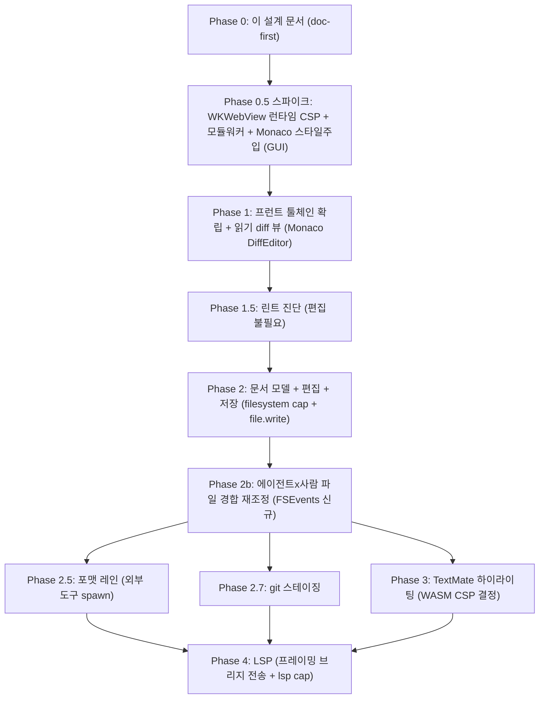

# 에디터 Surface 전략 (코드 에디터·git diff 뷰어·포맷/린트·LSP)

이 문서는 maru에 **코드 에디터 surface**(git diff 뷰어 → 인플레이스 편집 → 포맷/린트 → LSP)를 얹는 설계의 단일 출처다. "에이전트 워크벤치" 방향에서 **에이전트가 만든 변경을 사람이 터미널 안에서 리뷰·수정·커밋하는 루프**를 닫는 조각이다.

핵심 재구성: **"git diff 뷰어"는 primitive가 아니다.** 실제로 짓는 것은 **에디터 surface(문서 모델 + 렌더 컴포넌트)**이고, git diff는 그 에디터의 한 가지 **뷰/모드**다. diff 뷰어를 독립적으로 만들면 편집·LSP를 얹을 때 통째로 리셰이프하게 되므로, 토대를 doc-first로 먼저 고정한다.

경계·단일 출처:
- WKWebView 합성·입력·`maru-app://` 신뢰 채널·CSP는 [web-panel.md](web-panel.md)가 소유한다(여기서 재서술하지 않는다).
- 브리지 신뢰 게이트·capability·op 디스패치는 [control-plane.md](control-plane.md) §8이 소유한다.
- 레이어 경계(L2 코어 / L4 host)는 [layering-and-portability.md](layering-and-portability.md), surface 생애주기는 [surface-runtime-api.md](surface-runtime-api.md)를 단일 출처로 둔다.
- 이 문서는 "그 위에 에디터/문서/파일 I/O/포맷/LSP를 어떻게 얹는가"에 집중한다.

> **PoC 실측 범위**
> - **1차(2026-07-12, 정적)**: ① Monaco+워커5개를 zntc로 번들(성공), ② git diff op 데이터 형태, ③ 포매터 stdin/에러 거동(zig fmt·rustfmt), ④ LSP 왕복(rust-analyzer).
> - **2차(2026-07-13, 런타임·시각)**: 산출물을 **엄격 CSP 하에서 실제로 실행하고 화면을 찍었다**. Monaco DiffEditor가 diff·문자단위 하이라이트·구문강조·codicon까지 정상 렌더하고, 워커 5종이 기동하며, TS 언어서비스가 201ms 만에 진단을 낸다. **기준 번들러(Vite) 산출물과 픽셀 0개 차이.** **`script-src 'unsafe-eval'` 불필요를 측정으로 확정**(§2·§4).
>
> **여전히 미검증: WKWebView(WebKit) 런타임.** 2차는 Chrome(Blink)이다. "코드가 `unsafe-eval`을 실제로 요구하는가"는 엔진 무관한 강한 신호지만, **커스텀 스킴(`maru-app://`) 위의 모듈 워커·스타일 주입·IME는 WebKit 고유 영역**이라 Phase 0.5 GUI 스파이크가 여전히 필요하다(§11·§14).
>
> **교훈(설계에 반영)**: 이 PoC 과정에서 번들러 결함을 여러 건 밟았는데, **전부 빌드가 exit 0으로 통과한 채** 뒤늦게 드러났다. 어떤 결함은 산출물이 파싱조차 안 됐고, 어떤 결함은 파싱·모듈평가까지 통과한 뒤 **API를 실제로 호출·렌더할 때만** 터졌다. **빌드 green은 동작 증거가 아니다** → 프런트 빌드 파이프라인에 **4층 검증 게이트**를 넣는다(§12).

---

## 1. 확정 결정

- **렌더 컴포넌트 = Monaco Editor(웹뷰), 셀 그리드 자작 아님.** diff editor + 편집기 + LSP 클라이언트가 한 컴포넌트의 세 모드다: git diff = `<DiffEditor>`(`IDiffEditorModel { original, modified }`), 편집 = editor, LSP = `monaco-languageclient`(후속). Metal 셀 그리드에 에디터를 자작하는 것은 diff·구문강조·LSP를 감안하면 비현실적이다.
- **Monaco는 self-host 번들, CDN 금지.** `maru-app://` CSP가 외부 호스트를 차단하므로 CDN은 애초에 불가. **번들 경유 = zntc NAPI `@zntc/core.build()`**(§4). 워커는 정적 문자열 리터럴 `new Worker(new URL("...worker.js", import.meta.url), { type: "module" })`로 배선(변수 스페시파이어는 정적 분석이 깨져 emit 안 됨). **전체 에디터는 5개(editor/ts/json/css/html), v1 git diff는 `editor.worker` 하나로 충분.**
- **엄격 CSP를 유지한다 — `unsafe-eval`도 `wasm-unsafe-eval`도 열지 않는다(실측 확정).** Monaco 코어·DiffEditor·**TS 언어워커까지** `script-src 'self'`만으로 동작한다(§2). 신뢰 채널 CSP를 약화시키지 않아도 되므로 **§13의 열린 결정 하나가 닫혔다.** 유일한 추가 완화는 **`img-src 'self' data:`**(오류 물결선이 `data:` SVG). TextMate(§8)를 도입할 때만 `wasm-unsafe-eval` 논의가 되살아난다.
- **에디터는 신뢰(trusted) surface다.** 로컬 저장소를 maru가 렌더하는 신뢰 콘텐츠라 `trust=trusted` + `maru-app://` 신뢰 채널(스킴 핸들러 + isolated-world MaruBridge)을 쓴다 — `browser`(임의 URL·untrusted)가 아니다. 즉 **현행 신뢰 markdown 패널의 호스팅 기계를 그대로 탄다**(§3).
- **문서 모델은 버전 + 변경이벤트 형태로 day 1에 고정한다**(§5). LSP를 마지막에 하더라도, 버퍼를 "버전 번호 + `open/change/save` 이벤트"로 지어두면 v3 LSP·semantic token이 additive가 된다. 이건 LSP 때문이 아니라 **에이전트×사람 파일 경합 재조정**이 어차피 요구하는 배관이다(§7).
- **파일 I/O는 신규 capability + op다**(§6). 현행 `write` scope는 **PTY 입력(`sendText`/`sendKeys`)**을 인가할 뿐 디스크 파일 쓰기가 아니다(control_capability.zig:121·498-499). 에디터의 파일 read/save는 별도 scope로 발급·게이트한다.
- **하이라이팅은 3층 로드맵**(§8): Monarch(내장·즉시) → TextMate(VS Code 동급, WASM CSP 대가) → semantic tokens(LSP).
- **포맷/린트는 LSP가 아닌 "외부 도구 레인"**(§9): 선언적 레지스트리 + `spawn stdin→stdout` op. LSP(§10)와 별개·경량.
- **의존성 근거**: Monaco·zntc는 **maru 자체 소유 도구(zntc=`ohah/zntc`) + 웹 표준 패턴**으로, 신뢰 채널 안에서만 산다. clean-room: 웹 표준(`new Worker(new URL)`·Monaco 공개 API)에서 유도, reference 코드 이식 없음.

---

## 2. PoC로 확정된 토대 (실측)

| 항목 | 결과 | 근거 |
|---|---|---|
| Monaco + 워커5개 zntc 번들 | ✅ exit 0, 116파일, 워커 5개 same-origin 해시청크 | zntc CLI/NAPI |
| git diff 뷰어 = DiffEditor | ✅ `IDiffEditorModel { original: ITextModel; modified: ITextModel }` | monaco.d.ts + 빌드 |
| **Monaco 렌더 (엄격 CSP)** | ✅ **DiffEditor 정상 렌더 — 라인 diff·문자단위 하이라이트·구문강조(토큰 7종)·codicon·오버뷰 룰러. 에러 0 · CSP 위반 0 · 404 0** | Playwright 헤드리스, `script-src 'self'`(unsafe-eval **없음**), 스크린샷 확인 |
| **Vite 대비 픽셀 동일성** | ✅ **0px 차이(0.000%)** — 조용한 오컴파일 없음 | 동일 앱을 zntc/Vite로 빌드 → 스크린샷 pixelmatch |
| **`script-src 'unsafe-eval'`** | ✅ **불필요 — 측정 확정.** 코어의 `new Function`은 실행되지 않는 가드된 폴백 | 위와 동일(위반 0건) |
| **`img-src 'self' data:`** | ⚠️ **필요.** 진단 마커의 오류 물결선을 Monaco가 `data:` SVG로 그림 | 마커 표시 시 CSP 위반 1건 → `img-src` 개방 후 0건 |
| **TS 언어워커(ts.worker)** | ✅ 기동 + **201ms 만에 진단 마커**. **WASM 미사용 → `wasm-unsafe-eval` 불필요** | 오류 있는 JS 모델 → `getModelMarkers` end-to-end |
| git diff op 데이터 형태 | before/after **전체 blob**(unified 아님), rename=old/new 경로, binary=numstat `-` 제외 | git PoC(rename R096·binary .ttf 실측) |
| 포매터 에러 정책 | 에러 시 stdout 공백 + exit≠0(zig=2·rust=1) | zig fmt·rustfmt stdin PoC |
| LSP 프리미티브 | initialize 0.02s·진단 4.85s(콜드), 프레이밍=Content-Length(≠maru ndjson) | rust-analyzer 왕복 PoC |

**결론: Monaco 경로는 end-to-end로 검증됐다.** 번들 → 파싱 → 모듈평가 → 실제 렌더까지 통과하고, 기준 번들러(Vite)와 픽셀이 완전히 같다.

### 툴체인 전제 — zntc 최소 버전

에디터 스택은 zntc의 **첫 대형 소비자**라 PoC 과정에서 코드젠·자산·워커 해석 결함을 여러 건 밟았고, 전부 `ohah/zntc`에 보고·수정됐다. **Phase 1 착수 시점의 zntc 릴리스가 이 수정들을 포함해야 한다** — 프런트 workspace의 `@zntc/core`·`@zntc/web` 최소 버전을 그 릴리스로 못박는다(§13).

세부 결함 목록은 zntc 이슈 트래커가 단일 출처다. 이 문서는 그것을 재서술하지 않고, **거기서 얻은 설계 교훈(§12의 검증 게이트)만** 가져간다.

---

## 3. 신뢰 채널과 PanelKind — 새 kind가 필요 없을 수 있다

**실측 발견**: `PanelKind`(control_surface.zig:76 `{ markdown, browser }`)는 "패널 기능 종류"가 아니라 **신뢰/호스팅 판별자**다.
- **신뢰(markdown)**: `maru-app://app/<path>`를 커스텀 스킴 핸들러로 서빙 + isolated-world `MaruBridge` 등록(MaruAppHost.swift:499·629, app_scheme.zig `validateAppPath`/`csp_header`).
- **비신뢰(browser)**: 임의 URL을 `load(URLRequest)`, 스킴 핸들러·브리지 **미등록**(origin 위장 차단).

에디터는 신뢰 콘텐츠이므로 **markdown과 같은 신뢰 기계**를 탄다. 스킴 핸들러가 `maru-app://app/<path>`를 경로별로 서빙하므로, **에디터/git diff는 신뢰 SPA의 라우트**(`maru-app://app/editor`)로 얹을 수 있다 — 즉 **새 PanelKind가 필수는 아니다**.

- **권장(v1)**: 신뢰 SPA 단일 kind + 라우트(markdown 뷰·diff 뷰·editor 뷰). PanelKind 확장 불필요 → 닫힌 열거의 "사용자 승인" 게이트(control_surface.zig:74)를 회피.
- **대안**: 탭/사이드바 라벨·생애주기를 kind별로 구분하고 싶으면 얇은 신규 kind 추가. 이때 건드릴 곳(체크리스트): `PanelKind` enum · `SurfaceDto.panel_kind`(control_surface.zig:109) · `panelKindWire`(229) · `session_model.web_panel_kind`(58)·`webPanelLabel`(90) · `web_panel_layout` wire · **ABI `panel_kind: u32` marshal(app_host_abi.zig:1229, 0/1 → 2 추가) + offset 계약 테스트(2166)** · Swift `panel_kind` 분기. → **이 선택은 사용자 결정(§13).**

---

## 4. 빌드 통합 — zntc NAPI, raw 바이너리 금지

**현황(실측)**: 프런트 빌드 파이프라인은 **미배선**이다. build.zig:706-713은 placeholder `web/`를 `cp -R`만 하고, zntc/Bun은 build.zig·.mise.toml 어디에도 없다. 루트 `web/` Bun workspace·`package.json`·`zntc.config.*`도 없다. **즉 마크다운 뷰어(Phase 7 콘텐츠)와 그를 빌드할 툴체인은 결정만 됐고 미착수**다.

함의: **에디터 스택이 Phase 7 프런트 툴체인을 처음 세우는 주체다.** "마크다운 뷰어 완성"을 전제로 두지 못한다(그게 없으므로).

- **빌드 호출은 NAPI 경유**: `import { build } from "@zntc/core"`. maru 빌드/트레이스에 구조화된 `{ errors, warnings }`를 그대로 물릴 수 있다. **standalone `zig-out/bin/zntc`는 금지** — 정책(mainFields/conditions/node_modules 루트)이 빈 채라 bare import가 resolve 실패한다(PoC에서 이 함정으로 가짜 블로커 발생). config(`zntc.config.ts`)는 .ts라 로딩 자체가 JS 런타임 일이므로 CLI/NAPI를 통해야 한다.
- **app 빌드 모드는 `@zntc/web`을 별도 요구한다(0.1.3~)**: HTML 엔트리(`--entry-html`) 경로는 `@zntc/core`만으로는 안 되고 `@zntc/web`이 설치돼 있어야 한다. maru 프런트 workspace의 devDependency에 포함한다.
- **워커**: `MonacoEnvironment.getWorker`를 5개 정적 리터럴로. 헬퍼로 감싸면(변수 스페시파이어) 정적 분석이 깨져 워커가 emit되지 않는다(Vite/webpack 동일 제약, 실측).
- **CSP(실측 확정)**: 아래 정책으로 Monaco 코어·DiffEditor·워커 5종·TS 언어서비스가 **CSP 위반 0건**으로 동작한다(헤드리스 Chrome).
  ```
  default-src 'self'; script-src 'self'; worker-src 'self';
  style-src 'self' 'unsafe-inline'; font-src 'self'; img-src 'self' data:
  ```
  - **`'unsafe-eval'` 불필요**: 코어에 `new Function` 문자열이 잔존하나 **실행되지 않는 가드된 폴백**임이 런타임으로 확인됐다(위반 0건). 초판이 정적 grep으로 "청정"을 단언했다가 적대 검증으로 정정했고, 이제 **런타임 측정으로 결론이 뒤집히지 않았다.**
  - **`'wasm-unsafe-eval'` 불필요**: TS 언어워커도 WASM을 쓰지 않는다. **TextMate(§8) 도입 시에만** 재검토.
  - **`img-src ... data:` 필요**: 진단 마커의 오류 물결선이 `data:` SVG. 이건 마커가 실제로 뜨는 상태에서만 관측되므로, `ts.worker`가 죽어 있던 동안엔 보이지 않던 조건이다.
  - **잔여 리스크는 엔진 차이뿐**: 위는 Blink 측정이다. WebKit + `maru-app://` 커스텀 스킴 위의 모듈 워커·스타일 주입은 Phase 0.5에서 확인한다(§11).
- **빌드 성공을 동작 증거로 삼지 않는다**: PoC에서 밟은 번들러 결함은 전부 빌드 exit 0을 통과했다. 프런트 빌드 파이프라인은 **4층 게이트**(재파싱 → 모듈평가 → 렌더/픽셀비교)를 함께 세운다(§12).

---

## 5. 문서(버퍼) 모델 — 신규, L2 소유, 버전+이벤트

**현황(실측)**: 터미널 스크린 버퍼(`Screen`, screen.zig:257) 외에 **범용 편집 가능 텍스트 버퍼/문서 모델은 존재하지 않는다.** 파일 read(config/loader.zig:907 `readFileAlloc`)·write(workspace.zig `writeAll`) 프리미티브는 있으나 문서 추상이 아니다. → **문서 모델은 net-new.**

설계:
- **위치 = L2 코어**(session). 정본(canonical) 문서 레지스트리 `{ path, version, dirty, disk_mtime/hash }`를 L2가 소유해 재조정 권위로 둔다. WKWebView의 Monaco는 **라이브 편집 버퍼**를 쥐고, L2는 디스크 지속·변경 이벤트·경합 판정의 권위.
- **버전 + 변경이벤트**: `open/change/save` 어휘(LSP `didOpen/didChange/didSave`와 동형). LSP는 한 줄도 안 쓰되 **모양만** 이렇게 잡으면 v3에서 additive.
- **source-of-truth 규칙**: 열린 버퍼의 dirty 상태·최신 텍스트는 Monaco 소유, 디스크 반영은 save op(§6), 외부(에이전트) 디스크 변경은 file-watch→재조정(§7). 통짜 문자열 교체 금지 — 최소 diff edit로 Monaco undo 스택·커서 보존.

---

## 6. 파일 I/O capability와 op — 신규 scope

**현황(실측)**: capability 6종(metadata/bind/read-output/write/lifecycle/browser) 중 **`write`는 세션 입력(`sendText`/`sendKeys`)을 인가**한다(control_capability.zig:121 `session + "send" → .write`, 498-499). **디스크 파일 read/write를 인가하는 scope는 없다.**

설계:
- **신규 scope `filesystem`(가칭)**: 파일 내용 read/save를 게이트. 발급 UX·fd 상속 정책은 control-plane.md §8·§9의 capability 발급 모델을 따른다(browser cap 발급 선례). 임의 파일 접근이므로 기본 거부 + 명시 발급.
- **op 계열**(browser.* op 패턴 재사용 — deferred marshal/take/complete):
  - `diff.read` — 저장소 변경 파일별 `{ status, old_path, new_path, original_blob, modified_blob, is_binary }`. **read만**(write cap 불필요). worktree/index/HEAD/범위 모드 선택. rename=두 경로, binary=numstat `-` 제외, 대용량 blob 페이로드 고려(실측: 10k줄 파일 실재).
  - `file.read` / `file.write` — 편집 버퍼 열기/저장(`filesystem` cap). 저장은 exit·에러 처리 후 원자적 기록.
  - `git.stage`/`unstage`/`discard` — 헝크/라인 스테이징(write 액션 계열, 별도 Phase).

**전송 경로와 재사용/신규(실측)**:
- **브리지(`window.maru.*`)에는 capability 모델이 없다** — 신뢰는 origin/frame으로만 확립되고(control_bridge.zig:5-7, 현재 노출 method=`hello` 1개), 세분 grant가 불가하다. 파일/git write 같은 민감 op를 브리지로 노출하면 신뢰 콘텐츠가 **무제한 접근**한다. → **민감 write op는 소켓 경로(capability-gated)로 흘리거나**, 브리지에 capability 모델을 얹는 결정이 필요(§13).
- **비동기 골격은 generic이라 재사용**: `InFlight`/`deferRequest`/`completeInFlight`/`reapExpiredInFlight`(control_server.zig)는 메서드 무관. 단 `BrowserOpQueue` + take/complete ABI는 **browser 전용**(op_kind/arg 하드코딩)이라 새 async 계열(diff/file/git)은 병렬 큐 + ABI 또는 일반화가 필요(app_host_abi.zig).
- **live capability 발급이 아직 미배선**: `control_cap_store`가 프로덕션에서 상시 빈 값이라(app_host_abi.zig:1758) 실 fd 발급/상속(1e-confirm)은 test-only 훅뿐이다. 순수 코어(authz/resolve/store)는 완성·테스트됐으나, `filesystem` cap을 실제로 쓰려면 **이 라이브 발급 경로부터 지어야** 한다 — browser cap도 공유하는 선행조건이지 에디터 전용이 아니다.

---

## 7. 에이전트 × 사람 파일 경합 — 이 제품 고유의 난제

VS Code는 "사람이 유일 writer"를 가정하지만 **maru는 아니다** — 에이전트가 디스크의 파일 X를 고치는 동안 사람이 X를 dirty 버퍼로 열어 둔다.

**현황(실측)**: FSEvents/DispatchSource/kqueue 사용처가 코드에 **전무**하다. → **file-watch도 net-new.**

설계:
- **file-watch(신규, L4 host)**: FSEvents로 열린 문서의 디스크 변경 감지 → L2 문서 레지스트리에 `disk changed` 이벤트. 드래그 세션처럼 **디바운스**.
- **재조정 정책**: dirty 아님 → 조용히 리로드. dirty → 충돌 UX(리로드/유지/머지 선택). LSP도 서버 뷰가 버퍼·디스크와 일치해야 하므로 이 동기화에 얹힌다.
- **day 1 반영**: §5 문서 모델을 버전+이벤트로 지어야 이 재조정이 가능. 나중에 못 끼운다.

---

## 8. 하이라이팅 3층

| 층 | 엔진 | 무게 | 시점 |
|---|---|---|---|
| 기본 | Monarch(Monaco 내장) | 가벼움·WASM 없음 | v1 즉시 |
| VS Code 동급 | TextMate 문법 + VS Code 테마(vscode-textmate + Oniguruma) | **WASM** 필요 | 후속 |
| 의미 기반 | semantic tokens | LSP 서버 필요 | LSP 단계 |

- Monarch로 v1은 충분(내장 수십 개 언어). **Monarch는 WASM을 쓰지 않으므로 엄격 CSP 그대로 간다**(§2 실측).
- TextMate는 VS Code와 픽셀 동급이나 **Oniguruma가 WASM이라 CSP `script-src 'wasm-unsafe-eval'`을 열어야** 한다 — **CSP 약화를 요구하는 유일한 항목**이다(§13 결정). 엔진 교체는 하이라이팅 레이어에 **격리**(에디터·문서 모델 무변경)되므로, 이 결정은 Phase 3까지 미룰 수 있다.
- **정정**: 초판은 "TS 언어워커도 `wasm-unsafe-eval`을 요구할 수 있다"고 적었으나 **틀렸다** — ts.worker는 WASM을 쓰지 않고 엄격 CSP에서 진단까지 정상 동작한다(§2).
- semantic tokens는 LSP `textDocument/semanticTokens`에서 옴 → LSP 단계에 additive(Monaco `registerDocumentSemanticTokensProvider`).

---

## 9. 외부 도구 레인 — 포맷/린트 (LSP 아님)

oxc(oxfmt/oxlint)·prettier·zig fmt·rustfmt·gofmt·black 등은 **LSP 서버가 아니다** — 포매터·린터(CLI)다. LSP 래퍼로 감쌀 수도 있으나 **직접 호출이 훨씬 가볍다**.

- **선언적 레지스트리**: `{ 언어 → command, args, input: stdin|file, output: stdout|inplace }`. stdin→stdout 우선. 새 포매터 = 코드가 아니라 설정 항목(conform.nvim·Helix·Zed 모델).
- **에러 정책(실측 확정)**: **exit==0일 때만 버퍼 교체.** zig fmt(exit 2)·rustfmt(exit 1) 모두 에러 시 stdout 공백이라 안전. 코드값은 툴마다 다르므로 `==0` 기준. 적용은 Monaco 최소 diff edit(undo·커서 보존).
- **린트**: `eslint`/`oxlint --format json` → 파싱 → Monaco 마커. 린트는 편집 불필요라 읽기 뷰에도 앞당길 수 있음.
- op = §6의 `spawn stdin→stdout 캡처`(maru 기존 subprocess spawn 재사용, PTY 없음). LSP 전송(§10) 불필요.

---

## 10. LSP 미래 seam

**맨 나중**(가장 무거움). 지금은 seam만 남긴다.

- **호스트 spawn**: 언어서버 = stdio JSON-RPC 서브프로세스(PTY 없음). per-project 싱글턴·idle shutdown. rust-analyzer 실측: initialize 0.02s·진단 4.85s(콜드).
- **전송 임피던스(실측)**: **LSP=Content-Length 프레이밍 ≠ maru 컨트롤 플레인 ndjson.** 그래서 passthrough는 단순 바이트 포워딩이 아니라 **프레이밍 브리지 + 2번째 JSON-RPC 스트림 멀티플렉싱**(per-server 채널 수명·백프레셔). browser.* op식 op-per-message는 고빈도라 부적합.
- **push 채널(실측)**: 브리지는 **요청/응답 전용, 서버→클라이언트 push가 없다**(control_bridge.zig). LSP diagnostics 같은 서버 발신을 isolated-world로 밀려면 **push 채널 신규**. 다행히 소켓 경로엔 notification 스트림(`events.subscribe`·`session.subscribeOutput`, I/O 스레드 직송 + 백프레셔·slow-subscriber disconnect)이 **이미 있어 LSP 하부로 재사용 가능**하나, 그걸 `window.maru.*`에 잇는 게 신규다. browser op은 **1요청-1응답**(deferRequest↔completeInFlight 1:1)이라 1요청-다응답 스트림은 이 notification 경로를 써야 한다.
- **보안**: 언어서버는 임의 로컬 코드 실행(rust-analyzer proc-macro/build script). 신규 `lsp` capability + 인지.
- **감지**: 확장자/루트 마커(`Cargo.toml`·`package.json`·`go.mod`) → 서버 cmd + PATH probe.

---

## 11. 단계 계획

전제 붕괴 정정: **"마크다운 뷰어 완성"이라는 전제는 실재하지 않는다(§4).** 따라서 에디터 스택이 **Phase 7 프런트 툴체인(zntc/Bun web workspace + build.zig 배선 + maru-app:// SPA asset 파이프라인)을 처음 세운다.** 이 툴체인 확립은 마크다운 뷰어와 **공유**되므로, 둘 중 무엇을 먼저 내든 이 토대를 함께 짓는다.



- **Phase 0.5(스파이크·GUI 필수, 범위 축소됨)**: 헤드리스 Chrome 실측(§2)이 **CSP·워커·폰트·TS 워커 질문을 이미 닫았으므로**, 스파이크에 남는 것은 **WebKit 고유 영역뿐**이다 — ① `maru-app://` 커스텀 스킴 위에서 `{type:'module'}` 워커가 도는가(WKURLSchemeHandler + 워커 로딩 상호작용), ② Monaco 런타임 스타일 주입 vs 엄격 `style-src`, ③ 한글 IME. red면 워커 전략 재검토. **CSP 정책은 §4의 실측값을 그대로 적용하고 위반 여부만 확인한다.**
- **Phase 1**: zntc NAPI 빌드 배선(+`@zntc/web`, +§12 4층 게이트) + PanelKind 라우트(§3) + `diff.read` op(§6) + `<DiffEditor>` + 접기/펼치기·파일트리 + Monarch. **읽기 전용 diff는 스냅샷+새로고침으로 punt**(경합은 Phase 2b). **선행조건: PoC 수정분을 담은 zntc 릴리스**(§2).
- **Phase 2 / 2b**: 문서 모델(§5) + `filesystem` cap·`file.*` op + 파일 열기(NSWorkspace.open 승격) / file-watch 재조정(§7).
- **2.5·2.7·3 병렬 가능**(문서 모델 위, 서로 독립). **4는 최후.**

---

## 12. 관측 가능성·테스트 전략

### 프런트 빌드 검증 — 4층 게이트 (신규·필수)

PoC에서 밟은 번들러 결함은 **전부 빌드 exit 0**이었다. 각 결함이 어느 층에서야 처음 드러났는지를 그대로 게이트로 만든다. **위 층을 통과했다고 아래 층이 통과하는 게 아니다** — 실제로 각 층에서만 잡히는 결함이 따로 있었다.

| 층 | 검사 | 잡는 것 | 비용 |
|---|---|---|---|
| 1 | **빌드 exit code** | (거의 아무것도) — 모든 결함이 여기를 통과했다 | 0 |
| 2 | **산출물 재파싱** — 방출된 모든 `.js`를 파서로 재독 | 문법이 깨진 산출물. **빌드는 green인데 브라우저가 파싱조차 못 하는** 코드젠 결함 | ~0 |
| 3 | **모듈평가 스모크** — 헤드리스 브라우저에 띄워 엔트리 모듈이 끝까지 평가되는지 | 문법은 유효하나 **평가 중 죽는** 결함(식별자 섀도잉·미링크 바인딩). 2층은 통과한다 | 낮음 |
| 4 | **렌더 + 픽셀 비교** — 실제 API를 호출·렌더하고 **기준 번들러(Vite) 산출물과 스크린샷 픽셀 비교** | 평가는 통과하고 **API를 실제로 호출할 때만** 죽는 결함, 그리고 **조용한 오컴파일**(에러 없이 다른 픽셀) | 중간 |

- **4층이 필수인 이유**: 1~3층을 전부 통과하고 4층에서만 잡힌 결함이 실재했다. `import * as X from "lib"`만으로는 모듈 평가가 성공하고, **실제로 그려봐야** 드러난다.
- **픽셀 비교의 값어치**: Monaco를 zntc/Vite 양쪽으로 빌드해 렌더하면 **0px 차이**다. 이건 "에러가 없다"보다 훨씬 강한 진술 — **번들러가 의미를 바꾸지 않았다**는 증거다. 기준 번들러를 devDependency로 두는 비용은 이 보증에 비하면 싸다.
- Monaco는 CI 렌더 픽스처(고정 diff 입력·`automaticLayout:false`·애니메이션 off·고정 폰트)로 결정론적으로 찍는다. 회귀 시 diff 이미지를 artifact로 남긴다.
- **CSP도 이 게이트에 얹는다**: 3·4층 서버가 §4의 실측 CSP 헤더를 실어, 위반 0건을 상시 확인한다. CSP 회귀가 조용히 들어오는 걸 막는다.
- **한계**: 헤드리스 Chrome은 **WKWebView가 아니다**. 이 4층은 "빌드 green ≠ 동작 green" 갭의 대부분을 CI에서 잡아줄 뿐, WebKit 고유 리스크는 Phase 0.5·수동 GUI가 담당한다(§14).

### 그 외

- **프런트 단위**: Monaco 통합·포매터 레지스트리·diff op 매핑은 `bun test`(Phase 7 툴체인)로.
- **op 계약**: `diff.read`/`file.*`/`git.*`는 control-plane trace schema에 실어 snapshot/replay가 같은 데이터를 공유(control-plane.md 관측 원칙 유지).
- **GUI 수동(불가피)**: WKWebView 입력/포커스/폰트/한글 IME는 web-panel.md §11이 이미 "헤드리스 자동화 불가"로 규정한 영역. 에디터는 그 위에 Monaco 상호작용·format-on-save를 더한다 — 각 Phase 게이트에 수동 검증 항목을 명시한다.

---

## 13. 사용자 논의 필요 (문서에 없는 결정)

1. **PanelKind**: 신뢰 SPA 라우트(권장, 새 kind 불필요) vs 얇은 신규 kind(라벨/생애주기). §3.
2. ~~**CSP 완화**~~ → **해소(2026-07-13 실측).** `unsafe-eval`·`wasm-unsafe-eval` **모두 불필요**하고, `img-src 'self' data:`만 추가하면 된다(§2·§4). **잔여 결정은 TextMate뿐** — VS Code 동급 하이라이팅을 위해 `wasm-unsafe-eval`을 열 것인가(Phase 3까지 유예 가능, §8).
3. **신규 capability `filesystem`**: 임의 파일 read/write 발급 UX(기본 거부 + 명시 발급). §6.
4. **외부 의존성**: Monaco를 핵심 UX 경로에 추가 = "가벼운 native shell" 포지션과의 트레이드오프(웹뷰에 제품 상당부가 산다). pr-checklist "핵심 경로 외부 의존성" 항목.
5. **에디터 op 전송 경로**: 브리지(단순하나 capability 격리 없음) vs 소켓(capability-gated·push 스트림 보유). 민감 write·LSP diagnostics push를 어디로 흘릴지 — 브리지에 capability 모델을 얹을지, 소켓으로 흘릴지. §6·§10.
6. **zntc 최소 버전(신규)**: 에디터 스택은 PoC에서 나온 zntc 수정분에 의존한다(§2). Phase 1을 그 릴리스까지 기다릴지, 그 전까지 lockfile을 프리릴리스에 고정할지.

---

## 14. 한계·미검증

- **WKWebView(WebKit) 런타임 미검증** — 남은 최대 갭. §2의 런타임 실측은 **헤드리스 Chrome(Blink)**이다. "코드가 `unsafe-eval`을 실제로 요구하는가"는 엔진 무관한 강한 신호라 CSP 결론은 유지될 가능성이 높지만, **`maru-app://` 커스텀 스킴 위의 모듈 워커 로딩·Monaco 스타일 주입·한글 IME는 WebKit 고유**라 Phase 0.5에서 확인해야 한다.
- **정적 분석의 한계(기록)**: 초판은 정적 grep으로 "CSP 청정"을 단언했다가 적대 검증에서 정정했고, 이번 런타임 측정으로 비로소 결론이 났다. **grep은 CSP 질문에 답할 수 없다** — 문자열의 존재는 실행의 증거가 아니다(코어의 `new Function`은 실제로 죽은 폴백이었다).
- **결함이 `--minify` 경로에 몰린다**: PoC에서 밟은 번들러 결함 상당수가 **minify에서만** 재현됐다(비-minify 빌드는 정상). 프로덕션 빌드가 곧 minify 빌드이므로, §12 게이트는 **minify 산출물을 대상으로** 돌려야 한다 — 개발 빌드가 통과했다는 건 아무 보증도 아니다.
- **surface당 자원 비용 미측정**: pane N개 × (Monaco + 워커 5스레드). 성능 예산(performance-budget.md) 대비 측정 필요, Monaco 공유 전략 미결. **번들 크기도 미최적화** — all-language barrel import 기준이라 targeted import로 줄여야 한다.
- **문서 모델 경계·경합 재조정 메커니즘**은 설계만, 구현 미착수(가장 어려운 부분).
- **전제 정정**: 마크다운 뷰어/프런트 툴체인 부재를 이 문서에서 처음 반영 — 기존 계획이 이를 전제했다면 함께 갱신 필요.
