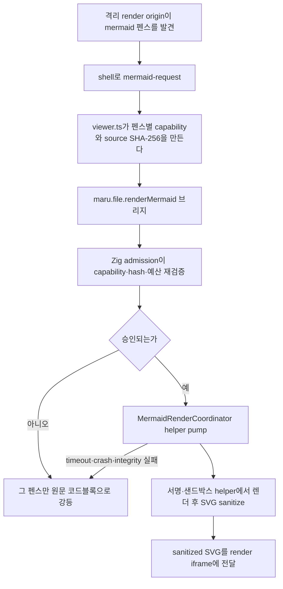

# 파일 패널 — 웹 스택과 렌더 파이프라인 (§2.1 · §2.3 · §2.4)

프론트엔드·렌더러·리치 렌더의 웹 스택 구성, 터미널 색상 테마 기반 syntax 하이라이트, Mermaid 렌더 파이프라인의 계약이다.

> **절 번호는 파일을 넘어 이어진다.** 본문이 `§2.4`처럼 절만 가리키면 아래에서 소유 파일을 찾는다 — §1·§4~§10·§12~§13 [file-panel.md](file-panel.md) · §2·§2.2·§2.6 [kind 분기](file-panel-kinds.md) · §2.1·§2.3·§2.4 [웹 스택과 렌더](file-panel-web-stack.md) · §2.5 [리치 편집 모드](file-panel-rich-edit.md) · §3 [도크 UI](file-panel-dock-ui.md) · §11 [테스트·검증](file-panel-verification.md)

### 2.1 웹 스택 (프론트엔드·렌더러·리치 렌더)

아키텍처 B로 WKWebView 웹앱의 일은 최소다(트리·탭·도크 chrome = 네이티브 Zig+GPU). 그래서:

- **프론트엔드 = React + Tailwind + shadcn/ui (2026-07-29 개정, 사용자 결정).** 웹앱의 일은 새니타이즈 HTML 표시(읽기) + CM6 마운트(소스) + 문서모델 편집기 마운트(리치, §2.5) + 브리지 모드/테마 신호 수신 + dirty 보고다. Markdown 파생 HTML은 신뢰 shell에 삽입하지 않고 bridge-free renderer origin이 소유하며, 그 안의 Mermaid 펜스만 shell이 native helper로 중계한다(§2.4) — **단일 예외인 리치 HTML 블록 미리보기는 §2.5의 조건을 전부 만족할 때만이다**. `viewer.ts`는 shell composition facade와 mutation queue/guard snapshot 전달을 맡고, Markdown→HTML 파생은 `markdown.ts`, Mermaid sanitize·config는 `rich-render.ts`, helper wire는 `mermaid-helper.ts`·`mermaid-fence.ts`, 렌더 capability 타입은 `renderer-capability.ts`, 편집 모드·revision clock은 `file-panel-state.ts`, 리치 편집기와 툴바는 `rich-editor.ts`가 소유한다. **라이브 프리뷰 폐기(§1)로 projection·atomic worker·intent dispatcher 모듈은 전부 삭제했다** — 남은 웹 모듈은 읽기·소스 두 모드만 지탱한다. CM6는 프레임워크가 아니라 **DOM 마운트 에디터 라이브러리**라 이 결정과 직교한다.
- **프레임워크 도입의 범위와 뒤집지 않는 것(§2.1a).** 초판은 "프레임워크 없음"이었고 그 근거는 아키텍처 B —
  "웹앱의 일을 최소화한다"였다. **아키텍처 B 자체는 그대로다**: 탭·헤더 밴드·파일 트리·pane chrome은 계속 Zig+GPU가
  그리고, WKWebView는 문서 콘텐츠만 소유한다. 바뀌는 것은 **그 콘텐츠 영역 안에서 web이 이미 그리던 UI를 무엇으로
  만드느냐**뿐이다.
  - **왜 뒤집는가**: 콘텐츠 영역 안에서 시작한 상호작용(선택→컨텍스트 메뉴, 리치 툴바, 앞으로의 다이얼로그)을
    native 오버레이로 처리하려면 웹뷰 좌표 변환·firstResponder 라우팅·스크롤 추종을 매번 새로 풀어야 한다. 그 셋은
    헤드리스로 검증되지 않아 손 테스트에만 의존한다. 같은 UI를 web에서 그리면 위치·스크롤·클릭이 전부 DOM의 기본
    동작으로 해결된다. 컨텍스트 메뉴처럼 포커스 트랩·키보드 내비게이션·바깥 클릭 닫기가 필요한 컴포넌트를 직접
    짜는 비용도 매번 든다.
  - **경계는 그대로 판별한다**: "이 UI가 문서 콘텐츠 위에 뜨는가"가 기준이다. 그렇다면 web, 창 전체나 chrome
    영역에 뜨면(알림 센터·설정·닫기 확인) 계속 Zig chrome이다.
  - **부분 정정(2026-08-01, 사용자 결정) — 컨텍스트 메뉴는 Zig chrome이 그린다.** 초판은 컨텍스트 메뉴를 web으로
    옮기는 **대표 사례**로 들었으나, 그 근거("native 오버레이는 좌표 변환·firstResponder·스크롤 추종을 매번 새로
    푼다")가 메뉴에는 맞지 않는다: 메뉴는 스크롤을 따라다니지 않고 한 번 뜨고 닫히며, 좌표는 어차피 web이 올려
    주고, 그 변환은 **터미널 우클릭 메뉴가 이미 하고 있다**. 반대로 web으로 그리면 두 가지를 잃는다 — ⑴ 메뉴가
    WKWebView rect를 못 벗어나 콘텐츠 영역 가장자리에서 접히거나 잘린다. ⑵ maru의 chrome은 AppKit이 아니라
    Zig+GPU라, 이미 있는 세 메뉴(터미널 본문·파일 트리·사이드바 ⚙ — 전부 `context_menu_items_buf`+`itemAt`/
    `draws`/`accept` 공유)와 **네 번째 스타일**이 생긴다. 계약은 §2.6이 소유한다.
    **React가 계속 맡는 것**: 문서 흐름 **안에** 사는 UI — 리치 툴바, 인라인 위젯, 폼. 이들은 문서와 함께
    스크롤돼야 하므로 web이 맞다. 즉 기준을 "콘텐츠 위에 뜨는가"에서 **"문서와 함께 스크롤하는가"**로 좁힌다.
  - **CM6·문서모델 편집기는 React와 직교한다.** 둘 다 DOM 마운트 라이브러리라 React 트리 **밖의 형제 노드**에
    그대로 붙는다. 편집기를 React 컴포넌트로 다시 쓰지 않는다.
  - **루트는 편집기당 하나다**(`shell-ui.tsx`). 리치 편집기의 툴바와 잠금 안내가 그 한 트리에서 그려진다 —
    각자 마운트하면 문서 주변 UI가 React 트리와 손으로 만든 노드로 갈리고, 뒤에 붙일 UI마다 루트가 하나씩 는다.
- **테마 색의 단일 출처는 여전히 native다(§2.1b).** Tailwind를 도입해도 색·폰트 값은 계속 `--maru-syntax-*`·
  `--maru-editor-*`가 소유하고, Tailwind 테마는 그 CSS 변수를 **참조만** 한다(`colors: { syntax: { keyword:
  "var(--maru-syntax-keyword)" } }` 형태). Tailwind 기본 팔레트를 그대로 쓰면 터미널 테마를 바꿨을 때 그 부분만
  안 따라오는 이중 체계가 된다 — 실제로 리치 본문에 터미널 폰트를 잘못 물려 한글이 깨진 전례가 있다(§2.5).
- **CSP·번들 영향(§2.1c).** app origin은 CM6 StyleModule 때문에 이미 `style-src 'self' 'unsafe-inline'`이라
  팝오버 위치 계산의 인라인 style이 통과한다(§1 무백색 계약과 같은 근거). Tailwind 출력은 빌드타임 CSS 파일이라
  새 권한이 필요 없다. 번들은 커지므로 **web bundle 3 MiB를 예산으로 둔다** — 넘으면 그 PR에서 근거를 대거나
  코드 분할을 한다. 로컬 스킴 로드라 네트워크 비용은 없지만 파싱 시간은 첫 paint에 들어간다.
- **렌더러 = remark/unified 확정(FP2)**. 실측으로 ⑴ raw HTML을 `rehype-raw`로 판독한 뒤 `rehype-sanitize` allowlist가 단독으로 무엇이 살아남는지 정하고, ⑵ 그 allowlist는 AST 위에서 돈다(문자열 정규식이 아니다), ⑶ unist 문자 offset→renderer-owned `data-maru-source-start/end`, ⑷ GFM·KaTeX MathML-only·Prism을 한 pipeline에서 보존하고 adversarial fixture를 통과했다. markdown-it의 block line 범위보다 후속 주석 앵커의 문자 offset hedge가 강하고 별도 DOM sanitizer가 불필요해 remark를 택했다.
- **읽기 모드는 문서가 직접 쓴 HTML을 그린다(2026-08-02, 사용자 결정).** 마크다운 명세가 HTML을 허용하고
  `
` 접기·`<kbd>`·``처럼 **문법만으로는 만들 수 없는 표현**이 실제 문서에 흔하다. 폐기하면 그
  문서는 읽기에서 구조를 잃는다(접기 안 내용이 통째로 펼쳐진 평문이 된다).
  - **폐기 경계를 파서에서 sanitizer로 옮긴 것이지, 격리를 푼 것이 아니다.** `allowDangerousHtml`은 raw
    문자열을 트리에 남길 뿐이고 무엇이 살아남는지는 allowlist가 단독으로 정한다. `script`·`style`·`iframe`·
    `form`과 `on*`·인라인 style은 계속 제거되며, 렌더 결과는 여전히 capability 0 격리 origin 안에서만
    materialize된다(§3 ①). `src`는 어떤 scheme도 허용하지 않는 기존 정책 그대로다.
  - **태그를 지울 때 안쪽까지 버리는 목록에 `style`을 더한다.** 기본값은 `script` 하나여서 `<style>`을
    지우면 CSS 본문이 문단 텍스트로 남는다(실측 — 화면에 `body{display:none}`이 글자로 떴다). 실행되지는
    않지만 문서에 없던 글자가 생기는 건 렌더 오류다.
  - **renderer-owned attribute는 붙이기 전에 지운다.** `data-maru-source-*`·`data-maru-asset-*`는
    allowlist에 있으므로, raw HTML이 승격된 뒤에는 문서가 같은 이름을 위조할 수 있다. 예전에는 파서
    경계에서 raw를 버려 이 경로가 아예 없었다. asset 경로 쪽이 특히 중요하다 — viewer가 그 값을
    `readAsset` 인자로 쓰므로 위조가 통과하면 **문서가 읽을 파일을 스스로 고르게 된다**.
  - **두 모드의 판단 근거는 다르다** — 읽기는 "안전하게 그릴 수 있는가", 리치는 "잃지 않고 되쓸 수 있는가"다.
    읽기는 그리기만 하지만 리치는 저장할 때 문서모델을 되쓰기 때문이다. 리치가 HTML을 다루는 방식은 이
    allowlist가 아니라 §2.5의 **원문 보존 규칙**이 정한다(보존은 항상, 렌더는 이 allowlist를 통과할 때만).
- **리치 렌더 기능**(각 = 라이브러리 + 보안 배치):

| 기능 | 라이브러리(후보) | 보안 배치 |
|---|---|---|
| 다이어그램 | Mermaid.js | **번들된 별도 `maru-mermaid-renderer` helper process 실행**(편집 앱과 OS process 경계, 브리지 없음) + `securityLevel: 'strict'` + 출력 SVG 새니타이즈(label XSS CVE 이력) |
| 수식 | KaTeX(경량 권장) / MathJax | 격리 origin, 수식→마크업 |
| 코드 하이라이트 | Shiki / Prism | 렌더·빌드타임, XSS 표면 작음 |

- **세 web 컨텍스트**(§3·web-panel §7, FP4 실구현·FP10 확장): ① **격리 렌더 origin `maru-app://render`** = `sandbox="allow-scripts allow-same-origin"` iframe 안에서 새니타이즈 HTML + KaTeX/Prism 결과를 materialize한다. 읽기의 문서 iframe, FP10의 일반 fragment와 FP11의 atomic widget은 같은 origin·capability 0 계약을 쓴다. shell과 host가 달라 same-origin이 아니며, `window.maru`/WebKit message handler가 없고 부모 DOM 접근도 실패해야 한다. ② **신뢰 shell origin `maru-app://app`** = CM6·worker orchestration·핀 파일 브리지. Markdown 파생 HTML/SVG는 문자열로만 전달하고 이 DOM에 삽입하지 않는다 — **예외는 리치 편집기의 HTML 블록 미리보기 하나이며 그 조건은 §2.5가 소유한다**(2026-08-02 개정). FP10 당시 공용 타입은 `RendererCapability { document_revision, projection_generation, widget_id, widget_generation, renderer_instance }` 5-field였고, 현재 모든 renderer message는 §3의 `editor_epoch` 포함 6-field alias 하나만 사용한다. load마다 새 `MessageChannel` port와 현재 registry가 모두 맞을 때만 ready/height/rendered 결과를 수용하며 renderer에는 asset/link 요청 권한을 주지 않는다. ③ **전용 Mermaid helper** = 앱의 `MermaidRenderCoordinator`가 App Sandbox로 서명된 `Contents/Helpers/MaruMermaidRenderer.app`의 실행파일을 시작하고 bounded stdin/stdout protocol로만 통신한다. helper는 bridge/message handler 없는 자기 WKWebView에서 strict Mermaid를 실행하며 앱 편집 WebView를 소유하지 않는다. 각 요청은 `MermaidJobCapability { helper_instance, job_id, renderer_capability, fence_id, source_hash }`에 묶이고 timeout/crash/restart/widget revoke 시 terminal 처리된다. 늦거나 중복된 result는 이 capability 전체와 현재 renderer registry가 맞을 때만 한 번 소비한다.
- **번들(FP2 완료)**: `web/` Bun workspace(`package.json` + `bun.lock`) + `@zntc/core@0.1.4` bundle + oxlint/oxfmt(Oxc), SHA-384 SRI 생성 후 실제 bundle bytes 재검증. vanilla 단일 앱에는 PostCSS/Sass/HMR controller가 불필요해 `@zntc/web`은 넣지 않았다. `bun install --frozen-lockfile`과 별도 path-filtered CI로 재현하고 기존 dependency-free Zig `mise run check`에는 합치지 않는다.

### 2.3 터미널 색상 테마 기반 syntax 하이라이트 (FP12b)

**소스 편집기 하이라이트 색은 시스템 light/dark가 아니라 Maru 터미널 색상 테마에서 파생한다(사용자 결정 2026-07-22)** — 편집기가 옆 터미널과 같은 팔레트를 써 시각적으로 일관된다. 순수 파생은 `syntax_theme.zig`(중립 L2, 헤드리스 테스트)가 단일 출처다.

- **파생 매핑**: `SyntaxColors = fromTheme(ResolvedTheme)`. 실효 ANSI 색(`theme.palette[i] orelse xterm256(i)` — 렌더러와 같은 config-override→표준 폴백)을 각 역할에 매핑하되 **밝은 변형(9~14)을 쓴다**: keyword=bright magenta(13), string=bright green(10), number=bright yellow(11), property/function=bright blue(12), type=bright cyan(14), tag/invalid=bright red(9), attribute=bright magenta(13). comment/punctuation은 fg를 bg 쪽으로 48%·25% 섞은 dim 색이다. **각 색은 `contrastFloor(.both)`로 배경 대비를 보장한다**(본문 4.0·dim 2.4) — 정상 ANSI(1~6)는 xterm 기본이 `(0,128,0)`류 어두운 색이라 다크 배경에서 저대비로 하이라이트가 안 보이는 회귀가 있었다(FP12b 초판 버그). 밝은 변형+대비 보정으로 다크는 선명하게, 라이트 배경은 hue 보존하며 어둡게 내린다.
- **전달**: `writeCssVarsJs`가 `--maru-syntax-*`와 **`--maru-editor-selection`·`--maru-editor-font-family`·`--maru-editor-font-size`**를 설정하는 JS 스니펫(색은 검증된 #RRGGBB, 폰트명은 safe-charset[영숫자·공백·하이픈]만 통과 → 주입 위험 0)을 만들고, ABI `maru_macos_app_session_syntax_style_js`로 받은 Swift가 신뢰 shell(`filePanelKind==1`, text/markdown) webview `didFinish`에서 `evaluateJavaScript(.page)`로 실행한다. CSS 변수라 이미 마운트된 CM6 span도 즉시 재도색된다(app.css의 light/dark 값은 주입 전·실패 시 폴백). **`--maru-editor-font-size`의 단위는 `px`다(2026-07-28 정정)** — CoreText가 터미널을 그릴 때 쓰는 AppKit 포인트는 논리 픽셀과 1:1이지만 CSS `pt`는 1/72인치라 `1pt = 1.333px`다. `pt`로 주입하면 편집기 글자가 터미널보다 33% 커진다(사용자 제보로 발견).
- **블록 선택 색·본문 폰트도 터미널과 일치(사용자 결정 2026-07-23)**: 편집기 base 색은 시스템 `Canvas/CanvasText/AccentColor`지만, **블록 선택 색은 터미널 테마의 `selection` 색**(`--maru-editor-selection`)으로, **본문 폰트는 터미널과 같은 패밀리·크기(pt)**(`--maru-editor-font-*`, `appearance.font` — ⌘+/− 런타임 크기 포함)로 맞춰 옆 터미널과 시각적으로 이어진다. 번들 폰트는 `ATSApplicationFontsPath`로 WKWebView에도 등록돼 패밀리명으로 바로 쓰인다. 선택은 CM6 **`drawSelection`**(자체 선택 레이어)이 그린다 — CM6는 문서를 가상화(보이는 줄만 DOM)해 브라우저 native `::selection`은 렌더된 줄만 덮으므로, 긴 문서에서 ⌘A 전체 선택이 **화면·삭제 모두 일부만** 되던 버그를 drawSelection이 전체 모델 선택으로 일관 처리한다. 키보드 ⌘A는 web_editor route라 WKWebView 기본 `selectAll:`(가상화 DOM만)이 가로채므로 `viewer.ts`가 capture 단계에서 CM6 전체 선택으로 동기 처리하고, 메뉴 Edit>Select All 클릭은 `__maruSelectAll`(native가 우선 호출)로 처리한다.
- **CSP 선결 조건(FP12b 근본 수정)**: CM6 `syntaxHighlighting`은 style-mod StyleModule의 런타임 `<style>` 주입으로 색 규칙을 넣으므로, app origin CSP `style-src`에 **`'unsafe-inline'`이 없으면 WebKit이 그 스타일시트를 거부**해 하이라이트가 전부 기본색이 된다(헤드리스 Playwright WebKit로 재현·확정, [web-panel.md] §7.1 ③-1). app origin만 `style-src 'self' 'unsafe-inline'`으로 열고 render origin은 strict를 유지한다.
- **테마 변경 라이브 반영**: `refreshFilePanelSyntaxTheme()`가 열린 모든 신뢰 shell에 재주입한다. 연결된 경로는 **follow-system appearance 변경**(`applySystemAppearanceToAllSessions`)과 **Reload Config**다. 설정 GUI의 palette 라이브 편집·Reset·OSC4는 v1에서 재주입 경로가 아니라 파일을 다시 열 때 반영된다(명시 수용 — 별도 theme-dirty 신호는 후속).
- **⌘+/− 폰트 줌이 파일 패널 콘텐츠도 스케일(사용자 결정 2026-07-23)**: 터미널 폰트 크기를 ⌘+/−(·config)로 바꾸면 열린 파일 패널의 렌더 콘텐츠도 같은 배율로 커지고 작아진다("cmd +/− 로 조절할 때 마크다운·html 안에 들어간 영역도 같이"). **배율 = 현재 폰트 크기 / `base_font_size`**(⌘0 기준 config 크기)이라 기본/⌘0에서 정확히 1.0이고 ⌘+/− 만큼만 프리뷰가 확대/축소된다(config 폰트 크기 자체는 프리뷰 기준 배율을 안 바꾼다 — 상호작용 줌만). 극단 조합은 `[0.1,10]`으로 클램프한다(`AppSession.filePanelZoomMilli`, milli 정수).
  - **트리거(1회성 dirty 신호)**: `applyMetricsPipeline`(setFontSize·applyAppearance 공유 초크포인트)이 `file_panel_zoom_dirty`를 세우고, Swift tick의 `drainFilePanelZoom`이 `take_file_panel_zoom_dirty`로 drain해(`take_command_catalog_dirty`와 같은 패턴) 열린 패널을 재적용한다. 신규 패널은 `didFinish`에서 `file_panel_zoom_milli`를 읽어 현재 배율로 즉시 착지한다.
  - **kind별 수단(각자 자연스러운 축)**: ⑴ **소스 편집기**(kind 1 `#editor`)는 이미 `--maru-editor-font-size`(px, 위 항목)로 스케일되므로 `refreshFilePanelSyntaxTheme` 재주입이 곧 편집기 줌이다(코드 편집기엔 절대 pt가 자연스럽다). ⑵ **마크다운 읽기 프리뷰**(kind 1 render iframe)는 `maru:file-zoom` 이벤트 → shell이 render iframe에 `setZoom` postMessage → iframe이 `documentElement`에 CSS `zoom`을 걸어 **브라우저 페이지 줌**처럼 텍스트·이미지·코드블록·mermaid까지 균일 확대(cross-origin이라 shell이 iframe DOM을 직접 못 건드려 메시지 경유). svg·image 프리뷰는 자체 fit/panzoom이 크기를 소유하므로 페이지 줌에서 제외한다(`previewIsMarkdown` 게이트). ⑶ **HTML·PDF browser 패널**(kind 2, `loadFileURL`)은 콘텐츠 전체가 한 문서라 WKWebView `pageZoom`으로 페이지 줌한다.

브리지가 유일한 채널 — CSP `connect-src 'none'` + 스킴 핸들러는 번들 asset root만 서빙([web-panel.md] §7 명시 금지). FP4에서 `hello`와 함께 `maru.file.read`/`readAsset`을 신뢰 shell main frame에만 열었다. 정책 판정은 Zig(L2), Swift는 현재 surface를 소유한 `AppSession`을 매 요청 다시 찾아 ABI로 전달하는 어댑터만 맡는다([control-plane-implementation.md] §11 게이트).

- **read(FP4 완료, FP10d epoch 강화)**: `maru.file.read({ editor_epoch })` — **경로 인자 없음**. Zig가 그 도크 entry에 핀된 경로를 읽어 reply하고, byte 반환과 native disk-content hash 갱신 직전에 같은 active document epoch를 다시 확인한다. 따라서 이전 WebContent document의 늦은 read는 현재 저장 기준 token을 바꾸지 못한다. UTF-8 markdown·파일 크기는 8 MiB 이하만 허용한다. md 상대 이미지용 `maru.file.readAsset({path})`는 핀 디렉터리 handle 아래를 component별 descriptor-relative/no-follow로 연다. 최종 파일은 nonblocking으로 open한 같은 fd에서 stat/read하며 정규 파일만 허용해 경로 TOCTOU·symlink 탈출뿐 아니라 FIFO/device/socket open 대기도 막는다. 파일별 8 MiB·viewer당 최대 64개·base64 응답 합계 48 MiB로 제한하며 `../`·절대경로·backslash·제어문자·모든 asset symlink·외부 URL은 거부한다. raster는 검증된 `data:` URL, SVG는 UTF-8 decode 후 URL/event sink를 다시 sanitize한 `data:` URL만 renderer에 전달한다. **`../` 상위-상대 리소스는 거부되어 이미지가 깨진다** — v1은 피해 반경 bound를 우선하고 트리 루트 확장은 후속(§13).
- **write(FP6 완료, FP10d 강화)**: `maru.file.write({ editor_epoch, content })` — **경로 인자 없음**, 핀 경로와 현재 shell document epoch에만. shell URL의 surface-local 단조 `document` id를 `maru.file.beginDocument({ document_id })`가 idempotent하게 native epoch에 bind하고, `read`·`setDirty`·`write`·external-change ACK가 모두 그 epoch를 실어 reload 뒤 0부터 다시 시작한 revision이나 이전 document 요청은 bridge error로 fail-close한다. 최초 hydration 전 정상 dirty-sync pending은 이전 document가 없으므로 recovery로 오인하지 않는다. 반대로 현재 editable WebContent process가 종료되면 Swift는 exact panel identity만 확인하고 ABI v135로 종료 사실을 알리며, Zig가 bridge ACK 전 편집 가능성까지 보수적으로 `editor_recovery_required`에 latch해 자동 clean·save·eviction·mutation을 막는다. 앱 내 수동 복구 UX는 아직 없어 종료/후속 작업도 계속 차단한다. 8 MiB 이하 UTF-8 Markdown 정규 파일만 같은 디렉터리 임시 파일+fsync+rename-replace로 원자 저장한다. 저장 시 root fd부터 부모 component를 descriptor-relative/no-follow로 열고, 원본 검사·temp 생성·commit을 그 동일 parent fd+basename에 고정한다. 마지막 성공 read/save의 content hash를 native entry가 소유하고, temp 작성 뒤 commit 직전에 동일 inode를 stat-before→stream hash→stat-after로 다시 확인해 FSEvent보다 먼저 온 same-inode 외부 write도 conflict로 거부한다. macOS commit은 이어 `RENAME_SWAP` 뒤 replacement/original 양쪽 inode를 검증하며 leaf가 경쟁 교체됐으면 양쪽 이름을 다시 검증한 뒤에만 swap rollback하고 conflict로 실패한다. temp 정리도 직전 inode 재검증에 성공한 경우만 수행한다. 최종 경로와 부모 component symlink는 저장을 거부하며 원본 POSIX stat·ACL·xattr를 temp fd에 먼저 복사하고 실패하면 원본을 그대로 둔다. write 자체는 dirty를 내리지 않고 shell이 저장 중 재편집 여부를 직렬 판정해 `setDirty` 최종 ack를 보낸다. sanitizer 우회 성공 시 피해 반경 = 열려 있던 그 파일 1개. **위협 경계**: POSIX/macOS에 inode-conditional rename/unlink가 없으므로 최종 안정 content/identity 재검증과 바로 다음 namespace syscall 사이의 concurrent mutation은 보호 경계 밖이다. 그 짧은 syscall gap 밖에서 관측된 same-inode content 변경, external editor/FSEvents 순서 역전과 parent/leaf 교체는 위 token+descriptor+swap 검증으로 fail-closed한다. 동일 UID로 대상 directory에 쓰기 권한이 있는 프로세스는 앱을 거치지 않고도 그 namespace를 직접 바꿀 수 있다.
- **document mutation ACK(FP10d epoch 강화)**: `maru.file.setDirty({ dirty, editor_epoch, revision, request_id })`와 `maru.file.resolveExternalChange({ editor_epoch, success })`는 현재 active document의 양의 epoch만 받으며 revision/request id는 0 이상의 JavaScript safe integer다. 0·음수·unsafe numeric은 Web→Swift→Zig wire 각 계층에서 거부하고, 과거지만 양수인 epoch는 `AppSession`이 `DockGroup.Entry`의 active epoch와 대조해 거부한다. conflict reload의 성공 ACK만 dirty/conflict 보호를 해제하고 실패 ACK는 원래 buffer와 보호를 유지한다.
- **선행(보안 코어)**: [web-panel.md] §7 "md-derived 문서는 브리지 없는 별도 origin" — write 전에 렌더된 md 콘텐츠와 편집 shell의 격리(shadow-DOM 격리 또는 별도 top-level document)를 실물 구현하고 `file.*` 호출부가 shell 컨텍스트 전용임을 고정. FP6 착수 전 이 절 설계 code-review 게이트.
- dirty(미저장)는 브리지 신호로 Zig 도크 entry에 미러(§1 상한 보호·탭 ●·닫기 확인에 사용). 소스 editor에서 탭·읽기 모드로 이탈할 때 Zig가 먼저 `dirty_sync_pending`을 세우고 이전 surface 전용 고정 one-shot 큐를 Swift가 drain해 shell의 현재 snapshot을 강제 전송하며, native ack에서만 pending을 해제한다. 전송 실패 중에는 clean으로 추정하지 않고 eviction을 계속 막는다.

### 2.4 Mermaid 렌더 파이프라인

읽기 프리뷰의 Mermaid 펜스는 앱 안에서 실행하지 않고 **별도 서명·샌드박스 helper 프로세스**가 렌더한 뒤 sanitize된 SVG만 돌려받는다. Mermaid runtime이 SVG를 만들기 전에 동기 layout DOM을 만들기 때문에, 신뢰 shell·render iframe 어디에서 실행해도 그 문서의 렌더 스레드를 임의 시간 점유할 수 있다는 것이 이 격리의 이유다.

경로는 셋으로 나뉜다. ⑴ 격리 render origin이 펜스를 발견해 shell에 `mermaid-request`를 보내고, ⑵ shell(`viewer.ts`)이 펜스별 `RendererCapability`와 source SHA-256을 실어 `maru.file.renderMermaid` 브리지로 올리며, ⑶ Zig admission이 capability·hash·예산을 재검증한 뒤 helper에 job을 넘긴다. 읽기 프리뷰는 projection이 없으므로 shell이 펜스마다 `widget_id`만 증가시킨 capability를 합성한다 — capability의 나머지 필드는 admission이 요구하는 non-zero 불변식을 만족시키는 값이고, 실제 신원 판정은 `editor_epoch`와 source hash가 한다. 실패(helper 없음·timeout·cap 초과·sanitize 거부)는 언제나 그 펜스만 원문 코드블록으로 강등하고 문서의 나머지는 그대로 렌더한다.

- 펜스 판정과 본문 추출은 Web과 helper가 공유하는 `mermaidFenceBody`(`mermaid-fence.ts`)가 소유한다. source는 32 KiB·512줄 상한이며 shell이 SHA-256과 함께 올린다. 여기서 Web의 512는 **줄 개수** 상한(`maxMermaidSourceLines`)이고, Zig admission의 `max_line_bytes`=512는 **한 줄의 바이트** 상한으로 축이 다르다. Web main thread는 올린 source를 다시 hash하지 않으며, 보안 SSOT인 Zig admission만 bridge가 받은 exact source≤32 KiB/job을 MainActor 요청 처리 중 한 번 재hash해 digest를 검증한다. 이 bounded native hash는 frame tick 경로가 아니다.
- `viewer.ts`의 단일 adapter가 6-field `RendererCapability`, fence nonce, SHA-256, source를 `maru.file.renderMermaid`로 보낸다. Zig `control_bridge.zig`·`mermaid_coordinator.zig`가 editor epoch와 exact renderer capability·SHA-256을 재검증한 뒤에만 bounded queue에 넣는다. 문서 변경·mode 전환·surface 종료는 `maru.file.revokeMermaid`의 동일 6-field capability로 pending/in-flight/accepted job을 폐기한다. native provisional navigation도 pagehide 전달 여부와 무관하게 surface의 pending reply를 즉시 one-shot 취소하고 각 `(surface_id, job_id, 6-field renderer)`를 Zig에 revoke한다. helper result가 늦거나 identity가 다르면 pending reply와 DOM mutation은 0이다.
- Swift host는 제품과 native smoke가 함께 쓰는 concrete `MermaidProductTickAdapter`·`MermaidAcceptedResultDrainer`에서 allocation-free `maru_macos_mermaid_has_work()` gate, coordinator action 하나, accepted completion 최대 8개의 ABI copy·UTF-8 decode를 처리한다. `MermaidReplyDeliveryAdapter`도 bounded pending identity lookup·response construction·one-shot callback을 제품과 exact 512 KiB native perf가 공유한다. build source-policy gate는 이 공용 파일에 FS·WebView·process·pipe·sleep·blocking-wait API가 들어오면 실패하고 process/signature/pipe I/O는 control/I/O executor가 소유한다.
- helper는 `Contents/Helpers/MaruMermaidRenderer.app`을 App Sandbox·code-sign gate 뒤 실행한다. sandbox entitlement는 WebContent service 기동에 필요한 `network.client`만 추가하고 사용자 선택 파일·Downloads·network server 권한은 주지 않는다. Mermaid runtime은 nested helper의 `Contents/Resources/web/mermaid-helper.js`에만 포함하며 main app의 `Contents/Resources/web`에는 복사하지 않는다. `AppAssetRole.pathAllowed`도 대소문자 alias를 포함한 `mermaid-helper.js`를 app/render 양쪽에서 거부하므로 `script-src 'self'`인 신뢰 shell에서 실행할 수 없다. parent는 실행파일만 아니라 nested helper `.app` 전체의 sealed code validity와 닫힌 entitlement 집합을 spawn 전에 검사한다. helper runtime은 빌드 시 SHA-256을 helper 실행파일에 포함하고 런타임에 `O_NOFOLLOW`로 연 단일 fd에서 `fstat → read → fstat → digest`를 통과한 exact bytes만 사용한다. 별도 nonpersistent WKWebView에는 file/app base URL, message handler, file bridge가 없고 document-start에는 non-configurable request guard만 설치한다. strict CSP 빈 문서의 `didFinish` 뒤에야 exact runtime bytes를 page world에서 평가하므로 첫 Mermaid byte부터 CSP가 적용된다. 각 render 직전/직후의 `fetch`/`XMLHttpRequest`/`WebSocket`/`EventSource` 차단 계수와 CSP violation 계수 delta, top-level navigation 계수 delta가 모두 0일 때만 strict Mermaid 결과를 다시 sanitize한 SVG를 wire v2로 반환한다. 이전 차단 시도의 누적값은 다음 정상 render를 오염시키지 않는다.
- **`maru.file.rendererReady`가 렌더 admission의 문지기다.** shell의 page listener와 document epoch가 준비된 뒤 한 번 보내며, 이 신호 전의 Mermaid 요청은 admission에서 stale document로 거부된다. markdown 전용이라 text·svg는 호출하지 않는다(호출하면 `StaleDocument`로 실패한다 — §2.2). 읽기 프리뷰는 파일 read 성공 뒤에만 시도하고 일시 실패는 조용히 삼킨다 — 본문은 이미 표시됐으므로 read 오류로 덮지 않는다. 중복 ready는 native 회계를 바꾸지 않는다. **이 메서드의 옛 이름은 `livePreviewReady`였고 라이브 프리뷰 폐기와 함께 역할에 맞는 이름으로 바꿨다**(Web·Swift·Zig 3계층 동시 변경, 앱 번들 내부 계약이라 하위호환 adapter를 두지 않는다).

- CM6 editor의 세로 스크롤은 `.cm-scroller`에 `overflow-y:auto`를 명시해 성립한다(CM6 baseTheme는 `overflow-x:auto`만 주므로, 없으면 소스 모드에서 세로 스크롤바가 안 뜬다).
- **소스 모드 gutter는 숨긴다(native WKWebView repaint 트리거 회피)**: `cm-gutters`가 **`display:none`→표시로 바뀌는 순간** native 앱 임베디드 WKWebView가 교정된 CM6 레이아웃을 재도색하지 않아 본문이 stale/빈칸/하단 몰림으로 보였다(라인 넘버는 그려지는데 본문만 stale). 헤드리스 WebKit·Chromium **두 엔진 모두에서 CM6 로직·app.css는 정상**(고정 74px off-screen 추정 오차만, 누적 없음)이라 엔진·CSS·CM6 버그가 아니라 **native 임베딩 특유의 렌더/측정 throttling + gutter display 전환 트리거**로 격리됐다. 셸(`requestMeasure`·`translateZ` recomposite·`setState` 재-mount로 새 DOM 생성)·native(WKWebView frame nudge) 재도색 강제가 모두 실패했다. **회피책: gutter를 항상 `display:none`으로 유지**해 전환 자체를 없애고 소스 본문을 정상 렌더한다 — 즉 소스 모드에 라인 넘버가 없다. **백로그: 소스 라인 넘버 복원** — display 토글 없이(항상 렌더+`visibility`/`width` 트릭 등) gutter를 두거나 gutter 전환 뒤 확실한 재도색을 유발하는 방법.
- Mermaid fence는 세 상한을 별개 계약으로 둔다: source≤32 KiB(총 바이트), Web **줄 개수**≤512(`maxMermaidSourceLines`, `mermaid-fence.ts`), Zig admission **한 줄 바이트**≤512(`max_line_bytes`, `mermaid_coordinator.zig`). 뒤 둘은 같은 숫자지만 서로 다른 축이라 513개 짧은 줄은 Web이, 513바이트 단일 줄은 Zig가 먼저 source-preserving으로 강등한다(둘 다 fail-safe라 correctness 문제는 없다). 활성 atomic widget(Mermaid 포함)은 viewport+overscan에서 batch·retention당 최대 8개(`maxAtomicProjectionRequests`)다 — 이전 문서의 "fragment당 4 diagrams"는 제거된 legacy fragment 모델의 표기이므로 현행 계약이 아니다. 동기 layout을 iframe timer로 선점할 수 없고 여러 `WKProcessPool` 인스턴스도 macOS 12+에서 격리 효과가 없으므로 editor WKWebView/fragment iframe이나 앱 프로세스 안의 hidden WKWebView에서는 Mermaid를 실행하지 않는다. Swift 앱 전역 `MermaidRenderCoordinator`는 번들·서명된 `LSBackgroundOnly` `MaruMermaidRenderer.app` helper를 하나만 소유하고 길이-구분 `MermaidRequest`/`MermaidResult` frame으로 strict Mermaid→SVG sanitize를 동시 1개 실행한다. helper에 앱 bridge·asset grant·사용자 파일 권한·network server 권한을 주지 않고 명시적 환경 allowlist와 고정 cwd를 적용한다. App Sandbox의 `network.client`는 `loadHTMLString(baseURL: nil)`에서도 WebContent service가 기동하기 위해 필요한 최소 플랫폼 권한이며, 문서 네트워크 권위로 사용하지 않는다. WebKit CSP와 document-start API 차단 계측이 external request 0을 별도로 강제한다. native smoke는 정상 Mermaid에서 모든 계수 0, 네 API 각각 1회 차단, 외부 DOM image의 CSP violation, top-level navigation cancel을 실제 서명·sandbox helper에서 검증한다. FP10c1의 일반 executable은 이 경계가 아니었고 FP10c2/FP11f는 sandbox entitlement를 code-sign admission과 native smoke에서 확인한 뒤에만 활성화한다. Zig가 job을 in-flight로 승격해 `start_helper_job` action을 commit한 monotonic 시각부터 **cold helper는 5초, 이미 기동·검증된 warm helper는 2초의 end-to-end response deadline**을 사용한다. `spawn_helper` 판정을 가진 같은 coordinator가 deadline을 고르므로 Swift/Web에 중복 분기가 없고, cold 5초는 bundle/path/signature validation, executor 대기, spawn, pipe setup, Hello/HelloAck, 첫 WKWebView/Request/Result 전 구간을 포함한다. warm 2초는 같은 helper의 후속 Request/Result를 제한한다. deadline 또는 어느 단계의 terminal failure든 현재 job capability를 revoke하고 in-flight/source bytes를 회수한 뒤 source-preserving 결과로 끝낸다. helper process가 생겼다면 종료하고 failure budget이 허용할 때만 다음 job에서 새 instance를 시작한다. 이는 앱이 결과를 기다리는 시간과 editor 격리를 보장하지만 WebKit service의 CPU가 정확히 deadline에 정지한다는 공개 API 보장은 주장하지 않는다.
- 앱 전역 `AppRuntime.mermaid_queue: MermaidCoordinatorState`가 `in-flight 1 + widget별 latest pending 1`, pending job≤32, pending source 합계≤1 MiB, accepted SVG≤512 KiB/job·합계≤2 MiB, exact terminal≤98과 여러 창 round-robin을 단독 소유한다. terminal 98개는 기존 backlog에 pending/in-flight/accepted 전체를 더해 integrity latch가 한 번에 모든 Promise를 유실 없이 끝낼 수 있는 고정 상한이다. admission은 `terminal + live + growth≤98`을 source copy 전에 검사하며 cap+1은 기존 pending을 바꾸지 않고 fail-close한다. Swift `MermaidRenderCoordinator`는 Zig가 drain한 start/terminate action대로 `Process`·pipe만 적용하고 admission/coalesce/capability와 terminal deadline 판정을 다시 구현하지 않는다. 단, executor가 action deadline 뒤에야 실행되면 이미 무효인 action으로 새 물리 process를 만들지 않고 transient completion을 Zig에 돌려주는 spawn 안전 gate만 적용한다. Zig codec이 만든 request frame은 별도 fixed lease에서 executor-owned copy ACK 전까지 불변이고, timeout/failure가 원래 source slot을 회수해도 재사용하지 않는다. Result frame을 완성한 마지막 successful read 직후의 monotonic 시각을 Zig reducer가 action deadline과 비교한다. Result payload queue와 분리한 fixed control lane이 exact handoff·integrity·termination ACK를 유실하지 않는다. process lifecycle/termination과 nonblocking partial pipe I/O는 서로 다른 bounded executor에 두며 stdout은 64 KiB, stderr는 16 KiB씩 읽고 진단 tail은 64 KiB만 남긴다. pipe EOF는 source와 decoder를 정확히 한 번 끝낸다. helper generation의 termination/failure ACK는 I/O executor barrier가 이전 callback을 모두 quiesce한 뒤에만 commit하므로 retired callback이 다음 generation control slot을 가리지 못한다. tick 안의 process spawn/terminate·pipe setup/read/write·blocking wait는 0이다. FP11f 제품은 allocation-free `maru_macos_mermaid_has_work` gate 뒤에서만 frame tick pump를 실행하고 terminal+accepted completion을 합쳐 최대 8개 drain한다. 같은 widget의 새 job은 미실행 pending을 교체하면서 이전 exact `{surface_id, job_id, renderer}`와 `superseded` reason을 terminal queue에 넣는다. deadline·transient failure·integrity failure·invalid result·accepted capacity·failure latch도 같은 exact terminal DTO를 사용하며, Swift `MermaidReplyDeliveryAdapter.finishExact`가 C/Zig 공용 상수의 최대 cold deadline보다 250ms 뒤인 native 5.25초 safety fallback을 기다리지 않고 해당 Promise만 즉시 one-shot 실패시킨다. native timeout/cancel도 renderer만이 아니라 exact job ID까지 revoke하므로 늦은 이전 timeout이 동일 renderer identity의 replacement를 취소하지 않는다. `MermaidJobCapability { helper_instance, job_id, renderer_capability, fence_id, source_hash }`는 요청마다 비재사용 발급한다. navigation/widget 해제는 Web capability와 pending Promise를 즉시 terminal로 만들고 queued/accepted 결과를 회수한다. `didStartProvisionalNavigation`은 pagehide와 독립적으로 surface reply를 먼저 취소하며 실제 `.app` smoke가 helper in-flight hang 중 `WKWebView.reload()`을 발생시켜 callback 1회·pending reply 0·Zig exact revoke를 검증한다. 이미 helper에서 실행 중인 동기 render는 slot을 `revoked`로 표시해 끝까지 읽되 body/protocol을 검증한 뒤 DOM·reply 0으로 stale 폐기하고 같은 물리 helper를 재사용한다. 이 작업이 멈추면 해당 action에 이미 선택된 cold/warm deadline과 failure budget이 helper를 종료한다. timeout/crash/protocol failure만 현재 helper generation을 종료·재시작한다. result는 frame 길이·UTF-8·SVG sanitize와 capability 전 필드·현재 registry를 모두 통과할 때 한 번만 성공으로 전이한다. 이전 helper의 늦은 result, duplicate, oversized/malformed frame은 DOM·queue를 바꾸지 않는다. 100회 연속 in-flight 편집 revoke 뒤에도 helper start=1이고 마지막 결과만 1회 수락하는 Zig 회귀가 이 수명을 고정한다. 종료 시 helper와 pending bytes를 모두 회수한다.
- Web `renderMermaid` DOM mailbox에는 별도 wall-clock timeout을 두지 않는다. queue admission 뒤 실제 action 시작까지의 대기는 Zig response deadline 범위 밖이므로 Web이 먼저 node/listener를 제거하면 안 된다. Swift reply fallback도 admission에서 arm하지 않고 `onStartJob`이 전달한 exact absolute deadline에 250ms grace를 더해 cold는 최대 5.25초, warm은 2.25초 뒤에만 arm한다. 따라서 앞선 cold 작업을 기다린 pending job도 자기 warm 2초를 온전히 가지며, fallback은 Zig terminal delivery 자체가 끊긴 경우만 exact job id로 회수한다.
- validation/spawn/pipe/Hello/HelloAck/Request/Result 구간의 timeout·I/O 오류·crash·malformed/oversized result는 모두 앱 전역 `MermaidFailureBudget`에 같은 terminal failure로 기록한다. rolling 60초 안 3회면 pending/in-flight와 helper를 전부 회수하고 **그 앱 수명 동안 Mermaid를 disabled**로 latch해 모든 fence를 source-preserving 상태로 둔다. helper 누락, bundle 밖/symlink/비정규 파일, nested bundle seal·code-sign validity/Team ID 불일치, protocol version 또는 HelloAck nonce 불일치는 재시도로 회복되지 않는 **permanent integrity failure**라 첫 1회에 같은 app-lifetime disabled latch로 들어간다. parent seal은 통과했지만 helper가 embedded resource digest 불일치로 종료한 exact exit 12도 재시도하지 않고 첫 start에서 permanent latch한다. latch 뒤에는 path/signature validation·spawn·enqueue를 모두 0으로 유지한다. 자동 재시작·cooldown probe는 하지 않으며 사용자가 앱을 재실행해야만 reset된다. 정상 result는 rolling timestamps를 임의로 지우지 않는다. 100회 연속 hang에서도 helper start≤3, 무결성 실패 뒤 100회 요청에서도 validation/start≤1, latch 뒤 start/enqueue 0과 CM6 편집·저장이 유지돼야 한다. FP11f의 external request 0, helper kill/restart, failure latch, editor dirty buffer 보존 gate가 이 경계를 증명한다.
- codec의 단일 출처는 DOM/AppKit 비의존 Zig `src/session/mermaid_protocol.zig`이다. parent Swift는 Zig가 encode한 opaque request bytes를 그대로 pipe에 쓰고 stdout raw bytes를 Zig streaming decoder에 돌려주며 payload를 해석하지 않는다. helper Swift도 같은 Zig static library의 decode/encode ABI를 호출하므로 별도 serializer·raw enum을 갖지 않는다. **FP11f 현재 wire**는 4-byte big-endian payload length 뒤 `magic[4]="MRU1"`, `version:u16be=2`, `tag:u8`, tag별 payload 순서다. `Hello=0 { helper_instance:u64be, nonce:u64be }`, `HelloAck=1`은 두 값을 그대로 echo한다. handshake가 성공하기 전 Request는 받지 않는다. v2 `Request=2 { helper_instance, job_id, editor_epoch, document_revision, projection_generation, widget_id, widget_generation, renderer_instance, fence_id: 각각 u64be; source_hash:[32]u8; source_len:u32be; source_utf8 }`이고 `Result=3`은 같은 identity/hash 뒤 `status:u8 { ok=0, render_error=1 }`, `body_len:u32be`, body를 둔다. v1 adapter/fallback은 두지 않으며 version mismatch는 현행처럼 helper instance 전체를 실패 처리한다. hash는 source UTF-8 bytes의 SHA-256이다. `ok` body만 sanitized SVG이며 ≤512 KiB, `render_error` body는 반드시 0이다. request frame≤40 KiB, result frame≤513 KiB이며 선언 길이가 cap을 넘거나 tag/version/status가 닫힌 목록 밖이거나 identity/hash/내부 길이가 다르거나 UTF-8/trailing bytes가 있으면 helper instance 전체를 실패 처리한다. decoder는 1-byte partial read·연속 frame을 지원하되 retained input≤513 KiB+4다. stdout은 이 frame 전용이고 stderr는 64 KiB ring으로만 진단에 보존한다.
- read/source는 같은 CM6 `savedDocument: Text`, `DocumentRevision`, 직렬 mutation queue와 close lock을 쓴다. 일반 입력의 dirty 판정은 `Text.eq(savedDocument)`로 전체 문자열 할당 없이 수행하고, full source 문자열화는 명시적 save·close snapshot·읽기 전환처럼 문서 전체가 실제 소비되는 cold path에서만 허용한다. 읽기↔소스 전환은 editor를 파괴하지 않고, 읽기로 전환해도 hidden editor buffer를 유지하며 읽기 iframe에는 그 buffer snapshot을 렌더한다.
