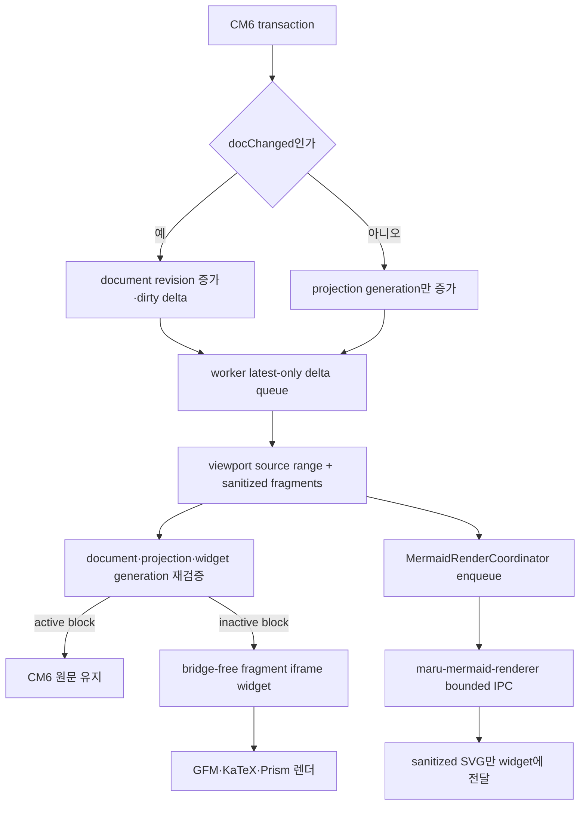
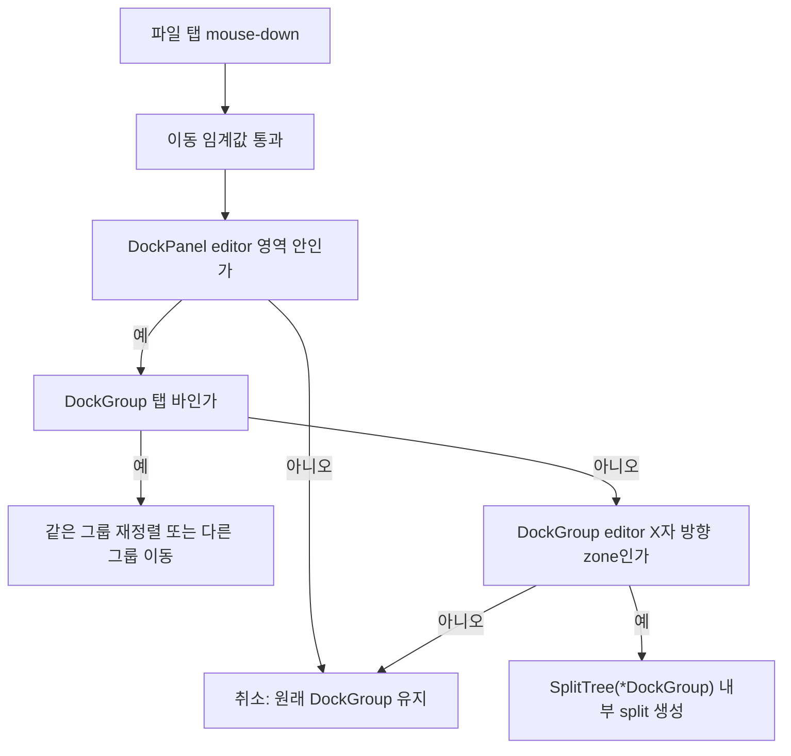

# 파일 패널 (마크다운·HTML 뷰어/편집기 — 전역 도크)

로컬 `.md`/`.html` 파일을 maru 안에서 열람·편집하는 **전역 도크 파일 패널**의 단일 출처 문서다. WKWebView 합성·입력·web 특유 보안은 [web-panel.md](web-panel.md), 브리지 신뢰 게이트는 [control-plane.md](control-plane.md) §8.1, 파일 경로 링크 감지는 [link-detection.md](link-detection.md), 주소창 텍스트 편집 모델은 [text-field-editor.md](text-field-editor.md)를 단일 출처로 두고 재서술하지 않는다. control-plane §12 Phase 7 행(7a~7d)의 상세 분해가 이 문서다(§10 대응표).

> 결정은 2026-07-17 사용자 승인. 설계 전 코드 대조 검증(적대적 3축 + 대화 감사)을 거쳤고 본문 file:line은 그 시점 기준. **개정(같은 날)**: 초판의 "워크스페이스 내장 web Term" 호스팅을 **전역 도크**로 피벗 — 근거는 §1 첫 항목.

## 1. 확정 결정

- **1급 정책: 파일 콘텐츠는 워크스페이스 이동에도 화면에 남는다.** 파일 패널은 워크스페이스 pane 트리가 아니라 **창(chrome) 레벨의 전역 도크 슬롯**에 산다. 근거: ⑴ 워크스페이스 내장이면 전환 시 WKWebView가 파괴되고(검증 확정 — collectWebSurfaces 활성 워크스페이스만 walk[app_session.zig:7550] → diff destroyed[web_panel_layout.zig:165] → Swift dealloc[MaruAppHost.swift:5209], URL 재네비도 없음) keep-alive 수술을 해도 **화면에서는 사라진다**(hidden) — "문서를 옆에 두고 워크스페이스를 오가는" 용례에 구조적 미달. ⑵ 도크는 그 destroy 경로(가장 미묘한 출하 코드)를 한 줄도 안 건드려 회귀 반경이 작다. ⑶ 상태 소유가 창당 한 곳으로 모인다(§4·§5).
- **아키텍처 B — chrome은 Zig+GPU, WKWebView는 콘텐츠만.** 도크의 파일 탭바·헤더 밴드·파일 트리 = GPU 셀 chrome, 가운데 콘텐츠 rect만 WKWebView. 통짜 웹앱(웹이 탭·트리까지 그림)은 기각([control-plane.md] §1 원칙 + 이중 chrome·룩 드리프트). WKWebView 닫힌 열거는 넓히지 않는다.
- **도크 위치 = `right`(기본) | `bottom`(config `file-panel.dock` + 전환 UI).** 수명(전역)과 배치(우측/하단)를 분리한 결정 — 가로 모니터는 우측 컬럼, 세로 모니터는 하단 밴드(위=터미널, 아래=문서 — 상하 분할 습관 그대로). 커맨드 팔릿 `Move File Panel Right/Bottom`(`toggle_file_panel_dock_side`)은 열린 파일·group 상태를 보존하고 side별 기본 크기로 재배치한다. **하단 밴드 범위는 v1=터미널 스트립만**(사이드바는 전 높이 유지 — 사이드바 스크롤 뷰포트·scissor·key-hint의 backing_height 가정 3곳+렌더러를 안 건드림, 2차 검증), 전폭 밴드는 후속 옵션. 접기 토글·크기 드래그는 좌측 사이드바 **런타임** 클러스터와 동형(pt 권위·동적 clamp·드래그 시작값 write-back 가드·전 탭 resize 동기 — app_session.zig:3028) — 단 **영속은 동형이 아니다**(사이드바 폭=config `sidebar.width`·접힘은 미영속, 도크는 workspace.v1 §5 — 별도 결정임을 명시).
- **우상단 파일 도크 진입점은 일반 chrome의 빈 시작 상태에도 표시한다.** quick terminal의 `chrome_minimal`에서는 다른 chrome과 함께 숨긴다. `filePanelDockControlRect`가 render·hover·hit-test·window-drag 제외의 공용 기하이며, `filePanelDockControlAction`이 `request_file_picker | collapse | expand`를 한 번 판정하고 `activateFilePanelDockControl`이 실행한다. entry와 project/recent history가 모두 없는 완전히 빈 상태에서는 본문을 억지로 펼치지 않고 같은 컨트롤이 `open_file_panel`과 동일한 NSOpenPanel one-shot을 요청한다. 선택 취소는 상태를 바꾸지 않고, 유효한 Markdown/HTML을 고른 뒤 `openFilePanelPath`가 성공해야 도크가 펼쳐진다.
- **파일 1개 = 도크 탭 1개.** 이미 열린 경로를 다시 열면 새 탭이 아니라 기존 탭 활성화. 이 유일성은 그룹별이 아니라 **창 도크 전체** 불변식이다 — FP8 분할 뒤 다른 그룹을 target으로 열어도 원래 entry/group를 반환해 그 그룹으로 focus한다. 멀티 윈도우는 창마다 자기 도크(열기는 클릭이 일어난 창의 도크로).
- **파일 탭 닫기 계약**: 활성 탭은 항상 우측에 `X`를 표시하고 비활성 탭은 hover 중에만 `X`를 표시한다. `X`는 그 entry만 닫으며 마지막 entry를 닫아도 빈 `DockGroup` leaf는 유지한다. project/recent tree history가 남아 있으면 빈 editor group과 tree도 계속 표시하고 `⌘⇧E`로 포커스할 수 있다. 활성 entry를 닫으면 오른쪽 이웃, 없으면 왼쪽 이웃을 활성화하고, 비활성 entry의 `X`는 현재 active를 바꾸지 않는다. 탭 본문과 `X`의 render/hover/hit-test/title 폭 예약은 공용 `tabCloseRect` 기하를 소비한다.
- **도크 내 분할(여러 파일 동시 표시) = FP8 완료.** 도크 콘텐츠는 `SplitTree(*DockGroup)` 에디터 그룹 트리다. 각 leaf는 도크 좌측 editor 영역에서 자기 tab/header/content rect를 갖고, 우측 project tree는 전 그룹의 파일을 공유한다. `layoutDividers` 경계가 1px 렌더·확장 hit target·drag ratio를 함께 제공한다. ABI v124는 native WKWebView firstResponder surface를 `focused_group`에 되돌린다. 팔릿의 `Split File Panel Right/Down`은 포커스 leaf를 빈 새 그룹으로 나누고 project tree/파일 열기가 그 그룹을 채운다. `Close File Panel Group`은 마지막 그룹 또는 dirty/pending/conflict/editable-mode entry가 있으면 무동작한다.
- **파일 탭 드래그 분할 = FP9 구현 완료(2026-07-19, ABI v131).** 왼쪽 terminal의 탭 드래그와 같은 발견성으로 파일 탭을 같은 `DockGroup` 안에서 재정렬하고, 다른 `DockGroup`의 탭 바로 옮기거나 editor 본문의 X자 상·하·좌·우 방향 zone에 놓아 도크 내부 split을 만든다. 단 동형 범위는 **각자 자기 레이아웃 도메인 안**뿐이다. `Term`/terminal pane은 파일 도크의 드롭 대상이 아니고 `dock_panel.Entry`/`DockGroup`도 terminal pane의 드롭 대상이 아니다. terminal↔dock outer divider는 크기 조절만 소유하며 콘텐츠 이동을 겸하지 않는다. 파일 drag는 도메인 밖에서 drop-zone을 표시하지 않고 mouse-up을 취소해 원래 탭·그룹·surface 상태를 그대로 둔다. terminal drag도 cross-domain 소유권 이동은 하지 않되 기존 terminal 내부 live reorder까지 되돌리지는 않는다. 세부 수명·기하·포커스 계약은 §3.3을 단일 출처로 둔다.
- **입력 포커스 시각화·왕복 = FP9 구현 완료(2026-07-19, ABI v131).** 선택된 탭/entry와 실제 키 입력 owner를 같은 색 채움으로 뭉개지 않는다. active tab의 기존 theme 배경은 “보이는 문서”를 뜻하고, theme의 focus accent로 그린 얇은 inside border는 `FocusOwner`가 가리키는 terminal pane·파일 `DockGroup`·project tree 중 “지금 키를 받는 영역” 하나만 뜻한다. 기본 `⌘⇧E`는 기존 한 방향 `focus_file_tree` 대신 새 `toggle_file_panel_focus`에 연결해 workspace terminal/browser ↔ 파일 도크를 한 키로 왕복한다. `focus_file_tree`는 하위버전 adapter가 아니라 one-way tree 진입이 필요한 palette/사용자 binding용 별도 action으로 남긴다. 세부 렌더·라우팅 계약은 §3.4와 [key-input-and-shortcuts.md](key-input-and-shortcuts.md)를 따른다.
- **파일 도크 시각 구조 기준 = 사용자 제공 Claude Artifact(2026-07-18).** 색상 팔레트는 theme 책임이라 기준에 포함하지 않고, 구조를 계약으로 삼는다: 파일 탭은 소수일 때 고정폭(남는 바를 억지로 균등분할하지 않음), 헤더는 절대경로 대신 `부모 / 파일` breadcrumb와 독립 mode 선택지를 갖고(FP10부터 `읽기 | 라이브 | 소스`), 본문 우측 project tree는 `탐색기` 고정 헤더 아래 project roots를 먼저·최근 파일을 마지막에 표시한다. terminal↔dock outer divider, group divider와 editor↔project-tree divider는 보이는 선 중심의 확장 grab band 전체에서 드래그돼야 한다. 특히 WKWebView 쪽으로 들어간 band에서도 `MaruWebPanelView.hitTest`가 이벤트를 아래 Metal/Zig divider owner에게 넘겨 terminal divider와 같은 resize 경험을 제공한다. project tree 기본 폭은 현재 폰트의 18셀이고, 사용자가 조절한 폭(pt)은 workspace에 저장한다. 레퍼런스의 코드/DOM은 사용하지 않고 제공된 최종 이미지의 배치·정보 계층만 Maru GPU chrome으로 독립 구현한다.
- **웹 브라우저(⌘⌥T)는 현행 워크스페이스 term 유지.** 브라우징의 용례(터미널 옆 미리보기·팝업/OAuth[7f]·에이전트 제어)가 워크스페이스 맥락이고, 출하·손테스트 완료된 7e/7f/4e-4/4g를 재작업하지 않는다. 단 워크스페이스 전환 시 흰 페이지가 되는 현행 동작(위 검증)은 **URL 기억·재로드 얕은 수정**을 web-panel 백로그로 별도 제안(§13).
- **외부 링크 대상은 설정으로 선택한다.** Markdown/HTML 파일 패널에서 사용자가 직접 누른 명시적 `http(s)://` 링크는 `file-panel.external-link-target = in-app | system`(기본 `in-app`)에 따른다. `in-app`은 클릭한 파일 패널과 같은 창의 새 browser Term으로 열고 `system`은 macOS 기본 브라우저로 연다. `⌘⇧`+클릭은 설정과 무관하게 이번 한 번만 시스템 브라우저를 강제한다. Markdown의 같은 문서 fragment는 WebView 안에 남고 로컬 `.md`/`.html`은 source group의 도크 탭으로 연다. script/meta redirect와 `javascript:`·`data:`·`file:`·protocol-relative·percent-encoded scheme은 이 외부 열기 경계에 들어오지 않는다.
- **도크 배관은 kind-무관으로 설계**(entries가 kind를 든다) — 후속 "브라우저 탭을 도크로 보내기"(참조용 웹페이지 고정)를 additive로 열어둔다(§13).
- **편집기 = CodeMirror 6** (control-plane §13 열린 질문 해소 — 사용자 결정). 근거: 마크다운이 SSOT(항상 텍스트, 왕복 손실 0), 한글 IME 조합이 WebKit 네이티브 IME 위에서 가장 안정, sanitize 파이프와 렌더 공유. 문서모델 기반(왕복 손실·조합 엣지)은 기각. **프론트엔드 = vanilla TS**(프레임워크 없음 — B로 웹앱 최소화), **렌더 = remark/unified로 확정(FP2 실측)** + Mermaid·KaTeX MathML·Prism 리치 렌더 — 스택·근거·보안 배치는 §2.1.
- **Markdown 모드 = 읽기 | 라이브 | 소스**: 새 `.md` entry는 **라이브**가 기본이고 workspace 복원은 entry에 저장된 `read | live-preview | source-edit`를 그대로 따른다. 읽기는 문서 전체의 격리 렌더, 라이브는 같은 CM6 buffer에서 커서·selection이 걸친 top-level 블록만 원문으로 드러내고 나머지를 제자리 렌더, 소스는 CM6 생 Markdown이다. 라이브↔소스는 하나의 `EditorView`·history·revision을 공유해 토글로 undo/selection/dirty를 잃지 않는다. `.html`은 읽기 전용이다. 구버전 reader용 adapter나 workspace format bump는 추가하지 않는다(unknown mode를 만난 현행 fail-closed 동작 수용).
- **저장은 명시적 `⌘S`만**: 라이브·소스 모두 현재 CM6 snapshot을 기존 pathless atomic write로 저장한다. 성공한 write와 같은 revision일 때만 native dirty를 내리고, 실패·external conflict·저장 중 재편집이면 buffer와 dirty를 유지한다. focus-loss/autosave는 하지 않는다. `⌘F`는 Markdown 편집 WebView가 first responder일 때 새 package 없는 Maru CM6 search extension이 담당하며, `⌘A/C/V/X/Z/⇧Z/S`와 텍스트 탐색 키도 WebKit에 양보한다. ABI v132 typed `WebKeyRoute`가 app action·explicit unbind 소비·web editor·일반 pass-through를 구분하고 명시적인 사용자 rebind/unbind·global shortcut·modal owner의 기존 우선순위를 유지한다.
- **write 스코프 = 열린 파일만**(§3). **트리 루트 = git repo 루트 우선**(§7).
- **WKWebView 상한**: 도크 탭마다 WKWebView 1개(비활성 hidden·상태 유지 — Swift hide=isHidden만, 2차 검증). 상한 N(기본 8, config `file-panel.max-live-views`) 초과 시 가장 오래 안 본 **non-dirty** 탭의 웹뷰만 해제(탭은 스트립에 유지, 재선택 시 재로드) — dirty와 editable-mode 이탈 뒤 dirty snapshot native ack가 아직 오지 않은 탭은 해제하지 않는다. 이 상한이 메모리 bound([performance-budget.md]에 WKWebView RSS 예산 부재). 해제=기존 전이 `destroyed` op·재선택=`created` op(새 op 불필요 — 2차 검증). 단 surface_id는 앱 전역 **비재사용** 불변식이라 재소환 시 **새 id 발급**하고, destroy 경로의 `browser.closed` push는 eviction 의미와 충돌하므로 도크 destroy에선 미발행한다(§4 destroy 판정과 같은 도크-aware 분기).
- **Markdown 초기 paint 무백색 계약(macOS 12+)**: 신뢰 Markdown WKWebView는 생성 직후·뷰 계층 삽입 전에 공개 API `underPageBackgroundColor`를 `NSColor.textBackgroundColor`로 설정하고, `index.html`과 `render.html`은 외부 `app.css`보다 앞에 동일한 `Canvas` critical 배경을 인라인한다. 인라인 허용은 CSP `unsafe-inline`이 아니라 정확한 critical style SHA-256(`sha256-Xeh9es1AoJEyNnawqxMjG30+czqjDUSJ+JDkbXALfVg=`) 하나만 핀한다. 이 두 층은 **WKWebView 삽입→첫 document paint**와 **외부 CSS 적용 전 첫 paint**의 기본 흰 배경만 없애며, 렌더 완료까지 콘텐츠를 숨기는 계약은 아니다. 임의 웹페이지의 자체 배경을 존중해야 하는 browser/로컬 HTML에는 적용하지 않는다. 앱 floor인 macOS 11에서는 `underPageBackgroundColor`가 없어 critical CSS만 적용되며 pre-document backing은 §13의 명시적 잔여다. 12+ 적용 뒤에도 partial DOM 플리커가 계측되면 별도 loading cover를 `viewerReady`에서 제거하되 실패·timeout 해제까지 함께 설계한다. 첫 cold start만 느리면 prewarm, reload 연속성까지 필요하면 snapshot/double-buffer를 각각 별도 성능 슬라이스로 다룬다.

## 2. kind 분기 (.md vs .html)

| 파일 | 콘텐츠 뷰 | 읽기 | 라이브 | 소스 |
|---|---|---|---|---|
| `.md` | 신뢰 shell + bridge-free renderer | 문서 전체 새니타이즈 렌더 | CM6 active block 원문 + 격리 fragment widget | CM6 생 Markdown |
| `.html` | browser config(비신뢰 격리) | `loadFileURL(_:allowingReadAccessTo: 파일 디렉터리)` — WebKit 표준 API로 읽기 범위를 그 디렉터리에 한정 | 불가 | 불가(후속 §13) |

- `.html`은 살아있는 스크립트라 신뢰 shell/markdown renderer에 인라인 렌더할 수 없다. 신뢰 CSP의 `frame-src` 예외는 정확히 `maru-app://render`인 번들 renderer 한 곳뿐이며 임의 문서·`file:` iframe은 허용하지 않는다([web-panel.md] §7). 도크 안에서도 `.html`은 browser config(도크 전용 ephemeral store) WKWebView로 격리 렌더한다.
- 현행 스킴 화이트리스트는 http/https만(`resolveNavUrl`·`popupTargetAllowed` — file: 거부)이므로 **도크의 .html 열기 경로만** `loadFileURL`을 쓴다. 주소창 네비게이션의 file: 거부는 불변.
- **`loadFileURL(allowingReadAccessTo:)` 정밀 시맨틱(FP5 확정)**: 디렉터리 스코프는 **하위 트리 전체 재귀** 읽기 + 스코프 내 file: 서브리소스 로드를 허용하고 스코프 **밖만** WebKit이 차단한다. HTML 정적 검사만으로 JS의 동적 import/fetch나 CSS 상대 리소스를 완전 판정할 수 없으므로 파일 유무별 케이스 분기 없이 **항상 핀 파일의 부모 디렉터리**를 준다. top-level file: 이동은 별도 navigation delegate가 차단한다.
- **도크 html 네비게이션 정책(FP5 구현, v125 라우팅 보강)**: 현행 browser `decidePolicyForNavigationAction`은 maru-app 차단 외 **전 스킴 허용**(file: 포함)이라, 도크 html 안 링크가 스코프 내 형제 파일로 이동해 헤더 밴드 핀 경로와 표시 문서가 어긋날 수 있다. 도크 html webview는 전용 분기에서 **핀 파일과 같은 top-level 로드/새로고침만 허용**하고 나머지는 차단한다. HTML 패널은 살아 있는 로컬 문서이므로 WebKit의 실제 사용자 활성화 판정이 있는 http(s) 링크만 §1의 설정 기반 in-app/system 경계로 보내며 script/redirect는 브라우저를 자동 실행하지 않고 취소한다. Markdown renderer의 더 좁은 isolated-world one-shot 계약은 §3과 [web-panel.md] §7을 따른다. 스코프 내 네비 허용+밴드 추종은 후속(§13).
- **도크 html은 브라우저 탭과 dataStore 비공유(결정)**: browser 탭들의 공유 `browserDataStore`(7e-0)가 아니라 **도크 전용 별도 ephemeral store**를 쓴다 — 로컬 html은 살아있는 스크립트+CSP 없음+네트워크 무제한이라 공유 시 브라우저 세션 쿠키로 credentialed 요청(CSRF류)을 탈 수 있고, 로컬 파일 뷰엔 로그인 연속성 근거가 없어 격리가 무비용이다.

### 2.1 웹 스택 (프론트엔드·렌더러·리치 렌더)

아키텍처 B로 WKWebView 웹앱의 일은 최소다(트리·탭·도크 chrome = 네이티브 Zig+GPU). 그래서:

- **프론트엔드 = vanilla TS(프레임워크 없음).** 웹앱 책임 = 새니타이즈 HTML 표시(읽기) + CM6 마운트(라이브/소스) + bridge-free fragment widget 수명 + 브리지 모드/테마 신호 수신 + dirty 보고다. 라이브 parse/render는 main editor transaction에서 실행하지 않고 `in-flight 1 + latest 1` worker queue로 coalesce한다. CM6·ProseMirror류는 프레임워크가 아니라 **DOM 마운트 에디터 라이브러리**라 이 결정과 직교한다.
- **렌더러 = remark/unified 확정(FP2)**. 실측으로 ⑴ raw HTML을 `remarkRehype` 경계에서 폐기, ⑵ `rehype-sanitize` AST allowlist, ⑶ unist 문자 offset→renderer-owned `data-maru-source-start/end`, ⑷ GFM·KaTeX MathML-only·Prism을 한 pipeline에서 보존하고 adversarial fixture를 통과했다. markdown-it의 block line 범위보다 후속 주석 앵커의 문자 offset hedge가 강하고 별도 DOM sanitizer가 불필요해 remark를 택했다.
- **리치 렌더 기능**(각 = 라이브러리 + 보안 배치):

| 기능 | 라이브러리(후보) | 보안 배치 |
|---|---|---|
| 다이어그램 | Mermaid.js | **번들된 별도 `maru-mermaid-renderer` helper process 실행**(편집 앱과 OS process 경계, 브리지 없음) + `securityLevel: 'strict'` + 출력 SVG 새니타이즈(label XSS CVE 이력) |
| 수식 | KaTeX(경량 권장) / MathJax | 격리 origin, 수식→마크업 |
| 코드 하이라이트 | Shiki / Prism | 렌더·빌드타임, XSS 표면 작음 |

- **세 web 컨텍스트**(§3·web-panel §7, FP4 실구현·FP10 확장): ① **격리 렌더 origin `maru-app://render`** = `sandbox="allow-scripts allow-same-origin"` iframe 안에서 새니타이즈 HTML + KaTeX/Prism 결과를 materialize한다. 읽기의 문서 iframe과 라이브의 fragment widget iframe은 같은 origin·capability 0 계약을 쓴다. shell과 host가 달라 same-origin이 아니며, `window.maru`/WebKit message handler가 없고 부모 DOM 접근도 실패해야 한다. ② **신뢰 shell origin `maru-app://app`** = CM6·worker orchestration·핀 파일 브리지. Markdown 파생 HTML/SVG는 문자열로만 전달하고 이 DOM에 삽입하지 않는다. DOM-free 공용 모듈의 `RendererCapability { document_revision, projection_generation, widget_id, widget_generation, renderer_instance }`와 load마다 새 `MessageChannel` port가 현재 registry와 모두 맞을 때만 ready/height/rendered 결과를 수용한다. renderer에는 asset/link 요청 권한을 주지 않는다. ③ **전용 Mermaid helper** = 앱의 `MermaidRenderCoordinator`가 번들 내부의 별도 실행파일 `Contents/Helpers/maru-mermaid-renderer`를 시작하고 bounded stdin/stdout protocol로만 통신한다. helper는 bridge/message handler 없는 자기 WKWebView에서 strict Mermaid를 실행하며 앱 편집 WebView를 소유하지 않는다. 각 요청은 `MermaidJobCapability { helper_instance, job_id, renderer_capability, fence_id, source_hash }`에 묶이고 timeout/crash/restart/widget revoke 시 terminal 처리된다. 늦거나 중복된 result는 이 capability 전체와 현재 renderer registry가 맞을 때만 한 번 소비한다.
- **번들(FP2 완료)**: `web/` Bun workspace(`package.json` + `bun.lock`) + `@zntc/core@0.1.3` bundle + oxlint/oxfmt(Oxc), SHA-384 SRI 생성 후 실제 bundle bytes 재검증. vanilla 단일 앱에는 PostCSS/Sass/HMR controller가 불필요해 `@zntc/web`은 넣지 않았다. `bun install --frozen-lockfile`과 별도 path-filtered CI로 재현하고 기존 dependency-free Zig `mise run check`에는 합치지 않는다.

## 3. 콘텐츠 채널 (read/write)

브리지가 유일한 채널 — CSP `connect-src 'none'` + 스킴 핸들러는 번들 asset root만 서빙([web-panel.md] §7 명시 금지). FP4에서 `hello`와 함께 `maru.file.read`/`readAsset`을 신뢰 shell main frame에만 열었다. 정책 판정은 Zig(L2), Swift는 현재 surface를 소유한 `AppSession`을 매 요청 다시 찾아 ABI로 전달하는 어댑터만 맡는다([control-plane.md] §11 게이트).

- **read(FP4 완료)**: `maru.file.read()` — **인자 없음**. Zig가 그 도크 entry에 핀된 경로를 읽어 reply(웹앱은 경로 지정 불가). UTF-8 markdown·파일 크기는 8 MiB 이하만 허용한다. md 상대 이미지용 `maru.file.readAsset({path})`는 핀 디렉터리 handle 아래를 component별 descriptor-relative/no-follow로 연다. 최종 파일은 nonblocking으로 open한 같은 fd에서 stat/read하며 정규 파일만 허용해 경로 TOCTOU·symlink 탈출뿐 아니라 FIFO/device/socket open 대기도 막는다. 파일별 8 MiB·viewer당 최대 64개·base64 응답 합계 48 MiB로 제한하며 `../`·절대경로·backslash·제어문자·모든 asset symlink·외부 URL은 거부한다. raster는 검증된 `data:` URL, SVG는 UTF-8 decode 후 URL/event sink를 다시 sanitize한 `data:` URL만 renderer에 전달한다. **`../` 상위-상대 리소스는 거부되어 이미지가 깨진다** — v1은 피해 반경 bound를 우선하고 트리 루트 확장은 후속(§13).
- **write(FP6 완료)**: `maru.file.write(content)` — **경로 인자 없음**, 핀 경로에만. 열 때 확정·이후 변경 불가. 8 MiB 이하 UTF-8 Markdown 정규 파일만 같은 디렉터리 임시 파일+fsync+rename-replace로 원자 저장한다. 저장 시 root fd부터 부모 component를 descriptor-relative/no-follow로 열고, 원본 검사·temp 생성·commit을 그 동일 parent fd+basename에 고정한다. macOS commit은 `RENAME_SWAP` 뒤 replacement/original 양쪽 inode를 검증하며 leaf가 경쟁 교체됐으면 양쪽 이름을 다시 검증한 뒤에만 swap rollback하고 conflict로 실패한다. temp 정리도 직전 inode 재검증에 성공한 경우만 수행한다. 최종 경로와 부모 component symlink는 저장을 거부하며 원본 POSIX stat·ACL·xattr를 temp fd에 먼저 복사하고 실패하면 원본을 그대로 둔다. write 자체는 dirty를 내리지 않고 shell이 저장 중 재편집 여부를 직렬 판정해 `setDirty` 최종 ack를 보낸다. sanitizer 우회 성공 시 피해 반경 = 열려 있던 그 파일 1개. **위협 경계**: POSIX/macOS에 inode-conditional rename/unlink가 없으므로 identity 재검증 syscall과 바로 다음 namespace syscall 사이에 발생하는 모든 concurrent mutation은 보호 경계 밖이다. 그 짧은 syscall gap 밖에서 관측된 external editor/FSEvents 순서 역전과 parent/leaf 교체는 위 descriptor+swap 검증으로 fail-closed한다. 동일 UID로 대상 directory에 쓰기 권한이 있는 프로세스는 앱을 거치지 않고도 그 namespace를 직접 바꿀 수 있다.
- **선행(보안 코어)**: [web-panel.md] §7 "md-derived 문서는 브리지 없는 별도 origin" — write 전에 렌더된 md 콘텐츠와 편집 shell의 격리(shadow-DOM 격리 또는 별도 top-level document)를 실물 구현하고 `file.*` 호출부가 shell 컨텍스트 전용임을 고정. FP6 착수 전 이 절 설계 code-review 게이트.
- dirty(미저장)는 브리지 신호로 Zig 도크 entry에 미러(§1 상한 보호·탭 ●·닫기 확인에 사용). 라이브/소스 editor에서 탭·읽기 모드로 이탈할 때 Zig가 먼저 `dirty_sync_pending`을 세우고 이전 surface 전용 고정 one-shot 큐를 Swift가 drain해 shell의 현재 snapshot을 강제 전송하며, native ack에서만 pending을 해제한다. 전송 실패 중에는 clean으로 추정하지 않고 eviction을 계속 막는다.

### 라이브 프리뷰 실행 계약

- identity는 `DocumentRevision`, `ProjectionGeneration`, `WidgetGeneration`의 서로 다른 단조 타입이고 `renderer_instance`는 iframe load마다 발급하는 비재사용 nonce다. text 변경만 document revision·dirty를 바꾸고 selection/viewport/mode는 projection만 바꾼다. worker result는 document/projection을, 모든 iframe message는 공용 `RendererCapability { document_revision, projection_generation, widget_id, widget_generation, renderer_instance }`와 그 load에만 전달한 `MessageChannel` port를 대조한다. navigation/detach/crash/mode 전환 직전에 port를 닫고 registry를 revoke한다. selection 이동은 저장/close revision을 stale로 만들지 않으며 stale projection/widget만 폐기한다. 다섯 필드 중 하나라도 stale이거나 duplicate terminal message면 DOM 높이를 바꾸지 않는다.
- worker는 초기 load 때 source snapshot 하나를 받은 뒤 CM6 `ChangeSet`의 bounded delta만 적용한다. editor transaction은 revision·delta·visible range만 예약하고 `Text.toString()`·document-size 비례 allocation/copy를 수행하지 않는다. worker는 full source를 자기 쪽에서만 유지하며 top-level range index를 갱신하고, shell에는 viewport+2 viewport overscan에 필요한 compact `{from,to,kind}`와 inactive fragment HTML만 반환한다. discovery 입력은 cursor 중심 최대 64K UTF-16 code-unit의 inactive viewport **하나**이고 selection range는 그 창 안 block의 active 판정에만 쓰므로 Select All도 discovery를 전체 문서로 넓히지 않는다. 앞/뒤 줄 탐색도 같은 hard ceiling 안에서만 수행한다. offscreen HTML 생성·전송은 0이다. 한 번에 하나만 실행하고 새 변경은 합성 가능한 latest delta slot 하나로 교체하며 늦은 generation은 DOM·높이·asset 상태를 바꾸지 못한다.
- 커서 또는 selection이 걸친 모든 block은 원문이다. 나머지 연속 block은 source 64 KiB 또는 16 blocks 중 먼저 닿는 경계로 묶고, 단일 block이 64 KiB를 넘으면 그 block은 source-preserving preview-limit 상태로 남긴다. viewport+overscan의 renderer iframe hard cap은 **8**이며 초과 예상 시 인접 inactive chunk를 더 합친다. mount/unmount는 animation frame당 각각 최대 2개, 2-viewport hysteresis를 쓰고 등록 해제한 iframe은 stale message capability를 잃는다.
- 일반 Markdown/GFM은 worker가 sanitized fragment 문자열과 generation-scoped `AssetGrant { opaque_id, normalized_path, expected_mime_family }`를 만든다. shell은 exact allowlist만 pathless bridge로 선취하고 raster magic/SVG sanitize가 expected family와 맞은 data만 opaque id로 renderer에 전달한다. renderer발 임의 asset request는 존재하지 않는다. KaTeX source는 block당 32 KiB, Prism fence는 256 KiB를 상한으로 하며 초과하면 source-preserving limit 상태다.
- Mermaid fence는 source≤32 KiB·line≤512·한 fragment≤4 diagrams만 허용한다. 동기 layout을 iframe timer로 선점할 수 없고 여러 `WKProcessPool` 인스턴스도 macOS 12+에서 격리 효과가 없으므로 editor WKWebView/fragment iframe이나 앱 프로세스 안의 hidden WKWebView에서는 Mermaid를 실행하지 않는다. Swift 앱 전역 `MermaidRenderCoordinator`는 번들·서명된 `maru-mermaid-renderer` helper를 하나만 소유하고 길이-구분 `MermaidRequest`/`MermaidResult` frame으로 strict Mermaid→SVG sanitize를 동시 1개 실행한다. helper에는 파일 경로·asset grant·앱 bridge·native network API를 주지 않고 source와 capability만 전달하며 WebKit CSP도 외부 요청을 막는다. Zig가 job을 in-flight로 승격해 `start_helper_job` action을 commit한 monotonic 시각부터 단일 2초 **end-to-end response deadline**이 시작되며 bundle/path/signature validation, executor 대기, spawn, pipe setup, Hello/HelloAck, Request/Result 전 구간을 포함한다. deadline 또는 어느 단계의 terminal failure든 현재 job capability를 revoke하고 in-flight/source bytes를 회수한 뒤 source-preserving 결과로 끝낸다. helper process가 생겼다면 종료하고 failure budget이 허용할 때만 다음 job에서 새 instance를 시작한다. 이는 앱이 결과를 기다리는 시간과 editor 격리를 보장하지만 WebKit service의 CPU가 정확히 2초에 정지한다는 공개 API 보장은 주장하지 않는다.
- 앱 전역 `AppRuntime.mermaid_queue: MermaidCoordinatorState`가 `in-flight 1 + widget별 latest pending 1`, pending job≤32, pending source 합계≤1 MiB, accepted SVG≤512 KiB/job·합계≤2 MiB와 여러 창 round-robin을 단독 소유한다. Swift `MermaidRenderCoordinator`는 Zig가 drain한 start/terminate action대로 `Process`·pipe·deadline만 적용하고 admission/coalesce/capability를 다시 판단하지 않는다. OS lifecycle은 전용 serial executor에서만 수행하고 display tick은 고정 크기 action enqueue와 completion≤8 drain만 한다. tick 안의 process spawn/terminate·pipe setup/read/write·blocking wait는 0이다. 같은 widget의 새 job은 미실행 pending을 교체한다. cap+1은 할당·enqueue 없이 해당 fence를 source-preserving 상태로 둔다. `MermaidJobCapability { helper_instance, job_id, renderer_capability, fence_id, source_hash }`는 요청마다 비재사용 발급하며 timeout/crash/restart/navigation/widget 해제에서 queued/running을 terminal revoke한다. result는 frame 길이·UTF-8·SVG sanitize와 capability 전 필드·현재 registry를 모두 통과할 때 한 번만 성공으로 전이한다. 이전 helper의 늦은 result, duplicate, oversized/malformed frame은 DOM·queue를 바꾸지 않는다. 종료 시 helper와 pending bytes를 모두 회수한다.
- validation/spawn/pipe/Hello/HelloAck/Request/Result 구간의 timeout·I/O 오류·crash·malformed/oversized result는 모두 앱 전역 `MermaidFailureBudget`에 같은 terminal failure로 기록한다. rolling 60초 안 3회면 pending/in-flight와 helper를 전부 회수하고 **그 앱 수명 동안 Mermaid를 disabled**로 latch해 모든 fence를 source-preserving 상태로 둔다. helper 누락, bundle 밖/symlink/비정규 파일, code-sign validity/Team ID 불일치, protocol version 또는 HelloAck nonce 불일치는 재시도로 회복되지 않는 **permanent integrity failure**라 첫 1회에 같은 app-lifetime disabled latch로 들어간다. latch 뒤에는 path/signature validation·spawn·enqueue를 모두 0으로 유지한다. 자동 재시작·cooldown probe는 하지 않으며 사용자가 앱을 재실행해야만 reset된다. 정상 result는 rolling timestamps를 임의로 지우지 않는다. 100회 연속 hang에서도 helper start≤3, 무결성 실패 뒤 100회 요청에서도 validation/start≤1, latch 뒤 start/enqueue 0과 CM6 편집·저장이 유지돼야 한다. external request 0, helper kill/restart, failure latch, editor dirty buffer 보존 gate가 통과하기 전 Mermaid fence는 inert다.
- codec의 단일 출처는 DOM/AppKit 비의존 Zig `src/session/mermaid_protocol.zig`이다. parent Swift는 Zig가 encode한 opaque request bytes를 그대로 pipe에 쓰고 stdout raw bytes를 Zig streaming decoder에 돌려주며 payload를 해석하지 않는다. helper Swift도 같은 Zig static library의 decode/encode ABI를 호출하므로 별도 serializer·raw enum을 갖지 않는다. wire는 4-byte big-endian payload length 뒤 `magic[4]="MRU1"`, `version:u16be=1`, `tag:u8`, tag별 payload 순서다. `Hello=0 { helper_instance:u64be, nonce:u64be }`, `HelloAck=1`은 두 값을 그대로 echo한다. handshake가 성공하기 전 Request는 받지 않는다. `Request=2 { helper_instance, job_id, document_revision, projection_generation, widget_id, widget_generation, renderer_instance, fence_id: 각각 u64be; source_hash:[32]u8; source_len:u32be; source_utf8 }`다. `Result=3`은 같은 identity/hash 뒤 `status:u8 { ok=0, render_error=1 }`, `body_len:u32be`, body를 둔다. hash는 source UTF-8 bytes의 SHA-256이다. `ok` body만 sanitized SVG이며 ≤512 KiB, `render_error` body는 반드시 0이다. request frame≤40 KiB, result frame≤513 KiB이며 선언 길이가 cap을 넘거나 tag/version/status가 닫힌 목록 밖이거나 identity/hash/내부 길이가 다르거나 UTF-8/trailing bytes가 있으면 helper instance 전체를 실패 처리한다. decoder는 1-byte partial read·연속 frame을 지원하되 retained input≤513 KiB+4다. stdout은 이 frame 전용이고 stderr는 64 KiB ring으로만 진단에 보존한다.
- renderer page-world의 JS `link-activate` postMessage는 제거하고 모든 renderer navigation은 delegate에서 취소한다. link action은 WebKit isolated content world의 document-start capture listener만 발급한다. listener는 `MouseEvent.isTrusted && button==0` 또는 trusted keyboard activation, 현재 `<a href>`와 active `renderer_instance`를 확인해 **isolated-world 전용** handler로 one-shot `{renderer_instance, normalized_href}`를 보낸다. page world에는 이 handler가 없고 합성 `anchor.click()`/`dispatchEvent`/redirect는 token을 만들 수 없다. native는 current renderer registry·render security origin·핀 surface를 재검증해 Zig의 기존 link policy를 사용자 제스처 1회당 최대 1회 호출한다. 문서 fragment도 이 경계에서 현재 renderer에만 적용한다.
- read/live/source는 같은 CM6 `savedDocument: Text`, `DocumentRevision`, 직렬 mutation queue와 close lock을 쓴다. 일반 입력의 dirty 판정은 `Text.eq(savedDocument)`로 전체 문자열 할당 없이 수행하고, full source 문자열화는 초기 worker seed·명시적 save·close snapshot·읽기 전환처럼 문서 전체가 실제 소비되는 cold path에서만 허용한다. 라이브↔소스 전환은 editor를 파괴하지 않고 extension compartment만 바꾸며, 읽기로 전환해도 hidden editor buffer를 유지하고 읽기 iframe에는 그 buffer snapshot을 렌더한다.
- worker는 전용 `live-preview-worker.ts` entry를 `live-preview-worker.js`로 결정적 번들한다. integrity manifest는 shell bundle과 worker bundle 두 digest를 핀하고 HTML에는 shell bundle SRI만 삽입한다. worker는 exact `maru-app://app/live-preview-worker.js`와 **app-role CSP** `worker-src 'self'`에서만 기동하고 render-role CSP는 `worker-src 'none'`이며 worker asset 요청도 거부한다. shell/worker 공용 DOM-free protocol은 `Seed { revision, source }`, `Apply { base_revision, target_revision, changes, projection_generation, visible_ranges }`, `Project { document_revision, projection_generation, visible_ranges }`, `Result { document_revision, projection_generation, fragments }` tagged union이다. pending Apply는 `pending.target_revision == incoming.base_revision`일 때만 합성하고 gap/duplicate/out-of-order면 in-flight 종료 뒤 **같은 worker**의 source state를 최신 Seed 하나로 재설정한다. 이 resync는 worker identity/epoch를 바꾸지 않으며 worker `error/messageerror` 또는 5초 무응답에서만 revoke→terminate→250ms 뒤 1회 재생성·최신 Seed 재전송으로 복구한다. 60초 안 3회 실패하면 해당 entry의 라이브 projection만 source-preserving disabled 상태로 두되 CM6 편집·저장은 계속한다. fragment iframe은 2초 ready/render deadline과 같은 revoke/fallback을 쓴다.
- pending Apply의 직렬 metadata/insert가 request cap을 넘으면 전송하지 않고 `resync_required`로 바꿔 in-flight 종료 뒤 최신 Seed 하나만 보낸다. 앱 전역 Zig `LivePreviewBudget.selected`는 모든 창의 visible 후보에서 focused surface와 직전 selection을 먼저 골라 최대 8개의 **desired surface**만 결정한다. Swift `LivePreviewTransitionState.applied`가 실제 running+enabling worker reservation의 유일한 권위이며 revoke false eval 성공 전에는 기존 applied slot을 유지하고 새 desired를 enable하지 않는다. 따라서 교체 중 Zig selected가 `{2…9}`여도 Swift applied는 ack 전 `{1…8}`, ack 뒤에만 `{2…9}`가 된다. worker별 source≤8 MiB/result≤2 MiB hard cap과 applied≤8을 곱해 앱 전체 source≤64 MiB/result≤16 MiB를 보장한다. hidden 또는 desired selection에서 밀린 entry는 worker를 terminate하고 projection만 source-preserving suspend한다. dirty CM6 buffer·저장/close 보호는 worker reservation과 독립이며 다시 selected될 때 최신 Seed로 복구한다. Swift는 현재 visibility/focus 후보를 Zig에 전달하고 Zig는 desired 우선순위만, Swift reducer는 물리 reservation 전이만, Web은 전달받은 lifecycle만 적용해 같은 판단을 중복하지 않는다.

### 3.1 도크 헤더 밴드

도크 탭 스트립 아래 밴드 = **`부모 / 파일` breadcrumb + 독립 `읽기 | 라이브 | 소스` 선택지 + dirty ●**(GPU 셀). 주소창이 아니다 — `←`/`→`(WebKit 백스택)는 단일 파일 문서에 무의미해서 없다("열었던 파일"은 트리의 열린 파일 하이라이트 + 최근 파일 섹션이 흡수 — §7). `header_mode_order = { read, live_preview, source_edit }`와 `modeSlot(mode)`가 시각 순서의 SSOT이고 ABI ordinal과 독립이다. `HeaderCellLayout`은 mode 영역 최소 6셀을 먼저 예약한 뒤 남는 2셀마다 conflict, dirty 순으로 status를 추가하며, 부족한 status는 tab/tree marker에만 남긴다. mode span은 1/3·2/3 cut으로 rect 세 개를 직접 저장하고 label render·selected background·hover·hit-test가 이를 공유한다. 전체 폭이 6셀 미만이면 mode/status 모두 숨기고 breadcrumb만 표시한다. Zig→웹 신호는 take/drain 패턴이고 ABI v132 값은 `0=read, 1=source-edit, 2=live-preview`다.

### 3.2 파일 탭 닫기와 dirty 보호

- 탭 `X`와 `close_focused`가 파일 탭을 닫기 직전에 같은 close coordinator를 호출한다. HTML과 **안정된 native-clean Markdown read entry만** 즉시 닫을 수 있다. Markdown의 라이브/소스 entry, 편집→읽기 전환 뒤 dirty/pending/conflict entry는 mode와 무관하게 모든 close intent가 먼저 revision-pinned snapshot sync를 요청해 `dirty_sync_pending`을 세우며, 같은 surface/generation/revision의 ack가 clean일 때만 즉시 닫는다. ack가 dirty면 `저장` / `변경사항 버리기` / `취소`의 3-choice confirm으로 진행한다. surface 부재·sync 실패·stale/duplicate ack, dirty-sync/reload/save pending은 fail-closed로 탭을 유지한다. 진행 중 IME composition은 CM6 state 반영 전일 수 있으므로 snapshot lock을 얻지 않고 닫기를 거부하며, close lock은 request id가 같거나 더 새 요청만 획득하는 단조 소유권을 쓴다. 기존 2-choice confirm 소비처는 그대로 지원한다.
- confirm 컴포넌트는 안정된 choice id를 가진 범용 descriptor를 소유하고 기존 2-choice API는 그 wrapper로 유지한다. host의 보류 의미는 흩어진 boolean이 아니라 단일 `PendingConfirm` tagged union이 소유하며, 새 confirm이 이전 confirm을 교체하거나 Esc/바깥 클릭으로 취소할 때 variant별 buffer/one-shot/ack 정리를 한 chokepoint에서 수행한다. 늦거나 중복된 choice action은 현재 `PendingConfirm` id와 맞지 않으면 무시한다.
- file close 표적은 배열 index나 pointer가 아니라 `{surface_id, surface_generation, expected_path, state_generation}`으로 고정한다. confirm, snapshot, write, ack, discard 각 단계에서 `DockPanel` 전체 lookup과 identity·dirty/conflict 상태를 다시 검증한다. 표적이 사라지거나 rename/reload/eviction으로 generation/path가 달라지면 닫지 않고 보류를 취소해 notice를 표시한다.
- `저장`은 `{request_id, surface_id, surface_generation, editor_revision}`을 가진 close 상태머신으로 최신 CM6 snapshot을 surface-pinned one-shot 동기화한 뒤 기존 `maru.file.write` atomic write를 실행한다. web shell ack가 같은 request/revision이고 `clean_after_write=true`일 때만 entry와 WKWebView surface를 닫는다. snapshot 이후 재편집돼 revision이 전진했거나 ack가 `clean_after_write=false`면 write가 성공했어도 탭·buffer·dirty 상태를 유지한다. snapshot 동기화 실패, write 실패, ack 실패도 동일하게 닫지 않고 notice를 표시한다.
- `변경사항 버리기`는 disk write 없이 entry를 닫고, `취소`는 아무 상태도 바꾸지 않는다. `external_change` conflict에서는 stale buffer로 disk를 덮을 수 없으므로 `변경사항 버리기` / `취소`만 제공한다.
- close가 성공하면 해당 surface의 dirty-sync/reload/save one-shot과 pending ack를 모두 취소하고, 늦은 ack는 request/surface/revision 대조로 무시한다. surface id 비재사용과 창 도크 전체 path 유일성은 유지한다.
- close commit은 active index와 `FocusOwner`를 원자적으로 승계한다. owner인 active entry를 닫으면 오른쪽/왼쪽 successor의 `{surface_id, generation}`으로 owner를 바꾸고 AppKit firstResponder action을 내며, 비활성 X close는 기존 owner를 보존한다. 마지막 entry를 도크 WebView focus에서 닫으면 보존된 빈 leaf의 `.dock_group { runtime_id }` owner로 승계하고 Metal view를 first responder로 삼는다. tree focus에서 닫으면 tree owner는 유지하되 사라진 `restore_surface` capability만 비워 Esc가 workspace로 안전하게 돌아가게 한다. dirty save/discard 완료도 같은 commit 경로만 사용하고 stale/late ack는 새 owner를 바꾸지 않는다.
- 창/세션 종료는 dirty/pending/conflict/editable-mode entry 또는 진행 중 close/save transaction이 하나라도 있으면 fail-closed하고, 사용자가 파일 탭을 먼저 저장하거나 닫도록 notice를 표시한다. `Mode.isEditable()`가 라이브·소스를 한 곳에서 판정하며 빨간 버튼·세션 cascade·terminal 자동 종료가 같은 Zig gate를 쓴다. `⌘Q`는 Swift가 일반 창과 quick session 전체를 요청 시점과 종료 confirm 확정 직전에 다시 검사한다. workspace에는 dirty content를 쓰지 않으므로 이 gate를 우회해 복원에 기대지 않는다.

### 3.3 파일 탭 드래그·도크 내부 분할

이 절은 FP9 구현의 normative 계약이다. terminal 탭 드래그의 조작 감각은 재사용하지만 모델·기하·drop target은 파일 도크가 별도로 소유한다.

- **FP9-MODEL — terminal과 dock의 구조 경계**: 양쪽은 `SplitTree`의 full-binary leaf/split 알고리즘, layout/divider 패턴과 preorder 영속 방식만 재사용한다. terminal은 `Pane`/`Term`, 파일 도크는 `DockGroup`/`dock_panel.Entry`로 typed tree를 따로 소유하며 서로의 leaf나 entry를 저장할 수 없다. PTY/core 수명과 path/dirty/WKWebView 수명을 한 union이나 공용 move API로 합치지 않는다. 그래서 drag target과 transaction도 기존 terminal `moveTermToPane`/`moveTermToNewSplit`과 신규 dock `DockPanel.commitEntryDrop`으로 분리되고, 공용인 것은 신규 `PointerGestureOwner`의 배타성뿐이다.
- **FP9-WIRE — workspace 저장·하위버전**: 성공한 split tree, group별 entry 순서·active와 `focused_group`은 기존 workspace.v1의 `dock-node`, `dock-entry-v2`, `dock-focused-group`에 그대로 capture한다. 새 wire key·format version·migration은 추가하지 않는다. `EntryId`, drag/gesture/snapshot, hover/preview와 focus border는 transient라 저장하지 않는다. 따라서 이 슬라이스는 별도 하위버전 호환 adapter가 필요 없고, 기존 FP8 old-reader 동작도 바뀌지 않는다.
- **FP9-ID — entry identity**: `dock_panel.Entry`에 앱 런타임 전역 단조·비재사용 `EntryId`를 추가한다. L2 `dock_panel.EntryIdAllocator`는 0을 invalid sentinel로 예약하고 exhaustion을 fail-closed하는 순수 타입이며, `AppRuntime`이 인스턴스 하나를 소유하고 `AppSession`이 그 포인터를 `DockPanel.init/restore/open`에 명시적으로 주입한다. `DockPanel`은 `AppRuntime`을 import하거나 별도 counter/global을 만들지 않는다. restore 일부 실패로 이미 발급한 ID는 재사용하지 않고 모델을 publish하지 않으며 재시도는 새 ID를 받는다. ID는 window merge/reparent, reorder, group move, path rename, WKWebView eviction(`surface_id=0`)·재발급에서도 보존하고, close 뒤 같은 path를 다시 열면 새 ID를 발급한다. restore는 새 app-global ID를 발급하며 wire에 저장하지 않는다. source group identity는 창 도크 안에서 유일한 기존 `DockGroup.runtime_id`다. `DockPanel.entryLocation(entry_id) -> ?{ group, index }`가 위치 lookup SSOT이고 drag source와 `PendingRenameRemap.DockItem`을 포함한 group/index 보류 상태를 이 lookup으로 이관한다. merge 전에 destination 전체에서 EntryId 비충돌을 단언하고 충돌은 모델 이관 없이 fail-closed한다.
- **FP9-BARRIER — restore·window merge의 transient 보안 경계**: `AppSession`은 일상 모델 revision과 분리된 단조 `dock_async_epoch`을 소유하고 whole-model restore 또는 window merge barrier에서만 올린다. open/close/reorder/group move, surface publish와 일반 entry/model mutation은 이 epoch를 올리지 않는다. delayed native/worker action은 `DockAsyncToken { entry_id, expected_surface_id: ?u64, dock_async_epoch, request_or_entry_revision }`을 들며 completion 직전에 현재 AppSession의 `entryLocation`, surface, barrier epoch와 기존 request/per-entry revision을 모두 재검증한다. 따라서 무관 entry의 변경은 정상 completion을 무효화하지 않고, 같은 entry의 stale request는 기존 revision이 거부한다. restore/merge는 model publish 전에 source/destination의 `PendingDockFocus`, file-tree `restore_surface`, native responder request와 dirty-sync/reload/save-close를 포함한 모든 pending ack를 공용 barrier에 모은다. destination에 안전하게 이관할 상태는 surviving `EntryId`로 새 epoch token을 재발급하고, 나머지는 cancel/requeue하며 옛 token은 영구 stale이다. surface-less lazy create는 main actor에서 `surface_id=0` 재검증→surface assign→focus commit을 한 transaction으로 수행하고 epoch을 올리지 않아 자기 `PendingDockFocus`를 무효화하지 않는다. duplicate path 교체가 있으면 surviving entry/surface에서 `FocusOwner`와 AppKit firstResponder를 정확히 한 번 재파생하고 source native owner는 workspace fallback 뒤 닫는다. old WKWebView나 source callback은 destination 입력·dirty/model을 바꿀 수 없다.
- **FP9-GESTURE — 드래그 시작·배타성**: 탭 mouse-down은 active나 순서를 바꾸지 않지만 즉시 신규 `PointerGestureOwner.dock_tab(.armed(DockTabDragSession { entry_id, source_group_id, origin, ... }))`을 만든다. backing-pixel 이동 임계값 전 mouse-up은 owner를 비우고 기존 탭 클릭으로 처리하며, 임계값을 넘으면 같은 payload를 `.dragging`으로 전이한 뒤에만 preview/모델 mutation을 허용한다. 신규 `PointerGestureOwner` tagged union이 terminal `tab_drag_active/tab_drag_pane/tab_drag_index`, pane/sidebar drag와 outer/pane/dock-group/tree divider drag의 기존 분산 active flag를 대체해 정확히 하나만 소유하게 한다. 각 gesture payload와 target 모델은 union variant별로 분리한다. blur·mouse capture 상실·source close·restore·merge는 공용 exhaustive cancel 진입점으로 armed/dragging owner/session/preview를 함께 비운다.
- **FP9-TXN — 유효 drop·원자 commit**: 같은 그룹 탭 바는 보이는 삽입 위치로 재정렬하고 다른 그룹 탭 바는 그 위치로 옮긴다. tab insertion boundary는 source 제거 전 보이는 `0...N` 좌표계다. 같은 그룹에서는 `boundary > source_index`면 destination index를 1 줄이고, `boundary == source_index` 또는 `boundary == source_index + 1`은 no-op이다. editor 본문 상·하·좌·우는 `DockDropEdge = left | right | top | bottom`으로 표현하며 L2가 split direction뿐 아니라 기존/new leaf의 before/after 순서까지 소유한다. L4는 마지막 preview의 `dock_layout_generation`을 먼저 검증하고 일치할 때만 단일 `DockPanel.commitEntryDrop(entry_id, target_group_id, DockDropTarget) !DropResult`를 호출한다. L2는 platform layout generation을 알지 않고 ID/target/cap 같은 구조 상태를 다시 검증한다. destination capacity와 새 group/split node 등 모든 fallible allocation을 먼저 끝낸 뒤 detach/attach/tree/active/`focused_group`을 no-fail commit한다. `DropResult { source_successor_entry_id: ?EntryId, destination_active_entry_id: EntryId, destination_surface_id: ?u64 }`를 반환하고 L4는 `FocusOwner`/firstResponder만 승계한다. OOM·stale·cap 실패는 persisted state, entry/dirty/surface, tree, active/focus가 byte-for-byte 동일해야 한다.
- **FP9-CAP — 모델 admission**: `DockPanel.splitGroup`과 `commitEntryDrop` 자체가 allocation 전에 `groupCount() >= max_groups`를 거부하며 FP9 wrapper가 별도 cap 판단을 소유하지 않는다. 64번째 그룹에서 방향-zone drop은 allocation 0이고 tree/entry/active/focus를 전혀 바꾸지 않는다. project tree, divider grab band, titlebar 및 도크 바깥은 유효한 target이 아니다. editor 본문은 FP9-GEO의 X자 4분할 target이며 정확한 중심 한 점만 invalid다.
- **FP9-GEO — geometry snapshot**: 신규 L4 `DockDragGeometrySnapshot`은 `snapshot_id`, 단조 `dock_layout_generation`, group runtime IDs, preallocated leaf/divider rects와 계산된 신규 `DockDropTarget`을 소유한다(기존 terminal `DropTarget` 이름과 공유하지 않음). 순수 `dock_layout.dockDropTarget(snapshot, x, y)`이 tab insertion boundary `0...N` 또는 editor X자 4분할을 판정한다. editor는 중심 정규화 거리의 `abs(nx)`와 `abs(ny)`를 비교해 horizontal 우선 tie-break로 left/right 또는 top/bottom을 고르고 정확한 중심 한 점만 invalid다. project tree/header/divider/titlebar는 invalid다. resize, dock side/collapse, group split/close, editor/tree 폭 변화는 generation을 올리고 공용 invalidation helper가 mouse-move를 기다리지 않고 preview/target/session을 즉시 지운 뒤 redraw한다. mouse-move 하나가 snapshot을 최대 1회 갱신하고 render/preview/hit-test는 저장된 같은 snapshot을 allocation 없이 소비한다. mouse-up은 마지막으로 표시한 `snapshot_id`/target만 사용하며 current generation 불일치면 commit하지 않는다. floating 탭과 반투명 zone은 이 snapshot 외 기하를 사용하지 않는다.
- **FP9-DOMAIN — 도메인 격리**: 파일 target 탐색은 `DockDragGeometrySnapshot`의 editor leaf rect에서 끝나며 `termRect()`를 보지 않는다. terminal의 `tab_drag_*` target 탐색도 `termRect()`의 pane tree에서 끝나며 dock rect를 보지 않는다. 어느 방향이든 반대 도메인이나 terminal↔dock outer divider를 cross-domain target으로 표시하거나 소유권을 옮기지 않는다. 파일 drag는 deferred transaction이라 invalid drop 시 source 상태가 불변이다. terminal은 현행 source-pane live reorder가 이미 일어났다면 그 reorder는 유지하되 dock으로 이동하거나 새 split을 만들지 않는다. outer divider, `layoutDividers`와 editor↔tree divider drag는 각각 기존 resize만 수행하며 gesture owner를 중간에 전환하지 않는다.
- **FP9-SEAM — WebView 안쪽 divider grab**: `src/session/dock_layout.zig`의 `pub const divider_grab_band_pt: u32 = 10`이 단일 출처다. 현재 ABI v130 기준 FP9 구현은 v131로 올려 `WebSurfaceTransitionAbi.divider_grab_band_pt: u32`를 끝 필드로 추가하고 `AppSession.collectWebSurfaces`가 producer가 된다(구현 전 rebase로 ABI가 선행 증가하면 그 다음 번호). 같은 값을 L2 `web_panel_layout.SurfaceLayout.divider_grab_band_pt`가 상태로 소유하며 `surfaceDiff` equality에 포함한다. visible→visible에서 rect/seam이 같아도 band만 바뀌면 최신 layout을 실은 `reframed` 또는 동등 update를 반드시 내고, hidden→hidden은 transition을 만들지 않되 최신 값이 다음 `shown`에 실린다. `created`/`shown`/`reframed`는 Swift가 보관한 band를 매번 덮어써 10→0→10 변경이 stale하지 않게 한다. Zig backing px는 `ceil(pt * scale_milli / 1000)` 포화 변환, Swift는 전달된 pt를 local CGFloat로 쓰며 0은 disabled다. `dock_layout.groupDividerHitRect`, tree/outer divider hit rect와 native `MaruWebPanelView` hover/down/pass-through/cursor rect가 이 값에서 파생한 같은 넓은 grab band를 인접 bounds로 clamp한다. 실제 렌더는 이 band를 채우지 않고 `layoutDividers`의 기존 1px 또는 configured line rect만 그린다. Swift의 독립 static `dividerGrabBand`는 제거한다. `seamEdges`가 표시한 WKWebView 안쪽 click/hover/drag는 아래 `MaruMetalTerminalView`로 통과시킨다. 단순 `hitTest=nil`로 hover cursor까지 일치하지 않으면 최상단 chrome overlay가 같은 ABI grab rect에서 resize cursor와 raw mouse 전달만 맡고, resize 정책·offset·size commit은 계속 FP9에서 신설할 Zig `PointerGestureOwner`가 소유한다. Zig target/native pass-through 폭이 다르면 실패다. down 위치↔실제 divider offset을 보존해 첫 drag가 선으로 점프하지 않으며, hover와 down이 같은 rect를 쓴다. `split.divider-thickness=0`이면 선·grab·pass-through를 모두 끈다. C header/Zig/Swift layout과 1×/1.5×/2× rounding은 ABI gate로 고정한다. generic 계약은 [web-panel.md §5](web-panel.md#5-wkwebview가-막는-터미널-chrome-인터랙션)가 소유한다.
- **FP9-SURFACE — entry와 surface 수명**: live surface가 있는 entry의 성공 이동은 소유권만 옮기고 close/open/reload/eviction을 호출하지 않는다. `EntryId`, path, mode, dirty, `dirty_sync_pending`, conflict, reload/save/mutation reservation, editor revision, `surface_id`와 같은 WKWebView 객체를 보존한다. preview 중에는 surface transition이 0이다. commit 뒤에는 create/destroy 0을 유지하되 실제 visible rect·active가 바뀐 surface만 기존 `surfaceDiff`의 bounded reframe/show/hide로 동기화한다. 같은 그룹 reorder는 transition 0, 기존 그룹 간 이동은 reframe≤1·show/hide≤2, 방향-zone split은 reframe≤2·show≤1·hide=0을 상한으로 고정한다. pending one-shot/ack도 group/index 대신 `EntryId` 또는 기존 request-scoped surface identity에서 `entryLocation`을 다시 찾지 못하면 fail-closed한다.
- **FP9-EVICTED — surface-less 예외**: LRU로 `surface_id=0`인 entry는 clean/non-pending만 가능하다. 이동 transaction은 `EntryId`와 metadata를 보존하고 destination active로 만들지만 없는 surface를 보존하거나 focus했다고 주장하지 않는다. commit 뒤 기존 lazy activation이 새 surface를 최대 1개 create하고 destroy=0이며, publish/ack 전에는 destination의 `.dock_group { runtime_id }`가 fail-closed input owner가 되어 일반 text·terminal macro를 소비하고 `close_focused`를 no-op으로 막는다. L4 `PendingDockFocus { entry_id }`가 성공한 새 id를 `entryLocation`으로 재검증한 뒤에만 `.dock_surface` `FocusOwner`와 firstResponder를 승계한다. 생성 실패·stale이면 entry/tree/dirty는 유지하고 `.dock_group` owner와 notice·재선택 retry를 제공한다.
- **FP9-FOCUS — active·focus**: 같은 그룹 재정렬은 active `EntryId`와 `FocusOwner`를 바꾸지 않는다. 다른 그룹 이동/방향-zone split은 옮긴 entry를 destination active와 `focused_group`으로 즉시 만들되, live/surface-less 구분을 `surface_id`만으로 추측하지 않고 `.dock_group`에서 text/paste를 fail-close한다. native firstResponder 요청이 같은 typed token으로 승인된 뒤에만 `.dock_surface`로 승계한다. source active를 옮겼으면 source의 오른쪽 이웃, 없으면 왼쪽 이웃을 active로 삼고, source background entry면 source active를 유지한다. 이 결과는 `DropResult`만 소비하며 L4가 index를 다시 추측하지 않는다. 취소·commit 실패는 active/focus/scroll을 포함한 관측 상태를 바꾸지 않는다.
- **FP9-EMPTY — 빈 그룹**: 파일 도크는 terminal의 빈 pane collapse를 복사하지 않는다. 마지막 entry를 옮기거나 닫아 source가 비어도 그 `DockGroup` leaf를 유지한다. 빈 leaf의 header/body를 클릭하면 `focused_group`과 `.dock_group { runtime_id }`를 함께 세우고 Metal view가 responder를 맡는다. `.dock_group`은 FP9-EVICTED의 surface publish 대기 중에도 같은 fail-closed 규율을 재사용한다. 일반 텍스트·terminal macro는 소비하고 app action만 허용하며, `close_focused`는 active native file이 없으므로 다른 파일이나 terminal을 대신 닫지 않고 no-op이다. split과 focus border는 같은 runtime id를 소비하고 `toggle_file_panel_focus`는 workspace로 돌아간다. 그룹 제거는 계속 명시적 `Close File Panel Group`만 수행하고 최종 한 그룹은 제거하지 않는다.
- **FP9-PERF — 영속·비용**: drag/focus hot path의 수치와 실패 조건은 [성능 예산의 파일 도크 FP9 절](performance-budget.md#파일-도크-fp9-dragfocus-overlay-예산)을 단일 출처로 둔다. `DockDragGeometrySnapshot`은 그 예산 안에서 preallocated leaf snapshot을 직접 순회하고, floating title은 drag 시작/제목 변경 때 한 번만 shape/cache한 뒤 pointer move에서는 placement만 바꾼다. drop zone·focus border·floating box는 고정 개수 native quad를 쓰며 perimeter 길이만큼 cell을 만들지 않는다. mouse-up commit만 FP9-SURFACE/FP9-EVICTED의 bounded 전이를 다음 frame에 낸다.

### 3.4 terminal↔파일 도크 입력 포커스 표시·왕복

- **시각 의미 분리**: active terminal/file tab 배경은 각 pane/group 안의 표시 대상을 뜻한다. 별도의 focus border는 non-content `InputFocus`가 선점하지 않을 때의 실제 content input domain을 뜻하며 `FocusOwner`에서 매 frame 파생한다. `.workspace`면 활성 terminal/browser pane rect, `.dock_surface`면 그 surface를 소유한 `DockGroup` leaf rect, `.dock_group`이면 surface가 없는 빈 `DockGroup` leaf rect, `.file_tree`면 project tree rect 한 곳에만 표시한다. confirm/notice/settings/rename/sidebar_search/find/palette/addr_edit 같은 `InputFocus`가 선점하면 content border를 숨기고 기존 overlay 자체가 현재 key owner를 표시한다. overlay가 닫힌 다음 `FocusOwner`에서 border를 다시 파생한다.
- **테마·기하**: 색은 고정 RGB가 아니라 `tokens.get(.focus_accent)`, 두께는 divider 설정과 독립인 `tokens.border.line_thickness_px`를 사용한다. `split.divider-thickness=0`이어도 focus indicator는 유지된다. border는 target rect 안쪽 overlay라 layout·hit-test·WKWebView frame·divider seam을 바꾸지 않는다. `groupGeometry`/active pane/tree rect와 같은 geometry snapshot을 소비한다. focus 표시는 이 영역 border 하나뿐이며 active tab에는 추가 outline을 만들지 않고 기존 theme active 배경/marker를 그대로 사용해 비포커스 active 상태를 표현한다.
- **overlay z-order 선행조건·ABI v131**: `modal_cells_start=0`이 “overlay 없음”과 “index 0부터 overlay”를 겸하는 현행 sentinel을 FP9 전에 제거한다. seam 필드와 같은 ABI v131에서 `MaruAppHostMetalFrame`/Zig `MetalFrame`에 끝 필드 `overlay_cells_present: u32`를 추가한다. `MetalFrameBuffer.view`가 producer, Swift `drawMetalFrame`과 `MaruMetalRenderer.drawFrame`이 consumer이며 Objective-C renderer는 `overlay_cells_present != 0`을 overlay 유무의 유일한 gate로 쓰고 `modal_cells_start`는 0을 포함한 시작 index로만 해석한다. C header/Zig size·offset과 Swift→Objective-C 전달을 ABI 테스트로 고정한다. base cell 0인 focus-border-only/drag-zone-only/floating-only frame도 WKWebView 위 최상단 overlay로 분류하며, overlay가 없을 때만 field=0이다. focus border와 drag preview가 이 gate 없이 terminal layer로 내려가면 FP9를 출하하지 않는다.
- **기본 단축키**: `toggle_file_panel_focus`의 기본은 기존 `focus_file_tree`가 쓰던 `⌘⇧E`다. `.workspace`에서 실행하면 내용/history가 있는 도크를 필요 시 펼치고 project tree를 focus한다. `.dock_surface`, `.dock_group` 또는 `.file_tree`에서 실행하면 활성 workspace의 현재 terminal/browser pane으로 돌아간다. 완전히 빈 도크에서는 picker를 자동으로 열거나 focus를 잃지 않고 no-op notice만 표시한다. modal/IME composition이 키를 소유한 동안에는 그 owner의 기존 확정·취소 계약이 우선한다.
- **상태 권위·one-way action**: 왕복 판정은 Zig `FocusOwner` 하나만 소비하고 Swift는 요청받은 firstResponder 전이만 수행한다. workspace 대상은 이미 활성 pane/Term에서 파생하므로 별도 last-terminal pointer를 저장하지 않는다. 도크 진입 기본은 project tree이고, 파일 본문을 마지막으로 클릭했더라도 `⌘⇧E`는 일관되게 tree로 들어간다. `focus_file_tree`는 기본 chord만 잃고 palette·사용자 binding에서 one-way 진입으로 계속 동작한다. 사용자 rebind/unbind가 새 기본보다 우선하며 focus/border 상태는 workspace에 저장하지 않는다.

## 4. 생명주기 (도크 = 워크스페이스 무영향)

- **워크스페이스 전환은 도크에 아무 영향이 없다** — 도크 entries는 pane 트리 밖이라 collectWebSurfaces의 활성-워크스페이스 walk(destroy 의미론 포함)에 애초에 안 걸린다. 그 규칙([web-panel.md] §2)은 무변경. keep-alive·LRU 수술 불필요(구조가 해결).
- **WKWebView 수집**: 도크 entries가 기존 `surfaceDiff`/batch 전이 ABI(v101 count+at)의 **별도 소스**로 합류한다 — rect는 pane이 아니라 도크 콘텐츠 rect, visible = 활성 도크 탭 여부(비활성 = hidden·상태 유지). Swift `webPanels` dict·op 적용은 **create/reframe/hide/show까지만 그대로**다(2차 검증). **도크-aware 확장이 필수인 두 곳(그대로는 오동작 실측)**: ⑴ **destroy 판정** — `reparentWebPanelToOwningWindow`→`has_web_surface`가 pane 트리 전용 조회라 도크 surface를 항상 "진짜 닫힘"으로 오판(웹뷰 파괴 + `browser.closed` 오발행) → 소유 판정에 도크 모델 포함(또는 도크 전용 판정). ⑵ **drain 진입 게이트** — `web_surfaces_present`(`activeTabHasWebTerm`, 활성 탭 트리 전용)가 도크 entry를 못 봐 **워크스페이스 web 0개 창에서 첫 도크 웹뷰 생성 전이가 영영 미적용** → presence 신호에 도크 포함. 둘 다 FP3 범위.
- **창 닫힘/병합**: 4e-4 reparent **패턴**(dict 이관 + 대상 창 adopt)을 재사용하되 **현행 코드 그대로는 불성립(2차 검증)** — `merge_window`는 워크스페이스 트리 수술이라 트리 밖 도크 모델을 안 옮기고, `teardownWebPanels`의 이관 판정(`has_web_surface`)도 트리만 조회해 도크를 파괴+`browser.closed` 오발행한다. 신규 2조각: ① merge 시 Zig 도크 모델(entries·active·dirty)을 대상 세션으로 이관, ② Swift 소유 판정의 도크-aware 확장(또는 teardown 전 도크 전용 이관 패스). **편집(FP6) 도입 전 필수**(그 전엔 뷰어라 파괴가 데이터 손실은 아님). 양쪽 도크에 같은 경로가 동시에 dirty면 어느 내용을 보존할지 자동 결정하지 않고 병합 자체를 거부한다. 한쪽만 dirty면 그 entry와 live surface를 보존한다.
- **FP8 창 병합 보강**: source가 여러 그룹이면 destination의 기존 split/layout을 우선하고 source entry/live surface를 destination 포커스 그룹에 합친다. 파일·dirty는 보존하지만 source 쪽 group 배치 자체는 병합하지 않는다. 빈 target 그룹이면 source 포커스 그룹의 active 파일을 활성화한다. 양쪽 동일 경로가 모두 보호 상태면 기존대로 병합을 거부한다.
- 상한·웹뷰 해제는 §1 마지막 항목.

## 5. 재시작 복원 (workspace.v1)

**포맷 배치(2차 검증 정정 — "창 블록 안 새 라인 kind"는 additive가 아니다)**: 옛 리더는 창 블록 **중간**의 미지 라인 kind에서 BadLine(파일 전체 폴백), 창 **뒤** 미지 라인에선 후속 창을 통째 드롭한다 — 미지 키 skip은 **라인 안 키**에만 성립(workspace.zig:533). 따라서 도크는 **window 라인의 flat 키 + 반복 키**로 싣는다(`agent-argc`/`agent-arg` 선례): 스칼라 `dock-side`/`dock-size`/`dock-tree-size`/`dock-collapsed` + entry마다 `dock-entry=` 반복 키. FP1 wire는 `dock-entry="<kind>:<mode>:<active>:<path-byte-len>:<path>"`(`kind=markdown|html`, `mode=read|source-edit`, `active=0|1`) — path를 마지막 길이-구분 payload로 둬 `:`·공백·개행·따옴표가 있는 파일명도 바깥 workspace quoted escape와 함께 무손실 왕복한다. live 모델과 writer/reader는 같은 창당 **256 entry sanity 상한**을 사용해 정상 라이브 상태가 저장 불능이 되지 않게 한다(활성 WKWebView 상한 8과 별개인 metadata bound). 미래 버전의 미지원 `kind`/`mode`/`side`를 만나면 **도크만 기본 빈 상태로 강등**하고 terminal workspace는 계속 복원한다 — 후속 browser kind가 옛 앱에서 전체 복원을 깨지 않게 하는 forward-compat 규칙이다. `dock-size=0`은 FP3 런타임 기본 크기, `dock-tree-size=0`은 현재 폰트 기준 기본 18셀을 뜻하는 sentinel이며 둘 다 기본값이면 키를 생략한다. 조절된 tree 폭은 pt로 저장하고 배치 때 tree 최소 12셀·editor 최소 28셀로 clamp하며, 둘을 지킬 수 없는 좁은 도크에서는 tree를 숨긴다. 나머지도 옵션-키 규율 그대로(기본값 생략=round-trip 고정점·옛 리더 미지 키 skip·헤더 bump 없음). 그룹 트리(FP8)는 TreeNode **패턴**(workspace.zig:8 — preorder·self-delimiting)을 미러하되 writer/parser가 `"tree-node"`/`"pane="` 하드코딩이라 도크용 변형이 필요하고, **v1은 writer가 트리 표현을 생략**(단일 그룹) — FP8이 트리 키를 실제 방출하는 시점에 옛 리더 호환을 재검증한다. 복원 시에도 live open과 같은 **절대 UTF-8 경로·kind↔확장자·regular-file 검증**을 다시 수행하고 실패한 entry만 제거한다. active entry가 제거되면 첫 유효 entry, 전부 제거되면 빈 도크로 강등해 terminal workspace 복원은 계속한다. 내용은 파일이 SSOT라 재로드가 곧 복원이고 dirty는 초기화한다. dirty content 자체는 workspace에 넣지 않으며, 정상 창 닫기·`⌘Q`·terminal 자동 종료의 fail-closed gate가 먼저 저장/명시적 discard를 요구한다. **초판의 per-Term `kind=`/`path=` 직렬화는 불필요해졌다**(파일 패널이 Term이 아니므로) — [workspace-restore.md]의 web Term 미저장 규칙은 무변경으로 유지된다(웹 브라우저의 **워크스페이스 전환 시** URL 재로드 완화는 §13 백로그이고, **재시작** URL 영속은 workspace-restore의 별개 Phase 5 계획).

**FP8 다중 그룹 wire(위 계획의 구현 상태)**: 단일 그룹은 기존 `dock-entry`만 방출해 byte 고정점을 유지한다. 다중 그룹일 때만 `dock-group-count`·`dock-focused-group`, preorder 반복 `dock-node="leaf:<group>"|"split:<horizontal|vertical>:<ratio-milli>"`, 반복 `dock-entry-v2="<group>:<kind>:<mode>:<active>:<path-byte-len>:<path>"`를 같은 window 줄에 쓴다. 옛 reader는 새 키를 skip해 도크만 빈 상태로 복원하고 terminal/windows는 보존한다. 새 reader는 group 64·node 127·entry 256 상한, full-binary preorder, leaf 1회 참조, ratio 50..950, 도크 전역 path 유일성, 그룹별 active 0/1을 검증한다. 미래 kind/mode/side/direction은 도크만 기본 상태로 강등한다.

FP10부터 flat/v2의 `<mode>` 닫힌 목록은 `read|live-preview|source-edit`다. `Mode.allowedFor(kind)`가 `markdown`에는 세 mode, `html`에는 `read`만 허용하고 open·rename kind 전이·serialize·parse·ABI가 이 함수를 공유한다. writer는 invalid live state를 직렬화하지 않고 실패하며 reader는 invalid kind/mode 조합이나 미래 mode 하나를 만나면 현행 forward-compat 규칙대로 **그 창의 도크 전체를 빈 상태로 강등**하고 terminal/windows를 보존한다. 기존 read/source byte 고정점은 바꾸지 않는다.

**명시 수용한 downgrade 한계**: 사용자 결정대로 FP10은 구버전용 adapter를 제공하지 않는다. `live-preview`를 모르는 구버전 Maru로 workspace를 열고 다시 저장하면 그 창의 도크 metadata가 사라질 수 있다. 파일 내용은 workspace에 없고 disk가 SSOT라 영향은 탭/group/mode 배치에 한정되지만 되돌릴 수 없는 downgrade write다. 앱 업데이트 뒤 구버전으로 롤백하는 workflow는 지원 범위 밖이며, 이 한계를 제거하려면 별도 포맷/backup 결정이 필요하다.

## 6. 열기 규칙

**진입점**: ① 터미널 파일 경로 링크 클릭 — `handleUrlClick`이 `.md`/`.html`이면 ABI v121 `open_file_panel_path`로 **그 창의 도크**에 열고, 그 외 확장자는 현행 `NSWorkspace.open`을 유지한다. 링크 감지가 존재를 확인했더라도 ABI 경계에서 절대경로·UTF-8·확장자·regular-file을 다시 검증해 picker와 같은 정책을 쓴다. 지원 확장자지만 검증 실패면 외부 앱으로 우회하지 않는다. ② 트리 클릭(§7). ③ `open_file_panel` 액션 — 기본 `⌘O`, 메뉴/커맨드 팔릿/사용자 keybind에서 같은 one-shot `NSOpenPanel`을 연다(`.md`/`.html` 단일 선택). ④ CLI `panel open`(control-plane 7d)은 후속.

**목적지는 항상 그 창의 도크**다 — 초판의 지정 스코프 3종(pane/워크스페이스/전역)·surface_id 앵커 재기반·split 폴백은 **v1에서 전부 불필요**해졌다(전역 도크가 곧 "무조건 지정한 곳"). 특정 pane 옆에 파일을 split로 두는 "pane에 열기"는 후속 확장(§13). 도크 탭 우클릭 메뉴(닫기·경로 복사 등)는 기존 Zig 컨텍스트 메뉴 인프라 재사용(`renameTargetAt` 동형).

**포커스(2차 검증으로 "선행 필수"로 격상)**: 도크 webview는 pane 밖이라 4g 포커스 불변식("firstResponder ⟺ Zig 활성 pane" — [web-panel.md] §4.1)의 대상이 아니다. **확장 전 현행 동작(실측)**: 도크 웹뷰 클릭 → Direction 2 `activate_surface`가 트리에서 못 찾아 무동작 → **같은 reconcile 호출의 Direction 1이 즉시 firstResponder를 활성 pane으로 회수** — 도크는 포커스를 1 tick도 못 지켜 타이핑·IME·키보드 스크롤이 전부 불가(부분 결함이 아니라 기능 블로커). 도크 웹뷰를 별도 dict로 빼도 Direction 1이 여전히 회수하므로 회피 불가 — `reconcileWebFocus`에 도크 축(도크 포커스 소유 상태)을 추가하는 확장이 유일 경로다. **명시 수용: 뷰어 단계(FP4·FP5)는 마우스 상호작용(휠 스크롤·클릭·선택)만 보장**하고 키보드는 4g 확장(FP6)부터다(손 테스트에서 버그 오인 방지). 코어 포커스 코드 재진입이라 GUI 손 테스트 게이트(§11).

## 7. 파일 트리 (도크 영역 내)

- **배치**: 트리는 도크 영역 안의 독립 컬럼(우측 도크=도크의 우측단, 하단 도크=밴드의 우측단) — 콘텐츠와 함께 도크로 접히고 함께 이동한다. 기본 18셀, 최소 12셀이며 editor는 최소 28셀을 우선 보장한다. editor↔tree 1px 경계는 양쪽 확장 hit target과 WebView `seam_edges`를 공유해 드래그 중 숨김 없이 live reframe하고, mouse-down의 실제 경계↔pointer offset을 보존해 첫 이동이 점프하지 않는다. 사용자가 정한 폭은 `dock-tree-size`로 workspace 왕복한다.
- **루트**: 열린 파일이 git repo 안이면 repo 루트, 밖이면 부모 폴더. 서로 겹치지 않는 루트는 멀티루트 섹션으로 두고, parent/child로 겹치는 root는 path+row-kind identity가 중복되지 않도록 가장 바깥 ancestor 하나로 정규화한다. 열린 파일 없으면 빈 안내(도크를 연 맥락에 터미널 pane이 있으면 그 cwd).
- **내용**: 폴더 접기(lazy 열거), 파일 클릭=열기(§6), 열린 파일 하이라이트 + dirty 점, **최근 파일 접이식 섹션**(파일 열람 히스토리 흡수처).
- **선택과 키보드 포커스(구현 완료, ABI v127)**: 트리는 row index가 아니라 `절대 경로 + row kind` identity로 transient selection을 소유한다. scan 완료·접기·FSEvents rebuild로 row index가 바뀌어도 같은 row가 남으면 선택을 복원하고, 사라지면 가장 가까운 조작 가능한 조상/이웃으로 결정적으로 이동한다. 클릭 또는 `focus_file_tree`가 Zig의 단일 `FocusOwner`를 `.file_tree { restore_surface: ?surface_id }`로 바꾸고 Metal view를 first responder로 만든다. 현재 구현의 기본 `⌘⇧E`는 이 action에 연결되어 있으며, FP9에서 §3.4의 `toggle_file_panel_focus`로 기본 chord만 이전한다. surface id는 앱 전역 비재사용이라 generation token을 겸하며 Esc 때 entry와 native WKWebView 존재를 다시 검증한다. `file_tree_focus`는 이 union의 파생 getter일 뿐 별도 mutable boolean이 아니다. 선택과 keyboard focus는 workspace에 저장하지 않는다. 포커스 중 선택은 theme accent 배경과 WCAG 4.5 이상 대비가 나는 파생 전경을 marker·이름·dirty/conflict 표시 전체에 적용하고, 포커스 밖에서는 dim으로 그린다. active 파일 표시는 별도 marker로 유지한다.
- **표준 탐색(구현 완료)**: `↑/↓`는 이전/다음 조작 가능한 row, `←`는 열린 directory를 접고 그 외에는 부모 row, `→`는 닫힌 directory를 펼치고 이미 열렸으면 첫 자식, `Enter`는 directory toggle 또는 파일 열기, `Home/End`는 첫/마지막 row, `PageUp/PageDown`은 현재 tree viewport의 표시 row 수만큼 이동한다. 선택 이동은 같은 row layout/scroll 상태를 사용해 최소 거리로 scroll-into-view한다. `Esc`는 트리 진입 직전 도크 WKWebView를 복원하고, 없거나 stale이면 활성 terminal/browser pane으로 돌아간다. tree focus 동안 평문·IME와 terminal macro는 PTY로 전달하지 않는다.
- **파일 변경 명령**: `new_file`, `new_directory`, `rename_file_tree_entry`, `delete_file_tree_entry`를 command catalog와 project tree context menu에 노출한다. rename은 `F2`, delete는 `⌘Backspace`도 사용한다. project root/directory/file row만 대상이며 recent row/header와 root 자체의 rename/delete는 금지한다. 생성 위치는 선택이 directory면 그 안, file이면 부모다. 빈 이름·`.`·`..`·`/` 포함·기존 항목 충돌은 거부하고 dotfile은 허용한다.
- **root-pinned mutation capability**: 요청은 절대경로 문자열이 아니라 `{root_generation, root_fd, parent_file_id, leaf_name, leaf_dev, leaf_ino, leaf_kind}`를 소유한다. root부터 parent까지 descriptor-relative/no-follow로 열고 component boundary를 대조하며, symlink-directory는 표시·펼치기는 가능해도 생성 컨테이너가 될 수 없다. symlink row rename/delete는 parent descriptor 기준으로 링크 자체만 처리한다. create는 exclusive create/mkdir, rename과 delete staging은 macOS `renameatx_np(..., RENAME_EXCL)` 또는 동등한 atomic no-replace를 써 precheck 뒤 경쟁 생성도 덮어쓰지 않는다. confirm과 worker 실행 직전에 root/parent/leaf identity를 다시 검증하고 불일치면 아무 mutation 없이 실패한다.
- **휴지통 경계(ABI v129)**: delete 승인 뒤 worker는 확인된 leaf를 같은 parent의 예측 불가능한 **비-dot** staging 이름(`<원래 basename>.maru-trash-<request>-<nonce>`)으로 descriptor-relative atomic no-replace 이동한다. 예전 `.maru-trash-*` 이름은 Finder 휴지통 기본 보기에서 숨겨졌으므로 사용하지 않는다. AppKit adapter는 staged dev/ino/kind를 다시 확인한 뒤 `NSWorkspace.recycle`에 넘기고, 완료를 `not_moved / moved_verified / moved_unverified { last_known_destination? }`로 구분한다. 한 입력의 destination map과 휴지통 destination의 dev/ino/kind가 모두 일치한 `moved_verified`에서만 clean tab·recent·tree를 commit한다. `not_moved`만 staging→original rollback하며, 이미 이동했지만 검증할 수 없는 `moved_unverified`는 존재하지 않는 staged path를 rollback하지 않고 마지막 destination 또는 경로 불명 recovery 상태로 정상 종료와 후속 mutation을 차단한다. Foundation이 APFS에서 진짜 file-reference URL 대신 path URL을 돌려줄 수 있어 file-reference 여부를 안전성 전제로 두지 않는다. 공개 inode-conditional Trash/rename API가 없으므로 same-UID 프로세스가 마지막 identity 검사와 namespace syscall 사이에 경로를 악의적으로 교체하는 공격은 원자적으로 막지 못하며 명시적 위협 경계 밖이다. 경쟁이 감지된 결과에서는 모델 commit 없이 fail-close한다.
- **변경 안전성**: rename은 row 내부 `OverlayInput`을 재사용한다. dirty/dirty-sync-pending/external-conflict/reload-pending entry와 이를 포함하는 directory의 rename/delete는 차단한다. `DockPanel.Entry.path`가 열린 파일 경로의 유일한 권위이고 recent index만 함께 갱신하며, 다음 workspace capture가 entry path를 직렬화한다(별도 mutable workspace path cache를 두지 않는다). queue admission을 먼저 확보해 cap+1 거부는 plan allocation 0이고, main actor는 entry 256/recent 32 상한 안에서 target/generation과 영향 path를 **단일 contiguous snapshot allocation**으로만 복사한다(경로 join·개별 새 문자열 할당은 하지 않음). worker가 descendant 새 문자열을 모두 할당한 `PathRemapPlan`을 만들고, 성공 결과가 같은 tree/mutation generation일 때 main actor가 실패 없는 swap 한 번으로 적용한다. OOM/stale completion은 plan을 폐기하고 background coarse rescan만 예약한다. pin path가 바뀐 live WKWebView는 기존 surface를 폐기하되 비활성 view는 surface-less로 두고 재선택 시 lazy 재생성하며, 보이는 affected view만 bounded recreate queue에서 tick당 하나씩 새 surface id로 복구한다. delete는 확인 뒤 macOS 휴지통으로만 이동하며 영구 삭제와 undo는 제공하지 않는다. symlink는 링크 자체만 대상으로 하고, 휴지통 이동 성공 뒤에만 clean open 탭을 닫는다. 실패하면 tree/tab을 유지하고 notice를 표시한다.
- **비동기 mutation reservation**: submit 전에 영향 entry 전체에 `mutation_pending { request_id, root_generation, tree_generation, state_generation, file_identity }`를 설정한다. Markdown editable mode(`live-preview|source-edit`)는 먼저 revision sync와 read-only 전환 ack를 받아 clean을 재검증하고, mutation pending 동안 edit/save/reload/close를 막는다. `Mode.isEditable()`를 close/group-close/merge/LRU/rename/delete/exit/⌘Q/terminal auto-exit의 모든 clean-but-unsynced 보호가 공유한다. path swap 전에 old surface의 file bridge capability와 pending one-shot/ack를 revoke하며, revoke/read-only ack 실패면 FS mutation을 시작하지 않는다. success completion은 exact request+identity를 한 번 더 검증한 뒤 remap/close와 새 surface id 발급을 정확히 한 번 수행한다. failure는 원래 path/surface와 편집 가능 상태를 복원하고 late/duplicate completion 및 old surface의 read/write/setDirty를 거부한다.
- **rename kind 전이**: 확장자 판정은 기존 `openKindForPath`와 같은 ASCII case-insensitive `.md`/`.html` 단일 출처를 쓴다. `.md↔.html`은 성공 commit에서 `Entry.kind`를 다시 계산하고 mode를 `.read`로 강등하며 old bridge/WebView를 revoke한 뒤 해당 trust config의 새 surface id를 발급한다. 지원 확장자에서 비지원 확장자로 rename하면 FS rename 성공 뒤 clean file-panel entry를 닫고 tree selection은 새 파일을 유지한다. directory rename은 descendant basename 확장자가 바뀌지 않으므로 kind를 보존하되 모든 `{path, kind}`를 commit 전 재검증한다. mismatched live/workspace state는 허용하지 않는다.
- **변경 실행 경계**: create/rename은 bounded backend(request 64, in-flight 1, completion 16)에서 순서대로 실행하고 휴지통 이동만 AppKit adapter(queue 16, in-flight 1)가 담당한다. cap+1은 명시적 busy notice로 거부하며 pending을 남기지 않고, tick은 completion과 WKWebView recreate를 각각 최대 1개만 drain한다. user mutation 자체는 coalesce하지 않고 watcher/coarse-rescan만 `{root, deepest expanded ancestor}` key로 합친다. 현재 backend는 요청마다 `pump()`에서 `Job` allocation과 detached worker thread 생성을 수행하므로 frame tick FS I/O 0은 지키지만 thread-spawn/allocator 0까지 증명하지는 못했다. persistent worker+condition queue 전환은 별도 성능 gate다. worker completion은 검증된 kind·project root·경로 metadata와 필요 snapshot을 소유해 tick이 기존 동기 `openFilePanelPath`/`rebuildFileTreeFromDock`를 호출하지 않게 한다. mutation completion과 watcher event가 동시에 scan queue에 있으면 path key로 합치지만, staging rename·native completion·recycle이 서로 다른 FSEvents batch로 지연되면 이미 완료된 scan 뒤 추가 scan이 생길 수 있고 현재 엄격한 횟수 상한은 없다. provenance 없이 suppress하면 실제 외부 변경을 놓치므로 scheduler quiet-window를 도입하기 전에는 correctness를 우선한다. `NSWorkspace.recycle` callback이 오지 않으면 결과가 불명확하므로 자동 성공·재시도·unlock하지 않고 queue/exit gate를 유지한다.
- **층 배치**: 트리 스냅샷·접힘 = L2 신규 모듈(`tests/boundary/imports.zig` 등록), rows 주입 = L3(sidebar.zig `Row` 패턴 — 단 Row는 워크스페이스 전용이라 파일 노드 variant 신규, 사이드바의 선형 마커-파생 depth와 달리 진짜 재귀 트리), 스크롤·hover·FS = L4.
- **FS 백엔드는 완전 신규**(디렉터리 열거·감시 선례 0 — pty kqueue는 proc reap 전용): 이벤트 구동 watcher(FSEvents) + debounce + bounded queue. **frame tick FS I/O 금지**([performance-budget.md] micro-slice 규율 — bounded 증명 artifact).
- **FP7 구현 정책(2026-07-17, 사용자 승인 — Zed Project Panel 기준)**: [Zed Project Panel](https://zed.dev/docs/project-panel)의 자연 정렬·폴더 우선·active/open 표시·lazy directory 경험과 [Zed settings](https://zed.dev/docs/reference/all-settings)의 `file_scan_exclusions`/expanded symlink 관례를 clean-room 기준으로 삼는다. 기본 제외는 `.git`, `.svn`, `.hg`, `.jj`, `CVS`, `.DS_Store`, `Thumbs.db`, `.classpath`, `.settings`이고 일반 dotfile·`.github`·`.env`는 보인다. 폴더와 symlink 폴더는 펼칠 때만 scan한다. 서로 다른 repo/부모는 multi-root로 합류하고 최근 32개를 MRU로 보존한다.
- **FP7 I/O 경계**: `src/session/file_tree.zig`은 최대 root 256·materialized node 16,384·directory child 4,096·scan request 1,024의 L2 snapshot만 소유한다. `file_tree_backend.zig` worker는 동시 scan 4·고정 완료 queue 16으로 `openDir/iterate/stat`을 수행한다. frame tick은 결과 queue를 drain해 snapshot/rows를 바꾸고 새 요청을 submit할 뿐 FS API를 호출하지 않는다. backend 교체/세션 종료는 generation ref를 놓을 뿐 느린 FS worker를 main actor에서 기다리지 않으며 마지막 worker가 heap state를 회수한다. overflow/OOM은 event/result drop으로 영구 loading을 남기지 않고 root coarse rescan 또는 fail+retry로 회복한다. Swift FSEvents는 file-level + watch-root stream을 200ms latency로 main queue에 coalesce하고, dropped/must-scan/root-change flag는 모든 root coarse invalidate로 승격하며 stream 재구성 때 마지막 event ID를 이어 event-loss window를 닫는다.
- **외부 변경 정책**: clean으로 열린 Markdown은 shell의 직렬 mutation queue에서 disk 내용을 다시 읽고, clean HTML은 핀 URL을 reload한다. dirty/dirty-sync-pending이면 CM6 buffer를 덮지 않고 `external_change`를 latch해 트리·헤더에 `!`를 표시하며 저장은 `ExternalConflict`로 거부한다. 사용자가 헤더 `!`를 누르고 "다시 읽기" 확인을 통과하면 2-phase reload를 시작하고, web shell이 실제 disk read와 editor replacement 성공을 ack한 뒤에만 dirty/conflict를 내린다. 읽기 실패·취소·일반 clean ack는 원래 buffer 보호를 유지하며 reload 중 더 새 event가 오면 generation 불일치로 성공 ack도 conflict를 지우지 못한다. atomic save 직후 event는 background content hash가 저장 bytes와 같을 때만 자기 event로 소비하므로 grace 구간의 실제 외부 overwrite도 conflict가 된다. create/delete/rename은 가장 깊은 펼친 ancestor snapshot을 background에서 다시 만든다.
- **레이아웃 비용(2차 검증 정정)**: `termRect`(app_session.zig:2335)는 폭(사이드바)+높이(titlebar strip) inset 선례가 이미 있고 파생 ~30 호출처가 자동 추종한다. **단 "한 곳"이 아니라 두 곳 동기 규율** — spawn/resize grid는 termRect 파생이 아니라 `gridFromBacking`+`gridPadding()` 별도 경로(호출처 3곳)라, 도크 inset도 titlebar 선례대로 rect 한 곳+grid 한 곳을 동기한다. 비용의 본체는 도크 자신의 렌더·스크롤·hit-test 배관(사이드바 급 신규) + ChromeProps 소비처 4곳(폭 기준 — modal_box·overlay_input·context_menu·dropdown) + **하단 도크의 높이 방향 추가 대상**(modal_box 세로 중앙[backing_height 전체 기준]·context_menu/dropdown 하단 clamp·notifications 가용 높이·settings 행 수). 추가 표면 2개(실측): ⑴ **web seam** — collectWebSurfaces가 "termRect 바깥 경계=divider 없음"을 가정(app_session.zig:7587)해 도크 경계에 붙은 워크스페이스 web pane의 WKWebView가 도크 리사이즈 드래그를 삼킨다 → `seam_edges`에 도크 edge 비트 추가. ⑵ **드래그 중 WKWebView 가림 규범([web-panel.md] §3)은 현재 미구현**(4c 생략 상태) — 도크 리사이즈는 도크 웹뷰 자체가 매 tick resize라 FP3에서 실물 구현(드래그 세션 단위 hide)하거나 명시 백로그로.

## 8. 키 라우팅

현행 `performKeyEquivalent`는 먼저 워크스페이스 browser nav 특례(정확히 `⌘R/⌘←/→`, `panelKind==1`, `filePanelKind==0`, `activeWebSurfaceId==surfaceId`)를 처리한다. 도크 surface는 `focusedFilePanelSurfaceId()!=0` 게이트로 이 특례에서 제외돼 반대 영역 browser를 오라우팅하지 않는다. 나머지는 웹 패널이 first responder일 때만 ABI v132 typed `WebKeyRoute`를 소비한다. `KeyBindingResolver.resolveWebDetailed`의 순서는 사용자 app rebind → terminal macro consume → explicit unbind consume → editable Markdown 기본 → built-in app action → pass-through다. 따라서 라이브·소스의 `⌘S/F/A/C/V/X/Z/⇧Z`와 텍스트 탐색·선택·삭제는 CM6/WebKit, app action은 direct dispatch, unbind/terminal macro는 소비, read/HTML의 일반 키는 pass-through가 소유한다. direct dispatch는 terminal 전처리·PTY write를 우회하고 동일 resolver 재검증이 stale config/mode action을 0회로 만든다. C raw 상수·Zig enum·Swift switch가 이 네 상태의 단일 출처를 공유하며 전체 우선순위는 [key-input-and-shortcuts.md](key-input-and-shortcuts.md)에 둔다.

기본 `⌘W`는 새 `close_focused` app action에 연결한다. 구조 포커스인 `DockPanel.focused_group`과 입력 포커스는 분리하고, Zig의 `FocusOwner`는 `.workspace`, `.dock_surface { surface_id }`, `.dock_group { runtime_id }`, `.file_tree { restore_surface }` 구조 축을 표현한다. `.dock_group`은 마지막 탭 뒤 남은 빈 leaf와 surface publish 대기 leaf를 나타내며 `close_focused`를 no-op으로 소비한다. confirm/rename/palette 같은 overlay·text input은 파생 `InputFocus`가 이 축보다 먼저 선점한다. Swift는 AppKit firstResponder 전이를 ABI로 통지할 뿐 별도 정책 상태를 소유하지 않는다. `close_focused`·Esc 복원·`toggle_file_panel_focus`와 §3.4 focus border는 구조 축을, browser-nav와 modal routing은 `InputFocus` 우선순위를 소비해, 도크 본문이나 파일 트리면 포커스 `DockGroup`의 active file entry만 닫고 terminal/browser pane이면 기존 Term close cascade를 실행한다. 명시적 사용자 바인딩 호환을 위해 `close_term`은 terminal 전용, `focus_file_tree`는 one-way tree focus 전용으로 남긴다. 사용자 rebind/unbind가 기본값보다 우선하며 modal input owner는 각자의 취소/편집 계약을 먼저 소비한다. 파일 트리 키 소유권과 전체 우선순위는 [key-input-and-shortcuts.md](key-input-and-shortcuts.md)에 둔다.

## 9. 베이스와 결정 (clean-room)

- WKWebView·`WKContentWorld` 브리지·`loadFileURL(_:allowingReadAccessTo:)`는 WebKit 표준 API.
- 휴지통 adapter의 [`NSWorkspace.recycle(_:completionHandler:)`](https://developer.apple.com/documentation/appkit/nsworkspace/recycle%28_%3Acompletionhandler%3A%29)과 optional [`NSURL.fileReferenceURL()`](https://developer.apple.com/documentation/foundation/nsurl/filereferenceurl%28%29)은 공개 API에서 유도한다. `isFileReferenceURL == false`인 반환값도 있으므로 안전성은 file-reference 가정이 아니라 worker staging과 양 끝 identity 검증에 둔다.
- 수명(전역 도크)과 배치(right|bottom)의 분리는 maru 결정 — 단일 모델로 가로/세로 모니터 사용 습관을 모두 만족시키기 위함(§1).
- CodeMirror 6·remark/rehype·Mermaid·KaTeX(또는 MathJax)·Shiki(또는 Prism)는 외부 라이브러리 채택(§2.1 근거·SRI/락파일 고정), 프론트엔드는 프레임워크 없이 vanilla TS(Obsidian 코어와 동형). 도크 탭바·헤더 밴드·트리는 maru 기존 chrome 인프라(per-pane 탭바·주소창 밴드·사이드바 카드) 미러로 독립 설계.
- read/write "인자 없는 핀 경로" 형태는 maru 결정 — capability auth 없는 브리지 신뢰 모델(control_bridge.zig:5-7) 위에서 피해 반경을 구조로 bound.

## 10. 슬라이스 (FP0~FP9)

control-plane §12 Phase 7 행 대응: 7a·7b ⊂ FP2, 7c ⊂ FP4+FP6, **7d는 md/html 클릭 라우팅만 FP5**(`panel.bindSession`·`bind` capability·CLI `panel open`은 후속 §13 — 7d의 나머지 절반은 어느 FP에도 없음). **초판의 "FP5 생명주기 수술"은 도크 피벗으로 소멸**했다. FP1·FP2는 병행 가능. 도크 내 분할은 모델(FP1)과 UI(FP8)로 나뉜다(§1 PoC 근거).

- **FP0 — 이 문서(+cross-doc 정합)**: 완료(2026-07-17, 도크 개정 포함).
- **FP1 — 도크 모델(L2) + 단일 그룹 직렬화: 완료(2026-07-17).** `DockPanel` 그룹 트리, 주소 안정 leaf 소유, 도크 전역 중복 경로 활성화, `splitGroup`/`removeGroup`, 단일 그룹 legacy `PersistedState`를 구현했다. 다중 그룹 tree wire는 FP8에서 완성했다.
- **FP2 — web 툴체인 + 렌더러·sanitizer: 완료(2026-07-17).** `web/` Bun workspace, exact `bun.lock`, `@zntc/core@0.1.3` Safari 16 ESM bundle, SHA-384 SRI 생성/재대조, oxlint/oxfmt, path-filtered Linux CI를 추가했다. FP6 CM6 graph에서 zntc syntax minifier가 safari16 target인데도 실제 macOS JavaScriptCore가 거부하는 코드를 생성해 syntax rewrite만 끄고 identifier/whitespace minify는 유지했으며 `jobs=1`로 byte 결정론을 고정했다. 실제 WKWebView smoke가 실행 호환 gate다. zntc는 `write:false` 뒤 diagnostics=0·output=`bundle.js` 하나를 확인해야 disk에 쓰므로 오류와 깨진 bundle이 함께 반환돼도 fail-closed다. remark/unified를 최종 선택하고 raw HTML 폐기→renderer-owned 문자 위치 attribute→rehype allowlist→KaTeX MathML-only/Prism→최종 inline-style/event/resource hardening 순서로 고정했다. `<script>`·`on*`·`javascript:`·iframe/srcdoc·외부 resource·위조 위치 attribute·KaTeX error style과 Mermaid SVG의 direct element URL 및 presentation attribute 외부 `url(...)` sink를 Bun fixture로 검증한다(`url(#fragment)`만 보존). Mermaid `11.16.0`은 핀했지만 untrusted render 중 출력 sanitize보다 앞선 외부 요청 가능성이 있어 FP2에서는 fence를 inert code로 유지하고, 실제 실행은 FP4의 bridge 없는 격리 origin+CSP 뒤에만 연다. `web:licenses`는 설치된 전체 lock graph의 SPDX license를 allowlist 감사하며 nested 오류는 전파하고 symlink를 realpath+cycle guard로 포함하며 khroma 예외는 name+version+license digest를 모두 핀한다. `@zntc/web`은 단일 앱에 불필요한 PostCSS/Sass/HMR 계층이라 제외했다. `mise run web:check`가 독립 게이트다.
- **FP3 — 도크 슬롯 배관: 완료(2026-07-17, 2026-07-18 live-resize·입력 보정).** `dock_layout.zig`이 right 420pt/bottom 300pt 기본·동적 terminal floor·tab/header/content/divider rect를 한 번에 파생하고, `AppSession` termRect+gridPadding·전 탭 PTY resize·ChromeProps·workspace capture/apply가 그 모델을 소비한다. 도크 entry는 앱 전역 비재사용 surface id를 발급받아 기존 WKWebView `surfaceDiff` batch에 합류하며, presence/destroy 판정·workspace right/bottom dock-edge seam·dock group/tree seam을 함께 고정했다. resize 중에는 WebView visibility를 유지하고 rect 변경만 live `reframe`하며, mouse-down의 실제 divider↔pointer offset을 보존해 확장 grab band에서도 첫 이동 점프가 없다. 도크 hit-test는 도크 rect 안 클릭만 소비하고 바깥 workspace로 fall through하므로, 도크가 열린 상태의 browser 주소창·탭·터미널 입력을 삼키지 않는다. 손상된 최대 `dock-size`도 포화 pt→px 변환 뒤 terminal floor로 clamp한다. Metal 탭/경로 밴드·접기 토글·탭 전환·divider 드래그 hit-test가 같은 rect를 쓴다. 헤드리스 통합 테스트가 right/bottom·surface visibility·seam·주소창 편집·presence·접기·workspace 캡처·실제 Metal 글리프를 검증하고, `MARU_FILE_PANEL`(+`MARU_FILE_PANEL_DOCK=bottom`)로 제품 Metal 스크린샷 픽스처를 남긴다. 본문은 FP4의 실 viewer가 이어받는다.
- **FP4 — 브리지 read + 뷰어 배선: 완료(2026-07-17).** ABI v120의 surface-pinned `maru.file.read`/`readAsset`과 8 MiB 파일·64 asset/48 MiB aggregate 한도를 추가했다. asset은 descriptor-relative/no-follow fd에서 읽는다. `web/dist`를 앱 `Resources/web`에 패키징하고 port 없는 `maru-app://app` shell → sandboxed `maru-app://render` iframe 고정 채널로 sanitized Markdown/로컬 이미지를 렌더한다. renderer에는 브리지/message handler가 없고 부모 DOM 접근도 불가하다. `MARU_FILE_PANEL` macOS smoke가 실제 fixture 본문+SVG, bridge round-trip, iframe load/ready, renderer 격리까지 자동 단언한다. 뷰어 단계의 키보드 포커스는 §6대로 FP6 전까지 범위 밖이다.
- **FP5 — 열기 라우팅: 완료(2026-07-17, v125 외부 링크 설정 보강).** ABI v121 `open_file_panel` one-shot과 `open_file_panel_path`를 추가해 기본 `⌘O`·메뉴·팔릿 파일 선택과 터미널 경로 클릭을 한 Zig 정책으로 묶었다. `.md`/`.html` regular file만 현재 창 도크에 열고, 중복 경로는 entry를 늘리지 않고 기존 탭을 활성화하며, 다른 확장자는 외부 앱으로 남긴다. workspace 복원도 같은 파일 capability 검증을 거쳐 손상 entry만 제거한다. HTML은 surface→도크 entry 조회로 핀 경로를 얻어 부모 디렉터리 read scope의 `loadFileURL`로 열고, 브라우저와 별도인 도크 전용 ephemeral store를 쓴다. navigation delegate는 핀 파일 최초 로드/새로고침만 top-level 허용하고 직접 클릭한 http(s)는 v125 설정 기반 in-app/system action, 다른 top-level 이동은 취소한다. Markdown bridge도 같은 action을 쓰며 `⌘⇧` override를 전달한다. browser 전용 주소 상태·자동화·팝업·크래시/닫힘 이벤트도 HTML 도크에서 분리했다. 실제 WKWebView smoke가 script 실행, scope 내부 SVG 성공, scope 밖 SVG 차단, 형제 HTML 링크와 programmatic `about:blank` 시도 뒤 핀 URL 유지를 검증한다. 키보드 포커스는 §6대로 FP6 범위다.
- **FP6 — CM6 편집 + write + 폴리시: 완료(2026-07-17).** bridge-free render origin을 유지한 trusted shell에 CM6 Markdown source editor를 연결하고 ABI v122 pathless write/setDirty, GPU 모드/dirty 헤더, AppKit 도크 포커스 축·편집 키 양보·도크-aware ⌘R 게이트를 구현했다. 저장은 symlink를 거부하고 macOS metadata를 보존하는 atomic replace이며 dirty는 이탈 pending→shell snapshot→native ack의 fail-closed 2단계다. 창 병합은 도크 모델/live surface/dirty를 teardown 전에 이관하고 중복 보호 entry 충돌은 거부한다. live-view LRU는 기본 8(1~256), dirty/pending 보호, eviction 후 새 surface id를 고정한다.
- **FP7 — 파일 트리: 완료(2026-07-18, 폭 조절·영속 보강).** Zed Project Panel을 clean-room 행동 기준으로 삼아 L2 recursive snapshot/natural sort/exclusion/lazy symlink/multi-root/최근 MRU를 구현했다. 도크 우측 기본 18-cell 컬럼은 열림·active·dirty·external conflict와 active/hover 배경을 GPU로 표시하고 클릭/접기/휠 스크롤을 같은 rect로 hit-test한다. editor와의 경계를 드래그해 폭을 바꾸고 tree 12셀/editor 28셀 하한으로 clamp하며 workspace `dock-tree-size`로 복원한다. L4 background scanner(동시 4, 고정 결과 16, 비동기 generation retirement)와 native FSEvents(file events, 200ms latency, drop/root-change coarse recovery, event-ID 연속성)가 연결되며 frame tick은 메모리 queue/snapshot만 소비한다. clean Markdown/HTML은 자동 reload하고 dirty Markdown은 buffer 보존+저장 거부 후 헤더 `!`의 확인과 web 성공 ack를 거친 disk reload로만 해결한다. ABI v123이 watcher root/reset/event/reload/external-open one-shot을 잇고 short buffer는 required length를 반환한 채 action을 보존한다.
- **FP8 — 도크 내 분할 UI: 완료(2026-07-18, Artifact 구조·입력 보정 포함).** 그룹별 탭/헤더/content 기하와 동시 WKWebView 합성, divider render/hit/drag, surface→group 포커스 ABI v124, 팔릿 split/close command, dirty-safe close, 다중 그룹 workspace preorder 왕복을 구현했다. 후속 시각 보정은 사용자 제공 Claude Artifact를 구조 기준으로 고정해 고정폭 파일 탭, breadcrumb, 분리된 렌더/편집 선택지, 독립 탐색기 헤더, project-first/recent-last 순서와 outer/group/tree divider 우선 hit-test를 반영한다. 각 dock WKWebView는 실제로 맞닿는 group/tree seam 비트만 받아 확장 grab band 클릭을 Metal로 통과시키며, 드래그 중 계속 visible/live reframe한다. frame tick은 persistent layout scratch와 메모리 상태만 소비하며 FS I/O를 추가하지 않는다. 창 병합은 destination split을 유지하고 source 그룹 entry/live surface를 포커스 그룹으로 평탄화한다. 사용자 육안 검증 후속 보정: 접기/펴기 토글을 탭 바 예약 칸이 아니라 일반 titlebar 띠 우상단 단일 컨트롤로 일원화하고(quick/minimal 제외, 빈 시작·팽창·접힘 공통), 신설 `.dock_toggle` collect dest로 왼쪽 헤더 아이콘과 동일한 1.7× raster 확대·호버 하이라이트 배경·둥근 코너 2셀 클리어런스를 적용했다(글리프는 maru PUA `0xF0006`, rect 중앙 정렬). 완전히 빈 시작 상태에서 누르면 `file_panel_pick_pending` one-shot으로 첫 파일 선택을 요청하고, 내용이 생긴 뒤에는 접기/펴기로 동작한다. `.dock_toggle` 역할은 `PaneFrame.role`에서 `NativeMetalCell.reserved=32`로 명시적으로 lower되어 Metal이 codepoint·좌표로 재추론하지 않고 왼쪽 헤더와 같은 확대·세로 중앙 경로를 사용한다. 탐색기 트리 열은 에디터 tab/header 아래(`body_y`)가 아니라 도크 최상단(`dock.y`)부터 전체 높이로 둬 "탐색기" 헤더가 파일명 탭·터미널과 같은 높이(띠 바로 아래)에 붙는다.
- **FP9 — 파일 탭 드래그·입력 포커스 인지: 구현 완료(2026-07-19, ABI v131).** `DockPanel.commitEntryDrop`과 앱 전역 `EntryId`, payload 소유 `PointerGestureOwner`, 고정 `DockDragGeometrySnapshot`, `DockAsyncToken`/`dock_async_epoch`, native seam band, overlay presence와 theme focus border를 구현했다. 같은 그룹 reorder·다른 그룹 이동·editor X자 4방향 split·빈 source group 유지·surface-less lazy create와 stale focus 거부를 §11 headless/ABI/Swift/성능 gate로 고정하며, 양 방향 terminal↔dock drop은 계속 무효다.
- **FP10a — mode/wire/header/route 기반(ABI v132)**: `Mode.live_preview`·`Mode.allowedFor`, workspace grammar, 3분할 header geometry, typed web key route, shared editor revisions, `AppAssetRole` 기반 role-aware resolve/CSP ABI와 실제 scheme smoke를 먼저 추가한다. 이 단계는 새 file 기본을 아직 read로 유지하고 Mermaid fence도 inert라 기존 read/source 제품 동작을 보존한다.
- **FP10b — worker/projection/widget: 완료(2026-07-19, ABI v133).** `live-preview-worker.js`를 worker export condition의 DOM-free classic bundle로 결정 생성하고 integrity manifest에 shell과 따로 핀했다. `LivePreviewWorkerClient`는 Seed 뒤 `ChangeSet` delta, in-flight 1+latest 1, same-worker gap/cap Seed resync, failure-only worker epoch, 5초 timeout·250ms restart·60초 3회 failure latch를 소유한다. Project는 전체 Markdown AST를 다시 만들지 않고 cursor 중심 최대 64K UTF-16 code-unit inactive viewport 정확히 하나만 조회하며, active selection은 그 창 안의 원문 판정에만 쓴다. 8 MiB 문서 1,000회 projection, exact 8 MiB 무개행 문서, dense document Select All에서 full scan/copy 0을 고정한다. active/ambiguous/64 KiB 초과 block은 source로 남고 offscreen HTML은 0이다. inactive block은 먼저 16개/64 KiB 경계로 묶고 후보가 8개를 넘을 때 source-preserving block을 건너지 않는 선에서 인접 chunk를 64 KiB까지 한 번 더 병합한다. 같은 document revision·range의 widget은 capability/iframe을 재사용하고 교체 대상은 HTML/port를 즉시 revoke한 뒤 RAF당 mount/unmount≤2로 제거한다. fragment는 load별 5-field capability와 전용 `MessageChannel`, 2초 deadline을 쓰고 link/asset/navigation action은 0이다. worker는 Apply commit 전에 전체 UTF-8 source≤8 MiB를 재검증하고 result HTML+metadata≤2 MiB·widget≤8을 강제한다. 앱 전역 Zig `LivePreviewBudget.selected`가 모든 창의 visible/focused 후보에서 desired≤8을 고르고 Swift `LivePreviewTransitionState.applied`는 disable eval completion 뒤에만 새 enable reservation을 시작해 실제 running+enabling worker도 8을 넘지 않는다. destroy로 UI registry에서 빠진 applied panel의 identity와 strong lifetime은 `LivePreviewRetirementCoordinator`가 단독 소유하고 실제 false eval 성공 또는 exact WebContent termination 전에는 reservation을 반환하지 않는다. 같은 coordinator가 disable의 `releaseReservation`과 termination의 `suppressReload`를 결정하므로 tombstone과 수명 판단이 분기되지 않는다. C header의 8/8 MiB/2 MiB snapshot은 Zig ABI test와 Bun contract test가 각각 동일 값을 재검증한다. `MaruAppSchemeHandler`의 물리 queued+running≤32 serial queue는 취소 뒤에도 completion까지 slot을 잡고, process-global `MaruAssetLoadBudget`이 모든 handler에 충돌 없는 load token을 발급한다. Zig가 별도 I/O instance에서 root-relative no-follow open·fstat·같은 fd read를 끝낸 뒤 MainActor는 WebKit 응답만 처리한다. production handler가 소비하는 `MaruAssetLoadBudget.selfTest(limit:)`는 실제 32와 작은 3에서 start→stop→completion 전 추가 start 거부→completion 뒤 재허용과 서로 다른 handler token의 독립 회수를 검증한다. admission pump가 소비하는 `LivePreviewTransitionState.selfTest(limit:)`와 tombstone adapter가 소비하는 `livePreviewRetirementCoordinatorSelfTest(limit:)`도 C macro의 실제 8과 작은 3에서 revoke 성공/실패·enable 선점 reservation·strong lifetime·identity mismatch·WebContent termination/no-reload·stale epoch를 검증한다. 이 self-test 중 하나라도 실패하면 ABI boundary 자체를 열지 않는다. 실제 macOS fixture가 worker running, desired/mounted/rendered fragment 1~8, 기존 source save를 함께 검증하며 새 파일 기본은 FP10d 전까지 read다.
- **FP10c1 — Mermaid helper 기반(inert)**: `maru-mermaid-renderer`의 `mermaid_protocol.zig` 단일 codec·bounded frame protocol, bundle 내부 경로/서명, parent-owned process·queue·timeout/restart/failure latch/capability 수명과 inside-out codesign/notarization을 구현한다. process/pipe 작업을 display tick 밖 전용 serial executor로 분리한다. 이 PR이 아직 없는 `mise run macos-mermaid-helper-build`와 `mise run macos-mermaid-helper-smoke`를 추가하며 smoke는 `zig-out/maru-macos-mermaid-helper-smoke/mermaid-helper.summary.json`을 남긴다. 무한 작업 kill/restart·old result 거부·100회 hang start≤3·editor dirty 보존을 실제 helper smoke로 증명하지만 Mermaid fence는 계속 inert다.
- **FP10c2 — Mermaid 활성화·security/perf**: strict Mermaid·SVG sanitize·external request 0과 `mise run web:live-preview-perf`, `mise run macos-live-preview-perf`를 추가하고 required gate로 연결한다. 이 gate 전 Mermaid는 계속 inert다.
- **FP10d — 제품 활성화/E2E**: 새 Markdown 기본을 live로 바꾸고 실제 GPU 헤더 click→inactive fragment ready→selection raw/widget swap→live/source history 보존→CM6 실제 변경→`⌘S`→disk byte 대조 smoke를 통과시킨다. 각 단계는 별도 구현 PR로 최신 `main`에서 시작해 rollback/리뷰 경계를 유지한다.

## 11. 테스트·검증

- **헤드리스(Zig)**: 도크 모델·직렬화 왕복(옛 파일 호환·트리 키 생략 고정점), 그룹 트리 layout/divider/닫기 복원(§1 PoC 승격), 도크 기하(right/bottom termRect·접힘), 도크 소스 surfaceDiff 전이, `readAsset` 경로 adversarial, 상한 웹뷰 해제(dirty 보호), 트리 L2 스냅샷, 밴드 draw-list, 중복 경로 활성화. 후속 close/navigation/mutation은 X 기하·좁은 탭·active/hover·background close, active successor/마지막 fallback `FocusOwner`, source-edit native-clean snapshot sync, 3-choice/2-choice confirm, confirm 양방향 supersede·늦은 choice, snapshot 뒤 재편집·revision 전진·늦은 ack, 포커스별 `⌘W`, 전체 트리 키·selection identity·async rebuild·scroll-into-view, accent 배경 대비 전경, root 밖 symlink-directory·조상/leaf identity 교체·atomic no-replace 경쟁·비-dot staging Trash handoff와 rollback, mutation pending 중 edit/save/old bridge request, `.md↔.html`/지원→비지원 kind 전이, `PathRemapPlan` OOM·stale generation·cap+1 allocation 0, bounded queue overflow/recovery를 TDD로 추가한다. FP9는 click/drag 임계값, 같은 그룹 reorder, 다른 그룹 active/background 이동, X자 4방향-zone split, 빈 source group 유지, stale source/target 취소, workspace round-trip, dirty/pending/conflict/mutation reservation과 `surface_id` 보존, 양 방향 terminal↔dock invalid drop, preview와 hit-test geometry 정합을 추가한다. 또한 `.workspace/.dock_surface/.file_tree`별 focus border target 1개, theme role·inside geometry, WKWebView 위 overlay z-order, `⌘⇧E` 왕복·빈 도크 no-op·rebind/unbind·기존 `focus_file_tree` 호환을 검증한다. FP10c1은 `mermaid_protocol.zig`의 C/Zig/helper byte-golden, 1-byte partial·연속 frame, 중간 EOF, endian 반전, unknown version/tag/status, max·cap+1, trailing bytes, Hello nonce mismatch와 `MermaidCoordinatorState`의 breaker/회수를 추가한다.
- **bun test(web/)**: 렌더러·sanitizer adversarial fixture, DOM mailbox byte 제거, bridge-free renderer, asset path/response bound, 로컬/HTTP(S) link activation과 `⌘⇧` disposition, runtime dependency notice graph. FP10은 block source range·selection 교차·worker coalescing/stale generation·widget registry/cap, mode 전환 history, 저장 중 재편집, Mermaid strict/sanitize/error와 `fetch/XMLHttpRequest/WebSocket/EventSource` 외부 요청 0을 추가한다. 초기 paint 회귀는 두 HTML의 동일 critical style이 외부 stylesheet보다 앞서는지와 그 bytes의 SHA-256이 CSP 핀과 일치하는지를 고정한다.
- **스모크(macos)**: FP4는 `read`/`readAsset` 실제 WKWebView 왕복, sanitized fixture 본문+SVG 1개 로드, renderer bridge/message-handler 부재와 부모 DOM 접근 거부, 도크 계층, 신뢰 Markdown WebView의 `underPageBackgroundColor` 설정과 critical style의 실제 stylesheet 채택·외부 CSS 선행을 자동 단언한다. FP5는 이어서 로컬 HTML의 별도 ephemeral store·브리지/스킴 핸들러 부재·부모 read scope·내부/외부 asset 경계·top-level pin을 자동 단언한다. FP6의 현 smoke는 source mode를 직접 주입하고 동일 bytes를 write해 CM6 hydration/bridge만 증명하며 실제 사용자 mode click과 변경 저장은 증명하지 않는다. FP10은 실제 Metal 헤더 좌표로 live mode를 선택하고 두 block fixture의 inactive fragment ready와 active raw 상태를 확인한 뒤 selection을 옮겨 raw/widget이 교체되는지 단언한다. 이어 live↔source 왕복의 history/selection 보존, 고유 marker 입력과 synthetic `⌘S` 뒤 임시 파일 bytes·matching revision dirty=false, 실패 시 buffer/dirty 유지를 검증한다. FP7은 Swift type-check+제품 app link로 FSEvents/CoreServices 배선을, Zig tmpDir 통합으로 git-root/exclusion/symlink/clean reload/dirty conflict를 고정한다. FP9는 native drag 좌표→Zig target 전달, preview 중 surface transition 0, live-surface commit의 create/destroy 0과 §3.3의 exact bounded reframe/show/hide, surface-less commit의 lazy create≤1·destroy=0과 성공 뒤 responder 승계, cross-domain drop 무동작을 자동화 가능한 범위에서 고정한다.
- **GUI 손 테스트(자동 불가)**: Markdown 최초 열기·eviction 뒤 재열기에서 흰 frame이 보이지 않는지(light/dark 각각), CM6 한글 IME(조합·확정·caret·후보창), 워크스페이스 왕복에 도크 화면·편집·탐색기 폭 유지, 도크 포커스 전이(4g 확장 무회귀 — 모달 Enter·pane 전환), 도크가 열린 상태의 browser 주소 입력, right↔bottom 전환, outer/group/tree divider를 WebView 안쪽 grab band에서 시작한 드래그, WKWebView 픽셀 전반. `MARU_SCREENSHOT`은 Metal만 readback하므로 첫 paint 픽셀 자동 단언으로 간주하지 않는다. 도크 토글은 `MARU_FILE_PANEL=<path> MARU_SCREENSHOT=<ppm> mise run macos-app`의 제품 Metal 캡처에서 우상단 `0xF0006` ink를 직접 확인한다. role/일반 PUA/visual-bottom 산술은 자동 테스트하지만 Objective-C 최종 quad 픽셀을 실패시키는 자동 assertion은 아직 없으므로 후속 renderer smoke fixture가 필요하다. 후속 close/navigation/mutation은 AppKit 제품 앱에서 X, dirty 3-choice, 포커스별 `⌘W`, `⌘⇧E`와 전체 트리 키, F2, 휴지통 복구, WebView 주소·편집 입력 무회귀를 직접 확인한다. FP9는 같은 그룹 재정렬, 그룹 간 이동, 상·하·좌·우 split, 빈 source group 유지, dirty CM6 입력과 browser/terminal 주소 입력 무회귀, terminal 탭을 dock에 놓기와 파일 탭을 terminal pane에 놓기의 양 방향 no-op을 확인한다. 이어 `⌘⇧E` 반복으로 terminal/browser pane↔file tree가 왕복하고 theme별 focus border가 실제 입력 영역 하나만 표시하며 active이지만 비포커스인 반대편 탭과 구분되는지 확인한다.
- **성능 artifact**: watcher debounce/bounded, 상한 준수, frame tick FS I/O 0. FP9는 [중앙 성능 예산](performance-budget.md#파일-도크-fp9-dragfocus-overlay-예산)의 동일 상수·64/256 fixture로 1,000회 pointer move/projected frame을 계측하고 scan/layout/allocation/lock/I/O/thread-hop, CoreText shape/raster와 overlay quad 상한 초과를 실패시킨다. FP10은 editor transaction의 full-source copy·unified/KaTeX/Mermaid 실행 0, worker queue `1+1`, renderer iframe≤8, stale result DOM mutation 0, native frame tick FS I/O·WebView create/destroy 0을 기록한다.

FP9 구현 PR은 기능명 하나로 묶어 통과 처리하지 않고 아래 invariant ID별 oracle을 각각 증명한다.

| invariant | headless oracle | AppKit·성능 oracle |
|---|---|---|
| `FP9-MODEL`·`FP9-WIRE`·`FP9-ID`·`FP9-BARRIER` | terminal/dock typed tree 교차 삽입 compile-time 거부, 두 AppSession 교차 open/restore·부분 실패/retry와 reorder·앞 entry close·ArrayList realloc·rename·eviction·close/reopen·merge에서 앱 전역 `EntryId` 비충돌/비재사용, 기존 workspace wire round-trip byte 고정, A pending 중 B open/close/reorder와 A group move 뒤 정상 completion, 두 entry 독립 completion, lazy create 자기 token 유지, late/close-reopen/restore/merge stale ack 거부 | lazy-create 전/후 merge, focused destination clean duplicate↔source dirty replacement, file-tree Esc restore target merge, restore/merge old epoch 전부 stale·survivor만 requeue, old WKWebView key event 무효와 destination firstResponder=`FocusOwner`; 새 workspace key/version 0, restore 뒤 앱 전역 새 runtime ID 발급 |
| `FP9-GESTURE`·`FP9-GEO`·`FP9-DOMAIN` | armed down→up click/blur/source close, threshold 직전/직후와 gesture owner 상호배제, blur/capture 상실/close/restore/merge의 exhaustive cancel과 즉시 preview 제거, terminal tab reorder/split·pane/sidebar·outer/pane/group/tree divider 각 variant의 start/update/commit/cancel·첫 delta 회귀, resize/side/collapse/group mutation generation mismatch 취소, N=1...4 모든 source×tab boundary 보정, editor X자 center±1px/corner/tie oracle, preview target ID=commit target ID, 양 방향 terminal↔dock 소유권 이동 0 | lost mouse-up와 cross-domain 실제 drag에서 stale preview/commit 0, terminal이 source 안에서 이미 수행한 live reorder는 유지 |
| `FP9-TXN`·`FP9-CAP`·`FP9-SURFACE`·`FP9-EVICTED`·`FP9-EMPTY` | failing allocator 모든 지점·64-group cap+1·stale source/target·destination reserve 실패 전후 persisted state/dirty/surface/active 동일, X자 4방향-zone preorder+restore, transition exact bound, 빈 source 유지, surface-less entry 이동 뒤 lazy create≤1·destroy=0과 성공 뒤에만 delayed responder 승계 | live WKWebView는 동일 객체·`surface_id`, surface-less 생성 실패는 workspace focus 유지, commit 뒤 exact frame/reframe/show/hide |
| `FP9-SEAM` | C header/Zig/Swift ABI v131 layout, `SurfaceLayout` band-only 10→0→10 diff의 visible reframe·hidden latest shown, create/show/reframe overwrite, 1px/configured render line과 10pt grab band 분리, hover/down/native pass-through/cursor grab rect 동일, 10pt logical→1×/1.5×/2× backing px ceil, inside-WebView 양끝, thickness=0 전부 비활성, 첫 delta 무점프 | 0 전환 직후 WebView band click/hover/cursor/down 가로채기 0, outer/group/tree divider resize와 terminal divider 체감 동등 |
| `FP9-FOCUS` | source successor/destination active `DropResult`, notice를 포함한 모든 non-content `InputFocus`에서 underlying content border 0과 종료 뒤 복원, 실제 `focus_accent`·`line_thickness_px`, v131 `overlay_cells_present` C/Zig/Swift size·offset·renderer 전달과 base-cell-zero overlay 케이스, `FocusOwner`별 영역 border 정확히 1개·active-tab 추가 outline 0, `⌘⇧E` 왕복·빈 도크·rebind/unbind·`focus_file_tree` one-way | WKWebView 위 border z-order, firstResponder·IME·browser/terminal 입력 무회귀 |
| `FP9-PERF` | [중앙 FP9 성능 예산](performance-budget.md#파일-도크-fp9-dragfocus-overlay-예산)의 64/256 fixture·1,000회 반복에서 scan/layout/allocation/lock/I/O/thread-hop과 shape/raster/quad gate | preview transition 0, live-surface와 surface-less commit을 분리한 bounded transition artifact |

## 12. 리스크

- **write 보안(origin 격리 실물)이 최대** — FP6 착수 전 §3 설계 code-review 게이트, "sanitizer 뚫려도 핀 파일 1개" 성립을 fixture로 고정.
- **"활성 pane/트리 기준" 판정의 도크 적용 = 결함 클러스터의 단일 뿌리(2차 검증)** — 4g 포커스 회수(§6, 선행 필수)·drain destroy 오판·presence 게이트(§4)·⌘R 게이트 오라우팅(§8)이 전부 같은 원인이다. 도크 슬라이스마다 "이 판정이 pane/트리 기준인가"를 체크리스트로 확인한다. 코어 포커스(모달·IME) 재진입이고 firstResponder는 헤드리스 밖이라 GUI 손 테스트가 유일 안전망.
- CM6 IME는 WebKit 내부라 maru 제어 불가 — 손 테스트.
- FS watcher가 첫 파일 감시 코드 — 성능 게이트.
- 도크 렌더 배관(사이드바 급)이 FP3에 몰림 — 슬라이스 내 재분할 여지.
- ~~**zntc 실체·공급망 미확정**~~ **FP2에서 해소** — `@zntc/core@0.1.3` MIT/prebuilt NAPI를 exact lock하고 macOS local+Linux CI에서 bundle한다. postinstall은 Bun 기본 차단 상태로도 prebuilt가 동작하고 `@zntc/web`은 불필요해 제외했다. SRI·lock graph license audit·CI cache까지 고정했다. 단 아직 pre-release 도구이므로 upgrade는 별도 PR에서 bundle/security fixture 전체를 재실행한다.
- **리치 렌더 라이브러리가 untrusted 콘텐츠를 처리** — FP4의 격리 renderer origin과 `default-src 'none'` CSP를 문서·fragment 모두 재사용한다. Mermaid는 출력 SVG sanitize 전에 동기 layout DOM을 만들므로 shell/worker/editor renderer에서 실행하지 않고 앱 전역 `MermaidRenderCoordinator`가 관리하는 별도 `maru-mermaid-renderer` helper에서만 실행한다. 실제 활성화는 bounded queue·2초 response deadline과 helper restart·editor dirty 보존·external request 0·출력 SVG sanitize를 함께 증명해야 하며 실패하면 fence source를 보존한다. KaTeX는 MathML-only로 inline style을 만들지 않는다.
- [text-field-editor.md] 이니셔티브와 시퀀싱은 별개 사용자 결정(양쪽 대기).

## 13. 후속(비목표)

- **"pane에 열기"** — 특정 터미널 옆 워크스페이스 내장 split(초판 B-ws 모델의 부활 지점, 도크와 병존 가능).
- **"브라우저 탭을 도크로 보내기"** — 참조용 웹페이지 고정(도크 kind-무관 배관이 전제, §1 헤지).
- **웹 브라우저 URL 기억·재로드** — 워크스페이스 전환 흰 페이지 완화(web-panel 백로그 — Term에 URL 저장 후 재생성 시 reload).
- **macOS 11 Markdown pre-document backing** — 공개 `underPageBackgroundColor`가 없는 지원 floor에서 무백색을 요구하면 비공개 `drawsBackground` 대신 wrapper의 semantic cover로 WKWebView를 첫 outer-shell navigation 완료까지 가리고, load 실패·timeout 해제와 appearance 변경을 함께 구현한다. 현재 critical CSS는 document paint 이후 단계만 보호한다.
- `.html` 소스 편집 토글(신뢰 편집기·격리 렌더 두-webview 스왑 설계).
- 다른 이름 저장, CLI `panel open` 연동. 새 파일/디렉터리 생성·rename·휴지통 삭제는 §7 계약의 후속 구현 범위다.
- **주석(annotation)** — 문서 텍스트 범위에 코멘트: 앵커 = 텍스트 인용+전후 문맥 재앵커링(오프셋 저장 아님 — 파일 편집에 견딤), 저장 = 사이드카(원본 `.md` 무오염), 표시 = 읽기 뷰는 신뢰 shell 오버레이(주석은 콘텐츠가 아니라 shell UI라 sanitize 무충돌)·소스 편집 뷰는 CM6 decoration(내장), 브리지 `maru.annotation.*` additive, 에이전트 열람은 control plane op. **선행 헤지는 FP2 소스 위치 매핑뿐**(이미 FP2 확정 기준에 포함) — 그 외 전 층이 additive라 지금 미고려로 무해.
- **재시작 미저장 편집 보호** — ⌘Q 종료 확인 모달(기존 인프라)에 dirty 도크 entry 게이트 합류 또는 자동 임시저장(현행 §5는 무경고 유실 — 명시 수용 상태).
- **도크 html 스코프 내 file: 네비 허용 + 헤더 밴드 추종**(v1은 top-level 네비 전부 차단 — §2).
- **readAsset 스코프의 트리 루트 확장**(§3 `../` 비대칭 해소 — v1은 파일 디렉터리 한정 수용).
- **`panel.bindSession`·`bind` capability·CLI `panel open`**(control-plane 7d의 나머지 절반 — §10 매핑 참조).
