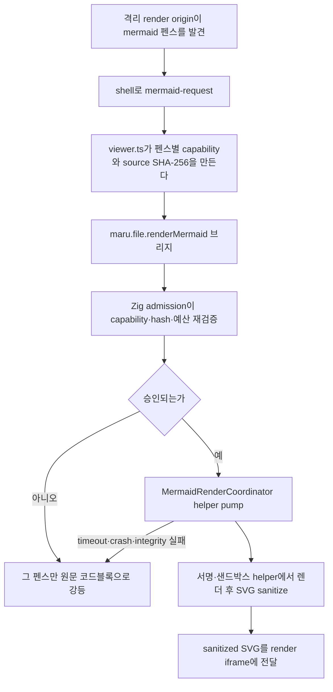

# 파일 패널 (마크다운·HTML 뷰어/편집기 — 워크스페이스 Term + 탐색기 도크)

로컬 `.md`/`.html` 파일을 maru 안에서 열람·편집하는 **파일 패널**의 단일 출처 문서다. 파일 콘텐츠는 워크스페이스 pane 트리의 `Term`으로 살고, 창 레벨 도크는 **탐색기(파일 트리) 전용**이다. WKWebView 합성·입력·web 특유 보안은 [web-panel.md](web-panel.md), 브리지 신뢰 게이트는 [control-plane-security.md](control-plane-security.md) §8.1, 파일 경로 링크 감지는 [link-detection.md](link-detection.md), 주소창 텍스트 편집 모델은 [text-field-editor.md](text-field-editor.md)를 단일 출처로 두고 재서술하지 않는다. control-plane §12 Phase 7 행(7a~7d)의 상세 분해가 이 문서다(§10 대응표).

> 결정은 2026-07-17 사용자 승인. 설계 전 코드 대조 검증(적대적 3축 + 대화 감사)을 거쳤고 본문 file:line은 그 시점 기준. **1차 개정(2026-07-17)**: 초판의 "워크스페이스 내장 web Term" 호스팅을 전역 도크로 피벗. **2차 개정(2026-07-27, 사용자 결정)**: 그 도크 피벗을 되돌려 파일 콘텐츠를 **워크스페이스 Term**으로 옮기고 도크는 탐색기 전용으로 축소한다 — 근거는 §1 첫 항목, 전환 슬라이스는 §10 FP16.

> **이 문서를 읽는 법**: FP16 구조가 현재 계약이다 — `Entry`는 `Term.file_entry`가 소유하고, 비활성 워크스페이스의 web surface는 zero rect + hidden으로 남으며(`collectWebSurfaces`의 비활성 탭 분기 + presence 게이트 `windowHasWebTerm`), 헤더 밴드는 파일 Term의 `ChromeInset.top`이고, `DockGroup`·`DockTree`·`dock_drag.zig`는 없으며, 영속은 `file-term` 키(옛 `dock-entry`는 1회 마이그레이션)를 쓴다. **본문 §1~§9는 전부 현재 계약이다** — 폐기된 도크 뷰어·드래그 구현의 서술은 걷어냈고, 그 이력은 Git이 소유한다(§10). 진행·검증 상태는 이 문서가 아니라 [검증 매트릭스](verification-matrix.md)의 "파일 패널 FP16" 행이 소유한다.

## 1. 확정 결정

- **1급 정책(FP16): 파일 콘텐츠는 터미널과 같은 탭 스트립에 산다.** 파일 entry는 워크스페이스 pane 트리의 `Term`(`kind = .web` + 파일 entry 보유)이고, 창(chrome) 레벨 도크는 **탐색기 전용**으로 남는다. **`PanelKind`는 넓히지 않는다(PoC 정정 — §11.1 P4)**: 초안은 `web_panel_kind`에 `.file`을 더하려 했으나, Swift가 trust를 `let trusted = (panelKind == 0)` 매직 비교로 파생하므로(MaruAppHost.swift:2868) 값을 더하면 파일 패널이 조용히 **untrusted로 떨어진다**. `PanelKind`는 계속 `{markdown, browser}` 2값 = **trust/config 선택자**로만 두고, 파일 여부는 그 Term이 파일 entry를 갖는지로 판정한다. entry의 `EntryKind`→`PanelKind` 파생은 도크가 이미 하는 그대로다(app_session.zig:14322~14328 — `markdown/text/svg/image`→`.markdown`, `html/pdf`→`.browser`). **개정 근거(2026-07-27 사용자 결정)**: ⑴ 원하는 사용 모델이 "터미널과 문서를 한 탭 바에서 오간다"인데, 도크 전용 탭바·헤더·split 트리·드래그는 pane 탭바가 이미 하는 일의 중복 구현이다. ⑵ 브라우저 web Term이 이미 같은 pane 트리에 살아(`Term.kind == .web`) **호스팅 배관**(트리 담기·WKWebView 부착·per-Term 탭·재부모화)이 존재한다. 단 "`web_panel_kind`만 넓히면 된다"는 과장이다 — 실제 일은 `dock_panel.Entry`(경로·mode·dirty·revision·pending)의 **소유자를 `DockGroup`에서 `Term`으로 옮기고** 그에 딸린 수명(생성·해제·이동·병합)을 Term 경로에 다시 거는 것이다(§10 FP16b). ⑶ 초판이 도크를 택한 **유일한 근거**였던 "워크스페이스 전환 시 WKWebView 파괴"는 구조 문제가 아니라 `collectWebSurfaces`의 walk 범위 문제다 — 도크 분기가 이미 쓰는 "집합에 남기되 zero rect + hidden" 패턴을 워크스페이스 경로에 적용하면 해소된다(§4). 즉 초판의 근거 ⑴은 **성립하지 않는 전제**였고, ⑵(회귀 반경)·⑶(상태 소유 집중)은 그 대가로 도크 전용 계층 전체를 이중으로 짓는 비용을 정당화하지 못한다. 이 결정은 1차 개정판 §13 후속 "pane에 열기"(B-ws 모델 부활 지점)를 v2 기본으로 승격한 것이다.
- **아키텍처 B — chrome은 Zig+GPU, WKWebView는 콘텐츠만.** pane 탭바·파일 Term 헤더 밴드·파일 트리 = GPU 셀 chrome, 가운데 콘텐츠 rect만 WKWebView. 통짜 웹앱(웹이 탭·트리까지 그림)은 기각([control-plane.md] §1 원칙 + 이중 chrome·룩 드리프트). WKWebView 닫힌 열거는 넓히지 않는다. **FP16 변화는 chrome의 소유자뿐**이다 — 탭·헤더를 도크가 아니라 pane이 그린다.
- **탐색기 도크 위치 = `right` 고정(FP16).** 도크가 파일 트리만 담으면 "위=터미널 / 아래=문서"라는 하단 밴드의 근거(상하 분할 습관)가 사라지고, 트리는 세로로 긴 컬럼이 자연스럽다. 그래서 `bottom` 배치와 팔릿 `Move File Panel Right/Bottom`(`toggle_file_panel_dock_side`)을 **함께 제거**한다. 문서에만 있고 코드에 없던 config `file-panel.dock` 키는 신설하지 않는다(현행 `FilePanelConfig`에는 `external_link_target`만 남는다 — 없던 키를 없앤다고 적지 않기 위한 명시). `dock-side`는 reader가 값을 읽고 무시한다(옛 파일 호환). 접기 토글·크기 드래그는 유지하며 좌측 사이드바 **런타임** 클러스터와 동형(pt 권위·동적 clamp·드래그 시작값 write-back 가드·전 탭 resize 동기 — app_session.zig:3028) — 단 **영속은 동형이 아니다**(사이드바 폭=config `sidebar.width`·접힘은 미영속, 도크는 workspace.v1 §5 — 별도 결정임을 명시).
- **우상단 탐색기 진입점은 일반 chrome의 빈 시작 상태에도 표시한다.** quick terminal의 `chrome_minimal`에서는 다른 chrome과 함께 숨긴다. `filePanelDockControlRect`가 render·hover·hit-test·window-drag 제외의 공용 기하이며, `filePanelDockControlAction`은 `presented`/`collapsed`에서 `open | collapse | expand`를 한 번 판정하고 `activateFilePanelDockControl`이 실행한다. 완전히 빈 상태의 첫 클릭도 파일 선택기를 강제로 띄우지 않고 탐색기 chrome만 펼친다(FP16: "빈 editor root"라는 개념 자체가 사라진다 — 도크에 editor가 없다). 파일 선택기는 사용자가 빈 tree content를 다시 primary-click하거나 탐색기 context menu의 `파일 열기…`를 고른 때만 요청한다. picker 취소는 열린 빈 도크와 기존 모델을 그대로 보존한다.
- **파일 1개 = 창당 Term 1개(FP16). 단 "나눠서 보기" 명시 명령은 예외다(2026-08-09 개정 예정 — 아래 주).** 이미 열린 경로를 다시 열면 새 Term이 아니라 기존 Term을 활성화한다.

  > **개정 주(2026-08-09 사용자 결정).** 이 불변식의 근거 중 하나였던 "두 뷰가 같은 문서를 편집하면 동기화할 수 없다"는 **네이티브 편집기 이관으로 소멸한다** — 버퍼가 L2에 있어 두 뷰가 같은 rope를 참조하면 되기 때문이다([native-editor-layering.md](native-editor-layering.md) §2.4, [editor-surface.md](editor-surface.md) §4 개정 주). **경로로 여는 동작은 그대로**(기존 Term 활성화)이고, **명시 명령으로만** 두 번째 Term이 생긴다. 그때 버퍼·undo·revision·dirty는 공유하고 selection·스크롤·랩·접힘은 뷰별로 독립이며, **뷰 하나를 닫을 때는 dirty 게이트가 걸리지 않는다**(마지막 뷰에서만). 이 문구의 정식 갱신은 그 기능을 구현하는 슬라이스에서 한다([implementation-plan.md](implementation-plan.md)).
 이 유일성은 pane별이 아니라 **창 전체**(그 창의 모든 워크스페이스 pane 트리) 불변식이다 — 다른 pane을 target으로 열어도 원래 Term을 반환해 그 pane/워크스페이스로 이동·focus한다. 따라서 조회는 도크 그룹 순회가 아니라 창의 전 탭 pane 트리 walk다 — 이 walk 자체는 `findTermWhere`(app_session.zig:5438, `self.tabs` 전체 순회)라는 **기존 선례**가 있고 `hasWebSurface`가 이미 그걸로 같은 종류의 질문에 답한다. entry 수 상한(`max_entries` 256)의 강제 지점은 §10 열린 질문 2번이다. 멀티 윈도우는 창마다 독립(열기는 클릭이 일어난 창으로).
- **파일 탭 닫기 계약(FP16)**: 파일 Term의 탭 닫기·활성 승계·`X` hover 규칙은 **터미널 탭의 기존 pane 탭바 계약을 그대로 쓴다**(별도 `tabCloseRect` 기하를 도크가 따로 소유하지 않는다). 파일 고유 부분은 닫기 **직전**의 dirty 게이트뿐이며 그 계약은 §3.2가 소유한다. 마지막 파일 Term을 닫아 pane이 비면 기존 Term close cascade(pane 접기·탭 승계)가 그대로 적용된다 — "빈 editor root 유지"라는 도크 전용 예외는 사라진다. 창 전체 파일 Term이 0이어도 탐색기 도크는 project/recent history가 있으면 계속 표시되고, `⌘⇧E`는 workspace ↔ tree를 왕복한다.
- **도크 내 분할(여러 파일 동시 표시) = FP16에서 폐기.** 워크스페이스 pane split이 그대로 이 역할을 한다(파일 Term도 Term이므로 `⌘D`/`⌘⇧D` 등 기존 split이 곧 "파일 두 개 나란히"다). 아래는 폐기되는 FP8 구현의 기록이다. **FP8 완료 당시 계약:** 도크 콘텐츠는 `SplitTree(*DockGroup)` 에디터 그룹 트리다. 각 leaf는 도크 좌측 editor 영역에서 자기 tab/header/content rect를 갖고, 우측 project tree는 전 그룹의 파일을 공유한다. `layoutDividers` 경계가 1px 렌더·확장 hit target·drag ratio를 함께 제공한다. ABI v124는 native WKWebView firstResponder surface를 `focused_group`에 되돌린다. 팔릿의 `Split File Panel Right/Down`은 포커스 leaf의 active entry를 오른쪽/아래 새 group으로 옮겨 두 content leaf를 만들며, active entry가 없거나 유일한 entry라 빈 sibling만 생기는 경우는 no-op이다. `Close File Panel Group`은 마지막 그룹 또는 dirty/pending/conflict/editable-mode entry가 있으면 무동작한다. 상세 수명 규칙은 §3.3 FP9-EMPTY를 따른다.
- **파일 탭 드래그 = FP16에서 terminal 탭 드래그로 흡수.** 파일 Term은 Term이므로 재정렬·다른 pane으로 이동·드롭존 split이 **기존 terminal 탭 드래그 코드 하나**로 처리되고, `dock_drag.zig`와 `DockPanel.commitEntryDrop`은 삭제한다. 그 결과 FP9가 명시적으로 무효화하던 "cross-domain drop 금지"(terminal↔dock) 규칙 자체가 소멸한다 — 도메인이 하나뿐이라 금지할 경계가 없다. 아래는 폐기되는 FP9 구현의 기록이다. **FP9 완료 당시 계약(2026-07-19, ABI v131):** 왼쪽 terminal의 탭 드래그와 같은 발견성으로 파일 탭을 같은 `DockGroup` 안에서 재정렬하고, 다른 `DockGroup`의 탭 바로 옮기거나 editor 본문의 X자 상·하·좌·우 방향 zone에 놓아 도크 내부 split을 만든다. 단 동형 범위는 **각자 자기 레이아웃 도메인 안**뿐이다. `Term`/terminal pane은 파일 도크의 드롭 대상이 아니고 `dock_panel.Entry`/`DockGroup`도 terminal pane의 드롭 대상이 아니다. terminal↔dock outer divider는 크기 조절만 소유하며 콘텐츠 이동을 겸하지 않는다. 파일 drag는 도메인 밖에서 drop-zone을 표시하지 않고 mouse-up을 취소해 원래 탭·그룹·surface 상태를 그대로 둔다. terminal drag도 cross-domain 소유권 이동은 하지 않되 기존 terminal 내부 live reorder까지 되돌리지는 않는다. 세부 수명·기하·포커스 계약은 §3.3을 단일 출처로 둔다.
- **입력 포커스 시각화·왕복(FP16 축 축소).** 원칙은 유지한다 — 선택된 탭과 실제 키 입력 owner를 같은 색 채움으로 뭉개지 않고, active tab 배경은 "보이는 문서", focus accent inside border는 "지금 키를 받는 영역" 하나를 뜻한다. **바뀌는 것은 `FocusOwner`의 축**이다: 파일이 Term이 되면서 `.dock_surface`·`.dock_group` 두 축이 소멸하고 `.workspace`(terminal·browser·파일 Term 공통)와 `.file_tree` 둘만 남는다. border target도 `DockGroup` leaf rect가 아니라 terminal과 같은 `PaneGeometry.body`다. 아래는 폐기되는 FP9 4-축 계약의 기록이다. **FP9 완료 당시 계약(2026-07-19, ABI v131), terminal pane-body 경계 보정 완료(ABI 무변경):** theme의 focus accent로 그린 얇은 inside border는 `FocusOwner`가 가리키는 terminal pane·파일 `DockGroup`·project tree 중 “지금 키를 받는 영역” 하나만 뜻한다. 기본 `⌘⇧E`는 기존 한 방향 `focus_file_tree` 대신 새 `toggle_file_panel_focus`에 연결해 workspace terminal/browser ↔ 파일 도크를 한 키로 왕복한다. `focus_file_tree`는 하위버전 adapter가 아니라 one-way tree 진입이 필요한 palette/사용자 binding용 별도 action으로 남긴다. workspace border는 `AppSession.paneGeometry`가 active leaf에서 계산한 `PaneGeometry.body`를 받아 window padding을 border 안쪽에 남긴다. 세부 렌더·라우팅 계약은 §3.4와 [key-input-and-shortcuts.md](key-input-and-shortcuts.md)를 따른다.
- **시각 구조 기준 = 사용자 제공 Claude Artifact(2026-07-18), FP16 재배치.** 구조 계약 자체는 유지하되 소유자가 옮겨간다: ⑴ **고정폭 탭 + 넘치면 가로 스크롤**은 pane 탭바가 이미 같은 계약(`Pane.tab_scroll_cols`)을 갖고 있으므로 그쪽으로 흡수한다(`DockGroup.tab_scroll_cols`·`dock_layout.dockTabScroll` 삭제). ⑵ **헤더 밴드**(`부모 / 파일` breadcrumb + kind별 mode 선택기)는 파일 Term의 밴드로 남고, browser Term의 주소창 밴드와 **같은 `ChromeInset.top` 경로**를 쓴다(§3.1). ⑶ **탐색기**는 도크 전폭을 차지하고 `탐색기` 고정 헤더 + project roots 먼저·최근 파일 마지막 순서를 유지한다. ⑷ divider는 **terminal↔dock outer divider 하나만** 남는다(group divider·editor↔tree divider 소멸). WKWebView 위 divider grab 통과(`seam_edges`) 계약은 그대로다. 아래는 폐기되는 도크 배치 기준의 기록이다. **FP8 당시 계약:** 파일 탭은 **항상 고정폭**(`default_tab_cols`=18칸, 남는 바를 억지로 균등분할하지 않고 좁아져도 축소하지 않음)이고 탭 총폭이 바를 넘치면 **가로 스크롤**한다(터미널 pane 탭 바와 동형 — `DockGroup.tab_scroll_cols` 오프셋, 2-finger 가로 스와이프로 스크롤, 스크롤 밖 탭을 클릭/열기로 활성화하면 보이게 자동 스크롤. 렌더·히트테스트·드래그 boundary가 같은 `dock_layout.dockTabScroll` 스크롤 메트릭을 소비해 일관된다), 헤더는 절대경로 대신 `부모 / 파일` breadcrumb와 독립 mode 선택지를 갖고(FP10부터 `읽기 | 라이브 | 소스`), 본문 우측 project tree는 `탐색기` 고정 헤더 아래 project roots를 먼저·최근 파일을 마지막에 표시한다. terminal↔dock outer divider, group divider와 editor↔project-tree divider는 보이는 선 중심의 확장 grab band 전체에서 드래그돼야 한다. 특히 WKWebView 쪽으로 들어간 band에서도 `MaruWebPanelView.hitTest`가 이벤트를 아래 Metal/Zig divider owner에게 넘겨 terminal divider와 같은 resize 경험을 제공한다. project tree 기본 폭은 현재 폰트의 18셀이고, 사용자가 조절한 폭(pt)은 workspace에 저장한다. 레퍼런스의 코드/DOM은 사용하지 않고 제공된 최종 이미지의 배치·정보 계층만 Maru GPU chrome으로 독립 구현한다.
- **웹 브라우저(⌘⌥T)는 현행 워크스페이스 term 유지 — FP16으로 파일과 같은 자리가 된다.** 브라우징의 용례(터미널 옆 미리보기·팝업/OAuth[7f]·에이전트 제어)가 워크스페이스 맥락이라는 판단은 그대로이고, 출하·손테스트 완료된 7e/7f/4e-4/4g를 재작업하지 않는다. **부수 효과**: FP16의 §4 hidden-보존이 web Term 일반에 적용되므로 "워크스페이스 전환 시 브라우저가 흰 페이지가 된다"는 현행 결함이 함께 해소된다 — §13에 백로그로 두었던 **URL 기억·재로드 얕은 수정은 불필요**해진다(파괴가 없으면 재로드할 것도 없다). 이 항목은 §13에서 제거한다.
- **외부 링크 대상은 설정으로 선택한다.** Markdown/HTML 파일 패널에서 사용자가 직접 누른 명시적 `http(s)://` 링크는 `file-panel.external-link-target = in-app | system`(기본 `in-app`)에 따른다. `in-app`은 클릭한 파일 패널과 같은 창의 새 browser Term으로 열고 `system`은 macOS 기본 브라우저로 연다. `⌘⇧`+클릭은 설정과 무관하게 이번 한 번만 시스템 브라우저를 강제한다. **터미널 화면**의 링크는 이 설정이 아니라 `input.link-open-target`이 정한다(그쪽은 **열려 있는** browser 패널 재사용을 우선하고, 기본 `auto`는 패널이 없으면 새 탭을 만들지 않는다 — [링크 감지](link-detection.md) §링크를 어디에 여는가). Markdown의 같은 문서 fragment는 WebView 안에 남고 로컬 `.md`/`.html`은 source group의 도크 탭으로 연다. script/meta redirect와 `javascript:`·`data:`·`file:`·protocol-relative·percent-encoded scheme은 이 외부 열기 경계에 들어오지 않는다.
- **Term 배관은 kind-무관으로 설계**(`web_panel_kind`가 kind를 든다) — 파일·브라우저가 같은 pane 트리에 살게 되면서 "브라우저 탭을 도크로 보내기"(§13)는 목적을 잃는다. 대신 남는 확장점은 **새 web kind 추가**(diff 뷰어·에디터 surface 등)이며, 새 kind는 `web_panel_kind` 하나만 넓히고 pane 탭·헤더·수명 계약을 그대로 물려받는다. WKWebView 신뢰 config는 계속 kind에서 파생하며 "레이아웃 재사용 ≠ trust 재사용"은 유지한다.
- **소스 편집기 = 네이티브 등폭 GPU 뷰(2026-08-09 개정, 사용자 결정). 단 마크다운 소스 모드는 미결이다.** 편집 경로의 정본은 WKWebView가 아니라 Zig + Metal이며, 계약은 [native-editor.md](native-editor.md)가 단일 출처다. **적용 범위는 `text` kind**(§2.2 — `.md`/`.html`과 바이너리를 뺀 모든 파일)와 diff이고, 그 범위에서 이 항목 아래 CM6 서술과 §2.2 표의 "소스 편집만" 열은 무효다. **`.md`의 소스 모드는 아직 정하지 않았다** — 같은 파일에서 `읽기 | 리치 | 소스`를 전환하면 렌더러가 갈리기 때문이며, 선택지(소스도 네이티브 / 소스는 CM6 유지 / 마크다운 전체를 함께 결정)는 [native-editor.md](native-editor.md) §11이 미결로 소유한다. **마크다운 읽기·리치 렌더는 이 개정의 대상이 아니다** — 계속 웹이다. 아래는 그 CM6 결정의 원문이며, 마크다운 축에서는 그대로 유효하다.
- **소스 편집기 = CodeMirror 6, 리치 편집기 = 문서모델(2026-07-29 개정)**. 소스 모드는 계속 CM6다 — 마크다운이 SSOT(항상 텍스트, 왕복 손실 0), 한글 IME 조합이 WebKit 네이티브 IME 위에서 가장 안정, sanitize 파이프와 렌더 공유. **초판은 문서모델 기반을 전면 기각했으나, 리치 모드를 별도 셋째 모드로 병존시키는 형태로 한정 채택한다**(사용자 결정). 뒤집은 것은 "문서모델을 쓰지 않는다"이지 "마크다운이 SSOT다"가 아니다 — 디스크의 진실은 여전히 마크다운 텍스트이고, 리치는 그 위에 얹는 **편집 수단 하나**다. **대가를 명시 수용한다**: ⑴ 문서모델 ↔ 마크다운 왕복은 원문 서식을 정규화하므로 사용자가 건드리지 않은 줄도 저장 시 바뀔 수 있다(공백·목록 번호 스타일·원시 HTML). ⑵ 문서모델 편집기는 조합 중 DOM을 재작성해 한글 IME와 부딪히는 계열이다. **완화는 소스 모드 존치다** — 왕복 손실이 곤란한 문서는 소스로 편집하면 손실이 0이고, 리치에서 이상이 보이면 같은 파일을 소스로 열어 원문을 그대로 고칠 수 있다. 그래서 리치는 소스를 **대체하지 않는다**. **프론트엔드 = vanilla TS**(프레임워크 없음 — B로 웹앱 최소화), **렌더 = remark/unified로 확정(FP2 실측)** + Mermaid·KaTeX MathML·Prism 리치 렌더 — 스택·근거·보안 배치는 §2.1.
- **Markdown 모드 = 읽기 | 리치 | 소스 (2026-07-29 사용자 결정)**: 새 `.md` entry는 **읽기**가 기본이고, 헤더 mode 선택기는 세 모드를 노출한다(`dock_layout.modesForKind`·`Mode.defaultFor/allowedFor` SSOT). **읽기**는 렌더 결과를 보는 화면, **리치**는 툴바를 가진 WYSIWYG 편집(위 편집기 결정), **소스**는 생 Markdown 편집이자 왕복 손실 0의 escape hatch다. **라이브 프리뷰(FP10·FP11)는 백로그가 아니라 폐기다** — atomic iframe(블록별 격리 렌더)의 로드 실패·플리커·성능 이슈로 2026-07-22에 제품 mode에서 뺐고, 되살리지 않기로 확정해 projection·atomic·worker 구현을 코드에서 걷어냈다(이력은 Git이 소유 — §10). 근거는 셋이다: ⑴ 읽기·소스 두 모드로 사용자 요구가 충족된다, ⑵ 노출되지 않는 projection 계층이 web 소스의 다수와 required CI 게이트를 계속 점유해 유지비만 냈다, ⑶ "편집 중 렌더를 본다"는 요구 자체는 유효하며, 그건 **리치 모드**가 별도로 답한다. **라이브 프리뷰와 리치는 다른 것이다** — 라이브는 같은 CM6 buffer 위에 렌더를 겹쳐 원문과 렌더가 한 화면에 섞이는 방식이고(그 겹침이 곧 복잡도였다), 리치는 원문을 감춘 별도 문서모델 편집기다. 폐기한 것은 겹치는 방식이지 렌더된 편집 화면이 아니다. 저장된 `live-preview` markdown entry는 복원 시 `parseDockEntry`가 `defaultFor`(읽기)로 조용히 clamp한다(포맷 하위호환 유지). 읽기는 문서 전체의 격리 렌더로 **mermaid(격리 ``·시스템 light/dark 테마)와 코드펜스 문법 하이라이트(`--maru-syntax-*` 터미널 팔레트)를 지원**하고, 소스는 CM6 생 Markdown이다. 읽기↔소스 토글은 하나의 `EditorView`·history·revision을 공유해 전환으로 undo/selection/dirty를 잃지 않는다. 소스는 renderer 장애·모호한 문법·대형 블록을 복구하는 영구 escape hatch다. `.html`은 읽기 전용이다. 구버전 reader용 adapter나 workspace format bump는 추가하지 않는다(unknown mode를 만난 현행 fail-closed 동작 수용).
- **저장은 명시적 `⌘S`만**: 소스 모드가 현재 CM6 `Text` snapshot을 기존 pathless atomic write로 저장한다. write 완료 시 현재 문서가 그 snapshot과 내용상 같을 때만 native dirty를 내린다. 따라서 저장 중 재편집은 dirty를 유지하고, 편집 뒤 undo로 snapshot과 같은 내용에 돌아오면 revision이 더 높아도 clean이다. revision은 저장 identity가 아니라 stale dirty report를 거부하는 단조 clock이다. 실패·external conflict에서는 buffer와 dirty를 유지한다. focus-loss/autosave는 하지 않는다. `⌘F`는 Markdown 편집 WebView가 first responder일 때 새 package 없는 Maru CM6 search extension이 담당하며, `⌘A/C/V/X/Z/⇧Z/S`와 텍스트 탐색 키도 WebKit에 양보한다. ABI v132 typed `WebKeyRoute`가 app action·explicit unbind 소비·web editor·일반 pass-through를 구분하고 명시적인 사용자 rebind/unbind·global shortcut·modal owner의 기존 우선순위를 유지한다.
- **write 스코프 = 열린 파일만**(§3). **트리 루트 = git repo 루트 우선**(§7).
- **불변식(스파이크 6건으로 확정): `Term`의 surface는 교체되지 않는다.** 이건 파일 전용 규칙이 아니라 **터미널 Term이 이미 지키고 있던 규칙**이다 — `Term.surface`는 생성 시 한 번만 assign되고(app_session.zig:6156·6303) 프로덕션 경로 어디서도 재대입되지 않는다. FP16은 파일 Term을 그 규칙 **안으로** 들여놓는다. 파일 Term마다 WKWebView 1개이고 비활성이면 hidden(상태 유지 — Swift hide=isHidden만)이다.
  - **네 조각으로 성립한다**: ⑴ **eviction 없음**(LRU·`max_live_views` 제거 — 사용자 승인 2026-07-27). ⑵ **신뢰 kind(markdown·text·svg·image) rename은 surface를 유지**하고 `entry.path`만 갈아끼운다(§11.1 S3·S4 — 판정은 `filePanelKindIsIsolated`). ⑶ **재생성 조건은 둘**이다 — ⓐ trust config(`filePanelKind` 1↔2) 전환(`WKWebViewConfiguration`이 init 시점 고정, MaruAppHost.swift:2843~2868), ⓑ **`EntryKind` 변경**(shell 뷰어가 생성 시점 `?lang=`/`?kind=` 힌트로 정해지고 `entry.mode`를 되밀 채널이 없어, 뷰를 두면 `.md`→`.png`가 markdown shell에 바이너리를 그리고 mode가 non-editable로 리셋된 채 CM6가 살아남는다 — code-review max). surface **교체**가 아니라 Term **교체**이므로 불변식을 깨지 않는다(§11.1 S1). ⑷ rename plan은 `EntryId`가 아니라 **expected path + `mutation_pending_id` 스탬프**로 키잉한다(§11.1 S2).
  - **따름정리 — identity 개념이 하나로 준다.** `surface`가 교체되지 않으므로 **`surface_id`가 곧 그 Term의 이름**이다. 그래서 `EntryId`/`EntryIdAllocator`를 **삭제**하고, 초안이 §13 후속으로 제안했던 `TermId` 승격은 **불필요**해진다. 남는 식별자는 `surface_id`(인스턴스 = Term) 하나이고, `path`는 identity가 아니라 rename으로 바뀌는 **속성**이다.
  - **`EntryId`가 load-bearing이 아님은 실측으로 확인했다**: FP16이 드래그와 dock focus 축을 지우면 소비처 8곳 중 7곳(3322·3429·3446·3525·3535·3568·3592·13042)이 함께 사라지고 rename remap(11316·11329)만 남는데, 그 정합성은 이미 `entry.path == expected AND entry.mutation_pending_id == id` **쌍**이 지고 있다. close 후 같은 경로 재오픈이라는 aliasing 시나리오도 스탬프가 fail-close시킨다(S2).
  - **rename 시 사용자가 잃는 것(정확한 범위).** 원인은 "새 파일을 연다"가 아니다 — rename은 atomic no-replace라 **내용·inode가 동일**하다. 잃는 것은 ⓐ **top-level 재네비게이션**(문서를 다시 세움 → 스크롤·JS/form·PDF 페이지 상태 초기화, 뷰는 그대로라 깜빡임 없음)과 ⓑ **WKWebView 재생성**(NSView 제거·추가 → ⓐ + 시각적 깜빡임)에서 나온다.

    | rename 유형 | 현재 동작 | 잃는 것 |
    |---|---|---|
    | 신뢰 kind, **kind 유지**(`.md`→`.md` 등) | 없음 — `entry.path`만 교체 + self-write latch로 FSEvents echo 흡수 | **없음** |
    | **kind 변경**(`.md`→`.py`·`.png` 등) | Term 재생성 | 스크롤·페이지 상태 + 짧은 탭 깜빡임 |
    | `.html`/`.pdf`가 한쪽이라도 낀 rename | Term 재생성 | 위와 같음 |

    트리 rename은 이름만 바꾸므로 파일과 형제 asset이 **함께** 움직인다(디렉터리 rename이면 하위 트리 통째로). 그래서 상대 asset 해석이 깨지지 않고, 디렉터리 여부로 갈 이유가 없다. 옛 `!same_dir` reload 분기는 디렉터리 rename에서 하위 entry 전부를 헛되이 재로드시키던 결함이라 제거했다(code-review max).

    `.html`/`.pdf`의 재생성은 **원리적 제약이 아니다** — `loadFileURL(_:allowingReadAccessTo:)`의 스코프는 로드마다 받는 인자라 새 로드가 새 스코프를 주고, 핀은 nav 정책·초기 로드·리로드 세 곳에서만 참조된다(MaruAppHost.swift:2905·2930·3357). 지금 재생성하는 건 `pinnedFileHTMLURL`이 init 시점 `let`으로 캐시돼 있어서다. 무손실 경로는 §13 백로그다.

    가장 흔한 경우(열린 `.md` 이름 바꾸기)가 무손실인 이유는 breadcrumb이 `entry.path`에서 파생하는 **Zig GPU chrome**이고 `maru.file.read/write`가 **pathless**라 shell에 통지할 것조차 없기 때문이다(웹 shell이 핀 경로를 쓰는 곳은 상대 asset을 푸는 `readAsset`뿐이다). 편집 buffer는 어느 경우에도 안전하다 — §7이 dirty·conflict entry의 rename을 차단해 clean만 rename되기 때문이다.
  - **SSOT 근거가 결정 이유다.** `surface_id`의 앱 전역 비재사용은 편의가 아니라 SSOT 장치다 — 별도 generation 필드를 두지 않으려고 "id 자체가 generation token"이 되게 만든 선택이고(외부 control-plane 클라이언트가 id를 들고 시간을 건너오므로 stale selector가 **다른** surface로 리다이렉트되면 안 된다 — [control-plane.md](control-plane.md) §3), 그 따름정리로 **surface보다 오래 사는 것은 surface_id를 키로 쓸 수 없다**. 도크가 `EntryId`를 만든 이유가 정확히 그것이다(dock_panel.zig:93). FP16은 그 전제 자체를 없애 — 파일 Term의 surface가 Term보다 먼저 죽지 않게 만들어 — 별도 키의 필요를 소거한다.
  - **`surface_id`를 안정화하는 방향은 기각했다.** wire 계약은 원래 `{surface_id, generation}` 쌍이고 generation은 "id를 유지한 채 런타임만 갈리는 경로"를 위해 남겨둔 자리라(control-plane §3) 오늘은 degenerate하다(`surface_generation`에 `surface_id`를 그대로 넣는다 — app_session.zig:13332). 그 자리를 실제로 살리려면 **모든** 비교 지점이 쌍을 검사해야 하고 한 곳만 빠뜨려도 stale 메시지가 live surface에 먹힌다. 비교 지점은 많고(ABI·브리지·mermaid helper·외부 클라이언트) 장수 엔티티는 적으므로, 비재사용을 유지해 "빠뜨릴 검사 자체를 없애는" 현행이 옳다.
  - **새 예외를 만드는 게 아니라 예외를 없애는 것이다.** 브라우저 web Term은 지금도 eviction 대상이 아니다 — `max_live_views` 소비처 두 곳(`assignDockSurfaceIds`·`enforceFilePanelLiveViewLimit`)이 모두 `dock_initialized` 가드에 `dock_panel.Entry`만 훑는다. FP16은 파일을 브라우저·터미널과 **같은 규칙**으로 맞춘다.
  - **대가(명시 수용)**: 열린 파일 수 = live WKWebView 수다. 상한이 사라지므로 §12에 최대 리스크로 남기고, 상한 복원은 §13이 다룬다. `file-panel.max-live-views` config는 소비처가 0이 되므로 **죽은 필드로 남기지 않고 제거**한다(loader는 알 수 없는 key를 forgiving 무시 + diagnostic이라 기존 config 파일은 안 깨진다 — loader.zig:252).
  - destroy 경로의 `browser.closed` push는 파일 Term에서 미발행한다(§4 destroy 판정과 같은 `web_panel_kind`-aware 분기). 이 분기는 eviction과 무관하게 유지된다.
- **Markdown 초기 paint 무백색 계약(macOS 12+)**: 신뢰 Markdown WKWebView는 생성 직후·뷰 계층 삽입 전에 공개 API `underPageBackgroundColor`를 `NSColor.textBackgroundColor`로 설정하고, `index.html`과 `render.html`은 외부 `app.css`보다 앞에 동일한 `Canvas` critical 배경을 인라인한다. 인라인 허용 방식은 origin별로 다르다(FP12b, §2.3): **render origin은 정확한 critical style SHA-256(`sha256-Xeh9es1AoJEyNnawqxMjG30+czqjDUSJ+JDkbXALfVg=`) 하나만 핀**하고, **app(신뢰 shell) origin은 CM6 `syntaxHighlighting` StyleModule 때문에 `style-src 'self' 'unsafe-inline'`**이라 이 critical style도 unsafe-inline으로 함께 허용된다. 이 두 층은 **WKWebView 삽입→첫 document paint**와 **외부 CSS 적용 전 첫 paint**의 기본 흰 배경만 없애며, 렌더 완료까지 콘텐츠를 숨기는 계약은 아니다. 임의 웹페이지의 자체 배경을 존중해야 하는 browser/로컬 HTML에는 적용하지 않는다. 앱 floor인 macOS 11에서는 `underPageBackgroundColor`가 없어 critical CSS만 적용되며 pre-document backing은 §13의 명시적 잔여다. 12+ 적용 뒤에도 partial DOM 플리커가 계측되면 별도 loading cover를 `viewerReady`에서 제거하되 실패·timeout 해제까지 함께 설계한다. 첫 cold start만 느리면 prewarm, reload 연속성까지 필요하면 snapshot/double-buffer를 각각 별도 성능 슬라이스로 다룬다.

## 2. kind 분기 (.md · .html · 텍스트/코드 · svg · 이미지 · 미디어 · pdf)

**kind는 확장자 나열이 아니라 "콘텐츠를 어떻게 다루느냐(신뢰 경계 + 전송 방식)"로 정의한다(FP12 결정, 2026-07-22 사용자 승인 — 범위 A+B+C+D 전부).** 새 값을 더해도 기존 두 컨텍스트(신뢰 shell / 격리 loadFileURL)와 전송 채널을 재사용하고 WKWebView 닫힌 열거를 넓히지 않는다(§1 아키텍처 B).

| 파일 | 콘텐츠 뷰 | 읽기 | 리치 | 소스 |
|---|---|---|---|---|
| `.md` | 신뢰 shell + bridge-free renderer | 문서 전체 새니타이즈 렌더(Mermaid·KaTeX·코드펜스 하이라이트 포함) | 툴바 + 문서모델 WYSIWYG(§2.5) | CM6 생 Markdown |
| `.html` | browser config(비신뢰 격리) | `loadFileURL(_:allowingReadAccessTo: 파일 디렉터리)` — WebKit 표준 API로 읽기 범위를 그 디렉터리에 한정 | 불가 | 불가(후속 §13) |
| **`text`**(FP12) | **신뢰 shell + CM6**(render origin 미사용) | 불가 | 불가 | **CM6 생 텍스트 + 확장자별 언어 하이라이트**(§2.2). `.md`/`.html`·바이너리 제외 **모든 파일**이 text(VSCode식) |
| **`svg`**(FP13) | 소스=신뢰 shell + CM6 / 프리뷰=**격리 render origin + sanitize→`data:`** | sanitize된 SVG 격리 렌더 | 불가 | CM6 생 XML |
| **`image`**(FP14→FP14b) | browser config(비신뢰 격리) — WebKit **image document** + 주입 뷰어 스크립트 | `loadFileURL` 직접(복사 0) → 주입 스크립트가 휠 줌·드래그 팬·테마 체커 배경 | 불가 | 불가 |
| **`media`**(FP15) | browser config(비신뢰 격리) — WebKit **media document**(래퍼 없음) | `loadFileURL` 디스크 스트리밍(range) | 불가 | 불가 |
| **`pdf`**(FP15) | browser config(비신뢰 격리, WebKit 내장 PDF) | `loadFileURL(_:allowingReadAccessTo: 파일 디렉터리)` | 불가 | 불가 |

- `.html`은 살아있는 스크립트라 신뢰 shell/markdown renderer에 인라인 렌더할 수 없다. 신뢰 CSP의 `frame-src` 예외는 정확히 `maru-app://render`인 번들 renderer 한 곳뿐이며 임의 문서·`file:` iframe은 허용하지 않는다([web-panel.md] §7). 도크 안에서도 `.html`은 browser config(도크 전용 ephemeral store) WKWebView로 격리 렌더한다.
- 현행 스킴 화이트리스트는 http/https만(`resolveNavUrl`·`popupTargetAllowed` — file: 거부)이므로 **도크의 .html 열기 경로만** `loadFileURL`을 쓴다. 주소창 네비게이션의 file: 거부는 불변.
- **`loadFileURL(allowingReadAccessTo:)` 정밀 시맨틱(FP5 확정)**: 디렉터리 스코프는 **하위 트리 전체 재귀** 읽기 + 스코프 내 file: 서브리소스 로드를 허용하고 스코프 **밖만** WebKit이 차단한다. HTML 정적 검사만으로 JS의 동적 import/fetch나 CSS 상대 리소스를 완전 판정할 수 없으므로 파일 유무별 케이스 분기 없이 **항상 핀 파일의 부모 디렉터리**를 준다. top-level file: 이동은 별도 navigation delegate가 차단한다.
- **도크 html 네비게이션 정책(FP5 구현, v125 라우팅 보강)**: 현행 browser `decidePolicyForNavigationAction`은 maru-app 차단 외 **전 스킴 허용**(file: 포함)이라, 도크 html 안 링크가 스코프 내 형제 파일로 이동해 헤더 밴드 핀 경로와 표시 문서가 어긋날 수 있다. 도크 html webview는 전용 분기에서 **핀 파일과 같은 top-level 로드/새로고침만 허용**하고 나머지는 차단한다. HTML 패널은 살아 있는 로컬 문서이므로 WebKit의 실제 사용자 활성화 판정이 있는 http(s) 링크만 §1의 설정 기반 in-app/system 경계로 보내며 script/redirect는 브라우저를 자동 실행하지 않고 취소한다. Markdown renderer의 더 좁은 isolated-world one-shot 계약은 §3과 [web-panel.md] §7을 따른다. 스코프 내 네비 허용+밴드 추종은 후속(§13).
- **도크 html은 브라우저 탭과 dataStore 비공유(결정)**: browser 탭들의 공유 `browserDataStore`(7e-0)가 아니라 **도크 전용 별도 ephemeral store**를 쓴다 — 로컬 html은 살아있는 스크립트+CSP 없음+네트워크 무제한이라 공유 시 브라우저 세션 쿠키로 credentialed 요청(CSRF류)을 탈 수 있고, 로컬 파일 뷰엔 로그인 연속성 근거가 없어 격리가 무비용이다.

### 2.1 웹 스택 (프론트엔드·렌더러·리치 렌더)

아키텍처 B로 WKWebView 웹앱의 일은 최소다(트리·탭·도크 chrome = 네이티브 Zig+GPU). 그래서:

- **프론트엔드 = React + Tailwind + shadcn/ui (2026-07-29 개정, 사용자 결정).** 웹앱의 일은 새니타이즈 HTML 표시(읽기) + CM6 마운트(소스) + 문서모델 편집기 마운트(리치, §2.5) + 브리지 모드/테마 신호 수신 + dirty 보고다. Markdown 파생 HTML은 신뢰 shell에 삽입하지 않고 bridge-free renderer origin이 소유하며, 그 안의 Mermaid 펜스만 shell이 native helper로 중계한다(§2.4) — **단일 예외인 리치 HTML 블록 미리보기는 §2.5의 조건을 전부 만족할 때만이다**. `viewer.ts`는 shell composition facade와 mutation queue/guard snapshot 전달을 맡고, Markdown→HTML 파생은 `markdown.ts`, Mermaid sanitize·config는 `rich-render.ts`, helper wire는 `mermaid-helper.ts`·`mermaid-fence.ts`, 렌더 capability 타입은 `renderer-capability.ts`, 편집 모드·revision clock은 `file-panel-state.ts`, 리치 편집기와 툴바는 `rich-editor.ts`가 소유한다. **라이브 프리뷰 폐기(§1)로 projection·atomic worker·intent dispatcher 모듈은 전부 삭제했다** — 남은 웹 모듈은 읽기·소스 두 모드만 지탱한다. CM6는 프레임워크가 아니라 **DOM 마운트 에디터 라이브러리**라 이 결정과 직교한다.
- **프레임워크 도입의 범위와 뒤집지 않는 것(§2.1a).** 초판은 "프레임워크 없음"이었고 그 근거는 아키텍처 B —
  "웹앱의 일을 최소화한다"였다. **아키텍처 B 자체는 그대로다**: 탭·헤더 밴드·파일 트리·pane chrome은 계속 Zig+GPU가
  그리고, WKWebView는 문서 콘텐츠만 소유한다. 바뀌는 것은 **그 콘텐츠 영역 안에서 web이 이미 그리던 UI를 무엇으로
  만드느냐**뿐이다.
  - **왜 뒤집는가**: 콘텐츠 영역 안에서 시작한 상호작용(선택→컨텍스트 메뉴, 리치 툴바, 앞으로의 다이얼로그)을
    native 오버레이로 처리하려면 웹뷰 좌표 변환·firstResponder 라우팅·스크롤 추종을 매번 새로 풀어야 한다. 그 셋은
    헤드리스로 검증되지 않아 손 테스트에만 의존한다. 같은 UI를 web에서 그리면 위치·스크롤·클릭이 전부 DOM의 기본
    동작으로 해결된다. 컨텍스트 메뉴처럼 포커스 트랩·키보드 내비게이션·바깥 클릭 닫기가 필요한 컴포넌트를 직접
    짜는 비용도 매번 든다.
  - **경계는 그대로 판별한다**: "이 UI가 문서 콘텐츠 위에 뜨는가"가 기준이다. 그렇다면 web, 창 전체나 chrome
    영역에 뜨면(알림 센터·설정·닫기 확인) 계속 Zig chrome이다.
  - **부분 정정(2026-08-01, 사용자 결정) — 컨텍스트 메뉴는 Zig chrome이 그린다.** 초판은 컨텍스트 메뉴를 web으로
    옮기는 **대표 사례**로 들었으나, 그 근거("native 오버레이는 좌표 변환·firstResponder·스크롤 추종을 매번 새로
    푼다")가 메뉴에는 맞지 않는다: 메뉴는 스크롤을 따라다니지 않고 한 번 뜨고 닫히며, 좌표는 어차피 web이 올려
    주고, 그 변환은 **터미널 우클릭 메뉴가 이미 하고 있다**. 반대로 web으로 그리면 두 가지를 잃는다 — ⑴ 메뉴가
    WKWebView rect를 못 벗어나 콘텐츠 영역 가장자리에서 접히거나 잘린다. ⑵ maru의 chrome은 AppKit이 아니라
    Zig+GPU라, 이미 있는 세 메뉴(터미널 본문·파일 트리·사이드바 ⚙ — 전부 `context_menu_items_buf`+`itemAt`/
    `draws`/`accept` 공유)와 **네 번째 스타일**이 생긴다. 계약은 §2.6이 소유한다.
    **React가 계속 맡는 것**: 문서 흐름 **안에** 사는 UI — 리치 툴바, 인라인 위젯, 폼. 이들은 문서와 함께
    스크롤돼야 하므로 web이 맞다. 즉 기준을 "콘텐츠 위에 뜨는가"에서 **"문서와 함께 스크롤하는가"**로 좁힌다.
  - **CM6·문서모델 편집기는 React와 직교한다.** 둘 다 DOM 마운트 라이브러리라 React 트리 **밖의 형제 노드**에
    그대로 붙는다. 편집기를 React 컴포넌트로 다시 쓰지 않는다.
  - **루트는 편집기당 하나다**(`shell-ui.tsx`). 리치 편집기의 툴바와 잠금 안내가 그 한 트리에서 그려진다 —
    각자 마운트하면 문서 주변 UI가 React 트리와 손으로 만든 노드로 갈리고, 뒤에 붙일 UI마다 루트가 하나씩 는다.
- **테마 색의 단일 출처는 여전히 native다(§2.1b).** Tailwind를 도입해도 색·폰트 값은 계속 `--maru-syntax-*`·
  `--maru-editor-*`가 소유하고, Tailwind 테마는 그 CSS 변수를 **참조만** 한다(`colors: { syntax: { keyword:
  "var(--maru-syntax-keyword)" } }` 형태). Tailwind 기본 팔레트를 그대로 쓰면 터미널 테마를 바꿨을 때 그 부분만
  안 따라오는 이중 체계가 된다 — 실제로 리치 본문에 터미널 폰트를 잘못 물려 한글이 깨진 전례가 있다(§2.5).
- **CSP·번들 영향(§2.1c).** app origin은 CM6 StyleModule 때문에 이미 `style-src 'self' 'unsafe-inline'`이라
  팝오버 위치 계산의 인라인 style이 통과한다(§1 무백색 계약과 같은 근거). Tailwind 출력은 빌드타임 CSS 파일이라
  새 권한이 필요 없다. 번들은 커지므로 **web bundle 3 MiB를 예산으로 둔다** — 넘으면 그 PR에서 근거를 대거나
  코드 분할을 한다. 로컬 스킴 로드라 네트워크 비용은 없지만 파싱 시간은 첫 paint에 들어간다.
- **렌더러 = remark/unified 확정(FP2)**. 실측으로 ⑴ raw HTML을 `rehype-raw`로 판독한 뒤 `rehype-sanitize` allowlist가 단독으로 무엇이 살아남는지 정하고, ⑵ 그 allowlist는 AST 위에서 돈다(문자열 정규식이 아니다), ⑶ unist 문자 offset→renderer-owned `data-maru-source-start/end`, ⑷ GFM·KaTeX MathML-only·Prism을 한 pipeline에서 보존하고 adversarial fixture를 통과했다. markdown-it의 block line 범위보다 후속 주석 앵커의 문자 offset hedge가 강하고 별도 DOM sanitizer가 불필요해 remark를 택했다.
- **읽기 모드는 문서가 직접 쓴 HTML을 그린다(2026-08-02, 사용자 결정).** 마크다운 명세가 HTML을 허용하고
  `
` 접기·`<kbd>`·``처럼 **문법만으로는 만들 수 없는 표현**이 실제 문서에 흔하다. 폐기하면 그
  문서는 읽기에서 구조를 잃는다(접기 안 내용이 통째로 펼쳐진 평문이 된다).
  - **폐기 경계를 파서에서 sanitizer로 옮긴 것이지, 격리를 푼 것이 아니다.** `allowDangerousHtml`은 raw
    문자열을 트리에 남길 뿐이고 무엇이 살아남는지는 allowlist가 단독으로 정한다. `script`·`style`·`iframe`·
    `form`과 `on*`·인라인 style은 계속 제거되며, 렌더 결과는 여전히 capability 0 격리 origin 안에서만
    materialize된다(§3 ①). `src`는 어떤 scheme도 허용하지 않는 기존 정책 그대로다.
  - **태그를 지울 때 안쪽까지 버리는 목록에 `style`을 더한다.** 기본값은 `script` 하나여서 `<style>`을
    지우면 CSS 본문이 문단 텍스트로 남는다(실측 — 화면에 `body{display:none}`이 글자로 떴다). 실행되지는
    않지만 문서에 없던 글자가 생기는 건 렌더 오류다.
  - **renderer-owned attribute는 붙이기 전에 지운다.** `data-maru-source-*`·`data-maru-asset-*`는
    allowlist에 있으므로, raw HTML이 승격된 뒤에는 문서가 같은 이름을 위조할 수 있다. 예전에는 파서
    경계에서 raw를 버려 이 경로가 아예 없었다. asset 경로 쪽이 특히 중요하다 — viewer가 그 값을
    `readAsset` 인자로 쓰므로 위조가 통과하면 **문서가 읽을 파일을 스스로 고르게 된다**.
  - **두 모드의 판단 근거는 다르다** — 읽기는 "안전하게 그릴 수 있는가", 리치는 "잃지 않고 되쓸 수 있는가"다.
    읽기는 그리기만 하지만 리치는 저장할 때 문서모델을 되쓰기 때문이다. 리치가 HTML을 다루는 방식은 이
    allowlist가 아니라 §2.5의 **원문 보존 규칙**이 정한다(보존은 항상, 렌더는 이 allowlist를 통과할 때만).
- **리치 렌더 기능**(각 = 라이브러리 + 보안 배치):

| 기능 | 라이브러리(후보) | 보안 배치 |
|---|---|---|
| 다이어그램 | Mermaid.js | **번들된 별도 `maru-mermaid-renderer` helper process 실행**(편집 앱과 OS process 경계, 브리지 없음) + `securityLevel: 'strict'` + 출력 SVG 새니타이즈(label XSS CVE 이력) |
| 수식 | KaTeX(경량 권장) / MathJax | 격리 origin, 수식→마크업 |
| 코드 하이라이트 | Shiki / Prism | 렌더·빌드타임, XSS 표면 작음 |

- **세 web 컨텍스트**(§3·web-panel §7, FP4 실구현·FP10 확장): ① **격리 렌더 origin `maru-app://render`** = `sandbox="allow-scripts allow-same-origin"` iframe 안에서 새니타이즈 HTML + KaTeX/Prism 결과를 materialize한다. 읽기의 문서 iframe, FP10의 일반 fragment와 FP11의 atomic widget은 같은 origin·capability 0 계약을 쓴다. shell과 host가 달라 same-origin이 아니며, `window.maru`/WebKit message handler가 없고 부모 DOM 접근도 실패해야 한다. ② **신뢰 shell origin `maru-app://app`** = CM6·worker orchestration·핀 파일 브리지. Markdown 파생 HTML/SVG는 문자열로만 전달하고 이 DOM에 삽입하지 않는다 — **예외는 리치 편집기의 HTML 블록 미리보기 하나이며 그 조건은 §2.5가 소유한다**(2026-08-02 개정). FP10 당시 공용 타입은 `RendererCapability { document_revision, projection_generation, widget_id, widget_generation, renderer_instance }` 5-field였고, 현재 모든 renderer message는 §3의 `editor_epoch` 포함 6-field alias 하나만 사용한다. load마다 새 `MessageChannel` port와 현재 registry가 모두 맞을 때만 ready/height/rendered 결과를 수용하며 renderer에는 asset/link 요청 권한을 주지 않는다. ③ **전용 Mermaid helper** = 앱의 `MermaidRenderCoordinator`가 App Sandbox로 서명된 `Contents/Helpers/MaruMermaidRenderer.app`의 실행파일을 시작하고 bounded stdin/stdout protocol로만 통신한다. helper는 bridge/message handler 없는 자기 WKWebView에서 strict Mermaid를 실행하며 앱 편집 WebView를 소유하지 않는다. 각 요청은 `MermaidJobCapability { helper_instance, job_id, renderer_capability, fence_id, source_hash }`에 묶이고 timeout/crash/restart/widget revoke 시 terminal 처리된다. 늦거나 중복된 result는 이 capability 전체와 현재 renderer registry가 맞을 때만 한 번 소비한다.
- **번들(FP2 완료)**: `web/` Bun workspace(`package.json` + `bun.lock`) + `@zntc/core@0.1.4` bundle + oxlint/oxfmt(Oxc), SHA-384 SRI 생성 후 실제 bundle bytes 재검증. vanilla 단일 앱에는 PostCSS/Sass/HMR controller가 불필요해 `@zntc/web`은 넣지 않았다. `bun install --frozen-lockfile`과 별도 path-filtered CI로 재현하고 기존 dependency-free Zig `mise run check`에는 합치지 않는다.

### 2.2 새 파일 종류 (text/code · svg · image · media · pdf)

VSCode가 여는 유형 대부분을 도크로 흡수하되, 새 렌더 경로를 만들지 않고 위 두 컨텍스트에 매핑한다(§1 아키텍처 B). 확장자→kind→language 분류는 `openKindForPath`(`file_panel_bridge.zig`)가 유일 출처이고 터미널 링크·NSOpenPanel·트리·CLI가 같은 집합을 연다.

**text kind 범위(FP12 결정, 사용자 승인 2026-07-22)**: `.md`(markdown)·`.html`(html)과 **알려진 바이너리 확장자**(`isBinaryExtension` — 이미지·비디오·오디오·pdf/office·아카이브·실행/폰트/디자인)를 뺀 **나머지 모든 파일을 `text`로 연다**(VSCode식 "일단 텍스트로"). 확장자 없는 파일(`Dockerfile`·`README`·`.gitignore`)과 미지의 확장자도 text다. 바이너리는 `null`(외부 앱, FP14~에서 이미지/미디어/pdf 집합을 자기 kind로 뺀다). text는 `maru.file.read`의 UTF-8 8 MiB 검증이 안전망이라, 블록리스트에 없는 미지의 바이너리가 새어도 read가 UTF-8에서 실패해 조용히 닫힌다.

- **kind별 신뢰·전송·편집·폴백**:

| kind | 컨텍스트 | 전송 채널 | 편집 | 초과·실패 폴백 |
|---|---|---|---|---|
| `text` | ~~신뢰 shell(markdown과 동일 trust config·bridge)~~ → **네이티브 등폭 GPU 뷰**(2026-08-09 개정, §1 · [native-editor.md](native-editor.md)) | ~~8 MiB UTF-8 텍스트 브리지~~ → 브리지를 거치지 않는다. 크기 상한은 native-editor §3.0이 별도로 정한다 | 소스 편집만 | ~~`> max_file_bytes`면 열지 않고 외부 앱~~ → 위와 같이 재결정 |
| `svg` | 소스=신뢰 shell / 프리뷰=격리 render origin | 텍스트 브리지 + sanitize→`data:` URL | 소스 편집만(프리뷰는 파생) | 8 MiB 초과 외부 앱 |
| `image`(FP14b) | 격리 loadFileURL(직접) | WebKit image document + 주입 뷰어 스크립트(줌·팬·체커) | 불가 | 디코드 실패 시 WebKit 기본 표시(빈 문서) |
| `media` | 격리 loadFileURL(직접) | 디스크 스트리밍(range) | 불가 | **인앱 컨테이너 allowlist 밖이면 열기 시점에 외부 앱** |
| `pdf` | 격리 loadFileURL(내장 PDF) | 디스크 스코프 | 불가 | — |

- **보안 3대 결정**:
  - **text/code가 신뢰 shell에 있어도 안전**: 파일 내용은 CM6 `Text` 문서로만 들어가고 렌더(HTML materialize) 단계가 없다. 하이라이트는 CM6 decoration(Lezer 토큰→style span)이라 콘텐츠 HTML 주입이 아니다. markdown의 격리 render origin·atomic worker·mermaid helper는 text에서 전부 미사용이고 shell은 CM6만 마운트한다.
  - **SVG는 loadFileURL 금지**: SVG를 top-level 문서로 로드하면 내장 `<script>`가 실행된다. 프리뷰는 반드시 §3 `readAsset`의 SVG sanitize(UTF-8 decode 후 URL/event sink 재검사)→`data:` URL 경로로 격리 render origin에서만 그린다. `.html`과 달리 `svg`는 `loadFileURL`을 쓰지 않는다.
  - **image(FP14b)는 격리 `loadFileURL` + WebKit 기본 뷰어**: 파일 문서 자체가 그 이미지라 **바이트를 옮기지 않는다** — WebKit이 디스크에서 직접 디코딩한다(복사 0·base64 0·`max_file_bytes` 무관). 팬/줌은 **WebKit `ImageDocument`가 소유**한다: 뷰포트보다 큰 이미지는 창에 맞춰 표시하고 클릭하면 실제 크기로 토글하며 스크롤로 이동한다. 트랙패드 핀치는 패널의 `allowsMagnification`이 처리한다(pdf·미디어도 같이 적용). **주입하는 것은 투명 이미지용 테마 파생 체커 배경 CSS 하나**뿐이고, 첫 줄에서 `document.contentType`이 `image/`인지 보고 아니면 no-op이라(pdf·미디어·로컬 HTML 무영향) 새 ABI 힌트가 필요 없다.
  - **왜 FP14의 신뢰 shell + `readSelfImage`를 걷어냈나(2026-07-28)**: 그 구조는 **복사를 위해 존재한 것이 아니라 커스텀 뷰어를 위해 치른 비용**이었다 — 신뢰 origin(`maru-app://`) 문서는 `file://`을 읽을 수 없어 바이트를 브리지로 밀어넣어야 했다. 대가가 셋이다: ⑴ **8 MiB 상한이 사진에 걸린다**(요즘 카메라 JPEG·긴 스크린샷이 쉽게 넘겨 프리뷰가 실패했다), ⑵ 20 MB 이미지면 base64 ~27 MB 문자열 + ABI/JS 복사 3회, ⑶ 브리지·mime·shell 힌트·web 배관·`panzoom` 의존이 image 하나 때문에 존재했다. 격리 경로는 셋을 모두 없앤다. **단, FP14가 격리 안을 기각했던 이유(흰 배경·상단 정렬·팬줌 없음)는 유효하므로** 주입 스크립트로 그 셋을 되살리는 것이 이 전환의 전제다 — 주입이 동작하지 않으면 WebKit 기본 화면을 출하하지 않고 스킴 핸들러 스트리밍(신뢰 shell 유지 + base64 제거)으로 올린다.
  - **커스텀 팬/줌은 시도했다가 걷어냈다(2026-07-29)**: 초판 FP14b는 주입 스크립트로 휠 줌·드래그 팬·더블클릭 토글을 직접 구현했다. 그런데 **드래그를 끝낼 때 배율이 튀는 증상**이 손 테스트에서 계속 나왔고, 세 번 고쳐도 남았다 — ⑴ 축 크기로 줌/팬을 가르던 판정 제거(트랙패드 스크롤도 `wheel`로 온다), ⑵ 핀치 5% 데드존(손 뗄 때 미세 배율 변화), ⑶ 드래그로 끝난 클릭의 `dblclick` 가드. 재현 조건이 **"뷰포트보다 큰 이미지 + 클릭 드래그"**로 좁혀지며 원인이 드러났다: **WebKit `ImageDocument`가 오버사이즈 이미지에 맞춤↔실제크기 클릭 토글을 내장**하고 있고, 그건 C++ 레이어라 우리 JS의 `preventDefault`로 막히지 않는다. 즉 네이티브가 이미 하는 일 위에 같은 기능을 겹쳐 구현하며 충돌한 것이다. **그래서 팬/줌 소유권을 WebKit에 넘기고 주입을 체커 배경 하나로 줄였다**(사용자 결정 2026-07-29). 잃은 것은 드래그 팬과 ⌘/Ctrl+스크롤 줌이다.
- **코덱 정책(media)**: WKWebView는 자체 코덱을 번들하지 않고 OS 미디어 스택(AVFoundation/VideoToolbox)을 쓴다. MP4/MOV/M4V + H.264/HEVC + AAC/MP3는 하드웨어 디코딩되지만 WebM(VP8/VP9)은 불안정, AV1/MKV/Ogg는 사실상 미지원이다. native AVKit으로 바꿔도 동일 백엔드라 커버리지가 같으므로 v1은 **OS가 확실히 재생하는 컨테이너만 인앱**으로 열고 나머지는 **열기 시점에** 외부 앱으로 보낸다. ffmpeg 번들은 라이선스·용량·보안상 비목표(§13).
  - **인앱 allowlist(`mediaExtension`, `file_panel_bridge.zig` 단일 출처)**: 비디오 `.mp4`·`.mov`·`.m4v`, 오디오 `.mp3`·`.m4a`·`.aac`·`.wav`·`.aiff`·`.aif`·`.flac`. 그 밖의 미디어 확장자(`.webm`·`.mkv`·`.avi`·`.wmv`·`.flv`·`.ogv`·`.ogg`·`.opus`·`.wma`·`.mpg`·`.m2ts`·`.mid` 등)는 `openKindForPath`가 **null**을 줘 기존 바이너리와 같은 외부 앱 폴백이 된다(동작 변화 0 — 지금도 외부 앱이다).
  - **왜 JS `MediaError` 감지가 아닌가(초안 정정, 2026-07-28)**: 초안은 `<video>`/`<audio>` **wrapper HTML**을 띄우고 `MediaError`를 잡아 폴백하려 했다. 격리 패널에서는 둘 다 성립하지 않는다 — ⑴ **보고 채널이 없다**: `filePanelKind == 2`는 메시지 핸들러를 0으로 유지하고(§8.1(c)) 로컬 파일에는 browser-control script도 주입하지 않으므로, JS가 오류를 잡아도 네이티브로 전달할 길이 없다. ⑵ **wrapper를 둘 자리가 없다**: `loadFileURL(_:allowingReadAccessTo:)`의 read scope는 **미디어 파일의 부모 디렉터리**(=사용자 폴더)이고 로드하는 문서는 그 scope 안에 있어야 한다 — wrapper를 쓰려면 사용자 폴더에 파일을 만들어야 한다. 그래서 v1은 **확장자 사전 판정 + WebKit media document 직접 로드**로 간다(pdf와 같은 경로라 **Swift 변경 0**).
  - **남는 한계**: 지원 컨테이너 안의 미지원 코덱(예: AV1-in-MP4)은 인앱에서 빈 플레이어가 된다 — 런타임 감지·폴백은 §13 백로그(보고 채널이 생기면).
- **모드**: `markdown`은 `read`(기본)|`rich`|`source_edit`(§1), `text`는 `source_edit` 단일 모드(읽기 없음), `svg`는 `read`(프리뷰 기본)|`source_edit`, `image`/`media`/`pdf`는 모드 없는 `read` 뷰다. `Mode.defaultFor`/`allowedFor`(`dock_panel.zig`)와 `dock_layout.modesForKind`가 kind별 유일 출처이고 `.html`의 read-only 계약을 그대로 확장한다.
- **하이라이트(text/code)**: `textLanguageForPath`(basename→확장자 순)가 `TextLanguage`를 정하고 wire 이름을 shell URL `?lang=`으로 실으면 web `source-language.ts`가 문법을 골라 마운트한다. **전용 `@codemirror/lang-*`**(json·javascript(js/ts/jsx/tsx)·python·css·xml(svg 포함)·yaml)과 **`@codemirror/legacy-modes` StreamLanguage**(toml·ini/properties·shell·sql·rust·go·c·cpp·java·csharp·kotlin·swift·ruby·lua·dockerfile·perl·r·powershell·groovy·scala·haskell·clojure·dart)를 쓴다. 그 외 확장자는 `plain`(색 없음, 편집 가능). 편집기는 `indentUnit(2 spaces)`·`indentOnInput`·`bracketMatching`·`closeBrackets`·`indentWithTab`으로 Enter 자동 들여쓰기·Tab 들여쓰기를 제공한다. 하이라이트 색은 theme 책임(§1)이라 `HighlightStyle`이 Lezer 태그(keyword/string/number/comment…)를 `--maru-syntax-*` CSS custom property에만 매핑한다. **색 소스는 Maru 터미널 색상 테마다(사용자 결정 2026-07-22)** — 시스템 light/dark가 아니라 `theme.palette`(ANSI 16색)+fg/bg에서 각 syntax 역할 색을 파생해 네이티브가 shell에 주입한다(FP12b, §2.3). 폴백(주입 실패·주입 전)은 `app.css`의 `--maru-syntax-*` light/dark 기본값이다. CM6 언어 패키지는 exact name/version/license를 `third-party-licenses.md`에 기록한다(FP12 완료).
- **`max_file_bytes`(8 MiB) 유지 근거**: ⑴ 브리지가 통짜 전송이라(스트리밍 없음) 내용이 Zig 버퍼·ABI 복사·JS 문자열·CM6 문서로 여러 번 뜨고 프레임 틱 blocking을 유발한다([performance-budget.md]), ⑵ write 보안 모델의 "피해 반경 = 그 파일 1개"가 bounded read 위에서 성립한다(§3·§12), ⑶ 초장문 single-line(minified/거대 JSON) 편집 실용성. 초과 파일은 외부 앱으로 폴백하고, **대형 파일 read-only 스트리밍 뷰는 §13 백로그**다.

### 2.3 터미널 색상 테마 기반 syntax 하이라이트 (FP12b)

**소스 편집기 하이라이트 색은 시스템 light/dark가 아니라 Maru 터미널 색상 테마에서 파생한다(사용자 결정 2026-07-22)** — 편집기가 옆 터미널과 같은 팔레트를 써 시각적으로 일관된다. 순수 파생은 `syntax_theme.zig`(중립 L2, 헤드리스 테스트)가 단일 출처다.

- **파생 매핑**: `SyntaxColors = fromTheme(ResolvedTheme)`. 실효 ANSI 색(`theme.palette[i] orelse xterm256(i)` — 렌더러와 같은 config-override→표준 폴백)을 각 역할에 매핑하되 **밝은 변형(9~14)을 쓴다**: keyword=bright magenta(13), string=bright green(10), number=bright yellow(11), property/function=bright blue(12), type=bright cyan(14), tag/invalid=bright red(9), attribute=bright magenta(13). comment/punctuation은 fg를 bg 쪽으로 48%·25% 섞은 dim 색이다. **각 색은 `contrastFloor(.both)`로 배경 대비를 보장한다**(본문 4.0·dim 2.4) — 정상 ANSI(1~6)는 xterm 기본이 `(0,128,0)`류 어두운 색이라 다크 배경에서 저대비로 하이라이트가 안 보이는 회귀가 있었다(FP12b 초판 버그). 밝은 변형+대비 보정으로 다크는 선명하게, 라이트 배경은 hue 보존하며 어둡게 내린다.
- **전달**: `writeCssVarsJs`가 `--maru-syntax-*`와 **`--maru-editor-selection`·`--maru-editor-font-family`·`--maru-editor-font-size`**를 설정하는 JS 스니펫(색은 검증된 #RRGGBB, 폰트명은 safe-charset[영숫자·공백·하이픈]만 통과 → 주입 위험 0)을 만들고, ABI `maru_macos_app_session_syntax_style_js`로 받은 Swift가 신뢰 shell(`filePanelKind==1`, text/markdown) webview `didFinish`에서 `evaluateJavaScript(.page)`로 실행한다. CSS 변수라 이미 마운트된 CM6 span도 즉시 재도색된다(app.css의 light/dark 값은 주입 전·실패 시 폴백). **`--maru-editor-font-size`의 단위는 `px`다(2026-07-28 정정)** — CoreText가 터미널을 그릴 때 쓰는 AppKit 포인트는 논리 픽셀과 1:1이지만 CSS `pt`는 1/72인치라 `1pt = 1.333px`다. `pt`로 주입하면 편집기 글자가 터미널보다 33% 커진다(사용자 제보로 발견).
- **블록 선택 색·본문 폰트도 터미널과 일치(사용자 결정 2026-07-23)**: 편집기 base 색은 시스템 `Canvas/CanvasText/AccentColor`지만, **블록 선택 색은 터미널 테마의 `selection` 색**(`--maru-editor-selection`)으로, **본문 폰트는 터미널과 같은 패밀리·크기(pt)**(`--maru-editor-font-*`, `appearance.font` — ⌘+/− 런타임 크기 포함)로 맞춰 옆 터미널과 시각적으로 이어진다. 번들 폰트는 `ATSApplicationFontsPath`로 WKWebView에도 등록돼 패밀리명으로 바로 쓰인다. 선택은 CM6 **`drawSelection`**(자체 선택 레이어)이 그린다 — CM6는 문서를 가상화(보이는 줄만 DOM)해 브라우저 native `::selection`은 렌더된 줄만 덮으므로, 긴 문서에서 ⌘A 전체 선택이 **화면·삭제 모두 일부만** 되던 버그를 drawSelection이 전체 모델 선택으로 일관 처리한다. 키보드 ⌘A는 web_editor route라 WKWebView 기본 `selectAll:`(가상화 DOM만)이 가로채므로 `viewer.ts`가 capture 단계에서 CM6 전체 선택으로 동기 처리하고, 메뉴 Edit>Select All 클릭은 `__maruSelectAll`(native가 우선 호출)로 처리한다.
- **CSP 선결 조건(FP12b 근본 수정)**: CM6 `syntaxHighlighting`은 style-mod StyleModule의 런타임 `<style>` 주입으로 색 규칙을 넣으므로, app origin CSP `style-src`에 **`'unsafe-inline'`이 없으면 WebKit이 그 스타일시트를 거부**해 하이라이트가 전부 기본색이 된다(헤드리스 Playwright WebKit로 재현·확정, [web-panel.md] §7.1 ③-1). app origin만 `style-src 'self' 'unsafe-inline'`으로 열고 render origin은 strict를 유지한다.
- **테마 변경 라이브 반영**: `refreshFilePanelSyntaxTheme()`가 열린 모든 신뢰 shell에 재주입한다. 연결된 경로는 **follow-system appearance 변경**(`applySystemAppearanceToAllSessions`)과 **Reload Config**다. 설정 GUI의 palette 라이브 편집·Reset·OSC4는 v1에서 재주입 경로가 아니라 파일을 다시 열 때 반영된다(명시 수용 — 별도 theme-dirty 신호는 후속).
- **⌘+/− 폰트 줌이 파일 패널 콘텐츠도 스케일(사용자 결정 2026-07-23)**: 터미널 폰트 크기를 ⌘+/−(·config)로 바꾸면 열린 파일 패널의 렌더 콘텐츠도 같은 배율로 커지고 작아진다("cmd +/− 로 조절할 때 마크다운·html 안에 들어간 영역도 같이"). **배율 = 현재 폰트 크기 / `base_font_size`**(⌘0 기준 config 크기)이라 기본/⌘0에서 정확히 1.0이고 ⌘+/− 만큼만 프리뷰가 확대/축소된다(config 폰트 크기 자체는 프리뷰 기준 배율을 안 바꾼다 — 상호작용 줌만). 극단 조합은 `[0.1,10]`으로 클램프한다(`AppSession.filePanelZoomMilli`, milli 정수).
  - **트리거(1회성 dirty 신호)**: `applyMetricsPipeline`(setFontSize·applyAppearance 공유 초크포인트)이 `file_panel_zoom_dirty`를 세우고, Swift tick의 `drainFilePanelZoom`이 `take_file_panel_zoom_dirty`로 drain해(`take_command_catalog_dirty`와 같은 패턴) 열린 패널을 재적용한다. 신규 패널은 `didFinish`에서 `file_panel_zoom_milli`를 읽어 현재 배율로 즉시 착지한다.
  - **kind별 수단(각자 자연스러운 축)**: ⑴ **소스 편집기**(kind 1 `#editor`)는 이미 `--maru-editor-font-size`(px, 위 항목)로 스케일되므로 `refreshFilePanelSyntaxTheme` 재주입이 곧 편집기 줌이다(코드 편집기엔 절대 pt가 자연스럽다). ⑵ **마크다운 읽기 프리뷰**(kind 1 render iframe)는 `maru:file-zoom` 이벤트 → shell이 render iframe에 `setZoom` postMessage → iframe이 `documentElement`에 CSS `zoom`을 걸어 **브라우저 페이지 줌**처럼 텍스트·이미지·코드블록·mermaid까지 균일 확대(cross-origin이라 shell이 iframe DOM을 직접 못 건드려 메시지 경유). svg·image 프리뷰는 자체 fit/panzoom이 크기를 소유하므로 페이지 줌에서 제외한다(`previewIsMarkdown` 게이트). ⑶ **HTML·PDF browser 패널**(kind 2, `loadFileURL`)은 콘텐츠 전체가 한 문서라 WKWebView `pageZoom`으로 페이지 줌한다.

브리지가 유일한 채널 — CSP `connect-src 'none'` + 스킴 핸들러는 번들 asset root만 서빙([web-panel.md] §7 명시 금지). FP4에서 `hello`와 함께 `maru.file.read`/`readAsset`을 신뢰 shell main frame에만 열었다. 정책 판정은 Zig(L2), Swift는 현재 surface를 소유한 `AppSession`을 매 요청 다시 찾아 ABI로 전달하는 어댑터만 맡는다([control-plane-implementation.md] §11 게이트).

- **read(FP4 완료, FP10d epoch 강화)**: `maru.file.read({ editor_epoch })` — **경로 인자 없음**. Zig가 그 도크 entry에 핀된 경로를 읽어 reply하고, byte 반환과 native disk-content hash 갱신 직전에 같은 active document epoch를 다시 확인한다. 따라서 이전 WebContent document의 늦은 read는 현재 저장 기준 token을 바꾸지 못한다. UTF-8 markdown·파일 크기는 8 MiB 이하만 허용한다. md 상대 이미지용 `maru.file.readAsset({path})`는 핀 디렉터리 handle 아래를 component별 descriptor-relative/no-follow로 연다. 최종 파일은 nonblocking으로 open한 같은 fd에서 stat/read하며 정규 파일만 허용해 경로 TOCTOU·symlink 탈출뿐 아니라 FIFO/device/socket open 대기도 막는다. 파일별 8 MiB·viewer당 최대 64개·base64 응답 합계 48 MiB로 제한하며 `../`·절대경로·backslash·제어문자·모든 asset symlink·외부 URL은 거부한다. raster는 검증된 `data:` URL, SVG는 UTF-8 decode 후 URL/event sink를 다시 sanitize한 `data:` URL만 renderer에 전달한다. **`../` 상위-상대 리소스는 거부되어 이미지가 깨진다** — v1은 피해 반경 bound를 우선하고 트리 루트 확장은 후속(§13).
- **write(FP6 완료, FP10d 강화)**: `maru.file.write({ editor_epoch, content })` — **경로 인자 없음**, 핀 경로와 현재 shell document epoch에만. shell URL의 surface-local 단조 `document` id를 `maru.file.beginDocument({ document_id })`가 idempotent하게 native epoch에 bind하고, `read`·`setDirty`·`write`·external-change ACK가 모두 그 epoch를 실어 reload 뒤 0부터 다시 시작한 revision이나 이전 document 요청은 bridge error로 fail-close한다. 최초 hydration 전 정상 dirty-sync pending은 이전 document가 없으므로 recovery로 오인하지 않는다. 반대로 현재 editable WebContent process가 종료되면 Swift는 exact panel identity만 확인하고 ABI v135로 종료 사실을 알리며, Zig가 bridge ACK 전 편집 가능성까지 보수적으로 `editor_recovery_required`에 latch해 자동 clean·save·eviction·mutation을 막는다. 앱 내 수동 복구 UX는 아직 없어 종료/후속 작업도 계속 차단한다. 8 MiB 이하 UTF-8 Markdown 정규 파일만 같은 디렉터리 임시 파일+fsync+rename-replace로 원자 저장한다. 저장 시 root fd부터 부모 component를 descriptor-relative/no-follow로 열고, 원본 검사·temp 생성·commit을 그 동일 parent fd+basename에 고정한다. 마지막 성공 read/save의 content hash를 native entry가 소유하고, temp 작성 뒤 commit 직전에 동일 inode를 stat-before→stream hash→stat-after로 다시 확인해 FSEvent보다 먼저 온 same-inode 외부 write도 conflict로 거부한다. macOS commit은 이어 `RENAME_SWAP` 뒤 replacement/original 양쪽 inode를 검증하며 leaf가 경쟁 교체됐으면 양쪽 이름을 다시 검증한 뒤에만 swap rollback하고 conflict로 실패한다. temp 정리도 직전 inode 재검증에 성공한 경우만 수행한다. 최종 경로와 부모 component symlink는 저장을 거부하며 원본 POSIX stat·ACL·xattr를 temp fd에 먼저 복사하고 실패하면 원본을 그대로 둔다. write 자체는 dirty를 내리지 않고 shell이 저장 중 재편집 여부를 직렬 판정해 `setDirty` 최종 ack를 보낸다. sanitizer 우회 성공 시 피해 반경 = 열려 있던 그 파일 1개. **위협 경계**: POSIX/macOS에 inode-conditional rename/unlink가 없으므로 최종 안정 content/identity 재검증과 바로 다음 namespace syscall 사이의 concurrent mutation은 보호 경계 밖이다. 그 짧은 syscall gap 밖에서 관측된 same-inode content 변경, external editor/FSEvents 순서 역전과 parent/leaf 교체는 위 token+descriptor+swap 검증으로 fail-closed한다. 동일 UID로 대상 directory에 쓰기 권한이 있는 프로세스는 앱을 거치지 않고도 그 namespace를 직접 바꿀 수 있다.
- **document mutation ACK(FP10d epoch 강화)**: `maru.file.setDirty({ dirty, editor_epoch, revision, request_id })`와 `maru.file.resolveExternalChange({ editor_epoch, success })`는 현재 active document의 양의 epoch만 받으며 revision/request id는 0 이상의 JavaScript safe integer다. 0·음수·unsafe numeric은 Web→Swift→Zig wire 각 계층에서 거부하고, 과거지만 양수인 epoch는 `AppSession`이 `DockGroup.Entry`의 active epoch와 대조해 거부한다. conflict reload의 성공 ACK만 dirty/conflict 보호를 해제하고 실패 ACK는 원래 buffer와 보호를 유지한다.
- **선행(보안 코어)**: [web-panel.md] §7 "md-derived 문서는 브리지 없는 별도 origin" — write 전에 렌더된 md 콘텐츠와 편집 shell의 격리(shadow-DOM 격리 또는 별도 top-level document)를 실물 구현하고 `file.*` 호출부가 shell 컨텍스트 전용임을 고정. FP6 착수 전 이 절 설계 code-review 게이트.
- dirty(미저장)는 브리지 신호로 Zig 도크 entry에 미러(§1 상한 보호·탭 ●·닫기 확인에 사용). 소스 editor에서 탭·읽기 모드로 이탈할 때 Zig가 먼저 `dirty_sync_pending`을 세우고 이전 surface 전용 고정 one-shot 큐를 Swift가 drain해 shell의 현재 snapshot을 강제 전송하며, native ack에서만 pending을 해제한다. 전송 실패 중에는 clean으로 추정하지 않고 eviction을 계속 막는다.

### 2.4 Mermaid 렌더 파이프라인

읽기 프리뷰의 Mermaid 펜스는 앱 안에서 실행하지 않고 **별도 서명·샌드박스 helper 프로세스**가 렌더한 뒤 sanitize된 SVG만 돌려받는다. Mermaid runtime이 SVG를 만들기 전에 동기 layout DOM을 만들기 때문에, 신뢰 shell·render iframe 어디에서 실행해도 그 문서의 렌더 스레드를 임의 시간 점유할 수 있다는 것이 이 격리의 이유다.

경로는 셋으로 나뉜다. ⑴ 격리 render origin이 펜스를 발견해 shell에 `mermaid-request`를 보내고, ⑵ shell(`viewer.ts`)이 펜스별 `RendererCapability`와 source SHA-256을 실어 `maru.file.renderMermaid` 브리지로 올리며, ⑶ Zig admission이 capability·hash·예산을 재검증한 뒤 helper에 job을 넘긴다. 읽기 프리뷰는 projection이 없으므로 shell이 펜스마다 `widget_id`만 증가시킨 capability를 합성한다 — capability의 나머지 필드는 admission이 요구하는 non-zero 불변식을 만족시키는 값이고, 실제 신원 판정은 `editor_epoch`와 source hash가 한다. 실패(helper 없음·timeout·cap 초과·sanitize 거부)는 언제나 그 펜스만 원문 코드블록으로 강등하고 문서의 나머지는 그대로 렌더한다.

- 펜스 판정과 본문 추출은 Web과 helper가 공유하는 `mermaidFenceBody`(`mermaid-fence.ts`)가 소유한다. source는 32 KiB·512줄 상한이며 shell이 SHA-256과 함께 올린다. 여기서 Web의 512는 **줄 개수** 상한(`maxMermaidSourceLines`)이고, Zig admission의 `max_line_bytes`=512는 **한 줄의 바이트** 상한으로 축이 다르다. Web main thread는 올린 source를 다시 hash하지 않으며, 보안 SSOT인 Zig admission만 bridge가 받은 exact source≤32 KiB/job을 MainActor 요청 처리 중 한 번 재hash해 digest를 검증한다. 이 bounded native hash는 frame tick 경로가 아니다.
- `viewer.ts`의 단일 adapter가 6-field `RendererCapability`, fence nonce, SHA-256, source를 `maru.file.renderMermaid`로 보낸다. Zig `control_bridge.zig`·`mermaid_coordinator.zig`가 editor epoch와 exact renderer capability·SHA-256을 재검증한 뒤에만 bounded queue에 넣는다. 문서 변경·mode 전환·surface 종료는 `maru.file.revokeMermaid`의 동일 6-field capability로 pending/in-flight/accepted job을 폐기한다. native provisional navigation도 pagehide 전달 여부와 무관하게 surface의 pending reply를 즉시 one-shot 취소하고 각 `(surface_id, job_id, 6-field renderer)`를 Zig에 revoke한다. helper result가 늦거나 identity가 다르면 pending reply와 DOM mutation은 0이다.
- Swift host는 제품과 native smoke가 함께 쓰는 concrete `MermaidProductTickAdapter`·`MermaidAcceptedResultDrainer`에서 allocation-free `maru_macos_mermaid_has_work()` gate, coordinator action 하나, accepted completion 최대 8개의 ABI copy·UTF-8 decode를 처리한다. `MermaidReplyDeliveryAdapter`도 bounded pending identity lookup·response construction·one-shot callback을 제품과 exact 512 KiB native perf가 공유한다. build source-policy gate는 이 공용 파일에 FS·WebView·process·pipe·sleep·blocking-wait API가 들어오면 실패하고 process/signature/pipe I/O는 control/I/O executor가 소유한다.
- helper는 `Contents/Helpers/MaruMermaidRenderer.app`을 App Sandbox·code-sign gate 뒤 실행한다. sandbox entitlement는 WebContent service 기동에 필요한 `network.client`만 추가하고 사용자 선택 파일·Downloads·network server 권한은 주지 않는다. Mermaid runtime은 nested helper의 `Contents/Resources/web/mermaid-helper.js`에만 포함하며 main app의 `Contents/Resources/web`에는 복사하지 않는다. `AppAssetRole.pathAllowed`도 대소문자 alias를 포함한 `mermaid-helper.js`를 app/render 양쪽에서 거부하므로 `script-src 'self'`인 신뢰 shell에서 실행할 수 없다. parent는 실행파일만 아니라 nested helper `.app` 전체의 sealed code validity와 닫힌 entitlement 집합을 spawn 전에 검사한다. helper runtime은 빌드 시 SHA-256을 helper 실행파일에 포함하고 런타임에 `O_NOFOLLOW`로 연 단일 fd에서 `fstat → read → fstat → digest`를 통과한 exact bytes만 사용한다. 별도 nonpersistent WKWebView에는 file/app base URL, message handler, file bridge가 없고 document-start에는 non-configurable request guard만 설치한다. strict CSP 빈 문서의 `didFinish` 뒤에야 exact runtime bytes를 page world에서 평가하므로 첫 Mermaid byte부터 CSP가 적용된다. 각 render 직전/직후의 `fetch`/`XMLHttpRequest`/`WebSocket`/`EventSource` 차단 계수와 CSP violation 계수 delta, top-level navigation 계수 delta가 모두 0일 때만 strict Mermaid 결과를 다시 sanitize한 SVG를 wire v2로 반환한다. 이전 차단 시도의 누적값은 다음 정상 render를 오염시키지 않는다.
- **`maru.file.rendererReady`가 렌더 admission의 문지기다.** shell의 page listener와 document epoch가 준비된 뒤 한 번 보내며, 이 신호 전의 Mermaid 요청은 admission에서 stale document로 거부된다. markdown 전용이라 text·svg는 호출하지 않는다(호출하면 `StaleDocument`로 실패한다 — §2.2). 읽기 프리뷰는 파일 read 성공 뒤에만 시도하고 일시 실패는 조용히 삼킨다 — 본문은 이미 표시됐으므로 read 오류로 덮지 않는다. 중복 ready는 native 회계를 바꾸지 않는다. **이 메서드의 옛 이름은 `livePreviewReady`였고 라이브 프리뷰 폐기와 함께 역할에 맞는 이름으로 바꿨다**(Web·Swift·Zig 3계층 동시 변경, 앱 번들 내부 계약이라 하위호환 adapter를 두지 않는다).

- CM6 editor의 세로 스크롤은 `.cm-scroller`에 `overflow-y:auto`를 명시해 성립한다(CM6 baseTheme는 `overflow-x:auto`만 주므로, 없으면 소스 모드에서 세로 스크롤바가 안 뜬다).
- **소스 모드 gutter는 숨긴다(native WKWebView repaint 트리거 회피)**: `cm-gutters`가 **`display:none`→표시로 바뀌는 순간** native 앱 임베디드 WKWebView가 교정된 CM6 레이아웃을 재도색하지 않아 본문이 stale/빈칸/하단 몰림으로 보였다(라인 넘버는 그려지는데 본문만 stale). 헤드리스 WebKit·Chromium **두 엔진 모두에서 CM6 로직·app.css는 정상**(고정 74px off-screen 추정 오차만, 누적 없음)이라 엔진·CSS·CM6 버그가 아니라 **native 임베딩 특유의 렌더/측정 throttling + gutter display 전환 트리거**로 격리됐다. 셸(`requestMeasure`·`translateZ` recomposite·`setState` 재-mount로 새 DOM 생성)·native(WKWebView frame nudge) 재도색 강제가 모두 실패했다. **회피책: gutter를 항상 `display:none`으로 유지**해 전환 자체를 없애고 소스 본문을 정상 렌더한다 — 즉 소스 모드에 라인 넘버가 없다. **백로그: 소스 라인 넘버 복원** — display 토글 없이(항상 렌더+`visibility`/`width` 트릭 등) gutter를 두거나 gutter 전환 뒤 확실한 재도색을 유발하는 방법.
- Mermaid fence는 세 상한을 별개 계약으로 둔다: source≤32 KiB(총 바이트), Web **줄 개수**≤512(`maxMermaidSourceLines`, `mermaid-fence.ts`), Zig admission **한 줄 바이트**≤512(`max_line_bytes`, `mermaid_coordinator.zig`). 뒤 둘은 같은 숫자지만 서로 다른 축이라 513개 짧은 줄은 Web이, 513바이트 단일 줄은 Zig가 먼저 source-preserving으로 강등한다(둘 다 fail-safe라 correctness 문제는 없다). 활성 atomic widget(Mermaid 포함)은 viewport+overscan에서 batch·retention당 최대 8개(`maxAtomicProjectionRequests`)다 — 이전 문서의 "fragment당 4 diagrams"는 제거된 legacy fragment 모델의 표기이므로 현행 계약이 아니다. 동기 layout을 iframe timer로 선점할 수 없고 여러 `WKProcessPool` 인스턴스도 macOS 12+에서 격리 효과가 없으므로 editor WKWebView/fragment iframe이나 앱 프로세스 안의 hidden WKWebView에서는 Mermaid를 실행하지 않는다. Swift 앱 전역 `MermaidRenderCoordinator`는 번들·서명된 `LSBackgroundOnly` `MaruMermaidRenderer.app` helper를 하나만 소유하고 길이-구분 `MermaidRequest`/`MermaidResult` frame으로 strict Mermaid→SVG sanitize를 동시 1개 실행한다. helper에 앱 bridge·asset grant·사용자 파일 권한·network server 권한을 주지 않고 명시적 환경 allowlist와 고정 cwd를 적용한다. App Sandbox의 `network.client`는 `loadHTMLString(baseURL: nil)`에서도 WebContent service가 기동하기 위해 필요한 최소 플랫폼 권한이며, 문서 네트워크 권위로 사용하지 않는다. WebKit CSP와 document-start API 차단 계측이 external request 0을 별도로 강제한다. native smoke는 정상 Mermaid에서 모든 계수 0, 네 API 각각 1회 차단, 외부 DOM image의 CSP violation, top-level navigation cancel을 실제 서명·sandbox helper에서 검증한다. FP10c1의 일반 executable은 이 경계가 아니었고 FP10c2/FP11f는 sandbox entitlement를 code-sign admission과 native smoke에서 확인한 뒤에만 활성화한다. Zig가 job을 in-flight로 승격해 `start_helper_job` action을 commit한 monotonic 시각부터 **cold helper는 5초, 이미 기동·검증된 warm helper는 2초의 end-to-end response deadline**을 사용한다. `spawn_helper` 판정을 가진 같은 coordinator가 deadline을 고르므로 Swift/Web에 중복 분기가 없고, cold 5초는 bundle/path/signature validation, executor 대기, spawn, pipe setup, Hello/HelloAck, 첫 WKWebView/Request/Result 전 구간을 포함한다. warm 2초는 같은 helper의 후속 Request/Result를 제한한다. deadline 또는 어느 단계의 terminal failure든 현재 job capability를 revoke하고 in-flight/source bytes를 회수한 뒤 source-preserving 결과로 끝낸다. helper process가 생겼다면 종료하고 failure budget이 허용할 때만 다음 job에서 새 instance를 시작한다. 이는 앱이 결과를 기다리는 시간과 editor 격리를 보장하지만 WebKit service의 CPU가 정확히 deadline에 정지한다는 공개 API 보장은 주장하지 않는다.
- 앱 전역 `AppRuntime.mermaid_queue: MermaidCoordinatorState`가 `in-flight 1 + widget별 latest pending 1`, pending job≤32, pending source 합계≤1 MiB, accepted SVG≤512 KiB/job·합계≤2 MiB, exact terminal≤98과 여러 창 round-robin을 단독 소유한다. terminal 98개는 기존 backlog에 pending/in-flight/accepted 전체를 더해 integrity latch가 한 번에 모든 Promise를 유실 없이 끝낼 수 있는 고정 상한이다. admission은 `terminal + live + growth≤98`을 source copy 전에 검사하며 cap+1은 기존 pending을 바꾸지 않고 fail-close한다. Swift `MermaidRenderCoordinator`는 Zig가 drain한 start/terminate action대로 `Process`·pipe만 적용하고 admission/coalesce/capability와 terminal deadline 판정을 다시 구현하지 않는다. 단, executor가 action deadline 뒤에야 실행되면 이미 무효인 action으로 새 물리 process를 만들지 않고 transient completion을 Zig에 돌려주는 spawn 안전 gate만 적용한다. Zig codec이 만든 request frame은 별도 fixed lease에서 executor-owned copy ACK 전까지 불변이고, timeout/failure가 원래 source slot을 회수해도 재사용하지 않는다. Result frame을 완성한 마지막 successful read 직후의 monotonic 시각을 Zig reducer가 action deadline과 비교한다. Result payload queue와 분리한 fixed control lane이 exact handoff·integrity·termination ACK를 유실하지 않는다. process lifecycle/termination과 nonblocking partial pipe I/O는 서로 다른 bounded executor에 두며 stdout은 64 KiB, stderr는 16 KiB씩 읽고 진단 tail은 64 KiB만 남긴다. pipe EOF는 source와 decoder를 정확히 한 번 끝낸다. helper generation의 termination/failure ACK는 I/O executor barrier가 이전 callback을 모두 quiesce한 뒤에만 commit하므로 retired callback이 다음 generation control slot을 가리지 못한다. tick 안의 process spawn/terminate·pipe setup/read/write·blocking wait는 0이다. FP11f 제품은 allocation-free `maru_macos_mermaid_has_work` gate 뒤에서만 frame tick pump를 실행하고 terminal+accepted completion을 합쳐 최대 8개 drain한다. 같은 widget의 새 job은 미실행 pending을 교체하면서 이전 exact `{surface_id, job_id, renderer}`와 `superseded` reason을 terminal queue에 넣는다. deadline·transient failure·integrity failure·invalid result·accepted capacity·failure latch도 같은 exact terminal DTO를 사용하며, Swift `MermaidReplyDeliveryAdapter.finishExact`가 C/Zig 공용 상수의 최대 cold deadline보다 250ms 뒤인 native 5.25초 safety fallback을 기다리지 않고 해당 Promise만 즉시 one-shot 실패시킨다. native timeout/cancel도 renderer만이 아니라 exact job ID까지 revoke하므로 늦은 이전 timeout이 동일 renderer identity의 replacement를 취소하지 않는다. `MermaidJobCapability { helper_instance, job_id, renderer_capability, fence_id, source_hash }`는 요청마다 비재사용 발급한다. navigation/widget 해제는 Web capability와 pending Promise를 즉시 terminal로 만들고 queued/accepted 결과를 회수한다. `didStartProvisionalNavigation`은 pagehide와 독립적으로 surface reply를 먼저 취소하며 실제 `.app` smoke가 helper in-flight hang 중 `WKWebView.reload()`을 발생시켜 callback 1회·pending reply 0·Zig exact revoke를 검증한다. 이미 helper에서 실행 중인 동기 render는 slot을 `revoked`로 표시해 끝까지 읽되 body/protocol을 검증한 뒤 DOM·reply 0으로 stale 폐기하고 같은 물리 helper를 재사용한다. 이 작업이 멈추면 해당 action에 이미 선택된 cold/warm deadline과 failure budget이 helper를 종료한다. timeout/crash/protocol failure만 현재 helper generation을 종료·재시작한다. result는 frame 길이·UTF-8·SVG sanitize와 capability 전 필드·현재 registry를 모두 통과할 때 한 번만 성공으로 전이한다. 이전 helper의 늦은 result, duplicate, oversized/malformed frame은 DOM·queue를 바꾸지 않는다. 100회 연속 in-flight 편집 revoke 뒤에도 helper start=1이고 마지막 결과만 1회 수락하는 Zig 회귀가 이 수명을 고정한다. 종료 시 helper와 pending bytes를 모두 회수한다.
- Web `renderMermaid` DOM mailbox에는 별도 wall-clock timeout을 두지 않는다. queue admission 뒤 실제 action 시작까지의 대기는 Zig response deadline 범위 밖이므로 Web이 먼저 node/listener를 제거하면 안 된다. Swift reply fallback도 admission에서 arm하지 않고 `onStartJob`이 전달한 exact absolute deadline에 250ms grace를 더해 cold는 최대 5.25초, warm은 2.25초 뒤에만 arm한다. 따라서 앞선 cold 작업을 기다린 pending job도 자기 warm 2초를 온전히 가지며, fallback은 Zig terminal delivery 자체가 끊긴 경우만 exact job id로 회수한다.
- validation/spawn/pipe/Hello/HelloAck/Request/Result 구간의 timeout·I/O 오류·crash·malformed/oversized result는 모두 앱 전역 `MermaidFailureBudget`에 같은 terminal failure로 기록한다. rolling 60초 안 3회면 pending/in-flight와 helper를 전부 회수하고 **그 앱 수명 동안 Mermaid를 disabled**로 latch해 모든 fence를 source-preserving 상태로 둔다. helper 누락, bundle 밖/symlink/비정규 파일, nested bundle seal·code-sign validity/Team ID 불일치, protocol version 또는 HelloAck nonce 불일치는 재시도로 회복되지 않는 **permanent integrity failure**라 첫 1회에 같은 app-lifetime disabled latch로 들어간다. parent seal은 통과했지만 helper가 embedded resource digest 불일치로 종료한 exact exit 12도 재시도하지 않고 첫 start에서 permanent latch한다. latch 뒤에는 path/signature validation·spawn·enqueue를 모두 0으로 유지한다. 자동 재시작·cooldown probe는 하지 않으며 사용자가 앱을 재실행해야만 reset된다. 정상 result는 rolling timestamps를 임의로 지우지 않는다. 100회 연속 hang에서도 helper start≤3, 무결성 실패 뒤 100회 요청에서도 validation/start≤1, latch 뒤 start/enqueue 0과 CM6 편집·저장이 유지돼야 한다. FP11f의 external request 0, helper kill/restart, failure latch, editor dirty buffer 보존 gate가 이 경계를 증명한다.
- codec의 단일 출처는 DOM/AppKit 비의존 Zig `src/session/mermaid_protocol.zig`이다. parent Swift는 Zig가 encode한 opaque request bytes를 그대로 pipe에 쓰고 stdout raw bytes를 Zig streaming decoder에 돌려주며 payload를 해석하지 않는다. helper Swift도 같은 Zig static library의 decode/encode ABI를 호출하므로 별도 serializer·raw enum을 갖지 않는다. **FP11f 현재 wire**는 4-byte big-endian payload length 뒤 `magic[4]="MRU1"`, `version:u16be=2`, `tag:u8`, tag별 payload 순서다. `Hello=0 { helper_instance:u64be, nonce:u64be }`, `HelloAck=1`은 두 값을 그대로 echo한다. handshake가 성공하기 전 Request는 받지 않는다. v2 `Request=2 { helper_instance, job_id, editor_epoch, document_revision, projection_generation, widget_id, widget_generation, renderer_instance, fence_id: 각각 u64be; source_hash:[32]u8; source_len:u32be; source_utf8 }`이고 `Result=3`은 같은 identity/hash 뒤 `status:u8 { ok=0, render_error=1 }`, `body_len:u32be`, body를 둔다. v1 adapter/fallback은 두지 않으며 version mismatch는 현행처럼 helper instance 전체를 실패 처리한다. hash는 source UTF-8 bytes의 SHA-256이다. `ok` body만 sanitized SVG이며 ≤512 KiB, `render_error` body는 반드시 0이다. request frame≤40 KiB, result frame≤513 KiB이며 선언 길이가 cap을 넘거나 tag/version/status가 닫힌 목록 밖이거나 identity/hash/내부 길이가 다르거나 UTF-8/trailing bytes가 있으면 helper instance 전체를 실패 처리한다. decoder는 1-byte partial read·연속 frame을 지원하되 retained input≤513 KiB+4다. stdout은 이 frame 전용이고 stderr는 64 KiB ring으로만 진단에 보존한다.
- read/source는 같은 CM6 `savedDocument: Text`, `DocumentRevision`, 직렬 mutation queue와 close lock을 쓴다. 일반 입력의 dirty 판정은 `Text.eq(savedDocument)`로 전체 문자열 할당 없이 수행하고, full source 문자열화는 명시적 save·close snapshot·읽기 전환처럼 문서 전체가 실제 소비되는 cold path에서만 허용한다. 읽기↔소스 전환은 editor를 파괴하지 않고, 읽기로 전환해도 hidden editor buffer를 유지하며 읽기 iframe에는 그 buffer snapshot을 렌더한다.

### 2.5 리치 편집 모드 (WYSIWYG)

**리치는 원문을 감춘 문서모델 편집기다.** 화면에 보이는 것이 곧 렌더된 결과이고, `**굵게**` 같은 마크다운 기호는
보이지 않는다. 상단에 툴바를 두어 블록·인라인 서식을 버튼으로 적용한다. 편집 엔진은 신뢰 shell 안에서 도는
문서모델 라이브러리(ProseMirror 계열)이며, 읽기 프리뷰처럼 격리 render origin으로 보내지 않는다 — 편집 대상은
사용자 자신의 문서이고 이미 CM6가 같은 신뢰 경계에서 편집을 맡고 있다.

- **디스크의 진실은 언제나 마크다운 텍스트다.** 리치는 파일을 열 때 마크다운을 문서모델로 파싱하고, 저장할 때 다시
  마크다운으로 직렬화한다. 따라서 **리치로 저장하면 원문이 정규화될 수 있다.** 이 손실은 숨기지 않고 계약으로 명시한다.
- **왕복 실측 결과(2026-07-29)와 그에 따른 정책.** 요소별로 직접 재서 세 등급으로 나눴다.

  | 등급 | 요소 | 처리 |
  |---|---|---|
  | 보존 | 제목·강조·인라인 코드·불릿/번호/체크 목록·인용·코드펜스·링크·수평선·hard break·escape | 그대로 왕복한다 |
  | 정규화 | 표(칸 정렬 공백), 중첩 인용(빈 줄 삽입), 자동링크(`<url>`→`[url](url)`) | 의미는 같고 표기만 바뀐다 — 수용 |
  | 전용 노드 | 이미지·표·**YAML frontmatter** | 대응 노드를 만들어 왕복시킨다 |
  | **원문 보존** | **원시 HTML · 각주 · 그 밖에 문서모델이 모르는 모든 것** | **원문 문자열을 담은 불투명 노드로 통과시킨다**(아래 일반 규칙) |

  이미지와 표는 처음에 통째로 사라졌다(``→`alt`, 표 3줄→한 줄). 문서모델에 대응 노드가 없어서였고
  확장을 넣어 해결했다. frontmatter도 같은 이유로 변질됐지만(`---` 구분자가 `## title: 문서`가 됐다) 전용 노드로
  해결했다 — **문서 맨 앞이라는 위치**로 떼어 낼 수 있었기 때문이다. 원시 HTML과 각주는 본문 **안에 섞여** 있어
  같은 방법을 못 쓰는데, 그렇다고 문법마다 노드를 하나씩 더하는 것도 끝이 없다. **그래서 넷째 등급은 문법 목록이
  아니라 규칙이다** — 코드펜스 안의 HTML은 내용일 뿐이라 애초에 이 등급에 들어오지 않는다.
- **frontmatter는 잠그지 않고 지원한다(2026-08-01, 사용자 결정).** 문서 맨 앞 메타데이터는 리치에서 **별도 블록**으로
  보이고 고칠 수 있다. 예전에는 왕복에서 `## title: 문서`로 뭉개져 편집을 통째로 잠갔는데, 노드를 주면 그
  이유가 사라진다 — 대신 **왕복 무손실**이 계약이다(테스트가 구분선과 안쪽 값이 글자 그대로 남는지 고정한다).
  - **가르기는 마크다운 파서가 아니라 경계가 한다**(`frontmatter.ts`). frontmatter는 문법이 아니라 **문서 맨
    앞이라는 위치**로 정의되고, 같은 `---\n…\n---`가 본문 중간에 있으면 그건 구분선이다. 토크나이저는 그 둘을
    위치로 구분하지 못해 중간 구분선을 삼키면 본문이 통째로 메타데이터가 된다.
  - **안쪽은 평문이다.** YAML을 파싱해 다시 쓰지 않는다 — 따옴표·들여쓰기·주석이 정규화되고 그건 이 모드가
    피하려는 손실 그 자체다. 서식 마크도 붙지 않는다.
  - **읽기 모드는 메타데이터 표로 그린다**(2026-08-01, 사용자 결정). `remark-frontmatter`만 넣으면 그 블록은
    출력에서 **사라진다** — 렌더 결과에는 충실하지만 읽기 모드에서 값을 확인할 길이 없어진다. 그래서 문서 맨
    위에 `키 | 값` 표를 세운다. **값은 해석하지 않고 글자 그대로 옮긴다**(`frontmatterEntries`) — 읽기 모드는
    확인하러 오는 화면이라 원문과 다른 것이 보이면 그게 곧 거짓말이고, YAML 파서를 쓰면 타입 캐스팅이
    개입하거나 문법이 조금 어긋난 frontmatter가 통째로 표시에 실패한다. 최상위 키가 없으면 표를 만들지 않고,
    `toml`은 `키 = 값` 문법이라 같은 규칙으로 못 읽으므로 그리지 않는다.
- **리치가 모르는 원문 조각은 버리지 않고 그대로 보존한다(2026-08-02, 사용자 결정) — 잠금을 대체하는
  일반 규칙이다.** 문법 하나마다 전용 노드를 더하는 궤적(frontmatter→HTML→각주→…)은 끝이 없고, 목록에 없는
  문법은 그때마다 다시 잠긴다. 그래서 규칙을 뒤집는다: **문서모델로 옮기지 못한 구간은 원문 문자열을 담은
  불투명 노드로 통과시키고, 직렬화 때 그 문자열을 글자 그대로 되쓴다.**
  - **`unsupportedRichSyntax`와 잠금은 이 규칙이 서면 폐기한다.** 모르는 문법을 만나도 문서가 안전하게
    왕복하므로 편집을 막을 이유가 사라진다. 전용 노드는 "특별히 잘 다루고 싶은 것"만 승격시키는 장치로
    남는다(frontmatter가 그 예다 — 보존만으로 충분하지 않고 **보이고 고칠 수 있어야** 했다).
  - **보존과 렌더는 별개 축이다.** 보존은 항상 하고, 그중 §2.1 읽기와 **같은 파이프라인**을 통과하는 것만
    렌더된 모습으로 보여 준다(shell 삽입 조건은 아래 항목이 소유한다). 나머지는 원문을 그대로 보여 준다.
    둘을 묶으면 "렌더 못 하는 것은 보존도 못 한다"가 되어 지금 결함으로 되돌아간다.
  - **한계를 정확히 적는다 — 이 규칙은 "토크나이저가 그 구간을 떼어 줄 때만" 성립한다.** 실측(marked
    lexer): 블록 HTML은 `html` 토큰 하나로, 인라인 HTML은 여는·닫는 태그가 **각각 별도 `html` 토큰**으로
    떨어진다(짝을 맞추지 않고 조각 그대로 보존하면 왕복이 성립한다). 반면 **각주는 토큰조차 아니다** —
    `[^1]`도 `[^1]: 정의`도 그냥 텍스트로 와서, 직렬화가 `\[^1\]`로 이스케이프해 **각주가 리터럴 대괄호로
    바뀐다**(실측). 그래서 각주는 토크나이저 확장으로 **인식시킨 뒤** 같은 불투명 노드가 받는다. 즉 새 문법이
    공짜로 되는 게 아니라, **드는 비용이 "노드 한 벌"에서 "토큰 규칙 하나"로 줄어든다.**
  - **검증도 함께 바뀐다.** "이 문법과 저 문법이 왕복하나"를 하나씩 세는 대신 **임의 문서의 바이트 동일성**을
    속성 테스트로 검증한다 — 우리가 떠올린 문법만 검사하는 한계를 없앤다.
  - 현재 잠금 대상인 **각주·원시 HTML은 이 규칙의 첫 적용 사례**다. 아래는 그 왕복 실측(2026-08-02)이며 이
    규칙이 없애야 할 결함 목록이다: `<kbd>⌘S</kbd>`→`⌘S`, `
…
`→내부 텍스트만,
    `<!-- 주석 -->`→빈 줄, `[^1]`→`\[^1\]`. ` `→hard break(`  `)는 의미가 보존되므로 정규화 등급이다.
- **리치의 HTML 블록 미리보기 = 신뢰 shell DOM 삽입의 단일 예외(2026-08-02, 사용자 결정).** 원칙(§2.1 ②)은
  "Markdown 파생 HTML을 shell DOM에 넣지 않는다"이고 그대로 유지한다. 리치의 HTML 블록만 예외이며, **아래
  다섯을 전부 만족할 때만**이다. 하나라도 못 지키면 미리보기를 포기하고 소스 칸만 보여 준다.
  - **① 읽기와 같은 파이프라인을 통과한 것만 넣는다.** 별도 sanitizer를 세우지 않는다 — allowlist가 둘로
    갈리면 한쪽만 넓어지는 드리프트가 반드시 생기고, 그때 넓은 쪽이 브리지를 가진 shell이 된다. 구현은
    **읽기와 같은 함수를 그대로 부른다**(`renderMarkdown`) — "같은 파이프라인"이라고 적어 두는 것보다 같은
    함수를 부르는 것이 갈라지지 않는 유일한 방법이다.
  - **② shell 부품을 id로 가로채지 못한다 — 그 방어는 sanitizer가 이미 한다(2026-08-02 정정).** shell은 자기
    부품을 `#renderer`·`#editor`·`#viewer-status` **id 셀렉터로 찾으므로**, 문서가 같은 id를 넣으면
    `querySelector`가 문서의 노드를 돌려줄 수 있다. **그런데 sanitize allowlist가 `id`·`name`을 clobber 대상으로
    두고 `user-content-` 접두사를 붙인다**(실측) — `#renderer`를 넣어도 `user-content-renderer`가 되어 shell
    셀렉터와 절대 만나지 않는다. **그래서 우리가 따로 지우지 않는다.** 초안은 여기에 제거 단계를 하나 더
    두려 했으나, 코드로 확인해 보니 헛방어였다. **이 접두사가 이 조건의 전제다** — 스키마에서 `clobber`나
    `clobberPrefix`를 끄면 이 계약이 깨진다(조건 ⑤와 같은 성격의 전제).
  - **③ renderer-owned attribute를 지운다.** 읽기와 같은 이유이고 같은 코드가 한다.
  - **④ 미리보기는 편집 대상이 아니다.** 편집은 소스 칸(`contentDOM`)에서만 하고 미리보기에는
    `contenteditable="false"`를 **속성으로** 단다(프로퍼티 대입은 DOM 구현에 따라 속성에 반영되지 않는다 —
    실측). 미리보기 DOM을 편집하면 그 결과를 다시 HTML로 되쓸 방법이 없어 왕복이 깨진다.
  - **④-1 블록 조각만 미리보기를 갖는다.** 인라인은 여는·닫는 태그가 각각 별도 노드라 짝을 맞출 수 없고,
    조각 하나만 그리면 `<kbd>`가 빈 `<kbd></kbd>`로 자동 완성돼 **원문에 없는 것이 보인다**(실측).
  - **④-1a 이미지는 화면에만 바이트를 채우고 문서의 경로는 건드리지 않는다(2026-08-02).** 리치는 신뢰
    shell에 살아 `file:`을 직접 읽지 못하므로 바이트는 shell의 `readAsset` 브리지를 거친다. 그 브리지는
    shell이 소유하니 노드가 직접 부르지 않고 **주입받는다**(viewer → rich-editor → node). **노드 속성을
    바꾸면 안 된다** — `src`를 data URL로 갈아끼우면 그 URL이 직렬화돼 파일에 저장되고, 이미지 한 장 때문에
    문서가 수십 KB의 base64로 부풀며 원문 경로가 사라진다. 그래서 속성은 원문 경로로 두고 NodeView가 그리는
    DOM의 `src`만 채운다. 경로 검증과 data URL 변환은 **읽기와 같은 것**을 쓴다(`normalizeAssetReference` →
    `readAsset` → `assetDataUrl` — mime과 매직 바이트 대조, SVG sanitize 포함). **원격 이미지를 그리지 않는
    것은 결함이 아니라 정책이다**(`src`는 어떤 scheme도 허용하지 않는다 — §2.1). 이 배관을 잇기 전에는 리치
    본문의 마크다운 이미지조차 보이지 않았다.
  - **④-1b 짝이 맞는 조각만 미리보기를 보여 준다.** `
` 안에 빈 줄과 마크다운이 있으면(가장 흔한
    형태다) 토크나이저가 조각을 셋으로 나눈다 — 여는 태그 / 일반 문단 / 닫는 태그. 보존은 조각 단위라 왕복은
    정확하지만, **여는 태그만 렌더하면 안쪽 본문이 빠진 접기가 보여 실제 문서보다 적게 보인다**(실제
    브라우저에서 확인 — 헤드리스 DOM 테스트는 구조가 정상이고 왕복도 통과해 이걸 잡지 못했다). 반쪽 구조를
    보여 주느니 원문만 보이는 편이 정직하다.
  - **④-2 렌더가 비면 원문만 보여 준다.** 각주 정의·HTML 주석은 렌더 결과가 비어 있다. 보존과 렌더가 별개
    축이므로 이때도 조각은 그대로 보존된다 — **렌더 실패가 문서를 손상시키지 않는다**는 것이 이 분리의 값이다.
  - **⑤ 파일 브리지 mailbox는 계속 data attribute로 식별한다.** `data-maru-file-request*`는 allowlist 밖이라
    문서가 위조할 수 없고, 그게 이 예외의 전제다. **mailbox 식별을 id/class로 바꾸면 이 계약이 깨진다.**
  - **왜 받아들일 수 있나**: app origin CSP가 `script-src 'self'`(인라인·`on*` 실행 불가)·`connect-src 'none'`·
    `form-action 'none'`·`img-src 'self' data:`라, sanitizer를 뚫고 태그가 새어도 **실행할 길도 내보낼 길도
    없다**. 즉 sanitizer 단독이 아니라 sanitizer + CSP 이중 방어다. 원칙이 세워진 FP4 시점에는 이 이중성이
    문서에 명시되지 않았을 뿐이다. **대안을 기각한 근거**: 미리보기를 격리 iframe으로 띄우는 안은 블록마다
    iframe을 만드는 것이고, 그 구조는 로드 실패·플리커·성능 때문에 이미 폐기한 라이브 프리뷰 그 자체다(§1).
- **손실이 곤란하면 소스로 편집한다.** 소스 모드는 CM6가 텍스트를 그대로 다루므로 왕복 손실이 0이다. 리치에서
  이상한 결과가 보이면 같은 파일을 소스로 열어 원문을 직접 고칠 수 있다. 그래서 리치는 소스를 대체하지 않는다(§1).
- **모드 전환은 저장 상태를 기준으로 한다.** dirty인 상태로 모드를 오가면 두 편집기의 문서 표현이 서로 달라
  어느 쪽이 최신인지 모호해진다. 전환 시점의 내용을 마크다운 텍스트 한 벌로 만들어 상대 편집기에 넘기고,
  그 텍스트가 이후의 유일한 기준이 된다. 전환만으로 디스크에 쓰지는 않는다(저장은 계속 명시적 `⌘S`다).
- **세 모드가 공유하는 기준점.** 읽기·소스는 같은 CM6 `Text`와 revision을 쓰고, 리치는 문서모델이라 직렬화
  결과를 `savedContent`와 견준다. 이 비대칭이 만드는 함정을 셋 고정한다: ⑴ 저장은 **호출 시점 mode를 고정**해
  큐 콜백이 다른 모드의 기준점을 갱신하지 않는다, ⑵ **외부 디스크 reload는 CM6와 리치를 모두 다시 시드한다** —
  한쪽만 갱신하면 다음 저장이 외부 편집을 되돌려 쓴다, ⑶ close lock과 IME fail-closed 판정은 지금 **보이는**
  편집기를 본다(CM6만 보면 리치에서 조합 중에도 탭이 닫힌다).
- **잠금은 없다 — 보존 규칙이 그 자리를 대신한다.** 문법 목록으로 편집을 막던 장치(`unsupportedRichSyntax`,
  편집·저장 동시 차단, 내용 변경 때마다 재판정)는 위 보존 규칙과 함께 제거한다. 모르는 문법이 원문 그대로
  왕복하면 막을 근거가 없기 때문이다. **막던 이유 자체는 유효했다** — 잠금이 타이핑만 막고 저장 경로를 놔두면
  `⌘S` 한 번에 원문이 파괴된다. 그 위험은 이제 "저장 경로를 닫아서"가 아니라 **"저장해도 원문이 그대로라서"**
  사라진다. 토크나이저가 떼어 주지 못하는 새 문법이 나타나면 잠금을 되살리는 게 아니라 **토큰 규칙을 하나
  더한다**(§2.5 보존 규칙의 한계 항목).
- **툴바 구성(v1)**: 본문·제목 1~3, 굵게·기울임·취소선·인라인 코드, 불릿·번호·체크 목록, 인용·구분선. 각 버튼은
  문서모델 명령 하나에 대응하며 현재 selection에 토글로 적용한다. 이미지·표 **삽입 버튼**과 링크 편집 UI는
  후속이다(§13) — 문서에 이미 있는 이미지·표는 확장이 보존한다.
- **한글 IME는 이 모드의 최대 위험이다.** 문서모델 편집기는 조합 중 DOM을 재작성하는 계열이라 WebKit 네이티브
  IME와 부딪힐 수 있다. 조합 중 문서 재작성을 미루는 것이 최소 요구이며, 실제 조합 동작은 헤드리스로 재현되지
  않으므로 GUI 손 테스트를 완료 조건에 포함한다.

### 3.1 파일 헤더 밴드

**FP16 배치**: 밴드는 도크가 아니라 **파일 Term이 소유**하고, browser Term의 읽기전용 주소창 밴드와 **같은 `ChromeInset.top = bar_h + band_h` 경로**로 pane 탭 바 바로 아래에 놓인다(구현: `addr_h` 분기가 `isBrowserTerm(term) or term.file_entry != null`로 일반화됐고, 밴드 rect는 `paneBandRect(PaneBar)` 하나가 준다 — 주소창 밴드와 **같은 자리**라 상호 배타다). 밴드 rect가 곧 WKWebView 본문에서 비워지는 영역이라는 계약도 그대로다. 아래 셀 레이아웃 계약(`HeaderCellLayout`·mode span·status 우선순위)은 소유자만 바뀌고 내용은 유지한다.

파일 Term 탭 바 아래 밴드 = **`부모 / 파일` breadcrumb + 독립 `읽기 | 리치 | 소스` 선택지 + dirty ●**(GPU 셀). 주소창이 아니다 — `←`/`→`(WebKit 백스택)는 단일 파일 문서에 무의미해서 없다("열었던 파일"은 트리의 열린 파일 하이라이트 + 최근 파일 섹션이 흡수 — §7). `header_mode_order = { read, live_preview, source_edit }`와 `modeSlot(mode)`가 시각 순서의 SSOT이고 ABI ordinal과 독립이다. `HeaderCellLayout`은 mode 영역 최소 6셀을 먼저 예약한 뒤 남는 2셀마다 conflict, dirty 순으로 status를 추가하며, 부족한 status는 tab/tree marker에만 남긴다. mode span은 1/3·2/3 cut으로 rect 세 개를 직접 저장하고 label render·selected background·hover·hit-test가 이를 공유한다. 전체 폭이 6셀 미만이면 mode/status 모두 숨기고 breadcrumb만 표시한다. Zig→웹 신호는 take/drain 패턴이고 ABI v132 값은 `0=read, 1=source-edit, 2=live-preview`다.

### 3.2 파일 탭 닫기와 dirty 보호

- 탭 `X`와 `close_focused`가 파일 탭을 닫기 직전에 같은 close coordinator를 호출한다. HTML과 **안정된 native-clean Markdown read entry만** 즉시 닫을 수 있다. Markdown의 소스 entry, 편집→읽기 전환 뒤 dirty/pending/conflict entry는 mode와 무관하게 모든 close intent가 먼저 revision-pinned snapshot sync를 요청해 `dirty_sync_pending`을 세우며, 같은 surface/generation/revision의 ack가 clean일 때만 즉시 닫는다. ack가 dirty면 `저장` / `변경사항 버리기` / `취소`의 3-choice confirm으로 진행한다. surface 부재·sync 실패·stale/duplicate ack, dirty-sync/reload/save pending은 fail-closed로 탭을 유지한다. 진행 중 IME composition은 CM6 state 반영 전일 수 있으므로 snapshot lock을 얻지 않고 닫기를 거부하며, close lock은 request id가 같거나 더 새 요청만 획득하는 단조 소유권을 쓴다. 기존 2-choice confirm 소비처는 그대로 지원한다.
- confirm 컴포넌트는 안정된 choice id를 가진 범용 descriptor를 소유하고 기존 2-choice API는 그 wrapper로 유지한다. host의 보류 의미는 흩어진 boolean이 아니라 단일 `PendingConfirm` tagged union이 소유하며, 새 confirm이 이전 confirm을 교체하거나 Esc/바깥 클릭으로 취소할 때 variant별 buffer/one-shot/ack 정리를 한 chokepoint에서 수행한다. 늦거나 중복된 choice action은 현재 `PendingConfirm` id와 맞지 않으면 무시한다.
- file close 표적은 배열 index나 pointer가 아니라 `{surface_id, surface_generation, expected_path, state_generation}`으로 고정한다. confirm, snapshot, write, ack, discard 각 단계에서 `DockPanel` 전체 lookup과 identity·dirty/conflict 상태를 다시 검증한다. 표적이 사라지거나 rename/reload/eviction으로 generation/path가 달라지면 닫지 않고 보류를 취소해 notice를 표시한다.
- `저장`은 `{request_id, surface_id, surface_generation, editor_revision}`을 가진 close 상태머신으로 최신 CM6 snapshot을 surface-pinned one-shot 동기화한 뒤 기존 `maru.file.write` atomic write를 실행한다. web shell ack가 같은 request/revision이고 `clean_after_write=true`일 때만 entry와 WKWebView surface를 닫는다. snapshot 이후 재편집돼 revision이 전진했거나 ack가 `clean_after_write=false`면 write가 성공했어도 탭·buffer·dirty 상태를 유지한다. snapshot 동기화 실패, write 실패, ack 실패도 동일하게 닫지 않고 notice를 표시한다.
- `변경사항 버리기`는 disk write 없이 entry를 닫고, `취소`는 아무 상태도 바꾸지 않는다. `external_change` conflict에서는 stale buffer로 disk를 덮을 수 없으므로 `변경사항 버리기` / `취소`만 제공한다.
- close가 성공하면 해당 surface의 dirty-sync/reload/save one-shot과 pending ack를 모두 취소하고, 늦은 ack는 request/surface/revision 대조로 무시한다. surface id 비재사용과 창 도크 전체 path 유일성은 유지한다.
- close commit은 active index와 `FocusOwner`를 원자적으로 승계한다. WebView direct `close_focused`는 실제 event surface를 `focusFilePanelSurface` 공용 funnel로 logical owner에 먼저 동기화한 뒤 close coordinator를 시작한다. 완료 시점에도 그 surface가 owner인 active entry이면 같은 group의 오른쪽/왼쪽 successor, group이 비면 preorder의 오른쪽/왼쪽 content group successor의 `{surface_id, generation}`으로 owner를 바꾸고 AppKit firstResponder action을 낸다. 비활성 X close는 기존 owner를 보존한다. 마지막 전역 entry를 도크 WebView focus에서 닫으면 추가 빈 split leaf를 모두 접고 `.workspace`로 돌아간다. tree focus에서 닫으면 tree owner는 유지하되 사라진 `restore_surface` capability만 비워 Esc가 workspace로 안전하게 돌아가게 한다. dirty save/discard가 끝나기 전에 workspace·tree·다른 WebView로 새 focus intent가 생기면 탭만 닫고 최신 owner와 responder를 바꾸지 않으며, stale/late ack도 새 owner를 바꾸지 않는다.
- 창/세션 종료는 dirty/pending/conflict/editable-mode entry 또는 진행 중 close/save transaction이 하나라도 있으면 fail-closed하고, 사용자가 파일 탭을 먼저 저장하거나 닫도록 notice를 표시한다. `Mode.isEditable()`가 라이브·소스를 한 곳에서 판정하며 빨간 버튼·세션 cascade·terminal 자동 종료가 같은 Zig gate를 쓴다. `⌘Q`는 Swift가 일반 창과 quick session 전체를 요청 시점과 종료 confirm 확정 직전에 다시 검사한다. workspace에는 dirty content를 쓰지 않으므로 이 gate를 우회해 복원에 기대지 않는다.

### 3.3 파일 탭 드래그·도크 내부 분할

> 제목은 다른 문서 4곳이 앵커로 참조하므로 유지한다.

파일 Term의 탭 드래그·재정렬·pane 간 이동·드롭존 split은 **terminal 탭 드래그가 단독으로 소유**한다. 파일 도크는 별도 모델·기하·drop target을 갖지 않는다(`dock_drag.zig`·`DockPanel.commitEntryDrop`·`DockDragGeometrySnapshot`·`DockAsyncToken`은 없다). 파일 고유로 남는 것은 드롭 자체가 아니라 드롭 뒤에도 유지돼야 할 두 불변식뿐이다 — ⑴ 창당 경로 유일성(§1), ⑵ dirty/pending entry의 보호 상태가 이동으로 풀리지 않을 것(§3.2).

### 3.4 terminal↔파일 도크 입력 포커스 표시·왕복

> 제목은 다른 문서 2곳이 앵커로 참조하므로 유지한다.

**FP16 계약**: `FocusOwner`의 최종 구조 축은 `.workspace`(terminal·browser·파일 Term 공통)와 `.file_tree { restore_surface }` **둘**이다. `.dock_surface { surface_id }`는 **제거됐다**(2026-07-28) — "어느 파일 WebView가 native focus인가"는 별도 축이 아니라 **활성 pane의 활성 Term**에서 파생된다(`focusedDockSurface()`). 파일이 워크스페이스 pane 탭이 된 뒤로 브라우저 Term과 같은 규칙이고, Swift도 옛 dock 전용 분기를 지워 `active_web_surface_id_any_kind`와 한 답을 쓴다. `.dock_group { runtime_id }`는 **`.dock_pending { EntryId }`로 대체됐다**(2026-07-28).

**축이 사라지며 함께 사라진 결함 계열**: "logical owner만 stale하고 실제 키 소스는 Metal"이라는 상태가 **구조적으로 불가능**해졌다(소유가 곧 활성 Term이므로). 그 race를 방어하던 코드와 테스트도 함께 정리했다.

**`.dock_pending`(publish 대기 barrier)** — entry는 있는데 그 WKWebView가 아직 native publish/typed ack 전인 짧은 구간의 fail-closed owner다. 옛 `.dock_group`이 "보이는 group"을 키로 들었던 자리를 **그 파일의 `EntryId`**가 대신한다. 규칙:
- `requestDockEntryFocus`는 `surface_id`가 이미 있어도 workspace 소유로 **승격하지 않는다** — typed completion(`completePendingDockFocus`)이나 실제 WebView primary-down만 승격이다. 그 전까지 키·붙여넣기·터미널 close는 barrier가 fail-closed로 소비한다.
- barrier는 **활성 워크스페이스의 파일만** 소유한다(`pendingDockEntryOwnsInput`). 워크스페이스를 전환하거나 창 병합으로 그 파일이 배경에 앉으면 token을 **버린다**(`dropPendingDockFocusIfHidden`) — 보이지 않는 파일의 barrier가 화면에 있는 워크스페이스의 입력을 삼키면 안 되기 때문이다.
- 파일 탭을 닫으면 pane의 `active_term` 승계가 고른 파일로 barrier를 **다시 발급**한다(승계가 터미널이면 `.workspace`).

- **시각 의미 분리**: active terminal/file tab 배경은 각 pane/group 안의 표시 대상을 뜻한다. 별도의 focus border는 non-content `InputFocus`가 선점하지 않고 **이 AppSession의 `window_focused`가 true**일 때 Zig key-routing 정책이 선택한 content domain을 뜻하며 `FocusOwner`에서 매 frame 파생한다. `.workspace`면 활성 terminal/browser pane의 **본문 외곽 `PaneGeometry.body`**, `.dock_surface`면 그 surface를 소유한 `DockGroup` leaf rect, `.dock_group`이면 surface publish를 기다리는 entry의 `DockGroup` leaf rect, `.file_tree`면 project tree rect 한 곳에만 표시한다. 비-key window는 구조 `FocusOwner`를 복원용으로 유지하더라도 border를 0개로 만든다. confirm/notice/settings/rename/sidebar_search/find/palette/addr_edit 같은 `InputFocus`가 선점하면 content border를 숨기고 기존 overlay 자체가 현재 key owner를 표시한다. overlay가 닫힌 다음 `FocusOwner`에서 border를 다시 파생한다. AppKit `firstResponder` 관측을 두 번째 정책 상태로 저장하지 않으며, 기존 host reconcile이 Zig intent를 물리 responder에 적용한다. dock의 programmatic surface focus는 기존 typed native 성공 ACK 뒤에만 `.dock_surface`로 승격한다. workspace/tree 전이의 실제 firstResponder·IME 무회귀는 §11 GUI gate로 확인한다.
- **workspace pane 기하 단일 출처**: L4 `AppSession.paneGeometry(leaf_rect) -> PaneGeometry { bar: ?SplitRect, body: SplitRect, grid: SplitRect }`가 현재 `paneBarHeightPx()`와 `window_padding_px`를 한 번만 투영한다. `bar`가 존재하면 `bar + body`가 leaf를 정확히 분할하고, bar가 들어갈 수 없는 tiny leaf나 `chrome_minimal`이면 `bar=null`, `body=leaf`다. `grid`는 `body`에 `window_padding_*`를 saturating inset한 셀 그리드 rect이며 과대 padding에서도 origin과 zero-size 끝점이 body 안에 clamp되어야 한다(`body.x ≤ grid.x ≤ body.x+body.w`, `body.y ≤ grid.y ≤ body.y+body.h`, `grid.x+grid.w ≤ body.x+body.w`, `grid.y+grid.h ≤ body.y+body.h`). 기존 `paneBarRect`/`paneTermRect`는 이 결과의 accessor로만 남겨 bar 판정·padding 산술을 복제하지 않는다. `active_pane_rect`는 입력/IME hot path용 **grid cache**로만 유지하며 body cache는 추가하지 않는다. frame build의 기존 `leaf_rects` 순회가 active leaf에서 `PaneGeometry.body`와 `.grid`를 함께 잡고, focus border는 그 `.body`를 직접 소비한다. render 쪽에서 `active_pane_rect`나 padding을 역산하거나 border 전용 inset/outset을 다시 만들지 않는다.
- **focus target fail-close**: frame의 active leaf lookup이 OOM·손상된 tree·identity 불일치로 실패하면 terminal domain 전체나 cached `active_pane_rect`를 border target으로 추측하지 않고 이번 frame의 workspace focus border를 0개로 만든다. 정상 terminal frame의 기존 fallback 렌더/입력 동작은 유지하되 시각 focus cue만 optional `?PaneGeometry.body`를 요구한다. 다음 정상 frame에서 같은 `FocusOwner`로 다시 파생하므로 별도 stale body cache나 복구 flag는 없다.
- **WebView 콘텐츠 padding**: browser/Markdown Term의 focus border는 계속 `PaneGeometry.body`를 쓰고, 실제 WKWebView frame은 `web_panel_layout.contentRect(leaf_rect, ChromeInset)`로 pane tab bar·browser address band·split/outer-dock seam을 먼저 제거한 뒤 `layout_math.insetRect(window_padding_px)`를 적용한다. 파일 도크 WKWebView도 `groupGeometry.content`에 같은 inset을 적용해 terminal grid와 동일한 여백 수준을 갖는다. focus border는 padding 바깥 body 경계에 남으며 focus 왕복은 surface transition 0이다. padding 설정·resize·split로 실제 content rect가 바뀐 보이는 surface만 기존 bounded `reframed`를 한 번 내고, 숨은 surface는 다음 show에서 최신 rect를 받는다.
- **테마·기하**: 색은 고정 RGB가 아니라 `tokens.get(.focus_accent)`, 두께는 divider 설정과 독립인 `tokens.border.line_thickness_px`를 사용한다. `split.divider-thickness=0`이어도 focus indicator는 유지된다. border는 target rect 안쪽 overlay라 layout·hit-test·WKWebView frame·divider seam을 바꾸지 않는다. dock/tree는 기존 `groupGeometry`/tree rect를, workspace는 frame의 active leaf에서 이미 계산한 `PaneGeometry.body`를 소비한다. focus 표시는 이 영역 border 하나뿐이며 active tab에는 추가 outline을 만들지 않고 기존 theme active 배경/marker를 그대로 사용해 비포커스 active 상태를 표현한다. `chrome_minimal`의 옛 `appendActivePaneBorder` grid ring은 같은 의미의 border를 padding 안쪽에 하나 더 만들므로 제거하고 이 `FocusOwner` body border로 대체한다.
- **overlay z-order 선행조건·ABI v131**: `modal_cells_start=0`이 “overlay 없음”과 “index 0부터 overlay”를 겸하는 현행 sentinel을 FP9 전에 제거한다. seam 필드와 같은 ABI v131에서 `MaruAppHostMetalFrame`/Zig `MetalFrame`에 끝 필드 `overlay_cells_present: u32`를 추가한다. `MetalFrameBuffer.view`가 producer, Swift `drawMetalFrame`과 `MaruMetalRenderer.drawFrame`이 consumer이며 Objective-C renderer는 `overlay_cells_present != 0`을 overlay 유무의 유일한 gate로 쓰고 `modal_cells_start`는 0을 포함한 시작 index로만 해석한다. C header/Zig size·offset과 Swift→Objective-C 전달을 ABI 테스트로 고정한다. base cell 0인 focus-border-only/drag-zone-only/floating-only frame도 WKWebView 위 최상단 overlay로 분류하며, overlay가 없을 때만 field=0이다. focus border와 drag preview가 이 gate 없이 terminal layer로 내려가면 FP9를 출하하지 않는다.
- **기본 단축키**: `toggle_file_panel_focus`의 기본은 기존 `focus_file_tree`가 쓰던 `⌘⇧E`다. **왕복 축은 `.workspace` ↔ `.file_tree` 둘뿐이다**(2026-07-28 — `.dock_surface`가 사라지며 파일 focus가 곧 `.workspace`가 됐다. 그래서 파일을 보고 있을 때 토글하면 트리로 간다). `.workspace`에서 실행하면 내용/history가 있는 도크를 필요 시 펼치고 project tree를 focus한다. `.dock_surface`, `.dock_group` 또는 `.file_tree`에서 실행하면 활성 workspace의 현재 terminal/browser pane으로 돌아간다. 완전히 빈 도크에서는 picker를 자동으로 열거나 focus를 잃지 않고 no-op notice만 표시한다. modal/IME composition이 키를 소유한 동안에는 그 owner의 기존 확정·취소 계약이 우선한다.
- **상태 권위·one-way action**: 왕복 판정은 Zig `FocusOwner` 하나만 소비하고 Swift는 요청받은 firstResponder 전이만 수행한다. workspace 대상은 이미 활성 pane/Term에서 파생하므로 별도 last-terminal pointer를 저장하지 않는다. 도크 진입 기본은 project tree이고, 파일 본문을 마지막으로 클릭했더라도 `⌘⇧E`는 일관되게 tree로 들어간다. `focus_file_tree`는 기본 chord만 잃고 palette·사용자 binding에서 one-way 진입으로 계속 동작한다. 사용자 rebind/unbind가 새 기본보다 우선하며 focus/border 상태는 workspace에 저장하지 않는다.

### 2.6 문서 영역 컨텍스트 메뉴

> **2026-08-09 개정 — 적용 범위가 마크다운 본문으로 좁아진다.** `text` kind와 diff 본문은 네이티브 등폭 뷰가 되므로
> ([native-editor-ui.md](native-editor-ui.md) §8) 그 경로에는 **아래의 web 배관이 필요 없다** — 브리지 `maru.menu.open`,
> 렌더 iframe 좌표 보정, "렌더러가 준 `href`·`path`는 신뢰하지 않는 입력" 방어 셋 다 소거된다(우클릭 좌표와 대상을
> 뷰가 직접 안다). **유효하게 남는 것**은 ⑴ "메뉴는 Zig chrome이 그린다"는 결정과 ⑵ 아래 **항목 표**(대상 × 모드)이며,
> 두 경로가 같은 메뉴 컴포넌트를 서로 다른 입력으로 채운다. 아래 본문은 **마크다운 본문(읽기·리치, 그리고 `.md`
> 소스 모드가 CM6로 남는다면 그것까지)** 기준으로 읽는다.

파일 Term 본문(읽기·소스·리치 셋 다)에서 우클릭했을 때 뜨는 메뉴다. **지금은 아무것도 안 뜬다** — `main.ts`가
WKWebView 기본 메뉴를 억제하는데(Reload가 편집 중 WebContent를 재시작해 recovery latch를 건다) 대신 띄우는 것이
없어서다. 이 절이 그 빈자리를 채운다.

- **메뉴는 Zig chrome이 그린다(§2.1a 부분 정정).** 이미 있는 세 메뉴 — 터미널 본문 우클릭, 파일 트리 우클릭,
  사이드바 ⚙ — 와 **같은 경로**(`context_menu_items_buf` + `itemAt`/`draws`/`accept`, 분기는 플래그)를 쓴다.
  새 메뉴 UI를 만들지 않는다.
- **web은 대상만 올린다.** 브리지 `maru.menu.open`의 인자는 `{ editor_epoch, x, y, target, href?, path?,
  has_selection }`이고, `target`은 `text | link | image | empty`다. 그리기·키보드 이동·바깥 클릭 닫기·테마는
  Zig가 이미 하고 있으므로 web은 **무엇을 눌렀는지**만 답한다.
- **좌표는 shell 뷰포트 CSS px**다. 렌더 iframe에서 일어난 우클릭은 iframe이 자기 로컬 좌표로 shell에 postMessage
  하고, **shell이 iframe 오프셋을 더해** 브리지로 넘긴다. iframe은 자기가 화면 어디에 있는지 모르고(cross-origin),
  알 필요도 없다 — capability는 계속 0이다. Zig는 그 값을 surface rect + scale로 창 좌표로 바꾼다.
- **모드는 web이 안 보낸다.** 어느 모드인지는 그 Term의 entry가 이미 알고 있고, 두 곳에서 판단하면 갈린다.
- **렌더러가 준 값은 신뢰하지 않는 입력이다.** 적대적 문서가 `href`·`path`를 정하기 때문이다. 경로는 기존
  asset-path 정규화를 그대로 태우고(§2.2), `href`는 열기 직전 스킴을 검사한다(기존 `openLink` 경로 재사용).
- **항목**(대상 × 모드):

  | 대상 | 읽기 | 소스·리치 |
  | --- | --- | --- |
  | 선택된 텍스트 | 복사 | 잘라내기 · 복사 · 붙여넣기 |
  | 링크 | 링크 열기 · 주소 복사 | 링크 열기 · 주소 복사 |
  | 이미지 | 이미지 저장 · 경로 복사 | 이미지 저장 · 경로 복사 |
  | 빈 곳 | 전체 선택 · 소스 모드로 열기 | 붙여넣기 · 전체 선택 |

- **동작의 주인은 둘로 갈린다.** 링크 열기·경로 복사·모드 전환은 **Zig**가 이미 소유한 동작이라 그대로 실행한다.
  문서 선택에 붙은 것(복사·잘라내기·붙여넣기·전체 선택)은 선택이 web에 있으므로 native가 `maru:file-menu-action`
  이벤트로 **되돌려 보내** web이 실행한다(줌이 쓰는 `maru:file-zoom`과 같은 방향·같은 방식).
- **실행은 표준 편집 명령이다.** 고른 항목은 native가 `cut:`/`copy:`/`paste:`/`selectAll:`를 responder chain으로
  보내 처리한다 — **키보드 단축키와 같은 경로**다. web에 텍스트로 주고받게 하면 붙여넣기가 서식(HTML)을 잃고
  잘라내기가 편집기 자신의 되돌리기 기록과 다른 경로로 들어간다(둘 다 실제로 겪었다).
  같은 이유로 **Edit 메뉴에 Cut 항목이 있어야 한다** — WKWebView의 편집 단축키는 앱 메뉴 항목을 거쳐 오므로,
  항목이 없으면 `⌘X`가 어디에도 닿지 않는다(Copy·Paste만 있어서 ⌘X만 무반응이던 원인).
- **선택은 우클릭 직전에 붙잡아 되살린다.** 브라우저는 우클릭 기본 동작으로 선택을 접는데, 우리 메뉴는 native가
  그리므로 사용자가 항목을 고르는 시점에는 선택이 이미 없다. `mousedown`의 **capture 단계**에서 붙잡아
  (그때는 살아 있다) 메뉴를 열며 그 범위를 되살린다.
  **메뉴가 떠 있는 동안 웹뷰가 포커스를 지킨다.** 이 메뉴는 `terminalOwnsInput`의 예외다 — 다른 모달처럼
  firstResponder를 터미널로 옮기면 WKWebView가 포커스를 잃고, WebKit은 포커스 없는 문서의 선택을 **아예 안 그린다**.
  대가로 이 메뉴가 떠 있는 동안의 **키보드 이동(↑↓·Enter·Esc)은 아직 없다** — 키가 웹 문서로 간다. 항목 선택과
  닫기는 마우스로 한다(바깥 클릭은 hitTest 통과 경로로 그대로 닫힌다). 키 라우팅은 후속이다.
  **동작 뒤에는 그 문서로 포커스를 돌려준다.** 메뉴 클릭은 오버레이 통과 경로라 터미널 뷰가 받는데, 그대로 두면
  이어지는 ⌘Z·타이핑이 편집기까지 못 간다(잘라내기는 됐는데 되돌리기가 안 되던 원인). 편집기 트랜잭션 자체는
  되돌려진다는 것은 실측으로 확인했다 — 원인은 키가 편집기에 닿지 않는 쪽이었다.
  **선택 표시를 직접 그리지 않는다.** 범위를 되살리면 WebKit이 진짜 선택으로 다시 칠한다 — 실측으로 되살린 화면과
  원래 선택 화면의 픽셀 차이가 **0.000%**였다(Playwright WebKit). 직접 그리는 길은 실제로 시도했다가 접었다:
  `::highlight`는 글자 런만 칠해 줄 끝·문단 사이가 비고, 그 빈 곳을 사각형으로 채우면 리스트 마커처럼 텍스트 노드가
  아닌 것이 **덮여 사라진다**(`Highlight`는 불투명색이다). 브라우저가 이미 정확히 하는 일을 흉내 내지 않는다.

## 4. 생명주기 (파일 Term = 워크스페이스 안, 전환에도 보존)

**FP16을 성립시키는 유일한 필수 수술이 이 절이다.** 나머지 슬라이스는 소유자 이동·삭제지만, 이 절만은 없던 동작을 새로 만든다.

- **워크스페이스 전환이 파일 Term의 WKWebView를 파괴하면 안 된다(FP16 목표).** 현행 `collectWebSurfaces`(app_session.zig:14185)는 활성 탭(=워크스페이스) pane 트리만 walk하므로, 집합에서 빠진 web surface가 `surfaceDiff.destroyed`로 dealloc된다 — 브라우저가 워크스페이스 전환 뒤 흰 페이지가 되는 현행 결함의 원인이다. 파일을 그대로 Term으로 옮기면 같은 경로가 **미저장 CM6 버퍼 유실**이 되므로 그대로는 출하할 수 없다.
- **해법은 새 메커니즘이 아니라 walk 범위 확장**이다: walk를 **창의 전 탭**으로 넓히고, 비활성 워크스페이스의 web Term은 **zero rect + `visible=false`로 집합에 남긴다**. 이 "존재는 유지, 가시성만 끔" 패턴은 현행 도크 분기가 이미 쓰는 것을 옮기는 것뿐이다(접힌 도크 = zero rect + hidden, app_session.zig:14268~14270의 주석이 그 근거를 이미 적어 두었다).
- **불변식: 가시성을 surface 존재와 결합하지 않는다.** 결합하면 전환 한 tick이 destroy를 만들고 편집 내용을 잃는다. 이 문장은 현행 도크 주석의 규칙을 워크스페이스로 승격한 것이다.
- **적용 범위는 web Term 전체**(파일 + 브라우저). 파일만 보존하고 브라우저는 파괴하는 kind 분기는 두지 않는다 — 같은 결함을 kind로 나눌 근거가 없고, 브라우저 흰 페이지도 함께 해소된다(§1).
- **메모리 bound는 사용자가 연 파일 수다**(§1 "eviction으로는 해제하지 않는다"). 초판은 구조(도크 밖은 애초에 안 걸림)가, FP16 초안은 LRU가 bound였는데, **확정안은 둘 다 아니다** — 열린 파일 수만큼 WKWebView가 산다. 브라우저 web Term이 이미 그렇게 동작하므로 규칙이 하나로 합쳐지는 대신 상한이 사라진다. 상한 복원은 §13 후속 이니셔티브가 선행 조건이고, 그때까지는 §12 리스크다.
- **presence 게이트 동반 확장 필수**: 활성 탭 트리만 보는 `web_surfaces_present`(`activeTabHasWebTerm`)를 같은 범위로 넓히지 않으면 비활성 워크스페이스의 첫 파일 Term 생성 전이가 영영 미적용된다. FP3이 도크에서 실측으로 겪은 것과 **같은 결함**이므로 선례로 취급한다.
- **삭제되는 도크-aware 예외 둘**: FP3이 도크 때문에 넣은 ⑴ `has_web_surface` destroy 판정의 도크 포함, ⑵ presence 신호의 도크 포함은 FP16에서 제거한다. 탐색기 도크는 WKWebView를 하나도 소유하지 않으므로(트리는 전부 GPU 셀 chrome) 예외를 둘 대상이 없다.
- **부수 증거: 현행 destroy는 `browser.closed`까지 잘못 발행한다(적대적 검증에서 확인).** Swift destroy 분기는 `reparentWebPanelToOwningWindow`가 false일 때 "진짜 닫힘"으로 보고 `maru_macos_control_push_browser_closed`를 push하는데(MaruAppHost.swift:7632~7638), 그 판정에 쓰는 `windowOwningWebSurfaceModel`은 **자기 창을 `except`로 제외**한다(MaruAppHost.swift:5343). 그래서 **같은 창 안에서 워크스페이스만 바꿔도** 다른 창이 그 surface를 안 가져 "진짜 닫힘"으로 오판되고, 실제로는 닫히지 않은 브라우저 패널에 대해 control-plane `browser.closed` 이벤트가 구독자에게 나간다. FP16의 hidden 보존은 surface가 집합을 떠나지 않게 하므로 이 오발행도 함께 사라진다 — 즉 §4는 "편집 유실 방지"만이 아니라 **기존 control-plane 이벤트 정확성 결함의 수정**이기도 하다.
- **창 간 워크스페이스 이동의 경로 유일성(FP16 규칙)**: `moveWorkspaceToSession`은 FP16에서 워크스페이스가 자기 파일 Term을 데려가므로, 대상 창이 이미 같은 경로를 열어 두었으면 한 창에 같은 파일이 두 번 존재하게 된다. **초판의 "clean이면 자동 해소"는 채택하지 않았다** — 병합은 두 창을 합치는 것이라 어느 쪽을 닫아도 사용자가 그 두 창을 합치기로 한 결정 안이지만, 이동은 **한 워크스페이스만** 옮기는 것이라 자동으로 닫으면 사용자가 고르지도 않은 창의 탭이 사라진다. 그래서 이동은 중복이 있으면 `detach`(비가역) **전에** `UnsupportedMove`로 거부하고, 사용자가 어느 쪽을 닫을지 먼저 정하게 한다. 창당 `max_entries` 상한도 같은 자리에서 검사한다. (병합의 자동 해소 규칙은 §4 `mergeFilePanelStateInto` 참조 — 거기서는 admission 단계에서 닫을 쪽을 계획하고, 계획할 수 없으면 모델 변경 전에 거부한다.)
- **창 닫힘/병합은 FP16에서 오히려 단순해진다**: 파일 Term이 pane 트리 안에 있으므로 `merge_window`의 트리 수술과 `has_web_surface` 소유 판정이 파일을 자동으로 포함한다. FP6이 도크 때문에 따로 만든 "Zig 도크 모델 이관 + Swift 소유 판정 도크-aware 확장" 두 조각은 삭제한다. 단 **dirty 충돌 거부는 유지**한다 — 양쪽 창에 같은 경로가 dirty로 열려 있으면 어느 내용을 살릴지 자동 결정하지 않고 병합을 거부한다(창당 경로 유일성이 병합 뒤에도 성립해야 한다). 아래는 폐기되는 도크 수집·병합 계약의 기록이다.
- **(폐기) 도크 WKWebView 수집**: 도크 entries가 기존 `surfaceDiff`/batch 전이 ABI(v101 count+at)의 **별도 소스**로 합류한다 — rect는 pane이 아니라 도크 콘텐츠 rect, visible = 활성 도크 탭 여부(비활성 = hidden·상태 유지). Swift `webPanels` dict·op 적용은 **create/reframe/hide/show까지만 그대로**다(2차 검증). **도크-aware 확장이 필수인 두 곳(그대로는 오동작 실측)**: ⑴ **destroy 판정** — `reparentWebPanelToOwningWindow`→`has_web_surface`가 pane 트리 전용 조회라 도크 surface를 항상 "진짜 닫힘"으로 오판(웹뷰 파괴 + `browser.closed` 오발행) → 소유 판정에 도크 모델 포함(또는 도크 전용 판정). ⑵ **drain 진입 게이트** — `web_surfaces_present`(`activeTabHasWebTerm`, 활성 탭 트리 전용)가 도크 entry를 못 봐 **워크스페이스 web 0개 창에서 첫 도크 웹뷰 생성 전이가 영영 미적용** → presence 신호에 도크 포함. 둘 다 FP3 범위.
- **(폐기) 창 닫힘/병합**: 4e-4 reparent **패턴**(dict 이관 + 대상 창 adopt)을 재사용하되 **현행 코드 그대로는 불성립(2차 검증)** — `merge_window`는 워크스페이스 트리 수술이라 트리 밖 도크 모델을 안 옮기고, `teardownWebPanels`의 이관 판정(`has_web_surface`)도 트리만 조회해 도크를 파괴+`browser.closed` 오발행한다. 신규 2조각: ① merge 시 Zig 도크 모델(entries·active·dirty)을 대상 세션으로 이관, ② Swift 소유 판정의 도크-aware 확장(또는 teardown 전 도크 전용 이관 패스). **편집(FP6) 도입 전 필수**(그 전엔 뷰어라 파괴가 데이터 손실은 아님). 양쪽 도크에 같은 경로가 동시에 dirty면 어느 내용을 보존할지 자동 결정하지 않고 병합 자체를 거부한다. 한쪽만 dirty면 그 entry와 live surface를 보존한다.
- **(폐기) FP8 창 병합 보강**: source가 여러 그룹이면 destination의 기존 split/layout을 우선하고 source entry/live surface를 destination 포커스 그룹에 합친다. 파일·dirty는 보존하지만 source 쪽 group 배치 자체는 병합하지 않는다. 빈 target 그룹이면 source 포커스 그룹의 active 파일을 활성화한다. 양쪽 동일 경로가 모두 보호 상태면 기존대로 병합을 거부한다.
- 상한·웹뷰 해제는 §1 마지막 항목.

## 5. 재시작 복원 (workspace.v1)

### 5.0 파일 Term 포맷 (현행)

파일 Term은 창 줄의 `dock-entry`/`dock-entry-v2`가 아니라 **`pane` 줄의 반복 필드 `file-term="<term-index>:<kind>:<mode>:<path-byte-len>:<path>"`**로 저장한다.

- **왜 `surface`처럼 새 line kind가 아닌가 — 이게 가장 중요한 제약이다.** 터미널은 `pane` 줄 뒤에 `surface` **줄**이 따라오는 구조지만(workspace.zig `writePane`→`writeSurface`), 파일 Term에 새 line kind를 추가하면 **옛 리더가 창 블록 중간의 미지 line kind에서 `BadLine`으로 파일 전체를 폴백**시킨다(§5.1). 필드는 forgiving하게 무시되지만 줄은 아니다. FP1이 dock entry를 창 줄의 **필드**로 넣은 이유가 정확히 이것이고, FP16도 같은 제약을 그대로 받는다. 그래서 파일 Term은 `pane` 줄에 필드로 붙인다.
- **512 field cap과의 관계**: 한 줄은 최대 `max_line_fields`(512) 필드로 토큰화된다(workspace.zig:29). `pane` 줄의 기존 필드는 `surfaces`·`active-term`·`custom-name` 셋이므로, 창당 `max_entries`(256)를 유지하면 한 pane에 파일 Term이 전부 몰려도 259 필드로 cap 아래에 넉넉히 들어간다. 상한 유지가 이 포맷 제약과도 맞물린다(§10 열린 질문 2번 해소 근거).

- **왜 터미널 Surface 레코드에 섞지 않는가**: [workspace-restore.md](workspace-restore.md)가 이미 근거를 적어 두었다 — "`workspace.Surface`에 kind 필드가 없어 web 패널을 표현할 수 없고, sentinel core를 일반 surface로 직렬화하면 **복원 시 셸로 오spawn**된다". 여기에 더해 Surface 레코드는 host-backed Term의 `runtime_host_id:runtime_id` identity를 들고(workspace.zig:78~83) 복원이 `restoreSpawn`으로 PTY를 붙인다. PTY 없는 Term을 그 레코드에 넣으면 `validateManifest`의 writable runtime owner 유일성 검증과 attach 경로에 kind 가드를 새로 심어야 하는데, 그 코드는 [영속 세션 호스트](persistent-session-host.md)가 동시에 쓰는 경로라 회귀 반경이 크다. 별도 키는 그 파서·validator·attach를 **한 줄도 건드리지 않는다**. 파일 Term은 PTY가 없으므로 host가 살릴 대상이 아니고 workspace 파일로만 복원된다 — "앱 종료 후 살아남는 것"과 "파일 탭 복원"은 서로 다른 메커니즘이다.
- **인덱스 공간 = 런타임 인덱스가 아니라 "persisted 압축 인덱스"다(적대적 검증 정정).** 순진하게 런타임 Term 인덱스를 쓰면 **브라우저 Term이 섞인 pane에서 깨진다** — `captureWorkspaceTab`은 `term.kind == .web`인 Term을 **전부** 스킵하고(app_session.zig:23315), 브라우저는 FP16 이후로도 계속 미영속이기 때문이다. `[terminal, browser, file]` pane이면 file의 런타임 인덱스는 2지만 복원되는 Term은 2개(0·1)뿐이라, 아래 범위 검증이 실패해 **그 창 전체가 fail-close**된다.
  - 따라서 `<term-index>`는 **persisted 시퀀스**(터미널 + 파일 Term, 브라우저 제외) 안에서의 위치다. 위 예에서 file은 `1`이다.
  - `active-term` remap도 함께 넓힌다. 현행은 "원래 `active_term` 앞의 **비-web** Term 수"(app_session.zig:23372~23375, 코드리뷰 [0]이 고친 자리)인데, FP16에서는 **"앞의 persisted Term 수"**(터미널 + 파일)로 바뀐다. 활성이 브라우저면 다음 persisted Term을 가리키게 되며 이는 현행 web 활성 시 동작과 같은 성질이다.
  - reader는 persisted 시퀀스를 `<term-index>` 순으로 재구성한다. 검증: index 중복 없음, 전체가 `[0, persisted_total)`을 빠짐없이 덮음, `active-term < persisted_total`. 위반은 그 창을 기존 규칙대로 fail-closed 강등한다.
  - **잃는 것**: 브라우저 Term을 사이에 둔 탭 순서는 복원 시 압축된다(`[term, browser, file]` → `[term, file]`). 브라우저가 미영속인 이상 피할 수 없고, 현행 `active_term` remap이 이미 같은 압축을 받아들이고 있다.
- **web-only placeholder 조건도 함께 넓힌다(적대적 검증 정정)**: 현행 `if (surfaces.items.len == 0)`(app_session.zig:23356)은 **PTY 목록만** 보므로, 파일 Term만 있는 pane에 **엉뚱한 셸 placeholder가 삽입**된다. 조건을 "**persisted Term(= `surfaces` + 그 pane의 `file-term`) 수가 0**"으로 바꾼다. 브라우저 Term만 있는 pane은 여전히 persisted 0이라 placeholder를 받는다(현행 동작 유지).
- **창 줄에서 제거**: `dock-entry`·`dock-entry-v2`·`dock-group-count`·`dock-focused-group`·`dock-node`. **남기는 도크 키는 탐색기 것뿐**이다 — `dock-size`·`dock-collapsed`·`dock-presented`·`dock-tree-roots`. (`dock-tree-size`는 도크 폭이 곧 트리 폭이 되며 함께 사라졌다.) `dock-side`는 §1대로 reader가 읽고 무시한다(옛 파일이 `bottom`이어도 우측으로 연다).
- **~~구버전 파일 1회 마이그레이션~~ → 제거(2026-07-29 사용자 결정)**: FP16f는 옛 `dock-entry`/`dock-entry-v2`/`dock-node`/`dock-group-*`를 읽어 파일 Term으로 이어 붙였다. 그 경로를 **파서·검증·DTO까지 통째로 지웠다** — 쓰기는 FP16f부터 이미 멈췄고, 한 번만 실행하면 새 포맷으로 다시 저장되므로 읽기 경로를 무기한 들고 갈 이유가 없다(§13 "옛 포맷 읽기 경로 제거 조건"이 미정인 채 굳는 것도 막는다). 그 키가 남은 아주 오래된 파일은 **unknown field 관용으로 조용히 무시**된다 — 창·탭·터미널·탐색기 상태는 정상 복원되고 그때 열려 있던 파일 탭만 안 살아난다. 되살리려면 그 파일들을 다시 열면 된다.
- **downgrade 한계가 커진다**: 구버전 Maru는 `file-term`을 모르므로 열린 파일 Term **전체**가 사라진 채 저장된다. 기존 §5 마지막 항목의 "명시 수용" 범위는 유지하되(파일 내용은 disk가 SSOT라 손실은 탭 배치 한정), 손실 대상이 "그 창의 도크 metadata"에서 "그 창의 열린 파일 탭 전체"로 넓어짐을 명시한다.

§5.1은 도크·트리 상태의 현행 포맷과, 파일 entry를 담던 옛 키의 읽기 전용 마이그레이션 경로를 다룬다.

### 5.1 도크·트리 포맷 (현행) + 레거시 읽기 경로

**무엇이 현행인가**: 창 줄의 `dock-side`·`dock-size`·`dock-collapsed`·`dock-presented`·`dock-tree-roots`(도크 배치·표시 의도·탐색기 root)는 **지금도 쓰기 경로**다 — FP16이 바꾼 건 *파일 entry*의 집이지 도크·트리 상태가 아니다. 반면 파일 entry를 담던 `dock-entry`/`dock-entry-v2`/`dock-node`/`dock-group-*`/`dock-focused-group`은 **읽기 전용**이고, 만나면 §5.0 `file-term`으로 1회 마이그레이션한다(`workspace.zig:333`). 아래 서술 중 그 키들에 걸린 계약(FP8 다중 그룹 wire 등)은 **레거시 리더가 지키는 계약**으로 읽어야 한다.

**포맷 배치(ABI v137)**: 옛 리더는 창 블록 **중간**의 미지 line kind에서 BadLine(파일 전체 폴백), 창 **뒤** 미지 line에선 후속 창을 통째 드롭하고, 한 line을 먼저 최대 512 field로 토큰화하므로 root마다 반복 key를 추가할 수 없다. 따라서 기존 window line에는 field 두 종류만 additive로 더한다. `dock-presented=1`은 entry/root로 파생할 수 없는 **열린 빈 도크**만 기록하고, explicit root snapshot은 단일 quoted field `dock-tree-roots="<count>:<path-byte-len>:<path>..."`에 count≤256개의 경로를 순서대로 length-frame한다. `dock-tree-roots="0:"`은 explicit-empty, key 부재는 inferred다. **유효한 `0:`만 있고 `dock-presented`가 없으면 도크를 표시하지 않지만**, root field가 존재하면서 손상된 경우에는 explicit-empty로 강등하면서 그 field가 나타낸 표시 의도를 보존해 도크를 표시한다. 각 decoded path≤`std.fs.max_path_bytes`(4,096), decoded payload≤1,049,860 bytes, escaped raw field≤2,099,720 bytes로 제한한다. reader는 unescape/allocation 전에 raw cap을 확인하고 bounded streaming decode하며 count/길이/trailing-byte/UTF-8/절대경로/cap/OOM 손상을 root metadata만 explicit-empty로 강등해 terminal과 dock entry를 보존한다. writer는 최대 group/node/entry 상태에서도 기존 field 수에 최대 두 field만 더하며, 옛 reader는 둘을 skip한다.

`DockPanel.presented`가 도크 표시 의도의 단일 authority이고 `file_tree.Tree.mode/roots/root_generation`이 탐색기 root의 단일 authority다. `dockVisible = initialized && !chrome_minimal && presented && !collapsed`이며 content 존재로 표시 여부를 다시 추론하지 않는다. 다만 `dock-presented`가 없는 legacy workspace는 유효한 dock entry 또는 하나 이상의 복원된 root가 있으면 `presented=true`, 둘 다 없으면 false로 해석한다. 유효한 explicit-empty `0:`는 그 자체로 표시를 파생하지 않고, 손상된 root field는 위의 fail-closed 강등 중에 field 존재가 나타낸 표시 의도를 보존한다. 마지막 entry/root가 사라져도 한 번 열린 `presented`는 유지하고, collapse는 presented를 지우지 않는다. writer는 legacy content만으로 같은 값을 복원할 수 있으면 `dock-presented`를 생략해 기존 byte fixed point를 지킨다. roots는 `DockPanel.PersistedState`에 중복 저장하지 않고 별도 explorer DTO로 capture/apply하며, explicit key를 읽은 경우에만 explicit mode로 복원한다.

**FP8 다중 그룹 wire(레거시 리더 전용 — writer는 더 이상 이 키를 내지 않는다)**: 단일 그룹은 기존 `dock-entry`만 방출해 byte 고정점을 유지했다. 다중 그룹일 때만 `dock-group-count`·`dock-focused-group`, preorder 반복 `dock-node="leaf:<group>"|"split:<horizontal|vertical>:<ratio-milli>"`, 반복 `dock-entry-v2="<group>:<kind>:<mode>:<active>:<path-byte-len>:<path>"`를 같은 window 줄에 쓴다. 옛 reader는 새 키를 skip해 도크만 빈 상태로 복원하고 terminal/windows는 보존한다. 새 reader는 group 64·node 127·entry 256 상한, full-binary preorder, leaf 1회 참조, ratio 50..950, 도크 전역 path 유일성, 그룹별 active 0/1을 검증한다. 미래 kind/mode/side/direction은 도크만 기본 상태로 강등한다.

flat/v2의 `<mode>` 닫힌 목록은 `read|rich|source-edit`다. `Mode.allowedFor(kind)`가 kind별 허용 mode를 정하고(`markdown`=셋, `svg`=`read|source-edit`, `html`=`read`만) open·rename kind 전이·serialize·parse·ABI가 이 함수를 공유한다. **폐기된 `live-preview`는 reader 전용 하위호환으로만 남는다** — 라이브 프리뷰를 쓰던 시절 저장된 entry를 만나면 `parseDockEntry`가 `defaultFor`(읽기)로 조용히 clamp한다. 이 clamp가 없으면 그 창의 도크 전체가 빈 상태로 강등되므로(아래 forward-compat 규칙) 옛 workspace 파일을 여는 사용자가 탭을 잃는다. writer는 이 값을 다시 쓰지 않는다. reader는 그 밖의 invalid kind/mode 조합이나 미래 mode 하나를 만나면 현행 forward-compat 규칙대로 **그 창의 도크 전체를 빈 상태로 강등**하고 terminal/windows를 보존한다. 기존 read/source byte 고정점은 바꾸지 않는다.

**명시 수용한 downgrade 한계**: 사용자 결정대로 구버전용 adapter를 제공하지 않는다. 현재 mode 목록을 모르는 구버전 Maru로 workspace를 열고 다시 저장하면 그 창의 도크 metadata가 사라질 수 있다. 파일 내용은 workspace에 없고 disk가 SSOT라 영향은 탭/group/mode 배치에 한정되지만 되돌릴 수 없는 downgrade write다. 앱 업데이트 뒤 구버전으로 롤백하는 workflow는 지원 범위 밖이며, 이 한계를 제거하려면 별도 포맷/backup 결정이 필요하다.

## 6. 열기 규칙

**진입점**: ① 터미널 파일 경로 링크 클릭 — `handleUrlClick`이 `openKindForPath`가 인식하는 지원 확장자(FP12부터 text/svg/image/media/pdf 포함)면 ABI v121 `open_file_panel_path`로 **그 창의 도크**에 열고, 그 외 확장자는 현행 `NSWorkspace.open`을 유지한다. 링크 감지가 존재를 확인했더라도 ABI 경계에서 절대경로·UTF-8·확장자·regular-file을 다시 검증해 picker와 같은 정책을 쓴다. 지원 확장자지만 검증 실패면 외부 앱으로 우회하지 않는다(단 `text`는 `max_file_bytes` 초과, `media`는 코덱 실패처럼 **열기 시도 뒤** 폴백하는 kind별 예외가 §2.2에 있다). ② 트리 클릭(§7). ③ `open_file_panel` 액션 — 기본 `⌘O`, 메뉴/커맨드 팔릿/사용자 keybind에서 같은 one-shot `NSOpenPanel`을 연다(지원 확장자 단일 선택 — NSOpenPanel `allowedContentTypes`도 `openKindForPath` 집합을 그대로 미러). ④ CLI `panel open`(control-plane 7d)은 후속.

**목적지(FP16) = 그 창의 활성 워크스페이스, 활성 pane의 새 탭**이다. 이미 열려 있으면 새 탭을 만들지 않고 그 Term이 있는 워크스페이스·pane으로 이동해 활성화한다(§1 창당 경로 유일성). 초판의 지정 스코프 3종(pane/워크스페이스/전역)·surface_id 앵커 재기반·split 폴백은 여전히 도입하지 않는다 — "활성 pane의 탭"이 곧 무조건적 목적지이고, 파일을 옆에 나란히 두고 싶으면 사용자가 기존 pane split을 쓴다(그게 §13 "pane에 열기"의 실현이다). 파일 탭 우클릭 메뉴(닫기·경로 복사 등)는 **터미널 탭 컨텍스트 메뉴에 파일 전용 항목을 더하는 형태**로 합치고 도크 전용 메뉴를 따로 두지 않는다.

**포커스(FP16: 문제 자체가 소멸)**: 파일 Term은 pane 트리 **안**에 있으므로 4g 포커스 불변식("firstResponder ⟺ Zig 활성 pane" — [web-panel.md] §4.1)의 정상 대상이다. 즉 browser Term이 이미 쓰는 경로를 그대로 타고, 아래에 적힌 "Direction 1이 도크 포커스를 즉시 회수한다"는 결함과 그 대응으로 넣은 `reconcileWebFocus`의 도크 축은 **함께 제거**한다. FP16 이후 파일 패널 키보드 포커스는 별도 계약이 아니라 "web Term에 포커스가 가는가"와 같은 질문이다. 아래는 폐기되는 도크 포커스 계약의 기록이다.

**(폐기) 포커스(2차 검증으로 "선행 필수"로 격상)**: 도크 webview는 pane 밖이라 4g 포커스 불변식("firstResponder ⟺ Zig 활성 pane" — [web-panel.md] §4.1)의 대상이 아니다. **확장 전 현행 동작(실측)**: 도크 웹뷰 클릭 → Direction 2 `activate_surface`가 트리에서 못 찾아 무동작 → **같은 reconcile 호출의 Direction 1이 즉시 firstResponder를 활성 pane으로 회수** — 도크는 포커스를 1 tick도 못 지켜 타이핑·IME·키보드 스크롤이 전부 불가(부분 결함이 아니라 기능 블로커). 도크 웹뷰를 별도 dict로 빼도 Direction 1이 여전히 회수하므로 회피 불가 — `reconcileWebFocus`에 도크 축(도크 포커스 소유 상태)을 추가하는 확장이 유일 경로다. **명시 수용: 뷰어 단계(FP4·FP5)는 마우스 상호작용(휠 스크롤·클릭·선택)만 보장**하고 키보드는 4g 확장(FP6)부터다(손 테스트에서 버그 오인 방지). 코어 포커스 코드 재진입이라 GUI 손 테스트 게이트(§11).

## 7. 파일 트리 (도크 영역 내)

> 트리의 root 모델·스캔·watcher·선택·키보드 탐색·파일 변경 명령은 **[파일 탐색기](file-explorer.md)가 단일 출처**다. FP16에서 도크가 탐색기 전용이 되면서 파일 콘텐츠(이 문서)와 다른 축이 됐다.

이 문서가 계속 소유하는 접점은 셋이다 — ⑴ 트리에서 파일을 열 때 타는 열기 규칙(§6), ⑵ 도크 배치·표시 상태와 root 영속의 workspace.v1 포맷(§5.1), ⑶ 트리↔터미널 입력 포커스 왕복(§3.4).

## 8. 키 라우팅

**FP16 변화 요약**: 키 라우팅의 **정책 우선순위(app rebind → terminal macro → explicit unbind → editable Markdown 기본 → built-in app action → pass-through)는 그대로**이고, 바뀌는 것은 "어느 영역이 소유자인가"를 판정하는 축이다.

- **browser 판정 게이트는 사라지지 않고 Zig 술어로 이동한다(PoC 정정 — §11.1 P4).** 초안은 도크 surface를 제외하던 Swift `focusedFilePanelSurfaceId()!=0` 게이트가 "반대 영역이 없어지므로" 불필요해진다고 적었는데 **틀렸다**. `.html`/`.pdf` 파일 Term은 격리 config를 쓰려고 `web_panel_kind = .browser`를 갖게 되므로, 게이트 없이는 주소창 밴드·nav 단축키·URL 편집이 **로컬 HTML 파일 뷰에 잘못 걸린다**. 즉 판정 대상이 "도크냐 워크스페이스냐"에서 "**파일 entry가 있느냐**"로 바뀔 뿐 게이트 자체는 필요하다.
- **그래서 `== .browser` 판정 8곳을 술어 하나로 통합한다.** 실측(PoC): app_session.zig의 4010·6759·14216·14422·19818·22807·25552·26405이 같은 판정을 인라인 복사하고 있고, 그 중 6759와 14422는 **같은 술어의 중복 정의**다(14419 주석이 이미 "인라인 복사가 늘면 한 곳을 놓쳐 안 보이는 WKWebView에 링크가 로드되는 류의 버그가 난다"고 경고한다). FP16b가 `isBrowserTerm`을 유일 정의로 남기고 `kind == .web and 파일 entry 없음 and web_panel_kind == .browser`로 좁힌다. 단 22807(`trust` 파생)은 **의도적 예외**다 — 거기서는 `.html` 파일 Term도 untrusted가 맞다.
- `FocusOwner` 구조 축은 §3.4대로 `.workspace`·`.file_tree` 둘로 줄고, `close_focused`는 파일 Term에서 **터미널과 같은 Term close cascade**를 타되 §3.2의 dirty 게이트를 먼저 통과한다. "포커스 `DockGroup`의 active file entry만 닫는다"는 분기는 사라진다.
- `focus_file_tree` 액션은 §3.4대로 제거하고 `toggle_file_panel_focus` 하나만 남긴다.
- ABI v132 typed `WebKeyRoute`와 `resolveWebDetailed`의 4-상태 계약, 메뉴바 편집 키 포커스 분기는 **무변경**이다(파일이 어디 사는지와 무관하게 "WKWebView가 first responder일 때 무엇을 양보하는가"의 문제라서).

아래는 현행(FP1~FP15) 계약이며 dock 축을 언급한 부분이 위 항목으로 대체된다.

현행 `performKeyEquivalent`는 먼저 워크스페이스 browser nav 특례(정확히 `⌘R/⌘←/→`, `panelKind==1`, `filePanelKind==0`, `activeWebSurfaceId==surfaceId`)를 처리한다. 도크 surface는 `focusedFilePanelSurfaceId()!=0` 게이트로 이 특례에서 제외돼 반대 영역 browser를 오라우팅하지 않는다. 나머지는 웹 패널이 first responder일 때만 ABI v132 typed `WebKeyRoute`를 소비한다. `KeyBindingResolver.resolveWebDetailed`의 순서는 사용자 app rebind → terminal macro consume → explicit unbind consume → editable Markdown 기본 → built-in app action → pass-through다. 따라서 라이브·소스의 `⌘S/F/A/C/V/X/Z/⇧Z`와 텍스트 탐색·선택·삭제는 CM6/WebKit, app action은 direct dispatch, unbind/terminal macro는 소비, read/HTML의 일반 키는 pass-through가 소유한다. direct dispatch는 terminal 전처리·PTY write를 우회하고 동일 resolver 재검증이 stale config/mode action을 0회로 만든다. C raw 상수·Zig enum·Swift switch가 이 네 상태의 단일 출처를 공유하며 전체 우선순위는 [key-input-and-shortcuts.md](key-input-and-shortcuts.md)에 둔다. 단 `read`·`html`도 선택 텍스트가 있으면 앱 메뉴바 `Copy(⌘C)`·`Select All(⌘A)`가 first responder인 WKWebView로 표준 셀렉터를 넘겨 WebKit이 복사·전체 선택을 수행한다(붙여넣기는 편집 모드만) — 메뉴바 편집 키 포커스 분기는 [web-panel.md §4.2](web-panel.md)가 단일 출처다.

기본 `⌘W`는 새 `close_focused` app action에 연결한다. 구조 포커스인 `DockPanel.focused_group`과 입력 포커스는 분리하고, Zig의 `FocusOwner`는 `.workspace`, `.dock_surface { surface_id }`, `.dock_group { runtime_id }`, `.file_tree { restore_surface }` 구조 축을 표현한다. `.dock_group`은 surface publish 대기 entry만 나타내며 `close_focused`를 no-op으로 소비한다. confirm/rename/palette 같은 overlay·text input은 파생 `InputFocus`가 이 축보다 먼저 선점한다. Swift는 AppKit firstResponder 전이를 ABI로 통지할 뿐 별도 정책 상태를 소유하지 않는다. `close_focused`·Esc 복원·`toggle_file_panel_focus`와 §3.4 focus border는 구조 축을, browser-nav와 modal routing은 `InputFocus` 우선순위를 소비해, 도크 본문이나 파일 트리면 포커스 `DockGroup`의 active file entry만 닫고 terminal/browser pane이면 기존 Term close cascade를 실행한다. WebView direct-dispatch는 이벤트를 받은 `surface_id`를 다시 검증해 그 파일 entry만 닫고, Metal terminal key entry는 interactive overlay나 tree/유효한 publish-pending owner가 아닌 stale dock owner를 `.workspace`로 먼저 정합한 뒤 Term cascade를 실행한다. 이 입력 출처 정합이 `FocusOwner`와 AppKit responder가 잠깐 어긋난 한 이벤트에서도 dirty Markdown confirm이 terminal `⌘W`를 가로채지 않게 한다. 명시적 사용자 바인딩 호환을 위해 `close_term`은 terminal 전용, `focus_file_tree`는 one-way tree focus 전용으로 남긴다. 사용자 rebind/unbind가 기본값보다 우선하며 modal input owner는 각자의 취소/편집 계약을 먼저 소비한다. 파일 트리 키 소유권과 전체 우선순위는 [key-input-and-shortcuts.md](key-input-and-shortcuts.md)에 둔다.

## 9. 베이스와 결정 (clean-room)

- WKWebView·`WKContentWorld` 브리지·`loadFileURL(_:allowingReadAccessTo:)`는 WebKit 표준 API.
- 휴지통 adapter의 [`NSWorkspace.recycle(_:completionHandler:)`](https://developer.apple.com/documentation/appkit/nsworkspace/recycle%28_%3Acompletionhandler%3A%29)과 optional [`NSURL.fileReferenceURL()`](https://developer.apple.com/documentation/foundation/nsurl/filereferenceurl%28%29)은 공개 API에서 유도한다. `isFileReferenceURL == false`인 반환값도 있으므로 안전성은 file-reference 가정이 아니라 worker staging과 양 끝 identity 검증에 둔다.
- ~~수명(전역 도크)과 배치(right|bottom)의 분리~~는 FP16에서 폐기했다 — 파일 수명이 워크스페이스 Term으로 돌아가고 도크는 탐색기 전용 우측 고정이라 분리할 두 축이 없다(§1). 대신 남는 maru 결정은 **"파일도 터미널과 같은 탭 스트립에 산다"**로, 근거는 사용 모델의 단일화(중복 chrome 제거)와 web Term 배관 재사용이다.
- CodeMirror 6·remark/rehype·Mermaid·KaTeX(또는 MathJax)·Shiki(또는 Prism)는 외부 라이브러리 채택(§2.1 근거·SRI/락파일 고정), 프론트엔드는 프레임워크 없이 vanilla TS(Obsidian 코어와 동형). 탭바·헤더 밴드·트리는 maru 기존 chrome 인프라(per-pane 탭바·주소창 밴드·사이드바 카드) 미러로 독립 설계이며, FP16은 그 미러를 **원본 인프라 자체로 대체**한다(파일 탭 = per-pane 탭바, 파일 헤더 = 주소창 밴드와 같은 inset 경로).
- read/write "인자 없는 핀 경로" 형태는 maru 결정 — capability auth 없는 브리지 신뢰 모델(control_bridge.zig:5-7) 위에서 피해 반경을 구조로 bound.

## 10. 슬라이스 이력 (FP0~FP16)

> **이 절은 색인이다.** 슬라이스별 변경 내용·근거·리뷰 결과는 Git이 소유한다 —
> `git log --grep='FP[0-9]'`와 각 PR 본문을 본다. **현재 계약은 §1~§9**이고,
> **진행·검증 상태는 [검증 매트릭스](verification-matrix.md)의 파일 패널 행들**이 소유한다.

control-plane §12 Phase 7 행 대응: 7a·7b ⊂ FP2, 7c ⊂ FP4+FP6, **7d는 md/html 클릭 라우팅만 FP5**(`panel.bindSession`·`bind` capability·CLI `panel open`은 후속 §13 — 7d의 나머지 절반은 어느 FP에도 없음). **초판의 "FP5 생명주기 수술"은 도크 피벗으로 소멸**했다. FP1·FP2는 병행 가능. 도크 내 분할은 모델(FP1)과 UI(FP8)로 나뉜다(§1 PoC 근거).

| 묶음 | 시기 | 무엇을 만들었나 | 계약이 사는 곳 |
|---|---|---|---|
| FP0~FP9 | 2026-07-17~19 | 도크 모델·web 툴체인·read 브리지·열기 라우팅·CM6 편집·파일 트리 | §2·§6·§7 |
| FP10·FP11 | 2026-07-19~22 | Markdown 라이브 프리뷰·Mermaid helper·source-first projection | §2.4(Mermaid helper만 남음 — 라이브 프리뷰는 폐기·제거) |
| FP12~FP15 | 2026-07-22~28 | text/code·svg·image·media·pdf 다중 kind | §2.2 |
| FP16 | 2026-07-27~29 | 파일 entry를 도크에서 워크스페이스 `Term`으로 이관, 도크는 탐색기 전용 | §1·§3·§4·§5 |
| FP17 | 2026-07-29 | 라이브 프리뷰 폐기 — projection·atomic·worker 제거, Mermaid 파이프라인은 읽기 프리뷰용으로 존치 | §1·§2.4 |
| FP18 | 2026-07-29~ | 리치 편집 모드(툴바 + 문서모델 WYSIWYG)를 셋째 모드로 추가 | §1·§2.5 |

**의도적으로 하지 않은 것**: ⑴ 도크를 좌측 사이드바에 합치지 않는다(사이드바 스크롤 뷰포트·scissor·key-hint의 `backing_height` 가정 3곳을 건드리게 되고, 우측 유지가 그 비용을 안 낸다 — 2026-07-27 사용자 결정). ⑵ 파일 Term을 host-backed 세션 대상으로 만들지 않는다(§5.0). ⑶ 라이브 프리뷰를 되살리지 않는다(폐기 확정 — §1). 편집 화면에 렌더를 겹치는 방향 전체가 비목표이며, 문서모델 기반 리치 편집기로 대체하는 우회로도 같은 결정에 포함된다.

## 11. 테스트·검증

### 11.1 FP16 착수 전 PoC 결과 (2026-07-27, 실행 검증)

계획을 확정하기 전에 위험한 전제 넷을 **실행 가능한 스파이크**로 확인했다. 코드 읽기만으로 판단하지 않았고, 스파이크는 `poc/fp16-spikes` 브랜치에 남긴다(제품 머지 대상 아님).

| | 검증한 전제 | 결과 |
|---|---|---|
| **P1** | §5.0: `pane` 줄의 미지 필드를 옛 리더가 forgiving하게 무시하는가 | **통과** — `parsePane`이 key-addressed 조회(`requireUint`/`getUint`/`getQuoted`)라 미지 필드를 보지 않는다. 새 line kind였다면 `BadLine`으로 파일 전체 폴백이므로 **필드 선택이 필수**임도 함께 확인. 필드 수 실측 `3 + 256 = 259 < 512`(cap) |
| **P2** | §4: 워크스페이스 전환이 실제로 web surface를 파괴하는가 | **red 재현** — tab0의 browser Term을 두고 tab1로 전환하니 `수집됨=false, destroyed=1`. 문서가 주장한 결함이 실행으로 확정됐다 |
| **P3** | §4 수술이 실제로 되는가 + 회귀는 없는가 | **green** — 비활성 탭 walk를 더해 zero rect + `visible=false`로 남기니 `수집됨=true, destroyed=0, hidden=1, rect=0x0`. **기존 전체 스위트 통과**(fix 있으면 exit 0, 없으면 exit 1로 red→green 대비 확인). 수술이 `activeTabLeafRects` 아래 ~20줄로 끝난다는 것도 확인 |
| **P4** | §1: `PanelKind`에 `.file`을 더해도 되는가 | **불가 판정** — Swift가 `let trusted = (panelKind == 0)` 매직 비교로 trust를 파생해(MaruAppHost.swift:2868) 값을 더하면 파일 패널이 조용히 untrusted로 떨어진다. 계획을 "`PanelKind` 2값 유지 + 파일 여부는 entry 유무"로 정정했고, 부수로 `== .browser` 판정 **8곳**(중복 정의 2개 포함)을 발견해 통합 작업을 FP16b에 넣었다 |

**3차 — 불변식 확정 스파이크(2026-07-27)**

| | 검증한 전제 | 결과 |
|---|---|---|
| **S1** | trust 전환 rename을 "Term 같은 자리 재생성"으로 표현할 수 있는가 | **통과** — `[terminal, web, terminal]`에서 가운데를 교체하니 탭 순서·`active_term` 보존, 전이가 `destroyed=1 + created=1`(reframe 오인 없음), 새 id > 옛 id. `surface_ptrs` 재바인딩은 **기존 `focusTerm()` chokepoint가 처리** — 새 기계 0 |
| **S2** | rename plan을 `EntryId` 대신 path로 키잉해도 안전한가 | **통과** — 이론적 약점("close 후 같은 경로 재오픈 → aliasing")을 실제로 재현했더니 `mutation_pending_id` 스탬프가 fail-close시킨다(재오픈 entry는 `path 일치=true, mutation_pending_id=0`). 정합성은 이미 `path == expected AND stamp == id` 쌍이 지고 있어 `EntryId`는 빠른 핸들일 뿐이다 |
| **S3** | 신뢰 kind가 surface 교체 없이 re-pin되는가 | **통과** — `entry.path`·`entry.kind`만 바꾸니 **같은 `surface_id`**로 ABI가 새 경로를 반환하고 `filePanelLanguage`도 새 확장자에서 재파생(`.md`→`.txt` → `plain`). 재생성이 불가피한 조건은 `filePanelKind`(trust config) 변경으로 확정 |
| **S4** | re-pin 흐름이 기존 배관만으로 완결되는가 | **통과** — 외부변경 reload 큐가 **`surface_id`만** 키로 쓴다(경로 무관). `entry.path` 교체 → 기존 `queueFileTreeReload` → 기존 ABI drain → shell이 `file_panel_entry`로 새 경로 수신까지 이어지고 web surface 집합은 불변. **새 ABI·새 Swift 기계 0** |

**2차 적대적 검증에서 추가한 스파이크·발견**

| | 검증한 전제 | 결과 |
|---|---|---|
| **A4** | §4: 다른 워크스페이스에 갔다 **돌아왔을 때** 재생성 없이 원래 기하로 복귀하는가(1차 PoC는 편도만 봤다) | **통과** — `created=0, shown=1`, rect `1204×796`(zero rect 아님). 즉 hidden 보존이 왕복까지 성립하고 복귀가 재생성이 아니다 |
| **D** | §1 "surface 수명 == Term 수명"이 모든 경로에서 성립하는가 | **반례 발견** — rename이 `notifySurfaceClosed` + `surface_id = 0`으로 surface를 은퇴시킨다(app_session.zig:11347). eviction과 무관한 경로라 불변식을 한정해야 했고, `EntryId` 삭제 계획도 철회했다(§1) |
| **D2** | rename이 정말 재생성을 **요구**하는가(설계 여지 탐색) | **kind별로 갈린다** — Swift `pinnedFileHTMLURL`은 `filePanelKind == 2`(html·pdf)에서만 세팅된다(MaruAppHost.swift:2849). 신뢰 kind는 경로를 브리지로 조회하므로 surface 유지 재설계가 가능하다(열린 질문 3번 (다)안의 근거) |

**P3이 확인해 준 부수 사실**: `presence` 게이트(`activeTabHasWebTerm`)는 walk를 넓혀도 **자동으로 따라오지 않는다** — 수집이 1인데 게이트는 여전히 false로 어긋난다(스파이크로 고정). §4의 "동반 확장 필수"가 추측이 아니라 실측이다.

**PoC가 바꾸지 못한 것**: WKWebView의 실제 픽셀·firstResponder·hidden 상태 유지는 헤드리스 밖이라 여전히 GUI 손 테스트 영역이다(아래 §11 본문 규율 그대로). P3은 Zig가 내는 **전이(transition)**가 옳다는 것까지만 증명한다.

- **헤드리스(Zig)**: 도크 모델·직렬화 왕복(옛 파일 호환·트리 키 생략 고정점), 그룹 트리 layout/divider/닫기 복원(§1 PoC 승격), 도크 기하(right/bottom termRect·접힘), 도크 소스 surfaceDiff 전이, `readAsset` 경로 adversarial, 상한 웹뷰 해제(dirty 보호), 트리 L2 스냅샷, 밴드 draw-list, 중복 경로 활성화. 후속 close/navigation/mutation은 X 기하·좁은 탭·active/hover·background close, active successor/마지막 fallback `FocusOwner`, source-edit native-clean snapshot sync, 3-choice/2-choice confirm, confirm 양방향 supersede·늦은 choice, snapshot 뒤 재편집·revision 전진·늦은 ack, 포커스별 `⌘W`, 전체 트리 키·selection identity·async rebuild·scroll-into-view, accent 배경 대비 전경, root 밖 symlink-directory·조상/leaf identity 교체·atomic no-replace 경쟁·비-dot staging Trash handoff와 rollback, mutation pending 중 edit/save/old bridge request, `.md↔.html`/지원→비지원 kind 전이, `PathRemapPlan` OOM·stale generation·cap+1 allocation 0, bounded queue overflow/recovery를 TDD로 추가한다. FP9는 click/drag 임계값, 같은 그룹 reorder, 다른 그룹 active/background 이동, X자 4방향-zone split, close/drop/restore의 추가 빈 source leaf 정규화, stale source/target 취소, workspace round-trip, dirty/pending/conflict/mutation reservation과 `surface_id` 보존, 양 방향 terminal↔dock invalid drop, preview와 hit-test geometry 정합을 추가한다. 또한 `.workspace/.dock_surface/.file_tree`별 focus border target 1개, theme role·inside geometry, WKWebView 위 overlay z-order, `⌘⇧E` 왕복·빈 도크 no-op·rebind/unbind·기존 `focus_file_tree` 호환을 검증한다. workspace boundary 보정은 비대칭/0/과대 window padding, 공용 `insetRect`의 terminal/workspace-WebView/dock-WebView 동일 결과, nonzero-origin native seam 중앙 비오판, right/bottom 도크를 포함한 modal workspace 중심, 단일 pane의 tui normal/tiny·rich normal·minimal과 실제 좌우→상하 split caller에서 `PaneGeometry`의 bar/body/grid 보수 관계와 body edge 4개를 증명한다. 비대칭 padding에서 body top/left가 grid top/left와 다르고 body 4변을 단언하며, padding 0은 body=grid·추가 inset/outset 0, 과대 padding은 zero-size grid의 origin/end가 body 내부·유효 body border·산술 underflow/overflow 0을 별도 검증한다. `window_focused=false`와 `inputFocus` 단일 gate(대표 notice 및 우선순위 테스트)에서 non-content border 0, active-leaf layout/identity 실패를 주입하면 workspace fallback border 0·다음 성공 frame 복원을 검증한다. 기존 chrome leaf 순회에 capture가 융합되고 별도 layout/scan API가 없는지와 1,024-pane×1,000회 allocation 0, focus 왕복 WebView transition 0도 고정한다. FP10c1은 `mermaid_protocol.zig` v1의 C/Zig/helper byte-golden, 1-byte partial·연속 frame, 중간 EOF, endian 반전, unknown version/tag/status, max·cap+1, trailing bytes, Hello nonce mismatch와 `MermaidCoordinatorState`의 breaker/회수를 추가한다. FP11f는 v2 `editor_epoch` 위치/endian byte-golden, v1↔v2 상호 거부, zero/wrong epoch, 늦은 v1/v2 result, 나머지 identity가 같고 epoch만 다른 result의 accepted payload 0을 같은 codec oracle에 추가한다.
- **Explorer UX 보강 구현 완료(ABI v137)**: `app_session.zig` headless 통합 테스트는 launcher open의 file-picker request 0·빈 dock visible, `Tree.hasContent()==false`인 empty content의 request 1, header/populated 여백 no-op과 background/root menu, typed cancel/invalid/busy/stale/commit outcome을 고정한다. 실제 임시 directory를 쓰는 2단계 root validation은 replace/add/repeat, validation 중 live entry open/close 재투영, retained no-follow descriptor의 exact first-scan 이관, 그 old descriptor row가 보이는 동안 pathname을 교체해도 dock/external open 0, same-fd leaf capability의 교체 뒤 identity 유지와 symlink/non-regular fail-close, Markdown activation 뒤 최초 hydration 전 leaf 교체의 read 거부, A→B→A generation fence, root-pending mutation/merge/restore 거부, dirty entry·group·safety watcher 보존을 검증한다. `file_tree.zig`은 inferred↔explicit·remove/explicit-empty·root 밖 recent-only, identity pin, 256 roots와 cap+1 원자성을 검증하고, row/watcher staging 및 전체 workspace apply의 fail-index OOM 테스트는 root/rows/watch/dock/tab의 rollback을 단언한다. `workspace.zig`은 `dock-presented`/단일 `dock-tree-roots` 왕복, 유효 `0:`의 비표시와 malformed field의 표시 의도 및 실제 terminal+entry 보존, raw/decoded/path/count cap, 최대 64 group·127 node·256 entry·256 root의 512-field 미만 artifact, legacy byte fixed point/old-reader skip을 검증한다. C/Zig ABI 테스트와 Swift type-check는 directory-only `replace|add`, null/cancel/invalid path one-shot을 고정한다.
- **Explorer scrollbar/icon 구현 완료**: overflow-only 스크롤바 기하를 frame당 한 번 발행해(SV2b 이후 `chrome/ui` ScrollArea 선언) render·hover·track click·drag가 그 값을 공유하고, wheel/selection reveal과 thumb drag는 같은 `file_tree_scroll_rows`를 갱신한다. resize·root generation·row/viewport geometry가 drag snapshot과 달라지면 capture를 취소하고 NaN/∞ drag도 scroll 불변으로 fail-close한다. `file_tree_icon.zig`은 row projection 때 basename/extension만 ASCII-insensitive로 한 번 분류해 row의 semantic tag에 저장하고, folder open/closed와 source/test/docs/assets/config/dependency/output 전용 folder glyph, code/web/data/config/git/image/document/archive/package 및 generic file fallback을 coverage PUA로 lower한다. focused selection은 모든 glyph에 accent contrast foreground를 적용한다. 우측에는 컨테이너가 `8px track + 3px inset`의 픽셀 gutter를 **상시** 예약해(SV2b — 그 전에는 셀 열을 통째로 뺐다) disclosure/icon/label/dirty/conflict가 스크롤바와 겹치지 않게 하고, 손상된 초협폭에서 콘텐츠 열이 0이면 row glyph를 그리지 않는다. [Maru 자작 Explorer Icons v1](third-party-licenses.md#maru-자작-explorer-아이콘)은 generator manifest에 SHA-256을 기록하며 기본 Zig test가 실제 SVG hash와 C/Zig registry를 외부 도구 없이 검증한다. opt-in `icons:check`는 coverage 재생성 drift까지 확인한다. 실제 AppSession 16,384 row/1,000 event counter artifact, overflow endpoint/round-trip, stale generation cancel, 모든 좁은 폭 cell 유일성 테스트가 [성능 예산](performance-budget.md#파일-탐색기-scrollbaricon-예산)을 고정한다.
- **bun test(web/)**: 렌더러·sanitizer adversarial fixture, DOM mailbox byte 제거, bridge-free renderer, asset path/response bound, 로컬/HTTP(S) link activation과 `⌘⇧` disposition, runtime dependency notice graph. FP10은 block source range·selection 교차·worker coalescing/stale generation·widget registry/cap, mode 전환 history, 저장 중 재편집, Mermaid strict/sanitize/error와 `fetch/XMLHttpRequest/WebSocket/EventSource` 외부 요청 0을 추가한다. FP11은 실제 CM6 `EditorView`에서 최소 marker 노출, composition 중 projection 보류, click→offset, task transaction, 링크 modifier, multi-range selection, live/source history, table cell Tab/Enter, atomic fallback과 저장 byte 동일성을 검증한다. 각 `ProjectionEntry` variant exhaustive type/sort/fingerprint와 동일 fingerprint DOM mutation 0, `atomic_not_enabled`의 FP11b 생성·FP11e 제거, intent reject가 projection fallback count를 바꾸지 않음을 고정한다. leaf reducer를 순수 단위 테스트하고 facade가 같은 guard snapshot을 정확히 한 번 전달하며 save/close와 intent가 같은 queue에서 직렬화되지만 서로의 내부 상태를 참조하지 않는 boundary test를 둔다. FP11a는 모든 renderer message가 같은 6-field capability alias를 쓰고 epoch 누락·0·과거 값을 거부하는 schema test를 추가한다. FP11c는 trusted gesture/one-shot nonce, current-source scheme 재검증, stale epoch/intent를 필수로 한다. FP11e는 duplicate/retired nonce, worker restart 뒤 nonce ABA, delta gap 뒤 same-worker Seed 복구, same revision/different epoch 결과의 DOM/enqueue 0과 traversal·absolute/backslash/control·symlink no-follow·MIME magic·SVG sink·stale grant·cap+1을 read/live 대조 fixture로 재사용한다. 초기 paint 회귀는 두 HTML의 동일 critical style이 외부 stylesheet보다 앞서는지와, 그 bytes의 SHA-256이 **render CSP** 핀과 일치하며 **app CSP는 `style-src 'self' 'unsafe-inline'`(FP12b 분기, sha256 핀 없음)**인지를 고정한다.
- **스모크(macos)**: FP4는 `read`/`readAsset` 실제 WKWebView 왕복, sanitized fixture 본문+SVG 1개 로드, renderer bridge/message-handler 부재와 부모 DOM 접근 거부, 도크 계층, 신뢰 Markdown WebView의 `underPageBackgroundColor` 설정과 critical style의 실제 stylesheet 채택·외부 CSS 선행을 자동 단언한다. FP5는 이어서 로컬 HTML의 별도 ephemeral store·브리지/스킴 핸들러 부재·부모 read scope·내부/외부 asset 경계·top-level pin을 자동 단언한다. Markdown E2E는 읽기에서 Mermaid helper 왕복과 테마 syntax 색 주입을 확인한 뒤 소스 모드로 전환해 실제 CM6 first responder에 AppKit 글자 입력을 보내 dirty buffer를 만들고 실제 `⌘S`의 `WebKeyRoute.web_editor` 판정과 disk marker를 단언하며, 다시 읽기로 돌아가 navigation-cancel을 잰다. JS synthetic save나 smoke 전용 bridge write는 사용하지 않는다. 실제 Metal 헤더 좌표 클릭·native selection 이동 smoke는 후속이며, 그 전까지 mode 전환은 헤더 클릭과 같은 경로를 쓰는 `maru_macos_app_session_set_file_panel_mode`가 담당한다. FP11g는 문서 A의 asset/link 완료를 지연한 채 같은 surface에 문서 B를 `beginDocument`하고 A completion을 주입해 DOM·navigation·native token 변화 0을 실제 WKWebView에서 단언한다. FP7은 Swift type-check+제품 app link로 FSEvents/CoreServices 배선을, Zig tmpDir 통합으로 git-root/exclusion/symlink/clean reload/dirty conflict를 고정한다. FP9는 native drag 좌표→Zig target 전달, preview 중 surface transition 0, live-surface commit의 create/destroy 0과 §3.3의 exact bounded reframe/show/hide, surface-less commit의 lazy create≤1·destroy=0과 성공 뒤 responder 승계, cross-domain drop 무동작을 자동화 가능한 범위에서 고정한다.
- **Explorer UX 보강 검증 범위**: launcher open은 file-picker request 0과 빈 dock visible을, `Tree.hasContent()==false`인 empty placeholder/background만 request 1을, header/zero recent/populated 여백은 request 0을 증명한다. inferred→replace/add explicit 전환, root remove/explicit-empty, root 밖 open의 recent-only, mutation-busy 거부, 열린 entry/dirty/group byte 불변과 safety watcher 유지, cap+1/OOM atomicity, request+root generation 뒤 stale picker/menu/drag 및 backend generation 뒤 stale scan 거부를 고정한다. workspace는 `dock-presented`와 단일 `dock-tree-roots` payload round-trip, 최대 group/node/entry 조합의 512-field budget, legacy byte fixed point/old-reader skip, payload 손상/invalid directory의 terminal+entry 보존을 검증한다. ABI v137은 C/Zig/Swift enum·null/cancel/invalid path를 고정한다. scrollbar/icon gate는 overflow-only geometry, top/bottom drag, fade, gesture 배타성과 basename/extension 매핑·unknown fallback·asset manifest/coverage/C/Zig registry·narrow row layout을 고정한다.
- **GUI 손 테스트(FP16 추가)**: ⑴ `.md` 10개 이상 열고 앞 탭으로 돌아가 **재로드되지 않는지**(스크롤 유지 — eviction 제거 확인), ⑵ 열린 `.md`를 같은 폴더에서 `F2` rename → 탭 깜빡임 없이 breadcrumb만 바뀌고 스크롤 유지, ⑶ 열린 `.md`를 `.html`/`.png`로 rename → 이때는 뷰가 다시 세워지는 것이 정상, ⑷ 열린 `.md`를 비지원 확장자(`.docx`)로 rename → 탭이 닫히고 이후 터미널 입력이 정상인지(포커스 누수 확인).
- **GUI 손 테스트(자동 불가)**: Markdown 최초 열기·**kind 변경 rename 뒤 재생성**에서 흰 frame이 보이지 않는지(light/dark 각각 — FP16이 eviction을 없앴으므로 옛 "eviction 뒤 재열기" 단계는 재현 불가라 재생성이 남은 유일한 재진입 경로다), CM6 한글 IME(조합·확정·caret·후보창), 워크스페이스 왕복에 도크 화면·편집·탐색기 폭 유지, 도크 포커스 전이(4g 확장 무회귀 — 모달 Enter·pane 전환), 도크가 열린 상태의 browser 주소 입력, right↔bottom 전환, outer/group/tree divider를 WebView 안쪽 grab band에서 시작한 드래그, Markdown viewer 휠 스크롤·클릭·선택, terminal과 같은 window padding 여백, terminal+divider+dock 전체 작업영역 기준 모달 중앙, WKWebView 픽셀 전반. `MARU_SCREENSHOT`은 Metal만 readback하므로 첫 paint 픽셀 자동 단언으로 간주하지 않는다. 도크 토글은 `MARU_FILE_PANEL=<path> MARU_SCREENSHOT=<ppm> mise run macos-app`의 제품 Metal 캡처에서 우상단 `0xF0006` ink를 직접 확인한다. role/일반 PUA/visual-bottom 산술은 자동 테스트하지만 Objective-C 최종 quad 픽셀을 실패시키는 자동 assertion은 아직 없으므로 후속 renderer smoke fixture가 필요하다. 후속 close/navigation/mutation은 AppKit 제품 앱에서 X, dirty 3-choice, 포커스별 `⌘W`, `⌘⇧E`와 전체 트리 키, F2, 휴지통 복구, WebView 주소·편집 입력 무회귀를 직접 확인한다. 파일 탭 드래그는 terminal 탭 드래그와 같은 경로이므로 그쪽 회귀 확인으로 갈음하되, 이동 뒤에도 창당 경로 유일성과 dirty 보호가 유지되는지는 별도로 본다(§3.3). 이어 `⌘⇧E` 반복으로 terminal/browser pane↔file tree가 왕복하고 theme별 focus border가 실제 입력 영역 하나만 표시하며 active이지만 비포커스인 반대편 탭과 구분되는지 확인한다.
- **성능 artifact**: watcher debounce/bounded, 상한 준수, frame tick blocking path lookup/read 0(completion descriptor close 제외). FP10은 editor transaction의 full-source copy·unified/KaTeX/Mermaid 실행 0, worker queue `1+1`, renderer iframe≤8, stale result DOM mutation 0, native frame tick blocking path lookup/read·WebView create/destroy 0을 기록한다.

## 12. 리스크

- **write 보안(origin 격리 실물)이 최대** — FP6 착수 전 §3 설계 code-review 게이트, "sanitizer 뚫려도 핀 파일 1개" 성립을 fixture로 고정.
- **"활성 pane/트리 기준" 판정의 도크 적용 = 결함 클러스터의 단일 뿌리(2차 검증)** — 4g 포커스 회수(§6, 선행 필수)·drain destroy 오판·presence 게이트(§4)·⌘R 게이트 오라우팅(§8)이 전부 같은 원인이다. 도크 슬라이스마다 "이 판정이 pane/트리 기준인가"를 체크리스트로 확인한다. 코어 포커스(모달·IME) 재진입이고 firstResponder는 헤드리스 밖이라 GUI 손 테스트가 유일 안전망.
- CM6 IME는 WebKit 내부라 maru 제어 불가 — 손 테스트.
- FS watcher가 첫 파일 감시 코드 — 성능 게이트.
- 도크 렌더 배관(사이드바 급)이 FP3에 몰림 — 슬라이스 내 재분할 여지.
- ~~**zntc 실체·공급망 미확정**~~ **FP2에서 해소** — `@zntc/core@0.1.4` MIT/prebuilt NAPI를 exact lock하고 macOS local+Linux CI에서 bundle한다. postinstall은 Bun 기본 차단 상태로도 prebuilt가 동작하고 `@zntc/web`은 불필요해 제외했다. SRI·lock graph license audit·CI cache까지 고정했다. 단 아직 pre-release 도구이므로 upgrade 때마다 bundle/security fixture 전체를 재실행한다.
- **리치 렌더 라이브러리가 untrusted 콘텐츠를 처리** — FP4의 격리 renderer origin과 `default-src 'none'` CSP를 문서·fragment 모두 재사용한다. Mermaid는 출력 SVG sanitize 전에 동기 layout DOM을 만들므로 shell/worker/editor renderer에서 실행하지 않고 앱 전역 `MermaidRenderCoordinator`가 관리하는 별도 `maru-mermaid-renderer` helper에서만 실행한다. 실제 활성화는 bounded queue·cold 5초/warm 2초 response deadline과 helper restart·editor dirty 보존·external request 0·출력 SVG sanitize를 함께 증명해야 하며 실패하면 fence source를 보존한다. KaTeX는 MathML-only로 inline style을 만들지 않는다.
- [text-field-editor.md] 이니셔티브와 시퀀싱은 별개 사용자 결정(양쪽 대기).
- **(FP16) live WKWebView 상한이 사라진다 — 명시 수용한 최대 리스크** — 전 워크스페이스의 web Term이 hidden으로 살아남는데(§4) LRU도 제거하므로(§1), **열린 파일 수 = live WKWebView 수**다. 브라우저 web Term이 이미 같은 상태라 새 예외는 아니지만, 문서 뷰어는 브라우저 탭보다 많이 열어 두는 사용 패턴이라 총량이 커질 수 있다. 완화는 두 갈래다 — 단기는 §10 열린 질문 2번(열기 시점 개수 상한), 장기는 §13 후속 이니셔티브(`TermId` 승격 후 eviction 복원). [performance-budget.md](performance-budget.md)에 WKWebView RSS 예산이 없다는 §1의 한계가 여기서 가장 크게 작용하므로, FP16f 손 테스트에서 파일 다수 열기 시 실제 RSS를 관측해 기록한다.
- **(FP16) walk 범위 확장의 tick 비용** — `collectWebSurfaces`가 활성 탭 트리에서 창 전 탭 트리로 넓어진다. 탭 수는 사이드바 카드 수라 작지만 hot path이므로, presence 게이트를 같은 범위로 넓히면서 web Term 0개 창에서 조기 종료가 유지되는지 계측한다(§4).
- **(FP16) trust 전환 rename은 Term 재생성을 거친다** — `.md`↔`.html`처럼 `filePanelKind`가 1↔2로 바뀌는 rename은 `WKWebViewConfiguration`이 init 고정이라 뷰를 새로 만들어야 한다(§1). surface **교체**는 아니지만(불변식 유지) Term을 제거·삽입하는 경로라 탭 순서·활성·포커스 승계를 정확히 해야 한다. S1이 모델 수준에서는 통과했고 기존 `focusTerm()` chokepoint를 재사용하지만, 실제 NSView 제거·추가의 시각적 결과는 헤드리스 밖이라 GUI 손 테스트 항목이다.
- **(FP16) 워크스페이스 전환이 이제 파일 편집 상태에 관여한다** — 초판이 도크로 회피했던 결합이 되돌아온다. 전환·창 이동·병합 경로마다 "이 web Term이 집합에서 빠지는가"를 확인하는 것이 FP16의 체크리스트이며, 위 **"활성 pane/트리 기준 판정의 도크 적용"** 항목의 FP16판 대응물이다(그 항목은 도크를 트리 기준 판정에서 **빼는** 문제였고, 이쪽은 워크스페이스 Term을 활성-탭 기준 판정에서 **넓히는** 문제라 방향이 반대다).

## 13. 후속(비목표)

- **읽기 renderer link activation 경화**(**1단계 완료 2026-08-03**, isolated world 이관은 잔여) — 현재 읽기 renderer는 page-world JS `link-activate` postMessage로 링크 열기를 발급하므로 합성 `anchor.click()`/`dispatchEvent`/redirect가 같은 메시지를 만들 수 있다. 경화안은 WebKit isolated content world의 document-start capture listener만 one-shot `{renderer_instance, normalized_href}`를 발급하게 하고 모든 renderer navigation을 delegate에서 취소하는 것이다. listener는 `MouseEvent.isTrusted && button==0` 또는 trusted keyboard activation과 현재 `<a href>`·active `renderer_instance`를 확인하고, page world에는 그 handler가 없어 token을 만들 수 없다. native는 current renderer registry·render security origin·핀 surface를 재검증해 §1의 link policy를 사용자 제스처 1회당 최대 1회 호출한다. **원래는 읽기 모드를 걷어내면서 함께 닫을 gate였으나, 라이브 프리뷰 폐기(§1)로 읽기가 영구 경로가 되면서 단독으로 닫아야 하는 항목이 됐다.** **1단계(2026-08-03)**: 판정을 리스너에서 떼어 낸 순수 함수(`linkActivationFor`)가 `isTrusted`를 요구한다 — 합성 `anchor.click()`·`dispatchEvent`는 발급되지 않는다. 판정을 값으로 받게 만든 이유는 **테스트가 신뢰 이벤트를 만들 수 없기 때문**이다(JSDOM에서 `isTrusted`는 own·unconfigurable). 그래서 DOM 층은 "합성은 거부한다"만, 정상 경로는 단위 층이 값으로 고정한다. **남은 것은 isolated world 이관이다** — 지금 판정이 page world에서 돌기 때문에, sanitize와 CSP가 함께 뚫리는 상황에서는 리스너 제거·`postMessage` 직접 호출이 여전히 가능하다. 그 이관은 §3 ①의 "renderer는 message handler가 없다"를 **page world 기준으로** 재해석해야 하고 그 계약을 테스트가 고정하고 있으므로, 설계 문서를 먼저 쓰는 별도 슬라이스다. **실측으로 드러난 2단계 몫이 하나 더 있다**(2026-08-03, 실제 브라우저): 합성 클릭은 이제 발급되지 않으므로 `preventDefault`도 받지 않아 **renderer가 그 링크로 이동한다**. 문서 스크립트가 실행 불가라 현재 위협은 아니지만, §13이 말한 "모든 renderer navigation을 delegate에서 취소"가 이 자리를 메운다.
- **이미지 뷰어 조작 개선**(등록 2026-07-29) — 현재는 WebKit `ImageDocument` 기본 동작(클릭 맞춤↔실제크기 토글·스크롤·핀치)만 쓴다. **드래그 팬·⌘/Ctrl+스크롤 줌·연속 배율·줌 배율 표시가 없다.** 주입 스크립트로 얹는 방식은 위 §2.2 기록대로 네이티브 클릭 토글과 충돌해 걷어냈으므로, 다시 하려면 **이미지를 `ImageDocument`의 손에서 떼어내야** 한다 — 예를 들어 신뢰 shell(또는 전용 스킴 핸들러)이 서빙하는 우리 DOM에 ``를 직접 얹는 방향이다. 그 경우 `loadFileURL`의 zero-copy 이점을 어떻게 유지할지가 설계 지점이고(스킴 핸들러 range 스트리밍이 후보), FP14의 base64 통짜 전송으로 되돌아가서는 안 된다(8 MiB 벽·복사 3회가 그 대가였다). **착수 조건**: 기본 동작으로 불편하다는 실사용 근거.
- **`.html`/`.pdf` rename 무손실화**(등록 2026-07-27) — 지금은 격리 kind가 낀 rename이 Term을 재생성해 스크롤·PDF 페이지·JS/form 상태를 잃는다. WebKit 제약이 아니라 `pinnedFileHTMLURL`이 init 시점 `let`으로 캐시된 우리 구현 탓이다(§1). 핀을 갱신 가능하게 만들면 ⓐ **같은 이름 공간 안 rename은 핀만 갱신**해 무손실이 되고(문서는 이미 로드돼 있고 내용도 동일), ⓑ read scope를 새로 줘야 하는 경우만 `loadFileURL` 재호출로 끝난다. Swift 변경(핀 `var`화 + ABI 재조회 + reload 의미 변경)이라 헤드리스 검증이 안 되고 GUI 손 테스트가 필요하며, FP16b가 같은 코드를 건드리므로 **그 뒤 슬라이스**로 둔다.

### 후속 이니셔티브 — live WKWebView 상한 복원 (등록 2026-07-27, 사용자 승인)

**초안의 `TermId` 승격 이니셔티브는 폐기했다.** 스파이크 S1~S4로 §1 불변식("`Term`의 surface는 교체되지 않는다")이 예외 없이 서면서 `surface_id`가 곧 Term의 이름이 됐고, `EntryId`는 FP16b가 삭제하며 `TermId`는 만들 필요가 없어졌다. identity 개념이 하나로 줄었으므로 "두 계층을 분리한다"는 원래 목표가 소멸했다.

**남는 후속은 하나다 — 메모리 상한.** FP16은 열린 파일 수만큼 live WKWebView를 유지한다(§12 최대 리스크). 상한이 실제로 필요하다는 증거(§12의 RSS 관측)가 나오면 eviction을 다시 도입한다.

**단 그때 치를 대가를 미리 적어 둔다**: eviction은 "Term은 살아 있는데 surface는 죽는" 상태를 되살리므로 §1 불변식을 깬다. 그러면 다시 ⑴ surface보다 오래 사는 Term을 가리킬 안정 키(`EntryId` 부활 또는 `TermId` 승격)와 ⑵ 그 키를 소비하는 비동기 경로 전수 감사가 필요하다. 즉 **메모리 상한과 identity 단일화는 맞바꾸는 관계**이며, 지금은 후자를 택했다. 재도입 시 그 트레이드오프를 다시 사용자 결정으로 올린다.

**착수 조건**: FP16f 완료 + §12의 RSS 관측 결과.

- ~~**"pane에 열기"**~~ — FP16이 이것을 기본으로 승격해 해소(§1·§6).
- ~~**"브라우저 탭을 도크로 보내기"**~~ — FP16으로 도크에 콘텐츠 탭이 없어져 목적 소멸. 남는 확장점은 새 `web_panel_kind` 추가다(§1).
- ~~**웹 브라우저 URL 기억·재로드**~~ — FP16 §4의 hidden 보존이 파괴 자체를 없애 해소(§1).
- **브라우저 Term의 재시작 복원** — 현재 web Term은 workspace에 저장하지 않는다. FP16f가 파일 Term만 `file-term`으로 저장하므로 "파일은 복원되는데 브라우저는 안 되는" 비대칭이 남는다. 브라우저까지 복원하려면 URL 영속과 그에 딸린 보안 판단(어떤 URL을 저장해도 되는가)이 별도로 필요하다.
- **macOS 11 Markdown pre-document backing** — 공개 `underPageBackgroundColor`가 없는 지원 floor에서 무백색을 요구하면 비공개 `drawsBackground` 대신 wrapper의 semantic cover로 WKWebView를 첫 outer-shell navigation 완료까지 가리고, load 실패·timeout 해제와 appearance 변경을 함께 구현한다. 현재 critical CSS는 document paint 이후 단계만 보호한다.
- `.html` 소스 편집 토글(신뢰 편집기·격리 렌더 두-webview 스왑 설계).
- 다른 이름 저장, CLI `panel open` 연동. 새 파일/디렉터리 생성·rename·휴지통 삭제는 §7 계약의 후속 구현 범위다.
- **주석(annotation)** — 문서 텍스트 범위에 코멘트: 앵커 = 텍스트 인용+전후 문맥 재앵커링(오프셋 저장 아님 — 파일 편집에 견딤), 저장 = 사이드카(원본 `.md` 무오염), 표시 = 읽기 뷰는 신뢰 shell 오버레이(주석은 콘텐츠가 아니라 shell UI라 sanitize 무충돌)·소스 편집 뷰는 CM6 decoration(내장), 브리지 `maru.annotation.*` additive, 에이전트 열람은 control plane op. **선행 헤지는 FP2 소스 위치 매핑뿐**(이미 FP2 확정 기준에 포함) — 그 외 전 층이 additive라 지금 미고려로 무해.
- **재시작 미저장 편집 보호** — ⌘Q 종료 확인 모달(기존 인프라)에 dirty 도크 entry 게이트 합류 또는 자동 임시저장(현행 §5는 무경고 유실 — 명시 수용 상태).
- **도크 html 스코프 내 file: 네비 허용 + 헤더 밴드 추종**(v1은 top-level 네비 전부 차단 — §2).
- **readAsset 스코프의 트리 루트 확장**(§3 `../` 비대칭 해소 — v1은 파일 디렉터리 한정 수용).
- **대형 파일 read-only 스트리밍 뷰**(§2.2 `max_file_bytes` 초과 text/code — v1은 외부 앱 폴백. 청크/스트리밍 read 채널이 전제).
- **추가 언어 하이라이트·`media` ffmpeg 코덱**(§2.2 — v1은 큐레이션 언어 집합 + plain 폴백, OS 미디어 스택 코덱만. 번들 크기·라이선스·보안 재검토 대상).
- **`panel.bindSession`·`bind` capability·CLI `panel open`**(control-plane 7d의 나머지 절반 — §10 매핑 참조).
