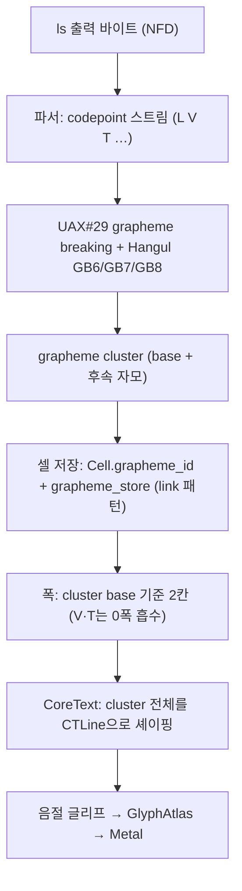

# Grapheme Cluster 저장·렌더링 전략 (한글 NFD 정공법)

> 단일 출처(design). 이 문서는 Maru가 **다중 코드포인트 grapheme cluster**(NFD 한글 conjoining 자모, ZWJ 이모지 시퀀스, 국기, skin-tone, 다중 combining mark)를 **셀에 어떻게 저장하고 셰이핑·렌더링하는지**를 정한다. 핵심 동기는 macOS 파일명이 NFD(분해형)로 저장돼 `ls` 출력의 한글이 자모로 분리돼 보이는 버그다. Unicode 폭(EAW) 자체와 폰트/atlas/fallback 책임은 [폰트 전략](font-strategy.md)이 단일 출처이고, 이 문서는 그 위에서 **cluster 분절·저장·폭·셰이핑 통합**만 다룬다.

작성일: 2026-06-23

배경: 사용자가 Maru에서 `ls`로 한글 폴더 이름을 보면 자음·모음이 분리돼 보인다. 원인은 (1) macOS 파일시스템이 파일명을 NFD로 저장하고, (2) Maru가 그 conjoining 자모를 하나의 grapheme cluster로 묶어 한 셀에 담지 못하기 때문이다. 이 문서는 그 정공법(grapheme cluster 저장 모델)을 기록한다.

## 0. 범위와 단일 출처

이 문서는 **다중 코드포인트 grapheme의 분절·셀 저장·폭·셰이핑 통합**의 단일 출처다. 인접 주제는 각자의 단일 출처를 따른다.

- Unicode 폭(EAW)·폰트 resolve·glyph atlas·fallback·이모지 컬러 글리프: [폰트 전략](font-strategy.md)
- 폭 함수(`cellWidth`/`isCombiningMark`/`isWideCodepoint`)의 코드 단일 출처: `src/width.zig`
- 셀/행 저장 구조(`Cell`, `RowCodepoints`): `src/terminal/types.zig`, `src/terminal/screen.zig`
- 셰이핑·래스터(CoreText): `src/platform/macos/coretext_smoke.m`, `src/renderer/coretext_shaper.zig`
- 폭/combining 검증 매트릭스 항목: [검증 매트릭스](verification-matrix.md)의 `wide-character(East-Asian width)` 항목
- 단계별 구현 순서: [실제 구현 계획](implementation-plan.md)의 "한글 Grapheme Cluster 렌더링" 절

이 문서는 **NFD conjoining 자모를 한 셀로 재결합해 정확한 폭·셰이핑으로 렌더**하는 메커니즘만 다룬다. 이미 완료된 East Asian wide(완성형 NFC 한글 2칸)·box/block 합성은 다루지 않는다.

## 1. 현황 — 전략엔 방향이 있고, 구현은 멈췄고, 한글은 누락됐다

세 층위를 구분해야 한다. "계획에 있었나 / 구현이 안 됐나 / 누락인가"의 답이 층위마다 다르다.

### 1.1 메커니즘 방향(UAX#29 cluster)은 전략에 있었다

[폰트 전략 §Cell Width와 Font Metric](font-strategy.md)이 이미 명시한다:

> "grapheme cluster는 UAX#29 기준으로 분절하고, ZWJ 시퀀스·국기·skin-tone modifier는 하나의 cluster로 묶어 폭을 width policy로 정한다. 완전한 처리는 fixture로 확장한다." (`font-strategy.md`)

즉 정공법의 방향(UAX#29로 cluster를 묶어 폭을 정한다)은 처음부터 전략 문서에 있었다.

### 1.2 구현은 "combining 1개"에서 멈춰 있다 — 알려진 미구현

전략은 UAX#29인데 코드는 거기까지 가지 않았다. `font-strategy.md`가 스스로 적은 현재 한계:

> "현재 구현은 최소 width table, continuation cell, **combining mark 1개 저장**을 제공한다. … ZWJ emoji 폭 처리는 fixture를 추가하며 확장한다."

> (v1에서 약속하지 않는 것) "**다중 코드포인트 grapheme의 완전한 폭/표시 정확도**."

코드도 같은 한계를 자인한다 — `src/width.zig`의 키캡 이모지 보정 주석:

> "maru 셀은 combining을 하나만 저장해(`types.Cell.combining`: 단일 `?u21`) VS16(U+FE0F)이 U+20E3에 덮여 사라진다. … 단일-combining 셀 모델을 보정하는 세 곳이 이 한 함수를 단일 출처로 공유한다(**다중-combining 저장이 근본 해법**)." (`width.zig` `isKeycapCombining`)

→ 셀이 base 코드포인트 1개 + combining 1개만 담는 모델은 **문서·코드가 모두 인정한 미구현 후속**이고, 근본 해법(다중 저장)도 코드 주석에 이미 적혀 있다.

### 1.3 "한글 NFD"라는 케이스 자체는 계획에서 누락됐다

다중 코드포인트 grapheme의 예로 전략이 든 것은 **ZWJ 이모지·국기·skin-tone**(전부 이모지 계열)뿐이다. `docs/` 전체에서 `NFC / NFD / 정규화 / 자모 / jamo / conjoining / 첫가끝`은 **0건**이다(키 입력 정규화 문구는 유니코드 정규화가 아니다).

→ 한글 NFD가 똑같은 다중 코드포인트 grapheme이고, **macOS 파일명이 NFD라서 `ls`에서 즉시 깨진다**는 시나리오는 시야에 없었다. 그래서 이 케이스는 이모지 전용 후속처럼 적혀 우선순위에서 빠져 있었다.

## 2. 문제 — macOS 파일명 NFD가 `ls`에서 분리돼 보인다

### 2.1 macOS 파일시스템의 NFD 저장

- HFS+는 파일명을 분해형(Apple 변형 NFD)으로 **강제 저장**했다. APFS는 입력 바이트를 보존하되 정규화에 무관하게 비교하므로, NFD로 만들어진 이름이 그대로 남는다.
- 결과: `ls`는 디스크의 바이트를 그대로 출력하므로, 한글 파일·폴더명이 **conjoining 자모 시퀀스(NFD)** 로 터미널에 들어온다.

예: "한글"
- NFC(완성형): `한`(U+D55C) `글`(U+AE00) — 코드포인트 2개
- NFD(분해형): `ㅎ`(U+1112) `ㅏ`(U+1161) `ㄴ`(U+11AB) · `ㄱ`(U+1100) `ㅡ`(U+1173) `ㄹ`(U+11AF) — 코드포인트 6개(conjoining L/V/T)

### 2.2 현재 Maru의 동작 — 폭부터 깨진다

`src/width.zig`의 `isWideCodepoint`는 wide 범위로 `0x1100...0x115F`만 본다. 이 범위는 **초성(L) 영역만** 포함하고, 중성(V, U+1161~)·종성(T, U+11A8~)은 범위 밖이다. 또 `isCombiningMark`에는 한글 자모가 **하나도 없다**. 그래서 NFD 자모는 각각 독립 셀로, 다음 폭으로 그려진다:

| 자모 | 코드포인트 | 분류 | 현재 `cellWidth` |
| --- | --- | --- | --- |
| ㅎ 초성 | U+1112 | L | **2** (`0x1100...0x115F`) |
| ㅏ 중성 | U+1161 | V | **1** (범위 밖) |
| ㄴ 종성 | U+11AB | T | **1** (범위 밖) |

→ NFD "한" = 2+1+1 = **4칸**, "한글" = **8칸**. 정상(완성형 NFC, 음절당 2칸)의 **2배**다. 게다가 conjoining 자모가 combining(0폭 결합)으로 묶이지 않으므로 각 자모가 **별도 grapheme = 별도 셀**로 흩어져, 폰트가 음절로 합쳐 그리지 못하고 자모가 분리돼 보인다.

대비:
- **완성형(NFC) 한글**(`U+AC00...U+D7A3`)은 `isWideCodepoint`에 포함돼 2칸으로 정확하다 → Maru에서 **직접 타이핑한 한글은 멀쩡한데 `ls` 파일명만 깨지는** 비대칭이 생긴다.
- iTerm2·Terminal.app은 CoreText 셰이핑 단계에서 conjoining 자모를 합쳐 그려 정상으로 보인다.

> Before 캡처(실제 `ls` 출력의 자모 분리·정렬 깨짐)는 구현 PR에서 RGBA 덤프→PNG로 첨부한다("추측 말고 캡처").

## 3. 설계 결정

### 3.1 NFC 정규화로 때우지 않는다

입력을 NFC로 정규화해 자모를 완성형으로 합치는 방법은 채택하지 않는다.

- **옛한글·조합형은 NFC로도 안 합쳐진다.** 완성형 코드포인트가 있는 건 현대 한글 11,172자뿐이다. 첫가끝(옛한글) 조합은 NFC를 거쳐도 conjoining 자모 시퀀스로 남으므로, 정규화는 반쪽짜리다 — 결국 cluster 처리가 필요하다.
- **터미널은 원본 코드포인트를 보존해야 한다.** 셸·vim·tmux는 "몇 개의 코드포인트를 어느 셀에 썼다"고 가정한다. 터미널이 임의로 NFC로 합치면 코드포인트 개수가 바뀌어 커서 위치·재그리기·selection·hit-test가 애플리케이션과 어긋난다. 정상적인 터미널(Ghostty 포함)은 정규화하지 않는다.

→ 정규화가 아니라 **grapheme cluster로 묶어서 저장·셰이핑**하는 정공법으로 간다.

### 3.2 정공법: cluster를 셀에 다중 코드포인트로 저장한다 (Ghostty식 모델, clean-room)

Maru는 이미 셰이핑 엔진(CoreText)을 갖췄다. 막힌 곳은 **셀이 base + combining 1개만 담아** 초성+중성+종성(3개 이상)을 못 담는 저장 모델이다. 따라서:

- **NFC 정규화는 하지 않는다.** 원본 NFD 자모를 그대로 받는다.
- **UAX#29 grapheme cluster 분절을 구현**해 conjoining L/V/T를 하나의 cluster로 묶는다.
- cluster의 추가 코드포인트는 **셀 옆 별도 저장소(grapheme side-storage)** 에 담는다 — 대부분의 셀은 단일 코드포인트로 두고, cluster가 있는 셀만 side-storage를 쓴다(메모리 효율).
- 묶인 cluster의 코드포인트들을 **CoreText에 함께 넘겨** 음절 글리프로 셰이핑한다(글리프 합성은 CoreText가 한다 — Maru가 자모를 직접 합성하지 않는다).

이 저장 모델은 Ghostty가 grapheme을 페이지의 별도 저장소에 두는 **동작/설계 개념**과 같다. 단 [필수 프로젝트 규칙](project-rules.md)·[오라클 비교 테스트 전략](oracle-testing.md)에 따라 **Ghostty의 자료구조 레이아웃·함수 분해·코드 표현은 복사하지 않는다.** 분절 규칙은 공개 명세(UAX#29)에서 독립 유도하고, Ghostty는 최종 화면 동작 비교(오라클)로만 쓴다.

**저장 방식 결정 (B — id + 외부 store):** "side-storage"를 구현하는 세 방식을 검토했다 — (A) `Cell` 인라인 고정 배열, (B) `Cell`엔 `id`만 두고 외부 store, (C) 하이브리드. **B를 택한다.**

- A는 고정 크기를 넘는 긴 cluster(ZWJ 가족 이모지 등 — U+200D로 이어져 길이가 사실상 무제한)에서 코드포인트가 **잘려 데이터가 손실**된다. 잘림은 화면뿐 아니라 **클립보드 복사·재출력·trace까지** 망가뜨리므로 받아들일 수 없다.
- B는 가변 길이를 store가 담아 **무손실**이고, maru가 이미 `link: u32` + `link_store`(OSC 8 URI를 셀엔 id만, 본체는 store에 — `core.zig`)에서 쓰는 **검증된 패턴을 그대로 재사용**한다. id는 셀의 POD 필드라 셀이 스크롤백·resize로 이동해도 값으로 따라가 **키가 안정적**이고(위치 키가 아니라 id 키), combining 없는 셀은 `id=0`이라 **메모리 0 비용**이다.
- link과 **같이 dedup**한다(`grapheme_ids` 해시맵) — 같은 cluster는 한 번만 저장한다. 처음엔 "grapheme은 셀마다 고유해 dedup 이득이 없다"고 봤으나, 실제 흔한 cluster(악센트·NFD 음절·키캡)는 **반복적**이라 dedup이 store를 distinct cluster 수로 bound한다(셀 수와 무관). flat `cells: []Cell`이라 `memcpy`가 `grapheme_id`를 값 복사해 한 항목을 여러 셀이 공유하지만, append-only(dedup)면 dangling이 없다(link과 동일). 이 전역 dedup store가 메모리를 distinct cluster 수로 bound하는 **standing 답**이다 — 화면에서 사라진 cluster까지의 **구조적 회수**(page-local)는 활성 grid 페이징(§11 B)을 vehicle로 삼았으나 **B가 불가 판정돼 보류**다(§5 HG2a-후속·[§11.8 §595](terminal-core-decomposition.md)). 전역 refcount/GC는 위험·임시품이라 쓰지 않는다.

## 4. 메커니즘

### 4.1 코어 — UAX#29 grapheme breaking + Hangul L/V/T (GB6/GB7/GB8)

conjoining 자모를 cluster로 묶는 규칙은 UAX#29 Grapheme Cluster Boundary 규칙에서 유도한다:

- **GB6**: `L × (L | V | LV | LVT)` — 초성 뒤 초성/중성/음절을 붙인다.
- **GB7**: `(LV | V) × (V | T)` — 중성 뒤 중성/종성을 붙인다.
- **GB8**: `(LVT | T) × T` — 종성 뒤 종성을 붙인다.
- **GB9**: `× (Extend | ZWJ)` — combining mark는 앞 cluster에 붙는다(기존 동작 유지·일반화).

자모 분류는 코드포인트 범위로 판정한다(현대 + 옛한글 영역 포함):
- L(초성): U+1100~U+115F
- V(중성): U+1160~U+11A7
- T(종성): U+11A8~U+11FF
- (완성형 LV/LVT: U+AC00~U+D7A3 — `(code-0xAC00) % 28 == 0`이면 LV, 아니면 LVT)

### 4.2 셀 저장 — 단일 combining → `grapheme_id` + `grapheme_store` (B 방식)

현재 `types.Cell.combining: ?u21`(1개)을 다중 코드포인트 cluster를 담는 모델로 확장한다. §3.2 결정에 따라 **link과 같은 "id + 외부 store" 패턴**을 쓴다:

- `Cell`에 `grapheme_id: u32`(0=없음)를 두어 기존 `combining: ?u21`을 대체한다. 본체(base 뒤에 붙는 자모·combining·ZWJ 코드포인트 배열)는 `TerminalCore.grapheme_store`에 담고 셀은 id만 든다 — `link: u32`/`link_store`(`core.zig`)와 동형.
- **키 안정성**: id는 POD라 셀이 스크롤백 push·resize·reflow로 복사·이동해도 값으로 따라간다(위치 키가 아니라 id 키라 안 깨진다 — link과 동일).
- **수명 관리**: `grapheme_store`를 `link_store`와 동형의 **dedup append-only**로 둔다(`grapheme_ids` 해시맵 — 같은 cluster 1 entry). store가 distinct cluster 수로 bounded돼 반복 cluster의 per-cell 증가가 없고, reset(RIS)·deinit에서 일괄 free한다 — 이게 **standing 답**이다. 화면에서 사라진 cluster까지 회수(구조적 회수)하려면 grapheme 저장을 Screen/page 수명에 귀속시켜야 하나, 그 vehicle인 §11 B가 불가로 판정돼 **보류**다(§5·§11.8 §595, measure-first).
- **기존 combining 경로 통합**: `width.zig`의 `isKeycapCombining`(U+20E3 키캡)을 경유하는 **단일-combining 보정 hack 세 곳**(`metal_frame.isColorGlyph` 컬러 판정·셰이퍼 VS16 재주입·`appendRowUtf8` 복사)은 다중 저장으로 **근본 해소**되어 제거 대상이다 — 키캡 `base+VS16+U+20E3`을 그대로 저장하니 재주입이 불필요하다. VS16(❤️)·skin-tone(👍🏽)·국기(RI 쌍)도 같은 cluster 저장 경로로 흡수한다. 단 이는 동작 변경이 아니라 **모델 이전**이라, 기존 이모지/키캡 테스트가 green을 유지해야 한다.
- 저장 상한·문자열 복사(`appendRowUtf8`)·trace/snapshot 직렬화가 다중 코드포인트를 **잃지 않도록**(무손실) 함께 본다.

### 4.3 폭 — cluster 단위로 base가 결정한다

폭은 자모 개별 합산이 아니라 **cluster 단위**로 정한다:

- cluster의 폭 = **base(첫) 코드포인트의 폭**. 후속 conjoining V/T와 combining mark는 **0폭으로 cluster에 흡수**한다.
- 현대 한글 초성(L)은 wide(2)이므로 NFD 음절 cluster = **2칸**이 되어 완성형(NFC) 음절과 동일해진다.
- 이 규칙은 `width.zig`의 폭 함수가 코드 단일 출처를 유지하되, "자모 개별 폭"을 보는 현재 동작을 cluster 인지 경로가 대체한다(폭 함수 자체는 중립 유지, cluster 묶기는 코어/저장 계층 책임).

### 4.4 렌더 — CoreText cluster 셰이핑(기존 경로 확장)

`coretext_smoke.m`은 이미 base + combining 1개를 한 `CFString`에 담아 `CTLineCreateWithAttributedString`으로 셰이핑한다. 이 경로를 cluster의 **모든 코드포인트**(L+V+T)를 담도록 확장하면, CoreText가 conjoining 자모를 하나의 음절 글리프로 합성한다. CoreText 호출 구조 자체는 거의 바뀌지 않는다.

### 4.5 glyph atlas cache key

`GlyphCacheKey`는 `font_id + glyph_id` 기반이고 cluster가 어떤 glyph_id가 되는지는 셰이퍼(CoreText)의 책임이다([폰트 전략 §Glyph Atlas Cache Key](font-strategy.md) 정책 유지). cluster가 셰이핑 후 단일 glyph_id로 떨어지면 기존 키가 그대로 동작하고, 다중 glyph로 떨어지는 경우의 키잉·배치는 셰이핑 통합(HG3)에서 확정한다.

### 4.6 데이터 흐름

### 4.7 입력 경로 일관성 (IME·붙여넣기)

cluster 분절은 코어 print 경로 `writeCodepoint`(`screen.zig`) **단일 진입점**에 들어간다. PTY 출력이든, 붙여넣기(bracketed paste → 셸 echo → PTY 출력)든, IME 확정 텍스트든 codepoint가 이 진입점에 도달하면 같은 cluster 로직을 타므로 **입력 소스마다 따로 적용할 필요가 없다**. IME는 보통 NFC(완성형), 파일명은 NFD지만 정규화 없이 둘 다 cluster 모델이 올바로 처리한다(NFC 음절은 1 codepoint = 1 cluster, NFD는 자모를 묶어 같은 결과).

단일 진입점을 거치지 않는 두 곳만 명시적으로 챙긴다:

- **IME preedit(조합 중 표시) — codepoint 단위(의도된 한계)**: `screen.zig`의 `snapshotWithPreedit`/`drawPreeditCells`는 셀 저장이 아니라 스냅샷 시점에 `preedit_bytes`를 codepoint 단위 폭으로 임시 렌더하는 별도 경로다(확정 전이라 셀에 안 들어감). **여기엔 cluster 인지를 적용하지 않는다.** 근거(검증): macOS 한글 IME는 조합 중에도 **완성형 음절**(NFC, 예 `한`=U+D55C)을 marked text로 보내고 — preedit 경로(`setMarkedText`→`imeMarked`→`core.setPreedit`)엔 정규화가 없어 그대로 저장된다 — 완성형은 단일 코드포인트라 그대로 한 셀(폭 2)로 정상 렌더된다(기존 IME 테스트도 전부 완성형 전제). NFD 자모/폭0 combining을 marked text로 보내는 IME(드묾)에서만 조합 중 자모가 분리되거나 악센트가 잠깐 안 보이는데, 이는 **확정 직후 PTY 경로(`writeCodepoint`)가 cluster로 정상 묶으므로** 조합 중 한정 표시 한계다. 추측만으로 cluster 로직을 preedit에 복제하지 않는다(`architecture.md` "성급한 최적화 금지"). 실사용 근거(그런 IME가 실제로 쓰임)가 생기면 그때 검토한다.
- **클립보드 복사·재출력(`appendRowUtf8`)**: 저장된 다중 코드포인트를 손실 없이 UTF-8로 뽑아야 한다(무손실 — §3.2 잘림 금지와 직결). HG2a 직렬화 확장에 포함한다.

## 5. 분해 (HG1~HG4)

- **HG1 — 코어 grapheme 분절**: UAX#29 cluster boundary + Hangul L/V/T(GB6/7/8) 분류·묶기, cluster 단위 폭(base 2칸, V/T 0폭 흡수). 순수 Zig 단위 테스트(NFD "한글" → 음절 2개·각 2칸, 옛한글 cluster).
- **HG2a — 셀 다중 코드포인트 저장(B 방식, append-only)**: `Cell.grapheme_id: u32` + `TerminalCore.grapheme_store`(link 패턴), `RowCodepoints` iterator·`appendRowUtf8`·trace/snapshot 직렬화 확장(무손실). store는 `link_store`와 동형의 **append-only**로, reset(RIS)·deinit에서만 일괄 free한다(이때 모든 셀이 함께 사라져 dangling이 없다). cluster producer는 `writeCodepoint`에 `grapheme.extendsCluster`를 통합해 NFD conjoining 자모(L+V+T)를 한 셀(base 폭=2)로 묶는다 — 이 단계에서 폭 버그(음절 8칸→4칸)가 실제로 고쳐진다. 렌더 back-compat을 위해 `Cell.combining`은 첫 extra의 그림자로 **잠정 유지**(HG3에서 제거).
- **HG2a-후속 — store 증가 방지(dedup, 완료·standing 답) + 구조적 회수(❌ 보류, vehicle B 불가)**: 메모리 목표는 store 무한 증가 방지다. 이는 **`grapheme_store`를 `link_store`처럼 dedup**(같은 cluster 한 번만 저장)해 셀당 증가를 막는 것으로 **완료**됐다 — store가 distinct cluster 수만큼만 커지고(악센트·NFD 음절·키캡 반복은 1 entry), append-only라 dangling이 없다. (`link_store`는 이미 dedup이라 추가 누수 정리가 불필요 — 둘 다 distinct 키 수로 bounded.) **이 dedup 전역 store가 standing 답이다**(100만 줄이라도 고유 cluster는 보통 수천~수만·각 몇 코드포인트 → MB급, 측정된 병목 없음).
  - **구조적 회수(화면 밖 cluster까지)는 보류**: 장기적으로 가장 탄탄한 구조는 grapheme 저장을 셀의 수명 단위(Screen/page)에 귀속시켜 page eviction 시 grapheme도 함께 사라지게 하는 것(**회수가 구조적**, id 네임스페이스 page-local이라 page 내부 `memcpy` 안전·page끼리 안 섞임 — Ghostty 모델)이고, 전역 refcount/GC는 flat `cells:[]Cell`+`memcpy` 위에서 모든 셀 수명 이벤트/root를 추적해야 해 **위험·임시품**이라 안 쓴다. **그 결정·정정은 [terminal-core-decomposition.md §11.8](terminal-core-decomposition.md)에 박아 두었다** — page-local 회수는 활성 grid 페이징(§11 B)을 vehicle로 삼았으나, **B가 A2(가변폭 스크롤백)와 구조적으로 충돌해 불가**해지며 §11이 A1/A2/P4로 종료됐다(B 미진행, [§11.8 §595](terminal-core-decomposition.md)). 따라서 page-local 회수는 보류이고(measure-first), huge history에서 grapheme 메모리 증가가 실제로 측정되면 활성 grid를 안 건드리는 **split 모델(스크롤백만 page-local)**로 재개한다. **선제 코드는 두지 않았다** — §11.8이 "page 구조 자체가 B의 산출물이라 B 전엔 만들 수 없다"며 미리 구현하지 않기로 했고(같은 스토리지 레이어 동시 리팩터 충돌 회피), 그 덕에 B가 무산돼도 **stranded(하다 만) 코드가 없다**(인프라는 완성·load-bearing).
- **HG2b — combining 경로의 무손실 저장 이전(순수 Zig)**: 다중 combining 마크(악센트 2개 이상)와 키캡(`base+VS16+U+20E3`)을 `grapheme_store`에 누적 저장해, **둘째 mark부터 잃던 데이터**를 dump·복사·snapshot이 무손실로 보존하게 한다(`attachCombiningMark` 일반화). `Cell.combining`은 렌더 그림자(현행대로 **마지막 mark**)로 유지해 **동작 보존**(기존 이모지/키캡 테스트 green 유지가 합격선). renderer·ObjC·hack은 손대지 않아 Linux CI로 닫힌다. (VS16·skin-tone·국기는 extra가 1개뿐이라 이미 combining만으로 무손실 — 키캡과 다중 악센트만 store로 승격된다.)
- **HG3a — 렌더·셰이핑 통합 + ObjC ABI(cluster 풀)**: `DrawList.grapheme_pool` + `DrawCell.grapheme_offset/count`(buildDrawList가 `snapshot.graphemes`로 적재), `NativeDrawCell`/`MaruCoreTextDrawCell`에 풀 참조 추가(shape fn에 grapheme_pool 인자), `maru_create_string_for_draw_cell`이 base 뒤에 풀 전체를 CFMutableString으로 무손실 append → CoreText가 NFD 한글 종성·다중 악센트·키캡을 합성. `Cell.combining`은 단일-extra 폴백/색판정 그림자로 잠정 유지. 검증: 실제 CoreText에서 NFD '한'이 완성형 '한'과 동일 glyph_id(폰트 무관).
- **HG3b — `Cell.combining`·단일-combining hack 제거(pure-B)**: producer가 단일 extra도 `grapheme_store`에 담아(combining 그림자 폐지), `Cell.combining`과 renderer 체인(`DrawCell`/`GlyphRun`/`ShapedGlyphRecord`/`NativeDrawCell`/`CoreTextGlyphRecord`)의 combining 필드, 보정 hack 3곳(`isColorGlyph`는 셰이퍼가 주는 `color_glyph_kind`로 대체·셰이퍼 VS16 재주입·`selection` 복사)과 `width.isKeycapCombining`을 제거한다. 메모리 근거: 단일 combining을 store에 담는 비용은 셀당 ~수십 바이트·append-only로 `link_store`/HG2b와 같은 프로파일이라 실사용에서 무시할 수준 — 컨벤션(`architecture.md` 메모리 전략: "성급한 최적화 금지")상 dual-path보다 단순 균일 모델이 옳다. 반복 cluster의 per-cell 증가는 dedup으로 막았고(§5 HG2a-후속), 화면 밖 cluster까지의 구조적 회수는 보류다(vehicle인 §11 B 불가 — §5 HG2a-후속·§11.8 §595).
- **HG4 — 검증·fixture**: NFD `ls` 시나리오 recorded-oracle fixture(`tests/fixtures/ansi/nfd_hangul.ansi` ↔ `tests/golden/screen/xterm/nfd_hangul.txt`, `tests/oracle/recorded.zig`의 `nfd_hangul` 케이스) — NFD '한글'이 음절당 한 셀(width 2)로 묶여 dumpUtf8가 자모 6개를 무손실 복원하는지 maru-vs-golden으로 고정. 외부 oracle(libvterm/Alacritty)은 conjoining 자모를 다르게 다룰 수 있어 `cases.zig`가 아니라 recorded로만 둔다(§6). 실제 CoreText 합성은 `test-macos-coretext-smoke`가 NFD '한'≡완성형 '한' glyph로 이미 고정(HG3a). 픽셀 PNG 캡처는 폰트 의존이라 visible 앱 수동 절차로 둔다(§6).
- **HG-후속 — emoji ZWJ(GB11) + emoji 클러스터 경로 통합**: mode 2027에서 ZWJ 가족(👨‍👩‍👧)을 한 셀(폭 2)로 묶는다(GB11: `Extended_Pictographic Extend* ZWJ × Extended_Pictographic`, 사람마다 다른 스킨톤 포함). skin-tone(GB9 modifier)·국기 RI(GB12/13)·ZWJ(GB11)를 흩어진 특수분기 대신 **단일 `emojiClusterExtends` 판정 + 흡수 + `promoteLastToEmojiWidth`**(RI만 폭 1→2, 나머지 no-op)로 통합한다 — 동작 보존(기존 이모지/국기/스킨톤/키캡 테스트 green). `grapheme.isExtendedPictographic`은 큐레이션 범위(완전한 Extended_Pictographic 속성표는 fixture로 확장). NFD 한글과 달리 **mode 2027 게이팅**(2027 안 켠 앱과 폭 합의가 어긋나지 않게 — skin-tone/RI와 동일 정책). 검증: ZWJ 가족·스킨톤 가족 한 셀·무손실 dump(core 단위), `test-macos-coretext-smoke`가 가족을 컬러 글리프로 셰이핑.

각 단계는 작은 PR로 진행한다(progressive enhancement). 베이스 = UAX#29(공개 명세), Ghostty는 동작 비교만(clean-room).

## 6. 검증 전략

- **코어 단위(순수 Zig, Linux CI)**: NFD 자모 시퀀스 → cluster 분절·개수·폭 단언. 현대 한글·옛한글·자모 + combining 혼합·경계(초성만, 중성 없는 시퀀스)·이모지 ZWJ/skin-tone가 같은 cluster 경로를 타는지.
- **저장 round-trip**: cluster 셀을 `appendRowUtf8`로 복사·trace/snapshot 직렬화 후 코드포인트가 보존되는지(다중 자모 손실 없음).
- **오라클(recorded, CI)**: `nfd_hangul` recorded 케이스가 NFD '한글' 입력의 maru dumpUtf8를 golden과 비교(무손실 round-trip). 같은 비교가 snapshot 아티팩트(`tests/artifacts/oracle/nfd_hangul/maru.snapshot.txt`)에 음절당 width 2 + cluster(`grapheme=U+1161,U+11AB` 등)를 남겨 셀 점유·폭을 기록한다. 외부 oracle은 NFD 클러스터가 maru/Ghostty 동작이라 recorded로만 둔다(libvterm/Alacritty는 자모 분절이 다를 수 있음).
- **셰이핑(macOS, 실 CoreText)**: `test-macos-coretext-smoke`가 NFD '한'을 grapheme_pool로 셰이핑해 완성형 '한'과 **동일 glyph_id+font_id**임을 확인 — 같은 글리프 ⇒ 동일 래스터 픽셀이므로, 단일 스크린샷보다 폰트-견고하게 렌더 정확성을 고정한다.
- **렌더 캡처(수동)**: 최종 화면 픽셀은 폰트/AA 의존이라 자동 비교 대신 visible 앱(macOS)에서 NFD 한글 폴더 `ls` 출력을 RGBA 덤프→PNG로 캡처해 사람이 음절 결합·정렬을 확인한다(기본 CI 제외).
- [검증 매트릭스](verification-matrix.md)의 `wide-character` 항목에 NFD 한글 cluster 케이스를 추가한다.

## 7. 잔여와 후속

- ZWJ 이모지 시퀀스(GB11)·국기(RI 쌍)·skin-tone은 mode 2027에서 한 셀(폭 2)로 묶여 정확하다(HG-후속 `emojiClusterExtends` 통합). 남은 것(현재 안 함 — 동작 영향 없음): (1) `isExtendedPictographic`의 완전한 Extended_Pictographic 속성표 — 현재 큐레이션 범위가 RI·skin-tone을 과포함하나 `emojiClusterExtends`에서 각자 분기가 먼저 처리해 **무해**하므로, 출력이 바뀌는 실사용 근거가 없으면 도입하지 않는다, (2) mode 2027을 안 켠 환경의 ZWJ 폭 정책(현재 비-2027은 컴포넌트별 폭 — 앱과 합의 없이 묶지 않음, 의도된 정책).
- IME preedit는 codepoint 단위 렌더다(위 §4 preedit 항목) — 주 타깃 한글 IME가 완성형 marked text를 보내 정상이고, NFD/combining marked text는 조합 중 표시에 한해 미지원(확정 후 PTY 경로가 정상 cluster화). cluster 인지 복제는 그런 IME가 실제로 쓰이는 근거가 생기면 검토한다.
- 다중 glyph로 셰이핑되는 cluster의 atlas 키잉·배치 정책은 실제 CoreText 결과를 보고 확정한다(현재 base+glyph_id 기준 — NFD 음절·이모지는 합성 후 단일/소수 glyph라 실사용 충돌 없음).
- 정규화(NFC/NFD) 자체는 도입하지 않는다(§3.1). 만약 외부 요구로 입력 정규화가 필요해지면 전략 수정이므로 [PR 체크리스트](pr-checklist.md) 절차에 따라 사용자와 먼저 논의한다.
