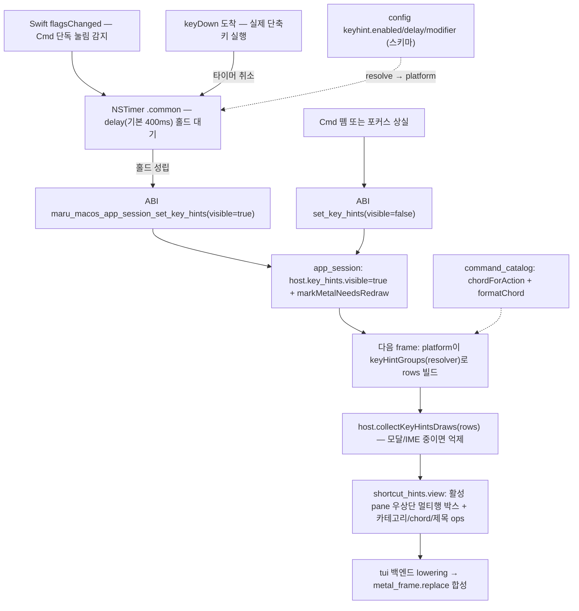
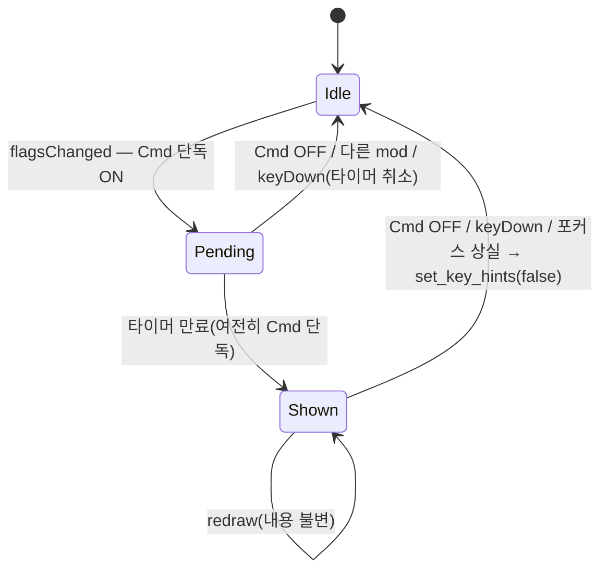

# 단축키 힌트 — 모디파이어 홀드 오버레이 전략·구현 계획

사용자가 **모디파이어 키(기본 `Cmd`)를 일정 시간 누르고 있으면** 현재 사용 가능한 단축키를 카테고리별로 보여 주는 **패시브 힌트 오버레이**(HUD)를 추가한다. 모디파이어를 떼면 사라진다. cmux 등 일부 도구의 "키를 누르면 치트시트가 뜨는" 동작을 maru 독립 설계로 구현한다(형태만 비교, 코드 표현은 옮기지 않는다 — [project-rules](project-rules.md) clean-room).

이 문서가 이 기능의 **단일 출처**다. 구현이 진행되면 이 문서를 코드와 맞춘다([project-rules §문서와 설명](project-rules.md#문서와-설명)). 상위 경계는 [키 입력과 단축키 경계](key-input-and-shortcuts.md)·[Chrome 전략](chrome-strategy.md)을 따르고, config 키는 [config 스키마](config-schema.md)를 따른다.

> **현황**: KH-0(이 문서, doc-first) 작성 중. 코드 미착수.

## 0. 왜 가능한가 (조사 결론)

세 부품 중 둘은 이미 있고, 새로 만들 건 "모디파이어 단독 홀드 감지" 하나다.

| 부품 | 상태 | 근거(코드) |
|---|---|---|
| **단축키 데이터**(오버레이에 채울 내용) | ✅ 데이터 테이블 | `src/config/keybinding.zig`의 `default_app_bindings`(빌트인 chord 테이블), `src/config/action.zig`(액션 enum). 하드코딩 switch가 아니라 순회 가능한 배열이라 그대로 열거한다 |
| **chord → 표시 문자열**(`⌘T` 등) | ✅ 함수 존재 | `src/platform/macos/command_catalog.zig` `chordForAction`(액션→현재 chord, 사용자 바인딩·unbind 반영) + `formatChord`(chord→`⌘T` 표시, modifier 순서 `⌃⌥⇧⌘`) |
| **오버레이 렌더 인프라** | ✅ 패턴 존재 | `src/chrome/components/{notice,confirm,palette,find,…}.zig`(State+view+handle 계약), `host.zig`의 `collectXDraws`(platform이 행 주입하는 오버레이 패턴) |
| **활성 pane 우상단 배치** | ✅ 선례 존재 | `find.zig`가 `overlay_input.findLayout(p)`/`p.active_pane`으로 **활성 pane 우상단**에 한 줄 패널을 띄운다(single-pane이면 터미널 영역 전체로 폴백). 힌트는 같은 앵커에서 아래로 자라는 멀티행 박스로 확장 |
| **모디파이어 단독 홀드 감지** | ❌ 신규 | `flagsChanged`는 받지만 hover(URL 밑줄)용뿐(`MaruAppHost.swift` `handleModifierHover`). 모디파이어만의 눌림/뗌·홀드 타이머·상태 추적이 없다. 단 타이머 인프라(`startFrameLoopTicks`의 `NSTimer .common`)·redraw 경로(`markMetalNeedsRedraw`)는 있어 배선만 하면 된다 |

## 1. 목표

- Cmd(또는 설정한 모디파이어)를 **홀드**하면 — 빠르게 `Cmd+T`를 치는 정상 단축키 사용과 구분되도록 **지연(기본 400ms) 후** — 단축키 힌트 오버레이가 뜬다.
- 모디파이어를 떼거나, 다른 키를 누르거나(= 실제 단축키 실행), 창 포커스를 잃으면 즉시 사라진다.
- **활성 pane(포커스된 패널)의 우상단**에 뜬다 — 단축키가 "이 패널에 적용된다"가 시각적으로 맞게. split이면 포커스된 pane에 붙고, 단일 pane이면 터미널 영역 전체 우상단으로 폴백한다(Find 오버레이와 같은 앵커).
- 내용은 **현재 바인딩된 app 단축키**를 카테고리(워크스페이스·터미널/탭·패널/Split·검색·폰트)별로 묶어 `⌘ T  New Terminal` 형태로 보여 준다 — 각 키는 **키캡(keycap) 아이콘**으로 그린다(§3.6). 사용자가 리바인드/unbind한 결과를 그대로 반영한다.
- config로 켜고 끄고(`keyhint.enabled`), 지연(`keyhint.delay`)·트리거 모디파이어(`keyhint.modifier`)를 조정한다.

## 2. 핵심 설계 결정 (베이스/의사결정)

[document-basis-and-decision](project-rules.md) 원칙대로, 단일 표준이 없는 동작이므로 무엇을 베이스로 했고 왜 택했는지 적는다.

| 결정 | 베이스(기존 원칙/사실) | 왜 |
|---|---|---|
| **패시브 HUD(입력 비소비)** — `ChromeHost.handleInput` 모달 라우팅에 **넣지 않는다** | notice/palette/find는 키를 가로채는 모달(`host.zig` 우선순위 라우팅) | 이 힌트는 정반대다: 사용자가 Cmd를 **누른 채 그 단축키 키를 실제로 눌러야** 한다. 입력을 소비하면 단축키가 안 먹는다. 그래서 렌더(`collectDraws`)만 타고 입력 라우팅엔 안 들어간다 |
| **모달/IME 조합 중이면 힌트 억제** | platform lowering이 "단일 오버레이 frame"을 가정(`host.zig` collectDraws 주석) | 동시에 두 오버레이 frame이 뜨면 그 가정이 깨진다. 모달이 열렸으면 거기 타이핑 중이라 Cmd-홀드 힌트는 무의미 → 억제로 단일 오버레이 불변 유지 |
| **내용 = chord가 바인딩된 app 액션만** | `command_catalog.chordForAction`이 안 묶인 액션은 null 반환 | "이 단축키가 X를 한다"가 HUD의 본질. chord 없는 액션(`install_cli`·`move_pane_to_new_workspace` 등 — 팔레트 발견 전용)은 보여 줄 키가 없으므로 제외. unbind도 자연히 빠지고 리바인드는 새 chord로 표시 |
| **트리거 = 모디파이어 홀드(지연 후)** | 사용자 요청("Cmd 오래 누르고 있으면") | 즉시 표시는 매 `Cmd+key`마다 깜빡여 거슬린다. 지연 + "다른 키 눌리면 취소"로 정상 단축키 사용과 충돌 안 함 |
| **카테고리 그룹핑(맥락별 아님)** | maru app 바인딩은 대부분 전역(어느 pane이든 동작 — `key-input-and-shortcuts.md`) | cmux식 "포커스 맥락별 좁히기"는 maru에선 표면이 거의 없다. 정직하게 카테고리로 묶는다(맥락 인식은 §8 후속) |
| **활성 pane 우상단(중앙 아님)** | Find가 `overlay_input.findLayout`/`p.active_pane`으로 활성 pane 우상단에 뜨는 선례 | 사용자 요청 — 단축키가 적용되는 **포커스된 패널**에 시각적으로 묶인다. split이면 그 pane 우상단, single-pane이면 터미널 영역 우상단 폴백. Find는 한 줄, 힌트는 멀티행이라 같은 앵커에서 **아래로 자라는 박스**(폭=`panelSize`/EAW 공유, 우측 정렬로 오른쪽 pane/divider 비침범) |
| **gesture 정책=config(Zig), 타이머 clock=platform(Swift), 내용=Zig, 가시성 플래그=chrome State** | "native 최소", `zig_owns_frame_loop`는 tick 본문 소유·clock은 OS(`chrome-strategy.md` §10), `is_window_drag_region`/`jump_prompt` 선례 | 무엇을 언제 보일지(enabled/delay/modifier·어떤 단축키)는 Zig가 판정, OS 타이머 mechanics만 Swift. 기존 native-최소 경계와 일치 |

**스코프가 달라도 한 박스에 모은다(분산 아님).** 단축키는 스코프가 다르다 — 워크스페이스/탭(`Cmd+1` 워크스페이스 선택, `Cmd+T` 새 터미널, `Cmd+Shift+]` 다음 워크스페이스)은 좌측 사이드바·per-pane 탭 바에, pane/split(`Cmd+D` 분할, `Cmd+Opt+←` pane 포커스)은 pane에 개념적으로 묶인다. 그러나 v1은 **이들을 스코프별 위치로 흩지 않고 활성 pane 우상단 한 박스에 카테고리로 묶어** 보여 준다. 근거: ① maru의 app 바인딩은 전부 **포커스 맥락 기준 전역**이다(`Cmd+1`은 포커스된 pane이 속한 워크스페이스를 바꾸고, `Cmd+D`는 포커스된 pane을 나눈다 — 둘 다 "지금 포커스가 있는 곳" 기준). ② 스코프별로 사이드바·탭 바·pane에 동시에 띄우면 오버레이 frame이 여럿이라 platform "단일 오버레이 frame" 가정이 깨지고(§3.2), 어느 영역이 어느 스코프인지도 maru 레이아웃에선 모호하다. 그래서 위치는 하나(포커스된 작업 영역=활성 pane 우상단)로 두되, **카테고리 헤더로 스코프를 구분**한다(Workspace / Terminal·Tab / Pane / Search / Font). 스코프별 분산 배치는 표면이 명확해지면 KH-5에서 재검토한다.

레퍼런스 사용은 동작 비교만 — cmux의 치트시트 UX는 최종 동작만 참고하고 소스를 옮기지 않는다([no-external-ref-in-pr] 원칙: 산출물은 maru 용어·독립 설계).

## 3. 아키텍처 — 레이어와 데이터 흐름

기존 4층 위상([layering-and-portability.md])에 그대로 얹힌다. 새 코드는 ① platform(Swift 홀드 감지) ② ABI(가시성 토글) ③ chrome 컴포넌트(렌더) ④ platform(내용 행 주입) ⑤ config(스키마)로 나뉜다.



### 3.1 새 chrome 컴포넌트 — `src/chrome/components/shortcut_hints.zig`

`notice`를 exemplar로 한 중립 컴포넌트(State+view, handle 없음 — 입력 비소비). 내용 행은 platform이 주입한다(palette/context_menu와 동형 — 중립 chrome은 `command_catalog`를 import 못 함).

```zig
// 모양 스케치(최종은 구현에서 확정). 위치: src/chrome/components/shortcut_hints.zig
pub const layer = draw.Layer.modal;           // 최상위 오버레이 Z(find와 동일 — 시각만, 입력 라우팅 아님)

pub const State = struct { visible: bool = false };  // 가시성만. ABI가 토글, 입력 라우팅엔 없음

pub const Row = union(enum) {                 // platform이 빌드해 주입
    header: []const u8,                        // 카테고리 제목("Workspace")
    binding: struct { chord: []const u8, title: []const u8 },  // "⌘T", "New Terminal"
};

pub fn view(state: *const State, rows: []const Row, p: ChromeProps, tk: *const Tokens,
            arena: Allocator, out: *ArrayList(draw.Op)) !void { ... }  // 안 보이면 무동작
```

- **배치는 `find.view`를 본뜬다(중앙 modal_box 아님)**: `overlay_input`에 `paneTopRightBox(p, content_cols, content_rows)`를 추가한다 — `findLayout`과 같은 `p.active_pane` 앵커(우측 정렬, single-pane 폴백)를 쓰되 폭은 고정 `panelSize`가 아니라 콘텐츠 폭(`content_cols`)이고 **한 줄이 아니라 `content_rows`만큼 아래로 자라는** 박스를 돌려준다. 앵커/폴백 로직은 `findLayout`과 공유 헬퍼 `paneRegion(p)`로 단일 출처화한다(복붙 금지 — overlay_input 단일 출처 원칙).
- `view`는 그 박스로 배경 quad(find와 같은 `surface_bg` + `focus_accent` 테두리)를 깔고, 행마다 카테고리 헤더(굵게) 또는 `chord`(좌) + `title`(좌측 정렬, chord 열 뒤)를 `text` op으로 그린다. 폭/정렬은 `overlay_input.displayCols`(EAW)로 잰다(한글 제목 대비).
- `handle`이 **없다** — 입력은 이 컴포넌트를 절대 안 거친다.

### 3.2 ChromeHost 배선 — `src/chrome/host.zig`

```zig
pub const ChromeHost = struct {
    // … 기존 필드
    key_hints: shortcut_hints.State = .{},

    /// platform이 rows를 빌드해 부른다(palette와 동형). 안 보이거나 다른 모달이 열렸으면 무동작 —
    /// "단일 오버레이 frame" 불변(collectDraws 주석)을 지키려 모달 억제.
    pub fn collectKeyHintsDraws(self, rows, p, tk, arena, out) !void {
        if (anyModalOpen(self)) return;   // confirm/notice/…/settings 중 하나라도 열림 → 억제
        try shortcut_hints.view(&self.key_hints, rows, p, tk, arena, out);
        // ops 있으면 out.append(.{ .layer = shortcut_hints.layer, .ops })
    }
};
```

`handleInput`/`handlePointer`는 **건드리지 않는다** — key_hints는 입력 라우팅 대상이 아니다.

### 3.3 내용 소스 — `src/platform/macos/command_catalog.zig`

`entries`(평면 목록)를 카테고리로 묶어 바인딩된 것만 행으로 내는 함수를 추가한다.

```zig
pub const HintCategory = enum { workspace, terminal, pane, search, font, other };
pub fn categoryOf(action: Action) HintCategory { ... }   // 액션→카테고리(데이터 매핑, exhaustive). .other는 HUD 제외

/// chord를 키별 글리프 배열로 편다(키캡용 — formatChord의 단일 문자열과 평행). 예: Cmd+T → {"⌘","T"}.
/// formatChord와 keyGlyph(키 글리프 단일 출처)를 공유. modifier 글리프는 정적, 키 글리프만 arena 복사.
pub fn chordKeycaps(chord: KeyChord, arena: Allocator) ![]const []const u8 { ... }

/// resolver로 현재 chord를 풀어, chord가 있는 entries만 카테고리 순서로 행(헤더 + 키캡 바인딩)으로 빌드한다.
/// 안 묶인/unbind된 액션은 건너뛴다(chordForAction이 resolve 우선순위·unbind 반영). arena 소유.
pub fn keyHintRows(resolver: KeyBindingResolver, arena: Allocator) ![]const shortcut_hints.Row { ... }
```

platform(`app_session.buildChromeOverlayPrep`)이 `key_hints.visible`일 때 `keyHintRows`로 행을 빌드해 `collectKeyHintsDraws`에 넘긴다(가시성 토글은 KH-4까지 항상 false라 휴면).

### 3.4 ABI — `src/platform/macos/app_host_abi.{h,zig}`

```c
// 새 export(다음 ABI 버전). Swift 홀드 감지가 가시성을 토글.
int32_t maru_macos_app_session_set_key_hints(MaruAppSession* s, uint32_t visible);
```

`app_session`이 `host.key_hints.visible`를 세팅하고 `markMetalNeedsRedraw`를 부른다(focusChanged·scroll_page와 같은 PR3 패턴 — 코어 변경 없이 chrome state + dirty).

### 3.5 macOS 홀드 감지 — `src/platform/macos/MaruAppHost.swift`

`flagsChanged`에 모디파이어 단독 상태머신을 추가한다(hover 갱신과 **별개**).

```
flagsChanged:
  prevFlags와 비교 → 트리거 모디파이어(Cmd)가 "방금 단독으로 켜짐"(다른 mod·일반키 없음)?
    → NSTimer(delay, .common) 시작
  트리거 모디파이어가 꺼짐 / 다른 mod 추가 → 타이머 취소 + set_key_hints(false)
keyDown(일반 키):
  → 타이머 취소(= 사용자가 진짜 단축키를 침. 깜빡임 방지)
타이머 만료:
  → 여전히 단독 홀드면 set_key_hints(true)
포커스 상실(window resignKey / view resignFirstResponder):
  → 타이머 취소 + set_key_hints(false)
```

- `flagsChanged`는 keyCode 없이 modifierFlags만 주므로 **이전 flags 저장 후 비교**로 전이를 판정한다.
- delay·enabled·트리거 모디파이어는 config 해석값을 platform이 읽는다(§5).
- IME 조합 중(`ime_active`)이면 트리거하지 않는다(조합 중 Cmd 보조키 충돌 회피).

## 3.6 키캡(keycap) 렌더링 — 보편적 디자인

각 키를 **물리 키보드 키캡**처럼 그린다(평문 `⌘T`가 아니라 `⌘`·`T`를 각각 작은 키 모양 안에). 웹의 보편적 규약을 조사해 따왔다.

### 3.6.1 기호 세트 — Apple 표준 (이미 준수)

modifier·특수키 글리프는 Apple/macOS 표준 유니코드 기호를 쓴다. maru `command_catalog.formatChord`가 **이미 이 세트를 Apple HIG 표시 순서 `⌃⌥⇧⌘`로 emit**한다(modifier는 Command가 키에 가장 가깝게). 보편 규약과 일치함을 조사로 확인했다.

| 키 | 글리프 | U+ | 키 | 글리프 | U+ |
|---|---|---|---|---|---|
| Command | ⌘ | 2318 | Return | ↩ | 21A9 |
| Option/Alt | ⌥ | 2325 | Tab | ⇥ | 21E5 |
| Control | ⌃ | 2303 | Escape | ⎋ | 238B |
| Shift | ⇧ | 21E7 | Delete(Backspace) | ⌫ | 232B |
| Caps Lock | ⇪ | 21EA | Forward Delete | ⌦ | 2326 |
| Home | ↖ | 2196 | End | ↘ | 2198 |
| Page Up | ⇞ | 21DE | Page Down | ⇟ | 21DF |
| ←→↑↓ | 2190–2193 | | Space | ␣ | 2423 |

> 갭(현재 기본 바인딩엔 없음): `formatChord`는 `Space`(␣)·키패드 Enter(⌤ U+2324)·Caps Lock 글리프를 아직 안 낸다 — 그 키에 바인딩이 생기면 추가한다. function 키는 `F{n}` 텍스트(보편 규약 — 키캡 안에 그대로).

### 3.6.2 키캡 시각 규약 (W3C `<kbd>`·디자인 시스템 조사)

웹 보편 규약(W3C `kbd` 요소, keyboard-css·Flowbite·shadcn 등 디자인 시스템)의 키캡 디자인 공통 요소:

- **둥근 사각형 + 가는 테두리** — 키캡 외형의 핵심(border + border-radius).
- **깊이 그림자** — 흐림 없는 sharp shadow가 옛날 키보드 느낌을 준다(multi-shadow로 depth).
- **글리프 중앙 정렬 + 좌우/상하 패딩** — 한 글자도 정사각에 가깝게(min-width).
- (선택) **pressed 3D 효과** — 눌리면 가라앉음. 정적 힌트엔 불필요(상호작용 없음).

### 3.6.3 maru 매핑 — 토큰-주도(tui|rich 분기 없음)

키캡 1개 = **rounded quad(배경+테두리) + 중앙 글리프 text** op 쌍이다. 이는 find의 패널 배경 quad 트릭과 같다 — 컴포넌트는 `if(rich)`를 **절대 안 쓰고**([chrome-strategy.md §5.1]) `p.shape` 모양 토큰만 읽는다. tui면 토큰이 0이라 평탄(셀 배경 글리프), rich면 둥근 모서리+테두리+그림자로 키캡이 된다. 같은 한 경로가 두 룩을 만든다.

- **per-key 분리**: `command_catalog`에 `chordKeycaps(chord, …)`를 추가해 chord를 **키별 글리프 배열**(`["⌘","T"]`)로 편다(formatChord의 단일 문자열 `⌘T`와 평행 — 키캡은 키마다 한 칸 필요). chrome `Row.binding`은 이 배열을 받는다.
- **렌더**(`shortcut_hints.view`): 키캡마다 quad(`fill_role` = `tab_active_bg`(은은한 키 배경), `corner_radii`/`border_widths` = `p.shape` 모양 토큰, `border_role` = divider) + 글리프 text(`surface_fg`, 셀 정렬)를 emit하고, 캡 사이 1칸 간격을 둔다. KH-1은 모달과 공유하는 `shape.corner_radius_px`/`border_width_px`를 재사용한다 — 키캡 전용 작은 반경 토큰(`shape.keycap_*`)·sharp depth shadow는 KH-5 폴리시.
- **셀 정렬 필수**([tui-widgets-must-be-cell-text-not-quad] 메모리): 키캡 quad는 **셀 경계에 스냅**한다(sub-pixel 금지 — paintRectBg가 셀 단위). 그래서 키캡 = 정수 칸(글리프 1칸 + rich는 lowering ±pad로 시각 패딩만 확장, 셀 텍스트 폭은 불변 — C4b 패턴). tui는 패딩 없이 글리프 칸만, rich는 quad가 ±pad 떠 보이게.
- **그림자/depth**: rich SDF quad/shadow(C4b로 이미 도입, [chrome-strategy.md §7])를 키캡 토큰에 연결. tui는 그림자 없음(평탄).

**베이스/결정**: 기호=Apple HIG 표준(공개 명세 — 이미 준수), 키캡 외형=W3C `<kbd>`·웹 디자인 시스템 보편 규약(둥근+테두리+depth)을 **형태만** 따와 maru 렌더러 프리미티브(rich quad+shadow 토큰)로 독립 구현한다([document-basis-and-decision]·clean-room). 특정 라이브러리 코드/CSS를 옮기지 않는다.

## 4. 상태 머신 (Swift 홀드 감지)



핵심 불변: `Shown`은 "Cmd 단독 + delay 경과 + 그 사이 일반 키 없음"일 때만. 정상 `Cmd+T`는 keyDown이 `Pending`을 깨 절대 `Shown`에 안 간다.

## 5. config (스키마-주도)

[config-schema.md] CS-2 패턴으로 sub-struct + `schema` 메타를 둔다. 네임스페이스는 struct 이름에서 유도(`KeyHintConfig` → `keyhint`).

```zig
pub const KeyHintConfig = struct {
    enabled: bool = true,
    delay: u32 = 400,                 // ms
    modifier: HintModifier = .command, // command|control|option

    pub const schema = .{
        .enabled  = Meta{ .doc = "모디파이어 홀드 시 단축키 힌트 표시", .widget = .toggle },
        .delay    = Meta{ .doc = "힌트 표시까지 홀드 시간(ms)", .range = .{ 0, 5000 }, .widget = .number },
        .modifier = Meta{ .doc = "힌트를 띄우는 모디파이어", .widget = .dropdown },
    };
};
```

| 키 | 타입 | 기본 | 의미 |
|---|---|---|---|
| `keyhint.enabled` | bool | `true` | 끄면 홀드 감지 자체를 안 한다 |
| `keyhint.delay` | u32(ms) | `400` | 깜빡임 방지용 홀드 지연 |
| `keyhint.modifier` | enum | `command` | 트리거 모디파이어 |

스키마-주도라 parse/serialize/검증/문서표/(미래)GUI가 자동 파생된다. GUI 노출은 [config-gui.md] 제너릭 렌더러에 공짜로 얹힌다.

> **결정**: 기본 `enabled=true`. macOS Cmd 단독 홀드는 OS 기본 동작이 없어 충돌이 없고, delay 400ms가 정상 단축키와 안 부딪힌다. 거슬리면 `keyhint.enabled=false`로 끈다. 기본값/지연은 사용자 피드백으로 조정 가능(이 문서가 단일 출처).

## 6. 검증·관측 가능성

[project-rules §테스트·관측 가능성] 우선.

- **컴포넌트 단위(헤드리스, TDD)**: `shortcut_hints.view`가 `visible=false`면 ops 0, `true`+rows면 박스 quad + 헤더/행 text ops. 카테고리 헤더·chord 우측 정렬·EAW 폭을 단언(notice/modal_box 테스트 스타일).
- **내용 단위(헤드리스)**: `keyHintGroups`가 빌트인 resolver에서 `new_term`→`⌘T`(Workspace), `split_horizontal`→`⌘D`(Pane)를 내고, **chord 없는** `install_cli`는 제외, unbind한 chord는 빠지고 리바인드는 새 chord로 나오는지(`command_catalog` 테스트 스타일).
- **config 단위**: `keyhint.*` round-trip 대칭 + 범위 검증(스키마 테스트).
- **상태 머신(수동/관측)**: Swift 홀드 전이는 자동 E2E가 불안정하다(타이밍·flagsChanged). `MARU_DEBUG`에 `key_hints` 전이 로그(Idle→Pending→Shown)를 emit하고, **머지 전 `zig build macos-app`로 실제 홀드/뗌/단축키-취소를 손으로 확인**한다([run-macos-app-before-merge] 메모리).
- **스크린샷 self-verify 함정**: `MARU_SCREENSHOT` 경로는 **첫 frame만** 캡처해 런타임 이벤트 전환(홀드→표시)을 못 본다([renderer-screenshot-self-verify-loop] 메모리). 그래서 KH-4에 `MARU_KEY_HINTS_FORCE=1` 디버그 훅을 둬 init부터 `visible=true`로 강제해 오버레이 렌더 자체를 스크린샷으로 검증하고, 홀드 타이밍은 위 수동 경로로 검증한다. set-visible ABI가 `markMetalNeedsRedraw`를 세우는지 코드로 확인한다([active-surface-render-path-trap]·metal_dirty 게이트).

## 7. PR 분해 (doc-first)

각 PR은 [pr-checklist.md] 9개 항목을 전부 채우고, 테스트 green을 유지한다. KH-1~3은 순수 Zig(Linux CI 단위 테스트 가능), KH-4만 macOS 실행 검증이 필요하다.

| PR | 내용 | 검증 |
|---|---|---|
| **KH-0** | 이 설계 문서(doc-first). AGENTS.md 인덱스 등록 | 문서 |
| **KH-1** ✅ | chrome 컴포넌트 `shortcut_hints.zig`(State+view, handle 없음) + `paneRegion`/`paneTopRightBox`(overlay_input, 활성 pane 우상단 멀티행) + **키캡 렌더**(per-key quad+글리프, `p.shape` 토큰, §3.6) + `host.collectKeyHintsDraws`(`anyModalOpen` 억제) + `Row` 모델. rows는 fake로 헤드리스 테스트 | 컴포넌트 단위 ✅ |
| **KH-2** ✅ | `command_catalog`에 `HintCategory`/`categoryOf`/`keyHintRows` + **`chordKeycaps`**(chord→키별 글리프 배열, `keyGlyph` 단일 출처, §3.6.3) + `app_session.buildChromeOverlayPrep`가 `key_hints.visible`일 때 rows 빌드해 collect 호출(아직 항상 false) | 내용 단위 ✅ |
| **KH-3** | `KeyHintConfig`(enabled/delay/modifier) 스키마-주도 + resolve + platform 노출 | round-trip·범위 |
| **KH-4** | macOS `flagsChanged` 홀드 상태머신 + `NSTimer` + ABI `set_key_hints` + `markMetalNeedsRedraw` + `MARU_DEBUG`/`MARU_KEY_HINTS_FORCE`. delay/enabled/modifier를 config에서 | `zig build macos-app` 수동 + 스크린샷(force) |
| **KH-5**(후속, 선택) | 맥락 인식(포커스 pane의 터미널 매크로 바인딩 노출)·빌트인 터미널 편집키(`⌘←` 등) 행·키캡 rich depth 폴리시(§3.6.2 sharp shadow)·`Space`(␣)/키패드 글리프·GUI 폴리시 | — |

머지 규율은 [merge-only-on-green]·[run-macos-app-before-merge] 메모리를 따른다(checks green + KH-4는 실제 앱 실행 후 머지).

## 8. 리스크·미해결

- **(중) 홀드 오발/누락**: `flagsChanged`는 modifierFlags만 줘 좌/우 Cmd 구분이 애매할 수 있다. keyCode(`event.keyCode`)로 보강하거나 modifierFlags 비교만으로 충분한지 KH-4 실측으로 확정한다("추측 말고 캡처").
- **(중) 단일 오버레이 frame 가정**: collectDraws가 동시 1개 오버레이를 가정 → 모달 억제로 지킨다(§3.2). 향후 다중 오버레이가 필요해지면 lowering을 먼저 일반화한다.
- **(낮) 맥락 인식 한계**: maru app 바인딩이 전역이라 v1은 카테고리 그룹만. cmux식 "현재 패널 전용"은 표면이 생기면(터미널 매크로 등) KH-5에서.
- **(낮) 내용 길이 vs pane 높이**: 활성 pane 우상단에서 아래로 자라므로, 바인딩이 많고 pane이 짧으면 박스가 pane(또는 창) 아래로 넘칠 수 있다. v1은 `paneTopRightBox`가 pane 높이로 행 수를 clamp하고 초과분은 컴포넌트가 안 그린다(상단은 안 넘침 — 위에서 아래로만 자람). 카테고리 2열 배치·폰트 축소·스크롤은 KH-5.
- **트리거 모디파이어 표시 정책**: `keyhint.modifier`를 Control/Option로 바꾸면 그 모디파이어 홀드로 뜨되, 내용은 여전히 "바인딩된 app 액션 전체"다(모디파이어별 필터 아님 — v1 단순화). 필터링이 필요하면 KH-5.

## 관련 문서

- [키 입력과 단축키 경계](key-input-and-shortcuts.md) — resolver·빌트인 바인딩·IME 경계(이 기능의 상위 경계)
- [Chrome 전략](chrome-strategy.md) — 컴포넌트 계약(State+view+handle)·modal_box·collectDraws 패턴
- [config 스키마](config-schema.md) — `keyhint.*` 스키마-주도 파생
- [macOS 앱 호스트 경계](macos-app-host-boundary.md) — ABI·platform 책임 경계
- [필수 프로젝트 규칙](project-rules.md) · [PR 체크리스트](pr-checklist.md) — clean-room·명시성·머지 규율
