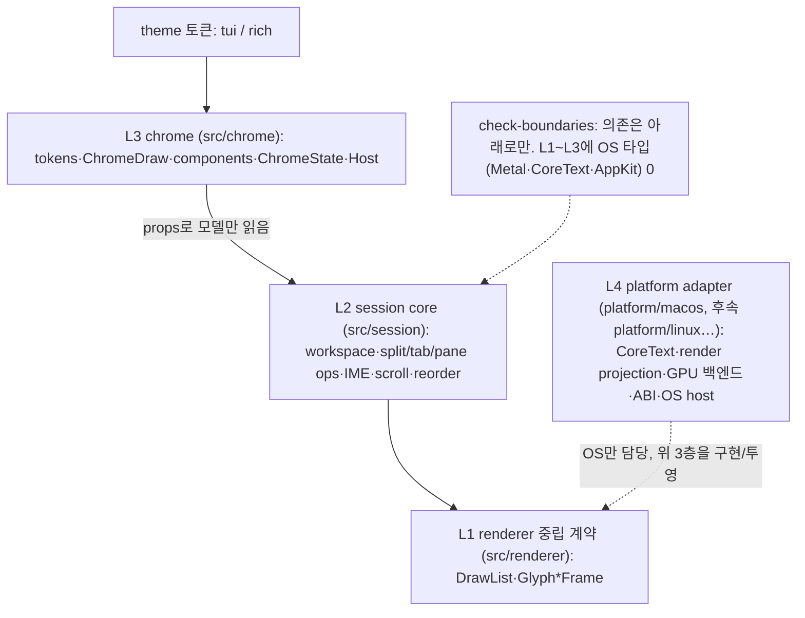

# 레이어링과 이식성 전략

Maru를 macOS-first로 구현하되 **이식성(Linux/Windows/web)을 로드맵 목표로** 두고, OS-중립 코드가 `platform/macos`에 갇히지 않도록 목표 위상(layering)과 분해 순서를 정한다. 이 문서는 코드↔OS 경계의 단일 출처다. chrome 레이어 상세는 [Chrome 전략](chrome-strategy.md), 렌더 백엔드 상세는 [렌더러 전략](renderer-strategy.md)을 단일 출처로 둔다.

## 1. 확정 결정

- **이식성은 가설이 아니라 로드맵 목표다(사용자 확정).** 따라서 chrome 추출만으로 끝내지 않고, 남는 OS-중립 세션 로직도 능동 추출한다("chrome 추출은 필요하나 충분하지 않다").
- **경계(위상)는 지금 전부 긋고, 물리 이동은 의존성 순서로 점진**한다. 각 단계는 tests green을 유지한다.
- **베이스**([document-basis-and-decision]): Ghostty(가장 성숙한 from-scratch Zig 터미널)가 같은 구조(중립 계약 + comptime 백엔드 + WebGPU 회피 + shaping 분리)로 독립 수렴했다 — 우리 전략은 외톨이가 아니라 검증된 다수파다. 적대적 검증으로 위험·이식 비용을 정직하게 계량했다(§5, §7).

## 2. 목표 위상 (4층)

| 층 | 위치 | 책임 | 이식 시 |
|---|---|---|---|
| **L1 renderer 중립 계약** | `src/renderer/` (존재) | `RenderSnapshot→DrawList→Glyph*Frame`. 백엔드 무관 frame. | **재사용**(Ghostty가 같은 모양으로 입증) |
| **L2 session core** | `src/session/` (신설) | workspace 모델·직렬화·복원, split/tab/pane 트리+연산, IME 결정, scroll/reorder 수학 | **재사용**(순수 로직, OS 무관) |
| **L3 chrome** | `src/chrome/` (신설) | tokens, ChromeDraw(semantic), components(view+hitTest), ChromeState, ChromeHost. session을 **props로만** 읽음 | **재사용**(theme/백엔드만 가장자리) |
| **L4 platform adapter** | `platform/macos/` (+ 후속 OS) | CoreText shaper/raster, render projection(현 `metal_frame`), GPU 백엔드(Metal/WebGPU), ABI, OS host(윈도우·입력·IME·PTY·클립보드) | **타깃별 신규** |

**의존 방향**: L3→L2→L1, L4가 가장자리에서 셋을 구현/투영. L1~L3에 OS 타입이 새지 않는다(check-boundaries로 강제 — §8).

## 3. 두 번의 추출

현재 `platform/macos/app_dev_session.zig`(7649줄)는 L3+L2+L4를 뒤섞고 있다. 두 번 빼낸다:

**1차 — chrome(L3) → `src/chrome/`** ([chrome-strategy.md] 상세)
- 손조립 `NativeMetalCell`(`sentinelBgCell`·`appendVerticalLine`·`BarMetrics` 등 ~18곳) → `ChromeDraw`(semantic) → 백엔드 lowering.

**2차 — session core(L2) → `src/session/`**
| 옮길 것 | 현 위치(예) |
|---|---|
| workspace 모델·capture·serialize·restore | `captureWorkspaceWindow`·`flattenPaneTree`·`buildWorkspaceTab`·`applyWorkspaceWindow` |
| split/tab/pane 모델·연산 | `Term`/`Pane`/`Tab`, `splitActivePane`·`collapsePane`·`moveTermToNewSplit`·`focusPaneInDirection` |
| 입력 수학(순수) | `imeDecide`(static), `wheelDeltaToLines`·`pageScrollDelta`, `rotateMove`·`reselectAfterClose`·`adjustActiveForMove` |

추출 후 `platform/macos`엔 **L4 어댑터만** 남는다: CoreText 프레임 빌드, render projection, Metal 렌더러, ABI, Swift host. (`split_tree.zig`는 이미 `src/app`에 generic·platform 무참조로 있어 2차의 선례다.)

## 4. 렌더 백엔드 + 호스트 이식 (검증된 현실)

이식 작업을 **GPU 백엔드(공유 가능) vs 플랫폼 호스트(타깃별 신규)** 2층으로 분리해 본다. 적대적 검증의 정직한 계량:

| 레이어 | 실효 재사용 | 타깃별 작업 |
|---|---|---|
| 도메인 파이프라인(L1, Zig) | **~85–95%** | 거의 그대로(UV·raster·atlas 계약 재사용) |
| 셰이더 | ~70% | MSL→WGSL: `textureSample`→`textureSampleLevel`(WGSL uniform control flow), vertex pulling→attribute |
| GPU 백엔드(.m) | ~45% 재작성 | bytesPerRow 256 정렬(WebGPU), per-frame 버퍼→ring, 6정점확장→instancing, 포맷/sRGB 협상 |
| presentation/host | ~20% | 동기 present→async(rAF); **호스트 전체(윈도우·입력·IME·PTY·클립보드)는 타깃별 신규** |

- **"런타임 의존성 0"은 macOS 한정**이다. Linux/Windows WebGPU는 Dawn/wgpu-native(C++ 의존성) + Wayland/X11/Win32 호스트가 필요 → 그 원칙이 그 타깃에선 깨진다(사용자 논의 후 추가).
- **browser는 PTY가 없어 아키텍처가 다른 제품**이다(서버사이드 PTY 또는 다른 백엔드). "Win/Linux/browser를 하나의 WebGPU로"는 GPU API 레이어만의 환상 — 호스트는 0% 공유.
- **백엔드 선택은 시점에 결정**: 후속은 WebGPU(WezTerm 선례, 통일·큰 의존성) 또는 OS별 OpenGL/Vulkan(Ghostty 선례, 다중 백엔드·의존성 작음). **중립 계약이 둘 다 지원**하므로 지금 고를 필요 없다. [renderer-strategy.md]가 WebGPU 검토 조건의 단일 출처.

## 5. 시퀀싱 (의존성 순서, 각 단계 green)

1. **C0 — Notice + chrome 백엔드 골격** (greenfield) ✅ **완료**. 손상 알림(`workspace_window_count < 0`) 연결, ChromeDraw→backend 패턴 증명.
2. **S1 — session-tree 수명 계약 형식화**(§6) ✅ **완료**(`invalidateForFreedPane` chokepoint).
3. **S2 — session core(L2) 물리 추출** → `src/session/`. **부분**: `input_math`·`ime`는 추출, 모델(Pane/Tab/Term)은 라이브-결합이라 **보류**(상호 합의). C1은 S2 모델 추출 없이 진행됨 — UI 상태만 chrome로, 모델은 session 소유 유지.
4. **C1 — palette/find chrome 이주** ✅ **완료**(C1a=find, C1b=palette). 두 오버레이가 `src/chrome/components/{find,palette}.zig`(neutral State+view+handle)로, platform이 props·카탈로그 행 주입·ChromeDraw lowering. **입력 caret은 터미널 커서 메커니즘을 재활용**: cursor-role fill → 오버레이 `PaneFrame.cursor`(반전 블록) → `setCursorVisible`(suffix-trim) 깜빡임(틱-카운터 위상 공유, 재빌드 0). EAW 폭(한글 2칸)·IME 조합 표시도 find/palette/터미널이 같은 경로. **C2 — divider chrome 이주** ✅ **완료**: divider 선·hit-test·드래그 수학이 neutral `chrome/components/divider.zig`로 — **마우스 hit-test 컴포넌트의 첫 선례**(State 없는 순수 함수 `hitTest`(마우스→seg index)/`view`(seg→Rule op 선)/`dragRatio`; 키보드 오버레이의 State+handle 변형). platform이 `layoutDividers`→중립 `Seg` 변환 주입·app `*Split` 매핑(index)·드래그 상태(§6 라이브 트리 포인터는 platform 유지, freed 시 invalidate)·Rule op→부분사각형 `NativeMetalCell` lowering(overlay rasterizer가 아닌 pane chrome 셀)을 맡는다. **C3a — sidebar chrome 이주** ✅ **완료**: sidebar hit-test(순수 함수 6개 `inSidebar`/`onResizeEdge`/`slotAt`/`inPlus`/`closeButton`/`dragTargetSlot`)·밴드 view(활성/호버/+ fill)가 neutral `chrome/components/sidebar.zig`로 — divider 마우스 hit-test 패턴 확장(드래그 재정렬이 **인덱스 기반**이라 라이브 포인터 부담이 divider보다 적음). platform이 중립 `Tab`(라벨·활성) 주입·라이브 상태(폭·드래그 인덱스·hover)·제목 glyph(`buildSidebarTitleFrame` — CoreText는 platform 책임)·밴드 fill→`NativeMetalCell` lowering을 맡는다. **C3b — tabbar**는 후속(라이브 `*Pane`·드롭존·✕·+·제목 glyph).
5. **C4 — rich 백엔드 + 토큰**(컴포넌트 불변, §6 레이아웃 모델 전제).
6. **B(병행)** — renderer **backend-neutrality 가드 테스트** + `metal_frame`(중립 투영) 재배치(§8).

> **커서/애니메이션 시간-모델(후속)**: 현재 blink는 30Hz 틱-카운터(15틱=500ms) + `setCursorVisible` suffix-trim이며, 터미널 커서·오버레이 caret이 이를 공유한다(고정 30Hz라 정확). 장기적으로 **벽시계 ms 위상**(드리프트 0·틱레이트 무관)·**config 간격**(`cursor_blink_interval_ms`)·**deadline 스케줄러**(30Hz 폴링 대신 blink edge에만 깨어남)로 정제한다 — Ghostty `renderer/Thread.zig`(ms 간격 재무장 타이머·활동 reset·포커스 시 취소) 선례. deadline 모델은 idle·blink 깨어남을 급감시켜 순이득이나, suffix-trim의 "재빌드 회피"는 caret-only 갱신으로 보존해야 한다. (Zig 0.16 std.time엔 timestamp가 없어 ms 시계는 Io/posix 경유 — 그래서 지금은 틱-카운터 재활용.)

## 6. 핵심 계약 2개 (지금 못박는다 — 검증이 짚은 약한 관절)

- **session-tree 구조-무효화 계약**: `divider_drag:?*Split`·`tab_drag_pane:?*Pane`은 라이브 트리 포인터다. 트리 변형 시 stale 포인터 무효화를 **단일 콜백(session→ChromeState)** 으로 형식화한다. 15필드를 ChromeState로 옮겨도 결합은 안 옮겨지므로, 이 계약 없이는 C3가 UAF다(스냅샷 가드는 UAF를 못 잡는다 — [[devsession-undefined-test-field-trap]]).
- **rich 픽셀-레이아웃 모델**: `view`와 `hitTest`가 **단일 레이아웃 소스**(탭 advance·padding·icon slot, 픽셀)를 공유한다. tui는 그 모델을 셀에 스냅, rich는 다른 토큰만 준다. 셀-열 고정 hit-test로 시작 후 retrofit하면 그려진 ✕와 클릭 ✕가 어긋난다 — 처음부터 공유 모델로 둔다(테마=토큰이 색뿐 아니라 레이아웃까지 데이터화).

## 7. 리스크 & 미해결 (정직)

- **chrome 3위험**: ① UAF 결합(→§6 S1 계약), ② 추출 necessary-not-sufficient(→2차 추출), ③ rich-layout(→§6 레이아웃 모델). 셋 다 본 문서가 흡수.
- **atlas 1024² 고정·성장 미구현**(renderer TODO): grid-per-size로 키운다([[multi-window-atlas-ownership]]와 합류). WebGPU에선 재업로드×256정렬 비용이 곱해져 더 시급.
- **`zig_owns_frame_loop`는 라벨 과장**: Zig는 tick **본문**을 소유, 클럭은 OS(macOS `NSTimer` `.common` 모드 — drag-resize 우회)다. 타깃별 클럭/vsync 필요.
- **정점확장→instancing 부채**: 현재 셀당 6정점(264B)은 Ghostty/Alacritty/kitty의 instancing 대비 ~10× 대역폭. 계약 불변이라 백엔드에서 교체 가능.
- **renderer-strategy.md 자기모순 정정**: WebGPU-통일 표 vs Ghostty 3-backend 인용 — §4의 백엔드/호스트 2층 구분으로 정리.

## 8. neutrality 가드 + topological note

- **가드 테스트**(B): `NativeMetalCell`·Metal·CoreText 타입은 `platform/*`에서만 등장함을 강제(현 `tests/boundary/imports.zig`는 cross-layer import만 막고 Metal-by-name·`app` 규칙이 없다). = [renderer-strategy.md] WebGPU 조건 1("중립 frame만 소비함을 테스트로 증명")의 실제 충족.
- **topological note**: `metal_frame.zig`(중립 투영 + `replace` Z-합성)와 session core는 **행동상 중립인데 위치만 macOS**다 — 가드가 잡지 못하는 "갇힌 중립 코드"이므로 S2/B에서 중립 위치로 옮긴다.
