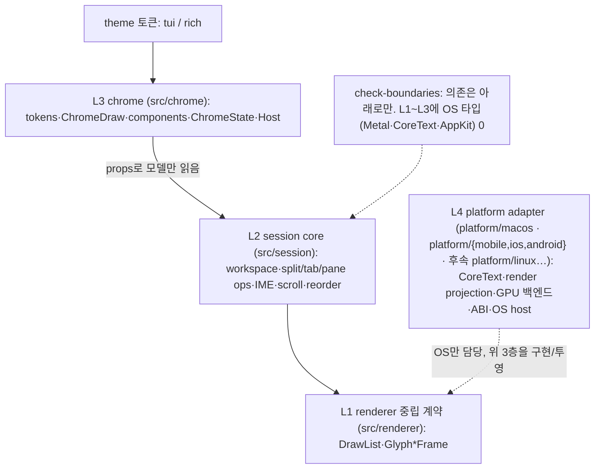

# 레이어링과 이식성 전략

Maru를 macOS-first로 구현하되 **이식성(Linux/Windows/web)을 로드맵 목표로** 두고, OS-중립 코드가 `platform/macos`에 갇히지 않도록 목표 위상(layering)과 분해 순서를 정한다. 이 문서는 코드↔OS 경계의 단일 출처다. chrome 레이어 상세는 [Chrome 전략](chrome-strategy.md), 렌더 백엔드 상세는 [렌더러 전략](renderer-strategy.md)을 단일 출처로 둔다.

## 1. 확정 결정

- **이식성은 가설이 아니라 로드맵 목표다(사용자 확정).** 따라서 chrome 추출만으로 끝내지 않고, 남는 OS-중립 세션 로직도 능동 추출한다("chrome 추출은 필요하나 충분하지 않다").
- **경계(위상)는 지금 전부 긋고, 물리 이동은 의존성 순서로 점진**한다. 각 단계는 tests green을 유지한다.
- **베이스**([document-basis-and-decision]): Ghostty(가장 성숙한 from-scratch Zig 터미널)가 같은 구조(중립 계약 + comptime 백엔드 + WebGPU 회피 + shaping 분리)로 독립 수렴했다 — 우리 전략은 외톨이가 아니라 검증된 다수파다. 적대적 검증으로 위험·이식 비용을 정직하게 계량했다(§5, §7).

## 2. 목표 위상 (4층)



| 층 | 위치 | 책임 | 이식 시 |
|---|---|---|---|
| **L1 renderer 중립 계약** | `src/renderer/` (존재) | `RenderSnapshot→DrawList→Glyph*Frame` + native DTO 투영(`metal_frame` — §8로 platform에서 이주, 이름만 "Metal"). 백엔드 무관 frame. | **재사용**(Ghostty가 같은 모양으로 입증) |
| **L2 session core** | `src/session/` (신설) | workspace 모델·직렬화·복원, split/tab/pane 트리+연산, IME 결정, scroll/reorder 수학, **컨트롤 플레인/이동성 골격**(surface_id·window_membership·window_graph·live_surface_registry generic·control_plane wire·control_surface DTO·control_dispatch 라우터 — surface identity·scope 판정·JSON-RPC 스키마/프레이밍·move/merge 순수 로직) | **재사용**(순수 로직, OS 무관) |
| **L3 chrome** | `src/chrome/` (신설) | tokens, ChromeDraw(semantic), components(view+hitTest), ChromeState, ChromeHost. session을 **props로만** 읽음 | **재사용**(theme/백엔드만 가장자리) |
| **L4 platform adapter** | `platform/macos/`, `platform/{mobile,ios,android}/` (+ 후속 OS) | CoreText shaper/raster, GPU 백엔드(Metal/Vulkan/WebGPU — L1 `metal_frame` DTO를 GPU로 그림), ABI, OS host(윈도우·입력·IME·PTY·클립보드) | **타깃별 신규** |

**L4 안에 공유 하위층이 하나 있다(모바일).** `platform/mobile`은 iOS·Android가 함께 쓰는 C ABI + Zig 브리지이고 **OS 호출이 0**이다 — 창이 하나뿐이고, 좌표가 논리 px이고, 터치가 1급 입력이라는 점이 두 타깃의 공통이고 macOS와의 차이다. GPU 백엔드는 공유하지 않는다(Metal↔Vulkan). 계약은 [모바일 플랫폼](mobile-platform.md)이 단일 출처다.

**의존 방향**: L3→L2→L1, L4가 가장자리에서 셋을 구현/투영. L1~L3에 OS 타입이 새지 않는다(check-boundaries로 강제 — §8).

**L4의 2단(D0 명문화 — [app-layer-decomposition.md](app-layer-decomposition.md) §2):** L4는 **OS 어댑터**(`platform/macos`·`pty/macos` — CoreText·Metal·ABI·OS host·PTY syscall, **타깃별 재작성**)와 **OS-중립 공통 런타임**(`src/app` — `live_pty`·`runtime`·`frame_loop` 본문; OS 호출은 어댑터로 위임, **이식 시 재사용**)으로 갈린다. `src/app`을 이 'L4 공통 런타임'으로 규정한다(옵션 A — 개명 0). 물리 개명(`src/runtime/`)은 `runtime/runtime.zig` 이름 중복 + `app`의 직관성 때문에 순이득이 없어 **보류**(app-layer-decomposition.md §2).

**창 chrome 분해 예시(사이드바 헤더·신호등)**: 네이티브 타이틀바를 숨기고 신호등(traffic lights)만 남기는 **창 스타일 inset은 L4 macOS 전용**이다(AppKit `titlebarAppearsTransparent`/`.fullSizeContentView` — `platform/macos`의 Swift host, [macos-app-host-boundary.md](macos-app-host-boundary.md)). 반면 **헤더 레이아웃(검색바·view options·새 워크스페이스 아이콘의 위치·hit-test)은 L3 chrome**(`chrome/components/sidebar.zig` `headerHit`)이라 OS-중립으로 **재사용**된다 — 이식 시 타깃별로 새로 짜는 건 "신호등을 남기는 창 chrome" 한 조각뿐이고(Linux/Win/web은 각자의 창 데코레이션 모델), 그 위에 그려지는 헤더는 같은 L3 코드가 투영된다. 신호등 영역만큼 헤더를 아래로 미는 좌표 시프트(`sidebar_header_height_px`)는 L1 DTO로 L4에 전달돼 GPU 백엔드가 적용한다. 같은 분해가 **창 이동/확대**에도: '어디가 드래그/더블클릭-확대 영역인가'(헤더·타이틀바 띠의 빈 곳) hit-test는 **L3 chrome**(`isWindowDragRegion`)이라 OS-중립이고, 실제 창 이동/확대 호출(performDrag/zoom)만 **L4 platform**(AppKit) — 이식 시 타깃별 창 API로 그 한 줄만 바꾼다. 숨긴 타이틀바 높이만큼 터미널을 아래로 내리는 **타이틀바 띠**(`titlebar_strip_px`)는 L2/L3 레이아웃 수치(termRect inset)라 OS-중립으로 재사용된다.

## 3. 두 번의 추출

현재 `platform/macos/app_session.zig`(~1.9만 줄 규모 — 이 줄 수는 예시일 뿐이고, 이 계획을 쓴 이후 약 2.5배로 커졌다. S2로 세션 모델(Term/Pane/Tab)을 `src/session/session_model.zig`로 추출 완료(§3.1, app_session −113줄)했고, 그 전까지는 보류된 채 자랐다)는 L3+L4를 담고, L2 모델은 session으로 빠졌다. 추출:

**1차 — chrome(L3) → `src/chrome/`** ([chrome-strategy.md] 상세)
- 손조립 `NativeMetalCell`(`sentinelBgCell`·`appendVerticalLine`·`BarMetrics` 등 ~18곳) → `ChromeDraw`(semantic) → 백엔드 lowering.

**2차 — session core(L2) → `src/session/`**
| 옮길 것 | 현 위치(예) |
|---|---|
| workspace 모델·capture·serialize·restore | `captureWorkspaceWindow`·`flattenPaneTree`·`buildWorkspaceTab`·`applyWorkspaceWindow` |
| split/tab/pane **모델** | `Term`/`Pane`/`Tab`/`PaneTree`(✅ 이동). 순수 연산 중 pane hit-test(`paneAtPoint`·`paneInDirection`)만 이동; `splitActivePane`·`collapsePane`·`focusPaneInDirection`은 spawn·resize 강결합이라 platform 잔류 |
| 입력 수학(순수) | `imeDecide`(static), `wheelDeltaToLines`·`pageScrollDelta`, `rotateMove`·`reselectAfterClose`·`adjustActiveForMove` |

추출 후 `platform/macos`엔 **L4 어댑터만** 남는다: CoreText 프레임 빌드, render projection, Metal 렌더러, ABI, Swift host. (`split_tree.zig`는 이미 `src/app`에 generic·platform 무참조로 있어 2차의 선례다.)

### 3.1 S2 추출 설계 (Term 모델/런타임 분리 — 측정 후 재개)

**보류 사유의 실체:** `Term`(`app_session.zig`)이 런타임 핸들(`app.LivePtySession`·`RuntimeEventPump`)을 필드로 품고, `app`이 "의도적 혼합 레이어"라(§8) 모델을 `src/session/`(순수)으로 통째 옮기면 session→pty 의존이 생긴다. 그래서 한동안 "상호 합의 보류"였다.

**측정(2026-06):** `Term`의 의존 표면을 코드로 셌다 — 정면돌파가 할 만함이 드러났다.
- `surface.core`(36개 API)는 **이미 OS-중립**(`terminal.TerminalCore`)이라 동반 이동만 하면 된다 — 추상화 대상이 아니다.
- 진짜 떼어낼 런타임 표면은 `live_pty`(9개, 대부분 init/소유권) + `pump`(1개 `drainAvailable`) = **약 10개**.
- 추상화 선례: `PtyIo`(`src/app/runtime.zig`)가 `ctx + *const fn` vtable로 이미 있다 → 그대로 따른다.
- 핫패스: 실질 vtable은 `pump.drainAvailable`(매 tick 1회/term) 하나. frame 빌드의 `lockCore`/`core.*`는 OS-중립이라 추상화하지 않아 vtable이 안 낀다. `mise run perf`로 회귀 감지.

**핵심 설계 — `Term`을 둘로 쪼갠다(shim 없이 완전 분리, [project-rules.md] "구조와 파일 분리"):**
- `session.Term`(모델, → `src/session/`): `surface`(OS-중립 `TerminalCore`+메타)·자식 관계·`auto_title` 등 순수 상태.
- platform `TermRuntime`(`app_session` 잔류): `live_pty`·`pump`·`live_initialized`·`terminated`·agent 런타임 + PTY spawn·render·drag UI 포인터.
- 모델은 런타임을 직접 모른다 — platform이 인덱스/포인터로 런타임을 매핑하거나 `PtyIo`식 추상 핸들만 모델에 준다.
- `Pane`/`Tab`은 이미 OS 타입 참조 0(측정 확인) → 거의 그대로 모델로. `PaneTree = app.SplitTree(*Pane)`은 generic 선례.

**단계(실제 진행 — 모두 ✅ 완료, 각 green + 헤드리스 TDD):**

| 단계 | 내용 | 상태 |
|---|---|---|
| S2-1 | 이 설계 명문화(본 절). 코드 0 | ✅ |
| S2-2 | (pump 경계 정리 — 측정 결과 `pump`가 이미 중립(`drainAvailable` 1곳)이라 불필요, S2-3에 흡수) | ✅ 흡수 |
| S2-3a | `live_pty`·`pump`·생애 플래그를 inner `rt: TermRuntime`으로 격리(~48곳 `term.X`→`term.rt.X`) | ✅ |
| S2-3b | `Term`을 `TermGeneric(comptime Rt)` + `const Term = TermGeneric(TermRuntime)` 별칭으로 — 런타임 타입 은닉 | ✅ |
| S2-4 | `Term`/`Pane`/`Tab`/`PaneTree`를 `session_model.Model(comptime Rt)`로 이동(`AgentKind`·`agent_answer_max` 동반, `agent_state`는 중립 `AgentState`). app_session −113줄 | ✅ |
| S2-5 | workspace 트리 변환(`flattenTree`·`buildTreeNode`)을 `Model`로(`allocator` 인자로 pure화) | ✅ |
| 후속 | pane hit-test/방향 탐색(`paneAtPoint`·`paneInDirection`·`FocusDirection`)을 `Model`로 | ✅ |

순수 연산 중 `splitActivePane`·`collapsePane`·`focusPaneInDirection`은 `self`(spawn·resize) 강결합이라 platform orchestration으로 잔류. `surface` 등 `src/app`의 중립 모델 추가 정리는 §3.2(3차 추출, 계획).

**검증:** 헤드리스 fake `Rt`로 Term/Pane/Tab/PaneTree 구성·workspace round-trip·pane hit-test를 PTY/surface 없이 단언(`session_model.zig` 테스트, tamper로 수집 확인). 매 단계 `zig build test`·`check-boundaries`(session에 pty/platform/OS 타입명 0)·`macos-app-build` + 실기 `zig build macos-app`. `/code-review max` 결함 0.

### 3.2 3차 추출: `src/app`의 중립 모델을 session core로

> **현황**: 추출은 끝났다 — `surface`는 `src/session/surface.zig`에 있고 `src/session/*`에서 `../app`로 가는 import는 0건이다(§59가 우려한 "D1만 하면 `session→app`이 잔존하는 절반 정리"는 발생하지 않았다). 아래는 그 추출의 근거·단계 서술이다.

> 실행 플랜·**선결 결정**(`src/app` 정체성 — L4 공통 런타임으로 규정)·단계 D0~D3 상세는 [app-layer-decomposition.md](app-layer-decomposition.md)를 단일 출처로 둔다(아래는 골격).

**동기:** S2로 `Term`/`Pane`/`Tab`은 session으로 갔지만, 그 모델이 의존하는 **중립 모델이 아직 `src/app`에 남아** session이 `src/app`을 import한다(`session_model`이 `app/surface.zig`·`split_tree.zig`·`workspace.zig`를 참조). `src/app`은 중립 모델과 런타임이 섞인 혼합 레이어다(코드로 분류):

| `src/app` → session 이동(모델, **session/chrome이 의존**) | `src/app` 잔류 |
|---|---|
| `split_tree`·`workspace`·`surface`·`window`·`core_command` | **유틸**(순수하나 app/platform만 씀, 모델 아님): `label`·`artifact_io` · **런타임**(`pty` 참조): `live_pty`·`runtime`·`runtime_pump`·`frame_loop`·`host`·`pty_reader`·`live_pty_registry` |

**목표:** 중립 모델을 session core(`src/session/`)로 모으고 `src/app`엔 런타임 어댑터만 남겨, `session→app` 의존을 **0으로** 만든다(session은 terminal·renderer 계약만 의존). 이식 시 모델 전부가 OS-중립으로 재사용된다.

**위상은 깨지지 않는다(핵심):** 런타임 어댑터(L4: `live_pty`·`runtime` 등)가 모델(L2: `surface`)을 참조하는 건 **L4→L2 정상 방향**이다(L4가 가장자리에서 위 층을 구현/소비 — §2 의존 규칙). 즉 `surface`를 session으로 옮겨도 `app/live_pty`가 `session.surface`를 참조하는 건 위반이 아니라 더 정합적이다. **본질적 트레이드오프는 거의 없고**, 비용은 작업량 + 단위(아래)뿐이다.

**왜 묶어서 하나(단위):** `surface` 1개만 단독 이동하면 `split_tree`·`workspace`·`window`이 `src/app`에 남아 `session→app`이 그대로다(절반만 정리). 가치는 중립 모델을 **한꺼번에** 옮겨 의존을 0으로 닫을 때 생긴다 — 그래서 surface 단독 후속은 미뤘고, 이 3차로 묶는다.

**선결 결정([app-layer-decomposition.md](app-layer-decomposition.md) §2, 사용자 합의):** 중립 모델이 빠진 `src/app`(OS-중립 런타임)을 **L4 공통 런타임으로 규정**한다(옵션 A — `src/app` 유지, 개명 0). `platform/macos`·`pty/macos`(OS 종속 어댑터)와 같은 L4지만 §2의 'L4 2단' 명문화로 구분한다. 런타임을 `src/runtime/`로 물리 개명하는 정리(C)는 `runtime/runtime.zig` 이름 중복 + `app` 직관성으로 순이득이 없어 **보류**(app-layer-decomposition.md §2) — `src/app` 유지로 충분하다.

**대가:** `surface` 참조 런타임 10+ 파일의 import 경로가 바뀐다(기계적·저위험, 동작 보존). 본질적 단점은 없다 — L4→L2 참조가 정상이라 위상 손해가 없고, 순수 이동이라 동작 변화도 0이다.

**가드:** `check-boundaries`가 `session`의 forbidden 목록에 `app`을 넣어 `session→app`을 빌드 시 0으로 강제한다(`tests/boundary/imports.zig`). 이동만이라 기존 테스트가 그대로 그물이다.

### 3.3 L4 내부 분해 (별개 — 이식 무관)

위 S2·3차는 **L1~L3을 이식 가능하게** 정리하는 추출이다. 반면 L4 어댑터 자체의 거대 단일 파일(`platform/macos/app_session.zig` — 2026-08-08 실측 **72,317줄**)을 목적별로 가르는 정리는 **이식과 무관한 가독성·테스트 격리** 작업이라 별도 문서 [app-session-decomposition.md](app-session-decomposition.md)를 단일 출처로 둔다(L4는 재작성 대상이라 위상엔 영향 없음). 그 문서의 두 축을 구분한다:

- **(b) 이식 기여 축** — 안에 섞인 OS-중립 순수 로직(좌표 변환 기하)을 `src/session`(L2)으로 뺀다. **b1·b2 `session/layout_math.zig`(grid·hit-test·drop-zone·pt→px·px↔cell)로 일단락**했고, 이 축이 위상에 영향을 주는 유일한 부분이다(find·sidebar·workspace는 실측 결과 각각 `chrome`·`metal_frame`·PTY 결합 orchestration이라 제외).
- **(c) 읽기·편집 비용 축(2026-08-08 추가)** — 남은 orchestration을 `platform/macos/app_session/<group>.zig`로 가른다. **위상 기여 0**이며(L4 안에서만 이동), 근거·단계·리스크는 전적으로 위 문서가 소유한다. 이 문서는 그것을 이식 성과로 계상하지 않는다.

### 3.4 공용 코드에 새 폴더를 만들지 않는다 (실측 2026-08-23, Windows 포팅 중)

Windows 포팅이 진행되며 `src/main.zig` 에 이런 주석이 다섯 줄 쌓였다:

```zig
const git_backend_mod = @import("platform/macos/git_backend.zig"); // 이름과 달리 두 OS 를 다 탄다
```

"공용 코드 폴더(`src/common/`)를 따로 만들까" 라는 물음이 여기서 나온다. **답은 아니다.**

**자리는 이미 다 있다.** 이 문서 §2 가 정한 L1 `src/renderer/`·L2 `src/terminal/`·`src/session/`·
L3 `src/chrome/`·L4 중립 런타임 `src/app/` 이 그것이고, 어느 계층에도 안 붙는 잎은 최상위
`src/*.zig` 다(`text_shaper.zig`·`scm_items.zig`·`path_shape.zig`·`color.zig`·`width.zig`…).
`src/common/` 을 더하면 **세 번째 관례**가 생기고, 파일마다 "common 인가 최상위인가" 를 다시
판단하게 된다 — 그 판단에는 옳은 답이 없다.

그리고 이 문서는 이미 같은 것을 정해 놨다: 서두의 목적("OS-중립 코드가 `platform/macos`에 갇히지
않도록")과 §3 2차의 결론("추출 후 `platform/macos`엔 **L4 어댑터만** 남는다"). 위 주석들은
**폴더가 없어서 생긴 것이 아니라, 이 문서가 갚으라고 적어 둔 빚에 붙인 표지**다.

**갚을 수 있는 것은 다섯 중 둘이다**(2026-08-23 실측 — 본문의 `coretext_*`·`objc`·`CTFont`·
`CFRelease`·`extern "c"`·`@cImport` 참조 횟수):

| 파일 | 줄 | 네이티브 참조 | 판정 |
|---|---:|---:|---|
| `platform/macos/file_tree_backend.zig` | 1360 | **0** | 옮길 수 있다 |
| `platform/macos/git_backend.zig` | 3013 | **0** | 옮길 수 있다 |
| `platform/macos/chrome/chrome_draw_lowering.zig` | 1062 | 10 | 섞임 — 쪼개는 별개 작업 |
| `platform/macos/chrome/system_text.zig` | 1670 | 37 | 섞임 |
| `platform/macos/coretext_frame_builder.zig` | 3766 | 54 | 섞임 |

> **표의 수는 주석까지 센 문자열 일치다**(2026-08-29 재측정으로 확인). 코드 참조만 세면
> `chrome_draw_lowering` 은 **0** 이다 — 그 파일의 10 은 전부 CoreText 를 **설명하는 주석**이다.
> 재면서 "카테고리가 바뀌었나" 로 한 번 헛짚었으므로 계수 방식을 적어 둔다. 어느 쪽으로 세도
> **결론은 안 바뀐다** — 아래가 말하듯 막는 것은 네이티브 참조가 아니라 모듈 그래프다.

앞의 둘은 `std`·`builtin`·`maru` 배럴만 import 하고, 부르는 자리도 각각 둘뿐이다(`src/main.zig`,
`platform/macos/app_session.zig`). **뒤의 셋은 옮기면 안 된다** — 이름만 macOS 인 게 아니라 실제로
네이티브가 섞여 있어서, 중립 부분을 떼어내는 것은 이동이 아니라 분해다.

**갈 자리는 `src/app/`** 이다 — §2 가 규정한 "L4 OS-중립 공통 런타임"(OS 호출은 어댑터로 위임,
이식 시 재사용). `src/session/` 은 **안 된다**: `git_backend.zig` 가 `maru.win32_process`(platform)를
쓰는데 session 은 platform import 가 금지다(`tests/boundary/imports.zig`).

#### 그런데 "순수 이동" 이 아니었다 (실측 2026-08-25, W8 이 끝난 뒤 실제로 해 봄)

위 문단은 **시점: W8 이 끝난 뒤 독립 PR — 기능이 하나도 안 바뀌는 4,400 줄짜리 순수 이동**이라고
적어 두었다. W8 이 끝나 실제로 옮겨 보니 **그 전제가 틀렸다.** 이 파일들을 `platform/macos` 에
묶어 두는 것은 **폴더가 아니라 모듈 그래프**다.

옮기자마자 네 가지가 차례로 나왔다(전부 실측).

| 무엇이 | 왜 |
|---|---|
| `app_session.zig` 가 `../../app/…` 를 못 읽는다 | 그 파일은 **모듈 루트가 `platform/macos` 안**인 아티팩트에서도 컴파일된다 — 위는 모듈 밖이다(`import of file outside module path`). |
| 배럴(`src/maru.zig`)로 우회하면 **wasm 이 깨진다** | `src/maru.zig` 는 wasm(freestanding, **libc 없음**)·모바일의 **모듈 루트이기도 하다**. `git_backend.zig` 의 `std.c` 호출 **63 개**가 그때 따라 들어간다 — `check-targets` 가 그 자리에서 실패한다. |
| 배럴에 걸면 그 파일의 `@import("maru")` 가 자기 자신이 된다 | `no module named 'maru' available within module 'maru'`. `maru_mod.addImport("maru", maru_mod)` 같은 **자기 의존 배선**이 새로 필요하다(`build.zig` 와 `tools/check-macos-typecheck.sh` 양쪽). |
| `git_backend.zig` 가 **셋째 파일을 끌고 온다** | `safe_open.zig`(64 줄)를 쓰는데 그것을 `platform/macos/capture_file.zig` 도 쓴다. 남겨 두고 상대 경로로 가리키면 같은 파일이 `maru` 와 `root` 두 모듈에 걸린다. |

즉 옮기는 일은 **파일 이동이 아니라 빌드 그래프 변경**이다 — macOS 아티팩트에 새 모듈을 주입하거나
(두 번째 배럴), 배럴을 타깃별로 가르거나 해야 한다. **둘 다 이 절이 폴더를 안 만든 것과 같은 종류의
결정**이라 조용히 고를 일이 아니다.

**결정(사용자 2026-08-25): 옮기지 않는다. 이 실측을 적어 두는 것으로 갚는다.** 위 표의 "옮길 수
있다" 판정은 **네이티브 참조만 본 것**이었고, 그 기준은 필요조건이지 충분조건이 아니다 — 다음에
같은 물음이 나오면 **모듈 그래프부터** 본다. 새로 쌓이는 빚은 여전히 주석 한 줄씩이다.

> **기준 자체는 살아 있다.** 2026-08-25 에 `platform/macos/agent_session_archive_backend.zig`
> (1,218 줄)가 `main.zig` 의 소비자가 되어 같은 부류에 새로 들어왔고, 같은 기준으로 재면 네이티브
> 참조가 **0** 이다. 표를 늘리지 않는 이유는 위와 같다.


## 4. 렌더 백엔드 + 호스트 이식 (검증된 현실)

이식 작업을 **GPU 백엔드(공유 가능) vs 플랫폼 호스트(타깃별 신규)** 2층으로 분리해 본다. 적대적 검증의 정직한 계량:

| 레이어 | 실효 재사용 | 타깃별 작업 |
|---|---|---|
| 도메인 파이프라인(L1, Zig) | **~85–95%** | 거의 그대로(UV·raster·atlas 계약 재사용) |
| 셰이더 | ~70% | MSL→WGSL: `textureSample`→`textureSampleLevel`(WGSL uniform control flow), vertex pulling→attribute |
| GPU 백엔드(.m) | ~45% 재작성 | bytesPerRow 256 정렬(WebGPU), per-frame 버퍼→ring, 6정점확장→instancing, 포맷/sRGB 협상 |
| presentation/host | ~20% | 동기 present→async(rAF); **호스트 전체(윈도우·입력·IME·PTY·클립보드)는 타깃별 신규** |

- **"런타임 의존성 0"은 macOS 한정**이다. Linux/Windows WebGPU는 Dawn/wgpu-native(C++ 의존성) + Wayland/X11/Win32 호스트가 필요 → 그 원칙이 그 타깃에선 깨진다(사용자 논의 후 추가).
- **browser는 PTY가 없어 아키텍처가 다른 제품**이다(서버사이드 PTY 또는 다른 백엔드). "Win/Linux/browser를 하나의 WebGPU로"는 GPU API 레이어만의 환상 — 호스트는 0% 공유.
- **백엔드 선택은 시점에 결정**: 후속은 WebGPU(WezTerm 선례, 통일·큰 의존성) 또는 OS별 OpenGL/Vulkan(Ghostty 선례, 다중 백엔드·의존성 작음). **중립 계약이 둘 다 지원**하므로 지금 고를 필요 없다. [renderer-strategy.md]가 WebGPU 검토 조건의 단일 출처.
- **OS 창 속성 = L4 platform adapter 계약의 깨끗한 사례**(window.blur, F3-1): "창 뒤 데스크톱 블러"는 어느 OS도 **GPU 렌더러로 못 한다**(Metal/WebGPU는 backdrop 픽셀을 못 읽음 — WindowServer/컴포지터가 창 뒤를 합성). 그래서 **정책은 Zig 단일 출처**(`app_session.effectiveWindowBlur` — opacity 게이트 + 유효 반경, ABI getter `window_blur_radius`)가 정하고, **실제 OS 호출만 platform host가 타깃별로** 채운다: macOS=`CGSSetWindowBackgroundBlurRadius`(비공개 CGS, Ghostty·Terminal.app 동일), Windows=`DwmSetWindowAttribute`(추후), Linux=`_KDE_NET_WM_BLUR_BEHIND_REGION`(X11)/kde-blur(Wayland, 컴포지터 의존 best-effort, 추후). GPU 백엔드와 완전 무관 — 백엔드를 WebGPU로 바꿔도 이 계약은 그대로다. 같은 모양: 시스템 외관(`set_system_appearance`)·클립보드·알림.

### 4.1 실측 — non-macOS 호스트에서 중립 레이어가 실제로 어디까지 서는가 (2026-08-15, Windows)

위 표는 **추정**이었다. Windows 호스트(zig 0.16.0)에서 실제로 빌드해 본 결과를 기록한다 — 이식 목표를 앞당기거나 Windows를
지원 대상으로 올리는 결정이 **아니고**, §4의 추정을 실측으로 대체하는 것이다.

| 관측 | 값 |
|---|---|
| `build.zig` configure | 통과. `target.result.os.tag == .macos` 게이트가 macOS 전용 스텝 39개를 자동 제외한다 |
| L1 `terminal`·`renderer` / L2 `session` / L3 `chrome` 컴파일 | **전부 통과**(중립 3층이 무수정에 가깝게 선다 — §4의 "L1 ~85–95% 재사용" 추정과 부합) |
| `zig build test` | **2,323 통과 / 33 skip / 0 실패** (exit 0 — 다른 호스트에서도 CI 게이트로 쓸 수 있다) |
| `check-boundaries`·`check-doc-links`·`check-config-docs` | 전부 통과 |
| `zig build`(CLI exe) | 실패 — `src/main.zig`의 unix domain socket(`AF.UNIX`·`sockaddr.un`)과 POSIX 파일 모드(0600) |

**후속 실측 (2026-08-16, 같은 호스트)**: 그 CLI exe 실패는 [windows-platform.md](windows-platform.md) 계획의 **W2**가
닫았다. `zig build`가 통과하고 `maru.exe`가 실행된다. 고친 것은 transport가 아니라 **호스트 게이트**다 — 컨트롤
소켓은 "인스턴스 없음"으로, `maru ssh`·`install-cli`는 미지원 안내로 접는다(셋 다 백로그). 링크 단계에서 실제로
막고 있던 심볼은 셋이었다: `socket`(ws2_32라 `-lc`로 안 붙는다)·`environ`·`symlink`(msvcrt에 없다). 그래서
`src/main.zig` 테스트도 이제 **모든 호스트**에서 돈다(`build.zig`의 macOS 게이트 제거) — POSIX 파일 모드가 필요한
하나만 전제(`@hasDecl(Permissions, "toMode")`)로 skip한다.

**중립 3층이 실제 L4 위에 섰다 (2026-08-16, 같은 호스트 — W4·W6)**: 위 실측까지는 "중립 레이어가 컴파일되고
테스트가 돈다"였다. 이제 그 위에 **두 번째 L4 백엔드**(ConPTY, `src/pty/windows.zig`)가 붙어 `maru demo`·
`app-pty-smoke`·`app-pty-loop-smoke`·`app-pty-interactive-loop-smoke` 넷이 Windows에서 **macOS와 같은
artifact**를 낸다(마지막 것은 pwsh 7을 띄워 프레임 루프로 친 입력이 표식으로 돌아온다). §4가 "L1 ~85–95%
재사용"으로 추정한 것이 여기서 실물로 확인된다 — **중립 계약(`SpawnRequest`·`waitIo`·`IoReady`·`readChunk`·
`writeInputNonBlocking`)은 한 글자도 바뀌지 않았다.** 백엔드가 바꾼 것은 그 아래 메커니즘뿐이다.

그리고 §4.1이 이미 말한 것과 **같은 부류의 함정**이 L4에서 한 번 더 나왔다. std의 호스트 의존 동작이 아니라
이번에는 **OS 개념의 부재**다: ConPTY에는 "자식이 죽으면 EOF"가 없고(pseudoconsole이 살아 있는 동안 conhost가
파이프를 붙든다), 프로세스 그룹이 없어 `kill(-pid)`에 대응하는 것이 job object뿐이다. 둘 다 중립 계약을 바꾸지
않고 백엔드가 흡수했다 — 그 규율과 실측은 [windows-platform.md](windows-platform.md) §4.1b가 단일 출처다.

**드러난 것 — 중립성은 import 경계로만 지켜지고 있었다.** `check-boundaries`는 중립 레이어에 OS *타입명*이 새는 것을 막지만
(§8), **std의 호스트 의존 동작**은 못 잡는다. 실제로 L2가 `std.fs.path.join`/`resolve`(호스트 native 구분자)를 써서 같은
코드가 macOS에서는 `/repo/docs`를, Windows에서는 `/repo\docs`를 만들었다 — 그 자리의 L2 코드는 입력의 역슬래시를 이미
거부하고 있었으므로 **자기 계약과도 어긋난 상태**였다. 그래서 규칙을 명문화한다:

> **L2에서 경로 구분자를 만들어 내는 자리는 항상 POSIX 구분자(`/`)를 쓴다.** 구분자를 *읽는* 쪽(`isAbsolute`·`dirname`·
> `basename`)은 Windows 구현도 `/`를 함께 받아들이므로 그대로 둔다. macOS/Linux에서는 native == posix라 무변화다.

**skip 21개는 하나의 원인**이다: `src/observability/connection_incident.zig`의 `currentProcessId()`가 macOS/Linux 외
호스트에서 `0`을 반환하는 **의도적 fail-closed** 스위치라, process authority가 서지 않아 incident 서비스가
`error.InvalidAuthority`로 닫힌다. 이 모듈은 중립 레이어에 있지만 **소비자가 전부 macOS 세션 호스트**
(`platform/macos/session_host/**`)인 — 즉 그 호스트가 이식될 때 함께 재사용될 — 중립 코어다.

그래서 그 호스트가 없는 동안은 **전제가 없다고 skip**하되, 조건을 OS 이름이 아니라 `currentProcessId() == 0`
(=실패하는 전제 그 자체)으로 잡는다. `builtin.os.tag`로 skip하면 그 호스트를 지원하게 된 날 누군가 skip을
지워야 하고, 안 지우면 포팅이 끝나도 테스트가 계속 잔다. 지금 형태는 `currentProcessId()`에 분기가 추가되는
순간 **저절로 깨어난다** — 실측으로 확인했다(임시로 `.windows => GetCurrentProcessId()`를 넣자 통과 수가
2,323 → 2,344로 정확히 21 늘고 skip은 33 → 12로 줄었다. 즉 그 21개를 막던 것은 PID 하나뿐이고 로직 자체는
호스트 독립이라, 이 skip이 실패를 감추고 있지 않다).

Windows PID를 이 신뢰 도메인에 넣는 것은 **세션 호스트 이식과 함께** 할 일이지 그보다 먼저 할 일이 아니다:
`validAuthority`의 `self.pid == currentProcessId()`는 `fork` 후 자식이 메모리를 상속해 *주소는 같고 PID만 다른*
상황을 잡는 가드인데, `fork`가 없는 호스트에서는 항등식이 된다. 먼저 넣으면 "권한 모델이 검증됐다"가 아니라
"검증할 대상이 없어 통과했다"가 된다.

**여전히 없는 것**: `src/platform/windows/`는 README 한 장이고 ConPTY 백엔드·Win32 호스트·렌더러는 0줄이다. 즉 이 실측이
말하는 것은 "L4가 통째로 비어 있다"이지 "이식이 진행 중이다"가 아니다.

## 5. 시퀀싱 (의존성 순서, 각 단계 green)

1. **C0 — Notice + chrome 백엔드 골격** (greenfield) ✅ **완료**. 손상 알림(`workspace_window_count < 0`) 연결, ChromeDraw→backend 패턴 증명.
2. **S1 — session-tree 수명 계약 형식화**(§6) ✅ **완료**(`invalidateForFreedPane` chokepoint).
3. **S2 — session core(L2) 물리 추출** → `src/session/`. `input_math`·`ime`는 추출 완료. 모델(Pane/Tab/Term)은 라이브-결합이라 한동안 보류였으나, 측정(§3.1)으로 추상화 표면이 좁음을 확인하고(런타임 핸들 ~10개 + `PtyIo` 선례·핫패스 vtable 1개) **완료**했다(§3.1) — `Term`을 모델/런타임으로 쪼개 모델(Term/Pane/Tab/PaneTree·workspace 변환·pane hit-test)을 `session_model.Model(Rt)`로 이동(app_session −113줄). C1~C4는 S2 모델 추출 없이 완료됐고, 모델이 이제 session 소유다. 남은 `src/app`의 중립 모델(`surface` 등) 정리는 §3.2(3차).
4. **C1 — palette/find chrome 이주** ✅ **완료**(C1a=find, C1b=palette). 두 오버레이가 `src/chrome/components/{find,palette}.zig`(neutral State+view+handle)로, platform이 props·카탈로그 행 주입·ChromeDraw lowering. **입력 caret은 터미널 커서 메커니즘을 재활용**: cursor-role fill → 오버레이 `PaneFrame.cursor`(반전 블록) → `setCursorVisible`(suffix-trim) 깜빡임(틱-카운터 위상 공유, 재빌드 0). EAW 폭(한글 2칸)·IME 조합 표시도 find/palette/터미널이 같은 경로. **C2 — divider chrome 이주** ✅ **완료**: divider 선·hit-test·드래그 수학이 neutral `chrome/components/divider.zig`로 — **마우스 hit-test 컴포넌트의 첫 선례**(State 없는 순수 함수 `hitTest`(마우스→seg index)/`view`(seg→Rule op 선)/`dragRatio`; 키보드 오버레이의 State+handle 변형). platform이 `layoutDividers`→중립 `Seg` 변환 주입·app `*Split` 매핑(index)·드래그 상태(§6 라이브 트리 포인터는 platform 유지, freed 시 invalidate)·Rule op→부분사각형 `NativeMetalCell` lowering(overlay rasterizer가 아닌 pane chrome 셀)을 맡는다. **C3a — sidebar chrome 이주** ✅ **완료**: sidebar hit-test(순수 함수 6개 `inSidebar`/`onResizeEdge`/`slotAt`/`inPlus`/`closeButton`/`dragTargetSlot`)·밴드 view(활성/호버/+ fill)가 neutral `chrome/components/sidebar.zig`로 — divider 마우스 hit-test 패턴 확장(드래그 재정렬이 **인덱스 기반**이라 라이브 포인터 부담이 divider보다 적음). platform이 중립 `Tab`(라벨·활성) 주입·라이브 상태(폭·드래그 인덱스·hover)·제목 glyph(`buildSidebarTitleFrame` — CoreText는 platform 책임)·밴드 fill→`NativeMetalCell` lowering을 맡는다. **C3b — tabbar hit-test chrome 이주** ✅ **완료**: 탭 컬럼 분할 hit-test(tabIndex/inCloseZone/inPlusZone/hasPlusZone)가 neutral `chrome/components/tabbar.zig`의 `Metrics` 메서드로 — 호출처가 `m.tabIndex(...)`를 그대로 쓴다(옛 BarMetrics struct 제거, init→`barMetrics` helper). 활성 탭 강조 밴드는 platform이 **단일 셀**(tabbarHighlightCell)로 직접 그린다 — 밴드가 한 칸이라 chrome view→cell round-trip이 무의미(C3a 리뷰 §3 반영; divider/sidebar의 다중 op view와 달리 tabbar는 hit-test만 chrome). 라이브 `*Pane`·드롭존·제목 glyph(buildPaneTabBarDrawList)는 platform 유지(§6). 이로써 chrome hit-test(divider·sidebar·tabbar)가 전부 컴포넌트화 — **C4(rich 백엔드 + 토큰)**만 남는다.

> **hit-test를 chrome으로 옮기는 것만으로는 부족하다 — 그리는 식과 누르는 식이 하나여야 한다.** 사이드바 카드의
> 닫기 ✕가 그 반례였다: 그리는 쪽은 "칸 인덱스"(`cols - 3`)로, 누르는 쪽(`closeButton`)은 "폭에서 역산"(`w - 3cw`)으로
> 같은 자리를 각자 표현했다. 두 식이 같은 답을 내려면 스크롤바 gutter=0·카드 inset=0이고 폭이 셀 폭의 배수여야
> 하는데 셋 다 참이 아니다. gutter가 상시 예약되자(SV4a) 그리는 쪽만 좁아져, 실측 348px·cw 8·gutter 11에서 글리프는
> 304~312에 hit zone은 324~348에 놓여 **아예 겹치지 않았다** — 보이는 ✕를 눌러도 닫히지 않았다(사용자 보고).
> 상수를 맞추는 수정은 같은 실패를 반복시킨다(2칸→3칸 조정이 이미 한 번 그랬다). 지금은 `sidebar.columns()` 하나가
> `indent_cols`·`cols`·`close_col`을 내고 draw list와 `closeButton`이 그 값만 본다(`dock_view_bar.slotRect`와 같은 구조).
> 회귀 테스트도 상수 일치가 아니라 **gutter/inset이 0이 아닐 때 두 구간이 겹치는지**를 고정한다 — 옛 테스트는
> gutter=0인 이상적 폭만 봐서 이 회귀를 통과시켰다.
5. **C4a — rich 토큰셋 + config 분기** ✅ **완료**: tui가 sidebar_active로 공유하던 role(divider/focus_accent/drop_zone/tab_hover_bg/muted_fg)을 `Tokens.rich`가 분리 파생색(darken/lighten)으로 채우고, config `chrome.theme = tui|rich`로 `buildChromeTokens`가 분기. **컴포넌트·lowering 0줄 변경**(같은 ColorRole, 색만 다름 — 기본 tui). **C4b — GPU 렌더 프리미티브** ✅ **완료**: metal SDF quad/shadow 파이프라인(셀 패스와 별개 draw call)·`ChromeDraw.quad` Op + 모양 토큰(corner/border/shadow/modal_padding/gradient)·사이드바 둥근 밴드·모달 둥근 배경+테두리+그림자+안쪽 패딩·tabbar 픽셀 retrofit(§6 seam 해소 — `segCols` 단일 소스가 hit-test·활성 밴드·제목·✕를 공유)·둥근 활성 탭 + vertical gradient(draw layer 3분할 bottom/under/over로 제목 가림·바 배경 z-order 해소). **U — UI 형태 다듬기(C4b 이후, maru 독립 설계)**: 사이드바 세로 카드 + 좌측 maru-accent 막대(U1, accent=앰버 고정 브랜드색)·카드 레이아웃(U2)·가로 탭 VSCode식(U3 — 활성 탭을 채워진 밴드 대신 **평평한 약한 배경 + 하단 maru 앰버 언더바**(active indicator, 탭 seg 폭)로. 둥근 밴드·vertical gradient(C4b-5 초기안)는 폐기하고 평평 VSCode 탭으로 대체(`tab_corner_radius_px`·`tab_gradient_delta`·`shiftBrightnessU32` 제거). 탭바 하단 구분선은 `line_thickness_px` 토큰 두께로 1px GpuQuad SDF 흐림 회피. 활성 pane 강조도 사각 ring 대신 이 탭 언더바로 일원화. 그 위에 **탭 전용 폭 **하한**(`tab_width_cols` — 탭이 적어 바가 남으면 **균등 분할로 꽉 채우고**(빈 영역을 남기지 않는다 — 사용자 요청 2026-08-18), 탭이 늘어 균등 폭이 이 값보다 좁아지면 이 값에서 멈추고 가로 스크롤로 넘긴다; tui는 0=항상 균등)·**탭 바 세로 패딩**(`tab_bar_pad_y_px` — 텍스트 위아래 여유, 제목 세로 중앙)·**넘치면 가로 스크롤**(`tabLayout`이 우측에 ‹·공백·›(3칸 사각 버튼) 예약하고 `Pane.tab_scroll_cols` offset을 `segCols` 단일 통합점에 적용 — view·hit-test 동시 이동(§6); `eff_scroll = min(scroll, total-tab_cols)` clamp로 탭 닫기 후 stale 자동 복구, rich 고정폭만; 활성 탭 선택(⌘[]·클릭) 시 `focusTerm`이 `ensureActiveTermVisible`로 그 탭이 보이게 자동 스크롤-인). ‹›는 사각 버튼·사이 공백(GpuQuad 배경)으로 표시하고 hover 시 밝게(`sidebarActiveBg` — 클릭 가능 표시)하며, 클릭 가능 영역(탭 바의 탭·‹/›·+·pane 포커스, 사이드바 워크스페이스 슬롯)은 hover 시 **pointingHand 커서**로 affordance를 준다(`hoverCursor`가 `CursorKind.link` 반환 → Swift NSCursor.pointingHand — URL hover용 기존 메커니즘 재사용, ABI 무변경). 또 ‹/›는 스크롤 여지가 있는 방향만 강조색(`active_fg`)으로·더 갈 수 없는 경계 방향은 muted(`fg`)로 그려, ‹가 진하면 "왼쪽에 잘린 부분 탭이 더 있음"을 알리는 단서가 된다(`eff_scroll` clamp로 경계 판정 정확, 새 색 인자 없이 기존 `fg`/`active_fg` 재사용). 트랙패드 2-finger 가로 스와이프(`scroll_wheel`의 `delta_x`, ABI v44 — Swift `scrollingDeltaX`→Zig `wheelDeltaToLines` 셀 환산→커서 아래 pane `tab_scroll_cols`를 클릭 ‹›와 같은 `eff` 기준으로 조정)로도 탭 바를 스크롤한다. **U3 완료**(VSCode 탭·고정폭·세로 패딩·가로 스크롤·‹› 사각 버튼/hover/커서/스크롤 방향 강조·트랙패드 가로).
6. **B(병행)** ✅ **완료** — renderer **backend-neutrality 가드 테스트**(`tests/boundary/imports.zig`의 `scanForbiddenIdentifiers` — 중립 레이어 **terminal·renderer·session·chrome**에 OS 런타임 타입명(`MetalRenderer`·CT*·CG*·NS*·MTL*)이 식별자로 새면 빌드 실패; `@import` 금지 1차에 더한 2차 re-export 가드) **+** `metal_frame`(중립 투영 DTO) **renderer 이주**(platform/macos→renderer — 이름만 "Metal"인 frame 계약을 renderer가 소유해 백엔드 Metal/WebGPU가 공유). 가드는 이름이 아니라 **의존성** 기준(frame DTO=OS 의존 0이라 중립, 실제 OS 런타임만 platform).

> **커서/애니메이션 시간-모델**: blink는 **벽시계 ms 위상**(드리프트 0·틱레이트 무관)으로 진행하고(`blink_phase_ns` baseline + 경과분 catch-up, 스피너 `advanceAgentSpinner`와 같은 모델), 커서 suffix 페이드 pass를 통해 그린다. 터미널 커서·오버레이 caret이 이를 공유한다. 옛 틱-카운터(`blinkIntervalTicks()`가 ms→tick 환산)는 **폐기**됐다 — 환산 기준이 *설정* `render.frame-rate`라, 실효 tick rate가 그보다 낮으면(무거운 tick·백그라운드 스로틀링, 실측 ~17Hz) 반주기가 그만큼 늘어나 깜빡임이 통째로 느려졌다. 남은 정제 항목은·**config 간격**(`cursor_blink_interval_ms`)·**deadline 스케줄러**(frame-loop 폴링 대신 blink edge에만 깨어남)로 정제한다 — Ghostty `renderer/Thread.zig`(ms 간격 재무장 타이머·활동 reset·포커스 시 취소) 선례. deadline 모델은 idle·blink 깨어남을 급감시켜 순이득이나, suffix-trim의 "재빌드 회피"는 caret-only 갱신으로 보존해야 한다. (Zig 0.16 std.time엔 timestamp가 없어 ms 시계는 Io/posix 경유 — 그래서 지금은 틱-카운터 재활용.)

## 6. 핵심 계약 2개 (지금 못박는다 — 검증이 짚은 약한 관절)

- **session-tree 구조-무효화 계약**: `divider_drag:?*Split`·`tab_drag_pane:?*Pane`은 라이브 트리 포인터다. 트리 변형 시 stale 포인터 무효화를 **단일 콜백(session→ChromeState)** 으로 형식화한다. 15필드를 ChromeState로 옮겨도 결합은 안 옮겨지므로, 이 계약 없이는 C3가 UAF다(스냅샷 가드는 UAF를 못 잡는다 — [[devsession-undefined-test-field-trap]]).
- **rich 픽셀-레이아웃 모델**: `view`와 `hitTest`가 **단일 레이아웃 소스**(탭 advance·padding·icon slot, 픽셀)를 공유한다. tui는 그 모델을 셀에 스냅, rich는 다른 토큰만 준다. 셀-열 고정 hit-test로 시작 후 retrofit하면 그려진 ✕와 클릭 ✕가 어긋난다 — 처음부터 공유 모델로 둔다(테마=토큰이 색뿐 아니라 레이아웃까지 데이터화).

## 7. 리스크 & 미해결 (정직)

- **chrome 3위험**: ① UAF 결합(→§6 S1 계약), ② 추출 necessary-not-sufficient(→2차 추출), ③ rich-layout(→§6 레이아웃 모델). 셋 다 본 문서가 흡수.
- **atlas 공유/좌표 회수는 보류**: atlas는 현재 1024²에서 시작해 max 8192²까지 grow한다([font-strategy.md](font-strategy.md) growable atlas). 남은 것은 per-window atlas를 grid-per-size/ref-count `GridSet`으로 공유할지, 그리고 free-list 좌표 회수 packer를 켤지의 문제다([[multi-window-atlas-ownership]]와 합류). WebGPU에선 재업로드×256정렬 비용이 곱해져 더 시급.
- **`zig_owns_frame_loop`는 라벨 과장**: Zig는 tick **본문**을 소유, 클럭은 OS(macOS `NSTimer` `.common` 모드 — drag-resize 우회)다. 타깃별 클럭/vsync 필요.
- **정점확장→instancing 부채**: 현재 셀당 6정점(264B)은 Ghostty/Alacritty/kitty의 instancing 대비 ~10× 대역폭. 계약 불변이라 백엔드에서 교체 가능.
- **renderer-strategy.md 자기모순 정정**: WebGPU-통일 표 vs Ghostty 3-backend 인용 — §4의 백엔드/호스트 2층 구분으로 정리.
- **셀 클리핑(`NativeMetalCell.clip_index` + `MetalFrame.cell_clips`, ABI v169)**: 셀이 자기 clip 사각형을 표 index로 들고 나가고, 렌더러가 index가 같은 연속 run마다 draw를 쪼개 `setScissorRect`를 건다. 경로는 chrome `draw.Op.clip` → `OverlayRaster.clip_rect` / `PaneFrame.clip_rect` → `replace`가 그 프레임의 셀에 index 스탬프 → Swift 패스스루 → `maru_metal_renderer.m`. 정책(무엇을 어디까지 자르는가)은 전부 Zig가 소유하고 렌더러엔 산술이 없다. 소비자는 파일 탐색기·소스 컨트롤 목록의 부분 행 픽셀 스크롤과 모달 오버레이다. **한계(정직)**: 오버레이·pane **텍스트**는 `placeText`가 `@divTrunc`로 셀 행에 스냅하므로 clip이 만드는 것은 "부분적으로 보이는 셀 행을 자르는 것"이고, 글리프 자체가 픽셀 단위로 부드럽게 흐르지는 않는다(그건 텍스트 렌더를 셀 그리드→px로 바꾸는 별도 대형 과제다). 배경 quad는 per-quad clip(`GpuQuad.clip_*`)이 픽셀 단위로 따로 처리한다. **좌표는 좌상단 원점**이다(MTLScissorRect가 렌더 타깃 좌표계). **선행 설계 2건이 여기서 죽었다**: 프레임당 rect 하나인 v84 `modal_clip_*`과 pane 구간을 role로 되찾던 v147 `pane_clip_*`. 후자는 자를 사각형(프레임)과 자를 구간(pane 구성)의 **수명이 갈라져** 도크 목록 pane이 없는 프레임이 값을 지웠고, 렌더러 scissor 분기 진입이 실측 0회였다 — 컴파일도 헤드리스 단언도 통과한 채로. index를 셀 안에 두면 그 어긋남이 정의상 불가능하다.

## 7.9 chrome 텍스트의 셀 배치는 chrome이 소유한다 (CT-OWN, 2026-07-28)

**규칙**: 문자열을 셀 열로 놓는 일 — grapheme cluster 분절, 셀 폭(EAW + 아이콘 폭 규칙), 말줄임 예약, 앵커별 앞/뒤 버리기 — 는 **chrome(L3)이 소유**한다. platform 어댑터는 그 결과(배치된 cluster의 열·바이트 범위)를 자기 셀 타입으로 **옮기는 일만** 한다.

**왜**: 이 로직이 `platform/macos/coretext_frame_builder.appendEllipsizedTitle`에 있었고, `src/chrome/` 안에서 그 함수를 참조하는 곳은 **0건**이었다. 즉 제목·rename·탭 라벨의 텍스트 의미가 통째로 macOS 코드에 갇혀 있었다 — Linux/Windows/web 백엔드가 오면 **분절·폭·말줄임·cluster 그룹핑을 백엔드마다 재구현**해야 한다(§2의 "OS-중립 코드를 platform에 가두지 않는다"에 정면으로 어긋난다). NFD 한글 cluster 지원(CG1, [grapheme-clustering.md](grapheme-clustering.md) §3.1a)이 그 안에서 구현되며 이 위상 문제가 드러났다.

**부수 효과 — 의도적 중복이 해소된다.** `overlay_input.tailWindow`(chrome 중립)와 platform의 tail 앵커 버리기는 *같은 알고리즘*인데 주석이 «계층(platform coretext ↔ chrome neutral)과 폭 함수가 달라 코드를 공유하지 않는다 — 의도적 분리, 단일 함수화는 계층 침범»이라고 분리를 정당화했다. **그 분리를 만든 전제가 이 규칙으로 사라진다**: 배치가 chrome에 있고 폭 함수를 주입받으면 두 경로가 같은 구현을 쓸 수 있다(합치는 것은 후속 — 지금은 전제만 제거).

**경계 처리 — 폭 판정은 주입한다.** chrome은 renderer를 import할 수 없으므로(§8 가드), 등록 아이콘을 2칸으로 치는 규칙(`renderer.icon_glyph.isRegisteredIcon`)은 **predicate로 받는다**. 폭 정책의 나머지(EAW·cluster base가 폭을 정한다·base 없는 비정상 cluster는 1칸 보정)는 chrome이 가진다.

**적용 상태**: 제목 계열(사이드바 카드·파일 트리 행·탭 제목·pane 라벨·도크 헤더·rename 편집기·주소창 읽기전용 URL)이 이 배치를 쓴다. 아직 자기 루프를 도는 두 곳은 [grapheme-clustering.md](grapheme-clustering.md) §3.1b 가드의 부채 목록이 들고 있다(오버레이 raster 텍스트·편집 밴드) — 그 둘을 이 배치로 옮기는 것이 남은 수렴 작업이다.

### 7.9.1 `tailWindow` 통합 순서 — 전제는 사라졌지만 벽이 둘 남았다

위 "부수 효과"가 없앤 것은 **계층 침범이라는 전제 하나**다. 실제로 `overlay_input.tailWindow`와 `text_layout.plan`의 tail 분기를 한 구현으로 합치려면 아래 둘을 먼저 넘어야 한다 — 순서를 건너뛰면 "레이아웃은 2칸이라 보는데 렌더는 4칸을 깐다"로 caret이 어긋난다.

**벽 ① 폭 셈법의 단위가 다르다.**

| | 단위 | NFD "한"(U+1112 U+1161 U+11AB) |
| --- | --- | --- |
| `overlay_input.displayCols` | **codepoint**당 `max(1, cellWidth)` | 2+1+1 = 4칸 |
| `text_layout.displayCols` | **cluster**당 base 폭 | 2칸 |

알고리즘("앞을 버려 뒤를 폭 안에")은 같아도 세는 단위가 달라 그대로는 한 함수가 못 된다. 폭 모드를 인자로 받는 dual-mode 함수는 **중립 모듈 안에 dual-path를 다시 들이는 것**이라 채택하지 않는다(§3.1a가 dual-path보다 균일 모델을 택한 근거와 같다).

**벽 ② 오버레이 raster 그리드가 cluster를 표현하지 못한다.** `tailWindow`의 소비처(find·palette·사이드바 검색)는 `app_session.placeText`가 그리는데, 그 그리드는 `cp: []u21` — **셀당 코드포인트 하나**다. `DrawCell.grapheme_offset/count` + `DrawList.grapheme_pool` 같은 자리가 없어 cluster를 담을 수 없다. 지금 어긋나 보이지 않는 이유는 레이아웃과 렌더가 **같은 방식으로 틀려** 일관되기 때문이다.

**따라서 순서는 이렇다.**

1. 오버레이 raster 그리드에 cluster 표현을 추가한다(`placeText`: `[]u21` → base + 풀). 이것이 선행 조건이다.
2. `overlay_input`의 폭·tail 계산을 cluster 단위로 전환한다(caret 열 모델이 함께 바뀐다).
3. 그때 `tailWindow`를 `text_layout`의 tail 계산으로 대체한다 — 여기서 비로소 통합이다.

1·2는 §3.1b 부채 목록의 `placeText`·`emitEditBand`·`buildSidebarHeaderDrawList`와 **같은 caret 열 모델**을 건드리므로 사실상 한 덩어리다. caret·선택·마우스 편집으로 그 모델을 어차피 다시 짜는 [text-field-editor.md](text-field-editor.md) 이니셔티브와 **묶어서** 하는 것이 맞다(먼저 옮기면 그때 또 건드린다). CT-OWN이 준 이득은 그 덩어리가 **platform을 거치지 않고 L3 안에서 끝난다**는 점이다.

## 8. neutrality 가드 + topological note

- **가드 테스트**(B) ✅: `NativeMetalCell`·`MetalFrame`·CoreText/CoreGraphics/AppKit/Metal 타입명이 중립 레이어(**terminal·renderer·session·chrome**)에 **식별자로 등장하면 빌드 실패**(`tests/boundary/imports.zig`의 `scanForbiddenIdentifiers` — `std.zig.Tokenizer`로 .identifier 토큰만 검사해 중립 계약을 설명하는 주석·문자열 속 "Metal"/"CoreText" 언급은 오탐 0). cross-layer `@import` 금지(1차)에 더한 **2차 re-export 가드**(import이 막혀도 타입명이 새는 경로 차단). `app`은 의도적 혼합 레이어(runtime+중립 모델)라 비범위 — 컨벤션으로 다룬다. = [renderer-strategy.md] WebGPU 조건 1("중립 frame만 소비함을 테스트로 증명")의 실제 충족.
- **topological note**: `metal_frame.zig`(중립 투영 + `replace` Z-합성)는 B에서 **renderer로 이주 완료** — 이름만 "Metal"인 중립 frame 계약(NativeMetalCell·MetalFrame extern DTO, OS 의존 0)을 renderer가 소유해 백엔드(Metal/WebGPU)가 공유한다. 가드는 이제 **이름이 아니라 의존성** 기준이다(frame DTO는 중립, 실제 OS 런타임 `MetalRenderer`·CT*/CG*/NS*/MTL*만 platform 가드). S2 모델 추출 **완료**(§3.1: `Term`을 모델/런타임 분리, 모델을 `session_model.Model(Rt)`로). 추가로 `src/app`에 남은 중립 모델(`surface`·`split_tree`·`workspace`·`window` 등)을 session으로 마저 모아 `session→app` 의존을 없애는 정리는 §3.2(3차 추출, 계획).
