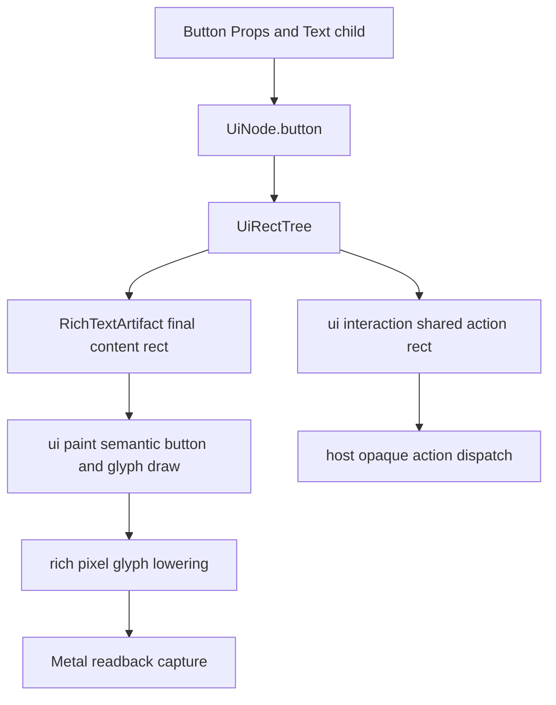

# Metal UI — rich `Button`과 정렬 가능한 텍스트 (§2 B1)

측정형 `Button` 컴포넌트와 그 텍스트 정렬 계약이다. component 작성 모델 전반은 [Metal UI 레이아웃](metal-ui-layout.md) §2가, 이관 순서는 [구현·검증 순서](plans/metal-ui-layout.md)가 소유한다.

> **절 번호는 파일을 넘어 이어진다.** 본문이 `§5`처럼 절만 가리키면 아래에서 소유 파일을 찾는다 — §1~§4·§7 [metal-ui-layout.md](metal-ui-layout.md) · §2의 B1 [rich Button](metal-ui-layout-button.md) · §5 [Metal paint와 입력 정합](metal-ui-layout-paint.md) · §6 [Chrome Lab](metal-ui-layout-lab.md) · §8 [구현·검증 순서](plans/metal-ui-layout.md)

### B1 — rich `Button`과 정렬 가능한 텍스트

`ArchiveSessionDetailPanel`의 재개·로그 액션은 현재 `Card`를 action 표면으로 사용하고
component가 `ChromeDraw.Text.origin`을 직접 계산한다. 이는 일시적인 소비자 구현이지
재사용 Button이 아니다. 특히 현재 `chrome_draw_lowering`과 `metal_lowering`은 text origin을
`NativeMetalCell{row,col}`로 내리므로 y가 한 cell 행으로 절삭된다. 2-cell 높이 action card의
글자가 하단 행으로 쏠리는 이유가 이것이다. `Button` 파일만 추가하거나 y 상수를 바꾸는 것은
루트 원인을 고치지 못한다.

#### Session Dock typography 계약

Chrome 텍스트는 terminal grid의 고정폭 `ResolvedAppearance.font`와 다른 제품 표면이다.
따라서 `chrome/ui/typography.zig`는 macOS adapter가 `CTFontCreateUIFontForLanguage`로 얻는 platform UI
primary face와 CoreText fallback chain을 별도로 resolve한다. terminal font picker의 **family와
line spacing**은 Chrome의 face·행간·글자 폭을 바꾸지 않는다. 이
분리는 터미널을 JetBrains Mono 같은 고정폭 face로 쓰더라도 Session Dock이 레퍼런스처럼
native UI의 비례 typography로 남게 한다. Chrome primary face는 macOS의 system UI face이고,
bundled Jetendard는 결정적인 Lab font-review fixture에서만 선택한다. B1에서는 별도 Chrome
font 설정 키를 만들지 않는다. 설정 표면을 열려면 theme/config 계약과 사용자 선택·fallback
정책을 함께 별도 slice로 정의한다.

`TextOptions`는 raw `font_size`나 family 문자열을 받지 않고 닫힌 `ChromeTextRole`만 받는다.
현재 `typography.token(role)`이 아래 point-equivalent token을, `typography.lineHeightPx(role, scale)`가
backing pixel line height를 준다. platform adapter는 그 둘과 resolved face를 합쳐 `ResolvedTextStyle`을
만든다. paint/component/backend가 각자 size·weight·baseline을
다시 계산하거나, 특정 label·font의 y nudge를 두어서는 안 된다.

| `ChromeTextRole` | size / line-height | weight | Session Dock 소비처 |
| --- | --- | --- | --- |
| `dock_heading` | 18 / 24 | semibold | `Agent 세션 기록` |
| `supporting` | 14 / 18 | regular | 표시 개수·provenance |
| `control` | 14 / 18 | medium | scope segment·search query/placeholder |
| `group_heading` | 16 / 20 | semibold | workspace name·count pill label |
| `card_heading` | 16 / 22 | semibold | session title |
| `body` | 14 / 20 | regular | session summary·recent turn body |
| `metadata` | 13 / 18 | regular | provider·message count·relative age·model |
| `overline` | 12 / 16 | medium | recent turn role·section label |
| `button_label` | 14 / 18 | semibold | resume·reveal action |

각 role의 line box는 `RichTextArtifact`가 보관하는 font metrics와 final content rect에서
정렬한다. 한 줄 control/button은 line box의 중심을 rect 중심에 맞추고, 두 줄 header는 line
stack 전체를 rect 중심에 맞춘다. ink bounds는 clip과 optical diagnostics에만 쓰며 정렬 기준으로
쓰지 않는다. 이 규칙이 작은 icon·위로 붙은 header·하단으로 쏠린 button label을 같은 원인에서
제거한다. icon slot도 role의 line-height와 button content rect를 공유하며, text baseline을
추측해 별도 row에 놓지 않는다.

이 표는 Session Dock만 크게 보이게 하는 별도 display scale이 아니다. 14pt body/control을 기준으로
heading·metadata·button의 위계를 만드는 compact Chrome scale이다. 다만 사용자가 `Cmd`+`+`/`-`/`0`로
terminal font **size**를 조절하면 Session Dock은 그 기준 font 대비 비율만 `SessionDockUiZoom`으로
변환한다. `SessionDockUiZoom`은 750–1500 milli(75–150%)에서 clamp하며, font family·terminal line
spacing·terminal cell width/height는 여전히 입력이 아니다. 따라서 확대와 축소가 모두 Dock에 반영되고,
`Cmd`+`0`은 1000 milli로 되돌린다. token 값 자체를 font-size마다 재정의하거나 Chrome 전체에 임의
raw pixel을 덧씌우지 않는다.

`card_heading`, `body`, `metadata`는 final measured width를 같은 artifact에서 받아 one-line
ellipsis를 결정한다. 특히 한글·emoji·fallback glyph가 있어도 byte count/cell count로 잘라서는
안 되며, card title의 visible text·clip·hit rect가 서로 다른 width를 쓰면 candidate snapshot을
publish하지 않는다. 목록의 고정 row height는 이 token의 line boxes와 기존 padding을 수용하는
layout 결과일 뿐, 작은 글자를 빈 cell로 둘러싼 대체 typography가 아니다.

#### Logical spacing과 component metric

Chrome의 `UiStyle.padding`·`margin`·`gap`은 CSS와 같은 기하 의미를 가지지만, 제품 view가
Tailwind class 또는 임의 raw pixel을 직접 나열하는 API는 아니다. `src/chrome/ui/spacing.zig`의
닫힌 `Space` step(`xxs=4`, `xs=8`, `sm=12`, `md=16`, `lg=20`, `xl=24`, `xxl=32` logical point)을
`spacing.px(step, scale_milli)`로 backing pixel에 한 번 resolve한다. step 확장은 component별
숫자 추가가 아니라 spacing module의 unit/scale/capture 검증을 포함한 별도 설계 변경이다.

`SessionDock`은 `ButtonMetrics.resolve(dock_scale_milli)`와 `DockMetrics.resolve(dock_scale_milli)`를 함께
사용한다. `dock_scale_milli = backing_scale_milli × SessionDockUiZoom / 1000`이며 같은 값이 CoreText
request, immutable text artifact fingerprint, layout, paint, hit-test, scroll projection/wheel unit에 모두
전달된다. `DockMetrics`는 root inset 20pt, fixed control gap 12pt, header 76pt,
scope/search/group 48pt, three-line divider card 112pt, bounded detail 256pt, action 48pt,
action gap 8pt와 item gap 0pt를 한 snapshot으로 제공한다. header utility는 72pt host-label box,
12pt sibling gap, 20pt refresh slot, 16pt trailing safe inset을, group disclosure는 20pt inset/slot과 8pt
  label gap을 같은 snapshot으로 제공한다. refresh와 group disclosure의 idle SVG는
`TextPlacement.icon_in_rect`로 그 slot 자체를 final-pixel placement로 넘긴다. 이 placement는
CoreText label이나 terminal cell을 만들지 않으며, worker가 등록 SVG만 slot의 정확한 중심에
lower한다. header/card/detail의 line offset은
`typography` line box와 `Space`로부터 그 snapshot 안에서 계산한다. terminal cell width/height,
terminal font family, terminal line spacing은 이 함수의 입력이 아니다. `UiRectTree`, paint, hit-test,
virtualized visible window, page/wheel step은 그 동일 metric snapshot을 공유해야 한다. 이 경계가
terminal font family/line spacing 변경이 native Chrome을 흔드는 회귀를 막는다. 반대로 명시된
`SessionDockUiZoom` 변화에서는 같은 completed snapshot의 밀도와 pointer target이 함께 확대·축소되어야 한다.
zoom 직전 viewport top을 가로지르는 materialized card는 old metric의 stable identity로 capture해 new metric
projection에서 restore한다. identity가 없거나 새 projection에 materialize되지 않으면 numeric offset을 새 상한에만
clamp하며 이웃 title/path를 추측하지 않는다.

Header는 reference의 borderless text/utility band이고, scope/search/group/list는 그것과 다른
visible boundary를 가져야 한다. `ColorRole.divider`의 1px rule은 dark panel에서 channel `+24`,
light panel에서 `-24`로 panel과 분리한다. 따라서 rich의 active/hover 색을 divider source로
재사용하거나, header에 border가 없다는 이유로 scope/search outline 및 group/row rule을 생략하는 것은
허용하지 않는다. token snapshot은 ±24 channel delta를 자동 검사한다. actual AppKit/Metal PPM
readback review는 header refresh slot의 ink bounds가 16pt trailing safe inset 안에 있는지와 antialias
뒤에도 panel과 구별되는 core rule이 남는지를 PR artifact에서 확인한다.

AS4-f-a의 `ButtonMetrics`는 `content_inset_x=.md`, `content_inset_y=.sm`, 18pt leading-icon optical
box, `.xs` icon gap과 48pt minimum height를 소유한다. icon SVG의 source viewBox 여백, terminal cell
폭, label별 font nudge는 metric이 아니다. text artifact가 실제 label advance를 반환한 뒤
`icon + gap + label` group을 이 content box 중심에 놓는 B1-button-b 경로만 final placement를 만든다.
색/radius/shadow는 `Tokens`가 계속 소유한다. 즉 spacing 책임을 theme color token에 섞거나 `Row`/`Flex`
API로 노출하지 않는다. view의 available height가 complete `ButtonMetrics`를 수용하지 못하면 action
leaf를 조용히 압축하지 않고 candidate tree를 fail-close한다.

Dock metric capture는 같은 기본(`SessionDockUiZoom=1000`) dock rect에서 terminal font 14pt/24pt와 render
scale 1×/2×를 교차 비교하고, 별도 zoom capture는 750/1000/1500에서 모두 작동하는 rect/action tree를
확인한다. isolated AppKit process는 실제 `NSApplication`·`MaruMetalTerminalView`·`CAMetalLayer`와
Swift→ABI→Zig resize/render 경로를 쓰되, CI가 물리 `NSScreen.backingScaleFactor`를 강제할 수 없으므로
fixture 전용 `render_scale_milli`를 drawable·resize에 일관되게 주입한다. artifact는 실제
`window.backingScaleFactor`와 주입된 scale을 **분리해** 기록한다. 따라서 이 gate는 제품 host 경로의
1×/2× projection을 증명하지만 물리 모니터 이동 이벤트를 대체하지 않으며, 후자는 수동 gate다.

`SessionDock`의 **본문**은 terminal metric을 재사용하지 않는다. `SessionDockUiZoom`이 커져도 그 아래 header,
scope, search, card rect는 terminal font family/line spacing에 무관해야 한다.

**예외는 상단 두 가지 — 시작선과 view switcher 한 줄이다.** 둘 다 terminal 쪽과 한 줄로 맞아야 한다.
right dock의 local origin은 terminal과 **같은 상단 띠**(`titlebar_strip_px` = 펼침 28pt native-title safety band /
접힘 30pt)이고, view switcher 바는 두 chrome이 공유하는 logical token(`space.bar_height_pt`, rich 40pt)이다.
도크만 별도 기준선·별도 metric을 쓰던 예전 방식은 접힘에서 두 상단 바의 시작선을 갈랐다(사용자 보고).

**이 예외는 terminal font 독립성을 깨지 않는다.** 두 값 모두 pt 고정이며 terminal cell이 `@max`로도 섞이지
않는다. 한때 `@max(pt, cell + 2*pad)`로 두었다가 이 문서가 요구하는 계약이 실제로 깨졌다 — 아래 fixture가
14pt↔24pt에서 도크 rect 12px 이동을 잡았고, `tab_bar_pad_y_px`가 backing px 고정이라 1x↔2x 비례도 이탈했다.
정렬은 두 소비자가 **같은 고정값**을 보는 것으로 충분하며, 폰트를 끌어들일 이유가 없었다. 이 정렬은
explorer/source-control만의 UX 계약이 아니라 도크 전체의 규칙이다(단일 출처:
[file-explorer.md](file-explorer.md) §3.5). 그 바 아래 dock rect/action hit rect는 이 문서의 나머지 규칙대로
terminal font에 무관해야 한다.

각 JSON은 raw backing-pixel과 `logical = raw_px × 1000 / render_scale_milli`를 함께 기록하고,
header·scope·search·첫 card·expanded card·resume/log action의 published border/hit rect를 포함한다. icon/label의
세부 ink bounds는 B1 font-review artifact가 소유하며 이 dock-geometry gate가
parallel layout을 다시 계산해 복제하지 않는다.
동일한 기본 zoom의 14pt↔24pt는 모든 dock/action logical rect와 action hit rect가 정확히 같아야 한다.
동일 font의 1×↔2×는 scale-normalized rect가 더 낮은 scale의 1 backing pixel 이내여야 하며, raw backing
rect는 scale 비례여야 한다. 비어 있거나 unpublished/stale rect, 서로 다른 snapshot generation, text artifact
미완료, 또는 열리지 않은 detail은 비교 성공으로 표시하지 않는다. terminal font family/line-spacing 변화 뒤 dock rect나 action
hit rect가 달라지면 실패다. 명시적 font-size zoom 뒤에는 dock rect와 action hit rect가 같은 방향으로 바뀌고,
stale text artifact가 새 scale에 섞이면 실패다. 실제 사용자 Claude/Codex resume은 이 시각 slice의 자동 실행 대상이 아니며,
기존 explicit-action fixture만 다시 실행한다.

시각 합격 자료는 `session-dock-typography` Chrome Lab과 동일 fixture를 소비하는 AppKit capture
두 종류다. 1920×1080 logical viewport의 480pt auto dock에서 header, segmented scope, search,
group, 기본 row, expanded detail, 두 action을 한 화면에 보이고, JSON에는 role별 resolved face,
size, line-height, baseline, final content rect, truncation 여부를 기록한다. font-review는 같은
artifact 입력으로 system UI primary와 bundled Jetendard primary를 각각 capture하여 primary와
fallback face 목록이 실제로 다른지 기록한다. primary face가 바뀌지 않았거나 모든 role의
font identity가 같지 않으면 "font별 capture"라고 주장하지 않는다. 두 capture 모두 GPU rich
glyph readback과 actual AppKit path를 통과해야 하며, PR에는 원본과 2× 확인용 확대 PNG를
`gh attach`로 함께 넣는다.

다음 B1의 제안 API는 semantic component만 공개한다. `Row`/`Column`/`Flex`나 callback closure를
Button API로 올리지 않는다. 제품 component는 내부 layout node를 조합하고, action은 기존처럼
opaque `UiActionId`로 host에 반환한다.

```zig
const button = ui.button(.{
    .id = ids.resume_session,
    .action = .{ .id = resume_action_id, .enabled = can_resume },
    .variant = .primary,
    .size = .default,
    .leading_icon = .recent,
    .style = .{ .width = .{ .percent = 1 }, .min_height = 32 },
}, &.{
    ui.text(.{ .id = ids.resume_label, .value = "터미널에서 이어하기", .align = .center }),
});
```

위 문법은 목표 API다. `id`·`action`·`variant`·`style`은 현재 tree/props로 표현되지만 `size`와
`leading_icon`은 아직 props에 자리가 없고, `ui.text`의 정렬도 지금은 `TextVisual{tone, paint}`에
없다 — component가 `draw.TextPlacement.center_in_rect` 같은 placement를 선언하면 platform artifact가
그것을 해석한다. 현재 `ui.tree`가
아직 받지 않는 필드는 구현 전까지 추가하지 않는다.
`style`은 기존 `UiStyle`의 width/height/flex/margin/padding을 그대로 받아 반응형과 고정 크기를
닫힌 typed union으로 계산한다. 현 `min_width`/`max_width`/`min_height`/`max_height`는 backing-pixel
`?f32` clamp이며 Button도 이를 그대로 받는다. Button이 별도 `minWidth`/`maxHeight` 문자열 속성을
만들지 않는다. percentage min/max는 B1 범위가 아니며, 필요해지면 일반 `UiStyle` 확장으로 별도
layout fixture와 함께 연다. 호출자가 min/max를 생략하면 `ButtonSize`가 token 기반 최소 hit target을
제공한다. builder는 `ButtonSize` floor와 호출자의 min을 합쳐 one resolved min으로 만들고, caller의
max가 그 값을 밑돌면 candidate tree를 fail-close한다. 작은 창에서 hit target을 조용히 압축하지 않는다.

| 책임 | B1 계약 |
| --- | --- |
| `src/chrome/ui/button.zig` | `ButtonProps`, `ButtonSize`, icon slot, semantic `UiNode.button` builder를 소유한다. archive/provider/AppKit을 import하지 않는다. 닫힌 `ButtonVariant`(`primary`·`secondary`·`ghost`·`danger`)는 `ui/style.zig`가 소유하고 토큰 매핑은 `paint_style`이 소유한다. label 전경은 `paint_style.buttonForeground` 하나가 정하며 component가 그 매핑을 다시 나열하지 않는다. |
| `src/chrome/ui/badge.zig` | **작은 라벨 상자의 geometry만** 소유한다 — count pill(둥근 상자·행 세로 중앙·최소 폭·라벨 중앙)과 단축키 keycap(셀 정렬·요소 우상단·좌단 clamp), 그리고 "안 들어가면 안 그린다"를 `null`로. **ops는 내지 않는다**: Dock은 published clip을 실어 보내는 writer를, 단축키 힌트는 arena append를 쓰는데 emission까지 모으면 둘 다와 싸우고, 실제로 틀렸던 것은 emission이 아니라 geometry였다(pill이 행 밖으로 내려간 회귀 = 세로 중앙 괄호). 알림 배지(원 quad + 터미널 셀, platform 소유)·`toggle` 트랙(라벨 없음)·provider badge(도형 없는 텍스트)는 **소비자가 아니다**. |
| `src/chrome/ui/tree.zig` | `button` kind와 immutable visual/action projection을 보관한다. Button을 `.card`로 가장하지 않으며 tree rect와 action identity를 단일 출처로 유지한다. |
| `src/chrome/ui/typography.zig` | `ChromeTextRole`, `Weight`, point-equivalent `Token`과 `lineHeightPx`, platform UI face request를 소유한다. terminal `ResolvedAppearance`·SessionDock·Metal DTO를 import하지 않으며, macOS adapter가 돌려준 resolved face/fallback generation을 immutable style input으로만 받는다. |
| `src/grapheme.zig`, `src/chrome/text_layout.zig` | `grapheme.zig`의 UAX cluster 경계만 Button artifact와 legacy cell text가 공유한다. `chrome/text_layout.zig`의 EAW cell plan은 terminal/cell Chrome 전용으로 유지한다. |
| `src/platform/macos/chrome/chrome_draw_lowering.zig`의 `RichTextArtifact` | **artifact는 platform이 소유한다.** 실제 font glyph advance 측정에 CoreText가 필요하고 `chrome`은 neutral layer라 OS 타입을 import할 수 없기 때문이다(`check-boundaries`가 강제). artifact는 `ResolvedTextStyle`로 CJK·ellipsis·icon slot을 측정해 final content rect·glyph run·pixel baseline/ink rect를 만들고, origin을 cell row로 다시 추측하지 않는다. 정렬은 별도 align 필드가 아니라 component가 선언한 `draw.TextPlacement`(`origin`·`center_in_rect`·`icon_in_rect`·`leading_icon_group`)를 artifact가 해석하는 형태다. neutral `chrome/ui`는 role·style·rect와 opaque handle만 다루고 측정 결과를 재계산하지 않는다. |
| `src/chrome/ui/paint_style.zig` 및 `ui/paint.zig` | hover/focus/pressed/disabled precedence와 token mapping, 배경/테두리/text/icon semantic draw를 한 번만 만든다. component는 직접 `ChromeDraw`를 emit하지 않는다. |
| rich Metal text lowering | Button text/icon의 final pixel placement를 glyph quad/raster placement로 lower한다. terminal `NativeMetalCell` path는 그대로 두며, Button 때문에 terminal grid ABI를 바꾸지 않는다. |
| `ui/interaction.zig`와 host | 기존 pointer capture·keyboard focus가 button의 same `UiActionId`를 dispatch한다. `onClick`/`onHover` closure, provider I/O, shell spawn은 props에 넣지 않는다. |

Button은 정확히 하나의 `Text` leaf child만 받는다. 그 자식은 **호출자 소유 버퍼의 슬라이스**로 넘긴다 —
값으로 받은 node의 주소를 자식으로 실으면 builder가 반환하는 순간 사라진 스택 슬롯을 가리킨다. 따라서
개수/종류 검증은 런타임이며 zero/two/non-Text가 각각 구분되는 오류를 낸다. 아이콘은 `leading_icon` prop으로만 받고 Button 내부에
임의 container/slot child를 노출하지 않는다. 이 제한은 Button의 final content rect, ellipsis, accessible
label source와 action rect가 각기 다른 tree에서 계산되는 것을 막는다.

Button의 painter 상태는 다음 순서를 고정한다. disabled는 항상 마지막이며, disabled action은
hover/focus/capture target이나 click intent가 될 수 없다. pressed는 capture를 가진 primary-pointer
down부터 같은 enabled identity의 up/cancel/reconcile까지이며, hover는 pointer 위치, focus는 keyboard
focus와 함께 같은 rect를 소비한다. Button이 tree 밖에서 별도 hit-test rect를 만들면 안 된다.



`leading_icon`은 raw Unicode 문자열이 아니라 **등록된 SVG 아이콘 하나를 가리키는 닫힌 값**만 받는다.
현재 wire 표현은 `draw.TextPlacement`의 `icon_codepoint: u21`(합성 게이트에 등록된 Plane 15 PUA
codepoint)이며, Session Dock은 `utf8Decode`로 그 값을 만든다. 이 slice가 그 표현을 바꿀지 — 닫힌
`IconId` enum을 새로 두고 codepoint로 매핑할지, 아니면 codepoint를 받되 등록 집합 검증을 builder가
할지 — 는 구현 PR이 정하고 그 근거를 남긴다. 어느 쪽이든 **미등록 codepoint는 fail-close**이고
user/provider transcript의 PUA 문자열은 icon으로 승격하지 않는다. icon slot width, target pixel size,
label gap은 `ButtonSize`와 token에서 결정하고 text artifact·paint·lowerer가 같은 측정 결과를 쓴다. trailing
shortcut은 B1 첫 slice에서는 Text child가 명시적으로 제공할 때만 보이며, Button이 `⌘↵` 같은
문자열을 도메인별로 합성하지 않는다.

현재 B1-text와 archive action의 B1-button-a/b는 구현됐다. `UiNode.button`의 visual/action/border box와
worker-owned final-pixel `leading-icon-group`도 제품 Session Dock에서 소비하며, `ui/tree.zig`의 `button`
props(`variant`·`paint`·`action`·`overflow`)와 `ui/paint_style.zig`의 `resolveButton`도 이미 있다
(`433cb463`). 즉 tree kind와 paint 해석은 남은 범위가 아니다.

generic builder와 그 제약도 이제 있다 — `ui/button.zig`의 `ButtonProps`·`ButtonSize`·icon slot과
one-Text-child API(`bf0cf6f5`), 상태 계약과 keyboard parity `activateFocused`(`7cb02395`), archive
detail의 generic Button 소비(`ca0f127e`)까지 merge됐다. `ButtonVariant`는 `primary`·`secondary`·
`ghost`·`danger` 넷이고(`7111c373`) 토큰 매핑은 `paint_style`이 소유한다. label 자식은 **호출자
버퍼의 슬라이스**로 넘긴다(`ad32dc9f` — 값의 주소를 실으면 dangling).

Session Dock은 자기 `ButtonMetrics`(`components/session_dock/types.zig`)로 action row의 완성 높이를
정하고, `ButtonSize`는 그것과 경쟁하지 않는 **하한**만 준다. 소비자가 자기 높이를 알면
`style.min_height`로 넘기고 builder가 둘 중 큰 쪽을 쓴다.

진행 상태 자체는 `implementation-plan.md`와 `verification-matrix.md`가 소유한다.

각 구현 PR은 `mise run macos-chrome-lab-smoke`의 제품 Metal PNG와 `gh attach` 본문 이미지를
포함한다. B1-text/B1-button은 `zig build test-chrome-ui`, `zig build check-boundaries`, `mise run check`,
그리고 capture가 실제 rich GPU glyph path인지 확인하는 readback artifact를 함께 통과해야 한다.
폰트 선택을 사람이 검토하는 PR은 일반 `retained-list`만 여러 font로 찍어서는 안 된다. 그 fixture는
제품 상태·카드·scroll 검증용이고, 작은 fixed cell 안의 짧은 일반 문장은 서로 다른 primary face가
눈에 잘 드러나지 않는다. 별도 `font-specimen` Lab scenario가 `Il1 O0 MWmw @# [] {} <>`처럼 획폭과
형태가 다른 ASCII primary-face 표본, 그리고 한글 표본을 같은 실제 Session Dock card에 넣어야 한다.
비교가 필요한 PR은 `mise run macos-chrome-lab-font-review`로 만든 제품 Metal PNG 원본과 2×
nearest-neighbor 전체 확인용 PNG를 함께 첨부한다. 이 로컬 검토 task는 `ffmpeg`를 요구하며 CI gate가 아니다.
확대를 위해 Lab의 grid/font-size를 바꾸면 RichText placement contract 자체가 달라져 실제 기본 UI를
검증하지 못하므로 금지한다.
각 font PNG와 JSON은 `primary_glyphs`·`fallback_glyphs`·`distinct_font_faces`를 남긴다. 따라서
primary face가 없는 한글을 시스템 fallback으로 그린 경우를 다른 primary font가 적용됐다고
오인하지 않으며, PR 본문은 이 수치와 PNG를 함께 제시한다.
B1-archive migration은 기존 `mise run macos-agent-session-archive-smoke`의 pointer/keyboard resume·reveal
parity도 다시 통과해야 한다. frame path는 artifact/cache만 읽고 font I/O·shape worker wait·provider I/O를
하지 않으며, artifact invalidation은 text/style/rect/icon/scale 변화에만 일어난다. B1-text의 CoreText
호출은 candidate artifact build에서만 허용되고, published artifact cache hit은 native shape 호출 없이
renderer-neutral glyph record와 final placement만 복제한다. system UI primary face/weight/scale/fallback
generation 또는 text/content rect/overflow policy가 바뀌면 cache를 폐기하고, terminal font picker 변경만으로
폐기해서는 안 된다.
