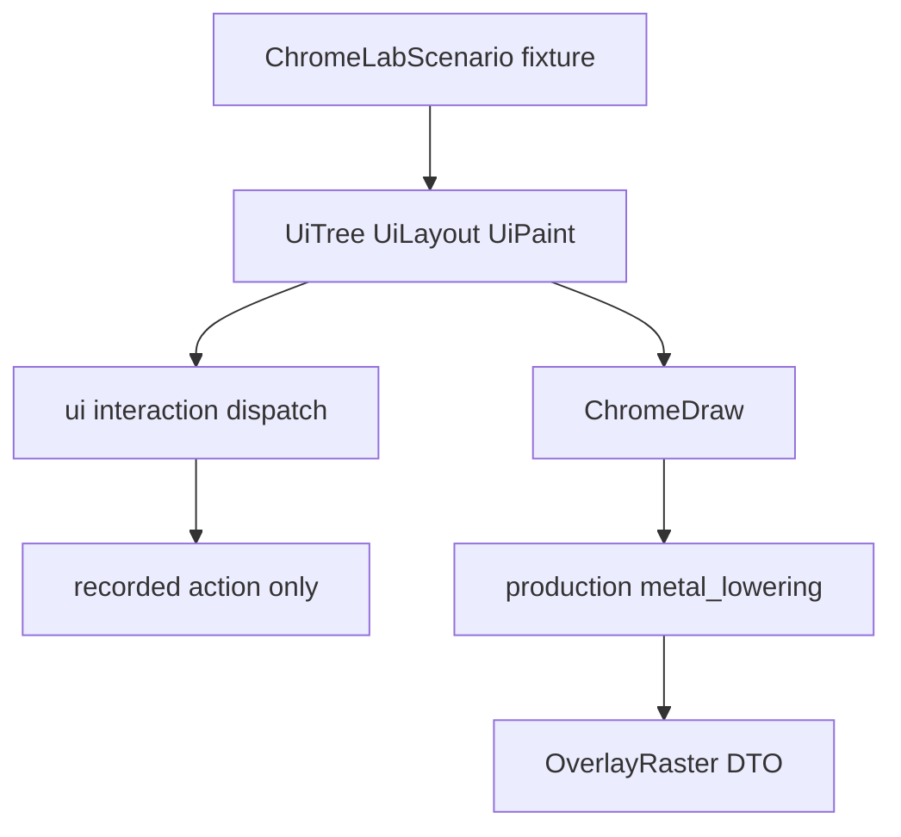
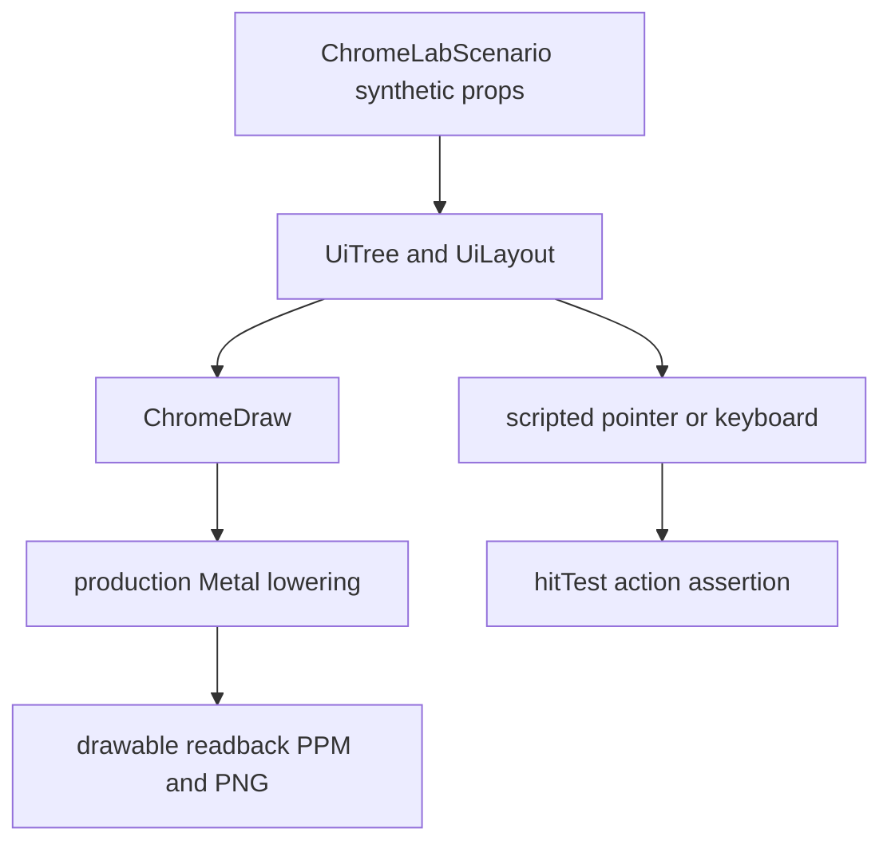
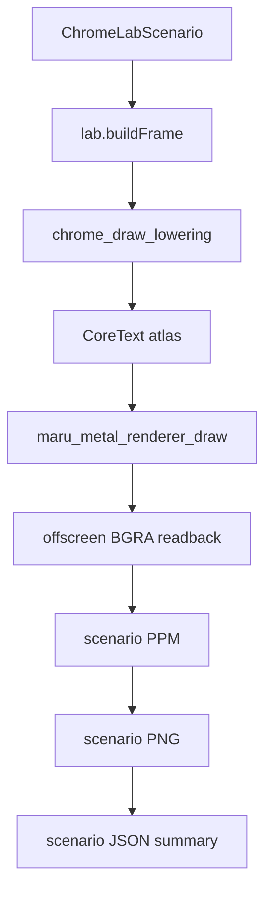

# Metal UI — Chrome Lab (§6)

Storybook 같은 Metal visual/E2E fixture의 계약 — surface admission 경계, ML3b1 foundation, ML3b2 deterministic readback 실행 계약이다.

> **절 번호는 파일을 넘어 이어진다.** 본문이 `§5`처럼 절만 가리키면 아래에서 소유 파일을 찾는다 — §1~§4·§7 [metal-ui-layout.md](metal-ui-layout.md) · §2의 B1 [rich Button](metal-ui-layout-button.md) · §5 [Metal paint와 입력 정합](metal-ui-layout-paint.md) · §6 [Chrome Lab](metal-ui-layout-lab.md) · §8 [구현·검증 순서](plans/metal-ui-layout.md)

## 6. Chrome Lab — Storybook 같은 Metal visual/E2E fixture

`Chrome Lab`은 Storybook의 component scenario 개념을 Metal 제품 경로에 옮긴
**test-only surface input**이다. shell·PTY를 실행하는 일반 Terminal이 아니며, 앱의
정상 사용자 화면과 release navigation에는 노출하지 않는다. 개발/CI fixture는
`ChromeLabScenario`를 통해 같은 `ChromeDraw`·SessionDock text lowering·CoreText atlas·Metal
renderer 경로로 synthetic component tree를 실제 drawable에 그린다. Lab/readback은 구현됐지만
fixture props만 소유하므로 `AppSession` worker나 provider I/O를 대신하는 E2E는 아니다.

### 6.1 surface admission과 공개 모델 경계

ML3b의 첫 구현에서 Lab은 `session.control_surface.SurfaceKind`나 persisted workspace의
새 variant가 아니다. 그 둘은 CLI/control-plane과 workspace restore의 공개 계약이므로, `.chrome_lab`
추가는 개발 fixture 하나를 위해 일반 사용자 탭·저장 포맷·원격 관측에 누출된다. 대신 macOS fixture가
프로세스 안에서만 만드는 **`ChromeLabSurface`** 를 사용한다.

- 입구는 test executable 또는 명시적인 fixture-only boot argument 하나다. 일반 앱 launch, release
  navigation, workspace restore, control-plane inventory는 Lab을 만들거나 열거하지 않는다.
- `ChromeLabSurface`는 PTY, shell, provider log, 파일 경로, persisted `Term`를 갖지 않는다. scenario의
  compile-time synthetic props와 deterministic clock만 소유한다.
- surface라는 말은 Metal drawable에 투영되는 독립 frame input이라는 뜻이다. 제품 workspace의 Tab/Pane가
  아니며, `SurfaceId`를 발급하거나 `SurfaceKind`에 새 case를 더하지 않는다.
- 일반 Chrome의 quad/shadow lowerer는 `src/platform/macos/chrome/metal_lowering.zig`가 맡고,
  component의 semantic text는 `chrome_draw_lowering.zig`가 **한 방향**으로 CoreText DrawList/atlas로
  옮긴다. 두 leaf 모두 `AppSession`, session model, PTY, provider를 import하지 않고, platform이 text
  내용·rect·tone을 다시 계산하지 않는다. Lab은 같은 Chrome draw adapter와 제품 renderer를 호출하며, 별도
  mock renderer나 token→RGB 규칙은 금지한다.
- scripted input은 `ui/interaction.dispatch`에 전달하고, dispatcher는 `recorded_action`만 쓴다.
  provider resume, reveal, process spawn, filesystem callback은 compile-time과 runtime 양쪽에서 진입점이 없다.

따라서 ML3b1의 산출물은 `test-only surface input`이라는 fixture 경계를 공개 session 타입으로 오해하지 않게
한다. 이후 실제 개발자용 Lab 탭을 추가할 필요가 생기면, 그때만 별도 설계에서 workspace persistence,
control-plane visibility, 권한 모델과 lifecycle을 결정한다.

### 6.2 ML3b1 foundation과 현 Lab 범위

ML3b1은 `ChromeLabScenario`의 고정 synthetic draw와 `ui.interaction.dispatch`의 recorded action을 만들고
기존 제품 lowerer에 연결했다. 현 SessionDock Lab은 그 foundation 위에서 component `build`/`view`와
`chrome_draw_lowering.buildTextDrawList`를 추가로 통과시켜, Cocoa·Metal drawable failure와 text atlas
failure를 같은 artifact에서 구분한다.

- scenario ID, backing px viewport, appearance token, deterministic clock, synthetic tree/draw와 expected
  action만 input으로 받는다. `AppSession`, `Term`, `SurfaceId`, config 파일, 환경변수 기반 사용자 경로는
  input으로 받지 않는다.
- 결과는 `OverlayRaster`와 recorded action의 값 DTO다. caller는 allocator를 소유하고 Lab은 frame arena,
  OS window, PTY 또는 worker를 만들지 않는다.
- scenario가 늘어나도 provider resume/reveal/spawn/filesystem callback을 나타내는 action case를 추가하지
  않는다. 해당 행동은 ML4 session dock의 host adapter에서만 별도 권한 계약으로 다룬다.
- headless test는 empty/loading/retained-list의 tree/draw/action 결과, long title clip, selected/hovered
  precedence, width 320/480/800/1280을 고정한다. actual PPM/PNG, CoreText shaping, GPU blend는 이
  단계의 완료 증거가 아니며 다음 readback PR의 범위다.

- scenario는 stable id, viewport backing-px size, scale, appearance token, component
  props, expected action/rect probe만 가진 compile-time synthetic fixture다. provider
  log, 절대 경로, 실제 사용자 제목·prompt는 넣지 않는다.
- 최초 fixture matrix는 session dock의 empty/loading/retained-list, long title,
  collapsed workspace, selected/hovered card, archive loading/ready/stale과 width
  `320/480/800/1280 px`, light/dark appearance다. 각 scenario는 고정 font/token과
  deterministic clock을 주입한다. window scale과 font fallback처럼 환경에 의존하는
  값은 scenario ID·summary에 기록하고, golden을 조용히 갱신하지 않는다.
- scripted pointer/keyboard는 **같은 `UiRectTree`** 에서 hit-test한 Action과 focus
  이동을 단언한다. Lab action dispatcher는 `recorded action`만 남기며 resume,
  reveal, filesystem, provider 실행을 절대 호출하지 않는다.
- macOS Metal Lab smoke는 drawable readback PPM, PR 첨부용 PNG, machine-readable
  summary를 `zig-out/maru-macos-chrome-lab/<scenario>.{ppm,png,json}`에 남긴다.
  PPM은 lossless pixel oracle이고 PNG는 같은 readback bytes에서 만들며, PR 본문에서
  인라인으로 읽을 수 있는 capture다. exact golden이 가능한 shape/clip/background
  영역은 pixel diff로, font raster가 달라질 수 있는 text 영역은 mask와 rect/readback
  probe로 검증한다. CI 실패 artifact와 수동 PR 비교용 screenshot은 같은 frame을
  사용한다.
- visual output을 바꾸는 chrome PR은 이 artifact의 대표 **PNG** scenario capture를
  `gh attach <image> --markdown -R ohah/maru`로 GitHub user-attachment에 올리고,
  출력 Markdown image reference를 PR의 `UI 시각 검증` 절에 포함한다. artifact path만
  쓰는 것은 증거가 아니다. before/after가 있는 변경은 두 capture를 포함하고, 순수
  layout refactor처럼 pixel output이 불변이면 그 이유와 scenario를 PR에 명시한다.
- 이 fixture는 제품 E2E의 한 단계다. 실제 production host/Metal lowering은
  검증하지만 실제 provider scan과 real resume은 호출하지 않으므로, 그 I/O 수명과
  권한 경계는 AS2/AS4 별도 E2E가 계속 소유한다.

### 6.3 ML3b2 — deterministic Metal readback 실행 계약

readback 실행 파일 `maru-macos-chrome-lab-smoke`는 `empty`·`loading`·`retained-list`
각 scenario를 **서로 다른 프로세스**에서 한 번씩 실행한다. 제품 renderer의 screenshot
hook은 프로세스 단위 환경값을 한 번만 읽으므로, 한 프로세스에서 path를 바꿔 여러 frame을
찍으면 이전 artifact를 덮거나 잘못된 scenario로 판정할 수 있다. scenario별 process 격리는
그 cache 경계까지 검증하고, 일반 앱의 launch·workspace restore·control-plane에는 Lab을
노출하지 않는다.

- executable은 `ChromeLabScenario`의 semantic draw에서 one-batch `DrawList`와 CoreText atlas raster
  upload를 만들고 C bridge에 넘긴다. bridge는 fixture-only `CAMetalLayer`와 그 atlas/cell/quad를 받아
  `maru_metal_renderer_create` → `maru_metal_renderer_set_atlas` →
  `maru_metal_renderer_draw`의 **제품** glyph+quad path를 호출한다. window, `AppSession`, PTY,
  worker, filesystem/provider action은 만들지 않는다.
- `MARU_SCREENSHOT_KEEP_PROCESS=maru-test-only-v1`은 Lab bridge처럼 test executable이 screenshot write 뒤
  summary를 검사해야 할 때만 `exit(0)`을 억제하는 renderer debug hook이다. 일반
  `MARU_SCREENSHOT` 제품 실행은 기존대로 한 frame을 쓰고 종료하며, 두 환경값 모두 없으면
  일반 renderer hot path에 추가 work가 없다.
- 각 process는 `zig-out/maru-macos-chrome-lab/<scenario>.ppm`을 쓴 뒤 macOS 기본
  `sips`로 같은 RGB readback을 `<scenario>.png`로 변환하고, `<scenario>.json`에 scenario,
  viewport, appearance, product-renderer success, non-background pixel probe, PPM/PNG 경로를
  기록한다. PNG 변환 실패·파일 크기 0·background-only readback은 모두 smoke 실패다.
- SessionDock readback은 typed text를 실제 atlas로 rasterize한다. 따라서 fixed dark 480×720 JSON은
  `text_rasterized=true`와 glyph cell 수를 명시하며, 카드 geometry뿐 아니라 header/scope/search/group/card
  문자열이 같은 제품 Metal readback에 합성됐음을 증명한다. 다만 고정 font raster의 exact golden, light
  appearance, nested clip/partial scroll과 active host snapshot은 후속 scenario/E2E gate다.

순수 `UiLayout` fixture는 필요하면 test-only WASM build에서도 실행해 browser
property/differential test를 추가할 수 있다. 이는 DOM/CSS runtime이나 shipping WASM을
도입하는 결정이 아니다. WASM 결과는 layout solver의 보조 oracle일 뿐, Metal scissor,
CoreText raster, GPU blend, 실제 hit-test dispatch를 증명하지 않으므로 `Chrome Lab`
macOS screenshot/readback gate를 대체하지 않는다. browser runner 의존성을 추가하는
시점에는 별도 PR에서 dev dependency와 CI 비용을 승인한다.
