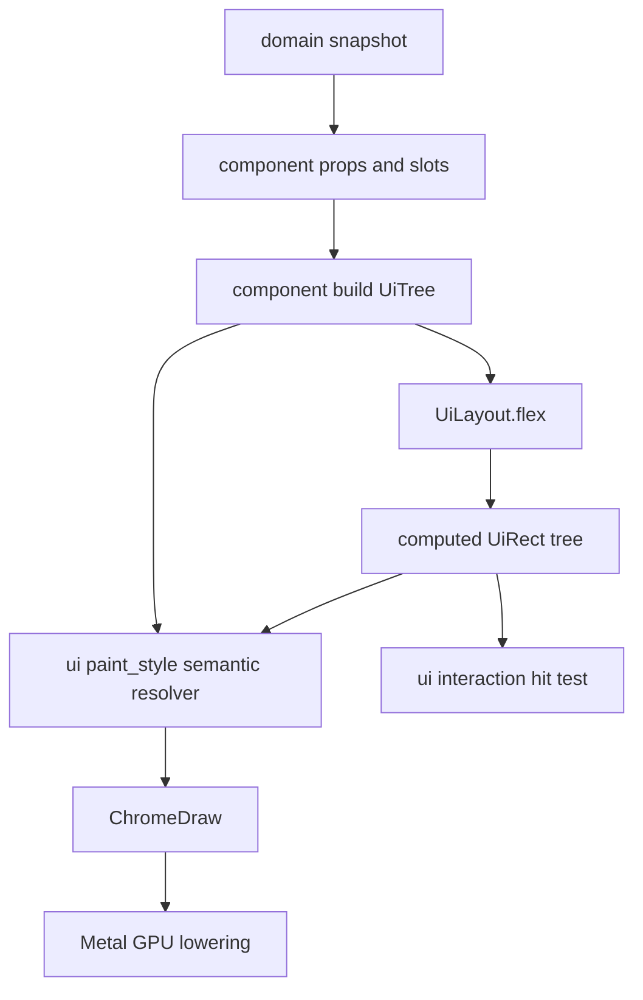
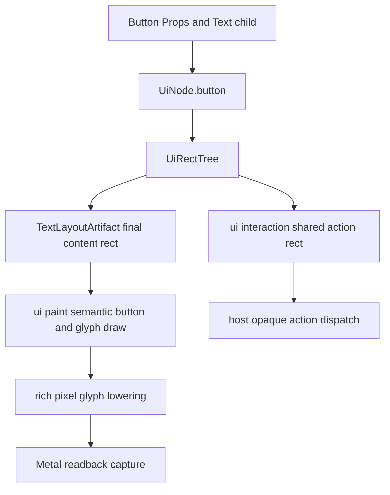
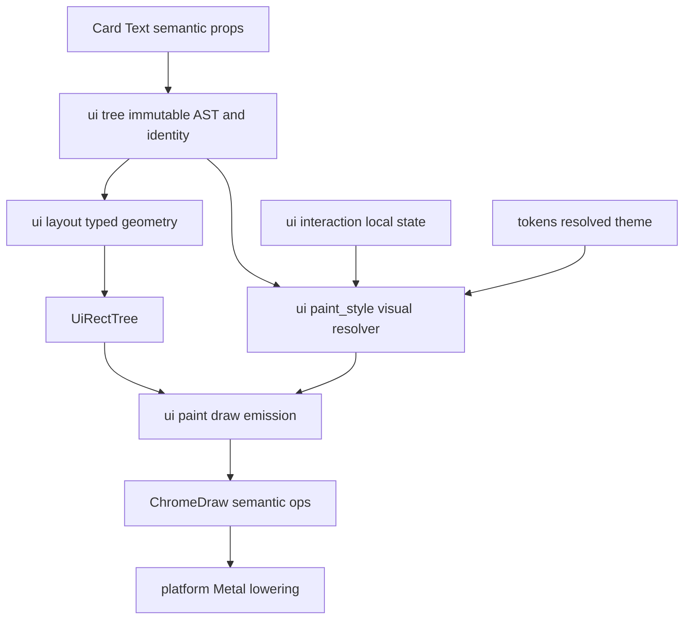
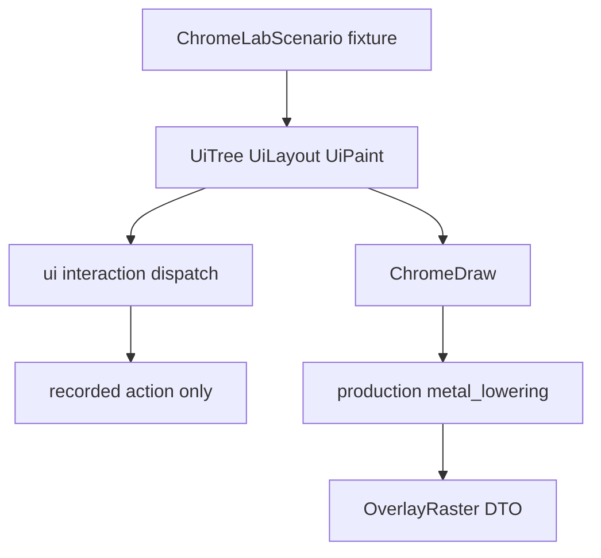
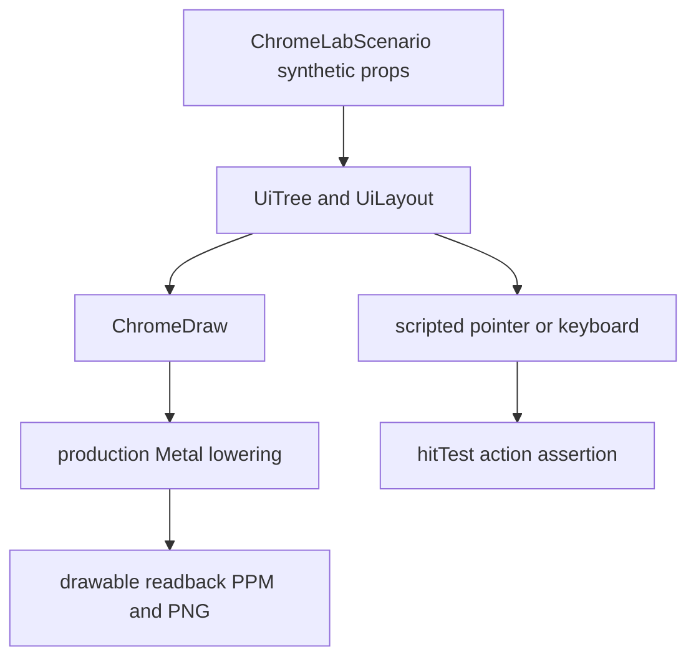
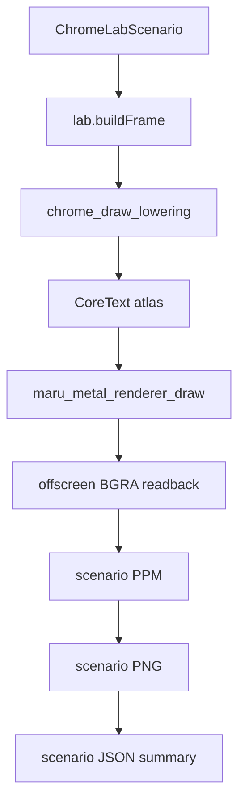

# Metal UI 레이아웃·컴포넌트 시스템

Metal로 그리는 Maru chrome의 컴포넌트 조합, 레이아웃, paint 경계를 정의하는
단일 출처다. 이 문서는 WebView·DOM·React runtime을 도입하지 않는다. 대신
React/shadcn의 **작고 조합 가능한 component·props·slot** 모델과 CSS의 이해하기
쉬운 sizing/flex vocabulary를 Zig의 typed API와 Metal renderer에 적용한다.

상위 chrome 추출·토큰·semantic draw 계약은 [Chrome 전략](chrome-strategy.md)을,
세션 도크의 첫 consumer 계약은 [에이전트 세션 기록 도크](agent-session-list.md)를
따른다.

## 1. 목표와 비목표

목표는 새 Metal UI가 다음 한 흐름으로 작성·검증되는 것이다.



- component tree는 화면의 구조와 slot을 표현하고, domain I/O·PTY·provider file을
  읽지 않는다.
- layout은 fixed와 responsive 크기를 같은 typed value로 계산한다. 계산한 `UiRect`는
  draw, clip, hit-test, focus traversal, scroll viewport가 함께 사용한다.
- paint는 computed rect에 radius, border, shadow, opacity, text glyph를 얹어
  `ChromeDraw`로 만들고 기존 Metal GPU path가 lower한다.
- terminal grid·VT renderer·CoreText glyph atlas의 책임은 유지한다. 이 문서는
  terminal을 CSS box로 바꾸지 않는다.
- 새 chrome layout은 기존 TUI의 cell row/column, ANSI escape, terminal text draw를
  입력이나 fallback으로 읽지 않는다. 이들은 전환 기간에 남는 legacy product path이며,
  새 tree의 backing-pixel rect·clip·hit-test와 섞이지 않는다.

v1 비목표는 DOM, CSS parser, JavaScript/JSX runtime, stylesheet cascade,
browser compatibility, Rust FFI runtime, full CSS Grid algorithm, transform,
transition, animation이다. 이들을 흉내 내기 위해 arbitrary string style을 허용하지
않는다.

## 2. component 작성 모델

새 화면은 React/shadcn과 같은 **조합 형태**를 갖되 Zig 모듈로 구현한다.

```text
SessionDock
├── DockHeader
├── ScopeTabs
├── SearchField
└── SessionList
    └── WorkspaceGroup*
        └── SessionCard*

ArchiveDetailPanel
├── DetailHeader
├── RecentTurnList
└── DetailActions
```

새 tree용 semantic component는 다음의 순수 **build 계약**만 노출한다. `view`/`hitTest`
함수를 component마다 두지 않는다. 같은 AST와 rect를 `ui/paint*`/`ui/interaction`이 각각
한 번만 소비해야 theme·clip·click 영역이 분산되지 않는다.

```zig
pub const Props = struct { /* immutable values and stable identities */ };
pub fn build(props: Props, children: []const UiNode) UiNode;
```

Host만 domain snapshot을 component props로 만들고 `UiActionId` intent를 실제 side effect로
dispatch한다. UI-local state는 `ui/interaction.InteractionState`, semantic paint는
`ui/paint_style`, draw emission은 `ui/paint`, platform
adapter는 input/lowering이 단일 소유한다. component는 `AppSession`, `NativeMetalCell`, Metal API,
filesystem을 import하지 않는다. children/slot은 명시 prop으로 넘기며, component가 전역 UI 상태를
찾아보지 않는다.

실제 작성 문법은 JSX/XML parser가 아니라 compile-time Zig value builder다. ML2a의
`UiNode`는 `identity`, `UiStyle`, tagged `props`, `[]const UiNode` children을 가지며,
부모가 children slice의 수명과 순서를 명시한다. 예를 들어 session card 안의 text는
다음처럼 tree의 실제 child로 작성한다.

```zig
const tree = ui.container(.{ .id = .session_dock, .direction = .column, .style = .{ .gap = 8 } }, &.{
    ui.card(.{ .id = session_id, .action = .{ .id = 100 } }, &.{
        ui.text(.{ .id = session_title_id, .value = "adsf" }),
    }),
});
```

위 예시는 현재 ML2 `ui/tree.zig`가 실제로 받는 최소 문법이다. `variant`, `tone`,
`max_lines`, `overflow` 같은 제품 props는 아래 ML3 target contract가 구현될 때 같은 builder에
추가하며, 그 전에는 예시에 섞어 현재 지원한다고 보이지 않게 한다.

`container`·`card`·`text`는 `UiNode` value를 반환하는 작은 Zig 함수일 뿐이고, React runtime,
virtual DOM diff, arbitrary callback closure를 만들지 않는다. `Container`는 CSS 클래스가 아니라
native rect solver에 direction/gap/align을 전달하는 **chrome 내부 구조 노드**다. `Column`/`Row`
및 `Flex`는 shadcn component도 아니고 사용자-facing 디자인 시스템 API로 만들지 않는다. 제품
API에는 `Card`·`Text`·후속 `Button`/`Input`처럼 의미 있는 component만 보이고, 각 component가
필요할 때 내부 `Container`를 조합한다. host가 immutable snapshot마다 이 tree를 만들고, ML2a가
재귀 layout해 `UiRectTree`를 낸다. ML1의 `layoutFlex(..., []Item, ...)`는 이때 한 parent의
sibling children을 계산하는 순수 solver이며, 아직 component tree API나 제품 UI를 구현했다는
뜻이 아니다.

### ML2a tree 경계

ML2a의 `UiNode`는 `kind`, tree 전체에서 유일한 stable identity, `UiStyle`, immutable
tagged props, children slice를 가진 value다. identity는 snapshot 사이에 같은 semantic
component를 가리킬 때에만 재사용하며, 형제 순서나 frame allocator 주소로 만들지 않는다.
한 tree 안의 duplicate identity는 diagnostic과 함께 build를 fail-close한다. 임의로
suffix를 붙여 구별하면 stale pointer action이 다른 component에 전달될 수 있으므로
금지한다.

build caller는 root를 포함하는 양수 `max_entries`와 root depth=1 기준의 양수
`max_depth`를 명시해 frame arena 사용량과 재귀 깊이를 bounded하게 만든다. 어느 limit도
자동 확장·부분 publish하지 않으며, 초과는 typed diagnostic이다. `items`/flex scratch는
한 parent flex 계산 뒤 재사용하지만, child rect scratch는 활성 조상 sibling이 덮어쓰지
않도록 frame arena 안에서 stack range로 예약한다. 이전 completed snapshot이 있으면 그것을
유지하고, 첫 build라면 empty non-interactive tree만 publish한다. virtualization은 이 상한을
우회하려고 두 번째 hidden rect tree를 만드는 방식이 아니라, visible node만 포함한 같은
tree를 다음 frame에 rebuild한다.

`UiRectTree`는 frame arena가 소유하는 flat preorder entry와 parent index, node identity,
border-box rect, effective clip을 보관한다. 재귀 layout은 각 parent의 child sibling을
ML1 `layoutFlex`로 계산한 뒤 같은 entry를 자식에 전달한다. root border-box는 host가
한 번만 준 backing-pixel available size이고, 자식이 terminal cell 수나 독자적인 window
size를 다시 읽을 수 없다. 따라서 root는 padding/gap 같은 container 내부 style만 쓰며
width/height/min/max/margin/flex/align-self 같은 outer placement style은 fail-close한다.
draw, hit-test, focus, virtualization은 별도의 rect cache를 만들지 않고 이 tree만 읽는다.
tree와 rect tree는 다음 immutable snapshot publish 전까지만 유효하다. build/layout이
duplicate identity나 invalid style로 실패하면 host는 새 tree를 publish하지 않고 직전
completed snapshot을 유지한다. 이를 위해 candidate frame buffer는 published snapshot과
분리하며, in-place rebuild는 금지한다. publish 시에는 old tree를 retire하기 전에
capture/focus의 stale identity를 cancel하고, 그 뒤 old frame arena를 회수한다.

`container`, `card`, `text` builder는 이 tagged node value를 만들 뿐 TUI cell 수를
계산하거나 ANSI 문자열을 반환하지 않는다. `card`의 action은 callback이 아니라 stable
action identity와 enabled policy이고, host가 나중에 dispatch한다. 현재 ML1의 scalar
`MeasureFn`은 synthetic layout fixture 전용 seam이다. 제품 `Text`가 paint되기 전 ML3에서
측정과 paint가 공유하는 immutable `TextLayout` artifact로 반드시 교체한다.

### B1 — rich `Button`과 정렬 가능한 텍스트

`ArchiveSessionDetailPanel`의 재개·로그 액션은 현재 `Card`를 action 표면으로 사용하고
component가 `ChromeDraw.Text.origin`을 직접 계산한다. 이는 일시적인 소비자 구현이지
재사용 Button이 아니다. 특히 현재 `chrome_draw_lowering`과 `metal_lowering`은 text origin을
`NativeMetalCell{row,col}`로 내리므로 y가 한 cell 행으로 절삭된다. 2-cell 높이 action card의
글자가 하단 행으로 쏠리는 이유가 이것이다. `Button` 파일만 추가하거나 y 상수를 바꾸는 것은
루트 원인을 고치지 못한다.

#### Session Dock typography 계약

Chrome 텍스트는 terminal grid의 고정폭 `ResolvedAppearance.font`와 다른 제품 표면이다.
따라서 `ChromeTypography`는 macOS adapter가 `CTFontCreateUIFontForLanguage`로 얻는 platform UI
primary face와 CoreText fallback chain을 별도로 resolve하고, terminal font picker가 Chrome의
type scale·행간·글자 폭을 바꾸지 않는다. 이
분리는 터미널을 JetBrains Mono 같은 고정폭 face로 쓰더라도 Session Dock이 레퍼런스처럼
native UI의 비례 typography로 남게 한다. Chrome primary face는 macOS의 system UI face이고,
bundled Jetendard는 결정적인 Lab font-review fixture에서만 선택한다. B1에서는 별도 Chrome
font 설정 키를 만들지 않는다. 설정 표면을 열려면 theme/config 계약과 사용자 선택·fallback
정책을 함께 별도 slice로 정의한다.

`TextOptions`는 raw `font_size`나 family 문자열을 받지 않고 닫힌 `ChromeTextRole`만 받는다.
`ChromeTypography.resolve(role, scale)`가 아래 point-equivalent token을 backing pixel로 한 번
변환해 `ResolvedTextStyle`을 만든다. paint/component/backend가 각자 size·weight·baseline을
다시 계산하거나, 특정 label·font의 y nudge를 두어서는 안 된다.

| `ChromeTextRole` | size / line-height | weight | Session Dock 소비처 |
| --- | --- | --- | --- |
| `dock_heading` | 20 / 26 | semibold | `Agent 세션 기록` |
| `supporting` | 15 / 20 | regular | 표시 개수·provenance |
| `control` | 16 / 20 | medium | scope segment·search query/placeholder |
| `group_heading` | 17 / 22 | semibold | workspace name·count pill label |
| `card_heading` | 18 / 24 | semibold | session title |
| `body` | 16 / 22 | regular | session summary·recent turn body |
| `metadata` | 15 / 20 | regular | provider·message count·relative age·model |
| `overline` | 14 / 20 | medium | recent turn role·section label |
| `button_label` | 16 / 20 | semibold | resume·reveal action |

각 role의 line box는 `TextLayoutArtifact`가 보관하는 font metrics와 final content rect에서
정렬한다. 한 줄 control/button은 line box의 중심을 rect 중심에 맞추고, 두 줄 header는 line
stack 전체를 rect 중심에 맞춘다. ink bounds는 clip과 optical diagnostics에만 쓰며 정렬 기준으로
쓰지 않는다. 이 규칙이 작은 icon·위로 붙은 header·하단으로 쏠린 button label을 같은 원인에서
제거한다. icon slot도 role의 line-height와 button content rect를 공유하며, text baseline을
추측해 별도 row에 놓지 않는다.

`card_heading`, `body`, `metadata`는 final measured width를 같은 artifact에서 받아 one-line
ellipsis를 결정한다. 특히 한글·emoji·fallback glyph가 있어도 byte count/cell count로 잘라서는
안 되며, card title의 visible text·clip·hit rect가 서로 다른 width를 쓰면 candidate snapshot을
publish하지 않는다. 목록의 고정 row height는 이 token의 line boxes와 기존 padding을 수용하는
layout 결과일 뿐, 작은 글자를 빈 cell로 둘러싼 대체 typography가 아니다.

#### Logical spacing과 component metric

Chrome의 `UiStyle.padding`·`margin`·`gap`은 CSS와 같은 기하 의미를 가지지만, 제품 view가
Tailwind class 또는 임의 raw pixel을 직접 나열하는 API는 아니다. `src/chrome/ui/spacing.zig`의
닫힌 `Space` step(`xxs=4`, `xs=8`, `sm=12`, `md=16`, `lg=20`, `xl=24`, `xxl=32` logical point)을
`spacing.px(step, scale_milli)`로 backing pixel에 한 번 resolve한다. step 확장은 component별
숫자 추가가 아니라 spacing module의 unit/scale/capture 검증을 포함한 별도 설계 변경이다.

`SessionDock`은 `ButtonMetrics.resolve(scale_milli)`와 `DockMetrics.resolve(scale_milli)`를 함께
사용한다. `DockMetrics`는 root inset 20pt, fixed control gap 12pt, header 76pt,
scope/search/group 48pt, three-line divider card 112pt, bounded detail 256pt, action 48pt,
action gap 8pt와 item gap 0pt를 한 snapshot으로 제공한다. header utility는 72pt host-label box,
12pt sibling gap, 20pt refresh slot, 8pt trailing inset을, group disclosure는 20pt inset/slot과 8pt
  label gap을 같은 snapshot으로 제공한다. refresh와 group disclosure의 idle SVG는
`TextPlacement.icon_in_rect`로 그 slot 자체를 final-pixel placement로 넘긴다. 이 placement는
CoreText label이나 terminal cell을 만들지 않으며, worker가 등록 SVG만 slot의 정확한 중심에
lower한다. header/card/detail의 line offset은
`ChromeTypography` line box와 `Space`로부터 그 snapshot 안에서 계산한다. terminal cell width/height,
terminal font, terminal line spacing은 이 함수의 입력이 아니다. `UiRectTree`, paint, hit-test,
virtualized visible window, page/wheel step은 그 동일 metric snapshot을 공유해야 한다. 이 경계가
terminal font를 크게/작게 바꿨을 때 native Chrome의 밀도와 pointer target까지 같이 흔들리는 회귀를
막는다.

AS4-f-a의 `ButtonMetrics`는 `content_inset_x=.md`, `content_inset_y=.sm`, 18pt leading-icon optical
box, `.xs` icon gap과 48pt minimum height를 소유한다. icon SVG의 source viewBox 여백, terminal cell
폭, label별 font nudge는 metric이 아니다. text artifact가 실제 label advance를 반환한 뒤
`icon + gap + label` group을 이 content box 중심에 놓는 B1-button-b 경로만 final placement를 만든다.
색/radius/shadow는 `Tokens`가 계속 소유한다. 즉 spacing 책임을 theme color token에 섞거나 `Row`/`Flex`
API로 노출하지 않는다. view의 available height가 complete `ButtonMetrics`를 수용하지 못하면 action
leaf를 조용히 압축하지 않고 candidate tree를 fail-close한다.

Dock metric capture는 같은 dock backing rect에서 기본·큰 terminal font와 1×/2×를 비교한다. PNG/JSON은
action border/content/icon/label rect, header/scope/search/card rect, terminal font metric을 함께 남긴다.
terminal-font 변화 뒤 dock rect나 action hit rect가 달라지면 실패다. 실제 사용자 Claude/Codex resume은
이 시각 slice의 자동 실행 대상이 아니며, 기존 explicit-action fixture만 다시 실행한다.

시각 합격 자료는 `session-dock-typography` Chrome Lab과 동일 fixture를 소비하는 AppKit capture
두 종류다. 1920×1080 logical viewport의 480pt auto dock에서 header, segmented scope, search,
group, 기본 row, expanded detail, 두 action을 한 화면에 보이고, JSON에는 role별 resolved face,
size, line-height, baseline, final content rect, `did_truncate`를 기록한다. font-review는 같은
artifact 입력으로 system UI primary와 bundled Jetendard primary를 각각 capture하여 primary와
fallback face 목록이 실제로 다른지 기록한다. primary face가 바뀌지 않았거나 모든 role의
font identity가 같지 않으면 "font별 capture"라고 주장하지 않는다. 두 capture 모두 GPU rich
glyph readback과 actual AppKit path를 통과해야 하며, PR에는 원본과 2× 확인용 확대 PNG를
`gh attach`로 함께 넣는다.

다음 B1의 제안 API는 semantic component만 공개한다. `Row`/`Column`/`Flex`나 callback closure를
Button API로 올리지 않는다. 제품 component는 내부 layout node를 조합하고, action은 기존처럼
opaque `UiActionId`로 host에 반환한다.

```zig
const button = ui.button(.{
    .id = ids.resume_session,
    .action = .{ .id = resume_action_id, .enabled = can_resume },
    .variant = .primary,
    .size = .default,
    .leading_icon = .recent,
    .style = .{ .width = .{ .percent = 1 }, .min_height = 32 },
}, &.{
    ui.text(.{ .id = ids.resume_label, .value = "터미널에서 이어하기", .align = .center }),
});
```

위 문법은 목표 API이며 현재 `ui.tree`가 아직 받지 않는 필드는 구현 전까지 추가하지 않는다.
`style`은 기존 `UiStyle`의 width/height/flex/margin/padding을 그대로 받아 반응형과 고정 크기를
닫힌 typed union으로 계산한다. 현 `min_width`/`max_width`/`min_height`/`max_height`는 backing-pixel
`?f32` clamp이며 Button도 이를 그대로 받는다. Button이 별도 `minWidth`/`maxHeight` 문자열 속성을
만들지 않는다. percentage min/max는 B1 범위가 아니며, 필요해지면 일반 `UiStyle` 확장으로 별도
layout fixture와 함께 연다. 호출자가 min/max를 생략하면 `ButtonSize`가 token 기반 최소 hit target을
제공한다. builder는 `ButtonSize` floor와 호출자의 min을 합쳐 one resolved min으로 만들고, caller의
max가 그 값을 밑돌면 candidate tree를 fail-close한다. 작은 창에서 hit target을 조용히 압축하지 않는다.

| 책임 | B1 계약 |
| --- | --- |
| `src/chrome/ui/button.zig` | `ButtonProps`, 닫힌 `ButtonVariant`(`primary`, `secondary`, `ghost`, `danger`), `ButtonSize`, icon slot, semantic `UiNode.button` builder를 소유한다. archive/provider/AppKit을 import하지 않는다. |
| `src/chrome/ui/tree.zig` | `button` kind와 immutable visual/action projection을 보관한다. Button을 `.card`로 가장하지 않으며 tree rect와 action identity를 단일 출처로 유지한다. |
| `src/chrome/ui/typography.zig` | `ChromeTextRole`과 point-equivalent type token, platform UI face request를 소유한다. terminal `ResolvedAppearance`·SessionDock·Metal DTO를 import하지 않으며, macOS adapter가 돌려준 resolved face/fallback generation을 immutable style input으로만 받는다. |
| `src/grapheme.zig`, `src/chrome/text_layout.zig`, `src/chrome/ui/text_artifact.zig` | `grapheme.zig`의 UAX cluster 경계만 Button artifact와 legacy cell text가 공유한다. `chrome/text_layout.zig`의 EAW cell plan은 terminal/cell Chrome 전용으로 유지한다. 새 artifact는 `ResolvedTextStyle`의 실제 font glyph advance로 CJK·ellipsis·icon slot을 측정해 final content rect·glyph run·pixel baseline/ink rect를 만든다. `horizontal_align`과 `vertical_align`은 artifact에서만 해석하며 origin을 cell row로 다시 추측하지 않는다. |
| `src/chrome/ui/paint_style.zig` 및 `ui/paint.zig` | hover/focus/pressed/disabled precedence와 token mapping, 배경/테두리/text/icon semantic draw를 한 번만 만든다. component는 직접 `ChromeDraw`를 emit하지 않는다. |
| rich Metal text lowering | Button text/icon의 final pixel placement를 glyph quad/raster placement로 lower한다. terminal `NativeMetalCell` path는 그대로 두며, Button 때문에 terminal grid ABI를 바꾸지 않는다. |
| `ui/interaction.zig`와 host | 기존 pointer capture·keyboard focus가 button의 same `UiActionId`를 dispatch한다. `onClick`/`onHover` closure, provider I/O, shell spawn은 props에 넣지 않는다. |

Button은 정확히 하나의 `Text` leaf child만 받는다. 아이콘은 `leading_icon` prop으로만 받고 Button 내부에
임의 container/slot child를 노출하지 않는다. 이 제한은 Button의 final content rect, ellipsis, accessible
label source와 action rect가 각기 다른 tree에서 계산되는 것을 막는다.

Button의 painter 상태는 다음 순서를 고정한다. disabled는 항상 마지막이며, disabled action은
hover/focus/capture target이나 click intent가 될 수 없다. pressed는 capture를 가진 primary-pointer
down부터 같은 enabled identity의 up/cancel/reconcile까지이며, hover는 pointer 위치, focus는 keyboard
focus와 함께 같은 rect를 소비한다. Button이 tree 밖에서 별도 hit-test rect를 만들면 안 된다.



`leading_icon`은 raw Unicode가 아니라 이미 등록된 SVG `IconId`만 받는다. icon slot width, target
pixel size, label gap은 `ButtonSize`와 token에서 결정하고 text artifact·paint·lowerer가 같은
측정 결과를 쓴다. user/provider transcript의 PUA 문자열은 icon으로 승격하지 않는다. trailing
shortcut은 B1 첫 slice에서는 Text child가 명시적으로 제공할 때만 보이며, Button이 `⌘↵` 같은
문자열을 도메인별로 합성하지 않는다.

현재 B1-text와 archive action의 B1-button-a/b는 구현됐다. `UiNode.button`의 visual/action/border box와
worker-owned final-pixel `leading-icon-group`도 제품 Session Dock에서 소비한다. 다만 아래의 generic
`ui/button.zig` props/one-Text-child API와 generic paint ownership은 아직 만들지 않았으므로, 현재
archive consumer 하나가 성공했다는 이유로 reusable Button 전체를 완료로 부르지 않는다.

남은 generic Button 이관은 다음 PR로 나눈다. 한 PR은 선행 PR이 병합된 `main`에서만 시작한다.

1. **B1-generic-component:** `ui/button.zig`를 추가해 `ButtonProps`, icon slot, semantic text child를
   `UiNode.button`에 투영한다. archive/provider/AppKit을 import하지 않고, 이미 구현된 Session Dock
   final-pixel artifact를 generic API가 다시 cell origin으로 되돌리지 않음을 unit/readback으로 증명한다.
2. **B1-generic-state:** default/hover/
   pressed/focus/disabled, ButtonSize floor보다 작은 max fail-close, zero/two/non-Text child fail-close,
   narrow CJK ellipsis, pointer·keyboard action parity를 headless와 Lab fixture로 고정한다.
3. **B1-archive refactor:** archive detail action의 current local writer가 generic Button만 소비하도록
   바꾸고 `detail-ready` before/after capture와 실제 AppKit resume/reveal fixture를 갱신한다. provider와
   action identity 정책은 바꾸지 않는다.

각 구현 PR은 `mise run macos-chrome-lab-smoke`의 제품 Metal PNG와 `gh attach` 본문 이미지를
포함한다. B1-text/B1-button은 `zig build test-chrome-ui`, `zig build check-boundaries`, `mise run check`,
그리고 capture가 실제 rich GPU glyph path인지 확인하는 readback artifact를 함께 통과해야 한다.
폰트 선택을 사람이 검토하는 PR은 일반 `retained-list`만 여러 font로 찍어서는 안 된다. 그 fixture는
제품 상태·카드·scroll 검증용이고, 작은 fixed cell 안의 짧은 일반 문장은 서로 다른 primary face가
눈에 잘 드러나지 않는다. 별도 `font-specimen` Lab scenario가 `Il1 O0 MWmw @# [] {} <>`처럼 획폭과
형태가 다른 ASCII primary-face 표본, 그리고 한글 표본을 같은 실제 Session Dock card에 넣어야 한다.
비교가 필요한 PR은 `mise run macos-chrome-lab-font-review`로 만든 제품 Metal PNG 원본과 2×
nearest-neighbor 전체 확인용 PNG를 함께 첨부한다. 이 로컬 검토 task는 `ffmpeg`를 요구하며 CI gate가 아니다.
확대를 위해 Lab의 grid/font-size를 바꾸면 RichText placement contract 자체가 달라져 실제 기본 UI를
검증하지 못하므로 금지한다.
각 font PNG와 JSON은 `primary_glyphs`·`fallback_glyphs`·`distinct_font_faces`를 남긴다. 따라서
primary face가 없는 한글을 시스템 fallback으로 그린 경우를 다른 primary font가 적용됐다고
오인하지 않으며, PR 본문은 이 수치와 PNG를 함께 제시한다.
B1-archive migration은 기존 `mise run macos-agent-session-archive-smoke`의 pointer/keyboard resume·reveal
parity도 다시 통과해야 한다. frame path는 artifact/cache만 읽고 font I/O·shape worker wait·provider I/O를
하지 않으며, artifact invalidation은 text/style/rect/icon/scale 변화에만 일어난다. B1-text의 CoreText
호출은 candidate artifact build에서만 허용되고, published artifact cache hit은 native shape 호출 없이
renderer-neutral glyph record와 final placement만 복제한다. system UI primary face/weight/scale/fallback
generation 또는 text/content rect/overflow policy가 바뀌면 cache를 폐기하고, terminal font picker 변경만으로
폐기해서는 안 된다.

## 3. typed style과 responsive sizing

길이는 문자열 CSS가 아니라 닫힌 typed union이다.

```zig
pub const UiLength = union(enum) {
    auto,
    px: f32,
    percent: f32, // parent content box의 한 축에 대한 0..1
    fill: f32,    // flex 남은 공간의 양수 weight
};

pub const UiStyle = struct {
    width: UiLength = .auto,
    height: UiLength = .auto,
    min_width: ?f32 = null,
    max_width: ?f32 = null,
    min_height: ?f32 = null,
    max_height: ?f32 = null,
    margin: UiEdges = .{},
    padding: UiEdges = .{},
    gap: f32 = 0,
    display: Display = .flex,
    flex: FlexStyle = .{},
};
```

- `px`는 창 backing pixel 좌표계, `percent`는 parent content box, `auto`는
  child/text measurement, `fill(weight)`는 같은 flex line의 잔여 공간이다.
  main axis의 `fill(weight)`는 `flex.grow=weight`의 shorthand이며 explicit
  `flex.grow`와 함께 주면 style validation이 거부한다. cross axis의 `fill`도
  거부한다. min/max clamp는 모든 resolved size 뒤에 같은 순서로 적용한다.
- `percent`는 해당 axis의 parent content size가 **definite**일 때만 resolve한다.
  auto measurement로 아직 정해지지 않은 parent axis에서 percent를 `0`이나
  임의 px로 바꾸지 않는다. ML1은 이런 input을 layout diagnostic과 함께 invalid로
  끝내 draw·hit-test에서 제외한다. parent의 padding은 percentage 기준에서 먼저
  제외하고, child margin은 그 뒤 flex line의 사용 공간에만 반영한다.
- finite하지 않은 px/percent/fill, 음수 px/fill, 범위 밖 percent, `min > max`는
  parse/props 경계에서 fail-close한다. renderer와 hit-test가 보정된 임의 rect를
  각각 만들지 않는다.
- edge·gap·child 합산처럼 유한 input에서 생길 수 있는 `f32` overflow도 같은
  invalid layout으로 끝낸다. explicit min이 없을 때 shrink 하한은 0이며, tiny
  container가 negative/NaN rect를 만들게 두지 않는다.
- `UiRect`와 resolved `width`/`height`는 border box다. text measure callback은
  content 크기를 반환하고 solver가 child padding을 한 번만 더한다. px/percent/flex
  basis는 이미 padding을 포함하는 border-box 크기다. callback의 `known`/`available`
  constraint는 margin·padding을 뺀 content box다. 이렇게 해야 fixed hit target,
  rounded paint, child text inset이 서로 다른 폭을 다시 계산하지 않는다.
- responsive는 전역 breakpoint보다 **available container size**와 위 sizing 값으로
  시작한다. 따라서 dock 폭, detached window, split pane이 달라도 같은 component가
  정확한 rect를 얻는다. 조건부 compact variant가 필요한 경우에도 host가 화면 크기를
  임의로 읽지 않고 layout input의 named size class를 props로 넘긴다.
- paint style은 layout과 분리한다. v1은 background, foreground, border,
  radius, shadow, opacity, overflow clip만 둔다. style은 immutable input이고 paint가
  layout rect나 hit target을 몰래 바꾸지 않는다.

### semantic paint props와 event intent

`UiStyle`은 layout 전용이다. background·font·shadow처럼 보이는 값을 여기에 넣거나, CSS
문자열/임의 key-value bag을 허용하지 않는다. ML3의 제품 node는 다음처럼 **닫힌 semantic prop**을
함께 보관해, 같은 `UiRectTree` entry를 paint와 hit-test가 공유한다.

```zig
pub const CardVariant = enum { surface, raised, selected, danger };
pub const TextTone = enum { primary, muted, accent, danger };
pub const ShadowKind = enum { none, raised };

pub const PaintStyle = struct {
    background: ?ColorRole = null,
    foreground: ?ColorRole = null,
    border: ?ColorRole = null,
    corner_radii_px: ?[4]u16 = null,
    border_widths_px: ?[4]u16 = null,
    shadow: ?ShadowKind = null,
    opacity: u8 = 0xFF,
};

pub const CardOptions = struct {
    id: UiId,
    style: UiStyle = .{},
    variant: CardVariant = .surface,
    paint: PaintStyle = .{},
    action: ?UiAction = null,
    // direction/align/overflow/children ...
};

pub const TextOptions = struct {
    id: UiId,
    value: []const u8,
    role: ChromeTextRole,
    tone: TextTone = .primary,
    paint: PaintStyle = .{},
    // ML3 TextLayout props ...
};
```

- `CardVariant`/`TextTone`은 domain props다. selected는 archive/session selection처럼 model이
  결정하고, hover/focus/pressed는 `InteractionState`만 결정한다. disabled는 별도 bool로
  중복하지 않고 `UiAction.enabled=false`에서만 나온다. painter의 precedence는
  `disabled > pressed > focus > hover > selected > base variant`로 고정한다.
- `PaintStyle`은 semantic `ColorRole`과 geometry override만 받을 수 있다. raw RGB, CSS variable,
  selector, callback은 금지한다. `null`은 component variant가 정한 theme token을 쓴다는 뜻이다.
  `opacity`는 0..255이고, corner/border array는 `[top-left, top-right, bottom-right, bottom-left]`/
  `[top, right, bottom, left]` 순서다. shadow의 blur/offset/color는 component가 직접 들지 않고
  `Tokens.space`의 named token을 쓴다.
- explicit background/foreground/border·shape override는 base variant 다음에 적용한다. hover/focus/
  pressed는 그 위에서 다시 visual feedback을 주며 disabled만은 항상 최우선이다. 따라서 작은 prop
  문법으로도 custom base와 접근 가능한 interaction feedback을 함께 보장한다. `shadow = null`은
  variant default를 보존하고 `.none`은 명시적으로 끈다.
- click/keyboard/context 같은 event도 `onClick` closure가 아니라 stable `UiActionId` intent다.
  ML2b의 현재 primary pointer action은 `UiAction { id, enabled }` 한 개만 소비한다. keyboard
  activation, context menu, tooltip/accessibility는 각 intent를 추가하는 후속 slice에서 열며,
  provider/process side effect는 항상 host dispatcher만 실행한다. hover는 action event가 아니라
  paint state다.
- `resolveVisualStyle(Tokens, variant/tone, PaintStyle, InteractionState, UiAction)`은 ML3의 유일한
  theme 경계다. component는 `Tokens.rich()`/`Tokens.tui()`나 light/dark를 분기하지 않고
  `ColorRole`만 반환한다. token 교체는 rect/identity/action을 바꾸지 않고 paint artifact만
  invalidation한다. Chrome Lab은 같은 scenario를 light/dark token으로 그려 role·alpha·geometry
  probe와 readback PNG가 모두 달라지는지, hit rect/action은 불변인지 검증한다.

### 장기 책임 분리와 단일 출처

새 Chrome UI는 “간단한 typed 문법”과 “한 데이터의 한 소유자”를 함께 지켜야 한다. 아래 경계가
그 단일 출처이며, 같은 prop·rect·theme mapping을 다른 모듈에서 다시 계산하거나 선언하면 안 된다.



| 책임 | 코드 단일 출처 | 금지되는 중복 |
| --- | --- | --- |
| 길이·flex·clip·rect 유효성 | `src/chrome/ui/layout.zig` | component/paint/backend의 별도 좌표·크기 계산 |
| 닫힌 variant/tone/paint prop 어휘 | `src/chrome/ui/style.zig` | CSS/RGB/callback bag |
| child 구조·stable ID·action enabled·semantic prop의 rect snapshot 투영 | `src/chrome/ui/tree.zig` | sibling index·allocator 주소를 identity로 쓰기 |
| hover/focus/pressed/capture와 action intent | `src/chrome/ui/interaction.zig` | component-local callback state·platform side effect |
| tree prop + interaction state를 theme role/shape로 해석 | **ML3 `src/chrome/ui/paint_style.zig`** | host, Metal backend의 light/dark/rich 분기 |
| backing-pixel snap + fixed buffer ChromeDraw emission | **ML3 `src/chrome/ui/paint.zig`** | resolver/backend의 별도 snap·draw 생성 |
| 실제 RGB·spacing·shape token | `src/chrome/tokens.zig` | component가 literal RGB·shadow blur를 보유 |
| backend-neutral draw op | `src/chrome/draw.zig` | component가 `NativeMetalCell`/Metal DTO를 생성 |
| GPU/셀 lowering과 AppKit 입력 adapter | platform boundary | layout/paint를 Swift·Objective-C에서 재구현 |

- `docs/metal-ui-layout.md`는 위 typed UI contract의 설계 단일 출처다. `docs/chrome-strategy.md`
  는 기존 ChromeHost·token/lowering의 제품 수명과 migration만 소유하며, 새 tree의 prop grammar를
  재정의하지 않고 이 문서를 링크한다. `docs/agent-session-list.md`는 Session Dock의 archive data,
  worker, resume/reveal 정책만 소유하고 pixel/layout/event grammar를 중복하지 않는다.
- 제품 author 문법은 `ui.card(.{ .id, .variant, .action }, children)`와
  `ui.text(.{ .id, .value, .tone, .wrap }, ...)`처럼 작고 닫혀 있어야 한다. `Container`는 내부
  구조 노드이며 `.direction/.style`만 받는다. arbitrary `style = .{ .custom = ... }`, DOM-like
  tag, CSS selector/cascade, callback closure는 장기적으로도 추가하지 않는다.
- ML3a 현재 구현은 `ui/layout`·`ui/style`·`ui/tree`·`ui/interaction`·`ui/paint_style`·`ui/paint`
  까지다. paint는 headless `ChromeDraw` 후보만 만들며 실제 Metal lowering, text shaping, clip
  scissor와 GPU shadow emission은 아직 없다. 따라서 새 tree가 rich/light/dark token을 실제 Metal
  output으로 소비한다고 주장하면 안 된다. ML3b Chrome Lab의 dark/light artifact로만 그 연결을 완료로
  판정한다.
- 새 tree의 제품 token input은 **rich/Metal `Tokens` snapshot만**이다. legacy `Tokens.tui()`와
  cell-grid lowering은 기존 config/read compatibility·회귀 fixture의 별도 경로이며, ML3
  resolver에 fallback/조건문으로 넣지 않는다. `tokens.zig`가 두 값을 표현하는 것은 migration
  호환성일 뿐 새 component contract가 두 renderer를 지원한다는 뜻이 아니다.

### Text layout은 flex solver의 외부 입력이 아니라 frame artifact다

`Text`의 폭과 높이는 문자 수·셀 폭으로 추정하지 않는다. font family/weight/size,
fallback face, letter spacing, line height, writing direction, Unicode grapheme 및 line-break
규칙, 그리고 최종 content width가 모두 결과를 바꾼다. 따라서 layout과 Metal paint가 서로
다른 곳에서 같은 문자열을 다시 잘라서는 안 된다.

다음 선언은 **ML3 제품 Text contract의 목표 형태**다. 현재 `ui/tree.zig`의 동명
`TextOptions`는 ML1 synthetic `MeasureFn` fixture seam이므로 이 필드를 아직 제공하지
않으며, ML3에서 한 번에 교체한다.

```zig
pub const TextOptions = struct {
    id: UiId,
    value: []const u8,
    role: ChromeTextRole,
    wrap: TextWrap = .unicode,
    max_lines: ?u16 = null,
    overflow: TextOverflow = .clip,
};

pub const TextWrap = enum { unicode, none };
pub const TextOverflow = enum { clip, ellipsis };
```

- `.unicode`는 공백만 찾는 word-wrap이 아니라 UAX #14 line-break opportunity와 grapheme
  cluster 경계를 따른다. 한글/NFD 조합·emoji ZWJ·variation selector 내부에는 줄바꿈하거나
  `…`를 끼우지 않는다. `.none`은 한 줄만 만들며 `max_lines`가 `1`인 것과 동등한 visible
  line limit을 가진다. `max_lines=0`은 layout diagnostic으로 fail-close하며, `max_lines=1`
  과 `.none`을 함께 준 경우에는 한 줄 규칙을 중복 적용할 뿐 별도 의미를 만들지 않는다.
- `max_lines=null`은 필요한 줄 수만큼 자연 높이를 만든다. 유한한 `max_lines` 또는 `.none`
  에서 content가 넘칠 때만 `overflow`가 적용된다. `.ellipsis`는 마지막 **표시** 줄에 U+2026을
  포함해 다시 shape하여 들어가는 가장 긴 grapheme prefix를 선택한다. `…`가 fallback face를
  써도 실제 advance를 다시 측정한다. content width가 `…` 하나의 advance보다도 좁으면 partial
  ellipsis를 그리지 않고 visible glyph run을 비운다. `.clip`은 glyph run의 clip 밖 부분만
  숨기며 원문 prop은 줄이지 않는다. accessibility/copy 노출은 별도 platform contract가 생길
  때 이 원문 prop을 소비해야 하며, TextLayout이 자체적으로 문자열을 바꾸지 않는다.
- host는 theme snapshot과 platform UI font resolver에서 `ResolvedTextStyle`(primary face·size·weight·line height·letter
  spacing·locale/direction)을 snapshot 시작 시 한 번 정한다. terminal `font.*` config는 이 입력이
  아니다. `TextLayoutRequest`는 이 style,
  원문, wrap/limit/overflow, final content width를 key로 삼고, text engine은 caller frame
  arena에 `TextLayoutArtifact`(content size, visible line range, did_truncate, shaped glyph
  runs)를 만든다. `UiRectTree`의 text entry와 Metal paint는 같은 artifact handle만 읽는다.
- 최초 제품 Text slice에서 `.unicode`, `max_lines`, `.ellipsis`를 쓰는 node의 final content
  width는 explicit width 또는 parent cross-axis stretch로 **먼저 definite**해야 한다. session
  card처럼 vertical container의 stretch child는 이 규칙을 만족한다. horizontal flex line에서
  wrap-dependent intrinsic width를 서로 추측하게 만드는 tree는 `IndefiniteTextWidth` diagnostic으로
  candidate snapshot을 fail-close한다. final border/content rect가 정해진 뒤에는 final width key로
  artifact를 얻어야 하며, preliminary width의 shape를 paint하는 것은 금지한다.
- multi-line text의 intrinsic main-axis sizing, flex-wrap, min-content/max-content reflow는 이
  first consumer 범위 밖이다. 이를 열 때에는 Taffy behavior fixture를 oracle로 삼되, available
  width가 바뀌는 모든 pass에서 line count·card height·glyph artifact가 같은 final width key로
  수렴하는 별도 solver slice를 추가한다. 그 전에는 임의의 pass 횟수나 문자열 폭 추정으로
  fallback하지 않는다.
- ChromeTypography token·platform UI primary/fallback registry generation·scale·available width·text
  props 중 하나가 바뀌면 해당 artifact만 invalidation한다. terminal `font.*` config 변경은 Chrome
  artifact invalidation 원인이 아니다. UI frame path는 font file I/O나 worker wait를 하지 않고,
  이미 renderer 수명과 함께 유지되는 font identity registry 및 frame-owned shape result만
  소비한다. 제품 CoreText adapter의 thread affinity와 glyph-run ABI는 ML3에서 별도 정한다.

Taffy(`references/taffy`, 검토 commit `945de0d`)는 tree+style+measure callback으로 flex/grid
rect를 계산하지만 text shaping 자체는 제공하지 않는다. Maru는 이 사실을 layout API와 component
API를 분리하는 benchmark로만 사용한다. Rust crate/FFI/WASM을 제품에 넣거나 Taffy의 자료구조·
제어 흐름을 이식하지 않는다.

## 4. Flex 먼저, Grid는 예약

첫 solver는 column/row flex만 구현한다. direction, justify-content, align-items,
align-self, grow/shrink, basis, gap, margin/padding, min/max, overflow clip과
text measure callback이 범위다. wrap, order, baseline alignment, absolute
positioning은 실제 consumer가 필요해질 때 별도 slice로 연다.

flex 분배는 basis·margin·gap으로 free space를 정한 뒤 grow 또는 shrink를
weight 비례로 배분한다. min/max에 닿은 item은 그 pass에서 freeze하고, 남은
free space를 아직 freeze되지 않은 item에 다시 분배해 수렴시킨다. `auto` text
measure callback은 available/known size constraint를 명시적으로 받아, 측정과
layout이 서로 다른 폭을 가정하지 않게 한다.

v1 `Display`는 `.flex`만 가진다. grid track/area type과 `.grid` 값은 아직 API에
노출하지 않는다. grid가 필요한 화면이 생기면 explicit grid solver와 row/column/area
fixture를 같은 PR에서 추가한다. 지원하지 않는 layout value를 조용히 flex로 fallback
하는 방식은 허용하지 않는다. 세션 도크의 header, scope tabs, cards, detail action
row는 flex로 완성한다.

Taffy는 제품 의존성이 아니라 layout behavior의 benchmark/oracle이다. Taffy의 공개 tree/style
모델은 component library가 아니라 flex·grid·block rect 계산기이며, 동적 content는 caller가
measure callback으로 제공한다. 이 분리는 `Card`/`Text` 같은 의미 component와 내부 container
solver를 분리해야 한다는 Maru의 근거다. Maru는 Rust crate나 WASM/FFI를 shipping path에 넣지
않고, synthetic layout input과 computed rect expected result를 독립 fixture로 유지한다.

## 5. Metal paint와 입력 정합

`UiRectTree`의 모든 rect는 one-source다.

- `ui/paint`만 rect와 `ui/paint_style`의 semantic paint 결과에서 `ChromeDraw.fill/border/text/quad`를 만들고,
  Metal backend가 glyph/cell/GPU quad로 lower한다. component와 backend는 draw op를 따로 만들지
  않는다.
- `ui/interaction`은 동일 rect와 clip chain을 역순으로 검사한다. ML2b의 현재 action hit 영역은
  axis-aligned rect이며, ML3의 corner radius는 painter만 소비한다. rounded hit mask가 필요해지면
  paint의 radius를 복제하지 않고 shared typed shape를 `ui/tree`에서 추가하고, 그 mask의
  unit/clip/경계 fixture를 같은 slice에서 먼저 추가한다.
- scroll viewport와 virtualization은 list child를 그리기 전에 같은 rect tree로
  visible range를 정한다. fixed header와 scroll body가 서로 다른 y origin을
  재계산하면 안 된다.
- focus ring, hover, pressed, disabled는 layout 밖의 state지만 모두 같은 component
  rect에 paint한다. keyboard action과 pointer action은 stable item identity를
  공유한다.
- UI frame path는 I/O, JSON parse, worker wait, blocking lock을 하지 않는다. dirty
  props/style/size가 바뀔 때만 layout과 draw artifact를 다시 만든다.

### 입력 dispatch와 interaction state

모든 화면 상태를 props로 왕복하지 않는다. immutable props는 domain data, stable
item/action identity, enabled/disabled policy, named visual variant를 가진다. hover,
pressed, focus, pointer capture, scroll offset은 `ChromeHost`가 소유하는 UI-local
`InteractionState`다. component가 provider나 app 전역 상태를 직접 읽어 hover를
추측하지 않으며, Lab만 재현 가능한 interaction state를 explicit fixture input으로
주입한다.

1. `UiPointerEvent`는 현재 chrome의 제한된 `input.PointerEvent`를 완료로 주장하는
   이름이 아니라 ML2에서 추가하는 layout-layer DTO다. ML2는 기존 backing-px
   `down/move/up` 변환을 보존하면서 `scroll`과 monotonic timestamp를 같은 adapter
   경계에서 보강하고, platform → `ChromeHost` event mapping이 하나뿐임을 test로 고정한다.
2. `ChromeHost`는 ML2b 순수 상태 머신에 같은 `UiRectTree`를 주어 z-order와 clip chain
   역순 hit-test를 수행한다. move의 hover enter/leave는 이전/새 target의 two-dirty fast
   path를 쓰고, focus/pressed까지 바뀌는 전이는 모든 변경 visual identity의 bounded dirty
   set을 반환한다.
3. down은 target identity를 pointer capture로 보관한다. 이후 move/up은 포인터가
   target 밖으로 나가거나 다른 element 위를 지나도 capture target에 보낸다. up은
   down/up의 action identity와 enabled policy가 모두 여전히 맞을 때만 click Action을
   만든다. drag threshold를 넘으면 click Action 대신 component가 선언한 drag intent만
   허용한다. layout tree mutation, snapshot swap, surface deactivation, capture target
   identity 제거는 capture를 `cancelled`로 끝내 pressed를 지우고 이후 up Action을 만들지
   않는다. hover/focus 보존·정리는 새 enabled snapshot을 기준으로 `reconcile`이 결정한다.
4. wheel/trackpad는 hit target의 scroll owner만 소비하고, viewport clamp 뒤 같은
   rect tree를 다시 사용한다. pointer action과 keyboard focus action은 같은 stable
   identity를 통해 `Action`으로 합류한다.
5. component는 `Action` intent만 반환한다. host dispatcher만 resume/reveal/new-Term
   같은 side effect를 실행하며, Lab dispatcher는 recorded action만 남겨 filesystem,
   provider, process 실행을 절대 하지 않는다.

### ML2b interaction 계약

ML2b는 `src/chrome/ui/interaction.zig`의 순수 상태 머신이다. `ui/tree.zig`가
immutable `UiRectTree`를 만들고, `ui/interaction.zig`가 그 snapshot을 **빌려서만**
hit-test한다. 어느 쪽도 `ChromeHost`, `AppSession`, provider archive, Metal draw를
import하지 않는다. 따라서 실제 macOS adapter는 기존 `input.PointerEvent`를 이 DTO로
한 번 변환하고, `ChromeHost`는 반환 intent와 repaint 요구만 platform에 전달한다.

```zig
pub const UiPointerEvent = struct {
    phase: enum { move, down, up, cancel },
    x_px: f64,
    y_px: f64,
    button: input.PointerButton = .left,
    timestamp_ns: u64,
};

pub const InteractionState = struct {
    hovered: ?UiId = null,
    focused: ?UiId = null,
    capture: ?Capture = null,
};

pub const Dispatch = struct {
    action: ?UiActionId = null,
    /// frame arena가 소유하는 bounded, insertion-order, duplicate-free repaint set.
    /// ML2b state는 hovered/focused/capture 세 visual identity를 동시에 바꿀 수 있으므로
    /// two-rect hover fast path보다 넓은 상한을 둔다.
    dirty: DirtySet = .{},
};

pub const DirtySet = struct {
    ids: [4]?UiId = .{ null, null, null, null },
};
```

- `InteractionState`는 visual prop의 source다. `Card` paint는 immutable node prop과
  `hovered/focused/capture`의 id equality만 읽어 hover·pressed·focus variant를 고른다.
  component API에 arbitrary `onHover` closure나 provider callback을 넣지 않는다.
- hit-test 후보는 preorder의 **역순**으로 검사한다. 좌표가 NaN/∞이면 즉시 target 없음이며,
  유한 좌표도 candidate의 half-open `rect`(`x <= px < x+width`, `y <= py < y+height`)와
  `effective_clip` 양쪽 안에 있어야 한다. clip 밖이면 후보도 그 subtree도 선택할 수 없다.
  후보의 `UiAction`이 없거나 `enabled=false`이면 포인터 focus·capture·click target이 될 수
  없다. `text`처럼 inert node는 hit-test를 가로채지 않아 action을 가진 조상 `Card`가
  선택될 수 있다.
- `dirty`는 상태 전/후를 비교해 visual identity(`hovered`, `focused`, `capture`)가 바뀐 모든
  id를 insertion-order·중복 없이 담는다. ML2b에는 이 상태가 세 개뿐이므로 fixed `[4]`로
  충분하며 overflow는 programmer error로 fail-close한다. `move`의 hover A→B는 여전히 정확히
  two-dirty fast path이고, 같거나 둘 다 null이면 repaint 요구가 없다. `down`은 left button의
  enabled target만 `focused` 및 `capture`로 기록하고 pressed variant를 시작하며, 같은 event의
  hit target으로 hover도 갱신한다. `up`/`cancel`은 capture를 끝낸 뒤 현재 좌표의 enabled
  target으로 hover를 다시 계산한다. 이 전이 규칙을 통해 drag 뒤 pointer가 놓인 위치와
  hover paint가 한 frame에서 일치한다.
- ML2b는 pointer id 없는 single-primary-pointer protocol이다. left capture가 남은 상태로 또
  `down`이 오면 기존 capture를 action 없이 먼저 cancel한 뒤 새 `down`을 처리한다. capture는
  left `up` 또는 `cancel`에서만 끝내며, right/other `up`은 left capture와 focus를 지우거나
  action을 만들지 않는다. `cancel`은 button 값과 무관하게 action 0으로 capture를 끝낸다.
- capture에는 down 당시 `UiId`와 `UiActionId`를 함께 보관한다. `up`은 좌표가 target
  밖이어도 capture 대상으로 끝나지만, **down과 같은 published snapshot**에 capture가
  계속 남아 있을 때만 action을 하나 낸다. 우클릭/other button, target 없는 down,
  capture 없는 up은 action 0이다. drag intent·multi-pointer·double-click은 이 slice 밖이다.
- host가 새 tree를 publish하기 전 `reconcile(old_tree, new_tree)`를 호출한다. 새 snapshot
  publish는 capture를 항상 `.cancel`과 동등하게 끝내 pressed를 지우고 이후 stale `up`
  action을 금지한다. hover/focus는 새 tree에 같은 enabled id가 있을 때만 보존하고, 없으면
  null로 정리한다. old rect의 repaint는 old tree가 retire되기 전에 요청한다. build 실패에는
  새 tree가 없으므로 reconcile도 publish도 하지 않아 기존 capture/focus를 보존한다.
- surface가 deactivate되면 `deactivate`가 capture·hover·focus를 모두 action 0으로 지운다.
  다음 활성 surface가 재사용한 numeric id를 이전 surface의 hover/focus state로 오인하지 않는다.
- `timestamp_ns`는 adapter에서 단조 clock으로만 만든다. ML2b는 시간·worker·lock을 읽지
  않으며, 이후 drag threshold가 필요할 때만 이 event의 시간과 최초 down 좌표를 사용한다.
  `scroll`은 ML2b의 action/capture contract에 넣지 않는다. scroll owner/viewport는 ML3의
  paint/virtualization seam과 함께 별도 slice에서 연다.

검증은 순수 `UiRectTree` fixture로 다음을 고정한다: clip 뒤의 action 무시, 겹친 card의
z-order, hover A→B의 two-dirty, focus/pressed 전환이 관련 모든 rect를 dirty에 넣는지, outside
move/up capture, disabled·action 변경 후 stale up=0, snapshot swap·surface deactivation의 cancel,
build 실패 뒤 기존 interaction 보존이다. 이들은 headless 계약 증거이고, 실제 Metal
cursor/hover paint와 scripted macOS 입력은 ML3 Chrome Lab capture에서 별도로 증명한다.

## 6. Chrome Lab — Storybook 같은 Metal visual/E2E fixture

`Chrome Lab`은 Storybook의 component scenario 개념을 Metal 제품 경로에 옮긴
**test-only surface input**이다. shell·PTY를 실행하는 일반 Terminal이 아니며, 앱의
정상 사용자 화면과 release navigation에는 노출하지 않는다. 개발/CI fixture는
`ChromeLabScenario`를 통해 같은 `ChromeDraw`·SessionDock text lowering·CoreText atlas·Metal
renderer 경로로 synthetic component tree를 실제 drawable에 그린다. Lab/readback은 구현됐지만
fixture props만 소유하므로 `AppSession` worker나 provider I/O를 대신하는 E2E는 아니다.

### 6.1 surface admission과 공개 모델 경계

ML3b의 첫 구현에서 Lab은 `session.control_surface.SurfaceKind`나 persisted workspace의
새 variant가 아니다. 그 둘은 CLI/control-plane과 workspace restore의 공개 계약이므로, `.chrome_lab`
추가는 개발 fixture 하나를 위해 일반 사용자 탭·저장 포맷·원격 관측에 누출된다. 대신 macOS fixture가
프로세스 안에서만 만드는 **`ChromeLabSurface`** 를 사용한다.

- 입구는 test executable 또는 명시적인 fixture-only boot argument 하나다. 일반 앱 launch, release
  navigation, workspace restore, control-plane inventory는 Lab을 만들거나 열거하지 않는다.
- `ChromeLabSurface`는 PTY, shell, provider log, 파일 경로, persisted `Term`를 갖지 않는다. scenario의
  compile-time synthetic props와 deterministic clock만 소유한다.
- surface라는 말은 Metal drawable에 투영되는 독립 frame input이라는 뜻이다. 제품 workspace의 Tab/Pane가
  아니며, `SurfaceId`를 발급하거나 `SurfaceKind`에 새 case를 더하지 않는다.
- 일반 Chrome의 quad/shadow lowerer는 `src/platform/macos/chrome/metal_lowering.zig`가 맡고,
  component의 semantic text는 `chrome_draw_lowering.zig`가 **한 방향**으로 CoreText DrawList/atlas로
  옮긴다. 두 leaf 모두 `AppSession`, session model, PTY, provider를 import하지 않고, platform이 text
  내용·rect·tone을 다시 계산하지 않는다. Lab은 같은 Chrome draw adapter와 제품 renderer를 호출하며, 별도
  mock renderer나 token→RGB 규칙은 금지한다.
- scripted input은 `ui/interaction.dispatch`에 전달하고, dispatcher는 `recorded_action`만 쓴다.
  provider resume, reveal, process spawn, filesystem callback은 compile-time과 runtime 양쪽에서 진입점이 없다.

따라서 ML3b1의 산출물은 `test-only surface input`이라는 fixture 경계를 공개 session 타입으로 오해하지 않게
한다. 이후 실제 개발자용 Lab 탭을 추가할 필요가 생기면, 그때만 별도 설계에서 workspace persistence,
control-plane visibility, 권한 모델과 lifecycle을 결정한다.

### 6.2 ML3b1 foundation과 현 Lab 범위

ML3b1은 `ChromeLabScenario`의 고정 synthetic draw와 `ui.interaction.dispatch`의 recorded action을 만들고
기존 제품 lowerer에 연결했다. 현 SessionDock Lab은 그 foundation 위에서 component `build`/`view`와
`chrome_draw_lowering.buildTextDrawList`를 추가로 통과시켜, Cocoa·Metal drawable failure와 text atlas
failure를 같은 artifact에서 구분한다.

- scenario ID, backing px viewport, appearance token, deterministic clock, synthetic tree/draw와 expected
  action만 input으로 받는다. `AppSession`, `Term`, `SurfaceId`, config 파일, 환경변수 기반 사용자 경로는
  input으로 받지 않는다.
- 결과는 `OverlayRaster`와 recorded action의 값 DTO다. caller는 allocator를 소유하고 Lab은 frame arena,
  OS window, PTY 또는 worker를 만들지 않는다.
- scenario가 늘어나도 provider resume/reveal/spawn/filesystem callback을 나타내는 action case를 추가하지
  않는다. 해당 행동은 ML4 session dock의 host adapter에서만 별도 권한 계약으로 다룬다.
- headless test는 empty/loading/retained-list의 tree/draw/action 결과, long title clip, selected/hovered
  precedence, width 320/480/800/1280을 고정한다. actual PPM/PNG, CoreText shaping, GPU blend는 이
  단계의 완료 증거가 아니며 다음 readback PR의 범위다.





- scenario는 stable id, viewport backing-px size, scale, appearance token, component
  props, expected action/rect probe만 가진 compile-time synthetic fixture다. provider
  log, 절대 경로, 실제 사용자 제목·prompt는 넣지 않는다.
- 최초 fixture matrix는 session dock의 empty/loading/retained-list, long title,
  collapsed workspace, selected/hovered card, archive loading/ready/stale과 width
  `320/480/800/1280 px`, light/dark appearance다. 각 scenario는 고정 font/token과
  deterministic clock을 주입한다. window scale과 font fallback처럼 환경에 의존하는
  값은 scenario ID·summary에 기록하고, golden을 조용히 갱신하지 않는다.
- scripted pointer/keyboard는 **같은 `UiRectTree`** 에서 hit-test한 Action과 focus
  이동을 단언한다. Lab action dispatcher는 `recorded action`만 남기며 resume,
  reveal, filesystem, provider 실행을 절대 호출하지 않는다.
- macOS Metal Lab smoke는 drawable readback PPM, PR 첨부용 PNG, machine-readable
  summary를 `zig-out/maru-macos-chrome-lab/<scenario>.{ppm,png,json}`에 남긴다.
  PPM은 lossless pixel oracle이고 PNG는 같은 readback bytes에서 만들며, PR 본문에서
  인라인으로 읽을 수 있는 capture다. exact golden이 가능한 shape/clip/background
  영역은 pixel diff로, font raster가 달라질 수 있는 text 영역은 mask와 rect/readback
  probe로 검증한다. CI 실패 artifact와 수동 PR 비교용 screenshot은 같은 frame을
  사용한다.
- visual output을 바꾸는 chrome PR은 이 artifact의 대표 **PNG** scenario capture를
  `gh attach <image> --markdown -R ohah/maru`로 GitHub user-attachment에 올리고,
  출력 Markdown image reference를 PR의 `UI 시각 검증` 절에 포함한다. artifact path만
  쓰는 것은 증거가 아니다. before/after가 있는 변경은 두 capture를 포함하고, 순수
  layout refactor처럼 pixel output이 불변이면 그 이유와 scenario를 PR에 명시한다.
- 이 fixture는 제품 E2E의 한 단계다. 실제 production host/Metal lowering은
  검증하지만 실제 provider scan과 real resume은 호출하지 않으므로, 그 I/O 수명과
  권한 경계는 AS2/AS4 별도 E2E가 계속 소유한다.

### 6.3 ML3b2 — deterministic Metal readback 실행 계약

readback 실행 파일 `maru-macos-chrome-lab-smoke`는 `empty`·`loading`·`retained-list`
각 scenario를 **서로 다른 프로세스**에서 한 번씩 실행한다. 제품 renderer의 screenshot
hook은 프로세스 단위 환경값을 한 번만 읽으므로, 한 프로세스에서 path를 바꿔 여러 frame을
찍으면 이전 artifact를 덮거나 잘못된 scenario로 판정할 수 있다. scenario별 process 격리는
그 cache 경계까지 검증하고, 일반 앱의 launch·workspace restore·control-plane에는 Lab을
노출하지 않는다.



- executable은 `ChromeLabScenario`의 semantic draw에서 one-batch `DrawList`와 CoreText atlas raster
  upload를 만들고 C bridge에 넘긴다. bridge는 fixture-only `CAMetalLayer`와 그 atlas/cell/quad를 받아
  `maru_metal_renderer_create` → `maru_metal_renderer_set_atlas` →
  `maru_metal_renderer_draw`의 **제품** glyph+quad path를 호출한다. window, `AppSession`, PTY,
  worker, filesystem/provider action은 만들지 않는다.
- `MARU_SCREENSHOT_KEEP_PROCESS=maru-test-only-v1`은 Lab bridge처럼 test executable이 screenshot write 뒤
  summary를 검사해야 할 때만 `exit(0)`을 억제하는 renderer debug hook이다. 일반
  `MARU_SCREENSHOT` 제품 실행은 기존대로 한 frame을 쓰고 종료하며, 두 환경값 모두 없으면
  일반 renderer hot path에 추가 work가 없다.
- 각 process는 `zig-out/maru-macos-chrome-lab/<scenario>.ppm`을 쓴 뒤 macOS 기본
  `sips`로 같은 RGB readback을 `<scenario>.png`로 변환하고, `<scenario>.json`에 scenario,
  viewport, appearance, product-renderer success, non-background pixel probe, PPM/PNG 경로를
  기록한다. PNG 변환 실패·파일 크기 0·background-only readback은 모두 smoke 실패다.
- SessionDock readback은 typed text를 실제 atlas로 rasterize한다. 따라서 fixed dark 480×720 JSON은
  `text_rasterized=true`와 glyph cell 수를 명시하며, 카드 geometry뿐 아니라 header/scope/search/group/card
  문자열이 같은 제품 Metal readback에 합성됐음을 증명한다. 다만 고정 font raster의 exact golden, light
  appearance, nested clip/partial scroll과 active host snapshot은 후속 scenario/E2E gate다.

순수 `UiLayout` fixture는 필요하면 test-only WASM build에서도 실행해 browser
property/differential test를 추가할 수 있다. 이는 DOM/CSS runtime이나 shipping WASM을
도입하는 결정이 아니다. WASM 결과는 layout solver의 보조 oracle일 뿐, Metal scissor,
CoreText raster, GPU blend, 실제 hit-test dispatch를 증명하지 않으므로 `Chrome Lab`
macOS screenshot/readback gate를 대체하지 않는다. browser runner 의존성을 추가하는
시점에는 별도 PR에서 dev dependency와 CI 비용을 승인한다.

## 7. transform과 animation의 순서

v1에는 animation과 transform을 구현하지 않는다. Web-like visual quality는 먼저
정확한 layout, rounded quad, border, shadow, opacity, CoreText shaping으로 만든다.

후속 static transform slice는 `ui/transform.zig`가 `translate/scale/rotate`의 typed
값, forward/inverse matrix, transformed clip과 dirty bounds를 **한 번만** 계산하게 한다.
`ui/paint.zig`는 그 forward transform으로 draw op를 내고, `ui/interaction.zig`는 같은
모듈의 inverse mapping으로 hit-test한다. layout의 untransformed rect는 계속 layout/tree의
단일 출처이며, paint나 hit-test가 각각 새 rect를 재계산하면 안 된다.

그 뒤 transition/animation slice는 `ui/animation.zig`가 stable component identity별
timeline·progress·dirty signal만 소유하고, `ui/paint_style.zig`가 해당 시점의 visual override를
해석한다. component-local timer, callback closure, background worker 또는 main thread file work는
허용하지 않는다. host의 공용 frame phase가 `now`를 한 번 전달하고, 살아 있는 animation만 tick한다.
layout-affecting animation은 paint-only animation과 별도 정책/성능 gate를 가진 후속 slice다.

## 8. 구현·검증 순서

1. **ML1 — typed rect/flex core:** `UiLength`, edge/min-max resolve, measure callback,
   row/column flex, overflow clip의 pure test. px/percent/auto/fill, zero/negative,
   NaN/∞ fail-close, tiny container, min/max freeze 재분배, text measurement을 단언한다.
2. **ML2a — nested component layout seam:** `src/chrome/ui/tree.zig`가
   `UiNode` builder와 `UiRectTree`, tree-wide unique stable identity, parent/clip
   ancestry, same rect 소비 seam, successful-only rebuild counter를 headless로 고정한다.
   이 tree는 legacy TUI cell/ANSI path를 읽지 않는다. 아직 draw/hit/focus consumer는
   연결하지 않았다.
3. **ML2b — pointer interaction seam:** `UiPointerEvent` mapping, hover enter/leave의
   two-dirty fast path와 focus/pressed의 complete dirty set, outside move/up pointer
   capture, tree mutation/snapshot swap의 cancelled capture와 stale up action=0을 ML2a
   rect tree를 소비하는 **pure `ui/interaction.zig` test**로 고정한다. macOS host adapter의
   event mapping·paint 결과는 ML3 Chrome Lab에서 별도로 고정한다.
4. **ML3a — typed paint resolver:** `ui/style`이 immutable variant/tone/paint prop을 정의하고
   `ui/tree`가 snapshot에 투영하며, 순수 `ui/paint_style.zig`가 그것과 `InteractionState`·rich `Tokens`
   snapshot을 resolved semantic style로 해석한다. `ui/paint.zig`만 `UiRectTree`를 snap해 fixed-capacity
   `ChromeDraw` 후보를 만든다. card의 base/selected/hover/focus/pressed/disabled
   precedence, role override, corner/border/opacity, backing-pixel snap, fixed-capacity
   overflow를 headless draw snapshot으로 고정한다. shadow는 이 단계에서 named token 값까지
   resolve하지만 GPU shadow emission은 ML3b가 연결한다. 이 단계는 platform lowering이나 실제
   text shaping을 연결하지 않으므로 pixel screenshot E2E 완료를 주장하지 않는다.
5. **ML3b — Chrome Lab과 Metal paint seam:** test-only `ChromeLabScenario` surface를
   먼저 만들고 ML3a draw를 production Metal lowering에 연결한다. Lab screenshot/readback
   fixture가 rounded/border/shadow/opacity/clip과 rect·clip 정합, scripted action identity를
   고정한다. clip scissor는 Metal framebuffer의 좌상단 원점을 명시적으로 사용하며,
   clip 미연결 인프라나 하단-원점 변환을 남기지 않는다. nested clip·부분 pixel scroll의
   경계 screenshot이 y축 반전과 header bleed를 막는 gate다.
6. **ML4 — Session Dock:** `SessionDock`과 `ArchiveDetailPanel`이 ML1~3만 소비해
   direct text draw/ANSI guidance를 대체한다. 첫 AS3 product slice에서 `SessionDock`
   component는 typed tree의 geometry와 semantic `ChromeDraw.text`를 함께 내고, macOS backend의
   기존 CoreText lowering이 text op만 atlas cell로 바꾼다. 이는 platform이 문자열이나 rect를 재계산하지
   않는 one-way text bridge이며 generic GPU text shaping의 대체가 아니다. worker, archive identity,
   resume/reveal 계약은 바꾸지 않는다.
7. **ML5+ — 필요가 증명된 기능:** grid, static transform, transition/animation을
   각각 별도 PR과 fixture로 연다.

각 slice의 적대적 검증은 (a) draw/hit/clip rect drift, (b) parent resize와
virtualization boundary, (c) identity/stale action과 thread ownership을 독립적으로
공격한다. Taffy와 비교하는 fixture는 synthetic data만 쓰고 provider log·개인 경로를
넣지 않는다.
