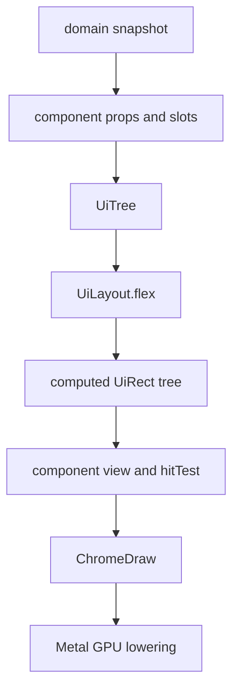
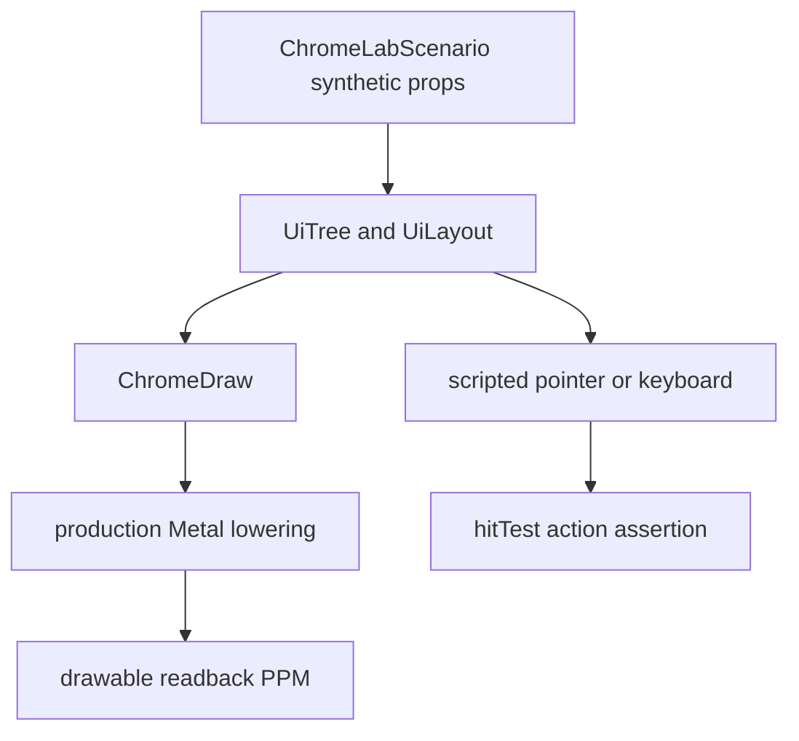

# Metal UI 레이아웃·컴포넌트 시스템

Metal로 그리는 Maru chrome의 컴포넌트 조합, 레이아웃, paint 경계를 정의하는
단일 출처다. 이 문서는 WebView·DOM·React runtime을 도입하지 않는다. 대신
React/shadcn의 **작고 조합 가능한 component·props·slot** 모델과 CSS의 이해하기
쉬운 sizing/flex vocabulary를 Zig의 typed API와 Metal renderer에 적용한다.

상위 chrome 추출·토큰·semantic draw 계약은 [Chrome 전략](chrome-strategy.md)을,
세션 도크의 첫 consumer 계약은 [에이전트 세션 기록 도크](agent-session-list.md)를
따른다.

## 1. 목표와 비목표

목표는 새 Metal UI가 다음 한 흐름으로 작성·검증되는 것이다.



- component tree는 화면의 구조와 slot을 표현하고, domain I/O·PTY·provider file을
  읽지 않는다.
- layout은 fixed와 responsive 크기를 같은 typed value로 계산한다. 계산한 `UiRect`는
  draw, clip, hit-test, focus traversal, scroll viewport가 함께 사용한다.
- paint는 computed rect에 radius, border, shadow, opacity, text glyph를 얹어
  `ChromeDraw`로 만들고 기존 Metal GPU path가 lower한다.
- terminal grid·VT renderer·CoreText glyph atlas의 책임은 유지한다. 이 문서는
  terminal을 CSS box로 바꾸지 않는다.

v1 비목표는 DOM, CSS parser, JavaScript/JSX runtime, stylesheet cascade,
browser compatibility, Rust FFI runtime, full CSS Grid algorithm, transform,
transition, animation이다. 이들을 흉내 내기 위해 arbitrary string style을 허용하지
않는다.

## 2. component 작성 모델

새 화면은 React/shadcn과 같은 **조합 형태**를 갖되 Zig 모듈로 구현한다.

```text
SessionDock
├── DockHeader
├── ScopeTabs
├── SearchField
└── SessionList
    └── WorkspaceGroup*
        └── SessionCard*

ArchiveDetailPanel
├── DetailHeader
├── RecentTurnList
└── DetailActions
```

각 component는 다음의 순수 계약을 노출한다.

```zig
pub const Props = struct { /* immutable values and stable identities */ };
pub const State = struct { /* UI-local, no file/PTY ownership */ };
pub const Action = union(enum) { /* intent only */ };

pub fn layout(props: Props, style: UiStyle, available: UiSize) UiLayoutNode;
pub fn view(props: Props, rects: *const UiRectTree, paint: PaintStyle, out: *DrawList) void;
pub fn hitTest(props: Props, rects: *const UiRectTree, point: UiPoint) ?Action;
```

Host만 domain snapshot을 component props로 만들고 Action을 실제 side effect로
dispatch한다. component는 `AppSession`, `NativeMetalCell`, Metal API, filesystem을
import하지 않는다. children/slot은 명시 prop으로 넘기며, component가 전역 UI
상태를 찾아보지 않는다.

## 3. typed style과 responsive sizing

길이는 문자열 CSS가 아니라 닫힌 typed union이다.

```zig
pub const UiLength = union(enum) {
    auto,
    px: f32,
    percent: f32, // parent content box의 한 축에 대한 0..1
    fill: f32,    // flex 남은 공간의 양수 weight
};

pub const UiStyle = struct {
    width: UiLength = .auto,
    height: UiLength = .auto,
    min_width: ?f32 = null,
    max_width: ?f32 = null,
    min_height: ?f32 = null,
    max_height: ?f32 = null,
    margin: UiEdges = .{},
    padding: UiEdges = .{},
    gap: f32 = 0,
    display: Display = .flex,
    flex: FlexStyle = .{},
};
```

- `px`는 창 backing pixel 좌표계, `percent`는 parent content box, `auto`는
  child/text measurement, `fill(weight)`는 같은 flex line의 잔여 공간이다.
  main axis의 `fill(weight)`는 `flex.grow=weight`의 shorthand이며 explicit
  `flex.grow`와 함께 주면 style validation이 거부한다. cross axis의 `fill`도
  거부한다. min/max clamp는 모든 resolved size 뒤에 같은 순서로 적용한다.
- `percent`는 해당 axis의 parent content size가 **definite**일 때만 resolve한다.
  auto measurement로 아직 정해지지 않은 parent axis에서 percent를 `0`이나
  임의 px로 바꾸지 않는다. ML1은 이런 input을 layout diagnostic과 함께 invalid로
  끝내 draw·hit-test에서 제외한다. parent의 padding은 percentage 기준에서 먼저
  제외하고, child margin은 그 뒤 flex line의 사용 공간에만 반영한다.
- finite하지 않은 px/percent/fill, 음수 px/fill, 범위 밖 percent, `min > max`는
  parse/props 경계에서 fail-close한다. renderer와 hit-test가 보정된 임의 rect를
  각각 만들지 않는다.
- responsive는 전역 breakpoint보다 **available container size**와 위 sizing 값으로
  시작한다. 따라서 dock 폭, detached window, split pane이 달라도 같은 component가
  정확한 rect를 얻는다. 조건부 compact variant가 필요한 경우에도 host가 화면 크기를
  임의로 읽지 않고 layout input의 named size class를 props로 넘긴다.
- paint style은 layout과 분리한다. v1은 background, foreground, border,
  radius, shadow, opacity, overflow clip만 둔다. style은 immutable input이고 paint가
  layout rect나 hit target을 몰래 바꾸지 않는다.

## 4. Flex 먼저, Grid는 예약

첫 solver는 column/row flex만 구현한다. direction, justify-content, align-items,
align-self, grow/shrink, basis, gap, margin/padding, min/max, overflow clip과
text measure callback이 범위다. wrap, order, baseline alignment, absolute
positioning은 실제 consumer가 필요해질 때 별도 slice로 연다.

flex 분배는 basis·margin·gap으로 free space를 정한 뒤 grow 또는 shrink를
weight 비례로 배분한다. min/max에 닿은 item은 그 pass에서 freeze하고, 남은
free space를 아직 freeze되지 않은 item에 다시 분배해 수렴시킨다. `auto` text
measure callback은 available/known size constraint를 명시적으로 받아, 측정과
layout이 서로 다른 폭을 가정하지 않게 한다.

v1 `Display`는 `.flex`만 가진다. grid track/area type과 `.grid` 값은 아직 API에
노출하지 않는다. grid가 필요한 화면이 생기면 explicit grid solver와 row/column/area
fixture를 같은 PR에서 추가한다. 지원하지 않는 layout value를 조용히 flex로 fallback
하는 방식은 허용하지 않는다. 세션 도크의 header, scope tabs, cards, detail action
row는 flex로 완성한다.

Taffy는 제품 의존성이 아니라 layout behavior의 benchmark/oracle이다. Taffy가
CSS Flexbox·Grid·Block, tree API, text 같은 동적 content의 custom measurement를
제공하므로 typed style vocabulary와 edge-case fixture를 비교하는 데 사용한다.
Maru는 Rust crate나 WASM/FFI를 shipping path에 넣지 않고, synthetic layout input과
computed rect expected result를 독립 fixture로 유지한다.

## 5. Metal paint와 입력 정합

`UiRectTree`의 모든 rect는 one-source다.

- `view`는 rect에서 `ChromeDraw.fill/border/text/quad`를 만들고 Metal backend가
  glyph/cell/GPU quad로 lower한다.
- `hitTest`는 동일 rect와 clip chain을 역순으로 검사한다. radius는 visual-only가
  아니라 hit-test mask에도 동일하게 적용한다.
- scroll viewport와 virtualization은 list child를 그리기 전에 같은 rect tree로
  visible range를 정한다. fixed header와 scroll body가 서로 다른 y origin을
  재계산하면 안 된다.
- focus ring, hover, pressed, disabled는 layout 밖의 state지만 모두 같은 component
  rect에 paint한다. keyboard action과 pointer action은 stable item identity를
  공유한다.
- UI frame path는 I/O, JSON parse, worker wait, blocking lock을 하지 않는다. dirty
  props/style/size가 바뀔 때만 layout과 draw artifact를 다시 만든다.

## 6. Chrome Lab — Storybook 같은 Metal visual/E2E fixture

`Chrome Lab`은 Storybook의 component scenario 개념을 Metal 제품 경로에 옮긴
**test-only surface tab**이다. shell·PTY를 실행하는 일반 Terminal이 아니며, 앱의
정상 사용자 화면과 release navigation에는 노출하지 않는다. 개발/CI fixture가
`ChromeLabScenario`를 열면, 같은 `ChromeHost`·`ChromeDraw`·CoreText·Metal lowering
경로가 synthetic component tree를 실제 drawable에 그린다.



- scenario는 stable id, viewport backing-px size, scale, appearance token, component
  props, expected action/rect probe만 가진 compile-time synthetic fixture다. provider
  log, 절대 경로, 실제 사용자 제목·prompt는 넣지 않는다.
- 최초 fixture matrix는 session dock의 empty/loading/retained-list, long title,
  collapsed workspace, selected/hovered card, archive loading/ready/stale과 width
  `320/480/800/1280 px`, light/dark appearance다. 각 scenario는 고정 font/token과
  deterministic clock을 주입한다. window scale과 font fallback처럼 환경에 의존하는
  값은 scenario ID·summary에 기록하고, golden을 조용히 갱신하지 않는다.
- scripted pointer/keyboard는 **같은 `UiRectTree`** 에서 hit-test한 Action과 focus
  이동을 단언한다. Lab action dispatcher는 `recorded action`만 남기며 resume,
  reveal, filesystem, provider 실행을 절대 호출하지 않는다.
- macOS Metal Lab smoke는 drawable readback PPM, PR 첨부용 PNG, machine-readable
  summary를 `zig-out/maru-macos-chrome-lab/<scenario>.{ppm,png,json}`에 남긴다.
  PPM은 lossless pixel oracle이고 PNG는 같은 readback bytes에서 만들며, PR 본문에서
  인라인으로 읽을 수 있는 capture다. exact golden이 가능한 shape/clip/background
  영역은 pixel diff로, font raster가 달라질 수 있는 text 영역은 mask와 rect/readback
  probe로 검증한다. CI 실패 artifact와 수동 PR 비교용 screenshot은 같은 frame을
  사용한다.
- visual output을 바꾸는 chrome PR은 이 artifact의 대표 **PNG** scenario capture를
  `gh attach <image> --markdown -R ohah/maru`로 GitHub user-attachment에 올리고,
  출력 Markdown image reference를 PR의 `UI 시각 검증` 절에 포함한다. artifact path만
  쓰는 것은 증거가 아니다. before/after가 있는 변경은 두 capture를 포함하고, 순수
  layout refactor처럼 pixel output이 불변이면 그 이유와 scenario를 PR에 명시한다.
- 이 fixture는 제품 E2E의 한 단계다. 실제 production host/Metal lowering은
  검증하지만 실제 provider scan과 real resume은 호출하지 않으므로, 그 I/O 수명과
  권한 경계는 AS2/AS4 별도 E2E가 계속 소유한다.

순수 `UiLayout` fixture는 필요하면 test-only WASM build에서도 실행해 browser
property/differential test를 추가할 수 있다. 이는 DOM/CSS runtime이나 shipping WASM을
도입하는 결정이 아니다. WASM 결과는 layout solver의 보조 oracle일 뿐, Metal scissor,
CoreText raster, GPU blend, 실제 hit-test dispatch를 증명하지 않으므로 `Chrome Lab`
macOS screenshot/readback gate를 대체하지 않는다. browser runner 의존성을 추가하는
시점에는 별도 PR에서 dev dependency와 CI 비용을 승인한다.

## 7. transform과 animation의 순서

v1에는 animation과 transform을 구현하지 않는다. Web-like visual quality는 먼저
정확한 layout, rounded quad, border, shadow, opacity, CoreText shaping으로 만든다.

후속 static transform slice는 `translate/scale/rotate`를 paint transform으로
추가하고 transformed rect, clip, hit-test inverse mapping, dirty region을 함께
검증한다. 그 뒤 transition/animation slice가 stable component identity에 time-varying
paint/layout value를 붙인다. animation timer를 component마다 만들거나 main thread에
file work를 섞지 않으며, 공용 frame phase가 살아 있는 animation만 tick한다.

## 8. 구현·검증 순서

1. **ML1 — typed rect/flex core:** `UiLength`, edge/min-max resolve, measure callback,
   row/column flex, overflow clip의 pure test. px/percent/auto/fill, zero/negative,
   NaN/∞ fail-close, tiny container, nested min/max, text measurement을 단언한다.
2. **ML2 — component layout seam:** `UiTree`/`UiRectTree`, stable identity, same
   rect for draw/hit/focus/virtualization, dirty rebuild counter를 headless로 고정한다.
3. **ML3 — Chrome Lab과 Metal paint seam:** test-only `ChromeLabScenario` surface를
   먼저 만들고 rounded/border/shadow/opacity/clip을 `ChromeDraw`와 production Metal
   lowering에 연결한다. Lab screenshot/readback fixture가 rect·clip 정합과 scripted
   action identity를 고정한다. clip scissor는 Metal framebuffer의 좌상단 원점을
   명시적으로 사용하며, clip 미연결 인프라나 하단-원점 변환을 남기지 않는다. nested
   clip·부분 pixel scroll의 경계 screenshot이 y축 반전과 header bleed를 막는 gate다.
4. **ML4 — Session Dock:** `SessionDock`과 `ArchiveDetailPanel`이 ML1~3만 소비해
   direct text draw/ANSI guidance를 대체한다. worker, archive identity, resume/reveal
   계약은 바꾸지 않는다.
5. **ML5+ — 필요가 증명된 기능:** grid, static transform, transition/animation을
   각각 별도 PR과 fixture로 연다.

각 slice의 적대적 검증은 (a) draw/hit/clip rect drift, (b) parent resize와
virtualization boundary, (c) identity/stale action과 thread ownership을 독립적으로
공격한다. Taffy와 비교하는 fixture는 synthetic data만 쓰고 provider log·개인 경로를
넣지 않는다.
