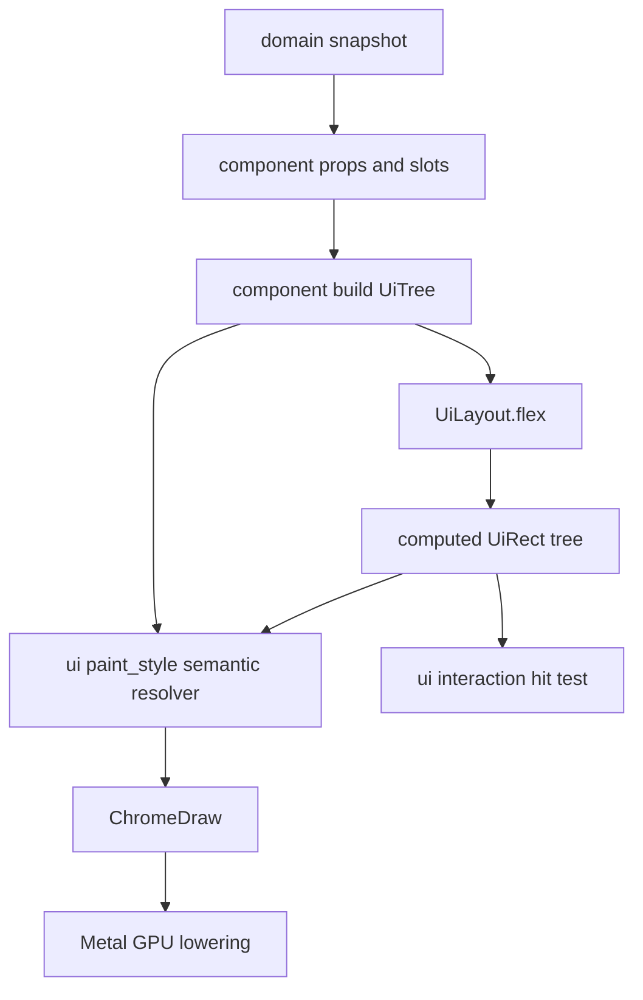
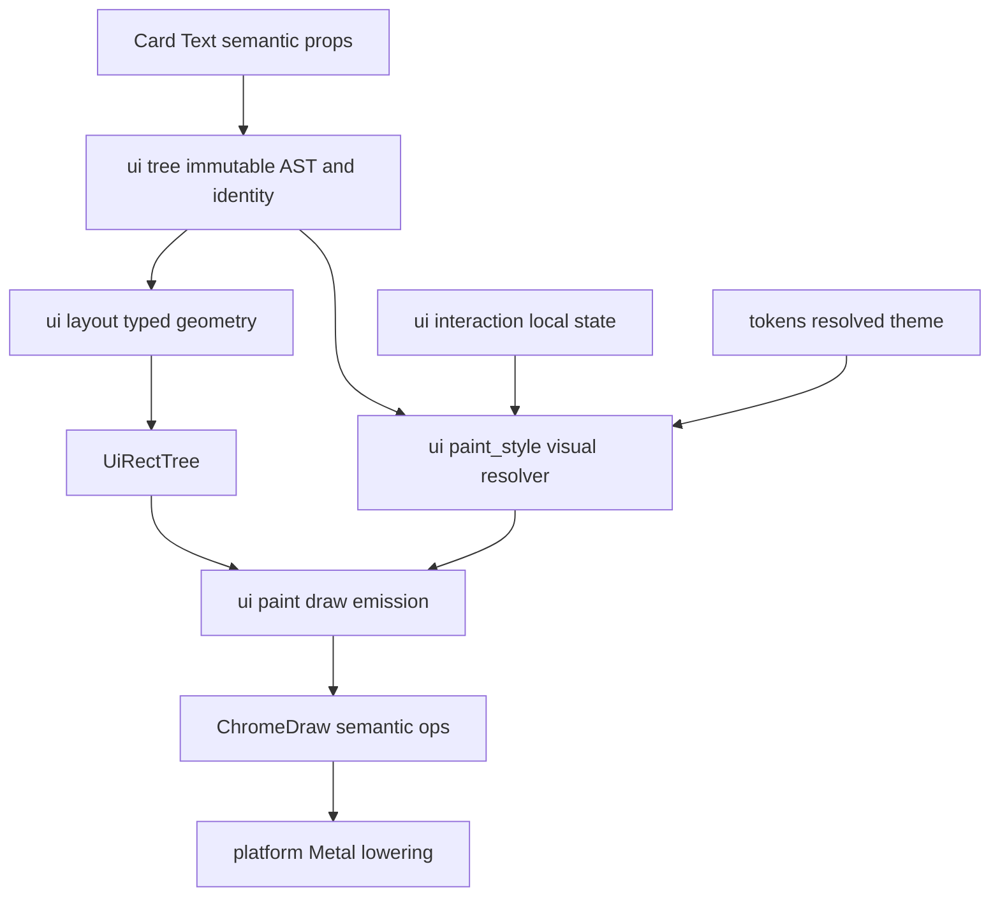

# Metal UI 레이아웃·컴포넌트 시스템

Metal로 그리는 Maru chrome의 컴포넌트 조합, 레이아웃, paint 경계를 정의하는
단일 출처다. 이 문서는 WebView·DOM·React runtime을 도입하지 않는다. 대신
React/shadcn의 **작고 조합 가능한 component·props·slot** 모델과 CSS의 이해하기
쉬운 sizing/flex vocabulary를 Zig의 typed API와 Metal renderer에 적용한다.

상위 chrome 추출·토큰·semantic draw 계약은 [Chrome 전략](chrome-strategy.md)을,
세션 도크의 첫 consumer 계약은 [에이전트 세션 기록 도크](agent-session-list.md)를
따른다. 기존 탭·사이드바·divider·scroll·overlay를 이 tree와 interaction subsystem으로
점진 이관하는 순서와 host 효과 경계는 [Chrome 상호작용 컴포넌트 이관 전략](chrome-interaction-migration.md)이
단일 출처다.

## 계약 문서 구성

Metal UI 계약은 아래 문서가 나눠 소유한다. **절 번호는 파일을 넘어 이어진다** — 다른 문서와
코드 주석이 `metal-ui-layout.md §5`처럼 절 번호로 가리키므로 재번호하지 않는다.

이 문서는 **하위 절이 상위보다 큰** 모양이라 절 번호가 아니라 덩어리로 갈랐다 — §2 자체는 3KB인데
그 아래 B1이 25KB이고, §5 머리는 1.5KB인데 ML-GEO가 16.5KB다.

| 절 | 문서 | 소유 |
|---|---|---|
| §1~§4 · §7 | 이 문서 | 목표와 비목표, component 작성 모델과 ML2a tree 경계, typed style·responsive sizing·semantic paint props·text layout, Flex/Grid, transform과 animation 순서 |
| §2의 B1 | [rich Button](metal-ui-layout-button.md) | 측정형 Button과 정렬 가능한 텍스트 |
| §5 | [Metal paint와 입력 정합](metal-ui-layout-paint.md) | ML-GEO 배치 권위, 입력 dispatch, ML2b interaction |
| §6 | [Chrome Lab](metal-ui-layout-lab.md) | surface admission, ML3b1/ML3b2 |
| §8 | [구현·검증 순서](plans/metal-ui-layout.md) | ML 슬라이스 순서와 게이트 |

## 1. 목표와 비목표

목표는 새 Metal UI가 다음 한 흐름으로 작성·검증되는 것이다.



- component tree는 화면의 구조와 slot을 표현하고, domain I/O·PTY·provider file을
  읽지 않는다.
- layout은 fixed와 responsive 크기를 같은 typed value로 계산한다. 계산한 `UiRect`는
  draw, clip, hit-test, focus traversal, scroll viewport가 함께 사용한다.
- paint는 computed rect에 radius, border, shadow, opacity, text glyph를 얹어
  `ChromeDraw`로 만들고 기존 Metal GPU path가 lower한다.
- terminal grid·VT renderer·CoreText glyph atlas의 책임은 유지한다. 이 문서는
  terminal을 CSS box로 바꾸지 않는다.
- 새 chrome layout은 기존 TUI의 cell row/column, ANSI escape, terminal text draw를
  입력이나 fallback으로 읽지 않는다. 이들은 전환 기간에 남는 legacy product path이며,
  새 tree의 backing-pixel rect·clip·hit-test와 섞이지 않는다.

v1 비목표는 DOM, CSS parser, JavaScript/JSX runtime, stylesheet cascade,
browser compatibility, Rust FFI runtime, full CSS Grid algorithm, transform,
transition, animation이다. 이들을 흉내 내기 위해 arbitrary string style을 허용하지
않는다.

## 2. component 작성 모델

새 화면은 React/shadcn과 같은 **조합 형태**를 갖되 Zig 모듈로 구현한다.

```text
SessionDock
├── DockHeader
├── ScopeTabs
├── SearchField
└── SessionList
    └── WorkspaceGroup*
        └── SessionCard*

ArchiveDetailPanel
├── DetailHeader
├── RecentTurnList
└── DetailActions
```

새 tree용 semantic component는 다음의 순수 **build 계약**만 노출한다. `view`/`hitTest`
함수를 component마다 두지 않는다. 같은 AST와 rect를 `ui/paint*`/`ui/interaction`이 각각
한 번만 소비해야 theme·clip·click 영역이 분산되지 않는다.

```zig
pub const Props = struct { /* immutable values and stable identities */ };
pub fn build(props: Props, children: []const UiNode) UiNode;
```

Host만 domain snapshot을 component props로 만들고 `UiActionId` intent를 실제 side effect로
dispatch한다. UI-local state는 `ui/interaction.InteractionState`, semantic paint는
`ui/paint_style`, draw emission은 `ui/paint`, platform
adapter는 input/lowering이 단일 소유한다. component는 `AppSession`, `NativeMetalCell`, Metal API,
filesystem을 import하지 않는다. children/slot은 명시 prop으로 넘기며, component가 전역 UI 상태를
찾아보지 않는다.

실제 작성 문법은 JSX/XML parser가 아니라 compile-time Zig value builder다. ML2a의
`UiNode`는 `identity`, `UiStyle`, tagged `props`, `[]const UiNode` children을 가지며,
부모가 children slice의 수명과 순서를 명시한다. 예를 들어 session card 안의 text는
다음처럼 tree의 실제 child로 작성한다.

```zig
const tree = ui.container(.{ .id = .session_dock, .direction = .column, .style = .{ .gap = 8 } }, &.{
    ui.card(.{ .id = session_id, .action = .{ .id = 100 } }, &.{
        ui.text(.{ .id = session_title_id, .value = "adsf" }),
    }),
});
```

위 예시는 현재 ML2 `ui/tree.zig`가 실제로 받는 최소 문법이다. `variant`, `tone`,
`max_lines`, `overflow` 같은 제품 props는 아래 ML3 target contract가 구현될 때 같은 builder에
추가하며, 그 전에는 예시에 섞어 현재 지원한다고 보이지 않게 한다.

`container`·`card`·`text`는 `UiNode` value를 반환하는 작은 Zig 함수일 뿐이고, React runtime,
virtual DOM diff, arbitrary callback closure를 만들지 않는다. `Container`는 CSS 클래스가 아니라
native rect solver에 direction/gap/align을 전달하는 **chrome 내부 구조 노드**다. `Column`/`Row`
및 `Flex`는 shadcn component도 아니고 사용자-facing 디자인 시스템 API로 만들지 않는다. 제품
API에는 `Card`·`Text`·후속 `Button`/`Input`처럼 의미 있는 component만 보이고, 각 component가
필요할 때 내부 `Container`를 조합한다. host가 immutable snapshot마다 이 tree를 만들고, ML2a가
재귀 layout해 `UiRectTree`를 낸다. ML1의 `layoutFlex(..., []Item, ...)`는 이때 한 parent의
sibling children을 계산하는 순수 solver이며, 아직 component tree API나 제품 UI를 구현했다는
뜻이 아니다.

### ML2a tree 경계

ML2a의 `UiNode`는 `kind`, tree 전체에서 유일한 stable identity, `UiStyle`, immutable
tagged props, children slice를 가진 value다. identity는 snapshot 사이에 같은 semantic
component를 가리킬 때에만 재사용하며, 형제 순서나 frame allocator 주소로 만들지 않는다.
한 tree 안의 duplicate identity는 diagnostic과 함께 build를 fail-close한다. 임의로
suffix를 붙여 구별하면 stale pointer action이 다른 component에 전달될 수 있으므로
금지한다.

build caller는 root를 포함하는 양수 `max_entries`와 root depth=1 기준의 양수
`max_depth`를 명시해 frame arena 사용량과 재귀 깊이를 bounded하게 만든다. 어느 limit도
자동 확장·부분 publish하지 않으며, 초과는 typed diagnostic이다. `items`/flex scratch는
한 parent flex 계산 뒤 재사용하지만, child rect scratch는 활성 조상 sibling이 덮어쓰지
않도록 frame arena 안에서 stack range로 예약한다. 이전 completed snapshot이 있으면 그것을
유지하고, 첫 build라면 empty non-interactive tree만 publish한다. virtualization은 이 상한을
우회하려고 두 번째 hidden rect tree를 만드는 방식이 아니라, visible node만 포함한 같은
tree를 다음 frame에 rebuild한다.

`UiRectTree`는 frame arena가 소유하는 flat preorder entry와 parent index, node identity,
border-box rect, effective clip을 보관한다. 재귀 layout은 각 parent의 child sibling을
ML1 `layoutFlex`로 계산한 뒤 같은 entry를 자식에 전달한다. root border-box는 host가
한 번만 준 backing-pixel available size이고, 자식이 terminal cell 수나 독자적인 window
size를 다시 읽을 수 없다. 따라서 root는 padding/gap 같은 container 내부 style만 쓰며
width/height/min/max/margin/flex/align-self 같은 outer placement style은 fail-close한다.
draw, hit-test, focus, virtualization은 별도의 rect cache를 만들지 않고 이 tree만 읽는다.
tree와 rect tree는 다음 immutable snapshot publish 전까지만 유효하다. build/layout이
duplicate identity나 invalid style로 실패하면 host는 새 tree를 publish하지 않고 직전
completed snapshot을 유지한다. 이를 위해 candidate frame buffer는 published snapshot과
분리하며, in-place rebuild는 금지한다. publish 시에는 old tree를 retire하기 전에
capture/focus의 stale identity를 cancel하고, 그 뒤 old frame arena를 회수한다.

`container`, `card`, `text` builder는 이 tagged node value를 만들 뿐 TUI cell 수를
계산하거나 ANSI 문자열을 반환하지 않는다. `card`의 action은 callback이 아니라 stable
action identity와 enabled policy이고, host가 나중에 dispatch한다. 현재 ML1의 scalar
`MeasureFn`은 synthetic layout fixture 전용 seam이다. 제품 `Text`가 paint되기 전 ML3에서
측정과 paint가 공유하는 immutable `TextLayout` artifact로 반드시 교체한다.

## 3. typed style과 responsive sizing

길이는 문자열 CSS가 아니라 닫힌 typed union이다.

```zig
pub const UiLength = union(enum) {
    auto,
    px: f32,
    percent: f32, // parent content box의 한 축에 대한 0..1
    fill: f32,    // flex 남은 공간의 양수 weight
};

pub const UiStyle = struct {
    width: UiLength = .auto,
    height: UiLength = .auto,
    min_width: ?f32 = null,
    max_width: ?f32 = null,
    min_height: ?f32 = null,
    max_height: ?f32 = null,
    margin: UiEdges = .{},
    padding: UiEdges = .{},
    gap: f32 = 0,
    display: Display = .flex,
    flex: FlexStyle = .{},
};
```

- `px`는 창 backing pixel 좌표계, `percent`는 parent content box, `auto`는
  child/text measurement, `fill(weight)`는 같은 flex line의 잔여 공간이다.
  main axis의 `fill(weight)`는 `flex.grow=weight`의 shorthand이며 explicit
  `flex.grow`와 함께 주면 style validation이 거부한다. cross axis의 `fill`도
  거부한다. min/max clamp는 모든 resolved size 뒤에 같은 순서로 적용한다.
- `percent`는 해당 axis의 parent content size가 **definite**일 때만 resolve한다.
  auto measurement로 아직 정해지지 않은 parent axis에서 percent를 `0`이나
  임의 px로 바꾸지 않는다. ML1은 이런 input을 layout diagnostic과 함께 invalid로
  끝내 draw·hit-test에서 제외한다. parent의 padding은 percentage 기준에서 먼저
  제외하고, child margin은 그 뒤 flex line의 사용 공간에만 반영한다.
- finite하지 않은 px/percent/fill, 음수 px/fill, 범위 밖 percent, `min > max`는
  parse/props 경계에서 fail-close한다. renderer와 hit-test가 보정된 임의 rect를
  각각 만들지 않는다.
- edge·gap·child 합산처럼 유한 input에서 생길 수 있는 `f32` overflow도 같은
  invalid layout으로 끝낸다. explicit min이 없을 때 shrink 하한은 0이며, tiny
  container가 negative/NaN rect를 만들게 두지 않는다.
- `UiRect`와 resolved `width`/`height`는 border box다. text measure callback은
  content 크기를 반환하고 solver가 child padding을 한 번만 더한다. px/percent/flex
  basis는 이미 padding을 포함하는 border-box 크기다. callback의 `known`/`available`
  constraint는 margin·padding을 뺀 content box다. 이렇게 해야 fixed hit target,
  rounded paint, child text inset이 서로 다른 폭을 다시 계산하지 않는다.
- responsive는 전역 breakpoint보다 **available container size**와 위 sizing 값으로
  시작한다. 따라서 dock 폭, detached window, split pane이 달라도 같은 component가
  정확한 rect를 얻는다. 조건부 compact variant가 필요한 경우에도 host가 화면 크기를
  임의로 읽지 않고 layout input의 named size class를 props로 넘긴다.
- paint style은 layout과 분리한다. v1은 background, foreground, border,
  radius, shadow, opacity, overflow clip만 둔다. style은 immutable input이고 paint가
  layout rect나 hit target을 몰래 바꾸지 않는다.
- **clip을 소비하는 주체는 backend다.** `overflow clip`은 published tree의 `effective clip`으로
  이미 표현돼 있으므로, component의 draw op emit 지점이 "이 요소가 clip 안에 통째로 들어가는가"를
  판정해 통째로 버려서는 안 된다. 그 방식은 (a) 1px만 벗어난 요소를 통째로 지우고, (b) component마다
  판정 단위(줄/행/요소)가 갈라져 어느 한쪽만 clip 밖으로 새는 결함을 만든다. component가 싣는 것은
  "이 op이 어느 스크롤 영역에 속하는가"라는 **소속**이고, 실제 잘라내기는 backend가 픽셀 단위로 한다
  (glyph는 quad와 atlas UV를 함께 좁히고, 배경 quad는 published clip과 교차한다). 소속은 스크롤해도
  바뀌지 않으므로 shaping cache 키에 안전하게 들어가지만, **뷰포트 사각형이나 스크롤 오프셋을 semantic
  op에 실으면** 스크롤 1px마다 op이 달라져 그 cache가 통째로 무효화된다.
- **가상화 목록의 아이템은 flex 축소 대상이 아니다.** scroll-area가 `fill` container이면 자식 총합이
  viewport를 넘을 때 일반 flex 규칙이 자식을 균등 축소하는데, 가상화는 마지막 아이템이 항상 viewport를
  넘도록 창을 잡으므로 그 축소가 상시 상태가 된다. 그러면 published rect가 component가 선언한 metric과
  갈라져, 같은 metric을 읽는 scroll projection·텍스트 offset·hit rect가 보이는 위치와 어긋난다. 목록은
  넘치면 clip으로 잘리고, 줄어들지 않는다.

### semantic paint props와 event intent

`UiStyle`은 layout 전용이다. background·font·shadow처럼 보이는 값을 여기에 넣거나, CSS
문자열/임의 key-value bag을 허용하지 않는다. ML3의 제품 node는 다음처럼 **닫힌 semantic prop**을
함께 보관해, 같은 `UiRectTree` entry를 paint와 hit-test가 공유한다.

```zig
pub const CardVariant = enum { surface, raised, selected, danger };
pub const TextTone = enum { primary, muted, accent, danger };
pub const ShadowKind = enum { none, raised };

pub const PaintStyle = struct {
    background: ?ColorRole = null,
    foreground: ?ColorRole = null,
    border: ?ColorRole = null,
    corner_radii_px: ?[4]u16 = null,
    border_widths_px: ?[4]u16 = null,
    shadow: ?ShadowKind = null,
    opacity: u8 = 0xFF,
};

pub const CardOptions = struct {
    id: UiId,
    style: UiStyle = .{},
    variant: CardVariant = .surface,
    paint: PaintStyle = .{},
    action: ?UiAction = null,
    // direction/align/overflow/children ...
};

pub const TextOptions = struct {
    id: UiId,
    value: []const u8,
    role: ChromeTextRole,
    tone: TextTone = .primary,
    paint: PaintStyle = .{},
    // ML3 TextLayout props ...
};
```

`border_widths_px`의 순서는 `[top, right, bottom, left]`이며 각 값은 그 변만
paint한다. 예를 들어 `{ 0, 0, 1, 0 }`은 bottom rule 하나이고, 다른 세 변의
anti-alias·corner·fill을 border 색으로 바꾸지 않는다. Metal lowerer는 사분면에서 한
폭을 추측하지 않고 각 edge까지의 거리로 이를 계산한다.

- `CardVariant`/`TextTone`은 domain props다. selected는 archive/session selection처럼 model이
  결정하고, hover/focus/pressed는 `InteractionState`만 결정한다. disabled는 별도 bool로
  중복하지 않고 `UiAction.enabled=false`에서만 나온다. painter의 precedence는
  `disabled > pressed > focus > hover > selected > base variant`로 고정한다.
- `PaintStyle`은 semantic `ColorRole`과 geometry override만 받을 수 있다. raw RGB, CSS variable,
  selector, callback은 금지한다. `null`은 component variant가 정한 theme token을 쓴다는 뜻이다.
  `opacity`는 0..255이고, corner/border array는 `[top-left, top-right, bottom-right, bottom-left]`/
  `[top, right, bottom, left]` 순서다. shadow의 blur/offset/color는 component가 직접 들지 않고
  `Tokens.space`의 named token을 쓴다.
- explicit background/foreground/border·shape override는 base variant 다음에 적용한다. hover/focus/
  pressed는 그 위에서 다시 visual feedback을 주며 disabled만은 항상 최우선이다. 따라서 작은 prop
  문법으로도 custom base와 접근 가능한 interaction feedback을 함께 보장한다. `shadow = null`은
  variant default를 보존하고 `.none`은 명시적으로 끈다.
- click/keyboard/context 같은 event도 `onClick` closure가 아니라 stable `UiActionId` intent다.
  ML2b의 현재 primary pointer action은 `UiAction { id, enabled }` 한 개만 소비한다. keyboard
  activation, context menu, tooltip/accessibility는 각 intent를 추가하는 후속 slice에서 열며,
  provider/process side effect는 항상 host dispatcher만 실행한다. hover는 action event가 아니라
  paint state다.
- `resolveVisualStyle(Tokens, variant/tone, PaintStyle, InteractionState, UiAction)`은 ML3의 유일한
  theme 경계다. component는 `Tokens.rich()`/`Tokens.tui()`나 light/dark를 분기하지 않고
  `ColorRole`만 반환한다. token 교체는 rect/identity/action을 바꾸지 않고 paint artifact만
  invalidation한다. Chrome Lab은 같은 scenario를 light/dark token으로 그려 role·alpha·geometry
  probe와 readback PNG가 모두 달라지는지, hit rect/action은 불변인지 검증한다.

### 장기 책임 분리와 단일 출처

새 Chrome UI는 “간단한 typed 문법”과 “한 데이터의 한 소유자”를 함께 지켜야 한다. 아래 경계가
그 단일 출처이며, 같은 prop·rect·theme mapping을 다른 모듈에서 다시 계산하거나 선언하면 안 된다.



| 책임 | 코드 단일 출처 | 금지되는 중복 |
| --- | --- | --- |
| 길이·flex·clip·rect 유효성 | `src/chrome/ui/layout.zig` | component/paint/backend의 별도 좌표·크기 계산 |
| 닫힌 variant/tone/paint prop 어휘 | `src/chrome/ui/style.zig` | CSS/RGB/callback bag |
| child 구조·stable ID·action enabled·semantic prop의 rect snapshot 투영 | `src/chrome/ui/tree.zig` | sibling index·allocator 주소를 identity로 쓰기 |
| hover/focus/pressed/capture와 action intent | `src/chrome/ui/interaction.zig` | component-local callback state·platform side effect |
| tree prop + interaction state를 theme role/shape로 해석 | **ML3 `src/chrome/ui/paint_style.zig`** | host, Metal backend의 light/dark/rich 분기 |
| backing-pixel snap + fixed buffer ChromeDraw emission | **ML3 `src/chrome/ui/paint.zig`** | resolver/backend의 별도 snap·draw 생성 |
| 실제 RGB·spacing·shape token | `src/chrome/tokens.zig` | component가 literal RGB·shadow blur를 보유 |
| backend-neutral draw op | `src/chrome/draw.zig` | component가 `NativeMetalCell`/Metal DTO를 생성 |
| GPU/셀 lowering과 AppKit 입력 adapter | platform boundary | layout/paint를 Swift·Objective-C에서 재구현 |

- `docs/metal-ui-layout.md`는 위 typed UI contract의 설계 단일 출처다. `docs/chrome-strategy.md`
  는 기존 ChromeHost·token/lowering의 제품 수명과 migration만 소유하며, 새 tree의 prop grammar를
  재정의하지 않고 이 문서를 링크한다. `docs/agent-session-list.md`는 Session Dock의 archive data,
  worker, resume/reveal 정책만 소유하고 pixel/layout/event grammar를 중복하지 않는다.
- 제품 author 문법은 `ui.card(.{ .id, .variant, .action }, children)`와
  `ui.text(.{ .id, .value, .tone, .wrap }, ...)`처럼 작고 닫혀 있어야 한다. `Container`는 내부
  구조 노드이며 `.direction/.style`만 받는다. arbitrary `style = .{ .custom = ... }`, DOM-like
  tag, CSS selector/cascade, callback closure는 장기적으로도 추가하지 않는다.
- ML3a 현재 구현은 `ui/layout`·`ui/style`·`ui/tree`·`ui/interaction`·`ui/paint_style`·`ui/paint`
  까지다. paint는 headless `ChromeDraw` 후보만 만들며 실제 Metal lowering, text shaping, clip
  scissor와 GPU shadow emission은 아직 없다. 따라서 새 tree가 rich/light/dark token을 실제 Metal
  output으로 소비한다고 주장하면 안 된다. ML3b Chrome Lab의 dark/light artifact로만 그 연결을 완료로
  판정한다.
- 새 tree의 제품 token input은 **rich/Metal `Tokens` snapshot만**이다. legacy `Tokens.tui()`와
  cell-grid lowering은 기존 config/read compatibility·회귀 fixture의 별도 경로이며, ML3
  resolver에 fallback/조건문으로 넣지 않는다. `tokens.zig`가 두 값을 표현하는 것은 migration
  호환성일 뿐 새 component contract가 두 renderer를 지원한다는 뜻이 아니다.

### Text layout은 flex solver의 외부 입력이 아니라 frame artifact다

`Text`의 폭과 높이는 문자 수·셀 폭으로 추정하지 않는다. font family/weight/size,
fallback face, letter spacing, line height, writing direction, Unicode grapheme 및 line-break
규칙, 그리고 최종 content width가 모두 결과를 바꾼다. 따라서 layout과 Metal paint가 서로
다른 곳에서 같은 문자열을 다시 잘라서는 안 된다.

다음 선언은 **ML3 제품 Text contract의 목표 형태**다. 현재 `ui/tree.zig`의 동명
`TextOptions`는 ML1 synthetic `MeasureFn` fixture seam이므로 이 필드를 아직 제공하지
않으며, ML3에서 한 번에 교체한다.

```zig
pub const TextOptions = struct {
    id: UiId,
    value: []const u8,
    role: ChromeTextRole,
    wrap: TextWrap = .unicode,
    max_lines: ?u16 = null,
    overflow: TextOverflow = .clip,
};

pub const TextWrap = enum { unicode, none };
pub const TextOverflow = enum { clip, ellipsis };
```

- `.unicode`는 공백만 찾는 word-wrap이 아니라 UAX #14 line-break opportunity와 grapheme
  cluster 경계를 따른다. 한글/NFD 조합·emoji ZWJ·variation selector 내부에는 줄바꿈하거나
  `…`를 끼우지 않는다. `.none`은 한 줄만 만들며 `max_lines`가 `1`인 것과 동등한 visible
  line limit을 가진다. `max_lines=0`은 layout diagnostic으로 fail-close하며, `max_lines=1`
  과 `.none`을 함께 준 경우에는 한 줄 규칙을 중복 적용할 뿐 별도 의미를 만들지 않는다.
- `max_lines=null`은 필요한 줄 수만큼 자연 높이를 만든다. 유한한 `max_lines` 또는 `.none`
  에서 content가 넘칠 때만 `overflow`가 적용된다. `.ellipsis`는 마지막 **표시** 줄에 U+2026을
  포함해 다시 shape하여 들어가는 가장 긴 grapheme prefix를 선택한다. `…`가 fallback face를
  써도 실제 advance를 다시 측정한다. content width가 `…` 하나의 advance보다도 좁으면 partial
  ellipsis를 그리지 않고 visible glyph run을 비운다. `.clip`은 glyph run의 clip 밖 부분만
  숨기며 원문 prop은 줄이지 않는다. accessibility/copy 노출은 별도 platform contract가 생길
  때 이 원문 prop을 소비해야 하며, TextLayout이 자체적으로 문자열을 바꾸지 않는다.
- host는 theme snapshot과 platform UI font resolver에서 `ResolvedTextStyle`(primary face·size·weight·line height·letter
  spacing·locale/direction)을 snapshot 시작 시 한 번 정한다. terminal `font.*` config는 이 입력이
  아니다. `TextLayoutRequest`는 이 style,
  원문, wrap/limit/overflow, final content width를 key로 삼고, text engine은 caller frame
  arena에 `RichTextArtifact`를 만든다. 현재 그 artifact는 role별 `Placement`(row, start/end col,
  pixel offset, foreground, text role) 목록을 보관하며, content size·visible line range·truncation
  여부처럼 이 slice가 요구하는 값은 아직 그 안에 없다 — 필요한 필드는 소비자가 생길 때 함께 연다.
  `UiRectTree`의 text entry와 Metal paint는 같은 artifact handle만 읽는다.
- 최초 제품 Text slice에서 `.unicode`, `max_lines`, `.ellipsis`를 쓰는 node의 final content
  width는 explicit width 또는 parent cross-axis stretch로 **먼저 definite**해야 한다. session
  card처럼 vertical container의 stretch child는 이 규칙을 만족한다. horizontal flex line에서
  wrap-dependent intrinsic width를 서로 추측하게 만드는 tree는 `IndefiniteTextWidth` diagnostic으로
  candidate snapshot을 fail-close한다. final border/content rect가 정해진 뒤에는 final width key로
  artifact를 얻어야 하며, preliminary width의 shape를 paint하는 것은 금지한다.
- multi-line text의 intrinsic main-axis sizing, flex-wrap, min-content/max-content reflow는 이
  first consumer 범위 밖이다. 이를 열 때에는 Taffy behavior fixture를 oracle로 삼되, available
  width가 바뀌는 모든 pass에서 line count·card height·glyph artifact가 같은 final width key로
  수렴하는 별도 solver slice를 추가한다. 그 전에는 임의의 pass 횟수나 문자열 폭 추정으로
  fallback하지 않는다.
- typography token·platform UI primary/fallback registry generation·scale·available width·text
  props 중 하나가 바뀌면 해당 artifact만 invalidation한다. terminal `font.*` config 변경은 Chrome
  artifact invalidation 원인이 아니다. UI frame path는 font file I/O나 worker wait를 하지 않고,
  이미 renderer 수명과 함께 유지되는 font identity registry 및 frame-owned shape result만
  소비한다. 제품 CoreText adapter의 thread affinity와 glyph-run ABI는 ML3에서 별도 정한다.

Taffy(`references/taffy`, 검토 commit `945de0d`)는 tree+style+measure callback으로 flex/grid
rect를 계산하지만 text shaping 자체는 제공하지 않는다. Maru는 이 사실을 layout API와 component
API를 분리하는 benchmark로만 사용한다. Rust crate/FFI/WASM을 제품에 넣거나 Taffy의 자료구조·
제어 흐름을 이식하지 않는다.

## 4. Flex 먼저, Grid는 예약

첫 solver는 column/row flex만 구현한다. direction, justify-content, align-items,
align-self, grow/shrink, basis, gap, margin/padding, min/max, overflow clip과
text measure callback이 범위다. wrap, order, baseline alignment, absolute
positioning은 실제 consumer가 필요해질 때 별도 slice로 연다.

flex 분배는 basis·margin·gap으로 free space를 정한 뒤 grow 또는 shrink를
weight 비례로 배분한다. min/max에 닿은 item은 그 pass에서 freeze하고, 남은
free space를 아직 freeze되지 않은 item에 다시 분배해 수렴시킨다. `auto` text
measure callback은 available/known size constraint를 명시적으로 받아, 측정과
layout이 서로 다른 폭을 가정하지 않게 한다.

v1 `Display`는 `.flex`만 가진다. grid track/area type과 `.grid` 값은 아직 API에
노출하지 않는다. grid가 필요한 화면이 생기면 explicit grid solver와 row/column/area
fixture를 같은 PR에서 추가한다. 지원하지 않는 layout value를 조용히 flex로 fallback
하는 방식은 허용하지 않는다. 세션 도크의 header, scope tabs, cards, detail action
row는 flex로 완성한다.

Taffy는 제품 의존성이 아니라 layout behavior의 benchmark/oracle이다. Taffy의 공개 tree/style
모델은 component library가 아니라 flex·grid·block rect 계산기이며, 동적 content는 caller가
measure callback으로 제공한다. 이 분리는 `Card`/`Text` 같은 의미 component와 내부 container
solver를 분리해야 한다는 Maru의 근거다. Maru는 Rust crate나 WASM/FFI를 shipping path에 넣지
않고, synthetic layout input과 computed rect expected result를 독립 fixture로 유지한다.

## 7. transform과 animation의 순서

v1에는 animation과 transform을 구현하지 않는다. Web-like visual quality는 먼저
정확한 layout, rounded quad, border, shadow, opacity, CoreText shaping으로 만든다.

후속 static transform slice는 `ui/transform.zig`가 `translate/scale/rotate`의 typed
값, forward/inverse matrix, transformed clip과 dirty bounds를 **한 번만** 계산하게 한다.
`ui/paint.zig`는 그 forward transform으로 draw op를 내고, `ui/interaction.zig`는 같은
모듈의 inverse mapping으로 hit-test한다. layout의 untransformed rect는 계속 layout/tree의
단일 출처이며, paint나 hit-test가 각각 새 rect를 재계산하면 안 된다.

그 뒤 transition/animation slice는 `ui/animation.zig`가 stable component identity별
timeline·progress·dirty signal만 소유하고, `ui/paint_style.zig`가 해당 시점의 visual override를
해석한다. component-local timer, callback closure, background worker 또는 main thread file work는
허용하지 않는다. host의 공용 frame phase가 `now`를 한 번 전달하고, 살아 있는 animation만 tick한다.
layout-affecting animation은 paint-only animation과 별도 정책/성능 gate를 가진 후속 slice다.
