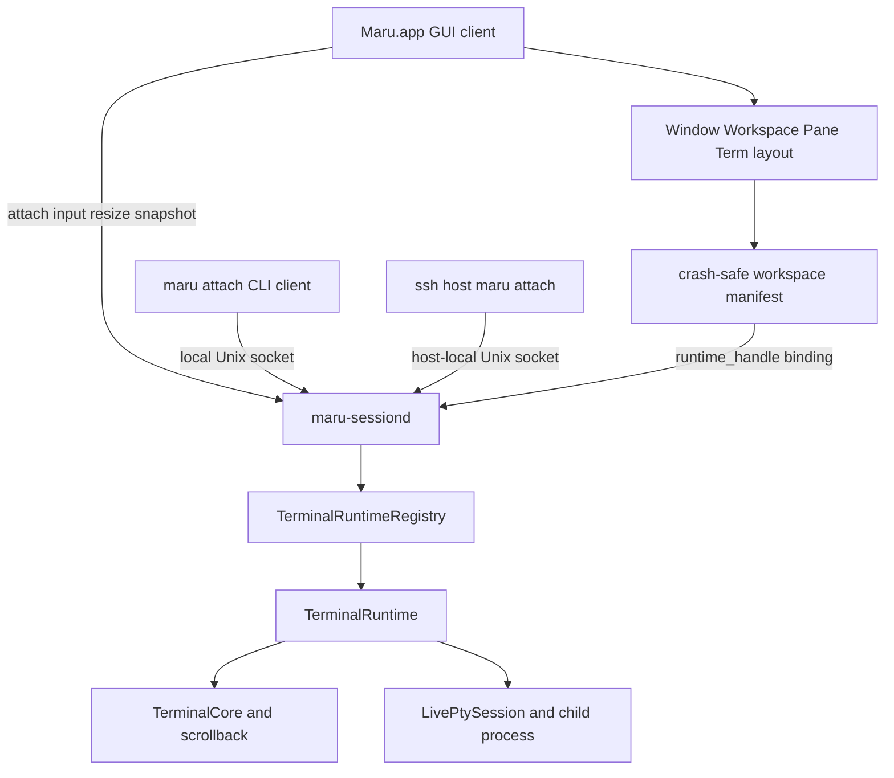
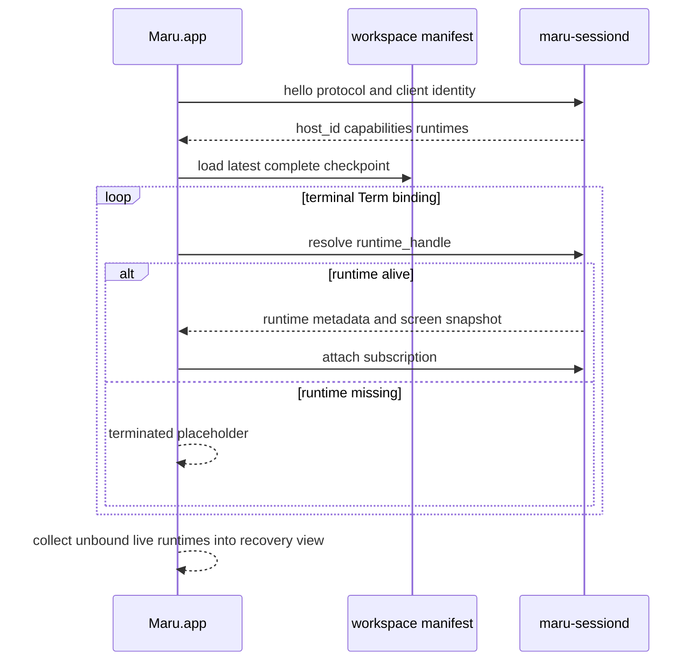

# 영속 터미널 세션 호스트

이 문서는 Maru GUI가 종료되어도 terminal Term의 PTY·자식 프로세스·화면 상태를 유지하고, 다시 실행한 Maru 또는
다른 터미널의 `maru attach` 클라이언트가 재접속하는 기능의 단일 출처다. 탭/split UI, workspace restore,
control-plane, PTY 종료 정책과 책임이 겹치지 않도록 소유권·ID·종료 의미·복구·검증 단계를 정한다.

> **상태: keep-alive opt-in 구현됨(P3-e3 + P4 종료 gate 완료), 기본값 `false`.** `session.keep-alive-after-quit=true`면
> 새 terminal이 host(`maru-sessiond` = `maru __session-host`)-backed로 떠 GUI 종료·강제종료에도 살아남고 재실행 시
> 재접속한다 — 호스트 프로세스, `runtime_handle`(=`RuntimeHandle`/`runtime_id`), GUI 재접속(`attachExisting`)은 **존재한다**
> (§멀티윈도우 "구현 상태 ✅" 노트·종료 매트릭스 참조). 기본값은 아직 `false`(opt-in)다: 외부 `maru attach` CLI 클라이언트,
> 다중 app **process**(현재 daemon serial), 원격 스크롤백/선택, 자동 desync 리싱크, GUI 부재 시 OS 배너 등은 **후속**이며,
> 이 문서는 그 목표 상태를 함께 기술한다 — **구현 완료 여부는 각 절의 "구현 상태" 표식으로 구분한다**(표식 없는 서술은 목표 설계).

## 1. 결론

Maru의 기본 영속성은 tmux가 아니라 **Maru 전용 로컬 session host(`maru-sessiond`)**가 제공한다.

- Maru의 Window → Workspace → Pane → Term 배치는 기존 Zig 모델이 계속 소유한다.
- `maru-sessiond`는 terminal Term의 실행 runtime만 소유한다.
- GUI 종료는 runtime 종료가 아니라 client detach다.
- Term 닫기는 runtime에 대한 명시적 terminate다.
- 제품 설정 `session.keep-alive-after-quit`은 완성 뒤 기본 `true`이며, 새 terminal runtime을 host에서 연다.
- 다른 터미널은 `tmux attach`가 아니라 `maru attach`로 같은 runtime에 붙는다.
- `tmux -CC` layout driver는 기본 계획에서 제외한다. 외부 tmux 세션 가져오기 수요가 확인될 때만 별도 adapter로
  재검토하며, persistent-session 구현의 선행조건이나 fallback으로 쓰지 않는다.

**연결 identity도 Maru가 대체한다.** canonical manifest와 attach protocol에는 tmux session/window/pane ID를 저장하거나
Maru ID로 번역한 mirror를 두지 않는다. `host_id + runtime_id`는 Maru가 직접 발급하며 `maru attach`의 대상도 이 Maru
runtime ID다. tmux가 설치돼 있지 않아도 생성·재접속·복구·외부 terminal attach가 모두 동작해야 한다.

이 범위는 좁은 의미로 terminal multiplexer의 PTY 소유·detach/attach 기능을 수행하지만, tmux의 window/pane UI,
prefix key, status line, copy mode, 설정 언어, command language, tmux wire 호환은 구현하지 않는다.

### terminal multiplexer 기능 경계

| 분류 | v1 결정 |
| --- | --- |
| 취함 | GUI와 독립된 PTY/child 소유, detach/reattach, host-side screen·scrollback, client N개 관찰, SSH attach, resize·`SIGWINCH` 전달 |
| Maru 모델로 대체 | session/window/pane 계층은 Window/Workspace/Pane/Term, 연결키는 `runtime_id`, layout은 `workspace.v1`, 화면 전달은 MRSH snapshot/delta |
| 제외 | prefix/status/command/config 언어, control-mode/wire 호환, 여러 writable client, 여러 Term의 동일 runtime 영속 복제, client 크기 조정 정책 |

외부 terminal attach에 필요한 multiplexer 동작은 취하되 Maru가 이미 소유한 layout/UI를 다시 만들지 않는 경계다.

## 2. 목표와 비목표

### 목표

- `Maru.app` 프로세스가 정상 종료·크래시해도 terminal Term의 자식 프로세스가 살아 있다.
- 재실행한 GUI가 동일한 프로세스·PTY·scrollback에 재접속한다. 새 shell을 spawn한 뒤 비슷하게 보이게 만드는 기능이 아니다.
- 여러 Window·Workspace·Pane·Term의 배치를 tmux 계층으로 바꾸지 않고 기존 Maru UX 그대로 복원한다.
- detach 중 발생한 output도 host의 `TerminalCore`에 적용되어 재접속 첫 화면에 반영된다.
- GUI가 종료된 동안 발생한 OSC 9/777 알림도 host가 잃지 않고 macOS 배너·다음 GUI 알림 이력으로 전달한다.
- local Terminal.app/iTerm2/Ghostty/SSH 셸에서 `maru attach <runtime>`로 개별 Term에 붙을 수 있다.
- 느리거나 끊긴 client가 PTY reader를 막지 않도록 client별 전송은 bounded다.
- 종료·재접속·프로토콜 버전 불일치를 trace/snapshot/artifact로 진단할 수 있다.

### 비목표

- 재부팅·전원 종료를 건너 실제 OS 프로세스를 보존하는 것.
- `maru-sessiond` crash·강제 종료 또는 terminal child 종료 뒤 동일 실행 세션을 복구하는 것. host/runtime이 끝나면
  그 Maru runtime도 끝난 것이며 자동 대체 spawn을 하지 않는다.
- Claude/Codex provider session id·transcript·argv를 저장해 resume/fork하는 것. 영속성은 provider 복원이 아니라
  **같은 살아 있는 PTY/process를 계속 소유**하는 데서만 나온다.
- tmux server/socket/control-mode 프로토콜과 호환되는 것.
- v1에서 여러 writable client가 동시에 한 PTY에 입력하는 것. 여러 사람이 함께 쓰는 collaborative input, 사용자별 cursor,
  입력 병합·귀속·승인/revoke UX는 실제 수요가 확인될 때 별도 설계한다.
- v1에서 서로 다른 Unix account가 같은 runtime을 공유하는 것. SSH attach도 session host를 소유한 동일 login UID로 실행하며,
  cross-UID 초대 token·ACL·broker socket은 추가하지 않는다.
- v1에서 하나의 runtime을 여러 Window/Workspace/Pane의 영속 Term으로 복제하는 것. canonical owner Term은 하나이며 추가
  화면은 manifest 배치가 아닌 client subscription이다.
- 여러 client 크기에서 largest/smallest/latest를 고르는 layout 정책. canonical PTY 크기는 controller 한 명이 소유한다.
- v1에서 전체 Maru workspace를 텍스트 TUI로 완전히 재현하는 것.
- WKWebView process, browser JS heap, file panel의 미저장 editor buffer를 session host에 넣는 것.
- 원격 TCP/HTTP 포트를 열거나 계정·클라우드 relay를 추가하는 것.
- session host 무중단 binary upgrade와 실행 중 PTY의 다른 host 프로세스로의 live handoff.

## 3. 현재 구현과 새 경계

현재 `AppRuntime.live_registry`는 앱 인스턴스 전역으로 `LiveSurface`를 소유하지만, 그 수명은 여전히
`Maru.app` 프로세스 안이다. `LiveSurface.terminal`은 `Surface/TerminalCore + LivePtySession` 묶음이고, GUI 종료 teardown이
이를 닫는다. 이 앱-전역 소유권 lift는 cross-window 이동에는 충분하지만 process 종료를 건너지는 못한다.

새 구조에서는 terminal arm의 소유권을 process 경계 밖으로 옮긴다.



### GUI가 소유하는 것

- Window·Workspace 순서와 그룹·pin·색·custom name.
- SplitTree, Pane, Pane 안 Term 탭 순서와 활성 위치.
- terminal/web/file surface의 화면 배치와 native responder/Metal/WKWebView.
- app/global keybinding과 chrome action. terminal로 내려갈 입력만 host에 전달한다.
- workspace manifest의 구조 변경 정책과 atomic checkpoint.
- GUI가 붙어 있을 때 알림 위치 라벨·인앱 알림 센터·native focus UX.

### session host가 소유하는 것

- terminal runtime의 PTY master, child pid/process group, reader, write queue.
- `TerminalCore`, active/alternate screen, scrollback, cwd/title/semantic state.
- runtime별 마지막 PTY size와 controller client.
- detach 중 output 처리, runtime 종료 상태, client별 bounded subscription.
- OSC 9/777 notification event와 GUI가 없는 동안의 bounded pending history.
- agent process 관측처럼 PTY/process에 직접 묶인 파생 상태. UI 표현 정책은 GUI에 남긴다.

### session host가 소유하지 않는 것

- Workspace/SplitTree의 정책 권위.
- WKWebView와 file tree/editor state.
- Metal/CoreText renderer resource.
- 사용자가 닫은 workspace를 임의로 다시 만드는 정책.

`TerminalCore`를 host에 두는 이유는 GUI가 없는 동안에도 output을 계속 해석해 화면과 scrollback을 정확히 유지하기 위해서다.
PTY raw bytes만 host가 보관하고 새 GUI가 처음부터 replay하는 방식은 무제한 transcript 또는 잘린 replay에서 생기는 화면 손실을
요구하므로 채택하지 않는다. renderer는 GUI에 남고 host가 versioned screen snapshot/delta를 제공한다.

## 4. 엔티티와 ID

현재 `surface_id`는 **앱 인스턴스 전역** ID라 GUI process 재시작을 건너는 영속 ID로 승격하지 않는다.

| ID | 소유자 | 수명 | 용도 |
| --- | --- | --- | --- |
| `host_id` | session host | host process 수명 | stale manifest와 현재 host 구분, handshake용 opaque 128-bit random ID |
| `runtime_id` | session host | terminal runtime 생성부터 종료까지 | 동일 PTY/process를 찾는 opaque 128-bit random ID |
| `runtime_handle` | manifest | `{host_id, runtime_id}` | Workspace Term 슬롯과 live runtime 연결 |
| `surface_id + generation` | GUI/AppRuntime | GUI app instance와 surface 수명 | 렌더/input/control-plane 라우팅 |
| `workspace_binding_id` | workspace manifest | workspace 생성부터 명시 삭제까지 | 여러 client가 같은 workspace 배치를 찾는 opaque ID |

불변식:

- `runtime_id`와 `workspace_binding_id`는 의미를 비트에 인코딩하지 않고 재사용하지 않는다.
- canonical terminal 연결키는 Maru `runtime_id` 하나다. tmux `$session/@window/%pane` ID를 보조키나 fallback으로
  저장하지 않는다.
- 기존 GUI 모델의 `DockGroup.runtime_id`는 파일 도크의 process-local group key일 뿐 terminal 연결 ID가 아니다.
  구현 단계에서는 session-host protocol namespace의 `runtime_id`와 타입·직렬화 필드를 공유하거나 암묵 변환하지 않는다.
- GUI 재실행은 새 `surface_id`를 발급한 뒤 기존 `runtime_handle`에 bind한다.
- runtime respawn은 같은 `runtime_id`의 generation 증가로 숨기지 않고 **새 runtime_id**다.
- `runtime_handle`은 권한 token이 아니라 상관키다. attach 권한은 transport/auth가 별도로 증명한다.
- web/file surface에는 `runtime_handle`을 쓰지 않는다.

예:

```text
종료 전  surface_id=45 generation=0 -> host=A runtime=R7
재실행  surface_id=3  generation=0 -> host=A runtime=R7
runtime 종료 뒤 기존 handle        -> ended (자동 respawn/resume 없음)
```

## 5. 다중 Workspace 연결 모델

tmux의 session/window/pane 계층으로 Maru workspace를 번역하지 않는다. 각 terminal Term 슬롯이 독립
`runtime_handle`을 가리킨다.

```text
Window 1
  Workspace A [workspace_binding_id=W-A]
    Pane left
      Term shell  -> {host=H1, runtime=R101}
      Term claude -> {host=H1, runtime=R102}
    Pane right
      Term dev    -> {host=H1, runtime=R103}

Window 2
  Workspace B [workspace_binding_id=W-B]
    Pane only
      Term codex  -> {host=H1, runtime=R201}
```

한 user login session의 host 하나가 모든 Window/Workspace의 terminal runtime을 관리한다. workspace 이동·pane split·Term 탭
재배치는 runtime을 재시작하지 않고 manifest binding 위치만 바꾼다. cross-window 이동도 동일하다.

현재 `maru.workspace.v1`에서 `Window`는 OS 창, `Tab`은 Workspace, `Pane`과 `Surface`는 각각 split leaf와 Term이다.
별도 session DB나 창별 workspace 파일을 만들지 않고 기존 단일
`~/Library/Application Support/maru/workspace.v1` 파일을 그대로 공유한다. 일반 Window/Workspace는 다음 두 binding
scalar를 추가한다.

```text
tab ... workspace-binding-id="<32 lowercase hex>"
surface ... runtime-handle="<32 lowercase host-id>:<32 lowercase runtime-id>"
```

- 두 ID는 각각 128-bit opaque random 값의 canonical lowercase hex다. `runtime-handle`의 두 부분은 모두 있어야 하는 단일
  quoted scalar라 partial handle을 표현하지 않는다.
- `workspace-binding-id`는 `Tab` 생성 때 한 번 발급하고 같은 Workspace를 창 사이로 이동해도 유지한다. Workspace 복제는
  새 ID를 발급하며 writable runtime handle을 복제하지 않는다.
- persistent terminal surface만 `runtime-handle`을 쓴다. in-process/옛 파일 surface는 키가 없으며 선언적 restore 규칙으로
  새 runtime을 만들거나 placeholder를 표시한다.
- 기존 reader는 두 미지 scalar를 무시하고, 새 reader는 키 부재를 legacy/default로 읽으므로 header는
  `maru.workspace.v1`을 유지한다. 값이 있는데 길이·hex·구분자가 깨졌으면 기존 optional-scalar 손상 규칙대로 checkpoint
  전체를 거부한다.
- writer는 publish 전에 workspace ID 전역 유일성과 writable `runtime-handle` 전역 유일성을 검증한다. 중복이면 파일을
  덮어쓰지 않고 마지막 완전본과 live layout을 유지한다. reader도 attach/spawn 전에 같은 검증을 끝내 side effect가 일부만
  일어나지 않게 한다.
- runtime handle은 연결 위치이지 권한이 아니다. 파일을 읽었다는 사실만으로 attach/input/output 권한을 주지 않는다.

### 멀티윈도우와 동시 client 규칙

- 한 `Maru.app` process의 모든 `AppSession`/Window는 앱 전역 session-host connection 하나를 multiplex해 공유한다. 창마다
  daemon이나 socket을 만들지 않는다.
- **구현 상태(P3-e3-4d) ✅**: 위 "앱 전역 connection 하나 공유"는 구현됐다 — 원격 backend/연결이 `AppSession`(창) 필드가
  아니라 **모듈-전역**(app process당 하나, `app_runtime` 옆)이라 창을 여러 개 열어도 연결·backend를 공유한다(첫 창이 세우고
  이후 창은 재사용; 창 close는 그 창의 원격 Term만 회수하고 공유 backend는 안 닫는다 — `routing`/`live_registry`와 동일).
  창별로 연결하던 초기 배선은 두 번째 창이 handshake 타임아웃→in-process 폴백하는 버그였다(전역화로 해소). **단 현재 daemon은
  serial serve**(한 connection을 그 client 수명 내내 처리)라, 아래 "두 GUI **process** 동시 실행"은 아직 미지원이다 — 두 번째
  app process는 handshake 타임아웃 후 조용히 in-process로 폴백한다(아래 writer lease·read-only attach는 concurrent multi-client
  daemon이 붙는 후속에서). 그래서 keep-alive opt-in 단계의 **지원 구성은 단일 app instance**(창/Workspace는 몇 개든 무방)다.
- Window를 닫거나 Workspace/Term을 다른 Window로 옮기는 것은 먼저 하나의 layout transaction으로 source/target을 검증한
  뒤 manifest 위치만 바꾼다. 성공한 이동은 `workspace-binding-id`, `runtime-handle`, child pid, scrollback을 바꾸지 않는다.
- app-wide Quit은 모든 Window의 GUI subscription을 끊는 detach다. 비마지막 Window/Workspace/Term의 명시적 close는 기존
  destructive close 의미를 유지해 해당 runtime 종료 확인을 거친다. 창 하나를 닫았다는 이유로 다른 창 runtime은 건드리지 않는다.
- 한 runtime의 **canonical owner Term은 manifest 전체에서 정확히 한 곳**이다. 같은 `runtime-handle`을 두
  Window/Workspace/Pane에 반복해 owner나 read-only mirror로 저장하지 않는다. observer는 manifest 배치가 아니라 client
  subscription이므로 CLI나 진단 UI에서 별도로 붙는다. Maru 내부 mirror UX가 실제로 필요해지면 owner의 terminate/알림 위치와
  독립 viewport를 정한 non-owning surface kind로 별도 설계하며 v1 wire를 느슨하게 중복 허용해 대신하지 않는다.
- 정상 제품 경로는 macOS single app instance가 layout writer다. 두 GUI process가 같은 manifest를 열 수 있는 디버그/테스트
  상황에는 `workspace-binding-id`가 아니라 manifest 파일 writer lease 하나를 둔다. lease를 못 얻은 process는 layout을
  자동 restore·checkpoint하거나 controller를 탈취하지 않고 진단 후 read-only runtime attach만 할 수 있다.
- CLI `maru attach`는 manifest를 수정하지 않는다. `maru attach --workspace`가 후속 구현되더라도 writer lease 없이 창/탭
  배치를 저장하지 않는다.

### Quick terminal 규칙

quick terminal은 main Window가 아니라 앱 전역 singleton `AppSession`이며 cross-window move/merge 대상이 아니다. 하지만 그 안의
Workspace/Pane/Term도 일반 창과 같은 `TermRuntimeBackend`를 쓰므로 `keep-alive-after-quit=true`일 때 예외 없이 persistent다.

- 현재처럼 hide/auto-hide/Esc/toggle-off는 panel visibility와 GUI subscription만 끊는다. terminal runtime을 종료하지 않고
  host는 마지막 검증 크기로 output·scrollback·OSC notification을 계속 처리한다.
- 앱 전체 Quit은 quick의 모든 terminal runtime도 detach만 한다. quick 안의 Term/Workspace 명시 close 또는 shell `exit`만
  해당 runtime을 끝낸다. `Quit and End All Sessions`는 quick runtime도 포함한다.
- quick은 현재 정상 종료 workspace 저장에서 빠지므로 P4에서 같은 manifest의 **마지막 trailing block**으로 저장한다.

```text
quick-window tabs=<N> active-tab=<i>
  tab/tree-node/pane/surface ... workspace-binding-id/runtime-handle
```

- `quick-window`는 0개 또는 정확히 1개다. 일반 `window` block이 모두 끝난 뒤에만 오며 내부 Tab/Pane/Surface wire와 전역 ID
  유일성 규칙을 그대로 쓴다. quick의 화면 위치·크기·보임 여부·`chrome`/`minimal-tabs`는 manifest가 아니라 config가 소유한다.
- 기존 reader는 normal `window` loop 뒤의 미지 trailing line에서 parsing을 끝내므로 quick block을 일반 Window로 잘못 열지
  않고 안전하게 무시한다. 새 reader는 이 한 종류의 self-delimiting tail만 인식·전부 검증한다. 그래서 header와 파일 경로는
  `maru.workspace.v1`을 유지한다.
- 앱 재실행은 quick layout을 dormant 상태로 읽되 panel을 자동 표시하지 않는다. 첫 toggle은 새 shell을 만들지 않고 살아 있는
  handle에 attach한다. quick runtime 알림을 클릭한 cold launch는 quick panel을 만들고 정확한 Workspace/Pane/Term을 활성화한다.
- `chrome` 변경은 GUI client를 재구성해 같은 runtime handle에 다시 붙고 runtime을 끝내지 않는다. `minimal-tabs=false`는 이후
  새 탭 생성만 막으며 이미 살아 있는 여러 탭/split을 삭제하지 않는다.
- quick panel이 보이는 동안 그 GUI가 controller다. 숨길 때 controller를 release하며 임의 observer에게 자동 양도하지 않는다.
  다른 terminal이 controller라면 quick 재표시는 observer로 붙고 명시 takeover 전에는 입력·resize를 보내지 않는다.

### crash-safe manifest

현재 workspace 저장은 정상 `applicationWillTerminate`에서 수행되므로 GUI crash 직전 구조 변경을 잃을 수 있다.
영속 세션 전환 전 다음 계약을 추가한다.

- workspace 생성/삭제, split, Term 이동/닫기, cross-window 이동, runtime bind 변경은 manifest dirty를 세운다.
- dirty manifest는 짧게 debounce할 수 있지만 같은 디렉터리의 임시 파일 write·flush 뒤 atomic rename으로 교체하고,
  crash consistency를 지원하는 플랫폼에서는 directory metadata도 sync하는 checkpoint로 지속 저장한다.
- 구조 mutation과 checkpoint 사이에 crash하면 이전 완전본으로 돌아가며 반쪽 파일은 사용하지 않는다.
- host는 layout 정책을 적용하지 않는다. 최신 manifest 사본을 발견/attach용으로 읽거나 캐시할 수만 있다.
- `maru attach --workspace`는 같은 manifest parser를 사용하고 별도 workspace DB를 만들지 않는다.

구체 wire와 손상/하위호환 규칙의 단일 출처는 [Workspace Restore 전략](workspace-restore.md#영속-session-binding-wire-계획-미구현)이다.
일반 layout은 optional scalar, quick은 기존 reader가 안전하게 무시하는 마지막 self-delimiting `quick-window` 하나로 v1을
유지한다. 구현 중 이 tail 이외의 새 line kind·카운트·tree 변경이 필요해지면 여기서 정한 범위를 벗어나므로 멈추고
`maru.workspace.v2` migration/fallback을 사용자와 다시 결정한다.

### 새 Term과 설정

사용자 설정은 backend 구현명을 노출하지 않고 다음 boolean 하나를 제공한다.

```ini
session.keep-alive-after-quit = true
```

| 값 | 새 terminal runtime | `Quit Maru` |
| --- | --- | --- |
| `true` (**기능 완성 뒤 기본값**) | 새 Workspace/Term/split/quick terminal 모두 `maru-sessiond`에 생성 | GUI만 detach, runtime 유지 |
| `false` | 현재처럼 GUI process 안에 생성 | 현재 manifest에 bind된 terminal runtime을 확인 후 terminate |

- 이 키는 아직 parser/schema/세팅 GUI에 없다. P4 구현 PR이 config schema·`configuration.md`·GUI row·CLI help를 함께
  추가하고, P4 종료 gate 전에는 기본값을 바꾸지 않는다.
- backend 선택은 **새로 만드는 runtime에만** 적용한다. 살아 있는 runtime을 process 사이에서 migrate하거나 설정 토글
  즉시 terminate하지는 않지만, 바뀐 quit 의미는 다음 app-wide `Quit Maru`부터 적용한다.
- `true`인데 host launch/handshake가 실패하면 조용히 in-process terminal을 열어 “유지된다”고 오인시키지 않는다.
  오류를 표시하고 사용자가 명시적으로 이번 한 번만 ephemeral terminal을 열 수 있게 한다.
- persistent와 in-process runtime이 과도기 한 workspace에 함께 있어도 각 Term의 typed backend binding으로 구분한다.
- `false` 상태의 다음 Quit은 manifest에 bind된 기존 persistent runtime도 종료 확인 뒤 끝낸다. Quit 전 즉시 끝내려면
  `Quit and End All Sessions` 또는 Term별 close를 쓴다. host에 남은 다른 workspace/client의 unbound runtime까지
  설정 하나로 일괄 종료하지 않는다.

## 6. 종료와 detach 의미

같은 UI 동작이 어떤 resource를 닫는지 명확히 분리한다.

| 사용자 동작 | GUI | terminal runtime | web/file surface |
| --- | --- | --- | --- |
| `Quit Maru` (`keep-alive=true`) | 종료 | 유지, client detach | 기존 dirty 보호 후 teardown/선언적 복원 |
| `Quit Maru` (`keep-alive=false`) | 종료 | manifest-bound runtime 확인 후 terminate | 기존 dirty 보호 후 teardown/선언적 복원 |
| `Quit and End All Sessions` | 종료 | 모든 runtime 명시 terminate | 기존 dirty 보호 후 teardown |
| 마지막 일반 창 닫기 | 앱 전체 quit 경로라면 detach | 유지 | 기존 dirty 보호 적용 |
| 비마지막 Window 닫기 | 현재 창 정책 유지 | v1에서는 기존처럼 소속 Term 종료 확인 | 기존 close 정책 유지 |
| quick hide/auto-hide/Esc | panel 숨김, controller release | 유지 | surface는 기존 quick 정책 유지 |
| quick Term/Workspace 명시 close | 해당 quick layout 제거 | 소속 runtime 종료 확인 | 소속 surface close 정책 유지 |
| Workspace 닫기 | Workspace 제거 | 소속 runtime 종료 확인 | 소속 surface close 정책 유지 |
| Term 닫기 / shell `exit` | Term 제거 또는 종료 화면 | 명시 terminate / 검증된 exit | N/A |
| client detach key | 해당 client만 종료 | 유지 | N/A |

앱 전체 quit만 자동 detach로 바꾸고, Term/Workspace의 명시적 닫기를 조용한 background 전환으로 바꾸지 않는다. 그렇지 않으면
사용자가 닫았다고 생각한 process가 orphan으로 계속 실행된다. background로 남길 별도 `Detach Workspace` UX는 실제 수요가
생기기 전 비범위다.

dirty file editor는 session host가 보호하지 못한다. `Quit Maru`도 기존 save/discard/cancel gate를 통과해야 하며,
미저장 editor buffer가 있으면 terminal runtime이 안전하다는 이유로 GUI를 강제 종료하지 않는다.

### host 자체의 수명

- 첫 persistent terminal runtime이 필요할 때 on-demand로 시작한다.
- 여러 GUI/CLI가 동시에 host 부재를 발견해도 user-only start lock과 lock 획득 뒤 connect 재확인으로 host 하나만 시작한다.
  stale socket은 peer/process 검증 뒤에만 회수한다.
- GUI client가 0이어도 runtime이 하나라도 살아 있으면 종료하지 않는다.
- runtime 0개·client 0개가 되면 bounded idle grace 뒤 종료할 수 있다.
- macOS login session 종료·재부팅·전원 종료 뒤에는 살아 있음을 약속하지 않는다.
- host/runtime 종료 뒤 provider resume/fork나 동일 runtime 복구는 시도하지 않는다.

### GUI가 종료된 동안의 알림

현재 알림의 단일 출처인 OSC 9/777은 `TerminalCore`가 파싱하므로 core와 함께 host로 이동해야 한다.

- host는 `runtime.notification`을 runtime ID, bounded title/body, 발생 시각과 함께 보관한다. `surface_id`는 GUI 수명이라
  host event에 저장하지 않는다.
- GUI가 붙어 있으면 기존 [알림 전략](notifications.md)의 위치 라벨·전면 배너·인앱 이력 funnel로 전달한다.
- GUI는 attach/binding 변경 때 runtime의 bounded display label을 host에 갱신한다. GUI가 없을 때 OS 배너는 마지막 label을
  힌트로 쓰되 layout 권위로 해석하지 않고, label이 없으면 짧은 Maru runtime ID로 표시한다.
- GUI가 없으면 signed app bundle의 macOS notification sink가 OS 배너를 게시하고, event는 bounded pending history에도
  남겨 다음 GUI가 인앱 이력으로 가져간다. host가 임의 network service를 열지는 않는다.
- 배너 클릭은 Maru를 cold launch한 뒤 `runtime_handle`을 attach하고 현재 manifest 위치를 찾는다. binding이 없으면
  `Recovered Sessions`에서 해당 runtime을 연다.
- `notifications.osc=false`는 GUI 유무와 관계없이 host 발화를 막는다. config snapshot/version 변경은 host에 전달한다.
- agent `running → idle`은 완료 알림을 만들지 않는다. 구조화된 완료 신호가 없으므로 영속 host가 이를 추측하지 않는다.
- visual bell과 인앱 overlay는 GUI가 있을 때만 표시할 수 있다. GUI가 없는 동안 보장하는 background 알림은 OSC 9/777
  OS 배너와 pending history다.

`keep-alive-after-quit=true`를 기본값으로 바꾸기 전에 GUI를 종료한 실제 `.app` bundle에서 OSC 발화→배너→클릭 cold
launch→정확한 Maru runtime attach까지 검증해야 한다. 이 gate가 없으면 “세션은 살았지만 알림은 죽은” 상태라 P4 미완료다.

## 7. GUI 재접속과 binding 정합



재접속 순서:

1. GUI와 host가 protocol version/capability를 교환한다.
2. GUI가 최신 완전한 workspace manifest를 읽는다.
3. 각 terminal Term의 `runtime_handle`을 host runtime 목록과 대조한다.
4. 살아 있으면 새 GUI `surface_id`를 만들고 snapshot을 받은 뒤 delta subscription을 연다.
5. manifest에는 있지만 runtime이 없으면 종료 placeholder로 표시한다. provider resume/fork나 마지막 command 자동 재실행은 없다.
6. host에는 있지만 manifest에 bind되지 않은 runtime은 삭제하지 않고 `Recovered Sessions`에 노출한다.
7. 같은 runtime을 manifest의 두 writable Term 슬롯에 bind하면 잘못된 파일로 거부한다. 한 runtime의 canonical writable placement는 하나다.

### 접속 실패 행렬

| 상태 | 처리 |
| --- | --- |
| host가 없거나 종료됨 | 기존 handle은 ended 처리. 새 Term 생성 시 새 host를 시작하지만 동일 runtime 복구로 설명하지 않음 |
| host는 있으나 `host_id` 불일치 | stale handle, 자동 attach 금지 |
| runtime 일부 없음 | 나머지는 attach, 누락 Term만 종료 placeholder |
| manifest 손상 | 기존 조용한 기본 workspace fallback + host orphan recovery entry |
| protocol 호환 불가 | runtime을 죽이지 않고 attach 거부, 버전 진단 표시 |
| client queue overflow | 그 client delta를 invalidated 처리하고 fresh snapshot 재요청; PTY reader는 계속 진행 |

## 8. 다른 터미널에서 attach

v1 CLI 범위는 **개별 terminal runtime attach**다.

```sh
maru host status [--json]
maru runtime list [--json]
maru runtime get <runtime-id> [--json]
maru attach [--read-only | --take-over] <runtime-id>
maru runtime end [--yes] <runtime-id>
```

기존 `maru sessions list`는 살아 있는 GUI surface를 조회하는 `maru.control.v1` CLI이므로 의미를 바꾸지 않는다.
`maru runtime list`는 GUI가 없어도 session host의 Maru runtime ID를 나열하는 별도 명령이다.

| 명령 | 동작 |
| --- | --- |
| `maru host status` | host 존재, `host_id`, protocol/capability, runtime/client 수를 진단한다. host를 새로 시작하지 않는다. |
| `maru runtime list` | runtime ID, process state, title/cwd의 redacted 표시, size, controller 유무를 나열한다. full ID가 canonical이고 짧은 ID는 현재 목록에서 유일할 때만 입력으로 허용한다. |
| `maru runtime get` | 단일 runtime metadata를 조회한다. output/scrollback은 출력하지 않는다. |
| `maru attach --read-only` | observer로 snapshot/delta를 표시한다. input/resize는 보내지 않는다. |
| `maru attach` | controller가 없으면 controller, 있으면 observer로 붙고 명확한 read-only banner를 표시한다. 조용히 기존 controller를 빼앗지 않는다. |
| `maru attach --take-over` | 기존 controller revoke를 확인한 뒤 원자적으로 controller를 이전한다. |
| `maru runtime end` | interactive TTY에서 runtime ID/command를 보여 주고 확인 후 종료한다. script는 `--yes`가 없으면 실패한다. normal/quick manifest slot은 다음 GUI에서 ended placeholder가 된다. |

attach client의 기본 local escape는 2-key chord `Ctrl-\`, `d`다. `Ctrl-\`, `Ctrl-\`는 literal `Ctrl-\` 하나를
runtime input으로 보낸다. 일반 키는 지연 없이 binary input frame으로 전달하며 escape 첫 키만 짧은 chord timeout을 가진다.
CLI help와 parser fixture가 이 규칙의 단일 사용자 표면이고, 향후 설정 가능하게 만들기 전 임의의 tmux prefix semantics를
추가하지 않는다.

전체 workspace TUI는 후속이다.

```sh
maru attach --workspace <workspace-binding-id> # 후속, v1 비범위
```

일반 terminal emulator에 attach할 때 host의 `TerminalCore`가 이미 escape sequence를 소비했으므로 현재 raw PTY stream을
그대로 중간부터 전달하면 안 된다. CLI client는 host의 versioned screen snapshot을 ANSI로 투영하고 이후 delta를 반영한다.
copy/search/scrollback은 host query를 사용한다. 이 ANSI client renderer는 Metal renderer와 별개 adapter지만 같은 중립
screen DTO를 소비해야 하며, 새 terminal parser를 만들지 않는다.

SSH 접근은 network listener를 열지 않고 대상 host에서 CLI를 실행한다.

```sh
ssh workbox maru runtime list
ssh -t workbox maru attach <runtime-id>
```

이때 SSH는 로컬 terminal과 원격 `maru attach` 사이의 인증·암호화·PTY transport만 담당한다. 원격 CLI는 그 서버의 동일 UID로
실행되어 원격 `~/Library/Caches/maru/session-host/control.sock`에 연결한다. MRSH socket이나 session host는 network에 노출되지
않는다. `runtime list/attach`는 이미 살아 있는 원격 host/runtime 조회이므로 SSH 요청이 빈 host나 새 shell을 자동 생성하지 않는다.

외부 terminal adapter의 resize 계약은 GUI와 같은 `runtime.resize`를 사용한다.

1. attach 직후 controlling TTY의 `TIOCGWINSZ`로 최초 `cols/rows`를 읽어 controller 요청에 포함한다.
2. local/SSH terminal의 `SIGWINCH` handler는 allocation·IPC·`ioctl`을 하지 않고 signal-safe flag 또는 self-pipe로 event loop만
   깨운다.
3. event loop가 최신 `TIOCGWINSZ`를 읽고 같은 크기는 제거하며, 연속 변화는 최신 값으로 coalesce한 뒤 증가하는
   `client_sequence`와 함께 `runtime.resize`를 보낸다.
4. observer는 자기 TTY의 `SIGWINCH`로 canonical PTY를 바꾸지 않는다. host의 `runtime.resized`를 받아 현재 canonical 크기를
   crop/letterbox하고, takeover 성공 직후에만 자기 최초 크기를 보낸다.
5. detach, SSH EOF, signal 종료에서는 raw mode·signal handler를 복원하고 stream만 닫는다. runtime/child에는 종료 신호를
   보내지 않는다.

직접 TCP, HTTP, cloud relay는 비범위다. 추후 `maru attach --remote workbox ...`가 필요하면 내부 transport는 SSH를 재사용한다.

## 9. 다중 client와 resize

여기서 client는 GUI process나 CLI process이고, attach 하나는 그 connection 안의 `stream_id` subscription이다. 한
`Maru.app`의 여러 Window는 connection 하나를 공유해도 Term별 stream은 구분한다. v1은 runtime당 controller 한 명과 observer
여러 명을 허용한다.

권한을 `is_controller` boolean 하나로 wire/type에 굳히지 않고 capability로 표현한다.

| capability | 의미 | v1 부여 규칙 |
| --- | --- | --- |
| `observe` | metadata, snapshot, delta, bounded scrollback 조회 | controller와 모든 observer |
| `input` | binary terminal input 전송 | controller 한 명만 |
| `resize` | canonical PTY size 변경 | `input`과 같은 controller 한 명만 |
| `terminate` | runtime 종료 요청 | attach 역할에 암묵 부여하지 않고 별도 auth와 `runtime end` 확인을 거침 |

- controller만 terminal input과 PTY resize를 보낸다.
- 추가 client는 observer(read-only)다.
- `--take-over`는 기존 controller에 revocation 이벤트를 보낸 뒤 `input + resize` capability를 원자적으로 이전한다.
- controller가 끊기면 자동으로 임의 observer에게 write 권한을 주지 않는다.
- client가 하나도 없을 때 PTY는 마지막 검증된 cols/rows를 유지한다.
- 새 controller attach/takeover의 첫 resize가 PTY와 `TerminalCore`에 같은 순서로 적용된다.
- 서로 다른 크기의 observer는 canonical PTY size를 바꾸지 않고 letterbox/crop/reflow 정책을 client 표시층에서 처리한다.
- host는 resize를 runtime별 직렬 mutation queue에서 처리한다. controller/sequence/범위를 검증하고
  `terminal.clampGridSize`와 같은 규칙으로 clamp한 뒤 `TerminalCore`와 PTY `TIOCSWINSZ`를 모두 적용한다. 두 적용이 성공하기
  전에는 새 canonical size나 `runtime.resized`를 publish하지 않으며 partial apply는 다른 output/client에 관측되지 않아야 한다.
- 적용 성공 response는 `{cols, rows, client_sequence, resize_generation, changed}`를 돌려준다. host는 controller별 마지막
  sequence 이하 요청을 다시 적용하지 않는다. 실제 크기가 바뀌면 모든 subscription에
  `runtime.resized {runtime_id, cols, rows, resize_generation, reason}`을 보내며 observer도 이 이벤트로 표시 크기를 맞춘다.
- `TIOCSWINSZ`가 foreground process group에 유발한 `SIGWINCH` 뒤 child가 내는 repaint output은 resize transaction 뒤에
  `TerminalCore`로 적용되고 같은 generation 기반 delta로 전파된다. client가 generation/sequence gap을 발견하면 기존 규칙대로
  fresh snapshot을 요청한다.

여러 writable client는 PTY byte stream만 놓고 보면 가능하지만 v1에서는 열지 않는다. 향후 실제 협업 수요가 확인되면 여러
stream에 `input`만 명시적으로 부여하고 `resize`는 한 stream에 유지할 수 있다. 그 전까지 input frame 원자성, paste 상한,
arrival ordering, 사용자 표시·승인/revoke, cross-UID 인증을 구현하거나 테스트 범위에 넣지 않는다.

## 10. IPC와 control-plane 경계

기존 `maru.control.v1`은 실행 중 GUI의 surface 조회·자동화·browser/file capability를 포함한다. persistent-session transport는
PTY 수명과 고처리량 screen attach를 담당하므로 같은 서버라고 가정하지 않는다.

- 기존 `session.*` control-plane method의 의미를 조용히 host-global ID로 바꾸지 않는다.
- `surface_id`와 `runtime_id`를 같은 JSON 숫자로 접지 않는다.
- browser/file method는 GUI가 없으면 unavailable이다.
- runtime list/attach/terminate는 session-host protocol namespace가 소유한다.
- 향후 control-plane이 host runtime을 노출하면 `{surface?, runtime_handle?}`을 명시적으로 구분하고 권한을 재검토한다.

### socket 발견과 host 시작

- macOS endpoint는 `~/Library/Caches/maru/session-host/control.sock`, start lock은 같은 디렉터리의 `control.lock`이다.
  platform adapter는 user cache/runtime directory를 반환하고 domain 코드는 절대경로를 하드코딩하지 않는다.
- directory는 owner-only `0700`, socket은 `0600`이며 symlink/non-owner/non-directory component를 fail-close한다.
- GUI/CLI는 먼저 connect한다. `ENOENT`/검증된 stale endpoint일 때만 nonblocking start lock을 잡고, lock 획득 뒤 다시 connect해
  이미 시작한 host가 없는지 확인한 다음 helper를 시작한다. lock loser는 host를 spawn하지 않고 lock release 뒤 connect한다.
- `maru host status`, `runtime list/get/end`, `maru attach`는 기존 runtime 조회 명령이라 host를 auto-start하지 않고
  `host_unavailable`로 끝난다. 새 persistent Term의 `runtime.spawn` 경로만 on-demand start한다. 기존 handle 대상 host가
  사라졌을 때 빈 새 host를 띄워 같은 runtime을 복구한 것처럼 보이게 하지 않는다.

### `maru.session-host.v1` framing

v1은 NDJSON/base64가 아니라 **32-byte network-byte-order header + length-framed payload**를 쓴다. control은 strict UTF-8 JSON,
terminal input과 screen snapshot/delta는 binary payload라 임의 terminal bytes를 JSON 문자열로 바꾸지 않는다. v1은 compression과
외부 serialization dependency를 추가하지 않는다.

```text
magic[4]="MRSH" | major:u16 | kind:u16 | flags:u32 |
request_id:u64 | stream_id:u64 | payload_len:u32
```

| `kind` | 값 | payload |
| --- | ---: | --- |
| `hello` / `hello_ack` | 1 / 2 | JSON version range, client kind, capabilities / selected version, `host_id`, capabilities |
| `request` / `response` | 3 / 4 | JSON command params / result or typed error |
| `event` | 5 | JSON lifecycle/metadata/controller/`runtime.resized`/notification event |
| `snapshot_chunk` | 6 | versioned binary neutral-screen snapshot chunk |
| `delta_chunk` | 7 | versioned binary delta with base/new generation and monotonic sequence |
| `input_bytes` | 8 | controller가 보낸 raw input bytes |
| `stream_ack` | 9 | JSON highest applied sequence/credit or fresh-snapshot request |
| `ping` / `pong` | 10 / 11 | empty or diagnostic nonce |

- `request_id=0`은 unsolicited event/stream, nonzero는 connection 안에서 재사용하지 않고 response와 1:1 대응한다.
- `stream_id=0`은 비-stream RPC, attach 성공 뒤 server가 발급한 nonzero ID는 해당 runtime subscription에만 쓴다.
- flags는 v1에서 `end_stream=1`, `optional=2`만 정의한다. 모르는 required kind/flag는 protocol error로 connection만 닫고 runtime은
  유지한다. `optional` unknown frame은 payload length만큼 안전하게 skip한다.
- control JSON payload hard cap은 256 KiB, binary chunk는 1 MiB, 한 viewport snapshot은 16 MiB다. scrollback은 1 MiB 이하
  page query로만 제공하고 한 frame/응답에 전 history를 싣지 않는다. client별 queued delta가 8 MiB를 넘으면 그 client queue만
  버리고 `snapshot.invalidated`를 보내며 PTY reader와 다른 client는 계속 진행한다.
- header/payload partial read/write는 정상 입력이다. bad magic, length overflow, cap 초과, truncated EOF, invalid UTF-8 control,
  JSON duplicate required field는 typed protocol error가 가능하면 응답한 뒤 connection을 닫는다. runtime을 terminate하지 않는다.

### hello, command, stream 순서

connection의 첫 frame은 반드시 `hello`다. client는 `{protocol_min:1, protocol_max:1, client_kind:"gui|cli",
capabilities:[...]}`를 보내고 host는 선택 version, `host_id`, 지원 capability를 응답한다. 겹치는 major가 없으면 attach 요청을 받기
전에 `incompatible_version`으로 끝낸다. GUI는 manifest handle의 `host_id`와 hello의 값이 다르면 stale로 처리한다.

| 내부 command | 주요 입력 | 결과/효과 |
| --- | --- | --- |
| `host.info` | 없음 | host/runtime/client/capability summary |
| `runtime.list` / `runtime.get` | filter 또는 `runtime_id` | 권한 범위 안 redacted metadata |
| `runtime.spawn` | 128-bit `operation_id`, argv, cwd, env allowlist, cols/rows | idempotent하게 새 `runtime_handle`; 같은 operation 재시도는 같은 결과 |
| `runtime.attach` | `runtime_id`, observer/controller/takeover, cols/rows | attach metadata, `stream_id`, granted capabilities, snapshot generation 또는 `controller_busy` |
| `runtime.detach` | `stream_id` | 해당 subscription/controller release, runtime 유지 |
| `runtime.resize` | `stream_id`, cols/rows, `client_sequence` | controller만 PTY와 `TerminalCore`에 적용하고 applied size/`resize_generation` 응답; 변경은 `runtime.resized` broadcast |
| `runtime.snapshot` | `stream_id`, expected generation | fresh snapshot chunk stream |
| `scrollback.page` | `runtime_id`, generation, line range | bounded binary page 또는 `invalid_generation` |
| `controller.takeover` / `controller.release` | `runtime_id`/`stream_id` | 기존 controller revoke event 뒤 원자 이전 / 명시 release |
| `runtime.terminate` | `runtime_id`, graceful deadline | idempotent 종료 요청과 최종 exit event |
| `notification.subscribe` / `notification.ack` | cursor/config version / event ID | bounded pending/live event stream / 소비 확인 |
| `config.update` | config generation, host 관련 allowlisted keys | `notifications.osc` 등 GUI 없는 동작의 검증된 snapshot 교체 |

attach 성공 순서는 response metadata → `snapshot_chunk*`의 마지막 `end_stream` → 같은 generation을 base로 하는
`delta_chunk*`다. snapshot 중 발생한 output은 host가 bounded delta로 보존하고 snapshot보다 앞서 보내지 않는다. client는
generation/sequence가 끊기면 화면을 추측해 이어 붙이지 않고 `stream_ack`으로 fresh snapshot을 요구한다. connection EOF,
client crash, timeout은 모든 stream을 detach하지만 runtime/child에는 종료 신호를 보내지 않는다.

공통 error code는 `host_unavailable`, `invalid_request`, `incompatible_version`, `unauthorized`, `runtime_not_found`, `stale_host`,
`controller_busy`, `invalid_generation`, `payload_too_large`, `queue_invalidated`, `host_shutting_down`, `internal`이다.
CLI exit code와 사용자 문구는 이 typed error를 한 곳에서 매핑하고 server의 임의 문자열을 그대로 출력하지 않는다.

## 11. 보안과 개인정보

- socket directory는 user-only 0700, socket은 0600, peer credential same-uid 검증을 기본으로 한다.
- `runtime_handle`은 secret이 아니므로 그것만으로 output/read/write를 허용하지 않는다.
- GUI 재접속은 app이 시작한 host/client capability로 인증한다.
- v1 외부 `maru attach`는 host와 **동일 login UID만** 허용한다. SSH도 SSH 계정 인증 뒤 그 UID로 실행된 원격 CLI만
  host-local socket에 연결한다. 다른 Unix account, 공유 group socket, 초대 token, signed-client grant는 비범위이며 필요성이
  확인되기 전 socket 권한을 넓히지 않는다.
- socket/token/capability, raw output, cwd, command는 trace fixture에 그대로 넣지 않는다. redaction은
  `docs/project-rules.md`의 단일 기준을 쓴다.
- SSH attach는 SSH 계정 인증 뒤 host-local socket을 사용하고 daemon이 network port를 listen하지 않는다.
- protocol auth가 실패해도 runtime을 인가되지 않은 client에 자동 export하지 않는다.

## 12. screen snapshot과 관측 가능성

현재 `RenderSnapshot`은 renderer용 in-process view이고 `maru.snapshot.v3`은 debug/replay용 부분 직렬화다. 둘 중 하나를
그대로 IPC 안정 ABI라고 선언하지 않는다. `snapshot_chunk`/`delta_chunk` payload는 native struct memory dump가 아니라 다음
`maru.screen-stream.v1` record codec을 쓴다.

```text
codec_version:u16=1 | record_kind:u16 | generation:u64 | sequence:u64 |
chunk_index:u32 | chunk_count:u32 | record_bytes...
```

- 모든 정수는 network byte order, 문자열은 `length:u32 + UTF-8 bytes`, arbitrary input/output blob은 문자열 field에 넣지 않는다.
- snapshot record는 `screen_meta(cols,rows,active_screen,cursor,modes)`, `row(row_index,run*)`,
  `image_placement(blob_id,rect,z)`, `image_blob(blob_id,mime,bytes)`다. row run은 grapheme UTF-8, cell width/count와 resolved
  foreground/background/underline/style flags를 명시하고 Zig/Swift padding이나 pointer를 포함하지 않는다.
- delta record는 `set_runs`, `clear_rect`, `scroll_rect`, `cursor`, `modes`, `image_place/remove`의 bounded operation list다.
  metadata title/cwd/process/agent/notification은 screen delta에 섞지 않고 JSON `event` kind로 보낸다.
- snapshot은 하나의 generation과 `sequence=0`, delta는 `base_generation`을 record body에 추가하고 sequence를 1씩 올린다.
  chunk index는 0부터 연속이고 마지막 MRSH frame의 `end_stream`과 declared count가 함께 맞아야 publish한다.
- scrollback page는 같은 row record를 쓰되 scrollback generation과 half-open line range를 meta에 둔다. eviction 뒤 generation이
  달라지면 torn page를 반환하지 않고 `invalid_generation`으로 다시 요청하게 한다.
- codec decoder는 unknown optional record를 length로 skip하고 unknown required record, run이 row 폭을 넘는 경우, wide-cell
  continuation 불일치, UTF-8/length/cap 손상을 snapshot 전체 reject로 처리한다.

구현이 확정한 바이트 레이아웃(§12 필드 목록을 바이트로 확정 — **단일 출처는 `src/platform/macos/session_host/screen_stream.zig`**,
각 record struct 주석이 미러다):

- record header는 **28바이트**다: `codec_version:u16=1 | record_kind:u16 | generation:u64 | sequence:u64 | chunk_index:u32 | chunk_count:u32`.
- `record_kind`는 snapshot 대역 1~9(`screen_meta=1`, `row=2`, `image_placement=3`, `image_blob=4`)와 delta 대역 10~19
  (`set_runs=10`, `clear_rect=11`, `scroll_rect=12`, `cursor=13`, `modes=14`, `image_place=15`, `image_remove=16`)로 나눈 open
  enum이다(미래 record는 새 값 — decoder가 optional이면 skip, required면 reject).
- `run`은 `grapheme(u32 len + UTF-8) | width:u8 | count:u32 | fg:u32 | bg:u32 | underline_color:u32 | style_flags:u32`다. 색은
  resolved RGB(0xRRGGBB), `count`는 이 run이 채우는 **grid cell 수**(wide면 width=2). `style_flags`는 resolved bitmask
  (bold/dim/italic/underline{,_double,_curly}/blink/inverse/invisible/strikethrough/overline). row 폭 검증은 `Σ(width*count)==cols`
  (`rowWidthMatches`)로 wide-cell continuation 불일치를 잡는다.
- delta record는 body 첫 필드로 `base_generation:u64`를 둔다. `str/blob`은 `length:u32 + bytes`이고 grapheme/mime는 UTF-8을
  검증하되 image blob 바이트는 검증하지 않는다. 손상 방어 cap은 문자열 64 KiB·row당 run 65536이다.

client overflow·generation mismatch는 full snapshot 재동기화하며 renderer/ANSI adapter는 완전 검증된 snapshot만 원자 publish한다.

로그, trace, replay, inspector는 runtime 수명 이벤트를 같은 도메인 데이터로 소비한다.

```text
runtime.spawned
client.attached
client.detached
controller.transferred
runtime.output
runtime.resized
runtime.exited
runtime.read-error
runtime.terminated
snapshot.invalidated
```

기존 `maru.trace.v1`에 위 kind를 바로 추가하지 않는다. trace schema/Facade 대응표를 먼저 갱신하고, capability·cwd·output
redaction과 GUI 없이 replay 가능한 의미를 고정한 뒤 version을 유지할지 올릴지 결정한다.

## 13. 구현 단계와 종료 gate

이 계획의 **제품 완료 범위는 P1~P5**다. P4가 Maru GUI의 기본 영속 세션(멀티윈도우·manifest·background 알림)을,
P5가 다른 terminal/SSH의 개별 runtime attach를 완성한다. P6 전체 workspace TUI와 tmux import adapter는 선택적 후속이며
P1~P5 구현 약속이나 `session.keep-alive-after-quit=true` 기본 전환 조건에 포함하지 않는다.

각 구현 slice는 TDD로 진행한다. 먼저 해당 phase의 실패 상태를 표현하는 red unit/contract/process E2E를 추가하고, 최소 구현으로
green을 만든 뒤 stress/실제 앱 gate를 붙인다. 이미 구현되어 red를 먼저 만들 수 없는 platform wiring은 같은 PR에서 재현 fixture가
기존 코드에 실패하는 것을 확인한 commit 또는 CI log를 PR 본문에 남긴다. 수동 확인만 남은 phase를 완료로 표시하지 않는다.

### P0 — 문서 결정

- 이 문서, tabs/splits, workspace restore, control-plane, implementation plan, verification matrix를 정합화한다.
- tmux-CC를 필수/기본 driver 계획에서 제거한다.
- 코드와 제품 동작은 바꾸지 않는다.

종료 gate: `git diff --check`, 문서 링크/old tmux 계획 grep, PR 사용자 리뷰. P0는 설계 승인 단계라 사용자 리뷰가 필요하지만,
P1 이후 구현 gate는 아래 자동화 계약을 만족해야 한다.

### P1 — legacy provider session continuity 잔여 제거 ✅

완료. provider session을 실행에 복원하던 이전 source build/dev 호환용 typed reader/no-op/cleanup 코드를 제거했으며,
영속 host의 fallback으로 재사용하지 않는다.

- provider continuity용 loader alias와 workspace typed model/parser를 제거했다. 삭제된 설정 이름은 일반 unknown key 진단이며,
  구 파일 raw fixture 하나는 옛 scalar를 무시한 채 2개 이상 window/pane의 이름·cwd·active 상태를 parse/apply한다.
  parse→serialize하면 옛 scalar가 사라지고 새 writer에는 나오지 않는다.
- legacy agent 상수에 수치가 결합된 line field 상한은 일반 unknown field 폭주를 제한하는 독립 `max_line_fields=512`로 재정의했다.
  중립 `future-field` fixture에서 정확히 512 field는 허용하고 513번째는 거부한다. field-cap fixture에는 provider literal을 쓰지 않는다.
- 1회 provider hook/mapping cleanup과 `MARU_AGENT_MAPPING_ID` 전용 차단도 P1에서 제거한다. 이후 Maru는 과거 provider
  config/mapping을 자동 수정하지 않고, 남아 있는 사용자 파일은 그대로 둔다. cleanup 전 과거 source build가 설치한 hook은
  provider가 계속 실행해 더 이상 쓰이지 않는 mapping 파일을 만들거나 실패할 수 있지만 P1 이후 Maru는 해당 hook/mapping을
  읽거나 신뢰하거나 다시 자동 정리하지 않는다. 전용 filter가 사라진 `MARU_AGENT_MAPPING_ID`는 기존 `EnvStorage`의 선택된
  base(parent 또는 explicit env)와 그 뒤 `env.*` upsert 규칙을 따른다. 정리가 필요하면 P1에서 갱신하는
  `agent-session.md` support runbook이 식별하는 Maru marker hook·Maru mapping 파일만 사용자가 직접 제거하며, 다른 사용자
  hook이나 mapping 디렉터리 전체를 일괄 삭제하지 않는다.
- 현재 foreground process·screen 관측에 쓰는 **live** `Term.agent_kind/agent_state`는 provider session continuity가 아니므로 유지한다.
- `agent-session.md`, `workspace-restore.md`, `configuration.md`, `notifications.md`, implementation plan, verification matrix는
  현재 계약으로 갱신했다. 삭제된 parser/hook/transcript 절차와 설정 상세는 제품 SSOT에 역사로 복제하지 않고 Git/PR 이력으로
  보낸다. `agent-session.md` support runbook에는 안전한 수동 식별·제거 경계만 남긴다.

완료 gate: legacy typed field·parser branch·cleanup import/call·전용 환경변수 filter가 제품 코드에서 0이다. legacy workspace
wire literal은 명명된 raw fixture 한 곳에만, 제거 config key와 cleanup marker/mapping literal은 각각의 전용 회귀 fixture에만 둔다.
세 제거 설정 각각의 유효·잘못된 값에 대한 generic unknown-key 진단,
구 workspace의 invalid legacy scalar 무시·multi-window parse/apply·write-new, 중립 512/513 field cap,
제품 interactive login-shell 복원 요청과 controlled PTY layout apply를 검증한다.
격리 subprocess의 임시 HOME·provider/XDG 경로에는 현재 cleanup이라면 변경할 Maru marker+legacy command 구조의 Claude/Codex
config와 숫자 이름의 recognized hook-event/session/transcript mapping을 둔다. `AppSession.init` 전후 bytes와 디렉터리
manifest가 같고 `.maru-backup`·`agent-hook-cleanup-v2`·신규/삭제 파일이 0이어야 한다.
parent 또는 explicit base와 `env.*` upsert의 mapping env 회귀, live agent observer L2와 AppSession DTO 회귀도 자동 검증한다.

### P2 — process 경계 없는 `TermRuntimeBackend` seam ✅

완료. terminal runtime의 수명·입출력·관측을 `TermRuntimeBackend` 계약 뒤에 두었고, GUI layout(`TermRuntime`)은
`*LivePtySession`을 직접 들지 않고 opaque `RuntimeHandle`과 계약만으로 spawn/attach/input/resize/pump/terminate/observe를
수행한다. 아직 daemon은 없고 in-process 구현 하나만 있으며 제품 동작은 동일하다.

큰 diff를 리뷰 가능하게 두 슬라이스로 나눴다(단계 자체는 P2 하나).

- **P2-a(seam 도입) ✅**: terminal runtime의 수명·입출력·관측을 GUI layout에서 분리하는 vtable 계약
  `src/app/term_runtime_backend.zig`(`TermRuntimeBackend`·opaque `RuntimeHandle`·`SpawnParams`, 기존 `runtime.PtyIo`와
  같은 ctx+fn 관용구)와 그 in-process 구현 `src/app/in_process_term_backend.zig`(기존 `LiveSurfaceRegistry`+
  `LivePtySession`+`SurfaceRuntime`을 감쌈)를 추가했다. fake backend가 non-macOS에서
  spawn/attach/input/resize/terminate/late-event 계약을, in-process adapter가 실 macOS PTY에서 같은 계약
  (spawn→attach→pump drain→종료→슬롯 회수, web arm 비대상)을 고정한다.
- **P2-b(배선 전환) ✅**: `app_session`의 `TermRuntime.live_pty: *LivePtySession` 직접 참조를 `handle: RuntimeHandle`로
  바꾸고, createTerm(spawn/attach/pump)·destroyTerm/close/deinit(terminate)·pollAgentKinds(`foregroundProcess*` 관통 관측)를
  전부 `AppSession.termBackend()`(= `InProcessTermBackend`) + handle 호출로 전환했다. `TermRuntime`에 `*LivePtySession`
  필드가 없고 `handle`이 있음을 컴파일 타임 red test로 고정한다. web Term은 live PTY가 없어 계약 대상이 아니며(handle
  미할당, `live_registry.remove` 직접 유지) terminal arm과 구분한다. cross-window 이동/재정렬 후에도 handle이 불변임을
  테스트가 검증한다. `host.zig`/`FrameLoop`/`LivePtyRegistry.closeActive`는 단일-pane 시절 smoke/test 계약이라 손대지 않았다.

종료 gate: 기존 PTY/input/resize/close 전체 회귀(`test`·`test-pty`), backend fake의 attach/detach/late event 단위 테스트,
GUI가 `*LivePtySession`을 안 드는 컴파일 타임 red test, boundary check. 실 `.app` headless 스크린샷으로 터미널 spawn·렌더
·git/agent 관측 동일성도 확인했다.

### P3 — local host와 단일 GUI 재접속

- §10의 `MRSH` 32-byte framing, hello, typed command/error, snapshot/delta stream과 on-demand single-host launch를 구현한다.
- `TerminalRuntimeRegistry`가 `TerminalCore + LivePtySession`을 소유한다.
- controlled command를 띄운 뒤 GUI client를 종료·재실행해 PID/runtime_id/output/scrollback 동일성을 검증한다.
- incompatible hello가 runtime을 조용히 kill하지 않고 client attach만 거부하는 실패 artifact를 남긴다.

**host launch 방식은 detached helper로 확정**(§15 결정 해소): 앱이 첫 persistent runtime이 필요할 때 자식으로 spawn한
뒤 부모(GUI)와 독립되게 detach하는 helper 프로세스다. launchd-managed agent는 배포·업데이트·로그아웃 수명이 OS 정책에
묶여 P3 범위를 넘으므로 채택하지 않는다(필요하면 후속에서 재검토).

큰 diff를 리뷰 가능하게 슬라이스로 나눈다(단계 자체는 P3 하나 — 모든 슬라이스가 끝나야 P3 완료).

- **P3-a(MRSH codec) ✅**: `session_host/protocol.zig`(32-byte header encode/decode·`Kind` open enum·`Flags`·`ErrorCode` 어휘·
  kind별 payload cap)와 `session_host/framing.zig`(partial I/O incremental `FrameParser`·`encodeFrame`·cap을 payload 적재 전
  거부·unknown required 닫기·unknown optional skip)를 추가했다. 순수 OS-중립 codec(platform import 0)이라 non-macOS에서
  wire 회귀를 고정한다(`test-session-host`).
- **P3-b(screen-stream codec) ✅**: `session_host/screen_stream.zig`에 §12 `maru.screen-stream.v1` codec을 구현했다 —
  28-byte record header, snapshot record(screen_meta·row/run·image_placement·image_blob), delta record(set_runs·clear_rect·
  scroll_rect·cursor·modes·image_place·image_remove) encode/decode와 `rowWidthMatches`(폭·continuation 검증)·UTF-8/truncation/
  cap 거부. 순수 codec이라 non-macOS에서 wire 회귀를 고정한다(`test-session-host`).
- **P3-c(runtime registry) ✅**: `session_host/registry.zig`에 `TerminalRuntimeRegistry`와 controller/observer capability
  state machine(§9)을 구현했다 — runtime_id(u128) 소유표, attach(observer/controller/takeover)·detach·resize를 결정한다.
  두 번째 controller는 조용히 observer로 강등(`controller_busy`), takeover만 기존 controller를 revoke하고 원자 이전,
  controller detach는 자동 승격 없음, resize는 controller만·stale sequence 무시·실제 변경 시만 generation++·client 0에서도
  크기 유지. 실 `TerminalCore`+`LivePtySession` 소유와 `TIOCSWINSZ`/core resize 적용은 이 결정을 받아 server(P3-d)가
  수행한다(state machine은 opaque `RuntimeEntry.runtime` 슬롯만 둔다 — 순수 로직이라 non-macOS에서 controller 정책 회귀를 고정).
- **P3-d1(connection dispatch state machine) ✅**: `session_host/server.zig`에 hello 협상 + read-only command dispatch
  (`host.info`·`runtime.list`·`runtime.get`)를 순수 state machine으로 구현했다. 첫 frame이 hello가 아니면 connection만
  닫고(runtime 유지), 겹치는 major가 없으면 `incompatible_version` 후 닫고, unknown method는 typed error, ping은 pong으로
  echo한다. registry(P3-c)를 조회해 redacted runtime metadata를 낸다. 순수 로직이라 실 socket 없이 non-macOS에서 hello/command
  계약을 고정한다.
- **P3-d2a(실 socket adapter) ✅**: `session_host/socket_server.zig`에 실 unix socket bind(owner-only 0700 dir + 0600
  socket + `SYMLINK_NOFOLLOW` 위장 방어)·accept·peer-cred(same-UID 하드 게이트)·read/write loop(`FrameParser`→
  `Connection.handleFrame`→`writeAll`)를 구현했다. control-plane socket과 코드를 공유하지 않는 self-contained adapter라
  session_host codec의 순수성을 지킨다(socket path는 caller 주입). 실 macOS unix socket에 별도 스레드 client가 connect해
  hello→hello_ack→host.info를 왕복하고 socket이 0600인지 확인하는 process smoke로 검증한다(non-macOS skip).
- **P3-d2b(socket 발견 정책) ✅**: `session_host/discovery.zig`에 §10 발견 state machine과 경로를 순수로 구현했다 —
  connect-first, **조회 의도는 auto-start 금지**(`host_unavailable`), spawn 의도만 start lock, **lock winner만 spawn·loser는
  대기 후 connect**, lock 직전 race면 기존 host 사용(중복 spawn 방지). 경로는 `<base>/session-host/control.sock`·`control.lock`
  으로 control-plane(`<base>/control`)과 분리한다. 실 connect/flock/spawn·entrypoint는 P3-d2c.
- **P3-d2c(`maru-sessiond` entrypoint) ✅**: `session_host/daemon.zig`에 host 본체 `runSessionHost`(host_id 발급 + `SocketServer`
  bind + poll-gated accept loop + `Connection` dispatch)를 구현했다. **fork한 자식을 `setsid`로 독립 세션에 둔 뒤** 부모가
  client로 connect해 hello→hello_ack→host.info를 왕복하는 process smoke로, 부모와 독립된 프로세스가 socket을 소유하고
  재접속에 응답함을 실증한다("GUI를 죽여도 host 생존"의 최초 성립). d2c host는 registry가 비어 hello·host.info·runtime.list에
  응답하는 살아 있는 빈 host다(실 runtime.spawn은 P3-e). macOS 전용(barrel 조건부).
- **P3-d2d(detached launcher + CLI) ✅**: host를 **별도 프로세스로 띄우는 메커니즘**을 구현했다. `session_host/launcher.zig`가
  `spawnDetached`(**double-fork + setsid** + std fd를 `/dev/null`로 + `execv`)로 helper를 부모와 독립된 orphan으로 띄우고
  (부모는 중간 자식만 reap해 zombie 없음), `main.zig`가 hidden `maru __session-host <socket>` 서브커맨드로 daemon(P3-d2c)에
  진입한다. argv 조립은 순수 TDD, detached spawn 메커니즘은 관찰 가능한 자식(marker 파일)으로 process smoke한다(macOS 전용).
  실 connect·flock start lock으로 discovery(P3-d2b)를 실행하고 앱이 이 launcher를 호출하는 **app 배선과 GUI 종료→재실행
  재접속 end-to-end는 client 쪽(P3-e)** 에서 host-backed backend와 함께 붙인다(그 경로가 discovery→launch→attach이므로).
P3-e도 슬라이스로 나눈다(제품 통합이라 크다).

- **P3-e1(client hello/RPC) ✅**: `session_host/client.zig`에 GUI/CLI 측 client를 구현했다 — host socket에 connect, hello로
  protocol/`host_id` 확정(§4 stale 판정), `request`/`response`로 read-only command 왕복. `server.zig` dispatch의 대칭이고
  frame codec(P3-a)·host 진입점(P3-d2c)을 재사용한다. hello/request JSON 조립·host_id 파싱은 순수, 실제 fork된 host에
  connect→hello→host.info 왕복과 host_id 일치는 process smoke로 검증한다(macOS 전용). runtime attach subscription·stream
  demux는 P3-e2에 얹는다.
- **P3-e2(host-backed `TermRuntimeBackend`)**: host가 실 PTY/`TerminalCore`를 소유하고(§3) client가 원격 제어한다. 소유 방식은
  **P2 `InProcessTermBackend` 재사용 + `runtime_id`↔surface handle 매핑**으로 확정했다(layering-and-portability.md §3.1의
  "`src/app`=이식 시 재사용하는 공통 런타임" 규정, `PtyIo` vtable 선례). 크기가 커서 다시 나눈다:
  - **P3-e2a(server dispatch + RuntimeOps seam) ✅**: `server.zig`에 `runtime.spawn`/`runtime.terminate` command와 `RuntimeOps`
    vtable(중립 spawn/terminate 위임)을 더했다. server codec의 순수성을 지키려 실 runtime 소유는 이 vtable로 위임하고(host만
    설정), read-only host는 spawn/terminate가 `unauthorized`다. fake `RuntimeOps`로 argv/cols 전달·terminate id·unauthorized를
    non-macOS에서 고정한다.
  - **P3-e2b(실 runtime_manager)**: host 측 `runtime_manager`가 `app.InProcessTermBackend`를 재사용해 실 `LivePtySession`/
    `TerminalCore`를 소유하고 `runtime_id`(u128)↔surface handle(u64)을 매핑해 `RuntimeOps`를 구현한다. `daemon`이 이를 배선하고,
    client가 실제로 `runtime.spawn`→`runtime_id`→`runtime.list`→`runtime.terminate`를 왕복하는 process smoke로 검증한다.
    (host가 app/pty/terminal 스택을 링크 — `test-session-host` build module에 maru dep 추가.)
  - **P3-e2c(attach + input/resize)**: `runtime.attach` subscription과 controller input/resize를 실 runtime에 연결.
  - **P3-e2d(snapshot/delta stream demux)**: §12 screen-stream codec을 실 `TerminalCore` 화면에 연결(attach 첫 snapshot + delta).
  - **P3-e2e(host-backed `TermRuntimeBackend`)**: client 위에 §13 P2 `TermRuntimeBackend` 계약의 원격 vtable 구현(in-process
    adapter의 형제). GUI는 같은 계약 뒤에서 runtime이 원격 host에 있는지 모른다.
- **P3-e3(app 배선 + GUI 재접속)**: `app_session`이 `keep-alive` 경로에서 discovery(P3-d2b)→launch(P3-d2d)→attach를 실행해
  host-backed backend를 쓰고, GUI 종료→재실행 시 manifest의 `runtime_handle`로 재접속한다. §14 OS E2E(pre-authorized macOS
  runner)로 "controlled command 띄우고 GUI 종료·재실행 → PID/runtime_id/output/scrollback 동일" gate를 검증한다.

종료 gate: 무인 실제 별도 process smoke, detach 중 output, reconnect first snapshot, input/resize roundtrip, bounded shutdown.

### P4 — 다중 Window/Workspace·기본 설정·background 알림

- `workspace_binding_id`/`runtime_handle`, 마지막 `quick-window` tail 직렬화와 atomic incremental checkpoint를 구현한다.
- 여러 workspace·pane·Term binding, cross-window 이동, 일부 missing runtime, orphan recovery를 검증한다.
- quick hide/show, dormant relaunch attach, chrome config 재구성, notification click exact quick Term을 검증한다.
- `session.keep-alive-after-quit` config/schema/세팅 GUI를 추가하고 완성 상태의 기본값을 `true`로 전환한다.
- app quit을 설정에 따라 detach/terminate로 나누되 explicit Term/Workspace close와 dirty file gate는 보존한다.
- GUI가 없는 동안 OSC 9/777 OS 배너·pending history·배너 클릭 cold-launch attach를 구현한다.

종료 gate: 무인 2 windows + 3 workspaces + hidden quick의 background output GUI restart E2E, 마지막 완전 checkpoint,
stale/missing/orphan matrix, 실제 signed `.app`을 종료한 뒤 OSC 배너→클릭→정확한 runtime attach. 이 gate 전에는 config
기본값을 `true`로 바꾸지 않는다. Notification Center 권한·UI 자동화가 준비된 전용 macOS runner가 없으면 수동 클릭으로
대체하지 않고 P4를 미완료로 둔다.

### P5 — 개별 runtime CLI attach

- `maru host status`, `maru runtime list/get/end`, `maru attach`, `Ctrl-\` 다음 `d` detach chord, observer, `--take-over`를 구현하고
  parser/`--help`/`--json` fixture를 같은 PR에서 갱신한다.
- same-login-UID 허용과 다른 UID 거부를 socket credential 보안 테스트로 고정한다.
- 외부/SSH PTY adapter의 최초 `TIOCGWINSZ`, signal-safe `SIGWINCH` wake, resize coalesce/sequence, takeover 최초 resize,
  `runtime.resized` observer 반영, detach 때 raw mode 복원을 구현한다.
- SSH `ssh -t host maru attach ...` 실제 smoke를 추가한다.

종료 gate: PTY-backed 외부 terminal harness와 최소 1개 실제 terminal emulator에서 무인 attach/input/detach/reattach,
controller resize ownership, observer resize 무효, resize ACK/broadcast, unauthorized 거부, localhost SSH smoke.
접근성/SSH test account 등 runner 사전 조건이 없으면 P5를
미완료로 둔다.

### P6 — 전체 workspace TUI와 외부 adapter 검토

- 실제 수요가 있을 때만 `maru attach --workspace` 텍스트 UI를 설계한다.
- web/file surface는 placeholder 또는 제외 정책을 먼저 결정한다.
- 외부 tmux session import adapter도 이 단계의 별도 사용자 결정이며 session host 완료 조건이 아니다.

## 14. 무인 TDD·E2E·성능 gate

목표는 “unit test가 많다”가 아니라 **P1~P5의 모든 완료 주장을 한 명령 묶음에서 사람 조작 없이 재검증**하는 것이다.
개발자가 창을 눌러 성공 여부를 판단하는 manual-only gate는 허용하지 않는다. OS 경계는 test double만으로 완료하지 않고,
pre-authorized 전용 macOS runner에서 signed app·Notification Center·별도 PTY client·localhost SSH를 자동 조작하고 구조화된
artifact를 판정한다. runner provision 자체는 CI 인프라 작업일 수 있지만 한 번 준비된 뒤 각 PR/run에는 사람 개입이 없어야 한다.

| 층 | 반드시 자동화할 범위 | 대표 실패 주입/산출물 |
| --- | --- | --- |
| L2 순수 contract | ID codec, manifest parse/serialize/중복 검증, lifecycle/controller state machine, framing, queue, snapshot/delta | allocation fail-index, malformed/partial/oversize frame, stale host, duplicate binding, queue overflow |
| L3 process integration | host 단일 시작 race, socket auth, PTY child 수명, detach/output/reconnect, terminate escalation, CLI attach | 임시 user-only directory, controlled child, client SIGKILL, slow reader, incompatible hello, PID/runtime/scrollback artifact |
| L4 Maru.app integration | 실제 AppRuntime↔host IPC, 2 Window+3 Workspace checkpoint/move/close/quit, renderer first snapshot, config default | signed test app를 launch/terminate/relaunch하고 manifest·host event·surface binding artifact 비교 |
| OS E2E | GUI 0 OSC notification delivery/click cold launch, 다른 terminal attach, localhost SSH | pre-authorized macOS UI runner와 PTY/SSH harness가 runtime ID·input·resize·notification response를 기록 |
| stress/perf | detach output, slow observer, 100 runtime, repeated attach/move/quit | bounded queue/RSS/latency/CPU, dropped client만 invalidated, timeout/FD/process leak 0 |

fake notification sink는 payload·routing·bounded history TDD에 사용하지만 실제 OS gate를 대체하지 않는다. 반대로 OS banner의 픽셀
모양처럼 제품 계약과 무관하고 안정적으로 판정할 수 없는 시각 요소는 완료 조건에서 제외하고, 발행·response routing·cold launch
결과를 구조화된 callback/artifact로 판정한다. flaky test를 수동 승인으로 우회하지 않고 원인 수정 또는 phase 미완료로 처리한다.

- client process 종료 전후 child pid/process group/runtime_id 불변.
- detach 중 1 MiB 이상 output 후 재접속 화면·scrollback 정합.
- idle runtime은 timeout polling 없이 PTY/IPC event를 기다림.
- slow observer queue overflow 뒤 controller/PTY 진행 무정지.
- 100 runtime의 attach/list/snapshot 메모리 상한과 첫 visible runtime latency artifact.
- runtime 0/client 0 host bounded 종료와 stale socket 회수.
- SIGKILL GUI 뒤 host와 child pid/runtime/output 생존.
- protocol old/new/unknown/oversize/partial frame.
- 모든 frame kind/flag, request/stream ID 재사용, JSON duplicate field, 256 KiB/1 MiB/16 MiB/8 MiB exact-cap+1,
  idempotent spawn retry, snapshot 중 delta ordering과 fresh-snapshot 재동기화.
- screen-stream row width/wide continuation/UTF-8/chunk order/count/base generation, unknown optional/required record,
  scrollback eviction 중 page invalidation과 fully-validated atomic publish.
- runtime close의 SIGHUP→SIGTERM→SIGKILL bounded reap 계약 회귀.
- multi-workspace runtime 중복 bind, stale handle, partial missing, orphan recovery.
- quick tail 위치/개수/손상, hide/show/quit/relaunch/config 변경의 runtime 불변과 exact notification attach.
- terminal input mode/alternate screen/resize/Unicode/grapheme/kitty graphics가 reconnect snapshot에서 회귀하지 않음.
- controller/observer capability 부여, stale `client_sequence` 무효, resize burst coalesce, core/PTY partial failure 비관측,
  `runtime.resized` generation 연속성, SSH PTY `SIGWINCH`와 raw-mode 복원.
- manifest의 runtime owner 중복 거부와 client observer subscription N개 허용을 함께 검증해 layout binding과 view attach를
  혼동하지 않음. collaborative writer, cross-UID grant, persisted Mirror Term은 v1 테스트·완료 범위에 넣지 않음.
- GUI 0 상태 OSC 9/777 배너·bounded history·notification click cold launch attach, `notifications.osc=false` 무발화.
- capability·raw output·민감 path가 fixture에 남지 않는 redaction gate.

정확한 latency/RSS 숫자는 P3 구현 전에 baseline artifact를 측정해 `performance-budget.md`에 추가한다. 근거 없는 숫자를 이
설계 PR에서 약속하지 않지만, 측정·상한 없는 default 전환도 허용하지 않는다.

## 15. 구현 전 남은 사용자 결정

다음은 이 설계 PR 리뷰에서 방향을 확인하되, 확인되지 않으면 해당 단계 구현을 시작하지 않는다.

1. ~~host launch 방식~~ **해소됨(2026-07-21)**: **detached helper**로 확정했다 — 앱이 첫 persistent runtime이 필요할 때
   자식으로 spawn한 뒤 부모와 독립되게 detach하는 helper 프로세스다. launchd-managed agent는 배포·업데이트·로그아웃
   수명이 OS 정책에 묶여 P3 범위를 넘으므로 채택하지 않는다(필요 시 후속 재검토). 상세는 P3-d에서 배선한다.

tmux-CC layout driver 제거, Maru-owned session host, `keep-alive-after-quit=true` 완성 후 기본값, provider session
resume/fork 비도입, 기존 `maru.workspace.v1`의 binding scalar+`quick-window` tail, §10의 command/framing/stream 계약,
host launch = detached helper는 이 문서의 확정 결정이다. v1 외부 attach는 same-login-UID로 확정했다.
