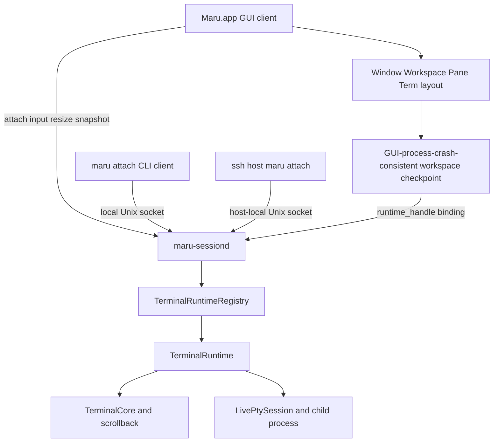
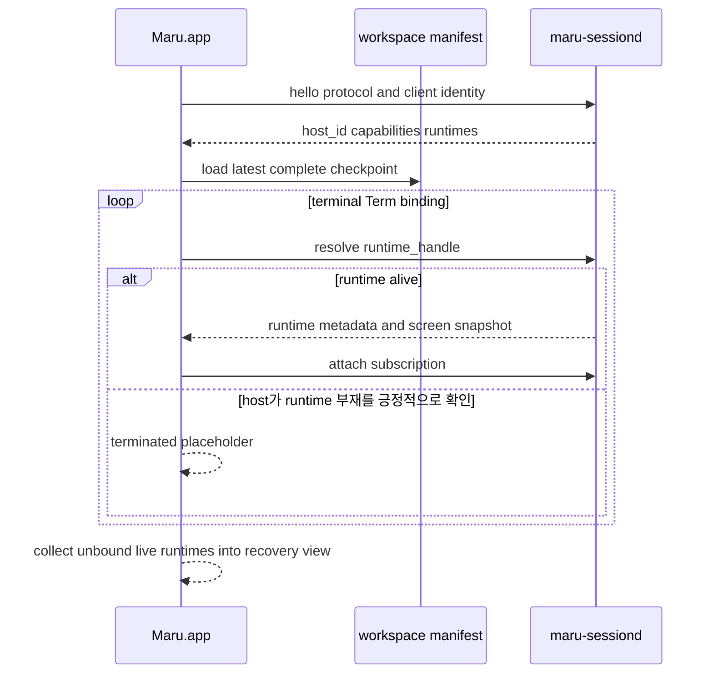

# 영속 터미널 세션 호스트

이 문서는 Maru GUI가 종료되어도 terminal Term의 PTY·자식 프로세스·화면 상태를 유지하고, 다시 실행한 Maru 또는
다른 터미널의 `maru attach` 클라이언트가 재접속하는 기능의 단일 출처다. 탭/split UI, workspace restore,
control-plane, PTY 종료 정책과 책임이 겹치지 않도록 소유권·ID·종료 의미·복구·검증 단계를 정한다.

> **상태: keep-alive opt-in의 P3 core 구현, P4/P5 미완료, 기본값 `false`.** `session.keep-alive-after-quit=true`면
> 새 terminal이 host(`maru-sessiond` = `maru __session-host`)-backed로 떠 **정상 GUI Quit 뒤** 살아남고 재실행 시
> 재접속한다 — 호스트 프로세스, `runtime-handle`(=`host_id:runtime_id`), GUI 재접속(`attachExisting`)은 **존재한다**
> (§멀티윈도우 "구현 상태 ✅" 노트·종료 매트릭스 참조). **원격 스크롤백·기본 드래그 선택·복사·검색, 자동 desync 리싱크, 그리고 원격 렌더
> 패리티(색 theme-aware·kitty 이미지·OSC 133 prompt 마크)도 구현됐다** — 원격 파이프라인이 in-process와 렌더 관점에서 동등하며,
> 새 화면 필드가 원격 경로를 빠뜨리면 comptime parity 가드가 컴파일 에러로 잡는다(`remote_screen.zig` `expectSnapshotParity`).
> 원격 spawn은 MRSH v2의 strict method `runtime.spawn_full`로 argv/cwd/login/GUI 시점 부모 환경
> snapshot/env override/TERM/ZDOTDIR/SSH integration/size를 전달한다. process-local `surface_id`인 pane selector는
> 재접속 뒤 stale해질 수 있어 persistent child에는 아직 주입하지 않는다. workspace restore는 host/runtime 쌍이
> 다르거나 runtime이 없을 때 새 shell로 위장하지 않고 실패한다. 복원 시작은 ABI v142 deferred AppSession을 사용해
> 저장 모델 publish 전 기본 tab/PTY를 만들지 않으므로, 성공 재접속 경로의 fresh/throwaway shell spawn 수는 0이다.
> host의 실제 `TerminalCore`가 소유하는 cwd/title/live semantic state, grid size와 alt-scroll 관련 mode, foreground process 관측,
> OSC 5379 `ssh_remote_dest`는 이제 attach 초기 metadata + revisioned full-state event로 GUI의 owned runtime
> observation에 전달된다. sidebar cwd/git, auto title, cwd 상속/workspace capture/control collector, at-prompt/close,
> Claude/Codex 감지, SSH drop/paste가 이 observation을 소비하며 host-backed placeholder `Surface.core`는 metadata
> 출처로 쓰지 않는다. **cwd는 이 중 절반만 온다** — observation이 싣는 것은 셸이 OSC 7으로 보고한 값이고,
> "이 터미널이 서 있는 폴더"를 푸는 2단 규칙([editor-surface-dock.md](editor-surface-dock.md) §3.5)의 2단인
> **커널 조회는 host-backed runtime에 존재하지 않는다**. `proc_pidinfo`는 PTY를 소유한 프로세스에서만 답하는데
> 그건 `maru-sessiond`이고 host는 그 값을 재서 보내지 않는다(`session_host/remote_term_backend.zig`의
> `processCwd`가 그래서 `null`을 낸다). 결과: **셸 통합이 없는 셸(bash/fish)과 재개 Term은 host-backed일 때
> cwd가 아예 없다** — in-process에서는 커널이 답하는 바로 그 경우들이다. 사이드바 폴더·브랜치줄, 소스 컨트롤
> 저장소 선택, 파일 탐색기 루트, 도크 범위 칩, 제어 평면 `TerminalMeta.cwd`가 함께 빈다(축이 하나라 갈리지는
> 않는다). 메우려면 host가 관측 payload에 측정한 cwd를 더해야 하고 그건 wire schema 변경이라
> [session-host-upgrade.md](session-host-upgrade.md)의 호환 규약을 건드린다 — **별도 슬라이스이며 아직 계획에
> 없다.** **P3-e4a~c와 P3-e4d-1~4 자동 parity gate는 구현 완료**다. 실제 host PTY OSC
> 7/2/5379 왕복·revision/coalescing·소유권, 다중 runtime 격리, detach 중 변경→재접속과 controlled
> Claude/Codex foreground→실제 Git·agent·SSH upload 소비자, capability 없는 frozen N-1 protocol fixture의
> fail-closed 복원, 실제 file/image upload 성공·transport 실패, 재접속 initial full-state의 SSH destination을 새 OSC 없이
> 실제 업로드가 소비하는지와 두 runtime의 destination·ControlMaster 격리까지 별도 제품 E2E가 소유한다. e4d-1~4 완료는 위 kernel cwd 공백이나 notarized 과거 release
> provenance를 닫았다는 뜻이 아니다. `expectSnapshotParity`는 여전히 renderer DTO만 보호하며 metadata는 별도 gate다.
> IME marked text 표시는 별도 client-local 계약으로 구현됐다. 각 GUI `Surface`가 host snapshot 위에 같은
> `PreeditOverlay`를 합성하고, MRSH/runtime/workspace에는 저장하지 않는다. 그래서 다중 클라이언트가 같은
> runtime을 보더라도 조합 중 문자열은 입력한 attachment에만 보이며 detach/reconnect에는 남지 않는다.
> 확정 UTF-8과 그 확정 뒤 replay할 Enter/화살표만 pin된 runtime의 surface별 ordered input stream으로 보낸다.
> 창 간 workspace 이동 때 source/destination terminal admission과 미전송 queue 이전 용량을 all-or-none
> 선예약한 뒤 조합을 확정하고 queue를 destination session으로 함께 옮긴다. 원격 nonblocking 경로는 AppKit
> callback에서 일반 key를 runtime별 64 KiB direct-input FIFO에 복사하고, 최대 64개의 bounded control FIFO가
> scroll/focus/config/prompt 명령의 input byte barrier를 함께 보관한다. `input_bytes`, `scroll_to_bottom`,
> `core_command` frame의 소유권을 connection writer에 넘기며, 전송 구간에
> `O_NONBLOCK`을 적용한 `MSG_DONTWAIT` write만 시도한다.
> EAGAIN/partial 뒤 남은 wire bytes는 frame-loop pump가 같은 frame offset부터 이어 보낸다. control
> barrier가 `기존 input → core command → 새 input`의 순서를 보존한다. scrolled
> `imeBegin`은 응답 없는 async scroll frame만 admission하며 동기 RPC로 fallback하지 않는다.
> focus report와 설정·prompt core command는 host reader까지 전달되고, 일반 key의 DECCKM/DECKPAM/kitty keyboard 인코딩은
> runtime observation override로 host 모드대로 인코딩된다(P3-e4c-4). 단 선택 autoscroll 등 input-mode/command
> parity 전체가 완료됐다는 뜻은 아니다.
> `keep-alive-after-quit` 토글은 **설정 GUI(workspace 섹션)에도 노출**된다. 기본값은 아직 `false`(opt-in)다.
> 영구 부재 runtime의 per-Term 종료 placeholder와 `⏎` 제자리 재생성은 구현됐다. **P4 R1 구현 슬라이스는**
> `runtime-handle + runtime-state="ended"`를 owned 상태로 반복 저장하고, 두 번째 이후 재실행에서 host
> probe·attach·새 셸 spawn 0을 자동 gate로 고정하는 durable tombstone이다.
>
> **후속/백로그**(2026-08-24 코드 대조로 정리): incremental checkpoint, GUI 부재 시 OS 배너, **기본값 `true`
> 전환**. 이 문서는 그 목표 상태를 함께 기술한다 — **구현 완료 여부는 각 절의 "구현 상태" 표식으로
> 구분한다**(표식 없는 서술은 목표 설계).
>
> ✅ **켠 경로를 CI 가 검증한다(2026-08-27 — `session-host-keepalive-macos`).** 하루 전까지 이 자리에는
> 「그 스모크는 실 AppKit 창이 필요해 CI 에서 못 돈다」고 적혀 있었는데, **한 번도 시도한 적이 없는
> 가정이었다** — `macos-app-smoke`·`window-smoke` 는 ci.yml 이력에 없다. 실제로 재 보니 러너에
> `WindowServer` 가 살아 있고(pid 145) `macos-session-host-recovery-smoke` 가 **통과한다**. 실측 **2분 14초**로
> macOS 잡 중 가장 싸다(slow observer 1m46s · bundled CLI 7m09s · Debug 8m01s · file explorer 14m04s).
>
> 그 잡이 단언하는 것은 **「GUI 를 껐다 켜도 같은 프로세스에 다시 붙는다」** 다: 두 번째 실행까지 가고
> (`stage=2`), 살아남은 세션을 목록에서 찾아(`row_present`) 클릭하고(`click_dispatched`) 원격 터미널이 서고
> (`remote_published`), **1 차 셸이 남긴 표식이 2 차에서 보이며**(`marker_present`), 그 화면을 렌더해 캡처한다
> (`before/after_capture`).
>
> ⚠️ **덮지 않는 것도 적어 둔다**: 강제 종료 경로(정상 종료만 본다), 멀티 윈도우 배치 복원(R7), GUI 부재 중
> 알림(OS 배너). 「돈다」와 「충분히 덮는다」는 다르다.
>
> ⚠️ 성능은 전환의 블로커가 아니다(2026-08-25 실측): 콜드런치 중앙값 **110 ms**(웜 7~27 ms), exec 실패는
> 상태 파이프로 4123 ms → **5 ms**. 그리고 runtime 수명은 **정책 공백이 아니다** — §6 종료 매트릭스가
> 정하고, 시간 기반 TTL 이 없는 것은 «닫았다고 생각한 process 를 살려 두지 않는다» 의 반대편 대가로
> **의도된 선택**이다.
>
> ✅ **옛 목록에 남아 있던 셋은 이미 구현됐다**(그대로 둔 탓에 실제로 오독이 났다 — 이미 닫힌 항목을 남은
> 블로커로 세어 우선순위를 잘못 매겼다): host-backed **echo 지연 제거**(reader→self-pipe→poll owner wake — §perf),
> 외부 **`maru attach` CLI**(`cli/attach.zig`), **다중 app process**(§P5a1 이 이미 「T0b2b 가 serial serve
> loop 를 listener+32-client single-owner poll reactor 로 교체했다」고 적어 두었고, 아래 §P3-e3-4d 에 실측을
> 더했다). RPC·delta push 의 async 통합은 그 리액터가 listener·client·wake fd 를 한 poll 집합에서 처리하는
> 데까지 왔고, «완전한» 범위(mouse/resize/observation 전부)는 절별 표식을 따른다.

## 1. 결론

Maru의 기본 영속성은 tmux가 아니라 **Maru 전용 로컬 session host(`maru-sessiond`)**가 제공한다.

- Maru의 Window → Workspace → Pane → Term 배치는 기존 Zig 모델이 계속 소유한다.
- `maru-sessiond`는 terminal Term의 실행 runtime만 소유한다.
- GUI 종료는 runtime 종료가 아니라 client detach다.
- Term 닫기는 runtime에 대한 명시적 terminate다.
- 제품 설정 `session.keep-alive-after-quit`은 완성 뒤 기본 `true`이며, 새 terminal runtime을 host에서 연다.
- 다른 터미널은 `tmux attach`가 아니라 `maru attach`로 같은 runtime에 붙는다.
- `tmux -CC` layout driver는 기본 계획에서 제외한다. 외부 tmux 세션 가져오기 수요가 확인될 때만 별도 adapter로
  재검토하며, persistent-session 구현의 선행조건이나 fallback으로 쓰지 않는다.

**연결 identity도 Maru가 대체한다.** canonical manifest와 attach protocol에는 tmux session/window/pane ID를 저장하거나
Maru ID로 번역한 mirror를 두지 않는다. `host_id + runtime_id`는 Maru가 직접 발급하며 `maru attach`의 대상도 이 Maru
runtime ID다. tmux가 설치돼 있지 않아도 생성·재접속·복구·외부 terminal attach가 모두 동작해야 한다.

이 범위는 좁은 의미로 terminal multiplexer의 PTY 소유·detach/attach 기능을 수행하지만, tmux의 window/pane UI,
prefix key, status line, copy mode, 설정 언어, command language, tmux wire 호환은 구현하지 않는다.

### terminal multiplexer 기능 경계

| 분류 | v1 결정 |
| --- | --- |
| 취함 | GUI와 독립된 PTY/child 소유, detach/reattach, host-side screen·scrollback, client N개 관찰, SSH attach, resize·`SIGWINCH` 전달 |
| Maru 모델로 대체 | session/window/pane 계층은 Window/Workspace/Pane/Term, 연결키는 `runtime_id`, layout은 `workspace.v1`, 화면 전달은 MRSH snapshot/delta |
| 제외 | prefix/status/command/config 언어, control-mode/wire 호환, 여러 writable client, 여러 Term의 동일 runtime 영속 복제, client 크기 조정 정책 |

외부 terminal attach에 필요한 multiplexer 동작은 취하되 Maru가 이미 소유한 layout/UI를 다시 만들지 않는 경계다.

## 2. 목표와 비목표

### 목표

- `Maru.app` 프로세스가 정상 종료해도 terminal Term의 자식 프로세스가 살아 있다. 강제 종료 시 host runtime 자체는
  살아 있을 수 있지만 incremental manifest checkpoint가 없어 최신 layout 자동 재연결은 아직 완료 계약이 아니다.
- 재실행한 GUI가 동일한 프로세스·PTY·scrollback에 재접속한다. 새 shell을 spawn한 뒤 비슷하게 보이게 만드는 기능이 아니다.
- 여러 Window·Workspace·Pane·Term의 배치를 tmux 계층으로 바꾸지 않고 기존 Maru UX 그대로 복원한다.
- detach 중 발생한 output도 host의 `TerminalCore`에 적용되어 재접속 첫 화면에 반영된다.
- GUI가 종료된 동안 발생한 OSC 9/777 알림도 host가 잃지 않고 macOS 배너·다음 GUI 알림 이력으로 전달한다.
- local Terminal.app/iTerm2/Ghostty/SSH 셸에서 `maru attach <runtime>`로 개별 Term에 붙을 수 있다.
- 느리거나 끊긴 client가 PTY reader를 막지 않도록 client별 전송은 bounded다.
- 종료·재접속·프로토콜 버전 불일치를 trace/snapshot/artifact로 진단할 수 있다.

### 비목표

- 재부팅·전원 종료를 건너 실제 OS 프로세스를 보존하는 것.
- `maru-sessiond` crash·강제 종료 또는 terminal child 종료 뒤 동일 실행 세션을 복구하는 것. host/runtime이 끝나면
  그 Maru runtime도 끝난 것이며 자동 대체 spawn을 하지 않는다.
- Claude/Codex provider session id·transcript·argv를 저장해 resume/fork하는 것. 영속성은 provider 복원이 아니라
  **같은 살아 있는 PTY/process를 계속 소유**하는 데서만 나온다.
- tmux server/socket/control-mode 프로토콜과 호환되는 것.
- v1에서 여러 writable client가 동시에 한 PTY에 입력하는 것. 여러 사람이 함께 쓰는 collaborative input, 사용자별 cursor,
  입력 병합·귀속·승인/revoke UX는 실제 수요가 확인될 때 별도 설계한다.
- v1에서 서로 다른 Unix account가 같은 runtime을 공유하는 것. SSH attach도 session host를 소유한 동일 login UID로 실행하며,
  cross-UID 초대 token·ACL·broker socket은 추가하지 않는다.
- v1에서 하나의 runtime을 여러 Window/Workspace/Pane의 영속 Term으로 복제하는 것. canonical owner Term은 하나이며 추가
  화면은 manifest 배치가 아닌 client subscription이다.
- 여러 client 크기에서 largest/smallest/latest를 고르는 layout 정책. canonical PTY 크기는 controller 한 명이 소유한다.
- v1에서 전체 Maru workspace를 텍스트 TUI로 완전히 재현하는 것.
- WKWebView process, browser JS heap, file panel의 미저장 editor buffer를 session host에 넣는 것.
- 원격 TCP/HTTP 포트를 열거나 계정·클라우드 relay를 추가하는 것.
- capability 없는 legacy host의 사후 live migration과 서로 다른 PID 사이 child-parent 관계 이전. 향후
  upgrade-capable host의 attachment 0 동일 PID `exec` 교체는
  [Session host 실행 중 업그레이드](session-host-upgrade.md)가 별도 단계·rollback·검증 계약을 소유한다.

## 3. 현재 구현과 새 경계

현재 `AppRuntime.live_registry`는 앱 인스턴스 전역으로 `LiveSurface`를 소유하지만, 그 수명은 여전히
`Maru.app` 프로세스 안이다. `LiveSurface.terminal`은 `Surface/TerminalCore + LivePtySession` 묶음이고, GUI 종료 teardown이
이를 닫는다. 이 앱-전역 소유권 lift는 cross-window 이동에는 충분하지만 process 종료를 건너지는 못한다.

새 구조에서는 terminal arm의 소유권을 process 경계 밖으로 옮긴다.



### GUI가 소유하는 것

- Window·Workspace 순서와 그룹·pin·색·custom name.
- SplitTree, Pane, Pane 안 Term 탭 순서와 활성 위치.
- terminal/web/file surface의 화면 배치와 native responder/Metal/WKWebView.
- app/global keybinding과 chrome action. terminal로 내려갈 입력만 host에 전달한다.
- workspace manifest의 구조 변경 정책과 atomic checkpoint.
- GUI가 붙어 있을 때 알림 위치 라벨·인앱 알림 센터·native focus UX.

### session host가 소유하는 것

- terminal runtime의 PTY master, child pid/process group, reader, write queue.
- `TerminalCore`, active/alternate screen, scrollback, cwd/title/semantic state.
- runtime별 마지막 PTY size와 controller client.
- detach 중 output 처리, runtime 종료 상태, client별 bounded subscription.
- OSC 9/777 notification event와 GUI가 없는 동안의 bounded pending history.
- agent process 관측처럼 PTY/process에 직접 묶인 파생 상태. UI 표현 정책은 GUI에 남긴다.

host-backed runtime에서는 이 host `TerminalCore`가 cwd/title/semantic/OSC 5379 상태의 단일 출처다. GUI의
`Surface.core`는 화면 렌더에도 쓰지 않는 placeholder이므로 runtime metadata의 출처로 읽으면 안 된다. Git branch는 wire에
중복 저장하지 않고, GUI가 host에서 받은 cwd를 기존 `.git/HEAD` 캐시 로직에 넣어 파생한다.

### session host가 소유하지 않는 것

- Workspace/SplitTree의 정책 권위.
- WKWebView와 file tree/editor state.
- Metal/CoreText renderer resource.
- 사용자가 닫은 workspace를 임의로 다시 만드는 정책.

`TerminalCore`를 host에 두는 이유는 GUI가 없는 동안에도 output을 계속 해석해 화면과 scrollback을 정확히 유지하기 위해서다.
PTY raw bytes만 host가 보관하고 새 GUI가 처음부터 replay하는 방식은 무제한 transcript 또는 잘린 replay에서 생기는 화면 손실을
요구하므로 채택하지 않는다. renderer는 GUI에 남고 host가 versioned screen snapshot/delta를 제공한다.

### 기능을 어느 쪽에 둘 것인가 (배치 규칙)

새 기능을 host-backed에 이관할 때 "host가 할 일인가 client가 할 일인가"를 매번 다시 판단하지 않도록 규칙을 고정한다.
`Surface.core`가 client에서 **빈 placeholder**라는 사실만으로는 답이 안 나온다 — 실제로 링크·마우스 motion·스크롤바가
그 core를 읽다가 조용히 무동작이었고(P3-e4c-5~7), 각각 답이 달랐다.

**세 축으로 가른다.**

| 축 | 어디 | 왜 |
|---|---|---|
| 터미널 상태·콘텐츠 **해석** | **host** | 화면·스크롤백·cwd·입력 모드의 실물을 host가 소유한다. client가 추측하면 placeholder를 읽거나 stale이 된다 |
| OS capability **실행** | **signed platform adapter** | 클립보드·브라우저 열기·소리는 GUI-live client가 실행한다. host-backed 알림만 예외로, GUI-live는 client fast path를 쓰고 GUI 0은 signed daemon process 내부 adapter가 같은 로컬 macOS 자원에 게시한다. 원격 host는 로컬 OS capability를 실행하지 않는다 |
| config **정책** | **client** | 정책은 client config이고, [다중 client](#9-다중-client와-resize)가 한 host에 붙으면 각자 달라야 한다 |

그래서 전형적인 형태는 **"host가 사실을 전달하고, GUI-live client가 정책을 적용해 실행한다"**이다. 유일한 P4 예외인
GUI 0 host-backed 알림은 host가 bounded journal과 stable route를 소유하고 daemon 내부 platform adapter가 게시한다.
이미 구현된 GUI-live 형태와 계획된 예외는 다음과 같다.

| 기능 | 해석 | 실행 | 정책 |
|---|---|---|---|
| 선택 복사 | host `extractSelection`(soft-wrap·스크롤백) | client NSPasteboard | — |
| Find | host `findMatches`·매치로의 스크롤 | client 하이라이트 렌더(host `view_offset` 대조 후) | client(검색어) |
| OSC 9/777 알림 | host 파싱·stable event journal(P4) | GUI-live client fast path / GUI 0 daemon-internal macOS adapter(P4) | app-global notification config snapshot(P4) |
| 링크 | host span·추출·존재 stat | client 열기(NSWorkspace) | client(`input.link-detection`) |
| 스크롤·스크롤바 | host view·스크롤백 | client 렌더 | — |

**입력 인코딩만 갈림 기준이 하나 더 있다: 그 인코딩이 core를 mutate하는가.**

- `reportMouse`는 `*TerminalCore`로 **response 큐를 mutate**한다 → 단일 mutator 계약(§9.3)상 host에서만 실행해야 한다.
  그래서 마우스는 client가 좌표만 보내고 **host가 인코딩·PTY 주입**한다.
- `encodeKey`는 `*const TerminalCore`로 **순수 읽기**다 → 모드만 있으면 어디서 인코딩해도 같은 결과다. 그래서 키는
  모드(DECCKM·DECKPAM·kitty flags)를 관측으로 **미러**하고 client가 로컬과 같은 인코더로 인코딩한다.

키를 host 인코딩으로 바꾸는 것도 **기술적으로 가능하다**(마우스와 같은 형태). 지금 방식을 택한 대가와 이득은 이렇다:

- **얻는 것**: 왕복 0, 로컬과 동일한 인코더 공유, 그리고 입력이 **바이트 한 경로**로 유지된다(키·IME 확정 텍스트·
  붙여넣기가 모두 `writeInput`으로 나가 input barrier 순서 규칙이 단순하다).
- **감수하는 것**: **모드 stale**. 앱이 방금 DECCKM/kitty를 켰는데 관측이 아직 도착하지 않았으면 그 직후 첫 키가 옛
  인코딩으로 나갈 수 있다. 드물지만 모드 전환 직후(vim 진입 등)에 노출된다. 이 stale이 실제 문제로 관측되면 키도
  host 인코딩으로 옮긴다 — 그때는 키 이벤트 wire를 추가하고 바이트 단일 경로를 포기하는 교환이다.

**이 규칙으로 이관한 것**(모두 동작한다):

- **스크롤백 Find**. host가 검색(`findMatches`)과 매치로의 스크롤을 소유하고, client는 돌려받은 뷰포트 span을
  하이라이트로 그린다. **응답에는 host가 그 span을 계산한 기준 `view_offset`(`voff`)이 함께 온다.** client는 자기
  화면(delta로 조립한 projection)의 `view_offset`이 그 값과 같을 때만 span을 그린다 — `scroll=true` 요청이 host
  화면을 옮긴 직후의 응답은, client가 아직 그 스크롤 delta를 받지 못한 화면과 **좌표계가 다르다**. 두 시점을 한
  프레임에 합성하면 엉뚱한 줄이 하이라이트되고, 사용자에겐 "이전 하이라이트가 남는" 잔상으로 보인다.
  어긋나는 동안은 **직전 span을 유지한다** — 화면이 아직 이전 상태이므로 이전 span이 현재 화면과 정합한다.
  host가 실제로 스크롤했다면 scroll_state delta가 반드시 뒤따르고, 그 delta가 도착하는 tick은 output이 있어
  재조회가 일어나므로 별도 재시도 없이 정합 상태로 수렴한다. host가 `voff`를 보내지 않으면(앱보다 오래 사는 구
  host 데몬) 대조 근거가 없으므로 종전대로 즉시 적용한다 — 새 필드의 부재가 구 host의 유일한 신호라 별도
  capability 비트를 두지 않는다(find 응답의 `count`/`cur`도 같은 관대한 파싱 규율이다).
  client 쪽 규율 하나가 더 붙는다: **매치로의 스크롤 요청은 증분 검색(타이핑)과 네비게이션(⌘G)이 같은 경로를
  쓴다.** 이 분기가 두 곳으로 갈리면 한쪽이 우회해 원격에서만 타이핑 중 스크롤이 죽는다.
- **벨(BEL)**(P3-e4c-8). host는 관측에 누적 카운터 `bell_count`만 싣고, `bell.*` 정책 판정과
  실제 실행(NSSound.beep·시각 flash·Dock 배지)은 client가 한다. 새 RPC를 만들지 않고 **관측 push에 얹은** 이유는
  벨이 드문 이벤트라 매 tick 폴링이 낭비이고, 관측은 이미 약 100ms마다 변화 시에만 push되기 때문이다.
  다만 **관측 주기는 폴링 주기이지 이벤트 지연이 아니다**: 벨·OSC 52는 host가 발생 시점을 정확히 알므로
  `RuntimeOps.observation_urgent`가 대기 중인 이벤트를 보고(소비하지 않고 조회만) true를 주면 그 tick 카운트를
  건너뛰고 다음 serve tick(약 20ms)에 바로 관측을 만들어 push한다. 소리·클립보드는 지연이 그대로 체감되므로
  통로(관측)는 그대로 두고 **트리거만 앞당기는** 선택이다. foreground process처럼 폴링 말고는 알 수 없는 상태는
  기존 100ms 주기를 그대로 쓴다.
  **소비형 bool이 아니라 카운터**인 것이 핵심이다 — full-state 관측은 "이전과 같으면 미전송"이라 bool은 true→true
  전이를 잃어 둘째 벨을 놓친다. client는 마지막에 본 값보다 **클 때만** 울리고, 작아지면(host exec migration으로
  카운터가 0에서 재시작) 가짜 벨 대신 조용히 재동기화한다.
- **누적 seq를 소비하는 쪽의 두 가지 필수 규율**(리뷰에서 드러난 계약):
  1. **첫 관측은 기준선만 잡고 발화하지 않는다.** host의 카운터는 client보다 오래 살아서, 재접속하면 이미 지나간
     값이 곧바로 "증가"로 보인다. 이걸 처리하지 않으면 재접속 때마다 지난 벨이 울리고, 지난 OSC 52 read가 재생돼
     **사용자 클립보드가 복원된 셸의 입력 줄에 주입**된다.
  2. **소비는 전달에 성공한 뒤에 기록한다.** seq를 먼저 전진시키면 RPC 실패가 요청을 소비해 사용자의 복사가
     영영 사라진다.
- **관측에 싣는 값은 반드시 bounded여야 한다.** metadata JSON이 `max_control_json`을 넘으면 attach 응답과 metadata
  이벤트가 **영구히 실패**해 그 runtime에 접속할 수 없게 된다. OSC 52의 Pc(target)는 파서가 길이를 제한하지 않으므로
  host가 잘라서 싣고, 큰 클립보드 텍스트는 관측이 아니라 RPC로 빼되 그마저 넘치면 `too_large`로 알린다(조용한 유실 금지).
- **임의 바이트는 JSON 문자열로 싣지 않는다.** client의 strict 응답 디코더는 UTF-8을 검증하므로 non-UTF-8이 오면
  connection을 fail-close한다 — 복사 한 번에 앱 전역 host 연결이 끊긴다. OSC 52 데이터는 base64로 싣는다
  (`runtime.find`의 검색어 hex와 같은 규율).
- **OSC 52 클립보드**(P3-e4c-9). host는 요청을 drain해 관측에 누적 seq(`clipboard_write_seq`·
  `clipboard_read_seq`)와 read target(Pc)만 싣고, **정책 판정(`osc52.read`)과 OS 클립보드 접근은 client**가 한다.
  write 텍스트는 커서 관측 full-state에 실을 수 없어 `runtime.clipboard_write` RPC로 따로 가져간다(seq가 증가했을
  때만 호출 — 폴링 없음). **read 응답에는 추가 왕복이 없다**: 응답은 `ESC ] 52 ; Pc ; base64 ST` 바이트라 client가
  만들어 기존 입력 경로(`writeInput`)로 host PTY에 쓰면 된다. seq 감소는 벨과 같이 재동기화로 본다.
- 참고로 같은 문제를 tmux는 `set-clipboard`로 푼다 — 서버가 클립보드를 직접 만지지 않고 **바깥 터미널로 OSC 52를
  다시 내보내** 실제 접근을 위임한다(`man tmux`: "attempt to set the terminal clipboard using the xterm escape
  sequence"). 서버=전달, 바깥=실행이라는 배치가 위 규칙과 같다(동작 비교만 — 코드 표현은 참고하지 않았다).

## 4. 엔티티와 ID

현재 `surface_id`는 **앱 인스턴스 전역** ID라 GUI process 재시작을 건너는 영속 ID로 승격하지 않는다.

| ID | 소유자 | 수명 | 용도 |
| --- | --- | --- | --- |
| `host_id` | session host | host process 수명 | stale manifest와 현재 host 구분, handshake용 opaque 128-bit random ID |
| `runtime_id` | session host | terminal runtime 생성부터 종료까지 | 동일 PTY/process를 찾는 opaque 128-bit random ID |
| `runtime_handle` | manifest | `{host_id, runtime_id}` | Workspace Term 슬롯과 live runtime 연결 |
| `surface_id + generation` | GUI/AppRuntime | GUI app instance와 surface 수명 | 렌더/input/control-plane 라우팅 |
| `runtime_state` (P4 R1 구현) | workspace manifest | 저장된 Term 슬롯 수명 | `live`/`ended`를 구분해 묘비의 자동 재생성을 막는 additive scalar |

불변식:

- `runtime_id`는 의미를 비트에 인코딩하지 않고 재사용하지 않는다.
- canonical terminal 연결키는 Maru `runtime_id` 하나다. tmux `$session/@window/%pane` ID를 보조키나 fallback으로
  저장하지 않는다.
- 기존 GUI 모델의 `DockGroup.runtime_id`는 파일 도크의 process-local group key일 뿐 terminal 연결 ID가 아니다.
  구현 단계에서는 session-host protocol namespace의 `runtime_id`와 타입·직렬화 필드를 공유하거나 암묵 변환하지 않는다.
- GUI 재실행은 새 `surface_id`를 발급한 뒤 기존 `runtime_handle`에 bind한다.
- runtime respawn은 같은 `runtime_id`의 generation 증가로 숨기지 않고 **새 runtime_id**다.
- `runtime_handle`은 권한 token이 아니라 상관키다. attach 권한은 transport/auth가 별도로 증명한다.
- web/file surface에는 `runtime_handle`을 쓰지 않는다.

예:

```text
종료 전  surface_id=45 generation=0 -> host=A runtime=R7
재실행  surface_id=3  generation=0 -> host=A runtime=R7
runtime 종료 뒤 기존 handle        -> ended (자동 respawn/resume 없음)
```

현재 persistent child에는 `MARU_PANE_ID`를 주입하지 않는다. 이 값은 process-local `surface_id`라 위 예시처럼
재접속 때 45→3으로 바뀌며, child 환경은 실행 중 교체할 수 없기 때문이다. runtime identity를 현재 GUI surface binding으로
resolve하는 control-plane rebinding이 구현되기 전에는 persistent Term 내부의 self selector 연속성을 지원한다고 세지 않는다.

**구현 상태(2026-08-24) ✅ — 에이전트 훅 신원은 예외다.** 같은 이유(«GUI process-local 값은 재접속을 못 넘는다»)
때문에 훅 로그 경로도 이 child 밖에 있었는데, 그쪽은 **host 가 자기 신원을 실어** 해결했다 —
`MARU_HOOK_INSTANCE=host_<32 hex host_id>` 와 `MARU_HOOK_PANE=<32 hex runtime_id>` 다. 둘 다 재실행·업그레이드를
넘어 살아 있는 이름이라(그래서 pid 가 아니다) child 환경을 교체할 필요가 없다.
`runtime_id` 는 그래서 **spawn 전에** 발급된다(자식 env 는 spawn 시점에 굳는다). 계약은
[에이전트 훅 통합](agent-hooks.md) §4 가 소유한다. ⚠️ 이것이 `MARU_PANE_ID`(control-plane self selector)를
대신하지는 않는다 — 두 값은 갈라진 변수이고, selector 연속성은 위 문단대로 여전히 미지원이다.

## 5. 다중 Workspace 연결 모델

tmux의 session/window/pane 계층으로 Maru workspace를 번역하지 않는다. 각 terminal Term 슬롯이 독립
`runtime_handle`을 가리킨다.

```text
Window 1
  Workspace A
    Pane left
      Term shell  -> {host=H1, runtime=R101}
      Term claude -> {host=H1, runtime=R102}
    Pane right
      Term dev    -> {host=H1, runtime=R103}

Window 2
  Workspace B
    Pane only
      Term codex  -> {host=H1, runtime=R201}
```

한 user login session의 host 하나가 모든 Window/Workspace의 terminal runtime을 관리한다. workspace 이동·pane split·Term 탭
재배치는 runtime을 재시작하지 않고 manifest binding 위치만 바꾼다. cross-window 이동도 동일하다.

현재 `maru.workspace.v1`에서 `Window`는 OS 창, `Tab`은 Workspace, `Pane`과 `Surface`는 각각 split leaf와 Term이다.
별도 session DB나 창별 workspace 파일을 만들지 않고 기존 단일
`~/Library/Application Support/maru/workspace.v1` 파일을 그대로 공유한다. 일반 Window/Workspace는 기존
`runtime-handle`과 P4 R1에서 구현한 `runtime-state` scalar로 Term 슬롯을 연결한다.

```text
surface ... runtime-handle="<32 lowercase host-id>:<32 lowercase runtime-id>" runtime-state="ended"
```

- `runtime-handle`의 두 ID는 각각 128-bit opaque random **nonzero** 값의 canonical lowercase hex다. all-zero는
  unresolved/first-page sentinel과 혼동하지 않도록 영구 reserved이며 generator·registry·workspace parser가 모두 거부한다. 두 부분은 모두 있어야 하는 단일
  quoted scalar라 partial handle을 표현하지 않는다.
- persistent terminal surface와 종료 placeholder만 `runtime-handle`을 쓴다. `runtime-state="ended"`면 그 handle은
  재attach 대상이 아니라 마지막 runtime의 상관키다. 새 reader는 host를 probe하거나 셸을 자동 spawn하지 않고 묘비를 만든다.
  사용자가 `⏎`를 눌러 새 runtime 생성에 성공한 때만 `runtime-state`와 구 handle을 새 live handle로 교체한다.
- in-process/옛 파일 surface는 두 키가 없으며 선언적 restore 규칙으로 새 runtime을 만든다.
- 기존 reader는 미지 `runtime-state` scalar를 무시하고, 새 reader는 키 부재를 `live`로 읽으므로 header는
  `maru.workspace.v1`을 유지한다. 값이 있는데 길이·hex·구분자가 깨졌으면 기존 optional-scalar 손상 규칙대로 checkpoint
  전체를 거부한다.
- `runtime-state="ended"`는 정확한 `runtime-handle`과 함께 있을 때만 유효하다. `ended`인데 handle이 없거나 알 수 없는
  state면 checkpoint 전체를 거부한다. `live`는 키를 생략한다.
- writer는 publish 전에 writable `runtime-handle` 전역 유일성을 검증한다. 중복이면 파일을
  덮어쓰지 않고 마지막 완전본과 live layout을 유지한다. reader도 attach/spawn 전에 같은 검증을 끝내 side effect가 일부만
  일어나지 않게 한다.
- `workspace-binding-id`는 현재 소비자가 없어 default-on 선결에서 제외한다. workspace-aware 다중 app client가 실제로
  필요해질 때 별도 wire/수명 계약으로 다시 제안한다. 일반 멀티윈도우·cross-window 이동은 기존 live Tab identity와 전체
  manifest transaction만 사용한다.
- runtime handle은 연결 위치이지 권한이 아니다. 파일을 읽었다는 사실만으로 attach/input/output 권한을 주지 않는다.

### 멀티윈도우와 동시 client 규칙

- 한 `Maru.app` process의 모든 `AppSession`/Window는 앱 전역 session-host connection 하나를 multiplex해 공유한다. 창마다
  daemon이나 socket을 만들지 않는다.
- **구현 상태(P3-e3-4d) ✅**: 위 "앱 전역 connection 하나 공유"는 구현됐다 — 원격 backend/연결이 `AppSession`(창) 필드가
  아니라 **모듈-전역**(app process당 하나, `app_runtime` 옆)이라 창을 여러 개 열어도 연결·backend를 공유한다(첫 창이 세우고
  이후 창은 재사용; 창 close는 그 창의 원격 Term만 회수하고 공유 backend는 안 닫는다 — `routing`/`live_registry`와 동일).
  창별로 연결하던 초기 배선은 두 번째 창이 handshake 타임아웃→in-process 폴백하는 버그였다(전역화로 해소).

  ✅ **daemon 은 더 이상 serial 이 아니다**(2026-08-24 정정). 근거가 둘이다 — ⑴ **문서 자신**: §P5a1 이
  「T0b2b 가 이미 serial serve loop 를 listener+32-client single-owner poll reactor 로 교체했다」고 적어 두었다
  (즉 이 문단은 그때부터 §P5a1 과 모순이었다). ⑵ **실측**: 실 fork host 에 client 를 **둘 붙여** 각각 runtime
  을 띄웠고 둘째 연결의 handshake 도 통과했다. 코드에서도 `acceptAllowed` 가 `active_count < max_clients`(32)
  로 판정한다.
  ⚠️ 다만 확인한 것은 **daemon 층**이다. 두 GUI process 가 같은 runtime 집합을 어떻게 나눠 갖는지(소유권·
  lease·workspace 바인딩)는 별개 축이고, 그 서술은 §P4 lifetime lease 절이 소유한다. 「지원 구성은 단일 app
  instance」라는 옛 결론은 그 축이 정리되기 전까지의 **운영 권고**로만 읽는다.
- host 연결 실패는 조용히 폴백하지 않고 **실패 단계와 사유를 함께** 알린다. 단계는 `exe_path`(형제 `maru` 경로 부재)·
  `cache_base`(캐시 base 부재)·`connect`(`connectOrLaunchDetailed` 실패, 이때만 `FailureReason` 동반)·`adapter`(연결 후
  adapter/pool/backend 구성 실패)·`runtime_death`(실행 중 host 연결 사망)로 구분하고, `stage=…[ reason=…]` 한 줄을
  notice 문장과 `std.log.err`에 같이 싣는다. **notice가 주 경로다** — GUI process의 stdout/stderr는 `/dev/null`이라
  (Dock·Finder 실행) 로그는 터미널에서 직접 실행할 때만 보이고 통합 로그로도 가지 않는다. 단계를 남기지 않으면 위
  다섯 실패가 전부 "사유 없음" 하나로 뭉개져 사후 진단이 불가능하다.
- **강등은 프로세스 수명 동안 유지되고, 되돌리는 것은 사용자다**(2026-08-28). `runtime_death`로 폴백하면
  `host_connect_failed`가 서고 이후 `backendForNew`가 원격을 고르지 않는다 — 새 Term은 전부 in-process다.
  이 래치를 **자동으로 내리지 않는 이유**는 두 가지다. ⑴ 모호한 쓰기 뒤에는 host 쪽 상태가 불확실해 성급한
  재접속이 이중 attach를 만들 수 있다. ⑵ 원격과 in-process를 오가면 한 창 안에 유지되는 탭과 아닌 탭이
  섞여, 어느 것이 살아남는지 사용자가 알 수 없게 된다.
  그러나 **되돌아올 길이 아예 없는 것은 다른 문제였다.** notice는 한 번 뜨고 사라지는데 강등은 앱을 끌
  때까지 남아, 그 뒤 여는 터미널이 유지되지 않는다는 사실이 화면에서 지워졌다. 그래서 상태바에 끊긴 동안
  계속 남는 항목을 두고, 그것을 눌러 **사용자가 명시적으로** 재연결하게 한다
  ([status-bar.md](status-bar.md) §4.3). 자동 복구가 아니라 사용자 개시라 위 두 이유와 충돌하지 않는다.
  **이미 in-process로 열린 Term은 옮기지 않는다** — 옮기는 시늉은 "이어진 세션" 오인을 만들고, 그건 복원
  경로가 loud-fail로 막는 바로 그 손실이다. 재연결이 고치는 것은 **앞으로 열 Term**이다.
- Window를 닫거나 Workspace/Term을 다른 Window로 옮기는 것은 먼저 하나의 layout transaction으로 source/target을 검증한
  뒤 manifest 위치만 바꾼다. 성공한 이동은 `runtime-handle`, child pid, scrollback을 바꾸지 않는다.
- app-wide Quit은 모든 Window의 GUI subscription을 끊는 detach다. 비마지막 Window/Workspace/Term의 명시적 close는 기존
  destructive close 의미를 유지해 해당 runtime 종료 확인을 거친다. 창 하나를 닫았다는 이유로 다른 창 runtime은 건드리지 않는다.
- 한 runtime의 **canonical owner Term은 manifest 전체에서 정확히 한 곳**이다. 같은 `runtime-handle`을 두
  Window/Workspace/Pane에 반복해 owner나 read-only mirror로 저장하지 않는다. observer는 manifest 배치가 아니라 client
  subscription이므로 CLI나 진단 UI에서 별도로 붙는다. Maru 내부 mirror UX가 실제로 필요해지면 owner의 terminate/알림 위치와
  독립 viewport를 정한 non-owning surface kind로 별도 설계하며 v1 wire를 느슨하게 중복 허용해 대신하지 않는다.
- 정상 제품 경로는 macOS single app instance가 layout writer다. 같은 process의 여러 Window는 기존 AppRuntime
  transaction으로 한 manifest를 쓰고, process는 P4의 lifetime lease 하나를 소유한다. 두 GUI process의 동시
  layout 편집/read-only attach는 P5 이후 별도 계약이며 지원하지 않는다.
- CLI `maru attach`는 manifest를 수정하지 않는다. `maru attach --workspace`가 후속 구현되더라도 창/탭 배치를 저장하지 않는다.

### Quick terminal 규칙

quick terminal은 main Window가 아니라 앱 전역 singleton `AppSession`이며 cross-window move/merge 대상이 아니다.

> **확정 비목표:** quick은 session host, workspace manifest, `runtime-handle`, `Recovered Sessions`, background
> notification cold attach, host exec upgrade의 대상이 아니다. `session.keep-alive-after-quit` 값과 무관하게 항상
> in-process backend를 사용하고 앱 Quit 때 함께 종료한다.

- toggle/auto-hide는 같은 앱 process 안의 quick session만 숨기며 runtime을 유지한다. Esc는 vim 등 terminal
  입력과 충돌하므로 hide shortcut으로 가로채지 않는다.
- 앱 Quit은 quick runtime을 종료한다. 다음 실행은 dormant layout을 읽거나 이전 quick runtime에 attach하지 않는다.
- quick의 위치·크기·`chrome`·`minimal-tabs` 설정과 기존 UX는 유지한다. 제거 대상은 quick 기능이 아니라
  persistent-session 결합뿐이다.
- 회귀 gate는 `is_quick => remote backend 생성 0`, workspace manifest의 quick block/handle 0, 앱 Quit 뒤 local runtime
  종료다.

### GUI process crash-consistent manifest

현재 workspace 저장은 정상 `applicationWillTerminate`에서 수행되므로 GUI 비정상 종료 직전 구조 변경을 잃을 수 있다.
host crash·host 강제 종료·재부팅·전원 손실 뒤 동일 runtime 복구는 비목표로 유지한다. 영속 세션 전환 전에는 **host가
살아 있고 GUI만 비정상 종료한 경우**의 layout orphan을 줄이는 다음 계약만 추가한다.

- workspace 생성/삭제, split, Term 이동/닫기, cross-window 이동, runtime bind 변경은 manifest dirty를 세운다.
  **구현 상태(2026-08-28): 신호부터 구동까지 배선돼 있다.** 신호는 `AppSession.workspaceChanged(kind)` 가
  받아 앱 전역 coordinator(`session/workspace_checkpoint.zig`)의 `markChanged()` 로 넘긴다 — manifest 는 여러
  창의 블록을 한 파일로 모은 것이라 창마다 두면 같은 파일을 두 번 쓴다. `kind` 가 무엇이 바뀌었는지 구분한다
  (`topology`/`selection`/`ordering`/`appearance`/`dock`/`naming`/`scm_base`/`runtime_binding`/
  `persisted_surface`/`explorer_roots`). 호출부는 **manifest 에 보이는 transaction 의 성공 꼬리에서만**
  부른다 — 진행 중에 부르면 반쯤 바뀐 배치가 발행된다.
  구동은 `maru_macos_workspace_checkpoint_{arm,tick,quit_requested,capture_completed,write_completed,mark_*}`
  와 Swift 의 effect 루프가 한다(디바운스 500ms·재시도 1s→30s). 복원 중 발행은 `armWorkspaceCheckpoint` 가
  막는다 — staged Window 가 하나라도 남아 있으면 arm 하지 않고, 세션별 `workspace_checkpoint_mutations_enabled`
  도 그때 함께 켜므로 복원·빌드 단계의 변경은 애초에 coordinator 에 닿지 않는다.

  ⚠️ **P4 C3-1(`noteWorkspaceMutation`)은 되돌렸다(2026-08-28).** 위 체계와 별개로 두 번째 앱 전역
  coordinator 를 만들었는데 아무도 `tick` 을 몰지 않아 dirty 만 세우고 끝났고, 호출 지점도 절반은 이미
  `workspaceChanged` 가 덮는 자리였으며 나머지(`detachTabForMove`·`moveWorkspaceToSession`)는 transaction
  **진행 중**이라 위 규율을 어겼다. 원인은 착수 시점에 플랫폼 쪽 현재 상태를 다시 확인하지 않은 것이다.

**쓰기 소유자는 Zig 다(2026-08-25 확정 — 2026-08-28 기준 checkpoint 경로는 그렇게 되어 있다).** 원자적
쓰기는 `maru_macos_workspace_checkpoint_publish`/`_publish_final` → `platform/macos/workspace_checkpoint_file.zig`
가 한다. 플랫폼이 하는 것은 **창별 블록 캡처와 이어 붙이기**(`captureWorkspaceSnapshot`)까지다. 그 조립까지
플랫폼에 두면 **Windows·Linux 가 같은 것을 다시 짜야 한다** — 그건 「어느 창이 있었나」를 파일로 옮기는,
플랫폼과 무관한 일이다. 직렬화(`session/workspace.zig`)가 이미 공용 Zig 인 것과 같은 이유로 남은 조립도
Zig 가 가져갈 자리다.

**그래도 플랫폼에 남는 것이 있다 — 둘을 갈라 둔다.**

- **창 관리자 사실은 플랫폼이 준다**: 어느 창이 key 인가(`is_active`), 창 frame(`win-x/y/w/h`). 이것은
  AppKit·Win32 가 아는 값이라 Zig 가 계산할 수 없다. 지금처럼 **밀어 넣는** 방향을 유지한다.
- **원자적 교체 원시연산은 플랫폼마다 다르다**: 현재 C2 leaf(`platform/macos/workspace_checkpoint_file.zig`)는
  POSIX `rename` 이다. Windows 는 `ReplaceFile` 계열이라 같은 계약(같은 디렉터리 temp → 원자적 교체)을
  **플랫폼 seam 뒤에** 둬야 한다. 지금 그 파일이 `platform/macos/` 아래인 것은 그 seam 이 아직 없다는 뜻이다.

**단, 「조립」이 아니라 「정책」이 공유할 값이다.** 창별 블록을 이어 붙이는 일 자체는 사소하고, 플랫폼마다
다시 짜면 아까운 것은 그 위의 정책이다 — **한 창이라도 캡처 실패하면 전체 포기**, **유일성 검증을 쓰기
앞에**, **불완전 복원이면 `.bak` 먼저**. 이 셋이 갈라지면 플랫폼마다 다른 방식으로 데이터를 잃는다.

**살아 있는 창 목록은 Zig 가 갖지 않는다.** 창 열거는 플랫폼에 남긴다(AppKit·Win32 가 순서와 key 창을
안다). Zig 가 목록을 들고 스스로 캡처하면 Zig → 플랫폼 **역방향 콜백**이 필요해지고, 저장 도중 창이 닫히는
수명 문제까지 떠안는다. 대신 플랫폼이 **밀어 넣는다**: tick 이 「지금 캡처」를 돌려주면 그때 창을 돌며
블록을 밀고 publish 한다.

#### 구동 계약 (구현됨 — 2026-08-28 확인)

**무엇을 얻고 무엇은 이미 안전한지부터 적는다.** 강제 종료·크래시로 checkpoint 가 낡으면 잃는 것은
**배치(창·탭·split·위치)와 자동 재연결**이다. 그 사이 만든 live runtime 자체는 **안 잃는다** — 위 §7-8 이
「host 에는 있지만 manifest 에 bind 되지 않은 runtime 은 삭제하지 않고 `Recovered Sessions` 에 노출한다」로
이미 덮는다. 그래서 이 작업은 **데이터 손실을 막는 일이 아니라, 「수동 복구」를 「자동 복원」으로 바꾸는
일**이다(§2 의 표현도 「최신 layout **자동** 재연결」이다). 우선순위를 매길 때 그 크기로 다뤄야 한다.

⚠️ **시계는 한 출처여야 한다.** `markChanged()` 와 `tick()` 이 서로 다른 시계(Zig 단조 시계 vs 플랫폼이 넘긴
타임스탬프)를 받으면 debounce·retry 창이 뒤틀린다 — 두 값의 기준점이 다르면 「방금 바뀌었다」가 과거로도
미래로도 보인다.

**구현 배치는 이렇다.**

- **신호**: `AppSession.workspaceChanged(kind)` → 앱 전역 coordinator 의 `markChanged()`. **manifest 에 보이는
  transaction 의 성공 꼬리에서만** 부른다 — 진행 중에 부르면 반쯤 바뀐 배치가 발행된다.
- **구동**: `maru_macos_workspace_checkpoint_{arm,tick,quit_requested,capture_completed,write_completed,mark_*}`
  와 Swift 의 effect 루프. 디바운스 500ms, 재시도 1s → 30s.
- **저장**: 캡처·조립은 `captureWorkspaceSnapshot(useTerminationKeyWindow:publishedOnly:)`(Swift), 원자적
  쓰기는 `maru_macos_workspace_checkpoint_publish`/`_publish_final`(Zig). 종료 경로와 **같은 것을 쓴다**.
- **완료 보고**: 성패가 `capture_completed`/`write_completed` 로 coordinator 에 돌아간다. 이게 없으면 재시도·
  백오프가 죽어 coordinator 가 **디바운서로만** 쓰인다(그럴 거면 타이머면 된다).

🔴 **복원 중 발행 금지가 이 설계에서 가장 중요한 가드다 — 없으면 이 기능이 지키려던 것을 이 기능이 부순다.**
복원은 창을 차례로 만들므로(deferred surface → `applyWorkspaceWindow`), 그 중간에 저장이 뛰면 **아직 안
만들어진 창이 빠진 스냅샷**이 쓰인다. 기존 가드는 «캡처 실패»를 막지 «아직 없는 창»은 못 막고, 블록이 하나라도
있으면 유일성 검증도 통과한다. 즉 **복원 중 저장은 창을 지우는 경로다.**
이것을 `armWorkspaceCheckpoint` 가 막는다 — staged Window 가 하나라도 남아 있으면(`windows.allSatisfy {
$0.appSession != nil }` 불성립) arm 하지 않고, 세션별 `workspace_checkpoint_mutations_enabled` 도 그때 함께
켜므로 복원·빌드 단계의 변경은 애초에 coordinator 에 닿지 않는다. 같은 이유로 `tickAppSession()` 이 deferred
세션을 건너뛴다.

**원자적 교체 seam 은 Windows 가 실제로 필요할 때 만든다.** 지금 옮기면 POSIX 전용 «공용» 모듈이 된다.

구체 wire와 손상/하위호환 규칙의 단일 출처는
[Workspace Restore 전략](workspace-restore.md#영속-session-binding-wire-runtime-handle-구현-durable-tombstone-r1)이다.
일반 layout은 optional scalar만으로 v1을 유지한다. 현재 parser가 첫 unknown top-level trailing line에서 성공 종료하는
동작은 legacy 관용성이지 새 block 확장점이 아니다. 새 line kind·카운트·tree 변경이 필요해지면 여기서 정한 범위를
벗어나므로 멈추고
`maru.workspace.v2` migration/fallback을 사용자와 다시 결정한다.

### 새 Term과 설정

사용자 설정은 backend 구현명을 노출하지 않고 다음 boolean 하나를 제공한다.

```ini
session.keep-alive-after-quit = true
```

| 값 | 새 terminal runtime | `Quit Maru` |
| --- | --- | --- |
| `true` (**사용자 opt-in**) | 새 일반 Window의 Workspace/Term/split은 `maru-sessiond`에 생성. quick은 항상 in-process | 일반 persistent runtime은 GUI만 detach, quick은 종료 |
| `false` | 현재처럼 GUI process 안에 생성 | 현재 AppSession에 연결된 persistent runtime도 terminate |

- 이 키는 config schema·`configuration.md`에 있고, **설정 GUI(workspace 섹션 토글)에도 노출된다**(과거 실험적이라 숨겼던 것을
  원격 렌더 패리티 완성 후 해제). CLI help는 후속. **기본값은 `false`인 opt-in으로 유지한다.** 자동 default-on은
  현재 P1~P5 완료 조건이 아니라 별도 release-backlog G3이며, 사용자가 다시 승인하기 전에는 시작하지 않는다.
- backend 선택은 **새로 만드는 runtime에만** 적용한다. 살아 있는 runtime을 process 사이에서 migrate하거나 설정 토글
  즉시 terminate하지는 않는다. 토글을 켜면 host를 준비해 이후 일반 Term부터 persistent로 만들고, 끄면 이후 Term부터
  in-process로 만든다. 바뀐 quit 의미는 다음 app-wide `Quit Maru`부터 적용한다.
- **현재 opt-in 구현:** `true`인데 host launch/handshake가 실패하면 notice를 예약하고 in-process terminal로 폴백한다.
  해당 Term에는 종료까지 남는 `not preserved` 상태를 표시하고, 그 Term에 `runtime-handle`을 쓰지 않으며,
  checkpoint/quit structured artifact에 fallback 원인을 남겨야 한다.
- persistent와 in-process runtime이 과도기 한 workspace에 함께 있어도 각 Term의 typed backend binding으로 구분한다.
- 설정의 앱 전역 snapshot 하나를 모든 Window가 공유한다. 따라서 `false` 상태의 다음 Quit은 창별 stale config와 무관하게
  현재 앱에 연결된 기존 persistent runtime도 끝낸다. Quit 전 즉시 끝내려면
  `Quit and End All Sessions` 또는 Term별 close를 쓴다. host에 남은 다른 workspace/client의 unbound runtime까지
  설정 하나로 일괄 종료하지 않는다.
- **"모든 설정 초기화"(Reset to Defaults)는 이 키를 초기화하지 않고 보존한다.** 리셋이 이 값을 기본값으로 되돌리면
  live 정책이 그 자리에서 뒤집혀 다음 평범한 `Quit Maru`가 살아 있는 host-backed runtime을 전부 terminate한다 —
  파괴를 `Quit and End All Sessions`라는 명시적 경로로 분리한 위 원칙을 리셋이 우회하는 셈이다(실측 사고: 리셋 뒤
  일반 Quit으로 runtime 12개 소멸, workspace의 `host_id:runtime_id` 12개가 dangling). `resetAllSettings`는 app-global
  snapshot의 값과 live 정책을 보존한다. `absent`는 줄을 만들지 않고 explicit valid/invalid는 현재 `Config{}` 기본값과
  같아도 canonical session bool override를 atomic replace에 포함해 미래 기본값 변경에서도 의미가 유지되게 한다.
  끄는 결정은 사용자 몫이라 notice로 수동 변경 경로를 안내한다. 미래에 기본값이 바뀌더라도 같은 규칙이라
  "사용자가 명시적으로 끈 `false`"를 리셋이 도로 켜지 않는다(리터럴이 아니라 기본값과 비교하는 이유).
- **별도 이니셔티브 — G3 백로그 계약:** 기본 전환을 다시 승인하면 두 release로 나눈다. 준비 release A는 default `false`를 유지한 채 durable tombstone reader/writer,
  반복 relaunch, config provenance와 explicit override retention을 먼저 배포한다. release B만 default를 `true`로
  바꾼다. B loader는 key
  `absent`/`explicit_valid`/`explicit_invalid`와 config file `missing`/`unreadable`/`oversize`를 구분한다. readable
  absent profile은 explicit `true`를 원자적으로 materialize한 뒤에만 true를 적용한다. write가 실패하면 기존
  `false`를 유지하고 retryable typed notice를 남긴다. explicit `false`는 보존한다.

| B bootstrap 관측(마지막 syntactic occurrence 기준) | resolved 정책 | 파일/notice |
| --- | --- | --- |
| file `missing` 또는 `readable_absent` | atomic explicit true 생성 성공 뒤만 `true` | 실패면 `false`, retryable persistent notice |
| `explicit_valid=true|false` | 해당 값 그대로 | 파일 무변경 |
| `explicit_invalid` | `false` | 파일 무변경, persistent invalid-value notice |
| file `unreadable` 또는 `oversize` | `false` | 파일 무변경, persistent read-error notice |

duplicate key는 마지막 syntactic occurrence의 valid/invalid가 outcome을 정한다. G3 migration owner는 app-instance lease를
획득한 AppRuntime bootstrap 하나이며 첫 AppSession/config resolve 전에 정확히 한 번 실행한다. 모든 Window/AppSession은
그 owned result snapshot을 빌려 반복 materialize하지 않는다.
- 별도 persisted migration marker나 만료 정책은 두지 않는다. `session.keep-alive-after-quit`의 explicit override는
  global/row Reset이 항상 보존하고, 사용자가 Workspace 토글을 직접 바꿀 때만 true/false를 교체한다. 따라서 B의
  기본값과 값이 같아도 explicit true가 남는다. B→frozen A rollback에서 true와 durable tombstone이 함께 보존되는
  것을 검증하고, B manifest가 exact predecessor로 지목하지 않은 release로의 downgrade round-trip은 지원하지 않는다. 이 provenance와 two-release gate
  없이 기본값을 바꾸지 않는다.
- restore 중 saved Window 하나라도 host/runtime 불일치나 attach 실패로 apply되지 않으면 default shell 창을 성공한 복원으로
  남기지 않고 teardown하고 `restore incomplete`를 세운다. 다음 종료 checkpoint는 마지막 완전 manifest를
  `workspace.v1.bak`으로 한 번 보존한 뒤 현재 모델을 정상 저장한다. 실제 capture/serialize/write 실패만 write 0으로
  이전 완전본을 그대로 유지한다([Workspace Restore](workspace-restore.md)의 "checkpoint 보호"가 단일 출처).

## 6. 종료와 detach 의미

같은 UI 동작이 어떤 resource를 닫는지 명확히 분리한다.

| 사용자 동작 | GUI | terminal runtime | web/file surface |
| --- | --- | --- | --- |
| `Quit Maru` (`keep-alive=true`) | 종료 | 일반 persistent runtime 유지·client detach. quick은 항상 local이고 종료 | 기존 dirty 보호 후 teardown/선언적 복원 |
| `Quit Maru` (`keep-alive=false`) | 종료 | manifest-bound runtime 확인 후 terminate | 기존 dirty 보호 후 teardown/선언적 복원 |
| `Quit and End All Sessions` | 종료 | 모든 runtime 명시 terminate | 기존 dirty 보호 후 teardown |
| 마지막 일반 창 닫기 | 앱 전체 quit 경로라면 detach | 유지 | 기존 dirty 보호 적용 |
| 비마지막 Window 닫기 | 현재 창 정책 유지 | v1에서는 기존처럼 소속 Term 종료 확인 | 기존 close 정책 유지 |
| quick toggle/auto-hide | panel 숨김 | local runtime 유지 | surface는 기존 quick 정책 유지. Esc는 terminal input으로 전달 |
| quick Term/Workspace 명시 close | 해당 quick layout 제거 | 소속 runtime 종료 확인 | 소속 surface close 정책 유지 |
| Workspace 닫기 | Workspace 제거 | 소속 runtime 종료 확인 | 소속 surface close 정책 유지 |
| Term 닫기 / shell `exit` | Term 제거 또는 종료 화면 | 명시 terminate / 검증된 exit | N/A |
| client detach key | 해당 client만 종료 | 유지 | N/A |

앱 전체 quit만 자동 detach로 바꾸고, Term/Workspace의 명시적 닫기를 조용한 background 전환으로 바꾸지 않는다. 그렇지 않으면
사용자가 닫았다고 생각한 process가 orphan으로 계속 실행된다. background로 남길 별도 `Detach Workspace` UX는 실제 수요가
생기기 전 비범위다.

dirty file editor는 session host가 보호하지 못한다. `Quit Maru`도 기존 save/discard/cancel gate를 통과해야 하며,
미저장 editor buffer가 있으면 terminal runtime이 안전하다는 이유로 GUI를 강제 종료하지 않는다.

### host 자체의 수명

- 첫 persistent terminal runtime이 필요할 때 on-demand로 시작한다.
- 여러 GUI/CLI가 동시에 host 부재를 발견해도 user-only start lock과 lock 획득 뒤 connect 재확인으로 host 하나만 시작한다.
  stale socket은 peer/process 검증 뒤에만 회수한다.
- GUI client가 0이어도 runtime이 하나라도 살아 있으면 종료하지 않는다.
- runtime 0개·client 0개가 되면 bounded idle grace 뒤 종료할 수 있다. 그렇게 스스로 물러나는 host는 socket·manifest·
  owner.lock을 먼저 내리고 빈 registry directory까지 회수한다(`removeEmptyHostDirectories`).
- macOS login session 종료·재부팅·전원 종료 뒤에는 살아 있음을 약속하지 않는다.
- host/runtime 종료 뒤 provider resume/fork나 동일 runtime 복구는 시도하지 않는다.

**죽은 host의 잔여 entry는 상한을 쓰지 않는다.** `SIGKILL`·crash·로그아웃으로 죽은 host는 실행할 cleanup 코드가 없어
자기 registry entry를 회수하지 못하고(위 "보장 범위" 규정), 그 잔여물은 다음 실행에서도 그대로 남는다. 따라서 잔여
entry는 **반드시 쌓인다**. discovery의 canonical entry cap(16)이 그 시체까지 세면 상한이 곧 실패로 바뀐다 — 잔여물이
16개를 채운 순간 `too_many_hosts`로 열거 전체가 포기되어 **살아 있는 host까지 발견되지 않는다**. 그 상태의 사용자
증상은 "영속 세션이 조용히 안 되고 새 터미널이 in-process로 떨어지며 `maru host/sessions/runtime` 진단이 전부 막힘"
이다(실측: 잔여 70개가 산 host 1개를 밀어냄). 그래서 cap은 **owner lease가 `.held`이거나 `.unknown`인 entry에만**
적용한다 — `.free`(소유 프로세스 없음 = 죽음이 확정)는 세지 않는다. `.unknown`은 fd/권한 실패일 수 있어 죽음의
증거가 아니므로 그대로 센다(`owner_lease.observe` 계약).

**그 상한을 attach 가 다시 뒤집고 있었다(2026-08-29 실측·수정).** discovery 는 위 규칙대로 시체를 안 셌지만,
attach 의 reducer(`attach_resolver.resolve`)가 **emit 된 줄 전체**를 같은 상한(16)에 다시 댔다. 시체는 지우지
않고 그대로 emit 하므로(바로 아래 문단) 줄 수는 반드시 16 을 넘고, 그 순간부터 attach 는 **모든 runtime 에
대해 `denied`** 였다. 증상이 discovery 쪽과 갈린다는 점이 이것을 오래 숨겼다: 같은 기계에서 `maru runtime
list` 는 산 runtime 을 그대로 냈고(그 경로는 `.unavailable` 줄을 그냥 건너뛴다) `maru attach` 만 막혔다.
실측: 잔여 99 개가 쌓인 기계에서 `runtime list` 는 성공, `attach --stream` 은 denied. 폰에서는 그것이
"화면이 안 온다" 로만 보였다. 이제 reducer 도 같은 규칙을 쓴다 — 죽은 줄은 안 세고, 후보가 상한을 넘길 때만
fail-closed 로 접는다.

**못 붙으면 어디서 못 붙었는지 말한다.** attach 의 준비 경로는 종전에 종료 코드만 돌려주고 **stderr 에 아무
말도 안 했다** — `maru attach --stream <id>` 가 한 줄도 없이 exit 4 로 끝났다. 이제 한 줄을 적는다:
`maru attach: could not attach (<code> at <stage>)`. 단계를 같이 적는 이유는 `denied` 하나가 레지스트리
선택·소켓 신원·조종 회수 등 여러 자리에서 나오기 때문이다 — 단계가 없으면 어디를 볼지 모른다. 단계는
**잎이 아니라 이음매**가 붙인다(`resolve · connect · attach · takeover · publish · transition`): 잎마다 이유를
실어 나르면 60 여 곳이 바뀌고 새 잎마다 이름을 또 정해야 하지만, 이음매는 준비 순서 그 자체라 늘 여섯이다.

죽은 entry를 **열거 결과에서 지우지는 않는다.** manifest가 있으면서 owner lease가 죽은 조합은 위 상태표가 정한
"host 종료를 검증함" 확정 신호이고, 소비자는 그 신호로 기존 handle을 ended로 정리한다. 여기서 파일을 삭제하면 그
확정이 다음 실행에서 "endpoint 미발견 = runtime 생존 가능성 있음"으로 격하되어 stale handle이 영원히 풀리지 않는다.
잔여물의 **디스크 회수**(host당 manifest + `rollback-current`)는 이 확정 신호를 소비한 뒤에 하는 별도 정책이며 아직
정하지 않았다.

### GUI가 종료된 동안의 알림

현재 알림의 단일 출처인 OSC 9/777은 `TerminalCore`가 파싱하므로 core와 함께 host로 이동해야 한다.

- host는 `runtime.notification`을 `{host_id,runtime_id,event_id}`, bounded title/body, 발생 시각과 함께 보관한다.
  `event_id`는 host-lifetime monotonic u64이며 재사용하지 않는다. overflow면 ID를 wrap하지 않고 새 알림 admission을
  중단해 typed diagnostic을 남긴다. `{host_id,event_id}`가 journal/OS/GUI dedup key다. `surface_id`는 GUI 수명이라
  stable event에 저장하지 않는다.
- GUI가 붙어 있으면 stable event identity를 유지한 채 기존 [알림 전략](notifications.md)의 위치 라벨·전면 배너·인앱
  이력 funnel로 전달하고 `{app_instance_epoch,token,surface_id}`는 fast-path hint로만 추가한다.
- GUI는 attach/binding 변경 때 runtime의 bounded display label을 host에 갱신한다. GUI가 없을 때 OS 배너는 마지막 label을
  힌트로 쓰되 layout 권위로 해석하지 않고, label이 없으면 짧은 Maru runtime ID로 표시한다.
- GUI가 없으면 signed app bundle의 macOS notification sink가 OS 배너를 게시하고, event는 bounded pending history에도
  남겨 다음 GUI가 인앱 이력으로 가져간다. host가 임의 network service를 열지는 않는다.
- 배너 클릭은 live app epoch hint가 여전히 exact runtime을 가리킬 때만 fast path를 쓰고, 그 외에는 Maru를 cold
  launch한 뒤 stable `runtime_handle`을 attach하고 현재 manifest 위치를 찾는다. binding이 없으면
  `Recovered Sessions`에서 해당 runtime을 연다.
- `notifications.osc=false`는 GUI 유무와 관계없이 host 발화를 막는다. config snapshot/version 변경은 host에 전달한다.
- agent `running → idle`은 완료 알림을 만들지 않는다. 구조화된 완료 신호가 없으므로 영속 host가 이를 추측하지 않는다.
- visual bell과 인앱 overlay는 GUI가 있을 때만 표시할 수 있다. GUI가 없는 동안 보장하는 background 알림은 OSC 9/777
  OS 배너와 pending history다.

`keep-alive-after-quit=true`를 기본값으로 바꾸기 전에 실제 `.app` bundle에서 GUI 0 OSC 발화→배너→클릭과
GUI 연결 중 발화→Quit→기존 배너 클릭이 모두 정확한 Maru runtime에 attach하는지 검증해야 한다. 이 gate가 없으면
“세션은 살았지만 알림은 죽은” 상태라 P4 미완료다.

## 7. GUI 재접속과 binding 정합



재접속 순서:

1. GUI가 최신 완전한 workspace manifest를 읽고 Zig parser로 Window 수를 preflight한다.
2. 저장 Window가 있으면 기본 tab/PTY가 없는 deferred AppSession을 만든다.
3. GUI와 host가 protocol version/capability를 교환한다.
4. 각 terminal Term의 `runtime_handle`을 host runtime 목록과 대조한다.
5. 살아 있으면 새 GUI `surface_id`를 만들고 snapshot을 받은 뒤 delta subscription을 연다.
6. 한 Window의 모든 Term stage가 성공한 뒤 모델을 publish하고 renderer/frame loop를 처음 활성화한다. 이 성공 경로는
   saved `cwd`/`command`로 임시 shell을 먼저 spawn하지 않는다.
7. host의 `runtime_not_found`/`stale_host` 응답, dead owner lease 등 **영구 부재의 긍정적 증거**가 있으면 종료
   placeholder로 표시한다. endpoint 미발견·지원 범위 밖 protocol·timeout은 unavailable로 fail-close한다.
   placeholder는 `runtime-state="ended"`와 마지막 `runtime-handle`을 함께 저장해 재실행 횟수와 무관하게 유지한다.
   provider resume/fork나 마지막 command 자동 재실행은 없다.
8. host에는 있지만 manifest에 bind되지 않은 runtime은 삭제하지 않고 `Recovered Sessions`에 노출한다.
9. 같은 runtime을 manifest의 두 writable Term 슬롯에 bind하면 잘못된 파일로 거부한다. 한 runtime의 canonical writable placement는 하나다.

### 실행 중 connection invalidation과 재연결

위 절의 cold-launch restore와, 이미 publish된 Term의 shared `Client`가 framing/response 상관관계 손실로 `unusable`이 된
뒤 되살아나는 경로는 서로 다른 transaction이다. 후자는 Window tab을 순회해 `RemoteRuntime`을 직접 교체하는 방식으로
구현하지 않는다. 진행 상태와 단계 ID는 [구현 계획](implementation-plan.md)과
[검증 매트릭스](verification-matrix.md)가 소유한다.

#### 복구보다 먼저 남기는 poison taxonomy와 incident artifact

CR0a의 typed poison table이 먼저 `{scope,disposition,transport_usable,expected}`를 확정한 뒤 CR0b가 artifact를 붙인다.
자동 reconnect는 최초 원인을 숨기지 못한다. CR0b에서 `Client`가 처음 connection-fatal 오류를 확정하는 순간 immutable
`incident_id`를 만들고, reconnect scheduling보다 먼저 bounded 구조화 artifact를 저장한다. 후속 EOF·detach 실패·controller
conflict는 같은 incident의 child event이며 최초 `poison_reason`을 덮지 않는다.

- 필드: monotonic timestamp, host ID, pool membership/connection generation, wire major, typed poison tuple, 마지막 성공
  request ID, pending request/stream 수, parser read phase, outbound frame phase와 offset/length, queue count/bytes,
  controller/upgrade generation, source site다.
- terminal output/input/paste/clipboard/notification 본문, cwd·command·SSH 주소는 기록하지 않는다. 길이·bounded enum·sequence만
  남기며 artifact는 로컬 전용이고 [필수 프로젝트 규칙](project-rules.md#민감정보-redaction-기준-단일-출처)의 redaction을
  통과한다.
- Debug/test는 unexpected connection poison을 artifact 생성 뒤 fail-stop하여 복구가 회귀를 숨기지 않게 한다. Release는
  process 시작 때 미리 할당한 **32 KiB emergency ring**에 fixed-size redacted DTO를 allocation-free로 먼저 handoff한다. 이
  handoff가 artifact-before-recovery의 선형화점이며 reconnect는 disk syscall 반환을 기다리지 않는다. 별도 bounded writer가
  disk persistence를 시도하고 absolute deadline 뒤에는 ring-only로 남긴다. late writer completion은 generation-pin DTO만
  소비하며 quit/reconnect가 해제한 storage를 만지지 않는다. artifact 저장 실패는 terminal bytes를 추가 수집하거나 원래
  incident reason을 바꾸지 않고 `storage=emergency` child metadata만 남긴다.
- 같은 원인의 반복 artifact와 사용자 notice는 rate-limit하되 occurrence count와 first/last time은 유지한다. disk record는
  emergency eviction 대상이 아니고 ring은 first-N immutable slot과 bounded fingerprint overflow bucket을 분리한다. ID,
  cache 경로, mode, quota와 aggregate fingerprint의 단일 출처는 [Trace와 Replay](trace-replay.md#connectionincident-진단-artifact)다.
  구조화 로그와 future inspector는 같은 `ConnectionIncident` DTO를 소비한다.

CR0b의 exact scalar schema, `SourceSite`, 256-byte record envelope, 120 incident+8 aggregate의 32 KiB ring 산술,
first-reason과 incident의 단일 publication suffix, process/fork/sequence/writer lifecycle은
[Trace와 Replay](trace-replay.md#cr0b-exact-schema와-publication-owner)를 단일 출처로 따른다. 이 계약이 구현되기 전에는
artifact-before-recovery나 CR0b 완료를 주장하지 않는다.

#### 소유 구조: stable shell + generation bundle

raw in-place 재초기화와 whole-runtime 교체는 모두 반려하고, 주소 안정성과 prepared publish를 결합한다.

- 기존 heap-pin `RemoteRuntime`은 Term 수명 동안 주소가 고정된 **stable shell**이다. 그 안의 `Surface`,
  `TermRuntime.handle`, `RuntimeEventPump.ctx`, 앱 전역 `SurfaceRuntime` link, `surface_ptrs`/`app_window.tabs`는 reconnect
  전후 동일하다. Window tree를 순회해 이 포인터들을 다시 쓰지 않는다.
- 실제 connection 세대 상태는 `RemoteGeneration` bundle이 소유한다. bundle에는 connection-generation lease,
  `RemoteAttachment`/screen, raw observation, direct-input/control delivery state가 함께 들어간다.
  `PreparedReconnect`는 새 bundle을 기존 shell 밖에서 완성한다. 기존 객체에 초기화 전용 `attachExisting`을 다시 호출하거나
  attachment 필드를 순차 overwrite하지 않는다.
- `Surface.remote`는 바뀌는 screen을 직접 가리키지 않고 stable shell의 `ScreenSource` proxy를 한 번만 가리킨다. 기존
  `lockCore`가 proxy gate를 잡고 exact `{runtime_generation,target}`을 `pinned_target`에 저장한 뒤 target core를 lock하며,
  `unlockCore`는 current를 다시 조회하지 않고 그 target을 unlock한 뒤 gate를 놓는다. publish/destroy는 이 임계구역이 끝날
  때까지 기다린다. remote target mutex가 이미 reader를 직렬화하므로 공용 Surface API 수백 곳을 token 방식으로 바꾸지
  않는다. 중첩 lock은 owner-debug로 즉시 거부하고 writer-pending이면 새 reader admission을 막아 starvation을 제한한다.
  bounded render critical-section과 reconnect publish wait를 계측한다. reclaim은 render gate·pump callback·job lease가 모두
  0일 때 owner thread에서만 한다. 장래 Surface 전체를 concurrent snapshot token API로 바꾸는 일은 reconnect 범위가 아니다.
- stable shell은 시작부터 final-address `UnavailableCore`를 소유한다. 이는 마지막 화면을 복제하는 `FrozenProjection`이
  아니라 현재 viewport 크기의 bounded empty core와 고정 unavailable marker만 가진 placeholder target이다. old
  scrollback/link/image backing은 없고 marker 표시용 cell만 preallocate한다. proxy는 항상
  `live(RemoteScreen) | unavailable(UnavailableCore)` 중 exact non-null target을 pin하므로 기존 `lockCore` API를 유지한다.
- generation은 nonzero checked-monotonic이며 wrap, stale callback, 두 동시 commit을 fail-close한다. publish 뒤 old pointer로
  rollback하지 않고 `published -> retiring -> reclaimed`만 허용한다. Term destroy와 reconnect commit도 같은 owner/generation
  claim으로 exact-once retirement를 결정한다. reconnect job은 backend map lock 아래 `RuntimeEntry`의
  `{shell_ptr,shell_generation,lifecycle=live}`를 검증해 `reconnect_pin_count`를 얻는다. close는 먼저 `closing`을 publish하고
  pin/callback 0을 기다린 뒤 shell을 파괴하며, move는 membership을 바꾸지 않으므로 허용한다.
- stable shell의 `GenerationSlot`은 초기 inline `RemoteGenerationNode`와 exact current pointer, 최대 1개의 retiring row를
  소유한다. reconnect candidate는 별도 heap final-address node에서 완성하고 값을 shell 안으로 move하지 않는다. initial inline
  node는 retire 뒤 재사용하지 않는 tombstone이며 heap node만 canonical allocator가 회수한다. retiring row가 busy이면 같은
  runtime의 다음 reconnect는 backoff한다. candidate, retiring screen/attachment와 frozen retry row는 첫 takeover 전에
  app-global count/byte budget을 함께 예약하며, budget의 exact 수치와 peak RSS artifact가 없는 구현은 제품 publish를 열지 않는다.
  `StableScreenSource`의 writer gate를 잡은 동안 slot current pointer와 screen target을 함께 바꾸므로 reader가 서로 다른
  generation과 target의 중간 조합을 관측하지 않는다. publish 뒤 old node authority는 prepared token이 아니라 slot의 sealed
  retiring row로 원자 이전한다.
  CR2e-c는 이 저장 규칙의 generic final-address substrate를 먼저 고정한다. inline 최초 node와 heap candidate 모두
  compile-time으로 고정된 initializer가 payload를 각 final address에서 완성하고, 외부에 mutable payload pointer를
  반환하지 않는다. inline/heap payload parity, retiring 1개 backoff, inline tombstone 재사용 금지, heap exact-one reclaim,
  OOM·initializer 실패 abort와 copied/stale/cross-slot/foreign-thread/fork 권위 거부가 현재 증거다. CR2e-d는 실제
  `RemoteGeneration` initializer와 final-address `PreparedReconnect`, `StableScreenSource` writer gate 안의 slot+target 동시
  publish, old/candidate/current의 in-place exact-one destructor와 allocator fail-index를 추가로 닫는다. stable shell 내부는
  `currentGeneration`/`currentGenerationConst`만 세대 저장소를 읽고 `RemoteTermBackend`는 목적별 `backend_api`만 사용한다.
  RPC pre-decode도 attachment의 물리적 부모 필드를 역산하지 않고 exact current attachment를 runtime과 대조한다. CR2e-e2a는
  제품 runtime의 최초/current 저장소를 실제 `GenerationSlot(RemoteGeneration)`으로 전환하고 generation 2 inline payload를
  attach/snapshot 완료 뒤 stable screen에 게시하며 teardown도 slot owner에서 exact once 정산한다. CR2e-e2b의
  final-address executor는 reducer state와 inline candidate를 함께 소유하고 actual prepare/abort/publish/reclaim이 성공한
  뒤에만 state를 게시하며, 31개 Decision의 closed generation-effect table과 reachable canonical sequence를 전수 고정한다.
  inline 증가는 runtime당 256바이트, 4,096-runtime 상한에서 1 MiB이며 runtime size golden으로 고정한다.
  generation mutation이 없는 decision은 이 gate에서 `retain`으로만 분류한다. e3a는 actual product
  candidate/retiring의 empty-screen structural base lower bound를 allocator ledger로 고정하는 e3a1(candidate allocation 1개,
  CR6d typed event-payload allocator와 CR5b-2a retirement preparation owner 반영 뒤 Debug 3,504바이트/ReleaseFast 3,488바이트, abort baseline 복원, 두 reconnect 뒤 heap current 1개,
  teardown final 0)과 별도 ReleaseFast process RSS를 측정하는 e3a2를 순서대로 수행한다. e3a2는 host base
  SSOT인 generation당 `base_update_max_bytes = 16 MiB screen + 256 KiB metadata`와 reconnect mutation lease와 같은
  64개 fixed inventory를 검증한다. 둘의 곱인 `max_tracked_bytes`는 구조적 표현 한계이고 app-global 정책 예산은 아니다.
  final-address fixed entry가 candidate/current/retiring/retry 역할을 봉인하며 bound+1 mutation 0과
  swap/reclaim/abort/teardown final ledger 0을 고정한다. 별도 ReleaseFast exec child의 64 current→128 동시 generation
  workload를 부모가 `proc_pid_rusage:RUSAGE_INFO_V4`로 반복 측정하고, typed artifact validator가 logical delta+64 MiB
  conservative harness tolerance, RSS/footprint delta와 child exit/actual cleanup receipt를 독립 재계산한다.
  이 64 MiB tolerance는 gross anomaly detector이며 allocator overhead 근거나 e3b 정책 예산으로 재사용하지 않는다. 이 측정 없이 근거 없는 상한을 선택하거나 제품
  reconnect ingress를 먼저 열지 않는다. e3b1의 제품 정책은 process-global queued admission 64개, active reconnect
  resident entry 8개, GUI reconnect 전용 resident 128 MiB다. 64개는 장애 폭주를 잃지 않는 sealed 대기열 상한이지
  동시 실행 목표가 아니다. 작은 generation도 active 8개까지만 실행하며 byte cap은 최악 generation 7개를 허용한다.
  각 cap의 다음 budget reserve는 allocation·lease·role mutation 없이 typed 거부된다. Budget·entry·lease는 final address,
  PID, canonical process nonce, monotonic owner incarnation과 policy domain을 함께 검증해 fork splice와 same-address ABA를 거부한다. daemon `ConnectionSlot`의 128 MiB와 숫자만 맞추며 process·owner·회계는 공유하지 않는다.
  e3b2는 그 typed 거부를 sealed admission queue의 보존·후속 drain 재시도와 결속하고, budget lease를 actual stable executor의 mutation seal·authority commit retain, generation publish, terminal reclaim에 결속한다. e3c1은 sole coordinator drain, e3c2는 direct-release consumer receipt, e3c3은 termination/abandon과 close 경쟁·mixed outcome을 순서대로 연다. 실제 direct-release socket issuer는 CR4가 소유한다.
  mutation seal·authority/retry/close effect의 실제 제품 결속,
  외부 reconnect ingress, close 경쟁, app-global count/byte budget과 peak RSS 결합 전에는
  제품 reconnect 완료로 보지 않는다.
- host-backed Term의 ordered input owner와 event-consumer cursor도 stable shell에 둔다. AppSession의 원격 paste/IME 확정
  bytes는 enqueue할 때 `{shell_generation,input_epoch,sequence}`를 받아 shell queue로 소유권을 넘기고, Window 이동은 이
  queue를 옮기지 않는다. preedit 화면 자체는 기존처럼 Surface의 GUI-local 상태다. AppSession은 shell이 dedup해 낸 typed
  BEL/notification/clipboard event만 소비한다. in-process Term의 기존 Window-local queue 계약은 바꾸지 않는다.

field ownership은 다음처럼 겹치지 않는다.

| owner | 소유 상태 |
| --- | --- |
| stable shell `InputOwner` | transport-independent ordered record, global input sequence/epoch, paused metadata와 `PausedPaste` |
| `RemoteGeneration` | exact stream wire-admission cursor/frame offset, attachment/screen, raw observation |
| stable shell event consumer | delivered BEL/notification/OSC 52 cursor와 generation baseline |
| AppSession/Surface | preedit 표시, selection/search/viewport, notice projection만 소유하고 remote raw queue/cursor는 소유하지 않음 |

CR2a의 extraction inventory는 현재 구현에서 세대와 함께 교체되어야 하는 field만 먼저 묶는다. exact field는
`{connection,attachment,event_generation_tracking,resize_seq,resize_generation,resize_baseline_present,pump_ended,
resync_needed,frame_summary_ready,frame_summary,observation,connection_generation}` 12개다. 여기서 direct-input/control **delivery state**는 active
generation의 resize wire sequence·baseline과 pump summary를 뜻한다. payload queue인 `direct_input`, `direct_input_offset`,
`pending_controls`, `blocking_flush_active`는 stable `InputOwner`로 이관될 상태이므로 `RemoteGeneration`에 넣지 않는다.
allocator/io/runtime ID, `Surface`, pending-event/close/shutdown/lifetime owner도 stable shell에 남는다. nested aggregate의
CR3c2의 process/slot/node incarnation 결속, CR4a staged receipt owner와 CR4b stable mutation owner까지 포함한 현재
`RemoteGeneration`/`RemoteRuntime` 크기는 Debug `3,456/11,312`, ReleaseFast `3,440/11,264`다.
CR3c2의 authority seal 128 KiB와 screen sequence 64 KiB에 더해 staged receipt owner는
runtime당 304바이트, 4,096 runtime 상한에서 1,216 KiB를 추가한다. CR5b-2a retirement preparation
authority는 runtime당 32바이트, 4,096 runtime 상한에서 128 KiB를 추가한다. CR6d의 event payload
정산은 stateless allocator의 null context를 정수 주소로 재구성하지 않고 exact typed allocator를 generation에
보존하므로 runtime당 32바이트, 4,096 runtime 상한에서 128 KiB를 추가한다. CR2a는 이 물리적
중첩만 수행하고 field 값, allocator ownership, deinit 순서, wire/API 동작을 바꾸지 않는다. CR2d가 ordered queue를 실제
`InputOwner` facade로 옮기기 전까지 기존 `RemoteRuntime` field와 동작은 그대로다.

CR2b는 heap final-address `StableScreenSource` pointer를 stable shell에 추가한다. 기존 Debug tail padding을 재사용해
Debug는 `9,136`으로 유지되고 ReleaseFast만 `9,072 -> 9,088`로 exact 16바이트(4,096 runtime에서 64 KiB) 증가한다.
proxy 자체는 현재 viewport cell 수로 제한된
`UnavailableCore`를 소유하고 첫 행의 고정 marker만 미리 채우며 old scrollback/link/image를 빌리지 않는다. attach는
`Surface.remote`에 proxy source를 한 번만 넣고 live screen은 generation 2로 게시한다. render lock은 writer-pending을 먼저
확인한 뒤 gate 아래 exact target을 pin하고, unlock은 current를 재조회하지 않는다. detach/deinit은 close가 기존 borrow를
drain해 retired live target을 반환한 뒤 proxy placeholder와 attachment screen을 순서대로 회수한다. proxy는 render 임계구역과
writer gate wait의 count·total·max nanoseconds를 allocation-free atomic metric으로 남긴다. 이 단계의 publish tests는
fake target 교체까지이며 writer/close/reclaim admission은 proxy를 초기화한 owner thread로 제한한다. 실제
`PreparedReconnect`/old generation reclaim은 CR2e가 소유한다.

CR2c는 `src/app/input_owner.zig`의 transport-neutral `InputOwner` 값 facade를 추가한다. facade는 backend ctx,
opaque runtime handle, backend별 입력 함수표만 결속하고 blocking bytes, nonblocking partial progress, `CoreCommand`를
기존 local/remote leaf에 그대로 전달한다. 이 단계에서는 `RemoteRuntime`의 `direct_input`,
`direct_input_offset`, `pending_controls`, `blocking_flush_active`를 이동하거나 새 queue/epoch/sequence를 만들지 않는다.
따라서 CR2c green은 local/remote 호출 표면의 parity 증거이지 Window 이동, reconnect 보존 또는 ordered queue owner
완료 증거가 아니다. 그 상태 이동과 golden trace는 CR2d1~d4가 소유한다.

CR2d1은 `InputOwner.enqueueBatch`에 `paste | ime_commit | osc52_response`의 closed `InputBatchKind`, 첫 slice의
LF→CR 여부, 선택적인 두 번째 slice를 넘긴다. local backend는 `caller_owned`를 반환해 기존
`AppSession.pending_pastes`의 surface별 nonblocking queue를 유지한다. remote backend는 두 slice의 합과 sequence 증가를
checked-add한 뒤 stable `RemoteRuntime`의 direct-input byte owner와 typed record를 한 transaction으로 게시하고
`backend_owned`를 반환한다. 따라서 IME 확정+Enter replay는 둘 다 수락되거나 둘 다 거부되며, allocation/cap/sequence
실패는 byte queue·record·epoch·sequence를 전혀 바꾸지 않는다. remote 성공 뒤 AppSession map에는 같은 surface entry가
생기지 않고 tick은 backend-owned queue를 다시 복사하거나 재시도하지 않는다.

epoch은 runtime stable owner가 발급하는 nonzero 값이고 sequence는 epoch 안에서 1부터 checked-monotonic으로 증가한다.
CR2d2는 paste-family admission enum을 넓히지 않고 별도 closed `QueueRecordKind`에 `key_bytes`,
`scroll_to_bottom`, `core_command`를 더한다. blocking key, paste-family batch, scroll/core barrier는 한 stable epoch의 checked sequence를 공유한다.
byte와 record, 또는 control과 record 양쪽 capacity를 먼저 reserve한 뒤에만 append해 실패 시 queue/offset/record/sequence를
바꾸지 않는다. 기존 direct-input backing과 control FIFO의 byte barrier가 물리 wire 순서를 계속 소유하며, byte prefix 또는
control이 Client outbound owner로 넘어간 시점에 transcript 앞 record도 같은 순서로 retire한다. 이 단계는
`writeNonBlocking`의 partial-progress API, event cursor, Window 이동을 바꾸지 않는다.

CR2d3은 host-backed 관측의 one-shot platform effect cursor를 `Term`/Window에서 stable `RemoteRuntime` shell로
옮긴다. cursor는 `{observer_generation,bell_count,clipboard_write_seq,clipboard_read_seq}` baseline을 소유한다.
첫 관측, observer generation 교체, 같은 generation의 counter 감소는 이미 지나간 BEL·OSC 52를 재생하지 않고 새
baseline만 게시한다. BEL과 OSC 52 read는 shell이 typed consume한 뒤 AppSession에 전달하고, OSC 52 write는 shell이
prepared sequence를 만든 뒤 host RPC가 실제 payload 또는 typed oversize 결과를 돌려준 경우에만 cursor를 commit한다.
RPC 실패/빈 응답은 cursor mutation 0이라 다음 tick이 같은 sequence를 재시도한다. host-backed notification은 이미
stable `RemoteRuntime.takeNotification`의 소비형 RPC가 소유하므로 별도 Window cursor를 만들지 않는다. AppSession의
`TermRuntime.last_bell_count|last_clipboard_*`는 제거하며 Window move/close는 cursor를 이동·초기화하지 않는다.
inline cursor로 `RemoteRuntime`은 CR2d2 기준 Debug 32바이트, ReleaseFast 48바이트 증가하며 4,096-runtime 상한의
추가 budget은 각각 128 KiB와 192 KiB다.
Cross-Window move/merge의 `PreparedPendingPasteTransfer`는 local Term의 caller-owned queue만 destination Window로
옮긴다. remote Term의 input transcript와 event cursor는 stable `RemoteRuntime`이 이미 소유하므로 Window-local
`pending_pastes` 복사본을 전송하지 않는다. 마지막 source Window를 닫아도 같은 runtime 주소·queued input·BEL/OSC52
cursor가 destination에서 이어지며, 오래된 Window 복사본은 재생되지 않는다.

reconnect sealing과 `PausedPaste` quarantine은 CR2e가 이 epoch/sequence transcript를 소비할 때 열고, CR2d1/2가
원문을 별도 복제하거나 Window move를 구현하지 않는다. CR2d1 golden trace는 blocked remote wire에서
`paste(1) -> ime_commit(2, commit+replay atomic) -> osc52_response(3)`와 normalized bytes, AppSession queue 0,
Client pending frame이 막힌 동안 세 record와 byte backing이 그대로 남고, 해제 뒤 기존 pending frame 다음에 batch wire가
정확한 순서로 전달되며 runtime record가 함께 retire됨을 고정한다. CR2d1 record는 physical socket ACK receipt가 아니라
stable runtime queue에서 기존 Client outbound owner로 넘어가기 전까지의 ownership transcript다.

앱 전역의 얇은 `SessionHostCoordinator { pool, backend, upgrade_gate }`가 reconnect와 upgrade 직렬화 정책을 소유하고,
`RemoteTermBackend`는 runtime map, 실행 adapter와 그 canonical membership에 결속된 host별 `HostReconnectJob`을 소유한다. coordinator는 job을 저장하지 않고 backend의 owner-turn API만 호출한다. backend map이 canonical membership이므로 AppSession registry나
Window tree를 새로 전역화하지 않는다. Window tick은 coordinator의 request/pollNotice만 호출하며 retry 횟수·deadline·commit을
소유하지 않는다. job key는 `{host_id,pool_membership_generation,expected_connection_generation}`이다. HostPool의 기존
`adapter_generation`은 현재 add/remove membership 세대다. CR3에서 코드·DTO·fixture를 함께
`pool_membership_generation`으로 rename하고, heap-pin `HostAdapter.ClientSlot`이 별도 checked-monotonic
`connection_generation`과 current/retired Client를 소유한다. CR3 전 wire/구현 명칭은 `adapter_generation`을 유지한다.

coordinator는 한 번에 완성된 대형 owner로 등장하지 않는다. CR2e-e3c1은 reconnect-only final-address shell과
sole drain만 설치한다. 이 단계에서 incident admission queue/resident budget의 소유자는
`AppProcessIncidentOwner`, runtime membership의 소유자는 `RemoteTermBackend`으로 계속 남으며 coordinator는 이 주소를
저장하지 않고 매 owner turn의 sealed projection을 재검증한다. e3c2는 direct-release consumer receipt를 exact backend/runtime
projection에 one-shot 결속하되 실제 socket issuer는 열지 않는다. e3c3은 termination request/reconnect quiesced/timeout/abandon을
pointer-free closed event로 받고 current backend/runtime row에서 canonical transition을 다시 계산해 keyed receipt로 봉인한다.
다섯 close mixed outcome은 actual executor effect와 resident lease까지 정산하고 stale row·deadline·copy·replay는 mutation 0으로
거부한다. CR4가 실제 `connectExistingHost`·wire receipt issuer를 연결하며, CR5가 multi-window·multi-runtime authority ledger와
upgrade gate로 확장한다.

#### transaction과 실패 경계

job state는 `healthy(g) -> preparing{attempt,g,new_client,deadline} -> mutation_sealing -> authority_committing ->
retry_wait_release{runtime_id,candidate_connection_generation,deadline} | publishing -> healthy(g+1)` 또는
`unavailable{retry_at,deadline}`의 닫힌 전이다. `retry_wait_release`는 job substate이며 candidate close를 요청한 뒤 같은
absolute deadline 안에서 direct controller grant만 기다린다. runtime별 ledger는
`old_valid | staged_observer | takeover_sent_unknown | new_controller_evidenced | authority_conflict | gone_positive`를
기록하고 local terminal state는 `published_old | published_new | frozen_unavailable | ended` 중 하나다.

1. `connectExistingHost`로 exact host에 새 Client를 만들고 모든 canonical runtime의 observer attachment, full snapshot,
   metadata, local capacity와 generation bundle을 stage한다. initial attach snapshot은 screen sequence 0을 세우고, 같은 stream의
   resync/fallback snapshot과 delta는 subscription queue admission이 성공한 batch만 직전 frontier exact +1로 전진한다. client가 socket의 일시적 idle을 완료 증거로 삼지 않도록 host는
   같은 stream의 현재 coalesced output과 immutable target `{generation, sequence}`를 한 owner turn에 발행한다. client는 하나의
   absolute deadline 아래 그 target까지 exact contiguous로 적용했을 때만 caught-up staged receipt를 봉인한다. takeover 전
   gap/cap 초과나 target 미도달은 전체 prepare abort다.

   catch-up barrier는 별도 poll의 idle 표식이나 일반 JSON event가 아니다. hello에서
   `runtime_catchup_barrier_v1`을 명시 협상한 connection만 `runtime.catchup`을 사용할 수 있다. host의
   `Subscription`은 bool 대신 `idle | pending{identity, expiry} | admitted{immutable barrier, expiry} |
   terminal{spent identity}`를 소유한다. `CatchupIdentity`는 global
   manifest/hello가 공유하는 host-process-lifetime `host_id`, daemon-global subscription id, runtime id, daemon
   `ConnectionKey`와 client-minted nonzero request nonce를 봉인한다. request nonce는 한 Client connection 생애에서 재사용하지
   않는 CSPRNG u128이며 zero/entropy failure는 요청 전 fail-close다. 동일 nonce+동일 bound row 재요청만 idempotent이고,
   같은 nonce의 다른 host/subscription/runtime/ConnectionKey splice와 pending 중 다른 nonce는 `busy`다. 새 connection은 새
   nonce를 발급한다. host state는 `idle | pending | admitted | terminal(spent)`의 닫힌 전이며, admission 뒤 동일 nonce retry는
   새 projection/queue/frontier commit 0이고 기존 immutable barrier receipt만 참조한다. spent nonce는 subscription 생애에서
   재arm하지 않는다. detach, runtime end, connection EOF와 bounded host expiry가 tombstone과 pending permit을 함께 정산한다.

   화면 projection은 server가 mutable subscription이나 wire bytes를 다시 읽어 frontier를 추측하지 않는다.
   `RuntimeManager`가 core lock을 보유한 같은 turn에서 screen bytes와 immutable `ScreenFrontier{generation,sequence}`를
   함께 발급한다. 변화가 없는 projection도 검사 시점의 직전 committed frontier를 명시적으로 반환한다. server의
   `PreparedCatchupBatch`는 metadata/snapshot/delta chunk와 마지막 fixed binary barrier를 한 subscription batch로 묶고,
   frame/item/byte/global budget을 전부 선예약한다. 단일 no-fail queue commit이 성공한 뒤에만 base/frontier commit과 exact
   pending consume를 같은 owner turn에서 수행한다. encode, append, queue reject와 rollback은 frames 0 및
   base/frontier/pending mutation 0이다. socket partial write 이후에는 semantic rollback이나 재enqueue를 하지 않고 이미
   admission된 queue offset만 재개한다.

   barrier payload는 protocol version, host id, global subscription id, request nonce, runtime id, daemon
   `ConnectionKey`와 target screen frontier를 fixed-width network order로 싣는다. attach/catch-up response가 client에게 host
   subscription/connection handle을 먼저 전달하고, client는 자신이 발급한 request nonce와 현재 manifest/hello의 host id를
   함께 대조한다. GUI-local Client node/connection generation은 wire identity가 아니라 후속 final-address staged receipt에
   별도로 봉인한다. capability 없는 peer에게는 발행하지 않는다. client는 raw fd를
   별도로 읽지 않고 `GenerationAttachment`의 기존 multi-stream demux와 bounded inbox를 통해서만 barrier를 소비한다. 동일
   absolute deadline과 batch 64개, encoded 16 MiB, decoded cell 1,048,576개의 catch-up 전용 cap 아래 선행 same-stream chunk를 전부 적용한 뒤 실제
   assembler frontier와 target이 exact 같을 때만 final-address staged receipt를 봉인한다. foreign/stale/duplicate barrier,
   target behind/ahead, generation gap, partial frame, EOF, deadline, cap+1과 seal OOM은 receipt 0이다. Client replacement 게시
   뒤 bytes를 소비한 실패는 old graph로 rollback하지 않고 candidate와 새 Client를 fail-close해 다음 replacement 시도로
   넘긴다.

   client consumer의 첫 제품 slice는 이 규칙 중 wire ownership을 먼저 닫는다. hello에서 협상한 capability를 immutable
   `Client` provenance에 저장하고, blocking RPC나 sibling screen batch 사이에 도착한 fixed barrier를 raw fd 재독자 없이
   기존 demux가 connection-local bounded inbox로 옮긴다. exact stream/identity를 기다리는 API는 하나의 absolute deadline을
   재설정하지 않으며, target을 기다리는 동안 읽힌 sibling screen/barrier를 canonical inbox에 보존한다. capability 없는 frame,
   duplicate 또는 same-stream identity drift는 staged receipt를 만들기 전에 connection을 fail-close한다. 이 단계는 barrier target과
   assembler frontier의 일치나 delta cap을 아직 증명하지 않으며, 그 검증과 final-address staged receipt는
   `GenerationAttachment` consumer가 이어서 소유한다.

   host issuer의 모든 public arm과 owner-turn commit은 subscription/registry/core mutex를 만지기 전에 current OS PID와
   ready process seal을 검증한다. prepared batch에는 `(OS PID, process nonce)`와 final owner address/incarnation/thread를
   봉인하며 fork mismatch는 lock 전 mutation 0으로 거부한다. 이 내부 seal은 client wire의 `host_id`와 역할이 다르다.

   actual issuer의 제품 owner는 `AppSession`이나 개별 `RemoteRuntime`이 아니라 `RemoteTermBackend`의 host별
   `HostReconnectJob`이다. `AppSession`은 base-cache path와 owner-turn 호출 capability만 빌려 주고 Client나 prepared
   receipt를 보존하지 않는다. job은 대상 host의 현재 runtime을 먼저 닫힌 목록으로 봉인한 뒤 exact manifest descriptor를
   pin하고, 하나의 non-resettable absolute deadline으로 connect/hello, Client replacement, observer attach, snapshot, delta와
   barrier를 순서대로 수행한다. host당 active job은 최대 하나이며 actual `connectExistingHostUntil` 호출과 Client replacement
   publication도 각각 exact 한 번이다. CR4a의 단일-runtime 제품 행은 이 동일 host-job 경계를 통과하며, CR5는 owner를 바꾸지 않고
   sealed runtime 목록만 여러 runtime으로 확장한다. pre-publication connect/manifest/hello 실패는 HostPool·adapter·old
   graph mutation 0이고, publication 뒤 local OOM/cap/deadline/peer failure는 소비한 wire cut을 재사용하지 않고 candidate와
   published Client를 fail-close해 다음 job generation으로 넘긴다.

   runtime-set capture의 제품 owner는 별도 heap list가 아니라 heap-pin된 `HostReconnectJob` 안의 최대 4,096행 고정 backing이다.
   capture는 `{runtime handle,address,generation,runtime id,shell generation}`을 handle 순으로 정렬하고 같은
   `{host_id,pool_membership_generation,expected_connection_generation}`만 포함한다. sibling host는 포함하지 않으며 빈 목록은
   connect 전 거부한다. job generation은 capture 성공 시 단조 게시되어 connect 실패 뒤 같은 heap 주소가 재사용돼도 이전 seal을
   재생할 수 없다. 전체 목록 digest·backing final address·process/backend/job/adapter identity를 함께 seal하고, 후속 owner turn은
   runtime add/remove/address·generation·runtime-id drift를 Client publication 전에 재검증한다. host당 active job은 하나이고
   `HostReconnectJob` 전체 크기는 512 KiB 이하를 유지한다. runtime-set capture owner는 목록의 membership authority만 소유하고,
   runtime별 observer/takeover/publication 전진과 k번째 실패 forward resolution은 동일 목록을 소비하는 runtime transaction이 소유한다.

   다중 runtime transaction의 destructive prefix는 runtime별 CR4 Client-replacement leaf를 반복 호출하지 않는다. 같은
   `HostAdapter.ClientSlot`은 모든 captured runtime attachment가 공유하므로, 첫 runtime에서 shared Client를 retire하면 아직
   terminalize되지 않은 sibling attachment가 그 Client를 참조하게 된다. `HostReconnectJob`은 먼저 모든 행의 exact runtime,
   generation, attachment, stable-screen live target과 unavailable next generation에 대한 allocation-free prepared authority를
   final address에 결속한다. k번째 prepare가 Busy/corrupt/drift이면 앞선 prepared authority만 취소하고 runtime screen,
   attachment, shared Client, ledger mutation은 0이다. 전 행이 준비된 뒤에만 owner turn 하나가 각 attachment와 stable-screen을
   no-fail unavailable suffix로 전환하고, 마지막 runtime까지 전환된 뒤 shared Client retirement와 same-adapter replacement를
   exact 한 번 수행한다. 이 suffix에 들어간 뒤 recoverable rollback은 없으며 proof drift는 common proof-loss fail-stop이다.

   CR5b-2b의 `no-fail`은 replacement node 할당을 unavailable 전환 뒤로 미룬다는 뜻이 아니다. job은 전 runtime prepared
   authority를 재검증한 뒤, 아직 old Client와 screen이 live인 preparation 구간에서 shared admission-close/retirement-cleanup
   receipt와 replacement node backing·node incarnation을 exact 한 번 예약한다. 이때 fresh Client는 여전히 job이 소유하며,
   예약된 node는 Client payload를 갖지 않는 final-address `reserved` 상태다. 어느 준비가 실패해도 node와 reservation을
   취소하고 fresh Client, old Client, runtime attachment/screen을 원상태로 보존한다. 모든 준비가 끝난 뒤 commit owner turn은
   `(1) 전 runtime prepared authority 재검증`, `(2) 전 attachment terminalize와 stable-screen unavailable 게시`,
   `(3) shared admission close와 old Client retirement/cleanup exact 한 번`, `(4) fresh Client를 예약 node로 no-fail move`,
   `(5) 같은 adapter의 ClientSlot replacement exact 한 번` 순서만 수행한다. node allocation, identity 발급, allocator callback,
   외부 callback은 이 suffix에서 0이다. 첫 sibling commit 이후의 authority drift는 rollback하거나 다음 runtime으로 계속하지 않고
   common proof-loss로 끝낸다. 준비 receipt는 job final address·job generation·adapter/slot/current-node incarnation·old/new
   connection generation·reservation address/generation을 봉인하고 copy/move/replay와 same-address ABA를 mutation 0으로 거부한다.

   replacement 게시 뒤에는 같은 immutable `PreparedClientReplacement`를 각 runtime의 observer candidate가 재검증한다. 행별
   CR4 transaction은 자기 candidate, controller evidence, mutation epoch와 publication만 소유하고 Client를 다시 교체하지 않는다.
   k번째 행이 실패하면 이미 게시된 앞선 행을 old graph로 되돌리지 않는다. 아직 전진하지 않은 행도 unavailable/closed로
   terminalize하고, canonical runtime rows를 `published_new | frozen_unavailable | ended` 중 하나로 모두 닫은 뒤에만
   `host_reconnect_runtime_ledger.summarizeTerminalRows` 결과를 job completion 증거로 게시한다.

   이 반복은 CR4의 단일-runtime `publishHostReconnectGeneration`이 job을 즉시 파기하던 수명을 그대로 재사용하지 않는다.
   CR5b-2c의 host job은 sealed `runtime_cursor`와 행별 canonical `RuntimeRow`를 소유하고, 한 행의 CR4 scratch
   (`PreparedReconnect`, caught-up stage, mutation digest, controller generation)를 job final address에서만 재사용한다. 행 성공의
   no-fail publication 뒤에는 해당 row를 exact `new_controller_evidenced/published_new/open`으로 먼저 게시하고 scratch를 tombstone한
   다음 cursor를 한 칸 전진한다. 마지막 행 전에는 job allocation을 해제하거나 replacement receipt를 consume하지 않는다.
   allocation-free cursor는 typed reject·authority conflict·takeover unknown·ended disposition을 canonical
   `frozen_unavailable/closed` 또는 이미 ended인 경우 `gone_positive/ended/closed`로 닫고, 아직 시작하지 않은 뒤쪽 행은 wire를
   보내지 않은 채 `old_valid/frozen_unavailable/closed`로 forward-resolve한다. 이때 앞선 `published_new` 행의 generation,
   screen, mutation epoch는 rollback 0이다. 모든 row가 terminal이 된 뒤 summary의 `published_old`가 exact 0이고
   `retry_reserved == frozen_unavailable`일 때만 job을 terminal로 봉인한다. summary seal 전 allocator 실패는 허용하지 않으므로
   summary와 row backing은 job의 기존 inline storage를 사용한다. all-success는 각 runtime의 retiring generation을 먼저
   회수하고 마지막 summary 직전에 shared retired Client를 exact once 회수해 replacement receipt를 tombstone한다. 반대로
   `frozen_unavailable`이 하나라도 있으면 그 runtime의 terminal attachment가 아직 shared retired Client를 참조하므로 receipt와
   Client를 terminal job에 `retry_reserved`로 유지하고, backend/job 최종 정산이 모든 runtime owner를 먼저 해제한 뒤 Client를
   회수한다. 이를 all-success와 같은 즉시 Client 회수로 합치지 않는다.

   CR5b-2c의 actual 3-runtime k=1/2/3 제품 표는 shared Client가 usable인 `authority_conflict`를 사용하므로 앞선
   `published_new/open` 행과 실제 transport usability가 함께 보존된다. candidate/resize/transport terminal failure처럼 shared
   Client 자체를 fail-close하는 경우는 앞선 성공 행도 더 이상 input-open으로 볼 수 없다. CR5c는 먼저 모든 published row의
   current attachment와 stable-screen unavailable 권위를 같은 final-address job에 준비하고, 준비가 모두 성공한 뒤에만 전 행을
   no-fail `frozen_unavailable/closed`로 게시한다. 게시됐던 행은 `new_controller_evidenced`를 유지해 provenance를 잃지 않고,
   untouched 행은 `old_valid`로 남는다. `published_new=0`, `retry_reserved=total` summary를 봉인하고 terminal runtime,
   shared retired Client와 replacement receipt는 retry job에 유지해 backend teardown에서 runtime-first로 정산한다. Window
   notice/action과 2 Window move/close 경쟁은 다음 CR5 Window gate가 소유한다.

   현재 CR4a 제품 행은 실제 manifest/socket connect와 same-adapter replacement 뒤, 동일 job final address에서 observer
   candidate와 staged receipt까지 게시한다. connect에서 발급한 absolute deadline을 attach/snapshot/delta/barrier에 그대로
   전달하며, candidate 전 만료는 sealed failed job과 published Client fail-close로 닫는다. staged receipt가 뒤늦게 만료되면
   typed reject job은 request nonce와 usable Client projection을, failed job은 exact connection poison reason과
   current Client의 terminal projection을 함께 seal·재검증하고,
   controller/takeover 소비는 0이지만 canonical abort·teardown은 가능하다. manifest/connect부터 staged seal까지의 allocator
   fail-index는 첫 성공+1까지 순회하며 pre-publication old graph mutation 0, unavailable 게시 뒤 forward-only 결과와 각 반복의
   candidate/receipt/retired Client/registry/pin/batch/barrier inbox/allocator bytes final 0을 고정한다. 이 행으로 CR4a는 완료되지만
   controller 권위 획득과 generation publication은 아래 CR4b·CR4c가 소유한다.
   CR4c publication은 `controller_evidenced` candidate의 cleanup registry identity, generation transport binding과
   local attachment state를 동일 controller generation으로 승격하는 final-address prepared authority에서 시작한다.
   승격만으로는 shell이나 mutation generation을 열지 않는다. candidate 전용 forced-first-resize가 현재 local
   `Surface` viewport를 host에 strict 적용한 뒤에만 stable screen writer gate 안에서 CR3c
   `publishAfterClientReplacement`가 RemoteGeneration을 게시한다. 그 no-allocation suffix가 mutation owner를 새 shell
   generation으로 전진시켜 input을 열고 controller evidence를 consume한 다음, retiring RemoteGeneration을 먼저,
   matching retired Client를 두 번째로 회수한다. publication 전 public input/resize/pump는 계속 0이다.
   forced resize 전후 실패는 unavailable shell을 old writable로 되돌리지 않는다. candidate/Client를 fail-close하고
   다음 host-job generation으로 넘기며, 이미 host controller CAS가 성공했다는 이유로 local publication을 추정하거나
   입력을 재생하지 않는다. executor와 mutation owner는 publication suffix에서 같은 새 shell generation으로 전진하며,
   reclaim은 retiring RemoteGeneration을 먼저, matching retired Client를 두 번째로 정산한다.
2. 기존 controller였던 각 runtime은 §9의 `controller.status`/`controller.takeover` generation CAS로 권위를 얻는다.
   observer attach 성공을 controller reconnect 성공으로 publish하지 않으며 controller 전에는 input/resize를 받지 않는다.
3. 모든 mutation은 `beginMutation(expected_generation)`으로 shell mutation mutex 아래 epoch lease를 얻고 queue ownership
   transfer와 Client admission이 끝날 때까지 lease를 보유한다. freeze는 같은 mutex 아래 epoch를 `sealing`으로 바꾸고 새
   lease를 거부한 뒤 in-flight lease 0을 기다린다. 이어 old runtime queue와 shared Client의 해당 stream pending 상태를
   `clean | ambiguous`로 seal한다. 일반 key/control/IME payload는 즉시 zeroize하고 `{kind,count,bytes,sequence_range}`만
   `PausedInputMetadata`로 남긴다. 완전한 원문을 별도 소유한 paste만 `PausedPaste`로 quarantine한다. seal 완료 뒤에만 첫 takeover를
   보낸다. 이후 입력/resize/
   control은 old/new wire로 보내거나 암묵적으로 buffer하지 않고 typed reconnect-busy로 거부한다. render는 old generation
   borrow를 허용하고 pump는 exact generation token이 맞을 때만 화면 delta를 적용한다.
4. takeover byte가 하나도 송신되기 전 실패는 ambiguity가 없을 때만 mutation epoch를 `open`으로 되돌리고 staged 세대를
   버려 old graph를 유지한다. seal에서 ambiguity가 확인됐으면 takeover 전 실패여도 paused-input notice를 남긴 뒤 old
   controller/transport가 usable하다는 증거가 있을 때만 `published_old`로 돌아간다. takeover 전 모든 allocation,
   publication capacity와 delta catch-up을 끝내 publish suffix를 allocation-free/infallible로 만든다.
5. takeover가 하나라도 host에서 commit된 뒤에는 rollback 불가능하다. runtime별 ledger로 forward-resolve하며 이미 옮긴
   권위를 old generation으로 되돌리거나 old adapter를 통째로 파괴하지 않는다. 모든 runtime이 new-valid 또는 긍정적
   Gone 또는 `frozen_unavailable`으로 수렴한 뒤 성공 member의 bundle generation과 ClientSlot connection generation을
   한 owner turn에서 publish한다. frozen member는 old transport/attachment/screen ownership을 모두 끊고 stable shell의
   경량 unavailable placeholder로 교체한다. placeholder는 custom title, runtime ID와 typed 실패 상태만 보존하며 terminal
   grid/scrollback/selection/search/link/image를 복사하지 않는다. Retry가 성공하면 host의 새 full snapshot으로 screen을 다시
   구성한다. runtime별로
   `new_controller_evidenced`만 `published_new`의 writable epoch를 열 수 있다. takeover가 한 byte라도 송신된
   `takeover_sent_unknown`, `authority_conflict`, 권위 부재는 old generation을 다시 열지 않고 `frozen_unavailable`의
   read-only 화면과 notice로 남긴다. `old_valid`의 `published_old` 복귀는 takeover 송신 0과 old controller generation 및
   old transport usability가 모두 증명된 경우만 허용한다. unavailable 종료는 job/reconnect pin만 풀며 mutation gate를
   writable로 푼다는 뜻이 아니다.
   exact status/takeover 오류 중 `invalid_generation | unauthorized | runtime_not_found`만 authority conflict 증거로
   분류한다. `resource_exhausted | invalid_request | internal`은 다른 controller의 증거로 세탁하지 않고 typed
   pre-takeover failure로 fail-close한다. controller transfer owner는 첫 allocation 전에 one-shot committing 상태를
   게시해 allocator callback 재진입도 두 번째 status/takeover를 발행하지 못한다.
6. runtime generation은 attachment/screen/observation/wire queue를 `drop stream/buffer -> attachment/screen ->
   observation/queue` 순으로 retire한다. GUI Client operation은 coordinator owner turn 하나로 직렬화하고 reconnect가 old
   Client의 새 RPC/frame admission을 먼저 닫는다. `ClientSlot`은 macOS main-thread confined이며
   `withCurrent(expected_generation, fn)` stack borrow만 노출하고 raw `logicalClient()` 장기 포인터를 허용하지 않는다.
   `withCurrent`는 신규 RPC admission 전용이다. CR3a는 이를 두 단계로 닫는다. CR3a-1은 cleanup lease의 product callback이
   0인 inactive lease와 generation 1 전용 slot skeleton이며 아래의 exact 3-argument `HostAdapter.initInPlace`만 허용한다.
   inline `ClientSlot`이 연결 세대마다 별도 heap-pinned `ClientNode`를 단독 소유하므로 current/retired publication은 Client value move가
   아니라 pointer flip만 한다. 유일한 signature는
   `HostAdapter.initInPlace(out: *HostAdapter,node_allocator: Allocator,source: *Client)`다. `out`은 caller가 값을 읽지 않은
   allocation backing이어야 하며 pristine 증거는 canary byte 비교가 아니라 `initInPlace`가 성공 전 write 0임을 allocator
   callback observer와 source projection digest로 확인한다. `HostAdapter.initInPlace`는 protocol/profile/source ownership과
   세 주소의 비중첩을 먼저 검증하고, 그 뒤 **slot identity → node identity를 순서대로 reserve한 다음 node를 allocate**한다.
   unsupported protocol/invalid source/alias input은 identity 0·allocation 0이고, 첫 reserve 성공 뒤 두 번째 exhaustion이나
   allocation 실패는 이미 얻은 identity만 burn한다. ID를 source/out에 publish하지는 않는다. 모든 fallible 단계가 끝난 뒤
   node를 초기화하고 마지막 no-fail suffix에서 source를 moved tombstone으로 바꾼 뒤 out을 한 번 publish한다.
   실패는 `{source=preserved,out=pristine}`, 성공은 `{source=moved tombstone,node owns exact Client}`다. slot은 node allocator를
   저장하고 deinit에서 Client exact once 뒤 같은 allocator로 node를 destroy한다. 정상 allocator가 돌려준 독립 backing의
   fail-index는 같은 allocator로 exact once 회수한다. allocator가 out/source와 겹치는 backing을 반환한 adversarial alias는
   caller-owned 메모리를 free하지 않고 process quarantine counter에 exact once 기록한 뒤 fail-stop하며 source/out mutation은 0이다.
   allocator callback reentry는 slot/node identity를 burn하되 nested publication 0으로 거부한다. slot은
   `live|deinit_reserved|dead` lifecycle을 갖고 deinit은 Client callback/free 전에 `deinit_reserved`를 publish한다. allocator free
   callback의 nested deinit은 Client/node/free mutation 0으로 fail-stop하며 outer suffix만 node exact once destroy 후 `dead`를
   publish한다. slot과 node는 초기화 뒤 이동할 수 없고, HostPool은 adapter membership만 소유하며 AppSession에 병렬
   Client owner를 두지 않는다.

   주소 재사용 ABA는 address 자체를 identity로 간주하지 않는다. process-global atomic `ClientIdentityIssuer` 하나가 slot/node
   kind tag와 같은 checked-monotonic counter에서 nonzero incarnation을 reserve한다. reservation은 allocation/source move보다
   먼저 일어나고 allocator callback nested init과 실패에서도 ID를 burn해 재사용하지 않는다. slot과 node는 서로 다른 발급값을
   가지며 kind tag가 cross-kind splice를 거부한다. max exhaustion은 sticky이고 다음 생성은 allocation/source/out mutation 0으로
   거부한다. issuer domain은 process nonce와 PID를 seal한다. exec/relaunch에서는 lease를 serialize·전달하지 않고 새 domain을
   만든다. fork child는 inherited slot/lease API 사용이 비지원이다. PID mismatch에서 low-level
   `ConnectionLease.initInPlace`/`release`와 `ClientSlot.tryDeinit`은 typed reject와 mutation 0을 반환하고, 제품의 strict
   `HostAdapter.deinit` 및 후속 CR3a-2 attachment wrapper는 그 결과를 fail-stop한다.
   attachment당 `ConnectionLease`는 final address에서 초기화해
   `{self_addr,slot_addr,slot_incarnation,node_addr,node_incarnation,host_id,connection_generation=1,stream_id}`을 immutable seal하고
   exact node lifetime만 pin한다. 이 seed는 checked-nonzero identity일 뿐이며 increment/current-retired publish/overflow는 CR3b가
   소유한다. identity/seal은 immutable이고 final-address lifecycle은
   `empty|live|release_reserved|released|terminal`이며 bitwise copy의 self-address mismatch는 pin release 0이다. node는 checked
   `cleanup_pin_count`를 소유한다. acquire overflow는 mutation 0, permit terminal/active cleanup 0 뒤의 exact lease만 pin을 한 번
   감소시킨다. `ClientSlot.deinit`/`HostAdapter.deinit`은 pin 0에서만 Client exact once와 node destroy를 수행하며 live pin이면
   모든 build mode에서 fail-stop한다.

   CR3a-1의 neutral 모듈은 임의 callback/vtable 대신 module-private synthetic `CleanupOwner`와 닫힌
   `reserve(token_digest,stream,kind) -> prepared|busy|terminal|capacity_exhausted`,
   `complete(reservation,completed|retryable_preserved|indeterminate_or_partial)`, `abort(reservation)` 계약만 component test에 쓴다.
   token digest는 process-local 64-bit nonzero scalar이며 원문 token/pointer의 대체 owner가 아니다. CR3a-1 제품 mint/consume은
   여전히 0이다. CR3a-2의 GUI owner-specific adapter는 `ClientNode`가 명시적으로 소유하는 bounded
   `AttachmentCleanupRegistry`의 batch/drop entry를 이 계약에 투영하며, adapter가 실제 destructive cleanup을 실행한 뒤 그 닫힌
   verdict를 neutral permit에 전달한다. 이 registry는 process-global hidden ledger가 아니고 generation node와 함께 생성·종료되며,
   external CLI graph의 기존 `ExternalInboxLedger`와 공유하거나 그 owner graph를 slot으로 흡수하지 않는다. neutral core는 adapter
   함수 포인터나 raw owner/token 주소를 저장·호출하지 않는다.

   여러 pending batch와 마지막 drop을 한 lease의 one-shot 연산으로 뭉치지 않는다. neutral 계약은 drop/release/cancel을
   구분하지만 CR3a-2 제품 배선은 실제 callsite가 있는 batch release와 stream drop만 연다. 각 실제 cleanup 직전에
   caller의 final stack/storage 주소에 별도 `CleanupPermit`을 init하고
   `{self_addr,lease seal,cleanup kind,stream_id,opaque token digest}`를 봉인해 그 연산 한 번만 consume한다. transport-neutral core는
   플랫폼 token 타입을 import하지 않고 opaque scalar/digest만 알며 owner-specific adapter가 실제 token을 해석한다.
   `preparePermit`은 canonical bounded cleanup owner의 exact token/stream/call entry를 `available -> reserved`로 먼저 전이한다.
   외부 닫힌 결과는 `prepared|busy|terminal|capacity_exhausted`다. 같은 token을 다른 permit 주소로 다시 준비하거나 active permit
   중 같은 lease에서 nested prepare하면 mutation 0의 retryable `busy`, owner entry가 already consumed/terminal이면 `terminal`이다.
   owner 내부의 `already_reserved|consumed`는 각각 이 외부 결과로만 투영한다. prepare는 parent lease의 private
   `ActiveCleanupReceipt`에도 permit final address와 canonical owner reservation
   identity를 seal한다. canonical owner는 별도 nonzero checked-monotonic reservation ID를 reserve 시 burn하고 entry/receipt/permit
   세 곳에 봉인한다. 같은 주소가 재사용돼도 이전 permit은 새 reservation과 일치하지 않으며 max exhaustion은 sticky라 wrap 없이
   `capacity_exhausted`가 된다. permit preflight가 stale/move/splice/corruption으로 callback 전에 실패하면 손상된 permit 필드가 아니라 이
   private mirror를 사용해 owner reservation을 `reserved -> available`, parent active cleanup을 0으로 exact once 되돌리고 permit을
   terminal로 만든다. mirror 자체가 검증되지 않으면 canonical reservation/resource owner를 mutate하지 않고 synthetic owner의
   final address와 관측된 reservation ID를 sticky quarantine latch/accounting에 exact once 기록한다. CR3a-1 component API는 이후
   모든 연산을 typed corrupt/terminal로 거부하며, CR3a-2의 owner-specific strict 제품 adapter가 최초 corrupt 결과에서 process
   fail-stop한다. 제품 mint/consume이 0인 CR3a-1만으로 존재하지 않는 제품 wrapper의 death를 주장하지 않는다.

   `consume`은 callback 전 node/token/owner와 private receipt를 전량 검증한 뒤 owner-specific cleanup callback을 정확히 한 번
   호출한다. 이 callback이 destructive resource 처리와 canonical owner entry 전이를 함께 소유하므로 caller는 callback 뒤 raw
   node/token/owner pointer를 재독하지 않는다. 닫힌 결과는 다음과 같다.

   | cleanup result | callback 보장 | canonical owner 결과 | permit/parent 결과 |
   | --- | --- | --- | --- |
   | `completed` | cleanup exact once | `reserved -> consumed` | permit consumed, active cleanup 0 |
   | `retryable_preserved` | resource/owner mutation 0 | `reserved -> available` | permit terminal, active cleanup 0; fresh permit retry 허용 |
   | `indeterminate_or_partial` | 일부 진전 가능 | `reserved -> terminal` | permit terminal, active cleanup 0; 자동 retry 0 |

   GUI product registry의 normal allocator/drop implementation은 닫힌 `completed`만 만든다. batch release는 entry tombstone과
   callback-local descriptor move 뒤 allocator `free`가 반환하면 completed이고, stream drop은 registry reservation을 tombstone한
   뒤 `Client.dropBufferedStream`의 no-error suffix가 반환하면 completed다. allocator callback이 panic/반환 불능이면 process
   fail-stop 범위이며 recoverable verdict를 합성하지 않는다. `retryable_preserved|indeterminate_or_partial`은 같은 production
   registry type에 주입하는 test cleanup ops가 각각 callback 전 mutation 0 또는 canonical terminal transition을 실제로 증명할
   때만 생성할 수 있다. void callback 뒤 seal을 보고 retryable을 추측하거나 부분 진전을 되감지 않는다.

   `abort`는 callback 0으로 private receipt를 통해 `reserved -> available`과 active cleanup 0을 exact once 수행한다. 기존
   `RemoteAttachment.failed_release`의 retry budget은 정확히 1이다. 최초 `retryable_preserved`만 보존해 deinit에서 fresh
   permit으로 한 번 재시도한다. 두 번째
   `completed`는 attachment cleanup을 정상 완료한다. 두 번째 `retryable_preserved` 또는 `indeterminate_or_partial`은 canonical
   GUI attachment cleanup registry 또는 external inbox ledger가 이미 실제 payload owner라는 증거를 고정한 뒤 allocation/callback 0의 terminal handoff로
   token handle을 attachment에서 tombstone하고 connection을 `.attachment_cleanup_failed`로 poison한다. 반환은
   `terminal_handoff`이며 attachment local owner/pin은 0, node/ledger terminal owner는 exact 1이다. node final teardown이 exact
   cleanup 또는 기존 bounded quarantine을 소유하며 자동 재시도는 없다. GUI registry는 mirror가 아니라 GUI attachment로
   인출된 batch payload의 단일 allocator/free owner다. attachment는 payload descriptor나 allocator를 복사해 갖지 않고 external
   ledger의 charged token과 타입으로 구분되는 generation 전용 `AttachmentBatchLease.generation`의 pointer-free
   `{entry_slot,entry_generation,stream_id}` token만 소유한다. 이 내부 union variant 추가는 `AttachmentBatchLease`의 state space와
   layout을 바꾸므로 byte/layout 불변을 주장하지 않는다. 대신 movable `RemoteAttachment`의 outer owner field 목록, external 경로가
   mint/observe하는 기존 `untracked|charged` tag와 `charged` token/ledger/adoption 소유 의미는 불변이다. external 경로는
   `.generation`을 mint하거나 관측하면 fail-close하고, generation 제품 경로는 기존 raw-owner `untracked` variant를 발행하지 않는다.
   batch 인출은 registry entry를 먼저 reserve한 뒤 Client의
   closed `readGenerationBatch(out_descriptor,out_receipt,stream_id)`가 두 source를 한 transaction으로 처리한다. 이미 buffered된
   foreign/own-stream batch는 Client queue의 exact descriptor와 pending accounting을 entry/transferred accounting으로
   move+tombstone한다. socket/parser에서 방금 완성된 requested-stream batch는 queue를 우회해 parser-local descriptor를 같은
   entry로 직접 move하고 transferred accounting을 commit한다. 두 경우 모두 마지막 token publish는 무할당·무실패다. reserve
   또는 descriptor commit 전 실패는 기존 queue/parser owner와 accounting을 보존하며, partial parser batch는 아직 Client/parser
   owner라 registry에 들어오지 않는다. `readGenerationBatch` 결과는 `committed|idle|terminal`로 닫고, caller는 committed token
   publication 전 모든 idle/error/terminal 경로에서 선예약 entry를 callback/free 0으로 exact abort한다. 0/1/4,096회 연속 idle과
   idle→batch 성공 뒤 registry live count 0/1을 고정해 polling이 cap을 소비하지 못하게 한다. ordinary release는
   registry entry를 callback-local final descriptor로 move하고 entry를 consumed로 봉인한 뒤 captured allocator로 exact once
   free한다. 따라서 `Client queue | registry entry | callback-local cleanup` 중 정확히 한 곳만 payload owner다.

   registry의 batch table cap은 `max_client_screen_items=4,096`이다. accounting SSOT는 `Client` 안에 유지한다. generation GUI
   전용 closed take가 queue의 `pending_batch_count/bytes`를 같은 Client의 `transferred_batch_count/bytes`로 옮기므로 기존
   `max_client_screen_items=4,096`/`max_client_screen_inbox=18 MiB` admission 합계는 변하지 않는다. batch payload table은 기존
   stream-drop table과 별도 fixed-cap 4,096 table이며 두 table은 동시에 각자의 cap까지 찰 수 있다. registry는 Client나 상위
   budget을 역참조하지 않고 exact descriptor와 opaque accounting receipt만 소유한다. release/node drain은 allocator callback이
   반환해 backing resident lifetime이 끝난 뒤 closed Client accounting consume을 호출한다. callback 재진입 중에는 transferred
   charge가 남아 있어 다른 stream도 실제 18 MiB resident cap을 초과해 admit할 수 없다. stream-drop reservation은 payload table과
   분리한 `max_gui_attachments=max_inventory_runtimes=4,096` fixed-cap table을 사용한다. 두 표는 각각 0/1/cap/cap+1 및 서로
   다른 stream 경쟁을 검증한다. entry storage는 attach/batch admission 때 확보해 cleanup suffix에서 allocation하지 않는다.
   consumed slot은 재사용하되 checked-monotonic reservation ID로 ABA를 막는다. call cancel은 CR3a-2 제품 callback이 0이므로
   이 단계에서 synthetic entry를 만들지 않고 CR3b R1의 pending-call typed cancel이 소유한다.

   2b의 normal generation release는 token/entry/allocator seal뿐 아니라 canonical Client/node incarnation, exact opaque accounting
   receipt, transferred count/bytes와 decrement underflow까지 callback 전에 전량 검증하고 consume을 reserve한다. 이 preflight가
   실패하면 callback/free/accounting mutation 0이고 registry가 payload owner를 유지한다. non-strict component adapter는 token을
   그대로 보존해 `invariant_failure`를 반환할 수 있지만, 2b의 generation 제품 strict adapter는 첫 실패에서 즉시 fail-stop하므로
   `RemoteAttachment.deinit`이 두 번째 sibling token으로 진행하거나 단일 `failed_release` 슬롯에서 owner를 잃지 않는다. 검사를
   통과한 뒤에는 entry를 callback-local descriptor로 무실패 이동하고 captured allocator를 exact once 호출한다. allocator 반환 뒤
   accounting consume과 entry settle은 allocation/callback/재검증이 없는 no-fail suffix다. 따라서 valid 경로는 free exact 1 뒤
   transferred charge를 exact decrement하고, callback 반환 불능은 process fail-stop이며 void callback 뒤 retryable을 추측하지
   않는다. generation drop의 strict adapter도 정상 제품 경로에서는 `completed`만 허용한다.
   `retryable_preserved|indeterminate_or_partial`, recoverable failed-release retry, terminal quarantine와 aggregate handoff의 실제 제품
   배선은 2d가 소유한다.

   **CR3a-2d 실행 gate:** 2d는 아래 세 gate를 순서대로 병합한다. 앞 gate가 만든 제품 타입과 결과를 다음 gate가 그대로
   소비하며, 테스트 전용 병렬 ledger나 `RemoteAttachment` 내부 결과 추측 분기를 만들지 않는다.

   1. **2d1 — 실제 결과와 최초 retry 보존.** `AttachmentTransport.release_generation`은 error를 뭉개는 `void` callback이
      아니라 닫힌 `GenerationReleaseResult { completed, retryable_preserved, indeterminate_or_partial }`을 반환한다.
      이 결과는 `GenerationBatchAdapter -> ClientSlot -> GenerationBatchRegistry`의 실제 예약/permit callback에서만 발행한다.
      `RemoteAttachment.releaseOrRetain`은 generation arm의 최초 `retryable_preserved`만 `failed_release` 한 칸에 보존하고,
      그 뒤 batch를 읽거나 sibling lease를 release하지 않는다. `deinitPayloadOnly`는 같은 token으로 fresh permit을 정확히 한 번
      준비해 재시도한다. 두 번째 `completed`만 정상 cleanup으로 끝나며 external `untracked|charged` 결과와 owner 의미는
      바뀌지 않는다. Debug·ReleaseFast의 제품 fixture는 정상 completed, 최초 retryable의 payload/token/accounting/pin mutation 0,
      retry 뒤 completed exact-free 1, retry 동안 read/sibling-release 0, copied/stale token과 wrong stream이 recoverable 결과로
      둔갑하지 않고 기존 strict fail-stop으로 수렴함을 각각 독립 검증한다.
   2. **2d2 — aggregate terminal handoff와 typed teardown.** 두 번째 `retryable_preserved` 또는 첫
      `indeterminate_or_partial`은 attachment의 `failed_release`와 아직 소비하지 않은 generation batch/drop token 전부를
      allocation/callback 0의 `TerminalCleanupHandoff` 하나로 옮긴다. receipt는 final-address node, connection/stream generation,
      exact token count와 ordered token digest, surviving-descriptor authority 여부를 process seal로 봉인한다. publication suffix는
      attachment token tombstone→lease pin release→connection poison 순이며 부분 publication은 없다. `ClientSlot.tryDeinit`은
      `cleaned|busy|terminal_handoff|corrupt`를 반환하고 terminal handoff에서는 exact descriptor만 drain한 뒤 accounting을
      consume하며 불명확 descriptor는 payload free authority 없이 `terminal_quarantined_no_free`로 봉인한 다음 accounting과
      registry row를 정리하고 Client와 node를 마지막에 회수한다.
   3. **2d3 — callback·proof-loss·quarantine 제품 경계.** allocator callback 중 같은 attachment release/deinit, sibling
      release, slot deinit은 모두 typed Busy이고 새 permit/free/wire mutation 0이다. callback 전 permit/registry/descriptor drift는
      free 0 fail-stop, callback 뒤 receipt/accounting drift는 free 1 뒤 completion publication 0 fail-stop이다. surviving descriptor
      drain과 no-free quarantine은 각각 exact once/never-free를 subprocess marker로 증명하고, terminal receipt가 node 밖으로
      escape하거나 external movable ledger와 splice되지 않음을 source boundary로 고정한다.

   2d focused build는 각 gate가 선행 gate를 상속하고 Debug·ReleaseFast를 모두 실행한다. 2d1의 첫 RED 인벤토리는
   generation release 결과 shape 3개, 제품 completed 1개, 최초 retryable mutation-0 1개, deinit fresh-permit retry 성공 1개,
   retry 중 read/sibling 차단 1개, stale/wrong-stream strict failure 1개와 boundary 1개인 최적화 모드당 unique component 8개다.
   테스트명과 새 설명 주석은 한국어로 쓰고, 결과 enum·API 식별자는 코드 계약 이름을 유지한다.

   **CR3a-2e actual attach parity:** generation attach는 peer가 accepted response를 보낸 뒤 새로운 cleanup 권위를 mint하지 않는다.
   `GenerationAttachment.prepareControllerAttach`의 fallible prefix가 binding/lease와 함께 final-address batch adapter를
   `reserved(stream_id=0)`로 준비한다. 이 시점에는 cleanup registry row와 connection pin이 이미 예약돼 있지만 wire write, callback,
   payload allocation은 0이다. prepared request를 실행해 accepted response를 얻은 뒤 `commitAccepted`는 decoded nonzero stream ID가
   correlated response와 binding identity에 일치하는지 검증하고, cleanup row bind→lease init→batch stream bind→transport stream bind를
   callback/allocation 없는 suffix로 게시한다. 어느 store 뒤에도 typed return이나 rollback이 없으며 batch adapter의 새 storage를
   만들지 않는다. typed reject와 response 전 EOF는 prepared batch를 terminal로 만들고 row/pin을 원복한다. accepted 뒤 snapshot EOF,
   malformed accepted, initial snapshot apply 실패는 이미 committed된 동일 stream의 canonical drop만 사용하며 별도 lease/batch mint나
   host runtime terminate 추측을 만들지 않는다.

   focused gate `test-session-host-2e`는 Debug·ReleaseFast마다 준비 계약 4개, actual socket parity 6개, rollback 4개인 unique component
   14개와 boundary 1개를 exact-count한다. 준비 계약은 reserved batch의 final address/copy 거부, stream 0 전용 준비, exact nonzero
   stream one-shot bind, abort/replay mutation 0을 각각 증명한다. actual socket은 정상 attach, typed reject, response 전 EOF, accepted 뒤
   snapshot EOF, malformed accepted, initial snapshot apply 실패를 제품 `RemoteRuntime.attachAndAssemble`로 실행한다. rollback은 준비
   fail-index 전수, typed reject, uncertain response, committed snapshot failure의 cleanup row/pin/batch/source-zero를 독립 검증한다.
   boundary는 batch prepare가 wire write보다 앞선 sole product caller인지, commit 뒤 batch mint/allocator call이 0인지,
   `ExternalInboxLedger` import/caller와 reconnect/current/retired publication이 0인지 고정한다. AppKit은 완료 조건이 아니며 이 gate가
   green이 되기 전 CR3a 전체 완료나 CR3b admission을 주장하지 않는다.
   구현 gate의 exact 소유 분해는 registry result/permit 4개, ClientSlot completed/retryable/strict-token 3개,
   GenerationAttachment actual retry/teardown 1개다. recoverable 주입은 exact registry 주소와 token에 결속된 test-only one-shot이며
   다른 registry나 sibling token이 대신 소비할 수 없다. production callback은 같은 permit decision 결과를 그대로 전달하고,
   `indeterminate_or_partial`의 실제 공급과 terminal handoff는 2d2가 소유한다.

   2d2의 aggregate authority는 node의 final-address `GenerationBatchRegistry` 안에 둔 단일
   `TerminalCleanupHandoff` slot이다. movable `RemoteAttachment`나 `AttachmentTransport` callback context에 receipt 원문을
   저장하지 않는다. receipt의 immutable schema는
   `{self_addr,pid,process_nonce,thread_id,node_addr,node_incarnation,registry_incarnation,connection_generation,stream_id,
   token_count,ordered_token_digest,surviving_descriptor_count,quarantined_descriptor_count,accounting_count,
   accounting_bytes,request_generation}`이고, mutable lifecycle은 `pristine|prepared|published|draining|consumed|terminal`이다.
   immutable identity seal과 mutable state seal을 분리해 정상 lifecycle 전이가 callback 전 identity 증거를 지우지 않는다.
   `token_count`는 `failed_release` 0/1개 뒤 아직 소비하지 않은 `pending_batches[pending_batch_head..]`의 generation token만
   순서대로 더한 값이고, external `untracked|charged` lease가 하나라도 섞이면 mutation 0 `corrupt`다. ordered digest는 token의
   `{registry_incarnation,entry_slot,entry_generation,stream_id}` canonical bytes와 ordinal을 결속하며 XOR/정렬 digest를 쓰지 않는다.

   `GenerationAttachment.tryDeinit`은 terminal 결과를 본 뒤 다음 두 단계만 호출한다. 먼저
   `GenerationBatchAdapter.preflightTerminalCleanup(lease_view,out)`이 기존 attachment storage를 read-only로 순회하고 exact
   registry row·accounting·connection lease projection을 검증해 caller final-address `PreparedTerminalCleanup`을 만든다. 이
   단계는 allocation/callback/row/attachment/pin/poison mutation 0이다. 그 다음
   `GenerationBatchAdapter.commitTerminalCleanupNoFail(prepared,lease_view)`은 같은 ordered lease view를 재검증한 뒤 registry의
   `beginTerminalCleanupPublicationNoFail`과 `publishTerminalTokenNoFail`만 사용해 fixed slot을
   `prepared -> published`로 먼저 게시하고, attachment의 `failed_release`와 generation suffix를 tombstone하고, connection lease
   pin을 release한 뒤 `.attachment_cleanup_failed` poison을 마지막에 게시한다. commit suffix에는 allocation/callback/fallible
   call이 없고, 어느 store 뒤에도 typed return이나 rollback이 없다. attachment storage가 4,096개여도 새 token 배열을 만들지
   않고 동일 ordered view를 두 번 순회한다. exact token set의 registry row 전량이 prepared되기 전에는 첫 row도 terminal로
   바꾸지 않으며, preflight fail-index 0..N-1은 전체 source와 destination을 pristine으로 보존한다.

   registry row의 terminal projection은 `terminal_surviving_descriptor|terminal_quarantined_no_free` 두 값뿐이다.
   `retryable_preserved` row는 descriptor/allocator/accounting authority가 모두 exact이므로 surviving으로만 전이한다.
   `indeterminate_or_partial` 주입은 mutation 지점에서 descriptor authority 보존 여부를 함께 닫힌 결과로 발행하며, authority가
   exact이면 surviving, 아니면 allocator pointer와 payload slice를 다시 읽지 않는 quarantine으로 전이한다. quarantine은
   `{entry identity,accounting receipt,byte_count}`만 유지하고 free authority를 보유하지 않는다. 두 결과 모두 attachment token은
   publication suffix에서 tombstone되어 개별 release가 다시 호출되지 않는다.

   게시된 handoff는 typed teardown이 모든 row/accounting을 읽기 전용 검증한 뒤 `published -> draining`으로 state seal을
   갱신하고, row/accounting source-zero 뒤 `draining -> consumed`, registry가 node와 함께 닫힐 때 `consumed -> terminal`로
   진행한다. 각 전이는 동일 immutable identity seal과 증가하는 state generation을 결속한다. 첫
   `indeterminate_or_partial`은 attachment-local 닫힌 상태로 보존하므로 deinit이 해당 lease callback을 다시 호출하지 않는다.
   registry에는 이 봉인된 streaming publication 외의 public bulk commit 경로를 두지 않는다.

   `ClientSlot.tryDeinitWithTerminalCleanup(handoff)`의 닫힌 결과는
   `cleaned|busy|terminal_handoff|corrupt`다. handoff가 live이면 기존 `tryDeinit`은 `terminal_handoff`만 반환하고 node를 직접
   파괴하지 않는다. typed teardown은 registered exclusive operation 아래에서 handoff identity/state와 모든 terminal row를 먼저
   검증한다. surviving row는 descriptor를 callback-local owner로 옮겨 allocator free exact once 뒤 accounting을 consume하고,
   quarantined row는 payload free 0으로 accounting을 consume하고 payload authority를 의도적으로 폐기한 뒤 registry row를
   source-zero로 만든다. 모든 row가 source-zero가 된 뒤 registry
   handoff를 consumed로 게시하고 `Client.deinit -> registry deinit -> node destroy` 순서를 지킨다. busy/corrupt preflight는
   callback/free/accounting/node mutation 0이며, copied/moved/stale/cross-node receipt는 current node를 역참조하기 전에 거부한다.

   2d2 focused gate는 2d1을 상속하고 Debug·ReleaseFast 각각 unique component 14개와 boundary 1개를 실행한다. exact 소유
   분해는 neutral handoff schema/seal 3개, registry aggregate preflight/publication 4개, RemoteAttachment aggregate trigger/source
   tombstone 3개, ClientSlot typed teardown 3개, GenerationAttachment 실제 제품 terminal handoff/deinit 1개다. 14개는 각각
   pointer-free exact schema와 copy/move 거부, ordered digest splice 거부, 0/1/4,096 token preflight, fail-index mutation 0,
   second-retryable aggregate trigger, first-indeterminate surviving/quarantine 분기, external lease 혼합 거부, source tombstone·pin
   release·poison 순서, ordinary `tryDeinit`의 terminal_handoff 반환, surviving exact-free/accounting consume, quarantine never-free,
   stale/cross-node handoff 거부, 실제 attachment→node typed teardown final-zero를 독립 증명한다. 테스트명과 새 설명 주석은
   한국어로 쓰고 타입·API 식별자는 코드 계약 이름을 유지한다.

   2d3은 typed terminal drain의 callback 경계를 다음 계약으로 닫는다. `ClientSlot`은 row 하나를 free하기 전에 caller
   final-address `TerminalDrainContinuation`을 준비한다. immutable identity는
   `{self_addr,pid,process_nonce,thread_id,node_addr,node_incarnation,registry_incarnation,handoff_identity_seal,
   handoff_state_seal,handoff_state_generation,row_slot,row_kind_raw,row_generation,accounting_client_addr,
   accounting_transfer_id,accounting_byte_count,payload_addr,payload_len,allocator_ptr,allocator_vtable,callback_ordinal}`을
   process seal로 결속한다. mutable lifecycle은 `pristine|prepared|callback_active|callback_returned|consumed`이며 각 전이는
   별도 state seal과 exact generation을 가진다. copied/moved/cross-node/cross-row continuation과 unknown raw lifecycle은 첫
   payload dereference 전에 거부한다. callback-visible registry row나 public descriptor를 callback 뒤 다시 읽어 authority를
   복원하지 않는다.

   preflight는 전체 handoff와 모든 row/accounting을 먼저 검증한 뒤 각 surviving row의 callback-local descriptor와
   `TerminalDrainContinuation`을 fixed scratch에 준비한다. 이 단계는 allocation/callback/free/accounting/row mutation 0이다.
   no-fail suffix는 continuation을 `prepared -> callback_active`로 게시하고 thread-local callback binding
   `{continuation_addr,continuation_seal,node_addr,row_slot,callback_ordinal}`을 exact pristine 상태에서 설정한 뒤 allocator free를
   정확히 한 번 호출한다. callback 복귀 직후 binding과 continuation을 `callback_active` preimage로 검증하고 binding을 지운 뒤
   `callback_returned` receipt를 봉인한다. 그 다음에만 미리 준비한 accounting consume permit과 registry row continuation을
   소비한다. quarantine row는 allocator callback을 전혀 실행하지 않고 같은 row/accounting consume suffix만 사용한다.

   allocator callback 중 같은 attachment release/deinit, 같은 node의 sibling release/deinit, `ClientSlot.tryDeinit`, 새 batch
   read/drop/permit prepare는 모두 typed `Busy|terminal_handoff`로 닫히며 callback/free/accounting/row/wire/poison mutation 0이다.
   callback binding은 일반 generation release binding과 타입·주소를 공유하지 않는다. 다른 독립 Client node의 read-only
   operation은 정상 동작할 수 있지만 이 continuation이나 registry를 관측하지 않는다. callback은 target descriptor bytes를
   합법적으로 바꿀 수 있으므로 free 이후 payload나 allocator bytes는 다시 읽지 않는다.

   proof-loss는 공통 `process_seal_service.fatalIntegrity(.proof_loss)` leaf로만 수렴한다. callback 전 handoff/row/accounting/
   continuation drift는 payload free 0, callback marker 0, row/accounting/completion publication 0 뒤 exit 86이다. callback 뒤
   continuation/TLS/accounting/registry proof drift는 exact payload free 1과 callback return marker 뒤 exit 86이며 accounting consume,
   row clear, handoff `consumed`, Client/node destroy와 두 번째 free는 모두 0이다. test harness가 직접 exit 86을 만들지 않으며,
   marker는 제품 checkpoint owner가 allocation·formatting·mutex 없이 fixed 1-byte record로 쓴다. fresh-exec child는 실제
   `GenerationAttachment` terminal handoff fixture를 만들고 exact transcript/EOF/exit status를 검증한다.

   2d3 focused gate는 2d2를 상속하고 Debug·ReleaseFast 각각 unique component 12개, subprocess 3개, boundary 1개를 실행한다.
   component 분해는 continuation schema/seal/lifecycle 3개, callback reentry 3개, preflight mutation-0와 exact-once suffix 3개,
   quarantine never-free 2개, 제품 attachment final-zero 1개다. subprocess는 pre-callback proof loss, post-callback proof loss,
   callback reentry transcript를 각각 독립 실행한다. boundary는 callback binding 타입 분리, common fatal leaf sole origin,
   test-only marker/injection production caller 0, public registry bulk commit 0, continuation/receipt pointer-free와 정확한 제품 caller
   하나를 고정한다.

   terminal handoff는 payload token과 남은 sibling batch/drop token 전부를 allocation/callback 0의 한 node-owned teardown
   receipt로 결속하고 attachment token들을 tombstone한 뒤 lease pin을 해제한다. 첫 `indeterminate_or_partial` 또는 두 번째
   `retryable_preserved` 뒤에는 개별 cleanup을 계속하지 않는다. `ClientSlot.tryDeinit`은 attachment pin/active permit이 0이고
   registry entry가 `consumed|terminal_handoff`만 남았는지 검증한다. live/reserved entry와 pin count가 불일치하면 `corrupt`로
   fail-stop한다. exact surviving descriptor receipt가 있는 terminal entry는 captured allocator로 drain하고 callback 반환 뒤
   Client transferred accounting을 consume한다. `indeterminate_or_partial`이 surviving allocation authority를 증명하지 못하면
   entry는 bounded `terminal_quarantined_no_free`가 되어 node teardown도 backing을 다시 free하지 않는다. 이는 최대 18 MiB의
   process-local fail-closed leak이며 double-free보다 우선한다. 정상 node teardown은 이 drain/quarantine과 drop receipt tombstone을
   먼저 끝내고 `Client.deinit()`으로 아직 Client queue에 남은 payload/stream state를 회수한 뒤 node를 destroy한다. registry
   payload와 Client queue payload는 겹치지 않으며 terminal receipt는 node 밖으로 escape하거나 무기한 pin을 잡지 않는다.

   permit prepare는 parent lease의 `active_cleanup` operation pin을 0에서 1로 올린다. consume/abort/preflight-failure terminal
   suffix가 이를 0으로 내리기 전 `releasePin`, attachment cleanup 재진입, 두 번째 permit prepare는 typed busy이고
   node/current/wire/free mutation 0이다.
   lease의 마지막 `releasePin`과 각 permit consume만 one-shot이다. raw `*Client`, 임의 `withLease(fn(*Client))`, request/read/write API를
   제공하지 않는다. stale/moved/copied/spliced/double-consume lease/permit은 새 current를 조회하거나 mutate하지 않고 typed terminal로
   닫힌다. HostPool runtime membership retain/release와 이 connection cleanup lease는 서로 다른 수명·세대다. external-pump의
   final-address `ExternalPumpStorage.owned_client` owner graph는 slot으로 흡수하지 않고 기존 계약을 유지한다.

   CR3a seal의 위협 모델은 이 문서의 external adoption/RX owner와 같다. memory-safe Maru API가 발급한 live/final-address
   allocation 사이의 copy·move·same-address reincarnation·foreign-object splice와 seal field drift를 탐지하고, 검증된 parent
   receipt/owner 주소 외의 pointer를 cleanup/free authority로 쓰지 않는다. copied handle은 self-address mismatch에서 backing을
   읽기 전에 닫히고, valid foreign allocation splice는 incarnation/domain 비교 뒤 mutation 0으로 닫힌다. 반면 공격자가 process
   메모리를 임의 수정해 seal과 pointer를 함께 일관되게 위조하거나 unmapped 주소를 주입할 수 있는 arbitrary process-memory
   corruption의 mapped/readable 여부까지 탐지·복구한다고 주장하지 않는다. 이를 위해 별도 process-global pointer registry를
   만들지 않는다. allocator callback이 받은 legitimate descriptor를 drift시키는 경우와 malicious allocator alias는 계속
   명시적 component gate 범위다.

   CR3a-2에서 현 `RemoteRuntime.client=*Client`와 `AttachmentTransport.context=*Client` raw callback을 generation 1의
   `GenerationTransport`와 exact cleanup thunk로 교체한다. transport는 HostAdapter만 mint하며
   `{slot/node address, slot/node incarnation, host ID, generation=1, process domain}`을 seal하고, `RemoteRuntime`이 실제 사용하는
   transport primitive만 노출한다. exact public declaration은
   `capabilities|prepareRequest|executePreparedRequest|abortPreparedRequest|sendInput|sendInputNonBlocking|sendControl|sendControlNonBlocking|
   pumpPendingOutput|takeEvent|releaseEvent|fenceRevoke|readInitialSnapshot|purgeEndedStream|poison`이다. `prepareRequest`는
   raw discriminator를 먼저 검사하는 closed typed `RuntimeRequest` DTO만 받고 variant는
   `spawn_full|attach_controller|resize|observation|selected_text|link_at|clipboard_write|find|select_op|core_command|report_mouse|
   notification|terminate|detach`로 닫힌다. caller는 encoded payload, method string, stream ID를 제공하지 않는다. `ClientSlot`의
   canonical encoder가 검증된 typed payload와 canonical binding identity에서 method와 wire JSON을 한 번만 만들며, response
   decode/ordered input policy는 계속 `RemoteRuntime`의 SSOT다. `capabilities()`는 단일 `GenerationCapabilities` DTO를 반환하며 exact field는
   `{wire_major,screen_codec_version,attach_schema,metadata_support,peer_attach_generation,screen_viewport_scrolled,
   async_scroll_to_bottom,notification_stream_auth,runtime_clipboard,runtime_core_command,runtime_link_at,
   runtime_selected_text}`뿐이다. exact signature는
   `capabilities(self: *const GenerationTransport) -> error{Busy,InvalidOwner}!GenerationCapabilities`다. copied/moved/fork/foreign-thread, stale slot/node/binding과 raw
   lifecycle corruption은 Client를 읽기 전에 `InvalidOwner`, active stream operation/cleanup reservation은 `Busy`이며 두 오류 모두
   wire·Client·registry mutation 0이다. 유효한 호출은 canonical Client의 한 snapshot에서 exact DTO를 값으로 투영하고 raw pointer나
   capability backing을 반환하지 않는다. projection은 untrusted `slot_addr`를 포인터로 만들지 않고 `ClientSlot` registry lock 아래
   scalar identity를 비교해 canonical node의 registered operation pin을 먼저 잡는다. 그 pin 아래 active cleanup/stream operation/
   allocator callback을 `Busy`로 닫고 같은 binding entry의 raw-valid owner seal을 검증한 뒤에만 Client field를 읽는다. registry에
   없는 주소, freed/reused slot 주소와 foreign mapped 주소는 역참조 없이 `InvalidOwner`다.
   registry scan·node pin·release는 capability 전용으로 복제하지 않고 private `begin/endRegisteredNodeOperation` 한 쌍이 소유하며,
   2c3b-2 반복 RPC와 이후 facade adapter도 같은 admission을 `client_slot` 내부에서 재사용한다. node pointer나 pin token은
   `GenerationTransport` 밖으로 노출하지 않는다.

   2c3은 한 번에 완료 처리하지 않고 다음 세로 gate로 병합한다. **2c3a**는
   `sendInput|sendInputNonBlocking|pumpPendingOutput|fenceRevoke`와 모든 public entry의 raw lifecycle admission을,
   **2c3b**는 capability projection과 closed RPC transaction을, **2c3c**는
   `sendControl|sendControlNonBlocking`을, **2c3d**는 one-shot event owner의
   `takeEvent|releaseEvent`와 ended purge 우선순위를, **2c3e**는 generation 제품 RPC/decoder direct-call source-zero와 immediate
   EOF·unread RX-first를 포함한 actual socket
   parity를 닫는다. 2c3a~e가 모두 green이기 전에는 2c3 또는 2c 전체 완료를 주장하지 않는다. 중간 gate는 legacy
   `Client` 경로를 바꾸지 않고 generation arm에서 자기가 맡은 direct `Client` 호출만 단조 감소시키며, facade 실패를
   legacy로 fallback하지 않는다. 2c3은 generation arm의 direct `logicalClient()`/`Client` method callsite 0을,
   2c4는 `RemoteRuntime.client` 필드 자체 제거와 `RuntimeConnection.legacy|generation` 타입 격리를 소유한다.

   **CR3a-2c4의 단일 mode SSOT**는 `RemoteRuntime.connection: RuntimeConnection` 하나다. exact storage schema는
   `union(enum) { legacy: *Client, generation: *HostAdapter }`이며 `RemoteRuntime`에는 `client`, `generation_adapter`, mode bool/tag,
   raw client mirror 또는 adapter mirror를 병렬로 두지 않는다. `spawn(*Client)`·`attachExisting(*Client)`는 오직 `.legacy`를,
   `spawnWithAdapter(*HostAdapter)`·`attachExistingWithAdapter(*HostAdapter)`는 오직 `.generation`을 조립한다. 공통 private 생성자는
   `client`와 nullable adapter 두 인자를 함께 받지 않고 `RuntimeConnection` 하나만 받는다. generation arm이 실패해도 `.legacy`로
   바꾸거나 `HostAdapter.logicalClient()`를 호출하지 않는다.

   mode별 transport surface의 exact 15개 의미 메서드는
   `capabilities|prepareRequest|executePreparedRequest|abortPreparedRequest|sendInput|sendInputNonBlocking|sendControl|
   sendControlNonBlocking|pumpPendingOutput|takeEvent|releaseEvent|fenceRevoke|readInitialSnapshot|purgeEndedStream|poison`이다.
   generation arm은 이 15개를 `GenerationAttachment`/`GenerationTransport`의 typed facade로만 실행하고, 인자·반환형은 2c3의
   기존 public 계약과 동일하다. legacy arm은 기존 raw `Client` 호출을 이 arm의 bounded switch branch 안에서만 유지한다.
   settlement용 13개 internal orchestration 메서드는 이 15개에 포함하지 않으며 `RemoteRuntime`이 임의 raw Client authority를
   얻는 우회로가 아니다. boundary는 15개 이름과 signature를 각각 exact 1, 추가 semantic method 0으로 고정한다.

   제거 목록은 `RemoteRuntime.client`, `RemoteRuntime.generation_adapter`, `spawnWithOwner(client,generation_adapter,...)`,
   `attachExistingWithOwner(client,generation_adapter,...)`, `initializePendingEventOwner(generation_adapter)`,
   `RuntimeAttachment.deinitWithAdapter(..., ?*HostAdapter)`와 제품 코드의 nullable-adapter mode switch다. 대체 API는 각각
   `connection`, `spawnWithConnection(connection,...)`, `attachExistingWithConnection(connection,...)`,
   `initializePendingEventOwner()`, `RuntimeAttachment.deinitWithConnection(connection)` 하나뿐이다. test fixture도 두 필드를 따로
   대입하지 않고 union을 조립한다. source oracle은 `RemoteRuntime` 제품 영역의 `.client`/`.generation_adapter` 필드 선언·접근 0,
   generation branch의 `logicalClient()`·`*Client`·raw `Client` method call 0, legacy branch의 reviewed raw call allowlist와
   기존 external movable graph 변화 0을 함께 검증한다. Debug·ReleaseFast 제품 parity는 legacy/generation attach, initial snapshot,
   input/control/RPC/event/purge/poison/teardown의 기존 관측값과 reconnect/current publish 0을 유지한다.

   2c3a의 exact signature는 `sendInput(bytes: []const u8) -> InputError!void`,
   `sendInputNonBlocking(bytes: []const u8) -> InputError!usize`,
   `pumpPendingOutput() -> InputError!bool`, `fenceRevoke() -> InputError!RevokeFence`다.
   `InputError`는 `Busy|InvalidOwner|Unauthorized|ResourceExhausted|ConnectionClosed|ProtocolError`의 닫힌 집합이고,
   `RevokeFence`는 `no_pending_stream_frame|cancelled_before_write|partial_frame_requires_close`다. transport가 봉인한
   stream만 사용하므로 stream ID 인자는 받지 않는다. nonblocking 반환값은 wire write량이 아니라 facade가 소유권을
   인수한 payload byte 수이고, 0이면 caller가 전량 소유한다. `pumpPendingOutput`의 false는 기존 outbound owner가
   backpressure로 남았다는 뜻이다. revoke fence는 zero-byte pending frame만 취소하며 partial frame은 직접 close하지 않고
   `partial_frame_requires_close`를 반환해 `RemoteRuntime`의 기존 poison 정책이 fail-close한다. input과 revoke fence는 controller
   binding만 허용한다. connection-wide `pumpPendingOutput`은 observer도 호출할 수 있지만 buffered controller revoke가 있으면
   false로 wire 진행을 멈춘다. 네 메서드는 copied/moved/fork/foreign-thread, stale slot/node/binding, cleanup-reserved 상태를 Client/queue/socket mutation 전에
   typed reject한다. transport lifecycle은 typed enum 비교 전에 raw `u8` 범위를 검증하며 0...255 sweep를 Debug와
   ReleaseFast에서 실행한다.
   buffered controller revoke는 connection-wide wire ordering latch다. generation attachment도 sealed transport를 통해
   실제 latch를 조회하고, `Client`의 blocking/deadline RPC는 pending outbound flush 전에 같은 latch를 재검증한다.
   따라서 sibling RPC와 detach가 revoke 이전 input/control frame을 우회 flush할 수 없다. teardown 시 latch를 소비할
   retry owner가 없으면 detach RPC를 보내지 않고 connection fail-close로 host EOF lease 회수를 선택한다.

   2c3c의 control은 응답 없는 stream mutation 두 종류로만 닫힌 raw-discriminator-safe `RuntimeControl` DTO다. 공개 DTO는
   `extern struct { tag:u8, payload:RawRuntimeControlPayload }`와 `scrollToBottom|coreCommand` constructor, raw-first `decode()`만 제공한다.
   `RawRuntimeControlPayload`는 `empty:u8|core_command:RawCoreCommand`의 extern union이고 constructor는 전체 DTO를 zero-init한 뒤 active
   member만 쓴다. decode는 outer tag를 먼저 검사한 뒤 active member만 읽으며 inactive union bytes는 semantic seal/authority가 아니다.
   기존 private `RawCoreCommand`와 encode/decode를 같은 leaf의 module-private 공통 substrate로 승격해 request/control이 공유하고,
   raw codec 자체는 public API로 노출하지 않는다.
   decode 뒤 내부 `ValidatedRuntimeControl = scroll_to_bottom|core_command:CoreCommandRequest`만 switch한다. resize·observation·selected text·link·clipboard·find·selection·mouse·notification·
   terminate·detach처럼 response correlation이 필요한 동작은 `RuntimeRequest`와 2c3b/2c3e가 소유하며, recovery 전용
   `resync`도 2c3c control에 섞지 않는다. `RuntimeControl`은 기존 typed `CoreCommandRequest`를 재사용하고 raw method,
   encoded JSON, stream ID, allocator, pointer를 노출하지 않는다. exact signature는
   `sendControl(control: RuntimeControl) -> ControlError!void`,
   `sendControlNonBlocking(control: RuntimeControl) -> ControlError!bool`이다. `ControlError`는
   `Busy|InvalidOwner|Unauthorized|Unsupported|ResourceExhausted|ConnectionClosed|ProtocolError`의 닫힌 집합이다.
   `Unsupported`는 canonical capability가 해당 frame을 지원하지 않는다는 non-retryable typed reject다. connection은 live이고
   allocator·pending owner·wire mutation은 0이다. `scroll_to_bottom`은 `async_scroll_to_bottom`, `core_command`는
   `runtime_core_command` capability를 요구한다. nonblocking의 `false`는 오직 기존 outbound owner의 backpressure라 caller가 typed
   control 소유권을 그대로 유지한다는 뜻이다. `true` 뒤에는 Client가
   encoded frame의 남은 bytes를 소유하므로 partial write 뒤 자동 replay하지 않는다. blocking 성공은 앞선 pending frame을 먼저
   flush한 뒤 새 frame을 끝까지 썼다는 뜻이며 partial/ambiguous write는 connection을 poison해 fail-close한다.

   | validated control | required capability | wire kind·payload | nested policy |
   | --- | --- | --- | --- |
   | `scroll_to_bottom` | `async_scroll_to_bottom` | `scroll_to_bottom`, empty payload | dedicated viewport control |
   | `core_command(command)` | `runtime_core_command` | `core_command`, canonical typed JSON | `command=.scroll_to_bottom`도 허용하며 core-command frame을 유지 |

   두 형태는 wire kind를 자동 전환하거나 RPC로 fallback하지 않는다. capability에 따른 legacy fallback 선택은 `RemoteRuntime`만
   소유한다. raw-first decode는 기존 `RawCoreCommand` encode/decode 표현을 재사용하거나 control leaf로 이동해 nested command의
   invalid tag도 semantic union switch 전에 거부하며, 같은 command codec을 복제하지 않는다.

   두 control은 canonical binding의 live controller만 허용한다. observer·revoked는 `Unauthorized`, revoke-pending 또는 active
   cleanup/stream operation은 `Busy`이고, copied/moved/fork/foreign-thread, stale slot/node/binding과 raw lifecycle/control tag 손상은
   Client·allocator·wire·registry mutation 전에 `InvalidOwner`로 닫는다. capability와 stream ID는 caller가 아니라 registered node
   operation 아래 canonical Client/binding에서 읽는다. C1 adapter는 capability read부터 frame encode allocator callback과 Client
   admission 종료까지 node-local `.control` stream-operation permit을 잡는다. callback의 input/control/pump/poison 재진입은 `Busy`이고
   permit은 모든 반환에서 exact once 해제된다. encoder allocation 실패는 새 control authority/payload owner와 queue dequeue를
   바꾸지 않고 새 control wire를 0으로 유지한다. 다만 blocking은 ordering 때문에 encode 전에 기존 pending frame을 flush하므로 그
   기존 owner의 offset 진전은 허용하며 재시도 때 duplicate를 만들지 않는다. blocking temporary frame은 full write 뒤 exact once free,
   nonblocking accepted frame은 Client owner로 exact once 이전한다. 기존 `RemoteRuntime`의
   `direct_input_offset`와 `PendingControl.barrier`가 ordering SSOT이며 facade는 별도 queue나 control authority를 만들지 않는다.
   wire 순서는 `input prefix -> control -> input suffix`이고 buffered revoke를 sibling RPC·detach가 추월하지 못한다.
   nonblocking encoder의 `ResourceExhausted`에서는 `RemoteRuntime`이 typed queue entry를 유지하고 dequeue·connection poison·새 control
   wire를 모두 0으로 둬 다음 pump에서 재시도한다. 이때도 encode 전 기존 pending owner를 pump한 progress는 허용한다. blocking OOM도
   queue를 유지하고 prior pending progress만 허용하며 새 control wire 0과 재시도 duplicate 0을 검증한다. 그 밖의 typed error를
   backpressure로 접지 않는다.
   facade의 `Unsupported`는 `RemoteRuntime` generation adapter 한 곳에서 기존 제품 동작인 consumed no-op으로 normalize한다.
   nonblocking queue entry는 dequeue하고 blocking 호출은 성공 no-op으로 반환하며, 두 경우 모두 poison·wire·legacy fallback은 0이다.
   이 adapter 밖에서는 `Unsupported`를 숨기지 않고 legacy arm은 기존 capability precheck/no-op을 유지한다. 따라서 facade의
   unsupported/backpressure 구분은 보존하면서 사용자 가시 parity도 바뀌지 않는다.
   C3의 blocking flush는 queue의 control을 응답 없는 stream frame으로만 보내며 `RuntimeRequest.core_command` prepare/execute로
   fallback하지 않는다. 별도 제품 API `sendCoreCommandBlocking`의 response-bearing RPC 전환은 2c3e가 소유한다.

   일반 blocking RPC는 retained input/control을 추월하지 않는다. teardown은 다음 두 규칙으로 닫는다.
   `terminateBestEffort`만 blocking flush의 `OutOfMemory`(input frame 또는 control frame 준비) 뒤 runtime 파괴가 queued mutation을
   의미상 대체하는 명시적 예외다.
   이 경우 `RemoteRuntime`이 retained input/control을 먼저 폐기한 뒤 `runtime.terminate`를 시도하며, 폐기한 queue를 이후 재시도하지 않는다.
   다른 flush 오류는 terminate RPC 0이다. `detachBestEffort`는 예외가 아니므로 flush 오류에서 detach RPC를 보내지 않는다.
   `ConnectionClosed` 외의 OOM/Busy/authority/protocol 오류는 connection이 아직 live일 수 있으므로 shared connection을 fail-close해
   host EOF가 controller lease를 회수하고, 이미 terminal인 `ConnectionClosed`만 그대로 종료한다. 따라서 detach가 retained control을
   추월하는 wire는 0이다. terminate도 OOM 외 flush 오류에는 같은 fail-close 규칙을 적용하고 terminate RPC를 보내지 않는다.

   2c3c는 C1 facade substrate, C2 nonblocking queue 배선, C3 blocking flush 배선의 TDD gate로 나눈다. C1은 public facade와
   `ClientSlot` canonical adapter만 열어 제품 callsite 0을 유지한다. C2/C3은 generation arm의 scroll/core direct Client 호출을
   각각 제거하되 legacy arm의 기존 동작과 recovery-owned resync 경로는 유지한다. focused Debug·ReleaseFast gate는 control/raw nested
   tag 0...255, controller/observer/revoke 상태, copy/move/fork/thread/stale/busy, supported/unsupported, encode OOM, zero/partial/full
   pending write, socket failure, 1/64/65 queue, coalescing과 input-control-input ordering을 production type과 Darwin socketpair로
   검증한다. boundary oracle은 `RuntimeControl` exact 2 variants, facade public declaration 10→12, raw method/JSON/stream/Client escape 0,
   generation scroll/core direct Client call 0, recovery resync direct Client baseline exact 1, legacy allowlist와 registry layout delta 0을
   고정한다. 이 gate는 event/RPC decoder,
   `RemoteRuntime.client` 제거, resync 재설계를 완료로 주장하지 않는다.

   2c3d의 ordinary event facade는 copy 가능한 `BufferedEvent`나 allocator/Client를 공개하지 않는다. 공개 계약은
   `EventOwner`, `EventView`, `EventTakeOutcome`, `EventError`, `EventViewError`와 다음 세 메서드로 닫힌다.
   `takeEvent(out:*EventOwner) EventError!EventTakeOutcome`,
   `releaseEvent(owner:*EventOwner) EventError!void`,
   `EventOwner.view(self:*const EventOwner) EventViewError!EventView`가 exact signature다. `EventTakeOutcome`은
   `idle|ended_pending|taken`, `EventError`는 `Busy|InvalidOwner|Corrupt|Terminal`뿐이다. 두 동작은 무할당이므로
   `OutOfMemory`를 광고하지 않는다. `EventViewError`는 `InvalidOwner|Terminal`이고 `EventAdmission`은
   `accepted:runtime_event_wire.EventPreflight|unknown`의 closed union이다. `EventView`의 exact field는
   `{wire_major:u16,payload:[]const u8,admission:EventAdmission}`이다. transport가 봉인한 stream/binding만 쓰며 stream ID, callback, raw event,
   allocator, receipt, Client pointer는 인자·결과 어디에도 없다.

   `EventOwner`의 **각 event incarnation**은 caller의 final address에서
   `pristine -> live -> releasing -> pristine`으로 exact once 소비되며 callback 전 corrupt handoff만 `live -> terminal`로 닫힌다.
   inline storage는 다음 event에 재사용하지만, canonical ClientNode binding-registry entry가
   `{next_event_generation,active_event_generation,active_owner_addr}`를 소유하고 take마다 checked-monotonic
   `event_generation`을 발급한다. `GenerationAttachment`의 event-authority mirror는 이 node SSOT의 검증된 projection이며,
   owner/lease/admission/quarantine reservation seal은 양쪽 generation을 함께 결속한다. generation은 wrap/reuse하지 않으며 max 도달 시
   binding의 event authority를 sticky terminal로 닫는다. 따라서 owner와 attachment mirror를 함께 이전 bytes로 복원해도 node의
   active generation과 일치하지 않아 새 event나 다른 cleanup pin을 소비할 수 없다. `ConnectionLease`는 node/slot cleanup pin일 뿐
   event receipt SSOT가 아니며, 별도 copyable event receipt registry도 만들지 않는다.
   C2 canonical binding `EventAuthorityLifecycle`의 exact tag는 `idle|reserved|live|releasing|terminal`이다.
   take는 `idle->reserved->live`, precommit 실패는 `reserved->idle`로 active publication을 원복하되 발급 generation은 burn한다.
   정상 release는 callback 전에 `live->releasing`, callback 뒤 exact completion receipt와 같은 row가 일치할 때
   `releasing->idle`이다. corrupt handoff는 callback 전 `live->terminal`로만 sticky 전환하면서 active generation/owner identity를
   one-shot `EventPinRecoveryPermit`으로 이전하고 canonical row의 active fields를 terminal tombstone으로 지운다.
   `releasing`은 exact matching `PreparedEventReleaseCompletion`만 `idle`로 소비할 수 있고 terminalize/handoff/teardown은 permit 발급·pin/count/free 0의
   `Busy|Terminal`이다. `releasing`에서 view와 same-owner recursive release는 `Terminal`, 다른 operation은 `Busy`다. C2 gate는 raw tag 0...255,
   illegal transition, completion/permit replay와 tag/field compile oracle을 고정한다.
   `takeEvent`는 byte-canonical pristine destination만 받고, copied/moved/stale-generation owner와 occupied destination을
   `InvalidOwner`/mutation 0으로 거부한다. 성공한 owner의 `view()`는 owner가 live인 동안만 유효한 immutable
   `EventView`를 빌려 준다. `view()`도 owner bytes의 embedded pointer를 따라가지 않고 registry-resolved ClientNode
   binding-registry entry의 `active_owner_addr`를 먼저 비교한다. 등록되지 않은 copied/moved/foreign address는 `InvalidOwner`, 등록된 canonical address의 pristine/releasing/terminal 또는
   active generation/seal drift는 `Terminal`이며 payload 역참조 전에 실패한다. event kind, bound stream, request ID 0, flags 0와 payload length는
   facade가 queue commit 전에 재검증하므로 public view에 중복 authority로 싣지 않는다. `admission`은 ingress가
   payload/header와 함께 seal한 accepted/unknown 결과이며 `RemoteRuntime`은 payload를 다시 preflight해 별도 SSOT를 만들지 않는다.
   GUI ingress는 accepted뿐 아니라 unknown event도 `{header,verdict-tag,payload digest,canonical allocator identity}`로 봉인한다.
   unknown view는 payload를 semantic decode하지 않고 기존 unknown-ignore 의미로 release-only 처리한다. foreign/malformed/resource-exhausted는
   기존 ingress 정책대로 live queue에 게시되지 않는다.

   take와 release는 같은 canonical stream-operation arbitration을 쓰지만, operation permit을 semantic processing 전체에
   걸쳐 잡지 않는다. take permit은 registry-resolved slot/node/binding과 destination, queue descriptor/counters/order,
   event header/admission seal/payload range/allocator provenance를 검증하고 ordinary event를 제거해 owner를 게시하는 짧은
   transaction까지만 유지한 뒤 반환 전에 소비한다. 이를 위해 `StreamOperationKind.event`를 추가하며 control/ended-purge kind를
   재사용하지 않는다. live owner는 기존 `ConnectionLease`를 final-address owner 안의 비독점 cleanup pin으로 재사용하고,
   canonical binding-registry entry의 exact active generation이 one-shot receipt SSOT다. transport당 live owner cap은 exact 1이다.
   owner가 live일 때 두 번째 take는 `Busy`/mutation 0이다. event generation 또는 pin counter checked overflow는 take commit 전 queue/out을
   유지하고 sticky terminal의 `Terminal`로 normalize한다. 이 pin은 node/slot 파괴를 `Busy`로 막지만 ordinary semantic
   operation은 막지 않는다. 따라서 `controller.revoked`를 borrow한 뒤 release 전에 기존 `fenceRevoke`를 호출할 수 있다.
   release는 owner/lease/binding/allocator provenance를 검증한 뒤 새 짧은 `.event` release permit을 잡고, owner를
   `releasing`으로 먼저 tombstone한 다음 pinned canonical Client allocator로 payload를 exact once free한다. GUI generation
   ingress의 canonical event allocator는 generation RPC scope가 바꾸지 않는 stable Client allocator다. parser/frame이
   blocking generation RPC의 임시 allocator로 payload를 만들었으면 demux는 queue publication 전에 stable allocator로 exact-once
   복사하고 임시 backing을 회수한 뒤 그 stable identity를 admission/queue seal에 포함한다. 임시 scope와 무관한 foreign allocator는
   publication 전에 거부한다. stable selector는 active scope의 token/client/epoch/purpose와 previous/installed allocator를 하나의
   callback이 소유하지 않는 고정 용량 private registry가 process identity와 ledger final address에 봉인한 독립 authority와 exact 비교하고 current parser/Client가 installed allocator를
   유지하는지도 확인한다. 검증 실패는 foreign/stable allocator callback과 queue mutation 0으로 fail-close하되 이미 소유한 parser
   backing은 그 captured parser allocator로 exact once 회수한다. scope purpose는 registry의 closed enum 하나를 Client가 alias하며 fork child는 inherited mutex에 접근하기 전에 process mismatch로 거부된다. `BufferedEvent`에 별도 allocator field를 추가하지 않으며 strict external adoption의 임시 allocator
   event는 2c3d generation facade 대상이 아니다. replacement, ended purge, generic Client teardown도 이 identity를 검증해 같은
   allocator만 쓴다. allocator callback 동안
   같은 canonical `.releasing` owner의 recursive release는 `Terminal`, stale copy/replay release는 `InvalidOwner`이고,
   input/control/RPC/purge/teardown과 다른 event operation은 `Busy`다. callback 반환 뒤에는
   release permit/registered-node authority 유지→quarantine reservation 반환→canonical binding mirror idle→마지막 node
   dereference 뒤 ConnectionLease cleanup pin→owner pristine 순서의
   no-fail suffix만 허용한다. free가 시작된 뒤 fallible lookup,
   allocation, callback 추가 실행, 다른 allocator 선택은 0이다.

   ended purge는 ordinary event와 event-quarantine capacity보다 항상 우선한다. generation pump는 `purgeEndedStream()`을 먼저 호출하고 `.purged`면
   즉시 ended를 반환해 이후 event take/metadata apply/input 진행을 0으로 둔다. take 자체도 caller 순서에 의존하지 않고
   bound stream의 첫 event가 admission-sealed `runtime.ended`면 queue/counter/out을 바꾸지 않은 채 `.ended_pending`을 반환한다.
   caller는 purge를 다시 실행한다. take의 exact 순서는 binding/queue/admission/head seal preflight → head ended이면
   `.ended_pending`(queue/out/quarantine mutation 0) → ordinary event일 때만 quarantine slot reserve → queue remove/owner publish다.
   `purgeEndedStream()`은 event quarantine capacity를 읽지 않는다. ingress는 ended를 append하기 전에 같은 stream의 ordinary pending event를 모두 제거하므로
   유효한 GUI-generation queue에는 같은 stream의 ordinary event 뒤 ended가 공존하지 않는다. sibling stream event는 ended
   앞뒤에 있어도 byte-for-byte/order를 보존한다. live ordinary owner가 있으면 purge/attachment teardown은 `Busy`; purge가
   active/terminal이면 take/release admission은 `Busy|Terminal`로 닫고 서로의 owner를 훔치거나 취소하지 않는다.

   `Busy`는 active operation/cleanup/allocator callback/reentry이며 모든 owner/queue/wire/free mutation이 0이다.
   public owner 인자의 주소는 owner field를 읽기 전에 binding registry의 `active_owner_addr` 또는 attachment의 canonical inline slot과
   비교한다. 주소가 다른 copied/moved/foreign owner만 `InvalidOwner`/mutation 0이다. 주소가 canonical이고 node mirror가 active인데
   owner self-address/raw lifecycle/generation/seal 또는 attachment projection이 current node generation과 다르면 `Corrupt`이며,
   owner payload/allocator를 읽지 않고 trusted quarantine mirror로 current event를 handoff해 pin을 final-zero로 만든다. node mirror가
   idle인 canonical slot에 stale bytes를 복원한 경우는 `Terminal`/mutation 0이다. 그 밖의 `InvalidOwner`는
   stale transport·slot·node·binding·receipt 또는 foreign process/thread이고 stale
   address를 역참조하거나 새 Client를 poison하지 않는다. `Corrupt`는 canonical live graph의 raw lifecycle, queue
   descriptor/count/bytes/order, header/seal/provenance/range가 모순인 경우이며 connection을 exact once poison하되 take commit 전
   queue ownership과 destination은 유지하고 임의 free는 0이다. canonical live owner의 release cleanup authority는 connection
   poison/terminal보다 우선한다. projection OOM/violation이나 sibling socket failure가 Client를 먼저 poison해도 exact
   owner/lease/seal/provenance가 유효하면 release는 pinned canonical allocator로 free하고 pin을 final-zero로 만든다.
   canonical final-address owner의 `.releasing` 재귀 release와 live generation 없이 `.pristine|terminal`인 owner의 double/empty release는
   `Terminal`이다. 반면 copied/moved/foreign-address stale copy만 `InvalidOwner`다. active canonical slot의 stale generation은 위 규칙대로
   `Corrupt` handoff이고 idle canonical slot의 stale bytes는 `Terminal`이다. 이 lifecycle-first 분류는 payload나 pin
   역참조보다 먼저 수행한다.
   release precommit에서 owner/allocator provenance가 corrupt해 free가 안전하지 않으면 payload free 0으로 process-wide bounded
   event no-free quarantine의 exact 한 slot에 authority를 transfer하고 cleanup pin과 source owner를 terminal로 만든 뒤
   `Corrupt`를 반환한다. quarantine slot은 owner의 공개 bytes와 독립된 process-registry cleanup mirror다. ordinary take commit 전에
   `{reservation/event generation, final owner address, payload address/length, canonical allocator identity, pin owner identity,
   binding identity}`를 immutable하게 봉인한다. corrupt release는 registry identity와 canonical mirror만 검증하고 손상된 owner의
   payload/allocator field는 역참조하지 않는다. quarantine은 retained payload를 free하지 않으며 trusted mirror로 pin을 exact once
   소비한다. capacity는 `max_gui_attachments=max_inventory_runtimes=4,096`에서 derive한다. 별도 reservation ID/issuer는 만들지 않고
   non-reused `{node_incarnation,event_generation,active_owner_addr}` tuple을 slot identity로 쓴다. event quarantine registry는
   process-local checked count/byte accounting을 소유하며 retained byte hard cap은
   `max_inventory_runtimes * protocol.max_control_json = 1 GiB`다. 곱셈은 comptime checked이고 entry는 `<=256 B`, 전체 descriptor table은
   `<=1 MiB`로 고정한다. 구현은 별도 `max_gui_attachments` 상수를 만들지 않고 `protocol.max_inventory_runtimes`에서 직접 derive한다.
   다른 module-private quarantine counter를 import하지 않는다. registry의 used/transferred slot count와 retained bytes는 공통 session-host
   diagnostic DTO/구조화 로그에 노출하고 첫 `transferred_no_free`에서 connection diagnostic latch를 exact once 세우되 payload 주소/내용은 기록하지 않는다.
   reservation lifecycle은 `empty|reserved_unbound|reserved|releasing|transferring|released|transferred_no_free`다. idle/ended_pending 및 모든 take
   precommit 실패는 reservation 0이고, ordinary 후보가 완전히 검증된 뒤에만 reserve한다. 이후 take commit 실패는 queue/out 변경 전
   reservation을 no-fail rollback한다. release `Busy`는 reserved를 보존하고, 정상 release는 callback 전 release-ready를 봉인한 뒤
   callback 전 `reserved->releasing`, callback 후 같은 owner turn의 no-fail suffix에서 `releasing->released->empty`로 간다. `released`는 identity와 trusted descriptor를
   tombstone해 stale tuple이 canonical match하지 않음을 확인하는 transient state이며 fields zero/reset 뒤 empty를 게시한다.
   `transferred_no_free`만 영구 점유한다. corrupt handoff만 `reserved->transferring->transferred_no_free`다. 빈 slot 또는 byte cap 부족은 ordinary
   take의 `Busy`/mutation 0이다. event generation exhaustion은 transient permit/pin/reservation을 먼저 원복하고 binding event authority를
   sticky terminal로 게시한 뒤 `EventError.Terminal`을 반환하며 process 전체 issuer/fail-stop으로 확대하지 않는다.
   release가 `Busy`면 owner는 계속 live/free 0이다. 제품 owner storage는 stack 임시가 아니라 `GenerationAttachment` inline single
   slot이므로 pump가 `AdminBusy`로 반환해도 unwind되지 않고 다음 tick에 같은 owner를 재시도한다. attachment teardown도 live owner를
   먼저 release하거나 pre-reserved quarantine으로 transfer하기 전에는 drop을 시작하지 않는다. `ConnectionLease`는 node/slot 파괴만
   pin한다. `GenerationAttachment` teardown/move는 canonical inline owner lifecycle과 event generation mirror를 별도로 검사해
   `live|releasing`이면 `Busy`이고 owner cleanup 뒤에만 attachment lease/drop을 시작한다. 이 mirror는 별도 lifecycle 복제가
   아닌 `event_generation_mirror:u64` 하나이며 0은 idle/settled, nonzero는 transport가 canonical registry take 결과에서 게시한
   live generation projection이다. ClientNode binding registry만 generation/cleanup readiness의 SSOT이고 mirror는
   free/drop/release 권위가 아니다. owner bytes나 payload를 읽어 mirror를 만들지 않으며 teardown/take의 registry 불일치는
   mutation 0 `Corrupt`다. explicit release는 mirror drift보다 C2 canonical cleanup 결과를 우선한다. copied/stale `InvalidOwner`는
   canonical inline owner가 아니므로 canonical owner/pin을 바꾸지 않는다. projection/classification 오류가 있어도 release 결과를
   버리지 않으며 release의 `Corrupt|Terminal`이 projection 오류보다 우선한다.

   2c3d focused gate는 Debug·ReleaseFast에서 final-address lifecycle/raw tag 0...255, copy/move/replay/double release,
   fork/foreign-thread/stale slot·node·binding·receipt, public `EventOwner` same-address old-generation restore의 current no-free handoff,
   private prepared receipt same-address old-generation replay의 mutation 0 fail-stop, attachment의 sibling pin 불변,
   idle/ordinary/ended_pending, sibling preservation, exact counter decrement,
   queue/header/admission/allocator/range corruption, connection poison 뒤 release, pre-reserved quarantine transfer,
   take/release callback reentry와 free exact once, canonical releasing/empty double release `Terminal` 대 stale copy/replay
   `InvalidOwner`, simultaneous quarantine cap `4,095/4,096/4,097`, 순차 4,096회 정상 take/release 뒤 occupied 0과
   4,097번째 성공, event generation max-1/max rollback,
   owner payload pointer/length/allocator/seal 개별 drift 시 mutated descriptor dereference/free 0·trusted mirror retained·pin exact once,
   canonical slot의 self-address/raw lifecycle/generation/seal 및 attachment projection 개별 drift가 trusted mirror handoff/pin final-zero로
   수렴하고 idle canonical stale bytes는 `Terminal`인 것, `view Terminal -> release Corrupt -> trusted handoff/pin final-zero`,
   post-poison cleanup-only node admission,
   C2는 transport terminalize/ClientSlot node teardown이 live cleanup pin에서 `Busy`, corrupt mirror에서 trusted handoff로
   수렴하는 것을 고정한다. `GenerationAttachment` inline lifecycle과 attachment teardown `Busy -> release -> success`는 C3-1이 고정한다.
   C3-1 wrapper는 owner pointer를 escape하지 않는 `takeEvent/viewEvent/releaseEvent`이며 take `.taken`만 trusted generation을
   mirror에 게시한다. clean release는 mirror를 0으로 만들고 `Busy|InvalidOwner|Terminal`은 그대로 보존한다. corrupt release는 C2
   no-free handoff·pin consume·poison을 끝낸 뒤 owner terminal·mirror 0을 게시하고 `Corrupt`를 반환한다. stream-operation identity
   소진도 registered-node operation 아래 같은 trusted no-free handoff로 수렴해 live pin을 고립시키지 않는다. `Terminal`은 callback
   중 releasing과 canonical already-settled/terminal을 모두 포함하므로 이 결과만으로 settlement를 추측하지 않고 mirror를 보존한다.
   mirror 단독 terminal/idle은 teardown 권위가 아니다.
   `tryDeinit`은 release/free callback을 실행하지 않고 live/releasing에서 `Busy`를 반환하며 explicit release 뒤 재호출만 기존
   attachment drop을 시작한다. 제품 socket fixture는
   `take revoked -> borrow/classify -> fenceRevoke success while owner live -> release`, release callback 안의 fence `Busy`,
   다른 attachment가 마지막 quarantine slot을 보유해도 target ended purge는 성공하는 것,
   purge-first ended와 sibling 보존을 실행한다. boundary는 generation arm의 direct
   `Client.takeEventForStream|releaseEvent|dropBufferedStream` callsite 0, legacy baseline, arbitrary stream/allocator/raw Client escape 0을
   고정한다. public declaration oracle은 C1 transport의 transitional exact 13, C2의 exact 14,
   C3/final의 exact 15 메서드를 단계별로 유지한다. final count에는 `takeEvent|releaseEvent`가 포함되며
   `EventOwner.view` exact 1 및 DTO/error field set을 별도로 고정한다. 유효한 GUI queue에 same-stream ordinary+ended를 합성해
   성공시키는 테스트는 금지하며 그런 모양은 corruption fixture다.

   구현 상태: C1은 accepted/unknown admission과 canonical allocator seal, binding-entry event generation,
   `.event` short permit, reusable final-address `EventOwner.view` 및 ordinary/idle/`ended_pending` take까지 구현했다.
   C1 transport facade는 transitional exact 13 methods이고 제품 callsite 0을 유지하며 test-only settlement로만 live owner를 회수한다.
   final-address 규칙은 complete product owner가 지정한 single typed `EventOwner` 주소를 canonical transport-owner seal에
   mint-time exact once 봉인하고, take는 그 exact 주소만 허용한다. C1 opaque
   envelope는 attachment당 exact 512 bytes이고 `protocol.max_inventory_runtimes`에서 파생한 최대 4,096 attachment의 inline
   상한은 2 MiB다. accepted admission은 ingress 결과의 canonical projection digest를 owner seal에 보존하고, `view`의
   allocation-free 재구성 결과가 그 projection과 exact 일치할 때만 반환한다. 따라서 payload 재파싱은 두 번째 SSOT가 아니다. 내부 상태가 이 envelope를
   넘거나 주소가 봉인된 canonical slot과 exact 일치하지 않으면 compile/admission 단계에서 거부한다.
   public release·cleanup pin·quarantine까지 C2로 구현 완료했다. C3-1의 `GenerationAttachment` inline owner/mirror/wrapper와
   teardown 합성은 C3-1로 구현 완료했다. C3-2의 release-pending→purge-first 제품 drain도 구현했으며 C3-3의 actual
   socket event/source-zero는 아직 미구현이다.
   C2는 `GenerationTransport.releaseEvent(owner:*EventOwner) EventError!void` 하나만 public facade에 추가해
   transport declaration을 exact 14로 만든다. C2의 production-type facade take/release는 test-only settlement를 호출하지 않으며,
   C3가 소유하는 `GenerationAttachment` 제품 drain·purge orchestration도 선취하지 않는다. C2의 private 구현 경계는
   `generation_event_contract`의 512-byte opaque owner 확장, `client_slot`의 exact-stream release transaction,
   그리고 std/scalar만 import하는 별도 `generation_event_quarantine` leaf다. quarantine leaf는 `Client`, `EventOwner`,
   allocator callback과 socket을 import하지 않고 process/thread/node/event/owner scalar identity와 trusted cleanup mirror만 보존한다.

   C3-1 construction은 `prepareControllerAttach`에서 binding reserve → transport mint → inline event owner exact-address reserve →
   request prepare/pair 순서다. event reserve는 transport mint 직후이자 request prepare 전 exact once이며 실패 시 transport
   terminalize 뒤 binding abort로 역순 rollback한다. partial init은 pristine owner를 읽어 cleanup 권위로 쓰지 않고 request,
   event pin, queue, quarantine를 만들지 않는다. C3-1 focused gate 이름은 `test-session-host-2c3d-c3-1`이며
   Debug·ReleaseFast에서 inline address/range·construction rollback, take/mirror, live teardown mutation 0, explicit clean/corrupt
   release 뒤 teardown, copy/move/ABA·reentry와 size budget을 고정한다. C3-1 boundary는 whole `src/**/*.zig`에서 raw Client
   event call, `EventOwner*` pointer surface, attachment helper의 exact reviewed inventory를 고정하고 제품 pump/socket consumer 및
   purge facade delta 0을 고정한다. C3-2와 C3-3은 각각 별도 gate를 만들며 C3-1 증거로 drain/socket 완료를 주장하지 않는다.

   C3-2 focused gate 이름은 `test-session-host-2c3d-c3-2`다. 이 gate는 C3-1 전체를 상속하고
   Debug·ReleaseFast에서 attachment runtime sentinel 8개, actual generation `RemoteRuntime` product drain 1개와
   boundary 1개를 exact-count로 실행한다.
   C3-2는 기존 `ClientSlot.prepareEndedPurge`/`commitEndedPurge` transaction을 새 큐 구현 없이
   무인자 `GenerationTransport.purgeEndedStream()`과 `GenerationAttachment` wrapper로만 투영한다. facade는
   exact 14에서 최종 exact 15로 바뀌며 결과는 `enum{not_ended,purged}`, 오류는
   `error{Busy,InvalidOwner,Corrupt,Terminal}`의 닫힌 집합이다. 임의 stream ID·allocator·raw `Client`는 facade를
   통과하지 않는다.

   C3-3까지의 제품 generation drain 순서는
   `pending settlement -> purge -> take -> immutable snapshot -> classify/prepare -> effect+release settlement -> semantic commit`이다.
   이전 tick의 settlement가 `Busy`였으면 purge보다 먼저 같은 final-address owner를 재시도한다. 이 재시도는 오류로 빠져
   surface를 종료하지 않고 `event_pending` progress를 반환하며, 다음 frame tick도 settlement-first로 시작한다. pending 동안
   해당 Runtime의 input/control/resize/refresh/resync/screen apply/role transition과 semantic cursor는 append·allocation·RPC 전에
   멈춘다. shared connection의 socket RX와 bounded demux tail append는 계속할 수 있지만 현재 head identity와 `EventCorrelation`,
   `RuntimeSemanticSnapshot`은 바뀌지 않는다. connection ordering blocker가 하나라도 남아 있으면 sibling Runtime도 bounded local
   input을 보존할 수 있을 뿐 TX/control/RPC flush는 0이다.

   C3-3b2는 **b2a process-seal prerequisite**와 **b2b immutable preparation**의 두 독립 merge gate다. b2a가 먼저 dependency-neutral
   `process_identity.currentProcessId()`를 의미론적 process-domain PID의 유일한 SSOT로 만들고, neutral
   `process_seal_service`를 만들며 `operation_thread_identity`의 기존 capability key를 source-level로 완전히 이전한다. macOS와 Linux는
   모두 실제 PID를 사용하고 unsupported target은 PID zero로 모든 process-domain admission을 fail-closed한다. seal/bootstrap뿐 아니라 Client operation fence,
   generation transport, initial snapshot owner, generation batch allocator-scope registry와 ended-purge quarantine receipt/proof도 이 leaf만 소비한다. 따라서 Linux fixture가
   PID `1`을 제품 권위로 고정하거나 fork child에서 inherited authority를 같은 process로 오인하는 경로는 없다. service는
   ClientSlot canonical process bootstrap의 existing issuer mutex 아래에서만 준비한다. 최초 bootstrap은 process nonce를 만든 뒤 neutral
   cryptographic `secureEntropy` provider가 service private unpublished key storage에 직접 쓰며 raw key는 module 밖으로 나오지 않는다.
   이 abstraction은 test/product 구분 없이 Darwin `arc4random_buf`, Linux `getrandom`의 OS secure RNG를 사용하고 non-secret
   cross-target fallback은 없다. provider failure seam은
   `EntropyUnavailable`을 검증하기 위한 test-only 내부 주입일 뿐 정상 test bootstrap의 entropy 경로를 대체하지 않는다. 모든 byte OR가 0이면
   retry·fallback·`commitReady` 없이 permanent terminal이다. service lifecycle은
   `uninitialized -> initializing -> ready | terminal`이다. 최초 caller만 `initializing`을 claim하며 claim 뒤 entropy 실패·zero key·
   registry/issuer 준비 실패를 포함한 모든 실패는 service state를 기다리는 reader가 spin하지 않도록 `terminal`을 release로 게시한다.
   concurrent bootstrap caller는 service state를 spin-poll하지 않고 기존 issuer mutex를 획득한 뒤 ready/terminal을 한 번 관측한다. key를 registry/issuer가
   관측하기 전에 고정 제어 흐름의 all-byte OR 검사를 즉시 수행한다. 정상 transaction은 opaque one-shot prepared receipt를 사용한
   `service prepared -> quarantine/issuer no-fail publication -> service ready release`이고 모든 key consumer는 PID/process nonce/domain ready acquire 전 key나 registry mutex를
   만지지 않는다. repeated same domain은 published issuer nonce로 idempotent validate만 하며 key를 rotate하지 않는다. fork child는 inherited
   key/lock 전에 PID mismatch로 거부한다. 전용 non-test helper를 서로 다른 clean process로 두 번 실행해 public singleton
   bootstrap과 same-process typed derivation idempotence, process 간 nonzero derived tag 비재사용을 검증한다. ClientSlot bootstrap gate는
   issuer/registry ready-last 통합과 same-PID idempotence를 별도로 검증한다. test-only scalar seed는 local service private seam 안에서만 KDF로 확장하고
   input/output zero를 거부하며 non-test import/call/storage는 0이다. b2a는 capability registry 전용 typed API만 제공한다. b2 cleanup
   transcript/progress의 concrete typed input과 domain method는 b2b가 같은 neutral service에 추가하며 arbitrary-byte writer를 선행
   노출하지 않는다. b2a package-private 계약은 secure process nonce 생성과
   `prepare(pid,nonce) PrepareError!PreparedReceipt`, valid receipt에 no-fail인
   `commitReady(receipt) void`, `validateReady(pid,nonce) ReadyError!void`,
   `capabilityRegistryKey(CapabilityKeyInput) ReadyError!u64`이다. invalid/replayed receipt commit은 local fatal integrity다.
   `PrepareError`는 `ProcessDomainMismatch|EntropyUnavailable|ZeroKey|Terminal`, `ReadyError`는
   `ProcessDomainMismatch|NotReady|Terminal`의 closed set이다. derived key zero와 invalid/copied/replayed prepared receipt는 recoverable
   error가 아니라 callback-free direct `_exit(70)` local fatal integrity다. ClientSlot `initializeProcessRuntime`은 process mismatch만
   `ProcessDomainMismatch`, 나머지 prepare/ready 실패를 `ProcessSealUnavailable`로 정규화하고 terminal을 재시도하지 않는다. raw key나 generic chosen-message MAC API는 없다. 구 key/storage/lazy initializer/API/callsite는 새 binary
   source에서 0이며 source-level cutover라 과거 binary storage의 runtime wipe나 live key migration을 주장하지 않는다.

   C3-3b2b의 구현 gate는 normative lifecycle을 바꾸지 않고 다음 순서로 증거를 쌓는다. b2b0 exact observation 뒤 b2b1은 기존
   quarantine trusted mirror와 ClientSlot correlation SSOT를 재사용하는 package-internal instantaneous projection, canonical binding digest,
   named fixed-shape cleanup graph와 stateless typed transcript/progress seal만 구현한다. public `EventOwner.view()`/`EventView`는 그대로이고
   correlation의 projection 반환·저장·raw accessor, 두 번째 take authority, generic MAC/writer, permit registry, persistent expected mirror, `RemoteRuntime` field와
   normal product caller는 0이다. b2b2는 pointer/slice/allocator/owned storage 0인 `EventPreparationRecipe`와 allocation-free metadata
   recipe/size/fill mapping을 구현한다. b2b3가 final-address `PendingEventOwner`, final owned `PreparedEvent`, exact allocation과 dormant real-take
   orchestration을 구현하며 이때만 C3-3b2b 완료를 주장한다. 이후 순서는 b3 atomic settlement, b5 close readiness, b4 product activation,
   b6 shutdown이다.

   b2b1 cleanup seal ABI는 neutral value type으로 고정한다. `CleanupSeal`은 `[32]u8`이고 b2b1이 기존 b2a service에 추가하는
   cleanup derivation surface는
   `cleanupTranscriptSeal(pid, process_nonce, CleanupTranscriptInput) ReadyError!CleanupSeal`과
   `cleanupProgressSeal(pid, process_nonce, CleanupProgressInput) ReadyError!CleanupSeal`뿐이다. domain은 각각
   `maru.cleanup.transcript.v1`, `maru.cleanup.progress.v1`이며 service private keyed BLAKE3가 아래 필드를 선언 순서대로 명시적
   little-endian fixed width로 쓴다. `usize`, struct raw bytes, padding, slice/count, caller-chosen domain/bytes와 generic writer는 hash 입력이
   아니다. 주소·길이·capacity·allocator pointer/vtable은 caller가 checked `u64`로 투영하고 overflow를 local-resource failure로 닫는다.
   정확한 neutral ABI는 다음 선언과 필드 순서다. enum의 명시하지 않은 raw 값과 union tag는 noncanonical이다.

   ```zig
   const CleanupSeal = [32]u8;
   const PendingLifecycle = enum(u8) { idle = 0, preparing = 1, prepared = 2, settling = 3, committed_cleanup = 4 };
   const CleanupPhase = enum(u8) { preparation = 1, committed_observation = 2 };
   const CleanupStep = enum(u8) { ready = 1, freeing = 2, freed = 3, finished = 4 };
   const CleanupRole = enum(u8) {
       none = 0, dto_backing = 1, cwd = 2, cwd_host = 3, window_title = 4,
       ssh_remote_dest = 5, clipboard_read_target = 6, foreground_processes = 7, agent_progress = 8,
   };
   const CleanupDescriptor = struct {
       present: u8, address: u64, length_bytes: u64, capacity_bytes: u64,
       alignment_log2: u8, allocator_ptr: u64, allocator_vtable: u64,
   };
   const ObservationCleanupGraph = struct {
       cwd: CleanupDescriptor, cwd_host: CleanupDescriptor, window_title: CleanupDescriptor,
       ssh_remote_dest: CleanupDescriptor, clipboard_read_target: CleanupDescriptor,
       foreground_processes: CleanupDescriptor, agent_progress: CleanupDescriptor,
   };
   const CleanupPlanTag = enum(u8) { preparation = 1, committed_observation = 2 };
   const CleanupPlanInput = union(CleanupPlanTag) {
       preparation: struct { dto_backing: CleanupDescriptor, next_observation: ObservationCleanupGraph },
       committed_observation: struct { old_observation: ObservationCleanupGraph },
   };
   const CleanupTranscriptInput = struct {
       host_id: u128, runtime_id: u128, connection_generation: u64,
       slot_incarnation: u64, owner_node_incarnation: u64, transport_incarnation: u64,
       registry_incarnation: u64, binding_reservation_id: u64, event_node_incarnation: u64,
       stream_id: u64, event_generation: u64, event_owner_addr: u64, wire_major: u16, expected_major: u16,
       metadata_support_raw: u8, admission_tag: u8, correlation_binding_digest: [32]u8,
       payload_digest: [32]u8, admission_projection_digest: [32]u8,
       pending_owner_addr: u64, pending_owner_incarnation: u64, cleanup_plan_addr: u64,
       runtime_addr: u64, observation_addr: u64, observation_revision: u64,
       observer_generation: u64, title_generation: u32, observation_digest: [32]u8,
       preparation_attempt: u64, pending_lifecycle: PendingLifecycle, plan: CleanupPlanInput,
   };
   const CleanupProgressInput = struct {
       transcript_input: CleanupTranscriptInput, transcript_seal: CleanupSeal,
       phase: CleanupPhase, step: CleanupStep,
       next_role: CleanupRole, completed_mask: u8, retained_observation_digest: [32]u8,
       decision: DecisionSealProjection,
   };
   const DecisionSealProjection = struct {
       bound_raw: u8, prepared_tag_raw: u8, effect_tag_raw: u8,
       failure_raw: u8, connection_reason_raw: u8,
       cols: u16, rows: u16, revoke_fence: u64,
   };
   ```

   service는 검증한 함수 인자 `pid:u32, process_nonce:u64`를 각 domain 직후 canonical prefix로 직접 encode하므로 typed input에 process
   identity를 중복 저장하지 않는다. `CleanupPlanInput`의 raw tag는 `preparation=1`, `committed_observation=2`로 고정한다. descriptor의 모든 length/capacity는 byte 단위다.
   absent descriptor는 `present=0`이고 나머지 필드가 모두 0이다. present descriptor는 `present=1`, address/length/allocator pointer/vtable이
   nonzero이고 `capacity_bytes == length_bytes`다. `alignment_log2 <= 63`이고 address는 `1 << alignment_log2`에 정렬돼야 하며 checked
   one-past-end `address + capacity_bytes`가 nonzero이고 overflow하지 않아야 한다. byte owner와 DTO backing은 `alignment_log2=0`이다.
   neutral validator는 platform/PTY type을 import하지 않는다. `foreground_processes`의 actual `@alignOf`와 element-size 배수 검증은 b2b3
   adapter가 실제 `pty.types.ForegroundProcessName`으로 수행한 뒤 neutral graph를 만드는 sole construction path이며 boundary가 이를 고정한다.
   role과 order는 caller 숫자·array/count가 아니라 위 named field와 closed union이 정한다.

   `CleanupTranscriptInput`은 위 선언 순서 앞에 service가 PID/process nonce prefix를 한 번 쓰므로 process domain 밖에서 재사용할 수 없고, canonical `host_id|runtime_id|connection_generation`, slot/node/transport
   incarnation, registry/binding/node/stream/event generation과 event-owner address, ClientSlot이 만든 32-byte correlation binding digest,
   payload/admission digest, pending owner/cleanup plan/RemoteRuntime/observation address, observation revision·observer/title generation과 full
   semantic/backing digest, nonzero monotonic preparation attempt, pending lifecycle와 `CleanupPlanInput`을 봉인한다. raw correlation storage는
   포함하거나 노출하지 않는다. attempt overflow는 terminal/fatal이다. 같은 process의 same-address 재사용은 canonical PID/process nonce를
   유지한 채 pending-owner incarnation 또는 nonzero monotonic preparation attempt가 전진해야만 새 transcript가 된다. cross-process replay는
   secret이나 owner 접근 전에 canonical PID/nonce mismatch로 거부한다. `CleanupProgressInput`은 canonical transcript input과 그 seal, closed phase
   `preparation|committed_observation`, closed step `ready|freeing|freed|finished`, 다음 named role과 8-bit completed mask를 봉인한다. phase별
   허용 role/mask schedule 외 값은 seal을 만들기 전에 거부한다. preparation mask는
   `bit0 dto_backing, bit1 cwd, bit2 cwd_host, bit3 window_title, bit4 ssh_remote_dest, bit5 clipboard_read_target,
   bit6 foreground_processes, bit7 agent_progress`이고 full mask는 `0xff`다. committed-observation mask는 DTO 없이
   `bit0 cwd ... bit6 agent_progress`, bit7=0, full mask `0x7f`다. progress는 독립 lifecycle이나 registry가 아니다.

   progress service는 `transcript_input`으로 transcript seal을 다시 계산해 supplied seal과 constant-time exact match하고
   `phase=preparation <=> plan tag=preparation`, `phase=committed_observation <=> plan tag=committed_observation`을 확인한 뒤에만 schedule을
   검사·봉인한다. owner/plan/attempt identity는 transcript input의 canonical 필드만 쓰며 progress input에 복제하지 않는다. phase별
   `present_mask`는 이 재검증된 transcript descriptor의 `present=1` role bit로만 파생하고
   `absent_mask = full_mask & ~present_mask`다. reverse cleanup의 유일한 canonical 전이는
   `ready(mask=absent_mask,next=마지막 present role)`에서 시작하며 present role이 하나도 없으면 곧바로
   `finished(full mask,none)`다. 각 owner는 callback 전에 local
   descriptor로 take+tombstone한 뒤 `freeing(prior mask,current role)`을 게시하고 callback을 호출한다. callback 뒤 stored freeing seal을
   재검증한 다음 `freed(prior|role bit,next role 또는 none)`을 게시한다. 남은 owner가 있으면 같은 mask의 `ready(next role)`로 전이하고,
   마지막 owner 뒤에는 `finished(full mask,none)`로 바로 전이한다. absent role은 schedule에서 건너뛰되 그 bit는 완료로 간주한다.
   `finished`는 phase별 full mask와 `next_role=none`에서만 canonical이다. typed input의 mask/role/schedule/descriptor가 noncanonical이면 service는
   seal을 반환하지 않고 callback-free direct `_exit(70)` local fatal integrity로 닫는다. caller의 checked u64 변환·cap 실패는 service 호출
   전에 local resource failure로 정규화한다. neutral module의 제품 surface는 fatal-only typed assertion만 service에 제공하고,
   recoverable canonicality probe는 `builtin.is_test`인 test binary에만 존재한다. barrel re-export와 recoverable product validation API는
   추가하지 않는다.

   observation digest는 opaque caller digest나 독립 authority가 아니다. neutral `event_cleanup_seal.zig`의 allocation-free unkeyed
   `observationCleanupDigest(input: ObservationCleanupDigestInput) [32]u8`가 exact ASCII domain(no NUL)
   `maru.runtime-observation.cleanup.v1`을 먼저 쓰며, 결과는 keyed transcript의 한 필드로만 사용한다. exact pointer-free input은 아래
   scalar, `ObservationCleanupGraph`, named seven content digests다. string role의 content digest는 같은 모듈의 closed-role
   `observationStringDigest(role, bytes)`만 만든다. exact domain은 role 순서대로
   `maru.runtime-observation.string.cwd.v1`, `maru.runtime-observation.string.cwd-host.v1`,
   `maru.runtime-observation.string.window-title.v1`, `maru.runtime-observation.string.ssh-remote-dest.v1`,
   `maru.runtime-observation.string.clipboard-read-target.v1`, `maru.runtime-observation.string.agent-progress.v1`이다. foreground는 exact domain
   `maru.runtime-observation.foreground-processes.v1`을 쓰며 fixed
   `ForegroundProcessDigestInput{pid:i32,len:u8,bytes:[128]u8}` 64개와 `count:u8`의 neutral input을 받는 전용
   `foregroundProcessesDigest`가 만든다. b2b3 adapter는 neutral array 전체를 zero-init하고 실제 source에서는 pid,len,active bytes만 복사해
   undefined source tail을 읽지 않는다. b2b3 adapter가 아래 3-way count를 먼저 검증하고, neutral validator는 input `count<=64`와 각 active
   `len<=128`을 확인한 뒤 active tail zero와 inactive entry 전체 zero를 검사한다. 그 다음 count를 `u8` 한 byte로 encode하고 active entry만 hash한다. generic
   bytes/MAC oracle로 export하지 않는다. exact declaration order는 다음과 같다.

   ```zig
   const ObservationStringRole = enum(u8) {
       cwd = 1, cwd_host = 2, window_title = 3, ssh_remote_dest = 4,
       clipboard_read_target = 5, agent_progress = 6,
   };
   const ForegroundProcessDigestInput = struct { pid: i32, len: u8, bytes: [128]u8 };
   const ForegroundProcessesDigestInput = struct { count: u8, entries: [64]ForegroundProcessDigestInput };
   const ObservationCleanupDigestInput = struct {
       availability: u8, revision: u64, observer_generation: u64, title_generation: u32,
       cols: u16, rows: u16, ssh_remote_dest_present: u8, semantic_state: u8,
       alt_active: u8, app_cursor_keys: u8, app_keypad: u8, kitty_flags: u8,
       alternate_scroll: u8, mouse_tracking: u8, mouse_tracking_mode: u8,
       bracketed_paste: u8, bell_count: u64, clipboard_write_seq: u64,
       clipboard_read_seq: u64, foreground_available: u8,
       foreground_pgid_present: u8, foreground_pgid: i32, foreground_process_count: u8,
       graph: ObservationCleanupGraph,
       cwd_digest: [32]u8, cwd_host_digest: [32]u8, window_title_digest: [32]u8,
       ssh_remote_dest_digest: [32]u8, clipboard_read_target_digest: [32]u8,
       foreground_processes_digest: [32]u8, agent_progress_digest: [32]u8,
   };
   pub fn observationStringDigest(role: ObservationStringRole, bytes: []const u8) [32]u8;
   pub fn foregroundProcessesDigest(input: ForegroundProcessesDigestInput) [32]u8;
   pub fn observationCleanupDigest(input: ObservationCleanupDigestInput) [32]u8;
   ```

   observation cleanup digest 본문은 scalar를
   `availability:u8, revision:u64, observer_generation:u64, title_generation:u32, cols:u16, rows:u16, ssh_remote_dest_present:u8,
   semantic_state:u8, alt_active:u8, app_cursor_keys:u8, app_keypad:u8, kitty_flags:u8, alternate_scroll:u8, mouse_tracking:u8,
   mouse_tracking_mode:u8, bracketed_paste:u8, bell_count:u64, clipboard_write_seq:u64, clipboard_read_seq:u64,
   foreground_available:u8, foreground_pgid_present:u8, foreground_pgid:i32, foreground_process_count:u8` 순서로 LE encode하고, 이어서 일곱 descriptor와 각 role의
   32-byte content digest를 named order로 쓴다. string content digest는 exact bytes, foreground content digest는 count:u8 한 byte 뒤 각 element의
   neutral module은 PTY element size를 모른다. b2b3 adapter만 actual foreground descriptor의
   `length_bytes / @sizeOf(pty.types.ForegroundProcessName)`를 remainder 0으로 checked derive하고, entry/content 접근 전에
   `derived_count <= 64`, `ForegroundProcessesDigestInput.count`와 `ObservationCleanupDigestInput.foreground_process_count`의 exact equality를
   검사한다. 그 뒤 각 active entry의 raw `len <= 128`을 bytes/tail 접근 전에 전수하고,
   active tail zero와 inactive entry 전체 zero를 검사한 다음 `pid:i32,len:u8,bytes[0..len]`만 순서대로 쓴다. 실제 source의 struct padding과 undefined tail은
   복사하거나 읽지 않는다. optional은 present bit와 canonical absent descriptor/
   zero digest를 함께 요구한다. 따라서 empty string/count=0 helper digest가 nonzero여도 absent owner에는 helper를 호출하지 않고 zero digest를
   투영하며 helper는 present owner의 content에만 사용한다. publication 전과 cleanup 재검증은 이 함수 하나만 쓰며 every-scalar/descriptor/content mutation과 b2b3 actual
   PTY layout comptime equality boundary가 drift를 막는다. canonical raw vocabulary는 availability `0=unavailable,1=current,2=stale`,
   semantic state `0=unknown,1=prompt,2=input,3=command`, mouse mode `0...4`, kitty flags `0...31`이다. 모든 bool/present는 0 또는 1이고
   `foreground_pgid_present=0`이면 pgid=0, ssh absent이면 descriptor와 content digest가 모두 zero다. adapter는 actual app/terminal enum ordinal과
   이 값의 comptime equality를 고정하며 post-callback 검증은 bool/enum을 typed load하기 전에 raw byte, foreground derived count와 len을
   검사한다. count=65, descriptor/count mismatch, nonzero neutral unused entry는 content bytes 접근 전 direct-fatal subprocess로 고정한다.

   trusted projection의 exact 반환 type은 다음 선언 순서이고 pointer/slice/raw correlation을 포함하지 않는다.

   ```zig
   const GenerationEventPreparationProjection = struct {
       expected_major: u16, metadata_support_raw: u8,
       correlation_binding_digest: [32]u8, payload_digest: [32]u8,
       admission_projection_digest: [32]u8, wire_major: u16, admission_tag: u8,
       registry_incarnation: u64, binding_reservation_id: u64, event_node_incarnation: u64,
       stream_id: u64, event_generation: u64, event_owner_addr: u64,
       slot_incarnation: u64, owner_node_incarnation: u64, transport_incarnation: u64,
       host_id: u128, runtime_id: u128, connection_generation: u64, pid: u32, process_nonce: u64,
   };
   const PreparationEventView = struct { event: EventView, trusted: GenerationEventPreparationProjection };
   ```

   trusted projection은 기존 public `GenerationEventTrustedView`나 `EventOwner.view()`를 확장·저장하지 않는다. ClientSlot의
   `generationEventPreparationProjection(identity, correlation, owner_addr)`만 exact live correlation을 내부에서 canonical 재검증하고 다음
   pointer-free 값만 반환한다: `expected_major:u16`, `metadata_support_raw:u8`,
   `correlation_binding_digest:[32]u8`, `payload_digest:[32]u8`, `admission_projection_digest:[32]u8`, `wire_major:u16`, `admission_tag:u8`,
   `registry_incarnation:u64`, `binding_reservation_id:u64`, `event_node_incarnation:u64`, `stream_id:u64`, `event_generation:u64`,
   `event_owner_addr:u64`, `slot_incarnation:u64`, `owner_node_incarnation:u64`, `transport_incarnation:u64`, `host_id:u128`, `runtime_id:u128`,
   `connection_generation:u64`, `pid:u32`, `process_nonce:u64`이다. raw correlation/token은 반환하지 않는다.
   private identity를 소유한 `generation_event_contract.preparationEventView(owner, correlation)`가 ClientSlot projection을 호출하고 기존
   view 검증과 borrowed `EventView`를 조합한
   `PreparationEventView{event:EventView, trusted:GenerationEventPreparationProjection}`을 반환한다. closed error set은 기존
   전용 `PreparationEventViewError = error{Busy,InvalidOwner,Corrupt,Terminal}`을 그대로 전파한다. 기존 public
   `EventViewError = error{InvalidOwner,Terminal}`와 `EventOwner.view()`는 변경하지 않는다.
   composite 전체를 pointer-free라고 부르지 않으며 borrowed payload lifetime은 기존 EventView 계약을 따른다. projection
   copy는 evidence일 뿐 authority가 아니어서 후속 사용마다 canonical owner/correlation을 다시 검증한다. ClientSlot projection의 production
   source caller는 `generation_event_contract` 하나이고 GenerationTransport는 그 package seam의 sole production-source caller다. 이
   GenerationTransport caller는 dormant/test-only라 normal product caller는 b2b1에서 0이다. opaque correlation은 exact validation input으로만
   전달하며 projection 반환·저장·raw accessor는 0이다. cross-file `pub`가 필요해도 barrel re-export는 0이며 boundary allowlist가 이 2-hop
   caller/import를 고정한다.

   b2b1 파일 경계는 neutral type/validation의 `event_cleanup_seal.zig`, 기존 service에 typed keyed derivation만 더하는
   `process_seal_service.zig`, 위 trusted projection과 private-identity 조합을 각각 소유하는
   `client_slot.zig`/`generation_event_contract.zig`/`generation_transport.zig`다. service-private fixed-order LE
   encoder 외 generic writer/MAC API는 없다.

   **b2b2 pure preparation recipe 계약.** `runtime_event_types.classifyEventView`는 계속 유일한 authority classifier이고 signature·본문·caller
   inventory를 바꾸지 않는다. 새 `runtime_event_preparation.zig`는 `protocol.zig`, `resize_wire.zig`, `runtime_event_types.zig`,
   `runtime_event_wire.zig`, `runtime_metadata_types.zig`만 import하는 순수 projection/fill leaf다. `resize_wire.zig`는 accepted resize recipe가
   저장하는 기존 `resize_wire.Event`의 명시적 leaf dependency이며, 그 타입을 감추기 위한 barrel re-export를 만들지 않는다. 이 leaf는 `Client`, `GenerationAttachment`, `RemoteRuntime`,
   `RuntimeObservation`, allocator, owned DTO를 import하거나 barrel에서 re-export하지 않는다. `runtime_metadata_wire.zig`만 이 leaf를 import해
   기존 allocator와 `OwnedMetadataDto` compatibility adapter를 소유한다. 역방향 import는 0이다. 문서에서 말하는 staged path는 현재
   `external_event_materialization` 경로가 아니라 b2b3가 추가할 generation-event preparation 경로다. b2b2에서 그 staged production caller와
   `RemoteRuntime` field는 0이며, authority가 없는 external candidate를 observer/untracked로 꾸며 재분류하거나 `EventPreflight`에서 두 번째
   recipe SSOT를 만들지 않는다.

   recipe는 직렬화 ABI나 authority가 아니라 한 번 분류된 의미를 allocation 전에 정규화하는 pointer-free fixed-field value evidence다.
   metadata scalar/presence만 raw-first이고 outer tag만 explicit `u8`이다. 재사용하는 `Violation`/`resize_wire.Event`의 implicit nested enum
   layout까지 고정 폭이라고 주장하지 않는다. SHA-256 digest도 equality/mutation evidence일 뿐 MAC이나 source lease가 아니다.
   `max_process_name_bytes=128` primitive cap과 pointer-free `ProcessValue{pid:i32,len:u8,bytes:[128]u8}`의 sole definition은
   `runtime_metadata_types.zig`로 내린다. `runtime_metadata_wire.Process`와 preparation `FilledProcess`는 이 type의 alias이고 별도 mirror를
   만들지 않는다. 정확한 public-to-package type shape는 다음과 같다. 여기서 `Digest`는 `[32]u8`,
   `StringRecipe`의 두 destination offset/length scalar는 `protocol.max_control_json` 이하임을 확인한 뒤 `u32`로 변환한다. `Violation`과
   `resize_wire.Event`는 기존 closed value type을 그대로 재사용하지만 `Classification`, `ValidatedMetadataView`, `EventPreflight`,
   `MetadataView`, `StringSpan` 자체는 recipe에 저장하지 않는다. payload/semantic digest와 exact recipe equality 외에 두 번째 projection
   digest나 binding authority를 추가하지 않는다. `payload_digest`는 canonical reparsed preflight의 `raw_digest`, `semantic_digest`는 그
   `MetadataView.semantic_digest`에서만 만들며 caller가 recipe 입력에서 공급하지 않는다.

   ```zig
   const StringRecipe = struct {
       destination_start: u32, decoded_len: u32, digest: Digest,
   };
   const ProcessRecipe = struct { pid: i32, name_len: u8, name_digest: Digest };
   const MetadataPreparationRecipe = struct {
       payload_digest: Digest, semantic_digest: Digest, backing_bytes: u32,
       revision: u64, observer_generation: u64, title_generation: u32,
       cols: u16, rows: u16, semantic_state_raw: u8,
       alt_active_raw: u8, app_cursor_keys_raw: u8, app_keypad_raw: u8, kitty_flags_raw: u8,
       alternate_scroll_raw: u8, mouse_tracking_raw: u8, mouse_tracking_mode: u8,
       bracketed_paste_raw: u8, bell_count: u64,
       clipboard_write_seq: u64, clipboard_read_seq: u64,
       foreground_available_raw: u8, foreground_pgid_present_raw: u8, foreground_pgid: i32,
       cwd: StringRecipe, window_title: StringRecipe,
       ssh_remote_dest_present_raw: u8, ssh_remote_dest: StringRecipe,
       clipboard_read_target: StringRecipe,
       processes: [max_process_entries]ProcessRecipe, process_count: u8,
   };
   const AcceptedPreparationTag = enum(u8) {
       revoked = 1, invalidated = 2, resized = 3, metadata = 4, ended = 5,
   };
   const AcceptedPreparationRecipe = union(AcceptedPreparationTag) {
       revoked: u64, invalidated: void, resized: resize_wire.Event,
       metadata: MetadataPreparationRecipe, ended: void,
   };
   const EventPreparationTag = enum(u8) { accepted = 1, violation = 2 };
   const EventPreparationRecipe = union(EventPreparationTag) {
       accepted: AcceptedPreparationRecipe, violation: Violation,
   };
   const FilledProcess = runtime_metadata_types.ProcessValue;
   const FilledRange = struct { start: u32, len: u32 };
   const MetadataFillProjection = struct {
       cwd: FilledRange, window_title: FilledRange,
       ssh_remote_dest_present_raw: u8, ssh_remote_dest: FilledRange,
       clipboard_read_target: FilledRange, process_count: u8,
   };
   ```

   `MetadataPreparationRecipe`의 모든 bool/presence는 raw `u8` 0/1, semantic enum과 mouse mode/kitty flags도 닫힌 raw 범위를 먼저 검증한다.
   absent SSH span과 사용하지 않는 process tail은 전부 0인 canonical value다. `foreground_available_raw=0`은
   `foreground_pgid_present_raw=0`, `foreground_pgid=0`, `process_count=0`, process 전 tail 0으로 정규화한다. SSH absent와 present-empty는
   서로 다른 값이다. `FilledProcess`는 fill target의 caller-owned fixed storage이지 recipe owner가 아니며 사용하지 않는 name tail도 0이다.
   recursive comptime proof는 `EventPreparationRecipe`에 pointer, slice, allocator, function, optional pointer와 owned storage가 0이고 위 field/tag
   이름·순서·타입이 exact임을 고정한다. `MetadataFillProjection`도 pointer-free이며 backing/process storage의 lifetime authority를 갖지 않는다.

   package seam은 allocation-free
   `buildEventPreparationRecipe(classification: Classification, payload: []const u8) RecipeError!EventPreparationRecipe`와
   `fillMetadataRecipe(recipe: *const MetadataPreparationRecipe, classification: Classification, payload: []const u8, backing: []u8,
   processes: *[max_process_entries]FilledProcess) FillError!MetadataFillProjection`이다. builder에 들어온 `Classification`은 constructible
   value이므로 그 자체를 authority로 부르지 않는다. compatibility caller는 `classifyEventView`가 방금 반환한 exact 값을 yield 없이 전달한다.
   이 경로의 기존 one-call event payload owner는 wrapper 반환까지 borrow를 유지한다. allocator callback 동안 mutation 가능성은 첫 proof로
   덮지 않고 callback 반환 뒤 canonical payload/preflight/recipe를 다시 획득·검증하며, 이후 fill은 같은 owner thread에서 callback·yield 없이
   끝난다. future b2b3 caller는 b2b1 `PreparationEventView`와 명시적 source lease 아래 같은 classifier 결과를 전달한다. metadata arm은 builder와 fill에서
   각각 payload를 `preflightEvent`로 canonical reparse하고 exact `eventPreflightEql` 및 recipe equality를 확인한다. same raw digest를 유지한
   scalar/span/presence/process/count forge도 거부한다. 다른 accepted arm도 canonical reparse의 event tag/value와 revoked successor,
   resize projection을 exact 비교한다. 이 lexical replay는 identity/role/capability authority를 재판정하지 못하므로 그 provenance는 위 두
   package caller boundary가 소유하며 recipe 자체는 effect/release 권위를 만들지 않는다. closed `RecipeError`는
   `error{Malformed,ResourceExhausted}`, `FillError`는 이에 `DestinationMismatch|DestinationOverlap`만 더한다.

   metadata builder는 `process_count`를 어떤 prefix slice보다 먼저 검사하고 모든 raw offset/end/decoded length, process name, backing 합과
   `u32<->usize` 변환을 checked 계산한다. source `StringSpan`의 raw offset/end는 각 build/fill 호출의 canonical reparse stack에서만 쓰고
   recipe나 pending owner에는 저장하지 않는다. recipe의 `destination_start`는 decoded backing의 checked prefix offset이다.
   `backing_bytes <= protocol.max_control_json`을 allocation 전에 증명한다. pure leaf는
   `OwnedMetadataDto` 크기나 `resident_bytes`를 계산하지 않으며 compatibility adapter만
   `@sizeOf(OwnedMetadataDto)+backing_bytes`를 checked-add해 기존 footprint를 보존한다. fill은 recipe pointer가 가리키는 exact value를 같은
   classification/payload에서 다시 build해 exact equality를 확인하고, destination 길이가 `backing_bytes`와 정확히 같으며 nonempty
   destination과 process target을 포함한 `(payload, exact recipe extent, backing, processes)` 모든 checked extent가 pairwise disjoint임을
   backing 길이 0일 때도 첫 write 전에 검사한다. one-past 계산 overflow도 overlap 판정보다 먼저 거부한다. caller는 fill 동안 recipe extent도
   immutable하게 유지한다. 이어 모든 span과 exact final offset을 전부
   validation하는 1차 pass 뒤에만 callback-free 2차 decode/fill을 수행하고, 반환 직전 full payload digest를 다시 확인한다. caller는 이 두
   pass 동안 source lease로 payload immutability를 보장한다. pre-write validation error는 backing과 process target을 모두 바꾸지 않는다.
   2차 fill 뒤 final digest mismatch만 두 scratch의 bytes가 unspecified일 수 있다. 어떤 error도 `MetadataFillProjection`을 반환하지 않으며
   publish/adopt는 0이다. nonzero allocation 뒤 failure는 compatibility adapter가 backing을 exact once free하고, success는 backing을 DTO로
   exact once transfer한 뒤 DTO deinit이 나중에 exact once free한다. zero backing은 allocation/free 0이다. 성공 전
   `OwnedMetadataDto`, pending owner와 Runtime mutation은 0이다.

   기존 `DecodeError{OutOfMemory,Malformed,ResourceExhausted,CapabilityViolation}`는 attach/observation/legacy metadata API에서 그대로다.
   event facade만 `EventMaterializationError = DecodeError || error{LocalInvariant}`를 반환한다. 따라서
   `classifyAndMaterializeEvent(allocator,identity,authority,preflight,frame)`의 parameter/result shape와 sole product caller, 기존 error member의
   의미는 유지하고 event-local member 하나만 명시적으로 늘린다. 함수는 classifier를 정확히 한 번 호출한 뒤 recipe를 만들고, violation과 네 non-metadata accepted arm은 allocation 0으로 기존
   `OwnedEventClassification`을 돌려준다. metadata `backing_bytes==0`은 allocation 0과 `backing=null`, nonzero는 requested exact length의 allocation
   1회다. allocation callback 뒤 fill 직전에 recipe/classification/payload digest와 모든 normalized field를 다시 검증한다. allocator allocation
   failure만 `EventMaterializationError.OutOfMemory`이다. genuine peer malformed/resource/capability는 recipe에 들어오지 않고 각각 기존
   `Classification.violation` arm으로 반환된다. accepted metadata
   뒤 builder의 `Malformed|ResourceExhausted`, allocator callback 뒤 source/classification drift, internal
   `DestinationMismatch|DestinationOverlap`, fill final digest mismatch는 모두 `EventMaterializationError.LocalInvariant`이다. unsupported metadata는
   이 facade에서 기존 `Violation.capability.metadata_unsupported`를 유지한다. `decodeMetadataEvent` 등 별도 legacy entry의
   `DecodeError.CapabilityViolation`은 제거하지 않는다. sole `RemoteRuntime` caller는 `LocalInvariant`를 `.local_invariant_violation` poison으로,
   `OutOfMemory`만 `.local_resource_exhausted`로, violation arm은 기존 peer contract failure로 매핑한다. builder/fill에는 `OutOfMemory`이 없고
   allocator에서만 발생한다.
   allocator callback payload mutation은 backing free 1, DTO publish 0이다. old/new characterization은 accepted 5개, Violation의 frame 8·identity
   5·authority 2·capability 1·foreign 2와 나머지 top-level `stale_preflight|unknown_event|malformed|resource_exhausted`, malformed/resource/OOM,
   zero/nonzero exact allocation count, escaped string, SSH absent/present-empty, foreground canonicalization과 DTO semantic equality를 exhaustive
   switch로 고정한다. 별도 every-field source→recipe→`OwnedMetadataDto` sensitivity oracle은 모든 scalar, raw enum/bool 변환, range와 process를
   하나씩 바꿔 adapter 누락을 잡는다. canonical event preflight의 process name 128 bytes는 accepted, 129는
   `Classification.violation.resource_exhausted`라 recipe에 들어오지 않는 경계를 별도로 고정한다. 모든 bool/presence raw 2,
   semantic/mouse/kitty 범위 밖, absent SSH/foreground와 unused process tail의 nonzero residue는 typed conversion과 첫 write 전에 거부한다.
   b2b2는 compatibility
   `MaterializationFootprint{backing_bytes:usize,resident_bytes:usize}` 의미만 보존하며 next/old observation과 4-part peak 계산은 b2b3 범위다.

   b2b2 focused gate의 RED inventory는 recipe semantic 10개, compatibility adapter 5개+RemoteRuntime mapping 1개, boundary 1개다.
   Debug·ReleaseFast가 같은 17개를 exact-count로
   실행한다. boundary는 recursive type proof, `classifyEventView` body/signature와 product-source caller inventory delta 0,
   `buildEventPreparationRecipe`의 external production-source caller는 `runtime_metadata_wire` compatibility wrapper exact 1이고 fill 내부 rebuild는
   same-module internal caller exact 1이다. `fillMetadataRecipe` external production-source caller도 compatibility wrapper exact 1이며 future b2b3와
   그 밖의 product caller는 0이다. boundary는 이 repo-wide allowlist, `classifyAndMaterializeEvent` parameter/result shape와 sole
   `RemoteRuntime` caller 유지, `runtime_metadata_types.max_process_name_bytes`/`ProcessValue` definition exact 1과 두 alias consumer,
   `runtime_metadata_wire -> runtime_event_preparation` import exact 1, reverse import·barrel re-export·`RuntimeObservation`/Owned DTO size import·
   b2b3 staged/product caller·새 `RemoteRuntime` field 0을 고정한다.
   b2b3 persisted owner는 callback 손상 뒤 typed enum/union을 먼저 읽지 않도록 lifecycle/phase/step/role/plan tag를 raw `u8`와 fixed payload
   storage로 보존한다. callback 뒤 raw integer 범위를 먼저 검사하고 canonical local typed value를 재구성한 뒤 service에 넘긴다. 따라서
   service가 이미 constructed된 invalid Zig tagged union을 안전하게 읽는다고 주장하지 않으며 raw-tag rejection owner는 b2b3 pre-parser다.
   b2b3는 한 파일의 대형 상태 머신을 만들지 않는다. `runtime_event_prepared_types.zig`는 pointer/allocator/Client/Runtime import가 없는
   closed projection/policy type과 pure budget만, `pending_event_owner.zig`는 final-address lifecycle/raw storage와 owning observation envelope만,
   `pending_event_preparation.zig`는 stack scratch·allocation·rollback orchestration만 소유한다.
   `remote_runtime_pending_event.zig`는 이 세 모듈을 조합하는 `RemoteRuntime` package adapter이며 policy나 별도 state를 소유하지 않는다.
   기존 nested `PendingControl`은 reverse import와 invalid tagged-union read를 함께 피하도록 dependency-small
   `runtime_control_types.zig`가 explicit `RuntimeControl{tag:u8,payload:RawRuntimeControlPayload}`와 raw-first `decode()`/canonical encoder를
   소유하고, `runtime_pending_control.zig`가 `RawQueuedRuntimeControl{barrier:u64,control:RuntimeControl}`만 저장한다. raw payload는 항상
   zero-initialize 뒤 tag별 field encoder로 채우며 선택 tag의 canonical byte mask 밖 bytes는 0이어야 한다. `generation_attachment_contract.zig`는 이 neutral
   RuntimeControl을 alias/import하고 자체 복제 codec은 0이다. RemoteRuntime은 queue admission에서 `usize` barrier를 checked u64로 바꾸고
   snapshot/callback 뒤에는 tag range와 raw payload canonicality를 먼저 검사한 후에만 typed command를 재구성한다. 기존
   scroll/core-command wire 의미는 바꾸지 않는다.
   exact raw ABI는 기존 generation contract에서 byte-for-byte 이동하는
   `RawOptionalU32=extern struct{present:u8,value:u32}`,
   `RawRuntimeConfig=extern struct{max_scrollback:u64,ambiguous_wide:u8,emoji_wide:u8,palette:[16]RawOptionalU32,
   foreground:u32,background:u32,cell_width:u32,cell_height:u32,cursor_shape:u8}`,
   `RawCorePayload=extern union{empty:u8,scroll:i64,unsigned:u64,flag:u8,cell_metrics:extern struct{width:u32,height:u32},
   colors:extern struct{foreground:u32,background:u32},palette:[16]RawOptionalU32,shape:u8,runtime_config:RawRuntimeConfig,direction:i8}`,
   `RawCoreCommand=extern struct{tag:u8,payload:RawCorePayload}`,
   `RawRuntimeControlPayload=extern union{empty:u8,core_command:RawCoreCommand}`,
   `RuntimeControl=extern struct{tag:u8,payload:RawRuntimeControlPayload}`다. outer/control/core tag를 raw 범위 검사하기 전 union field read는 0이다.
   encoder는 full RuntimeControl을 zero-init한 뒤 active fields만 쓴다. union의 겹친 다른 arm을 “inactive bytes”로 읽지 않으며, decoder는
   validated tag가 정한 active field의 canonical byte mask 밖 tail/alignment padding이 모두 0인지와 각 command raw bool/enum/range를 확인한다.
   `RawOptionalU32` 내부 padding도 이 zero mask에 포함한다. reflection field/order/size, every control/core arm의 golden bytes+canonical mask,
   invalid outer/core tag와 mask 밖 residue test를 고정한다.
   `GenerationAttachment`/`GenerationTransport`는 Runtime semantic type을 import하지 않고 기존 `PreparationEventView`만 제공한다.

   **b2b3 exact type/ownership ABI:** 다음 선언의 필드·tag·error set이 이 slice의 normative schema다. 정렬 padding과 target별
   `@sizeOf`는 ABI가 아니며 reflection gate는 field/tag 이름·순서·타입과 pointer/allocator 부재를 고정한다.

   ```zig
   const PreparedEventTag = enum(u8) {
       ignored = 0, ended = 1, invalidated = 2, resize_noop = 3,
       resize_commit = 4, metadata_noop = 5, metadata_commit = 6,
       revoked = 7, failure = 8,
   };
   const EffectTag = enum(u8) { none = 0, poison = 1, revoke_fence = 2 };
   const PreparationFailure = enum(u8) {
       out_of_memory = 1, local_resource_exhausted = 2,
       protocol_error = 3, connection_closed = 4,
   };
   const EffectRequest = union(EffectTag) {
       none, poison: ConnectionReason, revoke_fence: u64,
   };
   const PreparedEventProjection = union(PreparedEventTag) {
       ignored, ended, invalidated, resize_noop,
       resize_commit: terminal.Size,
       metadata_noop,
       metadata_commit,
       revoked: u64,
       failure: PreparationFailure,
   };
   const PrepareError = error{
       Busy, InvalidOwner,
   };
   ```

   이 projection은 metadata commit의 owning payload를 담지 않는다. `pending_event_owner.zig`가 persisted
   `RawPreparedEventStorage{prepared_tag_raw:u8,effect_tag_raw:u8,failure_raw:u8,connection_reason_raw:u8,reserved:[4]u8,
   cols:u16,rows:u16,revoke_fence:u64,next_observation:RuntimeObservation}`를 소유한다. raw tag/scalar를 모두 검증한 뒤에만
   `borrowPrepared`가 stack-local `PreparedEvent`를 재구성하며, 그 union의 metadata_commit payload는
   `*const RuntimeObservation` borrow이고 owner 밖으로 저장/escape하지 않는다. raw storage가
   `metadata_commit`일 때만 seven-owner exact-capacity observation을 소유하고 다른 tag에서는 canonical `.empty`여야 한다. pure leaf의
   recursive pointer/allocator 부재와 owner envelope의 허용 owner graph exact 7을 서로 다른 reflection gate로 고정한다. 나머지 arm은 allocation 0이고 `resize_commit`과
   `revoked`만 위 fixed scalar를 가진다. persisted owner에는 typed `PreparedEventProjection|EffectRequest` union을 저장하지 않는다. `ignored|resize_noop|
   metadata_noop`은 `.none`, `ended|invalidated`는 `.none`, `resize_commit|metadata_commit`은 `.none`, `revoked`는 event가 봉인한
   successor fence의 `.revoke_fence`, failure의 `out_of_memory|local_resource_exhausted`는
   `.poison(.local_resource_exhausted)`, `protocol_error`는 `.poison(.peer_contract_violation)`, `connection_closed`는 `.none`이다.
   peer malformed/oversized/unsupported/stale는 classifier의 기존 violation/reject 정책을 거쳐 `failure(.protocol_error)`만 만들며 local
   OOM/cap과 섞이지 않는다.

   `PendingEventOwner`와 별도 `runtime_lifetime_owner.zig`의 `RuntimeLifetimeOwner`는 `RemoteRuntime`의 inline final-address field이며 공통
   `initializePendingEventOwner`가 둘을 `initInPlace`한다.
   이 helper의 제품 caller는 `spawnWithOwner`와 `attachExistingWithOwner` exact 2이고 두 constructor의 partial-failure cleanup도 pristine owner만
   보게 한다. init 뒤 move/copy는 금지한다.
   `deinit|detachClientSide|terminate|writeInput|queue control|blocking/nonblocking drain|observation replace`의 모든 entry는 package adapter의
   `admitRuntimeOperation`을 먼저 호출한다. lifecycle이 `preparing`이면 fallible mutation은 `Busy`; 반환값이 없는 destructive
   `deinit|detachClientSide|terminate` reentry는 조용히 성공하거나 owner를 파괴하지 않고 `fatalIntegrity(.destructive_reentry)`로 닫는다.
   b2b3 dormant caller에서는 이 `preparing` guard까지 실제 활성화하고 `prepared|settling|committed_cleanup`의 사용자 close/read 결과는
   b3/b4/b5가 각각 활성화한다. callback 전에 얻은 final-address `RuntimeOperationLease`가 runtime address, owner address,
   process identity, thread identity, owner incarnation, operation incarnation과 lifecycle을 봉인하며 rollback/publication 종료까지
   `RemoteRuntime` 수명을 pin한다. callback 후에는 이 lease를 PID-first로 검증하기 전 Runtime/owner를 dereference하지 않는다.
   lease authority는 allocation/전역 capacity가 없는 inline `RuntimeLifetimeOwner`가 소유한다. raw row schema는
   `{state_raw:u8,operation_kind_raw:u8,reader_count:u16,reserved:[4]u8,self_addr:u64,runtime_addr:u64,pending_owner_addr:u64,pid:u32,reserved_pid:u32,
   process_nonce:u64,thread_id:u64,owner_incarnation:u64,next_operation_incarnation:u64,active_operation_incarnation:u64,
   close_generation:u64,operation_seal:[32]u8}`다. state는 idle=0/exclusive_active=1/closing=2, operation kind는
   none=0/preparation=1/close=2/settlement=3이다. 기존 tag 값은 바꾸지 않는다. b2b3는
   idle+none ↔ exclusive_active+preparation만, b3는 idle+none ↔ exclusive_active+settlement와 reader_count=0만 허용한다.
   settlement receipt의 `operation_kind_raw`도 exact 3이며 preparation/close tag splice와 unknown raw tag는 mutation 전
   `InvalidOwner`다. closing/close product caller는 b5 전 exact 0이다. next operation은 checked nonzero로 acquire 즉시 burn하고
   settlement consume과 admission 전 abort도 exact receipt를 한 번만 tombstone한다. b3의 post-admission abort caller는
   exact 0이고 성공 lease는 no-fail suffix 끝의 consume만 허용한다. final-address
   `RuntimeOperationLease` receipt는
   `{lifetime_owner_addr:u64,runtime_addr:u64,pending_owner_addr:u64,pid:u32,reserved_pid:u32,process_nonce:u64,thread_id:u64,
   owner_incarnation:u64,operation_incarnation:u64,operation_kind_raw:u8,consumed_raw:u8,reserved:[6]u8,operation_seal:[32]u8}`다.
   `RuntimeOperationIdentity`는 이 receipt에서 consumed/reserved만 제외한 exact value다. `acquireRuntimeOperation`은 PID/TLS와 raw owner seal을
   검사한 뒤 `idle->active`, counter burn과 receipt mint를 한 callback-free no-fail suffix로 수행한다. `validateAfterCallback`은 Runtime을 읽기
   전에 PID와 final lifetime row/receipt를 재검증한다. `consume|abort`는 active exact identity를 확인해 row를 idle로 만들고 receipt를 exact once
   tombstone한다. overflow/copy/move/ABA/proof loss는 row를 추측해 clear하지 않고 fatal이다. destructive entry는 self의 다른 field 전에
   lifetime owner raw header를 검사해 active면 fatal이고 fallible entry는 Busy다. fork child는 row/seal보다 PID mismatch에서 거부한다.
   b3는 기존 receipt schema를 바꾸지 않고 `runtime_lifetime_owner.zig`의 별도 final-address
   `RuntimeSettlementLease{self_addr:u64,lifecycle_raw:u8,reserved:[7]u8,operation:RuntimeOperationLease,
   ranges_digest:[32]u8,pristine_digest:[32]u8,preflight_proof_seal_digest:[32]u8,lease_seal:[32]u8}`로 감싼다.
   lifecycle은 pristine=0/prepared=1/admitted=2/consumed=3이다. `lease_seal`은
   `maru.runtime-settlement-lease.v1` domain에서 exact self address/extent/alignment, prepared lifecycle과 embedded full
   `RuntimeOperationIdentity`와 세 preflight digest를 봉인한다. acquire는 final destination에 embedded receipt를 직접 mint하고 lease seal 뒤
   lifecycle prepared를 마지막에 게시한다. validator는 original self address와 active owner row, embedded operation seal,
   settlement lease seal을 모두 검사하므로 byte copy/move/same-address ABA는 authority가 아니다.
   검증된 wrapper에서만 발급하는 pointer-free `RuntimeSettlementLeaseBinding{lease_addr:u64,lifetime_owner_addr:u64,
   operation_identity:RuntimeOperationIdentity,ranges_digest:[32]u8,pristine_digest:[32]u8,
   preflight_proof_seal_digest:[32]u8,lease_seal_digest:[32]u8,binding_seal:[32]u8}`는 복사 가능한 비권위 projection이다. owner와 original
   final-address lease의 active/self/full-seal 및 exact lifecycle 검증과 함께 사용할 때만 의미가 있고 raw constructor/storage/getter는 0이다.
   acquire가 wrapper prepared-last publication 직후 callback/failure 0의 suffix에서 이 projection과 keyed binding seal을 계산해
   값으로 반환한다. Attachment/Pending preflight는 Runtime owner가 original prepared wrapper와 binding equality를 검증한 뒤 같은
   digest를 permit에 봉인하고, arm은 owner가 admitted wrapper와 binding equality를 다시 검증하며
   digest를 permit에 봉인하며 caller가 재구성한 raw scalar를 받지 않는다.
   RemoteRuntime은 owner thread 전용이라 cross-thread product access는 기존 계약대로 거부한다. b5 `CloseAuthority`는 이 같은
   `RuntimeLifetimeOwner`의 이미 예약된 close/closing/reader fields를 활성화하며 schema를 교체하거나 두 번째 lifetime registry를 만들지 않는다.
   `event_cleanup_seal.zig`의 pointer-free `PendingOperationSealInput`은 RuntimeLifetimeOwner raw row에서 `operation_seal`을 제외한 exact
   field order이고, `PendingReleaseSealInput`은 `PendingEventReleaseReceipt`에서 `release_seal`을 제외한 exact field order다.
   `process_seal_service.zig`는
   `maru.pending-operation.v1`/`maru.pending-release.v1` typed 256-bit seal method만 추가한다. source에는 별도
   `PendingSourceReceiptSealInput`(아래 receipt에서 seal 제외 exact field order)과 `PendingSourceLeaseSealInput`
   `{receipt:PendingSourceReceiptSealInput,state_raw:u8,reserved:[7]u8,attempt:u64}`를 두고
   `maru.pending-source-receipt.v1`/`maru.pending-source-lease.v1` typed method를 사용한다. frame은 별도
   `PendingPreparationFrameSealInput{frame_addr:u64,runtime_addr:u64,lifetime_owner_addr:u64,pending_owner_addr:u64,
   observation_addr:u64,direct_input_addr:u64,pending_controls_addr:u64,source_owner_addr:u64,operation_preflight:RuntimeOperationPreflight,
   operation_identity:RuntimeOperationIdentity,source_receipt:PendingSourceReceiptSealInput,source_lease:PendingSourceLeaseSealInput,
   snapshot_digest:[32]u8,recipe_digest:[32]u8,scratch_graph_digest:[32]u8,transcript_mirror:[32]u8,progress_mirror:[32]u8,
   cleanup_descriptor:CleanupDescriptor,protected_ranges_digest:[32]u8,allocator_context_addr:u64,allocator_context_projection_digest:[32]u8}`와
   `maru.pending-preparation-frame.v1` typed method를 쓴다. 다섯 domain의 같은 scalar 입력도 seal이 서로 달라야 하며 cross-domain/phase replay를
   거부한다. 다섯 input은 reflection every-field sensitivity와 little-endian golden encoding 대상이다.
   generic MAC/raw key API는 0이다.
   mutation-free `RuntimeOperationPreflight` exact schema는
   `{lifetime_owner_addr:u64,runtime_addr:u64,pending_owner_addr:u64,pid:u32,reserved_pid:u32,process_nonce:u64,thread_id:u64,
   owner_incarnation:u64,expected_next_operation:u64,expected_operation_seal:[32]u8}`다. no-fail suffix가 keyed row seal/counter를 yield 없이 다시 확인한다.

   b2b3 boundary는 `RemoteRuntime` receiver entry를 다음 closed inventory로 고정한다. active preparation 중 read-only exact 3은
   `runtimeIdHex|attachedAsObserver|usesGenerationAttachment`이고 기존 의미대로 허용한다. mutable pointer escape `surfacePtr`와 void destructive
   `deinit|detachClientSide|terminate` exact 4는 active lifetime row에서 fatal이다. fallible/wire/mutation exact 16은
   `sendInput|sendInputNonBlocking|requestScrollToBottom|queueCoreCommand|resize|pumpDelta|requestResync|refreshObservation|selectedText|linkAt|
   clipboardWrite|find|selectContentAware|sendCoreCommandBlocking|sendMouseReport|takeNotification`이며 active row에서 wire/allocation/mutation 0의
   `Busy`로 정규화한다. public constructors exact 5(`spawn|spawnWithConfig|spawnWithAdapter|attachExisting|attachExistingWithAdapter`)는
   unpublished object만 다루므로 active inventory 밖이다. private owner constructors는 `spawnWithOwner|attachExistingWithOwner` exact 2이고
   둘만 common init을 호출한다. 나열되지 않은 private mutator/wire leaf는 이 guarded
   public entry 또는 b2b3 orchestration에서만 exact caller를 가지며 boundary가 unguarded external caller 0과 inventory source digest를 고정한다.

   owner의 persisted schema는 `{lifecycle_raw:u8,reserved:[7]u8,self_addr:u64,owner_incarnation:u64,next_attempt:u64,
   active_attempt:u64,operation_incarnation:u64,source_lease_incarnation:u64,event_identity:PendingEventIdentity,
   prepared:RawPreparedEventStorage,source_lease:PendingEventSourceLease,release_receipt:PendingEventReleaseReceipt,
   cleanup_graph:event_cleanup_seal.ObservationCleanupGraph,progress_input:?event_cleanup_seal.CleanupProgressInput,
   transcript_seal:[32]u8,progress_seal:[32]u8}` exact field order다. `progress_input`은 transcript input을 내장하므로 동일 transcript를 outer
   field로 중복 저장하지 않는다.
   prepared tag/effect/failure/reason/resize/revoke/next observation은 `RawPreparedEventStorage` 안에만 있고 outer header에 중복 저장하지 않는다.
   raw tag를 범위 검사해 stack의
   canonical typed value로 재구성하기 전 union payload나 owned observation을 읽지 않는다. pristine owner는 lifecycle 0, 모든 raw tag/scalar/
   digest 0, `progress_input=null`, observation seven owner `.empty`다. `initInPlace`, `beginPrepare`, `publishPrepared`, `abortPrepare`, `borrowPrepared`는
   module-public이지만 source boundary가 reviewed package caller로 제한하고,
   각각 initialization, `idle->preparing`, `preparing->prepared`, aborted evidence를 보존한 noreturn fail-stop, `prepared` read-only를 수행한다.
   b2b3는 아직 settlement authority가 없으므로 상태 byte만 전진시키는 future API를 선언하지 않는다. b3가 sealed settlement/effect
   authority를 함께 도입하며 `prepared->settling->committed_cleanup` transition을 추가하고, b4가 consumed release receipt와 canonical
   cleanup terminal evidence를 다시 검증하는 `committed_cleanup->idle` transition을 추가한다.

   위 “correlation/event identity”의 exact `PendingEventIdentity` schema는 b2b1 projection과 같은 순서의
   `{expected_major:u16,metadata_support_raw:u8,correlation_binding_digest:[32]u8,payload_digest:[32]u8,
   admission_projection_digest:[32]u8,wire_major:u16,admission_tag:u8,registry_incarnation:u64,binding_reservation_id:u64,
   event_node_incarnation:u64,stream_id:u64,event_generation:u64,event_owner_addr:u64,slot_incarnation:u64,
   owner_node_incarnation:u64,transport_incarnation:u64,host_id:u128,runtime_id:u128,connection_generation:u64,pid:u32,
   process_nonce:u64}`다. b2b1 `GenerationEventPreparationProjection`에서 field-for-field 복사하며 추가/생략/reorder는
   reflection/every-field gate 실패다.

   preparation attempt는 owner-local checked nonzero `u64` issuer다. PID/process-domain과 canonical final address를 먼저 확인한 뒤 raw header의
   range/seal만 읽고, typed payload/owned graph/Client lock 전에 `beginPrepare`가 checked value를 발급한다. 발급 즉시 성공/실패와 무관하게
   burn하며 같은 주소 재사용 ABA를 owner incarnation+attempt 쌍으로 막는다. 0/overflow, fork child PID mismatch, copied owner는
   `fatalIntegrity`로 닫는다. `fatalIntegrity(reason)`은 proof-loss의 유일한 callback-free `noreturn` leaf이며 preallocated
   addressless atomic evidence slot에 `cmpxchg`로 최대 1회 fixed scalar를 기록하고 POSIX `_exit(86)`를 exact once 호출한다.

   **source lease:** canonical dormant orchestration은 mutation 0의 `preflightPendingEventSource`를 먼저 호출한다. 이 preflight는 real
   `GenerationAttachment.takeEvent`의 `EventOwner` final address, `PreparationEventView` projection, payload extent, correlation,
   runtime operation preflight를 입력으로 ClientSlot verdict와 pointer-free `PendingEventSourceReceipt`를 만든다. yield/callback 없이 이어지는
   `beginPrepareAndMintSourceLease`가 inline lifetime row의 no-fail claim, attempt burn, `idle->preparing`, receipt 재검증과 source lease mint를 하나의
   no-fail suffix로 수행한다. 따라서 source Busy/invalid는 owner mutation 0이고 begin 뒤 source-mint 실패 상태는 존재하지 않는다.
   `PendingEventSourceReceipt`의 exact schema는
   `{event_identity:PendingEventIdentity,runtime_addr:u64,pending_owner_addr:u64,payload_addr:u64,payload_len:u64,
   runtime_incarnation:u64,pending_owner_incarnation:u64,source_lease_incarnation:u64,pid:u32,process_nonce:u64,thread_id:u64,
   receipt_seal:[32]u8}`다. persisted lease는 이 receipt 전체와
   `{state_raw:u8,reserved:[7]u8,attempt:u64,lease_seal:[32]u8}` exact fields를 가지며 state ordinal은
   pristine=0, active=1, consumed=2, aborted=3이다. slice나 Client pointer는 저장하지 않는다.
   preflight와 no-fail mint는 ClientSlot package validator가 반환한 verdict만 사용한다. callback마다
   PID/thread/callback -> operation lease -> source lease raw/seal -> canonical `preparationEventView`/payload descriptor+digest 순으로 재검증한다.
   publication은 `consumeForPublication`으로 lease를 tombstone하고 Pending owner에 pointer-free
   `PendingEventReleaseReceipt{event_identity:PendingEventIdentity,pending_owner_addr:u64,pending_owner_incarnation:u64,
   source_lease_incarnation:u64,attempt:u64,state_raw:u8,reserved:[7]u8,release_seal:[32]u8}`를 옮긴다. release seal은 위 typed
   process-seal domain이고 live=1/consumed=2 raw state, final owner address/incarnation/attempt를 모두 묶는다.
   실제 `EventOwner`는 GenerationAttachment가 계속 소유하며 b3의 correlation-based settlement만 이 receipt를 소비해 exact once release한다.
   b3는 release 전 seal과 canonical EventOwner/correlation/attachment row를 다시 검증하고 copy/replay/ABA에서는 release 0이다.
   Attachment direct release는 pending receipt가 live이면 Busy다. 이를 위해 기존 cleanup registry의 canonical `EventAuthority` lifecycle에
   `preparation_pending`을 추가한다. source·operation·destination preflight가 모두 성공한 뒤
   `beginPrepareAndMintSourceLease` no-fail suffix의 첫 mutation이 exact active generation의 `live->preparation_pending`을 수행한다.
   이 상태는 active generation/owner/order blocker를 그대로 보존하고 immutable `preparationEventView` 재검증에는 live와 동등하지만,
   일반 event release·attachment teardown·ended purge에는 Busy다. 별도 pending registry나 Pending owner 주소를 registry에 저장하지 않는다.
   transition 전 실패는 `live` mutation 0이고 transition 뒤 suffix의 실패는 recoverable return 없이 fatal이다. b2b3 제품 코드에는
   `preparation_pending->live|releasing` caller가 0이며, focused fixture cleanup만 exact identity를 재검증한 test-only
   `preparation_pending->live` rollback을 쓴다. b3가 exact release receipt를 검증한 뒤 쓰는 sole product settlement만
   `preparation_pending->releasing`을 허용한다. semantic failure(OOM/cap/peer/connection)는 정상 failure publication이므로
   source lease를 consumed로 이전한다. publication을 만들지 않는 integrity-fatal exact-proof 경로만 scratch cleanup 뒤 `active->aborted`로
   tombstone하고 즉시 fatal로 끝난다. copied/moved/ABA/reentry/fork는
   mutation 0이다. active 동안 direct input/control compaction·clear·observation replacement·event release·runtime destroy는 Busy다.

   prepare의 failure transition은 다음 표가 전부다. 표 밖 state/result 쌍은 recoverable error로 추측하지 않고 `fatalIntegrity`다.

   | 시작/사건 | scratch/lease 처리 | owner 결과 | 반환/종료 |
   | --- | --- | --- | --- |
   | `idle`, operation/source preflight Busy·invalid | allocation·owner mutation 0, lease 미발급 | `idle` | `Busy|InvalidOwner` |
   | `preparing`, classifier peer violation | partial owner 0, active lease consume | `prepared failure(protocol_error)` | success publication |
   | `preparing`, allocator null | scratch reverse cleanup, active lease consume | `prepared failure(out_of_memory)` | success publication |
   | `preparing`, checked cap/overflow | scratch reverse cleanup, active lease consume | `prepared failure(local_resource_exhausted)` | success publication |
   | `preparing`, declared callback failure/connection close | scratch reverse cleanup, active lease consume | `prepared failure(connection_closed)` | success publication |
   | `preparing`, source drift/reentry/candidate alias with exact proof | candidate adopt/write/free 0, prior scratch reverse cleanup, lease abort evidence 보존 | 재사용 가능한 상태를 발행하지 않음 | fatal integrity `_exit(86)` |
   | `preparing`, owner/lease/transcript/progress proof loss | candidate와 remaining owner dereference/free 0, lease/owner write 0 | 변경을 주장하지 않음 | evidence 0~1, `_exit(86)` |
   | `preparing`, successful no-allocation/metadata preparation | DTO cleanup, next observation만 move+tombstone, lease consume | `prepared` exact arm/effect | success publication |

   `preparing`을 `prepared`로 바꾸는 sole returning caller는 owner module의 `publishPrepared`다. `abortPrepare`는 exact proof 아래
   source lease를 aborted로 봉인한 뒤 반드시 `_exit(86)`로 fail-stop하므로 reusable `idle` postcondition을 만들지 않는다.
   allocator/callback orchestration은 이 두 commit leaf를 직접 호출할 뿐 lifecycle raw byte를 쓰지 않는다.

   classification 정책은 아래 표가 전부다. resize baseline/generation/size와 metadata revision/content digest는 immutable snapshot 값만
   사용하며 별도 재분류 helper는 만들지 않는다.

   | classifier 결과와 snapshot predicate | projection | effect | allocation |
   | --- | --- | --- | --- |
   | accepted `ended` | `ended` | none | 0 |
   | accepted `invalidated` | `invalidated` | none | 0 |
   | accepted resize, baseline 없음 또는 generation 증가 | `resize_commit(size)` | none | 0 |
   | accepted resize, generation 감소 또는 동일 generation+동일 size | `resize_noop` | none | 0 |
   | accepted resize, 동일 generation+다른 size | `failure(protocol_error)` | poison peer-contract | 0 |
   | accepted metadata, revision 감소 | `ignored` | none | 0 |
   | accepted metadata, revision 동일+semantic/content 동일 | `metadata_noop` | none | DTO 최대 1(0-byte backing은 0) 뒤 cleanup, next 0 |
   | accepted metadata, revision 동일+semantic/content 다름 | `failure(protocol_error)` | poison peer-contract | DTO 최대 1(0-byte backing은 0) 뒤 cleanup, next 0 |
   | accepted metadata, revision 증가 | `metadata_commit` | none | DTO 최대 1+next 최대 7 |
   | accepted revoked, trusted successor fence valid | `revoked(fence)` | revoke fence | 0 |
   | accepted revoked, successor fence invalid | `failure(protocol_error)` | poison peer-contract | 0 |
   | 모든 `Classification.violation` arm | `failure(protocol_error)` | poison peer-contract | 0 |
   | source connection이 preparation 전에 terminal | `failure(connection_closed)` | none | 0 |
   | local allocator null / checked capacity | `failure(out_of_memory|local_resource_exhausted)` | poison local-resource | ordinal까지 |

   `ignored`는 stale accepted metadata에만 쓰며 violation을 숨기는 catch-all이 아니다. policy helper는 exhaustive switch이고 table의 각 행과
   accepted 5종/Violation 전 arm case count를 comptime/test assertion으로 고정한다.

   **protected ranges:** callback 동안 살아 있는 context, source/operation receipt, snapshot, recipe, transcript/progress mirror, cleanup descriptor,
   scratch header/count/tombstone, range-builder storage와 `PreparationAllocatorContext`는 stack final-address `PreparationFrame` exact 한 field graph에
   들어간다. 어떤 nested field 주소도 callback context/test hook에 노출하지 않는다. 매 allocation 직전
   `ProtectedRangeBuilder(max_inputs=21)`가 raw role 입력을 checked `addr+len`으로 받아 address 순서의 disjoint canonical interval union
   (`max_segments=21`)으로 만든다. base raw roles는 `remote_runtime`, `source_payload`, `direct_input_backing`, `pending_controls_backing`, old
   observation의 seven backing, full `preparation_frame`, captured allocator vtable의 exact extent까지 exact 13개다. 여기에 현재 live scratch의
   `dto_backing`과 next observation seven backing 최대 8개를 role 순서로 추가한다. opaque underlying allocator
   context 전체를 보호한다고 주장하지 않으며 allocator pointer+vtable은 scalar provenance seal로만 비교한다.
   `ProtectedRangeBuilder` persisted stack schema는 `{inputs:[21]ProtectedRange,input_count:u8,segments:[21]ProtectedRange,
   segment_count:u8}`이고 `ProtectedRange`는 `{role_raw:u8,reserved:[7]u8,start:u64,end_exclusive:u64}`다. unused tail은 zero다.
   `PreparationFrame`과 allocator vtable extent는 각각 `@sizeOf(PreparationFrame)`과 `@sizeOf(std.mem.Allocator.VTable)`이다. allocator
   pointer+vtable equality는 scalar provenance 검증이고 vtable 메모리 extent 자체도 candidate alias 금지 range다. wrapper schema는
   `{self_addr:u64,allocator:std.mem.Allocator,expected_role_raw:u8,callback_active_raw:u8,reserved:[6]u8,requested_len:u64,
   alignment_log2:u8,callback_ordinal:u8,reserved_tail:[6]u8}`이고 final address와 이 projection을 포함한 keyed frame seal을 callback 전후
   검사한다. zero length는 canonical absent로
   생략하고 one-past overflow·role 중복·21 input 초과는 allocation 전에 local integrity failure다.
   overlap과 adjacency는 하나의 interval로 합치므로 canonical segments는 항상 pairwise disjoint다. allocator candidate는 checked extent와
   required alignment를 검증한 뒤 모든 canonical segment와 non-overlap이어야 한다. ClientSlot private range는 이 목록으로 raw 주소를
   내보내지 않고 package validator 내부에서 같은 candidate extent를 검사해 verdict만 반환한다. cap/cap+1, zero, adjacency, nesting,
   overflow와 candidate alias를 focused gate가 고정한다.

   `RuntimeSemanticSnapshot`은 pointer/slice를 저장하지 않는 fixed value다. exact fields는
   `{runtime_addr:u64,observation_addr:u64,runtime_incarnation:u64,allocator_ptr:u64,allocator_vtable:u64,
   observation:event_cleanup_seal.ObservationCleanupDigestInput,direct_input:BufferSnapshot,direct_input_offset:u64,
   pending_controls:BufferSnapshot,blocking_flush_active_raw:u8,resize_generation:u64,resize_baseline_present_raw:u8,
   operation_identity:RuntimeOperationIdentity,source_identity:PendingEventIdentity}`다. `BufferSnapshot`은
   `{address:u64,length_bytes:u64,capacity_bytes:u64,content_digest:[32]u8}`이고 operation identity는 lifetime receipt의 pointer-free scalar에서
   consumed byte를 제외한 canonical identity다. pending-controls digest는 raw struct/padding을 hash하지 않는다. admission에서 checked 변환돼
   저장된 `barrier:u64` little-endian 뒤 `runtime_control_types` sole canonical encoder bytes를 순서대로
   `maru.pending-controls.snapshot.v1` domain에 넣는다. invalid tag/payload는 snapshot 전
   local invariant다. `cwd_host|agent_progress`는 length/capacity 0과 canonical empty digest만 허용한다. reflection every-field sensitivity와
   exact-capacity rejection을 gate가 고정한다. snapshot은 validation evidence일 뿐 serialization 권위는 pending guard/operation lease다.

   `PreparationScratch` exact schema는 stack-only
   `{dto_backing:std.ArrayListUnmanaged(u8),next_observation:RuntimeObservation,descriptors:[8]CleanupDescriptor,
   live_mask:u8,tombstone_mask:u8}`다. dto allocator pointer/vtable와 role은 descriptor[0]이 소유하고 observation descriptor는 role 1..7과
   field-for-field 대응한다. masks의 high/overlap bit는 invalid다. copy/move/escape는 금지하고 callback context/hook에 주소를 전달하지 않는다. `publishPrepared`는
   metadata 성공의 no-fail suffix는 next observation role의 cleanup 순서만 별도 transfer projection으로 봉인하되 실제 live ownership과
   protected range는 유지하고 DTO를 typed cleanup한 뒤 exact-capacity next observation을 owner로 move한다. descriptor는 historical cleanup
   plan에 남아 publication 후 owner graph와 대조되며 실제 tombstone은 owner move 뒤에만 기록한다.
   `abortPrepare`는 exact proof 아래 reverse cleanup 뒤 lease abort evidence를 owner에 보존하고 즉시 `_exit(86)`로 fail-stop한다.
   프로세스가 계속 실행되는 reusable owner 상태는 발행하지 않는다.

   allocation schedule은 role ordinal `dto_backing(0) -> cwd(1) -> cwd_host(2) -> window_title(3) -> ssh_remote_dest(4) ->
   clipboard_read_target(5) -> foreground_processes(6) -> agent_progress(7)` exact 순서다. semantic byte length 0은 allocator callback 없이
   canonical empty owner로 skip하고 nonzero만 ordinal callback을 소비한다. 일반 model의 최대 callback은 8이고 fail-index 0..7을 모두
   실행한다. 현재 b2b3 product precondition은 cwd_host/agent_progress가 empty라 real-take fixture의 최대 callback은 6이지만 schedule/model에서
   두 role을 삭제하지 않는다. 각 callback 직전 base13+그 시점의 live scratch 최대8을 다시 canonicalize해 allocator가 이전 allocation과
   exact/left-partial/right-partial alias를 반환하는 모든 role을 write/adopt/free 0으로 거부한다.

   `PendingEventOwner`는 현재 2,720 bytes이고 `@alignOf <= 16`, `@sizeOf <= 4096`; 4,096 runtime product budget은
   11,141,120 bytes다. `RemoteRuntime` 전체는 macOS Debug 11,312/ReleaseFast 11,264 bytes이며
   `PendingEventOwner` 외 remainder는 각각 8,592/8,544 bytes다. CR4b가 stable shell에 inline으로 둔
   `MutationOwner` 576/560 bytes는 reconnect freeze 중 active lease와 generation을 보존하는 제품 권위이고,
   paused input metadata와 final-address paste store는 추가 464/480 bytes(runtime 상한에서 1,856/1,920 KiB)로
   원문 key/IME/control을 남기지 않고 완전한 paste 하나의 bounded owner만 결속한다.
   `RuntimeLifetimeOwner`는 `@alignOf <= 16`, `@sizeOf <= 256`을 compile-time
   budget으로 둔다. 최대 4,096 runtime에서 두 inline owner의 aggregate 상한은 17 MiB다. 이 size나 aggregate 증가는
   별도 문서 변경 없이는 허용하지 않는다.

   hostile table의 case count도 고정한다. callback drift seal sensitivity는 8 role × 6 mutation class(owner header, operation row/receipt, source lease,
   transcript/progress, snapshot/queue descriptor, allocator provenance) = 48행이다. role ordinal과 무관한 동일 validator가 실제 callback 뒤 실행됨은
   여섯 authority mutation class별 독립 subprocess와 DTO free 중 retained observation content 변조 subprocess의 `_exit(86)`으로 검증하며,
   48행의 pure seal 표를 실제 callback 48회라고 중복 주장하지 않는다.
   real allocation schedule candidate alias는 ordinal i 앞의
   `base13+i live scratch`만 존재하므로 `sum(i=0..7,13+i) × 4 shape(exact,left,right,nested) = 528`행이다. 별도 builder standalone은
   callback이 없는 max-cap graph의 protected role 21 × shape 4 = 84행으로 full union을 고정한다. 두 표를 합쳐 impossible future scratch
   owner를 actual callback oracle로 주장하지 않으면서 Runtime/source/queue/old observation/full frame/vtable/live scratch 전체를 덮는다.
   zero/adjacency/nesting/one-past overflow는 별도 8행이다.
   source lease의 12행은 pristine/active/consumed/aborted 각각에 reserved-copy drift·ABA·wrong-thread를 적용하는 typed validator 전수다.
   실제 제품 Runtime admission 23개 entry의 이름과 admission 호출은 source boundary가 고정하고, 동적 lifetime leaf는 read-only 3+
   active Busy 16+copied owner 4 = 23 decision을 mutation 0으로 고정한다. 이 둘을 결합해 23개 제품 method를 모두 동적으로 호출했다고
   주장하지 않는다. fork subprocess는 operation/source authority가 active인 sealed frame을 grandchild가 검증하기 전에 inherited PID로
   `_exit(86)`하는 한 실제 조합을 실행한다. 각 category test가 exact row count를 assert하며 행 삭제나 catch-all 합치기는 count 감소로 실패한다.

   pure `PreparationBudgetInput`은 `payload_len`, `dto_capacity`, next/old seven backing의 capacity bytes만 받는다. fixed owner/snapshot/
   descriptor stack bytes는 bounded inline storage라 JSON budget에 더하지 않는다. borrowed payload도 retained live allocation이므로 peak에는
   `len`으로 포함한다. checked-add한 `payload_len + dto_capacity + next_capacity + old_capacity <= 4 * max_control_json`, publish 전 DTO cleanup
   뒤 `payload_len + next_capacity + old_capacity <= 3 * max_control_json`을 모두 만족해야 한다. element capacity는 checked
   `capacity * @sizeOf(Element)` byte로 환산한다. overflow, individual component cap 초과, non-exact old owner는 allocation 0의
   `local_resource_exhausted`/local invariant로 각각 분리한다.

   `RuntimePreparationContext`와 full `PreparationFrame`의 sole declaration owner는 `pending_event_preparation.zig`다. frame exact schema는
   `{self_addr:u64,context:RuntimePreparationContext,operation_preflight:RuntimeOperationPreflight,operation_lease:RuntimeOperationLease,
   source_receipt:PendingEventSourceReceipt,source_lease_mirror:PendingEventSourceLease,snapshot:RuntimeSemanticSnapshot,
   recipe:EventPreparationRecipe,scratch:PreparationScratch,dto_content_digest:[32]u8,
   transfer_projection_mask:u8,transfer_observation_digest:[32]u8,
   transcript_mirror:[32]u8,progress_mirror:[32]u8,
   cleanup_descriptor:CleanupDescriptor,protected_ranges:ProtectedRangeBuilder,allocator_context:PreparationAllocatorContext,
   frame_seal:[32]u8}`다. pristine/init/tombstone reflection은 모든 field를 고정한다. 이 module은 adapter를
   import하지 않는다. `remote_runtime_pending_event.zig`는 preparation module을 단방향 import해 facade를 제공하고 `RemoteRuntime`은 두 module을
   import하되 reverse import는 0이다. package-private context의 exact fields는
   `{runtime_addr:u64,allocator:std.mem.Allocator,lifetime_owner:*RuntimeLifetimeOwner,pending_owner:*PendingEventOwner,
   observation:*const term_backend.RuntimeObservation,direct_input:*const std.ArrayListUnmanaged(u8),direct_input_offset:*const usize,
   pending_controls:*const std.ArrayListUnmanaged(RawQueuedRuntimeControl),blocking_flush_active:*const bool,resize_generation:*const u64,
   resize_baseline_present:*const bool,source_owner:*const EventOwner,source_view:PreparationEventView,correlation:EventCorrelation}`다. live Runtime
   state는 전부 `*const` revalidation view이고 mutation 가능한 pointer는 final owner/lifetime owner 두 개뿐이다. context는
   stack `PreparationFrame` 안에서 final-address이고 const/borrow scope는 한 prepare 호출이며 저장/return/copy 0이다. typed pointer/allocator
   허용 목록을 reflection으로 고정한다. `RemoteRuntime.classifyAndPrepareEvent(owner,source_view,correlation)` method가 caller stack에 full
   `PreparationFrame`을 final-address로 한 번만 만들고 그 안의 context/receipt/scratch를 in-place 초기화한 뒤 adapter의
   `prepareTakenEvent(frame:*PreparationFrame)`를 호출한다. adapter는 `frame.context`를 복사하지 않고 parent self-address seal을 먼저
   검증하며 allocation마다 frame 전체 extent를 보호한다. 따라서 reverse import/cycle은 0이다. 실제 호출 방향은
   `RemoteRuntime/test fixture -> GenerationAttachment.takeEvent -> GenerationTransport.preparationEventView ->
   RemoteRuntime.classifyAndPrepareEvent -> remote_runtime_pending_event.prepareTakenEvent -> pending_event_preparation.prepare ->
   runtime_event_preparation`의 세로 경로 하나다. b2b3에서는 `builtin.is_test` dormant real-take 성공/OOM fixture와 preflight 거부 fixture,
   non-test compile-only instantiation만 존재하며 normal frame/product pump invocation은 0이다. test seam은 allocator/fatal sink만 바꾸고 authority/lease/validator 경로를
   우회하지 않는다.

   **b2b3 exact RED/green inventory:** `test-session-host-2c3d-c3-3b2b3`은 b2b2 gate를 선행하고 Debug·ReleaseFast에서 똑같이 다음
   exact-39 unique inventory와 fresh replay 1, 즉 actual exact-40 실행을 수행한다: prepared types 7, lifetime owner 1, pending owner 7, preparation 10, hostile 5,
   fork/proof-loss/abort subprocess 3, callback-class subprocess 1, runtime control 1, queued control 1, real-take adapter 2, source boundary 1이다.
   real-take adapter는 canonical metadata event의 실제 nonzero allocation fail-index 0..4 OOM과 5 최초 성공, operation/source/destination
   preflight 거부를 실행해 pending blocker, publication 정산과 기존 exact release를 함께 검증한다. generic subprocess 3개와
   callback-class 전용 filter 1개는 서로 겹치지 않으며 callback-class는 한 번만 실행된다. 전체 `test-session-host`와 기본 test의 core/exe
   aggregate에서는 process-keyed seal을 이미 초기화한 process의 fork가 의도대로 inherited authority를 거부하므로, DTO callback probe를
   aggregate 안에서 중복 실행하지 않는다.
   대신 같은 exact test 하나만 담은 fresh filtered artifact를 Debug·ReleaseFast 선행 dependency로 실행하고, 그 artifact가 fork child의 exact fail-stop status를 검증하며 aggregate는 나머지 행을 다시 검증한다.
   fork probe 선택은 mutable environment marker가 아니라 `builtin.test_functions.len == 1`을 사용하며, build runner의
   `--maru-expect-tests=1` 검사가 fresh artifact의 exact-one 전제를 독립적으로 고정한다.
   따라서 focused gate는 위 unique 39개에 canonical adapter의 fresh replay 1개를 더해 최적화 모드당 실제 40회를 실행한다.
   non-test compile-only topology sentinel은 test count와 별도인 source assertion이다.
   첫 RED commit에서 이 count와 filter/build target을 만들며 GREEN에서 count를 줄이지 않는다. boundary는
   control-types/pending-control/prepared-types/decision-seal/owner/preparation/observation-digest/adapter/lifetime-owner 아홉 모듈의 import DAG,
   `runtime_prepared_decision_seal.zig`의 pointer-free `DecisionSealProjection`·closed raw enum·canonical validator 1곳,
   prepared-types/event-cleanup-seal importer exact 2곳·reverse import 0,
   `runtime_observation_digest.zig`의 canonical digest owner 1곳·owner/preparation importer exact 2곳·reverse import 0,
   exact final owner field 1, orchestration declaration/caller, normal product pump caller 0, GenerationAttachment semantic import 0,
   b3/b4 settlement API declaration 0과 old b2b2 exact-17을 함께 고정한다.

   cleanup callback 전에는 publication 당시의 stored transcript/progress seal을 현재 canonical state로 먼저 재검증한 뒤 별도 stack mirror로
   복사한다. mirror와 local descriptor copy는 allocator candidate의 protected range이고 그 주소는 callback context·test hook·observer·
   `RemoteRuntime`·Pending storage에 전달하지 않는다. callback 동안 service/Client/global lock은 0이다. callback 뒤에는 PID/thread/callback
   상태, pending final address/incarnation/lifecycle/attempt, stored transcript seal과 stack mirror의 constant-time 일치, progress schedule/seal,
   remaining descriptor, remaining content 순서로 검증한다. metadata commit의 DTO role 0 해제 동안에도 observation role 1..7은
   scratch의 실제 `live_mask`와 protected-range union에 남아 있고, 아직 PendingEventOwner가 소유하지 않는 backing을 조기 tombstone으로
   표시하지 않는다. reverse cleanup 순서만 frame에 봉인된 별도 transfer projection으로 role 1..7 완료를 투영한다. projection 진입 전에
   exact descriptor와 scalar·문자열·process 내용을 포함한 next-observation digest를 봉인하고, DTO free callback 직후와 owner move 직전에
   동일 digest를 다시 계산해 constant-time 비교한다. owner move가 성공한 뒤에만 scratch role 1..7을 실제 tombstone으로 전이한다.
   metadata fill 직후에는 DTO active bytes도 별도 `dto_content_digest`로 frame seal에 묶는다. 이후 role allocation callback이 이미 채운
   DTO를 바꾸면 다음 authority revalidation이 `_exit(86)`으로 닫는다. role 0 reverse cleanup에 도달하면 DTO는 더 이상 semantic input이
   아니므로 content seal을 먼저 canonical zero로 전이하고, descriptor·allocator·cleanup progress seal은 role free가 끝날 때까지 유지한다.
   callback 직전 mutable state에서 새 expected seal을 만들어 신뢰 기준으로 삼지 않는다.

   PendingEventOwner는 cleanup graph와 seal만 저장하지 않고 transcript input을 내장한 pointer-free canonical progress input도 함께 저장한다.
   publication progress에는 `decision.bound_raw=1`과 prepared/effect tag, failure/poison reason, resize cols/rows, revoke fence의 canonical raw projection을 함께 넣어
   process-keyed seal로 묶는다. 따라서 문법적으로 유효한 failure 간 변경이나 `failure -> ignored`처럼 다른 유효 decision 전체를 일관되게
   다시 써도 key 없이 현재 publication으로 재인증할 수 없다.
   preparation callback 사이의 progress는 `decision.bound_raw=0`이고 decision projection 전체가 0이어야 한다. 이 상태만 metadata transfer의
   nonzero retained-observation digest를 publication 전에 허용한다. bound publication은 closed tag/effect/failure/reason/fence 조합과
   metadata-commit 전용 nonzero retained digest를 neutral canonical validator가 검증한 뒤에만 seal한다.
   b3 settlement와 b2b3 성공 fixture의 exact discard는 같은 private validator로 input canonicality, keyed seal, identity/attempt/incarnation,
   descriptor provenance와 next-observation content를 먼저 검증한 뒤에만 backing을 해제하고 owner를 일관된 tombstone 상태로 만든다.
   테스트가 `prepared.next_observation.deinit`을 직접 호출하거나 seal input을 재구성·추측하는 경로는 0이다.

   `.taken`은 live Runtime을 바로 바꾸지 않는다. b2b의 `RemoteRuntime`은 한 시점의 immutable `RuntimeSemanticSnapshot`을 만들고,
   bound stream의 sealed classification context와 payload를 `classifyAndPrepareEvent`에 넘긴다. sealed `EventOwner` view는 frame header
   `wire_major`와 별도의 take-time `expected_major|metadata_support`를 quarantine trusted mirror와 다시 비교한다. 이 함수는 live Runtime에
   대해 mutation-free이며, `ignored|ended|invalidated|resize_noop|resize_commit{size,resize_generation}|metadata_noop|metadata_commit|revoked|failure`의 닫힌
   stack `PreparedEvent` borrow를 만든다. metadata commit은 DTO backing을 `RuntimeObservation`에 adopt하지 않고 exact-capacity independently-owned next
   observation을 만든다.

   `PendingEventOwner` lifecycle은 `idle -> preparing -> prepared -> settling -> committed_cleanup -> idle`이다. `preparing`은 첫
   allocator/callback 전에 동기 no-yield로 게시하고 같은 prepare 호출을 벗어나지 않는 최소 reentry guard다. 이때 owner는 pointer-free
   event identity/source lease/lifetime operation identity만 소유하고 payload slice, DTO, partial backing 또는 retry cursor를 소유하지 않는다.
   stack `PreparationScratch`만 partial typed allocation을 소유한다.
   metadata/observation의 allocation-free semantic recipe+fill은 ordinary와 staged의 mapping SSOT지만 lifetime/allocator orchestration은
   공유하지 않는다. staged plan은 final-address opaque source-lease-bound storage이고 stored slice를 dereference하지 않는다. fill 직전
   canonical source를 다시 받아 pointer-free length/presence/scalar/offset과 digest를 재검증한다.

   b2b는 공용 `RuntimeObservation.replace`를 먼저 exact-capacity recipe/fill 경로로 이전한다. 모든 owned slice는 semantic byte length와
   capacity가 exact해야 하고, 기존 cache도 staged entry 전에 이 경로로만 만들어졌음을 검사한다. non-exact old observation을 pending 상태에서
   즉석 normalize하거나 4-part budget에 넣지 않고 local invariant로 거부한다. near-cap old observation과 모든 owned slice의
   `capacity == len`을 focused gate가 고정한다.

   every allocation은 `pre-call fixed proof -> allocator -> immediate post-return PID/thread/callback, owner, lease, plan scalar proof ->
   checked candidate extent/alignment/provenance/local+ClientSlot protected-range non-overlap -> scratch adopt -> source descriptor/content ->
   callback-free fill` 순서다. post-return proof 전 candidate를 쓰거나 free/adopt하지 않는다. ClientSlot은 exact live correlation을 받는
   package-private validator 안에서 slot/node ranges를 검사하고 verdict만 반환해 raw address를 노출하지 않는다. allocator provenance는
   exact allocator pointer+vtable, requested extent/alignment와 typed role의 일치이며 arbitrary allocator의 정직성을 증명한다는 뜻이 아니다.
   normal product pump caller는
   b2b에서 0이며 같은 production-source orchestration을 real take fixture가 Debug·ReleaseFast test mode에서 호출한다. Zig lazy analysis상
   non-test product-body instantiation은 b4가 최초 증명한다.

   success는 exact-capacity next observation만 Pending owner로 원자 이전하고 scratch를 tombstone한다. metadata DTO는 publish 전에 typed
   cleanup으로 회수하며 raw/semantic digest와 fixed scalar evidence만 남긴다. prepare peak은 event payload·DTO·next·old actual capacity의
   checked `4 * protocol.max_control_json`, published success settlement rehash는 DTO를 제외한 payload·next·old
   `3 * protocol.max_control_json`이다. failure는 correlation/event identity, fixed error/effect, canonical payload digest/length만 가진 reduced
   domain이고 partial owner cleanup 뒤 allocation-free publish한다. allocator null은 `PreparedEvent.failure(.out_of_memory)`, checked
   size/cap/counter exhaustion은 `PreparedEvent.failure(.local_resource_exhausted)`로 고정한다. 둘의 `EffectRequest`는 모두
   `.poison(.local_resource_exhausted)`이고 peer oversized/malformed는 local resource failure가 아니라 protocol rejection/violation이다.
   allocator OOM/cap은 preparation을 다시 하지 않고 b3 settlement Busy만
   재시도한다. b2b는 per-owner cost/pure budget만, b3는 same-owner Busy 3회, b4는 `16 * 3 * protocol.max_control_json`/16-owner
   frame round-robin을 소유한다.

   RemoteRuntime의 현재 `cwd_host|agent_progress`는 staged entry/commit에서 length 0, capacity 0, canonical `.empty` storage를
   ReleaseFast로 요구하고 product mutator inventory 0을 고정한다. b2b는 이를 copy/move/hash하지 않으며 nonpristine은 peer poison이 아닌
   local invariant fail-stop이다. future wire/local owner는 별도 gate다. queue generation은 두지 않는다. pending guard가 mutation/
   compaction/clear/destruction을 직렬화하며 snapshot은 allocator provenance, addr/len/capacity, input offset, `blocking_flush_active`, 모든
   control barrier/op와 full content digest를 봉인한다. hash는 validation이고 guard가 serialization이다.

   rollback은 proof가 exact일 때 scratch의 typed owners를 fixed stack cleanup plan으로 전부 move+tombstone한 뒤 reverse
   `ready -> freeing -> freed`로 회수한다. immutable final-address cleanup transcript는 process-seal keyed domain으로 process
   PID+nonce+domain, final Pending owner/plan address, `EventCorrelation`+event/owner incarnation, source observation+`EventOwner` identity,
   Pending lifecycle, preparation-attempt incarnation, exact ordered slot의 role/address/length/capacity/alignment/allocator provenance와
   descriptor count/order를 모두 봉인한다. progress MAC은 같은 transcript identity와 plan의 유일한 writable progress ordinal/step/bitset에서
   파생될 뿐 독립 lifecycle이 없다. cross-owner, same-address 새 attempt, reordered slot과 stale progress replay는 descriptor/content를
   dereference/free하기 전에 거부한다. 각 free는
   local-take+tombstone 뒤 callback을 호출하고 freed owner를 다시 읽지 않는다. callback 뒤에는 먼저 Pending final
   address/incarnation/lifecycle, 다음으로 immutable transcript의 self/incarnation/keyed seal, 마지막으로 expected step schedule과 ordered
   role을 검증한 뒤 remaining pointer-free descriptors → remaining contents 순서로 검증한다. candidate만 alias/alignment/extent/provenance 계약을 위반하고
   cleanup proof가 exact이면 candidate write/free/adopt 0, prior owner만 회수한 뒤 fatal integrity로 닫는다. proof loss면 candidate와
   remaining owner dereference/free 0이고 memory는 process exit까지 abandon한다. addressless preallocated scalar evidence를 allocator/logger/
   formatter/wait/retry 없이 best-effort 0~1회 기록한 뒤 전용 callback-free `_exit(fixed_status)`를 exact once 호출한다. peer malformed/
   oversized/unsupported/stale, ordinary allocator null OOM/cap/Busy와 declared callback failure는 fixed failure/reject/settlement로 수렴하고
   fatal 호출은 0이다.

   effect와 release는 package-private `settlePendingEvent(correlation,effect_request)` 개념 transaction 하나가 소유하며 exact
   coordinator signature는 아래 C3-3b3 API 표를 따른다. Attachment는
   `PreparedEvent`, `EventDrain`, observation 또는 Runtime precondition을 import하거나 받지 않고 registry/Client 권위와
   `EventCorrelation`·`EffectRequest`만 검증한다. exact owner/quarantine/pin/ordering blocker/correlation, allocator provenance와
   callback continuation, Client state를 모두 preflight한 뒤에만 no-fail suffix로 `none`, poison, revoke fence 또는 이미 terminal인
   connection cleanup을 confirm하고 같은 owner를 release한다. revoke fence는 outbound를
   `clean|cancel_before_write|partial_then_poison(outbound_partial_write)`로 내부 정규화하며 partial도 같은 transaction에서 poison과
   release까지 끝낸다. effect 성공 뒤 release `Busy`나 재실행 가능한 중간 상태는 없다.

   C3-3b3의 직렬화 authority는 `PendingEventOwner` 하나만으로 추측하지 않는다. 기존 final-address
   `RuntimeLifetimeOwner`에 closed `settlement` operation kind를 추가하고 b3 전용 one-shot `RuntimeSettlementLease`가
   prepare·다른 settlement와의 상호 배제를 소유한다. 이 lease는 Runtime address, lifetime/pending owner address,
   process/thread와 lifetime owner/operation incarnation만 봉인하는 직렬화·pin authority이며 pending attempt나 semantic
   authority가 아니다. exact pending owner incarnation/attempt/event generation은 별도 Pending owner seal과 borrow preflight가
   소유하고 lease schema에 복제하지 않는다. close kind의 enum 호환 자리는 보존하지만 실제 close acquire와
   close-vs-settlement product 검증은 b5가 소유한다.
   `PendingEventOwner`는 그 lease를 저장하거나 복제하지 않고 Runtime owner의 admitted 검증 아래 자기 lifecycle의 `prepared -> settling` 전이만
   소유한다. transaction은 persistent `*_done` boolean, raw correlation/effect mirror, registry entry pointer를
   만들지 않으며 한 호출의 stack-local opaque preflight/continuation만 사용한다.

   b3 성공의 종착점은 `committed_cleanup`이나 `idle`이 아니라 정확히 `settling`이다. 이 시점에는 sealed
   `PreparedEvent`와 semantic snapshot은 그대로이고, source lease와 pending release receipt는 consumed이며,
   registry authority와 ordering blocker는 exact release를 마쳐 `idle`이다. b4만 Runtime semantic publication 뒤
   `settling -> committed_cleanup -> idle`을 수행한다. 이미 terminal인 Client도 같은 b3 종착점을 사용하되 b4는
   prepared semantics를 publish하지 않고 owner-owned cleanup만 수행한다. 따라서 b3 component gate에는 normal product
   pump caller가 0이고, b3가 의미 결과를 조기 publish하거나 prepared storage를 free/reset하는 경로도 0이다.
   b3는 그 handoff 권위로 Pending owner 안의 작은 closed `SettlementDisposition`을 exact once 게시한다.
   `publish_prepared | suppress_terminal | suppress_local_invariant`와 confirmed effect/release evidence digest를
   owner address/incarnation/attempt, correlation/event generation, prepared/effect seal, source/pending receipt identity,
   registry release completion identity, PID/process nonce/thread, `settling` lifecycle에 함께 봉인한다. 이는 단계별 상태를
   복제하는 상태 머신이나 cleanup owner가 아니라 b4 admission용 one-shot SSOT다. b4는 이를 exact once consume한 뒤에만
   publish 또는 suppress를 선택하고 `committed_cleanup`으로 전이한다.

   registry에는 b3 전용 private `preflightPreparedEventReleaseSubpermit`과 begin/finish continuation을 둔다. preflight는 canonical
   `PendingEventReleaseReceipt`와 기존 `EventGenerationReceipt`의 공통 projection을 검증해 registry-only subpermit scratch를 채우며 mutation은
   0이다. 이 값은 prepared top-level authority나 source-zero completion이 아니며 ClientSlot이 전체 owner graph를 검증해
   `PreparedEventReleasePermit`을 final address에 한 번 게시하기 전에는 product capability가 아니다. begin/finish만 composite permit에
   봉인된 subpermit을 consume해 `preparation_pending -> releasing -> idle`을 수행한다. 공통 projection은 registry incarnation, binding reservation id,
   event node incarnation, stream id, event generation과 final `EventOwner` address다. pending owner address/incarnation,
   attempt와 source lease incarnation은 registry receipt에 없으며 Pending owner/release seal에서만 검증한다. 두 owner address를
   서로 같다고 비교하지 않는다. 일반
   `beginEventReleaseNoFail`의 `live` 계약은 넓히지 않는다. continuation consume이 ordering blocker와 authority를
   `idle`로 닫고 private registry subcompletion을 ClientSlot에 반환한다. Registry는 Pending owner를 import하거나 그 receipt를 변경하지 않는다.
   ClientSlot이 payload/pin/quarantine/EventOwner/correlation/mirror의 closed POST와 subcompletion을 묶어 `EventReleaseCompletion`을 게시하고,
   Pending owner가 그 completion을 검증해 자기 receipt를 `live -> consumed`로 exact once 전이한다. consumed receipt는
   b4 admission까지 보존한다.

   Registry row 정산만으로 event release가 끝난 것으로 보지 않는다. Registry는 registry-only private
   subpermit/continuation만 소유하고, ClientSlot의 top-level composite `PreparedEventReleasePermit`과
   `EventReleaseCompletion`이 전체 source-zero 의미의 단일 권위다. composite permit은 preparation 때 소비된
   `PendingEventSourceReceipt`와 canonical EventOwner projection을 함께 검증해 source payload address/length/digest,
   allocator pointer/vtable, ConnectionLease pin projection, quarantine reservation/identity와 owner seal을 전부 봉인한다.
   preflight는 기존 live-release helper를 재호출하지 않고 read-only `preparation_pending` 전용 registry/quarantine/pin
   continuation을 만들며, payload free나
   pin/quarantine/registry mutation은 0이다. effect callback 뒤 read-only final validation이 completion destination까지 확인하면,
   no-fail suffix는 payload와 pin projection을 inaccessible frozen stack owner로 move하고 public EventOwner 전체를 먼저 tombstone한다.
   이어 registry ordering authority `preparation_pending -> releasing`, quarantine release, frozen projection의 ConnectionLease pin consume,
   transport correlation과 Attachment mirror tombstone을 callback 전에 모두 canonical state로 전이하며 callback 이후 public owner storage를
   다시 읽지 않는다. 그 뒤 frozen payload
   owner를 allocator callback으로 exact once free하고, callback 이후 남은 ClientSlot operation과 pointer-free private
   registry/quarantine proof를 재검증한 다음 quarantine settle, registry `releasing -> idle`과
   `EventReleaseCompletion` publication을 완료한다. allocator callback이 reenter하면
   같은 Client operation fence에서 `Busy`이며, callback 뒤 proof loss는 second free·pin release·registry 추측 0의 `_exit(86)`이다.
   effect cleanup callback과 payload callback은 별도 단계이므로, effect callback 반환 직후 payload source를 move/tombstone하기
   전에 admitted lease·effect evidence·composite release permit·EventOwner/registry/quarantine/pin PRE proof를 다시 검증한다.
   여기서 drift하면 payload callback과 source mutation은 0으로 `_exit(86)`한다. `PendingEventSourceReceipt`는 payload free
   capability가 아니라 canonical owner graph를 pending attempt에 결속하는 proof일 뿐이다. 따라서 completion은 ordering
   blocker만 0이라는 증거가 아니라 payload bytes, quarantine slot, canonical pin과 inline
   EventOwner까지 한 번에 source-zero가 되었다는 증거다. 이 owner graph가 composite permit에 없으면 b3 success로 인정하지 않는다.

   b3 payload callback 재진입은 same target와 sibling 모두 held Client operation fence에서 `Busy`다. ordinary live-release의
   same-target `Terminal` callback 정책은 변경하지 않으며 두 callback latch를 의미상 혼용하지 않는다.
   실제 suffix 순서는 final validation → public `EventOwner` tombstone → registry/quarantine/pin begin → transport correlation
   tombstone → Attachment generation mirror tombstone → payload callback이다. caller-provided final-address
   `PendingEventReleaseBegun`은 closed phase
   `prepared -> owner_tombstoned -> resources_begun -> correlation_tombstoned -> mirror_tombstoned -> callback_active -> callback_returned -> sources_settled -> finished`로만
   전진한다. PID/process nonce/thread, 자기 주소, exact effect/release permit 주소와 seal, registered operation ID,
   final EventOwner 주소·seal, correlation digest와 event generation을 process-keyed seal에 결속한다. callback TLS는 raw permit
   주소가 아니라 exact begun 주소와 callback-active seal을 typed binding으로 보존한다. callback 반환 뒤 TLS와 begun을 exact
   재검증한 후에만 TLS를 clear하며 drift는 second free 없이 `_exit(86)`이다. begun은 persistent owner가 아니며 향후 외부
   scratch range/pristine proof에 그대로 편입할 수 있도록 API가 caller-provided final address를 받는다.
   b3에서 begun은 실제로 coordinator가 준비하는 일곱 번째 외부 scratch다. range/pristine proof는 lease/effect/release output,
   effect/release/Pending permit과 begun, Runtime/Pending/Attachment owner까지 모두 포함한다. actual event payload의 checked
   `[address,address+len)`은 이 모든 exact extent와 완전 비중첩이어야 하며 exact alias, prefix/suffix partial alias와 one-past-end
   overflow를 Pending arm 전에 거부한다. begun 주소·pristine digest는 같은 scratch digest를 통해 effect/release/Pending permit과
   admitted settlement lease에 결속된다.

   `EventReleaseCompletion`의 POST digest는 permit PRE와 상수 count를 재해시한 값이 아니다. registry idle/blocker consume,
   quarantine slot release, canonical pin count consume, callback exact invocation, EventOwner/correlation/mirror tombstone의 closed
   pointer-free POST projection/receipt를 이 순서대로 transcript에 기록한다. allocator callback의 반환은 OS/allocator 성공 증거로
   해석하지 않고 `invoked_exact_once`와 callback 전에 source가 tombstone됐다는 사실만 증명한다. 이 transcript와 실제 POST를
   contextual하게 검증한 `ClientSlot`만 전체 `EventReleaseCompletion`을 게시하며 registry는 subcompletion이나 whole-graph 이름의
   completion을 발급하지 않는다.
   registry/quarantine/pin leaf는 전이 순간의 exact identity와 before/after를 담은 typed pointer-free sealed receipt를
   반환한다. callback/owner/correlation/mirror receipt는 `PendingEventReleaseBegun`의 단조 phase seal에 보존하며,
   invocation/source-tombstone count는 이 실제 receipt에서 도출한다. role 문자열과 상수 count만으로 만든 digest는 금지한다.
   actual prepared-event hostile fixture는 scratch role의 단일 inventory를 공유해 payload를 10개 보호 대상 각각의
   exact/left/right overlap으로 주입하고 product preflight의 `InvalidOwner`, mutation 0, free 0을 검증한다.
   owner/correlation/mirror primitive와 callback wrapper도 합성 marker가 아니라 actual before identity, exact after-zero,
   lifecycle order, callback-active TLS binding과 invocation ordinal/count를 담은 typed sealed receipt를 반환한다.
   contextual validator는 permit identity와 3 leaf + 4 phase receipt 원문을 직접 대조한다. quarantine 완료는 lock 내부
   occupied `-1`과 retained `-payload_len` receipt로 끝내며, unlock 뒤 empty slot 재조회는 정상 slot reuse와 경합하므로 금지한다.
   phase `after_digest`는 상수 marker가 아니라 actual owner/correlation/mirror zero state와 callback-cleared TLS를 canonical
   encoding한 값이다. context는 exact owner PRE seal, correlation PRE digest, mirror PRE digest, begun 주소와 full pin projection을
   보존해 coherent re-seal 뒤에도 의미가 다른 receipt splice를 거부한다.
   이 contextual validation은 test snapshot 전용이 아니라 ClientSlot production suffix가 local context를 actual receipt와
   composite permit에서 구성해 completion publication 직전에 exact once 실행하는 fail-stop gate다. test snapshot은 그 검증을
   통과한 pointer-free context의 복사본일 뿐 별도 권위를 만들지 않는다.

   effect executor는 Runtime semantic type을 모르는 neutral closed action permit을 ClientSlot이 preflight하고 no-fail
   commit evidence를 반환한다. `ClientSlot.deriveCanonicalEffectPlan`은 sealed original `EffectRequest`, exact correlation과
   callback 전 canonical Client PRE state에서 plan을 **한 번만** 산출한다. caller가 action/outcome을 고르는 입력은 0이고,
   commit 뒤 terminal 상태를 다시 분류하지 않는다. neutral leaf의 `validCanonicalEffectPlanShape`는 Client 타입을 import하지 않고
   raw tag·closed structural matrix만 검증하며, `ClientSlot.validateCanonicalEffectPoststate`가 sealed plan과 실제 POST state를
   exact 비교한다. 두 검증을 모두 통과하지 않은 context-free evidence validator의 product publication caller는 0이다.
   permit은 `none | poison | revoke_clean | revoke_cancel |
   revoke_partial_poison | terminal_cleanup`뿐이고, commit evidence만
   `none_confirmed | poison_confirmed | revoke_clean | revoke_cancelled | revoke_partial_poisoned |
   terminal_cleanup_confirmed`가 될 수 있으며 caller가 outcome을 고르지 않는다. revoke의 outbound
   offset 0은 exact free 1·wire 0, `0 < offset < len`은 fd detach-before-close 뒤 first reason
   `outbound_partial_write` poison, pending descriptor가 없으면 clean이다. 제품 write path는 `offset == len` 즉시
   descriptor를 free/tombstone하므로 live descriptor의 canonical 범위는 `offset < len`이다. 따라서 non-null descriptor의
   `offset == len` 또는 `offset > len`은 local structural corruption이며 clean/cancel로 숨기지 않는다.

   canonical plan/evidence는 optional first reason을 `{present_raw:u8,reason_raw:u8}`로 표현한다. absent는 raw 0만,
   present는 실제 `ConnectionReason` enum tag만 허용하므로 `null`과 ordinal 0 `connection_eof`를 혼동하지 않는다.
   `unusable_before/after`도 closed 0/1로 봉인한다. `none|revoke_clean|revoke_cancel`은 `0 -> 0`,
   `poison|revoke_partial_poison`은 `0 -> 1`, `terminal_cleanup`은 `1 -> 1`이다. before reason이 present면 poison·partial·terminal
   모두 exact preserve하고, absent poison만 requested reason을, absent partial만 `outbound_partial_write`를 최초 reason으로 latch한다.
   terminal은 canonical invariant상 present reason만 허용한다.

   outbound는 `OutboundRelation{absent,target,sibling}`과
   `OutboundDisposition{absent,preserved,freed,cancelled,partial_poisoned}`를 따로 봉인한다. descriptor digest는 stream id,
   frame address/length/offset과 allocator provenance를 포함하며 digest만 보고 relation을 추측하지 않는다. closed matrix는 다음과 같다.

   | action | PRE outbound | reason/unusable | fd | disposition / allocator cleanup |
   | --- | --- | --- | --- | --- |
   | `none` | absent, target 또는 sibling | absent, `0 -> 0` | open exact preserve | absent 또는 byte/address/offset exact preserved, 0 |
   | `poison` | absent, target 또는 sibling | preserve existing 또는 requested latch, `0 -> 1` | open → detached | absent 0 또는 connection-owned descriptor freed 1 |
   | `revoke_clean` | absent 또는 sibling | absent, `0 -> 0` | open exact preserve | absent 0 또는 sibling exact preserved 0; target는 금지 |
   | `revoke_cancel` | target, `offset == 0 < len` | absent, `0 -> 0` | open exact preserve | cancelled, 1; sibling은 금지 |
   | `revoke_partial_poison` | target, `0 < offset < len` | preserve existing 또는 partial reason latch, `0 -> 1` | open → detached | partial_poisoned, 1; sibling은 금지 |
   | `terminal_cleanup` | absent, target 또는 sibling | present exact preserve, `1 -> 1` | `-1` 유지 또는 deferred open → detached | absent 0 또는 connection-owned descriptor relation 불문 freed 1 |

   `terminal_cleanup` 권위는 event-owned buffer가 아니라 preflight가 봉인한 exact canonical Client connection owner에서 온다.
   따라서 connection-wide `pending_outbound`는 target/sibling relation과 무관하게 회수하지만 event sibling payload·registry owner는
   변경하지 않는다. `cleanup_count`는 allocator free callback 횟수만 0/1로 세며 fd close는 포함하지 않는다.
   `FdDisposition{preserved,already_detached,detached_close_attempted}`와 `close_attempt_count:0|1`가 fd owner-graph 정산을
   별도로 기록한다. close 성공을 주장하지 않고, canonical fd를 `-1`로 detach한 뒤 같은 fd 번호를 retry하지 않는 direct close
   attempt만 exact once 증명한다.

   terminal/poison suffix의 고정 순서는 final validation → first-reason latch/preserve·unusable publication·outbound stack move와
   source tombstone·fd detach의 callback-free store-only cluster → direct no-retry close attempt → allocator free callback →
   pointer-free remaining owner/lease/registry proof 재검증 → evidence publication이다. 첫 callback 전에 canonical semantic POST state,
   `fd == -1`, `pending_outbound == null`이 모두 관측 가능해야 한다. none/revoke의 preserve 행은 이 store cluster에서 해당 field를
   변경하지 않는다. ordered `cleanup_completion_digest`는 permit seal, action/outcome, reason/unusable/fd 전후, relation과 descriptor
   preimage/disposition, close/allocator role 순서와 exact count를 결속하며 callback 없는 행도 transaction-bound empty schedule을
   생성한다. 별도 close-result/fd-owner/provenance digest는 permit과 중복되므로 만들지 않고, 실제 callback strategy를 주입하는 경우에만
   기존 typed callback provenance에 close role을 추가한다.

   confirmed effect digest는 authority/evidence seal을 제외한 위 canonical POST transcript와 ordered cleanup completion을 봉인한다.
   `commit_authority_digest = H(domain, permit seal, admitted binding seal, lease seal, exact evidence destination
   address/extent/alignment/pristine digest, confirmed effect digest)`를 계산하고, 마지막에 evidence seal이 commit authority를 포함한
   전체 evidence를 봉인한다. raw evidence validator는 syntax/self-seal만 검사하며 Pending publication은 admitted owner·original
   lease·binding·permit과 actual Client POST state를 받는 contextual validator만 호출한다. 이 순서로 digest 순환과 permit/evidence
   splice를 막는다.

   모든 allocator/callback/descriptor disposition을 effect보다 먼저 preflight하고 b3의 allocation
   callsite는 0이다. 첫 durable mutation 뒤에는 allocation, fallible lookup, callback admission, syscall retry와 recoverable
   return이 0인 suffix만 허용한다. cleanup callback이 필요한 descriptor는 callback-inaccessible stack owner로 move하고
   canonical source를 먼저 tombstone한 뒤 callback을 실행한다. effect cleanup callback 뒤에는 composite event-release permit과
   source owner graph를 다시 검증하고, payload callback 뒤에는 public EventOwner를 다시 읽지 않은 채 frozen pointer-free proof로
   Pending owner, settlement lease, private registry continuation과 remaining owner graph/descriptor seal을 재검증한다.
   drift면 second free, rollback, release 추측 0이고 `_exit(86)`이다.

   `Busy` 재시도는 b3 adapter의 동일 owner 호출 단위다. deterministic seam이 같은 prepared owner에 연속 세 번
   pre-admission contention을 주면 세 호출 모두 owner/receipt/registry/Client/outbound mutation 0의 `Busy`이고,
   네 번째 호출은 preparation 재실행이나 attempt 증가 없이 한 번만 성공해야 한다. 이는 retry 상한이나 내부
   busy-loop가 아니라 product b4가 tick당 한 번 호출할 때 보존해야 하는 회귀 oracle이다. b3 내부 wait/yield/retry는 0이다.
   deterministic test seam은 외부 `RuntimeLifetimeOwner.acquireSettlement` 경계의 닫힌 one-shot counter 하나뿐이며
   호출 하나당 최대 한 번 Busy를 반환한다. coordinator에는 seam 분기가 없고 제품 빌드에는 seam 상태가 없으며,
   coordinator 내부 retry/wait/yield는 계속 0이다.
   각 Busy oracle은 lifetime owner 전체 sealed row, Pending prepared projection/receipt, attachment
   owner/correlation/mirror, Client fd/reason/unusable와 bounded raw outbound bytes/address/offset/stream,
   registry/pin/quarantine, callback count를 호출 전후 exact 비교한다. 실제 event payload 주소/길이에만
   arm한 forwarding allocator callback은 same owner와 같은 Client의 separately prepared sibling settlement를
   모두 Busy로 관측하고 POST completion이 아직 미게시임을 확인한다. callback은 exact once이며 복귀 뒤 outer가
   완료된 다음 sibling도 별도 settlement/source-zero/teardown에 성공한다. first-reason 회귀는 ordinal 0을
   present 상태로 봉인한 revoked target-partial 경로에서 `revoke_partial_poison`이 새 reason으로 덮지 않음을,
   sibling 보존은 `revoke_clean` 경로에서 주소/길이/offset/stream과 bounded raw bytes가 byte-exact임을 고정한다.

   b3 settlement proof-loss tests는 두 harness를 섞지 않는다. pre-admission inherited-authority 행만 실제
   `fork` child를 쓰며 child는 mutex/allocator/stdio에 들어가지 않고 fixed 1-byte marker 뒤 exact
   `InvalidOwner` success code로 끝난다. child가 자기 주소 공간의 full pre/post projection을 비교해
   `invalid_owner → projection_equal → free0 → callback0` verdict를 쓰고, parent는 transcript/exit/EOF를 검증한 뒤
   같은 prepared owner의 정상 settlement를 보조 증거로 수행한다. post-admission과 post-callback은 fresh-exec dedicated child가 닫힌
   argv stage enum과 reserved marker fd `198`의 canonical decimal만 받으며 launcher child가 pipe write end를
   `dup2`한 뒤 원본/반대편/unrelated fd를 닫는다. child는 `fstat` FIFO를 확인하고 같은 child PID/process-seal domain에서 real
   fixture와 product coordinator를 실행한다. marker는 `PIPE_BUF` 이하 fixed record이고 parent는 watchdog,
   EINTR-safe wait/read와 EOF를 함께 검증한다.

   fork child의 변경 0 판정은 구조체 전체 바이트 비교에만 의존하지 않는다. test-only
   `ForkRejectedSettlementProjection`은 key 조회·authority mint·allocation·lock 없이 현재 메모리의 scalar와 bounded
   outbound bytes만 읽는다. projection에는 RuntimeLifetimeOwner의 state/operation incarnation, Pending owner의
   lifecycle/attempt/receipt, Attachment의 lifecycle/event owner/correlation/mirror, Client의 fd/reason/unusable/outbound,
   registry blocker·pin·quarantine cached count, global generation, callback/free count를 포함한다. fork 전 parent가 만든
   projection과 child가 product의 PID-before-dereference 거부 직후 만든 projection이 byte-exact 같아야 한다.
   이 observer는 `builtin.is_test` facade에만 있고 product caller는 0이며, seal/key 유효성을 다시 판정하거나 lock으로
   canonical state를 조회하지 않는다.

   | selector | required ordered marker transcript | forbidden/terminal proof |
   | --- | --- | --- |
   | inherited pre-admission fork | `invalid_owner → projection_equal → free0 → callback0` fixed verdict | child success exit `73`; allocator/mutex/stdio marker 0; parent가 같은 owner를 정상 settlement |
   | `post-admission` | `ready → admitted → drift → proof_loss_enter` | `_exit(86)`; callback/tombstone/completion marker와 free count 0 |
   | `post-callback` | `ready → admitted → tombstones → free_enter → exact_payload → free_return → drift → proof_loss_enter` | `_exit(86)`; payload free exact 1, second-free/completion marker 0 |
   | `client-post-callback` | `ready → admitted → free_enter → exact_payload → free_return → drift → proof_loss_enter` | Client outbound allocator callback 뒤 POST drift가 common `fatalIntegrity(.proof_loss)`에서 `_exit(86)` |

   injection은 `builtin.is_test` one-shot TLS와 exact final-address owner/checkpoint에 함께 봉인한다.
   post-admission drift는 durable source mutation 전 admitted lease/permit seal을 깨고, post-callback drift는
   allocator 복귀 뒤 continuation validation 직전에 begun/TLS continuation을 깨뜨린다. coordinator에는
   generic stage branch를 추가하지 않으며 selector replay, 추가 argv, 잘못된 fd와 marker 순서/중복/누락은
   fixture error로 닫는다.
   stage selector 전달에 environment는 사용하지 않으며 runner가 argv를 닫힌 scalar/fixed child-path buffer로
   바꾸는 test-artifact 내부 channel만 쓴다. fresh exec는 absolute child artifact path를 사용하므로 envp는 empty다.
   `_exit(86)`은 harness가 직접 내지 않고 실제 product proof-loss leaf 진입이 마지막
   `proof_loss_enter` marker를 쓴 뒤 발생해야 한다. parent는 absolute monotonic 2초 deadline 동안 pipe를
   비우며, timeout이면 `SIGKILL` 후 EINTR-safe reap한다. WIFEXITED+exact status만 허용하고 signal/126/127,
   unknown·duplicate·out-of-order·missing·trailing record와 early EOF를 모두 거부한다. closed argv negative
   matrix는 extra/missing/swapped args, unknown/mixed-case stage, sign/space/leading-zero/nondecimal/overflow/wrong-fd의
   exact 11행이며 전부 fixture 진입 전 전용 reject exit와 empty marker EOF로 실패한다. canonical fd 198이지만
   non-FIFO인 행은 parser가 아니라 child `fstat` reject 행으로 별도 고정한다. crash/126/127/signal/timeout은 모두 harness 실패다.
   watchdog 부정 행은 marker 전 무응답, `ready` prefix를 쓴 채 pipe를 열어 둔 hang, `ready` 뒤 marker pipe를
   닫고 child만 살아 있는 hang, 16-byte transcript cap 뒤 trailing marker를 쓴 hang, `SIGABRT` 종료를 각각 실행한다.
   별도 정상 probe는 marker를 정확히 16 byte 쓴 뒤 child가 종료하는 cap-boundary EOF를 실행해
   `eof_before_deadline`과 overflow 부재를 함께 고정한다.
   parent의 typed observation은 transcript와 overflow, deadline 전 EOF 여부, exact `SIGKILL` reap·deadline kill 여부와
   wait status를 분리해 비교하므로 setup/parser 실패를 timeout
   성공으로 오인하지 않는다.
   marker checkpoint owner는 coordinator admission, Attachment의
   세 tombstone, exact forwarding allocator, ClientSlot callback-return continuation, product proof-loss leaf로 고정한다.

   transaction의 exact 순서는 다음과 같고 각 단계는 별도 package-private API다. PID/TLS와 raw tag/address의 cheap read-only
   precheck → integer-only `preflightSettlementScratchRanges(...)` → read-only
   `preflightSettlementScratchPristine(range_proof, ...)` →
   `lease_binding = acquireSettlement(lease_out, preflight_proof)` → attachment의 단일
   `preflightPendingSettlementTransport(... effect_permit, release_permit)` paired all-or-none publication →
   `pending_owner.preflightSettlement(... pending_permit)` → paired Pending arm 내부의 lifetime lease admission → Pending lifecycle publish 순서다. Attachment 내부의 Client effect/registry
   release preflight는 private scratch일 뿐 top-level permit producer가 아니며, 어느 내부 preflight가 실패해도 scratch discard와
   두 permit/output pristine을 보장한다. 세 permit은 lease identity에 봉인된다.
   acquire `Busy`는 모든 mutation 0이다. final preflight의 stale/ordinary race는 effect/registry/Pending mutation 0으로 lease를
   exact abort하고 `Busy|InvalidOwner`를 반환하며 checked operation incarnation burn만 보존한다.
   `PendingEventOwner.armSettlementNoFail`은 양쪽 prepared 상태를 먼저 검증한 뒤 분기·반환 없는 단일 suffix에서
   `RuntimeSettlementLease prepared -> admitted`를 admission linearization point로 게시하고 바로 Pending
   `prepared -> settling`을 게시한다. low-level lease admit의 이 함수 밖 product caller는 0이다. 그 뒤 no-fail suffix는 Client effect commit/callback →
   composite source authority 재검증 → public EventOwner payload/correlation/mirror tombstone과 pin/quarantine/registry releasing 게시 →
   payload callback exact once → quarantine/registry source-zero와 `EventReleaseCompletion` 산출 → Pending receipt
   `live -> consumed`와 sealed disposition 동시 publish → lifetime lease consume 순서다. effect callback이 관측할 수 있는
   canonical 상태는 settlement lease active, Pending settling, registry preparation_pending와 ordering blocker active다.
   ClientSlot은 fallible composite `preflightPendingEventReleaseUnderEffect(...) !PreparedEventReleasePermit`과
   begin/finish no-fail suffix를 소유한다. Registry는 그 permit에 봉인된 private registry-only continuation으로
   `preparation_pending -> releasing -> idle`만 수행하며 payload/pin/quarantine source-zero나 상위 completion을 단독 주장하지 않는다.
   ClientSlot만 caller가 제공한 pristine final-address `EventReleaseCompletion`을 전체 owner graph가 닫힌 뒤 게시한다. no-fail API 안에서 lookup, allocation 또는
   recoverable validation을 하지 않는다. Pending arm 뒤의 drift만 recoverable return이 아니라 위 proof-loss 정책으로 닫는다.
   preliminary precheck 뒤 경쟁 operation이 완료되어 same-address next attempt가 생겨도 lease 아래 final preflight가 typed reject하고
   process는 살아 있어야 한다.

   authority DTO는 별도 persistent stage mirror가 아니라 다음 final-address/one-shot semantic schema다. physical field ordering과
   padding은 wire/ABI가 아니므로 normative하지 않고 code-private다. 모든 permit/evidence는
   `{self_addr,lifecycle_raw,consumed_raw,pid,process_nonce,thread_id,authority_digest,seal}` 공통 header를 선언 순서대로
   갖는다. `PreparedEffectPermit`은 owner incarnation/attempt/correlation/prepared-effect digest,
   ClientSlot/node/binding/transport incarnation, sealed original effect request, action tag, optional first-reason 전후 projection,
   unusable 전후, fd 전후와 disposition/close-attempt count, outbound relation/descriptor/disposition와 allocator cleanup schedule,
   exact `EffectCommitEvidence` destination address/extent/alignment/pristine digest를 추가한다.
   `PreparedEventReleasePermit`은 registry/binding/event incarnation과 stream/event generation, final EventOwner address,
   ordering class/blocker 기대값, exact `EventReleaseCompletion` destination identity/pristine digest뿐 아니라 payload/allocator,
   canonical pin, quarantine reservation, owner/correlation/mirror source authority를 추가한다. registry-only continuation은 이 composite
   permit 내부의 private projection이며 독립 completion authority가 아니다.
   `PreparedPendingSettlementPermit`은 Pending/source-lease/release-receipt incarnation과 inline
   `SettlementDisposition` destination address/extent/alignment/pristine digest를 추가한다.
   세 permit 모두 같은 `scratch_ranges_digest`, `scratch_pristine_digest`, `preflight_proof_seal_digest`를 named field로 보존한다.
   `EventReleaseCompletion`은 pointer/allocator/callback 0인 final-address output으로 registry/binding/event incarnation, stream/event generation,
   final EventOwner address, consumed blocker/payload/pin/quarantine exact count와 전체 source-zero digest/completion seal을 갖는다. `EffectCommitEvidence`는 confirmed outcome tag,
   optional first reason 전후, unusable 전후, fd 전후/disposition/close-attempt count, outbound relation/descriptor disposition,
   allocator cleanup count, ordered cleanup completion digest와 commit authority digest를 갖는 final-address one-shot output이다.
   context-free validator는 이 evidence의 syntax/self-seal만 증명하며 semantic publication은 sealed plan과 실제 Client POST state를
   함께 받는 ClientSlot contextual validator만 소유한다. `SettlementDisposition`은 위 Pending identity와
   confirmed outcome tag, effect evidence digest, event-release completion digest, source/pending receipt consumed digest와 disposition
   seal을 갖는다. opaque consumer 외 raw field getter와 caller constructor는 0이고 copied/moved/spliced/replayed/double-consumed
   authority는 mutation 0 또는 admission 뒤 proof-loss로 닫는다.
   `SettlementScratchRangeProof`는 authority나 persistent owner가 아니라 `{pid,process_nonce,thread_id,ranges_digest,
   disposition_offset,proof_seal}`의 pointer-free instantaneous preflight value이며 복사 자체는 권위를 만들지 않는다. acquire와
   final preflight가 exact process/thread와 digest를 다시 봉인해야만 의미가 있고 저장/caller constructor/raw range getter는 0이다.
   `SettlementScratchPreflightProof`도 비권위 pointer-free value이며 range proof digest, 여섯 external scratch의 pristine digest,
   Pending inline disposition pristine digest, PID/nonce/thread와 proof seal을 갖는다.
   closed tag의 raw ordinal은 action
   `none=0/poison=1/revoke_clean=2/revoke_cancel=3/revoke_partial_poison=4/terminal_cleanup=5`, disposition
   `publish_prepared=0/suppress_terminal=1/suppress_local_invariant=2`, lifecycle `pristine=0/prepared=1/consumed=2`이며 unknown tag는
   mutation 전 거부한다. schema/enum/digest value type의 sole owner는 allocator/Runtime/Client/registry import 0인 neutral leaf
   `pending_event_settlement_contract.zig`다. Client action derivation/commit은 `client_slot.zig`, registry permit/commit은
   `attachment_cleanup_registry.zig`, Pending lifecycle/receipt/disposition publication은 `pending_event_owner.zig`가 각자 구현한다.
   orchestrator `pending_event_settlement.zig`는 ClientSlot/registry를 직접 import하지 않고 attachment facade, Pending/lifetime
   owner와 contract leaf만 import한다. DAG는 `remote_runtime_pending_event(b4 future caller) -> pending_event_settlement ->
   {generation_attachment/generation_transport,pending_event_owner,runtime_lifetime_owner,contract}`이고,
   `generation_attachment/transport -> {client_slot,attachment_cleanup_registry,contract}`다. contract leaf의 역-import,
   owner module의 orchestrator import, orchestrator의 ClientSlot/registry direct import와 raw pointer getter는 0이다. orchestrator와
   contract leaf 모두 Runtime semantic snapshot/observation/EventDrain을 import하지 않는다.

   package-private API는 다음 signature로 고정한다. `out`은 orchestrator가 admission 전에 준비한 pristine final-address storage다.
   producer는 payload/scalars → canonical prepared 값을 포함한 seal 계산/기록 → `lifecycle_raw=prepared(1)` 단일 최종 store 순서로
   게시한다. `prepared`가 canonical ready 상태다. validator는 prepared를 먼저 확인한 뒤 전체 seal을 검증하고 producer return 시
   prepared 외 partial state는 0이다.
   반환값으로 authority DTO를 copy하지 않는다.

   - `preflightSettlementScratchRanges(lifetime_owner: *const RuntimeLifetimeOwner,
     pending_owner: *const PendingEventOwner, attachment: *const GenerationAttachment,
     lease_out: *RuntimeSettlementLease, effect_out: *EffectCommitEvidence,
     release_out: *EventReleaseCompletion, effect_permit: *PreparedEffectPermit,
     release_permit: *PreparedEventReleasePermit,
     pending_permit: *PreparedPendingSettlementPermit) error{InvalidOwner}!SettlementScratchRangeProof`
   - `preflightSettlementScratchPristine(range_proof: SettlementScratchRangeProof,
     lease_out: *const RuntimeSettlementLease, effect_out: *const EffectCommitEvidence,
     release_out: *const EventReleaseCompletion, effect_permit: *const PreparedEffectPermit,
     release_permit: *const PreparedEventReleasePermit,
     pending_permit: *const PreparedPendingSettlementPermit,
     lifetime_owner: *const RuntimeLifetimeOwner, pending_owner: *const PendingEventOwner,
     attachment: *const GenerationAttachment) error{InvalidOwner}!SettlementScratchPreflightProof`

   pristine digest transcript는 각 record마다 고정 `role_tag`, `schema_version`, `extent`, `alignment`,
   `record length`와 타입별 명시적 field allowlist, padding-free field-by-field canonical default value digest를 순서대로 기록한다.
   domain과 role은 NUL 또는 length prefix로 구분한다. 실제 record는 padding byte를 읽지 않고
   semantic default와 먼저 비교한 뒤 같은 `T{}`의 모든 선언 field 이름·canonical type identity·값을 role별 digest에 기록한다. 따라서 compiler padding이나
   선언 순서 reflection은 digest 입력이 아니며, field 추가·삭제는 allowlist count compile-time gate를 갱신하지 않으면 실패한다.
   - `RuntimeLifetimeOwner.acquireSettlement(self: *RuntimeLifetimeOwner,
     out: *RuntimeSettlementLease,
     preflight_proof: SettlementScratchPreflightProof) error{Busy,InvalidOwner}!RuntimeSettlementLeaseBinding`
   - `RuntimeLifetimeOwner.validatePreparedSettlementBinding(self: *const RuntimeLifetimeOwner,
     lease: *const RuntimeSettlementLease, binding: RuntimeSettlementLeaseBinding) bool`
   - `RuntimeLifetimeOwner.admitSettlementNoFail(self: *RuntimeLifetimeOwner,
     lease: *RuntimeSettlementLease, binding: RuntimeSettlementLeaseBinding) void`
   - `RuntimeLifetimeOwner.validateAdmittedSettlementBinding(self: *const RuntimeLifetimeOwner,
     lease: *const RuntimeSettlementLease, binding: RuntimeSettlementLeaseBinding) bool`
   - `RuntimeLifetimeOwner.abortSettlementPreAdmissionNoFail(self: *RuntimeLifetimeOwner,
     lease: *RuntimeSettlementLease) void`
   - `RuntimeLifetimeOwner.consumeSettlementNoFail(self: *RuntimeLifetimeOwner,
     lease: *RuntimeSettlementLease) void`
   - `GenerationAttachment.preflightPendingSettlementTransport(self: *GenerationAttachment, correlation: EventCorrelation,
     expected_effect: EffectRequest, lifetime_owner: *const RuntimeLifetimeOwner,
     lease: *const RuntimeSettlementLease, binding: RuntimeSettlementLeaseBinding, effect_out: *EffectCommitEvidence,
     release_out: *EventReleaseCompletion, effect_permit: *PreparedEffectPermit,
     release_permit: *PreparedEventReleasePermit) error{Busy,InvalidOwner}!void`
   - `GenerationAttachment.abortPendingSettlementTransportPreAdmissionNoFail(self: *GenerationAttachment,
     effect_permit: *PreparedEffectPermit, release_permit: *PreparedEventReleasePermit) void`
   - `GenerationAttachment.commitPendingEffectNoFail(self: *GenerationAttachment,
     lifetime_owner: *const RuntimeLifetimeOwner, lease: *const RuntimeSettlementLease,
     binding: RuntimeSettlementLeaseBinding, permit: *PreparedEffectPermit,
     out: *EffectCommitEvidence) void`
   - `GenerationAttachment.commitPendingReleaseNoFail(self: *GenerationAttachment,
     lifetime_owner: *const RuntimeLifetimeOwner, lease: *const RuntimeSettlementLease,
     binding: RuntimeSettlementLeaseBinding, permit: *PreparedEventReleasePermit,
     out: *EventReleaseCompletion) void`
   - `PendingEventOwner.preflightSettlement(self: *PendingEventOwner, lifetime_owner: *const RuntimeLifetimeOwner,
     lease: *const RuntimeSettlementLease, input: PendingSettlementInput,
     out: *PreparedPendingSettlementPermit) error{Busy,InvalidOwner}!void`
   - `PendingEventOwner.armSettlementNoFail(self: *PendingEventOwner, lifetime_owner: *RuntimeLifetimeOwner,
     lease: *RuntimeSettlementLease, permit: *PreparedPendingSettlementPermit,
     binding: RuntimeSettlementLeaseBinding) void`
   - `PendingEventOwner.publishSettlementNoFail(self: *PendingEventOwner,
     lifetime_owner: *const RuntimeLifetimeOwner, lease: *const RuntimeSettlementLease,
     binding: RuntimeSettlementLeaseBinding, permit: *PreparedPendingSettlementPermit,
     effect: *EffectCommitEvidence, release: *EventReleaseCompletion) void`

   Attachment facade가 private transport owner query에서 ClientSlot/node/binding/transport identity와 registry
   reservation/identity/event receipt를 canonical하게 투영해 owner-local preflight/commit을 호출한다. coordinator와 caller는
   이 scalar를 만들거나 raw ClientSlot/registry를 받지 않는다. facade는 두 owner의 private scratch preflight를 모두 끝낸 뒤
   effect/release permit을 callback-free no-fail로 함께 publish한다. 어느 preflight가 실패해도 두 permit과 두 output은 pristine이다.
   두 permit 뒤 Pending final preflight가 실패하면 attachment abort가 두 permit을 exact consumed/tombstone한 다음 lifetime lease를
   abort한다. 이 pre-admission abort의 Client/registry/effect mutation은 0이고 post-admission caller는 0이다. attachment final
   address/incarnation은 두 permit seal에 들어가며 commit은 `self`와 exact permit owner를 검증한다.
   Runtime lifetime 타입은 Registry leaf로 내려가지 않는다. Attachment/ClientSlot commit facade가 original admitted
   owner+lease+binding을 재검증한 직후 분기·callback 없는 suffix에서 Registry commit을 호출하며, Registry preflight/commit의
   session-host product caller는 이 단일 검증 경로 exact 1이다. Registry permit의 lease digest는 subordinate proof이지 standalone
   admission authority가 아니다.
   `preflightSettlementScratchRanges`는 각 인자의 checked integer address/extent/alignment만 보고 dereference 0으로
   lease/effect/release evidence와 세 permit의 pairwise disjoint, Pending inline disposition canonical containment,
   lifetime/Pending/attachment protected range 관계를 검증한다. 성공 proof는 process-domain seal을 가진 pointer-free value로
   모든 range와 canonical disposition offset digest를 묶는다. `preflightSettlementScratchPristine`만 검증된 범위를 bounded
   read-only dereference해 lease/effect/release outputs, 세 permit과 Pending inline disposition의 exact pristine bytes/lifecycle/self
   sentinel을 확인하고 stronger proof에 ranges/pristine digest를 함께 봉인한다. acquire는 stronger proof와 lease destination pristine을
   owner row mutation 전에 다시 검증하고 세 digest를 lease에 보존한다. 이후 attachment/Pending final preflight는 자기 destination
   contents와 hidden Client/registry ranges를 검증하고 같은 stronger proof digest를 permit에 다시 봉인한다. range/pristine preflight
   실패는 lifetime owner row/counter, lease, permits와 outputs가 byte-for-byte pristine이다. range proof 뒤 content
   drift-before-pristine과 pristine proof 뒤 `lease_out` drift-before-acquire는 owner row/counter mutation 0의 typed reject다.
   stronger proof는 다른 scratch raw pointer를 보존하지 않으므로 그 밖의 scratch drift-after-pristine은 attachment/Pending final
   preflight에서 exact lease abort와 operation incarnation burn으로 닫고 admission 전 process는 살아 있다.
   `EffectPreflightInput`, `PendingReleaseProjection`,
   `PendingSettlementInput`은 contract leaf의, 기존
   `RuntimeOperationIdentity`는 `event_cleanup_seal.zig`의 pointer/allocator/callback-free value다. 각각
   correlation/effect/ClientSlot-node-binding-transport identity,
   Pending release 공통 registry projection, Pending owner/incarnation/attempt/source lease/release receipt와 exact
   `RuntimeSettlementLeaseBinding`의 wrapper address/operation identity/세 proof digest/lease seal digest만
   가진다. 이 binding은 단독 권위가 아니다. 모든 Attachment/Pending preflight와 arm은 exact
   `RuntimeLifetimeOwner`와 live `RuntimeSettlementLease`를 함께 받아 owner의 prepared/admitted validator로 binding equality를
   재확인한다. contract leaf의 binding seal은 문법 검증용일 뿐 admission authority가 아니고, Runtime owner 없이 binding만
   검증만으로 admission을 결정하는 product/preflight caller는 0이다. subordinate leaf가 이미 검증된 binding의 문법·digest를
   다시 확인해 permit에 결속하는 것은 admission 결정이 아니다. settlement lease output도 acquire 전에 pristine final address/extent/alignment/non-alias를 검증하고 별도
   `RuntimeSettlementLease.lease_seal`에 destination identity를 결속한다. `acquireSettlement` 실패와 세 final preflight 실패만 recoverable하다.
   lease lifecycle은 `pristine=0/prepared=1/admitted=2/consumed=3`의 closed 상태다. abort는 `prepared`에서만 exact 한 경로,
   admit은 모든 final preflight 뒤 exact 한 경로, consume은 publication 뒤 `admitted`에서만 exact 한 경로다.
   `admitted` lease에 abort를 시도하거나 `prepared` lease를 consume하는 것은 recoverable return이 아니라 proof loss로 닫고,
   effect commit/callback과 Pending publication은 original admitted owner+lease+binding을 다시 검증한다.
   post-admission abort/ordinary lifetime `consume|abort` 우회 caller는 0이다.

   세 output과 세 permit은 final preflight에서 exact address/extent/alignment/pristine bytes를 검증하고 output identity/digest를
   해당 permit seal과 settlement lease identity에 결속한다. `EffectCommitEvidence`와 `EventReleaseCompletion`은 서로 및
   lifetime lease, Pending owner 전체, permits, ClientSlot/node/binding/transport, registry/EventOwner, allocator callback context의
   모든 protected range와 exact/partial non-overlap이어야 한다. `SettlementDisposition`은 예외 없이 exact canonical
   Pending owner inline field address/offset/extent 안에 포함되어야 하며 그 disposition field를 제외한 Pending lifecycle,
   PreparedEvent, source lease, release receipt/seal과 다른 모든 protected subrange에는 non-overlap이어야 한다.
   Pending permit은 `{pending_owner_addr,owner_incarnation,canonical_field_offset,extent,pristine_digest}`를 봉인해 wrong offset,
   owner 밖 destination, 다른 Pending owner의 same-offset slot, same-address owner reincarnation과 cross-owner splice를 거부한다.
   commit은 permit에 봉인된 destination만 쓰며 raw caller `out`을 authority로 재해석하지 않는다.
   alias/non-pristine/stale-address/same-address ABA는 Pending arm 전 `InvalidOwner`, domain mutation 0이다.
   `EffectCommitEvidence` seal은 exact effect permit/lease/destination과 confirmed proof를, event-release completion seal은 exact release
   permit/lease/destination을, SettlementDisposition seal은 두 ready evidence의 full digest를 결속한다.

   trusted mismatch는 malformed raw effect를 그대로 실행하지 않는다. exact owner/correlation/release authority와 cleanup
   proof가 모두 유효하고 semantic snapshot/effect seal만 불일치한 경우 fixed `local_invariant_violation` poison plan으로
   대체해 같은 exact release와 `settling` 종착점으로 수렴한다. cleanup proof, final address, allocator provenance 또는
   process authority를 잃으면 candidate/remaining owner dereference·free 0, addressless evidence 0~1 뒤 callback-free
   `_exit(86)`로 닫는다. ordinary peer error, OOM, cap과 pre-admission Busy는 fatal이 아니다.

   package-private facade의 exact signature는
   `settlePendingEvent(lifetime_owner: *RuntimeLifetimeOwner, pending_owner: *PendingEventOwner,
   attachment: *GenerationAttachment, correlation: EventCorrelation,
   expected_effect: EffectRequest) error{Busy,InvalidOwner}!void`다. b3에서는 dormant fixture adapter만 이 coordinator를 호출하고
   b4의 `remote_runtime_pending_event` adapter가 exact RemoteRuntime inline owner와 attachment를 전달하는 최초 제품 caller다.
   success payload는 반환하지 않고 canonical `SettlementDisposition`을 Pending owner에 게시한다. 기존
   `AdminBusy|Terminal|Corrupt|ConnectionClosed`는 facade 밖으로 새지 않는다. canonical effect SSOT는 Pending owner에 봉인된
   `PreparedEvent.effect` 하나다. `expected_effect`는 caller가 직전에 borrow한 projection을 그대로 되돌려 주는 stale-pair
   검증값일 뿐 authority가 아니다. well-formed expected 값이 canonical effect와 다르면 pre-admission `InvalidOwner`/mutation 0,
   canonical stored effect 또는 semantic seal 자체가 exact structural proof 아래 불일치할 때만 trusted mismatch recovery다.

   settlement 결과 분류는 다음 closed 표가 SSOT다.

   | phase/condition | result | durable mutation/free/syscall |
   | --- | --- | --- |
   | pre-admission lease/callback contention | `Busy` | 0 |
   | lease 전 readable canonical graph의 stale correlation, malformed effect, copied/moved/cross-owner, ABA/replay | `InvalidOwner` | 0 |
   | lease 아래 final preflight stale/ordinary race | `Busy|InvalidOwner` | operation incarnation burn 외 effect/registry/Pending/free/syscall 0 |
   | exact structural proof + semantic/effect seal trusted mismatch | success + `suppress_local_invariant` | fixed poison/effect/release exact once |
   | valid input + already-terminal Client | success + `suppress_terminal` | caller effect 0, target exact-own cleanup/release |
   | admission 뒤 seal/provenance/callback proof loss | noreturn `_exit(86)` | second free/close/release/rollback 0 |
   | fork child | noreturn `_exit(86)` | lock/Client pointer/digest/free/close/mutation 0 |

   fork 검사는 Runtime lifetime mutex, Client pointer와 keyed digest를 읽기 전에 PID/process nonce/TLS를 확인하고 registry
   lock 안에서 PID를 다시 확인한다. pre-admission one-field proof drift는 `InvalidOwner`와 mutation 0, 동일 필드의
   post-admission 또는 post-callback drift는 `_exit(86)`으로 각각 분리해 검증한다. connection-wide effect가 terminal을
   만들더라도 transaction은 현재 target의 exact-own cleanup만 수행하고 sibling event owner/receipt/payload는 그대로 둔다.

   settlement 성공 뒤 Runtime은 pending seal과 같은 live precondition을 allocation 없이 다시 검증한다. metadata는 fully-owned next
   observation과 old observation을 pointer/list swap한 뒤 pending을 `committed_cleanup`으로 두고, private stack cleanup owner가 old
   buffers를 exact once 해제한다. 이 callback 동안 public read/mutation/destruction은 Busy 또는 unavailable이고, callback 뒤 새
   semantic seal과 pending identity를 다시 검증한 뒤에만 `EventDrain`을 exact once publish하고 `idle`로 돌아간다. event가 이미
   settled된 뒤의 impossible drift도 guessed rollback/free 대신 fail-stop한다. 별도 poison retry owner나 모든 단계를 복제하는 대형
   상태 머신은 만들지 않는다.

   첫 purge가 `.purged`면
   같은 turn의 take·metadata·input·output·screen은 0이고 즉시 ended를 반환한다. `.not_ended` 뒤 take가
   `.ended_pending`이면 입력·출력을 진행하지 않고 purge로 되돌아간다. 이 재시도 budget은
   `protocol.max_client_pending_events`에서 직접 파생하며 magic count를 두지 않는다. budget 소진은 queue나 owner를
   바꾸지 않는 `Busy`로 다음 pump tick에 넘기고, 다음 tick도 purge-first에서 시작한다. `.taken`만 view하고 모든
   semantic 성공·실패 경로에서 exact once settlement한다. settlement `Busy`는 owner/mirror와 sealed `PendingEventOwner`를 보존한 채
   다음 tick settlement-first로 수렴하고 structural corruption은 diagnostic fail-stop, trusted mismatch는 fixed local-invariant poison과
   exact recovery settlement로 닫는다. legacy arm의 raw drain과 공통 semantic classification policy는
   보존하고 generation 실패의 legacy fallback은 0이다. C3-2는 component/product-type 배선까지만 완료로 세며 actual
   Darwin socket, revoked→fence→release 왕복과 generation raw Client event source-zero는 C3-3이 소유한다.
   C3-3은 `applyObservationEvent`의 generation arm에서 raw `self.client.wire_major`, `metadata_support`, `poison`과 raw Client
   revoke fence 인자, `settlePendingGenerationEvent`의 raw `self.client.poison`을 제거한다. classification context는 registry/ClientSlot이
   실제 소유하는 exact event/binding identity와 `expected_major|metadata_support`만 `EventCorrelation`에 묶는다. mutable current
   role/controller generation/event-generation tracking은 Runtime snapshot과 pending seal만 소유하며 correlation이 그 의미 권위를
   주장하지 않는다.

   C3-3의 실패 정산에서 poison은 settlement transaction의 closed effect다. confirmed poison은 client_slot 내부에서
   canonical first poison reason, unusable과 `fd == -1`을 함께 증명한 상태다. blocking single-mode Client의 fd가 열린
   deferred-cleanup terminal은 외부 owner가 없으므로 다음 admitted effect가 같은 suffix에서 fd를 take/close해 confirmed로
   수렴한다. generation Client의 external mode는 single-mode invariant 위반이므로 `busy`가 아니라 typed terminal/invalid-owner다.
   적용/기존 terminal 여부는 내부 oracle만 구분하고 facade 성공 postcondition은 하나로 합친다. preflight `Busy`는 effect, owner,
   queue, pending bytes를 모두 보존하고 다음 pump에서 whole settlement를 재시도한다. admitted 뒤에는 poison/fence confirmation과
   event release가 분리되지 않는다. Client가 이미 terminal이면 caller의 sealed effect request를 바꾸지 않고 내부
   `terminal_cleanup_preserve_first_reason` plan으로 정규화해 caller effect 0, exact Client connection-owned pending outbound를
   relation과 무관하게 정산하고 event sibling payload·registry owner는 보존한다.

   `busy`는 effect pre-admission 결과이며 callback, syscall, role/poison/fd disposition, event owner와 queue의 durable mutation이 모두 0이다.
   canonical registry/node 검증을 위한 shared receipt는 exact begin/end로 균형 정산될 수 있지만 effect execution lease는 얻지 않는다.
   effect admission 뒤에는 fallible callback 0의 no-fail suffix로 confirmed에 수렴하며 부분 effect를 `busy`로 반환하지 않는다.
   guarded canonical cleanup allocator callback은 허용하지만 Client-wide callback latch가 모든 재진입을 Busy로 막고 exact free 1을
   보장한다. confirmed는
   future I/O admission 0, 기존 first poison reason 보존, pending outbound의 canonical disposition과 cleanup-only event release authority
   live를 함께 증명한다. fd는 이미 close/take되어 `-1`이어야 한다. 단순 `unusable`이나 fd가 열린 deferred 상태는 effect 진입 전에는
   confirmed가 아니며, blocking/no-external-owner일 때만 같은 effect가 이를 confirmed로 수렴시킨다. moved/copied/identity drift는 confirmed가
   아니라 typed terminal/corrupt 오류다. effect transcript는 requested reason, first reason 전후, unusable, fd/close-owner disposition,
   pending outbound free count, confirmed/busy와 최종 ClientError를 한 oracle로 남긴다.
   Darwin `close(2)`는 fd를 Client에서 `-1`로 먼저 detach한 뒤 exact once 호출한다. 반환 errno는 fd 번호를 재사용해
   재시도하지 않으며 confirmed는 OS의 별도 close 성공 증명보다 Maru owner graph에서 descriptor ownership이 소멸했다는 뜻이다.
   정상 actual socket gate는 peer EOF를 추가로 증명하고, close errno 주입은 syscall seam을 여는 후속 hardening 범위다.

   C3-3의 첫 runtime slice는 `GenerationTransport.poison`을 등록된 ClientSlot/node owner-thread 연산 하나로
   연결하고, blocking confirmed effect의 pending outbound guarded free, first-reason 보존, deferred fd-open 수렴과
   `fd == -1` 후조건을 구현했다. `test-session-host-2c3d-c3-3`의 Debug·ReleaseFast actual socketpair가
   external typed invalid/exclusive Busy의 durable mutation 0, partial pending free exact 1, callback 안 poison/input/control과
   foreign teardown Busy, effect 뒤 fence 재사용, peer EOF와 idempotent 재호출을
   고정한다. 구현 진행과 자동 gate의 상태는 `implementation-plan.md`의 C3-3b 및 `verification-matrix.md`의
   `CR3a-2c3d one-shot event facade` 행을 단일 출처로 삼는다.

   event ordering authority는 기존 canonical owner가 이어서 소유한다. 별도 revoke row, cleanup charge나 admission generation은
   만들지 않고, `AttachmentCleanupRegistry.Entry.event_authority`가 exact receipt와
   `reserved -> live -> releasing -> idle|terminal` lifecycle을 계속 단독 소유한다. cleanup readiness는 이 lifecycle과 기존 cleanup
   pin이 SSOT이며 별도 `owner_effect_charge`를 두지 않는다. 이 authority의 closed ordering class는
   `none|non_revoke_effect|controller_revoke`이고, 모든 taken row가 publication 전에 connection ordering blocker를 하나씩 arm한다.
   `none`은 idle/settled row의 비활성 sentinel이며 live row에는 허용하지 않는다. unknown을 포함한 non-revoke taken event는
   `non_revoke_effect`, revoke event는 `controller_revoke`다. blocker arm 여부는 ordering class가 아니라 active lifecycle로
   결정하므로 두 live class가 모두 같은 blocker를 유지한다. per-entry class/lifecycle가 SSOT이고 같은
   registry의 node-local checked `connection_ordering_blocker_count`는 armed `reserved|live|releasing|terminal-recovery` row 수의
   O(1) projection이다. 기존 `revoke_blocker_count` 이름과 revoke-only predicate는 같은 migration에서 제거한다.
   take 전에는 sealed `pending_events`와
   `hasBufferedControllerRevoke`가 queue latch다. take transaction은 queue commit 전에 event generation과 trusted ordering class를
   reserve/bind하고, 이어지는 `Client` queue commit→existing authority live publication의 연속 no-fail suffix가 queue owner를
   in-flight row로 이전한다. in-flight receipt는
   `{node_incarnation,binding_reservation,stream_id,event_generation}`이고 canonical registry lifecycle은 위 기존
   `reserved -> live -> releasing -> idle|terminal`뿐이다.
   `borrowed/classifying/prepared/settling/committed_cleanup`은 Runtime semantic owner의 처리 단계이며 registry lifecycle에 복제하지
   않는다. accepted 분류는 현재 ClientSlot take가 canonical payload를 재검증해 얻은
   trusted preflight 결과를 reserve 입력으로 소비하며 aggregate query에서 payload를 다시 파싱하지 않는다. queue 제거부터 registry publication까지 계속 live인
   `StreamOperationPermit`과 owner-thread/no-yield suffix가 handoff를 직렬화한다. C3-3a3에서는 registered-node operation을 direct execution
   lease의 shared pin으로 publication 뒤까지 유지하지만 operation 자체가 아니라 execution lease와 aggregate overlap이 원자성 근거다.
   mint는 Client가 임의 operation scalar를 믿지 않는다. ClientSlot의 private live-operation registry가 현재 thread의 neutral TLS
   incarnation과 exact operation row를 먼저 검증해 final-address `RegisteredOperationExecutionMintReceipt`를 만든다. receipt는
   `{self_addr,client_addr,operation_identity,owner_thread_id,owner_thread_incarnation,live,seal}`만 담고 cleanup 권위는 없다. Client는
   receipt와 TLS를 다시 검증한 뒤 fence를 exclusive execution lease로 올리고, max-terminal issuer에서 fresh lease identity를 발급해
   final-address `RegisteredOperationExecutionCapability`의 client/fence generation·incarnation/lease identity/thread incarnation/operation
   identity/live/seal body를 완성한다. body publication 뒤에만 atomic capability address·identity·thread tuple을 release-publish한다.
   held leaf는 Client graph를 읽기 전에 TLS와 final-address body를 검증하고 acquire로 published tuple과 대조한다. 종료는 exact address를
   CAS consume한 뒤 tuple을 0으로 release하고 fence를 shared로 내린다. issuer max, copied/foreign receipt·capability, callback TLS와
   publication 중 teardown PoC는 `ConnectionClosed|AdminBusy` 또는 fail-stop으로 닫고 mutation 0을 검증한다.
   derived aggregate는 모든 reserved/live/releasing event를 blocker로 세어 관측 가능한 queue 0/count 0 틈을 만들지 않는다.
   pre-reserve 실패는 cache `0 -> 0`, 모든 event reserve는 `0 -> 1`, reserve 뒤 abort는 `0 -> 1 -> 0`이고 live publication과
   releasing 시작은 delta 0이다. benign/unknown도 preparation 또는 settlement `Busy` 뒤 tick을 넘는 동안 armed 상태를 유지한다.
   live row의 ordering을 미리 downgrade하면 다음 tick의 pending corruption이 sibling TX 뒤에 발견될 수 있으므로 금지한다. 여러 sibling
   event는 기존 binding별 authority의 독립 row로 세며 queued latch와 ordering aggregate가 모두 0일 때만 connection mutation gate를
   다시 연다. effect/release settlement `Busy`, terminal cleanup과 allocator callback 동안 row/count를 유지한다. 정상 settlement는
   allocator callback/quarantine settlement 뒤 `finishEventReleaseNoFail`의 같은 suffix에서 감소한다. corrupt recovery는 terminalize에서
   감소하지 않고 recovery permit 최종 consume 뒤 감소한다. teardown은 live/releasing event를 추측 정산하지 않는다.
   stale/copy/ABA/double consume과 unauthorized underflow는 aggregate delta 0으로
   fail-stop한다. queue OOM/overflow는 in-flight row 발급 전의 기존 canonical event-ingress fail-close이며 queue latch를 게시했다고
   가장하지 않는다. allocator callback 동안 Client wire entry가 Busy이고 local pending mutation은 이후 connection terminal 정산에서
   폐기됨을 별도 hostile oracle로 고정한다.

   ordering aggregate gate의 현재 consumer는 blocking/nonblocking input, generation control, pending-output flush, 현재 raw
   `callOrdered` RPC 전체와 resync stream-frame이다. `callOrdered`에는 resize·mouse·core·scroll·resync뿐 아니라
   clipboard write, scroll을 동반한 find/select 및 observation/selected-text/link/notification 조회가 함께 있다. 현행
   `Client.callWithIo`가 같은 Client operation fence 안에서 connection-wide queued event를 먼저 검사하고 pending mutation frame을
   flush하므로, method 의미를 임의 분류하지 않고 **모든 `callOrdered` wire admission**을 aggregate 동안 멈춘다. read-only RPC를
   세분화하는 것은 2c3e typed RPC inventory가 소유한다. attach lifecycle의 prepared request/execute는 제품 mutation consumer가 아니라
   기존 owner/fence 회귀 대상으로만 상속하고, future 2c3e typed execute는 같은 helper 계약을 재사용하되 caller 편입과 source
   inventory는 2c3e gate가 소유한다. resync는 coalesced nonblocking stream-frame과 response-bearing raw RPC를 별도 행으로 센다.
   각 API의 상위 `RemoteRuntime` 검사와 별개로 ClientSlot/transport의
   최종 queue-offset/syscall admission에서 queued latch와 ordering aggregate가 모두 0인지 검사한다. 별도 aggregate generation은 없다.
   오류 우선순위와 owner 보존은 아래 closed 표가 소유하며 현행 observable을 보존한다. raw identity/role/corruption은 mutation
   권위를 만들기 전에 거부하고, capability가 없는 generation control은 `Unsupported`를 유지한 뒤 blocker를 검사한다.

   | final-admission family | queued/aggregate blocker 결과 | 반드시 보존할 owner/state |
   | --- | --- | --- |
   | blocking generation input/control | transport `Busy`(RemoteRuntime blocking drain에서는 기존 mapping대로 `AdminBusy`) | direct-input/control FIFO와 barrier, caller payload, Client pending frame/offset |
   | nonblocking generation input/control | transport typed `Busy`; check 뒤 aggregate가 생기는 경쟁에서도 public input은 `0`, public control은 성공 반환+FIFO 유지, internal pump는 progress `false` | direct-input/control FIFO와 barrier, caller payload, Client pending frame/offset |
   | connection-wide pending-output pump | active permit/execution-lease contention은 typed `Busy`; queued event/ordering aggregate는 progress `false` | pending frame backing, stream owner와 exact offset |
   | 모든 raw `callOrdered` RPC(두 번째 resync 포함) | 현행 `Client.callWithIo`와 같은 `AdminBusy` | RemoteRuntime input/control queue·intent, Client pending frame/offset, request-id, prepared RPC storage와 response destination |
   | coalesced nonblocking resync stream-frame | progress `false` | `resync_needed=true`, Client pending frame/offset |
   | observer resize | 기존 success no-op(제품 final-admission transaction에 진입하지 않음) | observer view와 resize sequence |
   | attach prepared request/execute 및 future 2c3e typed execute | a2 product caller 0; 기존 attach 회귀만 상속 | prepared storage/receipt/allocator scope; future mapping은 2c3e가 소유 |

   따라서 `Busy`와 progress `false`는 서로 대체 가능한 단일 결과가 아니다. dormant transaction의 정확한 반환 계약은
   `error{InvalidOwner, Busy}!Decision`이고 canonical active-owner 실행의 `Decision` payload만 `blocked|admitted`다. pre-acquire
   invalid/copy/stale/already-consumed replay는 `InvalidOwner`, operation/lease contention은 `Busy`의 기존 typed error channel을
   재사용하며 각 facade가 위 표의 결과로 map한다. blocker는 표의 owner/state를 하나도 바꾸지 않는다.
   이미 `revoke_pending` permit이 잡힌 input도 이 표의 mutation contention으로 분류해 `Busy`이며, permit이
   `revoked`로 정산된 뒤의 같은 input은 `Unauthorized`다. observer input은 permit과 무관하게 `Unauthorized`다.
   C3-3a1 authority와 C3-3a2 final-admission substrate는 C3-3a3에서 함께 product activation됐다. a1 authority는 product
   take/release에, a2 final-admission
   transaction을 현재 mutation consumer에 원자적으로 함께 배선한다. event take는 blocker producer이므로 target queued event와 자신이
   reserve한 aggregate를 다시 검사하는 a2 consumer predicate를 사용하지 않는다. accepted preflight의 exact `event == .revoked`는
   `EventOrderingClass.controller_revoke`, 다른 accepted event는 `.non_revoke_effect`, unknown은 sealed release-only 의미를 가진
   `.non_revoke_effect`다. `.none`은 idle/settled row에만 허용한다. permit prepare와 public take prepare 뒤
   registered operation을 열고 즉시 queued/aggregate 재조회 없는 direct execution lease로 승격한다. held validation/borrow core가 queue
   addr/len/capacity/bytes, exact event/payload pointer·digest·preflight를 재검증한 뒤에만 payload parse와 quarantine→pin→a1 reserve/bind를
   수행한다. lease 전에는 prepared scalar/address를 저장할 뿐 payload를 역참조하지 않는다.
   direct lease 획득 `Busy`에는 activation transaction이 아직 없으므로 own registered shared pin을 유지한 채 기존 public abort가
   prepared descriptor를 pristine으로 reset하고, registered operation을 release한 뒤 permit을 abort한다. live permit이 이 정산 동안 제품 operation을 계속 막으며 새 held
   cleanup leaf를 만들지 않는다.
   `idle|ended_pending`은 이 ordinary activation 경로에 들어가지 않는다. payload 역참조, activation transaction, registered
   operation, execution lease, quarantine, pin과 a1 reservation은 모두 0이다. 둘 다 permit을 no-fail consume한다. `idle`은 prepared
   storage pristine을 유지하고, `ended_pending`만 그 전에 prepared descriptor를 tombstone한 뒤 기존 결과를 반환한다.
   각 mutation family는 ClientSlot owner-thread operation의 single shared pin을 기존 `ClientOperationFence`의 execution lease로
   upgrade한 뒤 queued/aggregate를 검사한다. shared pin만으로는 다른 shared mutation을 배제하지 못하므로 직렬화 근거로 쓰지 않는다.
   upgrade 경합은 mutation 0의 `Busy`이고, held-path는 public Client API를 다시 호출해 shared pin을 중첩하지 않는 internal leaf만
   사용한다. execution lease는 검사부터 allocation·queue offset·syscall commit까지 no-yield로 유지한다. 정산 순서는 held internal
   leaf 완료 또는 blocked 판정 -> execution lease를 single shared로 downgrade -> final-address transaction lifecycle consume ->
   `endRegisteredNodeOperation`의 마지막 shared pin release다. producer transaction은 canonical prepared take, permit, quarantine
   reservation/identity, pin projection과 a1 receipt를 by-value로 봉인하되 canonical lifecycle을 복제하지 않는다. transaction 자신의
   final address, closed `pristine|active|consumed` phase와 각 canonical owner의 live bit만 rollback orchestration SSOT로 소유한다.
   public/held Client wrapper는 mutation 0 validation/borrow core와 validated queue-remove core를 공유하고 held wrapper는 public shared gate를
   중첩하지 않는다. success는 held queue commit→a1 live publication→permit no-fail consume→lease downgrade→transaction consume→registered
   operation release의 실패·callback 0 suffix다. queue 미소비 실패는 a1→pin→quarantine의 reverse rollback, held prepared tombstone,
   필요 시 lease-held poison, lease downgrade→transaction consume→operation release→permit abort로 정산한다. queue 소비 뒤 suffix 불일치는
   복구하지 않고 fail-stop한다. canonical owner는
   lease-held 상태에서 lifecycle/receipt 검증과 no-fail
   settlement plan을 모두 끝내므로 downgrade 이후 suffix는 실패하지 않는다. 반면 pre-acquire invalid/copy/stale/already-consumed
   replay는 canonical lease·transaction·pin mutation 0의 typed reject이며, canonical active owner만 위 정산 순서를 수행한다. output이
   slot/node/operation registry/request owner/binding storage와 겹치는 경우도 execution lease 전에 `InvalidOwner`로 거부한다. 새 mutex, fence, generation을
   만들지 않는다. event handoff 자체는 별도로 위 `StreamOperationPermit`이 소유한다. allocator callback 재진입과 valid facade authority의
   foreign-thread 경합은 검사 전 mutation 0의 `Busy`다. 이미 발급된 registered-operation receipt를 다른 thread로 복사한 호출과
   active transaction의 foreign-thread settlement는 pre-acquire owner 불일치이므로 `InvalidOwner`다. held-operation wrapper는 operation
   exact extent를 pointer로 직접 선검증하고, caller는 추가 control/prepared authority만 최대 4개 protected-range descriptor로 제공한다.
   output overlap, overflow 또는 cap 초과는 `InvalidOwner`다. active transaction의 self/ownership/content drift는 raw `u8` tag 선검증,
   registry-bound ownership mode와 scalar seal로 검출해 fail-stop한다.
   gate 실패는 allocation, local/wire queue offset,
   callback과 syscall이 모두 0이고, facade 결과는 위 closed 표의 `Busy|AdminBusy|false|observer success no-op`를 그대로 따른다.
   target pending outbound는 offset 0만 취소하고 partial은 connection fail-close하며 sibling
   pending owner는 aggregate 동안 보존·flush 0, aggregate zero 뒤 재개한다.

   C3-3은 공통 `Client.readOneBatchWithIo|nextStreamFrameWithIo|bufferCanonicalEvent`의 cadence와 legacy observable behavior를
   바꾸지 않는다. 열린 peer의 actual socket에서 이미 canonical admission된 revoke의 take→classify→fence/effect→release만
   증명한다. revoke 직후 immediate EOF, admission 뒤 RX yield event 집합, unread revoke와 queued TX의 RX-first arbitration,
   socket ingress의 malformed/unknown decoder cadence와 legacy/generation observable parity는 2c3e doc-first 및 blocking gate가
   소유한다. 이미 canonical admission된 unknown/semantic violation owner의 typed confirmed effect→release와 generation raw Client
   source-zero는 C3-3 소유다. 따라서 C3-3만으로
   immediate-EOF ordering이나 전체 input→RPC/revoke ordering 완료를 주장하지 않는다.

   한 `Client` connection은 수명 전체에서 `legacy` 또는 `generation` attachment mode 하나만 소유한다. canonical proof는
   generation의 live ClientSlot/node membership과 legacy의 ClientSlot 미등록 상태이며 ClientSlot registry가 판정 owner다. pool-backed adapter connection에
   legacy attachment를, direct legacy connection에 generation attachment를 섞지 않으며 같은 Client의 mode 전환도 금지한다.
   C3-3의 generation in-flight revoke authority와 mutation gate는 이 single-mode invariant를 전제로 하고, 제품 조립·copy/stale
   hostile oracle이 혼합 mint/adopt를 wire·queue mutation 전에 거부한다. 이 invariant를 열기 전에는 공통 Client latch로 확대하지 않는다.

   구현 gate는 모두 기존 confirmed-poison gate를 상속한다. C3-3a1 `test-session-host-2c3d-c3-3a1`은 Debug·ReleaseFast registry
   runtime 7+boundary 1로 ordinary/unknown class none, revoke reserved/live/releasing, 정상·corrupt final consume, sibling
   `0 -> 1 -> 2 -> 1 -> 0`, pre-reserve `0 -> 0`, post-reserve abort `0 -> 1 -> 0`, copied registry 거부,
   same-address generation ABA와 typed stale/double settlement delta 0, invalid raw class, counter bound 및 bounded scan/cache 일치를
   검증하며 이 standalone substrate gate의 whole-session-host product take/query caller는 역사적으로 exact 0이다. no-fail continuation/recovery replay와 unauthorized underflow의
   격리 subprocess 증거는 실제 product activation과 함께 C3-3a3 gate가 소유한다. 구현된 C3-3a2
   `test-session-host-2c3d-c3-3a2`는 Debug·ReleaseFast final-admission runtime 7+current-family regression 5+boundary 1로 다음을 고정한다. final-address
   admission owner/copy/replay, active self/ownership drift fail-stop, 두 ownership mode의 foreign settlement 거부, held-owner alias 거부,
   clear admit와 teardown fence, queued blocker, injected aggregate blocker와 sibling count projection,
   callback/foreign/active-permit contention, API별 closed error/progress/owner-retention 표, 그리고 이 standalone substrate gate의 product caller는 역사적으로 0이다. transaction은
   `client_slot.zig`의 기존 `RegisteredNodeOperation`과 `ClientOperationFence` execution lease를 보유하며 새 mutex·fence·aggregate
   generation을 만들지 않는다. 이미 operation을 보유한 control과 a2 test harness는 같은 core predicate를 호출하고 새 registered
   operation을 중첩하지 않는다. attach prepared product path는 a2 caller 0이며 future typed execute가 같은 wrapper를 재사용한다.
   a2는 injected closed decision으로 transaction/settlement만 검증한다. a1 query와 a2 transaction의 product caller inventory는
   C3-3a3 boundary가 exact count로 고정한다. queued+a1 query 연결은 C3-3a3에서 모든 mutation family와 동시에 활성화됐고,
   위 closed 7-row mapping은 기존 facade가 소유하고 registry
   transaction에 복제하지 않는다. future 2c3e는 helper signature type assertion만 가지며 caller는 0이다.
   C3-3a3 `test-session-host-2c3d-c3-3a3`은 Debug·ReleaseFast product
   runtime 10+actual-socket 2+boundary 1로 두 substrate를 동시에 활성화한다. permit→public prepare→registered operation→direct lease→held
   validate/borrow 뒤 quarantine reserve→pin reserve→generation reserve→quarantine/cleanup bind의 각 fault ordinal과 ClientSlot-only held
   commit wrapper의 `Terminal|Corrupt|InvalidPrepared`에서
   `(queue=1,aggregate=0,permit/pin/quarantine/reserved-authority=0)` final tuple을 검사한다. direct lease 획득 `Busy`는 reserve 전
   별도 oracle로 `prepared=pristine`과 owner mutation 0을 검사하고,
   queue commit 뒤
   authority publication은 fallible operation·callback 0의 no-fail suffix임을 고정한다. activation 제품 oracle은 authority-live 상태의
   callback reentry·foreign thread·teardown을 거부하고 반환 뒤 capability consume·transaction consume·registered operation release까지
   final stage로 확인한다. facade별 blocker gate는 closed 표의 결과와 queue/pending owner retention을 고정한다. target pending
   outbound offset 0은 exact free 1/wire 0, partial offset은 no-retry fail-close, sibling pending은 offset/owner 보존·flush 0 뒤 aggregate
   zero에서 재개한다. blocker 결과는 위 closed 7-row의 `Busy|AdminBusy|false|observer success no-op`와 owner retention을 전수
   고정한다. public nonblocking input은 `0`, public control은 성공 반환+FIFO 유지, internal pump는 progress `false`다. boundary는 새 revoke
   registry/lifecycle 0, 기존 `EventAuthority` sole SSOT, exact-15 facade, a3 이전 a1/a2 product caller 0과 a3 이후 exact activated caller
   inventory, producer activation helper와 현재 mutation
   family의 exact caller inventory를 고정한다. future 2c3e caller 편입은 2c3e gate가 소유한다. C3-3b event settlement와 C3-3c
   actual socket/source-zero가 green이 되기 전에는 C3-3 완료를 주장하지 않는다.

   #### C3-3b event settlement와 비동기 close 계약

   C3-3b는 하나의 큰 상태 머신을 추가하지 않는다. 서로 다른 권위를 가진 다음 owner가 자기 전이만 소유한다.

   | owner | canonical state | 소유하는 것 | 소유하지 않는 것 |
   | --- | --- | --- | --- |
   | `AttachmentCleanupRegistry.EventAuthority` | `idle -> reserved -> live -> preparation_pending -> releasing -> idle`, trusted recovery의 `live -> terminal` | exact event receipt, final owner address, ordering class/blocker, quarantine·pin settlement | metadata/resize/UI 결과, poison reason retry |
   | `RemoteRuntime.PendingEventOwner` | `idle -> preparing -> prepared -> settling -> committed_cleanup -> idle` | synchronous prepare reentry guard, immutable semantic snapshot, owned `PreparedEvent`, effect request, content/provenance seal | registry lifecycle, partial scratch allocation, connection fd/first poison reason |
   | `Client` | `usable -> unusable`, first poison reason과 fd/outbound disposition | connection-wide poison/fence 결과 | sibling event owner·payload·blocker cleanup |
   | `RemoteRuntime.CloseAuthority` | `open -> routing_tombstoned -> settling -> ready_remove`, disposition `open -> committed` | close disposition, pinned Runtime/host identity, request/attempt generation, shutdown admin outcome | layout membership, event semantic 결과, 파괴 뒤 `removed` 결과 |
   | `RemoteTermBackend.CloseSweep` | `inactive -> active{max_ticket,cursor_after_ticket} -> inactive` | current sweep 방문 경계·순서와 bounded fairness | Runtime 수명, close disposition/effect, event cleanup |

   `CloseRequestKind`는 `close_and_detach|close_without_routing|finish_after_termination`의 closed enum이다.
   `close_and_detach`는 명시적 tab/window close가 쓰며 routing tombstone과 `terminate_host` disposition을 요구한다.
   `close_without_routing`은 construction rollback 또는 routing이 아직 게시되지 않은 typed teardown만 쓰며 일반 AppSession close caller는 0이다.
   `finish_after_termination`은 검증된 종료 관측 뒤에만 쓰고 terminate RPC를 다시 보내지 않는다. 세 kind 모두 같은
   `CloseProgress`를 반환하지만 precondition과 effect를 서로 대체할 수 없고 kind/disposition 조합은 CloseAuthority seal에 들어간다.

   heap-pin된 `RemoteRuntime.CloseAuthority`의 불변 identity seal tuple은
   `{self_addr,pid,process_nonce,thread_id,runtime_addr,handle,runtime_generation,host_id,close_request_generation,
   close_schedule_ticket,request_kind_raw,disposition_raw}`다. 별도 mutable state seal은
   `{identity_seal,state_generation,lifecycle_raw}`를 봉인하고 lifecycle 전이마다 checked-monotonic `state_generation`을 올린다.
   lifecycle은 `open -> routing_tombstoned -> settling -> ready_remove`이며 copied/moved/cross-thread/fork/old request와
   state generation skip/rollback은 mutation 0이다.
   authority storage는 movable map row가 아니라 heap-pin된 `RemoteRuntime` inline에 둔다.

   `RemoteTermBackend`는 제품에서 AppRuntime이 소유하는 단일 final-address GUI-thread backend다. process-sealed
   `RemoteBackendSingletonOwner`는 `{pid,process_nonce,backend_addr,owner_generation,lifecycle_raw}`와
   `pristine -> claimed -> released`를 소유한다. 생성자가 값을 반환하는 동안에는 final address가 아니므로 제품
   `initAttachOnlyWithPool|initWithPool` 결과를 `app_remote_backend` 전역 슬롯에 설치한 직후 exact 두 호출부가 같은 private
   claim helper를 호출한다. claim 실패는 방금 설치한 backend와 pool을 publication 전에 함께 rollback한다.
   legacy borrowed-client `init`은 `builtin.is_test` fixture 밖 제품 caller가 0이며 singleton claim을 우회하지 않는다.
   초기화 실패는 publication 전에 claim을 abort한다. 정상 deinit은 runtime/reservation/pin 0을 확인한 뒤 release하며 같은 process의
   다음 backend는 새 generation으로 재생성할 수 있다. fork child는 PID/process nonce mismatch를 lock/map 접근 전에 거부하고 상속 claim을
   release하거나 재사용하지 않는다. current/N-1 host는 이 한 backend map 안에 함께 있고 두 번째 제품 backend construction은
   mutation 0으로 거부한다. 테스트의 isolated backend는 product singleton과 동시에 live일 수 없다.
   backend inline `CloseOperationOwner`가 `{backend_addr,pid,process_nonce,thread_id,operation_generation,
   active,target_handle,target_runtime_generation,target_close_request_generation}`을 소유한다. `CloseOperationPin`은 caller의
   final-address stack storage에 발급하는 pointer-free sealed tuple
   `{self_addr,backend_addr,pid,process_nonce,thread_id,operation_generation,handle,runtime_addr,runtime_generation,
   close_request_generation,close_schedule_ticket,authority_identity_seal,expected_state_generation,expected_lifecycle_raw}`이며
   `pristine -> active -> consumed|aborted`만 허용한다. pin은 callback 전 불변 identity와 정확한 PRE state generation/lifecycle을
   snapshot하며 정상 전이 뒤 authority seal 자체를 덮어쓰지 않는다. owner GUI thread에서 callback 0인 한 lexical suffix가 map relookup,
   receipt 4-tuple과 authority identity/state seal 검증,
   `CloseOperationOwner inactive -> active`, pin seal publication을 선형화한다. remove/replace는 같은 owner를 반드시 획득하므로
   active pin 동안 불가능하다. active owner 중 callback 재진입은 target과 무관하게 모든 close/remove/replace/direct teardown이
   mutation 0의 `event_pending`이고 lock 재획득이나 다른 target 우회는 없다. foreign thread/fork/copy/double consume은 mutation 0이다.
   callback 반환 뒤 exact pin/owner/identity seal과 `expected PRE -> 허용된 exact POST` state generation/lifecycle만 재검증하고 drift는
   common fatal-integrity leaf로 닫는다.

   `EventCorrelation`은 canonical take publication에서만 발급하는 opaque stale-pair token이다. registry/node/binding/runtime/stream,
   event generation, ordering class, final `EventOwner` address와 ClientSlot-owned `expected_major|metadata_support` snapshot을 묶는다.
   이 capability snapshot은 take transaction의 canonical quarantine mirror에 payload cleanup metadata와 함께 immutable하게 봉인하며,
   release는 mutable Client current fields가 아니라 trusted mirror의 snapshot만 correlation과 비교한다.
   current role/controller generation/event-generation tracking은 Runtime-local mutable 의미 상태이므로 correlation에 넣지 않고
   `RuntimeSemanticSnapshot`과 pending seal만 소유한다. correlation은 semantic content integrity나 cleanup capability가 아니며,
   effect/release마다 registry의 exact live receipt와 다시 비교한다. `EventView` 또는 Runtime이 token을 재계산·재발급하지 않는다.

   Runtime snapshot은 role/controller generation, resize baseline/generation/size, observation revision과 bounded content digest,
   resync intent, direct-input/control queue의 allocator provenance·address·length·capacity·input offset·`blocking_flush_active`·모든
   barrier/op·full content digest를 한 시점에 잡는다. 별도 queue generation은 두지 않는다. classify/prepare와 precondition seal은 같은
   snapshot만 소비한다. connection RX/demux tail은 snapshot 밖이며 현재 event head/correlation을 바꾸지 않고 append할 수 있다.
   prepare와 각 settlement admission 직전에는 callback/yield가 없고, `Busy` 뒤 다음 tick yield는 허용한다. next tick까지의 정상
   local mutation은 pending lifecycle guard가 막으므로 snapshot mismatch는 사용자 입력이 아니라 invariant failure다.

   `resize_commit`은 legacy full-state 적용과 동일하게 size와 take-time incoming resize generation을 함께 process-keyed progress seal에
   봉인하며 b4는 둘을 한 semantic publication에서만 갱신한다. generation을 Runtime current 값에서 추측하거나 `+1`로 합성하지 않는다.
   `EffectRequest`는 `none|poison(ConnectionReason)|revoke_fence(u64)`의 closed union이다. Runtime semantic 성공/실패 조합도 private
   constructor가 허용한 `PreparedEvent` variant로만 만든다. error tag는
   `out_of_memory|local_resource_exhausted|protocol_error|connection_closed`로 좁히고,
   poison reason은 별도 exact field로 보존한다. registry에는 outcome tag나 UI 데이터를 저장하지 않는다. 같은 tag에서 metadata/
   ended/error/reason bytes만 바꾸는 drift도 full content rehash가 잡는다. max-size metadata와 direct mutation queue의 Busy 비용은 위
   `SettlementWorkBudget`과 연속 3회 exact-count gate가 고정한다.

   settlement의 preflight는 raw effect tag/extent, exact owner/correlation, quarantine/pin/blocker, allocator/callback continuation과 Client
   terminal 상태를 effect보다 먼저 검사한다. terminal Client fast path도 malformed effect나 stale correlation을 정상 cleanup으로 숨기지
   않는다. 구조 검증이 끝난 뒤에만 original request의 실행을 internal `terminal_cleanup_preserve_first_reason`으로 대체한다. connection-wide
   poison은 sibling row를 scan/free하지 않는다. A가 connection을 닫으면 B/C Runtime이 각자 original sealed request를 보존한 채 terminal
   postcondition을 확인하고 자기 owner만 release하며 prepared semantics는 publish하지 않고 자기 pending owner가 회수한다.

   제품 pump의 closed progress는 `idle|event_pending|drained(EventDrain)|ended`를 구분한다. event settlement `Busy`는
   `ClientError.AdminBusy`로 올라가지 않고 `event_pending`으로 frame loop에 전달된다. `RemoteTermBackend.drainRemote`는
   `pump_ended=false`, process state live, semantic 성공 bit 0을 유지하고 같은 tick busy-spin 없이 반환한다. 다음 tick은 pending
   settlement를 한 번만 먼저 시도한다. input/control/RPC final admission은 ordering blocker가 0일 때만 wire를 진행하며, nonblocking
   local queue는 기존 cap 안에서 보존할 수 있다.

   terminal close는 즉시 파괴하는 `void` 계약이 아니다. 공통 `TermRuntimeBackend.VTable`의 기존 메서드 수는 유지하되
   `close_and_detach|close|finish_after_termination`은 `CloseProgress{complete,event_pending}`, `remove`는
   `RemoveProgress{removed,event_pending,invalid}`를 반환한다. `invalid`는 map row와 heap Runtime이 모두 현존하지만
   request generation/pin/authority가 stale인 mutation-0 reject로만 좁힌다. map absence, runtime generation replacement 또는
   row/Runtime identity 불일치는 `fatalIntegrity(.close_runtime_absent)`이며 dangling `Term.surface`를 layout에 보존하는 결과로
   반환하지 않는다. generation handle/surface는 `removed`에서만 무효가 된다. in-process backend는
   기존 동기 close를 수행하고 항상 complete/removed로 수렴한다. generation backend는 pinned `RemoteRuntime.CloseAuthority`를 SSOT로
   사용한다. close request는 AppSession scheduling reservation과 authority publication을 layout 제거 전에 all-or-none으로 끝내며 OOM이면
   UI/routing/backend가 모두 그대로다. layout에서 사라진 Term의 scheduler projection은 authority가 아니다.
   AppSession-owned `PendingTermClose`는
   `{self_addr,app_session_addr,app_session_generation,term_addr,surface_id,handle,term_close_generation,
   request_generation,request_kind_raw,phase_raw}`를
   final-address seal로 봉인하고 `pristine -> reserved -> backend_pending -> backend_complete -> consumed|aborted`만 허용한다.
   Tab/Pane pointer는 identity가 아니며 retry마다 `app_session_generation + term_addr + surface_id + handle`이 현재 window/tab/pane graph의
   exact 한 membership을 가리키는지 다시 검증한다. Term allocator reuse는 checked-monotonic `term_close_generation`이 막는다.
   close 요청은 stable membership을 최종 재검증한 뒤 topology mutation 전에 이 reservation과 backend authority를 함께 게시한다.
   `.event_pending`이면 Term은 layout에 남아 마지막 snapshot을 렌더하지만 input/control/paste/rename/notification poll은 mutation 0으로
   닫히고 같은 close 재요청은 같은 generation의 `.event_pending`이다. maintenance tick만 같은 reservation을 한 번 재시도한다.
   `.complete` 뒤 remove가 `.removed`를 반환해야 기존 `closeTermAt`의 ordered-remove/index collapse/GUI-owned tail을 실행한다.
   `.invalid`는 현존 row/Runtime에 대한 stale 요청만 layout과 handle을 보존하는 typed fail-close이며 freed Term pointer를 읽지 않는다.
   backend absence는 위 fatal-integrity 경계로 분리한다. tab/window cascade는 final-address `PendingTermCloseGraph`가 모든 target의
   AppSession reservation과 backend의 final-address `WindowCloseTicketReservation`을 fallible preflight한다.
   `reserveWindowCloseTickets(handles,out)`은
   `{self_addr,backend_addr,pid,process_nonce,thread_id,first_ticket,last_ticket,target_count,target_digest,state_raw}`와 exact
   runtime final address/generation/host identity와 현재 `SurfaceRuntime` routing link를 결속하고 issuer의 연속 ticket 범위를 한 번 예약한다. 이어
   `publishWindowCloseAuthoritiesNoFail(handles,reservation)`이 callback/allocation/error/branch 0인 단일 suffix에서 reservation을
   exact once 소비하며 모든 CloseAuthority와 target routing tombstone을 함께 게시한다.
   publication 이후 실패 가능한 연산은 없다. target `0..N-1` preflight 실패는
   reservation/backend authority/routing/topology 전부 pristine이고, publication 뒤에도 sibling·active index·surface pointer·rename/paste는
   보존된다. 따라서 일부 target만 routing을 잃고 나머지 close가 취소되는 rollback 불가능 상태를 만들지 않는다.

   native window close ABI는 별도 진행 enum을 만들지 않고 공통 `CloseProgress` raw를 그대로 전달한다.
   `windowShouldClose`는 모든 Term의 `PendingTermCloseGraph` preflight/publication을 먼저 호출하고 `event_pending`이면 반드시 `false`,
   `complete`이면 `true`를 반환한다.
   기존 실행 중 명령 확인이 필요한 요청은 먼저 확인 modal만 예약하고 close graph는 mutation 0이다. confirm accept 또는 확인이
   불필요한 요청만 같은 `requestWindowClose` owner에서 graph를 시작한다. b5의 actual ABI 행은 여러 일반 창 중 non-last window를
   대상으로 하며, 마지막 일반 창의 `NSApp.terminate`와 app-quit detach/admin 정책은 b6가 소유한다.
   AppSession은 `PendingWindowClose{app_session_generation,graph_generation,lifecycle_raw}`를 보존하고 maintenance tick만 graph를 한 번
   advance한다. 모든 target이 `complete -> removed`가 된 뒤 `ended_seen`과 one-shot `programmatic_close_ready`를 함께 게시하며 Swift는
   이를 한 번 drain해 delegate 재진입 없는 `closeWindowOrQuit`을 호출한다. 그 전에는 `windowWillClose`, `AppSession.close/deinit`,
   direct backend remove/detach가 0회다. `AppSession.deinit`은 이미 승인되어 graph가 removed인 일반 window close만 GUI-owned storage를
   회수하고, b6-owned app-quit detach allowlist는 별도 기존 경로로 남긴다.

   backend-global `max_remote_backend_runtimes = protocol.max_inventory_runtimes`(4,096)는 current/N-1 모든 host의 합계다.
   spawn/attach/restore는 4,097번째 map admission을 allocation·layout/routing/map mutation 전에 typed `ResourceExhausted`로 거부하며 기존
   Runtime과 요청 전 UI/layout을 그대로 둔다. 이를 위해 AppSession은 remote Term/layout allocation 전에 backend의 final-address
   `RuntimeAdmissionReservation{self_addr,backend_addr,pid,process_nonce,thread_id,request_generation,state_raw}`를 획득한다.
   backend는 committed+reserved 합계를 같은 GUI-thread owner 아래 비교하고 `pristine -> reserved -> consumed|aborted`를 exact once
   봉인한다. host spawn/attach RPC와 Runtime allocation은 reservation 뒤에만 시작하며 모든 실패는 map/routing/layout publication 전에
   abort해 capacity를 즉시 재사용한다. 제품 backend singleton 밖의 per-instance `runtimes.count()` 검사는 cap 권위가 아니다.
   backend runtime이 하나라도 있으면 매 maintenance tick 모든 map entry를 fixed stack
   `[max_remote_backend_runtimes]CloseScanReceipt`에 collect하고 iterator를 닫은 뒤 최대 16개 authority를 진행한다. scratch는
   `@sizeOf(CloseScanReceipt) * max_remote_backend_runtimes <= 256 KiB`를 compile-time assert한다. close admission은 backend의 checked
   monotonic `close_schedule_ticket`을 authority에 exact once 봉인한다. issuer 범위는 `1...maxInt(u64)`이고 0은 발급하지 않는다. backend
   `CloseSweep = inactive | active{max_ticket,cursor_after_ticket}`에서 active 최초 cursor 0은 before-first sentinel이다. sweep 시작 때
   현재 live ticket 최댓값을 고정한다. 매 tick `cursor_after_ticket < ticket <= max_ticket`인 가장 작은 receipt 최대 16개를 fixed top-16
   insertion으로 고르고, 성공/Busy와 무관하게 마지막 시도 ticket 뒤로 cursor를 전진시킨다. candidate가 없으면 sweep를 끝내고 다음 tick에
   새 max/cursor로 시작한다. sweep 중 생긴 더 큰 ticket은 다음 sweep만 참여하므로 static 4,096 owner는 최대 256 tick 안에 모두 한 번
   시도되고 무한 신규 churn도 현재 sweep를 늘리지 않는다. selection 비교는 `visited_count * 16` 이하, heap allocation은 0이다. ticket은
   재시도에도 바뀌지 않는 identity이며 `maxInt(u64)` ticket 선택은 덧셈하지 않고 state를 `inactive`로 바꾼다. empty start도 inactive를
   유지한다. ticket issuer는 backend inline `{last_issued:u64,terminal:bool}`이며 0은 before-first sentinel이다.
   `0 -> 1`과 `maxInt(u64)-1 -> maxInt(u64)` 발급은 성공하고, max가 이미 발급된 뒤 다음 요청은
   authority/map/layout/callback mutation 0에서 `fatalIntegrity(.close_ticket_exhausted)`로만 종료한다. 기존 max ticket owner는
   계속 scan 가능하다. fatal origin과 exit 86은 fresh subprocess가 검증한다.
   `CloseScanReceipt`는 pointer-free `{handle,runtime_generation,close_request_generation,close_schedule_ticket}`이고, act 직전에 map에서 다시 찾아 네 값과
   final-address CloseAuthority seal을 검증하면서 allocation-free one-shot `CloseOperationPin`을 원자 획득한 뒤에만 Runtime을 역참조한다.
   raw lookup과 pin 획득 사이에는 callback/reentry가 0이다. pin은 authority advance 전체와 callback 동안 Runtime/map row를 non-removable로
   유지하고, 같은 target의 close/remove/replace 재진입은 `event_pending`이다. backend removal은 outer act가 pin을 exact once release한
   다음 tick 이후에만 closing receipt를 consume한다.
   앞 owner의 callback이 뒤 receipt 대상을 제거·교체해도 stale receipt는 dereference/mutation 0으로 skip되고 새 generation은 다음 scan이
   수집한다. scratch allocation은 0이고 map mutation은 scan 뒤에만 실행한다.
   exact 0/1/16/17/4,096 visited/advanced count와 4,096 closing owner eventual visit를 deterministic gate로 고정한다. wall-clock은 위와
   마찬가지로 ReleaseFast artifact만 기록한다. `closing_count`는 telemetry/scan 검증용일 뿐 scan skip/liveness authority가 아니다.
   authority가 `ready_remove`가 되면 backend가 sealed closing receipt를 consume하고 map/handle identity를 제거한 다음 Runtime과 그 안의
   authority storage를 파괴해 `RemoveProgress.removed`를 반환한다. 따라서 `removed`는 파괴된 authority의 저장 상태가 아니라 backend
   absence+consumed receipt로 증명하는 결과다.

   b5 close readiness는 pending owner 상태에 대해 닫혀 있다. `idle`만 즉시 destroy할 수 있다.
   `preparing|prepared|settling|committed_cleanup`은 `event_pending`을 반환하고 owner와 Runtime을 파괴하지 않는다. raw lifecycle tag가
   유효 enum 밖이면 local fatal integrity로 닫는다. AppSession·backend의 일반 close/remove는 이 비동기 계약을 사용한다. source-boundary로
   명시한 direct void deinit/detach 경로만 process teardown 또는 construction rollback 전용이며 제품의 일반 terminal close 우회로로
   호출할 수 없다.

   b5는 product-shaped package-private `RemoteRuntime.advanceClosePinned(pin) CloseProgress`를 미리 소유한다. b5 구현에서는
   pin과 CloseAuthority를 검증한 뒤 pending lifecycle의 readiness만 한 번 읽고, `idle`은 complete, 나머지 네 상태는
   event_pending을 반환하며 semantic prepare/settle/commit caller는 exact 0이다. b4는 이 함수 내부의 sole
   `advancePendingEventForClose` adapter callsite만 exact 1로 활성화해 prepared settlement 또는 committed cleanup을 tick당 한 번
   전진시킨다. frame pump와 close sweep가 각각 settlement를 호출하지 않으며, sweep는 다음 tick에 같은 stable ticket을 다시 수집해
   readiness를 재검사한다. invalid raw는 `fatalIntegrity(.invalid_pending_close_lifecycle)`의 단일 noreturn leaf를 쓴다.

   direct void teardown allowlist는 다음으로 닫는다. (1) `RemoteTermBackend.deinit -> destroyRuntimeEntry`의 process/backend teardown,
   (2) `detachTerm -> destroyRuntimeEntry(.detach)`의 app-quit preserve-host 및 restore rollback이며 b6 전에는 새 app-quit caller를
   활성화하지 않는다, (3) `attachTermOnHost` 실패의 `detachClientSide`, (4) spawn map-publication 전 실패의
   `RemoteRuntime.deinit`, (5) RemoteRuntime spawn/attach 내부 construction rollback이다. active CloseOperationPin이 있으면
   (1)도 제거를 진행하지 않고 `fatalIntegrity(.active_close_operation)`으로 닫는다. 일반 tab/window close, `destroyTerm`, frame pump에서
   이 allowlist를 직접 호출하는 reference는 0이고 그 밖의 product direct deinit/detach caller도 0이다.

   C3-3b5의 첫 RED는 최적화 모드마다 neutral contract 6개, lifecycle readiness 6개, close authority 8개,
   close sweep 8개, remote backend 8개, final-address close graph 2개, AppSession parity 4개인 unique component 42개와 boundary 1개를 고정한다.
   각 범주는 다른 범주의 digest나 수동 fixture 성공으로 대체하지 않는다. 특히 AppSession parity는 VTable fake만 호출하지 않고
   실제 tab/window close 호출부가 `complete|removed`를 받은 뒤에만 layout과 handle을 버리는지 검증하며, remote backend 범주는
   4,097번째 admission이 allocator·map·routing·layout mutation 전에 거부되는 실제 owner 경계를 사용한다. b4 전에는
   generation `event_pending`의 실제 pump 성공을 흉내 내는 test-only 분기를 두지 않는다.

   `CloseDisposition`은 `detach_preserve_host|terminate_host`다. 최초 request가 exact host/runtime/final address와 request generation에
   봉인된다. terminate owner는 여기에 endpoint, protocol major, manifest host/build/epoch, compatibility profile row/digest와 monotonic
   attempt generation을 더 봉인한다. 각 attempt는 immutable
   `ShutdownAttemptKey{close_request_generation,target_digest,attempt_generation}`를 만들고, 실제 connection을 열 때 opaque one-shot
   `ShutdownConnectionReceipt{attempt_key,connection_identity,lease_generation,operation,inventory_attempt}`를 발급한다. 여기서
   `lease_generation`은 server wire field가 아니라 CloseAuthority가 successful compatible admin hello마다 발급하는 checked-monotonic
   GUI-local generation이다. 이전 connection canonical deinit 전에는 다음 generation을 발급하지 않는다. generation overflow는
   connection/request 0 상태에서 아래 fatal integrity transition으로 들어간다. `operation`은
   `terminate|inventory`, `inventory_attempt`은 inventory일 때만 `initial|retry`다. retry receipt는 initial connection canonical deinit과
   lease generation 전진 뒤에만 발급한다. `ShutdownAdminOutcome`은
   `not_sent|request_in_flight|sent_ambiguous|awaiting_admin_barrier|inventory_in_flight|terminate_confirmed|absence_confirmed|bounded_unconfirmed`의
   closed union이다. `bounded_unconfirmed` evidence는
   `pre_connection{reason,attempt_key}|post_connection{reason,attempt_key,consumed_connection}`으로 닫는다. pre reason은
   `attempt_cap_before_send|deadline_before_send|profile_incompatible`, post reason은
   `attempt_cap_after_send|deadline_after_send|inventory_retry_ambiguous|n1_sent_ambiguous`이며 다른 조합은 구성할 수 없다. 모든 variant가 exact
   attempt key를 가지고 connection-dependent variant와 post-connection terminal만 live 또는 consumed connection receipt transcript를
   가진다. transition API는 connection receipt를 exact once consume하고 old/copy/double/cross-target outcome은
   mutation 0이다. membership present로 attempt를 증가시킬 때 이전 receipt를 먼저 invalidate한
   뒤에만 새 connection을 연다. 같은 disposition은 멱등이고, explicit user close의
   detach→terminate 승격은 disposition-dependent effect admission 전의
   `open`에서만 허용한다. terminate→detach downgrade와 committed 뒤 변경은 금지한다. app quit의 bulk detach는 기존 explicit terminate를
   덮지 않는다. maintenance는 caller가 mode를 다시 전달하지 않고 sealed receipt만 사용한다. handle/runtime ID는 removed 전 재사용하지
   않는다.

   앱 전체 종료는 다음 순서를 쓴다.

   ```mermaid
   flowchart TD
     A["모든 Runtime admission과 UI routing tombstone"] --> B["owner-thread operation과 callback quiescence 확인"]
     B --> C["terminate_host intent를 exact-host one-shot control connection으로 확정"]
     C --> D["terminalizeSharedConnectionNoDestroy로 data fd만 terminal"]
     D --> E["각 Pending EventOwner terminal cleanup"]
     E --> F["blocker pin quarantine zero 검증"]
     F --> G["Runtime backend graph destroy"]
     G --> H["HostAdapter ClientSlot Client allocator destroy"]
   ```

   generation GUI socket pump는 owner-thread synchronous이며 background blocking reader가 없음을 source inventory로 고정한다. 이 조건이
   바뀌면 fd-only wake/shutdown 뒤 join을 먼저 구현하기 전에는 gate가 실패한다. `terminalizeSharedConnectionNoDestroy`는 Client를
   unusable/fd=-1로 만들고 pending outbound만 정산하며 ClientSlot/node/registry/quarantine/allocator/backend map은 유지한다. local cleanup과
   zero assertion 뒤에만 graph를 파괴한다. host는 GUI EOF를 detach로 처리하므로 `detach_preserve_host` runtime은 재접속 대상에 남는다.

   current host의 terminate는 기존 one-shot admin transport를 target당 새 connection 하나씩 순차 사용한다. `AdminAdmission`은 compatible
   admin hello에서 host-global lease를 얻고 canonical server `Connection.deinit`에서만 해제되며, terminate effect는 그 lease가 live인 dispatch
   안에서 동기 실행된다. ambiguous 뒤 exact-host inventory connection이 `resource_exhausted`면 이전 lease가 남은 것이므로 pending이며 request
   0이다. 후속 hello가 같은 lease를 획득한 뒤에는 이전 connection이 나중에 effect를 실행할 수 없다. 이 barrier 뒤 membership absent는
   confirmed, present는 새 attempt generation을 허용한다. B가 lease를 얻었어도 inventory response가 partial/EOF/malformed이거나
   sealed host identity가 drift하면 absence evidence가 아니다. canonical B deinit 뒤 새 lease로 `inventory_attempt=retry`인 read-only
   inventory receipt를 같은 terminate attempt generation에서 한 번만 발급하며 terminate request는 0이다. retry도 ambiguous면 그 exact
   receipt의 `bounded_unconfirmed(.inventory_retry_ambiguous)`로 닫고 새 destructive request 없이 다음 target으로 진행한다. target 사이에서도
   이전 lease release를 확인한 뒤 다음 connection을 연다.
   destructive terminate attempt는 target당 `max_shutdown_terminate_attempts=3`, 전체 app-quit shutdown은 첫 tombstone에서 시작한 absolute
   15초 deadline을 공유한다. attempt generation은 checked no-wrap이다. cap·deadline은 현재 exact attempt key를
   `bounded_unconfirmed`로 소비해 새 connection/request를 0으로 만들고 다음 target으로 진행한다. global deadline 뒤 남은 target도 같은
   terminal 결과로 닫아 local graph-last teardown을 계속한다. fatal integrity reason
   (`receipt_or_seal_drift|attempt_generation_overflow|lease_generation_overflow`)은 outcome에 publish하지 않는다. transition 내부가
   test/subprocess sentinel을 남기고 noreturn process fail-stop하므로 CloseAuthority cleanup/removal은 실행되지 않는다. bounded 결과는
   host-side 종료 성공을 위조하지 않는다. CloseAuthority는 close-request admission에서 deadline과 같은 injected monotonic clock의
   `diagnostic_started_at_ns`를 exact once 봉인한다. `bucketShutdownElapsed(now,start)`는 clock regression을 0으로 clamp하고 checked
   saturating `now-start`를 아래 bucket으로 바꾸는 유일한 conversion owner다. `RemoteTermBackend.ShutdownDiagnosticSink`은
   `ShutdownDiagnostic{reason,target_ordinal,attempt_count,elapsed_bucket,app_quit}`만 받는 allocation-free facade다. `elapsed_bucket`은
   `lt100ms|lt500ms|lt1s|lt5s|lt15s|ge15s`의 closed enum이다. secret, host/runtime ID, path, endpoint와 raw 오류 문자열은 DTO에 없다.
   CloseAuthority seal의 `diagnostic_emitted`가 close-request별 exact once admission을 소유한다. sink는 drain 전 첫 64개 detail을 FIFO로
   보존하고, full 뒤 들어온 detail은 drop하면서 reason별 `dropped_count:u32`를 sticky-max saturating increment한다. max에서 추가 drop이
   오면 `counter_saturated=true`를 sticky로 세운다. backend는 이 observational queue까지만 소유하고 UI/logger를 import하거나 호출하지
   않는다. app-host composition의 `ShutdownDiagnosticBridge` 하나만 `drainBatch`의 sole consumer다. bridge는 주입된 neutral
   `ShutdownDiagnosticConsumerPort{project_notice,log}` value callback만 호출하며 app/platform logger나 UI concrete type을 import하지 않는다.
   app-host owner가 live 때 AppSession notice callback+logger callback, quit 때 logger callback만 조립한다. `src/app`과 backend의
   platform/logger/UI direct import·call은 source boundary에서 0이다. drain은 detail FIFO와 reason별
   `ShutdownDiagnosticOverflow{dropped_count,counter_saturated}` snapshot을 stack/value batch로 옮기고 backend slot/count/bit를 no-fail
   reset한다. bridge는 live context에서 각 값을 UI notice와 app-host observability logger에 동기 best-effort fan-out하고, app-quit에서는
   UI를 건너뛰어 logger만 호출한다. 어느 consumer가 실패해도 batch를 재삽입·재시도하지 않고 slot은 이미 회수됐으므로 quit과 후속 진단을
   막지 않는다. elapsed는 100ms/500ms/1s/5s/15s 각각의 1ns 전·exact·1ns 후, `now < start`, delta 최대값을 전수한다. ring은
   0/64/65, injected count max-1/max/max+1, fan-out 한쪽/양쪽 실패와 reset 뒤 재사용을 고정한다. durable record나 다음 실행
   notice를 주장하지 않는다.

   AppKit의 기존 `applicationShouldTerminate -> terminateLater` 보류 구간이 app-quit shutdown의 제품 실행 owner다. 사용자가
   종료를 수락해도 terminate 대상이 하나라도 있으면 `AppSession.quit_decision`을 즉시 `accepted`로 게시하지 않는다.
   final-address `PendingAppQuitShutdown`이
   `{self_addr,app_session_addr,backend_addr,pid,process_nonce,thread_id,started_at_ns,deadline_ns,
   target_count,target_cursor,lifecycle_raw}`를 봉인하고, frame tick마다 현재 target의 exact 한 admin 전이만 진행한다.
   target별 `ShutdownAttemptAuthority` 저장소는 movable backend map row가 아니라 heap-pin된 `RemoteRuntime` inline이며,
   backend가 CloseAuthority의 manifest identity와 공통 deadline을 함께 검증한 뒤 final address에서 한 번만 준비한다.
   current connector와 N-1 connector는 이 authority가 봉인한 deadline만 소비하고 상대 timeout을 다시 시작하지 않는다.
   target이 confirmed 또는 `bounded_unconfirmed`로 terminal이 되면 cursor를 한 번 전진하며, 모든 target을 소진하거나 공통
   deadline으로 남은 target을 request 0의 bounded 결과로 닫은 뒤에만 `quit_decision=accepted`를 one-shot 게시한다.
   detach-only app quit처럼 terminate target이 0이면 기존 tick에서 즉시 accepted다. 취소·파일 보호 재검사·다른 modal supersede는
   authority publication 전이면 mutation 0으로 abort하며, publication 뒤에는 취소로 되돌리지 않고 bounded shutdown 뒤 종료한다.
   Swift/AppKit은 기존 `.terminateLater`와 `NSApp.reply`만 사용하고 별도 15초 timer나 target별 clock을 소유하지 않는다.

   supported N-1은 current-only `connectCurrent`/admin을 쓰지 않는다.
   `compatibility.ShutdownProfile{artifact_sha256,wire_major,gui_runtime_list,gui_runtime_terminate,cross_connection_admin_barrier}`를
   `compatibility.Profile.shutdown_profile`이 단일 출처로 소유한다. 배포된 session-host 사용자가 없으므로
   C3-3b5 제품 커밋 `314b7912613c2e84cbf11e2cc8b0775e9e3f99fb`에 저장소의 `source.patch`로
   wire/codec major만 1로 낮춘 기준을 이전 wire 회귀 행으로 동결한다. 이는 사용자 설치본 호환성 정책이 아니라
   ambiguous destructive request의 at-most-once 성질을 실제 이전 wire 제품으로 검증하기 위한 오라클이다. 저장소의 universal Mach-O와 manifest는
   base commit·patch SHA-256과 실제 제품 `runtime.list`/`runtime.terminate` transcript,
   ad-hoc code-signature 검증, artifact SHA-256, wire major와 두 architecture를 함께 고정한다. 이는 과거 공개 릴리스라고
   부르지 않으며 Mach-O 재빌드 재현성을 주장하지 않고 저장한 binary digest를 identity로 삼는다. frozen row는
   exact artifact digest·major와 실제 product PoC transcript로 list/terminate
   response·membership semantics를 증명하고 `gui_runtime_list=true`, `gui_runtime_terminate=true`,
   `cross_connection_admin_barrier=false`를 명시한다. runtime별 endpoint/host_id/epoch는 profile이 아니라 CloseAuthority의 manifest seal만
   소유한다. runtime dispatch는 그 exact runtime identity와 profile row를 함께 봉인해 소비하며 method probe,
   successful response나 다른 artifact transcript로 capability/barrier를 추론하지 않는다. splice/wrong artifact·major·semantics와 false
   barrier elevation은 request 0의 typed incompatible다. endpoint drift는 runtime manifest revalidation 실패로 별도 거부한다. 이 profile이 완전할
   때만 attachment-free internal GUI maintenance connection을 쓴다.
   baseline manifest가 없거나 digest·signature·architecture·transcript가 하나라도 다르면 mutation 0 typed incompatible 뒤
   `bounded_unconfirmed(.profile_incompatible)`로 닫는다. N-1에는 current admin의 global barrier가
   없으므로 `sent_ambiguous`는 자동 retry하거나 inventory present를 absence proof로 해석하지 않고
   `bounded_unconfirmed(.n1_sent_ambiguous)`로 at-most-once 종료한다.
   current CLI의 admin UX/confirmation 계약은 바뀌지 않는다.

   C3-3b6의 첫 RED는 최적화 모드마다 shutdown 중립 계약 8개, attempt/outcome 권위 10개,
   종료 manifest snapshot 2개, app-quit transaction owner 2개, current admin connector 3개,
   current-host admin 조정 9개, N-1 profile/at-most-once 7개, 진단 sink/bridge 8개,
   AppSession app-quit/graph-last teardown 8개인 unique component 57개와 actual-socket product replay 4개,
   fresh proof-loss subprocess 3개, boundary 1개를 고정한다. 각 범주는 다음 증거를 독립적으로 소유하며
   다른 범주의 hand-mint fixture나 digest 일치만으로 대체하지 않는다.

   - 중립 계약 8개는 closed raw enum, pointer-free `ShutdownAttemptKey`와 `ShutdownConnectionReceipt`,
     pre/post `bounded_unconfirmed` shape, exact attempt/connection 결속, `ShutdownProfile` exact field/boolean 조합,
     redacted diagnostic DTO, elapsed bucket 전 경계를 각각 검증한다.
   - attempt/outcome 10개는 final target/copy/cross-target/replay, connection receipt generation과 operation/inventory
     조합, detach/terminate lattice, initial/retry consume exact once, attempt 1..3과 4번째 request 0,
     global deadline 전후 sibling 진행, max attempt의 outcome publication 0을 고정한다. receipt·attempt·lease generation의
     실제 no-wrap overflow fail-stop은 별도 fresh subprocess 세 행이 소유한다.
   - current-host 9개는 terminate confirmed, ambiguous 뒤 barrier+absence, membership present 뒤 새 attempt,
     barrier busy request 0, initial inventory ambiguity 뒤 retry, retry ambiguity bounded 종료, malformed/identity drift의
     absence proof 0, target별 순차 connection, actual one-shot admin lease release를 검증한다.
   - N-1 7개는 frozen artifact/major/profile exact match, endpoint manifest revalidation, list/terminate capability,
     false barrier elevation과 transcript splice, incompatible mutation 0, sent-ambiguous at-most-once를 검증한다.
   - 진단 8개는 중립 계약이 계산한 elapsed bucket만 받는지, FIFO 0/64/65, reason별 saturating drop summary,
     exact-once emission, drain-before-callback reset, live notice+logger와 quit logger-only fan-out,
     overflow value fan-out, 한쪽/양쪽 consumer 실패 뒤 재삽입 0·즉시 재사용을 검증한다.
   - AppSession 8개는 detach-preserve와 explicit terminate 우선순위, 모든 target의 routing tombstone 뒤
     fd-only terminalization, pending cleanup과 blocker/pin/quarantine zero, per-owner cleanup 뒤 graph-last destroy,
     current/N-1 혼합 target의 15초 공통 deadline, background blocking reader source 0,
     host EOF detach 뒤 동일 runtime 재접속을 실제 제품 entry에서 검증한다.

   actual-socket replay 네 행은 current confirmed, current sent-ambiguous→barrier/inventory,
   N-1 sent-ambiguous at-most-once, detach-preserve host EOF→fresh GUI reconnect를 별도 process/socket에서 실행한다.
   subprocess 세 행은 receipt/seal drift, attempt generation overflow, lease generation overflow가 outcome·diagnostic·cleanup을
   게시하지 않고 공통 `fatalIntegrity` leaf의 exact exit로 끝나는지 증명한다. boundary는 제품 app-quit sole caller,
   direct legacy terminate/detach allowlist, current CLI transport 재사용 0, N-1 current-only connector 사용 0,
   background blocking reader 0, neutral DTO의 app/platform/logger import 0과 bridge sole drain consumer를 고정한다.
   Debug·ReleaseFast의 test name과 개수는 동일하며 GREEN 단계에서 범주를 합치거나 actual replay를 component fixture로
   낮추지 않는다.

   C3-3c는 열린 peer의 실제 event frame을 `Client.readStreamBatch`로 받아 generation 제품 drain에 넘긴다. revoked,
   unknown, 동일 resize generation의 다른 크기로 만든 semantic failure를 각각 독립 실행하며 test-only buffered-event
   주입은 사용하지 않는다. 세 행 모두 settlement 뒤 Pending idle, EventOwner pristine, correlation pristine,
   event-generation mirror 0, Client event queue 0, event 전 live attachment의 registry blocker/pin/quarantine 기준선 복귀와
   payload allocator callback exact 1회를 같은 제품 호출의 POST로 검증한다. revoked는 observer와 새 controller generation을
   게시하고 connection을 보존한다. unknown은 peer-contract violation으로 poison하며 semantic state를 보존한다. semantic
   failure는 prepared resize를 게시하지 않은 채 peer-contract violation으로 닫는다.

   `test-session-host-2c3d-c3-3c`는 최적화 모드마다 위 actual-socket component 3개, 봉인된 unknown event가 ended 빠른
   판별에서 mutation 없이 `not_ended`로 남는 Client 회귀 1개와 boundary 1개를 exact-count하고 b6
   gate를 상속한다. boundary는 `src/**/*.zig`의 top-level test 바깥 raw `takeEventForStream`·`releaseEvent`·
   `dropBufferedStream`을 Client/ClientSlot/generation transport·attachment 구현과 `RemoteRuntime`의 exact legacy drain
   owner에만 허용한다. effect preflight/commit/release-under-effect는 ClientSlot·generation transport·attachment·settlement의
   exact owner에만 허용한다. generation drain에는 raw event 호출이 0이어야 하고 C3-3c 세 행에는 actual wire write/read가 각각
   exact 1회, `bufferGenerationEventForTest`가 0이어야 한다. RPC/decoder direct-call inventory, immediate EOF와 unread
   RX-first, decoder cadence/parity는 2c3e가 소유하므로 이 경계를 넓혀 대신 완료 처리하지 않는다.

   **2c3e는 scoped decoder bridge(C1) → 제품 RPC family 전환(C2) → socket cadence parity(C3)의 세 merge
   gate로 닫는다.** C1은 이미 구현된 typed `RuntimeRequest`와 transport-owned inline RPC response owner 사이의
   마지막 lexical borrow만 연다. 공개·package facade의 exact 호출 형태는
   기존 `GenerationTransport` facade method 수를 늘리지 않는 owner-bound module seam
   `executePreparedRequestWithDecoderOwned(transport, attachment_owner_addr, receipt, context, decoder)
   RpcError!RpcDecodeDisposition`이고 decoder는
   `fn (*anyopaque, RuntimeRequestTag, []const u8) RpcDecodeDisposition`이다. `RpcDecodeDisposition`은
   `reusable|protocol_failure` 두 값뿐이며 pointer, allocator, response owner, borrow/finish receipt를 포함하지 않는다.
   callback의 byte slice는 호출 중에만 유효하고 저장·반환할 수 없다. C1 단독 gate에서는 제품 caller가 0이고,
   C2가 연결된 현재 source inventory에서는 attachment-owned `executeRequestWithDecoderOwned` 하나만 exact caller다.

   C1의 canonical 순서는 queued mutation과 무관한 이미 prepared request에 대해 execute → accepted response owner
   publication → final-address borrow receipt publication → decoder callback exact 1회 → callback 복귀 뒤 response와
   borrow exact 재검증 → disposition별 finish/free → reusable inline slot pristine rearm 또는 protocol-failure terminal
   publication이다. typed reject·uncertain·pre-wire failure에서는 decoder callback 0이다. accepted callback 뒤에는 payload
   free가 exact 1회이고 raw response owner·borrow·finish authority가 전부 source-zero여야 한다. decoder가
   `protocol_failure`를 반환하면 response bytes를 먼저 exact free한 뒤 Client connection을
   `peer_contract_violation`으로 한 번만 terminalize한다. callback 중 same/cross-family request, input/control/event,
   teardown은 borrow부터 finish/rearm까지 유지되는 registered operation pin과 같은 thread의 scoped decoder latch에서
   mutation 0 `Busy`다. callback이 response/borrow/permit/allocator
   provenance를 바꾸면 retry·두 번째 free 없이 common `fatalIntegrity(.proof_loss)`로 끝난다.

   C1 focused gate `test-session-host-2c3e-c1`은 Debug·ReleaseFast 각각 neutral contract 4개, scoped owner 8개,
   actual-socket replay 3개, fresh proof-loss subprocess 3개, boundary 1개를 exact-count한다. neutral 범주는 closed
   disposition, callback signature, pointer-free result, 기존 VTable/transport ABI 비확장을 고정한다. owner 범주는
   accepted reusable/protocol failure, typed reject/uncertain callback 0, callback reentry Busy, copied/moved
   response·borrow authority와 response alias, source-zero/rearm exact once를 독립 검증한다. socket replay는 정상 JSON, malformed JSON,
   response 직후 EOF를 실제 wire에서 실행한다. subprocess는 callback 전 response seal, callback 뒤 borrow seal,
   free 뒤 rearm permit drift를 서로 다른 marker transcript로 common proof-loss leaf에 결속한다. boundary는 raw
   response slice 반환 0, decoder bridge의 C1 제품 caller 0, old raw `callOwned|callGenerationRpc` 제품 caller baseline,
   allocator·Client·RPC owner type escape 0을 고정한다.

   C2에서 `RemoteRuntime`의 attach를 제외한 bound request family는 typed `RuntimeRequest`와 C1 decoder callback을
   사용한다. decoder와 ordered input 정책은 계속 `RemoteRuntime` 하나만 소유하고 transport/ClientSlot은 JSON schema를
   해석하지 않는다. family는 resize, observation, selected_text, link_at, clipboard_write, find, select_op,
   core_command, report_mouse, notification, terminate, detach의 exact 12개다. attach는 기존 one-shot
   `ExecutedResponse` owner를 유지하고 C2 count에 섞지 않는다. 각 family는 legacy와 generation의 typed 결과,
   poison reason, retained input/control ordering, payload free count가 같아야 하며 generation arm의 raw method/encoded
   JSON/`callOrdered` 직접 호출은 0이다. focused gate는 Debug·ReleaseFast마다 실제 제품 family 12개와 boundary 1개를
   exact-count한다. raw compatibility wrapper는 C3 cadence parity가 끝날 때까지 resync baseline을 위해 남긴다.

   C3는 actual socket에서 immediate EOF, unread response 앞의 revoke/event, response 뒤 queued event, malformed/unknown
   frame cadence를 legacy와 generation으로 같은 fixture에 실행한다. RX arbitration은 unread event/revoke를 먼저
   settlement하고 그 뒤 correlated response decoder를 exact once 호출한다. EOF는 parser에 완전한 response가 있으면
   그 response를 먼저 commit하고 다음 turn에 terminalize하며, incomplete response면 decoder 0·source-zero 뒤
   connection terminal이다. C3 boundary가 generation arm의 direct `logicalClient()`/raw `Client` RPC·decoder method
   제품 호출 0과 C1 bridge의 `RemoteRuntime` exact caller inventory를 고정한다. C1~C3가 모두 green일 때만 2c3e와
   2c3 전체를 구현 완료로 표시한다.

   C3 focused gate는 최적화 모드마다 legacy/generation을 같은 제품 oracle에서 비교하는 cadence 12개다.
   immediate EOF와 완성 response 직후 EOF는 첫 행에서 함께 고정하고, partial header 뒤 EOF, partial payload 뒤 EOF를 각각 분리한다. response보다 먼저 온
   revoke·metadata event·snapshot과 response 뒤 같은 세 종류도 각각 독립 행이다. malformed frame, unknown kind 또는
   wrong correlation, unread revoke와 queued TX의 RX-first가 나머지 세 행이다. 완성 response는 decoder exact 1회와
   response source-zero 뒤 다음 turn terminal을 요구한다. partial/malformed/correlation failure는 decoder 0과 response
   source-zero 뒤 terminal이다. response 전 revoke는 stale RPC 의미 publication 0, benign event/snapshot은 선행
   settlement 또는 보존 뒤 decoder exact 1회다. response 뒤 frame은 decoder 복귀 뒤 다음 turn에 wire order 그대로
   exact once 소비한다. 12행은 모두 actual socket 제품 호출로 구현됐다. Client는 request execution allocator에서
   읽은 event payload를 canonical event allocator로 옮긴 뒤에만 queue에 게시하고, RemoteRuntime pre-decode owner가
   버퍼된 의미 event를 먼저 settlement한다. revoke가 controller generation을 바꾸면 response는 source-zero로
   회수하고 decoder에는 빌리지 않는다. request 시작 전에는 readable RX를 먼저 canonical queue로 옮기고 settlement한
   뒤 queued TX를 flush한다. C3 boundary는 이 RX→settlement→TX 순서와 제품 owner를 exact-count한다.

   C3-3b TDD gate는 최소 다음을 Debug·ReleaseFast와 actual socket/product path에서 고정한다.

   - 모든 event kind의 prepare/settlement Busy·mismatch에서 live semantic state mutation 0, retry exact once
   - same-tag content/reason/provenance drift, correlation copy/zero/bitflip/stale, tracking snapshot TOCTOU와 proof-loss subprocess fail-stop
   - revoke clean/cancel/partial→poison, first reason 보존, callback reentry/owner raw drift, effect 뒤 retryable failure 0
   - A poison과 B/C live owner의 independent terminal cleanup, sibling owner/count mutation 0
   - metadata copy OOM every allocation index, double-peak byte cap, old observation cleanup callback과 postcommit seal
   - event pending real backend pump가 surface를 종료하지 않고 다음 tick settlement-first로 수렴하는 E2E
   - backend-global runtime cap/cap+1 multi-host admission, stable ticket sweep fairness/overflow와 pointer-free scan receipt
   - permanent Busy 16+success 17, 4,096/256-tick sweep, zero/empty/max sentinel, gap/remove/reinsert/new churn, selection comparison 상한
   - A callback의 B remove/reuse, same-target self-remove/replace의 operation pin Busy, quit/maintenance race
   - close reservation OOM, layout 제거 뒤 authority progress, map rehash/ABA, 0/1/16/17/4,096 always-scan과 scan 후 mutation
   - explicit terminate/app-quit detach lattice, pre/post terminal evidence matrix와 delayed/copy/cross-target outcome 거부
   - current barrier·initial/retry ambiguous inventory, terminate attempt 3/4·15초 deadline과 sibling progression
   - elapsed 5경계 -1/exact/+1·regression·max, diagnostic exact-once/0·64·65/max, neutral-port sole-drain fan-out/reuse
   - N-1 transcript splice/wrong artifact·major/false barrier elevation 정책
   - app quit fd-only terminalization 전후 registry/pin/quarantine address·count 보존, host EOF 뒤 detach runtime 재접속
   - b4의 `RemoteRuntime` generation semantic arm raw `Client` event/effect callsite 0, C3-3c의 repo-wide product event/effect source-zero
   - generation immediate close→remove caller 0과 common facade caller migration exact inventory

   execution lease mint의 canonical SSOT는 `operation_thread_identity`의 process-global bounded 4,096-slot registry다. allocation은
   mutex 아래 free-stack pop, 검증·회수는 receipt의 `slot_index` direct lookup이므로 정상 issue/consume/abort는 O(1)이다. registry row와
   caller-final-address receipt는 atomic `registry_token` locator와
   `{slot_index,slot_generation,registry_key,receipt_addr,client_addr,operation_identity,owner PID,
   owner process nonce,owner thread id,owner thread incarnation}` exact key를 공유한다. copied/moved/forged/stale-generation receipt는
   canonical row를 소비하지 못한다. pre-lock 경로는 atomic locator와 process/thread domain만 읽고, mutable tuple과 `live`의 판정·변경은
   registry mutex 아래 canonical row와 final-address receipt를 함께 검증한 뒤 수행한다. consume/abort 경쟁은 mutex winner 하나만 row를
   회수하고 loser는 mutation 0으로 거부한다. `Client.beginRegisteredOperationExecutionLease`는 callback/pristine 검사 뒤 이 receipt를 exact-once
   consume하고 slot generation을 올려 free-stack에 반환한 다음에만 Client fence/graph를 읽는다. consume 전 실패하는 두 product mint
   caller는 canonical `errdefer abortMintReceipt`로 같은 direct slot을 exact-once 반환하며, 실패 receipt를 미회수 상태로 남기는 경로는
   허용하지 않는다. issue/consume/abort는 mutex 접근 전에 현재 PID, nonzero process nonce와 TLS thread incarnation을 검사하고 mutex
   획득 뒤 PID를 재검사한다. 따라서 fork child는 상속 mutex나 Client/fence를 건드리기 전에 거부된다. a3 exact-5 oracle은 forged/copy/
   foreign/replay, fork child가 registry mutex를 상속한 경우의 pre-lock 거부, abort 뒤 capacity 원복, max-terminal identity와 O(1)
   free-count 회수와 deterministic consume-vs-abort winner/loser를 고정한다.

   held API는 raw capability pointer, public digest, capability-local pin을 받지 않고 mint 성공이 반환한 opaque
   `Handle={slot index,slot generation,private registry key,publication identity,operation identity}`만 받는다. 수명 SSOT는
   receipt registry와 별도인 process-private bounded 4,096-slot keyed capability registry이며 mutex+free-stack/direct-slot으로
   publish/pin/unpin/close를 O(1)로 수행한다. handle은 capability address를 노출하지 않고, registry pin이 handle의
   slot/generation/private key/publication+operation identity와 process/thread domain을 검증해 reader count를 올린 뒤에만
   private guard에 capability pointer와 immutable fence/body projection을 materialize한다. require는 마지막 fence/body read까지
   guard pin을 유지한다.

   reader pin의 canonical SSOT는 capability registry와 별도인 bounded 4,096-slot O(1) registry다. pin은 caller-final
   `CapabilityPin` address와 `{reader slot,generation,key,capability slot,generation,key}` row를 capability mutex 아래 먼저
   등록한 뒤 capability readers를 증가한다. unpin/close는 exact final-address row를 one-shot consume한 경우에만
   readers를 감소하므로 copied/moved/forged pin, double-unpin과 sibling pin이 canonical count/row를 바꾸지 못한다.
   settlement의 mutex 전 precheck는 registry PID/nonce domain과 caller reader-slot bounds만 읽으며 public
   `pin.fields` authority를 사용하지 않는다. mutex 안에서 final-address pin+
   reader slot/generation/key row를 exact 검증·consume한 뒤 row가 가리킨 canonical capability slot/generation/key로
   capability row를 materialize하고 owner process/thread/TLS를 비교한 후에만 readers를 내린다. close drain은
   소비 전 canonical row에서 captured한 capability slot/generation/key tuple만 사용한다.
   capability private key는 module-private 256-bit production random secret을 key로 쓰는 keyed BLAKE3
   `maru.capability.registry-key.v1 || counter || slot || generation` transcript의 64-bit 축약이다. immediate slot reuse의 exact
   ABA authority는 monotonic slot generation이며, keyed BLAKE3 key는 probabilistic private discriminator다. deterministic oracle이
   현재 old/new key inequality를 관측하지만 64-bit key 단독의 absolute collision-free 계약은 아니다.

   publisher는 capability body/fence tuple과 local publication identity를 먼저 완성한 뒤 registry row를 `active`로 공개한다.
   registry publish capacity/identity exhaustion은 fence tuple·local identity·body를 canonical errdefer로 pristine rollback하며 handle을
   반환하지 않는다. end는 pinned guard로 row를 `active→closing`하고 self pin을 포함한 reader count를 하나
   내린 후 readers 0을 기다린다. 그 다음 row generation을 올리고 free-stack에 slot을 반환한 후에만
   capability body lifetime이 끝난다. 따라서 caller는 반환 후 body를 파기·unmap·same-address reinit할 수 있고,
   새 publication은 새 slot generation/private key를 사용해 old handle을 pointer materialization 전 거부한다. deterministic oracle은
   closing 게시 직후 late pin 거부+close wait, copied/moved/forged/double-unpin/sibling pin, OOB/foreign/fork
   `pin.fields` tamper mutation 0, injected reader-capacity exhaustion seam의 out-pristine/readers unchanged와 즉시 reuse, same-address immediate reuse
   generation inequality·key inequality 관측, mmap→end→unmap 후 stale handle, forged handle key, fork, replay, publish exhaustion
   pristine rollback을 고정한다. boundary는 held API raw-pointer caller 0, opaque-handle caller closure와 registry API private
   closure를 고정한다. capability fault/closing hook storage와 조작 API는 `builtin.is_test` conditional private
   구조이므로 설계상 production callable API가 없다. nm/symbol-zero oracle를 주장하지 않는다.
   Zig build에는
   TSAN target이 없으므로 이 보장은 Debug·ReleaseFast deterministic interleaving oracle과 atomic ordering review 범위이며 TSAN 검증을
   주장하지 않는다.

   `client_slot`은 node/binding/pin/quarantine/payload free의 canonical resource transaction을 조정하는 유일한 owner다.
   public owner envelope의 local lifecycle은 import 방향을 보존해 `generation_event_contract`가 소유하고
   `GenerationTransport.releaseEvent`가 두 단계를 조정한다. 먼저 `generation_event_contract`가 owner bytes에서 scalar-only
   release projection을 만들고, `client_slot.prepareGenerationEventRelease(projection,&prepared)`가 모든 canonical resource를
   검증하며 caller stack final-address `PreparedEventReleaseCompletion`과 live registered-node operation을 반환한다. 이어
   `generation_event_contract.publishReleasing(owner,prepared.owner_seal)`이 owner를 no-fail tombstone하고,
   `client_slot.commitGenerationEventRelease(&prepared)`가 callback과 resource suffix를 끝낸 뒤,
   `generation_event_contract.finalizeRelease(owner,prepared.disposition)`이 owner를 pristine/terminal로 local no-fail 마감한다.
   `client_slot`은 `generation_event_contract`/`EventOwner`를 import하지 않고 scalar projection과 final address만 받으며,
   owner finalize 뒤 node 접근은 0이다. boundary는 이 호출을 각각 exact 1과 역방향 import 0으로 고정한다. C2 take는 원 PID와
   `GenerationTransport.owner_thread_id`를 registry mutex 또는 owner/quarantine/PinOwner pointer 접근 전에 검증한다. lock 순서는
   registered node operation→stream permit→quarantine unbound count+byte reservation→cleanup pin prepare→event generation reserve와
   quarantine row bind→queue commit이다. 이는 C2 baseline 순서이며 C3-3a3 product take는 위 producer activation 순서로 대체한다.
   각 fallible 단계는 private rollback receipt를 남기고 다음 단계 실패 시 역순으로 mutation 0까지 되돌린다.
   여기서 mutation 0은 queue/out, pin, quarantine count+bytes와 active binding publication의 원상복구를 뜻하며,
   checked-monotonic event generation과 registry issuer는 실패해도 burn하고 절대 되감거나 재사용하지 않는다.
   destination/final-address/512-byte containment·seal storage와 owner publication 가능성까지 queue commit 전에 검증하며,
   C2에서는 `Client.commitGenerationEventTake`가 마지막 fallible 지점이다. C3-3a3은 ClientSlot-only held validation/commit wrapper와
   no-fail permit consume으로 이 경계를 대체하고 public wrapper는 lease 밖 회귀만 담당한다. queue commit 뒤 registry
   publication→owner publish→permit consume은 rollback 없는 no-fail suffix다.
   `idle|ended_pending`은 pin/reservation 0이다. C2 release도 PID/thread를
   mutex와 pointer dereference 전에 검증하고, binding generation·canonical owner address·lease·stable allocator·trusted mirror를
   모두 통과한 뒤 owner/mirror를 `releasing`으로 먼저 게시한다. allocator free callback이 시작된 뒤에는 lookup, allocation,
   allocator 선택, seal 재계산처럼 실패할 수 있는 작업이 없다. callback 직전에는 owner/binding/quarantine row를 `releasing`으로
   tombstone하고 threadlocal callback latch를 게시한 뒤 **모든 mutex를 해제**한다. 다만 callback 전에 발급한
   `RegisteredNodeOperation`의 logical ClientSlot-operation pin과 canonical node pointer authority는 callback 전체에 live로 유지한다.
   이는 mutex 소유가 아니며 node unregister/deinit만 막는다. callback 동안 same-owner release는 mutex 전에
   `Terminal`, foreign address는 `InvalidOwner`, 그 밖의 같은 transport operation은 `Busy`다. callback 반환 뒤에는 owner/lease/Client
   bytes를 재검증하거나 registry lookup/reacquire하지 않고 이미 live인 operation authority와 private final-address completion receipt로 quarantine settlement→
   binding generation settlement→마지막 node dereference→cleanup pin release→owner local finalize 순서의 no-fail suffix만 실행한다.

   completion receipt의 sole owner는 `GenerationTransport.releaseEvent` caller stack의 final-address
   `PreparedEventReleaseCompletion`이고 type과 canonical mutation은 `client_slot`만 소유한다. exact scalar tuple은
   `{self address,PID,owner thread incarnation,registered operation id/index,slot/node address+incarnation,binding reservation,
   event generation,owner address,quarantine slot identity,prepared pin-release identity}`이고 closed lifecycle은
   `pristine->prepared->callback_active->consumed|terminal`이다. callback 전 binding/quarantine tombstone은 receipt의 exact
   address와 generation을 봉인한다. copied/moved/replayed/same-address old-generation **private prepared receipt**는 suffix를 시작하지 못하며 ordinary
   `beginRegisteredNodeOperation` fallback은 0이다. callback 후 mutex 재획득은 각 기존 row를 settle하기 위한 동일 lock-order의
   infallible wait뿐이고 allocation, 다른 callback, 새 authority 발급은 0이다. mismatch는 외부 typed failure가 아니라 process-fatal
   private invariant violation이다. registered operation은 pin release까지 유지하고 exact once 끝낸다. 그 뒤 transport가 수행하는
   owner local finalize는 node/binding/pin/quarantine을 읽지 않는다. completion receipt는 semantic authority나 두 번째 event SSOT가
   아니라 이미 `releasing`으로 tombstone된 canonical binding/quarantine row의 exact-one continuation proof뿐이다.
   clean commit은 allocator callback보다 먼저 binding row의 exact completion address/operation id를 one-shot 소비하고,
   callback 뒤에는 그 소비 결과로만 settlement한다. corrupt commit도 pin 감소보다 먼저 terminal binding row의 exact recovery
   permit을 one-shot 소비한다. 따라서 copied/moved/same-address **private prepared receipt replay**는 free나 pin 변경을 시작하기 전에
   private invariant로 중단된다. 이 보장은 caller-writable public `EventOwner` bytes의 same-address restore에는 적용하지 않는다.
   canonical live owner 주소에 이전 generation의 public bytes를 복원한 상태는 현재 generation field의 coherent corruption과 관측상
   구분할 수 없다. 별도 public-outside epoch/token SSOT를 추가하지 않는 C2는 이를 현재 canonical event의 corruption으로 분류한다.
   trusted binding/quarantine mirror의 현재 event를 `terminal`로 no-free handoff하고 그 event cleanup pin을 exact once 소비하며 connection을
   poison한다. payload는 free하지 않는다. 반대로 다른 주소로 copy/move된 public owner는 canonical owner address 검증에서 `InvalidOwner`이고
   현재 event/pin/quarantine을 변경하지 않는다.
   이 두 scalar를 canonical row에 보관하므로 C2 `EventAuthority`의 fixed-table 예산은 entry당 최대 64 bytes,
   4,096 entries 합계 최대 256 KiB다. 이는 별도 receipt registry를 만들지 않고 기존 binding SSOT 안에서 replay를 막기 위한
   닫힌 증가분이다. 기존 pre-event entry 대비 response/event authority를 포함한 전체 row 증가분은 정렬을 포함해 최대
   192 bytes, 4,096 entries 합계 최대 768 KiB이며 C2 focused/전체 session-host gate가 두 상한을 고정한다.

   owner 안의 `ConnectionLease` bytes가 손상됐을 때 그 lease의 pointer graph를 따라가거나 cleanup authority로 사용해 pin을 소비하지 않는다. C2는
   두 권위를 분리한다. binding registry는 callback 전 corrupt로 판정한 active `live`
   `{node_incarnation,event_generation,owner_addr}`만 `terminal`로 one-shot 소비해 `EventPinRecoveryPermit`을 발급하고,
   `releasing` row에서는 permit을 발급하지 않는다. lease publication은 canonical `PinOwner` 주소와 slot/node incarnation,
   host/connection generation, stream, PID/process nonce, owner thread, canonical lease address의 cleanup-only scalar projection을
   quarantine trusted mirror에 봉인한다. projection 단독은 freshness나 pin release 권위가 아니고 event generation/owner를 판정하지 않는다.
   `client_slot`은 registered-node lookup으로 slot/node incarnation을 먼저 고정한 뒤 registry permit과 projection이 같은 canonical
   node/lease/pin을 가리킬 때만 `connection_lease`의 module-public·facade-nonexported static generic cleanup primitive를 호출한다.
   그 primitive는 damaged `*ConnectionLease` receiver, event payload, allocator, `EventOwner`, callback을 받지 않고 validated
   `*PinOwner`의 pin 하나만 no-fail consume한다. boundary는 barrel/public facade export 0과 `client_slot` production caller exact 1을 고정한다.
   정상 release는 callback 전에 final-address prepared pin release를 만들고 `PinOwner.active_cleanup=1`을 게시한다. 기존 lease/PinOwner
   validation이 semantic SSOT지만 fallible `ConnectionLease.release()`를 callback 뒤 다시 호출하지 않고 prepared authority의 unchecked
   suffix를 사용한다. corrupt handoff는 quarantine row를 `reserved->transferring`으로 먼저 tombstone하고 위 두 권위가 함께
   유효할 때만 `transferred_no_free`와 pin consume을 commit한다. private registry/quarantine mirror는 callback과 public owner가
   쓸 수 없는 trusted SSOT이며 raw tag/digest 불일치는 외부 입력 corruption으로 복구를 추측하지 않고 process-fatal invariant violation이다.
   `PinOwner`와 private completion authority는 allocator에 alias되지 않는 session-host private memory이며 allocator callback의
   API 재진입은 위 분류로 지원하지만 arbitrary out-of-bounds write로 그 private memory를 바꾸는 것은 Zig memory-safety 위반으로
   위협 모델 밖이다. callback이 public `EventOwner`/embedded lease bytes를 합법적으로 변조하는 경우는 지원하며 suffix는 이를 재독하지 않는다.

   C2 release 분류는 callback closure까지 고정한다. 같은 canonical `.releasing` owner의 재귀 release는 `Terminal`, 다른 주소의
   copy/foreign owner는 `InvalidOwner`, callback 중 같은 transport의 다른 event/input/control/RPC/purge/teardown은 `Busy`다.
   정상 release는 quarantine `reserved->releasing->released->empty`와 pin final-zero 후 owner를 byte-canonical pristine으로 돌려 같은 주소의
   다음 generation에 재사용한다. canonical live owner의 payload/allocator/lease/lifecycle/generation/seal 한 필드 또는 서로 맞춘
   coherent forge는 owner bytes를 cleanup authority로 쓰지 않고 trusted mirror를 `transferred_no_free`로 영구 전환해 payload free 0,
   pin exact once consume, connection poison exact once, owner terminal로 수렴한다. queue에 아직 남은 `BufferedEvent`의 raw Client
   drop/deinit은 기존 canonical allocator cleanup을 유지한다. owner로 이전된 event는 raw Client가 알거나 직접 handoff하지 않으며,
   transport terminalize/ClientSlot registered-node teardown만 active generation·pin·trusted mirror를 preflight해 `Busy` 또는 같은
   quarantine handoff로 닫는다. raw Client deinit은 live cleanup pin 때문에 도달하지 못하며 direct event free 경로를 추가하지 않는다.
   corrupt handoff의 poison은 registered shared operation 안에서 first reason과 `unusable`을 no-fail 게시하고, fd/external-mode의
   물리 close는 그 operation이 끝난 뒤 기존 최종 owner teardown이 수행한다. 이 deferred close는 신규 요청을 허용하는 soft poison이 아니다.

   C2 전용 TDD gate는 normal release/reuse, post-poison release, allocator callback 재진입, owner/lease/payload/allocator/seal의
   one-field·coherent forge, copy/move/address ABA, payload alias/range overflow, simultaneous 4,095/4,096/4,097 slot과 byte cap
   exact/cap+1, 4,096회 sequential normal release 뒤 occupied 0과 4,097번째 성공, pin/permit counter drift·overflow,
   fork/foreign-thread/two-thread release, transport/ClientSlot teardown `Busy` 뒤 성공, take rollback과 `ended_pending` reservation 0,
   callback 직전 모든 mutex의 비소유·callback 중 owner/lease 변조 뒤 재독 0·sibling teardown 격리·binding settlement 전 node 생존을
   Debug·ReleaseFast exact-count로 고정한다. boundary는 C2 facade 14, `takeEvent` exact 1, `releaseEvent` exact 1,
   `purgeEndedStream` exact 0, generation product callsite 0, direct generation `Client` event callsite 0,
   quarantine registry production definition exact 1과 private import allowlist를 고정한다. C1 테스트를 C2 전용 count에 포함하지 않는다.
   allocator callback의 panic/noreturn은 suffix를 실행할 수 없으므로 지원하지 않는 process-fatal allocator 계약이다. 1 GiB cap은
   실제 1 GiB RSS를 만들지 않고 logical descriptor로 시험하며 count/bytes checked-add의 어느 한쪽 실패도 mutation 0, replay charge 0,
   transferred row만 영구 점유, 진단 payload 주소/내용 0을 검증한다. C2-exclusive exact count의 SSOT는 구현 전 RED에서 추가하는
   `test-session-host-2c3d-c2` build sentinel 하나이고 문서는 그 gate 이름만 참조한다.
   quarantine row raw lifecycle은 `empty|reserved_unbound|reserved|releasing|transferring|released|transferred_no_free`이며 generation reserve 실패는
   `reserved_unbound` row, count/bytes와 pin을 모두 0으로 되돌리되 발급을 시도한 monotonic identity만 재사용하지 않는다.
   PID/thread pre-lock gate는 mutable transport scalar만 믿지 않고 registered-node registry의 canonical
   `operation_owner_thread_incarnation`과 exact 일치해야 하며 mismatch는 owner/quarantine/PinOwner dereference 0이다.
   controller mutation authority는 caller-writable transport bool이 아니라 node-local cleanup registry의 raw-tag-guarded
   `unavailable|live|revoke_pending|revoked` 상태가 SSOT다. validated revoke는 canonical stream operation permit을 잡고
   `live -> revoke_pending`으로 input을 먼저 닫은 뒤 payload demotion과 zero/partial pending-wire fence를 수행하고, 모든 반환에서
   permit consume과 `revoke_pending -> revoked`를 끝낸다. `revoke_pending`만 one-shot fence를 허용하며 transport bytes를 revoke 전
   값으로 복원해도 canonical `revoked`를 되살릴 수 없다. 정상 attachment drop은 별도 close capability를 노출하지 않는다.
   node-local `beginBoundDrop`이 controller `live -> revoked`와 entry `bound -> drop_active`를 한 no-fail publication으로
   수행하고 observer의 `unavailable`은 유지한다. 이미 `revoked`인 controller drop은 허용하지만 `revoke_pending`은 wire fence가
   끝나지 않은 authority이므로 mutation 없이 거부한다. `completeActiveDrop`은 controller `revoked` 또는 observer
   `unavailable`만 clear할 수 있어 registry entry 삭제가 authority 폐쇄를 암묵적으로 대신하지 않는다. registry/entry/role/authority
   enum은 모두 typed 비교 전에 raw tag를 검증한다. authority entrypoint 자체도 원 PID·owner thread·등록 node shared-operation을
   다시 획득하므로 facade를 우회한 in-process 호출도 node dereference 전에 fail-closed다.

   `readAttachmentBatch`는 이 집합에 넣지 않는다. post-initial batch의 유일한 owner는 2b2의 별도 inline
   `GenerationBatchAdapter`이며 transport가 같은 queue authority를 중복하지 않는다. `purgeEndedStream`은 임의 stream ID를
   받는 drop이 아니다. 이 메서드가 일반 `takeEvent`보다 먼저 node-local ended-only target-head peek/classify를 수행하고,
   `.not_ended|purged`만 반환한다. ended일 때만 exact binding과 event admission seal에 결속한 private one-shot receipt를 stack final
   address에 만들어 같은 호출에서 소비한다. 일반 event면 byte를 take/release하지 않아 2c3 event facade를 선취하지 않는다.
   이는 Client-owned 미전달 demux queue의 조기 purge만 소유하며 2a canonical attachment drop·lease release를 terminalize하지 않는다.
   arbitrary method string을 받는 `call`, `*Client`, `*anyopaque`, generic callback/function과 Client-containing aggregate를
   반환·인자로 노출하지 않는다. compile-time public-declaration exact set, recursive parameter/return pointer audit와 source scan이
   drift를 막고 `HostAdapter.logicalClient()` generation production callsite, `RemoteRuntime.client`, GUI generation raw
   context/cast를 모두 0으로 고정한다. 기존 `spawn(*Client)`/`attachExisting(*Client)` 호환은
   `RuntimeConnection = legacy|generation`의 명시적 legacy arm에만 격리한다. generation arm은 타입 수준에서 Client에 도달할
   수 없고 실패를 legacy로 fallback하지 않는다. legacy raw transport와 external movable graph는 2c 범위 밖이며 source
   oracle이 별도 exact allowlist로 고정한다.

   live transport는 final-address `GenerationAttachment` 안에 in-place mint하고 self-address/PID/owner-thread를 seal한다. bitwise
   copy/move, fork child, owner-thread 밖 호출은 Client/node/wire/registry mutation 0의 typed terminal이며 strict 제품 wrapper만
   fail-stop한다. CR3b 전에는 current 교체가 없고 HostPool retain receipt가 adapter lifetime을 보존하지만, 각 method는 seal과
   generation을 확인한 뒤 node의 owner-turn admission gate를 잡은 동안에만 exact Client를 빌린다. cleanup permit prepare는 같은
   stream admission을 `open -> cleanup_reserved`로 먼저 닫고, callback/reentry 동안 batch read/input/event/RPC/drop을 busy로
   거부한다. entry lifecycle과 stream admission은 다음처럼 분리한다.

   | operation/verdict | entry 결과 | stream 결과 |
   | --- | --- | --- |
   | batch release `completed` | consumed | `cleanup_reserved -> open` |
   | stream drop `completed` | consumed | `cleanup_reserved -> terminal` |
   | release/drop `retryable_preserved` | available | `cleanup_reserved -> open` |
   | release/drop `indeterminate_or_partial` 또는 두 번째 retryable | terminal handoff | `cleanup_reserved -> terminal_handoff` |

   batch release 동안 다른 stream의 non-destructive admission은 유지한다. stream drop은 기존 Client queue의 여러 payload를
   회수하므로 node-wide **batch read/admission** gate도 잡고 마지막 allocator callback이 반환할 때까지 유지한다. 기존
   `dropBufferedStream`이 accounting을 free보다 먼저 낮춰도 이 구간에는 다른 stream batch를 새로 admit하지 못해 resident cap을
   넘지 않는다. input/event처럼 payload cap을 늘리지 않는 sibling operation은 유지한다. node-wide poison/close와 teardown은
   gate 전량 preflight한다.

   final-address 계약은 GUI에만 적용한다. `RemoteRuntime`의 final field인 `GenerationAttachment`가 기존 movable
   `RemoteAttachment` payload와 pristine lease/cleanup binding storage를 inline 소유하고 `initInPlace`로 생성된다. 외부 CLI
   `external_attach.Prepared|Attached`가 by-value로 소유·전달하는 `RemoteAttachment`에는 self-address lease를 넣지 않으며 기존
   `ExternalPumpStorage` adoption/evidence graph도 변경하지 않는다. 따라서 금지 oracle은 모든 `RemoteAttachment.init`이 아니라
   **GUI generation-bound attachment의** return-by-value construction/move/copy 0이다.

   `generation_attachment_contract.zig` leaf가 Client/GUI import 없이 `PreparedCallReceipt` opaque identity DTO,
   `PreparedAttachmentBinding` lifecycle/identity DTO와 상태 enum만 소유한다. `client_slot`/node registry가 reserve·abort·commit을,
   `GenerationTransport`가 prepared request receipt 발급·실행·취소를, GUI `GenerationAttachment`가 두 final handle storage를,
   HostAdapter가 조립만 소유하는 단방향 import graph다. transport나 binding이 서로의 구현 타입을 nested declaration으로
   소유하지 않는다.

   node-local canonical cleanup registry는 opaque prepared request storage와 **attach 전용** response seal을 소유한다.
   `GenerationTransport`는 위 exact 15-declaration facade만 노출하고, GUI `GenerationAttachment`는 final-address shell로 이를 소유한다.
   response final storage는 binding/transport/prepared backing/slot/node/Client/canonical seal과 wire 전에 range-disjoint여야 하며,
   allocator는 첫 request byte 전에 capture한다. parser는 Frame schema를 바꾸지 않고 caller-owned out-parameter로 실제 frame
   payload를 만든 allocator descriptor를 반환한다. RPC loop는 OOB/mismatch/deadline 분류나 free/store 전에 매 frame의 descriptor를
   captured descriptor와 비교한다. descriptor가 다르거나 payload가 GUI attachment parent 전체 또는 node canonical owner range와
   겹치면 connection을 poison하고 forged bounded slice를 free하지 않는다.

   OOB queue의 append/coalesce/free는 captured allocator local만 사용한다. callback drift가 있으면 Client/parser descriptor를 같은
   canonical allocator로 복원한 뒤 connection을 poison한다. checked OOB owner가 active인 동안 같은 thread의 Client
   RPC/take/release/drop/deinit 재진입은 callback/free 0으로 busy 거부한다. `poison` 재진입은 최초 reason과 unusable만 latch하고
   fd/external/pending owner cleanup은 canonical allocator 복원 뒤 최종 owner로 미룬다. external-mode
   reserve/finish/cancel/transfer 재진입도 busy/false로 닫힌다. 따라서 callback 내부와 반환 이후 모두 queue backing과 payload를
   drift된 descriptor 아래 publish하거나 해제하지 않는다. registry entry는 live child seal이 남은
   abort/settle/active-drop completion을 모두 거부한다.

   attach 전 neutral `PreparedAttachmentBinding` 하나가 final destination 밖 caller-owned final storage에서 node pin과 빈
   stream-drop registry entry를 **먼저** 예약한다. binding은 `{self_addr,binding incarnation,lifecycle,destination address,binding
   reservation ID,slot/node incarnation,host ID,generation,runtime ID,role,PID/process nonce}`를 seal한다. 그 다음
   `GenerationTransport.prepareRequest(.attach_controller)`가 Client request ID와 request frame을 같은 owner turn에서 예약하고,
   binding이 opaque `PreparedCallReceipt` identity를 allocation 0·failure 0으로 mirror-seal한다. binding reserve 실패는 request
   owner 0이고, request prepare 실패는 binding을 callback/wire 0으로 abort한다. receipt pair 뒤 wire 전 실패는 transport의
   `abortPreparedRequest`와 binding abort를 각각 exact once 수행해 request slot/TX backing/pin/drop entry accounting을 final-zero로
   만든다. binding copy/move/two-address replay/same-address reincarnation은 backing owner를 읽기 전 self/incarnation에서 거부하고
   request/pin/entry/lease mutation 0이다.

   execute 진입 전 실패만 `abortPreparedRequest`+binding abort 뒤 connection을 유지한다. `executePreparedRequest`는 실행을 시작하면
   execute 진입 전에 caller가 제공한 final-address `ExecutedResponse` storage의 pristine bytes, self/final address, 새 response
   incarnation reserve, binding/transport/prepared-request backing과 range-disjoint, captured allocator를 wire 0으로 preflight한다.
   실패는 prepared request+binding abort이고 execute/wire 0이다. execute 시작 뒤 response allocation OOM은 published payload owner
   0의 uncertain/connection-close로 닫고, accepted publication suffix는 allocation/failure 0의 owned-bytes move+seal만 수행한다.
   execute는 결과 종류와 무관하게 request slot/TX backing을 내부에서 exact once settle한다. caller가 제공한 final-address
   `ExecutedResponse` storage는 `{self_addr,owner-seal address,incarnation,lifecycle,scalar ExecutedCallReceipt,payload digest,
   captured allocator ptr/vtable,owned bounded response extent,terminal digest}`를 seal한다. live transcript는 node-local owner seal과
   pair-seal하고 cleanup은 owner seal을 먼저 authenticated terminal로 만든 뒤 response를 terminal tombstone으로 바꾼다. registry
   entry가 clear된 뒤에는 canonical owner 증거가 사라지므로 response finish/attachment teardown 재호출을 성공으로 인정하지 않고
   `corrupt`로 fail-close한다. generic response deinit도 pristine/foreign owner seal을 terminal 증거로 받지 않는다.
   `typed_reject|uncertain_or_connection_failure`는 payload owner 0이고, `accepted`만 request backing과
   별개로 소유권 이전된 response bytes를 가진다. `RemoteRuntime` decode는 이 storage를 borrow하고 성공/실패 뒤 `deinit`이 exact
   once free한다. copy/move/replay는 payload를 읽기 전에 self/incarnation에서 거부하며 malformed/binding mismatch/close도 같은
   deinit을 사용한다. 따라서 execute는 raw request owner가 아닌 pointer-free immutable `ExecutedCallReceipt`와 final response owner만
   반환한다. host의 명시적 typed reject만
   attach commit 0의 증거로 받아 local binding을 exact once abort한 뒤 connection을 유지한다. timeout/EOF/partial
   write·read/truncation/reply loss처럼 host commit 여부가 불확실하거나 accepted response가 malformed/decode-failed면 local
   reservation을 abort한 뒤 exact connection poison+close를
   canonical cleanup으로 사용한다. socket E2E는 server subscription final-zero를 증명한다. 이는 “local registry callback 0”이지
   socket close/host EOF cleanup 0이라는 뜻이 아니다.

   2c3b는 두 merge gate로 나눈다. **2c3b-2 request authority gate**는 wire와 관측 가능한 제품 동작을 바꾸지 않는다. 이 gate는
   `RuntimeRequestTag -> RequestFamily -> role/phase -> method`의 exhaustive classifier, node-sealed canonical prepared transcript,
   opaque `PreparedBlockingRpcStorage`의 all-or-none pair prepare/abort와 registry-pinned admission을 구현하고, 기존 attach-compatible
   response execution이 이 canonical request authority를 begin/revalidate/settle하도록 hardened한다. 이 hardening은 기존 attach execute
   signature/socket behavior를 보존하기 위한 범위이며 public `.rpc` destination, 반복 RPC response authority, response borrow/finish는
   열지 않는다. b-2 완료 시
   `GenerationTransport`의 `prepareBlockingRpcStorage|abortPreparedBlockingRpcStorage|preparedBlockingRpcStorageMatches` 직접 호출은
   0이어야 한다. **2c3b-3 response execution gate**가 아래 destination union, RPC epoch, progress evidence, response publish/borrow/
   finish와 fail-stop을 함께 연다. 실제 `RemoteRuntime` family decoder 및 legacy/generation 제품 전환은 2c3e 소유다.

   b-2의 공개 request-side signature는
   `prepareRequest(request: RuntimeRequest) -> PrepareError!PreparedCallReceipt`와
   `abortPreparedRequest(receipt: PreparedCallReceipt) -> AbortError!void`다. `PrepareError`는
   `Busy|InvalidOwner|Unauthorized|IdentityExhausted|ResourceExhausted|ConnectionClosed|ProtocolError`, `AbortError`는
   `Busy|InvalidOwner|InvalidReceipt|ProtocolError`의 exact set이다. Client 내부 error는 ClientSlot transaction이 다음처럼 닫는다.

   | 내부 증거 | prepare/abort facade 결과 | canonical 결과 |
   | --- | --- | --- |
   | operation/cleanup/callback 충돌 | `Busy` | mutation 0, 기존 authority 유지 |
   | stale/copy/move/fork/thread/binding mismatch | `InvalidOwner` | pointer dereference·mutation 0 |
   | connection-only tag 또는 role/phase 불허 | `Unauthorized` | request backing·wire 0 |
   | receipt/tag/id/digest mismatch | `InvalidReceipt`(abort) | backing read/free 0 |
   | issuer 소진 | `IdentityExhausted` | authority terminal, connection poison |
   | canonical frame allocation OOM | `ResourceExhausted` | both idle, allocation rollback exact |
   | 이미 닫힌 connection | `ConnectionClosed` | authority terminal, backing은 exact-safe cleanup만 |
   | descriptor/allocator/lifecycle corruption | `ProtocolError` 또는 strict fail-stop evidence | ambiguous pointer read/free 0, authority terminal |

   `RuntimeRequest`의 public payload는 arbitrary encoded JSON이 아니다. b-2에서 각 variant의 typed DTO로 바꾸고 bound request의
   `stream_id`·`runtime_id`·role-sensitive discriminator는 canonical binding에서 내부 encoder가 주입한다. caller가 외부 stream ID나
   raw method string을 제공할 수 없다. `find`의 `scroll`처럼 권한을 바꾸는 값도 typed field가 family classifier와 encoder에 한 번만
   전달하며, caller 제공 JSON과 별도 bool이 불일치하는 이중 출처를 만들지 않는다. attach의 기존 encoded request backing은 b-2
   transaction 내부 private compatibility encoder로만 남고 public `EncodedRequestParams` escape는 0으로 줄인다.

   2c3b의 attach 이후 반복 RPC는 attach의 일회성 registry response seal을 reset하거나 재사용하지 않는다. 대신
   `GenerationTransport`가 single-in-flight request storage와 1:1인 canonical inline RPC response slot 하나를 소유한다. 기존 public attach
   signature `executePreparedRequest(receipt: PreparedCallReceipt,response:*ExecutedResponse) -> ExecuteError!ExecuteResult`는 유지한다.
   client-slot-internal `ResponseDestination=union(enum){attach:*ExecutedResponse,rpc:void}`만 attach/RPC owner protocol을 분기하며,
   generation-transport-file-private `executePreparedRpcSubstrate(receipt)`가 rpc arm과 자기 inline slot exact address를 공급한다.
   GenerationTransport/public product facade의 recursive parameter/return과 normal product callsite에는
   `*RpcExecutedResponse`·borrow·finish·reset이 0이다. `prepareRequest` 성공은 transport-local
   projection이 아니라 node-sealed canonical prepared transcript에 caller가 다시 쓸 수 없는 exact `RuntimeRequestTag`와
   `PreparedCallReceipt`를 함께 seal한다. 이 transcript와 기존 `PreparedBlockingRpcStorage`는 별도 lifecycle SSOT가 아니다.
   `ClientSlot`의 단일 prepare/abort/execute transaction이 semantic tag+receipt와 request backing을 pair로 publish/settle하며 한쪽만
   live인 상태를 외부에 게시하지 않는다.
   execute는 이 canonical tag와 destination tag가 `attach_only+attach` 또는 `bound_*+rpc`로 짝지어졌는지 첫 request byte
   전에 비교한다. request digest에서 semantic tag를 역추론하지 않는다. 잘못된 조합은 wire 0·owner mutation 0의
   `InvalidResponseDestination`이다. attach arm은 위 registry seal과 `PreparedAttachmentBinding` commit 계약을 그대로 사용한다.
   `ExecuteError`의 exact set은 `Busy|InvalidOwner|Unauthorized|InvalidReceipt|InvalidResponseDestination|IdentityExhausted|ResourceExhausted|
   ConnectionClosed|ProtocolError`다. `ExecuteResult`는 pointer-free
   `accepted:CorrelatedExecutedCall|typed_reject:CorrelatedExecutedCall|uncertain_or_connection_failure:ExecutedCallReceipt`다. 반복 RPC에서
   correlated host success/application-error JSON은 모두 `accepted`, first-byte 이후 불확실성은 `uncertain_or_connection_failure`이며
   반복 RPC는 `typed_reject`를 만들지 않는다. pre-wire/local 거부는 `ExecuteError`다. `typed_reject`는 attach arm의 기존 correlated
   transport reject 호환에만 남고 RPC destination에서 관측되면 protocol terminal이다. rpc arm은 transport가 소유하지만 node-local
   cleanup registry의 **같은 binding entry 전용 `rpc_response_authority` field**에 봉인된 단일 canonical authority가
   `{transport incarnation,binding identity,request family/tag,
   request id,request digest,response epoch,destination address,lifecycle}`을 소유하며 registry entry나 attach response owner를
   대리 SSOT로 쓰지 않는다. execute/finish는 이 field만 mutate하고 entry lifecycle·attach `response_owner`·pin/drop accounting은
   변경하지 않는다. `GenerationTransport` 안에는 이 authority의 projection/receipt와 canonical inline response slot 하나만 두므로
   whole-transport bytes와 stale owner/borrow/finish 사본을 같은 주소에 복원해도 node seal의 current epoch/lifecycle을 되살릴 수 없다.
   구현은 공통 preflight 뒤 attach/RPC owner protocol을 별도
   private helper로 나눠 한 분기에서 interleave하지 않는다.

   b-3 구현은 aggregate 계약을 조기에 공개하지 않고 `B3-0a`부터 `B3-6`까지 내부 merge gate로 닫는다. `B3-0a`는 현재
   attach accepted tail에서 payload의 canonical allocation receipt·owner 비중첩이 증명된 경우만 safe-free하고, alias·range overflow·
   allocator drift처럼 free 권위가 불명확하면 read/hash/free 0과 terminal evidence 뒤 attach execution의 production strict wrapper가
   즉시 fail-stop하는 선행 보안 remediation이다. 이 구분 없이 generic finalizer로 payload cleanup을 옮기지 않는다.

   `B3-0`의 private final-address `PreparedExecutionTxn`은
   `{self_addr,node_addr,operation_id,reservation,binding_identity,canonical_prepared,prepared_identity,phase,settlement}`만 소유하며 response
   destination pointer, attach/RPC response owner 또는 payload를 소유하지 않는다. `phase`의 exact set은
   `prepared_unbegun|pre_wire_backing_live|post_execute_backing_settled|settled`이고 별도 외부 disposition latch를 두지 않는다.
   `settlement`는 transaction 내부에서만 읽고 쓰는 raw-safe closed tagged record
   `{tag:pending|reusable|terminal|fail_stop_required,reason_raw:u8}`다. `pending|reusable`은 `reason_raw==0`, `terminal`은 valid
   `client_poison.ConnectionReason`, `fail_stop_required`는 valid `FailStopReason`만 허용한다. `terminal`의
   payload는 caller가 시도한 후속 분류값이 아니라 `Client`에 first-wins로 봉인된 canonical 최초 poison이다. `pending`은
   `phase != settled`에서만, 나머지 세 값은 `phase == settled`에서만 허용한다. 따라서 phase와 settlement를 독립 상태 머신처럼
   전이시키거나 caller가 별도 reusable/terminal latch를 유지하지 않는다.
   `RegisteredNodeOperation`은 bounded process-local registry가 발급한 checked-monotonic nonzero `operation_id`, direct
   `registry_index`, `pid`와 node address를 봉인하는 복사 가능한 receipt다. registry row는 추가로
   `{owner_thread_incarnation,node incarnation,slot address/incarnation}`을 봉인한다. receipt 자체는 node 권위가 아니며
   registry의 exact live row와 일치할 때만 권위다. `endRegisteredNodeOperation`은 row를 먼저 `live->releasing`으로 봉인하고 Client
   operation fence를 exact once 해제한 뒤 row를 비운다. transaction은 init 때 그 `operation_id`를 봉인하고 모든 method가 같은 live receipt를 다시 요구하므로 다른 operation,
   종료된 operation, foreign thread/process 호출은 canonical mutation·pointer materialization·free 0으로 거부한다. `resolve/end`는
   inherited mutex에 접근하기 전에 receipt `pid==currentPid()`와 index 범위를 검사해 fork child가 사라진 parent thread의 lock에서
   spin하지 않으며, index direct lookup 뒤 exact row 전체를 검증한다.
   registry capacity와 `operation_id` 영구 소진은 Client fence·transaction·canonical authority mutation 전에 내부 typed failure로 닫고
   현재 private admission 경계에서는 둘 다 `Busy`로 정규화한다. 소진된 ID는 재사용하거나 wrap하지 않는다.
   free row는 mutex 아래 fixed `u16` LIFO stack으로 O(1) reserve/release하며 live-row 선형 scan은 0이다. lock order는
   `client_slot_registry_mutex -> registered_node_operation_mutex` 한 방향만 허용하고 resolve는 operation mutex를 풀고 나서 ClientSlot
   registry를 검증하며 end는 operation mutex를 풀고 나서 Client fence를 해제한다.
   B3-0.2의 자동 증거는 production top-level test 밖 `registered_node_operations` 식별자 전체를 선언 1개와 허용된 direct-index
   access 9개로 봉인한다. 따라서 별칭·helper 전달·`for`/`while` scan을 추가하거나 direct-index를 치환하면 boundary가 실패한다.
   동시성 fixture는 slot A의 live receipt를 release-publish한 뒤 slot B가 자기 slot을 deinit하고 그 사실을 publish할 때까지 slot A의
   resolve/end를 금지한다. 대기는 fixed spin count가 아니라 scheduler에 양보하는 bounded wall-clock poll이며, teardown 뒤 같은 receipt가
   exact node로 resolve되고 한 번만 끝나는 것을 확인한다.
   `initBeforeBeginExecute(out:*PreparedExecutionTxn,operation:RegisteredNodeOperation,request:GenerationRequestAbort,identity:contract.BindingIdentity,
   canonical:prepared_request_authority.Prepared) InitError!void`만 caller의 pristine final-address storage에 in-place 생성하며 value-return,
   assignment copy와 생성 뒤 이동은 금지한다. pristine은 `self_addr==0`, `node_addr==0`, `operation_id==0`,
   reservation/binding/canonical/prepared identity의 semantic zero transcript, raw `phase==prepared_unbegun`, raw settlement tag
   `pending`이고 `reason_raw==0`이다. object padding이나 전체 object bytes는 SSOT가 아니다. init과 모든 method는 enum/tag payload를 typed 비교·switch하기
   전에 raw tag 범위를 확인한다. init은 이 semantic pristine을 확인하고 성공 suffix에서 phase/settlement를 덮어쓴 뒤 `self_addr`을
   마지막에 게시한다.

   B3-0.3 product 이관은 다음 순서를 단일 출처로 삼는다. `executeGenerationRequest`는 caller가 준 owner scalar의 overflow와
   response full-containment를 pointer materialization 없이 prefilter한 뒤 registry operation을 얻는다. admission이 반환한 canonical
   owner와 caller owner의 exact equality 및 canonical owner 안 response full-containment를 다시 검증하기 전에는 response pointer를
   만들지 않는다. 따라서 첫 검사는 신뢰 경계가 아니라 malformed scalar를 싼 비용으로 거르는 단계이며, 권위 검증은 반드시 admission
   뒤 두 번째 검사다. 이후 canonical prepared와 backing identity가 일치함을 확인한 뒤에만 pristine stack `PreparedExecutionTxn`을 선언한다. valid backing 전의 descriptor mismatch는
   backing을 dereference/free하지 않고 기존과 같이 canonical registry authority를 terminalize하고 최초 local-invariant poison을 보존한다.
   공개 입력의 `response_out_addr` 전체 `ExecutedResponse` 범위는 checked-add로 canonical outer owner 범위 안에 완전히 포함돼야 한다.
   prefilter scalar 검사는 registry admission보다 먼저, canonical equality/containment 검사는 `response_out` pointer materialization·read보다 먼저 실행하며 left/right partial overlap,
   one-past와 inner/outer overflow는 request authority·backing·poison·wire mutation 0의 `InvalidResponseDestination`이다.
   transaction init 성공 직후 `ensureSettledOrFailStop(operation)`을 defer하고, 그 defer가 operation release보다 먼저 실행되도록 lexical
   순서를 고정한다. direct registry `beginPreparedRequestExecute`는 `commitBeginExecute` 하나로, request byte 0인 모든 ordinary failure는
   `rollbackPreWire`, allocator-scope·response-incarnation·payload-ledger issuer 소진은 `retireIssuerExhausted`, execute가 backing을 소비한 뒤
   성공 suffix는 `settlePostExecuteReusable`, uncertain·correlation·destination·owner/provenance terminal suffix는
   `settlePostExecuteTerminal`로만 정산한다. 각 explicit settlement 결과는 같은 scope에서 `finishOrFailStop`으로 확인한다.
   `retireIssuerExhausted`는 canonical backing abort가 reusable이면 terminal settlement outcome을 반환해 caller가 기존
   `IdentityExhausted`를 보존하게 한다. abort가 이미 terminal이면 registry authority와 first poison을 먼저 완전히 봉인한 뒤
   `ProtocolError`를 반환하며 deferred `ensureSettledOrFailStop`이 그 settled terminal을 검증한다. caller는 backing classification을
   다시 추론하지 않으며 기존 `IdentityExhausted`/`ProtocolError` 구분을 잃지 않는다.

   cleanup transcript는 resource pointer를 저장하지 않는다. guard/allocator/ledger 중 실제 획득 단계는 allocator 금지 범위에 함께
   포함된 caller-local expected stage가 소유하며, transcript의 stage/lifecycle이 변조되어도 canonical caller locals로 그 단계까지의
   ledger→allocator→guard cleanup을 계속 시도한다. 각 callback 뒤 final-address transcript를 exact 재검증하고 최초 실패를 보존한다.
   idempotent defer는 allocator 금지 범위의 caller-local completion byte와 exact settled transcript가 함께 일치할 때만 no-op다.
   lifecycle `.settled` 또는 `.finishing`만 미리 쓰는 것은 완료/reentry 증거가 아니며 canonical suffix를 실행한 뒤 drift로 fail-stop한다.
   cleanup 중 same-thread 재진입은 address-bound thread-local active finisher가 일치할 때만 인정해 outer suffix를 끊지 않고 failure만 latch하며, outer finisher가 남은 안전한 suffix를 끝낸 뒤 request
   authority를 terminal fail-stop으로 게시하고 중단한다. `rollbackPreWire`, `retireIssuerExhausted`,
   `settlePostExecuteReusable`, `settlePostExecuteTerminal`은 먼저 exact live operation과 final-address transaction owner를
   mutation 0으로 인증한 뒤 공통으로 operation guard가 이미 닫혔는지 검사한다. copy/move/foreign operation처럼 guard를 조회할
   권위가 없는 호출은 기존 private `SettlementError`의 `ProtocolError`로 닫고 canonical guard나 request authority를 바꾸지 않는다.
   exact owner인데 guard가 열려 있는 경우에만 cleanup 누락으로 terminal fail-stop한다. 새 exit가 explicit cleanup을 빠뜨리면 정상
   settlement를 게시하지 않고 같은 terminal fail-stop으로 수렴한다. guard가 열린 뒤 ordinary exit는
   `settleExecutionAfterCleanup` 하나만 호출하며, 이 seam이 cleanup finish→closed settlement intent→transaction finish의 유일한
   제품 순서를 소유한다. guard 시작 전 세 rollback과 cleanup-stage publication 실패의 strict fail-stop만 이 seam 밖이다.
   payload provenance의 strict no-free fail-stop은 payload ledger가 소유하되 transaction defer가 미정산 request authority를 조용히
   reusable로 만들 수 없다. guard가 열린 뒤 final-address `PreparedExecutionCleanup` 하나가 payload ledger→allocator scope→guard를
   역순 exact once로 닫는다. 모든 explicit rollback/issuer-retire/post-execute settlement는 먼저 이 cleanup을 성공시켜야 하며, cleanup
   실패는 reusable authority를 게시하지 않고 기존 fail-stop을 유지한다. 함수 scope의 cleanup defer는 아직 열려 있는 경로만 닫는
   안전망이고 이미 성공한 cleanup을 반복하지 않는다. transaction finalizer는 그 뒤, operation receipt가 live인 동안 끝나야 한다. 이관 뒤
   `ExecuteDisposition`, `rollbackExecutingRequest`, `terminalizeExecutingRequest`,
   `terminalizeExecutingRequestWithStorageCleanup`의 declaration·product callsite·identifier는 0이며, public signature, normal response bytes,
   `ExecuteResult`, error mapping과 first-wins poison은 이 단계에서 바꾸지 않는다.
   `reservation`과 `canonical_prepared`는 각각 request가 가진
   `client_slot.AttachmentBindingReservation`과 value snapshot `prepared_request_authority.Prepared`이고 raw backing pointer ownership은
   transaction으로 옮기지 않는다. `InitError=error{InvalidOwner,InvalidReceipt,ProtocolError}`,
   `SettlementError=error{ProtocolError}`이며 exact private method signature는 다음과 같다.

   - `commitBeginExecute(self:*PreparedExecutionTxn,operation:RegisteredNodeOperation) void`
   - `revalidatePreWire(self:*PreparedExecutionTxn,operation:RegisteredNodeOperation) error{InvalidOwner,InvalidReceipt}!void`
   - `rollbackPreWire(self:*PreparedExecutionTxn,operation:RegisteredNodeOperation) SettlementError!SettlementOutcome`
   - `retireIssuerExhausted(self:*PreparedExecutionTxn,operation:RegisteredNodeOperation) SettlementError!SettlementOutcome`
   - `settlePostExecuteReusable(self:*PreparedExecutionTxn,operation:RegisteredNodeOperation) SettlementError!SettlementOutcome`
   - `settlePostExecuteTerminal(self:*PreparedExecutionTxn,operation:RegisteredNodeOperation,fallback_reason:client_poison.ConnectionReason) SettlementError!SettlementOutcome`
   - `finishOrFailStop(self:*PreparedExecutionTxn,operation:RegisteredNodeOperation,outcome:SettlementOutcome) void`
   - `ensureSettledOrFailStop(self:*PreparedExecutionTxn,operation:RegisteredNodeOperation) void`

   init은 registry/storage/canonical begin 가능성을 mutation 0으로 preflight하고 txn을 `prepared_unbegun`에 게시한다.
   `commitBeginExecute`만 registry begin과 txn `pre_wire_backing_live` publish를 한 no-fail suffix로 수행하며 예상 밖 registry 실패는
   기존 canonical owner를 terminalize하고 즉시 fail-stop한다. 따라서 begin 뒤 owner 없는 init-failure window가 없다.
   settlement method는 request backing과 prepared authority를 함께 exact once
   소비하고 phase를 마지막에 `settled`로 게시한다. 정상 정산은 명시적 method가 수행하며 `defer`는 active residue를 terminal
   fail-stop으로 닫는 `ensureSettledOrFailStop` 하나만 호출하는 최후 invariant guard다. `prepared_unbegun` residue는 canonical prepared
   owner를 보존한 채 txn만 settled tombstone하고, begin 뒤 residue는 backing+authority를 terminalize한 뒤 fail-stop한다.
   copied/moved transaction, 등록된 node operation scope 밖 호출과 중복 settlement는
   canonical mutation·free 없이 거부한다. `SettlementOutcome=union(enum){reusable,terminal:client_poison.ConnectionReason,
   fail_stop_required:FailStopReason}`이고 `FailStopReason`은 closed enum `authority_drift|backing_ambiguous|duplicate_settlement`다.
   settlement leaf 밖의 caller는 이를 직접 switch하지 않는다. `finishOrFailStop`만 reusable/terminal을 facade 결과로 normalize하고
   `fail_stop_required`는 반환·저장하지 않은 채 production strict suffix에서 즉시 종료한다.
   `settlePostExecuteTerminal`은 기존 최초 poison을 덮어쓰지 않는다. 최초 poison이 아직 없을 때만 `fallback_reason`을 first-wins로
   latch한 뒤 `Client.firstPoisonReason()`을 다시 읽어 그 exact canonical 값을 transaction의 `terminal` payload와 outcome에 저장한다.
   caller는 fallback을 canonical reason처럼 별도 저장하거나 기존 최초 원인을 후속 reason으로 대체하지 않는다.
   allocator 또는 poison callback 전에는 transaction transcript와 registry가 돌려준 canonical executing authority를 stack-local
   immutable snapshot으로 고정한다. pointer는 caller가 가진 mutable transaction descriptor가 아니라 그 canonical snapshot에서만
   materialize한다. callback 뒤에는 live operation receipt, canonical authority와 transaction의 exact snapshot을 다시 검증한다.
   하나라도 drift하면 callback 뒤 mutable field를 cleanup destination으로 사용하지 않는다. live operation과 exact canonical registry
   row가 다시 증명되는 경우에만 snapshot authority를 terminalize한다. 둘 중 하나라도 불명확하면 추가 pointer materialization·deref·free
   없이 poison 가능한 canonical Client만 poison하고 `fail_stop_required`로 닫는다.

   safe-free 권위는 allocator equality나 caller의 `ptr/len`만으로 추론하지 않는다. B3-0a는 framing의 private
   `PayloadAllocationObserver`를 RPC read에만 전달한다. parser buffer·pending descriptor backing과 temporary allocation은 기존
   `GenerationGuardedAllocator`/Client ownership을 그대로 쓰고 observer 대상이 아니다. ledger는 첫 reserve 전에 slot/node/Client/
   response/owner seal/binding/prepared storage/transport/outer owner/allocator scope/ledger 자체의 bounded forbidden-range inventory를
   scalar로 봉인한다. observer는 완성 frame payload `dupe` 직전에
   `Ledger.reserveObserved(len,allocator)->generation`을 호출하고, 성공한 payload alloc 뒤
   `commitObserved(generation,payload:[]u8,allocator)`를 호출하며 alloc 실패는 `abortObserved(generation)`으로 되돌린다. generation은
   operation-local ledger의 exact live entry 하나만 식별하며 ledger 주소·index·allocator 권위는 Frame에 싣지 않는다. frame의 실제 durable
   owner allocator는 수명이 긴 기존 guarded allocator로 보고하므로 OOB frame은 operation 뒤에도 기존 Client queue가 정상 deinit한다.

   ledger entry는 operation-local `Ledger` 안의 **단일 in-place 고정 슬롯**이다. framing parser는 한 번에 완성 payload 하나만
   `reserve→alloc→commit→분류`하고, OOB는 다음 `readFrame` 전에 반드시 `discardObserved`되어 같은 슬롯을 새 monotonic generation으로
   재사용한다. 따라서 동시에 live/reserved payload가 둘 이상인 상태는 protocol/owner drift이며 parent payload alloc 전에 fail-stop한다.
   ledger entry backing의 heap allocate/grow/remap/free는 0이고 payload allocator callback 뒤 callback-reachable heap ledger를 다시
   dereference하는 경로도 0이다. callback 전후에는 in-place ledger scalar와 entry semantic seal만 검증한다. 이 구조는 descriptor를
   유지한 채 ledger heap backing만 해제·재사용하는 hostile callback의 UAF 가능성을 구조적으로 제거한다.
   generation과 entry capacity는 payload parent alloc **전에 함께 reserve**하고 parent alloc 실패 시 entry는 idle로 되돌리되 generation은
   burn한다. 따라서 성공 allocation 뒤 generation wrap이 생기지 않는다. exact concurrent observed-payload cap은 1이며 누적 OOB 수나
   Client durable queue cap과 무관하다. 두 번째 동시 reserve는 parent alloc 전 거부한다.
   `AllocationEntry={allocator ptr/vtable,exact ptr/len,generation,lifecycle,terminal_reason?}`이고 lifecycle exact set은
   `reserved|live|promoted_response|transferred_response|retired|terminal_no_free`다. 마지막 상태는 closed
   `PayloadFailStopReason`과 함께 safe-retired와 구별되는 absorbing evidence이며 정상 `endOperation`이 허용하지 않는다.
   observed frame payload는 immutable exact slice라 resize/remap API가
   없고 0회다. 기존 parser/pending backing resize/remap은 payload ledger 밖의 기존 guarded allocator 경로를 그대로 따른다.
   observer generation은 private `Frame` provenance에 함께 실린다. OOB kind 분류가 확정되면 queue admission·free callback 전에
   `discardObserved(generation)`이 exact `live->retired`를 게시하고 operation-local token을 버린다. correlation/deadline 거부도 payload free 전에
   같은 전이를 수행한다. retired slot은 새 monotonic generation으로
   재사용하므로 한 RPC에서 OOB가 몇 개 누적되어도 ledger slot은 하나다. 기존 Client queue/free owner는 유지하며 target response만 Frame에서
   generation을 payload와 함께 move한다. 따라서 allocator가 operation 중 OOB 주소를 free·재사용해도 generation 없이 `ptr/len`만
   선형 검색해 target으로 승격하는 경로는 0이다. queue 거부/append OOM, correlation 거부와 deadline 폐기의 실제 free는 기존
   Client owner 경로를 그대로 쓰며 죽은 operation ledger로 callback하지 않는다.

   private `classifyResponsePayloadProvenance(generation,payload,allocator,expected_allocator)`는 Client가 correlation을
   확인해 payload와 함께 반환한 exact generation의 live entry 하나를 sealed forbidden inventory로 분류해 `live->promoted_response`로 옮기고, `Receipt`에
   `{guard/node/operation incarnation,allocator ptr/vtable,exact ptr/len,generation,lifecycle=promoted}`을 봉인한다.
   `releasePromotedResponse(receipt) Error!void`는 publication 전 exact-safe failure만
   `promoted_response->retired` 뒤 free한다. `transferPromotedResponse(receipt,out:*ExecutedResponse,
   owner_seal:*contract.ExecutedResponseOwnerSeal,incarnation:u64,correlated:contract.CorrelatedExecutedCall) TransferOutcome`은
   `union(enum){transferred,rejected_safe_released:executed_response.InitError,
   fail_stop_required:PayloadFailStopReason}`다. destination/owner/receipt 재검증이 coherent한 prepublication init reject는 helper가 exact
   once `promoted_response->retired`+free한 뒤 `rejected_safe_released`를 반환한다. destination/owner/receipt가 drift했거나 init이 partial
   publication을 남기면 no-free terminal evidence의 `fail_stop_required`이며 promoted residue의 유일한 소비자는 strict wrapper다.
   successful in-place response publication은 `transferred`와 함께 `promoted_response->transferred_response`로 옮겨 response transcript/owner seal에 receipt
   generation을 포함한다. `endOperation`은 promoted residue와 terminal-no-free evidence 0을 요구한 뒤 in-place ledger 전체를 tombstone/reset한다. OOB allocation의
   entry는 OOB handoff/free 직후 retired slot으로 반환되며 실제 payload ownership은 기존 Client queue에 그대로 있고, 이후 queue deinit은 response
   receipt를 소비하지 않는다. target 뒤 추가 observed payload allocation과 OOB의 전후 free는 exact ptr/len/generation이
   다르므로 promote할 수 없다. mismatch, generation wrap, overflow, retired entry와 owner overlap은 payload read/hash/free 0이다.
   zero-length payload는 같은 `Receipt`의 `zero_length=true`로 표현하며 parent alloc/free 없이 nonzero extent 권위로 재사용하지 않는다.
   component 내부 error set은 `Error` 하나로 닫고 bridge/facade 경계에서 공개 실행 오류로 정규화한다. private
   `PayloadProvenanceOutcome=union(enum){promoted:Receipt,
   fail_stop_required:PayloadFailStopReason}`이고 `PayloadFailStopReason=enum{allocator_drift,range_overflow,owner_alias,ledger_drift}`다.
   `client_slot.executeGenerationRequest`만 이 outcome의 production consumer다. 이 기존-signature strict facade는 `.promoted`만
   publication/release helper에 넘기고 `fail_stop_required`는 반환·저장하지 않고 same-stack `@panic`으로 종료한다. component helper
   이름은 `classifyResponsePayloadProvenance`이고 test 밖 production caller는 이 facade 안 exact 1회다.

   transaction의 prepared settlement와 connection action은 직교한다. B3-0은 미래 progress를 error tag에서 추측하지 않고 현재
   attach 결과를 아래 표에 exact 매핑한다. B3-3에서 Client가 pointer-free closed progress evidence
   `request_zero|pending_ambiguous|request_maybe_written|response_received` 또는 의미가 동등한 닫힌 타입을 직접 반환하도록 확장한다.
   B3-0의 request transaction `rollbackPreWire`는 connection이 이미 terminal이어도 canonical request backing을 exact release해 prepared
   authority가 reusable로 정산될 수 있으며 connection을 다시 usable로 만들지 않는다. B3-3에서 추가되는 **response authority의 idle
   rollback**만 `request_zero`이며 prior pending ambiguity가 없는 증거에서 허용하고, 나머지는 response authority terminal을 강제한다.

   | 현재 attach 종료 증거 | prepared settlement | connection action | B3-0 observable 결과 |
   | --- | --- | --- | --- |
   | admission 전 owner/receipt 거부 | untouched | keep | 기존 typed error, wire/allocation/free 0 |
   | begin 뒤 local destination/guard/preflight 거부, wire 0, Client usable, backing reusable | reusable | keep | 기존 typed error, backing exact free |
   | pending flush partial/ambiguous 또는 Client terminal, canonical request backing intact | reusable | preserve first terminal reason | 기존 Client error, connection terminal; B3-3 response authority는 terminal |
   | 위 경우 canonical request backing/authority도 drift | terminal 또는 fail-stop residue | preserve first reason 또는 poison local invariant | 기존 Client error 또는 fail-stop |
   | allocator-scope/response issuer 소진과 backing exact cleanup 성공 | terminal | poison local invariant | `IdentityExhausted` |
   | 위 cleanup 또는 canonical backing/authority drift | terminal 또는 fail-stop residue | poison local invariant | `ProtocolError` 또는 기존 fail-stop |
   | Client `.not_executed`, reusable abort, Client usable | reusable | keep | 기존 Client error |
   | Client `.not_executed`, reusable abort, Client terminal | reusable | preserve first reason | 기존 Client error |
   | Client `.not_executed`, terminal abort | terminal | preserve first reason 또는 poison local invariant | 기존 Client error |
   | Client `.uncertain` | terminal | 기존 최초 원인을 보존하고, 없을 때만 `transport_read_failure`를 latch | 기존 uncertain receipt publication |
   | accepted 뒤 exact-owned correlation/publication 실패 | terminal | 기존 exact poison reason | 기존 error, safe-free exact once |
   | accepted 뒤 allocator/range/owner alias ambiguity | terminal | fail-stop | payload read/hash/free 0 |
   | accepted publication 성공 | reusable | keep | 기존 accepted bytes/result |

   B3-0 characterization은 각 행의 반환 error/result, storage settled 여부, prepared authority의 exact `idle|terminal` lifecycle
   (`idle`은 동일 canonical의 test-only publish+settle 성공, `terminal`은 같은 publish의 `InvalidState`로 구분),
   Client 최초 poison,
   response lifecycle/bytes와 allocation/free count를 전후 동일하게 고정한다. 단 B3-0a의 unsafe alias free 제거는 의도한 보안 변화로
   별도 golden을 소유한다. B3-0.4는 test-private final-address `B3ExecutionHarness` 하나가 반복 setup/teardown과 observable snapshot을
   소유하고, closed 13-row `B3Scenario`와 동수의 `B3Expected` 표를 compile-time으로 결속한다. 각 행은 public outcome, peer-observed
   request byte class, storage settled, authority `idle|terminal`, first poison, response lifecycle/digest, request/payload alloc/free를 비교한다.
   Darwin socketpair는 accepted payload, request 전체 수신 뒤 0-byte EOF(`connection_eof`), partial response header/payload 뒤
   EOF(`frame_malformed`)를 포함하며 synthetic
   `fd=-1`을 actual uncertain 증거로 세지 않는다. request prepare allocation과 execute/response allocation은 별도 ordinal을 0부터 최초
   성공까지 전수한다. request-prepare 실패는 wire 0/reusable이고, execute-side allocation 실패는 actual request 전체 전송 뒤
   terminal uncertain이라는 phase 경계를 섞지 않는다. success sentinel, guard inactive, allocator scope restored, ledger ended,
   registered operation final-zero를 요구한다.
   txn/cleanup/expected-stage/completion owner range의 exact·양 partial·overflow alias와 cleanup transcript/allocator restore/guard-end callback
   drift는 compile-filtered `/usr/bin/env -i` subprocess에서 terminal request authority publication이 panic보다 먼저이고 ambiguous backing/
   payload free가 0임을 증명한다. focused artifact는 exact expected test count와 actual-socket/fail-index/table/strict-cleanup category sentinel을
   강제하고 같은 artifact를 Debug·ReleaseFast에서 실행한다. public declaration/callsite/frame/registry-layout delta 0 source oracle까지 모두
   green이어야 transaction refactor를 병합한다. B3-1은 inert
   authority, B3-2는 private destination classifier, B3-3은 progress/execute, B3-4/5는 published payload의 생성과 정리 primitive,
   B3-4/5 correction은 canonical inline single-slot reusable suffix와 private substrate ownership-only settlement path를 구현·검증 완료했고,
   B3-6 internal aggregate strict completion은 별도 focused runtime 2+boundary 1 gate로 완료됐으며, 그 병합 뒤
   `2c3b-3`을 완료로 승격했다.

   B3-0.4 완료 증거는 final-address harness를 공유하는 actual EOF/partial-frame와 alloc/resize ordinal, 별도 request-prepare
   ordinal, 13행 exact-field 표와 13행 전부의 제품 dispatch 또는 strict child 연결이다. pending backing drift는 실제 이전 frame flush
   callback이 canonical request를 바꾸는 경로, not-executed 세 행은 live/terminal connection과 reusable/terminal authority 조합,
   accepted publication failure는 exact payload free 1회를 실행한다. focused test root를 `generation_transport.zig`로 좁혀 무관한 barrel
   root test를 exact count에서 제외했고 Debug·ReleaseFast가 같은 B3 8개+strict 2개 inventory와 issuer clean/content-drift 4행 전용
   product fixture 1개를 실행한다. strict dependency는 response owner alias 및 cleanup descriptor/stage·ledger end·allocator restore·guard end
   여섯 `/usr/bin/env -i` 실행을 모두 요구하고, txn/cleanup/expected-stage/completion의 exact·partial·overflow alias 행렬도 실행한다.
   issuer content drift는 exact backing free 뒤 `ProtocolError`·terminal authority·local invariant poison이다. fail-index는 target ordinal에서
   한 번만 실패하고 harness teardown은 ReleaseFast에서도 allocator outstanding byte 0과 operation registry exact baseline 복귀를
   fail-stop한다. 10개 일반 행은 call result/error, authority query, payload free receipt와 cleanup 이후 final-zero를 합친
   `B3Observed` 전체를 표와 비교한다. issuer 4-case fixture와 두 행은 중립 `b3_issuer_oracle`을 공유하고 실제 socket의 wire byte 0,
   payload 미관측, cleanup·operation receipt·allocator final-zero를 고정한다. response-alias child는 exact request peer 뒤 제품 상태에서
   낸 transcript를 표에서 생성한 문자열과 비교한다. 여섯 strict child는 canonical backing exact free 1, noncanonical backing free 0,
   response payload free 0 marker를 각각 검사하고 cleanup 5개는 terminal marker가 panic보다 앞선다. 이 증거가 B3-0.4와
   B3-0 계약을 고정한다.

   B3-0a의 파괴적 strict fail-stop subprocess는 전체 test binary를 재실행하지 않는다. compile filter
   `CR3a-2c3b response allocation alias`를 가진 전용 artifact만 parent/child fixture와 process-local completion sentinel을
   함께 실행하며 project test runner의 `--maru-expect-tests=4`가 선택된 함수 수를 실행 전에 강제한다.
   전용 parent artifact 자체도 `/usr/bin/env -i`로 ambient loader/runtime 환경을 제거한 뒤 시작한다.
   `MARU_SESSION_HOST_RESPONSE_ALIAS_EXEC`는 전용 parent의 `run-isolated-v1`, 정리된 `execve` 환경과
   parent-minted pipe capability를 받은 child의 `execute-fixture-v1`, focused aggregate의 `skip-in-aggregate-v1`만 허용한다.
   marker가 없는 다른 collector는 inert하며 실행 또는 명시적 제외 증거로 세지 않는다. 전용 artifact의 non-zero child 종료,
   exact panic text, forged-free 부재와 completion sentinel만 파괴적 경로의 실행 증거다. 따라서 이름 drift의 zero-test green,
   ambient child-mode 위조, aggregate test 수·순서 의존을 허용하지 않는다.

   이 기존 count 4 artifact는 B3-0a 증거로만 유지하고 correction/B3-6 완료 증거로 재사용하지 않는다. single-slot correction은
   별도 compile filter `CR3a-2c3b reusable response correction`과 `--maru-expect-tests=5`를 사용한다. exact inventory는
   (1) same-slot 2회, (2) same-slot 64회, (3) evidence-retire prepare/drift, (4) rearm permit copy/move/replay/wrong-order,
   (5) rearm 뒤 금지된 callback/lookup/mutation source+runtime oracle이다. B3-6은 별도 compile filter
   `CR3a-2c3b internal rpc substrate`와 runtime `--maru-expect-tests=2`+boundary `--maru-expect-tests=1`, total 3을 사용한다. exact inventory는
   (1) private `.rpc` wrapper peer-error non-crash actual-socket matrix, (2) local invariant fail-stop parent/child matrix,
   (3) public/private boundary와 exact-one callsite oracle이다. destructive artifact의 parent-minted pipe sentinel은 case별로 도달 가능한
   `free exact once`, permit 준비, `authority idle → evidence retired → rearm precondition` stage를 구분한다. reset 전 local drift는
   abnormal exit, second free 0이어야 하고 rearm 뒤에는 canonical operation release 외 stage가 없다. B3-6의 같은 `.rpc` wrapper
   actual-socket sibling은 peer wire frame/header/envelope malformed·wrong-id·truncated·empty·cap+1·OOM에서 process alive,
   connection terminal, registry response authority permanent tombstone, payload owner pristine, rearm 0, second free 0을 단언한다. bounded nonempty correct-id payload의 JSON/application semantic 오류는 여기서 읽거나
   판정하지 않고 2c3e decoder gate가 소유한다. local injected seal/allocator/authority/rearm drift만 isolated abnormal exit로 닫는다.
   두 새 artifact도 위 B3-0a의 `/usr/bin/env -i`, parent-minted pipe capability, inert collector, zero-test 방지 규율을 각각 독립 상속한다.
   env key는 correction의 `MARU_SESSION_HOST_RPC_REUSE_EXEC`, B3-6의 `MARU_SESSION_HOST_RPC_SUBSTRATE_EXEC`이며 각 key는
   `run-isolated-v1|execute-fixture-v1|skip-in-aggregate-v1` closed mode만 허용한다. 서로의 key/capability를 교차 수용하지 않는다.
   B3-6 peer matrix의 `empty`는 response header 전 zero-byte EOF를 뜻한다. correct-id zero-length payload도 canonical accepted owner가
   아니므로 process-alive protocol terminal로 정산하며 permanent tombstone, semantic read 0, rearm 0이다. exact peer cases는 bad magic, wrong major, invalid kind, wrong request id,
   declared payload cap+1, truncated header, truncated payload, zero-byte EOF, actual allocation ordinal 전수와 correct-id empty payload다.
   correct response 뒤 같은 socket write에 붙은 duplicate old-id response는 첫 cycle 정산 뒤 다음 cycle correlation loss로 terminal되고
   두 번째 RPC-slot publication/owner-free/rearm은 0이고 parser discard payload free는 정확히 1회다. 미래 request id의 완전한
   response를 악성 host가 미리 보내는 경우는 wire상 정상 future
   response와 구분할 수 없는 compromised-peer 범위이며 local ownership gate의 증거로 세지 않는다.
   B3-6 child stage pipe는 `{version,case_id,nonce,stage}` 11-byte record(`nonce` little-endian)만 받고 case별 exact prefix와 final sentinel을 검증한다.
   response seal/allocator drift는 `free_once` 뒤, authority drift는 permit 준비 뒤, rearm drift는
   `authority_idle -> evidence_retired -> rearm_precondition` 뒤에만 주입한다. stderr marker만으로는 성공하지 않으며 exec 126/127, nonce/case mismatch,
   generic panic, stage 누락·중복·역전은 실패다. parent는 stderr/stage를 동시에 nonblocking drain하고 각 capture cap을 넘은 bytes도 EOF까지
   discard-drain한다. overflow/truncation은 실패이며 absolute timeout 뒤 child를 kill하고 waitpid를 exact once 수행한다.

   request-side canonical transcript는 같은 binding entry의 `PreparedRequestAuthority` 하나가 소유한다. lifecycle은 raw tag를 먼저
   검사하는 `idle|prepared|executing|terminal`이고, seal은 transport/binding identity, request tag/family, request id/digest,
   prepared incarnation, storage final address, frame `{ptr,len}` allocation extent, allocator identity를 포함한다. prepared frame은
   allocator가 반환한 exact owned Zig slice라 독립 capacity 권위가 없고 allocation extent는 `len`이며, `allocator.free`에도 그 exact
   slice만 전달한다. `ClientSlot`의 단일
   prepare/abort/begin-execute/settle API만 transcript와 opaque storage 양쪽을 만진다. publish 전 실패는 둘 다 pristine/idle,
   prepare 성공은 둘 다 live, abort/execute settle은 authority를 먼저 tombstone한 뒤 exact canonical descriptor일 때만 frame을 free한다.
   descriptor·allocator·range가 불명확하면 frame hash/역참조/free를 하지 않고 authority terminal+strict fail-stop evidence로 닫는다.
   cleanup entry의 최종 aggregate 정상 clear/deinit은 prepared authority가 settled, attach response owner가 settledExact이고,
   RPC inline slot이 `pristine`, RPC response authority가 `idle`, `RpcFreeEvidenceRecord`가 `empty`인 경우에만 허용한다.
   RPC authority나 owner의 permanent terminal은 정상 clear 조건이 아니다. 먼저 기존 connection fail-close graph가 해당 binding과
   connection을 terminal cleanup으로 수렴시켜야 하며, 그 graph 밖에서 terminal을 pristine/idle로 reset하거나 entry만 clear하지 않는다.
   아래 B3-1의 `terminal-settled` clear는 payload owner가 아직 없던 leaf characterization에 한정되고 이 final aggregate 계약을
   대체하지 않는다.

   request classifier는 다음 전수표가 SSOT다. `find`는 encoded JSON의 caller bool을 신뢰하지 않고 closed request variant 안의 typed
   `scroll` 의미를 canonical encoder가 만들며, `scroll=false`만 observer 가능하고 `scroll=true`는 controller mutation으로 검사한다.

   | RuntimeRequestTag | family | canonical entry 조건 | prepare | execute attach | execute RPC | method |
   | --- | --- | --- | --- | --- | --- | --- |
   | `spawn_full` | `connection_only_denied` | attachment facade에서 항상 거부 | deny | deny | deny | `runtime.spawn_full` |
   | `attach_controller` | `attach_only` | reserved controller, entry/current stream 모두 0 | allow | allow | wrong destination | `runtime.attach` |
   | `observation` | `bound_observation` | bound controller/observer, exact nonzero stream | allow | wrong destination | allow | `runtime.observation` |
   | `selected_text` | `bound_observation` | bound controller/observer, exact nonzero stream; `all/authoritative`는 controller input 재검사 | allow | wrong destination | allow | `runtime.selected_text` |
   | `link_at` | `bound_observation` | bound controller/observer, exact nonzero stream | allow | wrong destination | allow | `runtime.link_at` |
   | `select_op` | `bound_controller_mutation` | bound live controller, exact nonzero stream; dispatcher input 재검사 | allow | wrong destination | allow | `runtime.select_op` |
   | `find(scroll=false)` | `bound_observation` | bound controller/observer, exact nonzero stream | allow | wrong destination | allow | `runtime.find` |
   | `find(scroll=true)` | `bound_controller_mutation` | bound live controller, exact nonzero stream | allow | wrong destination | allow | `runtime.find` |
   | `resize` | `bound_controller_mutation` | bound live controller, exact nonzero stream | allow | wrong destination | allow | `runtime.resize` |
   | `clipboard_write` | `bound_controller_mutation` | bound live controller, exact nonzero stream | allow | wrong destination | allow | `runtime.clipboard_write` |
   | `core_command` | `bound_controller_mutation` | bound live controller, exact nonzero stream | allow | wrong destination | allow | `runtime.core_command` |
   | `report_mouse` | `bound_controller_mutation` | bound live controller, exact nonzero stream | allow | wrong destination | allow | `runtime.report_mouse` |
   | `notification` | `bound_controller_mutation` | bound live controller, exact nonzero stream | allow | wrong destination | allow | `runtime.notification` |
   | `terminate` | `bound_terminal` | bound live controller, exact nonzero stream | allow | wrong destination | allow | `runtime.terminate` |
   | `detach` | `bound_terminal` | bound observer/unavailable 또는 controller/live·revoked, exact nonzero stream | allow; revoke-pending은 busy | wrong destination | allow; revoke-pending은 busy | `runtime.detach` |

   admission의 상태 단일 출처는 node-local `AttachmentCleanupRegistry.Entry`다. context는 raw-first
   `prepare|execute_attach|execute_rpc`인 closed enum 하나이며 stage와 destination을 별도 scalar로 중복 저장하지 않는다. prepare는 canonical `RuntimeRequest.decode()`의
   tag/family를 같은 closed 표에 넣고, execute destination 판정은 caller가 전달한 tag/family를 받지 않는다. 대신 exact
   reservation/binding/transport/receipt로 registry의 `PreparedRequestAuthority` transcript를 다시 resolve한 뒤 표를 적용한다.
   current stream scalar는 별도 authority가 아니라 final-address `GenerationTransport.requestOperation`이 매 호출 canonical transport
   field에서 투영하는 drift probe다. lower wrapper의 위조 scalar는 registry entry stream보다 권한을 넓히지 못하며 제품 callsite의
   exact projection은 source oracle이 고정한다.
   이 context는 public response ABI가 아니다. 반환은 `Error!Decision`이며 decision은 `allowed|unauthorized|busy`, error는
   `InvalidOwner|InvalidReceipt|InvalidResponseDestination`이다. public wrapper의 비역참조 zero/overflow/response-owner containment
   preflight가 먼저이며, 이를 통과한 뒤 exact precedence는 outer operation conflict → raw context →
   owner/ABA와 raw entry/controller/role → canonical receipt/transport와 raw tag/family → structurally denied connection-only request →
   destination pairing → semantic authorization 순이다. 각각 `Busy`, `InvalidResponseDestination`, `InvalidOwner`, `InvalidReceipt`,
   `Unauthorized`, `InvalidResponseDestination`, decision으로 투영한다. `revoke_pending` controller의 detach는 local `beginBoundDrop`이
   같은 상태를 소비할 수 없으므로 busy이고,
   `revoked` controller는 남은 subscription cleanup을 위해 detach할 수 있다. 판정값은 저장 가능한 permit이 아니며 다음 wire 경계는
   registry와 canonical transcript를 다시 검증한다.

   `RpcResponseAuthority.lifecycle`은 raw tag를 먼저 검사하는 `idle|executing|published|borrowed|releasing|terminal`이다. `terminal`만 absorbing이고,
   `idle`에서만 checked-monotonic nonzero epoch를 발급해 transport당 blocking RPC를 정확히 하나만 in-flight로 둔다. epoch 소진은
   response authority terminal+connection poison으로 닫고 attachment transport 자체를 teardown 순서 밖에서 임의 terminalize하지 않는다.
   B3-1은 이 계약 중 node-local leaf와 registry 소유권만 먼저 연다. cleanup registry가 binding entry를 reserve한 no-fail suffix에서
   `rpc_response_authority`를 그 field의 final address와 exact binding identity로 초기화하고, entry clear 뒤에는 pristine zero로 되돌린다.
   leaf가 발급하는 pointer-free receipt는
   `{authority address,registry incarnation,binding identity,transport address/incarnation,request family/tag,id,digest,response epoch,destination address}`를
   모두 봉인한다. copy/move, 같은 entry 주소의 새 reservation, 다른 live binding/transport/request/destination과의 splice는 raw lifecycle
   검사 뒤 typed reject하며 epoch나 lifecycle을 바꾸지 않는다. epoch 0은 발급하지 않고 max 소진은 authority를 terminal-settled로
   봉인한다. B3-1의 lifecycle 전이는 leaf/production-type test에서만 호출하며 Client·socket·allocator·payload·decoder·reconnect 제품
   callsite는 0이다. B3-2가 destination admission을, B3-3이 실제 reserve/progress/execute callsite를, B3-4/5가 payload
   publication·borrow·finish를 연다.
   authority-owned `next_epoch`만 epoch를 발급하며 caller가 epoch를 주입하지 않는다. initialized idle seal은
   `{self_addr,exact binding,next_epoch}`만 소유하고 per-call transport/request/destination scalar는 reusable idle 복귀 때 모두 지운다.
   B3-1의 module-public named 전이는 `reserveExecuting(idle->executing)`, `rollbackExecuting(executing->idle)`,
   `settleExecutingTerminal(executing->terminal)`뿐이다. leaf test-private 전이로
   `publish(executing->published)`, `borrow(published->borrowed)`, `beginRelease(borrowed->releasing)`,
   `finishReusable(releasing->idle)`의 readiness 규율만 고정하며 B3-4/5 payload owner capability 전에는 제품 caller가 접근할 수 없다.
   각 전이는 registry가 제공한 current binding과 exact receipt가 아니면
   `InvalidCanonical`, 잘못된 phase/terminal이면 `InvalidState`, final-address copy/move면 `MovedOrCopied`로 mutation 0 거부한다.
   epoch max는 새 receipt를 발급하지 않고 coherent terminal로 흡수되며 B3-1에는 Client callsite가 없으므로 connection poison side
   effect도 아직 없다. B3-3 wrapper가 그 terminal 결과를 connection poison과 결합한다.
   같은 final address에 과거 authority 전체 바이트를 복원하면 leaf의 과거 seal만으로 현재 lifetime을 알 수 없으므로, registry clear와
   이후 wrapper는 반드시 entry의 현재 exact binding identity를 authority binding과 다시 비교한다. registry incarnation과 단조
   reservation ID가 이 외부 freshness anchor이며 둘 다 authority seal과 receipt에 들어간다. 이 비교 없는 leaf seal만으로
   same-address ABA 방지를 주장하지 않는다.
   구체적으로 registry의 현재 `incarnation`, Entry의 현재 `reservation_id`, authority가 봉인한 registry/binding incarnation이 먼저
   같아야 하며, 그 뒤 caller의 exact binding 전 필드를 비교한다. stale authority와 stale caller identity를 현재 Reservation에 함께
   splice하거나 같은 registry 주소를 새 incarnation으로 초기화해 reservation ID 1을 재발급해도 첫 비교에서 거부한다.
   기존 Entry의 exact identity 저장소는 authority binding 하나로 통합하고 active transcript는 binding을 중복 저장하지 않는다.
   `@sizeOf(Authority)<=256`, 4,096-entry registry의 기존 Entry 대비 증가량 `<=512 KiB`를 제품 타입 gate로 고정한다.
   B3-1 leaf는 canonical RPC identity가 될 수 없는 attach/connection-only family와 tag-family 불일치를 구조적으로 거부한다. 이는
   role·binding phase·stream·destination 권한을 결정하는 B3-2 admission classifier가 아니라, authority 내부 표현의 closed invariant다.
   request tag는 `attach_only|bound_observation|bound_controller_mutation|bound_terminal` family로 exhaustive 분류한다. execute는
   destination뿐 아니라 canonical binding phase, nonzero bound stream, controller/observer authority와 terminal state를 pre-flush와
   post-flush에 모두 검사한다. pre-flush는 expected prepared transcript를, `beginPreparedRequestExecute` 뒤 post-flush는 expected
   executing transcript를 같은 receipt로 각각 새로 resolve하며 post-flush 결과만 first-byte를 허가한다. `attach_only`는 unbound prepared attachment+attach destination만, observation family는 committed controller/
   observer+rpc, controller mutation은 committed live controller+rpc, terminal family는 현재 role에 허용된 committed binding+rpc다.
   `spawn_full`은 attachment-bound transport에서 항상 wire 0으로 거부하며 union에서 제거할지는 위 구조 결정 뒤 확정한다. attach 성공
   뒤 두 번째 `attach_controller`, attach 전 observation/mutation/terminal과 observer mutation은 모두 wire 0이다.

   B3-3의 wire progress SSOT는 caller-final storage에 Client가 in-place 초기화·seal하는 `PreparedRequestExecutionLease`와
   `PreparedRequestWireProgress` 하나다. progress의 closed 값은
   `request_zero_clean|prior_pending_ambiguous|request_maybe_written`이며 error와 직교한다. 최초 값은 `request_zero_clean`, 기존 pending
   frame의 positive prefix 뒤 실패만 `prior_pending_ambiguous`, 새 request의 첫 positive write가 `request_maybe_written`로 단조
   전이한다. correlated response 수신/publication은 B3-4/5 response owner의 상태이며 B3-3 wire progress에 미리 넣지 않는다.
   EINTR은 progress를 바꾸지 않고 재시도하며 EAGAIN/zero/hard error는 실제 positive write
   전후 상태를 보존한다. lease는 caller가 제공한 pristine stack storage에 Client가 in-place 초기화·seal·전이하는 유일한
   final-address owner다. 숫자 byte count·prepared lifecycle·error tag로 progress를 재구성하는 경로와 progress를 lease의 단일 field/
   즉시 반환 outcome 밖의 struct·global·queue·return copy에 저장하거나 caller가 다시 입력하는 경로는 0이다. pending frame이 완전히 flush되면 framing 경계가 닫혔으므로 새 request 기준
   `request_zero_clean`을 유지하고, partial 뒤 실패만 ambiguity다. pending owner는 callback 전에 descriptor를 tombstone한 뒤 frozen
   local allocator/frame을 free하며 same-Client 재진입은 held lease로 Busy, foreign Client 재진입은 이 lease를 바꾸지 못한다.

   exact 실행 순서는 다음 하나다.

   1. cleanup registry `preparedRpcAdmission`이 expected `.prepared` transcript를 같은 B3-2 classifier로 새로 resolve한다.
   2. pristine `RpcExecutedResponse` destination의 self address/range/disjoint를 검사하고 `PreparedRpcExecutionTxn`을 mutation
      0으로 in-place 초기화해 defer fail-stop 보호를 설치한다. B3-3에서는 이 destination에 payload를 publish하지 않는다.
   3. registry `reserveRpcResponseExecution`이 entry-local `RpcResponseAuthority`의 checked epoch를 발급하고 canonical receipt를 반환하면
      txn이 즉시 `.response_reserved`를 게시한다.
   4. `beginPreparedRequestExecute`가 request authority를 `.executing`으로 옮긴다.
   5. Client `beginPreparedRequestExecution`이 final-address lease를 봉인한다. 독립 진입은 기존 mutation fence의 idle state를 execution
      lease로 원자 획득하고, registry가 이미 보유한 exact single shared pin은 `shared(1)→execution→shared(1)`로 원자 승격·강등한다.
      그 안에서 기존 pending wire를 flush하고 allocator/parser provenance와 progress를 봉인한다. lease 종료 전에는 다른 Client public
      mutation과 teardown이 같은 Client를 통과하지 못한다. fence 주소·generation·process-local checked-monotonic incarnation을
      함께 봉인하며 null/foreign pointer, generation drift, same-address reincarnation 중 어느 것도 새 fence의 release 권위로
      재채택하지 않는다.
   6. cleanup registry `executingRpcAdmission`이 expected `.executing` transcript, current stream/role/controller state, exact RPC canonical과
      response destination을 같은 classifier로 다시 resolve한다. caller tag/family/Entry snapshot과 cached B3-2 verdict는 입력하지 않는다.
   7. 성공 verdict를 저장하지 않고 같은 stack의 callback/allocation/syscall-free suffix가 lease·canonical final address를 검사해 request
      lifecycle/ID를 게시한 뒤 첫 tracked write syscall을 실행한다. 이 첫 positive write가 `request_maybe_written` linearization이다.

   두 admission facade는 private registry API이며 제품-shaped B3-3 wrapper caller가 각각 exact 1회 사용한다. leaf authority pointer는
   registry 밖으로 escape하지 않고 rollback/terminal도 registry-owned `rollbackRpcResponseExecution`과
   `settleRpcResponseExecutionTerminal`만 수행한다. response reserve가 epoch 소진으로 authority를 terminalize하면 request begin/wire는
   0이고 prepared backing을 exact abort한 뒤 Client를 poison한다. 두 reserve 사이의 모든 실패는 이미 얻은 권위를 위 progress와
   Client usability에 따라 함께 정산한다.

   두 authority의 cleanup 순서는 private final-address `PreparedRpcExecutionTxn` 하나가 소유한다. 이 합성 transaction은 기존
   `PreparedExecutionTxn`을 내장하고 RPC canonical capability 하나만 더 봉인하며 phase는
   `pristine|response_reserved|settled`의 closed enum이다. request phase는 내장 transaction, wire phase는 lease progress에서만 읽고
   합성 phase에 중복하지 않는다. request backing/
   `PreparedRequestAuthority` 정산을 기존 transaction에 위임한 뒤에만 `RpcResponseAuthority`를 rollback 또는 terminalize한다. 별도
   request-free 구현, progress bool, cached admission verdict는 두지 않는다. execution lease를 얻은 경로는 request backing과 두
   authority를 모두 정산한 뒤에만 fence를 마지막으로 release한다. callback 중 response authority가 executing으로 남아 새 RPC를
   Busy로 막고, callback 복귀 뒤 canonical이 exact할 때만 response 전이를 게시한다. B3-3 구현은 production 타입과 private wrapper를
   사용하지만 테스트 fixture 밖 제품 caller는 0이며 public destination/ABI와 사용자 가시 동작은 B3-6까지 열지 않는다.

   reusable rollback의 유일한 조건은 `progress == request_zero_clean && Client remains usable`이다. `request_zero_clean` 자체가 prior
   pending ambiguity 0을 포함하므로 별도 sticky bool은 두지 않는다.
   이때만 request backing을 abort하고 `PreparedRequestAuthority`를 settled reusable로, `RpcResponseAuthority`를 `executing→idle`로
   함께 게시한다. coherent local/AdminBusy/OOM과 post-flush admission 실패라도 Client가 이미 closed/poisoned면 reusable이 아니다.
   prior pending partial/ambiguous는 새 request byte 0이어도 두 authority를 terminal 정산하고 connection을 fail-close한다. 첫 request
   positive write 뒤의 오류/EOF/correlation failure도 uncertain/terminal cleanup만 사용한다. B3-3은 B3-4/5의 owner가 생기기 전
   correlated response를 제품에 publish하지 않는다. socketpair peer는 request prefix/full frame을 관측한 뒤 EOF를 내는 test-private
   terminal sink만 사용하며 response payload owner/publish/borrow 제품 callsite는 계속 0이다.
   pending owner cleanup callback 뒤 allocator/parser, lease seal, prepared/RPC canonical 또는 poison state가 한 필드라도 drift하면 frozen
   descriptor의 exact-one free 증거만 유지하고 request write 0, 두 authority terminal, connection fail-close로 닫는다. current callback
   결과를 새 cleanup authority로 재채택하지 않고 second free/write는 0이다.

   B3-4/5의 책임 경계는 여섯 모듈로 고정한다. `client.zig`는 기존 blocking response loop를
   `readPreparedResponseUnderExecutionLease` response-only primitive로 추출해 B3-3이 이미 쓴 request를 다시 쓰거나
   `next_request_id`를 다시 증가시키지 않는다. B3-4/5의 제품 caller와 primitive는 B3-3과 같은 `.blocking` mode만 허용하고 새 deadline
   인자·clock SSOT를 만들지 않는다. OOB buffering·parser allocation observer·frame kind/request-id correlation은 기존 attach-compatible
   response loop와 공유한다. socketpair fixture는 의도적 무응답 stall을 쓰지 않고 bounded peer action 뒤 response 또는 EOF를 반드시
   발생시켜 결정적으로 종료한다. deadline mode는 실제 decoder/socket parity를 여는 2c3e doc-first에서 별도로 결정한다.
   `rpc_response_authority.zig`는 payload/allocator/socket을
   계속 import하지 않는 protocol lifecycle SSOT다. 새 neutral/private `rpc_executed_response.zig`는 반복 RPC 전용
   `RpcExecutedResponse`·`RpcResponseBorrow`, payload allocation provenance/digest와 exact-once free의 byte-ownership SSOT다. 기존
   `executed_response.zig`와 `ExecutedResponseOwnerSeal`은 attach 결과 계약에 결합돼 있으므로 재사용하거나 변경하지 않는다.
   `attachment_cleanup_registry.zig`는 inline authority pointer를 노출하지 않고 current registry incarnation/binding/canonical을 resolve하는
   transition facade만 제공하며 payload pointer·allocator·decoder를 Entry에 저장하지 않는다. parser/allocator callback 전에는 Entry가
   request `executing`과 RPC response `executing` canonical을 함께 검증한 뒤 pointer-free `rpc_execution_recovery` reservation 하나를
   final-address in-place로 봉인한다. 이 reservation은 새 protocol lifecycle이나 payload cleanup capability가 아니라, callback 뒤
   caller stack의 composite txn·execution lease·publication scope가 drift해도 두 기존 authority를 terminal로 닫기 위한 exact-one
   recovery permit이다. 정상 publication suffix는 이를 mutation 없이 consume/disarm하고, post-wire 실패 suffix는 byte disposition이
   먼저 `terminal_clean|terminal_no_free|terminal_freed_once` 중 하나로 확정된 뒤 같은 Entry 안에서 두 authority terminal commit을
   no-fail로 게시한다. reservation에는 allocator ptr/vtable·payload addr/len·ledger receipt를 저장하지 않으며 registry 밖으로 raw Entry/
   authority pointer를 반환하지 않는다. registry/authority canonical 자체의 drift는 복구 가능한 caller-scratch drift 범위가 아니라
   즉시 process fail-stop 범위다. `client_slot.zig`는 전체 product-shaped
   orchestration의 유일한 모듈이지만 하나의 장수 txn을 만들지 않는다. `PreparedRpcExecutionTxn`은 response read부터 atomic publication,
   request/ledger/lease 정산까지만 소유하고 그 뒤 종료한다. borrow begin은 별도 txn 타입 없이 fresh operation의 stack-local preflight와
   transition permit만 사용하고, 성공 반환 뒤 borrow lifetime은 `RpcResponseBorrow` receipt 하나만 소유한다. finish는 별도 fresh
   operation의 final-address `RpcResponseFinishTxn`이 소유하며 이전 execution scope를 저장·반환·재사용하지 않는다. 여섯 번째
   `response_payload_allocation.zig`에는 RPC 전용 `transferPromotedRpcResponse`를 추가한다. import 방향은
   `response_payload_allocation.zig -> rpc_executed_response.zig` 단방향이다. RPC owner는 ledger 모듈·`Receipt`·`AllocatorIdentity`를 import하지
   않고 owner-local neutral `AllocationProvenance` scalar만 받으며, ledger transfer가 검증한 receipt를 이 scalar로 변환한다. 이 함수만
   promoted ledger entry와 새 byte owner를 함께 받아 모든 fallible publication preflight 뒤 owner를 in-place seal하고 entry를
   `transferred_response`로 소비한다. 기존
   attach용 `transferPromotedResponse`의 signature·전이·오류 의미는 변경하지 않으며 differential regression gate로 고정한다. transfer 뒤
   owner와 borrow/finish 경로는 ledger pointer를 역참조하지 않는다. owner seal에 남는 ledger address/index/generation은 frozen
   diagnostic/provenance scalar이지 cleanup capability가 아니다. authority protocol phase와 byte owner lifecycle은 서로 다른 SSOT다.

   authority의 기존 file-private `publish/borrow/beginRelease/finishReusable`는 직접 공개하지 않는다. 대신 authority module은 final-address
   `PreparedRpcTransitionPermit`과 named prepare/consume 쌍만 module-public으로 연다:
   `preparePublish/commitPublishedNoFail`, `prepareBorrow/commitBorrowedNoFail`,
   `prepareBeginRelease/commitReleasingNoFail`, `prepareFinishReusable/commitReusableNoFail`,
   `prepareFinishTerminal/commitTerminalNoFail`, `preparePublishedTerminal/commitPublishedTerminalNoFail`이다. normal borrowed failure는 반드시
   `borrowed→releasing→terminal`을 거치며 direct `borrowed→terminal` API는 없다. published owner가 borrow 전에 terminal cleanup을 요구하는
   경우만 named published-terminal 쌍을 쓴다. permit은
   `{self_addr,authority_addr,canonical digest,registry incarnation,binding,from,to,authority seal,consumed=0}`를 봉인하며 value return/copy/move가
   아니라 pristine caller storage에 in-place 발급한다. prepare는 current registry operation이 resolve한 authority final address와 exact
   canonical·phase를 모두 fallible 검증하고 실패 시 mutation 0이다. consume은 같은 stack final address의 unconsumed permit과 동일 authority
   seal만 받아 callback/allocation/raw lookup 없이 exact once 전이하는 `void` no-fail suffix이며 불가능한 drift는 임의 복구 없이 즉시
   fail-stop한다. registry facade만 이 named API를 호출할 수 있고 authority API callsite source allowlist는
   `attachment_cleanup_registry.zig` exact 1곳씩이다. registry 밖 raw authority pointer/accessor와 permit 저장·반환은 0이다. 기존
   `reserveExecuting/rollbackExecuting/settleExecutingTerminal`의 B3-3 의미와 callsite는 바꾸지 않는다. B3-4/5 registry facade만 permit을
   caller-provided stack storage에 준비하고 `client_slot.zig`가 ledger/owner와 결합 순서를 조정한다. registry의 named facade는
   `prepare/commitRpcResponsePublished`, `prepare/commitRpcResponseBorrowed`, `prepare/commitRpcResponseReleasing`,
   `prepare/commitRpcResponseReusable`, `prepare/commitRpcResponseTerminal`, `prepare/commitPublishedRpcResponseTerminal`로 닫으며 prepare만
   error union이고 commit은 permit을 exact once 소비하는 `void`다. commit 내부 entry resolve/permit/authority drift는 정상 반환 경로가
   아니라 즉시 fail-stop이고, prepare와 commit 사이에는 문서가 허용한 owner in-place mutation 외 registry/authority mutation이 0이다.

   wire/correlation success는 host application success/error JSON을 구분하지 않고 모두 canonical transport inline `RpcExecutedResponse`에 bounded
   owned payload로 publish하며 authority를 `published`로 둔다. JSON decode와 typed application error 분류는 계속 `RemoteRuntime`의
   SSOT다. payload 길이는 기존 `protocol.max_control_json`의 exact `1..cap`만 허용한다. empty, cap+1, length overflow, allocation OOM,
   truncation은 request가 이미 `request_maybe_written`인 뒤이므로 response를 publish하지 않고 authority terminal+connection poison으로
   닫는다. B3-4/5에는 actual `RemoteRuntime` family decoder callsite와 새 decoder token/depth/string budget이 0이며, 2c3e가 decoder를
   열기 전에 그 budget을 별도로 고정한다. 이 단계의 owner-file-local test-only helper는 이미 cap을 통과한 immutable bytes만 읽는다.

   `RpcExecutedResponse`의 exact byte-owner seal은
   `{self_addr,owner_incarnation,registry incarnation,binding identity,transport address/incarnation,request family/tag/id/digest,
   response_epoch,destination address,payload ledger address/authority/index/generation,allocator ptr/vtable,payload addr/len/digest,
   byte settlement,terminal evidence digest}`를 봉인한다. byte settlement의 closed 값은
   `pristine|live|free_committed|terminal_clean|terminal_no_free`다. `live`만 allocator와 payload range 및 full allocation receipt를
   가진다. `free_committed`는 allocator callback 호출 직전 cleanup capability가 final-address `RpcResponseFinishTxn`으로 이동했고 owner의
   pointer/allocator/receipt가 모두 zero라 second free가 금지됐지만 callback 반환 완료는 아직 주장하지 않는 busy tombstone이다.
   `terminal_clean`은 callback이 정상 반환하고 owner·finish txn·node evidence가 exact임을 재검증한 뒤에만 게시한다.
   `terminal_no_free`는 free 시작 전 provenance 불명확을 뜻하며 forged pointer/allocator를 zero로 지우고 frozen scalar provenance의
   one-way evidence digest만 보존한다. `terminal_freed_once`는 byte-owner settlement가 아니라 `RpcResponseFinishTxn`과 node에 남는
   one-way scalar evidence다. `ClientNode`의 pointer-free `RpcFreeEvidenceRecord`는
   `empty|free_call_committed|terminal_freed_once`와 exact `response_epoch`·digest만 가지며 allocator/payload는 저장하지 않는다. reserve와
   begin-finish는 `empty`만 허용한다. allocator 호출 직전에 frozen allocation generation·range·digest의 `free_call_committed` evidence를
   exact epoch로 node에 먼저 게시하고, callback drift 또는 destination invalid 복귀 시 owner write 0인 채 이를 같은 epoch의
   `terminal_freed_once`로 봉인한다. 정상 동기 callback 복귀는 record epoch·owner·finish txn을 재검증하고 owner를
   `free_committed→terminal_clean`으로 전이하며 finish txn의 cleanup capability를 zero로 소비한다. authority idle|terminal commit 뒤 operation
   pin을 놓기 전에만 record를 `empty`로 no-fail retire한다. allocator callback은 동기 호출 계약이라 복귀 뒤 late callback은 없으며,
   stale/copy epoch의 retire·overwrite는 mutation 0 거부한다. fail-stop 경로의 `terminal_freed_once`는 clear/reuse하지 않는다. 이 evidence는 cleanup/free
   capability가 아니며 replay는 항상 second free 0이다. byte owner settlement를 먼저 봉인한 뒤에만 authority를
   terminal로 전이한다. 별도 발급기를 만들지 않고 `owner_incarnation`은 canonical `response_epoch`와
   같아야 하며 current registry reservation/binding도 seal에 함께 들어간다. epoch 0/max 소진은 기존 authority가 publish 전 terminal로
   닫는다. protocol phase를 복제하는 owner enum은 두지 않고
   authority만 `published|borrowed|releasing`의 SSOT다. 외부 zero/reset이나 old object restore는 authority를 재활성화하지 못한다.
   정상 `.reusable` finish만 같은 registered operation의 no-fail suffix에서 clean terminal을 bytewise pristine으로 rearm하며 다음 reserve가
   fresh response epoch를 발급한다. protocol failure·terminal-no-free·terminal-freed-once·authority terminal은 영구 tombstone이다.
   2회·64회 순차 RPC는 호출 수에 비례하는 destination 배열/pool 없이 같은 canonical inline slot exact address 하나를 재사용한다.

   owner-only lexical `RpcResponseBorrow`는 exact authority/epoch/destination/request/digest와 payload digest를 검증한 immutable
   slice를 decode scope 동안만 빌려준다. 제품 source oracle은 raw slice를 struct/global/queue/return value에 저장하는 callsite 0과
   finish 전에 pointer-free 또는 caller-owned copied DTO만 materialize함을 고정한다. 이는 Zig borrow 타입이 강제하는 보장이 아니라
   production source allowlist 보장이다. raw slice accessor는 owner module private이다. B3-4/5에서는 `builtin.is_test`로 닫힌 같은 파일
   내부 component helper 하나만 raw bytes를 lexical callback에 노출하며 registry operation이나 registry type을 인자로 받지 않는다.
   제품 `client_slot.zig` facade는 begin-borrow/finish의 authority+owner 전이만 검증하고 bytes를 decoder에 넘기지 않는다. 실제
   cross-module decoder bridge와 family별 decoder signature/caller allowlist는 2c3e doc-first에서 연다. tokenizer boundary test는 이
   test-only helper 밖의 raw response `[]const u8`
   parameter/return/field, transitive helper 전달, struct/global/queue 저장을 거부한다. decode 전에
   registry-owned `beginRpcResponseBorrow(operation,reservation,binding,canonical,response,out)`만 fresh
   `RegisteredNodeOperation` pin 아래 pristine caller storage에 in-place receipt를 만들며 value-return/copy/move와 raw authority pointer
   인자는 금지한다. receipt는
   `{self_addr,response_addr,registry incarnation,binding,transport/request/digest,response_epoch,lifecycle=live}`를 봉인하며 단일 published
   response에는 하나의 borrow만 있으므로 출처 없는 `borrow_generation`은 두지 않는다. facade는 destination range/pristine, current
   registry/binding/canonical, owner seal을 모두 fallible preflight한다. 같은 begin scope에서 checked payload range가 fresh operation,
   borrow transition permit, output receipt storage와 exact/partial disjoint인지도 검사한 뒤 authority `published->borrowed`를 no-fail consume하고 receipt를
   no-fail in-place 초기화한다. receipt의 authority address는 역참조 capability가 아니며 fresh operation이 current entry를 resolve한 뒤
   비교하는 진단 scalar일 수만 있다.
   `BorrowError=error{Busy,InvalidOwner,InvalidReceipt,ProtocolError}`다. owner-file-local test-only helper
   `withBorrowedRpcResponseBytesForTest(response,borrow,test_private_decoder)` 하나만 immutable slice를 lexical callback 안에 내준다.
   B3-4/5의 production raw-byte bridge와 family decoder caller는 모두 0이고 exact same-file test helper caller만 1이다. 이 helper는 raw-byte
   lexical non-escape와 owner seal만 검증하며 registry/authority finish를 소유하지 않는다. product-shaped test는 fresh operation 아래
   begin-borrow와 finish를 명시적으로 각각 호출해 두 축 전이를 검증한다. default disposition `protocol_failure` cleanup guard, decoder의
   pointer-free/caller-owned DTO 완료 뒤 `reusable` 전환, error/early-return integrated finish, panic fail-stop은 실제 cross-module decoder
   bridge를 여는 2c3e doc-first가 소유한다. B3-4/5 helper 반환값은 raw slice/pointer/borrow receipt를 재귀적으로 포함할 수 없다.
   두 번째·동시 borrow는 payload read 전에 거부한다. borrow scope는 fresh operation pin을 유지한
   `finishRpcResponseOwned(operation,reservation,binding,canonical,response,borrow,disposition)` 하나로 끝난다. client-slot-private
   `FinishPermitRawStorage` helper 하나가 네 raw storage의 aligned reservation, scalar extent와 disjoint-only zero-init를 소유하고 public/type
   escape는 0이다. 첫 preflight는 sealed response identity, stored payload address/length/digest scalar와 checked-add range만 사용하며 payload
   pointer 역참조/hash/digest recompute, allocator vtable read/call은 0이다. 이 scalar-only 단계에서 현재 `RpcResponseBorrow` receipt,
   `RpcResponseFinishTxn`, releasing authority
   `PreparedRpcTransitionPermit`, finish reusable|terminal authority `PreparedRpcTransitionPermit`,
   `PreparedRpcFreeEvidenceRetirePermit`, `PreparedReusableRearmPermit`, fresh `RegisteredNodeOperation` storage에 대해
   exact/left-partial/right-partial/overflow disjoint를 검증한다. callback 뒤 suffix permit은 A/E/R 세 개지만 finish function entry에는
   releasing permit을 포함한 네 permit storage는 먼저 aligned `undefined` raw storage로 주소/extent만 확보하고 typed field read/write 0을
   유지한다. consumed releasing storage를 finish authority storage로 reset/reuse하지 않는다. 네 storage는 서로, finish txn, borrow receipt, response owner, operation/node/outer owner와도
   같은 closed alias matrix를 통과해야 한다. 이 검증은 allocator/free capability를 finish txn에 capture하기 전에 끝난다. alias면
   capability copy, allocator callback, caller-stack permit initialization/prepare/commit과 owner/authority/connection graph mutation은 모두
   0이다. 이 local invariant는 복구 권위 API를 새로 만들지 않고 parent-minted `permit-alias-preflight-rejected` sentinel을 게시한 뒤 즉시
   strict fail-stop한다. caller/GUI process는 계속하지 않으며 daemon/PTY로 향하는 direct terminate/kill/control frame은 0이다. 커널 fd
   close에 따른 daemon의 EOF-driven client detach/revoke는 exact once 허용·필수이고 daemon PID/runtime/PTY child는 생존해 fresh client
   reattach와 output 연속성을 유지한다.
   이 exact branch만 terminal-before-panic graph 게시 요구의 예외다. sentinel fd/capability는 operation 전에 resolve하며 검출 뒤 env lookup/
   allocation 없이 bounded fixed write 후 즉시 panic한다. 네 permit 어느 하나가 payload에 덮여도 그 raw storage read/write와 payload
   byte read/hash observer는 0이다. disjoint branch에서만 네 storage를 bytewise pristine 초기화한 뒤 full payload digest/live exact와
   final-address permit prepare를 시작한다. 이미 종료된 begin-borrow stack 주소를 저장하거나 다시 검사하지 않는다.
   여기부터 말하는 일반 alias는 raw permit-reservation alias를 제외한 owner/provenance alias이며 trusted owner scalar write authority가
   남은 경우다. 이 alias면 cleanup capability를 txn에 복사하지 않고
   free 0 `terminal_no_free`로 닫는다. destination도 invalid면 owner write도 0이고 `RpcFreeEvidenceRecord`는 `empty`를 유지한 채 authority
   terminal+connection poison이 terminal evidence를 소유한다. 비중첩일 때만 final-address
   `RpcResponseFinishTxn`에 frozen allocation receipt/allocator와 post-free 검증 transcript를 캡처하고 `prepareReleasing` permit까지 fallible
   preflight한다. 그 다음 response owner를 `free_committed` tombstone으로 바꿔 pointer/allocator를 zero하고
   `commitReleasingNoFail`로 authority를 `borrowed->releasing` 게시한다. node에는 pointer-free
   `free_call_committed` scalar를 먼저 봉인하고 finish txn이 captured allocator로 payload를 exact once free한다. callback 복귀 후 owner와
   txn이 exact할 때는 disposition에 맞는 `prepareFinishReusable|prepareFinishTerminal` permit을 먼저 준비한다. `.reusable`은 fresh finish
   registered operation에서 callback 뒤 owner/finish/evidence를 재검증하고 reusable-authority, evidence-retire, owner-rearm permit을 모두
   fallible prepare한다. owner-rearm prepare는 현재 `free_committed` owner와 freed-once finish transcript에서 deterministic expected
   `terminal_clean` seal과 consumed finish digest를 미리 봉인하며 외부 authority/evidence를 보지 않는다. 세 prepare가 모두 성공한 뒤에만
   owner를 `terminal_clean`으로 전이하고 `commitReusableNoFail→commitEvidenceRetireNoFail→commitReusableRearmNoFail`을 같은
   client-slot private finish suffix에서 인접 소비한다. held operation/current binding과 세 permit의 self address/epoch/digest/canonical
   lineage는 suffix 진입 전에 한 번에 fallible 검증한다. commit 사이 registry lookup/fallible validation은 0이고 각 module의 prepared
   no-fail commit 자체 검증만 수행한다. exact stage tuple은 `A prepared/E prepared/R prepared → A consumed+idle/E prepared/R prepared →
   A consumed+idle/E consumed+empty/R prepared+owner terminal_clean+finish consumed → R consumed+slot pristine`이며 그 뒤 operation
   release만 허용한다. wrong-order/copy/replay는 reset 0 local fail-stop이다. rearm 뒤 recoverable error,
   callback, allocation, lookup, 추가 semantic mutation은 0이고 canonical operation release만 허용한다. `.protocol_failure`는
   `terminal_clean→commitTerminalNoFail`로 영구 terminal을 게시하며 rearm하지 않는다. destination/owner/txn drift 또는 finish permit prepare 실패면 owner write
   0, node/txn-sealed
   `terminal_freed_once` evidence, second free 0으로 닫는다. exact live borrow receipt의 finish만 허용하며 stale/foreign/copied/duplicate/concurrent finish와 borrow receipt
   초기화 실패 가능성이 있는 destination은 `published->borrowed` 전 pristine preflight에서 거부한다. borrowed 뒤 일반 abort는 없고
   `finish(...protocol_failure)`만 terminal 정리를 소유한다. allocator callback 동안 새 RPC/drop/deinit과 stale owner replay는 `Busy`이며, 복귀 뒤 canonical seal이
   coherent하고 disposition이 `reusable`이면 no-fail `releasing->idle→evidence empty→slot pristine`; `protocol_failure`면 payload 해제 뒤
   `releasing->terminal`+connection poison을 한 canonical suffix로 게시한다. drift가 있으면 arbitrary free를 반복하지 않고 strict
   product wrapper가 process fail-stop한다. free 시작 전 provenance/alias가 불명확하면 free 0인 terminal-no-free이고, free가 시작된 뒤
   callback drift는 `freed_once` terminal evidence를 보존해 second free 0인 채 fail-stop한다. publication 성공 순서는
   `response read/correlate -> payload ledger promote -> owner publication preflight+preparePublish permit -> ledger-owned
   transferPromotedRpcResponse(owner in-place seal+entry transferred) -> commitPublishedNoFail permit consume -> prepared request/backing settle -> ledger/allocator
   cleanup end -> execution lease/fence release`다. promoted entry를 남긴 채 operation을 끝낼 수 없고, transfer 이후 owner/finish가 ledger를
   역참조할 수도 없다. owner/authority commit 전에 모든 fallible preflight를 끝내며 owner
   초기화 뒤 authority commit이 실패할 수 있는 API는 만들지 않는다. 이후 borrow/finish는 각각 fresh registered operation을 얻고,
   operation pin은 allocator callback과 terminal/idle suffix까지 유지한 뒤 마지막에 해제한다.
   evidence-retire capability의 SSOT는 `client_slot.zig`가 소유하는 final-address `PreparedRpcFreeEvidenceRetirePermit`이다. permit은
   `{self_addr,record_addr,response_epoch,evidence_digest,free_call_committed_record_seal,consumed_raw}`를 봉인한다.
   callback 뒤 exact `free_call_committed` record에서만 fallible prepare하고 reusable authority가 idle로 commit된 직후 callback/lookup 없이
   `commitEvidenceRetireNoFail`이 같은 record를 `empty`로 exact once 소비한다. stale/copy/move/replay/drift는 mutation 0 local fail-stop이다.
   reusable rearm capability의 SSOT는 `rpc_executed_response.zig`가 소유하는 final-address
   `PreparedReusableRearmPermit` 하나다. permit은
   `{self_addr,response_addr,old_identity,old_epoch,expected_terminal_clean_owner_seal,expected_consumed_finish_digest,consumed_raw}`를
   봉인하며 pointer, allocator, registry authority 또는 evidence capability를 포함하지 않는다. client-slot private orchestrator가 callback
   뒤 exact `free_committed` owner와 freed-once finish txn을 전달해 `prepareReusableRearm(response,finish)`를 호출한다. owner leaf는 현재
   response/finish에서 미래의 deterministic seal/digest를 계산해 봉인하고 외부 authority/evidence를 import하거나 caller bool을 받지 않는다.
   `commitReusableRearmNoFail(response,permit)`은 matching
   `terminal_clean`과 consumed finish digest에서 permit을 exact once 소비해 canonical pristine bytes로 만든다.
   copied/moved/replayed/already-consumed permit, address/identity/epoch/seal/finish drift는 isolated fail-stop이고 direct field zero/reset,
   public rearm/reset은 0이다. 두 leaf의 production direct caller는 `client_slot.zig` private reusable-finish suffix에서 각각 exact 1이고,
   그 allowlist 밖 module caller와 `generation_transport.zig`의 direct rearm caller는 0이다. owner module 내부 test-only caller는 별도 exact
   test allowlist로 계수한다. generation transport는 private substrate entry와 canonical inline slot만 공급한다.
   따라서 독립 movable `OwnedRpcPayload`를 반환하지 않으며 same-address restore도 canonical epoch를 재활성화하지 못한다.

   parser payload allocation/observer callback이 끝나고 ledger가 exact live entry를 promote한 직후, owner destination에 첫 byte를 쓰기
   전에 frozen allocation receipt와 allocator identity/range/digest, destination pristine/disjoint, composite txn, execution lease/fence,
   current registered operation/registry incarnation/binding/canonical, authority `executing`, Client allocator/parser/fd/first-poison을 모두
   다시 검증한다. 이 post-callback publication gate 실패는 request가 이미 wire에 나갔으므로 reusable rollback이 아니다. destination
   write authority와 payload free provenance를 독립 판정한다. `(destination exact,payload exact)`은 cleanup capability를 ledger-owned
   final-address `PreparedFailureRelease`로 옮긴다. fallible prepare는 promoted receipt와 ledger backing을 검증하고 entry를 callback-free
   `retired`로 먼저 봉인한다. 그 뒤 node `free_call_committed` evidence를 게시하고 transaction 안의 callable allocator/range를 zero로
   소비한 다음 allocator callback을 exact once 호출한다. callback 정상 복귀와 destination/transaction/ledger backing exact 재검증 뒤에만
   destination owner `terminal_clean`을 게시한다. prepare가 실패하면 callback은 0이며 `freed_once`를 주장하지 않는다. callback이 이미
   시작된 뒤 transaction 또는 backing이 drift하면 destination write 0, node `terminal_freed_once`로 닫아 second free를 금지한다.
   `(destination exact,payload ambiguous)`는 destination에
   `terminal_no_free`를 봉인하고 free 0이다. `(destination invalid,payload exact)`는 destination write 0, node/txn-sealed free-committed
   evidence를 남기고 frozen receipt로 safe-free한 뒤 node 또는 여전히 exact한 txn의 `terminal_freed_once`로 수렴한다.
   `(destination invalid,payload ambiguous)`는 destination write/free 모두 0이고 node free record도 `empty`를 유지하며 authority
   terminal+connection poison만 남긴다. 네 분기 모두
   authority terminal+connection poison 뒤 private strict fail-stop으로 닫으며 destination-invalid evidence는 owner/cleanup capability가 아니다. owner
   seal 뒤 `commitPublishedNoFail`은 이 gate의 final-address permit을 소비하는 adjacency이며 그 사이 callback/allocation/raw lookup은 0이다.
   이 실패 suffix는 callback이 변경할 수 있는 `PreparedRpcExecutionTxn`, execution lease 또는 publication scope를 authority recovery
   권위로 다시 읽지 않는다. callback 전에 registry Entry에 arm한 pointer-free recovery reservation으로 두 authority를 terminalize하고,
   Client가 보관한 active execution-fence/allocator-scope canonical로 connection poison과 scope/fence release를 끝낸다. caller token은
   lookup identity일 뿐 복구 SSOT가 아니다. payload ledger cleanup 실패는 이미 확정한 no-free/freed-once evidence에 흡수하며 authority
   terminal과 poison보다 앞선 조기 panic으로 빠지지 않는다. 정상 publication은 recovery reservation을 exact once disarm한 뒤에만
   reusable authority를 게시한다.

   이 복구 계약의 주소 신뢰 경계는 registry Entry가 검증해 반환한 recovery canonical이다. destination address는 current
   reservation/binding/response authority와 다시 결속된 뒤에만 역참조한다. registry 자체를 임의 주소와 일치하는 값으로 함께 변조한
   same-process arbitrary-memory 공격은 신뢰 가능한 terminal destination 자체가 사라지므로 terminal-before-fail-stop 복구 범위가 아니다.
   반면 callback에 노출된 final-address payload cleanup token은 신뢰 경계가 아니다. token seal이 결속한
   ledger/index/generation/range scalar가 drift하면 ledger address를 역참조하지 않고 free 0으로 닫는다. seal이 exact하면 봉인된 ledger
   address에서 canonical entry를 조회하되, allocator/authority를 포함한 full receipt가 일치하지 않으면 payload를 역참조하거나 free하지
   않는다. seal까지 재계산하는 악성 same-process 코드는
   메모리 안전 drift fixture의 범위가 아니라 host process compromise로 분류한다. component test는 각 receipt scalar와 seal drift,
   동일 token replay의 second free 0을 자동 검증한다.

   response allocation/publication 실패는 actual allocator·range·digest authority가 exact하면 response owner tombstone 뒤 safe-free하고,
   allocator mismatch, pointer range overflow, owner와 exact/partial alias처럼 free authority가 불명확하면 forged slice를 free하지 않는다.
   checked-add를 typed field 해석보다 먼저 수행하고 payload range는 response owner, owner seal, borrow receipt, composite txn, execution lease,
   `ClientSlot`, `ClientNode`, registry entry/RPC authority, payload-ledger entry/backing, prepared frame/storage/binding, decoder scratch와 각각
   exact/partial disjoint여야 한다. begin-borrow는 그 시점의 operation/permit/output receipt storage를 검사하고, finish는 현재 borrow receipt,
   새 `RpcResponseFinishTxn`, releasing/finish permit과 fresh `RegisteredNodeOperation` storage만 같은 checked-add 규칙으로 검사한다. empty payload는 canonical accepted owner가 아니며 `{addr=0,len=0,allocator_present=0}` 그대로 terminal
   reject된다.
   이 경우 private component helper만 node-sealed terminal evidence와 `fail_stop_required`를 만들 수 있다. component의 closed 결과는 네
   provenance 조합에 더해 exact/exact callback 이후 drift를 별도 absorbing 결과로 표현하며, pre-callback 실패와 post-callback drift를
   같은 error로 합치지 않는다. B3-4/5는 이 outcome type을
   file-private로 유지하고 terminal-before-return source oracle 및 private `noreturn` fail-stop sink까지 닫되 RPC inline-slot aggregate와
   isolated subprocess 증거는 열지 않는다. correction이 generation-transport-file-private RPC substrate의 exact-one internal
   ownership-only private settlement callsite를 열며 payload semantic read와 normal `RemoteRuntime` product caller는 0이다.
   client-slot module-public entry는 이때부터 `fail_stop_required`를 반환/저장하지 않고 기존 private
   noreturn sink로 즉시 소비한다. B3-6은 public facade와 semantic decode를 유지하되 peer/resource read 실패의 내부 fail-stop 오분류를
   process-alive terminal로 교정하고, 나머지 strict behavior를 dedicated subprocess에 결속해 같은
   stack에서 outcome을 반환·저장하지 않은 채 즉시 fail-stop하는 subprocess 증거를 소유한다. B3-0a의 기존 attach-only production strict
   wrapper 의미는 바꾸지 않는다. B3-6의 normal `RemoteRuntime` family callsite와 사용자 가시 동작은 0이며 제품 decoder 전환은 2c3e다.
   계속 실행하며 누수를 축적하는 quarantine registry는 만들지 않는다. GUI process 종료는 daemon PTY를 종료하지 않으므로 다음 앱
   실행은 host에 다시 attach할 수 있다. component test는 fail-stop 직전 forged pointer free 0·double-free 0·node terminal exact 1을
   검증하고, B3-6 subprocess product test가 비정상 종료를 자동 단언한다. registry attach owner/pin을 response payload cleanup의 대리 SSOT로
   쓰지 않는다.

   | 시작 | 사건/progress | 반환 | prepared request/backing 끝 | response/payload owner | RPC authority 끝 | 다음 RPC | teardown/connection |
   | --- | --- | --- | --- | --- | --- | --- | --- |
   | idle | operation/response-live 충돌 | `error.Busy` | untouched | 없음 | idle 또는 기존 state | 조건 해소 뒤 허용 | connection 유지 |
   | idle | copied/moved/stale phase/owner | `error.InvalidOwner` | untouched | 없음 | idle | 허용 | connection 유지 |
   | idle | valid role의 family 권한 없음 | `error.Unauthorized` | untouched | 없음 | idle | 허용 | connection 유지 |
   | idle | receipt/transcript mismatch | `error.InvalidReceipt` | untouched | 없음 | idle | 허용 | connection 유지 |
   | idle | attach caller destination pointer containment mismatch | `error.InvalidResponseDestination` | untouched | 없음 | idle | 허용 | connection 유지 |
   | idle | RPC canonical inline slot의 pristine/self/range/disjoint/outer-owner containment mismatch | `error.InvalidResponseDestination` | untouched | 없음 | idle | 허용 | connection 유지 |
   | executing | local failure, `request_zero_clean`, Client usable | typed 기존 error | reusable settle+backing exact free | 없음 | idle, epoch burn | 허용 | connection 유지 |
   | executing | coherent post-flush admission 실패, `request_zero_clean`, Client usable | `error.InvalidOwner|InvalidReceipt|InvalidResponseDestination` | reusable settle+backing exact free | 없음 | idle, epoch burn | 허용 | connection 유지 |
   | executing | closed/poisoned Client, request/prior pending positive 0 | `error.ConnectionClosed` | terminal settle+backing exact free | 없음 | terminal | 거부 | fail-close |
   | executing | `prior_pending_ambiguous`, 새 request byte 0 | `error.ConnectionClosed|ProtocolError` | terminal settle+backing exact free | 없음 | terminal | 거부 | poison+fail-close |
   | executing | `request_maybe_written`, write/response EOF/truncation/correlation loss | `.uncertain_or_connection_failure` | terminal settle+backing exact free | 없음 또는 terminal evidence | terminal | 거부 | poison+fail-close |
   | executing | correlated response publish(B3-4/5) | `.accepted` | reusable settle+backing exact free | `RpcExecutedResponse` | published | Busy | Busy |
   | published | borrow 시작 | 기존 `.accepted`+private borrow receipt | settled | 같은 owner 유지 | borrowed | Busy | Busy |
   | borrowed | decode | private immutable slice | settled | 같은 owner 유지 | borrowed | Busy | Busy |
   | borrowed | finish reusable | finish outcome `reusable` | settled | exact payload free 뒤 canonical slot `pristine(rearmed)` | releasing→idle, evidence empty | finish 반환 뒤 허용 | callback·rearm 전 operation 동안 Busy |
   | borrowed | finish protocol failure | finish outcome `terminal` | settled | owner tombstone, exact payload free | releasing→terminal | 거부 | poison+fail-close |
   | published | owner/epoch/digest/allocator/alias drift | `fail_stop_required` | settled | safe-free 또는 no-free evidence | terminal | 거부 | strict process fail-stop |
   | borrowed | owner/epoch/digest/allocator/borrow receipt drift | `fail_stop_required` | settled | second read/free 0 | terminal | 거부 | strict process fail-stop |
   | idle | epoch 소진 | `error.IdentityExhausted` | prepared abort+backing exact free, wire 0 | 없음 | terminal | 거부 | poison+fail-close |

   `RpcExecutedResponse`의 copy/move/same-address reincarnation, stale epoch, 다른 transport/binding/request/tag/digest/destination splice,
   duplicate borrow/finish는 payload를 읽거나 free하기 전에 typed reject한다. `abortPreparedRequest`는 wire 전 prepared request만 취소하며
   published/borrowed/releasing response를 abort하지 않는다. prepare/abort/pre-wire reject는 inline slot bytes·epoch·rearm mutation 0이다.
   attachment drop preflight는 같은 canonical entry의 prepared-request/RPC-response readiness와 node free evidence를 함께 확인한다.
   published·borrowed·releasing 또는 nonempty evidence면 drop graph mutation 0의 `AdminBusy`이고, reusable finish가
   `authority idle+evidence empty+slot pristine`을 만든 뒤에만 drop을 다시 허용한다.
   attachment teardown은 registry attach owner가 settled이고 inline slot이 `pristine`, response authority가 `idle`, free evidence가 `empty`일
   때만 정상 진행한다. `executing|published|borrowed|releasing`이면 `Busy`, permanent `terminal`이면 기존 connection
   fail-close graph로 수렴한다. `GenerationAttachment.response`와 registry `responseOwnerSeal`은 attach-only exact caller allowlist로
   고정하고 반복 RPC module의 cleanup-registry import/call은 0이다. 이 구조는 현재 `PreparedBlockingRpcStorage`의 단일 in-flight
   제약과 일치한다. 호출마다 다른 one-shot destination을 소비하는 배열/free-list/heap collection은 fixed response pool로 금지하고,
   single-slot reusable state cell만 정상 finish의 private suffix에서 rearm한다.

   B3-1 teardown 분류는 이후 payload API 없이도 같은 상태 규율을 먼저 고정한다. B3-1 leaf에서는 coherent `idle`과 payload owner가 없는
   `terminal-settled`만 entry clear가 가능하고, coherent `executing|published|borrowed|releasing`은 `Busy`, raw tag·seal·binding·final
   address가 어긋난 상태는 `corrupt`다. `published|borrowed|releasing`을 B3-1에서 제품이 만들지는 않지만 raw 상태 전수 fixture가
   teardown의 fail-closed 분류를 고정한다. terminal은 재활성화되지 않으며 새 binding은 registry reservation ABA identity를 가진 새
   final-address authority로만 시작한다.
   B3-1에서 authority는 payload pointer/allocator를 전혀 저장하지 않으므로 coherent `terminal` 자체가 당시 leaf의
   `terminal-settled` 표현이다. B3-4/5 aggregate부터는 위 final teardown 계약이 이를 대체한다. payload owner를 먼저 tombstone/free한 뒤에만 authority를 terminal로 만드는
   wrapper 순서를 강제하며 authority에 별도 payload-settled bit를 중복 저장하지 않는다. registry `reserve`만 entry field assignment 뒤
   final address에서 authority를 초기화하고, `abort|completeActiveDrop`은 authority readiness가 `settled`일 때만 clear하며 active는 기존
   `InvalidState`로 mutation 0 거부한다. invalid raw/seal/final-address 상태도 `InvalidState`로 보존하여 strict caller가 corrupt로
   수렴시킨다. `preflightDeinit`은 empty entry의 authority가 pristine zero인지까지 검사한다.

   valid accepted response면 `PreparedAttachmentBinding.commit(stream_id,response_request_id,lease_out)`이 exact prepared identity와
   response를 검증하고 reserved pin을 pristine `ConnectionLease` storage로 allocation 0·pin-count 변화 0으로 이전한다. attachment
   cap, retained node, pristine destination을 preflight에서 증명했으므로 이 suffix는 실패하지 않는다. sibling response reorder,
   duplicate response, stream reuse/splice는 canonical binding/lease mutation 0이다. 첫 request byte 뒤 받은 accepted response의
   request ID/stream/binding mirror/destination 검증이 하나라도 실패하면 이미 settled된 `ExecutedCallReceipt`만 폐기하고 local
   binding을 terminal로 abort한 뒤 connection을 poison+close해 host subscription을 EOF로 회수한다. 이미 성공한 canonical attachment의 duplicate
   accepted replay는 그 attachment를 건드리지 않고 offending connection만 닫는다. 따라서 host-side attachment 생성 뒤
   pin/registry OOM이나 identity exhaustion이 새로 발생하지 않는다. commit 뒤에는 attachment가 lease를
   deinit 마지막까지 소유한다. canonical `tryDeinit()`은 `cleaned|busy|terminal_handoff|corrupt`를 반환하고
   active permit 재진입은 `busy`와 mutation 0이다. 기존 `deinit()`은 `cleaned`와 authority가 node/ledger에 exact 이전된
   `terminal_handoff`를 정상 수용하고, `busy|corrupt`는 모든 build mode에서 fail-stop하는 strict wrapper로 남겨 기존 정상 caller
   signature와 fail-closed teardown parity를 보존한다. live transport는 read/admission,
   lease는 cleanup만 담당하며 둘을 하나의 generic Client callback으로 합치지 않는다. 이 호환 배선은 reconnect/current 교체/
   retired node 생성을 시작하지 않고 기존 attach/pump/deinit의 동작 parity만 증명한다. lease는
   retired Client의 drop/release/cancel만 허용하는 closed cleanup capability이며 새 request를 만들 수 없다. retirement는
   R1 admission close+pending call typed cancel, R2 attachment pending lease release/drop+detached tombstone+placeholder publish,
   R3 parser/event/outbound backing final seal의 세 단계다. R2는 `prepareDetachForRetirement()` → proxy gate 아래 store-only
   `commitDetachTransportUnchecked(out_cleanup)` → gate 밖 `finishDetachedCleanup(out_cleanup)`으로 나뉜다. commit은 proxy
   target을 preallocated `UnavailableCore`로 바꾸고 transport/screen owner descriptor를 final-address cleanup handle로
   move+tombstone할 뿐 callback/free를 호출하지 않는다. reconnect R2에서 기존 monolithic `RemoteAttachment.deinit()` 직접
   호출은 금지한다. retired fail-closed callback은 typed cleanup reason만 반환하고 새 reconnect를 예약하지 않는다. CR0b 이후
   coordinator/observability adapter가 그 reason을 child incident에 연결한다.
   initial snapshot은 attachment batch registry로 옮기지 않는다. `readInitialSnapshot`은 bare slice를 반환하지 않고 caller가
   제공한 final-address `InitialSnapshotOwner`에 actual allocator, exact binding/stream/transport identity와 owned bytes를
   in-place publish한다. owner는 self-address·PID/process nonce·owner thread·slot/node incarnation을 검증하고 screen apply
   성공/실패 모두 같은 `deinit`에서 exact once free한다. mint는 transport-local receipt만으로 성립하지 않고 heap-pinned
   `ClientNode`의 checked-monotonic canonical permit과 exact binding identity를 함께 소비한다. permit은 process-lifetime bounded
   registry의 non-reused ID로 먼저 인증한 뒤에만 slot/node를 빌리므로, owner가 소비된 뒤 slot backing까지 종료된 stale copy도
   dangling pointer를 역참조하지 않고 거부한다. 따라서 owner와 transport inline 상태를 같은 주소에 stale 복원해도 node permit
   replay가 거부된다. `deinit`은 owner를 먼저 tombstone하되 두 permit을
   allocator `free` callback 반환까지 live로 유지해 same-attachment/slot teardown 재진입을 `busy`로 막고, callback 뒤
   node permit→transport receipt 순으로 consume한다. allocator drift나 payload가 owner/attachment/transport/binding/lease/
   slot/node/Client/parser/live queue backing과 exact·partial alias면 forged slice를 free하지 않고 connection을 fail-close한다.
   이 payload는 장기 attachment queue나
   terminal handoff에 들어가지 않는다. snapshot read/decode/apply 실패는 bound stream cleanup과 lease release 전에
   connection/attachment 상태표에 따라 detach 또는 canonical connection close를 수행하며, allocation fail-index가
   `snapshot bytes free -> attachment cleanup/handoff -> lease release -> RemoteRuntime destroy -> HostPool release` 순서를 고정한다.
   snapshot facade는 batch registry의 내부 error set을 노출하지 않고 transport/resource/protocol/invalid-owner의 닫힌 결과로
   normalize한다. node permit은 2c2~2c4 stream operation이 재사용할 canonical admission 기반이며 snapshot별 guard bool을 늘리지 않는다.

   ended early purge도 임의 `stream_id`를 받는 raw queue helper가 아니다. `RemoteRuntime` generation arm은 일반 event loop보다 먼저
   무인자 `GenerationTransport.purgeEndedStream() -> PurgeEndedError!PurgeEndedOutcome`을 호출한다.
   `PurgeEndedOutcome={not_ended,purged}`, `PurgeEndedError=error{Busy,InvalidOwner,Corrupt,Terminal}`가 exact public 계약이다. registry/다른
   stream-operation 충돌은 모든 mutation 0의 `Busy`, moved/copy/thread/binding 불일치는 모든 mutation 0의 `InvalidOwner`, precommit
   descriptor/counter/seal 손상은 demux queue/counter·attachment·lease/registry mutation 0과 connection terminal poison exact 1의
   `Corrupt`로 normalize한다. 이미 committed인 process quarantine latch는 current connection mutation/추가 poison 0의 `Terminal`이다.
   transport가 현재 attachment binding과
   admission-sealed target-stream 첫 `runtime.ended` event를 함께 확인해 private stack-final-address `EndedStreamReceipt`를 만들고,
   같은 호출의 commit에서만 소비한다. ended가 아니면 event를 take/release하지 않고 `.not_ended`라서 metadata/revoke/resize/
   invalidated는 기존 raw loop가 그대로 처리한다. 작은 allocation-free peek는 target event만 검사하고 `.not_ended`에서 대형 scratch
   frame과 전체 screen queue scan/hash를 만들지 않는다. ended가 확인된 때만 별도 noinline transaction helper에 진입한다. ingress는
   ended를 받을 때 같은 stream의 기존 pending event를 supersede하며,
   server stream ID는 같은 connection generation에서 재사용하지 않는다. 따라서 receipt의 runtime 권위는
   `{exact connection generation, non-reused stream, immutable binding incarnation/runtime}` 조합이다. ended는 role과 무관한 lifecycle
   event이고 mutable current role/controller generation은 binding SSOT에 없으므로 receipt에 포함하지 않는다. `runtime.ended` payload에서
   없는 runtime/controller generation을 추측하지 않는다.

   queue inventory와 commit의 단일 구현은 `ClientSlot` node-local ended purge transaction이다. transport는 receipt orchestration만
   하고 raw queue를 직접 순회하지 않는다. transaction은 inline stack `EndedPurgeScratch`에
   `pending_batches[protocol.max_client_screen_items]`, `pending_stream[protocol.max_client_screen_items]`,
   `pending_events[max_pending_event_count]`, optional `partial_batch`의 descriptor와 compact target bitset을 복사하고 queue별 aggregate
   payload seal을 계산한다. per-item digest는 9,216개 상한에서 예산을 초과하므로 쓰지 않는다. compile-time으로 기존
   `ExternalAdoptionCleanupScratch`와 같은 `@sizeOf(EndedPurgeScratch) <= 512 KiB`를 고정하며 heap allocation은 0이다. prepare는 list backing/len/cap, 모든 descriptor,
   byte counter, allocator provenance, event admission seal과 target/sibling 합계를 전수 검증하고 mutation/free 0이다. commit은
   `EndedPurgePreparation.sealForCommit`으로 local transport receipt를 `committing`에 봉인한 뒤 inventory descriptor target slot의
   immutable scalar에 대한 cleanup authority를 transaction이 취득한다.
   이는 slot bytes를 overlay하거나 tombstone한다는 뜻이 아니며 별도 full-size descriptor 배열도 만들지 않는다. exact-once lifecycle은
   작은 final-address transaction owner의 queue별 monotonic cleanup cursor가 소유하고, 각 cursor를 callback 전에 advance한다. 첫 callback
   전에 네 Client queue를 stable compact·target owner detach·counter publish한다. scratch의 원본 descriptor와
   target bitset은 같은 synchronous noinline 호출이 끝날 때까지 final address에서 immutable하며 callback·public API·allocator context로
   escape하지 않는다. callback은 private scratch의 coherent arbitrary overwrite나 봉인된 cleanup authority 밖에서 이미 수행된 deallocation을
   탐지·복구하지 않지만, 이는 callback 재진입, canonical descriptor drift, allocator provenance/alias와 exact-once 검증을 완화하지 않는다. 이후 fallible operation은
   0이고 callback 중 canonical queue/source reread도 0이다. 모든 target
   payload free callback 동안 heap-pinned node stream-operation permit은 live이고 public Client/attachment/slot mutation과 teardown은
   `busy`다. 마지막 callback 반환 뒤 frozen survivor descriptor/range seal과 current queue ownership metadata를 비교하는 post-validation을 정확히 한 번
   수행하고, 구조가 일치할 때만 aggregate payload seal을 다시 읽는다.
   구조 drift에서는 drift된 pointer를 역참조하지 않는다. permit이 live인 동안 sibling을 포함한 Client input/event/RPC/queue mutation과
   attachment/slot teardown은 모두 `busy`이고 read-only scalar 관측만 허용한다. callback이 public Maru API로 재진입한 경우 sibling은
   byte-for-byte 보존한다. callback이 raw sibling backing을 직접 변조한 경우 복원은 주장하지 않는다. callback 전에 process-global
   generation Client의 `io_mode=.blocking`과 complete Client-owned deinit graph를 먼저 봉인하고,
   `build_id`, `Client.lifecycle`, parser capacity backing, `pending_outbound`, 네 queue backing 및 모든 nested owned extent의 checked sum이
   `max_ended_purge_quarantine_bytes = 64 MiB` 이하인지 검증한다. `pending_outbound`는 purge 대상이 아니지만 generic teardown owner이므로
   owner SSOT·alias·owned length·post-validation에 포함한다. list/parser/partial은 capacity backing을, slice payload와
   `build_id`/`Client.lifecycle`/pending outbound는 exact owned length를 합산한다. allocator 자체와 generation accounting ledger, observer, attachment, registry,
   lease 같은 borrowed authority는 capacity에 더하거나 quarantine에서 dereference/release/mutate하지 않는다. 이 검증과 cap 판정이 mutation
   0으로 모두 끝난 뒤 commit gate의 마지막 fallible step으로 process-global one-slot quarantine reservation을 잡는다. reservation 성공
   뒤에는 preparation `committing` 전이와 no-fail suffix만 남으므로 typed precommit failure가 reserved slot을 남기는 경로는 0이다.
   정상 post-validation은 slot을 release하되 node permit→transport receipt paired consume이 끝날 때까지 Client exclusive를 유지하고,
   paired consume 뒤에만 exclusive를 clean release한다. 구조 drift는 current pointer를 역참조하지 않고 canonical
   Client-owned deinit fields를 empty/null로 tombstone한 뒤 reservation을 exact once 영구 commit해 final-address `CommitReceipt`를 발급한다.
   trusted Registry가 receipt를 exact once consume해 pointer-free proof를 발급하고, Client finalizer가 proof를 검증한 뒤
   `ownership=.quarantined_no_free`, 최초 poison reason, `PreparedEndedPurgeCommit` consumed를 게시하고 terminal fence를 마지막으로
   publish한다. 기존
   `Client.poison`/일반 deinit은 이 상태에서 allocator callback, descriptor dereference와 free를 0으로 하며 current fd를 다시 읽어 닫지 않는다.
   어떤 post-callback 구조/content drift에서도 captured/current fd를 닫지 않고 process lifetime까지 버린다. 정상 purge는 connection을 계속
   사용하므로 fd를 닫지 않는다. exact 순서는
   `all target cleanup -> Client-owned deinit tombstone -> quarantine commit+CommitReceipt -> trusted receipt consume+proof -> no-free poison ->
   terminal fence -> node permit -> preparation transport receipt`이다. committed sticky latch 뒤 새 generation Client/reconnect/ended-purge
   admission은 terminal로 거부하므로 process lifetime 누적은 한 건·64 MiB를 넘지 않고 replay charge는 0이다. 이후 generic teardown은
   변조된 pointer·allocator·fd를 읽거나 free/close하지 않으며 남은 Client-owned allocation은 process lifetime까지 버린다. commit 전 오류는
   typed error와 mutation 0이다. commit 뒤에는 정상/poison 모두 target exact-once cleanup 후 no-fail node permit→preparation transport
   receipt paired consume을 실행하고, 정상 경로는 그 뒤 Client exclusive clean release를 마지막으로 수행한 다음 public `.purged`로
   정규화한다. paired consume의 suffix mismatch는 `@panic`이며 반쪽 정상 반환은 없다.
   poison 여부는 connection latch/테스트 oracle이 별도로 관측한다.

   2c2는 2c1의 snapshot 전용 `InitialSnapshotPermit`/`active_snapshot_*`/process registry를
   `StreamOperationPermit { kind = initial_snapshot|ended_purge }`와 node의 단일 active-operation tuple로 rename·migration한다. 두 kind는 같은
   node에서 서로 `busy`이고, node/slot teardown 및 sibling을 포함한 input/event/RPC/queue mutation은 permit 종료까지 `busy`다.
   immutable scalar 관측만 허용하며 generation batch read/admission과 다른 stream operation permit prepare도 거부한다.

   `max_ended_purge_quarantine_bytes`는 blocking generation Client의 complete Client-owned deinit SSOT를 기준으로 build/lifecycle, parser backing,
   optional pending outbound, screen payload/in-progress capacity, event payload, 네 queue backing capacity의 실제 frozen checked
   sum을 모두 포함하는 독립 process-global 상한이다. external mode는 mutation 0으로 거부한다. 64 MiB를 넘는 source는 callback 전
   `Corrupt`와 precommit no-cleanup poison으로 닫는다. 이 전용 poison은 owner graph를 tombstone/free하거나 quarantine을 만들지 않고
   unusable/최초 reason을 latch한 뒤 validated captured fd만 detach+close하므로 later ordinary deinit이 intact owner를 정상 회수한다.
   reservation state는 `idle|reserved(node incarnation, operation generation)|committed`이고 reserved owner만 release/commit할
   수 있다. committed는 process lifetime sticky이며 overflow·ABA·copy/replay에서 새 charge나 두 번째 leak을 허용하지 않는다.

   2c2b3은 두 merge slice다. **b3a**는 Client/allocator/callback/quarantine을 import하지 않는 neutral
   `ended_purge_transaction.zig`에서 target bitset을 stable source order의 `{source,target-or-survivor ordinal}` projection으로 바꾸고,
   b2가 봉인한 count/byte에서 authority나 seal을 mint하지 않고 checked survivor 산술만 수행하는 non-owning plan을 만든다. API는
   `buildQueuePlan(comptime max_items, targets, QueueInput, *QueuePlan)`이며 error set은
   `InvalidCount|InvalidTargetMap|ArithmeticOverflow|DestinationOccupied|InvalidState`다. pointer-free/copyable `QueueInput`은 source/claimed-target
   count와 source/target bytes만 가진다. pointer-free/copyable `QueuePlan`은 raw `state: u8`와 항상 초기화된 `QueueScalars`를 가진다.
   `state=0`은 pristine, `state=1`은 planned이며 그 밖의 값은 typed `InvalidState`다. 이 표현은 callback 뒤 untrusted preparation을
   ReleaseFast에서도 tagged-union switch 없이 먼저 검사하게 한다. empty source의 성공도 planned라 pristine destination과 구분한다.
   destination이 pristine이 아니면 mutation 0의 `DestinationOccupied`다. 모든 오류는 out의 입력값을 byte-for-byte 보존하므로 pristine
   입력의 실패는 pristine을, `DestinationOccupied`는 기존 occupied 값을 유지하며 성공에서만 planned state와 scalars를 한 번 publish한다.
   오류 우선순위는 destination, count, target map, checked arithmetic 순이다. `max_items` 지원 상한은
   4,096이고 검증 비용은 `O(source_count + ceil(max_items / word bits))`다. ephemeral `DispositionCursor`만 bitset을 borrow해 source
   ordinal마다 stable target 또는 survivor ordinal을 반환한다. `next`는 위조된 cursor ordinal/count를 typed error로 fail-close하고 전체
   순회 뒤 `validateComplete()`가 target map/count/ordinal을 typed 재검증해야 한다. plan/step에는 address, allocator, payload pointer와 scratch reference가 없다. caller는
   `targets` backing과 `out` storage를 겹치지 않게 제공해야 하며 b3b가 실제 scratch/out exact-alias preflight로 이 조건을 다시 검증한다.
   b3a는 Client queue/scratch/process state mutation,
   owner freeze, allocation/free, callback, reservation과 permit/receipt consume이 모두 0이며 이 단계만으로 target cleanup이나 2c2 완료를
   주장하지 않는다. **b3b**가 exact preparation 재검증, reservation, `EndedPurgePreparation.sealForCommit`, scratch descriptor의 frozen-owner 전환,
   stable compaction·counter publish, 모든 target exact-once cleanup, post-validation, 정상 release 또는 no-free quarantine suffix와
   permit/receipt consume을 하나의 vertical transaction으로 배선한다. exact revalidation, cap 확인과 reservation까지는 typed precommit
   failure를 허용하고 `EndedPurgePreparation.sealForCommit` 뒤 suffix만 no-fail이다. b3a plan은 권위가 아니며 b3b가 current queue ownership
   metadata와 sealed preparation을 다시 검증하기 전에는 publication에 사용할 수 없다. neutral module은 bitset projection, checked
   count/byte arithmetic와 scalar comparison만 소유한다. `client.zig`는 Client→DTO snapshot, canonical queue mutation과 private direct
   cleanup leaf만, `client_slot.zig`는 permit/receipt/quarantine orchestration만 소유한다. boundary oracle은 neutral module의 Client/
   allocator/callback/quarantine import와 제품 callsite를 b3a에서 0으로, b3b 뒤에는 orchestration state가 `client.zig`로 새는 것을 0으로 고정한다.
   b3a merge diff의 `client.zig`·`client_slot.zig` 변경은 0이다. b3b는 하나의 완료 표식으로 부분 구현을 숨기지 않고 내부 gate
   **B3b-F(Client operation fence)** → **B3b-S(Client substrate)** → **B3b-O(ClientSlot orchestration)** 순서로 닫는다.
   B3b-F는 direct Client API와 callback commit 사이의 cross-thread exclusion만 제공하고 stream/permit/binding 의미 권위를
   복제하지 않는다. B3b-S는 Client prepare/commit/finalize와 hostile callback fixture를 완성하되 세 public transaction method의 test 밖
   production caller를 0으로 고정한다. drift commit은 Client-owned graph tombstone까지만 수행하고 final-address
   `PreparedEndedPurgeCommit`을 `finalization_pending`으로 남긴다. B3b-O에서만 `ClientSlot.commitEndedPurge`를 세 method의
   exact-one caller로 열어 process quarantine commit 뒤 no-free poison finalization, 그 뒤 prevalidated node permit→
   `EndedPurgePreparation` transport receipt paired consume 순서를 제품 경로에 배선한다. transport caller는 후속 gate가 열기 전까지 0이다.
   b3b는 코드 작성 전에 두 파일의 신규 top-level declaration exact
   allowlist와 baseline count를 문서·boundary fixture에 먼저 고정하고, allowlist 밖 declaration이나 neutral helper의 역이동이 있으면 실패한다.

   b3b의 코드 작성 전 declaration baseline은 `std.zig.Ast`가 파싱한 root와 명시한 owner container의 production
   declaration을 canonical `(parent, kind, visibility, modifier, name)` tuple로 직렬화한 inventory다. top-level test declaration은
   제외하지만 공백·AST가 tuple에 투영하는 declaration modifier·container member는 제외하지 않는다. ABI/placement 전체 token span을
   뜻하지 않으며 b3b 허용 declaration에는 빈 modifier만 인정한다. allowlist tuple을 빼고 계산한 baseline은
   `client.zig(root+Client+EndedPurgeScratch+PreparedEndedPurgeInventory)=527`, SHA-256
   `594178e6c653e30be0ddc64564d2783922e0c0b4895c3543479f86e5977db6fd`,
   `client_slot.zig(root+ClientSlot+EndedPurgePreparation)=126`, SHA-256
   `03a92a146dbf8935466d0b9250b09c884d575f15fc148f73c6db8979bc69d968`이다. boundary fixture는 baseline count/digest를
   exact 고정하고 전체 count가 baseline 이상·baseline+allowlist 이하인지 검사한다. 따라서 기존 declaration 삭제/rename,
   visibility/kind/modifier 변경, 허용 이름 추가와 기존 항목 삭제를 맞바꾸는 우회도 실패한다.

   - B3b-F의 `client.zig` top-level 신규 exact allowlist는 `ClientOperationFence`와 Client를 역참조하지 않는
     `generationAllocatorCallbackActive`다. 이 타입은 아래 packed atomic state와
     final-address identity만 소유하며 permit kind/binding/receipt/quarantine를 알지 못한다. `Client`에는 nullable non-owning
     `operation_fence: ?*ClientOperationFence = null`과 immutable mirror
     `operation_fence_generation: u64 = 0` 두 field, private `beginPublicMutation`, `endPublicMutation` 두 method와 아래에 열거한
     public fence wrapper만 허용한다. `ClientNode`에는 final-address `operation_fence: ClientOperationFence` 하나를 추가한다.
     move 전 standalone Client와 moved-from tombstone은 pointer null/generation 0이고 heap node publication의 no-fail suffix에서만
     fence init 뒤 destination Client에 bind한다. registry가 node 수명을 소유하는 동안의 Client value copy/move/rebind, stale
     generation과 fork child는 graph/fd/allocator read 및 atomic 접근 전에 거부한다. registry가 node를 해제한 뒤의 raw Client/fence
     pointer 사용은 일반적인 use-after-free이며 이 fence 계약의 입력이 아니다. `ClientSlot.tryDeinit`은 Client exclusive teardown이
     성공하기 전에는 registry/node를 해제하지 않아 제품 경로에서 그 입력을 만들지 않는다.
   - B3b-S의 `client.zig` top-level 신규 exact allowlist는 import `ended_purge_transaction`, `ended_purge_quarantine`,
     `PreparedEndedPurgeCommit`, `EndedPurgeCommitError`, `EndedPurgeClientCommitOutcome` 다섯 개다. `ended_purge_quarantine` 사용은
     complete Client-owned extent의 단일 상한인 `max_ended_purge_quarantine_bytes`, pointer-free `ConsumedCommitProof` 타입과 pure
     `matches`에만 한정하며 `Registry|Reservation|CommitReceipt|reserve|release|commit|
     consumeCommitted` 이름은 Client production
     body에서 0이다. lifecycle, queue plan/cursor와
     cleanup state는 `PreparedEndedPurgeCommit` nested declaration으로 둔다. `Client` 신규 method exact allowlist는 public
     `prepareEndedPurgeCommit`, `commitEndedPurgePrepared`, `finalizeEndedPurgeNoFreePoison`과 private
     `tombstoneEndedPurgeOwnedGraph`, `publishEndedPurgeNoFreePoison`, `endedPurgeCompleteOwnerSeal`,
     `endedPurgePostValidate`, `endedPurgeFinalizationSeal`, `endedPurgeRawFinalizerStateValid`, `publishEndedPurgeCompaction`,
     `cleanupEndedPurgeTargetDirect` 열한 개다. cleanup/compaction/tombstone leaf는
     `commitEndedPurgePrepared`, poison leaf는 `finalizeEndedPurgeNoFreePoison`의 no-fail suffix 외 production caller가 0이어야 한다.
     commit/finalizer gate는 `commitEndedPurgePrepared`와 그 private cleanup/compaction/tombstone leaf를 먼저 열고,
     이어지는 finalizer subgate에서 `finalizeEndedPurgeNoFreePoison`과 poison leaf를 연다. finalizer는 proof scalar와
     final-address pending preparation 및 fence identity를 모두 검증한 뒤 ownership/reason을 게시하고 preparation consumed 다음
     terminal fence를 마지막으로 게시한다. commit subgate 단독 GREEN은
     B3b-S 완료나 제품 caller 개방을 뜻하지 않는다. 기존 `ClientOwnership`에는
     `quarantined_no_free` arm만 추가한다.
   - B3b-S/O의 `client_slot.zig` top-level 신규 exact allowlist는 import `ended_purge_quarantine`, process singleton
     `ended_purge_quarantine_registry`, PID bootstrap latch `process_runtime_pid` 세 개뿐이다. B3b-O는 기존
     `StreamOperationRegistryEntry`에 nested `State=enum(u8){empty,live,consume_reserved,consumed}`와 atomic raw state만 추가하고
     live payload `{id,permit}`는 다음 mutex-protected register 전까지 immutable하게 유지한다. `ClientSlot` nested declaration은
     `ProcessRuntimeInitError`, `EndedPurgeCommitError`, `EndedPurgeResult`, private final-address
     `PreparedStreamOperationPermitConsume`, method `initializeProcessRuntime`, `commitEndedPurge`, private
     `streamOperationPermitRawTagsValid|streamOperationPermitSeal|prepareStreamOperationPermitConsume|
     consumeStreamOperationPermitUnchecked`만, 기존
     `EndedPurgePreparation`에는 lifecycle `committing|consumed`와 private raw-tag gate `rawTagsValid`, method
     `sealForCommit|consumeAfterPermit`만 허용한다.
     `PreparedStreamOperationPermitConsume`은 `{self_addr,registry_index,registry_id,slot_addr,slot_incarnation,node_incarnation,
     operation_generation,permit_seal,lifecycle}` exact fields와 nested `Lifecycle=enum(u8){pristine,prepared,consumed}`만 갖는다.
     preparation은 transport incarnation/binding을 봉인한 local transport receipt이며 permit terminal receipt와 권위를 공유하지 않는다.
     register는 global mutex 아래 empty entry의 payload를 쓴 뒤 state를 release `live`로 게시한다. callback 전 permit-consume prepare는
     같은 mutex 아래 exact id/payload와 node active tuple을 검증하고 state를 `live→consume_reserved`로 CAS한 뒤 final-address receipt를
     마지막으로 게시한다. 이후 abort/retry는 없으며 callback 뒤 unchecked consume은 canonical operation thread를 첫 graph 접근 전에
     fail-close 검증한 뒤 receipt와 immutable payload를 scalar-first로 검증하고
     `consume_reserved→consumed` 단일 CAS, node active tuple clear, receipt consumed를 수행하고 preparation receipt consumed 게시 뒤
     `consumed→empty` atomic reclaim만 실행한다. 이 suffix에는 mutex·scan·allocation·callback·fallible lookup이 0이다.
     `consumed`는 transport receipt 게시 전 같은 index 재등록을 막는다. reclaim 뒤에도 entry payload를 지우지 않으며 다음 register가 mutex 아래 덮어써 concurrent reader와의 data race를 막는다.
     old receipt는 checked-monotonic registry id와 slot/node incarnation 때문에 같은 index 재사용 뒤에도 실패한다. 이 API는
     teardown과 같은 operation-thread confined suffix이며 multi-thread winner 경쟁을 계약하지 않는다. cross-thread 호출은 node tuple,
     receipt lifecycle, registry payload를 읽기 전에 거부하고 동일 owner thread의 copy/replay에서만 exact-once를 보장한다.
     따라서 CAS와 tuple clear 사이에 합법적인 teardown interleaving은 없고 boundary source-order oracle이 연속 suffix를 고정한다.
     B3b-F가 먼저 추가하는 별도 private exact allowlist의
     `RegisteredClientOperation{node}`와 `beginRegisteredClientOperation|endRegisteredClientOperation`은 process registry lock 아래
     `entry.node_addr == self.current`를 역참조 전에 확인하고 Client shared fence를 잡은 뒤, registry가 선택한 exact node capability로만
     release하는 계약이다. binding/stream-permit admission과 batch release aggregate 외 caller가 0이다.
     같은 B3b-F private exact allowlist의 `ExclusiveTeardownReservation{registry_entry,node}`와 다른 exact pair인
     `beginRegisteredExclusiveTeardown|abortRegisteredExclusiveTeardown`이 teardown reservation과 pre-callback rollback을 소유한다.
     teardown은 이 registered-exclusive 진입으로 PID·operation-thread를 mutex 전에 확인하고, process registry mutex를 잡은 채 exact
     ready node identity를 검증한 다음 Client exclusive fence를 획득한다. cleanup/batch/accounting/pin/active-operation 같은 mutable node
     graph는 exclusive 성공 전에는 읽지 않는다. preflight의 모든 typed early return은 callback/mutation 전 `abortExclusive`로
     exclusive와 direct-Client 거부가 남긴 intrusion을 함께 지우고, Client teardown
     commit은 같은 exclusive를 terminal로 만든 뒤 slot registry·node 파괴를 no-fail suffix로 끝낸다. shared/exclusive의 락 순서는 모두
     `process registry mutex → Client fence`이고 fence 획득은 대기하지 않는다.
     일반 stream-operation permit은 allocator callback TLS를 Client/node 역참조 없이 fence 진입 전에 검사한다. 예상된 allocator callback
     재진입은 `AdminBusy`만 반환하고 exclusive intrusion을 기록하지 않는다. fence-first intrusion이 필요한 `poison` 같은 fail-stop 경로와
     일반 admission 규칙을 혼합하지 않는다.
   - 새 `ended_purge_quarantine.zig`의 public top-level exact API는 `max_ended_purge_quarantine_bytes`, `Error`, `Reservation`,
     `CommitReceipt`, `ConsumedCommitProof`, `Registry` 여섯 개다.
     이 모듈은 std 외 import, Client/allocator/callback/pointer payload를 갖지 않고 scalar process/node/operation identity와 bytes만 받는다.
     `Error`는 `InvalidOwner|InvalidState|ArithmeticOverflow|CapacityExceeded`다. final-address `Reservation`은 nested
     `Lifecycle{pristine,reserved,spent}`와 exact scalar fields
     `{self_addr,registry_addr,reservation_generation,process_id,node_incarnation,operation_generation,bytes,lifecycle}`만 가진다.
     `CommitReceipt`는 final-address `Lifecycle{pristine,committed,consumed}`와 exact scalar fields
     `{self_addr,registry_addr,reservation_generation,process_id,node_incarnation,operation_generation,bytes,lifecycle}`만 가지며 public method는
     0이다. pointer-free/copyable `ConsumedCommitProof`는 exact scalar
     `{reservation_generation,process_id,node_incarnation,operation_generation,bytes}`와 pure `matches`만 가지며 registry address, pointer,
     lifecycle mutation API가 없다. proof 단독은 인증 capability나 권위가 아니고 exact `finalization_pending` preparation과 결합되는
     correlation evidence다. semantic-exact scalar 재합성을 genuine proof와 런타임에서 구별한다는 주장은 하지 않는다. 제품 권위는
     `ClientSlot.commitEndedPurge` exact-one source closure와 그 내부의 trusted `Registry.consumeCommitted→finalizer` 순서가 소유한다.
     임의 in-process 코드 실행·동일 scalar 합성은 v1 위협 모델 밖이고, 별도 process-secret MAC을 추가해 가짜 보안 경계를 만들지 않는다.
     `Registry`는 nested `State{idle,reserved,committed}`, private fields
     `{mutex:std.atomic.Mutex,owner_process_id,state,next_generation,reserved_reservation_addr,reserved_generation,reserved_process_id,reserved_node_incarnation,
     reserved_operation_generation,reserved_bytes,committed_receipt_addr,committed_generation,committed_process_id,
     committed_node_incarnation,committed_operation_generation,committed_bytes,finalization_consumed}`와 public
     `init|reserve|release|commit|consumeCommitted`만 소유하며 heap allocation은 0이다.
     `init`은 fork 가능 시점 전에 parent PID를 immutable
     `owner_process_id`로 pin하고, zero/default Registry의 다른 API는 lock 전 `InvalidOwner`/false로 거부한다. module은 private import이며
     제품 `ClientSlot.initializeProcessRuntime`의 process singleton 초기화 exact-one 외 `init` callsite는 0이다. `reserve`만 `Error!void`, `release|commit`은 validated reservation을
     no-fail로 consume한다. reserved state에서는 여섯 `reserved_*` scalar가 Reservation final address까지 포함한 canonical mirror이고,
     idle/committed에서는
     모두 0이다. committed에서는 여섯 `committed_*` mirror가 receipt final address까지 일치하고 `finalization_consumed`만 consume 때
     false→true가 된다. `committed_bytes`는 committed에서만 nonzero일 수 있어 reserved byte와 이중 의미로 재사용하지 않는다. pointer-bearing
     payload field와 별도 force/reset API는 금지한다. `commit`은 caller의 pristine final-address `CommitReceipt` out을 받아 reservation
     consume과 committed mirror/receipt publish를 한 mutex critical section에서 끝낸다. `consumeCommitted`은 caller가 제공하는 trusted
     `self:*Registry`에서 실제 PID를 lock 전에 검사하고 receipt final address와 registry mirror를 재검증한 뒤 receipt를 exact once consumed로
     전환하고 pristine out에 pointer-free proof를 publish한다. receipt의 `registry_addr`를 trusted root로 역참조하지 않는다. sticky committed
     quarantine state 자체는 유지한다. consume 성공은 registry의 `committed_receipt_addr`를 0으로 지워 stack receipt address를 보존하지
     않고 `finalization_consumed=true`로 replay를 막으며 나머지 committed scalar는 진단용으로 유지한다.
     `commit`은 Registry/Reservation/CommitReceipt out의 exact·partial overlap과 non-pristine out을 lock 안의 state mutation 전에 거부하고
     reservation/registry/out을 byte-for-byte 보존한다. `consumeCommitted`도 trusted Registry/receipt/proof out overlap, non-pristine proof,
     receipt mirror drift를 receipt field 기반 pointer dereference 없이 거부한다. ClientSlot preflight는 receipt/proof storage와
     Client/fence/prepared/preparation/scratch/inventory의 exact·partial overlap까지 callback 전에 추가로 닫는다.
     exact API는 `init() Registry`, `reserve(self:*Registry,node_incarnation:u64,operation_generation:u64,bytes:usize,out:*Reservation) Error!void`,
     `release(self:*Registry,reservation:*Reservation) bool`,
     `commit(self:*Registry,reservation:*Reservation,out:*CommitReceipt) bool`,
     `consumeCommitted(self:*Registry,receipt:*CommitReceipt,out:*ConsumedCommitProof) bool`이다.
     네 transition method가 실제 PID를 내부에서 먼저 읽어 검증하므로 caller-supplied PID를 신뢰하지 않는다. 상한 const는 exact
     `max_ended_purge_quarantine_bytes: usize = 64 * 1024 * 1024`다.

   `PreparedEndedPurgeCommit`은 final-address `pristine|prepared|finalization_pending|consumed` owner다. nested declaration은
   `Lifecycle=enum(u8)` 하나뿐이고,
   exact field allowlist는 아래에 열거한 19개뿐이며 boundary가 container가 생기는 순간 member tuple을 검사한다. 정확한 scalar schema는
   `self_addr`, `client_addr`, `scratch_addr`, `inventory_addr`, `target_stream`, `captured_fd`,
   `complete_owned_extent_bytes`, `complete_owner_seal`, `pre_callback_survivor_seal`, batch/stream/event/partial 네 pointer-free
   `QueuePlan`, queue별 monotonic cleanup ordinal, `finalization_seal`과 lifecycle이다. cursor 자체나 slice/pointer는 저장하지 않는다.
   canonical pristine default는 address/stream/extent/ordinal 0, `captured_fd=-1`, 세 digest zero, 네 plan `.pristine`,
   lifecycle `.pristine`이다. prepare 성공의 마지막 whole-value publish 전에는 out bytes를 바꾸지 않는다.
   payload/allocator authority는 복제하지 않고 immutable `EndedPurgeScratch` descriptor가 계속 소유한다. `EndedPurgeScratch`의 기존 exact
   13 fields(`batches,stream,events,batch_targets,stream_targets,event_targets,partial,partial_target,parser_backing,batch_backing,
   stream_backing,event_backing,range_order`)에 nested `PendingOutboundDescriptor|Lifecycle`과 fields `build_id`, `client_lifecycle`, `lifecycle`,
   `pending_outbound`만 추가한다. nested `Lifecycle=enum(u8){empty,inventory_prepared,commit_frozen,consumed}`이며 `build_id`와
   `client_lifecycle`은 각각 `ExternalArrayDescriptor` zero default다. 두 exact-owned slice의 frozen descriptor는 실제 hidden capacity를
   주장하지 않고 `capacity=len`으로 canonicalize하며, empty는 `{address=0,len=0,capacity=0}`이다. `lifecycle`은 `.empty`,
   `pending_outbound`는 `?PendingOutboundDescriptor = null`이다. `PendingOutboundDescriptor` 네 field는 모두 zero default다.
   `client_lifecycle`은 transaction lifecycle field와 다른 `Client.lifecycle: []u8` owner의 frozen descriptor다. prepare는 두 exact-owned
   descriptor의 address/len/capacity와 모든 owner range의 비중첩을 payload 역참조 전에 검증하고, post-validation도 current descriptor가
   frozen scalar와 정확히 일치할 때만 `Client.lifecycle` contents를 seal에 다시 넣는다. 이 field가 없으면 callback 뒤 descriptor drift와
   content drift를 구분해 scalar-first로 닫을 수 없으므로 aggregate digest만으로 대체하지 않는다.
   inventory 성공은 `empty→inventory_prepared`, abort는 `inventory_prepared→consumed`, commit preparation 성공은 caller-owned
   publication으로 `inventory_prepared→commit_frozen`, commit 진입은 첫 callback 전 `commit_frozen→consumed`를 수행한다.
   precommit 실패는 Client owner graph mutation/callback/free 0이고 scratch lifecycle과 out bytes도 보존한다. 새 scratch size를
   compile-time 512 KiB 상한과 boundary fixture에 함께 고정한다. `PreparedEndedPurgeInventory.quarantine_bytes`는 b3b에서
   `demux_owned_extent_bytes`로 rename해 demux queue/list/partial의 중간 subtotal만 뜻하게 한다. 이 subtotal은 cap admission 권한이
   아니며 `PreparedEndedPurgeCommit.complete_owned_extent_bytes`만 parser/screen/event/queue backing과 optional outbound를 모두 더한
   최종 checked sum의 SSOT다. `PreparedEndedPurgeInventory`와 `EndedPurgePreparation`에 final total, commit plan, cursor나 quarantine
   token을 중복 저장하지 않는다.

   `pending_outbound` frozen descriptor는 `{frame_address,frame_len,stream_id,offset}`이며 allocator provenance는 complete graph의 Client
   allocator identity/seal에 한 번만 포함한다. prepare는 `offset <= frame_len`, address+len overflow, scratch/commit/inventory/queue
   backing과의 exact·partial alias, frame contents와 allocator provenance를 payload dereference 전에 검증한다. 정상 purge와 모든 precommit
   실패는 `pending_outbound`를 byte-for-byte 보존한다. `EndedPurgePreparation.sealForCommit` 뒤 callback drift suffix만 descriptor를 다시 읽지 않고 frozen
   scalar를 먼저 재검증한 뒤 Client field를 null tombstone하며, captured frame은 free하지 않고 complete graph와 함께 단일 quarantine
   charge에 귀속한다. scalar 검증 실패도 dereference/free 0으로 같은 absorbing `quarantined_no_free`에 합류한다.

   정확한 public 결과 계약은 Client의 `EndedPurgeCommitError = error{InvalidOwner,InvalidState,Corrupt,ArithmeticOverflow,
   DestinationOccupied}`와 `EndedPurgeClientCommitOutcome = enum{clean,drift_pending_finalize}`, ClientSlot의
   `EndedPurgeCommitError = error{InvalidOwner,InvalidState,Busy,Corrupt,ArithmeticOverflow,DestinationOccupied,
   QuarantineUnavailable}`와 `EndedPurgeResult = enum{purged}`다. `prepareEndedPurgeCommit`은 prepared output을 받아 typed precommit
   error만 반환한다. `commitEndedPurgePrepared`는 `EndedPurgePreparation.sealForCommit` 뒤 no-fail cleanup을 수행하며 clean은
   `PreparedEndedPurgeCommit`을 consumed로, drift는 Client-owned graph를 tombstone한 뒤 `PreparedEndedPurgeCommit`을
   `finalization_pending`으로 만든다. 이 시점에는 poison, terminal fence,
   process quarantine commit이 모두 0이다. `finalizeEndedPurgeNoFreePoison`은 exact pending preparation만 받아 no-fail로
   `quarantined_no_free` ownership, 최초 poison reason과 terminal fence를 게시하고 `PreparedEndedPurgeCommit`을 consumed로 만든다.
   drift commit은 graph tombstone과 네 cleanup ordinal의 final count를 게시한 뒤 lifecycle을 `finalization_pending`으로 바꾸고,
   final-address/client/fence identity, operation generation, target/fd/extent, complete/survivor seal, 네 QueuePlan과 네 cleanup ordinal을
   domain-separated `finalization_seal`로 봉인한다. finalizer는 actual PID를 조회한 직후 `ConsumedCommitProof.process_id`만 raw scalar로
   비교하고, preparation의 raw lifecycle byte와 네 `QueuePlan.state`가 알려진 값인지 확인한다. 이 PID/tag preflight 전에는 fence atomic,
   Client graph, enum/tagged-union semantic access가 0이다. 그 뒤 graph를 다시 읽지 않고 같은 pointer-free transcript를 재계산해 exact
   `finalization_seal`과 비교하며 zero/mismatch를 poison/terminal mutation 0 뒤 fail-stop한다. 이 finalizer는
   B3b-O가 이미 commit한 quarantine reservation을 되돌릴 수 없는 no-fail suffix이므로 identity/lifecycle 불일치는 복구나 no-op 대신
   process invariant fail-stop이다.
   `ClientSlot.commitEndedPurge`는 정상과 postcallback drift를 모두 `.purged`로 정규화하고 poison/quarantine 여부는 Client terminal state와
   진단 reason에서만 관측한다.

   public signature는 다음으로 고정한다.

   ```zig
   pub fn prepareEndedPurgeCommit(
       self: *Client,
       target_stream: u64,
       operation_generation: u64,
       scratch: *EndedPurgeScratch,
       inventory: *const PreparedEndedPurgeInventory,
       out: *PreparedEndedPurgeCommit,
   ) EndedPurgeCommitError!void

   pub fn commitEndedPurgePrepared(
       self: *Client,
       operation_generation: u64,
       scratch: *EndedPurgeScratch,
       inventory: *const PreparedEndedPurgeInventory,
       prepared: *PreparedEndedPurgeCommit,
   ) EndedPurgeClientCommitOutcome

   pub fn finalizeEndedPurgeNoFreePoison(
       self: *Client,
       operation_generation: u64,
       prepared: *PreparedEndedPurgeCommit,
       quarantine_proof: ended_purge_quarantine.ConsumedCommitProof,
   ) void

   pub fn commitEndedPurge(
       self: *ClientSlot,
       scratch: *client_mod.EndedPurgeScratch,
       preparation: *EndedPurgePreparation,
   ) EndedPurgeCommitError!EndedPurgeResult

   fn sealForCommit(
       self: *EndedPurgePreparation,
       slot: *ClientSlot,
   ) bool

   fn consumeAfterPermit(
       self: *EndedPurgePreparation,
       slot: *ClientSlot,
   ) void
   ```

   `EndedPurgePreparationLifecycle`의 exact arms는 `empty|prepared|committing|consumed|aborted`다.
   `ClientSlot.commitEndedPurge`의 preparation은 `prepareEndedPurge`가 같은 final address에 게시한 exact owner이고 별도 inventory,
   permit, binding 또는 transport receipt 인자를 받지 않는다. 내부 stack-final-address permit terminal receipt는 public 인자가 아니며
   callback 전에만 준비한다. `sealForCommit`은 preparation/slot/PID/thread/binding/permit/inventory
   seal과 prepared permit-consume receipt를 전부 확인한 뒤 `prepared→committing`만 게시한다. fields는 synchronous commit이 끝날 때까지
   immutable evidence로 남고 authority seal은 committing lifecycle을 포함해 다시 봉인된다. 이 전이 뒤 abort/retry/다른 commit은 0이다.
   private unchecked permit consume이 prevalidated no-fail suffix에서 prepared receipt의 `consume_reserved→consumed` CAS와 node tuple
   clear 및 permit receipt consumed를 게시하고, 그 직후 `consumeAfterPermit`이 `committing→consumed`를 게시한 뒤 entry를
   `consumed→empty`로 reclaim한다. lifecycle/seal mismatch, permit live 또는 reclaim CAS 실패는 leaf 내부에서 즉시 fail-stop한다.
   consumed preparation의 retained scalar는
   진단 evidence일 뿐 다시 dereference하거나 authority로 사용하지 않는다. clean과 drift 모두 node permit→preparation transport receipt
   사이에 callback, lock, allocation, fallible lookup과 public reentry가 0이며 둘 중 하나만 consumed인 정상 반환은 없다.

   PID와 final-address Client/fence identity는 bound `ClientOperationFence`가 내부에서 검증하며 caller scalar를 신뢰하지 않는다.
   finalizer는 registry/callback/pointer receipt를 받지 않고 pointer-free consumed proof와 `finalization_seal`로 봉인한 preparation identity를 검증한다. exact 순서는
   `actual PID와 proof process_id 비교 → raw lifecycle/plan state validate → proof/preparation scalar validate → ownership=no_free+first reason → PreparedEndedPurgeCommit consumed →
   commitExclusiveTerminal(last publication)`이다. terminal을 관측한 스레드는 이미 poison fields와
   `PreparedEndedPurgeCommit` consumed를 함께 본다.
   B3b-O source/runtime gate가 `Registry.commit → Registry.consumeCommitted → finalizer` 뒤 node permit→transport receipt paired consume
   순서를 고정한다. validated `Registry.commit`, `consumeCommitted`, finalizer identity/lifecycle/seal/proof 또는 terminal publication이 실패하면
   `@panic`으로 process fail-stop하며 복구나 후속 consume을 시도하지 않는다. private suffix를 production API로 노출하지 않는 별도
   filtered test subprocess가 Debug/ReleaseFast에서 2초 watchdog 안의 abnormal nonzero exit와 failure marker 뒤 code path 0을
   고정한다. B3b-S에서는 세 method의 test 밖 production
   caller가 0이고 B3b-O에서만 `ClientSlot.commitEndedPurge`가 각 method의 production source callsite exact one이다. runtime에서
   finalizer는 drift에 exact once, clean에 0회다.
   proof의 mismatched/cross-operation/cross-node scalar와 consumed preparation replay는 fail-stop하지만, trusted call이 전달한
   semantic-exact proof copy는 같은 correlation evidence다. production source closure 밖의 임의 direct finalizer call은 compile/source gate의
   위반이며 런타임 인증 경계를 주장하지 않는다.

   `ClientOperationFence`는 `owner_process_id`, `self_addr`, `client_addr`, `slot_incarnation`, `node_incarnation`,
   `fence_generation`의 immutable identity와 `std.atomic.Value(u64)` 하나를 가진다. state의 low 31 bit는 public mutation
   inflight count, bit 60은 prepare authority publication seal, bit 61은 absorbing terminal, bit 62는 exclusive 동안 거부된 intrusion,
   bit 63은 commit exclusive이며 나머지 reserved bit는 항상 0이다. bound Client의 post-publication product mutating entry는 getpid와 final-address/generation을
   **atomic load/CAS 전에** 검증하고
   open state에서 count를 CAS 증가한 뒤 defer에서 exact decrement한다. commit exclusive는 state exact 0에서만
   `0→exclusive` CAS로 잡으며 기다리거나 spin하지 않는다. shared가 먼저면 commit은 mutation/callback 0의 Busy, exclusive가
   먼저면 새 public mutation은 Client graph/fd/allocator를 읽지 않고 AdminBusy/기존 busy result/void no-op으로 끝나며 intrusion만
   publication 없는 exact exclusive 관측값에만 CAS로 intrusion을 기록한다. prepare의 모든 fallible 검증 뒤에는 exact
   `exclusive→exclusive|publication` CAS가 마지막 gate다. intrusion이 먼저면
   CAS가 실패하고 publication 0이며, publication seal이 먼저면 이후 public mutation은 graph를 읽거나 intrusion을 만들지 않고 Busy로 끝난다.
   따라서 seal 성공 뒤 `scratch.commit_frozen`과 prepared out의 no-fail publication 사이에는 새 intrusion race가 없다.
   `tryDeinit`은 false, `deinit`은 no-op, `poison`은 Client를 바꾸지 않고 intrusion만 기록한다. commit의 private
   no-fail leaf는 public API를 재호출하지 않는다. Client-local commit은 clean과 drift 모두 exclusive를 유지한다. B3b-O의 clean path만
   quarantine reservation release와 node permit→transport receipt paired consume이 모두 끝난 뒤 exclusive를 마지막으로 0에 release한다.
   drift commit은 graph tombstone과 `finalization_pending`만 게시하고,
   ClientSlot의 quarantine commit 뒤 exact finalizer가 terminal bit와 poison을 게시한다. TLS allocator latch는 same-thread 진단일 뿐
   concurrency 권위가 아니다.
   fence의 exact field order는 `{self_addr,client_addr,owner_process_id,slot_incarnation,node_incarnation,fence_generation,state}`이고
   상수는 `{shared_count_mask,reserved_mask,publication_bit,terminal_bit,intrusion_bit,exclusive_bit}`다. exact method allowlist는
   `initInPlace|tryEnterShared|leaveShared|tryAcquireExclusive|recordIntrusionIfExactExclusive|sealExclusiveForPublication|intruded|abortExclusive|releaseExclusiveClean|
   commitExclusiveTerminal|identityMatches`다. `abortExclusive`는 callback/mutation 전 teardown preflight가 실패했을 때만
   exclusive와 거부된 intrusion bit를 함께 0으로 되돌리며 `EndedPurgePreparation.sealForCommit` 뒤에는 caller가 0이다.
   B3b-F는 실제 post-publication critical entry의 fence-before-TLS/body 순서와 ClientSlot aggregate caller를 executable source oracle로
   먼저 고정한다. 모든 기존 public API를 (1) post-publication product read/mutation entry, (2) publication 전 standalone/external-pump
   construction API, (3) ClientSlot permit/receipt가 단독 호출하는 authority-bearing unchecked suffix, (4) immutable/atomic-only
   observation으로 나누는 closed receiver manifest는 **B3b-S hostile callback fixture를 열기 전 선행 gate**다. B3b-F declaration
   baseline은 새 public surface를 막지만 기존 body/caller drift까지 증명하지는 않으므로 manifest 완료를 대체하지 않는다. (2)는 bound
   Client에서 거부하거나 product caller 0, (3)은 exact caller source oracle과 ClientSlot 상위 permit으로 닫는다. 단순 `pub` 표기만으로
   (2)/(3)/(4)를 concurrent product entry에서 면제하지 않는다.

   B3b-S의 closed receiver manifest는 아래 **선언 순서와 무관한 exact set**을 SSOT로 삼는다. `G`는 bound Client에서
   shared fence를 직접 잡거나 검증된 guarded funnel로 위임하는 post-publication entry, `C`는 standalone/external-pump의
   publication 전 construction/transfer 전용 entry, `U`는 ClientSlot이 상위 permit·receipt 권위를 보유한 unchecked suffix,
   `R`은 Client의 mutable graph/fd/allocator를 읽지 않는 immutable/atomic-only observation이다. boundary fixture는 AST로 첫
   parameter의 **이름이 아니라 타입**이 `*Client|*const Client`인 모든 `pub fn`을 추출해 이름·receiver mutability·class의
   unordered set equality를 검사한다. 따라서 `_ : *Client` receiver도 포함하며 새 receiver, 누락/중복 row, mutability/class drift는
   모두 실패한다. static constructor와 receiver 없는 `preparedBlockingRpcStorageSettled`은 기존 declaration/signature gate가 맡는다.

   | class | exact public Client receiver methods |
   |---|---|
   | `G` (40) | `requireAdminRuntimeEnd`, `deinit`, `tryDeinit`, `requireBufferedGenerationBatch`, `enterExternalMode`, `call`, `callUntil`, `prepareBlockingRpcStorage`, `abortPreparedBlockingRpcStorage`, `preflightPreparedBlockingRpcStorageExecution`, `executePreparedBlockingRpcStorageWithAllocator`, `preparedBlockingRpcStorageMatches`, `refreshBufferedAuthorityEvidence`, `runtimeInventory`, `runtimeInventoryBounded`, `prepareUpgrade`, `upgradeStatus`, `readSnapshot`, `readSnapshotUntil`, `readStreamBatch`, `readGenerationBatch`, `dropBufferedStream`, `takeEventForStream`, `peekEndedEventForStream`, `prepareEndedPurgeInventory`, `releaseEvent`, `sendInput`, `sendInputNonBlocking`, `sendScrollToBottomNonBlocking`, `sendResyncNonBlocking`, `sendCoreCommandNonBlocking`, `sendScrollToBottom`, `sendCoreCommand`, `pumpPendingOutput`, `fenceRevokedStream`, `hasBufferedControllerRevoke`, `hasBufferedControllerRevokeForStream`, `terminalReasonInvariant`, `poison`, `firstPoisonReason` |
   | `C` (35) | `canMoveToGenerationNode`, `bindGenerationAccountingLedger`, `moveToGenerationNode`, `clientProjectionAuthorityDigest`, `externalTransferProfile`, `prepareExternalRecoveryDiscard`, `validateExternalRecoveryDiscard`, `prepareExternalPumpTransfer`, `commitExternalPumpTransfer`, `foldExternalAdoptionSource`, `externalAdoptionFoldResultMatches`, `materializeExternalMetadataEvent`, `externalMetadataDtoMatchesEventCandidate`, `previewExternalAdoption`, `inspectExternalAdoption`, `preflightExternalAdoptionDestination`, `preflightExternalAdoptionDestinationWithScratch`, `appendExternalOwnerRangesForTeardown`, `prepareExternalOwnerRangeProof`, `preflightExternalAdoption`, `stageExternalScreenCopies`, `externalScreenCopiesMatch`, `validateExternalAdoptionPlan`, `externalAdoptionDisarmMetadataBytes`, `externalAdoptionDisarmMatchesInventory`, `sealExternalAdoption`, `validateSealedExternalAdoptionPlan`, `prepareExternalAdoptionTake`, `commitExternalAdoption`, `prepareExternalModeDeinit`, `reserveExternalModeDeinit`, `finishReservedExternalModeDeinit`, `cancelReservedExternalModeDeinit`, `transferReservedExternalModeDeinit`, `bindOperationFence` |
   | `U` (15) | `beginGenerationAllocatorScope`, `restoreGenerationAllocatorScope`, `prepareGenerationAccountingConsume`, `consumeGenerationAccountingUnchecked`, `tryAcquireEndedPurgeExclusive`, `tryAcquireClientSlotTeardownExclusive`, `abortClientSlotTeardownExclusive`, `tryDeinitClientSlotExclusiveHeld`, `beginClientSlotOperation`, `endClientSlotOperation`, `releaseEndedPurgeExclusiveClean`, `commitEndedPurgeExclusiveTerminal`, `enterGenerationAllocatorCallback`, `rejectGenerationAllocatorCallbackReentry`, `leaveGenerationAllocatorCallbackUnchecked` |
   | `R` (1) | `endedPurgeFenceIntruded` |

   위 91-row exact set은 B3b-S의 **inventory subgate**이며 class label만으로 policy closure를 주장하지 않는다. 다음 policy
   subgate가 각 `G` row를 direct/funnel proof, 각 `C` row를 bound-reject 또는 exact construction caller proof, 각 `U` row를
   exact caller와 상위 authority proof, `R` row를 atomic-only body proof에 연결해 모두 GREEN이 된 뒤에만 closed receiver manifest와
   hostile callback 선행 gate를 완료로 센다.
   policy subgate의 구현 순서는 **G(guard/funnel) → C(construction boundary) → U(authority caller) → R(atomic-only)**다.
   G proof는 `{receiver,funnel,gate,gate_prefix,gate_depth,release,release_prefix,release_depth,pre_gate_self_fields}` exact set이다.
   public receiver가 자신과 다른 funnel을 지정하면 top-level `self.<funnel>(`이 receiver의 유일한 `self.` 사용이어야 하고 그 전 bare
   `self` escape와 field access는 0이다. shared direct funnel은 top-level
   `const operation_fence_held = try|catch-return self.<gate>(...)` 다음 statement가 exact
   `defer if (operation_fence_held) self.endPublicMutation()`이어야 한다. `catch`형은 gate call 바로 뒤 optional error capture와 `return`만
   허용하고 반환식의 `self` 접근은 0으로 고정해 획득 실패 뒤 unfenced graph read와 fail-open continuation을 막는다. exclusive deinit은
   immutable fence identity field allowlist, exact acquire identity와 `catch return false`, acquired latch에 결속된 deferred abort,
   terminal commit 뒤 latch disarm을 함께 검증한다. G40과 allocator-domain U2의 합집합과 proof 42개 이름 집합을
   exact equality로 검사하며, U2는 U authority proof도 중첩해 새 guarded row가 증거 없이 추가될 수 없게 한다. private trusted chain
   `requireBlockingMode→ensureUsable→beginPublicMutation→ClientOperationFence.tryEnterShared`의 acquire-before-graph와 errdefer release,
   동일 held capability 외 성공 반환 0, exact `endPublicMutation` release leaf도 별도 token/AST oracle로 고정한다.
   U의 allocator-domain pair `beginGenerationAllocatorScope|restoreGenerationAllocatorScope`는
   `{self_addr,client_addr,epoch,purpose,previous allocator ptr/vtable,installed allocator ptr/vtable,lifecycle}` final-address one-shot
   token과 Client-private `{token_addr,typed previous allocator,typed installed allocator}` identity의 exact pairing을 요구한다.
   token은 caller의 최종 stack storage에 in-place mint하고 request/response allocation guard의 protected range에 포함한다.
   nested begin, token copy/move, purpose/allocator/client/epoch splice, duplicate restore와 allocator-returned token exact/partial alias는
   allocator를 바꾸거나 token backing을 쓰기 전에 거부하며, U caller/authority
   의무와 같은 shared acquire/defer-release proof를 함께 적용한다.

   `C`는 test 밖의
   **모든 member reference**를 reviewed prepublication construction/transfer/teardown owner로 exact 제한한다. caller closure는 단순
   `.<method>(` 문자열이나 파일 allowlist가 아니다. tokenizer/AST가 comment/string과 top-level test body를 제외한 `src/**/*.zig`의
   `.identifier` reference를 전부 모아 `{receiver,path,canonical_container_path,enclosing_fn,reference_count}` multiset을 proof table과 exact
   비교한다. reference는 즉시 `(`가 뒤따르는 direct call만 허용하므로 `const f = Client.method` function-value alias/return/store는
   실패한다. 동일 파일·동일 함수명의 sibling/nested container와 같은 leaf 이름을 가진 다른 outer container, C35 이름을 선언한 다른 타입도
   실패한다. 제품 session-host의 `@field`는 Client token 탐지에 의존하지 않고 codec 등 기존 canonical owner별 exact normalized token
   expression/count의 closed allowlist만 허용한다. top-level test 제외 범위는 AST `lastToken` 재귀 결과에 의존하지 않고 root lexical
   depth에서 한 번 만든 token mask를 써서 host OS와 source 크기에 무관하게 동일해야 한다. 나머지 `src`의 reflection 보유 7개 파일은
   top-level test를 제외한 전체 normalized token
   stream digest와 `@field` count를 exact 고정하므로 기존 expression의 semantic relocation/variable rebinding이나 외부 `anytype` helper를 새
   reflection trampoline으로 만들 수 없다. 허용 owner 안의 안전한 reflection 하나를 같은 수의
   type alias·`@TypeOf`·computed name Client reflection으로 치환해도 실패한다. line number와 receiver 변수명은 고정하지 않는다.

   C35 proof는 manifest C 집합과 이름 기준 exact equality이며 모든 row가 caller closure를 가진다. 현재 제품 owner 분류는 다음과 같다.

   허용 owner가 bound Client를 받을 수 있는 row는 `operation_fence != null`을 첫 mutable graph/payload read 전에 typed reject하거나,
   exclusive teardown처럼 이미 획득한 권위를 exact enclosing edge와 순서로 증명한다.

   - generation prepublication 4개: `canMoveToGenerationNode`, `moveToGenerationNode`, `bindOperationFence`,
     `bindGenerationAccountingLedger`. `ClientSlot.initInPlaceWithIssuer`의 final-address destination에서
     tokenizer/AST token order로 `canMove→register→move→bind fence→bind ledger→publication` 순서를 고정하고 register/publish는 argument와
     무관한 callee 전체 exact one에 더해 canonical reservation argument를 검증한다.
     `moveToGenerationNode→canMoveToGenerationNode` 내부 edge도
     별도 exact reference다. `canMove`는 null-fence/generation-zero reject를 첫 body statement로 두고 그 뒤에만 ownership/io-mode를 읽는다.
   - standalone→external-pump transfer 4개: `externalTransferProfile`, `prepareExternalPumpTransfer`,
     `commitExternalPumpTransfer`, `prepareExternalOwnerRangeProof`. 내부 Client funnel과 `client_external_pump.zig`의 exact enclosing owner를
     분리하고, source와 destination 모두 unbound라는 precondition과 tokenizer/AST token order의 prepare→owner proof→commit→paired evidence
     move 및 commit 내부 destination move→source tombstone→owners-moved publish 순서를 exact one으로 고정한다. 두 ownership 구간 사이의
     call set/count도 closed allowlist라 새 callback/fallible helper를 끼울 수 없다.
   - external-pump adoption/materialization 22개: `clientProjectionAuthorityDigest`부터 `commitExternalAdoption`까지의 C manifest 연속 구간을
     `client_external_pump.zig|client_external_adoption.zig|external_event_materialization.zig|external_source_decision.zig`의 exact
     enclosing function과 내부 Client funnel에 매핑한다. 파일만 맞거나 caller count만 맞는 것은 증거가 아니다.
   - external-mode teardown 5개: `prepareExternalModeDeinit`, `reserveExternalModeDeinit`, `finishReservedExternalModeDeinit`,
     `cancelReservedExternalModeDeinit`, `transferReservedExternalModeDeinit`. external-pump reservation owner 외에
     `prepareExternalModeDeinit`의 bound-exclusive `prepareDeinitGraph→poisonAndTakeFd` 내부 edge를 별도 허용하고, transfer는 양쪽
     Client owner 상태를 증명한다.

   proof metadata의 category는 generation 4/transfer 4/adoption 22/teardown 5 exact set을 실행 가능하게 고정한다. hostile fixture는 proof row
   누락/중복·category 변경, 허용 파일의 동일 이름 다른 container, function-value alias, 다른 타입의 동명 method, Client reflection,
   caller count 보존 위장,
   generation publication 순서 변경, source-only transfer check, exclusive guard 밖 teardown edge를 각각 RED로 만든다. C policy를 닫는
   동안 인접 G row `enterExternalMode`도 shared fence 획득만으로 충분하다고 보지 않고 bound generation Client 거부와 standalone owner
   caller closure를 중첩한다. acquire/defer 직후 `if (operation_fence_held) return error.Busy`와 standalone tail의 exact adjacency도
   source oracle로 고정한다. generation-node Client가 external mode로 바뀌는 경로를 허용하면 B3b의 blocking-generation invariant와
   `prepareDeinitGraph` 가정이 깨지므로 이 인접 gate까지 GREEN이어야 C slice를 완료로 센다.

   특히 `clientProjectionAuthorityDigest`와 `externalTransferProfile`은 이름이 observation이어도 parser/list/allocator provenance를 읽으므로
   `R`이 아니다. `U`는 허용 owner file과 exact caller count 및 상위
   ClientSlot permit/receipt 순서를 별도 oracle로 고정한다. `R`은 const receiver만으로 충분하다고 간주하지 않고 atomic fence identity/state
   외 Client mutable field 접근을 금지한다. `terminalReasonInvariant`와 `firstPoisonReason`은 non-atomic terminal fields를 읽으므로 `G`이며,
   fence 거부 시 각각 fail-closed `false|null`을 반환하고 Client graph를 읽지 않는다. 모든 `G` body에 동일 source substring을 반복
   강제하지 않고 direct gate 또는 `ensureUsable|requireBlockingMode` 같은 검증된 funnel을 manifest metadata로 고정한다.

   `Client`의 public wrapper는 `bindOperationFence|tryAcquireEndedPurgeExclusive|endedPurgeFenceIntruded|
   beginClientSlotOperation|endClientSlotOperation|releaseEndedPurgeExclusiveClean|
   commitEndedPurgeExclusiveTerminal|tryAcquireClientSlotTeardownExclusive|
   abortClientSlotTeardownExclusive|tryDeinitClientSlotExclusiveHeld`, private wrapper는
   `beginPublicMutation|endPublicMutation|prepareDeinitGraph|finishDeinitGraph`만 허용한다. fence init과 bind의 test 밖 caller는
   `ClientSlot.initInPlace` no-fail publication suffix exact one이다. ended-purge exclusive wrapper의 B3b-F production caller는 0이고
   B3b-O caller는 `ClientSlot.commitEndedPurge` exact one이다. ClientSlot teardown 전용 세 wrapper는 `ClientSlot.tryDeinit`에서만
   각각 exact once 호출한다.

   blocking generation Client fd는 callback 전에 Darwin `fstat` 또는 Linux CI의 동등한 `statx(AT_EMPTY_PATH)`에서
   `S_IFSOCK`이고 `getsockopt(SO_TYPE)==SOCK_STREAM`을 반드시 만족해야 한다.
   prepare 대상 Client는 final-address bound fence의 exact exclusive를 이미 보유한 `.standalone` ownership과 `.blocking` I/O mode여야 한다.
   `.external_pump|moved|quarantined_no_free`, unbound/stale fence, exclusive 부재 또는 intrusion은 pointer-bearing owner graph와 fd를 읽기 전에
   mutation 0으로 거부한다. exact precedence는 `actual PID → Client/fence final-address+generation → exclusive/intrusion atomic →
   ownership/io_mode scalar → pointer-bearing owner graph/fd`다. prepare가 exclusive를 내부에서 acquire하거나 실패 시 release하지 않는다.
   `complete_owner_seal`은 `captured_fd` 숫자와 `{st_dev,st_ino,st_mode&S_IFMT,SO_TYPE}`을 domain
   `maru.ended-purge.complete-owner.v1`에 포함한다. post-validation은 pointer/len/cap/fd scalar를 먼저 비교하고 안전할 때만 current fd를
   정확히 한 번 같은 platform stat primitive+`getsockopt`로 seal을 재계산한다. Linux의 device identity는
   `{dev_major,dev_minor}`의 lossless pair projection이며 `stx_mask`가 `STATX_TYPE|STATX_INO`를 반환하지 않으면 fail-closed한다.
   EBADF, non-socket, non-stream 또는 identity 불일치는 drift이고
   captured/current fd를 close하거나 write하지 않는다. 이 tuple은 CI fixture에서 지원하는 close→new socket/file `dup2` 교체를 탐지하는
   best-effort evidence이지 커널이 보장하는 connection-unique cookie나 open-file-description identity가 아니다. 같은 tuple이 재사용되는
   coherent raw fd 교체의 완전한 탐지·복구는 비목표이며, allocator callback이 Maru owner fd를 직접 close/rebind하는 행위는 지원 계약 밖의
   fail-stop 위협으로 분류한다.

   `ClientSlot.initializeProcessRuntime`은 macOS `AppSession.init`의 첫 session-host 동작이며 PTY/session-host helper를 포함한
   fork 가능 작업보다 먼저 exact once 호출된다. 같은 PID의 반복 호출은 idempotent이고, 다른 PID에서 상속한 호출은
   `process_runtime_pid` atomic latch를 먼저 읽어 process-global mutex 접근 0의
   `ProcessRuntimeInitError{ProcessDomainMismatch}`로 거부한다. 제품
   `ClientSlot.initInPlace`는 이 bootstrap을 암묵적으로 수행하지 않으며 미초기화 상태를 lock 전에 `ProcessDomainMismatch`로 거부한다.
   `HostAdapter.initializeProcessRuntime`은 AppSession이 private `client_slot.zig`를 직접 import하지 않도록 하는 얇은 facade이며
   registry/issuer 상태를 중복 소유하지 않는다. AppSession이 없는 session-host test root는 첫 제품-owner fixture보다 먼저 같은 public
   bootstrap을 명시적으로 호출하며, `ClientSlot.initInPlace`에는 test-only implicit 초기화 분기가 없다. 별도 non-test
   `process_runtime_bootstrap_fixture.zig` executable은 bootstrap 전 `initInPlace`의 `ProcessDomainMismatch`, bootstrap 뒤 same-PID
   idempotence, 실제 제품 `ClientSlot` 생성·valid·deinit 수명까지 제품 compile mode로 고정한다. 별도 non-test
   `ended_purge_quarantine_concurrency_fixture.zig` driver는 모든 child 입력을 fork 전에 준비하고 child에서 즉시 self-exec한 뒤에만
   8-thread reserve 경쟁을 시작한다. parent watchdog은 2초 안에 worker를 회수하고, 한 winner와 그 reservation의 exact cleanup이
   성립하지 않거나 deadlock이면 gate를 실패시킨다. 따라서 임의의 test runtime을 fork한 child가 thread runtime을 다시 호출하지 않는다.

   commit entry는 현재 process id를 operation thread/permit/quarantine registry를 포함한 **모든 process-global lock 접근보다 먼저**
   검증한다. fork child는 상속한 TLS incarnation이나 reservation scalar가 일치해 보여도 PID 조회 뒤 lock/callback/mutation 0으로 typed
   `InvalidOwner`로 거부한다.
   reservation은 process id를 seal에 포함하고 `reserve|release|commit` 모두 lock 전 PID gate를 반복한다. RED는 parent가 registry mutex를
   잡은 상태에서 fork한 child가 bounded 시간 안에 PID 조회 외 syscall 0, lock/callback/mutation 0으로 거부되는지를 검증한다.
   `consumeCommitted`도 trusted Registry mutex 전에 PID를 반복 검증하며, Client finalizer는 proof/preparation/fence atomic이나 Client graph
   접근 전에 PID를 검사한다. fork child의 direct finalizer는 graph/receipt/permit mutation 0의 `@panic` subprocess death로 닫는다.

   `Client.prepareEndedPurgeCommit`은 current graph/profile/alias를 전부 다시 검증하고 b3a plans, complete deinit extent/seal과 captured fd를
   준비하지만 mutation/callback/free는 0이다. `ClientSlot.commitEndedPurge`가 preparation·permit·binding을 재검증한 뒤
   `ended_purge_quarantine.Registry.reserve`를 마지막 fallible step으로 호출하고, `EndedPurgePreparation.sealForCommit`으로 local
   transport receipt를 `committing`에 봉인한 다음에만 `Client.commitEndedPurgePrepared` no-fail suffix로 진입한다. 정상 outcome은
   `Reservation.release -> node permit consume -> EndedPurgePreparation.consumeAfterPermit -> Client exclusive clean release(last)`, drift outcome은
   `tombstoneEndedPurgeOwnedGraph -> Registry.commit(+CommitReceipt) -> Registry.consumeCommitted(+ConsumedCommitProof) ->
   finalizeEndedPurgeNoFreePoison -> node permit consume -> EndedPurgePreparation.consumeAfterPermit` 순서다. clean은 paired consume 뒤에만
   exclusive를 풀고, drift는 terminal fence가 이미 absorbing 상태다.
   `client_slot.zig`는 raw queue field를 순회하거나 payload를 dereference/free하지 않는다. `client.zig`는 scalar-only
   pointer-free `ConsumedCommitProof.matches` 외 permit/transport receipt/quarantine
   `Registry|Reservation|CommitReceipt|reserve|release|commit|consumeCommitted`을 import하거나 조작하지 않는다.

   아래 표의 제외는 정상 purge와 모든 precommit failure가 payload cleanup authority를 소비하지 않는다는 뜻이다. postcommit callback 뒤
   Client-owned deinit graph drift가 확인된 terminal suffix만 그 owner를 개별 정리하거나 권위를 넘기지 않고 no-free 상태로 버린다.
   attachment/registry/ledger/lease 같은 borrowed authority는 이 예외에서도 dereference/release/mutate하지 않는다.

   | 정상 early purge가 제거하는 Client-owned 미전달 owner | 정상 purge가 cleanup authority를 소비하지 않는 owner |
   | --- | --- |
   | target `pending_batches` payload | `GenerationBatchRegistry`의 reserved/ingress/live/releasing entry |
   | target `partial_batch` payload/capacity | transferred `GenerationBatchAdapter` token·`OwnedBatch`·accounting ledger entry |
   | target `pending_stream`의 이미 분류된 frame payload | parser raw RX bytes와 connection-wide framing state |
   | target `pending_events`의 admitted event payload | `RemoteAttachment` pending lease/screen, cleanup registry, connection lease |

   node transaction은 target stream의 batch registry entry가 하나라도 reserved/ingress/live/releasing이면 첫 queue mutation 전에
   `.busy`를 반환한다. 성공 뒤 later canonical attachment drop이 같은 Client demux에 수행하는 정리는 검증된 idempotent no-op이고,
   실제 registry token release·attachment state/drop·lease cleanup은 여전히 최종 teardown만 소유한다. target 하나라도 손상됐거나
   receipt copy·wrong thread·binding splice·permit replay·commit 직전 queue drift면 아무 queue도 건드리지 않고 connection을 typed
   fail-close한다. `pending_stream`은 이미 frame으로 분류된 queue만 뜻하며 parser raw bytes를 stream별로 수술하지 않는다.

   | initial snapshot 실패 | connection 처리 | stream/registry/lease 처리 |
   | --- | --- | --- |
   | read admission 전 local OOM 또는 no-wire local validation | detach prepare가 성공하면 usable 유지; detach prepare OOM이면 close | explicit detach 또는 EOF cleanup 뒤 drop/lease release |
   | complete valid snapshot 뒤 screen allocation/apply OOM | detach prepare가 성공하면 explicit detach; prepare 실패/reply 불확실이면 close | bytes free 뒤 drop/lease cleanup |
   | full frame의 malformed/capability-invalid payload | protocol poison + close | EOF가 server subscription을 회수; local drop/lease cleanup |
   | partial frame, progress 뒤 timeout/EOF, truncation, framing ambiguity | transport poison + close | 새 wire 0; local drop/lease cleanup |
   | explicit detach typed success | usable 유지 | drop completed; lease release |
   | 모든 detach reject(`invalid_request|unauthorized|conflict|unknown`) | protocol poison + close | EOF가 server subscription을 회수; local drop/lease cleanup |
   | detach partial write/reply loss/unknown progress | transport poison + close | 자동 detach retry 0; local drop/lease cleanup |

   shared old Client는 모든 member가 `published_new|frozen_unavailable|ended`이고 `Client.canRetire()`의
   `{ownership_mode_terminal=true,external_pump_receipt_terminal=true,stack_borrows=0,pending_calls=0,attachment_batches=0,
   event_frames=0,parser_views=0,outbound_frames=0}`를 검증한 뒤 tick-end deferred destruction에서 마지막으로 회수한다.
   범용 refcount를 모든 frame에 퍼뜨리지 않고 escape
   가능한 owned lease만 계수한다. 한 slot의 동시 retired Client hard cap은 2이며 초과가 예상되면 새 reconnect를 시작하지
   않고 backoff한다. 향후 실제 multi-thread Client reader가 생길 때 generation lease를 확장한다.

#### CR3b R1 — current admission close와 stack borrow

R1은 reconnect publish나 retired node를 만들지 않고, 현재 connection 하나의 신규 Client 호출 admission만 닫고 취소할 수
있는 제품 권위를 먼저 연다. owner는 main-thread confined `ClientSlot`이며 pool membership generation과 무관한 nonzero
`connection_generation`을 소유한다. 초기 current는 generation 1이고 R1에서는 값을 증가시키지 않는다. 증가·current 교체와
overflow는 R2의 publish suffix가 소유한다.

`ClientSlot.withCurrent(expected_generation, context, callback)`은 raw `*Client`를 저장하거나 반환하지 않는 유일한 current
borrow다. callback은 같은 stack frame 안에서만 `*Client`를 받으며 module-private closed operation adapter만 caller가 될 수
있다. callback 결과는 `Client` 주소나 parser/queue/frame 내부 backing view를 포함할 수 없다. 기존 RPC의 독립 allocator-owned
response `[]u8`처럼 callback이 소유권을 새로 넘기는 closed 결과는 허용하고 각 public facade가 그 소유·해제 계약을 고정한다.
따라서 generic `withCurrent` 자체를 외부 public callback trampoline으로 열지 않는다. 진입은 final-address slot,
PID/process nonce, main-thread owner, lifecycle live, admission open, exact current generation을 먼저 검증하고 `stack_borrows`를
checked increment한 뒤 callback을 호출한다. callback 반환 뒤에는 Client bytes를 다시 읽지 않고 borrow counter만 exact once
감소한다. callback 중 같은 slot의 close 요청은 mutation 0의 `busy`, 다른 slot의 borrow는 허용한다. callback panic/noreturn은
복구 가능한 결과를 합성하지 않는 process fail-stop 범위다.

R1 close 권위는 caller-provided final-address `PreparedAdmissionClose` 하나다. pointer-free schema는
`{self_addr,pid,process_nonce,owner_thread_incarnation,slot_addr,slot_incarnation,current_node_addr,
current_node_incarnation,expected_connection_generation,request_generation,lifecycle_raw,seal}`이고 lifecycle은
`pristine|prepared|committed|cancelled|consumed`의 닫힌 enum이다. `prepareAdmissionClose`는 allocation/callback/Client mutation 0으로
현재 identity와 admission-open을 봉인한다. copied/moved/wrong PID·thread, generation/request replay, non-pristine destination은
typed `invalid_owner`; active stack borrow·Client operation·attachment preparation/cleanup은 typed `busy`다.

`commitAdmissionClose`는 같은 main-thread owner turn에서 permit과 current identity를 재검증한 뒤 admission을
`open -> closed`로 store-only 게시하고 permit을 `committed`로 만든다. 이 선형화점 뒤 `withCurrent`와 신규 RPC/input/attach
admission은 exact generation이라도 mutation 0의 `closed`를 반환한다. 기존 attachment cleanup과 R1 permit cancel은 허용한다.
`cancelAdmissionClose`는 exact committed permit/current identity와 R2 publication 0을 검증한 뒤
`closed -> open`, permit `committed -> cancelled -> consumed`을 callback/allocation 없이 exact once 수행한다. prepared 상태의
abort도 permit만 consumed로 만들며 admission은 open 그대로다. stale/copy/replay나 close 뒤 canonical identity drift는 임의로
다시 열지 않고 typed reject 또는 no-fail suffix의 integrity fail-stop으로 닫는다.

R1 제품 caller는 reconnect coordinator가 아직 없으므로 0이다. focused gate만 실제 `HostAdapter`/`ClientSlot` production type으로
open borrow, generation mismatch, active-borrow Busy, commit 뒤 admission closed, cancel 뒤 동일 generation 재개, copied permit,
wrong-thread/fork, request-generation replay와 callback reentry를 Debug·ReleaseFast에서 검증한다. boundary는
`HostAdapter.logicalClient()` 제품 호출을 0으로 만들고 test-only raw observer만 conditional facade에 남기며, reconnect publish,
current pointer flip, retired node, Client destroy와 connection generation increment가 모두 0임을 고정한다.
focused gate는 각 최적화 모드에서 ClientSlot component 6개, HostAdapter 제품 facade 1개, source boundary 1개를 exact-count한다.

R1은 current pointer, runtime/screen target, connection generation을 바꾸지 않는 독립 inactive 기반이라 stable shell보다 먼저
존재할 수 있다. 반대로 R2는 CR0b·CR1·CR2a~e가 모두 완료되어 `RemoteGeneration`, stable `ScreenSource` proxy,
preallocated `UnavailableCore`, `PreparedReconnect`가 실제 제품 타입으로 준비된 뒤에만 admission한다. R2가 이 기반을
`ClientSlot` 안에 임시로 복제하거나 stable shell 없이 attachment를 직접 파괴하는 경로는 허용하지 않는다. CR3c는 R2/R3의
Client 세대 결과를 이미 존재하는 `RemoteGeneration` slot에 연결한다. 이 결속은 publication과 reclaim을 분리한 두 단계다.
CR3c1은 prepared admission close 아래 old `RemoteGeneration` attachment를 먼저 terminalize하고 같은 no-fail suffix에서 Client admission을 닫는다.
이 순서가 old transport/event owner를 반납하므로 R2a/R2b/R2c 뒤 새 generation attachment를 만들 수 있다. publication은 R2c가 이미 게시한
`PreparedClientReplacement` receipt와 같은 adapter의 전용 forward-recovery `PreparedReconnect`가 old/next connection generation을 exact 공유할 때만
stable screen writer gate 안에서 RemoteGeneration slot/screen target을 바꾼다. Client registry/current는 이 gate 전에 이미 next를
가리키며, 이후 prepare 실패는 이를 되돌리지 않고 unavailable placeholder에서 같은 connection generation 재시도를 허용한다. shell generation은
별도 축이며 R2a unavailable placeholder generation과 candidate slot generation이 같은 경우에만 unavailable→live로 승격한다. candidate screen,
adapter 또는 generation이 다르면 어느 owner도 바꾸지 않는다. CR3c2 reclaim은 같은 retiring generation의 RemoteGeneration을 먼저
정산해 attachment가 가진 Client registry/pin 권위를 반납한 뒤, oldest retired Client를 같은 tick-end owner turn에서 회수한다.
Client를 먼저 파괴하거나 서로 다른 generation 두 개를 독립적으로 회수하는 경로는 허용하지 않는다.

R2는 실패 시점과 callback 권위를 섞지 않기 위해 `R2a|R2b|R2c`로 닫는다. R2a의 유일한 durable mutation은 stable proxy
writer gate 안의 `live -> unavailable`과 exact current Client node의 detached tombstone이다. 둘 중 하나만 보이는 상태는
허용하지 않으며, 이 suffix에는 allocation·fd close·allocator callback·attachment drop·Client destroy가 없다. R2b는 R2a 호출
전에 준비되는 caller-provided final-address cleanup handle을 도입하고, R2a commit 뒤 그 handle의 descriptor만 gate 밖에서
정산한다. R2c는 새 Client node를 final address에서
완성한 뒤 old node를 retired inventory로 옮기고 checked-monotonic connection generation/current pointer를 함께 게시한다.
R2a 실패는 admission-close cancel이 가능한 mutation 0이고, R2a commit 뒤 실패는 admission을 다시 열지 않는다. R2b/R2c와
R3가 green이 되기 전에는 R2 완료 또는 실제 reconnect 가능 상태로 세지 않는다.

R2a의 현재 focused gate는 `zig build test-session-host-cr3b-r2a`다. Debug·ReleaseFast 각각에서 actual socket을 가진
production `RemoteGeneration` owner가 stable proxy의 exact `live -> unavailable` 전이와 current Client detached tombstone을
같은 writer gate 안에서 generation `+1`로 게시하는 성공 행, wrong-generation preflight의 proxy·permit·Client mutation 0 행,
tombstone callback 중 reader exclusion 행, invalid raw lifecycle fail-close 행, source boundary 한 행을 실행한다. 성공 뒤에도 socket fd, poison 상태, connection generation은 그대로이며 진단 projection은
test-only conditional facade에만 있고 dormant R2a 제품 caller는 0이다. 따라서 이 증거는 R2a의 callback/allocation-free publication만 닫고 cleanup handle,
replacement Client/current publication, retired destroy 또는 실제 reconnect socket 경로를 완료로 세지 않는다.

R2b의 focused gate는 `zig build test-session-host-cr3b-r2b`다. R2a를 상속하고 Debug·ReleaseFast 각각에서 actual socket fd와
nonzero pending outbound frame을 final-address cleanup handle로 옮긴 뒤 writer gate 밖에서 close/free하는 행, 실제 external-mode
deinit reservation을 commit 뒤 정산하는 행, copied handle·wrong-generation preflight mutation 0과 abort/reopen 행을 실행한다.
ClientSlot hostile 행은 invalid raw lifecycle, copied address와 Client-owned allocation에 겹친 handle destination을 resource mutation 전에 거부하고 source boundary는 cleanup handle의
seal·prepare/preflight/commit/abort/finish, HostAdapter facade, sole runtime composition과 제품 caller 0을 exact-count한다. R2b는
새 Client allocation/current publication이나 retired Client destroy를 하지 않으므로 R2c·R3 전에는 R2 또는 실제 reconnect 완료로
세지 않는다.

R2c의 focused gate는 `zig build test-session-host-cr3b-r2c`다. R2b를 상속하고 Debug·ReleaseFast 각각에서 완성된 새 Client를
final-address heap node로 이동한 뒤 checked-monotonic connection generation과 registry/current pointer를 한 번에 게시하는 행과,
copied replacement handle과 prepared 뒤 candidate codec drift를 mutation 없이 거부하고 canonical abort가 old registry를 복구하는 행을 실행한다.
prepare는 usable한 live fd를 가진 candidate만 받아 이후 no-fail publication에 새 fallible 전제를 남기지 않는다.
같은 hostile 행은 max connection generation에서 replacement 준비가 `GenerationExhausted`로 slot/source/destination mutation 없이
끝나는지도 검증한다.
HostAdapter facade는 wire kind/screen codec이 다른 source를 slot mutation 전에 거부한다.
게시 전 old registry admission은 닫혀 있고, 게시 뒤 old node는 detached retired inventory로 보존되어 R3 전에는 파괴되지 않는다.
managed incident binding은 새 Client 주소와 generation으로 다시 봉인하고, 새 current에서 처음 발급하는 attachment reservation도
같은 connection generation을 사용한다. 이 dormant leaf의 제품 caller는 0이며 R3 reclaim과
CR3c 실제 reconnect integration을 완료했다고 주장하지 않는다.

R3의 focused gate는 `zig build test-session-host-cr3b-r3`다. R2c를 상속하고 `ClientSlot`의 retired inventory를 exact 2-slot
bounded owner로 확장한다. 한 slot이 이미 retired인 동안 두 번째 replacement publication은 허용하지만 두 slot이 모두 찬 상태의
세 번째 prepare는 allocator/source/destination/current/retired mutation 0의 `RetiredCapacityExhausted`로 backoff한다.
`Client.canRetireFromGenerationNode()`는 callback·free·poison mutation 없이 blocking ownership, terminal fd/outbound 상태,
exclusive fence intrusion 0, stream/event/batch/partial/parser 잔여 0, prepared request/allocator scope 0, generation accounting clean을 투영한다. `ClientSlot.prepareRetiredClientReclaim`은 oldest retired
node의 final address, PID/process nonce/thread, slot/node incarnation, connection generation과 complete node digest를 caller-owned
`PreparedRetiredClientReclaim`에 봉인한다. node backing은 operation fence 구간을 제외한 고정 bytes로, fence는 모든 atomic을 acquire-load한
별도 semantic digest로 결속해 stale public-call intrusion과 raw-byte hash가 경쟁하지 않는다. copied/moved/stale handle과 readiness/digest drift는 destroy 0이다.
prepared replacement/reclaim의 source·cleanup·destination은 두 retired node 본체뿐 아니라 각 Client가 소유한 parser/queue/build/lifecycle backing과도 겹칠 수 없다.
`commitRetiredClientReclaimNoFail`만 tick-end owner turn에서 oldest node의 Client/cleanup registry/batch registry/accounting ledger를
재검증·정산하고 allocator destroy한 뒤 inventory를 compact한다. commit은 오류를 반환하거나 allocation·callback을 수행하지 않고
권위 drift는 proof-loss로 닫는다. current node와 sibling retired node의 backing/content는 보존하되 sibling inventory 위치는 compact하며,
각 reclaim 뒤 current guarded allocator의 해당 retired backing exclusion도 exact 제거한다.
focused gate는 Debug·ReleaseFast마다 generation 1→2→3 두 번 게시, cap 2/세 번째 reject, generation 1 첫 tick reclaim 뒤 generation 4 게시와 generation 2→3 tick reclaim/final zero
성공 행 1개, copied handle·candidate digest/readiness drift destroy-0 행 1개, HostAdapter tick-end facade 1개와 source boundary 1개를
exact-count한다. 이 R3 gate 자체는 제품 caller를 실행하지 않으며 sole 제품 caller와 CR3c actual `RemoteGeneration`
integration은 CR3c2 gate가, socket reconnect는 CR4가 소유한다.

CR3c1의 focused gate는 `zig build test-session-host-cr3c-c1`이다. production `RemoteGeneration`과 `HostAdapter.ClientSlot`을
같은 fixture에서 사용해 connection generation 1 current, shell generation 2 current에서 old attachment terminalization→admission close→R2a placeholder shell generation 3→
R2b cleanup→R2c Client connection generation 2 게시→forward-recovery candidate prepare 순서를 실행한다. stable screen writer gate commit 뒤 screen/RemoteGeneration shell은 3,
Client와 candidate payload connection generation은 2이며 양쪽 old owner가 각각 기존 세대로 retiring인지 검증한다. 다른
adapter, prepared generation drift, copied handle은 screen·RemoteGeneration mutation 0이고 이미 게시된 Client graph를 보존하며 canonical candidate abort/cleanup이 가능해야 한다.
이 gate는 publication만 소유하므로 retiring RemoteGeneration/Client destroy와 actual `connectExistingHost` wire caller는 0이다.

CR3c2의 focused gate는 `zig build test-session-host-cr3c-c2`다. retiring RemoteGeneration node와 oldest retired Client node를
각각 final-address prepared receipt로 고정하고, 두 receipt의 connection generation과 adapter identity가 exact 일치할 때만
commit을 시작한다. PID/process nonce와 owner·slot·node incarnation을 다시 검증하며 old generation attachment가 이미
terminalized 된 경우만 no-fail suffix에 들어간다. 모든 preflight는 첫 파괴 전에 끝난다. commit은 RemoteGeneration attachment와 observation을 먼저
정산하여 Client pin authority를 반납하고 slot의 retiring node를 제거한 뒤, 같은 owner turn에서 ClientSlot의 oldest retired
node를 정산한다. generation mismatch, copied receipt, payload drift는 두 inventory를 그대로 보존한다. 이 구조적 gate는
실제 `connectExistingHost` socket 연결이나 snapshot/delta catch-up을 실행하지 않으며 그 E2E는 CR4가 소유한다.

#### CR3a ownership target inventory

CR3a-1의 compile-time/source boundary는 다음 행을 전부 분류하고 새 raw owner·escape가 추가되면 실패한다.

| 현재 symbol | 현재 owner/escape | CR3a 목표 owner | CR3a-1 허용 상태 |
| --- | --- | --- | --- |
| `HostAdapter.client` / `HostAdapter.deinit` | adapter inline value와 단일 deinit | `HostAdapter.slot.current: *ClientNode`와 slot 단일 deinit | construction/deinit을 generation 1 slot으로 parity migration |
| `HostPool.Entry.adapter` / `runtime_refs` | heap-pin adapter와 membership 수명 | 동일; connection lease와 합치지 않음 | 동작 변화 0 |
| `RemoteTermBackend.client` / pool mode | legacy borrowed Client 또는 pooled adapter | CR3a-2 뒤 HostAdapter-minted generation 1 live transport | CR3a-1 callsite 변화 0 |
| `HostAdapter.logicalClient()` | raw `*Client` 장기 escape | CR3b의 closed `withCurrent` admission | CR3a-1 product callsite 변화 0 |
| `RemoteRuntime.client` | raw borrowed `*Client` | closed request union과 작은 primitive set만 가진 `GenerationTransport` | CR3a-1 product callsite 변화 0 |
| `AttachmentTransport.context` | GUI read와 cleanup이 섞인 raw Client callback | GUI에서는 제거하고 live transport + node-local cleanup registry 사용; external movable owner/adoption graph는 별도 유지 | CR3a-1 product callsite 변화 0 |
| `Client.ownership` | `standalone`, `external_pump`, `moved` | node가 standalone Client만 소유; external graph는 별도 | enum/전이 변화 0 |
| `ExternalPumpStorage.owned_client` | final-address adoption/receipt/cleanup graph | 기존 owner 유지 | slot 흡수·이동 0 |
| `RemoteAttachment.deinit` | GUI와 external graph가 공유하는 movable pending release/drop/fail-close owner | GUI `GenerationAttachment.tryDeinit`만 exact lease를 마지막에 consume; external graph는 movable 유지 | CR3a-1 동작 변화 0 |

CR3a-1 source oracle은 tokenizer identifier scan+compile-time field allowlist+production runtime test를 함께 쓴다.
`HostAdapter.client` raw field는 0, `logicalClient()` production callsite는 현재 exact allowlist/수를 동결하고, `RemoteRuntime.client`
및 raw `AttachmentTransport.context`는 CR3a-1의 현재 allowlist/수에서 변화 0·CR3a-2에서 0이다. `ExternalPumpStorage.owned_client`
field definition은 exact 1이고 adoption/teardown owner-schema digest는 불변이며 AppSession의 새 Client/slot owner field는 0이다.
`connection_lease.zig`는 neutral definition과 component test, `client_slot.zig`는 owner adapter, `host_adapter.zig`는 slot construction만
import할 수 있고 umbrella public export·lease mint/consume product callsite는 0이다.

현재 production baseline은 file+symbol별로 고정한다. `AppSession`의 `RemoteSessionAdapter` construction은 2곳,
`RemoteTermBackend`의 `logicalClient()` 호출은 2곳과 legacy borrowed `client` field 1곳, `RemoteRuntime.client` field 1곳과
initialization 2곳, `AttachmentTransport.context`의 Client binding 1곳과 raw cast callback 3곳,
`ExternalPumpStorage.owned_client` field definition 1곳, `HostPool.Entry.adapter` field 1곳과 owned adapter deinit 2곳이다.
CR3a-1은 HostAdapter raw `client` field 1곳을 0으로 만들고 AppSession construction 2곳만 `initInPlace`로 바꾸며 나머지
production baseline은 그대로다. source oracle은 whole-file tokenizer count와 top-level `test` block count를 별도 기록해
production count를 차감하며, 새 test가 production escape 증가를 가리지 못하게 compile-time field allowlist도 함께 요구한다.

`HostAdapter.InitError`는 `UnsupportedProtocol|InvalidSource|InvalidDestination|AliasedAllocation|ReentrantInit|
ProcessDomainMismatch|IdentityExhausted|OutOfMemory`의 닫힌 집합이다. 두 AppSession callsite는 `UnsupportedProtocol`만 기존
`incompatible_version`, `IdentityExhausted|OutOfMemory`는 `resource_exhausted`, 나머지 invariant/domain 오류는 로그에 exact
error name을 남기고 fail-stop한다. restore 경로도 transient `unavailable`로 뭉개기 전에 exact error를 기록한다. 정상 제품
입력에서 새 invariant 오류가 발생하지 않는 parity test를 두 callsite 모두에 둔다.

CR3a-1 종료 oracle은 실제 production `HostAdapter` construction/deinit을 generation-1 slot으로 parity migration하고,
`Client`를 import해 slot/node final-address, same-address destroy→re-init incarnation, allocator fail-index, immutable lease와 one-shot
permit의 copy·move·splice·stale 거부, cleanup API의 Client admission symbol 0, inventory에서 명시한 raw escape product callsite
변화 0이다. CR3a-2는 각 PR 끝에 실제 제품 cleanup owner가 하나인 vertical merge gate로 닫는다. **2a** GUI-only
final-address `GenerationAttachment` + neutral contract leaf + `GenerationTransport` 최소 core를 실제 attach/deinit stream-drop에
배선하고 external movable graph를 보존한다. **2b** buffered queue/direct parser→node registry payload/accounting transaction을 실제
pump/release에 배선하고 GUI raw AttachmentTransport context를 `GenerationAttachment` inline final-address node-bound batch
adapter로 교체한다. 이 adapter는 raw Client/HostAdapter를 노출하지 않고 pointer-free generation token의
read/borrow/release와 release-only draining만 소유한다. drop은 새 callback으로 중복하지 않고 2a canonical
`beginAttachmentDrop -> deinitPayloadOnly -> finishActiveAttachmentDrop`을 유지해 pending token 전량 settle 뒤 stream
drop/lease release를 exact once 수행한다. **2c** 나머지 small closed
transport primitive를 옮겨 `RemoteRuntime.client`와 모든 GUI raw Client escape를 제거한다. **2d** 실제 registry의 permit·reentry·typed
failure·aggregate handoff를 배선한다. **2e** 실제 GUI attach/pump/deinit/failed-release socket parity와 source boundary를 닫는다.
2b 종료 시 generation GUI attachment의 batch read/release/drop은 node-bound adapter만 호출하며, 이 경로의
`AttachmentTransport.context=*Client`, raw Client cast와 `readStreamBatch|readGenerationBatch|dropBufferedStream` 직접 호출은 0이다.
legacy GUI fallback과 external movable attachment의 기존 transport는 이 source-boundary 수에 포함하지 않는다. 2c까지 남아 있는
`RemoteRuntime.client`의 event/input/RPC 및 ended-event 정리 경로는 명시적 allowlist로 남고, 2c에서 closed facade로 제거한다.
initial snapshot의 raw `Client.readSnapshot`도 2c allowlist이며 2b2는 post-initial screen batch 경로만 교체한다.
generation release는 completed-only strict 경로로, stale/spliced/replay는 generic failed-release 보존이나 sibling 진행
전에 fail-stop하고 retryable/indeterminate handoff는 2d 전에는 열지 않는다.
2a~e 전체가 green이기 전 CR3a-2 완료를 주장하지 않는다. 종료 oracle은 GUI generation 1 attachment의
attach/pump/deinit/failed-release parity, generation GUI batch 경로의 raw Client callback/context production callsite 0,
`ExternalPumpStorage.owned_client` 및 external `Prepared|Attached` owner-schema digest 불변이다. 두 단계 모두 incident/artifact
mutation, workspace write, host/runtime spawn·upgrade, reconnect job 시작은 0이다.

현 `controller.takeover`는 response/revoke batch admission 뒤 host registry를 commit하므로 성공 reply 유실 시 새 Client가
그 전환이 자기 요청이었는지 `controller.status`만으로 증명할 수 없다. 불확실 candidate는 close를 요청하되 EOF cleanup
완료를 관측했다고 가정하지 않는다. 해당 job은 `retry_wait_release`로 두고 새 connection의 `runtime.attach`가 controller를
직접 grant할 때까지만 absolute deadline 안에서 재시도한다. observer로 붙었다면 다른 same-UID/manual controller인지 자기
유실 candidate인지 구분할 수 없으므로 자동 takeover하지 않고 unavailable notice로 끝낸다. 늦은 candidate EOF는 global
SubscriptionId와 connection identity가 다른 새 stream을 revoke할 수 없다. 무중단 전환이나 동일 요청의 idempotent replay를
목표로 올릴 때만 `transfer_id` 결과 journal/status를 별도 설계한다. 첫 takeover 뒤 host 전체 all-or-none rollback은
불가능하므로 job은 각 runtime을 `published_new | frozen_unavailable | ended`로 forward 수렴시키고, 어느 Window도
`frozen_unavailable`을 writable old Term으로 보지 않는다. 이는 same-UID 악성 client 방어가 아니라 lost-reply와
수동 controller 의도 보존 기능이다. 현재 socket의 same-UID가 trust boundary이므로 continuity secret을 보안 필수처럼
추가하지 않는다.

reconnect는 host/runtime/shell spawn, same-PID upgrade 시작, 다른 host ID 채택, workspace write를 하지 않는다. 성공과
일시 실패 모두 `runtime-handle`, `runtime-state=live`, Surface/custom name을 유지하고 checkpoint를
dirty로 만들지 않는다. timeout, endpoint 일시 부재, `upgrade_busy`, 지원 adapter 부재는 unavailable이며 durable Gone이나
`restore_gone_host_id`로 승격하지 않는다. host lifecycle가 `ready`가 아니면 host-level absolute deadline 안에서 기다리거나
unavailable로 끝내고 upgrade와 reconnect commit을 겹치지 않는다.

`frozen_unavailable` 전환은 희귀 partial-authority 실패를 위해 화면 그래프를 deep-freeze하지 않는다. committed placeholder
state를 먼저 publish한 다음 owner turn에서 selection/search/viewport/preedit를 idempotent clear한다. 모든 backend operation은
단일 `ProjectionState` dispatcher를 거쳐 placeholder에서 render/Retry 외에는 typed unavailable/busy/null을 반환한다. 마지막
화면 보존용 `FrozenProjection`은 현재 범위에서 제외한다. 이는 old Client 퇴역을
막는 장기 attachment와 screen/scrollback 전체 복제라는 두 복잡성을 피하기 위한 의도적 제품 정책이다.

#### 입력·event와 오류 taxonomy

- transport ambiguity가 생기면 ambiguous frame과 그 뒤의 ordered suffix를 at-most-once로 자동 재전송하지 않는다. 일반
  key/control/IME payload는 seal 즉시 zeroize하고 metadata만 남긴다. paste는 enqueue 시작부터 immutable
  `{paused_paste_id,runtime_id,shell_generation,input_epoch,full_length,hash,payload}`로 완전한 원문을 소유한 경우만 보관한다.
  hard cap은 **paste당 1 MiB, runtime당 1개, app-global 8 MiB, TTL 10분**이다. cap 초과·불완전 원문은 payload를 보관하지
  않고 `Discard`만 제공한다. 완전본은 `Discard` 또는 **전체 paste를 다시 전송**하는 명시적 확인을 제공하며, 후자는 일부가
  이미 실행됐을 수 있다는 경고 뒤 single-use action으로 새 input epoch에만 보낸다. suffix-only action은 제공하지 않는다.
  copy 전에 checked length와 app-global byte reservation을 원자 획득하고 single owned secure buffer로 move한다. review UI는
  원문을 GUI 문자열로 복사하지 않는다. non-elidable wipe primitive로 send/discard/Term close/TTL 만료/app quit/failure unwind에서
  payload와 resend staging을 zeroize한 뒤 free한다. 8 MiB는 live payload와 staging duplicate peak를 함께 센다. TTL은 sleep을
  포함하는 continuous monotonic deadline이며 wake/background에서 eager expiry한다. mutation freeze 이후 새 입력은 buffer하지 않고
  reconnect-busy로 거부한다.
  CR2e-b substrate는 `std.Io.Clock.boot`를 이 continuous monotonic SSOT로 사용하고, 제품 배선 때 app-global 단일
  owner로 설치할 final-address atomic byte budget을 payload copy 전과 resend staging copy 전에 각각 선점한다. 이 단계의
  제품 caller는 0이므로 process singleton 설치 완료를 주장하지 않는다. stable queue view는 seal 호출 동안만 빌리며 저장하지
  않고, `PreparedResend`에서 실제 queue로 옮기는 exact-once consume과 제품 queue/Client pending splice 및
  wake/background eager-expiry caller는 CR2e-d/e가 연다.
- host-backed pending paste/IME commit은 stable shell의 input epoch queue가 소유한다. old transport가 인수한 X가
  ambiguous면 뒤의 Y/input/control/paste/IME suffix를 같은 owner가 한 번에 quarantine한다. 새 controller generation이 publish되기
  전 stale Window callback은 generation mismatch로 queue를 consume하거나 free할 수 없다.
- BEL·OSC 9/777·OSC 52 소비 cursor의 SSOT도 stable shell generation-consumer state의
  `{host_epoch,runtime_generation,counter,seeded}` tuple이다. prepared bundle은 raw observation만 들고 cursor를 미리 바꾸지
  않는다. shell owner의 allocation-free publish record가 observation baseline과 cursor tuple을 함께 교체한 뒤 dedup된 typed
  event delivery를 연다. Window 이동/close는 이 owner를 옮기지 않는다. 과거 clipboard 요청/notification을 재발화하지
  않으며 counter 감소·overflow나 host epoch 불일치는 resync 또는 unavailable로 닫는다.
- transport/semantic 오류는 `{scope: stream|connection|host, disposition: retry_status|reconnect|no_retry|gone,
  transport_usable: bool}` tuple로 분류한다. connection-fatal reason의 closed set은 clean EOF, read timeout, transport read
  failure, planned-upgrade reconnect, capability incompatibility, known partial/ambiguous write, event/local queue exhaustion,
  local resource exhaustion, malformed/truncated framing, response-ID correlation loss, peer contract violation, local invariant
  violation, external-transfer quarantine, attachment cleanup failure다. `Client.poison(reason)`은 reason만 받고 scope와
  disposition은 이 closed table에서 파생하며 caller가 전달하지 않는다. `invalid_generation`은 usable stream의 fresh-status
  재시도, `controller_busy`는 controller conflict, `auth_denied`는 자동 재시도 금지, positive absence만 Gone이다. raw
  `Client.failClosed`는 typed poison 내부로 숨기고 모든 callsite가 exhaustive expected tuple을 갖게 한다. 한 stream의 bounded
  semantic 오류가 sibling reconnect storm을 만들면 안 된다.

#### CR1 scheduler admission 경계

CR1은 실제 host reconnect를 시작하지 않고 CR0b publication과 이후 `PreparedReconnect` 사이의 bounded admission handoff만
제품 타입으로 닫는다. process-local scheduler admission owner는 CR0b의 sealed row를 raw pointer로 내보내지 않는다. owner thread가
caller-provided final-address `PreparedReconnectDispatch`를 pristine 검사한 뒤 `{self_addr,pid,process_nonce,owner_thread,
admission slot+generation,host_id,host_adapter_generation(CR3 이후 pool_membership_generation),expected_connection_generation,
incident_id,attempt_generation,
lifecycle,seal}`로 봉인한다. 같은 row의 동시 claim, copied/moved dispatch, 다른 owner/thread/PID, generation replay와 attempt
overflow는 admission과 Client/ring을 바꾸지 않고 typed reject한다.

dispatch 정산은 closed `scheduled|retry_later|discarded_stale` 세 결과뿐이다. `scheduled`는 별도 동적 queue를 만들지 않고 같은
fixed-cap row를 `admitted -> scheduled`로 exact once 바꾼다. scheduled row의 tuple은 이후 CR5 coordinator가 claim할 제품 job의
단일 출처이며 CR1에서는 raw socket이나 callback을 소유하지 않는다. `retry_later`는 allocation/socket/callback 없이 claim만 회수하고
동일 admitted row를 보존하므로 다음 owner turn에서 새 attempt generation으로 다시 claim할 수 있다. `discarded_stale`는 HostPool의 현재
membership generation 또는 ClientSlot connection generation이 admission tuple과 다르다는 canonical owner projection이 있을 때만
row를 소비한다. caller가 bool이나 raw generation을 임의로 제출해 stale을 선언하는 경로는 0이다. CR1에는 아직 실제 HostPool/
ClientSlot stale projection이 없으므로 focused gate는 `discarded_stale`을 model-only closed transition으로 고정하고 제품 caller를 0으로
유지한다. 이 제품 caller는 CR3b/CR5가 canonical projection과 coordinator job을 갖춘 뒤 열린다.

오류 분류는 publication과 scheduler에서 다시 추론하지 않는다. bounded semantic stream 결과인 `invalid_generation`과
`controller_busy`는 usable transport의 status/authority 결과이며 shared Client poison과 reconnect admission이 모두 0이다. frame
boundary를 잃은 partial read, 이미 prefix를 보낸 partial/ambiguous write, response correlation 상실만 connection-scoped reconnect
admission을 만든다. 같은 Client의 sibling stream은 semantic 실패 전후 같은 connection generation에서 계속 usable해야 한다.
incident wake가 `queued|coalesced|degraded` 중 무엇이든 ring commit과 reconnect admission은 이미 완료된 success다. scheduler는 disk
writer completion을 기다리거나 degraded를 원 incident 재시도 사유로 바꾸지 않는다.

CR1 gate는 CR0b actual generation ingress를 상속하고 scheduler root에서는 같은 production `client_poison.Decision`·
`IncidentCommitResult`·`IncidentInput`·`ReconnectAdmission` 타입만 사용한다. semantic 행은 closed decision의 stream scope와 usable
transport를 admission 0/idle owner와 결합하고, partial read/write publication은 상속한 actual-socket caller가 증명한다. scheduler
네 행은 그 admission의 claim·closed transition을 별도 pointer-free oracle로 고정한다. artifact 행은 production
`wake=degraded` 결과로 만든 admission도 dispatch claim/정산이 같고 writer retry·disk wait API가 scheduler에 없음을 검증한다.
이 gate의 증거 수준은 `production-type unit`이며 actual socket connect/takeover/input/resize 성공은 CR4 전까지 주장하지 않는다.

세부 구현 순서와 완료 gate는 구현 계획의 CR 단계와 검증 매트릭스가 소유한다.

lock order는 `shell lifecycle/map -> shell mutation epoch -> ScreenSource proxy gate -> target screen/core -> ClientSlot`의
방향만 허용한다. **proxy gate가 target lock 대기와 render operation 전체를 감싸는 것은 source pin을 위한 유일한 허용
중첩**이다. shell lifecycle/map/mutation mutex는 target 또는 Client 작업 전에 놓고, ClientSlot reservation은 copyable
`{host_id,membership_generation,connection_generation}` token만 얻은 뒤 slot lock을 놓고 map pin을 잡으며 commit 때 token을
재검증한다. reclaim은 어떤 target/core lock도 잡지 않은 owner thread에서 한다. 테스트 scheduler는 target-lock 대기 중
publish waiter, writer-pending 뒤 신규 reader 차단, error unwind, destroy/prepare, enqueue/freeze를 결정적으로 교차시킨다.

#### 사용자 안내와 명시적 복구 action

복구 UI는 원인 코드보다 현재 상태, 보존된 것, 가능한 action을 먼저 설명한다. 문자열 자체는 localization 자원에 두고
문서는 semantic notice와 action을 소유한다.

- `reconnecting`: 250ms 이내 성공은 조용히 처리한다. 그보다 길면 pane의 비차단 상태줄에 “세션은 실행 중이며 연결을
  복구하고 있습니다”를 표시하고 입력 잠금 이유를 함께 보인다. modal로 다른 Window를 막지 않는다.
- `recovered`: 입력 영향이 없으면 상태줄만 해제한다. paused/rejected input이 있으면 incident·runtime당 banner 1회로
  “중복 실행을 막기 위해 연결 전후의 입력을 자동 전송하지 않았습니다”와 영향 종류/길이만 표시한다.
- `paused_paste`: paste 본문을 notice/log에 표시하지 않는다. 완전본/cap/TTL이 유효할 때만 `Discard`와
  `Review Details and Send Full Paste`를 제공한다. review는 본문을 렌더하지 않고 kind, byte length, hash prefix, 생성
  시각과 “일부가 이미 실행됐을 수 있음” 경고만 보여 준다. secure viewer/GPU/accessibility 복사본은 만들지 않는다. 후자는
  일부가 이미 실행됐을 가능성을 재확인한다. action authority는 Take Control과 타입/저장소를 공유하지 않는
  `{paused_paste_id,payload_hash,runtime_id,shell_generation,input_epoch,controller_generation,ui_surface_id,incident_id,
  nonce,expires_at}` tuple이다. consume 직전 shell owner 아래 payload/hash/TTL/writable generation을 재검증하고
  consume-before-enqueue한다. mismatch는 wire 0이며 새 확인이 필요하다. timeout/Window 이동으로 다른 active Term에 fallback
  전송하지 않는다.
- `controller_conflict`: 화면은 read-only로 유지하며 `Retry`와 `Take Control`을 분리한다. Retry는 direct controller grant만
  받아 자동 탈취하지 않는다. Take Control은 사용자 gesture epoch를 fresh status와 함께 검증한 뒤에만 §9 takeover를
  호출하고, 외부 terminal 입력이 중단될 수 있음을 안내한다. action authority는
  `{runtime_id,shell_generation,incident_id,conflict_generation,ui_surface_id,pool_membership_generation,
  connection_generation,subscription_id,stream_id,nonce,expires_at}` exact tuple이며
  `conflict_generation`은 화면에 표시한 host controller generation이다. GUI-process local CSPRNG nonce를 RPC 전에 single-use
  consume하고 같은 exact `ConnectionLease`/attachment로 fresh status와 takeover를 연속 수행한다. status가 displayed controller
  generation과 같고 ClientSlot generation도 그대로일 때만 CAS takeover한다. mismatch/timeout은 wire 0과 새 확인/nonce가
  필요하다. double-click, pane move/close, generation 변경, TTL 만료는 두 번째 takeover를 만들지 않는다.
  Take Control action은 runtime당 1개, app-global 64개, TTL 60초이며 모든 recovery action `expires_at`은 sleep을 포함하는
  continuous monotonic clock을 쓴다. wake/background에서는 nonce를 eager revoke하고 fresh status부터 다시 시작한다.
- reconnect 중 Term close는 pane을 제거하지 않고 read-only `termination_pending`으로 바꾼다. state publish, capability epoch
  증가, 새 control admission close, grant revoke와 queued/writer inspection은 같은 owner transaction이다. dispatch/chunk는 같은
  epoch CAS를 검사한다. `PausedPaste`와 recovery
  action, external read/capture/subscription grant와 queued surface frame을 즉시 revoke/purge한다. Cancel 뒤에도 기존 grant는
  되살리지 않는다. close intent는 자동 Take Control하지 않으며 same-UID host terminate를 최대 30초 시도한다. runtime당
  1개, app-global 64개가 상한이고 deadline 뒤에는 job pin을 놓은 read-only `termination_unconfirmed`로 수렴한다.
  coordinator가 authority를 resolve한 뒤 terminate의 positive confirmation을 받아야 기존 close
  transaction으로 배치를 제거하고 checkpoint한다. `Cancel`은 takeover 송신 0과 old writable 증거가 있을 때만 원래
  상태로 돌아가며, 그 외에는 reconnect read-only로 돌아간다. 앱 Quit/crash 전에 Window model이 남아 있으면 기존 binding으로
  restore되고, 사용자가 그 Window를 먼저 닫았다면 binding은 제거되지만 host runtime은 종료하지 않아 Recovered Sessions에
  나타난다. Window close는 local close intent/action/shell을 exact-once `abandoned_to_inventory`로 retire한다. 이후 재발견은
  host inventory만 소유하며 local shell을 pin하지 않는다. durable close journal이나 hidden layout owner는 만들지 않는다.
  CR5d-2의 host별 transaction은 두 Window에 함께 있는 다른 host Term을 canonical runtime row 선택에서 제외해 보존한다.
  move 경쟁은 새 이동 구현이 아니라 기존 `moveWorkspaceToSession`이 양 AppSession의 graph generation을
  전진시키는 것으로 증명한다. 그 전에 준비된 Take Control/close transaction은 새 binding과 맞지 않아 reducer·topology·
  takeover/terminate wire mutation 0으로 거부된다. close success는 backend terminal job과 두 Window binding,
  `termination_unconfirmed` projection을 모두 allocation-free로 preflight하고 Window transaction을 먼저 consume한 뒤
  `abandoned_to_inventory`를 게시한다. 그 다음에는 해당 local Term을 host terminate 없이 detach하고 기존 AppSession
  close chokepoint로 topology에서 제거하는 forward-only cleanup만 남는다. 이 cleanup은 기존 allocator/UI 정산 callback을
  실행할 수 있지만 reducer publication 뒤 옛 Window graph 복원이나 local shell 재부착은 금지한다.
  문구는 “세션 종료를 확인하는 중입니다.
  확인되기 전에는 앱을 다시 열었을 때 세션이 다시 나타날 수 있습니다”다.

notice dedup key는 `{incident_id,runtime_id,notice_kind}`이고 Window가 아니라 runtime을 기준으로 한다. 여러 Window가 같은
host incident를 보더라도 app-global summary 1개와 영향받은 pane 상태만 투영하며, raw host error 문자열은 노출하지 않는다.

state 조합은 분산 switch가 아니라 순수 `ReconnectReducer(State, Event) -> Decision|IllegalTransition` 한 곳이 소유한다.
tagged phase payload가 job/runtime/local/mutation의 legal 조합만 표현하고 coordinator는 decision만 실행한다. model-based
sequence test는 모든 declared transition과 illegal pair의 fail-close를 검증한다. publish suffix는 pointer, generation,
cursor store만 포함하며 notice/localization/history projection은 committed record를 tick-end에 best-effort로 만든다.
allocation 실패가 이미 완료된 authority commit을 rollback하지 않는다.
runtime 하나의 terminal publication은 job을 `healthy`로 바꾸지 않는다. coordinator가 exact runtime table을 전부 순회해 만든
pointer-free terminal summary가 exact `job_generation`, `published_old=0`, `published_new+frozen_unavailable+ended=total`,
`retry_reserved=frozen_unavailable`을 증명한 뒤에만 `healthy`를 “진행 중 job 없음” 의미로 게시한다. runtime input admission은
이 job phase가 아니라 local `published_new`, ledger `new_controller_evidenced`, mutation `open`의 conjunction을 요구한다.

`Shell.canDestroy()`는 `{render_borrows=0,reconnect_pins=0,pump_callbacks=0,mutation_leases=0,connection_leases=0,
notice_action_leases=0,paused_pastes=0,close_intents=0}`의 conjunct다. UI projection 수명과 shell 수명은 별개다. Window가 닫혀
projection이 사라지면 local close intent/shell도 retire하고 runtime ID는 host inventory가 다음 projection을 만든다.

#### R2b inventory reconciliation과 Recovered Sessions 계약

R2b는 restore를 하면서 우연히 발견한 runtime을 사후에 자동 attach하는 경로가 아니다. **Binding reconciliation**은
R2a manifest 검증이 성공한 경우에만 그 binding set을 쓰고, **recovery discovery**는 manifest가 malformed/empty여도
trusted binding set을 빈 집합으로 두고 독립 수행한다. recovery row 자체는 파일을 바꾸지 않으며 기존 malformed-file
fallback/checkpoint 정책도 바꾸지 않는다. 두 경로 모두 terminal attach/spawn과 Window 모델 publish **전**에 secure
host manifest enumeration으로 host 후보를 확정한다. launch primary는 항상 deferred로 만들고 inventory snapshot 뒤에만
valid manifest를 apply하거나 default surface를 명시적으로 finish해, launch가 만든 runtime을 자기 orphan으로 오인하지
않는다. keep-alive opt-out이면 discovery/list/row publish를 모두 하지 않는다.

- identity는 `runtime_handle = host_id:runtime_id`다. inventory의 host ID는 hello에서 확정한 adapter identity를
  사용하며 response가 host namespace를 다시 주장하게 하지 않는다. secure enumeration은 current UID 소유 regular
  manifest·안전한 mode·exact host ID 파일명/내용·owner lease를 검증하고 bounded 개수만 연다.
- metadata-heavy legacy `runtime.list`를 recovery에 재사용하지 않는다. additive capability
  `runtime_inventory_v1`의 method는 `runtime.inventory`다. request는
  `{"cursor":"<32-lower-hex-or-empty>","limit":256,"membership_generation":<u64-or-0>}`이고 첫 page만
  cursor=""·generation=0이다. response는
  `{"result":{"version":1,"membership_generation":N,"upgrade_epoch":U,"authority_generation":A,
  "lifecycle":"ready","total":T,"cursor":"<echo>",
  "runtime_ids":["<32-lower-hex>",...],"next_cursor":"<last-id-or-empty>","done":<bool>}}`다.
  page는 cursor보다 큰 runtime ID를 canonical ascending으로 최대 256개 내며, done=false면 정확히 256개인 page의 마지막
  ID가 strictly increasing next_cursor여야 한다. client는 다음 request에 첫 N과 그 cursor를 그대로 보낸다.
  host registry의 register/unregister마다 checked monotonic `membership_generation`이 증가하고 overflow 시 새 runtime
  admission을 중단한다. 모든 page의 version/generation/total/cursor가 일치하고 done=true의 next_cursor가 비었을 때만
  complete snapshot이다. 모든 page의 `{upgrade_epoch,authority_generation,lifecycle=ready}`도 첫 page와 정확히
  같아야 한다. duplicate JSON key도 malformed다.
  host 하나는 최대 4,096개·16 page, 전체 host 합계는 최대 4,096개·31 page다(16 host에 나뉜 ceiling 포함).
  cursor cycle/truncation/중복 ID·잘못된 JSON/타입·31/33자·uppercase/nonhex ID는 그 host recovery projection 전체를
  unavailable로 버리고 partial prefix를 publish하지 않는다. Recovery inventory는 canonical attach를 소유한 pooled
  adapter가 아니라 별도 ephemeral read-only connection에서 수집한다. 따라서 payload cap/OOM/transport close는 그
  inventory connection만 폐기하고 canonical exact manifest attach connection은 보존한다. Valid frame의 malformed
  semantic response는 같은 client에서도 connection을 poison하지 않는다. Host의 snapshot 조립 OOM은 가능한 경우
  `resource_exhausted` typed response로 같은 connection을 유지하지만, 그 작은 error frame 자체도 할당할 수 없는
  process-wide allocator 고갈은 transport-fatal이며 ephemeral connection 격리가 canonical attach를 보호한다.
- plan authority는 `{host_id, adapter_generation, upgrade_epoch, lifecycle=ready, membership_generation,
  authority_generation, workspace_generation}`이다. `authority_generation`은 ready/restoring/rollback/commit 등
  host lifecycle transition마다 checked monotonic 증가하고 overflow면 transition을 fail-close한다. HostPool의
  현재 HostPool의 `adapter_generation`도 entry add/remove마다 증가한다. CR3 rename 뒤 같은 필드의 명칭은
  `pool_membership_generation`이다. 같은 adapter 안의 reconnect는 이 값이 아니라 별도 `connection_generation`을 바꾸며
  inventory plan authority에는 영향을 주지 않는다. page 수집·row publish·사용자 action commit마다 전부
  재검증하고 ready→restoring→ready와 membership A→B→A도 stale로 폐기한다. inventory 실패는 **recovery projection만** 비활성화하며 canonical manifest의 기존 per-handle
  attach/typed not-found restore를 막지 않는다.
  `host.info`는 같은 `authority_generation`을 반환하고, explicit adopt 직전 `host.info`와 `runtime.get`을 새 request로
  왕복해 saved authority tuple과 runtime 존재를 함께 재검증한다.
- per-binding 상태는 `live_present_candidate | live_missing_candidate | ended_absent |
  ended_present_conflict | host_unavailable | legacy_unresolved`, inventory-only 상태는 `orphan`으로 분리한다.
  inventory만으로 live→ended를 저장하지 않고 기존 exact attach/get의 fresh typed `runtime_not_found`나 dead owner
  lease가 최종 증거다. legacy bare ID는 current spawn host가 exact하게 확인될 때만 그 host와 대조한다.
- ended exact handle은 R2a canonical placement를 **예약**한다. 같은 live runtime이 inventory에 나타나면 generic
  orphan이 아니라 `ended_present_conflict` recovery row이며, 사용자 action이 기존 tombstone 슬롯을 제자리 live
  Term으로 교체한다. tombstone과 새 recovery tab이 동시에 같은 handle을 갖는 순간은 허용하지 않는다.
- inventory-only `orphan`은 terminate/delete하거나 startup에 attach하지 않는다. primary Window 하나에 app-global
  derived `Recovered Sessions` virtual group/row로만 보이며 다른 Window와 quick에는 중복 투영하지 않는다. system
  group identity는 사용자 그룹 이름과 별도 typed 값이고 rename/drag/checkpoint 대상이 아니다. attach 전 label은
  control 문자 없는 짧은 runtime ID뿐이며 cwd/title/command/env/process/SSH/output/clipboard/notification은 inventory,
  projection, log에 싣지 않는다.
- 사용자가 row에서 Enter/click으로 개별 adopt할 때만 plan authority와 exact `runtime.get`을 fresh revalidate하고
  attach를 stage한다. orphan은 새 비고정 tab 하나를 publish하고, ended conflict는 tombstone을 제자리 교체한다.
  publish 실패/사라진 runtime/OOM이면 client-side detach만 하고 host runtime terminate·spawn·checkpoint mutation은
  0이다. 성공 뒤 exact handle이 manifest에 정확히 하나일 때부터 일반 persistent Term close/checkpoint 규칙을 따른다.
- inventory refresh는 derived row만 교체한다. 사라진 row·dismiss·앱 재실행·cap 초과·malformed manifest는 어떤
  runtime도 종료하지 않는다. 4,096 inventory는 virtual row DTO일 뿐 4,096 Tab/Term/attach로 materialize하지 않는다.
- secure enumeration의 canonical exact registry entry cap은 16이다. symlink/non-regular/wrong-owner/wrong-mode/malformed
  manifest 하나는 cap 안에서 그 entry만 unavailable로 남기지만, valid/invalid를 합쳐 17개 이상이면 선택적 prefix를
  믿지 않고 recovery discovery 전체를
  unavailable로 둔다. 열거 결과는 exact descriptor를 소유한 immutable candidate 목록 또는 typed whole-discovery
  unavailable 중 하나이며, entry 오류를 빈 complete inventory로 바꾸지 않는다. enumeration은 host를
  spawn/delete하거나 stale 파일을 회수하지 않는다.
- frozen N-1 host에는 `runtime_inventory_v1`을 소급 추가할 수 없으므로 R2b orphan projection은 capability가 있는
  current host만 지원한다. N-1 exact manifest binding attach는 기존 adapter로 계속 지원하고, N-1 orphan은 same-PID
  exec upgrade로 current capability가 된 뒤 보인다. legacy `runtime.list`를 generation 없는 recovery snapshot으로
  추측하지 않는다.
- primary의 conflict row를 선택해도 adopt target은 기존 tombstone의 실제 Window/slot이다. row는
  `{runtime_handle,projection_generation}` stable key만 들고 action 직전 all-window binding/Window token을 다시
  찾아 workspace generation이 달라졌거나 target이 이동·닫힘이면 attach/spawn/terminate 0으로 stale 처리한다.

**CR6a-1 구현 계약:** `Recovered Sessions`의 첫 제품 전제는 app-global 파생 projection owner다. 이 owner는
R2a가 검증한 전체 Workspace binding과 완결된 inventory snapshot을 한 번에 reconcile하고, 성공한 전체 결과만 checked
`projection_generation`과 함께 교체한다. row는 typed system-group identity, exact runtime handle, candidate kind,
host authority tuple, ended conflict의 canonical manifest ordinal, 제어문자 없는 runtime ID 짧은 표기만 가진다. keep-alive
opt-out·secondary Window·quick은 row publish와 owner mutation이 모두 0이고, OOM·잘못된 authority·세대 overflow에서는 기존 projection을
그대로 보존한다. 이 슬라이스는 attach/spawn/terminate/checkpoint와 sidebar materialization을 호출하지 않는다.
다음 CR6a-2가 launch-before-Window coordinator에서 secure discovery/collector를 이 owner에 연결하고 primary Window의
typed virtual row로 내린다.

**CR6a-2 구현 계약:** launch coordinator는 첫 일반 AppSession의 terminal surface를 deferred로 둔 상태에서만 한 번
실행한다. 순서는 `(1) keep-alive/primary/non-quick gate → (2) 저장 Workspace 전체 parse와 binding validation →
(3) secure registry discovery → (4) 발견한 exact host의 canonical HostPool membership 확보 및 generation snapshot →
(5) 별도 ephemeral connection의 complete inventory collect → (6) app-global projection transactional refresh →
(7) primary sidebar의 typed system rows materialize → (8) 저장 Window apply 또는 명시적 default surface finish`다.
projection publish 전에는 새 terminal runtime spawn·saved Window apply·sidebar row publish가 모두 0이어야 하며,
discovery/collector/OOM/authority 실패는 기존 projection과 Workspace 파일을 보존하고 default/restore 시작을 막지 않는다.
secondary Window와 quick은 discovery·collector·projection mutation을 반복하지 않고 app-global 결과도 렌더하지 않는다.
secure discovery가 개별 host에 대해 반환한 `lease_free | invalid_manifest | lease_unknown`은 complete empty inventory로
버리지 않고 각각 typed `lifecycle | malformed | stale` unavailable inventory로 reconciliation에 전달한다. canonical
HostPool publication에 실패한 live candidate도 endpoint unavailable로 남기며, 오직 whole-discovery/collector 실패만
기존 projection mutation 0으로 종료한다.

`Recovered Sessions`는 `chrome.sidebar.Row`의 별도 typed `system_header | recovered_session` variant다. 사용자 이름 기반
`group_header`나 tab index를 위장하지 않으며 rename/drag/drop/close/checkpoint/검색 결과의 일반 workspace action 대상이
아니다. header와 각 row는 primary에만 나타나고, row label은 projection의 8자리 lower-hex suffix만 그린다. 일반
workspace row의 rename/drag/drop/close 경로는 recovery row를 소비하지 않으며, recovery row의 click/Enter만 아래 CR6b
one-item adopt와 fresh authority revalidation을 시작한다.

**CR6b 구현 계약:** primary의 typed recovery row만 실제 click 또는 검색 결과 Enter로 one-item action을 시작한다.
deferred Window는 아직 terminal surface가 없어도 이 exact row hit만 허용하며 그 외 pointer/input/drag/rename 경로는 계속
닫혀 있다. action은 projection/workspace/HostPool generation과 ended conflict의 app-global Window registry에서 유일한
canonical manifest ordinal+exact tombstone slot을 먼저 검증한 뒤, 하나의 5초 absolute deadline 아래 같은 adapter의
fresh `host.info`와 `runtime.get`을 차례로
왕복한다. orphan 성공은 새 비고정 tab 하나를, ended conflict 성공은 예약된 pane slot의 tombstone을 제자리 live Term으로
교체하고 그때만 projection row를 one-shot consume한다. stale projection, ordinal/Window graph drift, 사라진 runtime,
malformed response, deadline/OOM/attach 실패는 기존 tab/pane/tombstone과 projection row/generation을 보존하며 host runtime
terminate·새 runtime spawn·checkpoint mutation은 0이다. 성공 publication 뒤에만 deferred surface/frame loop를 시작하고,
live Term은 일반 persistent close ownership으로 전환한다.

**CR6c 실제 AppKit 복구 스모크 계약:** opt-in 전용 하네스가 current 제품 daemon과 manifest를 띄우고
구분 가능한 `/bin/cat` runtime 하나를 만든 뒤, 실제 Swift/AppKit 앱을 격리된 HOME과 explicit
`session.keep-alive-after-quit=true` 설정으로 실행한다. 앱은 일반 launch 순서의 secure discovery → ephemeral
inventory → app-global projection → primary `Recovered Sessions` row를 그대로 통과해야 한다. 스모크는 이미
발행된 row의 read-only backing-pixel rect와 상태만 ABI로 읽을 수 있고, 채택 함수·runtime handle·adapter pointer를
직접 호출하거나 주입할 수 없다. 그 rect로 만든 실제 `NSEvent.leftMouseDown`을 `MaruMetalTerminalView.mouseDown`에
전달해 CR6b 제품 click chokepoint를 실행한다. 성공 증거는 `(1)` click 전 recovery row가 실제 Metal frame에
그려진 캡처, `(2)` click 뒤 row one-shot 소멸과 remote Term publication, `(3)` daemon이 보낸 구분 가능한 화면
문구가 실제 AppKit/CAMetalLayer readback에 남은 캡처, `(4)` 앱 종료 뒤 host runtime이 여전히 `runtime.get`으로
살아 있고 controller/observer lease가 0임, `(5)` exact host socket/manifest/child/fd 정산이다. 자동 종료도
`NSApp.terminate`를 직접 부르지 않고 실제 App Quit confirm 경로를 통과한다. keep-alive teardown은 shared data
connection을 먼저 terminalize해 host EOF가 controller lease를 회수하게 한 뒤, 각 Runtime을 wire 재발행 없이
client-side에서만 정산한다. 하네스는 자기 unique host entry만 정리하고 같은
UID namespace의 다른 host·manifest는 읽기 외에 수정하지 않는다. timeout·row 미발행·잘못된 rect·직접 action
호출·빈/동일 캡처는 실패다. 이 gate는 실제 AppKit render와 recovery click만 닫으며 물리 키보드 IME 후보창,
OS clipboard, 장시간 poison/backoff·soak는 각각 후속 CR6 gate로 남긴다.

**CR6d 실제 IME·OS clipboard 연속성 계약:** CR6c와 같은 actual daemon/manifest, 일반 launch discovery,
primary recovery row와 실제 `NSEvent` click으로 remote Term을 게시한 뒤에만 입력을 시작한다. 하네스는 복구 전에
runtime이 구분 가능한 historical line과 OSC 52 write를 한 번 내보내게 하고, 새 AppKit process는 recovery 전에
`NSPasteboard.general`에 별도 sentinel을 쓴다. 복구 직후 sentinel이 그대로여야 하므로 snapshot/delta가 과거 OSC 52
side effect를 다시 실행할 수 없다. 이후 실제 terminal view의 view-local `NSTextInputContext`에
`com.apple.inputmethod.Korean.2SetKorean`을 선택하고, 2벌식 `한글`의 물리 key code와 Return을 HID event tap의 실제 key-down
`NSEvent`로 보낸다. `interpretKeyEvents`가 `setMarkedText`와 `insertText`를 모두 호출하고 Zig IME transaction이
확정한 UTF-8 `한글`은 host PTY에서 exact 1회 관측돼야 한다. clipboard 행은 `NSPasteboard.general`에
`CR6D-CLIPBOARD-ONCE\n`을 쓴 뒤 실제 Cmd+V `NSEvent`를 보내 기존 paste action→OS read→ordered remote input
경로를 통과하며, screen에는 그 marker가 exact 1이어야 한다. historical line도 끝까지 exact 1이어야 하므로
reconnect가 screen/input history를 새 입력처럼 재전송할 수 없다.

스모크의 read-only probe는 active remote screen에서 위 세 marker의 occurrence count만 읽을 수 있고 input/action,
runtime handle, adapter pointer를 노출하지 않는다. IME callback count와 pasteboard 전후 값은 Swift가 actual AppKit
경계에서 관측한다. 합성 물리 키가 실제 macOS IME를 통과하도록 **이 opt-in smoke process에서만** 현재
system-global keyboard input source의 exact ID를 붙잡고 한국어 2벌식 source로 전환한다. 이 opt-in 자동화는 macOS Accessibility event-post 권한과 Maru의 exact frontmost PID·first responder를 source 전환 전 및 각 HID 게시 전에 요구하며, 권한이 없으면 source mutation 전에 `accessibility-unavailable`, 전역 focus가 없으면 bounded retry로 닫힌다. summary는 마지막 focus 판정의 `app_active`·`first_responder`·`frontmost_pid`를 따로 남겨, TCC 검사 전 focus 실패를 권한 실패로 오분류하지 않는다. 전환 전에 original/selected
ID를 격리 artifact root에 atomic write하고, 정상·RED·`applicationWillTerminate`에서는 현재 source가 여전히 smoke가
선택한 source일 때만 original로 복원한다. 강제 종료·timeout으로 앱 정산이 실행되지 않아도 부모 하네스의 별도 최소
restore helper가 같은 record를 소비해 복원하며, 사용자가 중간에 제3 source를 선택했다면 그것을 덮어쓰지 않고 gate를
실패시킨다. 앱과 부모는 복원 뒤 current source exact original과 record 소멸을 모두 확인한다. view-local input context도
original source로 복원하고 marked text를 비운 뒤 CR6c와 같은 실제 Quit confirm/no-wire detach 및 host lease final-zero를
수행한다. timeout, Korean source 부재, 전환/복원 실패, stale restore record, marked/insert callback 0, pasteboard sentinel
drift, marker 0/2+, stale historical replay, 직접 ABI input 호출은 실패다. 이 gate는 IME·clipboard 연속성을 닫지만
stalled socket/backoff, 장시간 soak와 성능 예산은 이 CR6d 계약 밖이며 CR6e가 소유한다.

**CR6e-a1 stalled peer·transport baseline artifact 계약:** 자동 reconnect 제품 설정은 아직 배선하지 않는다. CR4의 제품
`connectExistingHostUntil`/deadline-aware hello 경계에 harness-owned user-only Unix socket과 exact manifest를 제공한다.
peer는 `(1)` accept 뒤 hello frame을 읽고 reply를 영구 보류하는 read stall과 `(2)` connect가 transient로 실패하는
backoff를 각각 만든다. caller가 부여한 하나의 monotonic absolute deadline은 manifest resolve, connect, hello와 backoff
전체에서 재생성되지 않아야 한다. artifact는 OS build, machine model, logical CPU, iteration별 phase start/deadline/end,
failure reason, connect attempt와 backoff wait 수, peer accept/read/close, process fd/RSS raw sample을 기록한다. validator는
unknown/missing/duplicate field, monotonic 역전, deadline 뒤 성공과 timeout 뒤 추가 attempt/wait를 거부한다. observation API는
결과나 정책을 바꾸지 않는 write-only counter이며 이 harness 밖 제품 caller는 0이다. CR6e-a1은 측정용 gate이며 latency/RSS
숫자 상한, actual-AppKit 반복, 장시간 안정성, CR6 완료를 주장하지 않는다.

transient backoff의 합법적인 terminal projection은 scheduler 속도에 따른 두 형태다. 10번째 attempt가 deadline 전에 끝나면
`host_gone`과 `attempt=10/wait=9/end<=deadline`, N번째 wait가 남은 absolute deadline을 소비하면
`deadline_exceeded`와 `1<=N<10/attempt=N/wait=N/end>=deadline`이다. validator는 exact attempt 10 하나를 환경 독립 계약으로
오인하지 않고 이 두 형태의 count·시간 상관관계를 검증하며, 그 밖의 reason/count/time 조합은 fail-closed한다.

**CR6e-a2 actual-AppKit recovery baseline artifact 계약:** CR6c와 같은 daemon/runtime을 보존한 채 매 iteration 새 앱
process의 일반 discovery→row publication→실제 click→remote marker visible→Quit confirm을 통과한다. 각 구간 monotonic
timestamp, app exit 뒤 runtime 생존, controller/observer 0, harness-owned child/fd/artifact final zero를 별도 strict-schema
JSON에 기록한다. iteration identity는 parent가 붙인 배열 index가 아니라 앱이 받은 exact env 값을 summary에서 되읽고,
before/after 캡처도 iteration별 고유 파일이어야 한다. validator는 unknown/missing/duplicate field, monotonic 역전, 직접 recovery action/ABI input 호출, marker
0/2+, iteration identity drift를 거부한다. CR6e-a2도 측정용 gate이며 hard cap이나 CR6 완료를 주장하지 않는다.

**CR6e-b budget·장시간 soak 계약:** CR6e-a1/a2 artifact를 동일 runner에서 여러 번 수집해 warm-up을 제외한 baseline 분포와
runner noise를 먼저 고정하고, `performance-budget.md`에 runner/OS 조건, 표본 수, p50/p95/p99 또는 max를 사용하는 이유,
RSS/FD/CPU/latency hard cap을 기록한다. 그 뒤 opt-in long soak는 20 batch로 두 stalled-peer 행 40개와
actual-AppKit recovery 행 100개를 실행한다. recovery는 batch마다 같은 daemon/runtime에서 앱 5개를 순차 실행하고,
batch 사이에는 daemon/runtime을 새로 만든다. 모든 stalled 행은 absolute deadline 이내 typed failure, deadline 뒤 attempt/wait 0이어야 하고,
recovery 행은 marker exact 1, runtime 생존, controller/observer 0을 매 iteration 증명한다. 최종 validator는 fd·child·socket·
manifest·host-owned artifact 0과 RSS/CPU/latency cap을 함께 판정한다. 측정 환경이 계약과 다르면 성공으로 세지 않고
`environment_mismatch`로 fail-closed한다. 최종 pair/soak 판정은 a1/a2 standalone strict-schema·identity·시간 순서·cleanup
validator를 먼저 그대로 재실행한 뒤 hard cap을 적용하며, 그보다 약한 복제 판정으로 raw artifact를 통과시키지 않는다.
CR6e-b가 통과하기 전 자동 reconnect 제품 설정 배선과 default-on 주장은 금지한다.

**CR6e-c 자동 reconnect 제품 배선 계약:** CR6e-b의 예산과 soak는 구현·통과했으므로 connection-scoped
`disposition=reconnect` admission을 실제 재접속으로 소비한다. AppSession frame owner는 기존
`SessionHostCoordinator.drainReconnectAdmission`에서 같은 host의 runtime admission을 한 host job으로 합치되,
`connect`·hello read/write·backoff를 직접 실행하지 않는다. 그 blocking 가능 suffix는 app-global bounded worker가
소유한다. worker 입력은 raw `RemoteRuntime`/`Client`/`HostAdapter` pointer가 아니라
`{host_id,pool_membership_generation,connection_generation,incident identity,absolute_deadline}`의 독립 소유
snapshot 하나다. 같은 host에 active job이 있으면 새 worker를 만들지 않고 incident를 bounded coalesce한다.

worker는 current manifest의 exact host/socket을 deadline-aware `connectExistingHostUntil`로 연결해 완성된 candidate
`Client` 또는 typed failure만 completion queue에 게시한다. main owner는 completion을 받을 때 HostPool membership,
old connection generation, 대상 runtime set과 각 reconnect admission을 다시 검증한 뒤에만 기존 CR5 host transaction의
retirement preparation→shared replacement→runtime별 catch-up/controller publication을 실행한다. stale completion은
candidate를 exact once 닫고 runtime/screen/input authority mutation 0으로 폐기한다. 한 runtime의 terminal failure는 이미
성공 게시된 sibling prefix를 남기는 runtime별 반복이 아니라 CR5의 host-wide all-or-frozen 결론으로 수렴한다.

worker queue와 completion queue는 app-global 고정 상한을 가지며 예약 실패는 admission을 `retry_later`로 보존한다.
App Quit은 새 admission과 worker spawn을 닫고, 진행 중 worker에 cancellation을 요청한 뒤 bounded deadline 안에 join한다.
deadline 뒤 callback, copied completion, old process/instance nonce, duplicate settle은 mutation 0으로 거부한다. 최초
connection-fatal 원인과 incident id는 reconnect 성공 뒤에도 진단 ring에서 바뀌지 않으며 UI는 host job 동안 기존 화면을
그대로 두고 `reconnecting`, 성공 시 `live`, terminal host-wide 실패 시 `unavailable`을 stable generation에서 한 번만
게시한다. semantic stream 오류, explicit runtime 종료, app-quit detach는 자동 reconnect admission을 만들지 않는다.

CR6e-c는 c1 bounded job/completion owner, c2 worker connect issuer, c3 main-thread CR5 publication과 actual AppKit
disconnect→자동복구 E2E 순서로 구현한다. c1/c2만 green인 상태를 제품 자동 reconnect 완료로 세지 않는다. c3 제품
artifact는 실제 host socket 단절 뒤 같은 host/runtime/child PID, 누적 output, input/copy/resize, sibling runtime과
controller 권위, frame-thread stall 0, worker/fd/client/admission final 0을 검증한다. 이 배선은 keep-alive opt-in 안에서만
활성화하며 `session.keep-alive-after-quit`의 default나 G3 release migration을 바꾸지 않는다.

**현재 구현 범위:** 1–6의 deferred/attach/rollback과 stale host·missing runtime fail-closed는 P3 core에 구현됐다.
**7의 durable per-Term ended placeholder는 P4 R1에서 구현됐다** — exact handle이 영구 부재로 분류된 runtime만 그 Term을 읽기 전용 placeholder로 두고
나머지 surface·split·탭·창 frame은 정상 복원한다. placeholder 화면에는 마지막 제목·위치와 `⏎` 안내가 **화면 콘텐츠로**
남고(notice는 아무 키에나 닫히므로 그것만으로는 복구 방법이 사라진다), `⏎`가 그 pane 슬롯을 **제자리 교체**해 마지막
cwd에서 새 셸을 시작한다. 자동 fresh spawn은 없다 — `⏎`가 유일한 승격 경로이고 다른 키·수식자 조합으로는 되살아나지
않는다. capture는 exact handle/state를 owned 상태에서 다시 쓰며, parse→apply→capture를 두 cycle 반복하는 자동
fixture가 restoreSpawn/attach/probe/spawn 공통 진입점 0과 dropped 0을 고정한다. 실제 signed app process의 반복
Quit/relaunch E2E는 별도 제품 gate로 남는다. 9의 manifest 전역 중복 검증은
R2a core/ABI/source-order fixture까지 구현됐다. 8의 R2b는 core/wire와 secure host enumeration, canonical
connection과 분리된 ephemeral inventory collector, launch-before-terminal 제품 coordinator 및 primary의 inert
`Recovered Sessions` projection과 CR6b의 explicit click/검색 Enter one-item adopt, fresh bounded revalidation 및
orphan-tab/ended-slot publication까지 구현됐다. canonical GUI connection을 유지한 채 별도 ephemeral inventory를 동시에
처리하는 제품 scheduling/process fixture는 T0b2b에서 구현됐다. 실제 제품 process에서 기존 checkpoint file 무변경을
관측하는 E2E는 남아 있다. 일시 실패로 분류된 누락 runtime은 종전처럼 해당 Window apply를
실패시키며, 추가 Window는 teardown하고 primary는 명시적인 새 default-shell fallback으로 전환한다. 이
`restore incomplete` 실행은 종료 시 마지막 완전본을 `.bak`으로 한 번 보존한 뒤 현재 모델을 저장한다. capture/serialize/
write 자체가 실패한 경우에만 write 0으로 이전 완전본을 유지한다.

### 접속 실패 행렬

이 분류는 배선돼 있다 — `app_session.zig`가 `RuntimeNotFound`/`StaleHostHandle`/`HostIdentityMismatch`를 `PersistentRuntimeGone`으로 접고, `FailureReason.host_gone`·`startup_timeout`을 discovery/resolver가 소비하며, 영구 부재는 `Term.ended_placeholder`로 남는다.

host/host_id/runtime 불일치는 **분류에 따라 갈린다**(아래 표). 영구 부재는 그 Term만 per-Term ended placeholder로 두고
창 apply를 성공시키며, 일시 실패는 종전처럼 해당 Window apply 실패로 fail-close한다(additional Window는 teardown,
primary는 notice가 보이는 명시적 default-shell fallback + `restore incomplete`; 종료 시 `.bak` 1회 보존 후 현재 모델 저장).
orphan recovery entry(`Recovered Sessions`)의 primary-only 표시와 실제 row 채택은 각각 CR6a-2/CR6b 계약을 따른다.

**실패 원인 분류(부분 구현).** ended placeholder는 "이 handle이 **다시는** 붙을 수 없다"가 참일 때만 세울 수 있으므로,
그 판정에 쓸 구분을 attach 경로가 먼저 만든다. 오분류 비용이 비대칭이기 때문이다 — 영구를 일시로 보면 창 복원이 한 번
실패할 뿐이지만, **일시를 영구로 보면 살아 있는 runtime이 placeholder로 굳어** 복구 권위를 잃는다. CR6a-2의
`Recovered Sessions` projection 자체는 채택 권위가 아니며, CR6b action이 fresh host/runtime evidence를 재검증한
경우에만 승격한다.

| 관측 | 분류 | 근거 |
| --- | --- | --- |
| manifest 없음 + current/N-1 legacy endpoint 소진(**모든 probe가 부재**) | `FailureReason.host_gone` → `error.PersistentRuntimeGone` | 추측할 endpoint가 더 없고, 소진의 이유가 전부 "거기 없다"였다 |
| manifest 없음 + 소진했지만 probe 중 **미확정**이 있었다(EAGAIN/EINTR/ETIMEDOUT, 또는 hello가 갈린 peer) | `startup_timeout` → `PersistentRuntimeUnavailable` | 응답하지 않은 endpoint 뒤에 host가 살아 있을 수 있다 |
| manifest 있음 + endpoint 무응답 + owner lease **`free`**(잡을 수 있었거나 파일이 ENOENT) | `host_gone` → `PersistentRuntimeGone` | 재부팅·crash 뒤 stale manifest. lease는 `findCurrentManifestHost`가 이미 쓰는 host 생존 증거 |
| manifest 있음 + endpoint 무응답 + owner lease **`unknown`**(fd 고갈·권한 등으로 못 봄) | 원래 실패 reason → `PersistentRuntimeUnavailable` | 판정 불가는 host에 대한 증거가 아니라 우리 쪽 사정이다 |
| host가 `runtime_not_found`·`stale_host` 응답 | `error.RuntimeNotFound`·`StaleHostHandle` → `PersistentRuntimeGone` | host가 긍정적으로 부재를 말했다 |
| pool 슬롯이 다른 host로 교체 | `HostIdentityMismatch` → `PersistentRuntimeGone` | 그 handle은 stale이다 |
| `lifecycle = restoring`(host exec 업그레이드 중) | `startup_timeout` → `PersistentRuntimeUnavailable` | runtime은 생존한다 |
| 소켓 끊김·타임아웃·`controller_busy`·`unauthorized`·`queue_invalidated`·미지 error code | `PersistentRuntimeUnavailable` | runtime이 살아 있을 수 있다 |
| handle 형식 손상(길이·대소문자·구분자) | `InvalidPersistentRuntimeIdentity` | 존재하는 손상은 숨기지 않는다 |

현재 코드는 probe를 `absent|indeterminate`로, owner lease를 `free|held|unknown`으로 구분해 위 표의 긍정 증거 요건을
구현했다. durable tombstone은 이 분류를 재사용하며 미확정 상태를 영구 부재로 넓히지 않는다.

**두 에러의 귀결(구현됨).** exact `runtime-handle`의 `PersistentRuntimeGone`은 `createRestoredTerm`이 catch해 **그 Term만 종료 placeholder**로
바꾸고 창 apply는 성공시킨다 — 탭·split·창 frame이 살아남는다. `PersistentRuntimeUnavailable`은 그대로 전파해 창 apply를
실패시키는 현행 fail-close를 유지한다. legacy bare `runtime-id`는 Gone이어도 exact host namespace가 없어 unavailable로
남는다. 분류를 이 전환보다 **먼저** 별도로 도입한 이유는, 오분류 회귀가 곧바로
checkpoint 오염으로 이어져 재현·롤백이 불가능한 손실이 되기 때문이다.

**새 live→ended 판정은 checkpoint 신호를 한 번 세운다(code-review max 수정).** 처음엔 "래치를 손대지 않는다"였다 — 일시 실패는 묘비가 되지
않으니 `Unreachable` 묘비라는 범주가 구조적으로 없고, 파일 패널·dock·explorer의 drop만 래치를 세우면 충분하다는 논리였다.
그 논리의 구멍은 **분류가 틀렸을 때**다: 접속을 한 번만 영구로 오분류해도 그 Term은 묘비가 된다. durable wire가
handle을 보존하고 `Recovered Sessions`가 runtime을 다시 보여 주더라도 fresh evidence를 통과한 명시적 사용자 action
전에는 오분류를 되돌릴 수 없으므로 첫 전이 때 마지막 완전본 backup 신호가 필요하다. 그래서 `applyWorkspaceWindow`는 이번
창에서 새로 live→ended가 된 수를 `dropped`에 합산한다.
이미 `runtime-state="ended"`로 들어온 후속 relaunch는 완전히 표현된 상태라 dropped 0이다.

**그 신호의 귀결은 "저장 차단"이 아니라 "마지막 완전본 백업 후 저장"이다**(v144에서 변경 — [workspace-restore.md](workspace-restore.md)
"checkpoint 보호"가 단일 출처). 무기한 차단은 stale 파일을 고정시켜 다음 실행이 같은 drop을 재생산하는 자기영속 루프가
되고, 그동안 사용자의 새 레이아웃이 매 종료마다 사라진다.

**P4 R1 durable tombstone 구현.** capture는 placeholder의 마지막 handle과 `runtime-state="ended"`를 함께 보존하고,
reader는 이 상태를 host 경계보다 먼저 placeholder로 만든다. Enter 없는 두 번째 이후 relaunch에서도 자동 spawn하지
않으며, 위 최초 backup 신호와 일시 실패 fail-close는 그대로 유지한다.

**종료 placeholder 객체와 첫 복원 배선(구현됨).** placeholder Term 자체와 그 수명은 `TermRuntime.ended_placeholder`
+ `createEndedPlaceholderTerm`으로 구현했다. `SurfaceKind`(닫힌 열거)를 확장하지 않고 `kind = .terminal`을 유지하며
registry 슬롯만 `LiveSurface.web` arm sentinel을 재사용한다 — 그래야 기존 렌더·라벨 경로가 무변경으로 마지막 화면을
그린다. 대신 "`kind == .web`이 곧 PTY 없음"이라는 기존 가정이 깨지므로, PTY 부재를 보던 분기를 전부 이 플래그로
넓혔다: `destroyTerm`·세션 `deinit`(누락 시 registry 슬롯 누수), `allTabsTerminated`(누락 시 **묘비만 남은 창이 자동으로
닫혀 복원한 레이아웃이 다음 checkpoint에서 소멸**), `findTerminatedTerm`(자동 reap 금지), `resizeTermForLayout`(live
link가 없어 `SurfaceRuntime.resize`가 실패하므로 sentinel core를 직접 resize — 스킵하면 저장 grid에 갇힌다), 드롭 배리어.
마지막 title·cwd·grid는 이미 owned 저장소가 있는 `auto_title`·`observation`(`.stale`)에 심어 `captureWorkspaceTab`이
저장하고, command와 exact host/runtime identity는 `TermRuntime` owned 상태에서 읽는다. capture는 이를
`runtime-handle + runtime-state="ended"`로 함께 기록한다.

**묘비 입력·수명 계약(code-review max 수정).** 위 "PTY 부재 분기"에 더해, 묘비가 **사용자 입력 경로에서** 지켜야 하는
규칙이 넷 있다. 넷 다 "복원했더니 조용히 뭔가 사라져 있다"는 같은 실패 모양이라 한곳에 모아 둔다.

- **구조 input owner가 우선한다.** ⏎ 되살리기와 드롭 가드는 파일 트리·빈 dock 그룹 라우팅보다 **아래**에 있어야 한다
  (공유 판정 = `structuralInputOwner`). 위에 두면 탐색기에서 파일을 여는 Enter가 파일을 열지 못한 채 보고 있지도 않은
  묘비를 되살린다. 같은 게이트를 비정상 시작 사망(`startup_held`)의 ⏎ 재시작도 쓴다.
- **되살리기는 `surface.custom_name`을 승계한다.** `createTerm`은 rename을 만들지 않고 `destroyTerm(tomb)`이 묘비의
  문자열을 해제하므로, 새 Term 생성 **전에** 사본을 떠 넘긴다. 안 하면 다음 checkpoint가 빈 이름을 저장해 영구 소실이다.
- **화면 안내는 값을 잘라서라도 남긴다.** 제목·cwd는 상한 없는 사용자 데이터라 고정 버퍼를 넘길 수 있다. 값은
  코드포인트 경계에서 자르고(각 240B), 줄 단위 실패는 그 줄만 생략하며, **한 줄도 못 쓰면 멱등 래치를 세우지 않는다** —
  마지막 줄의 `⏎` 힌트가 이 화면의 유일한 복구 affordance다.
- **레이아웃 resize는 관측 grid까지 옮긴다.** `refreshTermObservation`이 `live_initialized == false`에서 즉시 반환하므로
  `resizeTermForLayout`이 `rt.observation.size`를 직접 갱신하지 않으면 저장 grid가 생성 시점 값에 갇힌다
  (`captureWorkspaceTab`은 core.size보다 observation.size를 우선한다).
- **드롭 라우팅은 `.refused`다.** `routeDropAtPoint`의 "붙일 PTY 없음" 게이트는 web Term과 묘비를 **같이** 본다.
  `.routed`로 돌려주면 포커스만 죽은 pane으로 옮긴 뒤 삽입이 버려져, 사용자는 살아 있는 셸의 포커스와 드롭 내용을 함께 잃는다.

**복원 pass의 negative memo.** 같은 창의 Term 여럿이 같은 죽은 host를 가리키는 것이 정상 케이스이므로(12개 Term = 12번
복원), `AppSession.restore_gone_host_id`가 `host_gone` 판정을 기억한다. host pool은 성공만 캐시해서, 이게 없으면 surface마다
`connectExactWithBackoff`(10회 × 20ms)를 **메인 스레드에서** 되풀이해 창이 그려지기 전에 수 초간 멈춘다. `host_id`는
재사용되지 않는 128비트 식별자라 세션 중에 판정이 뒤집히지 않는다.

| 상태 | 처리 |
| --- | --- |
| manifest+dead owner lease로 host 종료를 검증함 | 기존 handle은 ended 처리. 새 Term 생성 시 새 host를 시작하지만 동일 runtime 복구로 설명하지 않음 |
| endpoint 미발견·지원 범위 밖 protocol·timeout | runtime 생존 가능성이 있으므로 unavailable로 fail-close. ended로 저장하지 않음 |
| host는 있으나 `host_id` 불일치 | stale handle, 자동 attach 금지 |
| host가 runtime 일부의 부재를 긍정 응답 | 나머지는 attach, 누락 Term만 종료 placeholder |
| manifest 손상 | 기존 조용한 기본 workspace fallback + host orphan recovery entry |
| protocol 호환 불가 | runtime을 죽이지 않고 attach 거부, 버전 진단 표시 |
| client queue overflow | 그 client delta를 invalidated 처리하고 fresh snapshot 재요청; PTY reader는 계속 진행 |

## 8. 다른 터미널에서 attach

v1 CLI 범위는 **개별 terminal runtime attach**다.

```sh
maru host status [--json]
maru runtime list [--json]
maru runtime get <runtime-id> [--json]
maru attach [--read-only | --take-over] <runtime-id>
maru runtime end <runtime-id> [--yes]
```

기존 `maru sessions list`는 살아 있는 GUI surface를 조회하는 `maru.control.v1` CLI이므로 의미를 바꾸지 않는다.
`maru runtime list`는 GUI가 없어도 session host의 Maru runtime ID를 나열하는 별도 명령이다.

| 명령 | 동작 |
| --- | --- |
| `maru host status` | host 존재, `host_id`, build/protocol/lifecycle, runtime/client 수를 진단한다. host를 새로 시작하지 않는다. |
| `maru runtime list` | canonical runtime ID, size, resize generation, controller/observer 상태, **window title**을 나열한다. P5a2에서는 짧은 ID 입력을 허용하지 않는다. |
| `maru runtime get` | 단일 runtime metadata를 조회한다. output/scrollback은 출력하지 않는다. **title도 싣지 않는다**(아래). |

**window title은 낸다 — cwd·command는 계속 가린다.** 이 둘을 가르는 기준은 "터미널 내용인가"가 아니라
**"같은 UID에게 이미 보이는가"**다. `maru attach`는 같은 UID에게 화면 전체를 준다(§11 — v1 외부 attach는 host와
동일 login UID만 허용). 그 사람에게 title을 가리는 것은 실질 보호가 아니라 **목록을 못 읽게 만드는 불편**일 뿐이다.
runtime ID는 32-hex라 사람이 세션을 고를 단서가 되지 못하고, 그 때문에 "붙어 봐야 어느 세션인지 아는" 상태가 된다.

cwd·command를 계속 가리는 이유는 다르다. 그 둘은 **화면에 없을 수 있는 정보**다 — 스크롤이 지나가 버린 명령줄이나
현재 디렉터리는 attach로 보이지 않을 수 있으므로, 노출하면 attach가 주지 않는 것을 주는 셈이 된다. title은 그렇지
않다: 터미널이 스스로 보고한 값이고 셸/프로그램이 화면 밖 정보를 title에 넣기로 했다면 그것은 그 프로그램의 선택이다.

title은 **길이 상한**(`max_title_bytes`)을 넘으면 자른다. 원격이 정하는 임의 길이 문자열을 wire에 그대로 실으면
inventory 응답 하나가 프레임 예산을 흔들 수 있다. 자를 때는 UTF-8 경계를 지킨다.

**title은 `runtime.list`에만 싣고 `runtime.get`에는 싣지 않는다.** 비대칭이지만 근거가 있다 — `runtime.get`
응답의 소비자는 사람이 아니라 기계다. `attach_product_resolver.decodeMembership`과 `recovered_session_adopt`가
**필드 수를 정확히 6으로 요구하며 fail-close**한다(테스트 이름이 그 의도를 적고 있다: "accepts only exact runtime
or exact absence envelope"). 그 strict 검사는 응답 드리프트·위조를 잡으려고 일부러 둔 방어이므로, 목록에 title을
실으려고 그것을 느슨하게 만들지 않는다. 사람이 세션을 고르는 자리는 `runtime.list`다.

wire에서 title은 **optional**이다. 값을 못 얻거나(read-only host라 `RuntimeOps`가 없다, observation 실패) 빈
문자열이면 필드를 싣지 않는다. 구 client는 모르는 필드를 무시하고(`ignore_unknown_fields`), 새 client는 필드가
없어도 파싱된다 — 그래서 이 추가는 wire major를 올리지 않는다.
| `maru attach --read-only` | observer로 snapshot/delta를 표시한다. input/resize는 보내지 않는다. |
| `maru attach` | controller가 없으면 controller, 있으면 observer로 붙고 명확한 read-only banner를 표시한다. 조용히 기존 controller를 빼앗지 않는다. |
| `maru attach --take-over` | 기존 controller revoke를 확인한 뒤 원자적으로 controller를 이전한다. |
| `maru attach --stream` | observer로 붙어 §12 화면 레코드 스트림을 stdout으로 흘린다. ANSI로 그리지 않으므로 크기를 자르지 않고 raw TTY도 요구하지 않는다. 소비자는 다른 maru다(아래). |
| `maru runtime end` | interactive TTY에서 runtime ID·size·controller/observer 상태를 보여 주고 확인 후 종료한다. script는 `--yes`가 없으면 실패한다. normal manifest slot은 다음 GUI에서 ended placeholder가 된다. |

### `maru attach --stream` — 화면 wire 를 그대로 흘린다

`--stream`은 화면을 ANSI로 그리지 않고 §12 `screen_stream` 레코드 스트림을 **stdout으로 그대로 흘린다**.
소비자는 사람이 아니라 **다른 maru**(지금은 폰)이며, 자기 조립기로 화면을 만든다.

**왜 ANSI가 아닌가.** ANSI 투영(`external_ansi`)은 원격 화면을 **자기 tty 크기로 자른다**
(`@min(snapshot.size, local_size)`). 원격이 더 크면 왼쪽 위 모서리만 나가고, 세로가 잘리면 **최신 줄이
사라진다**. 또 폭 해석이 양쪽에서 두 번 일어나 어긋나므로 우하단 anchor를 `?`로 대체하는 타협이 이미 들어
있다. 소비자가 터미널이 아니라 렌더러라면 그 투영은 손실일 뿐이다. 셀 격자를 그대로 주면 크기를 자를 이유도,
폭을 두 번 해석할 이유도 없다.

**읽기 전용이다.** `--stream`은 observer로 붙는다. 입력·resize를 보내지 않으므로 raw TTY가 필요 없고,
그래서 `maru attach`의 TTY preflight·local escape chord·SIGWINCH 경로를 **타지 않는다**. stdout이 파이프여도
된다(그것이 이 모드의 목적이다).

**stdout 프레이밍.** 레코드 스트림 자체는 length-prefixed지만, 소비자는 "이 덩어리가 snapshot인가 delta인가"와
덩어리 경계를 알아야 한다. 그래서 각 덩어리를 다음 헤더로 감싼다.

```text
magic "MRSS"(4) | kind:u8 (0=snapshot, 1=delta) | reserved:u8 x3 | len:u32 LE | payload(len)
```

`magic`은 셸이 끼워 넣은 잡음(프로필 배너 등)과 첫 프레임을 가르는 자리다 — 컨트롤 채널의 `hello` 찾기와 같은
이유로 필요하다(§4a). `len`은 `screen_stream.max_record_stream_bytes`(16 MiB)를 넘지 않는다.

**코덱은 OS 중립 자리에 있다.** `screen_stream`(레코드 wire)과 `screen_assembler`(그 역)는
`src/session/`이 소유한다 — OS를 안 부르는 순수 코드이고 소비자가 셋이기 때문이다: host가 굽고,
GUI가 읽고, **폰이 SSH 너머로 받은 것을 같은 코덱으로 조립한다**. `platform/macos` 아래 두면 폰이
그 배럴에 닿지 못한다(그쪽은 macOS 조건부다).

색은 resolved RGB가 아니라 **태그드 intent**이고, 그것을 푸는 `decodeColor`도 `screen_stream`이
소유한다 — **인코딩을 정의한 자리가 해석도 소유한다.** 예전에는 `remote_screen`에만 푸는 코드가
있어, 소비자가 늘면 그 비트 규칙을 각자 다시 적게 되어 있었다. 반환은 코어 타입이 아니라 순수
union이라 코덱이 `terminal.Color`를 끌지 않는다(각 소비자가 자기 색 타입으로 옮긴다).

**`--stream`도 attach와 같은 pump를 돈다.** 화면을 그리지 않을 뿐 전송 계층은 같다 — external
pump owner를 세우고(그것만이 transport를 bind한다), 매 턴 `pumpApplying`으로 live 배치를 적용한 뒤
이어받은 작업이 남아 있으면 `pumpCommittedScreen`과 **`consumeCliOwnerProjection`을 함께** 소비한다.
TX 관심사도 같은 규칙으로 든다(observer도 ack을 보내야 다음 화면이 온다).

이 순서를 하나라도 빠뜨리면 **조용히 멈춘다**. pump를 안 세우면 transport가 없어 첫 턴이 곧바로
연결 종료로 보이고, projection을 안 소비하면 이어받은 작업이 풀리지 않아 apply 콜백이 한 번도
불리지 않는다 — host는 계속 delta를 보내는데 화면만 첫 장에 멈춰 있다. 둘 다 실기에서 겪었고,
제품 게이트가 **snapshot 뒤에 delta가 이어지는지**와 **프로세스가 아직 살아 있는지**로 고정한다.

**delta의 base는 client가 유지한다.** `--stream`도 받은 레코드를 자기 조립기에 그대로 적용한다 — 적용을
건너뛰면 다음 delta의 base가 어긋난다. 즉 흘리는 것은 부수 효과이고, 상태 유지는 그대로다.

attach client의 기본 local escape는 2-key chord `Ctrl-\`, `d`다. `Ctrl-\`, `Ctrl-\`는 literal `Ctrl-\` 하나를
runtime input으로 보낸다. 일반 키는 지연 없이 binary input frame으로 전달하며 escape 첫 키만 짧은 chord timeout을 가진다.
CLI help와 parser fixture가 이 규칙의 단일 사용자 표면이고, 향후 설정 가능하게 만들기 전 임의의 tmux prefix semantics를
추가하지 않는다.

전체 workspace TUI는 후속이다.

`host status`의 `client_count`는 응답을 읽는 현재 one-shot admin connection을 포함해 poll owner가 admission한
실시간 connection 수다. 따라서 다른 client가 전혀 없어도 명령 실행 중 값은 1이며, GUI 하나가 함께 붙어 있으면 2다.

### Read/admin CLI 출력과 종료 계약

P5a2의 read 명령은 현재 실행 중인 `maru`와 같은 build identity·current protocol major·ready lifecycle인
manifest host 하나에만 one-shot `admin`으로 연결한다. secure registry에서 이 조건을 만족하는 host가 없거나 둘 이상이면
추측해서 다른 host를 고르지 않고 실패한다. 조회는 host를 spawn하거나 manifest/lock을 생성·수정하지 않는다. N-1 host,
workspace handle이 가리키는 특정 old host, 여러 host를 합친 runtime 목록은 후속 명시적 `--host`/all-host UX 전에는
대상으로 삼지 않는다.

- `maru host status [--json]`, `maru runtime list [--json]`,
  `maru runtime get <32-lower-hex-runtime-id> [--json]`만 P5a2에서 공개한다. runtime ID의 짧은 prefix 입력은 여러
  host를 합치는 discovery가 생길 때까지 허용하지 않는다.
- `--json` 성공 stdout은 daemon response의 `result`를 정규화한 단일 JSON value와 마지막 LF다. field order는
  `host status`, `runtime list`, `runtime get`별 CLI DTO writer가 고정하고 unknown field는 출력하지 않는다.
  operational 실패 stdout은 비어 있고 stderr는 경로·raw daemon payload 없이 한 줄만 쓴다. usage 오류는 예외로
  해당 command help 전체를 stderr에 쓰고 exit 2로 끝낸다.
- 기본 text 출력도 같은 parsed CLI DTO만 소비한다. `runtime list`는 runtime ID 오름차순이며 빈 목록은 header나
  placeholder 없이 `No persistent runtimes.` 한 줄이다. P5a2 DTO는 runtime ID·size·resize generation·
  controller/observer 상태만 포함하며 raw output·scrollback·cwd·title·command·환경변수는 조회하거나 출력하지 않는다.
- hello ack에 `admin_one_shot_v1`이 없으면 일반 `cli`/`unknown` role로 재접속하거나 read method를 추측하지 않고
  `unsupported`로 끝낸다. 한 admin connection에는 정확히 한 request만 보내고 full response/EOF 뒤 닫는다.
- process exit는 `0=success`, `2=usage`, `3=host_unavailable/absent/stale_host/host_shutting_down`,
  `4=endpoint_denied/unauthorized/invalid registry authority`,
  `5=unsupported/incompatible_version`, `6=busy/resource_exhausted`, `7=runtime_not_found`,
  `8=transport/protocol/malformed response/ambiguous current host`로 고정한다. discovery와 hello가 끝난 뒤의
  connection close/transient I/O는 host absence가 아니라 transport 실패다. `--json` 실패도 같은 exit와 stderr를
  사용하며 성공처럼 보이는 error JSON을 stdout에 쓰지 않는다.

### Mutating admin CLI 확인과 종료 계약

P5a3은 `maru runtime end <32-lower-hex-runtime-id> [--yes]` 하나만 추가한다. 이 명령은 same-UID socket이라는
사실만으로 조용히 mutation하지 않고 `admin_runtime_end_v1`을 별도 협상한다. capability가 없으면 일반 GUI
`runtime.terminate`를 추측해 보내지 않고 exit 5로 끝낸다. current-host 0/1/2 선택, 무-spawn, stdout/stderr,
transport와 공통 typed error exit는 P5a2 계약을 그대로 재사용한다.

- `--yes`가 없으면 stdin이 TTY인지 mutation connection을 열기 전에 검사한다. non-TTY에서는 usage help와 exit 2이며
  host 조회·종료 요청은 0이다. TTY에서는 별도 one-shot admin `runtime.get`으로 runtime ID·size·controller/observer
  상태를 읽고 stderr에 `End runtime <id> (<cols>x<rows>, controller=<yes|no>, observers=<n>)? [y/N] `를 쓴 뒤
  flush한다. 앞뒤 ASCII space/tab을 무시한 ASCII `y` 또는 `yes`(대소문자 무시) 한 줄만 승인이고 그 밖의 입력·EOF는
  mutation 0, stderr 한 줄
  `maru: runtime was not ended`와 exit 9다.
- `--yes`는 interactive preview를 생략하지만 server의 exact runtime membership 재검증은 생략하지 않는다. 서버는
  admin request를 처리하는 single-owner turn에서 canonical registry에 ID가 없으면 `runtime_not_found`를 반환하고
  `RuntimeOps.terminate`를 호출하지 않는다. controller/observer가 있더라도 명시 확인 또는 `--yes`는 그 runtime과
  모든 attachment를 종료할 권한이며, sibling runtime은 보존한다.
- interactive preview와 승인 사이에 runtime/host가 바뀔 수 있으므로 mutation은 새 one-shot admin connection으로
  current manifest/hello/capability를 다시 검증한다. preview의 opaque `host_id`와 새 connection의 `host_id`가 다르면
  runtime ID가 우연히 같더라도 request를 보내지 않고 `stale_host` exit 3으로 끝내며 자동 재-preview하지 않는다.
  같은 host에서 runtime만 사라졌으면 exit 7이다. preview 성공 자체는 mutation 권위가 아니다.
- success reply frame은 backend mutation 전에 전량 allocation·encode한다. allocation/response admission 실패면
  terminate 0이다. frame이 owner queue에 accepted된 뒤에만 terminate하고, full flush 뒤 admin connection을 닫는다.
  client가 accepted reply를 읽기 전에 사라져도 이미 수행된 종료를 rollback하거나 반복하지 않는다.
- 성공 stdout은 `Ended runtime <id>.\n`이고 exit 0이다. `--yes` 성공 stderr는 비어 있으며 interactive 성공 stderr에는
  위 확인 prompt와 그 뒤 LF만 있다. `--json`은 P5a3에 추가하지 않는다.
  새 exit `9=not_confirmed`는 local confirmation 거부/EOF에만 쓰며 daemon error와 섞지 않는다.

```sh
maru attach --workspace <future-workspace-id> # 후속, v1 비범위
```

일반 terminal emulator에 attach할 때 host의 `TerminalCore`가 이미 escape sequence를 소비했으므로 현재 raw PTY stream을
그대로 중간부터 전달하면 안 된다. CLI client는 host의 versioned screen snapshot을 ANSI로 투영하고 이후 delta를 반영한다.
copy/search/scrollback은 host query를 사용한다. 이 ANSI client renderer는 Metal renderer와 별개 adapter지만 같은 중립
screen DTO를 소비해야 하며, 새 terminal parser를 만들지 않는다.

SSH 접근은 network listener를 열지 않고 대상 host에서 CLI를 실행한다.

```sh
ssh workbox maru runtime list
ssh -t workbox maru attach <runtime-id>
```

이때 SSH는 로컬 terminal과 원격 `maru attach` 사이의 인증·암호화·PTY transport만 담당한다. 원격 CLI는 그 서버의 동일 UID로
실행되어 원격 `~/Library/Caches/maru/session-host/control.sock`에 연결한다. MRSH socket이나 session host는 network에 노출되지
않는다. `runtime list/attach`는 이미 살아 있는 원격 host/runtime 조회이므로 SSH 요청이 빈 host나 새 shell을 자동 생성하지 않는다.

외부 attach client의 local TTY 수명은 host/socket 수명과 분리한 단일 owner가 관리한다.

1. stdin이 TTY인지 확인한 뒤 **어떤 terminal mutation보다 먼저** 원래 `termios` 전체와 현재
   `TIOCGWINSZ`를 읽는다. 둘 중 하나라도 실패하면 raw mode나 signal handler를 설치하지 않고 attach를 거부한다.
   최초 크기는 0이 아닌 `cols/rows`여야 하며 P5c2의 controller 첫 resize 입력이 된다.
2. `HUP/INT/QUIT/TERM/WINCH`를 setup/restore transaction 동안 signal mask로 막고, handler와
   nonblocking+CLOEXEC self-pipe를 설치한 뒤 raw mode를 마지막으로 적용한다. transaction이 끝나기 전에 원래 mask를
   복원하므로 그 사이 도착한 signal은 handler 설치 전 default action이나 handler 제거 뒤 닫힌 pipe와 경합하지 않는다.
   v1 external attach는 다섯 signal 모두 기존 disposition이 `SIG_DFL`일 때만 시작한다. `SIG_IGN`, custom handler,
   `SA_SIGINFO`는 sender provenance와 계속 실행 의미를 teardown 뒤 self-signal로 정확히 보존할 수 없으므로
   `UnsupportedSignalDisposition`으로 mutation 없이 거부한다.
   raw mode는 macOS libc `cfmakeraw(3)`를 저장본 복사에 적용하며 enter/restore 모두
   `TCSAFLUSH`로 경계 밖의 detach chord나 미처리 입력이 caller shell에 새지 않게 한다. handler는 signal 번호를
   self-pipe에 쓰는 것 외에 allocation·IPC·`tcsetattr`을 하지 않는다.
3. 정상 detach, local/SSH EOF, protocol 오류, socket read/write 오류, controller revoke와 signal wake는 모두 같은
   idempotent restore 경로로 수렴한다. 이 경로는 저장한 `termios`를 정확히 복원하고 설치했던 handler를 복원한 뒤
   fd를 닫는다. process-unique owner token이 stale struct copy의 두 번째 cleanup을 거부해 fd 재사용 뒤 double-close를
   막는다. 복원 실패는 숨기지 않고 attach 실패로 보고하되 runtime/child를 종료하지 않는다.
4. 종료 signal은 일반 event-loop 문맥에서 TTY와 handler를 먼저 복원한 다음 원래 disposition으로 같은 signal을
   process 자신에게 다시 전달한다. 복원은 실패 state(termios/개별 handler/pipe)를 잃지 않고 최대 3회 즉시 재시도한다.
   세 번 모두 실패하면 signal을 전달해 raw TTY를 버리지 않고 typed restore failure로 fail-stop한다. 지원하는 default
   disposition에서는 caller가 signal 기반 exit status를 그대로 관측한다. `SIGKILL`과 host
   crash 뒤 복원은 OS상 실행할 cleanup 코드가 없으므로 보장 범위가 아니다.
5. P5c1의 제품 계약은 공개 `maru attach` parser를 열지 않은 결정적 테스트 조합으로 검증한다. 실제 `openpty`
   slave의 초기 canonical+echo 속성과 window size를 설정한 in-process fixture가 raw 전환·정상 exact restore를
   확인하고, 별도 `openpty` child fixture에 `HUP/INT/QUIT/TERM`을 각각 주입해 부모가 byte-for-byte termios 복원과
   signal exit status를 확인한다. 정상 detach·EOF·protocol/socket 오류는 pure injected-ops 전수 테스트가 같은
   idempotent restore 호출과 runtime 종료 요청 0을 확인하며, 단계별 fail-index는 mutation 0 또는 exact-once
   rollback과 handler/fd 회수를 고정한다. 모든 실제 child wait/read에는 5초 monotonic deadline과 timeout
   `SIGKILL`+reap cleanup이 있다. 공개 CLI의 실제 detach/EOF/socket E2E는 P5c3 완료 gate다.
6. handler와 wake fd는 process-global이고 signal mask는 thread-local이므로 v1 `maru attach`는 raw owner의 enter부터
   restore까지 helper thread를 만들지 않는 standalone single-thread process여야 한다. active owner 중 `fork`된 child는
   parent PID provenance와 다른 handler invocation을 즉시 fail-close하며 parent self-pipe에는 쓰지 않는다. P5c3 제품
   fixture가 attach loop의 no-thread/no-fork 구조를 고정한다.

외부 terminal adapter의 resize 계약은 GUI와 같은 `runtime.resize`를 사용하며 위 owner의 TTY fd와 signal wake 경계를
재사용한다.

1. attach 직후 P5c1이 읽은 최초 `cols/rows`를 controller 요청에 포함한다.
2. local/SSH terminal의 `SIGWINCH` handler는 allocation·IPC·`ioctl`을 하지 않고 signal-safe flag 또는 self-pipe로 event loop만
   깨운다.
3. event loop가 최신 `TIOCGWINSZ`를 읽고 같은 크기는 제거하며, 연속 변화는 최신 값으로 coalesce한 뒤 증가하는
   `client_sequence`와 함께 `runtime.resize`를 보낸다.
4. observer는 자기 TTY의 `SIGWINCH`로 canonical PTY를 바꾸지 않는다. host의 `runtime.resized`를 받아 현재 canonical 크기를
   crop/letterbox하고, takeover 성공 직후에만 자기 최초 크기를 보낸다.
5. detach, SSH EOF, signal 종료에서는 raw mode·signal handler를 복원하고 stream만 닫는다. runtime/child에는 종료 신호를
   보내지 않는다.

직접 TCP, HTTP, cloud relay는 비범위다. 추후 `maru attach --remote workbox ...`가 필요하면 내부 transport는 SSH를 재사용한다.

## 9. 다중 client와 resize

여기서 client는 GUI process나 CLI process이고, attach 하나는 그 connection 안의 `stream_id` subscription이다. 한
`Maru.app`의 여러 Window는 connection 하나를 공유해도 Term별 stream은 구분한다. v1은 runtime당 controller 한 명과 observer
여러 명을 허용한다.

`stream_id`의 namespace는 **connection-local**이다. 두 connection이 모두 첫 attach에 `stream_id=1`을 받아도 정상이다.
host registry와 controller lease는 이를 전역 ID로 사용하지 않고, daemon-wide monotonic `subscription_id`를 별도로
발급한다. routing key는 재사용 가능한 fd/pointer가 아니라 `ConnectionKey {monotonic_id, slot_generation}`이며,
slot의 `local_stream→subscription`과 daemon의
`subscription→{connection_key,local_stream,runtime_id}` 양방향 map을 유지한다. close는 global subscription을
모두 revoke한 뒤 slot generation을 올려 storage를 재사용한다. connection/subscription counter overflow에서는 ID를
재사용하지 않고 새 attach를 fail-close한다.

> **현재 구현 상태(T0b2b):** wire `stream_id`는 connection-local counter를 유지하고 registry public authority는 distinct
> `SubscriptionId`만 받는다. `SocketServer`가 `ConnectionKey`와 daemon-global 양방향 table을 제품 `Connection` 생성자에
> 필수 주입하며, 두 번째 connection의 local stream 1은 별도 global subscription으로 attach된다. 제품 daemon은
> listener와 최대 32개 connection을 같은 single-owner poll reactor에서 서비스한다.

각 socket은 stateful `ConnectionSlot`이 소유한다. slot은 partial header/payload read, partial frame write, 요청/응답
correlation과 bounded outbound queue를 보관한다. socket은 nonblocking이며 한 slot의 `EAGAIN`이나 느린 reader가 PTY pump,
다른 client, lifecycle reply를 막지 않는다. 첫 foundation은 연결당 18 MiB(outbound screen soft limit 8 MiB,
16 MiB viewport의 1회 atomic resync batch ceiling 17 MiB, reply/control reserve 512 KiB), daemon 전체 128 MiB,
connection 32개 상한을 둔다. 한 reactor turn은 slot당
read/write 각각 1 MiB 또는 64 frame 중 먼저 닿는 값까지만 처리하고, partial frame이 10초 동안 전진하지 않으면 그
connection만 닫는다. exact cap/cap+1은 named constants에서 테스트한다.
- screen soft limit를 넘으면 그 subscription만 `snapshot.invalidated`로 전환한다. queue가 4 MiB low-water 아래로
  내려가고 client가 resync를 요청하기 전에는 새 snapshot을 반복 생성하지 않는다. control reserve까지 소진되면 해당
  connection만 fail-close하고 runtime은 유지한다.

reactor 도입 뒤 upgrade의 `active_connections==0`은 단순 accept-loop 바깥 상태로는 성립하지 않는다.
`prepare accepted`의 linearization은 global frame admission close다. 그 전에 dispatch된 non-upgrade operation이 0인지
확인하고, accepted reply를 완전히 flush한 뒤 request slot 자체를 close/remove한다. 그 다음 queued mutation이 없는
unattached idle slot만 bounded close하고, attachment/slot/in-flight dispatch가 모두 0인지 다시 검사한 뒤 기존 exec
outer loop로 넘긴다. partial request·queued reply가 있는 slot은 idle로 간주하지 않고 upgrade를 busy로 취소한다.

권한을 `is_controller` boolean 하나로 wire/type에 굳히지 않고 capability로 표현한다.

| capability | 의미 | v1 부여 규칙 |
| --- | --- | --- |
| `observe` | metadata, snapshot, delta, bounded scrollback 조회 | controller와 모든 observer |
| `input` | binary terminal input 전송 | controller 한 명만 |
| `resize` | canonical PTY size 변경 | `input`과 같은 controller 한 명만 |
| `terminate` | runtime 종료 요청 | attach 역할에 암묵 부여하지 않고 same-UID hard gate, 별도 admin capability, 공식 CLI의 local `runtime end` 확인을 거침 |

- controller만 terminal input과 PTY resize를 보낸다.
- 추가 client는 observer(read-only)다.
- `--take-over`는 기존 controller에 revocation 이벤트를 보낸 뒤 `input + resize` capability를 원자적으로 이전한다.
- controller가 끊기면 자동으로 임의 observer에게 write 권한을 주지 않는다.
- client가 하나도 없을 때 PTY는 마지막 검증된 cols/rows를 유지한다.
- 새 controller attach/takeover의 첫 resize가 PTY와 `TerminalCore`에 같은 순서로 적용된다.
- 서로 다른 크기의 observer는 canonical PTY size를 바꾸지 않고 letterbox/crop/reflow 정책을 client 표시층에서 처리한다.
- host는 resize를 runtime별 직렬 mutation queue에서 처리한다. controller/sequence/범위를 검증하고
  `terminal.clampGridSize`와 같은 규칙으로 clamp한 뒤 `TerminalCore`와 PTY `TIOCSWINSZ`를 모두 적용한다. 두 적용이 성공하기
  전에는 새 canonical size나 `runtime.resized`를 publish하지 않으며 partial apply는 다른 output/client에 관측되지 않아야 한다.
- 적용 성공 response는 `{cols, rows, client_sequence, resize_generation, changed}`를 돌려준다. host는 controller별 마지막
  sequence 이하 요청을 다시 적용하지 않는다. 실제 크기가 바뀌면 모든 subscription에
  `runtime.resized {runtime_id, cols, rows, resize_generation, reason}`을 보내며 observer도 이 이벤트로 표시 크기를 맞춘다.
- `TIOCSWINSZ`가 foreground process group에 유발한 `SIGWINCH` 뒤 child가 내는 repaint output은 resize transaction 뒤에
  `TerminalCore`로 적용되고 같은 generation 기반 delta로 전파된다. **screen frame sequence** gap은 기존 규칙대로 fresh
  snapshot을 요청한다. 반면 `runtime.resized`는 크기 전체를 담은 full-state이므로 **resize generation** gap은 최신 event를
  바로 적용한다.

여러 writable client는 PTY byte stream만 놓고 보면 가능하지만 v1에서는 열지 않는다. 향후 실제 협업 수요가 확인되면 여러
stream에 `input`만 명시적으로 부여하고 `resize`는 한 stream에 유지할 수 있다. 그 전까지 input frame 원자성, paste 상한,
arrival ordering, 사용자 표시·승인/revoke, cross-UID 인증을 구현하거나 테스트 범위에 넣지 않는다.

## 10. IPC와 control-plane 경계

기존 `maru.control.v1`은 실행 중 GUI의 surface 조회·자동화·browser/file capability를 포함한다. persistent-session transport는
PTY 수명과 고처리량 screen attach를 담당하므로 같은 서버라고 가정하지 않는다.

- 기존 `session.*` control-plane method의 의미를 조용히 host-global ID로 바꾸지 않는다.
- `surface_id`와 `runtime_id`를 같은 JSON 숫자로 접지 않는다.
- browser/file method는 GUI가 없으면 unavailable이다.
- runtime list/attach/terminate는 session-host protocol namespace가 소유한다.
- 향후 control-plane이 host runtime을 노출하면 `{surface?, runtime_handle?}`을 명시적으로 구분하고 권한을 재검토한다.

### socket 발견과 host 시작

- macOS endpoint는 `~/Library/Caches/maru/session-host/control.sock`, start lock은 같은 디렉터리의 `control.lock`이다.
  platform adapter는 user cache/runtime directory를 반환하고 domain 코드는 절대경로를 하드코딩하지 않는다.
- directory는 owner-only `0700`, socket은 `0600`이며 symlink/non-owner/non-directory component를 fail-close한다.
- GUI/CLI는 먼저 connect한다. `ENOENT`/검증된 stale endpoint일 때만 nonblocking start lock을 잡고, lock 획득 뒤 다시 connect해
  이미 시작한 host가 없는지 확인한 다음 helper를 시작한다. lock loser는 host를 spawn하지 않고 lock release 뒤 connect한다.
- `maru host status`, `runtime list/get/end`, `maru attach`는 기존 runtime 조회 명령이라 host를 auto-start하지 않고
  `host_unavailable`로 끝난다. 새 persistent Term의 `runtime.spawn` 경로만 on-demand start한다. 기존 handle 대상 host가
  사라졌을 때 빈 새 host를 띄워 같은 runtime을 복구한 것처럼 보이게 하지 않는다.

### MRSH v2 framing

MRSH는 NDJSON/base64가 아니라 **32-byte network-byte-order header + length-framed payload**를 쓴다. control은 strict UTF-8 JSON,
terminal input과 screen snapshot/delta는 binary payload라 임의 terminal bytes를 JSON 문자열로 바꾸지 않는다. v2는 compression과
외부 serialization dependency를 추가하지 않는다.

```text
magic[4]="MRSH" | major:u16 | kind:u16 | flags:u32 |
request_id:u64 | stream_id:u64 | payload_len:u32
```

| `kind` | 값 | payload |
| --- | ---: | --- |
| `hello` / `hello_ack` | 1 / 2 | JSON version range, client kind, capabilities / selected version, `host_id`, capabilities |
| `request` / `response` | 3 / 4 | JSON command params / result or typed error |
| `event` | 5 | JSON lifecycle/metadata/controller/`runtime.resized`/notification event |
| `snapshot_chunk` | 6 | versioned binary neutral-screen snapshot chunk |
| `delta_chunk` | 7 | versioned binary delta with base/new generation and monotonic sequence |
| `input_bytes` | 8 | controller가 보낸 raw input bytes |
| `stream_ack` | 9 | JSON highest applied sequence/credit or fresh-snapshot request |
| `ping` / `pong` | 10 / 11 | empty or diagnostic nonce |
| `scroll_to_bottom` | 12 | controller가 보낸 payload 없는 fire-and-forget live-viewport command |
| `core_command` | 13 | controller가 보낸 strict bounded JSON host-core command. 응답 없는 stream frame |

- `request_id=0`은 unsolicited event/stream 전용이다. ready-state RPC request는 nonzero ID를 쓰고 response와
  1:1 대응한다. client는 response가 도착하기 전에 같은 ID를 재사용하지 않는다. host는 attacker-controlled lifetime
  seen-set을 만들지 않고 FIFO response ordering을 유지하며, request의 0 ID는 protocol error로 fail-close한다.
- `stream_id=0`은 비-stream RPC, attach 성공 뒤 server가 발급한 nonzero ID는 해당 runtime subscription에만 쓴다.
- 현재 MRSH v2의 flags 어휘는 `end_stream=1`, `optional=2`다. 모르는 required kind/flag는 protocol error로 connection만 닫고 runtime은
  유지한다. `optional` unknown frame은 payload length만큼 안전하게 skip한다.
- control JSON payload hard cap은 256 KiB, binary chunk는 1 MiB, 한 viewport snapshot은 16 MiB다. scrollback은 1 MiB 이하
  page query로만 제공하고 한 frame/응답에 전 history를 싣지 않는다. client별 queued delta가 8 MiB를 넘으면 그 client queue만
  버리고 `snapshot.invalidated`를 보내며 PTY reader와 다른 client는 계속 진행한다.
- header/payload partial read/write는 정상 입력이다. bad magic, length overflow, cap 초과, truncated EOF, invalid UTF-8 control,
  JSON duplicate required field는 typed protocol error가 가능하면 응답한 뒤 connection을 닫는다. runtime을 terminate하지 않는다.
- outbound frame의 partial write 뒤 hard error는 frame 경계를 복구할 수 없으므로 client가 shared connection을 즉시
  fail-close한다. lifecycle detach/terminate request를 지속적인 allocator OOM으로 만들 수 없을 때도 socket을 닫아
  host의 EOF cleanup이 attachment/controller lease를 회수한다.
- 모든 frame header의 `major`는 현재 선택된 MRSH major와 같아야 한다. hello payload만 v2인데 header가 다른 혼합 frame은
  server/client 양쪽에서 protocol error로 connection을 닫고 runtime은 유지한다.
- 현재 client는 hello의 `protocol_min`과 `protocol_max`를 둘 다 자기 `version_major`로 보내고, server는 hello를 읽기
  전에 frame header major의 정확한 일치를 요구한다. 따라서 min/max 필드는 wire에 있어도 **현재 구현은 cross-major
  범위 협상을 하지 않는다**. 같은 major 안의 additive 기능은 아래 capability로 구 host와 공존시키고, header/screen
  codec처럼 호환 불가능한 변경은 major를 올린다. major가 달라지면 current codec만 가진 GUI는 attach할 수 없다.
  목표 상태에서는 N-1 adapter가 구 major로 연결하며, `host_exec_upgrade_v1`을 가진 attachment 0 host만
  [실행 중 업그레이드 계약](session-host-upgrade.md)에 따라 같은 PID `exec`로 교체한다.
- `screen_viewport_scrolled_v1`은 같은 MRSH v2 안에서 screen mode bit의 의미를 확장하는 hello capability다. 이 capability를
  host가 응답했을 때만 client는 `viewport_scrolled`와 scrolled snapshot의 canonical live cursor anchor를 신뢰한다. 앱 업데이트
  전에 이미 살아 있던 구 v2 host는 capability가 없으므로 bit 부재를 `false`로 해석하면 안 된다. 새 client는 그 연결에서
  legacy degraded mode를 쓴다. 구 wire의 `cursor.visible=true`는 그 snapshot이 live bottom이라는 단방향 증거이므로 그때만
  client-local marked-text 합성과 후보 anchor를 허용한다. hidden cursor는 scrollback과 DECTCEM-hidden live 화면을 구분할 수
  없어 marked text를 숨기고 후보창을 neutral pane origin에 둔다. 이 visible 증거는 snapshot별 파생값이며 상태에 latch하지 않는다.
  따라서 앱 업데이트가 기존 runtime/host 종료를 요구하지 않으면서도 안전하게 증명되는 live 화면에서는 preedit을 복구한다.
- `async_scroll_to_bottom_v1`은 kind 12의 응답 없는 stream command capability다. client는 이 이름이 hello_ack에
  있을 때만 scrolled IME의 live-bottom intent를 admission한다. runtime은 일반 key를 64 KiB direct-input FIFO에
  먼저 소유하고 현재 FIFO 길이를 scroll barrier offset으로 고정한다. shared connection의 기존 frame이 막혀 있어도
  64 KiB cap 안의 후속 input을 버리거나 AppKit callback을 block하지 않으며, frame-loop가
  `barrier 앞 input → scroll_to_bottom → barrier 뒤 input` 순서로 재시도한다. capability 없는 구 v2 host에는 동기
  `runtime.core_command` RPC로 fallback하지 않는다. 이미 visible인 live snapshot은 위 legacy degraded mode로 표시하고,
  hidden/ambiguous snapshot은 계속 fail-closed한다.
  FIFO admission 뒤 frame encode OOM은 성공한 ownership으로 보고 재시도한다. pending+new가 64 KiB를 넘으면
  그 admission 전체를 효과 0으로 거부한다.
- `runtime_core_command_v1`은 kind 13의 응답 없는 stream command도 함께 협상한다. scroll/focus/cell metric/default
  color/ANSI 16색 palette/scrollback/ambiguous·emoji width/prompt jump를 최대 64개 control FIFO에 보관하고, 각
  명령 시점의 direct-input byte offset을 barrier로 잡는다. 따라서 socket backpressure 중에도
  `입력 prefix → core_command → 입력 suffix` wire 순서를 보존하며 AppKit main thread에서 response를 기다리지 않는다.
  host reader 안에서도 `PtyWriteQueue.enqueued_total/consumed_total` fence가 같은 순서를 유지해 focus `CSI I/O` 응답이
  prefix 뒤·suffix 앞에 기록된다. wire decoder는 scroll delta ±100000, scrollback 0~100000, cell metric 1~65535,
  palette 정확히 16개와 RGB `0x000000~0xFFFFFF`을 강제한다. control FIFO가 64개를 넘거나 그 queue allocation이
  실패하면 최종 focus/config를 조용히 버리지 않고 shared connection을 fail-close한다. 각 remote runtime pump는
  transport 실패를 자기 surface의 one-shot `exited` 상태로 올려 매 frame 오류 반복과 이후 입력을 차단한다. host reader
  queue가 이미 소유권을 넘겨받은 fire-and-forget input/control을 admission하지 못한 경우도 connection을 닫고 runtime은
  유지한다. capability 없는 구 host에 이미 붙어
  있는 runtime은 legacy scroll 4종만 기존 RPC로 보내고 나머지는 degraded no-op이다. 반면 새 config-bearing spawn은
  구 host가 `runtime_config`를 조용히 무시할 수 있으므로 PTY 생성 전에 `UnsupportedSpawnContract`로 거부하고 앱이
  명시적인 in-process fallback을 택한다. 이후 blocking mouse/resize/observation RPC는 input/control FIFO를 먼저 flush한다.
- `runtime_selected_text_v1`은 host가 `runtime.selected_text`로 자기 `TerminalCore.extractSelection`을 실행할 수 있음을
  뜻한다. 최신 host에서는 host가 선택 의미론의 SSOT이고 client는 렌더용 viewport span만 보낸다. 앱 업데이트보다 먼저
  떠 있던 같은-major 구 host에는 이 capability가 없으므로 모르는 RPC를 보내 빈 복사로 삼키지 않고, 이미 렌더 중인
  client viewport projection에서 **현재 보이는 선택만** 추출한다. 단일 행·block·wide/grapheme은 projection에서 정확히
  복원하지만, 구 screen wire에는 행별 soft-wrap bit가 없으므로 multi-row 선형 선택은 보이는 화면 행 사이에 개행을
  넣는다. 이는 구 host 전용 degraded 호환이며 host scrollback 전체를 client 의미론 출처로 복제하지 않는다.
- `runtime_selection_state_v1`은 controller의 선택 anchor/head와 `scroll+extend`를 host 권위 core에 보존한다. client는
  즉시 highlight를 위해 같은 명령을 placeholder에도 적용하지만, host에는 direct-input barrier가 붙은 최대 64개
  control FIFO로 `selection_start/extend/extend_or_collapse/scroll_and_extend/clear`를 보낸다. AppKit main thread는
  응답을 기다리지 않는다. host dispatcher는 이 다섯 presentation-state 명령만 core lock 아래 즉시 적용하고 RPC 응답을
  completion fence로 삼는다. parser/config/PTY 응답 명령은 계속 reader 단일 소유다. 따라서 뒤따르는
  `runtime.selected_text(authoritative=true)`는 화면 밖 anchor를 포함한 host 선택을 그대로 추출하며, FIFO flush와 동일 소켓
  dispatch 순서, 뒤따르는 copy RPC 응답 fence 때문에 copy가 selection 적용을 추월하지 않는다. observer는 projection viewport 복사만 가능하고 `all`,
  `authoritative`, `runtime.select_op`, selection core command는 input capability가 없어 `unauthorized`다. capability 없는
  same-major 구 host에는 selection-state command를 보내지 않고 자동스크롤 전체 transaction을 종전 no-op으로 낮춘다.
  이 capability는 `runtime_core_command_v1`과 `runtime_selected_text_v1`을 모두 전제로 하며, 둘 중 하나 없이 광고한
  hello는 권위 상태를 오판하지 않도록 handshake에서 fail-close한다.
- `runtime_link_at_v1`은 host가 `runtime.link_at`으로 자기 `TerminalCore.extractUrlAt`(추출 + cwd resolve + 존재 stat)을
  실행할 수 있음을 뜻한다. 링크를 **여는** 판정은 콘텐츠와 cwd, 그리고 파일이 실제로 있는 파일시스템을 가진 host가 SSOT다 —
  client가 자기 FS로 stat하면 host 쪽 경로를 잘못 판정한다. hover 밑줄은 이 RPC를 쓰지 않고 screen stream의 `link_spans`
  record로 받는다(매 mouse-move RPC 회피). RPC success wire는 링크가 있으면 정확히 `{text,kind}`(`kind` 0=url,
  1=file_path), 없거나 미존재 경로면 정확히 `{text:""}`다. 선언 밖 필드·non-empty text의 kind 누락·범위 밖 kind는
  같은-major schema drift로 connection을 fail-close한다. capability 없는 구 host에는 이 RPC를 보내지 않고 자동 감지가 비활성이다.
  screen wire의 `run`에는 셀 OSC 8 link id 필드가 없어 **명시 하이퍼링크도 원격에서는 client 셀에 도달하지 않으므로**, host는
  `link_spans`에 자동 감지 span과 OSC 8 span을 함께 싣는다(`scope`의 osc8 비트 — client는 이 비트를 config 프리셋과 무관하게
  항상 표시). 단일 출처는 [링크 감지](link-detection.md#원격host-backed-세션).
- `controller_transfer_v1`은 product multi-fd owner가 기존 observer stream의
  `controller.status/takeover/release`,
  authority-critical revocation event와 atomic control admission을 지원한다는 뜻이다. capability가 없는 같은-major host에는
  이 method를 보내지 않는다. 요청 client와 기존 controller client가 hello에서 모두 이를 광고해야 전환한다. 그래야
  `controller.revoked`를 모르는 구 GUI를 조용히 read-only로 만들어 입력이 먹통처럼 보이는 일을 막는다. P5b3에서는 hidden
  harness만 이를 광고하며 제품 `Client`의 revoke 처리·role cache와 public CLI/GUI takeover UX는 P5c3에서 함께 연다.
- `notification_stream_auth_v1`은 consumptive `runtime.notification`을 exact attached `stream_id`로 인가하고
  `peek/response control admission/commit` 순서로 같은 notification generation만 지운다는 뜻이다. 새 GUI는 capability 없는
  같은-major 구 host의 runtime-id-only pull을 **호출하지 않는다**. 구 host는 observer 여부를 구분할 수 없어 새 GUI가
  fallback하면 shared pending notification을 소비할 수 있기 때문이다. 반대 방향의 구 GUI→새 host는 legacy
  `{runtime_id}`를 받되 그 connection이 해당 runtime의 live controller를 실제 보유한 경우에만 허용한다. 따라서 업데이트
  중 notification은 안전하게 일시 비활성화될 수 있지만 observer 권한을 넓히지는 않는다.

### hello, command, stream 순서

connection의 첫 frame은 반드시 `hello`다. 현재 hello는 `{protocol_min:2, protocol_max:2, client_kind:"gui|cli|admin",
capabilities:["runtime_metadata_v1","screen_viewport_scrolled_v1","async_scroll_to_bottom_v1","runtime_selected_text_v1","runtime_link_at_v1",...]}`를 보내고 host는 선택 version, `host_id`, 자신이 실제로
지원하는 capability를 응답한다. client는 hello_ack에도 이름이 있는 capability만 활성화하며, major가 같다는 사실만으로 새 screen 의미론을 가정하지 않는다.
목표 상태의 `host_exec_upgrade_v1`은 current/N-1 adapter가 `host.upgrade.prepare/status`를 쓸 수 있다는 별도
capability다. 제품 daemon은 controller·rollback self-image·target stager 준비가 모두 성공한 경우에만 이를 광고한다.
frozen signed N-1 update와 soak 종료 gate 전에는 이 capability의 자동 migration을 기본 동작으로 주장하지 않는다.
현재 서로 다른 header major끼리는 hello payload 협상 전에 server가 응답 없이 연결을 닫으므로 client에는 보통
`ConnectionClosed`→GUI `handshake_failed`, public admin CLI `protocol_error`(exit 8)로 보인다. `incompatible_version` 응답은 header major는 현재 값인데 hello의
`protocol_min..protocol_max`가 현재 major를 포함하지 않는 경우에만 도달한다. GUI는 manifest handle의 `host_id`와
hello의 값이 다르면 stale로 처리한다.

### 앱 업데이트 호환 전략

**current+N-1 adapter와 host-pool/동일 PID exec의 코드 기반은 구현됐지만, 실제 frozen 이전 release binary와 signed
product update E2E는 아직 없다. 따라서 release 호환 완료로 선언하지 않는다.** 업데이트 때문에 살아 있는 runtime을 자동
종료하지 않는 것을 최우선 불변식으로 둔다.

1. **같은 major:** wire의 기존 필드·method 의미를 깨지 않고 additive capability로만 확장한다. 새 GUI는 hello_ack에 없는
   기능을 보내지 않으며, 명시된 degraded adapter가 있으면 이미 받은 screen/metadata projection만 사용한다. capability를
   광고한 host의 응답 schema가 어긋나면 구 host로 추측해 downgrade하지 않고 connection을 fail-close한다.
   단, MRSH v2는 아직 tag/release artifact로 배포되지 않았고 session host도 기본 `false`인 개발 계약이다. P5b3는
   release 전에 기존 `runtime.attach(mode=takeover)`를 새 stream 생성·즉시 revoke 방식에서 기존 observer stream의
   generation-CAS `controller.takeover`로 교체하는 **일회성 pre-release wire reset**이다. 따라서 구 개발 GUI가 새 host에
   legacy takeover를 보내면 mutation 없이 `invalid_request`를 받지만 runtime은 종료하지 않는다. 새 GUI는
   `controller_transfer_v1`이 없는 구 개발 host에 legacy takeover를 재전송하지 않고 observer attach/detach만 허용하며,
   public `--take-over`는 host 업데이트가 필요하다는 typed unsupported notice로 거부한다. 이 거부와 실제 frozen binary
   observer 호환은 P5c3에서 검증한다. P5b3 merge 뒤 `controller_transfer_v1` 계약과 최초 session-host release부터는 이
   예외를 닫고 같은-major additive 규칙을 적용한다.
2. **지원하는 이전 major(N-1):** 새 앱은 current와 직전 major codec/adapter를 함께 제공한다. 직전 release는
   해당 screen body fingerprint capability(현재 N-1은 `screen_stream_v1_current_body`)를 hello에서 광고해야 하며,
   capability 없는 같은-major 개발 빌드를 body-compatible이라고 추측하지 않는다. 지원되는 기존 runtime은 구 host에
   그대로 남고 새 GUI가 그 adapter로 attach하며 새 Term은 current host에 생성한다
   (`old host drain + side-by-side host`). upgrade-capable host이고 attachment가 0이면 adapter가
   `host.upgrade.prepare`를 요청해 [같은 PID exec migration](session-host-upgrade.md)을 시도한다. busy·preflight
   실패·schema 미지원이면 강행하지 않고 side-by-side drain으로 돌아간다.
3. **지원 범위 밖:** 구 host/runtime을 kill하거나 fresh shell로 위장하지 않는다. exact `host_id:runtime_id`가 어느 protocol
   때문에 attach 불가능한지 사용자 notice와 진단 로그에 남긴다.

이를 위해 고정 `<base>/session-host/control.sock` 하나를 host별 discovery entry와 짧은 endpoint namespace로 바꾼다.
`<base>/session-host/hosts/<host_id>/host.v1.json` entry는 `host_id`, protocol major, **절대 socket path**, build identity,
monotonic `upgrade_epoch`, lifecycle(`ready/restoring/draining`) 상태를 가지며 workspace manifest는 계속
`host_id:runtime_id`만 참조한다. manifest/lock은 socket과 **같은 런타임 디렉터리**(`/tmp/maru-<uid>`) 아래에 둔다 —
캐시 경로에 두지 않는다. XDG 규약이 캐시를 "손실을 감수하고 언제든 삭제 가능한 데이터"로 정의하고 사용자도 그렇게
다루는데, manifest는 **지우는 순간 살아 있는 세션을 전부 잃게 만드는** 데이터다. host 프로세스가 멀쩡히 남아 있어도
자기를 가리키는 manifest가 없으면 discovery가 발견할 수 없어 모든 터미널이 조용히 in-process로 떨어진다(실제로 캐시를
비운 뒤 그 사고가 났다). 열쇠(manifest)와 자물쇠(socket)를 한 디렉터리에 두면 "한쪽만 사라지는" 실패 모드가 성립하지
않고, 재부팅 때 함께 사라지는 수명도 host 생존 범위와 정확히 맞는다.

**이 자리를 계산하는 함수는 하나다**(`session_host/short_endpoint.zig`의 `currentUserRootPathIn`). host를 띄우는
GUI와 그것을 찾는 CLI(`maru runtime`·`maru attach`)가 **같은 함수**를 봐야 한다. 둘이 갈린 적이 있다 — base를
캐시 밖으로 옮길 때 GUI만 옮기고 CLI는 `XDG_CACHE_HOME`/`~/.cache` 계산을 그대로 두어, `maru runtime list`와
`maru attach`가 **앱이 띄운 host를 한 번도 못 찾았다**(`absent`). 게이트는 초록이었다. 그 게이트가 registry를
`XDG_CACHE_HOME`으로 격리했고 CLI가 마침 같은 변수를 보고 있어, 테스트 안에서만 두 값이 우연히 맞았기 때문이다.

그래서 격리는 **전용 변수** `MARU_SESSION_HOST_ROOT`가 소유한다. 값이 있으면 그것이 곧 base다(빈 값은 미설정과
같게 다룬다 — 빈 경로로 registry를 열면 `/session-host`가 되어 무엇이든 될 수 있다). 테스트 전용이며
제품 경로는 설정하지 않는다. **이 변수는 registry만 옮기고 socket은 옮기지 않는다** — endpoint는 uid로 고정이라
위 "열쇠와 자물쇠를 한 디렉터리에" 불변식이 override 경로에서는 성립하지 않는다. 지금 소비자(테스트)는 socket
경로를 따로 주입하므로 문제가 없으나, 이 문을 넓히려면 socket도 함께 옮겨야 한다. `XDG_CACHE_HOME`을 그대로 override로 인정하지 않는 이유는, 그 변수를 실제로 설정해
둔 사용자 환경에서 같은 사고가 조건부로 되살아나기 때문이다 — 캐시는 캐시고 registry는 registry다.

Unix socket은 macOS `sockaddr_un.sun_path`의
NUL 포함 104-byte 상한을 구조적으로 만족해야 한다. endpoint는
`/tmp/maru-<uid>/sh/<32-hex-host_id>.sock`으로 고정하고, per-UID directory를 mode `0700`으로 생성하기 전에 `lstat`으로
symlink가 아니며 현재 UID 소유인지 검증한다. socket도 현재처럼 peer UID와 mode `0600`을 검증한다. 임의
`XDG_CACHE_HOME`을 socket prefix로 사용하지 않는다. host/runtime은 재부팅 보존 비목표라 `/tmp` 정리는 수명 계약과
충돌하지 않는다.

각 host는 자기 런타임 directory의 `owner.lock`을 lifetime 동안 exclusive `flock`하고, 짧은 socket bind가 끝난 뒤
manifest를 temp-write→`fsync`→rename으로 publish한다. discovery는 lock이 live이고 manifest의 endpoint가 위 trusted
prefix/길이 조건을 만족하며 socket/hello `host_id`가 모두 맞는 entry만 사용한다. 같은 major의 동시 spawn은
`<base>/session-host/launch-v<major>.lock`을 잡고 registry를 다시 확인한 뒤 하나만 실행해 spawn storm을 막는다.
별도 central registry daemon이나 mutable JSON 한 파일은 두지 않는다.

runtime/PTY/screen의 SSOT는 각 host의 `TerminalRuntimeRegistry`이고, disk entry는 **발견·라우팅 정보만** 소유한다.
새 앱은 workspace handle의 exact host entry로 구 세션에 붙고, 지원 major 중 current host를 기본으로 골라 새 세션을
만든다. 구 host의 runtime 수가 0이 된 뒤에만 그 host가 socket/manifest를 내리고 directory를 정리한다. 전환 당시 이미
살아 있는 unversioned v2 `<base>/session-host/control.sock`은 v2 adapter가 별도 connection으로 probe해 hello의
`host_id`를 얻고 **in-memory legacy entry**로만 등록한다. 이 socket을 rename/대체하거나 구 host directory에 파일을
쓰지 않으며, legacy runtime이 모두 끝난 뒤 고정 endpoint가 사라진다.

cross-major adapter를 구현하려면 현재 header exact-major gate를 우회하려고 같은 socket에 다른 header를 반복 전송하지
않는다. manifest/host registry가 알려 준 major에 맞는 codec으로 **새 connection**을 열어야 한다. 장기적으로 framing
version과 선택된 application protocol version을 분리할 수 있지만, 그것만으로 이미 배포된 v2 host가 새 header를 이해하게
되지는 않으므로 N-1 codec 보존은 필요하다.

adapter는 구 wire를 앱 전체에 노출하지 않고 **현재 내부 모델로 one-way up-convert**한다. 예를 들어 v2 adapter가
v2 snapshot/metadata/error를 현재 `RenderSnapshot`, owned runtime observation, typed availability로 바꾼 뒤
`RemoteTermBackend`와 AppSession은 protocol major를 분기하지 않는다. 지원되는 command만 구 codec으로 내리고, 구 host에
없는 기능은 `unsupported` 또는 문서화된 degraded 결과로 올린다. 앱 업데이트에는 adapter bug fix도 함께 포함할 수 있지만
adapter가 구 host에 없던 source data나 method를 만들어냈다고 가장하면 안 된다.

호환 보존의 최소 정책은 current+N-1이다. persistent-session wire major는 드물게 올리고, 이미 공개된 adapter를 제거할 때는
지원 기간과 영향받는 live host를 먼저 notice해야 한다. skip-update 사용자를 더 길게 지원하려면 같은 경계에 N-2 이하
adapter를 추가할 수 있으며, 앱의 나머지 계층과 host process를 다시 설계할 필요는 없다. 각 adapter는 frozen wire fixture와
실제 해당 major host binary의 attach/input/resize/snapshot/copy 테스트를 통과해야 current app 호환으로 선언한다.

workspace/config/host-registry 같은 disk schema는 versioned reader→current in-memory model→current writer로 one-way
migration할 수 있다. 실행 중 PTY를 **다른 PID**로 넘기는 방식은 child 회수권을 옮기지 못하므로 비목표다. 동일 PID
`exec` 교체는 fd만 보존하는 것이 아니라 parser/scrollback/queue를 포함한 별도 handoff state와 rollback gate를
요구하며, 상세 범위와 완료 조건은 [Session host 실행 중 업그레이드](session-host-upgrade.md)가 소유한다.

| 내부 command | 주요 입력 | 결과/효과 |
| --- | --- | --- |
| `host.info` | 없음 | host/runtime/client/capability summary |
| `host.upgrade.prepare` | `attempt_id`, target path/build/hash, handoff reader range | `host_exec_upgrade_v1` 전용. exact request/reply·target staging·idempotency·`reply_and_close` 뒤 daemon pending attempt·attachment 0·rollback 계약은 [실행 중 업그레이드](session-host-upgrade.md)가 소유 |
| `host.upgrade.status` | `attempt_id` | `pending/resumed/rolled_back/committed/failed_nonretryable` typed 상태. 성공은 EOF가 아니라 재접속 `host.info`의 same host ID·target build/protocol·upgrade epoch·runtime ID 집합으로 판정 |
| `runtime.list` / `runtime.get` | filter 또는 `runtime_id` | 권한 범위 안 redacted metadata |
| `runtime.spawn` | argv, cols/rows와 legacy optional 값 | 구 MRSH v2 client용 최소 spawn. 기존 runtime attach 호환을 위해 유지 |
| `runtime.spawn_full` | argv/cwd/login/env/GUI parent-env snapshot/env-overrides/TERM/ZDOTDIR/SSH integration/cols/rows/`runtime_config` | 새 GUI의 fail-closed spawn. capability가 확인된 host만 `runtime_config`를 reader 시작 전에 적용해 첫 output부터 같은 scrollback·폭·theme·cell metric을 쓴다. 필드가 존재하면서 타입·범위가 틀리면 PTY를 만들지 않고 `invalid_request`; capability 없는 구 host에는 요청 자체를 보내지 않고 앱이 in-process로 fallback |
| `runtime.attach` | `runtime_id`, observer/controller, cols/rows | `runtime_metadata_v1` 협상 client에는 initial full metadata+revision, 공통으로 새 `stream_id`, granted capabilities, snapshot generation 또는 `controller_busy`; `mode=takeover`와 미지 mode는 `invalid_request` |
| `runtime.observation` | `stream_id` | `runtime_metadata_v1` observe subscription 전용 user-action barrier. 현재 host full-state와 subscription metadata revision/base를 원자적으로 전진시켜 응답 |
| `runtime.detach` | `stream_id` | 해당 subscription/controller release, runtime 유지 |
| `runtime.resize` | `stream_id`, cols/rows, `client_sequence` | controller만 PTY와 `TerminalCore`에 적용하고 applied size/`resize_generation` 응답; 변경은 `runtime.resized` broadcast |
| `runtime.snapshot` | `stream_id`, expected generation | fresh snapshot chunk stream |
| `scrollback.page` | `runtime_id`, generation, line range | bounded binary page 또는 `invalid_generation` |
| `controller.status` | 기존 attachment의 `stream_id` | 현재 `controller_generation`과 이 exact subscription의 controller 여부를 조회한다. long-lived observer가 전환 뒤 generation을 갱신하고 사용자 재확인 전 stale intent를 재사용하지 않게 한다. |
| `controller.takeover` / `controller.release` | 기존 attachment의 `stream_id`, `expected_controller_generation` | daemon-global subscription과 generation을 CAS 재검증하고 old revoke+new response control batch admission 뒤 원자 이전 / controller를 observer로 유지하는 명시 release. mismatch는 `invalid_generation`. |
| `runtime.notification` | 새 client는 exact `stream_id`; legacy client는 `runtime_id` | controller만 pending notification을 소비한다. 새 stream-auth 경로는 response queue admission 뒤 generation CAS clear하고, legacy runtime 경로는 같은 connection의 live controller가 있을 때만 허용한다. |
| `runtime.terminate` | `runtime_id`, graceful deadline | idempotent 종료 요청과 최종 exit event |
| `notification.subscribe` / `notification.ack` | cursor/config version / event ID | bounded pending/live event stream / 소비 확인 |
| `config.update` | config generation, host 관련 allowlisted keys | `notifications.osc` 등 GUI 없는 동작의 검증된 snapshot 교체 |

attach 성공 순서는 response metadata → `snapshot_chunk*`의 마지막 `end_stream` → 같은 generation을 base로 하는
`delta_chunk*`다. snapshot 중 발생한 output은 host가 bounded delta로 보존하고 snapshot보다 앞서 보내지 않는다. client는
generation/sequence가 끊기면 화면을 추측해 이어 붙이지 않고 `stream_ack`으로 fresh snapshot을 요구한다. connection EOF,
client crash, timeout은 모든 stream을 detach하지만 runtime/child에는 종료 신호를 보내지 않는다.

공통 error code는 `host_unavailable`, `invalid_request`, `incompatible_version`, `unauthorized`, `runtime_not_found`, `stale_host`,
`controller_busy`, `invalid_generation`, `payload_too_large`, `queue_invalidated`, `host_shutting_down`, `upgrade_busy`,
`attempt_conflict`, `upgrade_unsupported`, `invalid_target`, `resource_exhausted`, `internal`이다.
CLI exit code와 사용자 문구는 이 typed error를 한 곳에서 매핑하고 server의 임의 문자열을 그대로 출력하지 않는다.

## 11. 보안과 개인정보

- socket directory는 user-only 0700, socket은 0600, peer credential same-uid 검증을 기본으로 한다.
- `runtime_handle`은 secret이 아니므로 그것만으로 output/read/write를 허용하지 않는다.
- **redaction의 기준은 "같은 UID에게 이미 보이는가"다.** `runtime.list`/`runtime.get`은 window title을 내고
  cwd·command·output·scrollback은 계속 가린다(§8에 그 이유). 같은 UID는 `maru attach`로 화면 전체를 볼 수 있으므로
  title을 가리는 것은 보호가 아니라 목록을 못 읽게 만드는 불편이다. 반대로 cwd·command는 화면에 없을 수 있어
  노출하면 attach가 주지 않는 것을 주게 된다.
- GUI 재접속은 app이 시작한 host/client capability로 인증한다.
- v1 외부 `maru attach`는 host와 **동일 login UID만** 허용한다. SSH도 SSH 계정 인증 뒤 그 UID로 실행된 원격 CLI만
  host-local socket에 연결한다. 다른 Unix account, 공유 group socket, 초대 token, signed-client grant는 비범위이며 필요성이
  확인되기 전 socket 권한을 넓히지 않는다.
- socket/token/capability, raw output, cwd, command는 trace fixture에 그대로 넣지 않는다. redaction은
  `docs/project-rules.md`의 단일 기준을 쓴다.
- SSH attach는 SSH 계정 인증 뒤 host-local socket을 사용하고 daemon이 network port를 listen하지 않는다.
- `admin_runtime_end_v1`은 별도 OS 인증 identity가 아니라 same-UID trust boundary 안의 protocol capability다.
  공식 CLI의 confirmation은 오조작 방지 UX이며, same-UID raw protocol client를 막는 보안 경계가 아니다.
- protocol auth가 실패해도 runtime을 인가되지 않은 client에 자동 export하지 않는다.

## 12. screen snapshot과 관측 가능성

현재 `RenderSnapshot`은 renderer용 in-process view이고 `maru.snapshot.v3`은 debug/replay용 부분 직렬화다. 둘 중 하나를
그대로 IPC 안정 ABI라고 선언하지 않는다. `snapshot_chunk`/`delta_chunk` payload는 native struct memory dump가 아니라 다음
current는 `maru.screen-stream.v2`, capability-tagged frozen N-1은 `maru.screen-stream.v1` record codec을 쓴다.

```text
codec_version:u16=2(current; supported N-1=1) | record_kind:u16 | generation:u64 | sequence:u64 |
chunk_index:u32 | chunk_count:u32 | record_bytes...
```

- 모든 정수는 network byte order, 문자열은 `length:u32 + UTF-8 bytes`, arbitrary input/output blob은 문자열 field에 넣지 않는다.
- snapshot record는 `screen_meta(cols,rows,active_screen,cursor,modes,scrollback_len,view_offset)`, `row(row_index,run*)`,
  `image_placement(image_id,placement_id,row,col,cell_x/y_offset,src_x/y/w/h,columns,rows,z)`(kitty display 충실),
  `image_blob(image_id,generation,width,height,bpp,pixels)`(디코드된 raw 픽셀 — client 디코더 불필요, >1 MiB는 header
  chunk_index/count로 청크), `prompt_marks(row_count, (kind:u8, has_exit, exit:i16)*)`(행별 OSC 133 semantic prompt —
  거터 ✓/✗·prompt 네비 근거; dense positional full-replace라 snapshot·delta 공용, 마크 없으면 방출 생략),
  `link_spans(span_count, (start_row:u16, start_col:u16, end_row:u16, end_col:u16, kind:u8, scope:u8)*)`(뷰포트 링크 —
  자동 감지 + OSC 8 명시 링크. Cmd+hover 밑줄·링크 커서 근거; full-replace라 snapshot·delta 공용, 링크 없으면 방출 생략)다. row run은
  grapheme UTF-8, cell width/count와 태그드 Color intent(default/indexed/rgb)·style flags를 명시하고 Zig/Swift padding이나
  pointer를 포함하지 않는다.
- delta record는 `set_runs`, `clear_rect`, `scroll_rect`, `cursor`, `modes`, `image_place/remove`, `prompt_marks`(full-replace),
  `scroll_state`(스크롤백 길이·view offset — `screen_meta`는 snapshot에만 실려 스크롤만 바뀐 프레임에서 client 값이
  stale이 되므로 delta로 따로 나른다)의
  bounded operation list다. metadata title/cwd/process/agent/notification은 screen delta에 섞지 않는다. 일반 runtime
  metadata는 hello의 `runtime_metadata_v1` capability를 명시한 client에만 attach response initial full-state와 JSON
  `runtime.metadata` event full-state로 전송한다. 같은 MRSH v2 구 client에는 알 수 없는 async event를 push하지 않는다.
  client는 response/snapshot/delta 대기 중에도 shared wire validator를 통과한 event만 stream별 단조 revision 최신 한 건으로
  coalesce해 demux한다. count 256/총 8 MiB cap 초과는 full-state를 조용히 evict하지 않고 connection/runtime을
  fail-closed해 재attach initial metadata로 복구한다. OSC notification pull은 기존 별도 `runtime.notification` RPC 경로를
  유지하며, success는 정확히 문자열 `{title,body}` 두 필드다. 대기 알림이 없으면 둘 다 빈 문자열이고, 필드 누락·타입 오류·
  선언 밖 필드는 "알림 없음"으로 접지 않고 같은-major schema drift로 connection을 fail-close한다.
- initial attach snapshot은 하나의 generation과 `sequence=0`을 갖는다. 같은 stream의 resync/fallback snapshot과 delta는
  직전 committed frontier의 exact +1이며, delta는 `base_generation`을 record body에 추가한다.
  chunk index는 0부터 연속이고 마지막 MRSH frame의 `end_stream`과 declared count가 함께 맞아야 publish한다.
- scrollback page는 같은 row record를 쓰되 scrollback generation과 half-open line range를 meta에 둔다. eviction 뒤 generation이
  달라지면 torn page를 반환하지 않고 `invalid_generation`으로 다시 요청하게 한다.
- codec decoder는 unknown optional record를 length로 skip하고 unknown required record, run이 row 폭을 넘는 경우, wide-cell
  continuation 불일치, UTF-8/length/cap 손상을 snapshot 전체 reject로 처리한다.

구현이 확정한 바이트 레이아웃(§12 필드 목록을 바이트로 확정 — **단일 출처는 `src/session/screen_stream.zig`**,
각 record struct 주석이 미러다):

- record header는 **28바이트**다: `codec_version:u16=2`(current, capability-tagged N-1은 exact 1) |
  `record_kind:u16 | generation:u64 | sequence:u64 | chunk_index:u32 | chunk_count:u32`. MRSH adapter가 선택한
  exact version과 다른 record는 전역 reader 범위로 우회하지 않고 reject한다.
- `record_kind`는 snapshot 대역 1~9(`screen_meta=1`, `row=2`, `image_placement=3`, `image_blob=4`, `prompt_marks=5`,
  `link_spans=6`)와 delta
  대역 10~19(`set_runs=10`, `clear_rect=11`, `scroll_rect=12`, `cursor=13`, `modes=14`, `image_place=15`, `image_remove=16`,
  `scroll_state=17`)로
  나눈 open enum이다(`prompt_marks`·`link_spans`는 full-replace라 두 대역에서 공용; 미래 record는 새 값 — decoder가 optional이면 skip, required면 reject).
- `link_spans`의 좌표는 **뷰포트 상대 행**(0..rows-1)이다 — 스크롤은 host가 소유하고 화면이 바뀌면 다음 snapshot/delta가
  full-replace하므로, client가 절대 행을 재계산할 필요가 없다. `kind`는 `LinkKind`(0=url, 1=file_path), `scope`는 그 span이
  매치된 감지 종류 비트(bit0 web, bit1 extra_schemes, bit2 absolute_path, bit3 home_path, bit4 dot_relative,
  bit5 bare_relative, **bit6 osc8**[명시 하이퍼링크 — config 프리셋과 무관하게 항상 표시])다. host는 client
  config를 모르므로 **항상 최대 집합으로 계산**하고, client가 자기 `input.link-detection`으로 `scope`를 걸러 밑줄을 그린다
  (host 해석 / client 정책 분리 — [링크 감지](link-detection.md#원격host-backed-세션)). 범위 밖 `kind`/`scope`는 현재
  의미로 보정하지 않고 record를 reject한다. host는 이 계산에서 stat을 하지 않는다(hover는 후보, 열기는
  `runtime.link_at`이 검증). **로컬 경로는 이제 hover에서도 존재검증을 하므로**([링크 감지](link-detection.md)
  §hover와 click) 이 불일치는 원격에만 남아 있다.
- `run`은 `grapheme(u32 len + UTF-8) | width:u8 | count:u32 | fg:u32 | bg:u32 | underline_color:u32 | style_flags:u32`다. 색
  (fg/bg/underline_color)은 resolved RGB가 아니라 **태그드 Color intent**다(상위 바이트=태그 default/indexed/rgb, 하위 24비트=
  payload — `ColorTag`가 SSOT). host는 색을 굽지 않고 의도를 실어 **client가 자기 theme로 in-process와 동일하게 해석**한다(config
  16색 base·bold-is-bright·min-contrast·default fg/bg). 예외: OSC4(`paletteOverride`)된 indexed는 override가 host per-terminal
  상태라 host가 그 rgb로 구워 실어(rgb 태그) 원색을 보존한다. `count`는 이 run이 채우는 **grid cell 수**(wide면 width=2).
  `style_flags`는 resolved bitmask(bold/dim/italic/underline{,_double,_curly}/blink/inverse/invisible/strikethrough/overline). row
  폭 검증은 `Σ(width*count)==cols`(`rowWidthMatches`)로 wide-cell continuation 불일치를 잡는다.
- set_runs/cursor/modes 등 delta record는 body 첫 필드로 `base_generation:u64`를 둔다(image/prompt delta는 body에 없어 record
  header의 `generation`으로 base를 대조한다). grapheme(str)은 UTF-8을 검증하고, image blob 픽셀 바이트는 검증하지 않는다(ImageBlob은
  `image_id/generation/width/height/bpp/pixels`로 mime 필드가 없다). 손상 방어 cap은 문자열 64 KiB·row당 run 65536·image blob 청크당 1 MiB·재조립 총량 512 MiB다.

client overflow·generation mismatch는 full snapshot 재동기화하며 renderer/ANSI adapter는 완전 검증된 snapshot만 원자 publish한다.

로그, trace, replay, inspector는 runtime 수명 이벤트를 같은 도메인 데이터로 소비한다.

```text
runtime.spawned
client.attached
client.detached
controller.transferred
runtime.output
runtime.resized
runtime.exited
runtime.read-error
runtime.terminated
snapshot.invalidated
```

기존 `maru.trace.v1`에 위 kind를 바로 추가하지 않는다. trace schema/Facade 대응표를 먼저 갱신하고, capability·cwd·output
redaction과 GUI 없이 replay 가능한 의미를 고정한 뒤 version을 유지할지 올릴지 결정한다.

## 13. 구현 단계와 종료 gate

이 계획의 제품 범위는 P1~P5다. P4가 opt-in 일반 Window의 영속 세션
(멀티윈도우·manifest·background 알림)을 완성하고, P5는 다른 terminal/SSH의 개별 runtime attach를 독립적으로 완성한다.
P5 CLI와 U5 자동 host migration 전체는 `session.keep-alive-after-quit=true`의 선결이 아니다. 실제 frozen
N-1 host에 current GUI가 attach하거나 안전하게 side-by-side로 유지하는 release E2E는 업데이트 호환성 gate로 유지하되,
`false→true` 자동 기본값 전환과 그 release trust/provenance는 P1~P5 완료 조건 밖의 G3 백로그다. P6 전체 workspace
TUI와 tmux import adapter는 선택적 후속이다.

각 구현 slice는 TDD로 진행한다. 먼저 해당 phase의 실패 상태를 표현하는 red unit/contract/process E2E를 추가하고, 최소 구현으로
green을 만든 뒤 stress/실제 앱 gate를 붙인다. 이미 구현되어 red를 먼저 만들 수 없는 platform wiring은 같은 PR에서 재현 fixture가
기존 코드에 실패하는 것을 확인한 commit 또는 CI log를 PR 본문에 남긴다. 수동 확인만 남은 phase를 완료로 표시하지 않는다.

### P0 — 문서 결정

- 이 문서, workspace restore, session-host upgrade, configuration, verification matrix를 정합화한다.
- quick persistent/restore/upgrade 결합은 명시적 비목표로 제거하고 local quick 회귀 gate만 남긴다.
- durable tombstone wire(후속 R1에서 구현), unsupported host 분류, checkpoint 실패 시 Quit 취소, GUI-crash까지만 지원하는 checkpoint
  실패 범위와 opt-in config provenance/explicit override retention을 구현 전 계약으로 고정한다. default flip은 G3 백로그다.
- current evidence와 종료 gate를 분리하고, green fixture가 실제 frozen release/두 번째 재실행을 증명한다고 쓰지 않는다.
- current `main`의 종료-placeholder 테스트는 registry endpoint를 못 찾으면 곧바로 tombstone이 된다고 기대하지만 제품
  코드는 이를 `PersistentRuntimeUnavailable`로 보수 분류해 red다. 구현 첫 slice는 이 stale expectation을
  `{긍정적 부재 증거만 ended, unsupported/unlocatable은 unavailable}` fixture로 분리해 baseline suite를 복구한다.
- tmux-CC를 필수/기본 driver 계획에서 제거한다.
- 코드와 제품 동작은 바꾸지 않는다.

종료 gate: `git diff --check`, 문서 링크/old tmux 계획 grep, 관련 targeted test. 전체 `mise run test`는 위
current-main red 1건을 branch 회귀와 구분해 PR에 그대로 기록한다. P0는 설계 승인 단계라 사용자 리뷰가 필요하지만,
P1 이후 구현 gate는 아래 자동화 계약을 만족해야 한다.

### P1 — legacy provider session continuity 잔여 제거 ✅

완료. provider session을 실행에 복원하던 이전 source build/dev 호환용 typed reader/no-op/cleanup 코드를 제거했으며,
영속 host의 fallback으로 재사용하지 않는다.

- provider continuity용 loader alias와 workspace typed model/parser를 제거했다. 삭제된 설정 이름은 일반 unknown key 진단이며,
  구 파일 raw fixture 하나는 옛 scalar를 무시한 채 2개 이상 window/pane의 이름·cwd·active 상태를 parse/apply한다.
  parse→serialize하면 옛 scalar가 사라지고 새 writer에는 나오지 않는다.
- legacy agent 상수에 수치가 결합된 line field 상한은 일반 unknown field 폭주를 제한하는 독립 `max_line_fields=512`로 재정의했다.
  중립 `future-field` fixture에서 정확히 512 field는 허용하고 513번째는 거부한다. field-cap fixture에는 provider literal을 쓰지 않는다.
- 1회 provider hook/mapping cleanup과 `MARU_AGENT_MAPPING_ID` 전용 차단도 P1에서 제거한다. 이후 Maru는 과거 provider
  config/mapping을 자동 수정하지 않고, 남아 있는 사용자 파일은 그대로 둔다. cleanup 전 과거 source build가 설치한 hook은
  provider가 계속 실행해 더 이상 쓰이지 않는 mapping 파일을 만들거나 실패할 수 있지만 P1 이후 Maru는 해당 hook/mapping을
  읽거나 신뢰하거나 다시 자동 정리하지 않는다. 전용 filter가 사라진 `MARU_AGENT_MAPPING_ID`는 기존 `EnvStorage`의 선택된
  base(parent 또는 explicit env)와 그 뒤 `env.*` upsert 규칙을 따른다. 정리가 필요하면 P1에서 갱신하는
  `agent-session.md` support runbook이 식별하는 Maru marker hook·Maru mapping 파일만 사용자가 직접 제거하며, 다른 사용자
  hook이나 mapping 디렉터리 전체를 일괄 삭제하지 않는다.
- **이 금지의 범위(2026-08-20 해석 확정)**: 위 "provider config/mapping을 자동 수정하지 않는다"는 **legacy
  session continuity 경로**에 한한다 — 과거 source build가 설치한 hook과 그 mapping 파일을 Maru가 자동으로
  고치거나 지우던 동작이 대상이다. **목적이 명확하고 config 게이트가 있으며 끄면 스스로 제거되는 설치는 각자의
  계약이 소유한다.** 근거는 실제 코드다 — 사이드바 대화 표시용 statusLine hook
  ([sidebar-agent-list.md §7.2.2](sidebar-agent-list.md))이 P1 이후에도 `~/.claude/settings.json`을 갱신하며
  살아 있다. 넓게 읽으면 그 기능이 P1과 모순되므로, 이 절은 그것을 금지한 적이 없다고 읽는 것이 맞다.
  현재 이 예외를 쓰는 곳: statusLine hook(위), [에이전트 훅 통합](agent-hooks.md) AH2.
  **legacy 잔재는 여전히 자동 정리 대상이 아니다** — 새 설치는 자기 표식의 항목만 다루고, 과거 표식
  (`MARU_AGENT_MAP_HOOK_V2` 등)은 건드리지 않는다.
- 현재 foreground process·screen 관측에 쓰는 **live** `Term.agent_kind/agent_state`는 provider session continuity가 아니므로 유지한다.
- `agent-session.md`, `workspace-restore.md`, `configuration.md`, `notifications.md`, implementation plan, verification matrix는
  현재 계약으로 갱신했다. 삭제된 parser/hook/transcript 절차와 설정 상세는 제품 SSOT에 역사로 복제하지 않고 Git/PR 이력으로
  보낸다. `agent-session.md` support runbook에는 안전한 수동 식별·제거 경계만 남긴다.

완료 gate: legacy typed field·parser branch·cleanup import/call·전용 환경변수 filter가 제품 코드에서 0이다. legacy workspace
wire literal은 명명된 raw fixture 한 곳에만, 제거 config key와 cleanup marker/mapping literal은 각각의 전용 회귀 fixture에만 둔다.
세 제거 설정 각각의 유효·잘못된 값에 대한 generic unknown-key 진단,
구 workspace의 invalid legacy scalar 무시·multi-window parse/apply·write-new, 중립 512/513 field cap,
제품 interactive login-shell 복원 요청과 controlled PTY layout apply를 검증한다.
격리 subprocess의 임시 HOME·provider/XDG 경로에는 현재 cleanup이라면 변경할 Maru marker+legacy command 구조의 Claude/Codex
config와 숫자 이름의 recognized hook-event/session/transcript mapping을 둔다. `AppSession.init` 전후 bytes와 디렉터리
manifest가 같고 `.maru-backup`·`agent-hook-cleanup-v2`·신규/삭제 파일이 0이어야 한다.
parent 또는 explicit base와 `env.*` upsert의 mapping env 회귀, live agent observer L2와 AppSession DTO 회귀도 자동 검증한다.

### P2 — process 경계 없는 `TermRuntimeBackend` seam ✅

완료. terminal runtime의 수명·입출력·관측을 `TermRuntimeBackend` 계약 뒤에 두었고, GUI layout(`TermRuntime`)은
`*LivePtySession`을 직접 들지 않고 opaque `RuntimeHandle`과 계약만으로 spawn/attach/input/resize/pump/terminate/observe를
수행한다. 아직 daemon은 없고 in-process 구현 하나만 있으며 제품 동작은 동일하다.

큰 diff를 리뷰 가능하게 두 슬라이스로 나눴다(단계 자체는 P2 하나).

- **P2-a(seam 도입) ✅**: terminal runtime의 수명·입출력·관측을 GUI layout에서 분리하는 vtable 계약
  `src/app/term_runtime_backend.zig`(`TermRuntimeBackend`·opaque `RuntimeHandle`·`SpawnParams`, 기존 `runtime.PtyIo`와
  같은 ctx+fn 관용구)와 그 in-process 구현 `src/app/in_process_term_backend.zig`(기존 `LiveSurfaceRegistry`+
  `LivePtySession`+`SurfaceRuntime`을 감쌈)를 추가했다. fake backend가 non-macOS에서
  spawn/attach/input/resize/terminate/late-event 계약을, in-process adapter가 실 macOS PTY에서 같은 계약
  (spawn→attach→pump drain→종료→슬롯 회수, web arm 비대상)을 고정한다.
- **P2-b(배선 전환) ✅**: `app_session`의 `TermRuntime.live_pty: *LivePtySession` 직접 참조를 `handle: RuntimeHandle`로
  바꾸고, createTerm(spawn/attach/pump)·destroyTerm/close/deinit(terminate)·pollAgentKinds(`foregroundProcess*` 관통 관측)를
  전부 `AppSession.termBackend()`(= `InProcessTermBackend`) + handle 호출로 전환했다. `TermRuntime`에 `*LivePtySession`
  필드가 없고 `handle`이 있음을 컴파일 타임 red test로 고정한다. web Term은 live PTY가 없어 계약 대상이 아니며(handle
  미할당, `live_registry.remove` 직접 유지) terminal arm과 구분한다. cross-window 이동/재정렬 후에도 handle이 불변임을
  테스트가 검증한다. `host.zig`/`FrameLoop`/`LivePtyRegistry.closeActive`는 단일-pane 시절 smoke/test 계약이라 손대지 않았다.

종료 gate: 기존 PTY/input/resize/close 전체 회귀(`test`·`test-pty`), backend fake의 attach/detach/late event 단위 테스트,
GUI가 `*LivePtySession`을 안 드는 컴파일 타임 red test, boundary check. 실 `.app` headless 스크린샷으로 터미널 spawn·렌더
·git/agent 관측 동일성도 확인했다.

### P3 — local host와 단일 GUI 재접속

- §10의 `MRSH` 32-byte framing, hello, typed command/error, snapshot/delta stream과 on-demand single-host launch를 구현한다.
- `TerminalRuntimeRegistry`가 `TerminalCore + LivePtySession`을 소유한다.
- controlled command를 띄운 뒤 GUI client를 종료·재실행해 PID/runtime_id/output/scrollback 동일성을 검증한다.
- incompatible hello가 runtime을 조용히 kill하지 않고 client attach만 거부하는 실패 artifact를 남긴다.

**host launch 방식은 detached helper로 확정**(§15 결정 해소): 앱이 첫 persistent runtime이 필요할 때 자식으로 spawn한
뒤 부모(GUI)와 독립되게 detach하는 helper 프로세스다. launchd-managed agent는 배포·업데이트·로그아웃 수명이 OS 정책에
묶여 P3 범위를 넘으므로 채택하지 않는다(필요하면 후속에서 재검토).

큰 diff를 리뷰 가능하게 슬라이스로 나눈다(단계 자체는 P3 하나 — 모든 슬라이스가 끝나야 P3 완료).

- **P3-a(MRSH codec) ✅**: `session_host/protocol.zig`(32-byte header encode/decode·`Kind` open enum·`Flags`·`ErrorCode` 어휘·
  kind별 payload cap)와 `session_host/framing.zig`(partial I/O incremental `FrameParser`·`encodeFrame`·cap을 payload 적재 전
  거부·unknown required 닫기·unknown optional skip)를 추가했다. 순수 OS-중립 codec(platform import 0)이라 non-macOS에서
  wire 회귀를 고정한다(`test-session-host`).
- **P3-b(screen-stream codec) ✅**: `src/session/screen_stream.zig`에 §12 current `maru.screen-stream.v2`와
  capability-tagged frozen N-1 v1 reader를 구현했다 —
  28-byte record header, snapshot record(screen_meta·row/run·image_placement·image_blob·prompt_marks), delta record(set_runs·
  clear_rect·scroll_rect·cursor·modes·image_place·image_remove·prompt_marks) encode/decode와 `rowWidthMatches`(폭·continuation 검증)·UTF-8/truncation/
  cap 거부. 순수 codec이라 non-macOS에서 wire 회귀를 고정한다(`test-session-host`).
- **P3-c(runtime registry) ✅**: `session_host/registry.zig`에 `TerminalRuntimeRegistry`와 controller/observer capability
  state machine(§9)을 구현했다 — runtime_id(u128) 소유표, 새 attach(observer/controller)·detach·prepared takeover/release·
  resize를 결정한다. 두 번째 controller는 조용히 observer로 강등(`controller_busy`), prepared takeover만 기존
  controller를 revoke하고 원자 이전,
  controller detach는 자동 승격 없음, resize는 controller만·stale sequence 무시·실제 변경 시만 generation++·client 0에서도
  크기 유지. 실 `TerminalCore`+`LivePtySession` 소유와 `TIOCSWINSZ`/core resize 적용은 이 결정을 받아 server(P3-d)가
  수행한다(state machine은 opaque `RuntimeEntry.runtime` 슬롯만 둔다 — 순수 로직이라 non-macOS에서 controller 정책 회귀를 고정).
- **P3-d1(connection dispatch state machine) ✅**: `session_host/server.zig`에 hello 협상 + read-only command dispatch
  (`host.info`·`runtime.list`·`runtime.get`)를 순수 state machine으로 구현했다. 첫 frame이 hello가 아니면 connection만
  닫고(runtime 유지), 겹치는 major가 없으면 `incompatible_version` 후 닫고, unknown method는 typed error, ping은 pong으로
  echo한다. registry(P3-c)를 조회해 redacted runtime metadata를 낸다. 순수 로직이라 실 socket 없이 non-macOS에서 hello/command
  계약을 고정한다.
- **P3-d2a(실 socket adapter) ✅**: `session_host/socket_server.zig`에 실 unix socket bind(owner-only 0700 dir + 0600
  socket + `SYMLINK_NOFOLLOW` 위장 방어)·accept·peer-cred(same-UID 하드 게이트)·read/write loop(`FrameParser`→
  `Connection.handleFrame`→`writeAll`)를 구현했다. control-plane socket과 코드를 공유하지 않는 self-contained adapter라
  session_host codec의 순수성을 지킨다(socket path는 caller 주입). 실 macOS unix socket에 별도 스레드 client가 connect해
  hello→hello_ack→host.info를 왕복하고 socket이 0600인지 확인하는 process smoke로 검증한다(non-macOS skip).
- **P3-d2b(socket 발견 정책) ✅**: `session_host/discovery.zig`에 §10 발견 state machine과 경로를 순수로 구현했다 —
  connect-first, **조회 의도는 auto-start 금지**(`host_unavailable`), spawn 의도만 start lock, **lock winner만 spawn·loser는
  대기 후 connect**, lock 직전 race면 기존 host 사용(중복 spawn 방지). 경로는 `<base>/session-host/control.sock`·`control.lock`
  으로 control-plane(`<base>/control`)과 분리한다. 실 connect/flock/spawn·entrypoint는 P3-d2c.
- **P3-d2c(`maru-sessiond` entrypoint) ✅**: `session_host/daemon.zig`에 host 본체 `runSessionHost`(host_id 발급 + `SocketServer`
  bind + poll-gated accept loop + `Connection` dispatch)를 구현했다. **fork한 자식을 `setsid`로 독립 세션에 둔 뒤** 부모가
  client로 connect해 hello→hello_ack→host.info를 왕복하는 process smoke로, 부모와 독립된 프로세스가 socket을 소유하고
  재접속에 응답함을 실증한다("GUI를 죽여도 host 생존"의 최초 성립). **P3-d2c 완료 시점에는** registry가 빈 host였고,
  현재는 P3-e의 `RuntimeManager`/`runtime_ops`가 같은 daemon에 배선돼 실 runtime을 소유한다. macOS 전용(barrel 조건부).
- **P3-d2d(detached launcher + CLI) ✅**: host를 **별도 프로세스로 띄우는 메커니즘**을 구현했다. `session_host/launcher.zig`가
  `spawnDetached`(**double-fork + setsid** + std fd를 `/dev/null`로 + `execv`)로 helper를 부모와 독립된 orphan으로 띄우고
  (부모는 중간 자식만 reap해 zombie 없음), `main.zig`가 hidden `maru __session-host <socket>` 서브커맨드로 daemon(P3-d2c)에
  진입한다. 범용 `spawnDetached`는 launcher 내부로 감추고 제품 caller는 `spawnSessionHostDetached(exe, socket)`만 호출해
  `__session-host` 누락을 구조적으로 막는다. argv 조립은 순수 TDD, detached spawn은 marker process smoke, 실제 빌드된
  `maru`의 discovery→start lock→detached exec→hidden-command dispatch→hello→`host.info`는 product-path process smoke로
  검증한다(macOS 전용). 이 product-path smoke는 orphan 정리를 위한 one-shot host이므로 영속 생존·GUI 재접속 자체를
  증명하지 않으며, 그 범위는 client 쪽(P3-e)의 host-backed backend/재접속 테스트가 맡는다.

  **상태 파이프 — `execv` 성패를 부모가 즉시 안다(2026-08-25).** double-fork 는 손자를 orphan 으로 만들므로
  부모에게는 `waitpid` 할 자식이 없다. 그래서 `execv` 가 실패해도 **부모는 알 방법이 아예 없었고**, 호출부가
  재시도 예산(`connect_attempts` 150 × `connect_delay_ms` 20ms)을 통째로 문 뒤에야 `startup_timeout` 으로
  끝냈다. **실측 4123 ms** — 파일은 있는데 실행이 안 되는 상태(부분 설치·격리된 바이너리)로 재현했다.

  이제 부모가 파이프를 하나 만들어 쓰기 끝에 `FD_CLOEXEC` 를 걸고 손자에게 넘긴다. **exec 이 성공하면**
  커널이 그 fd 를 닫아 부모가 **EOF** 를 보고, **실패하면** 손자가 그 파이프에 `errno` 를 적고 죽어 부모가
  이유까지 받는다(표준 관용구 — `posix_spawn` 구현들이 내부에서 쓰는 것과 같다). **같은 조건 재측정: 5 ms,
  사유도 `startup_timeout` 이 아니라 `launch_failed`** 로 정확해졌다. 콜드런치 자체는 그대로다(중앙값 110 ms).

  ⚠️ **`closeInheritedFds` 가 이 설계의 함정이다.** 손자는 exec 직전에 fd 3 부터 전부 닫는다(GUI socket·PTY
  master 누수 방지, §11). 그 자리에서 상태 파이프까지 닫으면 통로가 사라지므로 **그 fd 만 예외**로 뺀다.
  파이프를 못 만들면 예전처럼 «띄우고 잊는다» 로 돈다 — 진단이 없을 뿐 회귀는 아니다.

  **exec 이후 daemon readiness도 별도 채널로 확인한다.** exec 성패용 CLOEXEC pipe는 그대로 두고, fresh daemon
  launch에만 별도 `SOCK_STREAM` readiness channel을 만든다. 손자는 write end를 CLOEXEC 없이 물려받고 fd 번호를
  `MARU_SESSION_HOST_STARTUP_FD` env로 넘긴다(`entrypoint.parse`의 exact argv grammar는 바꾸지 않는다). daemon은
  owner lease, incident owner, `RuntimeManager`, socket bind, ready manifest/`HostAuthority`, `poll_owner.Owner`까지 모두
  구성한 뒤에만 typed `ready` 한 바이트를 보내고 fd를 닫는다. 그 전의 `ManifestFailed`·`OwnerLeaseFailed`·OOM은
  typed `failed`를 보내므로 launcher가 `launch_failed`로 즉시 분류하고 connect 재시도 예산을 소비하지 않는다.
  readiness fd는 same-effective-UID peer의 상속 Unix socket인지, `FD_CLOEXEC`가 꺼져 있는지 확인하고 `SO_NOSIGPIPE`로
  parent timeout/close가 daemon을 죽이지 않게 한다. capability를 모르는 구 binary는 env를 무시할 수 있으므로 부모는
  bounded wait 뒤 종전 connect-backoff 경로로 fallback하며 무한 대기하지 않는다. readiness는 **fresh spawn 전용**이고
  same-PID upgrade/restore fd layout과 섞지 않는다. env 문자열·`envp`는 fork 전에 부모가 완성하고 손자는 `execve`만
  호출하므로 다중 스레드 GUI를 fork한 뒤 libc environment lock을 취하지 않는다.

  **콜드런치 비용도 함께 재 뒀다(ReleaseFast, 페이지 캐시 더운 상태)**: 콜드(host 를 띄워야 함) **중앙값
  104~110 ms**(74~188), 웜(이미 떠 있음) 7~27 ms. 그 차이가 「띄우고 부팅하는 몫」이다. ⚠️ Debug 빌드로 재면
  클라이언트 쪽이 ~6 배 느려 620 ms 로 나온다 — 제품 값이 아니다. OS 부팅 직후(콜드 페이지 캐시)는 안 재 봤다.
P3-e도 슬라이스로 나눈다(제품 통합이라 크다).

- **P3-e1(client hello/RPC) ✅**: `session_host/client.zig`에 GUI/CLI 측 client를 구현했다 — host socket에 connect, hello로
  protocol/`host_id` 확정(§4 stale 판정), `request`/`response`로 read-only command 왕복. `server.zig` dispatch의 대칭이고
  frame codec(P3-a)·host 진입점(P3-d2c)을 재사용한다. hello/request JSON 조립·host_id 파싱은 순수, 실제 fork된 host에
  connect→hello→host.info 왕복과 host_id 일치는 process smoke로 검증한다(macOS 전용). runtime attach subscription·stream
  demux는 P3-e2에 얹는다.
- **P3-e2(host-backed `TermRuntimeBackend`) ✅**: host가 실 PTY/`TerminalCore`를 소유하고(§3) client가 원격 제어한다. 소유 방식은
  **P2 `InProcessTermBackend` 재사용 + `runtime_id`↔surface handle 매핑**으로 확정했다(layering-and-portability.md §3.1의
  "`src/app`=이식 시 재사용하는 공통 런타임" 규정, `PtyIo` vtable 선례). 크기가 커서 다시 나눈다:
  - **P3-e2a(server dispatch + RuntimeOps seam) ✅**: `server.zig`에 legacy `runtime.spawn`, strict
    `runtime.spawn_full`, `runtime.terminate` command와 `RuntimeOps`
    vtable(중립 spawn/terminate 위임)을 더했다. server codec의 순수성을 지키려 실 runtime 소유는 이 vtable로 위임하고(host만
    설정), read-only host는 spawn/terminate가 `unauthorized`다. fake `RuntimeOps`로 argv/cols 전달·terminate id·unauthorized를
    non-macOS에서 고정한다.
  - **P3-e2b(실 runtime_manager) ✅**: host 측 `runtime_manager`가 `app.InProcessTermBackend`를 재사용해 실 `LivePtySession`/
    `TerminalCore`를 소유하고 `runtime_id`(u128)↔surface handle(u64)을 매핑해 `RuntimeOps`를 구현한다. `daemon`이 이를 배선하고,
    client가 실제로 spawn→`runtime_id`→`runtime.list`→`runtime.terminate`를 왕복하는 process smoke로 검증한다.
    (host가 app/pty/terminal 스택을 링크 — `test-session-host` build module에 maru dep 추가.)
  - **P3-e2c(attach + input/resize) ✅**: `runtime.attach` subscription과 controller input/resize를 실 runtime에 연결.
  - **P3-e2d(snapshot/delta stream demux) ✅**: §12 screen-stream codec을 실 `TerminalCore` 화면에 연결(attach 첫 snapshot + delta).
  - **P3-e2e(host-backed `TermRuntimeBackend`) ✅**: client 위에 §13 P2 `TermRuntimeBackend` 계약의 원격 vtable 구현(in-process
    adapter의 형제). GUI의 spawn/attach/input/resize/lifecycle과 `RenderSnapshot` 렌더 경로는 같은 계약 뒤에서 runtime이
    원격 host에 있는지 모른다. chrome/runtime metadata도 P3-e4 observation 계약 뒤로 이동했다.
- **P3-e3(app 배선 + GUI 재접속) ✅ core**: `app_session`이 `keep-alive` 경로에서 discovery(P3-d2b)→launch(P3-d2d)→attach를
  실행해 host-backed backend를 쓰고, 정상 GUI Quit→재실행 시 manifest의 `runtime-handle`로 재접속한다. 실제 host process
  smoke는 자동화됐다. ABI v142의 restore-aware deferred AppSession은 저장 모델을 적용하기 전 기본 tab/PTY를 만들지 않아
  성공 attach 경로에서 throwaway runtime을 0개로 유지한다. signed `.app` 전체 종료·재실행 artifact와 crash 직전
  incremental checkpoint는 P4 gate다.

- **P3-e4(runtime metadata parity) 🟨 부분 구현**: screen과 분리된 backend-neutral observation snapshot을 단일 출처로 둔다.
  - **P3-e4a(model/wire) ✅**: attach 응답의 초기 full metadata와 이후 `event` full-state update에 subscription별 단조 revision을
    둔다. 최소 필드는 cwd, window title, semantic state, grid size, alternate-screen/DECCKM/alternate-scroll mode
    (현재 PageUp/wheel 특례 소비),
    OSC 5379 `ssh_remote_dest`, foreground process group/name이다. Git branch는 전송하지 않고 cwd에서 GUI가 파생한다.
    1회성 `agent_progress`는 다중 subscriber가 서로 소비하는 wire event로 만들지 않고 in-process core 관측에만 남긴다.
  - **P3-e4b(host/client source) ✅**: host의 실제 core/PTY를 lock-copy해 metadata를 만들고, client는 event를
    response/snapshot/delta와 함께 demux해 runtime별 owned cache에 적용한다. event는 latest-full-state coalescing으로
    count/byte bounded하며 reconnect attach는 새 OSC를 기다리지 않고 현재 host metadata를 받는다. user-action 직전
    `runtime.observation`은 periodic event의 `current`가 곧 latest라는 오해를 피하는 barrier이고, 같은 subscription
    revision/base를 사용한다. 구 host의 unsupported와 supported-but-empty를 구분한다.
  - **P3-e4c(AppSession consumers) ✅**: sidebar/search/git, auto title·cwd 상속, at-prompt/close/control collector,
    Claude/Codex observer, SSH drop/paste upload와 alt-screen PageUp/wheel 특례가 공용 runtime observation만 읽도록
    옮긴다. 이 범위의 metadata에는 placeholder `surface.core` 직접 읽기를 금지한다. 일반 key의 DECCKM/DECKPAM/kitty
    keyboard 인코딩은 P3-e4c-4에서 완료했고(관측 override), 선택 autoscroll은 아직 이 완료 범위가 아니다.
  - **P3-e4c-2(IME marked text parity) ✅**: marked text는 host core command나 protocol state가 아니라 각 GUI
    `Surface`의 client-local `PreeditOverlay`가 소유한다. 로컬/host-backed base snapshot에 공통 합성기를 적용하고,
    host snapshot/delta의 canonical grid는 바꾸지 않는다. 최신 delta마다 다시 합성하며 clear하면 최신 base가 즉시
    드러난다. 조합 폭은 base `RenderSnapshot.ambiguous_wide`가 단일 출처이며 현재 host snapshot의 mode bit로 원격까지
    전달한다. 해당 bit가 없던 구 host의 legacy degraded mode는 한글/CJK의 고정 wide 폭은 표시하지만,
    ambiguous-width 설정 parity는 보장하지 않는다.
    `screen_viewport_scrolled_v1`을 협상한 현재 host의 scrolled snapshot은 `cursor.visible=false`지만 canonical live
    `row/col`을 보존하고, additive `viewport_scrolled` bit는 client가 과거 화면에 조합문자를 합성하지 않고 먼저
    `scroll_to_bottom`을 요청하게 한다. 현재 host는 `async_scroll_to_bottom_v1`의 응답 없는 stream frame을 사용한다.
    client runtime은 일반 key를 64 KiB direct-input FIFO에 먼저 복사하고 scroll barrier offset으로
    `기존 input → scroll_to_bottom → 새 input` 순서를 보존한 뒤 connection의 bounded outbound 슬롯에 nonblocking
    admission한다. FIFO가 소유한 뒤의 frame encode OOM은 tick 재시도 상태이며, pending+new가 64 KiB를 넘는
    새 admission만 효과 0으로 fail-closed한다. blocking mouse/resize/observation RPC는 input/control FIFO를 먼저 flush해
    이미 수락한 key를 추월하지 않는다. AppKit
    callback은 `client.call`/response를 기다리지 않는다. 후보창은 합성 cursor가 아니라 이 base cursor를 사용한다.
    capability 없는 구 v2 host에서는 동기 RPC로 fallback하지 않는다. 대신 visible cursor가 해당 snapshot의 live bottom을
    증명할 때만 preedit/candidate를 허용하고, hidden이면 scrollback과 DECTCEM-hidden live를 구분할 수 없어 fail-closed한다.
    이 판정은 snapshot마다 다시 계산해 visible→hidden 전환을 latch하지 않는다. 터미널 조합이 시작되면
    surface id를 pin하고, 포커스·pane/Term/tab 전환과 활성 workspace의 창 간 이동/병합은 구조 소유권을 바꾸기 전에 해당
    surface로 확정한다. 이때 아직 flush되지 않은 surface별 ordered input queue도 destination session으로 옮긴다. 닫힌 대상은
    transaction 동안 tombstone으로 유지해 새 active로 재지정하지 않는다. cross-window workspace move는 active source와
    destination의 terminal admission과 이동될 queue의 destination buffer/map 용량을 모두 선예약한 뒤 commit한다.
    어느 admission/transfer OOM에서도 조합 확정이나 detach/model surgery를 시작하지 않고 양쪽
    overlay·pin·queue와 layout을 보존한다. same-window는 active owner가 바뀔 때만 commit하고, merge는 최종
    destination active owner를 보존하므로 source만 gate한다. source/destination OOM·성공, same-window active/background,
    merge destination 보존을 controlled 통합 테스트한다. observer/reconnect/다른 창에는 preedit이 전파되지 않는다.
    확정 UTF-8과 replay key는 한 번의 capacity reservation 뒤 같은 surface FIFO 끝에 함께 append해 확정→replay 순서를
    보존한다. 원격 nonblocking submit은 bounded
    preframed frame의 소유권을 넘긴 뒤 전송 구간에 `O_NONBLOCK`을 적용한 `MSG_DONTWAIT` write만 시도하며, EAGAIN/partial remainder는 frame-loop pump가
    동일 offset부터 이어 보낸다. queue 준비/OOM 실패는 partial·replay-only 전송 없이
    0회로 fail-closed한다. exactly-once는 예약 성공 뒤 application admission/submit 범위이며, PTY 소비나 원격 hard error 뒤
    durable delivery를 확인하는 ACK 계약은 아니다.
  - **P3-e4c-1(마우스 리포팅 parity) ✅**: **방식 B(호스트-authoritative)** — 마우스 트래킹 앱(vim/tmux/htop/less-mouse)에서
    휠·클릭·드래그·우클릭이 host로 라우팅된다. ⑴ 관측에 `mouse_tracking`(optional, 구버전 host 호환) 추가 — client가 "앱이
    마우스 소유(리포트) vs 클라 소유(스크롤백/선택)"를 판단하는 게이트 1비트(`AppSession.remoteMouseTracking`). ⑵ `report_mouse`
    RPC(`server.MouseReport` primitive) 신설 — client는 **raw 이벤트만** 보내고 host core가 자기 `mouse_tracking`/`mouse_format`으로
    SGR/x10을 인코딩(인코딩 모드가 host에만 있어 client가 몰라도 됨). ⑶ host `reportMouseOp`은 로컬과 **동형**으로 report_mouse를
    host의 **reader에 `enqueueCoreCommand`**한다 — reader가 적용 후 `pendingResponse`를 PTY로 흘려, 모든 PTY 입력 쓰기를 reader
    단일 스레드로 모아 dispatch↔reader PTY-write race를 없앤다. 고빈도 1003 hover motion도 아래 mode-aware
    경로와 제품 gate를 사용한다.
  - **P3-e4c-2(붙여넣기 bracketed parity) ✅**: 관측에 `bracketed_paste`(optional) 추가 — host-backed `submitPaste`가 placeholder
    대신 관측의 bracketed로 DECSET 2004 판정·인코딩(`pasteNeedsConfirmationWith` 순수 변형)해, Claude Code 등이 붙여넣은 파일
    경로를 `[Image]`로 인식하고 멀티라인이 실행되지 않는다. **bracketed는 mouse_tracking과 같은 "클라가 자기 UI 판단(paste-protection
    모달)에 필요한 게이트 모드"라 관측 스트리밍이 방식 B와 정합**(순수 host-wrap은 새 입력 RPC를 더해도 protection이 여전히
    client-side라 같은 모드를 wire에 두게 되어 실익 없음). cwd(read·write)는 이미 완료. 일반 key의 DECCKM 실제 인코딩과
    DECKPAM·kitty keyboard는 P3-e4c-4에서 완료(관측에 app_keypad·kitty_flags 추가).
  - **P3-e4c-3(focus/config/prompt core-command parity) ✅**: hello capability `runtime_core_command_v1`과
    strict bounded `core_command_wire`가 scroll 4종, focus report, cell metric/default color/ANSI 16색 palette,
    scrollback/ambiguous·emoji width 설정과 prompt jump를 전달한다. server는 controller의 input capability를 다시 확인하고
    unknown op, 잘못된 색 범위, 16개가 아닌 palette, scroll delta ±100000·scrollback 100000·cell metric 65535
    범위를 벗어난 값을 거부한다. 일반 명령은 kind 13의 응답 없는 `core_command` frame으로 보내며 client의 최대 64개
    control FIFO가 명령 시점의 input byte barrier를 함께 보존한다. socket backpressure 중에도 main thread는 response를
    기다리지 않고 frame-loop가 `input prefix → command → input suffix`를 이어 보낸다. host
    `runtime_manager`는 일반 명령을 dispatch thread에서 직접 바꾸지 않고 내부 `CoreCommand`로 명시 변환해 reader queue에 넣는다.
    reader는 input queue 누적 byte fence에 도달한 명령만 적용하므로 DECSET 1004의 `CSI I/O`와 OSC query 응답도 prefix 뒤,
    suffix 앞에서 같은 단일 PTY writer가 기록한다. EOF/read/write 오류로 reader가 끝나면 input/command queue를 닫아
    blocked producer를 `QueueClosed`로 깨운다. 신규 spawn은 `runtime.spawn_full.runtime_config`의 scrollback/폭/palette/
    default color/cell metric snapshot을 **reader 시작 전에** 적용해 빠른 첫 output도 기본값으로 parse/evict하지 않는다.
    기존 runtime 재접속은 attach 뒤 같은 snapshot을 다시 보내 현재 GUI config로 수렴시키며, theme/font reload도 모든 terminal
    runtime에 같은 command를 재전달한다. response timeout이나 잘못된 request id를 본 client는 늦은 response가 다음 RPC와
    섞이지 않도록 socket을 즉시 폐기한다. capability 없는 구 host에는 기존
    scroll 4종만 보내고 새 command는 unknown RPC를 시험하지 않는 degraded no-op이다. 선택 highlight는 attachment-local이다.
    최신 host의 선택 콘텐츠는 `runtime_selected_text_v1` host RPC가 SSOT이며, capability 없는 같은-major 구 host만 현재
    viewport projection에서 단일 행·block을 정확히, multi-row 선형은 화면 행마다 개행하는 degraded 복사를 한다.
    `runtime_selection_state_v1` host에서는 선택 시작/확장/해제와 `scroll_and_extend`를 같은 bounded control FIFO에 미러링한다.
    자동스크롤은 client highlight에는 즉시 적용되고 host에서는 core lock 아래 scroll+extend 한 명령으로 원자 적용되며,
    복사 RPC 전에 FIFO가 flush되므로 화면 밖 anchor까지 권위 선택이 보존된다. capability 없는 구 host에서는 host/client
    viewport를 갈라놓지 않도록 자동스크롤 transaction을 no-op으로 낮춘다. 전체 선택은 host가 `selectAll`을 실행해 현재 viewport highlight를 반환하고,
    client가 별도 `select_all` 의도를 selection owner에 보존한다. 복사 때 `runtime.selected_text`의 additive `all` 모드가
    host lock 아래 `selectAll → extractSelection → clear`를 원자 실행하므로 scrollback eviction/reflow 뒤에도 낡은 절대
    좌표를 재사용하지 않는다. `all` op를 모르는 same-major 구 host는 응답 선택이 없으므로 기존 placeholder의
    현재 viewport 전체 선택으로만 degraded되며, 새 client가 절대 좌표를 추측하지 않는다. 더블클릭 `select_word`는 client가
    현재 `input.word-separators`를 UTF-8 경계에서 64 byte로 제한해 hex로 싣고, host가 strict 길이·hex·UTF-8
    검증 후 권위 core의 `selectWordAt`에 그 값을 전달한다. pointer/slice를 세대 경계에 넘기지 않고
    `SelectRequest` 고정 버퍼가 요청 의미를 소유한다. 이 additive field를 모르는 same-major 구 host는 무시해
    기본 공백 경계로 degraded되며 connection은 끊지 않는다.
  - **P3-e4c-4(일반 key 입력모드 parity) ✅**: host-backed 일반 key 인코딩이 **placeholder core가 아니라 runtime observation**의
    입력 모드를 쓴다. 관측에 `app_keypad`(DECKPAM)·`kitty_flags`(u5 — kitty keyboard 스택 최상단)를 optional로 추가했고
    (DECCKM `app_cursor_keys`는 이미 있었다), host의 `observationOp`가 `core.application_keypad`·`core.kitty_flags.current().int()`를
    lock-copy로 export한다. `AppSession.hostBackedEncodeOptions`가 활성 host-backed 터미널의 관측에서 `EncodeOptions`를 만들어
    `frame_loop.handleKeyEvent`의 `encode_options_override`로 넘기고, `host.handleKeyEvent`는 override가 있으면 active
    core(host-backed는 빈 placeholder라 host 모드를 모른다) 대신 그걸 인코더에 넘긴다. 로컬은 override=null이라 예전처럼 active
    core의 실제 모드를 읽는다. 예전 경로는 placeholder만 읽어 host가 DECCKM/DECKPAM/kitty를 켜도 legacy 인코딩을 보냈다. 관측에
    필드가 없는 구 host는 기본값(numeric·legacy)으로 폴백한다(mouse_tracking·bracketed_paste와 같은 optional 호환 계약,
    `observation_wire.fieldIsBoolOrAbsent`·`fieldFitsUnsignedOrAbsent`). 검증: override가 placeholder core를 이겨 host의
    DECCKM(화살표 SS3 `\x1bOA`)·kitty(escape `CSI 27u`)로 인코딩됨(host unit), 관측 wire round-trip으로 `app_keypad`·`kitty_flags`
    적용과 구 host 필드 부재 시 폴백을 고정한다. 관측이 backend-neutral 단일 출처라 placeholder `surface.core` 직접 읽기 금지 계약도 지킨다.
  - **P3-e4c-9(OSC 52 parity) 🟨**: host-backed 클립보드 쓰기/읽기가 동작한다. host가 요청을 drain해 관측 seq와
    read target을 싣고, write 텍스트만 `runtime.clipboard_write`(capability `runtime_clipboard_v1`)로 가져간다.
    정책 게이트는 client에 그대로 남는다 — 읽기 허용은 client config이고 여러 client가 각자 다를 수 있다.
    읽기 응답은 PTY 바이트라 기존 입력 경로를 타므로 왕복이 없다.
  - **P3-e4c-8(벨 parity) 🟨**: host-backed BEL이 client의 벨 경로(소리·시각 flash·Dock 배지)에 닿는다. 예전엔
    `dispatchBell`이 placeholder core의 `takeBell()`을 읽어 원격에서 통째로 무동작이었다. 관측에 누적 카운터
    `bell_count`(optional)를 실어 push로 나르고, client가 delta로 판정한다 — 소비형 bool은 full-state 관측에서
    true→true 전이를 잃는다. 정책(`bell.visual`·`bell.dock-badge`·audible)과 실행은 client가 그대로 소유한다.
    host 카운터는 exec migration 시 0에서 재시작하므로 client는 **감소를 리셋으로 보고 울리지 않는다**.
  - **P3-e4c-7(스크롤바·입력모드 리셋 parity) 🟨**: 스크롤바 thumb과 ⌘⇧R이 host-backed에서 동작한다.
    스크롤바는 `core.scrollbackLen()`을 직접 읽어 원격에선 항상 0이었고(placeholder) 스크롤백이 쌓여도 막대가
    안 떴다 — `screen_meta`에 `scrollback_len`/`view_offset`을 실어 보내고, **로컬 core도 같은 이름으로
    `RenderSnapshot`을 채워** 소비자가 화면 소유자를 묻지 않는 한 경로(`scrollStateOf`)를 쓴다. ⌘⇧R은 placeholder만
    리셋해 원격 앱이 계속 mouse/focus 리포트를 보냈다 — `core_command`에 `reset_input_modes` op를 더해 host core에
    적용한다. 두 필드는 record 끝에 붙은 optional이라 구 host는 0으로 남아 기존 동작(미표시)을 유지한다.
  - **P3-e4c-6(마우스 motion parity)**: host-backed의 **버튼 없는 motion 리포팅(DECSET 1003)**이 관측 모드를 쓴다.
    클릭 리포팅은 이미 관측으로 이관됐는데 `mouseMoved`만 placeholder core를 읽어(항상 `.none`) 원격에서 motion이
    통째로 빠져 있었다 — 1003을 켠 앱(vim/tmux hover)이 무동작. 근본 원인은 관측의 `mouse_tracking`이 **bool**이라
    1000/1002/1003을 가를 수 없었던 것이라, optional `mouse_tracking_mode`(`terminal.MouseTracking` ordinal)를 추가하고
    클릭은 `!= .none`, motion은 `== .any`로 판정한다. 모드 없는 구 host는 **client 파싱에서 한 번만** bool→`.normal`로
    보수적 폴백해(motion 추측 전송 금지) 기존 동작을 유지한다. bool 필드는 구 client 호환 미러로 남긴다.
  - **P3-e4c-5(링크 감지 parity) 🟨**: host-backed Term의 Cmd+hover 밑줄·링크 커서·Cmd+클릭 열기가 **placeholder core가
    아니라 host 해석**을 쓴다. 이전에는 `hoverCursor`/`hoverLinkSpanFor`/`urlAt`이 `activeSurface().core`(host-backed면 빈
    placeholder)를 직접 읽어 host에 붙은 세션에서 **밑줄·커서·열기가 모두 무동작**이었다(선택 복사·Find는 이미 host-backed
    분기가 있었으나 링크만 이관에서 누락). hover는 screen stream의 `link_spans` record(뷰포트 상대·full-replace, host가
    최대 scope로 계산)로 받아 client가 자기 `input.link-detection`으로 걸러 그리고, 열기는 `runtime_link_at_v1` capability의
    `runtime.link_at` RPC로 host가 `extractUrlAt`(추출 + cwd resolve + 존재 stat)을 수행한다. 매 mouse-move RPC를 피하려고
    hover만 스냅샷 동봉으로 가르는 것이 이 슬라이스의 설계 결정이다. 로컬(in-process) 경로는 불변이다. 단일 출처는
    [링크 감지](link-detection.md#원격host-backed-세션).
  - **P3-e4d(parity gate) ✅**: 실제 독립 host PTY의 OSC 7/2/5379→client observation, host core의
    OSC 7/2/133/5379 export, owned-copy/OOM-safe replace, attach initial metadata, changed-only event,
    malformed/stale revision과 stream별 coalescing, capability 없는 v2 client event 억제, observation barrier revision,
    기존 AppSession cwd/title/at-prompt/workspace/control 소비 회귀를 자동 검증한다. e4d-1은 multi-runtime 격리와
    detach/reconnect 최신본, e4d-2a는 controlled foreground와 cwd→Git·agent·SSH 소비자, e4d-2b는 capability 없는
    frozen N-1 protocol fixture의 fail-closed 복원을 실제 제품 경계에서 각각 무인 검증해 이 gate를 함께 닫는다.
    **P3-e4d-1은 multi-runtime event 격리와 detach/reconnect 최신본을 한 제품 gate로 닫는다.**
    별도 프로세스의 실제 daemon과 하나의 generation-backed GUI `HostAdapter`에 두 forkpty runtime을 붙이고, runtime A의
    OSC 7/2/5379 변경이 A의 revision·owned observation만 전진시키며 B의 revision·cwd·title·SSH
    목적지를 바꾸지 않는지 고정한다. 그런 다음 A attachment를 terminate 없이 detach하고 child가
    그 사이 새 metadata를 게시하게 한 뒤, 같은 `host_id:runtime_id`로 재접속한 `attachExistingWithAdapter`의
    최초 응답이 새 full-state를 담고 있음을 추가 pump 이전에 검증한다. 시간 추측은 쓰지 않고
    harness-owned trigger/marker로 detach 전·변경 commit·reattach 순서를 구분한다. 새 test-only wire
    method나 제품 분기를 열지 않고, cwd·SSH destination·raw argv는 artifact·실패 log에 남기지
    않는다. controlled foreground와 Git·agent·SSH 소비자 E2E는 e4d-2a, capability 없는 frozen N-1 protocol fixture는
    e4d-2b가 완료했다. 세 gate의 결합 증거만 metadata parity 자동 완료를 주장한다.
    IME marked text의 client-local 공통 snapshot 합성, remote delta 재합성,
    scrollback 합성 억제와 canonical cursor/mode 투영, clear 후 canonical base 복원, base ambiguous-width 소비,
    OOM fail-closed, 중복 포커스 상실, 대상 소멸 tombstone, ordered commit→replay, 활성 workspace 창 간 queue 이전과
    source/destination admission과 queue-transfer preflight의 2-phase abort-before-commit/detach 원자성,
    runtime-owned direct-key FIFO의 socket backpressure 보존과 async scroll barrier wire ordering은
    단위 또는 controlled host-backed 테스트로 검증한다. capability 없는 frozen N-1 fixture의 host 재접속은 자동화됐고, pane/Term/tab 및
    모든 비-terminal input owner 전환의 개별 제품 E2E, 실제 AppKit run-loop의 stalled-socket deadline 계측, 실제 macOS 입력기의 후보창·자모별
    픽셀 갱신은 아직 수동/후속 gate다. socketpair backpressure는 AppKit 경계의 일반 key가 64 KiB FIFO에
    소유된 뒤 막힌 connection/encode OOM에서도 유실되지 않는지, exact-cap/cap+1 의미론,
    `기존 input → scroll → 새 input → mouse RPC` 순서, request write hard-error connection invalidation,
    lifecycle request의 fail-always allocator OOM→EOF cleanup fallback을 자동 검증한다.
    focus/config/prompt의 backend-neutral core-command 경로는 bounded codec·controller auth·실 host reader core 적용과
    focus `CSI I` PTY write까지 자동 검증한다. 일반 key의 DECCKM/DECKPAM/kitty 인코딩 parity는 P3-e4c-4에서 완료했다. 남은
    input parity gate에서 Reset Terminal은 host 소유 core 적용까지 닫혔고, Clear Screen도 같은 core-command reader
    순서축에서 권위 core clear와 조건부 `^L` 주입을 함께 닫았다. 고빈도 1003 hover와 selection autoscroll은
    하나의 제품 경계 gate를 공유한다. AppSession은 host-backed 관측의 exact `.any`에서만 button 3 motion을
    enqueue하고 같은 셀 반복, 1000/1002, Shift/Option override와 chrome 경유를 PTY write 0으로 억제한다. host reader는
    실제 forkpty child가 DECSET 1003+1006을 게시한 뒤 그 raw command를 xterm SGR no-button motion byte로 정확히 한 번
    기록해야 한다. selection autoscroll은 `selection_scroll_and_extend`를 host reader의 ordered command fence에 넣고,
    뒤따르는 authoritative copy가 viewport 밖 anchor를 포함해야 한다. capability 없는 same-major host는 두 상태를
    client에서 추측하지 않고 motion 0·autoscroll transaction no-op으로 낮춘다. 전체 선택은 host 권위 추출 의도와 client-local viewport highlight를 분리해 완료했다. 사용자 word separator는 bounded request·host 권위 선택·구 host
    additive-field degradation을 자동 검증한다. cwd/SSH destination/raw process argv는
    trace와 실패 artifact에 남기지 않는다.
    SSH drop/paste barrier는 기존 managed generation 연결에 nonblocking observation request를 넣고 기존 RX/event pump가
    완료하는 async user-action state machine으로 옮긴다. main thread는 blocking connect/RPC/wait를 하지 않고 새 observer 연결도 만들지 않는다.
    창당 실행 중 1개, 실행 포함 8 actions/32MiB, 파일 action 256 paths/64KiB, admission부터 5초 deadline을 고정한다. 전송 뒤 timeout은 late event correlation tombstone을 유지해 shared connection을 오염시키지 않고, late event 전에는 다음 probe가 앞지르지 않는다. 완료 때
    원래 surface·RuntimeHandle·host/runtime identity를 재검증하고 stale/unsupported/timeout/대상 소멸은 local로 추측하지 않는다.
    실제 socket 송신 backpressure에서도 admission/poll은 block하지 않고 같은 managed adapter를
    보존하며, timeout abandon 뒤 exact late metadata만 소비하는 회귀를 고정했다. admission 기준 5초와 queued
    deadline은 allocation-free queue의 injected-clock exact/-1 gate가 소유하고 AppSession tick은 이 두 nonblocking
    facade만 호출한다. 이 32MiB는 freshness 판정 대기 payload 상한이며, 판정 뒤 기존 SSH upload worker의 파일
    내용 resident/concurrency 상한을 뜻하지 않는다.

P3 core의 현재 종료 gate는 무인 실제 별도 process smoke, detach 중 output, reconnect first snapshot,
input/resize roundtrip, bounded shutdown이다. **runtime metadata parity 자동 gate는 완료됐다.** 실제 host PTY의
OSC 7/0·2/133/5379와 controlled Claude/Codex foreground가 GUI observation까지 왕복하고, detach 중 바뀐 최신 metadata가
reconnect 첫 attach에 복원되며, sidebar cwd·임시 Git branch·agent 표시·SSH upload 분기와 capability 없는 N-1 fixture의
fail-closed degradation을 자동 검증한다. current host의 foreground·consumer 흐름은 P3-e4d-2a,
historical source와 봉인 patch에서 만든 별도 실행 N-1 protocol fixture packaging은 P3-e4d-2b가 각각 소유한다.

P3-e4d-2b packaging gate는 `tests/fixtures/session_host_metadata_n1/manifest.json`이 봉인한 실제 universal
arm64/x86_64 ad-hoc executable과 source patch의 SHA-256을 실행 전에 다시 계산하고 서명 형태를 확인한다. 해당
artifact가 제품 hidden session-host command로 만든 exact host manifest와 endpoint에 current GUI가
`connectExistingHost`로 hello한 뒤, generation `HostAdapter`와 attach-only `RemoteTermBackend`를 거쳐 기존 runtime을
`term_ops.createTerm`으로 복원한다. current source에 legacy-mode 분기나 capability toggle을 추가하지 않는다.
N-1 profile은 `runtime_metadata_v1`을 협상할 수 없으므로 transport capability는 `.unsupported`, AppSession의
attach 최초 observation은 `.unavailable`이며 cwd,
foreground process, SSH destination의 owned 값은 비어 있어야 한다. 그 상태를 기존 `termGitBranch`,
`pollAgentKinds`, `remoteUploadContext`가 각각 branch 없음, agent `.none`, upload route 없음으로 소비하는 데까지가
자동 제품 gate다. raw cwd, destination, argv와 file payload는 artifact나 실패 log에 기록하지 않는다.
이 ad-hoc image는 compatibility test artifact이며 과거 notarized release 자체였다는 provenance를 주장하지 않는다.

### P4 — 일반 Window default readiness·background 알림

- **R1 구현:** `runtime-state="ended"` durable tombstone은 Enter 없는 parse→apply→capture 반복에도 자동 spawn 0을 보장한다.
  ended Term close는 host probe/terminate 0으로 manifest slot만 제거한다. `⏎` remote spawn 실패는 사용자 명시
  승격이므로 local fallback을 허용하되, 성공하면 구 handle/state를 제거하고 live-local `not preserved`로 전이한다.
  local spawn도 실패하면 tombstone을 그대로 유지한다. 실제 제품 경계는
  `zig build macos-session-host-r1-tombstone-smoke`가 검증한다. 격리 Application Support의 ended manifest를
  built AppKit executable이 복원하고 background capture→atomic checkpoint한 생성본을 다시 입력으로 두 번째 실행한다.
  두 실행 모두 exact handle/state, 관측 시점의 직접 child process 0, `.bak`/고정 temp 0을 유지하고 두 생성본이 byte-for-byte
  같아야 한다. 이 gate는 ad-hoc signed bundle을 닫지만 provisioned Developer ID artifact의 Quit/relaunch 증거는 아니다.
- **R2a 구현 슬라이스:** manifest 전체의 writable `runtime-handle` 중복을 attach/spawn 전에 검증한다. legacy bare
  ID가 같은 runtime ID를 full/bare owner와 공유하는 경우도 host namespace 미확정 중복으로 fail-close한다.
  실제 제품 파일 경계는 `zig build macos-session-host-r2a-checkpoint-smoke`가 검증한다. 격리 HOME의 실제
  `Library/Application Support/maru/workspace.v1`에 cross-Window exact full handle 중복을 설치하고 built `.app`
  executable을 시작한다. 앱은 일반 launch와 같은 null-session preflight에서 `window_count=-1`을 얻고 복원
  불완전 상태로 전이해야 하며, 중복 binding을 apply/attach하지 않는다. 정상 제품 모드에서 checkpoint coordinator를
  arm한 뒤 한 debounce 구간을 지나도 원본은 fixture와 byte-for-byte 같아야 하며 `.bak`·고정 temp가 생기면 실패다.
  이어 앱을 `SIGKILL`한 뒤에도 같은 불변을 다시 확인한다. 손상 checkpoint 뒤 만드는 기본 shell은
  사용 가능한 fallback일 뿐 저장 binding의 attach/spawn 성공으로 세지 않는다. 이 gate는 ad-hoc built AppKit
  process와 실제 파일 경계를 닫지만 provisioned Developer ID signed artifact의 Quit/relaunch 증거는 아니다.
- **R2b core module 구현:** 위 §7 계약의 paginated ID-only `runtime.inventory`, authority generation,
  secure registry discovery, pinned descriptor ephemeral collector와 manifest relation/inventory-only orphan의
  side-effect-free reconcile까지 구현했다.
- **R2b 제품 배선 구현:** single-client host의 별도 ephemeral connection scheduling과 restore coordinator 배선을
  완료했다. primary Window에만 typed virtual `Recovered Sessions` projection을 publish하며, 사용자의 explicit
  one-item adopt는 fresh authority revalidation 뒤 orphan 새 tab 또는 ended tombstone 제자리 교체를 수행한다.
  CR6c actual AppKit smoke가 launch discovery→projection→click→remote publication과 row 소멸을 자동 검증한다.
- GUI abnormal exit 직전 layout을 위해 `WorkspaceCheckpointCoordinator`를 구현한다. 결과는
  `committed(generation)|stale|capture_failed|write_failed`이며 background 실패는 dirty를 유지하고 bounded
  backoff/notice coalescing을 한다. 마지막 Quit은 AppKit `terminateLater`에서 mutation을 freeze하거나 captured
  generation이 current임을 확인하고, checkpoint 성공 뒤에만 `NSApp.reply(true)`와 detach를 수행한다. 실패하면
  `cancelAcceptedAppQuit` + `reply(false)`로 Quit을 취소하고 이전 완전본을 보존한다. 전원 손실·host crash
  durability는 주장하지 않는다.

  **C1 순수 coordinator 계약:** L2 `session.workspace_checkpoint`가 checkpoint 세대와 실행 순서를 소유한다.
  이 모듈은 allocator·파일·AppKit·시계를 import하지 않고, caller가 읽은 monotonic `now`와
  `Policy { debounce_ns, retry_initial_ns, retry_max_ns }`를 입력으로 받는다. 세 시간은 모두 0보다 크고
  `retry_initial_ns <= retry_max_ns`여야 한다. 제품 시간값 선택은 C3 wiring의 책임이며 C1이 숨은 기본값을
  만들지 않는다.
  - `mutation(now)`은 세대를 단조 증가시키고 `now + debounce_ns`에 background capture를 예약한다. 이미 capture/write가
    진행 중이어도 새 세대를 덮어쓰지 않으며, 완료 시 captured 세대와 current 세대를 비교해 `stale`로 판정한다.
  - `tick(now)`은 dirty이고 idle이며 due에 도달했을 때만 `capture(generation, background)` 효과를 한 번 낸다.
    capture 성공 시점에 같은 세대가 current일 때만 `write` 효과로 전이하고, 이미 stale이면 write 0으로 끝낸다.
    current였던 write가 진행되는 동안 mutation이 생겨 완료 시 stale이 된 경우에도 current dirty와 그 debounce
    예약을 유지한다. write 성공만 dirty를 지울 수 있다.
  - background `capture_failed|write_failed`는 dirty를 유지하고 `retry_initial_ns`부터 두 배씩
    `retry_max_ns`에서 포화되는 재시도를 예약한다. 연속 실패 epoch에서는 typed notice 효과를 정확히 한 번만 내고,
    current 세대 commit 뒤에야 새 failure epoch가 시작될 수 있다.
  - `quit_requested(now)`은 mutation을 freeze하고 진행 중 background 결과를 기다리지 않는다. coordinator가 idle이면
    current 세대의 `capture(generation, final_quit)`을 즉시 시작하며, 진행 중이면 그 작업이 끝난 다음 current 세대의
    final capture를 시작한다. final write의 `committed(current)`만 `reply_and_detach`를 낸다. final capture/write 실패는
    dirty를 유지하고 freeze를 풀며 `cancel_quit`을 내고 background bounded retry를 예약한다. freeze 중 mutation은
    typed `mutation_frozen`으로 거부되어 state를 바꾸지 않는다. 따라서 C1에는 `NSApp.reply`나 detach를 직접 부르는
    경로가 없다.
  - capture/write completion은 현재 in-flight kind와 세대가 exact match해야 한다. 복제·늦은·순서가 뒤집힌 completion은
    typed `unexpected_completion`으로 거부하고 state를 바꾸지 않는다. 세대 증가와 `now + duration`, backoff 두 배가
    overflow하면 포화시키지 않고 typed `overflow`로 fail-before-mutation한다.

  **C2 checkpoint file adapter 계약:** macOS L1 `platform.macos.workspace_checkpoint_file`은 C1의 `write` 효과가
  건네는 **이미 캡처·직렬화·semantic validation을 마친 전체 manifest bytes 하나**만 게시한다. Window별 block,
  generation, debounce, retry, notice, Quit/AppKit 판단은 이 어댑터가 알지 못한다. 제품 시간·랜덤 기본값도 만들지 않는다.
  - caller가 만든 application-support `maru` parent directory를 `O_DIRECTORY|O_CLOEXEC|O_NOFOLLOW`로 한 번 열고,
    그 descriptor에 결속된 고정 leaf `workspace.v1`과 `.workspace.v1.tmp`만 `openat`/`renameat`으로 다룬다. temp는
    `O_CREAT|O_EXCL|O_NOFOLLOW|O_CLOEXEC`, mode `0600`으로 만들고 `fchmod(0600)`을 재확인한다. 따라서 target symlink를
    따라 쓰거나 경로를 다시 resolve하지 않으며, 다른 leaf를 caller 입력으로 받지 않는다.
  - 이전 crash가 남긴 고정 temp는 새 temp 생성 전에 같은 parent descriptor에서 제거한다. full-write와 temp close가
    성공한 뒤에만 같은 directory의 `renameat(temp, workspace.v1)`을 commit point로 사용한다. commit 전 실패는 temp를
    best-effort 제거하고 이전 `workspace.v1`을 byte-for-byte 유지한다. commit 뒤 결과는 새 전체 bytes다. 빈 snapshot은
    upstream capture 오류로 보고 filesystem mutation 전에 거부한다.
  - 결과는 `committed`, `invalid_snapshot`, `open_parent_failed`, `remove_stale_failed`, `create_temp_failed`,
    `chmod_failed`, `write_failed`, `close_failed`, `replace_failed`, C4 final 전용 `backup_failed`의 typed 값이다. C3 caller는 이를 C1
    `writeCompleted`로 투영한다. C2는 실패를 `try?`로 삼키거나 background 성공으로 추측하지 않으며,
    일반 `publish`는 backup을 만들지 않는다. C4의 `publishFinal(preserve_previous=true)`만 고정 `.bak` create-once를
    수행하고 notice·retry·Quit reply/detach는 여전히 상위 owner에 둔다.
  - 전원 손실 durability를 주장하지 않으므로 file/directory `fsync`는 넣지 않는다. 대신 각 syscall fail-index와
    multi-write prefix, rename 직전/직후 child `SIGKILL` process fixture에서 최종 leaf가 이전 또는 새 **완전본**뿐임을
    검증한다. crash가 남긴 temp는 다음 publish가 회수하며 final leaf와 temp를 동시에 조립해 읽는 recovery는 없다.

  **C3 제품 wiring 계약:** C3는 C3a app-global owner → C3b committed mutation inventory → C3c AppKit
  capture/background publication 순서로 연다.
  - **C3a app-global owner:** L4 `app.workspace_checkpoint_product.State` 하나가 모든 Window보다 오래 살며 checked-monotonic
    change revision을 C1의 유일한 checkpoint generation으로 접는다. revision은 publication 권위가 아니라 시계 없는
    모델 mutation과 caller-owned monotonic clock 사이의 change token이다. restore/default-window 구성 전에는 arm하지
    않고, 저장본 없는 최초 baseline은 caller가 명시적으로 dirty arm한다. worker completion 전에 revision을 먼저
    동기화해 write 중 변경을 stale 판정에 포함한다. overflow는 sticky integrity failure다. 이 owner는 파일·AppKit·
    DispatchQueue를 import하지 않는다. Debug·ReleaseFast `test-workspace-checkpoint-product` runtime 8개와
    product/source-order boundary 2개·mutation inventory boundary 2개가 이 계약을 고정한다.
  - **C3b committed mutation inventory:** manifest-visible transaction의 성공 commit 뒤에만 revision을 올린다. topology/order,
    rename/color/group/pin, active tab/pane/Term, file/browser persisted state, dock/explicit Explorer roots/SCM base,
    runtime binding/ended tombstone가 대상이다. 실패/no-op과 OSC title/cwd/prompt/agent/Git 관측 갱신은 mutation 0이다.
    cross-window 이동은 Zig tree와 Swift Window membership이 모두 commit된 뒤 정확히 한 번 올린다.
    새 Window는 construction/restore 중 staged 상태로 두어 snapshot과 dirty forwarding에서 모두 제외하고, 성공
    publication 뒤에만 둘을 함께 연다. recovered ended slot의 live runtime 교체도 exact slot publication 뒤에 기록한다.
  - **C3c capture와 publication:** AppKit은 마지막 active normal Window와 live-resize 종료 frame을 포함한 전체 Window snapshot을 메인
    스레드에서 캡처·semantic validation하고, 독립 소유 immutable bytes만 단일 background C2 writer에 넘긴다.
    completion은 메인 스레드에서 exact C1 request에 정산한다. capture/write 실패는 모든 일반 창 상태표시줄에
    성공 commit 전까지 지속한다. restore incomplete 실행은 background overwrite를 막고
    C4 final checkpoint가 secure `.bak` 보존 뒤 게시한다. 시작값은 debounce 500ms, retry 1s→30s이며 1·10·100 runtime 성능 gate 전에는
    영구 성능 계약으로 확정하지 않는다.
  - **C4 AppKit terminate handshake:** 사용자 Quit 승인 뒤 AppKit의 `.terminateLater` 보류를 유지한 채 C1
    `quitRequested`로 mutation 세대를 동기화하고 final capture를 즉시 시작한다. 보류 중 새 persisted mutation은
    generation을 올리며 stale capture/write completion은 detach하지 않고 current generation을 다시 캡처한다. background write가 이미 진행
    중이면 그 completion 뒤 current generation final capture를 시작한다. final capture와 C2 publication은 C3와 같은
    main-capture/serial-writer/main-completion 경계를 쓰며, current generation commit의 `reply_and_detach`에서만
    `NSApp.reply(true)` 또는 인앱 종료를 진행한다. `applicationWillTerminate`는 legacy `saveWorkspace`를 실행하지 않는다.
  - final capture·validation·write·secure backup 중 하나라도 실패하면 C1 `cancel_quit`가 final 보류를 풀고,
    host는 accepted app-quit latch를 취소한 뒤 deferred AppKit request에 `NSApp.reply(false)`를 정확히 한 번 보낸다.
    기존 complete `workspace.v1`은 유지되고 상태표시줄 실패 notice와 dirty retry 상태가 남는다. restore-incomplete
    실행은 background overwrite를 계속 막되 final writer가 현재 UID의 regular source를 no-follow로 열고
    `workspace.v1.bak`을 `O_EXCL|O_NOFOLLOW`, mode `0600`으로 한 번만 만든 뒤 canonical manifest를 게시한다.
    기존 `.bak`은 current UID regular `0600`일 때만 보존하며 symlink/non-regular/wrong-mode는 Quit을 취소한다.
    명시적 `Quit and End All Sessions`는 runtime admin shutdown 완료 뒤에도 같은 final checkpoint를 시도하지만,
    실패 시 orphan runtime을 남기지 않도록 종료를 계속하는 유일한 예외다.
    실제 AppKit 제품 gate는 먼저 쓰기 가능한 격리 Application Support에서 `NSApplication.terminate`를 호출해
    `final-quit finished` exact once, 앱의 정상 종료, checkpoint inode 교체와 canonical header, 고정 temp/backup 부재를
    검증한다. 이어 별도 격리 완전본에 user-immutable flag를 걸고 같은 종료 요청을 보낸다. final C2 publication이
    실패한 뒤 앱 PID가 살아 있고, 기존 완전본 bytes와 lease inode가 불변이며, 고정 temp/backup이 없고, 로그가
    `final-quit cancelled`를 exact once 남겨야 한다.
    writer 완료는 일반 main-dispatch queue가 아니라 main run loop의 `.common` mode로 돌려보낸다.
    `terminateLater` 뒤 `NSApplication.terminate`가 도는 중첩 AppKit loop는 timer/event는 처리하지만 main-dispatch
    callback을 drain하지 않아, 그 큐를 쓰면 성공·실패 모두 reply 전에 영구 대기하기 때문이다.
    test-only 제품 seam은 exact closed token으로 종료 요청만 예약하며 실패 경로나 marker 경로를 제품 코드에 주입하지 않는다.
    이 gate는 ad-hoc signed AppKit 경계를 닫지만 Developer ID artifact와 실제 사용자 confirmation UI를 대신하지 않는다.
  - **E1 event wake:** 검증 매트릭스의 `CR6f output-wake`가 이 순서 항목의 구현 이름이다. PTY reader의 성공
    publication은 daemon-global nonblocking wake fd를 coalesce하고, 단일 poll owner가 runtime queue를 drain한 뒤
    기존 producer sweep을 즉시 예약한다. idle polling이나 client별 wake owner를 새로 만들지 않는다.
  - **E2 runtime-shared observation cache:** 같은 runtime을 보는 controller와 observer마다 core lock·foreground
    process 조회·full-state 직렬화를 반복하지 않는다. runtime owner가 canonical observation 하나와 checked-monotonic
    `change_token`을 소유하고 subscription은 이 token을 자기 delivery revision으로 투영한다. cache token은 wire revision이
    아니며 client 수에 따라 증가하지 않는다.
    - **E2a cache transaction:** platform leaf는 socket·subscription·cadence·`TerminalCore`를 모르고 canonical bytes와
      token만 소유한다. 동일 bytes는 allocation과 token 증가가 0이다. 변경은 독립 소유 bytes를 먼저 준비하고 current
      token과 exact match할 때만 bytes+token을 원자적으로 교체한다. OOM·token overflow·stale prepared commit은 이전
      cache를 byte-for-byte 보존하며 prepared allocation은 caller가 명시적으로 폐기한다. unpublished와 published-empty는
      구분하고, caller가 정한 0보다 큰 byte cap을 넘는 candidate는 allocation 전에 거부한다.
      cache는 자기 allocator와 final address를 소유하며 replacement prepared 값은 그 owner 주소에 결속된다. 다른 cache나
      다른 allocator로 commit/free하는 경로는 없다. outstanding prepared count가 0이 아니면 deinit은 typed busy로
      cache를 보존하며, commit 또는 explicit discard만 그 count를 exact once 줄인다.
    - **E2b product wiring:** `RuntimeManager`만 core/foreground/소비형 BEL·OSC 52를 runtime당 한 번 materialize한다.
      attach, periodic producer, user-action fresh observation은 cache view를 공유하되 fresh barrier는 마지막 core mutation을
      건너뛰지 않는다. server는 검증·canonicalization을 마친 cache bytes를 metadata JSON 값으로 직접 감싸고 다시 parse하거나
      client마다 같은 observation을 stringify하지 않는다. subscription별 response/event queue admission이 성공한 뒤에만 각자의 delivery revision/token을
      전진시키며, 느리거나 OOM인 한 client가 cache나 sibling delivery authority를 바꾸지 않는다. runtime terminate와
      same-PID upgrade restore는 cache owner를 exact once 회수·재구성한다.
      구현에서는 heap-pinned `ObservationCacheRecord`를 runtime handle별로 소유하고, 각 `Client`가 sweep 시작 때 보존한
      daemon cadence monotonic epoch가 같은 producer sweep은 첫 호출만 materialize한다. 늦게 끝난 옛 sweep의 작은 epoch는
      cache를 되감지 않는다. subscription은 canonical bytes 사본 대신 cache `change_token`만 보관한다.
      attach는 100ms 이내 current cache를 재사용하고, `runtime.observation` barrier는 항상 `.fresh`로 재materialize한다.
      canonical bytes는 `beginWriteRaw` 경로로 envelope에 직접 삽입하며, 제품 구현자는 검증과 canonicalization을 수행하는
      `RuntimeManager.cachedObservationOp` 하나로 고정한다.
    - **E2c product/performance gate:** cadence는 관측 기회일 뿐 source change가 아니다. runtime owner는 lock-free
      `observer_generation`·`title_generation`과 고정 배열 foreground 표본을 이전 cache source와 비교하고, 동일 source면
      새 cadence에서도 core lock·owned field copy·canonical JSON·cache transaction을 모두 건너뛴다. foreground의 500ms
      OS poll은 고정 배열에서 pid/name/pgid를 먼저 비교하므로 poll 자체가 materialization을 만들지 않는다. 같은 sweep의
      controller+slow observer는 첫 view를 공유하고, 늦은 옛 epoch는 source preflight도 실행하지 않는다.
      1·10·100 runtime 제품 fixture는 최초 sweep의 materialization이 runtime 수와 정확히 같고, 둘째 consumer·다음 idle
      sweep의 증분은 0이며, runtime 하나의 source change 뒤 증분은 정확히 1임을 고정한다. 별도 macOS artifact는 idle
      CPU/allocation, output→healthy-client latency, core-lock hold와 RSS를 남기며 hard cap은 `performance-budget.md`가
      소유한다. **E2c artifact/cap gate도 구현됐다.** private probe v3가 실제 ReleaseFast host의 누적
      materialization·core-lock 획득/hold와 1초 idle 전후 증분을 raw artifact에 남긴다. validator는
      runtime당 lock 획득 정확히 3회, idle materialization/lock/allocation opportunity 0, 개별 lock hold 25ms
      상한을 기존 idle CPU·healthy latency·RSS 상한과 함께 fail-closed로 판정한다. 이로써 E2는 완료지만
      아래 P4의 다른 목록 전체가 닫힌 것은 아니다.
- **L0 app-instance lease를 다른 P4 slice보다 먼저 구현한다.** 정확한 lock path는 manifest sibling
  `~/Library/Application Support/maru/workspace.v1.lock`이며, atomic replace되는 `workspace.v1` inode 자체를 잠그지
  않는다. AppRuntime bootstrap은 첫 AppSession/config migration/config write/restore/persistent runtime spawn보다
  먼저 lock file을 no-follow로 열어 현재 UID 소유 regular file·mode `0600`을 확인하고, `FD_CLOEXEC`인 fd에
  process-lifetime exclusive `flock`을 잡는다. fd는 daemon/child에 상속하지 않고 정상 실행 중 lock file을 unlink하지
  않는다. loser는 config·manifest write, restore, runtime spawn이 모두 0인 `second instance unsupported`로 종료한다.
  symlink/non-regular/wrong-owner/wrong-mode 거부, manifest atomic replace 중 loser 거부, winner `SIGKILL` 뒤 lease
  재획득을 자동 검증한다. 이는 collaborative multi-app editing이 아니라 last-writer-wins 손실 방지다.
  **구현 완료:** Swift executable entry가 `NSApplication.shared`·Dock 등록·ABI/AppKit
  bootstrap과 Window/AppSession/config/restore/runtime보다 먼저 Zig process-global lease를 획득한다. fresh profile의
  parent directory와 lock leaf 생성은 lease 획득 자체에 필요한 유일한
  선행 부수효과다. typed 결과는 `acquired|held|unsafe|io_failure|invalid_path`이며 startup loser는 controller/AppKit
  생성 전에 즉시 종료하므로 termination·save 경로에 진입하지 않는다. unit/ABI gate는 secure leaf·경합·atomic replace·
  restrictive umask create·fresh two-process race·exec descendant CLOEXEC·`SIGKILL` 회수를,
  `macos-app-instance-lease-smoke`는 격리한 user home의 실제 제품 실행파일 두 개로 loser exit 2,
  winner 생존, config/workspace/cache sentinel 무변경, winner `SIGKILL` 뒤 successor 재획득을 검증한다.
  제품 release/reset ABI는 의도적으로 없다.
- 여러 workspace·pane·Term binding, cross-window 이동, partial missing runtime, `Recovered Sessions`를 검증한다.
- 기본 전환 전 단일 GUI connection에도 nonblocking partial write, 18 MiB bounded outbound, reply/control reserve,
  screen invalidation을 가진 `ConnectionSlot`을 적용해 stalled GUI가 PTY/owner tick을 막지 않게 한다. P5는 이를
  local/global subscription ID와 multi-fd reactor로 확장한다.
- shared Client의 `pending_stream`과 `pending_batches`를 하나의 bounded `ScreenInbox`로 관리한다. overflow handler는
  `Client.call()` 안에서 RPC를 재진입하지 않고 `needs_resync`만 기록하며, 바깥 runtime pump가 stream별 ordered resync
  한 번을 보내 fresh snapshot 전 delta를 버린다.
  - **R3 inbox owner 계약:** `ScreenInbox`는 `pending_stream`, `partial_batch`, `pending_batches`와 generation adapter에
    넘겼지만 아직 소비되지 않은 screen lease의 item/byte 회계를 한 owner로 합친다. cap 판정은 checked-add이며
    connection당 4,096 item·18 MiB다. 초과한 frame이 속한 stream만 `needs_resync`로 전이하고, 그 stream의 아직 적용되지
    않은 delta/snapshot prefix를 회수한다. sibling stream, correlated RPC response, metadata/event queue와 transport는
    그대로 살아 있어야 한다. allocator 실패나 손상된 회계는 복구 가능한 pressure가 아니므로 기존 connection
    fail-close를 유지한다.
  - **R4 deferred resync 계약:** `Client.call()`과 screen demux는 resync RPC를 보내지 않는다. `needs_resync`인 stream의
    screen frame은 버리되 framing은 끝까지 소비하고, 바깥 `RemoteRuntime` pump가 기존 outbound frame 뒤에 exact one
    response-free resync ACK를 admission한다. admission 전에는 intent가 sticky이고, 성공 뒤 `awaiting_snapshot`으로
    전이한다. 이 상태에서는 delta를 버리며 첫 fresh snapshot batch만 받아 `valid`로 돌아간다. 같은 stream의 중복
    overflow/invalidation은 요청 수를 늘리지 않는다. 단, 이미 도착한 recovery snapshot 자체가 unified cap 때문에
    admission되지 못하면 그 응답은 재사용할 수 없으므로 `needs_resync`로 한 번 되돌아가 다음 outer pump가 replacement를
    exact one admission한다. 한 stream의 deferred resync나 backpressure가 sibling pump를 막지 않는다. generation frame
    pump의 intent 관측은 owner-thread stable slot/node scalar와 empty-table fast path만 읽고,
    유휴 tick마다 binding/cleanup registry 또는 seal digest를 다시 순회하지 않는다. ended/revoked stream은 intent와
    buffered screen owner를 함께 제거한다.
  - **R3/R4 gate:** Debug·ReleaseFast fixture는 `call()` 중 exact cap/cap+1, partial multi-frame overflow, 두 stream 혼합,
    resync outbound backpressure, delta-before-snapshot 폐기, fresh snapshot 복구, ended/revoke cleanup과 allocator
    fail-index를 검증한다. cap+1에서 target만 invalidated되고 sibling RPC·screen pump가 계속되는 actual socket fixture를
    포함하며, connection poison·중복 resync·resident 회계 drift가 모두 0이어야 한다.
- **P4 E3 — event-driven producer:** screen과 metadata producer는 다음 두 gate의 event-driven 경로를 따른다.
  - **E3a screen change token/wake:** `RuntimeManager`가 runtime별 checked-monotonic screen change token을 소유한다.
    PTY queue drain에서 output을 실제 적용했거나 resize·Reset/Clear·scroll/selection처럼 제품 screen projection을 바꾼
    owner mutation이 commit된 뒤에만 token을 전진시키고 process-local output self-pipe를 깨운다. attachment는 마지막으로
    commit한 token을 base와 함께 보존한다. wake 뒤 producer는 token이 달라진 runtime의 stream만 delta/snapshot 후보로
    만들며, unchanged runtime·hidden stream·idle cadence에서는 `delta`/snapshot projector, core lock과 screen-owned
    allocation이 모두 0이다. resync/initial snapshot은 token equality와 무관한 명시적 work이고, token overflow·누락·
    stale base는 해당 runtime stream을 fresh-snapshot recovery로 fail-close하되 sibling runtime을 오염시키지 않는다.
  - **E3b runtime metadata change sampler:** foreground process처럼 PTY output과 독립적으로 바뀔 수 있는 source는
    client/stream별 100ms sweep이 아니라 runtime별 bounded sampler 하나가 관측한다. core observer/title generation과
    foreground identity를 runtime-shared cache의 change token으로 접고, token이 전진한 runtime만 metadata producer를
    깨운다. BEL·clipboard·notification처럼 queue drain에서 이미 드러나는 urgent source는 같은 output wake에 합친다.
    sampler는 sole poll owner가 PTY queue를 drain한 직후와 100ms metadata deadline에서 runtime당 최대 한 번 실행한다.
    같은 owner epoch의 controller/observer 수는 sampler 횟수를 늘리지 않는다. runtime 등록 때 source baseline과 nonzero
    checked-monotonic token을 함께 만들고, attach initial metadata를 admission한 stream은 그때의 token을 delivery base로
    보존한다. 이후 producer 후보는 current token과 stream base가 다른 runtime의 stream뿐이다. output wake와 deadline이
    교차해도 이미 관측한 token을 되감거나 마지막 source change를 cadence 뒤에 남기지 않는다.

    sampler preflight는 lock-free core observer/title generation과 bounded foreground identity만 비교한다. 같으면 core lock,
    canonical JSON materialization, heap allocation과 stream producer visit가 모두 0이다. source가 달라진 경우에도 runtime당
    canonical cache transaction은 한 번만 수행하고, admission 성공한 각 stream만 자기 delivery base/revision을 전진시킨다.
    느린 observer, OOM 또는 queue backpressure는 runtime cache나 sibling stream base를 바꾸지 않는다. token은
    `{incarnation, revision}` 두 nonzero checked-monotonic 축이다. revision exhaustion은 incarnation을 전진시키고 revision 1의
    full-state publication을 강제한다. incarnation까지 exhausted되거나 sampler/cache가 불일치하면 해당 runtime의 stream만
    fail-close하고 sibling runtime을 방문하지 않는다. same-PID restore는 process-local sampler/token을 직렬화하지 않고
    복구된 runtime graph에서 새 incarnation 1/revision 1 baseline을 만든다.

    BEL·clipboard·notification처럼 queue drain에서 이미 드러나는 urgent source는 같은 output wake epoch에 합쳐 다음
    100ms deadline을 기다리지 않는다. unchanged runtime은 canonical JSON materialization·core lock·heap allocation뿐 아니라
    metadata stream producer visit도 0이다.
  - **E3c client idle-pump evidence:** host producer가 idle에서 projection 0이어도 GUI가 display cadence마다
    `RemoteTermBackend.maintenanceEventTick`에서 원격 runtime을 선택해 `RemoteRuntime.pumpDelta`의 authority·transport
    경로를 반복하면 opt-in 세션을 여러 개 연 사용자의 유휴 예산은 닫히지 않는다. ReleaseFast 제품 계측은 실제 독립 host와 generation-backed
    `RemoteTermBackend`를 사용해 1·10·15·100 runtime을 붙이고, 60Hz와 같은 1초 turn에서 client process의 user/system CPU,
    selected owner 수, `pumpDelta` 진입 수, publication timestamp seal 수, `ClientSlot` 전역 registry visit 수, socket read 수와
    적용된 metadata/screen/ended 수를 기록한다. 15 runtime 행은 `max_owners_per_frame` 아래에서 매 frame 전부 선택되는
    사용례를, 100 runtime 행은 상한과 round-robin을 각각 판정한다.

    계측은 원인을 미리 정하지 않는다. seal 수와 registry visit 수를 별도 counter로 남겨 "4,096칸 registry scan + Blake3"를
    하나의 비용으로 뭉치지 않고, raw counter·CPU 전후값·호출 상한을 validator가 다시 계산한다. steady idle은 initial
    snapshot/metadata와 foreground source가 수렴한 뒤 시작하며, 그 창에서 적용 event가 0이어야 한다. active marker 행은
    같은 owner 선택 경로로 실제 PTY output이 화면에 도달하고 target만 output event를 내는지 함께 증명한다. 첫 RED
    실측(2026-08-28)은 15 runtime에서 60 frame 동안 pump/seal 각 900회였지만 registry visit·idle socket read는 0회,
    client CPU는 1.576초 중 4.926ms였다. 100 runtime은 16-owner cap으로 960회·3.915ms였고 target marker는
    33.810ms였다. 이후 60Hz와 실제 fd cleanup을 강화한 계측은 local-input priority 뒤 2 frame·30.557ms였다.
    기존 20ms는 host delivery까지만 재는 E3b 구간이고 E3c는 GUI screen apply까지 재므로 같은 cap을 붙인 최초 판정은
    scope 오류였다. E3c는 GUI enqueue turn·host delivery·GUI apply turn과 dispatch를 합성한 60ms tail을 쓴다. 따라서 4,096칸 registry scan을 원인으로 보거나 cadence를
    10Hz로 낮추지 않는다. 이후 gate는 각 idle 표본의 client CPU를 25ms 이하로 제한하고 registry visit과 socket read를
    exact 0으로 요구해, 기각한 원인이 다시 들어와도 측정 파일만 남기고 green이 되는 구멍을 닫는다. 60 frame
    wall 창은 `usleep` runner scheduling과 실제 process CPU를 혼동하지 않도록 0.9~10.0초 liveness 범위만 검사하고,
    CPU 25ms hard cap은 그 wall 값과 독립적으로 적용한다.

    선택한 수정은 display cadence와 16-owner retained budget을 유지하는 **probe→ready priority**다. host별 첫
    round-robin owner가 공유 연결의 readable frame을 canonical stream queue로 demux한 뒤, 그 queue 또는 로컬 pending
    input/control에 work가 생긴
    runtime을 같은 frame의 남은 owner slot에 우선 배치하고 빈 slot만 기존 round-robin으로 채운다. priority owner는
    cursor를 전진시키지 않아 지속 출력이 quiet owner의 probe turn을 건너뛰게 하지 않으며, handle 중복·17번째 owner·
    별도 unsealed readiness authority를 허용하지 않는다. hard budget과 artifact schema는
    [성능 예산](performance-budget.md#p4-e3c-client-idle-pump-예산)이 소유한다.

    AppKit의 native readable wake는 Client/ClientSlot이 소유한 socket fd를 **빌려서** 감시할 뿐 읽거나 닫지 않고,
    `{host_id, connection_generation, fd}` exact identity가 바뀔 때 기존 source를 취소·교체한다. source handler는 별도
    pump를 만들지 않고 main actor의 기존 `tickAppSession`만 깨운다. timer tick에서도 topology를 재조정할 수 있지만
    steady-state identity가 같을 때 새 Array/Set/String backing allocation은 0이어야 한다. 행 scratch와 typed identity
    set/stale scratch는 controller가 재사용하며, 문자열로 identity를 materialize하지 않는다. 실제 AppKit E2E는 timer보다
    늦게 스스로 출력하는 PTY를 사용해 readable source가 timer 이전에 tick을 깨웠음과 target-only apply, source 교체·취소,
    종료 뒤 fd/socket 잔여 0을 반복 표본으로 증명한다. handler 진입부터 그 handler의 normal tick이 marker를 screen에
    적용하고 Metal frame 뒤 probe가 관측한 구간은 동일한 60ms 합성 tail 안의 하위 raw 값으로 남기되, host 출력 시작
    시각이 없는 표본을 전체 end-to-end 값으로 부풀리지 않는다. 이 E2E와
    CI artifact가 green이기 전에는 E3c 완료가 아니다.
  - **E3 gate:** Debug·ReleaseFast component fixture는 idle/one-runtime-change/multi-observer/hidden/resync/resize/token-overflow와
    lost-wake interleaving을 검증한다. macOS 제품 artifact는 1·10·100 actual runtime에서 idle screen projector와
    screen-owned allocation 0, 한 runtime output 뒤 sibling runtime projector 0, controller/healthy observer latency와 slow
    observer 격리를 기록한다. CPU와 allocation hard budget은 [성능 예산](performance-budget.md#p4-e3-event-driven-screen-delta-예산)이
    소유한다.
- 남은 P3 product parity를 닫는다. **2026-08-28 코드 대조: 넷 중 셋은 이미 닫혔다.**
  - metadata·selection·Reset·Clear는 **구현됨** — OSC metadata/notification pull, `runtime_selected_text_v1`
    협상(host `TerminalCore.extractSelection`이 SSOT), `core_command_wire.Command`의 `reset_input_modes`·
    `clear_screen`(GUI 라우팅은 `app_session.zig`의 `enqueueCoreCommand`)이 각각 있다.
  - **async SSH action freshness gate:** drop/paste 판정은 기존 managed generation 연결의 nonblocking
    observation request, bounded queue/deadline, original-target identity 재검증, host-backed local image fallback을
    사용한다. 실제 socket backpressure·late correlation·연결 보존과 exact 5초 queue 경계를 자동 검증한다.
    실제 SSH upload 제품 E2E는 여전히 남으며 상세와 gate 지위는 [SSH 통합](ssh-integration.md) §4·§7·§9.2가 소유한다.
- 모든 일반 persistent runtime의 OSC 9/777에 `{host_id,runtime_id,event_id}` stable identity를 부여하고, GUI 0
  bounded journal·OS 배너·cold-launch attach와 GUI-live fast hint를 구현한다. notification sink는 daemon 내부
  platform adapter이며 별도 MRSH client가 아니다. permission denied는 세션 실패가 아닌 명시적 degraded 상태다.
  - **N1 bounded notification journal 계약:** N1은 socket·AppKit·Notification Center·`TerminalCore`를 import하지 않는
    host-owned pure journal을 먼저 만든다. journal은 final address에 `initInPlace`하고 copy/move 뒤의
    admit/peek/ack/deinit을 typed `invalid_owner` 또는 mutation 0으로 거부한다. 생성 때 exact `host_id`와 0이 아닌
    `Limits { max_events, max_resident_bytes, max_title_bytes, max_body_bytes, max_label_bytes }`를 받고, 각 accepted row에
    `{host_id,runtime_id,event_id,occurred_at_ns,title,body,display_label}`의 독립 소유 bytes를 저장한다. `surface_id`,
    app epoch와 GUI token은 stable row에 들어가지 않는다. `event_id`는 1에서 시작하는 host-lifetime checked-monotonic
    `u64`이고 drop·consume 뒤에도 재사용하지 않는다. max에서 다음 admission은 allocation과 journal mutation 0인 typed
    `event_id_exhausted`이며 wrap하지 않는다.
  - title/body/label의 개별 cap과 `max_resident_bytes`는 allocation 전에 checked-add로 판정한다. 한 row 자체가 cap을
    넘으면 `field_too_large|resident_limit`로 기존 row·next id mutation 0이다. 정상 admission은 세 field를 모두
    준비한 뒤에만 row와 next id를 commit하며, allocator fail-index 어느 지점에서도 partial row·ID hole·resident-byte
    drift가 없다. `max_events`가 찼을 때는 가장 오래된 row를 exact once evict한 뒤 새 row를 넣되, candidate 준비 실패면
    old row를 보존한다. eviction은 admission commit의 infallible suffix에서만 일어난다.
  - reader는 stable `{host_id,event_id}` key로 row를 peek한다. GUI와 N2 sink가 서로의 소비를 빼앗지 않도록 N1 row는
    `pending_gui`와 `pending_os` 두 delivery bit를 갖고, 각 consumer의 `ack(key)`가 자기 bit만 one-shot으로 내린다.
    unknown/cross-host/copied ack는 mutation 0이고 두 bit가 모두 내려간 row만 앞에서 회수한다. N1은 sink 호출, runtime
    label 갱신, OSC config 판단과 제품 admission을 열지 않으며 그 배선은 N2가 소유한다.
  - **N2 admission·delivery 계약:** `RuntimeManager`는 exact `host_id`로 journal을 final address에 만들고, owner tick만
    `TerminalCore.pendingNotification()`을 runtime별 core lock 아래 peek한다. title/body를 journal candidate로 완전히
    준비한 뒤 `clearNotificationIfGeneration`을 commit하므로 OOM·journal rejection·stale generation에서는 core와 journal
    어느 쪽도 반쪽 소비하지 않는다. 한 runtime의 단일 core slot이 뒤 이벤트로 덮이기 전에 owner tick이 admission을
    수행하며, runtime별 실패가 다른 runtime의 drain을 막지 않는다. 일반 OSC parser의 2 KiB 수집 상한에서
    `9;...` 또는 `777;notify;...`가 넘친 경우 core의 one-shot rejection을 같은 bounded drop counter로 옮긴다.
    sanitizer/journal의 permanent rejection도 무한 재시도하지 않으며 원문이나 input/paste bytes를 로그에 남기지 않는다.
  - PTY가 만든 OSC payload는 신뢰 경계 밖이다. N2 presentation sanitizer는 journal admission 전에 title/body/label을
    valid UTF-8로 만들고 NUL, C0/C1 controls와 ESC/C1로 시작한 CSI·OSC·DCS 계열 제어 시퀀스 전체를 제거한다.
    불완전한 제어 문자열은 남은 tail 전체를 표시하지 않는다. body의 CR/LF만 줄 경계로 보존하고 title/label의 줄바꿈은
    공백 하나로 접는다. cap은 정규화된 bytes에 적용하며 잘린 UTF-8이나 escape sequence를 만들지 않는다. 빈 title은
    Maru fallback을 쓰고 빈 label은 runtime ID의 bounded fallback을 쓴다. stable route ID는 표시 문자열에 섞거나 표시
    문자열에서 역파싱하지 않는다.
  - `notifications.osc`와 `display_label`은 GUI process-local `surface_id`가 아니라 daemon이 보존하는 runtime metadata
    snapshot이다. `notification_delivery_v1`을 협상한 spawn authority는 PTY reader publication 전 초기
    `{config_generation,notifications_osc,display_label}` 완전본을 설치한다. 완전본이 없으면 `false`와 runtime-ID label로
    fail-closed한다. 이후 product GUI의 authenticated controller만 exact `config.update`의
    `{stream_id,expected_controller_generation,config_generation,notifications_osc,display_label}` 완전본으로 갱신한다.
    같은 controller generation 안에서는 nonzero config generation이 strictly increasing이고 controller generation이 바뀔
    때만 새 축으로 교체된다. observer, legacy·unknown field, stale controller, cross-runtime update는 mutation 0으로 거부한다. config false는 새 core pending을 journal에 넣지
    않고 generation-CAS로 drop하며 이미 admitted된 row의 delivery bit를 소급 변경하지 않는다. label update는 다음 event부터
    적용하고 이미 admitted된 row는 발화 당시 owned label을 유지한다. GUI 설정은 live runtime 전부의 update 응답을 확인한
    뒤에만 파일/UI 값을 commit하며 실패하면 이전 값으로 보상 update하고 설정 변경을 취소한다. multi-runtime 전파나 그
    보상이 중간 실패하면 target generation에 도달하지 못한 entry를 미적용으로 남기고, GUI frame owner가 같은 label을
    포함한 개별 완전본을 성공할 때까지 재시도한다. GUI 0에서는 마지막 검증 snapshot을 사용한다. restore attach는 새 client
    binding을 publish하기 전에 현재 config와 runtime-ID fallback 완전본을
    먼저 확인하고, GUI frame owner는 기존 `notificationLocation`의 `workspace › term` 라벨을 attach·rename·OSC title
    변경 뒤 동일 값 비교로 동기화한다. typed HostAdapter encoder는 협상된 delivery capability에서만
    `delivery_version:1`을 넣어 stable 응답 decoder와 요청 schema가 어긋나지 않게 한다.
  - GUI consumer는 기존 `runtime.notification` 단일 슬롯을 직접 소비하지 않고 journal의 `pending_gui` row를 가져간다.
    `notification_delivery_v1` client는 exact `{stream_id,delivery_version:1}`로 opt-in하고 응답은 exact
    `{event:null|{hid,rid,eid,occurred_at_ns,title,body,display_label}}`이고 기존 `notification_stream_auth_v1` client에는
    `{title,body}` adapter를 유지한다. response body와 stable key가 connection control queue에 admission된 뒤에만 `.gui`
    ack를 commit한다. GUI는 host-backed event의 typed `{hid,rid,eid}`를 인앱 history row의 optional owned scalar route와
    Swift ABI의 별도 out field에 그대로 투영한다. occurrence timestamp와 display label도 GUI 수신 시각/현재 binding으로
    다시 만들지 않고 event snapshot을 쓴다. Swift는 route가 있을 때 daemon과 같은
    `maru-{hid:032x}-{rid:032x}-{eid}` request identifier 및 문자열 `hid`/`rid`·숫자 `eid` userInfo를 사용해 양쪽 제출이
    Notification Center row 하나를 replace하게 한다. route 없는 in-process·hook·앱 자체 알림은 기존 UUID와
    window-token/surface route를 유지한다. 표시 문자열에서 route를 역파싱하지 않으며 OS sink의 `.os` bit를 내리지 않는다. legacy client에는 기존 단일-slot
    adapter를 유지하되 같은 event를 journal과 legacy slot 양쪽에서 소비시키지 않는 negotiated owner가 하나뿐이다.
  - daemon-internal macOS adapter는 별도 MRSH client나 `AppSession` 없이 `pending_os` row를 게시한다. `hid`·`rid`·`eid`를
    표시 문자열과 분리된 typed route로 넘기며 OS API가 request를 받아들인 뒤에만 `.os` ack한다. permission denied,
    bundle/entitlement 부재, transient adapter failure는 PTY/runtime 실패가 아니다. denied는 재요청 loop 없이 degraded
    상태로 기록하고, transient failure는 같은 row를 250ms에서 시작해 최대 8초인 지수 backoff로 최대 6회 재시도한다.
    OS framework callback은 10초 상한을 가지며, 상한을 넘기면 machine뿐 아니라 adapter의 process-local inflight slot도
    비워 다음 backoff가 같은 stable identifier의 실제 새 request를 제출한다. 권한이 `notDetermined`인 headless daemon은
    prompt를 띄우지 않고 transient로 기다리며, 명시적 `denied`만 terminal degraded로 접는다.
    primary backoff 중 sibling 제출이 async pending이면 machine이 그 sibling을 별도 exact inflight owner로 고정해 정산할
    때까지 primary와 다른 sibling을 adapter의 단일 process-local slot에 제출하지 않는다. inflight owner는 journal key만이
    아니라 제출 당시의 전체 typed route를 보존하므로 bounded journal 축출이나 delivery-bit 선행 정산 뒤에도 정확한 OS
    request를 expire하고 adapter slot을 회수한다.
    terminal degraded와 retry exhaustion은 bounded typed counter만 남기고 raw text를 로그하지 않는다. GUI-live 여부는 delivery ownership을
    바꾸지 않으며 GUI와 OS 두 bit가 독립적으로 exact once 내려간다.
  - **upgrade 불변식:** N2 journal은 host-lifetime state다. same-PID exec handoff는 `last_event_id`, exhaustion, eviction/drop
    counters와 모든 owned row·delivery bit를 outer optional bounded section으로 encode한다. successor는 exact `host_id`,
    limits, runtime membership과 전량 검증한 candidate를 final manager에 결합한 뒤에만 publish한다. 손상·중복 key·cap 초과,
    foreign host, allocation failure는 부분 restore나 ID reset 없이 upgrade 전체를 fail-close한다. N1 이전 writer의 section
    부재는 빈 journal로 호환되지만, section을 광고한 writer의 손상은 조용히 버리지 않는다.
- durable tombstone과 typed config provenance/explicit override retention은 default `false` opt-in 제품 계약으로 유지한다.
- 자동 default-on은 현재 제품 완료 뒤에도 자동 착수하지 않는다. 별도 G3 백로그에서 사용자 재승인, immutable predecessor와
  provisioned release runner가 모두 준비된 경우에만 독립 release initiative로 연다.

**P4 완료는 위 목록 전체의 gate를 포함한다.** durable tombstone/reconciliation, L0 lease/checkpoint/Quit 취소,
`ConnectionSlot`, `ScreenInbox`/deferred resync, 100-runtime wake·cache·echo-latency perf, 남은 P3 parity와 async SSH,
host-backed notification을 각각 L2/L3/L4 또는 명시된 product/perf gate로 통과해야 한다. G3 default-on migration은
이 완료 판정에 포함하지 않는다.

**이 중 어디까지 왔는지(2026-08-28 코드·실측 대조).**

| gate | 상태 |
|---|---|
| `ConnectionSlot` | **통과** — reactor core 가 제품 daemon 에 배선돼 있다(`daemon.zig` 의 `poll_owner.Owner.init`). |
| echo-latency perf | **통과** — `session-host-cr6f-output-wake` 가 median 10ms·tail 20ms 를 코드로 소유하고(`tools/perf/session_host_slow_observer_validator.zig`) CI `session host slow observer macOS` 가 돈다. 실 forkpty 제품 경로 7표본 실측 median **0.86ms**·max **5.17ms**. ⚠️ 옛 「21~23ms floor」는 **cadence-only 구조의 값**이라 현재 경로의 근거로 쓰지 않는다. |
| 남은 P3 parity | **통과** — async SSH action, 재접속 destination 복원, 두 Term destination/control-socket 격리를 P3-e4d-3/e4d-4 제품 E2E가 검증한다. |
| `ScreenInbox`/deferred resync | **통과** — `pending_stream`·`partial_batch`·`pending_batches`, 각 byte 회계, generation transfer charge, `RecoveryTable`이 `Client.screen_inbox`라는 단일 aggregate owner 아래 있다. `Client`에는 평행 필드가 없고 byte/item 합계, stream purge·overflow invalidation, snapshot acceptance는 aggregate 메서드가 소유한다. stream-local `valid → needs_resync → awaiting_snapshot → valid`, sibling 격리, 18 MiB/4,096-item exact cap과 손상 회계 fail-close를 `test-session-host-p4-r3-screen-inbox`가 Debug·ReleaseFast에서 검증하고 source-boundary gate가 구조를 고정한다. |
| host-backed notification | **구현은 끝났고 OS gate 만 남았다.** daemon 안에 전 경로가 있다 — journal → `notification_os_delivery`(bounded 재시도·degraded) → `notification_macos_adapter` → `session_host_notification_adapter.m` 의 실제 `UNUserNotificationCenter.addNotificationRequest`. 배너는 `{hid,rid,eid}` stable route 를 싣고, 클릭 핸들러가 그 route 로 cold-launch attach 한다. 번들 밖 실행은 `bundleIdentifier == nil` 로 **명시적 degraded**(조용한 유실 아님)이며, 제품 daemon 은 GUI 형제 경로(`siblingMaruPath`)라 `.app` 안에서 뜬다. 남은 것은 **provisioned signed runner 의 실제 Notification Center artifact** 다(상세: [검증 매트릭스](verification-matrix.md) §P4 N3). |
| durable tombstone | **제품 gate 미통과.** Developer ID 서명 자체는 `release.yml` 이 갖고 있지만 그 위에서 세션호스트 E2E를 돌지 않는다. tombstone·checkpoint 게이트는 현재 `ci.yml`의 ad-hoc 서명 빌드에서만 돈다. |
| G3 release A→B default-on | **별도 백로그.** P4 완료 판정 밖이며 사용자 재승인, immutable A와 provisioned `Session host product / default-on` runner가 모두 준비된 뒤에만 연다. |
아래 통합 E2E는 이 개별 gate의 대체재가 아니라 마지막 조합 검증이다.

종료 gate: 무인 signed app의 clean profile/explicit false/토글 mixed backend, 2 windows + 3 workspaces topology hash,
각 surface→host/runtime mapping, child PID·detached output·scrollback·spawn count, durable tombstone 2회 이상 relaunch,
last-complete checkpoint/save-failure Quit 취소, stale/missing/unavailable/orphan matrix를 비교한다. release gate는
`A non-empty runtime 생성→A GUI 종료→B가 A adapter로 exact attach(PID/runtime/input/output/copy/resize)→B 새 Term은
B host에 spawn→A runtime 종료 뒤 A host drain cleanup` 또는 동등한 same-PID migration E2E다. 두 daemon이 단순히
동시에 살아 있는 것만으로 통과시키지 않는다. GUI 0 notification 발행·click exact attach와 GUI 연결 중
발행→Quit→기존 배너 click exact attach도 구조화 artifact로 비교한다.
Notification Center
권한·로그인 UI 자동화가 준비된 전용 macOS runner가 없으면 수동 클릭으로 대체하지 않고 해당 notification gate를 미완료로
둔다. P5 CLI나 U5 자동 migration 전체는 이 종료 gate에 포함하지 않는다.

구현 순서는 L0 app-instance lease(완료) → R1 tombstone(core와 actual AppKit 다회 재실행 완료, Developer ID 미완) →
R2a manifest validator(core/ABI/source-order/actual AppKit file E2E 완료) → R2b inventory reconciliation/Recovered Sessions →
R3 `ScreenInbox`/R4 deferred resync →
T0 single-connection `ConnectionSlot` → C1 pure checkpoint coordinator/C2 file adapter failure injection/C3 dirty wiring/
C4 AppKit terminate handshake → E1 event wake(`CR6f`) → E2a cache transaction/E2b product wiring/E2c perf → parity micro-PR → N1 journal/N2 sink/N3 cold route →
G1 loader provenance/G2 explicit override materialization·retention 순이다. 각 slice는 한 invariant owner와 red→green gate를 갖는다.
G3 default flip은 이 실행 순서 밖의 release 백로그이며, 사용자 재승인과 provisioned runner·frozen A artifact 없이는 시작하지 않는다.

**G1 loader provenance 계약.** `Config`의 resolved bool은 실행 정책이고 provenance가 아니다. loader는
`session.keep-alive-after-quit`에 대해 `absent | explicit_valid(value) | explicit_invalid`를 별도 보존하며,
같은 적용 축의 마지막 syntactic occurrence가 provenance를 정한다. `explicit_invalid`는 앞서 적용된 resolved bool을
덮지 않는다. 현재 OS suffix와 generic은 파일 순서를 공유하고 다른 OS 전용 줄은
무관하다는 기존 loader 선택 규칙을 그대로 공유해야 하며, provenance 전용 두 번째 parser를 만들지 않는다. 파일 경계는
`missing | readable | unreadable | oversize`를 닫힌 상태로 반환한다. G1은 파일을 쓰거나 notice를 만들거나 default를
바꾸지 않는다. G2가 이 관측을 app-instance lease 아래에서 소비하기 전에는 어떤 migration도 실행하지 않는다.

**G2 explicit override materialization·retention 계약.** release A의 기본값은 계속 `false`이며 G2는
`absent` profile을 opt-out으로 바꾸거나 G3의 explicit `true` migration을 미리 실행하지 않는다. Swift entry가 L0
app-instance lease를 얻은 직후, AppKit·첫 Window·첫 `AppSession`보다 먼저 app-global bootstrap ABI를 정확히 한 번
호출한다. bootstrap owner는 G1 loader 결과에서 resolved bool, keep-alive provenance, file provenance를 owned scalar
snapshot으로 seal한다. 같은 process의 모든 `AppSession`은 각자 다시 읽은 session bool/provenance가 아니라 이 snapshot을
빌려 새 runtime backend와 app-wide Quit 정책을 결정한다. lease가 없거나 두 번째 초기화를 시도하면 config read/write와
snapshot mutation 0으로 typed reject한다. G2 bootstrap은 어떤 provenance에서도 파일을 쓰거나 notice를 만들지 않는다.

Reset은 이 snapshot의 explicit intent를 다음 닫힌 표로 보존한다. whole Reset은 다른 설정을 지운 body와 keep-alive
override를 하나의 atomic replace에 넣으며 write가 실패하면 파일을 부분 게시하지 않는다. row Reset/Backspace는 이 키에서
값·snapshot·dirty/remove queue·파일을 모두 바꾸지 않고 Workspace 토글을 직접 쓰라는 typed notice만 남긴다.

| G2 Reset 전 snapshot | whole Reset 뒤 live/snapshot | 파일 |
| --- | --- | --- |
| `absent` | 현재 resolved `false`, `absent` 유지 | keep-alive 줄 없음 |
| `explicit_valid(value)` | 같은 `value`, `explicit_valid(value)` | 기본값과 같아도 canonical explicit bool 한 줄 |
| `explicit_invalid` | Reset 직전 fail-safe resolved bool, `explicit_valid(resolved)` | 같은 bool의 canonical explicit 한 줄 |
| file `unreadable`/`oversize`이며 explicit intent 없음 | 현재 fail-safe `false`, `absent` | Reset이 성공하면 keep-alive 줄 없음 |

Workspace 토글과 외부 config reload만 app-global snapshot을 새 `explicit_valid(value)` 또는 새 G1 loader 결과로 교체한다.
창 생성이나 row/global Reset이 snapshot owner를 다시 초기화하지 않는다. Debug·ReleaseFast pure owner/file fixture는
absent/valid/invalid, exact-one/duplicate init, 실제 atomic replace 실패와 dirty/remove queue 0을 검증하고, AppHost source-order
fixture와 실제 fresh process는 `lease → G2 bootstrap → AppKit/AppSession` 순서 및 두 번째 instance의 config I/O 0을 검증한다.

**별도 이니셔티브 — G3 frozen-release default migration 계약.** G3는 P1~P5 완료 조건이나 현재 실행 순서가 아니다. 사용자가
default-on을 다시 승인한 뒤에만 [upgrade release provenance](session-host-upgrade.md#u5--제품-활성화)가
지목한 exact immutable A와 provisioned `Session host product / default-on` runner가 모두 존재할 때만 코드를 시작한다. B의
SemVer가 A에 산술적으로 인접하다는 가정이나 `latest` 조회는 migration 권위가 아니다. B manifest의 exact predecessor
release ID·tag·commit·manifest SHA-256만 A 선택 권위이며, B→A rollback도 그 exact A 하나만 지원한다.

⚠️ **protected-environment 통과 증거는 아직 설계 결정이 남았다.** GitHub environment REST 응답은 protection
설정 사실만 제공하고, deployment 응답의 `sha/ref/environment`도 현재 `run_id/run_attempt/job`이 그 규칙을 통과했다는
결속이 아니다. 둘을 조합해 `protected_environment=true`를 만들면 다른 run의 deployment를 현재 run 증거로 재사용하는
거짓 양성이 열린다. 따라서 release adapter는 이 두 REST 응답만으로 해당 bool을 발행하지 않는다. current job에 결속된
OIDC/attestation 증거를 검증할지, exact workflow를 신뢰 경계로 삼을지 사용자와 정한 뒤 제품 adapter를 연다. 이 결정
전의 parser/component green은 G3 외부 gate 준비로 세지 않는다.

B bootstrap은 L0 app-instance lease 뒤, AppKit/첫 Window/첫 `AppSession` 전에 G2 owner의 같은 exact-once entry를 사용한다.
파일을 두 번 읽거나 Window별로 migration하지 않는다. migration 결과는 아래 닫힌 표 하나다.

| B bootstrap 입력 | live/snapshot | 파일 | notice |
| --- | --- | --- | --- |
| `missing` 또는 `readable + absent` | atomic replace 성공 뒤 `true`, `explicit_valid(true)` | canonical explicit true 한 줄 | 없음 |
| 위 행의 replace plan/write/fsync/rename/dir-sync 실패 | `false`, retryable migration 상태 | 기존 bytes 또는 missing을 그대로 보존; partial file 0 | 실패 원인 kind를 가진 persistent retryable notice |
| `explicit_valid(value)` | 같은 `value`, 같은 provenance | mutation 0 | 없음 |
| `explicit_invalid` | `false`, invalid 보존 | mutation 0 | persistent invalid-config notice |
| `unreadable` 또는 `oversize` | `false`, file provenance 보존 | mutation 0 | persistent inaccessible-config notice |
| lease 없음 또는 duplicate bootstrap | 기존 owner 불변 | config I/O 0 | caller에 typed reject |

materialization의 atomic replace는 G2 Reset과 같은 file owner를 사용하고 성공 suffix에서만 snapshot을 true로 publish한다.
성공 전에 새 runtime·Window·AppSession·workspace/cache write·notice dismissal을 허용하지 않는다. 실패 notice는 사용자가
Workspace 토글로 explicit 값을 쓰거나 reload에서 새 valid provenance가 publish될 때까지 사라지지 않으며, frame마다 같은
notice를 추가하지 않고 stable kind별 exact 한 행을 갱신한다. retry는 app-instance bootstrap 또는 명시적 Reload Config에서만
일어나며 background timer가 config를 몰래 바꾸지 않는다.

G3 제품 gate는 frozen A에서 default false와 explicit true/false Reset retention을 먼저 확인하고, A가 만든 non-empty runtime을
B가 exact adapter로 attach해 PID/runtime/input/output/copy/resize를 보존하는지 검사한다. B가 materialize한 explicit true를 exact
A가 rollback 뒤 그대로 읽어 opt-in을 유지하고, B에서 새로 만든 runtime은 B host에만 생기며 A runtime 종료 뒤 A host가
drain cleanup되는지까지 같은 test UUID로 묶는다. config matrix, 2 Window+3 Workspace topology, tombstone relaunch, Quit 취소,
Notification cold/live click leaf 중 하나라도 없거나 release manifest/evidence digest와 다르면 B publish는 실패다. G3 소스
PR은 immutable A와 provisioned runner가 준비된 뒤 component gate와 product harness의 compile/policy gate를 통과해야 merge할
수 있다. merge된 exact `main` commit으로만 비공개 draft B 후보를 만들고 같은 후보를 제품 gate에 넣으며, 통과 뒤에만
publish한다. 따라서 default
flip source가 `main`에 들어간 사실은 출하 완료 증거가 아니고, 실패한 B 후보는 publish하지 않은 채 후속 PR로 수정한다.
release workflow/runner 준비 PR은 component fixture를 이유로 제품 gate를 `skip` 또는 advisory success로 바꾸지 않는다.

### P5 — 개별 runtime CLI attach

- **T0a — `ConnectionSlot` reactor core:** P5a1 제품 fd 배선 전에 OS 중립 slot/queue/turn/drain state machine을
  별도 구현한다. named cap은 connection 32, per-slot 18 MiB, screen soft 8 MiB, atomic resync 17 MiB,
  control reserve 512 KiB,
  daemon aggregate 128 MiB, slot당 resident chunk 4,096개(그중 마지막 64개는 control 전용), turn당
  read/write 각각 1 MiB 또는 64 frame,
  partial-frame progress deadline 10초·absolute deadline 30초다. payload allocation은 chunk가 완전히 drain될 때까지
  resident budget에 남고 metadata는 slot별 heap 고정 4,096-entry ring이라 별도 증폭되거나 stack에 복제되지 않는다.
  heap `ReactorCore`가 global budget·table·canonical Slot 주소를 함께 소유하고, upgrade drain은 caller가 전달한
  Slot이 아니라 해당 canonical Slot만 조회한다. EOF/protocol error/timeout의 강제 close도 같은 owner가 table
  generation과 canonical lookup을 먼저 무효화한 뒤 queued allocation과 tracker를 회수하며, ready 선택은 owner의
  round-robin facade만 쓴다.
  화면 상태/8 MiB soft limit은 connection 전체가 아니라 subscription별 stable heap `ScreenTracker`가 소유한다.
  tracker는 canonical Slot이 최대 256개를 소유하고 외부에는 slot owner를 포함한 `{index,generation}` opaque key만
  노출한다. 모든 접근은 owner/generation을 재검증하며 queued byte가 0이 되기 전 detach/free를 거부한다.
  화면 snapshot resync는 non-empty chunk batch 전체를 원자 enqueue하며 중간 실패 시
  이 batch의 prefix와 budget을 rollback한 뒤 invalidated를 유지한다. global screen/shared ceiling은
  각 slot의 첫 512 KiB control reserve를 다른 slot이 소비하지 못하게 보존한다.
  `ConnectionKey {monotonic_id,slot_generation}`은 0/overflow/reuse를 거부한다. exact cap/cap+1, slow-slot fairness,
  partial progress/timeout, outbound accounting rollback, upgrade drain의 partial/queued/in-flight 거부를 순수
  allocator fail-index fixture로 고정한다. 이 slice는 partial parser/request correlation 자체를 소유하지 않고 deadline/
  accounting state만 제공하며, socket을 열거나 기존 serial daemon을 multi-client로 광고하지 않는다.
- **T0b — reactor product wiring:** T0a를 `SocketServer`/daemon poll loop에 연결하고 아래 P5a1의 process gate를
  완료한다. 이때부터만 canonical connection을 유지한 별도 ephemeral inventory connection을 제품 지원으로 센다.
  - **T0b0 — subscription identity 선행 (구현):** §9/P5b1을 reactor 공개보다 먼저 구현한다. wire `stream_id`는
    connection-local을 유지하고 daemon-global `subscription_id`를 별도 단조 발급한다. T0a
    `ConnectionKey {monotonic_id,slot_generation}`와 결합한
    `local_stream→subscription` / `subscription→{connection_key,local_stream,runtime_id}` 양방향 map이 registry에
    global subscription ID만 전달한다. 두 connection이 모두 local stream 1을 받되 서로 다른 subscription으로 attach되는
    fixture, connection close revoke, slot ABA, counter overflow fail-close가 green이 되기 전 T0b1/T0b2를 제품에 열지 않는다.
  - **T0b1 — readiness-turn adapter (구현):** 아래 두 하위 slice가 구현됐으며 아직 daemon listener에는 배선하지 않는다.
  - **T0b1a — bounded I/O owner (구현):** 기존 `serveConnection`의 connection-local
    `FrameParser`/`Connection`/outbound queue를 stable heap client로 추출한다. 한 호출은 nonblocking read/write를
    각각 T0a의 1 MiB/64 frame turn cap까지만 전진시키며 `EAGAIN`은 정상 yield다. attach의 첫 response는 control,
    뒤 snapshot과 `collectDeltas` 결과는 subscription별 screen queue로 분류한다. partial parser progress/absolute
    deadline, EOF/protocol error/timeout의 canonical `closeConnection`, upgrade reply의 **전량 write 뒤 arm**을 실제
    `socketpair` fixture로 고정한다. 이 단계만으로 daemon listener가 아직 serial이면 제품 동시 연결 완료로 세지 않는다.
    adapter는 fd와 `Connection`을 한 heap object가 소유하고, reactor slot의 outbound bytes만 write view로 빌린다.
    `readReady`/`writeReady`는 호출마다 독립 `TurnBudget`을 내부 생성하고 `tick`과 함께 blocking syscall이나 내부 poll을
    하지 않으며, cap에 도달하거나 `EAGAIN`이면 반환한다. protocol/EOF/deadline/OOM teardown은 adapter가 fd와 subscription을 먼저
    정리한 뒤 정확히 한 번 `ReactorCore.closeConnection`으로 귀결한다. upgrade accepted reply는 control queue의 마지막
    byte가 소비될 때까지 pending attempt로만 보관하고, 그 뒤에만 `arm_accepted`한다. owner는 armed ID를 한 번 take해
    client를 canonical destroy한 다음에만 host-global completed marker를 publish한다. 이 marker는
    `ArmedUpgrade {attempt_id, gate_preclosed=true}`이고 T0b2 consumer는 raw `attempt_id`를 기존 `freeze`에 넘기지 않고
    반드시 typed preclosed 경로인 `freezePreclosed`를 선택한다. 그 consumer/process fixture가 없으면 T0b2 완료가 아니다.
    inbound parser resident cap은 최대 binary frame 하나(header 포함)이며 buffered frame을 새 read보다 먼저 drain한다.
    read/write partial clock은 서로 독립이고 10초 progress/30초 absolute deadline을 공유하지 않는다. pre-hello silent
    connection은 10초, handshake 뒤 attachment와 pending output이 없는 idle connection은 마지막 activity 30초에 닫는다.
    이 foundation은 아직 daemon에서 호출되지 않는다. queue admission의 subscription별 복구 계약은 T0b1b가 소유한다.
  - **T0b1b — transactional per-subscription output (구현):** readiness tick은 정렬된 local stream을 round-robin으로 한 개만
    골라 `CollectedOutput`을 prepare한다. 이 transaction은 새 screen base와 metadata revision/base를 소유하되 reactor
    queue가 batch 전체를 받아들인 뒤에만 commit하며, 거부되면 prepared screen base/revision을 rollback한다. purge로
    delivery authority를 잃은 metadata base는 의도적으로 invalidate해 다음 성공 turn에서 full-state를 다시 보낸다.
    stream-scoped metadata event도
    해당 tracker에 귀속해 lifecycle/upgrade reply의 control reserve를 침범하지 않는다. screen soft/slot/global/chunk
    pressure는 해당 tracker의 아직 쓰지 않은 full-frame만 purge하고 `snapshot.invalidated` control event를 정확히 한 번
    남긴다. frame prefix가 이미 socket에 쓰였으면 splice하지 않고 connection을 fail-close한다.
    client는 invalidation event를 allocation-free로 식별해 sticky intent를 세우고, frame pump가 응답 없는
    `stream_ack {action:"resync"}`를 bounded outbound slot에 넣을 때까지 nonblocking 재시도한다. host owner는
    `awaiting_resync_ack -> resync_pending` 전이를 실제로 수락한 dispatch의 monotonic `now_ns`를 recovery deadline의
    단일 출처로 삼고, 그 시각부터 **정확히 1초가 지나기 전에는 projector를 호출하지 않는다**. unknown stream 또는 이미
    수락한 ACK의 **같은 invalidation epoch 내** 중복 frame은 상태도 deadline도 바꾸지 않는다. ACK wire에는 epoch
    nonce가 없으므로 과거 epoch에서 지연된 ACK가 다음 invalidation의 ACK 대기 중 도착하면 새 intent로 수락될 수 있다.
    이는 same-UID client의 recovery를 1초 뒤 시작시킬 뿐 권한을 늘리거나 deadline을 우회하지 않으며, cross-epoch replay
    방지는 v2 wire 범위가 아니다. fresh metadata prefix와
    snapshot의 owned multi-chunk batch는 `enqueueOwnedResyncSnapshot`이 원래 순서대로 전부 admission하거나 전부 rollback한다.
    admission 성공 시 transaction base는 commit하지만 tracker는 `.resync_draining`이며, 마지막 byte가 socket에 쓰여
    resident가 0이 된 뒤에만 `.valid`가 된다. 실패는 1초 bounded backoff 뒤 같은 client intent를 재시도하고 다른
    subscription의 queue/base/revision은 건드리지 않는다. recoverable projector failure 또는 atomic admission 실패는
    `resync_pending`을 유지하고 새 invalidation notice나 두 번째 ACK 요구를 만들지 않으며, 실패를 처리한 owner turn의
    monotonic `now_ns`부터 정확히 1초를 다시 센다. snapshot을 만들기 전에는 17 MiB worst-case slot/global/chunk
    headroom을 보수적으로 preflight한다. 이 preflight는 encoded batch 17 MiB뿐 아니라 아직 materialize하지 않은
    prepared base 16 MiB+metadata 256 KiB도 같은 slot/global shared budget에 동시에 더해, 여러 invalidated stream이
    admission 불가능한 full snapshot을 반복 할당하지 않는다. retryable producer failure는 명시적
    `TransientSnapshotUnavailable`/`TransientObservationUnavailable`만 허용한다. 제품 projector의 `OutOfMemory`
    (16 MiB cap 초과 포함), malformed/unknown error와 host-side metadata 직렬화·base 복제·frame encoding allocation
    failure는 connection 자체의 신뢰 가능한 진행을 보장할 수 없으므로 resource-exhausted fail-close한다.
    initial attach의 response는 control로 먼저 admission하고 뒤 snapshot 전체는 같은 atomic owned/draining 경로를
    사용한다. bootstrap에는 아직 `RemoteRuntime` ACK pump가 없으므로 이 최초 atomic admission이 실패하면 connection을
    fail-close해 controller lease를 회수하고 attach 전체를 실패시킨다.
    향후 same-UID 외부 client의 단일 spawn/resize는 canonical grid를 최대 1,048,576 cells로 제한한다. wire dispatch와
    `RuntimeManager.spawnRuntime`, registry mutation이 같은 `gridSizeAllowed` 정책을 적용해 PTY/core allocation 전에
    초과 요청을 `invalid_request`로 거부한다. 제품 snapshot/delta projector는 16 MiB allocation cap adapter와
    `appendProjectedRecord` bounded builder를 사용한다. builder는 다음 amortized capacity를 ceiling으로 clamp해 작은
    delta에 16 MiB를 선할당하거나 cap 근처에서 record마다 exact realloc하지 않으면서, cap 초과 parent allocation은
    시작하지 않는다.
    Debug/ReleaseFast `test-session-host`가 prepare 전 권위 불변·commit/rollback, stream event 분류, pressure→notice 1건,
    sibling 격리, atomic snapshot recovery와 실제 socketpair resync ack를 검증한다. T0b1 완료는 daemon multi-fd
    제품 지원을 뜻하지 않으며 그 공개 gate는 T0b2다.
  - **T0b2 — daemon multi-fd poll owner:** listener와 최대 32 client fd를 단일 owner poll set으로 묶고
    `ReactorCore.nextReady` 순서로 ready client를 한 turn씩 처리한다. accept cap+1은 즉시 close하고 기존 client는
    유지하며, canonical GUI connection을 열린 채 별도 ephemeral `runtime.inventory`가 완료되는 forked daemon process
    fixture를 필수 gate로 둔다. upgrade admission close 뒤 신규 accept 0, 모든 client queue/dispatch/attachment drain
    뒤에만 same-PID migration을 시작한다. 한 producer turn은 subscription 하나만 materialize하되 outer owner는 같은
    20 ms cadence 안에서 남은 cursor sweep을 ready work로 재예약해 metadata/urgent latency를 attachment 수만큼 늘리지 않는다.
    제품 공개 전 subscription별 최대 16 MiB `base`/prepared `next_base`도 queue 밖 무회계 복제가 되지 않도록
    per-connection/global base budget 또는 runtime-shared snapshot token으로 귀속하고 exact cap/cap+1을 검증한다.
    단일 runtime의 1,048,576-cell cap만으로는 여러 spawn을 통한 heap/PTY/FD 고갈을 막지 못한다. 따라서 listener를
    공개하기 전에 live runtime 256개와 daemon 전체 canonical grid 4,194,304 cells를 owner가 원자 예약하고,
    spawn 실패·terminate·restore rollback에서 정확히 반환해야 한다. repeated-max, aggregate exact/cap+1, resize와
    terminate가 경쟁하는 fixture가 green이 아니면 same-UID 외부 attach/spawn을 제품 지원으로 세지 않는다.
    다른 connection의 terminate와 producer가 경쟁해 `RuntimeNotFound`를 받으면 shared transport를 닫지 않되 해당
    attachment/tracker를 ended→detach로 수렴시켜야 한다. delta의 일시적 null이나 resync 영구 retry로 stale lease가
    남지 않는 multi-client lifecycle fixture도 같은 제품 공개 gate다.
    이 공개 gate는 다음 merge 가능한 순서로 닫는다.
    - **T0b2a — daemon runtime resource ledger (구현):** `TerminalRuntimeRegistry`를 live runtime 수와 canonical grid
      cell 합계의 SSOT로 둔다. 등록은 runtime 256개와 합계 4,194,304 cells를 mutation 전에 함께 preflight하고,
      성공한 publish만 원장에 더한다. resize는 기존 runtime의 charge를 새 charge로 원자 교체하며 거부 시
      size·sequence·generation·합계를 모두 그대로 둔다. unregister는 entry 제거와 같은 owner turn에서 정확히 한 번
      반환한다. normal spawn, exec restore, teardown 모두 별도 counter를 만들지 않고 이 registry API를 통과한다.
      실제 core resize 뒤 PTY ioctl처럼 backend가 부분 적용 후 실패할 수 있는 경우에는 rollback 성공을 가정하지 않고
      해당 runtime을 fail-stop terminate해 core/PTY/FD와 registry charge를 전량 회수한다. client에는 성공을 가장하지
      않으며 error response에서는 local observed size를 갱신하지 않는다.
      exact/cap+1, repeated max, failed register/resize rollback, unregister 후 재사용 fixture가 Debug/ReleaseFast에서
      green이어야 다음 multi-fd wiring으로 간다.
    - **T0b2b — daemon poll owner wiring (구현):** listener와 bounded `connection_turn.Client` 32개를 실제 daemon의 단일
      poll owner에 연결하고 accept cap, one-turn fairness, cadence 재예약, upgrade admission/drain을 process fixture로
      닫는다. owner는 `pollfd[0]`을 listener, 나머지를 `ReactorCore` admission index에 대응시키고 kernel read/write
      readiness와 20ms producer sweep을 같은 `ReactorCore.nextReady` round-robin 입력으로 합친다. 한 owner iteration은
      선택된 client의 bounded read, bounded write, subscription producer 한 turn만 실행한다. cadence가 시작되면
      connection별 stream 목록을 한 번 snapshot/sort하고 현재 tracker 수만큼 synthetic producer readiness를 남겨
      poll timeout 0으로 재예약한다. 각 후속 turn은 snapshot의 정확히 한 producer만 소비하므로 attachment마다
      재할당·재정렬하지 않고 metadata/urgent output도 attachment 수×20ms로 늦어지지 않는다. parser에 이미 완성됐지만
      64-frame read turn cap 뒤 남은 frame도 synthetic read readiness로 재예약한다.
      listener ready에서도 client 하나만 accept하고 33번째 fd는 `Client.create`의 admission 실패 경로가 닫는다.
      full 상태의 overflow accept는 20 ms에 한 번으로 제한해 connect flood가 zero-time accept/close loop를 만들지 않는다.
      기존 32개 client와 그 queue/subscription은 그대로 유지한다. accept한 fd는 nonblocking/CLOEXEC/NOSIGPIPE,
      same-login-UID 검사를 모두 통과한 뒤에만 stable heap `Client`가 된다.
      upgrade accepted reply의 마지막 byte가 drain돼 `ArmedUpgrade {gate_preclosed=true}`가 나오면 owner는 신규 accept를
      중단하고 모든 client를 canonical `destroy` 경로로 닫아 queue/dispatch/subscription/attachment를 0으로 만든 뒤에만
      typed marker를 outer coordinator에 넘긴다. outer coordinator는 반드시 `freezePreclosed`를 사용한다. retryable
      pre-freeze 실패는 preclosed admission gate를 다시 열어 host serving을 복구한다. legacy serial serve/완료 marker
      API는 제거해 poll owner가 connection count와 `ArmedUpgrade`의 단일 권위다. normal launch와 restored launch가
      같은 poll owner/typed upgrade consumer를 공유하며, canonical GUI connection을 유지한 채 별도
      ephemeral `runtime.inventory`가 끝나는 forked process fixture, cap+1 기존 연결 생존, slow/partial sibling 격리,
      same-PID upgrade preclosed drain이 green이어야 구현으로 표시한다.
    - **T0b2c — cross-connection lifecycle convergence (구현):** 한 connection의 terminate가 다른 connection의
      attachment/tracker를 ended→detach로 수렴시키고 stale controller lease나 무한 resync retry를 남기지 않는
      multi-client process fixture를 닫는다. runtime 제거의 SSOT는 계속 `TerminalRuntimeRegistry.unregister`이며,
      connection별 producer가 metadata/snapshot/delta 중 `RuntimeNotFound`를 관찰하면 transport 오류나 일시적
      no-change로 숨기지 않고 그 local stream을 `ended`로 분류한다. 같은 bounded owner turn에서
      `Connection.attachments`의 base/observation base, global `SubscriptionId`, `Client.trackers`와 해당 tracker의
      queued screen prefix를 canonical detach 경로로 정확히 한 번 회수한다. shared connection의 다른 stream과 다른
      connection은 유지한다.
      회수 전에 control reserve의 typed `{"event":"runtime.ended"}`를 해당 local stream으로 보내
      `RemoteRuntime`/`RemoteTermBackend`가 마지막 화면을 idle로 남기지 않고 surface를 ended로 전이한다. registry
      tombstone에 wait status를 보존하지 않는 현재 범위에서는 exit code 0을 만들지 않고 `ExitStatus.unknown`으로 투영한다.
      ended event allocation이 실패하면 해당 stream 권위를 먼저 회수한 뒤 connection을 fail-close한다.
      이 event는 `runtime_ended_v1` hello capability를 양쪽이 협상한 current↔current connection에서만 보낸다.
      capability가 없는 N-1 host에 붙은 새 client의 lifecycle polling/fallback은 adapter 후속 범위다.
      단, 해당 stream frame의 prefix가 이미 kernel write로 진행된 경우에는 frame 경계를 splice할 수 없으므로 T0b1의
      `PartialFrame` fail-close 규칙이 우선하며, 이때 shared connection의 sibling도 재접속으로 복구한다.
      natural exit의 `RuntimeManager.drainOwnedEvents → terminateRuntime → unregister`와 explicit
      `runtime.terminate`가 같은 수렴 경로를 사용한다. resync pending/snapshot retry 중 runtime이 사라져도 ended가
      우선해 retry를 중단한다. connection close와 ended 수렴이 경합해도 revoke/detach는 idempotent하며 controller
      lease, registry attachment count, subscription table, screen tracker/queue charge가 모두 0이 되어야 한다.
      두 real client가 같은 runtime을 attach한 뒤 한 client가 terminate하고 양쪽 typed ended를 받은 뒤 다른 client가
      새 `host.info`를 계속 왕복하는 process fixture, natural exit, resync-pending과 allocator-failure fail-close를
      Debug/ReleaseFast 기본 gate로 닫은 뒤에만 `(구현)`으로 표시한다. close race와 slot ABA/reuse는 이 경로가 공유하는
      T0a/T0b0 canonical primitive gate를 재사용한다.
- **P5a1 — bounded admin admission과 reactor-wide upgrade drain**: T0b2b가 이미 serial serve loop를
  listener+32-client single-owner poll reactor로 교체했으므로 reactor를 다시 만들지 않는다. 남은 범위를 다음처럼
  독립 gate로 닫는다.
  - **P5a1a — accept hardening (구현):** listener 자체도 nonblocking/CLOEXEC로 만들고, poll readiness와 accept 사이의
    race에서 `EAGAIN`은 정상 yield한다. `EINTR`은 bounded하게 재시도하고 fd 고갈만 cadence backoff 대상으로 둔다.
    same-login-UID gate를 통과하기 전에는 `Client`/reactor admission이 0임을 real socket +
    credential-provider seam fixture로 검증한다. 기본 자동 gate는 실제 same-UID socket과 credential-provider seam의
    other-UID rejection을 포함한다.
    일반 CI에서 실제 다른 UID를 만들 수 없으므로 real other-UID process는 provisioned-runner gate로 정직하게 남긴다.
  - **P5a1b — one-shot admin policy (구현):** 기존 32-slot pool 안에서 hidden `admin` hello role의 동시 lease를 정확히
    하나만 허용한다. hard-reserved 33번째 fd나 별도 listener는 두지 않으며 이미 연결된 GUI를 밀어내지 않는다.
    pre-hello peer는 10초 handshake deadline과 전역 cap을 그대로 적용받는다. `client_kind`는 same-UID 인증 뒤의
    traffic class/quota hint일 뿐 보안 identity가 아니다. admin은 `host.info`, `runtime.list`, `runtime.get`,
    `runtime.inventory`만 한 요청 수행하고 reply를 전량 flush한 뒤 canonical close한다. 두 번째 admin과
    mutation/stream/upgrade 요청은 각각 `resource_exhausted`, `unauthorized` reply+close이며 malformed/unknown
    요청은 `invalid_request`+close다. valid admin hello에서만 lease를 acquire하고 EOF/timeout/malformed/denied/
    write-fail을 포함한 release는 기존 `Client.destroy → Connection.deinit` canonical 경로 한 곳에서 exact-once 한다.
    hello 성공 시 socket activity로 연장되지 않는 5초 absolute request deadline을 세운다. incomplete byte drip도 이를
    연장하지 않으며 첫 complete post-hello frame dispatch를 시작하면 deadline을 해제해 느린 reader의 reply flush는 기존 partial
    write deadline을 따른다. request 없이 만료한 admin은 같은 teardown으로 lease를 반환한다.
    pipelined 두 번째 request는 dispatch하지 않는다. public CLI/help는 아직 열지 않는다. 향후 raw attach는 장기 연결
    `cli` role을 사용하므로 admin과 분리한다. current host는 hello ack에 `admin_one_shot_v1`을 광고한다.
  - **P5a1c — upgrade all-or-none preflight (구현):** prepare를 stage하기 전에 global admission을 임시
    reservation으로 먼저 닫고 owner가 requester의 현재 dispatch 하나를
    제외한 모든 slot의 partial parser/read, partial 또는 queued write, 선행/in-flight dispatch, attachment를 한 번
    검사한다. parser 밖의 requester/sibling kernel receive queue도 non-destructive `MSG_PEEK`으로 검사해
    reservation 선형화점 전에 이미 도착했지만 poll owner가 아직 소비하지 않은 frame의 유실을 막는다.
    reservation 뒤 새로 도착한 frame은 admission되지 않은 요청이며 성공 시 connection close 뒤 client retry
    대상이다. peer write 자체를 멈추는 protocol fence/ACK는 이 slice의 계약이 아니다. 하나라도 busy면 slot을
    하나도 닫거나 stage하지 않고
    임시 reservation을 즉시 다시 열어 `upgrade_busy`를 보낸다. idle이면
    global admission close→선행 dispatch 0→accepted reply flush→request slot close/remove→검증된 idle slot canonical
    close→slot/dispatch/subscription/attachment 0 순서로만 typed preclosed marker를 outer coordinator에 넘긴다.
    idle 판정은 `Client`가 slot과 parser 상태를 함께 검사하고, 실제 정리는 `Owner.destroyClient`만 사용한다.
    `ReactorCore.closeIdleForUpgrade`로 slot을 먼저 닫아 canonical client teardown과 이중 회수하지 않는다. 따라서
    실행됐지만 reply가 유실된 mutation을 upgrade 성공으로 숨기지 않는다. reservation 뒤에는 accepted reply를
    배출하는 requester만 fd/buffered-read/producer-cadence 대상으로 두고 sibling은 그대로 동결한다. stage reject,
    reply encode/admission 실패, requester write/HUP 실패는 staged attempt를 취소하고 gate를 다시 연 뒤 sibling의
    parser/kernel bytes와 cadence cursor를 이어서 처리한다.
- **P5a2 — read/admin CLI (구현)**: P5a1 위에서 `maru host status`, `maru runtime list/get`과 parser/`--help`/`--json`
  fixture를 공개한다. client는 hello ack의 `admin_one_shot_v1`을 확인한 current host에서만 admin command를 보내며,
  exact-current manifest로 선택됐지만 hello에 capability가 없는 host를 일반 `unknown` role semantics로 추측하지 않고
  typed unsupported로 끝낸다. N-1 build는 이 명령의 current-host discovery 대상이 아니므로 연결을 시도하지 않는다.
  CLI는 host를 자동 시작하지 않고 manifest writer도 되지 않는다. GUI가 연결된 실제 daemon에 대한
  응답, absent/denied/busy typed exit와 JSON 안정성이 gate다. current host 선택, canonical runtime ID, text/JSON 및
  process exit의 정확한 계약은 위 [Read/admin CLI 출력과 종료 계약](#readadmin-cli-출력과-종료-계약)이 단일 출처다.
- **P5a3 — mutating admin CLI (구현)**: 위 [Mutating admin CLI 확인과 종료 계약](#mutating-admin-cli-확인과-종료-계약)에
  따라 `maru runtime end`를 별도 capability와 local confirmation으로 공개한다. exact runtime membership,
  controller/observer가 있는 명시 종료, preview 뒤 stale host/runtime 재검증, unauthorized, reply preallocation과
  accepted full flush를 gate로 삼는다.
- **P5b1 — subscription identity (구현; T0b0에서 선행)**: connection-local wire `stream_id`와
  registry-global distinct `SubscriptionId`를 stable `ConnectionKey` 양방향 map으로 분리했다. 두 connection의
  local stream 1, 권한 격리, close revoke, connection ABA, 256/8,192 cap과 overflow/OOM을 hidden protocol/core
  harness로 검증한다. P5b1 product gate는 실제 `SocketServer`/`poll_owner.Owner`에 두 GUI fd를 동시에 붙여 같은
  runtime의 observer로 attach하고, 두 wire response가 모두 local stream 1이며 각 fd가 initial snapshot의
  `end_stream`까지 받되 daemon-global subscription과 `ConnectionKey`는 서로 다름을 검증한다. 한 fd의 EOF canonical
  destroy 뒤에는 그 subscription/attachment만 revoke되고 sibling의 local stream 1→global record와 socket이
  유지돼야 한다. 같은 slot을 재사용한 새 fd는 fresh `ConnectionKey`/subscription을 받고 old key는 계속 stale이어야
  한다. 이 gate는 public CLI나 controller/takeover 권위, slow-client queue 정책을 P5b2/P5b3보다 먼저 완료 처리하지 않는다.
- **P5b2 — bounded stream slots**: P4 `ConnectionSlot` cap/reserve/fairness를 multi-slot streaming에 적용한다.
  slow observer가 controller/PTY를 막지 않고 per-connection/global cap을 넘지 않는 것이 gate다.
  - **P5b2a — retained/prepared base accounting (구현):** 제품 `poll_owner` 경로의 subscription screen
    `base`, metadata `observation_base`, 교체 transaction의 `next_base`/`next_observation_base`를 outbound
    queue와 같은 `ReactorCore.GlobalBudget`의 screen/shared class에 귀속한다. `Connection`은 별도 counter나
    cap을 소유하지 않고 opaque reservation callback만 사용하며, 실제 authority는 stable
    `ConnectionKey`+`ScreenTrackerKey`가 가리키는 reactor tracker 하나다. 한 subscription의 retained 합계는
    `base.len + observation_base.len`, prepared 합계는 아직 commit되지 않은 두 replacement의 합계다.
    producer와 initial attach는 최대 viewport snapshot 16 MiB와 control JSON 256 KiB의 합을 **projector 호출
    전에** 원자 예약한다. 예약 실패는 큰 projection allocation을 시작하지 않으며 initial attach는 권위를
    rollback하고 fail-close, 기존 stream producer는 해당 stream만 invalidation/backoff 경로로 보낸다.
    initial attach의 reservation/control/snapshot admission 또는 snapshot projection 실패는 prepared와 attach
    권위를 rollback하고 connection을 fail-close한다. valid delta projector의 OOM/cap 위반도 prepared를
    rollback한 다음 connection을 fail-close한다. 반면 이미 invalidated된 stream의 resync snapshot producer
    실패는 prepared를 rollback하고 `resync_pending`을 유지해 1초 backoff 뒤 재시도한다. 이 경로는 old retained
    base가 이미 반환돼 반복 실패가 base memory를 pin하지 않는다. 같은 turn에 metadata prefix만 준비됐더라도 fresh
    snapshot이 없으면 atomic recovery batch가 아니므로 prefix와 metadata base/revision을 함께 rollback한다. 반대로
    metadata-capable client의 fresh observation prefix 준비가 실패해도 snapshot-only recovery를 허용하지 않고 projector
    호출 전 attempt 전체를 rollback/backoff한다. observation barrier의 control
    admission 실패는 response가 client에 도달하지 않았으므로 metadata base/revision을 rollback하고 shared
    connection을 fail-close한다.
    prepare 동안 old retained와 worst-case prepared를 모두 charge하고, 성공 commit은 prepared의 실제 길이만
    retained로 전환하면서 old retained와 미사용 headroom을 반환한다. 기존 stream producer의 budget reservation
    실패는 reservation 없이 해당 stream을 invalidate한다. reservation 성공 후 기존 stream의 screen queue
    admission이 실패하면 prepared를 rollback한 뒤 해당 stream을 invalidate한다. invalidated stream은 ACK를 보내지 않는 slow
    observer가 old base charge를 무기한 pin하지 않도록 delivery 권위를 잃은 screen/metadata retained base도
    반환하고, fresh resync만 새 base를 commit한다.
    detach, runtime-ended convergence, EOF/close는 해당 tracker의
    retained/prepared를 queue purge와 함께 정확히 한 번 반환하고, stale/foreign tracker key는 회계를 바꾸지
    않는다. slot/global cap과 control reserve는 queue와 base를 합친 물리 resident bytes에 적용하며,
    `drainedForUpgrade`는 queue뿐 아니라 retained/prepared가 0이어야 true다. 한 transaction 상한은 screen
    16 MiB + metadata 256 KiB다. connection별 steady retained는 이 generation 두 개, 물리 peak는 거기에
    prepared generation 하나를 더한 값으로 제한한다. daemon 전역 shared steady ceiling은 control reserve와
    prepared generation 하나의 16.25 MiB headroom을 항상 남기며 single poll owner만 그 headroom을 빌린다.
    prepared 중 queue admission은 old retained reclaim을 반영하되 물리 hard cap을 넘지 않는다. Debug/ReleaseFast
    `test-session-host`는 exact cap/cap+1, old+new 동시 charge, actual-size reconcile, commit/rollback,
    initial attach preflight와 control/snapshot admission rollback, resync projector 실패, product observation
    barrier, retained detach/EOF, 실제 slot 재사용 ABA와 sibling 격리를 검증한다.
  - **P5b2b — slow observer isolation:** P5b2a의 통합 회계를 사용해 실제 slow observer의 queue/base
    pressure가 controller input, PTY drain, sibling observer cadence를 멈추지 않는 product poll fixture와 bounded
    RSS/queue artifact를 추가한다. wire frame prefix가 아직 전송되지 않은 queue pressure는 해당 stream만 정확히
    한 번 invalidate하고 retained/prepared base를 반환한다. 반면 frame 일부가 이미 kernel socket에 쓰인 뒤
    EAGAIN인 상태에서는 queued suffix만 purge하면 wire frame이 splice되므로 해당 **slow connection만** fail-close한다.
    단순 short write 진행만으로는 victim 자격을 주지 않고, 그 뒤 owner poll에서 `POLLOUT` 부재 또는 `EAGAIN`을
    실제로 관측한 connection만 stalled victim 후보가 된다. `POLLOUT` readiness 또는 write progress가 다시
    관측되면 victim 선택 전에 이 stall 증거를 지운다.
    같은 connection 안의 sibling stream은 FIFO head-of-line을 공유하므로 cross-connection isolation처럼 주장하지 않는다.
    이 gate는 다음 둘로 나누며 둘 다 green이기 전에는 P5b2b/P5b2 전체를 구현 완료로 표시하지 않는다.
    - **P5b2b1 — product poll accounting/isolation:** 실제 `SocketServer`+`poll_owner.Owner`에 controller,
      slow observer, healthy observer를 서로 다른 fd로 붙인다. zero-prefix pressure의 stream-only invalidation과
      exactly-one notice, ACK 전 projector 0, ACK 뒤 1초 backoff 경계와 atomic resync를 검증한다. 별도
      partial-prefix socket scenario는 작은 실제 `SO_SNDBUF`/`SO_RCVBUF`, nonblocking send progress/EAGAIN을
      관측해 slow fd만 close하고 controller input과 healthy sibling의 여러 cadence generation이 계속 진행함을
      검증한다. 각 reserve/commit mutation에서 slot queue/control/base(prepared 포함)와 global
      resident/shared/prepared/reclaim lifetime high-water를 갱신해 compile-time cap 이하임을 검사하고 final
      subscription/attachment/budget 0을 확인한다. 단일 slow fd만
      채우는 false-green을 피하려고 여러 slow connection이 각각 stream soft cap 아래에서 global steady ceiling을
      압박한 뒤 healthy producer가 admission하는 시나리오도 둔다. 현재 first-come `GlobalBudget`처럼 실패한 requester를
      곧바로 invalidate하면 안 되며, reactor가 queued screen pressure를 만든 slow offender를 안정된
      `ConnectionKey`/tracker 세대로 선택·회수한 다음 healthy admission을 한 번 재시도한다. partial-prefix offender는
      wire를 splice하지 않고 그 connection만 fail-close한다.
      한 victim을 회수한 뒤 base reservation 재시도도 부족하면 같은 turn에 두 번째 victim을 찾거나 requester를
      invalidate하지 않는다. 실패한 reservation이 prepared 회계를 남기지 않고 requester의 valid/base/queue를
      보존한 채 1초 뒤 재시도한다.
      base reservation과 projector가 성공했더라도 valid batch의 최초 admission과 victim 하나 회수 뒤 재admission이
      모두 `GlobalLimit`이면 batch prefix를 한 바이트도 commit하지 않는다. `CollectedOutput`과 prepared base를
      rollback하고 requester의 valid/base/queue를 보존한 채 1초 뒤 새 turn에서 재시도한다. 다음 turn도 victim은
      최대 하나만 회수하며, 충분해진 경우에만 전체 batch를 atomic admission한다.
    - **P5b2b2 — real PTY/RSS artifact:** 독립 ReleaseFast session-host process와 controlled forkpty child,
      controller/slow/healthy 세 client를 사용한다. daemon과 같은 `server.tickOwner() → pollOnce()` 순서에서 stall
      이후 unique controller token이 실제 PTY child에 쓰이고 echo output이 healthy observer screen에 반영되는지
      확인한다. host PID만 public `proc_pid_rusage` 계열 API로 warm baseline/반복 peak/post-drain RSS를 샘플링하며
      high-water RSS를 baseline delta로 오인하지 않는다. `tests/artifacts/perf/session-host-slow-observer-macos.json`은
      schema/scenario, generated·PTY produced/healthy phase-drained bytes, marker/sibling progress batch, sample API/count,
      baseline/peak/post-drain RSS와 분석 상한, peak/final ledger, deadline, child/fd/host cleanup을 기록한다.
      전용 validator와 macOS required job artifact upload가 이 파일을 검사한다.
      이 gate의 실행·판정 계약은 다음과 같다.
      - `test-session-host-slow-observer-macos`는 driver와 host fixture를 모두 `ReleaseFast`로 빌드한다. fixture
        host는 별도 PID에서 제품 `RuntimeManager`, `SocketServer`, `poll_owner.Owner`와 제품 loop 순서만 실행한다.
        제품 MRSH에 test-only diagnostics RPC를 추가하지 않는다. driver는 fork+exec 전에 command/report 두
        macOS가 지원하는 packet-preserving `SOCK_DGRAM` socketpair를 만들고 child 쪽 endpoint만 고정 fd 3·4로
        `dup2`한 뒤 나머지 fd를 닫아
        ReleaseFast fixture를 supervised exec한다. 각 packet은 고정 tag+length와 4 KiB 상한을 가지며 nonblocking이다.
        fixture host는 fd 3·4의 socket type을 검증한 즉시 `FD_CLOEXEC`를 걸고 controlled PTY child가
        `/dev/fd/3`·`/dev/fd/4` 부재를 확인한 뒤에만 READY를 출력한다. 따라서 PTY child가 command를
        소비하거나 report를 위조할 수 없다.
        owner loop는 최신 snapshot 한 개만 coalesce하고 report socket 때문에 block하지 않는다. 회계 snapshot, 실제
        write-stall 관측과 graceful stop은 이 owner-only private channel로만 교환하며, fixture 외 제품 launch는 이를
        만들거나 해석하지 않는다. driver는 supervised PID의 `LOCAL_PEERPID`와 process start identity가 모든 샘플에서
        같은지 확인하고 exact `waitpid` owner가 된다.
        PTY child도 `(pid, ppid=host_pid, uid, start_tvsec, start_tvusec)`를 pin하고 terminate/reap 직전 같은
        process instance인지 재확인한다. PID 숫자만으로 다른 재사용 process를 관측하거나 signal하지 않는다.
      - controlled child는 wire `runtime.spawn`으로
        `/bin/sh -c '/bin/stty -echo -onlcr; printf ...; exec /bin/cat'`을
        실행해 제품 forkpty 경로를 탄다. 초기 snapshot을 모두 drain한 뒤 controller, slow observer, healthy observer를
        서로 다른 세 socket connection에 붙이고 slow만 읽기를 중단한다. 최대 8회, 회당 최대 2 MiB의 run-seeded
        high-entropy printable payload를 controller가 쓰며 healthy는 계속 drain한다. payload는 canonical input
        buffer보다 작은 512-byte 이하 printable line과 LF로만 구성해 cat이 실제로 읽게 하고 `-onlcr`로 LF→CRLF
        증폭을 막는다. 각 회차는 healthy stream progress batch가
        전진한 barrier 뒤 다음 payload를 보내고, 실제 stall이 관측되면 즉시 pressure 생성을 멈춘다. 8회 안에 stall이
        없으면 hard fail한다. generated bytes는 controller가 MRSH input payload로 제출한
        bytes, PTY produced bytes는 baseline reset ACK의 실제 PTY reader 누적 counter와 marker 완료 직전 counter의
        차이, healthy drained
        bytes는 healthy client가 완전한 MRSH screen frame payload로 읽은 bytes다. 이 셋을 서로 대신 쓰지 않는다.
        `SO_SNDBUF`/`SO_RCVBUF`는 요청값이 아니라 `getsockopt` 실효값을
        기록한다. host가 slow fd에서 `EAGAIN` 또는 `POLLOUT` 부재를 실제 관측하지 못하면 실패한다. stall 관측 뒤
        run별 128-bit nonce token을 controller가 쓰고, tty echo가 꺼진 `/bin/cat`의 출력으로만 healthy
        `ScreenAssembler`에서 같은 token을 찾아야 한다.
        marker는 32-byte lowercase nonce와 LF의 33 bytes다. marker/counter snapshot 뒤 별도 Ctrl-D 한 byte로
        canonical cat을 정상 종료하며, 이 종료 byte는 output equality의 generated bytes에 포함하지 않는다.
      - 모든 시간은 monotonic ns이며 `stall_at < controller_input_at < healthy_marker_at`이어야 한다. warm baseline은
        runtime/세 attach/초기 snapshot drain 뒤 목표 20 ms 간격 10회 `ri_resident_size`의 median이다. pressure
        구간은 최소 20회, post-drain은 모든 client/runtime ledger 회수 뒤 목표 20 ms 간격 10회 샘플링한다.
        scheduler 지연을 고려한 실제 인접 sample gap 상한은 pressure 구간 125 ms, baseline/post settle 구간
        250 ms다. peak를 포착하는 pressure 상한은 좁게 유지하되 GitHub macOS runner에서 유효한 run이
        102.876 ms와 105.912 ms로 반복 deschedule된 실측을 포함한다. baseline/post는 idle settle 중 약 180 ms
        deschedule된 실측 때문에 별도 상한을 쓴다. stall과 healthy marker 사이 sample도 최소
        한 개 있어야 한다. pressure peak는 pressure raw max, run peak는 baseline/pressure/post raw 전체 max,
        post-drain은 post raw median이며 even-count median은 정렬된 중앙 두 값의 overflow-safe floor average다.
        validator가 summary를 다시 계산한다. 전체 deadline은 30,000 ms다.
      - public sampler는 고정 `proc_pid_rusage:RUSAGE_INFO_V4`의 `ri_resident_size`를 판정값으로 쓰고
        `ri_phys_footprint`, `ri_proc_start_abstime`도 기록한다. 호출 실패, 0 byte, timestamp 역전, host
        `(pid, uid, start_tvsec, start_tvusec, ri_proc_start_abstime)` 변화는 즉시 실패한다. `ru_maxrss`,
        test runner RSS와 `RUSAGE_CHILDREN`은 사용하지 않는다.
      - RSS 분석식은 `run_peak_delta = max(0, run_peak_rss - baseline_rss)`,
        `post_drain_delta = max(0, post_drain_rss - baseline_rss)`,
        `ledger_delta = peak_ledger_resident - baseline_ledger_resident`,
        `analytic_cap = ledger_delta + projection_transient_cap + allocator_slack`이다.
        `projection_transient_cap`은 두 개의 최대 screen+metadata generation
        (`2 * base_update_max_bytes = 34,078,720` byte), allocator slack은 64 MiB다.
        `run_peak_delta <= analytic_cap`, `post_drain_delta <= analytic_cap`이어야 한다. allocator가 free page를
        즉시 OS에 반환하거나 post sample이 pressure sample보다 작다고 가정하지 않으며
        실제 논리 회수는 final ledger 0으로 별도 판정한다. 이것은 host 전체 RSS 절대값 예산이 아니라 같은 PID의
        warm baseline 대비 이 시나리오 귀속 guardrail이다.
        baseline barrier의 reset ACK는 stall counter뿐 아니라 ledger high-water를 현재 canonical charge에서 다시
        시작한다. 따라서 artifact peak는 초기 attach/snapshot lifetime peak가 아니라 pressure phase peak다.
      - JSON은 `maru.session-host-slow-observer-macos.v1` exact schema다. identity/build/role count, run nonce,
        raw RSS samples와 요약, effective socket buffer, workload byte count, 위 세 timestamp와 progress generation,
        global compile-time cap, baseline과 `AccountingSnapshot`의 모든 peak/final field, deadline과
        child/client/host/socket/directory
        cleanup을 담는다. 전용 validator는 unknown/duplicate/missing key, 음수/overflow, raw sample 0/과다,
        summary 재계산 불일치, 순서 위반, cap 위반, final ledger nonzero와 cleanup false를 fail-close한다. 실행 전
        stale artifact를 지우고 성공 cleanup 뒤 임시 파일을 atomic rename한다.
- **P5b3 — controller/observer reactor**: observer/takeover protocol과 controller 전환을 hidden harness로 완성한다.
  아직 public `maru attach`/help를 열지 않으며 다음 계약을 모두 만족해야 구현 완료다.
  - `runtime.attach(mode=observer|controller)`는 새 subscription을 만든다. 이미 붙은 observer가 제어권을 요구할 때는
    새 stream을 만드는 `runtime.attach(mode=takeover)`를 사용하지 않고, 그 **기존 `stream_id`**를
    `controller.takeover`에 전달한다. `controller.release`도 현재 controller의 기존 `stream_id`만 받는다.
    두 command는 같은 connection의 attachment가 가리키는 daemon-wide `SubscriptionId`를 다시 resolve하고
    `runtime_id` 일치와 현재 capability를 검사한다. 다른 connection에서 우연히 같은 local stream 번호를 쓰거나,
    detach 뒤 slot/stream 번호가 재사용되거나, 이전 generation의 stale ID가 도착해도 새 attachment를 바꾸지 못한다.
  - controller generation은 controller가 비어 있을 때의 새 controller attach, takeover, explicit release가 실제
    publish될 때마다 증가한다. controller EOF 자체는 증가시키지 않지만 다음 acquire가 반드시 증가하므로
    `A EOF → C acquire` 뒤 지연된 B의 이전 generation 요청은 실패한다. initial controller attach가 snapshot/control
    admission 전에 실패하면 exact subscription+generation rollback token으로 controller와 generation을 함께 원복한다.
    `controller.status`는 long-lived observer의 refresh 경로이며 stale takeover/release는 allocation 전에
    `invalid_generation`으로 거부한다.
  - takeover는 `prepare → commit/rollback` 전환이다. prepare는 expected old controller, exact new observer와
    controller generation을 고정하지만 capability를 바꾸지 않는다. release prepare만 commit 후 controller를 observer로
    남길 replacement observer slice를 off-side 소유한다. owner가 기존 controller의
    `controller.revoked` event와 요청자의 성공 response를 control queue에 **all-or-none 선예약**한 뒤에만 commit한다.
    commit 한 reactor turn에서 old의 `input+resize`를 제거해 observer로 남기고 new에 부여하며 generation을 한 번만
    증가시킨다. 그 turn 사이에는 다른 client input/resize나 upgrade commit을 실행하지 않는다. enqueue/admission,
    old/new EOF, identity 재검증, snapshot/projection 실패 중 하나라도 commit 전에 발생하면 전환이 만든
    registry·identity·attachment·queue/accounting 변경을 원상복구한다. action build OOM도 prepared authority와 frame
    ownership을 전량 원복하지만, typed 오류 frame조차 만들 수 없는 allocator 고갈은 기존 connection-turn 규칙대로
    requester connection을 fail-close하므로 그 connection의 기존 attachment는 canonical EOF teardown에서 제거된다.
    sibling connection과 runtime authority에는 영향을 주지 않는다. 반면 batch admission 실패는 미리 만든
    `resource_exhausted`를 requester queue에 넣어 requester observer 및 같은 GUI connection의 sibling attachment까지
    유지하며, 그 작은 오류 frame조차 admission할 수 없을 때만 connection을 fail-close한다. commit 뒤 old event 전송이
    peer close/partial write로 실패해도 이미 revoke된 권위를 되돌리거나 새 controller를 제거하지 않으며, 해당 old
    connection만 일반 EOF cleanup으로 수렴한다.
  - takeover 성공 event/response에는 `runtime_id`, 해당 client의 local `stream_id`, monotonic
    `controller_generation`, `reason=takeover`를 싣고 release success response는 `reason=release`를 싣는다. old
    revocation event는 old stream에, 성공 response는 요청 connection의 control queue에
    들어간다. 새 controller input은 commit 뒤에만, old input은 commit 전까지만 허용된다. controller release는 같은
    generation 규칙으로 controller를 `null`로 만들고 어떤 observer도 자동 승격하지 않는다.
  - P5a1의 reactor-wide upgrade drain은 registry attachment 수만 간접 검사하지 않는다. prepared transition,
    reserved revocation/response, in-flight capability dispatch와 publish 대기 event를 놓치지 않아야 한다. P5b3는
    transition을 owner turn 밖에 보관하지 않는다. admission close와 같은 lease 및 slot `in_flight_dispatch` 안에서
    prepare→필수 requester response와 기존 controller가 있을 때의 optional revocation으로 구성된 최대 2-frame control
    batch admission→commit을 끝내고, batch charge는 기존 canonical control/pending ledger에 들어간다. 따라서 별도 중복
    counter 대신 attachment/subscription, in-flight dispatch, pending control bytes와 reactor ledger가 하나라도 남으면
    `upgrade_busy`이며, 모두 0일 때만 `upgrade_ready`를 outer loop에 넘긴다.
    v1 upgrade는 attachment와 authority event queue가 0인 상태만 받으므로 same-PID exec 뒤
    `controller_generation`은 0에서 다시 시작해도 관측 가능한 stale event와 충돌하지 않는다.
  - observe-only subscription은 shared runtime을 읽을 수 있지만 바꾸지 못한다. 특히 `runtime.find(scroll=true)`와
    pending notification을 소비하는 `runtime.notification`은 `input` capability가 없으면 `unauthorized`다. notification
    bytes와 generation은 core lock 아래 peek하지만 clear하지 않고, response frame이 canonical control queue에 admission된
    뒤에만 같은 generation을 CAS clear한다. encode/OOM/backpressure 실패나 그 사이 더 새 notification이 들어오면 이전
    token은 새 pending event를 지우지 않는다. generation은 wrap하지 않고 max에서 새 notification admission을 중단한다.
    `runtime.find(scroll=false)`의 검색 결과 조회는 observer에도 허용한다. 선택 결과가 장차 subscription-local projection이
    되기 전까지 shared core viewport/selection을 지속 변경하는 새 RPC는 같은 controller gate를 거쳐야 한다.
  - hidden product-path owner/socket fixture는 두 실제 socket connection의 local `stream_id=1` 충돌,
    observer→takeover→release,
    old/new input의 commit 경계, poll 전 requester EOF, commit 뒤 requester EOF, revocation 1-byte write 뒤 old peer HUP,
    queue admission과 action-build allocation fail-index, stale prepared target의 slot generation 재사용, stale request,
    takeover/release와 upgrade prepare의 양방향 kernel-queue 경합을 결정적으로 실행한다. queue test는 same/cross-slot FIFO,
    per-slot chunk/byte와 prepared-reclaim 중 shared/global hard cap의 exact/cap+1을 모두 prefix 0 실패로 고정한다. 각 실패
    뒤 registry capability, global subscription table, connection attachment/tracker, reactor queue/base/control accounting이
    계약에 정의된 rollback 또는 commit 뒤 canonical EOF 상태 하나로 수렴해야 하며 중간 상태는 허용하지 않는다.
- **P5c1 — raw TTY lifetime**: 외부 client의 transactional raw mode enter와 단일 idempotent restore owner를
  구현한다. 원래 termios+최초 `TIOCGWINSZ`를 mutation 전에 확보하고, 정상 detach·EOF·protocol/socket 오류와
  `HUP/INT/QUIT/TERM` wake를 같은 restore 경로로 수렴시킨다. setup/restore는 해당 signal을 잠시 block해
  handler·raw mode·pipe 경계의 race를 닫고 원래 mask를 복원한다. signal handler는 self-pipe write만 하고 일반 문맥이
  exact termios/handler 복원을 최대 3회 재시도한 뒤 원 signal을 재전달한다. non-default disposition은 mutation 전
  typed reject하며 active owner 중 fork child는 PID provenance mismatch로 parent pipe를 깨우지 않는다. pure fail-index와
  5초 deadline을 가진 실제 in-process/child `openpty` fixture의 조합이 mutation 전 실패 0, mutation 뒤 retryable
  exact rollback, byte-for-byte termios 복원, default signal exit status,
  fd/handler 회수와 runtime terminate request 0을 결정적으로 검증해야 구현 완료다. 공개 attach의 실제
  detach/EOF/socket E2E는 P5c3가 맡는다. `SIGKILL`/host crash 복원은
  실행 가능한 cleanup 문맥이 없으므로 비범위다.
- **P5c2 — resize (구현)**: P5c1 owner의 self-pipe에 `SIGWINCH` wake를 추가하고 external client resize state machine,
  host broadcast, observer 반영을 hidden harness로 완성한다. 공개 `maru attach` parser는 아직 열지 않는다.
  - signal handler는 기존 종료 signal과 마찬가지로 byte write 외 allocation·`ioctl`·IPC를 하지 않는다. event loop는
    한 wake turn에서 pipe를 `EAGAIN`까지 비우고 `SIGWINCH` 여러 개를 하나의 pending resize로 coalesce한다. 종료
    signal과 함께 있으면 종료가 우선이며 resize request는 0이다. invalid byte는 P5c1처럼 typed fail-close다.
  - `ExternalResizeState`는 `observer|controller` role, 최초 P5c1 size, 마지막 전송 size, 마지막 host-applied size와
    다음 `client_sequence`를 소유한다. sequence는 1부터 시작하고 **실제 request를 만들 때만** 증가하며 wrap하지 않는다.
    controller attach/takeover 성공 직후에는 같은 크기여도 현재 `TIOCGWINSZ`를 최초 resize로 한 번 보내고, 이후에는
    최신 non-zero size가 마지막 전송값과 다를 때만 보낸다. observer의 local `SIGWINCH`는 canonical request 0이다.
  - request는 기존 `runtime.resize {stream_id,cols,rows,client_sequence}`를 쓰며 response의 echoed sequence,
    applied `cols/rows`, `resize_generation`, `changed`를 전부 strict decode한다. stale response는 local last-applied를
    바꾸지 않는다. controller revoke/release 뒤에는 새 local resize request를 만들지 않으며 자동 재승격하지 않는다.
    이미 adapter가 소유한 전송 대기 request의 취소는 실제 event loop를 묶는 P5c3에서 고정한다.
  - host `dispatchResize`는 backend+registry commit 뒤 requester response와 같은 owner turn에
    `runtime.resized {runtime_id,cols,rows,resize_generation,reason:"controller"}` event를 해당 runtime의 모든
    subscription에 fan-out한다. `changed=false`와 stale request는 broadcast 0이다. response와 event batch를 필요한
    모든 target queue에 all-or-none preflight한 뒤 commit하며 admission/OOM 실패는 새 canonical size를 publish하지
    않는다. 이를 위해 backend mutation도 admission 뒤에 실행돼야 하며 기존 prepare→backend→commit transaction을
    owner-level prepared action으로 올린다.
    registry token은 runtime ID와 controller generation을 함께 고정해 authority가 다른 controller를 거쳐 원래
    subscription으로 돌아오는 ABA도 stale로 거부한다. reactor publication token도 monotonic reservation ID를 가져
    cancel 뒤 새 reservation이 열린 상태에서 옛 token을 commit/cancel할 수 없다.
  - 특정 non-requester observer의 stream queue가 invalidated/soft-cap 상태라 event를 받을 수 없으면 그 observer
    connection을 fail-close해 subscription을 먼저 detach하고, 남은 live target snapshot으로 all-or-none preflight를
    다시 수행한다. event를 조용히 skip한 채 observer를 살려두거나 그 observer 때문에 controller resize를 영구 거부하지
    않는다. requester 자체 또는 aggregate/global admission 실패는 typed failure이며 backend/registry mutation 0이다.
  - observer/client는 자기 local TTY size가 아니라 strictly increasing `resize_generation`의 host full-state만
    canonical applied size cache로 받는다. observer는 event만 적용하고 controller는 strict response 또는 event를 적용한다.
    duplicate/older generation은 무시하고 generation gap은 화면 byte 유실이 아니므로 최신 full-state size를 적용하며,
    controller도 response/event 순서와 무관하게 max generation으로 수렴한다. 이 cache를 외부 ANSI projection의
    crop/letterbox에 연결하는 renderer는 P5c3 범위다.
  - pure state tests는 burst coalesce, unchanged/zero size, observer no-op, takeover forced first resize,
    revoke 뒤 새 request 생성 0, JSON signed-integer counter max를 검증한다. actual `openpty` child는 `TIOCSWINSZ` burst가
    `SIGWINCH` wake를 만들고 latest size candidate 하나로 coalesce되는지 5초 deadline으로 검증하며, self-pipe가
    `SIGWINCH` byte로 포화돼도 atomic pending class로 termination이 우선하는 회귀를 별도로 고정한다. request 생성은
    이 candidate를 pure external state에 넣는 테스트가 맡는다. product `SocketServer`/`poll_owner.Owner` fixture는
    controller ACK+broadcast, non-requester observer invalidation의 connection fail-close+target rebuild, backend 실패의
    publication reservation 취소, owner allocation fail-index 전수, multi-client all-or-none admission rollback을 검증한다.
    lower server/registry tests가 observer unauthorized, unchanged generation, stale resize action 0, handoff restore
    generation wire max와 event generation 적용을 보완한다. 같은 stream에 다른 runtime의 resize event가 섞이면 client는
    coalesce하지 않고
    connection 전체를 protocol fail-close한다.
- **P5c3 — public attach CLI**: P5b/P5c transport가 모두 green인 뒤에만 `maru attach`, observer,
  `--take-over`, `Ctrl-\` 다음 `d` detach chord를 parser/`--help`와 함께 공개한다. 실제 PTY의
  attach/input/detach/reattach가 완료 gate다. 같은 MRSH v2이지만 `controller_transfer_v1`이 없는 pre-P5b3 개발 host에는
  observer attach/detach만 허용한다. `--take-over`는 legacy method를 보내지 않고 host 업데이트가 필요하다는 typed
  unsupported notice를 반환하며 기존 controller와 runtime을 바꾸지 않는다. 실제 frozen old host에서 observer attach
  성공, takeover request 0, 기존 controller input 지속을 고정하고, 새 host에는 generation-CAS
  `controller.takeover`만 보낸다는 양방향 fixture도 포함한다.
  P5c3는 아래 네 merge slice를 모두 통과해야 완료이며 중간 slice만으로 공개 attach 완료를 주장하지 않는다.
  - **P5c3a — parser·runtime resolver·attachment role**: `src/cli/attach.zig`가
    `maru attach [--read-only | --take-over] <32-lower-hex-runtime-id>`의 순수 parser/help/exit mapping을 소유한다.
    두 option은 상호 배타적이고 runtime ID는 P5a2와 같은 canonical lower hex만 허용한다. discovery 전에
    `!isatty(stdin) || !isatty(stdout)`이면 usage exit 2로 거부하고 두 fd의 `fstat.st_rdev`가 같아 같은 controlling
    TTY를 가리켜야 한다. stderr는 banner/error 전용이라 TTY를 요구하지 않는다. resolver는 read/admin CLI의 secure manifest
    열거·same-UID/owner/mode/link/regular-file 검증을 재사용하되 exact-current-build만 고르는 `connectCurrent`나
    admin one-shot connection을 재사용하지 않는다. 지원 adapter 범위의 live descriptor 각각에 one-shot
    `runtime.get(runtime_id)`를 보내 membership을 확인한다. live compatible descriptor가 0이면 host-unavailable 3이다.
    descriptor가 하나 이상이고 모든 eligible candidate가 conclusively `match` 또는 `runtime_not_found`를 반환했을 때만
    0/1/2 match를 판정한다. 확정 0 match는 runtime-not-found 7이고, exactly one이면 immutable
    `ResolvedHostDescriptor(host_id, socket identity, build/major/codec/epoch)`로 pin한다. 0개는 runtime-not-found, 2개
    이상은 denied다. eligible candidate 하나라도 busy/transient/denied/protocol/OOM이면 match가 따로 있어도 전체 resolver를
    fail-closed하고 attach/connect 0으로 반환한다. 서로 다른 inconclusive가 섞이면 열거 순서와 무관하게
    internal/OOM exit 1 → denied 4 → protocol 8 → busy 6 → host-unavailable 3 순서로 가장 앞의 원인을 고른다.
    host를 spawn하지 않는다. 장기 `client_kind=cli`
    connect 직전에 descriptor를 다시 열거해 exact identity를 재검증하여 path/manifest ABA를 막는다.

    GUI `RemoteRuntime`에 CLI role을 덧대지 않고 `RemoteAttachment`를 공용 lower seam으로 추출한다. 이 객체는
    stream subscription, granted role/generation, `RemoteScreen`과 per-stream queue만 소유하고 connection transport는
    `AttachmentTransport` interface로 borrow한다. fd/parser/request-id/TX/RX demux의 단일 owner는 GUI에서는 app-global
    `Client`, CLI에서는 CLI stack이 소유한 단 하나의 `Client`다. `RemoteAttachment`는 strict
    attach/status/takeover/revoked decoder와 input/resize 권위 검사를 제공하며 GUI `Surface`를 소유하지 않는다. GUI
    `RemoteRuntime`과 외부 attach가 이를 각각 소비한다. hello는 `controller_transfer_v1`을 광고하고 ACK capability를
    bool로 보존한다. `--read-only`는
    `mode=observer`, 기본은 `mode=controller`이며 host의 strict `granted` 결과가 role SSOT다. busy→observer demotion만
    허용하고 stderr banner를 한 번 낸다. `--take-over`는 observer attach/snapshot과 capability 확인 뒤, raw 진입 전에
    `controller.status` exact runtime/stream/generation을 읽고 generation-CAS takeover를 정확히 한 번 보낸다. capability
    부재는 request 0·detach·unsupported 5, stale/busy/unauthorized 또는 malformed response는 retry 0·detach와 각각
    busy/denied/protocol exit다. host unavailable 3, denied 4, unsupported 5, busy 6, runtime-not-found 7, protocol 8의
    기존 exit mapping을 재사용한다.

    **P5c3a 구현 완료:** `src/cli/attach.zig`가 parser/TTY preflight/exit mapping을,
    `attach_resolver.zig`가 부수효과 없는 all-or-none reducer를, `attach_product_resolver.zig`가 secure
    discovery·isolated `runtime.get`·owned descriptor·fresh membership/socket 재검증·long `.cli_attach`
    connection을 소유한다. `Client.ConnectionProfile`은 hello kind와 transfer 광고를 함께 파생한다.
    `RemoteAttachment`는 allocator·role/generation·screen·stream queue를 소유하고 transport를 한 번 borrow하며,
    `RemoteRuntime`은 own-stream revoke가 buffered된 순간부터 새 입력을 typed suppression하고, revoke를 mutation보다
    먼저 적용해 기존 queued input/control과 zero-byte pending frame을 stream별 취소한다. shared `Client`에 foreign
    stream의 revoke가 buffered되면 형제 runtime의 새 입력은 local bounded queue에
    보존하되 shared wire admission/flush를 멈추는 connection-wide priority latch를 사용한다. partial wire frame만 framing 보존을 위해 connection
    fail-close한다. observer GUI의 key/paste/IME는 backend `unauthorized`를 앱 계층의 typed
    `InputSuppressed`로 바꿔 local consume하며 paste queue를 즉시 폐기하고 trace input을 0으로 둔다. resize는
    no-op으로 수렴해 host mutation과 stale retry를 모두 0으로 둔다. 실제 두 host의 match+inconclusive, wire-capable proxy socket의 exact inode mismatch,
    membership 소멸, 두 client takeover→old revoke/demotion을 Debug/ReleaseFast fixture로 검증한다.
    P5c3b~d 전에는 public attach 전체 완료로 표시하지 않는다.
  - **P5c3b — neutral screen→ANSI projector**: 별도 `external_ansi.zig` adapter가 `ScreenSource` lock 안에서
    backend-neutral `RenderSnapshot`을 한 immutable bounded full-repaint frame으로 직렬화한다. `RemoteScreen` private
    grid, PTY byte stream이나 parser state는 읽거나 다시 해석하지 않는다. exact enter bytes는 공백 없는
    `\x1b[?1049h\x1b[?25l`, exact leave bytes는 `\x1b[0m\x1b[?25h\x1b[?1049l`이다. ECMA-48 표준 모드가 아니라
    xterm ctlseqs의 private alternate-screen mode지만 Terminal.app/iTerm2/Ghostty가 공통 지원하고 caller 화면과 cursor를
    함께 복원하는 de-facto 계약이라 채택한다. `1049`가 cursor save/restore까지 소유하므로 별도 save/restore sequence를
    섞지 않는다. repaint는 완결 검증된 snapshot/delta 뒤에만 만들고 `ED 2`로 이전 cell과 letterbox를 모두
    지운 뒤 각 grapheme anchor를 CUP로 다시 고정해 local `wcwidth` 차이가 다음 cell 위치로 전파되지 않게 한다. wide
    continuation과 right-edge에서 잘린 anchor는 출력하지 않는다. 외부 terminal의 EAW/emoji width policy는
    협상할 수 없으므로 local viewport 우하단의 non-ASCII 또는 grapheme anchor만 ASCII `?`로 대체한다. 이 한 cell의
    보수적 손실로 caller가 glyph를 wide로 해석해 출력 순간 scroll하는 경우를 없애며, 다른 위치는 anchor별 CUP가
    local width 차이의 누적을 끊는다. 정상 ASCII bottom-right의 wrap-pending은 CUP로 취소한다. 마지막에
    host cursor가 viewport 안이고 visible일 때만 exact CUP와 show를 내고, 아니면 hide한다. cursor shape/blink는
    caller terminal의 1049 save/restore에 맡기며 P5c3에서 DECSCUSR로 재생하지 않는다.

    text는 ESC, C0, C1, DEL을 U+FFFD로 치환하고 hard-coded emitter 밖의 byte가 terminal control이 될 수 없게 한다.
    단 local viewport 우하단 위험 anchor는 위 규칙보다 강한 ASCII `?` 대체가 전체 grapheme에 적용된다.
    default/indexed/RGB foreground/background, bold/faint/italic/underline style·color, blink, inverse, invisible,
    strikethrough의 허용 SGR 표를 명시적으로 매핑하며 unknown enum/value는 protocol error이고 raw escape passthrough는
    없다. cropped/skipped cell도 포함해 모든 Unicode scalar와 style을 encode 전에 검증한다. grapheme entry는
    viewport cell cap, aggregate codepoint는 `32 MiB / sizeof(u21)` cap을 먼저 적용해 unreferenced store가
    ScreenSource lock을 무제한 점유하지 못한다. OSC 8 link target, kitty image payload, prompt mark와 scrollback history는 P5c3 ANSI projection에서 재생하지
    않는다. local size가 P5c2 applied-size와 다르면 top-left crop/blank letterbox한다. local viewport는 host
    per-runtime `1,048,576` cell 상한을 넘지 못하고 checked arithmetic으로 만든 enter/leave는 각각 64 byte,
    full repaint 한 장은 `32 MiB`가 hard cap이다. current+latest repaint resident 합은 `64 MiB`이며 exact-cap은
    허용한다. cap+1·곱셈/덧셈 overflow·unknown style은 publish 0과 protocol exit 8 fail-close, allocation OOM은
    publish 0과 internal exit 1 cleanup이다. host generation은 local resize repaint 사이에도 같을 수 있으므로
    화면 ordering의 SSOT로 쓰지 않는다. 단일 event-loop owner가 dequeue 순서대로 부여하는 monotonic
    projection sequence보다 같거나 오래된 repaint는 projection 전에 거부한다.

    **P5c3b 구현 완료:** `external_ansi.zig`는 `ScreenSource` vtable만 borrow하고 lock 안에서
    backend-neutral `RenderSnapshot`을 immutable full repaint로 만든다. repaint는 cursor 선행 hide,
    reset+ED2, anchor별 CUP+허용 SGR+sanitized grapheme, bottom-right wrap-pending 취소, 최종 cursor
    순서다. host/local cell 곱·cell 수·wide/continuation·grapheme id·style 조합을 먼저 검증하고
    `1,048,576` cells와 `32 MiB` exact cap을 적용한다. allocation 없는 첫 encode pass가 exact 길이를
    계산하고 둘째 pass가 그 길이 storage 한 장만 할당해 geometric growth, shrink-copy와 작은 repaint의
    32 MiB hard reservation을 모두 피한다. allocator와 projection 생성까지 소유하는
    `RepaintQueue`는 active current와 replaceable latest만 보존한다. 새 projection 전에 기존 latest를
    먼저 회수하므로 builder를 포함한 resident 합도 최대 `64 MiB`이고, projection 실패 시 current와
    마지막 성공 sequence는 보존하되 latest는 비운다. monotonic projection sequence는 stale 요청을
    projection 전에 거부한다. raw projector는 module-private이고 제품 frame 생성 seam은
    `RepaintQueue.replaceLatest` 하나뿐이다. C0/C1/DEL 전수 치환, SGR 표, crop/wide/grapheme/cursor, malformed DTO,
    실제 `32 MiB` 상수의 bounded-builder exact cap/cap+1, queue-owned builder 구조의 두-frame 상한,
    우하단 local-width-independent placeholder, grapheme entry/aggregate cap+1, allocation fail-index 전수와
    lock 대칭을 Debug/ReleaseFast 테스트로 검증한다.
    이 단계는 stdout event loop에 연결하지 않으며 P5c3c~d 전에는 public attach 전체 완료로 표시하지 않는다.
  - **P5c3c — nonblocking single-owner event loop**: `external_pump_owner.zig`의 한 stack owner가 `RawTty`,
    단 하나의 `ExternalPumpStorage`(그 안의 `Client`+ledger), storage facade만 쓰는
    `RemoteAttachment` adapter, ANSI stdout queue, resize와 detach chord를 소유한다.
    P5c3c는 다음 세 phase의 스물한 merge gate를 순서대로 통과해야 하며 일부만으로 event loop 완료를 주장하지 않는다.
    - **P5c3c-1 — absolute-deadline transport**는 두 merge slice다.
      - **P5c3c-1a — deadline leaf + connect/hello**: `client_deadline.zig`가 `AbsoluteDeadline`과
        injected connector ops(monotonic clock, socket, connect, fcntl, poll, getsockopt `SO_ERROR`,
        setsockopt `SO_NOSIGPIPE`, read, write, close)를 소유하고 `client.zig`는 thin facade로
        `Client.connectUntil`만 제공한다. injected connector
        state fixture가 `EINPROGRESS → poll → SO_ERROR` 성공/실패, EINTR/EAGAIN, fd flag rollback과 close를
        결정적으로 검증한다. real AF_UNIX listener fixture는 실제 nonblocking connect/hello를 고정하고,
        socketpair는 established I/O byte-drip/partial read-write에만 쓴다.
        **구현 완료:** leaf는 injected monotonic/syscall ops와 `CLOEXEC`·`SO_NOSIGPIPE`·saved `F_GETFL`
        복원을 소유하고, `Client.connectUntil`은 resolved descriptor의 explicit wire major를 받아 기존
        `FrameParser`와 in-place `finishHello` 하나만 재사용한다. poll millisecond 올림, immediate connect,
        `SO_ERROR`, 최종 read/write와 이미 buffered ACK의 모든 성공 경계에서 nanosecond deadline을 다시 확인한다.
        pure exact-boundary/EINTR/EAGAIN/partial-offset fixture, 실제 nonblocking socketpair partial I/O와 peer-close
        SIGPIPE 생존, malformed ACK·partial EOF candidate exact close, 전체 hello allocation fail-index, forked 제품
        host AF_UNIX connect/hello→blocking flag 복원→legacy `host.info`를 Debug/ReleaseFast로 고정했다.
      - **P5c3c-1b — phase propagation + call/snapshot**:
        `attach_product_resolver.resolveProduct/revalidate/connectPinned`→`host_connect`→`Client` 호출 경계가
        `PhaseDeadline`을 명시적으로 전달하고 기존 backoff sleep을 deadline-aware poll로 교체한다.
        중립 leaf `attach_phase_deadline.zig`가
        `PhaseDeadline`을 소유한다. 이 타입은 phase kind와 `AbsoluteDeadline` 하나를 묶은
        non-resettable wrapper이며 새 clock이 아니다. `src/cli/attach.zig`의 parser와 순수
        `attach_resolver.zig`는 이 시간 타입을 알지 못하고, `client.zig`도 attach phase enum을 알지 못한 채
        unwrap된 `AbsoluteDeadline`만 받는다.
        `resolve`, `connect_hello`, `attach_snapshot`, `status_takeover` 네 phase는 서로 독립된 5초 phase이며
        각 phase 안의 모든 read/write/poll만 phase 시작 때 한 번 계산한 absolute deadline 하나를 공유한다.
        phase 성공은 마지막 syscall뿐 아니라 semantic decode와 staged state publish 직전에도 같은 deadline이
        남아 있을 때만 commit한다. 정확한 경계에서 완성된 I/O나 decode도 timeout이다.
        manifest discovery의 `readdir`/`fstatat` 같은 동기 filesystem syscall 자체를 중간 선점하지는 않는다.
        discovery/manifest-load 같은 동기 묶음의 진입·완료 뒤와 결과 publish 직전에 만료를 검사해, 이미 시작한
        묶음은 끝낼 수 있지만 만료 뒤 다음 network candidate probe/socket 생성과 성공 publish는 0으로 고정한다.
        cancellable filesystem worker는 이 pre-raw 단일-owner 범위에 추가하지 않는다.
        `resolve` deadline은 모든 candidate probe와 완전증거 비교를 포함하며 candidate마다 다시 시작하지 않는다.
        `connect_hello` deadline은 `connectPinned` 진입 전에 시작해 그 내부 final revalidation, backoff,
        connect와 hello, 연결 뒤 pathname identity 재확인 전체를 포함하고 backoff마다 다시 시작하지 않는다.
        final revalidation은 initial resolve용 새 phase를 만들지 않고 caller의 `connect_hello` deadline 아래에서
        모든 candidate probe를 다시 수행한다. 각 retry는 이전 candidate fd를 정확히 닫은 뒤 fresh fd만 만들며
        같은 absolute deadline을 `Client.connectUntil`에 전달한다. deadline-aware backoff도 남은 시간보다
        오래 기다리지 않고 만료 뒤에는 sleep/probe/socket 생성이 모두 0이다.
        connect completion은 `SO_ERROR`까지, request는 write+response까지 같은 phase deadline에 포함된다.
      두 slice 모두 parser,
      pending stream/event/batch, next request ID와 capability는 기존 `Client` 필드 하나를 그대로 사용하며 별도 parser나
      fd wrapper를 만들지 않는다. 정상 partial read/write는 같은 absolute deadline까지 offset/parser를 보존해
      계속한다. in-flight RPC의 hard error·EOF·deadline·malformed response는 partial offset 유무와 무관하게
      connection을 poison/close해 late response가 다음 request에 오귀속되지 않게 한다. connect completion 전 실패는
      candidate fd를 닫고 같은 phase deadline 안의 fresh fd로만 retry하며,
      established connection은 wire byte 0인 local allocation 실패에서만 재사용할 수 있다.
      hello 성공 뒤 fd는 blocking으로 복원되어 있으므로 `callUntil`/`readSnapshotUntil`은 요청 frame과 필요한
      storage를 먼저 staging하고 exact `F_GETFL`을 저장한 뒤 phase 범위에서만 `O_NONBLOCK`을 켜는
      Client-owned I/O lease를 사용한다. lease 성공/아직 wire byte 0인 local allocation 실패는 saved flags를
      byte-for-byte 복원한다. flag 복원 실패, wire prefix 수락 뒤의 모든 오류, response/snapshot byte 소비 뒤
      allocation 실패는 connection을 poison/close한다. 이 lease는 P5c3c-2a의 영구 external pump mode
      transaction이 아니며 fd/parser/queue의 새 owner를 만들지 않는다. `call`/`callUntil`은 하나의 private
      response demux state machine을, `readSnapshot`/`readSnapshotUntil`은 하나의 batch/parser state machine을
      공유한다.
      exact deadline, byte-drip,
      EINTR, EAGAIN, partial read/write, fd flag 보존, allocation fail-index를 pure
      connector state fixture, established socketpair와 injected clock으로 고정한다.
      **구현 완료:** `attach_phase_deadline.zig`의 non-resettable phase wrapper를 실제
      `external_attach.prepare` consumer가 resolve→pinned connect/hello→attach/snapshot→optional
      status/takeover 경계에서 새로 만들고, 각 내부 retry·RPC·snapshot에는 해당 phase의 absolute deadline
      하나만 전달한다. `Client.call/callUntil`과 `readSnapshot/readSnapshotUntil`은 각각 하나의
      parser/demux/assembler를 공유하며 phase-local `O_NONBLOCK` lease의 exact flag 복원과 실패 시
      canonical poison/close를 사용한다. manifest-load 실패를 포함한 동기 filesystem 묶음 완료, connect/poll/
      `SO_ERROR`, read/write, semantic decode와 publish의 exact boundary는 deadline-first다.
      retry 만료 뒤 attempt/sleep 0, coalesced response+snapshot, partial batch와 byte drip/write stall,
      EINTR/EAGAIN/restore failure, call/snapshot allocation fail-index, 네 phase 독립성, attach/takeover
      timeout 뒤 EOF·후속 wire 0, parser에 coalesced된 own-stream revoke의 authority publish 전 선소비를
      pure/injected fixture, socketpair와 실제 제품 host transaction으로 고정했다. canonical
      `ErrorCode` decode와 OS-neutral attach exit mapping을 단일 출처로 유지하며 Debug/ReleaseFast
      `test-session-host`와 전체 `mise run check`를 통과했다.
    - **P5c3c-2 — blocking→pump**는 두 merge slice다.
      - **P5c3c-2a — mode transaction**: 같은 `Client`에 `.blocking | .external(ExternalModeState)` 단일 mode
        gate를 둔다. 2a가 storage shape만 고정하는 `ExternalTxFrame`은 owned wire `bytes`, 전송 `offset`, canonical header에서 복사한
        `kind/stream_id/request_id`와 `activated_at_ns/last_progress_at_ns`를 가져 revoke/cleanup과 30초 absolute/
        10초 progress timeout을 별도 parallel metadata 없이 2b에서 판정할 수 있게 하며, 2a 자체는 frame
        admission·timeout을 실행하지 않는다.
        2a의 empty `InFlightControl` shape는 mode 전환/cleanup fixture가 exact ownership을 검증하기 위한
        **transitional placeholder**로 `request_id`와 response `AbsoluteDeadline`만 가진다. 2b2a가 이를
        `ExternalModeState`에서 제거하고 semantic authority로 한 번 이관하며, 2b2f2가 실제 admission을 열 때
        `ExternalPumpState.control` 하나에 control kind/target authority/fully-sent state를 추가한다.
        `ExternalModeState`는 saved fd
        flags, `ExternalTxFrame` descriptor table **정확히 64개 분량**을 선할당한 empty `external_tx`,
        `external_tx_bytes=0`, allocation 없는 inline `in_flight_control=null`을 소유한다. frame body는 2b
        admission 때만 할당하되 descriptor table 자체는
        전환 전에 전부 staging한다. RX는 기존 `FrameParser`와 pending stream/event/batch/partial batch가 계속
        유일한 storage라 새 raw RX queue나 선할당 buffer를 만들지 않는다. 2b의 stack poll/read scratch도
        `Client` resident가 아니다. 2b2a 전까지의 transitional control response 5초 시계만
        `InFlightControl`이 소유하고, 이관 뒤에는
        `ExternalPumpState.control`이 소유한다. logical screen stream의 30초/10초 시계는 기존 `PartialBatch`의
        2b 확장, stdout blocked epoch는 3a ANSI queue가 각각 소유하며 `ExternalTxFrame` 옆의 parallel timing
        table은 만들지 않는다.

        전환 error는 `ConnectionClosed | AlreadyExternal | Busy | OutOfMemory | FlagFailed`의 닫힌 타입이다.
        검사 순서는 unusable→`ConnectionClosed`, 이미 external→`AlreadyExternal`, 기존 `pending_outbound != null`
        (offset 0/partial 모두)→`Busy`이며 이 세 분기는 allocation/`F_GETFL`/`F_SETFL` 0이다. 그 뒤
        `ExternalModeState`를 완전히 staging하고 `F_GETFL`로 blocking flags를 기록한다. initial `F_GETFL` 실패는
        fd를 변경하지 않았으므로 staged storage만 회수하고 `FlagFailed`로 같은 blocking client를 반환한다.
        blocking mode인데 이미 `O_NONBLOCK`인 fd는 staged table을 회수하고, 소유권 밖 flag mutation이라
        reusable하다고 추측하지 않고 connection을 poison/close해 `ConnectionClosed`를 반환한다.
        `SO_RCVTIMEO`는 nonblocking poll mode에서 사용되지 않으므로 읽거나 변경하지 않는다.

        kernel flag 전환은 `F_SETFL(saved_flags | O_NONBLOCK)` 한 번으로 시도하고 바로 `F_GETFL`로 unrelated bit까지
        exact target인지 확인한다. set 실패도 `F_GETFL`로 실제 flags를 확인한다. set 실패 뒤 actual이 exact
        saved flags면 staged table을 회수하고 rollback syscall 없이 `FlagFailed`를 반환한다. verification read가
        실패하거나 원 flags가 아니거나 성공 뒤
        target verification이 실패하면 saved flags rollback과 두 번째 `F_GETFL` 검증을 시도한다. exact rollback이
        증명되면 staged storage를 회수하고 `FlagFailed`로 blocking client를 그대로 반환한다. rollback syscall 또는
        검증이 실패해 원 flags를 증명할 수 없으면 staged storage를 회수하고 connection을 exact once poison/close해
        `ConnectionClosed`로 끝낸다. 따라서 mutate-then-fail adapter도 nonblocking fd를 `.blocking` mode로 돌려주지
        않는다. target flags가 검증된 뒤에는 allocation, syscall, callback, error 분기가 없고
        `self.mode = .external(staged)`의 infallible move만 수행한다. 이 transition은 외부 event loop가 시작되기 전
        단일 thread/owner에서만 호출되고 fcntl adapter는 재진입/callback하지 않는 계약이라, kernel flag commit과
        mode store 사이 상태를 다른 action이 관찰할 수 없다.

        성공 뒤 모든 legacy socket I/O는 가장 바깥 public entry에서 `requireBlockingMode()` 하나를 먼저 통과하고
        wire, allocation, capability no-op, queue mutation 전에 `ExternalMode`로 typed reject한다. 전수 목록은
        admin runtime-end capability gate, `call/callUntil`, runtime inventory, prepare-upgrade/upgrade-status, `readSnapshot/readSnapshotUntil`,
        `readStreamBatch`, blocking/nonblocking input, scroll-to-bottom/resync/core-command, `pumpPendingOutput`이며
        resize/detach/notification/link/clipboard 같은 higher adapter RPC도 이 공통 call/input leaf를 통과한다.
        pre-raw parser drain인 `refreshBufferedAuthorityEvidence`와 GUI `pending_outbound` 전용
        `fenceRevokedStream`도 blocking-only로 reject한다. external pump는 2b의 공통 private demux와
        `external_tx` metadata 기반 revoke fence를 사용한다. parser/socket을 진행하지 않는
        `dropBufferedStream`, `takeEventForStream`, buffered-revoke query와 `failClosed/deinit`만 허용한다.
        `sendDontWait`의 일시적 flag 토글은 blocking mode에서만 허용하고 external mode는 transition이 commit한
        영구 `O_NONBLOCK`만 사용한다.

        `external_attach.prepare`는 모든 pre-raw phase와 own-stream revoke publish gate가 성공한 뒤 이 transaction을
        실제 호출하고 external-mode `Prepared`만 반환한다. transition error→CLI exit은
        `Busy→busy(6)`, `OutOfMemory|FlagFailed|AlreadyExternal→internal(1)`,
        `ConnectionClosed→protocol(8)`의 stable mapping 하나로 고정한다. legacy API의 `ExternalMode`도 기존
        exhaustive error switch에서 protocol로 분류한다. 전환 실패는 raw/ANSI mutation과 후속 wire 0,
        attachment teardown 뒤 socket EOF로 끝난다. `poisonAndTakeFd`와 `deinit`은 external TX의 모든 owned frame,
        descriptor storage와 in-flight correlation을 exact once 회수한 뒤 fd를 close하며, close 전에 saved blocking
        flags를 복원하지 않는다. `Client`는 fd를 export/dup하지 않는 sole owner이고 오류 복구는 close뿐이기 때문이다.
        failClosed 반복 뒤 deinit도 free/close exact once다.

        TDD gate는 offset 0/partial pending의 pre-allocation `Busy`, 전체 allocation fail-index, initial `F_GETFL`
        실패, unrelated flag bit exact 보존, mutate-then-fail, target verification 실패, rollback/rollback-verification
        실패의 poison+close, poisoned/double transition syscall 0을 injected allocator/fcntl/close ops로 고정한다.
        parser partial bytes, pending stream/event/batch/partial batch, request ID/capabilities가 성공/모든 rollback에서
        byte-for-byte 유지되는지와 public socket I/O 전수의 external-mode `ExternalMode`·wire/allocation/mutation 0,
        external TX/in-flight가 empty/zero-prefix/partial-prefix인 poison/deinit exact-once를 Debug/ReleaseFast에서
        검증한다. 실제 Darwin socketpair는 transition 전후 `F_GETFL`에서 unrelated bit를 보존하고
        `O_NONBLOCK`만 추가하는지, `SO_RCVTIMEO` bytes가 불변인지, external mode의 모든 legacy API가 peer wire 0으로
        reject된 뒤 deinit EOF인지 고정한다. 기존 제품 `external_attach.prepare` fixture는 반환 client가 external인지와
        injected transition failure의 stable mapping·attachment EOF 정리 뒤 새 attach 성공을 검증한다. 별도 실
        socketpair fixture가 같은 `transitionExit→failClient` 경로의 후속 wire 0·즉시 EOF를 고정한다. correctness는
        debug assert에 기대지 않는다.
      - **P5c3c-2b — bounded pump/demux**는 아래 세 subphase group, 총 열여섯 merge gate가 모두 green이어야
        완료다. `client_pump.zig`는
        poll/syscall/parser를 소유하지 않는 순수 turn policy만 둔다. event owner가 injected monotonic clock을 turn
        시작에 정확히 한 번 읽어 만든 `TurnInput{readable,writable,now_ns}`와
        `TurnResult{rx_bytes,rx_frames,tx_bytes,tx_frames,read_interest,write_interest,immediate_rx,
        authority_clear,control_ready,terminal,next_deadline_ns: ?i128}`의 budget/priority 판정만 한다.
        `null`은 active deadline 없음이고 모든 시각은 owner가 주입하는 같은 monotonic nanosecond domain이다.
        실제 fd/parser/demux/TX admission은 top-level leaf
        `client_external_pump.ExternalPumpFacade` 하나가 수행한다. `client.zig`는 이 leaf를 import하지 않고,
        leaf가 `Client`와 stable `ExternalPumpStorage`를 소유/borrow하는 단방향 위상으로 import cycle과
        `anyopaque` cast를 모두 피한다. `client_pump.zig`는
        `decide(PolicyInput) -> PolicyDecision`만 제공하며 facade를 호출하지 않는다. `RemoteAttachment`도 facade를
        알지 않고 neutral `AttachmentTransport` callback만 호출한다. Zig에는 package-private 접근 제어가 없으므로
        `tests/boundary/imports.zig`의 source-boundary fixture와 `mise run check-boundaries`가 facade call site를
        mechanics leaf인 `client_external_pump.zig`, final adapter owner인 `external_pump_owner.zig`와 해당 테스트로
        제한한다. 이 목록이 facade allowlist의 단일 출처다.
        facade는 final-address `ExternalPumpStorage` 하나만 opaque하게 borrow하고 fd/parser/queue/ledger field나
        raw `Client`/ledger pointer를 export하지 않는다. `would_block`은 정상 yield이고,
        EOF/socket error, malformed/cap 회복 불가/OOM-after-consume, control·raw-frame·logical-batch deadline과
        request-ID exhaustion은 닫힌 `ExternalPumpTerminal`로 connection을 poison/close한 뒤 3b exit reason에
        매핑한다. revoke는 partial/fully-sent correlation이 있으면 같은 즉시 close terminal이고, 안전한 zero-prefix
        취소나 completed-response 폐기만 fd를 보존한 non-closing terminal handoff로 3b bounded cleanup에 넘겨 owner
        teardown이 exact once close한다. admission 전 local OOM과 TX cap-full은 각각 typed
        `OutOfMemory`/`backpressure`이며 wire·queue mutation
        0이다. `client_pump`가 `Client` private field를 직접 복제하거나 새 parser/raw RX queue를 만들지 않는다.

        - **P5c3c-2b1 — batch lease + shared inbox ledger**:
          `AttachmentTransport.read_batch`의 반환을 plain `StreamBatch`에서
          `.untracked(StreamBatch) | .charged(ChargedBatchToken)`인 `AttachmentBatchLease`로 바꾼다.
          기존 GUI adapter는 `.untracked`만 반환하며 같은 `pumpScreen` 호출 안에서 queue admission→한 batch
          apply/free까지 끝내고 반환 시 `RemoteAttachment.pending_batches`가 다시 0이어야 한다. external adapter만
          `.charged`를 사용한다. `RemoteAttachment.pending_batches`는 lease를 소유하고 append OOM, screen 없음,
          decode/apply 실패, 정상 apply, drop/deinit 모두 공통
          `lease.borrow(transport)`로 immutable `StreamBatchView`를
          얻는다. `.untracked`는 자기 `StreamBatch`를, `.charged`는 slot/generation을 검증한 stable ledger slot이
          소유한 `is_snapshot/stream_id/bytes` view를 반환한다. borrow 실패는 invariant terminal이며 raw ledger/bytes
          owner pointer를 lease에 노출하지 않는다. release는
          `lease.release(transport) -> ok | invariant_failure` 하나를 호출한다. `.untracked`는
          stored allocator authority를 가진 `StreamBatch.deinit()`으로 해제하고, `.charged`는 stable
          slot의 allocator/free 권위만 쓴다. `pumpScreen` 중 invariant failure는 transport를 즉시 fail-close하고 typed
          error를 반환한다. void `RemoteAttachment.deinit` 중 failure는 ledger의 sticky `invariant_failed` latch를
          남기고 transport `fail_closed`를 호출한 뒤 나머지 lease/drop cleanup을 계속해 final owner gate가 실패를
          관측한다.

          `ExternalInboxLedger`는 caller가 final stack owner 안에 in-place init하는 stable object다. 4,096개의 inline
          slot과 monotonic non-wrapping generation을 소유한다. `ChargedBatchToken{slot,generation}`에는 raw ledger
          pointer를 넣지 않고 `AttachmentTransport.release_charged(context, token)`이 살아 있는 final owner의 stable
          ledger를 resolve한다. 따라서 lease copy 자체가 ledger teardown 뒤 dangling pointer를 품지 않는다. token의 stale
          copy/double release는 slot generation/active를 검사해 bytes/item을 두 번 빼거나 두 번 free하지 않고
          typed invariant failure로 owner를 fail-stop시킨다. charged slot이 completed batch bytes의 allocator/free
          권위까지 소유하므로 lease value copy가 payload double-free를 만들지 않는다. ledger 조기 deinit은 active slot
          또는 nonzero counter가 있으면 ReleaseFast에서도 성공으로 간주하지 않는다. generation의 마지막 값을 한 번
          발급한 뒤에는 free slot이 있어도 다음 reserve를 wire/storage mutation 0의 `GenerationExhausted`로 거부하고
          external owner는 connection-wide resource terminal로 수렴한다. attachment가 lease를 모두 release한
          뒤에만 Client storage를 회수하고, 마지막에 ledger final zero를 검증한다.

          screen ledger의 item은 **현재 owned storage object 한 개**다: `pending_stream` frame, `partial_batch`,
          completed `pending_batch`, attachment의 charged lease가 각각 1이다. frame→첫 partial, partial→completed,
          completed→lease는 같은 item/byte charge를 transfer하고 중간에 이중 charge하지 않는다. 기존 partial에 다음
          frame을 합칠 때 source frame item은 release하고 payload byte charge는 partial로 transfer한다.
          byte는 header/capacity가 아닌 owned screen payload의 logical length이며 checked add만 쓴다.
          `pending_stream + partial_batch + pending_batches + charged attachment leases` 전체가 connection당
          `18 MiB/4,096 item` 하나를 공유한다. event queue, `RemoteScreen`, parser capacity,
          `nextOutcome`이 만드는 단일 frame payload와 partial contiguous growth의 old allocation은 이 semantic ledger
          밖이며 각각 기존 event cap, screen cap, 아래 physical/transient cap으로 별도 유계다. 따라서 **RX screen
          subtotal**은 semantic 18 MiB + parser `1 MiB+32` + decoded payload `1 MiB` +
          `max_viewport_snapshot` 16 MiB의 allocator copy/remap transient +
          completed control `protocol.max_control_json` 256 KiB다. connection **payload/transient subtotal**에는
          이와 동시에 기존 coalesced event queue `protocol.max_client_queue` 8 MiB, TX
          `protocol.max_binary_chunk+header_size` `1 MiB+32`, partial merge 동안 old partial+source와 동시에
          살아 있는 nonalias replacement 최대 18 MiB가 추가된다. 이 수치는 fixed 4,096 ledger slots,
          charged descriptor arrays/source map capacity, state structs와 `RemoteScreen`까지 포함한 process RSS가
          아니다. artifact 소유는 non-vacuous하게 나눈다. 2b2b는 그 시점에 실재하는 inline state와 ledger slots의
          `@sizeOf`만 `fixed_storage_bytes`로 기록한다. 2b2c는 exact-capacity descriptor/source-map 각각의
          `capacity * @sizeOf(entry)` checked sum을
          `adoption_metadata_resident_bytes`/`adoption_metadata_prepare_peak_bytes`로 분리하고 teardown에서 둘 다
          final zero임을 검증한다.
          2b3은 실제 `RemoteAttachment`/`RemoteScreen` backing을 더한 `product_storage_bytes`를 기록한다.
          capacity 여유분을 암묵적으로 두지 않으며 곱셈 overflow/cap+1은 allocation 전에 거부한다.
          bind normalize는 **기존**
          `residentBytes <= 1 MiB+32`를 allocation 전에 요구하고 초과면 새 allocation 없이 close한다. 허용 범위에서는
          old parser allocation과 new exact buffer가 동시에 살아 별도 `2 * (1 MiB+32)` bind transient가 된다.
          partial growth는 exact next length와 이 transient cap을 allocation 전에 검증하고 allocation 실패 시 old
          partial/charge를 그대로 보존한다.
          이를 RSS ledger라고 오표기하지 않는다.

          이 slice는 `RemoteAttachment`/GUI adapter를 실제 consumer로 바꾸고 multi-runtime demux, snapshot/delta,
          apply/OOM fail-close, revoke-before-mutation, deinit/drop과 `RemoteRuntime.pumpDelta` nonblocking 회귀를
          Debug/ReleaseFast로 재실행한다. external ledger/token은 pure exact/cap+1, generation exhaustion,
          stale-copy/double-release, failed-release retain/retry, ledger 조기종료 거부 fixture로 고정하되 아직 product
          attachment에 bind하지 않는다.

          **구현 완료:** `external_inbox_ledger.zig`가 18 MiB/4,096-item exact cap, inline
          slot/generation, charged payload allocator/free 권위와 sticky invariant를 소유한다.
          `RemoteAttachment`는 tagged lease의 공통 borrow/release만 거쳐 GUI `.untracked`와
          external `.charged`를 소비하며 append OOM, screen 부재, malformed apply, sibling stream
          demux, 정상/실패 cleanup과 deinit/drop을 fail-close한다. GUI adapter는 계속 `.untracked`만
          만들고 external ledger는 아직 Client/product attachment에 bind하지 않는다. exact cap,
          out-of-order slot reuse, generation exhaustion, stale-copy/double-release, 조기 finish,
          caller ownership 보존, failed-release terminal retain/retry와 release-before-drop charged cleanup을
          Debug/ReleaseFast `test-session-host` 및 전체
          `mise run check`로 검증했다. 2b1 ledger 뒤의 2b2a pure state/parser/boundary와 2b2b stable
          storage/inline physical cap, 2b2c inherited adoption/dynamic physical cap, 2b3 final product owner는
          아래 단계별 계약을 따른다.

        - **P5c3c-2b2 — Client external pump core**:
          이 단계는 한 mega-PR이 아니라 아래 **열네 merge gate**다. 앞 gate의 Debug/ReleaseFast/경계 검증이
          green이기 전에는 다음 gate로 가지 않고, 열네 개가 모두 끝나기 전에는 2b2 완료로 표시하지 않는다.

          - **2b2a — pure state/DTO + parser normalize + source boundary:** `client_pump.zig`는 JSON, fd,
            allocator, parser, ledger를 import하지 않고 다음 닫힌 타입만 소유한다.
            `TurnInput{readable,writable,now_ns: i128}`, `TurnResult{rx_bytes,rx_frames,tx_bytes,tx_frames,
            read_interest,write_interest,immediate_rx,authority_clear,control_ready,terminal,
            next_deadline_ns: ?i128}`와 다음 합성 상태를 소유한다.
            `ExternalPumpState = constructing | adopting | active(AuthorityState) |
            terminal{reason,fd_disposition}`이고, `AuthorityState = valid |
            host_recovery(HostRecoveryPhase) |
            client_recovery(ClientRecoveryPhase)`다. host/client phase는 각각 자기
            `awaiting_snapshot{context,recovery_barrier_absolute}`와
            `snapshot_in_flight{context,recovery_barrier_absolute,expected_token_generation}` 및
            `applied_pending{context,recovery_barrier_absolute,expected_token_generation}`을 가지므로 origin을 잃지
            않는다. `snapshot_in_flight`는 actual token authority에 bound됐다는 뜻이며 attachment가 이미 lease를
            borrow했다는 뜻은 아니다. `AuthorityState`는
            recovery/input gate만 소유하며 generic control correlation을 미러하지 않는다.
            parser/TX queue와 raw/TX clocks의 단일 소유자는 기존 `storage.client.io_mode.external`이고,
            `ExternalPumpState`는 semantic authority/lifecycle만 소유한다. 기존 2a placeholder
            `ExternalModeState.in_flight_control`과 과도기 `AuthorityState.control`은 제거하고, 실제 control
            correlation은 2b2f2의 final-address `ExternalPumpStorage.control_correlation` 한 곳에만 둔다.
            recovery phase는 resync가 대기 중이라는 input-gate 의미만 소유하고 request ID/TX progress/payload를
            복제하지 않는다. 같은 control/transport 상태를 양쪽에 복제하지 않는다.
            `RequestIdState = available(next: u64) | last_available | max_consumed`도 이 slice의 pure DTO로
            정의해 adoption과 f1이 같은 타입을 쓴다.
            `next_deadline_ns`는 active raw/logical/TX/control/recovery deadline의 minimum이고 owner는
            poll timeout을 이 절대 시각과 외부 timeout 중 이른 값으로 설정한다. 이미 만료했으면 readiness 0인
            turn을 즉시 호출한다. pump는 `TurnInput.now_ns`만 쓰며 `remainingNs()`로 clock을 다시 읽지 않는다.
            `now_ns >= deadline` 판정은 readiness와 response/apply commit보다 먼저다.

            `PumpOps`는 caller-owned scratch를 받는
            `read(dst) -> read(n>0) | interrupted | would_block | eof | fatal`,
            `write(src) -> written(n>0) | interrupted | would_block | fatal`,
            `close(taken_fd) -> ok | fatal`만 노출해 per-read allocation을 금지하고 close도 deterministic하게
            주입한다.
            한 turn은 RX/TX 각각 `interrupted`를 최대 8회만 재시도하고 이후 interest를 유지한 채 yield해 owner가
            fresh clock turn을 만들게 한다. 따라서 신호 폭주가 stale `now_ns`로 deadline을 무한 우회하지 못한다.
            close는 idempotent syscall이라고 가정하지 않는다. storage가 fd를 먼저 take하고 closed latch를 commit한
            뒤 exact-once `close(taken_fd)`를 호출하며 재진입은 syscall 0이다.
            `client_external_pump.ExternalPumpFacade`는 opaque storage를 borrow하고
            `pumpTurn`, `pollHint`, `admit`, `takeControlResponse`, `metadataState`,
            `readCharged`, `borrowCharged`,
            `releaseCharged`, `markResyncApplied`, `dropStream`, `terminalize`만 제공한다. fd/parser/raw
            queue/ledger pointer는 export하지 않는다. 실제 mechanics는 `client_external_pump.zig` leaf에 두고
            facade는 thin forwarding만 한다. 각 method의 DTO/ownership은 해당 구현 slice에서 닫기 전에는 public으로
            추가하지 않는다. `FrameParser.prepareNormalizeExact(out,resident_cap)`은 parser 자신의 allocator만 사용한다.
            `residentBytes > resident_cap`이면 allocation 0으로 거부한다. 그 외에는 unread exact allocation을 stage해
            commit suffix에서만 old buffer를 교체하며 OOM/internal head·length 불일치는 기존 parser를 그대로 보존한다.
            이 failure table과 old+new transient `<= 2 * resident_cap`을 exact/cap+1/OOM 테스트로 고정한다.

            **구현 완료:** `client_pump.zig`가 OS/allocator/protocol import 없이 closed turn/state DTO,
            host/client origin-tagged recovery와 nonwrapping `RequestIdState`, deadline-first
            `decide(PolicyInput)`을 소유한다. 2a transitional `in_flight_control`은 제거해 향후 f2 semantic control의
            단일 자리를 비웠다. `FrameParser.normalizeExact`는 self allocator로 resident cap을 allocation 전에
            검사하고 unread exact buffer를 stage/commit하며 cap/OOM/malformed 실패에서 기존 pointer/cap/head/bytes를
            보존한다. boundary test는 pure module의 std-only import와 future `ExternalPumpFacade` identifier의
            mechanics/final-owner allowlist를 tokenizer로 강제한다. Debug/ReleaseFast `test-session-host`,
            `check-boundaries`, 전체 `mise run check`를 통과했다. 이 문단의 artifact 범위는 2b2a에만 해당하며,
            전체 slice의 최신 완료 상태는 [검증 매트릭스](verification-matrix.md)의 P5c3 행을 단일 출처로 둔다.

          - **2b2b — stable in-place storage scaffold:** token이 존재하기 전에
            caller가 `var out: ExternalPumpStorage = .{}`로 만든 **deinit-safe empty slot**의 최종 주소에서
            c3a2 이후의 현재 API는
            `ExternalPumpStorage.initInPlace(&out, source: *Client, evidence:*PreparedAdoptionEvidence)`를 실행한다. undefined
            destination은 API 입력이 아니며, `out`이 empty가 아니거나 `out`/`source` byte range가 겹치면 source를
            관찰·normalize하기 전에 typed reject한다.
            storage는 `Client`, `ExternalInboxLedger`, runtime/stream/controller-generation evidence와 위 closed
            states를 소유한다. 여기에 두 transient 슬롯이 붙는다 — c3c의 `OwnerMetadataState` 전까지 paired suffix
            직후 유일한 seed owner인 `owned_evidence`, 그리고 `initInPlace` 안에서만 의미가 있는 Client move staging
            토큰 `client_transfer`다. 후자는 `finishExternalPumpTransfer`가 source address와 profile 사본을 지운
            `committed` 기록으로 남으므로 live state의 서술로 읽어서는 안 된다. storage는 saved self address를 ReleaseFast에서도 **초기 empty-slot preflight인
            `initInPlace`를 제외한 모든 public operation의 첫 owner-field dereference 전에** 검사한다. 값 반환
            factory, raw `*Client`/`*ledger` export, bind 뒤 move/copy를
            허용하지 않는다. `AttachmentEvidence{runtime_id, stream_id, initial_role,
            initial_controller_generation}`는
            runtime/stream nonzero만 검사하는 immutable attach-time provenance다. generation 0은 observer/no-current-
            controller 결과에서 유효하며, live role/generation authority가 아니다. 2b2c의 current authority state가
            semantic SSOT가 되고 2b3의 `RemoteAttachment`는 facade를 통해 그 authority만 투영하므로 두 mutable
            generation을 만들지 않는다. 이 provenance는 2b3에서 임의 caller scalar가 아니라 consume할
            `external_attach.Prepared.attachment.state`에서 한 번 checked derive한다. init 시작에는 `constructing`, normalize 뒤에는
            `adopting`, 2b2c의 원자 adoption commit 뒤에만 `active`가 되어 facade pump를 허용한다. 이 scaffold는
            아직 `external_attach.Prepared`나 실제
            `RemoteAttachment`를 consume/bind하지 않으며 그 product composition은 2b3에 남긴다. init/normalize
            전 evidence/out/overlap/source-mode 검증과 모든 fallible staging은 source mutation 전에 끝낸다.
            c3a2의 `Client.prepareExternalPumpTransfer`가 parser replacement를 source 무변경으로 준비하며 cap/OOM/
            malformed 실패에서는 source의 fd, parser pointer/cap/head/bytes, queue/request-ID/allocation identity를
            그대로 보존한다. combined final preflight 뒤 Client와 metadata evidence를 callback 없이 차례로 final
            storage에 take하고 source를 fd `-1`, empty parser/queue/mode storage, `moved` latch인 deinit-safe
            tombstone으로 바꾼다. 두 owner가 storage에 들어간 뒤 lifecycle을 `normalizing`으로 바꾸고
            `finishExternalPumpTransfer`가 old parser backing을 free/replacement swap한다. allocator callback 재진입의
            public teardown은 이 짧은 상태에서 `busy`라 caller가 retry하며 partial owner cleanup을 시작하지 않는다.
            첫 move 뒤 invariant/commit 실패는 `source_closed`로 두고 destination이 canonical cleanup한다. 성공은
            source tombstone 뒤 destination만 sole owner다. 반환형은
            `InitResult = initialized | failed(InitFailure{reason, source_disposition =
            preserved | consumed_and_closed})`인 닫힌 union이다. caller가 제공한 empty slot에서 evidence/source/
            normalize가 실패한 preserved 경로는 destination을 `.empty`로 복원한다. overlap은 destination을 읽지
            않고, already-nonempty reject는 기존 destination을 그대로 보존한다. consumed 실패만
            `.dead(terminal reason)`으로 남겨 재진입 deinit-safe하게 한다. `Client`는 다른 owning Zig value와
            마찬가지로 byte-copy alias를 만들지 않는 sole-owner 입력이며, production transfer 호출은 source
            boundary가 허용한 이 mechanics leaf 하나뿐이다. 이미 final storage에 bind된 `.external_pump` Client는
            `source_already_bound`로 거부해 두 번째 storage로 다시 옮길 수 없다.
            storage lifecycle은 semantic `ExternalPumpState`와 별개인
            `empty | constructing | normalizing | adopting | live | tearing_down | dead`다. teardown은 field 접근 전 self-address를
            검증하고 `tearing_down`을 먼저 commit한 뒤 Client pending/external-mode storage→Client fd/나머지
            storage→ledger `finish()` 순서로 한 번만 수행한다.
            `constructing`과 `normalizing`은 진행 중인 `initInPlace` 트랜잭션 안에서만 관측되는 상태다(모든 실패
            경로가 `empty`를 복구하고 성공은 두 상태를 지나친다). 이 두 창의 teardown은 정리를 시작하지 않고
            `busy`를 반환해 caller가 retry하게 한다 — 여기서 정리하면 재진입 caller는 `cleaned`를 받는데 아직
            살아 있는 트랜잭션이 그 `dead` 위에 `adopting`을 덮어써, 한 storage를 두 owner가 각자 소유했다고
            믿는 상태가 만들어진다. 트랜잭션 자신도 allocator callback을 부른 뒤에는 자기 lifecycle과
            saved address를 재검사한 뒤에야 published field를 신뢰한다. 2b2b는 ledger token을 만들지 않으므로 정상
            `adopting` teardown의 ledger는 반드시 zero다. private corruption fixture에서 active charge가
            발견돼도 Client cleanup은 끝까지 수행하고 `ledger_not_zero`를 typed 반환하며, 실제 charged payload
            cleanup hook은 token을 만들기 시작하는 2b2c가 확장한다. 두 번째 teardown과
            `ExternalPumpState.terminal` 재진입은 wire/syscall/free 0인 typed no-op이고, 다른 주소의 forged copy는
            원본 Client/ledger를 건드리지 않고 `moved_storage`를 반환한다.
            `client_external_pump.zig`는 `StorageFootprint{pointer_bits,
            fixed_inline_storage_bytes=@sizeOf(ExternalPumpStorage),
            ledger_inline_bytes=@sizeOf(ExternalInboxLedger),
            preallocated_transport_descriptor_bytes=
            client_external_mode.max_tx_frames*@sizeOf(ExternalTxFrame)}`를 compile-time artifact로 제공한다.
            `fixed_inline_storage_bytes`는 padding을 포함한 scaffold 자체만 뜻하고 external-mode의 heap-backed
            64-entry descriptor capacity는 마지막 별도 항목에 귀속한다. supported 64-bit target의 inline cap은
            512 KiB이며 초과는 comptime/Debug/ReleaseFast test gate 실패다. dynamic descriptor/source-map과 product
            backing은 계속 2b2c/2b3 artifact 소유다.

            **구현 완료:** `client_external_pump.zig`의 `ExternalPumpStorage`가 caller-initialized empty slot에서
            overlap/evidence/re-init을 preflight하고 prepared Client+evidence paired take 뒤 parser finish로 final
            address의 sole ownership을 만든다. moved source는 Client defaults로 재구성한
            fd `-1`/empty/moved tombstone이며, storage는 saved address와 별도 lifecycle로 adopting-before-active,
            forged copy, post-move failure, exact-once teardown을 ReleaseFast에서도 typed 처리한다.
            `StorageFootprint`와 512 KiB compile cap은 inline ledger/padding과 heap-backed TX descriptor logical bytes를
            분리한다. cap/OOM/malformed source 보존, invalid evidence/live destination/overlap, injected post-move
            cleanup, forged value copy, impossible active ledger, fd-number ABA teardown 재진입을 실제 Darwin
            socketpair로 검증하며 dedicated test root를 기본 `test`와 `test-session-host`에 연결했다.
            boundary test는 storage/raw owner field와 Client transfer identifier를 mechanics/final-owner exact
            allowlist 밖에서 direct/computed 문자열로 접근하지 못하게 한다. Debug/ReleaseFast
            `test-session-host`, ReleaseFast `check-boundaries`, 전체 `mise run check`가 green이다. 이 완료 표시는
            2b2b에만 해당하며 authority adoption은 2b2c 전까지 열리지 않는다.

          - **P5c3c-2b2c — inherited all-or-none adoption + semantic transfer**는 실패 선형화가 다른 세 stage,
            총 여섯 merge gate다. c1은 ledger transaction, c2는 Client inventory/authority/request-ID,
            c3a1은 common wire+attach/GUI/CLI decode migration, c3a2는 prepared normalize+paired evidence/Client
            transfer, c3b는 event staging/reduction, c3c는 typed take/combined active publish를
            소유한다. 여섯 gate가 모두 green이기 전에는 2b2c 완료나 active pump를
            주장하지 않는다.

            - **2b2c1 — phase-aware ledger transaction:** `external_inbox_ledger.zig`는
              아래 `PayloadSemantic = union(PayloadPhase)`의 **union tag 하나만** phase SSOT로 두고,
              `OwnedPayload{allocator, allocation_ptr: ?[*]u8, logical_len}`를 slot의 **유일한 metadata/free SSOT**로
              둔다. `logical_len == 0`은 반드시 `allocation_ptr=null`인 canonical non-owning empty라 allocator의
              zero-size sentinel identity를 비교하거나 free하지 않는다. nonempty `allocation_ptr`은 allocator에 돌려줄
              exact `allocation_ptr[0..logical_len]`이고 `logical_len>0`이다. ledger는 여유 capacity를 소유하지 않아
              logical 18 MiB cap과 physical payload cap이 같다. slot은 별도 length를 저장하지 않고 ledger의
              aggregate `charged_bytes/items`만 각 active payload에서 검증되는 accounting mirror로 유지한다.

              | phase | canonical `PayloadSemantic` payload |
              | --- | --- |
              | `frame` | `.frame(Header)` — nonzero negotiated major의 delta/snapshot chunk, request 0, nonzero stream, flags는 `0|end_stream` 중 하나, `payload_len=logical_len` |
              | `partial` | `.partial(PartialSemantic{stream_id!=0,is_snapshot,1<=chunk_count<=16,recovery_intent})` |
              | `completed` | `.completed(BatchSemantic{stream_id!=0,is_snapshot,recovery_intent})` |
              | `lease` | `.lease(BatchSemantic{stream_id!=0,is_snapshot,recovery_intent})` |

              d2b2는 이 union/tag를 바꾸지 않고 `PartialSemantic`/`BatchSemantic`에
              `StoredRxBatchProvenance`를 추가한다. c1 seed/adopted/GUI 값은 기본 `.untracked`라 기존 phase와
              recovery 의미가 그대로이고, external live admission만 compact `.external`을 요구한다.

              slot에는 별도 phase field를 두지 않고 union tag로만 phase를 파생한다. header의
              길이·stream/request/flags가 canonical 조건과 다르면 `InvalidSemantic`이며 mutation 0이다.
              target stream 및 `owned_client.wire_major`와의 exact 일치는 ledger가 추측하지 않고 c2 inventory가
              검증한다. frame payload는
              1 MiB 이하, partial/completed/lease payload는 16 MiB 이하이며 초과는 `InvalidSemantic`이다. slot에는
              `RecoveryIntent = none | {origin=client|host,epoch>0}`만 저장해 partial→completed→lease 동안
              유지한다. 2b2a의 full `RecoveryKey.expected_token_generation`은 lease borrow 시 현재 token
              generation을 합성하므로 relabel 뒤 stale generation을 보존하지 않는다.

              persistent queue/partial/lease는 metadata나 bytes view를 복제하지 않고 opaque
              `Token{slot,generation}`만 저장한다. `borrow(token, expected_phase)`가 stack-local
              `PayloadView{phase=@as(PayloadPhase,semantic),semantic,
              bytes=if (allocation_ptr) |p| p[0..logical_len] else &.{}}`를 반환하며 phase는 union tag의 read-only
              projection이고 view를 call 밖에 보존하지 않는다. canonical empty는 owner/range/alias/free 대상에서
              제외한다.

              `SeedSpec{semantic,logical_len}` 전부와 caller-owned exact payload inventory를 받은
              caller가 final address에 둔 empty slot을 받는
              `PreparedSeedPlan.initInPlace(out,allocator,ledger,specs,payloads)`는 exact-count private scratch를 소유하며
              count/byte checked sum, free slots와 **각 commit generation**, ledger mutation epoch를 mutation 없이
              계산한다. 각 `PlannedSeed`는 `SeedSpec` value를 scratch에 copy-own하므로 원본 specs lifetime은 init
              반환 전에 끝나며 commit이 caller specs를 다시 borrow하지 않는다. scratch entry는 usable `Token`과
              다른 module-private type이고 abort 뒤 외부 권위를 갖지 않는다. plan은 saved final address와 exact
              ledger address, payload wrapper inventory의 exact pointer+count를 seal하고
              `empty→prepared→committed_tombstone|aborted_tombstone` lifecycle을 갖는다.
              bitwise copy/move의 deinit·commit은 scratch를 free/consume하지 않고 typed reject하므로 원본만
              exact-once free한다. plan 내부 slice를 caller가 borrow/free/forge할 API는 없다.
              `commitSeeds(plan,payloads,token_output)`는 canonical slot 선택/generation/spec을 ledger에서 전부
              재계산하고 epoch, payload allocation identity/길이를 다시 검사한다. init은 copy 전에 ledger storage,
              original specs/payload wrappers·allocations, 새 plan scratch와 기존 slot allocation의 pairwise
              nonalias를 검사한다. commit은 original specs를 다시 읽지 않고 plan scratch의 copied specs,
              payload wrapper 배열·각 nonempty allocation, token output, ledger storage와 기존 모든 slot
              allocation의 nonempty byte range가 pairwise nonalias인지 재검사한다. exact length가 다르면
              mutation 0이다. plan entry는 private opaque라 caller가
              slot/generation을 forge/reorder하지 못하고 commit은 canonical circular free-slot scan을 다시 수행해
              count/order/slot/spec/generation/total/next-generation을 모두 대조한다. 그 뒤 단일 owner thread에서
              allocation/callback/error가 없는 linearization loop로 모든 slot을 활성화하면서 각 usable token을 같은 index의
              token output entry에 전부 쓰고 각 source
              `OwnedPayload`를 empty tombstone으로 바꾼다. generation exhaustion/cap/stale epoch/OOM은 첫 source
              mutation 전에 끝나 ledger/source/output가 불변이다. 성공하면 exact-count output 전부가 초기화된다.
              commit 전 예상 밖 mismatch도 mutation 0의 typed invariant이고 partial commit 경로는 존재하지
              않는다. publish 뒤 plan scratch disposal free만 비재진입 callback으로 실행되며 결과를 바꾸지 않는다.
              zero-count는 정상이며 init allocation 0, commit ledger/source/output/epoch mutation 0으로 plan만
              committed tombstone이 된다.

              기존 2b1의 public reserve→adopt 반쪽 상태는 제거하고
              `reserveLease(batch_semantic:BatchSemantic,payload:*OwnedPayload)->Token` 하나가 `.lease` tag를
              내부 파생하고 cap/semantic/generation/epoch와
              payload wrapper/allocation 대 ledger inline storage·기존 모든 slot allocation의 full/partial
              nonalias를 모두 검증한 뒤 slot activation과 ownership take+caller tombstone을 원자적으로 commit한다.
              raw slot reservation은 외부에 노출하지 않는다.
              새 권위를 만드는 reserveLease/nonzero seed/relabel/merge는 checked nonwrapping
              `mutation_epoch`을 정확히 한 번 commit한다. zero-count seed만 위의 명시적 +0 예외다.
              epoch가 max이면 `planning_disabled`를 latch하고 해당 권위 생성은 resource
              exhaustion으로 source/slot/token을 바꾸지 않아 stale plan이 ABA로 다시 유효해지지 않는다.
              release는 성공당 epoch를 saturating +1하고 첫 drain은 전체 operation당 한 번 saturating +1,
              drain 재호출은 +0이다. 둘은 epoch budget과 무관하게 반드시 cleanup을 진행하며 epoch는 max에 saturate하고
              `planning_disabled=true`를 유지한다. exhaustion은 기존 allocation의 exact-once 회수를 막지 않는다.
              어떤 invariant failure도 sticky `invariant_failed=true,planning_disabled=true`를 먼저 latch하고 이후
              plan/commit/reserveLease/relabel/merge를 모두 거부한다. release/drain만 허용하므로 invariant 전에
              만든 SeedPlan이 commit되는 ABA 경로는 없다.
              phase transition은 same token을 재사용하지 않고 아래 edge와 wire-end 조건만 허용한다.

              | operation | allowed edge |
              | --- | --- |
              | `relabel` | `frame(end_stream=0)→partial`, `frame(end_stream=1)→completed`, `completed→lease` |
              | `mergeInto` | `partial + frame(end_stream=0)→partial`, `partial + frame(end_stream=1)→completed` |
              | `release` | exact current phase → inactive |

              `relabel(token, expected_phase, next_phase, recovery_intent) -> new_token`이 frame→batch에서 checked
              intent를 입력받아 stream/snapshot은 header에서, chunk_count는 1로 파생하고 batch→batch에서는 기존
              intent와 exact 일치하는 값만 허용하며, 새 nonwrapping
              generation을 commit해 pre-transition stale copy를 무효화한다. `release(token, expected_phase)`도 phase와 generation을
              모두 검사한다.
              `mergeInto(dst_partial,src_frame,replacement: *OwnedPayload,next_phase,expected_recovery_intent)`는 checked
              `dst.logical_len + src.logical_len`과 `dst.chunk_count+1`, exact stream/snapshot/recovery intent,
              src end_stream과 next phase의 일치, 두 source allocation과
              replacement와 두 source 및 unrelated active slot allocation의 full/partial nonalias,
              replacement logical bytes가 정확히 `dst || src`인지
              **commit 전에** 비교한다. 실패 시 세 owner가 불변이다. 성공 시 새 generation의 dst token이
              replacement allocation을 take하고 caller `replacement.*`를 canonical empty tombstone으로 만든 뒤
              old dst/src allocation을 exact-once free하며 src slot을 inactive로 만들어
              byte charge 불변/item 1 감소를 allocation 없이 commit한다. zero-length payload는 pointer alias가
              없으므로 alias 검사에서 제외한다. d2b2 이후 이 public API는 아래 `PreparedLiveBatch`의
              single-operation compatibility wrapper다. 같은 checked batch commit leaf가 old dst/src authority를
              `PreparedLiveRetirement`으로 detach하고 slot/counter/generation을 먼저 무실패 commit한 뒤 wrapper가
              retirement를 exact once 실행한다. 별도 legacy unchecked writer나 allocator callback-owning mutation
              leaf는 남기지 않는다.

              `drainAll()`은 시작 시 one-way `draining_or_drained` latch를 먼저 세우고 descriptor를 신뢰하지
              않은 채 **모든 slot**을 직접 순회해 active 여부와 무관하게 non-null payload를
              exact-once free하고 counters를 zero로 만든 뒤
              phase/semantic/charge를 canonical clear한다. inactive-with-payload/semantic/charge,
              active-without-payload/semantic, aggregate counter mismatch는 sticky invariant로 report하고
              `DrainReport{drained_active_count,drained_bytes,had_sticky_invariant}`를 반환한다. known descriptor를
              먼저 모두 release한 정상 경로에서 nonzero drained count는 storage가 token을 잃었다는 invariant다.
              fail-close/teardown은 storage descriptor를 먼저 best-effort release한 다음
              `drainAll`로 authoritative final-zero를 만들고 재진입은 free 0이다. latch 뒤 borrow와 모든
              mutator는 typed `Drained`로 거부되고 drain 재호출만 zero report를 반환한다. 2b1 batch API는
              atomic `reserveLease` typed wrapper로 유지하며 frame/partial/completed/lease 혼합, stale phase/token,
              exact cap/cap+1, generation/epoch exhaustion, seed allocation fail-index, merge alias/wrong bytes와 descriptor 유실
              teardown을 Debug/ReleaseFast에서 고정한다.

              **구현 완료:** `external_inbox_ledger.zig`가 union-tag phase SSOT, exact owned payload,
              final-address·ledger·wrapper-inventory-bound seed plan, all-or-none multi-seed commit, atomic
              `reserveLease`, new-generation relabel/merge, sticky invariant와 authoritative all-slot drain을
              구현했다. 기존 GUI `RemoteAttachment` consumer는 typed `borrowLease/releaseLease`로 이전했고
              `ExternalPumpStorage.teardown`은 orphan charge도 drain한 뒤 `ledger_not_zero`로 관측한다. exact
              18 MiB/4,096-item cap과 cap+1, zero/stale/copied/wrong-ledger plan, Header/chunk/recovery/phase,
              epoch·generation 마지막 값, merge bytes/alias, counter·semantic·duplicate-owner corruption과 drain
              재진입을 자동 검증한다. SSOT·유지보수·메모리 안전/실패 원자성 post-audit는 모두 BLOCK 0이며
              Debug/ReleaseFast `test-session-host`, ReleaseFast `check-boundaries`, 전체 `mise run check`가 green이다.
              이 완료 표시는 2b2c1에만 해당하고 c2의 Client inventory prepare와 c3 combined commit은 열지 않는다.

            - **2b2c2 — neutral Client inventory + prepared screen/request/authority adoption:** `client.zig`가
              ledger를 import하지 않는 `ExternalAdoptionInventory`와
              `inspectExternalAdoption(target_stream)`, opaque `PreparedClientDisarm`,
              `preflightExternalAdoption(expected_inventory, out: *PreparedClientDisarm)` 및
              infallible `commitExternalAdoption(disarm: *PreparedClientDisarm)`의 단일 private-field SSOT를
              소유한다. preflight는 exact Client/fingerprint/final disarm-plan 주소를 봉인하며 mutation 0으로 실패할 수
              있고, commit은 같은 Client-local opaque plan만 받아 실패/할당/callback이 없다. composite
              `ExternalAdoptionInventory`는 owning DTO라 Zig move-by-convention을 따르며 bitwise copy 뒤 두 값을
              각각 `deinit`하는 사용은 지원하지 않는다. stale-copy/double-release 방어 주장은 final-address
              `PreparedClientDisarm`과 composite plan에 한정한다.
              별도 `client_external_adoption.zig`는 Client inventory와 c1 ledger의 중립 sub-plan만 소유한다.
              pump-owned storage/evidence를 아는 outer `PreparedExternalAdoption`과 target seal은
              `client_external_pump.zig`가 소유해 import 역전을 만들지 않는다. **c2 product 경로는 source
              mutation·ledger commit·Client disarm·lifecycle live/recovery/terminal publish를 하지 않고** c3
              event decision과 합칠 준비 객체만 만든다. c3 final commit만 c1 ledger commit 뒤 sealed
              `PreparedClientDisarm`을 소비한다.
              `client_external_pump.zig`의 최종 combined commit은 c3가 소유한다.
              import 위상은 `client <- client_external_adoption <- client_external_pump`이며 역방향 import는
              boundary test가 금지한다.

              `ConnectionProfile`은 hello를 만들 때만 쓰는 인자가 아니라
              `Client.connection_profile: ?ConnectionProfile = null`에 connect 시 한 번 저장되는 immutable SSOT다.
              `null`은 수동 fixture/미초기화 상태라 external adoption이 mutation 없이 거부하며, non-null도 exact
              `.cli_attach`만 admission한다. `.gui/.cli_probe/.admin`은 mutation 0으로 거부한다. strict-event 여부는
              별도 bool로 복제하지 않고
              `connection_profile.requiresStrictExternalEvents()`에서 파생한다. 모든 connect constructor와
              `prepareExternalPumpTransfer`가 이 값을 봉인하고, 수동 fixture의 미지정 profile은 external adoption을
              허용하지 않는다. c2는 profile 저장/transfer/fingerprint까지만 소유한다. c3가 이 enum을 소비해
              `.cli_attach`의 pre-raw `bufferEvent`를 malformed metadata/resize silent drop이 없는 bounded strict raw
              event queue로 바꾸고 classifier에 연결한다.
              Client는 선택한 compatibility `attach_schema`와 required fingerprint 검증 성공 여부도 immutable
              provenance로 저장한다. connect/`finishHello`만 이를 설정하고 prepared transfer와 inventory
              fingerprint가 보존한다. manual/corrupt Client의 provenance null, schema-wire 불일치, required
              fingerprint 미검증은 mutation 0으로 거부하며 `wire_major`에서 검증 성공을 재추측하지 않는다.

              owner table은 다음과 같다.

              | source | commit 뒤 sole owner |
              | --- | --- |
              | fd/parser/wire/capabilities/io_mode와 empty external TX capacity | `storage.owned_client`에 잔류 |
              | `pending_batches[]` FIFO payload | ledger `completed` slot + storage token FIFO |
              | `partial_batch` | ledger `partial` slot + storage optional token |
              | `pending_stream[]` FIFO payload/header | ledger `frame` slot + storage token FIFO |
              | `pending_events[]` | c3 prepared event transaction; screen ledger 밖 |
              | `pending_batches`/`partial_batch.bytes`/`pending_stream`/`pending_events` 네 ArrayList backing | commit에서 exact free 후 Client empty tombstone; retained capacity 0 |
              | `next_request_id` | storage `RequestIdState`; Client scalar는 성공 commit에서 `0` retired sentinel |
              | `pending_outbound`/external TX used items | adoption precondition상 null/0, capacity/saved flags만 Client 유지 |
              | immutable connection profile과 여기서 파생한 strict-event policy | `storage.owned_client`에 잔류하고 inventory fingerprint에 포함 |

              screen의 canonical consume order는 기존 Client가 증명 가능한
              **completed `pending_batches` FIFO → existing `partial_batch` prefix와 이를 이어 받는
              `pending_stream` FIFO → parser unread(d1)**다. partial과 pending frame의 stream/snapshot kind가
              이어질 수 없거나 foreign stream/nonzero request/wrong flags인 조합은 mutation 없이 protocol
              terminal이다. 세 container의 global 과거 arrival sequence를 새로 추측하지 않는다.

              prepare는 `pending_batches`, `partial_batch`, `pending_stream`의 **모든 logical payload**를
              `Client.allocator`로 exact-copy한 `OwnedPayload` replacement로 stage한다. 원본 storage를 owner인 척
              감싸거나 prepare 중 tombstone하지 않는다. 이 단순한 copy-before-commit 규칙으로 c1의 exact-owner
              wrapper 계약과 c2의 source-mutation-0 계약 사이에 borrowed-owner 틈을 만들지 않는다. OOM이면 모든 원본
              pointer/len/cap/header/chunk count가 불변이다. c3 commit은 replacement를 ledger에 옮긴 뒤
              `ExternalAdoptionTake`로 원본 payload와 네 ArrayList backing을 allocator callback 없이 header-move하고,
              c3c teardown이 exact free한다. resident semantic
              payload 18 MiB와 replacement 18 MiB가 동시에 사는 adoption payload peak는 기존 nonalias replacement
              transient 상한으로 계측한다.

              c2 현재 구현의 Client-private `PreparedClientDisarm`만 source ordinal과 원본 owner slot을 해석한다.
              c3는 token 배열 자체의 source order만 소비하므로 transient `SourceRef` backing을 제거하고
              Client field/index나 Client layout을 external adapter에 노출하지 않는다.

              pump-owned `ExternalPumpStorage.prepareAdoption()`만 caller-owned storage 안의
              `PreparedExternalAdoption`과 nested `PreparedScreenBacklog`을 final address에서 직접 구성하며 이후
              move/resize할 수 없다.
              `.transfer` variant만 inherited screen item count와 정확히 같은 capacity의 stable
              `[]OwnedPayload` wrapper backing과 persistent token arrays를 만들고 마지막으로 c1 seed plan을 같은
              wrapper base address에 봉인한다. source order는 token 배열 순서가 유일한 SSOT이며 별도 ordinal
              backing은 없다. transfer-null discard/recovery variant는 wrapper/token/c1 plan이 모두 0이며 공통 Client
              inventory fingerprint와 disarm만 소유한다.
              `saved_self_addr`, exact source `Client` 주소, target `ExternalPumpStorage` 주소, ledger 주소,
              attachment evidence 전체, wrapper inventory base 주소를 각각 봉인한다. attachment controller generation은
              `Client.authority_generation`에서 추측하지 않고 storage의 immutable `AttachmentEvidence`만 사용한다.
              abort/deinit 전까지 wrapper backing과 plan 주소는 불변이며, prepare와 commit은 같은 exclusive
              owner-thread 구간에서 실행되어 source payload bytes 자체도 중간에 변경될 수 없다.
              artifact는 `pointer_bits`를 별도 필드로 두고, `adoption_metadata_resident_bytes`와
              `adoption_metadata_prepare_peak_bytes`는 각 backing의 `capacity * @sizeOf(entry)` checked byte sum만
              기록한다. 동시 prepare peak의 allocation 전 hard cap이 `4 MiB`이며 resident도 그 이하임을 별도로
              요구한다. capacity 여유와 곱 overflow를 허용하지 않고 두 byte 수치 각각 exact cap/cap+1을 검증한다.
              payload replacement bytes는 metadata에 섞지 않고 위 18 MiB adoption payload peak에 별도로 기록한다.

              현재 `ExternalPumpStorage.prepareAdoption(now_ns, cleanup_scratch)`는 caller의 final address에
              embedded `PreparedScreenBacklog`을 직접 구성하고 payloadless `AdoptionPrepareStatus`를 반환한다.
              plan 값 반환/대입/복사는 금지한다. c3c-2b3에서 옛 `PrepareStatus`는 제거됐으며
              `.prepared_adopted`, `.recovery_committed`, `.terminal_latched`,
              `.retryable_preserved(.out_of_memory | .transaction_busy)`만 공개한다.
              allocator 실패만 retryable이다. deterministic metadata 4 MiB cap 초과는 resource terminal,
              screen item/byte cap은 transfer-null bounded recovery, fresh-zero ledger의 generation/epoch exhaustion과
              c1 invariant/invalid-address/alias/stale-plan 계열은 internal invariant terminal이다. prepare의
              allocator/OOM 및 정상 preflight 거부는 source/Client/ledger mutation 0과 staged allocation exact
              cleanup을 보장한다. malformed semantic/foreign stream/zero request ID는 protocol terminal이고,
              counter·TX·parser·allocator
              구조 drift는 internal invariant terminal이다. 어느 `.terminal`도 source를 바꾸지 않으며, pristine
              ledger의 out-of-contract 동시 drift/corruption이 final c1 경계까지 침범한 경우에만 c1의 기존 sticky
              invariant semantics를 따른다. exclusive owner 제품 경로는 final validation 뒤 그런 drift를 허용하지
              않는다. c2 현재 terminal은 caller cleanup으로 닫힌다. c3에서는 terminal/recovery를 별도 prepared
              plan으로 만들지 않고 같은 `prepareAdoption` owner call의 immediate no-fail suffix로 닫는다.
              현재 `PreparedScreenBacklog`는 공통 `PreparedClientDisarm`, nonoptional `seed_plan`, optional
              `.transfer{copies,wrappers,tokens}`와 semantic optional 밖의 cleanup mirror를 갖는다. c3c-2a는
              ordinal allocation 제거와 `ExternalAdoptionTake` 준비까지 닫고, 최종 타입 rename/active owner publish는
              c3c-2b에서 수행한다.
              c2 현재 screen item/byte cap 초과는 transfer-null prepared discard를 만든다. c3 migration은 이를
              allocation-backed prepared plan으로 유지하지 않고, Phase A가 recovery/terminal을 먼저 결정하면
              screen replacement/c1 plan을 만들지 않은 채 같은 call에서 branch-specific discard를 즉시 commit한다.
              adopted만 `PreparedClientAdoption`과 cleanup mirror를 만들며 그 이후 semantic tag/lifecycle drift에도
              staged owner를 잃지 않는다.

              adopted lifecycle은 `empty→prepared→committed_tombstone` 또는
              `empty→prepared→aborted_tombstone`뿐이다. abort/deinit은 Client·ledger를 건드리지 않고 staged
              allocation/DTO를 exact-once free하며 재호출은 no-op이다. final commit은 양쪽 fingerprint를 다시
              검증하고 sealed Client capability를 만든 뒤 먼저 fallible
              `commitScreenSeeds`를 호출한다. 이 neutral API는 sealed capability만 받고 c1 `commitSeeds`와 성공 직후
              local payload cleanup-authority tombstone을 한 경계로 묶는다. 실패는 source/Client와 replacement owner를
              보존하며 adoption을 publish하지 않고, ledger accounting corruption은 c1 sticky invariant 정책을
              그대로 따른다. `commitScreenSeeds` 성공 반환 뒤에는 **Client infallible disarm/ArrayList backing free → storage
              token/authority/event publish**만 남는 no-error 구간이다. publish가 유일한 외부 linearization point이며 이전 단계에는 user callback이나
              추가 allocation이 없다. 이 구간의 allocator free는 허용하되 source allocator가 재진입하지 않는 계약이다.
              c2의 `commitScreenSeeds`는 token slice를 반환하지 않고 token/source-ordinal backing owner를
              `PreparedScreenBacklog`에 유지한다. c3는 transfer 내부를 직접 null/free하지 않고 final storage에
              in-place로 소유권을 옮기는 typed take transition을 추가한 뒤에만 active state에 token을 publish한다.

              request ID는 prepare에서 `RequestIdState.fromNext(Client.next_request_id)`로 seed한다.
              `0`은 protocol terminal, `1...max-1`은 `available`, `max`는 `last_available`이다. 성공 commit 뒤
              storage state만 mutable SSOT이며 Client `0`은 어떤 request API에서도 사용하지 않는 retired
              sentinel이다. external mode 진입 뒤 기존 `Client` request API는 전부 `ExternalMode`로 거부되므로
              overflow 가능한 기존 `next_request_id += 1` 경로에는 도달하지 않는다. `last_available`은 f1 queue
              infallible commit 때만 `max_consumed`가 된다.

              `ExternalPumpState.active`는
              `ActiveState{attachment: AttachmentAuthority, flow: AuthorityState}`를 payload로 갖는다.
              `AttachmentAuthority{role,generation = untracked | tracked(u64)}`는 evidence와 negotiated capability로
              한 번 seed되는 live role/generation SSOT다. tracked controller generation 0은 invalid, tracked
              observer generation 0은 유효하며 legacy no-generation peer만 untracked다. immutable evidence는
              이후 provenance일 뿐 갱신하지 않는다. 2b3은 `RemoteAttachment.state`를 두 번째 writer로 남기지
              않고 `authoritySnapshot()/allowsMutation()` facade projection을 소비하도록 바꾼다.

              authority seed 표는 닫혀 있다.

              | cli_attach capability/evidence | seed |
              | --- | --- |
              | current `.granted_roles`, peer generation=false, negotiated=false, observer | `observer/untracked` |
              | current `.granted_roles`, peer generation=false, controller | protocol terminal |
              | verified frozen N-1 `.frozen_controller_only`, exact fingerprint, peer generation=false, controller generation 0 | `controller/untracked` |
              | frozen N-1인데 observer/nonzero generation/fingerprint mismatch | protocol terminal |
              | peer generation=true, negotiated=true, observer generation 0 또는 양수 | `observer/tracked(exact generation)` |
              | peer generation=true, negotiated=true, controller generation 양수 | `controller/tracked(exact generation)` |
              | peer/negotiated bit 불일치 또는 generation peer인데 negotiated=false | internal invariant terminal |
              | tracked controller generation 0 | protocol terminal |

              `AuthorityState.initial_fence`는 final commit 직후 유일한 초기 flow다. d2가 inherited
              parser/socket을 would-block+parser-empty까지 drain해 `authority_clear`를 commit하기 전에는
              `projectOwnerEventInternal` callback, screen publish, input/TX/control/resize admission이 모두 0이다.

              bind preflight는 parser unread의 address/len/cap/head/expected-major와 resident cap/structural
              consistency를 fingerprint에 봉인하되 parser unread를 c2 seed item/token count에는 포함하지 않는다.
              frame decode/absolute offset과 ledger admission은 d1에 남긴다. partial `chunk_count: usize`는
              `1...external_inbox_ledger.max_batch_chunks`를 먼저 검증하고 checked `u8` cast한다. 실패는 mutation 없는
              protocol terminal이다.

              prerequisite로 위 2b1 lease 계약을 allocator-aware `StreamBatch.deinit()`으로 갱신하고,
              `readStreamBatch`/내부 batch assembler의 caller allocator 인자를 제거해 모든 completed
              batch와 partial backing을 반드시 `Client.allocator`로만 만들게 한다. 반환 `StreamBatch`는 allocator
              provenance를 ownership metadata로 carry한다. Zig의 공개 struct field는 기계적으로 접근 가능하지만 caller
              계약은 batch 전체를 opaque owner로 취급해 `deinit()`으로만 해제하는 것이다. caller/fallback allocator로
              `bytes`를 직접 free하던 제품 경로와 2b1 untracked cleanup을 모두 이 메서드로 교체한다. 이 변경 뒤에만 Client가
              pending 원본의 allocator provenance를
              fingerprint 없이 구조적으로 증명하고 c3 disarm이 `Client.allocator`로 exact free할 수 있다.

              inventory는 payload length를 checked 재합산해 `pending_stream_bytes`,
              `pending_event_bytes`, `pending_batch_bytes`와 exact equality를 요구한다. saturating helper나 저장된
              counter만 cap 근거로 쓰지 않는다. fingerprint는 fd/ownership/unusable, next request ID, immutable
              allocator identity, connection profile, compatibility attach schema/fingerprint-verification provenance,
              모든 capability scalars, wire/screen codec major, host/build/lifecycle identity
              owned bytes, parser ptr/len/cap/head/major, 네 ArrayList ptr/len/cap과 counters,
              모든 screen/event element의 header·semantic·payload ptr/len, 각 pending batch allocator identity,
              partial의 원래 `usize` chunk count를
              field-by-field 포함한다. target stream이 아닌 completed/partial/frame은 protocol terminal이다.
              모든 pending batch allocator는 inspect와 final preflight에서 `Client.allocator`와 exact equality여야
              하며 mismatch는 mutation 없는 internal invariant terminal이다.
              prepare와 final preflight는 zero-length를 제외한 모든 원본 owner range(screen/event payload,
              partial capacity, 네 descriptor backing, parser/external-TX/build/lifecycle backing)의 checked end-address와
              pairwise non-overlap을 검증하고 Client/storage/outer plan/disarm output range와의 overlap도 거부한다.
              full/partial alias나 descriptor/parser overlap은 mutation 없는 invariant terminal이다.
              TX precondition은 `pending_outbound == null`,
              external `external_tx.items.len == 0`, `external_tx_bytes == 0`,
              `external_tx.capacity == max_tx_frames`다. external TX backing pointer/capacity,
              `saved_flags`, `io_mode`, parser fingerprint, connection profile까지 commit에서 재검증한다.
              connection profile/remote semantic 불일치는 protocol terminal, local TX/parser/flag 구조 drift는
              internal invariant terminal이다. screen item/byte exact cap 초과는 prepared verdict input에만
              기록한다. c3 event
              precedence에서 terminal이 없을 때만 final commit이 screen backlog를 한 번에 drop하고 injected
              `now_ns`의 checked 30초 deadline/epoch를 가진
              `active.flow.client_recovery.control_wait`로 전환한다.

              final seal 직전 target storage도 `saved_self_addr == @intFromPtr(storage)`,
              `lifecycle == .adopting`, `semantic_state == .adopting`, `owned_client` present 및 inventory의 exact
              Client 주소, ledger exact 주소와 valid zero accounting, immutable evidence exact equality를 함께
              재검증한다. 하나라도 drift하면 ledger/Client/storage mutation 없이 거부한다.

              자동 검증은 다음을 모두 포함한다. 각 allocation fail index에서 Client fingerprint/모든 source bytes가
              byte-for-byte 불변이고 ledger reservation/charge가 0이며 staged wrapper/source map/token을 exact free한다.
              public preflight/copy API는 source 구조를 먼저 검증하고 destination이 Client 본체·descriptor·payload 또는
              inventory metadata와 겹치면 첫 read/write 전에 `InvalidAlias`로 거부한다. stale blocking mode와 null
              provenance도 optional/union trap 없이 typed reject/false로 끝난다.
              final-address move, bitwise-copied plan, wrong Client/storage/ledger/evidence/wrapper base, prepare 뒤
              field mutation은 commit capability 생성을 거부한다. screen payload는 staged exact copy와 source를
              bytewise 재대조해 same-pointer byte mutation도 거부하며, event bytes는 c3 fingerprint/raw digest와
              winner-only owning DTO로 재검증하고 raw payload를 복제하지 않는다. exact metadata/payload/item cap과 cap+1,
              zero/max request ID, partial chunk 0/16/17/`usize` max, foreign stream, counter mismatch, TX len/bytes/cap
              mismatch, parser stale fingerprint, abort/deinit 재호출을 Debug/ReleaseFast에서 고정한다. c2는
              storage lifecycle/semantic/client presence/ledger accounting/evidence drift와 authority seed 표 전 행,
              sealed commit capability 생성/거부 외에 isolated Client-only commit fixture에서 네 backing/payload와
              counters, request ID tombstone, exact free, copied/stale disarm 거부를 실행해 c2-owned no-fail commit을
              비공백으로 검증한다. 이 fixture는 ledger/storage lifecycle/event publish를 하지 않는다. c3
              combined-commit 테스트가
              ledger를 replacement의 sole owner로 만들고 Client의 네 backing/payload가 빈 tombstone이며 token count가
              inherited screen item count와 정확히 같고, teardown 뒤 ledger/metadata/payload가 최종 0임을 증명한다.
              여기서 field-mutation gate의 위협 모델은 single scalar/slice descriptor/optional tag/lifecycle drift와
              stale copy다. primary와 cleanup mirror를 함께 일관된 다른 owner로 재작성하는 coordinated arbitrary-memory
              corruption은 같은 프로세스 권한 탈취로 보아 v1 복구 보장 밖이며, 그 경우 foreign pointer를 신뢰해 계속
              실행한다고 주장하지 않는다.

              **2b2c2 구현 완료:** `client.zig`의 exact inventory/disarm seal,
              `client_external_adoption.zig`의 final-address prepared backlog·sealed-only `commitScreenSeeds`,
              `client_external_pump.zig`의 storage/evidence/authority outer seal과
              `external_inbox_ledger.zig`의 phase-aware seed plan을 연결했다. item/byte/metadata exact cap,
              full-source allocation fail-index, wrong owner/address, authority 전 행, TX/parser/counter drift,
              optional-tag/lifecycle/allocator/wrapper drift, two-pass cleanup, seal→c1 commit→infallible Client commit과
              ledger sole-owner teardown을 Debug/ReleaseFast `test-session-host`, ReleaseFast `check-boundaries`,
              전체 `mise run check`, SSOT·유지보수·보안 적대적 감사로 검증했다. c3 event staging/reduction,
              combined active publish와 typed token take는 다음 slice이며 c2 완료 범위가 아니다.

            - **2b2c3 — inherited event staging + common classifier:** 이 완료명은 유지하되 구현과 merge gate는
              **c3a1(common wire+product decode) → c3a2(paired transfer) →
              c3b(single-inventory staging/reducer) → c3c(typed take/combined commit)**
              네 PR로 나눈다. 네 gate가 모두 green이기 전에는 2b2c3 완료나 active pump를 주장하지 않는다.

              **c3a1 — common wire/product decode와 strict raw FIFO.** `runtime_metadata_wire.zig`가 attach result와
              `runtime.metadata` event의 같은 metadata value를 한 번만 strict decode한다.
              `InitialMetadataSeed = unsupported | unavailable | current(OwnedMetadataDto)`로 frozen N-1의
              metadata field 부재, current host가 observation을 얻지 못했거나 stringify/OOM으로 반환한
              revision 0/null, current nonzero revision/value를 구분한다. null/revision 0은 빈 metadata의
              확정 관측이 아니므로 `unavailable`이며 GUI cache와 external owner 모두 cwd/destination/foreground를
              empty로 투영하지 않는다. capability provenance(`unsupported`)와 관측 availability(`unavailable`)를
              합치지 않는다.
              `OwnedMetadataDto`는 revision과 정규화한 typed scalar/view를 가진다. cwd/title/destination/target은
              한 exact byte backing을 가리키고 process는 최대 64개의
              `ForegroundProcessName{bytes:[128]u8,len:u8}` fixed array로 normalize해 GUI와 external equality가
              같은 truncate 없는 표현을 쓴다. materialize는 `[128]u8` 전체를 먼저 zero-fill하고 name bytes를
              복사해 tail까지 canonical하게 만든다. semantic equality/hash는 그래도 `{pid,len,bytes[0..len]}`만
              사용하며 tail을 읽지 않는다. 128 bytes를 넘는 UTF-8 process name은 resource exhausted다.
              optional field는 기존 GUI fallback과 같은 값으로 normalize한다
              (`mouse_tracking=false`, mode는 bool에서 `2|0`, 나머지는 false/0/empty). unknown metadata field는
              same-major forward compatibility를 위해 semantic equality에서 제외하되 known field의 type/range는
              strict하다. raw JSON/envelope byte equality나 parse-order stringify를 canonical equality로 쓰지 않는다.
              `semanticEql`, `deinit`, in-place `take`만 공개하고 bitwise-copy 후 양쪽 deinit은 지원하지 않는다.
              known field 범위 SSOT는 다음과 같고 server DTO/GUI projection/attach/event 모두 이를 따른다.

              | field group | normalized type/range |
              | --- | --- |
              | metadata_revision | nonzero `u64` for current DTO; 0 only with unavailable/null envelope |
              | cwd, window_title, clipboard_read_target | UTF-8 string, aggregate backing cap 안 |
              | process.name | UTF-8, 최대 128 bytes, fixed `ForegroundProcessName` |
              | ssh_remote_dest | optional UTF-8 string |
              | semantic_state | wire `u8`; known `0...command`, 그 밖의 u8은 `.unknown`으로 normalize |
              | observer_generation | `u64` |
              | bell_count, clipboard_write_seq, clipboard_read_seq | **full `u64`**; 기존 `observation_wire`의 u32 제한 제거 |
              | title_generation | `u32` |
              | cols, rows | `u16` |
              | foreground_pgid, process.pid | optional/required `i32` |
              | mouse_tracking_mode | `u8` 0...4 |
              | kitty_flags | `u5` |
              | 나머지 mode/availability flags | `bool`, optional field는 위 fallback 적용 |

              `foreground_available=false`이면 `foreground_pgid=null`과 processes empty로 canonicalize한다.
              true이면 wire의 optional pgid와 최대 64 process를 보존한다. semantic equality와 GUI projection 모두
              이 canonical form만 비교한다.
              server의 metadata revision 증가는 wrapping `+% 1`을 제거하고 checked increment만 쓴다.
              max에서 다음 observation이 필요하면 해당 subscription/connection을 resource terminal로 닫고 emit·state
              mutation 0이며, 새 attach는 새 subscription baseline 1에서 다시 시작한다. max→변경과 재attach 1을
              c3a1 server/client product fixture로 고정한다.

              `remote_attachment.decodeAttachResponse(..., profile:AttachDecodeProfile{
              generation_schema,metadata_support})`는 hello/compatibility에서 seal한 profile을 명시 입력받아
              JSON envelope를 한 번만 parse해
              `wire_error(protocol.ErrorCode) | accepted(AttachResult)`를 반환하고 `AttachResult`에
              `InitialMetadataSeed`를 소유권째 둔다. unsupported profile은 metadata 두 field의 exact absence만,
              supported는 revision+metadata의 exact presence와 null/current 규칙만 허용해 current host의 누락을
              frozen으로 오인하지 않는다. GUI/external call site는 기존
              `decodeWireError`/`responseErrorExit` 선행 parse 뒤 success decoder 재호출을 제거한다.
              `external_attach.Prepared`가 `Client`/`RemoteAttachment`와
              함께 seed를 보존하고 실패/deinit에서 exact cleanup한다. c3a1 완료 시점의 seed owner는
              `external_attach.Prepared`이며 pump storage로의 paired transfer는 c3a2 전에는 열지 않는다.
              owner-bearing `AttachResult`의 모든 call site는 explicit take/deinit해야 한다. GUI
              `RemoteRuntime.attachAndAssemble`도 raw response를 `applyObservationJson`으로 재parse하지 않는다.
              GUI는 decoded DTO view를 `RuntimeObservation.replace(view)`로 project/copy한 뒤 DTO를 deinit한다.
              support provenance는 hello/compatibility adapter가 한 번 설정하는
              `Client.metadata_support: MetadataSupport{unsupported,supported}`에 남기고 source seal에도 포함한다. 기존
              observation availability에는 unsupported/unavailable 모두 `.unavailable`로 투영한다.
              attach뿐 아니라 후속 `runtime.metadata`의 GUI 경로도 이 leaf를 사용한다.
              기존 `observation_wire`는 envelope 분리 뒤 `runtime_metadata_wire`의 preflight/owned projection을
              호출하는 thin facade로 축소하고, `Client.bufferEvent`의 GUI revision coalesce와
              `RemoteRuntime.applyObservationJson`도 별도 metadata schema/range/default parser를 두지 않는다.

              `runtime_event_wire.zig`는 framing/Client/ledger/pump를 import하지 않는 공통 leaf다.
              `preflightEvent`는 `event_preflight_scratch_bytes = 8 KiB` fixed storage의
              `std.heap.FixedBufferAllocator`+`std.json.Scanner`(depth 32)를 사용해 heap allocation 없이 exact
              event name/schema/range와 정규화 semantic digest를 만든다. attach/event metadata decoder도 같은
              depth 32, UTF-8/escape, integer lexical 규칙을 공유한다. root/data/metadata/process object의
              admitted field cap 안의 **모든 duplicate key**(known/unknown 무관), scratch exhaustion과 depth 초과는
              protocol malformed다.
              `max_metadata_fields=64`, `max_process_entries=64`, `max_process_fields=8`을 actual wire 상수로 두고
              scope별 fixed `KeyFingerprint{digest,raw_start,raw_end,decoded_len}` table로 duplicate를 판정한다.
              raw span은 immutable payload slice의 offset이며 digest hit 때 Scanner가 지나간 두 key를 다시 streaming
              unescape/exact compare할 수 있게 한다. attach response의 field/process cap 초과는
              `DecodeError.resource_exhausted`로 즉시 분류해 기존 CLI `.busy` exit 6에 매핑한다.
              inherited event preflight는 65번째 metadata/process entry 또는 9번째 process field에서
              `resource_seen`을 기록하고 해당 event 나머지는 JSON syntax/depth/UTF-8만 bounded drain한다.
              cap을 넘긴 event 안의 추가 semantic duplicate/type 검증은 주장하지 않고 그 event는 resource verdict다.
              이후 FIFO event는 다시 full 검증하므로 다른 frame의 protocol malformed는 아래 global precedence에서
              resource보다 앞선다. 어느 쪽도 OOM retry가 아니다.
              GUI attach decode의 resource exhausted는 attach 실패+Client fail-close이며 기존 observation cache를
              보존한다. 후속 GUI metadata event의 resource exhausted도 drop/coalesce하지 않고 connection
              fail-close해 전진한 host revision을 stale cache로 정상 처리한 척하지 않는다. external CLI attach는 위
              `.busy` exit 6을 쓴다. 세 경로의 fd/cache/exit disposition을 각각 제품 fixture로 고정한다.
              Scanner의 partial string/number token은 payload slice 위에서 streaming unescape/hash하며 value 전체를
              scratch에 복사하지 않는다. known string과 허용한 unknown scalar string은 각각
              `protocol.max_control_json` 및 frame aggregate cap까지만 받을 수 있고 8 KiB scratch 소비와 무관하다.
              forward-compatible unknown metadata field는 scalar string/number/bool/null만 허용하며 nested
              object/array는 major/schema 갱신 없이는 protocol malformed다. 따라서 fixed scratch의 산술 상한은
              depth stack+scope별 key fingerprint span table+두 UTF-16 escape state이고 유효 control-cap
              cwd/title/escaped-string이 scratch exhaustion으로 오분류되지 않는다. 자동 gate는 envelope/key/quote
              overhead를 checked 계산해 `payload_len == max_control_json`인 exact 최대 valid string과 그 cap+1,
              그리고 8 KiB보다 크지만 frame cap 안인 escaped string을 생성한다.
              key digest hit는 duplicate로 즉시 단정하지 않고 두 decoded key를 streaming exact compare한다. SHA-256
              semantic digest도 metadata/reducer의 prefilter일 뿐이며 same-revision candidate는 known field를
              `semanticEqlStream`으로 allocation 없이 exact replay 비교한 뒤에만 duplicate/equivocation을 정한다.
              production SHA-256을 바꾸지 않되 test-only `DigestOps` seam으로 서로 다른 decoded key/semantic value에
              같은 digest를 주입해 두 exact fallback이 실제 실행되는 비공허 테스트를 둔다.
              이 leaf(또는 더 낮은 `runtime_event_types.zig`)가 primitive-only
              `EventIdentity{runtime_id,stream_id}`, `EventAuthorityView{role,generation}`,
              `EventFrameView{major,kind,stream_id,request_id,flags,payload}`를 소유한다. pump DTO는 이를 명시적으로
              map하며 leaf가 `client_pump`를 import하지 않는다. fresh RX와 inherited FIFO 모두 exact header를 포함한
              같은 `EventFrameView`를 classifier에 넘긴다.
              allocation-free `classifyEventView(identity,authority,preflight,frame)`는 preflight와 frame을
              재대조하고 `ValidatedEventView = revoked(successor_generation) | invalidated |
              resized(resize_wire.Event) | metadata(ValidatedMetadataView) | ended`만 반환한다.
              `ValidatedMetadataView`는 classifier 내부의 lexical bridge일 뿐 public owning decode 권한이 아니다.
              raw `materializeValidatedEvent`는 `runtime_metadata_wire.zig` private이고,
              GUI 제품 경로는 `classifyAndMaterializeEvent(allocator,identity,authority,preflight,frame)` 하나만 호출한다.
              이 함수가 header/identity/authority/capability classifier를 먼저 실행한 같은 lexical branch 안에서만
              metadata view와 raw digest를 `OwnedMetadataDto`로 만든다. runtime wire/type 모듈은 session-host barrel에
              export하지 않고 전체 `src` boundary gate가 token field/raw decoder/private materializer의 외부 참조 0과
              제품 wrapper의 `RemoteRuntime` 단일 callsite를 고정한다. GUI owning decode도 같은 schema/preflight leaf를
              재사용하되 반환형을 Phase A와 억지로 합치지 않는다.
              preflight는 unknown event name과 unsupported-profile metadata를 typed violation으로 보존한다.
              strict `cli_attach`의 protocol terminal 판정은 raw FIFO 전체 증거를 소유하는 c3b에서만 commit하며
              c3a1의 `Client.bufferEvent`는 이를 조용히 ignore하거나 조기 close하지 않는다. payload에 runtime id가 없는
              metadata/ended/invalidated는 exact header stream의 immutable stream→runtime evidence에 귀속한다.
              revoked/resized의 payload runtime id와 revoked stream id는 evidence와 exact match해야 한다.
              `metadata_support == unsupported`인 profile에서 `runtime.metadata` event가 하나라도 오면 capability
              violation이며 c3b가 `.unsupported` baseline/publish를 바꾸지 않고 connection을 닫는다. GUI fresh ingress는
              inherited reducer를 거치지 않으므로 c3a1에서 즉시 fail-close한다. 단 capability violation으로 신뢰할
              수 있는 것은 공통 preflight가 `runtime.metadata` identity와 schema를 끝까지 인정한 event뿐이다.
              malformed payload에는 신뢰할 event identity가 없으므로 기존 GUI malformed-drop이 먼저이고,
              unsupported profile의 syntactically valid metadata event만 capability fail-close한다. 두 교차 경로를
              실제 socket fixture로 고정한다.

              `ConnectionProfile.cli_attach`의 `Client.bufferEvent`는 header/cap만 검사한 뒤 event를 arrival-order raw
              FIFO로 보존한다. identity/authority/baseline이 아직 없으므로 여기서 별도 부분 semantic classifier를
              만들지 않는다. GUI profile에만 기존 malformed drop, metadata/resize coalesce, ended supersession을
              유지한다. CLI path는 malformed, same revision/generation, ended 앞의 event를 drop/reorder하지 않아
              c3b가 모든 증거를 한 SSOT에서 판정한다. ingress queue cap을 넘으면 adoption 전에 connection-wide
              `EventQueueFull`로 닫힌다. 아래 verdict precedence는 **이미 cap 안에 보존된 adoption inventory**에
              한정하며 cap 뒤 terminal event를 위한 숨은 unbounded reserve를 주장하지 않는다.

              **c3a1 구현 완료:** `runtime_event_wire`/`runtime_metadata_wire`가 allocation-free preflight,
              exact owning DTO, attach/event 공통 schema와 encoded cap을 소유한다. GUI ingress는
              `BufferedEvent.AdmissionSeal`로 header·payload digest·parsed scalar를 함께 봉인하고, same revision/
              generation의 metadata·resize equivocation과 revoke route mismatch를 connection-wide fail-close한다.
              `RemoteRuntime`은 classifier+owning materialization 단일 wrapper만 사용하며 attach seed와 후속 event,
              resize response와 async event가 같은 cache/revision 규칙을 쓴다. server producer의 invalid observation,
              JSON escape 후 cap 초과, revision exhaustion은 readiness owner까지 즉시 close로 전파한다.
              actual socket/fail-index fixture는 parse 1회, raw FIFO, GUI/external attach resource cleanup,
              attach→event cache, response↔event 양 순서, producer sibling 격리와 EOF를 고정한다.

              **c3a2 — prepared normalize와 paired evidence/Client transfer.** storage final address 안의 empty slot을 받는
              `Client.prepareExternalPumpTransfer(out:*PreparedExternalPumpTransfer,
              destination:*?Client,resident_cap)`가 destination null을 seal하고
              `FrameParser.prepareNormalizeExact(out.parser_replacement)`로 source parser를 건드리지 않은 exact
              replacement를 stage하는 등 모든 fallible work를 끝낸다. token은 source/destination/out 주소에 bind해
              in-place 구성하고 abort/deinit exact once이며 bitwise copy/value return은 금지한다.
              `Client.commitExternalPumpTransfer(out:*PreparedExternalPumpTransfer,destination:*?Client)`은
              Client optional-slot take와 source tombstone만 수행하며 stale token은 typed preserved reject한다.
              이어지는 evidence take까지가 allocation/error/callback 없는 paired suffix다. 두 owner가 storage에
              들어가면 `.normalizing`을 publish하고 `finishExternalPumpTransfer`가 old parser backing
              free/replacement swap을 수행한다. allocator callback 중 public teardown은 `busy`를 반환해 partial
              cleanup을 시작하지 않는다. `.tearing_down`도 cleanup이 끝난 상태가 아니므로 재진입 teardown은
              `already_dead`가 아니라 `busy`다.
              모든 allocator, destination/address/alias/parser/evidence preflight를 두 source의 첫
              **ownership mutation** 전에 끝낸 뒤 **Client commit transfer→seed take/tombstone은 하나의 no-fail
              ownership suffix**다. suffix 전 실패는 Client/seed를 caller가 모두 보존하고, suffix 뒤 injected
              failure는 storage가 둘을 함께 cleanup한다. Client만 moved/seed는 source-owned 또는 그 반대인
              disposition은 존재하지 않는다.
              paired token은 source Client address, evidence final address, exact runtime/stream/role/generation,
              compatibility/attach decode profile와 `metadata_support`, seed tag/revision을 함께 seal한다.
              의미가 같은 두 attach도 바꿔 끼울 수 없도록 `external_attach.prepare`가 process-local 단조
              `attach_instance_id`를 발급해 **`Prepared`와 그 안의 `Client` 양쪽에 같은 값을 봉인**한다.
              final-address `external_attach_evidence.prepareInPlace(out, prepared)`는 그 한 Prepared에서 **seed만
              take하고** client는 주소로, attachment는 값으로 `PreparedAdoptionEvidence`에 봉인한다. Client와
              `RemoteAttachment` owner는 이 시점에 caller의 `Prepared`에 남으며, 실제 Client 이동은
              `ExternalPumpStorage.initInPlace` 안의 paired suffix에서 일어난다. evidence의 `validate`는 봉인한 ID를
              **`Client.attach_instance_id`와 대조**하므로, 버려진 `Prepared`의 주소를 다음 attach가 재사용해도
              (같은 runtime/stream/role/profile이어도) 옛 evidence는 거부된다. 주소 동등성만으로는 이 둘을 구분할 수
              없기 때문에 ID는 장식이 아니라 이 검사의 유일한 판별자다. seed 추출은 one-shot이다 —
              `prepareInPlace`가 성공하면 `Prepared.attach_instance_id`를 0으로 지워, 두 번째 추출이 ID 대조에서
              거부된다(`take()`가 남기는 `.unavailable`은 metadata 지원 Client에게 정상값이라 그 자체로는 소비 표식이
              될 수 없다). raw
              `initFromAttachPartsInPlace`는 mechanics와 이 adapter 밖 callsite 0을 boundary가 강제한다. 이 ID는 wire identity나
              재접속 가능한 runtime identity가 아니라 한 attach 결과의 provenance다. counter exhaustion은 새
              `Prepared`를 publish하지 않고 connection을 닫는다. prepare와 commit 사이에는 caller callback이나
              Client/parser mutation API를 호출하지 않는 lexical no-callback 구간을 두며, commit 직전 descriptor와
              content를 다시 검사한다. 따라서 이 gate가 보장하는 것은 commit 시점 drift/stale/swap 거부와
              exclusive suffix이고, hash만으로 관찰 불가능한 mutate→원복 이력을 검출한다고 주장하지 않는다.
              current seed면 `OwnedMetadataDto` final address, allocator/backing base/len, backing raw bytes,
              normalized scalar와 inline process `{pid,len,name}` 전체의 semantic digest도 bind하고 no-fail suffix 직전에
              descriptor/range를 먼저 검사한 뒤 content를 재검증한다.
              마지막 whole-Client alias proof는 `PreparedExternalOwnerRangeProof`가 scratch allocation을 소유한 채
              allocation-free로 descriptor/range를 다시 검사한다. allocation callback이 `io_mode` tag나
              connection/compatibility optional provenance를 바꾸어도 proof용 safe snapshot이 tag/presence를 먼저
              검사해 typed failure로 닫고 inactive union payload나 null optional을 꺼내지 않는다.
              이 scratch의 `free`는 Client와 evidence가 모두
              storage로 이동하고 source가 tombstone이 된 뒤 `.normalizing`에서만 실행한다. 따라서 “마지막 검증
              성공→scratch free callback→paired take” 사이에 callback이 source descriptor를 바꾸는 창은 없다.
              proof cleanup도 primary/cleanup allocator가 서로 같다는 사실이나 두 range descriptor가 서로 같다는
              사실을 provenance로 쓰지 않는다. 준비 시 봉인한 allocator ptr/vtable과 backing addr/len에 실제로
              일치하는 mirror만 free하며, 양쪽을 같은 forged 값으로 바꾸면 free 없이 거부된다.
              같은 이유로 `ExternalPumpStorage.initInPlace`는 destination을 alias proof 전에 읽거나 쓰지 않는
              thread-local init latch를 첫 allocator 호출 전에 게시한다. allocator callback에서 시작한 모든 중첩
              storage 초기화는 주소가 같거나 달라도 `destination_not_empty/preserved`로 거부하므로
              A→B→A가 활성 ancestor A를 우회할 수 없고 allocation 재귀로 들어가지 않는다.
              `PreparedAdoptionEvidence`는 logical seed와 별도로 같은 원래 backing을 가리키는 private
              `cleanup_seed` mirror를 가지며 deinit/abort는 mirror만 해제하고 logical seed를 tombstone으로 만든다.
              Zig field visibility의 한계는 boundary restricted-name gate로 보완해 mechanics 밖 cleanup mirror 접근 0을
              고정한다.
              따라서 prepare 뒤 logical seed의 allocator/backing descriptor가 오염되어도 이를 역참조하거나 그
              포인터를 free하지 않고 reject할 수 있으며, caller가 evidence를 deinit하면 준비 시점의 canonical
              backing만 exact once 회수한다. content/scalar drift도 같은 preserved reject를 따르며 staged parser
              replacement만 별도로 회수한다.
              unsupported profile+unsupported seed, supported profile+unavailable/current seed만 유효하다.
              여기서 metadata profile은 wire major가 아니라 `Client.metadata_support`이며 compatibility profile,
              connection profile, attach capability/fingerprint도 별도 provenance로 함께 봉인한다.
              다른 attach의 evidence swap, profile/tag mismatch, runtime/stream/role drift는 첫 ownership mutation 전에
              typed terminal/preserved reject하며 Client와 seed owner를 caller에 그대로 둔다.
              c3a2가 `PreparedAdoptionEvidence`를 도입해 immutable `AttachmentEvidence`와 seed를 함께 소유하고,
              `ExternalPumpStorage.initInPlace(..., evidence:*PreparedAdoptionEvidence)`가 이를 소비한다.
              c3c의 최종 `OwnerMetadataState`가 생기기 전까지 `ExternalPumpStorage.owned_evidence:
              ?PreparedAdoptionEvidence`가 paired suffix 직후의 유일한 seed owner다. teardown은 Client를 먼저
              close하고 evidence seed를 deinit한 뒤 ledger final-zero를 검사한다.
              2b3은 attach response를 다시 parse하거나 fixture seed를 만들지 않고
              `external_attach.Prepared`에서 만든 evidence를 이 consuming API에 넘기기만 한다.
              c3a2 mechanics에서는 `external_attach.Prepared`가 by-value publication을 마친 final owner 주소에서만
              evidence를 in-place 생성한다. `RemoteAttachment` owner는 c3a2 paired take 대상이 아니며 caller에
              남는다. 성공/실패 뒤 `Prepared.deinit`은 tombstone Client/seed에 효과 0이고 attachment만 exact once
              정리한다. 실제 Prepared→storage 제품 조합은 2b3 owner gate에서 닫는다.

              prepare 실패 우선순위는 raw fixed-range overlap(어떤 destination/source field도 dereference하기 전) →
              allocationful whole-owner alias proof → token/evidence lifecycle·saved address·destination null →
              Client/seed descriptor·allocator·range →
              identity/profile/tag/authority → resident resource cap → parser replacement OOM이다. commit entry도
              address/lifecycle → destination null → descriptor/range/alias → backing content → scalar/profile 순으로
              재검증하고 즉시 no-callback paired suffix에 들어간다. 구 `transferToExternalPump` 단독 move,
              그 leaf였던 `FrameParser.normalizeExact`, raw `AttachmentEvidence` init은 c3a2에서 제거하고 boundary
              gate로 우회 callsite 0을 고정한다. gate 대상은 transfer 3단계 전부(`prepare`/`commit`/`finish`)와 그
              아래 parser 3단계, final whole-owner proof, 그리고 `owned_evidence`/cleanup mirror 이름이다 —
              오용이 typed error가 아니라 `@panic`인 leaf는 컴파일러가 새 caller를 막아주지 못하기 때문이다.
              whole-owner alias proof OOM은 occupied/invalid destination보다 먼저 반환한다. 안전한 destination
              dereference 자체가 그 proof에 의존하므로 이 precedence를 fixture로 고정한다.

              | init 지점 | Client owner | metadata seed owner | cleanup |
              | --- | --- | --- | --- |
              | preflight 실패/allocator OOM | caller | caller evidence | caller가 기존 두 owner deinit |
              | no-fail paired take 완료 | storage | storage | storage teardown |
              | paired take 뒤 injected failure | storage가 close | storage가 deinit | source는 tombstone이라 재해제 0 |
              | initialized | storage | storage | 이후 adoption/teardown |

              c3a2 감사에서 확인했으나 이 슬라이스에 넣지 않은 것들이다. 각각 횡단 변경이라 paired transfer
              리뷰와 섞으면 회귀 범위가 흐려진다.

              - `rangesOverlap`이 session_host 안에 여섯 벌 있고 zero-length 의미가 두 갈래다(`false` 반환 vs
                가드 없음). 그래서 지금은 호출부가 `backing_len != 0`을 수동으로 선행시킨다. 공용 leaf로 통합할 때
                이 수동 가드를 함께 걷어내야 하며, 영향 범위가 hostile-alias 거부 경로라 통합 자체를 별도 슬라이스로
                둔다.
              - `prepareExternalPumpTransfer`의 `MalformedParser`가 범위 겹침, alias 실패, 비-pristine 토큰,
                ineligible profile까지 흡수한다. 진단이 "파서가 깨졌다"로 읽히므로 2b3의 exit code 매핑 전에
                public error set을 쪼갠다.
              - `initInPlace`의 preserved 실패 정리 블록이 여섯 번 반복된다. c3b/c3c가 preflight 소유 owner를
                늘리면 한 곳만 빠뜨려도 그 경로에서만 새므로, owner 목록이 확정되는 c3c에서 단일 cleanup으로 접는다.

              위 표와 별도로 `RemoteAttachment`는 네 행 모두 caller owner이며 c3a2 storage teardown 대상이 아니다.

              **c3a2 구현 완료:** `FrameParser.PreparedNormalizeExact`와
              `Client.PreparedExternalPumpTransfer`가 source 무변경 replacement/whole-owner preflight, address-bound
              token, typed stale reject와 paired take 뒤 parser finish를 구현한다.
              `runtime_metadata_wire.MetadataSeedSeal`은 descriptor-first/content-second 검증을, pump의
              `PreparedAdoptionEvidence`는 logical+canonical cleanup mirror와 exact profile/tag/authority seal을
              소유한다. `external_attach_evidence.prepareInPlace`는 같은 `external_attach.Prepared`의
              instance/client/attachment/seed만 in-place evidence로 만들며 동일 semantic의 다른 attach Client와
              교차 검증되지 않는다. storage는 Client+seed take 사이 allocator callback 0, `.normalizing` 재진입
              `busy`, post-pair failpoint 동시 cleanup을 보장한다. retained-empty/partial parser, cap/OOM/malformed,
              moved/wrong token·destination/profile/parser drift, metadata tag 3행, raw/scalar/process/pointer/content
              drift, unmapped descriptor의 content dereference 0, seed/parser/self/storage alias, cross-attach swap,
              whole transaction allocation fail-index, occupied+OOM precedence와 FD/seed exact cleanup을
              Debug/ReleaseFast 및 boundary fixture로 고정한다.

              아래 `client_pump.zig` DTO 변경은 c3a가 아니라 c3c merge gate에서만 적용한다.
              `client_pump.zig`의 pure DTO는
              `AttachmentAuthority{role,generation=untracked|tracked(u64)}`,
              `ActiveState{attachment:AttachmentAuthority,flow:AuthorityState}`를 소유하고
              `ExternalPumpState.active: ActiveState`로 바뀐다. `AuthorityState.initial_fence`가 c3c 직후 유일한
              initial flow이며 d2의 RX would-block+parser-empty commit 전에는 owner event/screen/input/TX/control을
              열지 않는다. `PreparedAttachmentAuthority`는 별도 live 타입이 아니라 이 pure authority의 prepared
              wrapper/alias이고 immutable `AttachmentEvidence`는 provenance로만 남는다.

              **c3b — single-inventory event staging/reducer.** allocation-free Phase A는 c2
              `inspectExternalAdoption`/`PreparedClientDisarm`의 첫 allocation보다 먼저 raw Client source에서 실행한다.
              **전제 슬라이스 구현:** `preflightExternalAdoptionSource`는 기존 preview/inspect/stage/final matcher가
              공유하던 semantic 검증을 allocation/callback/mutation 없는 private leaf로 분리하고,
              `ExternalRequestIdPolicy`로 기존 nonzero 계약과 후속 raw-zero seal 계약을 구분한다. raw-zero 정책도
              queue/header/counter 검사를 끝까지 수행하며, 기존 public 경로는 계속 nonzero를 요구한다. 기존 c2
              `.skip` compatibility 경로는 이 composed leaf를 그대로 쓰되 memory-safe Client state를 전제로 한다.
              c3 fold는 composed leaf를 부르지 않고
              `validateExternalAdoptionSourceEligibility` → 새 descriptor-first alias gate →
              `validateExternalAdoptionSourceQueues` 두 subleaf를 조합한다. 이 전제 슬라이스는 그 alias gate나 source
              seal/fold 완료를 뜻하지 않는다.
              **Transcript primitive 구현:** std-only `client_source_transcript.Writer`는 네 v1 domain의 trailing
              NUL, 고정 폭 little-endian 정수, bool/presence/tag, `u64` length-prefixed bytes와 canonical
              `{address,len,capacity}`를 SHA-256 transcript로 고정한다. impossible descriptor와 `usize→u64`
              overflow는 typed error이며 caller가 넘긴 element size로 `capacity*element_size`와 range end도 checked
              검증하고 empty storage address는 0으로 canonicalize한다. exact byte transcript와
              frozen digest, absent/empty·item boundary·domain·len/cap 분리를 unit/boundary fixture로 고정한다.
              이 leaf는 Client/protocol/schema field order를 알지 못하며 `ClientSourceSealSchema.v1` adapter와
              field allowlist는 후속 source-seal 슬라이스 책임이다.
              **Source seal adapter 구현:** `ExternalSourceSealEncoder`가 Client source schema의 scalar,
              allocator identity, profile/capability provenance, `attach_instance_id`, parser와 queue descriptor/
              counter/content, partial state, external mode를 explicit field order로 transcript에 기록한다.
              `ClientSourceSeal`은 borrowed pointer 없이 Client address/target/raw request/count/digest만 보존하고
              `externalSourceSealMatches`가 같은 alias proof 뒤 exact 재계산한다. Client의 40개 field name/order
              allowlist가 변경되면 compile error이며 새 field를 schema에 포함하거나 명시적으로 eligibility-only로
              결정해야 한다. `event_parse_observer`와 strict CLI `BufferedEvent.preflight/admission_seal`은 exact
              null, `pending_outbound`는 eligibility에서 exact null, `attach_instance_id`는 nonzero를 강제한다.
              `BufferedEvent` 자체도 4개 field name/order allowlist로 drift를 막는다. Encoder는
              batch→stream→event의 exact Client item 주소와 ordinal을 자체 one-shot closed state로 검사해 caller가
              section/item을 건너뛰거나 재정렬·중복·교체하거나 완료 seal을 재사용할 수 없다. 현재 test adapter의
              canonical-test mode는 동일 encoder에서 process 주소와 fd만 고정 nonzero token으로 치환하고 모든
              나머지 fully-populated descriptor/scalar/content를 그대로 기록한 frozen adapter digest를 제공한다.
              production은 raw process identity를 계속 bind하며 canonical digest를 runtime 권위로 사용하지 않는다.
              현재 test adapter의 queue 순회는 다음
              `foldExternalAdoptionSource`에서 reducer step과 같은 Client-owned loop로 흡수하며, 별도 public traversal
              또는 c3b 완료를 뜻하지 않는다.
              c3b는 pure reducer → Client fold/source seal → outer decision → adopted-only fingerprint/metadata
              materialization 순서로 착륙한다. 이는 PR 분할일 뿐 완료 조건 분할이 아니며, c3b 동안 Client mutation,
              storage publish, terminal/recovery commit은 하지 않고 c3c combined commit에 남긴다. 기존
              `ExternalAdoptionInventory`/`PreparedClientDisarm`은 source seal에 bind된 cleanup backing일 뿐
              semantic SSOT가 아니며, event module이나 outer decision이 이를 재순회·재계산해 verdict를 만들지 않는다.
              exact API는 `Client.foldExternalAdoptionSource(input,scratch)
              ExternalAdoptionFoldError!ExternalAdoptionFoldResult`다. caller-owned/preseeded `Accumulator`나 generic
              visitor/function pointer는 받지 않는다. `ExternalAdoptionFoldInput`은
              `{identity:EventIdentity,authority:FoldAuthority,initial_metadata:InitialMetadataBinding}`이고,
              `InitialMetadataBinding`은 `unsupported | unavailable |
              current{seed:*const runtime_metadata_wire.InitialMetadataSeed,seal:MetadataSeedSeal}`의 closed union이다.
              unsupported는 Client metadata unsupported, unavailable/current는 supported profile에만 허용하고
              current seed는 Phase A에서 take/deinit하지 않는다. `ExternalAdoptionFoldResult{
              binding_seal:ExternalAdoptionFoldBindingSeal,source_seal:ClientSourceSeal,
              outcome:runtime_event_reducer.Outcome}`은 Client 주소/attach instance, identity, tagged initial
              authority, initial metadata tag와 current seed 주소 및 full `MetadataSeedSeal`을 source
              snapshot/ordered semantic traversal과 한 값으로 묶으며 borrowed pointer/slice를 갖지 않는다.
              retained 결과를 transaction에 결합하기 전
              `Client.externalAdoptionFoldResultMatches(input,expected,scratch)`로 live source를 다시 fold해
              binding/source seal/outcome 전체를 exact 비교한다. 다른 runtime/stream/authority/seed에서 얻은
              결과를 교차 결합하거나 FIFO payload/counter가 바뀌면 false다.
              malformed/foreign/resource event는 error 조기 반환이 아니라 `Outcome.terminal`이고, typed fold error는
              entry/descriptor/initial-binding 불변식만 나타낸다. outer decision/materialization 타입은 이 API가
              import하거나 만들지 않는다.

              `FoldAuthority.generation`은 `untracked | tracked(u64)`를 보존한다. frozen N-1 controller의
              `untracked`를 0으로 정규화하지 않으며 generation-bearing revoke는 exact successor를 증명할 수 없으므로
              protocol terminal이다. tracked revoke만 checked `generation+1`을 요구하고 성공 뒤
              `tracked(successor)` observer로 전진한다. 따라서 reducer `ReducedState.authority`가 그대로
              `PreparedSourceDecision.verdict.revoked/adopted.LiveState.authority`의 semantic SSOT가 되고 outer가
              attachment evidence에서 generation provenance를 재구성하지 않는다.

              fold는 Client 내부 final stack address에서 `Accumulator.initInPlace` 또는
              `initWithMetadataInPlace`를 실행한다. private concrete `FoldMetadataSources`만 metadata equality
              mechanics를 제공하며 allocator, Client mutation method, caller callback을 보유하지 않는다. initial
              origin은 `metadataSeedSemanticEqlEvent`, event origin은 현재 event보다 작은 exact ordinal의
              header/payload/raw digest/preflight/semantic digest를 source FIFO에 재결합한 뒤
              `metadataSemanticEqlExact`를 호출한다. 이 read-only ordinal lookup은 ordered semantic traversal을
              추가로 실행하는 것이 아니며 borrowed payload/view는 comparator 호출 밖으로 escape하지 않는다.

              lexical order는
              **eligibility → initial seed/scratch/Client owner cross-alias descriptor gate →
              descriptor-first Client alias proof → screen batch/stream structural scan →
              encoder/reducer init → batch encode → stream encode → 단 하나의 ordered event loop
              (`writeEvent` → loop-local `preflightEvent` → `Accumulator.stepAt(exact ordinal)`) →
              event counter finalize → encoder finish → reducer finalize**로 고정한다. 기존
              `validateExternalAdoptionSourceQueues`는 c2 compatibility 경로용으로 남지만 fold는 event 조기-return을
              피하려고 이를 호출하지 않는다. event loop가 header/counter violation을 accumulator에 기록한 뒤에도
              마지막 FIFO item까지 raw seal/preflight/step을 계속한다. 저장된 strict CLI
              `BufferedEvent.preflight/admission_seal`은 계속 exact null이고, reducer proof는 identity를 포함해
              새로 만든 loop-local 값이다. reducer의 ordinal은 `stepAt(expected_ordinal)`이 exact next를 검사하는
              유일한 semantic ordinal SSOT이며 encoder도 같은 checked `u32`를 기록한다. compile-time
              `max_pending_event_count <= maxInt(u32)` gate를 둔다.

              여기서 FIFO는 `pending_events` 내부 arrival order만 뜻한다. screen batch/stream은 별도 category-fixed
              structural scan/cap 대상이고 서로 다른 세 배열 사이의 원래 도착 순서를 복원한다고 주장하지 않는다.
              Client는 reducer의 전진 mechanics만 import하고 terminal/recovery verdict를 해석하지 않는다. pure
              `runtime_event_reducer`는 wire leaf만 import해 `{authority,metadata,resize}`와 closed
              `ReducerOutcome`을 전진시키고,
              outer `external_source_decision` adapter가 seal/outcome/attachment evidence를
              `PreparedSourceDecision`으로 합친다.
              **Closed source fold 구현:** 위 exact input/result와 tagged authority, internally initialized
              address-bound reducer, fixed metadata resolver, initial seed descriptor/content + scratch/Client owner
              cross-alias gate, screen structural terminal 누적, single ordered event loop와 counter finalize가
              `Client.foldExternalAdoptionSource`에 구현되었다. 기존 standalone source encoder와 같은 canonical
              digest, unsupported/unavailable/current seed, initial↔event/event↔event equality·equivocation, stale
              seed, cache contamination/counter mismatch, terminal tail hashing, allocation callback 0을 fixture로
              고정한다. **Outer source decision 구현:** live re-fold validation, closed precedence, typed request
              state, tagged metadata/resize winner coherence, screen-cap recovery와 derived decision matcher가
              `external_source_decision.zig`에 구현되었다. exact/cap+1, request zero/max, terminal/action
              precedence, current/event metadata forgery, resize proof, revoked authority, fold/decision cross-swap을
              fixture로 고정한다. event winner의 wire/Client materialization primitive와 final-address prepared
              metadata owner도 구현됐지만 기존 screen plan과의 aggregate 4 MiB consumer 배선, c3c paired
              take/publish는 아직 없으므로 c3b 전체 완료를 뜻하지 않는다.
              seal은 structural counts/counters, **raw `next_request_id: u64`**, ordered header+payload 전체를
              domain-separated SHA-256으로 묶는다. request ID 0도 seal/revalidate할 수 있지만 typed state로
              publish하지 않고 protocol terminal decision으로만 준비한다. outer
              `external_source_decision`만 nonzero raw 값을 `request_id_state.State.fromNext`로 바꿔
              `PreparedSourceDecision.request_state`에 둔다.
              digest transcript는 NUL을 포함한 exact ASCII domain
              `maru.session-host.client-source.v1\0`, `maru.session-host.event-raw.v1\0`,
              `maru.session-host.event-semantic.v1\0`,
              `maru.session-host.resize-semantic.v1\0` 중 하나로 시작한다. 정수는 고정 폭 little-endian, bool은
              `u8` 0/1, enum/union/optional은 `u8` tag/presence 뒤 payload, byte string/array는 `u64`
              length/count 뒤 payload다. source는 `ClientSourceSealSchema.v1` 선언 순서의 scalar와 각 array의
              `{address:u64,len:u64,capacity:u64}`를 기록한다. event는 FIFO ordinal, canonical protocol header의
              각 field, payload length, payload를 frame마다 독립적으로 기록하고 semantic transcript도 tag와 모든
              normalized known field를 length-prefix한다. 단순 `header || payload` 연결은 금지하며 schema 변경에는
              새 domain version이 필요하다.
              raw digest는 unknown metadata field를 포함한 모든 source byte를 bind하고, semantic digest는 정규화한
              known metadata equality/reducer 전용이다. initial owning seed와 event preflight의 기존 semantic
              transcript는 domain/encoding이 다르므로 `MetadataSemanticDigest =
              initial_seed(Digest) | event(Digest)`로 origin을 타입에 보존하며 cross-origin digest를 직접 비교하지
              않는다. cross-origin equality는 sealed `OwnedMetadataDto`와 exact event view를 allocation 없이
              field/string/process 단위로 비교하는 `metadataSeedSemanticEqlEvent`만 사용한다. final revalidation은
              raw/semantic 또는 두 semantic origin을 혼용하지 않는다.
              이 API는 c2 `ExternalAdoptionSnapshot`보다 약한 우회로가 아니다. content를 읽기 전에
              allocation-free two-pass owner-range 검증을 수행한다. 첫 pass는 Client와 build/lifecycle/parser/
              pending 배열/external TX의 outer backing 전부를 검사하고, 둘째 pass는 검증된 descriptor 배열에서
              partial/batch/stream/event payload backing을 열거해 모든 outer/nested owner의 비중첩을 증명한다.
              **Source alias proof 구현:** `validateExternalSourceOwnerRanges`는 compile-time 최대 9,224 range를
              담는 caller-owned `ExternalSourceOwnerRangeScratch`(147,584-byte fixed buffer)를 받는다. 함수 frame에
              이 버퍼를 숨겨 작은 worker stack을 소진하지 않으며 후속 fold owner가 lifetime/placement를 명시한다.
              쓰기 전 scratch↔Client를 검사하고, 7-range local outer scratch로 scratch↔outer와 outer 상호
              비중첩을 먼저 증명한다. 그 뒤 nested descriptor를 읽기만 하는 pre-scan으로 scratch↔nested를
              검증한 뒤에야 caller scratch에 처음 기록한다. 따라서 hostile scratch alias도 source를 덮어쓰기 전에
              typed reject한다. outer만 모아 첫 sort/overlap 검사를 끝낸 뒤에만 nested
              descriptor를 읽어 전체를 다시 sort하며, 두 sort 합계 comparison은
              `(outer_ranges + total_ranges) * 64` 이하로 고정한다. scratch type이 160 KiB를 넘으면 compile error다.
              따라서 무조건 O(n²) pairwise나 allocator callback 없이 deterministic O(n log n)으로 동작하며,
              malformed list shape, outer↔Client, outer↔outer, outer↔nested를 descriptor order fixture로 고정한다.
              이 Phase A 검증은 c2의 allocation/sort 기반
              `PreparedExternalOwnerRangeProof`를 대체하지 않는다. 후자는 c3c destination/final no-callback
              ownership suffix proof로 남는다. parser의 full resident backing bytes와 head/
              expected-major를 bind하며 unread tail은 `buf.len/head`에서 유도한다. backing 주소·len·capacity,
              build ID/lifecycle/profile/capability provenance,
              fd/io-mode/ownership/unusable, `attach_instance_id`, pending outbound/external TX empty, 모든 array와
              payload의 allocator ptr/vtable·base/len/capacity, partial-batch 의미와 counters를 allocation 없이
              검사하고 seal에 bind한다. Zig slice인 build ID/lifecycle/frame payload에는 독립 capacity SSOT가 없으므로
              canonical capacity=len으로 encode한다. cleanup mirror는 raw Client Phase A의 입력이 아니며 adopted-only
              inventory materialization 이후 같은 source seal에 bind한다. c3의 위협 모델은 memory-safe Client API가
              만든 owner의 seal 이후 **final-state
              descriptor/content drift와 stale plan**이다. A→B→A mutate-restore 이력 또는 allocator가 같은
              주소·길이·byte를 재사용한 사실까지 탐지한다고 주장하지 않으며, arbitrary forged pointer/allocator나
              process memory corruption도 탐지·복구 범위 밖이다. SHA-256 source seal은 이 process-local
              revalidation에서 collision/second-preimage resistance를 신뢰 경계로 두며, 의도적으로 주입된
              hash collision이나 암호학적 붕괴를 탐지한다고 주장하지 않는다.
              각 descriptor는 range/len/cap/alias와 cleanup mirror를 먼저 검증한 뒤에만 payload를 dereference/hash한다.
              adopted final validation도 descriptor/mirror 비교→range/alias 검증→payload hash 순서다. valid
              allocation끼리의 alias/len/cap drift는 payload dereference 전에 invariant terminal이 되고,
              allocation-backed adopted cleanup mirror로 각 실제 allocation을 exact once 정리한다.
              c3c adopted commit은 `PreparedClientAdoption`의 disarm suffix가 원본 owner를 정리하고, recovery
              commit만 Client private infallible `commitExternalRecoveryDiscard`로 screen/event owner 집합을 clear/free한다.
              adopted branch에서만 c2의 `PreparedScreenBacklog`를 `PreparedClientAdoption`으로 이름을 바로잡아
              전체 Client inventory/disarm cleanup을 한 번 소유하고 screen transfer와 아래 단일 metadata winner
              owner를 같은 source decision에 bind한다. FIFO 전체 event fingerprint/owner 배열은 만들지 않는다.
              terminal/recovery decision은
              allocation-backed inventory를 만들지 않는다. c3c commit은 exclusive owner call 안에서 callback,
              yield, 외부 관측점 없이 즉시 no-fail suffix를 실행한다. terminal은 exact reason으로 Client close, recovery는
              `Client.commitExternalRecoveryDiscard(seal)`로 screen/event arrays/counters/request scalar를 no-fail
              clear하면서 fd/parser/external-mode owner는 보존한다. inter-call ABA seam이 없으므로 stack seal은
              commit 직전 scalar/content self-check에만 쓰고 cleanup mirror 역할을 주장하지 않는다. 같은 suffix가 sealed request state와 attachment
              authority를 storage로 take하고 Client request scalar를 0으로 만든다. seal mismatch는 invariant terminal
              close다. c3b의 sealed request/authority는 준비물이고 실제 take, Client scalar 0, storage publish는
              모두 c3c 책임이다.
              event module은 Client private list나 `ExternalAdoptionInventory`를 다시 inspect하지 않는다.

              allocation-free macOS validation adapter `external_source_decision.zig`는
              `PreparedSourceDecision{fold,raw_next_request_id,request_state,verdict}`를 만든다. `fold`는
              `ExternalAdoptionFoldResult` 전체를 값으로 embed해 binding/source/outcome provenance를 다시
              펼치거나 복제하지 않는다. `verdict`는 closed union
              `terminal(TerminalReason) | ended | revoked(LiveState) | host_recovery |
              client_recovery | adopted(LiveState)`이고, `LiveState{authority,metadata,resize}`는 실제 reducer
              state를 보존할 revoked/adopted branch에만 존재한다. terminal/ended/recovery branch에 무의미한
              optional publish field를 두지 않는다. `TerminalReason`은
              `fold(runtime_event_reducer.TerminalReason) | request_id_zero | inconsistent_fold`,
              `MetadataWinner`는 `unsupported | unavailable | initial(MetadataCandidate) |
              event(MetadataCandidate)`의 tagged union이다.
              `raw_next_request_id`는 언제나 `fold.source_seal.raw_next_request_id`와 같고, 0이면
              `request_state=null`, 그 외에는 pure `request_id_state.State.fromNext`의 exact 결과다.
              기존 `client_pump.RequestIdState`는 pure `request_id_state.zig` leaf를 re-export하고
              adoption/decision adapter는 pump를 import하지 않는다.

              decision은 별도 initial metadata 입력을 받지 않는다. `fold.binding_seal.initial_metadata`와
              reducer candidate의 origin/proof/revision/raw·semantic digest를 대조해 winner를 만든다.
              public live re-fold가 full `MetadataSeedSeal` authenticity를 먼저 검증한다. 그 뒤 winner projection은
              current seal의 tag/seed address/revision/raw·semantic digest와 candidate를 대조한다. unsupported
              tag에 metadata candidate가 있거나, current tag에 initial candidate가 없거나 이 semantic projection이
              다르거나, initial/event origin과 proof tag가 어긋나면 `inconsistent_fold` terminal이다.
              unavailable/current baseline 뒤의 newer event metadata는 허용한다. error를 반환하거나 owning DTO를
              만들지 않는다.
              exact precedence는 **fold terminal → request ID 0 → ended → revoked → invalidated host recovery →
              structurally valid screen exact cap 초과 client recovery → deterministic fold inconsistency →
              adopted**다. screen cap은 source seal의 count/bytes와 pure
              `external_inbox_limits.max_items/max_bytes`를 직접 비교하며 caller bool을 신뢰하지 않는다.
              invalidated는 cap보다 먼저 host recovery이고 structural screen terminal은 cap recovery로
              downgrade하지 않는다.

              이 decision adapter slice는 allocation과 Client/storage/ledger mutation, owning
              DTO/fingerprint/screen plan, recovery epoch/deadline, pump lifecycle/publish를 만들지 않는다.
              public adapter는 macOS `Client`와 scratch를 받아 live re-fold를 검증하고, 그 뒤의 private pure
              derivation만 sealed fold를 exhaustive verdict로 바꾼다. 후속 adopted-only
              materialization이 final-address `PreparedExternalAdoption`에 nonoptional
              `PreparedClientAdoption`/screen plan, 단일 `PreparedMetadata` winner와 이 decision을 embed한다.
              public `decide(client,input,fold,scratch)`는 먼저
              `Client.externalAdoptionFoldResultMatches`로 live source 전체를 재검증하고 실패하면
              `inconsistent_fold`만 반환한다. raw fold-only 판정은 private trusted leaf다. prepare와 commit 사이
              branch를 외부 scalar로 다시 고르지 않고 materialization 전과 commit 직전에는
              `decisionMatches`로 embedded fold와 모든 파생 verdict/request/live-state를 함께 재검증한다.
              c3 migration은 c2 outer `authority`와 nested `request_ids` publish owner를 제거한다.
              revoked/adopted `verdict.LiveState.authority`와 top-level `request_state`가 유일한 publish SSOT이고
              Client inventory의 해당 값은 cleanup/revalidation fingerprint일 뿐 semantic owner가 아니다.

              **Adopted metadata winner materialization.** 전체 `ExternalEventFingerprint[]`,
              `PreparedInitialEvents`, 별도 `CandidateToken`은 만들지 않는다. closed fold가 이미 FIFO 전체를
              seal/reduce했고 `MetadataCandidate` 하나가 event ordinal, raw·semantic digest와 exact preflight를
              보존하므로 배열은 중복이며, fold 뒤 전체 fingerprint staging은 금지한 두 번째 semantic traversal이
              된다. `unsupported`/`unavailable` winner는 tag만 보존하고 allocation 0, `initial` winner는 기존
              `PreparedAdoptionEvidence.seed`의 full binding seal만 보존해 복제/take 0, `event` winner만 exact
              Client FIFO ordinal에서 `OwnedMetadataDto` 한 개를 materialize한다.

              `runtime_metadata_wire`는 Client/decision을 import하지 않고 raw digest, metadata event tag,
              span/process 구조와 backing/resident footprint를 재검증하는 wire→owning DTO SSOT를 유지한다.
              `Client.materializeExternalMetadataEvent`는 decision 타입을 import하지 않고
              `{expected_fold,event MetadataCandidate}` primitive를 받는다. allocation 전에
              `externalAdoptionFoldResultMatches`, adopted outcome의 exact winner, ordinal<count, exact
              header/payload/preflight를 재결합한 뒤 wire의 lexical parser를 다시 실행하고 exact preflight
              equality를 요구하는 좁은 owning materializer를 호출한다. 이 entrypoint는 live authority classifier를
              대체하지 않으며 boundary gate가 Client 한 곳 외의 제품 호출을 금지한다.
              allocation 뒤 같은 full fold matcher를 다시 실행하고 drift면 새 DTO를 즉시 deinit해
              `StaleSource`로 닫는다. 이는 staging용 두 번째 semantic traversal이 아니라 기존 final
              revalidation이며 raw payload 총 8 MiB를 복제하지 않는다.

              outer `external_event_materialization.zig`의 final-address `Prepared` wrapper 안 `PreparedMetadata`는
              `unsupported | unavailable | initial(InitialMetadataBindingSeal) |
              event(PreparedOwnedMetadata)` closed union이다. wrapper 주소와 nested event owner 주소를 모두
              seal해 union 복사가 final-address capability를 다시 만들지 못하게 한다. `PreparedOwnedMetadata`만 allocator seal,
              logical/cleanup mirror, DTO seal과 lifecycle을 소유한다. OOM은 partial owner를 정리한 뒤
              `decisionMatches`가 unchanged일 때만 `retryable_preserved(.out_of_memory)`, drift면
              `terminal(.inconsistent_source)`, schema/backing/resident cap 초과는 deterministic
              `terminal(.resource_exhausted)`다. allocation 성공 뒤 matcher 실패도 DTO cleanup과 terminal이며
              Client/evidence/storage publish mutation은 0이다. initial seed take와 event DTO take는 c3c paired
              commit만 수행한다.

              source seal은 `attach_instance_id`를 bind하고 `event_parse_observer == null`을 eligibility로
              강제한다. raw `next_request_id == 0`은 descriptor/alias/preflight 및 FIFO semantic scan을 생략시키지
              않으며, full scan 뒤 outer decision에서 terminal protocol 결과로만 준비한다.
              Phase A는 Client/source mutation과 heap allocation 없이 **모든**
              preserved screen/event header·payload와 request ID를 검사하고 FIFO scratch
              `{authority,metadata,resize}`를 전진시켜 최종 branch를 정한다. 첫 revoke 뒤 role은 observer이므로 두 번째
              revoke는 protocol terminal이다. metadata는 initial seed부터 같은 revision+same semantic은 duplicate,
              same revision+different semantic은 equivocation, older ignore, newer replace다. resize는 첫 nonzero
              generation을 받고, same generation+same full state는 duplicate, same generation+different
              runtime/cols/rows는 equivocation, older ignore, gap/newer full state는 replace다.
              `resize_wire.Event`의 기존 `cols>=2`, `rows>0`, `generation>0` 범위를 그대로 재사용한다.

              reducer `step`은 terminal을 조기 반환하지 않고 structural violation과 lower action을 closed
              accumulator에 함께 기록하며, `finalize`가 FIFO 전체를 본 뒤 exact reason과 아래 precedence를
              결정한다. 따라서 앞선 ended/revoked/invalidated/resource action이 뒤의 malformed/foreign/
              equivocation을 가릴 수 없다. Phase A가 결정한 precedence는
              **event/screen structural malformed·foreign·equivocation·`Client.next_request_id == 0` → ended → revoked → invalidated →
              screen cap recovery → deterministic resource terminal → allocation OOM retry → adopted**다.
              ended/revoked/invalidated branch는 불필요한 screen copy/ledger seed를 만들지 않는다. Phase B는 adopted
              branch에 필요한 latest metadata backing과 screen plan만 할당하고 Phase A digest를 다시 대조한다.
              Phase B에 들어갈 때 storage는 `.adoption_preparing` lifecycle과 thread-confined, address-independent
              latch를 함께 publish한다. allocator callback의 same/cross-storage `prepareAdoption`, teardown, 정상
              mutating facade 재진입은 모두 typed `busy`이며 source/ledger/evidence/prepared owner를 읽거나
              정리하지 않는다. allocation 실패는 partial owner를 canonical cleanup한 뒤 allocation-free source
              seal을 다시 검증한다. unchanged일 때만
              `retryable_preserved(.out_of_memory)`다. metadata/event fixed cap 초과는 같은 source로 재시도해도
              성공하지 않으므로 `.resource_exhausted` terminal, screen ledger cap만 recovery다.
              allocator callback이 request ID/profile/header/payload/descriptor/len/cap/alias를 바꾸고 OOM을
              반환했다면 OOM retry가 아니라 재검증이 고른 structural/protocol/invariant terminal decision이다.

              initial seed와 staged metadata의 branch별 ownership은 다음과 같다.

              | verdict | metadata disposition |
              | --- | --- |
              | OOM retry | prepared evidence의 initial seed와 source 후보를 그대로 보존 |
              | adopted | latest initial/event `current` DTO를 baseline slot으로 take하고 `pending=true`; `unsupported`/`unavailable`은 pending 없는 tag로 publish |
              | ended/revoked/terminal | initial seed와 staged candidate를 모두 deinit |
              | host invalidated/client screen-cap recovery | lower metadata·resize 후보를 버리고 owning backing을 deinit; support unsupported면 owner `.unsupported`, supported면 `.unavailable` publish |

              duplicate/older metadata는 기존 pending을 지우지 않는다. consumer projection 실패는
              `projectOwnerEventInternal` callback의 `retry_preserved`로 pending을 보존하고 exact current
              revision/generation의 successful `applied`만 pending을 false로 만든다.

              `max_owner_event_backing_bytes = protocol.max_control_json`은 commit 뒤 owner metadata byte backing의
              상한이고 resident footprint는 이를 `@sizeOf(OwnedMetadataDto)`(inline 64-process array 포함)와
              checked-add한다. `max_owner_event_prepare_backing_bytes = 2 * protocol.max_control_json`은 already-owned
              initial baseline과 staged latest candidate 두 backing의 상한이며 prepare footprint는
              `2 * @sizeOf(OwnedMetadataDto)`를 checked-add한다. 여기에
              source/event digest, Client inventory와 c2 screen metadata를 checked-add한 전체가
              `external_adoption_limits.max_metadata_bytes` 4 MiB 안에 들어야 한다.
              이번 slice는 `PreparedMetadataFootprint{resident_delta,prepare_peak_delta}`를 exact winner와 initial
              baseline seal에서 계산·재검증한다. 기존 screen footprint와 checked-add해 aggregate
              exact cap/cap+1/overflow를 판정하고 그 결과를 `PreparedExternalAdoption`에 embed·revalidate하는 것은
              후속 c3c wrapper gate가 소유한다.
              raw `inventory.event_payload_bytes`는 복제하지 않지만 source resident/queue cap으로 별도 기록해
              payload+metadata 총 메모리 peak artifact에 포함한다. process count/name/string의 exact backing size는
              allocation 전에 계산한다. backing/inline/전체 footprint 각각의 cap/cap+1 fixture는 c3c aggregate
              wrapper gate에서 함께 고정한다. prepare 후 같은 backing을 같은 길이로 event name,
              runtime id, revision/generation, cols/rows만 바꾸어도 final allocation-free digest 재검증이 stale plan을
              거부하며 ledger/active publish mutation은 0이고 Client는 canonical terminal cleanup된다.

              reducer는 malformed/foreign/equivocation을 최우선 terminal로, valid action은
              `ended > revoked > invalidated > resized+metadata`로 줄인다. resize와 metadata는 서로 하나를 버리는
              precedence가 아니라 두 latest owner slot을 함께 보존한다. ended/revoked는 screen/event plan을 abort하고
              각각 runtime-ended/revoked terminal, invalidated는 screen plan을 abort하고 c3c의 injected
              `now_ns`로 `host_recovery.ack_unadmitted`를 seed한다. fresh RX는 d2, recovery 진행은 e,
              control/TX cancellation은 f2~f3가 같은 classifier를 소비한다.

              allocation-backed fingerprint/metadata cleanup은 준비 시점 allocator ptr/vtable과 canonical backing
              address/len/capacity를 sealed cleanup descriptor로 보존한다. primary 또는 cleanup mirror 하나가
              오염되면 sealed descriptor와 일치하는 다른 하나만 쓰며, 둘이 같은 forged valid slice를 가리켜도
              sealed descriptor와 불일치하면 free 0이다. canonical allocation은 exact once만 free하고 stale
              copy/moved token/double deinit은 효과 0이다. `PreparedOwnedMetadata` mechanics는 boundary gate로
              owner module 밖 직접 참조를 금지한다. owner canonical descriptor, 두 DTO와 두 seal을 함께 일관되게
              재작성하는 arbitrary process-memory corruption은 위 c3 위협 모델의 복구 범위 밖이다.

              recovery branch의 c3b decision과 c3c storage publish mapping은 다음처럼 닫혀 있다.

              | Phase A verdict | c3b 준비물 / c3c storage publish | outbound 의미 |
              | --- | --- | --- |
              | host `snapshot.invalidated` | `.active{attachment=sealed,flow=.host_recovery.ack_unadmitted}` | f1/e가 response-free `stream_ack`을 admit |
              | local screen ledger cap | `.active{attachment=sealed,flow=.client_recovery.control_wait}` | f1/e가 response-bearing `runtime.resync`을 admit |

              pump owner는 reducer 밖에서 tagged
              `PreparedRecovery = host{epoch,deadline_ns} | client{epoch,deadline_ns}`를 만든다. union tag가 origin,
              commit mapping이 initial phase(`host→ack_unadmitted`, `client→control_wait`)의 유일한 prepared SSOT라
              별도 origin/phase enum mirror를 저장하지 않는다. 최초 storage adoption은 recovery epoch 0에서 시작해
              checked `+1`인 epoch 1을 준비하며, active 이후 e의 재진입만 현재 active epoch를 checked 증가시킨다.
              deadline은 injected `now_ns + 30s` checked add다. 최초 adoption의 epoch는 항상 1이므로 c3 gate는
              deadline overflow를 고정하고, max epoch는 e의 active re-entry gate가 소유한다. overflow는
              c3b에서 Client/ledger/active publish mutation 0인 deterministic invariant terminal decision이며
              c3c가 Client canonical cleanup을 수행한다. commit은 산술 없이 tagged value를
              기존 `AuthorityState.host_recovery/client_recovery`의 `RecoveryContext{epoch,deadline_ns}`로 투영하고
              sealed nonzero `RequestIdState`를 Client clear와 같은 no-fail suffix에서 publish한다.
              initial metadata/lower owner event 후보는 recovery에서 cleanup한다.

              **c3c — typed take와 combined commit.** `CommittedScreenBacklog`이 final storage 안에서 exact token
              slice를 소유한다. `SourceRef`/source-ordinal backing은 현재 consumer가 쓰지 않고 token 배열 자체가
              source order이므로 c3에서 제거한다. destination address/empty/non-alias와 모든 sub-plan은 ledger mutation 전에 seal한다.
              c3c는 다음 세 phase group, 총 일곱 merge slice로 닫는다. 앞 slice의 final-address owner와 검증 API는 뒤 slice가 그대로
              소비하며 같은 plan을 다시 parse/materialize하지 않는다.
              - **c3c-1 — aggregate composition:** 기존 `PreparedScreenBacklog`, sealed
                `PreparedSourceDecision`, `external_event_materialization.Prepared`를
                `PreparedExternalAdoption` 한 final address에 embed한다. evidence의 initial seed/authority에서 fold
                input을 한 번 만들고 source fold→decision→metadata materialization→screen plan 순서로 준비한다.
                aggregate 전체 destination non-alias를 첫 write 전에 증명하고 `.adoption_preparing` 동안
                allocator callback의 prepare/teardown 재진입을 busy로 거부한다. 각 fallible sub-plan 준비 뒤와
                outer publish 전에 full decision/source와 모든 준비된 nested owner를 다시 검증한다. screen
                `MetadataFootprint`와 metadata `PreparedMetadataFootprint`의 resident/prepare peak를 checked-add해
                `external_adoption_limits.max_metadata_bytes` exact cap을 한 곳에서 적용한다. aggregate result도
                storage/client/ledger/evidence 주소, decision과 두 sub-plan에 seal되고 caller scalar로 받지 않는다.
                non-adopted verdict의 immediate suffix, ledger seed mutation, Client disarm/take와 active publish는
                아직 하지 않는다. 대신 lossless decision을 같은 final-address plan의 `.non_adopted` branch에
                보존하고 public `deferred_non_adopted`는 payload를 복제하지 않는다. 이 slice의 public 결과는
                adopted plan prepared, deferred non-adopted plan, reentrant `busy` 또는 기존 typed
                terminal/retryable이며 c3c 전체 완료를 뜻하지 않는다.
              - **c3c-2 — typed take와 combined commit:** 네 merge gate로 닫는다. 현재
                `Client.commitExternalAdoption`은 pending queue와 duplicated inventory를 `deinit`해 allocator
                `free` callback을 실행하므로 ledger 성공 뒤 no-callback suffix의 consumer로 쓰지 않는다.
                c3c-2b는 한 PR에 destination owner·ledger commit·recovery suffix를 함께 넣지 않고 아래
                b1→b2→b3 순서로 각각 red→green을 남긴다. 다만 외부에 두 prepare status union을 동시에 공개하지
                않는다는 원자 전환 계약은 b3까지 유지한다.
                - **c3c-2a — no-callback typed take owner:** final `PreparedExternalAdoption` 안의 기존
                  `PreparedScreenBacklog`이 prepared wrapper/token/seed-plan backing과 canonical cleanup mirror를
                  계속 소유하고, 그 옆 `ExternalAdoptionTake`가 Client pending batch/partial/stream/event의 원본
                  owner descriptor와 **서로 다른 inspect backing인** backlog/disarm inventory 두 개 및
                  각 backing별 BLAKE3 `ExternalAdoptionCleanupSeal.v1`을 미리 봉인한다. 이는 wire/persistence 포맷이 아니라
                  process-local cleanup 권위이며, domain/version, section tag/count, fixed-width little-endian scalar,
                  length-prefixed byte section, cleanup에 쓰는 container/partial/child descriptor, inventory allocator
                  identity와 실제 deinit할 descriptor/build-id/lifecycle backing 주소·길이를 포함한다.
                  따라서 두 independent inspect backing의 seal 값도 각각 다르다. 각 inventory 내부의 primary/cleanup header는 같은 backing의
                  주소 복구용일 뿐 nested descriptor mirror로 간주하지 않는다. destination empty/non-alias, exact
                  Client inventory와 aggregate final seal을 검증하며 commit 전에는 source만 owner다.
                  `commitExternalAdoptionTakeUnchecked`는 slice/header를 take owner로 move한 뒤 Client와 disarm plan을
                  tombstone할 뿐 free/deinit/allocator callback을 실행하지 않는다. committed cleanup은 두
                  inventory를 모두 canonicalize하고 cleanup seal에 맞는 inventory에서만 child payload 주소·allocator를
                  읽는다. 이후 batch/stream/event descriptor 전부와 partial을 allocator callback 전에
                  caller-owned `ExternalAdoptionCleanupScratch`로 복사한다. committed take는 일반 `deinit`이 아니라
                  `deinitCommitted(scratch)`만 허용하며, scratch는 Client allocator가 반환한 backing이 아니고 호출
                  전체보다 오래 살아야 한다. 따라서 payload free callback 뒤에는 inventory heap backing을 다시
                  읽지 않는다. cleanup은 memcpy 전에 scratch 전체 range가 take/Client/disarm/두 owner slot, 세
                  container, partial·모든 child payload와 seal-valid inventory backing 어느 것과도 겹치지 않음을
                  allocation-free로 증명하고 alias면 take tombstone 뒤 free 0으로 끝낸다. scratch 크기는
                  compile-time 512 KiB cap 이하여야 하며 함수 stack에 숨겨 배치하지 않는다.
                  proof 실패도 take를 먼저 tombstone해 재호출의 duplicate free를 막는다. take 준비 OOM은 sealed
                  source 전체를 allocation-free로 재검증해 그대로일 때만 retryable이고 callback drift는 terminal이다.
                  `SourceRef` backing은 consumer
                  0이므로 이 gate에서 제거한다. ledger mutation, take 실행, `CommittedScreenBacklog` retag와 active
                  publish는 아직 하지 않으며 typed take primitive의 abort/success/stale-copy/exact cleanup과
                  outer adopted-plan 배선만 자동 검증한다.
                - **c3c-2b1 — typed destination owners:** final-address
                  `CommittedScreenBacklog`과 `OwnerMetadataState`의 persistent storage form을 추가한다.
                  둘은 transient `PreparedExternalAdoption` 안이 아니라 `ExternalPumpStorage`의 sibling
                  `committed_screen`, `owner_metadata` field이고, 같은 storage의 `owner_resize`,
                  `owner_authority`, `owner_request_ids`와 함께 commit 뒤에도 살아 있는 단일 destination이다.
                  각 owner는 storage 주소와 자기 final address를 seal하고 prepared owner·Client·ledger·다른
                  destination과 exact range non-alias여야 한다.
                  screen destination은 retained token slice header, allocator/seal과 target stream을 소유하고,
                  ledger 주소, retained count와 `released` 4,096-bit set을 함께 bind한다. token은 원래 ordinal을
                  유지하고 release 성공 때 해당 bit와 retained count를 함께 commit하므로 out-of-order release도
                  표현하며 compaction이나 token scalar tombstone을 별도 SSOT로 만들지 않는다.
                  metadata destination은 `unsupported | unavailable |
                  current{dto:OwnedMetadataDto,pending:bool}`를 소유한다. initial seed와 materialized event 양쪽은
                  callback 없는 take primitive로 같은 destination에 들어가고 source는 tombstone된다. b1의
                  독립 fixture만 prevalidated source에 이 primitive를 실행하며 aggregate product path는 prepared
                  source를 그대로 보존한다. 실제 aggregate take는 b2의 ledger 성공 뒤 no-fail suffix에서만 실행한다.
                  `current.pending`은 initial/event origin 모두 `true`다. initial attach metadata도 external
                  consumer에 아직 projection되지 않았기 때문이다.
                  현재 c3c-2b의 `OwnerResizeState = none | pending(resize_wire.Event)`는 c3c-3b에서
                  `none | current{event:resize_wire.Event,pending:bool}`로 원자 교체하며 두 타입을 동시에
                  공개하지 않는다.
                  `OwnerAuthorityState{role,generation,flow:initial_fence|clear}`와
                  `client_pump.RequestIdState`가 나머지 persistent slot의 단일 출처다. active semantic state도
                  별도 bool mirror 없이 `OwnerAuthorityState.flow`와 같은 `initial_fence`를 가리킨다.
                  c3c-3b 이후 resize scalar take는 `.current{pending=true}`를 publish하고 applied 뒤에도
                  event/generation baseline을 보존한다. resize, authority, request state는 no-fail scalar take를 갖는다. 이 gate는
                  ledger commit, Client take, active/live publish와 public event borrow를 실행하지 않는다.
                  destination moved/stale copy, source/destination alias와 abort를 고정한다. take suffix 자체는
                  allocation/allocator callback 0이며, 별도 committed cleanup fixture는 heap-backed token/DTO를
                  allocator callback 횟수까지 포함해 exact once free하는지 검증한다.
                  screen과 metadata owner는 각각 saved-self/lifecycle, primary와 independent cleanup mirror,
                  allocator identity, backing address/length와 domain-versioned content seal을 가진다. cleanup은
                  backing seal을 먼저 검증한 뒤에만 nested descriptor/content를 dereference하고, primary가
                  불일치하면 seal-valid independent mirror만 쓴다. committed-only cleanup API 외 generic deinit은
                  fail-stop한다. injected digest collision에서도 scalar/semantic equality가 다르면 free하지 않는다.
                - **c3c-2b2 — adopted combined commit:** adopted final seal 뒤
                  `ledger.commitSeeds`가 마지막 fallible precommit이다. 성공 직후 c3c-2b1의 typed screen
                  token/header, metadata initial/event, resize/authority/request state와 Client owner를 no-callback
                  take하고 `semantic_state=.active{.flow=.initial_fence}`·`lifecycle=.live`를 마지막 publish한다.
                  Client cleanup owner는 transient `PreparedExternalAdoption` 안에 남기지 않고
                  `ExternalPumpStorage.client_cleanup_take: Client.ExternalAdoptionTake` sibling의 처음부터 정해진
                  final address에 prepare한다. `PreparedExternalAdoption`에는
                  `screen_take`, `metadata_take`, `scalar_take`와 aggregate `final_seal`만 두며 성공 뒤
                  `committed_tombstone` shell이 된다. committed Client take를 suffix 뒤 값으로 move하거나
                  scratch 없는 generic `deinit`으로 정리하지 않는다. c3 aggregate teardown만
                  `client_cleanup_take.deinitCommitted(ExternalAdoptionCleanupScratch)`를 호출한다.
                  ledger 성공 뒤에는 validation/error return/allocation/callback이 없다. ledger 실패와 final-seal
                  drift는 ledger/active publish 0인 terminal cleanup으로 닫는다. `commitAdoption()`은 이 gate에서
                  정상 진입에 `adopted | terminal_latched`, allocator callback 재진입과 이미 끝난 owner에는
                  각각 mutation 0의 `transaction_busy | dead`를 반환한다. b2 final seal은 c3c-2a Client take뿐 아니라 b1의
                  모든 destination final address, nested take validity와 cleanup mirror를 함께 bind한다. seal
                  mismatch/stale copy/모든 final-address drift는 ledger mutation 0으로 terminal cleanup되고,
                  seal 성공 뒤 호출되는 no-fail take 순서를 독립 fixture로 전수 고정해 post-ledger panic 가능한
                  분기를 남기지 않는다. final seal은 모든 destination pair, destination↔storage/ledger/Client/
                  prepared owner와 header↔child payload의 exact range non-alias까지 commitSeeds 직전에 한 번에
                  검증한다. 이후 각 take는 추가 검사나 failure branch가 없는 `void`, allocation/callback 0 move이고
                  exclusive storage operation lease 때문에 source/destination을 중간에 바꿀 public entry가 없다.
                  aggregate seal은 leaf cleanup/content seal을 복제해 세 번째 cleanup SSOT를 만들지 않는다.
                  대신 domain/version, operation generation, storage/plan/Client/ledger/evidence, 네 take와 다섯
                  destination의 exact address/lifecycle 및 leaf seal digest를 bind하고, commit 직전 explicit
                  leaf validator와 checked all-pair alias proof가 nested backing/scalar equality를 권위로 다시
                  확인한다. 검증 성공은 storage address·operation generation·final-seal digest에 묶인
                  `AdoptedCommitPermit`을 만들며, ledger 뒤 suffix는 이 permit을 소비하는 별도 unchecked
                  mechanics만 호출한다. 내부에서 다시 `validate`하거나 `@panic`하는 checked Client wrapper와
                  metadata optional `.?` unwrap은 post-ledger 경로에 둘 수 없다. 실제 고정 순서는
                  **ledger seed → screen destination → metadata destination → scalar destination →
                  Client cleanup take → prepared shell tombstone → semantic active → lifecycle live**다.

                  Wire로 만들 수 없는 in-process descriptor corruption 때문에 서로 다른 owner graph가 같은
                  nonempty backing을 가리키면 어느 cleanup mirror도 free 권위로 신뢰하지 않는다. 이 경우
                  `commitAdoption()`은 ledger mutation/allocator callback 0으로 두 prepared graph를 quarantine하고
                  canonical Client만 정리한 뒤 process-wide `cross_owner_quarantine` poison latch를 세운다.
                  product external-pump process는 `ExternalPumpStorage` stack owner 하나만 허용하므로 latch 뒤 새
                  init은 `process_quarantined`, 기존 owner의 prepare/commit은
                  `internal_invariant`/`terminal_latched`로 fail-stop하고 두 번째 quarantine
                  owner를 만들지 않는다. 따라서 process lifetime 유실 상한은 screen payload 18 MiB, aggregate
                  adoption metadata 4 MiB와 initial metadata 256 KiB를 합친 compile-time
                  `max_cross_owner_quarantine_bytes` 한 건이다. 이 slice의 module-local diagnostic API는
                  latched/event count/상한을 노출하며, 제품 notice/공통 observability facade 투영은 c3c-3에서
                  닫는다. 테스트는 latch 뒤 새 storage 거부와 수동 test-only 회수 전 module status를 먼저 검증한다.
                  이는 정상 wire/allocator failure의 cleanup 대체 경로가 아니라, arbitrary/double free보다 process
                  격리를 우선하는 corruption-only fail-stop 예외다.

                  **c3c-2b2 구현 완료:** `ExternalPumpStorage.client_cleanup_take`가 Client queue/inventory cleanup의
                  final-address sibling이고, `PreparedExternalAdoption`은 `screen_take`·`metadata_take`·
                  `scalar_take`·`final_seal`을 가진다. `PreparedAdoptionFinalSeal`은 storage/plan/Client/
                  ledger/evidence, operation generation, 네 take와 persistent destination의 주소·lifecycle 및
                  leaf digest를 bind한다. commit 직전 fixed `ExternalSourceOwnerRangeScratch`와 screen/metadata
                  backing proof가 모든 destination/take header를 교차 검사하고, 성공한 검증만 stack-bound
                  `AdoptedCommitPermit`을 만든다. `commitAdoption()`은 `ledger.commitSeeds` 뒤 private
                  `commitAdoptionUnchecked`가 위 순서대로 permit을 한 번 소비하며, Client와 metadata leaf는 이
                  구간에서 재검증·optional unwrap·panic branch를 갖지 않는다. final-seal/leaf drift와 실제
                  stale/invalid/planning-disabled/drained/invariant ledger precondition drift는 active publication 없이
                  `terminal_latched`로 닫히고, cleanup callback 재진입은 `transaction_busy`/`busy`다.
                  nonempty ledger seed plan의 entries allocation은 ledger mutation 때 free하지 않고 stack-bound
                  `PreparedSeedRetirement`로 take한다. 여덟 publication phase가 끝나 `lifecycle=.live`가 된 뒤에만
                  이를 retire하므로 ledger 선형화부터 source graph tombstone과 active publication까지 allocator
                  callback은 0이고, deferred API는 ledger owner 한 곳과 adoption caller 한 곳으로 boundary gate한다.
                  cleanup은 screen primary/independent cleanup/take의 세 descriptor authority 중 2-of-3
                  `{addr,len}` 합의만 순회·free하고, allocator는 backlog seal/take/canonical Client 세 authority의
                  2-of-3 합의만 호출한다. 첫 allocator callback 전에 backlog/take 전체를 stack snapshot으로 move하고
                  원본을 tombstone한 다음, 합의된 container slice와 각 copy/wrapper의 payload descriptor를
                  `max_items` 고정-capacity stack cleanup plan에 deep-freeze한다. 따라서 metadata cleanup callback은
                  이후 screen 투표뿐 아니라 공유 heap 안의 nested payload descriptor도 바꿀 수 없고, 실제 free
                  단계는 heap descriptor element를 다시 읽지 않는다. aggregate snapshot/prepare/finish/abandon
                  cleanup seam은 owner module 정의 한 곳과 pump caller 한 곳으로 source-boundary gate가 고정한다.
                  fixed recorder fixture가 여덟 commit phase와 ledger 이후 publication 완료 전
                  allocator callback 0 및 live publication 뒤 retirement callback을 고정하며, Debug/ReleaseFast
                  `test-session-host`와 전체 gate는 이 slice PR의 검증 기록을 단일 출처로 둔다.
                - **c3c-2b3 — non-adopted immediate suffix:** ended/revoked/host-recovery/client-recovery/terminal
                  verdict를 같은 prepare call 안에서 checked context 준비 뒤 no-fail suffix로 commit한다.
                  기존 `PrepareStatus`를 `AdoptionPrepareStatus`로 원자 교체하고
                  `prepared_adopted | recovery_committed | terminal_latched |
                  retryable_preserved(.out_of_memory | .transaction_busy)`만 공개한다. allocator callback이나
                  same-thread 다른 storage가 이미 prepare 중인 재진입은 `.transaction_busy`이며 source/ledger/
                  prepared owner/lifecycle mutation 0으로 보존한다. 외부에 deferred non-adopted plan이나 별도
                  `busy` top-level tag를 남기지 않는다. prepare/commit/teardown은 process-thread exclusive
                  lease를 공유한다. c3c-2b3의 adopted prepare는 storage별 monotonic transaction generation을
                  mint하고 그 뒤 commit은 같은 generation을 final seal/permit으로 소비한다. 현재 legacy teardown은
                  lease만 공유하며, c3c-3 aggregate teardown이 별도 monotonic teardown generation을 mint해
                  `OwnerTeardownPermit`에 bind한다. allocator callback에서 재진입한
                  prepare/commit/teardown/event facade는 `.transaction_busy` 또는 method별 typed busy/dead를
                  반환하고 outer operation이나 최초 terminal reason을 바꾸지 않는다.
                  `prepareAdoption(now_ns, cleanup_scratch)`는 caller가 호출 전체보다 오래 사는
                  `ExternalPumpCleanupScratch`의 final address를 명시적으로 전달받는다. component fixture owner는
                  이를 persistent sibling member로 소유하고, 후속 final `ExternalPumpOwner`도 같은 member를
                  내부 전달한다. storage inline scratch나 prepare stack 임시는 허용하지 않는다.
                  exact signature의 시각은 `now_ns: i128`, scratch는
                  `cleanup_scratch: *ExternalPumpCleanupScratch`다. scratch는 `initInPlace`가 final address에
                  bind한 `.ready`에서만 public operation에 들어가며, owner가 이동한 copy·non-ready·storage/
                  Client/ledger/owner backing과 alias된 scratch는 internal-invariant terminal과 bounded quarantine로
                  fail-stop하고 allocator callback을 실행하지 않는다. operation lease conflict와 unchanged-source
                  OOM retry는 scratch byte/lifecycle mutation 0이다. adopted prepare는 scratch를 `.ready`로
                  보존해 후속 c3c-3 teardown이 같은 persistent member를 재사용한다. recovery/terminal/final-seal
                  cleanup은 첫 callback 전에 `.frozen`으로 바꾸고 frozen descriptor만 소비한 뒤 반환 전에
                  `.ready`로 초기화하므로 같은 owner의 후속 teardown이 재사용할 수 있다.
                  non-adopted suffix도 callback-free라고 주장하지 않는다. verdict와 recovery/terminal semantic,
                  admission-closed lifecycle을 먼저 commit-visible latch한 뒤 cleanup descriptor를 caller scratch에
                  freeze한다. 첫 callback 전 evidence·Client·transfer의 후속 소비 authority는 callback에서 주소를
                  알 수 없는 stack-local owner로 move하고 storage 쪽 descriptor는 tombstone한다. callback 뒤에는
                  storage의 mutable owner graph를 다시 읽지 않고 local owner만 cleanup/복원하며, callback이 직접
                  바꿀 수 있는 storage scalar·ledger header·semantic을 sealed local 값으로 다시 덮어쓴 뒤 마지막에
                  live/dead lifecycle을 publish한다. callback은 중간 latch를 보더라도 새 admission이나 두 번째
                  cleanup을 시작할 수 없고, storage 주소를 보유해 직접 필드를 바꿔도 손상된 transport나 cleanup
                  descriptor를 최종 상태로 밀어 넣을 수 없다.

                  c3c-2b3의 public 결과와 최종 owner 상태는 다음 표가 단일 oracle이다.

                  | Phase A verdict | `AdoptionPrepareStatus` | semantic/final lifecycle | fd/ledger | owner publish와 metadata |
                  | --- | --- | --- | --- | --- |
                  | adopted | `prepared_adopted` | `.adopting` 유지, 외부 combined commit 대기 | fd 보존, ledger pristine | publish 0, prepared owner만 sealed |
                  | host invalidated | `recovery_committed` | `.active.host_recovery.ack_unadmitted{epoch=1,deadline_ns=now_ns+30s}` / `.live` | fd·parser·external mode 보존, ledger seed/charge 0 | sealed attachment authority와 nonzero request state를 storage로 take, Client request=0, resize none, metadata는 support별 unsupported/unavailable |
                  | local screen cap | `recovery_committed` | `.active.client_recovery.control_wait{epoch=1,deadline_ns=now_ns+30s}` / `.live` | host recovery와 같음 | host recovery와 같음 |
                  | ended | `terminal_latched` | `.terminal{reason=runtime_ended,fd_disposition=owner_cleanup}` / `.dead` | Client canonical close, ledger seed/charge 0 | authority/request/resize publish 0, initial/staged metadata cleanup |
                  | revoked | `terminal_latched` | `.terminal{reason=revoked,fd_disposition=owner_cleanup}` / `.dead` | ended와 같음 | ended와 같음 |
                  | reducer source/transport/equivocation terminal | `terminal_latched` | `.terminal{reason=protocol_error,fd_disposition=owner_cleanup}` / `.dead` | canonical close, ledger seed/charge 0 | publish 0, metadata cleanup |
                  | stale metadata/ordinal/moved-accumulator 또는 inconsistent fold | `terminal_latched` | `.terminal{reason=invariant_failure,fd_disposition=owner_cleanup}` / `.dead` | canonical close, ledger seed/charge 0 | publish 0, metadata cleanup |
                  | request ID zero | `terminal_latched` | `.terminal{reason=request_id_exhausted,fd_disposition=owner_cleanup}` / `.dead` | canonical close, ledger seed/charge 0 | publish 0, metadata cleanup |
                  | deterministic metadata/resource cap | `terminal_latched` | `.terminal{reason=resource_exhausted,fd_disposition=owner_cleanup}` / `.dead` | canonical close, ledger seed/charge 0 | publish 0, metadata cleanup |
                  | recovery deadline checked-add overflow 또는 generation/scratch invariant | `terminal_latched` | `.terminal{reason=invariant_failure,fd_disposition=owner_cleanup}` / `.dead` 또는 untrusted graph quarantine | ledger/active publish 0 | publish 0 |
                  | allocation OOM 뒤 source seal unchanged | `retryable_preserved(.out_of_memory)` | `.adopting` 보존 | fd/source/evidence/ledger mutation 0 | publish 0, scratch mutation 0 |
                  | process-thread operation lease conflict | `retryable_preserved(.transaction_busy)` | 전 상태 byte-for-byte 보존 | mutation 0 | publish 0, scratch mutation 0 |
              - **c3c-3 — teardown과 callback-scoped owner event projection:** 두 merge gate를 의존 순서대로 닫는다.
                - **c3c-3a — partial-consume aggregate teardown foundation:** retained token 일부가 이미
                  release된 adopted/recovery owner에서 exact cleanup과 ledger final-zero를 먼저 닫는다.
                  event generation exhaustion·invalid permit·active projection revoke가 요구하는 canonical
                  terminal cleanup foundation은 이 gate 없이는 구현하지 않는다.
                - **c3c-3b — callback-scoped owner event projection:** c3c-2b1의 metadata/resize baseline에
                  projection generation, retry와 terminal revoke를 연결한다. raw borrowed view와 public
                  `finishOwnerEvent` token은 반환하지 않고
                  `projectOwnerEventInternal(projector, cleanup_scratch)` callback 범위 안에서만 검증된 view를
                  빌려 준다. component API의 caller-owned scratch는 generation exhaustion과 cleanup authority가
                  valid한 permit-only post-callback drift를 같은 call 안에서 c3c-3a teardown으로 닫는 데 쓰며,
                  owner/storage authority drift는 같은 call의 bounded quarantine으로 닫는다. 후속 final
                  owner/facade가 persistent sibling scratch를 내부 전달한다.

              `PreparedClientAdoption.commitScreenSeedsInto(client,ledger,out)`는 ledger `commitSeeds`가 실패하기
              전까지만 error를 반환하고, 성공 직후부터 token slice-header move/source tombstone만 수행하는 no-error
              suffix다. raw transfer field를 외부에 노출하거나 caller가 직접 null/free하지 않는다.
              `commitSeeds`의 `StalePlan/InvalidPlan/InvariantFailure/Drained/cap` 실패는 token/payload/charge mutation
              전이어야 한다. outer commit은 이를 internal/resource terminal로 닫아 source Client를 fail-close하고,
              metadata/event/screen plan을 exact deinit하며 ledger sticky state를 보존한 뒤 dead를 publish한다.
              이 cleanup을 마친 결과가 `terminal_latched`이고 ledger success 뒤에만 오류 없는 suffix에 진입한다.

              c3c에서 external pump는 `OwnerMetadataState = unsupported | unavailable |
              current{dto:OwnedMetadataDto,pending:bool}`를 별도 owner slot의 persistent baseline SSOT로 둔다.
              새 revision은 DTO를 replace하고 `pending=true`로 만든다.
              `metadataState()`는 payload pointer 없이 `{availability,revision,pending}` scalar summary만 반환한다.
              current DTO view는 아래 callback-scoped projection으로만 빌릴 수 있다.
              `OwnerMetadataState.isCommitted()`는 current authority/seal validity와 `pending`을 분리해,
              `pending=false`인 delivered baseline도 정상 committed owner로 인정한다.
              resize도 `none | current{event:resize_wire.Event,pending:bool}`를 persistent baseline SSOT로 두며
              applied 뒤 event/generation을 지우지 않는다.

              storage는 exact external Client의 nonzero process-unique `attach_instance_id`를 no-fail take한
              immutable `owner_incarnation`과 monotonic
              `owner_event_projection_generation`을 소유한다.
              `projectOwnerEventInternal(projector, cleanup_scratch)`은 pending
              resize를 metadata보다 먼저 고르고 checked increment한 private
              `OwnerEventPermit{storage_addr,owner_incarnation,projection_generation,kind,key}`를 final-address와
              digest에 bind한 뒤, operation lease를 유지한 같은 call stack에서 projector를 호출한다.
              projector에는 `resized(resize_wire.Event)` 값 또는 검증된 `metadata(BorrowedMetadataView)`만
              전달하며 token, DTO pointer, allocator, owner/backing address·capacity는 전달하지 않는다.
              callback 반환은 `applied | retry_preserved`뿐이다. exact permit과 owner seal을 callback 뒤
              allocation 없이 다시 검증하고 `applied`면 matching baseline의 pending만 false,
              `retry_preserved`면 pending을 그대로 둔다. DTO/event baseline을 move하지 않으므로 delivery 뒤에도
              same revision/generation exact semantic equality가 남는다.

              projection 전체가 process-thread exclusive operation lease 안에 있으므로 callback이
              prepare/commit/pump/admit/다른 projection/teardown/terminal facade를 재진입하면 typed
              `transaction_busy`와 mutation 0이다. private reviewed adapter는 raw view를 callback 밖으로
              저장·반환하지 않으며 backing cleanup은 callback 반환 뒤에만 가능하다. generation max에서는 새
              view/callback을 만들지 않고 held operation lease 전용 c3c-3a teardown leaf로 invariant terminal을
              canonical cleanup한다. max-1에서 max generation projection은 정상 허용하고 그 다음 projection만
              exhaustion이다.

              callback 뒤 실패는 cleanup authority의 신뢰 여부로 나눈다. stack-local permit만 변조됐고
              storage/owner/content seal과 cleanup scratch가 모두 valid하면 held-lease teardown leaf로 canonical
              cleanup한다. callback이 storage header, owner header/content seal, logical/cleanup descriptor 또는
              backing byte를 변조했다면 그 owner를 다시 읽거나 그것으로 cleanup plan을 새로 만들지 않는다.
              operation lease를 유지한 채 admission을 닫고 storage를 terminal tombstone으로 만든 뒤 c3c-3a와
              같은 bounded quarantine을 기록한다. cleanup scratch도 callback 뒤 invalid하면 그 payload에 접근하지
              않는다. 따라서 post-callback authority drift에 exact free나 ledger final-zero를 주장하지 않는다.
              매 projection마다 1 MiB급 frozen cleanup escrow를 미리 만드는 대안은 common path 비용과 두 번째
              cleanup authority를 만들기 때문에 c3c-3b 범위에서 채택하지 않는다.
              unsupported/unavailable은 event가 아니며 initial fence 뒤에도 tag가 유지된다.

              public `teardown()`과 held-lease terminal 전이는 하나의 cleanup body를 공유한다. 구현은
              `teardown()`을 moved/lifecycle/scratch preflight와 operation lease acquire를 담당하는 wrapper로 두고,
              아래 private no-reacquire leaf로 분리한다.

              ```zig
              fn teardownUnderHeldOperationLease(
                  self: *ExternalPumpStorage,
                  cleanup_scratch: *ExternalPumpCleanupScratch,
              ) TeardownResult;
              ```

              이 leaf의 precondition은 ReleaseFast에서도 branch로 확인한
              `active_external_operation_addr == @intFromPtr(self)`, final storage address,
              `.adopting` 또는 `.live/.active`, ready·non-overlap scratch다. committed projection caller는 추가로
              fully valid aggregate owner authority를 증명한다. debug assert만으로 전제를 대신하지
              않는다. 정상 결과는 `cleaned | cleaned_with_invariant`, 내부 teardown generation/permit 준비가
              예상과 달리 실패하면 `quarantined`뿐이며 `moved_storage | transaction_busy | already_dead`는 이
              leaf에서 만들지 않는다. projection은 세 결과를 모두 `terminal_latched`로 감싸고 storage
              `.dead`를 확인한다. projection은 valid owner에서의 generation exhaustion과
              owner/storage/scratch가 valid한 permit-only drift처럼 cleanup authority가 아직 valid한 경우에만
              이 leaf를 호출한다. lease를 잠시 해제한 뒤 public
              `teardown()`에 재진입하는 gap이나 두 번째 terminal lease/API는 만들지 않는다.

              initial fence clear는 c3c-3b가 추측하거나 public bool setter로 만들지 않는다. d2가 inherited
              parser/socket을 would-block+parser-empty까지 drain하고 sealed authority-clear permit을 commit하는
              유일한 제품 경로다. c3c-3b의 component fixture는 실제 adopted/recovery owner를 만든 뒤 test-only
              sealed permit seam으로 같은 전이만 실행한다. 새 live metadata/resize event admission과 old DTO
              replacement도 d2 책임이며, c3c-3b는 c3c commit에서 물려받은 pending baseline의 projection만 닫는다.

              metadata scalar SSOT는 `external_event_materialization.zig`의 closed
              `MetadataStateSummary`이며 pump/facade는 이를 재해석하지 않고 그대로 감싼다.
              leaf signature는
              `OwnerMetadataState.metadataStateSummary(stable_parent: *const anyopaque) ?MetadataStateSummary`다.
              `null`은 committed owner/address/authority/content seal invalid를 뜻하며 read-only pump query는 이를
              `not_active`나 `dead`로 접지 않고 `invalid_owner`로 반환한다. 이 query는 scratch를 받지 않으므로
              teardown mutation을 하지 않으며, 다음 projection/teardown/adoption처럼 aggregate owner를 검증하는
              mutating operation이 terminal/quarantine을 맡는다. screen/ledger만 다루는
              `consumeScreenRetained`가 metadata invalid를 대신 정리한다고 주장하지 않는다.
              `current` summary와 borrowed view는 검증된 logical owner만 읽고 cleanup mirror는 projection payload
              후보가 아니다.

              ```zig
              pub const MetadataStateSummary = union(enum) {
                  unsupported,
                  unavailable,
                  current: struct { revision: u64, pending: bool },
              };
              pub const MetadataStateResult = union(enum) {
                  state: MetadataStateSummary,
                  transaction_busy,
                  moved,
                  not_active,
                  dead,
                  invalid_owner,
              };
              pub fn metadataState(
                  self: *const ExternalPumpStorage,
              ) MetadataStateResult;
              ```

              `metadataState`는 allocation/callback 0이고 initial fence에서도 summary를 반환한다. moved 검사를
              먼저, operation lease 충돌을 그 다음, lifecycle/semantic active 여부를 그 뒤 판정하며 DTO pointer,
              allocator와 backing address/capacity를 결과에 넣지 않는다.

              c3c-3b component mechanics의 exact closed type은 다음과 같다. c3c-3b에서는 이 타입과
              `projectOwnerEventInternal`을 module-private으로 두어 제품 direct caller를 만들지 않는다. d2가 별도
              `external_owner_projection.zig`의 유한한 reviewed adapter를 추가할 때만 cross-file internal
              `pub`으로 승격하며, public `ExternalPumpFacade`/barrel에는 export하지 않는다. c3c-3b boundary gate는
              exact protected identifier의 mechanics 밖 사용과 barrel re-export를 막는다. adapter의 non-escape와
              reflection 우회 검증은 존재하지 않는 adapter를 추측하지 않고 d2 gate에서 추가한다.

              ```zig
              const BorrowedMetadataView = struct {
                  revision: u64,
                  observer_generation: u64,
                  title_generation: u32,
                  cols: u16,
                  rows: u16,
                  semantic_state: runtime_metadata_wire.SemanticPrompt,
                  alt_active: bool,
                  app_cursor_keys: bool,
                  app_keypad: bool,
                  kitty_flags: u5,
                  alternate_scroll: bool,
                  mouse_tracking: bool,
                  mouse_tracking_mode: u8,
                  bracketed_paste: bool,
                  bell_count: u64,
                  clipboard_write_seq: u64,
                  clipboard_read_seq: u64,
                  foreground_available: bool,
                  foreground_pgid: ?i32,
                  cwd: []const u8,
                  window_title: []const u8,
                  ssh_remote_dest: ?[]const u8,
                  clipboard_read_target: []const u8,
                  processes: []const runtime_metadata_wire.Process,
              };
              const OwnerEventView = union(enum) {
                  resized: resize_wire.Event,
                  metadata: BorrowedMetadataView,
              };
              const ProjectionDecision = enum { applied, retry_preserved };
              const OwnerEventProjector = struct {
                  context: *anyopaque,
                  context_len: usize,
                  project: *const fn (*anyopaque, OwnerEventView) ProjectionDecision,
              };
              const ProjectOwnerEventResult = enum {
                  applied,
                  retry_preserved,
                  none,
                  fenced,
                  transaction_busy,
                  moved,
                  not_active,
                  dead,
                  terminal_latched,
              };
              fn projectOwnerEventInternal(
                  self: *ExternalPumpStorage,
                  projector: OwnerEventProjector,
                  cleanup_scratch: *ExternalPumpCleanupScratch,
              ) ProjectOwnerEventResult;
              ```

              borrowed slice는 필연적으로 backing pointer+length를 담지만 raw `OwnerMetadataState`/
              `OwnedMetadataDto` pointer, allocator, capacity와 cleanup mirror는 노출하지 않는다. view와 nested
              slice/process view는 callback 반환까지만 유효하고 reviewed adapter는 이를 context/global/반환값에
              저장하지 않는다. `context_len`은 0일 수 없고 `[context,context+context_len)`은 storage, owner,
              cleanup scratch, metadata backing, stack-local `OwnerEventPermit` final range와 exact/partial
              overlap하지 않아야 한다. permit을 final address에 만든 뒤 overflow-safe disjoint proof를 끝내고
              callback을 호출한다. `context`의 integer address도 nonzero여야 한다. overflow나 overlap은 callback
              전에 terminal로 닫고 context payload를 읽지 않는다.
              제품 projector 생성과 호출은 d2의 exact
              `external_owner_projection.zig` adapter 하나에 봉인한다. Zig lifetime만으로 non-escape를 증명한다고
              주장하지 않고, facade/barrel 비공개, direct-import exact allowlist, `@field`와 joined-string alias를
              포함한 유한 callsite boundary scan과 adapter test를 **d2 완료 gate**로 둔다. storage/facade는 owner-thread
              confined이며 다른 thread로 pointer/view를 넘기는 것은 지원하지 않는다. projector는 정확히 한 번
              호출되며 trap/panic은 recoverable result가 아닌 process-fatal contract violation이다.
              d2가 이 mechanics를 실제 event cadence에 배선하기 전에는 4,096-slot ledger와 최대
              screen/take/Client descriptor inventory를 채운 ReleaseFast
              pre+callback+post projection latency/CPU, 100-owner cadence artifact와 named budget을
              `performance-budget.md`에 고정한다. 측정 없는 제품 callsite 승격은 금지하며, budget을 넘으면
              mutation epoch에 bind한 cached digest 또는 event coalescing으로 common path를 줄인 뒤 adapter를 연다.
              `owner_incarnation`은 Client/evidence가 검증한 `attach_instance_id`를 copy+seal하되 Client scalar는
              보존해 기존 Client/evidence seal을 깨지 않는다.

              resize baseline과 projection permit의 exact private mechanics는 다음 계약으로 닫는다.

              ```zig
              const OwnerResizeCurrent = struct {
                  event: resize_wire.Event,
                  pending: bool,
                  seal: OwnerResizeSeal,
              };
              const OwnerResizeSeal = struct {
                  domain: u64,
                  version: u16,
                  current_addr: usize,
                  storage_addr: usize,
                  runtime_id: u128,
                  generation: u64,
                  cols: u16,
                  rows: u16,
                  pending: bool,
                  digest: external_owner_seal.Digest,
              };
              pub const OwnerResizeState = union(enum) {
                  none,
                  current: OwnerResizeCurrent,
              };
              const OwnerEventKind = enum { resized, metadata };
              const OwnerEventKey = union(OwnerEventKind) {
                  resized: struct { generation: u64, cols: u16, rows: u16 },
                  metadata: struct {
                      revision: u64,
                      raw_digest: runtime_event_wire.Digest,
                      semantic_digest: runtime_event_wire.Digest,
                  },
              };
              const OwnerIncarnationSeal = struct {
                  domain: u64,
                  version: u16,
                  storage_addr: usize,
                  owner_incarnation: u64,
                  digest: external_owner_seal.Digest,
              };
              const OwnerEventPermit = struct {
                  saved_self_addr: usize = 0,
                  storage_addr: usize = 0,
                  owner_incarnation: u64 = 0,
                  projection_generation: u64 = 0,
                  key: OwnerEventKey = .{ .resized = .{ .generation = 0, .cols = 0, .rows = 0 } },
                  digest: external_owner_seal.Digest = [_]u8{0} ** 32,
                  lifecycle: enum { empty, prepared, consumed_tombstone } = .empty,
              };
              ```

              storage의 exact fields는 `owner_incarnation: u64`,
              `owner_incarnation_seal: OwnerIncarnationSeal`,
              `owner_authority_seal: OwnerAuthoritySeal`,
              `owner_event_projection_generation: u64`다. `OwnerAuthoritySeal`은 storage final address,
              owner incarnation, role, tracked 여부+generation, `initial_fence|clear` flow를 `MARUOAS1` digest로
              bind한다. fence 판정 전과 callback 뒤에 검증하며 test/product clear commit은 flow 변경과 seal
              재생성을 같은 operation lease에서 원자 수행한다. resize/incarnation seal domain/version은 각각
              `MARUORS1`/1, `MARUOIN1`/1이다. `mintOwnerResizeSeal(storage,current)`,
              `ownerResizeSealValid(storage,current)`, `mintOwnerIncarnationSeal(storage)`,
              `ownerIncarnationSealValid(storage)` private leaf가 위 exact fields 전체로 digest를 만들고 검증한다.
              `OwnerResizeSeal`은 current final address, storage final address,
              event `{runtime_id,generation,cols,rows}`와 `pending`을 bind한다. c3c commit은 inherited resize가
              없으면 `.none`, 있으면 검증된 exact event를 `.current{pending=true}`로 원자 take하고 seal한다.
              projection applied는 같은 key와 seal을 재검증한 뒤 `pending=false`로 바꾸고 seal을 다시 만든다.
              event/generation은 유지한다. metadata view는 logical candidate와 logical seal을 요구하며 logical이
              invalid하면 cleanup mirror로 fallback하지 않고 terminal이다. cleanup mirror fallback은 오직
              c3c-3a teardown selection에만 허용한다.

              permit digest domain/version은 `MARUOEP1`/1이며 위 모든 scalar, union tag/key, permit final address를
              bind한다. permit은 stack-local이고 persistent registry/heap allocation이 없으며 callback 뒤 검증
              직후 consumed tombstone이 된다.
              `prepareOwnerEventPermit(self: *const ExternalPumpStorage, key: OwnerEventKey,
              next_generation: u64, out: *OwnerEventPermit) bool`,
              `ownerEventPermitValid(self: *const ExternalPumpStorage, key: OwnerEventKey,
              permit: *const OwnerEventPermit) bool`,
              `consumeOwnerEventPermit(permit: *OwnerEventPermit) void`가 각각 canonical `.empty` final-address
              output에 mint, exact 검증,
              `.consumed_tombstone` zeroization만 담당한다. metadata key는 revision만으로 축약하지 않고 raw/semantic digest까지,
              resize key는 generation만으로 축약하지 않고 cols/rows까지 bind한다. runtime identity는 owner
              incarnation과 event/metadata owner seal에서 함께 검증한다.

              adopted commit은 final-seal 검증을 통과한 `owned_client.attach_instance_id`가 nonzero임을 확인한 뒤
              Client scalar를 move하지 않고 `owner_incarnation`에 copy하고 storage-address-bound seal을 만든다.
              recovery commit도 복원된 Client와 recovery evidence가 동일한 nonzero attach instance를 증명한 뒤
              같은 suffix에서 copy한다. mismatch/zero는 active publish 전 terminal이다. incarnation은 live 동안
              immutable이고 teardown/quarantine tombstone에서 0으로 지운다.
              `owner_event_projection_generation`은 active publish 때 0으로 시작하고 retry도 포함해 callback을
              만들 때마다 checked increment한다. max-1에서 max는 허용하며 max에서 다음 요청은 callback 0으로
              held-lease teardown한다. 이 generation은 `operation_generation`과 별도이고 서로 대체하지 않는다.
              정확한 linearization은 owner/seal 검증 → generation next 후보의 read-only checked 계산 → pending
              key/view 선택 → stack permit을 next 후보로 prepare → context/permit 포함 non-overlap proof →
              `owner_event_projection_generation = next` commit → callback 1회다. context overflow/overlap이나 permit
              prepare 실패는 storage generation/pending mutation 0이고 permit만 consumed tombstone으로 닫는다.

              initial fence component test seam은 product API가 아니다. test build에서만
              `PreparedInitialFenceClear{storage_addr:usize=0,owner_incarnation:u64=0,
              authority_generation:u64=0,final_addr:usize=0,
              digest:external_owner_seal.Digest=[_]u8{0}**32,
              lifecycle: enum{empty,prepared,consumed_tombstone}=.empty}`를
              현재 authority가 `.initial_fence`일 때 stack final address에 mint하고,
              named closed `InitialFenceClearResult = enum { cleared, invalid }`,
              `prepareInitialFenceClearForTest(self: *const ExternalPumpStorage,
              out: *PreparedInitialFenceClear) bool`과
              `commitInitialFenceClearForTest(self: *ExternalPumpStorage,
              prepared: *PreparedInitialFenceClear) InitialFenceClearResult`가 storage/self binding과 exact
              seal을 검증해 `.clear`로 한 번 전이하고 permit을 consumed tombstone으로 만든다.
              copied/cross-storage/stale/double permit은 mutation 0이다. non-test build에는 declaration 자체가
              없고, d2 제품 clear는 parser-empty/would-block evidence를 bind한 별도 authority permit을 소유한다.
              orchestration은 두 단계로 닫힌다.
              c3c-2b3에서 payloadless
              `PrepareStatus{prepared,deferred_non_adopted,busy,retryable_preserved,terminal}`를 제거하고
              아래 `AdoptionPrepareStatus`로 원자 교체했으며 두 union은 동시에 공개하지 않는다.
              `ExternalPumpStorage.prepareAdoption(now_ns, cleanup_scratch) -> AdoptionPrepareStatus`가 Phase A,
              recovery checked context와 모든 allocation을 소유하고
              `prepared_adopted | recovery_committed | terminal_latched |
              retryable_preserved(.out_of_memory | .transaction_busy)`만 반환한다. non-adopted verdict는 같은 exclusive call 안에서
              위 immediate no-fail suffix까지 끝내므로 prepared terminal/recovery 상태를 외부에 노출하지 않는다.
              현재 adopted 전용 `ExternalPumpStorage.commitAdoption() -> CommitResult`는
              allocation/OOM/clock read/checked arithmetic이 없고
              오직 `prepared_adopted`에서 호출하며 정상 진입은 `adopted | terminal_latched`, 재진입/종료 owner는
              `transaction_busy | dead`만 반환한다. final seal은
              storage/Client/ledger/evidence/initial seed/event raw content/authority/request ID,
              every final address와 cleanup mirror를 allocation 없이 재검증한다. adopted path는
              **ledger seed+typed token take(마지막 fallible precommit) → owner resize/metadata·authority·request
              state take → `Client.commitExternalAdoptionTakeUnchecked` → `semantic_state=.active{.flow=.initial_fence}`와
              `lifecycle=.live`를 마지막 publish** 순서다. ledger 성공 뒤에는 allocation/callback/validation/error
              return이 없다. prepare 내부 terminal/recovery는 ledger seed를 하지 않고 semantic/admission-closed
              latch를 먼저 publish → 모든 후속 owner를 callback-hidden local로 move하고 storage tombstone →
              stack winner/branch-specific Client cleanup → sealed scalar·owner 복원 →
              `live`/`dead` lifecycle을 마지막 publish하는 별도 no-fail suffix를 쓴다.
              b3 immediate cleanup은 caller scratch의 aggregate non-alias/backing-first proof를 첫 callback 전에
              실행한다. adopted final-seal failure는 c3c-2b2의 기존 deep-frozen cleanup을 유지하고, c3c-3에서
              public teardown과 함께 같은 `ExternalPumpCleanupScratch` signature로 통합한다.
              final seal/content mismatch도 ledger와 active semantic publish mutation은 0인 채 Client canonical
              fail-close와 prepared-owner cleanup을 수행하고 `terminal_latched`가 된다. 따라서 이 경우
              source mutation 0은 주장하지 않으며 테스트는 ledger/publish 0과 fd close·queue cleanup exact once를
              각각 단언한다.

              prepare의 retryable은 adopting, Client/evidence/source와
              pristine ledger를 보존한다. adopted/recovery는 source screen/event arrays/counters/request scalar를
              empty/zero로 만들고 lifecycle live다. semantic terminal은 최초 reason/fd disposition을 latch하고
              canonical cleanup 뒤 dead가 되며 partial reusable state를 반환하지 않는다.
              projection authority drift는 private
              `quarantineProjectionUnderHeldOperationLease(self, cleanup_scratch, scratch_trusted)
              ProjectOwnerEventResult` 하나로 닫는다. ReleaseFast에서도 held lease/self final address를 확인하고
              `.terminal{reason=.invariant_failure,fd_disposition=.owner_cleanup}`과 `.dead`를 publish하며 active
              storage reservation을 release하고 quarantine counter/latch를 기록한 뒤 `.terminal_latched`를 반환한다.
              `scratch_trusted=true`일 때만 scratch header를 `.poisoned`로 바꾸고, false면 분류에 필요한
              scratch address와 header만 읽되 header mutation과 payload/ownership graph 접근은 0이다.
              두 경우 모두 corrupted owner/ledger/backing descriptor를 재독·free·finish하지 않아 그 allocation은
              bounded leak로 격리되고 exact cleanup/ledger final-zero를 주장하지 않는다.
              callback 전후 aggregate 비교는 outer struct의 shallow copy가 아니다.
              ledger slot/accounting 전체, committed screen의 primary/cleanup copy·wrapper·token element,
              Client committed take의 canonical list element와 양쪽 inventory descriptor backing,
              owned Client가 teardown에서 소비하는 parser/list/partial/outbound descriptor를 각각
              domain-separated process-local deep authority digest로 묶는다. payload byte 자체는 ledger/owner의
              주소·길이 authority로만 표현하고 다시 읽지 않는다. canonical seal과 길이 상한을 먼저 통과한
              backing만 순회하며, element 하나가 callback 중 바뀌어도 `applied`/`retry_preserved` 결정을
              publish하지 않고 bounded quarantine한다.
              `ExternalPumpCleanupScratch.client`의 descriptor arrays와 `range_scratch`의 unused ranges는 `.ready`
              상태에서 intentionally undefined이며 teardown prepare가 count/tag authority를 publish하기 전에
              전부 덮어쓴다. projection seal은 이 unread region을 해석·hash하지 않는다. callback이 이 바이트만
              바꿔도 이후 prepare가 overwrite-before-read를 지키는 한 authority drift가 아니며, hostile test는
              poisoning 뒤 canonical teardown이 같은 결과인지로 이 전제를 고정한다. saved address/lifecycle과
              recovery/ledger/screen/metadata/take prepared/frozen descriptor처럼 `.ready`에서 의미가 있는 field의
              drift만 scratch authority drift로 quarantine한다.
              public `metadataState`와 private projection mechanics의 result oracle은 다음과 같다.
              projection의 mutation-free 판정 우선순위는
              **moved → operation lease conflict → lifecycle/semantic active →
              owner incarnation·authority seal validity → initial fence → scratch address/ready →
              metadata·resize·ledger descriptor/content validity → scratch aggregate backing overlap →
              generation exhaustion →
              pending selection → projector context range → callback**이다. 앞 단계가 실패하면 뒤 단계의
              pointer/payload/scratch는 읽지 않는다. generation exhaustion은 valid scratch와 owner authority가
              확인된 뒤 held-lease exact teardown, scratch/owner가 먼저 invalid면 bounded quarantine이다.

              | API/상태 | 결과 | mutation |
              | --- | --- | --- |
              | `metadataState()`, live 또는 initial fence | `state(unsupported | unavailable | current{revision,pending})` | 0 |
              | `metadataState()`, operation callback 재진입 | `transaction_busy` | 0 |
              | `metadataState()`, moved/not-active/dead | `moved | not_active | dead` | 0 |
              | `metadataState()`, committed owner invalid | `invalid_owner` | 0; payload pointer 미노출 |
              | `projectOwnerEventInternal`, live지만 initial fence | `fenced` | 0 |
              | `projectOwnerEventInternal`, pending 없음 | `none` | 0 |
              | `projectOwnerEventInternal`, operation lease 충돌 | `transaction_busy` | 0 |
              | `projectOwnerEventInternal`, scratch moved/non-ready/alias | `terminal_latched` | projector callback 0, bounded quarantine; 분류용 address/header 외 payload 미접근·header mutation 0 |
              | metadata/resize owner seal invalid, callback 전 | `terminal_latched` | projector callback 0, invalid authority 재독 없이 bounded quarantine |
              | resize와 metadata 모두 pending | resize projector 결과 | resize priority; metadata baseline/pending mutation 0 |
              | projector `applied` + exact post-callback seal | `applied` | matching pending만 false |
              | projector `retry_preserved` + exact post-callback seal | `retry_preserved` | pending 보존 |
              | callback 뒤 permit만 drift, owner/storage/scratch valid | `terminal_latched` | callback decision보다 우선; held-lease aggregate cleanup |
              | callback 뒤 owner/storage/content seal drift | `terminal_latched` | drift된 view/owner 재독 0, terminal tombstone + bounded quarantine; exact cleanup 주장 안 함 |
              | callback 뒤 meaningful ready-state scratch authority drift | `terminal_latched` | scratch payload 미접근, terminal tombstone + bounded quarantine; overwrite-before-read work array 변화는 제외 |
              | generation exhaustion | `terminal_latched` | view/callback 0, c3c-3a aggregate cleanup 뒤 dead |
              | projector trap/panic | process-fatal, typed result 없음 | 지원하지 않는 projector contract violation |
              | moved/not-active/dead | `moved | not_active | dead` | 0 |

              `projectOwnerEventInternal(projector, cleanup_scratch)`은 active+initial fence clear 뒤 pending
              resize 우선으로 projector를 호출한다. scratch는 final-address `.ready`이고 storage/owner/backing과
              독립이어야 하며 generation exhaustion 또는 permit-only drift처럼 cleanup authority가 valid한
              terminal cleanup에서만 `.frozen`으로 소비한다. owner/storage/scratch authority drift는 scratch를
              freeze하지 않고 quarantine한다.
              public token/finish API가 없으므로 copied-token, cross-storage token,
              stale/double finish와 late finish surface 자체를 만들지 않는다. 내부 permit은 storage final address,
              nonreused incarnation, projection generation, kind/key와 final address를 모두 seal하며 callback
              전후 검증에만 쓰고 반환 전에 tombstone한다. app/TTY projector 배선은 d2다.

              c3c-3b hostile component gate는 최소 다음을 서로 독립 fixture로 고정한다.

              - callback이 storage lifecycle/semantic/projection generation/incarnation, metadata/resize seal과
                deep ledger/screen/take/Client descriptor authority를 변조해도 callback 1회 뒤 decision이
                publish되지 않고 bounded quarantine 또는, cleanup authority가 valid한 generation/key 불일치이면
                held-lease canonical cleanup이다.
              - meaningful scratch header 단독 또는 owner와 scratch 동시 변조는 scratch payload 미접근과 bounded
                quarantine만 단언한다. intentionally undefined work array 변화는 overwrite-before-read teardown
                성공으로 별도 고정한다.
              - callback 안에서 현재 노출된 `metadataState`, projection, teardown 재진입은 `transaction_busy`와
                mutation 0이다. d2가 prepare/commit/pump/terminal adapter를 노출하면 그 재진입 matrix는 d2
                gate에서 추가한다.
              - max-1→max projection은 성공하고 그 다음 call은 callback 0 + terminal이다. `retry_preserved`도
                generation 하나를 소비하며 callback의 generation drift는 callback decision보다 우선한다.
              - resize+metadata 동시 pending은 resize 하나만 고르고 applied/retry는 matching pending만 바꾼다.
              - scratch와 storage/projector context overlap 및 context range overflow를 component에서 검증한다.
                backing/stack-local permit overlap은 address-disjoint construction과 range helper unit으로 고정한다.
              - c3c-3b boundary negative fixture는 exact protected identifier의 mechanics 밖 사용과 barrel
                re-export를 차단한다. joined-string/`@field` reflection과 adapter의 borrowed slice
                field/global/return 저장 차단은 adapter가 실제 생기는 d2 gate에서 compile-fail fixture로 추가한다.
                escaped slice를 callback 뒤 실제 dereference하는 UB 테스트는 non-escape 증거로 사용하지 않는다.

              c3c component gate의 `ExternalPumpStorage.teardown(cleanup_scratch)`는 caller-owned
              `ExternalPumpCleanupScratch`를 명시적으로 받는다. 이 aggregate scratch는 c3c-2a의
              `ExternalAdoptionCleanupScratch`, metadata cleanup descriptor와 최대 4,096개의 retained token/release
              identity를 포함하고 compile-time `1 MiB` 이하다. P5c3c-2b3 전의 c3c-2b1~3b와
              2b2d1~f3 모든 component/turn fixture owner가 이를 호출 전체보다 오래 사는 외부 member로 소유하고,
              P5c3c-2b3의 final `ExternalPumpOwner`가 같은 scratch를 persistent member로 두어 제품 teardown에
              전달한다. scratch를 `ExternalPumpStorage`에 inline으로 넣어 fixed-storage cap을 우회하거나 teardown
              stack에 숨기지 않는다. scratch 전체는 storage/ledger/all destinations/prepared+committed token
              arrays/metadata DTO backing/Client graph와 모든 cleanup callback이 해제할 backing에서 non-overlap이고
              독립 lifetime임을 첫 callback 전에 증명한다.

              c3c-3a는 기존 `TeardownResult`를 아래 closed enum으로 원자 교체한다. 옛
              `ledger_not_zero`는 cleanup 완료 여부와 invariant를 섞었으므로 `cleaned_with_invariant`로,
              `committed_owners_require_typed_cleanup`는 aggregate teardown 착륙과 함께 제거한다.
              같은 gate에서 scratch lifecycle은 `empty | ready | frozen | poisoned`로 원자 교체한다.
              `.frozen`은 validated cleanup suffix 내부에서만 보이고 성공/cleanup-complete invariant 뒤 `.ready`로
              돌아간다. `.poisoned`는 신뢰 가능한 scratch 자체의 authority drift를 기록하는 비가역 상태이며
              재초기화·재사용하지 않는다.

              ```zig
              pub const TeardownResult = enum {
                  cleaned,
                  cleaned_with_invariant,
                  already_dead,
                  moved_storage,
                  transaction_busy,
                  quarantined,
              };
              pub fn teardown(
                  self: *ExternalPumpStorage,
                  cleanup_scratch: *ExternalPumpCleanupScratch,
              ) TeardownResult;
              ```

              | 진입 상태/검증 | 결과 | 최종 상태와 scratch |
              | --- | --- | --- |
              | moved storage | `moved_storage` | mutation 0, scratch 미접근 |
              | process-thread operation lease 충돌 또는 constructing/normalizing/adoption_preparing/tearing_down | `transaction_busy` | mutation 0, scratch 미변경 |
              | empty/dead | `already_dead` | mutation 0, scratch 미변경 |
              | adopting/live + final-address `.ready` scratch + 모든 seal/alias valid + ledger final-zero | `cleaned` | 최초 terminal reason 보존 또는 없으면 invariant owner-cleanup reason, `.dead`, scratch `.ready` |
              | 위 cleanup은 완료했지만 stale/duplicate release·orphan drain·sticky ledger invariant | `cleaned_with_invariant` | `.dead`, 최초 reason 보존, scratch `.ready` |
              | `owner_teardown_generation == maxInt(u64)` | `quarantined` | callback 0, bounded quarantine, `.dead`, valid scratch `.poisoned` |
              | scratch moved/non-ready/storage·owner·backing alias 또는 cleanup/permit authority가 첫 callback 전에 invalid | `quarantined` | callback 0, bounded quarantine, `.dead`; 신뢰 가능한 scratch만 `.poisoned`, untrusted scratch는 미접근 |
              | 첫 callback 뒤 frozen local cleanup의 개별 release 실패 | `cleaned_with_invariant` | 남은 cleanup 계속, double free/close 0, `.dead`, scratch `.ready` |

              c3c-3a는 projection permit 타입/필드를 미리 만들지 않고 **permit이 없는 adopted/recovery owner의
              aggregate teardown**만 완료한다. c3c-3b가 private permit을 추가하면서 같은 teardown precommit에
              allocation-free revoke/permit tombstone과 callback 재진입 fixture를 확장한다. 따라서 active
              projection revoke 완료 주장은 3b에만 속하고, 3a PR은 미래 필드를 추측하지 않는다.

              teardown은 먼저 exclusive operation lease를 획득해 모든 재진입 facade call을
              allocation/callback/mutation 0의 `transaction_busy`로 닫는다. owner/scratch prepare 전체가
              성공한 뒤에만 `lifecycle=.tearing_down`을 publish하므로 callback 전 실패는 기존 lifecycle을
              부분 게시하지 않는다. c3c-3b 이후에는
              같은 precommit에서 active projection permit revoke를 함께 publish한다.
              먼저 모든 owner와 ledger에 대해 mutation 0의 `validate/prepare`를 끝내고 모든 pairwise
              alias/backing-first seal을 검증한다. 각 owner는 실제로 free할 canonical allocation만
              `external_owner_range.Scratch`에 내보낸다. owner 내부 primary/cleanup mirror와 screen의
              ledger-borrowed payload view는 exporter에서 한 번으로 접고, 최대 22,560개 range를 정렬해
              storage/scratch forbidden range 및 모든 cross-owner overlap을 마지막 fallible step에서 거부한다.
              그 뒤 단일 no-fail `commitFreeze`가 metadata descriptor,
              retained token/backing, Client committed take, Client/evidence와 ledger를 aggregate scratch로 move하고
              원본 owner를 모두 tombstone한다. commit 뒤에는 callback 전 typed error/early return이 없다. 첫
              allocator callback 뒤에는 destination/token/metadata/Client/ledger/permit backing을 다시 읽지 않는다.
              callback이 public storage/scratch header를 변조해도 callback-hidden terminal scalar로 canonical
              tombstone을 덮어쓸 뿐, 변조된 필드를 결과 계산이나 다음 free authority로 사용하지 않는다.
              ledger도 allocation-free `beginOwnerTeardown(out_permit)`로 address-bound
              `OwnerTeardownPermit{saved_self_addr,ledger_addr,owner_teardown_generation,
              lifecycle:empty|prepared|consumed|finished}`를 먼저 publish한다.
              `owner_teardown_generation`은 adopted prepare/commit의 `operation_generation`과 별개인 storage
              nonzero monotonic scalar다. teardown preflight와 scratch proof 뒤 checked increment하며 max에서는
              permit/callback을 만들지 않고 위 `quarantined`로 닫는다. unchecked commit 선형화 뒤부터 기존
              `borrow/commitSeeds/reserve/transition/releaseLease/drainAll/finish`는 모두
              `error.TeardownActive`와 mutation 0이다. 기존 `PlanError`, `CommitError`, `ReserveError`,
              `InvariantError`, `TransitionError`, `FinishError`에는 `TeardownActive`를 추가하고,
              `pub const DrainError = error{TeardownActive}; pub fn drainAll(self:*ExternalInboxLedger)
              DrainError!DrainReport`로 원자 교체하며 `DrainReport` shape은 보존한다.
              teardown permit API의 exact closed ABI는 다음과 같다.

              ```zig
              pub const OwnerTeardownError = error{
                  InvalidPermit, StalePermit, WrongLedger, AlreadyFinished, InvariantFailure,
              };
              pub fn beginOwnerTeardown(
                  self: *ExternalInboxLedger,
                  owner_teardown_generation: u64,
                  out: *OwnerTeardownPermit,
              ) OwnerTeardownError!void;
              pub fn prepareFreezeAllForOwnerTeardown(
                  self: *ExternalInboxLedger,
                  permit: *OwnerTeardownPermit,
                  screen_tokens: *const FrozenScreenTokenPlan,
                  out: *PreparedLedgerTeardown,
                  frozen_out: *FrozenLedgerCleanup,
              ) OwnerTeardownError!void;
              pub fn commitFreezeAllForOwnerTeardownUnchecked(
                  self: *ExternalInboxLedger,
                  permit: *OwnerTeardownPermit,
                  prepared: *PreparedLedgerTeardown,
                  out: *FrozenLedgerCleanup,
              ) LedgerTeardownSummary;
              ```

              `PreparedLedgerTeardown`, `FrozenLedgerCleanup`과 `OwnerTeardownPermit`은 final-address move-only
              type이고
              `LedgerTeardownSummary{had_invariant:bool,orphan_count:usize}`는 callback 전 확정되는 scalar다.
              `beginOwnerTeardown`은 permit output만 준비하는 ledger mutation 0 preflight다. ordinary ledger API를
              `TeardownActive`로 닫는 선형화점은 outer no-fail commit 안의
              `commitFreezeAllForOwnerTeardownUnchecked`다. permit과 `frozen_out`은 aggregate scratch 안의
              final address에 seal되고 prepare가 ledger/permit/prepared/screen plan/모든 active payload와의
              exact nonalias를 검증한다. 복사·moved final address·다른 ledger 사용을 거부한다. 아직 ledger를
              mutate하지 않은 competing permit 사이의 generation freshness는 ledger가 독자 판정하지 않고 outer
              storage의 sealed `owner_teardown_generation`과 operation lease가 유일한 authority다. ledger의
              `StalePermit`은 prepared mutation epoch drift와 consumed/finished permit replay를 뜻한다.
              `beginOwnerTeardown`의 nonempty/moved output은
              `error.InvalidPermit`이고 ledger mutation 0이다. begin 뒤 permit/ledger seal drift는 prepare 또는
              no-fail commit 진입 전 검증에서 quarantine하며 callback 뒤 drift 검출은 계약하지 않는다.

              teardown API는 payload를 하나씩 free하면서 live ledger의 다음 slot을 다시 읽지 않는다.
              callback-free prepare가 모든 active payload descriptor와 accounting을 검증하고 no-fail commit이
              final-address scratch로 move한 뒤 ledger slot/header 전체를 drained tombstone으로 만든다. frozen
              token classification은 prepare에서 끝내며 residual/orphan payload도 같은 immutable snapshot에 포함한다.
              `prepareFreezeAllForOwnerTeardown`의 모든 error는 ledger/permit/output mutation 0이다. outer
              `commitFreeze`만 `commitFreezeAllForOwnerTeardownUnchecked`를 호출하며, 이 no-error leaf가 active
              payload 전체 move, slot/accounting tombstone, final-zero 판정과 permit
              `.prepared→.consumed→.finished`를 callback 없이 완료한다. 여기서 `.finished`는 ledger authority
              종료를 뜻하며 frozen payload cleanup 완료 여부와 무관하다. callback suffix는 scratch aggregate를
              callback-hidden local snapshot으로 한 번 더 move하고 scratch
              cleanup headers를 tombstone한 뒤에만 payload를 free한다. 따라서 첫/중간/마지막 allocator callback이
              scratch, permit, ledger slot/counter를 변조해도 후속 free descriptor를 그 메모리에서 다시 읽지 않는다.
              callback 뒤에는 ledger/permit/scratch header를 다시 읽거나 검증하지 않고 precomputed summary만 결과에
              fold한다. callback이 tombstoned public header를 변조해도 이를 검출한다고 주장하지 않고 무시한다.
              옛 `releaseLeaseForTeardown`/`drainAllForTeardown`/`finishForTeardown` 이름은 public API로
              만들지 않고 freeze transaction 내부 private leaf로만 둔다. copied/moved/stale permit, 같은 permit의
              두 번째 prepare와 다른 output replay는 callback/mutation 0의 typed reject다. unchecked commit은
              cross-file outer commit을 위한 boundary-gated internal `pub`이며 facade/barrel에는 export하지 않는다.
              successful prepare capability를 `client_external_pump.zig`의 exact-one callsite가 정확히 한 번 소비하는
              precondition을 가지고, 다른 import/call과 재호출은 boundary scan으로 금지한다.

              `CommittedScreenBacklog`의 partial-consume canonical invariant는
              `retained_count + released.count() == tokens_len`, `retained_count <= tokens_len <= max_items`다.
              screen module의 aggregate seam은
              `prepareFrozenCleanup(self,stable_parent,out_plan:*FrozenScreenTokenPlan,
              out:*PreparedCommittedScreenCleanup,
              frozen_out:*FrozenCommittedScreenCleanup) bool`,
              `commitFrozenCleanupUnchecked(self,prepared,frozen_out) void`,
              `finishFrozenCleanup(frozen:*FrozenCommittedScreenCleanup) FrozenCleanupFinishResult`다.
              prepare는 allocation/callback/mutation 0의 proof만 만들고, outer `commitFreeze`가 owner tombstone과
              두 output의 final-address authority publish를 no-fail로 수행한다.
              released bit가 false인 token은 freeze 시점 ledger의 exact active lease와 일치해야 하고, true인 token은
              같은 generation을 다시 release하지 않는다. 같은 slot의 더 새 generation은 reused owner이므로 건드리지
              않고 orphan으로 분류하며 sticky invariant를 남긴다. bitmap/count 불일치, token 배열 안의 duplicate
              identity와 primary/cleanup identity drift는 cleanup을 추측하지 않고 pre-callback quarantine한다.
              canonical 배열은 정상이지만 ledger lookup에서 stale/already-released로 판정된 개별 token과 orphan은
              freeze를 계속하고 `cleaned_with_invariant`로 분류한다. 정상 소비 경로는 별도 two-phase leaf가
              **exact token/phase/accounting 검증 → ledger slot을 active에서 retired로 callback-free 전환 →
              screen released bit set과 retained_count 감소 authority commit** 순서로 실행한다. retired slot은
              active charge에서는 빠지되 별도 `retired_items`/`retired_bytes` resident accounting에 들어가며,
              새 admission의 item/byte cap은 active+retired 합계를 사용한다. payload와 generation은 ledger가
              계속 단독 소유하고 일반 reserve의 free-slot 후보가 되지 않는다. 따라서 live consume에는 allocator
              callback과 payload move가 없으며
              screen bitmap은 token disposition의 semantic SSOT, ledger retired bit는 allocation ownership의
              SSOT다. aggregate teardown freeze가 active와 retired ledger payload를 함께 callback-hidden local로
              move해 exact-once free한다. 제품 진입점은 `ExternalPumpStorage.consumeScreenRetained(ordinal)` 하나이며
              pump의 process-thread operation lease를 먼저 잡은 뒤 ledger prepare/unchecked commit과 screen
              bitmap/count commit을 한 no-callback suffix로 끝낸다. ledger unchecked leaf의 제품 callsite는 이
              facade 하나로 boundary scan이 고정한다. 후속 d2 배선은 이 facade만 사용한다.

              metadata cleanup의 exact closed ABI는 다음과 같다.

              ```zig
              pub const MetadataCleanupSelection = enum { none, logical, cleanup };
              pub const PreparedOwnerMetadataCleanup = struct {
                  saved_self_addr: usize,
                  owner_addr: usize,
                  storage_addr: usize,
                  frozen_out_addr: usize,
                  selection: MetadataCleanupSelection,
                  had_invariant: bool,
                  lifecycle: empty | prepared | consumed,
              };
              pub const FrozenOwnerMetadataCleanup = struct {
                  saved_self_addr: usize,
                  selected: none | current(runtime_metadata_wire.OwnedMetadataDto),
                  had_invariant: bool,
                  lifecycle: empty | frozen | cleaned_tombstone,
              };
              pub fn prepareFrozenCleanup(
                  self: *const OwnerMetadataState,
                  stable_parent: *const anyopaque,
                  out: *PreparedOwnerMetadataCleanup,
                  frozen_out: *const FrozenOwnerMetadataCleanup,
              ) bool;
              pub fn commitFrozenCleanupUnchecked(
                  self: *OwnerMetadataState,
                  prepared: *PreparedOwnerMetadataCleanup,
                  out: *FrozenOwnerMetadataCleanup,
              ) void;
              pub fn finishFrozenCleanup(
                  frozen: *FrozenOwnerMetadataCleanup,
              ) FrozenCleanupFinishResult;
              ```

              metadata prepare는 allocation/callback/owner mutation 0이며 owner/stable parent/prepared/frozen final
              address와 DTO backing nonalias를 모두 검증한다. prepared에는 `logical|cleanup|none` 선택과 scalar
              authority만 봉인하고 allocator-bearing DTO를 복사하지 않는다. current는 `pending`과 cleanup validity를
              분리해 pending true/false 모두 같은 authority 규칙으로 검증한다. valid logical 우선, 아니면 valid
              cleanup mirror를 선택하며 둘 다 invalid면 false/output mutation 0으로 outer quarantine에 맡긴다.
              unchecked commit만 선택된 DTO descriptor 하나를 frozen owner로 move하고 metadata owner 전체와
              prepared를 tombstone한다. finish는 frozen을 callback-hidden local로 옮기고 원본을 먼저 tombstone한 뒤
              DTO를 exact-once deinit한다. 기존 `deinitCommitted`는 이 세 leaf를 사용하는 compatibility wrapper이며
              prepare 실패 때 corrupted owner를 tombstone하고 callback/free 0으로 fail closed한다. unchecked commit은
              pump aggregate exact-one callsite 외 import/call과 facade/barrel export를 boundary scan으로 금지한다.

              **모든 owner/ledger graph callback-free freeze+tombstone → ledger frozen payload exact-once free →
              frozen metadata finish → frozen `ExternalAdoptionTake` finish → moved `Client`/evidence finish →
              frozen screen token/wrapper/inventory backing finish → dead publish**
              순서다. 문서의 committed cleanup 주체는 `Client.deinitCommitted`가 아니라
              `ExternalAdoptionTake`이며, 실제 `Client` fd/parser/queue owner는 precommit에서 storage 밖의
              callback-hidden local로 move한 뒤 별도로 `Client.deinit()`한다.
              `ExternalAdoptionTake.deinitCommitted`도 prepare/finish leaf로 분해해 첫 free 뒤 caller scratch의
              다음 descriptor를 다시 읽지 않는다. 기존 one-shot 함수는 같은 leaf를 쓰는 compatibility wrapper만
              남긴다. exact seam은
              `prepareFrozenCleanup(self,scratch,out:*PreparedExternalAdoptionTakeCleanup,
              frozen_out:*FrozenExternalAdoptionTakeCleanup) bool`,
              `commitFrozenCleanupUnchecked(self,prepared,frozen_out) void`,
              `finishFrozenCleanup(frozen,scratch) FrozenCleanupFinishResult`다. prepare가 descriptor 전부를 final
              scratch에 복사하고 commit이 take를 tombstone한다. ordinary compatibility finish는 frozen header와
              512 KiB 이하 scratch를 callback-hidden local로 복사하고 원본을 tombstone한 뒤에만 allocator
              callback을 시작한다. aggregate는 이미 callback-hidden descriptor snapshot을 만들었으므로
              `finishFrozenCleanupWithHiddenScratch`를 사용해 512 KiB를 중복 복사하지 않는다. aggregate 전체
              scratch를 통째로 stack 복사하지 않고 ledger/metadata/take/client-descriptor/evidence/screen의
              frozen suffix만 복사하며 그 합은 compile-time 768 KiB 이하다.
              `CommittedScreenBacklog`, `OwnerMetadataState`, `ExternalAdoptionTake`는 각각 callback-free
              `prepareFrozenCleanup`/no-fail tombstone/`finishFrozenCleanup` leaf 하나를 ordinary compatibility
              cleanup과 공유한다. moved `Client`는 기존 whole-owner range proof를 aggregate range proof에
              합친 뒤 optional을 callback-hidden local로 move하고 `Client.deinit()`하며, evidence는 canonical
              seed/cleanup-seed backing exporter를 통과한 뒤 같은 방식으로 move/deinit한다.
              prepared/uncommitted token에는 teardown token 분류를 호출하지 않는다. stale/already-released token,
              cleanup mirror drift, orphan drain은 최초 semantic terminal reason을 덮지 않고 sticky invariant만 추가한다.

              자동 gate는 merge slice별로 독립 판정한다. **c3a1**은 common wire 5종+unknown/foreign/malformed,
              injected digest collision의 decoded-key/
              semantic exact fallback, exact control-cap envelope string·cap+1과 8 KiB 초과 escaped string,
              frozen unsupported/current unavailable/current metadata의 실제 attach-response 세 경로,
              GUI unsupported-profile metadata event의 publish 0/protocol close와 GUI attach/event resource
              fail-close·cache 보존,
              metadata revision max의 emit 0/connection close/reattach 1, process-name tail poison semantic equality,
              decoder/DTO/GUI projection 전체 allocation fail-index의 raw input·기존 cache 불변/owner 미발행/exact cleanup,
              injected parse counter 1과 boundary gate의 GUI/external raw attach JSON 재parse call site 0,
              CLI raw FIFO no-drop/no-reorder와 GUI attach/후속-event common DTO coalesce만으로 닫는다.
              이 gate는 `PreparedAdoptionEvidence`, reducer, active storage, owner-event lease를 참조하지 않으며 seed owner는
              `external_attach.Prepared`에 남고 active pump는 닫혀 있어야 한다.
              **c3a2**는 paired transfer prepare OOM 보존·swapped evidence/profile-tag mismatch,
              same-revision seed cwd/process/backing-pointer mutation의 caller evidence 보존·destination null·
              ownership suffix 전 canonical source free 0,
              abort exact once·post-commit storage cleanup으로 닫는다.
              **c3b**는 strict CLI의 unknown/unsupported metadata event terminal decision/exact reason,
              staging source 불변+all allocation fail-index, zero request-ID raw seal/typed publish 0,
              valid-owner descriptor/len/cap/alias final-state drift의 dereference 전 거부와 cleanup-mirror exact once,
              pure reducer pairwise precedence/FIFO authority/revision/generation과 initial epoch 1/deadline overflow로 닫는다.
              reducer 표는 metadata `N same→N different`, `N+1→N different`, resize `G same→G different`,
              revoke→revoke, invalidated→malformed/equivocation, ended→malformed, resource-cap→malformed와 각
              역순을 포함한다. event frame request ID는 0이어야 하며 Client `next_request_id=0`과 later malformed가
              함께 있으면 FIFO 전체 structural/equivocation reason이 request-id-zero보다 앞선다.
              `next_request_id=maxInt(u64)`는 typed `last_available` 준비까지 검증하되 consume/Client scalar clear는
              c3c exact-once suffix에서만 한다. digest fixture는 frame/count/field 경계, raw/semantic/source
              교차 domain, empty/zero/null을 구별한다. cleanup fixture는 primary-only/cleanup-only/both-same
              poison, stale copy, move, double deinit과 전 allocation fail-index를, callback fixture는 same/cross
              storage 재진입과 변조 후 OOM terminal 우선순위를 Debug/ReleaseFast에서 고정한다.
              **c3c**는 typed take abort/success/stale-copy/double-deinit/final-address와 verdict별 metadata cleanup,
              prepare의 immediate recovery/terminal 두 suffix와 prepared-adopted commit, sealed request/authority take,
              recovery origin/phase/deadline publish, partial-consume aggregate teardown·ledger final-zero,
              callback-scoped metadata/resize projection 중 mutation 거부,
              projection 실패→same revision 재시도, projection generation max-1/max/exhaustion,
              exact applied baseline 보존, metadataState payload pointer 0,
              callback teardown/terminal 재진입 busy·callback 반환 뒤 revoke/cleanup으로 나눈다. fixture가 baseline을
              직접 주입한 테스트만으로 c3a를 완료 처리하지 않으며 실제 `external_attach.attachSnapshot` 경로의
              revision N baseline 뒤 N/same, N/different, N-1, N+1을 자동 검증한다.

          - **2b2d1 — RX provenance/parser:** absolute offset은 external pump bind에서 시작하는 connection-local
            epoch이며 blocking hello/read path까지 소급하지 않는다. `client_external_mode.State`가 다음 scalar
            owner 하나를 가진다. 이 state는 Client와 함께 final `ExternalPumpStorage.owned_client`로 move되고
            별도 registry/sidecar/frame별 heap allocation을 만들지 않는다.

            ```zig
            const RxProvenanceLifecycle = enum { unbound, bound, terminal };
            const RxIdentity = external_rx_types.RxIdentity;
            const ParserAuthoritySeal = struct {
                domain: [8]u8 = [_]u8{0} ** 8,
                version: u16 = 0,
                seal_addr: usize = 0,
                parser_addr: usize = 0,
                identity: RxIdentity = .{},
                destination_slot_len: usize = 0,
                allocator_ptr_addr: usize = 0,
                allocator_vtable_addr: usize = 0,
                expected_major: u16 = 0,
                backing_addr: usize = 0,
                items_len: usize = 0,
                capacity: usize = 0,
                head: usize = 0,
                buffer_start_absolute: u64 = 0,
                rx_absolute_next: u64 = 0,
                generation: u64 = 0,
                digest: external_owner_seal.Digest = [_]u8{0} ** 32,
            };
            const RxProvenance = struct {
                identity: ?RxIdentity = null,
                destination_slot_len: usize = 0,
                rx_absolute_next: u64 = 0,
                buffer_start_absolute: u64 = 0,
                parser_seal: ParserAuthoritySeal = .{},
                lifecycle: RxProvenanceLifecycle = .unbound,
            };
            const RxRange = external_rx_types.RxRange;
            const RxWatermark = external_rx_types.RxWatermark;
            const ExternalRxFrameSeal = external_owner_seal.Digest;
            const ExternalRxFrame = struct {
                frame: framing.Frame,
                range: RxRange,
                pair_seal: ExternalRxFrameSeal,
            };
            const RxSource = union(enum) {
                pre_bind,
                live: RxRange,
            };
            const ExternalRxOutcome = union(enum) {
                incomplete,
                skipped: RxRange,
                frame: ExternalRxFrame,
            };
            const MaxReadableResult = union(enum) {
                bytes: usize,
                turn_exhausted,
                resident_exhausted,
                counter_exhausted,
                invalid,
            };
            pub const State = struct {
                saved_flags: c_int,
                external_tx: std.ArrayListUnmanaged(ExternalTxFrame) = .empty,
                external_tx_bytes: usize = 0,
                rx_provenance: RxProvenance = .{},
                rx_operation_busy: bool = false,
            };
            const PreparedLifecycle = enum { empty, prepared, committed, aborted };
            const PreparedRxBind = struct {
                saved_self_addr: usize = 0,
                source_state_addr: usize = 0,
                destination_slot_addr: usize = 0,
                destination_slot_len: usize = 0,
                normalized_addr: usize = 0,
                identity: ?RxIdentity = null,
                allocator_ptr_addr: usize = 0,
                allocator_vtable_addr: usize = 0,
                expected_major: u16 = 0,
                unread_len: u64 = 0,
                unread_digest: [32]u8 = [_]u8{0} ** 32,
                digest: external_owner_seal.Digest = [_]u8{0} ** 32,
                lifecycle: PreparedLifecycle = .empty,
            };
            const PreparedRxAppend = struct {
                saved_self_addr: usize = 0,
                state_addr: usize = 0,
                parser_addr: usize = 0,
                expected_start: u64 = 0,
                bytes_addr: usize = 0,
                bytes_len: usize = 0,
                bytes_digest: [32]u8 = [_]u8{0} ** 32,
                source_seal: ParserAuthoritySeal = .{},
                unread_digest: [32]u8 = [_]u8{0} ** 32,
                allocator: std.mem.Allocator = std.heap.page_allocator,
                allocator_ptr_addr: usize = 0,
                allocator_vtable_addr: usize = 0,
                replacement_addr: usize = 0,
                replacement_len: usize = 0,
                final_items_len: usize = 0,
                replacement: ?[]u8 = null,
                cleanup_replacement: ?[]u8 = null,
                cleanup_digest: external_owner_seal.Digest = [_]u8{0} ** 32,
                digest: external_owner_seal.Digest = [_]u8{0} ** 32,
                lifecycle: PreparedLifecycle = .empty,
            };
            const RxParseScratch = struct {
                saved_self_addr: usize = 0,
                parser_addr: usize = 0,
                source_seal: ParserAuthoritySeal = .{},
                frame_start_absolute: u64 = 0,
                frame_end_absolute: u64 = 0,
                header: ?protocol.Header = null,
                frame_digest: [32]u8 = [_]u8{0} ** 32,
                allocator: std.mem.Allocator = std.heap.page_allocator,
                allocator_ptr_addr: usize = 0,
                allocator_vtable_addr: usize = 0,
                payload_addr: usize = 0,
                payload_len: usize = 0,
                payload: ?[]u8 = null,
                cleanup_payload: ?[]u8 = null,
                cleanup_digest: external_owner_seal.Digest = [_]u8{0} ** 32,
                lifecycle: PreparedLifecycle = .empty,
            };
            const RxPrepareError = error{
                InvalidState,
                InvalidDescriptor,
                InvalidSeal,
                InvalidIdentity,
                ArithmeticOverflow,
                ResidentCap,
                OutOfMemory,
            };
            const RxParseError = error{
                InvalidState,
                InvalidDescriptor,
                InvalidSeal,
                ArithmeticOverflow,
                Protocol,
                OutOfMemory,
            };
            const Freshness = enum { fresh, stale, invalid };

            fn prepareRxBind(
                source_state: *const State,
                attach_instance_id: u64,
                normalized: *const framing.PreparedNormalizeExact,
                destination_slot_addr: usize,
                destination_slot_len: usize,
                out: *PreparedRxBind,
            ) RxPrepareError!void;
            fn commitPreparedRxBind(
                state: *State,
                parser: *const framing.FrameParser,
                prepared: *PreparedRxBind,
                destination_slot_addr: usize,
                destination_slot_len: usize,
            ) void;
            fn prepareAdmit(
                state: *State,
                parser: *framing.FrameParser,
                bytes: []const u8,
                expected_start: u64,
                resident_cap: usize,
                out: *PreparedRxAppend,
            ) RxPrepareError!void;
            fn maxReadable(
                state: *const State,
                parser: *const framing.FrameParser,
                resident_cap: usize,
                turn_rx_remaining: usize,
            ) MaxReadableResult;
            fn commitAdmitUnchecked(
                state: *State,
                parser: *framing.FrameParser,
                bytes: []const u8,
                prepared: *PreparedRxAppend,
            ) void;
            fn commitPreparedAdmit(
                state: *State,
                parser: *framing.FrameParser,
                bytes: []const u8,
                prepared: *PreparedRxAppend,
            ) RxPrepareError!void;
            fn abortPreparedAdmit(
                state: *State,
                prepared: *PreparedRxAppend,
            ) RxPrepareError!void;
            fn nextOutcomeWithRange(
                state: *State,
                parser: *framing.FrameParser,
                scratch: *RxParseScratch,
            ) RxParseError!ExternalRxOutcome;
            fn isFresh(
                range: RxRange,
                barrier: RxWatermark,
                current_identity: RxIdentity,
                rx_absolute_next: u64,
            ) Freshness;
            ```

            `FrameParser`는 계속 `buf/head`와 payload allocation의 단일 출처이고 absolute scalar를 중복
            저장하지 않는다. `client_external_mode.zig`의 provenance-aware private wrapper만 **bound external
            product RX call graph**에서 parser를 호출한다. 기존 blocking Client/server와 pre-bind fixture의 raw
            parser 사용은 allowlist로 유지하되, bind 이후 pump action에서 `pushBounded`, `nextOutcome`,
            `bufferState`, `bufferedBytes`를 직접 부르는 새 callsite는 boundary gate가 금지한다.

            `ParserAuthoritySeal`은 seal/parser final address, allocator ptr/vtable, expected major, backing
            ptr/len/cap/head, `RxIdentity`, 두 absolute scalar, checked generation과 process-local
            `MARURXP1`/1 domain/version digest를 가진다. persistent seal은 O(1) descriptor만 bind하고 unread
            content digest를 넣지 않는다. bind 이후 wrapper만 parser/provenance를 mutate하고 각 commit suffix에서
            seal을 다시 만든다. 매 진입은 backing을 slice로 만들기 전에 seal의 parser/address/allocator/major와
            `head <= items.len <= capacity`, zero-cap backing, checked backing range/non-alias를 descriptor-only로
            비교한다. 따라서 임의 주소가 mapped인지 산술만으로 추측하지 않고, normalize/bind가 봉인하지 않은
            seal-mismatched backing은 dereference 전에
            거부한다. 지원 범위는 structurally invalid 또는 seal-mismatched descriptor이며, process 내부 임의
            memory corruption의 mapped/readable 여부나 seal+descriptor 동시 위조를 탐지한다고 주장하지 않는다.
            allocator callback은 Maru wrapper 재진입과 callback이 보유한 parser/state descriptor·content 포인터의
            변조까지 탐지·terminal/quarantine한다. callback이 자신이 소유하지 않은 live backing을 임의 `free`하고
            유효한 descriptor처럼 남기는 행위는 일반 process memory corruption과 같아 지원 범위 밖이다.
            unread/frame/read-buffer content digest는 allocator callback을 건너는 `PreparedRxBind`,
            `PreparedRxAppend`, `RxParseScratch`에만 ephemeral하게 둔다. replacement append는 어차피 복사할 unread
            전체를 O(unread), payload allocation은 exact current frame만 O(frame) hash한다. capacity-spare
            no-allocation append, incomplete, optional skip, persistent reseal의 content hash는 0이므로 1-byte drip이
            남은 unread 전체를 반복 hash하는 O(n²) 경로를 만들지 않는다.

            `PreparedExternalPumpTransfer`는 `PreparedRxBind`를 함께 소유한다. `client.zig`의 Client-level prepare가
            ownership/io mode/profile과 nonzero `attach_instance_id`를 먼저 검증하고 source State, attach ID,
            final `*?Client` slot의 address/length를 Client-free leaf `prepareRxBind`에 넘긴다. 따라서
            `client_external_mode.zig`는 `client.zig`를 import하지 않는다. leaf의 fallible prepare는 source external
            state의 exact `.unbound` canonical 값, nonzero `attach_instance_id`, destination slot final range,
            normalize replacement의 unread bytes/len과 allocator/parser descriptor를 bind token에 봉인한다.
            OOM/malformed/stale token은 source parser/state/destination mutation 0이다.
            `Client.finishExternalPumpTransfer`의 기존 no-fail suffix는 normalize owner를 callback 전에 tombstone하고
            old backing cleanup 뒤 descriptor/content를 재검증한다. normalize outcome이 `.quarantined`면 Client를
            unusable, RX를 terminal로 publish하고 bind하지 않으며 `ExternalPumpStorage.initInPlace`는
            `.invariant_failure/.consumed_and_closed`를 반환한다. `.committed`일 때만 copied
            `State.rx_provenance`에 `commitPreparedRxBind`를 실행한다. bind commit은 새
            할당/callback 없이 unread digest, descriptor, allocator/major를 최종 검증하고
            `identity={attach_instance_id,destination_slot_addr}`, 다음 두 scalar, parser seal, `.bound`를 한 번
            publish한다. `destination_slot_addr`와 `destination_slot_len`은 empty optional payload layout을
            추측하지 않고 기존 transfer가 이미 seal하는 final `*?Client` slot의 address와 `@sizeOf(?Client)`
            범위와 정확히 같다.
            이때 unread `buffered = len-head`를 prepare에서 checked 계산해
            `buffer_start_absolute=0`, `rx_absolute_next=buffered`로 local epoch를 연다. 따라서 bind 당시
            unread partial header/payload와 여러 complete frame은 normalize/compaction 뒤에도 최초 header가
            offset 0에서 시작한다. 이미 parser 밖의 `pending_stream`, `pending_events`, `pending_batches`는 range를
            꾸며내지 않는다. d2 inherited FIFO traversal은 세 기존 queue 타입을 감싸거나 복제하지 않고 호출 전체에
            `RxSource.pre_bind` 하나를 reducer input으로 전달하며, candidate가 될 때만 그 source tag를 소유한다.
            `.pre_bind` recovery snapshot은 stale이고 consume/drop 뒤 candidate source도 함께 tombstone된다. live
            parser outcome만 `RxSource.live(range)`를 쓴다.

            `State.rx_provenance` 자체가 live scalar의 단일 출처다. live external failure linearization에서만
            `.terminal`을 publish하고 aggregate cleanup 뒤 Client `io_mode`는 기존 계약대로 `.blocking`이 되어
            State/RxProvenance가 존재하지 않는다. moved source Client도 canonical `.blocking`이고, final owned
            Client 하나만 `.external{rx_provenance=.bound}`를 가진다. immutable adoption/final owner seal은
            unbound State address와
            `PreparedRxBind` identity/initial 값만 bind하며 매 read마다 변하는 live scalar를 넣지 않는다.
            live scalar/seal은 RX wrapper와 teardown owner가 검증하고, callback-scoped projection은 operation lease
            아래 Client outer snapshot으로 State drift를 감지하되 별도 persistent projection registry를 만들지 않는다.
            `State.rx_operation_busy`가 이 connection의 RX operation lease 단일 출처다. append prepare 성공부터
            checked commit 또는 state-aware `abortPreparedAdmit`까지, parse 진입부터 outcome/실패 반환까지 true이며
            allocator callback의 wrapper 재진입은 `InvalidState`/invalid result로 mutation 0 거부한다.

            lifecycle/mutation 표는 다음으로 닫는다.

            | 현재/호출 | 결과 | mutation |
            | --- | --- | --- |
            | `.unbound` + valid `PreparedRxBind` no-fail commit | `.bound` | identity, initial scalar, parser seal 한 번 publish |
            | `.unbound` + prepare OOM/malformed/stale | typed prepare error | Client/parser/state/destination 0 |
            | `.bound`에서 bind/double commit | invalid/stale | 0 |
            | `.unbound` 또는 `.terminal`에서 admit/parse | `InvalidState` | 0 |
            | `.bound` + admit prepare OOM/drift | typed error 뒤 connection terminal | parser/provenance/semantic/ledger/TX 0 |
            | `.bound` + incomplete parse | `.incomplete` | 0 |
            | `.bound` + skipped/known complete | ranged outcome | consume, buffer start, parser seal exact once |
            | descriptor/seal/range invalid | typed protocol terminal | invalid backing/payload/ledger/TX 미접근 |
            | live failure | `.terminal` | aggregate cleanup 전 admission-closed publish |
            | aggregate cleanup | Client `.blocking` | external State exact once cleanup 뒤 State/RxProvenance 없음 |

            carry mapping도 하나로 고정한다. `PreparedExternalPumpTransfer`가 embedded `PreparedRxBind`를 prepare하고
            `PreparedNormalizeExact`의 replacement address/len/content digest와 source `.unbound` State address를
            함께 bind한다. transfer `validate`와 `ExternalPumpStorage` precommit final seal은 token final
            address, destination slot address/length, identity, initial unread len만 비교한다. finish no-fail
            commit 뒤 token은
            consumed tombstone이므로 live offsets를 adoption final seal에 복제하지 않는다.
            Client external source/adoption inventory는 bind 전 `.unbound` exact state를, aggregate teardown은
            bind 후 State address/parser seal/cleanup authority를 검증한다. moved-from Client는 canonical
            `.blocking` mode라 State를 갖지 않고, final owned Client만 `.bound` external State를 갖는다.

            d1 private `maxReadable(parser, provenance, resident_cap, turn_rx_remaining)`은
            `min(turn_rx_remaining, resident_cap-buffered, maxInt(u64)-rx_absolute_next)`를 전부 checked 계산한다.
            result precedence는 invalid descriptor/scalar → counter exhausted → resident exhausted → turn exhausted →
            positive bytes다. `counter_exhausted`만 syscall 0 protocol terminal이고 `turn_exhausted`는 정상 yield다.
            `resident_exhausted`는 parser complete면 parse-first, incomplete면 resident-cap terminal이라는 d2
            scheduling input이며 d2가 원인을 재계산하지 않는다.
            실제 read syscall과 would-block/read-interest/64-frame turn scheduling은 d2 책임이다. d2는 이 값보다
            큰 read를 요청하지 않는다. syscall이 반환한 `n`은 requested 이하인지 확인한다.

            `prepareAdmit(bytes, expected_start, resident_cap, out)`은 final-address `PreparedRxAppend` transaction이다.
            capacity가 충분하면 exclusive operation lease 아래 source descriptor, read-buffer address/len과
            expected start만 seal하고 같은 aggregate caller가 callback 없이 즉시 commit한다. 이 경로의
            unread/read content hash는 0이며 prepare와 commit 사이 outer action을 허용하지 않는다.
            부족하면 source mutation/compaction 전에 resident cap 이하의 checked geometric capacity를 가진 final
            replacement를 allocate하고, final items len과 allocation capacity를 별도로 seal한다. allocator callback 반환
            뒤 parser/provenance seal, expected start와 caller read-buffer address/len/content digest를 다시 검증한다.
            성공 commit은 callback 없이 replacement에 unread+read bytes를 copy하거나 validated spare capacity에
            append하고, old/replacement cleanup authority를 freeze한 no-fail swap 뒤 parser seal과
            `rx_absolute_next += n`을 publish한다. allocation 전에 `compactAll`을 호출하지 않는다. prepare
            OOM/drift는 logical/physical parser와 provenance mutation 0이다. 이미 socket에서 소비한 bytes의 prepare
            실패는 connection terminal이며 semantic/ledger/TX publish 0이지만 socket read 0은 주장하지 않는다.
            `PreparedRxAppend`는 final address와 state/parser/read buffer/source seal에 묶인
            `empty→prepared→committed|aborted` owner다. prepared 상태의 raw `deinit`은 외부 API가 아니며
            state-aware `abortPreparedAdmit`만 lease와 primary/cleanup replacement slice, allocator seal의 canonical
            authority를 callback 전에 함께 tombstone한 뒤 exact once free한다. commit은 replacement
            ownership을 parser swap으로 넘기고 old backing은 callback-hidden frozen local cleanup authority로
            옮긴 뒤 token을 committed tombstone으로 만든다. outer authority/revoke가 prepare와 commit 사이
            바뀌면 abort가 leak 없이 끝나며 copied/moved/stale/double commit/abort는 mutation/free 0이다.
            `commitAdmitUnchecked`의 바로 위 aggregate caller는 ReleaseFast branch로 token final address,
            parser/provenance/read-buffer/source seal과 no-callback suffix precondition을 마지막으로 재검증한다.
            unchecked leaf와 이 caller는 각각 exact-one callsite이며 boundary gate가 새 caller를 거부한다.

            `nextOutcomeWithRange`는 검증된 unread head의 `buffer_start_absolute`을 frame start로 한 번만 잡는다.
            incomplete header/payload는 parser/provenance mutation 0으로 같은 start를 유지한다. complete known
            frame은 header/payload cap과 `total <= buffered`, `end=start+total <= rx_absolute_next`를 checked
            검증한다. payload는 `dupe`하지 않고 final destination을 먼저 allocate한다. allocator callback 반환 뒤
            parser/provenance seal, exact header/total/source unread digest를 다시 검증하고, 그 뒤에만 callback 없는
            `memcpy`를 실행한다. drift/OOM이면 destination을 canonical cleanup하고 source consume/range mutation
            0의 protocol terminal이다. 성공 suffix만 parser consume과 `buffer_start_absolute=end`를 commit한다.
            optional skipped frame은 allocation 없이 동일 range를 반환하고 frame budget 하나를 소비한다.
            buffer가 비면 `buffer_start_absolute == rx_absolute_next`다. compaction은 물리 head만 바꾸며 두
            absolute scalar를 바꾸지 않고 commit 뒤 parser seal만 갱신한다.
            `RxParseScratch`도 final-address `empty→prepared→committed|aborted` owner다. 성공은 payload ownership을
            `ExternalRxOutcome.frame.frame`으로 move하고 scratch를 tombstone한다. scratch의 `.prepared` 상태는
            `nextOutcomeWithRange` 호출 밖으로 노출되지 않는다. allocation/검증 실패는 scratch publish 전 local
            cleanup owner가, publish 뒤 no-fail consume suffix는 성공 move가 각각 단독 소유한다. cleanup callback
            전에 payload authority를 tombstone하고 RX operation lease가 wrapper 재진입을 막으므로 source
            State/parser 복원 권위를 scratch에 중복 저장하지 않는다.
            성공 move 직전에 parser owner가 domain-separated `external-rx-frame.v1` seal을 한 번 만든다. transcript는
            range identity/start/end, encoded header, copied payload 전체다. `validateExternalRxFrame`은 nonzero
            identity, exact header+payload range length, payload_len과 seal을 함께 검증한다. production seal 생성
            callsite는 `nextOutcomeWithRange` 하나뿐이고 테스트 전용 factory는 `builtin.is_test`에서만 존재한다.
            이 seal은 persistence/wire credential이 아니라 같은 프로세스 안에서 move-owned frame/range pairing의
            accidental·hostile substitution을 fail-close하는 관측 증거다.

            client-local recovery response barrier는 move-owned `ExternalRxOutcome.frame.range.end_absolute`이고,
            host recovery ACK barrier는 ACK가 fully sent된 순간 같은 external state의
            `RxWatermark{identity,absolute=rx_absolute_next}` snapshot이다. barrier 생성/phase commit은 각각
            f2/e의 recovery owner 책임이고 d1은 range/watermark 검증과
            `isFresh(range, barrier, current_identity, rx_absolute_next)` pure comparator만 제공한다.
            identity equality를 offset보다 먼저 확인하고 `start < end <= rx_absolute_next`,
            `barrier.absolute <= rx_absolute_next`를 검증하며 fresh 조건은 오직
            `start_absolute >= barrier.absolute`다. completion 시각이나
            `end_absolute >= barrier.absolute`로 대체하지 않는다.
            response/ACK barrier 전에 header 1/31/32 byte 또는 payload 마지막 1 byte까지 시작된 snapshot은 barrier
            뒤 완성돼도 stale이고, barrier와 같은 offset에서 새 header가 시작한 frame만 fresh다. range/counter
            overflow, parser offset 불일치, barrier 역전은 allocation/consume/semantic/ledger/TX 0의 protocol
            terminal이다. `RxRange`는 copyable observation DTO이지 cleanup/commit permit이 아니다. e/f2가 barrier를
            authority로 저장할 때는 recovery origin/epoch/phase와 `RxIdentity`를 별도 final-address permit에
            seal하고 stale/double/cross-storage commit을 차단한다.

            d1 component gate는 Debug/ReleaseFast에서 다음을 독립 fixture로 고정한다.

            - header 1/31/32-byte split, payload 마지막 1-byte split, 1-byte drip과 한 read의 2개 이상 complete
              frame이 연속 gap/overlap 없는 half-open range를 만든다.
            - optional skipped+known frame도 각각 range와 budget 하나를 가지며 incomplete는 range를 반환하지 않는다.
            - full consume, compaction threshold 전후, normalize/rebind 성공 뒤 unread bytes와 bind-local offset 0을
              보존한다. normalize OOM/malformed는 source/provenance mutation 0이다.
            - forged `head>len`, `len>capacity`, structurally invalid zero-cap/range/known-owner alias,
              allocator/major drift, parser/provenance/backing exact·partial alias와 parser seal mismatch는 backing
              dereference/panic 없이 typed terminal이다.
            - append replacement와 payload allocation callback이 parser head/backing/content, provenance,
              expected-start 또는 caller read bytes를 바꾸면 callback 반환 뒤 source consume/publish 0으로 terminal이다.
              allocation fail-index, state-aware prepared abort, copied/moved/stale/double commit/abort와 cleanup callback
              재변조도 exact-once free 또는 bounded quarantine으로 닫는다.
            - `u64` max-1/max/exhaustion, checked sub/add underflow/overflow, resident exact/cap+1과 read min 계산을
              syscall-injected oracle로 검증한다.
            - response barrier 전 header/payload가 시작된 stale case와 같은 read의 response→snapshot fresh,
              snapshot→response stale, ACK watermark 전 partial→후 complete stale를 검증한다.
            - external transfer/adoption seal은 provenance exact carry와 drift rejection, moved/dead tombstone을
              검증한다. cross-storage/prior-bind identity range·watermark는 offset이 같아도 거부한다.
              1-byte drip N bytes의 persistent content-hash work는 0이고 total ephemeral hashed bytes는 실제
              allocated/copied unread+frame bytes의 선형 상한이며 geometric backing growth 횟수도 O(log N)임을
              counter oracle로 검증한다.
              d2의 EAGAIN/read-interest/64-frame scheduling과 e/f2의 sealed barrier commit/stale·double permit은
              후속 gate다.

          - **2b2d2 — bounded demux + authority barrier:** 최종 제품의 single linearization point는
            final-address `ExternalPumpStorage.pumpWholeTurn` 하나다. d2 동안의 `pumpRxTurn`은 후속 TX/control
            mutation을 열지 않고 RX mechanics와 실제 socket 경로만 증명하는 temporary product adapter다. 이미
            adoption된 live owner, d1 parser outcome,
            새 socket RX를 이 순서로 처리하고 authority/revoke/terminal을 판정해 whole-turn 내부에서만 소비 가능한
            TX write/admission permit을 준비한다. d2 adapter는 그 permit을 반환하지 않고 같은 lease에서 abort한다.
            raw `Client.pending_*`를 다시 순회하거나 복원하지 않는다. adoption 뒤 inherited SSOT는
            `committed_screen`, `owner_metadata`, `owner_resize`, `owner_authority`지만 이들은 하나의 FIFO가 아니다.
            기존 consumer/projector만 각각의 apply/release/clear transaction을 소유한다. d2는 이 owner들을
            retire하거나 재직렬화하지 않고 `InheritedRxBlockerSnapshot`으로 **unapplied work 존재 여부만** 봉인해
            관측한다. blocker가 있으면 owner가 기존 consumer/projector를 먼저 구동하도록 immediate scheduling을
            반환하며 parser/socket/TX를 건드리지 않는다. 내부 transfer 배열 직접 접근, generic
            `peekInheritedRx`, 두 번째 event/screen queue와 ledger direct release는 금지한다.

            d2는 구현·검증 순서를 아래 네 internal merge gate로 나눈다. 네 gate 전체가 green이기 전에는 d2 완료로
            표시하지 않는다.

            d2a 시작에서 `RxIdentity/RxRange/RxWatermark`를 dependency-free
            `external_rx_types.zig`으로 이동하고 `client_external_mode.zig`는 public alias로 기존 callsite를
            보존한다. ledger/recovery는 이 neutral DTO만 import하며 ledger가 parser mechanics module을 역으로
            import하거나 동일 range struct를 복제하지 않는다. boundary gate가 neutral DTO→parser/ledger 양방향
            소비와 parser↔ledger 직접 import 0을 고정한다.

            - **d2a — pure demux classifier:** allocation/syscall/state mutation 0의 `classifyExternalRx`가
              move-owned frame을 borrow해 header/range와 current attachment stream, sealed live-partial snapshot만
              분류한다. exact wire 출력은 아래처럼 header 수준 후보만 반환한다.

              ```zig
              const ScreenCandidate = struct {
                  header: protocol.Header,
                  range: external_rx_types.RxRange,
                  pair_seal: client_external_mode.ExternalRxFrameSeal,
              };
              const EventCandidate = struct {
                  header: protocol.Header,
                  range: external_rx_types.RxRange,
                  pair_seal: client_external_mode.ExternalRxFrameSeal,
              };
              const ResponseCandidate = struct {
                  request_id: u64,
                  header: protocol.Header,
                  range: external_rx_types.RxRange,
                  pair_seal: client_external_mode.ExternalRxFrameSeal,
              };

              const ExternalWireClass = union(enum) {
                  screen_candidate: ScreenCandidate,
                  event_candidate: EventCandidate,
                  response_candidate: ResponseCandidate,
                  protocol_terminal,
              };

              fn classifyExternalRx(
                  paired: *const client_external_mode.ExternalRxFrame,
                  expected_identity: external_rx_types.RxIdentity,
                  target_stream_id: u64,
                  partial: ?ValidatedPartialView,
              ) ExternalWireClass;

              const ValidatedPartialView = struct {
                  stream_id: u64,
                  is_snapshot: bool,
                  identity: external_rx_types.RxIdentity,
                  start_absolute: u64,
                  end_absolute: u64,
                  chunk_count: u8,
              };

              const ExternalSemanticIntent = union(enum) {
                  screen: ScreenCandidate,
                  event: runtime_event_types.ValidatedEventView,
                  response: ResponseCandidate,
              };

              const ExternalEventClass = union(enum) {
                  accepted: runtime_event_types.ValidatedEventView,
                  protocol_terminal,
              };

              fn classifyEventCandidate(
                  identity: runtime_event_types.EventIdentity,
                  authority: runtime_event_types.EventAuthorityView,
                  expected_major: u16,
                  metadata_support: runtime_event_types.MetadataSupport,
                  paired: *const client_external_mode.ExternalRxFrame,
                  candidate: EventCandidate,
                  observer: ?runtime_event_wire.ParseObserver,
              ) ExternalEventClass;
              ```

              d1 parser만 `ExternalRxFrame`의 `pair_seal`을 만든다. seal transcript
              `external-rx-frame.v1`은 range identity/start/end, encoded header, payload 전체를 묶으며
              `classifyExternalRx`는 seal과 current attach의 `expected_identity`가 모두 맞아야 진행한다.
              따라서 seal 뒤 range·identity·offset·header·payload 내용이 하나라도 바뀌거나, 내용이 다른 paired
              frame의 candidate를 재사용하면 decode 전에 protocol terminal이다. 동일 값 struct copy나 동일 bytes의
              다른 allocation을 object identity로 구분하는 credential은 아니다. 이 경우 semantic observation이
              완전히 같고 cleanup authority도 없으므로 d2a의 위협 모델 밖이며, exact-once move/free는 outer
              prepared intent가 소유한다. production에서
              raw `ExternalRxFrame` literal 또는 seal 생성은 금지하고 d1의 move-owned
              `ExternalRxOutcome.frame`만 borrow한다.

              target stream의 screen/event만 허용한다. response는 stream 0, protocol-defined flags와 nonzero
              request ID까지만 검사해 `{request_id,range}` candidate로 넘긴다. expected request/kind,
              fully-sent/duplicate와 semantic apply는 f2 correlation owner만 판정한다. foreign nonzero stream의
              screen/event/response, known-but-unexpected kind와 structural flags/request ID는 protocol terminal이다.
              d1의 `.skipped`는 outer turn이 frame budget 하나만 charge하고 classifier를 호출하지 않는다.

              wire classifier 자체는 decode하지 않는다. `classifyEventCandidate`만 공용
              `runtime_event_wire` decoder와 `runtime_event_types.classifyEventView`를
              정확히 한 번 사용해 `ValidatedEventView` 또는 protocol terminal을 만든다. 새 JSON
              parser/vocabulary는 금지하고 두 classifier 모두 mutation 0이다. screen
              candidate는 `ValidatedPartialView`의 stream, snapshot/delta kind, identity, start/end contiguity,
              chunk count와 end-stream flag를 검증한다. partial 중 event/response/다른 stream/다른 snapshot kind/end
              mismatch는 protocol terminal이다. payload ownership은 outer turn의 prepared intent가 exact once
              move 또는 free한다.
              raw `LivePartialSnapshot`의 storage/token/generation/digest는 classifier API에 넣지 않는다. d2b owner가
              storage seal과 ledger `PartialSemantic.provenance`를 검증한 뒤 최소 `ValidatedPartialView` 값을 만들며,
              production classifier callsite는 이 validator 직후 exact one으로 제한한다.

            - **d2b — buffered-only bounded turn:** 이 gate는 구현·리뷰 크기를 제한하되 완료 범위를 줄이지 않는
              세 merge slice로 닫는다. **d2b1**은 pure policy, parser readiness, whole-turn lease와 O(1)
              inherited blocker snapshot, **d2b2**는 compact provenance와 all-or-none ledger live batch,
              **d2b3**은 persistent partial/response owner, caller-owned intent scratch, buffered traversal과
              terminal-dominant aggregate commit이다. d2b1~3 전체가 green이기 전에는 d2b 완료로 표시하지 않는다.

              socket callback을 호출하지 않는다. sealed inherited blocker가
              있으면 기존 consumer/projector wake만 반환하고 parser outcome도 처리하지 않는다. blocker가 없을 때
              parser의 이미 complete한 known/optional frame을 처리한다. known과 optional skipped outcome은 각각
              하나의 공통 RX work budget을 소비하며 turn당 최대 64개다. 64번째 뒤 complete
              backlog가 있거나 parser가 complete/error이면 `immediate_rx=true`,
              `authority_clear=false`, `read_interest=false`로 끝내며 socket syscall은 0이다. readable=false여도
              complete parser backlog는 처리한다. adoption 중 revoke/ended/invalidated는 c3 reducer가 이미
              terminal/recovery authority로 접었으므로 d2가 raw inherited event로 다시 해석하지 않는다.

              terminal/deadline 판정은 inherited blocker보다 먼저다. 이미 terminal이거나
              `now_ns >= minimumDeadline`이면 `inherited_work_ready=false`인 terminal 결과를 반환한다. 그 외
              inherited blocker가 하나라도 있으면 `inherited_work_ready=true`, `immediate_rx=false`,
              `read_interest=false`, `authority_clear=false`, parser outcome/socket/ledger/TX mutation 0이다.
              authority owner는 blocker bool이 아니다. `owner_authority`와 generation seal은 snapshot validity에
              반드시 포함하지만 `initial_fence`는 RX traversal을 막지 않는다. 대신 d2d/f3 authority permit 생성이
              flow `.clear` 전에는 실패한다. 이 구분으로 아직 initial-fence consumer가 없는 d2b가 영구 정지하지
              않으면서도 lower mutation authority를 조기 부여하지 않는다.

              d1은 raw parser storage를 노출하지 않고 다음 mutation-0 readiness leaf를 제공한다.

              ```zig
              const RxParserReadiness = enum {
                  empty,
                  incomplete,
                  complete_or_error,
              };

              pub fn parserReadiness(
                  state: *const client_external_mode.State,
                  parser: *const framing.FrameParser,
              ) client_external_mode.RxParseError!RxParserReadiness;
              ```

              이 leaf는 parser/provenance seal, buffered absolute count, header 1/31/32-byte와 payload length/cap을
              검증한다. complete known/optional frame뿐 아니라 complete required-unknown, malformed header,
              major/cap 오류도 `.complete_or_error`다. incomplete은 consume/range 0이며 64번째 outcome 뒤 이
              leaf만 호출해 65번째를 소비하지 않고 backlog를 판정한다. invalid descriptor/seal/counter는 typed
              error이고 outer turn이 invariant/protocol terminal로 접는다.

              d2b가 추가하는 persistent/turn-local authority의 normative shape는 다음과 같다. 실제 field type은
              기존 owner seal/ledger token을 재사용하되 address, generation, lifecycle과 digest를 생략하지 않는다.

              ```zig
              const ExternalWholeTurnLease = struct {
                  saved_self_addr: usize,
                  storage_addr: usize,
                  scratch_addr: usize,
                  scratch_len: usize,
                  operation_generation: u64,
                  lifecycle: enum { empty, acquired, released, aborted },
                  digest: external_owner_seal.Digest,
              };

              const ScreenPendingSummarySeal = struct {
                  screen_owner_addr: usize,
                  storage_addr: usize,
                  owner_incarnation: u64,
                  retained_count: usize,
                  committed: bool,
                  generation: u64,
                  digest: external_owner_seal.Digest,
              };

              const MetadataPendingSummarySeal = struct {
                  metadata_owner_addr: usize,
                  storage_addr: usize,
                  owner_incarnation: u64,
                  revision: u64,
                  pending: bool,
                  supported: bool,
                  generation: u64,
                  lifecycle: enum { empty, bound, tombstone },
                  digest: external_owner_seal.Digest,
              };

              const InheritedRxBlockerSnapshot = struct {
                  saved_self_addr: usize,
                  storage_addr: usize,
                  lease_addr: usize,
                  operation_generation: u64,
                  committed_screen_pending: bool,
                  live_screen_pending: bool,
                  metadata_projection_pending: bool,
                  resize_projection_pending: bool,
                  response_correlation_pending: bool,
                  authority_generation: AuthorityGeneration,
                  generation: u64,
                  lifecycle: enum { empty, prepared, consumed, aborted },
                  owner_digest: external_owner_seal.Digest,
              };

              fn acquireWholeTurnLease(
                  self: *ExternalPumpStorage,
                  out: *ExternalWholeTurnLease,
                  scratch_addr: usize,
                  scratch_len: usize,
              ) AccessError!void;
              fn validateWholeTurnLease(
                  self: *const ExternalPumpStorage,
                  lease: *const ExternalWholeTurnLease,
              ) bool;
              fn releaseWholeTurnLease(
                  self: *ExternalPumpStorage,
                  lease: *ExternalWholeTurnLease,
              ) enum { released, aborted_terminal, ignored_untrusted };
              fn snapshotInheritedRxBlockersUnderHeldLease(
                  self: *const ExternalPumpStorage,
                  lease: *const ExternalWholeTurnLease,
                  out: *InheritedRxBlockerSnapshot,
              ) AccessError!void;
              fn validateAndConsumeInheritedSnapshot(
                  self: *const ExternalPumpStorage,
                  lease: *const ExternalWholeTurnLease,
                  snapshot: *InheritedRxBlockerSnapshot,
              ) AccessError!bool;

              const LivePartialBatch = union(enum) {
                  none,
                  assembling: struct {
                      ledger_token: external_inbox_ledger.Token,
                      generation: u64,
                      owner_digest: external_owner_seal.Digest,
                  },
                  terminal,
              };

              const LiveScreenBacklog = struct {
                  saved_self_addr: usize,
                  storage_addr: usize,
                  tokens: [64]external_inbox_ledger.Token,
                  head: u8,
                  len: u8,
                  generation: u64,
                  lifecycle: enum { empty, active, terminal, cleaned_tombstone },
                  owner_digest: external_owner_seal.Digest,
              };

              const LivePartialSnapshot = struct {
                  storage_addr: usize,
                  stream_id: u64,
                  is_snapshot: bool,
                  start_identity: external_rx_types.RxIdentity,
                  start_absolute: u64,
                  end_absolute: u64,
                  chunk_count: u8,
                  ledger_token: external_inbox_ledger.Token,
                  generation: u64,
                  owner_digest: external_owner_seal.Digest,
              };

              const PendingResponseOwner = union(enum) {
                  none,
                  pending: struct {
                      source: ClassifiedIntentOwner,
                      candidate: ResponseCandidate,
                      authority_generation: AuthorityGeneration,
                      generation: u64,
                      owner_digest: external_owner_seal.Digest,
                  },
                  terminal,
              };

              const PreparedLiveOwnerTeardown = struct {
                  saved_self_addr: usize,
                  storage_addr: usize,
                  known_ledger_tokens: [65]external_inbox_ledger.Token,
                  known_token_count: u8,
                  partial_owner_digest: external_owner_seal.Digest,
                  screen_owner_digest: external_owner_seal.Digest,
                  response_owner_digest: external_owner_seal.Digest,
                  lifecycle: enum { empty, prepared, frozen, aborted },
                  digest: external_owner_seal.Digest,
              };

              const FrozenClassifiedIntentCleanup = struct {
                  allocator: std.mem.Allocator,
                  addr: usize,
                  len: usize,
                  payload_digest: external_owner_seal.Digest,
                  cleanup_digest: external_owner_seal.Digest,
              };

              const FrozenLiveOwnerCleanup = struct {
                  saved_self_addr: usize,
                  response_cleanup: ?FrozenClassifiedIntentCleanup,
                  lifecycle: enum { empty, frozen, cleaned_tombstone, quarantined },
                  digest: external_owner_seal.Digest,
              };

              // Normative additions to the existing canonical teardown scratch.
              const ExternalPumpCleanupScratch = struct {
                  live_prepared: PreparedLiveOwnerTeardown,
                  live_frozen: FrozenLiveOwnerCleanup,
              };

              // All declarations below live in external_inbox_ledger.zig.
              // One external pump has one attach identity; storing it once avoids copying a
              // 32-byte RxRange into all 4,096 inline slots.
              pub const CompactExternalRange = struct {
                  start_absolute: u64,
                  span: u32,
              };

              pub const StoredRxBatchProvenance = union(enum) {
                  untracked,
                  external: CompactExternalRange,
              };

              pub const ObservedRxBatchProvenance = union(enum) {
                  untracked,
                  external: external_rx_types.RxRange,
              };

              pub const LedgerExternalIdentitySeal = struct {
                  ledger_addr: usize = 0,
                  identity: ?external_rx_types.RxIdentity = null,
                  generation: u64 = 0,
                  lifecycle: enum { empty, bound, drained_tombstone } = .empty,
                  digest: owner_seal.Digest = [_]u8{0} ** 32,
              };

              pub const PartialSemantic = struct {
                  stream_id: u64,
                  is_snapshot: bool,
                  chunk_count: u8,
                  recovery_intent: RecoveryIntent = .none,
                  provenance: StoredRxBatchProvenance = .untracked,
              };

              pub const BatchSemantic = struct {
                  stream_id: u64,
                  is_snapshot: bool,
                  recovery_intent: RecoveryIntent = .none,
                  provenance: StoredRxBatchProvenance = .untracked,
              };

              pub const ObservedPartialSemantic = struct {
                  stream_id: u64,
                  is_snapshot: bool,
                  chunk_count: u8,
                  recovery_intent: RecoveryIntent = .none,
                  provenance: ObservedRxBatchProvenance = .untracked,
              };

              pub const ObservedBatchSemantic = struct {
                  stream_id: u64,
                  is_snapshot: bool,
                  recovery_intent: RecoveryIntent = .none,
                  provenance: ObservedRxBatchProvenance = .untracked,
              };

              pub const PayloadSemantic = union(PayloadPhase) {
                  frame: protocol.Header,
                  partial: PartialSemantic,
                  completed: BatchSemantic,
                  lease: BatchSemantic,
              };

              pub const ObservedPayloadSemantic = union(PayloadPhase) {
                  frame: protocol.Header,
                  partial: ObservedPartialSemantic,
                  completed: ObservedBatchSemantic,
                  lease: ObservedBatchSemantic,
              };

              pub const PayloadView = struct {
                  phase: PayloadPhase,
                  semantic: ObservedPayloadSemantic,
                  bytes: []const u8,
              };

              pub const BatchView = struct {
                  is_snapshot: bool,
                  stream_id: u64,
                  provenance: ObservedRxBatchProvenance,
                  bytes: []const u8,
              };

              // Sole persistent SSOT for external identity. There is no parallel raw
              // identity/generation/lifecycle scalar in ExternalInboxLedger.
              pub const ExternalInboxLedger = struct {
                  // Existing fields are unchanged except for this sealed field and the
                  // StoredRxBatchProvenance additions in slot semantics.
                  external_identity_seal: LedgerExternalIdentitySeal = .{},
              };

              // PayloadSemantic.frame remains protocol.Header. partial uses
              // PartialSemantic; completed/lease share BatchSemantic. Public PayloadView
              // uses ObservedPayloadSemantic and BatchView carries observed provenance;
              // both expand through the ledger-bound external identity.
              // First external chunk fixes start; continuation preserves identity/start and
              // replaces only end_absolute with its checked range end.

              pub const LiveTokenRef = union(enum) {
                  existing: Token,
                  planned: u8,
              };

              const PreparedLiveAdmission = struct {
                  saved_self_addr: usize,
                  ledger_addr: usize,
                  batch_addr: usize,
                  semantic: PayloadSemantic,
                  owned_payload: OwnedPayload,
                  expected_accounting_digest: owner_seal.Digest,
                  reserved_token: ?Token,
                  lifecycle: enum { empty, prepared, committed, aborted },
                  digest: owner_seal.Digest,
              };

              const PreparedLiveMerge = struct {
                  saved_self_addr: usize,
                  ledger_addr: usize,
                  batch_addr: usize,
                  destination: LiveTokenRef,
                  expected_destination_generation: u64,
                  next_semantic: PayloadSemantic,
                  source: PreparedLiveMergeSource,
                  replacement: PreparedLiveReplacement,
                  expected_accounting_digest: owner_seal.Digest,
                  expected_destination_digest: owner_seal.Digest,
                  lifecycle: enum { empty, prepared, committed, aborted },
                  digest: owner_seal.Digest,
              };

              const PreparedLiveMergeSource = union(enum) {
                  owned: OwnedPayload,
                  existing: LiveTokenRef,
              };

              const PreparedLiveReplacement = union(enum) {
                  coalesced,
                  prebuilt: OwnedPayload,
              };

              const PreparedLiveRelease = struct {
                  saved_self_addr: usize,
                  ledger_addr: usize,
                  batch_addr: usize,
                  token: LiveTokenRef,
                  expected_phase: PayloadPhase,
                  expected_token_generation: u64,
                  expected_accounting_digest: owner_seal.Digest,
                  expected_token_digest: owner_seal.Digest,
                  lifecycle: enum { empty, prepared, committed, aborted },
                  digest: owner_seal.Digest,
              };

              pub const FinalLiveRoot = struct {
                  token: Token,
                  phase: enum { partial, completed },
              };

              pub const LiveCommitDisposition = union(enum) {
                  unused,
                  final_live: FinalLiveRoot,
                  superseded_tombstone,
              };

              pub const PreparedLiveRetirement = struct {
                  saved_self_addr: usize,
                  cleanup_owners: [128]OwnedPayload,
                  cleanup_plans: [128]FrozenPayloadCleanup,
                  cleanup_count: u8,
                  cleanup_bytes: usize,
                  published_replacements: [64]FrozenPayloadRange,
                  replacement_count: u8,
                  replacement_bytes: usize,
                  lifecycle: enum { empty, prepared, retired, quarantined },
                  digest: owner_seal.Digest,

                  pub fn init(allocator: std.mem.Allocator) PreparedLiveRetirement;
                  pub fn retire(self: *PreparedLiveRetirement) RetireLiveResult;
              };

              const FrozenPayloadCleanup = struct {
                  allocator: std.mem.Allocator,
                  addr: usize,
                  len: usize,
                  digest: owner_seal.Digest,
              };

              const FrozenPayloadRange = struct {
                  addr: usize,
                  len: usize,
              };

              pub const PreparedLiveMutation = union(enum) {
                  empty,
                  admission: PreparedLiveAdmission,
                  merge: PreparedLiveMerge,
                  release: PreparedLiveRelease,
                  committed,
                  aborted,
              };

              pub const PreparedLiveBatch = struct {
                  saved_self_addr: usize,
                  ledger_addr: usize,
                  allocator: std.mem.Allocator,
                  sealed_allocator: std.mem.Allocator,
                  expected_mutation_epoch: u64,
                  expected_accounting_digest: owner_seal.Digest,
                  expected_external_identity: ?external_rx_types.RxIdentity,
                  mutations: [64]PreparedLiveMutation,
                  mutation_count: u8,
                  coalesced_replacements: [64]OwnedPayload,
                  replacement_count: u8,
                  replacement_bytes: usize,
                  accepted_source_bytes: usize,
                  expected_next_generation: u64,
                  expected_generation_exhausted: bool,
                  expected_next_slot_hint: usize,
                  expected_charged_bytes: usize,
                  expected_charged_items: usize,
                  lifecycle: enum { empty, preparing, prepared, committed, aborted },
                  digest: owner_seal.Digest,
              };

              pub fn beginLiveBatch(
                  self: *ExternalInboxLedger,
                  out: *PreparedLiveBatch,
                  allocator: std.mem.Allocator,
                  external_identity: ?external_rx_types.RxIdentity,
              ) PrepareLiveError!void;

              pub fn prepareLiveAdmission(
                  self: *ExternalInboxLedger,
                  batch: *PreparedLiveBatch,
                  semantic: PayloadSemantic,
                  payload: *OwnedPayload,
              ) PrepareLiveError!LiveTokenRef;
              pub fn prepareLiveMerge(
                  self: *ExternalInboxLedger,
                  batch: *PreparedLiveBatch,
                  destination: LiveTokenRef,
                  next_semantic: PayloadSemantic,
                  source: *PreparedLiveMergeSource,
                  replacement: *PreparedLiveReplacement,
              ) PrepareLiveError!void;
              pub fn prepareLiveRelease(
                  self: *ExternalInboxLedger,
                  batch: *PreparedLiveBatch,
                  token: LiveTokenRef,
                  expected_phase: PayloadPhase,
              ) PrepareLiveError!void;
              pub fn finishLiveBatch(
                  self: *ExternalInboxLedger,
                  batch: *PreparedLiveBatch,
              ) PrepareLiveError!void;
              pub fn commitPreparedLiveBatch(
                  self: *ExternalInboxLedger,
                  batch: *PreparedLiveBatch,
                  retirement: *PreparedLiveRetirement,
                  dispositions: *[64]LiveCommitDisposition,
              ) CommitLiveError!u8;
              fn commitPreparedLegacyMerge(
                  self: *ExternalInboxLedger,
                  batch: *PreparedLiveBatch,
                  retirement: *PreparedLiveRetirement,
                  token_out: *Token,
              ) CommitLiveError!void;
              fn commitPreparedLegacyRelease(
                  self: *ExternalInboxLedger,
                  batch: *PreparedLiveBatch,
                  retirement: *PreparedLiveRetirement,
              ) CommitLiveError!void;
              pub fn abortPreparedLiveBatch(
                  self: *ExternalInboxLedger,
                  batch: *PreparedLiveBatch,
              ) AbortLiveResult;
              pub fn partialSnapshot(
                  self: *const ExternalInboxLedger,
                  token: Token,
              ) InvariantError!ObservedPartialSemantic;
              ```

              `ExternalWholeTurnLease`는 d2b1에서 조기 도입한다. 기존 process-thread
              `active_external_operation_addr`의 typed final-address 표현이며, acquire가
              `operation_generation`을 checked 증가시킨 뒤 lease와 겹치지 않는 storage/scratch의 정확한
              address·length까지 함께 seal한다. blocker snapshot은
              acquired lease 아래에서만 만들고 parser 첫 readiness/outcome 직전에 exact once
              `validateAndConsumeInheritedSnapshot`으로 재검증한다. 이 검증은 storage/lease/operation generation,
              owner incarnation, screen pending summary seal, `MetadataPendingSummarySeal`, resize seal, authority seal과
              generation, live screen FIFO seal/head/len을 다시 비교한다. copied/moved/stale/double/cross-storage/cross-turn snapshot은
              parser/socket/ledger mutation 0으로 terminal이다. blocker=true snapshot도 consumer wake 관측값일 뿐
              owner clear/release permit이 아니다.
              process-thread에는 canonical lease final address와 generation을 별도 private authority로 보존한다.
              copied/cross-storage/double release는 이를 해제하지 않는다. descriptor가 온전한 canonical lease에서
              turn 중 terminal로 전환됐으면 기존 terminal reason/disposition을 보존하고 lease를 released tombstone으로
              소비한다. canonical lease 자체가 손상됐으면 outer release는 손상 판정 뒤 lease를 다시 읽지 않고
              storage를 invariant-terminal로 봉인한 뒤 thread-local reservation을 해제해 canonical teardown을
              가능하게 한다. descriptor가 온전해도 storage saved-self/lifecycle이 drift했거나 semantic tag가
              active/terminal이 아니면 private canonical storage address와 acquire 시 증명한 `.live`를 복원하고
              lease를 aborted tombstone으로 소비한 뒤
              같은 invariant-terminal cleanup 경로를 연다. scratch는 storage뿐 아니라 ledger, committed screen, metadata, Client/take의 모든
              owned backing과 disjoint해야 하며 snapshot 같은 turn output은 봉인된 scratch의 checked subrange여야 한다.

              committed screen hot path는 token/backing 4,096개를 매 turn 순회하지 않는다.
              `ScreenPendingSummarySeal`은 committed publish와 `consumeScreenRetained`의 no-callback suffix에서만
              generation을 증가시켜 reseal하며 `retained_count != 0`을 O(1)로 증명한다. metadata는
              `MetadataPendingSummarySeal`, resize는 `OwnerResizeSeal.pending`, authority는 `OwnerAuthoritySeal`의 generation과
              flow를 각각 held-lease private leaf로 검증한다. raw owner field를 generic public peek로 노출하거나
              기존 consumer/projector 대신 d2가 retire하는 경로는 없다.
              summary는 storage 초기화와 모든 prepare/failpoint에서 canonical empty다. adopted backlog commit 때
              exact owner incarnation/count로 bind하고, retained token을 하나 소비할 때마다 count를 줄여 reseal하며
              마지막 token 뒤에는 pending=false를 봉인한다. owner가 moved/quarantined/terminal이 되거나
              teardown/typed cleanup이 시작되면 기존 generation을 다시 유효하게 만들지 않는 canonical tombstone으로
              전이한다. cleanup 실패도 이전 committed seal을 남기지 않는다. `CommittedScreenBacklog`의 lifecycle과
              summary lifecycle이 어긋나면 inherited snapshot 생성 자체가 terminal이다.
              metadata pending seal도 같은 no-fail adoption suffix에서 bind하고 기존 metadata projector의
              callback-free consume suffix에서만 generation을 증가시킨다. payload backing은 복제하거나 매 turn
              hash하지 않으며 revision/pending/support scalar만 O(1)로 재검증한다.

              **d2b1 bounded-turn 계약:** pure policy는 terminal/deadline을 inherited blocker보다 먼저 판정하고 blocker가
              있으면 parser/socket/lower-authority mutation 없이 `inherited_work_ready`만 반환한다.
              `parserReadiness`는 sealed provenance의 empty·1/31-byte partial·32-byte header·payload 완성/오류를
              consume/allocation 없이 분류한다. final-address whole-turn lease, copied/moved/stale/double snapshot
              거부, screen/metadata O(1) pending seal의 adoption·consume·teardown lifecycle을
              Debug/ReleaseFast `test-session-host`가 고정한다.

              `LivePartialBatch`는 `ExternalPumpStorage`의 persistent single owner이며 turn scratch에 저장하지 않는다.
              완성된 live screen batch는 adoption 전용 backing에 억지로 append하지 않는다.
              `LiveScreenBacklog`은 같은 storage 안의 **token-only FIFO**이고 payload/semantic/range/allocator를
              복제하지 않는다. ledger slot이 유일한 payload SSOT이며 이 FIFO는 한 buffered turn에서 완성될 수 있는
              최대 64개 token만 가진다. inherited `CommittedScreenBacklog`을 먼저 소비한 뒤 live FIFO를 소비한다.
              둘 중 하나라도 pending이면 다음 RX turn은 blocker다. consumer는 head token 하나를 처리할 때도
              callback-owning release 뒤 FIFO를 갱신하는 순차 API를 쓰지 않는다. held owner lease에서 token/phase/FIFO seal을 전검증하고
              `prepareLiveRelease`로 ledger release를 준비한다. callback-free ledger commit과
              FIFO head/len/generation reseal(마지막이면 canonical empty tombstone)을 **같은 no-fail suffix**에서
              끝낸 뒤 aggregate retirement를 full tombstone하고 frozen cleanup callback을 실행한다. callback 이후
              FIFO/token array를 다시 읽지 않으며 live consumer가 legacy callback-owning `release()`를 직접 부르는
              callsite는 boundary gate상 0이다. exact cap의 64번째 완성은 허용하고
              cap+1은 parser outcome을 소비하기 전에 blocker/resource terminal로 판정한다. copied/stale token,
              non-completed phase, duplicate slot/generation, ring ABA와 head/len overflow는 projection 0 terminal이다.
              **storage teardown은 위 단건 consume 경로와 다르며 별도 live batch release를 실행하지 않는다.**
              기존 `ExternalPumpStorage.teardownUnderHeldOperationLease`의 canonical aggregate graph에 세 live
              owner를 편입한다. prepare 단계가 `LivePartialBatch`의 최대 1개와 `LiveScreenBacklog`의 최대 64개
              token을 `PreparedLiveOwnerTeardown.known_ledger_tokens`에 freeze하고, 기존 screen token plan과
              합쳐 ledger `prepareFreezeAllForOwnerTeardown`의 known-owner 집합으로 검증한다. ledger 전체
              freeze가 이 payload cleanup을 독점하므로 token별 `prepareLiveRelease`/legacy `release`와 이중 실행하지
              않는다. `PendingResponseOwner`의 ledger 밖 `ClassifiedIntentOwner` payload는 exact descriptor/content/
              allocator mirror를 `FrozenLiveOwnerCleanup.response_cleanup`에 별도로 준비한다.
              `ExternalPumpCleanupScratch`의 기존 screen/metadata/client/evidence/ledger plan과 새
              `live_prepared/live_frozen`, storage와 모든 payload range를 aggregate range proof에서 pairwise
              disjoint 검증한다. 실패하면 어떤 owner/ledger도 바꾸지 않고 기존 quarantine policy로 수렴한다.
              callback-free freeze suffix는 기존 owner와 ledger를 먼저 freeze하면서 `LivePartialBatch=terminal`,
              `PendingResponseOwner=terminal`, `LiveScreenBacklog=cleaned_tombstone`을 함께 publish하고
              `live_prepared→frozen`으로 만든다. 그 뒤 cleanup scratch 전체를 tombstone하고 stack-local로 옮긴
              기존 frozen plans와 `live_frozen`만 실행한다. 첫 allocator callback 이후 storage owner,
              cleanup scratch 또는 FIFO/ledger token array를 다시 읽지 않는다. 따라서 live FIFO 독립 retirement가
              아직 동결되지 않은 metadata/client/evidence/partial/response owner에 재진입하는 창은 없다.
              이는 두 번째 payload queue가 아니라 bounded token owner이며, `CommittedScreenBacklog`의 immutable
              adoption backing을 재할당하거나 수명을 섞지 않기 위해 분리한다.
              stream/kind/chunk count의 SSOT는 오직 ledger slot의 `PayloadSemantic.partial`이고
              RX identity의 SSOT는 ledger당 하나인 sealed `external_identity`, start/span의 SSOT는 slot의
              `StoredRxBatchProvenance`다. full `RxRange`를 4,096개 inline slot마다 저장하면 실제
              `ExternalPumpStorage`가 512 KiB compile-time budget을 넘으므로 예산을 올리지 않는다. external
              batch span은 `max_viewport_snapshot + max_screen_batch_chunks * header_size` 이하임을 checked
              검증해 `u32`에 저장하고, `end = start + span`을 checked 복원한다. identity가 다른 live admission은
              mutation 0 terminal이다. `partialSnapshot`/completed/lease view만 sealed ledger identity와 compact
              range를 결합해 `ObservedRxBatchProvenance.external(RxRange)`을 반환한다. adopted/GUI seed는
              `.untracked`이며 ledger identity를 만들거나 external freshness 판정에 사용할 수 없다.
              ledger의 `LedgerExternalIdentitySeal`은 처음 성공한 external live batch commit이 exact identity와
              checked generation으로 bind한다. 이후 external prepare/commit은 같은 identity만 허용하고
              `.untracked` seed/relabel/merge/release는 이를 만들거나 바꾸지 않는다. identity는 active external
              slot 수가 0이 되어도 ledger 수명 동안 유지되어 A→B→A 재결합을 금지하며, `drainAll`/teardown만
              generation을 전진시킨 `drained_tombstone`으로 canonical reset한다. ledger accounting digest,
              mutation epoch seal, `projectionAuthorityDigest`, prepared batch digest가 identity/lifecycle/generation을
              모두 포함한다.
              `LivePartialBatch`는 token과
              owner generation만 소유한다. classifier용 `LivePartialSnapshot`은 owner seal을 검증한 뒤
              `partialSnapshot(token)`이 seal 검증 뒤 값으로 반환한 `ObservedPartialSemantic` snapshot으로 만든다.
              assembling owner에서 stale token, non-partial phase나 ledger invariant failure는 no-partial로 접지 않고
              protocol/invariant terminal이다.
              `PendingResponseOwner`도 `ExternalPumpStorage`의 max-one persistent owner다. d2 nonterminal FIFO
              commit은 scratch `.response.source`를 이 owner로 move하고 source를 tombstone한다. 이미 pending이면
              protocol terminal이며 f2만 sealed request/authority generation을 재검증해 exact once take/abort한다.
              d2 return 뒤 payload/content/allocator drift, copied/double/stale/cross-generation take는 f2 publish 0의
              terminal이다.
              pending response가 있으면 whole-turn은 f2 consume/correlation을 parser/socket보다 먼저 수행하고,
              아직 f2 gate가 없는 d2 adapter는 `inherited_work_ready=true`로 RX를 막는다. 정상 pending을 두 번째
              response로 오판하지 않으며 pending 상태에서 실제 새 response가 관측될 때만 protocol terminal이다.
              first screen chunk는 ledger prepared admission과 partial owner를 한 aggregate commit으로 publish한다.
              continuation은 sealed token/stream/kind/generation을 검증한 prepared merge만 허용한다. end-stream은
              ledger partial→completed와 partial tombstone을 같은 no-fail suffix로 commit한다. OOM, stale/cross
              generation, interleave 또는 terminal은 canonical ledger drop 뒤 partial terminal/tombstone이며
              payload/token exact once cleanup을 수행한다. 최대 chunk 수와 byte cap은 기존
              `external_inbox_ledger.max_batch_chunks/max_batch_bytes`를 그대로 사용한다.
              `external_inbox_ledger.PreparedLiveMutation`은 admission의 source payload/final reservation 또는
              merge의 destination reference/source/replacement/next phase, release의 token/expected phase를
              상호 배타적으로 소유한다. live RX merge는 `.owned` source와 `.coalesced` replacement를 쓰고,
              legacy `mergeInto(dst,src,replacement,...)` wrapper는 `.existing(src)`와
              `.prebuilt(replacement)`를 쓴다. 두 경로는 같은 validation과 private commit mutation variant를
              사용한다. `release(token,phase)`도 `prepareLiveRelease` 하나짜리 batch wrapper이며 별도 writer가 아니다.
              d2는 `beginLiveBatch`에 non-null current RX identity를 전달한다. null은 legacy `.untracked`
              merge/release wrapper만 허용하며 external provenance를 가진 token을 참조하거나 새 external
              semantic을 준비하면 mutation 0으로 거부한다.
              `PreparedLiveBatch` 하나가 최대 64개 mutation의 virtual slot/generation/item/byte/provenance 상태를
              FIFO로 시뮬레이션한다. `LiveTokenRef.planned`로 같은 turn의 first→continuation→end가 아직 publish되지
              않은 결과를 참조하며, 두 admission이 같은 slot/generation을 예약하지 않는다. 모든 prepare와
              cumulative replacement allocation은 ledger mutation 0이고, `finishLiveBatch`가 전체 token/alias/cap,
              final accounting, owner/content digest와 external identity를 봉인한다.
              replacement는 최종 live destination마다 정확히 한 번만 만들고 중간에 supersede/release될 virtual
              destination에는 만들지 않는다. checked `replacement_bytes` 합은
              `external_inbox_ledger.max_bytes` 이하, accepted incoming owner 합은
              `protocol.max_binary_chunk + protocol.header_size` 이하이며 allocation 전에 계산한다.
              retirement `cleanup_bytes`는 checked
              `old_active_bytes + accepted_source_bytes <= external_inbox_ledger.max_bytes +
              protocol.max_binary_chunk + protocol.header_size`로 제한한다. count cap과 byte cap을 모두
              batch/retirement digest에 봉인하고 cap+1/overflow는 allocation·ledger mutation 0이다. abort와
              quarantine도 같은 count/byte 상한을 넘는 owner를 만들지 않는다.

              compact continuation의 canonical 계산은 다음 하나뿐이다. 기존 stored range에서
              `old_end = checkedAdd(batch.start_absolute,batch.span)`을 계산하고, incoming identity가 sealed ledger
              identity와 같고 `incoming.start_absolute == old_end`, `incoming.end_absolute > old_end`인지 확인한다.
              그 뒤 `new_span = checkedSub(incoming.end_absolute,batch.start_absolute)`을 구해 batch byte cap과
              `u32` exact cast를 통과한 값만 저장한다. incoming start를 **batch start와 비교하지 않는다**.
              `finishLiveBatch`와 checked aggregate commit은 existing/planned chain 각각에 이 계산을 처음부터
              반복하여, prepare 뒤 range/span/identity drift나 checked-add/sub overflow가 있으면 mutation 0으로
              거부한다.

              public checked batch commit은 mutation 전에 64개 전체를 재검증한다. 실패 가능한 분기는 여기서 끝나며
              exact-one private unchecked leaf는 모든 slot/semantic/token/accounting을 callback/error 없는 단일
              suffix로 FIFO publish한다. commit 시작 뒤 실패 branch와 부분 publish는 0이다. late terminal,
              revoke, malformed frame 또는 prepare/OOM이면 batch 전체를 abort해 ledger/partial/pending consumer
              publish 0과 source exact cleanup을 보장한다. abort는 payload/token exact once
              cleanup이며 copied/moved/stale/double/cross-ledger token을 typed 거부한다.
              commit output은 mutation index와 같은 index의 `[64]LiveCommitDisposition`이다. 사용하지 않은 tail은
              `.unused`, 같은 virtual chain에서 뒤 mutation으로 대체된 admission/merge/release 결과는
              `.superseded_tombstone`, 최종 live root만 `.final_live({token,phase})`다. 중간 token은 ledger에서도 stale
              generation/tombstone이고 outer로 usable token이 절대 새지 않는다. outer aggregate는 모든
              `.final_live`의 sealed phase를 재-borrow 없이 사용해 정확히 한 번 partial이면
              `LivePartialBatch`, completed이면 `LiveScreenBacklog`의 persistent owner에
              옮기고 해당 disposition을 `.superseded_tombstone`으로 소비한다. reset/return은 final-live 0,
              unused tail canonical, 모든 mutation committed/aborted tombstone을 요구한다. copied output,
              prior-chain token replay, 두 disposition이 같은 slot/generation을 publish하는 경우와 final root
              누락은 owner publish 0 terminal이다.
              checked commit은 pristine final-address `PreparedLiveRetirement`도 함께 검증한다. private unchecked
              merge leaf는 replacement를 ledger에 move하고 old destination/incoming source cleanup authority를
              retirement handle로 move해 callback-free로 반환한다. outer aggregate가 ledger semantic/token,
              `LivePartialBatch`/`LiveScreenBacklog`와 owner seal을 같은 no-fail suffix에서 모두 publish한 뒤에만 retirement를
              tombstone-first exact once 실행한다. allocator callback은 중간 ledger/partial 상태를 관측할 수 없다.
              `finishLiveBatch`는 각 최종 destination마다 replacement를 최대 하나만 만들며 중간 cumulative
              replacement를 반복 할당하지 않는다. old destination과 모든 incoming source cleanup owner/plan은
              최대 128개 aggregate retirement에, 최종 ledger로 move할 coalesced replacement는 최대 64개
              `published_replacements`에 봉인한다. admission-only 또는 실제 cleanup 0 batch처럼 퇴역 payload가 없으면 handle을
              즉시 payload 없는 `.retired` tombstone으로 만들고, cleanup이 있으면 `.prepared`를 반환한다.
              release는 detached ledger payload 하나를 cleanup owner/plan에 추가하므로 nonempty release는
              반드시 `.prepared` retirement를 반환한다.
              정상 outer return 시 lifecycle은 둘 다 `.retired`이며 검증 drift terminal 경로만 `.quarantined`다.
              checked commit은 old destination, incoming source, replacement/live ledger backing의 checked
              addr/len이 pairwise disjoint이고 각 allocator/primary/cleanup descriptor와 content digest가
              canonical인지 mutation 전에 검증한다. retire 진입은 `cleanup_count`개의
              `FrozenPayloadCleanup`과 `replacement_count`개의 replacement range,
              retirement digest/lifecycle을 재검증하고 `cleanup_count`개의 cleanup descriptor를 fixed stack-local
              plan으로 복사한다.
              그 뒤 primary/mirror fields를 포함한 handle 전체를 먼저 `.retired` tombstone으로 만든 후 local plan만
              순서대로 free하며 callback 사이에 handle을 다시 읽지 않는다. 첫 callback 재진입/handle 변조는 두 번째
              free target을 바꾸지 못한다. alias/digest/descriptor drift면 arbitrary free/재시도를 하지 않고 handle을
              `.quarantined`로 tombstone해 byte/count cap 안의 bounded cleanup owners를 leak하고 outer storage를
              terminal로 latch한다.
              기존 `mergeInto`와 callback-owning `release`는 새 batch prepare→checked commit→retire의
              compatibility wrapper로만 남겨 mutation leaf를 공유한다. 새 unchecked writer를 병렬로 두지 않으며
              boundary gate가 private unchecked batch commit exact-one definition, checked aggregate caller
              exact-one과 d2에서 legacy writer call 0을 고정한다.
              legacy merge wrapper는 one-mutation preflight에서 disposition 0이 exact final merge root이고 tail이
              unused임을 미리 봉인한다. 공용 private commit suffix가 fresh token을 `token_out`에 쓰고 내부
              disposition을 tombstone한 뒤에만 반환하므로 commit 후 fallible switch가 없다. legacy release는
              disposition 0이 superseded이고 final root 0, tail unused임을 preflight하고 같은 suffix에서 disposition을
              전부 tombstone한다. 두 wrapper 모두 그 뒤 retirement만 실행하며 generic d2 output을 외부에 노출하지
              않는다.
              d2 screen admission은 `StoredRxBatchProvenance.external`을 필수로 저장한다. first chunk는 exact frame
              range의 start/span을 쓰고 continuation은 위 old-end equality를 검증한 뒤 span만 first start에서 새
              range end까지 checked 확장한다. completed/lease view와 recovery key는 같은 slot generation에
              봉인된 full first-start→last-end `RxRange`를 노출한다.
              d2b2는 provenance field만 추가하고 끝나지 않는다. `validateSemantic`,
              `relabeledSemantic`, merge/release propagation, `projectionAuthorityDigest` transcript,
              `PayloadView`/batch view/`borrowLease`의 observed expansion, seed/adoption fixture의
              `.untracked` default와 모든 existing literal을 함께 migration한다. stored compact provenance가
              public view로 그대로 새거나, relabel/merge에서 사라지거나, authority digest 밖에 놓이는 callsite는
              boundary gate가 0개임을 검사한다.

              **d2b2 live-batch 계약:** ledger slot에는 sealed external identity와 first-start 기준 compact span만
              저장하고 observed view에서 checked `RxRange`를 복원한다. continuation은 exact same identity,
              `incoming.start == old_end`, exact header+payload span만 허용하며 A→B→A 재결합은
              drain/teardown tombstone 전까지 거부한다. 최대 64개 admission/merge/release를 incremental virtual
              simulation으로 준비하고, `finishLiveBatch`는 allocator와 모든 replacement index/length를
              callback-hidden local plan으로 먼저 동결한다. callback 사이에는 batch를 다시 읽지 않으며, 모든
              replacement 할당 callback이 끝난 뒤 source
              descriptor/content를 한 번 재검증한 다음 callback-free checked commit으로 전부 publish하거나 전부
              거부한다. replacement·cleanup authority는 descriptor-first fingerprint와 content digest로 봉인하며,
              최대 128개 cleanup owner retirement는 full tail/cap/alias/digest를 검증한 뒤 handle을 먼저
              tombstone하고 stack-local plan만 실행한다. batch mutation/replacement의 count 밖 전체 tail도
              canonical empty를 요구한다. zero batch, count 감소 또는 callback이 주입한 숨은 tail, allocator callback
              mutation, 2/64 mutation의 OOM fail-index 0..첫 성공, 1 mutation의 zero-allocation hostile validation,
              exact cap/cap+1, legacy/direct batch 동등성과
              Debug/ReleaseFast component gate를 자동 검증한다. `PreparedLiveBatch`와 aggregate commit stack
              scratch에는 각각 128 KiB/192 KiB compile-time 상한을 둔다.

              d2b3는 d2d에서 필요하던 payload owner/scratch를 조기 도입한다. parser가 만든 pair는 classifier 뒤
              즉시 다음 owner로 move되며 과거 valid pair를 다시 borrow할 copyable API는 없다.
              구현 경계는 type-layer가 아니라 실제 ownership capability 기준의 네 gate다. 네 gate 전체가
              합쳐져야 이 절의 d2b3 계약을 만족한다.

              - **d2b3a — teardown-first persistent owner substrate:** storage에는 final-address sealed
                `LivePartialBatch`, token-only `LiveScreenBacklog[64]`, `PendingResponseOwner` header만 둔다.
                owner가 nonempty가 될 수 있는 첫 gate에서 기존 canonical aggregate teardown graph도 함께 확장한다.
                ledger token 최대 65개와 response payload cleanup을 하나의
                `PreparedLiveOwnerTeardown`/`FrozenLiveOwnerCleanup`으로 freeze하고 모든 storage owner를 먼저
                tombstone한 뒤 callback-hidden local cleanup만 실행한다. 제품 publish API는 아직 0개이며,
                synthetic nonempty fixture가 duplicate token, descriptor/content/allocator drift, alias,
                callback 재진입과 final ledger/owner zero를 증명한다. 같은 fixture의 teardown 전 inherited blocker
                snapshot은 nonempty partial/FIFO/response를 `true`로 봉인한다. snapshot과 같은
                `LiveOwnerBlockerProjection`은 teardown 전 `true`, canonical tombstone 뒤 `false`임을 증명한다.
                canonical-empty 구조체만 추가하고 teardown
                증거를 뒤 gate로 미루는 scaffold는 이 gate를 만족하지 않는다.
              - **d2b3b — classified scratch ownership:** heap-pinned final-address
                `ExternalRxIntentScratch`가 실제 d1 outcome을 `ClassifiedIntentOwner`로 exact once move하고 source를
                즉시 tombstone한다. tagged intent의 abort/reset은 최대 64개 payload를 exact once 회수하며
                storage/ledger/persistent owner publish는 0이다. copied/stale/cross-turn/cross-storage/parser
                generation drift와 모든 allocation fail-index를 닫는다. `ExternalRxIntentScratch`는 caller-owned
                final-address `ExternalRxIntentHandle` 뒤의 heap-pinned allocation이며 제품 함수 stack
                instantiate/copy는 0이고 별도 384 KiB compile-time 상한을 갖는다.
              - **d2b3c — aggregate commit core:** scratch intent와 ledger batch를 전검증한 뒤 하나의 private
                no-fail suffix가 ledger disposition을 즉시 소비해 partial/response owner, token FIFO와 기존
                event/metadata owner를 publish하고 source/scratch를 tombstone한다.
                d2b3b intent handle과 별도 heap-pinned sibling `PreparedRxAggregate`가 live batch, retirement,
                disposition과 두 one-shot commit permit을 소유하며 두 handle의 storage/turn generation을 함께
                봉인한다. 기존 ledger의 `max_live_commit_scratch_bytes=192 KiB`는
                batch+retirement+disposition 합의 유일한 예산 SSOT이고 별도 192 KiB byte backing을 추가하지
                않는다. aggregate wrapper 전체 heap allocation은 256 KiB 상한을 별도로 지킨다. core는 처음부터
                `client_external_pump.zig` module-private 단일 구현이며, 이 gate 시점의 callsite만 test-only다.
                export와 제품 writer callsite는 boundary상 0이다. 최종 검증 뒤에는 allocation, callback, `try`, checked overflow,
                disposition 재해석이 0이다. retirement callback은 모든 authority publish/tombstone 뒤 local
                plan으로만 실행하며 첫 callback 이후 storage/scratch/FIFO를 다시 읽지 않는다. traversal과 product
                consumer 정책은 이 core에 넣지 않는다.
              - **d2b3d — buffered traversal and consume:** d2b1 whole-turn lease/blocker와 d2a classifier를
                scratch/aggregate core에 연결한다. inherited backlog를 live FIFO보다 먼저 소비하고, 1/64 completed
                screen, cap+1 pre-consume 거부, callback-free FIFO advance+ledger release, partial lifecycle,
                response pending blocker, 1/64 mixed event/screen 성공 순서와 mixed event/screen/response
                late-terminal 전체 abort를 고정한다. partial/screen 제품 writer는 정상 consume과 함께 이 gate에서
                개방한다. response 제품 publish도 이 gate에서 개방하되 pending owner가 즉시 inherited blocker로
                RX를 멈추고 teardown만 허용한다. response exact take/correlation은 2b2f2에서 개방한다.

                제품 adapter는 아래 순서를 하나의 `ExternalPumpStorage` whole-turn lease 안에서만 실행한다.
                각 단계는 앞 단계가 만든 copyable DTO를 권위로 재사용하지 않고, 다음 mutation 직전에 final-address
                owner와 parser seal을 다시 검증한다.

                1. **진입·inherited 우선순위:** final-address caller-owned scratch 전체를 lease scratch range로
                   봉인하고 `snapshotInheritedRxBlockersUnderHeldLease`를 정확히 한 번 만든다. 기존
                   `committed_screen`·metadata·resize owner 또는 pending response가 남으면 snapshot을 consume한
                   뒤 `client_pump.decide`에 `inherited_blocker=true`만 전달한다. completed `live_screen`만 남으면
                   이 gate의 head-only product writer가 정확히 한 항목을 처리하고 즉시 scheduling으로 돌아가며,
                   같은 turn에 parser를 진행하지 않는다. 어느 경우든 inherited work가 있었던 turn에는 socket
                   read, intent/aggregate allocation, 새 ledger admission과 TX/control mutation이 모두 0이다.
                   d2b3d는 기존 `committed_screen` consumer/projector를 대신 실행하거나 그 owner를 live FIFO로
                   옮기지 않는다.
                   `live_partial`은 consumer가 비워야 하는 blocker가 아니라 다음 screen chunk가 이어받아야 하는
                   sealed continuation prerequisite다. blocker snapshot은 이를 `live_partial_pending`과 completed
                   `live_screen_pending`으로 분리한다. `hasExistingConsumerBlocker`는 committed/metadata/resize/
                   response만, `hasLiveScreenWork`는 completed FIFO만, `hasPartialContinuation`은 partial만
                   반환하며 generic `hasBlocker`는 scheduling용으로 앞의 두 종류만 합친다.
                   partial이 있으면 parser traversal을 허용하되 첫 accepted screen outcome이 exact same
                   stream/kind/recovery provenance의 연속 chunk가 아니면 기존 partial을 보존한 채 whole turn
                   terminal이다.
                2. **제품 parser 권위:** blocker가 없을 때만 `owned_client`의 external-mode state,
                   `FrameParser`, parser allocator, exact attachment identity와 storage/lease/intent reservation을
                   한 `external_rx_intent.AuthorityView`로 봉인한다. test probe가 제공하던 synthetic
                   generation·identity·빈 forbidden range를 제품 경로에서 허용하지 않는다. forbidden inventory는
                   `Client`, parser backing, external mode state, pending stream/event/batch/partial/outbound,
                   `ExternalPumpStorage`, lease, turn scratch, intent scratch/aggregate와 활성 ledger owner range 전체다.
                   `client_external_mode.parserReadiness`와 `nextOutcomeWithRange`만 parser 해석 SSOT로 쓴다.
                3. **bounded traversal:** resident parser에서 최대 64개의 complete/error outcome만 순서대로 꺼낸다.
                   `.incomplete`는 새 persistent owner를 만들지 않고 parser-resident byte 상태로 남긴 채 정상
                   scheduling으로 끝낸다. screen frame의 `end_stream` 부재가 partial owner를 만들고, 후속 compatible
                   screen frame이 같은 aggregate 또는 다음 turn에서 그 ledger root를 연장·완료한다. 64개를
                   성공적으로 stage한 뒤 parser가 다시
                   `complete_or_error`면 현재 aggregate를 한 번 commit하고 `rx_budget_exhausted=true`로 즉시 다음
                   turn을 예약한다. 65번째 outcome은 이번 turn에 parse/classify/consume하지 않는다.
                4. **terminal dominance:** protocol/resource/invariant terminal은 앞에서 stage한 event, screen,
                   partial, response와 FIFO retirement를 모두 abort한 뒤에만 terminal scheduling을 반환한다.
                   parser가 frame payload를 이미 ownership-move한 경우에도 canonical intent/aggregate abort가
                   exact-once cleanup을 소유한다. 같은 turn의 response 뒤 snapshot/revoke/error도 끝까지
                   분류하므로 response가 중간에 있었다는 이유만으로 조기 commit하지 않는다.
                5. **단일 commit:** non-terminal stop에서만 aggregate를 한 번 finalize/commit한다. event와 screen의
                   wire 순서는 intent index와 destination write plan이 보존하고, completed screen은 token만
                   `live_screen` FIFO에 publish한다. partial은 ledger token 하나와 parser range/generation을
                   `live_partial` 하나에, response는 request ID·payload·source generation을
                   `pending_response` 하나에 publish한다. 기존 owner가 nonempty거나 generation/cap 계산이
                   실패하면 source/parser/FIFO를 일부 소비하지 않고 whole turn을 abort한다.
                6. **live consume:** d2b3d의 제품 screen consumer는 FIFO head 하나를 immutable borrow해 caller
                   callback에 적용시키고, 성공 결과와 storage/lease/owner seal을 다시 검증한 뒤에만
                   callback-free suffix로 head clear→head/len/generation 갱신→ledger token release를 수행한다.
                   callback 실패·재진입·owner drift는 FIFO와 ledger를 그대로 보존한다. 한 turn의 live consume은
                   inherited blocker 처리이므로 새 parser traversal과 섞지 않는다. partial은 다음 compatible
                   screen chunk가 같은 stream/range 연속성을 만족할 때 aggregate 안에서만 연장·완료하고,
                   불연속·중복·cap+1은 commit 전 terminal이다. 여기서 `cap+1 pre-consume`은
                   `nextOutcomeWithRange`가 wire bytes를 parser에서 검증·ownership-move하기 전이라는 뜻이 아니라,
                   persistent destination/FIFO/ledger disposition을 publish하거나 기존 live owner를 retire하기
                   전이라는 뜻이다. parser에서 이미 꺼낸 payload는 whole-turn intent/aggregate abort graph가
                   exact once 회수한다. 65번째 scheduling budget만 parser byte consume 전 그대로 남긴다.
                7. **response barrier·반환:** response publish 직후 같은 owner projection이 다음 turn의
                   `response_correlation_pending` blocker가 된다. d2b3d public facade에는 response take API가
                   없으며 teardown만 payload를 회수할 수 있다. 모든 반환 경로는 intent/aggregate reservation을
                   committed/aborted/tombstone 중 하나로 닫고 whole-turn lease를 정확히 한 번 release한다.

                d2b3d는 socket read와 TX/control permit이 없는 **buffered-only temporary**
                `pumpRxTurn` facade를 연다. `RxOps`는 이 gate에서 live-screen apply callback과 관측 counter만
                포함하고 read/write syscall callback은 포함하지 않는다. d2c가 같은 facade에 socket read를
                연결하고 d2d가 authority permit preparation을 연결하며, f3에서 RX-only facade를 제거하거나
                file-private test adapter로 내린다. 따라서 d2b3d의 exact-one 제품 callsite는 실제 `Client`
                parser backing을 구동하지만 fd를 읽거나 TX/control state를 바꾸지 않는다.

                d2b3d 완료 증거는 제품 `pumpRxTurn` exact-one callsite와 다음 자동 gate다. inherited owner가 있을
                때 allocation/parser/socket mutation 0, completed screen 1·64·65, FIFO callback 실패 보존과 성공
                exact-one ledger release, partial incomplete→continued→completed 및 불연속 terminal, response
                publish→다음 turn RX 0, event/screen 1·64 wire-order, event/screen/response 뒤 late protocol terminal
                전체 abort, 모든 allocation fail-index, copied/moved/stale lease·scratch·parser·owner와 callback
                재진입, Debug/ReleaseFast `test-session-host`, boundary scan과 전체 `mise run check`를 포함한다.
                socketpair 제품 fixture는 실제 `Client` parser backing에 frame을 넣어 public facade만 호출하며
                test-only create/stage/finalize/commit helper를 직접 호출하지 않는다.

                allocator callback의 반환 포인터는 typed pointer가 아니다. intent scratch, parser frame payload,
                aggregate는 모두 `rawAlloc`의 integer address에서 정렬·checked end·whole-turn scratch/lease와
                callback 전후의 sealed Client/parser/intent/ledger/live-owner inventory disjoint를 먼저
                증명한다. parser payload는 이 제품 guard가 통과하기 전 copy와 parser consume이 0이고,
                aggregate는 callback 전 inventory를 봉인한 뒤 callback 후 current inventory를 재수집해 같은
                seal인지 확인한다. proof 전 실패·misalignment·owner alias는 dereference/write/free 0의 bounded
                quarantine이며, full-disjoint proof 뒤의 ordinary scalar drift만 captured allocator cleanup을
                허용한다. hostile gate는 operation scratch, active intent allocation, parser backing 반환을
                각각 독립적으로 고정한다.

              ```zig
              const ClassifiedIntentOwner = struct {
                  saved_self_addr: usize,
                  storage_addr: usize,
                  turn_generation: u64,
                  parser_generation: u64,
                  frame: framing.Frame,
                  range: external_rx_types.RxRange,
                  pair_seal: client_external_mode.ExternalRxFrameSeal,
                  payload_addr: usize,
                  payload_len: usize,
                  payload_digest: external_owner_seal.Digest,
                  classification: ExternalWireClass,
                  semantic_proof_digest: external_owner_seal.Digest,
                  allocator: std.mem.Allocator,
                  cleanup_payload: ?[]u8,
                  cleanup_digest: external_owner_seal.Digest,
              };

              const PreparedRxIntent = union(enum) {
                  empty,
                  classified: ClassifiedIntentOwner,
                  screen_staging: struct {
                      transfer_owner_addr: usize,
                      transfer_index: u8,
                      neutral_output_addr: usize,
                      digest: external_owner_seal.Digest,
                  },
                  screen_mutation: struct {
                      batch_addr: usize,
                      mutation_index: u8,
                  },
                  event: struct {
                      source: ClassifiedIntentOwner,
                      validated: runtime_event_types.ValidatedEventView,
                  },
                  response: struct {
                      source: ClassifiedIntentOwner,
                  },
                  committed,
                  aborted,
              };

              const ExternalRxIntentScratch = struct {
                  saved_self_addr: usize,
                  storage_addr: usize,
                  turn_generation: u64,
                  parser_generation_at_start: u64,
                  last_parser_generation: u64,
                  last_moved_end_absolute: u64,
                  intents: [64]PreparedRxIntent,
                  intent_count: u8,
                  lifecycle: enum { allocated, ready, busy, spent, poisoned, destroying },
                  digest: external_owner_seal.Digest,
              };

              const ExternalRxIntentHandle = struct {
                  saved_self_addr: usize,
                  scratch_addr: usize,
                  allocation_addr: usize,
                  allocation_len: usize,
                  allocator_ptr_addr: usize,
                  allocator_vtable_addr: usize,
                  allocator: std.mem.Allocator,
                  cleanup_allocator: ?std.mem.Allocator,
                  lifecycle: enum { empty, allocated, ready, destroying, destroyed, poisoned },
                  digest: external_owner_seal.Digest,
              };

              // Concrete intent/scratch는 계속 external_rx_intent.zig private다.
              const PreparedIntentCommit = struct {
                  saved_self_addr: usize,
                  scratch_addr: usize,
                  handle_addr: usize,
                  aggregate_addr: usize,
                  storage_addr: usize,
                  turn_generation: u64,
                  intent_count: u8,
                  finalized_parser_generation: u64,
                  finalized_end_absolute: u64,
                  terminal_free: bool,
                  slot_plan_addr: usize,
                  slot_plan_len: usize,
                  slot_plan_digest: external_owner_seal.Digest,
                  destination_write_plan_addr: usize,
                  destination_write_plan_len: usize,
                  destination_write_plan_digest: external_owner_seal.Digest,
                  lifecycle: enum { empty, prepared, consumed, aborted, poisoned },
                  digest: external_owner_seal.Digest,
              };

              const MovedIntentPayload = struct {
                  saved_self_addr: usize,
                  source_intent_addr: usize,
                  aggregate_addr: usize,
                  allocator: std.mem.Allocator,
                  allocation_addr: usize,
                  allocation_len: usize,
                  content_digest: external_owner_seal.Digest,
                  lifecycle: enum { empty, owned, moved, aborted, poisoned },
                  digest: external_owner_seal.Digest,
              };

              // external_owner_cleanup.zig leaf가 소유하며 pump/intent/ledger 타입을 import하지 않는다.
              const FrozenOwnerCleanupDescriptor = struct {
                  allocator: std.mem.Allocator,
                  allocation_addr: usize,
                  allocation_len: usize,
                  content_digest: external_owner_seal.Digest,
                  digest: external_owner_seal.Digest,
              };

              const ScreenTransferOwner = struct {
                  saved_self_addr: usize,
                  aggregate_addr: usize,
                  intent_index: u8,
                  neutral: MovedIntentPayload,
                  ledger_payload: external_inbox_ledger.OwnedPayload,
                  batch_addr: usize,
                  mutation_index: u8,
                  lifecycle: enum {
                      empty,
                      neutral_owned,
                      ledger_owned,
                      batch_owned,
                      aborted,
                      poisoned,
                  },
                  digest: external_owner_seal.Digest,
              };

              const StagedScreenMutationProof = struct {
                  aggregate_addr: usize,
                  transfer_owner_addr: usize,
                  transfer_digest: external_owner_seal.Digest,
                  batch_addr: usize,
                  mutation_index: u8,
                  digest: external_owner_seal.Digest,
              };

              const FrozenLiveBatchAbort = struct {
                  saved_self_addr: usize,
                  batch_addr: usize,
                  cleanup: [external_inbox_ledger.max_live_cleanup_owners]
                      FrozenOwnerCleanupDescriptor,
                  cleanup_count: u16,
                  lifecycle: enum { empty, prepared, consumed, aborted },
                  digest: external_owner_seal.Digest,
              };

              const FrozenIntentAbort = struct {
                  saved_self_addr: usize,
                  scratch_addr: usize,
                  cleanup: [64]FrozenOwnerCleanupDescriptor,
                  cleanup_count: u16,
                  lifecycle: enum { empty, prepared, consumed, aborted, poisoned },
                  digest: external_owner_seal.Digest,
              };

              const FrozenDestinationWrite = struct {
                  saved_self_addr: usize,
                  aggregate_addr: usize,
                  intent_index: u8,
                  mutation_index: ?u8,
                  destination_kind: enum { partial, fifo, response, event, metadata, cleanup_only },
                  destination_addr: usize,
                  expected_old_lifecycle: u8,
                  expected_old_digest: external_owner_seal.Digest,
                  prepared_value_addr: usize,
                  prepared_value_len: usize,
                  prepared_value_digest: external_owner_seal.Digest,
                  lifecycle: enum { empty, prepared, consumed, aborted },
                  digest: external_owner_seal.Digest,
              };

              // Concrete ledger simulation은 계속 external_inbox_ledger.zig private다.
              const PreparedLiveCommit = struct {
                  saved_self_addr: usize,
                  ledger_addr: usize,
                  batch_addr: usize,
                  aggregate_addr: usize,
                  storage_addr: usize,
                  turn_generation: u64,
                  retirement_addr: usize,
                  dispositions_addr: usize,
                  mutation_count: u8,
                  final_partial_count: u8,
                  final_completed_count: u8,
                  private_simulation: LiveSimulation,
                  simulation_digest: external_owner_seal.Digest,
                  disposition_digest: external_owner_seal.Digest,
                  retirement_digest: external_owner_seal.Digest,
                  lifecycle: enum { empty, prepared, consumed, aborted },
                  digest: external_owner_seal.Digest,
              };

              const PreparedRxAggregateHandle = struct {
                  saved_self_addr: usize,
                  aggregate_addr: usize,
                  allocation_addr: usize,
                  allocation_len: usize,
                  allocator: std.mem.Allocator,
                  cleanup_allocator: ?std.mem.Allocator,
                  lifecycle: enum { empty, allocated, ready, destroying, destroyed, poisoned },
                  digest: external_owner_seal.Digest,
              };

              const PreparedRxAggregate = struct {
                  saved_self_addr: usize,
                  storage_addr: usize,
                  turn_generation: u64,
                  intent_handle_addr: usize,
                  intent_commit: PreparedIntentCommit,
                  live_batch: external_inbox_ledger.PreparedLiveBatch,
                  live_commit: external_inbox_ledger.PreparedLiveCommit,
                  retirement: external_inbox_ledger.PreparedLiveRetirement,
                  dispositions: [external_inbox_ledger.max_live_mutations]
                      external_inbox_ledger.LiveCommitDisposition,
                  mutation_to_intent: [external_inbox_ledger.max_live_mutations]u8,
                  screen_transfers: [64]ScreenTransferOwner,
                  neutral_payloads: [64]MovedIntentPayload,
                  event_plans: [64]PreparedEventDestination,
                  metadata_replacement: PreparedOwnerMetadataReplacement,
                  response_plan: PreparedResponseDestination,
                  destination_writes: [64]FrozenDestinationWrite,
                  cross_owner_cleanup: FrozenAggregateCleanup,
                  completed_fifo_count: u8,
                  response_intent_index: ?u8,
                  lifecycle: enum {
                      allocated,
                      ready,
                      preparing,
                      finalized,
                      committing,
                      committed,
                      aborted,
                      poisoned,
                      destroying,
                  },
                  digest: external_owner_seal.Digest,
              };

              // Owner-module capability seams. Concrete scratch/simulation은 반환하지 않는다.
              fn prepareIntentCommit(
                  handle: *ExternalRxIntentHandle,
                  aggregate_addr: usize,
                  slot_plan: []const IntentDestinationPlan,
                  destination_writes: []const FrozenDestinationWrite,
                  out: *PreparedIntentCommit,
              ) IntentCommitError!void;
              fn consumePreparedIntentCommitUnchecked(
                  handle: *ExternalRxIntentHandle,
                  permit: *PreparedIntentCommit,
                  neutral_outputs: *[64]MovedIntentPayload,
              ) void;
              fn prepareIntentAbort(
                  handle: *ExternalRxIntentHandle,
                  out: *FrozenIntentAbort,
              ) IntentAbortError!void;
              fn commitIntentAbortUnchecked(
                  handle: *ExternalRxIntentHandle,
                  abort_permit: *FrozenIntentAbort,
              ) void;

              fn prepareLiveCommit(
                  ledger: *external_inbox_ledger.ExternalInboxLedger,
                  batch: *external_inbox_ledger.PreparedLiveBatch,
                  aggregate_addr: usize,
                  storage_addr: usize,
                  turn_generation: u64,
                  retirement: *external_inbox_ledger.PreparedLiveRetirement,
                  dispositions: *[external_inbox_ledger.max_live_mutations]
                      external_inbox_ledger.LiveCommitDisposition,
                  out: *external_inbox_ledger.PreparedLiveCommit,
              ) external_inbox_ledger.CommitLiveError!void;
              fn prepareLiveBatchAbort(
                  batch: *external_inbox_ledger.PreparedLiveBatch,
                  out: *FrozenLiveBatchAbort,
              ) external_inbox_ledger.CommitLiveError!void;
              fn commitLiveBatchAbortUnchecked(
                  batch: *external_inbox_ledger.PreparedLiveBatch,
                  out: *FrozenLiveBatchAbort,
              ) void;
              fn moveScreenToNeutral(
                  handle: *ExternalRxIntentHandle,
                  intent_index: u8,
                  aggregate_addr: usize,
                  out: *MovedIntentPayload,
              ) IntentCommitError!void;
              fn bindScreenMutationScalar(
                  handle: *ExternalRxIntentHandle,
                  intent_index: u8,
                  proof: StagedScreenMutationProof,
              ) IntentCommitError!void;

              // Pump-private transfer helpers; external_rx_intent.zig에서는 보이지 않는다.
              fn takeForLedger(
                  transfer: *ScreenTransferOwner,
              ) IntentCommitError!*external_inbox_ledger.OwnedPayload;
              fn markScreenBatchOwned(
                  transfer: *ScreenTransferOwner,
                  batch_addr: usize,
                  mutation_index: u8,
              ) IntentCommitError!StagedScreenMutationProof;

              const AuthorityView = struct {
                  storage_addr: usize,
                  storage_len: usize,
                  operation_generation: u64,
                  parser_generation: u64,
                  buffer_start_absolute: u64,
                  identity: external_rx_types.RxIdentity,
                  allocator: std.mem.Allocator,
                  forbidden_ranges: []const external_owner_range.Range,
                  forbidden_ranges_generation: u64,
                  forbidden_ranges_digest: external_owner_seal.Digest,
                  reservation_handle_addr: usize,
                  reservation_generation: u64,
              };
              ```

              `external_rx_intent.zig` private mechanics가 scratch owner/seal/create/abort/reset/destroy만
              소유하고 storage/ledger/persistent owner를 import하지 않는다. pump facade는 caller의 final-address
              `ExternalRxIntentHandle`에 scratch 1개를 할당하고 storage의 `intent_scratch_handle_addr` reservation과
              결합한다. 같은 storage/attachment에 두 번째 handle/scratch는 거부한다. `ExternalRxIntentScratch`
              allocation은 storage/Client/parser/ledger와 모든 live payload range에 disjoint해야 한다. facade는
              이 backing을 기존 aggregate proof SSOT와 같은 최대 22,560개의 start-sorted pairwise-disjoint
              `forbidden_ranges`와 nonzero generation/content digest로 봉인한다. 따라서 최대 4,096 ledger payload와
              Client/parser/live owner를 축약하거나 빠뜨리지 않는다. leaf는 scratch allocation과 이후 payload가
              storage/handle/range-list backing 및 이 목록의 모든 범위와 겹치지 않는지 callback 전후 current
              view에서 재검증한다. teardown aggregate range proof도
              scratch allocation과 최대 64개 intent payload cleanup range를 기존 Client/parser/ledger/live-owner
              범위에 append해 단일 sort/overlap 검사를 수행한다. 빈 목록은 해당 test fixture에 별도 backing이
              없다는 뜻일 때만 허용하며, d2b3d 제품 facade는 실제 전체 inventory를 제공해야 한다. 각 owner
              seal은 storage address, whole-turn
              `operation_generation`, parser generation, exact frame header/range/pair seal, payload
              addr/len/content, allocator primary/cleanup mirror와 기존 `external_rx_demux.ExternalWireClass`의
              accepted tag/candidate 전체를 묶는다. 새 screen/event/response union을 복제하거나
              `semantic_proof_digest`만 남기고 실제 classification value를 버려 후속 gate가 header를
              재분류하는 형태는 금지한다. owner에 저장되는 `ExternalWireClass`는 `.protocol_terminal`을 허용하지
              않는다. `PreparedRxIntent.response`도 candidate를 복제하지 않고
              `source.classification.response_candidate`를 SSOT로 쓴다.

              classifier 진입은 move-owned d1 `.frame` outcome exact once이고,
              성공 즉시 payload와 allocator cleanup mirror를 owner로 옮긴 뒤 source outcome을 `.incomplete`
              tombstone으로 만든다. `.incomplete`/`.skipped`는 이 move API에 넣지 않으며 d2b1 outer policy가
              parser/frame budget 결과로 직접 처리한다. d1 outcome 자체는 copyable observation이므로 canonical
              source 주소만으로 copy를 revoke한다고 주장하지 않는다. descriptor/range/header는 content
              dereference 전에 검증하고, scratch의 최대 64 live intent payload range와 pairwise disjoint를
              확인한다. storage reservation으로 scratch는 attachment당 하나이며, 첫 successful move가
              `last_parser_generation`/`last_moved_end_absolute`을 영구 전진시킨다. 따라서 같은 allocation/range를
              가진 outcome copy 중 첫 move 하나만 owner가 되고, 두 번째 copy는 live-range overlap 또는 replay
              watermark에서 bytes dereference/free 전에 거부된다. abort/reset도 replay watermark를 지우지 않는다.
              copied/replayed old pair,
              same-attach old range, parser generation drift/ABA, cross-turn/cross-storage owner는 decoder/ledger
              publish 0 terminal이다. `resetForNextTurn`은 spent와 모든 intent/live-batch/retirement tombstone을
              확인한 뒤에만 ready로 돌아간다.

              parser 권위는 임의 caller 숫자가 아니라 d1 `nextOutcomeWithRange` 직후 같은 owner-thread
              Client/parser facade가 읽은 `{generation,buffer_start_absolute,identity,allocator}` sealed view다.
              d1 consume 자체가 generation을 전진시키고 한 scratch가 최대 64 frame을 받으므로
              `parser_generation_at_start == owner.parser_generation`을 요구하지 않는다. 대신 각 accepted frame은
              `owner.parser_generation > scratch.last_parser_generation`,
              `frame.range.end_absolute == view.buffer_start_absolute`, identity/allocator exact match여야 한다.
              `moveFrame` leaf가 `AuthorityOps.current()`를 prepare 직전과 source tombstone 직전에 직접 호출해
              같은 view가 byte-for-byte current인지 재검증한다. 첫 조회에서 source outcome의 exact tag,
              header/range/pair seal, payload ptr/len/content를 scalar/value snapshot으로 freeze하며, 두 번째 조회
              뒤 같은 bytes를 가진 다른 allocation으로 payload pointer만 바뀐 경우도 source tombstone 전에
              거부하고 canonical source descriptor를 복원한다. commit에서
              `last_parser_generation`과 `last_moved_end_absolute`을 단조 전진시킨다. skipped frame이나 추가 parser
              진행 뒤의 old outcome은 range end가 current watermark와 달라 payload content를 읽기 전에 거부한다.
              같은 frame copy의 두 번째 move는 generation/range replay watermark로 거부한다.
              `resetForNextTurn`은 이 두 replay watermark를 지우지 않으며 scratch는 attachment teardown까지
              재생성하지 않는다. d2b3b의 test adapter는 이 facade view를 주입하되 제품 callsite는 아직 0이고,
              d2b3d가 실제 Client facade를 유일한 제품 caller로 연다. allocator도 이 view의 parser allocator
              하나를 primary/cleanup mirror로 봉인한다. raw outcome만 받고 임의 allocator나 generation을
              추측하는 API는 금지한다.

              d2b3b에서 새 allocation은 pump facade의 scratch create 1개뿐이다. allocate 전 authority view,
              allocator와 caller handle pristine descriptor를 local capture하고, callback 뒤 allocation
              descriptor/disjoint, handle final address, storage reservation 0, storage/turn/parser authority와
              parser allocator를 재검증한 뒤에만 scratch/handle/reservation을 publish한다. scratch create는
              pre-raw barrier에서 source frame 없이 실행되므로 source 검증을 가장하지 않는다. 실패 unwind는
              callback 전 captured allocator만 쓰고 handle/storage는 canonical 원상태다. 단 allocator가 반환한
              scratch range가 sealed owner/range-list/storage/handle과 겹치거나 callback 뒤 current inventory를
              증명할 수 없으면 그 포인터의 cleanup authority도 신뢰하지 않는다. 이 경우 `destroy`/free 0으로
              bounded quarantine하고 storage를 typed terminal로 요청한다. disjoint가 양 시점 모두 증명된 일반
              authority drift만 captured allocator로 unwind한다. source frame
              payload는 d1 allocation을 move하고 intent slot은 inline이므로 prepare/abort/reset은 allocation
              0이다. 따라서 allocation failure gate는 scratch allocation fail-index 0의 source/ledger/storage
              mutation 0과 최초 성공의 exact destroy를 뜻한다. handle은 allocation addr/len과 allocator
              primary value/cleanup mirror와 그 ptr/vtable scalar를 함께 봉인한다. destroy preflight는 primary와
              cleanup mirror가 모두 scalar descriptor와 exact match하는지 확인하고, callback-hidden local
              cleanup에는 검증된 cleanup mirror만 쓴다. destroy는 canonical final-address handle slot을 먼저
              `.destroying` tombstone한다. 그 전에 `{storage_addr,handle_addr,reservation_generation,
              destroyed_handle_digest}`를 callback-hidden local permit으로 freeze하고 storage reservation/handle/
              scratch authority를 마지막으로 전검증한다. scratch free callback 동안 reservation은 유지되어 nested
              create/destroy를 거부한다. callback 뒤에는 storage reservation이나 handle header를 다시 읽지 않고,
              held operation lease 아래 local permit이 exact reservation tombstone과 canonical `.destroyed` handle을
              재게시한다. callback이 두 header를 변조해도 free는 정확히 1회이고 최종 reservation은 0이다. permit이
              가리키는 storage/handle address나 held lease 자체를 사전에 증명하지 못하면 callback에 들어가지 않고
              invariant terminal/quarantine로 수렴한다. copied/moved/stale handle은 scratch memory를
              dereference하기 전에 saved address/digest로 거부한다.

              destroy와 reservation 해제는 **storage canonical attachment teardown의 held operation lease
              안에서만** 허용한다. ready/spent라는 이유만으로 실행 중 attachment에서 destroy/recreate할 수 없고,
              reset은 같은 allocation을 재사용한다. 따라서 replay watermark와 scratch incarnation은 attachment
              lifetime 동안 사라지지 않는다. teardown에서 busy/nonempty owner는 먼저 abort exact-once cleanup을
              수행한 뒤 destroy하며, teardown 권위·allocator mirror를 증명하지 못하면 scratch를 poisoned bounded
              leak으로 남기고 storage는 terminal/dead로 수렴한다. scratch와 payload가
              storage, cleanup scratch, parser backing, ledger/live owner backing 중 하나와 겹치면 content
              dereference·classifier·free 전에 거부한다.

              abort는 최대 64 owner의 descriptor/content/allocator mirror와 full pairwise alias를 callback 전에
              전검증해 stack-local cleanup plan으로 freeze한다. 그 뒤 scratch intents를 전부 `.aborted`, scratch를
              `.spent`로 tombstone하고 첫 allocator callback을 실행한다. callback 사이에는 scratch/intent를 다시
              읽지 않는다. canonical owner drift나 alias로 안전한 cleanup authority를 증명하지 못하면 arbitrary
              free하지 않고 handle/scratch를 `.poisoned`로 만들며 bounded payload leak과 storage terminal 요청을
              반환한다. `resetForNextTurn`은 intact `.spent`와 모든 intent tombstone/cleanup plan zero만
              `.ready`로 되돌리고 replay watermark와 storage reservation은 보존한다.

              한 turn의 accepted socket bytes가 최대 1 MiB이고 intents는 turn 종료 전에 모두 commit/abort되므로,
              poison이 보존할 수 있는 payload 합은 최대 1 MiB다. scratch allocation 상한 384 KiB를 더한 d2b3b
              quarantine 상한은 attachment당 정확히 `1,441,792 bytes`다. 구현은 이 값을
              `max_intent_quarantine_bytes`로 두고 기존 `max_cross_owner_quarantine_bytes`와
              `CrossOwnerQuarantineStatus.leaked_bytes_upper_bound`에 checked add한다. poison event는 기존 latch/
              counter에 정확히 1회 반영하며, 같은 storage에서 반복 실패해 이 상한을 중복 가산하지 않는다.

              | 결과 | source outcome | scratch/handle | storage 요청 |
              | --- | --- | --- | --- |
              | scratch create OOM | N/A(source 전) | handle empty, allocation 0 | retryable, terminal 0 |
              | scratch create alias/unprovable inventory | N/A(source 전) | handle empty, arbitrary free 0, bounded leak | invariant terminal |
              | create callback 뒤 authority/disjoint drift | N/A(source 전) | captured allocator로 unwind, handle empty | typed terminal |
              | move 전 descriptor/alias/generation/replay drift | 보존 | 기존 ready owner 불변 | typed terminal |
              | classifier protocol terminal | payload를 owner로 move 후 exact abort, source tombstone | spent | protocol terminal |
              | accepted move | source tombstone | classified owner 1개, replay watermark 전진 | terminal 0 |
              | abort cleanup authority drift | 이미 tombstone인 source 유지 | poisoned, arbitrary free 0 | invariant terminal |
              | intact abort/reset | 이미 tombstone인 source 유지 | spent 뒤 ready, replay watermark 보존 | terminal 0 |
              | destroy free callback의 storage/handle drift | N/A(teardown) | local permit으로 destroyed 재게시, free 1 | reservation 0, invariant terminal |

              d2b3c의 ledger batch/retirement/disposition은 별도 caller-owned `PreparedRxAggregate` sibling handle이
              처음 소유한다. d2b3b scratch에 canonical-empty ledger region을 미리 넣지 않는다.

              d2b3c의 모듈/권한 경계는 다음으로 고정한다.

              1. `external_inbox_ledger.zig`만 ledger simulation과 disposition 생성을 소유한다.
                 `prepareLiveCommit`은 모든 allocation과 checked simulation을 끝내고 exact disposition,
                 retirement capacity, final partial/completed root 수를 final-address `PreparedLiveCommit`에
                 봉인하지만 ledger를 변경하지 않는다. `consumePreparedLiveCommitUnchecked`는 같은 permit을
                 exact once `.consumed`로 tombstone하고 이미 봉인된 disposition을 재계산하지 않은 채 기존
                 unchecked ledger leaf만 실행한다. 이 leaf는 allocation/callback/error/checked arithmetic 0이며
                 `client_external_pump.zig`의 aggregate callsite 하나만 boundary상 허용한다. permit은 private
                 `LiveSimulation` 값과 exact aggregate/storage/turn, batch/retirement/disposition final address,
                 canonical tail·epoch·accounting digest를 실제로 보유·봉인한다. count/digest만 저장하고 consume 때
                 simulation이나 disposition을 재구성하는 형태는 금지한다.
                 ledger permit은 `final_partial_count`/`final_completed_count`, canonical-empty retirement의
                 exact address/digest와 expected cleanup count/bytes를 함께 봉인한다. checked preview/validation의
                 유일한 by-value local `LiveSimulation`은 64 KiB compile-time stack cap을 갖고, unchecked consume은
                 permit 안 simulation을 pointer로 읽어 추가 copy 0이다. 기존 legacy
                 `commitPreparedLiveBatch`는 별도 permit/fake aggregate identity를 만들지 않고 같은 checked
                 simulation→preview→ledger leaf를 한 번만 실행한다.
              2. `external_rx_intent.zig`만 concrete scratch와 classified owner를 소유한다.
                 `prepareIntentCommit`은 finalized whole-turn intent count, terminal-free seal,
                 slot index→classification→exact destination plan과 payload cleanup authority를
                 `PreparedIntentCommit`에 봉인한다. permit은 aggregate final address와 slot/write-plan backing의
                 exact address/length/content digest를 보유한다. `consumePreparedIntentCommitUnchecked`만
                 event/response payload를 aggregate의 canonical-empty `neutral_payloads` inline slots로 move하고
                 모든 source slot을 `.committed`로 tombstone할 수 있다. screen payload는 아래의
                 prepare-time staging에서 이미 ledger batch의 단독 owner가 되므로 이 leaf가 다시 move하지 않는다.
                 raw `scratch_addr` cast, concrete slot borrow, header 재분류는 다른 모듈에서 0이다.
              3. `client_external_pump.zig`의 private aggregate core만 두 opaque permit과 persistent destination
                 plan을 조합한다. ledger/intent 모듈의 simulation·classification을 복제하지 않고,
                 destination preflight와 mutation-index↔intent-index bijection만 소유한다.

              `MovedIntentPayload`는 final-address/source-intent/aggregate와 allocator descriptor,
              allocation addr/len/content seal을 가진
              `external_rx_intent.zig` 소유의 neutral move value다. ledger/event/pump destination 타입을 import하지
              않는다. aggregate의 64 inline neutral slots는 prepare/finalize 동안 전부 canonical empty이고 permit이
              exact backing address와 empty-tail digest를 봉인한다. no-fail suffix에서 intent leaf가 event/response
              source를 neutral slot으로 exact move+tombstone한 직후, pump가 `FrozenDestinationWrite`의 이미 준비된
              target value로 neutral descriptor를 move한다. intent leaf는 persistent destination을 publish하지
              않는다. 두 substep은 aggregate `.committing` joint authority 아래 연속 실행되며 그 사이
              allocation/callback/error/validation은 0이고, 마지막 destination write가 neutral slot을 canonical
              empty로 tombstone한다. intent leaf에 callback/function pointer나 pump destination pointer를 넘기지
              않는다.

              screen intent의 prepare-time staging은 다음 exact 순서 하나만 허용한다.

              1. classified owner와 aggregate의 pristine final-address `ScreenTransferOwner`를 전검증한다.
              2. intent leaf `moveScreenToNeutral`에는 pump type이 아니라 exact
                 `&transfer.neutral: *MovedIntentPayload`만 넘긴다. leaf가 payload를 그 neutral owner로 move하고
                 source slot을
                 `.screen_staging` tombstone한다.
              3. pump `takeForLedger`가 같은 transfer owner 안의 canonical-empty `ledger_payload` field로
                 descriptor를 exact move하고 neutral field를 tombstone한다. by-value 임시 owner나 cleanup mirror는
                 만들지 않는다.
              4. pump는 `&transfer.ledger_payload` exact pointer를 기존 `prepareLiveAdmission`/
                 `prepareLiveMerge`에 넘긴다. 실패하면 nonempty ledger_payload를 transfer owner만 cleanup하고,
                 성공하면 field가 canonical empty이며 batch만 payload의 단독 owner다.
              5. pump가 transfer를 `.batch_owned`로 먼저 봉인하고 intent module에는 ledger/pump 타입이나 포인터가
                 아니라 neutral `StagedScreenMutationProof` scalar 값만 전달한다. intent leaf
                 `bindScreenMutationScalar`가 proof seal과 source staging address를 검증한 뒤 source slot을
                 `.screen_mutation{batch_addr,mutation_index}`로 봉인한다.

              `external_rx_intent.zig`는 `ScreenTransferOwner`나 `OwnedPayload`를 import하지 않는다.
              `moveScreenToNeutral`은 neutral output final address를 source `.screen_staging` seal에 묶고,
              pump-private `takeForLedger`와 `markScreenBatchOwned`가 transfer의
              neutral→ledger_owned→batch_owned lifecycle을 독점한다.
              `takeForLedger`는 exact `&transfer.ledger_payload`만 반환하고 allocation/callback은 0이다.
              `bindScreenMutationScalar`는 batch-owned proof를 source slot에 묶는 callback/allocation 0 leaf이며
              실패하면 source `.screen_staging`과 pump transfer `.batch_owned`를 보존해 aggregate abort가 batch
              owner 하나만 회수한다. source `.screen_staging`은 ownership mirror를 두지 않고 neutral
              output/transfer final address와 seal만 보존한다. 실제 cleanup owner SSOT는 pump
              `ScreenTransferOwner.lifecycle`과 batch seal이다. aggregate final preflight가 source
              staging/transfer proof pair를 함께 검증하므로 한쪽만 전이된 상태를 commit하지 않는다.

              단계 2 이후의 failure/reentry에서는 source intent가 payload cleanup authority를 되찾지 않는다.
              ledger가 take하기 전이면 `ScreenTransferOwner`, take한 뒤이면 `PreparedLiveBatch`만 단독 owner이며
              aggregate abort freeze가 해당 현재 tag 하나만 cleanup plan에 넣는다. ledger prepare 실패는 transfer
              owner의 `ledger_owned` payload를 abort plan에 freeze하고 source slot/transfer를 `.aborted`로
              tombstone한다. 성공 직후 `.screen_mutation` 봉인 전에는 source가 `.screen_staging`이고 transfer가
              `.batch_owned`이며 batch만 cleanup owner다. scalar proof 검증이
              실패해도 이 tag를 유지한 채 aggregate abort가 batch owner를 회수한다.
              `.screen_staging`을 turn 밖에 남기거나 intent와 batch 양쪽에 cleanup mirror를 동시에 두는 상태는
              invariant terminal이다.

              aggregate finalization은 scratch 전체를 한 번에 닫는다. `intent_count` 전부가 destination plan에
              exact once 포함되고 `terminal_free=true`이며 final parser generation/end watermark가 scratch와
              일치해야 한다. subset/incremental commit API는 두지 않는다. 각 screen mutation은 정확히 한 intent
              index를 가지며 각 ledger mutation index도 정확히 한 screen intent에 대응한다. disposition의
              `.superseded_tombstone`은 consumer root를 만들지 않고 해당 intent만 committed tombstone한다.
              `.final_live(.partial)`은 전체 aggregate에서 최대 1개이고 `LivePartialBatch` 하나에 대응한다.
              `.final_live(.completed)`는 mutation index 오름차순으로 token-only `LiveScreenBacklog` tail에
              append하며 기존 잔여 용량을 넘지 않는다. unused tail은 canonical `.unused`여야 한다. duplicate
              mutation/intent index, duplicate token, intermediate token publish, final root 누락은 ledger mutation
              전에 거부한다.

              event intent는 d2b3c에서 이미 검증된 event/metadata prepared value를 새
              `prepareOwnerMetadataReplacement` leaf에 전달하되 decoder/materializer를 aggregate suffix에서
              호출하지 않는다. 이 leaf는 current destination과 staged replacement의 final address, authority/
              revision, logical+cleanup mirror, old-owner frozen cleanup을
              `PreparedOwnerMetadataReplacement`에 봉인하고 destination을 변경하지 않는다. incoming revision은
              기존 `runtime_event_reducer` SSOT를 그대로 따른다. older는 cleanup-only committed tombstone,
              same revision+same semantic은 duplicate cleanup-only committed tombstone,
              same revision+different semantic만 equivocation terminal, newer만 replacement를 준비한다.
              `commitOwnerMetadataReplacementUnchecked`만 no-fail suffix에서 old destination을 tombstone하고
              replacement를 publish한다. prepare 단계의 old-owner descriptor는 non-owning cleanup candidate이며
              trusted abort에서는 permit만 aborted tombstone하고 free 0, current destination은 그대로 유지한다.
              successful suffix에서 current destination을 tombstone하는 동일 선형화점에만 candidate를 owning
              frozen retirement로 승격한다. 그 뒤 old owner cleanup이 aggregate의
              `FrozenAggregateCleanup`에 포함된다.
              materialized DTO는 destination owner이고 원본 event wire payload는 persistent owner가 아니다.
              metadata와 다른 event를 포함해 성공 시 원본 wire payload는 neutral slot에서 frozen retirement
              cleanup으로 move되고 destination write 뒤 exact once 회수한다.
              response intent는 aggregate당 최대 1개이며
              `PendingResponseOwner.none`에서만 publish한다. 기존 `.pending`/`.terminal`과 duplicate response는
              precommit terminal이고 기존 owner를 replace하지 않는다. candidate와 payload는
              `ClassifiedIntentOwner.classification`과 intent permit의 exact move가 유일한 SSOT다.

              `FrozenDestinationWrite`는 partial/FIFO slot, response, event/metadata 각각의 exact destination
              kind/address, expected old lifecycle/digest, aggregate-owned typed prepared-value backing의 exact
              address/length/content digest, mutation-index↔intent-index를 보유한다. finalization 뒤 backing은
              움직이지 않으며 최종 preflight가 이 배열과 backing을 함께 봉인한다. suffix는 disposition tag switch,
              capacity 계산, optional unwrap, decoder 호출 없이 presealed destination kind의 fixed writer를 index
              오름차순 실행한다.

              abort/teardown도 owner module capability를 조합한다. ledger의
              `prepareLiveBatchAbort`는 exact batch payload cleanup을 aggregate-local `FrozenLiveBatchAbort` output에
              freeze하고, intent의 `prepareIntentAbort`는 classified/neutral 전 payload cleanup을
              `FrozenIntentAbort` output에 freeze한다. 공용 leaf `external_owner_cleanup.zig`의
              `FrozenOwnerCleanupDescriptor`만 공유하고 owner permit은 각각 자기 inline descriptor 배열과
              final address/digest를 봉인하므로 intent/ledger가 pump aggregate 타입을 import하지 않는다.
              pump가 두 owner permit의 descriptor를 transfer/event/metadata/response owner와 합쳐 pairwise alias를
              최종 검증한 뒤
              `commitLiveBatchAbortUnchecked`와 `commitIntentAbortUnchecked`가 callback 없이 각 source를 전부
              tombstone한다. 그 뒤에만 pump가 embedded cleanup graph를 callback-hidden stack-local
              `FrozenAggregateCleanup` 값으로 복사하고 aggregate/handles/reservations을 tombstone한다. 첫 callback
              이후에는 이 local 값만 읽으며 embedded plan과 owner graph는 재독하지 않는다. canonical prepared
              teardown도 같은 freeze/tombstone API만 사용한다.
              ledger-only permit prepare 뒤 aggregate finalization 전 실패는
              `abortPreparedLiveCommit`이 exact permit/output seal을 검증하고 disposition을 canonical unused,
              permit을 `.aborted`로 tombstone한다. batch payload ownership은 그대로이므로 이어지는
              `prepareLiveBatchAbort`만 cleanup authority를 freeze한다. consumed/aborted permit은
              `resetPreparedLiveCommit`만 canonical empty로 되돌릴 수 있고 prepared/copied/drift permit reset은
              0이다.

              cleanup descriptor count SSOT는
              `external_inbox_ledger.max_live_cleanup_owners(128) + intent(64) + transfer(64) +
              neutral(64) + metadata old/new(2) = 322`다. `FrozenAggregateCleanup`은 payload 자체가 아니라
              allocator/address/length/content seal만 inline 보유하고, `cleanup_count <= 322`와 checked total bytes를
              봉인한다. callback-hidden by-value local의 별도 compile-time stack 상한은 256 KiB이며
              `@sizeOf(FrozenAggregateCleanup) <= max_rx_aggregate_cleanup_local_bytes`를 Debug/ReleaseFast 모두
              강제한다. 이 local은 기존 `max_external_pump_callback_local_bytes=768 KiB` aggregate callback budget
              산식에도 포함되어야 하고, 두 budget 중 하나라도 넘으면 compile error다.

              | 현재 tag | 유일 cleanup owner | aggregate abort local plan |
              | --- | --- | --- |
              | `.classified` | intent slot | `FrozenIntentAbort`에 포함 |
              | `.screen_staging` + neutral nonempty | `ScreenTransferOwner.neutral` | transfer cleanup에 포함 |
              | `.screen_staging` + ledger_payload nonempty | `ScreenTransferOwner.ledger_payload` | transfer cleanup에 포함 |
              | `.screen_staging` + transfer `.batch_owned` | `PreparedLiveBatch` | `FrozenLiveBatchAbort`에 포함 |
              | `.screen_mutation` | `PreparedLiveBatch` | `FrozenLiveBatchAbort`에 포함, intent cleanup에는 미포함 |
              | event/response intent consume 전 | intent slot | `FrozenIntentAbort`에 포함 |
              | event/response neutral move 뒤 | aggregate neutral slot | destination write 또는 aggregate cleanup에 포함 |
              | metadata staged replacement | replacement plan | new DTO cleanup에 포함 |
              | metadata current + precommit replacement permit | persistent current owner; old descriptor는 non-owning | abort 시 old free 0, staged new만 cleanup |
              | metadata current replaced 뒤 | frozen retirement | old DTO cleanup에 포함 |
              | committed screen/response destination | persistent owner/ledger | aggregate abort plan에 미포함 |

              `PreparedRxAggregateHandle`은 attachment당 하나이며 storage에
              `aggregate_scratch_reservation` `{storage_addr,handle_addr,generation,lifecycle,digest}`를 둔다.
              create/bind/reset/destroy는 d2b3b intent handle과 같은 final-address·allocator mirror·callback 후
              authority 재검증 규칙을 사용한다. aggregate allocation은 256 KiB 이하이고 stack instantiate/copy는
              제품 코드 0이다. intent와 aggregate reservation은 같은 storage/turn generation을 봉인하며 서로와
              storage/Client/parser/ledger/모든 payload range에 disjoint해야 한다. ready aggregate만 turn prepare를
              시작하고 committed/aborted만 무할당 reset할 수 있다. busy/finalized aggregate는 canonical
              attachment teardown이 먼저 전체 cross-owner cleanup plan을 freeze한 뒤 abort/destroy한다.

              aggregate prepare 실패/OOM/terminal abort는 ledger batch, intent owner, event/metadata/response
              prepared owner의 cleanup authority를 **모두 callback 전에** 하나의 local plan으로 freeze한다.
              그 뒤 두 permit, aggregate, intent slots, destination staging을 전부 `.aborted` 또는 `.poisoned`로
              tombstone하고 첫 cleanup callback을 실행한다. `abortPreparedLiveBatch`와 intent abort를 callback이
              끼는 두 독립 순차 호출로 조합하지 않는다. alias/drift로 전체 graph의 cleanup authority를 증명하지
              못하면 arbitrary free 0 bounded quarantine과 storage invariant terminal로 수렴한다.

              successful no-fail suffix의 순서는 고정한다.

              1. 모든 allocator/decoder/ledger callback 종료
              2. storage/turn, 두 handle/permit, intent 전체, batch/disposition, destination capacity와
                 terminal-free finalization 최종 검증
              3. aggregate를 `.committing`으로 먼저 tombstone
              4. `consumePreparedLiveCommitUnchecked`가 ledger permit을 `.consumed`로 만들고 ledger mutation
              5. `consumePreparedIntentCommitUnchecked`가 intent permit을 `.consumed`로 만들고 source intent를
                 tombstone하며 event/response payload를 aggregate neutral slots로 move
              6. pump-private unchecked write leaf가 disposition 재해석 없이 partial/FIFO 및 prepared
                 event/metadata/response owner를 publish하고
                 neutral slots를 canonical empty로 tombstone한 뒤 aggregate `.committed`
              7. consumer-visible graph 완성 뒤 frozen retirement callback 실행
              8. 첫 callback 이후 storage/ledger/intent/aggregate/FIFO/disposition 재독 0

              trusted logical abort/terminal은 두 reservation을 유지한 채 callback-hidden cleanup 뒤 reset 또는
              canonical destroy할 수 있다. 반면 descriptor/alias drift의 poisoned graph는 held operation lease
              안에서 intent와 aggregate reservation을 함께 `.poisoned_tombstone`으로 끊고 storage를 dead로
              만든다. untrusted allocation/payload는 이후 dereference/free/destroy하지 않으며 반복 teardown은
              `already_dead`다. poison graph의 유일한 owner는 storage quarantine latch이고 두 reservation이 같은
              bytes를 중복 계상하지 않는다.

              aggregate allocation의 poison 상한은 256 KiB다. transfer된 raw frame payload는 d2b3b의 1 MiB
              payload 상한에 이미 포함되므로 중복 가산하지 않는다. metadata replacement는 기존 current 최대
              4 MiB와 별도로 staged replacement 최대 `external_adoption_limits.max_metadata_bytes` 4 MiB를 동시에
              소유할 수 있다. 기존 cross-owner 상한은 current 4 MiB를 이미 포함하므로 d2b3c가 새로 더하는 값은
              aggregate 262,144 bytes + staged metadata 4,194,304 bytes, 합계 4,456,448 bytes다. reservation
              quarantine latch는 같은 attachment의 반복 실패를 exact once 계상한다.

              d2b3c component gate는 ledger permit prepare 뒤 ledger/intent/destination drift, copied/moved/
              wrong-handle/wrong-ledger/wrong-turn permit, double consume, aggregate allocation fail-index와
              callback 재진입, prepared 상태 teardown을 모두 고정한다. boundary gate는
              `simulateLiveBatch`/disposition 재구현 0, raw scratch address dereference 0, unchecked ledger consume
              exact-one aggregate callsite, product writer/export 0을 검사한다.
              cleanup gate는 descriptor/byte count exact cap과 cap+1, `.classified→.screen_staging(neutral)→
              .screen_staging(ledger_payload)`, ledger prepare 실패/성공, `.screen_mutation`, intent→neutral 직후,
              destination write 직후 각각에서 abort/teardown을 실행해 source+destination final-zero와 cleanup
              exact-one을 Debug/ReleaseFast로 고정한다.

              `PendingResponseOwner.pending.owner_digest`는 source의 storage/turn/parser generation,
              frame/range/pair seal/payload/allocator proof, candidate와 current authority generation을 모두
              포함한다. raw source/candidate borrow·deinit은 owner module 밖 callsite 0이고 f2의 sealed
              take/abort만 허용한다. duplicate pending, stale/copy/double/cross-generation take는 response
              publish 0 terminal이다.

            **d2c 진입 전 구조 분해 gate:** d2b3d merge 뒤 socket read를 추가하기 전에 transport-independent
            buffered traversal/partial policy와 traversal 전용 hostile fixture를
            `client_external_rx_turn.zig` 및 전용 test-support 경계로 이동한다. d2c의 socket read/drain mechanics는
            별도 모듈이 소유하고, `client_external_pump.zig`에는 stable storage, owner transaction,
            aggregate-private capability와 최종 orchestration만 남긴다. 이 gate의 완료 기준은 줄 수가 아니라
            (1) parser/classifier/ledger를 다시 구현하지 않는 단방향 import, (2) 제품 exact-one owner callsite,
            (3) tokenizer 기반 definition/call allowlist, (4) d2b3d Debug/ReleaseFast·hostile matrix 무변경
            green이다. partial transition proof는 intent seal에 포함해 classifier와 traversal이 같은
            `advanceValidatedPartial` 결과를 소비하도록 고정한다. 분해와 proof seal이 green이 아니면 d2c
            socket callback을 추가하지 않는다.

            구조 분해 뒤의 dependency와 authority 계약은 다음과 같다.

            - `client_external_rx_turn.zig`는 `std`, test-build 판별용 `builtin`, `framing`,
              `external_owner_seal`, `client_external_mode`의 sealed parser API,
              `external_rx_intent.moveFrame`과 `external_rx_demux.ValidatedPartialView`만 단방향
              import한다.
              `ExternalPumpStorage`, ledger, persistent owner, socket/fd, transport read callback과
              live-screen consumer callback을 알지 않는다. 봉인된 authority와 allocation-guard callback만
              leaf 계약으로 호출한다.
            - `traverseBuffered`는 caller가 이미 검증한 external parser/state, final-address parse scratch와
              intent handle, authority/allocation guard, target stream과 기존 partial view만 빌린다. 반환값은
              pointer-free `TraversalSummary` 또는 닫힌 `TraversalFailure`이며 payload나 mutation capability를
              반환하지 않는다. intent payload의 유일한 owner는 호출 전후 모두 caller의 sealed handle이다.
              embedded traversal scratch는 final-address, generation, `ready→busy→closed` lifecycle과 digest를
              소유한다. copied/moved/stale scratch는 parser consume·write·free 전에 거부한다.
              parser payload allocation은 caller guard보다 먼저 traversal scratch 전체, mandatory guard와
              input 범위의 disjoint를 검사하고 callback 뒤 같은 seal을 재검증한다.
              진입은 `.ready`만 허용하고 즉시 `.busy`로 전이하며 모든 반환 경로는 `.closed`다.
              `no_intents`와 `terminal`은 intent를 canonical tombstone으로 닫고, `staged`만 caller의
              sealed intent handle에 유일 ownership을 남긴다. pump가 aggregate commit 또는 abort를 끝낸
              뒤 다음 turn을 열 때는 `external_rx_intent.resetForNextTurn`을 먼저 완료하고
              `Scratch.resetForNextTurn`으로 generation을 올린다. 어느 reset이라도 실패하면 terminal이다.
            - `TraversalSummary`는 `rx_bytes`, `rx_frames`, `classified_count`, final parser readiness,
              frame budget exhaustion과 intent owner에 봉인된 final partial view만 담는다.
              `TraversalFailure`는 protocol/resource/invariant/quarantine 원인과 이미 소비한 byte/frame 수만
              담는다. traversal은 실패 전에 intent를 canonical terminal 또는 aborted tombstone으로 닫으며
              cleanup capability를 반환하지 않는다. pump는 이 결과를 재분류하지 않고 기존 terminal policy로
              한 번만 번역한다.
            - `client_external_pump.zig`의 owner-held orchestration은 inherited blocker와 live FIFO를 먼저
              처리하고, scratch/authority/allocation guard를 준비한 뒤 `traverseBuffered`를 정확히 한 번 호출한다.
              그 뒤에만 aggregate prepare/commit 또는 canonical abort를 수행한다. traversal module은
              `ExternalWholeTurnLease`를 만들거나 해제할 수 없다.
            - 대형 hostile fixture의 wire/owner 생성은 test 전용
              `client_external_rx_turn_test_support.zig`로 이동한다. 제품 module이 test-support를 import하거나
              test-support가 private owner writer를 새로 정의하는 것은 boundary gate가 금지한다. 이 파일은
              `build.zig`의 dedicated test root로만 컴파일하며 제품 barrel test graph에도 import하지 않는다.

            ```zig
            const Scratch = struct {
                saved_self_addr: usize,
                generation: u64,
                lifecycle: enum { empty, ready, busy, closed },
                parse: client_external_mode.RxParseScratch,
                intent: external_rx_intent.ExternalRxIntentHandle,
                digest: external_owner_seal.Digest,
            };

            const TraversalInput = struct {
                state: *client_external_mode.State,
                parser: *framing.FrameParser,
                scratch: *Scratch,
                authority: external_rx_intent.AuthorityOps,
                payload_guard: *const client_external_mode.PayloadAllocationGuard,
                target_stream_id: u64,
                partial: ?external_rx_demux.ValidatedPartialView,
            };

            const TraversalSummary = struct {
                rx_bytes: usize,
                rx_frames: usize,
                classified_count: u8,
                final_readiness: client_external_mode.RxParserReadiness,
                budget_exhausted: bool,
                partial: ?external_rx_demux.ValidatedPartialView,
            };

            const TraversalFailure = struct {
                reason: enum {
                    protocol_error,
                    resource_exhausted,
                    invariant_failure,
                    allocation_quarantined,
                },
                rx_bytes: usize,
                rx_frames: usize,
            };
            ```

            TDD gate는 기존 pump owner 통합 matrix를 그대로 유지하고, 분리된 leaf test root에서도
            1/31/32-byte header,
            payload-last-byte partial, optional skip, 1/64/65 frame, partial continuation/end/mismatch/cap+1,
            late terminal, parser allocation fail-index와 payload alias quarantine을 실행한다. 즉 단일
            fixture table의 extraction 전후 비교가 아니라 기존 제품 owner matrix와 새 leaf traversal matrix가
            함께 green이어야 한다. 구조 이동에 앞서 classifier가
            `advanceValidatedPartial`을 정확히 한 번 계산하고 그 before/after/header/range/identity를
            intent owner digest에 봉인한다. `moveFrame` 성공 뒤 traversal은 검증된 intent accessor가 돌려주는
            after view만 다음 frame 입력으로 사용하며 partial 전이를 다시 계산하지 않는다.
            추가 tokenizer gate는 `traverseBuffered` definition exact-one,
            제품 call exact-one, `nextOutcomeWithRangeGuarded`와 `moveFrame` call이 traversal module에만
            존재함, `advanceValidatedPartial` call이 classifier implementation에만 존재함, unguarded parser
            call·raw `FrameParser.buf/head` 접근·socket read가 0임을 검증한다.

            - **d2c — injected nonblocking read/admit:** mechanics는 d1의 `maxReadable`과 guarded
              `prepareAdmit→commitPreparedAdmit|abortPreparedAdmit`만 사용한다. parser outcome/classification은
              기존 `client_external_rx_turn.traverseBuffered` exact-one call만 소유하며 d2c가
              `nextOutcomeWithRange`, `FrameParser.buf/head`, absolute offset 또는 framing decode를 직접
              호출·재구현하지 않는다. 제품 callback과 fixture callback은 다음 닫힌 결과를 공유한다.

              ```zig
              const RxReadOutcome = union(enum) {
                  bytes: usize,
                  would_block,
                  interrupted,
                  eof,
                  socket_error,
              };

              const RxReadOps = struct {
                  context: *anyopaque,
                  read: *const fn (
                      context: *anyopaque,
                      fd: posix.fd_t,
                      destination: []u8,
                  ) RxReadOutcome,
              };

              const RxTurnOps = struct {
                  buffered: BufferedRxOps,
                  transport: RxReadOps,
              };

              const RxReadAuthorityView = struct {
                  storage_addr: usize,
                  lease_addr: usize,
                  scratch_addr: usize,
                  scratch_generation: u64,
                  client_addr: usize,
                  fd: posix.fd_t,
                  parser_addr: usize,
                  parser_seal: client_external_mode.ParserAuthoritySeal,
                  owner_snapshot_digest: external_owner_seal.Digest,
              };

              const RxReadAuthorityOps = struct {
                  context: *anyopaque,
                  current: *const fn (context: *anyopaque) ?RxReadAuthorityView,
              };

              const RxReadableAllowance = struct {
                  bytes: usize,
                  resident_limited: bool,
                  turn_limited: bool,
                  counter_limited: bool,
              };

              const max_rx_read_attempts_per_turn: usize = 64;
              const max_rx_read_bytes_per_turn: usize = 1024 * 1024;
              const max_rx_staged_prefix_validation_bytes_per_turn: usize =
                  max_rx_read_attempts_per_turn * max_rx_read_bytes_per_turn;
              ```

              read/admit/traversal은 한 held-lease transaction에서 다음 순서로 선형화한다.

              1. inherited blocker 또는 complete parser backlog가 있으면 socket callback은 0이고 기존 buffered
                 traversal만 실행한다.
              2. parser가 empty/incomplete이고 `turn.readable=true`이면 `maxReadable`을 정확히 한 번 호출해
                 resident/counter/turn cap을 모두 반영한 최초 allowance를 확정한다. parser capacity나 현재
                 backing 크기에서 resident cap을 역추론하지 않는다.
              3. transport-only collector가 final-address 1 MiB backing에 여러 `.bytes(n)` 결과를 누적한다.
                 각 destination은 남은 allowance의 exact prefix이고 cumulative accepted bytes는 turn당
                 1 MiB 이하이다. `.would_block` 또는 allowance 소진에서 수집을 끝내며 이 동안 parser는
                 mutation하지 않는다.
              4. `staged_len>0`이면 staged prefix 전체를 guarded `prepareAdmit→commit`으로 정확히 한 번
                 admit하고 `traverseBuffered`를 정확히 한 번 실행한다. bytes마다 admit/traversal을 반복하거나
                 첫 staged intent를 보존한 채 두 번째 read를 시작하지 않는다. initial complete backlog는
                 admit 0/read 0/traversal exact-one이다. empty/incomplete parser에서 zero-prefix
                 `.would_block`이면 admit/traversal은 0이며 empty만 drain evidence 후보, incomplete는
                 evidence 0과 `read_interest=true`다.
              5. aggregate commit/abort 뒤에만 scheduling fact를 계산한다. 한 read 또는 누적 read가 65개 frame을
                 담아도 admission은 허용하고 traversal은 64개만 처리해 65번째를 다음 immediate turn에 남긴다.

              실제 socket에서 accept한 bytes는 turn당 최대 1 MiB이며 `n <= destination.len`을 callback
              반환 직후 검증한다. `.bytes`는 `1...destination.len`만 허용하고 0은 `.eof`가 아니라 invalid
              callback terminal이다. read destination 길이는 최초 `maxReadable.bytes` allowance의 남은 값과
              backing 잔여 길이 이하이고 zero-length read는 호출하지 않는다.

              C1부터 `client_external_rx_read.zig`가 callback 없는 DTO/constants와 final-address
              `ExternalRxReadScratch` layout을 정의하고, caller heap에 pin된 `ExternalRxTurnScratch`가 기존
              snapshot/live-consume/traversal/range scratch에 **더해** read collector sub-owner,
              그 sub-owner 내부의 단일 1 MiB backing, guarded-admit scratch와 raw would-block observation을
              embed한다. C3는 같은 모듈과 같은 backing owner에 collector 동작만 추가하며 별도 backing이나
              두 번째 scratch 타입을 만들지 않는다. outer scratch의
              digest는 1 MiB 전체를 매 callback마다 hash하지 않고 backing descriptor, staged length와 staged
              prefix digest를 봉인한다. d2d는 같은 additive layout에 authority permit만 추가한다.

              callback 진입은 copyable `RxReadOps` 자체를 권위로 삼지 않는다. collector-private final-address
              `RxReadAttemptPermit`이 storage/whole-turn lease, scratch address+generation, exact destination,
              `Client` address+fd, parser address+seal/generation/absolute watermark, inherited/owner snapshot,
              ops descriptor address와 frozen context/function, attempt generation을 봉인한다. callback 전
              `.callback_active`, 검증된 반환 뒤 `.returned`, consume/abort 뒤 tombstone으로 전이한다.
              C3 leaf는 pump/ledger/storage 타입을 import하지 않고 opaque `RxReadAuthorityOps.current()`가
              반환하는 value-only `RxReadAuthorityView`를 callback 전후 exact 비교한다. C3 dedicated fixture는
              synthetic authority를 제공하고 C4의 `ProductRxReadAuthority`만 held lease, storage, Client/fd,
              parser seal과 `rxReadAuthorityDigest`를 실제 owner graph에서 투영한다.
              callback 반환 뒤 result tag/length 또는 destination bytes를 신뢰하기 전에 permit, lease, scratch,
              destination, `Client.fd`, parser/provenance, owner snapshot과 live ops descriptor를 모두 재검증한다.
              copied/moved/reentrant/mutated permit은 bytes dereference/admit/free 0 terminal이다.

              EINTR은 한 RX turn의 연속 read 기준 최대 8회이고 성공 bytes 또는 `would_block`에서 카운터를
              reset한다. 각 retry는 새 attempt generation으로 permit을 다시 봉인하며 9번째 연속 EINTR은 socket
              terminal이다. `.interrupted/.would_block/.eof/.socket_error`가 반환되면 callback destination은
              untrusted discard 영역으로 취급해 staged length에 포함하거나 hash/admit/read하지 않는다. 다음
              callback은 새 exact destination으로 그 영역을 덮어쓰고 `.bytes(n)`의 첫 `n` bytes만 승인한다.
              반면 기존 staged prefix의 length/content digest mutation은 모든 outcome에서 금지한다.
              EOF/hard error, requested 초과, invalid seal/counter,
              incomplete+resident exhaustion, admit OOM/drift는 authority false의 typed terminal이며
              semantic/ledger/TX publish 0이다.

              callback attempt는 EINTR와 successful `.bytes`를 포함해 turn당 총 64회다. 64번째 validated
              callback 뒤에도 `.would_block`/allowance stop에 도달하지 못하면 `.attempt_budget_exhausted`로
              collector를 닫고 drain evidence 0, `rx_read_budget_exhausted=true`,
              `immediate_rx=true`, `read_interest=false`를 반환한다. 65번째 callback은 0이다. 같은 attempt에서
              EOF/error/EINTR-9 terminal은 attempt-budget stop보다 우선한다. staged prefix는 callback 전에
              chunk seal descriptor/digest만 검증하고, callback 뒤 accepted cumulative prefix content를 최대 한
              번 hash한 뒤 새 accepted prefix만 새 chunk로 봉인한다. full-prefix hostile mutation 검사의 분석적 work bound는 checked
              `max_rx_staged_prefix_validation_bytes_per_turn = 64 MiB`이며 이를 넘기는 callback/digest loop를
              만들지 않는다. C3는 attempt 1/64/65, 64회 1-byte success와 staged prefix mutation을 검증한다.

              d2c가 사용하는 guarded admit은 replacement allocator 결과를 typed write/free 전에 pump의 전체
              owner-range authority와 callback 전후 seal로 검사한다. storage/lease/scratch/read backing,
              `Client`/parser/parser backing, intent/aggregate, ledger/live/metadata/response owner와 겹치거나
              callback 뒤 authority가 drift한 allocation은 `.AllocationQuarantined`이며 write/free 0의 bounded
              quarantine으로 수렴한다. disjoint와 allocator authority가 증명된 allocation만 abort/free할 수
              있다. commit 뒤 old-backing free callback이 parser를 terminal로 만든 경우도 성공으로 오인하지
              않고 typed quarantined/terminal 결과로 pump에 전달한다.
              `client_external_mode`는 pump를 import하거나 전체 inventory를 재구현하지 않고
              `ReplacementAllocationGuard{context,check}` opaque callback을 받는다. C2 synthetic guard가 leaf
              계약을 검증하고, C4의 product guard만 기존 authority-range inventory를 exact once 투영한다.
              mode는 `.committed/.ordinary_failure/.allocation_quarantined/.post_commit_quarantined` typed
              outcome만 반환하며 global cross-owner latch는 만지지 않는다. C4 pump가 quarantine outcome을 받아
              latch를 한 번만 기록한다.

              C2의 공개 leaf 계약은 frame payload용 기존 `PayloadAllocationGuard`와 별도인 다음 타입으로
              고정한다.

              ```zig
              const ReplacementAuthoritySeal = struct {
                  generation: u64,
                  digest: owner_seal.Digest,
              };
              const ReplacementGuardPhase = enum {
                  capture_before_allocate,
                  capture_after_allocate,
                  validate_allocated,
                  capture_after_validate,
                  capture_before_cleanup,
                  validate_after_cleanup,
                  capture_after_cleanup_validate,
              };
              const ReplacementCandidate = struct { addr: usize, len: usize };
              const ReplacementGuardResult = union(enum) {
                  seal: ReplacementAuthoritySeal,
                  accepted: ReplacementAuthoritySeal,
                  quarantined,
              };
              const ReplacementAllocationGuard = struct {
                  context: *anyopaque,
                  check: *const fn (
                      *anyopaque,
                      ReplacementGuardPhase,
                      ?ReplacementAuthoritySeal,
                      ?ReplacementCandidate,
                  ) ReplacementGuardResult,
              };
              const GuardedAdmitFailure = struct {
                  reason: RxPrepareError,
              };
              const GuardedAdmitQuarantinePhase = enum {
                  allocation,
                  abort_cleanup,
                  commit_cleanup,
              };
              const GuardedAdmitQuarantine = struct {
                  phase: GuardedAdmitQuarantinePhase,
                  quarantined_bytes_upper_bound: usize,
              };
              const GuardedAdmitPrepareOutcome = union(enum) {
                  prepared,
                  ordinary_failure: GuardedAdmitFailure,
                  allocation_quarantined: GuardedAdmitQuarantine,
              };
              const GuardedAdmitCommitOutcome = union(enum) {
                  committed,
                  ordinary_failure: GuardedAdmitFailure,
                  allocation_quarantined: GuardedAdmitQuarantine,
                  post_commit_quarantined: GuardedAdmitQuarantine,
              };
              const GuardedAdmitAbortOutcome = union(enum) {
                  aborted,
                  ordinary_failure: GuardedAdmitFailure,
                  allocation_quarantined: GuardedAdmitQuarantine,
              };
              ```

              공개 함수명은 `prepareAdmitGuarded`, `commitPreparedAdmitGuarded`,
              `abortPreparedAdmitGuarded`다. quarantine DTO는 pointer·allocator·free capability를 노출하지
              않는다. raw allocator는 요청 길이와 pointer만 반환하므로 이 값은 실제 leak 단정이 아니라
              candidate에 보수적으로 부과하는 resident-cap 이하 상한이다. 같은 candidate의 결과는 prepared
              tombstone 또는 canonical terminal 전이와 함께 한 번만 반환되며 stale/double commit·abort는
              quarantine bytes를 다시 보고하지 않는 `ordinary_failure`다.
              기존 `prepareAdmit`/`commitPreparedAdmit`/`abortPreparedAdmit`는 C2 동안 callback-free
              no-replacement test helper만 허용하고 replacement allocation 제품·fixture callsite는 0이다. guarded
              API가 unguarded allocation 함수를 호출하는 구현은 금지한다.

              mode는 guard descriptor(context/check 주소), state/parser final address, 전체 provenance/parser
              seal, allocator ptr/vtable, input addr/len/digest, prepared final address/pristine, resident cap을
              allocation 전 frozen local seal에 함께 넣는다. `capture_before_allocate` 뒤 raw allocation callback,
              candidate가 null/OOM이어도 `capture_after_allocate`와 local frozen seal 비교를 먼저 한다. 두
              seal이 같은 OOM만 ordinary failure이고 OOM callback drift는 candidate charge 0의 terminal
              quarantine이다. pointer가 있으면 raw addr와 **요청한 target capacity**의 checked arithmetic 및 local alias 검사, frozen descriptor의
              `validate_allocated`, `capture_after_validate` 순서로 실행한다. 두 capture와 accepted seal은
              generation/digest가 exact-equal이어야 한다. raw pointer는 이 순서를 모두 통과하기 전 typed slice
              변환·hash·read·write·free 0이다. allocated validation은 candidate가 길이
              `1...resident_cap`이고 storage/lease/scratch/read backing, Client/parser/backing,
              intent/aggregate, ledger/live/metadata/response owner 전부와 disjoint일 때만 accepted다. guard가
              phase와 맞지 않는 result, generation 0·불일치, zero digest를 반환해도 fail-closed quarantine이다.

              결과와 observable state는 다음 표가 SSOT다.

              | 경계 | 결과 | parser/counter | prepared/busy | free/quarantine |
              | --- | --- | --- | --- | --- |
              | callback 전 preflight 입력·cap·overflow 실패 또는 seal-preserving raw allocation OOM | `ordinary_failure` | source exact 보존 | pristine, busy false | free 0, quarantine 0 |
              | null/OOM allocation callback authority drift | `allocation_quarantined` | canonical terminal | callback 없이 tombstone, busy false | free 0, upper-bound charge 0 exact once |
              | no-replacement spare-capacity commit | `committed` | append+reseal | committed, busy false | callback/free/quarantine 0 |
              | raw addr overflow·local/product alias·alloc/check callback drift | `allocation_quarantined` | canonical terminal, counter 증가 0 | callback 없이 tombstone, busy false | candidate free 0, upper-bound charge exact once |
              | prepared replacement evidence 전체 삭제·길이 축소 등 token authentication 실패 | `allocation_quarantined` | canonical terminal | callback 없이 tombstone, busy false | 신뢰 가능한 cleanup descriptor가 없으므로 free 0, single resident hard-cap을 exact once charge; replay charge 0 |
              | prepared 성공 뒤 commit 전 token/input/source drift, cleanup guard valid | `allocation_quarantined` | leaf mutation 0이나 원본 복원은 주장하지 않고 canonical terminal | callback 전 aborted tombstone와 terminal-busy, busy false로 종결 | replacement exact-one free, upper-bound charge 0 |
              | prepared 성공 뒤 commit 전 cleanup guard invalid/drift | `allocation_quarantined` | canonical terminal | callback 전에 tombstone·terminal-busy, busy false로 종결 | replacement free 0. callback이 source를 보존하면 replacement 상한만, source를 변조한 뒤 거부하면 replacement+frozen source capacity의 saturating bounded aggregate를 exact once charge |
              | safe abort | `aborted` | source exact 보존 | callback 전 aborted tombstone와 terminal-busy, 반환 시 bound authority 복원·busy false | replacement exact-one free |
              | abort free callback drift/reentry | `allocation_quarantined` | canonical terminal | callback 전 tombstone, busy false로 종결 | replacement free exact once, replacement charge 0, 버려진 frozen source capacity를 exact once charge |
              | replacement publish+reseal 뒤 old-backing cleanup 정상 | `committed` | 새 bytes/counter authoritative | callback 전 committed tombstone, 반환 시 busy false | old backing exact-one free |
              | commit old-backing callback 뒤 descriptor/content/provenance drift | `post_commit_quarantined` | rollback 금지, canonical terminal | callback 전 committed tombstone, busy false로 종결 | old backing exact-one free, 새 backing은 free 0·upper-bound charge exact once |

              publication 전 safe abort의 “source exact 보존”은 cleanup callback 동안에는 재진입을 막기 위해
              terminal-busy projection을 먼저 publish하고, callback 뒤 frozen source descriptor/content/provenance와
              guard seal이 모두 일치할 때만 bound authority를 복원한다는 뜻이다. 그 검증이 실패하면 ordinary로
              되돌리지 않고 canonical terminal quarantine이다. publication 뒤 old-backing callback drift는 새
              backing을 다시 free하거나 old descriptor를 복원하지 않고 `post_commit_quarantined`로 끝낸다. 이미
              publication된 bytes/counter를 성공으로 보고하지 않으며 이후 RX 진입은 0이다.
              replacement 여부는 mutable pointer 필드의 현재 모양으로 먼저 추측하지 않는다. lifecycle·final
              address·source seal·전체 token digest 인증을 통과한 뒤에만 spare/replacement를 분기한다. 인증에
              실패하면 손상된 길이로 상한을 줄이지 않고 single resident hard-cap을 보수적으로 한 번 보고한다.

              guarded abort/free는 disjoint와 cleanup digest가 증명된 allocator/ptr/len을 frozen local로 옮긴
              뒤 replacement primary와 cleanup mirror를 callback **전에** consumed/aborted tombstone으로
              만든다. 목표 `State.rx_operation_busy`와 parser terminal state도 callback 전에 확정한다. free
              callback 뒤 live prepared token을 cleanup authority로 다시 읽지 않으며 lease/scratch/parser drift가
              있으면 canonical terminal descriptor를 복원하고 latch용 typed quarantine outcome을 반환한다.
              commit의 old-backing free도 같은 tombstone-before-callback, frozen cleanup, callback 뒤 canonical
              restore 규율을 사용해 free exact once와 double-free 0을 고정한다.

              `max_rx_resident_bytes`는 `protocol.max_binary_chunk + protocol.header_size`이며
              `InitOptions.resident_cap`은 `1...max_rx_resident_bytes`만 허용한다. cap 초과/0은 source mutation과
              allocation 전에 거부한다. replacement allocation 단독 no-free 최대치는
              `max_rx_resident_bytes`이고, cleanup callback이 replacement를 거부하면서 기존 source
              backing까지 신뢰 가능한 소유권에서 이탈시킬 수 있으므로 guarded cleanup aggregate 최대치는
              `max_guarded_admit_quarantine_bytes = 2 * max_rx_resident_bytes`다. frozen descriptor로 source
              drift가 확인된 경우에만 saturating addition하고 같은 backing을 중복 가산하지 않는다. 기존
              `max_cross_owner_quarantine_bytes`는 checked addition으로 이 값을 정확히 한 번 더하며 overflow는
              compile error다. quarantine event/accounting은 charged upper bound가 이 named bound 이하인지
              검증하고 같은 replacement를 다른 quarantine 항목에 중복 가산하지 않는다.

              C2에서 guard callback은 allocation/free를 직접 수행하거나 candidate contents를 읽지 않는다.
              mode는 callback 전 `rx_operation_busy=true`를 먼저 publish하고 모든 callback suffix에서 이를
              유지하므로 guard·allocator의 동기 재진입은 `InvalidState`이고 allocation/read/write/free 0이다.
              cleanup 직전에는 frozen allocator identity/range/seal을 local value로 옮기고 prepared의
              `replacement`, `cleanup_replacement`, allocator authority와 cleanup digest를 pristine sentinel로
              지운 뒤 lifecycle을 `.aborted` 또는 `.committed`로 만든다. callback 뒤에는 prepared를 다시 읽지
              않는다. synthetic allocator/guard fixture는 allocation fail-index 전수, state/parser/out/bytes/
              old-backing alias, guard seal drift, allocation/free callback 재진입, primary/mirror 한쪽 변조,
              pre-commit exact-one free, post-commit old-backing exact-one free와 no-free quarantine 상한을
              Debug/ReleaseFast에서 고정한다.

              C2 guarded-admit core boundary는 `client_external_mode`의 pump/storage/ledger/owner-range import와
              global-quarantine mutation 0, synthetic guarded-admit test callsite만 허용한다. 같은 mode 파일에
              추가되는 C3 completion suffix만 neutral `checked_event_counter`를 import해 pump가 전달한 counter를
              preflight 뒤 증가시킨다. collector/POSIX/
              `client_external_pump`/`external_pump_owner` 제품 guarded-admit callsite 0, legacy unguarded
              replacement callsite 0을 tokenizer로 검사한다. C4에서만 product owner-range inventory를 exact-once
              투영하고 quarantine DTO를 global latch/accounting에 exact once 소비한다.

              scratch 크기 예산은 기존 read 전 structural 상한
              `max_external_rx_turn_structural_bytes = 2 MiB`, exact read backing 1 MiB,
              `max_external_rx_read_metadata_bytes = 256 KiB`의 checked sum이다.
              `max_external_rx_read_scratch_bytes = 1.25 MiB`,
              `max_external_rx_turn_scratch_bytes = 3.25 MiB`를 compile-time `@sizeOf` gate로 각각 고정하고
              임의 상향하지 않는다. 제품과 fixture는 outer scratch를 owner 수명당 heap-pinned exact-one
              allocate/init/free하며 함수 stack/by-value 생성·copy와 turn별 allocation은 tokenizer boundary상 0이다.

              `ExternalPumpStorage`는 adoption 때 사용한 `rx_resident_cap`을 immutable sealed field로 보존한다.
              `maxReadable`과 guarded admit은 매 turn 같은 값을 사용하며 init/adopt/teardown과 authority digest가
              이 값을 검증한다. `TurnResult.rx_bytes`는 기존대로 이번 traversal이 소비한 wire bytes이고,
              새 `TurnResult.rx_read_bytes`는 이번 turn에 kernel/transport에서 accept해 admit한 bytes다.
              1 MiB cap accounting은 `rx_read_bytes` 기준이며 두 counter를 합치거나 parser backlog bytes를 새
              socket read로 계상하지 않는다.

              whole-turn lease는 storage cap seal만 복제하지 않는다. acquire 시 final-address Client/parser와
              전체 `RxProvenance`를 lease 및 thread-local authority에 함께 봉인하고 모든 validate/release가
              storage+Client 이중 authority를 대조한다. parser consume처럼 제품이 허용한 진행만 identity,
              destination, resident cap, absolute-next 불변, unread 감소량과 positive
              `buffer_start_absolute` 증가량 일치, parser generation 정확히 `+1`을 확인한
              no-callback suffix에서 snapshot을 갱신한다. allocator/read callback이 provenance를 일관되게
              변조하고 재봉인하더라도 이 trusted-progress 경로 밖이면 lease release는 frozen provenance를
              복원하고 terminal로 수렴한다. parser descriptor까지 달라 복원이 불가능하면 bounded quarantine을
              기록한다. teardown callback 뒤 dead header는 resident cap과 digest를 canonical zero로 재게시한다.

              `.would_block` 반환 시에는 아직 parser generation이 admit/traversal 전이므로 raw read-transaction
              observation만 scratch에 봉인한다. guarded admit과 traversal/aggregate가 끝난 뒤 final parser와
              inherited/live owner blocker까지 확정된 시점의 canonical evidence schema, lifecycle, API와
              publication 순서는 C4의 **S3-D — drain evidence one-shot capability** 절 하나만 소유한다.
              이 앞 절은 별도 `RxDrainEvidence` 타입을 정의하지 않는다. S3-D evidence는 `pumpRxTurn` 호출
              밖으로 반환하지 않으며 copied/moved/stale/double/cross-storage/cross-turn/
              cross-parser-generation 사용을 mutation/wire 0으로 거부한다. parser incomplete/complete,
              inherited/live owner backlog, 64-frame 또는 1 MiB cap stop, EOF/error/EINTR에는 evidence를
              consume하지 않는다. `socket_rx_drained=true`는 S3-D current evidence를 consume한 같은
              no-callback suffix에서만 `client_pump.decide`로 투영하고 public/copyable raw drained bool은
              권위가 아니다.

              최초 `maxReadable`은 단순 byte 수가 아니라 같은 계산에서 나온 `RxReadableAllowance`의
              resident/turn/counter limit bit를 함께 반환해 collector 종료 원인을 보존한다. pump나 collector가
              allowance를 다시 계산하지 않는다. 종료 규칙은 다음과 같다.

              - pre-read `.invalid`와 `.counter_exhausted`는 callback/admit/traversal 0 terminal이다.
              - counter-limited 마지막 byte를 accept한 경우 admit/traversal/aggregate cleanup 뒤에도 terminal이며
                drain evidence와 lower mutation authority는 0이다.
              - resident-limited allowance를 소진하고 final parser가 incomplete이면 resource terminal이다.
                final parser가 empty이면 drain evidence 없이 `immediate_rx=true`, `read_interest=false`로 다음
                zero-time turn을 요청한다.
              - turn 1 MiB allowance를 소진하면 final readiness와 관계없이 drain evidence 없이
                `immediate_rx=true`, `read_interest=false`다.
              - validated `.would_block`만 final parser empty에서 drain evidence를 mint할 수 있다. incomplete면
                `immediate_rx=false`, `read_interest=true`, authority false다.

              여러 limit bit가 같은 마지막 바이트에서 동시에 켜지면 종료 우선순위는
              **counter terminal → resident+incomplete resource terminal → turn immediate →
              resident+empty immediate**다. 따라서 resident+turn 동률 뒤 incomplete parser는 resident
              terminal이고, counter가 포함된 모든 동률은 counter terminal이다. C1의 pure
              `classifyAcceptedAllowanceStop`이 accepted `< / == / > allowance`, final empty/incomplete,
              resident/turn/counter 단독·2-way·3-way 동률을 이 표로 고정하며 C3 collector는 이 결과를
              재해석하지 않는다.

              d2c는 다음 다섯 merge gate를 순서대로 닫으며 C1~C5 전부 green이기 전에는 d2c 구현으로 표시하지
              않는다.

              - **C1 pure foundation:** `client_pump` decision table이 complete/frame-or-byte-budget stop에서
                `read_interest=false`, incomplete+would-block에서 `read_interest=true`를 반환하도록 고정한다.
                기존 ambiguous `rx_budget_exhausted`는 `rx_frame_budget_exhausted`와
                `rx_read_budget_exhausted`로 분리하고 둘을 각각 decision table에서 검증한다. storage의 sealed
                `rx_resident_cap`과 `client_external_rx_read.zig`의 DTO/constants/final-address
                `ExternalRxReadScratch`+단일 1 MiB backing layout을 outer scratch에 additive하게 embed하되 callable
                collector, socket callback과 제품 read callsite는 0이다. `maxReadable` 결과는
                `RxReadableAllowance` limit bit를 보존하며 pre-read/last-byte resident·turn·counter 표를 pure
                fixture로 고정한다. 동률 종료 우선순위는 counter terminal → resident+incomplete terminal →
                turn immediate → resident+empty immediate다. 2 MiB structural+1 MiB backing+256 KiB metadata의 exact outer size budget과
                heap exact-one/stack-copy 0 boundary도 이 gate가 소유한다. whole-turn lease의 Client/parser/
                provenance snapshot, trusted positive-consume/parser generation `+1` refresh,
                no-progress 재봉인 거부, 재봉인 drift terminal 복원과
                teardown callback 뒤 resident-cap canonical zero도 이 gate가 소유한다.
              - **C2 guarded admit:** `client_external_mode`는 opaque
                `ReplacementAllocationGuard`, typed commit/quarantine outcome과
                tombstone-before-callback cleanup을 제공한다. synthetic guard는 allocation fail-index,
                alias, callback drift/reentry, replacement evidence 전체 삭제·길이 축소, cleanup 거부와 source
                drift가 겹친 abort·precommit의 bounded aggregate 및 replay charge 0을 검증한다. product owner
                inventory와 제품 read callsite는 이 경계 밖이며 C4/C5가 소유한다.
              - **C3 injected collector:** C1의 동일 transport-only module/scratch/backing에 cumulative collector
                동작과 `RxReadAuthorityOps` seam을 추가해 ops/fd/destination/staged-prefix seal, EINTR 0/8/9,
                bytes/would-block/EOF/error, attempt 1/64/65, 64 MiB staged-prefix validation work bound와 1 MiB
                allowance를 소유한다. pump/storage/ledger/traversal import와 실제 syscall은 0이며 dedicated
                synthetic-authority test root만 call한다.

                C3의 공개 API와 결과 대수는 다음과 같다. `read_ops`와 `authority_ops`는 copyable value가 아니라
                final-address descriptor pointer로 받으며, fd는 caller 인자가 아니라 첫 authority view에서만
                얻는다. collector는 parser final state, scheduling, guarded admit, traversal을 알지 못한다.

                ```zig
                const CollectInput = struct {
                    allowance: RxReadableAllowance,
                    read_ops: *const RxReadOps,
                    authority_ops: *const RxReadAuthorityOps,
                };
                const CollectStop = enum {
                    would_block,
                    allowance_reached,
                    attempt_budget_exhausted,
                };
                const CollectReceipt = struct {
                    scratch_addr: usize,
                    scratch_generation: u64,
                    allowance: RxReadableAllowance,
                    accepted_bytes: usize,
                    attempts: u8,
                    stop: CollectStop,
                    digest: external_owner_seal.Digest,
                };
                const CollectRejectReason = enum {
                    stale_or_moved,
                    busy_or_spent,
                };
                const CollectTerminalReason = enum {
                    invalid_preflight,
                    generation_exhausted,
                    authority_missing,
                    authority_drift,
                    invalid_destination,
                    invalid_callback_result,
                    staged_prefix_drift,
                    interrupt_limit,
                    eof,
                    socket_error,
                    scratch_corruption,
                };
                const CollectResult = union(enum) {
                    rejected: CollectRejectReason,
                    stopped: CollectReceipt,
                    terminal: struct {
                        reason: CollectTerminalReason,
                        attempts: u8,
                    },
                };
                pub fn collectInjected(
                    scratch: *ExternalRxReadScratch,
                    input: CollectInput,
                ) CollectResult;
                const StoppedBorrow = struct {
                    saved_self_addr: usize,
                    scratch_addr: usize,
                    scratch_generation: u64,
                    receipt_addr: usize,
                    receipt_digest: external_owner_seal.Digest,
                    bytes_addr: usize,
                    bytes_len: usize,
                    lifecycle: enum { empty, borrowed, settled, aborted },
                    digest: external_owner_seal.Digest,
                };
                const StoppedDisposition = struct {
                    staged: enum { consumed, discarded },
                    would_block: enum { not_present, consumed, aborted },
                };
                pub fn borrowStopped(
                    scratch: *ExternalRxReadScratch,
                    receipt: *const CollectReceipt,
                    out: *StoppedBorrow,
                ) bool;
                pub fn stoppedBytes(
                    scratch: *const ExternalRxReadScratch,
                    receipt: *const CollectReceipt,
                    borrow: *const StoppedBorrow,
                ) ?[]const u8;
                pub fn settleStopped(
                    scratch: *ExternalRxReadScratch,
                    receipt: *const CollectReceipt,
                    borrow: *StoppedBorrow,
                    disposition: StoppedDisposition,
                ) bool;
                const ReadScratchTeardownResult = enum {
                    closed,
                    already_closed,
                    busy,
                    needs_outer_cleanup,
                    stale_or_moved,
                };
                pub fn teardown(
                    scratch: *ExternalRxReadScratch,
                ) ReadScratchTeardownResult;
                ```

                `CollectResult`는 slice, pointer, permit, authority view, raw would-block digest를 반환하지 않는다.
                `rejected`는 copied/moved/stale/double/reentrant 진입의 mutation 0 결과이며 현재 collecting owner를
                닫지 않는다. receipt는 scratch final address, generation, frozen allowance 전체, accepted bytes,
                attempt/stop과 digest를 봉인한다. `stopped`만 C4가 `borrowStopped`로 같은 scratch generation의
                검증된 staged prefix를 exact once borrow할 수 있다. scratch는 borrow 성공과 함께 `borrowed`가
                되므로 copied receipt의 두 번째 borrow, moved output, stale/cross-generation receipt는 backing
                dereference와 mutation 0으로 거부된다. `stoppedBytes`는 borrow만 믿지 않고 scratch final
                address/current `.borrowed` lifecycle/generation, receipt digest, borrow self seal과
                accepted==staged를 descriptor-first로 다시 대조한 뒤 slice를 만든다. settle 뒤 ready generation이
                바뀐 old/copy borrow는 backing dereference 0이다. C4는 이 same-stack immutable view만 즉시 guarded
                admit에 사용하고 보관하지 않는다.
                raw would-block 권위는 scratch 안의 `RawWouldBlockObservation` 하나뿐이고 public result의
                `.would_block`은 권위 없는 stop tag다. C4는 borrow→guarded admit→traversal 뒤 final parser
                empty/incomplete를 얻은 다음 receipt의 frozen allowance만 사용해 C1
                `classifyAcceptedAllowanceStop`을 exact once 호출한다. borrow/settle barrier는
                `receipt.accepted_bytes == scratch.staged_len <= receipt.allowance.bytes`와 allowance limit bits를
                재검증한다.
                `immediate_rx`, `read_interest`, `rx_read_budget_exhausted`, `RxDrainEvidence`는 C4 책임이며 C3 결과에
                중복하지 않는다.

                scratch lifecycle은 `empty → ready → collecting → spent → borrowed → ready`이고 callback/authority/prefix
                실패는 `collecting → terminal`이다. 모든 정상 stop은 `spent`이며 C4가 staged prefix와 raw
                would-block을 consume/abort하고 embedded `prepared_admit`을 canonical pristine으로 만든 뒤에만
                `settleStopped`가 borrow/receipt/raw observation을 tombstone하고 generation을 checked `+1`한
                ready metadata로 원자 reset/reseal한다. disposition의 would-block 값은 receipt stop과 exact
                대응해야 하며 non-would-block에 `consumed/aborted`, would-block에 `not_present`는 거부한다. C3는
                `prepared_admit`을 entry/exit pristine invariant로 검사할 뿐 prepare/commit/abort/deinit하거나
                allocator authority를 읽지 않는다. `terminal`은 teardown-only이고 reset할 수 없다.
                generation max는 첫 callback 전에 terminal이며 wrap하지 않는다. 모든 결과에서 live attempt는
                `consumed` 또는 `aborted` tombstone이고 callback-active permit이 반환 밖으로 남지 않는다.
                collect/borrow/stoppedBytes/settle/teardown을 포함한 모든 scratch API는 `.collecting` 중 reentry를
                mutation 0으로 거부한다.

                C4가 guarded admit을 마친 token을 임의 `.{} ` 대입으로 숨기지 않도록 C2 mode가 completion
                finalization을 소유한다. `PreparedRxAppend`의 sealed completion은
                `active / ordinary_finished / quarantine_pending / quarantine_accounted / pristine`을 구분한다. ordinary
                committed/aborted 결과만 `ordinary_finished`이고 모든
                `allocation_quarantined`/`post_commit_quarantined` 결과는 lifecycle 모양과 무관하게
                `quarantine_pending`이다.

                `resetFinishedPreparedAdmit`은 callback-free leaf로 final-address token의
                `ordinary_finished`, `.committed`/`.aborted`와 replacement/cleanup/guard/allocator live evidence
                0을 전체 digest로 확인한 경우만 pristine으로 전환한다. `.prepared`,
                `quarantine_pending`, moved/stale token과 live evidence가 하나라도 있는 token은 mutation 0으로
                거부한다.

                quarantine token은 별도 `finalizeQuarantinedPreparedAdmit`만 닫는다. C4 global quarantine
                latch가 typed guarded outcome의 tag/phase/upper bound를 exact once 반영한 뒤 다음
                address-bound receipt를 발급한다.

                ```zig
                const GuardedQuarantineOutcomeTag = enum {
                    allocation_quarantined,
                    post_commit_quarantined,
                };
                const GuardedQuarantineAccountingReceipt = struct {
                    saved_self_addr: usize,
                    prepared_addr: usize,
                    outcome_tag: GuardedQuarantineOutcomeTag,
                    phase: GuardedAdmitQuarantinePhase,
                    quarantined_bytes_upper_bound: usize,
                    latch_generation: u64,
                    lifecycle: enum { empty, accounted, consumed },
                    digest: external_owner_seal.Digest,
                };
                pub fn finalizeQuarantinedPreparedAdmit(
                    prepared: *PreparedRxAppend,
                    outcome_tag: GuardedQuarantineOutcomeTag,
                    quarantine: GuardedAdmitQuarantine,
                    receipt: *GuardedQuarantineAccountingReceipt,
                ) bool;
                // C4 client_external_pump adapter
                pub fn accountGuardedAdmitQuarantine(
                    prepared: *PreparedRxAppend,
                    outcome_tag: GuardedQuarantineOutcomeTag,
                    quarantine: GuardedAdmitQuarantine,
                    out: *GuardedQuarantineAccountingReceipt,
                ) bool;
                ```

                mode leaf는 receipt final address/digest와 token address, outcome tag/phase/bound, nonzero latch
                generation, `quarantine_accounted` completion을 exact match한다. 신뢰 가능한 live free authority가
                이미 없고 bounded loss를 의도적으로 포기하는 terminal token일 때 receipt를 callback 전에
                consumed tombstone한 뒤 token descriptor를 pristine으로 만든다. receipt 없는/unaccounted 결과,
                mismatched/copy/moved/stale/double receipt와 ordinary token은 mutation/accounting 0으로 거부한다.
                C4만 ordinary 또는 quarantine finalizer 중 정확히 하나를 호출하고, C3 `settleStopped`는 pristine
                검사만 하며 token을 직접 변경하지 않는다.
                `accountGuardedAdmitQuarantine`은 token final address의 process-global reservation을 먼저 잡는다.
                reservation 뒤 pump의 named global bound 검사와 mode의 final-address pristine `out`, token address,
                tag/phase/bound preflight는 실패할 수 있지만 counter·token·receipt mutation은 0이다. preflight가
                끝나면 mode가 neutral `checked_event_counter.increment`로 event generation을 exact once
                commit한다. 그 commit 성공 뒤의 callback-free no-fail suffix만 같은 generation과 `.accounted`
                lifecycle을 가진 receipt digest를 out에 publish하고 token completion을
                `quarantine_accounted`로 전환한다. out alias/moved/non-pristine, cap 초과, generation overflow는
                global mutation과 receipt publish 0이고, 동일 typed outcome의 재호출은 token이 더 이상
                `quarantine_pending`이 아니므로 중복 event를 만들지 않는다.
                mode의 `markQuarantinedPreparedAdmitAccounted`는 Zig 파일 모듈 간 호출 때문에 `pub`이지만 제품
                capability는 아니다. pump의 `accountGuardedAdmitQuarantine`만 process-global event counter를
                전달하고 mode가 preflight 뒤 latch와 completion을 exact once 조합한다. 그 밖의 identifier
                reference는 tokenizer boundary상 0이다. adapter는 token을 읽기 전에 process-global
                address reservation을 CAS로 잡아 같은 token의 동시 accounting 중 하나만 진입시킨다.
                event counter가 global quarantine의 관측 SSOT이고 `latched`는 `event_count != 0`으로 도출한다.
                event commit 뒤에는 callback 없는 no-fail publish suffix만 남는다.

                `teardown`은 allocator/free callback을 호출하지 않는 C3 metadata close leaf다.

                | 진입 상태 | `prepared_admit` | 결과·mutation |
                | --- | --- | --- |
                | moved/copied/self seal invalid | 무관 | `stale_or_moved`, mutation 0 |
                | `collecting` | 무관 | `busy`, outer collecting owner 유지, mutation 0 |
                | `ready` | pristine | staged/chunk/attempt/raw observation canonical zero를 확인하고 `closed` |
                | `spent` | pristine | staged/chunk/raw observation을 scratch-side aborted tombstone한 뒤 `closed` |
                | `borrowed` | pristine | scratch-side borrow authority와 staged/raw observation을 aborted tombstone한 뒤 `closed`; 외부 borrow copy는 이후 live scratch 검증에 실패 |
                | `terminal` | pristine | terminal metadata를 tombstone하고 `closed` |
                | `ready/spent/borrowed/terminal` | active/quarantine-pending/live evidence 또는 non-pristine | `needs_outer_cleanup`, mutation 0 |
                | `closed` | canonical | `already_closed`, mutation 0 |

                C3는 non-pristine prepared token을 inspect/free/reset하지 않는다. C4/outer aggregate teardown은
                guarded abort/commit의 typed outcome을 먼저 처리한다. ordinary 결과는
                `resetFinishedPreparedAdmit`, quarantine 결과는 global latch exact-once accounting receipt와
                `finalizeQuarantinedPreparedAdmit`으로 pristine을 증명한 뒤 C3 `teardown`을 exact once 호출한다.
                allocation/precommit/postcommit quarantine 각각의 accounted/unaccounted, mismatched receipt,
                replay를 자동 검증하고 unaccounted 분기는 `needs_outer_cleanup`에 남는다. collecting callback의
                teardown 재진입은 busy이고 outer owner만 callback 반환 뒤 다시 닫을 수 있다. teardown은
                generation을 증가시키거나 wrap하지 않으며 closed replay는 accounting/free 0이다.
                callback 또는 invalid-ready preflight의 terminal 전이는 caller가 제공한 손상 metadata를
                재봉인하지 않는다. frozen generation과 embedded prepared token만 보존하고
                attempt/chunk/raw/receipt/borrow/work counter를 canonical zero로 만든 teardown-only tombstone을
                게시한다. prepared token이 non-pristine이면 이 tombstone도 계속
                `needs_outer_cleanup`을 반환한다.

                outcome과 staged prefix의 폐쇄 규칙은 다음 표가 SSOT다.

                | 마지막 관측 | 기존 staged 0 | 기존 staged >0 | attempt/streak | destination | 최종 상태·결과 |
                | --- | --- | --- | --- | --- | --- |
                | valid `.bytes(n)`, `1...destination.len`, 누계 `< allowance` | n seal | 기존+n seal | attempt +1, EINTR streak 0 | 반환 n만 승인; 나머지 tail 폐기 | 다음 attempt |
                | valid `.bytes(n)`로 누계 `== allowance` | n 보존 | 기존+n 보존 | attempt +1, streak 0 | 반환 n만 승인 | `spent / allowance_reached` |
                | validated `.would_block` | 0 보존 | 기존 staged 보존 | attempt +1 | 전체 destination 폐기·읽기 0 | raw observation 봉인 뒤 `spent / would_block` |
                | `.interrupted`, 새 streak `<=8`, attempt `<64` | 0 보존 | 기존 staged 보존 | attempt +1, streak +1 | 전체 destination 폐기·읽기 0 | retry |
                | `.interrupted`, 새 streak `<=8`, attempt `==64` | 0 보존 | 기존 staged 보존 | attempt 64 | 전체 destination 폐기·읽기 0 | `spent / attempt_budget_exhausted` |
                | attempt 64가 끝났고 추가 시도 필요 | 0 보존 | 기존 staged 보존 | 65번째 callback 0 | 접근 0 | `spent / attempt_budget_exhausted` |
                | 9번째 연속 `.interrupted` — attempt 64와 동률이어도 우선 | 폐기 | 전부 폐기 | attempt +1, streak 9 | 전체 destination 폐기·읽기 0 | `terminal / interrupt_limit`, C4 admit 0 |
                | validated `.eof` 또는 `.socket_error` | 폐기 | 전부 폐기 | attempt +1 | 전체 destination 폐기·읽기 0 | typed terminal, C4 admit 0 |
                | `.bytes(0)`·`bytes > destination.len`·unknown/corrupt result | 폐기 | 전부 폐기 | attempt +1 | destination read/hash 0 | `terminal / invalid_callback_result`, C4 admit 0 |
                | pre/post authority null·drift, descriptor/alias/scratch drift | 폐기 | 전부 폐기 | 시작한 read만 attempt +1 | descriptor-first 실패 뒤 backing dereference 0 | typed terminal, C4 admit 0 |
                | staged prefix digest 불일치 | 폐기 | 전부 폐기 | attempt +1 | 새 chunk publish 0 | `terminal / staged_prefix_drift`, C4 admit 0 |

                모든 read invocation은 EINTR을 포함해 64회 예산을 하나 소비한다. 9번째 연속 EINTR은 64번째 attempt와
                겹쳐도 terminal이 attempt-budget stop보다 우선한다. bytes는 streak를 0으로 돌리고 would-block은
                stop이므로 별도 streak publish가 없다. EOF/error/EINTR-9/authority·descriptor·prefix 실패는 이미
                staged된 bytes도 신뢰 경계 밖으로 폐기해 admit 0이다. 반면 allowance/would-block/attempt-budget은
                validated prefix를 `spent`로 보존하므로 C4가 accepted bytes를 exact once admit한다.

                한 attempt의 callback 순서는 고정한다.

                1. ready seal, allowance positive bits, generation, final descriptor 주소와 protected ranges를
                   callback 없이 검증한 뒤 `collecting`을 먼저 publish한다.
                2. `read_ops`·`authority_ops` descriptor 주소와 context/function pointer, context의 sealed
                   nonzero byte length, scratch/staged descriptor를
                   frozen local에 옮긴다.
                3. hostile callback인 `authority_ops.current(pre)`를 호출한다. null 또는 callback 뒤
                   scratch/descriptor drift는 terminal이며 read 0이다.
                4. authority view와 checked arithmetic으로 destination을 정확히
                   `scratch.backing[staged_len .. staged_len+remaining]`으로 만든다. destination은 non-empty이고
                   staged prefix와 disjoint하며 scratch의 backing 전후 metadata/permit/would-block DTO,
                   read/authority descriptors와 authority view의 bounded protected ranges와 겹치지 않아야 한다.
                   두 callback context의 전체 `{addr,len}` 범위는 descriptor가 직접 봉인하고 protected range
                   set에도 exact once 같은 값으로 존재해야 한다.
                5. final-address `ReadAttemptPermit`을 `.callback_active`로 봉인한 뒤 frozen read function/context/fd로
                   read callback을 한 번 호출하고 result union을 즉시 value로 복사한다.
                6. live callback authority를 다시 읽기 전에 permit을 frozen plan으로 `.returned` tombstone한다.
                   그 뒤 hostile `authority_ops.current(post)`를 호출하고 pre view와 exact equality 및 frozen
                   descriptor를 descriptor-first로 검증한다. post-current가 permit을 다시 변조해도 반환 전
                   frozen local에서 `.aborted`/`.consumed` tombstone을 무조건 재게시한다.
                7. callback 결과를 검증한다. non-byte 결과와 invalid byte count는 destination을 읽거나 hash하지
                   않는다. `.bytes(n)`만 old chunk seals와 새 `n` bytes를 한 cumulative pass로 검증·봉인한다.
                   callback이 destination 전체를 써도 반환 n 뒤 tail은 어떤 digest/evidence에도 들어가지 않는다.
                8. permit을 `.consumed` 또는 `.aborted`로 tombstone한 뒤 위 표의 `spent`/`terminal` 결과를 publish한다.

                `current()`도 arbitrary injected callback이다. collector는 첫 `current()` 전에 already collecting이라
                동기 재진입은 `rejected` mutation 0이고, pre/post current와 read callback 어느 쪽이 scratch,
                ops/context, fd/parser/owner view를 바꾸어도 nested operation을 승인하지 않는다. callback 뒤에는
                frozen plan과 descriptor-first scalar 인증을 통과하기 전 backing slice/hash를 만들지 않는다.
                `RxReadOps`와 `RxReadAuthorityOps`는 각각 `context_len`을 추가하며 context addr/len checked end는
                nonzero여야 한다. `RxReadAuthorityView`는 fd/parser seal/owner snapshot 외에 다음 작은
                callback-local range set을 value-only로 포함한다.

                ```zig
                const ProtectedRange = struct { addr: usize, len: usize };
                const max_rx_read_protected_ranges: usize = 16;
                // view fields
                protected_range_count: u8,
                protected_ranges:
                    [max_rx_read_protected_ranges]ProtectedRange,
                view_digest: external_owner_seal.Digest,
                ```

                used entry는 addr/len nonzero, checked end, addr 오름차순, strict non-overlap이고 unused slot은
                canonical zero다. count 0/cap 초과, duplicate/overlap/overflow/unsorted, context range exact-one
                부재는 pre-read terminal이다. set에는 parser backing, 두 callback context와 C4가 명시적으로
                열거한 ledger/live/metadata/response의 **서로 겹치지 않는 allocation leaf backing**처럼 canonical
                read backing과 원래 disjoint인 callback-reachable leaf range만 싣는다. `ExternalPumpStorage`,
                whole `Client`/parser/lease, outer turn scratch처럼 leaf를 포함하는 object/container range는
                싣지 않는다. read/authority ops descriptor는 C3가 final-address `@sizeOf` 범위로 직접 검증하므로
                set에 중복하지 않는다. C4 outer disjoint proof와 `owner_snapshot_digest`가 전체 owner/container
                authority를 단독 소유하고, leaf projection의 named compile-time count가 16 이하임을 고정한다.
                두 callback context는 서로 disjoint한 별도 range여야 하며 같은 range 공유는 거부한다.
                parser capacity가 0인 canonical empty parser는
                `backing_addr/items_len/head == 0`이고 parser backing range가 없어야 한다. capacity가 양수일
                때만 exact `{backing_addr,capacity}` leaf가 protected set에 한 번 존재해야 한다. projection의
                parser seal은 mode의 value-only structural validator가 domain/version, original
                seal/parser address, identity/allocator, bounds/generation과 private digest를 검증한 뒤에만
                authority view digest에 포함한다.

                따라서 허용 예외는 하나의 모호한 protected-container overlap이 아니다. collector가 직접
                `@offsetOf`/`@sizeOf`로 검증하는 `ExternalRxReadScratch.backing`의 exact subrange만 destination이며,
                scratch의 backing 전후 metadata와 모든 used protected range는 destination뿐 아니라 full canonical
                backing과도 disjoint여야 한다. 이 규칙 때문에 containing outer scratch는 range set에서 제외된다.
                이 leaf는 range의 owner type을 import하거나 재구성하지 않는다.

                staged mutation 검증은 attempt당 full-prefix scan **최대 한 번**이다. pre-current 전에 별도 full
                hash를 만들지 않고, 기존 `ChunkSeal`을 callback 뒤 순서대로 다시 계산해 old prefix를 검증한다.
                `.bytes(n)`이면 같은 단일 pass의 마지막에 새 n을 계산해 chunk/cumulative seal을 갱신한다.
                valid non-byte result는 old prefix만 scan하며 destination은 읽지 않는다. precedence는
                authority/descriptor/scratch drift → invalid callback result → valid-result old-prefix drift →
                outcome 의미 순서다. 따라서 invalid byte count/tag는 backing scan 없이
                `invalid_callback_result`, valid would-block/EINTR/EOF/error와 prefix drift가 겹치면
                `staged_prefix_drift`다. attempt i의 scanned prefix가
                최대 1 MiB이므로 64회 합은 checked
                `max_rx_staged_prefix_validation_bytes_per_turn = 64 MiB` 이하이다. read callback 64회,
                authority callback 128회, full-prefix pass 64회가 별도 compile-time checked 상한이며 65번째
                read/129번째 authority callback은 0이다. fixture의 analytic counter가 각 callback/outcome
                matrix에서 실제 scan bytes와 상한을 검증하고 wall-clock을 증거로 쓰지 않는다.

                C3 boundary는 `client_external_rx_read`의 pump/storage/ledger/traversal/POSIX syscall import와
                `prepareAdmitGuarded`/commit/abort call 0, `collectInjected` definition exact 1을 고정한다.
                production callsite는 0이고 dedicated
                `client_external_rx_read_test_support.zig`만 synthetic authority/read fixture로 호출한다.
                `borrowStopped`/수정된 `stoppedBytes(scratch, receipt, borrow)`/`settleStopped`/`teardown`도
                definition exact 1이다. C3 test-support는 반복 fixture가 거치는 qualified wrapper 하나에서
                `collectInjected`, `borrowStopped`, `stoppedBytes`, `settleStopped`, `teardown`을 각각 direct
                callsite exact 1로 호출하며 C4 전 product callsite는 모두 0이다. C4 boundary는 scratch
                backing/staged/chunk/raw observation direct field read 0과 세 handoff API 및 teardown exact-one
                경로를 예약한다.

                completion boundary는 mode의 `resetFinishedPreparedAdmit`과
                `finalizeQuarantinedPreparedAdmit` definition exact 1, C3 synthetic wrapper direct callsite exact
                1씩, C4 전 product callsite 0을 고정한다. C4에서는 하나의 tagged outcome branch만 ordinary
                reset 또는 `global latch account+receipt issue → quarantine finalizer` 중 하나를 상호배타적으로
                exact once 호출한다. `PreparedRxAppend`의 direct `.{} ` reset은 mode 밖 0이다. accounting
                receipt의 construction/digest/`.accounted` 전이는 mode의 accounting suffix exact 1이 소유한다.
                pump adapter는 process-global reservation과 counter authority를 제공하고 이 suffix를 exact once
                호출한다. `accountGuardedAdmitQuarantine` definition도 pump exact 1, C3 synthetic
                wrapper direct callsite exact 1, C4 전 product callsite 0이며 C4 tagged branch에서만 exact once다.
                outer `ExternalRxTurnScratch`의 owner heap exact-one/stack·by-value copy 0 규칙은 그대로 유지한다.
                hostile matrix는 pre/post current 각각의 scratch/prefix/ops/context/fd/parser/owner drift,
                canonical destination과 모든 protected range의 exact·partial·one-past·overflow alias,
                full destination write 뒤 bytes 0/cap+1/non-byte, 모든 outcome의 prefix mutation,
                attempt 1/63/64/65, EINTR 8/9와 attempt-64 동률, current/read 재진입, would-block
                observation moved/stale/double/cross-generation, generation max, spent reset과 terminal no-reset을
                Debug/ReleaseFast와 boundary에서 고정한다.
              - **C4 private pump integration (core integration 구현, S3-D 미완료):** held lease 안에서 buffered-first→collector 뒤
                `staged_len>0`이면 guarded admit exact-one→traversal exact-one→aggregate를 실행한다. initial
                complete backlog는 admit 0/traversal exact-one, zero-prefix would-block은 둘 다 0이며 각 분기 뒤
                final 조건에서만 drain evidence를 mint/consume한다. 아직 제품 owner는 기존 buffered facade를
                유지하고 새 경로는 private product-compilable test adapter만 call한다.

                C4의 private adapter 입력은 canonical `RxTurnOps{buffered,transport}`이고 read callback 외 authority callback은
                caller가 주입하지 않는다. pump가 held `ExternalWholeTurnLease`에서
                `ProductRxReadAuthority`를 stack-local로 만들고, `current()`가 매 호출마다 final-address
                storage/lease/scratch/Client/fd/parser seal, inherited owner digest와 정렬된 protected range
                projection을 다시 계산한다. adapter 진입 전에 `RxTurnOps`, `buffered`, `transport` 세
                descriptor와 두 callback context를 frozen value로 복사하고, storage/lease/full outer
                scratch/parser backing/전체 owner inventory 및 서로에 대해 exact·partial·one-past·overflow
                disjoint를 검증한다. callback은 frozen function/context로만 호출하고, callback 뒤 같은
                projection과 descriptor 값을 다시 검증한다. 제품 authority view에 test-only 우회 필드는 없다.

                C4 private helper 이름은 `pumpInjectedRxUnderHeldLease`다. d2d가 소유하는 미래
                `prepareRxTurn`과 permit/whole-turn 책임을 앞당기거나 같은 이름으로 중복 구현하지 않는다.
                분기와 소유권은 다음 순서 하나다.

                1. inherited blocker와 live-screen head를 기존 buffered-first 규칙으로 먼저 처리한다.
                2. initial parser가 `complete_or_error`이면 read/admit 0으로 기존 traversal+aggregate를 exact once
                   실행한다.
                3. parser가 empty/incomplete이고 turn이 readable이 아니면 read/admit/traversal 0으로 scheduling
                   SSOT만 호출한다.
                4. readable이면 `maxReadable` 결과를 한 번 계산해 `.invalid/.counter_exhausted`는 read 0
                   terminal, `.resident_exhausted/.turn_exhausted`는 read 0 scheduling/terminal 표로 닫고,
                   positive allowance만 C3 `collectInjected`에 넘긴다.
                5. collector terminal은 admit/traversal 0 terminal이다. stopped 결과는 prefix 길이와 무관하게
                   same-stack `StoppedBorrow`를 exact once 빌린다. zero-prefix would-block은 guarded admit/
                   traversal만 0이며 sealed would-block seed consume 뒤 반드시 `settleStopped`해 다음 generation
                   ready로 돌아간다.
                6. positive prefix는 같은 borrow를 유지한 채
                   `ProductReplacementAllocationGuard`가 owner-range projection을 allocation 전후/cleanup 전후
                   재검증한 guarded prepare→commit 또는 abort를 exact once 수행한다. ordinary completion은
                   `resetFinishedPreparedAdmit`, quarantine completion은
                   `accountGuardedAdmitQuarantine→finalizeQuarantinedPreparedAdmit`으로 닫는다.
                7. admit 성공 뒤 parser traversal과 aggregate는 기존 함수 하나를 재사용하며 collector bytes를
                   parser input으로 다시 분류하지 않는다. `TurnResult.rx_read_bytes`는 admit 성공한 prefix만,
                   `rx_bytes/rx_frames`는 traversal이 소비한 wire만 센다.
                8. traversal/aggregate 뒤 borrow와 raw would-block observation이 아직 살아 있을 때만 C4c가
                   C3 module에 추가하는 `mintBorrowedWouldBlockSeed` exact-once seam으로 address-bound seed를 얻고 drain evidence를
                   mint/consume한다. drain 가능/불가능/terminal 모든 분기에서 마지막으로
                   `settleStopped`를 exact once 호출하며, scheduling은 settlement 뒤 value-only 결과만으로
                   결정한다.

                어떤 단계가 실패해도 outer wrapper가 무조건 scratch를 `ready`로 되돌리지 않는다. 단일
                no-callback terminal finalizer가 guarded quarantine completion, prepared-admit permit,
                would-block seed, stopped-use permit과 borrow를 순서대로 정산하고 모든 child가 pristine인
                경우에만 `ready`를 publish한다. 합법적 cleanup authority로 복구할 수 없는 callback drift,
                active token 또는 non-pristine prepared owner는 scratch를 sealed `terminal`로 남긴다.
                terminal scratch는 다음 turn에 재사용하지 않으며 teardown/recovery owner만 처리한다.
                이 finalizer가 callback-owning API를 몰래 재호출하지 않도록 leaf는 두 typed seam만 추가한다.
                `client_external_mode.terminalizePreparedAdmitNoCallback`은 authenticated active prepared를
                free 없이 bounded quarantine tombstone으로 바꾸거나 기존 ordinary/quarantine completion을
                식별하며 parser provenance를 terminal로 만든다. pump는 반환된 quarantine을 기존 shared
                accounting→finalize 경로로 exact once 닫는다.
                `client_external_rx_read.terminalizeStoppedGraphNoCallback`은 prepared-admit이 pristine 또는
                위 completion으로 닫혔음을 확인한 뒤 `PreparedAdmitUsePermit → WouldBlockSeed →
                BorrowUsePermit → StoppedBorrow` 순서의 frozen address/digest graph를 callback 없이
                aborted/terminal tombstone으로 바꾸고 read scratch를 terminal seal한다. 어느 seam도
                allocator/free, guard/current, parser traversal 또는 scheduling callback을 호출하지 않는다.
                인증 불가 결과는 child를 임의 zero/reset하지 않고 outer scratch terminal-retained로 남긴다.

                **S3-D — drain evidence one-shot capability:** `RxDrainEvidence`는 pump scratch에
                final-address로 embed하고 공개 DTO나 copyable drained bool로 반환하지 않는다. canonical layout은
                다음 필드를 모두 봉인한다.

                ```zig
                const RxDrainEvidence = struct {
                    domain: [8]u8,
                    version: u16,
                    saved_self_addr: usize,
                    storage_addr: usize,
                    owner_incarnation: u64,
                    owner_incarnation_digest: external_owner_seal.Digest,
                    lease_addr: usize,
                    lease_generation: u64,
                    operation_generation: u64,
                    read_scratch_addr: usize,
                    pre_settle_scratch_generation: u64,
                    expected_post_settle_generation: u64,
                    receipt_addr: usize,
                    borrow_addr: usize,
                    permit_addr: usize,
                    seed_addr: usize,
                    seed_authority_continuity_digest: external_owner_seal.Digest,
                    prepared_seed_authority_digest: external_owner_seal.Digest,
                    consumed_seed_authority_digest: external_owner_seal.Digest,
                    read_attempt_generation: u64,
                    parser_addr: usize,
                    parser_seal: client_external_mode.ParserAuthoritySeal,
                    final_readiness: client_external_mode.RxParserReadiness,
                    rx_frame_budget_exhausted: bool,
                    rx_read_budget_exhausted: bool,
                    owner_inventory_generation: u64,
                    owner_snapshot_digest: external_owner_seal.Digest,
                    inherited_blocker_snapshot_digest: external_owner_seal.Digest,
                    final_owner_blockers_clear: bool,
                    lifecycle: enum {
                        empty,
                        prepared,
                        armed,
                        consumed,
                        aborted,
                        finished,
                    },
                    digest: external_owner_seal.Digest,
                };

                fn prepareRxDrainEvidence(
                    self: *ExternalPumpStorage,
                    lease: *ExternalWholeTurnLease,
                    scratch: *ExternalRxTurnScratch,
                    final: RxDrainFinalState,
                ) bool;
                fn armRxDrainEvidence(
                    scratch: *ExternalRxTurnScratch,
                    consumed_attempt_generation: u64,
                ) bool;
                fn consumeRxDrainEvidence(
                    self: *ExternalPumpStorage,
                    lease: *ExternalWholeTurnLease,
                    scratch: *ExternalRxTurnScratch,
                    settlement: client_external_rx_read.StoppedDisposition,
                ) bool;
                fn abortRxDrainEvidence(
                    self: *ExternalPumpStorage,
                    lease: *ExternalWholeTurnLease,
                    scratch: *ExternalRxTurnScratch,
                ) bool;
                fn finishRxDrainEvidence(scratch: *ExternalRxTurnScratch) bool;
                fn resetFinishedRxDrainEvidence(
                    self: *ExternalPumpStorage,
                    scratch: *ExternalRxTurnScratch,
                ) bool;
                ```

                위 여섯 pump helper와 C3 `snapshotDrainSeedAuthority`가 canonical exact 이름이다. combined
                prepare+consume helper, `prepareDrainEvidence`/`armDrainEvidenceAfterSettle`처럼 phase나
                authority source를 숨기는 대체 이름과 제품 callsite는 0이어야 한다.

                C4 pump는 receipt/borrow/permit/seed의 public field나 private digest를 읽어 이 권위를 재구성하지
                않는다. C3 leaf가 다음 canonical value-only seam 하나를 소유한다.

                ```zig
                pub const DrainSeedAuthorityPhase = enum { prepared, consumed };

                pub const DrainSeedAuthorityProjection = struct {
                    phase: DrainSeedAuthorityPhase,
                    scratch_addr: usize,
                    scratch_generation: u64,
                    receipt_addr: usize,
                    borrow_addr: usize,
                    permit_addr: usize,
                    seed_addr: usize,
                    attempt_generation: u64,
                    continuity_digest: external_owner_seal.Digest,
                    digest: external_owner_seal.Digest,
                };

                pub fn snapshotDrainSeedAuthority(
                    scratch: *const ExternalRxReadScratch,
                    receipt: *const CollectReceipt,
                    borrow: *const StoppedBorrow,
                    permit: *const BorrowUsePermit,
                    seed: *const WouldBlockSeed,
                    phase: DrainSeedAuthorityPhase,
                ) ?DrainSeedAuthorityProjection;
                ```

                `snapshotDrainSeedAuthority`는 `.prepared`에서 active stopped-use와 prepared seed를,
                `.consumed`에서 같은 graph의 consumed seed와 permit mirror를 인증한다. canonical final
                address, scratch generation, receipt/borrow/permit/seed의 private digest와 exact range graph,
                authorized seed address/length, receipt stop `.would_block`, attempt generation continuity를
                leaf 안에서 전부 검증한다. 성공은 value-only projection만 반환하고 raw digest나 backing
                borrow를 노출하지 않는다. callback은 0이며 null/성공 모두 입력 graph와 scratch mutation
                0이다. copied/moved/stale/partial/one-past/overflow/overlap graph는 null이다.

                pump는 seed consume 전 `.prepared`, consume 후 `.consumed` projection을 exact once 얻고 두
                projection의 scratch/receipt/borrow/permit/seed address, scratch/attempt generation과
                `continuity_digest`가 같으며 phase만 prepared→consumed인지 비교한다. pump가 permit lifecycle,
                seed digest 또는 receipt/borrow private field를 별도로 해석하는 경로는 0이다.

                `prepareRxDrainEvidence`는 callback region이 inactive이고 held lease가 current인 상태에서
                authenticated `.prepared` seed projection, final parser `.empty`, terminal 없음,
                frame/read budget 미소진, fresh owner snapshot과 fresh inherited/live blocker snapshot이 모두
                clear임을 함께 검증한 뒤
                `empty→prepared`만 수행한다. 모든 입력과 out의 exact/partial/one-past/overflow/overlap을
                거부하고 실패 시 mutation 0이다. 이어 `consumeWouldBlockSeed`가 canonical seed를 consumed로
                바꾼 뒤 `armRxDrainEvidence`가 위 두 authenticated projection의 continuity만 비교해
                `prepared→armed`로 전이한다.

                `RxDrainFinalState`는 parser readiness/seal, terminal, frame/read budget, C1
                `allowance_stop`, inherited/live blocker snapshot과 owner snapshot을 담는 value-only summary다.
                traversal/aggregate와 모든 callback이 끝난 뒤, `prepareRxDrainEvidence` 호출 **전** 한 번
                확정하며 prepare 이후 이를 다시 분류하거나 allowance를 재계산하지 않는다. terminal,
                budget/allowance stop 또는 blocker가 있는 summary는 evidence prepare 대상이 아니고 해당
                scheduling 분기를 먼저 확정한다.

                그 뒤 순서는 `endStoppedUse → settleStopped → consumeRxDrainEvidence` 하나다.
                `consumeRxDrainEvidence`는 settlement가 sealed
                `{staged=consumed|discarded, would_block=consumed}`이고 read scratch generation이 정확히
                `pre+1`인지, held lease/storage/operation generation, final parser seal/readiness `.empty`,
                두 budget false, fresh owner inventory/snapshot digest가 prepare 때 권위와 같은지,
                inherited/live blocker snapshot이 여전히 current이고 blocker가 0인지 다시 검증한다.
                traversal/aggregate가 live-screen 또는 다른 inherited owner backlog를 만들었으면
                evidence를 consume하지 않고 `socket_rx_drained=false`, `authority_clear=false`와 해당
                scheduling blocker를 보존한다. callback/allocator/traversal/authority callback이 없는 suffix에서만
                `armed→consumed`가 성공한다. 그 반환값만 local `socket_rx_drained=true`의 유일한 출처이며,
                즉시 `client_pump.decide`에 한 번 전달한다. evidence consume 성공 뒤 decide까지 terminal/
                budget/allowance 또는 blocker를 다시 분기하지 않으며 callback, allocator, traversal,
                authority snapshot rebuild와 다른 storage/scratch mutation이 모두 0이다.

                terminal, incomplete/complete parser, allowance/attempt/frame budget stop, EOF/error/EINTR,
                seed abort 또는 settlement 실패는 `abortRxDrainEvidence`로 prepared/armed evidence를 exact once
                `aborted` tombstone으로 닫고 drained는 false다. copied/moved/stale/double/cross-generation
                consume/abort는 모든 authority와 원본 evidence mutation 0으로 실패한다. consumed/aborted
                canonical tombstone만 `finishRxDrainEvidence`가 `finished`로 닫을 수 있고 다음 turn 전
                `resetFinishedRxDrainEvidence`가 final address/digest와 outer scratch active latch 0을 검증해
                pristine으로 되돌린다. 제품 pump의 evidence 직접 `.{} ` 대입은 금지한다.

                cleanup authority와 drain scheduling eligibility는 분리한다. consume은 fresh parser/owner/
                inherited blocker snapshot을 모두 재검증한다. terminal cleanup에서 abort는 sealed evidence의
                storage incarnation, held lease, operation/read generation과 final address를 인증하고,
                finish는 그 abort/consume이 만든 canonical sealed tombstone과 TLS 비활성만 확인한다. reset은
                다음 turn 전 storage incarnation, operation/read generation, final address와 owner snapshot을
                다시 인증한다. prepare 뒤 새 blocker나 terminal parser state가 생겼다는 이유로 tombstone
                정리를 막지 않으며, 이 cleanup 성공을 drained 또는 authority-clear로 재해석하지 않는다.

                S3-D product adapter gate는 leaf hostile matrix를 복제하지 않고 다음 연결 책임 A~G를
                Debug/ReleaseFast로 고정한다.

                - **A:** zero-prefix would-block에서 parser와 inherited/live owner blocker가 모두 empty이면
                  prepare/arm/settle/consume exact-one, drained/authority-clear true와 두 연속 turn의
                  old-evidence stale 거부·canonical reset. pre-existing blocker가 있으면 buffered-first가
                  transport read보다 먼저 이를 처리하며 그 turn의 read/evidence 발급은 0이다. 처리 뒤에도
                  blocker가 남으면 drained/authority-clear false와 blocker scheduling을 보존한다.
                - **B:** positive-prefix→would-block→final parser empty에서 admit/traversal/aggregate 뒤 같은
                  receipt/seed와 fresh blocker snapshot을 대조한다. traversal이 live-screen backlog를
                  publish한 대표 frame은 evidence abort exact-one, drained/authority-clear false,
                  inherited-work scheduling을 보존한다. 현재 protocol의 complete positive frame은 반드시
                  screen/metadata/resize/response owner 중 하나를 publish하므로 backlog 없는 positive
                  drain-success 경로는 존재하지 않는다. positive prefix에서 drained true를 합성하는
                  fixture를 두지 않고, 유일한 drain-success 제품 경로는 owner backlog가 없는 zero-prefix
                  would-block이다. 두 경로 모두 `rx_read_bytes/rx_bytes/rx_frames`를 보존한다.
                - **C:** positive-prefix final incomplete 또는 frame/read budget exhausted에서 evidence abort
                  exact-one, drained false.
                - **D:** traversal terminal, EOF, socket error 대표 경로에서 evidence 미발급 또는 abort,
                  drained false. EINTR/attempt 상세 우선순위는 C3 leaf 증거를 재사용한다.
                - **E:** lease generation, parser seal, owner inventory digest, receipt/seed copy drift와
                  evidence copy/move/stale/double consume를 table-driven으로 거부하고 mutation 0/drained false.
                - **F:** recorder가 evidence consume `<` drained publication `<` decide 순서와 consume~decide
                  사이 terminal/budget/allowance/blocker branch·callback·mutation 0을 고정하며, evidence 밖
                  직접 `socket_rx_drained=true` 제품 callsite는 0이다.
                - **G:** consumed/aborted evidence 직접 zero 금지, reset exact-once와 prior-turn evidence의
                  새 scratch generation ABA 거부.

                C3 leaf가 이미 고정한 EINTR 8/9, attempt 64/65, exact allowance, EOF/socket-error prefix 폐기,
                pre/post authority·descriptor·protected-range drift, stopped borrow alias/replay/settlement,
                accounting/finalizer exact-once와 C4c leaf의 seed authorized-address alias/abort,
                seed callback mutation, receipt/borrow 재검증, permit copy/stale/overflow는 S3-D adapter에서
                전 조합을 반복하지 않는다. 대신 A~G가 그 leaf capability를 제품 순서로 조립하고 fresh owner
                authority와 scheduling publication 사이에 틈이 없음을 증명한다.

                이 seed/active-use API는 완료된 C3 collector 자체를 다시 여는 것이 아니라 C4c가 소유하는
                integration seam이며, C4c green 전에는 C4 구현으로 표시하지 않는다. canonical 계약은 다음과
                같다.

                ```zig
                const BorrowUsePermit = struct {
                    saved_self_addr: usize,
                    scratch_addr: usize,
                    scratch_generation: u64,
                    receipt_digest: external_owner_seal.Digest,
                    borrow_addr: usize,
                    authorized_seed_addr: usize,
                    authorized_seed_len: usize,
                    guard_context: *anyopaque,
                    guard_context_len: usize,
                    guard_current: *const fn (
                        context: *anyopaque,
                        scratch_addr: usize,
                    ) ?bool,
                    seed_lifecycle: enum { unminted, prepared, consumed, aborted },
                    seed_digest: external_owner_seal.Digest,
                    lifecycle: enum { empty, active, released, aborted },
                    digest: external_owner_seal.Digest,
                };

                const BorrowUseGuardOps = struct {
                    context: *anyopaque,
                    context_len: usize,
                    current: *const fn (
                        context: *anyopaque,
                        scratch_addr: usize,
                    ) ?bool,
                };

                const WouldBlockSeed = struct {
                    saved_self_addr: usize,
                    scratch_addr: usize,
                    scratch_generation: u64,
                    receipt_digest: external_owner_seal.Digest,
                    borrow_addr: usize,
                    attempt_generation: u64,
                    lifecycle: enum { empty, prepared, consumed, aborted },
                    digest: external_owner_seal.Digest,
                };

                pub fn beginStoppedUse(
                    scratch: *ExternalRxReadScratch,
                    receipt: *const CollectReceipt,
                    borrow: *const StoppedBorrow,
                    guard: *const BorrowUseGuardOps,
                    authorized_seed_out: *WouldBlockSeed,
                    out: *BorrowUsePermit,
                ) bool;
                pub fn mintBorrowedWouldBlockSeed(
                    scratch: *ExternalRxReadScratch,
                    receipt: *const CollectReceipt,
                    borrow: *const StoppedBorrow,
                    permit: *BorrowUsePermit,
                    out: *WouldBlockSeed,
                ) bool;
                pub fn consumeWouldBlockSeed(
                    scratch: *ExternalRxReadScratch,
                    permit: *BorrowUsePermit,
                    seed: *WouldBlockSeed,
                ) ?u64;
                pub fn abortWouldBlockSeed(
                    scratch: *ExternalRxReadScratch,
                    permit: *BorrowUsePermit,
                    seed: *WouldBlockSeed,
                ) bool;
                pub fn endStoppedUse(
                    scratch: *ExternalRxReadScratch,
                    receipt: *const CollectReceipt,
                    borrow: *const StoppedBorrow,
                    permit: *BorrowUsePermit,
                ) bool;
                ```

                `beginStoppedUse`는 guarded allocation callback 전에 scratch에 active permit final address/digest를
                publish하고 C4 scratch 안의 exact authorized seed output address/length와 frozen
                `BorrowUseGuardOps` descriptor를 permit에 봉인한다. permit의 `seed_lifecycle`이 seed 정산 SSOT이고
                scratch의 active-permit digest가 이를 mirror한다. mint/consume/abort는 scratch+permit+canonical
                seed를 함께 검증하고 permit lifecycle/digest와 scratch mirror를 같은 no-callback suffix에서
                갱신한다. unminted가 “seed 없음”의 유일한 표현이다.

                C4 pump는 allocator/guard/traversal/aggregate처럼 user callback이 가능한 호출 전체를 감싸는
                private final-address `CallbackRegionToken`
                `{saved_self_addr,thread_id,scratch_addr,permit_addr,epoch,lifecycle,digest}`을 caller-owned
                pristine stack out-param에 in-place mint하고 defer로만 해제한다. thread-local latch는 canonical
                `token_addr`도 봉인한다. 단순 bool/set-clear가
                아니며 active token이 있으면 같은/다른 Client·scratch의 nested pump/region acquire를 mutation
                0으로 거부한다. epoch는 checked monotonic counter이고 max 값까지 한 번만 쓰며 max-exhausted
                acquire는 token/latch/counter mutation 0으로 실패한다. release는
                `&token == token.saved_self_addr == latch.token_addr`, token digest/lifecycle과 현재
                thread/epoch/scratch/permit 주소가 모두 같은 outer owner만 성공하고 canonical token을 consumed
                tombstone한다. stale/copied/moved/double/cross-thread/nested release는 latch를 바꾸지 않는다.
                acquire는 callback에 노출되지 않는 stack-local
                `CallbackReleaseAuthority{token_addr,thread_id,epoch,scratch_addr,permit_addr,digest}`도 함께
                봉인한다. defer suffix는 public token이 callback에서 변조돼도 hidden authority와 TLS의 exact
                owner가 일치하면 TLS latch를 반드시 회수하며, public token과 outer scratch는 terminal
                quarantine한다. 이 hidden 회수는 stale/copied token이 직접 release하는 공개 경로가 아니다.
                `BorrowUseGuardOps.current`는 이 private latch와 held lease/scratch authority를 투영한다.
                permit이 active이면 `settleStopped`는 false이고 `teardown`은 busy다. `endStoppedUse`는 active
                permit만 받되 guard가 callback-active/null/drift이거나 seed가 prepared이면 false이며, 이 실패는
                모두 scratch/receipt/borrow/permit/seed mutation 0이다. callback은 canonical permit pointer까지 캡처해도 private latch를 해제할 수 없다.
                callback/aggregate/evidence가 끝난 뒤 guard current가 false이고 seed가 consumed/aborted 또는
                unminted임을 확인한 `endStoppedUse`만 permit을 exact once release하며, 그 뒤
                `settleStopped`가 가능하다. copied/moved/stale/double permit과 canonical
                scratch·receipt·borrow·permit 전부를 캡처한 callback의
                `endStoppedUse→settleStopped/teardown` 연쇄 재진입도 거부한다.
                active+guard-false+seed unminted/consumed/aborted는 end exact once 성공 후 replay가 실패하고,
                active+guard-true/null/drift 또는 prepared seed는 모든 입력이 불변임을 fixture가 고정한다.
                outer A callback→다른 B pump/region acquire 시도→A로 복귀→A end/settle/teardown 연쇄 fixture는
                B mutation 0, A token 계속 active, A scratch/permit/seed/generation 불변을 고정한다.
                original token byte-copy/move release mutation 0+latch active, original exact-once release,
                cross-thread/double release와 epoch max/max-exhausted acquire를 고정한다.

                `mintBorrowedWouldBlockSeed`는 raw scratch field나 copyable drained bool을 공개하지 않는다.
                canonical scratch/receipt/borrow final address와 generation/digest를 다시 대조하고 would-block
                observation의 attempt generation을 address-bound `WouldBlockSeed`에 봉인한다. out은 permit의
                exact authorized seed address/length와 같아야 하며 exact/partial/one-past/overflow/permit
                overlap은 거부한다. seed는 borrow가 살아 있는 동안 C4 scratch final address에만 mint되고 drain evidence consume 또는 abort가
                exact once tombstone한다. `settleStopped` 전 seed 미정산, callback 중 settle/teardown 재진입,
                copied/moved/stale/double seed는 모두 mutation 0이다.

                C4 TDD gate는 private adapter fixture에서 initial complete backlog, empty/incomplete 각각의
                readable=false/true 조합, positive bytes→would-block, exact allowance stop, two consecutive
                zero-prefix would-block와 첫 turn 직후 teardown, EOF/error/EINTR,
                pre-read `.invalid/.counter_exhausted/.resident_exhausted/.turn_exhausted` 각각의 callback/read/
                admit/traversal/scheduling 결과,
                prepare/commit/abort/quarantine 각 결과, parser/lease/owner/ops callback drift, read 64/current
                128 상한, storage/scratch/Client/fd/read-context/protected-range projection 각 필드 drift,
                admit/traversal/aggregate exact-one, positive-prefix would-block의 final empty/incomplete,
                traversal terminal/frame-budget stop, drain evidence와 would-block seed copied/moved/stale/double,
                guarded allocator/cleanup callback의 borrow/receipt/scratch/permit 캡처 후
                end→settle/teardown 연쇄 재진입, permit copied/moved/stale/double,
                unminted/prepared/consumed/aborted seed end 분기와 authorized output
                exact/partial/one-past/overflow/overlap을
                Debug/ReleaseFast로 고정한다. boundary는 C3 synthetic 외 `collectInjected` 제품 callsite exact 1,
                C4 private adapter 밖 raw read scratch field 접근 0, `prepareAdmitGuarded`/commit/abort와 세
                completion API 제품 callsite가 adapter exact-one, POSIX syscall과 external owner product
                `RxTurnOps` callsite는 C5 전 0임을 검사한다.

                구현은 네 merge-reviewable 내부 gate로 자른다. **C4a**는 기존
                `pumpBufferedRxUnderHeldLease`에서 scheduling과 중복되지 않는
                `traverseAndCommitBufferedUnderHeldLease` 하나를 추출하고 현재 buffered matrix가 완전히
                동일함을 고정한다. **C4b**는 `buildRxOwnerAuthoritySnapshot` 하나가 Client/parser/provenance,
                ledger/live/metadata/response owner inventory와 digest를 만들고 `ProductIntentAuthority`,
                `ProductRxReadAuthority`, `ProductReplacementAllocationGuard`가 각각 projection만 소비하게 한다.
                C3의 16-range leaf map은 같은 snapshot의 named compile-time projection이다. builder는
                `current()`와 allocation/cleanup guard의 각 pre/post validation 호출마다 새 immutable snapshot을
                scratch final address에 rebuild하고 generation/digest를 직전 expected snapshot과 exact
                비교한다. callback 경계를 넘어 snapshot을 cache하지 않으며, 각 검증은 builder exact-one이고
                한 검증 안에서만 세 projection이 owner graph를 다시 walk하지 않는다. hostile fixture는
                phase별 rebuild call count와 generation/digest drift를 고정한다. 단 C2 guarded replacement가
                commit/abort cleanup callback 전에 parser provenance를 의도적으로 terminal-busy로 바꾸는
                구간은 일반 `current()` snapshot으로 거짓 실패시키지 않는다. replacement guard가 최초 source
                snapshot과 allocated candidate를 final-address state에 봉인하고, cleanup phase마다 static
                lease/storage identity와 source/inventory를 다시 검증한다. abort cleanup은 source와 inventory가
                그대로여야 하고, commit cleanup은 old source에서 검증된 published replacement로의 전이만
                허용한다. 두 경로 모두 C2가 요구하는 최초 replacement authority seal을 반환하며, builder
                실패를 무조건 수락하거나 cleanup phase 검증을 생략하지 않는다. stale/copy/context·candidate·
                parser/inventory/storage/lease drift는 quarantine한다. **C4c**는 C4-owned
                active-use permit과 would-block seed handoff lifecycle을 C3 module에 추가한다. C4d가
                `prepared_admit`을 변경하는 동안에는 별도 final-address
                `PreparedAdmitUsePermit`이 read scratch의 prepared-admit 이외 모든 필드와 active stopped-use
                permit을 동결한다. begin은 canonical scratch와 pristine prepared-admit을 봉인하고, finish는
                guarded admit의 reset/quarantine completion 뒤 prepared-admit이 다시 pristine인지와 나머지
                scratch가 callback 전 값 그대로인지 검증한 뒤에만 read scratch digest를 재봉인한다. active
                prepared-admit use 중 seed/end/settle/teardown은 거부하며, callback drift를 일반 reseal로
                합법화하지 않는다. finish 뒤 token은 sealed `finished` tombstone이고, 다음 turn 전에는
                `resetFinishedPreparedAdmitUse`가 final address/digest와 scratch의 active latch 0을 exact
                검증한 뒤에만 pristine으로 되돌린다. 제품 pump의 token 직접 zero 대입은 금지한다.
                **C4d**에서만 pump-private drain evidence lifecycle과
                `pumpInjectedRxUnderHeldLease`, private product-compilable `RxTurnOps` fixture를 연결한다.
                네 gate가 모두 green이기 전에는 C4 core integration 구현으로 표시하지 않는다. C4 전체
                완료 표시는 별도 S3-D와 나머지 named matrix까지 green이어야 한다.

                **C4a~C4d core integration 및 S3-D:** private pump가
                collector·guarded admit·buffered traversal·aggregate의 기본 경로를 held lease 안에서 조립한다.
                final-address callback token과
                `PreparedAdmitUsePermit` begin→finish→exact reset, phase-aware replacement cleanup guard가
                nested callback, stale/copy/context/candidate, parser/inventory/storage/lease drift를
                fail-close한다. 같은 pinned scratch의 연속 positive turn, zero-prefix would-block과
                positive-prefix admission/traversal의 현재 smoke, guarded/quarantine completion exact-one과
                제품 callsite allowlist를 검증했다. S3-D는 leaf-owned prepared/consumed projection과
                pump-private prepare→arm→settle→consume lifecycle, fresh owner/blocker 재검증, finished
                exact reset을 연결한다. A~G와 leaf full geometry matrix는 제품/leaf 테스트로 고정한다.
                POSIX syscall과 `external_pump_owner` 제품 `RxTurnOps` 진입은 C5 경계가 소유한다.
              - **C5 product closure:** `external_pump_owner`가 `RxTurnOps`의 exact-one 제품 entry를 사용하고 POSIX
                adapter가 socket `recv(2)`의 결과와 errno만 `RxReadOutcome`으로 변환한다. `rc > 0`은
                `.bytes(n)`, `rc == 0`은 `.eof`, `EAGAIN`/`EWOULDBLOCK`은 `.would_block`, `EINTR`은
                `.interrupted`, 나머지 errno는 `.socket_error`다. adapter는 parser, ledger, scheduling,
                terminal, retry 횟수 또는 drain authority를 해석하지 않는다.

                제품 facade는 caller의 `BufferedRxOps`와 final-address storage/scratch만 받고, facade-local
                nonzero POSIX context와 call-local `RxReadOps`를 조립해 public
                `ExternalPumpStorage.pumpRxTurn`에
                `RxTurnOps{buffered, transport}`를 정확히 한 번 전달한다. transport callback을 caller가
                바꾸는 별도 제품 entry는 두지 않는다. 기존 buffered-only `pumpBufferedRx`,
                buffered-only public `pumpRxTurn(BufferedRxOps)`, private
                `pumpInjectedRxTurnForTest`는 제거한다. buffered-only mechanics를 직접 검증하는 module-local
                fixture만 private test helper를 사용할 수 있으며 제품 boundary 밖 callsite는 0이다.

                실제 Darwin fd/socketpair 제품·adapter fixture는 다음을 고정한다.

                - readable=false면 `recv` 0이고 기존 buffered/inherited 처리만 수행한다.
                - readable=true에서 positive frame 뒤 kernel queue가 empty이면 positive read와 후속
                  would-block을 같은 bounded turn에서 관측하고 `rx_read_bytes`, parser/owner 결과와
                  scheduling을 C4 matrix와 동일하게 보존한다.
                - socketpair peer half-close는 `.eof`, pipe의 non-socket descriptor는 제품 pump에서
                  `.socket_error`로 terminalize하며 staged prefix를 consumer에 publish하지 않는다. terminal
                  scratch replay는 lifecycle gate에서 `.invariant_failure`로 fail-close하고 추가 syscall은 0이다.
                  closed fd의 EBADF mapping은 adapter 직접 fixture가 검증한다. storage가 소유한 fd를 fixture가
                  외부에서 close하는 것은 fd 번호 재사용 뒤 teardown이 무관한 descriptor를 닫을 수 있는
                  ownership 위반이므로 제품 pump gate로 사용하지 않는다.
                - nonblocking empty socket은 `.would_block`이고 zero-prefix·parser empty·owner blocker 0에서만
                  one-shot drain evidence가 `socket_rx_drained=true`를 publish한다.
                - `{readable=true,writable=true}`에서도 d2 adapter의 첫 syscall은 `recv`다. d2는 TX syscall을
                  소유하지 않으므로 이 turn의 write syscall은 0이며, 실제 TX는 f3 whole-turn만 수행한다.
                - 제품 POSIX callback은 attempt 64, EINTR 8/9, invalid callback length 같은 synthetic
                  hostile 정책을 재구현하지 않는다. 이 정책은 C3/C4 injected matrix를 재사용하고 C5는 실제
                  errno mapping, fd, syscall 순서와 제품 facade exact-one wiring만 추가로 증명한다.

                boundary는 `external_pump_owner`의 public facade와
                `ExternalPumpStorage.pumpRxTurn(RxTurnOps)` callsite를 각각 exact-one으로 고정하고,
                `pumpBufferedRx`/buffered-only public facade callsite 0, POSIX `recv` definition exact-one,
                다른 session-host module의 raw `recv`를 이 adapter의 우회 경로로 사용하지 않음을 검사한다.
                Debug/ReleaseFast `test-session-host`, 실제 socketpair product fixture, `check-boundaries`와 전체
                `mise run check`가 모두 같은 계약의 merge gate다.

            - **d2d — RX-first whole-turn composition:** caller-owned outer scratch와 private one-shot permit의
              exact 계약은 아래와 같다. outer scratch는 final-address traversal handle, 1.25 MiB bounded read
              backing, C4 authority children과 d2d permit을 가진다. inline traversal scratch의 intent handle은
              현재 classified intent를 소유하고, storage의 sealed `rx_aggregate_handle`과
              `rx_aggregate_reservation`이 최대 64개 prepared intent/payload의 별도 bounded aggregate heap
              allocation을 소유한다. d2d는 이 owner를 scratch로 이관하지 않는다. aggregate allocation은
              storage inline cap에 포함하지 않으며 outer scratch의 compile-time 상한은 구조 2 MiB+read
              1.25 MiB의 3.25 MiB다. caller가 outer scratch를 heap-pinned final address에 `initInPlace`하고
              storage/Client/parser/ledger/backing과 range-disjoint임을 preflight한다. 호출 전 ready다.
              reusable nonterminal return은 intent/permit/cleanup seed/callback/borrow가 committed/aborted
              tombstone을 거쳐 pristine으로 reset되고 다음 turn generation을 가지며, authenticated
              `drain_evidence=.finished`만 다음 entry reset을 위해 남을 수 있다. ordinary terminal은 canonical
              terminal scratch, authority corruption은 terminal-only poisoned scratch라 재사용하지 않는다.
              tombstone 전이는 test recorder로 관측하지만 반환된 재사용 가능 scratch에는 spent permit을 남기지
              않고 callback/turn 밖 borrow도 escape하지 않는다.

              d2d의 merge 범위는 **RX가 lower suffix를 실행해도 되는 조건을 private permit으로 증명하고,
              임시 RX-only adapter가 그 permit을 같은 lease에서 반드시 abort하는 데까지**다. permit을 consume해
              TX/input/control mutation을 실행하는 owner, request/response correlation, recovery commit,
              revoke notification과 실제 write/EAGAIN/error 처리는 각각 d2e/f1/f2/f3가 소유한다. 따라서 d2d
              제품 fixture의 `writable=true`는 RX-first와 lower syscall/mutation 0을 증명하지만 실제 TX 성공을
              뜻하지 않는다. 아래 최종 f3 설명과 send 직전 검증 항목은 d2d가 미리 고정하는 permit 계약의
              소비자 요구사항이며, d2d 자체 완료 증거로 계산하지 않는다.

              d2d는 다음 네 gate를 순서대로 닫는다.

              1. **D0 lifecycle/SSOT:** 별도 pure leaf `client_external_turn_authority.zig`가
                 `AuthorityGeneration`, immutable seed/view와 private product permit을 소유한다. permit의
                 empty→prepared→aborted tombstone, final-address/digest/generation 검증과 spent reset을 pure
                 hostile matrix와 boundary red로 먼저 고정한다. `consumed` tag는 wire/layout 예약만 하며
                 canonical future symbol `consume`의 함수 정의와 제품 callsite는 f3 전까지 0이다. leaf는
                 `ExternalPumpStorage`를 import하거나 callback ops를 받지 않는다.
              2. **D1 prepare leaf:** 기존 C5 RX mechanics를 caller-held mutable `ExternalWholeTurnLease` 아래
                 private `prepareRxTurn` exact-one leaf로 둔다. parser/admit 진행은 기존
                 `refreshWholeTurnRxAuthorityAfterAdmit/ParserProgress`가 같은 lease provenance와 digest를
                 갱신한다. leaf는 `socket_rx_drained`가 없는 private tagged `RxPreparation`을 반환한다. outer는
                 consumed drain evidence를 fresh 검증해 `client_pump.decide`와 drained scheduling publication을
                 exact-one 수행하고, 이어 `finishRxDrainEvidence`로 evidence를 `.finished`로 닫는다. 그 뒤
                 no-callback held-lease suffix만 finished evidence에서 permit seed를 투영한다. terminal,
                 inherited blocker, parser nonempty, frame/read/work budget stop, final blocker, drain 미증명 중
                 하나라도 있으면 permit prepare는 0이고 lower authority도 0이다.
              3. **D2 adapter abort:** public 임시 `pumpRxTurn`은 lease acquire→`prepareRxTurn`→outer
                 decide/publication→drain finish→permit prepare/fresh validate→abort→spent tombstone
                 검증→같은 current view에서 `resetSpent`→permit/cleanup seed pristine 검증→lease release를 한
                 경로로 닫는다. return 시 유효 prepared permit과 spent permit이 모두 0, active callback/borrow/
                 drain 0이며 `TurnResult.authority_clear`만 scheduling 관측값으로 남는다.
              4. **D3 product/hostile evidence:** actual socketpair의
                 (a) zero-prefix empty would-block+readable+writable에서 read first, lower TX/input/control
                 admission 0과 permit prepare→abort→reset exact-one,
                 (b) complete positive frame→would-block에서 RX admit/traverse는 허용하되 owner backlog 때문에
                 permit prepare 0, `authority_clear=false`, lower TX/input/control admission 0을 분리해 검증한다.
                 injected inherited/parser/budget/terminal 표도 같은 lower authority 0을 고정한다.
                 copied/moved/stale/double/cross-storage permit,
                 generation max와 prepare/abort 사이 owner/parser/drain drift는 lower mutation 0의 terminal로
                 닫는다. Debug/ReleaseFast, boundary와 전체 check가 모두 green이어야 d2d를 구현으로 표시한다.

              canonical lifecycle evidence는 `client_external_turn_authority.zig`의 nested `Seed`,
              address-bound permit/cleanup lifecycle, reflection 기반 seal transcript와 explicit enum ordinal을
              소유한다. permit/cleanup destination의 checked range disjoint, generation·role·budget eligibility,
              stale/copy/tamper/double transition mutation 0을 14개 focused test로 검증한다. boundary는 제품
              source 전체에서 pump만 sole importer임을 고정하고 D0 lifecycle 제품 callsite와 future
              `consume` 정의/callsite가 0임을 검증한다. Debug/ReleaseFast `test-session-host`,
              `check-boundaries`, 전체 `mise run check`가 이 계약의 회귀를 검증한다.

              ```zig
              // Pump가 current owners에서 투영하는 pointer-free immutable DTO. Leaf는 이 값의
              // address/generation/opaque digest exact match만 판정한다.
              const Seed = struct {
                  permit_addr: usize,
                  cleanup_seed_addr: usize,
                  storage_addr: usize,
                  owner_incarnation: u64,
                  owner_incarnation_digest: external_owner_seal.Digest,
                  scratch_addr: usize,
                  scratch_turn_generation: u64,
                  lease_addr: usize,
                  // ExternalWholeTurnLease.operation_generation의 canonical alias다.
                  operation_generation: u64,
                  lease_digest: external_owner_seal.Digest,
                  client_addr: usize,
                  parser_addr: usize,
                  parser_generation: u64,
                  parser_seal_digest: external_owner_seal.Digest,
                  rx_provenance_digest: external_owner_seal.Digest,
                  rx_absolute_next: u64,
                  drain_evidence_addr: usize,
                  // RxDrainEvidence.read_attempt_generation의 canonical alias다.
                  drain_read_attempt_generation: u64,
                  drain_evidence_digest: external_owner_seal.Digest,
                  // snapshot을 consume tombstone으로 덮기 전 frozen copy의 digest다.
                  inherited_blocker_snapshot_digest: external_owner_seal.Digest,
                  final_owner_snapshot_digest: external_owner_seal.Digest,
                  final_parser_readiness: FinalParserReadiness,
                  drain_evidence_lifecycle: FinishedDrainLifecycle,
                  final_blockers_clear: bool,
                  read_budget_remaining: bool,
                  frame_budget_remaining: bool,
                  work_budget_remaining: bool,
                  terminal_or_revoke: bool,
                  semantic_active: bool,
                  reentry_clear: bool,
                  attachment_role: AttachmentRole,
                  authority_flow: OwnerAuthorityFlow,
                  owner_authority_seal_digest: external_owner_seal.Digest,
                  authority_generation: AuthorityGeneration,
              };
              const CurrentView = Seed;

              const FinalParserReadiness = enum(u8) {
                  empty = 0,
                  incomplete = 1,
                  complete_or_error = 2,
              };
              const FinishedDrainLifecycle = enum(u8) { finished = 0 };
              // 기존 owner/evidence seal transcript ordinal을 보존한다.
              const AttachmentRole = enum(u8) { observer = 0, controller = 1 };
              const OwnerAuthorityFlow = enum(u8) { initial_fence = 0, clear = 1 };
              const PermitLifecycle = enum(u8) {
                  empty = 0,
                  prepared = 1,
                  consumed = 2,
                  aborted = 3,
              };
              const CleanupLifecycle = enum(u8) {
                  empty = 0,
                  prepared = 1,
                  consumed = 2,
              };

              const FrozenCleanupSeed = struct {
                  saved_self_addr: usize,
                  permit_addr: usize,
                  scratch_addr: usize,
                  seed: Seed,
                  lifecycle: CleanupLifecycle,
                  digest: external_owner_seal.Digest,
              };

              // `client_external_turn_authority.zig`가 소유하는 sealed lifecycle record.
              const PreparedAuthorityPermit = struct {
                  domain: [8]u8,
                  version: u16,
                  saved_self_addr: usize,
                  cleanup_seed_addr: usize,
                  // Seed를 canonical projection 하나로 보존해 schema 추가/순서 변경이
                  // permit copy와 seal transcript에서 따로 drift하지 않게 한다.
                  seed: Seed,
                  lifecycle: PermitLifecycle,
                  digest: external_owner_seal.Digest,
              };

              // Leaf public surface. DTO/permit 외 owner pointer와 callback은 받거나 반환하지 않는다.
              const PrepareResult = enum {
                  prepared,
                  ineligible,
                  invalid_seed,
                  destination_not_empty,
              };
              const AbortResult = enum { aborted, invalid_authority };
              const CleanupAbortResult = enum { aborted, invalid_authority };
              pub fn prepare(
                  out: *PreparedAuthorityPermit,
                  cleanup: *FrozenCleanupSeed,
                  seed: Seed,
              ) PrepareResult;
              pub fn validate(
                  permit: *const PreparedAuthorityPermit,
                  current: CurrentView,
              ) bool;
              pub fn abort(
                  permit: *PreparedAuthorityPermit,
                  current: CurrentView,
              ) AbortResult;
              pub fn abortForCleanup(
                  permit: *PreparedAuthorityPermit,
                  cleanup: *FrozenCleanupSeed,
              ) CleanupAbortResult;
              // cleanup descriptor가 untrusted여도 self-sealed prepared scalar를 terminal
              // tombstone으로 만들 수 있다. owned resource/callback은 다루지 않는다.
              pub fn poisonPreparedForTerminal(
                  permit: *PreparedAuthorityPermit,
              ) bool;
              pub fn resetSpent(
                  permit: *PreparedAuthorityPermit,
                  cleanup: *FrozenCleanupSeed,
                  current: CurrentView,
              ) bool;

              // C5 canonical outer scratch에 추가되는 d2d delta만 표시한다. C4 final-address children,
              // `drain_evidence`, callback region, borrow/use permits와 quarantine receipt는 그대로 유지한다.
              const ExternalWholeTurnScratchDelta = struct {
                  authority_permit: PreparedAuthorityPermit,
                  authority_cleanup_seed: FrozenCleanupSeed,
                  turn_generation: u64,
              };

              // d2d~f2는 canonical allocation/layout을 하나만 유지한다.
              const ExternalWholeTurnScratch = ExternalRxTurnScratch;

              const RxPolicyFacts = struct {
                  turn: client_pump.TurnInput,
                  parser: client_pump.ParserReadiness,
                  rx_frame_budget_exhausted: bool,
                  rx_read_budget_exhausted: bool,
                  work_budget_exhausted: bool,
                  inherited_blocker: bool,
                  terminal: ?client_pump.ExternalPumpTerminal,
                  deadlines: [5]?i128,
              };

              const RxPreparedSummary = struct {
                  policy: RxPolicyFacts,
                  rx_read_bytes: usize,
                  rx_bytes: usize,
                  rx_frames: usize,
              };

              const RxPreparation = union(enum) {
                  terminal: RxPreparedSummary,
                  without_drain: RxPreparedSummary,
                  drained: RxPreparedSummary,
              };

              // Private exact-one leaf. Caller already owns the storage operation lease.
              fn prepareRxTurn(
                  self: *ExternalPumpStorage,
                  turn_lease: *ExternalWholeTurnLease,
                  turn: client_pump.TurnInput,
                  ops: *const RxTurnOps,
                  scratch: *ExternalRxTurnScratch,
              ) RxPreparation;

              // d2 product adapter: prepares RX and aborts any permit before releasing the lease.
              pub fn pumpRxTurn(
                  self: *ExternalPumpStorage,
                  turn: client_pump.TurnInput,
                  ops: *const RxTurnOps,
                  scratch: *ExternalRxTurnScratch,
              ) client_pump.TurnResult;

              // Final f3 aggregate: the only mutation-authority consumer.
              pub fn pumpWholeTurn(
                  self: *ExternalPumpStorage,
                  turn: client_pump.TurnInput,
                  ops: *const WholeTurnOps,
                  scratch: *ExternalWholeTurnScratch,
              ) client_pump.TurnResult;
              ```

              `RxPreparation`은 permit pointer/view 또는 `socket_rx_drained` 같은 copyable authority bool을 담지
              않는다. `.terminal`은 `policy.terminal != null`, `.without_drain`은 terminal null이지만
              authenticated drained scheduling fact가 없으며, `.drained`는 mutation permit이 아니라
              **consumed drain evidence가 scratch에 존재한다는 synchronous scheduling branch**다. outer는 pinned
              scratch의 evidence를 fresh 검증한 뒤에만 `PolicyInput.socket_rx_drained=true`를 조립해
              `client_pump.decide`를 exact-one 호출하고 evidence를 finish한다. 그 뒤 scratch에서 새
              `Seed/CurrentView`를 투영해 permit prepare/validate/abort/reset을 수행한다. private
              `prepareRxTurn` 내부 `client_pump.decide` callsite는 0이다.

              variant tag와 `policy.terminal`의 위 조합이 어긋나면 outer는 drained authority를 사용하지 않고
              `.invariant_failure`로 fail-close한다. `client_pump.decide`가 deadline으로 terminal을 새로 만든
              경우에도 storage semantic terminal latch는 즉시 바꾸지 않는다. held lease가 active인 동안
              consumed/finished drain evidence와 이미 settle된 stopped-read tombstone graph를 주소·generation·
              digest로 먼저 검증해 callback-free terminal cleanup을 끝낸 뒤, 최종 보존된 terminal reason을
              `semantic_state`에 exact-one 반영한다. 따라서 정상 `deadline_exceeded`가 cleanup 자체의
              `invariant_failure`로 덮이거나, policy 결과가 terminal인데 storage만 active로 남는 두 상태를 모두
              허용하지 않는다.

              `Seed`의 inherited digest는 `snapshotInheritedRxBlockersUnderHeldLease` 직후 immutable local copy로
              freeze하고, consumed snapshot tombstone에서 재구성하지 않는다. permit prepare 직전 pump는 current
              owner/parser/lease/**finished drain**을 다시 투영한 `CurrentView`가 seed와 exact match하는지 확인한다.
              drain generation의 canonical source는 `RxDrainEvidence.read_attempt_generation`이고 evidence lifecycle은
              exact `.finished`다. mutation permit은 `attachment_role=.controller`,
              `authority_flow=.clear`, valid owner-authority seal과
              authority generation이 `.tracked(n>0)`일 때만 가능하다. `.untracked`와 `.tracked(0)`은
              role과 무관하게 permit prepare mutation 0이며, observer는
              `.tracked(0)`을 포함해 유효한 read-only attachment지만 permit은 ineligible이고,
              `controller/tracked(0)`은 기존 authority SSOT대로 invalid다. budget 하나라도 소진,
              `terminal_or_revoke=true`, `semantic_active=false`, `reentry_clear=false`, blocker false가 아니거나
              parser readiness가 exact `.empty`가 아니면 leaf `prepare`는 `.ineligible`로 permit/cleanup mutation
              0을 반환한다. malformed/final-address/digest 불일치는 `.invalid_seed`, non-pristine destination은
              `.destination_not_empty`이고 모두 mutation 0이다. abort 계열의 비성공도 `.invalid_authority`이며
              mutation 0이다.

              `work_budget_remaining`의 canonical 계산은
              `summary.rx_frames < external_rx_intent.max_intents`다. skipped/optional unknown도 `rx_frames`에
              포함한다. parser가 empty라 기존 `Summary.budget_exhausted=false`여도 exact 64 frame/work를
              소비했으면 false다. `read_budget_remaining`은 C4 canonical `!read_budget_exhausted`
              (attempt stop+allowance stop 포함), `frame_budget_remaining`은 `!summary.budget_exhausted`다.
              outer는 `PolicyInput.rx_frame_budget_exhausted =
              facts.rx_frame_budget_exhausted || facts.work_budget_exhausted`로 매핑해 scheduling
              `authority_clear`도 permit eligibility와 어긋나지 않게 한다.

              scratch `turn_generation`은 `initInPlace`에서 1로 시작한다. 각 entry는 generation max를 먼저
              거부하고, 이전 authenticated finished drain을 reset한 뒤 permit/cleanup seed/callback/borrow children
              pristine을 확인하고 current generation을 turn에 봉인한 다음에만 lease를 acquire한다.
              모든 reusable nonterminal branch는 중앙 `resetForNextTurn` epilogue 하나를 통과한다. prepared
              경로는 abort→spent 검증→same-lease permit/cleanup reset, permit 0 경로는 두 destination pristine,
              공통으로 intent/callback/borrow closure를 검증한 뒤 checked `+1`로 next generation을 만들고 ready를
              반환한다. 따라서 permit 0 경로도 cross-turn stale view와 generation을 공유하지 않는다. ordinary
              terminal과 poison은 generation을 올리거나 ready로 reset하지 않는다. max인 ready scratch의 다음
              entry는 lease acquire와 scratch/permit mutation 0으로 terminalize하며 wrap하지 않는다.

              `FrozenCleanupSeed`는 permit과 함께 scratch final address에 prepare되고 permit에서 재구성하지 않는다.
              successful `prepare`만 permit=`prepared`와 cleanup seed=`prepared`를 한 atomic publication으로
              만들고 다른 결과는 둘 다 mutation 0이다. normal abort는 permit을 `aborted`로 만든 뒤
              `resetSpent`가 `(permit aborted, cleanup prepared, fresh CurrentView)`를 exact 검증해 둘 다
              pristine으로 reset한다. `abortForCleanup`은 intact frozen seed로 permit=`aborted`,
              cleanup=`consumed` tombstone을 만들고 scratch가 terminal-only이므로 reset하지 않는다.
              정상 abort와 `resetSpent`는 fresh `CurrentView` exact match가 필요하다. prepare 뒤 owner/parser/drain drift,
              public reentry latch 또는 semantic terminal이 생기면 lower suffix는 0이고 callback-free
              `abortForCleanup`만 canonical lease/final address, permit 자체 seal과 scratch-owned frozen cleanup
              seed를 검증해 terminal 상태에서도 aborted tombstone으로 닫는다. permit 또는 cleanup seed 자체
              descriptor/digest까지 untrusted라 cleanup이 안전하지 않으면
              permit에 쓰지 않고 scratch를 terminal-only poison, storage를 `.invariant_failure`로 만들며 canonical
              lease finalizer만 실행한다. cleanup descriptor만 untrusted이고 permit 자체의 final-address/self seal이
              intact하면 `poisonPreparedForTerminal`이 callback 없이 permit만 `.aborted` tombstone으로 만든다.
              permit 자체도 untrusted면 이미 valid prepared가 아니므로 mutation 0으로 둔다. 어느 경우든 함수 밖에
              **유효한** prepared authority는 없고 scratch는 reset/reuse할 수 없다. intact 기존 terminal reason은
              보존하지만 permit/lease authority drift가 있으면 `.invariant_failure`가 우선한다.

              acquire 실패는 pristine lease out의 `.empty`를 보존하고 global lease를 잡지 않는다. 단 같은 storage의
              nested public entry는 기존 d2b1 SSOT대로 `operation_reentry_latched=true`를 기록할 수 있으며, 이
              latch 이외 mutation은 0이다. 성공 lease는 outer exact-one release finalizer만 `.released`로
              전이하며 copied/moved/double release는 storage/global lease mutation 0이다. acquire 뒤 모든
              failpoint와 early result가 이 finalizer를 통과함을 자동 검증한다.

              outer `pumpRxTurn`/`pumpWholeTurn`이 `ExternalPumpStorage` canonical operation lease를 먼저 잡고,
              private `prepareRxTurn` 안에서만 d1의 short-lived `rx_operation_busy`를 사용한다.
              d2 product adapter는 같은 lease 안에서 permit을 검증 후 abort하고 scheduling DTO만 반환하므로
              외부에 mutation authority가 새지 않는다. f3의 `pumpWholeTurn`은 같은 lease에서 RX prepare→terminal
              dominance→permit 최종 재검증→`consumed` tombstone 전이를 먼저 끝낸 뒤 frozen authority snapshot으로
              e/f1/f2/f3 prevalidated one-way suffix를 실행하고 scheduling DTO만 반환한다. permit consume 실패는
              suffix/syscall/mutation 0이다. consume 뒤 partial write/EAGAIN/error는 typed pending/terminal과
              canonical cleanup으로 닫고 permit 재사용/두 번째 consume은 0이다. permit을 보존한 채 함수가
              return하는 경로는 없다. prepared
              append/scratch/borrow는 호출 밖으로 escape하지 않는다.
              temporary `pub pumpRxTurn`은 d2 socketpair/product harness의 exact-one callsite만 허용한다. f3 merge
              gate에서 이를 제거하거나 file-private test adapter로 강등하고 production callsite 0,
              `pub pumpWholeTurn` exact-one product entry를 boundary scan/compile fixture로 고정한다. f3 이후
              public RX-only driver가 남는 상태는 완료가 아니다.

              `client_pump.decide`는 scheduling SSOT로 남고 mechanics는 parser readiness, budget exhaustion,
              inherited blocker, deadline과 aggregate-local drain evidence만 한 번 전달한다. d2b는
              `PolicyInput.inherited_rx_pending: bool`과 `TurnResult.inherited_work_ready: bool`을 추가한다.
              inherited pending이면 `inherited_work_ready=true`, `immediate_rx=false`, `read_interest=false`,
              `authority_clear=false`로 consumer/projector에 control을 돌린다. blocker가 없을 때만
              `immediate_rx = rx_budget_exhausted || parser==complete_or_error`이고 complete/budget stop에서는
              `read_interest=false`를 고정한다. public/copyable
              `socket_rx_drained: bool`은 authority 증명이 아니다. d2 implementation은 같은 turn의
              `.would_block`, final parser generation과 exact empty 상태를 검증한 뒤에만 policy input의 private
              drain fact를 true로 만들 수 있다. stale/cross-turn/cross-storage drain evidence는 mutation/wire 0으로
              거부한다. `client_pump.decide`는 complete backlog나 byte/frame budget stop에서
              `read_interest=false`를 반환해야 하고, incomplete+would-block에서는
              `immediate_rx=false`, `read_interest=true`, lower TX/input/control/semantic response publish 0과 raw
              deadline을 `next_deadline_ns`로 반환한다.

              `TurnResult.authority_clear`는 poll/scheduling 관측값일 뿐 TX/input/control mutation 권위가 아니다.
              실제 권위는 final-address `PreparedAuthorityPermit` 하나다. permit은 same-turn drain evidence,
              inherited blocker false, parser exact empty, byte/work budget 잔여, terminal null과 storage
              operation/parser/authority generation을 seal한다. d2 adapter는 같은 lease의 no-interleaving suffix에서
              이를 abort하고, 최종 f3 `pumpWholeTurn`만 e/f1/f2/f3 suffix **진입 전** exact once consume한다. 그 전에
              storage call/revoke/new RX가 끼거나 copied/moved/stale/double/cross-storage permit이면
              wire/admission/mutation 0이다. permit은 scratch 밖으로 반환되지 않으며 public caller가 bool로 권위를
              재구성하지 못하도록 private definition과 d2-abort/f3-consume 두 aggregate callsite만 boundary gate가
              허용한다.

              known frame의 lower semantic 결과는 즉시 publish하지 않고 scratch의 최대 64
              `PreparedRxIntent`와 기존 ledger reservation으로만 stage한다. 같은 turn의 drain/parse가 terminal 또는
              revoke intent를 만나면 앞선 response/screen/event intent 전부를 canonical abort/drop하고
              consumer-visible semantic/control/input/TX commit은 0이다. nonterminal turn suffix에서 FIFO aggregate
              commit하며 frame/work cap으로 끝난 경우 staged intent는 commit할 수 있지만 authority permit은
              만들지 않고 다음 zero-time turn이 backlog를 계속 판정한다. 따라서 65번째 revoke는 첫 turn에서 이미
              commit된 nonterminal consumer data를 되돌리지는 않지만 첫 turn과 다음 turn 모두 TX/input/control
              permit은 0이고, 같은 turn 안의 response→snapshot→revoke는 전체 publish 0이다. terminal latch만
              `ExternalPumpStorage.semantic_state`에 기록하고 fd close/owner graph cleanup은 기존 canonical
              teardown과 `ExternalPumpCleanupScratch`가 독점한다.

              intent ownership은 tagged union 하나뿐이다. classifier 뒤 `.classified`가 primary frame payload와
              동일 allocation의 cleanup mirror를 봉인한다. screen ledger prepare 성공 suffix는
              `frame.payload`를 `OwnedPayload.takeOwned`로 옮겨 source를 tombstone한 뒤에만
              `.screen_mutation`으로 전이한다. event/response는 각각 `.event/.response.source`가 payload를 계속
              단독 소유한다. 모든 allocator/decoder/ledger callback 반환 뒤와 aggregate commit 직전에 exact
              header/range, payload addr/len/content digest, semantic proof digest, allocator와 primary/cleanup
              mirror를 재검증한다. drift/copied view/same-address content mutation/cleanup mirror poison은 turn
              전체 abort+terminal+consumer publish 0이다. scratch `resetForNextTurn`은 spent 상태와 모든
              intent/drain/permit tombstone을 무할당·무callback으로 검증한 뒤에만 ready로 돌아가며 stale/copy
              scratch는 mutation 0이다.

            `{readable=true,writable=true}`여도 inherited/parser backlog가 없을 때 첫 syscall은 read다. inherited
            또는 complete parser backlog가 있으면 그것을 먼저 처리하므로 syscall 0일 수 있지만 write가 먼저일 수는
            없다. `authority_clear` scheduling hint와 authority permit은 같은 turn에 RX가 would-block까지
            drain되고 parser가 **empty**이며 inherited blocker가 없고 byte/work budget이 남고 terminal/revoke가
            없을 때만 만들어진다. complete backlog 또는
            64-frame/1 MiB cap 정지는 `immediate_rx=true,authority_clear=false,read_interest=false`다. d2 adapter는
            실제 TX write를 구현하지 않고 내부 permit을 같은 lease에서 abort한다. 최종 f3 whole-turn만 내부 permit을
            consume하며 같은 readiness의 RX에서 terminal/revoke가 나오면 write/admission은 0이다.

            아래는 d2d부터 f3까지의 **단계별 owner가 누적해 고정하는 전체 gate 목록**이다. d2d 완료는 위
            D0~D3와 아래 `[d2d]` 항목만 계산하며, `[d2e]`·`[f1]`·`[f2]`·`[f3]` 항목은 각 후속
            owner가 구현하기 전까지 해당 단계의 미완료 증거다.

            - **[d2d]** pure classifier가 own/foreign stream, stream 0 response, flags/request-ID, known-unexpected kind와
              partial batch의 event/response/stream/snapshot-kind/end mismatch 전수를 allocation/mutation 0으로
              분류한다.
            - **[d2d]** socket 없는 turn이 inherited blocker에서 기존 consumer/projector wake만 반환하고 raw pending queue
              접근·parser/socket 0인지, blocker 해소 뒤 buffered parser를 처리하는지 검증한다. known+optional
              1/64/65, complete backlog의 read syscall 0과 canonical ledger final-zero도 고정한다.
            - **[d2d]** injected callback이 bytes, EINTR 0/8/9, would-block, EOF, hard error, requested+1, admit OOM/drift,
              resident/counter exact boundary를 검증한다. accepted bytes 1 MiB/cap+1과 one-read multi-frame도
              포함한다.
              - **[d2d]** header 1/31/32 byte와 payload 마지막 1 byte partial 뒤 would-block에서 TX 0,
                `read_interest=true`를 검증하고 다음 byte가 revoke를 완성하면 terminal이다. d2d까지 product
                facade는 `PolicyInput.deadlines=null`만 전달한다.
              - **[d2e/f]** raw/partial/control/recovery deadline의 storage source와 product pass-through를
                결합한다. d2d 완료 증거는 기존 `client_pump` pure deadline regression만 유지하고 product
                deadline wiring을 주장하지 않는다.
            - **[d2d]** both-readable+writable 실제 socketpair에서 revoke가 frame 1/64/65에 있을 때 terminal 판정 전 peer
              TX 0이다. 65번째 revoke는 첫 turn에 `inherited_work_ready=true`, `immediate_rx=false`,
              `authority_clear=false`로 64개 live-screen owner를 parser/socket보다 먼저 소비하고, 같은 monotonic
              시각의 zero-time continuation들이 마지막 owner까지 닫은 다음 parser에 보존된 revoke를 terminal로
              만든다. pre-existing/new inherited owner가 있으면 `client_pump`의 inherited-first 계약이
              frame-budget `immediate_rx`보다 우선한다.
            - **[d2d]** optional unknown 64개 뒤 revoke, foreign screen/event/response, 같은 turn의
              response candidate→snapshot→revoke/ended 순열에서 lower semantic/control/input/TX publish 0과 exact
              cleanup을 검증한다. reducer가 `revoked` 또는 `ended`를 확정하면 aggregate의 screen/response/metadata
              destination을 commit하지 않고 전부 abort한 뒤 각각 `revoked`/`runtime_ended` terminal을 반환한다.
              `snapshot.invalidated`의 closed recovery commit은 d2e가 소유하므로 d2d adapter에서는 lower publish
              없이 protocol terminal로 닫는다. response expected-kind/request correlation은 f2 fixture가 소유한다.
            - **[d2d]** inherited blocker+parser backlog+kernel readable+writable에서 consumer/projector wake 이외
              parser/read/write/admission 0을 검증한다. common work budget 64/cap+1과 blocker 해소 뒤 zero-time
              continuation도 고정한다.
            - **[d2d]** terminal×inherited×parser empty/incomplete/complete×budget decision table과
              stale/copy/cross-turn/cross-storage inherited false snapshot, snapshot 뒤 owner generation drift를
              검증한다. invalid snapshot은 parser readiness/outcome과 socket syscall 0이다. screen pending
              summary는 1/4,096 retained에서 O(1) counter가 같고 consume 뒤 reseal되며 init/adopt/last-consume/
              quarantine/teardown lifecycle과 live FIFO head/len seal drift를 함께 고정한다.
            - **[d2d]** drain evidence와 authority permit의 stale/double/cross-storage/cross-generation 사용,
              turn/public-method 재진입, allocation fail-index와 payload exact-once move/free를 검증한다.
              fixture-only pure policy와 실제 socketpair 제품 경로를 별도로 표시한다.
            - **[d2d]** partial first/continuation/end 뒤 ledger lease가 first-start→last-end `RxRange`를 보존하는지,
              barrier 직전/이후 1-byte 경계와 identity/token generation drift를 검증한다. adopted `.untracked`
              provenance는 external freshness에 사용할 수 없다. compact start/span max/cap+1, checked end
              overflow, incoming-start!=old-end, 다른 ledger identity와 A→B→A replay도 mutation 0이다.
              validate/relabel/merge/view/authority digest 전 경로에서 provenance가 보존되는지 고정한다.
              `ExternalPumpStorage` 512 KiB inline budget과
              slot semantic size가 Debug/ReleaseFast compile-time gate를 유지한다.
            - **[f2]** response candidate가 d2 return 뒤 f2 take 전 payload/content/allocator mutation, copy/double/stale
              request/authority generation을 만나면 f2 publish 0으로 terminal인지 검증한다.
            - **[f3]** send 직전 permit digest/generation drift, 첫 TX syscall 시 lifecycle=`consumed`, partial/EAGAIN/error 뒤
              double consume/retry 0과 permit 경계 reentry를 syscall-order oracle로 검증한다.
            - **[d2d]** 64 intent 각 슬롯의 cleanup fail-index, d2 permit abort 중 reentry, scratch reset 뒤 prior view 사용과
              temporary d2 adapter의 f3 retirement boundary를 검증한다.
            - **[d2d]** 1/2/64 live mutation의 prepare/allocation/aggregate-final-validation fail-index 전수에서 ledger,
              `LivePartialBatch`, `PendingResponseOwner` consumer publish 0과 source final-zero를 검증한다.
              first→continuation→end와 두 batch 뒤 late malformed/revoke도 전체 abort이고, 성공만 FIFO exact
              token/generation/accounting을 한 no-fail suffix로 publish한다. 1/64 completed screen은 token-only
              live FIFO로 들어가고 cap+1은 parser outcome pre-consume 거부, inherited adoption backlog가 있으면
              그 FIFO보다 먼저 소비된다. 1/64 FIFO consume/teardown에서 첫 allocator callback이
              head/len/token/digest를 변조하거나 same/cross-storage reentry·unrelated sibling token 주입을 해도
              callback 전에 FIFO가 이미 advance/tombstone인지 검증한다. teardown fixture는 동시에 nonempty
              partial/response/metadata/client/evidence owner를 두고 첫 live cleanup callback에서 전부 변조·재진입해도
              aggregate callback-free freeze가 선행됐으며 ledger/owner final-zero 또는 pre-freeze quarantine만
              가능한지 검증한다. live token은 canonical ledger freeze가 한 번만 cleanup하고 별도 release count는
              0이어야 한다.
            - **[d2d]** prepared live merge의 destination token/accounting drift에서 기존 partial payload/range 불변,
              source/replacement exact cleanup과 deferred retirement callback의 post-publication 관측만 허용됨을
              검증한다.
            - **[d2d]** mutation-index disposition은 unused tail, superseded intermediate와 final roots를 전수 비교하고,
              intermediate token replay/duplicate final root/reset 전 미소비 final root를 publish 0으로 거부한다.
              legacy `mergeInto`/`release` wrapper도 같은 live mutation leaf와 epoch/accounting 결과를 내는지
              boundary/product fixture로 고정한다. merge token output과 release의 no-final-root가 private
              no-fail suffix에서 publish되고 commit 뒤 fallible disposition 판정이 없는지도 고정한다.
            - **[d2d]** retirement의 cleanup owner 상호간 또는 published replacement와의 exact·partial alias를 mutation/free 0
              terminal로 거부하고, 첫 allocator callback이 handle/후속 descriptor를 변조하거나 retire로
              재진입해도 frozen 후속 target 전부와 exact-once free가 유지되는지 검증한다. descriptor/digest drift는
              free/retry 0의 bounded quarantine인지도 고정한다. `FrozenPayloadCleanup`은 module-private이고
              free/deinit method가 없으며 `PreparedLiveRetirement.retire`만 consume하도록 boundary scan한다.
              replacement aggregate는 exact `external_inbox_ledger.max_bytes`, cleanup aggregate는 exact
              `external_inbox_ledger.max_bytes + protocol.max_binary_chunk + protocol.header_size`와 각각 cap+1/
              checked overflow를 allocation 전 검증하며 abort/quarantine에서도 count/byte high-water를 기록한다.
            - **[f2/f3]** 이전 turn pending response 뒤 다음 immediate turn 첫 frame revoke면 f2 take 0, response canonical
              drop과 TX/control publish 0인지, permit consume 뒤 첫 TX callback이 authority/parser를 drift시키면
              두 번째 syscall/consume 0인지 검증한다.
            - **[d2d]** `AuthorityGeneration.untracked/tracked`와 operation/parser generation max/exhaustion에서 permit 발급
              0을 검증한다.

          - **2b2e — closed recovery + consumer commit:** 이 gate는 순환 의존을 피하기 위해
            **2b2e-core**와 **2b2e-integration**으로 나눈다. core는 dependency-neutral recovery 타입,
            recovery candidate의 immutable key, generic `RemoteAttachment` consumer의
            apply→release→mark 계약, recovery 상태 reducer와 fresh-clock wake 계약을 닫는다.
            integration은 2b2f1의 실제 TX offset/fully-sent 증거와 2b2f2의 response-wait/correlation
            증거가 생긴 뒤 아래 충돌표 전체를 실제 external owner에 연결한다. core만 green인 상태를
            2b2e 완료로 표시하지 않으며, integration까지 green이어야 2b2e와 충돌표가 구현 완료다.
            core의 generic consumer 계약은 transport ownership을 증명하지만
            `ExternalPumpStorage`의 현재 storage-owned live consume/release 경로와 병존시키지 않는다.
            두 경로를 잇는 non-movable product adapter와 단일 release authority는 2b3이 소유한다.

            **2b2e-integration doc-first 정정:** `expected_token_generation`은 control request/ACK 시점에는
            아직 존재하지 않는다. 이 값의 SSOT는 recovery snapshot을 ledger에 commit해 얻은 실제
            `Token.generation`뿐이다. 따라서 caller가 미래 generation을 예측해 resync control에 넣거나
            `ledger.next_generation`을 미리 읽는 API는 금지한다. control correlation은
            `RecoveryControlAuthority{owner_incarnation,origin=.client,recovery_epoch}`만 봉인한다.
            ACK 또는 host ACK full-send 직후 상태는
            `awaiting_snapshot{context,recovery_barrier_absolute}`이고, barrier 이후 새로 시작해 완성된 snapshot을
            ledger에 commit한 no-callback suffix만
            `snapshot_in_flight{context,recovery_barrier_absolute,expected_token_generation=actual_token.generation}`으로
            전이한다. ledger `borrowLease`는 slot의 `RecoveryIntent`와 실제 token generation으로 기존 full
            `RecoveryKey`를 합성한다. preflight/mark는 `snapshot_in_flight`에서만 이 full key를 exact match하며
            mark 성공은 같은 bound value를 `applied_pending`으로 옮긴다. candidate가 없거나 pre-barrier/straddling이면
            token binding도 state mutation도 0이다. correction slice의 pure plan은 candidate의 origin/epoch,
            `is_snapshot`, half-open absolute `start/end`, nonzero committed generation을 검사하며
            `start >= recovery_barrier_absolute`와 `end > start`를 요구한다. 이 DTO 자체는 commit capability가 아니다.
            snapshot frame을 transport ownership 목적으로 실제 ledger에 commit한 뒤의 **2b2e-integration preparation**이
            이미 발급된 actual token, candidate provenance와 storage/lease/incarnation을 opaque prepared receipt에 봉인한다.
            이 transport commit은 ACK semantic 전에도 가능하지만 token을 recovery authority로 해석·bind하지 않는다. 같은 integration의
            callback-free suffix가 그 receipt를 소비할 때 barrier와 bound token generation을 recovery authority
            seal/digest에 포함한다. pre-ACK response를 다루는 f3c1은 미래 ledger token·candidate receipt를 만들거나
            예측하지 않고 whole-drain permit과 typed ACK verdict까지만 생산한다. 그 전 product callsite는 0이고
            checked absolute offset overflow는 terminal이다.

            Recovery contract correction에서 control request/correlation은 future ledger generation 없는
            `RecoveryControlAuthority`만 봉인한다. recovery state는 barrier-only `awaiting_snapshot`, committed-generation
            bound `snapshot_in_flight`, post-mark `applied_pending`으로 분리했고, pure candidate planner가 exact origin/epoch,
            snapshot tag, half-open range, barrier와 nonzero committed generation을 검사한다. preflight/mark는 full
            `RecoveryKey`를 `snapshot_in_flight`에서만 허용한다. Debug/ReleaseFast
            `test-session-host-recovery-contract`, F3c0 회귀, 전체 `test-session-host`, `check-boundaries`, `mise run check`가
            green이어야 이 완료 표식을 유지한다. actual ledger receipt/storage seal/product callsite는 완료 범위가 아니며
            snapshot commit 뒤의 2b2e-integration preparation이 소유한다.

            merge 순서는 다음과 같다. **f3c1 preparation**이 clean whole-drain permit과 strict typed
            verdict를 만들되 recovery state를 바꾸지 않고, 그 뒤 **2b2e-integration**이 기존
            `planRecoveryTransition`에 allocation-free `resync_ack` trigger를 추가하고 그 결과와 f3c1 capability를 받아
            callback-free commit suffix만 구현한다. `resync_ack` 입력은 exact client
            `control_in_flight`, sealed response-wait progress, nonzero `recovery_barrier_absolute`, deadline 미만의 current
            state에서만 `awaiting_snapshot`을 만들며 다른 state/progress/barrier 조합은 terminal이다. pump가 별도 switch나
            두 번째 ACK reducer를 만드는 것은 금지한다.
            마지막으로 **f3c2/d/e orchestration**이 같은 held lease에서 f3c1→integration을 exact-one 호출한다.
            permit constructor를 integration/test adapter가 만들거나 f3c1 이전에 consumer를 product-reachable하게
            만드는 우회는 금지한다. integration은 새 recovery planner/JSON parser/request map/public consumer를
            만들지 않고 `ExternalPumpStorage` 내부 mutation suffix만 소유하며 stable adapter와 attachment teardown은
            계속 2b3 범위다.

            런타임에는 서로 다른 두 callback-free transaction이 있다. **ACK transaction**은 f3c1 permit/verdict와
            `PreparedResyncAckTransition`을 preflight한 뒤 `control_in_flight→awaiting_snapshot`, correlation/input과 ACK capability
            tombstone을 게시한다. **snapshot transaction**은 두 단계다. commit 전
            `PreparedRecoverySnapshotCommit`의 source는 닫힌 union `commit_pending{prepared_live_commit}` 또는
            `already_committed{immutable_commit_output}`이다. 두 source 모두 bounded candidate/disposition aggregate와 pristine final
            receipt destination을 봉인하며 token generation을 caller가 만든 recovery authority로 갖지 않는다. `commit_pending`에서만
            callback-free ledger commit leaf가 actual `Token{slot,generation}`과 committed slot semantic digest를 반환한다.
            `already_committed`는 post-response side-intent가 이미 가진 immutable actual commit output을 재사용하되 prepared-live
            permit을 재사용하거나 두 번째 commit하지 않는다. actual output을 얻은 직후에만 그 destination에
            `CommittedRecoverySnapshotBinding`을 initialize/seal한다. 같은 suffix의 private
            `commitRecoverySnapshotBindingUnderHeldLease`가 live commit output과 receipt를 exact 비교하고
            `snapshot_in_flight`+binding receipt tombstone을 게시한다. commit 뒤 allocation/callback/raw lookup/fallible operation은 0이다.
            Exact seal 비교는 no-fail invariant check이며 mismatch는 rollback 가능한 ordinary error가 아니라 invariant
            terminal+canonical teardown의 닫힌 branch다. 두 source는 이 private binding leaf 하나로 수렴한다.
            두 transaction은 서로의 capability나 cleanup tail을 재사용하지 않는다. 보통은 서로 다른 turn이다. ACK 뒤 같은
            logical drain에서 snapshot이 이미 transport ownership 목적으로 commit된 post-response side-intent만 예외 fast path이며,
            이때도 미리 봉인한 두 prepared transaction을 ACK transaction 다음 snapshot transaction 순서로 연속 consume할 뿐
            하나의 receipt/state machine으로 합치지 않는다. candidate가 없으면 ACK transaction은 `awaiting_snapshot`에서 끝나고
            나중 snapshot aggregate가 독립 snapshot transaction을 수행한다.

            각 transaction의 publication suffix가 끝날 때까지 allocation, callback, clock read, syscall, raw parser/ledger 재조회
            또는 fallible branch는 없다. completed response payload는 ACK transaction의 canonical state가 전부 게시된 뒤 기존
            final-address take가 소유하는 별도 publish-before-free callback tail에서 exact-once 정리한다. Snapshot transaction은
            completed payload나 allocator를 소유하지 않는다. preflight 실패/OOM은 해당 transaction의 semantic state를 바꾸기 전
            terminal preparation으로 돌아가며, no-fail suffix seal drift는 invariant terminal과 canonical teardown으로 닫는다.

            `PreparedResyncAckTransition`은 self/final address, storage/scratch address와 owner incarnation, held-lease address/generation,
            operation/turn/parser generation과 seal, sampled `now_ns`와 recovery deadline, authority state/generation/seal,
            permit·verdict·completed·correlation·TX digest, barrier와 destination pristine digest를 봉인한다.
            `PreparedRecoverySnapshotCommit`은 source union, final `CommittedRecoverySnapshotBinding` destination의 address/pristine
            digest와 최대 64개 candidate/disposition aggregate의 final address/count/root digest를 봉인한다. 각 aggregate entry는
            actual 또는 pending token source, origin/epoch/snapshot/range, `bind|drop|terminal` disposition, exact cleanup destination/
            lifecycle digest를 포함한다. suffix는 이 aggregate를 재조회·재계획하지 않고 wire/range 순 최초 exact 하나만 bind하며
            나머지 token/drop authority를 all-or-none tombstone한다.
            `CommittedRecoverySnapshotBinding`은 별도 self/final address와 lifecycle, storage/scratch/lease/operation/turn/parser 및
            authority seal, current `awaiting_snapshot` digest, ledger instance/authority digest, full actual token identity(slot+generation),
            committed slot semantic digest와 sealed `RecoveryIntent`, candidate origin/epoch/snapshot tag/absolute start·end,
            side-intent final address/digest, destination pristine digest를 봉인한다. same-drain fast path의 already-committed source는
            ledger가 앞서 발급한 immutable commit output과 ACK transition plan digest를, later-turn commit-output source는 current
            awaiting digest를 source discriminator와 함께 봉인한다. caller가 token generation,
            ledger next generation, candidate DTO 또는 lease value만으로 이 receipt를 재구성할 수 없다. validator는 위 필드를
            one-field exact 비교하며 copy/move/cross-storage/cross-lease/slot reuse/replay는 precommit에서 거부한다.

            ACK payload callback tail의 closed 결과는 `cleaned | cleaned_with_invariant | invalid_precommit`이다. callback 전
            post-publication snapshot은 recovery state, correlation/input gate, completed owner와 permit/verdict/ACK receipt/take
            tombstone, parser/authority/TX/operation/turn seal을 포함한다. callback 뒤 drift는 이미 게시한 semantic authority를
            이전 state로 되돌리거나 새 current 값으로 reseal하지 않는다. underlying parser backing/TX queue owner와
            descriptor/content seal이 모두 post-publication snapshot 그대로 coherent할 때만 scratch/parser/TX의 비소유 scalar를
            복원하고 `cleaned_with_invariant`와 process quarantine을 latch한다. backing/descriptor/content가 함께 drift했으면
            generation/seal scalar만 복원해 authority를 다시 유효화하지 않는다. allocator-owned pointer, ledger token/slot 또는
            storage lifecycle처럼 복원 시 arbitrary
            free/release 위험이 있는 drift는 추가 free/release 0으로 canonical teardown에 넘기고 retained charge를 기존
            `max_cross_owner_quarantine_bytes` 이하로 한 사건에 정확히 한 번 charge하고 process
            `cross_owner_quarantine_events`도 사건당 exact 1회만 증가시킨다. replay/invalid precommit은 callback/free/state mutation,
            quarantine event/byte 재회계가 모두 0이다.

            recovery transition은 다음 충돌표를 따른다.

            | 현재 | 입력 | 결과 |
            | --- | --- | --- |
            | `valid` | local overflow | `client_control_wait`, backlog drop, 30초 시작 |
            | `valid` | host invalidated | `host_ack_unadmitted`, backlog drop, 30초 시작 |
            | host recovery `ack_unadmitted|ack_queued|awaiting_snapshot|snapshot_in_flight|applied_pending` | duplicate invalidated 또는 local overflow | no-op, origin/epoch/deadline 불변 |
            | client recovery `control_wait` 또는 offset-0 unsent control | host invalidated | local control cancel 후 host `ack_unadmitted`, 기존 deadline 유지 |
            | client recovery partial/fully-sent control 또는 `awaiting_snapshot|snapshot_in_flight|applied_pending` | host invalidated | protocol terminal |
            | client recovery 모든 phase | repeated local overflow | no-op, origin/epoch/deadline 불변 |
            | host/client `applied_pending` | exact deadline 도달 | commit보다 먼저 timeout terminal |
            | recovery 진입 | unrelated control offset 0 | atomic cancel 후 진입 |
            | recovery 진입 | unrelated control partial/fully-sent/response-wait | protocol terminal |

            dependency-neutral `external_recovery_types.zig`가 `RecoveryOrigin`과
            `RecoveryKey{owner_incarnation,origin,recovery_epoch,expected_token_generation}`의 단일 정의를
            소유하고 `client_pump`, ledger, attachment가 공유한다. nonzero `owner_incarnation`은 adopted
            Client의 process-unique `attach_instance_id`에서 온 storage seal 값이므로 같은 주소·stream·epoch·
            token generation으로 storage를 재초기화해도 이전 key가 새 owner에 맞지 않는다.
            candidate charged batch의 slot semantic은 sealed `RecoveryIntent{origin,epoch}`만 canonical하게
            저장하고, lease handoff 시 ledger가 그 intent와 현재 token generation 및 sealed owner incarnation을
            결합해 full key를 한 번 투영한다. origin/epoch을 facade나 consumer state에서 재구성하지 않으며 full
            key를 slot에 중복 저장하지도 않는다. `StreamBatchView.recovery_key: ?RecoveryKey`로 immutable value
            key를 노출하고 normal snapshot/delta 및 GUI `.untracked`는 null이다. recovery state에서 null
            snapshot/delta, valid state에서 nonnull key, wrong stream/incarnation/origin/epoch/generation은
            screen apply와 gate clear 0의 protocol terminal이다. `AttachmentTransport`는 먼저
            `preflight_batch_authority(context,stream_id,is_snapshot,key:?RecoveryKey)
            -> ordinary|recovery_exact|stale_invariant`를 제공한다. 이 callback은 무할당·read-only이고 상태나
            key를 소비하지 않는다. callback이 없는 GUI/untracked transport는 null key만 `ordinary`이며
            nonnull key는 stale이다. consumer 순서는
            **borrow→preflight→shadow apply→lease release→mark→visible screen publish**다. stale이면 visible
            screen apply 0, lease는 exact release/retain, mark 0, terminal이다. `recovery_exact` snapshot은
            private shadow `RemoteScreen`에만 조립하고, release 뒤 동일 key/state를 재검증하는 mark가 성공한
            뒤 stable screen mutex 아래 no-fail swap한다. 따라서 preflight 뒤 apply/release callback이 recovery
            authority를 바꿔 mark가 stale이 되어도 visible screen은 불변이다. `AttachmentTransport`는 이어서
            `mark_resync_applied(context,stream_id,key: RecoveryKey)->commit_pending|stale_invariant` callback을
            제공한다. `RemoteAttachment`는 release 전에 `?RecoveryKey`를 값으로 복사한다. null이면 mark callback
            0회 후 `applied`, some이면 release 성공 뒤 exact key로 callback을 정확히 1회 호출한다. 따라서 GUI
            `.untracked`/normal batch는 mark를 호출하지 않는다. `pumpScreen` 반환도
            `idle | applied | recovery_commit_pending | terminal`의 닫힌 enum으로 owner wake 필요를 전달한다.
            facade/ledger import는 하지 않는다. `RemoteAttachment` recovery 성공 경로는
            **shadow apply→lease release→`mark_resync_applied(context,stream_id,recovery_key)`→visible publish**
            순서다. release 실패면 기존
            `failed_release` terminal slot에 retain하고 mark 0이다. mark exact match는 stream, nonzero owner
            incarnation, origin, epoch, expected token generation과 현재 `snapshot_in_flight` phase를 모두
            대조하며 input gate를 바로 열지 않고
            `snapshot_in_flight→applied_pending`만 기록한다. `commit_pending`을 받은 facade caller는 같은 owner
            thread에서 새 monotonic clock을 읽고 **zero-readiness pump를 즉시 한 번 호출해야 하며**, 그 전까지
            input/TX admission은 계속 0이다. callback에는 clock을 전달하지 않는다. 별도 bool을 두지 않고
            `applied_pending` 상태 자체가 유일한 `immediate_turn_required` latch다.
            `pollHint() -> { immediate: bool, next_deadline_ns: ?i128 }`가 opaque storage에서 latch와 semantic
            seal을 소비하지 않는 read-only snapshot으로 무할당 조회한다. core에서는 recovery absolute
            deadline을 투영하고, e-integration에서 raw/partial/TX/control deadline이 생기거나 연결될 때
            `next_deadline_ns`를 이 API의 전체 minimum으로 확장한다. 별도 deadline/poll-hint API는 만들지 않는다.
            owner는 모든 poll 진입 직전에 hint를 다시 읽고 immediate면 timeout 0을 택한다.
            따라서 caller가 즉시 turn을 호출하지 못해도 기존 recovery 만료시각까지 잠들 수 없다. 이 fresh-clock
            turn은 deadline→`applied_pending` commit→RX 순서로 실행한다. 같은 turn에 도착한 delta/invalidated/
            revoke는 버리지 않고 각각 새 `valid`/fresh `now`에서 새 30초 host-recovery/terminal 경로로
            분류한다. 따라서 오래 걸린 apply가
            turn-start의 stale clock으로 30초 gate를 우회하지 않는다. callback 결과는
            `commit_pending | stale_invariant`의 닫힌 enum이며 stale stream/epoch/token, apply/append/
            drop/mark 실패와 deadline exact boundary는 clear 0·terminal이다. release 성공 뒤 stale mark는
            이미 release한 token을 retain/retry하지 않고 terminal로 닫으며, release 실패만 기존
            `failed_release` 한 칸에 token을 보존하고 mark 0이다. mark 성공은 별도 bool 없이
            `applied_pending` 상태 자체를 callback-free/no-fail immediate-turn latch로 publish한다.
            fresh-clock turn 전까지 input/TX gate는 계속 닫혀 있다.

            recovery 진입의 backlog drop, offset-0 control cancel, origin/epoch/deadline publish는 하나의
            preflight된 cleanup aggregate와 no-callback suffix로 all-or-none commit한다. cleanup 중 하나라도
            불확실하거나 partial/fully-sent/response-wait control이면 새 recovery state를 부분 publish하지 않고
            terminal/quarantine로 닫는다. epoch는 같은 recovery의 duplicate/승격에서 보존하고, 새
            `valid→recovery` 진입에서만 checked increment한다. overflow는 mutation 0 terminal이다.

            GUI의 기존 `snapshot.invalidated` classifier, canonical `runtime.resync` request builder와
            `stream_ack` builder는 공용 pure wire leaf로 추출해 GUI/external이 공유한다. `client_pump.zig`는
            JSON/string vocabulary를 소유하지 않는다.

          - **2b2f1 — TX queue + request ID:** 아래 TX cap/encoding/write clock과 nonwrapping
            `RequestIdState = available(next) | last_available | max_consumed`를 facade에 연결한다. TX write는
            2b2d2의 `authority_clear &&
            !immediate_rx && terminal==null`일 때만 가능하다. safe revoke는 fd를 즉시 닫지 않더라도
            `ExternalPumpState.terminal{fd_disposition=.owner_cleanup}`으로 latch해 모든 후속 facade 호출/admission을
            wire 0으로 거부한다.

          f1은 구현·리뷰 크기만 줄이는 세 internal gate다. `f1a`는 sealed admission과 request-ID atomicity,
          `f1b`는 bounded write/clock/retire/cleanup, `f1c`는 같은 whole-turn lease의 RX-authority suffix와
          제품 POSIX adapter/socketpair를 소유한다. 세 gate가 모두 green이기 전에는 2b2f1 완료나 실제
          TX capability를 주장하지 않는다. f1이 반환하는 fully-sent evidence는 transport 사실일 뿐이다.
          f2가 이를 control correlation에 귀속하고, e-integration이 ACK/resync recovery barrier에 귀속하며,
          f3가 revoke/HUP/close 전체 우선순위와 offset-0 control cancel을 소유한다.

          **f1 concurrency·cleanup 계약:** f1a admission/request-ID transaction, f1b bounded
          writer·completion sink·callback-safe retire/teardown, f1c consumed D2 authority와 제품 POSIX
          write 배선은 아래 단일 소유권 규율을 공유한다.
          stable `ExternalPumpStorage`의 operation/cleanup atomic typestate를 Client/union 첫 조회 전에
          획득하고, 그 안에서 per-State claim을 whole-turn 마지막 release까지 유지해 concurrent
          write/admission/completion/retire와 teardown을 상호 배제한다. 경쟁한 storage teardown은
          `.transaction_busy`, callback의 State `tryDeinit`은 `.busy`를
          반환하며, void `State.deinit`과 `Client.deinit`은
          owner union을 덮거나 spin/panic하지 않고 bounded no-op으로 보존하고
          close intent를 operation 획득 시도보다 먼저 동일 atomic claim의 `operation_close` 또는
          `idle_close`로 latch해 새 operation을 막는다. held operation의 CAS release는 이 intent와
          경쟁해도 반드시 close 상태를 보존하고 storage semantic을 terminal로 승격해 canonical
          teardown으로 수렴한다. outer cleanup은 callback 전에 per-State cleanup claim을 예약하고 모든
          callback 뒤 exact-once consume하므로 readiness 확인과 실제 cleanup 사이 operation 재획득 창이 없다.
          committed teardown이 Client를 callback-hidden local owner로 옮길 때 cleanup reservation authority도
          nonzero process-unique reservation ID와 expected source address를 대조해 source→scratch→local
          final address로 callback 없이 함께 이전한다. 독립 State가 가진 cleanup claim은 ID/source seal이
          달라 transfer 0이다. reserve는 atomic `reserving`을 먼저 publish하고 ID/address 기록 뒤
          `cleanup`을 release-publish하므로 transfer와 metadata 초기화가 data race하지 않는다. 조기 반환은
          typed cancel로 `idle_close`에 복귀한다.
          busy를 받은 호출자는 해당
          `Client`를 move/drop하지 않고 stable owner에 그대로 보존해 operation release 뒤 typed cleanup을
          재시도해야 한다. 제품 경로의 canonical owner는 `ExternalPumpStorage`이며, void `deinit`은
          소유권 이전·해제 성공을 뜻하지 않는다. 같은 State의
          double-free는 거부하면서 서로 다른 State의 병렬 cleanup은 허용한다. 세부 acceptance
          inventory와 구현·검증 상태의 단일 출처는 아래 verification matrix다. f1 transport TX 사실은
          f2 response correlation이나 f3 revoke/whole-turn 통합의 권위를 대신하지 않는다.

          - **f1a — sealed admission + request-ID commit:** TX queue/counter/allocator의 sole owner는 기존
            `storage.owned_client.io_mode.external`에 남고, request-ID의 sole owner는 adoption이 옮긴
            `storage.owner_request_ids`다. 별도 queue/counter mirror를 만들지 않는다.
            `admitTx(spec, now_ns)`는 다른 facade와 같은 external operation lease/generation을 획득해
            pump/teardown과 동시 진입하지 않는다. callback 중 pump/teardown/admission 재진입과 pump 중 admission은
            typed busy이며 allocation/syscall/두 번째 callback 0이다. `now_ns`는 owner가 facade 진입 직전에 읽은
            monotonic 시각이고 prepared seal에 포함한다. external TX state의 `last_observed_now_ns`보다 작으면
            allocation 0 terminal이며, 유효한 facade 진입은 별도 clock seal을 callback 전에 단조 publish한다.
            `TxAdmissionSpec{kind,stream_id,flags,payload,request_policy = zero | reserve}`는 caller-owned
            immutable borrow다. generic f1은 payload 의미나 control/recovery state를 해석하지 않고 canonical
            header/stream/request policy, kind별 payload cap, checked `header_size+payload.len`, 64-item cap과
            resident byte cap을 allocation 전에 검증한다. resize/resync/ACK builder와 coalesce는 각각 f2와
            e-integration의 owner intent가 이 spec을 만들기 전에 수행한다.
            `PreparedTxAdmission`은 final storage/Client/external-state 주소, owner incarnation/operation generation,
            operation lease, allocator identity, queue pointer/len/cap/generation과 descriptor-scalar+per-frame-seal
            aggregate, queued+retiring resident bytes, request owner address와 expected/next state, input
            header/payload descriptor·range·digest 및 `now_ns`를 봉인한다. queue generation은 stage에서 1로
            시작하고 successful admission 또는 positive write/retire aggregate마다 checked `+1`,
            EAGAIN/OOM/backpressure/rejected admission에는 0이다. max는 live mutation을 더 허용하지 않는
            exhausted generation이다. terminal teardown은 숫자를 증가시키지 않고 lifecycle을 먼저
            nonnumeric terminal tombstone으로 no-fail publish해 기존 generation을 보존한 채 cleanup한다.
            따라서 max에서도 callback/syscall/admission 0, 1~64 frame cleanup exact once이며 wrap 0이다.
            cap-full은 `backpressure`, request exhaustion·forged
            state·checked overflow는 typed terminal이고 둘 다 allocation/queue/request mutation 0이다.
            `zero` policy는 request state를 읽기만 하고 prepare/commit하지 않으며 canonical request ID 0만
            encoding한다. `reserve`만 request state를 prepare하며 nonzero ID를 encoding한다.

            exact wire allocation 전 owner/input scalar와 protected range를 freeze한다. allocator가 반환한
            pointer/len/alignment가 storage/Client/external state, queue backing, request owner, input payload와
            exact/partial alias면 write/copy/free 0 bounded quarantine다. alias 검증 뒤에만 canonical header
            encoding과 payload copy를 수행한다. candidate owner는 pointer/len/allocator와 encoded wire digest를
            callback-hidden `PreparedTxAdmission`에 보존한다. allocation callback 반환 뒤에는 frozen scalar
            descriptor·allocator·range·alias를 **pointer 역참조 없이 먼저** 비교하고 exact match 뒤에만
            payload/wire digest와 aggregate를 검증한다. stale/copy/cross-storage/abort면 candidate를 frozen
            cleanup owner로 옮기고 prepared를 tombstone한 뒤 exact-once free한다. cleanup callback drift/reentry는
            live prepared를 다시 읽거나 free하지 않고 bounded quarantine로 계상한다. replay/double/cross-storage
            cleanup은 0이다. protected-range alias, checked address-range overflow 또는 cleanup authority drift로 free할 수 없는
            candidate는 requested exact wire length를 storage의 `external_tx_quarantined_bytes` sticky terminal
            counter에 정확히 한 번 charge한다. 이 counter는 queued+retiring resident와 분리된 corruption
            accounting이고 candidate backing을 live queue로 재사용하지 않는다. 한 storage에는 prepared
            candidate가 하나뿐이며 첫 quarantine이 terminalize해 이후 facade/allocation이 0이므로 상한은
            `1 MiB+32`다. process-wide checked quarantine event/byte high-water도 같은 exact length를 한 번
            기록하고 overflow는 fail-stop한다. normal teardown은 queued/retiring final-zero를 요구하고
            Zig `Allocator.rawAlloc`의 non-null 결과가 실제 writable allocation이라는 언어-level 계약은 신뢰 경계다.
            null은 OOM으로, null이 아닌 주소의 arithmetic overflow·protected exact/partial alias는 위 preflight로
            거부한다. allocator가 unmapped non-null 주소를 반환하는 UB를 런타임 메모리 probe로 판별한다는 주장은
            하지 않는다. stale/copy/same-address ABA는 주소 자체가 아니라 prepared lifecycle과 owner
            incarnation/operation/queue generation seal로 callback 전에 거부한다.
            quarantine fixture는 sticky exact charge/replay 0을 요구한다. 마지막 callback 뒤에는 queue append, resident counter와
            request next state를 한 callback-free/no-fail suffix에서 함께 publish한다. OOM/encode/stale/copy/
            cross-storage/double permit은 queue/counter/request mutation 0이며, `last_available`은 이 suffix에서만
            `max_consumed`가 된다.

          TX resident는 connection당 `protocol.max_binary_chunk + protocol.header_size` bytes(`1 MiB+32`)와
          64 frame 두 cap을 동시에 적용한다. resident SSOT는 queued `external_tx_bytes`와 callback-hidden
          `external_tx_retiring_bytes`의 checked 합이며, free 전까지 살아 있는 `Σ allocation.len`이다.
          partial write로 줄지 않고 retire/teardown free callback 중에는 queue에서 빠진 full 길이가 retiring
          counter에 남는다. admission과 관측은 combined resident를 사용한다. checked header+payload 길이와
          byte/item cap을 allocation
          전에 preflight하고, encode 성공 뒤에만 queue와 counter를 infallible commit한다. cap-full은
          `backpressure`, allocation 실패는 wire/queue/request-ID mutation 0이다. frame admission 시
          immutable `activated_at_ns=now`로 시작한다. queue가 empty→nonempty면 queue-level
          `head_progress_baseline_ns=now`를 시작하고, 이후 positive accepted byte와 head 승격만 이 baseline을
          갱신한다. absolute 30초는 연장하지 않는다. TX queue에 admission된 immutable frame은 offset 0이어도
          replacement하지 않는다.
          resize/resync coalesce는 request ID를 예약하기 전 owner intent에서만 수행하고 input은 절대 coalesce/drop하지
          않는다. write syscall error와 TX deadline은 f1이 terminal latch하되 poll HUP/revoke/partial-frame
          revoke의 우선순위와 close syscall은 f3가 소유한다.

          - **f1b — bounded write, clock, retire와 cleanup:** queue descriptor는 admitted 뒤 bytes backing/len,
            kind/stream/request ID와 `activated_at_ns`가 immutable이고 offset과 head
            `head_progress_baseline_ns`만 sealed transition으로 바뀐다. FIFO는 최대 64개이므로 head retire 때
            allocation-free bounded shift를 허용한다. partial write는 accepted byte만 offset/turn counter에 더하고
            resident bytes를 줄이지 않는다. fully sent이면 descriptor와 full allocation 길이를 callback-hidden
            frozen local로 먼저 move하고 queue counter를 retiring counter로 옮겨 combined resident를 유지한 채
            queue/head clock을 no-fail tombstone한 뒤 exact once free한다. callback 반환 뒤 retiring counter만
            줄인다.
            다음 frame이 head가 되면 fresh `now_ns`로 그 frame의 progress baseline만 시작하고
            `activated_at_ns`는 바꾸지 않는다. free callback은 live descriptor를 다시 읽지 않으며 same/cross-storage
            reentry나 나머지 descriptor/queue/counter 변조를 seal로 탐지해 terminal/quarantine로 닫는다.
            teardown도 1~64개 descriptor 전체를 먼저 freeze하고 live queue/counter를 retiring owner로 옮겨
            tombstone한 뒤 free callback을 실행해 replay·wrong-free·double-free를 허용하지 않는다.
            scalar pointer/len/allocator/range/alias가 frozen mirror와 exact match하기 전에는 어떤 candidate/live/
            retiring pointer도 dereference하거나 free하지 않는다. request state/lifecycle terminal tombstone은
            queue cleanup leaf가 아니라 storage aggregate가 소유한다.

          frame별 absolute deadline은 admission의 `activated_at_ns + 30s`이고 queue wait도 포함한다.
          10초 progress deadline은 현재 head가 된 시각 또는 마지막 positive accepted byte부터 계산한다.
          EAGAIN/EINTR/zero/error와 뒤 frame의 대기는 progress를 갱신하지 않는다. queue empty이면 두 TX clock을
          모두 제거한다. `pollHint()`는 recovery와 모든 resident absolute deadline 및 head progress deadline의
          checked minimum을 반환하며 별도 TX hint를 만들지 않는다. checked clock overflow, backwards clock,
          `now >= deadline`은 readiness보다 먼저 terminal이고 allocation/write는 0이다.
          한 turn은 accepted wire bytes 최대 `1 MiB`, fully-sent frame 최대 64이며 exact boundary 뒤에는
          queue가 남을 때 external TX state의 durable `tx_immediate_pending`과
          `TurnResult.immediate_tx=true`를 no-fail publish하고 cap+1 syscall은 하지 않는다.
          `pollHint.immediate`는 recovery `applied_pending || tx_immediate_pending`의 합성 read-only projection이다.
          다음 pump 진입이 TX latch를 정확히 한 번 소비한다. 그 turn이 non-writable/EAGAIN이면 latch를 다시
          세우지 않아 POLLOUT을 기다리고 spin하지 않으며, positive progress가 다시 exact budget에 닿을 때만
          재설정한다. queue empty/terminal/teardown은 false다. resident absolute minimum은 최대 64개 frame
          `activated_at_ns`의 bounded O(64) scalar scan이고 frame seal/queue generation이 invalid면
          `immediate=true`로 다음 zero-readiness pump가 terminalize한다.

          `PreparedTxWrite`는 held whole-turn lease, final storage/Client/external-state 주소, owner incarnation/
          operation generation, current D2 authority permit, queue generation과 head descriptor/backing/wire digest,
          offset/remaining/clocks, transport callback extent를 봉인한다. syscall 전에 operation-busy를 publish하고
          callback 뒤에는 attacker-mutable descriptor를 읽기 전에 frozen permit과 owner graph를 재검증한다.
          nonblocking write 결과는 positive `1...remaining`, `would_block`, bounded `interrupted`,
          `zero`, `socket_error`의 닫힌 enum이다. positive만 progress이며 over-report·zero·오류·EINTR
          9번째는 terminal, EAGAIN은 mutation 0이다. callback reentry/descriptor drift/ABA는 두 번째 syscall
          0으로 terminal/quarantine한다. fully-sent 결과는
          `TxCompletion{kind,stream_id,request_id,wire_len}`의 최대 64개 sealed same-turn scratch FIFO에
          기록한다. public return이나 scratch reset 전에 held lease 아래 package-private
          `consumeTxCompletionsUnderHeldLease`가 exact-once consume→spent한다. f1의 sink는 discard-only이며
          test-only recorder가 FIFO를 관측한다. f2는 control correlation을, e-integration은 ACK/resync barrier를
          이 **단일 sink 함수 안에서만** 추가하고 scratch를 직접 읽거나 두 번째 callback을 만들지 않는다.
          sink 전후 count/content/owner incarnation/operation generation seal, cap 64, stale/replay/cross-storage,
          teardown의 empty/spent를 검증한다. 따라서 f1은 semantic state를 바꾸지 않고 completion을 다음 turn까지
          보존하는 두 번째 owner도 만들지 않는다. fully-sent 뒤 retire/free callback의 drift/reentry가 terminal을
          만들면 terminal이 우선한다. completion batch는 discard-only consume→spent하고 f2/e semantic sink는
          호출 0이며 scratch와 transport evidence를 재사용하지 않는다.

          - **f1c — same-turn authority + product adapter:** 별도 public `pumpTx`나 caller-supplied
            `authority_clear` boolean은 만들지 않는다. 기존 whole-turn lease 안에서
            RX prepare/publish와 D2 authority permit의 final validate가 끝난 뒤,
            `authority_clear && !immediate_rx && terminal == null && writable`인 같은 turn suffix만
            f1b write permit을 소비한다. permit은 write suffix가 끝난 뒤 기존 reset과 함께 spent 처리한다.
            TX admission/write permit이 held lease digest와 operation generation을 bind하므로 RX-only lease
            구조에 queue/request seal을 중복 저장하지 않는다.
            pump 진입도 `TurnInput.now_ns`를 같은 `last_observed_now_ns`와 deadline 판정보다 먼저 compare하고,
            유효하면 held lease 아래 clock seal을 단조 publish한다. admission과 pump 어느 쪽이 먼저 와도
            backwards time은 lower mutation/callback 0 terminal이다.
            RX incomplete/backlog/budget/terminal이면 write callback 0이다. 제품 owner의 sole POSIX adapter는
            established `SO_NOSIGPIPE` fd에 per-call nonblocking write를 사용하고 caller는 semantic buffered
            callback만 공급한다. Darwin socketpair가 short write/EAGAIN/FIFO/final-zero와 readable+writable
            RX-first를 증명한다. f3는 이 public whole-turn entry에 revoke/EOF/HUP/close와 semantic control
            cancellation을 추가하며 f1 write path를 복제하지 않는다.

          **2b2 공통 normative mechanics(새 slice 아님):** 아래 bind/adoption은 2b2a~c, RX provenance와
          budget은 2b2d1~d2, recovery는 2b2e가 각각 구현·소유한다. f1은 위 TX queue/request-ID 문단만 구현하며
          아래 규칙을 재구현하거나 자기 scope로 가져오지 않는다.

          external bind 전 `FrameParser` unread bytes를 compact한 exact allocation으로 교체해
          `residentBytes <= protocol.max_binary_chunk+header_size`를 증명한다. unread bytes 자체가 cap 초과,
          allocation 실패 또는 parser state 불일치는 bind 전 fail-close한다. 이후 RX는 `pushBounded`만 쓰고
          `nextOutcome`의 known frame과 optional skipped frame을 모두 64-frame budget에 센다. parser capacity는
          semantic ledger 밖이고 `nextOutcome`이 복제한 payload 한 개만 위 transient headroom을 쓴다.
          inherited `pending_stream/pending_batches/partial_batch`는 실제 slice 길이와 기존 byte counter를 checked
          recompute해 일치 여부를 확인한 뒤 ledger에 seed한다. aggregate cap 초과는 dedicated external stream의
          source payload를 ledger에 부분 seed하지 않고 한 commit에서 drop한 뒤 client recovery로 전환하며 foreign
          stream/malformed counter는 protocol close다. `pending_events`와 request ID도 2b2c preflight에 포함한다.

          external connection은 정확히 한 attachment stream만 허용한다. foreign nonzero stream의 screen/event,
          partial logical batch 중 event/response/다른 stream/다른 snapshot kind, known-but-unexpected kind와
          invalid flags/request ID는 protocol close다. screen cap 초과는 §P4의 `needs_resync`로 현재 stream screen
          backlog를 release하고 response-bearing `runtime.resync` control RPC를 정확히 한 번 ordered admission한다.
          host가 `snapshot.invalidated`로 먼저 요청한 복구에만 fire-and-forget `stream_ack`을 사용하며 client-local
          cap/drop이나 inherited overflow에는 `stream_ack`을 쓰지 않는다. host-initiated 경로는 invalidated event
          수신 시 `ack_unadmitted`에 진입해 backlog를 release하고 같은 30초 recovery deadline을 시작한다.
          stream ACK가 TX에 admission되면 `ack_queued`, frame이 **fully sent**된 뒤 그 순간의
          `rx_absolute_next`를 `recovery_barrier_absolute`로 고정하고
          `awaiting_snapshot`으로 전이한다. ACK fully-sent 전 시작한 screen frame/partial은 release하고, 그 뒤 새로
          시작·완성된 snapshot만 recovery candidate다. ACK allocation OOM은 backlog를 이미 버린 뒤이므로 즉시
          resource terminal이고 TX cap-full은 gate를 닫은 채 bounded progress를 기다린다. 이후 snapshot handoff/apply와
          `mark_resync_applied` state+generation 검사, 30초 deadline-first 규칙은 client-local resync와 같다.
          client-local resync entry에서는 기존 partial/pending screen을 전부 release한다. 그 뒤
          `control_in_flight` 동안 response보다 먼저 시작한 snapshot/delta도 release하며 prior partial을 response 뒤
          이어 붙이지 않는다. exact `runtime.resync` response의 `frame_end_absolute`을
          `recovery_barrier_absolute`로 고정하고, 그 offset 이상에서 **새로 시작해 end까지 완성된** snapshot만
          recovery candidate다. response 뒤 같은 RX drain에서 완성된 candidate는 charge해
          보존하되 semantic response apply가 `awaiting_snapshot`을 publish하기 전 attachment로 넘기지 않는다.
          resync entry에서 30초 non-resettable
          recovery deadline을 시작하고 5초 control response와 그 뒤 fresh snapshot apply가 같은 30초 안에 끝나야 한다.
          delta/event/read progress는 recovery deadline을 연장하지 않는다. resync가 TX cap/OOM으로 admission되지
          않으면 lower input/resize mutation을 막는다. TX cap-full은 기존 queue가 progress/free될 때까지
          `authority_clear=false` backpressure로 재시도하되, recovery frame allocation OOM은 이미 screen bytes를
          소비·폐기한 뒤라 즉시 connection-wide `resource_exhausted` terminal로 close한다. allocator OOM의 영구성을
          추측하는 retry count/clock은 두지 않는다. `needs_resync` 동안 transport는 fresh snapshot charged lease만
          attachment에 반환하고 delta는 release한다. response 도착이나 snapshot handoff만으로 latch를 clear하지 않는다.
          `RemoteAttachment.pumpScreen`이 recovery snapshot apply와 charged lease release에 모두 성공한 뒤에만
          `transport.mark_resync_applied(context, stream_id, recovery_key)`를 호출한다.
          이 callback은 state가 정확히 `snapshot_in_flight`이고 stream/recovery epoch/token generation이 모두
          일치할 때 `applied_pending`만 기록하고 input gate는 유지한다. 다음 fresh-clock pump가 deadline-first로
          latch/input gate를 clear한다. `control_in_flight`의 early snapshot apply, append/apply/release/drop 실패,
          stale generation과 attachment deinit은 mark/clear 0이며 recovery deadline
          `now >= expires_at`은 다음 commit에서 readiness보다 먼저 close한다.
          `rx_absolute_next`, frame start/end와 recovery epoch는 모두 checked non-wrapping이며 exhaustion은
          protocol terminal이다. parser outcome count는 turn의 64-frame budget일 뿐 freshness 권위가 아니다.

          raw parser가 bind 시 이미 incomplete이면 bind 시각을, 이후 empty→incomplete 첫 byte를 activation으로 삼아
          30초 absolute와 10초 received-byte progress를 `ExternalModeState`가 소유한다. complete frame/empty에서 clear하고
          optional/event/logical progress는 raw clock을 연장하지 않는다. `partial_batch`가 bind 시 이미 있으면 bind
          시각을, 이후 첫 non-end screen frame을 activation으로 삼아 30초 absolute와 10초 **completed chunk**
          progress를 `PartialBatch` 확장이 소유하며 `end_stream`/drop에서만 clear한다. exact deadline
          `now >= expires_at`은 readiness/response보다 먼저 terminal이고 byte/chunk drip은 absolute를 연장하지 않는다.

          RX/TX 각 turn은 actual socket accepted/read bytes `1 MiB`와 distinct parser outcome/completed TX frame
          64개를 센다. buffered complete frame을 socket read보다 먼저 처리하고 budget 도달 시 새 read를 금지한다.
          parser에 complete backlog가 남거나 byte/frame cap에서 멈췄다면 `immediate_rx=true,
          authority_clear=false`로 다음 zero-time RX turn 전 TX/input/control publish를 전부 막는다. EAGAIN까지
          drain되고 parser까지 empty인 turn만 authority-clear다. incomplete parser는 spin하지 않고 POLLIN/raw
          deadline을 기다리되 authority-clear는 아니다. 따라서 benign/optional 64개 뒤 65번째 revoke와 같은 read의 response 뒤
          revoke가 lower mutation gate를 열지 못한다.

          - **2b2f2 — control correlation + response ownership:** 이 slice의 correlation SSOT는
          `ExternalPumpStorage`가 final address에서 소유하는 sealed `ControlCorrelation` 하나다. v1은
          **동시 outstanding control을 정확히 하나로 제한**한다. 이미 `in_flight` 또는 `completed`가 있으면 두 번째
          control admission은 backpressure이며 request ID 예약·wire allocation·TX queue mutation이 모두 0이다.
          일반 input/resize의 request-ID 0 TX와 control response 사이에는 별도 correlation을 만들지 않는다.

          control admission은 `ControlKind`, target stream/controller generation, request ID,
          admission부터 시작한 5초 `AbsoluteDeadline`, 대응 TX frame identity와
          `queued(offset=0) | partial | response_wait` progress를 하나의 transaction으로 publish한다. queue
          대기+write+response가 같은 5초를 쓰며 TX 10/30초보다 먼저 만료한 deadline이 terminal이다. TX completion
          sink만 exact frame identity를 `response_wait`로 바꿀 수 있고, partial offset은 queue descriptor에서 sealed
          evidence로 읽는다. `admitControl`은 whole-turn lease 안에서 authority/correlation/deadline arithmetic을
          먼저 봉인한 뒤 f1 prepared admission을 실행한다. backpressure/OOM/request exhaustion/clock overflow는
          request ID·queue·authority mutation 0이다. f1 commit 뒤 semantic suffix는 callback과 실패 분기가 없는
          scalar store다. f1 preflight 전에 확인할 수 있는 seal 불일치는 commit 0이고, f1 내부 commit 뒤에만
          드러나는 returned descriptor/candidate 불일치는 아래 post-commit fail-close 규칙을 따른다.
          f1 commit 뒤 sealed scalar suffix의 비교가 실패하면 이미 admit된 frame을 없었던 것으로 되돌렸다고
          주장하지 않는다. 대신 storage를 canonical terminal로 닫고 f1 queue와 correlation candidate를 같은 owner
          teardown transaction이 정리한다. 따라서 정상 live 상태에는 correlation 없는 admitted frame이나
          fully-sent 뒤 correlation 없이 retire된 frame이 존재하지 않으며, post-commit mismatch는 복구가 아니라
          fail-close 대상이다.
          저장되는 deadline SSOT는 clock을 품은 객체가 아니라 overflow를 검사한 `deadline_ns:i128` scalar이며
          `pollHint`는 recovery/TX/control 중 가장 이른 deadline을 투영한다.

          response는 common parser/classifier가 `.response`, known wire major, flags/stream ID 0,
          `protocol.max_control_json` 이하를 먼저 증명한 뒤, fresh `TurnInput.now_ns < deadline`, exact request ID,
          `response_wait`를 모두 만족할 때만 수락한다. early/unsolicited/wrong/duplicate/late response는 기존 valid
          completed payload를 덮지 않고 protocol close다. 같은 drain의 EOF·strict revoke·terminal frame은 response
          semantic publish보다 우선한다. 따라서 response+EOF/revoke는 payload를 exact-once 정리하고 callback 0이며,
          response 뒤 같은 drain에 일반 snapshot/event만 있는 경우에도 전체 drain이 authority-clear여야 take할 수 있다.

          기존 raw inbox인 `PendingResponseOwner`와 별도 completed owner를 병존시키지 않는다. f2는 destination
          preflight에 correlation을 넣고 그 owner를 `CompletedControlOwner{kind, target, request_id, payload}`로
          **대체**한다. neutral RX payload→completed owner 이동과 in-flight→completed semantic 전이는 같은 no-fail
          commit suffix다. mismatch는 neutral payload의 기존 tombstone/cleanup 경로만 실행하고 storage를 terminalize한다.
          completed owner의 immutable identity와 payload seal에는 storage address, owner incarnation, correlation
          generation과 target generation을 포함한다.

          f2의 `takeControlResponse`는 completed owner의 immutable source-turn/owner/correlation evidence에 결속된
          **private prepared take와 비탈출 exact-cleanup transaction**까지만 개방한다. stale
          copy/double/cross-storage take를 거부하는 generation seal을 사용하고 frozen cleanup descriptor는 같은
          whole-turn call을 벗어나지 않는다. f2에서는 성공 semantic verdict나 input-gate clear를 제품 caller에
          공개하지 않는다. f3가 strict revoke/EOF 우선순위를 닫고 `authority_clear && terminal/revoke 없음`인
          drain permit을 추가로 봉인한 뒤에만 typed semantic verdict를 받는 제품 suffix로 공개한다. 즉 f2의
          completed-owner seal 자체를 whole-drain permit이라고 부르지 않는다.
          forced-first-resize처럼 response 자체가 mutation barrier인 kind는 `runtime.resize`의 echoed sequence,
          applied size/generation/changed와 target stream/controller generation을 strict decode한 성공 apply 뒤에만
          해당 input gate를 연다. `runtime.resync`는 exact `{"result":{"resync":true}}` 성공 response에서
          `client_recovery.control_in_flight → awaiting_snapshot`으로만 전이하고 gate clear 0이며, host recovery
          ACK 경로는 건드리지 않는다. 위 `mark_resync_applied`는 `applied_pending`까지만 전이한다. 그 다음
          fresh-clock pump의 deadline-first commit만 `valid`로 전이해 input을 다시 연다. error envelope,
          malformed/foreign/stale semantic payload는 close다.

          f2의 private take, timeout, allocation 실패와 owner teardown은 completed payload와 correlation을
          exact-once cleanup transaction으로 닫는다. semantic failure/revoke/EOF와 결합된 whole-drain cleanup은
          f3의 drain permit·우선순위 gate가 추가된 뒤 같은 cleanup leaf를 호출한다. f2의 request-ID 끝값 증거는
          product `RequestIdState.last_available`에서 `maxInt(u64)` control을 정확히 한 번 enqueue해
          `max_consumed`로 전이하고, 같은 ID의 TX completion→response→completed owner→private reject cleanup을
          연결한다. 그 다음 reserve가 wire/queue mutation 0 `request_id_exhausted`임은 f1 leaf의 exhaustion
          fixture와 조합해 증명한다. f2에는 정상 success/idle 복귀 권위가 없으므로 test-only reset으로 다음
          product admission을 만들지 않는다. authority-clear drain permit과 typed-success take 뒤 **같은 product
          storage**의 다음 admission이 wire 0 `request_id_exhausted`인지 확인하는 integration gate는 f3가 소유한다.

          2b2f2의 completion evidence는 다음 네 묶음을 모두 같은 final-zero oracle로 검증한다.
          (1) `admitControl`의 모든 실제 allocation 실패에서 request-ID·TX queue·correlation·recovery authority의
          부분 publish가 없고 canonical terminal cleanup으로 수렴한다. (2) 위 max-ID product lifecycle과 f1
          exhaustion leaf를 연결한다. (3) 실제 Darwin socket에서 response가 TX full completion보다 먼저 도착한
          readable+writable turn과 wrong→expected/expected→wrong 두-frame 역순을 protocol terminal로 닫고
          completed owner를 publish하지 않는다. (4) product pump의 deadline-1 response만 completed owner로
          publish하고 exact/+1은 payload publication 0인 deadline terminal로 닫는다. 공통 final-zero oracle은
          TX items/bytes, completed payload owner, inbox ledger charge, live owners와 teardown 결과를 명시적으로
          확인한다. pure reducer, allocation fail-index, injected whole-turn, 실제 Darwin socketpair가 request
          없음/offset 0/partial/fully-sent의 same·wrong·zero ID, duplicate before take, 역순 response,
          deadline-1/exact/+1, payload cap/cap+1과 cleanup final-zero를 고정해야 2b2f2 완료다. RX-first 규칙상 turn 시작 시
          `response_wait`였던 control만 그 turn의 response를 받을 수 있다. 같은 readable+writable turn의 TX suffix가
          막 fully-sent로 만든 control에 이미 RX로 도착한 response는 early protocol error다. 구현 gate는
          (a) pure correlation reducer, (b) atomic admission+completion seal, (c) RX preflight+completed owner,
          (d) private prepared take+exact cleanup·product socketpair 네 단계이며 모두 Debug/ReleaseFast,
          `check-boundaries`, 전체 `mise run check`가 green이어야 한다. f2 완료만으로 2b2e-integration, f3,
          public control apply 또는 2b2 전체 완료를 표시하지 않는다.

          - **2b2f3 — revoke + whole-turn integration:** f3의 단일 입력은 raw JSON 재파싱 결과가 아니라
          기존 `runtime_event_reducer`가 현재 aggregate의 **pre-event** attachment identity·authority를 기준으로
          봉인한 exact `revoked` outcome이다. runtime ID와 stream ID는 현재 attachment와 같고, event의
          controller generation은 pre-event tracked generation의 checked successor `current+1`이며 reducer가
          산출한 next authority는 같은 successor generation의 observer여야 한다. foreign/stale/equivocating revoke는 ignore가 아니라 protocol
          terminal이다. pump나 TX leaf가 revoke JSON/generation을 다시 해석하지 않는다.

          revoke가 이긴 turn은 outbound owner graph를 held whole-turn lease 아래 한 번 snapshot한다. 취소 대상은
          (a) exact own-stream `input_bytes` frame과 (b) `InFlightControl`의 request ID·wire length·kind·target과
          정확히 일치하는 request frame이다. 모든 대상 frame이 offset 0이고 control progress가 `.queued`일
          때만 queue descriptors/backing payload, TX item·byte accounting·queue generation과 correlation generation을
          하나의 prepared aggregate로 freeze한다. prepare는 source queue를 바꾸거나 backing ownership을 복제하지
          않는 non-owning descriptor/range/seal만 만든다. final validation 뒤 callback-free suffix가 source descriptor
          tombstone·queue removal과 backing의 final-address frozen cleanup owner 이관, item·byte accounting,
          queue/correlation generations, correlation terminalization과 reducer의 revoked authority를 all-or-none
          publish한다. validation 전에는 owner가 source 하나뿐이고 suffix 뒤에는 cleanup owner 하나뿐이라 rollback
          authority가 필요하지 않다. 그 뒤 callback-hidden cleanup이 frozen backing을 free하며 allocator reentry·drift가 있어도
          이미 publish한 revoked/terminal authority와 TX 제거를 되살리지 않는다. 대응 frame 누락, foreign/duplicate descriptor,
          request ID·wire length·generation drift, partial offset, retired/fully-sent/`response_wait` control 중 하나라도
          있으면 rollback 가능성을 주장하지 않고 protocol-close plan을 고른다. pump가
          `external_tx.items`를 직접 splice/free하지 않으며 TX owner가 만든 sealed cancel plan만 소비한다.

          f3는 response를 `CompletedControlOwner`로 옮긴 사실과 **whole drain이 끝났다는 증거**를 분리한다.
          completed response는 우선 `completed_awaiting_drain` blocker이며 semantic apply, input/TX suffix와 public
          take를 0으로 만든다. 다만 이 blocker는 parser/socket에 남은 revoke·EOF·malformed terminal을 찾기 위한
          bounded immediate RX continuation을 막지 않는다. clean drain은 parser complete backlog 0, partial frame 0,
          read/frame budget 미소진, 마지막 transport observation `would_block`, same-drain terminal/revoke/EOF 0의
          conjunction이다. caller의 `authority_clear` bool이나 `TurnResult`를 권위로 받지 않고 private final-address
          `PreparedWholeDrainPermit`이 storage/lease address, owner incarnation, operation·turn·parser generations,
          parser absolute range/seal, sampled clock, authority seal/generation, completed owner/correlation generations와
          TX queue generation을 봉인한다. permit은 같은 held lease call 안에서 한 번만 소비되고 저장·복사·외부
          반환되지 않는다. frame/read budget 64 경계에서 response 뒤 65번째 revoke가 남으면 permit 0과 immediate
          RX를 반환하며 다음 turn이 revoke/EOF를 먼저 확정한다.

          기존 D2/TX `RxDrainEvidence`와 `currentDrainBlockerProjection().all_clear`는 response owner까지 0인
          일반 drain만 증명하므로 약화하거나 재해석하지 않는다. f3c1은 별도 private
          **completed-aware drain projection**을 사용한다. 이 projection은 canonical `CompletedControlOwner`가 정확히
          하나이고 같은 request/correlation의 `completed` state와 일치하는 경우에만 그 exact owner 하나를 예외로
          허용한다. exception digest는 completed generation, request ID, control kind, expectation, target/controller
          generation, wire length, source turn/parser generation, source owner digest, payload final address/length/allocator/
          content seal과 correlation generation을 전부 봉인한다. partial response, live screen/metadata/resize,
          recovery-affecting benign owner 또는 두 번째/foreign response는 계속 blocker다. 이 projection은 기존
          `all_clear`의 caller가 아니며 D2/TX authority나 일반 drain의 의미를 바꾸지 않는다.

          response provenance는 parser가 frame을 완성한 시점의 immutable half-open absolute
          `[response_frame_start, response_frame_end)`이다. `PreparedIntentCommit`이 classified owner의 range를 carry하고
          `CompletedControlState`가 이 범위와 source parser generation/owner digest를 payload owner와 함께 보존한다.
          `response_frame_end > response_frame_start`, checked arithmetic와 source seal equality가 필수다. permit의
          `parser_absolute_start/end`는 response start부터 final clean-drain parser cursor까지의 logical drain 범위이며
          `start == response_frame_start`, `response_frame_end <= end`, `end == live rx_absolute_next`를 요구한다. 따라서
          response 뒤 같은 drain에서 정상 소비된 benign frame은 허용한다. ordinary screen/metadata는 기존 consumer가
          비우지만, resync ACK 뒤 도착한 snapshot처럼 ACK semantic 전이가 선행돼야 하는 frame은 버리거나 GUI에 먼저
          publish하지 않는다. traversal은 기존 ledger의 transport ownership commit을 먼저 끝내고, 그 결과인 actual token과
          candidate provenance를 recovery authority가 아닌 immutable **post-response side-intent**로 봉인한다. 이는 미래 token
          예측이나 recovery binding이 아니다. completed-aware projection은 bounded side-intent 배열(한 turn 최대 64, storage
          aggregate cap 안)과 ledger owner를 exact digest로 묶어 예외 처리한다. f3c2 callback-free suffix가 ACK verdict를 먼저
          consume해 `awaiting_snapshot`을 publish한 뒤 2b2e-integration preparation/commit이 같은 lease에서 side-intent의 actual
          token을 barrier와 결속한다. 여러 candidate는 wire/range 순으로 adjudicate하며 최초 exact post-barrier snapshot 하나만
          bind하고 pre-barrier/straddling/foreign/delta와 그 뒤 candidate는 sealed drop/terminal disposition으로 exact-once
          retire한다. abort/terminal은 기존 ledger/live-retirement owner가 전부 정리하며 side-intent가 payload나 두 번째
          allocation owner를 만들지 않는다. clean permit 시점에는 live parser가 empty이고 range/seal/generation이나
          side-intent seal이 decode callback 전후 조금이라도 달라지면 permit과 verdict는 0이다.

          response가 frame/read budget 끝에 걸려 다음 turn으로 이어지는 경우에는 별도 final-address `DrainEpisodeOwner`가
          `drain_episode_generation`, response start와 last contiguous absolute end, continuation count/turn generation과
          stop reason을 sealed state로 보존한다. `CompletedControlState`는 episode identity와 시작 digest만 봉인해
          completed↔correlation owner를 continuation마다 다시 쓰지 않는다. 다음 immediate-RX turn은 이전 end와 새 parser start의 exact equality,
          동일 completed owner/correlation과 budget-exhausted→continuation 전이만 허용한다. 최종 `would_block`까지의 모든
          half-open range가 빈틈 없이 이어져야 permit을 만든다. f3d private `PreparedDrainEpisodeAdvance`가 same lease에서
          old episode/completed/correlation/parser seal과 next range를 freeze하고 callback-free all-or-none으로 episode만
          갱신한다. 실패에는 old episode를 유지한 채 terminal disposition을 준비하며 ABA/overflow 또는 unrelated turn은 terminal이다.

          response↔revoke 또는 response↔EOF/FIN이 같은 logical drain에 있으면 wire 순서와 무관하게
          revoke/transport terminal이 이긴다. completed payload는 frozen cleanup owner로 옮겨 exact-once release하고
          semantic callback, correlation idle, input gate clear와 TX write는 모두 0이다. 여기서 “protocol close 없이
          terminal revoked”는 socket을 열린 채 보존한다는 뜻이 아니다. terminal reason을 `.protocol_error`가 아닌
          `.revoked`로 보존하면서 `fd_disposition=.owner_cleanup`의 canonical teardown이 이후 syscall/admission 0과
          FD close exact once를 수행한다는 뜻이다. 동시 원인의 total precedence는 turn 시작에 이미 만료한
          **deadline/backwards clock → invariant/corruption → socket-consume 뒤 OOM/resource terminal →
          malformed·cap·foreign protocol terminal → exact valid revoke → EOF/peer HUP/socket error** 순이다.
          첫 clock 판정이 terminal이면 RX syscall은 0이다. 그 외 peer HUP는 turn 시작의 readiness hint라서 TX write를
          0으로 만들되 bounded RX drain은 수행하고, 더 높은 원인이 없을 때 drain 끝에서 transport terminal로 확정한다.
          이 table은 f3a planner의 단일 출처다. OOM 뒤 남은 resident/socket bytes를 더 검사한다고 주장하지 않으며
          OOM이 관측된 순간 traversal은 즉시 끝나므로 뒤의 아직 관측하지 않은 malformed/revoke는 candidate set에
          들어가지 않는다. 같은 completed preflight 안에서 이미 관측·봉인된 원인만 table로 비교한다.
          f3의 transport observation DTO는 readable/writable과 별도로 peer HUP를 나타내지만 FD를 직접 닫는 callback은
          추가하지 않는다. f3 fixture의 FD final-zero는 `TestClient`/storage scaffold의 canonical teardown 증거이고,
          실제 stable poll adapter와 product close exact once authority는 P5c3c-2b3이 소유한다.

          response 뒤 budget 경계를 넘는 benign snapshot/event/optional frame은 버리거나 payload를 별도 deferred FIFO에
          복제하지 않는다. 기존 parser/reducer와 screen·metadata live owner가 bounded continuation에서 exact-once
          commit하며, 각 기존 projection blocker를 기존 consumer가 먼저 비운 뒤 다음 RX continuation을 수행한다.
          이 동안 completed response의 semantic apply, input/control admission과 TX write만 0이다. invalidated/resync
          충돌처럼 recovery state에 영향을 주는 benign owner는 payload 복제가 아니라 위 ledger-backed post-response
          side-intent로 freeze하고, 아래 2b2e-integration private consumer가 같은 held lease에서 ACK 뒤 adjudicate한다.
          exact side-intent 외 live owner가 남으면 permit을 만들지 않는다. response@64→benign@65→EAGAIN, 여러 turn의
          benign 64*n→revoke/EOF와 live-owner cap/OOM cleanup을 hostile gate에 포함한다.

          clean `PreparedWholeDrainPermit`만 f2의 private response take를 typed-success 경로로 연다. strict decoder는
          새 dependency-neutral `control_response_wire.zig`의 단일 codec이다. 이 module은 기존
          `remote_runtime.parseResizeReply`의 schema/typed result를 옮겨 `RemoteRuntime`과 external pump 두 product
          consumer가 공유하고, exact `{"result":{"resync":true}}` parser도 함께 소유한다. request 쪽도 같은
          module의 typed encoder가 `ControlRequest`와 allocation-free tagged `ControlExpectation`을 함께 만든다.
          product `admitControl`은 caller raw JSON을 받지 않고 typed request만 받아 wire payload와 expectation을
          같은 f1 atomic admission/correlation seal에 publish한다. expectation은 `.resize{client_sequence}` 또는
          `.resync{RecoveryControlAuthority}`이며 InFlight→Completed→PreparedTake→whole-drain permit까지 exact
          incarnation/origin/epoch와 correlation generation/digest로 운반한다. retired TX backing이나 request JSON을
          다시 읽지 않는다. resize response의 echoed sequence는
          expectation과 exact equality이고 applied cols/rows는 요청값 equality가 아니라 codec의 nonzero `u16` bounds,
          applied generation/changed semantic 규칙으로 검증한다. expectation mismatch는 payload cleanup 뒤 protocol
          terminal이며 expectation 자체는 추가 allocation이 없어 admission OOM rollback을 바꾸지 않는다. boundary는 JSON
          field vocabulary·error envelope parser의 product consumer가 정확히 이 codec 하나임을 고정하고 pump 내부
          JSON parser 복제를 금지한다. codec은 raw payload에서 pointer-free `PreparedControlSemanticVerdict`를 만들고 completed payload seal, request/control
          target, current authority generation과 permit digest에 결속한다. `runtime.resize` success는 echoed sequence,
          applied cols/rows/generation/changed와 target stream/controller generation이 모두 맞을 때만 correlation을
          idle로 전이하고 resize/input gate 결과를 publish한다. error envelope, malformed/foreign/stale semantic
          payload는 exact payload cleanup 뒤 protocol terminal이다. `runtime.resync` success는 exact typed
          `resync_ack` verdict까지만 만들며 f3에서 독자적으로 recovery state를 바꾸거나 gate를 열지 않는다.
          `client_recovery.control_in_flight → awaiting_snapshot`, host invalidated/ACK 충돌표, pre-ACK stale snapshot
          drop, post-ACK fresh snapshot과 `applied_pending → valid` fresh-clock commit은 2b2e-integration의 단일
          mutation authority다. 구현 순서는 f3a~b 첫 merge slice, f3c0 substrate, **f3c1 preparation**,
          **2b2e-integration**, 그 뒤 **f3c2/d/e orchestration**이다. 2b2e-integration은 private callback-free
          `consumeResyncAckUnderHeldLease`를 제공하고,
          f3 orchestration이 같은 held lease/no-fail suffix에서 permit, typed verdict, exact recovery phase generation과
          completed/correlation owner를 함께 consume한다. permit/verdict는 저장·외부 반환되지 않으며
          `control_in_flight → awaiting_snapshot`부터 correlation/input/tombstone publication 완료까지 다음 call이나 callback이
          없다. completed payload cleanup callback tail은 그 canonical publication 뒤에만 실행한다. resize verdict는
          f3가 같은 방식으로 직접 consume한다. 이 단계는 raw payload 재decode, 별도 request map,
          `authority_clear` 재계산이나 두 번째 cancel state machine을 만들지 않는다.

          f3는 다음 여섯 내부 gate를 순서대로 닫는다. **f3a pure priority planner**는 terminal/revoke/EOF,
          completed presence와 exact TX progress를 받아 `cancel_queued | cleanup_completed | poison_close |
          success_candidate`를 allocation-free로 결정한다. **f3b sealed cancellation transaction**은 f1 queue owner와
          f2 correlation owner를 한 prepared graph로 freeze하고 offset-zero cancel/partial-close/final-zero를 고정한다.
          **구현 완료(f3a~b):** pure total planner는 deadline/invariant/resource/protocol/revoke/EOF 우선순위와
          `cancel_queued | cleanup_completed | poison_close | success_candidate`를 exhaustive table로 고정했다.
          제품 revoke 경로는 f1 TX cancellation과 f2 correlation/authority를 final-address prepared graph 하나에
          봉인하고, offset-zero input/control만 all-or-none 취소하며 partial·retired·`response_wait`는 terminal로
          닫는다. prepare 뒤 실패는 `tx_abort_pending → tx_reset_pending → rx_abort_pending` cleanup progress를 raw
          tag+digest로 보존하고 원래 whole-turn lease의 terminal suffix가 완료한 substep을 반복하지 않고 replay한다.
          raw progress/failure/address는 canonical typed pointer를 만들기 전에 domain·self/storage/lease·digest와 exact
          binding을 검증한다. 같은 substep이 turn 끝까지 실패하거나 persisted tag가 손상되면 callback-bearing cleanup을
          반복하지 않고 caller-owned inline proof만 tombstone하고, 실제 TX queue와 RX aggregate/intent owner는 storage의
          canonical teardown authority에 남긴다. teardown은 이 untrusted retained graph를 임의 free하지 않고 정확히
          `.quarantined`/storage `.dead`로 닫으며, process quarantine event는 사건당 정확히 1회이고 retained allocation은
          기존 `max_cross_owner_quarantine_bytes` 상한 안의 deliberate no-free다. actual socketpair의 public
          `pumpRxTurn`, sticky cleanup failure, callback drift, raw-tag corruption과 allocation identity tracker가 arbitrary
          replay/free·double free 0을 검증한다. Debug/ReleaseFast `test-session-host-f3b`, 전체
          `test-session-host`, `check-boundaries`, `mise run check`가 green이어야 이 완료 표식을 유지한다.
          f3c1, 2b2e-integration, f3c2/d/e와 stable adapter는 아직 완료가 아니다.
          **f3c0 control contract substrate**는 shared codec, `ControlExpectation`, opaque final-address
          `PreparedWholeDrainPermit`/`PreparedControlSemanticVerdict` 타입과 private same-lease resync consumer signature를
          추가하되 permit 생성·public take capability는 0으로 둔다. 이 compile/test 가능한 substrate 뒤에는
          f3c1 preparation이 실제 producer를 먼저 구현한다. codec의 정확한 계약은 다음과 같다.
          `ControlRequest = .resize{stream_id, cols, rows, client_sequence} |
          .resync{stream_id, recovery_authority}`이고
          모든 scalar는 canonical nonzero여야 하며 resize는 `cols >= 2`, `rows >= 1`이어야 한다. caller 제공 고정 buffer에
          whole request JSON을 쓰는 allocation-free encoder는 성공할 때에만 그 buffer slice와
          `.resize{client_sequence}` 또는 `.resync{recovery_authority}` expectation을 함께 돌려준다. buffer 부족·비정규 request는
          wire/expectation을 어느 쪽도 publish하지 않는다. recovery key는 local semantic authority이며 JSON에는 넣지 않는다.
          여기서 local authority는 ledger token을 포함한 full `RecoveryKey`가 아니라
          `RecoveryControlAuthority{owner_incarnation,origin,recovery_epoch}`다. resync admission은 authority의 owner
          incarnation·client origin·recovery epoch가 현재 `control_wait`와 정확히 맞는지도
          request-ID 예약과 TX allocation 전에 검증하고, foreign key에는 wire를 0 byte publish한다.
          같은 codec의 `WireRequest` params encoder를 blocking `RemoteRuntime`도 사용해 method/field vocabulary를 공유하며,
          full external request encoder는 그 params encoder 결과를 envelope에 넣는다.
          response decoder는 trailing/duplicate/unknown field를 허용하지 않고 resize의 기존 stale/applied와 protocol error
          envelope, resync의 exact `{"result":{"resync":true}}`만 typed value로 만든다. `RemoteRuntime`은 같은 resize decoder를
          사용하되 blocking call의 기존 error surface로 명시적으로 매핑한다. external pump의 F1 admission은 typed request를
          받아 codec 결과의 payload와 expectation을 TX/correlation owner에 한 no-fail publication으로 봉인하며, caller raw
          JSON admission API와 test-only 우회는 제거한다.

          `ControlExpectation`은 correlation `InFlight`와 `Completed`, frozen revoke proof 및 response take까지 digest에 포함한다.
          f3c0의 `PreparedWholeDrainPermit`는 private lifecycle·saved-address·storage/lease, owner incarnation,
          operation/turn/parser generation, parser absolute range/seal, sampled clock, authority seal/generation, completed owner/
          correlation generation과 TX queue generation vocabulary를 모두 정의한다. `PreparedControlSemanticVerdict`도 completed
          payload seal, request ID/control expectation/target, current authority seal/generation과 permit digest에 결속되는 필드를
          미리 고정하되 public constructor, public 반환, payload consumer는 두지 않는다. same-lease resync consumer는
          `consumed | stale | invalid | terminal` typed result의 private function type으로만 고정하고 실제 callable implementation과 permit
          발급은 각각 2b2e-integration과 f3c1이 소유한다. 따라서 f3c0의 자동 gate는 (1) codec 정상/경계/duplicate/unknown/error/OOM 및
          resize/resync request/params buffer cap-1/exact, (2) RemoteRuntime request/decode parity, (3) typed admission allocation fail-index와 raw JSON API 부재,
          (4) expectation copy/tamper가 seal 검증을 통과하지 못함, (5) boundary scan으로 codec 외 product JSON vocabulary와
          permit constructor/take 0, (6) component별 executable sentinel로 zero-test 0을 Debug/ReleaseFast에서 고정한다. f3c0만으로 response payload를 semantic apply하거나
          correlation을 idle로 되돌리거나 recovery phase를 바꾸지 않는다.
          **구현 완료(f3c0):** OS-neutral `host_protocol`이 control payload cap과 error-code vocabulary의 SSOT이며,
          `control_response_wire.zig`은 canonical typed resize/resync request를 caller buffer에 allocation 없이 encode하고
          resize stale/applied·u64 max sequence/generation·exact resync ACK·error envelope를 strict decode한다. `RemoteRuntime`의
          resize/resync response와 external pump의 F1 admission이 이 codec을 소비하며 raw JSON admission은 제거했다.
          allocation-free `ControlExpectation`은 correlation→completed payload→revoke proof의 모든 digest에 포함되고,
          당시 full recovery key는 wire에 직렬화되지 않았다. 다음 doc-first correction은 이를 미래 ledger token을
          예측하지 않는 `RecoveryControlAuthority`로 축소한다. opaque final-address permit/verdict와 private same-lease consumer function
          type만 추가했으며 constructor·public take·semantic apply는 0이다. Debug/ReleaseFast
          `test-session-host-f3c0`, 전체 `test-session-host`, `check-boundaries`, `mise run check`가 green이어야 이 완료 표식을
          유지한다.
          **f3c1 drain-bound preparation**은 `completed_awaiting_drain`에서 clean whole-drain permit과 strict typed
          resize/resync verdict를 만든다. 같은 held lease 아래 parser complete backlog/partial/resident tail 0,
          마지막 transport stop exact `would_block`, read/frame/work budget 미소진, same-drain terminal/revoke/EOF/HUP/
          malformed/OOM 0과 위 completed-aware projection을 conjunction으로 다시 검증한다. matching request의 TX backing/
          descriptor는 queue의 queued/partial/fully-sent 어느 상태에도 남아 있지 않고 queue generation도 같아야 한다.
          correlation은 별도 영역이며 exact `completed` state와 prior `response_wait` provenance를 유지한다.
          response payload를 canonical completed owner에 둔 채 shared strict codec으로 decode하고, allocator callback 뒤
          lease/parser/authority/completed/correlation/TX와 두 final output address를 모두 재검증한 뒤에만 pristine
          `PreparedWholeDrainPermit`과 pointer-free `PreparedControlSemanticVerdict`를 한 callback-free publication으로
          봉인한다. producer 결과는 닫힌 `not_ready | prepared_pair | terminal_prepared`다. resize `.stale`, malformed/error
          envelope은 sealed protocol terminal, decode OOM은 sealed resource terminal이다. decode callback 뒤
          drift/reentry/coherent reseal은 바뀐 current owner를 다시 읽어 cleanup capability로 만들지 않고 `not_ready`로
          outer invariant teardown에 넘긴다. protocol/resource terminal은 각각 original completed owner와
          **non-owning cleanup binding**을 포함한다. 이 binding은 새 payload owner나
          cleanup state machine이 아니라 기존 `PreparedControlResponseTake`와 canonical f2/f3 cleanup leaf의 final destination
          identity/digest만 봉인한다. preparation 자체는 source ownership·semantic state·
          TX·ledger를 바꾸거나 payload cleanup callback을 호출하지 않고, 후속 exact-one cleanup leaf만 terminal preparation을
          소비해 correlation terminal publication, payload owner 이동, exact-once free와 owner-cleanup FD disposition을 기존
          순서 그대로 수행한다. replay/tamper는 payload 이동/free 0의 invariant terminal이다. 따라서 f3d는 `not_ready`와
          terminal을 구별하고 payload를 재decode하지 않는다. 두 성공 결과는 final address, same lease와 서로의
          pair address/digest에 결속되어 copy/move/splice/replay를 거부한다. f3c1은 semantic state, correlation idle,
          input gate, recovery phase를 바꾸거나 payload를 정리하지 않는다.
          **f3c1-base 경계**는 이 계약의 단일-turn final-`would_block`, post-response side-intent 0,
          multi-turn episode 불필요 경로만 닫는다. producer는 private이고 product callsite 0이며, permit은 exact
          completed-aware `RxDrainEvidence` final address/digest와 exception digest를 직접 봉인한다. malformed/stale/OOM의
          `terminal_prepared`는 이 base에서 non-owning·unconsumable evidence일 뿐 cleanup capability가 아니다. 기존
          `PreparedControlResponseTake` destination/digest 결속과 exact consumer, bounded side-intent array 결속,
          `DrainEpisodeOwner` advance가 각각 후속 f3c1-terminal-binding, 2b2e-integration, f3d에서 green이 되기 전에는
          **f3c1 전체 완료로 표시하지 않는다**. side-intent 또는 continuation episode가 있으면 base producer는
          `not_ready`이며 source owner와 state를 바꾸지 않는다.
          **f3c1-base가 봉인하는 범위:** classified response의 absolute range가 intent commit→destination plan→completed owner까지
          seal되고, 기존 D2 general projection을 약화하지 않는 completed-only drain evidence가 final `would_block`과 남은
          read/frame/work budget을 증명한다. private producer는 실제 held lease에서 shared codec을 사용해 resize/resync pair
          또는 non-owning terminal evidence를 final-address scratch에 준비하며 completed/correlation/semantic/payload owner를
          바꾸지 않는다. permit은 drain evidence address/digest/exception을 직접 봉인한다. Debug/ReleaseFast
          `test-session-host-f3c1`은 actual resize/resync, stale/malformed/error/OOM, absolute provenance, one-field tamper,
          copy/move와 independent-pair splice를 executable sentinel과 함께 검증한다. 이 base gate만으로는 product callsite,
          terminal cleanup consumer, side-intent/episode를 증명하지 않으며 각각 아래 후속 계약의 소유다.
          **f3c1-terminal-binding 계약**은 `ExternalRxTurnScratch`의 final address에 terminal 전용
          `PreparedControlResponseTake`, pristine `FrozenControlResponse` destination과 별도
          `PreparedControlSemanticTerminalBinding{empty|prepared|consumed_tombstone}`을 둔다. base의
          `PreparedControlSemanticTerminal{empty|prepared|consumed_tombstone}`은 unbound evidence로 그대로 두며 나중에
          mutate/reseal하지 않는다. binding은 새 payload owner나 별도 cleanup state machine을 만들지 않고, 자기 final
          address와 terminal reason, scratch/turn, storage/incarnation/held-lease/operation, canonical completed owner 전체
          digest, correlation generation/digest, parser seal과 source absolute range, completed-aware drain evidence
          address/digest/exception, authority generation/seal, TX queue generation, prepared take address/digest와 frozen
          destination address/pristine projection digest 및 기존 terminal evidence address/digest를
          **binding→terminal/take/destination 단방향**으로 봉인한다. take는 기존
          `prepareControlResponseTakeUnderHeldLease`를 그대로 사용하며 terminal digest를 역참조하지 않아 digest 순환을
          만들지 않는다. terminal, take, frozen destination은 같은 scratch 안의 서로 겹치지 않는 final range여야 한다.
          preparation은 decode 전 잡은 exact completed/correlation/parser/drain/authority/TX snapshot이 callback 뒤에도
          동일할 때만 take와 binding을 callback-free로 publish한다. callback이 owner를 coherent reseal했거나 reentry,
          destination 선점, lease/turn drift가 있으면 현재 owner를 다시 읽어 cleanup capability를 만들지 않고 호출 전
          destination bytes를 그대로 유지한다. 이 단계까지 completed/correlation/semantic/recovery/TX/ledger와 payload
          owner/free count의 mutation은 0이다.
          private exact consumer는 모든 live seal과 세 final address를 마지막으로 검증한 뒤, 기존
          `publishControlResponseTakeUnchecked`로 completed payload owner를 frozen destination으로 옮기고 take와 terminal
          evidence/binding을 각각 consumed tombstone으로 만들며, 같은 callback-free suffix에서 correlation을 absorbing `.terminal`,
          semantic state를 terminal의 원래 reason과 `fd_disposition=.owner_cleanup`으로 publish한다. 그 canonical publication
          이후에만 frozen payload를 empty로 먼저 옮긴 뒤 allocator-bearing `deinit`을 exact once 호출한다. callback이
          storage lifecycle/incarnation/operation, correlation/semantic/completed/authority, terminal scratch proof,
          parser seal 또는 TX generation으로 정의한 canonical cleanup projection을 바꾸면 callback 전 snapshot을 복원하고
          quarantine하되 payload authority를 되살리거나 두 번 free하지 않는다. `cleaned_with_invariant`는 global quarantine
          latch가 반드시 켜지고 frozen payload는 이미 exact once free되어 retained bytes가 0인 결과다. correlation generation은 정상적으로 `+1`
          하며, 이미 `maxInt(u64)`이면 wrap하지 않고 같은 max generation에서 state/digest만 absorbing terminal로 바꾸는
          one-way 예외를 쓴다. max terminal은 새 request/capability를 발급할 수 없으므로 ABA 재개가 없다. consumer 결과는
          닫힌 `consumed_cleaned | invalid_precommit | cleaned_with_invariant`이고, precommit 실패는 owner move/free/state
          mutation 0이다. 이 slice는 private prepare/validator/consumer와 component gate까지 소유하지만 제품 callsite는 0이다.
          후속 f3d는 producer의 `terminal_prepared`를 binding prepare→consumer까지 callback-free로 즉시 잇고 closed
          orchestration 결과 하나로 반환하는 단일 private leaf를 소유한다. 호출자는 세 단계를 따로 선택할 수 없으며 이 leaf가
          consumer를 exact once 선택하고 binding 실패를 outer invariant teardown으로 닫는다. 새 cleanup leaf는 만들지 않는다.
          2b2e-integration은 resync success candidate, f3c2는 typed success semantic take,
          2b3은 실제 FD close adapter만 소유한다.
          focused gate는 protocol/resource reason 보존과 decode 중 drift/coherent-reseal graph 0, generation max, non-pristine destination, completed/
          correlation/parser/drain/authority/TX drift와 allocator reentry, terminal/take/destination one-field tamper,
          copy/move/cross-storage/cross-lease/independent splice, replay/double consume, publish-before-free, exact-once free와
          quarantine final-zero를 Debug/ReleaseFast로 검증한다. boundary gate는 private terminal prepare/consumer 선언 외
          제품 호출 0과 새 decoder/payload owner/cleanup state machine 0을 고정한다. 전체 `test-session-host`,
          `check-boundaries`, `mise run check`가 함께 green이기 전에는 이 binding이나 f3c1 전체를 완료로 표시하지 않는다.
          **f3c2 semantic take**는 얇은 final-address `PreparedControlSemanticTake` 하나가 branch receipt의
          final address+digest+lifecycle만 닫힌 `resize | resync` union으로 봉인한다. 공통 authority 필드를 wrapper에
          복제하지 않는다. permit/verdict/completed/correlation/TX/authority와 response take/frozen destination의 full graph는
          각 branch receipt가 단독 SSOT이며 wrapper는 verdict의 live tag와 exact branch receipt를 결속해 반대 branch나
          부분 consumer 선택을 막는다. `.resize`는 별도 final-address
          `PreparedResizeSemanticCommit`의 expected/current owner-resize projection, decoded applied
          `cols/rows/resize_generation/changed`, target stream/controller generation과 destination pristine digest를,
          `.resync`는 별도 final-address `PreparedResyncSemanticCommit` 하나가 기존 `PreparedResyncAckTransition`의
          address/digest/lifecycle, projected state digest와 optional same-drain `PreparedRxAggregate`의
          address/digest/lifecycle, recovery disposition final address/count/root digest, actual output/binding pristine digest를
          단방향 봉인한다. 기존 ACK receipt는 aggregate를 소유하도록 확장하지 않는다. outer wrapper는 이 resync receipt의
          address/digest/lifecycle만 참조하며 independent ACK/resync-receipt/aggregate splice와 optional none↔some tag flip을
          거부한다. 반대 branch의 destination은 전부 canonical
          pristine이어야 한다. tag flip, independent receipt splice, copy/move, cross-storage/lease와 coherent re-seal은
          live owner/expectation/final-address exact 비교에서 precommit 거부한다. f3c2는 새 response decoder, request map,
          ledger token predictor 또는 payload owner를 만들지 않는다.

          prepare는 permit, verdict, branch receipt, response take/frozen destination, optional aggregate와 그 내부 disposition/
          committed output/binding, storage/ledger/Client/parser/TX backing, whole-turn lease와 scratch의 모든 source/destination
          `{addr,len}`을 checked-add한다. 서로 다른 top-level receipt/object와 external referent끼리는 pairwise exact/partial/
          containing overlap을 거부하고 adjacent만 허용한다. parent aggregate/scratch와 선언된 inline child의 containing
          overlap은 compile-time field offset/size와 exact 일치할 때만 허용하며 sibling field끼리는 non-overlap이어야 한다.
          forged child offset/size, parent 밖 escape, 양방향 1-byte overlap과 wraparound는 invalid이고 foreign backing은 허용하지
          않는다.

          resize success는 blocking `RemoteRuntime.applyResizeFullState`와 같은 host-authoritative full-state 규칙을 쓴다.
          response generation이 현재 owner-resize generation보다 크면 applied cols/rows를 새 pending projection으로 게시하고,
          같은 generation·같은 size는 idempotent success, 더 작은 generation은
          현재 projection을 보존한 success다. fresh/newer뿐 아니라 first-baseline, equal-identical, older success도 completed
          owner take, correlation generation advance→idle, permit/verdict/branch receipt tombstone과 payload cleanup을 exact once
          수행한다. `changed=false`도 첫 baseline이 없으면 response full-state를 게시할 수 있으며,
          `changed`만으로 generation을 추론하지 않는다. runtime ID는 `evidence_snapshot.runtime_id`만 사용하고 verdict/completed의
          target `stream_id`가 `evidence_snapshot.stream_id`와 exact 일치해야 한다. 둘을 상호 변환하거나 reply/caller가 새
          identity를 제공하지 않는다. `PreparedResizeSemanticCommit`은 expected runtime ID와 evidence digest도 봉인한다.
          correlation `.idle`+generation/digest advance는 owner-resize publication과 같은 suffix에서 일어나며 async `runtime.resized`가 먼저/나중에 와도 max generation과
          equal-generation equivocation 규칙으로 같은 상태에 수렴한다.

          equal generation·다른 size 또는 completed target stream과 current evidence stream 불일치는 `invalid_precommit`이
          아니라 `.protocol_error`다. f3c1의 최종 semantic pair publication 직전에 dependency-neutral
          `planResizeSemanticCommit`이 decoded reply, current owner-resize와 immutable evidence projection을 비교한다. semantic
          conflict면 permit/verdict pair를 게시하지 않고 기존 `PreparedControlSemanticTerminal`+terminal binding/take/frozen
          destination을 준비해 기존 exact terminal consumer로 수렴한다. f3c2의 `PreparedResizeSemanticCommit`은
          `publish_new|preserve_current` success만 받는다. 준비 뒤 evidence/owner descriptor drift나 copied receipt는 tamper인
          `invalid_precommit`이며 protocol reason을 가장하지 않는다. `changed`는 host response evidence로 봉인하지만 generation
          관계를 추론하거나 protocol conflict를 만드는 authority는 아니다.

          resync same-drain fast path는 ACK를 먼저 consume한 뒤 side-intent를 검증하지 않는다. f3c2 prepare가
          `PreparedResyncAckTransition.next_state`의 exact digest를 projected `awaiting_snapshot` authority로 사용해
          2b2e recovery disposition, live ledger commit permit, actual-output/binding pristine destination을 **ACK publication 전에**
          전부 준비·검증한다. 공통/branch pristine·range·capacity 검사를 먼저 끝내고 projected recovery preparation을 마지막
          preparation leaf로 실행한다. 모든 fallible 계산과 source/current validation은 callback/reentry/외부 관측이 없는 stack-local
          **non-authority candidate value**에서 끝낸다. candidate의 saved-self와 sealed destination은 stack 주소가 아니라 처음부터
          scratch/aggregate의 예약된 `ProjectedRecoverySnapshotCommit` final address와 실제 aggregate output/binding final address를
          사용한다. 마지막 checked boundary가 live source, candidate digest, range와 final destinations pristine을 한 번 검증한다.
          그 뒤 final destination write가 최초 publication이며 callback-free suffix가 candidate를 final address에 복사해 유효한
          commit authority로 만든 즉시 projected permit/disposition을 직접 consume한다. 첫 write 뒤 validator, abort, copy/move/
          reseal, bool/error return은 0이다. checked boundary 이전 실패는 final destination과 caller/source graph byte를 전혀
          바꾸지 않는다. shallow byte snapshot rollback, pointer-bearing owner 복원, prepare 중 allocation/take는 금지한다.
          `invalid_precommit`은 semantic/ledger mutation뿐 아니라 permit/verdict/take/frozen/
          aggregate/dispositions/live-commit/output/binding mutation과 payload move/free도 0이다. 이 projected prepare는 semantic
          state나 ledger를 바꾸지 않으며 ACK transition의
          current state/next state/barrier/deadline/authority seal과 같은 semantic-take receipt에 결속된다. candidate가 0이면
          optional aggregate 없이 ACK만 게시해 `awaiting_snapshot`을 유지한다. candidate가 있으면 callback-free no-fail suffix가
          response owner move → ACK semantic/correlation publication → 미리 검증한 transport ledger commit과 actual output claim →
          actual-token recovery binding/drop disposition → 모든 permit/verdict/transition/success receipt tombstone을 순서대로
          수행한다. 최초 publication 뒤에는 allocation, callback, clock/syscall, raw lookup, validator, bool/error return이 0이다.
          구현은 `prepareRecoverySnapshotCommitForProjectedAckUnderHeldLease`가 projected state+ACK transition digest로
          2b2e graph를 준비하고 `validatePreparedRecoverySnapshotForProjectedAckUnderHeldLease`가 첫 write 전에 마지막으로
          검증한다. 기존 ACK consumer는 checked `preparedResyncAckTransitionCurrent`와 반환 없는
          `publishResyncAckUnchecked`로, side-intent/binding consumer는 checked graph validation과 반환 없는
          `commitRecoveryTransportSideIntentUnchecked`/`commitRecoverySnapshotBindingUnchecked` leaf로 분리한다. f3c2가 모든
          checked validator를 통과한 뒤 이 unchecked leaf만 호출하며 첫 write 뒤 bool/error/validator는 0이다. 기존 checked
          convenience wrapper는 component test 바깥 제품 경로에서 호출하지 않는다. ACK만 또는 token binding만 선택 소비할
          수 있는 callable 조합을 열지 않는다.

          semantic publication이 끝난 뒤에만 frozen response payload cleanup callback tail을 실행한다. callback 전 canonical
          snapshot은 storage lifecycle/incarnation/operation, parser/drain, authority/TX, completed/correlation, owner-resize 또는
          recovery state, ledger projection과 branch receipt tombstone뿐 아니라 optional aggregate의 committed output/binding/
          disposition/retirement와 response take/frozen owner projection을 포함한다. payload owner와 모든 branch receipt는 callback
          전에 consumed/cleaned tombstone이다. payload owner는 callback 전에 empty+
          `cleaned_tombstone`으로 바뀌어 reentry가 두 번째 free나 semantic take를 할 수 없다. callback 뒤 안전한 비소유 scalar
          drift와 tombstone만 canonical snapshot으로 복원하고 process quarantine을 latch한다. allocator/payload/ledger/aggregate
          pointer-bearing descriptor, side-intent output/binding source/disposition cleanup destination 또는 storage lifecycle drift는
          추가 dereference/free/release 0으로 whole-turn lease release 뒤 dead bounded quarantine에 넘긴다. 이미 게시한 resize/
          recovery 결과를 rollback하거나 callback 결과를 ordinary precommit failure로 반환하지 않는다. 닫힌 결과는
          `consumed_resize_cleaned | consumed_resync_cleaned | cleaned_with_invariant | invalid_precommit`이며 post-publication
          fallible result는 없다.

          duplicate-after-success는 old permit/verdict/response owner를 재사용하지 않는다. 같은 read 또는 다음 turn의
          byte-identical/semantic-equivalent/different duplicate는 unsolicited response의 기존 protocol-terminal 경로로 간다.
          cleanup callback 안의 nested read/consume은 held lease에 의해 `busy|invalid_precommit`으로 wire/state/free 0이며,
          duplicate bytes는 callback 종료 뒤 다음 정상 turn에서만 protocol-terminal로 처리한다. 첫 resize/recovery/correlation/
          token state와 payload free는 exact once다. request ID max의 성공 response는
          정상 commit하고 f3c2가 다음 ID를 조회·예약하지 않는다. 그 다음 별도 control admission만 allocation/wire/TX/correlation
          mutation 0으로 `request_id_exhausted` terminal을 게시한다.

          f3c2는 correlation `.idle`+generation/digest와 branch semantic/owner-resize state만 게시한다. 별도 input-gate bool이나
          `TurnResult.authority_clear`를 만들지 않고 owner-authority flow도 바꾸지 않는다. f3d가 이 canonical state와 기존
          authority/semantic/correlation SSOT에서 input/control/TX eligibility와 `TurnResult`를 derive한다. f3c2는 private
          prepare/consume과 component gate만 소유하고 `pumpRxTurn` product callsite는 0이다. post-response
          side-intent 배열의 제품 생산, multi-turn `DrainEpisodeOwner` advance, success/terminal branch 선택과 actual same-clock
          invocation은 f3d가 소유한다.

          **구현 완료(f3c2):** `PreparedControlSemanticTake`의 resize/resync exact branch, projected post-ACK
          recovery transaction과 actual-token binding, completed response aggregate+intent+payload의 callback 전
          freeze/tombstone, duplicate protocol-terminal, max request-ID와 bounded quarantine을 구현했다. ordinary finalized
          aggregate를 projected source로 바꾸는 private producer는 live permit을 ledger `abort → reset → reprepare`로만
          전환하며 fixture가 live receipt를 직접 지우지 않는다. typed execution DTO와
          `commitPreparedDestroyUnchecked`는 첫 semantic write 뒤 raw pointer lookup·validator·assert를 제거한다. executable
          sentinel은 exact test 이름, resize/resync 네 entrypoint의 제품 callsite 0과 projected/retained/combined/intent unchecked
          영역을 검사하고 global boundary inventory가 새 unchecked authority의 탈출을 막는다. Debug/ReleaseFast
          `test-session-host-f3c2`, 전체 `test-session-host`, `check-boundaries`, `mise run check`가 green이어야 이 완료 표식을
          유지한다. private projected-source producer의 실제 same-clock 선택과 post-abort no-fail orchestration은 f3d가
          소유하므로 f3c2 완료만으로 제품 pump success 경로 또는 f3 전체 완료를 주장하지 않는다.

          **f3d whole-turn orchestration**은 기존 `pumpRxTurn`의 단일 clock,
          RX→authority→f1 TX suffix와 cleanup leaf만 재사용하고 새 pump/write adapter/lease를 만들지 않는다.
          completed-control drain은 같은 whole-turn lease 안에서
          `prepareCompletedControlSemanticUnderHeldLease`를 정확히 한 번 호출한다. `prepared_pair`는 sealed verdict의
          resize/resync tag로만 기존 f3c2 branch prepare→consume을 선택하고, `terminal_prepared`는 기존 terminal
          binding prepare→consume을 선택한다. branch 선택 뒤에는 일반 D2 TX authority를 만들지 않는다. 성공한 resize만
          canonical `semantic_state=active.valid`, controller authority `flow=clear`, correlation `idle`, completed owner
          `none`에서 input/control/TX eligibility를 다시 파생한다. resync ACK는 `awaiting_snapshot`이므로 authority를 열지
          않고 immediate/deadline은 기존 recovery poll hint에서만 파생한다. terminal 또는 어떤 prepare/consume 불일치도
          이미 게시된 의미를 되돌리지 않고 owner-cleanup terminal로 닫는다. 성공 callback cleanup 뒤 consumed tombstone은
          payload/ledger/aggregate owner가 모두 정산된 것을 확인한 같은 함수에서만 pristine scratch로 되돌리며, 다음 turn은
          기존 `prepareRxTurnForNextTurn`/`commitRxTurnForNextTurn`을 그대로 통과한다. 별도 영속 bool, clock read, allocator,
          raw pointer lookup, callback-capable post-publication fallible suffix는 추가하지 않는다.
          **f3e hostile evidence**는 아래 네 층을 순서대로 모두 통과해야 하며, 앞 층의 green을 뒤 층의
          대체 증거로 쓰지 않는다.
          1. pure 전수표는 response/revoke/HUP, control `none|queued|partial|fully_sent|response_wait|missing|invalid`,
             deadline-1/exact/+1의 닫힌 곱에서 terminal precedence와 TX suppression을 검증한다.
          2. injected whole-turn은 revoke 위치 1/64/65와 parser resident 65, readable+writable write 0,
             EINTR/EAGAIN, input/control offset 0/partial과 input retired/control response-wait를 검증한다.
          3. 실제 Darwin socketpair는 response↔revoke 양순서, response+FIN/HUP, incomplete header/payload+FIN,
             no-end/chunk/1-byte drip을 검증한다. 실제 socketpair를 쓰지 않는 플랫폼 skip은 완료 증거가 아니다.
          4. allocation fail-index와 bounded stress는 첫 성공+1까지 반복하며 모든 반복에서 common
             TX/parser/ledger/completed/FD final-zero를 검증한다.
          집중 gate `zig build test-session-host-f3e`는 pure 1개와 제품 5개의 exact-count 및 executable
          sentinel을 Debug/ReleaseFast로 실행한다. 여섯 테스트 중 하나라도 없거나 0-test filter가 되면 gate는 실패한다.
          f3a~b, f3c0, f3c1-base, f3c1-terminal-binding, 2b2e-integration, f3c2/d/e는 각각 독립 merge slice로 리뷰·회귀 격리한다. 모든 f3 slice가
          Debug/ReleaseFast, `check-boundaries`, 실제 socketpair와 전체 `mise run check`가 green이기 전에는
          f3 또는 TX/control/turn 통합을 완료로 표시하지 않는다. `ExternalPumpOwner`,
          `external_attach.Prepared` consume과 stable adapter/attachment teardown은 P5c3c-2b3 범위다.

        - **P5c3c-2b3 — stable product binding**:
          2b2b의 검증된 `ExternalPumpStorage` scaffold를 최종 member로 두고
          `ExternalPumpOwner.initInPlace(out: *ExternalPumpOwner, prepared: *Prepared)`만 실제
          `external_attach.Prepared`를 consume한다.
          성공 시 source를 invalid 상태로 만들고 `ExternalPumpStorage`, `RemoteAttachment`, transport adapter,
          `cleanup_scratch: ExternalPumpCleanupScratch`와 saved `self_addr`를 caller의 최종 stack 주소에 한 번
          배치한다. scratch range는 exact owner range 안의 sealed offset에 containment되고
          storage/attachment/adapter/다른 sibling field와 range non-alias이며 owner lifetime 전체보다
          짧지 않음을 init seal과 every-public-method final-address 검증에 포함한다. `commitAdoption`과 teardown은
          이 member만 storage에 전달하고 caller 임시 scratch를 받지 않는다. `Client`와
          `ExternalInboxLedger`는 storage 안의 단일 소유권을 유지한다. bind 뒤 모든 public method는
          `self_addr == @intFromPtr(self)`를
          ReleaseFast에서도 확인하고 moved/stale copy를 typed invariant failure로 거부한다. owner를 값으로 반환하는
          factory, bind된 `Client`/ledger pointer export와 copyable lease callback은 만들지 않는다.
          parser normalize와 inherited adoption 자체는 2b2a~c의 단일 출처를 호출하고 여기서 복제하지 않는다.
          init의 product transport bind 어느 단계가 실패해도 아직 bind하지 않은 source 또는
          final owner 한쪽만 canonical cleanup하며 fd/storage를 이중 회수하지 않는다.

          `AttachmentTransport.context`는 final owner 안의 stable external adapter를 가리킨다. adapter는 raw
          `Client`나 ledger를 따로 borrow/export하지 않고 generic callback을
          `ExternalPumpFacade`의 단일 opaque `*ExternalPumpStorage` borrow로 전달한다. read/borrow/release/
          mark/drop/fail-closed가 모두 이 경계를 쓰며 `RemoteAttachment`에는 facade 타입을 노출하지 않는다.
          storage는 이 경계가 대여한 charged token 하나를 `attachment_lease` exact member로 seal하며,
          release 전 중복 read와 storage teardown을 typed busy로 거부한다. 이 member는 raw Client/ledger pointer나
          별도 payload owner가 아니고 기존 ledger token의 attachment-held 상태만 나타낸다.
          attachment가 charged lease를 가진 채 socket이 poison되어도 storage 안의 Client **object**와 ledger는
          attachment cleanup까지 살아 있다. product teardown은 attachment가 가진 lease/drop을 먼저 storage
          release 경계로 반환한 뒤, 위 aggregate-scratch 단일 출처의 **ledger release/drain/finish → metadata →
          Client committed cleanup → descriptor backing free** 순서를 그대로 호출한다. Client storage/fd를 ledger
          final-zero보다 먼저 종료하는 별도 product 순서를 만들지 않는다.
          `ExternalPumpOwner`의 in-place product fixture가 실제 `external_attach.prepare` 결과를 consume해 initial
          inherited state를 adopt하고 one pump/control/teardown을 수행한다. moved owner, source 재사용, bind/append/
          apply OOM, timeout/revoke 중 fail-close, attachment-held lease 상태의 Client 선종료 시도를 Debug/ReleaseFast에서
          검증한다. 3b integrated loop가 이 same owner를 실제 consumer로 확장하며 임시 public harness API는 만들지 않는다.
          allocator callback이 adoption 중 source를 선결속하는 TOCTOU는 final move 직전 재검증으로 typed
          reject하고 source 또는 owner 한쪽만 exact cleanup한다. 실제 raw TTY loop의 첫 제품 consumer는
          3a/3b가 소유한다.
      전환 직전 parser partial/pending frame과 request ID/capability가 byte-for-byte 보존되는 fixture를 둔다.
    - **P5c3c-3 — raw TTY loop/cleanup**은 두 merge slice다.
      - **P5c3c-3a — tty output/chord primitives**: dedicated tty output open/identity transaction과 detach chord,
        stdout progress/absolute deadline state를 pure injected clock/fd ops로 고정한다. 네 pre-raw phase,
        dedicated output identity, ANSI enter allocation이 모두 성공한 뒤 `RawTty.enter`와 enter write를 마지막
        commit barrier로 실행하며 그 전 실패는 termios/ANSI mutation 0이다. 이 barrier 전에는 external-pump
        transition, `RemoteAttachment`+screen 초기화, buffered own-stream revoke 선소비, initial full repaint,
        64-byte leave reserve와 poll storage까지 모두 할당·검증되고 첫 poll turn을 allocation 없이 즉시 실행할 수
        있어야 한다. `POLLOUT=0`에서 zero-byte current를 계속 교체하는 fixture는 blocked epoch clock이
        reset되지 않고 최초 activation+30초에 exact 만료함을 고정한다.
        3a는 실패 선형화가 다른 두 merge gate다. **3a1**은 OS-neutral
        `external_detach_chord.zig`와 `external_stdout_progress.zig`, injected/actual-fd
        `external_tty_output.zig`만 소유한다. chord는 `idle|prefix_wait` raw state와 1초 absolute
        deadline 하나만 가지며 controller의 최대 2-byte forwarding과 observer의 non-chord suppression을
        같은 reducer에서 결정한다. stdout progress는 current frame의 activation/last-progress/offset/len을
        소유한다. 첫 byte 전에는 activation+30초만 deadline이고, 첫 write 뒤에는 last-progress+10초와
        activation+30초 중 이른 값이다. offset 0 replacement만 activation과 아직-없음인 last-progress를
        상속한다. **3a2**는 3a1의 전용 output과 2b3
        `ExternalPumpOwner`, initialized attachment screen, initial repaint, enter/leave reserve와 poll storage를
        한 final-address pre-raw owner에 모은 뒤에만 `RawTty.enter`와 enter write를 commit한다. 3a1과 3a2가
        모두 green이기 전에는 3a 완료나 raw TTY 제품 loop를 주장하지 않는다. 이 owner의 lifecycle은
        `empty -> preparing -> prepared -> committing -> live -> tearing_down -> dead`의 닫힌 전이다. prepare는
        inherited TTY termios/size를 읽기만 한 뒤 dedicated output, `ExternalPumpOwner`, initial full repaint,
        64-byte enter/leave reserve, 4-entry poll storage를 순서대로 final address에 소유하며 termios·signal
        disposition·ANSI output을 바꾸지 않는다. commit은 TTY termios/size를 mutation 전에 다시 확인하고
        `RawTty.enter` 뒤 enter reserve를 dedicated output에 exact 전송한 경우에만 `live`를 게시한다. enter가
        partial/blocked/error이면 bounded leave reserve를 best-effort로 시도하고 dedicated output을 닫은 뒤
        `RawTty.restore`를 끝내고 재-commit 불가한 `tearing_down` cleanup authority로 수렴해 실패를 반환하며,
        prepare/commit 어느 실패도 consumed `Prepared`, pump ledger, repaint를 caller에게 되돌리거나 유실하지 않는다.
        첫 poll descriptor set은 live 게시 전에 stdin, host socket,
        dedicated output, signal self-pipe를 모두 담고 첫 turn은 allocation 없이 실행 가능해야 한다. 3b가 이
        owner를 실제 CLI loop에 연결하기 전까지 제품 caller는 exact 0이다. repaint allocator가 prepare 도중
        teardown으로 재진입하거나 commit이 진행 중일 때 teardown은 소유물을 건드리지 않고 typed busy를 반환한다.
        teardown은 leave reserve를 전송한 뒤 더 쓸 ANSI가 없는 dedicated output을 먼저 닫아 그 open-file-description의
        output 소유권을 끝내고 나서 저장한 termios를 `TCSAFLUSH`로 복원한다. Darwin `openpty`에서도 peer가 leave를
        이미 소비한 뒤 열린 writer 때문에 restore ioctl이 무기한 기다리지 않아야 하며, actual-fd gate가 이 순서를
        Debug·ReleaseFast에서 검증한다.
      - **P5c3c-3b — integrated stack owner**: `RawTty`, ANSI queue, resize, chord, signal self-pipe와
        `Client.external_pump`를 한 stack owner에 묶는다. controller/observer/revoke/partial stdout·wire를
        injected poll/clock과 실제 `openpty` child로 검증한다. cleanup 진입 시 `in_flight_control != null`이거나
        일부 전송된 MRSH frame이 있으면 fully-sent 여부와 무관하게 detach를 뒤에 붙이지 않고 socket fail-close한다.
        in-flight control이 없을 때만 offset 0 TX를 취소하고 terminal detach를 100 ms absolute deadline 안에서
        best-effort flush한다. 정상 cleanup은 하나의 200 ms absolute deadline을 사용해 detach와 active repaint가 앞 100 ms를
        공유하고 leave가 남은 budget 중 최대 100 ms를 쓴다. signal/revoke/error cleanup은 active/latest와 detach를
        버리고 하나의 100 ms deadline 안에서 leave를 시도한 뒤 즉시 raw restore/signal forwarding으로 간다.

    이 절은 P5c3c의 normative 계약만 소유한다. slice별 구현·검증 상태는
    [검증 매트릭스](verification-matrix.md#영속-세션-p5-세부-상태)를 단일 출처로 둔다.
    2b2e-core와 2b2e-integration은 하나의 2b2e 계약을 닫는 두 gate이며, core만으로
    recovery 충돌표나 2b2e 전체를 완료 처리하지 않는다. 각 slice는 P5c3a~b의
    Debug/ReleaseFast gate를 재실행하고 다음 slice가 실제 consumer로 쓰지 않는 임시 public API는
    만들지 않는다.

    raw 진입 전에도 기존 `SO_RCVTIMEO`/blocking `writeAll`을 deadline으로 간주하지 않는다. resolver 전체, selected
    connect+hello, role-selected attach+initial snapshot, optional status+takeover를 각각 하나의 5초 absolute monotonic
    phase로 감싼 deadline-aware `Client` transport를 먼저 구현한다. nonblocking poll과 같은 incremental parser를 써
    byte drip이나 write stall이 있어도 progress로 absolute deadline을 연장하지 않는다. timeout은 socket close,
    detach request 0, raw/ANSI mutation 0으로 끝나며 resolver/connect는 host-unavailable 3, selected attach/snapshot과
    takeover는 protocol 8이다. raw 진입 뒤에는
    blocking `Client.call`/`readSnapshot`/`resize`/`detachBestEffort`를 호출하지 않는다. 별도 socket wrapper로 fd를
    handoff하지 않고 같은 `Client`를 nonblocking pump mode로 전환한다. 따라서 blocking phase parser에 미리 들어온
    delta/event, pending stream/batch, next request ID와 negotiated capability가 그대로 보존되고 fd/parser reader는
    계속 하나다. 이 mode의 `AttachmentTransport` 구현은 nonblocking socket, 기존 incremental parser, request-id response
    correlation, 단일 in-flight control RPC, bounded TX frame+offset, RX turn byte/frame budget와 response/event/screen
    demux를 제공한다. mode 전환은 pre-kernel allocation/inspection 실패와 exact-proven rollback에서만 blocking 상태를
    보존하고, kernel mutation 뒤 원 flags를 증명할 수 없으면 fail-close한다. 성공 뒤 blocking API 호출을 typed
    reject한다. stdin은 남은 64 KiB input admission만 읽고 queue가 차면 POLLIN interest를 끈다.

    inherited stdout open-file-description에 `O_NONBLOCK`을 설정하지 않는다. raw 진입 전에 `ttyname_r(stdout)`의
    canonical slave path를 얻고 `O_WRONLY|O_NOCTTY|O_CLOEXEC|O_NONBLOCK|O_NOFOLLOW`의 새 open-file-description으로
    연다. open 전후 stdout `st_rdev`가 같고 새 fd가 character device이며 같은 `st_rdev`인지 재검증한다. path/identity
    race나 open/fstat 실패는 raw 진입 전에 denied 4다. 이 dedicated fd만 cleanup에서 닫으므로 parent shell의 status
    flags는 모든 exit/signal에서 byte-for-byte 불변이다. poll set은 stdin, host socket, 전용 tty output, P5c1
    self-pipe를 포함한다. 한 turn의 우선순위는
    termination signal → host RX read/demux의 revoke/EOF/protocol failure → chord deadline → socket TX flush →
    stdout flush →
    latest resize → stdin이며 각 lower-priority action 직전에 terminal/role generation을 재검증한다. stdout은
    nonblocking `POLLOUT`으로 immutable frame+offset 하나를 보존한다. 일부라도 출력한 frame은 섞지 않고 완성하며 그
    동안 새 repaint는 latest full frame 하나로 coalesce한다. 아직 0 byte인 frame만 최신 frame으로 교체할 수 있다.
    이 교체는 기존 blocked epoch의 activation/last-progress clock을 상속하고 reset하지 않는다. 따라서 `POLLOUT=0`
    중 repaint가 계속 와도 최초 current activation+30초에 반드시 만료한다. external socket TX는 admission 뒤
    replace하지 않고, resize/resync coalesce는 request ID 예약 전 owner intent에서만 수행한다.
    socket RX/TX는 각각 turn당 `1 MiB/64 frame`, stdin과 tty output은 각각 `64 KiB`까지 처리한다. stdout frame,
    parser의 partial MRSH RX frame, partial logical stream batch와 각 MRSH TX frame은 모두 마지막 progress부터 10초 또는
    activation/admission부터 absolute 30초 중 먼저 도달하는 deadline을 가진다. 출력은 frame이 current/TX queue에
    admission된 시각에 progress/absolute clock을 함께 시작해 `POLLOUT`이 한 번도 오지 않아도 만료하고, RX는 첫
    partial byte에서 시작한다. poll timeout은 signal/chord/resize/control-response/각 I/O/cleanup deadline의
    remaining 중 최솟값이며 byte drip은 absolute deadline을 연장하지 않는다. deadline 시 socket을 fail-close하고
    repaint/TX를 폐기한 뒤 cleanup으로 수렴한다. cleanup용 64-byte leave frame은 별도 고정 reserve를 쓴다.
    정상 cleanup은 global 200 ms 안에서 detach+active repaint에 최대 100 ms, leave에 남은 budget 중 최대
    100 ms만 쓴다. signal/revoke/error cleanup은 active/latest/detach를 즉시 폐기하고 global 100 ms 안에서
    leave만 시도한다. 이미 출력된 partial ANSI prefix 때문에 visual state의 exact 복원이
    불가능할 수 있어 이 실패 경로는 raw/status-flag 복원만 보장하며 leave 시도는 raw restore·signal 재발행을
    global 100 ms deadline을 넘어 지연시키지 않는다.

    observer도 stdin을 drain해 detach chord만 해석하고 나머지 bytes를 로컬에서 억제하여 host input/resize를 0으로
    유지한다. detach prefix `0x1c`(`Ctrl-\`) 뒤 `d`는 local detach, 두 번째 prefix는 literal 한 byte, 다른 byte는
    prefix+byte 순서 전송이며 prefix만 있으면 1초 monotonic deadline 뒤 literal로 전송하고 EOF면 버린다. controller
    attach/takeover 완전 응답 뒤에만 forced first resize와 input을 허용한다. revoke는 아직 wire에 0 byte인 queued
    input/resize만 취소한다. 일부 전송된 frame이 있으면 truncation하지 않고 connection fail-close하며, host의 role
    generation fence는 takeover commit 뒤 owner가 dispatch하려는 old-stream input을 재검증해 거부한다. commit 전에
    이미 linearize된 old-controller input은 적용될 수 있으며 P5b3의 두 허용 linearization을 바꾸지 않는다.
    `controller.revoked`를 strict 적용하면 role generation을 갱신하고 chord/input/resize/current+latest repaint를
    폐기한 뒤 read-only observer로 계속 남지 않고 stderr notice 1회와 denied exit 4로 teardown한다. 모든
    detach·EOF·오류는 runtime terminate 0,
    nonblocking detach enqueue 또는 socket close(EOF detach), bounded ANSI leave, raw restore로 수렴한다. signal은
    입력/resize를 더 만들지 않고 leave를 bounded 시도한 뒤 `RawTty.restoreAndForward`가 원래 disposition으로
    재발행한다.
  - **P5c3d — product compatibility/E2E**: built `maru`와 실제 session host/runtime, 별도 `openpty` attach child를
    각 단계별 5초 monotonic deadline으로 구동한다. controller fixture는 initial snapshot marker, raw input→PTY output,
    resize ACK 뒤 repaint, 모든 chord chunk 경계·timeout·EOF, detach 뒤 byte-for-byte termios restore, runtime·child PID
    생존과 두 번째 attach의 같은 marker를 검증한다. enter/repaint/leave exact byte oracle과 작은 ANSI state model이
    alternate-screen·cursor·blank/style/crop/wide/grapheme/injection 결과를 검증하며 `openpty`가 terminal emulator
    상태를 증명한다고 주장하지 않는다. observer는 banner·local input 억제·host input/resize 0·sibling 진행을,
    takeover는 stale CAS request 1/retry 0과 성공 뒤 old revoke/new authority를 검증한다.

    P5c3d가 먼저 pre-P5b3 same-major fixture source와 expected fingerprint를 저장소의 hermetic build input으로 추가해
    provenance를 고정한 뒤 resolver의 old descriptor 선택, observer attach/detach, capability 없는 takeover request 0과
    기존 controller input 지속을 검증한다. 기존 `session_host_upgrade_old_v1`은 이전 major fixture라 이 증거를 대신하지
    않는다. resolver는 no-live-host, 0/1/2 match뿐 아니라 1 match+1 inconclusive에서도 정해진 typed exit와
    attach/connect 0이어야 한다. one-sided
    non-TTY와 다른 `st_rdev`는 discovery/connect 0이어야 한다. blocking→nonblocking mode 전환 직전/직후 주입한
    snapshot+delta+event와 request ID/capability 보존도 검증한다. pre-raw 각 absolute 5초 phase는 injected clock의
    byte-drip/read stall/write stall에서 deadline을 늘리지 않고 socket close·detach 0·raw mutation 0이어야 한다.
    inherited stdin/stdout status flags의 모든
    exit/signal 전후 equality와 `ttyname_r`로 연 exact slave fd close, exact/cap+1/overflow도 고정한다. 10/30초와
    100ms deadline state machine은 injected monotonic clock/test budget으로 결정적으로 검증한다. socket/stdout backpressure,
    partial wire/repaint 중 signal·revoke, malformed granted/status/revoke/resize, allocator fail-index와 all exit mapping을
    포함한다. timeout artifact에는 phase·last progress·child/host/runtime identity와 bounded queue counters를 남기고
    모든 subprocess/fd/socket/PTY를 `SIGKILL`+exact reap한다. runtime/child 생존을 단언한 뒤 fixture cleanup에서만
    explicit terminate하고 subscription/attachment/reactor ledger 0을 단언한다.

    P5c3d의 구현과 검증은 아래 세 내부 gate를 순서대로 합성한다. 이 gate는 별도 완료 slice가 아니며 세 gate와
    기존 P5c3c-3b 회귀가 모두 green인 하나의 PR에서만 P5c3d를 완료로 판정한다.
    1. `compatibility-fixture`: controller transfer 도입 직전의 MRSH v2 source revision과 source SHA-256,
       기대 compatibility fingerprint를 hermetic build input으로 고정한다. fixture를 실제 실행해 observer attach/detach,
       takeover wire request 0, 기존 controller input 지속과 resolver fail-closed 행렬을 증명한다. fixture가 current
       product module을 import해 구동되는 test double이거나 provenance/hash만 검사하고 프로세스를 실행하지 않으면
       이 gate는 실패다.
    2. `product-pty`: built `maru`, 실제 host/runtime와 독립 `openpty` attach child를 구동해 controller/observer/
       takeover/detach/reattach, resize와 runtime·child 생존을 증명한다. exact ANSI byte oracle과 ANSI state model은
       PTY byte capture와 독립 판정자이며 서로를 대신하지 않는다.
    3. `hostile-lifecycle`: pre-raw와 live loop의 phase deadline, byte drip/backpressure/partial wire, malformed wire,
       signal/revoke, allocator fail-index, timeout artifact, fd/status-flag/process cleanup과 ledger final-zero를 결정적
       clock 및 실제 process fixture로 닫는다. 각 실제 단계는 5초 absolute deadline과 timeout artifact를 가지며,
       cleanup 전 runtime·PTY child 생존을 먼저 관측한다. completed-control의 host-immediate suffix 뒤 local resize나
       retained stdin이 남으면 다음 kernel snapshot은 0ms로 수행해 새 signal/revoke/readiness를 먼저 관측한 뒤 local
       work를 다시 선택한다. 이미 소비한 immediate hint로 무기한 poll하거나 kernel snapshot 없이 local work를 앞세우면
       실패다.
- **P5d — SSH packaging/smoke**: PATH와 signed artifact에서 `ssh -t host maru attach ...`가 같은 protocol client를
  실행하는 packaging을 고정하고 localhost sshd smoke를 추가한다. runner에 sshd prerequisite가 없으면 이 slice는
  미완료다. 완료 증거는 아래 세 gate를 모두 요구한다.
  1. **bundle/PATH:** `macos-app-bundle`이 만든 `Maru.app/Contents/MacOS/maru`가 regular executable이고 symlink가 아니며,
     bundle을 inside-out 서명한 뒤에도 `codesign --verify --strict --deep`와 CLI 자체의 strict 검증이 모두 성공해야 한다.
     격리 HOME의 `maru install-cli`가 `~/.local/bin/maru`를 이 exact bundle CLI로 연결하고, login shell이나 저장소 CWD에
     기대지 않는 최소 원격 PATH(`~/.local/bin:/usr/bin:/bin`)에서 `command -v maru`와 `maru --help`가 같은 inode 대상과
     public `attach` help를 보여야 한다. PATH 앞에 동명 가짜 실행파일을 둔 행은 그 가짜가 실행됨을 명시적으로 관측해
     smoke가 절대경로를 몰래 사용하지 않음을 증명하고 실패 행으로 닫는다.
  2. **localhost sshd product PTY:** harness 소유 임시 host/client key와 고포트 `/usr/sbin/sshd`를 사용하고 사용자
     `~/.ssh`, known_hosts, Remote Login 설정을 읽거나 수정하지 않는다. 독립 `openpty`에서 제품 `/usr/bin/ssh -tt`를
     실행해 원격 명령 `env PATH=<isolated-bin> maru attach <runtime-id>`를 그대로 통과시킨다. current 제품 daemon의 실제
     host-owned PTY runtime에 initial marker가 보이고, SSH PTY 입력이 runtime에 exact once 도달하며, detach chord 뒤
     ssh/client는 0으로 끝나되 runtime과 child PID는 살아 있어야 한다. 같은 경로의 두 번째 SSH attach가 이전 marker를
     다시 보고, fixture cleanup에서만 explicit terminate한다. observer는 입력·resize 0, takeover는 기존 P5b3 CAS/revoke
     의미를 그대로 사용한다. 직접 bundle CLI exec, test-only attach 호출, 일반 `ssh localhost` 설정 재사용은 증거가 아니다.
  3. **signed release artifact:** Developer ID 경로는 `.app` 안의 GUI·CLI·helper가 동일 TeamIdentifier이고 CLI와 app 모두
     hardened runtime 서명인지, universal이면 CLI도 `arm64+x86_64`인지 확인한 뒤 위 SSH smoke를 **추출된 artifact의 CLI**로
     다시 실행한다. 자격증명이 없는 PR에서는 ad-hoc bundle gate를 실행하되 이 release 행을 skip/pass로 세탁하지 않고
     `not_provisioned`로 기록한다. release workflow의 provisioned runner에서 이 행이 green이 되기 전에는 P5d 완료나
     signed 배포 호환을 주장하지 않는다. 어느 gate든 timeout artifact에 sshd/ssh/host/runtime PID, 선택된 `maru` 절대경로,
     signature kind·identifier·TeamIdentifier, child/fd/socket 정산을 남기며 모든 harness-owned process를 유계 reap한다.

  현재 구현은 `zig build test-session-host-p5d -Doptimize=ReleaseFast -j1`이 ad-hoc `Maru.app`의 bundle/PATH gate와
  harness-owned localhost sshd 제품 PTY gate를 실행한다. `tools/session-host/p5d_ssh_smoke.sh`는 사용자 SSH 상태를
  읽지 않고 임시 key/config/known-host policy만 사용하며, 기존 P5c3d 제품 오라클을 `MARU_SESSION_HOST_ATTACH_EXE`의
  `/usr/bin/ssh -tt` 경로로 다시 구동한다. required CI `session host bundled CLI macOS`는 이 ReleaseFast 제품 gate를
  Debug 전수 스위트와 별도 20분 job으로 병렬 실행해 한쪽의 시간 예산이 다른 gate를 취소하지 않게 한다.
  배포 스크립트는 Developer ID inside-out 서명 직후
  `test-session-host-p5d-artifact`를 실행해 동일 TeamIdentifier·hardened runtime·universal CLI를 확인하고 같은 SSH
  제품 gate를 재실행한다. 자격증명 없는 ad-hoc 경로에 `MARU_P5D_REQUIRE_DEVELOPER_ID=1`을 주면 authority 검사에서
  fail-close하며, 실제 provisioned release workflow green 전까지 P5d 상태는 부분 구현이다.

P5a1→P5d는 각각 이전 slice gate를 재실행하는 독립 PR이며 한 PR에서 묶어 완료 처리하지 않는다.

종료 gate: 두 connection이 같은 runtime에 local stream 1로 붙어도 global subscription이 충돌하지 않는 process test,
slow client가 controller/PTY를 막지 않는 backpressure test, upgrade drain race, PTY-backed deterministic harness의
attach/input/detach/reattach, controller resize ownership, observer resize 무효, resize ACK/broadcast, unauthorized 거부,
localhost SSH smoke. 실제 Terminal.app/iTerm2/Ghostty 자동화는 핵심 gate가 아니라 non-blocking compatibility smoke다.
localhost sshd 등 runner 사전 조건이 없으면 해당 SSH gate를 미완료로 둔다.

### P6 — 전체 workspace TUI와 외부 adapter 검토

- 실제 수요가 있을 때만 `maru attach --workspace` 텍스트 UI를 설계한다.
- web/file surface는 placeholder 또는 제외 정책을 먼저 결정한다.
- 외부 tmux session import adapter도 이 단계의 별도 사용자 결정이며 session host 완료 조건이 아니다.

## 14. 무인 TDD·E2E·성능 gate

목표는 “unit test가 많다”가 아니라 **P1~P5의 모든 완료 주장을 한 명령 묶음에서 사람 조작 없이 재검증**하는 것이다.
개발자가 창을 눌러 성공 여부를 판단하는 manual-only gate는 허용하지 않는다. OS 경계는 test double만으로 완료하지 않고,
pre-authorized 전용 macOS runner에서 signed app·Notification Center·별도 PTY client·localhost SSH를 자동 조작하고 구조화된
artifact를 판정한다. runner provision 자체는 CI 인프라 작업일 수 있지만 한 번 준비된 뒤 각 PR/run에는 사람 개입이 없어야 한다.
일반 PR gate는 GitHub-hosted `macos-15`의 pure/process test까지다. 별도 백로그인 기본값 전환 gate
`Session host product / default-on`은 logged-in Aqua session, 고정 signed test bundle ID, Notification 권한,
localhost sshd/key가 사전 준비된 self-hosted runner에서 serialized로 실행한다. artifact에는 OS build, bundle/team/signature,
permission/sshd 상태와 test UUID를 기록하고 run 뒤 notification/runtime을 정리한다. 이 runner가 없으면 component PR은
merge할 수 있어도 G3 default flip은 계속 백로그다. “한 명령”은 준비된 환경의 재실행을 뜻하며 인프라 provisioning까지
portable하게 수행한다고 주장하지 않는다.

| 층 | 반드시 자동화할 범위 | 대표 실패 주입/산출물 |
| --- | --- | --- |
| L2 순수 contract | ID codec, manifest parse/serialize/중복 검증, lifecycle/controller state machine, framing, queue, snapshot/delta | allocation fail-index, malformed/partial/oversize frame, stale host, duplicate binding, queue overflow |
| L3 process integration | host 단일 시작 race, socket auth, PTY child 수명, detach/output/reconnect, terminate escalation, CLI attach | 임시 user-only directory, controlled child, client SIGKILL, slow reader, incompatible hello, PID/runtime/scrollback artifact |
| L4 Maru.app integration | 실제 AppRuntime↔host IPC, 2 Window+3 Workspace checkpoint/move/close/quit, renderer first snapshot, config default | signed test app를 launch/terminate/relaunch하고 manifest·host event·surface binding artifact 비교 |
| OS E2E | GUI 0 OSC notification delivery/click cold launch, 다른 terminal attach, localhost SSH | pre-authorized macOS UI runner와 PTY/SSH harness가 runtime ID·input·resize·notification response를 기록 |
| stress/perf | detach output, slow observer, 100 runtime, repeated attach/move/quit | bounded queue/RSS/latency/CPU, dropped client만 invalidated, timeout/FD/process leak 0 |

fake notification sink는 payload·routing·bounded history TDD에 사용하지만 실제 OS gate를 대체하지 않는다. 반대로 OS banner의 픽셀
모양처럼 제품 계약과 무관하고 안정적으로 판정할 수 없는 시각 요소는 완료 조건에서 제외하고, 발행·response routing·cold launch
결과를 구조화된 callback/artifact로 판정한다. flaky test를 수동 승인으로 우회하지 않고 원인 수정 또는 phase 미완료로 처리한다.

- client process 종료 전후 child pid/process group/runtime_id 불변.
- detach 중 1 MiB 이상 output 후 재접속 화면·scrollback 정합.
- idle PTY/screen은 timeout polling 없이 기다린다. screen은 runtime change token+output wake에서만 projector를 열고,
  현재 stream별 100ms metadata poll은 runtime별 bounded sampler+shared-cache change token으로 교체한다. 두 경로 모두 별도
  100-runtime CPU/allocation budget을 통과해야 한다(P4 E3).
- slow observer queue overflow 뒤 controller/PTY 진행 무정지.
- 100 runtime의 attach/list/snapshot 메모리 상한과 첫 visible runtime latency artifact.
- runtime 0/client 0 host bounded 종료와 stale socket 회수.
- SIGKILL GUI 뒤 host와 child pid/runtime/output 생존.
- protocol old/new/unknown/oversize/partial frame.
- 모든 frame kind/flag, request/stream ID 재사용, JSON duplicate field, 256 KiB/1 MiB/16 MiB/8 MiB exact-cap+1,
  idempotent spawn retry, snapshot 중 delta ordering과 fresh-snapshot 재동기화.
- screen-stream row width/wide continuation/UTF-8/chunk order/count/base generation, unknown optional/required record,
  scrollback eviction 중 page invalidation과 fully-validated atomic publish.
- runtime close의 SIGHUP→SIGTERM→SIGKILL bounded reap 계약 회귀.
- multi-workspace runtime 중복 bind, stale handle, partial missing, orphan recovery.
- quick은 remote backend/manifest handle 0이며 hide/show는 같은 process에서만 local runtime을 유지하고 Quit은 종료함.
- terminal input mode/alternate screen/resize/Unicode/grapheme/kitty graphics가 reconnect snapshot에서 회귀하지 않음.
- controller/observer capability 부여, stale `client_sequence` 무효, resize burst coalesce, core/PTY partial failure 비관측,
  `runtime.resized` generation 연속성, SSH PTY `SIGWINCH`와 raw-mode 복원.
- manifest의 runtime owner 중복 거부와 client observer subscription N개 허용을 함께 검증해 layout binding과 view attach를
  혼동하지 않음. collaborative writer, cross-UID grant, persisted Mirror Term은 v1 테스트·완료 범위에 넣지 않음.
- GUI 0 상태 OSC 9/777 배너·bounded history·notification click cold launch attach, `notifications.osc=false` 무발화.
- capability·raw output·민감 path가 fixture에 남지 않는 redaction gate.

정확한 latency/RSS 숫자는 P3 구현 전에 baseline artifact를 측정해 `performance-budget.md`에 추가한다. 근거 없는 숫자를 이
설계 PR에서 약속하지 않지만, 측정·상한 없는 default 전환도 허용하지 않는다.

**입력 echo wake 계약(default 전환 선결)**: host-backed PTY reader는 core를 갱신하고 bounded `PtyEventQueue`에 output 또는
terminal event를 성공적으로 publish한 뒤 daemon-global nonblocking self-pipe의 write end에 한 byte를 쓴다. reader는
socket·`Connection`·subscription·producer를 직접 읽거나 변경하지 않는다. `poll_owner.Owner`가 listener/client fd와 함께
self-pipe read end를 유일하게 poll하고, readable이면 pipe를 끝까지 drain한 뒤 `RuntimeManager.drainOwnedEvents`와 기존
round-robin producer sweep을 같은 owner turn에서 시작한다. 따라서 `collectDeltas`와 screen publication의 단일-owner 불변식은
유지된다.

pipe가 가득 찬 `EAGAIN`은 이미 unread wake가 있다는 뜻이라 성공 coalesce이며 reader를 block하지 않는다. 각 성공 queue
publication은 wake를 시도하므로 owner가 pipe를 비운 직후의 동시 publication도 다음 readiness를 남긴다. QueueFull/QueueClosed는
새 publication이 아니므로 wake를 만들지 않는다. spurious wake는 빈 drain 뒤 no-op producer sweep이고, read end EOF/error는
poll owner가 fail-close한다. 20ms `delta_tick_ms`는 socket·delivery owner의 bounded 진행 cadence이며, 정상 PTY output push나
unchanged screen/metadata projection의 조건이 아니다. E3a는 screen projector를 이 cadence에서 제거했고 E3b는 metadata source를
runtime change sampler로 옮겼다.
lost wake는 periodic full projection으로 숨기지 않고 queue publication과 wake token의 acquire/release handshake 및 actual race
fixture로 검출한다. same-PID exec migration은 pipe/notifier/fd를 직렬화하지 않고 target process에서 새로 만든 뒤 reader를
재개한다. 실제 input→delta latency와 idle wake/CPU hard cap은 [성능 예산](performance-budget.md)이 소유하며, 그 artifact가
통과하기 전에는 opt-in P4의 latency/idle 예산을 충족한 것으로 세지 않는다. default-on 판단은 별도 G3 백로그다.

## 15. 구현 전 남은 사용자 결정

다음은 이 설계 PR 리뷰에서 방향을 확인하되, 확인되지 않으면 해당 단계 구현을 시작하지 않는다.

1. ~~host launch 방식~~ **해소됨(2026-07-21)**: **detached helper**로 확정했다 — 앱이 첫 persistent runtime이 필요할 때
   자식으로 spawn한 뒤 부모와 독립되게 detach하는 helper 프로세스다. launchd-managed agent는 배포·업데이트·로그아웃
   수명이 OS 정책에 묶여 P3 범위를 넘으므로 채택하지 않는다(필요 시 후속 재검토). 상세는 P3-d에서 배선한다.

tmux-CC layout driver 제거, Maru-owned session host, P4 종료 gate 뒤 `keep-alive-after-quit=true`, provider session
resume/fork 비도입, quick persistent/restore/upgrade 제외, 기존 `maru.workspace.v1`의 additive runtime scalar,
§10의 command/framing/stream 계약, host launch = detached helper는 이 문서의 확정 결정이다. v1 외부 attach는
same-login-UID로 확정했다.
