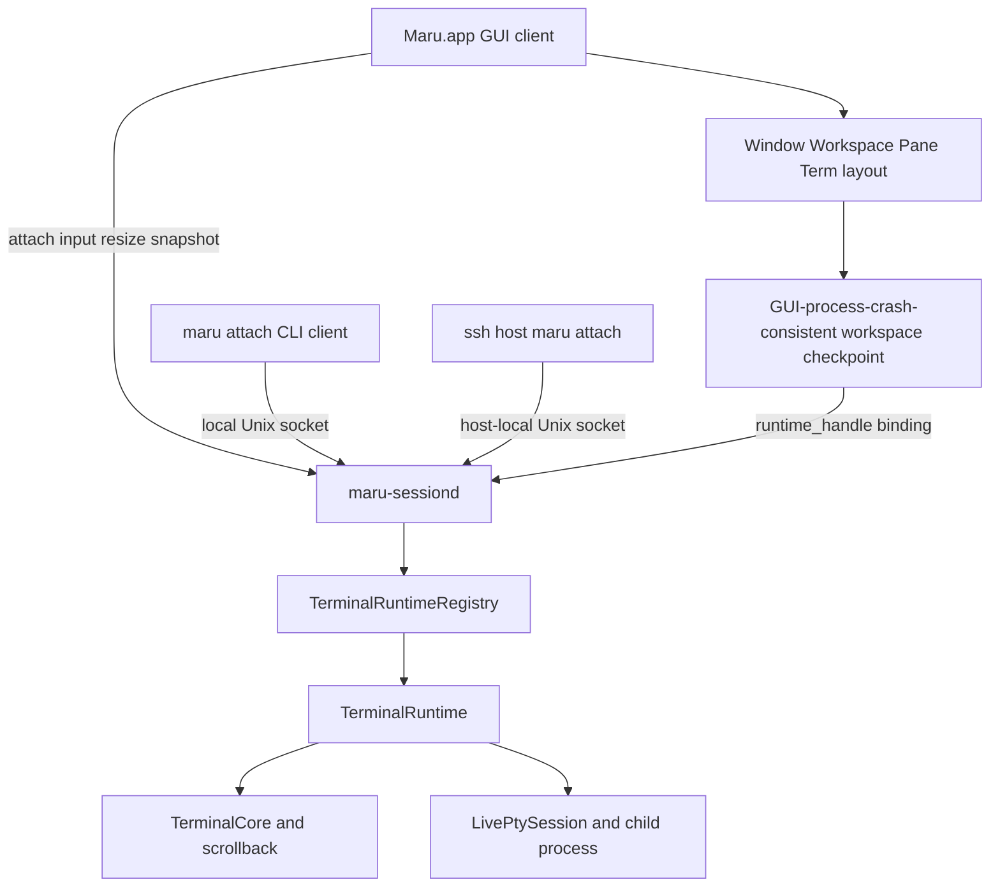
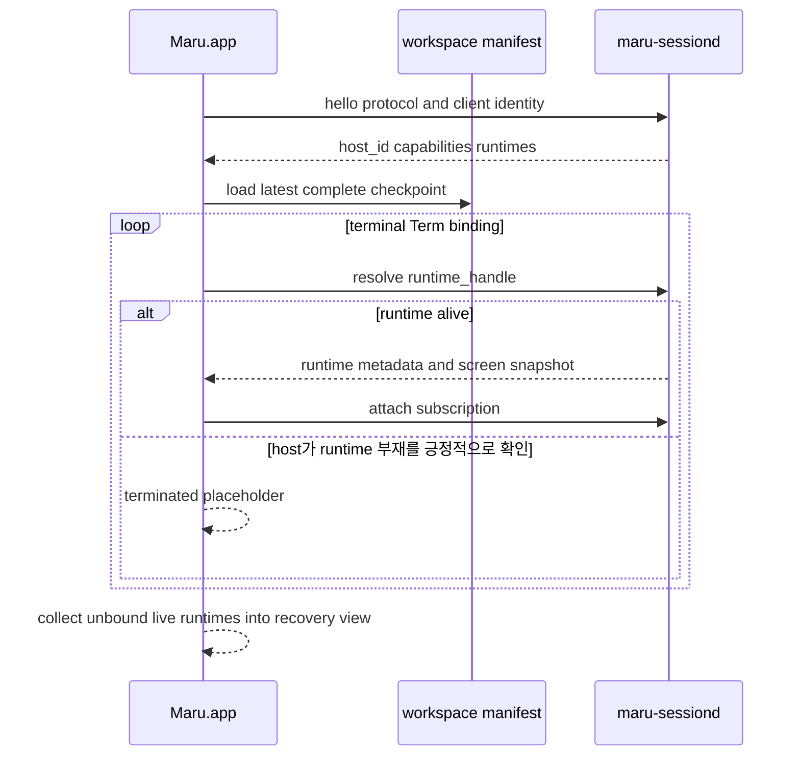

# 영속 터미널 세션 호스트

이 문서는 Maru GUI가 종료되어도 terminal Term의 PTY·자식 프로세스·화면 상태를 유지하고, 다시 실행한 Maru 또는
다른 터미널의 `maru attach` 클라이언트가 재접속하는 기능의 단일 출처다. 탭/split UI, workspace restore,
control-plane, PTY 종료 정책과 책임이 겹치지 않도록 소유권·ID·종료 의미·복구·검증 단계를 정한다.

> **상태: keep-alive opt-in의 P3 core 구현, P4/P5 미완료, 기본값 `false`.** `session.keep-alive-after-quit=true`면
> 새 terminal이 host(`maru-sessiond` = `maru __session-host`)-backed로 떠 **정상 GUI Quit 뒤** 살아남고 재실행 시
> 재접속한다 — 호스트 프로세스, `runtime-handle`(=`host_id:runtime_id`), GUI 재접속(`attachExisting`)은 **존재한다**
> (§멀티윈도우 "구현 상태 ✅" 노트·종료 매트릭스 참조). **원격 스크롤백·기본 드래그 선택·복사·검색, 자동 desync 리싱크, 그리고 원격 렌더
> 패리티(색 theme-aware·kitty 이미지·OSC 133 prompt 마크)도 구현됐다** — 원격 파이프라인이 in-process와 렌더 관점에서 동등하며,
> 새 화면 필드가 원격 경로를 빠뜨리면 comptime parity 가드가 컴파일 에러로 잡는다(`remote_screen.zig` `expectSnapshotParity`).
> 원격 spawn은 MRSH v2의 strict method `runtime.spawn_full`로 argv/cwd/login/GUI 시점 부모 환경
> snapshot/env override/TERM/ZDOTDIR/SSH integration/size를 전달한다. process-local `surface_id`인 pane selector는
> 재접속 뒤 stale해질 수 있어 persistent child에는 아직 주입하지 않는다. workspace restore는 host/runtime 쌍이
> 다르거나 runtime이 없을 때 새 shell로 위장하지 않고 실패한다. 복원 시작은 ABI v142 deferred AppSession을 사용해
> 저장 모델 publish 전 기본 tab/PTY를 만들지 않으므로, 성공 재접속 경로의 fresh/throwaway shell spawn 수는 0이다.
> host의 실제 `TerminalCore`가 소유하는 cwd/title/live semantic state, grid size와 alt-scroll 관련 mode, foreground process 관측,
> OSC 5379 `ssh_remote_dest`는 이제 attach 초기 metadata + revisioned full-state event로 GUI의 owned runtime
> observation에 전달된다. sidebar cwd/git, auto title, cwd 상속/workspace capture/control collector, at-prompt/close,
> Claude/Codex 감지, SSH drop/paste가 이 observation을 소비하며 host-backed placeholder `Surface.core`는 metadata
> 출처로 쓰지 않는다. **P3-e4a~c는 구현됐고 P3-e4d parity gate는 부분 완료**다. 실제 host PTY OSC
> 7/2/5379 왕복·revision/coalescing·소유권 테스트는 존재하지만 detach 중 변경→재접속, controlled Claude/Codex
> foreground, 다중 runtime event 격리, 실제 upload branch 제품 E2E가 남아 있어 runtime metadata parity 전체를
> 완료로 선언하지 않는다. `expectSnapshotParity`는 여전히 renderer DTO만 보호하며 metadata는 별도 gate다.
> IME marked text 표시는 별도 client-local 계약으로 구현됐다. 각 GUI `Surface`가 host snapshot 위에 같은
> `PreeditOverlay`를 합성하고, MRSH/runtime/workspace에는 저장하지 않는다. 그래서 다중 클라이언트가 같은
> runtime을 보더라도 조합 중 문자열은 입력한 attachment에만 보이며 detach/reconnect에는 남지 않는다.
> 확정 UTF-8과 그 확정 뒤 replay할 Enter/화살표만 pin된 runtime의 surface별 ordered input stream으로 보낸다.
> 창 간 workspace 이동 때 source/destination terminal admission과 미전송 queue 이전 용량을 all-or-none
> 선예약한 뒤 조합을 확정하고 queue를 destination session으로 함께 옮긴다. 원격 nonblocking 경로는 AppKit
> callback에서 일반 key를 runtime별 64 KiB direct-input FIFO에 복사하고, 최대 64개의 bounded control FIFO가
> scroll/focus/config/prompt 명령의 input byte barrier를 함께 보관한다. `input_bytes`, `scroll_to_bottom`,
> `core_command` frame의 소유권을 connection writer에 넘기며, 전송 구간에
> `O_NONBLOCK`을 적용한 `MSG_DONTWAIT` write만 시도한다.
> EAGAIN/partial 뒤 남은 wire bytes는 frame-loop pump가 같은 frame offset부터 이어 보낸다. control
> barrier가 `기존 input → core command → 새 input`의 순서를 보존한다. scrolled
> `imeBegin`은 응답 없는 async scroll frame만 admission하며 동기 RPC로 fallback하지 않는다.
> focus report와 설정·prompt core command는 host reader까지 전달되고, 일반 key의 DECCKM/DECKPAM/kitty keyboard 인코딩은
> runtime observation override로 host 모드대로 인코딩된다(P3-e4c-4). 단 선택 autoscroll·Reset/Clear 등 input-mode/command
> parity 전체가 완료됐다는 뜻은 아니다.
> `keep-alive-after-quit` 토글은 **설정 GUI(workspace 섹션)에도 노출**된다. 기본값은 아직 `false`(opt-in)다.
> 영구 부재 runtime의 per-Term 종료 placeholder와 `⏎` 제자리 재생성은 구현됐다. **P4 R1 구현 슬라이스는**
> `runtime-handle + runtime-state="ended"`를 owned 상태로 반복 저장하고, 두 번째 이후 재실행에서 host
> probe·attach·새 셸 spawn 0을 자동 gate로 고정하는 durable tombstone이다. incremental checkpoint, 외부
> `maru attach` CLI, 다중 app **process**(현재 daemon serial), mouse/resize/observation RPC와 delta push의 완전한 async bounded
> socket event-loop 통합, GUI 부재 시 OS 배너, **host-backed echo 지연 제거(이벤트 기반
> push — §perf, 백로그)**, **기본값 `true` 전환** 등은 **후속/백로그**다. 이 문서는 그 목표 상태를 함께 기술한다 — **구현 완료
> 여부는 각 절의 "구현 상태" 표식으로 구분한다**(표식 없는 서술은 목표 설계).

## 1. 결론

Maru의 기본 영속성은 tmux가 아니라 **Maru 전용 로컬 session host(`maru-sessiond`)**가 제공한다.

- Maru의 Window → Workspace → Pane → Term 배치는 기존 Zig 모델이 계속 소유한다.
- `maru-sessiond`는 terminal Term의 실행 runtime만 소유한다.
- GUI 종료는 runtime 종료가 아니라 client detach다.
- Term 닫기는 runtime에 대한 명시적 terminate다.
- 제품 설정 `session.keep-alive-after-quit`은 완성 뒤 기본 `true`이며, 새 terminal runtime을 host에서 연다.
- 다른 터미널은 `tmux attach`가 아니라 `maru attach`로 같은 runtime에 붙는다.
- `tmux -CC` layout driver는 기본 계획에서 제외한다. 외부 tmux 세션 가져오기 수요가 확인될 때만 별도 adapter로
  재검토하며, persistent-session 구현의 선행조건이나 fallback으로 쓰지 않는다.

**연결 identity도 Maru가 대체한다.** canonical manifest와 attach protocol에는 tmux session/window/pane ID를 저장하거나
Maru ID로 번역한 mirror를 두지 않는다. `host_id + runtime_id`는 Maru가 직접 발급하며 `maru attach`의 대상도 이 Maru
runtime ID다. tmux가 설치돼 있지 않아도 생성·재접속·복구·외부 terminal attach가 모두 동작해야 한다.

이 범위는 좁은 의미로 terminal multiplexer의 PTY 소유·detach/attach 기능을 수행하지만, tmux의 window/pane UI,
prefix key, status line, copy mode, 설정 언어, command language, tmux wire 호환은 구현하지 않는다.

### terminal multiplexer 기능 경계

| 분류 | v1 결정 |
| --- | --- |
| 취함 | GUI와 독립된 PTY/child 소유, detach/reattach, host-side screen·scrollback, client N개 관찰, SSH attach, resize·`SIGWINCH` 전달 |
| Maru 모델로 대체 | session/window/pane 계층은 Window/Workspace/Pane/Term, 연결키는 `runtime_id`, layout은 `workspace.v1`, 화면 전달은 MRSH snapshot/delta |
| 제외 | prefix/status/command/config 언어, control-mode/wire 호환, 여러 writable client, 여러 Term의 동일 runtime 영속 복제, client 크기 조정 정책 |

외부 terminal attach에 필요한 multiplexer 동작은 취하되 Maru가 이미 소유한 layout/UI를 다시 만들지 않는 경계다.

## 2. 목표와 비목표

### 목표

- `Maru.app` 프로세스가 정상 종료해도 terminal Term의 자식 프로세스가 살아 있다. 강제 종료 시 host runtime 자체는
  살아 있을 수 있지만 incremental manifest checkpoint가 없어 최신 layout 자동 재연결은 아직 완료 계약이 아니다.
- 재실행한 GUI가 동일한 프로세스·PTY·scrollback에 재접속한다. 새 shell을 spawn한 뒤 비슷하게 보이게 만드는 기능이 아니다.
- 여러 Window·Workspace·Pane·Term의 배치를 tmux 계층으로 바꾸지 않고 기존 Maru UX 그대로 복원한다.
- detach 중 발생한 output도 host의 `TerminalCore`에 적용되어 재접속 첫 화면에 반영된다.
- GUI가 종료된 동안 발생한 OSC 9/777 알림도 host가 잃지 않고 macOS 배너·다음 GUI 알림 이력으로 전달한다.
- local Terminal.app/iTerm2/Ghostty/SSH 셸에서 `maru attach <runtime>`로 개별 Term에 붙을 수 있다.
- 느리거나 끊긴 client가 PTY reader를 막지 않도록 client별 전송은 bounded다.
- 종료·재접속·프로토콜 버전 불일치를 trace/snapshot/artifact로 진단할 수 있다.

### 비목표

- 재부팅·전원 종료를 건너 실제 OS 프로세스를 보존하는 것.
- `maru-sessiond` crash·강제 종료 또는 terminal child 종료 뒤 동일 실행 세션을 복구하는 것. host/runtime이 끝나면
  그 Maru runtime도 끝난 것이며 자동 대체 spawn을 하지 않는다.
- Claude/Codex provider session id·transcript·argv를 저장해 resume/fork하는 것. 영속성은 provider 복원이 아니라
  **같은 살아 있는 PTY/process를 계속 소유**하는 데서만 나온다.
- tmux server/socket/control-mode 프로토콜과 호환되는 것.
- v1에서 여러 writable client가 동시에 한 PTY에 입력하는 것. 여러 사람이 함께 쓰는 collaborative input, 사용자별 cursor,
  입력 병합·귀속·승인/revoke UX는 실제 수요가 확인될 때 별도 설계한다.
- v1에서 서로 다른 Unix account가 같은 runtime을 공유하는 것. SSH attach도 session host를 소유한 동일 login UID로 실행하며,
  cross-UID 초대 token·ACL·broker socket은 추가하지 않는다.
- v1에서 하나의 runtime을 여러 Window/Workspace/Pane의 영속 Term으로 복제하는 것. canonical owner Term은 하나이며 추가
  화면은 manifest 배치가 아닌 client subscription이다.
- 여러 client 크기에서 largest/smallest/latest를 고르는 layout 정책. canonical PTY 크기는 controller 한 명이 소유한다.
- v1에서 전체 Maru workspace를 텍스트 TUI로 완전히 재현하는 것.
- WKWebView process, browser JS heap, file panel의 미저장 editor buffer를 session host에 넣는 것.
- 원격 TCP/HTTP 포트를 열거나 계정·클라우드 relay를 추가하는 것.
- capability 없는 legacy host의 사후 live migration과 서로 다른 PID 사이 child-parent 관계 이전. 향후
  upgrade-capable host의 attachment 0 동일 PID `exec` 교체는
  [Session host 실행 중 업그레이드](session-host-upgrade.md)가 별도 단계·rollback·검증 계약을 소유한다.

## 3. 현재 구현과 새 경계

현재 `AppRuntime.live_registry`는 앱 인스턴스 전역으로 `LiveSurface`를 소유하지만, 그 수명은 여전히
`Maru.app` 프로세스 안이다. `LiveSurface.terminal`은 `Surface/TerminalCore + LivePtySession` 묶음이고, GUI 종료 teardown이
이를 닫는다. 이 앱-전역 소유권 lift는 cross-window 이동에는 충분하지만 process 종료를 건너지는 못한다.

새 구조에서는 terminal arm의 소유권을 process 경계 밖으로 옮긴다.



### GUI가 소유하는 것

- Window·Workspace 순서와 그룹·pin·색·custom name.
- SplitTree, Pane, Pane 안 Term 탭 순서와 활성 위치.
- terminal/web/file surface의 화면 배치와 native responder/Metal/WKWebView.
- app/global keybinding과 chrome action. terminal로 내려갈 입력만 host에 전달한다.
- workspace manifest의 구조 변경 정책과 atomic checkpoint.
- GUI가 붙어 있을 때 알림 위치 라벨·인앱 알림 센터·native focus UX.

### session host가 소유하는 것

- terminal runtime의 PTY master, child pid/process group, reader, write queue.
- `TerminalCore`, active/alternate screen, scrollback, cwd/title/semantic state.
- runtime별 마지막 PTY size와 controller client.
- detach 중 output 처리, runtime 종료 상태, client별 bounded subscription.
- OSC 9/777 notification event와 GUI가 없는 동안의 bounded pending history.
- agent process 관측처럼 PTY/process에 직접 묶인 파생 상태. UI 표현 정책은 GUI에 남긴다.

host-backed runtime에서는 이 host `TerminalCore`가 cwd/title/semantic/OSC 5379 상태의 단일 출처다. GUI의
`Surface.core`는 화면 렌더에도 쓰지 않는 placeholder이므로 runtime metadata의 출처로 읽으면 안 된다. Git branch는 wire에
중복 저장하지 않고, GUI가 host에서 받은 cwd를 기존 `.git/HEAD` 캐시 로직에 넣어 파생한다.

### session host가 소유하지 않는 것

- Workspace/SplitTree의 정책 권위.
- WKWebView와 file tree/editor state.
- Metal/CoreText renderer resource.
- 사용자가 닫은 workspace를 임의로 다시 만드는 정책.

`TerminalCore`를 host에 두는 이유는 GUI가 없는 동안에도 output을 계속 해석해 화면과 scrollback을 정확히 유지하기 위해서다.
PTY raw bytes만 host가 보관하고 새 GUI가 처음부터 replay하는 방식은 무제한 transcript 또는 잘린 replay에서 생기는 화면 손실을
요구하므로 채택하지 않는다. renderer는 GUI에 남고 host가 versioned screen snapshot/delta를 제공한다.

### 기능을 어느 쪽에 둘 것인가 (배치 규칙)

새 기능을 host-backed에 이관할 때 "host가 할 일인가 client가 할 일인가"를 매번 다시 판단하지 않도록 규칙을 고정한다.
`Surface.core`가 client에서 **빈 placeholder**라는 사실만으로는 답이 안 나온다 — 실제로 링크·마우스 motion·스크롤바가
그 core를 읽다가 조용히 무동작이었고(P3-e4c-5~7), 각각 답이 달랐다.

**세 축으로 가른다.**

| 축 | 어디 | 왜 |
|---|---|---|
| 터미널 상태·콘텐츠 **해석** | **host** | 화면·스크롤백·cwd·입력 모드의 실물을 host가 소유한다. client가 추측하면 placeholder를 읽거나 stale이 된다 |
| OS capability **실행** | **signed platform adapter** | 클립보드·브라우저 열기·소리는 GUI-live client가 실행한다. host-backed 알림만 예외로, GUI-live는 client fast path를 쓰고 GUI 0은 signed daemon process 내부 adapter가 같은 로컬 macOS 자원에 게시한다. 원격 host는 로컬 OS capability를 실행하지 않는다 |
| config **정책** | **client** | 정책은 client config이고, [다중 client](#9-다중-client와-resize)가 한 host에 붙으면 각자 달라야 한다 |

그래서 전형적인 형태는 **"host가 사실을 전달하고, GUI-live client가 정책을 적용해 실행한다"**이다. 유일한 P4 예외인
GUI 0 host-backed 알림은 host가 bounded journal과 stable route를 소유하고 daemon 내부 platform adapter가 게시한다.
이미 구현된 GUI-live 형태와 계획된 예외는 다음과 같다.

| 기능 | 해석 | 실행 | 정책 |
|---|---|---|---|
| 선택 복사 | host `extractSelection`(soft-wrap·스크롤백) | client NSPasteboard | — |
| Find | host `findMatches` | client 하이라이트 렌더 | client(검색어) |
| OSC 9/777 알림 | host 파싱·stable event journal(P4) | GUI-live client fast path / GUI 0 daemon-internal macOS adapter(P4) | app-global notification config snapshot(P4) |
| 링크 | host span·추출·존재 stat | client 열기(NSWorkspace) | client(`input.link-detection`) |
| 스크롤·스크롤바 | host view·스크롤백 | client 렌더 | — |

**입력 인코딩만 갈림 기준이 하나 더 있다: 그 인코딩이 core를 mutate하는가.**

- `reportMouse`는 `*TerminalCore`로 **response 큐를 mutate**한다 → 단일 mutator 계약(§9.3)상 host에서만 실행해야 한다.
  그래서 마우스는 client가 좌표만 보내고 **host가 인코딩·PTY 주입**한다.
- `encodeKey`는 `*const TerminalCore`로 **순수 읽기**다 → 모드만 있으면 어디서 인코딩해도 같은 결과다. 그래서 키는
  모드(DECCKM·DECKPAM·kitty flags)를 관측으로 **미러**하고 client가 로컬과 같은 인코더로 인코딩한다.

키를 host 인코딩으로 바꾸는 것도 **기술적으로 가능하다**(마우스와 같은 형태). 지금 방식을 택한 대가와 이득은 이렇다:

- **얻는 것**: 왕복 0, 로컬과 동일한 인코더 공유, 그리고 입력이 **바이트 한 경로**로 유지된다(키·IME 확정 텍스트·
  붙여넣기가 모두 `writeInput`으로 나가 input barrier 순서 규칙이 단순하다).
- **감수하는 것**: **모드 stale**. 앱이 방금 DECCKM/kitty를 켰는데 관측이 아직 도착하지 않았으면 그 직후 첫 키가 옛
  인코딩으로 나갈 수 있다. 드물지만 모드 전환 직후(vim 진입 등)에 노출된다. 이 stale이 실제 문제로 관측되면 키도
  host 인코딩으로 옮긴다 — 그때는 키 이벤트 wire를 추가하고 바이트 단일 경로를 포기하는 교환이다.

**이 규칙으로 이관한 것**(모두 동작한다):

- **벨(BEL)**(P3-e4c-8). host는 관측에 누적 카운터 `bell_count`만 싣고, `bell.*` 정책 판정과
  실제 실행(NSSound.beep·시각 flash·Dock 배지)은 client가 한다. 새 RPC를 만들지 않고 **관측 push에 얹은** 이유는
  벨이 드문 이벤트라 매 tick 폴링이 낭비이고, 관측은 이미 약 100ms마다 변화 시에만 push되기 때문이다.
  다만 **관측 주기는 폴링 주기이지 이벤트 지연이 아니다**: 벨·OSC 52는 host가 발생 시점을 정확히 알므로
  `RuntimeOps.observation_urgent`가 대기 중인 이벤트를 보고(소비하지 않고 조회만) true를 주면 그 tick 카운트를
  건너뛰고 다음 serve tick(약 20ms)에 바로 관측을 만들어 push한다. 소리·클립보드는 지연이 그대로 체감되므로
  통로(관측)는 그대로 두고 **트리거만 앞당기는** 선택이다. foreground process처럼 폴링 말고는 알 수 없는 상태는
  기존 100ms 주기를 그대로 쓴다.
  **소비형 bool이 아니라 카운터**인 것이 핵심이다 — full-state 관측은 "이전과 같으면 미전송"이라 bool은 true→true
  전이를 잃어 둘째 벨을 놓친다. client는 마지막에 본 값보다 **클 때만** 울리고, 작아지면(host exec migration으로
  카운터가 0에서 재시작) 가짜 벨 대신 조용히 재동기화한다.
- **누적 seq를 소비하는 쪽의 두 가지 필수 규율**(리뷰에서 드러난 계약):
  1. **첫 관측은 기준선만 잡고 발화하지 않는다.** host의 카운터는 client보다 오래 살아서, 재접속하면 이미 지나간
     값이 곧바로 "증가"로 보인다. 이걸 처리하지 않으면 재접속 때마다 지난 벨이 울리고, 지난 OSC 52 read가 재생돼
     **사용자 클립보드가 복원된 셸의 입력 줄에 주입**된다.
  2. **소비는 전달에 성공한 뒤에 기록한다.** seq를 먼저 전진시키면 RPC 실패가 요청을 소비해 사용자의 복사가
     영영 사라진다.
- **관측에 싣는 값은 반드시 bounded여야 한다.** metadata JSON이 `max_control_json`을 넘으면 attach 응답과 metadata
  이벤트가 **영구히 실패**해 그 runtime에 접속할 수 없게 된다. OSC 52의 Pc(target)는 파서가 길이를 제한하지 않으므로
  host가 잘라서 싣고, 큰 클립보드 텍스트는 관측이 아니라 RPC로 빼되 그마저 넘치면 `too_large`로 알린다(조용한 유실 금지).
- **임의 바이트는 JSON 문자열로 싣지 않는다.** client의 strict 응답 디코더는 UTF-8을 검증하므로 non-UTF-8이 오면
  connection을 fail-close한다 — 복사 한 번에 앱 전역 host 연결이 끊긴다. OSC 52 데이터는 base64로 싣는다
  (`runtime.find`의 검색어 hex와 같은 규율).
- **OSC 52 클립보드**(P3-e4c-9). host는 요청을 drain해 관측에 누적 seq(`clipboard_write_seq`·
  `clipboard_read_seq`)와 read target(Pc)만 싣고, **정책 판정(`osc52.read`)과 OS 클립보드 접근은 client**가 한다.
  write 텍스트는 커서 관측 full-state에 실을 수 없어 `runtime.clipboard_write` RPC로 따로 가져간다(seq가 증가했을
  때만 호출 — 폴링 없음). **read 응답에는 추가 왕복이 없다**: 응답은 `ESC ] 52 ; Pc ; base64 ST` 바이트라 client가
  만들어 기존 입력 경로(`writeInput`)로 host PTY에 쓰면 된다. seq 감소는 벨과 같이 재동기화로 본다.
- 참고로 같은 문제를 tmux는 `set-clipboard`로 푼다 — 서버가 클립보드를 직접 만지지 않고 **바깥 터미널로 OSC 52를
  다시 내보내** 실제 접근을 위임한다(`man tmux`: "attempt to set the terminal clipboard using the xterm escape
  sequence"). 서버=전달, 바깥=실행이라는 배치가 위 규칙과 같다(동작 비교만 — 코드 표현은 참고하지 않았다).

## 4. 엔티티와 ID

현재 `surface_id`는 **앱 인스턴스 전역** ID라 GUI process 재시작을 건너는 영속 ID로 승격하지 않는다.

| ID | 소유자 | 수명 | 용도 |
| --- | --- | --- | --- |
| `host_id` | session host | host process 수명 | stale manifest와 현재 host 구분, handshake용 opaque 128-bit random ID |
| `runtime_id` | session host | terminal runtime 생성부터 종료까지 | 동일 PTY/process를 찾는 opaque 128-bit random ID |
| `runtime_handle` | manifest | `{host_id, runtime_id}` | Workspace Term 슬롯과 live runtime 연결 |
| `surface_id + generation` | GUI/AppRuntime | GUI app instance와 surface 수명 | 렌더/input/control-plane 라우팅 |
| `runtime_state` (P4 R1 구현) | workspace manifest | 저장된 Term 슬롯 수명 | `live`/`ended`를 구분해 묘비의 자동 재생성을 막는 additive scalar |

불변식:

- `runtime_id`는 의미를 비트에 인코딩하지 않고 재사용하지 않는다.
- canonical terminal 연결키는 Maru `runtime_id` 하나다. tmux `$session/@window/%pane` ID를 보조키나 fallback으로
  저장하지 않는다.
- 기존 GUI 모델의 `DockGroup.runtime_id`는 파일 도크의 process-local group key일 뿐 terminal 연결 ID가 아니다.
  구현 단계에서는 session-host protocol namespace의 `runtime_id`와 타입·직렬화 필드를 공유하거나 암묵 변환하지 않는다.
- GUI 재실행은 새 `surface_id`를 발급한 뒤 기존 `runtime_handle`에 bind한다.
- runtime respawn은 같은 `runtime_id`의 generation 증가로 숨기지 않고 **새 runtime_id**다.
- `runtime_handle`은 권한 token이 아니라 상관키다. attach 권한은 transport/auth가 별도로 증명한다.
- web/file surface에는 `runtime_handle`을 쓰지 않는다.

예:

```text
종료 전  surface_id=45 generation=0 -> host=A runtime=R7
재실행  surface_id=3  generation=0 -> host=A runtime=R7
runtime 종료 뒤 기존 handle        -> ended (자동 respawn/resume 없음)
```

현재 persistent child에는 `MARU_PANE_ID`를 주입하지 않는다. 이 값은 process-local `surface_id`라 위 예시처럼
재접속 때 45→3으로 바뀌며, child 환경은 실행 중 교체할 수 없기 때문이다. runtime identity를 현재 GUI surface binding으로
resolve하는 control-plane rebinding이 구현되기 전에는 persistent Term 내부의 self selector 연속성을 지원한다고 세지 않는다.

## 5. 다중 Workspace 연결 모델

tmux의 session/window/pane 계층으로 Maru workspace를 번역하지 않는다. 각 terminal Term 슬롯이 독립
`runtime_handle`을 가리킨다.

```text
Window 1
  Workspace A
    Pane left
      Term shell  -> {host=H1, runtime=R101}
      Term claude -> {host=H1, runtime=R102}
    Pane right
      Term dev    -> {host=H1, runtime=R103}

Window 2
  Workspace B
    Pane only
      Term codex  -> {host=H1, runtime=R201}
```

한 user login session의 host 하나가 모든 Window/Workspace의 terminal runtime을 관리한다. workspace 이동·pane split·Term 탭
재배치는 runtime을 재시작하지 않고 manifest binding 위치만 바꾼다. cross-window 이동도 동일하다.

현재 `maru.workspace.v1`에서 `Window`는 OS 창, `Tab`은 Workspace, `Pane`과 `Surface`는 각각 split leaf와 Term이다.
별도 session DB나 창별 workspace 파일을 만들지 않고 기존 단일
`~/Library/Application Support/maru/workspace.v1` 파일을 그대로 공유한다. 일반 Window/Workspace는 기존
`runtime-handle`과 P4 R1에서 구현한 `runtime-state` scalar로 Term 슬롯을 연결한다.

```text
surface ... runtime-handle="<32 lowercase host-id>:<32 lowercase runtime-id>" runtime-state="ended"
```

- `runtime-handle`의 두 ID는 각각 128-bit opaque random **nonzero** 값의 canonical lowercase hex다. all-zero는
  unresolved/first-page sentinel과 혼동하지 않도록 영구 reserved이며 generator·registry·workspace parser가 모두 거부한다. 두 부분은 모두 있어야 하는 단일
  quoted scalar라 partial handle을 표현하지 않는다.
- persistent terminal surface와 종료 placeholder만 `runtime-handle`을 쓴다. `runtime-state="ended"`면 그 handle은
  재attach 대상이 아니라 마지막 runtime의 상관키다. 새 reader는 host를 probe하거나 셸을 자동 spawn하지 않고 묘비를 만든다.
  사용자가 `⏎`를 눌러 새 runtime 생성에 성공한 때만 `runtime-state`와 구 handle을 새 live handle로 교체한다.
- in-process/옛 파일 surface는 두 키가 없으며 선언적 restore 규칙으로 새 runtime을 만든다.
- 기존 reader는 미지 `runtime-state` scalar를 무시하고, 새 reader는 키 부재를 `live`로 읽으므로 header는
  `maru.workspace.v1`을 유지한다. 값이 있는데 길이·hex·구분자가 깨졌으면 기존 optional-scalar 손상 규칙대로 checkpoint
  전체를 거부한다.
- `runtime-state="ended"`는 정확한 `runtime-handle`과 함께 있을 때만 유효하다. `ended`인데 handle이 없거나 알 수 없는
  state면 checkpoint 전체를 거부한다. `live`는 키를 생략한다.
- writer는 publish 전에 writable `runtime-handle` 전역 유일성을 검증한다. 중복이면 파일을
  덮어쓰지 않고 마지막 완전본과 live layout을 유지한다. reader도 attach/spawn 전에 같은 검증을 끝내 side effect가 일부만
  일어나지 않게 한다.
- `workspace-binding-id`는 현재 소비자가 없어 default-on 선결에서 제외한다. workspace-aware 다중 app client가 실제로
  필요해질 때 별도 wire/수명 계약으로 다시 제안한다. 일반 멀티윈도우·cross-window 이동은 기존 live Tab identity와 전체
  manifest transaction만 사용한다.
- runtime handle은 연결 위치이지 권한이 아니다. 파일을 읽었다는 사실만으로 attach/input/output 권한을 주지 않는다.

### 멀티윈도우와 동시 client 규칙

- 한 `Maru.app` process의 모든 `AppSession`/Window는 앱 전역 session-host connection 하나를 multiplex해 공유한다. 창마다
  daemon이나 socket을 만들지 않는다.
- **구현 상태(P3-e3-4d) ✅**: 위 "앱 전역 connection 하나 공유"는 구현됐다 — 원격 backend/연결이 `AppSession`(창) 필드가
  아니라 **모듈-전역**(app process당 하나, `app_runtime` 옆)이라 창을 여러 개 열어도 연결·backend를 공유한다(첫 창이 세우고
  이후 창은 재사용; 창 close는 그 창의 원격 Term만 회수하고 공유 backend는 안 닫는다 — `routing`/`live_registry`와 동일).
  창별로 연결하던 초기 배선은 두 번째 창이 handshake 타임아웃→in-process 폴백하는 버그였다(전역화로 해소). **단 현재 daemon은
  serial serve**(한 connection을 그 client 수명 내내 처리)라, 아래 "두 GUI **process** 동시 실행"은 아직 미지원이다 — 두 번째
  app process는 handshake 타임아웃 후 notice를 예약하고 in-process로 폴백한다. 그래서 keep-alive opt-in 단계의
  **지원 구성은 단일 app instance**(창/Workspace는 몇 개든 무방)다.
- Window를 닫거나 Workspace/Term을 다른 Window로 옮기는 것은 먼저 하나의 layout transaction으로 source/target을 검증한
  뒤 manifest 위치만 바꾼다. 성공한 이동은 `runtime-handle`, child pid, scrollback을 바꾸지 않는다.
- app-wide Quit은 모든 Window의 GUI subscription을 끊는 detach다. 비마지막 Window/Workspace/Term의 명시적 close는 기존
  destructive close 의미를 유지해 해당 runtime 종료 확인을 거친다. 창 하나를 닫았다는 이유로 다른 창 runtime은 건드리지 않는다.
- 한 runtime의 **canonical owner Term은 manifest 전체에서 정확히 한 곳**이다. 같은 `runtime-handle`을 두
  Window/Workspace/Pane에 반복해 owner나 read-only mirror로 저장하지 않는다. observer는 manifest 배치가 아니라 client
  subscription이므로 CLI나 진단 UI에서 별도로 붙는다. Maru 내부 mirror UX가 실제로 필요해지면 owner의 terminate/알림 위치와
  독립 viewport를 정한 non-owning surface kind로 별도 설계하며 v1 wire를 느슨하게 중복 허용해 대신하지 않는다.
- 정상 제품 경로는 macOS single app instance가 layout writer다. 같은 process의 여러 Window는 기존 AppRuntime
  transaction으로 한 manifest를 쓰고, process는 P4의 lifetime lease 하나를 소유한다. 두 GUI process의 동시
  layout 편집/read-only attach는 P5 이후 별도 계약이며 지원하지 않는다.
- CLI `maru attach`는 manifest를 수정하지 않는다. `maru attach --workspace`가 후속 구현되더라도 창/탭 배치를 저장하지 않는다.

### Quick terminal 규칙

quick terminal은 main Window가 아니라 앱 전역 singleton `AppSession`이며 cross-window move/merge 대상이 아니다.

> **확정 비목표:** quick은 session host, workspace manifest, `runtime-handle`, `Recovered Sessions`, background
> notification cold attach, host exec upgrade의 대상이 아니다. `session.keep-alive-after-quit` 값과 무관하게 항상
> in-process backend를 사용하고 앱 Quit 때 함께 종료한다.

- toggle/auto-hide는 같은 앱 process 안의 quick session만 숨기며 runtime을 유지한다. Esc는 vim 등 terminal
  입력과 충돌하므로 hide shortcut으로 가로채지 않는다.
- 앱 Quit은 quick runtime을 종료한다. 다음 실행은 dormant layout을 읽거나 이전 quick runtime에 attach하지 않는다.
- quick의 위치·크기·`chrome`·`minimal-tabs` 설정과 기존 UX는 유지한다. 제거 대상은 quick 기능이 아니라
  persistent-session 결합뿐이다.
- 회귀 gate는 `is_quick => remote backend 생성 0`, workspace manifest의 quick block/handle 0, 앱 Quit 뒤 local runtime
  종료다.

### GUI process crash-consistent manifest

현재 workspace 저장은 정상 `applicationWillTerminate`에서 수행되므로 GUI 비정상 종료 직전 구조 변경을 잃을 수 있다.
host crash·host 강제 종료·재부팅·전원 손실 뒤 동일 runtime 복구는 비목표로 유지한다. 영속 세션 전환 전에는 **host가
살아 있고 GUI만 비정상 종료한 경우**의 layout orphan을 줄이는 다음 계약만 추가한다.

- workspace 생성/삭제, split, Term 이동/닫기, cross-window 이동, runtime bind 변경은 manifest dirty를 세운다.
- dirty manifest는 짧게 debounce한 뒤 같은 디렉터리의 temp write + atomic replace로 전체 파일을 교체한다. 전원 손실
  durability를 주장하지 않으므로 file/directory `fsync`와 별도 journal DB는 이 단계의 선결이 아니다.
- 구조 mutation과 GUI process 종료가 경합하면 이전 또는 새 완전본만 읽고 반쪽 파일은 사용하지 않는다.
- background checkpoint 실패는 기존 완전본을 유지하고 typed failure를 지속 표시한다. 정상 Quit의 마지막 checkpoint가
  실패하면 GUI detach를 시작하지 않고 Quit을 취소한다. 사용자가 명시적으로 `Quit and End All Sessions`를 택한 경우에만
  runtime 종료 뒤 workspace 갱신 실패를 허용하며, live runtime을 보이지 않는 orphan으로 남기는 선택지는 제공하지 않는다.
- host는 layout 정책을 적용하지 않는다. 최신 manifest 사본을 발견/attach용으로 읽거나 캐시할 수만 있다.
- `maru attach --workspace`는 같은 manifest parser를 사용하고 별도 workspace DB를 만들지 않는다.

구체 wire와 손상/하위호환 규칙의 단일 출처는
[Workspace Restore 전략](workspace-restore.md#영속-session-binding-wire-runtime-handle-구현-durable-tombstone-r1)이다.
일반 layout은 optional scalar만으로 v1을 유지한다. 현재 parser가 첫 unknown top-level trailing line에서 성공 종료하는
동작은 legacy 관용성이지 새 block 확장점이 아니다. 새 line kind·카운트·tree 변경이 필요해지면 여기서 정한 범위를
벗어나므로 멈추고
`maru.workspace.v2` migration/fallback을 사용자와 다시 결정한다.

### 새 Term과 설정

사용자 설정은 backend 구현명을 노출하지 않고 다음 boolean 하나를 제공한다.

```ini
session.keep-alive-after-quit = true
```

| 값 | 새 terminal runtime | `Quit Maru` |
| --- | --- | --- |
| `true` (**기능 완성 뒤 기본값**) | 새 일반 Window의 Workspace/Term/split은 `maru-sessiond`에 생성. quick은 항상 in-process | 일반 persistent runtime은 GUI만 detach, quick은 종료 |
| `false` | 현재처럼 GUI process 안에 생성 | 현재 AppSession에 연결된 persistent runtime도 terminate |

- 이 키는 config schema·`configuration.md`에 있고, **설정 GUI(workspace 섹션 토글)에도 노출된다**(과거 실험적이라 숨겼던 것을
  원격 렌더 패리티 완성 후 해제). CLI help는 후속. **기본값은 여전히 `false`** — 전환은 남은 선결(echo 지연 이벤트-push 등) 뒤 별개 결정이다.
- backend 선택은 **새로 만드는 runtime에만** 적용한다. 살아 있는 runtime을 process 사이에서 migrate하거나 설정 토글
  즉시 terminate하지는 않는다. 토글을 켜면 host를 준비해 이후 일반 Term부터 persistent로 만들고, 끄면 이후 Term부터
  in-process로 만든다. 바뀐 quit 의미는 다음 app-wide `Quit Maru`부터 적용한다.
- **현재 opt-in 구현:** `true`인데 host launch/handshake가 실패하면 notice를 예약하고 in-process terminal로 폴백한다.
  기본 전환 전에는 해당 Term에 종료까지 남는 `not preserved` 상태를 표시하고, 그 Term에 `runtime-handle`을 쓰지 않으며,
  checkpoint/quit structured artifact에 fallback 원인을 남겨야 한다.
- persistent와 in-process runtime이 과도기 한 workspace에 함께 있어도 각 Term의 typed backend binding으로 구분한다.
- 설정의 앱 전역 snapshot 하나를 모든 Window가 공유한다. 따라서 `false` 상태의 다음 Quit은 창별 stale config와 무관하게
  현재 앱에 연결된 기존 persistent runtime도 끝낸다. Quit 전 즉시 끝내려면
  `Quit and End All Sessions` 또는 Term별 close를 쓴다. host에 남은 다른 workspace/client의 unbound runtime까지
  설정 하나로 일괄 종료하지 않는다.
- **"모든 설정 초기화"(Reset to Defaults)는 이 키를 초기화하지 않고 보존한다.** 리셋이 이 값을 기본값으로 되돌리면
  live 정책이 그 자리에서 뒤집혀 다음 평범한 `Quit Maru`가 살아 있는 host-backed runtime을 전부 terminate한다 —
  파괴를 `Quit and End All Sessions`라는 명시적 경로로 분리한 위 원칙을 리셋이 우회하는 셈이다(실측 사고: 리셋 뒤
  일반 Quit으로 runtime 12개 소멸, workspace의 `host_id:runtime_id` 12개가 dangling). 현재 `resetAllSettings`는
  값과 live 정책을 보존하고 값이 현재 `Config{}` 기본값과 다르면 override를 남긴다. release A의 G2부터는 기본값과
  같아도 session explicit override를 항상 보존·emit해 B→A rollback에서도 의미가 유지되게 한다.
  끄는 결정은 사용자 몫이라 notice로 수동 변경 경로를 안내한다. 기본값이 `true`로 전환된 뒤에도 같은 규칙이라
  "사용자가 명시적으로 끈 `false`"를 리셋이 도로 켜지 않는다(리터럴이 아니라 기본값과 비교하는 이유).
- 기본 전환은 두 release로 나눈다. 준비 release A는 default `false`를 유지한 채 durable tombstone reader/writer,
  반복 relaunch, config provenance와 explicit override retention을 먼저 배포한다. release B만 default를 `true`로
  바꾼다. B loader는 key
  `absent`/`explicit_valid`/`explicit_invalid`와 config file `missing`/`unreadable`/`oversize`를 구분한다. readable
  absent profile은 explicit `true`를 원자적으로 materialize한 뒤에만 true를 적용한다. write가 실패하면 기존
  `false`를 유지하고 retryable typed notice를 남긴다. explicit `false`는 보존한다.

| B bootstrap 관측(마지막 syntactic occurrence 기준) | resolved 정책 | 파일/notice |
| --- | --- | --- |
| file `missing` 또는 `readable_absent` | atomic explicit true 생성 성공 뒤만 `true` | 실패면 `false`, retryable persistent notice |
| `explicit_valid=true|false` | 해당 값 그대로 | 파일 무변경 |
| `explicit_invalid` | `false` | 파일 무변경, persistent invalid-value notice |
| file `unreadable` 또는 `oversize` | `false` | 파일 무변경, persistent read-error notice |

duplicate key는 마지막 syntactic occurrence의 valid/invalid가 outcome을 정한다. G2 migration owner는 app-instance lease를
획득한 AppRuntime bootstrap 하나이며 첫 AppSession/config resolve 전에 정확히 한 번 실행한다. 모든 Window/AppSession은
그 owned result snapshot을 빌려 반복 materialize하지 않는다.
- 별도 persisted migration marker나 만료 정책은 두지 않는다. `session.keep-alive-after-quit`의 explicit override는
  global/row Reset이 항상 보존하고, 사용자가 Workspace 토글을 직접 바꿀 때만 true/false를 교체한다. 따라서 B의
  기본값과 값이 같아도 explicit true가 남는다. B→frozen A rollback에서 true와 durable tombstone이 함께 보존되는
  것을 검증하고, A보다 오래된 writer로의 downgrade round-trip은 지원하지 않는다. 이 provenance와 two-release gate
  없이 기본값을 바꾸지 않는다.
- restore 중 saved Window 하나라도 host/runtime 불일치나 attach 실패로 apply되지 않으면 default shell 창을 성공한 복원으로
  남기지 않고 teardown하고 `restore incomplete`를 세운다. 다음 종료 checkpoint는 마지막 완전 manifest를
  `workspace.v1.bak`으로 한 번 보존한 뒤 현재 모델을 정상 저장한다. 실제 capture/serialize/write 실패만 write 0으로
  이전 완전본을 그대로 유지한다([Workspace Restore](workspace-restore.md)의 "checkpoint 보호"가 단일 출처).

## 6. 종료와 detach 의미

같은 UI 동작이 어떤 resource를 닫는지 명확히 분리한다.

| 사용자 동작 | GUI | terminal runtime | web/file surface |
| --- | --- | --- | --- |
| `Quit Maru` (`keep-alive=true`) | 종료 | 일반 persistent runtime 유지·client detach. quick은 항상 local이고 종료 | 기존 dirty 보호 후 teardown/선언적 복원 |
| `Quit Maru` (`keep-alive=false`) | 종료 | manifest-bound runtime 확인 후 terminate | 기존 dirty 보호 후 teardown/선언적 복원 |
| `Quit and End All Sessions` | 종료 | 모든 runtime 명시 terminate | 기존 dirty 보호 후 teardown |
| 마지막 일반 창 닫기 | 앱 전체 quit 경로라면 detach | 유지 | 기존 dirty 보호 적용 |
| 비마지막 Window 닫기 | 현재 창 정책 유지 | v1에서는 기존처럼 소속 Term 종료 확인 | 기존 close 정책 유지 |
| quick toggle/auto-hide | panel 숨김 | local runtime 유지 | surface는 기존 quick 정책 유지. Esc는 terminal input으로 전달 |
| quick Term/Workspace 명시 close | 해당 quick layout 제거 | 소속 runtime 종료 확인 | 소속 surface close 정책 유지 |
| Workspace 닫기 | Workspace 제거 | 소속 runtime 종료 확인 | 소속 surface close 정책 유지 |
| Term 닫기 / shell `exit` | Term 제거 또는 종료 화면 | 명시 terminate / 검증된 exit | N/A |
| client detach key | 해당 client만 종료 | 유지 | N/A |

앱 전체 quit만 자동 detach로 바꾸고, Term/Workspace의 명시적 닫기를 조용한 background 전환으로 바꾸지 않는다. 그렇지 않으면
사용자가 닫았다고 생각한 process가 orphan으로 계속 실행된다. background로 남길 별도 `Detach Workspace` UX는 실제 수요가
생기기 전 비범위다.

dirty file editor는 session host가 보호하지 못한다. `Quit Maru`도 기존 save/discard/cancel gate를 통과해야 하며,
미저장 editor buffer가 있으면 terminal runtime이 안전하다는 이유로 GUI를 강제 종료하지 않는다.

### host 자체의 수명

- 첫 persistent terminal runtime이 필요할 때 on-demand로 시작한다.
- 여러 GUI/CLI가 동시에 host 부재를 발견해도 user-only start lock과 lock 획득 뒤 connect 재확인으로 host 하나만 시작한다.
  stale socket은 peer/process 검증 뒤에만 회수한다.
- GUI client가 0이어도 runtime이 하나라도 살아 있으면 종료하지 않는다.
- runtime 0개·client 0개가 되면 bounded idle grace 뒤 종료할 수 있다.
- macOS login session 종료·재부팅·전원 종료 뒤에는 살아 있음을 약속하지 않는다.
- host/runtime 종료 뒤 provider resume/fork나 동일 runtime 복구는 시도하지 않는다.

### GUI가 종료된 동안의 알림

현재 알림의 단일 출처인 OSC 9/777은 `TerminalCore`가 파싱하므로 core와 함께 host로 이동해야 한다.

- host는 `runtime.notification`을 `{host_id,runtime_id,event_id}`, bounded title/body, 발생 시각과 함께 보관한다.
  `event_id`는 host-lifetime monotonic u64이며 재사용하지 않는다. overflow면 ID를 wrap하지 않고 새 알림 admission을
  중단해 typed diagnostic을 남긴다. `{host_id,event_id}`가 journal/OS/GUI dedup key다. `surface_id`는 GUI 수명이라
  stable event에 저장하지 않는다.
- GUI가 붙어 있으면 stable event identity를 유지한 채 기존 [알림 전략](notifications.md)의 위치 라벨·전면 배너·인앱
  이력 funnel로 전달하고 `{app_instance_epoch,token,surface_id}`는 fast-path hint로만 추가한다.
- GUI는 attach/binding 변경 때 runtime의 bounded display label을 host에 갱신한다. GUI가 없을 때 OS 배너는 마지막 label을
  힌트로 쓰되 layout 권위로 해석하지 않고, label이 없으면 짧은 Maru runtime ID로 표시한다.
- GUI가 없으면 signed app bundle의 macOS notification sink가 OS 배너를 게시하고, event는 bounded pending history에도
  남겨 다음 GUI가 인앱 이력으로 가져간다. host가 임의 network service를 열지는 않는다.
- 배너 클릭은 live app epoch hint가 여전히 exact runtime을 가리킬 때만 fast path를 쓰고, 그 외에는 Maru를 cold
  launch한 뒤 stable `runtime_handle`을 attach하고 현재 manifest 위치를 찾는다. binding이 없으면
  `Recovered Sessions`에서 해당 runtime을 연다.
- `notifications.osc=false`는 GUI 유무와 관계없이 host 발화를 막는다. config snapshot/version 변경은 host에 전달한다.
- agent `running → idle`은 완료 알림을 만들지 않는다. 구조화된 완료 신호가 없으므로 영속 host가 이를 추측하지 않는다.
- visual bell과 인앱 overlay는 GUI가 있을 때만 표시할 수 있다. GUI가 없는 동안 보장하는 background 알림은 OSC 9/777
  OS 배너와 pending history다.

`keep-alive-after-quit=true`를 기본값으로 바꾸기 전에 실제 `.app` bundle에서 GUI 0 OSC 발화→배너→클릭과
GUI 연결 중 발화→Quit→기존 배너 클릭이 모두 정확한 Maru runtime에 attach하는지 검증해야 한다. 이 gate가 없으면
“세션은 살았지만 알림은 죽은” 상태라 P4 미완료다.

## 7. GUI 재접속과 binding 정합



재접속 순서:

1. GUI가 최신 완전한 workspace manifest를 읽고 Zig parser로 Window 수를 preflight한다.
2. 저장 Window가 있으면 기본 tab/PTY가 없는 deferred AppSession을 만든다.
3. GUI와 host가 protocol version/capability를 교환한다.
4. 각 terminal Term의 `runtime_handle`을 host runtime 목록과 대조한다.
5. 살아 있으면 새 GUI `surface_id`를 만들고 snapshot을 받은 뒤 delta subscription을 연다.
6. 한 Window의 모든 Term stage가 성공한 뒤 모델을 publish하고 renderer/frame loop를 처음 활성화한다. 이 성공 경로는
   saved `cwd`/`command`로 임시 shell을 먼저 spawn하지 않는다.
7. host의 `runtime_not_found`/`stale_host` 응답, dead owner lease 등 **영구 부재의 긍정적 증거**가 있으면 종료
   placeholder로 표시한다. endpoint 미발견·지원 범위 밖 protocol·timeout은 unavailable로 fail-close한다.
   placeholder는 `runtime-state="ended"`와 마지막 `runtime-handle`을 함께 저장해 재실행 횟수와 무관하게 유지한다.
   provider resume/fork나 마지막 command 자동 재실행은 없다.
8. host에는 있지만 manifest에 bind되지 않은 runtime은 삭제하지 않고 `Recovered Sessions`에 노출한다.
9. 같은 runtime을 manifest의 두 writable Term 슬롯에 bind하면 잘못된 파일로 거부한다. 한 runtime의 canonical writable placement는 하나다.

#### R2b inventory reconciliation과 Recovered Sessions 계약

R2b는 restore를 하면서 우연히 발견한 runtime을 사후에 자동 attach하는 경로가 아니다. **Binding reconciliation**은
R2a manifest 검증이 성공한 경우에만 그 binding set을 쓰고, **recovery discovery**는 manifest가 malformed/empty여도
trusted binding set을 빈 집합으로 두고 독립 수행한다. recovery row 자체는 파일을 바꾸지 않으며 기존 malformed-file
fallback/checkpoint 정책도 바꾸지 않는다. 두 경로 모두 terminal attach/spawn과 Window 모델 publish **전**에 secure
host manifest enumeration으로 host 후보를 확정한다. launch primary는 항상 deferred로 만들고 inventory snapshot 뒤에만
valid manifest를 apply하거나 default surface를 명시적으로 finish해, launch가 만든 runtime을 자기 orphan으로 오인하지
않는다. keep-alive opt-out이면 discovery/list/row publish를 모두 하지 않는다.

- identity는 `runtime_handle = host_id:runtime_id`다. inventory의 host ID는 hello에서 확정한 adapter identity를
  사용하며 response가 host namespace를 다시 주장하게 하지 않는다. secure enumeration은 current UID 소유 regular
  manifest·안전한 mode·exact host ID 파일명/내용·owner lease를 검증하고 bounded 개수만 연다.
- metadata-heavy legacy `runtime.list`를 recovery에 재사용하지 않는다. additive capability
  `runtime_inventory_v1`의 method는 `runtime.inventory`다. request는
  `{"cursor":"<32-lower-hex-or-empty>","limit":256,"membership_generation":<u64-or-0>}`이고 첫 page만
  cursor=""·generation=0이다. response는
  `{"result":{"version":1,"membership_generation":N,"upgrade_epoch":U,"authority_generation":A,
  "lifecycle":"ready","total":T,"cursor":"<echo>",
  "runtime_ids":["<32-lower-hex>",...],"next_cursor":"<last-id-or-empty>","done":<bool>}}`다.
  page는 cursor보다 큰 runtime ID를 canonical ascending으로 최대 256개 내며, done=false면 정확히 256개인 page의 마지막
  ID가 strictly increasing next_cursor여야 한다. client는 다음 request에 첫 N과 그 cursor를 그대로 보낸다.
  host registry의 register/unregister마다 checked monotonic `membership_generation`이 증가하고 overflow 시 새 runtime
  admission을 중단한다. 모든 page의 version/generation/total/cursor가 일치하고 done=true의 next_cursor가 비었을 때만
  complete snapshot이다. 모든 page의 `{upgrade_epoch,authority_generation,lifecycle=ready}`도 첫 page와 정확히
  같아야 한다. duplicate JSON key도 malformed다.
  host 하나는 최대 4,096개·16 page, 전체 host 합계는 최대 4,096개·31 page다(16 host에 나뉜 ceiling 포함).
  cursor cycle/truncation/중복 ID·잘못된 JSON/타입·31/33자·uppercase/nonhex ID는 그 host recovery projection 전체를
  unavailable로 버리고 partial prefix를 publish하지 않는다. Recovery inventory는 canonical attach를 소유한 pooled
  adapter가 아니라 별도 ephemeral read-only connection에서 수집한다. 따라서 payload cap/OOM/transport close는 그
  inventory connection만 폐기하고 canonical exact manifest attach connection은 보존한다. Valid frame의 malformed
  semantic response는 같은 client에서도 connection을 poison하지 않는다. Host의 snapshot 조립 OOM은 가능한 경우
  `resource_exhausted` typed response로 같은 connection을 유지하지만, 그 작은 error frame 자체도 할당할 수 없는
  process-wide allocator 고갈은 transport-fatal이며 ephemeral connection 격리가 canonical attach를 보호한다.
- plan authority는 `{host_id, adapter_generation, upgrade_epoch, lifecycle=ready, membership_generation,
  authority_generation, workspace_generation}`이다. `authority_generation`은 ready/restoring/rollback/commit 등
  host lifecycle transition마다 checked monotonic 증가하고 overflow면 transition을 fail-close한다. HostPool의
  `adapter_generation`도 add/remove/reconnect마다 증가한다. page 수집·row publish·사용자 action commit마다 전부
  재검증하고 ready→restoring→ready와 membership A→B→A도 stale로 폐기한다. inventory 실패는 **recovery projection만** 비활성화하며 canonical manifest의 기존 per-handle
  attach/typed not-found restore를 막지 않는다.
  `host.info`는 같은 `authority_generation`을 반환하고, explicit adopt 직전 `host.info`와 `runtime.get`을 새 request로
  왕복해 saved authority tuple과 runtime 존재를 함께 재검증한다.
- per-binding 상태는 `live_present_candidate | live_missing_candidate | ended_absent |
  ended_present_conflict | host_unavailable | legacy_unresolved`, inventory-only 상태는 `orphan`으로 분리한다.
  inventory만으로 live→ended를 저장하지 않고 기존 exact attach/get의 fresh typed `runtime_not_found`나 dead owner
  lease가 최종 증거다. legacy bare ID는 current spawn host가 exact하게 확인될 때만 그 host와 대조한다.
- ended exact handle은 R2a canonical placement를 **예약**한다. 같은 live runtime이 inventory에 나타나면 generic
  orphan이 아니라 `ended_present_conflict` recovery row이며, 사용자 action이 기존 tombstone 슬롯을 제자리 live
  Term으로 교체한다. tombstone과 새 recovery tab이 동시에 같은 handle을 갖는 순간은 허용하지 않는다.
- inventory-only `orphan`은 terminate/delete하거나 startup에 attach하지 않는다. primary Window 하나에 app-global
  derived `Recovered Sessions` virtual group/row로만 보이며 다른 Window와 quick에는 중복 투영하지 않는다. system
  group identity는 사용자 그룹 이름과 별도 typed 값이고 rename/drag/checkpoint 대상이 아니다. attach 전 label은
  control 문자 없는 짧은 runtime ID뿐이며 cwd/title/command/env/process/SSH/output/clipboard/notification은 inventory,
  projection, log에 싣지 않는다.
- 사용자가 row에서 Enter/click으로 개별 adopt할 때만 plan authority와 exact `runtime.get`을 fresh revalidate하고
  attach를 stage한다. orphan은 새 비고정 tab 하나를 publish하고, ended conflict는 tombstone을 제자리 교체한다.
  publish 실패/사라진 runtime/OOM이면 client-side detach만 하고 host runtime terminate·spawn·checkpoint mutation은
  0이다. 성공 뒤 exact handle이 manifest에 정확히 하나일 때부터 일반 persistent Term close/checkpoint 규칙을 따른다.
- inventory refresh는 derived row만 교체한다. 사라진 row·dismiss·앱 재실행·cap 초과·malformed manifest는 어떤
  runtime도 종료하지 않는다. 4,096 inventory는 virtual row DTO일 뿐 4,096 Tab/Term/attach로 materialize하지 않는다.
- secure enumeration의 canonical exact registry entry cap은 16이다. symlink/non-regular/wrong-owner/wrong-mode/malformed
  manifest 하나는 cap 안에서 그 entry만 unavailable로 남기지만, valid/invalid를 합쳐 17개 이상이면 선택적 prefix를
  믿지 않고 recovery discovery 전체를
  unavailable로 둔다. 열거 결과는 exact descriptor를 소유한 immutable candidate 목록 또는 typed whole-discovery
  unavailable 중 하나이며, entry 오류를 빈 complete inventory로 바꾸지 않는다. enumeration은 host를
  spawn/delete하거나 stale 파일을 회수하지 않는다.
- frozen N-1 host에는 `runtime_inventory_v1`을 소급 추가할 수 없으므로 R2b orphan projection은 capability가 있는
  current host만 지원한다. N-1 exact manifest binding attach는 기존 adapter로 계속 지원하고, N-1 orphan은 same-PID
  exec upgrade로 current capability가 된 뒤 보인다. legacy `runtime.list`를 generation 없는 recovery snapshot으로
  추측하지 않는다.
- primary의 conflict row를 선택해도 adopt target은 기존 tombstone의 실제 Window/slot이다. row는
  `{runtime_handle,projection_generation}` stable key만 들고 action 직전 all-window binding/Window token을 다시
  찾아 workspace generation이 달라졌거나 target이 이동·닫힘이면 attach/spawn/terminate 0으로 stale 처리한다.

**현재 구현 범위:** 1–6의 deferred/attach/rollback과 stale host·missing runtime fail-closed는 P3 core에 구현됐다.
**7의 durable per-Term ended placeholder는 P4 R1에서 구현됐다** — exact handle이 영구 부재로 분류된 runtime만 그 Term을 읽기 전용 placeholder로 두고
나머지 surface·split·탭·창 frame은 정상 복원한다. placeholder 화면에는 마지막 제목·위치와 `⏎` 안내가 **화면 콘텐츠로**
남고(notice는 아무 키에나 닫히므로 그것만으로는 복구 방법이 사라진다), `⏎`가 그 pane 슬롯을 **제자리 교체**해 마지막
cwd에서 새 셸을 시작한다. 자동 fresh spawn은 없다 — `⏎`가 유일한 승격 경로이고 다른 키·수식자 조합으로는 되살아나지
않는다. capture는 exact handle/state를 owned 상태에서 다시 쓰며, parse→apply→capture를 두 cycle 반복하는 자동
fixture가 restoreSpawn/attach/probe/spawn 공통 진입점 0과 dropped 0을 고정한다. 실제 signed app process의 반복
Quit/relaunch E2E는 별도 제품 gate로 남는다. 9의 manifest 전역 중복 검증은
R2a core/ABI/source-order fixture까지 구현됐다. 8의 R2b는 core/wire와 secure host enumeration 및 canonical
connection과 분리된 ephemeral inventory collector까지 구현됐고, 제품 restore coordinator·`Recovered Sessions`
projection·fresh adopt는 미구현이다. canonical GUI connection을 유지한 채 별도 ephemeral inventory를 동시에
처리하는 제품 scheduling/process fixture는 T0b2b에서 구현됐다. 실제 제품 process에서 기존 checkpoint file 무변경을
관측하는 E2E는 남아 있다. 일시 실패로 분류된 누락 runtime은 종전처럼 해당 Window apply를
실패시키며, 추가 Window는 teardown하고 primary는 명시적인 새 default-shell fallback으로 전환한다. 이
`restore incomplete` 실행은 종료 시 마지막 완전본을 `.bak`으로 한 번 보존한 뒤 현재 모델을 저장한다. capture/serialize/
write 자체가 실패한 경우에만 write 0으로 이전 완전본을 유지한다.

### 접속 실패 행렬 (목표 계약)

host/host_id/runtime 불일치는 **분류에 따라 갈린다**(아래 표). 영구 부재는 그 Term만 per-Term ended placeholder로 두고
창 apply를 성공시키며, 일시 실패는 종전처럼 해당 Window apply 실패로 fail-close한다(additional Window는 teardown,
primary는 notice가 보이는 명시적 default-shell fallback + `restore incomplete`; 종료 시 `.bak` 1회 보존 후 현재 모델 저장).
orphan recovery entry
(`Recovered Sessions`)는 여전히 P4에서 구현한다.

**실패 원인 분류(부분 구현).** ended placeholder는 "이 handle이 **다시는** 붙을 수 없다"가 참일 때만 세울 수 있으므로,
그 판정에 쓸 구분을 attach 경로가 먼저 만든다. 오분류 비용이 비대칭이기 때문이다 — 영구를 일시로 보면 창 복원이 한 번
실패할 뿐이지만, **일시를 영구로 보면 살아 있는 runtime이 placeholder로 굳어** 사용자가 되찾을 길이 사라진다(현재
`Recovered Sessions`가 미구현이라 host에 남은 runtime을 다시 찾을 UI도 없다). 그래서 승격은 증거가 있는 것만 한다.

| 관측 | 분류 | 근거 |
| --- | --- | --- |
| manifest 없음 + current/N-1 legacy endpoint 소진(**모든 probe가 부재**) | `FailureReason.host_gone` → `error.PersistentRuntimeGone` | 추측할 endpoint가 더 없고, 소진의 이유가 전부 "거기 없다"였다 |
| manifest 없음 + 소진했지만 probe 중 **미확정**이 있었다(EAGAIN/EINTR/ETIMEDOUT, 또는 hello가 갈린 peer) | `startup_timeout` → `PersistentRuntimeUnavailable` | 응답하지 않은 endpoint 뒤에 host가 살아 있을 수 있다 |
| manifest 있음 + endpoint 무응답 + owner lease **`free`**(잡을 수 있었거나 파일이 ENOENT) | `host_gone` → `PersistentRuntimeGone` | 재부팅·crash 뒤 stale manifest. lease는 `findCurrentManifestHost`가 이미 쓰는 host 생존 증거 |
| manifest 있음 + endpoint 무응답 + owner lease **`unknown`**(fd 고갈·권한 등으로 못 봄) | 원래 실패 reason → `PersistentRuntimeUnavailable` | 판정 불가는 host에 대한 증거가 아니라 우리 쪽 사정이다 |
| host가 `runtime_not_found`·`stale_host` 응답 | `error.RuntimeNotFound`·`StaleHostHandle` → `PersistentRuntimeGone` | host가 긍정적으로 부재를 말했다 |
| pool 슬롯이 다른 host로 교체 | `HostIdentityMismatch` → `PersistentRuntimeGone` | 그 handle은 stale이다 |
| `lifecycle = restoring`(host exec 업그레이드 중) | `startup_timeout` → `PersistentRuntimeUnavailable` | runtime은 생존한다 |
| 소켓 끊김·타임아웃·`controller_busy`·`unauthorized`·`queue_invalidated`·미지 error code | `PersistentRuntimeUnavailable` | runtime이 살아 있을 수 있다 |
| handle 형식 손상(길이·대소문자·구분자) | `InvalidPersistentRuntimeIdentity` | 존재하는 손상은 숨기지 않는다 |

현재 코드는 probe를 `absent|indeterminate`로, owner lease를 `free|held|unknown`으로 구분해 위 표의 긍정 증거 요건을
구현했다. durable tombstone은 이 분류를 재사용하며 미확정 상태를 영구 부재로 넓히지 않는다.

**두 에러의 귀결(구현됨).** exact `runtime-handle`의 `PersistentRuntimeGone`은 `createRestoredTerm`이 catch해 **그 Term만 종료 placeholder**로
바꾸고 창 apply는 성공시킨다 — 탭·split·창 frame이 살아남는다. `PersistentRuntimeUnavailable`은 그대로 전파해 창 apply를
실패시키는 현행 fail-close를 유지한다. legacy bare `runtime-id`는 Gone이어도 exact host namespace가 없어 unavailable로
남는다. 분류를 이 전환보다 **먼저** 별도로 도입한 이유는, 오분류 회귀가 곧바로
checkpoint 오염으로 이어져 재현·롤백이 불가능한 손실이 되기 때문이다.

**새 live→ended 판정은 checkpoint 신호를 한 번 세운다(code-review max 수정).** 처음엔 "래치를 손대지 않는다"였다 — 일시 실패는 묘비가 되지
않으니 `Unreachable` 묘비라는 범주가 구조적으로 없고, 파일 패널·dock·explorer의 drop만 래치를 세우면 충분하다는 논리였다.
그 논리의 구멍은 **분류가 틀렸을 때**다: 접속을 한 번만 영구로 오분류해도 그 Term은 묘비가 된다. durable wire가
handle을 보존하더라도 현재 `Recovered Sessions`가 없어 오분류를 UI에서 되돌릴 수 없으므로 첫 전이 때 마지막 완전본
backup 신호가 필요하다. 그래서 `applyWorkspaceWindow`는 이번 창에서 새로 live→ended가 된 수를 `dropped`에 합산한다.
이미 `runtime-state="ended"`로 들어온 후속 relaunch는 완전히 표현된 상태라 dropped 0이다.

**그 신호의 귀결은 "저장 차단"이 아니라 "마지막 완전본 백업 후 저장"이다**(v144에서 변경 — [workspace-restore.md](workspace-restore.md)
"checkpoint 보호"가 단일 출처). 무기한 차단은 stale 파일을 고정시켜 다음 실행이 같은 drop을 재생산하는 자기영속 루프가
되고, 그동안 사용자의 새 레이아웃이 매 종료마다 사라진다.

**P4 R1 durable tombstone 구현.** capture는 placeholder의 마지막 handle과 `runtime-state="ended"`를 함께 보존하고,
reader는 이 상태를 host 경계보다 먼저 placeholder로 만든다. Enter 없는 두 번째 이후 relaunch에서도 자동 spawn하지
않으며, 위 최초 backup 신호와 일시 실패 fail-close는 그대로 유지한다.

**종료 placeholder 객체와 첫 복원 배선(구현됨).** placeholder Term 자체와 그 수명은 `TermRuntime.ended_placeholder`
+ `createEndedPlaceholderTerm`으로 구현했다. `SurfaceKind`(닫힌 열거)를 확장하지 않고 `kind = .terminal`을 유지하며
registry 슬롯만 `LiveSurface.web` arm sentinel을 재사용한다 — 그래야 기존 렌더·라벨 경로가 무변경으로 마지막 화면을
그린다. 대신 "`kind == .web`이 곧 PTY 없음"이라는 기존 가정이 깨지므로, PTY 부재를 보던 분기를 전부 이 플래그로
넓혔다: `destroyTerm`·세션 `deinit`(누락 시 registry 슬롯 누수), `allTabsTerminated`(누락 시 **묘비만 남은 창이 자동으로
닫혀 복원한 레이아웃이 다음 checkpoint에서 소멸**), `findTerminatedTerm`(자동 reap 금지), `resizeTermForLayout`(live
link가 없어 `SurfaceRuntime.resize`가 실패하므로 sentinel core를 직접 resize — 스킵하면 저장 grid에 갇힌다), 드롭 배리어.
마지막 title·cwd·grid는 이미 owned 저장소가 있는 `auto_title`·`observation`(`.stale`)에 심어 `captureWorkspaceTab`이
저장하고, command와 exact host/runtime identity는 `TermRuntime` owned 상태에서 읽는다. capture는 이를
`runtime-handle + runtime-state="ended"`로 함께 기록한다.

**묘비 입력·수명 계약(code-review max 수정).** 위 "PTY 부재 분기"에 더해, 묘비가 **사용자 입력 경로에서** 지켜야 하는
규칙이 넷 있다. 넷 다 "복원했더니 조용히 뭔가 사라져 있다"는 같은 실패 모양이라 한곳에 모아 둔다.

- **구조 input owner가 우선한다.** ⏎ 되살리기와 드롭 가드는 파일 트리·빈 dock 그룹 라우팅보다 **아래**에 있어야 한다
  (공유 판정 = `structuralInputOwner`). 위에 두면 탐색기에서 파일을 여는 Enter가 파일을 열지 못한 채 보고 있지도 않은
  묘비를 되살린다. 같은 게이트를 비정상 시작 사망(`startup_held`)의 ⏎ 재시작도 쓴다.
- **되살리기는 `surface.custom_name`을 승계한다.** `createTerm`은 rename을 만들지 않고 `destroyTerm(tomb)`이 묘비의
  문자열을 해제하므로, 새 Term 생성 **전에** 사본을 떠 넘긴다. 안 하면 다음 checkpoint가 빈 이름을 저장해 영구 소실이다.
- **화면 안내는 값을 잘라서라도 남긴다.** 제목·cwd는 상한 없는 사용자 데이터라 고정 버퍼를 넘길 수 있다. 값은
  코드포인트 경계에서 자르고(각 240B), 줄 단위 실패는 그 줄만 생략하며, **한 줄도 못 쓰면 멱등 래치를 세우지 않는다** —
  마지막 줄의 `⏎` 힌트가 이 화면의 유일한 복구 affordance다.
- **레이아웃 resize는 관측 grid까지 옮긴다.** `refreshTermObservation`이 `live_initialized == false`에서 즉시 반환하므로
  `resizeTermForLayout`이 `rt.observation.size`를 직접 갱신하지 않으면 저장 grid가 생성 시점 값에 갇힌다
  (`captureWorkspaceTab`은 core.size보다 observation.size를 우선한다).
- **드롭 라우팅은 `.refused`다.** `routeDropAtPoint`의 "붙일 PTY 없음" 게이트는 web Term과 묘비를 **같이** 본다.
  `.routed`로 돌려주면 포커스만 죽은 pane으로 옮긴 뒤 삽입이 버려져, 사용자는 살아 있는 셸의 포커스와 드롭 내용을 함께 잃는다.

**복원 pass의 negative memo.** 같은 창의 Term 여럿이 같은 죽은 host를 가리키는 것이 정상 케이스이므로(12개 Term = 12번
복원), `AppSession.restore_gone_host_id`가 `host_gone` 판정을 기억한다. host pool은 성공만 캐시해서, 이게 없으면 surface마다
`connectExactWithBackoff`(10회 × 20ms)를 **메인 스레드에서** 되풀이해 창이 그려지기 전에 수 초간 멈춘다. `host_id`는
재사용되지 않는 128비트 식별자라 세션 중에 판정이 뒤집히지 않는다.

| 상태 | 처리 |
| --- | --- |
| manifest+dead owner lease로 host 종료를 검증함 | 기존 handle은 ended 처리. 새 Term 생성 시 새 host를 시작하지만 동일 runtime 복구로 설명하지 않음 |
| endpoint 미발견·지원 범위 밖 protocol·timeout | runtime 생존 가능성이 있으므로 unavailable로 fail-close. ended로 저장하지 않음 |
| host는 있으나 `host_id` 불일치 | stale handle, 자동 attach 금지 |
| host가 runtime 일부의 부재를 긍정 응답 | 나머지는 attach, 누락 Term만 종료 placeholder |
| manifest 손상 | 기존 조용한 기본 workspace fallback + host orphan recovery entry |
| protocol 호환 불가 | runtime을 죽이지 않고 attach 거부, 버전 진단 표시 |
| client queue overflow | 그 client delta를 invalidated 처리하고 fresh snapshot 재요청; PTY reader는 계속 진행 |

## 8. 다른 터미널에서 attach

v1 CLI 범위는 **개별 terminal runtime attach**다.

```sh
maru host status [--json]
maru runtime list [--json]
maru runtime get <runtime-id> [--json]
maru attach [--read-only | --take-over] <runtime-id>
maru runtime end <runtime-id> [--yes]
```

기존 `maru sessions list`는 살아 있는 GUI surface를 조회하는 `maru.control.v1` CLI이므로 의미를 바꾸지 않는다.
`maru runtime list`는 GUI가 없어도 session host의 Maru runtime ID를 나열하는 별도 명령이다.

| 명령 | 동작 |
| --- | --- |
| `maru host status` | host 존재, `host_id`, build/protocol/lifecycle, runtime/client 수를 진단한다. host를 새로 시작하지 않는다. |
| `maru runtime list` | canonical runtime ID, size, resize generation, controller/observer 상태를 나열한다. P5a2에서는 짧은 ID 입력을 허용하지 않는다. |
| `maru runtime get` | 단일 runtime metadata를 조회한다. output/scrollback은 출력하지 않는다. |
| `maru attach --read-only` | observer로 snapshot/delta를 표시한다. input/resize는 보내지 않는다. |
| `maru attach` | controller가 없으면 controller, 있으면 observer로 붙고 명확한 read-only banner를 표시한다. 조용히 기존 controller를 빼앗지 않는다. |
| `maru attach --take-over` | 기존 controller revoke를 확인한 뒤 원자적으로 controller를 이전한다. |
| `maru runtime end` | interactive TTY에서 runtime ID·size·controller/observer 상태를 보여 주고 확인 후 종료한다. script는 `--yes`가 없으면 실패한다. normal manifest slot은 다음 GUI에서 ended placeholder가 된다. |

attach client의 기본 local escape는 2-key chord `Ctrl-\`, `d`다. `Ctrl-\`, `Ctrl-\`는 literal `Ctrl-\` 하나를
runtime input으로 보낸다. 일반 키는 지연 없이 binary input frame으로 전달하며 escape 첫 키만 짧은 chord timeout을 가진다.
CLI help와 parser fixture가 이 규칙의 단일 사용자 표면이고, 향후 설정 가능하게 만들기 전 임의의 tmux prefix semantics를
추가하지 않는다.

전체 workspace TUI는 후속이다.

`host status`의 `client_count`는 응답을 읽는 현재 one-shot admin connection을 포함해 poll owner가 admission한
실시간 connection 수다. 따라서 다른 client가 전혀 없어도 명령 실행 중 값은 1이며, GUI 하나가 함께 붙어 있으면 2다.

### Read/admin CLI 출력과 종료 계약

P5a2의 read 명령은 현재 실행 중인 `maru`와 같은 build identity·current protocol major·ready lifecycle인
manifest host 하나에만 one-shot `admin`으로 연결한다. secure registry에서 이 조건을 만족하는 host가 없거나 둘 이상이면
추측해서 다른 host를 고르지 않고 실패한다. 조회는 host를 spawn하거나 manifest/lock을 생성·수정하지 않는다. N-1 host,
workspace handle이 가리키는 특정 old host, 여러 host를 합친 runtime 목록은 후속 명시적 `--host`/all-host UX 전에는
대상으로 삼지 않는다.

- `maru host status [--json]`, `maru runtime list [--json]`,
  `maru runtime get <32-lower-hex-runtime-id> [--json]`만 P5a2에서 공개한다. runtime ID의 짧은 prefix 입력은 여러
  host를 합치는 discovery가 생길 때까지 허용하지 않는다.
- `--json` 성공 stdout은 daemon response의 `result`를 정규화한 단일 JSON value와 마지막 LF다. field order는
  `host status`, `runtime list`, `runtime get`별 CLI DTO writer가 고정하고 unknown field는 출력하지 않는다.
  operational 실패 stdout은 비어 있고 stderr는 경로·raw daemon payload 없이 한 줄만 쓴다. usage 오류는 예외로
  해당 command help 전체를 stderr에 쓰고 exit 2로 끝낸다.
- 기본 text 출력도 같은 parsed CLI DTO만 소비한다. `runtime list`는 runtime ID 오름차순이며 빈 목록은 header나
  placeholder 없이 `No persistent runtimes.` 한 줄이다. P5a2 DTO는 runtime ID·size·resize generation·
  controller/observer 상태만 포함하며 raw output·scrollback·cwd·title·command·환경변수는 조회하거나 출력하지 않는다.
- hello ack에 `admin_one_shot_v1`이 없으면 일반 `cli`/`unknown` role로 재접속하거나 read method를 추측하지 않고
  `unsupported`로 끝낸다. 한 admin connection에는 정확히 한 request만 보내고 full response/EOF 뒤 닫는다.
- process exit는 `0=success`, `2=usage`, `3=host_unavailable/absent/stale_host/host_shutting_down`,
  `4=endpoint_denied/unauthorized/invalid registry authority`,
  `5=unsupported/incompatible_version`, `6=busy/resource_exhausted`, `7=runtime_not_found`,
  `8=transport/protocol/malformed response/ambiguous current host`로 고정한다. discovery와 hello가 끝난 뒤의
  connection close/transient I/O는 host absence가 아니라 transport 실패다. `--json` 실패도 같은 exit와 stderr를
  사용하며 성공처럼 보이는 error JSON을 stdout에 쓰지 않는다.

### Mutating admin CLI 확인과 종료 계약

P5a3은 `maru runtime end <32-lower-hex-runtime-id> [--yes]` 하나만 추가한다. 이 명령은 same-UID socket이라는
사실만으로 조용히 mutation하지 않고 `admin_runtime_end_v1`을 별도 협상한다. capability가 없으면 일반 GUI
`runtime.terminate`를 추측해 보내지 않고 exit 5로 끝낸다. current-host 0/1/2 선택, 무-spawn, stdout/stderr,
transport와 공통 typed error exit는 P5a2 계약을 그대로 재사용한다.

- `--yes`가 없으면 stdin이 TTY인지 mutation connection을 열기 전에 검사한다. non-TTY에서는 usage help와 exit 2이며
  host 조회·종료 요청은 0이다. TTY에서는 별도 one-shot admin `runtime.get`으로 runtime ID·size·controller/observer
  상태를 읽고 stderr에 `End runtime <id> (<cols>x<rows>, controller=<yes|no>, observers=<n>)? [y/N] `를 쓴 뒤
  flush한다. 앞뒤 ASCII space/tab을 무시한 ASCII `y` 또는 `yes`(대소문자 무시) 한 줄만 승인이고 그 밖의 입력·EOF는
  mutation 0, stderr 한 줄
  `maru: runtime was not ended`와 exit 9다.
- `--yes`는 interactive preview를 생략하지만 server의 exact runtime membership 재검증은 생략하지 않는다. 서버는
  admin request를 처리하는 single-owner turn에서 canonical registry에 ID가 없으면 `runtime_not_found`를 반환하고
  `RuntimeOps.terminate`를 호출하지 않는다. controller/observer가 있더라도 명시 확인 또는 `--yes`는 그 runtime과
  모든 attachment를 종료할 권한이며, sibling runtime은 보존한다.
- interactive preview와 승인 사이에 runtime/host가 바뀔 수 있으므로 mutation은 새 one-shot admin connection으로
  current manifest/hello/capability를 다시 검증한다. preview의 opaque `host_id`와 새 connection의 `host_id`가 다르면
  runtime ID가 우연히 같더라도 request를 보내지 않고 `stale_host` exit 3으로 끝내며 자동 재-preview하지 않는다.
  같은 host에서 runtime만 사라졌으면 exit 7이다. preview 성공 자체는 mutation 권위가 아니다.
- success reply frame은 backend mutation 전에 전량 allocation·encode한다. allocation/response admission 실패면
  terminate 0이다. frame이 owner queue에 accepted된 뒤에만 terminate하고, full flush 뒤 admin connection을 닫는다.
  client가 accepted reply를 읽기 전에 사라져도 이미 수행된 종료를 rollback하거나 반복하지 않는다.
- 성공 stdout은 `Ended runtime <id>.\n`이고 exit 0이다. `--yes` 성공 stderr는 비어 있으며 interactive 성공 stderr에는
  위 확인 prompt와 그 뒤 LF만 있다. `--json`은 P5a3에 추가하지 않는다.
  새 exit `9=not_confirmed`는 local confirmation 거부/EOF에만 쓰며 daemon error와 섞지 않는다.

```sh
maru attach --workspace <future-workspace-id> # 후속, v1 비범위
```

일반 terminal emulator에 attach할 때 host의 `TerminalCore`가 이미 escape sequence를 소비했으므로 현재 raw PTY stream을
그대로 중간부터 전달하면 안 된다. CLI client는 host의 versioned screen snapshot을 ANSI로 투영하고 이후 delta를 반영한다.
copy/search/scrollback은 host query를 사용한다. 이 ANSI client renderer는 Metal renderer와 별개 adapter지만 같은 중립
screen DTO를 소비해야 하며, 새 terminal parser를 만들지 않는다.

SSH 접근은 network listener를 열지 않고 대상 host에서 CLI를 실행한다.

```sh
ssh workbox maru runtime list
ssh -t workbox maru attach <runtime-id>
```

이때 SSH는 로컬 terminal과 원격 `maru attach` 사이의 인증·암호화·PTY transport만 담당한다. 원격 CLI는 그 서버의 동일 UID로
실행되어 원격 `~/Library/Caches/maru/session-host/control.sock`에 연결한다. MRSH socket이나 session host는 network에 노출되지
않는다. `runtime list/attach`는 이미 살아 있는 원격 host/runtime 조회이므로 SSH 요청이 빈 host나 새 shell을 자동 생성하지 않는다.

외부 attach client의 local TTY 수명은 host/socket 수명과 분리한 단일 owner가 관리한다.

1. stdin이 TTY인지 확인한 뒤 **어떤 terminal mutation보다 먼저** 원래 `termios` 전체와 현재
   `TIOCGWINSZ`를 읽는다. 둘 중 하나라도 실패하면 raw mode나 signal handler를 설치하지 않고 attach를 거부한다.
   최초 크기는 0이 아닌 `cols/rows`여야 하며 P5c2의 controller 첫 resize 입력이 된다.
2. `HUP/INT/QUIT/TERM/WINCH`를 setup/restore transaction 동안 signal mask로 막고, handler와
   nonblocking+CLOEXEC self-pipe를 설치한 뒤 raw mode를 마지막으로 적용한다. transaction이 끝나기 전에 원래 mask를
   복원하므로 그 사이 도착한 signal은 handler 설치 전 default action이나 handler 제거 뒤 닫힌 pipe와 경합하지 않는다.
   v1 external attach는 다섯 signal 모두 기존 disposition이 `SIG_DFL`일 때만 시작한다. `SIG_IGN`, custom handler,
   `SA_SIGINFO`는 sender provenance와 계속 실행 의미를 teardown 뒤 self-signal로 정확히 보존할 수 없으므로
   `UnsupportedSignalDisposition`으로 mutation 없이 거부한다.
   raw mode는 macOS libc `cfmakeraw(3)`를 저장본 복사에 적용하며 enter/restore 모두
   `TCSAFLUSH`로 경계 밖의 detach chord나 미처리 입력이 caller shell에 새지 않게 한다. handler는 signal 번호를
   self-pipe에 쓰는 것 외에 allocation·IPC·`tcsetattr`을 하지 않는다.
3. 정상 detach, local/SSH EOF, protocol 오류, socket read/write 오류, controller revoke와 signal wake는 모두 같은
   idempotent restore 경로로 수렴한다. 이 경로는 저장한 `termios`를 정확히 복원하고 설치했던 handler를 복원한 뒤
   fd를 닫는다. process-unique owner token이 stale struct copy의 두 번째 cleanup을 거부해 fd 재사용 뒤 double-close를
   막는다. 복원 실패는 숨기지 않고 attach 실패로 보고하되 runtime/child를 종료하지 않는다.
4. 종료 signal은 일반 event-loop 문맥에서 TTY와 handler를 먼저 복원한 다음 원래 disposition으로 같은 signal을
   process 자신에게 다시 전달한다. 복원은 실패 state(termios/개별 handler/pipe)를 잃지 않고 최대 3회 즉시 재시도한다.
   세 번 모두 실패하면 signal을 전달해 raw TTY를 버리지 않고 typed restore failure로 fail-stop한다. 지원하는 default
   disposition에서는 caller가 signal 기반 exit status를 그대로 관측한다. `SIGKILL`과 host
   crash 뒤 복원은 OS상 실행할 cleanup 코드가 없으므로 보장 범위가 아니다.
5. P5c1의 제품 계약은 공개 `maru attach` parser를 열지 않은 결정적 테스트 조합으로 검증한다. 실제 `openpty`
   slave의 초기 canonical+echo 속성과 window size를 설정한 in-process fixture가 raw 전환·정상 exact restore를
   확인하고, 별도 `openpty` child fixture에 `HUP/INT/QUIT/TERM`을 각각 주입해 부모가 byte-for-byte termios 복원과
   signal exit status를 확인한다. 정상 detach·EOF·protocol/socket 오류는 pure injected-ops 전수 테스트가 같은
   idempotent restore 호출과 runtime 종료 요청 0을 확인하며, 단계별 fail-index는 mutation 0 또는 exact-once
   rollback과 handler/fd 회수를 고정한다. 모든 실제 child wait/read에는 5초 monotonic deadline과 timeout
   `SIGKILL`+reap cleanup이 있다. 공개 CLI의 실제 detach/EOF/socket E2E는 P5c3 완료 gate다.
6. handler와 wake fd는 process-global이고 signal mask는 thread-local이므로 v1 `maru attach`는 raw owner의 enter부터
   restore까지 helper thread를 만들지 않는 standalone single-thread process여야 한다. active owner 중 `fork`된 child는
   parent PID provenance와 다른 handler invocation을 즉시 fail-close하며 parent self-pipe에는 쓰지 않는다. P5c3 제품
   fixture가 attach loop의 no-thread/no-fork 구조를 고정한다.

외부 terminal adapter의 resize 계약은 GUI와 같은 `runtime.resize`를 사용하며 위 owner의 TTY fd와 signal wake 경계를
재사용한다.

1. attach 직후 P5c1이 읽은 최초 `cols/rows`를 controller 요청에 포함한다.
2. local/SSH terminal의 `SIGWINCH` handler는 allocation·IPC·`ioctl`을 하지 않고 signal-safe flag 또는 self-pipe로 event loop만
   깨운다.
3. event loop가 최신 `TIOCGWINSZ`를 읽고 같은 크기는 제거하며, 연속 변화는 최신 값으로 coalesce한 뒤 증가하는
   `client_sequence`와 함께 `runtime.resize`를 보낸다.
4. observer는 자기 TTY의 `SIGWINCH`로 canonical PTY를 바꾸지 않는다. host의 `runtime.resized`를 받아 현재 canonical 크기를
   crop/letterbox하고, takeover 성공 직후에만 자기 최초 크기를 보낸다.
5. detach, SSH EOF, signal 종료에서는 raw mode·signal handler를 복원하고 stream만 닫는다. runtime/child에는 종료 신호를
   보내지 않는다.

직접 TCP, HTTP, cloud relay는 비범위다. 추후 `maru attach --remote workbox ...`가 필요하면 내부 transport는 SSH를 재사용한다.

## 9. 다중 client와 resize

여기서 client는 GUI process나 CLI process이고, attach 하나는 그 connection 안의 `stream_id` subscription이다. 한
`Maru.app`의 여러 Window는 connection 하나를 공유해도 Term별 stream은 구분한다. v1은 runtime당 controller 한 명과 observer
여러 명을 허용한다.

`stream_id`의 namespace는 **connection-local**이다. 두 connection이 모두 첫 attach에 `stream_id=1`을 받아도 정상이다.
host registry와 controller lease는 이를 전역 ID로 사용하지 않고, daemon-wide monotonic `subscription_id`를 별도로
발급한다. routing key는 재사용 가능한 fd/pointer가 아니라 `ConnectionKey {monotonic_id, slot_generation}`이며,
slot의 `local_stream→subscription`과 daemon의
`subscription→{connection_key,local_stream,runtime_id}` 양방향 map을 유지한다. close는 global subscription을
모두 revoke한 뒤 slot generation을 올려 storage를 재사용한다. connection/subscription counter overflow에서는 ID를
재사용하지 않고 새 attach를 fail-close한다.

> **현재 구현 상태(T0b2b):** wire `stream_id`는 connection-local counter를 유지하고 registry public authority는 distinct
> `SubscriptionId`만 받는다. `SocketServer`가 `ConnectionKey`와 daemon-global 양방향 table을 제품 `Connection` 생성자에
> 필수 주입하며, 두 번째 connection의 local stream 1은 별도 global subscription으로 attach된다. 제품 daemon은
> listener와 최대 32개 connection을 같은 single-owner poll reactor에서 서비스한다.

각 socket은 stateful `ConnectionSlot`이 소유한다. slot은 partial header/payload read, partial frame write, 요청/응답
correlation과 bounded outbound queue를 보관한다. socket은 nonblocking이며 한 slot의 `EAGAIN`이나 느린 reader가 PTY pump,
다른 client, lifecycle reply를 막지 않는다. 첫 foundation은 연결당 18 MiB(outbound screen soft limit 8 MiB,
16 MiB viewport의 1회 atomic resync batch ceiling 17 MiB, reply/control reserve 512 KiB), daemon 전체 128 MiB,
connection 32개 상한을 둔다. 한 reactor turn은 slot당
read/write 각각 1 MiB 또는 64 frame 중 먼저 닿는 값까지만 처리하고, partial frame이 10초 동안 전진하지 않으면 그
connection만 닫는다. exact cap/cap+1은 named constants에서 테스트한다.
- screen soft limit를 넘으면 그 subscription만 `snapshot.invalidated`로 전환한다. queue가 4 MiB low-water 아래로
  내려가고 client가 resync를 요청하기 전에는 새 snapshot을 반복 생성하지 않는다. control reserve까지 소진되면 해당
  connection만 fail-close하고 runtime은 유지한다.

reactor 도입 뒤 upgrade의 `active_connections==0`은 단순 accept-loop 바깥 상태로는 성립하지 않는다.
`prepare accepted`의 linearization은 global frame admission close다. 그 전에 dispatch된 non-upgrade operation이 0인지
확인하고, accepted reply를 완전히 flush한 뒤 request slot 자체를 close/remove한다. 그 다음 queued mutation이 없는
unattached idle slot만 bounded close하고, attachment/slot/in-flight dispatch가 모두 0인지 다시 검사한 뒤 기존 exec
outer loop로 넘긴다. partial request·queued reply가 있는 slot은 idle로 간주하지 않고 upgrade를 busy로 취소한다.

권한을 `is_controller` boolean 하나로 wire/type에 굳히지 않고 capability로 표현한다.

| capability | 의미 | v1 부여 규칙 |
| --- | --- | --- |
| `observe` | metadata, snapshot, delta, bounded scrollback 조회 | controller와 모든 observer |
| `input` | binary terminal input 전송 | controller 한 명만 |
| `resize` | canonical PTY size 변경 | `input`과 같은 controller 한 명만 |
| `terminate` | runtime 종료 요청 | attach 역할에 암묵 부여하지 않고 same-UID hard gate, 별도 admin capability, 공식 CLI의 local `runtime end` 확인을 거침 |

- controller만 terminal input과 PTY resize를 보낸다.
- 추가 client는 observer(read-only)다.
- `--take-over`는 기존 controller에 revocation 이벤트를 보낸 뒤 `input + resize` capability를 원자적으로 이전한다.
- controller가 끊기면 자동으로 임의 observer에게 write 권한을 주지 않는다.
- client가 하나도 없을 때 PTY는 마지막 검증된 cols/rows를 유지한다.
- 새 controller attach/takeover의 첫 resize가 PTY와 `TerminalCore`에 같은 순서로 적용된다.
- 서로 다른 크기의 observer는 canonical PTY size를 바꾸지 않고 letterbox/crop/reflow 정책을 client 표시층에서 처리한다.
- host는 resize를 runtime별 직렬 mutation queue에서 처리한다. controller/sequence/범위를 검증하고
  `terminal.clampGridSize`와 같은 규칙으로 clamp한 뒤 `TerminalCore`와 PTY `TIOCSWINSZ`를 모두 적용한다. 두 적용이 성공하기
  전에는 새 canonical size나 `runtime.resized`를 publish하지 않으며 partial apply는 다른 output/client에 관측되지 않아야 한다.
- 적용 성공 response는 `{cols, rows, client_sequence, resize_generation, changed}`를 돌려준다. host는 controller별 마지막
  sequence 이하 요청을 다시 적용하지 않는다. 실제 크기가 바뀌면 모든 subscription에
  `runtime.resized {runtime_id, cols, rows, resize_generation, reason}`을 보내며 observer도 이 이벤트로 표시 크기를 맞춘다.
- `TIOCSWINSZ`가 foreground process group에 유발한 `SIGWINCH` 뒤 child가 내는 repaint output은 resize transaction 뒤에
  `TerminalCore`로 적용되고 같은 generation 기반 delta로 전파된다. **screen frame sequence** gap은 기존 규칙대로 fresh
  snapshot을 요청한다. 반면 `runtime.resized`는 크기 전체를 담은 full-state이므로 **resize generation** gap은 최신 event를
  바로 적용한다.

여러 writable client는 PTY byte stream만 놓고 보면 가능하지만 v1에서는 열지 않는다. 향후 실제 협업 수요가 확인되면 여러
stream에 `input`만 명시적으로 부여하고 `resize`는 한 stream에 유지할 수 있다. 그 전까지 input frame 원자성, paste 상한,
arrival ordering, 사용자 표시·승인/revoke, cross-UID 인증을 구현하거나 테스트 범위에 넣지 않는다.

## 10. IPC와 control-plane 경계

기존 `maru.control.v1`은 실행 중 GUI의 surface 조회·자동화·browser/file capability를 포함한다. persistent-session transport는
PTY 수명과 고처리량 screen attach를 담당하므로 같은 서버라고 가정하지 않는다.

- 기존 `session.*` control-plane method의 의미를 조용히 host-global ID로 바꾸지 않는다.
- `surface_id`와 `runtime_id`를 같은 JSON 숫자로 접지 않는다.
- browser/file method는 GUI가 없으면 unavailable이다.
- runtime list/attach/terminate는 session-host protocol namespace가 소유한다.
- 향후 control-plane이 host runtime을 노출하면 `{surface?, runtime_handle?}`을 명시적으로 구분하고 권한을 재검토한다.

### socket 발견과 host 시작

- macOS endpoint는 `~/Library/Caches/maru/session-host/control.sock`, start lock은 같은 디렉터리의 `control.lock`이다.
  platform adapter는 user cache/runtime directory를 반환하고 domain 코드는 절대경로를 하드코딩하지 않는다.
- directory는 owner-only `0700`, socket은 `0600`이며 symlink/non-owner/non-directory component를 fail-close한다.
- GUI/CLI는 먼저 connect한다. `ENOENT`/검증된 stale endpoint일 때만 nonblocking start lock을 잡고, lock 획득 뒤 다시 connect해
  이미 시작한 host가 없는지 확인한 다음 helper를 시작한다. lock loser는 host를 spawn하지 않고 lock release 뒤 connect한다.
- `maru host status`, `runtime list/get/end`, `maru attach`는 기존 runtime 조회 명령이라 host를 auto-start하지 않고
  `host_unavailable`로 끝난다. 새 persistent Term의 `runtime.spawn` 경로만 on-demand start한다. 기존 handle 대상 host가
  사라졌을 때 빈 새 host를 띄워 같은 runtime을 복구한 것처럼 보이게 하지 않는다.

### MRSH v2 framing

MRSH는 NDJSON/base64가 아니라 **32-byte network-byte-order header + length-framed payload**를 쓴다. control은 strict UTF-8 JSON,
terminal input과 screen snapshot/delta는 binary payload라 임의 terminal bytes를 JSON 문자열로 바꾸지 않는다. v2는 compression과
외부 serialization dependency를 추가하지 않는다.

```text
magic[4]="MRSH" | major:u16 | kind:u16 | flags:u32 |
request_id:u64 | stream_id:u64 | payload_len:u32
```

| `kind` | 값 | payload |
| --- | ---: | --- |
| `hello` / `hello_ack` | 1 / 2 | JSON version range, client kind, capabilities / selected version, `host_id`, capabilities |
| `request` / `response` | 3 / 4 | JSON command params / result or typed error |
| `event` | 5 | JSON lifecycle/metadata/controller/`runtime.resized`/notification event |
| `snapshot_chunk` | 6 | versioned binary neutral-screen snapshot chunk |
| `delta_chunk` | 7 | versioned binary delta with base/new generation and monotonic sequence |
| `input_bytes` | 8 | controller가 보낸 raw input bytes |
| `stream_ack` | 9 | JSON highest applied sequence/credit or fresh-snapshot request |
| `ping` / `pong` | 10 / 11 | empty or diagnostic nonce |
| `scroll_to_bottom` | 12 | controller가 보낸 payload 없는 fire-and-forget live-viewport command |
| `core_command` | 13 | controller가 보낸 strict bounded JSON host-core command. 응답 없는 stream frame |

- `request_id=0`은 unsolicited event/stream 전용이다. ready-state RPC request는 nonzero ID를 쓰고 response와
  1:1 대응한다. client는 response가 도착하기 전에 같은 ID를 재사용하지 않는다. host는 attacker-controlled lifetime
  seen-set을 만들지 않고 FIFO response ordering을 유지하며, request의 0 ID는 protocol error로 fail-close한다.
- `stream_id=0`은 비-stream RPC, attach 성공 뒤 server가 발급한 nonzero ID는 해당 runtime subscription에만 쓴다.
- 현재 MRSH v2의 flags 어휘는 `end_stream=1`, `optional=2`다. 모르는 required kind/flag는 protocol error로 connection만 닫고 runtime은
  유지한다. `optional` unknown frame은 payload length만큼 안전하게 skip한다.
- control JSON payload hard cap은 256 KiB, binary chunk는 1 MiB, 한 viewport snapshot은 16 MiB다. scrollback은 1 MiB 이하
  page query로만 제공하고 한 frame/응답에 전 history를 싣지 않는다. client별 queued delta가 8 MiB를 넘으면 그 client queue만
  버리고 `snapshot.invalidated`를 보내며 PTY reader와 다른 client는 계속 진행한다.
- header/payload partial read/write는 정상 입력이다. bad magic, length overflow, cap 초과, truncated EOF, invalid UTF-8 control,
  JSON duplicate required field는 typed protocol error가 가능하면 응답한 뒤 connection을 닫는다. runtime을 terminate하지 않는다.
- outbound frame의 partial write 뒤 hard error는 frame 경계를 복구할 수 없으므로 client가 shared connection을 즉시
  fail-close한다. lifecycle detach/terminate request를 지속적인 allocator OOM으로 만들 수 없을 때도 socket을 닫아
  host의 EOF cleanup이 attachment/controller lease를 회수한다.
- 모든 frame header의 `major`는 현재 선택된 MRSH major와 같아야 한다. hello payload만 v2인데 header가 다른 혼합 frame은
  server/client 양쪽에서 protocol error로 connection을 닫고 runtime은 유지한다.
- 현재 client는 hello의 `protocol_min`과 `protocol_max`를 둘 다 자기 `version_major`로 보내고, server는 hello를 읽기
  전에 frame header major의 정확한 일치를 요구한다. 따라서 min/max 필드는 wire에 있어도 **현재 구현은 cross-major
  범위 협상을 하지 않는다**. 같은 major 안의 additive 기능은 아래 capability로 구 host와 공존시키고, header/screen
  codec처럼 호환 불가능한 변경은 major를 올린다. major가 달라지면 current codec만 가진 GUI는 attach할 수 없다.
  목표 상태에서는 N-1 adapter가 구 major로 연결하며, `host_exec_upgrade_v1`을 가진 attachment 0 host만
  [실행 중 업그레이드 계약](session-host-upgrade.md)에 따라 같은 PID `exec`로 교체한다.
- `screen_viewport_scrolled_v1`은 같은 MRSH v2 안에서 screen mode bit의 의미를 확장하는 hello capability다. 이 capability를
  host가 응답했을 때만 client는 `viewport_scrolled`와 scrolled snapshot의 canonical live cursor anchor를 신뢰한다. 앱 업데이트
  전에 이미 살아 있던 구 v2 host는 capability가 없으므로 bit 부재를 `false`로 해석하면 안 된다. 새 client는 그 연결에서
  legacy degraded mode를 쓴다. 구 wire의 `cursor.visible=true`는 그 snapshot이 live bottom이라는 단방향 증거이므로 그때만
  client-local marked-text 합성과 후보 anchor를 허용한다. hidden cursor는 scrollback과 DECTCEM-hidden live 화면을 구분할 수
  없어 marked text를 숨기고 후보창을 neutral pane origin에 둔다. 이 visible 증거는 snapshot별 파생값이며 상태에 latch하지 않는다.
  따라서 앱 업데이트가 기존 runtime/host 종료를 요구하지 않으면서도 안전하게 증명되는 live 화면에서는 preedit을 복구한다.
- `async_scroll_to_bottom_v1`은 kind 12의 응답 없는 stream command capability다. client는 이 이름이 hello_ack에
  있을 때만 scrolled IME의 live-bottom intent를 admission한다. runtime은 일반 key를 64 KiB direct-input FIFO에
  먼저 소유하고 현재 FIFO 길이를 scroll barrier offset으로 고정한다. shared connection의 기존 frame이 막혀 있어도
  64 KiB cap 안의 후속 input을 버리거나 AppKit callback을 block하지 않으며, frame-loop가
  `barrier 앞 input → scroll_to_bottom → barrier 뒤 input` 순서로 재시도한다. capability 없는 구 v2 host에는 동기
  `runtime.core_command` RPC로 fallback하지 않는다. 이미 visible인 live snapshot은 위 legacy degraded mode로 표시하고,
  hidden/ambiguous snapshot은 계속 fail-closed한다.
  FIFO admission 뒤 frame encode OOM은 성공한 ownership으로 보고 재시도한다. pending+new가 64 KiB를 넘으면
  그 admission 전체를 효과 0으로 거부한다.
- `runtime_core_command_v1`은 kind 13의 응답 없는 stream command도 함께 협상한다. scroll/focus/cell metric/default
  color/ANSI 16색 palette/scrollback/ambiguous·emoji width/prompt jump를 최대 64개 control FIFO에 보관하고, 각
  명령 시점의 direct-input byte offset을 barrier로 잡는다. 따라서 socket backpressure 중에도
  `입력 prefix → core_command → 입력 suffix` wire 순서를 보존하며 AppKit main thread에서 response를 기다리지 않는다.
  host reader 안에서도 `PtyWriteQueue.enqueued_total/consumed_total` fence가 같은 순서를 유지해 focus `CSI I/O` 응답이
  prefix 뒤·suffix 앞에 기록된다. wire decoder는 scroll delta ±100000, scrollback 0~100000, cell metric 1~65535,
  palette 정확히 16개와 RGB `0x000000~0xFFFFFF`을 강제한다. control FIFO가 64개를 넘거나 그 queue allocation이
  실패하면 최종 focus/config를 조용히 버리지 않고 shared connection을 fail-close한다. 각 remote runtime pump는
  transport 실패를 자기 surface의 one-shot `exited` 상태로 올려 매 frame 오류 반복과 이후 입력을 차단한다. host reader
  queue가 이미 소유권을 넘겨받은 fire-and-forget input/control을 admission하지 못한 경우도 connection을 닫고 runtime은
  유지한다. capability 없는 구 host에 이미 붙어
  있는 runtime은 legacy scroll 4종만 기존 RPC로 보내고 나머지는 degraded no-op이다. 반면 새 config-bearing spawn은
  구 host가 `runtime_config`를 조용히 무시할 수 있으므로 PTY 생성 전에 `UnsupportedSpawnContract`로 거부하고 앱이
  명시적인 in-process fallback을 택한다. 이후 blocking mouse/resize/observation RPC는 input/control FIFO를 먼저 flush한다.
- `runtime_selected_text_v1`은 host가 `runtime.selected_text`로 자기 `TerminalCore.extractSelection`을 실행할 수 있음을
  뜻한다. 최신 host에서는 host가 선택 의미론의 SSOT이고 client는 렌더용 viewport span만 보낸다. 앱 업데이트보다 먼저
  떠 있던 같은-major 구 host에는 이 capability가 없으므로 모르는 RPC를 보내 빈 복사로 삼키지 않고, 이미 렌더 중인
  client viewport projection에서 **현재 보이는 선택만** 추출한다. 단일 행·block·wide/grapheme은 projection에서 정확히
  복원하지만, 구 screen wire에는 행별 soft-wrap bit가 없으므로 multi-row 선형 선택은 보이는 화면 행 사이에 개행을
  넣는다. 이는 구 host 전용 degraded 호환이며 host scrollback 전체를 client 의미론 출처로 복제하지 않는다.
- `runtime_link_at_v1`은 host가 `runtime.link_at`으로 자기 `TerminalCore.extractUrlAt`(추출 + cwd resolve + 존재 stat)을
  실행할 수 있음을 뜻한다. 링크를 **여는** 판정은 콘텐츠와 cwd, 그리고 파일이 실제로 있는 파일시스템을 가진 host가 SSOT다 —
  client가 자기 FS로 stat하면 host 쪽 경로를 잘못 판정한다. hover 밑줄은 이 RPC를 쓰지 않고 screen stream의 `link_spans`
  record로 받는다(매 mouse-move RPC 회피). RPC success wire는 링크가 있으면 정확히 `{text,kind}`(`kind` 0=url,
  1=file_path), 없거나 미존재 경로면 정확히 `{text:""}`다. 선언 밖 필드·non-empty text의 kind 누락·범위 밖 kind는
  같은-major schema drift로 connection을 fail-close한다. capability 없는 구 host에는 이 RPC를 보내지 않고 자동 감지가 비활성이다.
  screen wire의 `run`에는 셀 OSC 8 link id 필드가 없어 **명시 하이퍼링크도 원격에서는 client 셀에 도달하지 않으므로**, host는
  `link_spans`에 자동 감지 span과 OSC 8 span을 함께 싣는다(`scope`의 osc8 비트 — client는 이 비트를 config 프리셋과 무관하게
  항상 표시). 단일 출처는 [링크 감지](link-detection.md#원격host-backed-세션).
- `controller_transfer_v1`은 product multi-fd owner가 기존 observer stream의
  `controller.status/takeover/release`,
  authority-critical revocation event와 atomic control admission을 지원한다는 뜻이다. capability가 없는 같은-major host에는
  이 method를 보내지 않는다. 요청 client와 기존 controller client가 hello에서 모두 이를 광고해야 전환한다. 그래야
  `controller.revoked`를 모르는 구 GUI를 조용히 read-only로 만들어 입력이 먹통처럼 보이는 일을 막는다. P5b3에서는 hidden
  harness만 이를 광고하며 제품 `Client`의 revoke 처리·role cache와 public CLI/GUI takeover UX는 P5c3에서 함께 연다.
- `notification_stream_auth_v1`은 consumptive `runtime.notification`을 exact attached `stream_id`로 인가하고
  `peek/response control admission/commit` 순서로 같은 notification generation만 지운다는 뜻이다. 새 GUI는 capability 없는
  같은-major 구 host의 runtime-id-only pull을 **호출하지 않는다**. 구 host는 observer 여부를 구분할 수 없어 새 GUI가
  fallback하면 shared pending notification을 소비할 수 있기 때문이다. 반대 방향의 구 GUI→새 host는 legacy
  `{runtime_id}`를 받되 그 connection이 해당 runtime의 live controller를 실제 보유한 경우에만 허용한다. 따라서 업데이트
  중 notification은 안전하게 일시 비활성화될 수 있지만 observer 권한을 넓히지는 않는다.

### hello, command, stream 순서

connection의 첫 frame은 반드시 `hello`다. 현재 hello는 `{protocol_min:2, protocol_max:2, client_kind:"gui|cli|admin",
capabilities:["runtime_metadata_v1","screen_viewport_scrolled_v1","async_scroll_to_bottom_v1","runtime_selected_text_v1","runtime_link_at_v1",...]}`를 보내고 host는 선택 version, `host_id`, 자신이 실제로
지원하는 capability를 응답한다. client는 hello_ack에도 이름이 있는 capability만 활성화하며, major가 같다는 사실만으로 새 screen 의미론을 가정하지 않는다.
목표 상태의 `host_exec_upgrade_v1`은 current/N-1 adapter가 `host.upgrade.prepare/status`를 쓸 수 있다는 별도
capability다. 제품 daemon은 controller·rollback self-image·target stager 준비가 모두 성공한 경우에만 이를 광고한다.
frozen signed N-1 update와 soak 종료 gate 전에는 이 capability의 자동 migration을 기본 동작으로 주장하지 않는다.
현재 서로 다른 header major끼리는 hello payload 협상 전에 server가 응답 없이 연결을 닫으므로 client에는 보통
`ConnectionClosed`→GUI `handshake_failed`, public admin CLI `protocol_error`(exit 8)로 보인다. `incompatible_version` 응답은 header major는 현재 값인데 hello의
`protocol_min..protocol_max`가 현재 major를 포함하지 않는 경우에만 도달한다. GUI는 manifest handle의 `host_id`와
hello의 값이 다르면 stale로 처리한다.

### 앱 업데이트 호환 전략

**current+N-1 adapter와 host-pool/동일 PID exec의 코드 기반은 구현됐지만, 실제 frozen 이전 release binary와 signed
product update E2E는 아직 없다. 따라서 release 호환 완료로 선언하지 않는다.** 업데이트 때문에 살아 있는 runtime을 자동
종료하지 않는 것을 최우선 불변식으로 둔다.

1. **같은 major:** wire의 기존 필드·method 의미를 깨지 않고 additive capability로만 확장한다. 새 GUI는 hello_ack에 없는
   기능을 보내지 않으며, 명시된 degraded adapter가 있으면 이미 받은 screen/metadata projection만 사용한다. capability를
   광고한 host의 응답 schema가 어긋나면 구 host로 추측해 downgrade하지 않고 connection을 fail-close한다.
   단, MRSH v2는 아직 tag/release artifact로 배포되지 않았고 session host도 기본 `false`인 개발 계약이다. P5b3는
   release 전에 기존 `runtime.attach(mode=takeover)`를 새 stream 생성·즉시 revoke 방식에서 기존 observer stream의
   generation-CAS `controller.takeover`로 교체하는 **일회성 pre-release wire reset**이다. 따라서 구 개발 GUI가 새 host에
   legacy takeover를 보내면 mutation 없이 `invalid_request`를 받지만 runtime은 종료하지 않는다. 새 GUI는
   `controller_transfer_v1`이 없는 구 개발 host에 legacy takeover를 재전송하지 않고 observer attach/detach만 허용하며,
   public `--take-over`는 host 업데이트가 필요하다는 typed unsupported notice로 거부한다. 이 거부와 실제 frozen binary
   observer 호환은 P5c3에서 검증한다. P5b3 merge 뒤 `controller_transfer_v1` 계약과 최초 session-host release부터는 이
   예외를 닫고 같은-major additive 규칙을 적용한다.
2. **지원하는 이전 major(N-1):** 새 앱은 current와 직전 major codec/adapter를 함께 제공한다. 직전 release는
   해당 screen body fingerprint capability(현재 N-1은 `screen_stream_v1_current_body`)를 hello에서 광고해야 하며,
   capability 없는 같은-major 개발 빌드를 body-compatible이라고 추측하지 않는다. 지원되는 기존 runtime은 구 host에
   그대로 남고 새 GUI가 그 adapter로 attach하며 새 Term은 current host에 생성한다
   (`old host drain + side-by-side host`). upgrade-capable host이고 attachment가 0이면 adapter가
   `host.upgrade.prepare`를 요청해 [같은 PID exec migration](session-host-upgrade.md)을 시도한다. busy·preflight
   실패·schema 미지원이면 강행하지 않고 side-by-side drain으로 돌아간다.
3. **지원 범위 밖:** 구 host/runtime을 kill하거나 fresh shell로 위장하지 않는다. exact `host_id:runtime_id`가 어느 protocol
   때문에 attach 불가능한지 사용자 notice와 진단 로그에 남긴다.

이를 위해 고정 `<base>/session-host/control.sock` 하나를 host별 discovery entry와 짧은 endpoint namespace로 바꾼다.
`<base>/session-host/hosts/<host_id>/host.v1.json` entry는 `host_id`, protocol major, **절대 socket path**, build identity,
monotonic `upgrade_epoch`, lifecycle(`ready/restoring/draining`) 상태를 가지며 workspace manifest는 계속
`host_id:runtime_id`만 참조한다. manifest/lock은 긴 cache 경로에 있어도
되지만 Unix socket은 macOS `sockaddr_un.sun_path`의 NUL 포함 104-byte 상한을 구조적으로 만족해야 한다. endpoint는
`/tmp/maru-<uid>/sh/<32-hex-host_id>.sock`으로 고정하고, per-UID directory를 mode `0700`으로 생성하기 전에 `lstat`으로
symlink가 아니며 현재 UID 소유인지 검증한다. socket도 현재처럼 peer UID와 mode `0600`을 검증한다. 임의
`XDG_CACHE_HOME`을 socket prefix로 사용하지 않는다. host/runtime은 재부팅 보존 비목표라 `/tmp` 정리는 수명 계약과
충돌하지 않는다.

각 host는 자기 cache directory의 `owner.lock`을 lifetime 동안 exclusive `flock`하고, 짧은 socket bind가 끝난 뒤
manifest를 temp-write→`fsync`→rename으로 publish한다. discovery는 lock이 live이고 manifest의 endpoint가 위 trusted
prefix/길이 조건을 만족하며 socket/hello `host_id`가 모두 맞는 entry만 사용한다. 같은 major의 동시 spawn은
`<base>/session-host/launch-v<major>.lock`을 잡고 registry를 다시 확인한 뒤 하나만 실행해 spawn storm을 막는다.
별도 central registry daemon이나 mutable JSON 한 파일은 두지 않는다.

runtime/PTY/screen의 SSOT는 각 host의 `TerminalRuntimeRegistry`이고, disk entry는 **발견·라우팅 정보만** 소유한다.
새 앱은 workspace handle의 exact host entry로 구 세션에 붙고, 지원 major 중 current host를 기본으로 골라 새 세션을
만든다. 구 host의 runtime 수가 0이 된 뒤에만 그 host가 socket/manifest를 내리고 directory를 정리한다. 전환 당시 이미
살아 있는 unversioned v2 `<base>/session-host/control.sock`은 v2 adapter가 별도 connection으로 probe해 hello의
`host_id`를 얻고 **in-memory legacy entry**로만 등록한다. 이 socket을 rename/대체하거나 구 host directory에 파일을
쓰지 않으며, legacy runtime이 모두 끝난 뒤 고정 endpoint가 사라진다.

cross-major adapter를 구현하려면 현재 header exact-major gate를 우회하려고 같은 socket에 다른 header를 반복 전송하지
않는다. manifest/host registry가 알려 준 major에 맞는 codec으로 **새 connection**을 열어야 한다. 장기적으로 framing
version과 선택된 application protocol version을 분리할 수 있지만, 그것만으로 이미 배포된 v2 host가 새 header를 이해하게
되지는 않으므로 N-1 codec 보존은 필요하다.

adapter는 구 wire를 앱 전체에 노출하지 않고 **현재 내부 모델로 one-way up-convert**한다. 예를 들어 v2 adapter가
v2 snapshot/metadata/error를 현재 `RenderSnapshot`, owned runtime observation, typed availability로 바꾼 뒤
`RemoteTermBackend`와 AppSession은 protocol major를 분기하지 않는다. 지원되는 command만 구 codec으로 내리고, 구 host에
없는 기능은 `unsupported` 또는 문서화된 degraded 결과로 올린다. 앱 업데이트에는 adapter bug fix도 함께 포함할 수 있지만
adapter가 구 host에 없던 source data나 method를 만들어냈다고 가장하면 안 된다.

호환 보존의 최소 정책은 current+N-1이다. persistent-session wire major는 드물게 올리고, 이미 공개된 adapter를 제거할 때는
지원 기간과 영향받는 live host를 먼저 notice해야 한다. skip-update 사용자를 더 길게 지원하려면 같은 경계에 N-2 이하
adapter를 추가할 수 있으며, 앱의 나머지 계층과 host process를 다시 설계할 필요는 없다. 각 adapter는 frozen wire fixture와
실제 해당 major host binary의 attach/input/resize/snapshot/copy 테스트를 통과해야 current app 호환으로 선언한다.

workspace/config/host-registry 같은 disk schema는 versioned reader→current in-memory model→current writer로 one-way
migration할 수 있다. 실행 중 PTY를 **다른 PID**로 넘기는 방식은 child 회수권을 옮기지 못하므로 비목표다. 동일 PID
`exec` 교체는 fd만 보존하는 것이 아니라 parser/scrollback/queue를 포함한 별도 handoff state와 rollback gate를
요구하며, 상세 범위와 완료 조건은 [Session host 실행 중 업그레이드](session-host-upgrade.md)가 소유한다.

| 내부 command | 주요 입력 | 결과/효과 |
| --- | --- | --- |
| `host.info` | 없음 | host/runtime/client/capability summary |
| `host.upgrade.prepare` | `attempt_id`, target path/build/hash, handoff reader range | `host_exec_upgrade_v1` 전용. exact request/reply·target staging·idempotency·`reply_and_close` 뒤 daemon pending attempt·attachment 0·rollback 계약은 [실행 중 업그레이드](session-host-upgrade.md)가 소유 |
| `host.upgrade.status` | `attempt_id` | `pending/resumed/rolled_back/committed/failed_nonretryable` typed 상태. 성공은 EOF가 아니라 재접속 `host.info`의 same host ID·target build/protocol·upgrade epoch·runtime ID 집합으로 판정 |
| `runtime.list` / `runtime.get` | filter 또는 `runtime_id` | 권한 범위 안 redacted metadata |
| `runtime.spawn` | argv, cols/rows와 legacy optional 값 | 구 MRSH v2 client용 최소 spawn. 기존 runtime attach 호환을 위해 유지 |
| `runtime.spawn_full` | argv/cwd/login/env/GUI parent-env snapshot/env-overrides/TERM/ZDOTDIR/SSH integration/cols/rows/`runtime_config` | 새 GUI의 fail-closed spawn. capability가 확인된 host만 `runtime_config`를 reader 시작 전에 적용해 첫 output부터 같은 scrollback·폭·theme·cell metric을 쓴다. 필드가 존재하면서 타입·범위가 틀리면 PTY를 만들지 않고 `invalid_request`; capability 없는 구 host에는 요청 자체를 보내지 않고 앱이 in-process로 fallback |
| `runtime.attach` | `runtime_id`, observer/controller, cols/rows | `runtime_metadata_v1` 협상 client에는 initial full metadata+revision, 공통으로 새 `stream_id`, granted capabilities, snapshot generation 또는 `controller_busy`; `mode=takeover`와 미지 mode는 `invalid_request` |
| `runtime.observation` | `stream_id` | `runtime_metadata_v1` observe subscription 전용 user-action barrier. 현재 host full-state와 subscription metadata revision/base를 원자적으로 전진시켜 응답 |
| `runtime.detach` | `stream_id` | 해당 subscription/controller release, runtime 유지 |
| `runtime.resize` | `stream_id`, cols/rows, `client_sequence` | controller만 PTY와 `TerminalCore`에 적용하고 applied size/`resize_generation` 응답; 변경은 `runtime.resized` broadcast |
| `runtime.snapshot` | `stream_id`, expected generation | fresh snapshot chunk stream |
| `scrollback.page` | `runtime_id`, generation, line range | bounded binary page 또는 `invalid_generation` |
| `controller.status` | 기존 attachment의 `stream_id` | 현재 `controller_generation`과 이 exact subscription의 controller 여부를 조회한다. long-lived observer가 전환 뒤 generation을 갱신하고 사용자 재확인 전 stale intent를 재사용하지 않게 한다. |
| `controller.takeover` / `controller.release` | 기존 attachment의 `stream_id`, `expected_controller_generation` | daemon-global subscription과 generation을 CAS 재검증하고 old revoke+new response control batch admission 뒤 원자 이전 / controller를 observer로 유지하는 명시 release. mismatch는 `invalid_generation`. |
| `runtime.notification` | 새 client는 exact `stream_id`; legacy client는 `runtime_id` | controller만 pending notification을 소비한다. 새 stream-auth 경로는 response queue admission 뒤 generation CAS clear하고, legacy runtime 경로는 같은 connection의 live controller가 있을 때만 허용한다. |
| `runtime.terminate` | `runtime_id`, graceful deadline | idempotent 종료 요청과 최종 exit event |
| `notification.subscribe` / `notification.ack` | cursor/config version / event ID | bounded pending/live event stream / 소비 확인 |
| `config.update` | config generation, host 관련 allowlisted keys | `notifications.osc` 등 GUI 없는 동작의 검증된 snapshot 교체 |

attach 성공 순서는 response metadata → `snapshot_chunk*`의 마지막 `end_stream` → 같은 generation을 base로 하는
`delta_chunk*`다. snapshot 중 발생한 output은 host가 bounded delta로 보존하고 snapshot보다 앞서 보내지 않는다. client는
generation/sequence가 끊기면 화면을 추측해 이어 붙이지 않고 `stream_ack`으로 fresh snapshot을 요구한다. connection EOF,
client crash, timeout은 모든 stream을 detach하지만 runtime/child에는 종료 신호를 보내지 않는다.

공통 error code는 `host_unavailable`, `invalid_request`, `incompatible_version`, `unauthorized`, `runtime_not_found`, `stale_host`,
`controller_busy`, `invalid_generation`, `payload_too_large`, `queue_invalidated`, `host_shutting_down`, `upgrade_busy`,
`attempt_conflict`, `upgrade_unsupported`, `invalid_target`, `resource_exhausted`, `internal`이다.
CLI exit code와 사용자 문구는 이 typed error를 한 곳에서 매핑하고 server의 임의 문자열을 그대로 출력하지 않는다.

## 11. 보안과 개인정보

- socket directory는 user-only 0700, socket은 0600, peer credential same-uid 검증을 기본으로 한다.
- `runtime_handle`은 secret이 아니므로 그것만으로 output/read/write를 허용하지 않는다.
- GUI 재접속은 app이 시작한 host/client capability로 인증한다.
- v1 외부 `maru attach`는 host와 **동일 login UID만** 허용한다. SSH도 SSH 계정 인증 뒤 그 UID로 실행된 원격 CLI만
  host-local socket에 연결한다. 다른 Unix account, 공유 group socket, 초대 token, signed-client grant는 비범위이며 필요성이
  확인되기 전 socket 권한을 넓히지 않는다.
- socket/token/capability, raw output, cwd, command는 trace fixture에 그대로 넣지 않는다. redaction은
  `docs/project-rules.md`의 단일 기준을 쓴다.
- SSH attach는 SSH 계정 인증 뒤 host-local socket을 사용하고 daemon이 network port를 listen하지 않는다.
- `admin_runtime_end_v1`은 별도 OS 인증 identity가 아니라 same-UID trust boundary 안의 protocol capability다.
  공식 CLI의 confirmation은 오조작 방지 UX이며, same-UID raw protocol client를 막는 보안 경계가 아니다.
- protocol auth가 실패해도 runtime을 인가되지 않은 client에 자동 export하지 않는다.

## 12. screen snapshot과 관측 가능성

현재 `RenderSnapshot`은 renderer용 in-process view이고 `maru.snapshot.v3`은 debug/replay용 부분 직렬화다. 둘 중 하나를
그대로 IPC 안정 ABI라고 선언하지 않는다. `snapshot_chunk`/`delta_chunk` payload는 native struct memory dump가 아니라 다음
current는 `maru.screen-stream.v2`, capability-tagged frozen N-1은 `maru.screen-stream.v1` record codec을 쓴다.

```text
codec_version:u16=2(current; supported N-1=1) | record_kind:u16 | generation:u64 | sequence:u64 |
chunk_index:u32 | chunk_count:u32 | record_bytes...
```

- 모든 정수는 network byte order, 문자열은 `length:u32 + UTF-8 bytes`, arbitrary input/output blob은 문자열 field에 넣지 않는다.
- snapshot record는 `screen_meta(cols,rows,active_screen,cursor,modes,scrollback_len,view_offset)`, `row(row_index,run*)`,
  `image_placement(image_id,placement_id,row,col,cell_x/y_offset,src_x/y/w/h,columns,rows,z)`(kitty display 충실),
  `image_blob(image_id,generation,width,height,bpp,pixels)`(디코드된 raw 픽셀 — client 디코더 불필요, >1 MiB는 header
  chunk_index/count로 청크), `prompt_marks(row_count, (kind:u8, has_exit, exit:i16)*)`(행별 OSC 133 semantic prompt —
  거터 ✓/✗·prompt 네비 근거; dense positional full-replace라 snapshot·delta 공용, 마크 없으면 방출 생략),
  `link_spans(span_count, (start_row:u16, start_col:u16, end_row:u16, end_col:u16, kind:u8, scope:u8)*)`(뷰포트 링크 —
  자동 감지 + OSC 8 명시 링크. Cmd+hover 밑줄·링크 커서 근거; full-replace라 snapshot·delta 공용, 링크 없으면 방출 생략)다. row run은
  grapheme UTF-8, cell width/count와 태그드 Color intent(default/indexed/rgb)·style flags를 명시하고 Zig/Swift padding이나
  pointer를 포함하지 않는다.
- delta record는 `set_runs`, `clear_rect`, `scroll_rect`, `cursor`, `modes`, `image_place/remove`, `prompt_marks`(full-replace),
  `scroll_state`(스크롤백 길이·view offset — `screen_meta`는 snapshot에만 실려 스크롤만 바뀐 프레임에서 client 값이
  stale이 되므로 delta로 따로 나른다)의
  bounded operation list다. metadata title/cwd/process/agent/notification은 screen delta에 섞지 않는다. 일반 runtime
  metadata는 hello의 `runtime_metadata_v1` capability를 명시한 client에만 attach response initial full-state와 JSON
  `runtime.metadata` event full-state로 전송한다. 같은 MRSH v2 구 client에는 알 수 없는 async event를 push하지 않는다.
  client는 response/snapshot/delta 대기 중에도 shared wire validator를 통과한 event만 stream별 단조 revision 최신 한 건으로
  coalesce해 demux한다. count 256/총 8 MiB cap 초과는 full-state를 조용히 evict하지 않고 connection/runtime을
  fail-closed해 재attach initial metadata로 복구한다. OSC notification pull은 기존 별도 `runtime.notification` RPC 경로를
  유지하며, success는 정확히 문자열 `{title,body}` 두 필드다. 대기 알림이 없으면 둘 다 빈 문자열이고, 필드 누락·타입 오류·
  선언 밖 필드는 "알림 없음"으로 접지 않고 같은-major schema drift로 connection을 fail-close한다.
- snapshot은 하나의 generation과 `sequence=0`, delta는 `base_generation`을 record body에 추가하고 sequence를 1씩 올린다.
  chunk index는 0부터 연속이고 마지막 MRSH frame의 `end_stream`과 declared count가 함께 맞아야 publish한다.
- scrollback page는 같은 row record를 쓰되 scrollback generation과 half-open line range를 meta에 둔다. eviction 뒤 generation이
  달라지면 torn page를 반환하지 않고 `invalid_generation`으로 다시 요청하게 한다.
- codec decoder는 unknown optional record를 length로 skip하고 unknown required record, run이 row 폭을 넘는 경우, wide-cell
  continuation 불일치, UTF-8/length/cap 손상을 snapshot 전체 reject로 처리한다.

구현이 확정한 바이트 레이아웃(§12 필드 목록을 바이트로 확정 — **단일 출처는 `src/platform/macos/session_host/screen_stream.zig`**,
각 record struct 주석이 미러다):

- record header는 **28바이트**다: `codec_version:u16=2`(current, capability-tagged N-1은 exact 1) |
  `record_kind:u16 | generation:u64 | sequence:u64 | chunk_index:u32 | chunk_count:u32`. MRSH adapter가 선택한
  exact version과 다른 record는 전역 reader 범위로 우회하지 않고 reject한다.
- `record_kind`는 snapshot 대역 1~9(`screen_meta=1`, `row=2`, `image_placement=3`, `image_blob=4`, `prompt_marks=5`,
  `link_spans=6`)와 delta
  대역 10~19(`set_runs=10`, `clear_rect=11`, `scroll_rect=12`, `cursor=13`, `modes=14`, `image_place=15`, `image_remove=16`,
  `scroll_state=17`)로
  나눈 open enum이다(`prompt_marks`·`link_spans`는 full-replace라 두 대역에서 공용; 미래 record는 새 값 — decoder가 optional이면 skip, required면 reject).
- `link_spans`의 좌표는 **뷰포트 상대 행**(0..rows-1)이다 — 스크롤은 host가 소유하고 화면이 바뀌면 다음 snapshot/delta가
  full-replace하므로, client가 절대 행을 재계산할 필요가 없다. `kind`는 `LinkKind`(0=url, 1=file_path), `scope`는 그 span이
  매치된 감지 종류 비트(bit0 web, bit1 extra_schemes, bit2 absolute_path, bit3 home_path, bit4 dot_relative,
  bit5 bare_relative, **bit6 osc8**[명시 하이퍼링크 — config 프리셋과 무관하게 항상 표시])다. host는 client
  config를 모르므로 **항상 최대 집합으로 계산**하고, client가 자기 `input.link-detection`으로 `scope`를 걸러 밑줄을 그린다
  (host 해석 / client 정책 분리 — [링크 감지](link-detection.md#원격host-backed-세션)). 범위 밖 `kind`/`scope`는 현재
  의미로 보정하지 않고 record를 reject한다. host는 이 계산에서 stat을 하지 않는다(hover는 후보, 열기는
  `runtime.link_at`이 검증 — 로컬 경로와 같은 의도적 불일치).
- `run`은 `grapheme(u32 len + UTF-8) | width:u8 | count:u32 | fg:u32 | bg:u32 | underline_color:u32 | style_flags:u32`다. 색
  (fg/bg/underline_color)은 resolved RGB가 아니라 **태그드 Color intent**다(상위 바이트=태그 default/indexed/rgb, 하위 24비트=
  payload — `ColorTag`가 SSOT). host는 색을 굽지 않고 의도를 실어 **client가 자기 theme로 in-process와 동일하게 해석**한다(config
  16색 base·bold-is-bright·min-contrast·default fg/bg). 예외: OSC4(`paletteOverride`)된 indexed는 override가 host per-terminal
  상태라 host가 그 rgb로 구워 실어(rgb 태그) 원색을 보존한다. `count`는 이 run이 채우는 **grid cell 수**(wide면 width=2).
  `style_flags`는 resolved bitmask(bold/dim/italic/underline{,_double,_curly}/blink/inverse/invisible/strikethrough/overline). row
  폭 검증은 `Σ(width*count)==cols`(`rowWidthMatches`)로 wide-cell continuation 불일치를 잡는다.
- set_runs/cursor/modes 등 delta record는 body 첫 필드로 `base_generation:u64`를 둔다(image/prompt delta는 body에 없어 record
  header의 `generation`으로 base를 대조한다). grapheme(str)은 UTF-8을 검증하고, image blob 픽셀 바이트는 검증하지 않는다(ImageBlob은
  `image_id/generation/width/height/bpp/pixels`로 mime 필드가 없다). 손상 방어 cap은 문자열 64 KiB·row당 run 65536·image blob 청크당 1 MiB·재조립 총량 512 MiB다.

client overflow·generation mismatch는 full snapshot 재동기화하며 renderer/ANSI adapter는 완전 검증된 snapshot만 원자 publish한다.

로그, trace, replay, inspector는 runtime 수명 이벤트를 같은 도메인 데이터로 소비한다.

```text
runtime.spawned
client.attached
client.detached
controller.transferred
runtime.output
runtime.resized
runtime.exited
runtime.read-error
runtime.terminated
snapshot.invalidated
```

기존 `maru.trace.v1`에 위 kind를 바로 추가하지 않는다. trace schema/Facade 대응표를 먼저 갱신하고, capability·cwd·output
redaction과 GUI 없이 replay 가능한 의미를 고정한 뒤 version을 유지할지 올릴지 결정한다.

## 13. 구현 단계와 종료 gate

이 계획의 제품 범위는 P1~P5지만 **기본값 전환 owner는 P4**다. P4가 일반 Window의 기본 영속 세션
(멀티윈도우·manifest·background 알림)을 완성하고, P5는 다른 terminal/SSH의 개별 runtime attach를 독립적으로 완성한다.
P5 CLI와 U5 자동 host migration 전체는 `session.keep-alive-after-quit=true`의 선결이 아니다. 단 기본 전환 전 실제 frozen
N-1 host에 current GUI가 attach하거나 안전하게 side-by-side로 유지하는 release E2E 하나는 필요하다. P6 전체 workspace
TUI와 tmux import adapter는 선택적 후속이다.

각 구현 slice는 TDD로 진행한다. 먼저 해당 phase의 실패 상태를 표현하는 red unit/contract/process E2E를 추가하고, 최소 구현으로
green을 만든 뒤 stress/실제 앱 gate를 붙인다. 이미 구현되어 red를 먼저 만들 수 없는 platform wiring은 같은 PR에서 재현 fixture가
기존 코드에 실패하는 것을 확인한 commit 또는 CI log를 PR 본문에 남긴다. 수동 확인만 남은 phase를 완료로 표시하지 않는다.

### P0 — 문서 결정

- 이 문서, workspace restore, session-host upgrade, configuration, verification matrix를 정합화한다.
- quick persistent/restore/upgrade 결합은 명시적 비목표로 제거하고 local quick 회귀 gate만 남긴다.
- durable tombstone wire(후속 R1에서 구현), unsupported host 분류, checkpoint 실패 시 Quit 취소, GUI-crash까지만 지원하는 checkpoint
  실패 범위, default flip config provenance/rollback을 구현 전 계약으로 고정한다.
- current evidence와 종료 gate를 분리하고, green fixture가 실제 frozen release/두 번째 재실행을 증명한다고 쓰지 않는다.
- current `main`의 종료-placeholder 테스트는 registry endpoint를 못 찾으면 곧바로 tombstone이 된다고 기대하지만 제품
  코드는 이를 `PersistentRuntimeUnavailable`로 보수 분류해 red다. 구현 첫 slice는 이 stale expectation을
  `{긍정적 부재 증거만 ended, unsupported/unlocatable은 unavailable}` fixture로 분리해 baseline suite를 복구한다.
- tmux-CC를 필수/기본 driver 계획에서 제거한다.
- 코드와 제품 동작은 바꾸지 않는다.

종료 gate: `git diff --check`, 문서 링크/old tmux 계획 grep, 관련 targeted test. 전체 `mise run test`는 위
current-main red 1건을 branch 회귀와 구분해 PR에 그대로 기록한다. P0는 설계 승인 단계라 사용자 리뷰가 필요하지만,
P1 이후 구현 gate는 아래 자동화 계약을 만족해야 한다.

### P1 — legacy provider session continuity 잔여 제거 ✅

완료. provider session을 실행에 복원하던 이전 source build/dev 호환용 typed reader/no-op/cleanup 코드를 제거했으며,
영속 host의 fallback으로 재사용하지 않는다.

- provider continuity용 loader alias와 workspace typed model/parser를 제거했다. 삭제된 설정 이름은 일반 unknown key 진단이며,
  구 파일 raw fixture 하나는 옛 scalar를 무시한 채 2개 이상 window/pane의 이름·cwd·active 상태를 parse/apply한다.
  parse→serialize하면 옛 scalar가 사라지고 새 writer에는 나오지 않는다.
- legacy agent 상수에 수치가 결합된 line field 상한은 일반 unknown field 폭주를 제한하는 독립 `max_line_fields=512`로 재정의했다.
  중립 `future-field` fixture에서 정확히 512 field는 허용하고 513번째는 거부한다. field-cap fixture에는 provider literal을 쓰지 않는다.
- 1회 provider hook/mapping cleanup과 `MARU_AGENT_MAPPING_ID` 전용 차단도 P1에서 제거한다. 이후 Maru는 과거 provider
  config/mapping을 자동 수정하지 않고, 남아 있는 사용자 파일은 그대로 둔다. cleanup 전 과거 source build가 설치한 hook은
  provider가 계속 실행해 더 이상 쓰이지 않는 mapping 파일을 만들거나 실패할 수 있지만 P1 이후 Maru는 해당 hook/mapping을
  읽거나 신뢰하거나 다시 자동 정리하지 않는다. 전용 filter가 사라진 `MARU_AGENT_MAPPING_ID`는 기존 `EnvStorage`의 선택된
  base(parent 또는 explicit env)와 그 뒤 `env.*` upsert 규칙을 따른다. 정리가 필요하면 P1에서 갱신하는
  `agent-session.md` support runbook이 식별하는 Maru marker hook·Maru mapping 파일만 사용자가 직접 제거하며, 다른 사용자
  hook이나 mapping 디렉터리 전체를 일괄 삭제하지 않는다.
- 현재 foreground process·screen 관측에 쓰는 **live** `Term.agent_kind/agent_state`는 provider session continuity가 아니므로 유지한다.
- `agent-session.md`, `workspace-restore.md`, `configuration.md`, `notifications.md`, implementation plan, verification matrix는
  현재 계약으로 갱신했다. 삭제된 parser/hook/transcript 절차와 설정 상세는 제품 SSOT에 역사로 복제하지 않고 Git/PR 이력으로
  보낸다. `agent-session.md` support runbook에는 안전한 수동 식별·제거 경계만 남긴다.

완료 gate: legacy typed field·parser branch·cleanup import/call·전용 환경변수 filter가 제품 코드에서 0이다. legacy workspace
wire literal은 명명된 raw fixture 한 곳에만, 제거 config key와 cleanup marker/mapping literal은 각각의 전용 회귀 fixture에만 둔다.
세 제거 설정 각각의 유효·잘못된 값에 대한 generic unknown-key 진단,
구 workspace의 invalid legacy scalar 무시·multi-window parse/apply·write-new, 중립 512/513 field cap,
제품 interactive login-shell 복원 요청과 controlled PTY layout apply를 검증한다.
격리 subprocess의 임시 HOME·provider/XDG 경로에는 현재 cleanup이라면 변경할 Maru marker+legacy command 구조의 Claude/Codex
config와 숫자 이름의 recognized hook-event/session/transcript mapping을 둔다. `AppSession.init` 전후 bytes와 디렉터리
manifest가 같고 `.maru-backup`·`agent-hook-cleanup-v2`·신규/삭제 파일이 0이어야 한다.
parent 또는 explicit base와 `env.*` upsert의 mapping env 회귀, live agent observer L2와 AppSession DTO 회귀도 자동 검증한다.

### P2 — process 경계 없는 `TermRuntimeBackend` seam ✅

완료. terminal runtime의 수명·입출력·관측을 `TermRuntimeBackend` 계약 뒤에 두었고, GUI layout(`TermRuntime`)은
`*LivePtySession`을 직접 들지 않고 opaque `RuntimeHandle`과 계약만으로 spawn/attach/input/resize/pump/terminate/observe를
수행한다. 아직 daemon은 없고 in-process 구현 하나만 있으며 제품 동작은 동일하다.

큰 diff를 리뷰 가능하게 두 슬라이스로 나눴다(단계 자체는 P2 하나).

- **P2-a(seam 도입) ✅**: terminal runtime의 수명·입출력·관측을 GUI layout에서 분리하는 vtable 계약
  `src/app/term_runtime_backend.zig`(`TermRuntimeBackend`·opaque `RuntimeHandle`·`SpawnParams`, 기존 `runtime.PtyIo`와
  같은 ctx+fn 관용구)와 그 in-process 구현 `src/app/in_process_term_backend.zig`(기존 `LiveSurfaceRegistry`+
  `LivePtySession`+`SurfaceRuntime`을 감쌈)를 추가했다. fake backend가 non-macOS에서
  spawn/attach/input/resize/terminate/late-event 계약을, in-process adapter가 실 macOS PTY에서 같은 계약
  (spawn→attach→pump drain→종료→슬롯 회수, web arm 비대상)을 고정한다.
- **P2-b(배선 전환) ✅**: `app_session`의 `TermRuntime.live_pty: *LivePtySession` 직접 참조를 `handle: RuntimeHandle`로
  바꾸고, createTerm(spawn/attach/pump)·destroyTerm/close/deinit(terminate)·pollAgentKinds(`foregroundProcess*` 관통 관측)를
  전부 `AppSession.termBackend()`(= `InProcessTermBackend`) + handle 호출로 전환했다. `TermRuntime`에 `*LivePtySession`
  필드가 없고 `handle`이 있음을 컴파일 타임 red test로 고정한다. web Term은 live PTY가 없어 계약 대상이 아니며(handle
  미할당, `live_registry.remove` 직접 유지) terminal arm과 구분한다. cross-window 이동/재정렬 후에도 handle이 불변임을
  테스트가 검증한다. `host.zig`/`FrameLoop`/`LivePtyRegistry.closeActive`는 단일-pane 시절 smoke/test 계약이라 손대지 않았다.

종료 gate: 기존 PTY/input/resize/close 전체 회귀(`test`·`test-pty`), backend fake의 attach/detach/late event 단위 테스트,
GUI가 `*LivePtySession`을 안 드는 컴파일 타임 red test, boundary check. 실 `.app` headless 스크린샷으로 터미널 spawn·렌더
·git/agent 관측 동일성도 확인했다.

### P3 — local host와 단일 GUI 재접속

- §10의 `MRSH` 32-byte framing, hello, typed command/error, snapshot/delta stream과 on-demand single-host launch를 구현한다.
- `TerminalRuntimeRegistry`가 `TerminalCore + LivePtySession`을 소유한다.
- controlled command를 띄운 뒤 GUI client를 종료·재실행해 PID/runtime_id/output/scrollback 동일성을 검증한다.
- incompatible hello가 runtime을 조용히 kill하지 않고 client attach만 거부하는 실패 artifact를 남긴다.

**host launch 방식은 detached helper로 확정**(§15 결정 해소): 앱이 첫 persistent runtime이 필요할 때 자식으로 spawn한
뒤 부모(GUI)와 독립되게 detach하는 helper 프로세스다. launchd-managed agent는 배포·업데이트·로그아웃 수명이 OS 정책에
묶여 P3 범위를 넘으므로 채택하지 않는다(필요하면 후속에서 재검토).

큰 diff를 리뷰 가능하게 슬라이스로 나눈다(단계 자체는 P3 하나 — 모든 슬라이스가 끝나야 P3 완료).

- **P3-a(MRSH codec) ✅**: `session_host/protocol.zig`(32-byte header encode/decode·`Kind` open enum·`Flags`·`ErrorCode` 어휘·
  kind별 payload cap)와 `session_host/framing.zig`(partial I/O incremental `FrameParser`·`encodeFrame`·cap을 payload 적재 전
  거부·unknown required 닫기·unknown optional skip)를 추가했다. 순수 OS-중립 codec(platform import 0)이라 non-macOS에서
  wire 회귀를 고정한다(`test-session-host`).
- **P3-b(screen-stream codec) ✅**: `session_host/screen_stream.zig`에 §12 current `maru.screen-stream.v2`와
  capability-tagged frozen N-1 v1 reader를 구현했다 —
  28-byte record header, snapshot record(screen_meta·row/run·image_placement·image_blob·prompt_marks), delta record(set_runs·
  clear_rect·scroll_rect·cursor·modes·image_place·image_remove·prompt_marks) encode/decode와 `rowWidthMatches`(폭·continuation 검증)·UTF-8/truncation/
  cap 거부. 순수 codec이라 non-macOS에서 wire 회귀를 고정한다(`test-session-host`).
- **P3-c(runtime registry) ✅**: `session_host/registry.zig`에 `TerminalRuntimeRegistry`와 controller/observer capability
  state machine(§9)을 구현했다 — runtime_id(u128) 소유표, 새 attach(observer/controller)·detach·prepared takeover/release·
  resize를 결정한다. 두 번째 controller는 조용히 observer로 강등(`controller_busy`), prepared takeover만 기존
  controller를 revoke하고 원자 이전,
  controller detach는 자동 승격 없음, resize는 controller만·stale sequence 무시·실제 변경 시만 generation++·client 0에서도
  크기 유지. 실 `TerminalCore`+`LivePtySession` 소유와 `TIOCSWINSZ`/core resize 적용은 이 결정을 받아 server(P3-d)가
  수행한다(state machine은 opaque `RuntimeEntry.runtime` 슬롯만 둔다 — 순수 로직이라 non-macOS에서 controller 정책 회귀를 고정).
- **P3-d1(connection dispatch state machine) ✅**: `session_host/server.zig`에 hello 협상 + read-only command dispatch
  (`host.info`·`runtime.list`·`runtime.get`)를 순수 state machine으로 구현했다. 첫 frame이 hello가 아니면 connection만
  닫고(runtime 유지), 겹치는 major가 없으면 `incompatible_version` 후 닫고, unknown method는 typed error, ping은 pong으로
  echo한다. registry(P3-c)를 조회해 redacted runtime metadata를 낸다. 순수 로직이라 실 socket 없이 non-macOS에서 hello/command
  계약을 고정한다.
- **P3-d2a(실 socket adapter) ✅**: `session_host/socket_server.zig`에 실 unix socket bind(owner-only 0700 dir + 0600
  socket + `SYMLINK_NOFOLLOW` 위장 방어)·accept·peer-cred(same-UID 하드 게이트)·read/write loop(`FrameParser`→
  `Connection.handleFrame`→`writeAll`)를 구현했다. control-plane socket과 코드를 공유하지 않는 self-contained adapter라
  session_host codec의 순수성을 지킨다(socket path는 caller 주입). 실 macOS unix socket에 별도 스레드 client가 connect해
  hello→hello_ack→host.info를 왕복하고 socket이 0600인지 확인하는 process smoke로 검증한다(non-macOS skip).
- **P3-d2b(socket 발견 정책) ✅**: `session_host/discovery.zig`에 §10 발견 state machine과 경로를 순수로 구현했다 —
  connect-first, **조회 의도는 auto-start 금지**(`host_unavailable`), spawn 의도만 start lock, **lock winner만 spawn·loser는
  대기 후 connect**, lock 직전 race면 기존 host 사용(중복 spawn 방지). 경로는 `<base>/session-host/control.sock`·`control.lock`
  으로 control-plane(`<base>/control`)과 분리한다. 실 connect/flock/spawn·entrypoint는 P3-d2c.
- **P3-d2c(`maru-sessiond` entrypoint) ✅**: `session_host/daemon.zig`에 host 본체 `runSessionHost`(host_id 발급 + `SocketServer`
  bind + poll-gated accept loop + `Connection` dispatch)를 구현했다. **fork한 자식을 `setsid`로 독립 세션에 둔 뒤** 부모가
  client로 connect해 hello→hello_ack→host.info를 왕복하는 process smoke로, 부모와 독립된 프로세스가 socket을 소유하고
  재접속에 응답함을 실증한다("GUI를 죽여도 host 생존"의 최초 성립). **P3-d2c 완료 시점에는** registry가 빈 host였고,
  현재는 P3-e의 `RuntimeManager`/`runtime_ops`가 같은 daemon에 배선돼 실 runtime을 소유한다. macOS 전용(barrel 조건부).
- **P3-d2d(detached launcher + CLI) ✅**: host를 **별도 프로세스로 띄우는 메커니즘**을 구현했다. `session_host/launcher.zig`가
  `spawnDetached`(**double-fork + setsid** + std fd를 `/dev/null`로 + `execv`)로 helper를 부모와 독립된 orphan으로 띄우고
  (부모는 중간 자식만 reap해 zombie 없음), `main.zig`가 hidden `maru __session-host <socket>` 서브커맨드로 daemon(P3-d2c)에
  진입한다. 범용 `spawnDetached`는 launcher 내부로 감추고 제품 caller는 `spawnSessionHostDetached(exe, socket)`만 호출해
  `__session-host` 누락을 구조적으로 막는다. argv 조립은 순수 TDD, detached spawn은 marker process smoke, 실제 빌드된
  `maru`의 discovery→start lock→detached exec→hidden-command dispatch→hello→`host.info`는 product-path process smoke로
  검증한다(macOS 전용). 이 product-path smoke는 orphan 정리를 위한 one-shot host이므로 영속 생존·GUI 재접속 자체를
  증명하지 않으며, 그 범위는 client 쪽(P3-e)의 host-backed backend/재접속 테스트가 맡는다.
P3-e도 슬라이스로 나눈다(제품 통합이라 크다).

- **P3-e1(client hello/RPC) ✅**: `session_host/client.zig`에 GUI/CLI 측 client를 구현했다 — host socket에 connect, hello로
  protocol/`host_id` 확정(§4 stale 판정), `request`/`response`로 read-only command 왕복. `server.zig` dispatch의 대칭이고
  frame codec(P3-a)·host 진입점(P3-d2c)을 재사용한다. hello/request JSON 조립·host_id 파싱은 순수, 실제 fork된 host에
  connect→hello→host.info 왕복과 host_id 일치는 process smoke로 검증한다(macOS 전용). runtime attach subscription·stream
  demux는 P3-e2에 얹는다.
- **P3-e2(host-backed `TermRuntimeBackend`) ✅**: host가 실 PTY/`TerminalCore`를 소유하고(§3) client가 원격 제어한다. 소유 방식은
  **P2 `InProcessTermBackend` 재사용 + `runtime_id`↔surface handle 매핑**으로 확정했다(layering-and-portability.md §3.1의
  "`src/app`=이식 시 재사용하는 공통 런타임" 규정, `PtyIo` vtable 선례). 크기가 커서 다시 나눈다:
  - **P3-e2a(server dispatch + RuntimeOps seam) ✅**: `server.zig`에 legacy `runtime.spawn`, strict
    `runtime.spawn_full`, `runtime.terminate` command와 `RuntimeOps`
    vtable(중립 spawn/terminate 위임)을 더했다. server codec의 순수성을 지키려 실 runtime 소유는 이 vtable로 위임하고(host만
    설정), read-only host는 spawn/terminate가 `unauthorized`다. fake `RuntimeOps`로 argv/cols 전달·terminate id·unauthorized를
    non-macOS에서 고정한다.
  - **P3-e2b(실 runtime_manager) ✅**: host 측 `runtime_manager`가 `app.InProcessTermBackend`를 재사용해 실 `LivePtySession`/
    `TerminalCore`를 소유하고 `runtime_id`(u128)↔surface handle(u64)을 매핑해 `RuntimeOps`를 구현한다. `daemon`이 이를 배선하고,
    client가 실제로 spawn→`runtime_id`→`runtime.list`→`runtime.terminate`를 왕복하는 process smoke로 검증한다.
    (host가 app/pty/terminal 스택을 링크 — `test-session-host` build module에 maru dep 추가.)
  - **P3-e2c(attach + input/resize) ✅**: `runtime.attach` subscription과 controller input/resize를 실 runtime에 연결.
  - **P3-e2d(snapshot/delta stream demux) ✅**: §12 screen-stream codec을 실 `TerminalCore` 화면에 연결(attach 첫 snapshot + delta).
  - **P3-e2e(host-backed `TermRuntimeBackend`) ✅**: client 위에 §13 P2 `TermRuntimeBackend` 계약의 원격 vtable 구현(in-process
    adapter의 형제). GUI의 spawn/attach/input/resize/lifecycle과 `RenderSnapshot` 렌더 경로는 같은 계약 뒤에서 runtime이
    원격 host에 있는지 모른다. chrome/runtime metadata도 P3-e4 observation 계약 뒤로 이동했다.
- **P3-e3(app 배선 + GUI 재접속) ✅ core**: `app_session`이 `keep-alive` 경로에서 discovery(P3-d2b)→launch(P3-d2d)→attach를
  실행해 host-backed backend를 쓰고, 정상 GUI Quit→재실행 시 manifest의 `runtime-handle`로 재접속한다. 실제 host process
  smoke는 자동화됐다. ABI v142의 restore-aware deferred AppSession은 저장 모델을 적용하기 전 기본 tab/PTY를 만들지 않아
  성공 attach 경로에서 throwaway runtime을 0개로 유지한다. signed `.app` 전체 종료·재실행 artifact와 crash 직전
  incremental checkpoint는 P4 gate다.

- **P3-e4(runtime metadata parity) 🟨 부분 구현**: screen과 분리된 backend-neutral observation snapshot을 단일 출처로 둔다.
  - **P3-e4a(model/wire) ✅**: attach 응답의 초기 full metadata와 이후 `event` full-state update에 subscription별 단조 revision을
    둔다. 최소 필드는 cwd, window title, semantic state, grid size, alternate-screen/DECCKM/alternate-scroll mode
    (현재 PageUp/wheel 특례 소비),
    OSC 5379 `ssh_remote_dest`, foreground process group/name이다. Git branch는 전송하지 않고 cwd에서 GUI가 파생한다.
    1회성 `agent_progress`는 다중 subscriber가 서로 소비하는 wire event로 만들지 않고 in-process core 관측에만 남긴다.
  - **P3-e4b(host/client source) ✅**: host의 실제 core/PTY를 lock-copy해 metadata를 만들고, client는 event를
    response/snapshot/delta와 함께 demux해 runtime별 owned cache에 적용한다. event는 latest-full-state coalescing으로
    count/byte bounded하며 reconnect attach는 새 OSC를 기다리지 않고 현재 host metadata를 받는다. user-action 직전
    `runtime.observation`은 periodic event의 `current`가 곧 latest라는 오해를 피하는 barrier이고, 같은 subscription
    revision/base를 사용한다. 구 host의 unsupported와 supported-but-empty를 구분한다.
  - **P3-e4c(AppSession consumers) ✅**: sidebar/search/git, auto title·cwd 상속, at-prompt/close/control collector,
    Claude/Codex observer, SSH drop/paste upload와 alt-screen PageUp/wheel 특례가 공용 runtime observation만 읽도록
    옮긴다. 이 범위의 metadata에는 placeholder `surface.core` 직접 읽기를 금지한다. 일반 key의 DECCKM/DECKPAM/kitty
    keyboard 인코딩은 P3-e4c-4에서 완료했고(관측 override), 선택 autoscroll·전체 선택은 아직 이 완료 범위가 아니다.
  - **P3-e4c-2(IME marked text parity) ✅**: marked text는 host core command나 protocol state가 아니라 각 GUI
    `Surface`의 client-local `PreeditOverlay`가 소유한다. 로컬/host-backed base snapshot에 공통 합성기를 적용하고,
    host snapshot/delta의 canonical grid는 바꾸지 않는다. 최신 delta마다 다시 합성하며 clear하면 최신 base가 즉시
    드러난다. 조합 폭은 base `RenderSnapshot.ambiguous_wide`가 단일 출처이며 현재 host snapshot의 mode bit로 원격까지
    전달한다. 해당 bit가 없던 구 host의 legacy degraded mode는 한글/CJK의 고정 wide 폭은 표시하지만,
    ambiguous-width 설정 parity는 보장하지 않는다.
    `screen_viewport_scrolled_v1`을 협상한 현재 host의 scrolled snapshot은 `cursor.visible=false`지만 canonical live
    `row/col`을 보존하고, additive `viewport_scrolled` bit는 client가 과거 화면에 조합문자를 합성하지 않고 먼저
    `scroll_to_bottom`을 요청하게 한다. 현재 host는 `async_scroll_to_bottom_v1`의 응답 없는 stream frame을 사용한다.
    client runtime은 일반 key를 64 KiB direct-input FIFO에 먼저 복사하고 scroll barrier offset으로
    `기존 input → scroll_to_bottom → 새 input` 순서를 보존한 뒤 connection의 bounded outbound 슬롯에 nonblocking
    admission한다. FIFO가 소유한 뒤의 frame encode OOM은 tick 재시도 상태이며, pending+new가 64 KiB를 넘는
    새 admission만 효과 0으로 fail-closed한다. blocking mouse/resize/observation RPC는 input/control FIFO를 먼저 flush해
    이미 수락한 key를 추월하지 않는다. AppKit
    callback은 `client.call`/response를 기다리지 않는다. 후보창은 합성 cursor가 아니라 이 base cursor를 사용한다.
    capability 없는 구 v2 host에서는 동기 RPC로 fallback하지 않는다. 대신 visible cursor가 해당 snapshot의 live bottom을
    증명할 때만 preedit/candidate를 허용하고, hidden이면 scrollback과 DECTCEM-hidden live를 구분할 수 없어 fail-closed한다.
    이 판정은 snapshot마다 다시 계산해 visible→hidden 전환을 latch하지 않는다. 터미널 조합이 시작되면
    surface id를 pin하고, 포커스·pane/Term/tab 전환과 활성 workspace의 창 간 이동/병합은 구조 소유권을 바꾸기 전에 해당
    surface로 확정한다. 이때 아직 flush되지 않은 surface별 ordered input queue도 destination session으로 옮긴다. 닫힌 대상은
    transaction 동안 tombstone으로 유지해 새 active로 재지정하지 않는다. cross-window workspace move는 active source와
    destination의 terminal admission과 이동될 queue의 destination buffer/map 용량을 모두 선예약한 뒤 commit한다.
    어느 admission/transfer OOM에서도 조합 확정이나 detach/model surgery를 시작하지 않고 양쪽
    overlay·pin·queue와 layout을 보존한다. same-window는 active owner가 바뀔 때만 commit하고, merge는 최종
    destination active owner를 보존하므로 source만 gate한다. source/destination OOM·성공, same-window active/background,
    merge destination 보존을 controlled 통합 테스트한다. observer/reconnect/다른 창에는 preedit이 전파되지 않는다.
    확정 UTF-8과 replay key는 한 번의 capacity reservation 뒤 같은 surface FIFO 끝에 함께 append해 확정→replay 순서를
    보존한다. 원격 nonblocking submit은 bounded
    preframed frame의 소유권을 넘긴 뒤 전송 구간에 `O_NONBLOCK`을 적용한 `MSG_DONTWAIT` write만 시도하며, EAGAIN/partial remainder는 frame-loop pump가
    동일 offset부터 이어 보낸다. queue 준비/OOM 실패는 partial·replay-only 전송 없이
    0회로 fail-closed한다. exactly-once는 예약 성공 뒤 application admission/submit 범위이며, PTY 소비나 원격 hard error 뒤
    durable delivery를 확인하는 ACK 계약은 아니다.
  - **P3-e4c-1(마우스 리포팅 parity) ✅**: **방식 B(호스트-authoritative)** — 마우스 트래킹 앱(vim/tmux/htop/less-mouse)에서
    휠·클릭·드래그·우클릭이 host로 라우팅된다. ⑴ 관측에 `mouse_tracking`(optional, 구버전 host 호환) 추가 — client가 "앱이
    마우스 소유(리포트) vs 클라 소유(스크롤백/선택)"를 판단하는 게이트 1비트(`AppSession.remoteMouseTracking`). ⑵ `report_mouse`
    RPC(`server.MouseReport` primitive) 신설 — client는 **raw 이벤트만** 보내고 host core가 자기 `mouse_tracking`/`mouse_format`으로
    SGR/x10을 인코딩(인코딩 모드가 host에만 있어 client가 몰라도 됨). ⑶ host `reportMouseOp`은 로컬과 **동형**으로 report_mouse를
    host의 **reader에 `enqueueCoreCommand`**한다 — reader가 적용 후 `pendingResponse`를 PTY로 흘려, 모든 PTY 입력 쓰기를 reader
    단일 스레드로 모아 dispatch↔reader PTY-write race를 없앤다. **고빈도 1003 hover motion은
    latency 우려로 후속**(휠/클릭/드래그가 사용자 보고 케이스를 덮음).
  - **P3-e4c-2(붙여넣기 bracketed parity) ✅**: 관측에 `bracketed_paste`(optional) 추가 — host-backed `submitPaste`가 placeholder
    대신 관측의 bracketed로 DECSET 2004 판정·인코딩(`pasteNeedsConfirmationWith` 순수 변형)해, Claude Code 등이 붙여넣은 파일
    경로를 `[Image]`로 인식하고 멀티라인이 실행되지 않는다. **bracketed는 mouse_tracking과 같은 "클라가 자기 UI 판단(paste-protection
    모달)에 필요한 게이트 모드"라 관측 스트리밍이 방식 B와 정합**(순수 host-wrap은 새 입력 RPC를 더해도 protection이 여전히
    client-side라 같은 모드를 wire에 두게 되어 실익 없음). cwd(read·write)는 이미 완료. 일반 key의 DECCKM 실제 인코딩과
    DECKPAM·kitty keyboard는 P3-e4c-4에서 완료(관측에 app_keypad·kitty_flags 추가).
  - **P3-e4c-3(focus/config/prompt core-command parity) ✅**: hello capability `runtime_core_command_v1`과
    strict bounded `core_command_wire`가 scroll 4종, focus report, cell metric/default color/ANSI 16색 palette,
    scrollback/ambiguous·emoji width 설정과 prompt jump를 전달한다. server는 controller의 input capability를 다시 확인하고
    unknown op, 잘못된 색 범위, 16개가 아닌 palette, scroll delta ±100000·scrollback 100000·cell metric 65535
    범위를 벗어난 값을 거부한다. 일반 명령은 kind 13의 응답 없는 `core_command` frame으로 보내며 client의 최대 64개
    control FIFO가 명령 시점의 input byte barrier를 함께 보존한다. socket backpressure 중에도 main thread는 response를
    기다리지 않고 frame-loop가 `input prefix → command → input suffix`를 이어 보낸다. host
    `runtime_manager`는 dispatch thread에서 core를 직접 바꾸지 않고 내부 `CoreCommand`로 명시 변환해 reader queue에 넣는다.
    reader는 input queue 누적 byte fence에 도달한 명령만 적용하므로 DECSET 1004의 `CSI I/O`와 OSC query 응답도 prefix 뒤,
    suffix 앞에서 같은 단일 PTY writer가 기록한다. EOF/read/write 오류로 reader가 끝나면 input/command queue를 닫아
    blocked producer를 `QueueClosed`로 깨운다. 신규 spawn은 `runtime.spawn_full.runtime_config`의 scrollback/폭/palette/
    default color/cell metric snapshot을 **reader 시작 전에** 적용해 빠른 첫 output도 기본값으로 parse/evict하지 않는다.
    기존 runtime 재접속은 attach 뒤 같은 snapshot을 다시 보내 현재 GUI config로 수렴시키며, theme/font reload도 모든 terminal
    runtime에 같은 command를 재전달한다. response timeout이나 잘못된 request id를 본 client는 늦은 response가 다음 RPC와
    섞이지 않도록 socket을 즉시 폐기한다. capability 없는 구 host에는 기존
    scroll 4종만 보내고 새 command는 unknown RPC를 시험하지 않는 degraded no-op이다. 선택 highlight는 attachment-local이다.
    최신 host의 선택 콘텐츠는 `runtime_selected_text_v1` host RPC가 SSOT이며, capability 없는 같은-major 구 host만 현재
    viewport projection에서 단일 행·block을 정확히, multi-row 선형은 화면 행마다 개행하는 degraded 복사를 한다.
    `scroll_and_extend`·viewport 전체 선택 parity는 후속이다.
  - **P3-e4c-4(일반 key 입력모드 parity) ✅**: host-backed 일반 key 인코딩이 **placeholder core가 아니라 runtime observation**의
    입력 모드를 쓴다. 관측에 `app_keypad`(DECKPAM)·`kitty_flags`(u5 — kitty keyboard 스택 최상단)를 optional로 추가했고
    (DECCKM `app_cursor_keys`는 이미 있었다), host의 `observationOp`가 `core.application_keypad`·`core.kitty_flags.current().int()`를
    lock-copy로 export한다. `AppSession.hostBackedEncodeOptions`가 활성 host-backed 터미널의 관측에서 `EncodeOptions`를 만들어
    `frame_loop.handleKeyEvent`의 `encode_options_override`로 넘기고, `host.handleKeyEvent`는 override가 있으면 active
    core(host-backed는 빈 placeholder라 host 모드를 모른다) 대신 그걸 인코더에 넘긴다. 로컬은 override=null이라 예전처럼 active
    core의 실제 모드를 읽는다. 예전 경로는 placeholder만 읽어 host가 DECCKM/DECKPAM/kitty를 켜도 legacy 인코딩을 보냈다. 관측에
    필드가 없는 구 host는 기본값(numeric·legacy)으로 폴백한다(mouse_tracking·bracketed_paste와 같은 optional 호환 계약,
    `observation_wire.fieldIsBoolOrAbsent`·`fieldFitsUnsignedOrAbsent`). 검증: override가 placeholder core를 이겨 host의
    DECCKM(화살표 SS3 `\x1bOA`)·kitty(escape `CSI 27u`)로 인코딩됨(host unit), 관측 wire round-trip으로 `app_keypad`·`kitty_flags`
    적용과 구 host 필드 부재 시 폴백을 고정한다. 관측이 backend-neutral 단일 출처라 placeholder `surface.core` 직접 읽기 금지 계약도 지킨다.
  - **P3-e4c-9(OSC 52 parity) 🟨**: host-backed 클립보드 쓰기/읽기가 동작한다. host가 요청을 drain해 관측 seq와
    read target을 싣고, write 텍스트만 `runtime.clipboard_write`(capability `runtime_clipboard_v1`)로 가져간다.
    정책 게이트는 client에 그대로 남는다 — 읽기 허용은 client config이고 여러 client가 각자 다를 수 있다.
    읽기 응답은 PTY 바이트라 기존 입력 경로를 타므로 왕복이 없다.
  - **P3-e4c-8(벨 parity) 🟨**: host-backed BEL이 client의 벨 경로(소리·시각 flash·Dock 배지)에 닿는다. 예전엔
    `dispatchBell`이 placeholder core의 `takeBell()`을 읽어 원격에서 통째로 무동작이었다. 관측에 누적 카운터
    `bell_count`(optional)를 실어 push로 나르고, client가 delta로 판정한다 — 소비형 bool은 full-state 관측에서
    true→true 전이를 잃는다. 정책(`bell.visual`·`bell.dock-badge`·audible)과 실행은 client가 그대로 소유한다.
    host 카운터는 exec migration 시 0에서 재시작하므로 client는 **감소를 리셋으로 보고 울리지 않는다**.
  - **P3-e4c-7(스크롤바·입력모드 리셋 parity) 🟨**: 스크롤바 thumb과 ⌘⇧R이 host-backed에서 동작한다.
    스크롤바는 `core.scrollbackLen()`을 직접 읽어 원격에선 항상 0이었고(placeholder) 스크롤백이 쌓여도 막대가
    안 떴다 — `screen_meta`에 `scrollback_len`/`view_offset`을 실어 보내고, **로컬 core도 같은 이름으로
    `RenderSnapshot`을 채워** 소비자가 화면 소유자를 묻지 않는 한 경로(`scrollStateOf`)를 쓴다. ⌘⇧R은 placeholder만
    리셋해 원격 앱이 계속 mouse/focus 리포트를 보냈다 — `core_command`에 `reset_input_modes` op를 더해 host core에
    적용한다. 두 필드는 record 끝에 붙은 optional이라 구 host는 0으로 남아 기존 동작(미표시)을 유지한다.
  - **P3-e4c-6(마우스 motion parity) 🟨**: host-backed의 **버튼 없는 motion 리포팅(DECSET 1003)**이 관측 모드를 쓴다.
    클릭 리포팅은 이미 관측으로 이관됐는데 `mouseMoved`만 placeholder core를 읽어(항상 `.none`) 원격에서 motion이
    통째로 빠져 있었다 — 1003을 켠 앱(vim/tmux hover)이 무동작. 근본 원인은 관측의 `mouse_tracking`이 **bool**이라
    1000/1002/1003을 가를 수 없었던 것이라, optional `mouse_tracking_mode`(`terminal.MouseTracking` ordinal)를 추가하고
    클릭은 `!= .none`, motion은 `== .any`로 판정한다. 모드 없는 구 host는 **client 파싱에서 한 번만** bool→`.normal`로
    보수적 폴백해(motion 추측 전송 금지) 기존 동작을 유지한다. bool 필드는 구 client 호환 미러로 남긴다.
  - **P3-e4c-5(링크 감지 parity) 🟨**: host-backed Term의 Cmd+hover 밑줄·링크 커서·Cmd+클릭 열기가 **placeholder core가
    아니라 host 해석**을 쓴다. 이전에는 `hoverCursor`/`hoverLinkSpanFor`/`urlAt`이 `activeSurface().core`(host-backed면 빈
    placeholder)를 직접 읽어 host에 붙은 세션에서 **밑줄·커서·열기가 모두 무동작**이었다(선택 복사·Find는 이미 host-backed
    분기가 있었으나 링크만 이관에서 누락). hover는 screen stream의 `link_spans` record(뷰포트 상대·full-replace, host가
    최대 scope로 계산)로 받아 client가 자기 `input.link-detection`으로 걸러 그리고, 열기는 `runtime_link_at_v1` capability의
    `runtime.link_at` RPC로 host가 `extractUrlAt`(추출 + cwd resolve + 존재 stat)을 수행한다. 매 mouse-move RPC를 피하려고
    hover만 스냅샷 동봉으로 가르는 것이 이 슬라이스의 설계 결정이다. 로컬(in-process) 경로는 불변이다. 단일 출처는
    [링크 감지](link-detection.md#원격host-backed-세션).
  - **P3-e4d(parity gate) 🟨**: 실제 독립 host PTY의 OSC 7/2/5379→client observation, host core의
    OSC 7/2/133/5379 export, owned-copy/OOM-safe replace, attach initial metadata, changed-only event,
    malformed/stale revision과 stream별 coalescing, capability 없는 v2 client event 억제, observation barrier revision,
    기존 AppSession cwd/title/at-prompt/workspace/control 소비 회귀는 자동 검증한다. 남은 gate는 controlled foreground
    process fixture, multi-runtime event 격리,
    response 대기 중 event, detach/reconnect 최신 metadata, cwd→Git·agent·SSH 제품 소비 경로를
    실제 제품 경계에서 무인 테스트하는 것이다. IME marked text의 client-local 공통 snapshot 합성, remote delta 재합성,
    scrollback 합성 억제와 canonical cursor/mode 투영, clear 후 canonical base 복원, base ambiguous-width 소비,
    OOM fail-closed, 중복 포커스 상실, 대상 소멸 tombstone, ordered commit→replay, 활성 workspace 창 간 queue 이전과
    source/destination admission과 queue-transfer preflight의 2-phase abort-before-commit/detach 원자성,
    runtime-owned direct-key FIFO의 socket backpressure 보존과 async scroll barrier wire ordering은
    단위 또는 controlled host-backed 테스트로 검증한다. capability 없는 **실제 구 binary** host 재접속, pane/Term/tab 및
    모든 비-terminal input owner 전환의 개별 제품 E2E, 실제 AppKit run-loop의 stalled-socket deadline 계측, 실제 macOS 입력기의 후보창·자모별
    픽셀 갱신은 아직 수동/후속 gate다. socketpair backpressure는 AppKit 경계의 일반 key가 64 KiB FIFO에
    소유된 뒤 막힌 connection/encode OOM에서도 유실되지 않는지, exact-cap/cap+1 의미론,
    `기존 input → scroll → 새 input → mouse RPC` 순서, request write hard-error connection invalidation,
    lifecycle request의 fail-always allocator OOM→EOF cleanup fallback을 자동 검증한다.
    focus/config/prompt의 backend-neutral core-command 경로는 bounded codec·controller auth·실 host reader core 적용과
    focus `CSI I` PTY write까지 자동 검증한다. 일반 key의 DECCKM/DECKPAM/kitty 인코딩 parity는 P3-e4c-4에서 완료했다. 남은
    input parity gate는 Reset Terminal/Clear Screen의 host 소유 core 적용, 고빈도 1003 hover, selection autoscroll·전체
    선택·사용자 word separator다. cwd/SSH destination/raw process argv는 trace와 실패 artifact에 남기지 않는다.
    현재 SSH drop/paste barrier는 GUI main thread에서 local host RPC를 기다리며 transport timeout 상한은 5초다. 정상 local
    socket에서는 즉시 끝나지만, stalled host에서도 UI를 멈추지 않는 async user-action state machine은 기본값 전환 전 성능 gate다.

P3 core의 현재 종료 gate는 무인 실제 별도 process smoke, detach 중 output, reconnect first snapshot,
input/resize roundtrip, bounded shutdown이다. **runtime metadata parity 완료**는 실제 host PTY가 OSC 7/0·2/133/5379와
controlled Claude/Codex foreground fixture를 낸 뒤 GUI observation까지 왕복하고, detach 중 바뀐 최신 metadata가 reconnect
첫 attach에 복원되며, sidebar cwd·임시 Git branch·agent 표시·SSH upload 분기를 자동 검증해야 선언한다.

### P4 — 일반 Window default readiness·background 알림

- **R1 구현:** `runtime-state="ended"` durable tombstone은 Enter 없는 parse→apply→capture 반복에도 자동 spawn 0을 보장한다.
  ended Term close는 host probe/terminate 0으로 manifest slot만 제거한다. `⏎` remote spawn 실패는 사용자 명시
  승격이므로 local fallback을 허용하되, 성공하면 구 handle/state를 제거하고 live-local `not preserved`로 전이한다.
  local spawn도 실패하면 tombstone을 그대로 유지한다.
- **R2a 구현 슬라이스:** manifest 전체의 writable `runtime-handle` 중복을 attach/spawn 전에 검증한다. legacy bare
  ID가 같은 runtime ID를 full/bare owner와 공유하는 경우도 host namespace 미확정 중복으로 fail-close한다.
- **R2b core module 구현:** 위 §7 계약의 paginated ID-only `runtime.inventory`, authority generation,
  secure registry discovery, pinned descriptor ephemeral collector와 manifest relation/inventory-only orphan의
  side-effect-free reconcile까지 구현했다.
- **R2b 제품 후속:** single-client host의 별도 ephemeral connection scheduling을 먼저 해결하고 restore coordinator에
  core module을 연결한다. primary Window에는 typed virtual `Recovered Sessions` projection만 publish하며, 사용자의
  explicit one-item adopt가 fresh authority revalidation 뒤 orphan 새 tab 또는 ended tombstone 제자리 교체를 수행한다.
- GUI abnormal exit 직전 layout을 위해 `WorkspaceCheckpointCoordinator`를 구현한다. 결과는
  `committed(generation)|stale|capture_failed|write_failed`이며 background 실패는 dirty를 유지하고 bounded
  backoff/notice coalescing을 한다. 마지막 Quit은 AppKit `terminateLater`에서 mutation을 freeze하거나 captured
  generation이 current임을 확인하고, checkpoint 성공 뒤에만 `NSApp.reply(true)`와 detach를 수행한다. 실패하면
  `cancelAcceptedAppQuit` + `reply(false)`로 Quit을 취소하고 이전 완전본을 보존한다. 전원 손실·host crash
  durability는 주장하지 않는다.
- **L0 app-instance lease를 다른 P4 slice보다 먼저 구현한다.** 정확한 lock path는 manifest sibling
  `~/Library/Application Support/maru/workspace.v1.lock`이며, atomic replace되는 `workspace.v1` inode 자체를 잠그지
  않는다. AppRuntime bootstrap은 첫 AppSession/config migration/config write/restore/persistent runtime spawn보다
  먼저 lock file을 no-follow로 열어 현재 UID 소유 regular file·mode `0600`을 확인하고, `FD_CLOEXEC`인 fd에
  process-lifetime exclusive `flock`을 잡는다. fd는 daemon/child에 상속하지 않고 정상 실행 중 lock file을 unlink하지
  않는다. loser는 config·manifest write, restore, runtime spawn이 모두 0인 `second instance unsupported`로 종료한다.
  symlink/non-regular/wrong-owner/wrong-mode 거부, manifest atomic replace 중 loser 거부, winner `SIGKILL` 뒤 lease
  재획득을 자동 검증한다. 이는 collaborative multi-app editing이 아니라 last-writer-wins 손실 방지다.
  **구현 완료:** Swift executable entry가 `NSApplication.shared`·Dock 등록·ABI/AppKit
  bootstrap과 Window/AppSession/config/restore/runtime보다 먼저 Zig process-global lease를 획득한다. fresh profile의
  parent directory와 lock leaf 생성은 lease 획득 자체에 필요한 유일한
  선행 부수효과다. typed 결과는 `acquired|held|unsafe|io_failure|invalid_path`이며 startup loser는 controller/AppKit
  생성 전에 즉시 종료하므로 termination·save 경로에 진입하지 않는다. unit/ABI gate는 secure leaf·경합·atomic replace·
  restrictive umask create·fresh two-process race·exec descendant CLOEXEC·`SIGKILL` 회수를,
  `macos-app-instance-lease-smoke`는 격리한 user home의 실제 제품 실행파일 두 개로 loser exit 2,
  winner 생존, config/workspace/cache sentinel 무변경, winner `SIGKILL` 뒤 successor 재획득을 검증한다.
  제품 release/reset ABI는 의도적으로 없다.
- 여러 workspace·pane·Term binding, cross-window 이동, partial missing runtime, `Recovered Sessions`를 검증한다.
- 기본 전환 전 단일 GUI connection에도 nonblocking partial write, 18 MiB bounded outbound, reply/control reserve,
  screen invalidation을 가진 `ConnectionSlot`을 적용해 stalled GUI가 PTY/owner tick을 막지 않게 한다. P5는 이를
  local/global subscription ID와 multi-fd reactor로 확장한다.
- shared Client의 `pending_stream`과 `pending_batches`를 하나의 bounded `ScreenInbox`로 관리한다. overflow handler는
  `Client.call()` 안에서 RPC를 재진입하지 않고 `needs_resync`만 기록하며, 바깥 runtime pump가 stream별 ordered resync
  한 번을 보내 fresh snapshot 전 delta를 버린다.
- event-driven delta wake와 runtime-shared observation cache/change token을 구현하고 100-runtime idle CPU/allocation,
  hidden stream, slow observer artifact를 측정한다.
- 남은 P3 product parity(metadata/selection/Reset·Clear/async SSH action)를 닫는다.
- 모든 일반 persistent runtime의 OSC 9/777에 `{host_id,runtime_id,event_id}` stable identity를 부여하고, GUI 0
  bounded journal·OS 배너·cold-launch attach와 GUI-live fast hint를 구현한다. notification sink는 daemon 내부
  platform adapter이며 별도 MRSH client가 아니다. permission denied는 세션 실패가 아닌 명시적 degraded 상태다.
- 준비 release A에서 durable tombstone과 typed config provenance/explicit override retention을 default `false`로
  배포하고, release B에서만
  absent materialization 성공 뒤 default `true`를 적용한다.
- 이미 구현된 app quit detach/terminate 분기를 signed-app E2E로 검증한 뒤 기본값 전환은 별도 작은 PR로 수행한다.

**P4 완료는 위 목록 전체의 gate를 포함한다.** durable tombstone/reconciliation, L0 lease/checkpoint/Quit 취소,
`ConnectionSlot`, `ScreenInbox`/deferred resync, 100-runtime wake·cache·echo-latency perf, 남은 P3 parity와 async SSH,
host-backed notification, release A→B config migration을 각각 L2/L3/L4 또는 명시된 product/perf gate로 통과해야 한다.
아래 통합 E2E는 이 개별 gate의 대체재가 아니라 마지막 조합 검증이다.

종료 gate: 무인 signed app의 clean profile/explicit false/토글 mixed backend, 2 windows + 3 workspaces topology hash,
각 surface→host/runtime mapping, child PID·detached output·scrollback·spawn count, durable tombstone 2회 이상 relaunch,
last-complete checkpoint/save-failure Quit 취소, stale/missing/unavailable/orphan matrix를 비교한다. release gate는
`A non-empty runtime 생성→A GUI 종료→B가 A adapter로 exact attach(PID/runtime/input/output/copy/resize)→B 새 Term은
B host에 spawn→A runtime 종료 뒤 A host drain cleanup` 또는 동등한 same-PID migration E2E다. 두 daemon이 단순히
동시에 살아 있는 것만으로 통과시키지 않는다. GUI 0 notification 발행·click exact attach와 GUI 연결 중
발행→Quit→기존 배너 click exact attach도 구조화 artifact로 비교한다.
Notification Center
권한·로그인 UI 자동화가 준비된 전용 macOS runner가 없으면 수동 클릭으로 대체하지 않고 해당 notification gate를 미완료로
둔다. P5 CLI나 U5 자동 migration 전체는 이 종료 gate에 포함하지 않는다.

구현 순서는 L0 app-instance lease(완료) → R1 tombstone(완료) → R2a manifest validator(core/ABI/source-order fixture 완료,
제품 file E2E 미완) → R2b inventory reconciliation/Recovered Sessions →
R3 `ScreenInbox`/R4 deferred resync →
T0 single-connection `ConnectionSlot` → C1 pure checkpoint coordinator/C2 file adapter failure injection/C3 dirty wiring/
C4 AppKit terminate handshake → E1 event wake/E2 observation cache → parity micro-PR → N1 journal/N2 sink/N3 cold route →
G1 loader provenance/G2 explicit override materialization·retention/G3 default flip 순이다. 각 slice는 한 invariant
owner와 red→green gate를 갖고,
G3는 provisioned runner와 frozen A artifact가 없으면 시작하지 않는다.

### P5 — 개별 runtime CLI attach

- **T0a — `ConnectionSlot` reactor core:** P5a1 제품 fd 배선 전에 OS 중립 slot/queue/turn/drain state machine을
  별도 구현한다. named cap은 connection 32, per-slot 18 MiB, screen soft 8 MiB, atomic resync 17 MiB,
  control reserve 512 KiB,
  daemon aggregate 128 MiB, slot당 resident chunk 4,096개(그중 마지막 64개는 control 전용), turn당
  read/write 각각 1 MiB 또는 64 frame,
  partial-frame progress deadline 10초·absolute deadline 30초다. payload allocation은 chunk가 완전히 drain될 때까지
  resident budget에 남고 metadata는 slot별 heap 고정 4,096-entry ring이라 별도 증폭되거나 stack에 복제되지 않는다.
  heap `ReactorCore`가 global budget·table·canonical Slot 주소를 함께 소유하고, upgrade drain은 caller가 전달한
  Slot이 아니라 해당 canonical Slot만 조회한다. EOF/protocol error/timeout의 강제 close도 같은 owner가 table
  generation과 canonical lookup을 먼저 무효화한 뒤 queued allocation과 tracker를 회수하며, ready 선택은 owner의
  round-robin facade만 쓴다.
  화면 상태/8 MiB soft limit은 connection 전체가 아니라 subscription별 stable heap `ScreenTracker`가 소유한다.
  tracker는 canonical Slot이 최대 256개를 소유하고 외부에는 slot owner를 포함한 `{index,generation}` opaque key만
  노출한다. 모든 접근은 owner/generation을 재검증하며 queued byte가 0이 되기 전 detach/free를 거부한다.
  화면 snapshot resync는 non-empty chunk batch 전체를 원자 enqueue하며 중간 실패 시
  이 batch의 prefix와 budget을 rollback한 뒤 invalidated를 유지한다. global screen/shared ceiling은
  각 slot의 첫 512 KiB control reserve를 다른 slot이 소비하지 못하게 보존한다.
  `ConnectionKey {monotonic_id,slot_generation}`은 0/overflow/reuse를 거부한다. exact cap/cap+1, slow-slot fairness,
  partial progress/timeout, outbound accounting rollback, upgrade drain의 partial/queued/in-flight 거부를 순수
  allocator fail-index fixture로 고정한다. 이 slice는 partial parser/request correlation 자체를 소유하지 않고 deadline/
  accounting state만 제공하며, socket을 열거나 기존 serial daemon을 multi-client로 광고하지 않는다.
- **T0b — reactor product wiring:** T0a를 `SocketServer`/daemon poll loop에 연결하고 아래 P5a1의 process gate를
  완료한다. 이때부터만 canonical connection을 유지한 별도 ephemeral inventory connection을 제품 지원으로 센다.
  - **T0b0 — subscription identity 선행 (구현):** §9/P5b1을 reactor 공개보다 먼저 구현한다. wire `stream_id`는
    connection-local을 유지하고 daemon-global `subscription_id`를 별도 단조 발급한다. T0a
    `ConnectionKey {monotonic_id,slot_generation}`와 결합한
    `local_stream→subscription` / `subscription→{connection_key,local_stream,runtime_id}` 양방향 map이 registry에
    global subscription ID만 전달한다. 두 connection이 모두 local stream 1을 받되 서로 다른 subscription으로 attach되는
    fixture, connection close revoke, slot ABA, counter overflow fail-close가 green이 되기 전 T0b1/T0b2를 제품에 열지 않는다.
  - **T0b1 — readiness-turn adapter (구현):** 아래 두 하위 slice가 구현됐으며 아직 daemon listener에는 배선하지 않는다.
  - **T0b1a — bounded I/O owner (구현):** 기존 `serveConnection`의 connection-local
    `FrameParser`/`Connection`/outbound queue를 stable heap client로 추출한다. 한 호출은 nonblocking read/write를
    각각 T0a의 1 MiB/64 frame turn cap까지만 전진시키며 `EAGAIN`은 정상 yield다. attach의 첫 response는 control,
    뒤 snapshot과 `collectDeltas` 결과는 subscription별 screen queue로 분류한다. partial parser progress/absolute
    deadline, EOF/protocol error/timeout의 canonical `closeConnection`, upgrade reply의 **전량 write 뒤 arm**을 실제
    `socketpair` fixture로 고정한다. 이 단계만으로 daemon listener가 아직 serial이면 제품 동시 연결 완료로 세지 않는다.
    adapter는 fd와 `Connection`을 한 heap object가 소유하고, reactor slot의 outbound bytes만 write view로 빌린다.
    `readReady`/`writeReady`는 호출마다 독립 `TurnBudget`을 내부 생성하고 `tick`과 함께 blocking syscall이나 내부 poll을
    하지 않으며, cap에 도달하거나 `EAGAIN`이면 반환한다. protocol/EOF/deadline/OOM teardown은 adapter가 fd와 subscription을 먼저
    정리한 뒤 정확히 한 번 `ReactorCore.closeConnection`으로 귀결한다. upgrade accepted reply는 control queue의 마지막
    byte가 소비될 때까지 pending attempt로만 보관하고, 그 뒤에만 `arm_accepted`한다. owner는 armed ID를 한 번 take해
    client를 canonical destroy한 다음에만 host-global completed marker를 publish한다. 이 marker는
    `ArmedUpgrade {attempt_id, gate_preclosed=true}`이고 T0b2 consumer는 raw `attempt_id`를 기존 `freeze`에 넘기지 않고
    반드시 typed preclosed 경로인 `freezePreclosed`를 선택한다. 그 consumer/process fixture가 없으면 T0b2 완료가 아니다.
    inbound parser resident cap은 최대 binary frame 하나(header 포함)이며 buffered frame을 새 read보다 먼저 drain한다.
    read/write partial clock은 서로 독립이고 10초 progress/30초 absolute deadline을 공유하지 않는다. pre-hello silent
    connection은 10초, handshake 뒤 attachment와 pending output이 없는 idle connection은 마지막 activity 30초에 닫는다.
    이 foundation은 아직 daemon에서 호출되지 않는다. queue admission의 subscription별 복구 계약은 T0b1b가 소유한다.
  - **T0b1b — transactional per-subscription output (구현):** readiness tick은 정렬된 local stream을 round-robin으로 한 개만
    골라 `CollectedOutput`을 prepare한다. 이 transaction은 새 screen base와 metadata revision/base를 소유하되 reactor
    queue가 batch 전체를 받아들인 뒤에만 commit하며, 거부되면 prepared screen base/revision을 rollback한다. purge로
    delivery authority를 잃은 metadata base는 의도적으로 invalidate해 다음 성공 turn에서 full-state를 다시 보낸다.
    stream-scoped metadata event도
    해당 tracker에 귀속해 lifecycle/upgrade reply의 control reserve를 침범하지 않는다. screen soft/slot/global/chunk
    pressure는 해당 tracker의 아직 쓰지 않은 full-frame만 purge하고 `snapshot.invalidated` control event를 정확히 한 번
    남긴다. frame prefix가 이미 socket에 쓰였으면 splice하지 않고 connection을 fail-close한다.
    client는 invalidation event를 allocation-free로 식별해 sticky intent를 세우고, frame pump가 응답 없는
    `stream_ack {action:"resync"}`를 bounded outbound slot에 넣을 때까지 nonblocking 재시도한다. host owner는
    `awaiting_resync_ack -> resync_pending` 전이를 실제로 수락한 dispatch의 monotonic `now_ns`를 recovery deadline의
    단일 출처로 삼고, 그 시각부터 **정확히 1초가 지나기 전에는 projector를 호출하지 않는다**. unknown stream 또는 이미
    수락한 ACK의 **같은 invalidation epoch 내** 중복 frame은 상태도 deadline도 바꾸지 않는다. ACK wire에는 epoch
    nonce가 없으므로 과거 epoch에서 지연된 ACK가 다음 invalidation의 ACK 대기 중 도착하면 새 intent로 수락될 수 있다.
    이는 same-UID client의 recovery를 1초 뒤 시작시킬 뿐 권한을 늘리거나 deadline을 우회하지 않으며, cross-epoch replay
    방지는 v2 wire 범위가 아니다. fresh metadata prefix와
    snapshot의 owned multi-chunk batch는 `enqueueOwnedResyncSnapshot`이 원래 순서대로 전부 admission하거나 전부 rollback한다.
    admission 성공 시 transaction base는 commit하지만 tracker는 `.resync_draining`이며, 마지막 byte가 socket에 쓰여
    resident가 0이 된 뒤에만 `.valid`가 된다. 실패는 1초 bounded backoff 뒤 같은 client intent를 재시도하고 다른
    subscription의 queue/base/revision은 건드리지 않는다. recoverable projector failure 또는 atomic admission 실패는
    `resync_pending`을 유지하고 새 invalidation notice나 두 번째 ACK 요구를 만들지 않으며, 실패를 처리한 owner turn의
    monotonic `now_ns`부터 정확히 1초를 다시 센다. snapshot을 만들기 전에는 17 MiB worst-case slot/global/chunk
    headroom을 보수적으로 preflight한다. 이 preflight는 encoded batch 17 MiB뿐 아니라 아직 materialize하지 않은
    prepared base 16 MiB+metadata 256 KiB도 같은 slot/global shared budget에 동시에 더해, 여러 invalidated stream이
    admission 불가능한 full snapshot을 반복 할당하지 않는다. retryable producer failure는 명시적
    `TransientSnapshotUnavailable`/`TransientObservationUnavailable`만 허용한다. 제품 projector의 `OutOfMemory`
    (16 MiB cap 초과 포함), malformed/unknown error와 host-side metadata 직렬화·base 복제·frame encoding allocation
    failure는 connection 자체의 신뢰 가능한 진행을 보장할 수 없으므로 resource-exhausted fail-close한다.
    initial attach의 response는 control로 먼저 admission하고 뒤 snapshot 전체는 같은 atomic owned/draining 경로를
    사용한다. bootstrap에는 아직 `RemoteRuntime` ACK pump가 없으므로 이 최초 atomic admission이 실패하면 connection을
    fail-close해 controller lease를 회수하고 attach 전체를 실패시킨다.
    향후 same-UID 외부 client의 단일 spawn/resize는 canonical grid를 최대 1,048,576 cells로 제한한다. wire dispatch와
    `RuntimeManager.spawnRuntime`, registry mutation이 같은 `gridSizeAllowed` 정책을 적용해 PTY/core allocation 전에
    초과 요청을 `invalid_request`로 거부한다. 제품 snapshot/delta projector는 16 MiB allocation cap adapter와
    `appendProjectedRecord` bounded builder를 사용한다. builder는 다음 amortized capacity를 ceiling으로 clamp해 작은
    delta에 16 MiB를 선할당하거나 cap 근처에서 record마다 exact realloc하지 않으면서, cap 초과 parent allocation은
    시작하지 않는다.
    Debug/ReleaseFast `test-session-host`가 prepare 전 권위 불변·commit/rollback, stream event 분류, pressure→notice 1건,
    sibling 격리, atomic snapshot recovery와 실제 socketpair resync ack를 검증한다. T0b1 완료는 daemon multi-fd
    제품 지원을 뜻하지 않으며 그 공개 gate는 T0b2다.
  - **T0b2 — daemon multi-fd poll owner:** listener와 최대 32 client fd를 단일 owner poll set으로 묶고
    `ReactorCore.nextReady` 순서로 ready client를 한 turn씩 처리한다. accept cap+1은 즉시 close하고 기존 client는
    유지하며, canonical GUI connection을 열린 채 별도 ephemeral `runtime.inventory`가 완료되는 forked daemon process
    fixture를 필수 gate로 둔다. upgrade admission close 뒤 신규 accept 0, 모든 client queue/dispatch/attachment drain
    뒤에만 same-PID migration을 시작한다. 한 producer turn은 subscription 하나만 materialize하되 outer owner는 같은
    20 ms cadence 안에서 남은 cursor sweep을 ready work로 재예약해 metadata/urgent latency를 attachment 수만큼 늘리지 않는다.
    제품 공개 전 subscription별 최대 16 MiB `base`/prepared `next_base`도 queue 밖 무회계 복제가 되지 않도록
    per-connection/global base budget 또는 runtime-shared snapshot token으로 귀속하고 exact cap/cap+1을 검증한다.
    단일 runtime의 1,048,576-cell cap만으로는 여러 spawn을 통한 heap/PTY/FD 고갈을 막지 못한다. 따라서 listener를
    공개하기 전에 live runtime 256개와 daemon 전체 canonical grid 4,194,304 cells를 owner가 원자 예약하고,
    spawn 실패·terminate·restore rollback에서 정확히 반환해야 한다. repeated-max, aggregate exact/cap+1, resize와
    terminate가 경쟁하는 fixture가 green이 아니면 same-UID 외부 attach/spawn을 제품 지원으로 세지 않는다.
    다른 connection의 terminate와 producer가 경쟁해 `RuntimeNotFound`를 받으면 shared transport를 닫지 않되 해당
    attachment/tracker를 ended→detach로 수렴시켜야 한다. delta의 일시적 null이나 resync 영구 retry로 stale lease가
    남지 않는 multi-client lifecycle fixture도 같은 제품 공개 gate다.
    이 공개 gate는 다음 merge 가능한 순서로 닫는다.
    - **T0b2a — daemon runtime resource ledger (구현):** `TerminalRuntimeRegistry`를 live runtime 수와 canonical grid
      cell 합계의 SSOT로 둔다. 등록은 runtime 256개와 합계 4,194,304 cells를 mutation 전에 함께 preflight하고,
      성공한 publish만 원장에 더한다. resize는 기존 runtime의 charge를 새 charge로 원자 교체하며 거부 시
      size·sequence·generation·합계를 모두 그대로 둔다. unregister는 entry 제거와 같은 owner turn에서 정확히 한 번
      반환한다. normal spawn, exec restore, teardown 모두 별도 counter를 만들지 않고 이 registry API를 통과한다.
      실제 core resize 뒤 PTY ioctl처럼 backend가 부분 적용 후 실패할 수 있는 경우에는 rollback 성공을 가정하지 않고
      해당 runtime을 fail-stop terminate해 core/PTY/FD와 registry charge를 전량 회수한다. client에는 성공을 가장하지
      않으며 error response에서는 local observed size를 갱신하지 않는다.
      exact/cap+1, repeated max, failed register/resize rollback, unregister 후 재사용 fixture가 Debug/ReleaseFast에서
      green이어야 다음 multi-fd wiring으로 간다.
    - **T0b2b — daemon poll owner wiring (구현):** listener와 bounded `connection_turn.Client` 32개를 실제 daemon의 단일
      poll owner에 연결하고 accept cap, one-turn fairness, cadence 재예약, upgrade admission/drain을 process fixture로
      닫는다. owner는 `pollfd[0]`을 listener, 나머지를 `ReactorCore` admission index에 대응시키고 kernel read/write
      readiness와 20ms producer sweep을 같은 `ReactorCore.nextReady` round-robin 입력으로 합친다. 한 owner iteration은
      선택된 client의 bounded read, bounded write, subscription producer 한 turn만 실행한다. cadence가 시작되면
      connection별 stream 목록을 한 번 snapshot/sort하고 현재 tracker 수만큼 synthetic producer readiness를 남겨
      poll timeout 0으로 재예약한다. 각 후속 turn은 snapshot의 정확히 한 producer만 소비하므로 attachment마다
      재할당·재정렬하지 않고 metadata/urgent output도 attachment 수×20ms로 늦어지지 않는다. parser에 이미 완성됐지만
      64-frame read turn cap 뒤 남은 frame도 synthetic read readiness로 재예약한다.
      listener ready에서도 client 하나만 accept하고 33번째 fd는 `Client.create`의 admission 실패 경로가 닫는다.
      full 상태의 overflow accept는 20 ms에 한 번으로 제한해 connect flood가 zero-time accept/close loop를 만들지 않는다.
      기존 32개 client와 그 queue/subscription은 그대로 유지한다. accept한 fd는 nonblocking/CLOEXEC/NOSIGPIPE,
      same-login-UID 검사를 모두 통과한 뒤에만 stable heap `Client`가 된다.
      upgrade accepted reply의 마지막 byte가 drain돼 `ArmedUpgrade {gate_preclosed=true}`가 나오면 owner는 신규 accept를
      중단하고 모든 client를 canonical `destroy` 경로로 닫아 queue/dispatch/subscription/attachment를 0으로 만든 뒤에만
      typed marker를 outer coordinator에 넘긴다. outer coordinator는 반드시 `freezePreclosed`를 사용한다. retryable
      pre-freeze 실패는 preclosed admission gate를 다시 열어 host serving을 복구한다. legacy serial serve/완료 marker
      API는 제거해 poll owner가 connection count와 `ArmedUpgrade`의 단일 권위다. normal launch와 restored launch가
      같은 poll owner/typed upgrade consumer를 공유하며, canonical GUI connection을 유지한 채 별도
      ephemeral `runtime.inventory`가 끝나는 forked process fixture, cap+1 기존 연결 생존, slow/partial sibling 격리,
      same-PID upgrade preclosed drain이 green이어야 구현으로 표시한다.
    - **T0b2c — cross-connection lifecycle convergence (구현):** 한 connection의 terminate가 다른 connection의
      attachment/tracker를 ended→detach로 수렴시키고 stale controller lease나 무한 resync retry를 남기지 않는
      multi-client process fixture를 닫는다. runtime 제거의 SSOT는 계속 `TerminalRuntimeRegistry.unregister`이며,
      connection별 producer가 metadata/snapshot/delta 중 `RuntimeNotFound`를 관찰하면 transport 오류나 일시적
      no-change로 숨기지 않고 그 local stream을 `ended`로 분류한다. 같은 bounded owner turn에서
      `Connection.attachments`의 base/observation base, global `SubscriptionId`, `Client.trackers`와 해당 tracker의
      queued screen prefix를 canonical detach 경로로 정확히 한 번 회수한다. shared connection의 다른 stream과 다른
      connection은 유지한다.
      회수 전에 control reserve의 typed `{"event":"runtime.ended"}`를 해당 local stream으로 보내
      `RemoteRuntime`/`RemoteTermBackend`가 마지막 화면을 idle로 남기지 않고 surface를 ended로 전이한다. registry
      tombstone에 wait status를 보존하지 않는 현재 범위에서는 exit code 0을 만들지 않고 `ExitStatus.unknown`으로 투영한다.
      ended event allocation이 실패하면 해당 stream 권위를 먼저 회수한 뒤 connection을 fail-close한다.
      이 event는 `runtime_ended_v1` hello capability를 양쪽이 협상한 current↔current connection에서만 보낸다.
      capability가 없는 N-1 host에 붙은 새 client의 lifecycle polling/fallback은 adapter 후속 범위다.
      단, 해당 stream frame의 prefix가 이미 kernel write로 진행된 경우에는 frame 경계를 splice할 수 없으므로 T0b1의
      `PartialFrame` fail-close 규칙이 우선하며, 이때 shared connection의 sibling도 재접속으로 복구한다.
      natural exit의 `RuntimeManager.drainOwnedEvents → terminateRuntime → unregister`와 explicit
      `runtime.terminate`가 같은 수렴 경로를 사용한다. resync pending/snapshot retry 중 runtime이 사라져도 ended가
      우선해 retry를 중단한다. connection close와 ended 수렴이 경합해도 revoke/detach는 idempotent하며 controller
      lease, registry attachment count, subscription table, screen tracker/queue charge가 모두 0이 되어야 한다.
      두 real client가 같은 runtime을 attach한 뒤 한 client가 terminate하고 양쪽 typed ended를 받은 뒤 다른 client가
      새 `host.info`를 계속 왕복하는 process fixture, natural exit, resync-pending과 allocator-failure fail-close를
      Debug/ReleaseFast 기본 gate로 닫은 뒤에만 `(구현)`으로 표시한다. close race와 slot ABA/reuse는 이 경로가 공유하는
      T0a/T0b0 canonical primitive gate를 재사용한다.
- **P5a1 — bounded admin admission과 reactor-wide upgrade drain**: T0b2b가 이미 serial serve loop를
  listener+32-client single-owner poll reactor로 교체했으므로 reactor를 다시 만들지 않는다. 남은 범위를 다음처럼
  독립 gate로 닫는다.
  - **P5a1a — accept hardening (구현):** listener 자체도 nonblocking/CLOEXEC로 만들고, poll readiness와 accept 사이의
    race에서 `EAGAIN`은 정상 yield한다. `EINTR`은 bounded하게 재시도하고 fd 고갈만 cadence backoff 대상으로 둔다.
    same-login-UID gate를 통과하기 전에는 `Client`/reactor admission이 0임을 real socket +
    credential-provider seam fixture로 검증한다. 기본 자동 gate는 실제 same-UID socket과 credential-provider seam의
    other-UID rejection을 포함한다.
    일반 CI에서 실제 다른 UID를 만들 수 없으므로 real other-UID process는 provisioned-runner gate로 정직하게 남긴다.
  - **P5a1b — one-shot admin policy (구현):** 기존 32-slot pool 안에서 hidden `admin` hello role의 동시 lease를 정확히
    하나만 허용한다. hard-reserved 33번째 fd나 별도 listener는 두지 않으며 이미 연결된 GUI를 밀어내지 않는다.
    pre-hello peer는 10초 handshake deadline과 전역 cap을 그대로 적용받는다. `client_kind`는 same-UID 인증 뒤의
    traffic class/quota hint일 뿐 보안 identity가 아니다. admin은 `host.info`, `runtime.list`, `runtime.get`,
    `runtime.inventory`만 한 요청 수행하고 reply를 전량 flush한 뒤 canonical close한다. 두 번째 admin과
    mutation/stream/upgrade 요청은 각각 `resource_exhausted`, `unauthorized` reply+close이며 malformed/unknown
    요청은 `invalid_request`+close다. valid admin hello에서만 lease를 acquire하고 EOF/timeout/malformed/denied/
    write-fail을 포함한 release는 기존 `Client.destroy → Connection.deinit` canonical 경로 한 곳에서 exact-once 한다.
    hello 성공 시 socket activity로 연장되지 않는 5초 absolute request deadline을 세운다. incomplete byte drip도 이를
    연장하지 않으며 첫 complete post-hello frame dispatch를 시작하면 deadline을 해제해 느린 reader의 reply flush는 기존 partial
    write deadline을 따른다. request 없이 만료한 admin은 같은 teardown으로 lease를 반환한다.
    pipelined 두 번째 request는 dispatch하지 않는다. public CLI/help는 아직 열지 않는다. 향후 raw attach는 장기 연결
    `cli` role을 사용하므로 admin과 분리한다. current host는 hello ack에 `admin_one_shot_v1`을 광고한다.
  - **P5a1c — upgrade all-or-none preflight (구현):** prepare를 stage하기 전에 global admission을 임시
    reservation으로 먼저 닫고 owner가 requester의 현재 dispatch 하나를
    제외한 모든 slot의 partial parser/read, partial 또는 queued write, 선행/in-flight dispatch, attachment를 한 번
    검사한다. parser 밖의 requester/sibling kernel receive queue도 non-destructive `MSG_PEEK`으로 검사해
    reservation 선형화점 전에 이미 도착했지만 poll owner가 아직 소비하지 않은 frame의 유실을 막는다.
    reservation 뒤 새로 도착한 frame은 admission되지 않은 요청이며 성공 시 connection close 뒤 client retry
    대상이다. peer write 자체를 멈추는 protocol fence/ACK는 이 slice의 계약이 아니다. 하나라도 busy면 slot을
    하나도 닫거나 stage하지 않고
    임시 reservation을 즉시 다시 열어 `upgrade_busy`를 보낸다. idle이면
    global admission close→선행 dispatch 0→accepted reply flush→request slot close/remove→검증된 idle slot canonical
    close→slot/dispatch/subscription/attachment 0 순서로만 typed preclosed marker를 outer coordinator에 넘긴다.
    idle 판정은 `Client`가 slot과 parser 상태를 함께 검사하고, 실제 정리는 `Owner.destroyClient`만 사용한다.
    `ReactorCore.closeIdleForUpgrade`로 slot을 먼저 닫아 canonical client teardown과 이중 회수하지 않는다. 따라서
    실행됐지만 reply가 유실된 mutation을 upgrade 성공으로 숨기지 않는다. reservation 뒤에는 accepted reply를
    배출하는 requester만 fd/buffered-read/producer-cadence 대상으로 두고 sibling은 그대로 동결한다. stage reject,
    reply encode/admission 실패, requester write/HUP 실패는 staged attempt를 취소하고 gate를 다시 연 뒤 sibling의
    parser/kernel bytes와 cadence cursor를 이어서 처리한다.
- **P5a2 — read/admin CLI (구현)**: P5a1 위에서 `maru host status`, `maru runtime list/get`과 parser/`--help`/`--json`
  fixture를 공개한다. client는 hello ack의 `admin_one_shot_v1`을 확인한 current host에서만 admin command를 보내며,
  exact-current manifest로 선택됐지만 hello에 capability가 없는 host를 일반 `unknown` role semantics로 추측하지 않고
  typed unsupported로 끝낸다. N-1 build는 이 명령의 current-host discovery 대상이 아니므로 연결을 시도하지 않는다.
  CLI는 host를 자동 시작하지 않고 manifest writer도 되지 않는다. GUI가 연결된 실제 daemon에 대한
  응답, absent/denied/busy typed exit와 JSON 안정성이 gate다. current host 선택, canonical runtime ID, text/JSON 및
  process exit의 정확한 계약은 위 [Read/admin CLI 출력과 종료 계약](#readadmin-cli-출력과-종료-계약)이 단일 출처다.
- **P5a3 — mutating admin CLI (구현)**: 위 [Mutating admin CLI 확인과 종료 계약](#mutating-admin-cli-확인과-종료-계약)에
  따라 `maru runtime end`를 별도 capability와 local confirmation으로 공개한다. exact runtime membership,
  controller/observer가 있는 명시 종료, preview 뒤 stale host/runtime 재검증, unauthorized, reply preallocation과
  accepted full flush를 gate로 삼는다.
- **P5b1 — subscription identity (구현; T0b0에서 선행)**: connection-local wire `stream_id`와
  registry-global distinct `SubscriptionId`를 stable `ConnectionKey` 양방향 map으로 분리했다. 두 connection의
  local stream 1, 권한 격리, close revoke, connection ABA, 256/8,192 cap과 overflow/OOM을 hidden protocol/core
  harness로 검증한다. P5b1 product gate는 실제 `SocketServer`/`poll_owner.Owner`에 두 GUI fd를 동시에 붙여 같은
  runtime의 observer로 attach하고, 두 wire response가 모두 local stream 1이며 각 fd가 initial snapshot의
  `end_stream`까지 받되 daemon-global subscription과 `ConnectionKey`는 서로 다름을 검증한다. 한 fd의 EOF canonical
  destroy 뒤에는 그 subscription/attachment만 revoke되고 sibling의 local stream 1→global record와 socket이
  유지돼야 한다. 같은 slot을 재사용한 새 fd는 fresh `ConnectionKey`/subscription을 받고 old key는 계속 stale이어야
  한다. 이 gate는 public CLI나 controller/takeover 권위, slow-client queue 정책을 P5b2/P5b3보다 먼저 완료 처리하지 않는다.
- **P5b2 — bounded stream slots**: P4 `ConnectionSlot` cap/reserve/fairness를 multi-slot streaming에 적용한다.
  slow observer가 controller/PTY를 막지 않고 per-connection/global cap을 넘지 않는 것이 gate다.
  - **P5b2a — retained/prepared base accounting (구현):** 제품 `poll_owner` 경로의 subscription screen
    `base`, metadata `observation_base`, 교체 transaction의 `next_base`/`next_observation_base`를 outbound
    queue와 같은 `ReactorCore.GlobalBudget`의 screen/shared class에 귀속한다. `Connection`은 별도 counter나
    cap을 소유하지 않고 opaque reservation callback만 사용하며, 실제 authority는 stable
    `ConnectionKey`+`ScreenTrackerKey`가 가리키는 reactor tracker 하나다. 한 subscription의 retained 합계는
    `base.len + observation_base.len`, prepared 합계는 아직 commit되지 않은 두 replacement의 합계다.
    producer와 initial attach는 최대 viewport snapshot 16 MiB와 control JSON 256 KiB의 합을 **projector 호출
    전에** 원자 예약한다. 예약 실패는 큰 projection allocation을 시작하지 않으며 initial attach는 권위를
    rollback하고 fail-close, 기존 stream producer는 해당 stream만 invalidation/backoff 경로로 보낸다.
    initial attach의 reservation/control/snapshot admission 또는 snapshot projection 실패는 prepared와 attach
    권위를 rollback하고 connection을 fail-close한다. valid delta projector의 OOM/cap 위반도 prepared를
    rollback한 다음 connection을 fail-close한다. 반면 이미 invalidated된 stream의 resync snapshot producer
    실패는 prepared를 rollback하고 `resync_pending`을 유지해 1초 backoff 뒤 재시도한다. 이 경로는 old retained
    base가 이미 반환돼 반복 실패가 base memory를 pin하지 않는다. 같은 turn에 metadata prefix만 준비됐더라도 fresh
    snapshot이 없으면 atomic recovery batch가 아니므로 prefix와 metadata base/revision을 함께 rollback한다. 반대로
    metadata-capable client의 fresh observation prefix 준비가 실패해도 snapshot-only recovery를 허용하지 않고 projector
    호출 전 attempt 전체를 rollback/backoff한다. observation barrier의 control
    admission 실패는 response가 client에 도달하지 않았으므로 metadata base/revision을 rollback하고 shared
    connection을 fail-close한다.
    prepare 동안 old retained와 worst-case prepared를 모두 charge하고, 성공 commit은 prepared의 실제 길이만
    retained로 전환하면서 old retained와 미사용 headroom을 반환한다. 기존 stream producer의 budget reservation
    실패는 reservation 없이 해당 stream을 invalidate한다. reservation 성공 후 기존 stream의 screen queue
    admission이 실패하면 prepared를 rollback한 뒤 해당 stream을 invalidate한다. invalidated stream은 ACK를 보내지 않는 slow
    observer가 old base charge를 무기한 pin하지 않도록 delivery 권위를 잃은 screen/metadata retained base도
    반환하고, fresh resync만 새 base를 commit한다.
    detach, runtime-ended convergence, EOF/close는 해당 tracker의
    retained/prepared를 queue purge와 함께 정확히 한 번 반환하고, stale/foreign tracker key는 회계를 바꾸지
    않는다. slot/global cap과 control reserve는 queue와 base를 합친 물리 resident bytes에 적용하며,
    `drainedForUpgrade`는 queue뿐 아니라 retained/prepared가 0이어야 true다. 한 transaction 상한은 screen
    16 MiB + metadata 256 KiB다. connection별 steady retained는 이 generation 두 개, 물리 peak는 거기에
    prepared generation 하나를 더한 값으로 제한한다. daemon 전역 shared steady ceiling은 control reserve와
    prepared generation 하나의 16.25 MiB headroom을 항상 남기며 single poll owner만 그 headroom을 빌린다.
    prepared 중 queue admission은 old retained reclaim을 반영하되 물리 hard cap을 넘지 않는다. Debug/ReleaseFast
    `test-session-host`는 exact cap/cap+1, old+new 동시 charge, actual-size reconcile, commit/rollback,
    initial attach preflight와 control/snapshot admission rollback, resync projector 실패, product observation
    barrier, retained detach/EOF, 실제 slot 재사용 ABA와 sibling 격리를 검증한다.
  - **P5b2b — slow observer isolation:** P5b2a의 통합 회계를 사용해 실제 slow observer의 queue/base
    pressure가 controller input, PTY drain, sibling observer cadence를 멈추지 않는 product poll fixture와 bounded
    RSS/queue artifact를 추가한다. wire frame prefix가 아직 전송되지 않은 queue pressure는 해당 stream만 정확히
    한 번 invalidate하고 retained/prepared base를 반환한다. 반면 frame 일부가 이미 kernel socket에 쓰인 뒤
    EAGAIN인 상태에서는 queued suffix만 purge하면 wire frame이 splice되므로 해당 **slow connection만** fail-close한다.
    단순 short write 진행만으로는 victim 자격을 주지 않고, 그 뒤 owner poll에서 `POLLOUT` 부재 또는 `EAGAIN`을
    실제로 관측한 connection만 stalled victim 후보가 된다. `POLLOUT` readiness 또는 write progress가 다시
    관측되면 victim 선택 전에 이 stall 증거를 지운다.
    같은 connection 안의 sibling stream은 FIFO head-of-line을 공유하므로 cross-connection isolation처럼 주장하지 않는다.
    이 gate는 다음 둘로 나누며 둘 다 green이기 전에는 P5b2b/P5b2 전체를 구현 완료로 표시하지 않는다.
    - **P5b2b1 — product poll accounting/isolation:** 실제 `SocketServer`+`poll_owner.Owner`에 controller,
      slow observer, healthy observer를 서로 다른 fd로 붙인다. zero-prefix pressure의 stream-only invalidation과
      exactly-one notice, ACK 전 projector 0, ACK 뒤 1초 backoff 경계와 atomic resync를 검증한다. 별도
      partial-prefix socket scenario는 작은 실제 `SO_SNDBUF`/`SO_RCVBUF`, nonblocking send progress/EAGAIN을
      관측해 slow fd만 close하고 controller input과 healthy sibling의 여러 cadence generation이 계속 진행함을
      검증한다. 각 reserve/commit mutation에서 slot queue/control/base(prepared 포함)와 global
      resident/shared/prepared/reclaim lifetime high-water를 갱신해 compile-time cap 이하임을 검사하고 final
      subscription/attachment/budget 0을 확인한다. 단일 slow fd만
      채우는 false-green을 피하려고 여러 slow connection이 각각 stream soft cap 아래에서 global steady ceiling을
      압박한 뒤 healthy producer가 admission하는 시나리오도 둔다. 현재 first-come `GlobalBudget`처럼 실패한 requester를
      곧바로 invalidate하면 안 되며, reactor가 queued screen pressure를 만든 slow offender를 안정된
      `ConnectionKey`/tracker 세대로 선택·회수한 다음 healthy admission을 한 번 재시도한다. partial-prefix offender는
      wire를 splice하지 않고 그 connection만 fail-close한다.
      한 victim을 회수한 뒤 base reservation 재시도도 부족하면 같은 turn에 두 번째 victim을 찾거나 requester를
      invalidate하지 않는다. 실패한 reservation이 prepared 회계를 남기지 않고 requester의 valid/base/queue를
      보존한 채 1초 뒤 재시도한다.
      base reservation과 projector가 성공했더라도 valid batch의 최초 admission과 victim 하나 회수 뒤 재admission이
      모두 `GlobalLimit`이면 batch prefix를 한 바이트도 commit하지 않는다. `CollectedOutput`과 prepared base를
      rollback하고 requester의 valid/base/queue를 보존한 채 1초 뒤 새 turn에서 재시도한다. 다음 turn도 victim은
      최대 하나만 회수하며, 충분해진 경우에만 전체 batch를 atomic admission한다.
    - **P5b2b2 — real PTY/RSS artifact:** 독립 ReleaseFast session-host process와 controlled forkpty child,
      controller/slow/healthy 세 client를 사용한다. daemon과 같은 `server.tickOwner() → pollOnce()` 순서에서 stall
      이후 unique controller token이 실제 PTY child에 쓰이고 echo output이 healthy observer screen에 반영되는지
      확인한다. host PID만 public `proc_pid_rusage` 계열 API로 warm baseline/반복 peak/post-drain RSS를 샘플링하며
      high-water RSS를 baseline delta로 오인하지 않는다. `tests/artifacts/perf/session-host-slow-observer-macos.json`은
      schema/scenario, generated·PTY produced/healthy phase-drained bytes, marker/sibling progress batch, sample API/count,
      baseline/peak/post-drain RSS와 분석 상한, peak/final ledger, deadline, child/fd/host cleanup을 기록한다.
      전용 validator와 macOS required job artifact upload가 이 파일을 검사한다.
      이 gate의 실행·판정 계약은 다음과 같다.
      - `test-session-host-slow-observer-macos`는 driver와 host fixture를 모두 `ReleaseFast`로 빌드한다. fixture
        host는 별도 PID에서 제품 `RuntimeManager`, `SocketServer`, `poll_owner.Owner`와 제품 loop 순서만 실행한다.
        제품 MRSH에 test-only diagnostics RPC를 추가하지 않는다. driver는 fork+exec 전에 command/report 두
        macOS가 지원하는 packet-preserving `SOCK_DGRAM` socketpair를 만들고 child 쪽 endpoint만 고정 fd 3·4로
        `dup2`한 뒤 나머지 fd를 닫아
        ReleaseFast fixture를 supervised exec한다. 각 packet은 고정 tag+length와 4 KiB 상한을 가지며 nonblocking이다.
        fixture host는 fd 3·4의 socket type을 검증한 즉시 `FD_CLOEXEC`를 걸고 controlled PTY child가
        `/dev/fd/3`·`/dev/fd/4` 부재를 확인한 뒤에만 READY를 출력한다. 따라서 PTY child가 command를
        소비하거나 report를 위조할 수 없다.
        owner loop는 최신 snapshot 한 개만 coalesce하고 report socket 때문에 block하지 않는다. 회계 snapshot, 실제
        write-stall 관측과 graceful stop은 이 owner-only private channel로만 교환하며, fixture 외 제품 launch는 이를
        만들거나 해석하지 않는다. driver는 supervised PID의 `LOCAL_PEERPID`와 process start identity가 모든 샘플에서
        같은지 확인하고 exact `waitpid` owner가 된다.
        PTY child도 `(pid, ppid=host_pid, uid, start_tvsec, start_tvusec)`를 pin하고 terminate/reap 직전 같은
        process instance인지 재확인한다. PID 숫자만으로 다른 재사용 process를 관측하거나 signal하지 않는다.
      - controlled child는 wire `runtime.spawn`으로
        `/bin/sh -c '/bin/stty -echo -onlcr; printf ...; exec /bin/cat'`을
        실행해 제품 forkpty 경로를 탄다. 초기 snapshot을 모두 drain한 뒤 controller, slow observer, healthy observer를
        서로 다른 세 socket connection에 붙이고 slow만 읽기를 중단한다. 최대 8회, 회당 최대 2 MiB의 run-seeded
        high-entropy printable payload를 controller가 쓰며 healthy는 계속 drain한다. payload는 canonical input
        buffer보다 작은 512-byte 이하 printable line과 LF로만 구성해 cat이 실제로 읽게 하고 `-onlcr`로 LF→CRLF
        증폭을 막는다. 각 회차는 healthy stream progress batch가
        전진한 barrier 뒤 다음 payload를 보내고, 실제 stall이 관측되면 즉시 pressure 생성을 멈춘다. 8회 안에 stall이
        없으면 hard fail한다. generated bytes는 controller가 MRSH input payload로 제출한
        bytes, PTY produced bytes는 baseline reset ACK의 실제 PTY reader 누적 counter와 marker 완료 직전 counter의
        차이, healthy drained
        bytes는 healthy client가 완전한 MRSH screen frame payload로 읽은 bytes다. 이 셋을 서로 대신 쓰지 않는다.
        `SO_SNDBUF`/`SO_RCVBUF`는 요청값이 아니라 `getsockopt` 실효값을
        기록한다. host가 slow fd에서 `EAGAIN` 또는 `POLLOUT` 부재를 실제 관측하지 못하면 실패한다. stall 관측 뒤
        run별 128-bit nonce token을 controller가 쓰고, tty echo가 꺼진 `/bin/cat`의 출력으로만 healthy
        `ScreenAssembler`에서 같은 token을 찾아야 한다.
        marker는 32-byte lowercase nonce와 LF의 33 bytes다. marker/counter snapshot 뒤 별도 Ctrl-D 한 byte로
        canonical cat을 정상 종료하며, 이 종료 byte는 output equality의 generated bytes에 포함하지 않는다.
      - 모든 시간은 monotonic ns이며 `stall_at < controller_input_at < healthy_marker_at`이어야 한다. warm baseline은
        runtime/세 attach/초기 snapshot drain 뒤 목표 20 ms 간격 10회 `ri_resident_size`의 median이다. pressure
        구간은 최소 20회, post-drain은 모든 client/runtime ledger 회수 뒤 목표 20 ms 간격 10회 샘플링한다.
        scheduler 지연을 고려한 실제 인접 sample gap 상한은 pressure 구간 100 ms, baseline/post settle 구간
        250 ms다. peak를 포착하는 pressure 상한은 좁게 유지하고, GitHub macOS runner가 idle settle 중 약 180 ms
        deschedule된 실측 때문에 baseline/post만 별도 상한을 쓴다. stall과 healthy marker 사이 sample도 최소
        한 개 있어야 한다. pressure peak는 pressure raw max, run peak는 baseline/pressure/post raw 전체 max,
        post-drain은 post raw median이며 even-count median은 정렬된 중앙 두 값의 overflow-safe floor average다.
        validator가 summary를 다시 계산한다. 전체 deadline은 30,000 ms다.
      - public sampler는 고정 `proc_pid_rusage:RUSAGE_INFO_V4`의 `ri_resident_size`를 판정값으로 쓰고
        `ri_phys_footprint`, `ri_proc_start_abstime`도 기록한다. 호출 실패, 0 byte, timestamp 역전, host
        `(pid, uid, start_tvsec, start_tvusec, ri_proc_start_abstime)` 변화는 즉시 실패한다. `ru_maxrss`,
        test runner RSS와 `RUSAGE_CHILDREN`은 사용하지 않는다.
      - RSS 분석식은 `run_peak_delta = max(0, run_peak_rss - baseline_rss)`,
        `post_drain_delta = max(0, post_drain_rss - baseline_rss)`,
        `ledger_delta = peak_ledger_resident - baseline_ledger_resident`,
        `analytic_cap = ledger_delta + projection_transient_cap + allocator_slack`이다.
        `projection_transient_cap`은 두 개의 최대 screen+metadata generation
        (`2 * base_update_max_bytes = 34,078,720` byte), allocator slack은 64 MiB다.
        `run_peak_delta <= analytic_cap`, `post_drain_delta <= analytic_cap`이어야 한다. allocator가 free page를
        즉시 OS에 반환하거나 post sample이 pressure sample보다 작다고 가정하지 않으며
        실제 논리 회수는 final ledger 0으로 별도 판정한다. 이것은 host 전체 RSS 절대값 예산이 아니라 같은 PID의
        warm baseline 대비 이 시나리오 귀속 guardrail이다.
        baseline barrier의 reset ACK는 stall counter뿐 아니라 ledger high-water를 현재 canonical charge에서 다시
        시작한다. 따라서 artifact peak는 초기 attach/snapshot lifetime peak가 아니라 pressure phase peak다.
      - JSON은 `maru.session-host-slow-observer-macos.v1` exact schema다. identity/build/role count, run nonce,
        raw RSS samples와 요약, effective socket buffer, workload byte count, 위 세 timestamp와 progress generation,
        global compile-time cap, baseline과 `AccountingSnapshot`의 모든 peak/final field, deadline과
        child/client/host/socket/directory
        cleanup을 담는다. 전용 validator는 unknown/duplicate/missing key, 음수/overflow, raw sample 0/과다,
        summary 재계산 불일치, 순서 위반, cap 위반, final ledger nonzero와 cleanup false를 fail-close한다. 실행 전
        stale artifact를 지우고 성공 cleanup 뒤 임시 파일을 atomic rename한다.
- **P5b3 — controller/observer reactor**: observer/takeover protocol과 controller 전환을 hidden harness로 완성한다.
  아직 public `maru attach`/help를 열지 않으며 다음 계약을 모두 만족해야 구현 완료다.
  - `runtime.attach(mode=observer|controller)`는 새 subscription을 만든다. 이미 붙은 observer가 제어권을 요구할 때는
    새 stream을 만드는 `runtime.attach(mode=takeover)`를 사용하지 않고, 그 **기존 `stream_id`**를
    `controller.takeover`에 전달한다. `controller.release`도 현재 controller의 기존 `stream_id`만 받는다.
    두 command는 같은 connection의 attachment가 가리키는 daemon-wide `SubscriptionId`를 다시 resolve하고
    `runtime_id` 일치와 현재 capability를 검사한다. 다른 connection에서 우연히 같은 local stream 번호를 쓰거나,
    detach 뒤 slot/stream 번호가 재사용되거나, 이전 generation의 stale ID가 도착해도 새 attachment를 바꾸지 못한다.
  - controller generation은 controller가 비어 있을 때의 새 controller attach, takeover, explicit release가 실제
    publish될 때마다 증가한다. controller EOF 자체는 증가시키지 않지만 다음 acquire가 반드시 증가하므로
    `A EOF → C acquire` 뒤 지연된 B의 이전 generation 요청은 실패한다. initial controller attach가 snapshot/control
    admission 전에 실패하면 exact subscription+generation rollback token으로 controller와 generation을 함께 원복한다.
    `controller.status`는 long-lived observer의 refresh 경로이며 stale takeover/release는 allocation 전에
    `invalid_generation`으로 거부한다.
  - takeover는 `prepare → commit/rollback` 전환이다. prepare는 expected old controller, exact new observer와
    controller generation을 고정하지만 capability를 바꾸지 않는다. release prepare만 commit 후 controller를 observer로
    남길 replacement observer slice를 off-side 소유한다. owner가 기존 controller의
    `controller.revoked` event와 요청자의 성공 response를 control queue에 **all-or-none 선예약**한 뒤에만 commit한다.
    commit 한 reactor turn에서 old의 `input+resize`를 제거해 observer로 남기고 new에 부여하며 generation을 한 번만
    증가시킨다. 그 turn 사이에는 다른 client input/resize나 upgrade commit을 실행하지 않는다. enqueue/admission,
    old/new EOF, identity 재검증, snapshot/projection 실패 중 하나라도 commit 전에 발생하면 전환이 만든
    registry·identity·attachment·queue/accounting 변경을 원상복구한다. action build OOM도 prepared authority와 frame
    ownership을 전량 원복하지만, typed 오류 frame조차 만들 수 없는 allocator 고갈은 기존 connection-turn 규칙대로
    requester connection을 fail-close하므로 그 connection의 기존 attachment는 canonical EOF teardown에서 제거된다.
    sibling connection과 runtime authority에는 영향을 주지 않는다. 반면 batch admission 실패는 미리 만든
    `resource_exhausted`를 requester queue에 넣어 requester observer 및 같은 GUI connection의 sibling attachment까지
    유지하며, 그 작은 오류 frame조차 admission할 수 없을 때만 connection을 fail-close한다. commit 뒤 old event 전송이
    peer close/partial write로 실패해도 이미 revoke된 권위를 되돌리거나 새 controller를 제거하지 않으며, 해당 old
    connection만 일반 EOF cleanup으로 수렴한다.
  - takeover 성공 event/response에는 `runtime_id`, 해당 client의 local `stream_id`, monotonic
    `controller_generation`, `reason=takeover`를 싣고 release success response는 `reason=release`를 싣는다. old
    revocation event는 old stream에, 성공 response는 요청 connection의 control queue에
    들어간다. 새 controller input은 commit 뒤에만, old input은 commit 전까지만 허용된다. controller release는 같은
    generation 규칙으로 controller를 `null`로 만들고 어떤 observer도 자동 승격하지 않는다.
  - P5a1의 reactor-wide upgrade drain은 registry attachment 수만 간접 검사하지 않는다. prepared transition,
    reserved revocation/response, in-flight capability dispatch와 publish 대기 event를 놓치지 않아야 한다. P5b3는
    transition을 owner turn 밖에 보관하지 않는다. admission close와 같은 lease 및 slot `in_flight_dispatch` 안에서
    prepare→필수 requester response와 기존 controller가 있을 때의 optional revocation으로 구성된 최대 2-frame control
    batch admission→commit을 끝내고, batch charge는 기존 canonical control/pending ledger에 들어간다. 따라서 별도 중복
    counter 대신 attachment/subscription, in-flight dispatch, pending control bytes와 reactor ledger가 하나라도 남으면
    `upgrade_busy`이며, 모두 0일 때만 `upgrade_ready`를 outer loop에 넘긴다.
    v1 upgrade는 attachment와 authority event queue가 0인 상태만 받으므로 same-PID exec 뒤
    `controller_generation`은 0에서 다시 시작해도 관측 가능한 stale event와 충돌하지 않는다.
  - observe-only subscription은 shared runtime을 읽을 수 있지만 바꾸지 못한다. 특히 `runtime.find(scroll=true)`와
    pending notification을 소비하는 `runtime.notification`은 `input` capability가 없으면 `unauthorized`다. notification
    bytes와 generation은 core lock 아래 peek하지만 clear하지 않고, response frame이 canonical control queue에 admission된
    뒤에만 같은 generation을 CAS clear한다. encode/OOM/backpressure 실패나 그 사이 더 새 notification이 들어오면 이전
    token은 새 pending event를 지우지 않는다. generation은 wrap하지 않고 max에서 새 notification admission을 중단한다.
    `runtime.find(scroll=false)`의 검색 결과 조회는 observer에도 허용한다. 선택 결과가 장차 subscription-local projection이
    되기 전까지 shared core viewport/selection을 지속 변경하는 새 RPC는 같은 controller gate를 거쳐야 한다.
  - hidden product-path owner/socket fixture는 두 실제 socket connection의 local `stream_id=1` 충돌,
    observer→takeover→release,
    old/new input의 commit 경계, poll 전 requester EOF, commit 뒤 requester EOF, revocation 1-byte write 뒤 old peer HUP,
    queue admission과 action-build allocation fail-index, stale prepared target의 slot generation 재사용, stale request,
    takeover/release와 upgrade prepare의 양방향 kernel-queue 경합을 결정적으로 실행한다. queue test는 same/cross-slot FIFO,
    per-slot chunk/byte와 prepared-reclaim 중 shared/global hard cap의 exact/cap+1을 모두 prefix 0 실패로 고정한다. 각 실패
    뒤 registry capability, global subscription table, connection attachment/tracker, reactor queue/base/control accounting이
    계약에 정의된 rollback 또는 commit 뒤 canonical EOF 상태 하나로 수렴해야 하며 중간 상태는 허용하지 않는다.
- **P5c1 — raw TTY lifetime**: 외부 client의 transactional raw mode enter와 단일 idempotent restore owner를
  구현한다. 원래 termios+최초 `TIOCGWINSZ`를 mutation 전에 확보하고, 정상 detach·EOF·protocol/socket 오류와
  `HUP/INT/QUIT/TERM` wake를 같은 restore 경로로 수렴시킨다. setup/restore는 해당 signal을 잠시 block해
  handler·raw mode·pipe 경계의 race를 닫고 원래 mask를 복원한다. signal handler는 self-pipe write만 하고 일반 문맥이
  exact termios/handler 복원을 최대 3회 재시도한 뒤 원 signal을 재전달한다. non-default disposition은 mutation 전
  typed reject하며 active owner 중 fork child는 PID provenance mismatch로 parent pipe를 깨우지 않는다. pure fail-index와
  5초 deadline을 가진 실제 in-process/child `openpty` fixture의 조합이 mutation 전 실패 0, mutation 뒤 retryable
  exact rollback, byte-for-byte termios 복원, default signal exit status,
  fd/handler 회수와 runtime terminate request 0을 결정적으로 검증해야 구현 완료다. 공개 attach의 실제
  detach/EOF/socket E2E는 P5c3가 맡는다. `SIGKILL`/host crash 복원은
  실행 가능한 cleanup 문맥이 없으므로 비범위다.
- **P5c2 — resize (구현)**: P5c1 owner의 self-pipe에 `SIGWINCH` wake를 추가하고 external client resize state machine,
  host broadcast, observer 반영을 hidden harness로 완성한다. 공개 `maru attach` parser는 아직 열지 않는다.
  - signal handler는 기존 종료 signal과 마찬가지로 byte write 외 allocation·`ioctl`·IPC를 하지 않는다. event loop는
    한 wake turn에서 pipe를 `EAGAIN`까지 비우고 `SIGWINCH` 여러 개를 하나의 pending resize로 coalesce한다. 종료
    signal과 함께 있으면 종료가 우선이며 resize request는 0이다. invalid byte는 P5c1처럼 typed fail-close다.
  - `ExternalResizeState`는 `observer|controller` role, 최초 P5c1 size, 마지막 전송 size, 마지막 host-applied size와
    다음 `client_sequence`를 소유한다. sequence는 1부터 시작하고 **실제 request를 만들 때만** 증가하며 wrap하지 않는다.
    controller attach/takeover 성공 직후에는 같은 크기여도 현재 `TIOCGWINSZ`를 최초 resize로 한 번 보내고, 이후에는
    최신 non-zero size가 마지막 전송값과 다를 때만 보낸다. observer의 local `SIGWINCH`는 canonical request 0이다.
  - request는 기존 `runtime.resize {stream_id,cols,rows,client_sequence}`를 쓰며 response의 echoed sequence,
    applied `cols/rows`, `resize_generation`, `changed`를 전부 strict decode한다. stale response는 local last-applied를
    바꾸지 않는다. controller revoke/release 뒤에는 새 local resize request를 만들지 않으며 자동 재승격하지 않는다.
    이미 adapter가 소유한 전송 대기 request의 취소는 실제 event loop를 묶는 P5c3에서 고정한다.
  - host `dispatchResize`는 backend+registry commit 뒤 requester response와 같은 owner turn에
    `runtime.resized {runtime_id,cols,rows,resize_generation,reason:"controller"}` event를 해당 runtime의 모든
    subscription에 fan-out한다. `changed=false`와 stale request는 broadcast 0이다. response와 event batch를 필요한
    모든 target queue에 all-or-none preflight한 뒤 commit하며 admission/OOM 실패는 새 canonical size를 publish하지
    않는다. 이를 위해 backend mutation도 admission 뒤에 실행돼야 하며 기존 prepare→backend→commit transaction을
    owner-level prepared action으로 올린다.
    registry token은 runtime ID와 controller generation을 함께 고정해 authority가 다른 controller를 거쳐 원래
    subscription으로 돌아오는 ABA도 stale로 거부한다. reactor publication token도 monotonic reservation ID를 가져
    cancel 뒤 새 reservation이 열린 상태에서 옛 token을 commit/cancel할 수 없다.
  - 특정 non-requester observer의 stream queue가 invalidated/soft-cap 상태라 event를 받을 수 없으면 그 observer
    connection을 fail-close해 subscription을 먼저 detach하고, 남은 live target snapshot으로 all-or-none preflight를
    다시 수행한다. event를 조용히 skip한 채 observer를 살려두거나 그 observer 때문에 controller resize를 영구 거부하지
    않는다. requester 자체 또는 aggregate/global admission 실패는 typed failure이며 backend/registry mutation 0이다.
  - observer/client는 자기 local TTY size가 아니라 strictly increasing `resize_generation`의 host full-state만
    canonical applied size cache로 받는다. observer는 event만 적용하고 controller는 strict response 또는 event를 적용한다.
    duplicate/older generation은 무시하고 generation gap은 화면 byte 유실이 아니므로 최신 full-state size를 적용하며,
    controller도 response/event 순서와 무관하게 max generation으로 수렴한다. 이 cache를 외부 ANSI projection의
    crop/letterbox에 연결하는 renderer는 P5c3 범위다.
  - pure state tests는 burst coalesce, unchanged/zero size, observer no-op, takeover forced first resize,
    revoke 뒤 새 request 생성 0, JSON signed-integer counter max를 검증한다. actual `openpty` child는 `TIOCSWINSZ` burst가
    `SIGWINCH` wake를 만들고 latest size candidate 하나로 coalesce되는지 5초 deadline으로 검증하며, self-pipe가
    `SIGWINCH` byte로 포화돼도 atomic pending class로 termination이 우선하는 회귀를 별도로 고정한다. request 생성은
    이 candidate를 pure external state에 넣는 테스트가 맡는다. product `SocketServer`/`poll_owner.Owner` fixture는
    controller ACK+broadcast, non-requester observer invalidation의 connection fail-close+target rebuild, backend 실패의
    publication reservation 취소, owner allocation fail-index 전수, multi-client all-or-none admission rollback을 검증한다.
    lower server/registry tests가 observer unauthorized, unchanged generation, stale resize action 0, handoff restore
    generation wire max와 event generation 적용을 보완한다. 같은 stream에 다른 runtime의 resize event가 섞이면 client는
    coalesce하지 않고
    connection 전체를 protocol fail-close한다.
- **P5c3 — public attach CLI**: P5b/P5c transport가 모두 green인 뒤에만 `maru attach`, observer,
  `--take-over`, `Ctrl-\` 다음 `d` detach chord를 parser/`--help`와 함께 공개한다. 실제 PTY의
  attach/input/detach/reattach가 완료 gate다. 같은 MRSH v2이지만 `controller_transfer_v1`이 없는 pre-P5b3 개발 host에는
  observer attach/detach만 허용한다. `--take-over`는 legacy method를 보내지 않고 host 업데이트가 필요하다는 typed
  unsupported notice를 반환하며 기존 controller와 runtime을 바꾸지 않는다. 실제 frozen old host에서 observer attach
  성공, takeover request 0, 기존 controller input 지속을 고정하고, 새 host에는 generation-CAS
  `controller.takeover`만 보낸다는 양방향 fixture도 포함한다.
  P5c3는 아래 네 merge slice를 모두 통과해야 완료이며 중간 slice만으로 공개 attach 완료를 주장하지 않는다.
  - **P5c3a — parser·runtime resolver·attachment role**: `src/cli/attach.zig`가
    `maru attach [--read-only | --take-over] <32-lower-hex-runtime-id>`의 순수 parser/help/exit mapping을 소유한다.
    두 option은 상호 배타적이고 runtime ID는 P5a2와 같은 canonical lower hex만 허용한다. discovery 전에
    `!isatty(stdin) || !isatty(stdout)`이면 usage exit 2로 거부하고 두 fd의 `fstat.st_rdev`가 같아 같은 controlling
    TTY를 가리켜야 한다. stderr는 banner/error 전용이라 TTY를 요구하지 않는다. resolver는 read/admin CLI의 secure manifest
    열거·same-UID/owner/mode/link/regular-file 검증을 재사용하되 exact-current-build만 고르는 `connectCurrent`나
    admin one-shot connection을 재사용하지 않는다. 지원 adapter 범위의 live descriptor 각각에 one-shot
    `runtime.get(runtime_id)`를 보내 membership을 확인한다. live compatible descriptor가 0이면 host-unavailable 3이다.
    descriptor가 하나 이상이고 모든 eligible candidate가 conclusively `match` 또는 `runtime_not_found`를 반환했을 때만
    0/1/2 match를 판정한다. 확정 0 match는 runtime-not-found 7이고, exactly one이면 immutable
    `ResolvedHostDescriptor(host_id, socket identity, build/major/codec/epoch)`로 pin한다. 0개는 runtime-not-found, 2개
    이상은 denied다. eligible candidate 하나라도 busy/transient/denied/protocol/OOM이면 match가 따로 있어도 전체 resolver를
    fail-closed하고 attach/connect 0으로 반환한다. 서로 다른 inconclusive가 섞이면 열거 순서와 무관하게
    internal/OOM exit 1 → denied 4 → protocol 8 → busy 6 → host-unavailable 3 순서로 가장 앞의 원인을 고른다.
    host를 spawn하지 않는다. 장기 `client_kind=cli`
    connect 직전에 descriptor를 다시 열거해 exact identity를 재검증하여 path/manifest ABA를 막는다.

    GUI `RemoteRuntime`에 CLI role을 덧대지 않고 `RemoteAttachment`를 공용 lower seam으로 추출한다. 이 객체는
    stream subscription, granted role/generation, `RemoteScreen`과 per-stream queue만 소유하고 connection transport는
    `AttachmentTransport` interface로 borrow한다. fd/parser/request-id/TX/RX demux의 단일 owner는 GUI에서는 app-global
    `Client`, CLI에서는 CLI stack이 소유한 단 하나의 `Client`다. `RemoteAttachment`는 strict
    attach/status/takeover/revoked decoder와 input/resize 권위 검사를 제공하며 GUI `Surface`를 소유하지 않는다. GUI
    `RemoteRuntime`과 외부 attach가 이를 각각 소비한다. hello는 `controller_transfer_v1`을 광고하고 ACK capability를
    bool로 보존한다. `--read-only`는
    `mode=observer`, 기본은 `mode=controller`이며 host의 strict `granted` 결과가 role SSOT다. busy→observer demotion만
    허용하고 stderr banner를 한 번 낸다. `--take-over`는 observer attach/snapshot과 capability 확인 뒤, raw 진입 전에
    `controller.status` exact runtime/stream/generation을 읽고 generation-CAS takeover를 정확히 한 번 보낸다. capability
    부재는 request 0·detach·unsupported 5, stale/busy/unauthorized 또는 malformed response는 retry 0·detach와 각각
    busy/denied/protocol exit다. host unavailable 3, denied 4, unsupported 5, busy 6, runtime-not-found 7, protocol 8의
    기존 exit mapping을 재사용한다.

    **P5c3a 구현 완료:** `src/cli/attach.zig`가 parser/TTY preflight/exit mapping을,
    `attach_resolver.zig`가 부수효과 없는 all-or-none reducer를, `attach_product_resolver.zig`가 secure
    discovery·isolated `runtime.get`·owned descriptor·fresh membership/socket 재검증·long `.cli_attach`
    connection을 소유한다. `Client.ConnectionProfile`은 hello kind와 transfer 광고를 함께 파생한다.
    `RemoteAttachment`는 allocator·role/generation·screen·stream queue를 소유하고 transport를 한 번 borrow하며,
    `RemoteRuntime`은 own-stream revoke가 buffered된 순간부터 새 입력을 typed suppression하고, revoke를 mutation보다
    먼저 적용해 기존 queued input/control과 zero-byte pending frame을 stream별 취소한다. shared `Client`에 foreign
    stream의 revoke가 buffered되면 형제 runtime의 새 입력은 local bounded queue에
    보존하되 shared wire admission/flush를 멈추는 connection-wide priority latch를 사용한다. partial wire frame만 framing 보존을 위해 connection
    fail-close한다. observer GUI의 key/paste/IME는 backend `unauthorized`를 앱 계층의 typed
    `InputSuppressed`로 바꿔 local consume하며 paste queue를 즉시 폐기하고 trace input을 0으로 둔다. resize는
    no-op으로 수렴해 host mutation과 stale retry를 모두 0으로 둔다. 실제 두 host의 match+inconclusive, wire-capable proxy socket의 exact inode mismatch,
    membership 소멸, 두 client takeover→old revoke/demotion을 Debug/ReleaseFast fixture로 검증한다.
    P5c3b~d 전에는 public attach 전체 완료로 표시하지 않는다.
  - **P5c3b — neutral screen→ANSI projector**: 별도 `external_ansi.zig` adapter가 `ScreenSource` lock 안에서
    backend-neutral `RenderSnapshot`을 한 immutable bounded full-repaint frame으로 직렬화한다. `RemoteScreen` private
    grid, PTY byte stream이나 parser state는 읽거나 다시 해석하지 않는다. exact enter bytes는 공백 없는
    `\x1b[?1049h\x1b[?25l`, exact leave bytes는 `\x1b[0m\x1b[?25h\x1b[?1049l`이다. ECMA-48 표준 모드가 아니라
    xterm ctlseqs의 private alternate-screen mode지만 Terminal.app/iTerm2/Ghostty가 공통 지원하고 caller 화면과 cursor를
    함께 복원하는 de-facto 계약이라 채택한다. `1049`가 cursor save/restore까지 소유하므로 별도 save/restore sequence를
    섞지 않는다. repaint는 완결 검증된 snapshot/delta 뒤에만 만들고 `ED 2`로 이전 cell과 letterbox를 모두
    지운 뒤 각 grapheme anchor를 CUP로 다시 고정해 local `wcwidth` 차이가 다음 cell 위치로 전파되지 않게 한다. wide
    continuation과 right-edge에서 잘린 anchor는 출력하지 않는다. 외부 terminal의 EAW/emoji width policy는
    협상할 수 없으므로 local viewport 우하단의 non-ASCII 또는 grapheme anchor만 ASCII `?`로 대체한다. 이 한 cell의
    보수적 손실로 caller가 glyph를 wide로 해석해 출력 순간 scroll하는 경우를 없애며, 다른 위치는 anchor별 CUP가
    local width 차이의 누적을 끊는다. 정상 ASCII bottom-right의 wrap-pending은 CUP로 취소한다. 마지막에
    host cursor가 viewport 안이고 visible일 때만 exact CUP와 show를 내고, 아니면 hide한다. cursor shape/blink는
    caller terminal의 1049 save/restore에 맡기며 P5c3에서 DECSCUSR로 재생하지 않는다.

    text는 ESC, C0, C1, DEL을 U+FFFD로 치환하고 hard-coded emitter 밖의 byte가 terminal control이 될 수 없게 한다.
    단 local viewport 우하단 위험 anchor는 위 규칙보다 강한 ASCII `?` 대체가 전체 grapheme에 적용된다.
    default/indexed/RGB foreground/background, bold/faint/italic/underline style·color, blink, inverse, invisible,
    strikethrough의 허용 SGR 표를 명시적으로 매핑하며 unknown enum/value는 protocol error이고 raw escape passthrough는
    없다. cropped/skipped cell도 포함해 모든 Unicode scalar와 style을 encode 전에 검증한다. grapheme entry는
    viewport cell cap, aggregate codepoint는 `32 MiB / sizeof(u21)` cap을 먼저 적용해 unreferenced store가
    ScreenSource lock을 무제한 점유하지 못한다. OSC 8 link target, kitty image payload, prompt mark와 scrollback history는 P5c3 ANSI projection에서 재생하지
    않는다. local size가 P5c2 applied-size와 다르면 top-left crop/blank letterbox한다. local viewport는 host
    per-runtime `1,048,576` cell 상한을 넘지 못하고 checked arithmetic으로 만든 enter/leave는 각각 64 byte,
    full repaint 한 장은 `32 MiB`가 hard cap이다. current+latest repaint resident 합은 `64 MiB`이며 exact-cap은
    허용한다. cap+1·곱셈/덧셈 overflow·unknown style은 publish 0과 protocol exit 8 fail-close, allocation OOM은
    publish 0과 internal exit 1 cleanup이다. host generation은 local resize repaint 사이에도 같을 수 있으므로
    화면 ordering의 SSOT로 쓰지 않는다. 단일 event-loop owner가 dequeue 순서대로 부여하는 monotonic
    projection sequence보다 같거나 오래된 repaint는 projection 전에 거부한다.

    **P5c3b 구현 완료:** `external_ansi.zig`는 `ScreenSource` vtable만 borrow하고 lock 안에서
    backend-neutral `RenderSnapshot`을 immutable full repaint로 만든다. repaint는 cursor 선행 hide,
    reset+ED2, anchor별 CUP+허용 SGR+sanitized grapheme, bottom-right wrap-pending 취소, 최종 cursor
    순서다. host/local cell 곱·cell 수·wide/continuation·grapheme id·style 조합을 먼저 검증하고
    `1,048,576` cells와 `32 MiB` exact cap을 적용한다. allocation 없는 첫 encode pass가 exact 길이를
    계산하고 둘째 pass가 그 길이 storage 한 장만 할당해 geometric growth, shrink-copy와 작은 repaint의
    32 MiB hard reservation을 모두 피한다. allocator와 projection 생성까지 소유하는
    `RepaintQueue`는 active current와 replaceable latest만 보존한다. 새 projection 전에 기존 latest를
    먼저 회수하므로 builder를 포함한 resident 합도 최대 `64 MiB`이고, projection 실패 시 current와
    마지막 성공 sequence는 보존하되 latest는 비운다. monotonic projection sequence는 stale 요청을
    projection 전에 거부한다. raw projector는 module-private이고 제품 frame 생성 seam은
    `RepaintQueue.replaceLatest` 하나뿐이다. C0/C1/DEL 전수 치환, SGR 표, crop/wide/grapheme/cursor, malformed DTO,
    실제 `32 MiB` 상수의 bounded-builder exact cap/cap+1, queue-owned builder 구조의 두-frame 상한,
    우하단 local-width-independent placeholder, grapheme entry/aggregate cap+1, allocation fail-index 전수와
    lock 대칭을 Debug/ReleaseFast 테스트로 검증한다.
    이 단계는 stdout event loop에 연결하지 않으며 P5c3c~d 전에는 public attach 전체 완료로 표시하지 않는다.
  - **P5c3c — nonblocking single-owner event loop**: `external_pump_owner.zig`의 한 stack owner가 `RawTty`,
    단 하나의 `ExternalPumpStorage`(그 안의 `Client`+ledger), storage facade만 쓰는
    `RemoteAttachment` adapter, ANSI stdout queue, resize와 detach chord를 소유한다.
    P5c3c는 다음 세 phase의 스물한 merge gate를 순서대로 통과해야 하며 일부만으로 event loop 완료를 주장하지 않는다.
    - **P5c3c-1 — absolute-deadline transport**는 두 merge slice다.
      - **P5c3c-1a — deadline leaf + connect/hello**: `client_deadline.zig`가 `AbsoluteDeadline`과
        injected connector ops(monotonic clock, socket, connect, fcntl, poll, getsockopt `SO_ERROR`,
        setsockopt `SO_NOSIGPIPE`, read, write, close)를 소유하고 `client.zig`는 thin facade로
        `Client.connectUntil`만 제공한다. injected connector
        state fixture가 `EINPROGRESS → poll → SO_ERROR` 성공/실패, EINTR/EAGAIN, fd flag rollback과 close를
        결정적으로 검증한다. real AF_UNIX listener fixture는 실제 nonblocking connect/hello를 고정하고,
        socketpair는 established I/O byte-drip/partial read-write에만 쓴다.
        **구현 완료:** leaf는 injected monotonic/syscall ops와 `CLOEXEC`·`SO_NOSIGPIPE`·saved `F_GETFL`
        복원을 소유하고, `Client.connectUntil`은 resolved descriptor의 explicit wire major를 받아 기존
        `FrameParser`와 in-place `finishHello` 하나만 재사용한다. poll millisecond 올림, immediate connect,
        `SO_ERROR`, 최종 read/write와 이미 buffered ACK의 모든 성공 경계에서 nanosecond deadline을 다시 확인한다.
        pure exact-boundary/EINTR/EAGAIN/partial-offset fixture, 실제 nonblocking socketpair partial I/O와 peer-close
        SIGPIPE 생존, malformed ACK·partial EOF candidate exact close, 전체 hello allocation fail-index, forked 제품
        host AF_UNIX connect/hello→blocking flag 복원→legacy `host.info`를 Debug/ReleaseFast로 고정했다.
      - **P5c3c-1b — phase propagation + call/snapshot**:
        `attach_product_resolver.resolveProduct/revalidate/connectPinned`→`host_connect`→`Client` 호출 경계가
        `PhaseDeadline`을 명시적으로 전달하고 기존 backoff sleep을 deadline-aware poll로 교체한다.
        중립 leaf `attach_phase_deadline.zig`가
        `PhaseDeadline`을 소유한다. 이 타입은 phase kind와 `AbsoluteDeadline` 하나를 묶은
        non-resettable wrapper이며 새 clock이 아니다. `src/cli/attach.zig`의 parser와 순수
        `attach_resolver.zig`는 이 시간 타입을 알지 못하고, `client.zig`도 attach phase enum을 알지 못한 채
        unwrap된 `AbsoluteDeadline`만 받는다.
        `resolve`, `connect_hello`, `attach_snapshot`, `status_takeover` 네 phase는 서로 독립된 5초 phase이며
        각 phase 안의 모든 read/write/poll만 phase 시작 때 한 번 계산한 absolute deadline 하나를 공유한다.
        phase 성공은 마지막 syscall뿐 아니라 semantic decode와 staged state publish 직전에도 같은 deadline이
        남아 있을 때만 commit한다. 정확한 경계에서 완성된 I/O나 decode도 timeout이다.
        manifest discovery의 `readdir`/`fstatat` 같은 동기 filesystem syscall 자체를 중간 선점하지는 않는다.
        discovery/manifest-load 같은 동기 묶음의 진입·완료 뒤와 결과 publish 직전에 만료를 검사해, 이미 시작한
        묶음은 끝낼 수 있지만 만료 뒤 다음 network candidate probe/socket 생성과 성공 publish는 0으로 고정한다.
        cancellable filesystem worker는 이 pre-raw 단일-owner 범위에 추가하지 않는다.
        `resolve` deadline은 모든 candidate probe와 완전증거 비교를 포함하며 candidate마다 다시 시작하지 않는다.
        `connect_hello` deadline은 `connectPinned` 진입 전에 시작해 그 내부 final revalidation, backoff,
        connect와 hello, 연결 뒤 pathname identity 재확인 전체를 포함하고 backoff마다 다시 시작하지 않는다.
        final revalidation은 initial resolve용 새 phase를 만들지 않고 caller의 `connect_hello` deadline 아래에서
        모든 candidate probe를 다시 수행한다. 각 retry는 이전 candidate fd를 정확히 닫은 뒤 fresh fd만 만들며
        같은 absolute deadline을 `Client.connectUntil`에 전달한다. deadline-aware backoff도 남은 시간보다
        오래 기다리지 않고 만료 뒤에는 sleep/probe/socket 생성이 모두 0이다.
        connect completion은 `SO_ERROR`까지, request는 write+response까지 같은 phase deadline에 포함된다.
      두 slice 모두 parser,
      pending stream/event/batch, next request ID와 capability는 기존 `Client` 필드 하나를 그대로 사용하며 별도 parser나
      fd wrapper를 만들지 않는다. 정상 partial read/write는 같은 absolute deadline까지 offset/parser를 보존해
      계속한다. in-flight RPC의 hard error·EOF·deadline·malformed response는 partial offset 유무와 무관하게
      connection을 poison/close해 late response가 다음 request에 오귀속되지 않게 한다. connect completion 전 실패는
      candidate fd를 닫고 같은 phase deadline 안의 fresh fd로만 retry하며,
      established connection은 wire byte 0인 local allocation 실패에서만 재사용할 수 있다.
      hello 성공 뒤 fd는 blocking으로 복원되어 있으므로 `callUntil`/`readSnapshotUntil`은 요청 frame과 필요한
      storage를 먼저 staging하고 exact `F_GETFL`을 저장한 뒤 phase 범위에서만 `O_NONBLOCK`을 켜는
      Client-owned I/O lease를 사용한다. lease 성공/아직 wire byte 0인 local allocation 실패는 saved flags를
      byte-for-byte 복원한다. flag 복원 실패, wire prefix 수락 뒤의 모든 오류, response/snapshot byte 소비 뒤
      allocation 실패는 connection을 poison/close한다. 이 lease는 P5c3c-2a의 영구 external pump mode
      transaction이 아니며 fd/parser/queue의 새 owner를 만들지 않는다. `call`/`callUntil`은 하나의 private
      response demux state machine을, `readSnapshot`/`readSnapshotUntil`은 하나의 batch/parser state machine을
      공유한다.
      exact deadline, byte-drip,
      EINTR, EAGAIN, partial read/write, fd flag 보존, allocation fail-index를 pure
      connector state fixture, established socketpair와 injected clock으로 고정한다.
      **구현 완료:** `attach_phase_deadline.zig`의 non-resettable phase wrapper를 실제
      `external_attach.prepare` consumer가 resolve→pinned connect/hello→attach/snapshot→optional
      status/takeover 경계에서 새로 만들고, 각 내부 retry·RPC·snapshot에는 해당 phase의 absolute deadline
      하나만 전달한다. `Client.call/callUntil`과 `readSnapshot/readSnapshotUntil`은 각각 하나의
      parser/demux/assembler를 공유하며 phase-local `O_NONBLOCK` lease의 exact flag 복원과 실패 시
      canonical poison/close를 사용한다. manifest-load 실패를 포함한 동기 filesystem 묶음 완료, connect/poll/
      `SO_ERROR`, read/write, semantic decode와 publish의 exact boundary는 deadline-first다.
      retry 만료 뒤 attempt/sleep 0, coalesced response+snapshot, partial batch와 byte drip/write stall,
      EINTR/EAGAIN/restore failure, call/snapshot allocation fail-index, 네 phase 독립성, attach/takeover
      timeout 뒤 EOF·후속 wire 0, parser에 coalesced된 own-stream revoke의 authority publish 전 선소비를
      pure/injected fixture, socketpair와 실제 제품 host transaction으로 고정했다. canonical
      `ErrorCode` decode와 OS-neutral attach exit mapping을 단일 출처로 유지하며 Debug/ReleaseFast
      `test-session-host`와 전체 `mise run check`를 통과했다.
    - **P5c3c-2 — blocking→pump**는 두 merge slice다.
      - **P5c3c-2a — mode transaction**: 같은 `Client`에 `.blocking | .external(ExternalModeState)` 단일 mode
        gate를 둔다. 2a가 storage shape만 고정하는 `ExternalTxFrame`은 owned wire `bytes`, 전송 `offset`, canonical header에서 복사한
        `kind/stream_id/request_id`와 `activated_at_ns/last_progress_at_ns`를 가져 revoke/cleanup과 30초 absolute/
        10초 progress timeout을 별도 parallel metadata 없이 2b에서 판정할 수 있게 하며, 2a 자체는 frame
        admission·timeout을 실행하지 않는다.
        2a의 empty `InFlightControl` shape는 mode 전환/cleanup fixture가 exact ownership을 검증하기 위한
        **transitional placeholder**로 `request_id`와 response `AbsoluteDeadline`만 가진다. 2b2a가 이를
        `ExternalModeState`에서 제거하고 semantic authority로 한 번 이관하며, 2b2f2가 실제 admission을 열 때
        `ExternalPumpState.control` 하나에 control kind/target authority/fully-sent state를 추가한다.
        `ExternalModeState`는 saved fd
        flags, `ExternalTxFrame` descriptor table **정확히 64개 분량**을 선할당한 empty `external_tx`,
        `external_tx_bytes=0`, allocation 없는 inline `in_flight_control=null`을 소유한다. frame body는 2b
        admission 때만 할당하되 descriptor table 자체는
        전환 전에 전부 staging한다. RX는 기존 `FrameParser`와 pending stream/event/batch/partial batch가 계속
        유일한 storage라 새 raw RX queue나 선할당 buffer를 만들지 않는다. 2b의 stack poll/read scratch도
        `Client` resident가 아니다. 2b2a 전까지의 transitional control response 5초 시계만
        `InFlightControl`이 소유하고, 이관 뒤에는
        `ExternalPumpState.control`이 소유한다. logical screen stream의 30초/10초 시계는 기존 `PartialBatch`의
        2b 확장, stdout blocked epoch는 3a ANSI queue가 각각 소유하며 `ExternalTxFrame` 옆의 parallel timing
        table은 만들지 않는다.

        전환 error는 `ConnectionClosed | AlreadyExternal | Busy | OutOfMemory | FlagFailed`의 닫힌 타입이다.
        검사 순서는 unusable→`ConnectionClosed`, 이미 external→`AlreadyExternal`, 기존 `pending_outbound != null`
        (offset 0/partial 모두)→`Busy`이며 이 세 분기는 allocation/`F_GETFL`/`F_SETFL` 0이다. 그 뒤
        `ExternalModeState`를 완전히 staging하고 `F_GETFL`로 blocking flags를 기록한다. initial `F_GETFL` 실패는
        fd를 변경하지 않았으므로 staged storage만 회수하고 `FlagFailed`로 같은 blocking client를 반환한다.
        blocking mode인데 이미 `O_NONBLOCK`인 fd는 staged table을 회수하고, 소유권 밖 flag mutation이라
        reusable하다고 추측하지 않고 connection을 poison/close해 `ConnectionClosed`를 반환한다.
        `SO_RCVTIMEO`는 nonblocking poll mode에서 사용되지 않으므로 읽거나 변경하지 않는다.

        kernel flag 전환은 `F_SETFL(saved_flags | O_NONBLOCK)` 한 번으로 시도하고 바로 `F_GETFL`로 unrelated bit까지
        exact target인지 확인한다. set 실패도 `F_GETFL`로 실제 flags를 확인한다. set 실패 뒤 actual이 exact
        saved flags면 staged table을 회수하고 rollback syscall 없이 `FlagFailed`를 반환한다. verification read가
        실패하거나 원 flags가 아니거나 성공 뒤
        target verification이 실패하면 saved flags rollback과 두 번째 `F_GETFL` 검증을 시도한다. exact rollback이
        증명되면 staged storage를 회수하고 `FlagFailed`로 blocking client를 그대로 반환한다. rollback syscall 또는
        검증이 실패해 원 flags를 증명할 수 없으면 staged storage를 회수하고 connection을 exact once poison/close해
        `ConnectionClosed`로 끝낸다. 따라서 mutate-then-fail adapter도 nonblocking fd를 `.blocking` mode로 돌려주지
        않는다. target flags가 검증된 뒤에는 allocation, syscall, callback, error 분기가 없고
        `self.mode = .external(staged)`의 infallible move만 수행한다. 이 transition은 외부 event loop가 시작되기 전
        단일 thread/owner에서만 호출되고 fcntl adapter는 재진입/callback하지 않는 계약이라, kernel flag commit과
        mode store 사이 상태를 다른 action이 관찰할 수 없다.

        성공 뒤 모든 legacy socket I/O는 가장 바깥 public entry에서 `requireBlockingMode()` 하나를 먼저 통과하고
        wire, allocation, capability no-op, queue mutation 전에 `ExternalMode`로 typed reject한다. 전수 목록은
        admin runtime-end capability gate, `call/callUntil`, runtime inventory, prepare-upgrade/upgrade-status, `readSnapshot/readSnapshotUntil`,
        `readStreamBatch`, blocking/nonblocking input, scroll-to-bottom/resync/core-command, `pumpPendingOutput`이며
        resize/detach/notification/link/clipboard 같은 higher adapter RPC도 이 공통 call/input leaf를 통과한다.
        pre-raw parser drain인 `refreshBufferedAuthorityEvidence`와 GUI `pending_outbound` 전용
        `fenceRevokedStream`도 blocking-only로 reject한다. external pump는 2b의 공통 private demux와
        `external_tx` metadata 기반 revoke fence를 사용한다. parser/socket을 진행하지 않는
        `dropBufferedStream`, `takeEventForStream`, buffered-revoke query와 `failClosed/deinit`만 허용한다.
        `sendDontWait`의 일시적 flag 토글은 blocking mode에서만 허용하고 external mode는 transition이 commit한
        영구 `O_NONBLOCK`만 사용한다.

        `external_attach.prepare`는 모든 pre-raw phase와 own-stream revoke publish gate가 성공한 뒤 이 transaction을
        실제 호출하고 external-mode `Prepared`만 반환한다. transition error→CLI exit은
        `Busy→busy(6)`, `OutOfMemory|FlagFailed|AlreadyExternal→internal(1)`,
        `ConnectionClosed→protocol(8)`의 stable mapping 하나로 고정한다. legacy API의 `ExternalMode`도 기존
        exhaustive error switch에서 protocol로 분류한다. 전환 실패는 raw/ANSI mutation과 후속 wire 0,
        attachment teardown 뒤 socket EOF로 끝난다. `poisonAndTakeFd`와 `deinit`은 external TX의 모든 owned frame,
        descriptor storage와 in-flight correlation을 exact once 회수한 뒤 fd를 close하며, close 전에 saved blocking
        flags를 복원하지 않는다. `Client`는 fd를 export/dup하지 않는 sole owner이고 오류 복구는 close뿐이기 때문이다.
        failClosed 반복 뒤 deinit도 free/close exact once다.

        TDD gate는 offset 0/partial pending의 pre-allocation `Busy`, 전체 allocation fail-index, initial `F_GETFL`
        실패, unrelated flag bit exact 보존, mutate-then-fail, target verification 실패, rollback/rollback-verification
        실패의 poison+close, poisoned/double transition syscall 0을 injected allocator/fcntl/close ops로 고정한다.
        parser partial bytes, pending stream/event/batch/partial batch, request ID/capabilities가 성공/모든 rollback에서
        byte-for-byte 유지되는지와 public socket I/O 전수의 external-mode `ExternalMode`·wire/allocation/mutation 0,
        external TX/in-flight가 empty/zero-prefix/partial-prefix인 poison/deinit exact-once를 Debug/ReleaseFast에서
        검증한다. 실제 Darwin socketpair는 transition 전후 `F_GETFL`에서 unrelated bit를 보존하고
        `O_NONBLOCK`만 추가하는지, `SO_RCVTIMEO` bytes가 불변인지, external mode의 모든 legacy API가 peer wire 0으로
        reject된 뒤 deinit EOF인지 고정한다. 기존 제품 `external_attach.prepare` fixture는 반환 client가 external인지와
        injected transition failure의 stable mapping·attachment EOF 정리 뒤 새 attach 성공을 검증한다. 별도 실
        socketpair fixture가 같은 `transitionExit→failClient` 경로의 후속 wire 0·즉시 EOF를 고정한다. correctness는
        debug assert에 기대지 않는다.
      - **P5c3c-2b — bounded pump/demux**는 아래 세 subphase group, 총 열여섯 merge gate가 모두 green이어야
        완료다. `client_pump.zig`는
        poll/syscall/parser를 소유하지 않는 순수 turn policy만 둔다. event owner가 injected monotonic clock을 turn
        시작에 정확히 한 번 읽어 만든 `TurnInput{readable,writable,now_ns}`와
        `TurnResult{rx_bytes,rx_frames,tx_bytes,tx_frames,read_interest,write_interest,immediate_rx,
        authority_clear,control_ready,terminal,next_deadline_ns: ?i128}`의 budget/priority 판정만 한다.
        `null`은 active deadline 없음이고 모든 시각은 owner가 주입하는 같은 monotonic nanosecond domain이다.
        실제 fd/parser/demux/TX admission은 top-level leaf
        `client_external_pump.ExternalPumpFacade` 하나가 수행한다. `client.zig`는 이 leaf를 import하지 않고,
        leaf가 `Client`와 stable `ExternalPumpStorage`를 소유/borrow하는 단방향 위상으로 import cycle과
        `anyopaque` cast를 모두 피한다. `client_pump.zig`는
        `decide(PolicyInput) -> PolicyDecision`만 제공하며 facade를 호출하지 않는다. `RemoteAttachment`도 facade를
        알지 않고 neutral `AttachmentTransport` callback만 호출한다. Zig에는 package-private 접근 제어가 없으므로
        `tests/boundary/imports.zig`의 source-boundary fixture와 `mise run check-boundaries`가 facade call site를
        mechanics leaf인 `client_external_pump.zig`, final adapter owner인 `external_pump_owner.zig`와 해당 테스트로
        제한한다. 이 목록이 facade allowlist의 단일 출처다.
        facade는 final-address `ExternalPumpStorage` 하나만 opaque하게 borrow하고 fd/parser/queue/ledger field나
        raw `Client`/ledger pointer를 export하지 않는다. `would_block`은 정상 yield이고,
        EOF/socket error, malformed/cap 회복 불가/OOM-after-consume, control·raw-frame·logical-batch deadline과
        request-ID exhaustion은 닫힌 `ExternalPumpTerminal`로 connection을 poison/close한 뒤 3b exit reason에
        매핑한다. revoke는 partial/fully-sent correlation이 있으면 같은 즉시 close terminal이고, 안전한 zero-prefix
        취소나 completed-response 폐기만 fd를 보존한 non-closing terminal handoff로 3b bounded cleanup에 넘겨 owner
        teardown이 exact once close한다. admission 전 local OOM과 TX cap-full은 각각 typed
        `OutOfMemory`/`backpressure`이며 wire·queue mutation
        0이다. `client_pump`가 `Client` private field를 직접 복제하거나 새 parser/raw RX queue를 만들지 않는다.

        - **P5c3c-2b1 — batch lease + shared inbox ledger**:
          `AttachmentTransport.read_batch`의 반환을 plain `StreamBatch`에서
          `.untracked(StreamBatch) | .charged(ChargedBatchToken)`인 `AttachmentBatchLease`로 바꾼다.
          기존 GUI adapter는 `.untracked`만 반환하며 같은 `pumpScreen` 호출 안에서 queue admission→한 batch
          apply/free까지 끝내고 반환 시 `RemoteAttachment.pending_batches`가 다시 0이어야 한다. external adapter만
          `.charged`를 사용한다. `RemoteAttachment.pending_batches`는 lease를 소유하고 append OOM, screen 없음,
          decode/apply 실패, 정상 apply, drop/deinit 모두 공통
          `lease.borrow(transport)`로 immutable `StreamBatchView`를
          얻는다. `.untracked`는 자기 `StreamBatch`를, `.charged`는 slot/generation을 검증한 stable ledger slot이
          소유한 `is_snapshot/stream_id/bytes` view를 반환한다. borrow 실패는 invariant terminal이며 raw ledger/bytes
          owner pointer를 lease에 노출하지 않는다. release는
          `lease.release(transport) -> ok | invariant_failure` 하나를 호출한다. `.untracked`는
          stored allocator authority를 가진 `StreamBatch.deinit()`으로 해제하고, `.charged`는 stable
          slot의 allocator/free 권위만 쓴다. `pumpScreen` 중 invariant failure는 transport를 즉시 fail-close하고 typed
          error를 반환한다. void `RemoteAttachment.deinit` 중 failure는 ledger의 sticky `invariant_failed` latch를
          남기고 transport `fail_closed`를 호출한 뒤 나머지 lease/drop cleanup을 계속해 final owner gate가 실패를
          관측한다.

          `ExternalInboxLedger`는 caller가 final stack owner 안에 in-place init하는 stable object다. 4,096개의 inline
          slot과 monotonic non-wrapping generation을 소유한다. `ChargedBatchToken{slot,generation}`에는 raw ledger
          pointer를 넣지 않고 `AttachmentTransport.release_charged(context, token)`이 살아 있는 final owner의 stable
          ledger를 resolve한다. 따라서 lease copy 자체가 ledger teardown 뒤 dangling pointer를 품지 않는다. token의 stale
          copy/double release는 slot generation/active를 검사해 bytes/item을 두 번 빼거나 두 번 free하지 않고
          typed invariant failure로 owner를 fail-stop시킨다. charged slot이 completed batch bytes의 allocator/free
          권위까지 소유하므로 lease value copy가 payload double-free를 만들지 않는다. ledger 조기 deinit은 active slot
          또는 nonzero counter가 있으면 ReleaseFast에서도 성공으로 간주하지 않는다. generation의 마지막 값을 한 번
          발급한 뒤에는 free slot이 있어도 다음 reserve를 wire/storage mutation 0의 `GenerationExhausted`로 거부하고
          external owner는 connection-wide resource terminal로 수렴한다. attachment가 lease를 모두 release한
          뒤에만 Client storage를 회수하고, 마지막에 ledger final zero를 검증한다.

          screen ledger의 item은 **현재 owned storage object 한 개**다: `pending_stream` frame, `partial_batch`,
          completed `pending_batch`, attachment의 charged lease가 각각 1이다. frame→첫 partial, partial→completed,
          completed→lease는 같은 item/byte charge를 transfer하고 중간에 이중 charge하지 않는다. 기존 partial에 다음
          frame을 합칠 때 source frame item은 release하고 payload byte charge는 partial로 transfer한다.
          byte는 header/capacity가 아닌 owned screen payload의 logical length이며 checked add만 쓴다.
          `pending_stream + partial_batch + pending_batches + charged attachment leases` 전체가 connection당
          `18 MiB/4,096 item` 하나를 공유한다. event queue, `RemoteScreen`, parser capacity,
          `nextOutcome`이 만드는 단일 frame payload와 partial contiguous growth의 old allocation은 이 semantic ledger
          밖이며 각각 기존 event cap, screen cap, 아래 physical/transient cap으로 별도 유계다. 따라서 **RX screen
          subtotal**은 semantic 18 MiB + parser `1 MiB+32` + decoded payload `1 MiB` +
          `max_viewport_snapshot` 16 MiB의 allocator copy/remap transient +
          completed control `protocol.max_control_json` 256 KiB다. connection **payload/transient subtotal**에는
          이와 동시에 기존 coalesced event queue `protocol.max_client_queue` 8 MiB, TX
          `protocol.max_binary_chunk+header_size` `1 MiB+32`, partial merge 동안 old partial+source와 동시에
          살아 있는 nonalias replacement 최대 18 MiB가 추가된다. 이 수치는 fixed 4,096 ledger slots,
          charged descriptor arrays/source map capacity, state structs와 `RemoteScreen`까지 포함한 process RSS가
          아니다. artifact 소유는 non-vacuous하게 나눈다. 2b2b는 그 시점에 실재하는 inline state와 ledger slots의
          `@sizeOf`만 `fixed_storage_bytes`로 기록한다. 2b2c는 exact-capacity descriptor/source-map 각각의
          `capacity * @sizeOf(entry)` checked sum을
          `adoption_metadata_resident_bytes`/`adoption_metadata_prepare_peak_bytes`로 분리하고 teardown에서 둘 다
          final zero임을 검증한다.
          2b3은 실제 `RemoteAttachment`/`RemoteScreen` backing을 더한 `product_storage_bytes`를 기록한다.
          capacity 여유분을 암묵적으로 두지 않으며 곱셈 overflow/cap+1은 allocation 전에 거부한다.
          bind normalize는 **기존**
          `residentBytes <= 1 MiB+32`를 allocation 전에 요구하고 초과면 새 allocation 없이 close한다. 허용 범위에서는
          old parser allocation과 new exact buffer가 동시에 살아 별도 `2 * (1 MiB+32)` bind transient가 된다.
          partial growth는 exact next length와 이 transient cap을 allocation 전에 검증하고 allocation 실패 시 old
          partial/charge를 그대로 보존한다.
          이를 RSS ledger라고 오표기하지 않는다.

          이 slice는 `RemoteAttachment`/GUI adapter를 실제 consumer로 바꾸고 multi-runtime demux, snapshot/delta,
          apply/OOM fail-close, revoke-before-mutation, deinit/drop과 `RemoteRuntime.pumpDelta` nonblocking 회귀를
          Debug/ReleaseFast로 재실행한다. external ledger/token은 pure exact/cap+1, generation exhaustion,
          stale-copy/double-release, failed-release retain/retry, ledger 조기종료 거부 fixture로 고정하되 아직 product
          attachment에 bind하지 않는다.

          **구현 완료:** `external_inbox_ledger.zig`가 18 MiB/4,096-item exact cap, inline
          slot/generation, charged payload allocator/free 권위와 sticky invariant를 소유한다.
          `RemoteAttachment`는 tagged lease의 공통 borrow/release만 거쳐 GUI `.untracked`와
          external `.charged`를 소비하며 append OOM, screen 부재, malformed apply, sibling stream
          demux, 정상/실패 cleanup과 deinit/drop을 fail-close한다. GUI adapter는 계속 `.untracked`만
          만들고 external ledger는 아직 Client/product attachment에 bind하지 않는다. exact cap,
          out-of-order slot reuse, generation exhaustion, stale-copy/double-release, 조기 finish,
          caller ownership 보존, failed-release terminal retain/retry와 release-before-drop charged cleanup을
          Debug/ReleaseFast `test-session-host` 및 전체
          `mise run check`로 검증했다. 따라서 ledger 완료 표시는 2b1에 해당하고 이어진 2b2a pure
          state/parser/boundary와 2b2b stable storage/inline physical cap까지 구현 완료했다. 2b2c~2b3의
          inherited adoption/dynamic physical cap/final product owner gate는 아직 계획 상태다.

        - **P5c3c-2b2 — Client external pump core**:
          이 단계는 한 mega-PR이 아니라 아래 **열네 merge gate**다. 앞 gate의 Debug/ReleaseFast/경계 검증이
          green이기 전에는 다음 gate로 가지 않고, 열네 개가 모두 끝나기 전에는 2b2 완료로 표시하지 않는다.

          - **2b2a — pure state/DTO + parser normalize + source boundary:** `client_pump.zig`는 JSON, fd,
            allocator, parser, ledger를 import하지 않고 다음 닫힌 타입만 소유한다.
            `TurnInput{readable,writable,now_ns: i128}`, `TurnResult{rx_bytes,rx_frames,tx_bytes,tx_frames,
            read_interest,write_interest,immediate_rx,authority_clear,control_ready,terminal,
            next_deadline_ns: ?i128}`와 다음 합성 상태를 소유한다.
            `ExternalPumpState = constructing | adopting | active(AuthorityState) |
            terminal{reason,fd_disposition}`이고, `AuthorityState = valid |
            control(InFlightControlState) | host_recovery(HostRecoveryPhase) |
            client_recovery(ClientRecoveryPhase)`다. host/client phase는 각각 자기
            `awaiting_snapshot{epoch,expected_token_generation}`과
            `applied_pending{epoch,expected_token_generation}`을 가지므로 origin을 잃지 않는다. generic control과
            recovery control을 동시에 표현하는 별도 bool/optional/enum 미러는 만들지 않는다.
            parser/TX queue와 raw/TX clocks의 단일 소유자는 기존 `storage.client.io_mode.external`이고,
            `ExternalPumpState`는 semantic authority/lifecycle만 소유한다. 기존 2a placeholder
            `ExternalModeState.in_flight_control`은 2b2a에서 제거하고, 실제 control correlation은 2b2f2의
            `ExternalPumpState.control` 한 곳에만 추가한다. 같은 control/transport 상태를 양쪽에 복제하지 않는다.
            `RequestIdState = available(next: u64) | last_available | max_consumed`도 이 slice의 pure DTO로
            정의해 adoption과 f1이 같은 타입을 쓴다.
            `next_deadline_ns`는 active raw/logical/TX/control/recovery deadline의 minimum이고 owner는
            poll timeout을 이 절대 시각과 외부 timeout 중 이른 값으로 설정한다. 이미 만료했으면 readiness 0인
            turn을 즉시 호출한다. pump는 `TurnInput.now_ns`만 쓰며 `remainingNs()`로 clock을 다시 읽지 않는다.
            `now_ns >= deadline` 판정은 readiness와 response/apply commit보다 먼저다.

            `PumpOps`는 caller-owned scratch를 받는
            `read(dst) -> read(n>0) | interrupted | would_block | eof | fatal`,
            `write(src) -> written(n>0) | interrupted | would_block | fatal`,
            `close(taken_fd) -> ok | fatal`만 노출해 per-read allocation을 금지하고 close도 deterministic하게
            주입한다.
            한 turn은 RX/TX 각각 `interrupted`를 최대 8회만 재시도하고 이후 interest를 유지한 채 yield해 owner가
            fresh clock turn을 만들게 한다. 따라서 신호 폭주가 stale `now_ns`로 deadline을 무한 우회하지 못한다.
            close는 idempotent syscall이라고 가정하지 않는다. storage가 fd를 먼저 take하고 closed latch를 commit한
            뒤 exact-once `close(taken_fd)`를 호출하며 재진입은 syscall 0이다.
            `client_external_pump.ExternalPumpFacade`는 opaque storage를 borrow하고
            `pumpTurn`, `pollHint`, `admit`, `takeControlResponse`, `borrowOwnerEvent`, `finishOwnerEvent`,
            `readCharged`, `borrowCharged`,
            `releaseCharged`, `markResyncApplied`, `dropStream`, `terminalize`만 제공한다. fd/parser/raw
            queue/ledger pointer는 export하지 않는다. 실제 mechanics는 `client_external_pump.zig` leaf에 두고
            facade는 thin forwarding만 한다. 각 method의 DTO/ownership은 해당 구현 slice에서 닫기 전에는 public으로
            추가하지 않는다. `FrameParser.prepareNormalizeExact(out,resident_cap)`은 parser 자신의 allocator만 사용한다.
            `residentBytes > resident_cap`이면 allocation 0으로 거부한다. 그 외에는 unread exact allocation을 stage해
            commit suffix에서만 old buffer를 교체하며 OOM/internal head·length 불일치는 기존 parser를 그대로 보존한다.
            이 failure table과 old+new transient `<= 2 * resident_cap`을 exact/cap+1/OOM 테스트로 고정한다.

            **구현 완료:** `client_pump.zig`가 OS/allocator/protocol import 없이 closed turn/state DTO,
            host/client origin-tagged recovery와 nonwrapping `RequestIdState`, deadline-first
            `decide(PolicyInput)`을 소유한다. 2a transitional `in_flight_control`은 제거해 향후 f2 semantic control의
            단일 자리를 비웠다. `FrameParser.normalizeExact`는 self allocator로 resident cap을 allocation 전에
            검사하고 unread exact buffer를 stage/commit하며 cap/OOM/malformed 실패에서 기존 pointer/cap/head/bytes를
            보존한다. boundary test는 pure module의 std-only import와 future `ExternalPumpFacade` identifier의
            mechanics/final-owner allowlist를 tokenizer로 강제한다. Debug/ReleaseFast `test-session-host`,
            `check-boundaries`, 전체 `mise run check`를 통과했다. 이 문단의 artifact 범위는 2b2a에만 해당하며,
            현재 전체 상태는 2b2a~c2와 2b2c3-c3a1~a2 완료, c3b~f3 계획이다.

          - **2b2b — stable in-place storage scaffold:** token이 존재하기 전에
            caller가 `var out: ExternalPumpStorage = .{}`로 만든 **deinit-safe empty slot**의 최종 주소에서
            c3a2 이후의 현재 API는
            `ExternalPumpStorage.initInPlace(&out, source: *Client, evidence:*PreparedAdoptionEvidence)`를 실행한다. undefined
            destination은 API 입력이 아니며, `out`이 empty가 아니거나 `out`/`source` byte range가 겹치면 source를
            관찰·normalize하기 전에 typed reject한다.
            storage는 `Client`, `ExternalInboxLedger`, runtime/stream/controller-generation evidence와 위 closed
            states를 소유한다. 여기에 두 transient 슬롯이 붙는다 — c3c의 `OwnerMetadataState` 전까지 paired suffix
            직후 유일한 seed owner인 `owned_evidence`, 그리고 `initInPlace` 안에서만 의미가 있는 Client move staging
            토큰 `client_transfer`다. 후자는 `finishExternalPumpTransfer`가 source address와 profile 사본을 지운
            `committed` 기록으로 남으므로 live state의 서술로 읽어서는 안 된다. storage는 saved self address를 ReleaseFast에서도 **초기 empty-slot preflight인
            `initInPlace`를 제외한 모든 public operation의 첫 owner-field dereference 전에** 검사한다. 값 반환
            factory, raw `*Client`/`*ledger` export, bind 뒤 move/copy를
            허용하지 않는다. `AttachmentEvidence{runtime_id, stream_id, initial_role,
            initial_controller_generation}`는
            runtime/stream nonzero만 검사하는 immutable attach-time provenance다. generation 0은 observer/no-current-
            controller 결과에서 유효하며, live role/generation authority가 아니다. 2b2c의 current authority state가
            semantic SSOT가 되고 2b3의 `RemoteAttachment`는 facade를 통해 그 authority만 투영하므로 두 mutable
            generation을 만들지 않는다. 이 provenance는 2b3에서 임의 caller scalar가 아니라 consume할
            `external_attach.Prepared.attachment.state`에서 한 번 checked derive한다. init 시작에는 `constructing`, normalize 뒤에는
            `adopting`, 2b2c의 원자 adoption commit 뒤에만 `active`가 되어 facade pump를 허용한다. 이 scaffold는
            아직 `external_attach.Prepared`나 실제
            `RemoteAttachment`를 consume/bind하지 않으며 그 product composition은 2b3에 남긴다. init/normalize
            전 evidence/out/overlap/source-mode 검증과 모든 fallible staging은 source mutation 전에 끝낸다.
            c3a2의 `Client.prepareExternalPumpTransfer`가 parser replacement를 source 무변경으로 준비하며 cap/OOM/
            malformed 실패에서는 source의 fd, parser pointer/cap/head/bytes, queue/request-ID/allocation identity를
            그대로 보존한다. combined final preflight 뒤 Client와 metadata evidence를 callback 없이 차례로 final
            storage에 take하고 source를 fd `-1`, empty parser/queue/mode storage, `moved` latch인 deinit-safe
            tombstone으로 바꾼다. 두 owner가 storage에 들어간 뒤 lifecycle을 `normalizing`으로 바꾸고
            `finishExternalPumpTransfer`가 old parser backing을 free/replacement swap한다. allocator callback 재진입의
            public teardown은 이 짧은 상태에서 `busy`라 caller가 retry하며 partial owner cleanup을 시작하지 않는다.
            첫 move 뒤 invariant/commit 실패는 `source_closed`로 두고 destination이 canonical cleanup한다. 성공은
            source tombstone 뒤 destination만 sole owner다. 반환형은
            `InitResult = initialized | failed(InitFailure{reason, source_disposition =
            preserved | consumed_and_closed})`인 닫힌 union이다. caller가 제공한 empty slot에서 evidence/source/
            normalize가 실패한 preserved 경로는 destination을 `.empty`로 복원한다. overlap은 destination을 읽지
            않고, already-nonempty reject는 기존 destination을 그대로 보존한다. consumed 실패만
            `.dead(terminal reason)`으로 남겨 재진입 deinit-safe하게 한다. `Client`는 다른 owning Zig value와
            마찬가지로 byte-copy alias를 만들지 않는 sole-owner 입력이며, production transfer 호출은 source
            boundary가 허용한 이 mechanics leaf 하나뿐이다. 이미 final storage에 bind된 `.external_pump` Client는
            `source_already_bound`로 거부해 두 번째 storage로 다시 옮길 수 없다.
            storage lifecycle은 semantic `ExternalPumpState`와 별개인
            `empty | constructing | normalizing | adopting | live | tearing_down | dead`다. teardown은 field 접근 전 self-address를
            검증하고 `tearing_down`을 먼저 commit한 뒤 Client pending/external-mode storage→Client fd/나머지
            storage→ledger `finish()` 순서로 한 번만 수행한다.
            `constructing`과 `normalizing`은 진행 중인 `initInPlace` 트랜잭션 안에서만 관측되는 상태다(모든 실패
            경로가 `empty`를 복구하고 성공은 두 상태를 지나친다). 이 두 창의 teardown은 정리를 시작하지 않고
            `busy`를 반환해 caller가 retry하게 한다 — 여기서 정리하면 재진입 caller는 `cleaned`를 받는데 아직
            살아 있는 트랜잭션이 그 `dead` 위에 `adopting`을 덮어써, 한 storage를 두 owner가 각자 소유했다고
            믿는 상태가 만들어진다. 트랜잭션 자신도 allocator callback을 부른 뒤에는 자기 lifecycle과
            saved address를 재검사한 뒤에야 published field를 신뢰한다. 2b2b는 ledger token을 만들지 않으므로 정상
            `adopting` teardown의 ledger는 반드시 zero다. private corruption fixture에서 active charge가
            발견돼도 Client cleanup은 끝까지 수행하고 `ledger_not_zero`를 typed 반환하며, 실제 charged payload
            cleanup hook은 token을 만들기 시작하는 2b2c가 확장한다. 두 번째 teardown과
            `ExternalPumpState.terminal` 재진입은 wire/syscall/free 0인 typed no-op이고, 다른 주소의 forged copy는
            원본 Client/ledger를 건드리지 않고 `moved_storage`를 반환한다.
            `client_external_pump.zig`는 `StorageFootprint{pointer_bits,
            fixed_inline_storage_bytes=@sizeOf(ExternalPumpStorage),
            ledger_inline_bytes=@sizeOf(ExternalInboxLedger),
            preallocated_transport_descriptor_bytes=
            client_external_mode.max_tx_frames*@sizeOf(ExternalTxFrame)}`를 compile-time artifact로 제공한다.
            `fixed_inline_storage_bytes`는 padding을 포함한 scaffold 자체만 뜻하고 external-mode의 heap-backed
            64-entry descriptor capacity는 마지막 별도 항목에 귀속한다. supported 64-bit target의 inline cap은
            512 KiB이며 초과는 comptime/Debug/ReleaseFast test gate 실패다. dynamic descriptor/source-map과 product
            backing은 계속 2b2c/2b3 artifact 소유다.

            **구현 완료:** `client_external_pump.zig`의 `ExternalPumpStorage`가 caller-initialized empty slot에서
            overlap/evidence/re-init을 preflight하고 prepared Client+evidence paired take 뒤 parser finish로 final
            address의 sole ownership을 만든다. moved source는 Client defaults로 재구성한
            fd `-1`/empty/moved tombstone이며, storage는 saved address와 별도 lifecycle로 adopting-before-active,
            forged copy, post-move failure, exact-once teardown을 ReleaseFast에서도 typed 처리한다.
            `StorageFootprint`와 512 KiB compile cap은 inline ledger/padding과 heap-backed TX descriptor logical bytes를
            분리한다. cap/OOM/malformed source 보존, invalid evidence/live destination/overlap, injected post-move
            cleanup, forged value copy, impossible active ledger, fd-number ABA teardown 재진입을 실제 Darwin
            socketpair로 검증하며 dedicated test root를 기본 `test`와 `test-session-host`에 연결했다.
            boundary test는 storage/raw owner field와 Client transfer identifier를 mechanics/final-owner exact
            allowlist 밖에서 direct/computed 문자열로 접근하지 못하게 한다. Debug/ReleaseFast
            `test-session-host`, ReleaseFast `check-boundaries`, 전체 `mise run check`가 green이다. 이 완료 표시는
            2b2b에만 해당하며 authority adoption은 2b2c 전까지 열리지 않는다.

          - **P5c3c-2b2c — inherited all-or-none adoption + semantic transfer**는 실패 선형화가 다른 세 stage,
            총 여섯 merge gate다. c1은 ledger transaction, c2는 Client inventory/authority/request-ID,
            c3a1은 common wire+attach/GUI/CLI decode migration, c3a2는 prepared normalize+paired evidence/Client
            transfer, c3b는 event staging/reduction, c3c는 typed take/combined active publish를
            소유한다. 여섯 gate가 모두 green이기 전에는 2b2c 완료나 active pump를
            주장하지 않는다.

            - **2b2c1 — phase-aware ledger transaction:** `external_inbox_ledger.zig`는
              아래 `PayloadSemantic = union(PayloadPhase)`의 **union tag 하나만** phase SSOT로 두고,
              `OwnedPayload{allocator, allocation_ptr: ?[*]u8, logical_len}`를 slot의 **유일한 metadata/free SSOT**로
              둔다. `logical_len == 0`은 반드시 `allocation_ptr=null`인 canonical non-owning empty라 allocator의
              zero-size sentinel identity를 비교하거나 free하지 않는다. nonempty `allocation_ptr`은 allocator에 돌려줄
              exact `allocation_ptr[0..logical_len]`이고 `logical_len>0`이다. ledger는 여유 capacity를 소유하지 않아
              logical 18 MiB cap과 physical payload cap이 같다. slot은 별도 length를 저장하지 않고 ledger의
              aggregate `charged_bytes/items`만 각 active payload에서 검증되는 accounting mirror로 유지한다.

              | phase | canonical `PayloadSemantic` payload |
              | --- | --- |
              | `frame` | `.frame(Header)` — nonzero negotiated major의 delta/snapshot chunk, request 0, nonzero stream, flags는 `0|end_stream` 중 하나, `payload_len=logical_len` |
              | `partial` | `.partial(PartialSemantic{stream_id!=0,is_snapshot,1<=chunk_count<=16,recovery_intent})` |
              | `completed` | `.completed(BatchSemantic{stream_id!=0,is_snapshot,recovery_intent})` |
              | `lease` | `.lease(BatchSemantic{stream_id!=0,is_snapshot,recovery_intent})` |

              slot에는 별도 phase field를 두지 않고 union tag로만 phase를 파생한다. header의
              길이·stream/request/flags가 canonical 조건과 다르면 `InvalidSemantic`이며 mutation 0이다.
              target stream 및 `owned_client.wire_major`와의 exact 일치는 ledger가 추측하지 않고 c2 inventory가
              검증한다. frame payload는
              1 MiB 이하, partial/completed/lease payload는 16 MiB 이하이며 초과는 `InvalidSemantic`이다. slot에는
              `RecoveryIntent = none | {origin=client|host,epoch>0}`만 저장해 partial→completed→lease 동안
              유지한다. 2b2a의 full `RecoveryKey.expected_token_generation`은 lease borrow 시 현재 token
              generation을 합성하므로 relabel 뒤 stale generation을 보존하지 않는다.

              persistent queue/partial/lease는 metadata나 bytes view를 복제하지 않고 opaque
              `Token{slot,generation}`만 저장한다. `borrow(token, expected_phase)`가 stack-local
              `PayloadView{phase=@as(PayloadPhase,semantic),semantic,
              bytes=if (allocation_ptr) |p| p[0..logical_len] else &.{}}`를 반환하며 phase는 union tag의 read-only
              projection이고 view를 call 밖에 보존하지 않는다. canonical empty는 owner/range/alias/free 대상에서
              제외한다.

              `SeedSpec{semantic,logical_len}` 전부와 caller-owned exact payload inventory를 받은
              caller가 final address에 둔 empty slot을 받는
              `PreparedSeedPlan.initInPlace(out,allocator,ledger,specs,payloads)`는 exact-count private scratch를 소유하며
              count/byte checked sum, free slots와 **각 commit generation**, ledger mutation epoch를 mutation 없이
              계산한다. 각 `PlannedSeed`는 `SeedSpec` value를 scratch에 copy-own하므로 원본 specs lifetime은 init
              반환 전에 끝나며 commit이 caller specs를 다시 borrow하지 않는다. scratch entry는 usable `Token`과
              다른 module-private type이고 abort 뒤 외부 권위를 갖지 않는다. plan은 saved final address와 exact
              ledger address, payload wrapper inventory의 exact pointer+count를 seal하고
              `empty→prepared→committed_tombstone|aborted_tombstone` lifecycle을 갖는다.
              bitwise copy/move의 deinit·commit은 scratch를 free/consume하지 않고 typed reject하므로 원본만
              exact-once free한다. plan 내부 slice를 caller가 borrow/free/forge할 API는 없다.
              `commitSeeds(plan,payloads,token_output)`는 canonical slot 선택/generation/spec을 ledger에서 전부
              재계산하고 epoch, payload allocation identity/길이를 다시 검사한다. init은 copy 전에 ledger storage,
              original specs/payload wrappers·allocations, 새 plan scratch와 기존 slot allocation의 pairwise
              nonalias를 검사한다. commit은 original specs를 다시 읽지 않고 plan scratch의 copied specs,
              payload wrapper 배열·각 nonempty allocation, token output, ledger storage와 기존 모든 slot
              allocation의 nonempty byte range가 pairwise nonalias인지 재검사한다. exact length가 다르면
              mutation 0이다. plan entry는 private opaque라 caller가
              slot/generation을 forge/reorder하지 못하고 commit은 canonical circular free-slot scan을 다시 수행해
              count/order/slot/spec/generation/total/next-generation을 모두 대조한다. 그 뒤 단일 owner thread에서
              allocation/callback/error가 없는 linearization loop로 모든 slot을 활성화하면서 각 usable token을 같은 index의
              token output entry에 전부 쓰고 각 source
              `OwnedPayload`를 empty tombstone으로 바꾼다. generation exhaustion/cap/stale epoch/OOM은 첫 source
              mutation 전에 끝나 ledger/source/output가 불변이다. 성공하면 exact-count output 전부가 초기화된다.
              commit 전 예상 밖 mismatch도 mutation 0의 typed invariant이고 partial commit 경로는 존재하지
              않는다. publish 뒤 plan scratch disposal free만 비재진입 callback으로 실행되며 결과를 바꾸지 않는다.
              zero-count는 정상이며 init allocation 0, commit ledger/source/output/epoch mutation 0으로 plan만
              committed tombstone이 된다.

              기존 2b1의 public reserve→adopt 반쪽 상태는 제거하고
              `reserveLease(batch_semantic:BatchSemantic,payload:*OwnedPayload)->Token` 하나가 `.lease` tag를
              내부 파생하고 cap/semantic/generation/epoch와
              payload wrapper/allocation 대 ledger inline storage·기존 모든 slot allocation의 full/partial
              nonalias를 모두 검증한 뒤 slot activation과 ownership take+caller tombstone을 원자적으로 commit한다.
              raw slot reservation은 외부에 노출하지 않는다.
              새 권위를 만드는 reserveLease/nonzero seed/relabel/merge는 checked nonwrapping
              `mutation_epoch`을 정확히 한 번 commit한다. zero-count seed만 위의 명시적 +0 예외다.
              epoch가 max이면 `planning_disabled`를 latch하고 해당 권위 생성은 resource
              exhaustion으로 source/slot/token을 바꾸지 않아 stale plan이 ABA로 다시 유효해지지 않는다.
              release는 성공당 epoch를 saturating +1하고 첫 drain은 전체 operation당 한 번 saturating +1,
              drain 재호출은 +0이다. 둘은 epoch budget과 무관하게 반드시 cleanup을 진행하며 epoch는 max에 saturate하고
              `planning_disabled=true`를 유지한다. exhaustion은 기존 allocation의 exact-once 회수를 막지 않는다.
              어떤 invariant failure도 sticky `invariant_failed=true,planning_disabled=true`를 먼저 latch하고 이후
              plan/commit/reserveLease/relabel/merge를 모두 거부한다. release/drain만 허용하므로 invariant 전에
              만든 SeedPlan이 commit되는 ABA 경로는 없다.
              phase transition은 same token을 재사용하지 않고 아래 edge와 wire-end 조건만 허용한다.

              | operation | allowed edge |
              | --- | --- |
              | `relabel` | `frame(end_stream=0)→partial`, `frame(end_stream=1)→completed`, `completed→lease` |
              | `mergeInto` | `partial + frame(end_stream=0)→partial`, `partial + frame(end_stream=1)→completed` |
              | `release` | exact current phase → inactive |

              `relabel(token, expected_phase, next_phase, recovery_intent) -> new_token`이 frame→batch에서 checked
              intent를 입력받아 stream/snapshot은 header에서, chunk_count는 1로 파생하고 batch→batch에서는 기존
              intent와 exact 일치하는 값만 허용하며, 새 nonwrapping
              generation을 commit해 pre-transition stale copy를 무효화한다. `release(token, expected_phase)`도 phase와 generation을
              모두 검사한다.
              `mergeInto(dst_partial,src_frame,replacement: *OwnedPayload,next_phase,expected_recovery_intent)`는 checked
              `dst.logical_len + src.logical_len`과 `dst.chunk_count+1`, exact stream/snapshot/recovery intent,
              src end_stream과 next phase의 일치, 두 source allocation과
              replacement와 두 source 및 unrelated active slot allocation의 full/partial nonalias,
              replacement logical bytes가 정확히 `dst || src`인지
              **commit 전에** 비교한다. 실패 시 세 owner가 불변이다. 성공 시 새 generation의 dst token이
              replacement allocation을 take하고 caller `replacement.*`를 canonical empty tombstone으로 만든 뒤
              old dst/src allocation을 exact-once free하며 src slot을 inactive로 만들어
              byte charge 불변/item 1 감소를 allocation 없이 commit한다. zero-length payload는 pointer alias가
              없으므로 alias 검사에서 제외한다. ledger가 소유한 allocator/free callback은
              비재진입 계약이며 seed commit에는 callback이 없고 merge는 두 old payload를 locals로 detach하고
              slot/counter/generation을 먼저 무실패 commit한 뒤 exact free한다.

              `drainAll()`은 시작 시 one-way `draining_or_drained` latch를 먼저 세우고 descriptor를 신뢰하지
              않은 채 **모든 slot**을 직접 순회해 active 여부와 무관하게 non-null payload를
              exact-once free하고 counters를 zero로 만든 뒤
              phase/semantic/charge를 canonical clear한다. inactive-with-payload/semantic/charge,
              active-without-payload/semantic, aggregate counter mismatch는 sticky invariant로 report하고
              `DrainReport{drained_active_count,drained_bytes,had_sticky_invariant}`를 반환한다. known descriptor를
              먼저 모두 release한 정상 경로에서 nonzero drained count는 storage가 token을 잃었다는 invariant다.
              fail-close/teardown은 storage descriptor를 먼저 best-effort release한 다음
              `drainAll`로 authoritative final-zero를 만들고 재진입은 free 0이다. latch 뒤 borrow와 모든
              mutator는 typed `Drained`로 거부되고 drain 재호출만 zero report를 반환한다. 2b1 batch API는
              atomic `reserveLease` typed wrapper로 유지하며 frame/partial/completed/lease 혼합, stale phase/token,
              exact cap/cap+1, generation/epoch exhaustion, seed allocation fail-index, merge alias/wrong bytes와 descriptor 유실
              teardown을 Debug/ReleaseFast에서 고정한다.

              **구현 완료:** `external_inbox_ledger.zig`가 union-tag phase SSOT, exact owned payload,
              final-address·ledger·wrapper-inventory-bound seed plan, all-or-none multi-seed commit, atomic
              `reserveLease`, new-generation relabel/merge, sticky invariant와 authoritative all-slot drain을
              구현했다. 기존 GUI `RemoteAttachment` consumer는 typed `borrowLease/releaseLease`로 이전했고
              `ExternalPumpStorage.teardown`은 orphan charge도 drain한 뒤 `ledger_not_zero`로 관측한다. exact
              18 MiB/4,096-item cap과 cap+1, zero/stale/copied/wrong-ledger plan, Header/chunk/recovery/phase,
              epoch·generation 마지막 값, merge bytes/alias, counter·semantic·duplicate-owner corruption과 drain
              재진입을 자동 검증한다. SSOT·유지보수·메모리 안전/실패 원자성 post-audit는 모두 BLOCK 0이며
              Debug/ReleaseFast `test-session-host`, ReleaseFast `check-boundaries`, 전체 `mise run check`가 green이다.
              이 완료 표시는 2b2c1에만 해당하고 c2의 Client inventory prepare와 c3 combined commit은 열지 않는다.

            - **2b2c2 — neutral Client inventory + prepared screen/request/authority adoption:** `client.zig`가
              ledger를 import하지 않는 `ExternalAdoptionInventory`와
              `inspectExternalAdoption(target_stream)`, opaque `PreparedClientDisarm`,
              `preflightExternalAdoption(expected_inventory, out: *PreparedClientDisarm)` 및
              infallible `commitExternalAdoption(disarm: *PreparedClientDisarm)`의 단일 private-field SSOT를
              소유한다. preflight는 exact Client/fingerprint/final disarm-plan 주소를 봉인하며 mutation 0으로 실패할 수
              있고, commit은 같은 Client-local opaque plan만 받아 실패/할당/callback이 없다. composite
              `ExternalAdoptionInventory`는 owning DTO라 Zig move-by-convention을 따르며 bitwise copy 뒤 두 값을
              각각 `deinit`하는 사용은 지원하지 않는다. stale-copy/double-release 방어 주장은 final-address
              `PreparedClientDisarm`과 composite plan에 한정한다.
              별도 `client_external_adoption.zig`는 Client inventory와 c1 ledger의 중립 sub-plan만 소유한다.
              pump-owned storage/evidence를 아는 outer `PreparedExternalAdoption`과 target seal은
              `client_external_pump.zig`가 소유해 import 역전을 만들지 않는다. **c2 product 경로는 source
              mutation·ledger commit·Client disarm·lifecycle live/recovery/terminal publish를 하지 않고** c3
              event decision과 합칠 준비 객체만 만든다. c3 final commit만 c1 ledger commit 뒤 sealed
              `PreparedClientDisarm`을 소비한다.
              `client_external_pump.zig`의 최종 combined commit은 c3가 소유한다.
              import 위상은 `client <- client_external_adoption <- client_external_pump`이며 역방향 import는
              boundary test가 금지한다.

              `ConnectionProfile`은 hello를 만들 때만 쓰는 인자가 아니라
              `Client.connection_profile: ?ConnectionProfile = null`에 connect 시 한 번 저장되는 immutable SSOT다.
              `null`은 수동 fixture/미초기화 상태라 external adoption이 mutation 없이 거부하며, non-null도 exact
              `.cli_attach`만 admission한다. `.gui/.cli_probe/.admin`은 mutation 0으로 거부한다. strict-event 여부는
              별도 bool로 복제하지 않고
              `connection_profile.requiresStrictExternalEvents()`에서 파생한다. 모든 connect constructor와
              `prepareExternalPumpTransfer`가 이 값을 봉인하고, 수동 fixture의 미지정 profile은 external adoption을
              허용하지 않는다. c2는 profile 저장/transfer/fingerprint까지만 소유한다. c3가 이 enum을 소비해
              `.cli_attach`의 pre-raw `bufferEvent`를 malformed metadata/resize silent drop이 없는 bounded strict raw
              event queue로 바꾸고 classifier에 연결한다.
              Client는 선택한 compatibility `attach_schema`와 required fingerprint 검증 성공 여부도 immutable
              provenance로 저장한다. connect/`finishHello`만 이를 설정하고 prepared transfer와 inventory
              fingerprint가 보존한다. manual/corrupt Client의 provenance null, schema-wire 불일치, required
              fingerprint 미검증은 mutation 0으로 거부하며 `wire_major`에서 검증 성공을 재추측하지 않는다.

              owner table은 다음과 같다.

              | source | commit 뒤 sole owner |
              | --- | --- |
              | fd/parser/wire/capabilities/io_mode와 empty external TX capacity | `storage.owned_client`에 잔류 |
              | `pending_batches[]` FIFO payload | ledger `completed` slot + storage token FIFO |
              | `partial_batch` | ledger `partial` slot + storage optional token |
              | `pending_stream[]` FIFO payload/header | ledger `frame` slot + storage token FIFO |
              | `pending_events[]` | c3 prepared event transaction; screen ledger 밖 |
              | `pending_batches`/`partial_batch.bytes`/`pending_stream`/`pending_events` 네 ArrayList backing | commit에서 exact free 후 Client empty tombstone; retained capacity 0 |
              | `next_request_id` | storage `RequestIdState`; Client scalar는 성공 commit에서 `0` retired sentinel |
              | `pending_outbound`/external TX used items | adoption precondition상 null/0, capacity/saved flags만 Client 유지 |
              | immutable connection profile과 여기서 파생한 strict-event policy | `storage.owned_client`에 잔류하고 inventory fingerprint에 포함 |

              screen의 canonical consume order는 기존 Client가 증명 가능한
              **completed `pending_batches` FIFO → existing `partial_batch` prefix와 이를 이어 받는
              `pending_stream` FIFO → parser unread(d1)**다. partial과 pending frame의 stream/snapshot kind가
              이어질 수 없거나 foreign stream/nonzero request/wrong flags인 조합은 mutation 없이 protocol
              terminal이다. 세 container의 global 과거 arrival sequence를 새로 추측하지 않는다.

              prepare는 `pending_batches`, `partial_batch`, `pending_stream`의 **모든 logical payload**를
              `Client.allocator`로 exact-copy한 `OwnedPayload` replacement로 stage한다. 원본 storage를 owner인 척
              감싸거나 prepare 중 tombstone하지 않는다. 이 단순한 copy-before-commit 규칙으로 c1의 exact-owner
              wrapper 계약과 c2의 source-mutation-0 계약 사이에 borrowed-owner 틈을 만들지 않는다. OOM이면 모든 원본
              pointer/len/cap/header/chunk count가 불변이다. c3 commit은 replacement를 ledger에 옮긴 뒤
              `ExternalAdoptionTake`로 원본 payload와 네 ArrayList backing을 allocator callback 없이 header-move하고,
              c3c teardown이 exact free한다. resident semantic
              payload 18 MiB와 replacement 18 MiB가 동시에 사는 adoption payload peak는 기존 nonalias replacement
              transient 상한으로 계측한다.

              c2 현재 구현의 Client-private `PreparedClientDisarm`만 source ordinal과 원본 owner slot을 해석한다.
              c3는 token 배열 자체의 source order만 소비하므로 transient `SourceRef` backing을 제거하고
              Client field/index나 Client layout을 external adapter에 노출하지 않는다.

              pump-owned `ExternalPumpStorage.prepareAdoption()`만 caller-owned storage 안의
              `PreparedExternalAdoption`과 nested `PreparedScreenBacklog`을 final address에서 직접 구성하며 이후
              move/resize할 수 없다.
              `.transfer` variant만 inherited screen item count와 정확히 같은 capacity의 stable
              `[]OwnedPayload` wrapper backing과 persistent token arrays를 만들고 마지막으로 c1 seed plan을 같은
              wrapper base address에 봉인한다. source order는 token 배열 순서가 유일한 SSOT이며 별도 ordinal
              backing은 없다. transfer-null discard/recovery variant는 wrapper/token/c1 plan이 모두 0이며 공통 Client
              inventory fingerprint와 disarm만 소유한다.
              `saved_self_addr`, exact source `Client` 주소, target `ExternalPumpStorage` 주소, ledger 주소,
              attachment evidence 전체, wrapper inventory base 주소를 각각 봉인한다. attachment controller generation은
              `Client.authority_generation`에서 추측하지 않고 storage의 immutable `AttachmentEvidence`만 사용한다.
              abort/deinit 전까지 wrapper backing과 plan 주소는 불변이며, prepare와 commit은 같은 exclusive
              owner-thread 구간에서 실행되어 source payload bytes 자체도 중간에 변경될 수 없다.
              artifact는 `pointer_bits`를 별도 필드로 두고, `adoption_metadata_resident_bytes`와
              `adoption_metadata_prepare_peak_bytes`는 각 backing의 `capacity * @sizeOf(entry)` checked byte sum만
              기록한다. 동시 prepare peak의 allocation 전 hard cap이 `4 MiB`이며 resident도 그 이하임을 별도로
              요구한다. capacity 여유와 곱 overflow를 허용하지 않고 두 byte 수치 각각 exact cap/cap+1을 검증한다.
              payload replacement bytes는 metadata에 섞지 않고 위 18 MiB adoption payload peak에 별도로 기록한다.

              현재 `ExternalPumpStorage.prepareAdoption()`만 caller의 final address에 embedded
              `PreparedScreenBacklog`을 직접 구성하고 payloadless `PrepareStatus`를 반환한다. plan 값 반환/대입/복사는
              금지한다. c3c-1을 반영한 현재 `PrepareStatus`는 `.prepared`, `.deferred_non_adopted`, `.busy`,
              `.retryable_preserved(.out_of_memory)`, `.terminal(reason)`의 closed union이다.
              c3가 `PreparedScreenBacklog`을 `PreparedClientAdoption`으로 바꾸면서 아래
              `AdoptionPrepareStatus`로 원자적으로 교체한다.
              allocator 실패만 retryable이다. deterministic metadata 4 MiB cap 초과는 resource terminal,
              screen item/byte cap은 transfer-null bounded recovery, fresh-zero ledger의 generation/epoch exhaustion과
              c1 invariant/invalid-address/alias/stale-plan 계열은 internal invariant terminal이다. prepare의
              allocator/OOM 및 정상 preflight 거부는 source/Client/ledger mutation 0과 staged allocation exact
              cleanup을 보장한다. malformed semantic/foreign stream/zero request ID는 protocol terminal이고,
              counter·TX·parser·allocator
              구조 drift는 internal invariant terminal이다. 어느 `.terminal`도 source를 바꾸지 않으며, pristine
              ledger의 out-of-contract 동시 drift/corruption이 final c1 경계까지 침범한 경우에만 c1의 기존 sticky
              invariant semantics를 따른다. exclusive owner 제품 경로는 final validation 뒤 그런 drift를 허용하지
              않는다. c2 현재 terminal은 caller cleanup으로 닫힌다. c3에서는 terminal/recovery를 별도 prepared
              plan으로 만들지 않고 같은 `prepareAdoption` owner call의 immediate no-fail suffix로 닫는다.
              현재 `PreparedScreenBacklog`는 공통 `PreparedClientDisarm`, nonoptional `seed_plan`, optional
              `.transfer{copies,wrappers,tokens}`와 semantic optional 밖의 cleanup mirror를 갖는다. c3c-2a는
              ordinal allocation 제거와 `ExternalAdoptionTake` 준비까지 닫고, 최종 타입 rename/active owner publish는
              c3c-2b에서 수행한다.
              c2 현재 screen item/byte cap 초과는 transfer-null prepared discard를 만든다. c3 migration은 이를
              allocation-backed prepared plan으로 유지하지 않고, Phase A가 recovery/terminal을 먼저 결정하면
              screen replacement/c1 plan을 만들지 않은 채 같은 call에서 branch-specific discard를 즉시 commit한다.
              adopted만 `PreparedClientAdoption`과 cleanup mirror를 만들며 그 이후 semantic tag/lifecycle drift에도
              staged owner를 잃지 않는다.

              adopted lifecycle은 `empty→prepared→committed_tombstone` 또는
              `empty→prepared→aborted_tombstone`뿐이다. abort/deinit은 Client·ledger를 건드리지 않고 staged
              allocation/DTO를 exact-once free하며 재호출은 no-op이다. final commit은 양쪽 fingerprint를 다시
              검증하고 sealed Client capability를 만든 뒤 먼저 fallible
              `commitScreenSeeds`를 호출한다. 이 neutral API는 sealed capability만 받고 c1 `commitSeeds`와 성공 직후
              local payload cleanup-authority tombstone을 한 경계로 묶는다. 실패는 source/Client와 replacement owner를
              보존하며 adoption을 publish하지 않고, ledger accounting corruption은 c1 sticky invariant 정책을
              그대로 따른다. `commitScreenSeeds` 성공 반환 뒤에는 **Client infallible disarm/ArrayList backing free → storage
              token/authority/event publish**만 남는 no-error 구간이다. publish가 유일한 외부 linearization point이며 이전 단계에는 user callback이나
              추가 allocation이 없다. 이 구간의 allocator free는 허용하되 source allocator가 재진입하지 않는 계약이다.
              c2의 `commitScreenSeeds`는 token slice를 반환하지 않고 token/source-ordinal backing owner를
              `PreparedScreenBacklog`에 유지한다. c3는 transfer 내부를 직접 null/free하지 않고 final storage에
              in-place로 소유권을 옮기는 typed take transition을 추가한 뒤에만 active state에 token을 publish한다.

              request ID는 prepare에서 `RequestIdState.fromNext(Client.next_request_id)`로 seed한다.
              `0`은 protocol terminal, `1...max-1`은 `available`, `max`는 `last_available`이다. 성공 commit 뒤
              storage state만 mutable SSOT이며 Client `0`은 어떤 request API에서도 사용하지 않는 retired
              sentinel이다. external mode 진입 뒤 기존 `Client` request API는 전부 `ExternalMode`로 거부되므로
              overflow 가능한 기존 `next_request_id += 1` 경로에는 도달하지 않는다. `last_available`은 f1 queue
              infallible commit 때만 `max_consumed`가 된다.

              `ExternalPumpState.active`는
              `ActiveState{attachment: AttachmentAuthority, flow: AuthorityState}`를 payload로 갖는다.
              `AttachmentAuthority{role,generation = untracked | tracked(u64)}`는 evidence와 negotiated capability로
              한 번 seed되는 live role/generation SSOT다. tracked controller generation 0은 invalid, tracked
              observer generation 0은 유효하며 legacy no-generation peer만 untracked다. immutable evidence는
              이후 provenance일 뿐 갱신하지 않는다. 2b3은 `RemoteAttachment.state`를 두 번째 writer로 남기지
              않고 `authoritySnapshot()/allowsMutation()` facade projection을 소비하도록 바꾼다.

              authority seed 표는 닫혀 있다.

              | cli_attach capability/evidence | seed |
              | --- | --- |
              | current `.granted_roles`, peer generation=false, negotiated=false, observer | `observer/untracked` |
              | current `.granted_roles`, peer generation=false, controller | protocol terminal |
              | verified frozen N-1 `.frozen_controller_only`, exact fingerprint, peer generation=false, controller generation 0 | `controller/untracked` |
              | frozen N-1인데 observer/nonzero generation/fingerprint mismatch | protocol terminal |
              | peer generation=true, negotiated=true, observer generation 0 또는 양수 | `observer/tracked(exact generation)` |
              | peer generation=true, negotiated=true, controller generation 양수 | `controller/tracked(exact generation)` |
              | peer/negotiated bit 불일치 또는 generation peer인데 negotiated=false | internal invariant terminal |
              | tracked controller generation 0 | protocol terminal |

              `AuthorityState.initial_fence`는 final commit 직후 유일한 초기 flow다. d2가 inherited
              parser/socket을 would-block+parser-empty까지 drain해 `authority_clear`를 commit하기 전에는
              `borrowOwnerEvent`/ack, screen publish, input/TX/control/resize admission이 모두 0이다.

              bind preflight는 parser unread의 address/len/cap/head/expected-major와 resident cap/structural
              consistency를 fingerprint에 봉인하되 parser unread를 c2 seed item/token count에는 포함하지 않는다.
              frame decode/absolute offset과 ledger admission은 d1에 남긴다. partial `chunk_count: usize`는
              `1...external_inbox_ledger.max_batch_chunks`를 먼저 검증하고 checked `u8` cast한다. 실패는 mutation 없는
              protocol terminal이다.

              prerequisite로 위 2b1 lease 계약을 allocator-aware `StreamBatch.deinit()`으로 갱신하고,
              `readStreamBatch`/내부 batch assembler의 caller allocator 인자를 제거해 모든 completed
              batch와 partial backing을 반드시 `Client.allocator`로만 만들게 한다. 반환 `StreamBatch`는 allocator
              provenance를 ownership metadata로 carry한다. Zig의 공개 struct field는 기계적으로 접근 가능하지만 caller
              계약은 batch 전체를 opaque owner로 취급해 `deinit()`으로만 해제하는 것이다. caller/fallback allocator로
              `bytes`를 직접 free하던 제품 경로와 2b1 untracked cleanup을 모두 이 메서드로 교체한다. 이 변경 뒤에만 Client가
              pending 원본의 allocator provenance를
              fingerprint 없이 구조적으로 증명하고 c3 disarm이 `Client.allocator`로 exact free할 수 있다.

              inventory는 payload length를 checked 재합산해 `pending_stream_bytes`,
              `pending_event_bytes`, `pending_batch_bytes`와 exact equality를 요구한다. saturating helper나 저장된
              counter만 cap 근거로 쓰지 않는다. fingerprint는 fd/ownership/unusable, next request ID, immutable
              allocator identity, connection profile, compatibility attach schema/fingerprint-verification provenance,
              모든 capability scalars, wire/screen codec major, host/build/lifecycle identity
              owned bytes, parser ptr/len/cap/head/major, 네 ArrayList ptr/len/cap과 counters,
              모든 screen/event element의 header·semantic·payload ptr/len, 각 pending batch allocator identity,
              partial의 원래 `usize` chunk count를
              field-by-field 포함한다. target stream이 아닌 completed/partial/frame은 protocol terminal이다.
              모든 pending batch allocator는 inspect와 final preflight에서 `Client.allocator`와 exact equality여야
              하며 mismatch는 mutation 없는 internal invariant terminal이다.
              prepare와 final preflight는 zero-length를 제외한 모든 원본 owner range(screen/event payload,
              partial capacity, 네 descriptor backing, parser/external-TX/build/lifecycle backing)의 checked end-address와
              pairwise non-overlap을 검증하고 Client/storage/outer plan/disarm output range와의 overlap도 거부한다.
              full/partial alias나 descriptor/parser overlap은 mutation 없는 invariant terminal이다.
              TX precondition은 `pending_outbound == null`,
              external `external_tx.items.len == 0`, `external_tx_bytes == 0`,
              `external_tx.capacity == max_tx_frames`다. external TX backing pointer/capacity,
              `saved_flags`, `io_mode`, parser fingerprint, connection profile까지 commit에서 재검증한다.
              connection profile/remote semantic 불일치는 protocol terminal, local TX/parser/flag 구조 drift는
              internal invariant terminal이다. screen item/byte exact cap 초과는 prepared verdict input에만
              기록한다. c3 event
              precedence에서 terminal이 없을 때만 final commit이 screen backlog를 한 번에 drop하고 injected
              `now_ns`의 checked 30초 deadline/epoch를 가진
              `active.flow.client_recovery.control_wait`로 전환한다.

              final seal 직전 target storage도 `saved_self_addr == @intFromPtr(storage)`,
              `lifecycle == .adopting`, `semantic_state == .adopting`, `owned_client` present 및 inventory의 exact
              Client 주소, ledger exact 주소와 valid zero accounting, immutable evidence exact equality를 함께
              재검증한다. 하나라도 drift하면 ledger/Client/storage mutation 없이 거부한다.

              자동 검증은 다음을 모두 포함한다. 각 allocation fail index에서 Client fingerprint/모든 source bytes가
              byte-for-byte 불변이고 ledger reservation/charge가 0이며 staged wrapper/source map/token을 exact free한다.
              public preflight/copy API는 source 구조를 먼저 검증하고 destination이 Client 본체·descriptor·payload 또는
              inventory metadata와 겹치면 첫 read/write 전에 `InvalidAlias`로 거부한다. stale blocking mode와 null
              provenance도 optional/union trap 없이 typed reject/false로 끝난다.
              final-address move, bitwise-copied plan, wrong Client/storage/ledger/evidence/wrapper base, prepare 뒤
              field mutation은 commit capability 생성을 거부한다. screen payload는 staged exact copy와 source를
              bytewise 재대조해 same-pointer byte mutation도 거부하며, event bytes는 c3 fingerprint/raw digest와
              winner-only owning DTO로 재검증하고 raw payload를 복제하지 않는다. exact metadata/payload/item cap과 cap+1,
              zero/max request ID, partial chunk 0/16/17/`usize` max, foreign stream, counter mismatch, TX len/bytes/cap
              mismatch, parser stale fingerprint, abort/deinit 재호출을 Debug/ReleaseFast에서 고정한다. c2는
              storage lifecycle/semantic/client presence/ledger accounting/evidence drift와 authority seed 표 전 행,
              sealed commit capability 생성/거부 외에 isolated Client-only commit fixture에서 네 backing/payload와
              counters, request ID tombstone, exact free, copied/stale disarm 거부를 실행해 c2-owned no-fail commit을
              비공백으로 검증한다. 이 fixture는 ledger/storage lifecycle/event publish를 하지 않는다. c3
              combined-commit 테스트가
              ledger를 replacement의 sole owner로 만들고 Client의 네 backing/payload가 빈 tombstone이며 token count가
              inherited screen item count와 정확히 같고, teardown 뒤 ledger/metadata/payload가 최종 0임을 증명한다.
              여기서 field-mutation gate의 위협 모델은 single scalar/slice descriptor/optional tag/lifecycle drift와
              stale copy다. primary와 cleanup mirror를 함께 일관된 다른 owner로 재작성하는 coordinated arbitrary-memory
              corruption은 같은 프로세스 권한 탈취로 보아 v1 복구 보장 밖이며, 그 경우 foreign pointer를 신뢰해 계속
              실행한다고 주장하지 않는다.

              **2b2c2 구현 완료:** `client.zig`의 exact inventory/disarm seal,
              `client_external_adoption.zig`의 final-address prepared backlog·sealed-only `commitScreenSeeds`,
              `client_external_pump.zig`의 storage/evidence/authority outer seal과
              `external_inbox_ledger.zig`의 phase-aware seed plan을 연결했다. item/byte/metadata exact cap,
              full-source allocation fail-index, wrong owner/address, authority 전 행, TX/parser/counter drift,
              optional-tag/lifecycle/allocator/wrapper drift, two-pass cleanup, seal→c1 commit→infallible Client commit과
              ledger sole-owner teardown을 Debug/ReleaseFast `test-session-host`, ReleaseFast `check-boundaries`,
              전체 `mise run check`, SSOT·유지보수·보안 적대적 감사로 검증했다. c3 event staging/reduction,
              combined active publish와 typed token take는 다음 slice이며 c2 완료 범위가 아니다.

            - **2b2c3 — inherited event staging + common classifier:** 이 완료명은 유지하되 구현과 merge gate는
              **c3a1(common wire+product decode) → c3a2(paired transfer) →
              c3b(single-inventory staging/reducer) → c3c(typed take/combined commit)**
              네 PR로 나눈다. 네 gate가 모두 green이기 전에는 2b2c3 완료나 active pump를 주장하지 않는다.

              **c3a1 — common wire/product decode와 strict raw FIFO.** `runtime_metadata_wire.zig`가 attach result와
              `runtime.metadata` event의 같은 metadata value를 한 번만 strict decode한다.
              `InitialMetadataSeed = unsupported | unavailable | current(OwnedMetadataDto)`로 frozen N-1의
              metadata field 부재, current host가 observation을 얻지 못했거나 stringify/OOM으로 반환한
              revision 0/null, current nonzero revision/value를 구분한다. null/revision 0은 빈 metadata의
              확정 관측이 아니므로 `unavailable`이며 GUI cache와 external owner 모두 cwd/destination/foreground를
              empty로 투영하지 않는다. capability provenance(`unsupported`)와 관측 availability(`unavailable`)를
              합치지 않는다.
              `OwnedMetadataDto`는 revision과 정규화한 typed scalar/view를 가진다. cwd/title/destination/target은
              한 exact byte backing을 가리키고 process는 최대 64개의
              `ForegroundProcessName{bytes:[128]u8,len:u8}` fixed array로 normalize해 GUI와 external equality가
              같은 truncate 없는 표현을 쓴다. materialize는 `[128]u8` 전체를 먼저 zero-fill하고 name bytes를
              복사해 tail까지 canonical하게 만든다. semantic equality/hash는 그래도 `{pid,len,bytes[0..len]}`만
              사용하며 tail을 읽지 않는다. 128 bytes를 넘는 UTF-8 process name은 resource exhausted다.
              optional field는 기존 GUI fallback과 같은 값으로 normalize한다
              (`mouse_tracking=false`, mode는 bool에서 `2|0`, 나머지는 false/0/empty). unknown metadata field는
              same-major forward compatibility를 위해 semantic equality에서 제외하되 known field의 type/range는
              strict하다. raw JSON/envelope byte equality나 parse-order stringify를 canonical equality로 쓰지 않는다.
              `semanticEql`, `deinit`, in-place `take`만 공개하고 bitwise-copy 후 양쪽 deinit은 지원하지 않는다.
              known field 범위 SSOT는 다음과 같고 server DTO/GUI projection/attach/event 모두 이를 따른다.

              | field group | normalized type/range |
              | --- | --- |
              | metadata_revision | nonzero `u64` for current DTO; 0 only with unavailable/null envelope |
              | cwd, window_title, clipboard_read_target | UTF-8 string, aggregate backing cap 안 |
              | process.name | UTF-8, 최대 128 bytes, fixed `ForegroundProcessName` |
              | ssh_remote_dest | optional UTF-8 string |
              | semantic_state | wire `u8`; known `0...command`, 그 밖의 u8은 `.unknown`으로 normalize |
              | observer_generation | `u64` |
              | bell_count, clipboard_write_seq, clipboard_read_seq | **full `u64`**; 기존 `observation_wire`의 u32 제한 제거 |
              | title_generation | `u32` |
              | cols, rows | `u16` |
              | foreground_pgid, process.pid | optional/required `i32` |
              | mouse_tracking_mode | `u8` 0...4 |
              | kitty_flags | `u5` |
              | 나머지 mode/availability flags | `bool`, optional field는 위 fallback 적용 |

              `foreground_available=false`이면 `foreground_pgid=null`과 processes empty로 canonicalize한다.
              true이면 wire의 optional pgid와 최대 64 process를 보존한다. semantic equality와 GUI projection 모두
              이 canonical form만 비교한다.
              server의 metadata revision 증가는 wrapping `+% 1`을 제거하고 checked increment만 쓴다.
              max에서 다음 observation이 필요하면 해당 subscription/connection을 resource terminal로 닫고 emit·state
              mutation 0이며, 새 attach는 새 subscription baseline 1에서 다시 시작한다. max→변경과 재attach 1을
              c3a1 server/client product fixture로 고정한다.

              `remote_attachment.decodeAttachResponse(..., profile:AttachDecodeProfile{
              generation_schema,metadata_support})`는 hello/compatibility에서 seal한 profile을 명시 입력받아
              JSON envelope를 한 번만 parse해
              `wire_error(protocol.ErrorCode) | accepted(AttachResult)`를 반환하고 `AttachResult`에
              `InitialMetadataSeed`를 소유권째 둔다. unsupported profile은 metadata 두 field의 exact absence만,
              supported는 revision+metadata의 exact presence와 null/current 규칙만 허용해 current host의 누락을
              frozen으로 오인하지 않는다. GUI/external call site는 기존
              `decodeWireError`/`responseErrorExit` 선행 parse 뒤 success decoder 재호출을 제거한다.
              `external_attach.Prepared`가 `Client`/`RemoteAttachment`와
              함께 seed를 보존하고 실패/deinit에서 exact cleanup한다. c3a1 완료 시점의 seed owner는
              `external_attach.Prepared`이며 pump storage로의 paired transfer는 c3a2 전에는 열지 않는다.
              owner-bearing `AttachResult`의 모든 call site는 explicit take/deinit해야 한다. GUI
              `RemoteRuntime.attachAndAssemble`도 raw response를 `applyObservationJson`으로 재parse하지 않는다.
              GUI는 decoded DTO view를 `RuntimeObservation.replace(view)`로 project/copy한 뒤 DTO를 deinit한다.
              support provenance는 hello/compatibility adapter가 한 번 설정하는
              `Client.metadata_support: MetadataSupport{unsupported,supported}`에 남기고 source seal에도 포함한다. 기존
              observation availability에는 unsupported/unavailable 모두 `.unavailable`로 투영한다.
              attach뿐 아니라 후속 `runtime.metadata`의 GUI 경로도 이 leaf를 사용한다.
              기존 `observation_wire`는 envelope 분리 뒤 `runtime_metadata_wire`의 preflight/owned projection을
              호출하는 thin facade로 축소하고, `Client.bufferEvent`의 GUI revision coalesce와
              `RemoteRuntime.applyObservationJson`도 별도 metadata schema/range/default parser를 두지 않는다.

              `runtime_event_wire.zig`는 framing/Client/ledger/pump를 import하지 않는 공통 leaf다.
              `preflightEvent`는 `event_preflight_scratch_bytes = 8 KiB` fixed storage의
              `std.heap.FixedBufferAllocator`+`std.json.Scanner`(depth 32)를 사용해 heap allocation 없이 exact
              event name/schema/range와 정규화 semantic digest를 만든다. attach/event metadata decoder도 같은
              depth 32, UTF-8/escape, integer lexical 규칙을 공유한다. root/data/metadata/process object의
              admitted field cap 안의 **모든 duplicate key**(known/unknown 무관), scratch exhaustion과 depth 초과는
              protocol malformed다.
              `max_metadata_fields=64`, `max_process_entries=64`, `max_process_fields=8`을 actual wire 상수로 두고
              scope별 fixed `KeyFingerprint{digest,raw_start,raw_end,decoded_len}` table로 duplicate를 판정한다.
              raw span은 immutable payload slice의 offset이며 digest hit 때 Scanner가 지나간 두 key를 다시 streaming
              unescape/exact compare할 수 있게 한다. attach response의 field/process cap 초과는
              `DecodeError.resource_exhausted`로 즉시 분류해 기존 CLI `.busy` exit 6에 매핑한다.
              inherited event preflight는 65번째 metadata/process entry 또는 9번째 process field에서
              `resource_seen`을 기록하고 해당 event 나머지는 JSON syntax/depth/UTF-8만 bounded drain한다.
              cap을 넘긴 event 안의 추가 semantic duplicate/type 검증은 주장하지 않고 그 event는 resource verdict다.
              이후 FIFO event는 다시 full 검증하므로 다른 frame의 protocol malformed는 아래 global precedence에서
              resource보다 앞선다. 어느 쪽도 OOM retry가 아니다.
              GUI attach decode의 resource exhausted는 attach 실패+Client fail-close이며 기존 observation cache를
              보존한다. 후속 GUI metadata event의 resource exhausted도 drop/coalesce하지 않고 connection
              fail-close해 전진한 host revision을 stale cache로 정상 처리한 척하지 않는다. external CLI attach는 위
              `.busy` exit 6을 쓴다. 세 경로의 fd/cache/exit disposition을 각각 제품 fixture로 고정한다.
              Scanner의 partial string/number token은 payload slice 위에서 streaming unescape/hash하며 value 전체를
              scratch에 복사하지 않는다. known string과 허용한 unknown scalar string은 각각
              `protocol.max_control_json` 및 frame aggregate cap까지만 받을 수 있고 8 KiB scratch 소비와 무관하다.
              forward-compatible unknown metadata field는 scalar string/number/bool/null만 허용하며 nested
              object/array는 major/schema 갱신 없이는 protocol malformed다. 따라서 fixed scratch의 산술 상한은
              depth stack+scope별 key fingerprint span table+두 UTF-16 escape state이고 유효 control-cap
              cwd/title/escaped-string이 scratch exhaustion으로 오분류되지 않는다. 자동 gate는 envelope/key/quote
              overhead를 checked 계산해 `payload_len == max_control_json`인 exact 최대 valid string과 그 cap+1,
              그리고 8 KiB보다 크지만 frame cap 안인 escaped string을 생성한다.
              key digest hit는 duplicate로 즉시 단정하지 않고 두 decoded key를 streaming exact compare한다. SHA-256
              semantic digest도 metadata/reducer의 prefilter일 뿐이며 same-revision candidate는 known field를
              `semanticEqlStream`으로 allocation 없이 exact replay 비교한 뒤에만 duplicate/equivocation을 정한다.
              production SHA-256을 바꾸지 않되 test-only `DigestOps` seam으로 서로 다른 decoded key/semantic value에
              같은 digest를 주입해 두 exact fallback이 실제 실행되는 비공허 테스트를 둔다.
              이 leaf(또는 더 낮은 `runtime_event_types.zig`)가 primitive-only
              `EventIdentity{runtime_id,stream_id}`, `EventAuthorityView{role,generation}`,
              `EventFrameView{major,kind,stream_id,request_id,flags,payload}`를 소유한다. pump DTO는 이를 명시적으로
              map하며 leaf가 `client_pump`를 import하지 않는다. fresh RX와 inherited FIFO 모두 exact header를 포함한
              같은 `EventFrameView`를 classifier에 넘긴다.
              allocation-free `classifyEventView(identity,authority,preflight,frame)`는 preflight와 frame을
              재대조하고 `ValidatedEventView = revoked(successor_generation) | invalidated |
              resized(resize_wire.Event) | metadata(ValidatedMetadataView) | ended`만 반환한다.
              `ValidatedMetadataView`는 classifier 내부의 lexical bridge일 뿐 public owning decode 권한이 아니다.
              raw `materializeValidatedEvent`는 `runtime_metadata_wire.zig` private이고,
              GUI 제품 경로는 `classifyAndMaterializeEvent(allocator,identity,authority,preflight,frame)` 하나만 호출한다.
              이 함수가 header/identity/authority/capability classifier를 먼저 실행한 같은 lexical branch 안에서만
              metadata view와 raw digest를 `OwnedMetadataDto`로 만든다. runtime wire/type 모듈은 session-host barrel에
              export하지 않고 전체 `src` boundary gate가 token field/raw decoder/private materializer의 외부 참조 0과
              제품 wrapper의 `RemoteRuntime` 단일 callsite를 고정한다. GUI owning decode도 같은 schema/preflight leaf를
              재사용하되 반환형을 Phase A와 억지로 합치지 않는다.
              preflight는 unknown event name과 unsupported-profile metadata를 typed violation으로 보존한다.
              strict `cli_attach`의 protocol terminal 판정은 raw FIFO 전체 증거를 소유하는 c3b에서만 commit하며
              c3a1의 `Client.bufferEvent`는 이를 조용히 ignore하거나 조기 close하지 않는다. payload에 runtime id가 없는
              metadata/ended/invalidated는 exact header stream의 immutable stream→runtime evidence에 귀속한다.
              revoked/resized의 payload runtime id와 revoked stream id는 evidence와 exact match해야 한다.
              `metadata_support == unsupported`인 profile에서 `runtime.metadata` event가 하나라도 오면 capability
              violation이며 c3b가 `.unsupported` baseline/publish를 바꾸지 않고 connection을 닫는다. GUI fresh ingress는
              inherited reducer를 거치지 않으므로 c3a1에서 즉시 fail-close한다. 단 capability violation으로 신뢰할
              수 있는 것은 공통 preflight가 `runtime.metadata` identity와 schema를 끝까지 인정한 event뿐이다.
              malformed payload에는 신뢰할 event identity가 없으므로 기존 GUI malformed-drop이 먼저이고,
              unsupported profile의 syntactically valid metadata event만 capability fail-close한다. 두 교차 경로를
              실제 socket fixture로 고정한다.

              `ConnectionProfile.cli_attach`의 `Client.bufferEvent`는 header/cap만 검사한 뒤 event를 arrival-order raw
              FIFO로 보존한다. identity/authority/baseline이 아직 없으므로 여기서 별도 부분 semantic classifier를
              만들지 않는다. GUI profile에만 기존 malformed drop, metadata/resize coalesce, ended supersession을
              유지한다. CLI path는 malformed, same revision/generation, ended 앞의 event를 drop/reorder하지 않아
              c3b가 모든 증거를 한 SSOT에서 판정한다. ingress queue cap을 넘으면 adoption 전에 connection-wide
              `EventQueueFull`로 닫힌다. 아래 verdict precedence는 **이미 cap 안에 보존된 adoption inventory**에
              한정하며 cap 뒤 terminal event를 위한 숨은 unbounded reserve를 주장하지 않는다.

              **c3a1 구현 완료:** `runtime_event_wire`/`runtime_metadata_wire`가 allocation-free preflight,
              exact owning DTO, attach/event 공통 schema와 encoded cap을 소유한다. GUI ingress는
              `BufferedEvent.AdmissionSeal`로 header·payload digest·parsed scalar를 함께 봉인하고, same revision/
              generation의 metadata·resize equivocation과 revoke route mismatch를 connection-wide fail-close한다.
              `RemoteRuntime`은 classifier+owning materialization 단일 wrapper만 사용하며 attach seed와 후속 event,
              resize response와 async event가 같은 cache/revision 규칙을 쓴다. server producer의 invalid observation,
              JSON escape 후 cap 초과, revision exhaustion은 readiness owner까지 즉시 close로 전파한다.
              actual socket/fail-index fixture는 parse 1회, raw FIFO, GUI/external attach resource cleanup,
              attach→event cache, response↔event 양 순서, producer sibling 격리와 EOF를 고정한다.

              **c3a2 — prepared normalize와 paired evidence/Client transfer.** storage final address 안의 empty slot을 받는
              `Client.prepareExternalPumpTransfer(out:*PreparedExternalPumpTransfer,
              destination:*?Client,resident_cap)`가 destination null을 seal하고
              `FrameParser.prepareNormalizeExact(out.parser_replacement)`로 source parser를 건드리지 않은 exact
              replacement를 stage하는 등 모든 fallible work를 끝낸다. token은 source/destination/out 주소에 bind해
              in-place 구성하고 abort/deinit exact once이며 bitwise copy/value return은 금지한다.
              `Client.commitExternalPumpTransfer(out:*PreparedExternalPumpTransfer,destination:*?Client)`은
              Client optional-slot take와 source tombstone만 수행하며 stale token은 typed preserved reject한다.
              이어지는 evidence take까지가 allocation/error/callback 없는 paired suffix다. 두 owner가 storage에
              들어가면 `.normalizing`을 publish하고 `finishExternalPumpTransfer`가 old parser backing
              free/replacement swap을 수행한다. allocator callback 중 public teardown은 `busy`를 반환해 partial
              cleanup을 시작하지 않는다. `.tearing_down`도 cleanup이 끝난 상태가 아니므로 재진입 teardown은
              `already_dead`가 아니라 `busy`다.
              모든 allocator, destination/address/alias/parser/evidence preflight를 두 source의 첫
              **ownership mutation** 전에 끝낸 뒤 **Client commit transfer→seed take/tombstone은 하나의 no-fail
              ownership suffix**다. suffix 전 실패는 Client/seed를 caller가 모두 보존하고, suffix 뒤 injected
              failure는 storage가 둘을 함께 cleanup한다. Client만 moved/seed는 source-owned 또는 그 반대인
              disposition은 존재하지 않는다.
              paired token은 source Client address, evidence final address, exact runtime/stream/role/generation,
              compatibility/attach decode profile와 `metadata_support`, seed tag/revision을 함께 seal한다.
              의미가 같은 두 attach도 바꿔 끼울 수 없도록 `external_attach.prepare`가 process-local 단조
              `attach_instance_id`를 발급해 **`Prepared`와 그 안의 `Client` 양쪽에 같은 값을 봉인**한다.
              final-address `external_attach_evidence.prepareInPlace(out, prepared)`는 그 한 Prepared에서 **seed만
              take하고** client는 주소로, attachment는 값으로 `PreparedAdoptionEvidence`에 봉인한다. Client와
              `RemoteAttachment` owner는 이 시점에 caller의 `Prepared`에 남으며, 실제 Client 이동은
              `ExternalPumpStorage.initInPlace` 안의 paired suffix에서 일어난다. evidence의 `validate`는 봉인한 ID를
              **`Client.attach_instance_id`와 대조**하므로, 버려진 `Prepared`의 주소를 다음 attach가 재사용해도
              (같은 runtime/stream/role/profile이어도) 옛 evidence는 거부된다. 주소 동등성만으로는 이 둘을 구분할 수
              없기 때문에 ID는 장식이 아니라 이 검사의 유일한 판별자다. seed 추출은 one-shot이다 —
              `prepareInPlace`가 성공하면 `Prepared.attach_instance_id`를 0으로 지워, 두 번째 추출이 ID 대조에서
              거부된다(`take()`가 남기는 `.unavailable`은 metadata 지원 Client에게 정상값이라 그 자체로는 소비 표식이
              될 수 없다). raw
              `initFromAttachPartsInPlace`는 mechanics와 이 adapter 밖 callsite 0을 boundary가 강제한다. 이 ID는 wire identity나
              재접속 가능한 runtime identity가 아니라 한 attach 결과의 provenance다. counter exhaustion은 새
              `Prepared`를 publish하지 않고 connection을 닫는다. prepare와 commit 사이에는 caller callback이나
              Client/parser mutation API를 호출하지 않는 lexical no-callback 구간을 두며, commit 직전 descriptor와
              content를 다시 검사한다. 따라서 이 gate가 보장하는 것은 commit 시점 drift/stale/swap 거부와
              exclusive suffix이고, hash만으로 관찰 불가능한 mutate→원복 이력을 검출한다고 주장하지 않는다.
              current seed면 `OwnedMetadataDto` final address, allocator/backing base/len, backing raw bytes,
              normalized scalar와 inline process `{pid,len,name}` 전체의 semantic digest도 bind하고 no-fail suffix 직전에
              descriptor/range를 먼저 검사한 뒤 content를 재검증한다.
              마지막 whole-Client alias proof는 `PreparedExternalOwnerRangeProof`가 scratch allocation을 소유한 채
              allocation-free로 descriptor/range를 다시 검사한다. allocation callback이 `io_mode` tag나
              connection/compatibility optional provenance를 바꾸어도 proof용 safe snapshot이 tag/presence를 먼저
              검사해 typed failure로 닫고 inactive union payload나 null optional을 꺼내지 않는다.
              이 scratch의 `free`는 Client와 evidence가 모두
              storage로 이동하고 source가 tombstone이 된 뒤 `.normalizing`에서만 실행한다. 따라서 “마지막 검증
              성공→scratch free callback→paired take” 사이에 callback이 source descriptor를 바꾸는 창은 없다.
              proof cleanup도 primary/cleanup allocator가 서로 같다는 사실이나 두 range descriptor가 서로 같다는
              사실을 provenance로 쓰지 않는다. 준비 시 봉인한 allocator ptr/vtable과 backing addr/len에 실제로
              일치하는 mirror만 free하며, 양쪽을 같은 forged 값으로 바꾸면 free 없이 거부된다.
              같은 이유로 `ExternalPumpStorage.initInPlace`는 destination을 alias proof 전에 읽거나 쓰지 않는
              thread-local init latch를 첫 allocator 호출 전에 게시한다. allocator callback에서 시작한 모든 중첩
              storage 초기화는 주소가 같거나 달라도 `destination_not_empty/preserved`로 거부하므로
              A→B→A가 활성 ancestor A를 우회할 수 없고 allocation 재귀로 들어가지 않는다.
              `PreparedAdoptionEvidence`는 logical seed와 별도로 같은 원래 backing을 가리키는 private
              `cleanup_seed` mirror를 가지며 deinit/abort는 mirror만 해제하고 logical seed를 tombstone으로 만든다.
              Zig field visibility의 한계는 boundary restricted-name gate로 보완해 mechanics 밖 cleanup mirror 접근 0을
              고정한다.
              따라서 prepare 뒤 logical seed의 allocator/backing descriptor가 오염되어도 이를 역참조하거나 그
              포인터를 free하지 않고 reject할 수 있으며, caller가 evidence를 deinit하면 준비 시점의 canonical
              backing만 exact once 회수한다. content/scalar drift도 같은 preserved reject를 따르며 staged parser
              replacement만 별도로 회수한다.
              unsupported profile+unsupported seed, supported profile+unavailable/current seed만 유효하다.
              여기서 metadata profile은 wire major가 아니라 `Client.metadata_support`이며 compatibility profile,
              connection profile, attach capability/fingerprint도 별도 provenance로 함께 봉인한다.
              다른 attach의 evidence swap, profile/tag mismatch, runtime/stream/role drift는 첫 ownership mutation 전에
              typed terminal/preserved reject하며 Client와 seed owner를 caller에 그대로 둔다.
              c3a2가 `PreparedAdoptionEvidence`를 도입해 immutable `AttachmentEvidence`와 seed를 함께 소유하고,
              `ExternalPumpStorage.initInPlace(..., evidence:*PreparedAdoptionEvidence)`가 이를 소비한다.
              c3c의 최종 `OwnerMetadataState`가 생기기 전까지 `ExternalPumpStorage.owned_evidence:
              ?PreparedAdoptionEvidence`가 paired suffix 직후의 유일한 seed owner다. teardown은 Client를 먼저
              close하고 evidence seed를 deinit한 뒤 ledger final-zero를 검사한다.
              2b3은 attach response를 다시 parse하거나 fixture seed를 만들지 않고
              `external_attach.Prepared`에서 만든 evidence를 이 consuming API에 넘기기만 한다.
              c3a2 mechanics에서는 `external_attach.Prepared`가 by-value publication을 마친 final owner 주소에서만
              evidence를 in-place 생성한다. `RemoteAttachment` owner는 c3a2 paired take 대상이 아니며 caller에
              남는다. 성공/실패 뒤 `Prepared.deinit`은 tombstone Client/seed에 효과 0이고 attachment만 exact once
              정리한다. 실제 Prepared→storage 제품 조합은 2b3 owner gate에서 닫는다.

              prepare 실패 우선순위는 raw fixed-range overlap(어떤 destination/source field도 dereference하기 전) →
              allocationful whole-owner alias proof → token/evidence lifecycle·saved address·destination null →
              Client/seed descriptor·allocator·range →
              identity/profile/tag/authority → resident resource cap → parser replacement OOM이다. commit entry도
              address/lifecycle → destination null → descriptor/range/alias → backing content → scalar/profile 순으로
              재검증하고 즉시 no-callback paired suffix에 들어간다. 구 `transferToExternalPump` 단독 move,
              그 leaf였던 `FrameParser.normalizeExact`, raw `AttachmentEvidence` init은 c3a2에서 제거하고 boundary
              gate로 우회 callsite 0을 고정한다. gate 대상은 transfer 3단계 전부(`prepare`/`commit`/`finish`)와 그
              아래 parser 3단계, final whole-owner proof, 그리고 `owned_evidence`/cleanup mirror 이름이다 —
              오용이 typed error가 아니라 `@panic`인 leaf는 컴파일러가 새 caller를 막아주지 못하기 때문이다.
              whole-owner alias proof OOM은 occupied/invalid destination보다 먼저 반환한다. 안전한 destination
              dereference 자체가 그 proof에 의존하므로 이 precedence를 fixture로 고정한다.

              | init 지점 | Client owner | metadata seed owner | cleanup |
              | --- | --- | --- | --- |
              | preflight 실패/allocator OOM | caller | caller evidence | caller가 기존 두 owner deinit |
              | no-fail paired take 완료 | storage | storage | storage teardown |
              | paired take 뒤 injected failure | storage가 close | storage가 deinit | source는 tombstone이라 재해제 0 |
              | initialized | storage | storage | 이후 adoption/teardown |

              c3a2 감사에서 확인했으나 이 슬라이스에 넣지 않은 것들이다. 각각 횡단 변경이라 paired transfer
              리뷰와 섞으면 회귀 범위가 흐려진다.

              - `rangesOverlap`이 session_host 안에 여섯 벌 있고 zero-length 의미가 두 갈래다(`false` 반환 vs
                가드 없음). 그래서 지금은 호출부가 `backing_len != 0`을 수동으로 선행시킨다. 공용 leaf로 통합할 때
                이 수동 가드를 함께 걷어내야 하며, 영향 범위가 hostile-alias 거부 경로라 통합 자체를 별도 슬라이스로
                둔다.
              - `prepareExternalPumpTransfer`의 `MalformedParser`가 범위 겹침, alias 실패, 비-pristine 토큰,
                ineligible profile까지 흡수한다. 진단이 "파서가 깨졌다"로 읽히므로 2b3의 exit code 매핑 전에
                public error set을 쪼갠다.
              - `initInPlace`의 preserved 실패 정리 블록이 여섯 번 반복된다. c3b/c3c가 preflight 소유 owner를
                늘리면 한 곳만 빠뜨려도 그 경로에서만 새므로, owner 목록이 확정되는 c3c에서 단일 cleanup으로 접는다.

              위 표와 별도로 `RemoteAttachment`는 네 행 모두 caller owner이며 c3a2 storage teardown 대상이 아니다.

              **c3a2 구현 완료:** `FrameParser.PreparedNormalizeExact`와
              `Client.PreparedExternalPumpTransfer`가 source 무변경 replacement/whole-owner preflight, address-bound
              token, typed stale reject와 paired take 뒤 parser finish를 구현한다.
              `runtime_metadata_wire.MetadataSeedSeal`은 descriptor-first/content-second 검증을, pump의
              `PreparedAdoptionEvidence`는 logical+canonical cleanup mirror와 exact profile/tag/authority seal을
              소유한다. `external_attach_evidence.prepareInPlace`는 같은 `external_attach.Prepared`의
              instance/client/attachment/seed만 in-place evidence로 만들며 동일 semantic의 다른 attach Client와
              교차 검증되지 않는다. storage는 Client+seed take 사이 allocator callback 0, `.normalizing` 재진입
              `busy`, post-pair failpoint 동시 cleanup을 보장한다. retained-empty/partial parser, cap/OOM/malformed,
              moved/wrong token·destination/profile/parser drift, metadata tag 3행, raw/scalar/process/pointer/content
              drift, unmapped descriptor의 content dereference 0, seed/parser/self/storage alias, cross-attach swap,
              whole transaction allocation fail-index, occupied+OOM precedence와 FD/seed exact cleanup을
              Debug/ReleaseFast 및 boundary fixture로 고정한다.

              아래 `client_pump.zig` DTO 변경은 c3a가 아니라 c3c merge gate에서만 적용한다.
              `client_pump.zig`의 pure DTO는
              `AttachmentAuthority{role,generation=untracked|tracked(u64)}`,
              `ActiveState{attachment:AttachmentAuthority,flow:AuthorityState}`를 소유하고
              `ExternalPumpState.active: ActiveState`로 바뀐다. `AuthorityState.initial_fence`가 c3c 직후 유일한
              initial flow이며 d2의 RX would-block+parser-empty commit 전에는 owner event/screen/input/TX/control을
              열지 않는다. `PreparedAttachmentAuthority`는 별도 live 타입이 아니라 이 pure authority의 prepared
              wrapper/alias이고 immutable `AttachmentEvidence`는 provenance로만 남는다.

              **c3b — single-inventory event staging/reducer.** allocation-free Phase A는 c2
              `inspectExternalAdoption`/`PreparedClientDisarm`의 첫 allocation보다 먼저 raw Client source에서 실행한다.
              **전제 슬라이스 구현:** `preflightExternalAdoptionSource`는 기존 preview/inspect/stage/final matcher가
              공유하던 semantic 검증을 allocation/callback/mutation 없는 private leaf로 분리하고,
              `ExternalRequestIdPolicy`로 기존 nonzero 계약과 후속 raw-zero seal 계약을 구분한다. raw-zero 정책도
              queue/header/counter 검사를 끝까지 수행하며, 기존 public 경로는 계속 nonzero를 요구한다. 기존 c2
              `.skip` compatibility 경로는 이 composed leaf를 그대로 쓰되 memory-safe Client state를 전제로 한다.
              c3 fold는 composed leaf를 부르지 않고
              `validateExternalAdoptionSourceEligibility` → 새 descriptor-first alias gate →
              `validateExternalAdoptionSourceQueues` 두 subleaf를 조합한다. 이 전제 슬라이스는 그 alias gate나 source
              seal/fold 완료를 뜻하지 않는다.
              **Transcript primitive 구현:** std-only `client_source_transcript.Writer`는 네 v1 domain의 trailing
              NUL, 고정 폭 little-endian 정수, bool/presence/tag, `u64` length-prefixed bytes와 canonical
              `{address,len,capacity}`를 SHA-256 transcript로 고정한다. impossible descriptor와 `usize→u64`
              overflow는 typed error이며 caller가 넘긴 element size로 `capacity*element_size`와 range end도 checked
              검증하고 empty storage address는 0으로 canonicalize한다. exact byte transcript와
              frozen digest, absent/empty·item boundary·domain·len/cap 분리를 unit/boundary fixture로 고정한다.
              이 leaf는 Client/protocol/schema field order를 알지 못하며 `ClientSourceSealSchema.v1` adapter와
              field allowlist는 후속 source-seal 슬라이스 책임이다.
              **Source seal adapter 구현:** `ExternalSourceSealEncoder`가 Client source schema의 scalar,
              allocator identity, profile/capability provenance, `attach_instance_id`, parser와 queue descriptor/
              counter/content, partial state, external mode를 explicit field order로 transcript에 기록한다.
              `ClientSourceSeal`은 borrowed pointer 없이 Client address/target/raw request/count/digest만 보존하고
              `externalSourceSealMatches`가 같은 alias proof 뒤 exact 재계산한다. Client의 40개 field name/order
              allowlist가 변경되면 compile error이며 새 field를 schema에 포함하거나 명시적으로 eligibility-only로
              결정해야 한다. `event_parse_observer`와 strict CLI `BufferedEvent.preflight/admission_seal`은 exact
              null, `pending_outbound`는 eligibility에서 exact null, `attach_instance_id`는 nonzero를 강제한다.
              `BufferedEvent` 자체도 4개 field name/order allowlist로 drift를 막는다. Encoder는
              batch→stream→event의 exact Client item 주소와 ordinal을 자체 one-shot closed state로 검사해 caller가
              section/item을 건너뛰거나 재정렬·중복·교체하거나 완료 seal을 재사용할 수 없다. 현재 test adapter의
              canonical-test mode는 동일 encoder에서 process 주소와 fd만 고정 nonzero token으로 치환하고 모든
              나머지 fully-populated descriptor/scalar/content를 그대로 기록한 frozen adapter digest를 제공한다.
              production은 raw process identity를 계속 bind하며 canonical digest를 runtime 권위로 사용하지 않는다.
              현재 test adapter의 queue 순회는 다음
              `foldExternalAdoptionSource`에서 reducer step과 같은 Client-owned loop로 흡수하며, 별도 public traversal
              또는 c3b 완료를 뜻하지 않는다.
              c3b는 pure reducer → Client fold/source seal → outer decision → adopted-only fingerprint/metadata
              materialization 순서로 착륙한다. 이는 PR 분할일 뿐 완료 조건 분할이 아니며, c3b 동안 Client mutation,
              storage publish, terminal/recovery commit은 하지 않고 c3c combined commit에 남긴다. 기존
              `ExternalAdoptionInventory`/`PreparedClientDisarm`은 source seal에 bind된 cleanup backing일 뿐
              semantic SSOT가 아니며, event module이나 outer decision이 이를 재순회·재계산해 verdict를 만들지 않는다.
              exact API는 `Client.foldExternalAdoptionSource(input,scratch)
              ExternalAdoptionFoldError!ExternalAdoptionFoldResult`다. caller-owned/preseeded `Accumulator`나 generic
              visitor/function pointer는 받지 않는다. `ExternalAdoptionFoldInput`은
              `{identity:EventIdentity,authority:FoldAuthority,initial_metadata:InitialMetadataBinding}`이고,
              `InitialMetadataBinding`은 `unsupported | unavailable |
              current{seed:*const runtime_metadata_wire.InitialMetadataSeed,seal:MetadataSeedSeal}`의 closed union이다.
              unsupported는 Client metadata unsupported, unavailable/current는 supported profile에만 허용하고
              current seed는 Phase A에서 take/deinit하지 않는다. `ExternalAdoptionFoldResult{
              binding_seal:ExternalAdoptionFoldBindingSeal,source_seal:ClientSourceSeal,
              outcome:runtime_event_reducer.Outcome}`은 Client 주소/attach instance, identity, tagged initial
              authority, initial metadata tag와 current seed 주소 및 full `MetadataSeedSeal`을 source
              snapshot/ordered semantic traversal과 한 값으로 묶으며 borrowed pointer/slice를 갖지 않는다.
              retained 결과를 transaction에 결합하기 전
              `Client.externalAdoptionFoldResultMatches(input,expected,scratch)`로 live source를 다시 fold해
              binding/source seal/outcome 전체를 exact 비교한다. 다른 runtime/stream/authority/seed에서 얻은
              결과를 교차 결합하거나 FIFO payload/counter가 바뀌면 false다.
              malformed/foreign/resource event는 error 조기 반환이 아니라 `Outcome.terminal`이고, typed fold error는
              entry/descriptor/initial-binding 불변식만 나타낸다. outer decision/materialization 타입은 이 API가
              import하거나 만들지 않는다.

              `FoldAuthority.generation`은 `untracked | tracked(u64)`를 보존한다. frozen N-1 controller의
              `untracked`를 0으로 정규화하지 않으며 generation-bearing revoke는 exact successor를 증명할 수 없으므로
              protocol terminal이다. tracked revoke만 checked `generation+1`을 요구하고 성공 뒤
              `tracked(successor)` observer로 전진한다. 따라서 reducer `ReducedState.authority`가 그대로
              `PreparedSourceDecision.verdict.revoked/adopted.LiveState.authority`의 semantic SSOT가 되고 outer가
              attachment evidence에서 generation provenance를 재구성하지 않는다.

              fold는 Client 내부 final stack address에서 `Accumulator.initInPlace` 또는
              `initWithMetadataInPlace`를 실행한다. private concrete `FoldMetadataSources`만 metadata equality
              mechanics를 제공하며 allocator, Client mutation method, caller callback을 보유하지 않는다. initial
              origin은 `metadataSeedSemanticEqlEvent`, event origin은 현재 event보다 작은 exact ordinal의
              header/payload/raw digest/preflight/semantic digest를 source FIFO에 재결합한 뒤
              `metadataSemanticEqlExact`를 호출한다. 이 read-only ordinal lookup은 ordered semantic traversal을
              추가로 실행하는 것이 아니며 borrowed payload/view는 comparator 호출 밖으로 escape하지 않는다.

              lexical order는
              **eligibility → initial seed/scratch/Client owner cross-alias descriptor gate →
              descriptor-first Client alias proof → screen batch/stream structural scan →
              encoder/reducer init → batch encode → stream encode → 단 하나의 ordered event loop
              (`writeEvent` → loop-local `preflightEvent` → `Accumulator.stepAt(exact ordinal)`) →
              event counter finalize → encoder finish → reducer finalize**로 고정한다. 기존
              `validateExternalAdoptionSourceQueues`는 c2 compatibility 경로용으로 남지만 fold는 event 조기-return을
              피하려고 이를 호출하지 않는다. event loop가 header/counter violation을 accumulator에 기록한 뒤에도
              마지막 FIFO item까지 raw seal/preflight/step을 계속한다. 저장된 strict CLI
              `BufferedEvent.preflight/admission_seal`은 계속 exact null이고, reducer proof는 identity를 포함해
              새로 만든 loop-local 값이다. reducer의 ordinal은 `stepAt(expected_ordinal)`이 exact next를 검사하는
              유일한 semantic ordinal SSOT이며 encoder도 같은 checked `u32`를 기록한다. compile-time
              `max_pending_event_count <= maxInt(u32)` gate를 둔다.

              여기서 FIFO는 `pending_events` 내부 arrival order만 뜻한다. screen batch/stream은 별도 category-fixed
              structural scan/cap 대상이고 서로 다른 세 배열 사이의 원래 도착 순서를 복원한다고 주장하지 않는다.
              Client는 reducer의 전진 mechanics만 import하고 terminal/recovery verdict를 해석하지 않는다. pure
              `runtime_event_reducer`는 wire leaf만 import해 `{authority,metadata,resize}`와 closed
              `ReducerOutcome`을 전진시키고,
              outer `external_source_decision` adapter가 seal/outcome/attachment evidence를
              `PreparedSourceDecision`으로 합친다.
              **Closed source fold 구현:** 위 exact input/result와 tagged authority, internally initialized
              address-bound reducer, fixed metadata resolver, initial seed descriptor/content + scratch/Client owner
              cross-alias gate, screen structural terminal 누적, single ordered event loop와 counter finalize가
              `Client.foldExternalAdoptionSource`에 구현되었다. 기존 standalone source encoder와 같은 canonical
              digest, unsupported/unavailable/current seed, initial↔event/event↔event equality·equivocation, stale
              seed, cache contamination/counter mismatch, terminal tail hashing, allocation callback 0을 fixture로
              고정한다. **Outer source decision 구현:** live re-fold validation, closed precedence, typed request
              state, tagged metadata/resize winner coherence, screen-cap recovery와 derived decision matcher가
              `external_source_decision.zig`에 구현되었다. exact/cap+1, request zero/max, terminal/action
              precedence, current/event metadata forgery, resize proof, revoked authority, fold/decision cross-swap을
              fixture로 고정한다. event winner의 wire/Client materialization primitive와 final-address prepared
              metadata owner도 구현됐지만 기존 screen plan과의 aggregate 4 MiB consumer 배선, c3c paired
              take/publish는 아직 없으므로 c3b 전체 완료를 뜻하지 않는다.
              seal은 structural counts/counters, **raw `next_request_id: u64`**, ordered header+payload 전체를
              domain-separated SHA-256으로 묶는다. request ID 0도 seal/revalidate할 수 있지만 typed state로
              publish하지 않고 protocol terminal decision으로만 준비한다. outer
              `external_source_decision`만 nonzero raw 값을 `request_id_state.State.fromNext`로 바꿔
              `PreparedSourceDecision.request_state`에 둔다.
              digest transcript는 NUL을 포함한 exact ASCII domain
              `maru.session-host.client-source.v1\0`, `maru.session-host.event-raw.v1\0`,
              `maru.session-host.event-semantic.v1\0`,
              `maru.session-host.resize-semantic.v1\0` 중 하나로 시작한다. 정수는 고정 폭 little-endian, bool은
              `u8` 0/1, enum/union/optional은 `u8` tag/presence 뒤 payload, byte string/array는 `u64`
              length/count 뒤 payload다. source는 `ClientSourceSealSchema.v1` 선언 순서의 scalar와 각 array의
              `{address:u64,len:u64,capacity:u64}`를 기록한다. event는 FIFO ordinal, canonical protocol header의
              각 field, payload length, payload를 frame마다 독립적으로 기록하고 semantic transcript도 tag와 모든
              normalized known field를 length-prefix한다. 단순 `header || payload` 연결은 금지하며 schema 변경에는
              새 domain version이 필요하다.
              raw digest는 unknown metadata field를 포함한 모든 source byte를 bind하고, semantic digest는 정규화한
              known metadata equality/reducer 전용이다. initial owning seed와 event preflight의 기존 semantic
              transcript는 domain/encoding이 다르므로 `MetadataSemanticDigest =
              initial_seed(Digest) | event(Digest)`로 origin을 타입에 보존하며 cross-origin digest를 직접 비교하지
              않는다. cross-origin equality는 sealed `OwnedMetadataDto`와 exact event view를 allocation 없이
              field/string/process 단위로 비교하는 `metadataSeedSemanticEqlEvent`만 사용한다. final revalidation은
              raw/semantic 또는 두 semantic origin을 혼용하지 않는다.
              이 API는 c2 `ExternalAdoptionSnapshot`보다 약한 우회로가 아니다. content를 읽기 전에
              allocation-free two-pass owner-range 검증을 수행한다. 첫 pass는 Client와 build/lifecycle/parser/
              pending 배열/external TX의 outer backing 전부를 검사하고, 둘째 pass는 검증된 descriptor 배열에서
              partial/batch/stream/event payload backing을 열거해 모든 outer/nested owner의 비중첩을 증명한다.
              **Source alias proof 구현:** `validateExternalSourceOwnerRanges`는 compile-time 최대 9,224 range를
              담는 caller-owned `ExternalSourceOwnerRangeScratch`(147,584-byte fixed buffer)를 받는다. 함수 frame에
              이 버퍼를 숨겨 작은 worker stack을 소진하지 않으며 후속 fold owner가 lifetime/placement를 명시한다.
              쓰기 전 scratch↔Client를 검사하고, 7-range local outer scratch로 scratch↔outer와 outer 상호
              비중첩을 먼저 증명한다. 그 뒤 nested descriptor를 읽기만 하는 pre-scan으로 scratch↔nested를
              검증한 뒤에야 caller scratch에 처음 기록한다. 따라서 hostile scratch alias도 source를 덮어쓰기 전에
              typed reject한다. outer만 모아 첫 sort/overlap 검사를 끝낸 뒤에만 nested
              descriptor를 읽어 전체를 다시 sort하며, 두 sort 합계 comparison은
              `(outer_ranges + total_ranges) * 64` 이하로 고정한다. scratch type이 160 KiB를 넘으면 compile error다.
              따라서 무조건 O(n²) pairwise나 allocator callback 없이 deterministic O(n log n)으로 동작하며,
              malformed list shape, outer↔Client, outer↔outer, outer↔nested를 descriptor order fixture로 고정한다.
              이 Phase A 검증은 c2의 allocation/sort 기반
              `PreparedExternalOwnerRangeProof`를 대체하지 않는다. 후자는 c3c destination/final no-callback
              ownership suffix proof로 남는다. parser의 full resident backing bytes와 head/
              expected-major를 bind하며 unread tail은 `buf.len/head`에서 유도한다. backing 주소·len·capacity,
              build ID/lifecycle/profile/capability provenance,
              fd/io-mode/ownership/unusable, `attach_instance_id`, pending outbound/external TX empty, 모든 array와
              payload의 allocator ptr/vtable·base/len/capacity, partial-batch 의미와 counters를 allocation 없이
              검사하고 seal에 bind한다. Zig slice인 build ID/lifecycle/frame payload에는 독립 capacity SSOT가 없으므로
              canonical capacity=len으로 encode한다. cleanup mirror는 raw Client Phase A의 입력이 아니며 adopted-only
              inventory materialization 이후 같은 source seal에 bind한다. c3의 위협 모델은 memory-safe Client API가
              만든 owner의 seal 이후 **final-state
              descriptor/content drift와 stale plan**이다. A→B→A mutate-restore 이력 또는 allocator가 같은
              주소·길이·byte를 재사용한 사실까지 탐지한다고 주장하지 않으며, arbitrary forged pointer/allocator나
              process memory corruption도 탐지·복구 범위 밖이다. SHA-256 source seal은 이 process-local
              revalidation에서 collision/second-preimage resistance를 신뢰 경계로 두며, 의도적으로 주입된
              hash collision이나 암호학적 붕괴를 탐지한다고 주장하지 않는다.
              각 descriptor는 range/len/cap/alias와 cleanup mirror를 먼저 검증한 뒤에만 payload를 dereference/hash한다.
              adopted final validation도 descriptor/mirror 비교→range/alias 검증→payload hash 순서다. valid
              allocation끼리의 alias/len/cap drift는 payload dereference 전에 invariant terminal이 되고,
              allocation-backed adopted cleanup mirror로 각 실제 allocation을 exact once 정리한다.
              c3c adopted commit은 `PreparedClientAdoption`의 disarm suffix가 원본 owner를 정리하고, recovery
              commit만 Client private infallible `commitExternalRecoveryDiscard`로 screen/event owner 집합을 clear/free한다.
              adopted branch에서만 c2의 `PreparedScreenBacklog`를 `PreparedClientAdoption`으로 이름을 바로잡아
              전체 Client inventory/disarm cleanup을 한 번 소유하고 screen transfer와 아래 단일 metadata winner
              owner를 같은 source decision에 bind한다. FIFO 전체 event fingerprint/owner 배열은 만들지 않는다.
              terminal/recovery decision은
              allocation-backed inventory를 만들지 않는다. c3c commit은 exclusive owner call 안에서 callback,
              yield, 외부 관측점 없이 즉시 no-fail suffix를 실행한다. terminal은 exact reason으로 Client close, recovery는
              `Client.commitExternalRecoveryDiscard(seal)`로 screen/event arrays/counters/request scalar를 no-fail
              clear하면서 fd/parser/external-mode owner는 보존한다. inter-call ABA seam이 없으므로 stack seal은
              commit 직전 scalar/content self-check에만 쓰고 cleanup mirror 역할을 주장하지 않는다. 같은 suffix가 sealed request state와 attachment
              authority를 storage로 take하고 Client request scalar를 0으로 만든다. seal mismatch는 invariant terminal
              close다. c3b의 sealed request/authority는 준비물이고 실제 take, Client scalar 0, storage publish는
              모두 c3c 책임이다.
              event module은 Client private list나 `ExternalAdoptionInventory`를 다시 inspect하지 않는다.

              allocation-free macOS validation adapter `external_source_decision.zig`는
              `PreparedSourceDecision{fold,raw_next_request_id,request_state,verdict}`를 만든다. `fold`는
              `ExternalAdoptionFoldResult` 전체를 값으로 embed해 binding/source/outcome provenance를 다시
              펼치거나 복제하지 않는다. `verdict`는 closed union
              `terminal(TerminalReason) | ended | revoked(LiveState) | host_recovery |
              client_recovery | adopted(LiveState)`이고, `LiveState{authority,metadata,resize}`는 실제 reducer
              state를 보존할 revoked/adopted branch에만 존재한다. terminal/ended/recovery branch에 무의미한
              optional publish field를 두지 않는다. `TerminalReason`은
              `fold(runtime_event_reducer.TerminalReason) | request_id_zero | inconsistent_fold`,
              `MetadataWinner`는 `unsupported | unavailable | initial(MetadataCandidate) |
              event(MetadataCandidate)`의 tagged union이다.
              `raw_next_request_id`는 언제나 `fold.source_seal.raw_next_request_id`와 같고, 0이면
              `request_state=null`, 그 외에는 pure `request_id_state.State.fromNext`의 exact 결과다.
              기존 `client_pump.RequestIdState`는 pure `request_id_state.zig` leaf를 re-export하고
              adoption/decision adapter는 pump를 import하지 않는다.

              decision은 별도 initial metadata 입력을 받지 않는다. `fold.binding_seal.initial_metadata`와
              reducer candidate의 origin/proof/revision/raw·semantic digest를 대조해 winner를 만든다.
              public live re-fold가 full `MetadataSeedSeal` authenticity를 먼저 검증한다. 그 뒤 winner projection은
              current seal의 tag/seed address/revision/raw·semantic digest와 candidate를 대조한다. unsupported
              tag에 metadata candidate가 있거나, current tag에 initial candidate가 없거나 이 semantic projection이
              다르거나, initial/event origin과 proof tag가 어긋나면 `inconsistent_fold` terminal이다.
              unavailable/current baseline 뒤의 newer event metadata는 허용한다. error를 반환하거나 owning DTO를
              만들지 않는다.
              exact precedence는 **fold terminal → request ID 0 → ended → revoked → invalidated host recovery →
              structurally valid screen exact cap 초과 client recovery → deterministic fold inconsistency →
              adopted**다. screen cap은 source seal의 count/bytes와 pure
              `external_inbox_limits.max_items/max_bytes`를 직접 비교하며 caller bool을 신뢰하지 않는다.
              invalidated는 cap보다 먼저 host recovery이고 structural screen terminal은 cap recovery로
              downgrade하지 않는다.

              이 decision adapter slice는 allocation과 Client/storage/ledger mutation, owning
              DTO/fingerprint/screen plan, recovery epoch/deadline, pump lifecycle/publish를 만들지 않는다.
              public adapter는 macOS `Client`와 scratch를 받아 live re-fold를 검증하고, 그 뒤의 private pure
              derivation만 sealed fold를 exhaustive verdict로 바꾼다. 후속 adopted-only
              materialization이 final-address `PreparedExternalAdoption`에 nonoptional
              `PreparedClientAdoption`/screen plan, 단일 `PreparedMetadata` winner와 이 decision을 embed한다.
              public `decide(client,input,fold,scratch)`는 먼저
              `Client.externalAdoptionFoldResultMatches`로 live source 전체를 재검증하고 실패하면
              `inconsistent_fold`만 반환한다. raw fold-only 판정은 private trusted leaf다. prepare와 commit 사이
              branch를 외부 scalar로 다시 고르지 않고 materialization 전과 commit 직전에는
              `decisionMatches`로 embedded fold와 모든 파생 verdict/request/live-state를 함께 재검증한다.
              c3 migration은 c2 outer `authority`와 nested `request_ids` publish owner를 제거한다.
              revoked/adopted `verdict.LiveState.authority`와 top-level `request_state`가 유일한 publish SSOT이고
              Client inventory의 해당 값은 cleanup/revalidation fingerprint일 뿐 semantic owner가 아니다.

              **Adopted metadata winner materialization.** 전체 `ExternalEventFingerprint[]`,
              `PreparedInitialEvents`, 별도 `CandidateToken`은 만들지 않는다. closed fold가 이미 FIFO 전체를
              seal/reduce했고 `MetadataCandidate` 하나가 event ordinal, raw·semantic digest와 exact preflight를
              보존하므로 배열은 중복이며, fold 뒤 전체 fingerprint staging은 금지한 두 번째 semantic traversal이
              된다. `unsupported`/`unavailable` winner는 tag만 보존하고 allocation 0, `initial` winner는 기존
              `PreparedAdoptionEvidence.seed`의 full binding seal만 보존해 복제/take 0, `event` winner만 exact
              Client FIFO ordinal에서 `OwnedMetadataDto` 한 개를 materialize한다.

              `runtime_metadata_wire`는 Client/decision을 import하지 않고 raw digest, metadata event tag,
              span/process 구조와 backing/resident footprint를 재검증하는 wire→owning DTO SSOT를 유지한다.
              `Client.materializeExternalMetadataEvent`는 decision 타입을 import하지 않고
              `{expected_fold,event MetadataCandidate}` primitive를 받는다. allocation 전에
              `externalAdoptionFoldResultMatches`, adopted outcome의 exact winner, ordinal<count, exact
              header/payload/preflight를 재결합한 뒤 wire의 lexical parser를 다시 실행하고 exact preflight
              equality를 요구하는 좁은 owning materializer를 호출한다. 이 entrypoint는 live authority classifier를
              대체하지 않으며 boundary gate가 Client 한 곳 외의 제품 호출을 금지한다.
              allocation 뒤 같은 full fold matcher를 다시 실행하고 drift면 새 DTO를 즉시 deinit해
              `StaleSource`로 닫는다. 이는 staging용 두 번째 semantic traversal이 아니라 기존 final
              revalidation이며 raw payload 총 8 MiB를 복제하지 않는다.

              outer `external_event_materialization.zig`의 final-address `Prepared` wrapper 안 `PreparedMetadata`는
              `unsupported | unavailable | initial(InitialMetadataBindingSeal) |
              event(PreparedOwnedMetadata)` closed union이다. wrapper 주소와 nested event owner 주소를 모두
              seal해 union 복사가 final-address capability를 다시 만들지 못하게 한다. `PreparedOwnedMetadata`만 allocator seal,
              logical/cleanup mirror, DTO seal과 lifecycle을 소유한다. OOM은 partial owner를 정리한 뒤
              `decisionMatches`가 unchanged일 때만 `retryable_preserved(.out_of_memory)`, drift면
              `terminal(.inconsistent_source)`, schema/backing/resident cap 초과는 deterministic
              `terminal(.resource_exhausted)`다. allocation 성공 뒤 matcher 실패도 DTO cleanup과 terminal이며
              Client/evidence/storage publish mutation은 0이다. initial seed take와 event DTO take는 c3c paired
              commit만 수행한다.

              source seal은 `attach_instance_id`를 bind하고 `event_parse_observer == null`을 eligibility로
              강제한다. raw `next_request_id == 0`은 descriptor/alias/preflight 및 FIFO semantic scan을 생략시키지
              않으며, full scan 뒤 outer decision에서 terminal protocol 결과로만 준비한다.
              Phase A는 Client/source mutation과 heap allocation 없이 **모든**
              preserved screen/event header·payload와 request ID를 검사하고 FIFO scratch
              `{authority,metadata,resize}`를 전진시켜 최종 branch를 정한다. 첫 revoke 뒤 role은 observer이므로 두 번째
              revoke는 protocol terminal이다. metadata는 initial seed부터 같은 revision+same semantic은 duplicate,
              same revision+different semantic은 equivocation, older ignore, newer replace다. resize는 첫 nonzero
              generation을 받고, same generation+same full state는 duplicate, same generation+different
              runtime/cols/rows는 equivocation, older ignore, gap/newer full state는 replace다.
              `resize_wire.Event`의 기존 `cols>=2`, `rows>0`, `generation>0` 범위를 그대로 재사용한다.

              reducer `step`은 terminal을 조기 반환하지 않고 structural violation과 lower action을 closed
              accumulator에 함께 기록하며, `finalize`가 FIFO 전체를 본 뒤 exact reason과 아래 precedence를
              결정한다. 따라서 앞선 ended/revoked/invalidated/resource action이 뒤의 malformed/foreign/
              equivocation을 가릴 수 없다. Phase A가 결정한 precedence는
              **event/screen structural malformed·foreign·equivocation·`Client.next_request_id == 0` → ended → revoked → invalidated →
              screen cap recovery → deterministic resource terminal → allocation OOM retry → adopted**다.
              ended/revoked/invalidated branch는 불필요한 screen copy/ledger seed를 만들지 않는다. Phase B는 adopted
              branch에 필요한 latest metadata backing과 screen plan만 할당하고 Phase A digest를 다시 대조한다.
              Phase B에 들어갈 때 storage는 `.adoption_preparing` lifecycle과 thread-confined, address-independent
              latch를 함께 publish한다. allocator callback의 same/cross-storage `prepareAdoption`, teardown, 정상
              mutating facade 재진입은 모두 typed `busy`이며 source/ledger/evidence/prepared owner를 읽거나
              정리하지 않는다. allocation 실패는 partial owner를 canonical cleanup한 뒤 allocation-free source
              seal을 다시 검증한다. unchanged일 때만
              `retryable_preserved(.out_of_memory)`다. metadata/event fixed cap 초과는 같은 source로 재시도해도
              성공하지 않으므로 `.resource_exhausted` terminal, screen ledger cap만 recovery다.
              allocator callback이 request ID/profile/header/payload/descriptor/len/cap/alias를 바꾸고 OOM을
              반환했다면 OOM retry가 아니라 재검증이 고른 structural/protocol/invariant terminal decision이다.

              initial seed와 staged metadata의 branch별 ownership은 다음과 같다.

              | verdict | metadata disposition |
              | --- | --- |
              | OOM retry | prepared evidence의 initial seed와 source 후보를 그대로 보존 |
              | adopted | latest initial/event `current` DTO를 baseline slot으로 take하고 `pending=true`; `unsupported`/`unavailable`은 pending 없는 tag로 publish |
              | ended/revoked/terminal | initial seed와 staged candidate를 모두 deinit |
              | host invalidated/client screen-cap recovery | lower metadata·resize 후보를 버리고 owning backing을 deinit; support unsupported면 owner `.unsupported`, supported면 `.unavailable` publish |

              duplicate/older metadata는 기존 pending을 지우지 않는다. consumer projection 실패는
              `finishOwnerEvent(...,false)`로 pending을 보존하고 exact current revision의 successful finish만
              pending을 false로 만든다.

              `max_owner_event_backing_bytes = protocol.max_control_json`은 commit 뒤 owner metadata byte backing의
              상한이고 resident footprint는 이를 `@sizeOf(OwnedMetadataDto)`(inline 64-process array 포함)와
              checked-add한다. `max_owner_event_prepare_backing_bytes = 2 * protocol.max_control_json`은 already-owned
              initial baseline과 staged latest candidate 두 backing의 상한이며 prepare footprint는
              `2 * @sizeOf(OwnedMetadataDto)`를 checked-add한다. 여기에
              source/event digest, Client inventory와 c2 screen metadata를 checked-add한 전체가
              `external_adoption_limits.max_metadata_bytes` 4 MiB 안에 들어야 한다.
              이번 slice는 `PreparedMetadataFootprint{resident_delta,prepare_peak_delta}`를 exact winner와 initial
              baseline seal에서 계산·재검증한다. 기존 screen footprint와 checked-add해 aggregate
              exact cap/cap+1/overflow를 판정하고 그 결과를 `PreparedExternalAdoption`에 embed·revalidate하는 것은
              후속 c3c wrapper gate가 소유한다.
              raw `inventory.event_payload_bytes`는 복제하지 않지만 source resident/queue cap으로 별도 기록해
              payload+metadata 총 메모리 peak artifact에 포함한다. process count/name/string의 exact backing size는
              allocation 전에 계산한다. backing/inline/전체 footprint 각각의 cap/cap+1 fixture는 c3c aggregate
              wrapper gate에서 함께 고정한다. prepare 후 같은 backing을 같은 길이로 event name,
              runtime id, revision/generation, cols/rows만 바꾸어도 final allocation-free digest 재검증이 stale plan을
              거부하며 ledger/active publish mutation은 0이고 Client는 canonical terminal cleanup된다.

              reducer는 malformed/foreign/equivocation을 최우선 terminal로, valid action은
              `ended > revoked > invalidated > resized+metadata`로 줄인다. resize와 metadata는 서로 하나를 버리는
              precedence가 아니라 두 latest owner slot을 함께 보존한다. ended/revoked는 screen/event plan을 abort하고
              각각 runtime-ended/revoked terminal, invalidated는 screen plan을 abort하고 c3c의 injected
              `now_ns`로 `host_recovery.ack_unadmitted`를 seed한다. fresh RX는 d2, recovery 진행은 e,
              control/TX cancellation은 f2~f3가 같은 classifier를 소비한다.

              allocation-backed fingerprint/metadata cleanup은 준비 시점 allocator ptr/vtable과 canonical backing
              address/len/capacity를 sealed cleanup descriptor로 보존한다. primary 또는 cleanup mirror 하나가
              오염되면 sealed descriptor와 일치하는 다른 하나만 쓰며, 둘이 같은 forged valid slice를 가리켜도
              sealed descriptor와 불일치하면 free 0이다. canonical allocation은 exact once만 free하고 stale
              copy/moved token/double deinit은 효과 0이다. `PreparedOwnedMetadata` mechanics는 boundary gate로
              owner module 밖 직접 참조를 금지한다. owner canonical descriptor, 두 DTO와 두 seal을 함께 일관되게
              재작성하는 arbitrary process-memory corruption은 위 c3 위협 모델의 복구 범위 밖이다.

              recovery branch의 c3b decision과 c3c storage publish mapping은 다음처럼 닫혀 있다.

              | Phase A verdict | c3b 준비물 / c3c storage publish | outbound 의미 |
              | --- | --- | --- |
              | host `snapshot.invalidated` | `.active{attachment=sealed,flow=.host_recovery.ack_unadmitted}` | f1/e가 response-free `stream_ack`을 admit |
              | local screen ledger cap | `.active{attachment=sealed,flow=.client_recovery.control_wait}` | f1/e가 response-bearing `runtime.resync`을 admit |

              pump owner는 reducer 밖에서 tagged
              `PreparedRecovery = host{epoch,deadline_ns} | client{epoch,deadline_ns}`를 만든다. union tag가 origin,
              commit mapping이 initial phase(`host→ack_unadmitted`, `client→control_wait`)의 유일한 prepared SSOT라
              별도 origin/phase enum mirror를 저장하지 않는다. 최초 storage adoption은 recovery epoch 0에서 시작해
              checked `+1`인 epoch 1을 준비하며, active 이후 e의 재진입만 현재 active epoch를 checked 증가시킨다.
              deadline은 injected `now_ns + 30s` checked add다. 최초 adoption의 epoch는 항상 1이므로 c3 gate는
              deadline overflow를 고정하고, max epoch는 e의 active re-entry gate가 소유한다. overflow는
              c3b에서 Client/ledger/active publish mutation 0인 deterministic invariant terminal decision이며
              c3c가 Client canonical cleanup을 수행한다. commit은 산술 없이 tagged value를
              기존 `AuthorityState.host_recovery/client_recovery`의 `RecoveryContext{epoch,deadline_ns}`로 투영하고
              sealed nonzero `RequestIdState`를 Client clear와 같은 no-fail suffix에서 publish한다.
              initial metadata/lower owner event 후보는 recovery에서 cleanup한다.

              **c3c — typed take와 combined commit.** `CommittedScreenBacklog`이 final storage 안에서 exact token
              slice를 소유한다. `SourceRef`/source-ordinal backing은 현재 consumer가 쓰지 않고 token 배열 자체가
              source order이므로 c3에서 제거한다. destination address/empty/non-alias와 모든 sub-plan은 ledger mutation 전에 seal한다.
              c3c는 다음 세 phase group, 총 일곱 merge slice로 닫는다. 앞 slice의 final-address owner와 검증 API는 뒤 slice가 그대로
              소비하며 같은 plan을 다시 parse/materialize하지 않는다.
              - **c3c-1 — aggregate composition:** 기존 `PreparedScreenBacklog`, sealed
                `PreparedSourceDecision`, `external_event_materialization.Prepared`를
                `PreparedExternalAdoption` 한 final address에 embed한다. evidence의 initial seed/authority에서 fold
                input을 한 번 만들고 source fold→decision→metadata materialization→screen plan 순서로 준비한다.
                aggregate 전체 destination non-alias를 첫 write 전에 증명하고 `.adoption_preparing` 동안
                allocator callback의 prepare/teardown 재진입을 busy로 거부한다. 각 fallible sub-plan 준비 뒤와
                outer publish 전에 full decision/source와 모든 준비된 nested owner를 다시 검증한다. screen
                `MetadataFootprint`와 metadata `PreparedMetadataFootprint`의 resident/prepare peak를 checked-add해
                `external_adoption_limits.max_metadata_bytes` exact cap을 한 곳에서 적용한다. aggregate result도
                storage/client/ledger/evidence 주소, decision과 두 sub-plan에 seal되고 caller scalar로 받지 않는다.
                non-adopted verdict의 immediate suffix, ledger seed mutation, Client disarm/take와 active publish는
                아직 하지 않는다. 대신 lossless decision을 같은 final-address plan의 `.non_adopted` branch에
                보존하고 public `deferred_non_adopted`는 payload를 복제하지 않는다. 이 slice의 public 결과는
                adopted plan prepared, deferred non-adopted plan, reentrant `busy` 또는 기존 typed
                terminal/retryable이며 c3c 전체 완료를 뜻하지 않는다.
              - **c3c-2 — typed take와 combined commit:** 네 merge gate로 닫는다. 현재
                `Client.commitExternalAdoption`은 pending queue와 duplicated inventory를 `deinit`해 allocator
                `free` callback을 실행하므로 ledger 성공 뒤 no-callback suffix의 consumer로 쓰지 않는다.
                c3c-2b는 한 PR에 destination owner·ledger commit·recovery suffix를 함께 넣지 않고 아래
                b1→b2→b3 순서로 각각 red→green을 남긴다. 다만 외부에 두 prepare status union을 동시에 공개하지
                않는다는 원자 전환 계약은 b3까지 유지한다.
                - **c3c-2a — no-callback typed take owner:** final `PreparedExternalAdoption` 안의 기존
                  `PreparedScreenBacklog`이 prepared wrapper/token/seed-plan backing과 canonical cleanup mirror를
                  계속 소유하고, 그 옆 `ExternalAdoptionTake`가 Client pending batch/partial/stream/event의 원본
                  owner descriptor와 **서로 다른 inspect backing인** backlog/disarm inventory 두 개 및
                  각 backing별 BLAKE3 `ExternalAdoptionCleanupSeal.v1`을 미리 봉인한다. 이는 wire/persistence 포맷이 아니라
                  process-local cleanup 권위이며, domain/version, section tag/count, fixed-width little-endian scalar,
                  length-prefixed byte section, cleanup에 쓰는 container/partial/child descriptor, inventory allocator
                  identity와 실제 deinit할 descriptor/build-id/lifecycle backing 주소·길이를 포함한다.
                  따라서 두 independent inspect backing의 seal 값도 각각 다르다. 각 inventory 내부의 primary/cleanup header는 같은 backing의
                  주소 복구용일 뿐 nested descriptor mirror로 간주하지 않는다. destination empty/non-alias, exact
                  Client inventory와 aggregate final seal을 검증하며 commit 전에는 source만 owner다.
                  `commitExternalAdoptionTakeNoFail`은 slice/header를 take owner로 move한 뒤 Client와 disarm plan을
                  tombstone할 뿐 free/deinit/allocator callback을 실행하지 않는다. committed cleanup은 두
                  inventory를 모두 canonicalize하고 cleanup seal에 맞는 inventory에서만 child payload 주소·allocator를
                  읽는다. 이후 batch/stream/event descriptor 전부와 partial을 allocator callback 전에
                  caller-owned `ExternalAdoptionCleanupScratch`로 복사한다. committed take는 일반 `deinit`이 아니라
                  `deinitCommitted(scratch)`만 허용하며, scratch는 Client allocator가 반환한 backing이 아니고 호출
                  전체보다 오래 살아야 한다. 따라서 payload free callback 뒤에는 inventory heap backing을 다시
                  읽지 않는다. cleanup은 memcpy 전에 scratch 전체 range가 take/Client/disarm/두 owner slot, 세
                  container, partial·모든 child payload와 seal-valid inventory backing 어느 것과도 겹치지 않음을
                  allocation-free로 증명하고 alias면 take tombstone 뒤 free 0으로 끝낸다. scratch 크기는
                  compile-time 512 KiB cap 이하여야 하며 함수 stack에 숨겨 배치하지 않는다.
                  proof 실패도 take를 먼저 tombstone해 재호출의 duplicate free를 막는다. take 준비 OOM은 sealed
                  source 전체를 allocation-free로 재검증해 그대로일 때만 retryable이고 callback drift는 terminal이다.
                  `SourceRef` backing은 consumer
                  0이므로 이 gate에서 제거한다. ledger mutation, take 실행, `CommittedScreenBacklog` retag와 active
                  publish는 아직 하지 않으며 typed take primitive의 abort/success/stale-copy/exact cleanup과
                  outer adopted-plan 배선만 자동 검증한다.
                - **c3c-2b1 — typed destination owners:** final-address
                  `CommittedScreenBacklog`과 `OwnerMetadataState`의 persistent storage form을 추가한다.
                  둘은 transient `PreparedExternalAdoption` 안이 아니라 `ExternalPumpStorage`의 sibling
                  `committed_screen`, `owner_metadata` field이고, 같은 storage의 `owner_resize`,
                  `owner_authority`, `owner_request_ids`와 함께 commit 뒤에도 살아 있는 단일 destination이다.
                  각 owner는 storage 주소와 자기 final address를 seal하고 prepared owner·Client·ledger·다른
                  destination과 exact range non-alias여야 한다.
                  screen destination은 retained token slice header, allocator/seal과 target stream을 소유하고,
                  ledger 주소, retained count와 `released` 4,096-bit set을 함께 bind한다. token은 원래 ordinal을
                  유지하고 release 성공 때 해당 bit와 retained count를 함께 commit하므로 out-of-order release도
                  표현하며 compaction이나 token scalar tombstone을 별도 SSOT로 만들지 않는다.
                  metadata destination은 `unsupported | unavailable |
                  current{dto:OwnedMetadataDto,pending:bool}`를 소유한다. initial seed와 materialized event 양쪽은
                  callback 없는 take primitive로 같은 destination에 들어가고 source는 tombstone된다. b1의
                  독립 fixture만 prevalidated source에 이 primitive를 실행하며 aggregate product path는 prepared
                  source를 그대로 보존한다. 실제 aggregate take는 b2의 ledger 성공 뒤 no-fail suffix에서만 실행한다.
                  `current.pending`은 initial/event origin 모두 `true`다. initial attach metadata도 external
                  consumer에 아직 projection되지 않았기 때문이다.
                  `OwnerResizeState = none | pending(resize_wire.Event)`,
                  `OwnerAuthorityState{role,generation,flow:initial_fence|clear}`와
                  `client_pump.RequestIdState`가 나머지 persistent slot의 단일 출처다. active semantic state도
                  별도 bool mirror 없이 `OwnerAuthorityState.flow`와 같은 `initial_fence`를 가리킨다.
                  resize, authority, request state는 no-fail scalar take를 갖는다. 이 gate는
                  ledger commit, Client take, active/live publish와 public event borrow를 실행하지 않는다.
                  destination moved/stale copy, source/destination alias와 abort를 고정한다. take suffix 자체는
                  allocation/allocator callback 0이며, 별도 committed cleanup fixture는 heap-backed token/DTO를
                  allocator callback 횟수까지 포함해 exact once free하는지 검증한다.
                  screen과 metadata owner는 각각 saved-self/lifecycle, primary와 independent cleanup mirror,
                  allocator identity, backing address/length와 domain-versioned content seal을 가진다. cleanup은
                  backing seal을 먼저 검증한 뒤에만 nested descriptor/content를 dereference하고, primary가
                  불일치하면 seal-valid independent mirror만 쓴다. committed-only cleanup API 외 generic deinit은
                  fail-stop한다. injected digest collision에서도 scalar/semantic equality가 다르면 free하지 않는다.
                - **c3c-2b2 — adopted combined commit:** adopted final seal 뒤
                  `ledger.commitSeeds`가 마지막 fallible precommit이다. 성공 직후 c3c-2b1의 typed screen
                  token/header, metadata initial/event, resize/authority/request state와 Client owner를 no-callback
                  take하고 `semantic_state=.active{.flow=.initial_fence}`·`lifecycle=.live`를 마지막 publish한다.
                  ledger 성공 뒤에는 validation/error return/allocation/callback이 없다. ledger 실패와 final-seal
                  drift는 ledger/active publish 0인 terminal cleanup으로 닫는다. `commitAdoption()`은 이 gate에서
                  정상 진입에 `adopted | terminal_latched`, allocator callback 재진입과 이미 끝난 owner에는
                  각각 mutation 0의 `transaction_busy | dead`를 반환한다. b2 final seal은 c3c-2a Client take뿐 아니라 b1의
                  모든 destination final address, nested take validity와 cleanup mirror를 함께 bind한다. seal
                  mismatch/stale copy/모든 final-address drift는 ledger mutation 0으로 terminal cleanup되고,
                  seal 성공 뒤 호출되는 no-fail take 순서를 독립 fixture로 전수 고정해 post-ledger panic 가능한
                  분기를 남기지 않는다. final seal은 모든 destination pair, destination↔storage/ledger/Client/
                  prepared owner와 header↔child payload의 exact range non-alias까지 commitSeeds 직전에 한 번에
                  검증한다. 이후 각 take는 추가 검사나 failure branch가 없는 `void`, allocation/callback 0 move이고
                  exclusive storage operation lease 때문에 source/destination을 중간에 바꿀 public entry가 없다.
                - **c3c-2b3 — non-adopted immediate suffix:** ended/revoked/host-recovery/client-recovery/terminal
                  verdict를 같은 prepare call 안에서 checked context 준비 뒤 no-fail suffix로 commit한다.
                  기존 `PrepareStatus`를 `AdoptionPrepareStatus`로 원자 교체하고
                  `prepared_adopted | recovery_committed | terminal_latched |
                  retryable_preserved(.out_of_memory | .transaction_busy)`만 공개한다. allocator callback이나
                  same-thread 다른 storage가 이미 prepare 중인 재진입은 `.transaction_busy`이며 source/ledger/
                  prepared owner/lifecycle mutation 0으로 보존한다. 외부에 deferred non-adopted plan이나 별도
                  `busy` top-level tag를 남기지 않는다. prepare/commit/teardown은 storage별 monotonic operation
                  generation과 process-thread exclusive lease를 공유한다. allocator callback에서 재진입한
                  prepare/commit/teardown/event facade는 `.transaction_busy` 또는 method별 typed busy/dead를
                  반환하고 outer operation이나 최초 terminal reason을 바꾸지 않는다.
                  non-adopted suffix도 callback-free라고 주장하지 않는다. verdict와 recovery/terminal semantic,
                  admission-closed lifecycle을 먼저 commit-visible latch한 뒤 cleanup descriptor를 caller scratch에
                  freeze하고, 그 다음 stack winner/Client allocator·close callback을 실행하며 마지막에 live/dead
                  lifecycle을 publish한다. callback은 중간 latch를 보더라도 새 admission이나 두 번째 cleanup을
                  시작할 수 없다.
              - **c3c-3 — owner event lease와 teardown:** 두 merge gate로 닫는다.
                - **c3c-3a — owner event lease:** c3c-2b1의 `OwnerMetadataState`에 resize/metadata
                  borrow/finish generation, projection retry와 terminal revoke를 연결한다.
                - **c3c-3b — partial-consume teardown:** retained token 일부가 이미 release됐거나 owner event
                  lease가 revoke된 모든 상태에서 exact cleanup과 ledger final-zero를 닫는다.

              `PreparedClientAdoption.commitScreenSeedsInto(client,ledger,out)`는 ledger `commitSeeds`가 실패하기
              전까지만 error를 반환하고, 성공 직후부터 token slice-header move/source tombstone만 수행하는 no-error
              suffix다. raw transfer field를 외부에 노출하거나 caller가 직접 null/free하지 않는다.
              `commitSeeds`의 `StalePlan/InvalidPlan/InvariantFailure/Drained/cap` 실패는 token/payload/charge mutation
              전이어야 한다. outer commit은 이를 internal/resource terminal로 닫아 source Client를 fail-close하고,
              metadata/event/screen plan을 exact deinit하며 ledger sticky state를 보존한 뒤 dead를 publish한다.
              이 cleanup을 마친 결과가 `terminal_latched`이고 ledger success 뒤에만 오류 없는 suffix에 진입한다.

              c3c에서 external pump는 `OwnerMetadataState = unsupported | unavailable |
              current{dto:OwnedMetadataDto,pending:bool}`를 별도 owner slot의 persistent baseline SSOT로 둔다.
              새 revision은 DTO를 replace하고 `pending=true`로 만든다.
              `metadataState()`는 payload pointer 없이 `{availability,revision,pending}` scalar summary만 반환한다.
              current DTO view는 아래 event lease로만 빌릴 수 있다.
              storage는 nonzero monotonic `owner_event_borrow_generation`을 소유하고 `borrowOwnerEvent()`마다 checked
              increment한 `OwnerEventLease{token:{borrow_generation,kind,revision_or_generation},view}`를 반환한다.
              generation max에서는 새 view/lease를 만들지 않고 pending baseline을 canonical cleanup한 invariant
              terminal로 닫는다. matching `finishOwnerEvent(token,applied)` 전까지 pump/admit/다른 borrow 등 정상
              mutating facade call을 `EventBorrowActive`로 거부한다. terminal/teardown은 예외로 lease generation을
              먼저 revoke하고 baseline을 exact cleanup할 수 있으며 이후 late finish는 dead/stale typed reject이고
              효과 0이다. view는 lease 동안만 유효하다. `applied=true`일 때 exact revision/generation의 pending
              bool만 false로 만들고 projection OOM/실패의 `applied=false`는 pending을 보존해 재시도한다.
              DTO를 move하지 않으므로 delivery 뒤에도 same-revision exact semantic equality baseline이 남는다.
              unsupported/unavailable은 event가 아니며 initial fence 뒤에도 tag가 유지된다.

              orchestration은 두 단계로 닫힌다.
              c2의 현재 payloadless
              `PrepareStatus{prepared,deferred_non_adopted,busy,retryable_preserved,terminal}`는 c3가 착륙할 때
              아래 `AdoptionPrepareStatus`로 교체하며 두 union을 동시에 공개하지 않는다.
              `ExternalPumpStorage.prepareAdoption(now_ns) -> AdoptionPrepareStatus`가 Phase A, recovery checked
              context와 모든 allocation을 소유하고
              `prepared_adopted | recovery_committed | terminal_latched |
              retryable_preserved(.out_of_memory | .transaction_busy)`만 반환한다. non-adopted verdict는 같은 exclusive call 안에서
              위 immediate no-fail suffix까지 끝내므로 prepared terminal/recovery 상태를 외부에 노출하지 않는다.
              `ExternalPumpStorage.commitAdoption(cleanup_scratch) -> CommitResult`는
              allocation/OOM/clock read/checked arithmetic이 없고
              오직 `prepared_adopted`에서 호출하며 정상 진입은 `adopted | terminal_latched`, 재진입/종료 owner는
              `transaction_busy | dead`만 반환한다. final seal은
              storage/Client/ledger/evidence/initial seed/event raw content/authority/request ID,
              every final address와 cleanup mirror를 allocation 없이 재검증한다. adopted path는
              **ledger seed+typed token take(마지막 fallible precommit) → owner resize/metadata·authority·request
              state take → `Client.commitExternalAdoptionTakeNoFail` → `semantic_state=.active{.flow=.initial_fence}`와
              `lifecycle=.live`를 마지막 publish** 순서다. ledger 성공 뒤에는 allocation/callback/validation/error
              return이 없다. prepare 내부 terminal/recovery는 ledger seed를 하지 않고 stack winner cleanup →
              branch-specific Client disarm/close → semantic/lifecycle publish의 별도 no-fail suffix를 쓴다.
              final-seal failure cleanup과 b3 immediate cleanup도 teardown과 같은 aggregate scratch
              non-alias/backing-first proof를 첫 callback 전에 실행하고, proof 실패는 ledger/active publish 0의
              terminal latch로 끝난다.
              final seal/content mismatch도 ledger와 active semantic publish mutation은 0인 채 Client canonical
              fail-close와 prepared-owner cleanup을 수행하고 `terminal_latched`가 된다. 따라서 이 경우
              source mutation 0은 주장하지 않으며 테스트는 ledger/publish 0과 fd close·queue cleanup exact once를
              각각 단언한다.

              prepare의 retryable은 adopting, Client/evidence/source와
              pristine ledger를 보존한다. adopted/recovery는 source screen/event arrays/counters/request scalar를
              empty/zero로 만들고 lifecycle live다. semantic terminal은 최초 reason/fd disposition을 latch하고
              canonical cleanup 뒤 dead가 되며 partial reusable state를 반환하지 않는다.
              `borrowOwnerEvent() -> none | OwnerEventLease{token,resized(resize_wire.Event) |
              metadata(BorrowedMetadataView)}`는 active+initial fence clear 뒤 pending resize 우선으로 무할당
              borrow한다. `finishOwnerEvent(token,applied)`만 exact current pending bit을 조건부 clear하며 baseline
              scalar/DTO는 보존한다. active 상태의 wrong/stale/double token은 invariant terminal이고,
              terminal/teardown이 revoke한 lease의 late finish만 dead/stale typed no-op reject다. app/TTY projection은 3b다.

              c3c component gate의 `ExternalPumpStorage.teardown(cleanup_scratch)`는 caller-owned
              `ExternalPumpCleanupScratch`를 명시적으로 받는다. 이 aggregate scratch는 c3c-2a의
              `ExternalAdoptionCleanupScratch`, metadata cleanup descriptor와 최대 4,096개의 retained token/release
              identity를 포함하고 compile-time `1 MiB` 이하다. P5c3c-2b3 전의 c3c-2b1~3b와
              2b2d1~f3 모든 component/turn fixture owner가 이를 호출 전체보다 오래 사는 외부 member로 소유하고,
              P5c3c-2b3의 final `ExternalPumpOwner`가 같은 scratch를 persistent member로 두어 제품 teardown에
              전달한다. scratch를 `ExternalPumpStorage`에 inline으로 넣어 fixed-storage cap을 우회하거나 teardown
              stack에 숨기지 않는다. scratch 전체는 storage/ledger/all destinations/prepared+committed token
              arrays/metadata DTO backing/Client graph와 모든 cleanup callback이 해제할 backing에서 non-overlap이고
              독립 lifetime임을 첫 callback 전에 증명한다.

              teardown은 먼저 exclusive operation lease를 획득하고 `lifecycle=.tearing_down`과 event-lease revoke를
              publish해 모든 재진입 facade call을 allocation/callback/mutation 0의 typed busy/dead 결과로 닫는다.
              이어 metadata descriptor, retained token identity와 backing headers, Client committed take cleanup을
              aggregate scratch에 전부 freeze하고 모든 pairwise alias/backing-first seal을 검증한다. 첫 allocator
              callback 뒤에는 destination/token/metadata/Client heap backing을 다시 읽지 않는다.
              ledger도 allocation-free `beginOwnerTeardown(out_permit)`로 address-bound
              `OwnerTeardownPermit{ledger_addr,operation_generation}`를 먼저 publish한다. 이 순간부터 기존
              `commitSeeds/reserve/transition/releaseLease/drainAll/finish`는 모두 typed busy/dead이고 mutation 0이며,
              teardown만 permit을 받는 `releaseLeaseForTeardown`, `drainAllForTeardown`,
              `finishForTeardown`을 순서대로 호출할 수 있다. permit은 aggregate scratch 안의 final address에 seal되고
              복사·stale generation·다른 ledger 사용을 거부한다. allocator callback에는 ledger나 permit pointer를
              전달하지 않으며 public facade도 raw ledger를 export하지 않는다. 첫/중간/마지막 release와 drain의
              allocator callback이 ordinary ledger/storage API를 재호출해도 busy/dead·mutation 0인지 고정한다.
              **frozen retained token 전수 `ledger.releaseLeaseForTeardown`(실패해도 계속) → residual/orphan
              `ledger.drainAllForTeardown` → callback 없는 `ledger.finishForTeardown` 판정 → frozen owner metadata cleanup → Client
              `deinitCommitted(client_scratch)` → token/wrapper/inventory backing free → dead publish** 순서다.
              release/drain allocator callback의 재진입은 이미 tearing-down latch라 효과 0이고, release 실패의
              orphan payload 권위는 token backing을 free하기 전에 ledger가 계속 소유한다. prepared/uncommitted
              token에는 releaseLease를 호출하지 않는다. 일부 owner
              event/token이 이미 consume/release된 상태도 허용한다. stale/duplicate token, cleanup mirror drift,
              orphan drain은 최초 semantic terminal reason을 덮지 않고 sticky invariant만 추가한다.

              자동 gate는 merge slice별로 독립 판정한다. **c3a1**은 common wire 5종+unknown/foreign/malformed,
              injected digest collision의 decoded-key/
              semantic exact fallback, exact control-cap envelope string·cap+1과 8 KiB 초과 escaped string,
              frozen unsupported/current unavailable/current metadata의 실제 attach-response 세 경로,
              GUI unsupported-profile metadata event의 publish 0/protocol close와 GUI attach/event resource
              fail-close·cache 보존,
              metadata revision max의 emit 0/connection close/reattach 1, process-name tail poison semantic equality,
              decoder/DTO/GUI projection 전체 allocation fail-index의 raw input·기존 cache 불변/owner 미발행/exact cleanup,
              injected parse counter 1과 boundary gate의 GUI/external raw attach JSON 재parse call site 0,
              CLI raw FIFO no-drop/no-reorder와 GUI attach/후속-event common DTO coalesce만으로 닫는다.
              이 gate는 `PreparedAdoptionEvidence`, reducer, active storage, owner-event lease를 참조하지 않으며 seed owner는
              `external_attach.Prepared`에 남고 active pump는 닫혀 있어야 한다.
              **c3a2**는 paired transfer prepare OOM 보존·swapped evidence/profile-tag mismatch,
              same-revision seed cwd/process/backing-pointer mutation의 caller evidence 보존·destination null·
              ownership suffix 전 canonical source free 0,
              abort exact once·post-commit storage cleanup으로 닫는다.
              **c3b**는 strict CLI의 unknown/unsupported metadata event terminal decision/exact reason,
              staging source 불변+all allocation fail-index, zero request-ID raw seal/typed publish 0,
              valid-owner descriptor/len/cap/alias final-state drift의 dereference 전 거부와 cleanup-mirror exact once,
              pure reducer pairwise precedence/FIFO authority/revision/generation과 initial epoch 1/deadline overflow로 닫는다.
              reducer 표는 metadata `N same→N different`, `N+1→N different`, resize `G same→G different`,
              revoke→revoke, invalidated→malformed/equivocation, ended→malformed, resource-cap→malformed와 각
              역순을 포함한다. event frame request ID는 0이어야 하며 Client `next_request_id=0`과 later malformed가
              함께 있으면 FIFO 전체 structural/equivocation reason이 request-id-zero보다 앞선다.
              `next_request_id=maxInt(u64)`는 typed `last_available` 준비까지 검증하되 consume/Client scalar clear는
              c3c exact-once suffix에서만 한다. digest fixture는 frame/count/field 경계, raw/semantic/source
              교차 domain, empty/zero/null을 구별한다. cleanup fixture는 primary-only/cleanup-only/both-same
              poison, stale copy, move, double deinit과 전 allocation fail-index를, callback fixture는 same/cross
              storage 재진입과 변조 후 OOM terminal 우선순위를 Debug/ReleaseFast에서 고정한다.
              **c3c**는 typed take abort/success/stale-copy/double-deinit/final-address와 verdict별 metadata cleanup,
              prepare의 immediate recovery/terminal 두 suffix와 prepared-adopted commit, sealed request/authority take,
              recovery origin/phase/deadline publish, metadata/resize borrow lease 중 mutation 거부,
              projection 실패→same revision 재borrow stale-token ABA, borrow generation max-1/max/double finish,
              exact finish baseline 보존, metadataState payload pointer 0,
              active lease teardown revoke·late finish 효과 0,
              partial-consume teardown·ledger final-zero로 나눈다. fixture가 baseline을
              직접 주입한 테스트만으로 c3a를 완료 처리하지 않으며 실제 `external_attach.attachSnapshot` 경로의
              revision N baseline 뒤 N/same, N/different, N-1, N+1을 자동 검증한다.

          - **2b2d1 — RX provenance/parser:** parser는 read마다 sidecar entry를 만들지 않는다. connection에
            checked nonwrapping `rx_absolute_next`와 `buffer_start_absolute`, parser에 현재 frame의 단일
            `frame_start_absolute`/`frame_end_absolute`을 둔다. bind 당시 unread partial frame은 보수적으로
            pre-bind start offset을 받고 compact/normalize 뒤에도 그 scalar를 보존한다. bind/compaction 때
            `buffer_start_absolute = rx_absolute_next - bufferedBytes`를 checked 계산하고, buffered complete frame이
            여러 개여도 parser consume offset으로 각 half-open range `[start,end)`를 복원한다.
            client-local recovery response barrier는 response frame의 `frame_end_absolute`이고, 그래서 같은 socket
            read 안이라도 그 뒤 header에서 시작한 snapshot은 fresh다. host recovery ACK barrier는 ACK가 fully
            sent된 순간의 `rx_absolute_next` watermark이고, 이미 읽혔거나 시작된 frame은 stale다. 두 경로 모두
            candidate의 `frame_start_absolute >= recovery_barrier_absolute`일 때만 fresh다.
            1-byte drip도 O(1) metadata이고 각 header를 소비하기 직전의 absolute offset이 start가 되며, 다음
            read까지 이어진 header/payload는 최초 start를 유지한다. counter overflow, parser internal offset 불일치,
            start/end/barrier 역전은 allocation이나 lower mutation 없이 protocol terminal이다. response/ACK barrier
            전에 header 1/31/32 byte 또는 payload 마지막 1 byte까지 시작된 snapshot은 barrier 뒤 완성돼도 candidate가
            아니다. parser read 요청은 turn RX byte 잔여와 resident cap 잔여 중 작은 길이를 넘지 않는다.

          - **2b2d2 — bounded demux + authority barrier:** buffered inherited events, parser outcomes, 새 socket
            RX를 이 순서로 처리하고 authority/revoke/terminal을 판정한 뒤에만 TX write/admission을 허용한다.
            `{readable=true,writable=true}`여도 첫 syscall은 read이며 queued input/control이 먼저 쓰이지 않는다.
            `authority_clear`는 RX가 would-block까지 drain되고 parser가 **empty**일 때만 true다. parser incomplete이면
            `immediate_rx=false`, `read_interest=true`, lower TX/input/control/semantic response publish 0이며 raw
            deadline을 `next_deadline_ns`로 돌려준다. complete backlog 또는 64-frame/1 MiB cap 정지는
            `immediate_rx=true,authority_clear=false`다.

            foreign nonzero stream의 screen/event/
            response, partial logical batch 중 event/response/다른 stream/다른 snapshot kind는 protocol close다.

          - **2b2e — closed recovery + consumer commit:** recovery transition은 다음 충돌표를 따른다.

            | 현재 | 입력 | 결과 |
            | --- | --- | --- |
            | `valid` | local overflow | `client_control_wait`, backlog drop, 30초 시작 |
            | `valid` | host invalidated | `host_ack_unadmitted`, backlog drop, 30초 시작 |
            | host recovery `ack_unadmitted|ack_queued|awaiting_snapshot|applied_pending` | duplicate invalidated 또는 local overflow | no-op, origin/epoch/deadline 불변 |
            | client recovery `control_wait` 또는 offset-0 unsent control | host invalidated | local control cancel 후 host `ack_unadmitted`, 기존 deadline 유지 |
            | client recovery partial/fully-sent control 또는 `awaiting_snapshot|applied_pending` | host invalidated | protocol terminal |
            | client recovery 모든 phase | repeated local overflow | no-op, origin/epoch/deadline 불변 |
            | host/client `applied_pending` | exact deadline 도달 | commit보다 먼저 timeout terminal |
            | recovery 진입 | unrelated control offset 0 | atomic cancel 후 진입 |
            | recovery 진입 | unrelated control partial/fully-sent/response-wait | protocol terminal |

            candidate charged batch는
            `RecoveryKey{origin,recovery_epoch,expected_token_generation}`을 handoff 전에 slot metadata에 함께
            고정한다. `StreamBatchView.recovery_key: ?RecoveryKey`로 immutable key를 노출하고 normal snapshot/delta
            및 GUI `.untracked`는 null이다. `AttachmentTransport`는
            `mark_resync_applied(context,stream_id,key: RecoveryKey)->commit_pending|stale_invariant` callback을
            제공한다. `RemoteAttachment`는 release 전에 `?RecoveryKey`를 값으로 복사한다. null이면 mark callback
            0회 후 `applied`, some이면 release 성공 뒤 exact key로 callback을 정확히 1회 호출한다. 따라서 GUI
            `.untracked`/normal batch는 mark를 호출하지 않는다. `pumpScreen` 반환도
            `idle | applied | recovery_commit_pending | terminal`의 닫힌 enum으로 owner wake 필요를 전달한다.
            facade/ledger import는 하지 않는다. `RemoteAttachment` 성공 경로는
            **apply→lease release→`mark_resync_applied(context,stream_id,recovery_key)`** 순서다. release 실패면 기존
            `failed_release` terminal slot에 retain하고 mark 0이다. mark exact match는 input gate를 바로 열지 않고
            `awaiting_snapshot→applied_pending`만 기록한다. `commit_pending`을 받은 facade caller는 같은 owner
            thread에서 새 monotonic clock을 읽고 **zero-readiness pump를 즉시 한 번 호출해야 하며**, 그 전까지
            input/TX admission은 계속 0이다. callback에는 clock을 전달하지 않는다. 대신 storage가
            `immediate_turn_required=true` latch를 세운다.
            `pollHint() -> { immediate: bool, next_deadline_ns: ?i128 }`가 opaque storage에서 이를 무할당으로
            읽고, owner는 poll 진입 전에 검사해 timeout 0을 택한다.
            따라서 caller가 즉시 turn을 호출하지 못해도 기존 recovery 만료시각까지 잠들 수 없다. 이 fresh-clock
            turn은 deadline→`applied_pending` commit→RX 순서로 실행한다. 같은 turn에 도착한 delta/invalidated/
            revoke는 버리지 않고 각각 새 `valid`/host-recovery/terminal 경로로 분류한다. 따라서 오래 걸린 apply가
            turn-start의 stale clock으로 30초 gate를 우회하지 않는다. callback 결과는
            `commit_pending | stale_invariant`의 닫힌 enum이며 stale stream/epoch/token, apply/append/
            drop/mark 실패와 deadline exact boundary는 clear 0·terminal이다.

            GUI의 기존 `snapshot.invalidated` classifier, canonical `runtime.resync` request builder와
            `stream_ack` builder는 공용 pure wire leaf로 추출해 GUI/external이 공유한다. `client_pump.zig`는
            JSON/string vocabulary를 소유하지 않는다.

          - **2b2f1 — TX queue + request ID:** 아래 TX cap/encoding/write clock과 nonwrapping
            `RequestIdState = available(next) | last_available | max_consumed`를 facade에 연결한다. TX write는
            2b2d2의 `authority_clear &&
            !immediate_rx && terminal==null`일 때만 가능하다. safe revoke는 fd를 즉시 닫지 않더라도
            `ExternalPumpState.terminal{fd_disposition=.owner_cleanup}`으로 latch해 모든 후속 facade 호출/admission을
            wire 0으로 거부한다.

          TX resident는 connection당 `protocol.max_binary_chunk + protocol.header_size` bytes(`1 MiB+32`)와
          64 frame 두 cap을 동시에 적용한다. `external_tx_bytes`는 unsent suffix가 아니라 free 전까지 살아 있는
          `Σ frame.bytes.len`이고 partial write로 줄지 않는다. checked header+payload 길이와 byte/item cap을 allocation
          전에 preflight하고, encode 성공 뒤에만 queue와 counter를 infallible commit한다. cap-full은
          `backpressure`, allocation 실패는 wire/queue/request-ID mutation 0이다. frame admission 시
          `activated_at_ns=last_progress_at_ns=now`로 시작하며 accepted byte만 progress를 갱신하고 absolute 30초는
          연장하지 않는다. TX queue에 admission된 immutable frame은 offset 0이어도 replacement하지 않는다.
          resize/resync coalesce는 request ID를 예약하기 전 owner intent에서만 수행하고 input은 절대 coalesce/drop하지
          않는다. write error/HUP/deadline과 partial frame revoke는 connection fail-close다.

          **2b2 공통 normative mechanics(새 slice 아님):** 아래 bind/adoption은 2b2a~c, RX provenance와
          budget은 2b2d1~d2, recovery는 2b2e가 각각 구현·소유한다. f1은 위 TX queue/request-ID 문단만 구현하며
          아래 규칙을 재구현하거나 자기 scope로 가져오지 않는다.

          external bind 전 `FrameParser` unread bytes를 compact한 exact allocation으로 교체해
          `residentBytes <= protocol.max_binary_chunk+header_size`를 증명한다. unread bytes 자체가 cap 초과,
          allocation 실패 또는 parser state 불일치는 bind 전 fail-close한다. 이후 RX는 `pushBounded`만 쓰고
          `nextOutcome`의 known frame과 optional skipped frame을 모두 64-frame budget에 센다. parser capacity는
          semantic ledger 밖이고 `nextOutcome`이 복제한 payload 한 개만 위 transient headroom을 쓴다.
          inherited `pending_stream/pending_batches/partial_batch`는 실제 slice 길이와 기존 byte counter를 checked
          recompute해 일치 여부를 확인한 뒤 ledger에 seed한다. aggregate cap 초과는 dedicated external stream의
          source payload를 ledger에 부분 seed하지 않고 한 commit에서 drop한 뒤 client recovery로 전환하며 foreign
          stream/malformed counter는 protocol close다. `pending_events`와 request ID도 2b2c preflight에 포함한다.

          external connection은 정확히 한 attachment stream만 허용한다. foreign nonzero stream의 screen/event,
          partial logical batch 중 event/response/다른 stream/다른 snapshot kind, known-but-unexpected kind와
          invalid flags/request ID는 protocol close다. screen cap 초과는 §P4의 `needs_resync`로 현재 stream screen
          backlog를 release하고 response-bearing `runtime.resync` control RPC를 정확히 한 번 ordered admission한다.
          host가 `snapshot.invalidated`로 먼저 요청한 복구에만 fire-and-forget `stream_ack`을 사용하며 client-local
          cap/drop이나 inherited overflow에는 `stream_ack`을 쓰지 않는다. host-initiated 경로는 invalidated event
          수신 시 `ack_unadmitted`에 진입해 backlog를 release하고 같은 30초 recovery deadline을 시작한다.
          stream ACK가 TX에 admission되면 `ack_queued`, frame이 **fully sent**된 뒤 그 순간의
          `rx_absolute_next`를 `recovery_barrier_absolute`로 고정하고
          `awaiting_snapshot`으로 전이한다. ACK fully-sent 전 시작한 screen frame/partial은 release하고, 그 뒤 새로
          시작·완성된 snapshot만 recovery candidate다. ACK allocation OOM은 backlog를 이미 버린 뒤이므로 즉시
          resource terminal이고 TX cap-full은 gate를 닫은 채 bounded progress를 기다린다. 이후 snapshot handoff/apply와
          `mark_resync_applied` state+generation 검사, 30초 deadline-first 규칙은 client-local resync와 같다.
          client-local resync entry에서는 기존 partial/pending screen을 전부 release한다. 그 뒤
          `control_in_flight` 동안 response보다 먼저 시작한 snapshot/delta도 release하며 prior partial을 response 뒤
          이어 붙이지 않는다. exact `runtime.resync` response의 `frame_end_absolute`을
          `recovery_barrier_absolute`로 고정하고, 그 offset 이상에서 **새로 시작해 end까지 완성된** snapshot만
          recovery candidate다. response 뒤 같은 RX drain에서 완성된 candidate는 charge해
          보존하되 semantic response apply가 `awaiting_snapshot`을 publish하기 전 attachment로 넘기지 않는다.
          resync entry에서 30초 non-resettable
          recovery deadline을 시작하고 5초 control response와 그 뒤 fresh snapshot apply가 같은 30초 안에 끝나야 한다.
          delta/event/read progress는 recovery deadline을 연장하지 않는다. resync가 TX cap/OOM으로 admission되지
          않으면 lower input/resize mutation을 막는다. TX cap-full은 기존 queue가 progress/free될 때까지
          `authority_clear=false` backpressure로 재시도하되, recovery frame allocation OOM은 이미 screen bytes를
          소비·폐기한 뒤라 즉시 connection-wide `resource_exhausted` terminal로 close한다. allocator OOM의 영구성을
          추측하는 retry count/clock은 두지 않는다. `needs_resync` 동안 transport는 fresh snapshot charged lease만
          attachment에 반환하고 delta는 release한다. response 도착이나 snapshot handoff만으로 latch를 clear하지 않는다.
          `RemoteAttachment.pumpScreen`이 recovery snapshot apply와 charged lease release에 모두 성공한 뒤에만
          `transport.mark_resync_applied(context, stream_id, recovery_key)`를 호출한다.
          이 callback은 state가 정확히 `awaiting_snapshot`이고 stream/recovery epoch/token generation이 모두
          일치할 때 `applied_pending`만 기록하고 input gate는 유지한다. 다음 fresh-clock pump가 deadline-first로
          latch/input gate를 clear한다. `control_in_flight`의 early snapshot apply, append/apply/release/drop 실패,
          stale generation과 attachment deinit은 mark/clear 0이며 recovery deadline
          `now >= expires_at`은 다음 commit에서 readiness보다 먼저 close한다.
          `rx_absolute_next`, frame start/end와 recovery epoch는 모두 checked non-wrapping이며 exhaustion은
          protocol terminal이다. parser outcome count는 turn의 64-frame budget일 뿐 freshness 권위가 아니다.

          raw parser가 bind 시 이미 incomplete이면 bind 시각을, 이후 empty→incomplete 첫 byte를 activation으로 삼아
          30초 absolute와 10초 received-byte progress를 `ExternalModeState`가 소유한다. complete frame/empty에서 clear하고
          optional/event/logical progress는 raw clock을 연장하지 않는다. `partial_batch`가 bind 시 이미 있으면 bind
          시각을, 이후 첫 non-end screen frame을 activation으로 삼아 30초 absolute와 10초 **completed chunk**
          progress를 `PartialBatch` 확장이 소유하며 `end_stream`/drop에서만 clear한다. exact deadline
          `now >= expires_at`은 readiness/response보다 먼저 terminal이고 byte/chunk drip은 absolute를 연장하지 않는다.

          RX/TX 각 turn은 actual socket accepted/read bytes `1 MiB`와 distinct parser outcome/completed TX frame
          64개를 센다. buffered complete frame을 socket read보다 먼저 처리하고 budget 도달 시 새 read를 금지한다.
          parser에 complete backlog가 남거나 byte/frame cap에서 멈췄다면 `immediate_rx=true,
          authority_clear=false`로 다음 zero-time RX turn 전 TX/input/control publish를 전부 막는다. EAGAIN까지
          drain되고 parser까지 empty인 turn만 authority-clear다. incomplete parser는 spin하지 않고 POLLIN/raw
          deadline을 기다리되 authority-clear는 아니다. 따라서 benign/optional 64개 뒤 65번째 revoke와 같은 read의 response 뒤
          revoke가 lower mutation gate를 열지 못한다.

          - **2b2f2 — control correlation + response ownership:** control admission은 `ControlKind`, target
          stream/controller generation, request ID, admission부터 시작한
          5초 `AbsoluteDeadline`, `tx_fully_sent=false`를 한 `InFlightControl`에 둔다. queue 대기+write+response가
          같은 5초를 쓰며 TX 10/30초보다 먼저 만료한 deadline이 terminal이다. response는 flags/stream ID 0,
          exact request ID, fully-sent 뒤에만 수락한다. early/unsolicited/wrong/duplicate response는 protocol close다.
          valid payload는 `CompletedControl{kind,payload}`로 이동하고 caller가 같은 authority-clear turn에서
          `takeControlResponse`로 받아 strict semantic decode/apply한다. forced-first-resize처럼 response 자체가
          mutation barrier인 kind만 성공 apply 뒤 해당 input gate를 연다. `runtime.resync` response는
          `needs_resync: control_in_flight → awaiting_snapshot`으로만 전이하고 gate clear 0이며, 위
          `mark_resync_applied`는 `applied_pending`까지만 전이한다. 그 다음 fresh-clock pump의
          deadline-first commit만 `valid`로 전이해 input을 다시 연다. decode 실패는 close다.
          completed payload는 parser가 이미 적용한 `protocol.max_control_json` 한 개 cap을 그대로 소유하며 두 번째
          response를 받지 않는다. take, semantic failure, revoke, timeout/EOF와 owner cleanup은 같은 exact-once free
          helper를 사용한다.
          response 수신 exact boundary도 deadline-first다. `RequestIdState.last_available`은 `maxInt(u64)`을
          마지막 한 번 예약하면서 `max_consumed`로 전이하고, 그 다음 admission은 wire 0
          `request_id_exhausted` terminal로 stale ID/0 wrap을 허용하지 않는다.

          - **2b2f3 — revoke + whole-turn integration:** strict `controller.revoked`는
          runtime/stream/generation을 현재 attachment evidence와 대조한 뒤 offset 0인
          own-stream input/resize를 cancel한다. control은 `tx_fully_sent=false`이고 대응 TX frame offset이 0일 때만
          queue와 `InFlightControl`을 한 transaction으로 함께 cancel한다. control/input/resize 하나라도 partial이거나
          control이 fully-sent/response-waiting이면 framing·correlation을 되돌릴 수 없어 close한다. response를 완전히
          받아 `CompletedControl`로 옮겼지만 semantic apply 전 revoke가 같은 RX drain에서 발견되면 completed payload를
          release하고 revoke를 우선하며 close 없이 terminal revoked로 끝낸다. 안전하게 취소한 경우에도
          `authority_clear=false`와 terminal revoked를 반환한다. EOF/socket/malformed/cap 회복 불가/
          OOM-after-socket-consume/deadline도 같은 canonical poison/close를 사용한다. `PumpOps{read,write,close}`와
          owner가 turn 시작에 한 번 읽어 `TurnInput.now_ns`로 전달하는 injected clock, pure turn policy로
          EINTR/EAGAIN, exact/cap+1/overflow, 1/64/65 위치 revoke, parser resident 65 frame,
          early/wrong/duplicate response, request-ID max, inherited backlog/partial, no-end/chunk/byte drip,
          partial TX cleanup과 allocation fail-index를 결정적으로 검증한다. host-origin recovery는 invalidated
          barrier→ACK cap-full retry/ACK OOM terminal→fully-sent, pre-ACK stale snapshot drop와 post-ACK fresh
          snapshot apply-clear를 별도 fixture로 고정한다.
          동시에 readable+writable, response 뒤 같은 drain revoke, timer-only wake,
          socketpair/fail-index/stress를 통과해야 하며 f1~f3가 모두 green이기 전에는 TX/control/turn 통합을
          완료로 표시하지 않는다.

        - **P5c3c-2b3 — stable product binding**:
          2b2b의 검증된 `ExternalPumpStorage` scaffold를 최종 member로 두고
          `ExternalPumpOwner.initInPlace(out: *ExternalPumpOwner, prepared: *Prepared)`만 실제
          `external_attach.Prepared`를 consume한다.
          성공 시 source를 invalid 상태로 만들고 `ExternalPumpStorage`, `RemoteAttachment`, transport adapter,
          `cleanup_scratch: ExternalPumpCleanupScratch`와 saved `self_addr`를 caller의 최종 stack 주소에 한 번
          배치한다. scratch range는 exact owner range 안의 sealed offset에 containment되고
          storage/attachment/adapter/다른 sibling field와 range non-alias이며 owner lifetime 전체보다
          짧지 않음을 init seal과 every-public-method final-address 검증에 포함한다. `commitAdoption`과 teardown은
          이 member만 storage에 전달하고 caller 임시 scratch를 받지 않는다. `Client`와
          `ExternalInboxLedger`는 storage 안의 단일 소유권을 유지한다. bind 뒤 모든 public method는
          `self_addr == @intFromPtr(self)`를
          ReleaseFast에서도 확인하고 moved/stale copy를 typed invariant failure로 거부한다. owner를 값으로 반환하는
          factory, bind된 `Client`/ledger pointer export와 copyable lease callback은 만들지 않는다.
          parser normalize와 inherited adoption 자체는 2b2a~c의 단일 출처를 호출하고 여기서 복제하지 않는다.
          init의 product transport bind 어느 단계가 실패해도 아직 bind하지 않은 source 또는
          final owner 한쪽만 canonical cleanup하며 fd/storage를 이중 회수하지 않는다.

          `AttachmentTransport.context`는 final owner 안의 stable external adapter를 가리킨다. adapter는 raw
          `Client`나 ledger를 따로 borrow/export하지 않고 generic callback을
          `ExternalPumpFacade`의 단일 opaque `*ExternalPumpStorage` borrow로 전달한다. read/borrow/release/
          mark/drop/fail-closed가 모두 이 경계를 쓰며 `RemoteAttachment`에는 facade 타입을 노출하지 않는다.
          attachment가 charged lease를 가진 채 socket이 poison되어도 storage 안의 Client **object**와 ledger는
          attachment cleanup까지 살아 있다. product teardown은 attachment가 가진 lease/drop을 먼저 storage
          release 경계로 반환한 뒤, 위 aggregate-scratch 단일 출처의 **ledger release/drain/finish → metadata →
          Client committed cleanup → descriptor backing free** 순서를 그대로 호출한다. Client storage/fd를 ledger
          final-zero보다 먼저 종료하는 별도 product 순서를 만들지 않는다.
          `ExternalPumpOwner`의 in-place product fixture가 실제 `external_attach.prepare` 결과를 consume해 initial
          inherited state를 adopt하고 one pump/control/teardown을 수행한다. moved owner, source 재사용, bind/append/
          apply OOM, timeout/revoke 중 fail-close, attachment-held lease 상태의 Client 선종료 시도를 Debug/ReleaseFast에서
          검증한다. 3b integrated loop가 이 same owner를 실제 consumer로 확장하며 임시 public harness API는 만들지 않는다.
      전환 직전 parser partial/pending frame과 request ID/capability가 byte-for-byte 보존되는 fixture를 둔다.
    - **P5c3c-3 — raw TTY loop/cleanup**은 두 merge slice다.
      - **P5c3c-3a — tty output/chord primitives**: dedicated tty output open/identity transaction과 detach chord,
        stdout progress/absolute deadline state를 pure injected clock/fd ops로 고정한다. 네 pre-raw phase,
        dedicated output identity, ANSI enter allocation이 모두 성공한 뒤 `RawTty.enter`와 enter write를 마지막
        commit barrier로 실행하며 그 전 실패는 termios/ANSI mutation 0이다. 이 barrier 전에는 external-pump
        transition, `RemoteAttachment`+screen 초기화, buffered own-stream revoke 선소비, initial full repaint,
        64-byte leave reserve와 poll storage까지 모두 할당·검증되고 첫 poll turn을 allocation 없이 즉시 실행할 수
        있어야 한다. `POLLOUT=0`에서 zero-byte current를 계속 교체하는 fixture는 blocked epoch clock이
        reset되지 않고 최초 activation+30초에 exact 만료함을 고정한다.
      - **P5c3c-3b — integrated stack owner**: `RawTty`, ANSI queue, resize, chord, signal self-pipe와
        `Client.external_pump`를 한 stack owner에 묶는다. controller/observer/revoke/partial stdout·wire를
        injected poll/clock과 실제 `openpty` child로 검증한다. cleanup 진입 시 `in_flight_control != null`이거나
        일부 전송된 MRSH frame이 있으면 fully-sent 여부와 무관하게 detach를 뒤에 붙이지 않고 socket fail-close한다.
        in-flight control이 없을 때만 offset 0 TX를 취소하고 terminal detach를 100 ms absolute deadline 안에서
        best-effort flush한다. 정상 cleanup은 하나의 200 ms absolute deadline을 사용해 detach와 active repaint가 앞 100 ms를
        공유하고 leave가 남은 budget 중 최대 100 ms를 쓴다. signal/revoke/error cleanup은 active/latest와 detach를
        버리고 하나의 100 ms deadline 안에서 leave를 시도한 뒤 즉시 raw restore/signal forwarding으로 간다.

    **P5c3c-1a~2a, 2b1, 2b2a~c2와 2b2c3-c3a1~c3c-2b1은 구현 완료다.
    c3c-2b2~3b, 2b2d1~f3, P5c3c-2b3와 P5c3c-3a~3b는 계획 상태다.**
    2b2c3 전체는 c3c 전체가 green이 아니므로 아직 계획 상태다. 각 slice는 P5c3a~b의 Debug/ReleaseFast gate를 재실행하고 다음 slice가 실제
    consumer로 쓰지 않는 임시 public API는 만들지 않는다.

    raw 진입 전에도 기존 `SO_RCVTIMEO`/blocking `writeAll`을 deadline으로 간주하지 않는다. resolver 전체, selected
    connect+hello, role-selected attach+initial snapshot, optional status+takeover를 각각 하나의 5초 absolute monotonic
    phase로 감싼 deadline-aware `Client` transport를 먼저 구현한다. nonblocking poll과 같은 incremental parser를 써
    byte drip이나 write stall이 있어도 progress로 absolute deadline을 연장하지 않는다. timeout은 socket close,
    detach request 0, raw/ANSI mutation 0으로 끝나며 resolver/connect는 host-unavailable 3, selected attach/snapshot과
    takeover는 protocol 8이다. raw 진입 뒤에는
    blocking `Client.call`/`readSnapshot`/`resize`/`detachBestEffort`를 호출하지 않는다. 별도 socket wrapper로 fd를
    handoff하지 않고 같은 `Client`를 nonblocking pump mode로 전환한다. 따라서 blocking phase parser에 미리 들어온
    delta/event, pending stream/batch, next request ID와 negotiated capability가 그대로 보존되고 fd/parser reader는
    계속 하나다. 이 mode의 `AttachmentTransport` 구현은 nonblocking socket, 기존 incremental parser, request-id response
    correlation, 단일 in-flight control RPC, bounded TX frame+offset, RX turn byte/frame budget와 response/event/screen
    demux를 제공한다. mode 전환은 pre-kernel allocation/inspection 실패와 exact-proven rollback에서만 blocking 상태를
    보존하고, kernel mutation 뒤 원 flags를 증명할 수 없으면 fail-close한다. 성공 뒤 blocking API 호출을 typed
    reject한다. stdin은 남은 64 KiB input admission만 읽고 queue가 차면 POLLIN interest를 끈다.

    inherited stdout open-file-description에 `O_NONBLOCK`을 설정하지 않는다. raw 진입 전에 `ttyname_r(stdout)`의
    canonical slave path를 얻고 `O_WRONLY|O_NOCTTY|O_CLOEXEC|O_NONBLOCK|O_NOFOLLOW`의 새 open-file-description으로
    연다. open 전후 stdout `st_rdev`가 같고 새 fd가 character device이며 같은 `st_rdev`인지 재검증한다. path/identity
    race나 open/fstat 실패는 raw 진입 전에 denied 4다. 이 dedicated fd만 cleanup에서 닫으므로 parent shell의 status
    flags는 모든 exit/signal에서 byte-for-byte 불변이다. poll set은 stdin, host socket, 전용 tty output, P5c1
    self-pipe를 포함한다. 한 turn의 우선순위는
    termination signal → host RX read/demux의 revoke/EOF/protocol failure → chord deadline → socket TX flush →
    stdout flush →
    latest resize → stdin이며 각 lower-priority action 직전에 terminal/role generation을 재검증한다. stdout은
    nonblocking `POLLOUT`으로 immutable frame+offset 하나를 보존한다. 일부라도 출력한 frame은 섞지 않고 완성하며 그
    동안 새 repaint는 latest full frame 하나로 coalesce한다. 아직 0 byte인 frame만 최신 frame으로 교체할 수 있다.
    이 교체는 기존 blocked epoch의 activation/last-progress clock을 상속하고 reset하지 않는다. 따라서 `POLLOUT=0`
    중 repaint가 계속 와도 최초 current activation+30초에 반드시 만료한다. external socket TX는 admission 뒤
    replace하지 않고, resize/resync coalesce는 request ID 예약 전 owner intent에서만 수행한다.
    socket RX/TX는 각각 turn당 `1 MiB/64 frame`, stdin과 tty output은 각각 `64 KiB`까지 처리한다. stdout frame,
    parser의 partial MRSH RX frame, partial logical stream batch와 각 MRSH TX frame은 모두 마지막 progress부터 10초 또는
    activation/admission부터 absolute 30초 중 먼저 도달하는 deadline을 가진다. 출력은 frame이 current/TX queue에
    admission된 시각에 progress/absolute clock을 함께 시작해 `POLLOUT`이 한 번도 오지 않아도 만료하고, RX는 첫
    partial byte에서 시작한다. poll timeout은 signal/chord/resize/control-response/각 I/O/cleanup deadline의
    remaining 중 최솟값이며 byte drip은 absolute deadline을 연장하지 않는다. deadline 시 socket을 fail-close하고
    repaint/TX를 폐기한 뒤 cleanup으로 수렴한다. cleanup용 64-byte leave frame은 별도 고정 reserve를 쓴다.
    정상 cleanup은 global 200 ms 안에서 detach+active repaint에 최대 100 ms, leave에 남은 budget 중 최대
    100 ms만 쓴다. signal/revoke/error cleanup은 active/latest/detach를 즉시 폐기하고 global 100 ms 안에서
    leave만 시도한다. 이미 출력된 partial ANSI prefix 때문에 visual state의 exact 복원이
    불가능할 수 있어 이 실패 경로는 raw/status-flag 복원만 보장하며 leave 시도는 raw restore·signal 재발행을
    global 100 ms deadline을 넘어 지연시키지 않는다.

    observer도 stdin을 drain해 detach chord만 해석하고 나머지 bytes를 로컬에서 억제하여 host input/resize를 0으로
    유지한다. detach prefix `0x1c`(`Ctrl-\`) 뒤 `d`는 local detach, 두 번째 prefix는 literal 한 byte, 다른 byte는
    prefix+byte 순서 전송이며 prefix만 있으면 1초 monotonic deadline 뒤 literal로 전송하고 EOF면 버린다. controller
    attach/takeover 완전 응답 뒤에만 forced first resize와 input을 허용한다. revoke는 아직 wire에 0 byte인 queued
    input/resize만 취소한다. 일부 전송된 frame이 있으면 truncation하지 않고 connection fail-close하며, host의 role
    generation fence는 takeover commit 뒤 owner가 dispatch하려는 old-stream input을 재검증해 거부한다. commit 전에
    이미 linearize된 old-controller input은 적용될 수 있으며 P5b3의 두 허용 linearization을 바꾸지 않는다.
    `controller.revoked`를 strict 적용하면 role generation을 갱신하고 chord/input/resize/current+latest repaint를
    폐기한 뒤 read-only observer로 계속 남지 않고 stderr notice 1회와 denied exit 4로 teardown한다. 모든
    detach·EOF·오류는 runtime terminate 0,
    nonblocking detach enqueue 또는 socket close(EOF detach), bounded ANSI leave, raw restore로 수렴한다. signal은
    입력/resize를 더 만들지 않고 leave를 bounded 시도한 뒤 `RawTty.restoreAndForward`가 원래 disposition으로
    재발행한다.
  - **P5c3d — product compatibility/E2E**: built `maru`와 실제 session host/runtime, 별도 `openpty` attach child를
    각 단계별 5초 monotonic deadline으로 구동한다. controller fixture는 initial snapshot marker, raw input→PTY output,
    resize ACK 뒤 repaint, 모든 chord chunk 경계·timeout·EOF, detach 뒤 byte-for-byte termios restore, runtime·child PID
    생존과 두 번째 attach의 같은 marker를 검증한다. enter/repaint/leave exact byte oracle과 작은 ANSI state model이
    alternate-screen·cursor·blank/style/crop/wide/grapheme/injection 결과를 검증하며 `openpty`가 terminal emulator
    상태를 증명한다고 주장하지 않는다. observer는 banner·local input 억제·host input/resize 0·sibling 진행을,
    takeover는 stale CAS request 1/retry 0과 성공 뒤 old revoke/new authority를 검증한다.

    P5c3d가 먼저 pre-P5b3 same-major fixture source와 expected fingerprint를 저장소의 hermetic build input으로 추가해
    provenance를 고정한 뒤 resolver의 old descriptor 선택, observer attach/detach, capability 없는 takeover request 0과
    기존 controller input 지속을 검증한다. 기존 `session_host_upgrade_old_v1`은 이전 major fixture라 이 증거를 대신하지
    않는다. resolver는 no-live-host, 0/1/2 match뿐 아니라 1 match+1 inconclusive에서도 정해진 typed exit와
    attach/connect 0이어야 한다. one-sided
    non-TTY와 다른 `st_rdev`는 discovery/connect 0이어야 한다. blocking→nonblocking mode 전환 직전/직후 주입한
    snapshot+delta+event와 request ID/capability 보존도 검증한다. pre-raw 각 absolute 5초 phase는 injected clock의
    byte-drip/read stall/write stall에서 deadline을 늘리지 않고 socket close·detach 0·raw mutation 0이어야 한다.
    inherited stdin/stdout status flags의 모든
    exit/signal 전후 equality와 `ttyname_r`로 연 exact slave fd close, exact/cap+1/overflow도 고정한다. 10/30초와
    100ms deadline state machine은 injected monotonic clock/test budget으로 결정적으로 검증한다. socket/stdout backpressure,
    partial wire/repaint 중 signal·revoke, malformed granted/status/revoke/resize, allocator fail-index와 all exit mapping을
    포함한다. timeout artifact에는 phase·last progress·child/host/runtime identity와 bounded queue counters를 남기고
    모든 subprocess/fd/socket/PTY를 `SIGKILL`+exact reap한다. runtime/child 생존을 단언한 뒤 fixture cleanup에서만
    explicit terminate하고 subscription/attachment/reactor ledger 0을 단언한다.
- **P5d — SSH packaging/smoke**: PATH와 signed artifact에서 `ssh -t host maru attach ...`가 같은 protocol client를
  실행하는 packaging을 고정하고 localhost sshd smoke를 추가한다. runner에 sshd prerequisite가 없으면 이 slice는
  미완료다.

P5a1→P5d는 각각 이전 slice gate를 재실행하는 독립 PR이며 한 PR에서 묶어 완료 처리하지 않는다.

종료 gate: 두 connection이 같은 runtime에 local stream 1로 붙어도 global subscription이 충돌하지 않는 process test,
slow client가 controller/PTY를 막지 않는 backpressure test, upgrade drain race, PTY-backed deterministic harness의
attach/input/detach/reattach, controller resize ownership, observer resize 무효, resize ACK/broadcast, unauthorized 거부,
localhost SSH smoke. 실제 Terminal.app/iTerm2/Ghostty 자동화는 핵심 gate가 아니라 non-blocking compatibility smoke다.
localhost sshd 등 runner 사전 조건이 없으면 해당 SSH gate를 미완료로 둔다.

### P6 — 전체 workspace TUI와 외부 adapter 검토

- 실제 수요가 있을 때만 `maru attach --workspace` 텍스트 UI를 설계한다.
- web/file surface는 placeholder 또는 제외 정책을 먼저 결정한다.
- 외부 tmux session import adapter도 이 단계의 별도 사용자 결정이며 session host 완료 조건이 아니다.

## 14. 무인 TDD·E2E·성능 gate

목표는 “unit test가 많다”가 아니라 **P1~P5의 모든 완료 주장을 한 명령 묶음에서 사람 조작 없이 재검증**하는 것이다.
개발자가 창을 눌러 성공 여부를 판단하는 manual-only gate는 허용하지 않는다. OS 경계는 test double만으로 완료하지 않고,
pre-authorized 전용 macOS runner에서 signed app·Notification Center·별도 PTY client·localhost SSH를 자동 조작하고 구조화된
artifact를 판정한다. runner provision 자체는 CI 인프라 작업일 수 있지만 한 번 준비된 뒤 각 PR/run에는 사람 개입이 없어야 한다.
일반 PR gate는 GitHub-hosted `macos-15`의 pure/process test까지다. 기본값 전환 gate
`Session host product / default-on`은 logged-in Aqua session, 고정 signed test bundle ID, Notification 권한,
localhost sshd/key가 사전 준비된 self-hosted runner에서 serialized로 실행한다. artifact에는 OS build, bundle/team/signature,
permission/sshd 상태와 test UUID를 기록하고 run 뒤 notification/runtime을 정리한다. 이 runner가 없으면 component PR은
merge할 수 있어도 G3 default flip은 blocked다. “한 명령”은 준비된 환경의 재실행을 뜻하며 인프라 provisioning까지
portable하게 수행한다고 주장하지 않는다.

| 층 | 반드시 자동화할 범위 | 대표 실패 주입/산출물 |
| --- | --- | --- |
| L2 순수 contract | ID codec, manifest parse/serialize/중복 검증, lifecycle/controller state machine, framing, queue, snapshot/delta | allocation fail-index, malformed/partial/oversize frame, stale host, duplicate binding, queue overflow |
| L3 process integration | host 단일 시작 race, socket auth, PTY child 수명, detach/output/reconnect, terminate escalation, CLI attach | 임시 user-only directory, controlled child, client SIGKILL, slow reader, incompatible hello, PID/runtime/scrollback artifact |
| L4 Maru.app integration | 실제 AppRuntime↔host IPC, 2 Window+3 Workspace checkpoint/move/close/quit, renderer first snapshot, config default | signed test app를 launch/terminate/relaunch하고 manifest·host event·surface binding artifact 비교 |
| OS E2E | GUI 0 OSC notification delivery/click cold launch, 다른 terminal attach, localhost SSH | pre-authorized macOS UI runner와 PTY/SSH harness가 runtime ID·input·resize·notification response를 기록 |
| stress/perf | detach output, slow observer, 100 runtime, repeated attach/move/quit | bounded queue/RSS/latency/CPU, dropped client만 invalidated, timeout/FD/process leak 0 |

fake notification sink는 payload·routing·bounded history TDD에 사용하지만 실제 OS gate를 대체하지 않는다. 반대로 OS banner의 픽셀
모양처럼 제품 계약과 무관하고 안정적으로 판정할 수 없는 시각 요소는 완료 조건에서 제외하고, 발행·response routing·cold launch
결과를 구조화된 callback/artifact로 판정한다. flaky test를 수동 승인으로 우회하지 않고 원인 수정 또는 phase 미완료로 처리한다.

- client process 종료 전후 child pid/process group/runtime_id 불변.
- detach 중 1 MiB 이상 output 후 재접속 화면·scrollback 정합.
- idle PTY/screen은 timeout polling 없이 기다리고, 현재 100ms metadata poll의 CPU/allocation은 별도 100-runtime budget을 통과한
  change-driven/shared-cache 경로로 교체.
- slow observer queue overflow 뒤 controller/PTY 진행 무정지.
- 100 runtime의 attach/list/snapshot 메모리 상한과 첫 visible runtime latency artifact.
- runtime 0/client 0 host bounded 종료와 stale socket 회수.
- SIGKILL GUI 뒤 host와 child pid/runtime/output 생존.
- protocol old/new/unknown/oversize/partial frame.
- 모든 frame kind/flag, request/stream ID 재사용, JSON duplicate field, 256 KiB/1 MiB/16 MiB/8 MiB exact-cap+1,
  idempotent spawn retry, snapshot 중 delta ordering과 fresh-snapshot 재동기화.
- screen-stream row width/wide continuation/UTF-8/chunk order/count/base generation, unknown optional/required record,
  scrollback eviction 중 page invalidation과 fully-validated atomic publish.
- runtime close의 SIGHUP→SIGTERM→SIGKILL bounded reap 계약 회귀.
- multi-workspace runtime 중복 bind, stale handle, partial missing, orphan recovery.
- quick은 remote backend/manifest handle 0이며 hide/show는 같은 process에서만 local runtime을 유지하고 Quit은 종료함.
- terminal input mode/alternate screen/resize/Unicode/grapheme/kitty graphics가 reconnect snapshot에서 회귀하지 않음.
- controller/observer capability 부여, stale `client_sequence` 무효, resize burst coalesce, core/PTY partial failure 비관측,
  `runtime.resized` generation 연속성, SSH PTY `SIGWINCH`와 raw-mode 복원.
- manifest의 runtime owner 중복 거부와 client observer subscription N개 허용을 함께 검증해 layout binding과 view attach를
  혼동하지 않음. collaborative writer, cross-UID grant, persisted Mirror Term은 v1 테스트·완료 범위에 넣지 않음.
- GUI 0 상태 OSC 9/777 배너·bounded history·notification click cold launch attach, `notifications.osc=false` 무발화.
- capability·raw output·민감 path가 fixture에 남지 않는 redaction gate.

정확한 latency/RSS 숫자는 P3 구현 전에 baseline artifact를 측정해 `performance-budget.md`에 추가한다. 근거 없는 숫자를 이
설계 PR에서 약속하지 않지만, 측정·상한 없는 default 전환도 허용하지 않는다.

**입력 echo 지연(측정됨, default 전환 선결)**: host-backed 터미널의 키 입력→화면 반영은 in-process 대비 **약 20ms 더 느리다**
(실측: 실 fork host + `/bin/cat` tty echo 왕복, 위상 분산 후에도 flat ~21–23ms; in-process 입력→모델은 tick 게이트가 없어
~1–2ms). 원인은 무작위 tick 위상이 아니라 **구조적**이다 — reader 스레드는 core를 즉시 갱신하지만, delta **push**가 serve
루프의 `poll(cfd, delta_tick_ms=20)`(`socket_server.zig`)에 묶여, 격리된 키 입력 뒤 poll이 풀 20ms를 블로킹한 다음에야
`collectDeltas`가 밀어낸다. 이 20ms는 **의도적 단순화**(단일 스레드 push, cross-thread queue 불필요)의 대가이며, keep-alive가
opt-in인 동안은 수용한다(체감 ~9ms→~30ms, Electron/SSH 터미널 수준). **해소책(후속·default 전환 선결)**: reader 스레드가
core 갱신 시 self-pipe/eventfd로 serve 루프를 깨워 즉시 push(추가분 ~1–2ms, tmux식 이벤트 기반) — 단, 지금의 단일 스레드
불변식(core lock 위 push)을 넘으므로 wakeup 정확성(놓친/스퍼리어스)에 주의한다. 급하면 중간값으로 `delta_tick_ms`를 4~8ms로
낮춰 floor만 줄일 수 있다(복잡도 0, CPU wakeup↑). 이 지연 제거는 default `keep-alive-after-quit=true` 전환의 선결 항목이다.

## 15. 구현 전 남은 사용자 결정

다음은 이 설계 PR 리뷰에서 방향을 확인하되, 확인되지 않으면 해당 단계 구현을 시작하지 않는다.

1. ~~host launch 방식~~ **해소됨(2026-07-21)**: **detached helper**로 확정했다 — 앱이 첫 persistent runtime이 필요할 때
   자식으로 spawn한 뒤 부모와 독립되게 detach하는 helper 프로세스다. launchd-managed agent는 배포·업데이트·로그아웃
   수명이 OS 정책에 묶여 P3 범위를 넘으므로 채택하지 않는다(필요 시 후속 재검토). 상세는 P3-d에서 배선한다.

tmux-CC layout driver 제거, Maru-owned session host, P4 종료 gate 뒤 `keep-alive-after-quit=true`, provider session
resume/fork 비도입, quick persistent/restore/upgrade 제외, 기존 `maru.workspace.v1`의 additive runtime scalar,
§10의 command/framing/stream 계약, host launch = detached helper는 이 문서의 확정 결정이다. v1 외부 attach는
same-login-UID로 확정했다.
