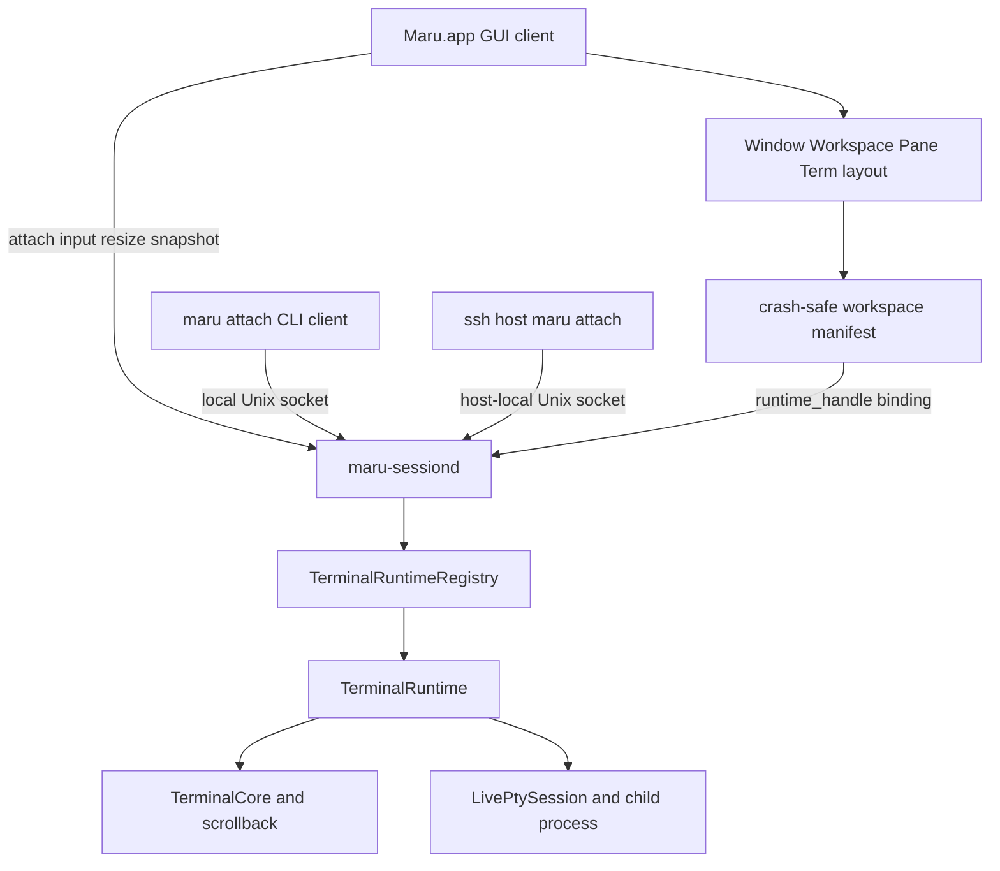
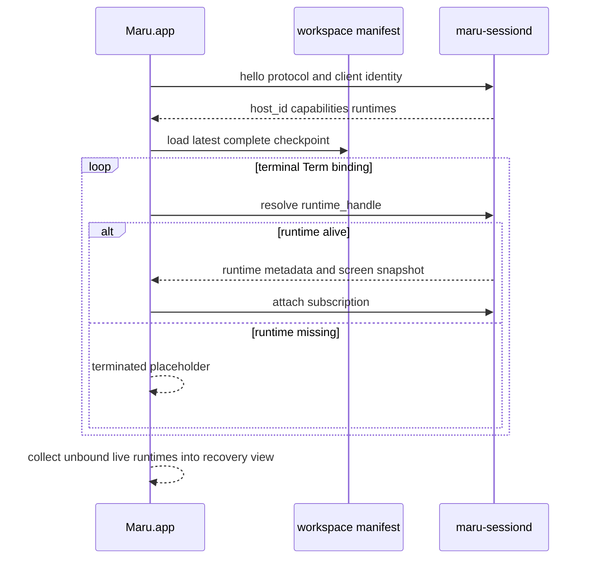

# 영속 터미널 세션 호스트

이 문서는 Maru GUI가 종료되어도 terminal Term의 PTY·자식 프로세스·화면 상태를 유지하고, 다시 실행한 Maru 또는
다른 터미널의 `maru attach` 클라이언트가 재접속하는 기능의 단일 출처다. 탭/split UI, workspace restore,
control-plane, PTY 종료 정책과 책임이 겹치지 않도록 소유권·ID·종료 의미·복구·검증 단계를 정한다.

> **상태: 설계만 확정, 구현 전.** 현재 제품은 `Maru.app` 종료 시 `applicationWillTerminate`가 workspace를 저장한 뒤
> 모든 `AppSession`과 live PTY를 닫는다. 아래 `maru-sessiond`, `runtime_handle`, `maru attach`는 아직 존재하지 않는다.
> 구현 PR은 이 문서의 단계와 종료 gate를 따라야 하며, 단계가 끝나기 전 제품 동작을 구현 완료로 설명하지 않는다.

## 1. 결론

Maru의 기본 영속성은 tmux가 아니라 **Maru 전용 로컬 session host(`maru-sessiond`)**가 제공한다.

- Maru의 Window → Workspace → Pane → Term 배치는 기존 Zig 모델이 계속 소유한다.
- `maru-sessiond`는 terminal Term의 실행 runtime만 소유한다.
- GUI 종료는 runtime 종료가 아니라 client detach다.
- Term 닫기는 runtime에 대한 명시적 terminate다.
- 제품 설정 `session.keep-alive-after-quit`은 완성 뒤 기본 `true`이며, 새 terminal runtime을 host에서 연다.
- 다른 터미널은 `tmux attach`가 아니라 `maru attach`로 같은 runtime에 붙는다.
- `tmux -CC` layout driver는 기본 계획에서 제외한다. 외부 tmux 세션 가져오기 수요가 확인될 때만 별도 adapter로
  재검토하며, persistent-session 구현의 선행조건이나 fallback으로 쓰지 않는다.

**연결 identity도 Maru가 대체한다.** canonical manifest와 attach protocol에는 tmux session/window/pane ID를 저장하거나
Maru ID로 번역한 mirror를 두지 않는다. `host_id + runtime_id`는 Maru가 직접 발급하며 `maru attach`의 대상도 이 Maru
runtime ID다. tmux가 설치돼 있지 않아도 생성·재접속·복구·외부 terminal attach가 모두 동작해야 한다.

이 범위는 좁은 의미로 terminal multiplexer의 PTY 소유·detach/attach 기능을 수행하지만, tmux의 window/pane UI,
prefix key, status line, copy mode, 설정 언어, command language, tmux wire 호환은 구현하지 않는다.

## 2. 목표와 비목표

### 목표

- `Maru.app` 프로세스가 정상 종료·크래시해도 terminal Term의 자식 프로세스가 살아 있다.
- 재실행한 GUI가 동일한 프로세스·PTY·scrollback에 재접속한다. 새 shell을 spawn한 뒤 비슷하게 보이게 만드는 기능이 아니다.
- 여러 Window·Workspace·Pane·Term의 배치를 tmux 계층으로 바꾸지 않고 기존 Maru UX 그대로 복원한다.
- detach 중 발생한 output도 host의 `TerminalCore`에 적용되어 재접속 첫 화면에 반영된다.
- GUI가 종료된 동안 발생한 OSC 9/777 알림도 host가 잃지 않고 macOS 배너·다음 GUI 알림 이력으로 전달한다.
- local Terminal.app/iTerm2/Ghostty/SSH 셸에서 `maru attach <runtime>`로 개별 Term에 붙을 수 있다.
- 느리거나 끊긴 client가 PTY reader를 막지 않도록 client별 전송은 bounded다.
- 종료·재접속·프로토콜 버전 불일치를 trace/snapshot/artifact로 진단할 수 있다.

### 비목표

- 재부팅·전원 종료를 건너 실제 OS 프로세스를 보존하는 것.
- `maru-sessiond` crash·강제 종료 또는 terminal child 종료 뒤 동일 실행 세션을 복구하는 것. host/runtime이 끝나면
  그 Maru runtime도 끝난 것이며 자동 대체 spawn을 하지 않는다.
- Claude/Codex provider session id·transcript·argv를 저장해 resume/fork하는 것. 영속성은 provider 복원이 아니라
  **같은 살아 있는 PTY/process를 계속 소유**하는 데서만 나온다.
- tmux server/socket/control-mode 프로토콜과 호환되는 것.
- v1에서 여러 writable client가 동시에 한 PTY 크기와 입력을 소유하는 것.
- v1에서 전체 Maru workspace를 텍스트 TUI로 완전히 재현하는 것.
- WKWebView process, browser JS heap, file panel의 미저장 editor buffer를 session host에 넣는 것.
- 원격 TCP/HTTP 포트를 열거나 계정·클라우드 relay를 추가하는 것.
- session host 무중단 binary upgrade와 실행 중 PTY의 다른 host 프로세스로의 live handoff.

## 3. 현재 구현과 새 경계

현재 `AppRuntime.live_registry`는 앱 인스턴스 전역으로 `LiveSurface`를 소유하지만, 그 수명은 여전히
`Maru.app` 프로세스 안이다. `LiveSurface.terminal`은 `Surface/TerminalCore + LivePtySession` 묶음이고, GUI 종료 teardown이
이를 닫는다. 이 앱-전역 소유권 lift는 cross-window 이동에는 충분하지만 process 종료를 건너지는 못한다.

새 구조에서는 terminal arm의 소유권을 process 경계 밖으로 옮긴다.



### GUI가 소유하는 것

- Window·Workspace 순서와 그룹·pin·색·custom name.
- SplitTree, Pane, Pane 안 Term 탭 순서와 활성 위치.
- terminal/web/file surface의 화면 배치와 native responder/Metal/WKWebView.
- app/global keybinding과 chrome action. terminal로 내려갈 입력만 host에 전달한다.
- workspace manifest의 구조 변경 정책과 atomic checkpoint.
- GUI가 붙어 있을 때 알림 위치 라벨·인앱 알림 센터·native focus UX.

### session host가 소유하는 것

- terminal runtime의 PTY master, child pid/process group, reader, write queue.
- `TerminalCore`, active/alternate screen, scrollback, cwd/title/semantic state.
- runtime별 마지막 PTY size와 controller client.
- detach 중 output 처리, runtime 종료 상태, client별 bounded subscription.
- OSC 9/777 notification event와 GUI가 없는 동안의 bounded pending history.
- agent process 관측처럼 PTY/process에 직접 묶인 파생 상태. UI 표현 정책은 GUI에 남긴다.

### session host가 소유하지 않는 것

- Workspace/SplitTree의 정책 권위.
- WKWebView와 file tree/editor state.
- Metal/CoreText renderer resource.
- 사용자가 닫은 workspace를 임의로 다시 만드는 정책.

`TerminalCore`를 host에 두는 이유는 GUI가 없는 동안에도 output을 계속 해석해 화면과 scrollback을 정확히 유지하기 위해서다.
PTY raw bytes만 host가 보관하고 새 GUI가 처음부터 replay하는 방식은 무제한 transcript 또는 잘린 replay에서 생기는 화면 손실을
요구하므로 채택하지 않는다. renderer는 GUI에 남고 host가 versioned screen snapshot/delta를 제공한다.

## 4. 엔티티와 ID

현재 `surface_id`는 **앱 인스턴스 전역** ID라 GUI process 재시작을 건너는 영속 ID로 승격하지 않는다.

| ID | 소유자 | 수명 | 용도 |
| --- | --- | --- | --- |
| `host_id` | session host | host process 수명 | stale manifest와 현재 host 구분, handshake |
| `runtime_id` | session host | terminal runtime 생성부터 종료까지 | 동일 PTY/process를 찾는 opaque 128-bit random ID |
| `runtime_handle` | manifest | `{host_id, runtime_id}` | Workspace Term 슬롯과 live runtime 연결 |
| `surface_id + generation` | GUI/AppRuntime | GUI app instance와 surface 수명 | 렌더/input/control-plane 라우팅 |
| `workspace_binding_id` | workspace manifest | workspace 생성부터 명시 삭제까지 | 여러 client가 같은 workspace 배치를 찾는 opaque ID |

불변식:

- `runtime_id`와 `workspace_binding_id`는 의미를 비트에 인코딩하지 않고 재사용하지 않는다.
- canonical terminal 연결키는 Maru `runtime_id` 하나다. tmux `$session/@window/%pane` ID를 보조키나 fallback으로
  저장하지 않는다.
- 기존 GUI 모델의 `DockGroup.runtime_id`는 파일 도크의 process-local group key일 뿐 terminal 연결 ID가 아니다.
  구현 단계에서는 session-host protocol namespace의 `runtime_id`와 타입·직렬화 필드를 공유하거나 암묵 변환하지 않는다.
- GUI 재실행은 새 `surface_id`를 발급한 뒤 기존 `runtime_handle`에 bind한다.
- runtime respawn은 같은 `runtime_id`의 generation 증가로 숨기지 않고 **새 runtime_id**다.
- `runtime_handle`은 권한 token이 아니라 상관키다. attach 권한은 transport/auth가 별도로 증명한다.
- web/file surface에는 `runtime_handle`을 쓰지 않는다.

예:

```text
종료 전  surface_id=45 generation=0 -> host=A runtime=R7
재실행  surface_id=3  generation=0 -> host=A runtime=R7
runtime 종료 뒤 기존 handle        -> ended (자동 respawn/resume 없음)
```

## 5. 다중 Workspace 연결 모델

tmux의 session/window/pane 계층으로 Maru workspace를 번역하지 않는다. 각 terminal Term 슬롯이 독립
`runtime_handle`을 가리킨다.

```text
Window 1
  Workspace A [workspace_binding_id=W-A]
    Pane left
      Term shell  -> {host=H1, runtime=R101}
      Term claude -> {host=H1, runtime=R102}
    Pane right
      Term dev    -> {host=H1, runtime=R103}

Window 2
  Workspace B [workspace_binding_id=W-B]
    Pane only
      Term codex  -> {host=H1, runtime=R201}
```

한 user login session의 host 하나가 모든 Window/Workspace의 terminal runtime을 관리한다. workspace 이동·pane split·Term 탭
재배치는 runtime을 재시작하지 않고 manifest binding 위치만 바꾼다. cross-window 이동도 동일하다.

### crash-safe manifest

현재 workspace 저장은 정상 `applicationWillTerminate`에서 수행되므로 GUI crash 직전 구조 변경을 잃을 수 있다.
영속 세션 전환 전 다음 계약을 추가한다.

- workspace 생성/삭제, split, Term 이동/닫기, cross-window 이동, runtime bind 변경은 manifest dirty를 세운다.
- dirty manifest는 짧게 debounce할 수 있지만 같은 디렉터리의 임시 파일 write·flush 뒤 atomic rename으로 교체하고,
  crash consistency를 지원하는 플랫폼에서는 directory metadata도 sync하는 checkpoint로 지속 저장한다.
- 구조 mutation과 checkpoint 사이에 crash하면 이전 완전본으로 돌아가며 반쪽 파일은 사용하지 않는다.
- host는 layout 정책을 적용하지 않는다. 최신 manifest 사본을 발견/attach용으로 읽거나 캐시할 수만 있다.
- `maru attach --workspace`는 같은 manifest parser를 사용하고 별도 workspace DB를 만들지 않는다.

workspace 저장 포맷에 `workspace_binding_id`와 terminal surface의 `runtime_handle`을 넣는 구체 wire는 구현 단계 시작 전에
`docs/workspace-restore.md`의 key-addressed 하위호환 규칙으로 확정한다. optional scalar로 표현할 수 없는 구조 변경이면
`maru.workspace.v2` migration/fallback 영향을 별도 사용자 리뷰 없이 진행하지 않는다.

### 새 Term과 설정

사용자 설정은 backend 구현명을 노출하지 않고 다음 boolean 하나를 제공한다.

```ini
session.keep-alive-after-quit = true
```

| 값 | 새 terminal runtime | `Quit Maru` |
| --- | --- | --- |
| `true` (**기능 완성 뒤 기본값**) | 새 Workspace/Term/split/quick terminal 모두 `maru-sessiond`에 생성 | GUI만 detach, runtime 유지 |
| `false` | 현재처럼 GUI process 안에 생성 | 현재 manifest에 bind된 terminal runtime을 확인 후 terminate |

- 이 키는 아직 parser/schema/세팅 GUI에 없다. P4 구현 PR이 config schema·`configuration.md`·GUI row·CLI help를 함께
  추가하고, P4 종료 gate 전에는 기본값을 바꾸지 않는다.
- backend 선택은 **새로 만드는 runtime에만** 적용한다. 살아 있는 runtime을 process 사이에서 migrate하거나 설정 토글
  즉시 terminate하지는 않지만, 바뀐 quit 의미는 다음 app-wide `Quit Maru`부터 적용한다.
- `true`인데 host launch/handshake가 실패하면 조용히 in-process terminal을 열어 “유지된다”고 오인시키지 않는다.
  오류를 표시하고 사용자가 명시적으로 이번 한 번만 ephemeral terminal을 열 수 있게 한다.
- persistent와 in-process runtime이 과도기 한 workspace에 함께 있어도 각 Term의 typed backend binding으로 구분한다.
- `false` 상태의 다음 Quit은 manifest에 bind된 기존 persistent runtime도 종료 확인 뒤 끝낸다. Quit 전 즉시 끝내려면
  `Quit and End All Sessions` 또는 Term별 close를 쓴다. host에 남은 다른 workspace/client의 unbound runtime까지
  설정 하나로 일괄 종료하지 않는다.

## 6. 종료와 detach 의미

같은 UI 동작이 어떤 resource를 닫는지 명확히 분리한다.

| 사용자 동작 | GUI | terminal runtime | web/file surface |
| --- | --- | --- | --- |
| `Quit Maru` (`keep-alive=true`) | 종료 | 유지, client detach | 기존 dirty 보호 후 teardown/선언적 복원 |
| `Quit Maru` (`keep-alive=false`) | 종료 | manifest-bound runtime 확인 후 terminate | 기존 dirty 보호 후 teardown/선언적 복원 |
| `Quit and End All Sessions` | 종료 | 모든 runtime 명시 terminate | 기존 dirty 보호 후 teardown |
| 마지막 일반 창 닫기 | 앱 전체 quit 경로라면 detach | 유지 | 기존 dirty 보호 적용 |
| 비마지막 Window 닫기 | 현재 창 정책 유지 | v1에서는 기존처럼 소속 Term 종료 확인 | 기존 close 정책 유지 |
| Workspace 닫기 | Workspace 제거 | 소속 runtime 종료 확인 | 소속 surface close 정책 유지 |
| Term 닫기 / shell `exit` | Term 제거 또는 종료 화면 | 명시 terminate / 검증된 exit | N/A |
| client detach key | 해당 client만 종료 | 유지 | N/A |

앱 전체 quit만 자동 detach로 바꾸고, Term/Workspace의 명시적 닫기를 조용한 background 전환으로 바꾸지 않는다. 그렇지 않으면
사용자가 닫았다고 생각한 process가 orphan으로 계속 실행된다. background로 남길 별도 `Detach Workspace` UX는 실제 수요가
생기기 전 비범위다.

dirty file editor는 session host가 보호하지 못한다. `Quit Maru`도 기존 save/discard/cancel gate를 통과해야 하며,
미저장 editor buffer가 있으면 terminal runtime이 안전하다는 이유로 GUI를 강제 종료하지 않는다.

### host 자체의 수명

- 첫 persistent terminal runtime이 필요할 때 on-demand로 시작한다.
- GUI client가 0이어도 runtime이 하나라도 살아 있으면 종료하지 않는다.
- runtime 0개·client 0개가 되면 bounded idle grace 뒤 종료할 수 있다.
- macOS login session 종료·재부팅·전원 종료 뒤에는 살아 있음을 약속하지 않는다.
- host/runtime 종료 뒤 provider resume/fork나 동일 runtime 복구는 시도하지 않는다.

### GUI가 종료된 동안의 알림

현재 알림의 단일 출처인 OSC 9/777은 `TerminalCore`가 파싱하므로 core와 함께 host로 이동해야 한다.

- host는 `runtime.notification`을 runtime ID, bounded title/body, 발생 시각과 함께 보관한다. `surface_id`는 GUI 수명이라
  host event에 저장하지 않는다.
- GUI가 붙어 있으면 기존 [알림 전략](notifications.md)의 위치 라벨·전면 배너·인앱 이력 funnel로 전달한다.
- GUI는 attach/binding 변경 때 runtime의 bounded display label을 host에 갱신한다. GUI가 없을 때 OS 배너는 마지막 label을
  힌트로 쓰되 layout 권위로 해석하지 않고, label이 없으면 짧은 Maru runtime ID로 표시한다.
- GUI가 없으면 signed app bundle의 macOS notification sink가 OS 배너를 게시하고, event는 bounded pending history에도
  남겨 다음 GUI가 인앱 이력으로 가져간다. host가 임의 network service를 열지는 않는다.
- 배너 클릭은 Maru를 cold launch한 뒤 `runtime_handle`을 attach하고 현재 manifest 위치를 찾는다. binding이 없으면
  `Recovered Sessions`에서 해당 runtime을 연다.
- `notifications.osc=false`는 GUI 유무와 관계없이 host 발화를 막는다. config snapshot/version 변경은 host에 전달한다.
- agent `running → idle` 완료 알림은 현재와 같이 deprecated no-op이다. 구조화된 완료 신호가 없으므로 영속 host가
  이를 추측해 되살리지 않는다.
- visual bell과 인앱 overlay는 GUI가 있을 때만 표시할 수 있다. GUI가 없는 동안 보장하는 background 알림은 OSC 9/777
  OS 배너와 pending history다.

`keep-alive-after-quit=true`를 기본값으로 바꾸기 전에 GUI를 종료한 실제 `.app` bundle에서 OSC 발화→배너→클릭 cold
launch→정확한 Maru runtime attach까지 검증해야 한다. 이 gate가 없으면 “세션은 살았지만 알림은 죽은” 상태라 P4 미완료다.

## 7. GUI 재접속과 binding 정합



재접속 순서:

1. GUI와 host가 protocol version/capability를 교환한다.
2. GUI가 최신 완전한 workspace manifest를 읽는다.
3. 각 terminal Term의 `runtime_handle`을 host runtime 목록과 대조한다.
4. 살아 있으면 새 GUI `surface_id`를 만들고 snapshot을 받은 뒤 delta subscription을 연다.
5. manifest에는 있지만 runtime이 없으면 종료 placeholder로 표시한다. provider resume/fork나 마지막 command 자동 재실행은 없다.
6. host에는 있지만 manifest에 bind되지 않은 runtime은 삭제하지 않고 `Recovered Sessions`에 노출한다.
7. 같은 runtime을 manifest의 두 writable Term 슬롯에 bind하면 잘못된 파일로 거부한다. 한 runtime의 canonical writable placement는 하나다.

### 접속 실패 행렬

| 상태 | 처리 |
| --- | --- |
| host가 없거나 종료됨 | 기존 handle은 ended 처리. 새 Term 생성 시 새 host를 시작하지만 동일 runtime 복구로 설명하지 않음 |
| host는 있으나 `host_id` 불일치 | stale handle, 자동 attach 금지 |
| runtime 일부 없음 | 나머지는 attach, 누락 Term만 종료 placeholder |
| manifest 손상 | 기존 조용한 기본 workspace fallback + host orphan recovery entry |
| protocol 호환 불가 | runtime을 죽이지 않고 attach 거부, 버전 진단 표시 |
| client queue overflow | 그 client delta를 invalidated 처리하고 fresh snapshot 재요청; PTY reader는 계속 진행 |

## 8. 다른 터미널에서 attach

v1 CLI 범위는 **개별 terminal runtime attach**다.

```sh
maru runtime list
maru attach <runtime-id>
maru attach --take-over <runtime-id>
```

기존 `maru sessions list`는 살아 있는 GUI surface를 조회하는 `maru.control.v1` CLI이므로 의미를 바꾸지 않는다.
`maru runtime list`는 GUI가 없어도 session host의 Maru runtime ID를 나열하는 별도 명령이다.

전체 workspace TUI는 후속이다.

```sh
maru attach --workspace <workspace-binding-id> # 후속, v1 비범위
```

일반 terminal emulator에 attach할 때 host의 `TerminalCore`가 이미 escape sequence를 소비했으므로 현재 raw PTY stream을
그대로 중간부터 전달하면 안 된다. CLI client는 host의 versioned screen snapshot을 ANSI로 투영하고 이후 delta를 반영한다.
copy/search/scrollback은 host query를 사용한다. 이 ANSI client renderer는 Metal renderer와 별개 adapter지만 같은 중립
screen DTO를 소비해야 하며, 새 terminal parser를 만들지 않는다.

SSH 접근은 network listener를 열지 않고 대상 host에서 CLI를 실행한다.

```sh
ssh workbox maru runtime list
ssh -t workbox maru attach <runtime-id>
```

직접 TCP, HTTP, cloud relay는 비범위다. 추후 `maru attach --remote workbox ...`가 필요하면 내부 transport는 SSH를 재사용한다.

## 9. 다중 client와 resize

v1은 runtime당 controller 한 명을 강제한다.

- controller만 terminal input과 PTY resize를 보낸다.
- 추가 client는 observer(read-only)다.
- `--take-over`는 기존 controller에 revocation 이벤트를 보낸 뒤 제어권을 원자적으로 이전한다.
- controller가 끊기면 자동으로 임의 observer에게 write 권한을 주지 않는다.
- client가 하나도 없을 때 PTY는 마지막 검증된 cols/rows를 유지한다.
- 새 controller attach의 첫 resize가 PTY와 `TerminalCore`에 같은 순서로 적용된다.
- 서로 다른 크기의 observer는 canonical PTY size를 바꾸지 않고 letterbox/crop/reflow 정책을 client 표시층에서 처리한다.

여러 writable client나 collaborative typing은 입력 순서, terminal size, selection, capability revocation의 별도 설계 없이는 열지 않는다.

## 10. IPC와 control-plane 경계

기존 `maru.control.v1`은 실행 중 GUI의 surface 조회·자동화·browser/file capability를 포함한다. persistent-session transport는
PTY 수명과 고처리량 screen attach를 담당하므로 같은 서버라고 가정하지 않는다.

- 기존 `session.*` control-plane method의 의미를 조용히 host-global ID로 바꾸지 않는다.
- `surface_id`와 `runtime_id`를 같은 JSON 숫자로 접지 않는다.
- browser/file method는 GUI가 없으면 unavailable이다.
- runtime list/attach/terminate는 session-host protocol namespace가 소유한다.
- 향후 control-plane이 host runtime을 노출하면 `{surface?, runtime_handle?}`을 명시적으로 구분하고 권한을 재검토한다.

wire codec은 구현 전에 별도 protocol spike에서 고정한다. 최소 gate는 다음과 같다.

- `maru.session-host.v1` hello와 capability negotiation.
- 부분 read/write, max frame, malformed/oversize 거부.
- control message와 bounded snapshot/delta stream의 분리.
- 임의 terminal bytes를 UTF-8 JSON 문자열로 오해하지 않는 binary-safe framing.
- GUI/CLI/host 버전 skew와 unknown message skip 또는 fail-close 규칙.
- slow client queue overflow가 PTY backpressure로 전파되지 않는 증명.

NDJSON+base64와 length-framed binary 중 무엇을 택할지는 실제 viewport/scrollback payload 측정 없이 이 문서에서 임의 확정하지
않는다. 선택 PR은 두 후보의 메모리·CPU·부분 프레임 테스트를 제시하고 이 절을 갱신해야 한다.

## 11. 보안과 개인정보

- socket directory는 user-only 0700, socket은 0600, peer credential same-uid 검증을 기본으로 한다.
- `runtime_handle`은 secret이 아니므로 그것만으로 output/read/write를 허용하지 않는다.
- GUI 재접속은 app이 시작한 host/client capability로 인증한다.
- 외부 `maru attach`에 same-uid만으로 전체 output을 허용할지, signed client/interactive TTY/명시 grant를 추가할지는
  **CLI attach 구현 전 사용자 결정 gate**다. 기존 control-plane의 same-uid 신뢰 차등을 조용히 약화하지 않는다.
- socket/token/capability, raw output, cwd, command는 trace fixture에 그대로 넣지 않는다. redaction은
  `docs/project-rules.md`의 단일 기준을 쓴다.
- SSH attach는 SSH 계정 인증 뒤 host-local socket을 사용하고 daemon이 network port를 listen하지 않는다.
- protocol auth가 실패해도 runtime을 인가되지 않은 client에 자동 export하지 않는다.

## 12. screen snapshot과 관측 가능성

현재 `RenderSnapshot`은 renderer용 in-process view이고 `maru.snapshot.v3`은 debug/replay용 부분 직렬화다. 둘 중 하나를
그대로 IPC 안정 ABI라고 선언하지 않는다. 구현 전에 다음 중립 DTO를 정의한다.

- viewport size, cursor, cell text/width/style, active/alternate screen 식별.
- snapshot generation과 delta base generation.
- scrollback generation/범위와 on-demand page query.
- runtime process state, cwd/title/agent summary는 별도 metadata event.
- client overflow·generation mismatch 시 full snapshot 재동기화.

로그, trace, replay, inspector는 runtime 수명 이벤트를 같은 도메인 데이터로 소비한다.

```text
runtime.spawned
client.attached
client.detached
controller.transferred
runtime.output
runtime.resized
runtime.exited
runtime.read-error
runtime.terminated
snapshot.invalidated
```

기존 `maru.trace.v1`에 위 kind를 바로 추가하지 않는다. trace schema/Facade 대응표를 먼저 갱신하고, capability·cwd·output
redaction과 GUI 없이 replay 가능한 의미를 고정한 뒤 version을 유지할지 올릴지 결정한다.

## 13. 구현 단계와 종료 gate

### P0 — 문서 결정

- 이 문서, tabs/splits, workspace restore, control-plane, implementation plan, verification matrix를 정합화한다.
- tmux-CC를 필수/기본 driver 계획에서 제거한다.
- 코드와 제품 동작은 바꾸지 않는다.

종료 gate: `git diff --check`, 문서 링크/old tmux 계획 grep, PR 사용자 리뷰.

### P1 — legacy provider session continuity 잔여 제거

현재 제품은 provider session을 실행에 복원하지 않지만 한 릴리스 호환용 reader/no-op/cleanup 코드가 남아 있다. 영속 host를
도입하면서 이 코드를 새로운 fallback으로 재사용하지 않고 제거한다.

- `workspace.restore-claude`/`workspace.restore-codex` loader no-op과 테스트를 제거한다. 이후에는 일반 unknown key 진단이다.
- workspace `Surface.agent_kind/agent_session/agent_argv`, legacy parser와 migration fixture를 제거한다. 구 파일의 미지 scalar는
  일반 key-addressed 규칙으로 무시하고 새 writer에는 계속 나오지 않는다.
- 1회 provider hook/mapping cleanup과 `MARU_AGENT_MAPPING_ID` 전용 차단도 P1에서 제거한다. 이후 Maru는 과거 provider
  config/mapping을 자동 수정하지 않고, 남아 있는 사용자 파일은 그대로 둔다.
- 현재 foreground process·screen 관측에 쓰는 **live** `Term.agent_kind/agent_state`는 provider session continuity가 아니므로 유지한다.
- 같은 코드 PR에서 `agent-session.md`, `workspace-restore.md`, `configuration.md`, verification matrix의 deprecated/역사 문구를
  “제거됨” 상태로 갱신한다. 코드를 먼저 제거하고 문서만 deprecated로 남기거나, 반대로 문서만 제거 완료라고 쓰지 않는다.

종료 gate: `restore-claude|restore-codex|agent-session|agent-argv|MARU_AGENT_MAPPING_ID` 제품 경로 grep 0(일반 live
agent state 제외), 구 workspace unknown-key load, 일반 shell restore, agent observer 회귀, provider config 자동 변경 0.

### P2 — process 경계 없는 `TermRuntimeBackend` seam

- 기존 in-process `AppRuntime.live_registry`를 `TermRuntimeBackend` 계약 뒤에 둔다.
- terminal runtime action을 spawn/attach/input/resize/snapshot/terminate로 분리한다.
- GUI layout이 `LivePtySession` 포인터를 직접 소유하지 않는 방향을 red test로 고정한다.
- 아직 daemon을 띄우지 않고 제품 동작은 동일하다.

종료 gate: 기존 PTY/input/resize/close 전체 회귀, backend fake의 attach/detach/late event 단위 테스트, boundary check.

### P3 — local host와 단일 GUI 재접속

- protocol/framing spike 결과를 문서화하고 `maru-sessiond` on-demand launch를 구현한다.
- `TerminalRuntimeRegistry`가 `TerminalCore + LivePtySession`을 소유한다.
- controlled command를 띄운 뒤 GUI client를 종료·재실행해 PID/runtime_id/output/scrollback 동일성을 검증한다.
- incompatible hello가 runtime을 조용히 kill하지 않고 client attach만 거부하는 실패 artifact를 남긴다.

종료 gate: 실제 별도 process smoke, detach 중 output, reconnect first snapshot, input/resize roundtrip, bounded shutdown.

### P4 — 다중 Window/Workspace·기본 설정·background 알림

- `workspace_binding_id`/`runtime_handle` 직렬화와 atomic incremental checkpoint를 구현한다.
- 여러 workspace·pane·Term binding, cross-window 이동, 일부 missing runtime, orphan recovery를 검증한다.
- `session.keep-alive-after-quit` config/schema/세팅 GUI를 추가하고 완성 상태의 기본값을 `true`로 전환한다.
- app quit을 설정에 따라 detach/terminate로 나누되 explicit Term/Workspace close와 dirty file gate는 보존한다.
- GUI가 없는 동안 OSC 9/777 OS 배너·pending history·배너 클릭 cold-launch attach를 구현한다.

종료 gate: 2 windows + 3 workspaces + background output GUI restart E2E, 마지막 완전 checkpoint, stale/missing/orphan matrix,
실제 `.app`을 종료한 뒤 OSC 배너→클릭→정확한 runtime attach. 이 gate 전에는 config 기본값을 `true`로 바꾸지 않는다.

### P5 — 개별 runtime CLI attach

- `maru runtime list`, `maru attach`, detach key, observer, `--take-over`를 구현한다.
- same-uid attach 권한 결정을 사용자와 확정하고 보안 테스트를 추가한다.
- SSH `ssh -t host maru attach ...` 실제 smoke를 추가한다.

종료 gate: 다른 terminal emulator에서 실제 attach/input/detach/reattach, controller resize ownership, unauthorized 거부.

### P6 — 전체 workspace TUI와 외부 adapter 검토

- 실제 수요가 있을 때만 `maru attach --workspace` 텍스트 UI를 설계한다.
- web/file surface는 placeholder 또는 제외 정책을 먼저 결정한다.
- 외부 tmux session import adapter도 이 단계의 별도 사용자 결정이며 session host 완료 조건이 아니다.

## 14. 필수 테스트·성능 gate

- client process 종료 전후 child pid/process group/runtime_id 불변.
- detach 중 1 MiB 이상 output 후 재접속 화면·scrollback 정합.
- idle runtime은 timeout polling 없이 PTY/IPC event를 기다림.
- slow observer queue overflow 뒤 controller/PTY 진행 무정지.
- 100 runtime의 attach/list/snapshot 메모리 상한과 첫 visible runtime latency artifact.
- runtime 0/client 0 host bounded 종료와 stale socket 회수.
- SIGKILL GUI 뒤 host와 child pid/runtime/output 생존.
- protocol old/new/unknown/oversize/partial frame.
- runtime close의 SIGHUP→SIGTERM→SIGKILL bounded reap 계약 회귀.
- multi-workspace runtime 중복 bind, stale handle, partial missing, orphan recovery.
- terminal input mode/alternate screen/resize/Unicode/grapheme/kitty graphics가 reconnect snapshot에서 회귀하지 않음.
- GUI 0 상태 OSC 9/777 배너·bounded history·notification click cold launch attach, `notifications.osc=false` 무발화.
- capability·raw output·민감 path가 fixture에 남지 않는 redaction gate.

정확한 latency/RSS 숫자는 P3 구현 전에 baseline artifact를 측정해 `performance-budget.md`에 추가한다. 근거 없는 숫자를 이
설계 PR에서 약속하지 않지만, 측정·상한 없는 default 전환도 허용하지 않는다.

## 15. 구현 전 남은 사용자 결정

다음은 이 설계 PR 리뷰에서 방향을 확인하되, 확인되지 않으면 해당 단계 구현을 시작하지 않는다.

1. 외부 `maru attach`의 v1 신뢰 경계: same login UID 전부 허용 또는 signed client/명시 grant 추가.
2. host launch 방식: 앱이 spawn한 detached helper와 launchd-managed agent의 배포·업데이트·로그아웃 의미 비교.
3. P4 workspace 포맷이 optional scalar로 안전한지, 구조 변경이면 v2 migration을 수용할지.

tmux-CC layout driver 제거, Maru-owned session host, `keep-alive-after-quit=true` 완성 후 기본값, provider session
resume/fork 비도입은 이 문서의 확정 결정이다. 위 세 항목은 그 방향 안에서 보안·배포·포맷을 결정하는 gate다.
