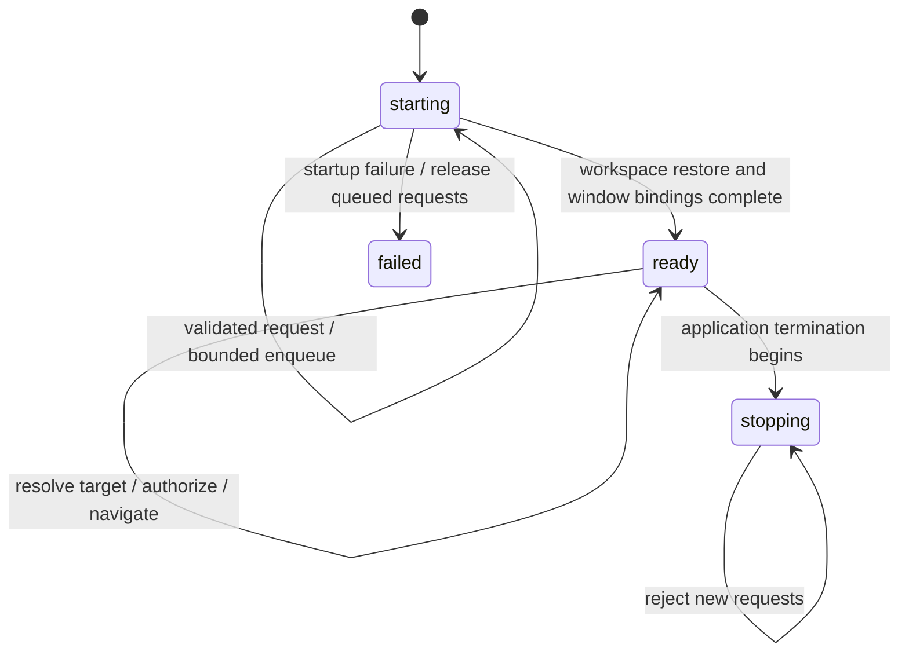

# 에디터 앱 URL — 파일·줄·열 열기

상태: **구현·backend·exact-bundle OS 전달 검사 완료, 기본 handler·화면·PR/CI 확인 대기** (2026-10-08).
사용자 요청 순서는 문서 → 계획 공격·보완 → 구현이다. 이 문서는 URL 계약·단계·미결을
소유한다. 검토 기록은 [적대적 검토](editor-app-url-review.md)가 소유한다.
현재 제품이 이 기능을 지원한다는 뜻이 아니다.

## 목적과 범위

외부 프로그램이나 링크에서 Maru 네이티브 에디터의 로컬 파일과 위치를 연다.
앱이 실행 중인 경우와 실행되지 않은 경우를 모두 지원한다. 새 창/워크스페이스 생성,
원격 파일, 명령 실행, 자동 저장, 범위 선택, HTTP 서버는 이번 범위 밖이다.
`maru-app://`은 기존 웹 패널 내부 자산 스킴이므로 재사용하지 않는다.
Android/iOS/Windows URL 등록은 별도 단계이며 이번 macOS 구현의 완료 조건에 넣지 않는다.

## 확인한 기존 구현

| 경계 | 현재 코드 | 재사용할 책임 |
|---|---|---|
| 앱 수신 | `MaruAppHostController` / `MaruAppHost-Info.plist.in` | NSApplicationDelegate 수신 및 LaunchServices 등록 추가 |
| 파일·위치 이동 | `app_session/editor/mod.zig:navigateTo` | 파일 열기 → 위치 해소 → 접힘 펼치기 → caret·스크롤 |
| 파일 유일성 | `pane.openFileTermInActivePane` | 기존 제품 정책으로 열린 문서/뷰 재사용 |
| 위치 해소 | `editor.lsp.position.offsetOf` / `NavTarget.LspPos` | 열린 문서의 실제 줄 표와 인코딩으로 offset 계산 |
| 접근 범위 | `editor.withinNavRoot` | 현재 git root 또는 첫 file-tree root; root 없으면 허용 |
| 시작 순서 | `applicationDidFinishLaunching` / `restoreWorkspace` | 복원과 창/session 바인딩 완료 후 요청 처리 |

`withinNavRoot`는 `repo_path.underRoot`의 경로 판정이다. 이를 그대로 재사용한다고
symlink 탈출·파일 교체 경쟁까지 방어된다고 주장하면 안 된다. `openPathInActivePane`라는
검증용 저수준 경로로 제품 파일 유일성·이동 정책을 우회하지 않는다.

## URL 계약 제안

```text
maru://open?path=%2FUsers%2Fme%2Fproject%2Fmain.zig&line=42&column=7
```

- scheme `maru`, authority `open`, 빈 URL path, query 기반의 한 가지 표현만 지원한다.
  scheme/authority는 ASCII 대소문자 무관하게 비교한다. userinfo·port·fragment는 거부한다.
- `path`는 필수이며 UTF-8 절대 로컬 파일 경로다. 상대 경로, `~`, 환경변수, glob을 확장하지 않는다.
  별칭·symlink·대소문자의 문서 유일성은 기존 파일 열기 정책을 따른다. inode 기반 중복 제거를 새로 약속하지 않는다.
- query component를 **한 번만** percent-decode한다. `+`는 공백이 아닌 문자 `+`다.
  잘못된 escape, 잘못된 UTF-8, NUL, CR/LF 및 기타 제어 문자는 거부한다.
  `%252F`는 `%2F`라는 파일 이름 일부이며 다시 slash로 해석하지 않는다.
- duplicate/unknown query key, 빈 path, trailing `&`, 빈 query component는 거부한다.
  query key는 literal ASCII `path`/`line`/`column`만 받으며 인코딩된 key를 허용하지 않는다.
  구조 delimiter를 분리한 뒤 값만 decode한다. 인코딩된 `&`·`=`는 값의 일부다.
- `line`, `column`은 선택적 1-based 양의 십진수다. 부호·공백·0·overflow는 거부한다.
  `column`만 제공하는 요청은 거부한다. line 생략 시 기존 파일 열기 위치 정책을 유지한다.
  line만 있으면 column=1이다. 숫자 범위는 u32이며 0-based 변환은 검증 후 수행한다.
- column 단위는 기존 위치 이동과 연결되는 **UTF-16 code unit**이다. 탭은 1 unit,
  supplementary 문자는 2 units다. 기존 `byteInLine(.utf16)`은 surrogate 중간 요청을
  그 문자 **뒤**의 유효 UTF-8 경계로 옮긴다. 이 동작을 유지하고 독립 oracle로 고정한다.
  grapheme/screen column으로 소개하지 않는다.
- 문서 범위 밖의 유효 숫자는 문서 끝/줄 끝으로 clamp한다. 빈 파일, CRLF, 마지막 빈 줄,
  emoji·한글 NFD·탭을 독립 expected-byte oracle로 검증한다.
- raw URL 최대 16 KiB, decoded path 최대 4 KiB, 대기 요청 최대 32개, 대기 raw bytes 총량
  최대 64 KiB로 제한한다. 상한은 decode/allocation 전에 검사한다. 숫자·길이 산술은 checked다.

이 형식은 Maru의 새 계약 제안이다. 다른 에디터 URL과 동일하거나 호환된다고 주장하지 않는다.

## 확정: 외부 경로 접근

2026-10-08 사용자가 워크스페이스 밖 파일도 허용하도록 승인했다. root가 없는 콜드 실행도
지원한다. 외부 URL이 지정한 파일 하나를 명시적 사용자 파일 열기 진입점으로 취급한다.
기존 LSP/진단 `navigateTo`의 root 제한을 전역으로 풀지 않는다. 파일 열기와 위치 이동의
공통 내부 단계를 재사용하며 새 root 등록·LSP trust 자동 승인·명령 실행·자동 저장은 하지 않는다.
경로의 symlink는 기존 사용자 파일 열기 정책대로 따라가되 실제 열린 descriptor가 regular
file인지 확인한다. URL은 로컬 경로를 요청하며, 시스템에서 마운트한 파일시스템의 지연까지
nonblocking open이 해결한다는 주장은 하지 않는다.

## parser·좌표 독립 oracle의 시작 corpus

아래 기대값은 제품 parser/위치 함수를 호출해 만들어서는 안 된다. D1/D3에서 문자열과
byte offset 상수를 fixture로 고정하고, 추가 fuzz는 이 corpus와 다른 생성 규칙을 사용한다.

| 입력 또는 문서 | 기대 |
|---|---|
| `maru://open?path=%2Ftmp%2Fa%2Bb.zig&line=1` | `/tmp/a+b.zig`, 위치 1:1 |
| `maru://open?path=%2Ftmp%2Fa%252Fb.zig` | `/tmp/a%2Fb.zig`; slash로 재해석하지 않음 |
| `maru://open?path=%2Ftmp%2Fa%26b%3Dc.zig` | `/tmp/a&b=c.zig` |
| path 두 개 / `%70ath=` / column만 / line=0 / line=4294967296 | reject |
| `maru://user@open:42/?path=%2Ftmp%2Fa#x` | reject |
| `A😀B\r\n한\n`, 위치 1:3 | UTF-16 surrogate 내부 → emoji 뒤 byte 5 |
| 같은 문서, 위치 2:2 | `한` 뒤 byte 11 |
| 같은 문서, 위치 99:1 | EOF byte 12 |
| 빈 문서, 위치 1:1 | byte 0 |

## 책임·상태 전이

Swift는 원본 URL 수신·앱 창 활성화·시작 완료 알림만 소유한다. 정책 parser와 bounded queue는
OS 중립 Zig leaf가 소유한다. Swift `URLComponents`와 Zig에 서로 다른 정책을 두지 않는다.
Foundation이 정규화하기 전 원본 문자열을 확보할 수 있는지 실제 delegate 수신으로 확인한다.
불가능하면 수신 표현의 한계를 기록하고 양쪽 해석이 달라지는 입력을 거부한다.



- 시작 중 FIFO로 보관하되 세션/Term 포인터를 저장하지 않는다. 실행 시 살아 있는 창과
  session을 해소한다. restore 실패나 종료 중에는 소비하지 않고 정리한다.
- 실행 중에는 현재 key normal window, 없으면 기존 host의 primary normal window를 대상으로
  한다. quick/hidden/test window를 implicit 대상에 넣지 않는다. 대상이 없으면 실패로 보고한다.
- URL 하나의 파일 열기·위치 이동은 main-thread 기존 AppSession 경로로 실행한다.
  배치 중 재진입은 drain guard로 막고 유한 개수만 tick당 소비한다. overflow는 새 요청을
  거부하며 오래된 요청을 조용히 덮어쓰지 않는다. 임의 dedup으로 사용자의 반복 이동을 없애지 않는다.
- 경로/위치 해소 실패는 성공 로그를 남기지 않는다. 파일 열기는 기존 오류/복구 정책을 따른다.
  이미 dirty인 파일의 메모리 내용을 재사용하고 디스크로 reload하지 않는다. IME 전환도 기존
  입력 admission 경로를 사용한다. 실패 뒤 완전한 무변경 여부는 오류별로 검증해 문서화한다.
- raw URL·절대 경로·본문을 기본 로그에 남기지 않는다. request id, stage, 오류 code,
  성공 시 비민감 surface id로 관찰한다. URL이 전달됐다는 사실은 LSP/SSH trust 승인이 아니다.
  실패 알림은 기존 알림/i18n 경로를 사용하고 자동 재시도나 외부 앱 실행을 하지 않는다.

## 파일 I/O에서 발견한 구현 선행 조건

현재 `editor.openPath`는 `openFile(.{})` 후 stat의 size를 확인하지만 regular-file kind를
확인하지 않는다. 외부 URL이 FIFO를 지정하면 **stat 전 open부터** 막힐 수 있다. 따라서
URL 문자열 검사나 파일을 미리 stat하는 것만으로 이 문제를 닫지 않는다. D3 전에 실제
open/read 경계에서 nonblocking open과 opened descriptor의 regular-kind 판정을 연결하고,
root 내부 정책을 택하면 root-anchored no-follow 해소까지 같은 read 권위에 묶어야 한다.
단순 preflight 후 기존 reader로 pathname을 다시 여는 방식은 TOCTOU 때문에 불합격이다.
기존 pinned-file I/O의 재사용 가능성과 일반 editor open/save identity 영향부터 조사하고,
새 파일 I/O 전략이 필요하면 구현 전에 보고한다. 이 선행 조건 없이 D4 URL 수신을 노출하지 않는다.

## 단계와 통과 조건

| 단계 | 구현 | 다음 단계 진입 gate |
|---|---|---|
| D0 | 계약·미결·적대적 검토 | 사용자 경로 정책 결정, 기존 파일 I/O·위치 clamp 확인 |
| D1 | 순수 URL parser와 request 타입 | 정상/악성 corpus, 독립 oracle, deterministic fuzz, ReleaseFast, 변이 거부 |
| D2 | 시작/ready/stopping coordinator | FIFO·overflow·OOM·재진입·실패·창 폐기 모델 테스트 |
| D3 | AppSession 파일·위치 실행과 additive ABI | 실제 문서·dirty 재사용·접힘·Unicode·root 실패 검사; 기존 경로 회귀 |
| D4 | plist 등록·AppKit delegate·시작 후 drain | 번들 빌드·등록 및 콜드/웜 실제 OS URL 수신 |
| D5 | 실제 화면 E2E·적대적 5회 | 아래 매트릭스, negative controls, artifacts·문서·CI |

각 단계는 구현 전 failing test를 만든다. 단계별 commit에서 required gate를 통과하고,
문서 계약 변경은 해당 변경 commit에 포함한다. 새 런타임 의존성은 추가하지 않는다.
공통 parser/coordinator가 platform API를 import하지 않도록 기존 layering gate를 적용한다.

## 검증 매트릭스

1. parser: spaces/한글/emoji/`+`/`%`/`&`/`=` 경로, delimiter encode, invalid UTF-8,
   double decode, duplicate key, unknown key, userinfo/port/fragment, 숫자/상한 경계.
2. 위치: 1:1, 마지막 줄, 빈 파일, CRLF, emoji surrogate 내부, NFD, 탭, 줄/열 초과.
   기대 byte offset을 제품 `offsetOf` 호출로 다시 계산하지 않는다.
3. 수명: restore 전 수신, restore 실패, ready 반복, burst 32/33, 총량 초과,
   각 allocation OOM, 대상 창 닫힘, 종료 중 수신, 재진입, queue 완전 정리.
4. 문서: 새 파일, 이미 열린 dirty 파일, 공유 뷰, diff/merge 활성 상태, 없는 파일,
   디렉터리/FIFO/소켓/비 UTF-8 파일, symlink 탈출/교체 경쟁, 권한 거부.
5. 실제 OS: 격리 HOME/config의 서명된 test bundle을 직접 지정한 URL launch로 cold/warm
   전달을 확인하고, 일반 `open 'maru://…'`의 LaunchServices 선택도 별도로 확인한다.
   개발 앱이 기존 Maru handler를 대체하는 부작용을 기록한다. 전역 handler를 임의로 바꾸지 않는다.
6. 실제 GUI: caret byte와 현재 줄·스크롤·접힘·문서 identity를 backend probe 및 화면으로
   함께 확인한다. 단순 exit 0이나 스크린샷 존재만으로 성공을 판정하지 않는다.

적대적 5회는 같은 정상 시나리오 반복만으로 채우지 않는다. 매 회차마다 다른 실패 축과
고정 seed·negative control을 기록한다. 변이 후보는 root 검사 제거, 두 번 decode, duplicate
허용, ready 전 drain, dirty 파일 reload, UTF-16을 byte로 오해, overflow를 wrap하는 구현이다.
의미가 같은 대조 구현은 통과해야 한다. Swift/plist의 텍스트 존재 검사로 제품 배선을 대체하지 않는다.

## 완료와 한계

실제 OS 수신, cold/warm, 문서 이동, 실패 경로 및 required CI가 통과해야 구현 완료다.
GUI/LaunchServices를 사용할 수 없는 환경에서는 pure/backend 통과와 OS 미검증을 분리한다.
현재 실행 환경의 Git 메타데이터 쓰기·네트워크 제한은 별도 보고하고 사용자 기존 브랜치에서
무단 commit/merge하지 않는다. 문서 작성은 구현 완료도 정책 승인도 아니다.

## 2026-10-08 구현 결과

D1/D2는 `session/editor_app_url.zig`에, macOS queue/파일 실행 어댑터는
`platform/macos/editor_app_url.zig`에 구현했다. 외부 파일 열기는 `navigateUserFile`로만
root를 넘고 기존 `navigateTo`의 root 제한은 그대로다. native read가 실패하면 웹 패널로
fall back하지 않고 탭 게시 전에 거부한다. 기존 `openFilePanelRead`의 nonblocking
descriptor를 재사용하며 같은 fd의 regular-kind를 확인했다.

Swift는 AppKit의 `URL.absoluteString` 표현을 Zig에 전달한다. Foundation 단독 검사에서
중첩 percent·plus·invalid UTF-8 escape·대문자 표현은 보존됐다. 실제 OS event 수신의
표현 검증은 아직 아니다. 시작 복원 완료 뒤 ready가 되고, 종료 확인 중 drain은 보류한다.
취소하면 다음 tick에 소비하고 실제 종료하면 stop에서 정리한다. 수신 배치도 32개로 제한한다.
IME admission은 선택한 normal surface의 `withSurface` 경계에서만 수행한다.

유효 요청의 파일 열기 실패는 기존 중립 번역 문구 `git_conflict_open_failed`를 재사용한다.
문법·상한 거부는 sanitized status 로그로 남긴다. receipt hook은
`MARU_EDITOR_APP_URL_RECEIPTS=1`에서만 파일 경로 hash와 byte caret를 출력한다.

[실행 증거](../evidence/editor-app-url-20261008/verification.json)의 통과/미검증 범위를
구분한다. 5개 실제 변이를 거부하고 5개 정상 대조군·2개 동등 구현을 통과했다. 사용자 GUI
터미널에서 OS 수신 하네스의 실제 cold/warm·파일 재사용·잘못된 위치 거부가 통과했다.
앱 SHA와 receipt의 경로 hash·surface·독립 byte 기대값을 대조했다. 기본 handler·화면 gate는 미완료다.
최신 bundle 빌드·Swift 효과 검사·기존 shared split 회귀·전체 `check-boundaries`는 통과했다.

## 2026-10-09 설치본 검증

PR #4249는 main `3f7fd7a4cc02b4957e28247c69192d46a34be9f7`로 머지됐다.
해당 main의 서명 검증된 `/Applications/Maru.app`에서 일반 `open maru://…`의
기본 handler 전달을 격리 HOME으로 확인했다. cold/warm의 독립 byte 기대값은
11/5/5이며 동일 surface 재사용과 Metal readback을 함께 기록했다. 설치본 SHA256은
`814b29af86889ba45661d80415e58192abeb5f06d838d65dd6c79337a7f4f6eb`이다.
로컬 증거는 `~/.cache/maru-installed-20261009/default-verification/result.json`에 있다.
사용자 승인 아래 중복 개발 앱의 LaunchServices 등록만 해제하고 설치본을 기본 handler로
연결했으며 복사본 파일은 보존했다. 이후 설치본의 일반 실행도 확인했다.
