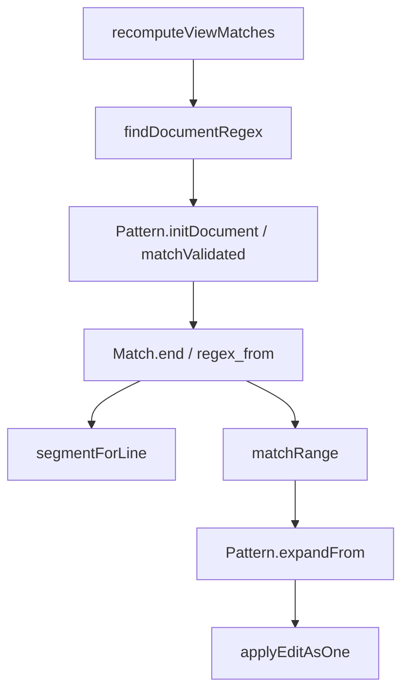

# 문서 전체 정규식 검색·치환

## 선택한 계약

사용자가 문서 전체 정규식의 설계 후 구현과 **원문 검색 + LF/CRLF/단독 CR 줄 경계**를 선택했다.
편집용 파일 원문을 검색용 LF 사본으로 바꾸지 않는다. `\A`·`\z`는 BOM을 제외한 문서의 시작·끝,
`^`·`$`는 기본 multiline 모드의 줄 경계다. 마지막 개행 뒤의 빈 줄에도 `^`가 적용되도록
PCRE2 ALT_CIRCUMFLEX를 켠다. PCRE2 newline 정책은 ANYCRLF이며 패턴의 명시적
옵션·newline directive는 PCRE2 규칙대로 적용된다. `\n`은 LF 자체이므로 CRLF 전체를 포함하려면
`\r?\n` 등을 쓴다. 단독 CR도 정규식 줄 경계지만 편집기 표시 줄 번호는 기존 LF/CRLF 인덱스를 유지한다.

일반 편집기는 `doc.file.content` 전체가 subject다. 비교 뷰는 원래 줄바꿈이 없는 읽기 전용 열별
텍스트 배열을 LF로 이어 각 열을 독립 문서로 검색한다. 로딩 중인 빈 배열과 빈 문서 한 줄은 구분한다.
터미널은 soft-wrap을 이은 논리 줄 검색을 유지한다. 평문 검색·단어 선택·Unicode 접기는 별도 경로다.

## 구현 구조

- `regex.Pattern.initDocument`: PCRE2 MULTILINE과 명시적 newline compile context. 기존 `init`의
  터미널/줄별 계약은 유지한다. PCRE2 match/depth limit도 유지한다.
- `find.findDocumentRegex`: UTF-8을 한 번 검증하고 원문 전체에서 비겹침 매치를 계산한다.
  `Match.line/start/len`은 원문 시작 위치와 전체 byte 길이, `Match.end`는 표시용 끝 위치다.
  실패 시 부분 결과를 비운다. 좌표 타입으로 표현하지 못할 크기는 오류로 반환한다.
- `Match.regex_from`: 실제 검색 시작 offset. `\K`·`\G`는 보고된 span 시작점만으로 재매치할 수
  없으므로 치환 때 같은 문서·패턴·시작점을 사용한다. 기존 빈 매치의 비어 있지 않은 대안 우선 규칙은 유지한다.
- `find.segmentForLine`: 여러 줄 매치를 표시 줄마다 자르고 줄바꿈 byte는 글자로 칠하지 않는다.
  실제 보이는 줄 조각을 먼저 세어 저장 공간을 받은 뒤 그린다. 비교 열의 텍스트와 저장소를 섞지 않는다.
- `replaceCurrentMatch/replaceAllMatches`: `Pattern.expandFrom`에 **같은 원문 전체**를 전달한다.
  `$1`·`${name}`·`$$`는 기존 PCRE2 치환 문법이며 캡처의 CRLF·혼합 줄바꿈을 보존한다.
  문서 크기의 출력 버퍼를 매치마다 미리 할당하지 않고 작은 버퍼에서 실제 필요한 크기로 확장한다.
  모든 치환 준비가 성공한 뒤 기존 단일 편집/Undo 경계에 적용한다.
- 선택 영역 검색은 원문 subject에서 계산한 뒤 보고된 매치 전체가 선택 안에 있을 때만 유지한다.
  lookaround의 문맥을 선택 영역으로 잘라 바꾸지 않는다. 단어 단위 옵션은 기존 한 낱말과의 정확한
  일치를 요구하므로 여러 줄 매치는 제외한다.
- 여러 줄 결과로 이동하면 그 범위와 교차하는 접힘을 한 번에 풀고 원문 span을 선택한다.
  스크롤바에는 기존과 같이 각 결과의 시작 위치를 한 번 표시한다.

## 검증과 남은 경계

`FND35~39`은 문서/줄 앵커, 여러 줄 byte 범위, 원문 CRLF 캡처, `\K` 재매치, 큰 치환의 버퍼 확장,
빈 파일/로딩 열, UTF-8 오류와 Zig 할당 실패를 검사한다. `EDREG1~4`는 실제 AppSession의 여러 줄
강조·선택·캡처 치환·Undo와 공유 문서의 프레임 전 변경 후 재검색을 검사한다.
표시 조각 길이는 lazy 호환 줄 캐시 대신 원문 문서 인덱스를 사용하며, 현재 매치의 여러 줄 조각은
모두 현재 매치 역할로 먼저 그린다. 끝이 다음 줄 byte 0인 경우 그 줄의 인접 매치를 포함하지 않는다.
`test-editor-document-regex`가 공통 엔진과 제품 판정자를 함께 실행한다. 전체 `test-editor`도 유지한다.

`tools/shared-ime-gpu/capture.py --scenario regex --output zig-out/document-regex-gpu`는 격리 사본의 실제 AppSession→CoreText→Metal
읽기를 통해 공유 뷰의 검색·치환·닫힘 프레임을 만든다. OS 키보드/IME 콜백이나 하나의 동시 분할
창 촬영을 뜻하지 않으며 각 단계·뷰는 새 프로세스다. 현재·비현재 매치의 시작/끝 줄 모두 검색 전후 PPM 픽셀이
달라지는지 검사한다. 희미한 비현재 강조를 육안만으로 누락이라고 판정하지 않는다.

이 변경은 프로젝트 검색 worker/도크를 구현하지 않는다. 불변 사본·취소·검색 중 외부 파일 변경·
결과/메모리 budget은 [프로젝트 검색 계획](editor-project-search.md)의 후속 gate다.
임의의 정규식 전체를 유한 테스트로 증명했다고 주장하지 않는다. 터미널과 편집기는 같은 PCRE2를
쓰되 subject 범위가 다르며, ripgrep과 빈 매치·단어 판정까지 같다는 뜻은 아니다.

공개 API 근거: [PCRE2 compile](https://www.pcre.org/current/doc/html/pcre2_compile.html),
[문서 줄 경계](https://www.pcre.org/current/doc/html/pcre2_set_newline.html),
[동일 subject의 기존 match data를 쓰는 치환](https://www.pcre.org/current/doc/html/pcre2_substitute.html).
캡처 offset을 임의로 바꾸어 다른 subject에 치환하지 않는다.

[원문 범위·오류·음성 대조·픽셀 검증 기록](../../tools/editor-project-search/results/document-regex-verification-macos-arm64.json)을 보존한다.
밀집 자료(1,000,001byte·50만 일치)의 CLI 최대 RSS는 기존 a6470cc6 도구의 10,993,664byte에서
현재 20,660,224byte로 늘었다. 여러 줄 끝 위치·치환 재매치 문맥을 보관하는 비용이며, 앱의 일반 소비량이나
변경 단독의 지연 개선을 뜻하지 않는다. 매치 저장 공간 증가는 대규모·밀집 검색의 후속 성능 gate에서 함께 측정한다.
