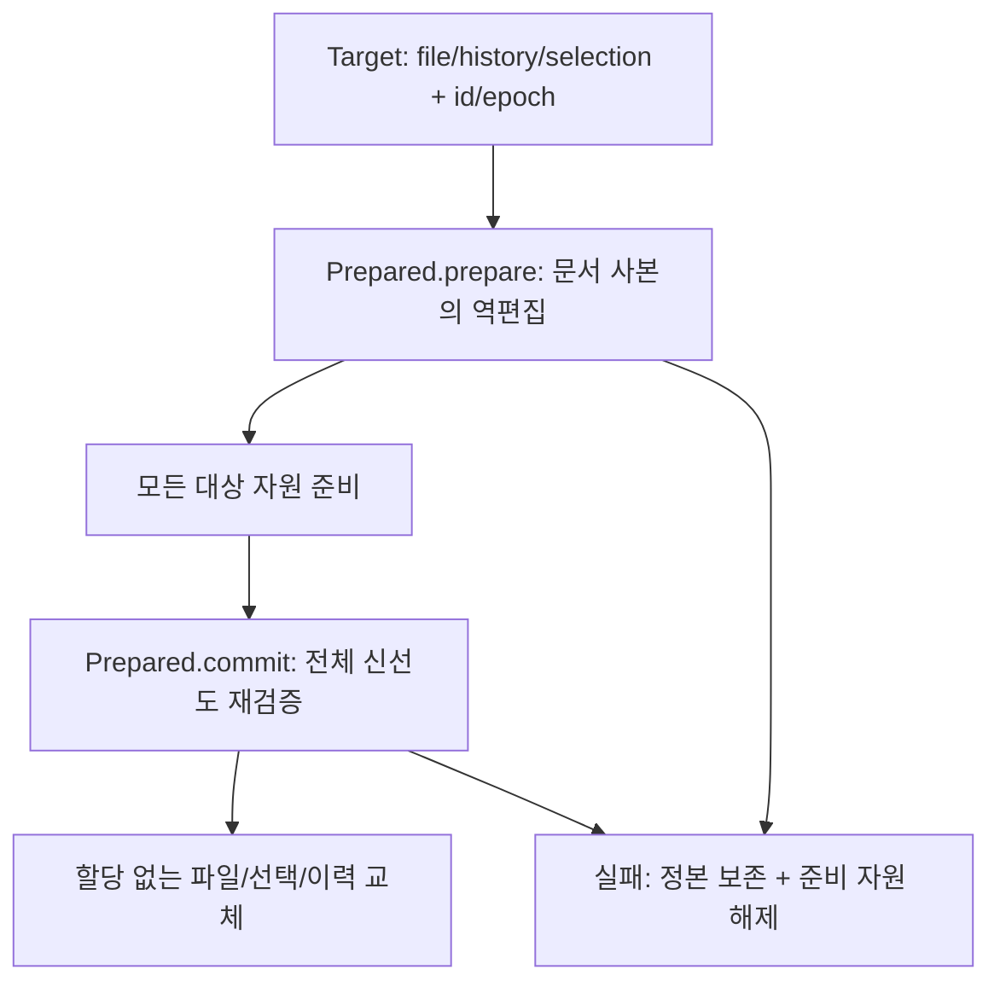

# 여러 문서 Undo/Redo — 사전 준비 경계

상태: 중립 사전 준비 코어와 항목 신원, 같은 창의 열린 문서 작업 조정자를 구현했다.
검색 배치 UI는 아직 연결하지 않았다. 사용자가 2026-10-10 문서 모델 기반 적용·연결된 Undo 방향과
두 번째 문서 준비 실패 시 첫 문서도 보존하는 선행 구현을 승인했다.

## 구현한 계약

- `history.Entry.id`는 문서 이력 안에서 단조 증가하며 undo↔redo 이동 때 보존된다.
  기존 macOS `pushUndo`가 발급하고 `stepHistory`의 mirror가 유지한다.
  strict 편집은 ID 고갈을 편집 전에 거절하여 본문·선택·기존 이력을 보존한다.
  `State.clear`는 ID 발급기를 되감지 않고 epoch를 올린다. 포화는 wrapping하지 않는다.
- `history/step.zig`의 `Target`은 실제 EditableFile·history·선택과 예상 항목 ID/epoch를 받는다.
  호출자는 문서 lease와 main actor 단독 소유를 준비부터 결산까지 유지해야 한다.
  포인터가 문서 ID나 lease를 대체하지 않는다.
  정본 사용이 끝난 준비 자원의 해제는 저장한 allocator로 수행하며 정본 포인터를 다시 읽지 않는다.
  allocator context 자체는 준비 자원 해제가 끝날 때까지 살아 있어야 한다. 이 API 자체는 파일 로드/registry retain을 하지 않는다.
- `Prepared.prepare`는 각 문서의 사본에서 실제 역편집과 반대 이력·선택을 준비한다.
  두 번째 문서에서 할당/검증이 실패해도 첫 문서의 정본·선택·Undo/Redo를 바꾸지 않는다.
- `commit`은 모든 대상의 read_only·revision·epoch·최상위 항목 ID·양쪽 깊이/반대 항목 ID·선택을
  재검증한다. allocator 신원과 파일 format도 준비 시점과 같아야 한다. 하나라도 낡으면 어떤 대상도 교체하지 않는다. 성공 뒤 교체에는 할당이 없다.
  성공 뒤 재호출을 거절하고, 미사용 준비 자원과 완료 자원의 소유권을 구분해 해제한다.
- 같은 file/history/선택 owner를 중복 target으로 받지 않는다. 첫 구현은 파일별 독립 항목 하나씩만
  처리하며 같은 group에 여러 항목이 있으면 `GroupedHistory`로 거절한다. 타이핑 묶음의 일부를 되돌리지 않는다.
- 연결 없는 일반 Undo의 할당 실패 정책은 바꾸지 않았다. 일반 Undo/Redo 진입은 아래 열린 문서
  조정자로 연결된 작업 여부를 먼저 판정하며, 연결 항목의 실패를 일반 경로로 우회하지 않는다.

## 비용과 완료 범위

현재 준비는 평탄 본문에서 문서 사본과 줄 인덱스를 만들므로 문서 크기에 비례한다.
모든 대상의 준비 사본을 결산까지 보관한다. 대형 프로젝트의 RSS/지연 최적화라고 주장하지 않는다.
UI 게시·공유 뷰 선택/접힘/스크롤 매핑·syntax/LSP 통지·IME·문서 닫기·저장은 이 코어가 처리하지 않는다.
제품 연결은 아래 열린 문서 작업 조정자가 처리하며 기존 단일 문서 Undo는 유지한다.

## 실행 검증

- `mise exec -- zig build test-editor-history-step`: 실제 두 문서의 Unicode/BOM/CRLF Undo→Redo,
  항목 ID 유지, B 준비 할당 실패별 A/B 본문·선택·양쪽 이력 보존, 준비 후 초기화/편집/선택/읽기 전용 변경,
  Redo 초기화, 중복 대상, ID/epoch 포화를 판정한다.
- B 준비는 성공 지점까지 모든 할당 실패를 주입한다. 준비 후 두 문서 allocator의 다음 할당을
  실패하도록 해도 결산이 성공하는지 확인한다. 앱 전체 OOM/게시 원자성의 보장은 아니다.
- 같은 step의 실제 AppSession 판정은 편집→Undo→Redo에서 항목 ID가 같고 초기화 후 새 ID/epoch가 증가하는지 확인한다.
- `python3 tools/test-editor-history-step-adversarial.py`: 격리된 코드에서 최종 재검증 제거·B 준비 전 A 게시·ID 재사용을
  각각 주입한다. 컴파일 뒤 실제 판정 실패와 정상/복원 대조 통과를 요구한다. 제품 체크아웃에 변이를 남기지 않는다.

실행 수치와 결과는 PR 본문에 기록한다. 코어 단계에는 제품 UI 변화가 없으며, 아래 조정자 단계에는 실제 Confirm 화면 캡처가 있다.

## 추가 검증에서 수정한 내용과 확인한 결과

- 실제 AppSession에서 `next_id`를 최댓값으로 만든 뒤 strict 편집을 호출하면 편집 뒤 기존 이력을
  비우고 성공으로 반환하는 것을 `HSTH2`로 재현했다. strict 편집 전에 고갈을 거절하도록 수정했다.
- 준비 자원 cleanup이 정본 allocator를 다시 읽던 의존을 제거했다. allocator를 독립 보관하며,
  Undo 결산 후와 준비 취소 후 정본을 해제한 뒤에도 준비 자원은 안전하게 해제한다(`HST6`).
- 준비 후 BOM format 변경이나 다른 준비의 먼저 완료된 Undo는 옛 준비를 거절한다(`HST7`).
  format 대조를 무력화한 컴파일 가능한 대조군도 이 판정에서 실패한다.
- 같은 history/selection owner, 낡은 ID/epoch, 유효하지 않은 primary는 A 준비 뒤 B에서 거절해도
  A를 바꾸지 않는다(`HST8`). 묶인 source 항목과 개별 Redo 폐기도 전체 적용을 거절한다(`HST9`).
- 40회 Undo/Redo 왕복에 준비 취소를 끼워 원문·CRLF/Unicode·선택·항목 ID를 대조했다(`HST10`).
  다섯 관점은 도구의 `focused_reviews`와 별도 로그로 재현할 수 있다. 제품 UI 연결 검증은 아니다.

## 열린 문서 작업 조정자

상태: 같은 창의 이미 열린 로컬 문서에 대한 연결 편집과 제품 Undo/Redo 진입을 구현했다.
검색 배치 UI·닫힌 파일 로드·기존 WorkspaceEdit 경로 통합·다른 창 전체 게시 연결은 미착수다.
열린 모델의 배치 actor·자동 저장 API는 [배치 계획](editor-project-replace-batch.md)이 소유한다.

`app_session/editor/history.zig::apply`는 서로 다른 정본을 받는 내부 API다.
`applyDocuments`는 변경 없는 대상을 뺀 뒤 한 문서만 남는 경우도 같은 준비 경로를 사용하고,
한 문서에는 여러 문서 연결 기록을 만들지 않는다. 임의 파일 검색 결과를
이 API에 바로 넘기지 않는다. 호출자가 열린 Term과 변경 delta를 제공하고, main actor가 사건 하나
안에서 모델·뷰·연결 기록을 준비한 뒤 결산한다. 파일 경로가 같아도 독립 문서는 별개 대상이다.
중복 정본·빈 변경·최종 본문이 같은 변경·read_only·IME 대기·신원 고갈은 전체 요청을 거절한다.
배치 호출자는 변경 없는 문서를 먼저 제외해야 한다. 이 API는 파일을 저장하지 않는다.

- `history/forward.zig`는 실제 문서 사본·inverse·선택·Undo 슬롯을 준비한다. 기존 항목 상한은
  `history.stack_limit`이 소유한다. 오래된 Undo와 Redo는 모든 준비와 재검증에 성공한 결산에서만 폐기한다.
- `history/links.zig`는 registry handle의 slot/generation, history epoch, 안정적인 entry ID를
  작업 ID로 연결한다. 본문·경로·Term 포인터를 기록하지 않고 배열 압축 때 작업 ID도 바꾸지 않는다.
  문서 registry가 소유하며 workspace 직렬화·재시작 복원에 넣지 않는다.
- `shared_edit.zig::preparePublication`은 각 정본의 모든 같은 창 뷰에 줄 배열·선택·접힘 좌표를
  준비한다. 모든 정본을 교체한 뒤 **모든 뷰의 빌린 줄**을 먼저 게시하고 syntax/LSP 등의 통지를 보낸다.
  호출 뷰만 해당 이력의 선택을 복원하며, 다른 문서와 공유 뷰는 현재 커서·스크롤·접힘을 delta로 매핑한다.
  Undo/Redo로 복원하는 선택의 시각 goal과 열 선택 anchor는 초기화한다.
- 게시 전 할당 실패는 본문·revision·Undo/Redo·뷰 좌표를 보존한다. 게시 후 파생 캐시 갱신은 기존
  실패 정책을 따른다. 예를 들어 접힘 표시 재구성이 실패하면 펼친 표시로 갱신할 수 있다.
  모델 결산 성공을 그 이후 캐시 실패 때문에 되돌리지 않는다.

### Cmd+Z와 Redo

일반 `stepHistory`는 최상위 항목에 연결 작업이 있는지 먼저 확인한다. 관련 문서가 모두 해당
항목을 최상위로 가지고 있으면 기존 Confirm 컴포넌트로 **모든 문서 / 현재 문서 / 취소**를 묻는다.
확인 선택은 클릭·방향키·Enter/Esc로 받으며 글자 단축키는 사용하지 않는다.
입력기의 확정 문자열 속 Y/N/D 때문에 확인이 닫혀 나머지 입력이 본문으로 새는 것을 막는다.
전체를 선택하면 모든 문서의 역편집과 뷰 게시 자원을 먼저 준비한다. 취소는 아무것도 변경하지 않는다.
현재 문서를 선택하면 그 문서만 준비해 되돌리고 연결 metadata만 해제한다. 다른 문서의 Undo는 남는다.

관련 문서에 후속 편집이 있거나 연결 항목이 폐기·초기화됐거나 마지막 뷰가 닫히면, 현재 문서의
항목이 여전히 최상위인 경우 현재 문서만 분리해 수행하고 안내한다. 공유 뷰 하나를 닫아도 다른 뷰가
살아 있으면 연결을 유지한다. Redo 폐기 뒤에도 남은 문서의 Redo를 다른 문서에 강제로 적용하지 않는다.

확인창에는 작업 ID·호출 surface·방향만 보관한다. 선택 시 다시 문서/이력을 찾고 현재 포커스와
최상위 항목을 확인한다. 확인창을 연 뒤 포커스나 다른 문서 이력이 바뀌면 전체 선택은 거절한다.
그 요청에서 일부 문서를 먼저 바꾸거나, OOM/IME 실패를 일반 Undo 경로로 우회하지 않는다.
다시 Cmd+Z를 요청하면 그 시점의 분리 조건을 판정한다.

VS Code의 여러 모델 이력과 전체/현재/취소·상위 이력 변경 시 분리 방향을 참고한다. Maru의
닫힌 파일 로드·WorkspaceEdit·다른 창 연결과 VS Code의 모든 confirmation 재검증 세부 동작까지
같다고 주장하지 않는다. 문서 참조는 registry, 연결 기록은 그 registry, 제품 입력/게시 책임은 host에 둔다.

### 실행 게이트와 남은 경계

- `mise exec -- zig build test-editor-linked-history`: `LHT1`~`LHT6` 중립 편집/연결 판정과
  `LHG1`~`LHG11` 실제 AppSession 입력/공유 뷰 판정이다. 상한 도달, 취소·현재 문서, 후속 편집,
  확인 중 포커스/이력 변경, 마지막 뷰 닫힘, IME 거절, 준비 fail-index, 다른 창 누락과 중복 대상,
  반복 왕복·공유 뷰 호출·시각 goal 초기화, 신원 고갈을 검사한다.
- `python3 tools/test-editor-linked-history-adversarial.py`: 격리된 실제 EditableFile에서
  최종 검증 생략·B 준비 전 A 결산·no-op 허용·상한 폐기 오류·예약 ID 검증 생략을 주입한다.
  컴파일된 실패와 정상·동등·복원 대조를 요구한다.
- `python3 tools/editor-linked-history-app/run.py`: 격리 앱의 내부 forward API로 작업을 만든 후
  실제 AppKit Cmd+Z/Shift+Cmd+Z·Esc·확인 버튼과 제품 Metal readback을 검사한다.
  물리 HID나 OS 한글 입력기 후보창 검증은 아니다. 디스크 원본은 변경하지 않는다.
- 다른 창의 view가 존재하면 준비한 게시 수와 registry의 view 수가 맞지 않아 전체 요청을 거절한다.
  다른 창의 뷰 배열을 갱신했다고 주장하지 않는다. 기존 WorkspaceEdit의 별도 되돌리기 명령은 유지한다.

추가 검증에서 상한 직전 `@min` 결과가 좁은 정수형으로 추론돼 슬롯 추가에서 overflow 나는 것을
재현하고 `usize`로 고쳤다. 실패 검증의 registry allocator는 전역 registry의 실제 backing allocator를
사용한다. session allocator로 바꿔 해제하는 잘못된 시험 조건과 제품의 할당 실패를 구분한다.

실제 AppKit Enter가 `imeEnd`의 defer보다 먼저 확인 선택을 전달하므로, 빈 키 트랜잭션에서도
`ime_active`가 참인 것을 제품 실행으로 재현했다. 조정자는 확인 선택에 한해 확정 텍스트·marked
변화·삭제·입력 실패·대기 확정이 전혀 없는 경우만 허용한다. 직접 편집 API의 IME 거절은 유지한다.
`LHG11`은 이 경로와 조합/확정 대기의 보존을 대조한다.
