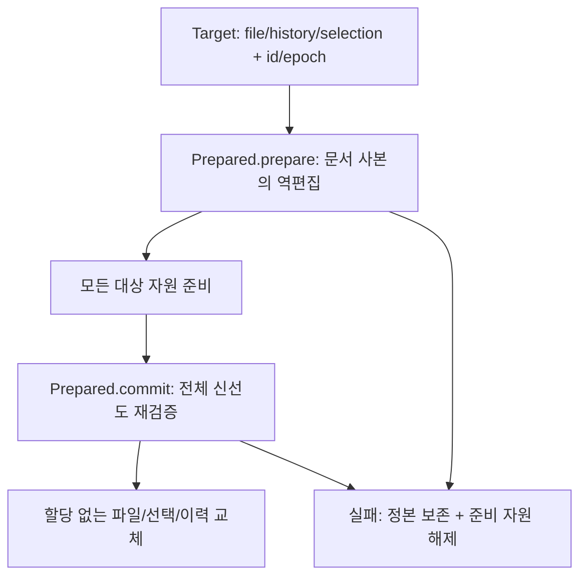

# 여러 문서 Undo/Redo — 사전 준비 경계

상태: 중립 사전 준비 코어와 기존 편집 경로의 항목 신원을 구현했다. 여러 문서 작업 조정자와
검색 UI는 아직 연결하지 않았다. 사용자가 2026-10-10 문서 모델 기반 적용·연결된 Undo 방향과
두 번째 문서 준비 실패 시 첫 문서도 보존하는 선행 구현을 승인했다.

## 구현한 계약

- `history.Entry.id`는 문서 이력 안에서 단조 증가하며 undo↔redo 이동 때 보존된다.
  기존 macOS `pushUndo`가 발급하고 `stepHistory`의 mirror가 유지한다.
  `State.clear`는 ID 발급기를 되감지 않고 epoch를 올린다. 포화는 wrapping하지 않는다.
- `history/step.zig`의 `Target`은 실제 EditableFile·history·선택과 예상 항목 ID/epoch를 받는다.
  호출자는 문서 lease와 main actor 단독 소유를 준비부터 결산까지 유지해야 한다.
  포인터가 문서 ID나 lease를 대체하지 않는다. 이 API 자체는 파일 로드/registry retain을 하지 않는다.
- `Prepared.prepare`는 각 문서의 사본에서 실제 역편집과 반대 이력·선택을 준비한다.
  두 번째 문서에서 할당/검증이 실패해도 첫 문서의 정본·선택·Undo/Redo를 바꾸지 않는다.
- `commit`은 모든 대상의 read_only·revision·epoch·최상위 항목 ID·양쪽 깊이/반대 항목 ID·선택을
  재검증한다. 하나라도 낡으면 어떤 대상도 교체하지 않는다. 성공 뒤 교체에는 할당이 없다.
  성공 뒤 재호출을 거절하고, 미사용 준비 자원과 완료 자원의 소유권을 구분해 해제한다.
- 같은 file/history/선택 owner를 중복 target으로 받지 않는다. 첫 구현은 파일별 독립 항목 하나씩만
  처리하며 같은 group에 여러 항목이 있으면 `GroupedHistory`로 거절한다. 타이핑 묶음의 일부를 되돌리지 않는다.
- 기존 일반 Undo의 할당 실패 정책은 바꾸지 않았다. 새로운 사전 준비 경계로 전체 Undo를 제공하기 전,
  일반 Undo/Redo 진입도 연결된 작업 여부를 조정자와 함께 판정해야 한다.

## 비용과 완료 범위

현재 준비는 평탄 본문에서 문서 사본과 줄 인덱스를 만들므로 문서 크기에 비례한다.
모든 대상의 준비 사본을 결산까지 보관한다. 대형 프로젝트의 RSS/지연 최적화라고 주장하지 않는다.
UI 게시·공유 뷰 선택/접힘/스크롤 매핑·syntax/LSP 통지·IME·문서 닫기·저장은 이 코어가 처리하지 않는다.
따라서 제품 Cmd+Z에 여러 문서 Undo를 제공했다고 표시하지 않는다. 기존 단일 문서 Undo는 유지한다.
작업 ID와 문서 ID로 연결된 Undo를 찾는 조정자, 전체/현재 파일 분리, Redo 폐기·이력 정산 통지는 후속이다.

## 실행 검증

- `mise exec -- zig build test-editor-history-step`: 실제 두 문서의 Unicode/BOM/CRLF Undo→Redo,
  항목 ID 유지, B 준비 할당 실패별 A/B 본문·선택·양쪽 이력 보존, 준비 후 초기화/편집/선택/읽기 전용 변경,
  Redo 초기화, 중복 대상, ID/epoch 포화를 판정한다.
- B 준비는 성공 지점까지 모든 할당 실패를 주입한다. 준비 후 두 문서 allocator의 다음 할당을
  실패하도록 해도 결산이 성공하는지 확인한다. 앱 전체 OOM/게시 원자성의 보장은 아니다.
- 같은 step의 실제 AppSession 판정은 편집→Undo→Redo에서 항목 ID가 같고 초기화 후 새 ID/epoch가 증가하는지 확인한다.
- `python3 tools/test-editor-history-step-adversarial.py`: 격리된 코드에서 최종 재검증 제거·B 준비 전 A 게시·ID 재사용을
  각각 주입한다. 컴파일 뒤 실제 판정 실패와 정상/복원 대조 통과를 요구한다. 제품 체크아웃에 변이를 남기지 않는다.

실행 수치와 결과는 PR 본문에 기록한다. 자동 캡처할 제품 UI 변화가 없는 코어 단계다.
