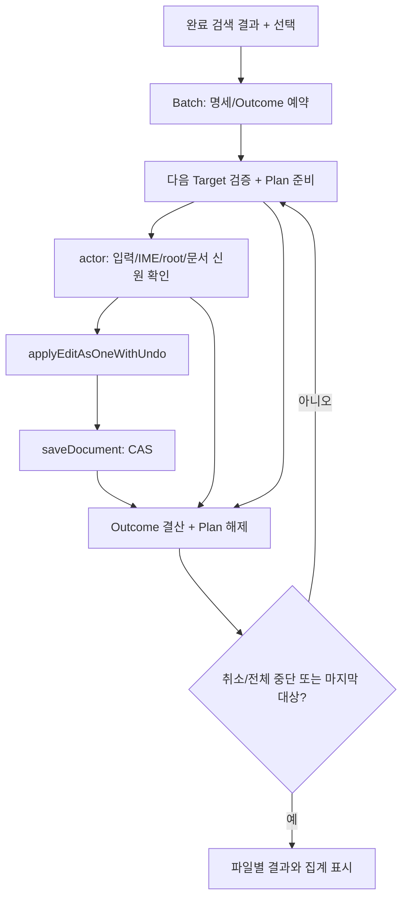

# 프로젝트 바꾸기 — 여러 파일 적용 S4c

상태: 제품 배치 구현 전. 문서 모델 기반 적용·여러 문서 Undo 연결 방향은 사용자 승인됐다.
아래 파일별 Undo 초기안은 이 방향으로 대체한다. 실패·취소 등 세부 UX 제안은 확정과 구분한다.
선행 [Undo/Redo 사전 준비와 열린 문서 조정자](editor-history-transaction.md)의 구현·미연결 범위는 별도 기록한다.
같은 창의 열린 문서 연결 편집과 Cmd+Z/Redo는 구현됐으며 검색 배치 UI와 자동 저장 연결은 후속이다.
[S4a/S4b](editor-project-replace-apply.md)는 단일 파일 적용까지 구현됐다.
이 문서는 여러 파일의 선택·부분 성공·취소·재시도·Undo에 대한 승인 가능한 구체안이다.

## 사용자 동작 제안

완료된 검색 결과에서 파일/일치를 선택하고, 선택 파일 수와 일치 수를 확인한 후 명시적으로 적용한다.
접힌 행이나 화면 밖 행도 선택 데이터로 판단한다. 화면에 보이는 행 인덱스를 지속 신원으로 쓰지 않는다.
부분·실패·취소된 검색 결과로 일괄 적용을 시작하지 않는다. 제외된 파일이 있으면 제외 수를 함께 표시한다.
적용 직전 선택 대상과 검색/치환 입력을 동결하고, 적용 중 중복 시작과 선택 변경은 막는다.
원문이 바뀐 대상을 조용히 다시 검색하여 다른 일치로 대신 적용하지 않는다.

권장 정책은 다음과 같으며 구현 전에 사용자 승인이 필요하다.

| 상황 | 제안한 동작 | 사용자가 보는 결과 |
|---|---|---|
| 파일 하나의 외부 변경·읽기 전용·파일별 한도 초과 | 해당 파일은 변경하지 않고 다음 파일 진행 | 적용 안 됨 + 원인 |
| OOM·문서 수 상한·결산 불변식 실패 | 현재 파일을 정확히 결산하고 배치 중단 | 완료 결과 유지 + 나머지 자원 부족/내부 오류로 중단 |
| 최종 변경 없음 | 편집·Undo 추가·자동 저장 생략 | 변경 없음 |
| 편집 성공·저장 성공 | 해당 파일 완료 | 적용됨·저장됨 |
| 편집 성공·저장 실패 | 편집·dirty 문서·Undo 유지, 다음 파일 진행 | 적용됨·저장 실패 + 문서 열기/저장 |
| 사용자 취소 | 현재 파일의 이미 시작한 동기 편집/저장은 결산하고 다음 파일 시작 금지 | 완료 결과 유지 + 나머지 취소 |
| 입력/옵션/root 변경 또는 IME 시작 | 다음 편집 시작 전에 배치 중단; 늦은 worker 완료는 쓰지 않음 | 완료 결과 유지 + 나머지 중단 |
| 재시도 | 적용 안 된 파일은 새 검색·선택·미리보기 확인 후 새 배치 | 이전 성공 파일은 다시 적용하지 않음 |
| 저장 실패 재시도 | 살아 있는 정확한 문서의 기존 Save/CAS만 실행 | 치환을 다시 실행하지 않음 |
| Undo | 여러 문서의 항목을 한 작업으로 연결; 전체/현재 파일 처리는 조정자에서 검증 후 분리 | 연결 설계 방향 승인, 제품 구현은 후속 |

기존 자동 저장 정책대로 열린 문서의 기존 미저장 편집도 함께 저장한다.
저장 재시도는 기록한 owner/slot/generation의 문서가 여전히 살아 있는지 확인한다.
닫혔거나 다른 문서로 교체됐으면 경로만으로 다시 열어 저장하지 않는다. 후속 편집이 있으면
기존 Save가 그 편집도 함께 저장한다는 사실을 안내하고, 기록된 이전 본문으로 복원하지 않는다.
저장 실패 시 여러 파일 자동 롤백은 하지 않는다. 여러 문서 Undo는 승인된 연결 구조로 확장한다.
후속 편집·닫기·독립 문서·외부 수정에 대한 전체/현재 파일 Undo 정책과 실행 검증은 조정자 단계에서 다룬다.

## 현재 코드와 재사용 경계

- `search/preview.zig`의 `State`는 한 대상과 한 `Plan`만 소유한다.
  `apply`와 `finishDiskApply`는 적용 뒤 focus를 이동하고 `dock.changed`로 검색 상태를 정산한다.
  따라서 현재 UI 함수의 반복 호출로 배치를 만들 수 없다.
- 단일 파일 경로는 문서 owner/slot/generation·revision·원문, 디스크 root/hash·점유·로드 원문을 검증한다.
  이 보호와 `applyEditAsOneWithUndo`의 편집 전 예약, `saveDocument`의 CAS를 재사용한다.
- 배치 적용 후 생긴 자신의 문서/검색 변경과 외부 입력·문서 변경을 구분해야 한다.
  전체 `owner.fingerprint` 불일치를 무시하는 방식은 금지한다. 남은 대상별 신원·revision/hash와
  입력/옵션/root 토큰을 검증하고, 배치가 직접 만든 변경만 명시적으로 결산한다.
- 공유 뷰는 같은 정본을 한 번만 적용한다. 같은 경로의 독립 문서나 model/disk 충돌은
  임의로 한쪽을 고르지 않는다. 해당 경로를 충돌로 표시하고 적용하지 않는다.
  중첩 root에서 같은 정규화 절대 경로가 선택되면 범위를 합쳐 한 번만 처리한다.
  서로 다른 경로가 같은 물리 파일인 경우의 안전 판정은 아직 구현 근거가 부족하다.
  symlink/hardlink를 지원 완료로 표시하지 않고, 아래 별칭 문턱을 해결하기 전 디스크 배치 연결을 완료하지 않는다.

## 제안 구조와 수명

새 `Batch`/`Target`/`Outcome` 이름은 설계용이며 현재 제품 타입이 아니다.
중립 계층은 선택 명세와 파일별 상태·집계를 소유하고, macOS actor는 문서·worker·저장 연결을 소유한다.

1. 완료한 검색 결과에서 선택된 대상의 신원·원문 증거·선택 범위·질의·대체 문자열을 소유한 명세를 만든다.
   결과 배열의 포인터나 미리보기 worker의 Input을 빌리지 않는다.
   다중 root는 각 파일의 실제 root capability를 보관한다. 파일 행+하위 일치의 중복 선택을 제거한다.
2. 결과 슬롯·경로·실패 표시용 기본 정보를 모든 대상에 대해 편집 전에 예약한다.
   예약 실패는 아직 어떤 문서도 바꾸지 않는다. 결과 게시 자체가 할당 실패해도 결산 상태를 잃지 않는다.
3. 한 대상씩 검증/Plan을 준비한다. 열린 문서는 정확한 정본의 현재 revision/원문을 확인하고,
   디스크는 기존 worker의 root/regular file/읽기 한도/hash 검증 뒤 로드 원문을 다시 확인한다.
   원문 증거가 다르면 거절한다. 선택 범위는 기존 Plan 계약으로 확장하며 다른 범위로 대체하지 않는다.
4. actor에서 입력·IME·root·대상 신원을 마지막으로 확인하고 기존 strict Undo 편집과 CAS 저장을 실행한다.
   적용 후 저장 전에 취소 상태를 이유로 저장을 생략하지 않는다. 기존 단일 파일 결산을 마친다.
5. 파일 결과를 기록한 뒤 Plan/worker 자원을 해제하고 다음 대상으로 진행한다.
   검색 결과 갱신은 배치 명세를 해제하지 않는다. 종료/취소는 명세와 detached worker 수명을 따로 정산한다.
6. 파일마다 활성 탭을 바꾸지 않는다. 결과에서 문서를 명시적으로 열 수 있게 한다.
   디스크 문서·Undo의 보존 책임은 기존 문서 registry를 따른다. 탭 생성 비용과 focus 정책은 제품 검증 대상이다.

검색 결과의 기존 예산을 재사용하고 모든 파일의 전문 Plan을 동시에 유지하지 않는다.
이 방식도 이미 열린 문서와 Undo의 누적 메모리를 없애지는 못한다. 새 전역 RSS 상한은 정하지 않는다.
파일 수·총 입력 bytes·피크 RSS·Plan 생존 수·main actor 최장 tick·취소 응답을 측정한 뒤
필요한 문서 수명/배치 예산을 결정한다. 현재 `pane.openFileTerm`은 창의 기존 파일 항목까지
합쳐 `dock_panel.max_entries = 256`에서 `TooManyEntries`를 반환한다. 따라서 디스크 파일을
무제한 연속 처리할 수 있다고 설명하지 않는다. 기존 항목을 자동으로 닫지 않으며, 한도에
도달하면 완료분을 유지하고 나머지를 중단한다. 상한을 없애거나 숨은 문서를 추가하는 결정은 별도다. 메모리 부족을 이유로 변경된 문서나 Undo를 자동 폐기하지 않는다.

## 설계 검토에서 발견한 위험과 대응

| 실패 시나리오 | 단순 구현의 문제 | 제안한 방어 / 실행 판정 |
|---|---|---|
| 첫 파일이 검색 세대를 변경 | 남은 Plan 해제 또는 전체 배치 오거절 | Batch 독립 소유; A 성공 뒤 B 정확 적용 |
| 저장 실패한 파일 재시도 | 이미 치환된 본문에 중복 치환 | 편집과 저장 상태 분리; Save만 실행, Undo 수 유지 |
| 대체 문자열에 검색어 포함 | 재검색 결과에 성공 파일이 다시 잡힘 | 새 배치에 성공 파일 자동 포함 금지; 사용자 새 선택 필요 |
| 결과 목록 갱신/행 접기 | 인덱스가 다른 파일을 가리킴 | target 신원 소유; 목록 재배열 뒤 sentinel 파일 불변 |
| 같은 문서의 공유 뷰 | 동일 범위 두 번 변경 | 정본 신원 중복 제거; 한 Undo |
| 같은 경로의 독립 문서 | 서로 다른 내용이 같은 디스크에 저장 | 경로 충돌 표시; 자동 선택 금지 |
| worker 완료 뒤 문서가 열림 | 디스크 작업이 새 문서를 대신 변경 | 전역 점유·로드 원문 재검증 |
| root 교체/원문 변경/IME 진입 | 이전 증거로 다음 파일 쓰기 | 다음 actor 편집 전 재검증; 미처리 파일 불변 |
| 결과 표시 할당 실패 | 적용 성공 사실을 잃고 재시도 | 결과 슬롯 선예약; OOM 주입 후 정확한 결산 |
| 취소와 저장이 겹침 | 저장을 생략하거나 완료를 취소로 잘못 표시 | 진행 중 파일 결산, 다음 파일 차단 |
| 여러 파일 로드·Undo 누적 | Plan 하나만으로 RSS 안전이라고 오판 | 문서/Undo 포함 실측; 파일 수 증가 곡선 보고 |
| 앱 종료/전원 손실 | 메모리 결과·Undo를 영속 보장한다고 오판 | 기존 저장/백업만 재사용; 배치 journal/영속 Undo 없음 |

이 표는 코드 대조에 따른 설계 검토다. S4c 실행 검증이 완료됐다는 뜻이 아니다.

## 추가 정책 검토에서 보완한 내용

다섯 관점으로 반례를 만들고 현재 단일 파일 코드와 대조했다. 아래는 설계 검토 결과이며
S4c 제품 실행 결과나 메모리/응답 시간 실측을 뜻하지 않는다.

### 부분 성공과 자원 실패

A 저장 성공 후 B의 Undo 준비가 OOM으로 실패했는데 C/D도 계속 로드하면 자원 압박과
빈 탭이 누적된다. 파일별 외부 충돌/읽기 전용은 계속하되, OOM·문서 항목 상한·결산 불변식
실패는 배치 전체 중단으로 분리했다. 저장 단계 OOM은 B가 이미 적용됐을 수 있으므로
B를 적용 안 됨으로 바꾸지 않는다. B의 dirty/Undo를 유지하고 다음 대상을 시작하지 않는다.
최종 Plan이 변경 없음이면 자동 저장도 생략한다. 기존 미저장 편집을 이 경로로 뜻밖에 저장하지 않는다.
종료 집계는 선택한 고유 대상 수와 저장됨/저장 실패/적용 안 됨/변경 없음/취소·중단 대상 수가 일치해야 한다.
준비 단계 전체 실패는 파일 처리 결과를 만들어낸 것으로 집계하지 않는다.

### 취소·조합과 입력 변경

검증 worker 대기 중 취소하면 그 파일은 적용하지 않는다. actor의 동기 편집/저장 호출 중에는
UI 취소 이벤트를 처리할 수 없으므로 즉시 중단을 약속하지 않는다. 실제 처리한 취소 시점 이후
새 편집을 시작하지 않으며, 먼저 끝난 파일을 취소로 소급 표시하지 않는다.
IME 시작은 텍스트를 확정/폐기하지 않고 배치를 중단한다. 취소/IME/입력 변경은 자동 재개하지 않는다.
root capability 교체는 전체 중단이고 특정 파일 원문 변경은 그 파일의 실패다.
사용자의 다른 문서 편집은 그 대상의 revision으로 판정한다. 배치 자신의 편집이 전역 fingerprint를
바꾼 것을 이유로 모든 남은 대상을 생략하거나 모든 외부 변경 검사를 끄면 안 된다.

### 재시도와 결과의 신선도

A의 치환 후에도 검색어가 남고 B는 저장 실패한 상황에서 ‘전체 재시도’를 누르면 A/B가
다시 치환될 수 있다. 한 번의 전체 재시도 명령을 제안하지 않는다. 적용 안 된 대상만 새 검색·선택·
미리보기 확인으로 넘기고, 저장 실패는 정확한 살아 있는 문서의 Save로 분리한다.
문서 닫기·Save As·후속 편집/Undo 이후에는 과거 결과가 현재 상태를 대표하지 않는다.
결과는 ‘이 배치 당시’ 결과로 보존하며 현재 revision·경로·dirty를 별도로 확인한다.
Save As 후에는 기존 경로로 다시 쓰지 않고 현재 문서의 Save 의미를 안내한다.
수동 저장으로 이미 clean이면 다시 치환하지 않는다. 검색 새로고침도 배치 결산표를 소거하지 않는다.
앱 재시작 뒤에는 이 결산표/배치 재시도 상태를 복원한다고 약속하지 않는다.

### Undo와 문서 수명

A 치환→사용자 타이핑→일반 Undo는 먼저 타이핑을 되돌린다. 따라서 결과에 ‘이 배치만 되돌리기’
버튼을 제공하지 않는다. 파일별 한 Undo 항목을 작업 ID로 연결하되 일반 이력 순서를 따른다.
전체/현재/취소와 후속 편집 뒤 분리의 열린 문서 조정자는 [연결 이력](editor-history-transaction.md)이 소유한다.
배치 UI가 이 내부 API를 호출하는 배선은 후속 단계다.
닫기/재시작/이력 정산 뒤에도 배치 Undo가 남는다는 보장은 없다. 성공 파일을 자동 닫지 않으며,
사용자의 명시적 닫기는 기존 미저장 확인·백업·문서 수명 규칙을 따른다.
`openNativeFileTermInActivePane`은 기존 문서 활성화와 탭 생성 경로를 쓰므로 focus 억제는
호출 뒤 원래 탭으로 되돌리기만 해서 해결됐다고 판정할 수 없다. 비활성 문서 로드 경계를
분리하고 실제 focus/selection/IME를 보존하는 제품 판정을 먼저 준비해야 한다.

### 대상 중복·별칭과 메모리

같은 파일을 중첩 root에서 두 번 선택하면 한 번 적용 뒤 두 번째가 충돌하는 불필요한 실패가 난다.
root별 결과 그룹과 쓰기 대상의 신원을 구분하고 같은 절대 경로의 선택 범위를 합친다.
같은 경로의 독립 문서는 선택하지 않은 열린 정본까지 점유 검사를 수행한다.
symlink/hardlink는 경로 문자열만으로 완전히 판정하지 못한다. 선택한 디스크 대상의 fd 기반
물리 신원 중복 검출과 검증→로드→저장 사이 재검증을 설계/실행한 뒤 채택 여부를 결정한다.
신원 확인 실패 시 조용히 서로 다른 파일로 취급하지 않는다. 이는 아직 해결해야 할 구현 문턱이다.
Plan 하나만 살아 있어도 문서/Undo가 누적된다. 현재 256개 항목 한도에 기존 파일이 포함되는
상황과 로드 성공 후 편집 준비 실패로 남는 항목까지 측정/집계에 포함해야 한다.
완료 파일의 Undo를 버리거나 자동 닫아서 상한/메모리를 회피하지 않는다.

## 후속 정책 검토에서 보완한 내용

아래 다섯 관점은 앞선 자원/재시도/Undo 검토에 더한 반례다. 코드와 계약을 대조한
설계 판정이며 새 S4c 실행 테스트를 돌렸다는 주장이 아니다.

### 처리 순서와 확인한 선택

검색 worker의 도착 순서나 표시 정렬이 바뀌면 취소·문서 수 한도까지 적용되는 파일도 달라진다.
확인 화면의 고유 대상 순서를 배치에 동결하고 같은 순서로 처리한다. 적용 중 목록 재정렬은
그 순서를 바꾸지 않는다. 제외 수와 변경 없음은 성공한 치환 수로 세지 않는다.
확인 화면은 선택한 파일 수·중복 제거한 일치 수·제외 수와 기존 미저장 내용도 저장된다는 사실을 보여야 한다.
전체 항목 예약이 실패하면 적용을 시작하지 않는다. 명세를 준비하는 동안 입력/root/선택이 바뀌면
이미 확인한 것으로 간주하지 않고 다시 확인한다. 예약 뒤에도 항목·메모리 한도는 매 대상 재검증한다.

### 중복 일치와 빈 정규식

파일 행과 하위 일치를 함께 선택하거나 중첩 root가 같은 일치를 반환하면 같은 삽입이 중복될 수 있다.
중복 제거는 동일 정본/원문 증거의 동일 시작·끝 일치에 한정한다. 서로 겹치는 범위를
하나의 더 큰 구간으로 합치지 않는다. 그러면 캡처와 원문 의미가 바뀐다.
서로 다른 원문 revision/hash 또는 캡처 증거가 같은 경로로 모이면 해당 대상은 충돌이다.
범위는 원문 순서로 정렬하고 빈 매치·같은 시작의 서로 다른 끝·인접 매치는 기존 Plan 계약으로 검증한다.
`search.preview.prepare`는 중복/역순/겹침을 `StaleMatch`로 거절하므로 배치가 이를 임의로 허용하지 않는다.
UTF-8/CRLF의 byte 위치를 유지하며 재검색된 새 범위로 자동 대체하지 않는다.

### 실패 원인의 분류와 재시도 가능 상태

현재 `applyEditAsOneWithUndo`는 실패를 bool로 돌려주므로 OOM과 그 밖의 준비 실패를
호출자가 구분할 수 없다. ‘OOM이면 전체 중단’ 정책을 구현하려면 typed 실패 근거를
준비 경계에서 전달해야 한다. `false`를 파일별 오류로 추측해 다음 파일을 계속 처리하지 않는다.
분류할 수 없는 편집 준비 실패는 전체 중단으로 보수적으로 결산한다. 파일별 계속 진행 대상은
확인된 외부 변경·읽기 전용·해당 파일의 크기/형식/읽기·저장 오류로 제한한다.
저장 중 자원 부족은 적용됨·저장 실패로 기록한 뒤 전체 중단하며, Handled 같은 기존 저장 반환을
성공으로 간주하지 않는다. 지원하지 않는 remote/untitled/웹/비교 문서는 선택 준비에서 거절한다.
경로 저장 충돌은 기존 CAS를 유지하고 배치 재시도가 `overwriteDocument`로 우회하지 않는다.

### 창 닫기·앱 종료와 늦은 완료

worker 대기 중 소유 창을 닫으면 배치를 취소하고 이후 완료 콜백이 그 창이나 재사용된 세션을
참조해 쓰지 못하게 한다. 배치 ID와 소유 세션의 수명을 확인하며 worker는 자기 사본만 정산한다.
앱 종료가 배치 완료를 기다리며 모든 파일 저장을 보장한다고 설명하지 않는다. 기존 종료/dirty 문서
확인·백업 경로를 유지한다. 저장 실패 문서를 명시적으로 버리고 닫은 뒤 배치가 다시 복구하지 않는다.
결산표가 없는 재시작에서 재시도 버튼을 복원하거나 성공 대상을 추측하지 않는다.
종료를 취소해 앱이 남아도 중단된 배치를 자동 재개하지 않는다.

### 여러 창의 동시 실행과 결과 게시

같은 정본이나 디스크 파일을 두 창의 배치가 동시에 선택하면 원문 검증·문서 생성 사이에 경쟁한다.
첫 구현은 앱 안에서 하나의 활성 배치만 허용하는 방식을 제안한다. 다른 창의 새 배치 시작은
기존 배치의 결과를 지우거나 암묵적으로 취소하지 않고 진행 중임을 알린다. 이는 승인 전 UX 제안이다.
일반 편집/Save/외부 프로그램은 계속 가능하므로 이 제한을 파일 잠금 또는 원자성 보장으로 해석하지 않는다.
종료/취소된 배치 A의 늦은 worker가 새 배치 B의 진행·결산을 갱신하지 않도록 batch ID로 거절한다.
결과 모델을 먼저 결산하고 다음 프레임에 게시한다. UI 게시 OOM/도크 닫기는 이미 결산한 결과나
문서/Undo를 해제하지 않는다. 종료 상태를 받은 뒤 과거 progress가 다시 적용 버튼을 활성화해서도 안 된다.

## 구현 순서와 검증 문턱

- 정책 승인 후 중립 상태/선택 명세: 독립 상태 오라클, 부분 성공/취소 집계, 중복 선택, 준비 OOM.
- actor 연결: 열린 문서 두 개부터 S4a strict edit/save 재사용; 자신의 첫 편집 이후에도 다음 대상 검증.
- 디스크 혼합 연결: S4b Check/로드 검증, 외부 변경·권한·저장 실패·worker 취소·root 교체.
- 도크 선택/진행/결과: 우측·하단·검색 pane·좁은 폭·배율에서 실제 버튼과 파일별 결과 캡처.
- 스트레스: 작은 다수 파일/큰 소수 파일/공유 뷰/긴 파일명, 기존 검색 예산의 경계;
  수정 전 단일 파일 경로와 비교해 시간·RSS·tick·취소 지연을 기록한다. 수치 없이 개선 완료라고 적지 않는다.
- 음성 대조: 대상 원문/점유/입력 검사, 성공 파일 재적용 방지, 결과 슬롯 예약을 무력화하면 판정 실패해야 한다.
- 실행 확인: A 저장 성공+B 충돌+C 저장 실패+D 취소를 한 배치에서 만들고 각 문서/디스크/Undo를 독립 대조한다.
  C 저장 재시도는 치환을 재실행하지 않으며, 재검색 확인 뒤 B만 새로 적용한다.

자동 검증 밖의 물리 IME·VoiceOver·모든 파일시스템 전원 손실은 구현 후에도 별도 한계로 보고한다.
기존 S4a/S4b 회귀·문서·경계·빌드와 PR CI를 통과해야 제품 완료로 표시한다.

## 레퍼런스와 대안

2026-10-10 [VS Code ReplaceService 공식 소스](https://github.com/microsoft/vscode/blob/main/src/vs/workbench/contrib/search/browser/replaceService.ts)의
`replace`는 edits를 bulk service로 적용한 뒤 각 대상 저장을 시도하고 settled 결과를 기다린다.
이 사실은 편집/저장 구분의 참고다. Maru의 파일별 계속 진행·취소·재시도·Undo 정책을 증명하지 않는다.
외부 코드 표현을 복사하지 않는다. 초기 검토 뒤 VS Code의 MultiModelEditStackElement와
UndoRedoService, Zed MultiBuffer의 항목 연결을 추가 확인했다. 연결 방향은 승인됐으며
세부 충돌 정책과 전체 bulk Undo 제품 호환성은 완료됐다고 주장하지 않는다.

- 전체 파일의 전문과 Undo를 먼저 준비: 편집 전 검사를 넓힐 수 있지만 메모리가 누적되고
  외부 변경으로 저장은 여전히 실패할 수 있다. 모든 디스크의 원자성을 얻지는 못한다.
- 파일별 순차 처리(제안): 기존 안전 경로를 재사용하고 Plan 메모리를 줄인다. 부분 성공과 파일별 Undo를 사용자에게 명확히 보여야 한다.
- 자동 롤백: 이미 저장한 파일의 외부 수정·후속 입력을 덮을 위험이 있어 별도 복구 프로토콜 없이 채택하지 않는다.

## 승인할 정책

파일별 오류 후 계속 진행하되 OOM·문서 수 상한·내부 오류는 중단, 완료 파일을 유지하는 취소, 실패 대상의 새 미리보기 후 재적용,
저장 실패 대상의 Save만 재시도, 연결된 Undo의 충돌/분리 정책, 적용 중 선택 고정과 파일별 focus 이동 억제를 제안한다.
확인 화면의 고정 처리 순서와 앱당 한 활성 배치도 추가 제안한다.
이는 구현된 동작이 아니다. S4 단일 파일 계획의 별도 승인 조건에 따라 사용자 확인 후 구현한다.
