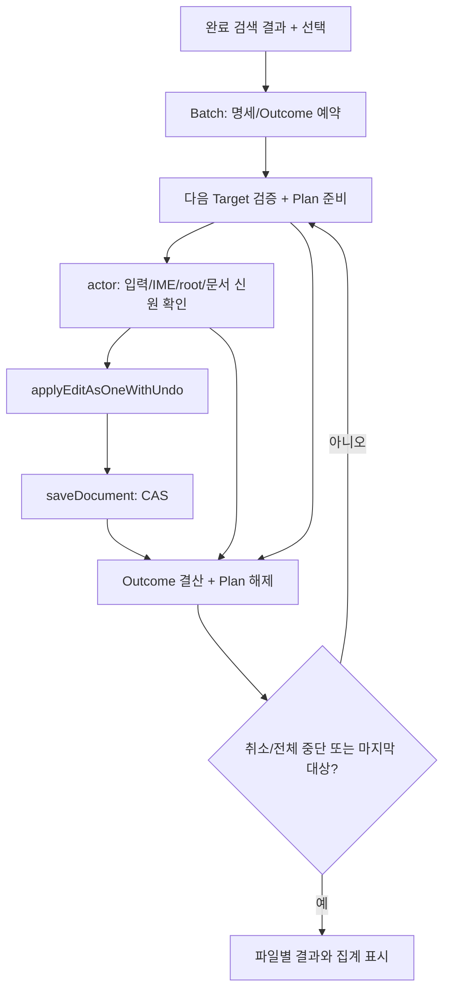

# 프로젝트 바꾸기 — 여러 파일 적용 S4c

상태: 설계 제안. 제품 구현·정책 승인은 아직 완료하지 않았다.
[S4a/S4b](editor-project-replace-apply.md)는 단일 파일 적용까지 구현됐다.
이 문서는 여러 파일의 선택·부분 성공·취소·재시도·Undo에 대한 승인 가능한 구체안이다.

## 사용자 동작 제안

완료된 검색 결과에서 파일/일치를 선택하고, 선택 파일 수와 일치 수를 확인한 후 명시적으로 적용한다.
접힌 행이나 화면 밖 행도 선택 데이터로 판단한다. 화면에 보이는 행 인덱스를 지속 신원으로 쓰지 않는다.
부분·실패·취소된 검색 결과로 일괄 적용을 시작하지 않는다. 제외된 파일이 있으면 제외 수를 함께 표시한다.
적용 직전 선택 대상과 검색/치환 입력을 동결하고, 적용 중 중복 시작과 선택 변경은 막는다.
원문이 바뀐 대상을 조용히 다시 검색하여 다른 일치로 대신 적용하지 않는다.

권장 정책은 다음과 같으며 구현 전에 사용자 승인이 필요하다.

| 상황 | 제안한 동작 | 사용자가 보는 결과 |
|---|---|---|
| 파일 하나의 외부 변경·읽기 전용·준비 실패 | 해당 파일은 변경하지 않고 다음 파일 진행 | 적용 안 됨 + 원인 |
| 편집 성공·저장 성공 | 해당 파일 완료 | 적용됨·저장됨 |
| 편집 성공·저장 실패 | 편집·dirty 문서·Undo 유지, 다음 파일 진행 | 적용됨·저장 실패 + 문서 열기/저장 |
| 사용자 취소 | 현재 파일의 이미 시작한 동기 편집/저장은 결산하고 다음 파일 시작 금지 | 완료 결과 유지 + 나머지 취소 |
| 입력/옵션/root 변경 또는 IME 시작 | 다음 편집 시작 전에 배치 중단; 늦은 worker 완료는 쓰지 않음 | 완료 결과 유지 + 나머지 중단 |
| 재시도 | 적용 안 된 파일은 새 검색·선택·미리보기 확인 후 새 배치 | 이전 성공 파일은 다시 적용하지 않음 |
| 저장 실패 재시도 | 살아 있는 정확한 문서의 기존 Save/CAS만 실행 | 치환을 다시 실행하지 않음 |
| Undo | 각 파일의 기존 한 Undo 사용; 이후 Save는 명시적으로 실행 | 다른 파일은 유지 |

기존 자동 저장 정책대로 열린 문서의 기존 미저장 편집도 함께 저장한다.
저장 재시도는 기록한 owner/slot/generation의 문서가 여전히 살아 있는지 확인한다.
닫혔거나 다른 문서로 교체됐으면 경로만으로 다시 열어 저장하지 않는다. 후속 편집이 있으면
기존 Save가 그 편집도 함께 저장한다는 사실을 안내하고, 기록된 이전 본문으로 복원하지 않는다.
여러 파일 전체의 자동 롤백과 한 번의 전역 Undo는 이 제안에 포함하지 않는다.
전역 Undo를 원하면 후속 편집·닫기·독립 문서·외부 수정과 충돌하는 별도 이력 설계가 필요하다.

## 현재 코드와 재사용 경계

- `search/preview.zig`의 `State`는 한 대상과 한 `Plan`만 소유한다.
  `apply`와 `finishDiskApply`는 적용 뒤 focus를 이동하고 `dock.changed`로 검색 상태를 정산한다.
  따라서 현재 UI 함수의 반복 호출로 배치를 만들 수 없다.
- 단일 파일 경로는 문서 owner/slot/generation·revision·원문, 디스크 root/hash·점유·로드 원문을 검증한다.
  이 보호와 `applyEditAsOneWithUndo`의 편집 전 예약, `saveDocument`의 CAS를 재사용한다.
- 배치 적용 후 생긴 자신의 문서/검색 변경과 외부 입력·문서 변경을 구분해야 한다.
  전체 `owner.fingerprint` 불일치를 무시하는 방식은 금지한다. 남은 대상별 신원·revision/hash와
  입력/옵션/root 토큰을 검증하고, 배치가 직접 만든 변경만 명시적으로 결산한다.
- 공유 뷰는 같은 정본을 한 번만 적용한다. 같은 경로의 독립 문서나 model/disk 충돌은
  임의로 한쪽을 고르지 않는다. 해당 경로를 충돌로 표시하고 적용하지 않는다.
  논리 경로 밖의 symlink/hardlink 별칭에 새로운 동일 문서 판정을 도입하지 않는다.

## 제안 구조와 수명

새 `Batch`/`Target`/`Outcome` 이름은 설계용이며 현재 제품 타입이 아니다.
중립 계층은 선택 명세와 파일별 상태·집계를 소유하고, macOS actor는 문서·worker·저장 연결을 소유한다.

1. 완료한 검색 결과에서 선택된 대상의 신원·원문 증거·선택 범위·질의·대체 문자열을 소유한 명세를 만든다.
   결과 배열의 포인터나 미리보기 worker의 Input을 빌리지 않는다.
   다중 root는 각 파일의 실제 root capability를 보관한다. 파일 행+하위 일치의 중복 선택을 제거한다.
2. 결과 슬롯·경로·실패 표시용 기본 정보를 모든 대상에 대해 편집 전에 예약한다.
   예약 실패는 아직 어떤 문서도 바꾸지 않는다. 결과 게시 자체가 할당 실패해도 결산 상태를 잃지 않는다.
3. 한 대상씩 검증/Plan을 준비한다. 열린 문서는 정확한 정본의 현재 revision/원문을 확인하고,
   디스크는 기존 worker의 root/regular file/읽기 한도/hash 검증 뒤 로드 원문을 다시 확인한다.
   원문 증거가 다르면 거절한다. 선택 범위는 기존 Plan 계약으로 확장하며 다른 범위로 대체하지 않는다.
4. actor에서 입력·IME·root·대상 신원을 마지막으로 확인하고 기존 strict Undo 편집과 CAS 저장을 실행한다.
   적용 후 저장 전에 취소 상태를 이유로 저장을 생략하지 않는다. 기존 단일 파일 결산을 마친다.
5. 파일 결과를 기록한 뒤 Plan/worker 자원을 해제하고 다음 대상으로 진행한다.
   검색 결과 갱신은 배치 명세를 해제하지 않는다. 종료/취소는 명세와 detached worker 수명을 따로 정산한다.
6. 파일마다 활성 탭을 바꾸지 않는다. 결과에서 문서를 명시적으로 열 수 있게 한다.
   디스크 문서·Undo의 보존 책임은 기존 문서 registry를 따른다. 탭 생성 비용과 focus 정책은 제품 검증 대상이다.

검색 결과의 기존 예산을 재사용하고 모든 파일의 전문 Plan을 동시에 유지하지 않는다.
이 방식도 이미 열린 문서와 Undo의 누적 메모리를 없애지는 못한다. 새 전역 RSS 상한은 정하지 않는다.
파일 수·총 입력 bytes·피크 RSS·Plan 생존 수·main actor 최장 tick·취소 응답을 측정한 뒤
필요한 문서 수명/배치 예산을 결정한다. 메모리 부족을 이유로 변경된 문서나 Undo를 자동 폐기하지 않는다.

## 설계 검토에서 발견한 위험과 대응

| 실패 시나리오 | 단순 구현의 문제 | 제안한 방어 / 실행 판정 |
|---|---|---|
| 첫 파일이 검색 세대를 변경 | 남은 Plan 해제 또는 전체 배치 오거절 | Batch 독립 소유; A 성공 뒤 B 정확 적용 |
| 저장 실패한 파일 재시도 | 이미 치환된 본문에 중복 치환 | 편집과 저장 상태 분리; Save만 실행, Undo 수 유지 |
| 대체 문자열에 검색어 포함 | 재검색 결과에 성공 파일이 다시 잡힘 | 새 배치에 성공 파일 자동 포함 금지; 사용자 새 선택 필요 |
| 결과 목록 갱신/행 접기 | 인덱스가 다른 파일을 가리킴 | target 신원 소유; 목록 재배열 뒤 sentinel 파일 불변 |
| 같은 문서의 공유 뷰 | 동일 범위 두 번 변경 | 정본 신원 중복 제거; 한 Undo |
| 같은 경로의 독립 문서 | 서로 다른 내용이 같은 디스크에 저장 | 경로 충돌 표시; 자동 선택 금지 |
| worker 완료 뒤 문서가 열림 | 디스크 작업이 새 문서를 대신 변경 | 전역 점유·로드 원문 재검증 |
| root 교체/원문 변경/IME 진입 | 이전 증거로 다음 파일 쓰기 | 다음 actor 편집 전 재검증; 미처리 파일 불변 |
| 결과 표시 할당 실패 | 적용 성공 사실을 잃고 재시도 | 결과 슬롯 선예약; OOM 주입 후 정확한 결산 |
| 취소와 저장이 겹침 | 저장을 생략하거나 완료를 취소로 잘못 표시 | 진행 중 파일 결산, 다음 파일 차단 |
| 여러 파일 로드·Undo 누적 | Plan 하나만으로 RSS 안전이라고 오판 | 문서/Undo 포함 실측; 파일 수 증가 곡선 보고 |
| 앱 종료/전원 손실 | 메모리 결과·Undo를 영속 보장한다고 오판 | 기존 저장/백업만 재사용; 배치 journal/영속 Undo 없음 |

이 표는 코드 대조에 따른 설계 검토다. S4c 실행 검증이 완료됐다는 뜻이 아니다.

## 구현 순서와 검증 문턱

- 정책 승인 후 중립 상태/선택 명세: 독립 상태 오라클, 부분 성공/취소 집계, 중복 선택, 준비 OOM.
- actor 연결: 열린 문서 두 개부터 S4a strict edit/save 재사용; 자신의 첫 편집 이후에도 다음 대상 검증.
- 디스크 혼합 연결: S4b Check/로드 검증, 외부 변경·권한·저장 실패·worker 취소·root 교체.
- 도크 선택/진행/결과: 우측·하단·검색 pane·좁은 폭·배율에서 실제 버튼과 파일별 결과 캡처.
- 스트레스: 작은 다수 파일/큰 소수 파일/공유 뷰/긴 파일명, 기존 검색 예산의 경계;
  수정 전 단일 파일 경로와 비교해 시간·RSS·tick·취소 지연을 기록한다. 수치 없이 개선 완료라고 적지 않는다.
- 음성 대조: 대상 원문/점유/입력 검사, 성공 파일 재적용 방지, 결과 슬롯 예약을 무력화하면 판정 실패해야 한다.
- 실행 확인: A 저장 성공+B 충돌+C 저장 실패+D 취소를 한 배치에서 만들고 각 문서/디스크/Undo를 독립 대조한다.
  C 저장 재시도는 치환을 재실행하지 않으며, 재검색 확인 뒤 B만 새로 적용한다.

자동 검증 밖의 물리 IME·VoiceOver·모든 파일시스템 전원 손실은 구현 후에도 별도 한계로 보고한다.
기존 S4a/S4b 회귀·문서·경계·빌드와 PR CI를 통과해야 제품 완료로 표시한다.

## 레퍼런스와 대안

2026-10-10 [VS Code ReplaceService 공식 소스](https://github.com/microsoft/vscode/blob/main/src/vs/workbench/contrib/search/browser/replaceService.ts)의
`replace`는 edits를 bulk service로 적용한 뒤 각 대상 저장을 시도하고 settled 결과를 기다린다.
이 사실은 편집/저장 구분의 참고다. Maru의 파일별 계속 진행·취소·재시도·Undo 정책을 증명하지 않는다.
외부 코드 표현을 복사하지 않는다. VS Code 전체 bulk Undo 계약은 이 검토에서 확인하지 않았다.

- 전체 파일의 전문과 Undo를 먼저 준비: 편집 전 검사를 넓힐 수 있지만 메모리가 누적되고
  외부 변경으로 저장은 여전히 실패할 수 있다. 모든 디스크의 원자성을 얻지는 못한다.
- 파일별 순차 처리(제안): 기존 안전 경로를 재사용하고 Plan 메모리를 줄인다. 부분 성공과 파일별 Undo를 사용자에게 명확히 보여야 한다.
- 자동 롤백: 이미 저장한 파일의 외부 수정·후속 입력을 덮을 위험이 있어 별도 복구 프로토콜 없이 채택하지 않는다.

## 승인할 정책

파일별 실패 후 계속 진행, 완료 파일을 유지하는 취소, 실패 대상의 새 미리보기 후 재적용,
저장 실패 대상의 Save만 재시도, 파일별 Undo, 적용 중 선택 고정과 파일별 focus 이동 억제를 제안한다.
이는 구현된 동작이 아니다. S4 단일 파일 계획의 별도 승인 조건에 따라 사용자 확인 후 구현한다.
