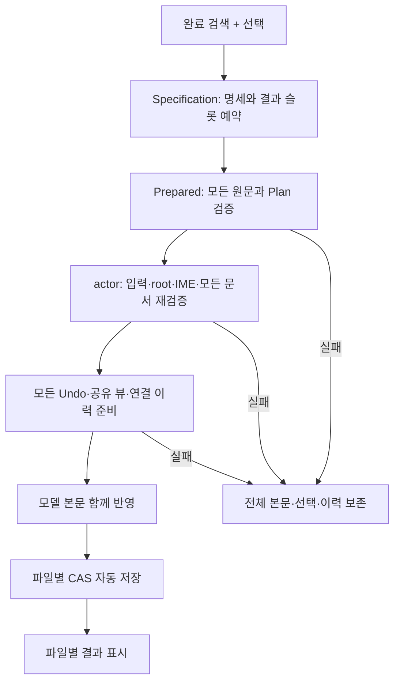

# 프로젝트 바꾸기 — 여러 파일 적용 S4c

상태: 중립 선택 명세와 전체 Plan 준비, 열린 모델 actor·파일별 CAS 자동 저장, 불변 snapshot worker API를 구현했다. 검색 UI의 snapshot 수집·worker 시작·결과 적용 연결과 닫힌 파일 로드는 미착수다.
같은 창의 열린 문서 연결 편집과 Cmd+Z/Redo는 [연결 이력 계획](editor-history-transaction.md)이 소유한다.
[S4a/S4b](editor-project-replace-apply.md)는 단일 파일 적용까지 구현됐다.

## 승인된 편집·저장 정책

2026-10-10 사용자 승인: **전체 준비 후 함께 반영**한다. 기존 파일별 순차 편집 초안을 대체한다.
모든 대상의 신원·원문·범위를 검증하고 Plan·Undo·공유 뷰 게시·연결 이력을 준비한 뒤
모델 본문을 함께 반영한다. 편집 전 한 대상이라도 충돌하거나 준비가 실패하면 모든 본문·선택·
기존 이력을 보존한다. 충돌 파일을 제외하고 나머지만 조용히 적용하지 않는다.

모델 편집이 성공한 뒤 파일별로 기존 `saveDocument`의 CAS 저장을 시도한다.
저장 실패는 변경된 문서·dirty·Undo를 유지하고 해당 파일을 ‘적용됨·저장 실패’로 표시한다.
저장 실패가 이미 반영한 모델 편집이나 다른 파일의 저장을 자동 롤백하지 않는다.
여러 파일의 디스크 저장은 원자적이지 않다. 앱 종료·전원 손실 이후 배치 결과나 Undo를 영속 보장하지 않는다.

| 상황 | 동작 |
|---|---|
| 불완전·실패·취소된 검색 | 배치를 시작하지 않음 |
| 편집 전 원문/신원 충돌·읽기 전용·조합·자원 실패 | 전체 본문·선택·기존 이력 보존 |
| 준비 중 취소·입력/옵션/root 변경·IME 시작 | 늦은 준비 결과 폐기, 어떤 대상도 편집하지 않음 |
| 최종 변경 없음 | 해당 대상의 편집·Undo 추가·자동 저장 생략 |
| 전체 모델 편집 성공 | 파일별 자동 저장 시도 |
| 저장 성공 | 적용됨·저장됨 |
| 저장 실패 | 적용됨·저장 실패; 살아 있는 문서와 Undo 유지 |
| 저장 실패 재시도 | 정확한 살아 있는 문서의 Save만 실행; 치환 재실행 금지 |
| Undo | 기존 연결 이력의 전체/현재/취소와 이력 순서 적용 |

자동 저장은 열린 문서의 기존 미저장 편집도 함께 저장한다는 기존 승인 정책을 따른다.
동기 commit/저장 중 UI 이벤트를 즉시 처리한다고 약속하지 않는다. commit 전 취소와
commit 뒤 저장 실패를 구분하며, 반영한 편집을 취소됐다고 소급 표시하지 않는다.
파일마다 활성 탭을 바꾸지 않는다. 결과에서 문서를 명시적으로 열 수 있도록 한다.

## 중립 선택 명세 — 구현

`session/editor/search/batch.zig::Specification.capture`는 완료한 검색에서 고른 대상의
정규화 절대 경로·root index·source 문서 신원/revision·범위와 질의·치환·옵션을 독립 소유한다.
include/exclude glob 배열과 각 문자열도 복사한다. 검색 결과나 입력의 갱신·해제가
동결한 명세를 바꾸지 않는다. 파일별 `outcome/save_failure` 슬롯을 편집 전에 예약한다.

동일 경로·동일 source의 선택을 합치고 정확히 같은 범위만 중복 제거한다.
대상은 최초 선택 순서, 범위는 원문 순서다. 접힘/스크롤과 표시 행 인덱스에 의존하지 않는다.
같은 경로의 다른 문서/revision/model-disk source, 같은 문서의 다른 경로,
조합 중 source, 역방향/겹치는 범위는 거절한다. 겹침을 큰 범위로 확장하지 않는다.
경로 정규화와 물리 파일 별칭 판정은 host 책임이다.

## 전체 Plan 준비 — 구현

`session/editor/search/batch_plan.zig::Prepared.prepare`는 동결된 명세와 신원 붙은 원문을 받는다.
개수·순서·경로·source가 모두 맞는지, 총 입력 크기가 호출자가 정한 예산 안인지 먼저 검사한다.
각 파일은 기존 `preview.prepare`로 UTF-8 byte 경계·원문 매치·PCRE2 캡처·치환을 다시 검증한다.
모든 Plan과 편집 배열을 함께 소유한다. 마지막 대상의 충돌·할당 실패·취소도 앞 대상의 준비
자원을 해제하고 오류를 반환한다. 준비 과정은 본문이나 명세의 처리 결과를 변경하지 않는다.

편집 문자열은 Plan.after를 빌리므로 최종 actor 반영까지 Plan과 함께 보존한다.
내용이 같아 실제 편집이 없는 대상은 `effective`에 포함하지 않는다. 총 입력 예산과 파일별
출력 예산은 별개이며 새 전역 RSS 상한을 추가하지 않는다. 모든 Plan이 동시에 살아 있으므로
입력 bytes 한도만으로 Plan·diff·Undo의 피크 메모리까지 보장한다고 설명하지 않는다.

## 열린 모델 actor·자동 저장 API — 구현

`platform/macos/app_session/editor/search/batch.zig`의 `Ticket.capture`는 완료한 검색의
요청 신원·입력/옵션·root/model fingerprint를 준비 시작 시점에 고정한다. 준비 완료 뒤
새 ticket을 발급해 오래된 Plan을 현재 입력에 맞는 것처럼 승격하지 않는다.
`apply`는 호출자가 독립 소유한 Specification/Prepared/Ticket을 받으며 검색 UI가 편집
통지로 폐기돼도 그 명세·Plan·결과 슬롯이 살아 있어야 한다.

actor는 모든 대상의 registry 문서 신원·현재 경로·revision·전문·읽기 전용·공유 뷰 조합과
선택 밖 registry의 동일 경로 점유를 검사한다. root/요청/입력/IME도 마지막으로 재검증한다.
watcher에 아직 나타나지 않은 root 교체는 실제 디렉터리의 device/inode를 열어 cached capability와
대조한다. `search/owner.zig::validateRoots`를 단일 파일 model 적용도 재사용한다.
같은 내용의 새 디렉터리로 교체해도 준비된 모델 편집과 디스크를 그대로 보존한다.
하나라도 실패하면 본문과 결과의 pending을 보존한다. disk source는 열린 문서로 대신
적용하지 않고 거절한다. 실제 편집 배열 개수와 준비 집계도 확인한다.

유효 편집만 `linked_history.applyDocuments`로 함께 반영한다. 유효 편집이 하나이면 같은
준비 경로를 사용하고 여러 문서 연결 기록은 만들지 않는다. 전부 변경 없음이면 편집·Undo·
저장을 생략한다. 커서를 놓은 적 없는 문서의 일반 Undo도 준비 중에만 임시 0번 커서를
사용하며, 초기 커서 할당 실패는 본문·커서·양쪽 이력을 보존한다.

전체 모델 commit 후 결과 슬롯에 적용 여부를 기록하고 파일별 `saveDocument`를 호출한다.
저장 성공/실패를 별도로 집계하며 첫 저장 실패 뒤에도 다음 파일 저장을 시도한다.
저장 시점에 발견한 디스크 외부 변경은 CAS 실패로 결산한다. watcher/model 검증에 나타나지
않은 디스크 변경을 모델 충돌로 미리 감지한다고 주장하지 않는다. 저장 실패도 해당 문서의
새 본문·dirty·Undo를 유지하며 이 API로 치환을 다시 적용하는 것은 거절한다.

Term을 활성화하거나 선택 없는 뷰에 편집 전에 커서를 게시하지 않는다. 공유 뷰 게시와
커서 매핑은 기존 Publication을 재사용한다. 작업 결과와 Undo는 메모리 수명이며 영속하지 않는다.

## 불변 snapshot worker API — 구현

`platform/macos/app_session/editor/search/batch/worker.zig::Job.start`는 동결 명세,
각 대상의 source 신원과 불변 buffer snapshot, 준비 시작 Ticket을 받는다.
신원·개수·조합·총 입력/파일별 크기를 검사하고 성공할 때만 명세와 snapshot 배열을 소유한다.
실패한 시작의 자원은 caller가 해제한다. worker는 Term/AppSession 포인터를 받지 않으며
원래 Buffer가 종료돼도 snapshot에서 원문을 읽어 기존 `Prepared.prepare`로 전체 Plan을 만든다.
이 API만으로 현재 문서의 신원이 검증됐다고 판단하지 않는다. actor의 최종 재검증은 그대로다.

caller 참조와 detached thread 참조는 별개다. caller 종료는 취소하고 자기 참조만 해제한다.
worker 완료는 snapshot을 해제한 뒤 release/acquire로 게시한다. `Job.take`는 완료한
명세·Plan·원래 Ticket을 한 번만 옮기며, 완료 뒤 취소해도 준비 결과를 반환하지 않는다.
`Ready`는 UI와 별개로 actor 호출과 저장 정산이 끝날 때까지 caller가 보존해야 한다.
마지막 파일의 준비 실패는 앞 Plan까지 폐기하며 모든 결과 슬롯은 pending 그대로다.

worker와 snapshot의 allocator는 스레드 안전해야 하고 마지막 참조 해제까지 살아 있어야 한다.
worker 카운터는 마지막 자원 해제가 끝난 뒤 감소하며 기존 미리보기의 종료 대기 집계에 포함한다.
기존 bounded shutdown 정책을 무한 대기로 바꾸지 않는다. UI의 job 보관·취소 연결은 후속이다.
이 단계는 제품 버튼이나 검색 UI에서 worker를 호출하지 않는다.

## 후속 제품 연결 — 미착수

- 완료 검색의 선택을 root capability로 해석하고 신원 있는 모델 snapshot을 worker에 전달한다.
  worker는 Term 포인터를 빌리지 않는다. 취소/종료와 detached worker 완료 수명을 따로 정산한다.
- worker가 준비한 명세/Plan과 준비 시작 ticket을 독립 소유해 현재 actor API에 연결한다.
  commit 직전 입력·옵션·root와 모든 문서 revision/원문/조합을 재검증한다.
  준비 성공만으로 실제 문서 충돌이 해결됐다고 판단하지 않는다.
- 연결 조정자는 유효 편집이 둘 이상일 때 사용한다. 유효 편집 하나와 전부 변경 없음도 별도로 검증한다.
  이 경우의 열린 모델 API는 구현됐다. 기존 단일 파일 UI apply 반복 호출은 focus 이동·검색 상태 폐기 때문에 사용하지 않는다.
- 자기 commit이 검색 fingerprint를 바꾸거나 알림이 검색 상태를 해제해도 적용 중 명세/Plan을 잃지 않는다.
  원래 fingerprint를 무시해서 외부 변경 검사까지 끄지 않는다.
- 같은 경로의 독립 문서는 선택 밖 열린 문서까지 점유 검사한다. 디스크 파일은 검증→로드→저장
  사이의 물리 신원 재검증과 symlink/hardlink 별칭 검출을 해결해야 한다.
  명세에 disk source를 보관하는 것은 디스크 배치 지원 완료가 아니다.
- 현재 파일 항목 한도와 기존 문서를 함께 계산한다. 한도 실패는 편집 전에 전체 거절하며,
  이를 피하려고 기존 문서/Undo를 자동 폐기하지 않는다. 비활성 로드와 준비 실패 후 문서 수명도 검증한다.
- 결과는 ‘이 배치 당시’ 기록이다. 저장 실패 재시도는 owner/slot/generation을 확인하며
  문서가 닫힌 뒤 경로만으로 다시 열어 저장하지 않는다. Save As·후속 편집·수동 저장은 현재 문서 기준으로 처리한다.

## 실행 검증과 남은 문턱

- `mise exec -- zig build test-editor-project-replace-batch` (Debug/ReleaseFast):
  선택 소유·중복/root·충돌·완료/조합/범위·빈 매치와 전체 Plan 준비·마지막 파일 불일치·
  대상 순서/신원·총량·취소·변경 없음·모든 준비 할당 실패를 검사한다.
- `python3 tools/test-editor-replace-batch-adversarial.py`: glob 유실·중복 유지·문서 충돌 허용·
  범위 겹침 허용·불완전 결과 허용의 컴파일 가능한 결함을 검출한다. 정상·동등·복원 대조도 검사한다. 준비 단계의 source 검사·총량·취소·변경 없음 집계·
  마지막 Plan 보존을 무력화한 결함도 별도 격리 복사본에서 검사한다.
- 수명 검토에서 옵션의 얕은 복사가 남긴 glob 포인터를 발견해 배열과 문자열을 소유하도록 수정했다.
- `mise exec -- zig build test-editor-project-replace-batch-apply` (Debug/ReleaseFast): 실제
  AppSession의 두 문서 반영·저장·연결 Undo·focus/공유 뷰, 마지막 원문 충돌·입력/root/IME,
  저장 첫/마지막 실패·중복 적용 거절, no-op/단일 편집, 읽기 전용·선택 밖 점유·닫기·disk 거절,
  모든 actor 할당 실패와 선택 없는 일반 Undo의 초기 커서 OOM, 같은 본문의 실제 root 교체를 검사한다.
- `python3 tools/test-editor-replace-batch-apply-adversarial.py`: 격리 source에 원문 검증 제거·입력
  변경 무시·실제 root 검사 생략·첫 저장 실패 후 중단·no-op 저장·선택 없는 Undo 거절 결함을 넣어 실제 host 판정으로 검출한다.
  정상·등가·복원 대조와 source hash를 보존하며 결함마다 별도 캐시를 쓴다.
- `mise exec -- zig build test-editor-project-replace-batch-worker` (Debug/ReleaseFast):
  원본 Buffer 종료 뒤 두 snapshot의 전체 Plan·시작 Ticket 보존, 결과 단회 이동,
  완료 뒤 취소·caller 조기 종료, 시작 거절 시 caller 소유권, 모든 caller/worker 준비 할당 실패,
  마지막 원문 충돌 시 앞 Plan 폐기를 검사한다. OS의 thread spawn 실패는 직접 주입하지 않는다.
- `python3 tools/test-editor-replace-batch-worker-adversarial.py`: 완료 뒤 취소 무시·시작 Ticket
  신원 무시·모델 신원 무시·입력 예산 무시·Ticket stamp 유실 결함과 정상/등가/복원 대조를 검사한다.
  격리 source·결함별 cache·source hash·로그를 보존한다. UI/실제 OS 입력 검증은 아니다.
- 제품 UI 연결 뒤에도 실제 버튼 진입·늦은 worker·선택 수명, 저장 실패 표시를 확인해야 한다.
  저장/연결 Undo, 마지막 대상 충돌 시 전부 불변, 저장 실패 후 dirty/Undo,
  focus/공유 선택·취소/IME/root·닫기/늦은 worker, OOM과 결과 게시 실패를 실제 경로에서 검증해야 한다.
- 파일 수·총 입력 bytes·피크 RSS·동시 Plan 수·최장 actor tick·취소 응답을 측정한다.
  물리 IME·VoiceOver·모든 파일시스템 전원 손실은 별도 검증 경계다.

## 레퍼런스와 대안

VS Code ReplaceService의 bulk edit 후 대상별 저장 구조와 열린 문서 연결 이력을 참고하되
외부 코드 표현을 복사하지 않는다. 기존 조사 근거는 [연결 이력 계획](editor-history-transaction.md)과
[프로젝트 바꾸기 계획](editor-project-replace-apply.md)을 따른다.
순차 편집은 피크 Plan 메모리를 줄이지만 앞 파일만 바뀌는 결과를 만든다. 승인된 전체 준비 정책을 따른다.
자동 롤백은 저장 이후 외부 수정·후속 입력을 덮을 위험이 있어 별도 복구 프로토콜 없이 채택하지 않는다.
