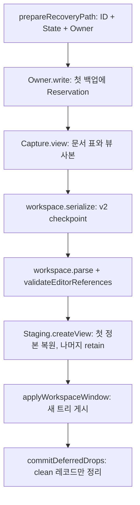

# 로컬 문서 ID 백업과 공유 뷰 복원

상태: 제품 writer·workspace capture/apply 연결 구현. 헤드리스 및 별도 프로세스 검증 완료.
원문 좌표와 지연 접힘 복원을 구현했고 실제 두 pane AppKit/clangd 재시작 검증을 통과했다.
실제 OS 한글 입력기 전환·저장·재시작도 통과했으며 공개 분할 명령은 다음 단계다.
이 단계는 [공유 복원 계획](editor-shared-restore.md)의 세 번째 연결 단계다.
첫 단계 ID/codec은 #4103, 예약 후보 비교는 #4107에서 머지했다.

## 바뀐 동작과 경계

같은 경로를 독립적으로 연 A/B는 다른 `State.recovery_id`를 갖고 각각 백업한다.
명시적으로 공유한 A의 뷰들은 하나의 State·백업·플랫폼 Owner를 쓴다.
A의 저장/버리기 때문에 B의 백업이 덮이거나 삭제되던 path 신원 충돌을 제거했다.
`file_entry`가 없는 공유 뷰도 checkpoint의 `editor-view`로 저장된다.

- `editor/recovery_store.zig.Owner`: secure random ID, 공유 뷰의 쓰기 소유권, 첫 백업에서만 예약.
  L2 read/request lease는 쓰기 권한을 유지하지 않는다. 마지막 준비/부착 뷰가 없어지면 잠금을 놓는다.
- `Reservation`: private root의 flat `d-<id>.claim`과 `d-<id>.bak`. 후보 비교에서 별도 문서 디렉터리보다
  파일 수와 정리 경계가 작은 방식을 택했다. 기존 `OwnerLease`·atomic writer를 사용한다.
- `Capture`: 실제 State 동일성으로 창별 document table을 구성한다. 경로·선택·접힘 배열을 복사하고
  revision을 재확인한다. 메인 스레드의 동기 캡처이며 read lease를 immutable snapshot으로 간주하지 않는다.
- `Staging`: 첫 뷰만 디스크/백업에서 정본을 만들고 이후 뷰는 retain한다. 같은 path라는 이유로 합치지 않는다.
  검색은 새 빈 독립 상태로 시작한다. 본문 hash가 달라지면 좌표를 기본값으로 시작하고 저하 로그를 남긴다.
- `workspace.zig`: `maru.workspace.v2`, 창의 `editor-document`와 pane의 `editor-view`를 함께 읽고 쓴다.
  파일 경로 `workspace.v1`과 기존 잠금/게시 흐름은 유지한다. v1 자동 변환은 하지 않고 읽기 실패 시 보존한다.
  참조 누락·중복·고아 descriptor, 창 간 중복 ID, file/editor 위치 충돌은 staging 전에 거절한다.

원본·백업 읽기 또는 필수 준비 할당 실패는 새 창 트리를 버리고 이전 창/백업을 보존한다.
복원된 dirty 백업은 읽자마자 지우지 않는다. 저장 지문은 레코드의 disk_hash를 유지하므로,
복원 뒤 외부 변경이 있는 파일을 저장하면 기존 `ExternalConflict`가 발생한다.

쓰기 전에는 root/claim 소유와 기존 record ID/path를 확인한다. 최초 게시에는 atomic link,
재백업에는 선택했던 inode가 유지된 경우 atomic replace를 쓴다. 지연 삭제도 선택한 record fd를
잡아 두고 inode가 바뀌면 `StaleDrop`으로 거절한다. 종료·정리 실패의 모르는 파일은 보존한다.
이것은 동일 UID의 공격적인 최종 검사 직후 교체나 물리 전원 차단 내구성 보장이 아니다.

## 검증에서 고친 내용

- 복원된 공유 뷰에도 `enableSharedViewFind`를 적용해 포커스 이동이 검색 입력을 섞지 않게 했다.
- 보호된 파일 작업으로 창 닫기가 거절되면 백업 삭제 준비 전에 반환한다. 이전의 `defer`만으로는
  성공/거절을 구분하지 못했다. 백업 보존과 이후 실제 닫기의 삭제를 함께 검사한다.
- editor가 terminal보다 앞에 있는 혼합 Term 순서를 그대로 만든다. 첫 terminal을 무조건 seed하지 않는다.
- 과거 v1 path 레코드를 심는 테스트는 새 ID validator의 증거로 부르지 않고, 이전 파일 보존 검사로 명시했다.
- 기존 AppKit 스크립트의 path 해시/한 파일 가정을 ID와 claim으로 맞췄다. 복원 실행은 새 native open 대신
  직전 앱의 checkpoint를 사용하며, 레코드는 앱 시작 전에 준비해 reader와의 경쟁을 제거한다.
- CI에서 종료 성공 검사 하나가 이전 `v1` 헤더를 요구하는 누락을 찾았다. 실제 앱은 v2 저장과 종료를
  마친 상태였다. 같은 실패를 로컬에서 재현하고 판정을 v2로 수정한 뒤 정상 종료와 저장 실패 시
  종료 취소를 모두 확인했다(`macos-session-host-c4-quit-cancel-smoke -Doptimize=ReleaseFast`).

## 실행 검증

`mise exec -- zig build test-editor-recovery-restore`와 `-Doptimize=ReleaseFast`를 사용한다.
codec·메타데이터, 실제 AppSession, 플랫폼 파일 소유권 검사를 묶는다.
최종 main `b1a5d995d` 반영 후 격리된 백업 디렉터리에서 `mise run check` 전체를 실행해
통과했다(exit 0, 698.97초). 전체 `test-editor`와 ReleaseFast 앱 번들 빌드도 통과했다.

| 입력/실패 조건 | 확인 결과 |
|---|---|
| 동일 path의 독립 A/B와 공유 A, capture→직렬화→새 AppSession | 서로 다른 본문·ID와 공유 정본, 독립 선택/스크롤/wrap/검색 유지 |
| A 저장과 B 저장 | A 백업 정리 뒤 B 기록 보존, B는 외부 수정 충돌 |
| 손상 백업 | 이전 창 포인터와 원본 백업 보존 |
| 더 최신 백업 + 이전 checkpoint | 본문은 복원, 오래된 선택/스크롤은 기본값 |
| 두 공유 뷰 staging의 모든 필수 할당 실패 | 46개 할당 지점에서 오류 반환, 이전 창과 기록 유지, 정상 재시도 가능 |
| 저장소/owned capture 할당 실패 | 누수 없이 자원 반환, 문서 revision/선택 보존 |
| 다른 ID/path, claim 교체, 지연 삭제 | 읽기/쓰기/삭제 거절, 기존 또는 새 정상 레코드 유지 |
| clean open | 백업 루트 생성·claim 예약 없음 |

보호 조건을 제거하는 compile-valid 변이도 실행했다. `RecoveryRecord.matches` 검사를 무력화하면
다른 ID/path 레코드 판정이 실패하고, 내용 hash를 무조건 일치시키면 오래된 좌표 기본값 판정이 실패했다.
공유 검색 연결을 생략하면 복원 후 독립 검색 검사가 실패했다. `matches` 조건에 `and true`를 붙이는
등가 변이는 통과했다. 각 변이 뒤 원본을 되돌렸다. 검토 횟수 대신 검출한 동작을 기록한다.

`tools/test-editor-recovery-process.py`는 실제 AppSession test artifact를 서로 다른 프로세스로 실행한다.
write 1회와 restore 2회, 손상 record, v1 header 거절을 검사한다. 복원 뒤 다시 백업할 편집을 하지 않아도
원본 record가 남으며 디스크/정상 sibling 기록/checkpoint가 보존된다. `test-macos-only` CI에 연결했다.
이 결과는 AppKit 또는 실제 OS IME 화면 검증과 구분한다.

clean prepare 비용은 ReleaseFast에서 같은 작은 파일을 200회 교차 실행했다.
#4107의 openPath/lines/path/registry 준비를 기준으로 평균 43,337 ns, ID/Owner 추가 경로는 48,593 ns였다.
차이는 약 5.3 µs다. warm file cache와 테스트 allocator를 쓰는 한 번의 로컬 표본이며 앱 시작·화면 파싱 비용이나
큰 파일 성능 수치가 아니다. 시간 측정은 `MARU_MEASURE_EDITOR_RECOVERY=1`일 때만 실행한다.

## 남은 범위

- 지연 syntax/LSP 접힘 복원 반례는 #4125에서 해결했다. 공개 분할 명령은
  [공유 분할 명령](editor-shared-split.md)에서 메뉴·팔레트·키 입력과 연결한다.
- orphan/legacy 열거와 사용자 복구 UI는 [백업 발견과 복구](editor-backup-discovery.md)에서 연결한다.
  `recover_editor_backups`는 선택한 사본을 별도 미저장 문서로 연다. 원본 누락 시 전체 창
  staging을 거절하는 기존 정책과 이 수동 복구 경로를 구분한다.
- untitled/remote/diff의 백업 계약과 Undo/Redo 미직렬화 정책은 유지한다. 창 간 공유를 추가하지 않는다.
- 기존 `max_close_backup_drops` 한도 밖 기록과 삭제 권한 실패 시 오래된 레코드가 남는 한계는 유지한다.
  ID 분리로 best-effort 정리나 stale-backup 판정 전체가 해결됐다고 주장하지 않는다.
- 프로세스 강제 중단 시 빈 claim/임시 파일이 남을 수 있다. 일반 GC·tombstone을 도입하지 않는다.

## 두 공유 pane의 실제 재시작 점검

`python3 tools/shared-restore-app/run.py`는 격리된 소스 사본에 초기 상태 준비와 관측기만 붙여
실제 AppKit 앱을 실행한다. 일반 로컬 문서를 두 pane으로 나누고 서로 다른 선택·스크롤·wrap·접힘을
둔 뒤 제품 종료/checkpoint 경로를 거쳐 새 프로세스에서 복원한다. 첫 Metal 프레임과 복원 후
960×600 → 640×480 → 1200×800 화면을 기록한다. `--only-ime`는 기존 실제 한국어 HID 드라이버를
좌우 pane 전환에 연결하고 저장·종료 뒤 다시 연다. 사용자 HOME·백업·workspace와는 격리한다.
첫 프레임 캡처 프로세스는 renderer의 one-shot 종료를 쓰며, seed와 restore 프로세스가 실제 AppKit
정상 종료를 지난다. `--callback-ime`는 실제 NSTextInputClient에 조합/확정·멀티커서·Undo 콜백을
주입해 저장 후 재시작을 검사한다. 이 경로는 통과했지만 실제 OS 한글 입력기 증거는 아니다.

실행 과정에서 다음 두 결함을 재현해 수정했다.

- `restoreViewState`가 저장한 가로 위치와 wrap 조각을 넣은 **뒤** `rebuildVisible`을 호출해 둘 다
  0으로 지웠다. 접힘/폭 파생값을 먼저 만든 뒤 보이는 줄 축에 맞춰 위치를 복원한다.
- 뒤늦은 구문/LSP 접힘 결과의 `installFoldRanges`도 같은 문서 줄을 계속 보는데 wrap 조각을 지웠다.
  갱신 전후 맨 위 문서 줄이 같으면 그 조각을 보존한다. 실제 LSP 응답 소비 경로와 첫 렌더를
  회귀 테스트에 포함한다. 이것은 실제 외부 언어 서버의 네트워크/프로세스 검증과 다르다.

**#4122 당시 남았던 반례:** 실제 앱에서 약 60 KB 문서는 파싱 완료 시점에 따라,
약 1.2 MB 문서는 지연 파싱에서 저장한 구문 접힘이 들여쓰기 범위로 복원됐다가 풀리는 현상을
확인했다. 두 provider의 끝줄이 다르면 기존 보존 정책이 이를 펼친다. 이때 checkpoint의
`first_line`은 접힌 배열의 첨자인데 들여쓰기/구문 배열이 달라져 맨 위 문서 줄도 바뀔 수 있다.
내용·선택·독립 wrap과 가로 위치 보존은 이 문제와 구분한다.

`--clangd <실행 파일>`로 실제 Apple clangd 17.0.0도 실행했다. 생성한 C 문서 디렉터리만 격리된
config의 신뢰 목록에 넣고 서버 시작을 1초 늦췄다. seed는 LSP 범위를 기다려 접은 뒤 저장하고,
restore는 초기 구문 범위와 실제 `textDocument/foldingRange` 응답 적용 뒤를 각각 기록한다.
왼쪽 맨 위 문서 줄은 `46 → 47`, 접힘은 두 뷰 모두 `1 → 0`으로 바뀌었다. 오른쪽은 같은 문서 줄
`96`과 wrap 조각 `2`를 유지해 이번 조각 보존 수정도 실제 서버 전환에서 확인했다. 이 C 문서/서버의
결과를 모든 언어 서버의 응답 지연/재시작/오류 처리 검증으로 확대하지 않는다.

하네스는 앱의 정상 종료만으로 통과하지 않는다. 본문 hash·선택·dirty·wrap·접힘·맨 위 문서 줄·
wrap 조각·가로 위치를 종료 전후 대조하고, 차이가 있으면 `manifest.json`의 `issues`와 exit 1을
남긴다. 이때 발견한 반례는 아래 원문 좌표와 지연 provider 복원에서 수정했다.
#4122 자체는 포맷/접힘 정책 변경이나 사용자용 분할 명령을 포함하지 않는다.

증거: [수정 전 앱](../evidence/editor-shared-restore-app-20261004/baseline.json),
[수정 후 앱과 남은 반례](../evidence/editor-shared-restore-app-20261004/restored.json),
[입력 콜백 후 재시작](../evidence/editor-shared-restore-app-20261004/callbacks.json),
[실제 한국어 HID 후 재시작](../evidence/editor-shared-restore-app-20261004/live-ime.json),
[실제 clangd 지연 준비](../evidence/editor-shared-restore-app-20261004/clangd.json),
[보호 코드 변이](../evidence/editor-shared-restore-app-20261004/mutations.json).
실제 OS 한국어 HID에서는 왼쪽 `가` 조합 → 오른쪽 전환/`나` 조합 → 왼쪽 복귀를 실행했다.
`setMarkedText` 4회, 두 번의 포커스 전환, `L가 R나`의 단일 반영·저장, 원래 입력 소스 복원,
새 프로세스에서 같은 본문과 두 독립 커서의 복원을 확인했다. 전환 뒤 늦은 OS 콜백은 관측되지
않았으므로 그 자연 발생/격리까지 입증한 결과로 확대하지 않는다.
## 단일 문서 잔여 백업의 실제 재시작 대조

실제 AppKit의 단일 문서 v2 재시작도 `python3 tools/test-editor-residual-backup-app.py`로 확인했다.
서로 다른 앱 프로세스에서 정상 종료 백업 → 복원 후 최신 내용 저장(삭제 권한 실패) → 입력 없는 dirty 재복원을 실행했다.
최신 디스크와 남겨진 이전 백업을 보존했다. 이는 기존 stale-backup 한계가 유지된다는 대조군이며
최신 내용 자동 선택을 구현했다는 뜻이 아니다. fixture는 일반 smoke의 checkpoint 생략을 쓰지 않도록
정확한 `MARU_EDITOR_RECOVERY_CHECKPOINT_TEST=maru-test-only-v1` 토큰에서만 제품 종료/capture/restore를 통과한다.
타이핑은 NSTextInputClient와 합성 chord를 쓰며 물리 OS IME 검증은 아니다.
실제 제품 Metal renderer로 복원 직후의 960×600 화면도 캡처했다. 미저장 본문·dirty 표시·복원 알림을 확인했으며,
이는 단일 문서 증거다. 두 공유 pane의 첫 화면이나 물리 IME 검증을 대신하지 않는다.
증거: [프로세스·바이너리·내용 해시](../evidence/editor-recovery-integration-20261004/residual-app.json), [캡처 메타데이터](../evidence/editor-recovery-integration-20261004/capture.json), [보호 조건 변이 결과](../evidence/editor-recovery-integration-20261004/mutations.json).

## 원문 좌표와 지연 provider 복원

사용자가 PR #4122 뒤의 원문 좌표 저장과 지연 복원 구현을 승인했다. `first_doc_line` 저장과
뷰별 복원 요청을 연결했다. 계약의 단일 출처는 [workspace 복원](../workspace-restore.md)이다.
같은 본문에서만 저장된 접힘을 다시 대조하고, 사용자가 새로 바꾼 위치/선택/접힘을 우선한다.

수정 전 새 회귀 테스트는 원문 20번째 줄이 18로 저장되는 오류, 분석 전 재저장의 접힘 누락,
늦은 provider에서 접힘 소실을 검출했다. 수정 후에는 원문 앵커, 선택 끝점 보호, provider 지연 중
재저장, 스크롤/막대/wrap/키보드/펼치기/IME 조작, 공유 뷰별 대기 소유와 공유 편집 무효화,
staging·공유 준비의 모든 할당 실패 및 provider 파생 배열 실패 후 다음 프레임 재시도를 검사한다.
선택 끝점은 한 번 정렬해 범위마다 이진 탐색하므로 접힘 수 × 커서 수의 반복 비교를 만들지 않는다.

최종 앱 빌드에서 다음을 실행했다. 원본과 변경된 코드의 차이는 별도 사본에 넣은 관측기이며,
제품 checkpoint·본문·편집·provider·Metal·종료 경로는 그대로 사용했다.

| 실행 | 확인된 결과 |
|---|---|
| 작은 약 60 KB / 큰 약 1.2 MB Zig 파일, 각 seed·첫 프레임·복원 프로세스 | 두 뷰의 본문 hash·dirty·선택·wrap·접힌 머리 hash·맨 위 원문 줄·wrap 조각·가로 위치 보존 |
| 실제 Apple clangd 17.0.0, 시작 1초 지연 | 구문 → LSP 전환 후에도 원문 줄 46/96(0-based), 오른쪽 조각 2, 왼쪽 가로 위치 70, 각 접힘 1개 보존 |
| 960×600 → 640×480 → 1200×800 | 같은 원문 앵커와 독립 wrap/가로 위치 유지; 첫 Metal 프레임 및 각 크기의 PNG 직접 확인 |
| NSTextInputClient 콜백·멀티커서·Undo·저장·재시작 | `cat cat` 본문과 두 독립 선택 보존, 입력 검증 실패 0 |
| 실제 macOS 두벌식 HID·두 pane 전환·저장·재시작 | `L가 R나`가 한 번씩 반영, 두 커서 byte 4/9 보존, 원래 입력 소스 복원 |

보호 코드를 변형해 원문 좌표 저장, 늦은 접힘 적용, 사용자 스크롤 및 선택/IME 취소를
각각 제거하면 새 회귀 판정자가 런타임 실패를 내는지 확인했다. 같은 뜻의 조건식은 통과했다.
[변이 결과](../evidence/editor-deferred-restore-20261004/mutations.json)는 변경한 식과 실패한 테스트,
로그 hash 및 원복한 소스 hash를 담는다.

실제 앱 비교는 접힘 개수뿐 아니라 머리 목록 hash도 검사하며 모든 시나리오의 `issues`가 비었다.
[구문 분석과 리사이즈](../evidence/editor-deferred-restore-20261004/syntax.json),
[실제 clangd](../evidence/editor-deferred-restore-20261004/clangd.json),
[입력 콜백](../evidence/editor-deferred-restore-20261004/callbacks.json),
[실제 한국어 HID](../evidence/editor-deferred-restore-20261004/live-ime.json)에 앱/소스 hash·프로세스 ID·
관측값·이미지 경로와 hash를 보관한다. 콜백 주입은 실제 OS 입력기 증거와 구분한다.
공개 분할 명령과 입력 진입점 검증은 [공유 분할 명령](editor-shared-split.md)에서 연결한다. 다른 언어 서버 전체나 자연 발생하지 않은
늦은 OS 콜백까지 검증했다고 확대하지 않는다.
