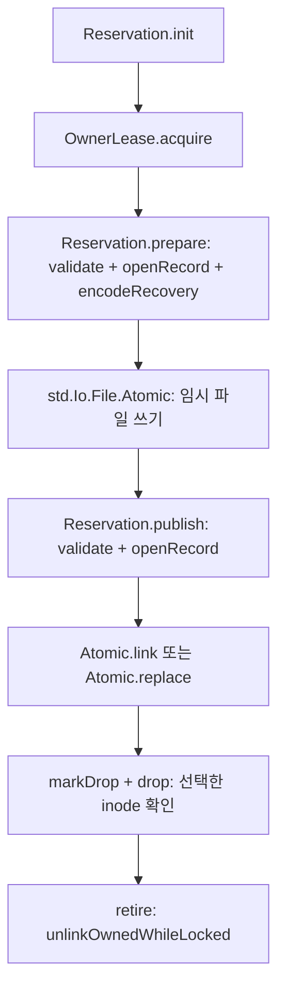

# 복구 ID 예약 후보의 파일·프로세스 실험

상태: 후보 비교와 CI 오류 검증 완료. 제품은 flat `.claim`을 선택했으며
후속 [백업·복원 연결](editor-recovery-integration.md)이 실제 앱 경로와 검증 범위를 소유한다.
이 문서의 결과와 미연결 표기는 #4107 당시 실험의 이력이다.
[공유 복원 계획](editor-shared-restore.md#구현을-나눌-순서와-승인-범위)의 두 번째 단계 중
파일 예약·실패·중단·정리 경계를 다룬다. 첫 단계의 ID/codec은 PR #4103에서 머지됐다.

## 비교 대상과 구현 경계

같은 경로를 독립적으로 편집하는 두 문서는 서로 다른 복구 ID를 가진다. 백업 파일 이름을
ID로 나눠도 별도 실행이 같은 ID에 동시에 쓰거나 오래된 정리 요청이 새 파일을 지우면
내용을 잃는다. 이번 도구는 본문 교체와 별도로 유지하는 예약 객체의 수명을 비교한다.

| 후보 | 예약 객체 | 본문 |
|---|---|---|
| `claim` | 루트의 `d-<id>.claim`, exclusive 생성 후 잠금 | 같은 루트의 `d-<id>.bak` |
| `directory` | exclusive 생성한 `d-<id>/` 안의 `owner.lock` | 그 디렉터리의 `d-<id>.bak` |

`tools/perf/editor_recovery_reservation.zig`는 기존 macOS `OwnerLease`를 직접 사용한다.
본문은 제품과 같은 `std.Io.File.Atomic`으로 준비하고 실제 `backup.encodeRecovery/parseRecovery`로
검증한다. Python runner는 자식 process의 stdin/stdout barrier와 실제 파일 bytes를 관측한다.
예전 Python `O_EXCL`/`mkdir`/`os.replace` 실험의 결과를 새 어댑터 증거로 재사용하지 않는다.

`Reservation`은 루트/문서 디렉터리 fd, 예약 fd, 작업 전 본문 fd를 유지한다. 쓰기와 삭제 전에
경로가 같은 객체를 가리키는지 대조한다. 잠금은 본문 atomic replace 이후에도 같은 inode로
남는다. 읽은 레코드는 파일 이름·ID·path를 함께 대조한다. 첫 게시는 `Atomic.link`로
이미 존재하는 이름을 거절하고, 재백업은 준비 때 잡은 기존 inode가 유지된 경우에만 교체한다.
삭제는 선택한 record fd를 유지해 inode 재사용을 막고, 새 백업으로 바뀌면 `StaleDrop`을 반환한다.



이 타입은 실험 실행 파일에만 있다. 앱에 연결된 새 저장소 API가 아니다. 고정 본문의 읽기 버퍼
4 KiB도 fixture 한도이며 제품의 백업 크기 정책을 바꾸지 않는다. `fresh`/`reopen`은 테스트가
지정한다. 제품에서 기존 ID의 재획득을 허용할 문서를 결정하는 권한 판정은 후속 연결 책임이다.

## 실행으로 확인한 결과

| 경계 | 확인 결과 |
|---|---|
| 두 process가 같은 신규 ID를 예약 | 하나만 소유하고 본문 게시, 다른 process는 `Reserved` |
| 이미 소유 중인 ID 재획득 | `AlreadyOwned`; 원래 owner는 같은 잠금으로 재백업 가능 |
| 같은 path의 독립 ID 둘 | 하나의 백업/예약을 정리해도 다른 본문·후속 백업 유지 |
| 0-byte 편집 | 유효한 v2 본문으로 게시·재읽기 가능 |
| encode allocation failure / 첫 쓰기 실패 / 교체 실패 | 없는 파일을 성공으로 만들지 않으며 이전 완전본 보존, 권한 복구 후 재시도 가능 |
| 삭제/예약 해제 권한 실패 | 레코드 또는 예약을 남기고 오류 반환, 권한 복구 후 재시도 가능 |
| owner 경로 또는 상위 디렉터리 교체 | 이전 owner의 쓰기·삭제 거절, 새 owner의 본문 보존 |
| 다른 ID·손상 레코드 / 준비 후 inode 교체 | 쓰기·삭제 또는 게시 거절, 대상 bytes 보존 |
| 지연 삭제 뒤 새 백업 | `StaleDrop`, 새 본문 보존 |
| symlink owner 경로 | 획득 거절, symlink 대상 bytes 보존 |
| 소유하지 않은 잔여 파일 | 두 후보 모두 보존. directory는 `NotEmpty`로 예약 해제도 거절 |

권한 오류는 일반 사용자에서 실제 디렉터리를 0500으로 바꿔 유도한다. root 실행은 이 oracle을
무력화하므로 runner가 거절한다. allocation failure는 codec의 첫 할당 실패이며 전체 제품
쓰기 경로의 모든 OOM을 조사한 검사가 아니다. 여기의 정리는 어댑터 `drop/retire` 호출이다.
저장·버리기·창 닫기 UI가 이 코드에 연결됐다는 뜻이 아니다.

SIGKILL은 예약 직후, 첫 임시 파일 준비 후, 게시 후, 교체 임시 파일 준비 후, 본문 삭제 후에
각각 보낸다. 실제 종료 신호와 남은 파일을 검사한다. 준비만 된 파일은 백업 이름으로 게시되지
않고 기존 완전본 또는 본문 부재가 유지됐다. 예약은 남으며 새 ID처럼 재사용하면 거절됐다.
기존 ID를 재획득하는 새 process는 정상 잠금을 얻고 다시 게시했다. 임시 파일 준비 후 죽인
경우 두 후보 모두 임시 파일 하나가 남았다. 전체 임시 파일 GC나 orphan 복구를 구현하지 않는다.

directory에서 별도 실패도 재현했다. 본문을 지운 뒤 상위 루트만 0500으로 바꾸면 내부
`owner.lock`은 삭제되지만 `rmdir`는 실패한다. `CleanupFailed`를 반환하고 owner를 retired로
바꿔 쓰기를 금지한다. 빈 디렉터리가 남아 fresh는 `Reserved`, reopen은 `Missing`이 된다.
실패를 정리 성공으로 숨기지 않으며, 이 잔여 디렉터리의 재시도/재인수는 아직 구현하지 않았다.

## 실험 중 수정한 결함과 검증 강도

아래 수정은 후보 어댑터와 runner의 수정이다. 현재 앱 backup의 결함 수정으로 집계하지 않는다.

- 잠금만 가진 후보 코드가 다른 ID 레코드를 덮어쓰는 것을 두 배치에서 재현했다. 쓰기/삭제의
  record 신원 대조와 준비 이후 inode 대조를 더해 기존 bytes를 보존한다.
- umask 0777에서 임시 파일의 생성 mode 지정만으로는 게시된 파일이 000이 됐다. 우리가 만든
  임시 파일과 새 문서 디렉터리에만 exact 0600/0700 보정을 한다. 기존 unsafe 파일은 고치지 않는다.
- owner 검사 제거를 처음에는 새 record inode 검사가 대신 잡아 테스트가 통과했다. 새 owner가
  아직 본문을 바꾸지 않은 상태에서 이전 owner의 게시를 시도하도록 반례를 보강했다.

임시 소스 사본에서 `validate`의 namespace 확인, `StaleDrop` 조건, atomic 파일의 권한 보정,
`RecoveryRecord.matches` 조건을 각각 제거했다. 모두 정상 컴파일한 뒤 두 후보의 해당 실행
판정에서 실패했다. 컴파일 실패를 검출 성공으로 세지 않는다. [mutation 결과](../evidence/editor-recovery-reservation-20261003/mutations.json)는
수정 대상·source/runner hash·컴파일 종료 코드·실제 실패 assertion을 기록한다.
`validate` 변형은 retired 확인만 남기며, 두 조건 변형은 `and false`로 효과만 제거했다.

## 파일 수와 비용

2026-10-03 로컬 macOS에서 ReleaseFast로 실행했다. [원시 JSON](../evidence/editor-recovery-reservation-20261003/result.json)에
플랫폼·실행 파일 hash·후보별 64개 표본을 남긴다. 아래는 중앙값이며 성능 통과 상한이 아니다.

| 후보 | 예약 후 entry | 본문 게시 후 entry | 예약 | 첫 본문 게시 | 본문·예약 정리 |
|---|---:|---:|---:|---:|---:|
| claim | 1 | 2 | 92.0 µs | 354.4 µs | 117.5 µs |
| directory | 2 | 3 | 162.5 µs | 370.6 µs | 156.9 µs |

entry는 디렉터리 자체도 세며 루트는 제외한다. 메모리/RSS나 할당된 디스크 block 수가 아니다.
한 process 안에서 서로 다른 ID로 순차 실행하므로 process 시작 비용을 제외한다. 예약은
디렉터리 열기·exclusive 생성·잠금을 포함하고, 게시는 encode·신원 확인·쓰기·rename을 포함한다.
정리는 본문 확인·삭제·예약 해제를 포함하되 마지막 fd close/deinit은 타이머 밖이다.
writer flush는 사용자 공간 버퍼를 비우는 것이며 fsync/F_FULLFSYNC 비용·내구성을 측정하지 않는다.
두 후보는 순서대로 실행하므로 시간 차이를 일반적인 성능 우위로 단정하지 않는다.

현재 제품 clean open은 이 어댑터를 호출하지 않는다. 그래서 정상 파일 열기의 추가 비용을
0으로 실측했다고 주장하지 않는다. ID 발급/첫 백업 예약을 제품에 연결할 때 실제 open 경로의
I/O와 시간을 별도 대조해야 두 번째 단계의 그 요구도 완료된다.

## 판단과 다음 연결

기존 평면 백업과의 연결 범위를 기준으로 **claim을 우선 제품 후보로 권고**한다. 근거는 작은
시간 차이보다 정리 상태의 수다. 본문과 claim 두 파일로 끝나며, directory의 내부 잠금 삭제 후
상위 폴더 삭제 실패 경계가 없다. 두 후보 모두 소유권과 record 검사를 별도로 해야 한다.

directory에도 장점이 있다. 중단된 임시 파일이 문서별 폴더에 모인다. claim의 임시 파일은
공용 루트에 난수 이름으로 남아, 불완전한 파일을 ID별로 정리하려면 추가 소유 정보가 필요하다.
따라서 이번 결과만으로 배치를 확정하거나 임시 파일을 일괄 삭제하지 않는다. 제품 후보를
연결하기 전 예약 잔여물의 보존·정리 범위를 함께 결정한다.

다음 제품 연결은 ID 발급·local backup writer·workspace capture/apply가 같은 ID를 쓰게 하는
단계다. 같은 path의 독립 A/B 보존, shared view의 record 하나, Save As, 실패 뒤 이전 완전본,
clean open의 추가 I/O를 제품 API와 실제 재시작으로 확인해야 한다. 기존 충돌 characterization은
그때 보존 회귀 판정으로 바꾼다. orphan/legacy 목록과 사용자 복구 UI는 별도 후속 범위다.

오류 검증은 macOS의 기본 `test`와 `test-macos-only` CI에서 실행한다.
시간 측정은 opt-in 명령으로 두며 CI 성능 예산에는 연결하지 않는다.

```sh
mise exec -- zig build test-editor-recovery-reservation -j2
mise exec -- zig build perf-editor-recovery-reservation -Doptimize=ReleaseFast -j2
```

제품 프로세스 재시작, OS reboot, 물리 전원 차단, 모든 마지막 키 입력의 보존은 검증하지 않는다.
협력하는 writer는 같은 lease를 사용한다. 공격적인 동일 UID process가 최종 경로 검사 직후
파일을 바꾸거나 열린 파일을 in-place 변경하는 전체 경쟁을 막는다고 보장하지 않는다.
