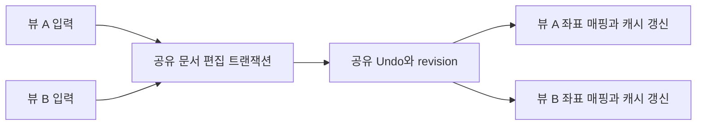

# 공유 문서와 독립 편집기 뷰 — 설계 제안

상태: 설계 제안, 제품 미구현. 2026-10-01 main `bb0ef4948`의 코드와 기존 계약을 대조했다.
사용자는 같은 파일 두 pane의 설계 정리와 구현 단계 분해를 승인했다. 이 문서는 구현 착수나
아래 미결 UX의 승인을 뜻하지 않는다. 계약은 [레이어 배치 §2.4](../native-editor-layering.md),
[Surface 문서 identity](../editor-surface.md), [탭·split 배치](../tabs-splits-layout.md)가 소유한다.

## 목표와 현재 차이

한 파일의 위아래를 나란히 보고 어느 쪽에서든 편집한다. 내용·Undo/Redo·저장 상태는 공유하고,
커서·선택·스크롤·접힘·랩은 뷰마다 독립이다. 두 개의 텍스트 복사본을 서로 동기화하지 않는다.

현재 `src/platform/macos/app_session.zig`의 `TermRuntime`은 `editor_doc`, `editor_undo`,
`editor_redo`, `editor_selection`, `editor_preedit`을 가진다. `editor.zig`가 편집·저장·해제를
Term 기준으로 수행한다. `src/session/editor/delta.zig`는 변경·역연산·offset 매핑을 제공하지만
여러 뷰에 대한 게시·Undo 그룹·IME 소유자 전환까지 제공하지 않는다.
`DocumentRegistry`는 기존 설계의 이름이며 제품 구현이 이미 있다는 뜻이 아니다.
2026-09-02 실측 필드 수는 [여러 뷰 원장](native-editor-multi-view.md)의 당시 기록으로 유지한다.

## 책임과 수명

아래 타입 이름은 제안이다. 정확한 public API·ABI·스레드 간 게시 방식은 첫 구현 전에 확정한다.

| 책임 | 문서 하나가 소유 | 뷰 하나가 소유 |
|---|---|---|
| 텍스트 | 버퍼·revision·줄 인덱스·문서 형식 | 표시용 행 매핑·렌더 캐시 |
| 편집 | Undo/Redo·편집 그룹·저장 기준·dirty | 선택·멀티커서·열 선택 원본·자동 닫기 추적 |
| 표시 | revision에 대응하는 구문/진단 원본 | 스크롤·접힘·랩·기하·찾기 결과·현재 결과 |
| 입력 | 편집 승인과 revision 순서 | 포커스·IME 조합·조합 기준 revision |
| I/O | 경로·disk fingerprint·저장/복원·충돌 | 해당 요청을 시작한 뷰 식별자 |

기존 app-global 계약을 따라 `DocumentRegistry`의 runtime owner는 창별 `AppSession`보다
위에 둔다. 뷰의 식별자는 창/세션 identity와 뷰 identity를 함께 포함한다. 문서·뷰 handle에는
재사용을 구분하는 generation을 둔다. 같은 경로를 닫고 다시 열어 revision이 같아도 이전 콜백은 받지 않는다. 첫 구현이 단일 창의
두 pane만 노출하더라도 다른 창에 같은 파일의 두 번째 수정 가능한 정본을 만들지 않는다.
기존 `AppRuntime`의 실제 소유·호출·종료 경계와 renderer가 읽는 문서 수명을 먼저 조사해야 한다.
단순히 전역 포인터를 추가하거나 `TermRuntime`을 얕게 복사하는 방식은 제안하지 않는다.

문서는 뷰 연결 목록을 관리한다. 새 뷰 연결은 자원 준비 뒤 게시하고, 실패하면 기존 뷰·pane을
유지한다. 한 뷰를 닫으면 그 뷰의 입력/요청/렌더 참조를 정산하고 연결만 제거한다.
마지막 뷰의 dirty 확인은 한 번 수행한다. 취소하면 뷰와 문서를 모두 유지한다.
승인된 마지막 닫기는 저장·백업·LSP·비동기 요청·렌더 참조가 정산된 뒤 문서를 해제한다.
뷰 개수만 0이라고 즉시 해제하지 않는다. 종료 중 도착한 콜백은 identity/revision으로 거른다.

## 편집 게시와 독립 좌표

한 편집은 기존 delta/역연산을 재사용해 문서에 한 번 적용하고 revision을 올린다.
문서 변경과 연결 뷰의 좌표/무효화 정보를 하나의 게시 경계로 정산한다. 각 뷰가 실제로
렌더하거나 ACK할 때까지 기다리는 전역 barrier는 두지 않는다. 숨은 탭·최소화 창도 게시를 막지
않으며, 다시 표시할 때 최신 revision으로 캐시를 재구성한다. 프레임 안 텍스트와 좌표의 revision은 같아야 한다. 수정 가능한 버퍼를
렌더 스레드가 무보호로 읽지 않도록 기존 스레딩 계약과 맞춘 읽기 수명/게시 방식을 정한다.
추가 할당과 Undo·뷰 좌표 준비가 실패하면 부분 적용을 게시하지 않는 경계를 검증한다.

편집한 뷰는 연산 결과 선택으로 이동한다. 다른 뷰의 선택은 변경 전 offset을 변경 후 offset으로
매핑하고 삭제된 위치는 유효한 위치로 정산한다. 같은 offset 삽입의 affinity, 역방향 선택,
열 선택과 자동 닫기 추적의 매핑은 명시적 판정자로 고정한다. 단순히 양쪽 커서를 같게 만들지 않는다.
다른 뷰의 화면은 스크롤 anchor를 매핑해 위치를 유지하고 자동으로 현재 편집 위치로 따라가지 않는다.
접힘 범위와 행별 캐시는 revision 변경으로 재검증한다. 찾기는 각 뷰의 검색어·옵션으로 다시 센다.

Undo/Redo는 문서의 실제 편집 순서를 따른다. 뷰 전환은 연속 타이핑 그룹의 경계로 삼는 것을
제안한다. Undo 호출 뷰의 선택 복원과 다른 뷰의 좌표 매핑 규칙을 먼저 고정한다.
한 뷰의 Undo가 다른 뷰에서 한 편집을 되돌릴 수 있으므로 이를 테스트와 사용자 동작에 드러낸다.

## IME와 비동기 요청

IME 조합 owner는 입력을 시작한 뷰다. 같은 뷰의 멀티커서 조합 표시는 기존 계약을 유지한다.
반대 뷰는 같은 확정 문서를 보며, 조합 표시를 복제할지는 별도의 UX 결정이다.
포커스 이동 시 원래 뷰의 OS 조합을 확정 또는 취소로 정산한 뒤 새 입력 owner를 게시한다.
늦게 도착한 marked/commit이 새 뷰의 선택을 덮거나 중복 삽입하지 않도록 거래 identity를 둔다.
조합 중 외부 변경·Undo·다른 뷰 편집과 겹치면 stale revision을 새 텍스트에 그대로 적용하지 않는다.
확정/취소 정책과 callback 순서는 실제 한국어 입력기로 재현해 첫 입력 단계에서 고정한다.

LSP 문서 동기화는 공유 문서의 revision 변경을 한 번 보낸다. hover·completion·참조 등
뷰에서 시작한 요청은 document identity, 요청 revision, view identity를 함께 검증한다.
문서 최신 진단은 공유하되 각 뷰의 표시/포커스는 독립이다. 뷰 하나를 닫아도 다른 뷰가 쓰는
문서의 didClose나 서버 종료를 발생시키지 않는다. 동기화 한 번의 단위는 문서만이 아니라
LSP 연결·URI·연결 generation이다. 서로 다른 workspace/server 연결은 각각 동기화하며
재시작하면 다시 didOpen한다. 진단에 version이 없는 경우도 있어 revision 검사만으로 stale을
막았다고 주장하지 않는다. 연결 세대·현재 URI·요청 수명과 기존 version 없는 진단 정책을 함께 검증한다.

## 저장·외부 변경·복원

어느 뷰에서 저장해도 같은 정본을 한 번 저장한다. 저장 성공 시 실제로 저장한 내용의 hash와
성공한 disk fingerprint를 기준으로 기록한다. revision은 완료 요청의
순서를 판정하고 dirty는 기존 `Opened.isDirty`처럼 내용 hash로 판정한다. 저장 중 더 편집했어도
Undo로 저장한 내용에 돌아왔다면 clean이다. 오래된 저장 완료가 더 최신 성공의 기준을 덮지 않도록
문서별 쓰기 순서와 완료 수락 조건을 정한다. 읽기/쓰기/CAS 실패 시 저장 기준을 앞당기지 않는다.
외부 변경·atomic replace·rename은 문서에서 한 번 판정하며, rename은 연결 뷰의 경로 표시와
조회 인덱스를 함께 갱신한다. 현재 충돌 선택·백업 정책을 우회하지 않는다.

이름 없는 문서는 경로 대신 안정된 document identity를 갖는다. Save As 대상 문서가 이미
열려 있을 때의 충돌/합치기는 정책을 먼저 정하고, 조용히 두 문서의 Undo를 합치지 않는다.
복원은 문서 내용·백업 하나와 각 뷰 상태를 구분한다. 기존 workspace 포맷의 변경 여부·호환성과
다른 창 이동은 별도 단계에서 검증한다. split 노출 전에 재시작 시 데이터 보존 범위를 명시한다.

## 작은 구현 단계와 종료 조건

| 순서 | 범위 | 종료 조건 |
|---|---|---|
| 0 | 현재 owner·호출·스레드·저장/백업/LSP 경계 조사, 미결 정책 확정 | 필드별 문서/뷰 분류와 소비처 목록, 실패/종료 순서, 계약 수정안 리뷰 |
| 1 | 정본 owner와 안정된 handle 도입, 기존 단일 뷰 이관 | 기존 편집·Undo·저장·IME 회귀 통과, 연결 실패/늦은 콜백/마지막 해제 판정, 새 split 아직 미노출 |
| 2 | 같은 문서 두 뷰의 delta 게시·좌표·Undo | 실제 두 뷰 fixture로 입력/삭제/교체/멀티커서/Undo와 양쪽 revision·내용·좌표 일치, 준비 실패 시 기존 상태 보존 |
| 3 | IME·LSP·저장·외부 변경을 공유 owner에 연결 | 실제 두벌식 포커스 전환, stale 응답, 저장 중 편집, 한 뷰 닫기, dirty 마지막 닫기 취소 판정 |
| 4 | 명시적 pane 분할과 MRU·닫기 UI, 내부 fixture에서 검증 | 기존 split 배치 재사용, 양쪽 독립 스크롤/선택, 경로로 열기는 MRU 뷰 활성화, 실패 시 레이아웃 보존·실제 화면 증거, 단계 5 전 일반 사용자 노출 금지 |
| 5 | 복원·rename·창 이동·성능/장시간 정산 | 새로 열기/재시작/이동 중 문서 유일성·데이터 보존, 단일/다중 뷰 메모리·프레임 비용 비교, 통과 후 분할 UI 노출 |

단계마다 TDD 재현→구현→회귀 검사→적대적 검증을 수행한다. callback fixture 통과와
실제 OS IME 화면 증거를 구분한다. 지원되지 않은 수명 경로가 남아 있으면 UI 노출의 gate로 둔다.
큰 파일·뷰 수·반복 열기/닫기의 baseline부터 측정하며 근거 없는 상한이나 B2 저장소 변경을 끼워 넣지 않는다.

## 구현 전에 확정할 결정

- pane 분할 명령 이름·방향·단축키·새 뷰의 초기 선택/스크롤. Split in Group은 별개로 보류한다.
- Undo 호출 뷰의 선택 복원, 다른 뷰의 삽입 affinity·스크롤 anchor·접힘 매핑.
- 반대 뷰에 IME 조합을 표시할지, 조합 중 외부 편집의 확정/취소 정책.
- app-global owner 연결과 렌더 읽기 수명, 창 이동·종료의 비동기 작업 정산.
- identity 키의 파일 권한/grant·원격 host·정규화·symlink/hard-link 정책. 경로 문자열만으로
  다른 원격 파일을 합치거나 기존 보안 경계를 우회하지 않는다. 별칭 경로의 공유 여부는 기존 identity 계약과 대조한다.
- Save As 대상 중복, 백업/복원 identity와 포맷 호환성.

이 항목은 사용자 승인된 기존 규칙과 새 제안을 구분하기 위한 목록이다. 구현 전 리뷰에서
실제 코드와 계약의 차이를 보고하고 필요한 결정만 확정한다. 프로젝트 검색·도크 아웃라인,
비교 wrap 정렬·Markdown 이관·plugin·자동 formatter는 이 설계의 선행 조건으로 묶지 않는다.

## 설계 적대적 검증 — 반례와 수정 (2026-10-01)

이번 검증은 코드·계약 대조와 반례 분석이다. 공유 문서 제품 구현을 실행한 결과가 아니다.

| 반례 | 초안의 빈틈 | 보완과 구현 판정 조건 |
|---|---|---|
| 저장 내용 X → 편집 Y → Undo X, revision만 증가 | 최신 편집이 있으면 무조건 dirty라는 문구가 내용 hash 계약과 충돌 | `Opened.saved_hash`/`isDirty` 기준 유지. 저장 중 편집·Undo·완료 역순·실패를 판정 |
| 숨은 탭 또는 최소화 창이 프레임을 만들지 않음 | 모든 뷰의 관측 후 게시라는 문구는 대기 범위가 불명확 | ACK barrier 없이 원자적 게시/무효화, 숨은 뷰 복귀 시 텍스트·좌표 revision 일치 |
| 같은 경로 재열기, 이전 콜백의 revision과 새 revision이 같음 | identity/revision만으로 handle 재사용을 구별하지 못함 | 문서·뷰 generation과 요청 owner 검사, 닫기→재열기→늦은 응답 fixture |
| 같은 문서를 서로 다른 LSP 연결이 다룸, 서버 재시작·version 없는 진단 | 문서 변경 한 번이라는 표현이 연결별 동기화를 생략할 수 있음 | 연결·URI·generation별 didOpen/Change/Close, version 없는 응답의 별도 정책 판정 |
| split 노출 뒤 재시작 또는 창 이동 | 단계 4 UI와 단계 5 복원 순서가 데이터 보존 gate를 흐림 | 단계 4는 내부 fixture, 단계 5 통과 후 일반 사용자 노출 |
| 같은 경로 문자열이 원격 host나 grant가 다른 파일을 가리킴 | app-global 매핑의 키 조건 누락 | 기존 capability/identity 계약을 조사하고 원격·별칭·권한별 허용/거절 fixture |

Undo 항목은 현재 `UndoEntry.sels_before`와 `primary_before`를 소유한다. 원래 편집 뷰가 닫힌 뒤
다른 뷰에서 Undo하는 반례를 단계 2에 포함한다. 공유 Undo 항목이 해제된 뷰 메모리를 참조해서는
안 되며, 텍스트 역연산과 선택 snapshot의 수명·호출 뷰 복원 정책을 별도로 고정한다.
현재 `delta.mapOffset`의 단일 offset 규칙만으로 역방향 선택·열 선택·삽입 affinity를 모두
검증했다고 주장하지 않는다. UTF-8 경계와 선택 방향·primary 인덱스까지 판정해야 한다.

남은 미결은 위 결정 목록이다. 이 검증으로 정책 승인이나 구현 완료를 선언하지 않는다.
