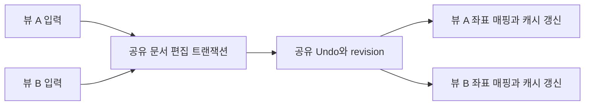

# 공유 문서와 독립 편집기 뷰 — 설계 제안

상태: VS Code 기준 공유 뷰 UX 승인, 단일 뷰 본문·이력 소유 분리 및 중립 참조 수명 골격 구현. 공유 뷰 제품 미구현. 2026-10-01 main `bb0ef4948`의 코드와 기존 계약을 대조했다.
사용자는 설계 정리·단계 분해에 이어 2026-10-01 VS Code 기준 UX 채택을 승인했다.
목표 UX는 [레이어 배치 §2.4a](../native-editor-layering.md)가 소유한다. 공유 뷰 제품 구현과 실제 OS 입력 검증은 아직 없다. 계약은 [레이어 배치 §2.4](../native-editor-layering.md),
[Surface 문서 identity](../editor-surface.md), [탭·split 배치](../tabs-splits-layout.md)가 소유한다.

## VS Code 정책 대조

사용자 요청에 따라 [VS Code 정책 대조](../editor-shared-document-vscode.md)에 모든 미결 항목의
1차 근거·권장안·확인 한계를 기록했다. 확인한 source commit은 해당 문서에 고정한다.
공유 Undo와 포커스 뷰의 선택 복원, 비활성 좌표 추종, 초기 상태 복사·마지막 닫기·저장 순서가
주요 UX 기준이다. 뷰 전환이 언제나 Undo stop이라는 주장은 소스 근거가 부족해 유지하지 않는다.
IME 조합의 모델 반영은 현재 Maru preedit 계약과 달라 표시 목표와 구현 방법을 구분한다.

## 목표와 현재 차이

한 파일의 위아래를 나란히 보고 어느 쪽에서든 편집한다. 내용·Undo/Redo·저장 상태는 공유하고,
커서·선택·스크롤·접힘·랩은 뷰마다 독립이다. 두 개의 텍스트 복사본을 서로 동기화하지 않는다.

일반 텍스트 문서는 `AppRuntime.editor_documents`가 소유하고 `TermRuntime`은 view lease로
본문·저장 정보·Undo/Redo를 빌린다. 선택·조합·줄 배열과 provider 상태는 아직 뷰별이다.
단일 뷰 열기/해제는 핸들에 배선했지만 경로별 정본 통합과 두 뷰의 편집 게시·좌표 매핑·IME
소유자 전환은 아직 구현하지 않았다. 아래 이관 기록에서 중립 골격과 제품 배선 결과를 구분한다.
첫 split 대상은 기존 일반 네이티브 편집 문서다. 같은 경로를 보더라도 read-only diff의
base/modified snapshot과 3-way merge의 각 입력은 정본 편집 뷰로 합치지 않는다.
비교·병합의 결과 문서를 연결할지, 이름 없는 문서·원격 문서의 split을 언제 노출할지는
지원 범위 표에서 명시해야 한다. 지원 밖 명령은 비활성/거절하고 기존 보기·저장 동작을 유지한다.
2026-09-02 실측 필드 수는 [여러 뷰 원장](native-editor-multi-view.md)의 당시 기록으로 유지한다.

## 책임과 수명

아래 타입 이름은 제안이다. 정확한 public API·ABI·스레드 간 게시 방식은 첫 구현 전에 확정한다.

| 책임 | 문서 하나가 소유 | 뷰 하나가 소유 |
|---|---|---|
| 텍스트 | 버퍼·revision·줄 인덱스·문서 형식 | 표시용 행 매핑·렌더 캐시 |
| 편집 | Undo/Redo·편집 그룹·저장 기준·dirty | 선택·멀티커서·열 선택 원본·자동 닫기 추적 |
| 표시 | revision과 provider 문맥으로 구분한 구문/진단 원본 | 스크롤·접힘·랩·기하·찾기 결과·현재 결과 |
| 입력 | 편집 승인과 revision 순서 | 포커스·IME 조합·조합 기준 revision |
| I/O | 경로·disk fingerprint·저장/복원·충돌 | 해당 요청을 시작한 뷰 식별자 |

기존 app-global 계약을 따라 `DocumentRegistry`의 runtime owner는 창별 `AppSession`보다
위에 둔다. 뷰의 식별자는 창/세션 identity와 뷰 identity를 함께 포함한다. 문서·뷰 handle에는
재사용을 구분하는 generation을 둔다. 같은 경로를 닫고 다시 열어 revision이 같아도 이전 콜백은 받지 않는다. 첫 구현이 단일 창의
두 pane만 노출하더라도 다른 창에 같은 파일의 두 번째 수정 가능한 정본을 만들지 않는다.
기존 `AppRuntime`의 실제 소유·호출·종료 경계와 renderer가 읽는 문서 수명을 먼저 조사해야 한다.
단순히 전역 포인터를 추가하거나 `TermRuntime`을 얕게 복사하는 방식은 제안하지 않는다.

문서는 뷰 연결 목록을 관리한다. 새 뷰 연결은 자원 준비 뒤 게시하고, 실패하면 기존 뷰·pane을
유지한다. 한 뷰를 닫으면 그 뷰의 입력/요청/렌더 참조를 정산하고 연결만 제거한다.
마지막 뷰의 dirty 확인은 한 번 수행한다. 취소하면 뷰와 문서를 모두 유지한다.
승인된 마지막 닫기는 저장·백업·LSP·비동기 요청·렌더 참조가 정산된 뒤 문서를 해제한다.
dirty 확인 창이 열린 동안 다른 창에서 편집하거나 새 뷰를 연결할 수 있다. 마지막 닫기 요청은
확인 대상 revision·내용 기준을 기록하고, 승인 시 연결 수와 최신 dirty를 다시 검증한다.
저장 후 닫기를 골랐어도 저장 중 새 편집이 생기면 최신 변경을 버리지 않는다. 동시에 두 창이
닫기를 요청할 때 문서별 종료 owner는 하나만 진행하고 취소·재연결을 정산한다. 앱 종료는
문서별 dirty 확인을 중복하지 않되 창별 종료와 구별한다. 대기 작업의 취소/종료 기한과 실패 시
데이터 보존 경로를 정해 무기한 대기가 유일한 종료 방법이 되지 않도록 한다.
뷰 개수만 0이라고 즉시 해제하지 않는다. 종료 중 도착한 콜백은 identity/revision으로 거른다.
메모리 owner 해제와 영속 recovery 삭제는 별도 사건이다. 저장 없이 명시적으로 버리기,
저장 성공, crash 복구 대기는 기존 백업 계약에 따라 구분한다. 참조 수 0이나 종료 기한 초과만으로
미저장 백업을 삭제하지 않는다. 파일 삭제/재생성 뒤 recovery의 base fingerprint 불일치도
자동 덮어쓰기 사유가 아니며 기존 비교/충돌 흐름을 유지한다.

## 편집 게시와 독립 좌표

한 편집은 기존 delta/역연산을 재사용해 문서에 한 번 적용하고 revision을 올린다.
문서 변경과 연결 뷰의 좌표/무효화 정보를 하나의 게시 경계로 정산한다. 각 뷰가 실제로
렌더하거나 ACK할 때까지 기다리는 전역 barrier는 두지 않는다. 숨은 탭·최소화 창도 게시를 막지
않으며, 다시 표시할 때 최신 revision으로 캐시를 재구성한다. 프레임 안 텍스트와 좌표의 revision은 같아야 한다. 수정 가능한 버퍼를
렌더 스레드가 무보호로 읽지 않도록 기존 스레딩 계약과 맞춘 읽기 수명/게시 방식을 정한다.
버퍼 변경과 뷰 좌표의 준비 실패에서 부분 적용을 게시하지 않는 경계를 검증한다.
Undo 기록 실패 정책은 2026-10-01 사용자 승인으로 정했다. 본문 변경 전에 역연산·선택 snapshot과
Undo 스택 capacity를 준비하고, 준비 실패는 해당 편집을 적용하지 않는다. 기존 본문·선택·live 이력은
유지한다. `pushUndo`의 append는 준비된 capacity에만 쓰며 게시 뒤에 할당하지 않는다. 이는 과거의
「입력은 유지하고 기록만 버린다」 정책을 바꾼다. VS Code도 정상 경로에서는 편집 전에 항목을
확보하지만, 같은 allocator 실패 복구를 보장한다고 해석하지 않는다.
Undo/Redo도 반대 스택 capacity·선택 snapshot을 역연산 적용 전에 준비하고, 성공한 항목만
스택에서 이동한다. 여러 항목의 기존 Undo 묶음은 순차 delta다. 중간 적용 실패 시 앞서 적용한
delta는 유지하고 미적용 항목은 남겨 재시도한다. 묶음 전체 rollback 계약을 새로 추가하지 않는다.

문서마다 편집·Undo·Redo·재로드의 writer 순서를 하나로 정한다. 요청은 기준 revision을 포함한다.
두 뷰가 같은 revision에서 교체를 준비한 경우 먼저 적용된 변경 뒤의 두 번째 요청을 그대로
적용하지 않는다. stale 거절 또는 검증된 delta 매핑 정책을 확정한다. 준비 중 포커스/선택이
바뀐 경우도 view generation뿐 아니라 요청 당시 선택/입력 거래를 검증한다. 일반 타이핑까지
조용히 버리는 정책으로 해석하지 않고, 재시도와 사용자 입력 보존을 fixture로 확인한다.

편집한 뷰는 연산 결과 선택으로 이동한다. 다른 뷰의 선택은 변경 전 offset을 변경 후 offset으로
매핑하고 삭제된 위치는 유효한 위치로 정산한다. 같은 offset 삽입의 affinity, 역방향 선택,
열 선택과 자동 닫기 추적의 매핑은 명시적 판정자로 고정한다. 단순히 양쪽 커서를 같게 만들지 않는다.
다른 뷰의 화면은 스크롤 anchor를 매핑해 위치를 유지하고 자동으로 현재 편집 위치로 따라가지 않는다.
현재 `refreshAfterEdit`는 문서 통지와 뷰 파생 갱신을 함께 수행한다. 공유 이관에서는 LSP
version·백업 debounce·구문 provider 편집 통지는 문서/해당 provider마다 한 번, 선택·스크롤·
행 배열·접힘·검색 범위 폐기는 연결 뷰마다 수행하도록 나눈다. Term마다 기존 함수를 반복 호출해
문서 통지를 중복하거나 활성 뷰만 호출해 다른 뷰의 낡은 행 배열을 남기지 않는다.
접힘 범위와 행별 캐시는 revision 변경으로 재검증한다. 찾기는 각 뷰의 검색어·옵션으로 다시 센다.
이는 목표 소유권이며 현재 구현 상태가 아니다. 현재 `AppSession.editor_find_matches`와
`editor_find_source`, Chrome find 입력은 세션의 활성 검색 owner를 따른다. 두 pane의 찾기
이력/결과를 유지하려면 뷰별 상태 이관과 단일 키/IME owner를 구분해야 한다. #4027의 diff
좌우 두 슬롯을 일반 pane 뷰 저장소로 그대로 사용하지 않는다. 두 pane 검색→본문 편집→
다른 뷰 재검색→닫기→⌘G에서 query·count·highlight·marker·revision을 판정한다.

Undo/Redo는 문서의 실제 편집 순서를 따른다. 뷰 전환의 Undo 그룹 경계는 VS Code
교차 뷰 입력 동작 대조 후 결정한다. focus setter만으로 항상 그룹을 끊는다는 근거는 없다. Undo 호출 뷰의 선택 복원과 다른 뷰의 좌표 매핑 규칙을 먼저 고정한다.
한 뷰의 Undo가 다른 뷰에서 한 편집을 되돌릴 수 있으므로 이를 테스트와 사용자 동작에 드러낸다.

## IME와 비동기 요청

IME 조합 owner는 입력을 시작한 뷰다. 같은 뷰의 멀티커서 조합 표시는 기존 계약을 유지한다.
반대 뷰에도 입력 중 조합 문자열을 실시간 표시한다(§2.4a 승인). 정본과 표시 projection의
구분·검색/저장/LSP의 관측 의미는 현재 §11과 대조해 구현 단계에서 닫는다.
포커스 이동 시 원래 뷰의 OS 조합을 확정 또는 취소로 정산한 뒤 새 입력 owner를 게시한다.
늦게 도착한 marked/commit이 새 뷰의 선택을 덮거나 중복 삽입하지 않도록 거래 identity를 둔다.
조합 중 외부 변경·Undo·다른 뷰 편집과 겹치면 stale revision을 새 텍스트에 그대로 적용하지 않는다.
확정/취소 정책과 callback 순서는 실제 한국어 입력기로 재현해 첫 입력 단계에서 고정한다.
확정이 할당 실패·stale revision으로 거절됐으면 성공한 것으로 처리해 기존 조합을 지우거나
새 뷰에 재시도하지 않는다. 원래 거래의 텍스트·범위·revision을 보존하고, 명시적 취소 또는
유효한 재시도의 종료 조건을 정의한다. 확정 콜백의 중복 전달과 실패 후 재시도는 한 번만
문서에 반영되어야 한다. 실제 OS 콜백에는 제품 거래 id가 직접 붙지 않으므로 AppKit 어댑터가
owner 세대를 캡처하는 방식까지 검증한다. 문서에 id 필드를 제안한 것만으로 라우팅이 해결되지는 않는다.

LSP 문서 동기화는 공유 문서의 revision 변경을 한 번 보낸다. hover·completion·참조 등
뷰에서 시작한 요청은 document identity, 요청 revision, view identity를 함께 검증한다.
문서 최신 진단은 공유하되 각 뷰의 표시/포커스는 독립이다. 뷰 하나를 닫아도 다른 뷰가 쓰는
문서의 didClose나 서버 종료를 발생시키지 않는다. 동기화 한 번의 단위는 문서만이 아니라
LSP 연결·URI·연결 generation이다. 서로 다른 workspace/server 연결은 각각 동기화하며
재시작하면 다시 didOpen한다. 구문과 진단을 공유하는 키는 텍스트 revision만이 아니다.
구문은 grammar/provider generation, 진단·semantic 응답은 연결·root·설정/요청 세대를
함께 고려한다. 같은 내용이라도 언어 변경·Save As·LSP 설정 변경으로 이전 결과는 무효일 수 있다.
뷰별 테마·폭·탭 표시 등 화면 파생 캐시는 별도로 둔다. provider 문맥을 어떻게 공유할지는
단계 0에서 분류하고, 문서가 하나라는 이유로 다른 서버의 진단을 무조건 합치지 않는다.
진단에 version이 없는 경우도 있어 revision 검사만으로 stale을
막았다고 주장하지 않는다. 연결 세대·현재 URI·요청 수명과 기존 version 없는 진단 정책을 함께 검증한다.

## 저장·외부 변경·복원

어느 뷰에서 저장해도 같은 정본을 한 번 저장한다. 저장 성공 시 실제로 저장한 내용의 hash와
성공한 disk fingerprint를 기준으로 기록한다. revision은 저장한 내용의 판을 식별하고,
완료 순서는 별도 문서별 저장 요청 순번과 대상 identity/path generation으로 판정한다.
같은 revision에서의 반복 저장·Save As·rename도 서로 다른 요청일 수 있다.
dirty는 기존 `Opened.isDirty`처럼 내용 hash로 판정한다. 저장 중 더 편집했어도
Undo로 저장한 내용에 돌아왔다면 clean이다. 오래된 저장 완료가 더 최신 성공의 기준을 덮지 않도록
문서별 실제 쓰기/원자적 replace 순서와 완료 수락 조건을 정한다. 오래된 완료만 무시하면서
그 쓰기는 디스크에 허용하는 방식은 최신 내용을 보호하지 못한다. rename/Save As 중에는
요청이 고정한 대상에 대한 취소·재검증을 수행하며 현재 경로를 늦게 읽어 다른 파일에 쓰지 않는다.
읽기/쓰기/CAS 실패 시 저장 기준을 앞당기지 않는다.
비동기 쓰기에 넘기는 bytes·저장 내용 hash·형식·fingerprint는 요청이 소유하거나 안정된
snapshot으로 보존한다. 현재 동기 `saveDocumentGuarded`의 빌린 `saved_content`를
비동기 작업으로 그대로 옮기지 않는다. 편집기 content hash와 BOM/줄바꿈을 포함한 disk bytes의
지문은 다른 값이며 저장 후 dirty와 CAS를 각각 기존 기준으로 갱신한다.
외부 변경·atomic replace·rename은 문서에서 한 번 판정하며, rename은 연결 뷰의 경로 표시와
조회 인덱스를 함께 갱신한다. 현재 충돌 선택·백업 정책을 우회하지 않는다.

이름 없는 문서는 경로 대신 안정된 document identity를 갖는다. Save As 대상 문서가 이미
열려 있을 때의 충돌/합치기는 정책을 먼저 정하고, 조용히 두 문서의 Undo를 합치지 않는다.
복원은 문서 내용·백업 하나와 각 뷰 상태를 구분한다. 기존 workspace 포맷의 변경 여부·호환성과
다른 창 이동은 별도 단계에서 검증한다. split 노출 전에 재시작 시 데이터 보존 범위를 명시한다.
실행 중 handle generation과 영속 recovery identity는 목적이 다르다. 기존
`editor_backup.identity`는 로컬 path/disk hash·원격 dest/path·untitled 번호를 구분한다.
앱 재시작 뒤 새 generation만으로 백업을 조회하지 않는다. 지속 가능한 identity·base fingerprint와
기존 schema 호환성을 유지하고, workspace는 문서 참조와 뷰 상태를 저장하며 원문은 기존 별도
백업 경로에 둔다. 한 뷰 저장/닫기가 다른 뷰의 미저장 checkpoint를 잘못 지우지 않는지 확인한다.
백업 완료도 저장과 마찬가지로 오래된 쓰기가 최신 checkpoint를 덮거나 삭제하지 못하게 정산한다.

## 작은 구현 단계와 종료 조건

| 순서 | 범위 | 종료 조건 |
|---|---|---|
| 0 | 현재 owner·호출·스레드·저장/백업/LSP 경계 조사, 미결 정책 확정 | 필드별 문서/뷰 분류와 소비처 목록, 실패/종료 순서, 계약 수정안 리뷰 |
| 1 | 정본 owner와 안정된 handle 도입, 기존 단일 뷰 이관 | 기존 편집·Undo·저장·IME 회귀 통과, 연결 실패/늦은 콜백/마지막 해제 판정, 새 split 아직 미노출 |
| 2 | 같은 문서 두 뷰의 delta 게시·좌표·Undo | 실제 두 뷰 fixture로 입력/삭제/교체/멀티커서/Undo와 양쪽 revision·내용·좌표 일치, 버퍼/뷰 좌표 준비 실패 시 기존 상태 보존, Undo 기록 준비 실패 시 해당 편집 미적용과 기존 이력 보존 |
| 3 | IME·LSP·저장·외부 변경을 공유 owner에 연결 | 실제 두벌식 포커스 전환, stale 응답, 저장 중 편집, 한 뷰 닫기, dirty 마지막 닫기 취소 판정 |
| 4 | 명시적 pane 분할과 MRU·닫기 UI, 내부 fixture에서 검증 | 기존 split 배치 재사용, 양쪽 독립 스크롤/선택, 경로로 열기는 MRU 뷰 활성화, 실패 시 레이아웃 보존·실제 화면 증거, 단계 5 전 일반 사용자 노출 금지 |
| 5 | 복원·rename·창 이동·성능/장시간 정산 | 새로 열기/재시작/이동 중 문서 유일성·데이터 보존, 단일/다중 뷰 메모리·프레임 비용 비교, 통과 후 분할 UI 노출 |

단계마다 TDD 재현→구현→회귀 검사→적대적 검증을 수행한다. callback fixture 통과와
실제 OS IME 화면 증거를 구분한다. 지원되지 않은 수명 경로가 남아 있으면 UI 노출의 gate로 둔다.
큰 파일·뷰 수·반복 열기/닫기의 baseline부터 측정하며 근거 없는 상한이나 B2 저장소 변경을 끼워 넣지 않는다.

## 승인된 UX를 구현하기 전에 닫을 조건

- 분할 방향·초기 상태·IME 표시·Undo 선택·마지막 닫기는 §2.4a 기준을 따른다.
  실제 action/chord 충돌·선택 affinity·OS callback·지원 종류별 저장/복원은 구현 판정자로 닫는다.
- Undo 호출 뷰의 선택 복원, 다른 뷰의 삽입 affinity·스크롤 anchor·접힘 매핑.
- IME 조합은 반대 뷰에도 표시한다. 조합 중 외부 편집의 정산과 정본/소비자 의미는 §11 대조 후 확정한다.
- app-global owner 연결과 렌더 읽기 수명, 창 이동·종료의 비동기 작업 정산.
- identity 키의 파일 권한/grant·원격 host·정규화·symlink/hard-link 정책. 경로 문자열만으로
  다른 원격 파일을 합치거나 기존 보안 경계를 우회하지 않는다. 별칭 경로의 공유 여부는 기존 identity 계약과 대조한다.
- Save As 대상 중복, 백업/복원 identity와 포맷 호환성.
- 일반/이름 없는/원격/비교/병합의 split 지원 표와 뷰별 검색 상태 이관.
- 공유 문서 연결과 쓰기 권한의 분리. 다른 뷰의 유효한 grant를 빌려 폐기된 스코프로 저장하지
  않는다. [네이티브 계약](../native-editor.md)에 따라 in-process `EditorGrant`는 surface 자원
  스코프이며 웹 브리지의 page 방어 토큰과 구분한다. 새 토큰/권한 UI를 이 설계만으로 도입하지
  않고 기존 scope·외부 CLI·tool_execute의 소비처와 revoke 규칙을 조사한다. 문서 해제와
  스코프 폐기가 같은 사건인지도 기존 계약에서 구분한다.
- stale 편집의 재시도·매핑, 마지막 닫기 확인 중 변경 처리. Undo 기록 준비 실패는 위 승인된 보존 정책을 따른다.

이 항목은 승인된 UX와 이를 실현할 구현 조건을 구분하기 위한 목록이다. 구현 전 리뷰에서
실제 코드와 계약의 차이를 보고하고 필요한 결정만 확정한다. 프로젝트 검색·도크 아웃라인,
비교 wrap 정렬·Markdown 이관·plugin·자동 formatter는 이 설계의 선행 조건으로 묶지 않는다.

## 이전 초안의 설계 적대적 검증 기록

아래 기록의 미결/제안 표현은 당시 상태다. 이후 승인된 UX는 §2.4a가 우선한다.

### 반례와 수정 (2026-10-01)

이번 검증은 코드·계약 대조와 반례 분석이다. 공유 문서 제품 구현을 실행한 결과가 아니다.

| 반례 | 초안의 빈틈 | 보완과 구현 판정 조건 |
|---|---|---|
| 저장 내용 X → 편집 Y → Undo X, revision만 증가 | 최신 편집이 있으면 무조건 dirty라는 문구가 내용 hash 계약과 충돌 | `Opened.saved_hash`/`isDirty` 기준 유지. 저장 중 편집·Undo·완료 역순·실패를 판정 |
| 숨은 탭 또는 최소화 창이 프레임을 만들지 않음 | 모든 뷰의 관측 후 게시라는 문구는 대기 범위가 불명확 | ACK barrier 없이 원자적 게시/무효화, 숨은 뷰 복귀 시 텍스트·좌표 revision 일치 |
| 같은 경로 재열기, 이전 콜백의 revision과 새 revision이 같음 | identity/revision만으로 handle 재사용을 구별하지 못함 | 문서·뷰 generation과 요청 owner 검사, 닫기→재열기→늦은 응답 fixture |
| 같은 문서를 서로 다른 LSP 연결이 다룸, 서버 재시작·version 없는 진단 | 문서 변경 한 번이라는 표현이 연결별 동기화를 생략할 수 있음 | 연결·URI·generation별 didOpen/Change/Close, version 없는 응답의 별도 정책 판정 |
| split 노출 뒤 재시작 또는 창 이동 | 단계 4 UI와 단계 5 복원 순서가 데이터 보존 gate를 흐림 | 단계 4는 내부 fixture, 단계 5 통과 후 일반 사용자 노출 |
| 같은 경로 문자열이 원격 host나 grant가 다른 파일을 가리킴 | app-global 매핑의 키 조건 누락 | 기존 capability/identity 계약을 조사하고 원격·별칭·권한별 허용/거절 fixture |

Undo 항목은 현재 `UndoEntry.sels_before`와 `primary_before`를 소유한다. 원래 편집 뷰가 닫힌 뒤
다른 뷰에서 Undo하는 반례를 단계 2에 포함한다. 공유 Undo 항목이 해제된 뷰 메모리를 참조해서는
안 되며, 텍스트 역연산과 선택 snapshot의 수명·호출 뷰 복원 정책을 별도로 고정한다.
현재 `delta.mapOffset`의 단일 offset 규칙만으로 역방향 선택·열 선택·삽입 affinity를 모두
검증했다고 주장하지 않는다. UTF-8 경계와 선택 방향·primary 인덱스까지 판정해야 한다.

남은 미결은 위 결정 목록이다. 이 검증으로 정책 승인이나 구현 완료를 선언하지 않는다.

## 설계 적대적 검증 — 추가 경쟁과 실패 경계 (2026-10-01)

추가 검증도 코드 대조와 사건 순서 분석이며 제품 런타임의 재현 결과는 아니다.

| 사건 순서 | 누락/모순 | 추가 완료 조건 |
|---|---|---|
| A와 B가 revision r에서 교체 준비 → A 적용 → B 적용 | 변경 순서만으로 B의 오래된 range를 막지 못함 | 문서별 writer·기준 revision·선택 거래 검증. stale 거절/매핑과 입력 보존 정책 확정 |
| 버퍼 편집 성공 → `pushUndo` 기록 할당 실패 → 이전 Undo 실행 | 초안의 전부 준비 정책은 기존 편집 유지 동작과 다름 | 2026-10-01 사용자 승인으로 기록 공간을 편집 전에 준비하는 정책으로 확정. SHVIEW7로 미게시와 기존 이력 보존 판정 |
| 마지막 닫기 확인 → 다른 창 편집/뷰 추가 → 승인 | 확인 당시의 마지막 뷰·dirty 판정이 더 이상 유효하지 않음 | 승인 시 연결 수·최신 내용 재검증, 저장 중 새 편집 보존, 동시 닫기·앱 종료 중복 정산 |
| 조합 확정 실패 → 포커스 이동 → commit 중복 또는 재시도 | id 제안만으로 실패 텍스트·OS callback owner를 보존하지 못함 | 원래 조합 거래 보존, 어댑터 owner 세대, 성공/취소/재시도 한 번만 반영 |

기존 delta의 버퍼 rollback은 `delta.apply` 내부 다중 변경의 부분 실패를 다룬다.
문서 전체 writer·공유 Undo·다른 뷰 좌표·OS 거래의 원자성까지 이미 제공한다고 해석하지 않는다.
이 추가 gate는 단계 0~3에서 먼저 닫고, 완료되지 않은 정책을 분할 UI 노출 뒤로 미루지 않는다.

## 설계 적대적 검증 — 공유 범위와 영속성 (2026-10-01)

이번 회차도 현재 코드·기존 계약과 설계 반례를 대조했다. 새 제품 실행 결과는 아니다.

| 반례 | 누락 | 보완할 구현 판정 |
|---|---|---|
| 일반 문서와 같은 경로의 base diff 또는 merge 입력을 열기 | 공유 정본의 대상 kind가 불명확 | snapshot과 정본 분리, 지원 종류 표와 명령 거절, 기존 diff/merge 회귀 유지 |
| 두 pane가 서로 다른 검색을 한 뒤 한쪽에서 편집 | 뷰별 목표와 현재 세션 단위 검색 owner 사이 이관 누락 | 뷰별 이력/결과·단일 입력 owner 구분, 검색·닫기·⌘G와 표시 revision 대조 |
| 재시작 후 generation이 새로 생김, 한 뷰 닫기가 백업을 삭제 | runtime handle과 recovery identity의 목적 혼동 | 영속 identity/schema 유지, 문서 checkpoint 하나·뷰 참조 분리, stale 백업 완료 및 삭제 판정 |
| 뷰 A의 권한 폐기 뒤 뷰 B의 grant로 A 요청을 실행 | 공유 identity가 쓰기 권한 공유로 오해될 수 있음 | 연결/권한 별도 검증, request owner와 실행 시 유효한 capability·revoke 처리 판정 |

단계 2의 실패 gate도 버퍼/좌표 준비와 Undo 기록 실패를 구분하도록 수정했다.
기존 `pushUndo` 실패 정책을 미결로 남긴 본문과 단계 표가 서로 다른 약속을 하지 않게 했다.

## 설계 적대적 검증 — 기존 계약과 보완 조건 재대조 (2026-10-01)

이 회차는 새 조건을 늘리기보다 앞선 보완의 계약 해석을 검증했다. 제품 런타임 검증은 아니다.

| 반례/대조 | 설계 문제 | 수정 |
|---|---|---|
| 네이티브 in-process 경로에 웹 page 방어 토큰 검증을 그대로 요구 | grant 역할 차이를 생략해 새 보안 체계 도입으로 읽힐 수 있음 | 기존 surface 자원 스코프와 웹/외부 CLI 경계 구분, 새 토큰·UI는 자동 도입하지 않음 |
| 내용 revision은 같은데 grammar·서버 설정·root가 변경 | 공유 구문/진단 원본 표가 문서 revision만으로 충분한 것처럼 읽힘 | provider 문맥·generation으로 구분, 표시 파생 캐시는 뷰 소유, 서로 다른 서버 결과 무조건 병합 금지 |
| 마지막 뷰 해제 또는 종료 타임아웃 → recovery 파일 삭제 | 메모리 수명 정산과 미저장 데이터 보존의 관계가 불명확 | owner 해제와 recovery 삭제 분리, 기존 저장/버리기/crash 정책 유지·base fingerprint 충돌 검사 |

단계 0은 위 문맥과 기존 소비처를 분류하는 조사이며, 앱 전체 grant·LSP·workspace의 모든
새 기능을 완성하라는 뜻이 아니다. 단계 1~5는 이 공유 문서 변경이 통과하는 경로의 회귀와
지원 범위 안의 종료 조건을 검증한다. 범위 밖 기능은 지원 표로 분리하되 기존 단일 뷰의
저장·복원·권한·LSP 동작을 잃는 것은 허용된 범위 축소로 처리하지 않는다.

## 반복 설계 검증 — 저장 요청과 편집 통지 (2026-10-01)

첫 재대조에서 다음 오류/누락을 보완했다.

- 같은 revision의 저장 두 개·대상 rename: revision을 완료 순서로 사용하는 문구를 제거하고
  저장 요청 순번·대상 세대와 실제 쓰기 순서까지 검증하도록 수정했다. 완료 필터만으로 디스크
  stale write를 막았다는 주장을 금지했다.
- 비동기 저장 중 편집으로 content 수명이 끝나는 경우: 동기 호출의 빌린 slice를 비동기로
  넘기지 않도록 요청 소유/snapshot을 명시했다. content hash와 BOM/줄바꿈 disk 지문도 구분했다.
- 두 Term에서 `refreshAfterEdit` 반복 또는 활성 Term만 갱신: 문서/provider 통지는 한 번,
  뷰 좌표·캐시는 각 연결 뷰에서 갱신하는 경계를 명시했다.

수정 뒤 두 회차를 더 대조했다. 첫 회차는 identity/generation·쓰기 순서·dirty·백업 삭제·
닫기 경쟁의 사건 순서를, 두 번째는 편집/Undo·IME·검색·provider 통지·지원 범위·단계 표와
기존 계약의 일치를 확인했다. 이 두 회차에서는 추가 설계 결함을 발견하지 못했다.

검증 대상은 이 문서와 명시된 반례 및 현재 소비처다. 공유 문서 구현·모든 스레드 스케줄·OS
callback을 실행한 결과가 아니므로, 미결 정책과 단계별 제품 검증 gate는 계속 남는다.
새 코드나 정책 결정이 생기면 같은 반례를 구현 판정자로 다시 검증해야 한다.

## VS Code 재조사와 정책 채택 (2026-10-01)

최신 source `14b9d22f9a980b451aacff4b0ed3864ca2a1b7c4`에서 이전 23개 파일의 내용이 같음을
확인했고 cursor 타이핑 규칙·텍스트 저장 테스트 등 4개 파일을 추가로 읽었다. 합계 27개다.
소스/문서 대조만 수행했으며 VS Code 테스트 실행이나 실제 macOS 입력기 실측은 아니다.

사용자가 VS Code 기준을 승인했으므로 표시·Undo 선택·초기 뷰 복사·분할/닫기·저장/복원의
기준은 §2.4a로 옮겼다. 같은 항목을 계속 사용자 미결 정책으로 세지 않는다.
다만 초안의 과거 적대적 검증 기록은 당시 오류와 미결의 이력으로 유지한다.

다음 실행은 단계 0의 owner/호출/renderer 수명 조사와 fixture 계약이다. 단계 1은 단일 뷰
정본 소유자부터 이관한다. shared IME 표시 목표를 승인했다고 현재 `setMarkedText`를 즉시
정본 편집으로 바꾸지는 않는다. §11과 모든 소비자의 정합성을 닫은 뒤 제품 입력을 배선한다.

## 단계 0 첫 조사 — 실제 소유와 이관 경계 (2026-10-01)

기준 main은 `37e087dba`다. 아래는 당시 코드 열람으로 확인한 첫 소비처 목록이며,
단계 0 전체 완료나 제품 공유 구현 완료를 뜻하지 않는다.

| 현재 소유/소비처 | 확인한 경계 | 이관할 책임 |
|---|---|---|
| `src/platform/macos/app_session.zig`의 `TermRuntime` | `editor_doc`, Undo/Redo, 선택, preedit가 같은 runtime에 있다 | 문서·이력과 뷰·입력 상태를 분리 |
| `src/app/app_runtime.zig`의 `AppRuntime` | 앱 인스턴스 전역 수명, 현재 필드는 메인 스레드 전용; L4 핸들 수명과 L2 정책을 구분 | 창보다 오래 사는 연결 owner의 기존 seam. PTY core 락을 문서 락으로 간주하지 않음 |
| `src/platform/macos/app_session/editor/mod.zig`의 `refreshAfterEdit` | LSP·백업·구문 통지와 뷰 행/검색/스크롤 갱신이 섞여 있다 | 문서/provider 통지는 한 번, 연결 뷰 파생 갱신은 각각 |
| 같은 파일의 `pushUndo` | 편집 후 이력 증가가 실패하면 편집을 유지하고 해당 entry를 해제한다 | 공유 이관과 실패 정책 변경을 구분; 기존 이력의 안전한 경계는 실패 주입으로 판정 |
| 같은 파일의 `saveDocumentGuarded` | 로컬 저장은 동기; 원격·untitled는 별도 저장 경로로 분기 | 단일 뷰 이관에서 동기 저장 계약 유지. 미래 비동기 저장에는 별도 요청 소유 snapshot 필요 |
| 같은 파일의 `releaseEditorTerm` | 문서·구문·뷰 캐시·경로·조합을 함께 해제하며 현재 멱등 함수가 아니다 | 뷰 분리와 마지막 문서 해제를 별도 책임으로 만들고 allocator 짝을 보존 |
| `src/platform/macos/app_session/term.zig`의 `destroyTerm`, `app_session.zig`의 세션 teardown | 두 경로가 편집 자원 해제를 호출한다 | 개별 닫기뿐 아니라 창/앱 종료 경로도 같은 연결 정산으로 이관 |
| `src/platform/macos/app_session/editor/backup.zig`의 `identity`, `noteEdit`, `tick`, `flushAll` | path/disk hash·remote dest/path·untitled 번호 기반 identity, Term별 debounce와 순회 | runtime handle과 영속 identity를 구분; 마지막 해제와 recovery 삭제를 분리 |
| `src/platform/macos/app_session/editor/lsp.zig`의 연결 문서 목록 | `surface_id`, URI, `sent_version` 및 닫힌 surface 검사 | URI/연결별 문서 수명과 요청 뷰 수명을 분리; 한 뷰 닫기로 didClose하지 않음 |
| `app_session.zig`의 frame 조립 → `editor/mod.zig`의 `appendPaneFrame` 및 hit-test | 본문/행 배열을 live 문서에서 읽는 소비처가 있다 | 뷰 좌표와 본문 revision을 함께 고정; 전체 렌더 읽기 수명 조사 없이 워커 공유 허용 금지 |

### 다음 코드 이관을 위한 판정 순서

1. 단일 뷰의 열기→편집→Undo/Redo→저장→닫기/세션 해제를 기존 제품 fixture로 고정한다.
   준비 실패 시 기존 문서·선택·pane이 유지되는 판정자도 포함한다.
2. 문서 객체가 소유할 자원과 연결 뷰가 빌릴 자원의 allocator·해제 짝을 확정한다.
   grow 가능한 registry 배열의 주소를 안정 handle로 노출하지 않는다.
3. 문서/provider 통지와 뷰 갱신을 분리한 뒤 단일 뷰 회귀로 기존 횟수·순서·내용을 비교한다.
4. 창별 저장·닫기·백업·LSP 및 frame/hit-test 소비처의 전체 호출 목록을 완성한다.
   main-thread 소유 주석은 renderer/비동기 callback의 안전성을 증명하는 대체물이 아니다.
5. identity 별칭·grant와 OS 조합 정산의 미결 구현 조건을 닫는다. 이 조사만으로 새 공유
   문서 API나 저장/Undo 실패 정책을 확정하거나 split 명령을 노출하지 않는다.

### 첫 조사 적대적 대조

- 한 뷰 해제 후 다른 뷰 렌더: 현재 해제 함수를 그대로 공유 연결에 사용하면 문서 수명이
  맞지 않는다. 이관 목록에 두 teardown 호출자와 frame/hit-test를 함께 넣었다.
- 단일 창 allocator로 만든 문서를 다른 창에 연결: 전역 registry의 allocator만 보고 내부
  자원 allocator까지 같다고 가정하지 않는다. 실제 할당/해제 짝 검증은 다음 단계에 남긴다.
- 저장 후 앱 종료: recovery 삭제를 일반 자원 teardown에 넣지 않고 기존 명시적 저장/버리기와
  앱 종료의 구분을 유지한다.
- provider 중복: Term마다 기존 `refreshAfterEdit`를 반복하는 방식은 이관 방법으로 채택하지 않는다.

새 제품 코드·실패 주입·실제 IME 실행은 이번 조사에서 수행하지 않았다.

## 단일 뷰 이관 첫 슬라이스 — 이력 소유 분리

`src/session/editor/history.zig`가 역연산·선택 snapshot의 `Entry`와 Undo/Redo 저장소·
묶음 번호·마지막 편집 종류/시각의 `State`를 소유한다. 첫 이관 당시 `TermRuntime.editor_history`가
이 객체를 값으로 보유했다. 다음 슬라이스는 아래 본문·저장 정보 소유 분리를 참조한다.
app-global 공유 문서와 안정 handle 이관 완료를 뜻하지 않는다.

기존 platform `UndoEntry`/`EditKind` 이름은 facade alias로 유지한다. 편집의 적용·push·
Undo/Redo 실행·시계/입력 사건과 자동 괄호 추적은 기존 배선에 남는다. 새 객체의 `clear`는
live entry만 정산하고 retained capacity도 해제한다. 기존 reset처럼 묶음 번호와 마지막
시각을 보존하고 마지막 종류만 `none`으로 바꾼다. 500ms 묶음·2048항목 상한·기록 할당
실패 시 편집 유지 정책은 변경하지 않는다.

이력 객체의 빈 상태/해제 후 재해제, moved-out stale capacity의 이중 해제 방지와 실제
역연산·선택 snapshot의 해제를 allocator 판정자로 확인한다. 제품 단일 뷰의 기존 Undo/저장/
멀티커서/IME fixture도 같은 이력 객체를 소비하도록 옮긴다. 다음은 문서 버퍼와 저장 identity의
소유 경계를 이관하고 안정 handle·마지막 연결 해제를 검증하는 슬라이스다.

### 이력 소유 분리 적대적 검증 5회

제품 공유 뷰를 실행한 결과와 구분하며, 이번 이력 분리 범위의 판정자를 대조했다.

1. 소유/해제: 양쪽 스택의 live entry·비활성 alias 슬롯·retained capacity·해제 후 재사용을
   함께 검사하도록 기존 판정자의 누락을 보완했다. redo 해제 누락과 비활성 capacity 해제
   오류를 격리 사본에 넣으면 실제 테스트 실행이 실패한다.
2. Undo 의미: `breakUndoGroup`, `sameUndoGroup`, `pushUndo`, 당시 `pushEntry`, `dropRedo`,
   `stepHistory`는 필드 경로 치환 후 그 단계 main 함수와 정확히 같았다. Entry의 역연산/선택
   snapshot 표현도 동일하다. 이는 코드 대조이며 실행 검증의 대체물이 아니다.
3. 실패/재사용: 준비 과정의 모든 allocation fail-index에서 정산을 검사하고 Debug와
   ReleaseFast로 실행했다. 기존 reset이 보존하는 group 번호를 0으로 바꾸는 변이도 잡았다.
   이 소유 이관 당시에는 제품의 Undo 기록 실패 정책을 바꾸지 않았다. 아래 공유 게시 단계에서 승인된 준비 정책으로 변경한다.
4. 입력/저장 회귀: 기존 에디터 집계로 멀티커서·조합 callback/렌더·Undo·저장/backup 회귀를
   다시 실행한다. 실제 macOS 한국어 OS 입력기 화면은 이번 검증에 포함하지 않는다.
5. 문서/PR/CI: 첫 슬라이스와 공유 owner 미구현 상태를 대조하고 누락된 editor 영역 라벨을
   보완했다. Draft 조건으로 생략된 CI를 통과한 제품 검사로 간주하지 않는다. 실제 CI는
   ready 전환 후 최신 head에서 별도로 확인한다.

이번 검증에서 제품 동작의 새 결함은 발견하지 못했다. 발견한 것은 테스트 coverage와 PR
메타데이터 누락이며, 소유 테스트의 준비 실패 unwind도 판정자 안에서 보완했다.

### 머지 전 실제 CI에서 드러난 준비 조건 경쟁

Ready 이벤트를 다시 발생시켜 실제 제품 CI를 실행하자 기존 판정자 두 개가 실패했다.
이력 분리의 제품 동작 오류와 구분하며, 두 사례 모두 로컬의 명시적 사건 순서로 재현했다.

- 갤러리 취소: 스캔을 기다리는 tick이 이미 썸네일을 수확할 수 있어 다음 tick의 pending 수가
  반드시 4라는 전제가 틀렸다(CI: 2, 화면 썸네일을 먼저 완성한 로컬 반례: 0).
  취소 전 검증은 4개 그대로 유지하고, 수확 없이 실제 제출을 반복해 목록을 가득 채운 뒤
  소스를 바꾼다. 이미 완료된 썸네일이 있는 경우도 판정자에 포함한다.
- host 선택: 30줄의 출력을 쓰는 fixture가 scrollback 20행만 기다리면 출력 중간에 선택을
  시작한다. 25줄에서 출력을 나눠 보내 로컬에서도 잘못된 행을 비교하는 증상을 재현했다.
  마지막 개행까지의 31논리행에서 5행 viewport를 뺀 26행을 기다리고 선택/복사 fence를 검사한다.

수정은 테스트의 준비 조건이며 갤러리·PTY 제품 경로와 Undo 정책은 변경하지 않는다.
임시 집중 build target은 조사 도구로만 사용하고 저장소에 추가하지 않는다. CI 실패 로그와
수정 전/후 집중 실행 결과 및 독립 프로세스 20회 반복 결과는 PR 본문에 기록한다.

## 단일 뷰 이관 두 번째 슬라이스 — 본문·저장 정보 소유 분리

`session.editor.document_state.State`가 `Opened`의 편집 버퍼·저장 해시·디스크 지문,
로컬 경로·원격 목적지/경로·untitled 이름과 `history.State`를 묶는다.
당시 `TermRuntime.editor_document`가 이 값을 보유했다. 아래 제품 핸들 이관 뒤에는
registry가 같은 값을 소유한다. 기존 platform
`Opened`/`RemoteDoc`/`contentHash`는 facade로 유지한다. 파일 I/O, 저장 가드,
백업 시계·삭제, provider 통지와 선택·스크롤·접힘·IME 조합은 기존 배선에 남는다.

본문을 빌리는 논리 줄/렌더 캐시는 문서 상태에 넣지 않는다. `clearOpened`와
`clearIdentity`로 기존 `releaseEditorTerm`의 본문·뷰·경로 정산 순서를 유지한다.
`clear`는 독립 소유자의 준비 실패·재해제를 검사하는 진입점이며, 제품의 뷰 해제
함수 전체가 멱등하거나 공유 연결에 안전하다는 뜻은 아니다. 본문 내부 allocator는
`EditableFile`이 기억하고, 경로·원격 정보·이력은 기존 session allocator로 정산한다.

기존 열기 준비→부착, 로컬·원격·untitled 저장, 충돌 가드, dirty 해시, Undo 묶음과
기록 할당 실패 정책은 이 본문 소유 이관 당시 유지했다. 아래 공유 게시에서 별도 승인으로 바꾼다. 로컬/원격 준비의 모든 allocation fail-index와
빈/재해제·이력 capacity·본문을 빌린 상태의 신원 해제를 중립 테스트로 검사한다.
안정 핸들·app-global registry·참조 카운트·마지막 연결 해제 및 공유 입력은 다음
슬라이스에 남는다. 이 PR은 단일 뷰의 소유 경계 이관이며 공유 문서 완료가 아니다.

## 안정 문서 핸들과 참조 수명 골격

`session.editor.document_registry.Registry`는 `document_state.State`를 개별 heap 슬롯에
소유한다. 목록 증가는 슬롯 포인터만 옮기며 문서 주소는 움직이지 않는다. `Handle`은
slot/generation을 구분하고 `Lease`는 registry owner·참조 id·kind를 검증한다. lease는
복사한다고 새 참조가 되지 않는다. 새 뷰/읽기/요청 수명은 `retain`으로 발급한다.
Registry 자체는 참조가 살아 있는 동안 메인 스레드의 같은 주소에 있어야 한다.

`create`는 슬롯·문서·첫 view 참조를 모두 준비한 뒤 caller가 독립 소유한 State를 소비한다.
`get`으로 빌린 State를 다시 `create`에 넘기는 소유권 이동은 허용하지 않는다. 할당 실패는
caller의 본문·경로·이력을 유지한다. `retain` 실패도 기존 참조 수를 바꾸지 않는다.
`get`의 빌린 State 포인터는 해당 lease를 놓기 전까지 유효하며 다른 슬롯 증가는 영향을
주지 않는다. 빌린 State의 clear/이동은 registry만 수행한다. 참조 pin은 immutable snapshot이나
동시 읽기 락을 제공하지 않으며 renderer/worker 읽기 계약은 제품 배선 전에 별도로 닫는다.
마지막 view를 놓아도 read/request 참조가 있으면 문서는 남는다. 모든 참조가
사라질 때만 `release`가 State를 정산한다. State resource allocator와 registry bookkeeping
allocator는 별도로 저장한다. 제공한 resource allocator는 기존 경로/이력의 할당 짝이며
마지막 참조 해제까지 살아 있어야 한다. pin이 allocator 소유자의 수명을 늘려 주지는 않는다.
`resourceAllocator`는 살아 있는 lease의 문서 allocator를
돌려주며 경로·이력의 새 할당도 그 allocator를 사용해야 한다. 세대/참조 id는 되감지 않으며
상한 세대 슬롯은 재사용하지 않는다.

Dirty 확인·OS 조합 정산·provider 취소·렌더 참조 종료는 coordinator 책임이다. 각 lease의
`release`는 해당 정산 뒤에만 호출한다. 살아 있는 문서를 강제로 버리는 종료 API는 없고
`deinit`은 Busy로 거절한다. recovery 삭제·경로별 alias 통합·LSP didClose를 이 골격에서
수행하지 않는다. 마지막 뷰 개수만 0이면 문서를 즉시 버리는 정책도 아니다.

`DREG1`~`DREG7`는 실제 본문 소유, 두 view와 read/request pin, 마지막 참조 해제,
100개 슬롯 증가의 주소 안정성, 슬롯 재사용/이전 세대/중복/다른 owner/잘못된 kind 거절,
모든 준비/retain 할당 실패와 id/슬롯 게시 보존, 세대/id 상한 및 allocator 분리를 판정한다.
DREG7은 pin-only 재연결, 해제된 lease 복사본과 위조 id/슬롯/kind 거절, Busy 뒤 owner
보존을 확인한다. 제품 split/IME를 실행한 결과와 구분한다. 이 골격 단계에서는 중립 모듈과 L2 테스트 집계만 배선했다. 제품 이관은 아래 절에서 구분한다.

## 단일 뷰 제품의 문서 핸들 이관

`AppRuntime.editor_documents`는 창보다 오래 사는 registry다. `preparePath`와
`prepareUntitled`가 읽기·본문·뷰 줄 배열·신원과 registry 등록을 모두 준비한 뒤 `Prepared`를
돌려준다. 준비 실패는 기존 pane/활성 인덱스/본문을 변경하지 않는다. `Prepared.deinit`은
부착 전 참조와 뷰 배열을 되돌리고, `finishAttach`는 추가 할당 없이 view lease를 넘긴다.
이름 없는 문서는 기존 발급 번호를 등록 문서에 넣은 뒤 백업 복원을 수행한다.

`TermRuntime.editorDocument()`로 편집·저장·Undo·백업·LSP·frame/hit-test 소비처가 같은
주소를 조회한다. 본문이 없는 비교/터미널과 부착 전 untitled 번호만
`editor_unattached_document`에 둔다. 열린 일반 텍스트의 본문은 그 값에 복사하지 않는다.
Registry bookkeeping은 앱 수명의 `smp_allocator`다. 문서 자원의 실제 allocator는 준비 때
전달한 allocator를 registry가 기억한다. 생산 `app_host_abi`도 앱 수명의 `smp_allocator`를
사용하므로 창 종료 뒤 pin이 남아도 유효하다. 주입한 테스트 allocator는 마지막 pin보다
오래 살아야 한다. pin이 allocator 소유자의 수명까지 연장하는 계약은 추가하지 않았다.

개별 닫기의 `destroyTerm`과 창 종료의 `AppSession.deinit`은 기존 provider 취소/닫기 경로를
유지한다. `releaseEditorTerm`은 비교·병합·구문/provider 캐시·줄/hit 배열·조합·선택을
정산한 뒤 view lease를 놓는다. 뷰 선택 해제는 문서 Undo를 지우지 않는다. 다른 read/request
참조가 있으면 본문·신원·이력은 유지하고, registry가 마지막 참조에서 한 번만 해제한다.
registry 자체는 창 종료에서 deinit하지 않는다. 저장/버리기/복구 백업 삭제 정책은 바꾸지 않는다.

`test-editor-document-runtime`의 EDOCREG1~3(실제 제품 판정자 3개)은 창 종료 뒤
read/request의 본문·신원·Undo 보존, 개별 탭 닫기와 재열기의 다른 handle, 읽기·본문·줄·경로·
등록 준비 전체 할당 실패에서 기존 pane/본문 보존을 검증한다. 같은 판정자는 전체
`test-editor`에도 포함한다. OS 한국어 HID/GUI 검증이나 실제 두 뷰 공유 성공으로 해석하지 않는다.

이 단계는 문서 수명 이관이다. 경로 alias/권한을 포함한 identity 통합, 다중 뷰 provider 통지,
편집 게시·독립 좌표, renderer/worker 읽기 계약과 공유 IME는 남아 있다. 현재 renderer가 본문을
읽는 경로는 메인 스레드의 frame/hit-test다. 렌더용 op/글자 배열은 기존 뷰별 저장소에서
준비하며 이 이관으로 worker가 mutable State를 읽게 하지 않는다. read/request pin은 수명
판정에만 사용했고 실제 비동기 provider 작업에 registry pin을 새로 배선하지 않았다.

## 같은 창의 연결된 두 뷰: 편집 게시 기반

일반 분할 명령은 아직 노출하지 않는다. `SHVIEW` fixture는 실제 AppSession의 Term 두 개를
registry의 서로 다른 view lease로 같은 State에 연결하고 기존 제품 입력·삭제·Undo/Redo를 호출한다.
같은 경로를 새로 열 때 identity를 합치는 동작은 이 fixture와 구분한다.

좌표/표식 규칙은 `session/editor/shared_edit.zig`, 같은 창 연결/준비/게시 coordinator는
`platform/macos/app_session/editor/shared_edit.zig`에 둔다. `editor/mod.zig`의
`applyDocumentEdit`는 기존 일반 편집 경로 여섯 곳의 공통 진입이다. Undo는
`applyDocumentEditPrepared`로 같은 게시 경계를 사용한다. 한 delta의 연결 뷰 줄 배열과 결과 선택
저장소를 먼저 준비하고, 정본에 한 번 적용한 뒤 준비된 줄·좌표를 할당 없이 게시한다. 파일의 내부
rollback이 범위 안 selection을 원래 위치로 복구하지 못할 수 있어, 공유 경로는 입력 selection의
정확한 snapshot도 준비해 실패 시 복구한다. 파생 접힘/구문/행 캐시는 기존 저하 동작으로 정산하며
본문을 빌린 낡은 줄과 hit geometry를 남기지 않는다.

호출 뷰는 기존 연산 결과 선택을 쓰고 다른 뷰는 delta로 매핑한다. 같은 위치 삽입의 접힌 caret는
삽입 뒤로 이동하며, 범위 시작의 삽입은 시작 앞·범위 끝의 삽입은 끝 뒤로 매핑해 선택 방향을 유지한다.
삭제·교체 내부 좌표는 기존 delta의 시작점 clamp를 유지한다. VS Code의 UTF-16 replacement
marker 처리 전체와 동일하다는 주장은 하지 않는다. 삭제 겹침으로 합쳐진
다른 뷰의 커서는 primary를 유지해 정본 변경 전에 합친다. 열 선택의 진행 중 원본과 목표 열은
폐기하고 자동 닫기 위치는 매핑하되 쌍 교체/삭제·쌍 안 삽입으로 소유 근거가 깨진 표식은 버린다. 다른 뷰의 스크롤은 원래 텍스트의
앵커를 유지하며 입력 위치를 따라가지 않는다.

`applyDocumentEditAtRevision`는 준비한 요청의 기준 revision이 다르면 `StaleRevision`으로
거절한다. 현재 일반 타이핑은 하나의 메인 스레드 사건 안에서 최신 기준을 즉시 넘기므로 별도
비동기 재시도/입력 큐를 도입하지 않는다. 비동기 provider 요청에 이 진입을 배선하는 것은 후속이다.

`SHVIEW1`~`SHVIEW14`은 양방향 입력·한글과 개행·독립 좌표/가로 위치·다른 뷰 Undo/Redo·
역방향 선택/교체/삭제·멀티커서와 스크롤 앵커·모든 준비 allocation fail-index·삭제 겹침 정규화·
실패한 Undo 재시도·Undo 성장 실패의 미게시·stale 준비 거절·반대 뷰의 쌍 교체 후 Backspace·
선택 양 경계 삽입·Undo 준비의 allocation fail-index와 재시도를 판정한다.
`test-editor-shared-view`는 이 제품 판정자와 import sentinel만 선택하고, 전체 `test-editor`에도
같은 판정자가 들어간다.

남은 경계는 명시적 제품 연결·경로 identity, 공유 IME 표시와 입력 거래, 문서/provider별 통지
한 번과 provider 수명, 뷰별 검색, 다른 창 연결·복원이다. 현재 refresh는 기존 뷰별 provider/백업
통지를 유지하므로 공유 provider 통지 완료로 해석하지 않는다. 같은 문서의 lease가 현재 창 밖에
있으면 `SharedViewCountMismatch`로 부분 게시를 거절한다. 일반 UI에서 공유 view를 만들지 않아
이 내부 제약이 새 사용자 동작으로 노출되지는 않는다. 단계 2 전체와 분할 기능 완료로 표기하지 않는다.

### 추가 적대적 검증 3회

1. `SHVIEW12`: 같은 Undo 묶음에 allocation fail-index를 첫 실패 없는 성공까지 주입한다.
   중간 delta만 성공한 사례도 관측하고 남은 이력 재시도와 전체 Redo에서 본문, 양쪽 줄,
   수동 뷰 caret, revision과 이력 길이를 판정한다. 묶음 전체 rollback과 구분한다.
2. `SHVIEW13`: 입력한 뷰를 실제 `closeTermAt`으로 닫아 view count가 하나로 줄어든 뒤,
   남은 뷰의 공유 이력 Undo/Redo와 단일 뷰 새 입력과 Undo를 판정한다. 해제한 Term을 재사용하지 않는다.
3. `SHVIEW14`: malformed/out-of-range delta, 읽기 전용, 현재 창에서 찾지 못한 view lease를
   각각 거절하고 정본 revision, 줄 배열, 입력 선택과 live 이력 보존을 확인한다. 누락 lease 해제 후
   정상 입력과 반대 뷰 Undo를 양성 대조로 실행한다. 다른 창 공유 지원의 증거는 아니다.

세 검증에서 추가 제품 결함은 발견하지 않았다. 회귀 판정자를 전체 에디터 집계와 전용 gate에
남긴다. 실제 공유 IME와 제품 split 화면 검증의 미완료 범위는 그대로다.
