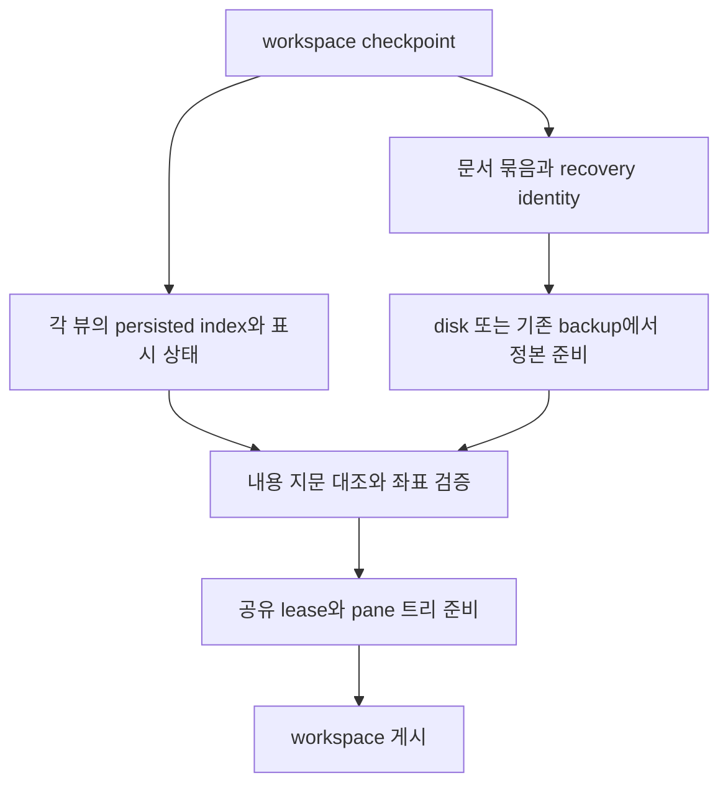

# 공유 편집기 복원 포맷과 구현 계획

상태: 로컬 문서 ID 기반 백업과 같은 창의 문서/뷰 capture·restore 연결 구현.
헤드리스 AppSession 및 별도 프로세스 실행 검증은 [제품 연결 결과](editor-recovery-integration.md)를 따른다.
실제 두 pane AppKit 재시작·리사이즈를 점검했고 스크롤 초기화 두 곳을 수정했다.
지연 구문/LSP 접힘 반례를 원문 좌표와 뷰별 복원 요청으로 수정했고 실제 앱 재시작 gate를 통과했다.
실제 한국어 HID 조합/두 pane 전환 뒤 저장·재시작은 통과했다. 사용자용 분할 명령 공개는 남아 있다.
상세 근거는 위 제품 연결 결과를 따른다.
사용자는 출시 전 단일 v2 포맷과 단계별 구현을 승인했다. Undo/Redo 이력은 저장하지 않는다.
진행 순서는 [공유 문서 계획](editor-shared-document.md), 계약은
[문서 모델](../native-editor-document-model.md)과 [workspace 복원](../workspace-restore.md)이 소유한다.

## 현재 구현 — 복구 신원과 codec

사용자가 설계/재현 PR #4097 머지와 구현 진행을 승인했다. 구현 순서의 첫 단계인
플랫폼 중립 신원·소유·codec을 구현했다. 아래 계약이 현재 코드의 기준이며 뒤의 검토안 중
이미 구현한 항목은 이 절을 따른다.

- `session.editor.recovery_id.Id`는 16 bytes다. 외부 표현은 정확히 32자리 소문자 hex이고
  영 ID·잘린 값·부호·대문자·파일 경로 성분을 거절한다. 파일 이름은 `d-<id>.bak`이다.
  난수 공급·exclusive 예약·파일 I/O를 이 타입에 넣지 않는다. ID는 writer 권한이 아니다.
- `document_state.State.recovery_id`는 문서 소유다. 저장 대상만 비우는 clearIdentity와
  본문만 정산하는 clearOpened에서는 유지하고 전체 clear에서 해제한다. registry는 새 독립
  문서의 invalid/duplicate ID를 publication 전에 거절한다. 공유 view/read/request lease는
  같은 State를 retain하므로 ID도 유지한다. OOM은 준비 상태의 ID/경로/본문 소유를 보존한다.
- `backup.encodeRecovery/parseRecovery`는 로컬 문서의 필수 ID 레코드
  `maru.editor-backup.v2`를 처리한다. 기존 `encode/parse`와 헤더를 서로 받아들이지 않는다.
  v2는 ID뿐 아니라 모든 metadata 중복·미지 키·잘못된 kind를 거절하고, 절대 UTF-8 path와
  NUL 부재, UTF-8 본문/기존 저장 크기 상한을 검사한다. 빈 본문은 유효한 편집이다.
  본문은 입력 bytes를 빌리고 path만 소유하며 allocation failure를 손상으로 바꾸지 않는다.
- `RecoveryRecord.matches`는 파일 이름·요청 ID·레코드 ID·요청 path를 함께 확인한다.
  `disk_hash`는 저장 충돌 기준으로 따로 보존한다. ID/본문 hash/저장 지문을 서로 대신 쓰지 않는다.
- `workspace_state.Document`는 필수 recovery_id를 포함한다. descriptor wire는
  `index:recovery-id:disk-hash-or-none:content-hash:path-byte-length:path`다. 이전 개발 payload를
  새 ID로 추측해서 읽지 않는다. 서로 다른 descriptor가 같은 ID를 쓰면 참조 검증이 거절한다.
  같은 path의 다른 ID와 하나의 descriptor를 참조하는 여러 view는 유효하다.

집중 검사는 `zig build test-editor-recovery-codec`다. 필수 ID/경로/빈 본문 round-trip,
헤더 분리, 손상/중복/길이 상한, State 수명과 registry publication, 모든 관련 allocation
실패를 검사한다. 제품의 일반 로컬 문서는 이제 ID를 발급하고 첫 백업에만 `.claim`을 예약한다.
`recovery_store.Owner`는 공유 뷰 사이에서 같은 쓰기 소유권을 유지한다. untitled/remote 백업은 기존 계약을 쓴다.
`workspace`의 v2 문서 표/뷰 참조와 writer 전환은 함께 연결했으며, U4b-15/16은
같은 경로의 독립 문서 A/B를 반복 백업하거나 A를 정리해도 B가 보존되는 회귀 판정으로 바꿨다.

[예약 후보 실험](editor-recovery-reservation.md)은 #4107 시점의 비교 근거다.
flat claim을 선택한 제품의 수명·정리·실패 경계와 실행 결과는 [연결 결과](editor-recovery-integration.md)를 따른다.
이하 설계 검토에서 '현재 코드', '미연결', '제안'이라고 쓴 부분은 **제품 연결 전 검토 이력**이다.
현재 계약과 검증 범위는 위 문서와 이 문서 첫 절을 우선한다. orphan/legacy discovery와 새 복구 UI의
승인된 정책·구현·실행 검증은 [백업 발견과 복구](editor-backup-discovery.md)가 소유한다.
아래 추가 검토의 ‘기존 revive가 빈 내용을 지운다’ 등은 구현 전 조사 이력이다.

## 해결한 문제 — 연결 전 코드의 한계

- entry 없는 공유 편집 뷰가 checkpoint에서 빠져 재시작 때 사라졌다. 이제 문서 참조로 저장한다.
- path만으로 독립 문서와 공유 뷰를 구분할 수 없었다. 문서 State의 동일성으로 묶고 recovery ID를 저장한다.
- 로컬 path 해시 백업은 같은 경로의 독립 편집끼리 덮어쓰거나 삭제했다. ID별 기록과 쓰기 소유자를 사용한다.
- 창별 캡처를 유지하며 `maru.workspace.v2` 아래 문서 표를 둔다. 저장 파일 경로 `workspace.v1`은 바꾸지 않는다.

## 초기 선택지 비교 — 하위 호환 검토 이력

현재 범위는 아래 출시 전 단일 포맷 절을 따른다. 이 비교의 downgrade 논의는 초기 검토 이력이며 현재 구현 요구가 아니다.

| 방법 | 장점 | 문제 | 판단 |
|---|---|---|---|
| 기존 `file-term`에 같은 경로만 반복 | 기존 reader가 파일 탭을 읽을 수 있음 | 공유와 독립 문서를 구분하지 못하며, 뷰 상태도 없음. 경로 별칭·권한 정책을 암묵적으로 바꿈 | 단독 사용하지 않음 |
| v1의 기존 줄에 선택적 공유 관계·뷰 상태 필드 추가 | 기존 파일을 그대로 읽고, 없는 필드는 기존 동작 유지. 새 line kind가 없어 기존 줄 구조를 유지함. 기존 필드 수 한도 안에서만 옛 reader 파싱 가능 | 옛 reader는 공유 관계를 무시하므로 downgrade에서 두 독립 문서가 될 수 있음. 필드/줄 한도 검증 필요 | 비선택: 구조 분리와 downgrade 손실을 우선함 |
| v2의 문서 표와 뷰 참조를 분리 | 전체 구조가 명확하고 창 간 공유까지 표현 가능 | 새 writer/reader·host 캡처 조정·마이그레이션·downgrade 보호가 한 번에 필요 | 선택: 첫 구현은 같은 창 로컬 문서로 제한 |

‘옛 reader가 읽는다’와 ‘옛 reader에서도 공유 의미가 유지된다’는 별개다.
선택적 필드 방식은 전자만 제공한다. 새 workspace를 구버전이 다시 저장하면 추가 필드는 사라질 수 있다.
이 제약을 숨긴 채 완전한 양방향 호환이라고 표기하지 않는다. 특히 구버전이 두 뷰를 각각 편집하면
같은 backup identity로 서로 다른 내용을 쓸 수 있다. downgrade를 지원한다고 선언하려면
이 손실 경로의 차단/보존 방법도 구현·검증해야 한다. 필드를 무시한다는 사실만으로 안전하다고 보지 않는다.

## 이전 선택적 필드안의 의미 — 비교용

첫 슬라이스는 일반 로컬 문서·같은 창의 공유 분할에 한정한다. untitled·원격·diff/merge는 기존 지원 gate 없이 합치지 않는다.
아래 키/값은 비선택한 v1 안의 비교용 문법이며 제품 reader/writer에는 넣지 않는다.



```text
pane ... file-term="0:text:source-edit:12:/tmp/doc.zig" editor-link="0:1" editor-view="0:..."
pane ... file-term="0:text:source-edit:12:/tmp/doc.zig" editor-link="0:1" editor-view="0:..."
```

기존 `file-term`의 mode는 `Mode.workspaceName()`의 `source-edit`를 그대로 사용한다.

- `editor-link`의 첫 값은 해당 pane의 **persisted Term index**, 둘째 값은 같은 창 checkpoint 안의 문서 묶음 번호다.
- 묶음 번호는 새 checkpoint 캡처마다 연결 lease의 동일성에서 생성한다. runtime handle/generation이나 전역 영속 ID를 그대로 쓰지 않는다.
- 묶음 descriptor에는 local path·문서 종류·기준 fingerprint를 명시한다. 정확한 `editor-link`/descriptor 배치는 codec 설계 때 함께 확정한다. 같은 묶음에 속한 모든 항목은 이 값이 일치해야 한다. 경로만 같다는 이유로 묶음을 새로 만들거나 서로 다른 묶음을 합치지 않는다.
- 첫 항목이 disk/backup으로 정본을 만들고 나머지는 준비된 같은 정본을 retain한다. 문서 백업은 기존 하나만 쓴다.
- `editor-view`는 persisted index에 대응하는 독립 선택(방향·primary·추가 선택), 첫 논리 줄/랩 조각/가로 위치, wrap override, 접힘을 담는다.
- 뷰 상태에는 캡처 당시 정본 내용 지문도 대응시킨다. disk의 CAS fingerprint, `Opened.saved_hash`, 캡처한 현재 내용 지문은 서로 다른 값이다. 복원 내용이 뷰 상태를 캡처한 내용과 다르면 byte 좌표와 접힘을 그대로 적용하지 않고 안전한 기본 표시로 열며 복원 상태를 관측한다.
- 검색어/치환어/검색 기록은 이번 복원 레코드에 넣지 않는다. 기존 세션 검색 이력 정책과 별도로 검토한다.
- Undo/Redo·구문 트리·LSP 요청·렌더 캐시·IME marked text는 직렬화하지 않는다. 기존 Hot Exit의 내용 복원과 실행 중 공유 이력을 구분한다.
- 원문은 workspace에 중복 저장하지 않는다. 기존 backup의 base fingerprint 불일치는 기존 충돌/비교 경로로 처리한다.

정확한 wire codec은 승인 후 reader/writer 한 곳에서 정의한다. 각 항목은 길이 접두와 기존 escape 규칙으로 인코딩한다.
추가 선택과 접힘은 동적 목록이지만 기존 workspace 크기/필드/줄 한도 안에서 검증한다. 새로운 임의 상한을 만들지 않는다.
전체 문자열 truncate로 경로나 선택을 부분 저장하지 않는다. 한도를 넘으면 해당 뷰 상태의 저장 실패를 관측하고,
문서 identity·미저장 백업·기존 checkpoint 보존을 우선한다.

## 복원 거래와 실패

1. 전체 모델의 index·묶음·종류·경로와 기준 fingerprint를 검사한다. 같은 번호의 불일치, 없는 참조, 중복 view record는 거절한다.
2. 기존 live workspace를 교체하지 않은 채 정본과 모든 참조·뷰 상태·pane 트리를 준비한다. 복원 중인 정본은 전용 staging 소유자에 보관한다.
3. 문서 내용이 정해진 뒤 byte 선택을 UTF-8 경계/유효 범위로 복구하고, 줄/랩/접힘은 현재 내용과 provider 결과에 맞게 검증한다. 사라진 fold를 다른 블록에 적용하지 않는다.
4. 준비 성공 후 창 모델을 한 번 게시하고 기존 workspace를 해제한다. staged 문서의 backup 복원은 한 번만 적용한다.
5. 준비 OOM·파일 접근 실패·부분 모델 실패에서는 기존 live 모델과 backup을 보존한다. 기존 restore accounting과 checkpoint 덮어쓰기 방지 latch를 따른다.

추가 뷰를 복원하지 못했다고 정본 내용을 버리거나 백업을 삭제하지 않는다.
구조 손상은 아래 최신 설계의 전체 parse 거절/원본 보존 경계를 따른다. 뷰 표시 저하와 구조 손상을 구분한다.
창 간 공유 문서를 묵시적으로 복원하지 않는다. 창 이동 지원 때 창별 캡처/복원 순서와 app-global owner 게시를 별도 검증한다.

## 닫기·저장·다른 창 이동

한 뷰 닫기는 문서 종료가 아니다. dirty 확인과 백업 삭제는 모두 `closesAllEditorDocumentViews`의 같은 집합을 따른다.
마지막 뷰 닫기에서 저장/버리기/취소가 확정되기 전 새로운 연결이나 편집이 생기면 최신 상태를 재판정한다.
checkpoint의 공유 번호는 쓰기 권한이 아니다. 연결 뷰의 기존 surface grant를 유지하며 다른 뷰 권한을 빌려 저장하지 않는다.

같은 창 pane 이동은 뷰와 lease를 그대로 이동한다. 다른 창 이동은 현재 공유 편집의 연결 수 대조가
AppSession 내부 순회에 의존하는 제약을 먼저 해결해야 한다. 포맷에 참조만 추가하고 창 간 편집이 지원된다고 선언하지 않는다.

## 구현 전에 검토할 판정 목록

| 반례 | 요구 결과 |
|---|---|
| 옛 v1 파일을 새 reader로 읽기 | 기존 모델/byte round-trip 유지 |
| 새 필드 없는 단일 뷰 | 기존 writer 출력 유지 |
| 명시적 split 두 뷰 재시작 | 정본/backup 한 개, 독립 선택·스크롤·wrap·접힘 |
| 같은 경로의 독립 문서 두 개 | 경로 일치만으로 Undo/정본 합치지 않음 |
| 서로 다른 경로·종류·fingerprint에 같은 공유 번호 | 공유 연결 거절, backup 보존 |
| 파일 삭제/재생성, disk 변경 후 재시작 | 기존 충돌/비교 처리, 자동 덮어쓰기 없음 |
| 여러 pane의 persisted index + 브라우저/untitled 삽입 | 올바른 뷰에 상태를 적용, 배열 자리 remap 검증 |
| 깨진 UTF-8 선택·역선택·겹치는 다중 선택 | 유효 경계로 정산, 중복 입력 없음 |
| 접힌 줄 삭제, provider/랩 폭 변경 | 잘못된 블록을 숨기지 않음 |
| 각 staging 할당·publication 직전 실패 | 이전 workspace/backup 불변, leaked lease 없음 |
| dirty 한 뷰 닫기/마지막 닫기/취소 | 생존 문서 보존, 마지막만 확인 및 명시적 버리기 |
| 구버전으로 새 파일 열고 재저장 | 공유 의미 손실 가능성을 별도 검증·명시 |
| 다른 창 이동·한 창 종료 | 창 간 소유/공유 게시 gate 없이는 노출하지 않음 |

## 선택한 v2 설계

문서 정본과 뷰 참조를 분리한다. 기존 `workspace.Window`의 창별 캡처 경계를 유지하며
각 Window 블록 안에 문서 표를 둔다. 문서 번호는 창 안에서만 유효하다. 앱 전체 표나 창 간 공유는
이번에 구현하지 않으며, v2라는 이름만으로 장래 기능의 완성이나 추가 버전 변경 불필요를 보장하지 않는다.

### 값 모델과 wire 책임

워크스페이스 codec은 창/pane 구조와 참조 배치를 소유한다. 에디터 상태 codec은
문서 descriptor·뷰 상태의 값 모델, 인코딩·검증을 소유하고 workspace codec이 위임한다.
이 에디터 codec은 플랫폼 중립 session/editor 계층에 둔다. 물리 저장 파일의 분리와는 별개다.
`Window`에 문서 descriptor 목록, `Pane`에 편집 뷰 목록을 추가하는 모델을 사용한다.
아래는 구현할 필드의 의미이며 정확한 키 철자/목록 인코딩은 codec 커밋에서 한 곳에 정의한다.

| 레코드 | 소유하는 값 | 불변식 |
|---|---|---|
| 창 문서 | 창 내부 document index, 일반 로컬 path, kind, disk/base fingerprint, 현재 내용 지문 | 같은 lease만 같은 index. 경로가 같아도 다른 lease는 다른 index |
| pane 뷰 | persisted Term index, document index, mode, 독립 선택·스크롤·wrap·접힘 | 하나의 위치에 하나의 Term. 뷰는 존재하는 문서만 참조 |
| 기존 비편집 Term | 현재 surface/file/browser/untitled/remote 레코드 | 기존 종류별 복원 정책 유지 |

v2에서 일반 로컬 editor는 entry 유무와 관계없이 뷰 레코드로 저장한다. 같은 Term을
`file-term`에도 중복 기록하지 않는다. file preview 등 기존 비편집 파일 레코드는 유지한다.
뷰의 persisted index는 기존 terminal/file 시퀀스에 포함하고, browser/untitled/remote의
`insert_after`는 이 시퀀스의 개수를 기준으로 캡처한다. active Term remap 역시 동일 소유자가 계산한다.
연결 뷰가 모두 없거나 참조가 없는 문서 descriptor는 정상 writer가 만들지 않는다.
권한과 실행 중 handle/generation은 직렬화 identity로 사용하지 않는다.

### 같은 시점의 캡처

기존 메인 스레드의 동기 창 캡처 안에서 문서 descriptor와 각 뷰의 상태를 owned bytes로 복사한다.
이 캡처 구간에는 await, 이벤트 루프 재진입, IME 확정이나 편집을 일으키는 callback을 넣지 않는다.
문서 revision을 캡처 시작/종료에 대조하여 다르면 전체 창 캡처를 실패시킨다. 일부 문서/뷰만
저장하거나 무한 재시도하지 않는다. 기존 host의 전체 Window 수집 실패 정책으로 마지막 완전본을 보존한다.
복사 뒤 직렬화는 owned 모델만 읽으며 런타임 뷰 포인터를 읽지 않는다.
IME marked text는 저장하지 않고 이미 확정된 정본 revision만 캡처한다.

### 한도 초과와 부분 손상

writer는 전체 모델·참조·필드 예산을 사전 검증한 뒤 출력한다. 한도 초과 또는 OOM이면
전체 checkpoint를 실패시켜 이전 완전본을 보존한다. 뷰 상태만 잘라내거나 일부 Window만 게시하지 않는다.
기존 `workspace.max_line_fields` 등 적용 가능한 한도와 host 버퍼 계약을 사용하며,
동적 선택/접힘 목록의 전체 payload 예산은 codec 구현에서 실제 버퍼 경계와 대조한다.
단순 동적 배열 사용이 입력 크기 검증을 대체하지 않는다.

문서 참조 누락·중복 Term 위치·중복 문서 번호·종류/신원 충돌은 구조 손상으로 거절한다.
기존 parser가 전체 manifest를 거절하는 `BadLine` 경계를 유지하며 새 부분 성공 모드를 만들지 않는다.
새 reader의 거절은 기존 파일 self-heal을 허용한다는 뜻이 아니다. v2 원본·backup을 보존하고
restore-incomplete latch로 자동 checkpoint 덮어쓰기를 막아야 한다.
파일 접근 실패나 staged 뷰 준비 실패도 해당 창 publication을 하지 않는다.
모든 창의 live 모델을 하나의 거래로 교체한다는 보장은 없으며, 기존 host의 창별 restore accounting을 따른다.
내용 지문 불일치는 구조 손상과 구분한다. 정본 복구는 기존 충돌 경로를 따르고
선택·스크롤·접힘은 안전한 기본 표시로 열며 degraded 상태를 관측한다.

### 출시 전 단일 포맷과 저장 경계

사용자는 아직 출시 전이므로 하위 버전 호환을 고려하지 않아도 된다고 명시했다.
v1 reader 유지·migration·구버전 보호를 위한 별도 v2 파일 운영은 이번 설계에서 제거한다.
문서/뷰를 나눈 단일 최신 포맷을 사용한다. schema 표기는 포맷 식별 용도이며,
헤더 변경만으로 저장 파일을 추가하지 않는다. 기존 canonical checkpoint 경로와 단일 소유 lock,
secure atomic publication을 유지하고 host 헤더 집계를 함께 맞춘다.
구조와 에디터 상태는 같은 checkpoint의 별도 책임 영역으로 기록하며,
미저장 텍스트는 기존 editor backup 저장소에 둔다.
이전 개발 포맷을 만나도 원본과 미저장 backup을 자동 삭제·덮어쓰지 않는다.
복구 실패를 관측하고 기존 보존 latch를 적용한다. 자동 변환·개발 데이터 정리는 별도 작업이다.

같은 checkpoint에 배치와 뷰 상태를 담으면 두 정보의 atomic replace를 공유할 수 있다.
그러나 별도 텍스트 backup과의 다중 파일 거래는 아니다. `backup.zig.settle`은
별도 debounce로 기록하고, 종료 flush도 실패 여부로 종료를 막지 않는다.
따라서 checkpoint가 내용 A의 지문과 뷰 좌표를 담고 실제 backup은 B 또는 없는 경우를
정상 실패 반례로 취급한다. 복원은 실제로 확보한 내용부터 정한 뒤 지문을 대조하며,
불일치하면 뷰 좌표/접힘을 기본값으로 연다. A의 내용까지 복구했다고 주장하지 않는다.
내용 지문은 표시 상태의 일치 여부 확인이지 마지막 입력 보존 보장이 아니다.

기존 `dropConsumed`는 `workspace_restore_staging`이면 삭제를 보류한다.
`workspace.apply`는 실패 시 `discardDeferredDrops`, 성공 시 `commitDeferredDrops`로 정산한다.
따라서 staging 중 즉시 삭제된다는 앞선 지적은 현재 코드에서 성립하지 않는다.
새 공유 복원도 이 admission과 정산 경계 안에서 문서당 한 번 적용해야 한다.
publication 성공 뒤 소비 시점 역시 기존 recovery 수명 계약과 대조해야 하며
게시만으로 crash 복구가 보장된다고 간주하지 않는다.

### 구현 순서와 완료 판정

1. codec: 단일 최신 값 모델/reader/writer, 에디터 codec 위임과 참조 검증. 결정론적 round-trip,
   혼합 Term 순서, 손상 입력, OOM, 크기 한도 판정과 compile-valid mutation으로 확인한다.
2. capture/restore: entryless 뷰 캡처, same-revision 검사, 문서당 한 번 backup 적용,
   모든 뷰 staging과 창 publication. 각 실패 지점에서 기존 tree/lease/backup 보존을 확인한다.
3. host 연결: Swift 집계·ABI 헤더와 기존 publisher·backup re-arm·동일 lock을 연결한다.
   최신 포맷 저장 실패/손상, atomic replace 전후 crash와 이전 개발 파일 보존을 검증한다.
4. 재시작과 제품 화면: dirty 두 pane, 독립 선택/스크롤/접힘, 마지막 뷰 닫기, IME 확정 후 재시작을 검증한다.
   이 gate를 통과한 뒤 사용자용 분할 action/chord를 연결한다.

현재 작업은 설계 구체화이며 공개 전 판정 항목이 남아 있다. 플랫폼 중립 codec은 부분 구현했고 host 연결·실제 재시작·GUI gate는 미착수다.

## 설계 반례 검토 — 2026-10-03

1. 같은 경로만 저장하는 안은 독립 문서를 공유 문서로 합치는 반례가 있어 제외했다. 명시적 연결 관계가 필요하다.
2. 선택적 키의 무시를 완전한 양방향 호환으로 보는 주장을 수정했다. 구버전 재저장·독립 편집의 backup 충돌은 별도 손실 경로다.
3. runtime handle을 저장하는 안은 재시작 generation과 권한을 혼동하므로 제외했다. checkpoint 안의 묶음 번호와 기존 recovery identity를 구분한다.
4. 경로와 fold head만 일치하면 좌표를 복구하는 안은 disk 변경 뒤 다른 블록을 숨기는 반례가 있다. 뷰 상태를 캡처한 내용 지문이 다르면 안전한 기본 표시를 사용한다.
5. 창별 블록에 같은 번호를 넣어 app-global 공유를 주장하는 안은 독립 캡처와 창 복원 순서에 의존하므로 제외했다. 첫 포맷 검토의 같은 창 범위와 창 간 지원 gate를 구분한다.

위 검토는 현재 소스와 기존 계약의 대조다. 새 codec의 실행·migration·GUI 복원을 검증한 결과가 아니다.

## 추가 적대적 검토 5회 — 2026-10-03

1. **호환성 반례:** 기존 pane 줄이 `workspace.max_line_fields`에 가까우면 새 반복 필드로 한도를 넘길 수 있다. 미지 키를 무시하는 reader도 토큰화 한도에서는 실패한다. 따라서 선택적 필드의 파싱 호환성은 기존 줄 전체의 필드 예산 안에서만 성립한다. writer의 전체 필드 수 사전 검증과 한도 초과 처리 방식은 codec 승인 전에 확정할 항목이다.
2. **캡처 일관성 반례:** 문서 내용 지문을 읽은 뒤 편집이 일어나고 다른 뷰 상태를 읽으면 하나의 checkpoint 안에 서로 다른 revision이 섞인다. 문서 묶음마다 동일 revision의 내용 지문과 모든 뷰 상태를 확보해야 한다. 캡처 도중 revision 변경을 막는 동기 경계 또는 변경 검출 후 전체 묶음 재캡처가 필요하며, 정확한 방식은 캡처 구현 때 검증한다. 지문만 추가해서 이 문제가 해결됐다고 보지 않는다.
3. **복원 부작용 반례:** staging 중 backup을 읽었다는 이유로 파일을 삭제하거나 live owner에 붙이면 뒤의 뷰 할당 실패에서 원래 상태를 보존할 수 없다. backup 내용 읽기와 staged 정본에 적용하는 일은 publication 전에 끝내되, 복원 성공을 이유로 한 외부 파일 변경·삭제나 live 연결은 성공 경계와 기존 recovery 계약에 따라야 한다. 위 거래의 ‘한 번 적용’은 각 뷰마다 반복 복원하지 않는다는 의미다.
4. **실행 중 실패 보장의 반례:** `splitSharedEditorPane`는 IME 확정을 먼저 시도한 뒤 분할 준비를 할당한다. 확정 성공 후 준비 OOM이면 분할 트리·포커스·참조는 유지되지만 성공한 조합 입력까지 취소하지 않는다. 현재 OOM fixture는 marked text 없는 준비 실패를, 조합 fixture는 확정 거절과 성공 후 단일 입력을 검증한다. 조합 확정 성공 뒤 준비 실패를 같은 시나리오에서 자동 검증한 것으로 확대해석하지 않는다.
5. **검증 주장 반례:** 내부 pane fixture와 방향·MRU·접힘·마지막 뷰 닫기 검사는 실제 새 codec, downgrade 재저장, 재시작 복원, OS IME 또는 두 pane의 화면 결과를 입증하지 않는다. 이들은 각각 후속 구현/공개 gate이며 초안 PR의 내부 구현 통과와 구분한다. 같은 경로의 독립 문서는 공유하지 않는다는 요구와 기존 backup identity 충돌 가능성도 구분한다. 공유 레코드만으로 기존 독립 문서 백업 문제까지 해결했다고 주장하지 않는다.

이번 다섯 회는 서로 다른 반례 축으로 현재 소스·설계·검증 범위를 다시 대조한 것이다.
이 검토 당시에는 캡처 경계, 한도 초과 처리, 부분 손상 처리와 downgrade 보호가 미결이었다.
이후 선택한 v2 설계 절에 처리 방향을 구체화했다. codec 구현과 실행 검증은 별도 완료 gate다.

## 저장 위치 권고의 추가 적대적 검토 — 2026-10-03

- **같은 파일이면 전부 일치한다는 반례:** 배치/뷰는 한 atomic checkpoint라도 본문 backup은 별도 파일이다. 지문 불일치에서 안전한 표시로 돌아가는 조건을 보완했다. 백업 실패 뒤 마지막 입력 손실을 이 방식으로 해결했다고 주장하지 않는다.
- **기존 복원 함수의 호출 경계:** 앞선 검토는 `dropConsumed`의 staging 보호를 놓쳤다. 아래 추가 검토에서 즉시 삭제 주장을 정정한다. 실제 조건은 새 공유 복원이 기존 staging admission과 commit/discard 정산을 유지하는지다.
- **같은 경로의 독립 문서 반례:** 문서 표는 둘을 구분하지만 기존 로컬 backup 파일 이름은 path만으로 정해진다. base fingerprint가 달라도 이름이 같을 수 있다. 문서 표만으로 각각 다른 dirty 내용을 복구한다고 주장하지 않는다. 첫 공개 전 이 경우의 독립 recovery 식별 또는 생성 정책을 판정해야 한다.
- **선택 상태 저장 실패의 UX 반례:** 큰 다중 선택/접힘 상태 때문에 checkpoint 전체 실패가 반복되면 새 창 배치까지 저장하지 못한다. 현재 실패 보존은 안전성 조건이며 최선의 UX라는 결론은 아니다. 뷰 상태를 명시적 기본값 레코드로 낮춰 구조만 저장하는 방식과 실측 비교할 후속 판정 항목으로 남긴다.
- **다른 에디터와 동일하다는 반례:** VS Code의 workspace 내부 DB와 그룹/파일별 뷰 상태는 책임 분리를 뒷받침하지만 Maru의 단일 text checkpoint가 최선임을 입증하지 않는다. 현재 권고는 기존 atomic publisher 재사용과 다중 파일 결합 비용을 줄이는 Maru의 구현 선택이다. 별도 파일/DB가 잘못된 방식이라는 주장은 하지 않는다.

이번 검증은 소스와 설계의 대조다. codec/crash/재시작 실행 검증을 완료한 결과가 아니다.

## 추가 적대적 검증 5회 — 저장/복원 경계 재대조

1. **삭제 보호 장치 반증.** `backup.dropConsumed`의 staging guard와 `workspace.apply`의 errdefer/성공 정산을 대조했다. 즉시 삭제라는 이전 주장은 철회한다. staging 목록 append OOM에서도 삭제하지 않는 현재 방어가 있다. 새 복원이 이 범위를 우회하지 않는지를 후속 실행 gate로 둔다. 순수 함수에 `dropConsumed` 호출이 있다는 사실만으로 제품 결함이라 판정하지 않는다.
2. **백업 신원 반증.** `session/editor/backup.fileName`은 로컬 path만 해시한다. `disk_hash`는 record payload의 저장 충돌 판정 값이며 파일 이름에 들어가지 않는다. 기존 UB6 판정자도 서로 다른 disk_hash에서 같은 이름을 요구한다. 따라서 같은 path의 독립 dirty 문서는 base fingerprint가 달라도 백업 이름이 충돌한다. 현재 문서 표가 이를 해결하지 않으며, 독립 recovery ID 도입 또는 독립 dirty 모델 생성 정책은 공개 전 판정 항목이다. 두 안 중 하나를 이번 문서 검토에서 임의로 구현하지 않는다.
3. **실패와 부재의 혼동 반증.** 현재 `backup.read`의 `null`은 파일 없음뿐 아니라 접근 실패·OOM·parse 실패도 포함한다. 공유 복원에서 이를 모두 ‘백업 없음, clean disk로 성공’으로 처리하면 checkpoint 지문과 다른 내용으로 열리고 미저장 내용을 놓쳤다는 이유를 알 수 없다. 새 복원 경계에서는 absent/invalid/unreadable/OutOfMemory를 구분해 관측하고, OOM 등 복원 준비 실패는 창 게시를 거절해야 한다. 손상 record는 기존처럼 보존한다. 이는 새 구현 요구이며 기존 함수가 이미 구분한다는 주장은 하지 않는다.
4. **revision 검사의 범위 반증.** 문서 revision은 커서 이동·접힘·wrap·창 폭 변경을 대표하지 않는다. 따라서 start/end revision 대조만으로 모든 뷰 상태의 동시성을 증명할 수 없다. 같은 메인 스레드 구간에서 topology·뷰 상태·표시 설정까지 owned copy하고 재진입을 금지하는 조건이 필요하다. 복원 때 내용 지문이 같아도 wrap 폭·tab width·fold provider가 바뀔 수 있으므로 랩 조각과 접힘 범위를 현재 표시 매핑으로 다시 검증한다. saved revision 번호를 그대로 다음 실행의 일치 기준으로 쓰지 않는다.
5. **메모리 게시와 영속 복구의 혼동 반증.** 기존 성공 경로는 live 창 게시 후 `commitDeferredDrops`로 record를 소비하고, 복원된 dirty 문서는 다음 backup 만기에 다시 보호된다. 그 사이 프로세스가 종료되는 경우는 staging rollback과 다른 crash 경계다. 신규 설계는 게시 성공을 영속 내용 보존의 증거로 쓰지 않는다. 공유 복원 공개 전 ‘record 소비 직후→재백업 전 종료’에 대한 격리 프로세스 재현과 보존 수명 판정이 필요하다. 이번 검토는 이 crash를 실행 재현하지 않았다.

다섯 회의 결론은 설계 조건 강화와 이전 주장 정정이다. 현재 저장 위치 권고는
같은 checkpoint에서 구조/뷰를 결합하는 단순성을 근거로 한 후보이며,
미저장 recovery identity·실패 분류·성공 후 record 수명까지 해결된 최종 설계라는 뜻은 아니다.

## 저장/복원 설계 추가 적대적 검증 5회 — 계약의 누락 재대조

1. **지문의 목적 혼동:** checkpoint의 현재 내용 지문과 backup의 본문이 다르다는 이유로 record를 거절하면 checkpoint 이후의 더 최신 편집을 버릴 수 있다. `restoreFromRecord`가 지키는 record의 disk_hash는 저장 CAS 기준이고, 뷰 내용 지문은 좌표 적용 기준이다. backup의 신원·본문 유효성·기존 복구 정책을 먼저 판정하고 실제 복원 내용과 뷰 지문을 대조한다. 지문 불일치에서는 뷰 상태를 기본값으로 열고 복원할 수 있는 본문은 보존한다. checkpoint 지문을 backup 본문 버전의 권위로 쓰지 않는다.
2. **wrap 기본값 손실:** 현재 `editor_wrap`은 `?bool`이며 null은 config 상속이다. 실제 화면이 wrap=true였다는 이유로 true를 저장하면 다음 실행의 config 변경을 따르지 않게 된다. codec은 inherit/on/off를 구분하고, 상속 상태에서 유효 wrap을 영속 override로 바꾸지 않는다. first_piece는 새 창 폭과 유효 wrap에서 다시 검증한다. inherited/explicit true/explicit false 모두 round-trip과 config 변경 후 판정 대상이다.
3. **혼합 Term 위치 중복:** 편집 뷰와 기존 `file-term`/surface가 같은 persisted 위치에 들어가면 view record 자체의 index는 유효해도 active Term이나 insert_after가 다른 대상을 가리킬 수 있다. 문서 표의 참조 유효성 검사와 별도로 모든 persisted 종류의 위치를 합쳐 단일 occupancy를 검증한다. writer는 일반 로컬 editor를 한 번만 내고 reader도 중복 위치를 거절한다. browser/untitled/remote의 기존 삽입 순서 계약은 그대로 사용하고, 거절/제외 항목을 거친 최종 active remap을 검증한다.
4. **경로 복원으로 권한 우회:** `prepareSharedView`는 원격 신원뿐 아니라 `remoteViewPathIsReadOnly`가 식별하는 로컬 캐시 경로도 제외한다. descriptor를 local로 썼다는 이유만으로 이 검사를 건너뛰면 원격 mirror를 일반 로컬 shared editor로 복원할 수 있다. restored 파일의 실제 종류·현재 접근 정책을 다시 판정하고, 기존 authorized open 경계와 동일한 local-only admission을 통과한 정본만 공유한다. persisted read_only나 mode가 쓰기 권한을 부여하지 않는다.
5. **검증 범위/미지 레코드 혼동:** 기존 workspace parser의 trailing line 관용은 새 단일 포맷의 완전한 구조 검증 근거가 아니다. 새 codec은 선언한 문서/뷰/창 레코드를 끝까지 소비하고 남은 알 수 없는 구조 레코드·누락 block·초과 count를 거절해야 한다. 정상 입력 round-trip만으로 두 번째 창의 조용한 손실을 방어했다고 주장하지 않는다. 헤더를 붙인 정상 창 뒤 미지 레코드와 추가 창을 넣는 반례, 문서/뷰 count 절단과 정상 두 창 양성 대조를 후속 실행 판정 목록에 추가한다.

각 회는 현재 코드의 호출·값 의미를 새 설계에 대입한 반례 검토다.
새 codec은 아직 없으므로 위 반례를 새 reader/writer가 실제로 거절했다는 뜻은 아니다.
기존 집중 gate 재실행은 현재 분할·백업 동작의 회귀 확인에만 사용한다.

## 추가 적대적 검증 10회 — 저장 모델과 제품 복원 계약

각 회에서 아래 반례를 현재 코드와 대조했다. 소스의 기존 방어는 유지하고 새 codec의 요구와
미결 정책을 구분한다. 새 codec이 없으므로 문서상 요구를 실행 통과로 세지 않는다.

| 항목 | 반례와 소스 근거 | 판정/완료 조건 |
|---|---|---|
| R1 | 두 창에서 document index=0이 각각 다른 문서를 가리킴. `workspace.Window` 캡처는 창별이다 | index 조회 map은 창 staging에 귀속시킨다. 다른 창 map을 재사용하거나 같은 번호를 공유 lease로 합치지 않는다. 동일 앱 registry owner와 persisted index namespace는 별개다 |
| R2 | 문서 표 번호가 포인터 주소/hash-map 순회에 따라 달라져 동일 모델의 출력이 매번 바뀜. 기존 workspace writer는 결정론적 순회로 출력한다 | window→tab→pane→Term의 기존 캡처 순서에서 첫 lease 방문 순서로 번호를 발급한다. 주소를 저장/정렬 기준으로 쓰지 않는다. 같은 모델 재캡처의 동일 bytes 양성 대조를 둔다 |
| R3 | 역선택·단어 선택·다중 커서를 start/end만으로 복원해 caret 방향과 primary를 잃음. `editor.selection.Selection`은 anchor_start/anchor_end/focus와 kind를 갖는다 | persisted selection 의미를 방향 있는 anchor/focus로 정의한다. primary 위치와 extras를 보존하며 anchor 종류/범위를 대조한다. 범위 clamp·UTF-8 및 현재 caret 정산·중복 selection 정리는 기존 편집 규칙에 위임한다. goal 같은 표시 의존 값은 재계산 여부를 codec에서 명시한다 |
| R4 | 숫자로 선언한 길이·개수가 실제 payload를 넘거나 합산/곱셈에서 넘침. workspace의 길이 접두와 동적 배열은 그 자체로 안전성 증명이 아니다 | 새 decoder는 남은 payload 길이와 count/element 예산을 할당 전에 확인한다. 덧셈/곱셈은 checked 산술 또는 남은 길이 기반 비교로 검증한다. 잘린 escape·다국어 byte 길이·가장 큰 숫자·빈/정상 레코드를 Debug/ReleaseFast 양쪽에서 판정한다 |
| R5 | dirty 백업을 정본으로 복원한 뒤 현재 disk 지문을 저장 기준으로 덮어 외부 변경을 무조건 저장함. `backup.restoreFromRecord`는 record의 disk_hash를 적용한다 | 공유 정본 한 번 복원에서도 기존 CAS 기준을 유지한다. disk base 지문/clean saved_hash/현재 본문 지문을 섞지 않는다. dirty는 저장 기준과 실제 내용으로 판정하며 문서 descriptor의 dirty=true만으로 본문 존재를 간주하지 않는다 |
| R6 | 원본 파일이 삭제된 shared 문서의 두 뷰를 열 수 없음. 기존 `backup.reviveAsUntitled`는 신원을 잃은 내용을 한 이름 없는 문서로 되살린다 | 현재 local-only 공유 gate와 이름 없는 복구가 충돌한다. 창 복원 거절 뒤 backup 보존만 할지, 하나의 recovery 문서를 별도로 열지, untitled 공유까지 확장할지는 **미결**이다. 기존 helper를 뷰마다 불러 같은 내용을 중복 복구하지 않는다 |
| R7 | Save As/rename 중 새 경로 checkpoint와 이전 경로 backup이 섞임. `backup.markClean`은 previous_identity를 받아 정산하며 공유 문서 계획은 저장 요청 신원을 구분한다 | 캡처는 한 정본의 확정된 현재 path를 모든 뷰에 사용한다. 저장 요청 진행 상태를 workspace에서 재개하지 않는다. 새 경로·옛 backup·저장 중 추가 입력의 결합은 source/target 실패 지점별 후속 gate이며 경로만 바꿔 성공으로 세지 않는다 |
| R8 | pane에 같은 path의 뷰 둘을 복원할 때 기존 `validatePaneFileTerms`의 path 중복 금지를 그대로 적용하거나 mode를 아무 종류에나 허용함 | editor view의 유일성은 Term 위치와 명시적 문서 참조로 판정하고 기존 file preview 계약과 분리한다. 같은 문서의 서로 다른 뷰를 path 중복으로 거절하지 않는다. mode/kind는 기존 `Mode.allowedFor` 의미와 대조하며 지원하지 않는 editor 역할을 공유 정본에 붙이지 않는다 |
| R9 | 표시가 아직 sentinel 1×1 크기일 때 first_piece를 clamp해 실제 창에서 원래 스크롤 위치를 잃음. `createEditorTerm`은 1×1 surface이고 workspace 적용 후 layout resize가 이어진다 | 논리 스크롤 앵커를 staging에서 보관하고 실제 pane geometry/유효 wrap이 준비된 뒤 표시 매핑으로 정산한다. pixel 위치나 화면 행 번호만 영속하지 않는다. 배경 pane·다른 scale/폭·접힘 provider 변경에서 첫 제품 frame을 검사한다 |
| R10 | atomic rename 성공을 정전에도 최신 내용이 보존되는 보장으로 설명함. `workspace_checkpoint_file.zig`는 sync syscall을 하지 않고 전원 손실 durability를 명시적으로 주장하지 않는다 | 기존 보장 범위를 유지한다. 프로세스 crash 전후 complete-file publication과 전원 손실 durability를 구분한다. 별도 backup의 성공 여부도 checkpoint commit으로 대신하지 않는다. SIGKILL gate와 전원 손실 미검증을 별도로 표기한다 |

### 남은 정책과 실행 gate의 단일 목록

- **정책 미결:** 같은 path 독립 dirty 문서의 recovery 식별, missing-file shared 복구 방식,
  큰 선택/접힘 상태의 저장 저하 정책. 백업 보존 수명은 아래 후속 구현에서 확정했다.
- **구현 요구:** backup 읽기 결과 분류, editor codec의 정확한 선택/좌표 wire,
  전체 count/참조/occupancy/overflow 검증, 표시가 준비된 뒤 view state 적용,
  로컬 공유 admission과 owned capture 경계 유지.
- **실행 미검증:** 새 codec의 정상/손상/OOM/mutation, 저장 진행 중 경로 변경,
  새 공유 복원 staging의 모든 실패, 소비 직후 crash, 실제 재시작/IME/두 pane 화면.

이 목록이 있으므로 현재 상태를 ‘누락 없이 확정된 설계’라고 부르지 않는다.
검토 누적 횟수와 기존 집중 gate 통과는 위 정책 선택이나 새 실행 gate를 대신하지 않는다.

## 파일 크기·할당·다른 상태 영향 적대적 검증 10개 시나리오

`src/session/editor/workspace_state.zig`의 Document/View payload와 명시적 참조 판정은 부분 구현했다.
제품 checkpoint reader/writer/capture/restore에는 아직 연결하지 않았다. Undo와 본문은 이 codec에 없다.
`zig build test-editor-restore-codec`는 7개 실제 판정자를 Debug/ReleaseFast exact-count한다.
경로 bytes, base/current 지문 구분, 방향 있는 primary/extras, inherit/on/off, 접힘,
절단/미지 값/부풀린 count, 참조 중복/부재/고아, 준비 할당 실패의 해제를 검사한다.

측정은 `zig build perf-editor-workspace-state -Doptimize=ReleaseFast`를 5회 실행한 결과다.
10개 시나리오를 매회 실행해 각 출력의 종료 시 tracked live bytes=0을 확인했다.
시나리오의 규모는 codec 부하용이다. 실제 제품 pane/document admission이나 fold provider 결과의
유효성을 입증하지 않으며, 기존 제품 커서 상한을 넘는 입력은 거절한다.

| 시나리오 | raw payload bytes | codec 요청 할당 peak bytes | encode/parse+validate 중앙값 µs | 판정 |
|---|---:|---:|---:|---|
| 한 문서·한 뷰 | 60 | 589 | 10/17 | 왕복/참조 판정 통과·tracked live 0 |
| 한 문서·64뷰 | 2328 | 13962 | 15/46 | 왕복/참조 판정 통과·tracked live 0 |
| 한 문서·1,024뷰 | 36888 | 227532 | 151/280 | 왕복/참조 판정 통과·tracked live 0 |
| primary 포함 10,000커서 | 246705 | 749394 | 467/834 | 왕복/참조 판정 통과·tracked live 0 |
| 100,000 추가 커서 | 출력 없음 | 0 | 해당 없음 | 할당/출력 전에 거절 |
| 100,000 접힌 머리 | 588955 | 996122 | 542/1300 | 왕복/참조 판정 통과·tracked live 0 |
| 64뷰 각각 추가 커서·접힘 1,000 | 1638360 | 5382795 | 1528/3460 | 왕복/참조 판정 통과·tracked live 0 |
| std.fs.max_path_bytes 길이 경로 | 1076 | 3681 | 4/7 | 왕복/참조 판정 통과·tracked live 0 |
| 독립 문서·뷰 10,000 | 657780 | 3237788 | 1198/3974 | 왕복/참조 판정 통과·tracked live 0 |
| 최대 정수 count 공격 10,000회 | 출력 없음 | 0 | 해당 없음 | 할당/출력 전에 거절 |

**측정 범위:** raw payload에는 전체 workspace 문법·따옴표 escape·Swift 문자열/Data/Array 사본이
포함되지 않는다. peak는 tracker에 요청한 bytes이며 RSS가 아니다. 입력 fixture 배열·현재 에디터
본문·뷰 모델·문서 hash 계산·provider·AppKit·실제 disk I/O는 제외했다. decoded arrays와 참조
검증 scratch는 포함했다. 시간은 이 머신에서의 5회 중앙값이며 제품 frame budget 통과 주장에 쓰지 않는다.

**발견하고 수정한 실제 codec 누락:** 기존 `selection.max_cursors`를 적용하지 않아
100,000 추가 커서도 받아들였다. primary를 포함한 기존 상한을 writer/reader 양쪽에 적용했다.
한계 바로 아래 정상 입력 양성 대조와, 입력 길이는 유효하지만 상한만 넘는 record를
FailingAllocator 첫 할당 전에 거절하는 판정자를 추가했다. 격리 copy에서 writer guard 제거와
reader guard 제거는 각각 compile-valid runtime 실패를 일으켰고, 등가 writer 조건 변이는 통과했다.

**다른 workspace 값 영향:** 현재 Swift `captureWorkspaceSnapshot`은 한 창 serialize 실패나
전체 snapshot semantic validation 실패에서 전체 저장을 건너뛴다. 기존 apply-error와
incomplete-no-clobber boundary 각각 1/1은 이 배선의 소스 판정이다. 새 codec 오류를 주입한
제품 통합 테스트는 아니며 다른 상태 저장 격리를 입증하지 않는다.

**설계 결론:** 크기 증가와 전체 저장 실패 전파 가능성은 실재하는 설계 비용이다. 구조/문서 참조를
필수로 유지하고 표시 상태는 별도 실패 예산을 적용하는 안을 우선 비교한다. 선택 상태만 한도를
넘었을 때 명시적 기본값으로 내보내는 정책은 사용자 선택을 기다리는 중이며 아직 제품에 넣지 않았다.
현재 host의 `loadWorkspaceText`는 `Data(contentsOf:)`로 전체 파일을 읽으므로 필드 수 한도만으로
전체 bytes와 초기 read 메모리를 제한했다고 주장할 수 없다. codec 단독의 count 검증과
checkpoint 전체 read/capture 예산은 서로 다른 gate다. 새 전역 한도를 임의로 확정하지 않는다.

## 남은 전체 저장·읽기 영향 실행 확인

`python3 tools/perf/workspace_host_impact.py`는 현재 Swift host의
`captureWorkspaceSnapshot`과 `loadWorkspaceText` 본문을 그대로 추출해 macOS에서 실행한다.
창/session fixture와 Zig serialize/semantic-count ABI만 대체한다. 정상 sibling bytes,
첫/마지막 창 실패와 후속 호출 중단, nil/빈 payload, 없는 session, 전역 validation 실패,
정상 재시도, published-only 제외/포함을 12개 assertion으로 확인했다.
ABI 실패가 에디터 OOM 때문에 발생했다는 제품 재현이나 새 metadata codec 연결 검사는 아니다.
fixture bytes의 terminal/browser/layout 표식은 host의 문자열 보존을 확인할 뿐 실제 Zig 포맷 판정이 아니다.

**확인된 영향:** 포함된 창 하나의 serialize 실패는 이미 모은 다른 창 bytes도 게시하지 못하게 한다.
실패하지 않는 창만 저장하면 실패한 창이 다음 복원에서 사라지므로 현재 전체 취소는 의도된 보호다.
실패가 지속되면 terminal/browser/layout 변경도 마지막 성공 checkpoint 이후 갱신되지 않는다.
이는 현재 live 값의 변조와 다르며, 이전 checkpoint 이후 변경을 재시작에서 잃을 가능성이다.
원인을 없애고 재시도하면 정상 전체 bytes가 다시 나온다. 새 codec을 연결하지 않았으므로
그 codec의 실패가 현재 제품 저장을 막는다고 표현하지 않는다.

기존 checkpoint coordinator 실행 검사 11/11에서 background capture 실패는 write 효과 없이
dirty와 backoff 재시도를 유지하고, final capture 실패는 `cancel_quit`을 내는 것을 확인했다.
Swift host는 keep-alive 종료를 취소하며 end-all 허용 종료는 진행할 수 있다. 파일 게시 검사 17/17은
syscall 실패와 rename 전 SIGKILL 등의 이전 완전본 보존을 확인한다. 각 계층의 실행 증거이며
실제 앱 종료까지 연결한 새 E2E 증거는 아니다. 표시 metadata만 기본값으로 내려 저장하는 정책과
필수 문서/topology 실패에서 전체 취소하는 정책은 별도로 결정해야 한다.

**읽기 비용 실측:** 실제 `loadWorkspaceText`를 1/16/64 MiB 파일에 실행하면 모두 전체 bytes를 읽는다.
각 새 프로세스의 최대 RSS는 8,159,232 / 39,649,280 / 140,296,192 bytes였다.
64 MiB 입력은 약 134 MiB RSS를 보였다. 메모리에는 Foundation/AppKit과 read/decode 비용이 포함되며
제품 AppSession·Zig parser·복원 모델은 없다. 파일은 큰 주석 줄 fixture이며 의미 검증 전 read 비용이다.
한 번씩 측정한 시간은 520/3,144/15,761 µs로 성능 보장이나 frame budget 판정에 쓰지 않는다.
필드 수 제한은 이 최초 전체 읽기 비용을 제한하지 않는다. 새 파일 byte 상한이나 streaming parser는
이번 확인에서 도입하지 않았고 정상 규모 측정·실패 UX와 함께 별도 설계해야 한다.

재현 도구는 source 추출 실패·컴파일 실패·assertion 실패에서 실패 종료하고 artifact 경로를 출력한다.
로그: `/tmp/maru-workspace-impact-retained.log`, `/tmp/maru-workspace-impact-coordinator.log`,
`/tmp/maru-workspace-impact-file.log`. 파일 읽기 probe는 생성한 부하 입력 파일을 실행 후 삭제한다.

## 저장 구조 비교 실측과 판단 갱신

같은 파일과 별도 파일을 실제 파일 게시·캡처·기존 codec 비용으로 비교했다. 제품 저장 정책을
변경한 것은 아니며, 아래 실험 컨테이너는 제품 wire 포맷이 아니다.
`tools/perf/workspace_storage_compare.py`는 필수 4KiB와 표시 payload를 합치는 방식,
세대별 표시 파일을 먼저 게시하고 manifest가 그 세대를 참조하는 방식을 비교한다.
각 파일은 write/fsync/rename/directory-fsync하며 5회 중앙값을 기록한다. read는 OS cache가 있는
파일 읽기이며 cold disk나 전원 장애 내구성 시험이 아니다. 기존 C2 보안 검증·종료 backup 복사·
문서 본문 backup·checksum·실제 metadata 해석·동시 reader는 비용 비교에서 제외한다.

### 파일 게시 비교

마지막 측정군의 5회 중앙값(µs)이다. 별도 파일의 필수 정보만 갱신하는 실험에서는 표시 payload가
그대로일 때 앞서 게시한 세대를 다시 참조한다. 문서 내용/공유 뷰 집합이 같다는 fixture 전제이며,
제품에서는 참조 identity와 문서 내용 지문이 일치해야 재사용할 수 있다.

| 표시 payload | 같은 파일 전체 갱신 | 별도 파일 전체 갱신 | 같은 파일 필수 정보만 갱신 | 별도 파일 필수 정보만 갱신 |
|---|---:|---:|---:|---:|
| 2,328 bytes | 226 | 404 | 203 | 258 |
| 1,638,360 bytes | 530 | 1,709 | 558 | 772 |
| 16 MiB | 4,078 | 5,829 | 2,840 | 2,599 |

다른 측정군의 1.64MB 필수 정보만 갱신에서는 별도 파일이 346µs, 같은 파일이 814µs였다.
I/O 시간은 측정군 사이 변동이 크므로 별도 파일의 재사용이 항상 빠르다고 결론 내리지 않는다.
2.3KB/1.64MB의 전체 갱신은 측정군마다 단일 파일이 유리했지만, 제품 작업 비율과 backup 비용까지
포함한 최종 우열은 아니다. 파일 분리의 이득은 큰 표시 상태를 자주 재사용할 수 있는 경우에 있다.
현재 실제 사용자의 변경 빈도와 payload 분포를 수집하지 않았으므로 재사용 이득을 가정하지 않는다.

### 중단과 실패 비교

같은 파일 2개, 별도 파일 4개 게시 중단 지점에서 child에 실제 SIGKILL을 보냈다.
모든 경우 reader는 이전 완전 세대 또는 새 완전 세대를 읽었다. 별도 파일은 manifest 게시 전에
새 표시 파일이 남을 수 있다. 세대 참조 없는 고정 두 파일의 새 표시/옛 manifest 혼합도 재현했다.
표시 준비 실패를 명시적으로 주입하면 두 실험 모두 새 필수 정보와 표시 기본값을 게시할 수 있었다.
이 마지막 주입은 실제 제품 allocator OOM이 아니라 실험 입력 분기다. 제품 codec의 실제 allocator
실패 해제는 기존 7/7 gate가 소유하며 전체 거래에 연결된 검증과 구분한다.

실험의 GC는 현재 세대만 남긴다. 제품은 이전 checkpoint backup도 참조할 수 있으므로 같은 GC를
채택하면 안 된다. 이전 완전본의 sidecar 보존, reader와 GC 경쟁, orphan 정리, 문서 지문 대조는
분리안의 추가 책임이다. SIGKILL 통과를 power-loss·기존 backup 연계·제품 복원 통과로 표기하지 않는다.

### host 사본 비교

실제 Swift `captureWorkspaceSnapshot` 본문을 추출한 기준선, Data 누적 실험안, 기존 잘못된
UTF-8 치환을 유지하며 Data에 누적하는 실험안을 비교했다. Zig serialize/semantic-count ABI는
대체하므로 실제 Zig 준비·semantic validation·AppSession은 없다. 5개의 별도 프로세스 중앙값이며
RSS는 fixture 세션 bytes·Foundation/AppKit·사본을 포함한 전체 프로세스 최대값이다.

| 입력/창 수 | 입력만 준비한 RSS | 기존 capture RSS | 치환 보존 Data 누적 RSS | 기존/치환 보존 시간 µs |
|---|---:|---:|---:|---:|
| 4KiB / 1 | 5,963,776 | 6,144,000 | 6,111,232 | 642 / 696 |
| 1,638,400 bytes / 64 | 9,650,176 | 16,924,672 | 11,534,336 | 1,314 / 1,711 |
| 16MiB / 1 | 39,600,128 | 90,161,152 | 73,351,168 | 4,109 / 3,068 |
| 64MiB / 64 | 144,015,360 | 413,876,224 | 213,712,896 | 18,580 / 7,241 |

메모리 개선은 큰 입력에서 재측정해도 확인됐지만 작은 입력의 시간 개선은 보장하지 않는다.
bytes를 직접 Data에 넣으면 기존 불량 UTF-8 치환이 사라지는 반례를 재현했다.
한글·한자·quote·backslash·불량 bytes의 제한 fixture에서는 치환 보존안이 기준선과 일치했다.
전체 제품 입력의 등가성 증거는 아니다. 불필요한 최종 String/Array/Data 사본을 줄일 여지가 있지만,
capture 시간만으로 실제 main-thread 프레임 예산을 통과했다고 표현하지 않는다.

### 기존 codec과 읽기 비용

`tools/perf/workspace_model_size.zig`는 실제 기존 serializer/parser를 실행한다.
창마다 tab/pane/terminal 하나인 fixture이며 공유 metadata·host attach는 없다.
5회 중앙값에서 1/64/512/4,096창의 wire bytes는 301/18,130/144,914/1,159,186,
encode는 2/16/197/1,535µs, parse+validate는 9/45/581/4,511µs였다.
프로세스 RSS는 1,867,776/2,015,232/2,932,736/10,371,072 bytes.
4,096창이 정상적인 사용자 규모라는 뜻은 아니다. 큰 단일 record와 많은 runtime identity의
검증 비용은 이 fixture에서 측정하지 않았다.

host read도 각각 5회 측정했다. 1/16/64MiB의 RSS 중앙값은
8,192,000/39,665,664/140,345,344 bytes, 시간은 197/2,197/15,837µs였다.
추가로 `.mappedIfSafe` 옵션을 비교했지만 64MiB의 RSS는 기존 140,328,960,
옵션 사용 140,247,040 bytes로 거의 같았다. 시간은 14,422/8,331µs였다.
옵션이 실제 mmap 사용을 보장하지 않고 이후 String 변환도 남으므로 이 옵션만으로
읽기 메모리 문제가 해결됐다고 판단하지 않는다.
완전한 의미 검증을 수행하는 streaming reader는 아직 없으므로, 단순 chunk 합산을
실제 parser보다 유리한 결과로 비교하지 않았다. 제품 읽기 방식의 최종 판정은 남아 있다.

### 추천의 갱신

1. **기존 구조에서 host 사본 감소를 먼저 검토한다.** 새 파일 책임이나 임의의 상태 삭제 없이
   실측한 메모리 비용에 직접 효과가 있다. 제품 적용 때는 전역 validator·빈/실패 payload·
   다중 창·UTF-8의 회귀 판정이 필요하다.
2. **필수 정보와 표시 정보의 실패를 구분한다.** 문서 신원·공유 관계·pane의 뷰 위치는 필수다.
   커서·스크롤·접힘은 필수 snapshot 준비 후 독립 scratch에서 만들고, 실패한 표시 단위만
   명시적 기본값과 한 번의 알림으로 대체하는 후보를 유지한다. 부분 write의 잔여 bytes를
   checkpoint에 붙이지 않는다. 전역 OOM이나 필수 정보 실패까지 복구하는 것은 아니며
   그때는 이전 완전본을 보호한다. 이 fallback UX는 사용자 확인 전이고 제품에 넣지 않았다.
3. **지금 별도 파일을 기본으로 선택하지 않는다.** 큰 표시 상태의 재사용이 실제로 많을 때의
   후보로 남긴다. 독립 표시 section의 의미 계약을 먼저 정하면 추후 다른 저장 방식도 비교할 수 있다.
4. **새 임의의 전체 상한은 정하지 않는다.** 정상 64뷰 2.3KB와 부하 64뷰 1.64MB를 구분한다.
   기존 커서 상한·record 길이와 count 관계·정수 overflow 판정은 유지한다.
   초기 전체 읽기 개선은 큰 정상 상태의 거부/일부 복원/streaming UX까지 별도로 설계해야 한다.

표시 실패 격리가 최선으로 증명된 것은 아니다. 확인한 것은 저장 실패 전파, 사본 비용과
개선 후보, 파일 분리의 재사용 조건과 추가 복구 책임이다. 제품 restart 연결은 아직 없다.
로그: `/tmp/maru-storage-compare-normalized.log`, `/tmp/maru-workspace-model-summary.json`,
`/tmp/maru-storage-compare-read-final.log`, `/tmp/maru-storage-compare-read-mapped.log`.
비교 도구는 artifact 위치와 전체 결과 JSON을 출력한다.

## 제품 host 검증과 재현 결함 수정

2026-10-03 추가 검증에서 host의 사본 감소를 제품에 적용했다. 하나의 Data에 각 창 bytes를
기존 `String(decoding:as:)` 치환을 거쳐 누적하고 같은 Data를 전역 semantic validator와
비동기 publisher에 넘긴다. 기존 포맷·창 선택·필드 값·전체 취소 정책은 유지한다.
`test-macos-workspace-capture`의 실제 함수 본문 실행 판정 20개를 `test`와 `test-macos-only`에
연결했다. 한글·한자·불량 UTF-8 치환·검증 bytes/반환 bytes 일치·session buffer 변경 후 소유를 검사한다.
격리 사본의 전역 검증 무력화·serialize status 무시·UTF-8 치환 생략·미게시 창 포함·다른 bytes 반환
5개 변이는 컴파일 후 실제 실행에서 실패했고 기준선/동등 count 조건은 통과했다.

읽기 검증에서는 존재하지만 읽지 못하는 파일을 `nil`로만 반환해 fresh-start와 구분하지 못하고
`workspaceRestoreIncomplete`가 false인 반례를 권한 000 파일로 재현했다. 이제 없는 파일만 정상 첫
실행으로 처리하며 그 외 읽기 오류는 기존 incomplete latch를 세워 기본 창으로 덮어쓰지 않게 한다.
`test-macos-workspace-read` 9개를 양쪽 macOS 집계에 연결했다. 빈 파일·불량 UTF-8의 기존 decode,
없는 URL/파일·권한 오류·directory·기존 failure latch 보존을 판정한다. 한 번 누락된 live 복원은
나중의 단독 읽기 성공만으로 완전한 복원이 되지 않으므로 latch를 자동 해제하지 않는다.

실제 앱 검사도 실행했다. R2a 중복 runtime checkpoint 거절/보존, C4 final quit 성공 및 저장 실패의
quit 취소, R7 GUI SIGKILL 후 세 runtime 재시작 재연결 gate가 모두 통과했다.
별도 `tools/test-workspace-read-failure-app.py`는 격리 home의 권한 000 원본과 읽을 수 있는 백업을
둔 실제 앱 실행/종료에서 원본 bytes·inode·권한·backup과 temp 부재를 확인했다.
이 검사는 기존 workspace 복원 경로의 증거이며 새 공유 editor metadata 복원 연결 증거가 아니다.
새 shared codec의 capture/apply·recovery 신원·표시 기본값 UX는 여전히 미결/미연결이다.

### 표시 실패 격리와 읽기 대안의 반례

`tools/perf/editor_workspace_failure.zig`는 필수 workspace bytes를 기존 serializer로 먼저 준비한
뒤 실제 `writeView`에 FailingAllocator를 적용한다. resize 성공으로 할당 실패가 숨지 않도록
resize 실패도 고정했고 11개 allocation 위치 모두의 실패에서 scratch가 해제되고 필수 bytes와
정상 peer record가 유지되는 후보 구조를 확인했다. 필수 serializer의 첫 할당 실패는 새 저장
성공으로 처리하지 않았다. 이것은 제안된 준비 순서의 실험이고 제품 fallback 구현은 아니다.

`tools/test-workspace-chunked-read.py`의 7,296개 UTF-8 비교/없는 파일/directory 판정은 통과했다.
그러나 실제 RSS와 시간 때문에 이 reader 후보는 채택하지 않았다. 5회 중앙값:

| 입력 | 기존 read RSS/time µs | 단순 chunk RSS/time µs | 용량 선예약 chunk RSS/time µs |
|---|---:|---:|---:|
| 1MiB | 8,175,616 / 213 | 9,568,256 / 1,076 | 8,388,608 / 1,236 |
| 16MiB | 39,616,512 / 3,126 | 60,817,408 / 8,188 | 40,140,800 / 8,577 |
| 64MiB | 140,296,192 / 15,239 | 224,886,784 / 41,360 | 141,197,312 / 39,444 |

String 재할당과 임시 decode 비용이 남아 chunk만으로 좋아지지 않았다. 현재 제품 reader는 전체
Data 읽기를 유지하되 실제 읽기 실패의 보호를 보완했다. 아직 memory-bounded streaming parser를
구현했다고 표현하지 않는다. 후보 reader의 일반 UTF-8 등가성만으로 I/O 변경·동시 파일 변경까지
입증한 것도 아니다.

### 실제 publisher 비용과 전체 gate

이전 파일 분리 실험은 fsync를 사용했다. 제품 C2는 의도적으로 sync를 하지 않으므로 그 실험
시간을 제품 쓰기 시간으로 인용하면 안 된다. `tools/perf/workspace_publish.zig`로 실제 C2를
각 5회 게시하고 bytes를 다시 읽어 비교했다. 기존 `.bak`이 있는 warm 게시와 `.bak`을 해제한 뒤
새 baseline을 잡는 rearm의 중앙값은 2,328 bytes 193/747µs, 1,638,360 bytes 1,546/3,296µs,
16MiB 2,726/14,277µs였다. 입력은 leaf 게시 bytes fixture이고 full semantic parse/capture는 제외한다.

최초 전체 검사는 새 macOS 판정자를 `test-macos-only`에 함께 연결하지 않은 경계 누락으로 실패했다.
같은 변경에서 연결을 보완했다. 두 번째 검사는 읽기 결함 수정이 추가돼 해당 검사만 중단했다.
다른 worktree의 검사에는 신호를 보내지 않았다. 최종 전체 `mise run check`는 종료 코드 0으로 통과했다.
전체 로그는 `/tmp/maru-product-workspace-full-check-complete.log`에 남겼다.
로그: `/tmp/maru-product-workspace-final-focused.log`, `/tmp/maru-product-workspace-read-app.log`,
`/tmp/maru-product-capture-mutations.json`, `/tmp/maru-editor-workspace-failure.log`,
`/tmp/maru-workspace-chunked-read-reserved.log`, `/tmp/maru-c2-publish-summary.json`.

### 추가 적대적 실제 앱 검사

`tools/test-workspace-read-failure-app.py`를 5개 독립 test home으로 확장했다. 잘린 기존
checkpoint, 잘못된 UTF-8, 알 수 없는 헤더, canonical leaf가 디렉터리인 경우, 읽기 권한이
없는 파일에서 실제 앱을 실행하고 자동 Quit했다. 모두 종료 코드 0과 restore-incomplete
저장 생략을 확인했고 canonical inode·내용(디렉터리는 sentinel)과 기존 `.bak` bytes가
보존됐다. 권한 실패는 저장 생략 후에도 mode 000인 것을 확인했다.

로그는 `/tmp/maru-hostile-workspace-app-final.log`다. 이는 손상된 기존 checkpoint의
보존 검사이며, 새 공유 뷰 restore 연결·동시 외부 writer·전원 손실 durability 검증은 아니다.
캡처 20개·읽기 9개 집중 gate와 캡처 mutation 5개/정상·동등 변경 대조군도
다시 통과했다 (`/tmp/maru-hostile-focused-repeat.log`, `/tmp/maru-hostile-capture-repeat.log`).
이번 추가 실행에서 제품 결함은 발견되지 않았다.

### 추가 적대적 검증 20회 — 실제 앱의 손상 입력 보존

`python3 tools/test-workspace-read-failure-app.py --extended --report /tmp/maru-workspace-hostile-20.json`
으로 아래 20개 반례를 각각 새 test home에서 실행했다. 이는 전체 suite 20회 반복이 아니라
서로 다른 입력의 실제 앱 시작·종료 20회다. 모든 입력에서 종료 코드 0, restore-incomplete
저장 생략, canonical inode/내용, 기존 백업 inode/bytes, 같은 폴더의 무관한 sentinel 보존과
임시 저장 파일 부재를 확인했다. 디렉터리는 내부 sentinel을, 권한 거부는 mode 000 유지도 판정했다.

| 입력 번호 | 반례 | 결과 |
|---|---|---|
| 1 | 헤더 첫 byte 뒤 절단 | 보존 |
| 2 | 헤더 중간 절단 | 보존 |
| 3 | window 줄 구조 키 절단 | 보존 |
| 4 | tab 줄 구조 키 절단 | 보존 |
| 5 | tree-node 줄 절단 | 보존 |
| 6 | pane 줄 구조 키 절단 | 보존 |
| 7 | surface custom-name 따옴표 안 절단 | 보존 |
| 8 | runtime-handle 첫 부분 따옴표 안 절단 | 보존 |
| 9 | runtime-state 따옴표 안 절단 | 보존 |
| 10 | runtime-handle 두 번째 부분 따옴표 안 절단 | 보존 |
| 알 수 없는 버전 헤더 | 보존 |
| 선언된 window 탭 개수와 실제 개수 불일치 | 보존 |
| active-tab 숫자 문법 오류 | 보존 |
| 선언된 tab pane 개수와 실제 개수 불일치 | 보존 |
| active-pane 숫자 문법 오류 | 보존 |
| tree leaf의 범위 밖 pane 인덱스 | 보존 |
| 선언된 surface 개수와 실제 개수 불일치 | 보존 |
| active-term 숫자 문법 오류 | 보존 |
| canonical 경로가 디렉터리 | 보존 |
| canonical 파일 읽기 권한 거부 | 보존 |

초기 입력 분류 두 가지는 잘못된 기대값이라 수정했다. `cols=1` 뒤 절단은 완전한 숫자이고
생략된 rows는 parser 기본값 24를 사용한다. 숫자 `active-tab=999999`는 parser가 읽은 뒤
기존 workspace apply가 마지막 탭으로 보정한다. 이 둘을 손상 파일 거부 대상으로 집계하지
않았다. 초기 실패 로그는 `/tmp/maru-workspace-hostile-20.log`,
`/tmp/maru-workspace-hostile-20-final.log`이며 최종 20회 결과는
`/tmp/maru-workspace-hostile-20-verified.log`와 JSON 보고서에 남겼다.
제품 수정은 없으며, 새 공유 뷰 복원 연결·동시 외부 writer·전원 손실 보장은 여전히 제외한다.

### 동시 외부 writer와 중단 검증

같은 canonical checkpoint를 별도 process가 쓰는 순서를 pipe barrier로 고정하고 실제 C2
publisher를 rename 직전/직후에서 정지시켰다. 각 위치에서 외부 process의 in-place write와
atomic rename을 모두 검사했다. 직전 외부 변경은 Maru rename에 덮이고, 직후 외부 변경은
최종 canonical로 남는다. 4건 모두 baseline `.bak`의 원래 완전 bytes를 유지했고 임시 파일은
남지 않았다. 이는 외부 편집 보호 성공이 아니라 last-writer-wins 제한의 재현이다.

`test-workspace-checkpoint-file-adapter`는 Debug/ReleaseFast에서 각각 21개를 실행했다. 기존
rename 전후·backup unlink 전후·backup arm의 실제 process SIGKILL 검사도 통과했다. 로그는
`/tmp/maru-external-crash-validation-complete.log`다. 처음 추가한 test 이름은 gate의 `P4 C`
filter와 일치하지 않아 미실행이었으므로 prefix와 exact-count를 수정해 21개 실행을 확인했다.

물리 전원 차단·OS crash·disk cache loss는 실행하지 않았다. 제품은 file/directory sync를
의도적으로 하지 않으며 기존 계약도 power-loss durability를 비목표로 둔다. SIGKILL 후
완전 파일 판정을 전원 차단 보장으로 확대하지 않는다. 외부 변경 감지와 durability의 제품
정책은 이번에 변경하지 않았다.

### 현재 저장 범위 확정

사용자 결정에 따라 임시 파일 완성 후 atomic 교체와 기존 백업 보호를 유지한다.
전원 손실 내구성 강화(file/directory sync와 실제 장애 시험)는 별도 후속 과제로 보류한다.
이를 현재 구현의 실패 gate나 공유 뷰 복원 완료 조건으로 추가하지 않는다.
외부 writer와의 충돌 감지 역시 현재 구현이 제공하는 보장으로 표현하지 않는다.

### 백업 읽기 분류 후속 구현

공유 복원 연결 전에 기존 `editor/backup.zig`의 읽기를 `readAt`으로 분리했다. 결과는
`record`·`missing`·`invalid`·`failed`다. 실제 파일 부재만 missing이며, 레코드 상한 초과와
파싱 손상은 invalid, I/O 및 할당 실패는 failed로 구분한다. bytes와 parsed 신원의 소유권은
성공 결과에 함께 넘기고 파싱 실패에서는 bytes를 해제한다.

현재 제품 caller `read`는 성공만 기존 optional record로 전달한다. 기존 조용한 복원 생략,
원본 백업 보존, 소비 시 삭제 정책을 유지한다. 새 공유 복원이나 사용자 알림에 이 구분을
연결했다고 주장하지 않는다. 같은 경로 recovery ID·missing-file 공유 복원·큰 표시 상태
저하 정책은 여전히 미결이며, 백업 보존 수명은 아래 후속 구현에서 확정했다.

읽기 분류 집중 gate `test-editor-untitled`는 제품 124개와 규칙 39개가 통과했다.
U4b-10에서 실제 디렉터리 I/O 실패도 확인했고 U4b-11에서 모든 할당 실패를 주입해
부재/손상으로 오분류하지 않는지와 해제를 확인했다. 로그는
`/tmp/maru-backup-read-classification-final.log`다. 전체 검사/원격 CI 결과는 별도로 확인한다.

### 복구 백업의 보존 시점 — 재현과 제안

U4b-12는 기존 제품 open/restore 경로로 백업 내용을 복원한 뒤 debounce tick·저장·명시적
버리기 없이 fixture의 메모리 상태를 제거하고 새 fixture로 같은 파일을 연다. 첫 열기는
복구 내용으로 dirty지만 원래 백업은 이미 삭제됐고, 두 번째 열기는 disk 내용만 clean으로
열린다. 집중 gate는 제품 125개·규칙 39개 통과했고 재현 로그는
`/tmp/maru-recovery-retention-repro.log`다. 이는 현재 유실 경로를 고정한 characterization이며
제품 결함을 수정한 회귀 검사는 아니다. 실제 process SIGKILL이나 OS 전원 차단도 실행하지 않았다.

제안 정책은 복구한 dirty 백업을 재백업 성공 또는 저장·명시적 버리기 성공까지 보존하는 것이다.
디스크 내용과 같은 clean 백업의 정리는 기존 규칙을 유지한다. 사용자 선택 전 이 정책은 확정이
아니며 제품 동작을 변경하지 않는다. 기존 restoreFromRecord와 reviveAsUntitled가 모두
성공 편집 직후 레코드를 삭제하므로 한 경로만 바꾸면 보장에 빈틈이 남는다.

구현 검토안:
- 같은 신원으로 복구한 dirty 문서는 기존 backup_on_disk를 유지하고 성공한 새 백업이 같은
  파일을 atomic 교체하도록 한다. 쓰기 실패·상한 초과·staging rollback에서는 기존 파일을 남긴다.
- 이름 없는 문서로 신원이 바뀐 복구는 원본 backup 이름을 문서 소유 상태로 별도 유지한다.
  새 신원의 백업이 성공하거나 저장/명시적 버리기가 성공한 뒤에만 옛 원본을 정리한다.
- 정상 저장 중 추가 편집, Undo로 clean이 된 경우, shared document 마지막 view 닫기,
  복원 실패 및 신원 변경을 함께 판정한다. 새로운 recovery ID나 백업 포맷은 이 항목과 분리한다.

정책 선택 필요 근거는 이 문서의 남은 정책 목록과 프로젝트 규칙의 설계 변경 보고 요구다.
현재 작업은 재현·검토안이며 사용자에게 정책 확인을 요청했다.

테스트 runner 설정의 이전 오류도 수정했다. 옵션 `--maru-expect-tests =122`와
`--maru-expect-passed =122`의 공백 때문에 이전 gate는 개수를 강제하지 않았다. 이전 124개
실제 실행 로그는 유효하지만 exact-count 보장은 아니었다. 정상 옵션으로 125개 compile/pass를
강제해 재실행했고, 같은 binary에 잘못된 기대값 126을 주면 종료 코드 1로 거부한다. 로그는
`/tmp/maru-recovery-retention-exact.log`, `/tmp/maru-retention-count-control.log`다.

### 보존 제안의 추가 적대적 검토

- 재현 범위를 좁혔다. 정상 앱 종료는 ABI `maru_macos_app_session_flush_editor_backups`로
  `flushAll`을 호출한다. U4b-12는 이 경로를 거치지 않는 메모리 상태 제거이며, 정상 종료 시
  항상 유실된다고 주장하지 않는다. 실제 SIGKILL 여부도 아직 판정하지 않았다.
- U4b-13 대조군은 같은 fixture teardown/재열기를 사용하되 복원 직후 `flushAll`만 추가한다.
  새 백업 생성과 teardown 이후 파일 보존, 재열기의 복구 내용·dirty 상태를 확인했다. 이는
  teardown 자체가 백업을 지우거나 재열기 fixture가 항상 복구를 무시한다는 반론을 배제한다.
- 보존 상태는 단순 Term별 boolean만 추가해 해결하지 않는다. 이름 없는 문서로의 복구는
  원본과 새 신원이 다르고, 공유 뷰는 하나의 문서 수명을 갖는다. 저장/Undo clean 복귀/
  마지막 view 버리기/재백업 실패 때 원본 backup 정리와 source 이름의 소유권을 함께 판정해야 한다.

집중 gate는 exact-count 제품 126개·규칙 39개가 통과했다. 로그는
`/tmp/maru-retention-hostile-review.log`다. 이 검토에서 제품 정책은 바꾸지 않았고
원본 백업 유지 제안은 여전히 사용자 선택 대기다. 새 실제 process crash/GUI gate는 추가하지 않았다.

### 복구 백업 보존 정책 적용

사용자가 유지 정책 진행을 승인했다. 기존 유실 재현 U4b-12를 보존 회귀 검사로 바꿨다.
같은 신원 dirty 복구는 backup_on_disk를 유지해 재백업 전 원본을 지우지 않는다. clean
복구는 기존대로 소비한다. 신원이 바뀐 revive는 원본 파일 이름을 문서 Notifications에
고정 길이로 보관한다(기존 backup 파일 이름 길이를 사용하고 새로운 상한을 만들지 않음).
새 백업의 atomic 교체 성공·저장·명시적 버리기·Undo clean 복귀 뒤 원본을 정리한다.
새 백업 쓰기 실패나 상한 초과는 원본과 소유 상태를 유지한다.

원본을 유지하면 같은 원본의 revival 요청이 중복될 수 있어, 앱 전역 문서 registry에서
원본 이름의 소유를 확인해 동일 실행 중 중복 revival을 막는다. 기존 마지막 view 닫기
coordinator는 원본 이름을 캡처해 teardown 후 정리한다. 포맷·새 recovery ID·untitled 공유
admission은 바꾸지 않는다. 백업 삭제 실패는 기존 best-effort 정책이며, 물리 전원 차단
내구성을 새로 보장하지 않는다.

U4b-14는 staging commit 뒤 원본 보존과 Undo clean/버리기 정리를 검사한다. U4d-7은
revival 중복 방지와 새 백업 성공/실제 쓰기 실패/Undo/버리기/이름 붙여 실제 저장 5개 분기를 검사한다.
최종 집중 gate는 제품 128개·규칙 39개·창 복원 8개·shared 64개·split 11개·문서 runtime 7개가 통과했다.
로그는 `/tmp/maru-recovery-retained-final.log`다. 문서 링크/줄 참조와 Zig format 검사도 통과했다.
전체 검사와 원격 CI는 별도로 확인하며 실제 process SIGKILL/새 shared restart codec 연결을
검증한 것으로 집계하지 않는다.

### 같은 경로의 독립 문서 백업 충돌 재현

U4b-15에서 실제 `openPathInActivePane` 제품 API로 같은 path를 두 번 열었다. 두 문서는
서로 다른 State 포인터와 registry slot을 갖는다. 각각 `A:disk`와 `B:disk`로 편집했을 때
메모리 내용은 서로 독립이지만 backup.fileName은 같은 이름이다. flushAll 후 백업은 B의
내용 하나이며, 첫 문서를 다시 `A2:A:disk`로 편집하고 flush하면 A의 내용 하나로 바뀐다.
각 경우 메모리 상태를 제거하고 같은 path를 두 번 다시 열면 두 독립 문서 모두 최종 백업
내용으로 복구된다. 원본 디스크는 두 경우 모두 `disk` 그대로다. 내부 backup_on_disk는
두 문서 모두 true지만 두 편집을 각각 복원할 레코드는 하나뿐임도 확인했다.

`zig build test-editor-untitled test-editor-shared -j2`는 제품 129개·규칙 39개·shared
64개가 통과했다. 로그는 `/tmp/maru-independent-backup-collision.log`이며 마지막 writer가
B인 경우와 A인 경우를 각각 기록한다. 기존 공유 뷰 검사는 별도 정본의 두 뷰 대조군이다.
이 검사는 기존 충돌을 재현하는 characterization이며 수정 완료 증거가 아니다. 실제 GUI
진입·OS restart/SIGKILL은 실행하지 않았다. 백업 포맷이나 recovery ID 정책도 변경하지 않았다.

따라서 같은 path 독립 dirty 문서의 recovery 식별은 실제 보존 문제다. 다음 설계는 runtime
문서 신원과 restart recovery 신원을 연결하고, shared view들이 한 recovery 레코드를 공유하며
독립 문서는 서로 다른 레코드를 사용하는 방식을 검토해야 한다. 새로운 ID/포맷을 이번
재현에서 임의로 도입하지 않는다.

### 독립 문서 recovery ID — 구현 전 검토안

U4b-15의 충돌을 해결하는 제안이며 아직 승인된 포맷이나 제품 구현이 아니다.
경로는 저장 대상, runtime lease는 실행 중 수명, recovery ID는 재시작 이후 백업 소유를
나타낸다. 셋을 구분한다. 독립 문서를 경로로 합치는 방법은 기존 독립 편집 동작을 바꾸므로
선택하지 않는다. checkpoint 문서 index나 runtime slot도 재사용되므로 영속 백업 키로 쓰지 않는다.

#### 제안하는 소유와 wire

- 문서 State가 128-bit recovery ID를 소유한다. 독립 문서 생성은 새 ID, shared view retain은
  같은 ID, checkpoint 복원은 기록된 ID를 사용한다. 선택·IME·Undo는 ID에 포함하지 않는다.
- 플랫폼이 난수를 공급하고 L2는 값 검증·표현·소유 계약을 제공한다. 난수 공급 실패는
  새 문서 publication 전에 실패로 반환하고 기존 문서·tree를 보존한다. 경로/시간/PID로 대체하지 않는다.
- 새 백업 이름은 `d-<32 lowercase hex>.bak`, 본문 레코드에는 같은 recovery ID와 기존
  kind/path/disk-hash를 함께 둔다. 경로 해시를 ID로 쓰지 않는다. 읽기는 filename/record ID와
  요청한 문서의 kind/path를 모두 확인하고 기존 외부 수정 충돌 계약을 유지한다.
- workspace의 문서 descriptor에 recovery ID를 기록한다. 문서 index는 그 checkpoint 안의
  view 참조로만 사용한다. 같은 ID가 서로 다른 독립 descriptor에 중복되면 전체 복원을 거절한다.
  공유 뷰는 descriptor 하나를 참조한다. 경로가 같고 ID가 다른 두 descriptor는 유효하다.
- 새 ID가 기존 live 문서 또는 저장소 ID와 충돌하면 기존 레코드를 덮어쓰지 않는다.
  독립 신규 ID의 예약과 기존 ID 백업의 atomic 교체를 구분하고, 검사 후 쓰기 경쟁을 피하는
  exclusive 생성/소유 경계를 구현한다. 난수만으로 충돌 불가능을 주장하지 않는다.
- 첫 범위는 기존 일반 로컬 편집 문서와 같은 창 shared view다. untitled/remote/diff의
  기존 백업 계약은 그대로 두고 새 local descriptor로 잘못 편입하지 않는다.

#### 생성·복원·정리의 성공 경계

| 경계 | 제안 결과 |
|---|---|
| 독립 A/B가 같은 path를 연 뒤 각각 편집 | 서로 다른 ID/백업; 내용 독립 유지 |
| A를 분할해 A1/A2 생성 | 같은 ID/백업; 두 view가 같은 본문 소유 |
| A 저장 또는 명시적 버리기 | A의 백업만 정리; B의 dirty 내용/백업 보존 |
| 같은 문서 저장 대상 변경 | 문서 ID 유지, 새 kind/path와 본문 게시 성공 후 이전 record 수명 정산 |
| 복원 staging/OOM/새 백업 쓰기 실패 | live tree와 이전 백업 보존; ID를 다른 문서에 재배정하지 않음 |
| dirty 복원 후 재백업 전 종료 | PR #4094의 원본 보존 수명 유지 |
| ID는 있으나 백업이 missing | 해당 disk 문서 열기; dirty 복구 성공이라고 기록하지 않음 |
| 백업 invalid/failed 또는 ID/path 불일치 | 원본 보존·복원 불완전 분류; 다른 ID/같은 path 백업을 대신 적용하지 않음 |

본문 backup과 workspace는 서로 다른 파일이며 하나의 atomic transaction이 아니다.
checkpoint보다 최신 backup은 같은 ID로 읽을 수 있지만 checkpoint에 아직 없는 신규 ID는
배치 복원으로 찾을 수 없다. orphan 레코드는 자동 삭제하지 않는다. 현재 제품은 전체 backup 복구 열거를 제공하지
않으므로 디스크 보존만으로 사용자 복구 가능을 보장하지 않는다. 신규 discovery 연결이 필요하다. 최신 backup과 오래된 view 지문이 다르면 본문은 보존하고 표시 좌표는 기본값을
사용한다. 이번 설계가 checkpoint 전의 pane 배치나 모든 마지막 키 입력을 보장하지 않는다.

출시 전 단일 최신 포맷 원칙을 유지한다. 기존 개발 백업/descriptor를 새 ID에 경로만으로
자동 귀속시키거나 삭제하지 않는다. 이전 레코드는 보존하고 기존 알려진 신원 기반 복구는 유지하되 새 local 문서의
자동 복원과 혼용하지 않는다. 전체 orphan 열거는 기존 기능이라고 표현하지 않는다. 정확한 헤더/필드 변경과 기존 복구 목록의 reader dispatch를
같은 구현 PR에서 연결하고 손상/지원하지 않는 포맷을 missing으로 처리하지 않는다.

#### 적대적 설계 검토와 필수 실행 판정

1. 파일명만 분리하면 restart가 path로 읽어 두 문서를 잃는다. descriptor/record/filename ID
   일치와 실제 두 문서 재시작을 함께 판정해야 한다. codec만 통과한 것을 제품 완료로 세지 않는다.
2. 저장/Undo clean/마지막 view 닫기가 path 기반 삭제를 쓰면 peer backup이 지워진다.
   모든 fileName/drop/previous_identity/source-name 호출부를 찾아 A 정리 후 B 파일 bytes를 검사한다.
3. 같은 ID를 view마다 새로 발급하면 shared 문서 백업이 여러 개가 된다. State 이동·retain·split·
   staging rollback·slot 재사용을 검사하고 난수 실패/충돌을 주입한다.
4. ID만 맞고 path가 바뀐 record를 적용하면 다른 저장 대상의 내용을 가져온다. ID/문서 신원/
   disk_hash를 별도로 판정한다. 정상 Save As와 외부 수정 충돌 대조군을 포함한다.
5. checkpoint/backup 순서가 어긋날 수 있다. 기존 checkpoint 뒤 더 최신 backup, 백업만 있는
   신규 문서, 저장 실패, 손상 ID, 중복 descriptor, 기존 개발 레코드 보존을 실제 파일로 판정한다.

이 다섯 항목은 코드 검토에서 도출한 반례 목록이며 실행 통과한 테스트 다섯 회가 아니다.
U4b-15는 수정 PR에서 A/B 모두 보존하는 회귀 판정으로 바꾼다. L2 codec/OOM 및 제품
저장·닫기·복구 대조군, workspace capture/apply, 격리 앱 재시작까지 연결해야 완료다.
사용자가 이 신원/포맷 방식을 승인하기 전 제품 ID와 wire를 변경하지 않는다.

### recovery ID 추가 적대적 검토와 대안 비교

코드 검토 근거는 L2 `backup.Doc/fileName`과 `workspace_state.Document`, L4
`backup.restoreFromRecord/reviveAsUntitled/observeRecordedUntitledNumbers/drainRevivals`다.
아래는 설계 반례이며 새 제품 동작을 실행 검증한 결과가 아니다.

#### 추가로 발견한 설계 빈틈

| 반례 | 영향과 필요한 보완 |
|---|---|
| backup은 있지만 checkpoint에 문서가 없음 | 기존 pending revival은 알려진 path/remote 신원에서 예약한다. `observeRecordedUntitledNumbers`는 번호 충돌 방지만 한다. 전체 orphan discovery/read/사용자 복구 연결을 새로 만들어야 한다 |
| Save As 뒤 backup만 최신, checkpoint는 옛 path | ID는 같아도 path 검사는 거절한다. 다른 path 본문을 자동 적용하지 않고 별도 복구 후보로 보존·표시해야 한다. ID 유지가 자동 복원 성공을 보장하지 않는다 |
| A 저장으로 같은 path 디스크가 바뀌고 B는 dirty | B 백업과 이전 disk_hash를 그대로 유지한다. B 저장의 외부 충돌을 우회하거나 A 저장 성공을 B clean으로 전파하지 않는다 |
| 새 ID 예약 직후 백업 쓰기 실패/크래시 | 빈 예약과 정상 backup을 구분해야 한다. 빈 예약이 dirty 복구 후보가 되거나 기존 ID를 다른 내용으로 덮어쓰면 안 된다 |
| clean 파일을 열 때마다 저장소 예약 | 읽기 전용 열기도 디스크 I/O/권한 실패에 의존하게 된다. ID는 메모리에서 준비하고 영속 예약은 첫 백업 쓰기에 한정하는 후보를 비교한다 |
| 동일 ID를 두 실행이 동시에 복원 | 난수 충돌 검사만으로 해결되지 않는다. 현재 workspace owner lock의 보호 범위와 backup writer 소유를 함께 검사한다. 별도 실행의 같은 ID를 무조건 atomic replace하지 않는다 |
| 기존 source-name 버퍼에 새 이름 저장 | 기존 max_file_name_len은 22 bytes, 제안한 d-name은 38 bytes다. Notifications/deferred drop/close capture 버퍼와 길이 판정을 함께 바꿔야 한다 |
| local에서 remote/untitled로 신원이 바뀜 | 첫 범위가 local이어도 기존 Save As/복구 변환은 교차한다. 유지할 ID와 정리할 source를 명시하지 않으면 백업 중복/잘못된 삭제가 생긴다 |
| 0-byte dirty 문서의 orphan 복구 | 기존 revive는 빈 내용을 지운다. 파일 전체를 지운 편집도 복구 대상이다. 새 discovery가 기존 revive를 그대로 호출하면 손실된다 |
| 손상 ID/이름, symlink, directory, 읽기 권한 거부 | 파일 이름의 엄격한 문법과 record 확인, 기존 secure I/O를 유지한다. filename을 사용자 경로로 조합하거나 invalid/failed를 missing으로 바꾸지 않는다 |
| 백업 수가 많고 일부만 읽기 실패 | 파일 전체를 한 번에 메모리에 올리지 않는다. discovery 진행/실패를 구분하고 실패한 목록을 완전한 것으로 보고 삭제하지 않는다. 구체적 UI/예산은 후속 검토 대상이다 |
| 동일 path의 legacy backup 하나와 새 A/B 백업 공존 | legacy를 A/B 어느 쪽에도 임의 귀속하지 않는다. 별도 후보로 보존하고 중복 후보가 있음을 드러낸다 |

#### 다른 구현 방법

| 방법 | 장점 | 비용/실패 경계 | 판정 |
|---|---|---|---|
| path마다 하나의 정본을 강제 | 기존 backup 키 유지 | 독립 문서 편집을 공유 편집으로 바꾸며 기존 동작과 U4b-15의 전제를 변경 | 현 요청에서는 제외 |
| path + 본문 hash로 이름 생성 | 내용이 다른 backup 분리 | 편집마다 이름 변경, 같은 내용인 독립 문서 구분 실패, 이전 버전 청소/참조 필요 | 문서 신원 대체로 부적합 |
| path + checkpoint index/runtime slot | 짧고 발급 간단 | 재시작/새 checkpoint/slot 재사용 시 충돌, checkpoint 전에 backup 키 불안정 | 제외 |
| 저장소의 영속 증가 counter | 난수 없이 정확한 발급 순서 | counter lock/atomic publication/rollback/부재 복원 필요; 모든 발급이 공유 writer 경로에 의존 | 가능하나 초기 유지보수 비용 큼 |
| 실행 ID + 실행 안 counter | 문서마다 난수 호출 불필요 | 실행 ID의 고유성/예약과 counter overflow 필요, 복원 문서는 옛 실행 ID 유지 | 유효 대안; 단일 128-bit ID보다 규칙이 많음 |
| 문서마다 128-bit random ID + 별도 claim 파일 | 단순 참조, 본문 atomic 교체 유지 | claim/record 두 파일의 수명·중단 상태·동시 writer 소유 필요 | 가능; claim 수명 설계 없이 확정하지 않음 |
| 문서마다 exclusive 생성 directory + 내부 record | mkdir로 namespace 예약, 같은 directory 안 본문 atomic 교체 | 디렉터리 구조/secure I/O/empty reservation/cleanup/owner lock 변경 필요 | reservation 구현 후보로 비교할 가치 있음 |
| 백업 전체를 하나의 manifest/container에 저장 | 문서 참조와 본문을 함께 게시 가능 | 편집마다 전체 복사 또는 journal/compaction 필요, 손상 영향이 여러 문서로 확대 | 현재 문제에는 과도함 |
| SQLite/journal 저장소 | transaction과 인덱스 활용 가능 | 런타임 의존성 또는 새 journal 엔진, 운영·복구·migration 책임 증가 | 이번 범위에서는 채택하지 않음 |

현재 추천은 **문서 소유 ID를 유지하되 ID 발급/예약과 orphan discovery를 별도 책임으로 구현**하는
것이다. 128-bit random ID는 신원 표현 후보이며 파일명이 그 자체로 배타적 writer 권한은 아니다.
claim 파일과 문서 directory 중 어느 쪽이 실제 기존 atomic writer/lock 경계에 적합한지는
격리 파일 실험으로 판정한다. 이 비교 전 저장소 배치를 확정하지 않는다.

#### 구현을 나눌 순서와 승인 범위

1. ID 표현/State 소유/descriptor와 record codec을 준비하고 오류·중복·OOM 판정자를 만든다.
   제품 backup writer는 이 단계만으로 새 이름으로 전환하지 않는다.
2. claim 파일/directory 후보를 실제 파일로 비교한다. 동시 예약, 첫 쓰기 실패, 예약 후
   process 중단, 동일 owner 재백업, 다른 owner 거절, 저장/버리기 뒤 정리, 남은 예약 재시작을 판정한다.
   정상 clean open의 추가 I/O와 파일 수/시간도 측정한다. 물리 전원 차단 시험으로 확대하지 않는다.
3. local backup writer와 workspace capture/apply를 함께 연결한다. A/B 보존과 peer 정리,
   shared 하나의 record, 오래된 checkpoint와 Save As, 실패 뒤 기존 완전본을 검증한다.
4. orphan/legacy discovery의 사용자 복구 경로를 연결한다. 본문 보존과 복구 가능을 구분하며
   빈 본문·누락 원본·손상/실패·부분 열거·다중 후보를 검사한다. UI 정책은 구현 전에 논의한다.

위 경계를 연결하기 전에는 독립 문서 restart 복구가 완료됐다고 선언하지 않는다.
이번 추가 검토는 설계 문서만 수정한다. 제품 변경·새 runtime 의존성·새 복구 UX는 승인하지 않는다.

### 문서 게시·백업 정리·복구 실패의 설계 보완

기존 코드와 성공/실패 경계를 대조한 설계 검토다. 제품 실행 검증과는 구분한다. 아래 반례는 제안의 누락을 발견한 것이며
현재 제품의 신규 재현 결함으로 분류하지 않는다.

#### 예약 후 registry publication 실패

`document_registry.Registry.create`는 refs/Document/slot 용량 할당이 모두 성공한 뒤에만
prepared State를 소비한다. persistent claim을 이 앞에 추가하면 registry OOM 뒤 예약이
남고, 뒤에 추가하면 이미 게시한 문서를 되돌려야 한다. 두 위치 모두 단순 삽입은 불충분하다.
제안: 메모리 ID 준비와 registry publication은 기존 실패 원자성을 유지한다. 첫 백업의
영속 예약은 별도 준비 상태로 두며 claim 성공/record 미게시를 정상 dirty backup으로 세지 않는다.
예약 rollback은 자신이 새로 만든 빈 예약만 정리하고 복원한 기존 레코드는 정리하지 않는다.
후속 판정: create의 모든 할당 실패, 첫 예약 성공 뒤 encode OOM, write 실패, 재시도 및
같은 ID의 기존 record 대조군에서 State/tree/이전 bytes 보존과 예약 소유를 검사한다.

#### 지연 삭제와 같은 ID의 새 백업

`DeferredBackupDrop`은 filename만 저장하고 `commitDeferredDrops`가 나중에 지운다.
미래 비동기 writer 또는 복구 후보 처리에서 같은 ID의 새 record가 그 사이 게시되면
오래된 삭제 요청이 새 내용을 지울 수 있다. ID는 문서 신원이지 record 버전이 아니다.
제안: 지연 삭제와 writer를 같은 owner 경계 안에서 직렬화하거나 삭제 대상의 게시 generation을
검증한다. 단순 hash 비교 후 unlink는 검사/삭제 사이 경쟁을 해결하지 않는다.
후속 판정: barrier로 삭제 준비→새 게시→삭제 확정 순서를 고정해 새 record 보존을 확인한다.
정상 같은 버전 삭제와 staging rollback 대조군을 포함한다. 지금 동기 staging에서 이 경쟁이
실제로 발생했다고 주장하지 않으며, version 필드 도입도 이 문서에서 확정하지 않는다.

#### 정상 저장 성공과 backup 삭제 실패

`dropDoc/dropName`의 삭제는 best-effort이고 `markClean`은 저장 후 메모리 clean을 만든다.
삭제가 실패하거나 저장 성공 직후 process가 끝나면 최신 disk와 과거 dirty backup이 공존한다.
ID 분리만으로 stale backup 판정이 해결되지 않는다. disk_hash는 외부 수정 기준이며 backup을
무조건 최신으로 선언하는 버전 번호가 아니다.
제안: 현재 저장/복구의 지문 계약과 보존 정책을 그대로 추적하고, 새 discovery가 과거 backup을
자동으로 disk에 쓰거나 정상 저장을 취소하지 않도록 한다. 자동 정리를 도입하려면 별도
commit/tombstone 계약과 장애 창을 검토한다. 이번 변경으로 삭제 실패 정책을 임의 강화하지 않는다.
후속 판정: 실제 저장→삭제 실패, 저장→정리 전 SIGKILL, backup 내용=disk/내용 불일치 대조군에서
원본 파일 보존과 복구 후보 표시를 검사한다. 물리 전원 손실 내구성 증거로 세지 않는다.

#### 복구 큐의 신원과 실패 재시도

`PendingRevival`은 path/remote만 담고 `queueBackupRevival`은 capacity/OOM에서 조용히
반환한다. `drainRevivals`는 먼저 orderedRemove하고 revive 실패를 optional 결과로 숨긴다.
이를 새 ID 복구에 그대로 사용하면 같은 path A/B를 지정할 수 없고 실패한 후보가 처리 완료처럼
사라진다. 기존 hasRecoveryBackupSource의 filename 중복 방지와 새 ID 재사용도 맞춰야 한다.
제안: 새 후보에는 ID와 source 소유를 포함하고 admission 결과를 queued/deferred/failed로
구분한다. 큐 실패는 파일을 보존하고 discovery를 완료로 표시하지 않는다. 실패 후보 재시도가
정상 peer 처리를 막지 않도록 한 프레임 작업 예산과 재시도 순서를 정한다.
후속 판정: 같은 path 다른 ID 두 건, 같은 ID 중복, queue OOM/가득 참, apply OOM,
첫 후보 실패/둘째 정상, 사용자 취소 후 재발견을 검사한다. 큐 상한을 새로 정한 것은 아니다.

#### optional 백업 문제와 필수 workspace 구조 실패의 혼동

중복 descriptor ID/잘못된 view 참조는 공유 관계를 불명확하게 하는 필수 구조 실패다.
반면 올바른 descriptor의 backup I/O 실패는 구조가 온전해도 본문 복구가 미완료인 경우다.
두 오류를 모두 전체 거절 또는 모두 disk fallback으로 처리하면 정상 터미널/peer까지 막거나
실패한 dirty 문서를 clean 성공처럼 저장할 수 있다.
제안: 필수 구조 validator와 backup outcome을 분리한다. 구조 실패는 기존 완전 checkpoint를
보존하고, 본문 복구 실패에서는 복원 불완전 상태와 원본 backup 보존을 유지한다. 해당 editor를
제외하고 peer를 열지/창 전체를 유지할지의 UX 정책은 별도 선택이며 아직 구현하지 않는다.
후속 판정: terminal+정상 editor+읽기 실패 editor의 혼합 checkpoint, 중복 ID와 정상 shared
view 대조군, 나중의 단독 읽기 성공에서도 기존 incomplete latch 유지, 기본 창 저장으로
checkpoint/backup을 덮어쓰지 않는지를 실제 host 경계까지 검사한다.

예약 저장소 비교와 제품 실패 경계의 실행 판정이 필요하다. 다음 실제 실험에는 예약 저장소 비교 외에 지연 정리 순서,
삭제 실패, 큐 실패 및 혼합 workspace 실패 격리를 포함해야 한다.

### 앱 전체 신원·복구 게시·종료 순서의 설계 보완

코드에서 확인한 현재 제약과
미구현 recovery ID 설계의 위험을 구분하며, 실제 장애 실행 결과로 세지 않는다.

#### 여러 창과 복사한 checkpoint의 ID 중복

현재 `workspace_state.validateReferences`의 map은 전달받은 documents의 u32 index만
검사한다. recovery ID도 창별 검사에만 추가하면 두 창이 각각 독립 정본을 같은 ID로 만들 수
있다. workspace 파일 복사도 기존 backup 소유를 복제하지 않는다.
보완: app 전체 capture/restore staging에서 recovery ID를 검사한다. 같은 창의 shared
뷰는 하나의 descriptor를 참조하고, 현재 미지원인 창 간 공유를 ID 일치만으로 허용하지 않는다.
복사한 checkpoint 또는 두 실행이 같은 ID를 주장하면 소유 충돌로 분류한다. 자동으로 새 ID를
발급해 기존 backup을 두 문서에 붙이는 방식은 사용하지 않는다.
판정 요구: 각 창 안에서는 정상이나 창 사이에만 중복인 두 descriptor, 같은 path 다른 ID
두 창, 독립 checkpoint 복사, staged 창 순서 변경과 정상 단일 shared descriptor를 대조한다.

#### 경로 별칭과 새 경로의 접근 권한

recovery ID가 같아도 symlink/대소문자 별칭/파일 rename으로 path 문자열은 달라질 수 있다.
반대로 canonical path가 같아도 독립 문서들은 합쳐서는 안 된다. ID는 접근 권한이 아니다.
보완: 기존 authorized open과 local-only admission을 먼저 적용한다. ID를 근거로 record path를
임의로 열거나 remote cache/read-only/diff를 쓰기 가능한 local 정본으로 승격하지 않는다.
경로 불일치 후보는 기존 원본을 보존하며 복구 UI의 명시적 선택 없이 자동 귀속하지 않는다.
판정 요구: symlink 별칭, 대소문자 구분 여부가 다른 저장소, 원본 이동/삭제 후 경로 재생성,
record 경로를 remote mirror로 바꾼 입력, 정상 같은 path 다른 ID를 검사한다.
이 절은 파일 경로 정규화/외부 수정 정책을 새로 정한 것이 아니다.

#### 복구 문서 생성 뒤 본문 적용 실패

`reviveAsUntitled`는 `openUntitledInActivePane`로 문서를 먼저 게시한 뒤 applyEditAsOne을
시도한다. 실패 시 source는 남지만 게시된 빈 문서의 rollback은 이 helper에 없다.
새 discovery가 이를 반복 호출하면 같은 후보의 실패 재시도가 빈 탭을 반복 생성할 수 있다.
보완: 새 ID 복구는 본문/문서/view를 준비한 뒤 성공 시 한 번 게시하는 경계가 필요하다.
후보 owner는 게시 성공 전 live 소유로 처리하지 않고, 취소/OOM 뒤 원래 backup을 남긴다.
판정 요구: 문서 생성 성공 뒤 본문 적용/Undo 준비 OOM, view 준비 실패, 같은 후보 재시도,
사용자 취소, 성공 뒤 중복 요청에서 원래 tree/탭 수/backup bytes와 owner 수명을 검사한다.
이는 해당 helper의 코드 경계를 확인한 결과이며 실제 OOM으로 빈 탭을 재현했다는 뜻은 아니다.

#### final checkpoint와 종료 직전 백업 실패

`MaruAppHost.swift`는 C4 final checkpoint 이후 teardown 직전에 창별 editor backup flush를
호출하며 반환값을 무시한다. `flushAll`도 성공 여부를 집계하지 않는다. 따라서 새 descriptor에
ID가 실렸다는 사실만으로 종료 직전 본문이 backup에 반영됐다고 주장할 수 없다.
보완: 기존 종료 계약을 유지한다면 마지막 실패와 이전 backup/없는 backup을 명확히 구분한다.
종료 취소/재시도 UX는 별도 사용자 결정이며 이번 설계에서 자동으로 추가하지 않는다.
판정 요구: final checkpoint 성공 뒤 encode/디스크 full/권한 실패, 첫 backup 전 종료,
기존 backup 뒤 추가 편집 후 종료 실패, 두 창 중 한 창 실패를 검사한다. checkpoint를
두 번째로 best-effort 게시해 기존 C4 순서와 단일 writer를 깨는 방법은 제외한다.

#### 예약 경로 교체와 정리의 소유 범위

exclusive claim 파일 또는 mkdir는 생성 순간의 namespace 예약이다. 그 뒤 파일/디렉터리가
외부에서 바뀌었거나 예약이 삭제·재생성되면 경로 이름만 보고 쓰거나 정리하는 것이 안전하지 않다.
문서 directory를 쓴다고 symlink/ABA/다른 owner의 record 삭제 문제가 저절로 사라지지 않는다.
보완: 실제 writer/cleanup이 같은 예약 객체와 owner를 사용하는지 검증하고 기존 secure 파일
계약과 lock 수명을 유지한다. 소유를 확인할 수 없으면 해당 후보를 보존하고 임의의 다른
파일을 삭제하지 않는다. 권한을 확보하지 못한 경우 새 백업 성공으로 표시하지 않는다.
판정 요구: 예약 후 경로 rename/대체, claim unlink 후 같은 이름 재생성, symlink 대체,
다른 owner가 게시한 record, rollback/정상 정리 대조군을 barrier로 고정해 검사한다.
물리 저장소/악의적 동일 사용자 공격 전체를 방어한다고 확대하지 않는다.

문서별 ID 방향은 유지하지만
소유권/전체 앱 중복 검사/복구 publication/종료 실패/경로 객체 정합성까지 검증하기 전
‘독립 문서 내용이 항상 복구된다’고 선언하지 않는다. 제품 코드는 여전히 변경하지 않았다.

### 포맷·문서 수명·정리 권한의 설계 보완

‘추가 누락’은 기존 설계안에 빠진 요구이며 현재 제품의
실행 재현 결함을 뜻하지 않는다. 이미 다룬 원칙으로 방어 가능한 항목도 구분해 기록한다.

| 공격 경계와 코드 근거 | 설계 판정 및 필요한 실행 대조 |
|---|---|
| 새 ID를 기존 v1 backup의 선택적 키로 넣음. 현재 backup.parse는 모르는 키를 무시한다 | 추가 누락: 신원을 필수로 다루는 새 reader dispatch/header를 함께 바꿔야 한다. ID가 없는/무시되는 record를 새 문서에 적용하지 않는다. old header+new field/new header+missing ID/정상 새 record를 대조한다 |
| 같은 ID 키가 record에 두 번 나옴. 현재 key parser는 scalar를 반복 대입한다 | 추가 누락: 새 ID 필드는 중복을 거절한다. 첫 값/마지막 값 중 하나를 선택하면 filename/descriptor 검사와 다른 의미가 된다. 동일 값 중복/다른 값 중복/잘린 값/정상 단일 값 판정이 필요하다 |
| ID의 hex 표기가 대소문자·선행 0·부호·초과 길이로 달라짐 | 기존 엄격한 이름 원칙의 구체화: ID의 값은 고정 16 bytes, canonical wire는 정확히 32 lowercase hex로 제안한다. 영 ID는 미발급 표현과 섞지 않도록 거절하는 안을 검토한다. parser/writer/filename에서 동일 문법을 검사하고 31/33자·0·비hex를 대조한다 |
| clearIdentity와 clear의 차이. State.clearIdentity는 저장 대상만 제거하고 clear는 본문/이력/notifications를 정산한다 | 추가 누락: recovery ID를 저장 대상 신원과 같은 clear 함수에서 지우지 않는다. 같은 문서의 Save As는 유지, 문서 완전 해제/새 독립 생성은 재발급이다. clearOpened 후 재로드/clearIdentity 후 Save As/완전 clear 후 slot 재사용의 수명을 검사한다 |
| backup 쓰기에 State의 borrowed 포인터를 비동기로 전달. Registry의 read/request lease는 수명만 보장한다 | 기존 동기 writer 범위 유지로 방어한다. future 비동기화에서는 pin을 immutable snapshot으로 오해하지 않는다. owned content+ID+kind/path+revision을 함께 준비해야 한다. 편집/Save As/닫기가 snapshot 뒤 발생하는 barrier 검사는 비동기화 PR의 gate다 |
| close capture가 중복 view 이름을 먼저 수용. executeClose는 최대 64건 수집 후 넘는 Term을 건너뛴다 | 추가 누락: ID별 dedup과 실제 고유 문서 수에 대한 정리 결과가 필요하다. 이름 길이 확장만으로 해결되지 않는다. 같은 문서 view 다수와 64/65개 독립 문서 대조군, 닫기 취소·정상 마지막 view 닫기를 검사한다. 기존 상한을 임의 확대하거나 무관한 파일 청소로 보완하지 않는다 |
| 한 문서에 이전 source backup과 새 ID backup이 동시에 존재 | 기존 원본 보존 정책의 확장: 새 백업 성공/명시적 저장·버리기 경계까지 두 소유를 구분한다. fileNameIfOnDisk가 source 하나만 반환하는 기존 방식이 충분한지 검사한다. source 삭제 실패+새 backup 있음+마지막 view 닫기에서 남은 후보를 성공 정리라고 기록하지 않는다 |
| 복구 원본보다 새 backup이 크기 상한을 넘음. settle은 상한 초과 시 기존 backup을 유지한다 | 기존 보존 원칙으로 방어 가능하지만 최신 내용은 보호하지 못한다. ID/claim 존재만으로 최신 backup 성공을 표시하지 않는다. 상한 정확/상한+1/다시 상한 이하로 편집 시 old record 보존과 새 성공 이후 전환을 판정한다 |
| backend 쓰기 실패를 파일 부재와 혼동. readAt은 missing/invalid/failed를 구분하나 기존 read는 optional로 축소한다 | 추가 누락: 새 ID restore와 discovery는 readAt 분류를 소비해야 한다. 기존 optional wrapper 재사용만으로 incomplete를 세울 수 없다. missing/directory/권한/OOM/손상과 이후 재시도 대조군에서 보존 latch와 candidate 상태를 검사한다 |
| 사용자가 복구 후보를 버렸지만 별도 실행이 같은 ID를 소유하거나 다시 게시함 | 기존 owner 원칙의 구체화: 후보 발견이 삭제 권한을 주지 않는다. 사용자 승인 대상의 record/owner를 묶고 live 소유와 경쟁하는 후보는 자동 삭제하지 않는다. 발견→peer 게시→버리기, 정상 소유 단독 버리기, 오래된 후보 재선택을 barrier로 검사한다 |

영 ID 거절은 아직 제안이며 사용자 승인된 포맷으로 취급하지 않는다.
비동기 snapshot 검토는 현재 동기 backup writer의 신규 결함을 주장하지 않으며 비동기화를 추가하지 않는다.
64건 정리 제한은 아래 추가 실행 검증에서 제품 탭 닫기 API로 확인했다. 실제 화면 조작은 수행하지 않았다.
best-effort 삭제 실패 정책도 이번 검토에서 변경하지 않는다.

이번 검토는 ID 방향을 반증하지 않았으나, 새 필수 codec/중복 키/State 정산/닫기 수집/
source와 current의 동시 소유/읽기 결과 소비 요구를 추가했다. 설계 검토 횟수만으로
이 요구들의 제품 실행 판정이 완료됐다고 선언하지 않는다.

### 실행 검증 — 제품 반례와 저장소 후보

제품 변경 없이 U4b-16과 U4d-8 characterization 판정자를 추가했다. 이 판정자는
정상 동작을 주장하는 회귀 검사가 아니라 기존 동작의 실패 결과를 확인한다.

- U4b-16: 같은 path를 실제 openPathInActivePane으로 두 번 열고 독립 State를 확인한 뒤
  A/B를 편집·flush한다. B 내용의 백업을 읽고 A의 drop을 호출한다. B 본문은 dirty로
  남지만 백업 파일은 없고 B의 backup_on_disk는 true다. 후속 flush도 재생성하지 않는지 검사한다.
  이는 백업 버리기 제품 API의 검사이며 실제 창 닫기 UI 경로의 실행 증거는 아니다.
- U4d-8: 원본이 없는 path에 유효한 0-byte backup을 만들고 실제 reviveAsUntitled를 호출한다.
  record parser는 빈 본문을 정상으로 읽지만 revival은 원본을 삭제하고 새 문서를 만들지 않는지
  검사한다. 전체 삭제 편집의 실제 GUI 입력/외부 원본 삭제 이벤트를 수행한 검사는 아니다.

당시 저장소 후보는 `python3 tools/perf/editor-recovery-reservation.py`의 초기 버전으로 격리 임시 폴더에서
실행했다. 두 자식 process가 같은 이름을 예약할 때 claim(O_EXCL)과 directory(mkdir)
모두 하나만 성공했다. 임시 새 본문을 게시하지 않고 버리면 이전 record가 유지됐고,
os.replace 뒤 새 완전 본문과 예약 객체가 유지됐다. 임시 폴더는 실행 후 정리한다.
이 도구는 Python의 파일 연산 실험이며 Maru atomic writer/lock에 연결한 구현이 아니다.
실행 시간에는 process 시작 비용이 포함돼 두 후보의 성능 우위 근거로 사용하지 않는다.
claim의 stale owner 재인수/경로 ABA/삭제 실패/실제 SIGKILL은 아직 검사하지 않았다.

위 내용은 PR #4097 당시의 Python primitive 실험 결과다. 현재 도구는 `--fixture`가 필요하며
`zig build test-editor-recovery-reservation`이 실제 Zig 실행 파일을 빌드해 전달한다.
후속 검증 범위와 남은 한계는 [예약 후보 실행 결과](editor-recovery-reservation.md)를 따른다.

로그는 `/tmp/maru-recovery-edge-execution.log`, `/tmp/maru-reservation-probe.json`이다.
새 ID/wire/restart 기능은 여전히 미구현이다. 이번 두 제품 반례와 파일 연산 대조를
전체 설계의 실행 통과로 확대하지 않는다.

실행 결과: U4b-16은 B의 backup 파일 부재, dirty 본문 유지, backup_on_disk=true,
후속 flush의 미복원을 확인했다. U4d-8은 빈 정상 record 삭제와 새 문서 부재를 확인했다.
제품 131개·L2 규칙 39개·shared 64개 검사와 문서 링크/줄 참조 검사는 종료 코드 0이었다.
테스트 통과는 위 characterization의 기대 결과를 확인한 것이며 결함 수정 완료를 뜻하지 않는다.

### 추가 실행 검증 — 닫기 정리와 복구 큐

U4b-17은 실제 파일을 서로 다른 경로로 만들고 제품 open/edit/flush API로 64개와 65개
독립 dirty 문서를 준비한다. 다른 탭을 만든 뒤 executeClose(tab_index=0)를 호출한다.
64개에서는 백업이 모두 삭제되고 65개에서는 마지막 문서의 백업 하나가 남는 결과를 확인했다.
남은 record의 본문도 원래 편집 bytes와 일치했다. 탭 닫기 실행 coordinator의 검사이며
마우스/확인 모달/실제 GUI 입력을 수행한 검사는 아니다.

U4d-9는 queueBackupRevival에 서로 다른 path 요청을 넣었을 때 아홉 번째가 큐에 없음을
확인했다. 첫 candidate의 백업 이름을 실제 directory로 만들고 drainRevivals를 호출하면
새 문서를 만들지 않고 큐에서 후보를 제거한다. directory는 보존됐다. failed read를
제품에서 성공 복구했다고 기록한다는 뜻이 아니라 큐 자동 재시도가 없는 동작의 재현이다.
로그: `/tmp/maru-recovery-additional-execution.log`. 제품 133개·규칙 39개가 통과했다.

U4b-18은 원본과 backup directory를 분리하고 backup directory만 0500으로 바꿔 실제
삭제 실패를 유도한다. 이전 backup 뒤 추가 편집을 저장하고 disk의 최신 bytes, clean 상태,
backup_on_disk=false, 이전 backup bytes 보존을 검사한다. 권한은 defer로 복구한다.
이는 기존 best-effort 삭제 정책의 실행 판정이며 새 삭제 재시도/사용자 알림 정책을 도입하지 않는다.
실제 재시작에서 잔여 backup이 어떻게 표시되는지는 이 판정자의 범위가 아니다.

최종 실행에서 U4b-18도 최신 disk 저장/clean/이전 backup 보존/flag=false를 확인했다.
제품 134개·규칙 39개가 종료 코드 0으로 통과했다. 최종 로그는
`/tmp/maru-recovery-additional-final.log`이며 문서 링크/줄 참조 및 Zig fmt 검사도 통과했다.
실제 재시작·GUI·새 ID codec은 여전히 검증 완료로 세지 않는다.

### 남은 이전 백업의 재열기 결과

U4b-18을 확장해 첫 fixture를 완전히 해제하고 새 AppSession fixture에서 같은 파일을
openRestored로 열었다. disk의 최신 `new:old:disk` 대신 잔여 backup의 `old:disk`가
메모리 본문으로 복원되고 dirty가 됐다. disk_hash도 backup의 원래 `disk` 지문으로 돌아갔다.
이 상태의 saveDocument는 ExternalConflict로 거절하며 disk의 최신 bytes는 유지됐다.
따라서 잔여 이전 백업은 무시되지 않지만, 이 검사에서는 정상 저장한 파일을 조용히 덮어쓰지는 않았다.

제품 134개·규칙 39개가 종료 코드 0으로 통과했다. 로그:
`/tmp/maru-residual-backup-reopen.log`. 이는 fixture teardown 후 새로운 제품 세션의
복원 API 검사다. 실제 GUI 앱 process 종료/재시작·workspace host capture/apply는
수행하지 않았으며 OS 재시작 증거로 표현하지 않는다. 제품 수정은 포함하지 않는다.

### 실제 AppKit 앱 종료·재실행 확인

`zig build macos-app-bundle`로 새 빌드를 만들고
`python3 tools/test-editor-residual-backup-app.py`를 실행했다. 기존 저장 충돌 smoke driver에
fixture 전용 residual-save 시나리오를 더했다. 정상 제품 설정에서는 실행되지 않는다.

첫 AppKit process는 제품 입력/키 경로로 편집하고 정상 종료해 backup을 생성했다.
다음 process는 그 backup을 dirty로 복원한 뒤 더 최신 내용을 정상 저장했다. backup directory의
0500 권한 때문에 이전 record는 bytes 그대로 남았고, 앱은 정상 종료했다. 권한을 되돌린 뒤
새 process의 restore-backup 시나리오는 입력 없이 dirty 복원을 확인하고 정상 종료했다.
외부 harness는 최신 disk bytes 보존과 남은 backup 본문 일치를 확인했다. 세 process 모두
smoke stage=done, failure 비어 있음, exit=0이었다. 증거는
`../evidence/editor-residual-backup-app-20261003/result.json`이다.

HOME/CFFIXED_USER_HOME/config/cache/state/backup/session-host/summary는 테스트 경로로
격리했다. timeout은 해당 fixture의 process group만 종료한다. 사용자 앱·저장 데이터를
조작하지 않는다. artifact는 보존하고 변경한 directory 권한은 finally에서 복구한다.

이제 실제 AppKit 앱 종료·재실행과 native-editor open 경로의 dirty 복원을 확인했다.
workspace 자동 복원은 MARU_NO_WORKSPACE_RESTORE=1로 껐다. host checkpoint 복원과
새 ID descriptor 연결, 물리 키 입력/화면 캡처·OS reboot 검증으로 확대하지 않는다.
복원 본문의 정확한 bytes/저장 ExternalConflict는 앞의 제품 API 검사에서 확인했다.
이번 GUI process probe는 dirty와 disk 보존을 확인하며 화면 pixels를 직접 비교하지 않는다.
제품 동작 수정은 여전히 포함하지 않는다. 실행 로그:
`/tmp/maru-residual-backup-app-final.log`, 빌드 로그 `/tmp/maru-residual-app-build-final.log`.
