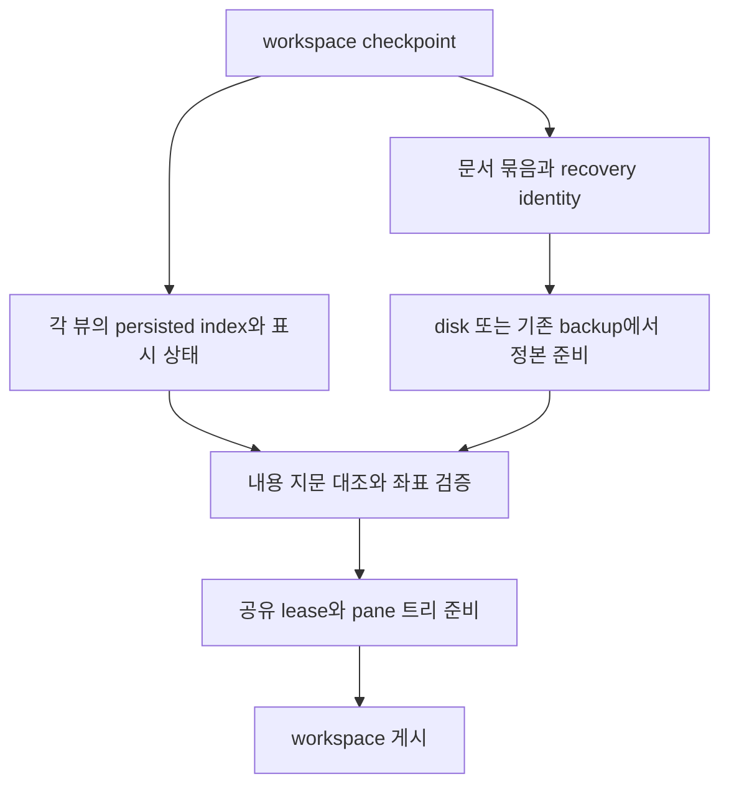

# 공유 편집기 복원 포맷 — 검토안

상태: 설계 검토. 2026-10-03 사용자는 복원 포맷을 구현하기 전에 검토하기로 선택했다.
이 문서는 새 포맷의 승인이나 구현 완료를 뜻하지 않는다. 사용자용 분할 명령은 복원 gate까지 닫은 뒤 공개한다.
진행 순서는 [공유 문서 계획](editor-shared-document.md), 기존 백업 계약은
[문서 모델](../native-editor-document-model.md)과 [workspace 복원](../workspace-restore.md)이 소유한다.

## 해결할 문제와 현재 코드

- `editor/mod.zig.prepareSharedView`는 기존 정본 lease를 retain하고 독립 뷰를 만든다. 새 뷰에는 `file_entry`가 없다.
- `tab.zig.captureWorkspaceTab`는 entry 없는 일반 로컬 편집기를 저장하지 않는다. 따라서 이 내부 경로를 명령에 연결하면 재시작 때 새 pane의 파일이 사라질 수 있다.
- 현재 `workspace.FileTerm`은 위치·kind·mode·경로만 담는다. 같은 경로가 두 번 등장해도 명시적으로 공유한 뷰인지 독립 문서인지 알 수 없다.
- `workspace.serializeWindow`는 창별 블록을 만들고 host가 `maru.workspace.v1` 헤더 아래 합친다. 앱 전체 document table을 추가하면 이 창별 캡처 경계도 바꿔야 한다.
- 백업은 `editor/backup.zig.identity`의 기존 로컬 path/base hash·untitled 번호·원격 dest/path로 식별한다. registry의 실행 중 handle/generation은 재시작 identity가 아니다.

## 선택지

| 방법 | 장점 | 문제 | 판단 |
|---|---|---|---|
| 기존 `file-term`에 같은 경로만 반복 | 기존 reader가 파일 탭을 읽을 수 있음 | 공유와 독립 문서를 구분하지 못하며, 뷰 상태도 없음. 경로 별칭·권한 정책을 암묵적으로 바꿈 | 단독 사용하지 않음 |
| v1의 기존 줄에 선택적 공유 관계·뷰 상태 필드 추가 | 기존 파일을 그대로 읽고, 없는 필드는 기존 동작 유지. 새 line kind가 없어 기존 줄 구조를 유지함. 기존 필드 수 한도 안에서만 옛 reader 파싱 가능 | 옛 reader는 공유 관계를 무시하므로 downgrade에서 두 독립 문서가 될 수 있음. 필드/줄 한도 검증 필요 | 첫 로컬·같은 창 슬라이스에 권장, 사용자 검토 필요 |
| v2의 문서 표와 뷰 참조를 분리 | 전체 구조가 명확하고 창 간 공유까지 표현 가능 | 새 writer/reader·host 캡처 조정·마이그레이션·downgrade 보호가 한 번에 필요 | 창 간 공유까지 같은 포맷에서 지원해야 한다면 재검토 |

‘옛 reader가 읽는다’와 ‘옛 reader에서도 공유 의미가 유지된다’는 별개다.
선택적 필드 방식은 전자만 제공한다. 새 workspace를 구버전이 다시 저장하면 추가 필드는 사라질 수 있다.
이 제약을 숨긴 채 완전한 양방향 호환이라고 표기하지 않는다. 특히 구버전이 두 뷰를 각각 편집하면
같은 backup identity로 서로 다른 내용을 쓸 수 있다. downgrade를 지원한다고 선언하려면
이 손실 경로의 차단/보존 방법도 구현·검증해야 한다. 필드를 무시한다는 사실만으로 안전하다고 보지 않는다.

## 권장 표현의 의미

첫 슬라이스는 일반 로컬 문서·같은 창의 공유 분할에 한정한다. untitled·원격·diff/merge는 기존 지원 gate 없이 합치지 않는다.
아래 키/값은 검토용 문법이며 제품 reader/writer에는 아직 넣지 않았다.



```text
pane ... file-term="0:text:source-edit:12:/tmp/doc.zig" editor-link="0:1" editor-view="0:..."
pane ... file-term="0:text:source-edit:12:/tmp/doc.zig" editor-link="0:1" editor-view="0:..."
```

기존 `file-term`의 mode는 `Mode.workspaceName()`의 `source-edit`를 그대로 사용한다.

- `editor-link`의 첫 값은 해당 pane의 **persisted Term index**, 둘째 값은 같은 창 checkpoint 안의 문서 묶음 번호다.
- 묶음 번호는 새 checkpoint 캡처마다 연결 lease의 동일성에서 생성한다. runtime handle/generation이나 전역 영속 ID를 그대로 쓰지 않는다.
- 묶음 descriptor에는 local path·문서 종류·기준 fingerprint를 명시한다. 정확한 `editor-link`/descriptor 배치는 codec 설계 때 함께 확정한다. 같은 묶음에 속한 모든 항목은 이 값이 일치해야 한다. 경로만 같다는 이유로 묶음을 새로 만들거나 서로 다른 묶음을 합치지 않는다.
- 첫 항목이 disk/backup으로 정본을 만들고 나머지는 준비된 같은 정본을 retain한다. 문서 백업은 기존 하나만 쓴다.
- `editor-view`는 persisted index에 대응하는 독립 선택(방향·primary·추가 선택), 첫 논리 줄/랩 조각/가로 위치, wrap override, 접힘을 담는다.
- 뷰 상태에는 캡처 당시 정본 내용 지문도 대응시킨다. disk의 CAS fingerprint, `Opened.saved_hash`, 캡처한 현재 내용 지문은 서로 다른 값이다. 복원 내용이 뷰 상태를 캡처한 내용과 다르면 byte 좌표와 접힘을 그대로 적용하지 않고 안전한 기본 표시로 열며 복원 상태를 관측한다.
- 검색어/치환어/검색 기록은 이번 복원 레코드에 넣지 않는다. 기존 세션 검색 이력 정책과 별도로 검토한다.
- Undo/Redo·구문 트리·LSP 요청·렌더 캐시·IME marked text는 직렬화하지 않는다. 기존 Hot Exit의 내용 복원과 실행 중 공유 이력을 구분한다.
- 원문은 workspace에 중복 저장하지 않는다. 기존 backup의 base fingerprint 불일치는 기존 충돌/비교 경로로 처리한다.

정확한 wire codec은 승인 후 reader/writer 한 곳에서 정의한다. 각 항목은 길이 접두와 기존 escape 규칙으로 인코딩한다.
추가 선택과 접힘은 동적 목록이지만 기존 workspace 크기/필드/줄 한도 안에서 검증한다. 새로운 임의 상한을 만들지 않는다.
전체 문자열 truncate로 경로나 선택을 부분 저장하지 않는다. 한도를 넘으면 해당 뷰 상태의 저장 실패를 관측하고,
문서 identity·미저장 백업·기존 checkpoint 보존을 우선한다.

## 복원 거래와 실패

1. 전체 모델의 index·묶음·종류·경로와 기준 fingerprint를 검사한다. 같은 번호의 불일치, 없는 참조, 중복 view record는 거절한다.
2. 기존 live workspace를 교체하지 않은 채 정본과 모든 참조·뷰 상태·pane 트리를 준비한다. 복원 중인 정본은 전용 staging 소유자에 보관한다.
3. 문서 내용이 정해진 뒤 byte 선택을 UTF-8 경계/유효 범위로 복구하고, 줄/랩/접힘은 현재 내용과 provider 결과에 맞게 검증한다. 사라진 fold를 다른 블록에 적용하지 않는다.
4. 준비 성공 후 창 모델을 한 번 게시하고 기존 workspace를 해제한다. staged 문서의 backup 복원은 한 번만 적용한다.
5. 준비 OOM·파일 접근 실패·부분 모델 실패에서는 기존 live 모델과 backup을 보존한다. 기존 restore accounting과 checkpoint 덮어쓰기 방지 latch를 따른다.

추가 뷰를 복원하지 못했다고 정본 내용을 버리거나 백업을 삭제하지 않는다.
부분 손상에서 한 뷰만 살릴지 창 블록을 거절할지는 기존 `BadLine`·restore admission 정책과 구현 전에 대조한다.
창 간 공유 문서를 묵시적으로 복원하지 않는다. 창 이동 지원 때 창별 캡처/복원 순서와 app-global owner 게시를 별도 검증한다.

## 닫기·저장·다른 창 이동

한 뷰 닫기는 문서 종료가 아니다. dirty 확인과 백업 삭제는 모두 `closesAllEditorDocumentViews`의 같은 집합을 따른다.
마지막 뷰 닫기에서 저장/버리기/취소가 확정되기 전 새로운 연결이나 편집이 생기면 최신 상태를 재판정한다.
checkpoint의 공유 번호는 쓰기 권한이 아니다. 연결 뷰의 기존 surface grant를 유지하며 다른 뷰 권한을 빌려 저장하지 않는다.

같은 창 pane 이동은 뷰와 lease를 그대로 이동한다. 다른 창 이동은 현재 공유 편집의 연결 수 대조가
AppSession 내부 순회에 의존하는 제약을 먼저 해결해야 한다. 포맷에 참조만 추가하고 창 간 편집이 지원된다고 선언하지 않는다.

## 구현 전에 검토할 판정 목록

| 반례 | 요구 결과 |
|---|---|
| 옛 v1 파일을 새 reader로 읽기 | 기존 모델/byte round-trip 유지 |
| 새 필드 없는 단일 뷰 | 기존 writer 출력 유지 |
| 명시적 split 두 뷰 재시작 | 정본/backup 한 개, 독립 선택·스크롤·wrap·접힘 |
| 같은 경로의 독립 문서 두 개 | 경로 일치만으로 Undo/정본 합치지 않음 |
| 서로 다른 경로·종류·fingerprint에 같은 공유 번호 | 공유 연결 거절, backup 보존 |
| 파일 삭제/재생성, disk 변경 후 재시작 | 기존 충돌/비교 처리, 자동 덮어쓰기 없음 |
| 여러 pane의 persisted index + 브라우저/untitled 삽입 | 올바른 뷰에 상태를 적용, 배열 자리 remap 검증 |
| 깨진 UTF-8 선택·역선택·겹치는 다중 선택 | 유효 경계로 정산, 중복 입력 없음 |
| 접힌 줄 삭제, provider/랩 폭 변경 | 잘못된 블록을 숨기지 않음 |
| 각 staging 할당·publication 직전 실패 | 이전 workspace/backup 불변, leaked lease 없음 |
| dirty 한 뷰 닫기/마지막 닫기/취소 | 생존 문서 보존, 마지막만 확인 및 명시적 버리기 |
| 구버전으로 새 파일 열고 재저장 | 공유 의미 손실 가능성을 별도 검증·명시 |
| 다른 창 이동·한 창 종료 | 창 간 소유/공유 게시 gate 없이는 노출하지 않음 |

## 결정 제안

현재 창별 캡처와 기존 v1 유지가 우선이면 선택적 필드 방식으로 일반 로컬 공유 분할부터 구현한다.
구버전 재저장에서도 공유 의미를 보장하거나 첫 공개에서 창 간 공유까지 필요하다면 v2와 host 캡처 경계를 함께 설계한다.
두 요구를 선택적 필드만으로 모두 충족한다고 주장하지 않는다. 사용자 검토 후 표현·호환 경계를 확정한다.

## 설계 반례 검토 — 2026-10-03

1. 같은 경로만 저장하는 안은 독립 문서를 공유 문서로 합치는 반례가 있어 제외했다. 명시적 연결 관계가 필요하다.
2. 선택적 키의 무시를 완전한 양방향 호환으로 보는 주장을 수정했다. 구버전 재저장·독립 편집의 backup 충돌은 별도 손실 경로다.
3. runtime handle을 저장하는 안은 재시작 generation과 권한을 혼동하므로 제외했다. checkpoint 안의 묶음 번호와 기존 recovery identity를 구분한다.
4. 경로와 fold head만 일치하면 좌표를 복구하는 안은 disk 변경 뒤 다른 블록을 숨기는 반례가 있다. 뷰 상태를 캡처한 내용 지문이 다르면 안전한 기본 표시를 사용한다.
5. 창별 블록에 같은 번호를 넣어 app-global 공유를 주장하는 안은 독립 캡처와 창 복원 순서에 의존하므로 제외했다. 첫 포맷 검토의 같은 창 범위와 창 간 지원 gate를 구분한다.

위 검토는 현재 소스와 기존 계약의 대조다. 새 codec의 실행·migration·GUI 복원을 검증한 결과가 아니다.

## 추가 적대적 검토 5회 — 2026-10-03

1. **호환성 반례:** 기존 pane 줄이 `workspace.max_line_fields`에 가까우면 새 반복 필드로 한도를 넘길 수 있다. 미지 키를 무시하는 reader도 토큰화 한도에서는 실패한다. 따라서 선택적 필드의 파싱 호환성은 기존 줄 전체의 필드 예산 안에서만 성립한다. writer의 전체 필드 수 사전 검증과 한도 초과 처리 방식은 codec 승인 전에 확정할 항목이다.
2. **캡처 일관성 반례:** 문서 내용 지문을 읽은 뒤 편집이 일어나고 다른 뷰 상태를 읽으면 하나의 checkpoint 안에 서로 다른 revision이 섞인다. 문서 묶음마다 동일 revision의 내용 지문과 모든 뷰 상태를 확보해야 한다. 캡처 도중 revision 변경을 막는 동기 경계 또는 변경 검출 후 전체 묶음 재캡처가 필요하며, 정확한 방식은 캡처 구현 때 검증한다. 지문만 추가해서 이 문제가 해결됐다고 보지 않는다.
3. **복원 부작용 반례:** staging 중 backup을 읽었다는 이유로 파일을 삭제하거나 live owner에 붙이면 뒤의 뷰 할당 실패에서 원래 상태를 보존할 수 없다. backup 내용 읽기와 staged 정본에 적용하는 일은 publication 전에 끝내되, 복원 성공을 이유로 한 외부 파일 변경·삭제나 live 연결은 성공 경계와 기존 recovery 계약에 따라야 한다. 위 거래의 ‘한 번 적용’은 각 뷰마다 반복 복원하지 않는다는 의미다.
4. **실행 중 실패 보장의 반례:** `splitSharedEditorPane`는 IME 확정을 먼저 시도한 뒤 분할 준비를 할당한다. 확정 성공 후 준비 OOM이면 분할 트리·포커스·참조는 유지되지만 성공한 조합 입력까지 취소하지 않는다. 현재 OOM fixture는 marked text 없는 준비 실패를, 조합 fixture는 확정 거절과 성공 후 단일 입력을 검증한다. 조합 확정 성공 뒤 준비 실패를 같은 시나리오에서 자동 검증한 것으로 확대해석하지 않는다.
5. **검증 주장 반례:** 내부 pane fixture와 방향·MRU·접힘·마지막 뷰 닫기 검사는 실제 새 codec, downgrade 재저장, 재시작 복원, OS IME 또는 두 pane의 화면 결과를 입증하지 않는다. 이들은 각각 후속 구현/공개 gate이며 초안 PR의 내부 구현 통과와 구분한다. 같은 경로의 독립 문서는 공유하지 않는다는 요구와 기존 backup identity 충돌 가능성도 구분한다. 공유 레코드만으로 기존 독립 문서 백업 문제까지 해결했다고 주장하지 않는다.

이번 다섯 회는 서로 다른 반례 축으로 현재 소스·설계·검증 범위를 다시 대조한 것이다.
캡처 경계, 한도 초과 처리, 부분 손상 처리와 downgrade 보호는 아직 설계 판정 항목이며,
이를 임의로 선택해 codec에 구현하지 않는다.
