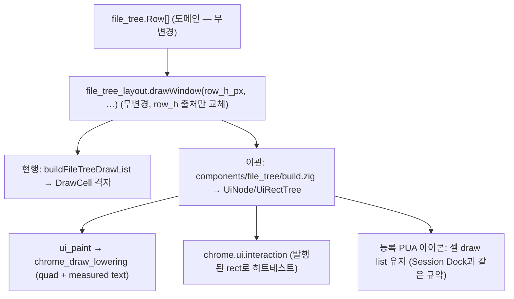

# 파일 탐색기 트리 컴포넌트 이관 — 단계 계획

도크 **탐색기 뷰의 행 렌더**를 터미널 셀 격자에서 `chrome/ui` typed tree로 옮기는 계획이다. 트리의
root 모델·스캔·감시·mutation 계약은 [파일 탐색기](../file-explorer.md)가 계속 소유하고, 공용 typed
tree와 paint 경계는 [Metal UI 레이아웃](../metal-ui-layout.md)이, 이관 순서와 gesture 권위는
[Chrome 상호작용 컴포넌트 이관 전략](../chrome-interaction-migration.md)이 소유한다. 이 문서는
**무엇을 어느 순서로 만들고 각 단계를 무엇으로 검증하는가**만 정한다.

## 0. 왜 지금인가 — 사용자 보고 두 건 (2026-08-22)

1. **"아이콘이 왼쪽 폴더 수준보다 너무 작다"** → 셀 격자 **안에서** 고칠 수 있는 부분이었다. 행 아이콘이
   1칸이라 셀 폭(~8px)까지 줄던 것을 2칸(~16px)으로 바꿨다(PR #2552). 여기서 끝난 축이다.
2. **"폰트 크기도 키워 달라"**, **"디자인 자체가 허접하다 — 깔끔하고 모던하게"** → 셀 격자 안에서는
   **불가능하다.** 이 계획이 그 두 번째 보고를 받는다.

왜 불가능한지가 이 계획의 전제다.

| 사용자가 원하는 것 | 셀 격자에서 가능한가 | 이유 |
| --- | --- | --- |
| 트리 라벨만 키우기 | **불가능** | 글자 크기가 `cell_width_px`/`cell_height_px`에 묶여 있고, 그 값은 터미널 `font.size`(기본 14pt)가 정한다. 트리만 키우는 값이 없다 |
| 행 높이(밀도) 조절 | **불가능** | 행 높이 = 셀 높이다. 폰트를 바꾸면 밀도가 따라 움직인다 |
| 라운드 선택 밴드·호버 | **불가능** | 셀 배경은 사각 셀 단위다. 모서리 반경·부분 inset이 없다 |
| 들여쓰기 가이드 선 | **불가능** | 셀 사이에 걸친 1px 선은 셀 격자 밖 기하다 |
| 비례폰트 | **불가능** | 셀 격자는 등폭 advance를 전제한다 |

**같은 도크의 다른 뷰는 이미 이 결론을 밟았다.** 소스 컨트롤 2판이 뒤집은 항목이 그대로다 —
[scm-dock.md §0](scm-dock.md): *"렌더 기반: 터미널 셀 그리드(`buildDockScmDrawList`) → `chrome/ui` typed
tree — 체크박스·버튼·입력은 셀 그리드로 못 그린다."* AI 세션 기록 도크도 같은 구조다. 지금 도크 뷰를
전환하면 **같은 컬럼 안에서 글자 렌더가 두 종류**로 갈리는 것이 눈으로 보인다.

## 1. 이 계획이 뒤집는 결정과 뒤집지 않는 결정

| | 현행 | 이관 후 | 근거 |
| --- | --- | --- | --- |
| 행 렌더 기반 | 터미널 셀 격자(`coretext_frame_builder.buildFileTreeDrawList`) | `chrome/ui` typed tree + measured text | 위 §0 표 |
| 행 높이 출처 | `cell_height_px`(터미널 폰트 종속) | 컴포넌트 `Metrics`(logical pt × `scale_milli`) | 밀도를 폰트에서 떼어낸다 |
| 히트테스트 | `file_tree_layout.rowAtLocalY` + `pointInRect` | 발행된 rect + `chrome.ui.interaction` | 그린 자리와 눌리는 자리의 단일 출처 |
| 라벨 폭 예산 | `dockListTextWidthPx / cell_width_px`(칸) | measured advance(px) | 칸 양자화가 글자를 미리 자르던 것도 함께 사라진다 |

**뒤집지 않는 것** — 이 계획 밖이고 손대지 않는다.

- 도메인 모델(`src/session/file_tree.zig`)과 root/watcher/mutation 계약, 자동 reveal과 root 교체
  ([file-explorer.md](../file-explorer.md) §1·§2).
- 스크롤 좌표계. 이미 픽셀이다(§2).
- 아이콘 분류. 중립 `src/chrome/file_tree_icon.zig`가 계속 소유하고 컴포넌트도 같은 `IconKind`를 쓴다.
- 키보드 탐색 모델(`src/session/file_tree_navigation.zig`). Page 단위가 "온전히 보이는 행"이라는
  규율도 그대로다 — 행 높이의 **출처**만 바뀐다.

## 2. 이미 이관된 축 — 출발점이 절반인 이유

이 이관이 SCM 2판보다 작은 이유가 여기 있다. 아래는 **이미 끝나 있다.**

| 축 | 상태 | 위치 |
| --- | --- | --- |
| 스크롤 좌표 | 픽셀(`chrome.ui.scroll_area.State`) — 행 좌표가 아니다 | [file-explorer.md §3.1](../file-explorer.md) |
| 스크롤바 | `chrome/ui/tree.zig`의 `scrollArea` 선언 하나(소스 컨트롤과 공유) | CIM3 완료 |
| 행↔픽셀 산술 | `src/session/file_tree_layout.zig` — **`row_h_px`를 파라미터로 받는다** | 행 높이를 컴포넌트가 정해도 이 모듈은 무변경 |
| 호버 상태 | `file_tree_hovered_row`가 이미 있고 밴드도 그린다(사각) | 형상만 바뀐다 |
| 아이콘 자산 | 등록 PUA + `icon_glyph.fillCoverage` 합성 | 컴포넌트에서도 같은 경로 |

즉 **새로 만들 것은 행 하나의 내부 배치와 그 페인트·히트테스트**이고, 스크롤·가상화·아이콘·도메인은
있는 것을 그대로 쓴다.

## 3. 시각 계약 (사용자 결정 2026-08-22 — "컴팩트 모던")

수치의 소유자는 컴포넌트 `Metrics`이고, 아래 표는 **왜 그 값인가**를 남긴다. 실제 값은 상수 이름으로
가리킨다([PR 체크리스트](../pr-checklist.md) "상수 값을 문서에 적는 규율").

| 항목 | 현행 | 목표 | 근거 |
| --- | --- | --- | --- |
| 라벨 | 등폭 14pt(터미널 `font.size` 종속) | **새 role `list_row`** — 14pt / line 20 / regular | 사용자 결정. 기존 role을 재사용하지 않는 이유는 아래 박스 |
| 행 높이 | 셀 높이(기본 ~19px @1x) | **26px** 상당 logical pt | 아이콘 16px + 위아래 여백이 들어가는 최소치. 넉넉한 30px는 한 화면 행 수가 약 2/3로 줄어 기각(사용자 선택) |
| 아이콘 | 16px(2칸 — PR #2552) | 16px 유지 | 이미 뷰 바·사이드바와 같다 |
| 들여쓰기 | 2칸(폰트 종속) | **14px/depth + 가이드 선** | depth 축이 선으로 보여야 깊은 트리에서 부모를 눈으로 따라갈 수 있다 |
| 선택 | 전폭 사각 밴드 | **라운드 6px**, 좌우 content inset | 목록 항목이 컨테이너 가장자리에 붙어 끝나는 것이 "허접하다"의 큰 몫이다 |
| 호버 | 전폭 사각 | 선택과 같은 형상, 약한 배경 | 두 상태의 형상이 다르면 호버가 선택처럼 읽힌다 |
| dirty/conflict | 셀 열(`cols-2`/`cols-4`) | 우측 고정 슬롯(px) | 칸 기준이면 폰트에 따라 자리가 흔들린다 |
| disclosure | ASCII `>`/`v` | chevron 아이콘 | 나머지가 전부 아이콘인데 여기만 글자다 |

> **왜 기존 role을 안 쓰고 role을 하나 더 만드는가.** `chrome/ui/typography.zig`의 `body`는 **13pt**이고,
> 그 표에는 *"사용자 보고(2026-08-05): 도크 텍스트가 같은 화면의 터미널 글자보다 눈에 띄게 컸다 … 두
> 단계 낮춘다"* 라는 이력이 붙어 있다. 지금 요청은 반대 방향이다. `body`를 14pt로 올리면 그 값을 쓰는
> 자리가 전부 따라 커져 **2026-08-05 보고가 재현된다** — 그래서 값을 올리는 길은 닫혀 있다.
>
> **추가하는 것 자체는 이 표가 하라는 일이다.** 이 표는 "크기 목록"이 아니라 **semantic role의 위계**이고
> (헤더 주석: *"Chrome component는 semantic role만 이름 짓고, 실제 face·point size는 platform text adapter가
> 해석한다"*), 지금 표에 **14pt regular 자리가 비어 있다** — 14pt는 `group_heading`(semibold)과
> `card_heading`(semibold)뿐이라 "훑어 읽는 목록 행"에 맞는 무게가 없다. 없는 위계를 채우는 것이지
> 예외를 만드는 것이 아니다.
>
> | | point / line / weight | 성격 |
> | --- | --- | --- |
> | `card_heading`(기존) | 14 / 20 / semibold | 카드의 **제목** |
> | **`list_row`(추가)** | **14 / 20 / regular** | 목록의 **한 항목 라벨** — 훑어 읽는 본문 |
> | `body`(기존) | 13 / 18 / regular | 문단·설명 본문 |
>
> line 20은 행 높이 26px과 짝이다(위아래 3px). `card_heading`과 같은 line box를 쓰므로 제목 옆에 놓여도
> baseline이 어긋나지 않는다.
>
> **규율 둘.** ⑴ 이름을 `file_tree_row`처럼 **위젯 이름으로 짓지 않는다** — 그러면 다음 목록이 또 role을
> 만들고 표가 위젯 목록이 된다. `list_row`는 성격의 이름이다. ⑵ **기존 목록을 자동으로 갈아끼우지
> 않는다.** 소스 컨트롤 파일 행·AI 세션 목록은 지금 `control`(13pt medium)·`metadata`(12pt)를 쓰는데,
> 그 자리를 `list_row`로 옮기는 것은 **그 화면들의 크기가 커지는 별개 결정**이다. 필요하면 그때 각
> 소유 문서에서 판단한다.

## 4. 단계

각 단계는 독립 PR이고, 앞 단계가 제품에서 도는 것을 본 뒤 다음으로 간다. 단계마다 문서 갱신을 포함한다.

### FT1 — 컴포넌트 골격과 행 렌더 (읽기 전용, 화면이 바뀌는 단계)

- `src/chrome/components/file_tree/{types,ids,build,view}.zig` 신설. Session Dock·SCM Dock과 같은
  4파일 구조(`types`=platform-neutral DTO·`ids`=노드/의도 식별자·`build`=geometry·action 투영·
  `view`=paint 방출).
- `chrome/ui/typography.zig`에 `list_row`(14 / 20 / regular)를 더한다(§3 박스). 기존 값은 하나도
  바꾸지 않으므로 다른 화면은 한 픽셀도 안 움직인다 — 그 사실을 role 표 테스트가 못 박는다.
- `src/platform/macos/app_session/file_tree_dock.zig` 신설 — `project → props → build → view → paint`.
  `collectScmDock`과 **같은 순서**를 쓴다. 가상화 창은 기존 `fileTreeDrawWindow`가 그대로 준다.
- 행 높이 출처를 `cell_height_px` → 컴포넌트 `Metrics`로 바꾼다. 바꿀 자리는 **셋뿐**이다
  (`fileTreeVisibleRows`·`fileTreeDrawWindow`·히트테스트 호출부) — 산술 자체는
  `session/file_tree_layout.zig`가 이미 파라미터로 받는다.
- §3의 시각 계약을 구현한다. 히트테스트·컨텍스트 메뉴·이름 변경은 **이 단계에서 옮기지 않는다**
  (행 높이만 새 출처를 쓰고, 나머지 판정은 기존 경로 유지).
- 검증: 컴포넌트 build/view 단위 테스트(행 내부 rect가 겹치지 않는다·폭 예산·상태 슬롯), 제품 Metal
  캡처 before/after, `mise run macos-file-explorer-perf`.

**FT1이 계획과 달라진 곳(구현하며 드러난 것).**

- **`ids.zig`를 만들지 않았다.** FT1은 action을 발행하지 않으므로(히트테스트가 기존 경로에 남아
  있다) 빈 intent 표는 소비자 없는 파일이다. FT2가 히트테스트를 옮길 때 함께 만든다.
- **행 높이 교체 지점이 셋이 아니라 다섯이었다.** 계획은 `fileTreeVisibleRows`·`fileTreeDrawWindow`·
  히트테스트를 셋으로 셌는데, `fileTreeScrollExtent`(스크롤 상한)와 `scrollFileTreeRowIntoView`
  (reveal)도 같은 축이었다. 앞의 셋만 옮기자 목록 끝 몇 행이 스크롤로 닿지 않는 상태가 테스트에
  드러났다 — 계획이 축 하나를 과소평가한 것이고, 그래서 지금은 그 다섯이 전부 한 함수를 지난다.
- **포커스된 선택의 표시를 바꿨다.** §3 표는 "선택: 라운드 밴드"만 적었는데, 옛 렌더는 포커스된
  선택을 **accent로 행 전체를 칠하고 글자를 테마 대비색으로 뒤집었다**. 컴포넌트는 색을 role로
  다루고 이 층에 "accent 위의 전경" role이 없어 그대로 옮기면 글자가 안 읽힌다. 면은 약하게 두고
  **왼쪽 accent 막대**로 포커스를 말하도록 바꿨다(`Metrics.focus_bar_w`).
- **이름 변경 인라인 편집을 FT1에서 보존했다.** 계획은 FT2로 미뤘지만, 편집 중 글자가 화면에서
  사라지는 것은 이관 중이라도 회귀다. 라벨 치환만 옮겼고 caret·키 처리는 여전히 기존 경로다.

### FT2 — 상호작용 이관

- 히트테스트를 발행된 rect + `chrome.ui.interaction`으로 옮긴다. `file_tree_layout.rowAtLocalY`는
  Windows chrome 낮추기가 계속 쓰므로 **삭제하지 않는다**([windows-platform.md](../windows-platform.md) §2m.4).
- 컨텍스트 메뉴 앵커·행 인덱스 분기, 이름 변경 인라인 편집, disclosure/아이콘/라벨의 **부분 히트**
  (지금은 행 전체가 한 target이다)를 정한다.
- 검증: pointer fixture(호버·선택·컨텍스트·이름 변경 중 클릭), 키보드 동등 경로,
  [chrome-interaction-migration.md §9](../chrome-interaction-migration.md)의 공통 완료 조건.

**FT2가 계획과 달라진 곳(구현하며 드러난 것).**

- **부분 히트를 만들지 않았다.** 계획은 "disclosure/아이콘/라벨의 부분 히트"를 열어 두었는데, 지금
  제품에서 폴더를 여는 것은 **행 클릭**이고 chevron은 그 상태를 보여 줄 뿐이다. 별도 target을 만들면
  같은 동작에 주인이 둘 생긴다 — 필요가 증명되면 그때 연다.
- **행 노드가 그림을 잃었다.** 밴드는 좌우로 들여야 하는데 **누르는 자리는 전폭**이어야 해서 한 rect로
  둘을 표현할 수 없었다(계획은 이 충돌을 몰랐다). 그래서 행 노드는 `opacity = 0`인 히트 대상이 되고
  면은 `view`가 그린다. 이 컴포넌트는 `ui_paint`를 아예 타지 않는다.
  그 사각지대는 실제로 있었다 — 왼쪽 가장자리 우클릭이 메뉴를 못 여는 것을 테스트가 잡았다.
- **호버의 주인이 바뀌면서 `file_tree_hovered_row`가 사라졌다.** 판정이 `InteractionState`로 가면 그
  필드는 읽는 곳이 없는 두 번째 출처다. 휠 스크롤 뒤 호버를 다시 계산하던 자리도 함께 없앴다 — 노드
  id는 창 안의 자리라 스크롤해도 커서 밑 자리는 그대로이고, 그 자리가 **어느 파일인지**는 다음 발행의
  action 표가 답한다.
- **밖에서 떼도 발화한다.** `chrome.ui.interaction`의 `.up`은 잡은 노드가 살아 있으면 좌표와 무관하게
  발화한다(macOS 버튼 관례와 다르다). 이 위젯만 다르게 하면 규칙이 둘이 되므로 **바꾸지 않고 값으로
  적어 두었다** — 바꾸려면 CIM 계약을 바꿔야 하고 그러면 탭·도크·세팅이 함께 움직인다.
- **헤드리스 테스트에 발행 문이 필요했다.** 포인터가 published rect를 보게 되면서 "한 번도 안 그린
  세션"에는 누를 것이 없어졌다. 테스트가 자기 rect를 지어내면 제품과 다른 기하를 판정하므로 같은
  build를 부르는 `publishFileTreeHitTree`를 냈다.

### FT3 — 셀 투영을 공유 모듈로 옮기고 소비자를 잠근다

계획은 `buildFileTreeDrawList`를 **지우자**고 했다. 지울 수는 없었지만(Windows가 쓴다) **macOS 파일에서
빼는 것**은 됐다.

**처음 판단이 틀렸다는 것을 적어 둔다.** 첫 시도에서 "중립 집이 존재하지 않는다"고 결론 내렸는데, 그때
본 것은 **L4 아래**(chrome·session·renderer)뿐이었다. 그 셋이 막히는 것은 맞다 —

- `chrome`(L3)은 `renderer`를 import할 수 없고(`ui/tree.zig` 헤더 — 경계 가드),
- `session`(L2)은 `chrome`(L3)을 import할 수 없다(위상 역전 — `tests/boundary/imports.zig`).

그런데 **L4 안에 OS에 매이지 않는 공유 모듈**이라는 선례가 이미 있다(`src/platform/mobile/` — ios·android가
공유한다). 거기라면 chrome과 renderer를 함께 들 수 있다. 사용자가 "왜 제거가 아니라 격리인가"를 물어
다시 재고 나서야 보였다.

두 번째 걱정("`appendEllipsizedTitle`이 23곳에서 쓰여 함께 옮길 수 없다")도 과대평가였다. 그 23곳은
**전부 같은 파일 안**이고, 옮긴 뒤 별칭 한 줄이면 호출부는 그대로다 — 실제 비용은 파일 하나와 별칭
넷이었다.

**한 일**

- `src/platform/cell_text.zig` 신설(L4 공유). 투영과 그 짝(`appendEllipsizedTitle`·`appendCluster`·
  `wideIconPredicate`·`wideIconGlyph`)·타입·`file_tree_inset_cols`를 옮겼다.
- `coretext_frame_builder.zig`는 별칭으로 계속 쓴다 — 옮긴 것은 **코드의 집이지 호출 관계가 아니다**.
- `src/main.zig`가 더 이상 `platform/macos/*`를 import하지 않는다(그 misnomer 주석도 사라졌다).
- macOS 스모크 둘을 자립시켰다(아이콘 색 픽스처는 분류→색만, 한글 cluster probe는
  `buildPaneLabelDrawList`로). **macOS에는 이 투영의 호출이 하나도 없다.**
- 경계 게이트가 둘을 센다: **정의는 공유 모듈에만**, **호출은 Windows 스모크 하나만**.

**아직 남은 것**: 함수 자체는 살아 있다. Windows가 `ChromeDraw`를 낮추는 층을 갖게 되어 그 스모크가
컴포넌트 경로로 옮겨 가면 그때 지운다 — 게이트가 "Windows 호출 1"을 세고 있으므로, 0이 되는 순간
게이트가 실패해 사람이 그 판단을 하게 된다.

## 5. 보존해야 하는 동작 (회귀 표)

이관 전에 이미 도는 제품 동작이다. 이관 PR은 각 항목을 fixture 또는 캡처로 다시 고정한다.

| 동작 | 현재 소유 | 이관 후 확인 방법 |
| --- | --- | --- |
| git이 무시하는 행의 dimming(라벨+아이콘, `ignored_fg` null이면 무동작) | draw list | 단위 테스트 |
| 아이콘 종류색(`file_tree_icon.colorRole`)과 **선택 행에서의 대비색 우선** | draw list | 단위 테스트 |
| dirty(●)·conflict(!) 슬롯과 라벨 폭 예산의 상호배제 | 셀 열 산술 | rect 겹침 테스트 |
| 최근 파일 헤더·빈 placeholder·root 행의 서로 다른 스타일 | draw list | 캡처 |
| 부분 행(위·아래 잘림)과 pane clip | `origin_shift_px` + clip rect | 캡처 + 창 산술 테스트 |
| Page 키 = **온전히 보이는 행** 수 | `fileTreeVisibleRows` | 기존 테스트(행 높이 출처만 교체) |
| 자동 reveal·root 교체 뒤 스크롤 앵커 | domain | 기존 테스트 |
| 이름 변경 중 라벨 자리 텍스트와 편집 대상 identity | draw list `FileTreeEdit` | FT2 fixture |
| 스크롤바 gutter가 상시 예약돼 목록이 reflow하지 않음 | `dockListTextWidthPx` | 캡처 |

## 6. 위험과 미해결

- ~~**성능 예산과의 충돌 가능성.**~~ **FT1에서 해소됐다(충돌 없음).** 예산 테스트를 읽어 보니
  `allocator call = 0`이 실제로 재는 구간은 ⑴ `classifyFileTreeRowsCounted`(row projection)와
  ⑵ 1,000회 스크롤바 pointer/geometry 루프뿐이고, 컴포넌트 프레임 빌드는 그 둘 어디에도 없다.
  게다가 **기존 셀 경로도 이미 프레임마다 `ArrayList`를 할당하고 있었다**(`buildFileTreeDrawList`의
  `cells`·`pool`) — arena는 새 비용이 아니라 같은 성질의 비용이다. 원문을 지우지 않고 남기는 이유는
  "재 보기 전에는 몰랐다"가 기록이기 때문이다.
- **measured text 비용.** 트리는 행이 수천 개가 될 수 있다. 측정은 **보이는 창에만** 걸고 캐시
  (`MeasuredTextCache`) 적중 시 CoreText를 부르지 않는 Session Dock 규약을 그대로 따른다. 스크롤 중
  매 프레임 측정이 들어오면 예산 job이 잡아야 한다 — FT1이 그 counter를 추가한다.
- **Chrome Lab에 탐색기 scenario가 없다.** 현재 골든(`tests/fixtures/golden/dock/`)은 dock·scm·editor·
  sidebar뿐이라 트리는 픽셀 회귀 게이트가 없다. FT1이 scenario를 추가한다 — 없으면 이 이관의 시각
  결과를 지킬 자동 수단이 하나도 없다.
- **Windows 의존**(FT3 박스). 셀 경로는 macOS만의 것이 아니다.
- **도크 폭이 좁을 때의 열화 규칙**을 다시 정해야 한다. 셀 격자에서는 "칸이 모자라면 생략"이었는데
  픽셀에서는 기준이 다르다(들여쓰기 clamp·라벨 최소 폭·상태 슬롯 우선순위).

## 7. 완료로 보지 않는 것

- 한 단계가 화면에 나온 것만으로 이관 완료로 적지 않는다. [chrome-interaction-migration.md §9](../chrome-interaction-migration.md)의
  공통 조건(capture cancel 증거·같은 published generation·키보드 동등 경로·stale target 거부 E2E)을
  모두 만족해야 한다.
- 셀 경로(`buildFileTreeDrawList`)가 남아 있는 동안에는 **두 렌더 경로가 공존**한다. 그 상태를
  "이관됨"으로 적지 않는다.
- 드래그앤드롭(트리 안에서 파일 이동)은 이 계획 범위 밖이다. 지금도 없고, 만들려면 CIM의
  `ReorderableList` capability 위에서 별도 슬라이스로 연다.

## 8. 단계 상태

| 단계 | 상태 |
| --- | --- |
| FT1 — 컴포넌트 골격과 행 렌더 | **완료**(같은 PR) |
| FT2 — 상호작용 이관 | **완료** |
| FT3 — 셀 투영을 공유 모듈로 이동 + 소비자 잠금 | **완료** — 아래 §4 FT3 참조 |
