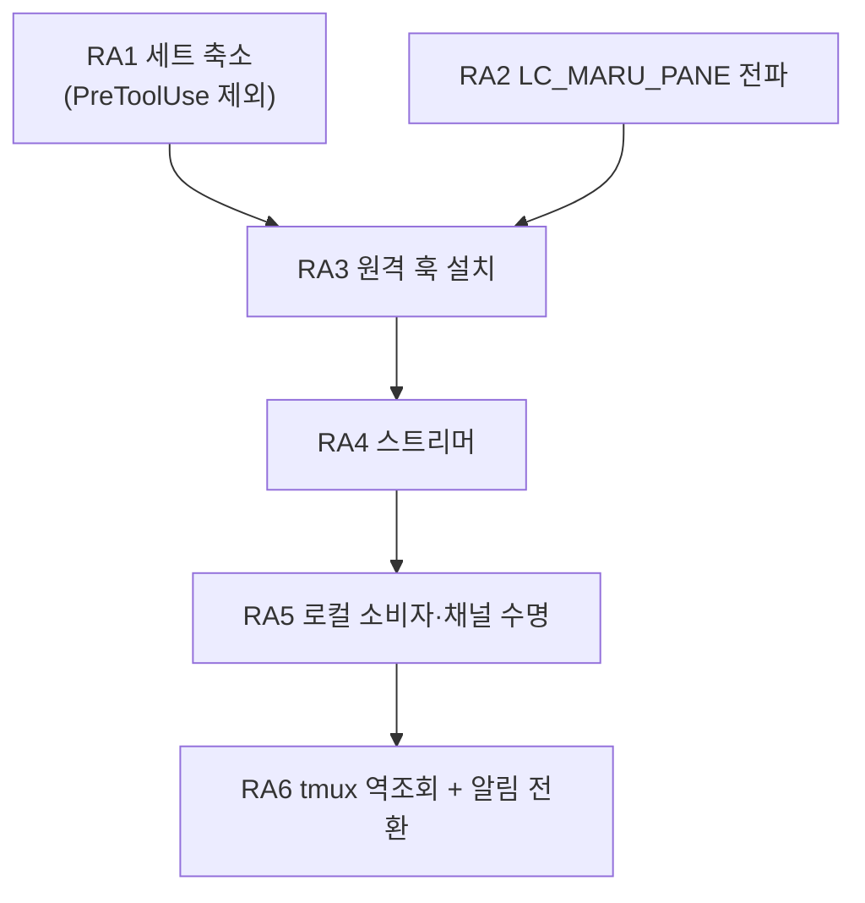

# 원격 에이전트 상태(배지·대화 줄) — 단계 계획

**초안.** 확정 전까지 [AGENTS.md](../../AGENTS.md) 인덱스에 연결하지 않는다.

## 0. 전제

- 계약의 단일 출처는 [에이전트 훅 통합](../agent-hooks.md) **§11**(원격 SSH 세션)이다. 이 문서는 그
  §11.6 이 «아직 설계 전» 으로 남겨 둔 축의 **단계 분해**다.
- ~~**범위는 둘뿐이다** — 사이드바 **배지**(`running`/`blocked`/`idle`)와 사이드바 **대화 줄**(마지막
  프롬프트·응답). **턴 경계 스냅샷은 비범위다**(사용자 결정 2026-08-29).~~ **2026-09-21 뒤집힘**: 재실측으로
  이 개발자의 에이전트 12개가 전부 다른 기기에서 `maru ssh` 로 들어온 원격 Term 이라(로컬 훅 파이프라인이
  한 번도 안 돌았다) 턴 스냅샷·`✎` 귀속을 원격에 넣었다 — [턴 변경분 계획 AT3c](agent-turn-changes.md).
- ~~그 결정이 설계를 가볍게 만든다. 스냅샷을 빼면 **AI 소행 경로**(`PreToolUse.tool_input.file_path`)와
  **진행 중 세부**가 함께 빠지고, 그러면 `PreToolUse` 자체가 필요 없어진다(RA1).~~ AT3c 뒤 원격 세트는 로컬과
  같다(`remote_excluded` 비움).
- 지금 원격 pane 의 알림은 OSC 로 온다(§11.4·§11.5). **이 축이 서면 그 Term 은 훅 모드가 되어 OSC 를
  버린다**(§1.1) — 즉 현행 OSC 설정은 **이 축이 설 때까지의 다리**다. 전환은 RA6 이 함께 다룬다.

## 1. 단계

### RA1 — 원격 이벤트 세트를 좁힌다 (⚠️ 2026-09-21 AT3c 로 뒤집힘 — 원격 세트 = 로컬 세트, `remote_excluded` 비움)

- 원격에 거는 세트는 **여섯**이다: `SessionStart`·`UserPromptSubmit`·`Stop`·`PermissionRequest`·
  `Notification`(claude 전용)·`SubagentStart`/`SubagentStop`. 근거는 `agent_hook_mode.next` 가 상태를
  옮기는 이벤트와 대화 줄이 읽는 두 필드(`UserPromptSubmit.prompt`·`Stop.last_assistant_message`)뿐이다.
- **`PreToolUse` 를 빼는 것이 이 단계의 요점이다.** 그것이 만드는 `→ running` 은 `UserPromptSubmit` 이
  이미 만들고, 그것만 주는 두 가지(진행 중 세부·AI 소행 경로)는 §0 의 비범위다. 빼면 셋을 얻는다.
  - **비용**: 도구 호출마다 도는 발화가 사라진다([계약](../agent-hooks.md) §3 — 턴당 ~90 ms 의 주범).
  - **보안**: `tool_input.command`(셸 명령 원문)·`oldString`/`newString`(소스코드)이 **네트워크를 안
    건넌다**(§7 이 경고한 그 payload 다). 원격 축에서는 이것이 로컬보다 훨씬 무겁게 걸린다.
  - **codex 재승인**: 거는 훅이 적을수록 `trusted_hash` 항목이 적다(§11.5).
- `agent_hook_command.eventsFor(provider)` 가 **로컬/원격을 가르는 축을 하나 더 갖는다.** 전역 세트를
  두지 않는 §2 의 규율을 그대로 따른다.
- 검증: 세트 상수의 단위 테스트, 원격 세트에 `PreToolUse` 가 없음을 단언하는 테스트.
- ⚠️ **2026-09-20 관찰 — 같은 기계가 로컬이자 ssh 대상이면 두 설치기가 한 파일을 두고 핑퐁한다.** 개발자
  머신의 `~/.claude/settings.json` 에 **원격 세트**(`LC_MARU_PANE`·`remote-agent-events`, `PreToolUse` 없음)가
  서 있었다 — `maru ssh localhost` 류가 `maru agent-hooks` 로 덮어쓴 것이다. 로컬 앱은 켤 때마다 로컬 세트로
  되돌리고, 다음 ssh 가 다시 뒤집는다. 그 사이 로컬 훅 모드는 `PreToolUse` 없이 돌아 AT3 캡처가 빈다. 해법
  후보: 두 세트를 **공존**시키기(각 훅이 자기 env 가 없으면 `exit 0` 하므로 항목 둘이 함께 있어도 무해하다 —
  설치기가 «우리 표식 전부 걷고 한 scope 만 넣는」 규율을 scope 별로 나누면 된다) 또는 원격 설치기가 로컬 세트가
  이미 있는 기계를 건너뛰기. 이 축이 정한다.
- **2026-09-20**: AT3b-1 이 로컬 claude 세트에 넣은 `PostToolUse`·`PostToolUseFailure`(`Bash`) 도 같은 세
  이유로 `remote_excluded` 에 든다 — 주는 것이 셸 구간의 끝(턴 스냅샷 축)뿐이고 `tool_response` 가 명령 출력
  원문이다. 원격 세트는 그대로 여섯이다.
- **2026-09-21 — 뒤집힘(AT3c).** 위 세 이유를 하나씩 다시 봤다: 비용은 원격 기계의 것으로 로컬과 같고, payload 는
  ssh 위를 지나 로컬 GUI 메모리에서 로컬과 같은 수명이며(사용자는 이미 RS3a 로 파일 전체를 건넌다), codex 재승인은
  `applyEntries` 가 값을 갱신하므로 프롬프트가 없다(2026-09-20 실측). `remote_excluded` 는 **빈 배열**이고 원격 세트는
  로컬과 같다. 핑퐁(위 2026-09-20 관찰)은 이벤트 세트가 같아졌으니 남는 차이가 커맨드의 경로·신원 env 뿐이다 —
  커맨드·로그 디렉터리 통일은 **별도 PR** 로 남긴다.

### RA2 — pane 신원을 원격에 실어 보낸다

- **`LC_MARU_PANE`** 을 `maru ssh` 가 `SendEnv` 로 보낸다. 값은 `MARU_HOOK_INSTANCE`·`MARU_HOOK_PANE` 과
  **같은 조립기**(`agent_hook_command.formatGuiInstance`/`formatSurfacePane`)에서 나온다 — 두 곳에서
  만들면 «훅이 쓰는 이름 ≠ maru 가 읽는 이름» 이 조용히 성립한다(§4 가 이미 겪은 사고다).
- ⚠️ **인스턴스 칸을 반드시 넣는다.** `surface_id` 는 프로세스마다 1 부터라, 넣지 않으면 maru 를 둘 띄운
  순간 두 인스턴스의 첫 pane 이 원격에서 **같은 파일**을 쓴다 — §4 가 로컬에서 이미 겪은 사고를
  원격에서 재현하는 셈이다.
- **`LC_` 접두를 쓰는 이유**(2026-08-29 실측): stock sshd 는 `AcceptEnv LANG LC_*` 를 기본으로 열어 두지만
  `COLORTERM` 은 아니다. 같은 실측에서 `COLORTERM` 은 막히고 `LC_MARU_PANE` 은 통과했다 — 게이트가 실제로
  작동하는데도 `LC_*` 만 열려 있다는 대조 증거다. 값은 원격 셸 → provider → 훅까지 **손자 프로세스에서도**
  살아 있었다.
- **ControlMaster 다중화에서도 세션마다 다른 값이 간다**(실측). 마스터 하나를 공유하는 pane 둘이 각각
  자기 값을 받았고 인증은 0 회 늘었다 — 이 축의 생사가 걸린 시험이었다.
- ⚠️ **단, 그 마스터가 `SendEnv` 를 달고 떴을 때만이다**(2026-08-30 실서버 재측). 조건을 좁혀 다시 재니
  갈렸다:

  | 마스터를 만든 호출 | 그 뒤 pane 이 받는 값 |
  | --- | --- |
  | `SendEnv` 없음 | **빈 값**(조용히) |
  | `SendEnv` 있음 | 자기 값 |

  즉 **`SendEnv` 를 «값이 있을 때만» 붙이면 안 된다.** maru 밖 터미널에서 친 `maru ssh` 는 nonce 가
  없어 그 옵션 없이 마스터를 만들고, 그 마스터는 `ControlPersist` 동안 살아 있다 — 그 뒤에 열린 maru
  pane 이 그것을 재사용하면 **자기 값을 조용히 잃는다**(훅이 빈 nonce 를 보고 그냥 나가므로 이벤트가
  0 이고 화면에도 로그에도 아무것도 안 남는다). 그래서 **nonce 가 없어도 옵션은 항상 붙인다** — 빈 값은
  무해하고(훅의 첫 가드가 거른다), 서버가 `LC_*` 를 안 받아도 무해하다.
- 검증: 두 pane 이 서로 다른 값을 받는 실서버 왕복, 서버가 `LC_*` 를 안 받는 경우의 **조용하지 않은** 폴백.

### RA3 — 원격 훅 설치

- **claude**: 원격 `~/.claude/settings.json`. **codex**: 원격 `~/.codex/hooks.json`(PascalCase 이벤트명).
- 훅은 `<cache>/maru/remote-agent-events/$LC_MARU_PANE.ndjson` 에 append 한다. 로컬 훅과 **줄 형식이
  같다**(`<provider>\t<payload JSON>`) — 파서를 나누지 않는다.
- ⚠️ **값을 검증하고 쓴다.** 로컬 훅이 `case "$MARU_HOOK_PANE" in ''|*[!0-9a-f]*) exit 0` 로 하는 그
  규율을 그대로 옮긴다. 경로 조립에 검증 없는 env 를 넣지 않는다.
- **codex 는 신뢰 항목까지 우리가 쓴다**(2026-08-30 정정). 승인이 항목 해시 단위라 커맨드를 고치면
  다시 묻는 것은 맞지만, 그 표를 **maru 가 계산해 적으면 묻지 않는다** — 로컬이 이미 그렇게 한다.
  원격 세션에는 승인 TUI 를 볼 사람이 없으므로 이것이 선택이 아니라 **필수**다. 판정은 순수 층 하나
  (`agent_hook_trust.applyEntries`)가 하고 로컬·원격이 그것을 함께 쓴다. RA1 이 세트를 좁히는 것은
  여기서도 값을 한다(적을수록 표가 적다).
- **회전·정리는 스트리머가 한다**(2026-08-29 확정·실측). 로컬은 «읽는 Term 이 소비 즉시 비우는
  큐»(§4.2)인데 원격은 읽는 주체가 채널 너머에 있다 — 그래서 **그 기계의 소비자인 스트리머가** 비운다.
  조건 둘이 함께 필요하다: **다 읽었을 때만**(안 그러면 안 흘린 꼬리를 버린다)과 **상한을 넘었을
  때만**(로컬 회전과 **같은 1 MiB** — 다르면 «원격만 디스크를 먹는다» 가 되고 그 차이는 사용자가 원격
  기계를 볼 때까지 안 보인다). `O_TRUNC` 로 열어 아무것도 안 써서 훅이 만든 **0600 을 보존한다**.
- ⚠️ 그것을 정하려다 **더 앞선 결함**을 만났다: 스트리머가 «남은 전부» 를 1 MiB 상한으로 요구해,
  안 읽은 구간이 그 값을 넘긴 파일은 **읽기가 실패하고 그 파일이 영영 소비되지 않았다**(실측: 1.25 MiB
  로그에서 흘린 이벤트 0, stderr 도 비어 조용했다). 상한이 큰 파일을 지키는 게 아니라 **영구히 버리는**
  장치였고, 소비가 안 되니 절단도 못 걸려 두 결함이 서로를 가렸다. 고정 조각(256 KiB)만 읽고 완성된
  줄까지만 커서를 옮기는 형태로 고쳤다.
- **스트리머가 죽은 동안 자라는 파일**은 **시작 시 정리**가 맡는다(로컬 `cleanupAgentHookLogs` 와 같은
  자리). 로컬처럼 «전부 지우지» 는 않는다 — 원격 스트리머는 사용자가 그 pane 을 보고 있는 동안에도
  다시 뜨므로(채널이 죽었다 살아난 경우) 전부 지우면 방금 생긴 이벤트를 버린다. **상한을 넘긴 것만**
  거둔다.
- **파일 «수» 의 상한은 mtime 이 맡는다**(7 일). 바이트에는 상한이 있는데 개수에는 없어서, 비워진 로그와
  옆 파일이 pane 이 사라진 뒤에도 남고 tmux pane 번호는 단조 증가라 이름이 재사용되지 않았다 —
  스트리머는 매 회차 디렉터리를 통째로 훑으므로 **훑는 비용 자체가 자랐다**. 저장소가 원격 드롭
  디렉터리에 이미 쓰는 정책과 같은 값이다. 미래 mtime(시계 되돌림·NFS)은 안 건드린다.
- 검증: 설치·제거의 순수 판정(로컬 `agent_hook_install` 재사용), 원격 파일이 실제로 생기는 실서버 왕복.

### RA4 — 원격 스트리머 `maru agent-events --stdio`

- **host 당 하나**다(pane 당이 아니다). 원격 훅 로그 디렉터리 전체를 tail 해 `{nonce, provider, payload}`
  로 태그해 stdout 으로 흘린다.
- ⚠️ **`MaxSessions` 가 pane 당 채널을 금지한다**(2026-08-29 실측). 기본값 10 이고 **다중화도 포함**이라,
  pane 당 터미널 1 + 채널 1 이면 같은 호스트 **pane 5 개가 상한**이었다. 11 번째부터
  `Session open refused by peer` 와 함께 255 로 죽는다. host 당 하나로 두면 이 제약이 사라진다.
- `control_relay.zig` 의 두 규율을 물려받는다: **stdout 은 오직 wire**(로그는 stderr), **바이트를 해석하지
  않는다**.
- ⚠️ **`maru control --stdio` 를 재사용할 수 없다.** 그것은 그 기계의 **GUI 앱**이 연 컨트롤 소켓에 붙는
  중계라([SSH 클라이언트 계획](ssh-client.md) S10 — 실측 2026-08-21), 헤드리스 원격에는 붙을 소켓이 없다.
  새 프로그램이 필요하고, 그것이 이 단계의 실체다.
- 검증: 헤드리스 왕복(파일에 줄을 넣고 stdout 에서 받기), 폭주 구간의 상한, 스트리머 재시작 후 커서.

### RA5 — 로컬 소비자와 채널 수명

- 전송은 **`maru ssh` 가 이미 만든 ControlMaster 소켓 위의 `exec` 채널**이다. 경로는
  `controlSocketPath(HOME, dest)` 로 얻는다 — 드롭 업로드가 쓰는 그 함수이고, Term → dest 는 OSC 5379
  관측이 이미 준다(`remoteUploadContext` 와 같은 자리).
- ⚠️ **포워딩을 쓰지 않는다.** [컨트롤 플레인 보안](../control-plane-security.md) §8.7 이 확정한 규율이고,
  포워딩은 원격에 로컬 컨트롤 플레인 **전체**를 노출한다(peer-cred 는 uid 만 본다).
- ⚠️ **`hello` 를 상한 안에서 찾는다.** `ForceCommand` 와 `authorized_keys` 의 `command=` 서버는 우리
  명령을 **갈아치우고 `exit 0` 을 준다**(2026-08-29 실측 — 다중화 exec 도 못 피한다). 첫 줄로 판정하면
  안 된다: 정상 서버도 MOTD·rc 잡음을 앞에 붙인다. §4a 의 5 초·64 KiB 규약을 그대로 쓴다.
  못 찾으면 **축을 안 열고 사유를 남긴다** — 그 목적지를 캐시해 매 접속마다 왕복하지 않는다
  (`ssh-terminfo-hosts` 캐시와 같은 자리·같은 모양).
- ⚠️ **사망 감지는 하트비트로만 한다.** 종료 코드는 구분력이 없다 — 정상 종료가 `0`, 원격의 진짜 실패가
  `255` 를 이미 쓰고 **다중화 경합으로도 255 가 난다**(공개 보고). 어느 경우에도 stderr 는 비어 있었다.
  침묵이 사망 신호이고, `ssh -S <ctl> -O check` 는 **원인 구분에만** 쓴다.
- 죽으면 **관측 모드로 강등하고 그 사실을 남긴다.** 조용한 폴백은 §1.2 가 금지한다.
- 검증: 채널 사망 주입 후 강등과 사유 기록, 제한 서버에서 축이 안 열리는 것, 재접속 후 커서 이어붙이기.

#### RA5 후속 — 재접속(2026-09-01 실사용에서 갭 확인)

**지금 코드는 재접속을 안 한다.** EOF 를 보면 `stopped = true` 로 **영구 래치**하고 주석이
「이 목적지는 다시 안 띄운다」고 못 박는다. 그래서 스트리머가 한 번 죽으면 **앱을 껐다 켜기 전까지**
그 목적지의 배지가 영영 안 선다 — 위 검증 항목의 셋째(「재접속 후 커서 이어붙이기」)만 구현되지 않았다.

실사용에서 재현했다: ControlMaster 는 살아 있고(`-O check` → `Master running`) pty 스트림도 살아 있어
**알림은 계속 오는데** 배지만 죽는다. 두 길이 다르기 때문이다 — 알림은 pane 의 pty, 배지는 ControlMaster
위의 별도 exec 채널이다. 사용자에게는 「어느 순간부터 애니메이션이 사라졌다」로만 보인다.

**왜 지금까지 안 했나 — 재생 때문이다.** wire 프레임은 `{"nonce","line"}` 뿐이라 위치가 없고, 스트리머의
커서는 **그 프로세스 안에만** 있다. 그대로 다시 띄우면 offset 0 부터 다시 읽어 훅 이벤트가 통째로
재생되고 **완료 알림이 다시 울린다**. 그러니 래치는 게으름이 아니라 방어였다. 커서가 먼저다.

**커서를 원격 파일에 영속시키지 않는다.** 그러면 두 경우를 구분할 수 없다:

| | 원하는 동작 |
| --- | --- |
| **앱을 새로 켰다** | 최근 이벤트를 **다시 읽어야** 지금 상태(배지)가 선다 — 재시작하면 낫는 이유가 이것이다 |
| **채널만 죽었다 살아났다** | **다시 읽으면 안 된다** — 알림이 재생된다 |

파일에 굳히면 앱 재시작 때도 이어 읽어 배지가 빈 채로 남는다. 그래서 **커서를 스트림에 실어 로컬이
기억한다** — 로컬 기억은 앱과 함께 죽으므로 위 구분이 **저절로** 성립한다.

**구현 상태: RA5-a·b·c 모두 완료(2026-09-01).** 아래는 그 설계이고, 실제로 배선됐다.

- **RA5-a 커서**: 스트리머가 파일 offset 이 나아갈 때 `{"cur":"<이름>","at":<offset>}` 를 함께 흘린다.
  로컬은 `Frame.cursor` 로 받아 dest 별로 들고 있는다(메모리만). 스트리머는 `--resume=` 로 그 값을 받아
  이어 읽는다. 없으면 지금처럼 0 부터다.
- **RA5-b 재접속**: EOF 를 **영구 차단이 아니라 백오프 재시도**로. ⚠️ **두 실패를 반드시 가른다** —
  `hello` 실패(`ForceCommand` 같은 제한 서버)는 재시도해도 영원히 안 되므로 지금처럼 영구 차단이 맞고,
  EOF 는 연결이 살아 있어도 나므로 재시도가 맞다. 지금은 한 플래그가 둘을 뭉갠다.
  ControlMaster 가 살아 있으면 재접속은 그 소켓 위 exec 하나라 값싸다(실측으로 확인).
**RA5-b 후속 — 「두 실패를 가른다」가 아직 다 안 섰다 (2026-09-08 실측).**

원칙은 위에 적혀 있는데(`hello` 실패는 영구, EOF 는 재시도) `stopped` 를 세우는 자리 **열 곳**을 훑어
보니 그 가름을 안 지키는 데가 남아 있었다. `stopped` 는 설정 열 곳에 **해제하는 코드가 한 줄도 없다.**
풀리는 길은 하나뿐인데 그것도 간접적이다 — `ensureRemoteAgentTerm` 이 `seen_this_tick` 을 `stopped`
검사보다 **먼저** 세우므로, 그 목적지의 Term 이 **하나라도 살아 있으면** 항목이 회수되지 않는다.
**전부 사라져야** 회수되고, 그때 다시 열면 새 항목으로 시작한다(적대적 검증 5 회차). 그래서 사용자
쪽에서는 「껐다 켜면 되는데 안 될 때도 있다」로 보인다 — 탭을 다 닫았으면 풀리고, 하나라도 남아
있었으면 안 풀린다.

| 자리 | 사유 | 성격 | 상태 |
| --- | --- | --- | --- |
| `controlSocketPath` 실패 (두 곳) | 경로가 103 바이트 초과 | **영원히** | 굳힌다 ✓ |
| | 할당 실패 | **지금만** | 2026-09-08 에 백오프 재시도로 고침 |
| `spawnRemoteHookInstall` 실패 (두 곳) | 명령 조립·spawn 실패 | **지금만** | 2026-09-14 에 백오프 재시도로 고침 |
| 설치 결과 `.unknown` | 출력을 못 읽음 | 대개 영원히(제한 서버) | 굳힌다 — 그대로 둔다 |
| 설치 결과 `.no_maru` | 원격에 maru 가 없다 | 영원히(설치 전까지) | 굳힌다 — 그대로 둔다 |
| `HOME` 없음 (두 곳) | 프로세스 수명 내 안 바뀐다 | 영원히 | 굳힌다 ✓ |
| 설치 출력이 EOF 가 아니다 | 잘렸다 | 영원히로 본다 | 굳힌다 |
| 재시도 예산 소진 | 여섯 번 연달아 실패 | 설계상 영구 | 굳힌다 ✓ |

**그 배선을 2026-09-14 에 넣었다.** `drainRemoteAgentHost` 가 `install == null` 일 때 `HOME` 에서 `ctl` 을
다시 만들어 `spawnRemoteHookInstall` 을 부른다. 굳히기를 걷어낸 만큼 **폭주 가드**가 중요해져서, 예약이
없거나 아직 때가 아니면 그대로 기다린다 — 매 tick `ssh` 를 띄우면 그것이 `stopped` 의 원래 목적이던
접속 폭주다.

**이제 굳는 것은 정말 영원한 것뿐이다** — 제한 서버(`.no_maru`·`.unknown`·`hello` 못 봄) · `HOME` 없음 ·
control socket 경로가 규격 초과 · 재시도 예산 소진. 그래서 `stopped` 에 해제 코드가 없는 것도 지금은
계약과 맞는다(그 목적지의 Term 이 전부 사라지면 항목 회수로 풀린다).

⚠️ **spawn 실패 경로에는 판정자가 없다.** 그것을 태우면 판정자가 **실 `ssh` 를 띄우고** CI 에서 다른
스모크와 부딪친다. 실제로 그런 판정자를 썼다가 `ssh: Could not resolve hostname` 이 찍히는 것을 보고
되돌렸다 — 대신 폭주 가드(「예약이 없으면 안 띄운다」)를 잠갔다.

- **RA5-c 표시**: 죽어 있는 동안 강등을 사용자가 알 수 있게. 지금은 로그에만 남아 §1.2 의 「조용한
  폴백 금지」를 절반만 지킨다.

#### 만들고 나서 적대적 검증이 잡은 것 — **재접속 안에 같은 차단을 두 번 더 심어 뒀다**

고친 뒤에도 남아 있던 자리들이다. 「재접속을 만들었다」와 「재접속이 실제로 산다」가 다르다는 기록으로 남긴다.

- **`retries` 가 성공해도 안 줄었다.** 오직 증가만 하면 며칠에 걸쳐 여섯 번 끊긴 목적지가 그 뒤로 영영
  안 붙는다 — 그 시점부터는 이 작업 **이전과 똑같다**. 줄이 오면(= 채널이 산다) 되돌린다. 예산은
  「연달아 실패한 횟수」이지 「살아온 동안의 총합」이 아니다.
- **기동 실패가 재시도 중에도 영구 차단이었다.** fork 가 한 번 밀린 것으로 EOF 에서 막 고친 함정을
  형제 경로가 그대로 재현한다. 둘이 **한 함수**(`scheduleStreamerRetry`)를 쓰게 모았다.
- **커서 맵에 상한이 없었다.** 스트리머는 디렉터리 **전체**를 훑어 옛 pane 로그까지 커서를 내고, 그
  파일은 1 MiB 전에는 안 지워지며 tmux pane 번호는 단조 증가한다. host 소유 nonce 는 한 항목 77 바이트라
  53 개면 `--resume` 상한을 넘고, 넘으면 **조용히 처음부터 읽어 알림이 재생된다**(막으려던 그것이다).
  32 개로 묶고, 그 상한이 예산 안이라는 것을 **`comptime` 으로** 못 박았다.
- **반쯤 지은 이어읽기가 스트리머를 죽인다.** `,` 뒤에서 실패하면 끝에 쉼표가 남는데 셸 검사는 통과하고
  원격 **구조 검사에서** 죽어 usage_error → EOF → 재시도 → 영구 포기가 된다. 온전하지 않으면 이어읽기를
  포기하고, 판정은 저쪽 함수를 **그대로 재사용**한다(두 벌이면 한쪽이 바뀌는 날 갈린다).

⚠️ **개발 환경에서 특히 자주 죽는다**(2026-09-01 실측): 도는 실행 파일이 교체되면 그 프로세스가 죽는다
(`cp`·`mv` 둘 다 재현). `~/.local/bin/maru` 가 빌드 산출물을 **심볼릭 링크로** 가리키면 `zig build` 를
돌릴 때마다 원격 스트리머가 죽는다 — 복사본으로 두면 그 원인은 사라진다. 다만 **슬립·네트워크 끊김으로도
같은 EOF 가 나므로** 그것은 완화이지 수정이 아니다.

#### RA5 후속의 사각지대 — **EOF 가 안 오는 사망**(2026-09-07 실측·수정)

위 재접속은 사망 신호를 **EOF 하나로** 잡았다. 그런데 EOF 가 안 오는 사망이 있었다.

    로컬  ssh 97654     5h36m, ESTABLISHED 192.168.45.229:61902 -> 118.217.211.243:12300
    sample             878 프레임 전부 pselect — 스스로 깨어날 방법이 없다
    원격  sshd 세션      55분 · 8분 · 5일 — 5시간대 세션 없음(상대가 사라졌다)
    원격  agent-events   없음 — 그 세션과 함께 죽었다
    원격  t15.ndjson     계속 갱신 — 소스는 멀쩡, 나르는 길만 끊겼다

**반개방(half-open) TCP** 다. 브리지는 `-S` 로 ControlMaster 를 쓰려 하지만 그 소켓을 못 쓰면 조용히
자기 TCP 로 떨어지는데, 상대가 FIN·RST 없이 사라지면 로컬 소켓은 `ESTABLISHED` 로 남는다. 소비자는
`read` 에서 EOF 대신 `EAGAIN` 만 받아 `eof` 갈래에 못 들어가고, 재접속이 **한 번도 안 불린다**.

`ssh -G` 는 `tcpkeepalive yes` 였지만 못 잡는다 — macOS 기본 유휴가 **2 시간**이다. `serveraliveinterval`
은 **0(꺼짐)** 이 기본이라 명시해야 한다.

**고침**: `ssh_upload` 의 여섯 spawn 자리 전부에 `ServerAliveInterval=15` · `ServerAliveCountMax=3`.
45 초면 죽은 상대에서 `ssh` 가 끝나고 **그 종료가 곧 EOF** 라, 이미 있는 재접속이 그대로 받는다 —
새 복구 경로를 만들지 않는다. 판정자는 `tests/ssh_spawn_keepalive_boundary.zig`.

**침묵 시한을 사망 신호로 쓰는 안전망은 넣지 않았다.** 넣으면 15 초마다 스스로 재접속해 이런 고장을
**인지할 기회를 잃는다** — 증상만 지우고 원인은 다음에 다른 얼굴로 돌아온다. keepalive 가 못 잡는
사망이 실제로 관측되면 그때 근거를 갖고 더한다.

> 「재접속을 만들었다」와 「재접속이 실제로 산다」가 다르다 — 위 적대적 검증이 남긴 문장이 한 번 더
> 맞았다. 그때는 EOF **이후**를 팠고, 이번에 갈린 자리는 EOF **이전**이었다.

### RA6 — 원격 tmux 와 알림 경로 전환

- **tmux 안에서는 `LC_MARU_PANE` 이 오염된다.** tmux 서버가 만들어질 때의 값이 자식에게 가고,
  `update-environment` 기본 목록 아홉에 `LC_*` 가 없다(2026-08-29 실측). 나중에 다른 값으로 attach 해도
  **먼저 값이 그대로 온다** — 값이 비는 것이 아니라 **남의 값이 오는** 오배달이다.
- **좌표는 «옆 파일»로 싣는다**(2026-08-29 확정). 훅 줄에 칸을 더하면 `<provider>\t<payload JSON>` 이라는
  형식이 원격에서만 달라지고, 그러면 §4 가 지킨 「파서를 나누지 않는다」가 깨진다. 대신 훅이
  `<dir>/<nonce>.tmux` 에 `$TMUX`·`$TMUX_PANE` 을 **덮어쓴다**(리다이렉션 하나 — 훅이 하는 일은 그대로
  «append 와 write» 뿐이다). 확장자가 다르므로 스트리머의 파일 이름 판정(`nonceFromFileName`)이 이미
  그것을 이벤트 로그로 착각하지 않는다.
  ⚠️ **오염에는 모양이 둘이고, 처음에 하나만 봤다.**
  - **«남의 값이 온다»**: 서버가 어떤 값으로 만들어졌으면 그 값이 자식 전부에게 간다 — 훅은 **B 의
    이벤트를 A 의 파일에 적는다**. 역조회는 «A 파일에 든 줄의 진짜 주인을 되찾는» 일이다.
  - **«아무 값도 안 온다»**(2026-08-31 실사용에서 잡았다, **이쪽이 더 흔하다**): tmux 서버가
    `maru ssh` **전에**(또는 그 밖에서) 만들어졌으면 pane 자식은 값을 아예 못 받는다. 클라이언트에는
    있고 pane 에는 없는 것을 실측으로 나란히 확인했다. 그때 훅이 첫 가드에서 나가면 **파일이 아예 안
    생겨 되찾을 대상이 없다** — 역조회 기계는 있는데 쓸 기회가 없다.
    그래서 **빈 nonce 라도 `$TMUX_PANE` 이 있으면 그 이름(`t<pane>`)으로 적는다.** 주인은 스트리머가
    클라이언트 env 에서 되찾는다. 둘 다 없으면(tmux 밖 + 신원 없음) 그때는 정말 귀속할 곳이 없어 나간다.
- ⚠️ **오염의 «범위» 를 잘못 읽으면 옆 파일만으로는 못 고친다**(적대적 검증 2026-08-29). 서버 생성 시
  env 는 **그 서버의 자식 전부**에게 간다 — 즉 «한 pane 이 남의 이름을 쓴다» 가 아니라 **«그 tmux 서버의
  모든 pane 이 같은 이름을 쓴다»** 이다. 그러면 pane 셋의 이벤트가 **한 파일에 섞이고**, 옆 파일은
  마지막에 쓴 pane 만 가리켜 역조회로도 못 가른다(셋 모두가 한 Term 에 귀속된다).
  **그래서 파일 이름을 tmux pane 으로 한 칸 더 가른다**: `<nonce>_t<pane 번호>.ndjson`. 앞의 `%` 는
  떼고 뗀 값도 검증한다(검증 없는 env 를 경로에 넣지 않는다는 규율은 여기서도 같다). tmux 밖에서는 그
  칸이 비어 이름이 예전과 같다. 실측: 같은 서버의 pane 둘이 각자 파일을 갖고 **각자 주인**(`4331_9`·
  `4331_5`)으로 되찾아졌다.
- **런타임 역조회로 고친다**(최악 조건 실측 성공). 훅이 `$TMUX_PANE` 과 `$TMUX`(소켓 경로)를 함께 싣고,
  스트리머가 `pane → session → client` 를 물어 **그 클라이언트 프로세스의 env** 에서 오염되지 않은 nonce 를
  읽는다(Linux `/proc/<pid>/environ`, macOS `ps -E`). tmux 클라이언트는 SSH 셸이 직접 exec 한 것이라 그
  env 는 멀쩡하다.
- `update-environment` 에 `LC_MARU_PANE` 을 넣으면 attach 시 갱신되는 것도 실측했지만(진짜 attach 로 확인),
  **그것은 최적화로만 둔다** — 정확성을 사용자 설정에 걸지 않는다.
- 클라이언트가 여럿이면 **규칙을 명시한다**(전부에게 보내거나 축을 안 연다). 조용히 하나 고르지 않는다.
- **알림 경로를 전환한다.** 이 축이 서면 그 Term 은 훅 모드가 되어 OSC 를 버린다(§1.1). 사용자가 원격에
  넣어 둔 `preferredNotifChannel`·`[tui] notifications` 는 **그대로 두어도 무해**하다(그 Term 에서만 무시된다)
  — 축이 죽어 관측 모드로 강등되면 다시 산다. 그 성질을 문서에 적어 사용자가 설정을 지우지 않게 한다.

### RA7 — 한 tmux 세션의 pane 여럿을 각각 드러낸다 (설계 2026-09-02 · 재실측·조각화 2026-09-21)

**증상**: 원격 tmux 세션 하나에 pane 을 여럿 열고 각 pane 에서 claude 를 돌리면 **하나만 감지된다.**
사용자 보고이고, 같은 기계에서 실물로 확인했다 — 스풀에 `t16`·`t18`·`t27` 이 각각 살아 이벤트를 쌓는데
배지는 하나다.

**원인은 역조회의 구조다.** RA6 은 `pane → session → client` 로 가서 **그 클라이언트 프로세스의 env**
에서 `LC_MARU_PANE` 을 읽는다. 그런데 tmux 세션 하나에 attach 한 클라이언트는 하나이고, 그 nonce 는
**maru pane 하나**를 가리킨다. 그래서 **역조회가 성공해도** 모든 tmux pane 이 같은 Term 으로 접히고,
배지는 마지막 이벤트가 정한다. §3-4 의 「클라이언트가 여럿」과는 **반대 축**이다(클라이언트 하나, pane 여럿).

**원칙은 이미 있다.** [sidebar-agent-list.md](../sidebar-agent-list.md) §2 가 Pane 단위로 안 묶는 이유를
이렇게 적었다 — *「Pane 은 여러 Term 을 담고 활성 하나만 그린다. Pane 당 대표 하나만 내면 가려진 것이
목록에서 사라진다 — **화면에 안 보이는 것을 드러내는 것이 이 기능의 목적**이다」*. 그 문장의
「Pane→Term」을 「Term→tmux pane」으로 바꾸면 그대로 이 항목이다. 새 원칙이 아니라 한 층 더 적용하는 것이다.

#### RA7.1 지금은 정보가 어디서 사라지는가

    훅        →  t27.ndjson (+ t27.tmux 사이드카)      ← tmux pane 이 파일 이름에 있다
    원격 CLI  →  역조회로 nonce 를 치환한다             ← main.zig:13913·13922
                 `if (resolved) |r| r else nonce`        여기서 «어느 tmux pane» 이 사라진다
    wire      →  {"nonce":"host_…_…","line":"…"}        ← 이미 접힌 값만 건넌다
    로컬      →  nonce → Term 하나

**wire 가 `{nonce, line}` 뿐이라 로컬은 tmux pane 을 알 길이 없다.** 역조회가 실패하면 `t27` 이 그대로
오지만 그것은 어느 Term 것인지 모르는 값이라 버려진다(§3-5). **즉 두 갈래 다 RA7 에 부족하다.**

#### RA7.2 무엇을 바꿔야 하는가 — 네 층

| 층 | 바꿀 것 |
| --- | --- |
| wire | tmux pane 을 **보존**한다. 아래 두 안 중 하나 |
| 원격 CLI | 역조회 결과로 nonce 를 덮어쓰되 pane 을 버리지 않는다 |
| 로컬 귀속 | Term 하나가 **여러 에이전트 세션**을 든다 — 지금은 상태 자리가 Term 당 하나다 |
| 사이드바 | Term 행 아래에 pane 행을 편다(§2 의 「전수」를 한 층 더) |

**wire 안 둘:**

- **(i) nonce 합성** — `host_<i>_<p>_t27`. 필드를 안 늘려 구버전 로컬도 파싱은 되고(모르는 nonce 로
  보여 무시), 상한만 `tmux_segment_max` 만큼 늘리면 된다. 다만 「nonce 는 Term 신원」이라는 뜻이 흐려진다.
- **(ii) 필드 추가** — `{"nonce":…,"line":…,"pane":"%27"}`. 뜻이 명확하고 구버전 로컬은 그 키를 무시해
  예전과 같이 동작한다(안전한 무시). 대신 프레임 스키마가 늘고 `parseFrame` 이 바뀐다.

**(ii) 를 권한다.** (i) 은 「신원」과 「하위 축」을 한 문자열에 섞어 귀속 판정에 접두 비교를 들인다 —
거기에 접두 규칙을 더하면 오배달 축이 하나 는다.

> ⚠️ **여기 적힌 `remoteNonceMatches` 는 낡았다**(2026-09-10 적대적 검증). 그 함수는 **제품에서 안 쓰인다**
> — 테스트에만 남아 있다. 실제 잣대는 `app_session/agent.zig` 의 `remoteEventIsOurs` 이고, 그것이 host
> 소유를 pane 칸으로 귀속한다(§RA5 후속 참조). 같은 문구가 `src/cli/agent_events.zig` 주석에도 있었다.

#### RA7.3 결정 (2026-09-02 사용자 결정)

| # | 결정 | 근거 |
| --- | --- | --- |
| 1 | **Term 배지는 하위 중 하나라도 `running` 이면 `running`** | 「돌고 있는 것이 있다」가 목록에서 찾는 사실이다. §1.1 권위표의 D1(자식이 하나라도 살아 있으면 running)과 같은 결이라 규율이 둘로 갈리지 않는다 |
| 2 | **v1 은 클릭하면 Term 까지만 간다** | tmux `select-pane` 은 원격을 **조작**하는 축이라 v1 에 넣지 않는다. 목록이 드러내는 것과 조작하는 것은 다른 결정이다 |
| 3 | **wire 는 필드를 더한다** — `{"nonce":…,"line":…,"pane":"%27"}` | nonce 합성은 「신원」과 「하위 축」을 한 문자열에 섞어 `remoteNonceMatches` 에 접두 규칙을 더하는데, 그 함수가 지금 Term 귀속의 **유일한 잣대**라 오배달 축이 하나 는다. 필드는 구버전 로컬이 **모르는 키로 무시**해 예전과 같이 동작한다 |
| 4 | **v1 은 닫힌 pane 을 접지 않는다**(미결정 → 기본값) | 스풀 파일이 있으면 행이 있고, 7일 회수(`isStale`)가 지우면 사라진다. 「마지막 이벤트로부터 N분」 같은 시간 규칙을 v1 에 넣지 않는 이유는 그 값이 근거 없는 추측이 되기 때문이다 — 실제로 오래 남아 불편하면 그때 재본 값으로 정한다. **대가는 죽은 pane 행이 최대 7일 남는 것**이다 |

#### RA5 후속 — host 세대와 귀속 (2026-09-10 실측)

**instance 칸은 세대마다 바뀐다.** 한 `dest` 에서 그것이 **둘** 관측됐다:

```
event=host_863d3d7e…_051c73ccfe837237ad404ea76df937e1   ← 원격이 실어 보낸 값
term =host_f377d61e…_80cd49e798787538517aeac0cca1f3b2   ← 앱이 지금 아는 값
mine =[… 6df937e1 …]                                    ← 그 pane 은 앱에 분명히 있었다
```

| | 값의 출처 | 언제 고정되나 |
| --- | --- | --- |
| 원격 pane | 세션 호스트가 `MARU_HOOK_PANE` 에 심는다 | **그 pane 이 만들어질 때** |
| 앱 Term | `runtimeHostId(handle)` | **지금** |

`host_id` 는 업그레이드에는 유지되지만([agent-hooks.md](../agent-hooks.md) §4 의 `formatHostInstance` 주),
호스트가 **새로 시작**하면 새 값이다. 그러면 그 전에 만들어진 pane 의 이벤트는 앱의 어떤 Term 과도 안 맞고
— 배지는 **그 세션만** 영영 안 뜬다.

**그래서 host 소유 nonce 는 pane 칸만으로 귀속한다.** `runtime_id` 는 랜덤 128 비트라 전역 유일하므로
pane 만으로 「어느 Term 인가」가 정해진다. instance 칸이 필요한 쪽은 **GUI 소유**다 — `surface_id` 는
프로세스 로컬이라 그 칸이 없으면 다른 앱 인스턴스의 Term 과 부딪친다.

판정은 `remoteEventIsOurs`(`app_session/agent.zig`)가 한다. **32 hex 폭일 때만** pane 규칙을 쓴다 — 그
폭이 곧 `runtime_id` 라는 증거이고, 짧은 값까지 접으면 오배달 축이 는다.

#### RA7.3 착지 상태 (2026-09-07 실측)

**결정 3 은 절반만 서 있다 — 선까지 왔는데 받는 쪽이 버린다.**

| 자리 | 상태 | 근거 |
| --- | --- | --- |
| 원격이 `pane` 을 싣는다 | **섰다** | `src/cli/agent_events.zig` — 빈 값이면 키를 안 싣는다(구버전 호환) |
| 로컬 파서가 `pane` 을 담는다 | **섰다** | `src/session/remote_agent_stream.zig` — 이상하면 그 축만 버린다 |
| 소비자가 `pane` 을 쓴다 | **아직** | `consumeRemoteAgentLines` 는 `e.nonce` 만 본다 |

그래서 **결정 1(하위 중 하나라도 `running` 이면 `running`)도 아직 안 선다.** §RA7.2 가 적은 「클라이언트
하나, pane 여럿」이 그대로 남아 있다 — 한 tmux 세션의 모든 pane 이 같은 Term 으로 접히고 배지는 마지막
이벤트가 정한다. 열 세션 중 둘만 뜨던 2026-09-07 의 모양이 이 축과 겹친다.

**따로 있던 버그 둘**(이 계획에 없던 것, 같은 날 고침):

- **pane nonce 를 굳혔다.** `ensureRemoteAgentTerm` 이 `if (nonce_len == 0)` 으로 첫 값을 굳혔는데, 짝이
  되는 값은 원격 pane 셸 env 에서 따로 온다. **출처가 둘이라 한쪽이 움직이면 영영 어긋나고**, 지우는
  경로가 「원격이 아니게 될 때」와 「전체 teardown」뿐이라 **앱을 껐다 켜야만** 풀렸다. 바로 위 주석은
  «원격에 실어 보낸 그 값이어야 한다» 고 계약을 적어 뒀는데 코드가 그것을 안 지켰다.
- **원격 Term 에 로컬 신원을 끼웠다.** `remotePaneNonceFor` 는 host 신원을 못 얻으면 `<pid>_<surface>`
  로 물러나는데, 그것은 GUI 가 띄운 자식의 모양이다. 재부착 중 `handle→runtime` 이 잠깐 비면 원격
  Term 에도 그 값이 서고, 원격이 보내는 `host_…` 와는 **형식부터** 안 맞는다.

**진단도 이 축에서 하나 배웠다.** §RA6 이 정한 「detached 는 버린다」는 스풀 이름(`…_t27`)이 어느 Term
과도 안 맞는 것으로 성립한다 — 그래서 `orphan agent nonce` 경고는 그 모양을 **빼고** 말해야 한다. 안
그러면 정상 동작을 결함처럼 알려 다음 사람이 없는 병을 쫓는다.

#### RA7.3.1 원래 물었던 것 (기록)

1. **Term 배지는 무엇을 말하는가.** 하위 pane 이 여럿이면 Term 행의 배지는 ⓐ 하나라도 `running` 이면
   running ⓑ 활성 tmux pane 것만 ⓒ 배지를 안 그리고 하위만. **ⓐ 를 권한다** — 「돌고 있는 것이 있다」가
   사용자가 목록에서 찾는 사실이고, §1.1 권위표의 D1(자식이 하나라도 살아 있으면 running)과 같은 결이다.
2. **클릭하면 어디로 가는가.** 지금 사이드바 행은 Term 으로 전환한다. tmux pane 행은 그 Term 으로 가되
   **tmux pane 전환까지 할 것인가**(원격에 `select-pane` 을 보내는 일이라 조작 축이 하나 는다). v1 은
   Term 까지만 가는 쪽이 안전하다.
3. **화면 축은 없다.** 원격 Term 은 `agent_kind` 가 영영 `.none` 이라 `pollAgentState` 가 즉시 반환하므로
   ([agent-hooks.md](../agent-hooks.md) §1.1 의 원격 주), 하위 pane 상태는 **훅만으로** 선다. C1·C2 가
   못 서니 승인 해제·codex 오류 턴은 원격에서 그대로 남는다 — RA7 이 그것을 고치지 않는다.
4. **detached pane.** §3-5 가 「귀속할 Term 이 없으면 버린다」로 정했는데, RA7 에서는 **attach 된 세션의
   pane** 이 대상이라 그 결정과 충돌하지 않는다. 다만 pane 이 죽은 뒤 스풀에 남는 파일은 7일 회수
   (`isStale`)에 맡긴다 — 목록에서는 **마지막 이벤트로부터 얼마 지났는지**로 접는 규칙이 따로 필요하다.

#### RA7.3.2 pane 별 상태를 **어디에** 두는가 (2026-09-02, 실측 근거)

`Progress` 는 **1104 바이트**다(`children: [128]u64` — 실측). pane 별로 그것을 들어야 계약 §2 의 자식
셈이 pane 마다 정확해지는데, 둘 곳이 셋이다.

| 안 | 대가 |
| --- | --- |
| ⓐ Term 에 고정 배열 | pane 4개만 잡아도 Term 당 **4.4KB** 이고, **원격 pane 이 없는 로컬 Term 도 똑같이 진다.** Term 은 수십 개가 산다 |
| ⓑ Term 에 힙 포인터 | 낭비는 없지만 「Term 은 고정 크기라 힙을 안 잡는다」(`PendingNotice` 주석) 규율을 깬다 |
| ⓒ **`AppSession` 에 모아 두고 Term 은 참조만** | 원격 pane 총수는 **앱 전체에서** 수십 개라 한 곳에 두면 낭비가 없다. `turn_ring` 이 이미 같은 모양이다 |

**ⓒ 를 택한다.** 근거는 「누가 그 자원을 얼마나 쓰는가」다 — pane 은 Term 의 속성이 아니라 **원격 세션
전체의 자원**이고, 로컬 Term 이 0개를 드는 것이 그 사실과 맞다. ⓐ 는 안 쓰는 쪽이 값을 치르고, ⓑ 는
Term 수명마다 할당·해제가 붙어 그 규율이 막으려던 것을 그대로 부른다.

    AppSession
      remote_agent_panes: [max_remote_panes]RemotePaneEntry   // surface_id + pane + hook_state + progress
      remote_agent_pane_count: u16

**적대적 검증(2026-09-02)에서 셋을 각각 공격했고 ⓒ 만 남았다.**

- **ⓐ 를 다시 재 봤다.** 「4.4KB 가 큰가」를 Term 전체와 대조하지 않았던 것이 첫 허점이었다. 그런데
  Term 은 PTY·화면을 **참조**할 뿐이고 자기 몸은 작다 — 이미 `Progress` 하나(1104B)를 들고 있어,
  거기에 넷을 더하면 **Term 이 두 배 이상**이 된다. 게다가 그 값을 **원격 pane 이 없는 로컬 Term 이
  똑같이 진다.** 대가가 작지 않다.
- **ⓑ 를 되살려 봤다.** 「규율은 *모든* Term 이 힙을 잡을 때의 것이고 원격 Term 은 몇 개뿐」이라는
  반론이 성립하는지 봤는데, **선례가 없다.** Term 의 원격 전용 필드 `agent_remote_channel: ?Channel` 은
  포인터가 아니라 **작은 값 타입**이라 이 경우의 근거가 못 된다. 선례 없이 규율을 비켜 가는 쪽은
  `deinit` 누락이 곧 누수가 되는 축을 하나 더 만든다.
- **ⓒ 를 공격했더니 선례가 막았다.** 「수명 관리를 손으로 해야 하고 조회에 스캔이 붙는다」가 약점인데,
  `AppSession.turn_rings`(`turn_snapshot.RingMap`)가 **정확히 같은 모양**이다 — AppSession 의 고정 배열,
  identity 로 `find`, 상한을 넘으면 퇴출, 그리고 `wasEvicted` 로 **말없이 밀리지 않는다.**

**상한도 그 선례가 답한다.** `RingMap` 은 8(`max_sessions`)로 작게 잡고 **가장 오래 안 쓴 것부터** 버리며,
밀린 신원을 `evicted` 로 남겨 화면이 말하게 한다. 「몇 개까지 열리는가」를 미리 알아서 정한 값이 아니라
**작게 잡고 밀리는 것을 보이게 한 것**이다. `max_remote_panes` 도 같은 규율을 따른다 — 값은 구현할 때
정하되 **퇴출과 그 고지를 함께** 넣는다.

#### RA7.4 아직 재보지 않은 것

- pane 이 수십 개인 tmux 세션에서 사이드바 행이 몇 개까지 늘어나는가(§3 의 동적 높이 재투영 비용).
- 역조회는 pane 마다 한 번씩 도는가, 세션당 한 번인가 — `route_ttl_ms` 캐시가 pane 축에서도 유효한지.
- 사용자가 pane 을 닫은 뒤 목록에서 사라지기까지의 시간(위 4번의 접는 규칙과 같은 문제).

#### RA7 재실측 (2026-09-21) — 사용자 결정 «지금 플로우도, RA7 플로우도 둘 다»

| # | 물음 | 답 | 성격 |
|---|---|---|---|
| ① | 이 Mac 의 tmux 배치 | 서버 1(`/private/tmp/tmux-501/default`), 세션 **11개 전부 창 1·pane 1**, 각각 따로 attach. 에이전트 pane 9(claude 2.1.26x~271)가 **모두 다른 세션**에 하나씩. 같은 세션에 에이전트 pane 둘 이상: **0** | 실측(`tmux list-panes -a`) |
| ② | 스풀 옆 파일 | `t8·t15·t16·t18·t19·t20·t24·t27·t37` 전부 다른 pane — 같은 세션 겹침 0 | 실측 |
| ③ | 지금 플로우(세션당 pane 1)는 실기로 서는가 | **선다** — `MARU_E2E_TMUX_PANES=1 tools/remote-scm/agent_turn_e2e.sh`: `LC_MARU_PANE` 없이 뜬 tmux 서버의 pane 에서 claude 한 턴 → 훅이 `t0.ndjson`+`.tmux`(`/tmp/maru-e2e-tmux.<pid>,<pid>,0 %0`) 로 적고 → 스트리머 역조회(RA6)가 attach 클라이언트의 `LC_MARU_PANE` 으로 주인을 찾아 → 에이전트 탭 «2개 파일 · ✎ AI 편집 2», 원격 스냅샷 idx 생성 | 실기 |
| ④ | RA7 플로우(한 세션에 pane 2)는 지금 어떻게 보이나 | `MARU_E2E_TMUX_PANES=2`: 두 pane 이 각각 claude 한 턴(`t0`·`t1` 스풀, 세션 id 둘) → GUI 는 **Term 하나·에이전트 행 하나**, 에이전트 탭은 한 세션의 턴만(«3개 파일 · ✎ 2» — 3개는 두 턴이 바꾼 파일 합, ✎2 는 그 세션 몫), 알림 배지 2. 다른 세션의 턴은 링에 있지만 화면에 없다 — RA7.3 착지 상태 그대로 | 실기 |
| ⑤ | 훅 상태가 Term 에 몇 개나 박혀 있나 | `applyHookEvent` 가 만지는 Term 필드: `agent_transcript`(신원·대화) 22 · `agent_kind` 21 · `agent_hook_state` 12 · `agent_hook_progress` 12 · `agent_hook_notice` 10 · `agent_hook_backlog_catchup` 9 · `agent_state` 8 · `agent_hook_tool` 5 · `agent_hook_turn_opened_wall_ns`·`agent_hook_turn_seq`·`agent_hook_cwd`·`agent_image_source` — «상태 자리가 Term 당 하나» 가 실체다 | 코드 확인 |

**설계 (RA7.2·RA7.3 그대로, 조각으로 나눈다)**

1. **`HookSlot`** — 위 ⑤ 의 훅 모드 상태를 한 구조체로 뽑는다(`session_model` 의 Term 에 하나 인라인). `applyHookEvent(self, term, slot, ev)`
   가 Term 대신 slot 을 쓴다. 로컬·원격(pane 하나)은 Term 의 인라인 slot — **동작 불변**(이 조각만으로 PR 하나, 판정자 전부 그대로).
2. **pane 테이블** — `AppSession.remote_agent_panes: [max]RemotePaneEntry{surface_id, pane, slot}`(RA7.3.2 ⓒ, `RingMap` 과 같은 모양 —
   상한·LRU 퇴출·`evicted` 고지). `consumeRemoteAgentLines` 가 `e.pane` 이 비어 있지 않으면 그 pane 의 slot 으로 보낸다(없으면 만든다);
   비면 Term 인라인 slot(지금과 같다). 턴 캡처·링은 세션 id 키라 그대로 갈린다.
3. **Term 집계** — 배지: 하위 slot 중 하나라도 `running` 이면 running, 아니면 blocked, 아니면 idle(RA7.3 결정 1). 대화 줄: 가장 최근
   이벤트의 slot. 알림: slot 마다(지금 실기 ④ 에서 배지 2 가 뜬 것과 같다).
4. **사이드바** — 원격 Term 행 아래 pane 행(«%0 · 상태 · 대화 한 줄»), 클릭은 Term 까지(결정 2) + `rememberAgentSession(그 pane 의 세션)`
   → 에이전트 탭이 그 세션의 링을 보인다. 닫힌 pane 은 접지 않는다(결정 4 — 스풀 7일 회수).
5. 검증: `MARU_E2E_TMUX_PANES=2` 가 «행 둘·각각 ✎·탭 전환» 을 찍는다; 조각 1 은 캡처 게이트 56 + 원격 판정자 전부 불변이 증거.

**조각 1 ✅ (2026-09-21)** — `session_model.HookSlot`(state·progress·notice·backlog_catchup·turn_seq·turn_opened_wall_ns·tool·cwd·
transcript·image_source), Term 은 `hook: HookSlot` 인라인 하나. 참조 9 파일 기계 치환(`term.agent_hook_state` → `term.hook.state`),
`applyHookEvent(term, ev)` = `applyHookEventTo(term, &term.hook, ev)`, `adoptHookSessionIdentity`·`adoptHookImageSource`·
`captureBeforeForEvent` 가 슬롯을 받는다. 증거: 캡처 게이트 56 · provider-session-removal 39 · scm-row-model 32 · remote-explorer 11 ·
boundaries · `test-macos-only` · 전체 `zig build test` 전부 초록, 실기 e2e(tmux pane 1) 같은 그림.

**조각 2·3 ✅ (2026-09-21)** — `session/remote_pane_table.zig`(순수: `(surface_id, pane)` 키, 상한 16, LRU 퇴출·`evicted`, `latestFor`,
`dropSurface`; 판정자 3). 원격 소비자는 wire 의 `pane` 이 있으면 그 pane 의 슬롯, 없으면 인라인(구버전·tmux 밖 — 지금까지와 같다);
**슬롯마다 `TurnBatch`** 라 한 배치에 두 pane 의 턴 끝이 섞여도 각자 봉인·스냅샷(base 도 세션마다). 집계 `hookSlotsAggregate`
(running > blocked > idle, 자식 수·턴 순번 합)가 권위표 입력; `primaryHookSlot`(가장 최근 pane, 없으면 인라인)을 사이드바 대화·
상태 줄·알림 본문·활동·이미지 갤러리·SCM 활성 세션이 읽는다; 알림은 인라인 → pane 순으로 꺼낸다; Term 파괴 시 그 surface 의
슬롯을 비운다. 배선 판정자 «tmux pane 둘은 슬롯 둘 — 배지는 하나라도 running 이면 running, 턴 끝·알림은 각자»(집계 순서
무관 포함). 뮤턴트 6: P1 pane 무시(옛 동작)·P3 배치 하나·P4 알림 인라인만·P5 대표 슬롯 늘 인라인·P6 테이블이 surface 무시 —
잡힘; **P2 집계가 «마지막 슬롯 상태»** — 1차 생존(판정자의 순서가 우연히 맞았다) → 앞자리 running·뒷자리 idle 케이스를 더해 잡음.
게이트: capture 57 · provider-session-removal 39 · scm-row-model 32 · remote-explorer 11 · boundaries · test-macos-only · 전체 test.
**실기(2 pane e2e)가 잡은 것**: 훅 cwd 를 `term.hook.cwd`(인라인)에서만 읽어 tmux 안 원격 Term 의 폴더줄·원격 스냅샷이 통째로 사라졌다
(모든 이벤트가 pane 슬롯으로 가서 인라인이 빈다) → `remoteCwd` 가 대표 슬롯을 읽고, 판정자 ⑷' 가 그것을 문다. 고친 뒤 2 pane e2e:
폴더줄·«3개 파일 · ✎ 2»·idx 복귀.

**조각 4 ✅ (2026-09-21)** — 사이드바 `Row.agent_pane{tab,pane,term,name,depth,lines,last}`: 원격 Term 의 에이전트 행 아래에
pane 슬롯이 **둘 이상**일 때만 pane 마다 한 행(«%0 · 상태 문구», 응답이 있으면 2줄째) — 하나면 에이전트 행이 곧 그 pane 이라
안 편다(«1개면 행 하나만 붙고 토글이 없다» 와 같은 규율). 이름은 tmux 의 `%<n>` 을 수로 정렬(tick 마다 순서가 흔들리면 클릭 자리가
움직인다). 클릭은 Term 까지(결정 2) + `rememberPaneSession` — 그 pane 의 세션을 «최근 세션» 으로 기억하고 `last_event_ms` 를
올려 대표 슬롯(대화 줄)도 그 pane 을 따른다; pane 행엔 ✕ 가 없다(✕ 자리를 눌러도 Term 이 안 닫힌다). 낡음 판정
`reprojectSidebarIfRowLinesStale` 이 에이전트 행 뒤의 pane 행 **수**(슬롯 수와 비교)와 pane 행 **줄 수**(응답 유무)를 함께 본다.
`sidebarAgentRowLines`·상태·대화 줄은 대표 슬롯. 판정자 «pane 슬롯이 둘이면 사이드바에 pane 행이 서고, 클릭은 그 pane 의 세션을
최근 세션으로» — 재투영을 손으로 부르지 않고 낡음 판정에 맡기며, 두 번째 pane 의 첫 이벤트를 **프롬프트만**으로 보내 에이전트
행 줄 수가 안 변하는 채로 pane 행 수 비교만 잡게 하고, 대표가 «응답 있는 A → 응답 있는 B» 로 바뀌는 순간을 만들어 pane 행 줄 수
비교만 잡게 한다; 실제 `mouse()` 경로로 ✕ 자리 클릭까지 문다. 뮤턴트 8: M1 `<2`→`<1`(pane 하나여도 행) · M2 낡음 판정의 pane 행 수
비교 제거 · M3 pane 행 클릭의 ✕ 예외 제거 · M4 정렬 역순 · M5 클릭이 대표 슬롯을 안 올림 · M6 클릭이 `rememberPaneSession` 안 부름 ·
M7 낡음 판정의 pane 행 줄 수 비교 제거 · M8 pane 행 줄 수 항상 1 — **M2·M7 은 1차 생존**(원래 판정자는 두 번째 pane 의
프롬프트+턴 끝을 한 배치에 보내 에이전트 행 줄 수가 함께 낡았고, 그 비교가 대신 잡아 줬다) → 위처럼 순서를 갈라 잡음.
게이트: capture 58 · provider-session-removal 39 · scm-row-model 32 · remote-explorer 11 · boundaries · doc-line-refs · hook-command 21 ·
test-macos-only · 전체 test. **실기가 잡은 것**: 처음 두 회차의 «pane 행이 안 선다» 는 코드가 아니라 **번들이 낡아서**였다 —
`settings.zig` 의 exhaustive switch 둘이 `.agent_pane` 을 안 다뤄 `macos-app-bundle` 이 실패했는데 e2e 는 «빌드가 끝나 있다» 를
전제해 18:28 번들로 돌았다(캡처 게이트는 `--test-filter` 가 고른 test 만 분석해 그 switch 를 안 봤다). 고친 뒤 2 pane e2e: 에이전트
행 아래 `%0 ✓ 대기 / 완료했습니…`·`%1 ✓ 대기 / 완료했습니…` 두 행(`/tmp/pane-rows-e2e-tmux2.png`), 1 pane e2e: pane 행 없음(그대로).
e2e 도구도 손봄: 죽은 tmux 소켓이 남아 있으면 `kill-server` 실패가 `set -e` 로 «sidecars·repo status» 절을 삼켰다 → 소켓을 지우고 넘어간다.
**남은 한계**: `evicted`(17번째 pane) 고지 UI 없음 — 슬롯은 LRU 로 밀리고 행도 그만큼만 선다; pane 행 상태 문구는 사이드바 폭에 잘린다
(«✓ 대…»); 닫힌 pane 의 행은 스풀 7일 회수 전까지 남는다(결정 4).

**착수 전 적대적 공격 (2026-09-21)**

| # | 공격 | 결과 |
|---|---|---|
| A | 조각 1(HookSlot 추출)이 «동작 불변» 이라는 말을 무엇이 증명하나 | `test-agent-turn-capture`·`test-provider-session-removal`·app_session 훅 판정자 전부와 실기 e2e(0·1 pane) 가 바이트 하나 안 바뀌고 초록 — 그것이 증거다. 필드 이름이 바뀌므로 판정자는 손대지만 단언은 그대로 |
| B | 한 배치에 두 pane 의 이벤트가 섞이면 `TurnBatch` 가 갈린다 | `TurnBatch` 는 slot 별로 든다(pane 마다 하나) — 지금 Term 별로 하나인 것과 같은 규율. `facts.session` 이 세션 id 라 스냅샷은 애초에 갈린다(실기 ④ 에서 두 idx 가 각각 생겼다) |
| C | 같은 pane 번호가 다른 tmux **서버**에 있다(`t0` 가 두 서버에) | 스풀 이름은 같지만 옆 파일의 `$TMUX` 소켓이 다르다 — 스트리머가 역조회로 nonce 를 되찾으니 wire 의 `pane` 은 «그 nonce 의 서버 안 pane» 이다. 테이블 키는 (surface_id, pane) 이고 surface_id 가 이미 nonce(=Term) 을 가르니 충돌 없음. 단 **같은 Term 이 서버를 바꾸면**(tmux 를 껐다 켬) 옛 `%0` 과 새 `%0` 이 같은 키 — 결정 4 대로 접지 않으므로 옛 slot 을 새 이벤트가 이어받는다(무해: 상태는 최신 이벤트가 정한다) |
| D | pane 행이 생기면 사이드바 높이 재투영 비용(RA7.4) | pane 행은 원격 Term 에만, 실기 상한은 세션당 pane 수 — 이 사용자 0~2. `max_remote_panes` 를 16 으로 작게 잡고 퇴출을 고지한다 |
| E | 로컬 tmux(로컬 pane 안 tmux 여럿) | 로컬 훅은 `MARU_HOOK_PANE` 으로 적어 tmux 와 무관 — 로컬은 pane 축이 없다(pane 필드는 원격 wire 에만 있다). 범위 밖으로 명시 |
| F | 알림이 pane 마다 나가면 «완료» 가 두 배 | 그것이 맞다 — 두 에이전트가 각각 끝났다. 지금도 실기 ④ 에서 2 가 떴다(같은 Term 에 접혀도 알림은 이벤트마다) |
| G | 조각 2 없이 조각 1 만 머지되면 | 무해(동작 불변). 조각 단위 PR 이 가능한 이유 |

### RA8 — 훅 커맨드 통일: 로컬/원격 설치기가 같은 바이트를 써서 핑퐁을 없앤다 ✅ 완료 (2026-09-21)

**왜**: RA1 의 2026-09-20 관찰 — 같은 기계가 로컬이자 ssh 대상이면 두 설치기가 `~/.claude/settings.json` 을 두고 핑퐁한다.
AT3c 가 이벤트 세트를 같게 만들었으니 남은 차이는 **커맨드 바이트**뿐이다: 로컬은 `MARU_HOOK_INSTANCE`/`MARU_HOOK_PANE` 을
검증해 `<로컬 로그 디렉터리>/<인스턴스>/<pane>.ndjson` 에, 원격은 `LC_MARU_PANE`/`TMUX_PANE` 을 검증해 `<원격 로그
디렉터리>/<nonce>[_t<pane>].ndjson` 에 적는다. 두 설치기는 «우리 것인데 지금 것이 아니다»(`ours_current < ours`)를
refresh 로 읽으므로 서로의 것을 매번 덮는다.

**착수 전 실측 (2026-09-21)**

| # | 물음 | 답 | 성격 |
|---|---|---|---|
| ① | 지금 이 Mac 의 `settings.json` 은 어느 세트인가 | **원격 세트 8 이벤트**, 커맨드 1종(`LC_MARU_PANE`·`remote-agent-events`), mtime **09-21 08:46** — 내가 00:07 에 원격 세트로 되돌린 뒤 다른 기기의 `maru ssh` 가 다시 심었다(옛 원격 커맨드 — AT3c 이전 빌드). 로컬 앱 로그(`app.log`, 00:48 마지막)에는 그 뒤 실행이 없다 | 실측 |
| ② | 두 설치기는 언제 도나 | 로컬: `finishInitialSurface`(앱 시작) + 설정 재적용(`settings.zig`) + `reconcileAgentHooks` 테스트 seam. 원격: `maru ssh` 접속마다 `remoteShellCommandAll(.install)` 이 원격 `maru agent-hooks` 를 돌린다 | 코드 확인 |
| ③ | 두 커맨드가 갈리는 자리 | `agent_hook_command.build(…, scope)` 안의 **세 분기**: 신원 검증(`case "$MARU_HOOK_PANE"`·`case "$MARU_HOOK_INSTANCE"` vs `case "$LC_MARU_PANE"`+`TMUX_PANE` 칸), 파일 경로(`/$MARU_HOOK_INSTANCE/$MARU_HOOK_PANE.ndjson` vs `/$mh_n$mh_t.ndjson`), 원격만 tmux 옆 파일(`.tmux`). 나머지(umask·`LC_ALL=C`·stdin 드레인·상한·hunks 잘라내기·`tool_use_id`·이름 폴백·printf)는 **같은 바이트** | 코드 확인 |
| ④ | 로그 디렉터리는 어디서 오나 | 로컬: `<XDG_CACHE_HOME ∨ ~/.cache>/maru/agent-turn-events`(`sessionCacheBase`). 원격: `$HOME/.cache/maru/remote-agent-events`(`remote_log_dir_rel`, 원격 셸이 `$HOME` 으로 푼다). 둘 다 **절대경로로 커맨드 안에 박힌다** | 코드 확인 |
| ⑤ | `refresh` 판정은 무엇을 비교하나 | `scan` 이 `want_command` 와 **바이트 동일**한 항목만 `ours_current` 로 센다(`isOurs` 는 표식만 보므로 «우리 것» 이지만 «지금 것» 은 아니다) → `planFor` 가 refresh | 코드 확인 |
| ⑥ | 로컬 pane 의 셸 env 에 `LC_MARU_PANE` 이 있나 | 없다 — `maru ssh` 가 ssh 프로세스에만 `env LC_MARU_PANE=… ssh …` 로 얹는다(`cli/ssh.zig`). 로컬 pane 은 `MARU_HOOK_*` 만 갖고, 원격 셸은 `LC_MARU_PANE`(+`TMUX_PANE`)만 갖는다 | 코드 확인 |
| ⑦ | 원격 codex 재승인 | 커맨드가 바뀌면 `hooks.json` 해시가 바뀌고 `applyEntries` 가 신뢰 값을 갱신한다 — AT3b-2 때 실측(프롬프트 없음) | 실측(09-20) |

**설계**

1. **커맨드 하나.** `build` 에서 `scope` 를 뺀다. 커맨드는 env 모양으로 자기 자리를 고른다 — **로컬이 먼저다**:
   `MARU_HOOK_PANE`·`MARU_HOOK_INSTANCE` 중 하나라도 비어 있지 않으면 **로컬 분기**(둘 다 클래스를 지나야 하고 아니면
   `exit 0` — 지금 로컬 커맨드의 fail-closed 그대로, 공격 L), 둘 다 비면 **원격 분기**(`LC_MARU_PANE` 클래스 ∨ `TMUX_PANE`,
   못 지난 nonce 는 **비운다** — 공격 K 의 경로 탈출을 여기서 막는다), 둘 다 아니면 `exit 0`. 경로 규칙은 지금 두 분기
   그대로다(`<local>/<inst>/<pane>.ndjson` · `<remote>/<nonce>[_t<pane>].ndjson` + `.tmux` 옆 파일).
2. **디렉터리 둘 다 커맨드에 박고, 둘 다 `HOME` 만으로 계산한다**(사용자 결정 2026-09-21 — 공격 D 를 없앤다).
   `build(out, a, provider, local_log_dir_abs, remote_log_dir_abs)`. 로컬은 `$HOME/.cache/maru/agent-turn-events`, 원격은
   `$HOME/.cache/maru/remote-agent-events` — **`XDG_CACHE_HOME` 을 보지 않는다.** 원격 디렉터리는 이미 그랬고, 로컬은
   `cache_path.maruBaseAlloc(XDG, HOME)` 을 보던 것을 훅 로그에 한해 HOME 으로 고정한다(다른 캐시는 그대로 XDG). 계산기는
   **한 순수 함수**(`agent_hook_command.localLogDir`/`remoteLogDir`)이고 GUI(`agentHookLogDir`)·session host
   (`agent_hook_logs.zig`)·원격 CLI 셋이 그것을 부른다 — GUI 와 host 가 각자 env 로 계산해 갈릴 여지도 함께 사라진다.
   원격 CLI 는 두 디렉터리를 다 만든다(0700). 부수 효과: XDG 사용자의 훅 로그가 `~/.cache` 로 옮겨간다(시작 시 정리가
   지우는 임시 로그라 잃는 것은 없다).
3. **`Scope` 는 세트 축에만 남긴다**(`eventsFor`·`scan`·`apply`·`planForSet`). 지금은 두 세트가 같지만 다시 갈릴 수 있고,
   그 축은 커맨드 바이트와 무관하다.
4. **설치기 판정은 안 바꾼다.** 두 설치기가 같은 바이트를 원하면 `ours_current == ours` 라 `leave` 다 — 핑퐁은 판정이
   아니라 입력이 만든 것이었다.
5. 게이트: 골든 `tests/golden/agent_hook_command.sh` 갱신(바이트가 바뀐다), `tools/check-agent-hook-command.sh` 에 **env 모양
   케이스** — 로컬 둘만 · `LC_MARU_PANE` 만 · `TMUX_PANE` 만 · 둘 다(로컬이 이긴다) · 아무것도 없음(파일 0). 원격 pane 판정자
   (`agent_hook_command.zig` 의 원격 테스트들)는 같은 커맨드에 대해 그대로 서야 한다.
6. 문서: agent-hooks.md §4(커맨드 하나·두 자리)·§11.6, 이 문서 RA1 관찰 닫기, development-commands.

**착수 전 적대적 공격 (2026-09-21)**

| # | 공격 | 결과 |
|---|---|---|
| A | 훅이 하는 일이 는다(계약 §4.1 — 프로세스 수) | `case` 둘이 더 돈다 — 전부 셸 내장, 프로세스 0. 실측 상한(턴당 ~90 ms)의 지배항은 `sh` 자체 spawn 이라 변화 없음 |
| B | 로컬 pane 안에서 로컬 tmux 를 쓰면 `TMUX_PANE` 이 있어 원격 분기로 샌다 | **설계 1 의 순서가 답이다** — 로컬 검증이 먼저 서면 원격 가드는 안 본다. 반대(원격 먼저)로 두면 이 케이스가 원격 파일에 적혀 로컬 캡처가 빈다 → 게이트 «둘 다» 케이스로 못 박는다 |
| C | 원격 기계가 **자기 maru GUI** 도 돌린다(개발자 Mac 이 정확히 이것) — 그 GUI 의 pane 에서 띄운 에이전트 훅 env 는? | `MARU_HOOK_*` 만 있다(⑥) → 로컬 경로. ssh 로 들어온 셸의 에이전트는 `LC_MARU_PANE` 만 → 원격 경로. 같은 커맨드가 두 자리를 다 맞게 고른다 — 이것이 핑퐁의 실제 사례를 그대로 덮는다 |
| D | `XDG_CACHE_HOME` 이 GUI env 와 sshd env 에서 다르면 로컬 디렉터리 바이트가 갈려 핑퐁이 남는다 | 초안은 «남는다» 였다. 사용자 물음(「어쩔 수 없나」)에 다시 보니 **없앨 수 있다** — 훅 로그 디렉터리를 HOME 만으로 정하면 어느 env 에서 계산해도 같다(설계 2 로 반영, 사용자 결정). 남는 것은 «HOME 이 다르다» 뿐인데 그것은 다른 사용자다 |
| E | 다른 기기의 **옛 maru** 가 옛 원격 커맨드를 계속 심는다 | **오진이었다.** `install_all_script` 는 ssh **대상 기계**의 PATH 에서 `maru agent-hooks` 를 돌린다 — 오늘 08:46 의 옛 세트는 이 Mac 의 `~/.local/bin/maru`(09-03 빌드, AT3c 이전)가 심은 것이다. 다른 기기는 셸 한 줄(`maru agent-hooks … --dir="$HOME/<rel>"`)만 보내고 새 CLI 도 그 인자를 받는다. 그러니 **이 Mac 의 CLI 를 새 빌드로 바꾸면 끝**이다(사용자 손). 새 커맨드는 옛 원격 훅과 **같은 파일 이름**에 적으므로 그 사이도 호환이다 |
| F | 골든·게이트 14 개가 로컬 env 로만 돈다 | 설계 5 — env 모양 케이스 5 개를 게이트에 더한다. 원격 판정자(`remote pane 칸`·`.tmux` 옆 파일·빈 nonce+tmux)는 `build` 서명만 바뀌고 단언은 그대로 |
| G | 커맨드 길이 상한(codex `hooks.json`·claude settings)이 늘어난 바이트로 걸린다 | 지금 ~2.2 KB, 원격 분기 합쳐도 ~2.6 KB. 실측 상한은 없다(둘 다 문자열 필드). 골든 크기를 적어 둔다 |
| H | 원격 CLI 가 로컬 디렉터리를 만든다 — 원격 기계에 우리 자리를 하나 더 잡는다 | 0700 빈 디렉터리 하나. 그 기계에서 로컬 maru 를 켜면 어차피 같은 자리를 만든다. 안 만들면 그 기계의 로컬 pane 훅이 조용히 안 적는다(계약 §4.1 의 «훅은 mkdir 안 한다») — 만드는 쪽이 옳다 |
| I | 두 설치기가 **동시에** 같은 파일을 쓰면 | 지금도 락(원격 CLI 는 그 기계의 락, 로컬 앱은 atomic write)이 있고, 같은 바이트를 쓰므로 순서가 바뀌어도 결과가 같다 |
| J | `Scope` 를 `build` 에서만 빼면 «조용히 로컬 세트를 쓰는 원격 경로» 규율(`eventsFor` 주석)이 흐려진다 | 세트 축은 그대로 scope 를 받는다(설계 3). 커맨드 축은 애초에 scope 로 갈릴 이유가 없었다 — env 가 자리를 말한다 |

**착수 전 적대적 공격 2회차 (2026-09-21, 사용자 요청 — 1회차가 D·E 를 잘못 읽었으므로 새 각도로)**

| # | 공격 | 결과 |
|---|---|---|
| K | 지금 원격 커맨드의 RA6 가드: `case "$LC_MARU_PANE" in ''\|*[!class]*) [ -n "$TMUX_PANE" ] \|\| exit 0 ;; esac; mh_n="$LC_MARU_PANE"` — nonce 가 **비어 있지 않은데 클래스를 못 지나고** tmux 안이면 `mh_n` 에 **검증 안 된 값**이 든다 | **실측으로 뚫렸다.** `LC_MARU_PANE='../ra8-evil' TMUX_PANE='%3'` 로 현행 원격 커맨드를 돌리니 `/tmp/ra8-evil_t3.ndjson`·`.tmux` 가 로그 디렉터리 **밖**(부모)에 생겼다. sshd 는 `AcceptEnv LC_*` 라 클라이언트가 임의 값을 보낼 수 있다(같은 사용자 권한이라 상승은 아니지만 「검증 없는 env 를 경로에 넣지 않는다」 규율 위반). 통일 커맨드에서 고친다: 못 지나면 `mh_n=""` 로 비우고 tmux 칸만 쓴다. 게이트 케이스로 못 박는다(로그 디렉터리 밖에 파일 0) |
| L | 로컬 env 가 **있는데 틀리면**(`MARU_HOOK_PANE` 이 비어 있지 않은데 클래스 밖) 설계 1 초안(«둘 다 지나면 로컬, 아니면 원격 가드»)은 원격 분기로 흘러 로컬 tmux 안에서 `t<pane>` 파일을 원격 디렉터리에 적는다 — 지금 로컬 커맨드는 그때 `exit 0`(fail-closed) | 설계 1 을 좁힌다: **로컬 env 가 하나라도 비어 있지 않으면 로컬 분기**이고 거기서 검증에 실패하면 `exit 0`. 원격 분기는 로컬 env 둘 다 빈 경우에만 |
| M | 원격 CLI 의 `--scope=remote`·`--dir=` 인자 — 다른 기기의 옛 스크립트가 보낸다 | 둘 다 계속 받는다. `--scope` 는 세트 축(`eventsFor`)에만 쓰고, `--dir` 는 원격 디렉터리로 그대로 쓴다(스크립트가 늘 `$HOME/<remote_log_dir_rel>` 을 보내므로 로컬 앱 계산과 같다). 다른 값을 넘기면 바이트가 갈려 핑퐁이 되살아난다 — CLI 가 그 경우 stderr 로 경고한다 |
| N | 영속 session host 는 앱보다 오래 산다 — XDG 사용자는 옛 host 가 `$XDG/…` 에 적고 새 GUI 는 `~/.cache/…` 를 읽는다 | 한 번 갈린다(host 가 새 빌드로 재시작할 때까지 — 앱 업데이트가 host 재시작을 밀어 준다). XDG 를 안 쓰는 사용자(macOS 기본)는 두 값이 같아 무관. 계약 §11.6 한계로 적는다 |
| O | XDG 사용자의 옛 자리(`$XDG/maru/agent-turn-events`)가 영영 안 지워진다 | 시작 시 정리는 새 자리만 본다. 옛 자리엔 지난 실행의 임시 로그 몇 개 — 문서로 적고 지우지 않는다(legacy 잔재를 자동 정리하지 않는 규율) |
| P | `build` 서명이 바뀌는데 로컬 게이트가 `--test-filter` 로 안 고른 test 본문을 분석하지 않는다(AT3c 에서 겪음) | 호출자 전수 grep + `zig build test-macos-only` + `zig build test` 를 로컬에서 돈다 |
| Q | 골든 `tests/golden/agent_hook_command.sh` 는 절대 디렉터리를 어떻게 담나 | 구현 때 본다 — 지금 골든이 하나(로컬)라 통일 뒤 골든도 하나면 된다(원격 골든은 원래 없었다) |

**구현 (2026-09-21)** — 설계 1~5 그대로(2회차 공격으로 좁힌 1 포함):

- `agent_hook_command.build(out, a, provider, local_log_dir_abs, remote_log_dir_abs)` — `scope` 없음. 커맨드는 `if [ -n
  "$MARU_HOOK_PANE$MARU_HOOK_INSTANCE" ]` 로 로컬 분기(두 칸 검증, 실패면 `exit 0`), `else` 원격 분기(`mh_n=""; case
  "$LC_MARU_PANE" … *) mh_n="$LC_MARU_PANE"` — 못 지나면 빈 채로, tmux 칸 `mh_t`). 두 분기가 `mh_o`(이벤트 파일)·`mh_c`
  (옆 파일, 로컬은 빈 값)만 정하고 `printf` 는 하나다. 크기 2,238 B → 2,801 B.
- `hookCacheBaseAlloc(home)`·`localLogDirAlloc(home)`·`remoteLogDirAlloc(home)` — HOME 만. GUI `agentHookLogDir`/host 소유
  로그 경로/`reconcileProviderHooks`(원격 자리도 만든다), session host `agent_hook_logs.resolveCacheBase`, 원격 CLI
  (`--dir` 는 원격 자리로 그대로, 로컬 자리는 HOME 으로; 둘이 HOME 규칙과 다르면 stderr 경고; 두 자리 다 만든다).
- 게이트: `tools/check-agent-hook-command.sh` **20 계약**(7·7b·7c·7d·7e·7f — 원격 자리·tmux 칸·옆 파일·빈 nonce·**경로 탈출
  없음(공격 K 실측 재현)**·로컬 우선·로컬 fail-closed·빈 env). ⚠️ 게이트 자체가 tmux 안에서 돌 수 있어 «tmux 밖» 케이스는
  `TMUX_PANE`·`TMUX` 를 명시적으로 뺀다. 골든 재생성(`__LOG_DIR__`·`__REMOTE_LOG_DIR__`). 단위 판정자: «커맨드는 하나고 두
  자리를 env 로 고른다»(순서·경로·printf 하나), «못 지난 nonce 를 비운다», «두 설치기의 입력은 HOME 하나에서 같은 두
  디렉터리를 낸다 — 바이트가 같다». app_session 판정자 13곳의 픽스처를 `home/.cache/maru/…` 로 옮겼고 AH7 은 HOME 도 격리한다.

**적대적 검증 (2026-09-21, 구현 뒤 뮤턴트 7)**

| # | 뮤턴트 | 결과 |
|---|---|---|
| R1 | 못 지난 nonce 를 옛처럼 그대로 쓴다(공격 K 되돌림) | 잡힘 — 단위 판정자 + 게이트 7c(«디렉터리 밖에 파일») |
| R2 | 로컬 분기 판정이 pane 칸만 본다(인스턴스만 있으면 원격으로 샌다) | 잡힘 — 단위 «순서·경로» + 게이트 7e |
| R3 | 로컬 분기가 인스턴스 칸을 검증하지 않는다 | 잡힘 — 게이트 5c |
| R4 | 옆 파일을 로컬 분기에서도 적는다 | 잡힘 — 단위 + 게이트 2 |
| R5 | 원격 자리에 로컬 디렉터리를 박는다 | 잡힘 — 단위 «두 디렉터리가 각자» + 게이트 7 |
| R6 | `hookCacheBaseAlloc` 이 XDG 를 본다(HOME 규칙 되돌림) | 잡힘 — `test-agent-turn-capture`(픽스처가 `home/.cache` 를 본다) |
| e2e | 제품 바이너리 `maru agent-hooks` 가 심은 바이트 = 골든(HOME 규칙), XDG 무시, 두 자리 생성, 재설치 무변경 | 게이트 8 통과 |

**남은 손**: 이 Mac 의 `~/.local/bin/maru`(09-03 빌드)가 ssh 대상 CLI 다 — 새 빌드로 바꿔야 원격 설치기가 새 바이트를 쓴다.
그 전까지는 그 CLI 가 옛 원격 커맨드를 심고 새 GUI 가 되돌리는 핑퐁이 **남아 있다**(공격 E 의 정정 — 사용자 손).

## 1.9 결착 — 「열 중 둘만 뜬다」가 무엇이었나 (2026-09-11~14)

배지가 **다 선다**. 원인은 하나가 아니라 **넷이 겹쳐 있었고**, 그 사이 진단이 **스스로 거짓말한 구간**이
있었다. 다음 사람이 같은 벽을 만났을 때 길을 줄이도록 순서대로 적는다.

### 실제로 무엇이 막고 있었나

| # | 자리 | 왜 안 보였나 |
| --- | --- | --- |
| 1 | **`hello` 를 놓친 채널** | 스트리머는 `hello` 를 **연결 시작에 한 번만** 보낸다. 그 뒤 열린 채널은 5 초 뒤 `no_hello` 로 죽는데, **죽은 채널도 `null` 이 아니라** 분배 셈에는 든다 — 「열을 다 먹였는데 하나도 안 맞는다」로 보인다. `ssh_remote_dest_present` 가 **관측**으로 정해져 Term 마다 시점이 달랐고, 먼저 잡힌 둘셋만 살았다 |
| 2 | **침묵으로 죽은 채널 · 좀비 스트리머** | `silent` 는 EOF 가 아니라 **재시작 트리거가 없다**. 자식이 좀비면 `read` 가 0 을 안 줘 EOF 가 영영 안 나고, 채널만 되살리면 15 초마다 죽었다 살아나는 **조용한 헛돌이**가 된다 — 침묵도 재시작 트리거로 삼아야 `--resume=` 이 그 사이 쌓인 것까지 받는다 |
| 3 | **host 세대와 귀속** | instance 칸(`host_<host_id>`)은 **세대마다 바뀐다**. 원격 pane 의 env 는 **그 pane 이 만들어질 때** 심긴 값이고 앱은 **지금** 값을 쓴다 — 호스트가 새로 시작하면 그 전 pane 의 이벤트를 영영 못 받는다. `runtime_id` 는 랜덤 128 비트라 전역 유일하므로 **pane 칸만으로 귀속**한다 |
| 4 | **아이콘이 옛 provider 색으로 굳음** | `remote_owns_kind` 를 **「채널이 열렸나」**로 쟀다. 채널은 훅이 한 줄도 안 와도 열려 있어, 그 동안 프로세스 판정이 멈춘 채 `agent_kind` 가 옛 값으로 남는다 — **「훅이 말해 준 적이 있나」**로 재야 한다 |

같은 실측에서 **Term 탭의 `●` 색**도 틀렸다: `recolorAgentFlagCells` 가 **모든 점을 한 색으로** 칠했고
(주석은 「혼재는 드물어 pane 대표색으로 통일」이라 적었지만 실제로는 드물지 않았다), 탭마다 그 Term 의
kind 로 칠해야 한다.

### ⚠️ 진단이 스스로 거짓말한다 — 가장 값비싼 교훈

며칠을 돈 이유는 버그가 넷이어서가 아니라, **진단이 셋을 감췄기** 때문이다:

| 감춘 것 | 그때 내가 한 말 |
| --- | --- |
| `unmatched_*` 가 **과거 tick 의 값**을 이번 목록과 나란히 찍었다 | 「값이 글자 그대로 같은데 안 맞는다」 |
| 진단 버퍼가 70 자인데 wire 는 82 자까지 온다 — **잘린 값**이 같아 보였다 | 같은 말 |
| `mine` 이 **pane 만** 보여줘 인스턴스 칸이 안 보였다 | 같은 말 |

세 번 다 「값이 같다」를 단언했고 세 번 다 틀렸다. **진단을 더 정밀하게 만드는 데 세 번을 썼는데, 매번
같은 착시를 더 선명하게** 보여줬을 뿐이다.

**먼저 물었어야 하는 질문은 「비교가 일어나기는 하는가」였다.** `events seen` 을 세자 `0` 이 나왔고, 그
한 숫자가 세 번의 대조를 모두 무의미하게 만들었다 — 그리고 동시에 진단 자신의 버그(과거 값)를 드러냈다.

**규율로 남긴다:**

- 값을 보여주는 진단은 **그 값이 어느 시점의 것인지**와 **버퍼가 자르지 않는지**를 먼저 밝힌다
- 「A 와 B 가 같은데 안 맞는다」가 나오면 **비교가 실행되기는 하는지**부터 센다
- 로그가 **누적**이면 「이 줄이 이번 것인가」를 알 길을 함께 넣는다 — `maru build: mtime=… pid=…` 가 그
  자리다(앱을 재시작하지 않으면 옛 바이너리가 계속 쓴다. 그 혼동으로도 두 번 헛다리를 짚었다)

### 남은 것

| 축 | 상태 |
| --- | --- |
| **RA7.3 결정 3**(소비자가 `e.pane` 을 쓴다) | **미착지** — 위 §RA7.3 착지 상태 참조. 배지는 서지만 한 Term 에 tmux pane 이 여럿이면 **상태가 마지막 이벤트를 따른다** |
| **설치 spawn 실패 두 곳** | `remoteShellCommandAll`·`spawnRemoteCommand` 의 `catch` 가 OOM 을 영구 차단으로 접는다. 재시도하려면 `ctl` 을 `HOME` 에서 다시 만드는 배선이 한 칸 는다 |
| `stopped` 래치 | 세우는 자리 열 곳에 **해제 코드가 없다**. 풀리는 길은 그 목적지의 Term 이 **전부 사라져** 항목이 회수될 때뿐이다(위 사유표) |

## 2. 순서와 의존



**진행 상태**(2026-08-29): **RA1~RA6 이 모두 제품 경로에 닿았다.** `maru ssh` 로 붙은 pane 하나면 축이
스스로 선다 — 훅 설치(RA3) → 스트리머(RA4) → 채널·소비(RA5) → tmux 역조회(RA6).

**codex 도 자동으로 깐다**(2026-08-30). 「그 기계에서 사용자가 눌러야 한다」는 **틀린 전제였다** —
maru 는 로컬에서 이미 신뢰 항목을 스스로 계산해 쓰고, 원격에서도 그 기계의 `maru agent-hooks` 가
같은 일을 한다. 그리고 그 정정이 중요한 이유는 **원격 세션에 그 TUI 를 볼 사람이 없다**는 것이다.

- RA1·RA2 는 서로 독립이고 먼저 갈 수 있다. RA2 는 **`maru ssh` 에만** 붙는다 — 그냥 `ssh` 로 붙은 세션은
  이 축이 안 열린다(그때는 §11 의 OSC 경로가 그대로 남는다).
- RA4 까지는 **maru GUI 없이** 헤드리스로 검증된다. RA5 부터 GUI 배선이다.

## 3. 알려진 한계 (구현 전에 적어 둔다)

1. **`maru ssh` 로 붙은 세션에만 열린다.** 사용자가 그냥 `ssh` 를 치면 `LC_MARU_PANE` 도 ControlMaster 도
   없다. 그 경우는 §11 의 OSC 알림만 남고 배지는 서지 않는다.
2. **`ForceCommand`·`command=` 서버에서는 축이 안 열린다.** §8.7 이 이미 아는 한계이고, RA5 가 그것을
   조용하지 않게 만들 뿐이다.
3. **서버가 `LC_*` 를 안 받으면 안 열린다.** 최신 Debian/Ubuntu 기본은 `LANG LC_* COLORTERM NO_COLOR` 이고
   macOS 는 `LANG LC_*` 지만(2026-08-29 확인) **보장이 아니다**.
4. **원격 tmux 에서 클라이언트가 여럿이면 귀속이 갈린다.** RA6 이 규칙을 정하지만, 두 Term 이 같은 tmux
   세션을 보고 있으면 «어느 pane 인가» 가 사용자에게도 같은 화면이라 구분에 의미가 적다.
5. **detached tmux 안에서 도는 에이전트는 귀속할 Term 이 없다 — 그 이벤트는 버린다**(RA6 결정).
   보류했다 attach 때 방출하는 길도 있었지만 택하지 않았다: 그러려면 «누구 것인지 모르는 이벤트» 를
   상한 없이 들고 있어야 하고, 나중에 attach 한 클라이언트가 **그 이벤트를 만든 그 사람이라는 보장이
   없다**. 버리면 배지가 안 설 뿐이지만, 잘못 방출하면 남의 pane 배지가 흔들린다.
   실제 모양은 이렇다: 역조회가 `detached`(또는 `unresolved`·`ambiguous`)로 접히면 스트리머가 **파일
   이름을 그대로** 실어 보내는데, tmux 안에서는 그 이름에 `_t<pane>` 칸이 붙어 **어느 Term 의 nonce 와도
   안 맞는다** — 그래서 소비자가 조용히 버린다. 「조용히 하나 고르지 않는다」가 이렇게 성립한다.
6. **턴 경계 스냅샷은 이 축으로 안 열린다**(§0 비범위). 열려면 `PreToolUse` 를 되돌리고 원격 작업트리에
   `git write-tree` 를 돌릴 주체를 정해야 하는데, 그것은 이 계획과 다른 축이다.
7. **codex 오류 턴은 원격에서도 배지를 «진행 중» 에 남긴다.** `StopFailure` 가 codex 에 없고 오류 턴에는
   `Stop` 도 안 오기 때문이다([계약](../agent-hooks.md) §9-10) — 전송과 무관한 provider 한계다.
