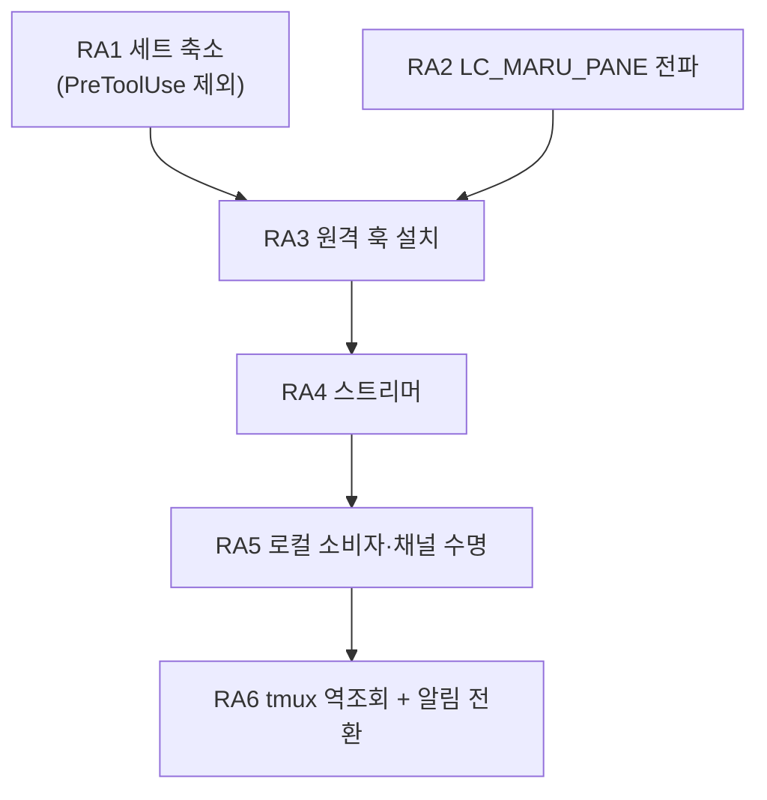

# 원격 에이전트 상태(배지·대화 줄) — 단계 계획

**초안.** 확정 전까지 [AGENTS.md](../../AGENTS.md) 인덱스에 연결하지 않는다.

## 0. 전제

- 계약의 단일 출처는 [에이전트 훅 통합](../agent-hooks.md) **§11**(원격 SSH 세션)이다. 이 문서는 그
  §11.6 이 «아직 설계 전» 으로 남겨 둔 축의 **단계 분해**다.
- **범위는 둘뿐이다** — 사이드바 **배지**(`running`/`blocked`/`idle`)와 사이드바 **대화 줄**(마지막
  프롬프트·응답). **턴 경계 스냅샷은 비범위다**(사용자 결정 2026-08-29).
- 그 결정이 설계를 가볍게 만든다. 스냅샷을 빼면 **AI 소행 경로**(`PreToolUse.tool_input.file_path`)와
  **진행 중 세부**가 함께 빠지고, 그러면 `PreToolUse` 자체가 필요 없어진다(RA1).
- 지금 원격 pane 의 알림은 OSC 로 온다(§11.4·§11.5). **이 축이 서면 그 Term 은 훅 모드가 되어 OSC 를
  버린다**(§1.1) — 즉 현행 OSC 설정은 **이 축이 설 때까지의 다리**다. 전환은 RA6 이 함께 다룬다.

## 1. 단계

### RA1 — 원격 이벤트 세트를 좁힌다

- 원격에 거는 세트는 **여섯**이다: `SessionStart`·`UserPromptSubmit`·`Stop`·`PermissionRequest`·
  `Notification`(claude 전용)·`SubagentStart`/`SubagentStop`. 근거는 `agent_hook_mode.next` 가 상태를
  옮기는 이벤트와 대화 줄이 읽는 두 필드(`UserPromptSubmit.prompt`·`Stop.last_assistant_message`)뿐이다.
- **`PreToolUse` 를 빼는 것이 이 단계의 요점이다.** 그것이 만드는 `→ running` 은 `UserPromptSubmit` 이
  이미 만들고, 그것만 주는 두 가지(진행 중 세부·AI 소행 경로)는 §0 의 비범위다. 빼면 셋을 얻는다.
  - **비용**: 도구 호출마다 도는 발화가 사라진다([계약](../agent-hooks.md) §3 — 턴당 ~90 ms 의 주범).
  - **보안**: `tool_input.command`(셸 명령 원문)·`oldString`/`newString`(소스코드)이 **네트워크를 안
    건넌다**(§7 이 경고한 그 payload 다). 원격 축에서는 이것이 로컬보다 훨씬 무겁게 걸린다.
  - **codex 재승인**: 거는 훅이 적을수록 `trusted_hash` 항목이 적다(§11.5).
- `agent_hook_command.eventsFor(provider)` 가 **로컬/원격을 가르는 축을 하나 더 갖는다.** 전역 세트를
  두지 않는 §2 의 규율을 그대로 따른다.
- 검증: 세트 상수의 단위 테스트, 원격 세트에 `PreToolUse` 가 없음을 단언하는 테스트.

### RA2 — pane 신원을 원격에 실어 보낸다

- **`LC_MARU_PANE`** 을 `maru ssh` 가 `SendEnv` 로 보낸다. 값은 `MARU_HOOK_INSTANCE`·`MARU_HOOK_PANE` 과
  **같은 조립기**(`agent_hook_command.formatGuiInstance`/`formatSurfacePane`)에서 나온다 — 두 곳에서
  만들면 «훅이 쓰는 이름 ≠ maru 가 읽는 이름» 이 조용히 성립한다(§4 가 이미 겪은 사고다).
- ⚠️ **인스턴스 칸을 반드시 넣는다.** `surface_id` 는 프로세스마다 1 부터라, 넣지 않으면 maru 를 둘 띄운
  순간 두 인스턴스의 첫 pane 이 원격에서 **같은 파일**을 쓴다 — §4 가 로컬에서 이미 겪은 사고를
  원격에서 재현하는 셈이다.
- **`LC_` 접두를 쓰는 이유**(2026-08-29 실측): stock sshd 는 `AcceptEnv LANG LC_*` 를 기본으로 열어 두지만
  `COLORTERM` 은 아니다. 같은 실측에서 `COLORTERM` 은 막히고 `LC_MARU_PANE` 은 통과했다 — 게이트가 실제로
  작동하는데도 `LC_*` 만 열려 있다는 대조 증거다. 값은 원격 셸 → provider → 훅까지 **손자 프로세스에서도**
  살아 있었다.
- **ControlMaster 다중화에서도 세션마다 다른 값이 간다**(실측). 마스터 하나를 공유하는 pane 둘이 각각
  자기 값을 받았고 인증은 0 회 늘었다 — 이 축의 생사가 걸린 시험이었다.
- ⚠️ **단, 그 마스터가 `SendEnv` 를 달고 떴을 때만이다**(2026-08-30 실서버 재측). 조건을 좁혀 다시 재니
  갈렸다:

  | 마스터를 만든 호출 | 그 뒤 pane 이 받는 값 |
  | --- | --- |
  | `SendEnv` 없음 | **빈 값**(조용히) |
  | `SendEnv` 있음 | 자기 값 |

  즉 **`SendEnv` 를 «값이 있을 때만» 붙이면 안 된다.** maru 밖 터미널에서 친 `maru ssh` 는 nonce 가
  없어 그 옵션 없이 마스터를 만들고, 그 마스터는 `ControlPersist` 동안 살아 있다 — 그 뒤에 열린 maru
  pane 이 그것을 재사용하면 **자기 값을 조용히 잃는다**(훅이 빈 nonce 를 보고 그냥 나가므로 이벤트가
  0 이고 화면에도 로그에도 아무것도 안 남는다). 그래서 **nonce 가 없어도 옵션은 항상 붙인다** — 빈 값은
  무해하고(훅의 첫 가드가 거른다), 서버가 `LC_*` 를 안 받아도 무해하다.
- 검증: 두 pane 이 서로 다른 값을 받는 실서버 왕복, 서버가 `LC_*` 를 안 받는 경우의 **조용하지 않은** 폴백.

### RA3 — 원격 훅 설치

- **claude**: 원격 `~/.claude/settings.json`. **codex**: 원격 `~/.codex/hooks.json`(PascalCase 이벤트명).
- 훅은 `<cache>/maru/remote-agent-events/$LC_MARU_PANE.ndjson` 에 append 한다. 로컬 훅과 **줄 형식이
  같다**(`<provider>\t<payload JSON>`) — 파서를 나누지 않는다.
- ⚠️ **값을 검증하고 쓴다.** 로컬 훅이 `case "$MARU_HOOK_PANE" in ''|*[!0-9a-f]*) exit 0` 로 하는 그
  규율을 그대로 옮긴다. 경로 조립에 검증 없는 env 를 넣지 않는다.
- **codex 는 신뢰 항목까지 우리가 쓴다**(2026-08-30 정정). 승인이 항목 해시 단위라 커맨드를 고치면
  다시 묻는 것은 맞지만, 그 표를 **maru 가 계산해 적으면 묻지 않는다** — 로컬이 이미 그렇게 한다.
  원격 세션에는 승인 TUI 를 볼 사람이 없으므로 이것이 선택이 아니라 **필수**다. 판정은 순수 층 하나
  (`agent_hook_trust.applyEntries`)가 하고 로컬·원격이 그것을 함께 쓴다. RA1 이 세트를 좁히는 것은
  여기서도 값을 한다(적을수록 표가 적다).
- **회전·정리는 스트리머가 한다**(2026-08-29 확정·실측). 로컬은 «읽는 Term 이 소비 즉시 비우는
  큐»(§4.2)인데 원격은 읽는 주체가 채널 너머에 있다 — 그래서 **그 기계의 소비자인 스트리머가** 비운다.
  조건 둘이 함께 필요하다: **다 읽었을 때만**(안 그러면 안 흘린 꼬리를 버린다)과 **상한을 넘었을
  때만**(로컬 회전과 **같은 1 MiB** — 다르면 «원격만 디스크를 먹는다» 가 되고 그 차이는 사용자가 원격
  기계를 볼 때까지 안 보인다). `O_TRUNC` 로 열어 아무것도 안 써서 훅이 만든 **0600 을 보존한다**.
- ⚠️ 그것을 정하려다 **더 앞선 결함**을 만났다: 스트리머가 «남은 전부» 를 1 MiB 상한으로 요구해,
  안 읽은 구간이 그 값을 넘긴 파일은 **읽기가 실패하고 그 파일이 영영 소비되지 않았다**(실측: 1.25 MiB
  로그에서 흘린 이벤트 0, stderr 도 비어 조용했다). 상한이 큰 파일을 지키는 게 아니라 **영구히 버리는**
  장치였고, 소비가 안 되니 절단도 못 걸려 두 결함이 서로를 가렸다. 고정 조각(256 KiB)만 읽고 완성된
  줄까지만 커서를 옮기는 형태로 고쳤다.
- **스트리머가 죽은 동안 자라는 파일**은 **시작 시 정리**가 맡는다(로컬 `cleanupAgentHookLogs` 와 같은
  자리). 로컬처럼 «전부 지우지» 는 않는다 — 원격 스트리머는 사용자가 그 pane 을 보고 있는 동안에도
  다시 뜨므로(채널이 죽었다 살아난 경우) 전부 지우면 방금 생긴 이벤트를 버린다. **상한을 넘긴 것만**
  거둔다.
- **파일 «수» 의 상한은 mtime 이 맡는다**(7 일). 바이트에는 상한이 있는데 개수에는 없어서, 비워진 로그와
  옆 파일이 pane 이 사라진 뒤에도 남고 tmux pane 번호는 단조 증가라 이름이 재사용되지 않았다 —
  스트리머는 매 회차 디렉터리를 통째로 훑으므로 **훑는 비용 자체가 자랐다**. 저장소가 원격 드롭
  디렉터리에 이미 쓰는 정책과 같은 값이다. 미래 mtime(시계 되돌림·NFS)은 안 건드린다.
- 검증: 설치·제거의 순수 판정(로컬 `agent_hook_install` 재사용), 원격 파일이 실제로 생기는 실서버 왕복.

### RA4 — 원격 스트리머 `maru agent-events --stdio`

- **host 당 하나**다(pane 당이 아니다). 원격 훅 로그 디렉터리 전체를 tail 해 `{nonce, provider, payload}`
  로 태그해 stdout 으로 흘린다.
- ⚠️ **`MaxSessions` 가 pane 당 채널을 금지한다**(2026-08-29 실측). 기본값 10 이고 **다중화도 포함**이라,
  pane 당 터미널 1 + 채널 1 이면 같은 호스트 **pane 5 개가 상한**이었다. 11 번째부터
  `Session open refused by peer` 와 함께 255 로 죽는다. host 당 하나로 두면 이 제약이 사라진다.
- `control_relay.zig` 의 두 규율을 물려받는다: **stdout 은 오직 wire**(로그는 stderr), **바이트를 해석하지
  않는다**.
- ⚠️ **`maru control --stdio` 를 재사용할 수 없다.** 그것은 그 기계의 **GUI 앱**이 연 컨트롤 소켓에 붙는
  중계라([SSH 클라이언트 계획](ssh-client.md) S10 — 실측 2026-08-21), 헤드리스 원격에는 붙을 소켓이 없다.
  새 프로그램이 필요하고, 그것이 이 단계의 실체다.
- 검증: 헤드리스 왕복(파일에 줄을 넣고 stdout 에서 받기), 폭주 구간의 상한, 스트리머 재시작 후 커서.

### RA5 — 로컬 소비자와 채널 수명

- 전송은 **`maru ssh` 가 이미 만든 ControlMaster 소켓 위의 `exec` 채널**이다. 경로는
  `controlSocketPath(HOME, dest)` 로 얻는다 — 드롭 업로드가 쓰는 그 함수이고, Term → dest 는 OSC 5379
  관측이 이미 준다(`remoteUploadContext` 와 같은 자리).
- ⚠️ **포워딩을 쓰지 않는다.** [컨트롤 플레인 보안](../control-plane-security.md) §8.7 이 확정한 규율이고,
  포워딩은 원격에 로컬 컨트롤 플레인 **전체**를 노출한다(peer-cred 는 uid 만 본다).
- ⚠️ **`hello` 를 상한 안에서 찾는다.** `ForceCommand` 와 `authorized_keys` 의 `command=` 서버는 우리
  명령을 **갈아치우고 `exit 0` 을 준다**(2026-08-29 실측 — 다중화 exec 도 못 피한다). 첫 줄로 판정하면
  안 된다: 정상 서버도 MOTD·rc 잡음을 앞에 붙인다. §4a 의 5 초·64 KiB 규약을 그대로 쓴다.
  못 찾으면 **축을 안 열고 사유를 남긴다** — 그 목적지를 캐시해 매 접속마다 왕복하지 않는다
  (`ssh-terminfo-hosts` 캐시와 같은 자리·같은 모양).
- ⚠️ **사망 감지는 하트비트로만 한다.** 종료 코드는 구분력이 없다 — 정상 종료가 `0`, 원격의 진짜 실패가
  `255` 를 이미 쓰고 **다중화 경합으로도 255 가 난다**(공개 보고). 어느 경우에도 stderr 는 비어 있었다.
  침묵이 사망 신호이고, `ssh -S <ctl> -O check` 는 **원인 구분에만** 쓴다.
- 죽으면 **관측 모드로 강등하고 그 사실을 남긴다.** 조용한 폴백은 §1.2 가 금지한다.
- 검증: 채널 사망 주입 후 강등과 사유 기록, 제한 서버에서 축이 안 열리는 것, 재접속 후 커서 이어붙이기.

#### RA5 후속 — 재접속(2026-09-01 실사용에서 갭 확인)

**지금 코드는 재접속을 안 한다.** EOF 를 보면 `stopped = true` 로 **영구 래치**하고 주석이
「이 목적지는 다시 안 띄운다」고 못 박는다. 그래서 스트리머가 한 번 죽으면 **앱을 껐다 켜기 전까지**
그 목적지의 배지가 영영 안 선다 — 위 검증 항목의 셋째(「재접속 후 커서 이어붙이기」)만 구현되지 않았다.

실사용에서 재현했다: ControlMaster 는 살아 있고(`-O check` → `Master running`) pty 스트림도 살아 있어
**알림은 계속 오는데** 배지만 죽는다. 두 길이 다르기 때문이다 — 알림은 pane 의 pty, 배지는 ControlMaster
위의 별도 exec 채널이다. 사용자에게는 「어느 순간부터 애니메이션이 사라졌다」로만 보인다.

**왜 지금까지 안 했나 — 재생 때문이다.** wire 프레임은 `{"nonce","line"}` 뿐이라 위치가 없고, 스트리머의
커서는 **그 프로세스 안에만** 있다. 그대로 다시 띄우면 offset 0 부터 다시 읽어 훅 이벤트가 통째로
재생되고 **완료 알림이 다시 울린다**. 그러니 래치는 게으름이 아니라 방어였다. 커서가 먼저다.

**커서를 원격 파일에 영속시키지 않는다.** 그러면 두 경우를 구분할 수 없다:

| | 원하는 동작 |
| --- | --- |
| **앱을 새로 켰다** | 최근 이벤트를 **다시 읽어야** 지금 상태(배지)가 선다 — 재시작하면 낫는 이유가 이것이다 |
| **채널만 죽었다 살아났다** | **다시 읽으면 안 된다** — 알림이 재생된다 |

파일에 굳히면 앱 재시작 때도 이어 읽어 배지가 빈 채로 남는다. 그래서 **커서를 스트림에 실어 로컬이
기억한다** — 로컬 기억은 앱과 함께 죽으므로 위 구분이 **저절로** 성립한다.

**구현 상태: RA5-a·b·c 모두 완료(2026-09-01).** 아래는 그 설계이고, 실제로 배선됐다.

- **RA5-a 커서**: 스트리머가 파일 offset 이 나아갈 때 `{"cur":"<이름>","at":<offset>}` 를 함께 흘린다.
  로컬은 `Frame.cursor` 로 받아 dest 별로 들고 있는다(메모리만). 스트리머는 `--resume=` 로 그 값을 받아
  이어 읽는다. 없으면 지금처럼 0 부터다.
- **RA5-b 재접속**: EOF 를 **영구 차단이 아니라 백오프 재시도**로. ⚠️ **두 실패를 반드시 가른다** —
  `hello` 실패(`ForceCommand` 같은 제한 서버)는 재시도해도 영원히 안 되므로 지금처럼 영구 차단이 맞고,
  EOF 는 연결이 살아 있어도 나므로 재시도가 맞다. 지금은 한 플래그가 둘을 뭉갠다.
  ControlMaster 가 살아 있으면 재접속은 그 소켓 위 exec 하나라 값싸다(실측으로 확인).
- **RA5-c 표시**: 죽어 있는 동안 강등을 사용자가 알 수 있게. 지금은 로그에만 남아 §1.2 의 「조용한
  폴백 금지」를 절반만 지킨다.

#### 만들고 나서 적대적 검증이 잡은 것 — **재접속 안에 같은 차단을 두 번 더 심어 뒀다**

고친 뒤에도 남아 있던 자리들이다. 「재접속을 만들었다」와 「재접속이 실제로 산다」가 다르다는 기록으로 남긴다.

- **`retries` 가 성공해도 안 줄었다.** 오직 증가만 하면 며칠에 걸쳐 여섯 번 끊긴 목적지가 그 뒤로 영영
  안 붙는다 — 그 시점부터는 이 작업 **이전과 똑같다**. 줄이 오면(= 채널이 산다) 되돌린다. 예산은
  「연달아 실패한 횟수」이지 「살아온 동안의 총합」이 아니다.
- **기동 실패가 재시도 중에도 영구 차단이었다.** fork 가 한 번 밀린 것으로 EOF 에서 막 고친 함정을
  형제 경로가 그대로 재현한다. 둘이 **한 함수**(`scheduleStreamerRetry`)를 쓰게 모았다.
- **커서 맵에 상한이 없었다.** 스트리머는 디렉터리 **전체**를 훑어 옛 pane 로그까지 커서를 내고, 그
  파일은 1 MiB 전에는 안 지워지며 tmux pane 번호는 단조 증가한다. host 소유 nonce 는 한 항목 77 바이트라
  53 개면 `--resume` 상한을 넘고, 넘으면 **조용히 처음부터 읽어 알림이 재생된다**(막으려던 그것이다).
  32 개로 묶고, 그 상한이 예산 안이라는 것을 **`comptime` 으로** 못 박았다.
- **반쯤 지은 이어읽기가 스트리머를 죽인다.** `,` 뒤에서 실패하면 끝에 쉼표가 남는데 셸 검사는 통과하고
  원격 **구조 검사에서** 죽어 usage_error → EOF → 재시도 → 영구 포기가 된다. 온전하지 않으면 이어읽기를
  포기하고, 판정은 저쪽 함수를 **그대로 재사용**한다(두 벌이면 한쪽이 바뀌는 날 갈린다).

⚠️ **개발 환경에서 특히 자주 죽는다**(2026-09-01 실측): 도는 실행 파일이 교체되면 그 프로세스가 죽는다
(`cp`·`mv` 둘 다 재현). `~/.local/bin/maru` 가 빌드 산출물을 **심볼릭 링크로** 가리키면 `zig build` 를
돌릴 때마다 원격 스트리머가 죽는다 — 복사본으로 두면 그 원인은 사라진다. 다만 **슬립·네트워크 끊김으로도
같은 EOF 가 나므로** 그것은 완화이지 수정이 아니다.

### RA6 — 원격 tmux 와 알림 경로 전환

- **tmux 안에서는 `LC_MARU_PANE` 이 오염된다.** tmux 서버가 만들어질 때의 값이 자식에게 가고,
  `update-environment` 기본 목록 아홉에 `LC_*` 가 없다(2026-08-29 실측). 나중에 다른 값으로 attach 해도
  **먼저 값이 그대로 온다** — 값이 비는 것이 아니라 **남의 값이 오는** 오배달이다.
- **좌표는 «옆 파일»로 싣는다**(2026-08-29 확정). 훅 줄에 칸을 더하면 `<provider>\t<payload JSON>` 이라는
  형식이 원격에서만 달라지고, 그러면 §4 가 지킨 「파서를 나누지 않는다」가 깨진다. 대신 훅이
  `<dir>/<nonce>.tmux` 에 `$TMUX`·`$TMUX_PANE` 을 **덮어쓴다**(리다이렉션 하나 — 훅이 하는 일은 그대로
  «append 와 write» 뿐이다). 확장자가 다르므로 스트리머의 파일 이름 판정(`nonceFromFileName`)이 이미
  그것을 이벤트 로그로 착각하지 않는다.
  ⚠️ **오염에는 모양이 둘이고, 처음에 하나만 봤다.**
  - **«남의 값이 온다»**: 서버가 어떤 값으로 만들어졌으면 그 값이 자식 전부에게 간다 — 훅은 **B 의
    이벤트를 A 의 파일에 적는다**. 역조회는 «A 파일에 든 줄의 진짜 주인을 되찾는» 일이다.
  - **«아무 값도 안 온다»**(2026-08-31 실사용에서 잡았다, **이쪽이 더 흔하다**): tmux 서버가
    `maru ssh` **전에**(또는 그 밖에서) 만들어졌으면 pane 자식은 값을 아예 못 받는다. 클라이언트에는
    있고 pane 에는 없는 것을 실측으로 나란히 확인했다. 그때 훅이 첫 가드에서 나가면 **파일이 아예 안
    생겨 되찾을 대상이 없다** — 역조회 기계는 있는데 쓸 기회가 없다.
    그래서 **빈 nonce 라도 `$TMUX_PANE` 이 있으면 그 이름(`t<pane>`)으로 적는다.** 주인은 스트리머가
    클라이언트 env 에서 되찾는다. 둘 다 없으면(tmux 밖 + 신원 없음) 그때는 정말 귀속할 곳이 없어 나간다.
- ⚠️ **오염의 «범위» 를 잘못 읽으면 옆 파일만으로는 못 고친다**(적대적 검증 2026-08-29). 서버 생성 시
  env 는 **그 서버의 자식 전부**에게 간다 — 즉 «한 pane 이 남의 이름을 쓴다» 가 아니라 **«그 tmux 서버의
  모든 pane 이 같은 이름을 쓴다»** 이다. 그러면 pane 셋의 이벤트가 **한 파일에 섞이고**, 옆 파일은
  마지막에 쓴 pane 만 가리켜 역조회로도 못 가른다(셋 모두가 한 Term 에 귀속된다).
  **그래서 파일 이름을 tmux pane 으로 한 칸 더 가른다**: `<nonce>_t<pane 번호>.ndjson`. 앞의 `%` 는
  떼고 뗀 값도 검증한다(검증 없는 env 를 경로에 넣지 않는다는 규율은 여기서도 같다). tmux 밖에서는 그
  칸이 비어 이름이 예전과 같다. 실측: 같은 서버의 pane 둘이 각자 파일을 갖고 **각자 주인**(`4331_9`·
  `4331_5`)으로 되찾아졌다.
- **런타임 역조회로 고친다**(최악 조건 실측 성공). 훅이 `$TMUX_PANE` 과 `$TMUX`(소켓 경로)를 함께 싣고,
  스트리머가 `pane → session → client` 를 물어 **그 클라이언트 프로세스의 env** 에서 오염되지 않은 nonce 를
  읽는다(Linux `/proc/<pid>/environ`, macOS `ps -E`). tmux 클라이언트는 SSH 셸이 직접 exec 한 것이라 그
  env 는 멀쩡하다.
- `update-environment` 에 `LC_MARU_PANE` 을 넣으면 attach 시 갱신되는 것도 실측했지만(진짜 attach 로 확인),
  **그것은 최적화로만 둔다** — 정확성을 사용자 설정에 걸지 않는다.
- 클라이언트가 여럿이면 **규칙을 명시한다**(전부에게 보내거나 축을 안 연다). 조용히 하나 고르지 않는다.
- **알림 경로를 전환한다.** 이 축이 서면 그 Term 은 훅 모드가 되어 OSC 를 버린다(§1.1). 사용자가 원격에
  넣어 둔 `preferredNotifChannel`·`[tui] notifications` 는 **그대로 두어도 무해**하다(그 Term 에서만 무시된다)
  — 축이 죽어 관측 모드로 강등되면 다시 산다. 그 성질을 문서에 적어 사용자가 설정을 지우지 않게 한다.

### RA7 — 한 tmux 세션의 pane 여럿을 각각 드러낸다 (설계, 2026-09-02)

**증상**: 원격 tmux 세션 하나에 pane 을 여럿 열고 각 pane 에서 claude 를 돌리면 **하나만 감지된다.**
사용자 보고이고, 같은 기계에서 실물로 확인했다 — 스풀에 `t16`·`t18`·`t27` 이 각각 살아 이벤트를 쌓는데
배지는 하나다.

**원인은 역조회의 구조다.** RA6 은 `pane → session → client` 로 가서 **그 클라이언트 프로세스의 env**
에서 `LC_MARU_PANE` 을 읽는다. 그런데 tmux 세션 하나에 attach 한 클라이언트는 하나이고, 그 nonce 는
**maru pane 하나**를 가리킨다. 그래서 **역조회가 성공해도** 모든 tmux pane 이 같은 Term 으로 접히고,
배지는 마지막 이벤트가 정한다. §3-4 의 「클라이언트가 여럿」과는 **반대 축**이다(클라이언트 하나, pane 여럿).

**원칙은 이미 있다.** [sidebar-agent-list.md](../sidebar-agent-list.md) §2 가 Pane 단위로 안 묶는 이유를
이렇게 적었다 — *「Pane 은 여러 Term 을 담고 활성 하나만 그린다. Pane 당 대표 하나만 내면 가려진 것이
목록에서 사라진다 — **화면에 안 보이는 것을 드러내는 것이 이 기능의 목적**이다」*. 그 문장의
「Pane→Term」을 「Term→tmux pane」으로 바꾸면 그대로 이 항목이다. 새 원칙이 아니라 한 층 더 적용하는 것이다.

#### RA7.1 지금은 정보가 어디서 사라지는가

    훅        →  t27.ndjson (+ t27.tmux 사이드카)      ← tmux pane 이 파일 이름에 있다
    원격 CLI  →  역조회로 nonce 를 치환한다             ← main.zig:13913·13922
                 `if (resolved) |r| r else nonce`        여기서 «어느 tmux pane» 이 사라진다
    wire      →  {"nonce":"host_…_…","line":"…"}        ← 이미 접힌 값만 건넌다
    로컬      →  nonce → Term 하나

**wire 가 `{nonce, line}` 뿐이라 로컬은 tmux pane 을 알 길이 없다.** 역조회가 실패하면 `t27` 이 그대로
오지만 그것은 어느 Term 것인지 모르는 값이라 버려진다(§3-5). **즉 두 갈래 다 RA7 에 부족하다.**

#### RA7.2 무엇을 바꿔야 하는가 — 네 층

| 층 | 바꿀 것 |
| --- | --- |
| wire | tmux pane 을 **보존**한다. 아래 두 안 중 하나 |
| 원격 CLI | 역조회 결과로 nonce 를 덮어쓰되 pane 을 버리지 않는다 |
| 로컬 귀속 | Term 하나가 **여러 에이전트 세션**을 든다 — 지금은 상태 자리가 Term 당 하나다 |
| 사이드바 | Term 행 아래에 pane 행을 편다(§2 의 「전수」를 한 층 더) |

**wire 안 둘:**

- **(i) nonce 합성** — `host_<i>_
_t27`. 필드를 안 늘려 구버전 로컬도 파싱은 되고(모르는 nonce 로
  보여 무시), 상한만 `tmux_segment_max` 만큼 늘리면 된다. 다만 「nonce 는 Term 신원」이라는 뜻이 흐려진다.
- **(ii) 필드 추가** — `{"nonce":…,"line":…,"pane":"%27"}`. 뜻이 명확하고 구버전 로컬은 그 키를 무시해
  예전과 같이 동작한다(안전한 무시). 대신 프레임 스키마가 늘고 `parseFrame` 이 바뀐다.

**(ii) 를 권한다.** (i) 은 「신원」과 「하위 축」을 한 문자열에 섞어, `remoteNonceMatches` 가 접두 비교를
하게 만든다 — 그 함수가 지금 Term 귀속의 유일한 잣대라 거기에 접두 규칙을 더하면 오배달 축이 하나 는다.

#### RA7.3 결정 (2026-09-02 사용자 결정)

| # | 결정 | 근거 |
| --- | --- | --- |
| 1 | **Term 배지는 하위 중 하나라도 `running` 이면 `running`** | 「돌고 있는 것이 있다」가 목록에서 찾는 사실이다. §1.1 권위표의 D1(자식이 하나라도 살아 있으면 running)과 같은 결이라 규율이 둘로 갈리지 않는다 |
| 2 | **v1 은 클릭하면 Term 까지만 간다** | tmux `select-pane` 은 원격을 **조작**하는 축이라 v1 에 넣지 않는다. 목록이 드러내는 것과 조작하는 것은 다른 결정이다 |
| 3 | **wire 는 필드를 더한다** — `{"nonce":…,"line":…,"pane":"%27"}` | nonce 합성은 「신원」과 「하위 축」을 한 문자열에 섞어 `remoteNonceMatches` 에 접두 규칙을 더하는데, 그 함수가 지금 Term 귀속의 **유일한 잣대**라 오배달 축이 하나 는다. 필드는 구버전 로컬이 **모르는 키로 무시**해 예전과 같이 동작한다 |
| 4 | **v1 은 닫힌 pane 을 «표에서» 접지 않는다**(미결정 → 기본값. ⚠️ **합성은 다르다** — §7a 적대적 검증 ⑸) | 스풀 파일이 있으면 행이 있고, 7일 회수(`isStale`)가 지우면 사라진다. 「마지막 이벤트로부터 N분」 같은 시간 규칙을 v1 에 넣지 않는 이유는 그 값이 근거 없는 추측이 되기 때문이다 — 실제로 오래 남아 불편하면 그때 재본 값으로 정한다. **대가는 죽은 pane 행이 최대 7일 남는 것**이다 |

#### RA7.3.1 원래 물었던 것 (기록)

1. **Term 배지는 무엇을 말하는가.** 하위 pane 이 여럿이면 Term 행의 배지는 ⓐ 하나라도 `running` 이면
   running ⓑ 활성 tmux pane 것만 ⓒ 배지를 안 그리고 하위만. **ⓐ 를 권한다** — 「돌고 있는 것이 있다」가
   사용자가 목록에서 찾는 사실이고, §1.1 권위표의 D1(자식이 하나라도 살아 있으면 running)과 같은 결이다.
2. **클릭하면 어디로 가는가.** 지금 사이드바 행은 Term 으로 전환한다. tmux pane 행은 그 Term 으로 가되
   **tmux pane 전환까지 할 것인가**(원격에 `select-pane` 을 보내는 일이라 조작 축이 하나 는다). v1 은
   Term 까지만 가는 쪽이 안전하다.
3. **화면 축은 없다.** 원격 Term 은 `agent_kind` 가 영영 `.none` 이라 `pollAgentState` 가 즉시 반환하므로
   ([agent-hooks.md](../agent-hooks.md) §1.1 의 원격 주), 하위 pane 상태는 **훅만으로** 선다. C1·C2 가
   못 서니 승인 해제·codex 오류 턴은 원격에서 그대로 남는다 — RA7 이 그것을 고치지 않는다.
4. **detached pane.** §3-5 가 「귀속할 Term 이 없으면 버린다」로 정했는데, RA7 에서는 **attach 된 세션의
   pane** 이 대상이라 그 결정과 충돌하지 않는다. 다만 pane 이 죽은 뒤 스풀에 남는 파일은 7일 회수
   (`isStale`)에 맡긴다 — 목록에서는 **마지막 이벤트로부터 얼마 지났는지**로 접는 규칙이 따로 필요하다.

#### RA7.3.2 pane 별 상태를 **어디에** 두는가 (2026-09-02, 실측 근거)

`Progress` 는 **1104 바이트**다(`children: [128]u64` — 실측). pane 별로 그것을 들어야 계약 §2 의 자식
셈이 pane 마다 정확해지는데, 둘 곳이 셋이다.

| 안 | 대가 |
| --- | --- |
| ⓐ Term 에 고정 배열 | pane 4개만 잡아도 Term 당 **4.4KB** 이고, **원격 pane 이 없는 로컬 Term 도 똑같이 진다.** Term 은 수십 개가 산다 |
| ⓑ Term 에 힙 포인터 | 낭비는 없지만 「Term 은 고정 크기라 힙을 안 잡는다」(`PendingNotice` 주석) 규율을 깬다 |
| ⓒ **`AppSession` 에 모아 두고 Term 은 참조만** | 원격 pane 총수는 **앱 전체에서** 수십 개라 한 곳에 두면 낭비가 없다. `turn_ring` 이 이미 같은 모양이다 |

**ⓒ 를 택한다.** 근거는 「누가 그 자원을 얼마나 쓰는가」다 — pane 은 Term 의 속성이 아니라 **원격 세션
전체의 자원**이고, 로컬 Term 이 0개를 드는 것이 그 사실과 맞다. ⓐ 는 안 쓰는 쪽이 값을 치르고, ⓑ 는
Term 수명마다 할당·해제가 붙어 그 규율이 막으려던 것을 그대로 부른다.

    AppSession
      remote_agent_panes: [max_remote_panes]RemotePaneEntry   // surface_id + pane + hook_state + progress
      remote_agent_pane_count: u16

**적대적 검증(2026-09-02)에서 셋을 각각 공격했고 ⓒ 만 남았다.**

- **ⓐ 를 다시 재 봤다.** 「4.4KB 가 큰가」를 Term 전체와 대조하지 않았던 것이 첫 허점이었다. 그런데
  Term 은 PTY·화면을 **참조**할 뿐이고 자기 몸은 작다 — 이미 `Progress` 하나(1104B)를 들고 있어,
  거기에 넷을 더하면 **Term 이 두 배 이상**이 된다. 게다가 그 값을 **원격 pane 이 없는 로컬 Term 이
  똑같이 진다.** 대가가 작지 않다.
- **ⓑ 를 되살려 봤다.** 「규율은 *모든* Term 이 힙을 잡을 때의 것이고 원격 Term 은 몇 개뿐」이라는
  반론이 성립하는지 봤는데, **선례가 없다.** Term 의 원격 전용 필드 `agent_remote_channel: ?Channel` 은
  포인터가 아니라 **작은 값 타입**이라 이 경우의 근거가 못 된다. 선례 없이 규율을 비켜 가는 쪽은
  `deinit` 누락이 곧 누수가 되는 축을 하나 더 만든다.
- **ⓒ 를 공격했더니 선례가 막았다.** 「수명 관리를 손으로 해야 하고 조회에 스캔이 붙는다」가 약점인데,
  `AppSession.turn_rings`(`turn_snapshot.RingMap`)가 **정확히 같은 모양**이다 — AppSession 의 고정 배열,
  identity 로 `find`, 상한을 넘으면 퇴출, 그리고 `wasEvicted` 로 **말없이 밀리지 않는다.**

**상한도 그 선례가 답한다.** `RingMap` 은 8(`max_sessions`)로 작게 잡고 **가장 오래 안 쓴 것부터** 버리며,
밀린 신원을 `evicted` 로 남겨 화면이 말하게 한다. 「몇 개까지 열리는가」를 미리 알아서 정한 값이 아니라
**작게 잡고 밀리는 것을 보이게 한 것**이다. `max_remote_panes` 도 같은 규율을 따른다 — 값은 구현할 때
정하되 **퇴출과 그 고지를 함께** 넣는다.

#### RA7.5 구현 계획 — 7a / 7b 로 나눈다 (2026-09-03)

사용자 불만이 둘인데 필요한 작업이 달라서 나눈다.

| 단계 | 무엇을 푸는가 | 사이드바 |
| --- | --- | --- |
| **7a** | 「도는 게 제대로 안 됨」 — pane 별 상태를 따로 들어 **섞임을 없앤다** | **무변경** |
| 7b | 「하나만 감지」 — 행을 나눈다 | 행 모델·동적 높이·클릭 판정·골든 |

**7a 를 먼저 하는 이유**는 값이 빨리 나오기 때문이다. 지금 배지가 틀린 것은 여러 pane 의 이벤트가 한 상태
자리에 섞여 **마지막 것이 이기기** 때문인데, pane 별로 나눠 들면 사이드바를 안 건드려도 그 섞임이 사라진다.
7b 는 7a 가 만든 자료를 읽기만 하므로 순서도 자연스럽다.

##### 7a 의 네 조각

    ⑴ 자료   AppSession 에 원격 pane 표(RA7.3.2 의 ⓒ) — turn_rings 옆
    ⑵ 귀속   consumeRemoteAgentLines 가 pane 별 자리에 advance 한다
    ⑶ 합성   Term 의 훅 상태 = 하위 pane 들을 접은 값
    ⑷ 판정   섞임이 사라졌음을 제품 경로에서 잠근다

**⑶ 의 접는 규칙이 이 단계의 계약이다.** 사용자 결정은 「하나라도 `running` 이면 running」인데, `blocked`
를 안 정했다. **`blocked` 를 위에 둔다** — 승인 대기는 **사람이 움직여야 푸는** 상태라 「돌고 있다」보다
급하고, 목록에서 찾는 이유도 그쪽이다. 즉 우선순위는

    blocked  >  running  >  idle  >  unknown

이고, 비어 있으면(하위 pane 이 하나도 없으면) **예전 동작 그대로** 단일 자리를 쓴다 — 구버전 원격·tmux
밖·로컬 Term 이 전부 그 경우다.

##### 7a 가 건드리지 않는 것

- **사이드바**(§2 의 행 모델). 7b 의 몫이다.
- **화면 축**. 원격은 `agent_kind` 가 영영 `.none` 이라 C1·C2 가 못 선다([agent-hooks.md](../agent-hooks.md)
  §1.1) — 7a 는 훅 자리만 정확하게 만든다.
- **로컬 tmux**. 로컬 훅은 `$MARU_INSTANCE/$MARU_PANE.ndjson` 이고 tmux 축을 아예 안 본다(그 분기는 원격
  커맨드에만 있다). 로컬 tmux 에서 pane 을 여럿 열면 `$MARU_PANE` 이 tmux 서버 생성 시 값으로 고정돼
  **같은 파일에 섞인다** — RA7 로 안 고쳐지는 별개 축이고, 아래 §3 한계에 적는다.

##### 7a 적대적 검증 (2026-09-03) — 결정 ⑷ 가 합성 규칙과 충돌한다

계획을 다섯 각도로 공격했고, 넷은 섰지만 **하나가 무너졌다.**

| # | 공격 | 결과 |
| --- | --- | --- |
| 1 | 7a 가 정말 증상을 푸는가 | **절반**이다. 「pane B 의 `Stop` 이 pane A 의 running 을 덮는」 거짓 idle 은 사라지지만, 「어느 pane 인가」는 7b 의 몫이다. 알고 나눈 것이므로 통과 |
| 2 | `blocked > running` 이 옳은가 | 옳다. 승인 대기는 **사람이 움직여야 푸는** 상태라 놓치면 영영 멈춘다. §1.1 의 D1(자식이 있으면 running)과 같은 결 — 둘 다 「정보량이 큰 쪽」을 든다 |
| 3 | pane 별 `Progress` 가 정말 필요한가 | 필요하다. `SubagentStart`/`Stop` 이 pane 마다 오므로 섞이면 자식 수가 틀리고, 계약 §2 가 그 셈에 걸려 있다 |
| 4 | 구·신 원격이 섞이면 | 한 Term 에서 pane 있는 이벤트와 없는 이벤트가 **함께 올 수 있다**(원격 `maru` 를 갱신하는 중간). 「없으면 단일 자리」와 「있으면 pane 자리」가 따로 놀면 배지가 흔들린다 — **단일 자리를 「pane 없음」이라는 이름의 항목 하나**로 다루면 규칙이 하나로 선다 |
| 5 | **죽은 pane** | ❌ **무너졌다 — 아래** |

**⑸ 결정 ⑷(「v1 은 닫힌 pane 을 접지 않는다」)가 합성 규칙과 양립하지 않는다.**

사용자가 tmux pane 을 닫거나 claude 가 죽으면 **`Stop` 이 오지 않는다.** 그 pane 은 표에 `running` 으로
남고, 합성이 「하나라도 running 이면 running」이므로 **Term 배지가 영영 안 풀린다.** 지금은 단일 자리라
다음 이벤트가 덮어써서 자연히 풀리는데, **7a 가 그 자연 복구를 없앤다** — 고치려던 것보다 나쁜 증상을
만든다.

피할 수 없는 결론: **「접지 않는다」는 표에 대해서만 유효하고, 합성은 시간을 봐야 한다.** 둘을 가른다.

    표      닫힌 pane 도 남긴다(7b 가 행으로 보여줄 수 있다) — 회수는 스풀 7일(`isStale`)에 맡긴다
    합성    **마지막 이벤트가 오래된 pane 은 running 으로 세지 않는다**

그 「오래」의 값은 **새로 만들지 않고 이미 있는 것을 쓴다**:

- `silence_deadline_ms`(15초) — 채널이 죽었다고 보는 기준. **너무 짧다**: 에이전트가 20초 생각하는 동안
  훅이 조용한 것은 정상이라, 이 값을 쓰면 도는 턴이 running 에서 빠진다.
- `turn_open_warn_ms`(10분) — 「이 턴이 오래 열려 있다」고 진단에 적는 기준. **이쪽이 맞다.** 그 상수의
  주석이 이미 「시간으로 턴을 닫는 것은 계약이 금지한다 — 여기서는 사실만 적는다」고 못 박았는데, 7a 는
  그것을 **닫는 데 쓰지 않고 「합성에서 제외」에만** 쓴다. 표에는 그대로 `running` 으로 남아 7b 가 그
  사실을 보여줄 수 있다.

⚠️ **그래도 10분은 근거가 빌린 값이다.** 원래 목적(진단 문구)과 쓰임(합성 제외)이 달라서, 실사용에서
「10분 넘게 도는 턴이 배지에서 빠진다」가 보고되면 그때 재본 값으로 갈라야 한다. 그 사실을 여기 적어 둔다.

##### 참조 구현은 이 축을 안 푼다 (2026-09-03 소스 실측)

RA7 은 **선례가 없는 자리**다. 둘 다 비-copyleft라 열람했는데(herdr Apache-2.0 · orca MIT), 각자 다른
길로 이 문제를 **피해 갔다** — 옮겨 올 설계가 없다는 뜻이라 적어 둔다.

| | 원격을 어떻게 다루나 | 그래서 |
| --- | --- | --- |
| **herdr** | `Remote thin-client launcher over SSH command stdio` — 원격에 **herdr 자신을 띄우고**(`command -v herdr` 로 확인) 로컬은 thin client 로 붙는다 | 원격 pane 이 **herdr 의 pane** 이라 tmux 가 개입할 자리가 없다. 이 문제가 **생기지 않는다** |
| **orca** | 원격 에이전트 축이 없다. `tmux`·`ssh` 는 OSC 52 클립보드·터미널 검색 맥락에만 나온다 | 안 푼다 |

**우리가 다른 이유는 철학이다.** `maru ssh` 는 *「사용자의 평소 `ssh` 는 건드리지 않는다」* 를 계약으로
삼고(§1), 원격에 심는 것은 terminfo 와 훅뿐이다. 즉 **원격 환경은 사용자의 것이고 우리는 관측만 한다** —
그래서 사용자가 쓰는 tmux 가 그대로 축에 들어오고, RA7 이 그것을 다뤄야 한다.

**herdr 방식이 대안으로 존재한다**는 것도 함께 적는다: 원격에 `maru` 를 띄우고 thin client 로 붙으면
pane 관리가 우리 것이 되어 이 문제가 사라진다. 택하지 않는 이유는 그것이 **사용자의 tmux 워크플로를
버리게** 하기 때문이고, 그 대가가 이 기능이 주는 값보다 크다. 다만 「우리가 어려운 길을 골랐다」는 사실은
알고 있어야 다음 사람이 같은 저울질을 다시 하지 않는다.

#### RA7.4 아직 재보지 않은 것

- pane 이 수십 개인 tmux 세션에서 사이드바 행이 몇 개까지 늘어나는가(§3 의 동적 높이 재투영 비용).
- 역조회는 pane 마다 한 번씩 도는가, 세션당 한 번인가 — `route_ttl_ms` 캐시가 pane 축에서도 유효한지.
- 사용자가 pane 을 닫은 뒤 목록에서 사라지기까지의 시간(위 4번의 접는 규칙과 같은 문제).

## 2. 순서와 의존

**진행 상태**(2026-08-29): **RA1~RA6 이 모두 제품 경로에 닿았다.** `maru ssh` 로 붙은 pane 하나면 축이
스스로 선다 — 훅 설치(RA3) → 스트리머(RA4) → 채널·소비(RA5) → tmux 역조회(RA6).

**codex 도 자동으로 깐다**(2026-08-30). 「그 기계에서 사용자가 눌러야 한다」는 **틀린 전제였다** —
maru 는 로컬에서 이미 신뢰 항목을 스스로 계산해 쓰고, 원격에서도 그 기계의 `maru agent-hooks` 가
같은 일을 한다. 그리고 그 정정이 중요한 이유는 **원격 세션에 그 TUI 를 볼 사람이 없다**는 것이다.

- RA1·RA2 는 서로 독립이고 먼저 갈 수 있다. RA2 는 **`maru ssh` 에만** 붙는다 — 그냥 `ssh` 로 붙은 세션은
  이 축이 안 열린다(그때는 §11 의 OSC 경로가 그대로 남는다).
- RA4 까지는 **maru GUI 없이** 헤드리스로 검증된다. RA5 부터 GUI 배선이다.

## 3. 알려진 한계 (구현 전에 적어 둔다)

1. **`maru ssh` 로 붙은 세션에만 열린다.** 사용자가 그냥 `ssh` 를 치면 `LC_MARU_PANE` 도 ControlMaster 도
   없다. 그 경우는 §11 의 OSC 알림만 남고 배지는 서지 않는다.
2. **`ForceCommand`·`command=` 서버에서는 축이 안 열린다.** §8.7 이 이미 아는 한계이고, RA5 가 그것을
   조용하지 않게 만들 뿐이다.
3. **서버가 `LC_*` 를 안 받으면 안 열린다.** 최신 Debian/Ubuntu 기본은 `LANG LC_* COLORTERM NO_COLOR` 이고
   macOS 는 `LANG LC_*` 지만(2026-08-29 확인) **보장이 아니다**.
4. **원격 tmux 에서 클라이언트가 여럿이면 귀속이 갈린다.** RA6 이 규칙을 정하지만, 두 Term 이 같은 tmux
   세션을 보고 있으면 «어느 pane 인가» 가 사용자에게도 같은 화면이라 구분에 의미가 적다.
6. **로컬 tmux 는 RA7 로 안 고쳐진다.** 로컬 훅은 `$MARU_INSTANCE/$MARU_PANE.ndjson` 이고 tmux 축을
   **아예 안 본다**(그 분기는 원격 커맨드에만 있다). 로컬 tmux 에서 pane 을 여럿 열면 `$MARU_PANE` 이
   tmux 서버 생성 시 값으로 고정돼 **같은 파일에 섞인다** — 원격과 같은 증상이 같은 원인으로 난다.
   RA7 의 wire 축(`pane` 필드)은 원격 스트리머 경로에만 있으므로 로컬은 별개 작업이다.
5. **detached tmux 안에서 도는 에이전트는 귀속할 Term 이 없다 — 그 이벤트는 버린다**(RA6 결정).
   보류했다 attach 때 방출하는 길도 있었지만 택하지 않았다: 그러려면 «누구 것인지 모르는 이벤트» 를
   상한 없이 들고 있어야 하고, 나중에 attach 한 클라이언트가 **그 이벤트를 만든 그 사람이라는 보장이
   없다**. 버리면 배지가 안 설 뿐이지만, 잘못 방출하면 남의 pane 배지가 흔들린다.
   실제 모양은 이렇다: 역조회가 `detached`(또는 `unresolved`·`ambiguous`)로 접히면 스트리머가 **파일
   이름을 그대로** 실어 보내는데, tmux 안에서는 그 이름에 `_t<pane>` 칸이 붙어 **어느 Term 의 nonce 와도
   안 맞는다** — 그래서 소비자가 조용히 버린다. 「조용히 하나 고르지 않는다」가 이렇게 성립한다.
6. **턴 경계 스냅샷은 이 축으로 안 열린다**(§0 비범위). 열려면 `PreToolUse` 를 되돌리고 원격 작업트리에
   `git write-tree` 를 돌릴 주체를 정해야 하는데, 그것은 이 계획과 다른 축이다.
7. **codex 오류 턴은 원격에서도 배지를 «진행 중» 에 남긴다.** `StopFailure` 가 codex 에 없고 오류 턴에는
   `Stop` 도 안 오기 때문이다([계약](../agent-hooks.md) §9-10) — 전송과 무관한 provider 한계다.
