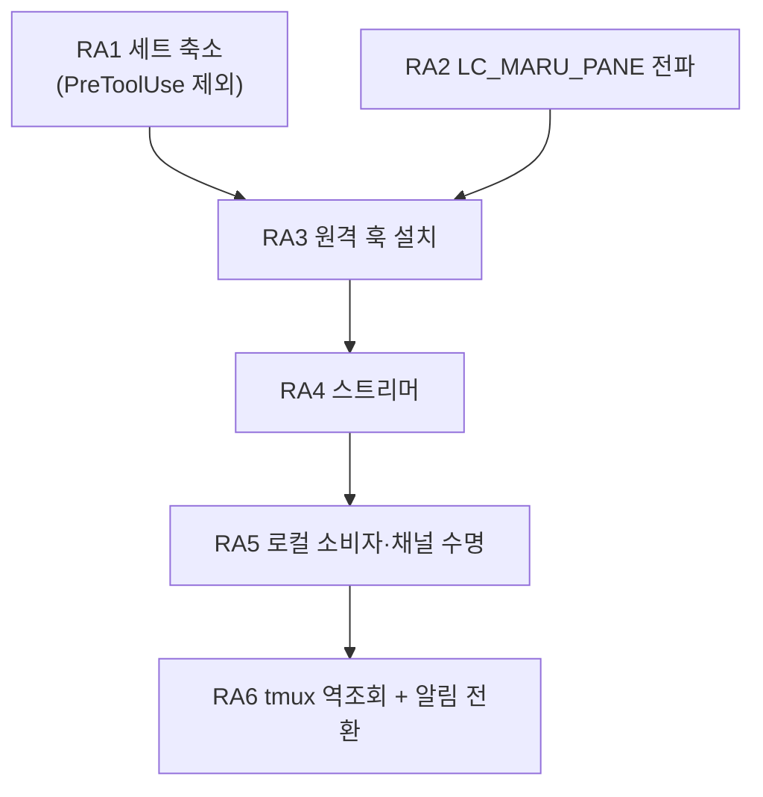

# 원격 에이전트 상태(배지·대화 줄) — 단계 계획

**초안.** 확정 전까지 [AGENTS.md](../../AGENTS.md) 인덱스에 연결하지 않는다.

## 0. 전제

- 계약의 단일 출처는 [에이전트 훅 통합](../agent-hooks.md) **§11**(원격 SSH 세션)이다. 이 문서는 그
  §11.6 이 «아직 설계 전» 으로 남겨 둔 축의 **단계 분해**다.
- **범위는 둘뿐이다** — 사이드바 **배지**(`running`/`blocked`/`idle`)와 사이드바 **대화 줄**(마지막
  프롬프트·응답). **턴 경계 스냅샷은 비범위다**(사용자 결정 2026-08-29).
- 그 결정이 설계를 가볍게 만든다. 스냅샷을 빼면 **AI 소행 경로**(`PreToolUse.tool_input.file_path`)와
  **진행 중 세부**가 함께 빠지고, 그러면 `PreToolUse` 자체가 필요 없어진다(RA1).
- 지금 원격 pane 의 알림은 OSC 로 온다(§11.4·§11.5). **이 축이 서면 그 Term 은 훅 모드가 되어 OSC 를
  버린다**(§1.1) — 즉 현행 OSC 설정은 **이 축이 설 때까지의 다리**다. 전환은 RA6 이 함께 다룬다.

## 1. 단계

### RA1 — 원격 이벤트 세트를 좁힌다

- 원격에 거는 세트는 **여섯**이다: `SessionStart`·`UserPromptSubmit`·`Stop`·`PermissionRequest`·
  `Notification`(claude 전용)·`SubagentStart`/`SubagentStop`. 근거는 `agent_hook_mode.next` 가 상태를
  옮기는 이벤트와 대화 줄이 읽는 두 필드(`UserPromptSubmit.prompt`·`Stop.last_assistant_message`)뿐이다.
- **`PreToolUse` 를 빼는 것이 이 단계의 요점이다.** 그것이 만드는 `→ running` 은 `UserPromptSubmit` 이
  이미 만들고, 그것만 주는 두 가지(진행 중 세부·AI 소행 경로)는 §0 의 비범위다. 빼면 셋을 얻는다.
  - **비용**: 도구 호출마다 도는 발화가 사라진다([계약](../agent-hooks.md) §3 — 턴당 ~90 ms 의 주범).
  - **보안**: `tool_input.command`(셸 명령 원문)·`oldString`/`newString`(소스코드)이 **네트워크를 안
    건넌다**(§7 이 경고한 그 payload 다). 원격 축에서는 이것이 로컬보다 훨씬 무겁게 걸린다.
  - **codex 재승인**: 거는 훅이 적을수록 `trusted_hash` 항목이 적다(§11.5).
- `agent_hook_command.eventsFor(provider)` 가 **로컬/원격을 가르는 축을 하나 더 갖는다.** 전역 세트를
  두지 않는 §2 의 규율을 그대로 따른다.
- 검증: 세트 상수의 단위 테스트, 원격 세트에 `PreToolUse` 가 없음을 단언하는 테스트.

### RA2 — pane 신원을 원격에 실어 보낸다

- **`LC_MARU_PANE`** 을 `maru ssh` 가 `SendEnv` 로 보낸다. 값은 `MARU_HOOK_INSTANCE`·`MARU_HOOK_PANE` 과
  **같은 조립기**(`agent_hook_command.formatGuiInstance`/`formatSurfacePane`)에서 나온다 — 두 곳에서
  만들면 «훅이 쓰는 이름 ≠ maru 가 읽는 이름» 이 조용히 성립한다(§4 가 이미 겪은 사고다).
- ⚠️ **인스턴스 칸을 반드시 넣는다.** `surface_id` 는 프로세스마다 1 부터라, 넣지 않으면 maru 를 둘 띄운
  순간 두 인스턴스의 첫 pane 이 원격에서 **같은 파일**을 쓴다 — §4 가 로컬에서 이미 겪은 사고를
  원격에서 재현하는 셈이다.
- **`LC_` 접두를 쓰는 이유**(2026-08-29 실측): stock sshd 는 `AcceptEnv LANG LC_*` 를 기본으로 열어 두지만
  `COLORTERM` 은 아니다. 같은 실측에서 `COLORTERM` 은 막히고 `LC_MARU_PANE` 은 통과했다 — 게이트가 실제로
  작동하는데도 `LC_*` 만 열려 있다는 대조 증거다. 값은 원격 셸 → provider → 훅까지 **손자 프로세스에서도**
  살아 있었다.
- **ControlMaster 다중화에서도 세션마다 다른 값이 간다**(실측). 마스터 하나를 공유하는 pane 둘이 각각
  자기 값을 받았고 인증은 0 회 늘었다 — 이 축의 생사가 걸린 시험이었다.
- ⚠️ **단, 그 마스터가 `SendEnv` 를 달고 떴을 때만이다**(2026-08-30 실서버 재측). 조건을 좁혀 다시 재니
  갈렸다:

  | 마스터를 만든 호출 | 그 뒤 pane 이 받는 값 |
  | --- | --- |
  | `SendEnv` 없음 | **빈 값**(조용히) |
  | `SendEnv` 있음 | 자기 값 |

  즉 **`SendEnv` 를 «값이 있을 때만» 붙이면 안 된다.** maru 밖 터미널에서 친 `maru ssh` 는 nonce 가
  없어 그 옵션 없이 마스터를 만들고, 그 마스터는 `ControlPersist` 동안 살아 있다 — 그 뒤에 열린 maru
  pane 이 그것을 재사용하면 **자기 값을 조용히 잃는다**(훅이 빈 nonce 를 보고 그냥 나가므로 이벤트가
  0 이고 화면에도 로그에도 아무것도 안 남는다). 그래서 **nonce 가 없어도 옵션은 항상 붙인다** — 빈 값은
  무해하고(훅의 첫 가드가 거른다), 서버가 `LC_*` 를 안 받아도 무해하다.
- 검증: 두 pane 이 서로 다른 값을 받는 실서버 왕복, 서버가 `LC_*` 를 안 받는 경우의 **조용하지 않은** 폴백.

### RA3 — 원격 훅 설치

- **claude**: 원격 `~/.claude/settings.json`. **codex**: 원격 `~/.codex/hooks.json`(PascalCase 이벤트명).
- 훅은 `<cache>/maru/remote-agent-events/$LC_MARU_PANE.ndjson` 에 append 한다. 로컬 훅과 **줄 형식이
  같다**(`<provider>\t<payload JSON>`) — 파서를 나누지 않는다.
- ⚠️ **값을 검증하고 쓴다.** 로컬 훅이 `case "$MARU_HOOK_PANE" in ''|*[!0-9a-f]*) exit 0` 로 하는 그
  규율을 그대로 옮긴다. 경로 조립에 검증 없는 env 를 넣지 않는다.
- **codex 는 신뢰 항목까지 우리가 쓴다**(2026-08-30 정정). 승인이 항목 해시 단위라 커맨드를 고치면
  다시 묻는 것은 맞지만, 그 표를 **maru 가 계산해 적으면 묻지 않는다** — 로컬이 이미 그렇게 한다.
  원격 세션에는 승인 TUI 를 볼 사람이 없으므로 이것이 선택이 아니라 **필수**다. 판정은 순수 층 하나
  (`agent_hook_trust.applyEntries`)가 하고 로컬·원격이 그것을 함께 쓴다. RA1 이 세트를 좁히는 것은
  여기서도 값을 한다(적을수록 표가 적다).
- **회전·정리는 스트리머가 한다**(2026-08-29 확정·실측). 로컬은 «읽는 Term 이 소비 즉시 비우는
  큐»(§4.2)인데 원격은 읽는 주체가 채널 너머에 있다 — 그래서 **그 기계의 소비자인 스트리머가** 비운다.
  조건 둘이 함께 필요하다: **다 읽었을 때만**(안 그러면 안 흘린 꼬리를 버린다)과 **상한을 넘었을
  때만**(로컬 회전과 **같은 1 MiB** — 다르면 «원격만 디스크를 먹는다» 가 되고 그 차이는 사용자가 원격
  기계를 볼 때까지 안 보인다). `O_TRUNC` 로 열어 아무것도 안 써서 훅이 만든 **0600 을 보존한다**.
- ⚠️ 그것을 정하려다 **더 앞선 결함**을 만났다: 스트리머가 «남은 전부» 를 1 MiB 상한으로 요구해,
  안 읽은 구간이 그 값을 넘긴 파일은 **읽기가 실패하고 그 파일이 영영 소비되지 않았다**(실측: 1.25 MiB
  로그에서 흘린 이벤트 0, stderr 도 비어 조용했다). 상한이 큰 파일을 지키는 게 아니라 **영구히 버리는**
  장치였고, 소비가 안 되니 절단도 못 걸려 두 결함이 서로를 가렸다. 고정 조각(256 KiB)만 읽고 완성된
  줄까지만 커서를 옮기는 형태로 고쳤다.
- **스트리머가 죽은 동안 자라는 파일**은 **시작 시 정리**가 맡는다(로컬 `cleanupAgentHookLogs` 와 같은
  자리). 로컬처럼 «전부 지우지» 는 않는다 — 원격 스트리머는 사용자가 그 pane 을 보고 있는 동안에도
  다시 뜨므로(채널이 죽었다 살아난 경우) 전부 지우면 방금 생긴 이벤트를 버린다. **상한을 넘긴 것만**
  거둔다.
- **파일 «수» 의 상한은 mtime 이 맡는다**(7 일). 바이트에는 상한이 있는데 개수에는 없어서, 비워진 로그와
  옆 파일이 pane 이 사라진 뒤에도 남고 tmux pane 번호는 단조 증가라 이름이 재사용되지 않았다 —
  스트리머는 매 회차 디렉터리를 통째로 훑으므로 **훑는 비용 자체가 자랐다**. 저장소가 원격 드롭
  디렉터리에 이미 쓰는 정책과 같은 값이다. 미래 mtime(시계 되돌림·NFS)은 안 건드린다.
- 검증: 설치·제거의 순수 판정(로컬 `agent_hook_install` 재사용), 원격 파일이 실제로 생기는 실서버 왕복.

### RA4 — 원격 스트리머 `maru agent-events --stdio`

- **host 당 하나**다(pane 당이 아니다). 원격 훅 로그 디렉터리 전체를 tail 해 `{nonce, provider, payload}`
  로 태그해 stdout 으로 흘린다.
- ⚠️ **`MaxSessions` 가 pane 당 채널을 금지한다**(2026-08-29 실측). 기본값 10 이고 **다중화도 포함**이라,
  pane 당 터미널 1 + 채널 1 이면 같은 호스트 **pane 5 개가 상한**이었다. 11 번째부터
  `Session open refused by peer` 와 함께 255 로 죽는다. host 당 하나로 두면 이 제약이 사라진다.
- `control_relay.zig` 의 두 규율을 물려받는다: **stdout 은 오직 wire**(로그는 stderr), **바이트를 해석하지
  않는다**.
- ⚠️ **`maru control --stdio` 를 재사용할 수 없다.** 그것은 그 기계의 **GUI 앱**이 연 컨트롤 소켓에 붙는
  중계라([SSH 클라이언트 계획](ssh-client.md) S10 — 실측 2026-08-21), 헤드리스 원격에는 붙을 소켓이 없다.
  새 프로그램이 필요하고, 그것이 이 단계의 실체다.
- 검증: 헤드리스 왕복(파일에 줄을 넣고 stdout 에서 받기), 폭주 구간의 상한, 스트리머 재시작 후 커서.

### RA5 — 로컬 소비자와 채널 수명

- 전송은 **`maru ssh` 가 이미 만든 ControlMaster 소켓 위의 `exec` 채널**이다. 경로는
  `controlSocketPath(HOME, dest)` 로 얻는다 — 드롭 업로드가 쓰는 그 함수이고, Term → dest 는 OSC 5379
  관측이 이미 준다(`remoteUploadContext` 와 같은 자리).
- ⚠️ **포워딩을 쓰지 않는다.** [컨트롤 플레인 보안](../control-plane-security.md) §8.7 이 확정한 규율이고,
  포워딩은 원격에 로컬 컨트롤 플레인 **전체**를 노출한다(peer-cred 는 uid 만 본다).
- ⚠️ **`hello` 를 상한 안에서 찾는다.** `ForceCommand` 와 `authorized_keys` 의 `command=` 서버는 우리
  명령을 **갈아치우고 `exit 0` 을 준다**(2026-08-29 실측 — 다중화 exec 도 못 피한다). 첫 줄로 판정하면
  안 된다: 정상 서버도 MOTD·rc 잡음을 앞에 붙인다. §4a 의 5 초·64 KiB 규약을 그대로 쓴다.
  못 찾으면 **축을 안 열고 사유를 남긴다** — 그 목적지를 캐시해 매 접속마다 왕복하지 않는다
  (`ssh-terminfo-hosts` 캐시와 같은 자리·같은 모양).
- ⚠️ **사망 감지는 하트비트로만 한다.** 종료 코드는 구분력이 없다 — 정상 종료가 `0`, 원격의 진짜 실패가
  `255` 를 이미 쓰고 **다중화 경합으로도 255 가 난다**(공개 보고). 어느 경우에도 stderr 는 비어 있었다.
  침묵이 사망 신호이고, `ssh -S <ctl> -O check` 는 **원인 구분에만** 쓴다.
- 죽으면 **관측 모드로 강등하고 그 사실을 남긴다.** 조용한 폴백은 §1.2 가 금지한다.
- 검증: 채널 사망 주입 후 강등과 사유 기록, 제한 서버에서 축이 안 열리는 것, 재접속 후 커서 이어붙이기.

### RA6 — 원격 tmux 와 알림 경로 전환

- **tmux 안에서는 `LC_MARU_PANE` 이 오염된다.** tmux 서버가 만들어질 때의 값이 자식에게 가고,
  `update-environment` 기본 목록 아홉에 `LC_*` 가 없다(2026-08-29 실측). 나중에 다른 값으로 attach 해도
  **먼저 값이 그대로 온다** — 값이 비는 것이 아니라 **남의 값이 오는** 오배달이다.
- **좌표는 «옆 파일»로 싣는다**(2026-08-29 확정). 훅 줄에 칸을 더하면 `<provider>\t<payload JSON>` 이라는
  형식이 원격에서만 달라지고, 그러면 §4 가 지킨 「파서를 나누지 않는다」가 깨진다. 대신 훅이
  `<dir>/<nonce>.tmux` 에 `$TMUX`·`$TMUX_PANE` 을 **덮어쓴다**(리다이렉션 하나 — 훅이 하는 일은 그대로
  «append 와 write» 뿐이다). 확장자가 다르므로 스트리머의 파일 이름 판정(`nonceFromFileName`)이 이미
  그것을 이벤트 로그로 착각하지 않는다.
  ⚠️ **오배달의 모양을 정확히 적어 둔다**: 오염된 `LC_MARU_PANE` 은 «값이 빈다» 가 아니라 «남의 값이
  온다» 이므로, 훅은 **B 의 이벤트를 A 의 파일에 적는다**. 그래서 역조회는 «없는 것을 찾는» 일이 아니라
  «A 파일에 든 줄의 진짜 주인을 되찾는» 일이다.
- ⚠️ **오염의 «범위» 를 잘못 읽으면 옆 파일만으로는 못 고친다**(적대적 검증 2026-08-29). 서버 생성 시
  env 는 **그 서버의 자식 전부**에게 간다 — 즉 «한 pane 이 남의 이름을 쓴다» 가 아니라 **«그 tmux 서버의
  모든 pane 이 같은 이름을 쓴다»** 이다. 그러면 pane 셋의 이벤트가 **한 파일에 섞이고**, 옆 파일은
  마지막에 쓴 pane 만 가리켜 역조회로도 못 가른다(셋 모두가 한 Term 에 귀속된다).
  **그래서 파일 이름을 tmux pane 으로 한 칸 더 가른다**: `<nonce>_t<pane 번호>.ndjson`. 앞의 `%` 는
  떼고 뗀 값도 검증한다(검증 없는 env 를 경로에 넣지 않는다는 규율은 여기서도 같다). tmux 밖에서는 그
  칸이 비어 이름이 예전과 같다. 실측: 같은 서버의 pane 둘이 각자 파일을 갖고 **각자 주인**(`4331_9`·
  `4331_5`)으로 되찾아졌다.
- **런타임 역조회로 고친다**(최악 조건 실측 성공). 훅이 `$TMUX_PANE` 과 `$TMUX`(소켓 경로)를 함께 싣고,
  스트리머가 `pane → session → client` 를 물어 **그 클라이언트 프로세스의 env** 에서 오염되지 않은 nonce 를
  읽는다(Linux `/proc/<pid>/environ`, macOS `ps -E`). tmux 클라이언트는 SSH 셸이 직접 exec 한 것이라 그
  env 는 멀쩡하다.
- `update-environment` 에 `LC_MARU_PANE` 을 넣으면 attach 시 갱신되는 것도 실측했지만(진짜 attach 로 확인),
  **그것은 최적화로만 둔다** — 정확성을 사용자 설정에 걸지 않는다.
- 클라이언트가 여럿이면 **규칙을 명시한다**(전부에게 보내거나 축을 안 연다). 조용히 하나 고르지 않는다.
- **알림 경로를 전환한다.** 이 축이 서면 그 Term 은 훅 모드가 되어 OSC 를 버린다(§1.1). 사용자가 원격에
  넣어 둔 `preferredNotifChannel`·`[tui] notifications` 는 **그대로 두어도 무해**하다(그 Term 에서만 무시된다)
  — 축이 죽어 관측 모드로 강등되면 다시 산다. 그 성질을 문서에 적어 사용자가 설정을 지우지 않게 한다.

## 2. 순서와 의존

**진행 상태**(2026-08-29): **RA1~RA6 이 모두 제품 경로에 닿았다.** `maru ssh` 로 붙은 pane 하나면 축이
스스로 선다 — 훅 설치(RA3) → 스트리머(RA4) → 채널·소비(RA5) → tmux 역조회(RA6).

**codex 도 자동으로 깐다**(2026-08-30). 「그 기계에서 사용자가 눌러야 한다」는 **틀린 전제였다** —
maru 는 로컬에서 이미 신뢰 항목을 스스로 계산해 쓰고, 원격에서도 그 기계의 `maru agent-hooks` 가
같은 일을 한다. 그리고 그 정정이 중요한 이유는 **원격 세션에 그 TUI 를 볼 사람이 없다**는 것이다.

- RA1·RA2 는 서로 독립이고 먼저 갈 수 있다. RA2 는 **`maru ssh` 에만** 붙는다 — 그냥 `ssh` 로 붙은 세션은
  이 축이 안 열린다(그때는 §11 의 OSC 경로가 그대로 남는다).
- RA4 까지는 **maru GUI 없이** 헤드리스로 검증된다. RA5 부터 GUI 배선이다.

## 3. 알려진 한계 (구현 전에 적어 둔다)

1. **`maru ssh` 로 붙은 세션에만 열린다.** 사용자가 그냥 `ssh` 를 치면 `LC_MARU_PANE` 도 ControlMaster 도
   없다. 그 경우는 §11 의 OSC 알림만 남고 배지는 서지 않는다.
2. **`ForceCommand`·`command=` 서버에서는 축이 안 열린다.** §8.7 이 이미 아는 한계이고, RA5 가 그것을
   조용하지 않게 만들 뿐이다.
3. **서버가 `LC_*` 를 안 받으면 안 열린다.** 최신 Debian/Ubuntu 기본은 `LANG LC_* COLORTERM NO_COLOR` 이고
   macOS 는 `LANG LC_*` 지만(2026-08-29 확인) **보장이 아니다**.
4. **원격 tmux 에서 클라이언트가 여럿이면 귀속이 갈린다.** RA6 이 규칙을 정하지만, 두 Term 이 같은 tmux
   세션을 보고 있으면 «어느 pane 인가» 가 사용자에게도 같은 화면이라 구분에 의미가 적다.
5. **detached tmux 안에서 도는 에이전트는 귀속할 Term 이 없다 — 그 이벤트는 버린다**(RA6 결정).
   보류했다 attach 때 방출하는 길도 있었지만 택하지 않았다: 그러려면 «누구 것인지 모르는 이벤트» 를
   상한 없이 들고 있어야 하고, 나중에 attach 한 클라이언트가 **그 이벤트를 만든 그 사람이라는 보장이
   없다**. 버리면 배지가 안 설 뿐이지만, 잘못 방출하면 남의 pane 배지가 흔들린다.
   실제 모양은 이렇다: 역조회가 `detached`(또는 `unresolved`·`ambiguous`)로 접히면 스트리머가 **파일
   이름을 그대로** 실어 보내는데, tmux 안에서는 그 이름에 `_t<pane>` 칸이 붙어 **어느 Term 의 nonce 와도
   안 맞는다** — 그래서 소비자가 조용히 버린다. 「조용히 하나 고르지 않는다」가 이렇게 성립한다.
6. **턴 경계 스냅샷은 이 축으로 안 열린다**(§0 비범위). 열려면 `PreToolUse` 를 되돌리고 원격 작업트리에
   `git write-tree` 를 돌릴 주체를 정해야 하는데, 그것은 이 계획과 다른 축이다.
7. **codex 오류 턴은 원격에서도 배지를 «진행 중» 에 남긴다.** `StopFailure` 가 codex 에 없고 오류 턴에는
   `Stop` 도 안 오기 때문이다([계약](../agent-hooks.md) §9-10) — 전송과 무관한 provider 한계다.
