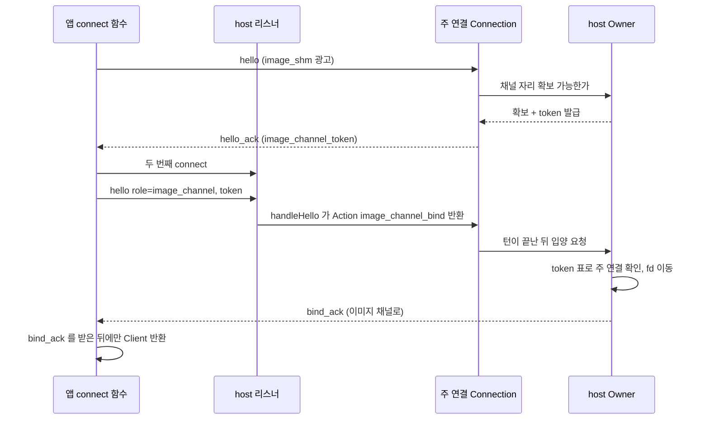
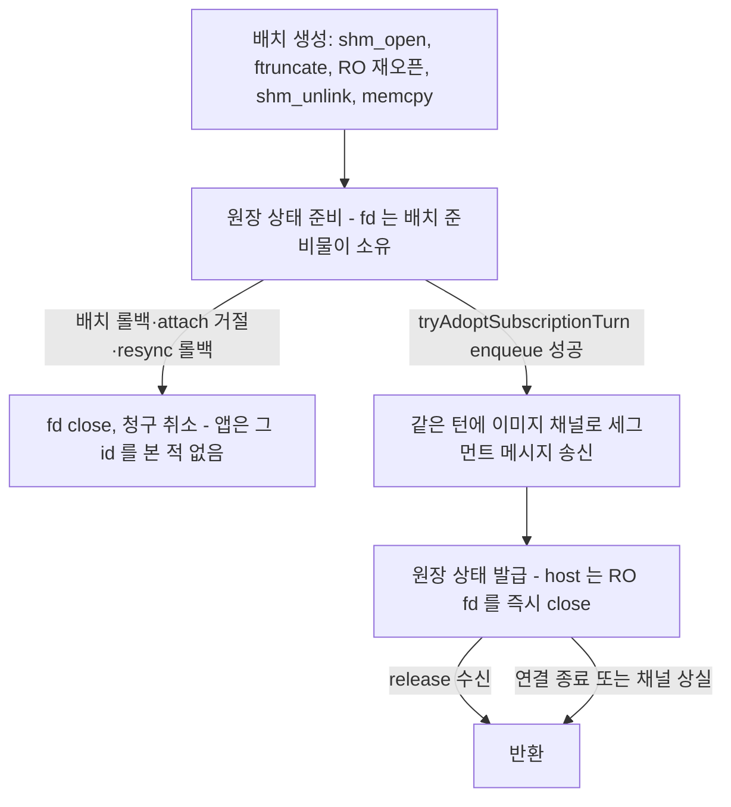

# Session host 이미지 채널 — 픽셀을 공유 메모리로 넘기는 계약

이 문서는 session host 가 **로컬 GUI 앱**에게 kitty 이미지 픽셀을 넘기는 방식의 단일 출처다. 주 MRSH 스트림의 레코드
형식·흐름 제어는 [영속 터미널 세션 호스트](persistent-session-host.md) §12 를 따르고, 이 문서는 그중 이미지 픽셀이
어떤 경로로 오가는지만 정한다. 구현 단계와 진행 상태는 [구현 계획](plans/session-host-image-channel.md)이 소유한다.

## 1. 왜 필요한가

terminal-browser 는 같은 kitty image id 로 RGBA 프레임을 계속 다시 보낸다(2026-10-10 실측 한 장 8,466,273 B). 기존 경로는 그
픽셀을 delta 배치에 통째로 싣는데, 스트림별 송신 큐 연성 상한 `screen_soft_bytes`(`connection_slot.zig`)보다 **배치 하나가
더 크다.** 진단 줄(`session host stream invalidated: … reject_bytes=8466273 screen_resident=0 soft_cap=8388608`)이 그것을
확정했다 — 큐가 비어 있어도 거부된다. 그래서 이미지 갱신은 모두 거부되고, 스트림 무효화 → `resync_retry_backoff_ns`
백오프 → 이미지 담은 전체 resync 스냅샷이 1~1.5 초마다 반복되며, 앱 메인 스레드가 그때마다 60~80 ms 멈춘다. 뷰포트 스냅샷의
이미지 예산(`screen_snapshot.zig`)을 넘는 큰 이미지는 스냅샷에서도 빠진다.

이 문서의 경로에서는 픽셀이 소켓 바이트·송신 큐를 지나지 않는다. 주 스트림에는 수십 바이트짜리 참조만 실리므로 위 상한들은
더 이상 이미지 크기와 엮이지 않는다. 같은 측정(8 MiB 한 장)에서 프레임당 비용은 현행 흉내 6.2 ms 에서 1.05 ms 가 된다.

## 2. 범위와 형식 선택

- **연결마다 협상으로 형식을 고른다. 실패했을 때 바이트로 대신 보내는 경로는 없다**(2026-10-11 사용자 결정).
  - `image_shm` 을 협상한 연결: 주 스트림에 `image_ref` 레코드, 픽셀은 이미지 채널(§3)의 공유 메모리 세그먼트.
  - 협상하지 않은 연결: 지금의 `image_blob`. `maru attach --stream`(폰이 ssh 로 소비)·ANSI attach·N-1 앱·resolver 가 없는
    `.gui` 소비자가 여기 해당한다. 이것은 실패 대체가 아니라 협상 결과다.
- `image_shm` 은 `client_kind` 로 정하지 않는다. 이미지 채널 리더·세그먼트 표·resolver 를 설치하는 GUI 제품 연결 경로만 명시
  플래그로 광고한다(`.gui` 로 붙지만 `ScreenAssembler` 를 resolver 없이 쓰는 소비자가 있다).
- 앱·조립기의 `image_blob` 디코더는 남는다. 폰이 같은 `ScreenAssembler` 를 쓰고, 새 앱이 N-1 host 에 오래 붙어 있는 경우
  ([업그레이드](session-host-upgrade.md)의 side-by-side drain)가 있기 때문이다.
- 이 계약 밖: 세그먼트 재사용, Metal no-copy 텍스처, handoff 로 세그먼트 넘기기, 코어 이미지 저장소(`KittyImageStorage`, wasm 에
  들어가는 libc 없는 계층)의 공유 메모리화.

## 3. 이미지 채널

주 MRSH 소켓으로는 fd 가 **한 번도** 오가지 않는다. fd 는 연결마다 하나 있는 보조 연결(이미지 채널)로만 오간다. 그래서 주
파이프라인의 프레임 검증·배치 조립·복구 분류·송신 큐·버림 경로는 바이트만 다루는 지금 그대로다.

### 3.1 수립

- host 는 hello 처리 때 이미지 채널 자리를 확보할 수 있을 때만 hello_ack 에 128-bit 랜덤 `image_channel_token` 을 싣는다.
  자리 확보는 **Owner 층 카운터**다(`SlotTable`·`ReactorCore` 에는 예약 상태가 없다 — 실제 슬롯을 Client 없이 쥐면
  `destroyAll` 이 못 돌려줘 업그레이드 handoff 가 거부된다). 집행은 hello 에서 한다: 이미지 채널이 아닌 hello 는
  `handshake 를 마친 연결 수 + 미사용 token 수` 가 슬롯 상한에 닿으면 이름 붙은 close 로 닫는다. 확보는 입양·token 만료·주 연결
  종료(`destroyAll` 포함) 셋 중 하나로 풀린다. 토큰은 기능 목록이 아니라 hello_ack 의 별도 필드다.
- 앱은 같은 리스너에 두 번째 연결을 열고 첫 프레임으로 `.hello` 의 변형 `hello{role:"image_channel", token}` 을 보낸다. 새 frame
  kind 로 두지 않는 이유: pre_hello 에서 첫 프레임이 `.hello` 가 아니면 연결이 닫힌다. 판정은 `Connection.handleHello` 안에서
  `role` 을 다른 필드보다 먼저 보고 Action `.image_channel_bind` 를 돌려준다 — major·JSON·범위 검사를 그대로 거치고, 잘못된 입력은
  이름 붙은 close-site 로 닫힌다. 그 Connection 은 이후 프레임을 모두 거부하는 종단 상태가 된다.
- **입양은 턴이 끝난 뒤 Owner 가 한다.** dispatch 안에서 임시 연결을 정리하면 진행 중인 dispatch 가 해제된 Slot 을 쓴다.
  Owner 는 token 표(token → 주 연결 slot·admission key)로 주 연결을 찾고, key 가 살아 있고 닫히는 중이 아닌지 확인한 뒤 임시
  Client 의 fd 를 주 연결의 이미지 fd 로 옮기고(-1 로 떼어 냄), 이미지 채널로 `bind_ack` 를 보내고, 임시 Client 를 슬롯 정리를
  한 번만 하는 destroy 변형으로 지운다. 로그는 「closed client connection」 대신 `image_channel_adopted` 한 줄이다. token 은 처음
  쓰일 때 표에서 지운다. NONBLOCK·CLOEXEC·NOSIGPIPE 는 fd 속성이라 옮겨도 유지된다(accept 경로의 `configureOwnedSocket`).
- 앱의 connect 함수 둘(hello 를 만드는 두 자리)은 `finishHello` 뒤에 이미지 채널을 열고 **`bind_ack` 를 받은 뒤에야** Client 를
  반환한다. 그래서 attach 는 언제나 채널이 묶인 뒤에 온다(재접속 워커가 연결된 Client 를 attach 전에 넘기는 구조와 맞다).
  이미지 채널 소켓은 `client_deadline.connectUnixUntil` 로 만든다 — 앱은 SIGPIPE 를 전역으로 잡지 않으므로 SO_NOSIGPIPE 가
  없으면 닫힌 소켓에 쓰는 순간 프로세스가 signal 13 으로 죽는다(실측). deadline 이 없는 블로킹 connect 경로는 기존 read
  timeout 에 해당하는 절대 deadline 을 만들어 `bind_ack` 대기에 쓴다.
- hello_ack 의 기능 목록 고정 배열은 제품 host 에서 이미 가득 찼다 — 늘리고 최대 개수를 comptime 으로 잠근다.

### 3.2 수립 실패와 채널 상실

- 채널을 못 연 경우(token 거부·deadline·자원 고갈): connect 함수는 전용 오류 `ImageChannelUnavailable` 을 **연결 실패로 올리지
  않는다.** 주 연결을 「이미지 채널 없음」 표시와 함께 반환하기 전에 주 소켓으로 `image_channel_abandon` 을 보내 host 가 token 을
  버리게 한다(attach 보다 먼저 가므로 그 시점에 세그먼트는 없다). 연결 실패로 올리면 앱 시작 경로가 「이 host 에 못 붙는다」로
  읽고 host 를 하나 더 띄운다 — `ImageChannelUnavailable` 이 spawn·업그레이드·unreachable·재접속 실패 판정 어디로도 흐르지 않음을
  판정자가 잰다.
- 「이미지 채널 없음」 연결: 앱은 그 연결의 탭에 notice(이미지를 표시할 수 없음, 재접속 때 다시 시도)를 띄우고, host 는 그
  연결에 세그먼트를 만들지 않고 이미지 placement 를 빼고 보낸다.
- 입양 뒤 채널이 죽으면(EOF·HUP·오류, abandon 뒤 늦게 입양된 경우 포함) **주 연결은 닫지 않는다.** host 는 그 연결의 원장을 전부
  반환하고 「이미지 채널 없음」으로 내린다. 앱도 채널 EOF 를 보는 순간 같은 상태가 된다. 주 연결이 닫히면 채널도 닫는다.
- 업그레이드: 두 소켓 모두 accepted/client socket 이라 exec 로 넘어가지 않는다. 새 host 는 모르는 token 의 채널 연결을 닫는다.

### 3.3 메시지

| 방향 | 형식 | fd |
|---|---|---|
| host → 앱 | 고정 길이 `bind_ack` | 없음 |
| host → 앱 | 고정 길이 세그먼트 `{segment_id u64, stream_id, image_id, generation, byte_len}` | **정확히 1 개** |
| 앱 → host | 고정 길이 `release{segment_id}` 묶음 | 없음(붙어 오면 그 fd 를 닫고 프로토콜 오류) |

메시지 하나에 fd 하나라 한 메시지 fd 상한·제어 버퍼 잘림·개수 대조 문제가 단순해진다. host→앱 채널에는 위 두 종류 외의
메시지를 섞지 않는다(§4.3 의 「막힐 수 없다」 근거가 메시지 개수에 기대기 때문이다).

### 3.4 순서 보장

host 는 세그먼트 메시지를 이미지 채널로 **먼저** 보내고, 그 세그먼트를 가리키는 `image_ref` 를 담은 배치의 주 소켓 바이트는
나중에(`writeReady`) 나간다. macOS Unix 소켓의 sendmsg 는 반환 전에 상대 수신 버퍼에 넣으므로, 앱이 주 소켓에서 그 레코드를
읽을 때 fd 는 이미 이미지 채널에 와 있다(실측: 20 만 회 중 늦게 도착 0·번호 불일치 0). 앱은 배치를 적용하기 직전에 이미지 채널을
논블로킹으로 비운다.

### 3.5 host reactor

poll 배열은 연결당 fd 둘(주·이미지)을 담는다. 이미지 fd 의 POLLIN 은 턴당 예산 안에서 recvmsg 로 `release` 를 읽고, HUP/ERR 은
§3.2 의 채널 상실로 즉시 처리한다(레벨 트리거라 미루면 계속 깨어난다). admission 게이트가 닫힌 동안에도 이미지 fd 읽기는
계속한다(release 는 원장만 바꾼다). release 로 여유가 생기면 그 연결의 producer 를 바로 예약한다.

## 4. host: 세그먼트와 원장

### 4.1 세그먼트 생성

`shm_open`(랜덤 이름 31 자 이하, `O_RDWR|O_CREAT|O_EXCL`, 0600) → `ftruncate(byte_len)`(macOS 는 크기를 한 번만 정할 수 있다) →
같은 이름 `O_RDONLY` 재오픈 → `shm_unlink` → RW 매핑에 코어 픽셀 복사 → RW 매핑·fd 해제. 남는 것은 읽기 전용 fd 하나다 — 받는
쪽은 쓰기 매핑을 만들 수 없다(EPERM, 실측). `shm_open` fd 는 FD_CLOEXEC 가 기본으로 켜져 있어 PTY 자식과 업그레이드 exec 로
새지 않는다(`O_CLOEXEC` 를 플래그로 넘기면 `shm_open` 이 실패한다). 메타 전용 레코드(픽셀 0 B)는 세그먼트를 만들지 않는다.

### 4.2 송신은 승인 시점

세그먼트는 배치를 **만들 때** 생기지만 이미지 채널로는 배치가 **큐에 승인된 뒤** 나간다(`tryAdoptSubscriptionTurn` 이 enqueue 에
성공한 바로 뒤, 같은 턴). owner 는 단일 스레드이고 주 소켓 송신 자리는 `writeReady` 하나라 「채널이 먼저」 순서가 지켜진다.
배치가 롤백·거절되면 준비물이 fd 를 닫고 청구를 취소한다 — 앱이 본 적 없는 id 라 고아가 생기지 않는다.

### 4.3 원장

연결마다 `segment_id`(u64, 단조) → `{stream, image_id, generation, bytes, 상태∈{준비, 발급}}`. 상한은 연결당 개수
`image_segment_max_per_connection`, 연결당 바이트 `image_segment_bytes_per_connection`, host 전체 바이트
`image_segment_bytes_per_host` 다. 반환은 **정확히 한 번**: 준비 취소, release 수신, 연결 종료, 채널 상실. stream detach 는 반환하지
않는다 — 그 메모리는 앱·커널이 아직 쥐고 있다. 모르는 id·이미 반환된 id 의 release 는 무시하고 진단 카운터만 올린다.

이미지 채널 송신은 정상적으로 막힐 수 없다: 앱이 채널을 안 읽어도 쌓일 수 있는 메시지 수는 원장 개수 상한으로 묶이고, 받는
쪽이 읽지 않을 때 fd 붙은 메시지는 64 개까지 들어간다(실측 — 상한은 바이트가 아니라 메시지 개수다; 56 B·1 B 모두 64). 그래서
`image_segment_max_per_connection` ≤ 32 를 comptime 으로 잠그고, 「peer 가 안 읽는 상태에서 상한 개수 송신이 성공한다」를 판정자로
잰다. 그래도 송신이 실패하면 불변식 위반으로 채널 상실 처리한다.

원장은 송신 큐 예산·`GlobalBudget` 과 따로 둔다. 큐 예산에 넣으면 큰 세그먼트 하나가 다시 `screen_soft_bytes` 를 넘어 원래 문제가
돌아오고, `GlobalBudget` 에 넣으면 텍스트만 있는 pane 까지 압력에 걸린다.

### 4.4 큰 한 장의 우선권

연결 바이트 상한보다 큰 이미지(6K 화면 전체 pane 이 81 MB)는 그 연결의 원장이 비었을 때 보낸다. 그런 이미지가 미뤄지면 그 연결의
다른 이미지 신규 세그먼트를 막고 원장이 비면 그것을 먼저 보낸다(배치 안에서도 먼저 평가). host 전체 상한보다 큰 이미지는
「전송 불가」로 분류해 placement 를 빼고, 깨우지 않고, (image_id, generation) 당 진단 한 줄을 남긴다.

## 5. host: 흐름 제어와 delta 표현

- 다음 중 하나면 새 세그먼트를 만들지 않고 그 이미지를 **미룬다**: 원장 상한, 큰 한 장 우선권, 이미지 채널 없음, 같은
  (연결, stream, image_id) 에 반환되지 않은 세그먼트가 있음. 마지막 규칙 덕분에 같은 이미지는 최신 것만 나가고(latest-wins),
  큐가 얼마나 밀렸든 이미지당 메모리가 묶인다.
- 미룬 이미지의 표현:
  - 앱이 이전 generation 을 가진 이미지: drawable 로 남기고 base 메타에 **이전** generation 을 적는다 — 화면은 옛 프레임을 유지한다.
  - 처음 보내는 이미지: 그 id 의 placement·virtual placement 를 이번 배치에서 뺀다(앱 조립기는 이미지 없는 placement 를
    malformed 로 거부한다).
  - delta 생산의 「보낸 generation 표」에는 보내지 않은 것으로 남긴다.
- base 파서는 `image_ref` 도 이전 generation 표에 넣는다(스냅샷 base 는 실제로 보낸 바이트다 — 안 넣으면 resize·resync 마다 모든
  이미지가 「처음」이 되어 placement 가 빠진다).
- 스냅샷·resync 는 「이미지당 하나」 규칙에서 빠지고 원장 상한·우선권만 따른다(앱이 스냅샷 적용 때 이미지를 비우므로 「옛
  generation 유지」 표현이 성립하지 않는다).
- **용량 사건**(release 수신, 큰 한 장 우선권 해제, 채널 묶임)이 생기면 그 연결에서 이미지를 미룬 스트림 전부에 「화면 변화 없음」
  게이트를 우회하는 플래그를 세우고 producer 를 예약한다. 플래그는 압력 롤백 뒤에도 유지된다. 「전송 불가」 이미지는 깨우지 않는다.
- 배치마다 레코드 `image_seg_hwm{segment_id}` 를 싣는다 = 그 배치가 승인될 때 그 연결에서 마지막으로 **발급**한 id. 주 스트림
  payload 안의 레코드라 프레임 검증과 무관하고, 모르는 레코드를 건너뛰는 base 파서와도 맞는다.

## 6. 앱: 세그먼트 표와 해석

- **세그먼트 표와 이미지 채널 fd 는 `Client` 필드다**(연결 축 — 앱은 여러 host 에 동시에 붙을 수 있어 id 가 섞이면 안 된다).
  Client 이동(generation 노드 이동)에 함께 실리고 Client 필드 allowlist·projection digest 에 등록한다. 앱에서 fd 를 쥐는 곳은 이
  표 하나뿐이다.
- 채널 리더는 매 tick 과 배치 적용 직전에 논블로킹 recvmsg 로 채널을 비운다. 메시지당 fd 가 정확히 하나가 아니면 연결을 poison
  한다 — 앱 fd 가 바닥나면(EMFILE) 재시도한 recvmsg 가 fd 를 **조용히 버리고** 제어 버퍼 잘림 표시도 켜지 않는다(실측). 앱은
  daemon 과 같이 시작 때 `RLIMIT_NOFILE` 을 올린다. 받은 fd 는 CLOEXEC 가 꺼져 있어(macOS 에 `MSG_CMSG_CLOEXEC` 가 없다) 받자마자
  켠다(§7).
- **해석(resolver)은 적용 호출의 필수 인자다.** `RemoteScreen.applySnapshot/applyDelta` 의 시그니처에 넣어 빠진 적용 자리는
  컴파일러가 잡는다 — 조립기 필드로 두면 복구 스냅샷용으로 새로 만드는 `RemoteScreen` 에 복사되지 않는다. 미협상 소비자는
  「`image_ref` 를 만나면 malformed」 resolver 를 명시적으로 넘긴다. 해석 결과는 셋이다:
  - 정상: `segment_id` 로 표를 찾아 `fstat` 크기 하한 확인 → `mmap(PROT_READ)` → fd close → 표에서 제거 → release 적재. 매핑은
    조립기 이미지가 소유한다(픽셀 소유 `{heap, mapping}`, 해제는 주입 함수 — 조립기는 OS 를 부르지 않는 계층으로 남는다).
  - 아직 채널을 못 비움(§7 의 잠금을 못 잡은 tick): 배치를 큐 머리에 그대로 둔다.
  - 비운 뒤에도 없음: 기존 복구 목록에 있는 오류(`MalformedRow`)로 보고한다 — 새 오류 이름을 만들면 탭 복구 경로가 그것을 모르고
    탭을 종료 상태로 보낸다.
- **죽은 항목 정리**: 같은 stream 의 배치는 주 소켓 순서대로 적용된다(`RemoteAttachment` 의 FIFO). 스트림 S 의 배치 하나를
  적용하고 나면 그 배치의 `image_seg_hwm` = H 로 표에서 stream 이 S 이고 id ≤ H 인 항목을 close + release 한다. host 는 세그먼트를
  배치보다 먼저 보냈으므로 그 항목을 가리키는 레코드는 이 배치나 그 앞 배치에만 있을 수 있다 — 아직 표에 있으면 그 배치가 버려진
  것이다. 그래서 주 파이프라인의 버림 경로(복구 discard, inbox 상한, `discardStream`, deadline 등)는 이미지 때문에 바뀌지 않는다.
- **닫힌 stream**: stream detach·종료 정리 때 채널을 best-effort 로 비우고 그 stream 항목을 close + release 한 뒤, Client 의 「닫힌
  stream」 집합에 넣는다. 이후 그 stream 의 세그먼트가 오면 즉시 close + release 한다. 「모르는 stream」을 죽은 것으로 보지 않는다
  — 첫 스냅샷의 세그먼트는 attach 응답보다 먼저 올 수 있다. stream id 는 재사용되지 않으므로 집합은 연결 수명 동안 유지되고 연결당
  stream 상한으로 묶인다. 재접속 freeze 중이나 공유 연결이 이미 끝난 경우에는 이 정리를 건너뛴다(연결 종료가 표 전체를 정리한다).
- release 는 이미지 채널에 직접 논블로킹으로 쓴다(주 연결의 단일 송신 슬롯과 무관해 입력이 몰려도 굶지 않는다). 막히면 목록에
  남겨 다음 tick 에 다시 쓴다(목록 크기 ≤ 표 크기).
- 렌더는 지금처럼 코어 락 아래에서 픽셀을 복사하므로 munmap 규율은 지금의 free 와 같다. 읽기·적용은 소유 스레드에서 한다.

## 7. 앱: 받은 fd 가 자식 프로세스로 새지 않게

받은 fd 는 CLOEXEC 가 꺼진 채로 설치되고, recvmsg 와 `F_SETFD` 사이에 다른 스레드가 fork 하면 자식이 그 fd 를 물려받는다(오래
사는 LSP·ssh ControlMaster 가 물려받으면 host 원장은 반환됐는데 메모리는 계속 붙잡힌다). 앱에는 자식에서 fd 를 닫지 않고
CLOEXEC 에만 기대는 spawn 이 여럿 있다(LSP·git·ssh 업로드·업데이트 확인·PTY 자식·에디터 검색 워커의 `std.process.spawn`·`system()`).

- 프로세스 전역 rwlock 하나: 「recvmsg + `F_SETFD`」 는 쓰기 잠금, fork 는 읽기 잠금.
- 읽기 잠금은 **fork 시스템콜 하나**만 덮는다 — `pthread_atfork(prepare=rdlock, parent=unlock, child=unlock)`. 자식은 fork 순간 fd
  표를 복사하므로 그 구간이면 충분하고, 의존 라이브러리 내부의 fork 도 같이 덮인다. exec 완료까지 잠금을 잡으면(`std.process.spawn`
  은 exec 완료를 기다린다) 느린 spawn 하나가 모든 원격 터미널의 이미지 적용을 멈춘다.
- `posix_spawn` 계열(Darwin `system()` 포함)은 atfork 를 부르지 않는다 → `POSIX_SPAWN_CLOEXEC_DEFAULT` 를 쓰는 헬퍼를 거치게 하고,
  헬퍼를 거치지 않는 `posix_spawn`·`system` 호출을 문법 자리 판정자로 막는다.
- 메인 스레드는 쓰기 잠금을 **`pthread_rwlock_trywrlock`** 으로만 잡는다. Darwin rwlock 에는 우선순위 상속이 없어, 메인이
  BACKGROUND QoS 의 읽기 보유자를 기다리면 CPU 2 배 부하에서 최악 181 ms 를 멈춘다(실측, 부하 없으면 1.6 ms). 못 잡은 tick 에는
  채널 recvmsg 를 건너뛰고, `image_ref` 를 담은 배치를 만난 **그 스트림의 적용만** 그 배치에서 멈춘다(delta 는 앞 배치에 대한
  차이라 같은 스트림의 뒤 배치를 먼저 적용할 수 없다). 이미지가 없는 다른 스트림은 그대로 적용한다. fd 는 recvmsg 전까지 커널 큐에
  있으므로 새지 않는다. tick 이 없는 동기 적용 자리(첫 attach 조립, 관찰자 재접속 후보)는 블로킹 쓰기 잠금을 허용한다 — 읽기
  잠금이 fork 시스템콜 길이로 묶이므로 대기도 그만큼으로 묶인다.
- Swift/ObjC 쪽에는 spawn 이 없다(WKWebView·NSWorkspace 는 XPC/launchd 로 뜨며 fd 를 물려받지 않는다; Swift `Process` 실측도 같다).

## 8. 다른 소비자

- in-process 터미널: 바이트 스트림을 쓰지 않는다 — 변화 없음.
- `maru attach --stream`·ANSI attach·N-1 앱: `image_shm` 을 광고하지 않는다 → 이미지 채널 없음, 지금의 `image_blob`.
  `--stream` 이 받은 `image_ref` 를 다시 바이트로 펼치는 안은 기각했다(§9).
- handoff·업그레이드: 코어 저장소를 지금처럼 직렬화한다. 업그레이드는 attachment·tracker 가 0 일 때만 진행되고 두 소켓 모두
  exec 로 넘어가지 않으므로 원장은 연결 종료로 반환된다.

## 9. 기각했거나 고친 안 (이력)

이 절은 설계 이력이다(2026-10-11, 독립 검증 8 회 — 회차마다 새 검증자 둘이 코드·실험으로 반박, 마지막 회차 HIGH 0).

| 안 | 왜 버렸나 |
|---|---|
| 스트림 연성 상한을 16 MiB 로 올리기 | 기준선만 옮긴다 — 4K pane 이미지는 약 33 MB |
| 「큐가 비면 상한 넘는 배치 하나 허용」+ 옛 프레임 버리기 | 연결 슬롯 상한·스냅샷 예산에서 다시 막히고, delta 는 이전 상태와의 차이라 큐에서 하나를 버리면 사슬이 깨진다 |
| 앱이 받은 fd 개수만 세어 응답 | 스트림마다 처리 순서가 달라 어느 세그먼트가 돌아왔는지 모른다 — id 로 반환한다 |
| 응답을 「받은 즉시」 | 앱 inbox 의 미적용 세그먼트가 아무 상한에도 안 묶인다 |
| 「보낸」 fd 만 세는 흐름 제어 | 앱이 멈추면 host 큐에 세그먼트가 수천 개까지 쌓인다 — 만든 순간부터 센다 |
| fd 를 주 MRSH 프레임(플래그·접두·별도 kind)에 태우기 | 프레임 검증 6 곳·버림 자리 10 여 곳·복구 분류·송신 큐 해제 7 곳·첫 스냅샷 경로·단일 송신 슬롯이 모두 fd 를 몰라, 검증할 때마다 새 누수 자리가 나왔다(지적 수 15→8→6→8). fd 를 이미지 채널로 분리해 해소 |
| 일반 `read()` 로 받기 | fd 가 버려지는 게 아니라 프로세스에 **설치돼 샌다**(실측: 100 번 → fd 100 개) |
| 채널 끝을 hello_ack 에 SCM_RIGHTS 로 넘기기 | 앱의 hello_ack 읽기 자리가 둘이고 host 의 유일한 송신 자리에 제어 데이터를 붙일 곳이 없다 — 앱이 두 번째 연결을 연다 |
| 세그먼트를 「만들 때」 채널로 보내기 | attach 거절·resync 재시도에서 앱이 영영 못 치우는 고아가 생긴다 — 승인 시점에 보낸다 |
| 채널 수립 실패를 연결 실패로 | 앱 시작 경로가 host 를 하나 더 띄운다 |
| 채널 수립 실패 때 바이트 경로로 재연결 | 사용자 결정으로 기각 — 실패 대체 경로를 두지 않는다 |
| `--stream` CLI 가 `image_ref` 를 바이트로 다시 펼치기 | stdout 한 덩어리 상한에서 이미지를 한 번 빼면 host 의 「보낸 표」와 어긋나 폰 화면이 영구히 꺼진다 |
| fork 를 exec 완료까지 잠금 | 느린 spawn 하나가 원격 터미널 전체의 이미지 적용을 멈춘다 — atfork 로 fork 시스템콜만 덮는다 |

## 10. 실측 근거 (이 맥, C 실험)

- unlink 뒤에도 fd 로 객체가 살고, SCM_RIGHTS 로 넘긴 fd 를 다른 프로세스가 매핑하면 같은 데이터가 보인다. 받은 쪽이 fd 를 닫아도,
  보낸 쪽이 매핑·fd 를 모두 놓아도 받은 쪽 매핑은 유효하다. 읽기 전용 fd 로 쓰기 매핑은 EPERM.
- 일반 read 는 fd 를 설치해 누수한다. 제어 버퍼 잘림도 설치·누수한다. 받은 fd 는 CLOEXEC 가 없다. EMFILE 에서 재시도한 recvmsg 는
  fd 를 조용히 버린다. socketpair 는 CLOEXEC 가 없다. `shm_open` fd 는 FD_CLOEXEC 가 켜져 있다.
- fd 를 붙인 send: 부분 쓰기 가능, 상대 여유가 16 B 미만이면 `EMSGSIZE`. 한 메시지 fd 128 개 가능·256 개 `EINVAL`.
  `MSG_DONTWAIT` 만으로는 블로킹 소켓에서 막힌다(소켓 자체가 `O_NONBLOCK` 이어야 한다). `SO_NWRITE` 는 AF_UNIX 에서 늘 0.
- 받는 쪽이 읽지 않을 때 들어가는 메시지: fd 붙은 것 64 개(크기 무관), fd 없는 56 B 146 개.
- recvmsg 는 fd 가 붙은 send 의 경계에서 멈추고 fd 는 그 첫 바이트와 함께 온다.
- 이미지 채널 순서: 채널에 fd 를 보낸 뒤 주 소켓에 쓰면, 주 소켓을 읽은 직후 채널의 논블로킹 recv 에 fd 가 있다 — 20 만 회 중
  누락 0·불일치 0.
- 8 MiB 한 장 프레임당 비용: 새 세그먼트 1.05 ms, 세그먼트 두 개 재사용 0.17 ms, 현행 흉내(소켓 바이트 + 수신 복사) 6.2 ms.
