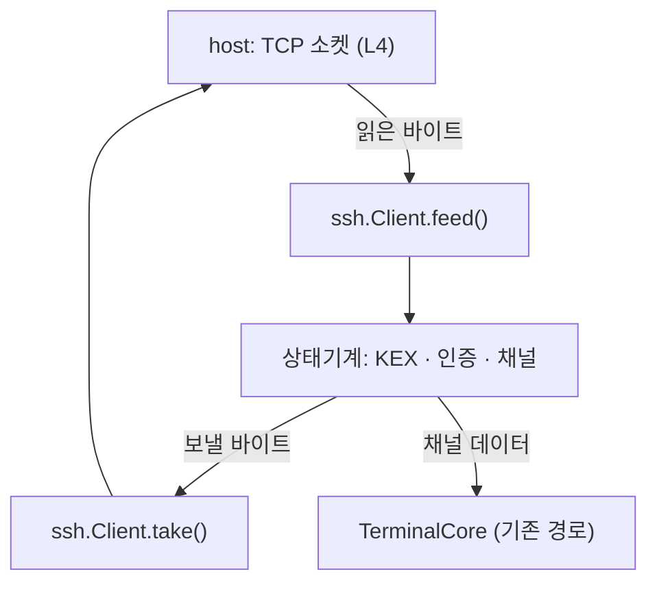

# SSH 클라이언트 계약

**maru 가 SSH 를 직접 말한다.** 지금 있는 `maru ssh` 는 구현이 아니라 **시스템 `ssh` 를 부르는
래퍼**다(원격에 terminfo 를 심고 `exec`). 모바일에는 `ssh` 바이너리도 `exec` 도 없어 그 길이
막혀 있고, 그래서 폰에서 아무 서버에도 못 붙는다.

이 문서가 **무엇을 지원하고 무엇을 안 하는지**의 단일 출처다.

## 1. 왜 SSH 인가 — 세션 호스트도 이 위에 얹는다

원격 축(M3)이 요구하던 것은 "전송·인증·암호화 계약" 이었다. 그것을 **새로 만들지 않고 SSH 로
대체한다**:

- 사용자가 이미 갖고 있다(키·`known_hosts`·서버 설정).
- **기계에 새 포트를 안 연다** — 세션 호스트에 붙는 것도 SSH 채널 위에 얹으면 된다.
- NAT 통과·점프 호스트 같은 운영 문제가 이미 SSH 생태계의 답을 갖는다.

그래서 **먼저 일반 셸에 붙고**(사용자에게 바로 쓸모), 컨트롤 플레인은 같은 연결의 **두 번째 채널** 위에 얹는다(S10 — 세션 호스트가 아니라 **앱**이 그 소켓을 연다).

## 2. 계층 — 프로토콜은 순수 로직, 소켓은 플랫폼

**sans-io 로 짠다.** 클라이언트는 **바이트를 받아 바이트를 내는 상태기계**이고 소켓을 모른다.



- **L2**(`src/session/ssh/`): 패킷·KEX·인증·채널·키 파싱. **OS 호출 0**, 할당은 주입받는다.
- **L4**: 소켓(연결·읽기·쓰기·타임아웃), 키 저장(iOS Keychain·Android Keystore), `known_hosts`
  파일 입출력.
- **모바일 경계**(`src/platform/mobile/mobile_ssh.zig` + `mobile_host_abi.h` 의 `MARU_SSH_*`):
  위 상태기계를 C ABI 로 낸다. **이 층에도 OS 호출이 0이다** — host 가 소켓·키·**난수**를 들고
  바이트만 오간다([모바일 계약](mobile-platform.md) §3.0). 데스크톱 검증 드라이버
  (`tools/ssh/client_smoke.zig`)와 **같은 코어**를 부르고, ABI 자체는 `tools/ssh/abi_smoke.zig`
  가 실서버로 한 번 더 밟는다.

**왜 sans-io 인가.** 모바일 브리지는 계약상 OS 를 못 부른다(모바일 §3). 같은 이유로 데스크톱은
`std.net`, 모바일은 host 소켓을 쓰되 **프로토콜 코드는 하나**다. 덤으로 **헤드리스 테스트**가
된다 — 실제 서버 없이 바이트 열로 상태 전이를 못박는다.

## 3. 지원 집합 — 좁게, 대신 현대적으로

| 자리 | 고른 것 | 왜 |
|---|---|---|
| KEX | `curve25519-sha256`(과 `@libssh.org` 별칭) | OpenSSH 기본. `std.crypto` 에 X25519 가 있다 |
| 호스트키 | `ssh-ed25519` | 요즘 서버 기본. 검증이 단순하고 `std.crypto` 에 있다 |
| 암호 | `chacha20-poly1305@openssh.com` | OpenSSH 기본. 길이 필드를 **별도 키로 따로 암호화**해 그것이 복호 오라클이 되는 계열(CVE-2008-5161)을 막는다. **트래픽 분석까지 막지는 않는다** — 선 위의 패킷 크기는 여전히 보인다 |
| MAC | (암호에 포함) | AEAD 라 MAC 을 **따로 안 쓴다**. 다만 KEXINIT 의 MAC 목록 필드는 **비워 두지 않는다** — 협상 대상이 아니어도 그 자리는 채워 보내야 한다(서버가 파싱한다) |
| 압축 | `none` | 터미널 트래픽에 이득이 적고 공격면만 는다 |
| 인증 | `publickey`(ed25519) · `password` | 키가 정답이고, 비밀번호는 서버가 그것만 열어 둔 경우의 탈출구 |
| 채널 | `session` **둘까지** — 터미널(`pty-req`·`shell`·`window-change`)과 컨트롤(`exec`, pty 없음) + **흐름 제어** | 컨트롤 채널은 세션 목록을 받는 길이다([컨트롤 플레인 §4a](control-plane.md)). 흐름 제어는 선택이 아니다(아래) |

**K_1·K_2 의 이름이 두 출처에서 반대다 — 구현 전에 이것부터 읽는다.** 우리가 따르는 것은
[draft-ietf-sshm-chacha20-poly1305](../references/specs/draft-sshm-chacha20-poly1305.txt) §6 이고,
거기서는 **K_2 가 길이 필드**를, **K_1 이 나머지와 Poly1305 키**를 맡는다(K_2 는 키 재료의 뒷
256비트다). 그런데 구형 OpenSSH `PROTOCOL.chacha20poly1305` 는 **정확히 반대로** 이름 붙였다
(K_1 이 길이). 두 문서를 섞어 읽으면 두 chacha20 인스턴스를 맞바꿔 걸게 되고, 그러면 모든
OpenSSH 서버에서 "길이가 쓰레기로 풀린다/태그 불일치" 로 **원인을 짚기 어렵게** 실패한다.
**이 문서와 코드는 draft 명명을 쓴다.**

**안 하는 것**(정직하게 못박는다): RSA·ECDSA 호스트키, AES-GCM/CTR, `diffie-hellman-*`,
agent 전달, 포트 포워딩, X11, SFTP/SCP, `keyboard-interactive`. 채널은 **위 표의 둘까지**이고
그 밖의 채널 종류(`direct-tcpip`·`direct-streamlocal`)는 안 연다.

**안 연다는 것은 "거절한다" 는 뜻이지 "무시한다" 가 아니다.** 서버는 `x11`·`forwarded-tcpip`·
`auth-agent@openssh.com` 을 **열자고 할 수 있고**, §5.1 은 그 메시지에 "either
SSH_MSG_CHANNEL_OPEN_CONFIRMATION or SSH_MSG_CHANNEL_OPEN_FAILURE" 로 답하라고 못박는다.
`UNIMPLEMENTED` 로 답하면 안 된다 — 그것은 §11.4 의 모르는 **메시지 번호**용이고,
`CHANNEL_OPEN` 은 우리가 아는 번호다. 엉뚱한 답을 받은 상대는 **열지도 닫지도 못한 채널을 붙들고
기다린다**. 우리는 `SSH_OPEN_UNKNOWN_CHANNEL_TYPE`(3)으로 거절하고, 답의 채널 번호는 **상대가
보낸 sender channel** 이다(우리 번호가 아니다).

### 3.0.1 재키잉은 한다 — 안 하면 한 시간 뒤에 멈춘다

서버는 일정 트래픽·시간마다 `SSH_MSG_KEXINIT` 을 다시 보내 키를 갈자고 한다(OpenSSH 기본
`RekeyLimit` 은 **1GB 또는 1시간**). 답하지 않으면 서버가 우리 `KEXINIT` 을 기다리며 **세션이 통째로
멈춘다** — 실측: `RekeyLimit 1M` 서버에서 917,504바이트를 받고 굳었다. 즉 **한 시간 넘는 터미널
세션은 반드시 이것을 만난다**.

초기 KEX 와 다른 점 셋이 규칙의 전부다.

- **`session_id` 는 첫 `H` 로 고정된다**(RFC 4253 §7.2 — "Once computed, the session identifier is
  not changed, even if keys are later re-exchanged"). 새 `H` 로 바꾸면 인증에 쓴 서명의 근거가 달라진다.
  키 유도에는 **새 `H` 와 옛 `session_id` 를 함께** 먹인다 — 둘을 헷갈리면 키가 서버와 다르게 나온다.
- **`KEXINIT` 을 보낸 뒤에는 보낼 수 있는 것이 정해져 있다**(§7.1): 전송 계층 일반(1~19, 단
  `SERVICE_REQUEST`·`SERVICE_ACCEPT` 제외) · 협상(20~29, `KEXINIT` 은 한 번만) · KEX 방법별(30~49).
  **채널 데이터는 못 보낸다.** 보내면 상대가 끊고, 증상은 "가끔 끊긴다" 라 원인을 짚기 어렵다.
- **받는 데는 제한이 없다.** §7.1 이 "each party MUST be prepared to process an arbitrary number of
  messages that may be in-flight" 라고 요구한다 — 재키잉 중에도 상대의 채널 데이터는 계속 오고,
  그것을 버리면 출력이 사라진다.

**strict KEX 는 재키잉에서도 시퀀스를 리셋한다**(draft §3.3 — "at the conclusion of the initial KEX
**and for each subsequent KEX**"). 그리고 재키잉 `KEXINIT` 의 strict 표시자는 **무시하고 초기값을
잇는다**(§3.1) — `kexinit.Phase.rekey` 가 그것을 강제한다.

**호스트키는 재키잉마다 다시 검증한다 — 서명과 *동일성* 둘 다.** 서명 검증만으로는 부족하다:
`verifyExchangeHash` 는 "**제시된** 키가 이 `H` 에 서명했다" 만 말하므로, 상대가 고른 **다른** 키도
그대로 통과한다. 그러면 사용자에게 보여 주고 승인받은 지문이 지금 세션의 상대와 달라지는데,
TOFU 가 약속한 것이 정확히 그 동일성이다. 그래서 재키잉의 `KEX_ECDH_REPLY` 는 **처음 승인한 키와
바이트가 같아야** 하고, 다르면 `HostKeyChanged` 로 끊는다. 비교는 **보관보다 먼저** 한다 — 먼저
덮어쓰면 비교할 원본이 사라진다.

**어느 쪽이 시작하든 같다.** `beginRekey()` 는 양방향이라 우리가 먼저 걸 수도 있다. 다만 **언제
걸지의 정책은 아직 없다** — 서버가 요구할 때 답하는 것으로 실제 문제(세션 멈춤)가 닫히기 때문이다.
우리가 시작하는 경우는 검증 하니스가 태운다(`self-rekey` 회차): 그때만 **재키잉 중에 상대의 데이터가
계속 오므로**, 미뤄 둔 채널 송신 경로가 그 회차에서만 실제로 돈다.

**좁힌 값은 검증할 표면이 준다는 것이다.** 알고리즘 하나마다 상호운용·보안 검증이 따라붙는다 —
필요해지면 그때 넓히되, 넓히는 순간 그 비용도 같이 온다.

**ed25519 호스트키가 없는 서버에는 못 붙는다** — 그때는 조용히 실패하지 말고 **"이 서버는
ed25519 호스트키를 안 준다" 를 그대로 보여 준다**(무엇을 고쳐야 하는지 알 수 있게).

### 3.1 채널 흐름 제어는 선택이 아니다

**`SSH_MSG_CHANNEL_WINDOW_ADJUST` 를 안 보내면 출력이 도중에 멈춘다.** 채널을 열 때 각자 "얼마나
받을 수 있는지"(윈도)를 선언하고, 받은 만큼 줄어들다 0 이 되면 **상대가 더 안 보낸다**(RFC 4254
§5.2). 소비한 만큼 계속 늘려 줘야 한다.

이 결함은 **처음에 안 보인다** — 로그인하고 몇 줄 치는 동안은 초기 윈도 안이라 멀쩡하다.
`cat 큰파일` 이나 빌드 로그처럼 **한 번에 많이 쏟아질 때** 갑자기 멈추고, 그때는 "네트워크가
느리다" 로 오해하기 쉽다. 그래서 회귀 테스트가 **초기 윈도의 3000 배**를 흘려 보내 강제하고(보충 없이는 절대 못 지난다), S8 의 실서버 스모크가 같은 것을 선 위에서 다시 한다.

`window-change` 는 **터미널 크기**(열·행)를 알리는 요청이라 이것과 다른 축이다 — 이름이 비슷해
같은 것으로 읽히기 쉽다.

**드라이버가 할 일은 두 줄이다.** 소비는 코어가 자동으로 하므로 잊을 수 없고, 남은 것은 채우기다:

```zig
const ev = try ch.receive(payload);
if (t.canSendChannelMessages() and ch.pendingWindowAdjust() != 0)
    try send(try ch.writeWindowAdjust(&out));
```

**`canSendChannelMessages()` 를 빼면 안 된다.** `WINDOW_ADJUST` 도 채널 메시지라 **재키잉 중에는
못 보낸다**(§3.0.1 — RFC 4253 §7.1). 조건 없이 보내면 그 순간 연결이 죽는다 — 실측으로 재현했고,
타이밍에 달려 있어 **가끔만** 나므로 더 나쁘다. **미루면 그만이다**: `pendingWindowAdjust` 는
멱등이라 재키잉이 끝난 뒤 다음 호출에서 그대로 나간다. 같은 이유로 `CHANNEL_CLOSE`·`CHANNEL_FAILURE`
같은 다른 채널 응답도 재키잉 동안 미뤄 두었다가 끝난 뒤 보낸다.

**잊으면 조용히 멈추는 대신 시끄럽게 틀린다.** 채워 주기를 잊은 채 윈도가 바닥나면 그다음
데이터에서 `WindowExhausted` 가 난다 — 멈춤은 "네트워크가 느리다" 로 오해되지만 오류는 자리를
알려 준다. 상대가 윈도를 넘겨 보낸 것도 같은 오류다. §5.2 는 "Both parties MAY ignore all extra
data" 라고 허락하지만 **우리는 흘리지 않는다**: 터미널 출력이 조용히 사라지면 화면이 깨진 채
남고, 그 증상은 우리 렌더 결함과 구별되지 않는다.

**채우는 시점은 절반이다.** 매번 보내면 데이터 한 조각마다 패킷이 하나씩 더 붙어 대량 전송이
느려지고, 바닥까지 기다리면 그 사이에 상대가 멈춘다.

### 3.1.1 채널에서 실서버가 실제로 하는 것 (실측)

추측하기 쉬운 자리라 **실측을 적어 둔다**(2026-08-18, OpenSSH 10.2 에 끝까지 붙여 본 결과).

- **열기 확인의 초기 윈도가 `0` 이었다.** 그 뒤에 `WINDOW_ADJUST +2MiB` 가 왔다. 즉 "채널이
  열렸으니 이제 보내도 된다" 는 **틀렸다** — 그렇게 짠 드라이버는 첫 바이트부터 §5.2 를 어긴다.
  그래서 보내는 쪽 흐름 제어는 미룰 수 없고 채널과 같은 슬라이스에 있다.
- **채널 요청의 답 앞에 다른 사건이 끼어든다.** `shell` 수락보다 `WINDOW_ADJUST` 가 먼저 왔다.
  답을 기다리는 동안 아무것도 안 오리라 가정하면 실서버에서 멈춘다.
- **인증 직후 채널 메시지가 아닌 것이 온다** — `GLOBAL_REQUEST hostkeys-00@openssh.com` 과
  `SSH_MSG_DEBUG`. 라우팅은 드라이버가 하고(§3.2), 채널 층은 그것을 **자기 것으로 받지 않는다**.

### 3.2 무시할 메시지도 규칙이다

`SSH_MSG_IGNORE`·`SSH_MSG_DEBUG`·`SSH_MSG_UNIMPLEMENTED` 는 **초기 KEX 를 마친 뒤에는 언제든**
올 수 있다(그 안에서는 strict-kex 가 금지한다 — §4). 뜻이 없으므로 흘려보낸다.

**`DEBUG` 의 `always_display` 는 안 따른다 — 결정이다.** §11.3 은 그 값이 TRUE 면 보여 주라고
(SHOULD) 한다. 안 하는 이유는 둘이다. (1) 이 층에서 화면으로 가는 길은 **원격 셸 출력 하나**뿐이라
서버가 고른 문자열을 거기 끼워 넣으면 사용자는 그것을 셸이 낸 것과 구별할 수 없다 — §4.4.2 가
막으려는 바로 그 모양이다. (2) 배너(§5.4)와 끊김 설명(§11.1)에는 각각 `Step` 자리가 있고 그 둘이
"서버가 사용자에게 하는 말" 을 이미 덮는다. `DEBUG` 는 디버깅 정보라 사용자가 할 일이 없다.
필요해지면 `Step.banner` 와 같은 모양(거른 문자열)으로 늘린다.

**모르는 번호에는 `UNIMPLEMENTED` 로 답하고 세션을 살린다**(RFC 4253 §11.4 — MUST). 답에는
**거절한 패킷의 시퀀스 번호**를 싣는다. "모르는 번호" 는 *이 자리에 맞나* 가 아니라 *번호를
아나* 로 가른다 — 아는 번호가 엉뚱한 자리에 오면 규약 위반이라 오류로 올리고, 모르는 번호는
그냥 확장이라 답하고 넘어간다. **초기 키 교환 중에는 예외로 끊는다**: strict KEX 는 그 사이의 예상
밖 패킷에 연결을 끊으라고 요구한다(§4). **재키잉은 여기 안 든다** — 그때 오는 상대의 패킷은
우리 `KEXINIT` 이 닿기 전에 떠난 정상 패킷이고, `UNIMPLEMENTED`(3)는 §7.1 이 재키잉 중에도
허용하는 번호다.

**아는 번호인데 우리가 안 받는 것은 그 프로토콜의 거절 메시지로 답한다.** `SSH_MSG_CHANNEL_OPEN`
이 그렇다 — 우리가 채널을 안 여는 것이지 번호를 모르는 것이 아니므로 `UNIMPLEMENTED` 가 아니라
`CHANNEL_OPEN_FAILURE` 다(§3.4 "안 하는 것"). 둘을 섞으면 상대가 답을 못 받은 셈이 된다.

`SSH_MSG_DISCONNECT` 는 **사유 코드와 설명을 같은 `Step` 에 실어** 올린다(§11.1) — 오류 이름
하나로는 사용자가 고칠 것이 없다. 설명은 서버가 고른 문자열이므로 배너와 같은 거름망을 거친다
(§4.4.2). 모르는 사유 코드가 와도 설명은 그대로 남긴다.

**이것은 오류가 아니라 `Step` 이다.** 오류에는 값을 못 실어서, 오류로 올리면 이유를 읽으러 한
번 더 불러야 하고 **오류를 받고 멈춘 호출자는 그 "왜" 를 영영 못 본다**. 끊긴 사실
(`state == .closed`)과 이유는 같은 반환값에 함께 온다. 그리고 **상태기계가 스스로 닫힌다** —
이유만 주고 살려 두면 상태를 안 보는 드라이버가 그 뒤에도 먹이고 쓸 수 있다. 닫힌 뒤 들어온
것은 흘려보내고 쓰기는 `NotReady` 다(설명을 못 담을 만큼 길었을 때도 마찬가지로 닫는다 —
담기와 끝내기는 다른 일이다).

**실측(OpenSSH 10.2)**: `MaxAuthTries 0` 인 sshd 는 사유 **2**(`protocol error`)에
`Too many authentication failures` 를 실어 보낸다. 스모크 여덟째 회차가 그것을 판정한다.

`SSH_MSG_GLOBAL_REQUEST` 는 `want_reply` 면 `REQUEST_FAILURE` 로 답한다(RFC 4254 §4 — 우리는
포트 포워딩을 안 받는다). **실측(OpenSSH 10.2)**: 서버는 인증 직후 `hostkeys-00@openssh.com` 을
`want_reply` **0** 으로 보내고, keepalive 는 전역이 아니라 *채널* 요청(`keepalive@openssh.com`,
confirm 1)으로 온다 — 그래서 전역 요청에 답하는 가지는 실서버 스모크로는 안 밟히고 단위
테스트가 유일한 판정자다. `SSH_MSG_DEBUG` 도 실제로 온다(같은 실측 — 키 옵션 안내). **단, 재키잉 중이면 답을 줄 세웠다가 뒤에 보낸다**: 82 번은 §7.1 이
재키잉 중에 금지한 번호라 그대로 보내면 우리 전송기가 스스로를 poison 해 **답 하나 때문에
세션이 죽는다**. 서버의 요청은 우리 `KEXINIT` 이 닿기 전에 떠난 것일 수 있어 이 겹침은 정상이고,
§7.1 이 말한 "queued" 가 그 자리다. 줄은 255 개에서 포화한다(감싸 돌면 밀린 답이 통째로
사라진다). 미뤄 둔 것은 **모두 한 자리**(`flushDeferred`)에서 나간다 — 내보내는 자리가 둘이면
하나가 조용히 안 도는 상태가 생긴다.

### 3.2.1 `ext-info` 는 우리가 안 켠다

서버는 `kex_algorithms` 에 `ext-info-s` 를 실어 [RFC 8308] `SSH_MSG_EXT_INFO` 를 말할 수 있다고
알린다(**실측**: OpenSSH 10.2 가 그렇게 한다). 우리는 **`ext-info-c` 를 안 보낸다** — 그 안에
오는 `server-sig-algs` 는 RSA 서명 알고리즘을 고를 때 필요하고, 우리는 ed25519 만 쓴다.

안 보냈으므로 서버도 보내면 안 되지만, **와도 죽지 않는다** — 초기 KEX **밖**에서 온 것이면
무시한다(§3.2 의 "모르는 메시지" 규칙). 초기 KEX **안**이면 strict KEX 가 끊는다(§4).

### 3.2.2 버전 교환은 배너부터다

**버전 문자열 앞에 아무 줄이나 올 수 있다**(RFC 4253 §4.2) — 서버가 배너를 여러 줄 보낸 뒤
`SSH-2.0-...` 을 낸다. 첫 줄만 읽고 판단하면 배너 있는 서버에 못 붙는다.

**255 는 배너의 상한이 아니다.** §4.2 의 255 는 **식별 문자열**에만 걸리고 그것도 **CR·LF 를
포함해** 센다(CR·LF 를 뺀 길이로 재면 256바이트짜리가 통과한다). 배너 줄은 명세가 길이를 안
정하므로("Clients MUST be able to process such lines") 우리 상한을 따로 둔다 — 255 를 배너에
그대로 씌우면 한 줄짜리 법적 고지를 보내는 점프 호스트·어플라이언스에 **못 붙는다**. 줄 수
상한은 우리가 정한 값이다(끝없는 배너로 버퍼를 채우지 못하게).

**`SSH-1.99-` 도 2.0 이다.** RFC 4253 §5.1 은 "Clients using protocol 2.0 **MUST** be able to
identify this as identical to `2.0`" 라고 못박는다 — 호환 모드로 켜 둔 sshd 와 네트워크 장비가
그 줄을 보내고, 거절하면 2.0 을 완벽히 말하는 서버에 못 붙는다. **원문은 고쳐 쓰지 않는다**
(교환 해시에 들어가는 것은 서버가 보낸 바이트 그대로다).

**버전 줄의 제어문자는 거절한다.** §4.2 는 NUL 을 MUST NOT 으로, 나머지를 printable US-ASCII 로
정한다. 이 줄은 **아직 아무것도 검증되지 않은 상대가 보낸 바이트**인데 §4 는 그것을 TOFU
프롬프트에 서버 신원으로 보여 준다 — 표시 경로 중 하나라도 VT 파서를 거치면(로그·에코·터미널 셀
본문) 적대적 서버가 버전 문자열 하나로 창 제목을 바꾸고 화면을 지우고 클립보드에 쓴다. maru
코어는 OSC 0/2·52 를 실제로 처리한다. **표시 경로마다 안전한지 따지는 것보다 입구에서 막는 편이
싸고 확실하다.** 게다가 원문이 교환 해시에 들어가야 해서 **씻어 낼 수도 없다**(씻으면 해시가 서버와
안 맞는다). 그러니 받지 않고 끊는다.

**0x80 이상은 통과시킨다.** §4.2 는 US-ASCII 를 요구하지만 거기까지 거절하면 주석 자리에 UTF-8 을
넣는 장비에 못 붙고, 그 바이트들은 CSI·OSC 를 열지 못해 위 위험과 무관하다. **배너 줄에는 이
검사를 안 씌운다** — 배너는 보여 주지 않으므로(§4.2 의 "표시한다면 필터링" 이 우리 얘기가 아니다)
얻는 안전은 0 이고, TAB 으로 칸을 맞춘 흔한 법적 고지에 못 붙게 되는 것만 남는다.

### 3.3 상한은 계약이다

**길이 필드를 믿고 버퍼를 잡으면 안 된다.** 서버가 4GiB 를 부르면 그대로 죽는다 — 패킷 상한을
두고(지금 256KiB) 넘으면 **읽기 전에** 끊는다. 터미널 트래픽에 그보다 큰 패킷이 올 이유가 없다.

**버전 교환도 상한이 있고, 그 값은 L4 의 버퍼 크기를 정한다.** 배너 줄 상한 × 줄 수 상한이 이
층이 요구하는 최악 버퍼다 — 버전 줄을 찾기 전에는 소비한 바이트 수를 알려 줄 수 없어서 호출자가
배너를 다 들고 있어야 한다. 그 곱을 **패킷 상한과 같게**(256KiB) 맞춰 둔다: 배너 줄 상한만 보고
늘리면 곱이 조용히 커져 버전 교환이 SSH 경로에서 가장 큰 메모리를 요구하게 된다. **L4 의 읽기
버퍼가 그 값보다 작으면** 정상 배너를 못 담아 영원히 "더 읽어라" 만 받는다.

## 3.4 접속 정보와 키는 어디서 오나 (사용자 확정 2026-08-17)

**서버 목록은 앱이 든다.** 호스트·사용자·포트·쓸 키를 **세션 목록 화면에서 등록·관리**하고
config 에 쓴다. 모바일에는 파일 편집기가 없어 **UI 가 유일한 입력 경로**이기 때문이고, 형식은
데스크톱과 같은 config 를 쓴다(두 벌이 되면 갈린다). 키 이름의 단일 출처는
[모바일 config](mobile-config.md) §4.3 이다(`ssh.server.<n>.*`).

`~/.ssh/config` 는 **안 읽는다**. 데스크톱에는 그 파일이 있지만 모바일에는 없어서 결국 목록을
따로 만들어야 하고, 그러면 같은 것이 두 자리에 산다 — 게다가 그 문법(`Match`·`Include`·
`ProxyJump`)을 파싱하는 일이 통째로 늘어난다. 필요해지면 **가져오기**(import)로 다루지, 런타임
의존으로 두지 않는다.

**비밀번호는 키가 거절된 뒤에만, 서버가 열어 뒀을 때만 쓴다.** 우리는 언제나 `publickey` 를
먼저 보낸다. 서버가 `USERAUTH_FAILURE` 로 거절하면 그 안의 **방법 목록**(RFC 4252 §5.1)을 보고,
`password` 가 있으면 거기서 **멈춰서 묻는다**(상태 `password_needed`) — 없으면 그대로 실패다.
"서버가 열어 둔 문 앞에서 돌아서지 않는다" 가 이 규칙의 요점이다.

**처음 보는 서버는 지문을 보여 주고 묻는다**(S9b-3). config 에 지문이 없으면 펌프가 그 자리에서
멈추고(`host_key_decision`) 화면이 서버가 내민 지문을 **통째로** 보인다 — 줄여 쓰지 않는다:
사용자가 다른 경로로 받은 값과 눈으로 맞대야 하는 유일한 자리다. 승인하면 그 지문을 **그 서버
줄에 적어** 다음부터는 핀 고정으로 조용히 붙는다(안 적으면 매번 묻게 되고, 매번 묻는 물음은
사람이 안 읽는다).

**아는 서버가 다른 키를 내밀면 묻지 않고 끊는다.** 그 자리에서 "그래도 붙을까요" 를 띄우면
사람은 대개 누른다 — 그것이 중간자에게 열어 주는 문이다. 지문이 이미 있으면 비교만 하고,
다르면 `host_key_mismatch` 로 끝난다(§4 의 "자동 승인은 없다" 는 **처음** 에 대한 규칙이지,
바뀐 키를 받아들이라는 뜻이 아니다).

**키가 없어도 붙는다.** 키가 아직 없는 기기(iOS 에 키 파일을 안 넣은 경우)는 `publickey` 를
보낼 것이 없으므로 **`none` 으로 방법 목록만 묻는다**(RFC 4252 §5.2 — 그 요청은 실패하는 것이
정상이고, 실패에 실려 오는 목록이 목적이다). 그 목록에 `password` 가 있으면 위와 같은 자리에서
묻는다. **키가 없다고 시작조차 안 하면 비밀번호만 여는 서버에는 영영 못 붙는다** — 실제로 iOS
host 가 키 파일이 없으면 접속을 안 했다(사용자 지적으로 드러났다).

**멈춰서 묻는 이유는 코어가 비밀번호를 안 들고 있기 때문이다.** 아래 §3.4 가 "저장하지 않는다 —
접속할 때마다 묻고 지운다" 로 정했으므로, 물을 수 있는 것은 화면을 가진 쪽뿐이다. 호스트키
승인(`host_key_decision`)과 **같은 모양**이다: 코어가 멈추고, 답이 오면(`providePassword`)
그 자리에서 이어 간다.

**두 번은 안 묻는다.** 서버는 틀린 비밀번호에도 같은 방법 목록을 돌려주므로, 한 번 보낸 뒤에는
실패로 끝낸다 — 안 그러면 화면이 영원히 되묻는다.

**"비밀번호를 바꿔라"(§8)는 실패와 다른 이름으로 올린다**(`PasswordChangeRequired`). 사용자가
할 일이 "다시 치기" 가 아니라 "서버에서 바꾸기" 라서, 같은 이름으로 묶으면 화면이 틀린 안내를
한다.

**키는 앱이 만든다.** 기기에서 ed25519 키쌍을 생성해 OS 저장소(Keychain·Keystore)에 넣고,
**공개키 한 줄을 보여 준다** — 사용자는 그것을 서버 `authorized_keys` 에 붙인다.

**그 한 줄은 붙기 *전에* 보여야 한다.** 접속할 때 키를 처음 열면 순서가 거꾸로다(붙어야 볼 수
있고, 보려면 붙어야 한다). 그래서 두 host 는 **앱이 뜰 때** 한 줄을 만들어 브리지에 알리고
(`maru_mobile_set_public_key`), 화면은 서버 편집 화면에서 그것을 보여 주고 눌러서 복사한다 —
주소·지문을 치는 바로 그 자리다. Android 는 공개키 파일(`id_ed25519.pub`)이 있으면 **개인키를
안 열고** 그것을 읽는다. 그러면 개인키가
**기기 밖으로 나갈 일이 없다**. 기존 키 가져오기는 지금 안 한다(개인키가 클립보드를 거치고,
암호화된 키 복호 경로가 같이 따라온다 — 필요해지면 그때 연다).

**비밀번호는 저장하지 않는다.** 접속할 때마다 묻고 **메모리에서 지운다**. 저장하면 재접속이 잦은
모바일에서 그 값이 자주 쓰이고 그만큼 오래 남는다 — 키를 쓰라는 압박이 생기는 편이 낫다.

**데스크톱의 `maru ssh`(래퍼)는 그대로 둔다.** 시스템 `ssh` 는 agent·`ProxyJump`·2FA 를 다 하고
우리 내장 클라이언트는 아직 안 한다 — 데스크톱 사용자가 잃는 것이 생긴다. 내장은 **모바일용**
이고, 데스크톱에서는 **검증 경로**(실서버 왕복 스모크)로 쓴다.

### 3.4.1 채널 둘은 독립이다

터미널과 컨트롤은 **같은 연결 위의 다른 채널**이고, RFC 4254 §5 대로 서로를 안 죽인다.

- **고르는 일은 드라이버가 한다.** 모든 `CHANNEL_*` 메시지의 첫 필드가 받는 쪽 번호이므로
  (`client.zig` `recipientOf`), 드라이버가 그 번호로 채널을 고르고 **채널 구조체는 자기 번호가
  아닌 메시지를 거절한다** — 고르는 자리가 하나뿐이라 라우팅이 갈릴 데가 없다.
- **세션은 마지막 채널이 닫혀야 닫힌다.** 컨트롤이 끝나도 터미널은 산다. 반대로 터미널이 먼저
  끝나면 남은 컨트롤에도 닫으라고 이르고, 둘 다 닫힌 뒤에 세션이 `closed` 가 된다.
- **컨트롤 채널의 사고는 터미널로 번지지 않는다.** 열기 거절(§5.1)·`exec` 거절·모르는 메시지 —
  전부 컨트롤 축만 접고 세션을 안 죽인다.
- **컨트롤 바이트는 화면과 안 섞인다.** `feedBuffers` 가 화면과 컨트롤을 **다른 버퍼**로 낸다.
  컨트롤 채널을 열어 놓고 그 버퍼를 안 주면 오류다 — 조용히 버리면 ndjson 이 한 줄씩 사라진다.
- **컨트롤 버퍼는 화면 버퍼와 같은 대접을 받는다.** 한 패킷 몫(채널의 `local_max_packet`)을
  입구에서 요구하고, 차면 **멈추고 다음 호출에서 마저 준다**. 한쪽만 오류로 죽으면 큰 답 하나에
  세션이 끝난다 — 컨트롤 답은 프로토콜 프레임 상한이 ≈1MiB 라 여러 패킷에 걸쳐 온다.
- **버퍼는 한 패킷 몫보다 넉넉히 준다.** 배압 규칙이 "남은 자리가 한 패킷 몫 미만이면 멈춘다"
  이므로, 딱 한 패킷 몫만 주면 `feed` 한 번에 **패킷 하나씩만** 지난다(화면 버퍼도 같은 성질이다).
- **버퍼를 요구하는 것은 살아 있는 채널뿐이다.** 이 채널은 목록 화면을 드나들 때마다 열고 닫으므로,
  닫은 뒤에도 요구하면 버퍼를 놓아준 호출자가 **그 뒤 모든 `feed` 에서 죽는다**. 그리고 닫는 중에
  오는 데이터는 **버린다** — `close` 를 보낸 뒤에도 상대는 아직 모르고 보내고(§5.3), 그 바이트는
  받을 사람이 없다.
- **컨트롤 명령은 자르지 않고 거절한다**(길이 상한은 `client.max_control_command`). 잘린 명령은
  **다른 명령**이다 — 조용히 자르면 엉뚱한 프로그램이 돈다.
- **컨트롤 stderr 는 앞부분만 든다**(`Client.control_stderr_buf` 크기까지, `controlStderr()`).
  wire 에도 화면에도 안 섞지만 통째로 버리면 사용자는 왜 안 되는지 모른다 — 첫 줄이 대개
  원인이다(`maru: command not found`).
- **`clear` 는 두 축을 함께 접는다.** 컨트롤만 `ready` 로 남으면 `writeControl` 이 오류 대신
  조용히 0 바이트를 돌려준다(터미널 `write` 는 같은 자리에서 `NotReady` 다).
- **`exec` 은 pty 를 안 붙인다.** 붙이면 개행 변환·에코가 끼어 ndjson 이 깨진다(§4a).
  그리고 `exec` 성공은 "명령을 시작했다" 까지다 — 명령이 없으면 셸이 `127` 을 내고 그것은
  `exit-status` 로 온다(`CHANNEL_FAILURE` 가 아니다).
- **닫기는 양쪽이 오가야 끝나고, 끝나야 번호를 다시 쓴다**(§5.3 — "both sent and received").
  컨트롤 채널은 목록 화면에 들어갈 때 열고 나올 때 닫으므로 **다시 여는 것이 정상 경로**다.
  우리 `close` 만 나간 자리에서 같은 번호로 새 채널을 열면 **상대의 늦은 `close` 가 새 채널로
  배달되어** 방금 연 채널이 이유 없이 닫힌다 — 그래서 다 닫히기 전에는 다시 열지 않는다.
- **재키잉 중에는 열지 않는다**(§3.0.1). 여는 시늉을 하면 열렸다고 믿는 채널이 선에는 없다 —
  0 바이트를 돌려주고 상태를 안 옮긴다(터미널 `write` 와 같은 규약이다: 호출자가 다시 부른다).

## 3.5 세션 하나를 잇는 상태기계

조각(패킷·KEX·암호·전송·인증·채널)을 **순서대로 엮는 코드는 하나**다(`session/ssh/client.zig`).
검증 도구와 모바일이 같은 것을 쓴다 — 두 벌을 두면 갈리고, 갈리면 한쪽에서만 나는 결함이 생긴다.

**밀어 넣는 구조다.** `feed(입력) → (선에 보낼 바이트, 화면에 그릴 바이트)` 이고 **막지 않는다**.
모바일은 host 가 소켓을 들고 바이트를 밀어 넣으므로(모바일 §3) 그 말고는 방법이 없다.

- **진행은 "먹었나" 만이 아니라 "상태가 옮겨졌나" 도 포함한다.** 호스트키 승인처럼 입력을 안 먹고
  상태만 옮기는 걸음 뒤에 루프를 끊으면, 이미 버퍼에 있던 다음 메시지를 놓치고 **멈춘다**(실측).
- **버퍼가 한 걸음도 못 담으면 시작하지 않는다.** 조용히 0 을 돌려주면 호출자가 영원히 맴돈다.
  요구치는 선 `min_wire_out`(4KiB)과 화면 `local_max_packet`(32KiB)이다 — 패킷 상한(256KiB)을
  요구하면 모바일이 못 쓴다.
- **호출자는 재키잉을 알 필요가 없다.** `write` 는 지금 못 보내면 "0 바이트 보냈다" 를 돌려준다 —
  세션이 쓸 수 있는지(`shell_ready`)와 지금 보낼 수 있는지(윈도·§7.1)는 다른 물음이다.
- **`Step.banner`·`exit_signal`·`disconnect.description` 은 상태기계 안을 가리킨다.** `wire`·`screen` 이 호출자 버퍼를
  가리키는 것과 다르다 — 다음 `feed` 까지만 살고, 상태기계를 복사·이동하면 어긋난다. 들고 있어야
  하면 복사한다(전송기 `Received.payload` 와 같은 규칙).
- **상태기계는 약 10KiB 이고 자리를 고정해서 든다**(전역·힙). 교환 해시에 쓸 `I_C`·`I_S` 원문을
  그대로 보관해야 해서 그렇다 — 다시 만들면 cookie 가 달라져 해시가 안 맞는다.
- **비밀은 호출자가 든다.** 개인키는 인자로 받는다 — 모바일에서는 host 가 Keychain·Keystore 에서
  꺼내 온다(§3.4). 이 층은 파일도 키체인도 모른다.
- **배너는 어느 상태에서나 받고 걸러서 준다**(RFC 4252 §5.4 — "at any time after this
  authentication protocol starts"). 서버가 고른 문자열이라 그대로 화면에 가면 OSC 로 창 제목·
  클립보드에 손댈 수 있다(§4.4.2).
- **끝은 상태기계가 소유한다.** 서버가 `DISCONNECT` 를 보내면 `closed` 로 옮기고 이유를 같은
  `Step` 에 싣는다(§3.2). 오류로 올리지 않는 것이 요점이다 — 오류에는 이유를 못 실어서,
  **호출자가 반쪽만 받을 수 있는 신호로는 "왜 못 붙는지" 를 못 전한다.**
- **`pty` 는 옵션이다.** 켜면 서버가 stdout·stderr 를 합쳐 보내고 **우리가 보낸 것도 되돌아온다**
  (터미널 에코). 끄면 둘이 따로 온다 — 검증에서 그 에코를 명령 출력으로 오해했다(실측).

## 4. 보안 — 여기서 틀리면 렌더 결함이 아니다

**호스트키 검증은 생략할 수 없다.** 안 하면 중간자에 무방비다.

- `known_hosts` 를 읽어 대조한다. 없으면 **TOFU**(첫 접속에 지문을 보여 주고 사용자가 승인)로
  기록한다 — **자동 승인은 없다**. 그 확인을 **누가 어떻게 보여 주는지는 UI 계약**이다
  ([모바일 UX](mobile-ux.md)) — 코어는 "확인이 필요하다" 는 상태로 멈추고 답을 기다린다.
- **지문이 바뀌면 붙지 않는다.** 사용자가 명시로 지우기 전까지 실패로 끝낸다.
- **strict-kex 를 협상한다** — Terrapin(CVE-2023-48795) 대응. 표시자는 KEXINIT 의
  **`kex_algorithms` 목록**에 넣고, **표준 `kex-strict-c` 와 구형 `kex-strict-c-v00@openssh.com` 을
  둘 다** 보낸다(서버는 `kex-strict-s`/`…-s-v00@openssh.com`). 협상되면 명세가 요구하는 다섯 가지를
  전부 지킨다([draft-ietf-sshm-strict-kex](../references/specs/draft-strict-kex.txt) §3):

  1. **초기 KEX 동안 KEX 메시지 말고는 받지 않는다** — 오면 **연결을 끊는다**(§3.2).
     `SSH_MSG_IGNORE`·`DEBUG` 도 이 구간에서는 허용되지 않는다(아래 §3.2 의 "언제든" 은 초기
     KEX **밖**의 이야기다 — 이 둘이 어긋나 있던 것을 명세로 대조해 고쳤다).
  2. **상대의 첫 메시지가 KEXINIT 이었는지 되짚어 확인한다**(§3.2 — 사후 검사라 따로 적는다).
  3. **초기 KEX 완료 전에 시퀀스 번호가 한 바퀴 돌지 않는지** 본다(§3.2).
  4. **`NEWKEYS` 직후 시퀀스 번호를 0 으로 리셋한다** — 초기 KEX 와 **이후 모든 재키잉**에서
     보내는 쪽·받는 쪽 각각(§3.3).

     **정해진 횟수는 `NEWKEYS` 에도 걸린다.** "재키잉마다 다시 오니까 안 센다" 는 초기 KEX **밖**의
     얘기다 — 이 구간에서는 한 번뿐이고, 안 세면 상대가 무한히 보내 **받는 번호를 아무 값으로나
     민다**(strict KEX 가 없애려는 바로 그 조작이다). 게다가 그때마다 키를 갈아 끼우면 번호가 다시
     0 이 되어 그 뒤 모든 태그가 어긋난다.

     **`SSH_MSG_KEX_ECDH_INIT`(30)은 허용 목록에 없다.** 그것은 클라이언트가 **보내는** 메시지라
     받을 일이 없다 — 목록에 두면 같은 방식으로 번호를 밀 수 있다.
  5. **표시자는 초기 KEXINIT 에서만 읽는다** — 이후 KEXINIT 의 표시자는 있든 없든 "MUST be
     ignored" 다(§3.1). KEXINIT 마다 다시 계산하면 **표시자를 안 붙이는 재키잉에서 보호가 조용히
     꺼진다**: 우리는 4번의 리셋을 멈추고 서버는 리셋해서, 그 뒤 모든 AEAD 태그가 어긋난다.
     반대로 비-strict 연결이 재키잉의 표시자로 뒤늦게 켜져도 안 된다. **협상 함수가 "초기냐
     재키잉이냐" 를 인자로 받고, 재키잉 쪽은 연결이 정한 값을 들고 오게 한다** — 잊으면 컴파일이
     안 되게 하는 것이 이 규칙을 지키는 유일한 방법이다.

**서버가 붙인 추측 패킷은 버려야 한다**(RFC 4253 §7.1). KEXINIT 의
`first_kex_packet_follows` 가 참인데 서버의 추측(각 목록의 **첫 항목**)이 우리 것과 다르면
**다음 패킷 하나를 조용히 버린다**. 추측이 맞았다고 보려면 `kex_algorithms` 와
`server_host_key_algorithms` 의 첫 항목이 **둘 다** 우리 첫 항목과 같아야 한다. 안 버리면 KEX
응답이 와야 할 자리에서 그 패킷을 먹는다 — 초기 KEX 중 공격자 제어 여분 메시지를 받아들이는
것이고, strict KEX §3.2 가 막으려는 바로 그 모양이다. (우리는 추측을 **안 보낸다** — 왕복 한 번을
아끼자고 그 규칙을 우리 쪽에도 만들 이유가 없다.)

**버리는 패킷도 시퀀스 번호는 센다.** strict-kex 초안은 추측 패킷을 따로 다루지 않고(draft §3.2 의
허용 목록에 든 KEX 메시지다), 시퀀스 번호는 **받은 패킷마다** 오른다. "버린다" 를 "없던 일로
한다" 로 읽어 번호를 안 올리면 그 뒤 모든 AEAD 태그가 어긋난다 — 증상이 KEX 가 아니라 한참 뒤
채널 데이터에서 나오므로 원인을 짚기 어렵다.
- 개인키는 **host 가 보관한다**(iOS Keychain·Android Keystore). 다만 **서명은 코어가 한다** —
  Ed25519 는 개인키 바이트가 있어야 서명되고, iOS Secure Enclave 는 P-256 만 다뤄 **Ed25519 키를
  넣을 수 없다**. 그래서 계약은 이렇게 못박는다: host 가 OS 저장소에서 꺼내 **메모리로만** 넘기고,
  코어는 서명 직후 그 버퍼를 **0 으로 지운다**. 파일로 흘리지 않는다.
  (Secure Enclave 에 키를 가두려면 `ecdsa-sha2-nistp256` 클라이언트 키를 지원해야 한다 —
  범위를 넓히는 일이라 지금은 안 한다.)
- 암호화된 `openssh-key-v1` 은 `bcrypt_pbkdf`(std.crypto 에 있다)로 푼다.

### 4.2 KEX 에서 끊어야 하는 것들

[RFC 8731](../references/specs/rfc8731-curve25519-kex.txt) §3 이 **MUST** 로 정하는 둘이다.
둘 다 "받아 주면 상대가 교환 해시를 고를 수 있게 된다" 는 같은 결함이다.

- **공개키 길이가 32 가 아니면 끊는다.** 짧은 값을 패딩해 받아 주면 상대가 고른 점으로 계산하게
  된다. 받은 **즉시** 재고 KEX 를 진행하지 않는다.
- **공유 비밀이 전부 0 이면 끊는다.** 작은 위수 점(0, 1, …)을 보내면 공유 비밀이 몇 안 되는
  값으로 고정된다. `std.crypto` 의 스칼라곱이 그 경우를 거절하므로 그것을 우리 오류로 옮긴다 —
  **거절이 실제로 도는지 테스트로 확인한다**(안 그러면 그 MUST 는 주석일 뿐이다).

**`K` 는 mpint 로 먹인다**([RFC 8731](../references/specs/rfc8731-curve25519-kex.txt) §3.1).
X25519 가 내는 32바이트를 부호 없는 big-endian 정수로 읽고, 그것을 mpint 로 인코딩해 해시에
넣는다. 고정 길이 문자열로 먹이면 **앞바이트가 0 이거나 0x80 이상일 때만** 어긋나므로 32번에
한 번꼴로 실패하는 — 재현이 지독히 어려운 — 결함이 된다.

**교환 해시 `H` 의 재료 순서는 [RFC 5656](../references/specs/rfc5656-ecc.txt) §4 다**:
`V_C · V_S · I_C · I_S · K_S · Q_C · Q_S`(전부 string) + `K`(mpint). `V_*` 는 **CR·LF 를 뺀**
원문이고 `I_*` 는 KEXINIT **페이로드 원문**이다(다시 만들면 cookie 가 달라진다).

**`session_id` 는 첫 KEX 의 `H` 이고 연결 내내 안 바뀐다.** 재키잉의 새 `H` 로 갈아 끼우면 인증에
쓴 서명의 근거가 달라진다.

**임시 개인키는 KEX 가 끝나면 지운다.** 남겨 둘 이유가 없고, 남으면 코어 덤프·스왑에 실린다.

### 4.3 암호 계층에서 어기면 안 되는 것들

**태그를 먼저 검사하고 그 다음에 푼다**([draft](../references/specs/draft-sshm-chacha20-poly1305.txt)
§7 — "the MAC MUST be checked before decryption"). 순서를 뒤집어도 **반환값은 똑같이 "실패" 라
결함이 안 보인다** — 차이는 출력 버퍼에 위조 패킷의 평문이 쓰인다는 것뿐이고, 그것이 이 MUST 가
막으려는 바로 그것이다. 그래서 **실패했을 때 출력 버퍼가 그대로인지**를 테스트가 잰다.

**길이 필드는 따로, 몸통과 다른 키로 푼다.** 몸통이 다 왔는지 알려면 길이를 먼저 풀 수밖에 없는데,
그 복호가 곧 오라클이 되는 계열(CVE-2008-5161)을 **길이 전용 키(`K_2`)** 로 막는다 — 길이 복호에서
새는 정보가 몸통 암호와 무관해진다. 그러니 두 키를 하나로 합치지 않는다.

**패딩 규칙이 평문 프레이밍과 다르다.** `packet.zig` 는 RFC 4253 §6 대로 **길이 필드를 포함해** 8의
배수를 맞추지만, 이 암호에서는 길이 필드가 따로 암호화되므로 **빼고** 맞춘다. draft 는 이 규칙을
문장으로 적지 않았다 — **Appendix A 의 워크드 예제가 유일한 근거**다(payload 65에 패딩 6,
`1+65+6 = 72` 가 8의 배수. 길이 필드를 넣었다면 76이라 배수가 아니다). 두 규칙을 한 함수로 합치지
않고 각자 두되 서로를 가리키게 한다.

**태그가 맞는다는 것은 상대가 진짜 서버라는 뜻일 뿐이다** — 그가 규칙을 지켰다는 뜻이 아니다.
인증을 통과한 패킷도 패딩 하한(4)·payload 최소 1바이트·8의 배수를 어기면 거절한다.

**시퀀스 번호가 곧 nonce 다.** 번호를 안 올리거나 한쪽만 리셋하면(strict KEX §3.3) 그 뒤 **모든**
패킷의 태그가 어긋난다. 증상이 KEX 가 아니라 한참 뒤 채널 데이터에서 나오므로 원인을 짚기 어렵다.

### 4.4 호스트키 서명이 증명하는 것

**KEX 까지는 "누군가와" 암호를 걸었을 뿐이다.** 그 누군가가 우리가 붙으려던 서버인지는 **호스트키
서명이 유일한 증거**다 — 서버는 교환 해시 `H` 에 서명하고, `H` 에는 양쪽 임시 공개키와 KEXINIT
원문이 다 들어간다(§4.2). 그래서 서명이 맞으면 **우리 `H` 가 서버 것과 같다**는 뜻이기도 하다.

형식은 길이 접두 문자열 둘이다([RFC 8709](../references/specs/rfc8709-ed25519-ssh.txt) §4):
`string "ssh-ed25519" · string key(32)` 와 `string "ssh-ed25519" · string signature(64)`.

- **알고리즘 이름은 키와 서명 **양쪽**에서 본다.** 키만 보고 서명 쪽을 안 보면 서버가 다른
  알고리즘을 주장하는 서명을 보내도 우리가 ed25519 로 검증하게 된다.
- **이름 비교는 정확 일치다.** `ssh-ed25519-cert-v01@openssh.com` 은 우리가 안 다루는 인증서
  계열인데 접두 일치로 받으면 그것을 평범한 키로 읽는다.
- **길이가 명세와 다르면 거절한다**(키 32 · 서명 64).
- 검증은 **cofactored** 방식이다(RFC 8032 §8.2 는 둘 다 허용한다). 차이는 악의적으로 만든
  서명에서만 나타나고, 상호운용을 넓게 잡는 쪽을 택했다.

**지문은 blob 전체를 해싱한다** — 알고리즘 이름 문자열까지 포함해 SHA-256 하고 padding 없는
base64 를 `SHA256:` 뒤에 붙인다. 키 32바이트만 해싱하면 `ssh-keygen -lf` 와 **다른 값**이 나오고,
그러면 사용자가 대조할 수 없어 TOFU 가 무의미해진다. 자리가 모자라면 잘라 보여 주지 말고 실패한다.

### 4.4.1 `known_hosts` 대조 — 서명만으로는 부족하다

**중간자도 자기 키로 서명해 온다.** §4.4 의 검증은 "상대가 이 호스트키의 주인" 임만 증명하므로,
그 키가 **우리가 아는 그 서버의 키**인지는 `known_hosts` 가 정한다.

형식은 RFC 가 아니라 **OpenSSH `sshd(8)` 의 `SSH_KNOWN_HOSTS FILE FORMAT`** 이 정한다:
`[marker] hostnames keytype base64-key [comment]`. 해시된 호스트명은 `|1|<base64 salt>|<base64
HMAC-SHA1(salt, host)>` 이고, 소금이 **키**이고 호스트명이 **메시지**다.

판정은 넷이고 **`revoked` 가 가장 세다**:

| 판정 | 언제 | 무엇을 한다 |
|---|---|---|
| `revoked` | `@revoked` 줄이 이 호스트·이 키와 맞는다 | 절대 붙지 않는다 |
| `mismatch` | 이 호스트를 아는데 **키가 다르다** | 사용자가 명시로 지우기 전까지 붙지 않는다 |
| `trusted` | 이 호스트의 이 키를 안다 | 붙는다 |
| `unknown` | 이 호스트를 모른다 | TOFU 프롬프트로 간다 |

**첫 일치에서 끝내면 안 된다.** 신뢰 줄이 폐기 줄보다 **먼저** 나오면 폐기를 못 보고 `trusted` 를
내게 되는데, 훔친 키가 파일에 아직 남아 있는 상황이 정확히 그 모양이다. 파일을 끝까지 훑는다.

**`@cert-authority` 줄은 판정에서 뺀다.** 우리는 인증서를 안 다루므로(§3), CA 키를 평범한
호스트키로 읽으면 그 CA 가 서명한 **모든** 호스트를 그 키 하나로 신뢰하게 된다.

**키 종류가 다른 줄도 뺀다.** ed25519 만 하므로 RSA 줄이 있다고 "키가 바뀌었다" 가 아니다 —
그것을 `mismatch` 로 읽으면 정상 서버에 못 붙는다.

**호스트명은 대소문자를 안 가린다.** DNS 가 그렇고 OpenSSH 도 그렇다(**실측**: `ssh-keygen -F
EXAMPLE.COM` 이 `example.com` 줄을 찾고, `git.WILD.com` 이 `*.wild.com` 을 찾는다). 가리면
사용자가 대문자로 적는 순간 아는 호스트가 "모르는 호스트" 가 되고, 그러면 중간자 앞에서
**`mismatch`(하드 실패)가 `unknown`(프롬프트)으로 강등된다**. 해시 줄은 **소문자로 바꾼 뒤
해싱**한다 — `ssh-keygen -H` 가 그렇게 만든다(실측: `EXAMPLE.COM` 으로 해시한 줄이
`example.com` 으로 찾힌다).

**주석(`#`)은 첫 글자로 판정한다.** `ssh` 는 `hostname,ipaddr` 를 함께 적는데, 그 줄을 주석
처리하면 `#` 이 **첫 패턴에만** 붙어 쉼표 뒤 패턴은 멀쩡하다 — 검사가 없으면 주석 처리한 줄이
그대로 살아난다.

**애매하면 안 맞는 쪽이다(fail-closed).** 빈 호스트 이름은 호스트가 아니고(안 막으면 `*` 줄에
맞아 **조용한 신뢰**가 된다), 모르는 해시 버전(`|2|`)·쉼표만 있는 필드·부정만 있는 줄은 아무것도
안 맞는다. 이 층의 판정에서 fail-open 은 곧 중간자 통과다.

**남의 파일이라 모르는 줄이 섞여 있는 것이 정상이다.** 깨진 줄·모르는 marker·디코드 실패는
오류가 아니라 **그 줄만 건너뛰기**다. 다만 모르는 marker 는 추측해서 신뢰하지 않는다.

### 4.4.2 인증에서 지키는 것

**서명은 `session_id` 를 덮는다**([RFC 4252](../references/specs/rfc4252-ssh.txt) §7). `session_id`
는 첫 KEX 의 교환 해시 `H` 이므로(§4.2), 그 서명은 "**이 연결에서** 개인키를 가졌다" 는 증거가 된다
— 다른 연결로 옮겨 붙일 수 없다. 재키잉이 일어나도 `session_id` 는 안 바뀌는 이유가 이것이다.

**서명 대상과 요청 패킷은 다르다.** 대상은 요청과 필드가 같되 **앞에 `session_id` 가 붙고 서명
자체가 빠진** 바이트 열이다. 같은 것으로 착각해 요청 바이트에 서명하면 서버가 거절하고, 그때
이유를 알 방법이 없다.

**`SSH_MSG_SERVICE_ACCEPT` 의 이름이 우리가 청한 것과 같아야 한다.** 서버가 다른 서비스를 열어
줬는데 인증을 밀어 넣으면 그 뒤 응답을 엉뚱하게 읽는다.

**`partial success` 는 실패가 아니다.** 그 방법은 통했고 **다른 방법이 더 필요하다**는 뜻이다(2FA).
실패로 읽으면 붙을 수 있는 서버를 포기한다.

**번호 60 은 방법마다 뜻이 다르다**(§5.4 — "method specific"). `publickey` 에서는 `PK_OK` 이고
`keyboard-interactive` 에서는 `INFO_REQUEST` 다. 방법을 늘리면 **이 번호의 해석부터 갈라야 한다**.

**배너는 걸러서 보여 준다**(§5.4 — "control character filtering ... SHOULD be used"). 인증도 하기
전에, 아직 아무것도 검증되지 않은 상대가 보낸 텍스트다 — 안 거르면 OSC 0/2·52 가 열린다(§3.2.2 의
버전 줄과 같은 위험이고, 다른 점은 배너는 교환 해시에 안 들어가 **씻어 낼 수 있다**는 것뿐이다).
**여러 줄은 정상이므로**(§5.4) `\n`·`\t` 는 남기고 나머지 C0·DEL 은 버린다. CR 도 버려 CRLF 가 LF 가
되는데, 홀로 남은 CR 로 앞 줄을 덮어쓰는 수법이 같이 막힌다. 자리가 모자라면 **자르지 않고 실패**한다.

**비밀번호 요청의 boolean 은 `FALSE` 다**(§8). `TRUE` 면 비밀번호 **변경** 요청이 되어 새 비밀번호가
하나 더 붙는다. 그 바이트 열에는 비밀번호가 평문으로 들어가므로(암호 계층 아래로 나간다) 호출자가
다 쓴 뒤 **버퍼를 지운다**.

### 4.4.3 개인키 파일에서 지키는 것

형식은 RFC 가 아니라 **OpenSSH [`PROTOCOL.key`](../references/specs/openssh-protocol-key.txt)** 가
정한다. 암호화 키는 `aes256-ctr` + `bcrypt` 가 기본이고, **KDF 는 표준 PBKDF2 가 아니라 OpenSSH
고유 구성**이다(`std.crypto.pwhash.bcrypt` 는 `pbkdf` 와 `opensshKdf` 를 갈라 뒀다 — **바꿔 쓰면
복호가 조용히 쓰레기를 내고 `checkint` 불일치로만 나타나 "암호가 틀렸다" 로 오인한다**).

- **키와 IV 를 한 번에 뽑는다**(32+16바이트). 따로 뽑으면 OpenSSH 와 다른 값이 나온다.
- **`checkint` 둘이 같은지가 암호 확인의 전부다**(§3). 32비트라 틀린 암호가 드물게 통과할 수
  있으므로, **패딩(`1,2,3,…`)까지 검사**해 두 번째 그물을 둔다.
- **빈 암호는 "파일이 깨졌다" 가 아니라 "암호가 틀렸다" 다.** KDF 는 둘을 같은 오류로 내는데
  사용자에게는 전혀 다른 얘기다.
- **암호가 틀린 것과 파일이 깨진 것을 구분해 알려 주지 않는다.** 사용자에게는 어느 쪽이든 "다시
  입력" 이 답이고, 구분해 알려 주면 그 자체가 오라클이 된다.
- **안쪽 개인키 뒤 32바이트가 곧 공개키**이고 **바깥 공개키와도 같아야 한다.** 안 맞으면 그 키로
  서명해도 서버가 거절하는데, 여기서 안 잡으면 "왜 인증이 안 되는지" 를 알 방법이 없다.
- 알고리즘 이름은 **정확 일치**다(§4.4 와 같은 이유 — 인증서 계열은 접두가 같다).

**blob 은 정본이어야 한다 — 뒤에 남는 바이트를 흘려 보내면 안 된다.** 여분을 받아 주면 **같은 키에
서로 다른 blob 이 무한히 생기고**, 그러면 셋이 한꺼번에 어긋난다: `known_hosts` 는 blob 바이트를
맞대므로 폐기된 키에 한 바이트만 붙이면 **`revoked` 가 `unknown` 으로 강등**되고(§4.4.1 이 도달
불가라고 못박은 자리다), 지문은 blob 전체를 해싱하므로 `ssh-keygen -lf` 와 **다른 값**이 나와 사용자가
대조해도 모르며, 교환 해시는 서버가 보낸 원문을 덮으므로 **서명은 그대로 통과한다** — 즉 파싱의
이 검사가 유일한 그물이다.
- 키가 여럿 든 파일은 받지 않는다(OpenSSH 도 파일당 하나만 쓴다).

**복호 버퍼와 파싱 결과에 개인키 평문이 남는다.** 작업 버퍼는 호출자가 주고 호출자가 지우며,
결과는 `clear()` 로 지운다(§4 의 "서명 직후 버퍼를 0 으로").

### 4.4.3.1 KDF 비용 상한은 **호출자 정책**이다

암호화된 개인키는 `bcrypt` 라운드 수를 **파일 안에** 들고 있다. 상한을 안 두면 `rounds = 0xFFFF_FFFF`
짜리 파일 하나로 잠금 해제가 영영 안 끝나고, 이 층은 I/O 도 취소도 없어 그 스레드가 사용자에게는
"키 잠금 해제" 상태로 영구히 멈춘다.

**그렇다고 코어가 값을 정할 수는 없다.** 실측(2026-08-18, M-계열 맥, ReleaseFast)이 그것을 말한다:

| rounds | 16 | 24(OpenSSH 기본) | 100 | 1000 | 5000 | 20000 |
|---|---|---|---|---|---|---|
| 시간 | 96ms | 143ms | 0.6s | 6.0s | 31.7s | 2분 |

`ssh-keygen -a 2000`·`-a 5000` 은 **정상 키를 만들고** `ssh-keygen(1)` 은 상한을 문서화하지 않는다.
즉 어떤 고정값도 "정상 키를 다 받는다" 와 "시간을 자른다" 를 동시에 못 한다 — 그리고 시간으로
자르는 것은 시계가 없는 이 층(§2)이 할 수 없는 일이다. 그래서:

- 코어는 **기본값**(`default_max_kdf_rounds`)과 넘었을 때의 **전용 오류**(`KdfTooExpensive`)만 준다.
- 호출자는 `kdfRounds` 로 **KDF 를 돌리지 않고** 실제 값을 읽어 "이 키는 여는 데 30초쯤 걸립니다"
  를 보여 주고, 사용자가 받아들이면 상한을 올려 다시 부른다.
- **`MalformedKey` 와 절대 뭉치지 않는다.** 처음에는 고정 상한 1024 에 `MalformedKey` 였고, 그러면
  멀쩡한 `-a 2000` 키를 놓고 UI 가 "키 파일이 깨졌다" 고 **거짓말을 한다**(실측). §4.4.3 이 약속한
  "왜 안 되는지" 가 정확히 거기서 사라진다.

### 4.4.4 개인키는 씨앗에서 유도된 것인지 직접 잰다

파일이 적어 둔 두 공개키 사본을 맞대는 것으로는 **부족하다** — 씨앗과 공개키가 따로 놀아도 통과한다.
`std` 의 키쌍 생성에도 같은 검사가 있지만 그것은 `runtime_safety` 뒤에 있어 **배포가 쓰는 ReleaseFast
에서 사라진다**. 그래서 **모드와 무관하게** 우리가 유도해 맞댄다. 안 그러면 씨앗 한 비트가 뒤집힌
키가 서명까지 통과하고 서버만 거절해, §4.4.3 이 약속한 "왜 인증이 안 되는지" 가 사라진다.

**SSH 층은 Debug·ReleaseSafe·ReleaseFast 셋 다 돌린다.** `runtime_safety` 에 기대는 검사가 또 생기면
그때 드러난다.

### 4.4.4.1 교환 해시는 실서버 서명으로 고정한다

`H` 에는 **공개 테스트 벡터가 없다.** 명세를 읽고 손으로 조립한 값과만 맞대면, 해석이 틀렸을 때
테스트도 같이 틀린다 — 이 층에서 가장 오래 남아 있던 미확인이 이것이었다.

**서버가 `H` 에 서명한다는 점을 쓴다.** 우리 코드가 만든 `V_C`·`I_C`·`Q_C` 를 실제 OpenSSH 에
보내 받은 `KEX_ECDH_REPLY` 를 벡터로 굳혀 두고, 그 서명이 우리 `H` 로 검증되는지 본다. 통과하면
우리 `H` 가 서버 것과 **바이트 단위로 같다**는 뜻이다.

**키는 그 검증만을 위한 일회용이다** — 벡터에는 공개키와 서명뿐이라 비밀이 없다. 사용자의 실제
호스트키·개인키는 어떤 테스트에도 넣지 않는다.

### 4.4.5 어떤 바이트열도 패닉시키지 못한다

선 위의 바이트는 **아직 아무것도 검증되지 않은 상대**가 보낸 것이다. 파서가 그것으로 패닉하면
sans-io 의 이점(오류를 값으로 돌려준다)이 통째로 사라진다 — 모바일에서는 앱이 죽는다.

`ssh.zig` 의 퍼즈 둘이 이것을 잰다: **무작위 바이트**와 **유효 메시지의 비트 뒤집기**(순수 무작위는
첫 길이 검사에서 튕겨 깊은 경로에 안 닿는다). ReleaseSafe 로도 돌려 UB 가 트랩되게 한다.

**퍼즈가 실제로 잡는지 증명한다.** 경계 검사(`wire.Reader` 의 남은 길이·`max_field`·배너 줄 상한)를
하나씩 빼고 돌려 셋 다 잡히는 것을 확인했다 — 안 그러면 "결함 없음" 은 아무 뜻도 없다.

**퍼즈가 KDF 를 안 태운다**(`max_kdf_rounds = 0`). Debug 에서 KDF 에 닿는 호출 하나가 약 470ms 라
퍼즈가 통째로 느려진다. KDF 는 std 코드이고 여기서 볼 것은 그 앞뒤 파싱이다 — KDF 뒤 구조 파싱은
실제 키 벡터로 도는 단위 테스트가 덮는다.

### 4.5 전송 루프가 드는 것

패킷 하나를 다루는 층(`packet.zig`·`cipher.zig`)은 **연결 전체의 상태를 모른다**. 아래는 그래서
전송 루프의 몫이다.

- **시퀀스 번호는 방향마다 따로 세고, 받은 패킷은 무엇을 하든 센다** — 버리는 추측 패킷도,
  끊기로 한 위반 패킷도 이미 받은 것이다. 하나만 빠뜨리면 그 뒤 전부가 어긋난다.
- **`NEWKEYS` 는 옛 키로 보내고 그 직후에 바꾼다**(RFC 4253 §7.3). 리셋도 그 자리이고,
  **보내는 쪽과 받는 쪽이 각각 자기 것만** 리셋한다.
- **양쪽 키가 다 붙어야 초기 KEX 가 끝난 것이다.** `NEWKEYS` 를 주고받는 순서는 정해져 있지
  않으므로 한쪽에서만 판정하면 "받고 나서 보낸" 연결이 초기 KEX 에 갇히고, 그러면 정상 트래픽이
  전부 아래 §3.2 위반으로 끊긴다.
- **strict KEX 의 수신 게이트 넷**(draft §3.2): KEX 메시지만 받기 · 상대의 첫 메시지가 KEXINIT
  이었는지 되짚기 · 번호가 한 바퀴 돌지 않기(**양방향**) · 같은 KEX 메시지를 정해진 횟수만 받기.

  **첫 메시지 검사와 계수는 `strict_kex` 와 무관하게 돌아야 한다.** 그 값은 서버 KEXINIT 을 읽고
  나서야 정해지므로, 조건을 걸면 **첫 패킷을 볼 때는 언제나 꺼져 있어** MUST 가 영영 발동하지
  않는다(Terrapin 의 prefix injection 이 정확히 그 모양이다). 그래서 **기록은 항상 하고 판정만
  나중에** 한다 — strict 를 켜는 순간 사후로 되짚는다. 같은 이유로 계수도 항상 세야 진짜 서버
  KEXINIT 이 세어져, 주입된 두 번째가 걸린다.

- **받은 것은 무엇이든 센다 — 거절한 패킷도.** 예외는 **둘**이다: "아직 안 왔다"(`Incomplete`)와
  "우리 버퍼가 작다"(`ShortBuffer`). 뒤의 것은 상대가 아니라 우리 얘기라, 드라이버가 큰 버퍼로
  같은 바이트를 다시 먹이는 것이 정상 동작이다 — 그것을 세면 재시도에서 번호가 두 번 올라
  **고치려던 것과 같은 증상을 수정이 만든다**. 프레이밍이
  깨졌거나 태그가 틀린 것도 이미 받은 패킷이라, 안 세면 그 오류를 복구 가능으로 다루는 드라이버가
  영구히 어긋난다.

- **꺼낸 payload 의 소유자는 구간과 무관하게 하나다.** 평문 구간이 입력 버퍼를 가리키면, 문서대로
  버퍼를 미는 드라이버가 자기가 들고 있는 `I_S` 를 덮어써 **증상이 중간자와 구별되지 않는다**.

- **버린 추측 패킷도 허용 목록을 지나야 한다.** 폐기를 게이트 앞에 두면 임의 패킷 하나가 초기
  KEX 에 수용된다.

- **협상 결과는 한 번에 반영한다.** strict 켜기와 "다음 패킷 하나를 버려라" 를 따로 챙기게 하면
  드라이버가 **뒤의 것을 잊는다** — 잊으면 버릴 추측 패킷을 진짜로 처리하고, 그것이 위 폐기 규칙이
  막으려던 바로 그 결함이다. 반쪽만 반영되는 상태가 안 생기게 `applyNegotiation` 하나로 받는다.
  전송기는 협상 모듈을 **import 하지 않는다**(층이 한 방향으로 흐르게 값만 받는다).

- **버릴 수 있는 것도 허용 목록 안이다.** 폐기가 게이트 뒤에 있으므로, 클라이언트가 버릴 수 있는
  추측 패킷은 **자기가 받을 수 있는 KEX 메시지**(20·21·31)뿐이다. 서버가 `KEX_ECDH_INIT`(30)을
  추측으로 붙여도 그것은 클라이언트가 받을 메시지가 아니라 폐기가 아니라 **거절**된다.

- **"끊어라" 는 오류가 아니라 되돌릴 수 없는 상태다.** draft §3.2 의 MUST 넷은 전부 연결 종료를
  요구하는데, 이 층은 소켓이 없어 스스로 못 끊는다. 오류만 내면 **무시할 수 있다** — 실측:
  wrap 오류를 무시하고 다시 보내면 `send_seq` 가 이미 0 으로 넘어가 있어 검사가 통과하고, 초기
  KEX 가 명세가 금지한 그 상태 그대로 계속된다. 그래서 첫 실패를 전송기에 박고 **이후 모든
  호출이 같은 오류를 낸다**. 프레이밍·AEAD 실패도 같다 — 길이 필드가 암호화돼 있어 어디서부터
  다음 패킷인지 알 방법이 원리적으로 없다. **예외는 `ShortBuffer` 하나**(우리 버퍼 얘기라
  재시도가 정상 동작이고, 계수 규칙의 예외와 같은 자리다).

- **폐기는 타입으로 알린다 — 무시할 수 있는 플래그로는 안 된다.** 빈 슬라이스로 알리면
  `payload[0]` 을 보는 드라이버가 정상 핸드셰이크에서 죽고, `bool` 로 알리면 그 필드를 모르는
  드라이버가 **버린 패킷을 진짜로 처리한다**(실측: 공격자가 고른 패킷이 서버 KEXINIT 자리에서
  수용됐고 컴파일러는 아무 말도 안 했다). 앞의 것은 시끄럽게 틀리고 뒤의 것은 조용히 틀린다 —
  둘 다 아니어야 한다. `feed` 는 **`packet` 이거나 `discarded` 인 union** 을 돌려주고, 드라이버는
  `switch` 로 둘을 다뤄야 컴파일된다.

- **`payload` 는 다음 `feed` 까지만 산다 — 들고 있을 것은 복사한다.** `out` 안을 가리키므로 같은
  버퍼로 다음 패킷을 읽으면 덮어쓰인다. 초기 KEX 의 `I_S`·`K_S`·`Q_S` 가 정확히 "들고 있어야
  하는 것" 이라, 이 규칙을 모르면 교환 해시가 조용히 틀리고 **증상이 중간자와 구별되지 않는다**
  (실측). 소유자를 `out` 으로 통일한 것은 위험을 **없앤 것이 아니라 옮긴 것**이다 — 옮긴 자리의
  규칙이 이것이다.
- **평문 구간과 암호 구간은 프레이밍이 다르다**(§4.3). 전환점이 방향마다 따로 오므로 방향별로
  "지금 어느 프레이밍인가" 를 들고 있어야 한다.

## 4.1 연결 수명 — 모바일에서 소켓은 자주 죽는다

배경으로 나가면 OS 가 소켓을 걷어 가고, 셀룰러↔와이파이 전환에도 끊긴다(모바일 계획 M3c 가 그
항목이다). 계약은 둘을 요구한다:

- **죽은 것을 죽었다고 안다** — 서버 keepalive 를 기다리지 말고 우리가 주기적으로 확인한다.
  안 그러면 화면이 멀쩡한 채 입력만 안 먹는 상태가 오래 간다(사용자는 앱이 멈춘 줄 안다).
- **다시 붙는 것은 새 세션이다** — SSH 는 재개(resume)가 없다. 그래서 **세션 호스트**(MRSH)가
  중요하다: 원격에 상태가 남아 있으면 새로 붙어도 하던 일이 이어진다. 일반 셸은 그냥 끊긴다 —
  그 차이를 UI 가 정직하게 보여야 한다.
  **지금 붙는 것은 그 세션 호스트가 아니다**: S10 의 컨트롤 채널은 **GUI 앱**이 연 소켓에 닿고
  (실측 2026-08-21 — 세션 호스트가 안 떠 있어도 목록이 왔다), 앱이 꺼져 있으면 목록도 없다.

## 5. 검증

- **헤드리스**: 패킷 인코딩·KEX 해시·키 유도·상태 전이를 바이트 열로 못박는다(순수 함수라 CI 에서 돈다).
- **공개 벡터**: 자기충족을 줄이려고 **남이 계산한 값**과 맞댄다 — RFC 7748 §6.1(X25519)·RFC 8032
  §7.1(ed25519 서명)·chacha20-poly1305 초안 Appendix A(패킷 전체)·실서버 KEXINIT 원문, 그리고
  `ssh-keygen` 이 낸 지문·해시 호스트명·암호화 개인키.
- **실서버**: `ssh localhost` 스모크가 이미 있다(`mise run ssh-smoke`) — 그 자리에 우리 클라이언트로
  붙는 경로를 더한다. **OpenSSH 상대 실측이 유일한 상호운용 판정자**다.

  ⚠️ **띄운 sshd 는 스크립트가 죽어도 남는다.** `client_smoke.sh` 의 `trap cleanup EXIT INT TERM` 은
  **SIGKILL 과 프로세스 그룹 kill 에는 안 돈다** — 게이트 타임아웃이나 에스컬레이션된 Ctrl-C 가 그
  경로다. sshd 는 daemonize 하며 setsid 로 떨어져 나가 부모도 프로세스 그룹도 안 남으므로, 남으면
  **누가 띄웠는지 알 길이 없다**. 실측(2026-08-28): 그렇게 고아가 된 sshd 가 **19 개**, 최고 **9 일째**
  localhost 포트를 하나씩 물고 있었다. CPU 0 · RSS 448KB 라 눈에 안 띄지만 포트는 계속 먹는다.

  닫는 방법은 둘이고 **둘 다 필요하다**:

  1. **다음 실행이 앞선 실행의 시체를 거둔다.** SIGKILL 은 가로챌 수 없으니 trap 으로는 못 막는다.
     임시 디렉터리 이름에 소유 스크립트의 pid 를 박고(`maru-ssh-smoke.<pid>.XXXXXX`), 시작할 때 그
     pid 가 죽은 sshd 만 거둔다. **살아 있으면 절대 안 건드린다** — 이 스크립트는 병렬로 돌 수 있고,
     pid 재사용은 "안 죽인다" 쪽으로만 틀린다.

     ⚠️ **`ps` 출력을 검증 없이 믿지 않는다.** 거두는 일이 `kill` 과 `rm -rf` 라, 아무 프로세스나
     지어낼 수 있는 argv 를 경로로 그대로 쓰면 안 된다 — 적대적 입력을 먹여 보니
     `sshd -f /etc/maru-ssh-smoke.1./x` 가 통과해 `/etc/…` 를 지우려 들었다. 그래서 ⑴ `mktemp` 에 준
     것과 **같은 식으로 지은 임시 루트 접두**여야 하고 ⑵ 이름이 `태그.pid.영숫자` **모양**이어야
     한다. 둘 다 아니면 건너뛴다 — 못 거두는 쪽으로만 틀린다.

     그리고 추출은 **태그에 앵커한다**. `-f` 뒤의 공백 없는 토큰만 자르면 `$TMPDIR` 에 공백이 하나만
     있어도 태그 앞에서 끊겨 **조용히 아무것도 안 하는** 상태가 된다.
  2. **pid 파일 이름을 회차마다 다르게 한다.** `start_sshd` 는 시작 전에 `rm -f "$_pidfile"` 을 하므로
     두 회차가 같은 이름을 쓰면 **앞 회차 sshd 의 pid 가 그 자리에서 사라진다** — `cleanup` 은 pid
     파일로만 거두니 그 listener 는 정상 종료에서도 살아남는다. 실제로 `sshd10` 이 14 번·17 번 회차에
     겹쳐 있어 **성공한 실행마다 정확히 하나씩** 샜다. 재사용을 `start_sshd` 가 그 자리에서 `exit 1`
     로 막는다 — 회차를 더하며 이름을 복사해 오는 것이 자연스러운 실수라 사람 대신 검사가 본다.

  `cleanup` 이 "전수로 돈다" 고 적힌 것은 **목록을 잊는 것**을 막을 뿐, **같은 자리를 덮어쓰는 것**과
  **trap 이 아예 안 도는 것**은 못 막는다. 세 구멍은 서로 다르다.
- **데스크톱 먼저 — 다만 그것은 제품 경로가 아니다.** 데스크톱의 `maru ssh` 는 래퍼로 그대로 두고
  (§3.4), 소켓 어댑터는 **시험대**로만 쓴다. 소켓이 `std.net` 이라 배선이 짧아 CI 가 돌릴 수 있고,
  무엇보다 **상호운용 결함과 배선 결함을 가른다** — 모바일에서 처음 붙이면 "안 된다" 가 프로토콜
  탓인지 host 소켓 탓인지 모른다. 모바일은 그 뒤에 host 소켓만 갈아 끼운다.
- **아직 안 닫힌 것**: 교환 해시 `H` 와 키 유도는 **손으로 조립한 값과 맞댄 것뿐**이라 명세 *해석*이
  틀렸다면 테스트도 같이 틀린다. 그것을 깨는 것은 **서버 서명 검증**뿐이다 — 그 서명이 맞으면 우리
  `H` 가 서버 것과 같다는 뜻이고, 그 왕복이 위 실서버 스모크다.

## 6. clean-room

**공개 명세에서 유도한다** — 목록과 로컬 경로는 [references.md](references.md) 에 등재했다.
RFC 4251~4254 가 본체이고, 두 확장은 **OpenSSH `PROTOCOL` 문서가 아니라 IETF 초안**이 본문을
갖는다(`PROTOCOL` 은 초안 링크만 남기고 내용을 옮겼다 — 그것을 모르고 "OpenSSH 확장 명세" 라고만
적었다가 고쳤다):

- `chacha20-poly1305@openssh.com` — `draft-ietf-sshm-chacha20-poly1305`
- strict KEX — `draft-ietf-sshm-strict-kex`(구 `draft-miller-sshm-strict-kex`)

OpenSSH·libssh2 **코드는 안 본다**. 동작이 갈리는 자리는 명세와 **실서버 실측**으로 정한다.
