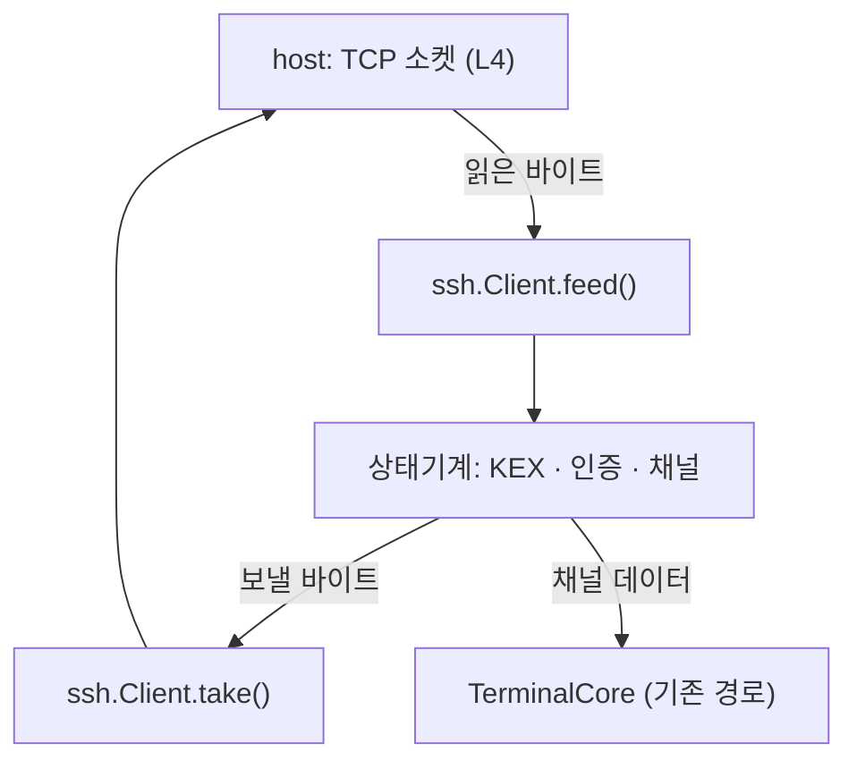

# SSH 클라이언트 계약

**maru 가 SSH 를 직접 말한다.** 지금 있는 `maru ssh` 는 구현이 아니라 **시스템 `ssh` 를 부르는
래퍼**다(원격에 terminfo 를 심고 `exec`). 모바일에는 `ssh` 바이너리도 `exec` 도 없어 그 길이
막혀 있고, 그래서 폰에서 아무 서버에도 못 붙는다.

이 문서가 **무엇을 지원하고 무엇을 안 하는지**의 단일 출처다.

## 1. 왜 SSH 인가 — 세션 호스트도 이 위에 얹는다

원격 축(M3)이 요구하던 것은 "전송·인증·암호화 계약" 이었다. 그것을 **새로 만들지 않고 SSH 로
대체한다**:

- 사용자가 이미 갖고 있다(키·`known_hosts`·서버 설정).
- **기계에 새 포트를 안 연다** — 세션 호스트에 붙는 것도 SSH 채널 위에 얹으면 된다.
- NAT 통과·점프 호스트 같은 운영 문제가 이미 SSH 생태계의 답을 갖는다.

그래서 **먼저 일반 셸에 붙고**(사용자에게 바로 쓸모), 세션 호스트 부착은 같은 채널 위에 얹는다.

## 2. 계층 — 프로토콜은 순수 로직, 소켓은 플랫폼

**sans-io 로 짠다.** 클라이언트는 **바이트를 받아 바이트를 내는 상태기계**이고 소켓을 모른다.

- **L2**(`src/session/ssh/`): 패킷·KEX·인증·채널·키 파싱. **OS 호출 0**, 할당은 주입받는다.
- **L4**: 소켓(연결·읽기·쓰기·타임아웃), 키 저장(iOS Keychain·Android Keystore), `known_hosts`
  파일 입출력.

**왜 sans-io 인가.** 모바일 브리지는 계약상 OS 를 못 부른다(모바일 §3). 같은 이유로 데스크톱은
`std.net`, 모바일은 host 소켓을 쓰되 **프로토콜 코드는 하나**다. 덤으로 **헤드리스 테스트**가
된다 — 실제 서버 없이 바이트 열로 상태 전이를 못박는다.

## 3. 지원 집합 — 좁게, 대신 현대적으로

| 자리 | 고른 것 | 왜 |
|---|---|---|
| KEX | `curve25519-sha256`(과 `@libssh.org` 별칭) | OpenSSH 기본. `std.crypto` 에 X25519 가 있다 |
| 호스트키 | `ssh-ed25519` | 요즘 서버 기본. 검증이 단순하고 `std.crypto` 에 있다 |
| 암호 | `chacha20-poly1305@openssh.com` | OpenSSH 기본. 길이 필드를 별도 키로 가려 **길이 노출이 없다** |
| MAC | (암호에 포함) | AEAD 라 MAC 을 **따로 안 쓴다**. 다만 KEXINIT 의 MAC 목록 필드는 **비워 두지 않는다** — 협상 대상이 아니어도 그 자리는 채워 보내야 한다(서버가 파싱한다) |
| 압축 | `none` | 터미널 트래픽에 이득이 적고 공격면만 는다 |
| 인증 | `publickey`(ed25519) · `password` | 키가 정답이고, 비밀번호는 서버가 그것만 열어 둔 경우의 탈출구 |
| 채널 | `session` 하나(`pty-req`·`shell`·`window-change`) + **흐름 제어** | 터미널 한 개가 지금 필요한 전부. 흐름 제어는 선택이 아니다(아래) |

**안 하는 것**(정직하게 못박는다): RSA·ECDSA 호스트키, AES-GCM/CTR, `diffie-hellman-*`,
agent 전달, 포트 포워딩, X11, SFTP/SCP, 다중 채널, `keyboard-interactive`.

**`keyboard-interactive` 를 뺀 값이 생각보다 크다.** 많은 서버가 비밀번호를 `password` 가 아니라
그것으로 받고(2FA 도 그 위에 얹힌다), 그런 서버에서는 **키가 없으면 못 붙는다**. 이 기계의 sshd 는
`publickey,password,keyboard-interactive` 셋을 다 광고하는 것을 실측했지만(그래서 스모크는 돈다),
잠긴 서버에서는 다르다 — 붙는 서버를 늘려야 할 때 **가장 먼저 열 후보**가 이것이다.

**좁힌 값은 검증할 표면이 준다는 것이다.** 알고리즘 하나마다 상호운용·보안 검증이 따라붙는다 —
필요해지면 그때 넓히되, 넓히는 순간 그 비용도 같이 온다.

**ed25519 호스트키가 없는 서버에는 못 붙는다** — 그때는 조용히 실패하지 말고 **"이 서버는
ed25519 호스트키를 안 준다" 를 그대로 보여 준다**(무엇을 고쳐야 하는지 알 수 있게).

### 3.1 채널 흐름 제어는 선택이 아니다

**`SSH_MSG_CHANNEL_WINDOW_ADJUST` 를 안 보내면 출력이 도중에 멈춘다.** 채널을 열 때 각자 "얼마나
받을 수 있는지"(윈도)를 선언하고, 받은 만큼 줄어들다 0 이 되면 **상대가 더 안 보낸다**(RFC 4254
§5.2). 소비한 만큼 계속 늘려 줘야 한다.

이 결함은 **처음에 안 보인다** — 로그인하고 몇 줄 치는 동안은 초기 윈도 안이라 멀쩡하다.
`cat 큰파일` 이나 빌드 로그처럼 **한 번에 많이 쏟아질 때** 갑자기 멈추고, 그때는 "네트워크가
느리다" 로 오해하기 쉽다. 그래서 스모크에 **대량 전송**을 넣어 강제한다(계획 S8).

`window-change` 는 **터미널 크기**(열·행)를 알리는 요청이라 이것과 다른 축이다 — 이름이 비슷해
같은 것으로 읽히기 쉽다.

### 3.2 무시할 메시지도 규칙이다

`SSH_MSG_IGNORE`·`SSH_MSG_DEBUG`·`SSH_MSG_UNIMPLEMENTED` 는 **언제든** 올 수 있다. 모르는
메시지를 받으면 끊는 것이 아니라 `UNIMPLEMENTED` 로 답한다(RFC 4253 §11.4) — 안 그러면 서버가
디버그 한 줄 보냈다고 연결이 죽는다. `SSH_MSG_DISCONNECT` 는 이유를 사용자에게 보여 준다
(그냥 끊으면 "왜 안 되는지" 를 영영 모른다). `SSH_MSG_GLOBAL_REQUEST` 는 `want_reply` 면
실패로 답한다.

**버전 문자열 앞에 아무 줄이나 올 수 있다**(RFC 4253 §4.2) — 서버가 배너를 여러 줄 보낸 뒤
`SSH-2.0-...` 을 낸다. 첫 줄만 읽고 판단하면 배너 있는 서버에 못 붙는다. 줄 길이 상한(255)도
그 자리에 있다.

### 3.3 상한은 계약이다

**길이 필드를 믿고 버퍼를 잡으면 안 된다.** 서버가 4GiB 를 부르면 그대로 죽는다 — 패킷 상한을
두고(지금 256KiB) 넘으면 **읽기 전에** 끊는다. 터미널 트래픽에 그보다 큰 패킷이 올 이유가 없다.

## 4. 보안 — 여기서 틀리면 렌더 결함이 아니다

**호스트키 검증은 생략할 수 없다.** 안 하면 중간자에 무방비다.

- `known_hosts` 를 읽어 대조한다. 없으면 **TOFU**(첫 접속에 지문을 보여 주고 사용자가 승인)로
  기록한다 — **자동 승인은 없다**. 그 확인을 **누가 어떻게 보여 주는지는 UI 계약**이다
  ([모바일 UX](mobile-ux.md)) — 코어는 "확인이 필요하다" 는 상태로 멈추고 답을 기다린다.
- **지문이 바뀌면 붙지 않는다.** 사용자가 명시로 지우기 전까지 실패로 끝낸다.
- **strict-kex 를 협상한다**(`kex-strict-c-v00@openssh.com`). Terrapin(CVE-2023-48795) 대응이고
  요즘 OpenSSH 가 이것을 기대한다. 협상되면 KEX 중 시퀀스 번호를 리셋하고, 협상 전 구간에
  **예상 밖 메시지가 오면 끊는다**.
- 개인키는 **host 가 보관한다**(iOS Keychain·Android Keystore). 다만 **서명은 코어가 한다** —
  Ed25519 는 개인키 바이트가 있어야 서명되고, iOS Secure Enclave 는 P-256 만 다뤄 **Ed25519 키를
  넣을 수 없다**. 그래서 계약은 이렇게 못박는다: host 가 OS 저장소에서 꺼내 **메모리로만** 넘기고,
  코어는 서명 직후 그 버퍼를 **0 으로 지운다**. 파일로 흘리지 않는다.
  (Secure Enclave 에 키를 가두려면 `ecdsa-sha2-nistp256` 클라이언트 키를 지원해야 한다 —
  범위를 넓히는 일이라 지금은 안 한다.)
- 암호화된 `openssh-key-v1` 은 `bcrypt_pbkdf`(std.crypto 에 있다)로 푼다.

## 4.1 연결 수명 — 모바일에서 소켓은 자주 죽는다

배경으로 나가면 OS 가 소켓을 걷어 가고, 셀룰러↔와이파이 전환에도 끊긴다(모바일 계획 M3c 가 그
항목이다). 계약은 둘을 요구한다:

- **죽은 것을 죽었다고 안다** — 서버 keepalive 를 기다리지 말고 우리가 주기적으로 확인한다.
  안 그러면 화면이 멀쩡한 채 입력만 안 먹는 상태가 오래 간다(사용자는 앱이 멈춘 줄 안다).
- **다시 붙는 것은 새 세션이다** — SSH 는 재개(resume)가 없다. 그래서 **세션 호스트 부착**(§1)이
  중요하다: 원격에 상태가 남아 있으면 새로 붙어도 하던 일이 이어진다. 일반 셸은 그냥 끊긴다 —
  그 차이를 UI 가 정직하게 보여야 한다.

## 5. 검증

- **헤드리스**: 패킷 인코딩·KEX 해시·키 유도·상태 전이를 바이트 열로 못박는다(순수 함수라 CI 에서 돈다).
- **실서버**: `ssh localhost` 스모크가 이미 있다(`mise run ssh-smoke`) — 그 자리에 우리 클라이언트로
  붙는 경로를 더한다. **OpenSSH 상대 실측이 유일한 상호운용 판정자**다.
- **데스크톱 먼저**: 소켓이 `std.net` 이라 배선이 짧다. 모바일은 그 뒤에 host 소켓만 갈아 끼운다.

## 6. clean-room

RFC 4251~4254 와 OpenSSH 확장 명세(`chacha20-poly1305@openssh.com`·`kex-strict-c-v00@openssh.com`)
**공개 문서에서 유도**한다. OpenSSH·libssh2 코드는 안 본다 — 동작이 갈리는 자리(예: 길이 필드
암호화 규칙)는 명세와 **실서버 실측**으로 정한다.
