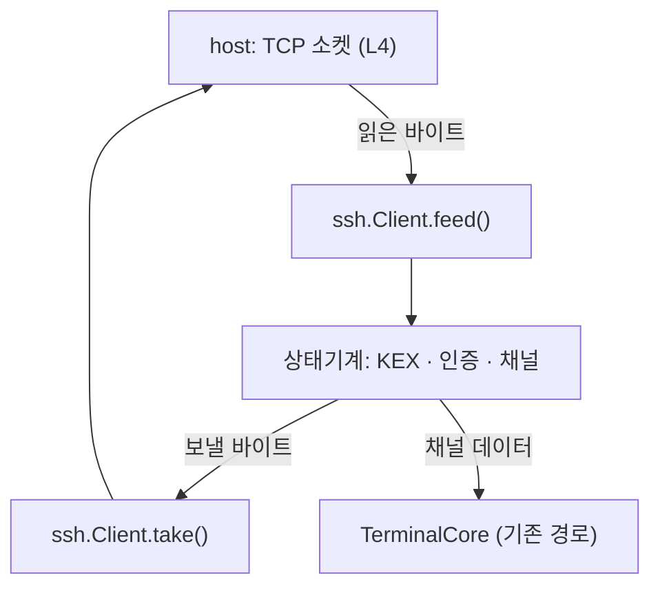

# SSH 클라이언트 계약

**maru 가 SSH 를 직접 말한다.** 지금 있는 `maru ssh` 는 구현이 아니라 **시스템 `ssh` 를 부르는
래퍼**다(원격에 terminfo 를 심고 `exec`). 모바일에는 `ssh` 바이너리도 `exec` 도 없어 그 길이
막혀 있고, 그래서 폰에서 아무 서버에도 못 붙는다.

이 문서가 **무엇을 지원하고 무엇을 안 하는지**의 단일 출처다.

## 1. 왜 SSH 인가 — 세션 호스트도 이 위에 얹는다

원격 축(M3)이 요구하던 것은 "전송·인증·암호화 계약" 이었다. 그것을 **새로 만들지 않고 SSH 로
대체한다**:

- 사용자가 이미 갖고 있다(키·`known_hosts`·서버 설정).
- **기계에 새 포트를 안 연다** — 세션 호스트에 붙는 것도 SSH 채널 위에 얹으면 된다.
- NAT 통과·점프 호스트 같은 운영 문제가 이미 SSH 생태계의 답을 갖는다.

그래서 **먼저 일반 셸에 붙고**(사용자에게 바로 쓸모), 세션 호스트 부착은 같은 채널 위에 얹는다.

## 2. 계층 — 프로토콜은 순수 로직, 소켓은 플랫폼

**sans-io 로 짠다.** 클라이언트는 **바이트를 받아 바이트를 내는 상태기계**이고 소켓을 모른다.

- **L2**(`src/session/ssh/`): 패킷·KEX·인증·채널·키 파싱. **OS 호출 0**, 할당은 주입받는다.
- **L4**: 소켓(연결·읽기·쓰기·타임아웃), 키 저장(iOS Keychain·Android Keystore), `known_hosts`
  파일 입출력.

**왜 sans-io 인가.** 모바일 브리지는 계약상 OS 를 못 부른다(모바일 §3). 같은 이유로 데스크톱은
`std.net`, 모바일은 host 소켓을 쓰되 **프로토콜 코드는 하나**다. 덤으로 **헤드리스 테스트**가
된다 — 실제 서버 없이 바이트 열로 상태 전이를 못박는다.

## 3. 지원 집합 — 좁게, 대신 현대적으로

| 자리 | 고른 것 | 왜 |
|---|---|---|
| KEX | `curve25519-sha256`(과 `@libssh.org` 별칭) | OpenSSH 기본. `std.crypto` 에 X25519 가 있다 |
| 호스트키 | `ssh-ed25519` | 요즘 서버 기본. 검증이 단순하고 `std.crypto` 에 있다 |
| 암호 | `chacha20-poly1305@openssh.com` | OpenSSH 기본. 길이 필드를 **별도 키로 따로 암호화**해 그것이 복호 오라클이 되는 계열(CVE-2008-5161)을 막는다. **트래픽 분석까지 막지는 않는다** — 선 위의 패킷 크기는 여전히 보인다 |
| MAC | (암호에 포함) | AEAD 라 MAC 을 **따로 안 쓴다**. 다만 KEXINIT 의 MAC 목록 필드는 **비워 두지 않는다** — 협상 대상이 아니어도 그 자리는 채워 보내야 한다(서버가 파싱한다) |
| 압축 | `none` | 터미널 트래픽에 이득이 적고 공격면만 는다 |
| 인증 | `publickey`(ed25519) · `password` | 키가 정답이고, 비밀번호는 서버가 그것만 열어 둔 경우의 탈출구 |
| 채널 | `session` 하나(`pty-req`·`shell`·`window-change`) + **흐름 제어** | 터미널 한 개가 지금 필요한 전부. 흐름 제어는 선택이 아니다(아래) |

**K_1·K_2 의 이름이 두 출처에서 반대다 — 구현 전에 이것부터 읽는다.** 우리가 따르는 것은
[draft-ietf-sshm-chacha20-poly1305](../references/specs/draft-sshm-chacha20-poly1305.txt) §6 이고,
거기서는 **K_2 가 길이 필드**를, **K_1 이 나머지와 Poly1305 키**를 맡는다(K_2 는 키 재료의 뒷
256비트다). 그런데 구형 OpenSSH `PROTOCOL.chacha20poly1305` 는 **정확히 반대로** 이름 붙였다
(K_1 이 길이). 두 문서를 섞어 읽으면 두 chacha20 인스턴스를 맞바꿔 걸게 되고, 그러면 모든
OpenSSH 서버에서 "길이가 쓰레기로 풀린다/태그 불일치" 로 **원인을 짚기 어렵게** 실패한다.
**이 문서와 코드는 draft 명명을 쓴다.**

**안 하는 것**(정직하게 못박는다): RSA·ECDSA 호스트키, AES-GCM/CTR, `diffie-hellman-*`,
agent 전달, 포트 포워딩, X11, SFTP/SCP, 다중 채널, `keyboard-interactive`.

**`keyboard-interactive` 를 뺀 값이 생각보다 크다.** 많은 서버가 비밀번호를 `password` 가 아니라
그것으로 받고(2FA 도 그 위에 얹힌다), 그런 서버에서는 **키가 없으면 못 붙는다**. 이 기계의 sshd 는
`publickey,password,keyboard-interactive` 셋을 다 광고하는 것을 실측했지만(그래서 스모크는 돈다),
잠긴 서버에서는 다르다 — 붙는 서버를 늘려야 할 때 **가장 먼저 열 후보**가 이것이다.

**좁힌 값은 검증할 표면이 준다는 것이다.** 알고리즘 하나마다 상호운용·보안 검증이 따라붙는다 —
필요해지면 그때 넓히되, 넓히는 순간 그 비용도 같이 온다.

**ed25519 호스트키가 없는 서버에는 못 붙는다** — 그때는 조용히 실패하지 말고 **"이 서버는
ed25519 호스트키를 안 준다" 를 그대로 보여 준다**(무엇을 고쳐야 하는지 알 수 있게).

### 3.1 채널 흐름 제어는 선택이 아니다

**`SSH_MSG_CHANNEL_WINDOW_ADJUST` 를 안 보내면 출력이 도중에 멈춘다.** 채널을 열 때 각자 "얼마나
받을 수 있는지"(윈도)를 선언하고, 받은 만큼 줄어들다 0 이 되면 **상대가 더 안 보낸다**(RFC 4254
§5.2). 소비한 만큼 계속 늘려 줘야 한다.

이 결함은 **처음에 안 보인다** — 로그인하고 몇 줄 치는 동안은 초기 윈도 안이라 멀쩡하다.
`cat 큰파일` 이나 빌드 로그처럼 **한 번에 많이 쏟아질 때** 갑자기 멈추고, 그때는 "네트워크가
느리다" 로 오해하기 쉽다. 그래서 스모크에 **대량 전송**을 넣어 강제한다(계획 S8).

`window-change` 는 **터미널 크기**(열·행)를 알리는 요청이라 이것과 다른 축이다 — 이름이 비슷해
같은 것으로 읽히기 쉽다.

### 3.2 무시할 메시지도 규칙이다

`SSH_MSG_IGNORE`·`SSH_MSG_DEBUG`·`SSH_MSG_UNIMPLEMENTED` 는 **초기 KEX 를 마친 뒤에는 언제든**
올 수 있다(그 안에서는 strict-kex 가 금지한다 — §4). 모르는
메시지를 받으면 끊는 것이 아니라 `UNIMPLEMENTED` 로 답한다(RFC 4253 §11.4) — 안 그러면 서버가
디버그 한 줄 보냈다고 연결이 죽는다. `SSH_MSG_DISCONNECT` 는 이유를 사용자에게 보여 준다
(그냥 끊으면 "왜 안 되는지" 를 영영 모른다). `SSH_MSG_GLOBAL_REQUEST` 는 `want_reply` 면
실패로 답한다.

### 3.2.1 `ext-info` 는 우리가 안 켠다

서버는 `kex_algorithms` 에 `ext-info-s` 를 실어 [RFC 8308] `SSH_MSG_EXT_INFO` 를 말할 수 있다고
알린다(**실측**: OpenSSH 10.2 가 그렇게 한다). 우리는 **`ext-info-c` 를 안 보낸다** — 그 안에
오는 `server-sig-algs` 는 RSA 서명 알고리즘을 고를 때 필요하고, 우리는 ed25519 만 쓴다.

안 보냈으므로 서버도 보내면 안 되지만, **와도 죽지 않는다** — 초기 KEX **밖**에서 온 것이면
무시한다(§3.2 의 "모르는 메시지" 규칙). 초기 KEX **안**이면 strict KEX 가 끊는다(§4).

### 3.2.2 버전 교환은 배너부터다

**버전 문자열 앞에 아무 줄이나 올 수 있다**(RFC 4253 §4.2) — 서버가 배너를 여러 줄 보낸 뒤
`SSH-2.0-...` 을 낸다. 첫 줄만 읽고 판단하면 배너 있는 서버에 못 붙는다.

**255 는 배너의 상한이 아니다.** §4.2 의 255 는 **식별 문자열**에만 걸리고 그것도 **CR·LF 를
포함해** 센다(CR·LF 를 뺀 길이로 재면 256바이트짜리가 통과한다). 배너 줄은 명세가 길이를 안
정하므로("Clients MUST be able to process such lines") 우리 상한을 따로 둔다 — 255 를 배너에
그대로 씌우면 한 줄짜리 법적 고지를 보내는 점프 호스트·어플라이언스에 **못 붙는다**. 줄 수
상한은 우리가 정한 값이다(끝없는 배너로 버퍼를 채우지 못하게).

**`SSH-1.99-` 도 2.0 이다.** RFC 4253 §5.1 은 "Clients using protocol 2.0 **MUST** be able to
identify this as identical to `2.0`" 라고 못박는다 — 호환 모드로 켜 둔 sshd 와 네트워크 장비가
그 줄을 보내고, 거절하면 2.0 을 완벽히 말하는 서버에 못 붙는다. **원문은 고쳐 쓰지 않는다**
(교환 해시에 들어가는 것은 서버가 보낸 바이트 그대로다).

**버전 줄의 제어문자는 거절한다.** §4.2 는 NUL 을 MUST NOT 으로, 나머지를 printable US-ASCII 로
정한다. 이 줄은 **아직 아무것도 검증되지 않은 상대가 보낸 바이트**인데 §4 는 그것을 TOFU
프롬프트에 서버 신원으로 보여 준다 — 표시 경로 중 하나라도 VT 파서를 거치면(로그·에코·터미널 셀
본문) 적대적 서버가 버전 문자열 하나로 창 제목을 바꾸고 화면을 지우고 클립보드에 쓴다. maru
코어는 OSC 0/2·52 를 실제로 처리한다. **표시 경로마다 안전한지 따지는 것보다 입구에서 막는 편이
싸고 확실하다.** 게다가 원문이 교환 해시에 들어가야 해서 **씻어 낼 수도 없다**(씻으면 해시가 서버와
안 맞는다). 그러니 받지 않고 끊는다.

**0x80 이상은 통과시킨다.** §4.2 는 US-ASCII 를 요구하지만 거기까지 거절하면 주석 자리에 UTF-8 을
넣는 장비에 못 붙고, 그 바이트들은 CSI·OSC 를 열지 못해 위 위험과 무관하다. **배너 줄에는 이
검사를 안 씌운다** — 배너는 보여 주지 않으므로(§4.2 의 "표시한다면 필터링" 이 우리 얘기가 아니다)
얻는 안전은 0 이고, TAB 으로 칸을 맞춘 흔한 법적 고지에 못 붙게 되는 것만 남는다.

### 3.3 상한은 계약이다

**길이 필드를 믿고 버퍼를 잡으면 안 된다.** 서버가 4GiB 를 부르면 그대로 죽는다 — 패킷 상한을
두고(지금 256KiB) 넘으면 **읽기 전에** 끊는다. 터미널 트래픽에 그보다 큰 패킷이 올 이유가 없다.

**버전 교환도 상한이 있고, 그 값은 L4 의 버퍼 크기를 정한다.** 배너 줄 상한 × 줄 수 상한이 이
층이 요구하는 최악 버퍼다 — 버전 줄을 찾기 전에는 소비한 바이트 수를 알려 줄 수 없어서 호출자가
배너를 다 들고 있어야 한다. 그 곱을 **패킷 상한과 같게**(256KiB) 맞춰 둔다: 배너 줄 상한만 보고
늘리면 곱이 조용히 커져 버전 교환이 SSH 경로에서 가장 큰 메모리를 요구하게 된다. **L4 의 읽기
버퍼가 그 값보다 작으면** 정상 배너를 못 담아 영원히 "더 읽어라" 만 받는다.

## 3.4 접속 정보와 키는 어디서 오나 (사용자 확정 2026-08-17)

**서버 목록은 앱이 든다.** 호스트·사용자·포트·쓸 키를 **세션 목록 화면에서 등록·관리**하고
config 에 쓴다. 모바일에는 파일 편집기가 없어 **UI 가 유일한 입력 경로**이기 때문이고, 형식은
데스크톱과 같은 config 를 쓴다(두 벌이 되면 갈린다).

`~/.ssh/config` 는 **안 읽는다**. 데스크톱에는 그 파일이 있지만 모바일에는 없어서 결국 목록을
따로 만들어야 하고, 그러면 같은 것이 두 자리에 산다 — 게다가 그 문법(`Match`·`Include`·
`ProxyJump`)을 파싱하는 일이 통째로 늘어난다. 필요해지면 **가져오기**(import)로 다루지, 런타임
의존으로 두지 않는다.

**키는 앱이 만든다.** 기기에서 ed25519 키쌍을 생성해 OS 저장소(Keychain·Keystore)에 넣고,
**공개키 한 줄을 보여 준다** — 사용자는 그것을 서버 `authorized_keys` 에 붙인다. 그러면 개인키가
**기기 밖으로 나갈 일이 없다**. 기존 키 가져오기는 지금 안 한다(개인키가 클립보드를 거치고,
암호화된 키 복호 경로가 같이 따라온다 — 필요해지면 그때 연다).

**비밀번호는 저장하지 않는다.** 접속할 때마다 묻고 **메모리에서 지운다**. 저장하면 재접속이 잦은
모바일에서 그 값이 자주 쓰이고 그만큼 오래 남는다 — 키를 쓰라는 압박이 생기는 편이 낫다.

**데스크톱의 `maru ssh`(래퍼)는 그대로 둔다.** 시스템 `ssh` 는 agent·`ProxyJump`·2FA 를 다 하고
우리 내장 클라이언트는 아직 안 한다 — 데스크톱 사용자가 잃는 것이 생긴다. 내장은 **모바일용**
이고, 데스크톱에서는 **검증 경로**(실서버 왕복 스모크)로 쓴다.

## 4. 보안 — 여기서 틀리면 렌더 결함이 아니다

**호스트키 검증은 생략할 수 없다.** 안 하면 중간자에 무방비다.

- `known_hosts` 를 읽어 대조한다. 없으면 **TOFU**(첫 접속에 지문을 보여 주고 사용자가 승인)로
  기록한다 — **자동 승인은 없다**. 그 확인을 **누가 어떻게 보여 주는지는 UI 계약**이다
  ([모바일 UX](mobile-ux.md)) — 코어는 "확인이 필요하다" 는 상태로 멈추고 답을 기다린다.
- **지문이 바뀌면 붙지 않는다.** 사용자가 명시로 지우기 전까지 실패로 끝낸다.
- **strict-kex 를 협상한다** — Terrapin(CVE-2023-48795) 대응. 표시자는 KEXINIT 의
  **`kex_algorithms` 목록**에 넣고, **표준 `kex-strict-c` 와 구형 `kex-strict-c-v00@openssh.com` 을
  둘 다** 보낸다(서버는 `kex-strict-s`/`…-s-v00@openssh.com`). 협상되면 명세가 요구하는 다섯 가지를
  전부 지킨다([draft-ietf-sshm-strict-kex](../references/specs/draft-strict-kex.txt) §3):

  1. **초기 KEX 동안 KEX 메시지 말고는 받지 않는다** — 오면 **연결을 끊는다**(§3.2).
     `SSH_MSG_IGNORE`·`DEBUG` 도 이 구간에서는 허용되지 않는다(아래 §3.2 의 "언제든" 은 초기
     KEX **밖**의 이야기다 — 이 둘이 어긋나 있던 것을 명세로 대조해 고쳤다).
  2. **상대의 첫 메시지가 KEXINIT 이었는지 되짚어 확인한다**(§3.2 — 사후 검사라 따로 적는다).
  3. **초기 KEX 완료 전에 시퀀스 번호가 한 바퀴 돌지 않는지** 본다(§3.2).
  4. **`NEWKEYS` 직후 시퀀스 번호를 0 으로 리셋한다** — 초기 KEX 와 **이후 모든 재키잉**에서
     보내는 쪽·받는 쪽 각각(§3.3).
  5. **표시자는 초기 KEXINIT 에서만 읽는다** — 이후 KEXINIT 의 표시자는 있든 없든 "MUST be
     ignored" 다(§3.1). KEXINIT 마다 다시 계산하면 **표시자를 안 붙이는 재키잉에서 보호가 조용히
     꺼진다**: 우리는 4번의 리셋을 멈추고 서버는 리셋해서, 그 뒤 모든 AEAD 태그가 어긋난다.
     반대로 비-strict 연결이 재키잉의 표시자로 뒤늦게 켜져도 안 된다. **협상 함수가 "초기냐
     재키잉이냐" 를 인자로 받고, 재키잉 쪽은 연결이 정한 값을 들고 오게 한다** — 잊으면 컴파일이
     안 되게 하는 것이 이 규칙을 지키는 유일한 방법이다.

**서버가 붙인 추측 패킷은 버려야 한다**(RFC 4253 §7.1). KEXINIT 의
`first_kex_packet_follows` 가 참인데 서버의 추측(각 목록의 **첫 항목**)이 우리 것과 다르면
**다음 패킷 하나를 조용히 버린다**. 추측이 맞았다고 보려면 `kex_algorithms` 와
`server_host_key_algorithms` 의 첫 항목이 **둘 다** 우리 첫 항목과 같아야 한다. 안 버리면 KEX
응답이 와야 할 자리에서 그 패킷을 먹는다 — 초기 KEX 중 공격자 제어 여분 메시지를 받아들이는
것이고, strict KEX §3.2 가 막으려는 바로 그 모양이다. (우리는 추측을 **안 보낸다** — 왕복 한 번을
아끼자고 그 규칙을 우리 쪽에도 만들 이유가 없다.)

**버리는 패킷도 시퀀스 번호는 센다.** strict-kex 초안은 추측 패킷을 따로 다루지 않고(draft §3.2 의
허용 목록에 든 KEX 메시지다), 시퀀스 번호는 **받은 패킷마다** 오른다. "버린다" 를 "없던 일로
한다" 로 읽어 번호를 안 올리면 그 뒤 모든 AEAD 태그가 어긋난다 — 증상이 KEX 가 아니라 한참 뒤
채널 데이터에서 나오므로 원인을 짚기 어렵다.
- 개인키는 **host 가 보관한다**(iOS Keychain·Android Keystore). 다만 **서명은 코어가 한다** —
  Ed25519 는 개인키 바이트가 있어야 서명되고, iOS Secure Enclave 는 P-256 만 다뤄 **Ed25519 키를
  넣을 수 없다**. 그래서 계약은 이렇게 못박는다: host 가 OS 저장소에서 꺼내 **메모리로만** 넘기고,
  코어는 서명 직후 그 버퍼를 **0 으로 지운다**. 파일로 흘리지 않는다.
  (Secure Enclave 에 키를 가두려면 `ecdsa-sha2-nistp256` 클라이언트 키를 지원해야 한다 —
  범위를 넓히는 일이라 지금은 안 한다.)
- 암호화된 `openssh-key-v1` 은 `bcrypt_pbkdf`(std.crypto 에 있다)로 푼다.

### 4.2 KEX 에서 끊어야 하는 것들

[RFC 8731](../references/specs/rfc8731-curve25519-kex.txt) §3 이 **MUST** 로 정하는 둘이다.
둘 다 "받아 주면 상대가 교환 해시를 고를 수 있게 된다" 는 같은 결함이다.

- **공개키 길이가 32 가 아니면 끊는다.** 짧은 값을 패딩해 받아 주면 상대가 고른 점으로 계산하게
  된다. 받은 **즉시** 재고 KEX 를 진행하지 않는다.
- **공유 비밀이 전부 0 이면 끊는다.** 작은 위수 점(0, 1, …)을 보내면 공유 비밀이 몇 안 되는
  값으로 고정된다. `std.crypto` 의 스칼라곱이 그 경우를 거절하므로 그것을 우리 오류로 옮긴다 —
  **거절이 실제로 도는지 테스트로 확인한다**(안 그러면 그 MUST 는 주석일 뿐이다).

**`K` 는 mpint 로 먹인다**([RFC 8731](../references/specs/rfc8731-curve25519-kex.txt) §3.1).
X25519 가 내는 32바이트를 부호 없는 big-endian 정수로 읽고, 그것을 mpint 로 인코딩해 해시에
넣는다. 고정 길이 문자열로 먹이면 **앞바이트가 0 이거나 0x80 이상일 때만** 어긋나므로 32번에
한 번꼴로 실패하는 — 재현이 지독히 어려운 — 결함이 된다.

**교환 해시 `H` 의 재료 순서는 [RFC 5656](../references/specs/rfc5656-ecc.txt) §4 다**:
`V_C · V_S · I_C · I_S · K_S · Q_C · Q_S`(전부 string) + `K`(mpint). `V_*` 는 **CR·LF 를 뺀**
원문이고 `I_*` 는 KEXINIT **페이로드 원문**이다(다시 만들면 cookie 가 달라진다).

**`session_id` 는 첫 KEX 의 `H` 이고 연결 내내 안 바뀐다.** 재키잉의 새 `H` 로 갈아 끼우면 인증에
쓴 서명의 근거가 달라진다.

**임시 개인키는 KEX 가 끝나면 지운다.** 남겨 둘 이유가 없고, 남으면 코어 덤프·스왑에 실린다.

### 4.3 암호 계층에서 어기면 안 되는 것들

**태그를 먼저 검사하고 그 다음에 푼다**([draft](../references/specs/draft-sshm-chacha20-poly1305.txt)
§7 — "the MAC MUST be checked before decryption"). 순서를 뒤집어도 **반환값은 똑같이 "실패" 라
결함이 안 보인다** — 차이는 출력 버퍼에 위조 패킷의 평문이 쓰인다는 것뿐이고, 그것이 이 MUST 가
막으려는 바로 그것이다. 그래서 **실패했을 때 출력 버퍼가 그대로인지**를 테스트가 잰다.

**길이 필드는 따로, 몸통과 다른 키로 푼다.** 몸통이 다 왔는지 알려면 길이를 먼저 풀 수밖에 없는데,
그 복호가 곧 오라클이 되는 계열(CVE-2008-5161)을 **길이 전용 키(`K_2`)** 로 막는다 — 길이 복호에서
새는 정보가 몸통 암호와 무관해진다. 그러니 두 키를 하나로 합치지 않는다.

**패딩 규칙이 평문 프레이밍과 다르다.** `packet.zig` 는 RFC 4253 §6 대로 **길이 필드를 포함해** 8의
배수를 맞추지만, 이 암호에서는 길이 필드가 따로 암호화되므로 **빼고** 맞춘다. draft 는 이 규칙을
문장으로 적지 않았다 — **Appendix A 의 워크드 예제가 유일한 근거**다(payload 65에 패딩 6,
`1+65+6 = 72` 가 8의 배수. 길이 필드를 넣었다면 76이라 배수가 아니다). 두 규칙을 한 함수로 합치지
않고 각자 두되 서로를 가리키게 한다.

**태그가 맞는다는 것은 상대가 진짜 서버라는 뜻일 뿐이다** — 그가 규칙을 지켰다는 뜻이 아니다.
인증을 통과한 패킷도 패딩 하한(4)·payload 최소 1바이트·8의 배수를 어기면 거절한다.

**시퀀스 번호가 곧 nonce 다.** 번호를 안 올리거나 한쪽만 리셋하면(strict KEX §3.3) 그 뒤 **모든**
패킷의 태그가 어긋난다. 증상이 KEX 가 아니라 한참 뒤 채널 데이터에서 나오므로 원인을 짚기 어렵다.

### 4.4 호스트키 서명이 증명하는 것

**KEX 까지는 "누군가와" 암호를 걸었을 뿐이다.** 그 누군가가 우리가 붙으려던 서버인지는 **호스트키
서명이 유일한 증거**다 — 서버는 교환 해시 `H` 에 서명하고, `H` 에는 양쪽 임시 공개키와 KEXINIT
원문이 다 들어간다(§4.2). 그래서 서명이 맞으면 **우리 `H` 가 서버 것과 같다**는 뜻이기도 하다.

형식은 길이 접두 문자열 둘이다([RFC 8709](../references/specs/rfc8709-ed25519-ssh.txt) §4):
`string "ssh-ed25519" · string key(32)` 와 `string "ssh-ed25519" · string signature(64)`.

- **알고리즘 이름은 키와 서명 **양쪽**에서 본다.** 키만 보고 서명 쪽을 안 보면 서버가 다른
  알고리즘을 주장하는 서명을 보내도 우리가 ed25519 로 검증하게 된다.
- **이름 비교는 정확 일치다.** `ssh-ed25519-cert-v01@openssh.com` 은 우리가 안 다루는 인증서
  계열인데 접두 일치로 받으면 그것을 평범한 키로 읽는다.
- **길이가 명세와 다르면 거절한다**(키 32 · 서명 64).
- 검증은 **cofactored** 방식이다(RFC 8032 §8.2 는 둘 다 허용한다). 차이는 악의적으로 만든
  서명에서만 나타나고, 상호운용을 넓게 잡는 쪽을 택했다.

**지문은 blob 전체를 해싱한다** — 알고리즘 이름 문자열까지 포함해 SHA-256 하고 padding 없는
base64 를 `SHA256:` 뒤에 붙인다. 키 32바이트만 해싱하면 `ssh-keygen -lf` 와 **다른 값**이 나오고,
그러면 사용자가 대조할 수 없어 TOFU 가 무의미해진다. 자리가 모자라면 잘라 보여 주지 말고 실패한다.

### 4.4.1 `known_hosts` 대조 — 서명만으로는 부족하다

**중간자도 자기 키로 서명해 온다.** §4.4 의 검증은 "상대가 이 호스트키의 주인" 임만 증명하므로,
그 키가 **우리가 아는 그 서버의 키**인지는 `known_hosts` 가 정한다.

형식은 RFC 가 아니라 **OpenSSH `sshd(8)` 의 `SSH_KNOWN_HOSTS FILE FORMAT`** 이 정한다:
`[marker] hostnames keytype base64-key [comment]`. 해시된 호스트명은 `|1|<base64 salt>|<base64
HMAC-SHA1(salt, host)>` 이고, 소금이 **키**이고 호스트명이 **메시지**다.

판정은 넷이고 **`revoked` 가 가장 세다**:

| 판정 | 언제 | 무엇을 한다 |
|---|---|---|
| `revoked` | `@revoked` 줄이 이 호스트·이 키와 맞는다 | 절대 붙지 않는다 |
| `mismatch` | 이 호스트를 아는데 **키가 다르다** | 사용자가 명시로 지우기 전까지 붙지 않는다 |
| `trusted` | 이 호스트의 이 키를 안다 | 붙는다 |
| `unknown` | 이 호스트를 모른다 | TOFU 프롬프트로 간다 |

**첫 일치에서 끝내면 안 된다.** 신뢰 줄이 폐기 줄보다 **먼저** 나오면 폐기를 못 보고 `trusted` 를
내게 되는데, 훔친 키가 파일에 아직 남아 있는 상황이 정확히 그 모양이다. 파일을 끝까지 훑는다.

**`@cert-authority` 줄은 판정에서 뺀다.** 우리는 인증서를 안 다루므로(§3), CA 키를 평범한
호스트키로 읽으면 그 CA 가 서명한 **모든** 호스트를 그 키 하나로 신뢰하게 된다.

**키 종류가 다른 줄도 뺀다.** ed25519 만 하므로 RSA 줄이 있다고 "키가 바뀌었다" 가 아니다 —
그것을 `mismatch` 로 읽으면 정상 서버에 못 붙는다.

**주석(`#`)은 첫 글자로 판정한다.** `ssh` 는 `hostname,ipaddr` 를 함께 적는데, 그 줄을 주석
처리하면 `#` 이 **첫 패턴에만** 붙어 쉼표 뒤 패턴은 멀쩡하다 — 검사가 없으면 주석 처리한 줄이
그대로 살아난다.

**남의 파일이라 모르는 줄이 섞여 있는 것이 정상이다.** 깨진 줄·모르는 marker·디코드 실패는
오류가 아니라 **그 줄만 건너뛰기**다. 다만 모르는 marker 는 추측해서 신뢰하지 않는다.

### 4.5 전송 루프가 드는 것

패킷 하나를 다루는 층(`packet.zig`·`cipher.zig`)은 **연결 전체의 상태를 모른다**. 아래는 그래서
전송 루프의 몫이다.

- **시퀀스 번호는 방향마다 따로 세고, 받은 패킷은 무엇을 하든 센다** — 버리는 추측 패킷도,
  끊기로 한 위반 패킷도 이미 받은 것이다. 하나만 빠뜨리면 그 뒤 전부가 어긋난다.
- **`NEWKEYS` 는 옛 키로 보내고 그 직후에 바꾼다**(RFC 4253 §7.3). 리셋도 그 자리이고,
  **보내는 쪽과 받는 쪽이 각각 자기 것만** 리셋한다.
- **양쪽 키가 다 붙어야 초기 KEX 가 끝난 것이다.** `NEWKEYS` 를 주고받는 순서는 정해져 있지
  않으므로 한쪽에서만 판정하면 "받고 나서 보낸" 연결이 초기 KEX 에 갇히고, 그러면 정상 트래픽이
  전부 아래 §3.2 위반으로 끊긴다.
- **strict KEX 의 수신 게이트 넷**(draft §3.2): KEX 메시지만 받기 · 상대의 첫 메시지가 KEXINIT
  이었는지 되짚기 · 초기 KEX 전에 번호가 한 바퀴 돌지 않기 · 같은 KEX 메시지를 정해진 횟수만 받기.
  뒤의 둘은 **사후 검사**라 "지금까지 무엇을 받았나" 를 기억해야 판정된다.
- **평문 구간과 암호 구간은 프레이밍이 다르다**(§4.3). 전환점이 방향마다 따로 오므로 방향별로
  "지금 어느 프레이밍인가" 를 들고 있어야 한다.

## 4.1 연결 수명 — 모바일에서 소켓은 자주 죽는다

배경으로 나가면 OS 가 소켓을 걷어 가고, 셀룰러↔와이파이 전환에도 끊긴다(모바일 계획 M3c 가 그
항목이다). 계약은 둘을 요구한다:

- **죽은 것을 죽었다고 안다** — 서버 keepalive 를 기다리지 말고 우리가 주기적으로 확인한다.
  안 그러면 화면이 멀쩡한 채 입력만 안 먹는 상태가 오래 간다(사용자는 앱이 멈춘 줄 안다).
- **다시 붙는 것은 새 세션이다** — SSH 는 재개(resume)가 없다. 그래서 **세션 호스트 부착**(§1)이
  중요하다: 원격에 상태가 남아 있으면 새로 붙어도 하던 일이 이어진다. 일반 셸은 그냥 끊긴다 —
  그 차이를 UI 가 정직하게 보여야 한다.

## 5. 검증

- **헤드리스**: 패킷 인코딩·KEX 해시·키 유도·상태 전이를 바이트 열로 못박는다(순수 함수라 CI 에서 돈다).
- **실서버**: `ssh localhost` 스모크가 이미 있다(`mise run ssh-smoke`) — 그 자리에 우리 클라이언트로
  붙는 경로를 더한다. **OpenSSH 상대 실측이 유일한 상호운용 판정자**다.
- **데스크톱 먼저**: 소켓이 `std.net` 이라 배선이 짧다. 모바일은 그 뒤에 host 소켓만 갈아 끼운다.

## 6. clean-room

**공개 명세에서 유도한다** — 목록과 로컬 경로는 [references.md](references.md) 에 등재했다.
RFC 4251~4254 가 본체이고, 두 확장은 **OpenSSH `PROTOCOL` 문서가 아니라 IETF 초안**이 본문을
갖는다(`PROTOCOL` 은 초안 링크만 남기고 내용을 옮겼다 — 그것을 모르고 "OpenSSH 확장 명세" 라고만
적었다가 고쳤다):

- `chacha20-poly1305@openssh.com` — `draft-ietf-sshm-chacha20-poly1305`
- strict KEX — `draft-ietf-sshm-strict-kex`(구 `draft-miller-sshm-strict-kex`)

OpenSSH·libssh2 **코드는 안 본다**. 동작이 갈리는 자리는 명세와 **실서버 실측**으로 정한다.
