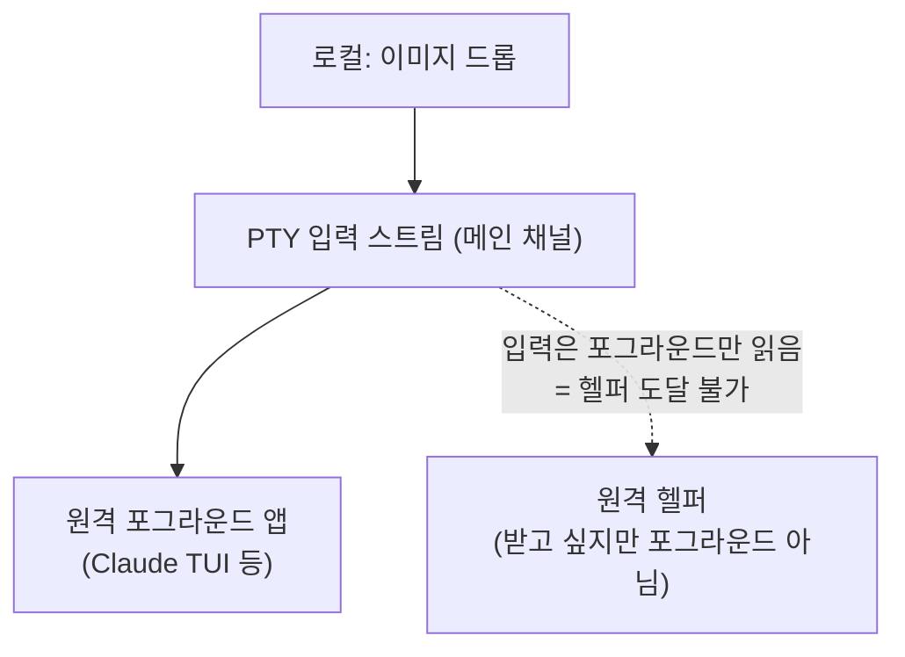
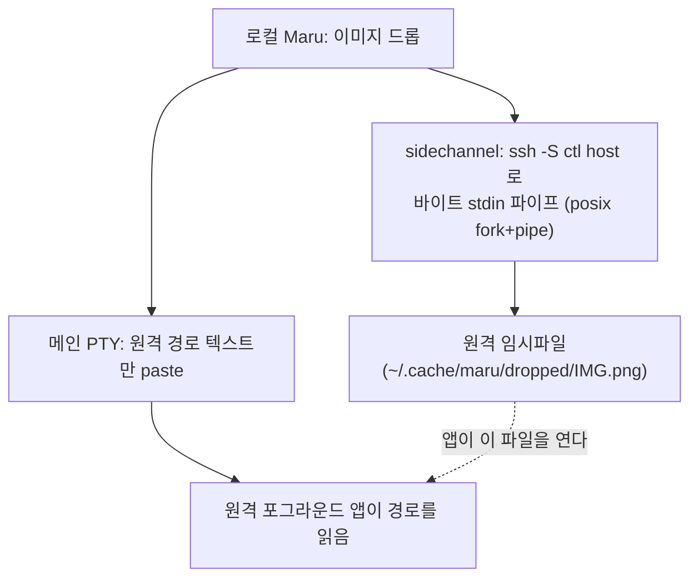

# Maru SSH 통합 전략

작성일: 2026-06-21
배경: `maru ssh` terminfo 스택은 이미 구현돼 있으나(`src/cli/ssh.zig`) 그 설계/현황이 어느 docs에도 기록돼 있지 않았다. 이 문서는 (1) 기존 ssh 통합 현황을 문서화해 문서 부채를 해소하고, (2) "로컬에서 드래그한 이미지/파일을 SSH 원격에서 도는 앱(예: Claude Code·Codex 같은 CLI, 또는 임의의 경로-소비 프로그램)에 전달"하는 기능의 설계를 결정 로그로 남긴다.

## 0. 범위와 단일 출처

이 문서는 **Maru의 SSH 통합**(terminfo 전파, 자기식별, 원격 cwd 인식, 드롭/paste 파일 전송)의 단일 출처다. 인접 주제는 각자의 단일 출처를 따른다.

- SSH **테스트** 전략(무엇을 `ssh localhost`/VM으로 검증하나): [터미널 전략 #13](../terminal-strategy.md#13-ssh-테스트)
- 클립보드·OSC 보안 정책(OSC 52 쓰기 allow·읽기 deny 등): [터미널 호환성/보안 정책](terminal-compatibility-policy.md)
- 단계별 구현 순서와 완료 기준: [실제 구현 계획](implementation-plan.md)
- 드롭/paste의 셸 이스케이프 경계(Swift 읽기 → Zig 이스케이프, ABI v67): [macOS 앱 호스트 경계](macos-app-host-boundary.md)

이 문서에 없는 결정이 필요하면 임의로 진행하지 않고 사용자와 먼저 논의한다([필수 프로젝트 규칙](project-rules.md)).

## 1. `maru ssh` terminfo·자기식별·ControlMaster 스택

> 이 절은 이미 구현된 동작의 기록이다. 단일 출처는 코드(`src/cli/ssh.zig`, `src/terminal/core.zig`)이고, 여기서는 설계 의도를 보존한다.

`maru ssh`는 **opt-in 래퍼**다. 사용자의 평소 `ssh`는 건드리지 않고, `maru ssh <ssh args...>`라고 명시할 때만 동작한다. 인자는 파싱하지 않고 그대로 `ssh`에 넘기며, 마지막엔 항상 `exec`로 진짜 `ssh`가 되어 세션 중 오버헤드가 0이다. 감싸는 그 한 번에 일반 `ssh`가 하지 않는 일을 한다.

- **terminfo 자동 전파**: `xterm-maru` terminfo 소스를 바이너리에 `@embedFile`로 embed하고(`embedded_terminfo`), 접속 직전 `printf '%s' '<소스>' | ssh ... 'tic -x -o "$HOME/.terminfo"'`로 원격에 컴파일한다. 로컬 설치 없이 자기완결적이고, 로컬/원격 terminfo 버전이 항상 일치한다. 동기 출력(Sync) 등 maru 캡을 원격 tmux/vim이 인식해 SSH+tmux 레이아웃 플리커가 사라진다.
- **단일 연결(ControlMaster)**: 부트스트랩 ssh가 `-o ControlMaster=auto -o ControlPath="$ctl" -o ControlPersist=10`으로 master가 되고, 세션 ssh가 같은 `$ctl` 소켓을 재사용해 **인증이 한 번**만 일어난다.
- **설치 캐시**: 설치한 목적지를 `${XDG_CACHE_HOME:-$HOME/.cache}/maru/ssh-terminfo-hosts`에 기록해, 재접속 시 부트스트랩 round-trip을 건너뛴다.
- **안전 폴백**: 원격 command가 붙은 경우(`bootstrapEligible`이 false)는 이중 실행을 피하려 부트스트랩을 건너뛰고, `tic`이 없거나 설치 실패면 `TERM=xterm-256color`로 폴백한다.
- **자기식별**(`src/terminal/core.zig`): XTVERSION(`CSI > q`) → `maru`, XTGETTCAP(`DCS + q TN ST`) → `xterm-maru`.
- **COLORTERM 전달**(2026-08-18): ssh 가 원격에 전달하는 환경변수는 `TERM` 뿐이라, `env` 로 세운 로컬
  `COLORTERM=truecolor` 는 원격에 가지 않는다. 그래서 terminfo 를 읽지 않고 **`TERM` 문자열 패턴과
  `COLORTERM` 만** 보는 앱이 색 단계를 낮게 잡는다 — claude 번들의 `supports-color` 로직을 실측하면
  `/^screen|^xterm|…/` 에 `xterm-maru` 가 `^xterm` 으로 걸려 **level 1(16색)**, tmux 의
  `screen-256color` 는 `-256color$` 로 **level 2(256색)**, `COLORTERM==="truecolor"` 면 **level 3** 이다.
  이것이 "tmux 밖에서만 색이 죽는다"의 정확한 기전이다(`Tc` 캡이 있어도 그 앱은 terminfo 를 안 본다).
  그래서 세션 ssh 를 `env TERM=… COLORTERM=truecolor ssh -o SendEnv=COLORTERM …` 으로 띄운다.
  - **`SetEnv` 가 아니라 `SendEnv` 인 이유**(적대적 검증, `ssh -G` 실측): `SetEnv` 는 first-wins 라
    커맨드라인에 하나 주면 사용자 `~/.ssh/config` 의 `SetEnv` 가 **통째로 사라진다**. `SendEnv` 는 목록에
    **누적**되고 사용자 `SetEnv` 도 건드리지 않으며, OpenSSH 3.9 부터 있어 버전 프리플라이트도 필요 없다
    (`SetEnv` 는 7.8+ 라 구버전에서 연결이 깨진다 — 리뷰 #4 가 TERM 전달 수단으로 배제한 이유).
  - **서버 협조가 필요하다.** sshd 가 `AcceptEnv COLORTERM` 을 허용해야 하고, 배포판 기본값은 대개
    `LANG LC_*` 뿐이다(macOS 는 `100-macos.conf` 가 그 둘만). 허용하지 않으면 조용히 버려지고 동작은
    지금과 같다.
    - ⚠️ **최신 Debian/Ubuntu 는 기본이 `LANG LC_* COLORTERM NO_COLOR` 로 넓어졌다**(2026-08-29 확인 —
      [sshd_config(5)](https://manpages.ubuntu.com/manpages/resolute/man5/sshd_config.5.html)). 위 «대개
      `LANG LC_*` 뿐» 은 macOS 와 구버전 배포판 기준으로 읽는다. 그래도 **보장이 아니므로** 이 경로는
      여전히 «허용하면 좋아지고 아니면 그대로» 다.
  - **tmux 안은 이 경로로 고쳐지지 않는다.** tmux 의 `update-environment` 기본 목록에 `COLORTERM` 이 없어
    (실측 9개 항목) 이미 떠 있는 서버에 attach 하면 새 pane 셸에 값이 들어가지 않는다. tmux 안은 종전대로
    `screen-256color` 의 256색이고, 굳이 truecolor 로 올리려면 사용자가
    `tmux set -ga update-environment COLORTERM` 을 두거나 tmux 쪽 `terminal-features` 를 설정해야 한다.
  - 원격 셸을 maru 가 실행해 `env` 로 주입하는 방식은 채택하지 않았다 — `ForceCommand`/`RemoteCommand` 와
    부딪히고 로그인 셸 실행 방식을 maru 가 정하게 된다.

**같은 기전이 원격 에이전트 알림도 죽인다**(2026-08-29 실측). ssh 가 `TERM_PROGRAM` 을 안 넘겨
데스크톱 알림 식별값이 원격에 도달하지 않기 때문이다 — 그 값의 단일 출처는
[터미널 호환성/보안 정책](terminal-compatibility-policy.md) «데스크톱 알림 식별» 이고, 원격에서 무엇을
설정해야 하는지는 [agent-hooks.md](agent-hooks.md) §11 이 소유한다. **`COLORTERM` 과 달리 서버 협조가
필요 없다** — 원격 provider 설정에 채널을 명시하면 끝난다.

**베이스/clean-room**: terminfo `tic`은 공개 도구, ControlMaster는 OpenSSH 공개 기능이다. 같은 문제를 푸는 Ghostty `ghostty +ssh`(MIT)는 **동작 비교**로만 확인했고 셸 구절·idiom은 maru가 독립 작성했다(코드 미복사).

### 1.1 현재 한계 (이 문서가 다루는 출발점)

- **원격 호스트 식별이 약하다.** OSC 7 cwd 보고는 `file://<host>/<path>`의 **host(authority)를 버리고 path만** 저장한다(`plans/terminal-input-and-protocols.md` ⑥, 로컬 단일 호스트 가정). 원격/로컬 cwd 구분과 호스트 인식은 후속으로 미뤄져 있다.
- **원격 셸은 OSC 7을 보내지 않는다.** maru의 셸 통합(`shell_integration.zig`의 `_maru_osc7` precmd 훅)은 로컬 spawn 때 ZDOTDIR 주입으로만 들어가고, `maru ssh`가 원격에 심는 것은 terminfo뿐이다(`remote_install` = `infocmp`/`tic`). 따라서 ssh 세션 동안 `TerminalCore.cwd`는 접속 직전 값에 멈춰 있고, 원격 rc에 보고자가 이미 있는 환경(배포판 `vte.sh` 등)에서만 값이 온다. 원격에 보고자를 심는 것은 원격 rc 수정을 수반하므로 별도 결정 사항이다. **로컬에 있는 커널 cwd 폴백도 여기엔 안 통한다**([editor-surface-dock.md §3.5](editor-surface-dock.md)) — 그 폴백은 이 프로세스가 소유한 자식 프로세스를 `proc_pidinfo`로 조회하는 것이라, cwd가 원격 호스트에 있는 ssh 세션에는 애초에 물어볼 대상이 없다. 같은 이유로 session-host keep-alive의 원격 runtime도 폴백 대상이 아니다(PTY 자식이 host 데몬 프로세스 소유).
- **tmux는 OSC를 흡수한다 — passthrough는 옵션에 매인다.** tmux는 안쪽 애플리케이션의 OSC 7을 자기 pane 경로로 흡수하고 바깥 터미널로 전달하지 않는다(`input.c`의 `case 7:` → `screen_set_path`). 타이틀·provider 알림도 같다. DCS passthrough(`ESC P tmux; …`)로 감싼 시퀀스만 통과하며 그것도 **`allow-passthrough`가 기본 off**다(`options-table.c`의 `.default_num = 0`). 즉 아래 §4의 OSC 5379 통지는 tmux 안에서 그 옵션이 켜져 있을 때만 도달하고, 꺼져 있으면 원격 인지와 그에 딸린 드롭 업로드가 함께 조용히 비활성이 된다. 이 전제는 사용자 환경 설정이라 maru가 보장할 수 없다.
- **control socket이 세션 내내 유지되지 않는다.** `$ctl`은 `mktemp -u`로 만든 **랜덤 경로**라 로컬 Maru(터미널 앱)가 그 경로를 모른다. 게다가 **캐시 hit 경로**(재접속)에서는 control socket을 아예 만들지 않고 `exec ssh "$@"`로 끝난다 — 즉 첫 설치 접속에만 잠깐 존재한다.

이 두 한계가 아래 이미지 전송 설계의 핵심 변경 지점이다.

## 2. 문제: 로컬에서 드래그한 이미지를 원격 앱에 전달

로컬에서 이미지를 드래그하면 Maru는 **파일 경로 텍스트**를 paste한다(`MaruAppHost.swift`가 읽고 `app_session.zig::pasteText`가 셸 이스케이프, ABI v67). 로컬 앱은 그 경로를 **로컬 파일시스템에서 직접** 읽는다 — 데이터가 PTY를 거치지 않고 파일시스템이라는 out-of-band 채널로 전달되는 것이다.

SSH면 이 전제가 깨진다.

- paste되는 건 여전히 **로컬 경로**인데, 그 경로를 읽어야 할 앱은 **원격**에 있다.
- 원격 프로세스는 로컬 파일시스템에 접근할 수 없으니 경로가 무의미하다.
- SSH는 본질적으로 **바이트 파이프(PTY)**다. 이미지 바이트가 건너가려면 (a) in-band로 입력 스트림을 타거나, (b) 터미널이 직접 연 별도 채널로 가야 한다.

목표는 **범용 드롭/paste 파일 전송**이다. AI CLI가 주 수혜자이지만 AI 전용 기능이 아니라 "터미널이 드롭한 파일을 원격에 올리고 경로를 넘긴다"는 일반 동작이며, 이는 제품 방향("AI 터미널 아님", `terminal-strategy.md` §1)과 충돌하지 않는다. iTerm2의 드래그-업로드와 같은 부류다.

## 3. 접근 분석 — A / B / C

세 가지 경로를 검토했고, 결론은 **B(ControlMaster 사이드채널)**다.

### A. 앱이 in-band 이미지 데이터를 디코딩

터미널이 이미지를 base64로 인코딩해 입력 스트림에 흘려보내고 앱이 디코딩하는 방식. SSH가 투명하게 운반하므로 로컬/원격 구분이 사라지는 게 장점이다.

- **불가(현재)**: "TUI 앱에 이미지를 *입력*"하는 표준이 없다. kitty graphics는 *출력*(표시)용이다. 받는 앱(예: Claude Code)은 이미지를 OS 클립보드 직접 읽기(`pbpaste`/NSPasteboard) 또는 파일 경로로만 받지, 입력 스트림의 in-band 이미지를 디코딩하지 않는다. → **앱(업스트림) 지원이 전제**라 Maru 혼자 못 한다. 장기적으로 가장 깔끔하므로 [후속](#8-후속비범위)으로 추적한다.

### C. 원격 헬퍼가 in-band로 받기

PTY로 바이트를 보내고 원격의 작은 수신 프로그램이 파일로 쓰는 방식(iTerm2 `it2ul`/OSC 1337 류).

- **불가(이 시나리오)**: 이미지를 드롭하는 순간 **앱(예: Claude TUI)이 포그라운드로 PTY 입력을 점유**한다. 원격엔 PTY(커널)만 있고 터미널 에뮬레이터 레이어가 없어(에뮬레이터는 로컬 Maru다), in-band로 보낸 바이트는 그대로 포그라운드 프로세스의 stdin으로 꽂힌다. 헬퍼가 그 바이트를 받으려면 헬퍼가 포그라운드여야 하는데 앱과 동시에 불가능하다. `it2ul`도 사용자가 셸 프롬프트에서 직접 실행할 때만 받는다.



### B. ControlMaster 사이드채널 (채택)

데이터를 메인 PTY가 아니라 **SSH 전송계층의 별도 채널**로 보낸다. `maru ssh`가 심어둔 control socket으로 부가 명령을 실행해 원격에 파일을 쓰고, 메인 PTY로는 **원격 경로 텍스트만** paste한다.

- 데이터는 control socket으로 가므로 **포그라운드 앱과 무관**(C의 충돌 없음).
- **tmux와도 독립**이다. control socket은 ssh 레벨이고, 그 위에서 tmux가 돌든 말든 별도 채널을 연다. 메인 PTY로 가는 건 경로 텍스트뿐이라 tmux가 정상 전달한다. → tmux control mode 통합 같은 큰 작업이 불필요하다.
- 받는 앱은 **경로만 이해하면 되므로 앱 수정 불필요**(A의 업스트림 의존 없음).



## 4. 설계: ControlMaster 사이드채널 드롭 업로드

§1.1의 두 한계를 메우고 로컬 드롭 로직을 더하면 된다. 새 인프라가 아니라 **기존 ControlMaster 사용법의 확장**이다.

### 4.1 필요한 변경 (3가지)

1. **control socket을 세션 내내 유지하고 경로를 안정화한다.**
   - 현재: 첫 설치 접속에만 `mktemp -u` 랜덤 `$ctl`. 캐시 hit 경로엔 없음.
   - 변경: 캐시 hit 경로에서도 `-o ControlMaster=auto -o ControlPath=<경로>`로 master를 유지하고, 경로는 **목적지 해시 기반 결정론적 경로**로 만들어 Maru가 계산으로 안다(§6 결정 — `maru ssh`와 Maru가 같은 dest 해시로 동일 경로 도출).
2. **로컬 Maru가 "이 세션이 maru ssh 원격 세션"임을 안다. ✅ in-process + host-backed transport 구현**
   - `maru ssh`가 `OSC 5379 ; ssh ; <dest>`로 목적지를 통지하고(`wrapper_script`의 `notify`, `$TMUX`면 DCS passthrough), Maru가 `dispatchOscMaru`로 받아 `ssh_remote_dest`에 저장한다(`sshRemoteDest()` getter). foreground ssh가 정상 종료하거나 HUP/INT/TERM으로 끊기면 one-shot trap cleanup이 원래 exit/signal code를 보존한 채 `OSC 5379 ; ssh-end`를 정확히 한 번 보내 destination을 지운다. dest로 `controlSocketPath`를 계산하므로 control socket 경로를 따로 알릴 필요가 없다. control socket이 살아있는 maru 경로(캐시 hit·부트스트랩 성공)에서만 통지한다.
   - in-process Term은 실제 core에서 observation을 복사하고, persistent host-backed Term은 host core가 파싱한 값을
     attach initial metadata와 revisioned event로 GUI owned observation에 전달한다. GUI placeholder core는 읽지 않는다.
3. **드롭/paste 핸들러가 분기한다. ✅ async freshness 배선, 실제 upload 제품 E2E는 남음**
   - **드롭(3단계)**: Swift `handleDrop`이 fileURL 드롭이면 경로(NUL 구분)를 ABI `maru_macos_app_session_drop_files`(v68)로 넘긴다(웹 URL·텍스트는 기존 paste_text). 로컬 Term은 즉시 기존 경로로 흐르고, host-backed Term은 아래 user-action probe가 끝난 뒤 분기한다. 원격 업로드로 확정된 파일만 메인 스레드에서 읽는다(파일당 16MB 상한).
   - **pane 라우팅(공통)**: Swift `handleDrop`이 내용 삽입 **직전에** 드롭 지점(backing px)을 ABI `maru_macos_app_session_route_drop`(v115)로 넘겨 **떨어뜨린 pane(+Term)을 활성으로** 만든다 → 뒤이은 삽입(드래그 경로는 `paste_text` 또는 `drop_files`)이 기존 경로 그대로 거기에 들어간다(예전엔 좌표를 버려 **어디에 떨어뜨려도 활성 pane**에만 삽입됐다). pane rect는 탭 바를 포함하고, **Term 탭 위 드롭이면 그 Term**까지 활성으로 만든다(탭 바는 Term 단위라 pane까지만 라우팅하면 엉뚱한 Term에 들어간다). 드롭 처리 전체는 **그 뷰의 창** surface로 스코프한다(`withSurface(surfaceForView(view))`) — 안 그러면 forwarder가 key 창을 가리켜 백그라운드 창의 드롭이 다른 창에 붙는다. 삽입할 내용이 없으면 포커스도 안 옮긴다.
     반환은 **3-상태**이고 호스트가 반드시 구분한다 — 거부를 "해당 없음"으로 접으면 호스트가 그냥 활성 pane에 삽입해 막으려던 오삽입이 그대로 일어난다:
     | 값 | 뜻 | 호스트 동작 |
     |---|---|---|
     | `1` routed | 그 pane/Term으로 포커스 이동 | 삽입 → 거기로 간다 |
     | `0` not_applicable | 사이드바·pane 밖 | **기존대로 활성 pane에 삽입**(이번 범위 밖) |
     | `-1` refused | chrome 오버레이/모달 열림(`anyOverlayOpen` — 마우스 클릭이 모달에 삼켜지는 것과 같은 규율) 또는 대상이 web pane(붙일 PTY 없음) | **삽입하지 않는다** |

   - **비동기 구간까지 대상 고정**: 원격 세션의 파일 드롭은 백그라운드 업로드가 끝난 **뒤** 경로를 paste하므로, 드롭과 붙는 시점 사이에 비동기 구간이 있다. **드롭 시점의 surface id를 업로드 job에 실어**(`UploadJob.target_id` → `UploadResult.target_id`) 완료 시 `pasteTextTo(target_id, …)`로 되돌린다 — 그 사이 사용자가 pane/탭을 옮겨도 경로는 **드롭한 pane**에 붙는다. **대상이 사라졌으면**(그 Term이 닫혔거나 워크스페이스가 다른 창으로 이동) **다른 pane에 붙이지 않고 notice 토스트로 경로를 알린다**: 사용자가 드롭하지도 않은 pane의 명령줄 한복판에 경로가 꽂히는 것이 이 라우팅이 없애려는 오삽입 그 자체고, 그렇다고 조용히 버리면 파일은 원격에 올라갔는데 참조할 방법이 없기 때문이다. 붙여넣기 확인 모달도 같은 규율이다(모달을 띄운 시점의 대상을 `pending_paste_confirm_target`에 고정 — 확인하는 동안 pane을 옮겨도 payload는 원래 pane으로). 이를 위해 미전송 paste 잔여 큐는 **surface별**(`pending_pastes`)이다: 단일 FIFO였을 땐 잔여가 다 빠지기 전까지 대상이 옛 surface에 고정돼, 다른 surface로 갈 바이트가 그 FIFO에 붙으면 엉뚱한 pane으로 갔다.
   - **paste(4단계)**: Swift `pastePasteboardText`(Cmd+V)가 클립보드 이미지(png/tiff/jpeg → `clipboardImagePng`가 PNG로 정규화)면 먼저 로컬 임시 PNG를 만들고, 그 경로와 PNG 바이트를 ABI로 넘긴다. 로컬 in-process Term은 즉시 false를 돌려 Swift가 그 경로를 paste한다. host-backed Term은 true로 소비하고 두 payload를 user-action queue가 소유한다. fresh SSH면 `pasted-<pid>-N.png`로 업로드하고, fresh local이면 **원래 surface**에 임시 경로를 paste한다. 이렇게 해야 비동기 판정이 host-backed local 이미지 paste를 조용히 버리지 않는다. 사용되지 않은 임시 파일은 기존 다음-launch 정리가 회수한다.
   - **공통 업로드**: 로컬 세션이면 경로 셸 이스케이프 paste(드롭)/불개입(paste), maru ssh 원격이면 **백그라운드 스레드**(`startUploadBytes`→`uploadWorker`→`ssh_upload.uploadBytes`)가 control socket에 업로드하고 완료 시 메인 tick(`drainUploadResults`)이 원격 절대경로를 paste한다. 원격으로 확정된 뒤 context 생성, 크기/OOM, worker 시작 중 하나라도 실패하면 notice만 내고 **로컬 경로/Swift temp PNG fallback을 소비**한다. 실행은 **posix fork+pipe**로 ssh 자식 프로세스(0.16 `std.process.Child`가 io 기반이라 백그라운드 스레드에 부적합 — `pty/macos.zig` 패턴). 원격 수신 셸 구절은 `cli/ssh.zig` `uploadShellCommand`(mkdir + cat(stdin→파일) + 절대경로 stdout echo).

### 4.2 원격 의존성

- `base64 -d`는 사실상 보편(coreutils/BSD 모두). **원격에 헬퍼 설치 불필요** — terminfo 부트스트랩처럼 in-band 셸 구절로 충분하다.
- 따라서 "원격에 Maru를 깐다"는 일은 없다. 터미널은 로컬 전용이고, 원격엔 셸 + `base64`만 있으면 된다.

### 4.3 경계 (어느 계층이 무엇을)

- **Swift(`MaruAppHost.swift`)**: 드롭 파일 경로(`drop_files`) 또는 클립보드 이미지 바이트(`drop_image`)를 ABI로 넘긴다. 네이티브 I/O(NSPasteboard)만.
- **Zig(`app_session.zig` + session-host probe)**: 세션이 maru ssh 원격인지 runtime observation의 `ssh_remote_dest`로 판정하고 paste/upload를 트리거한다. in-process Term은 같은 main-thread local observation을 즉시 읽는다. host-backed Term은 기존 **managed generation 연결**에 typed observation request를 nonblocking으로 admission하고 기존 RX/event pump가 응답을 완료한다. 새 연결이나 worker를 만들지 않아 connection incident·poison·FIFO 소유권을 우회하지 않는다. 메인은 원래 `{surface_id, RuntimeHandle, host_id, runtime_id, runtime_generation}`가 그대로인지 다시 확인한 뒤에만 적용한다. 실패·timeout·unsupported·malformed·target 이동/종료는 notice와 함께 fail-closed하며 다른 pane이나 local fallback으로 재분류하지 않는다. 구 host가 async observation을 지원하지 않아도 동기 RPC로 fallback하지 않는다.
- **bounded queue**: 창당 실행 중 observation action은 하나다. 실행 중 항목을 포함해 최대 8 actions, **freshness 판정 대기 중 owned action payload** 합계 32MiB, 파일 드롭 한 action은 최대 256 paths/64KiB NUL block을 허용한다. admission 전에 전부 검사하고 cap 초과는 payload copy·request 0으로 거부한다. 이 32MiB는 판정 뒤 기존 SSH upload worker가 읽은 파일 내용의 resident/concurrency 상한이 아니다. FIFO를 보존하되 각 action deadline은 admission monotonic 시각부터 5초다. queue에서 만료되면 request 없이 terminal 실패하므로 앞 action의 timeout이 뒤 action마다 새 5초를 만들지 않는다. 이미 전송된 probe가 timeout이면 correlation을 abandoned tombstone으로 남겨 late matching event만 조용히 소비한다. 그 event가 오기 전에는 같은 managed connection에서 다음 probe가 앞질러 가지 않으며, queue의 뒤 action은 각자의 원래 deadline으로 만료된다.
- **순수 로직(`cli/ssh.zig`)**: `controlSocketPath`·`sanitizeDropFilename`·`uploadShellCommand`·`max_upload_bytes` + control socket 경로 안정화/세션 유지(`wrapper_script`).
- **원격 셸 규율(`session/remote_shell.zig`)**: 원격 로그인 셸에 문자열을 넘기는 **모든** 자리가 여기를 지난다 — 인용(`'\''`), `sh -c` 껍데기, 그리고 필요할 때의 PATH 처방. ⚠️ **`ssh host cmd` 는 명령을 사용자의 로그인 셸에 넘기며, 그것이 POSIX 셸이라는 보장이 없다**: csh/tcsh 는 `d="…"`·`PATH="…"` 를 **명령으로** 읽고 `Command not found` 만 낸 채 지나간다(실측 2026-09-01). 그래서 로그인 셸에는 **전부 인용된 토큰만** 주고 확장은 `sh` 안에서만 시킨다. 같은 처방이 네 곳에 따로 적혀 있다가 **네 곳이 나란히 틀렸으므로**(드롭 업로드·훅 설치·이벤트 스트리머·원격 SCM), 경계 판정자가 **사본이 다시 생기는 것**을 막는다.
- **업로드 실행(`ssh_upload.zig`)**: posix fork+pipe로 ssh 자식 프로세스(io 무관 → 백그라운드 스레드 안전).

## 5. 보안·정책

- **원격 파일 쓰기**는 새 권한면이다. 위치를 `$HOME/.cache/maru/dropped/`로 한정하고, 파일명은 `sanitizeDropFilename`(드롭, 셸 메타·`..` 차단)/`pasted-<pid>-N.png`(paste, pid로 세션 간 충돌 방지)로 안전·비충돌하게 만든다. 누적은 업로드 시 **7일 보존 정리**(`uploadShellCommand`의 `find -mtime +7 -delete`).
- Maru의 OSC 정책은 보수적이다(OSC 52 쓰기 allow·읽기 deny, 로컬 단일 사용자, 사용자 결정 2026-06-20, `terminal-compatibility-policy.md`). 드롭 업로드도 같은 보수성을 따른다 — **명시적 사용자 행동(드롭)으로만** 트리거되고 자동 업로드는 없다. 세부 정책(기본 on/off, 크기 상한, 확장자 제한)은 사용자 결정 사항(§6).
- 업로드는 **사용자가 이미 인증한 control socket**으로만 간다(새 자격증명·새 연결 없음). control socket 경로 자체가 다른 사용자에게 노출되지 않도록 권한을 좁힌다.
- trace/로그에 호스트·경로·바이트가 남을 수 있으므로 `project-rules.md` §민감정보 redaction을 따른다(기본 local-only).

## 6. 결정과 미결정

### 결정 (사용자 결정 2026-06-21)

- **접속 방식 = `maru ssh` 전용.** 이미지/파일 드롭 전송은 `maru ssh`로 접속한 세션에서만 동작한다. control socket이 그 경로에서만 확보되고, 구현이 단순하며, tmux 유무와 무관하기 때문이다. 맨 `ssh`(사용자가 직접 친) 지원은 **비범위** — Maru가 개입할 지점이 없어 control socket을 심을 수 없고, 지원하려면 tmux control mode 통합 등 별도 큰 트랙이 필요하므로 [후속](#8-후속비범위)으로 둔다. 사용자는 접속을 `maru ssh <dest>`로 통일한다(`maru ssh`는 ssh 인자를 그대로 넘기므로 `~/.ssh/config` 호스트 별칭도 동일하게 쓴다).
- **control socket 경로 규약 = 목적지 기반 결정론적 해시.** `maru ssh`와 로컬 Maru가 같은 규약으로 목적지(dest) 문자열을 해시해 **동일 경로**를 도출한다(`~/.cache/maru/ctl-<dest Wyhash 64bit hex>` — `cli/ssh.zig` `controlSocketPath`). Maru가 경로를 OSC 통지 없이 **계산으로** 알 수 있고, 같은 host 재접속이 같은 master를 공유한다. unix socket 경로 길이 제한(macOS `sun_path` 104바이트, NUL 포함)은 해시를 잘라 맞추는 방식이 아니라 초과 시 `error.ControlPathTooLong` 반환으로 처리한다 — 호출 측이 그때 control socket 없이 폴백한다(홈 경로가 극단적으로 길 때만 발생).
- **트리거 = 드롭 + paste(클립보드 이미지).** 파일/이미지 드래그앤드롭(3단계)과 Cmd+V 클립보드 이미지(4단계)를 업로드한다.
- **원격 인식 토대 = `maru ssh` 전용 OSC 통지 (OSC 5379).** `maru ssh`가 접속 직전에 `OSC 5379 ; ssh ; <dest> BEL`을 emit하고(`cli/ssh.zig` `wrapper_script`의 `notify` — control socket이 살아있는 maru 경로에서만), foreground ssh 종료 뒤 `OSC 5379 ; ssh-end BEL`로 clear한다. 두 신호 모두 **`$TMUX`가 있으면 DCS tmux passthrough로 감싼다** — 다만 도달은 tmux `allow-passthrough`가 켜져 있을 때뿐이고 그 기본값은 off다(§1.1). 꺼져 있으면 통지가 버려져 그 세션은 로컬로 보이며, 이는 maru가 보장할 수 없는 사용자 환경 전제다. Maru(`terminal/osc.zig` `dispatchMaru`)는 이를 받아 `ssh_remote_dest`를 설정/해제하고(`sshRemoteDest()` getter), dest로 control socket 경로 해시를 계산한다. **5379**는 표준/벤더(iTerm 1337 등) 충돌을 피한 사설 번호이고, payload는 `<서브커맨드>;<인자>` 형식(`ssh;<dest>`, `ssh-end`)이라 확장 가능하다. 모르는 터미널은 무시하므로 안전하다. RIS에선 유지한다(ssh 연결은 터미널 리셋과 무관). OSC 7 host 보관은 원격 cwd 표시용 보조로만 남긴다.
  host-backed Term에서는 P3-e4 metadata snapshot/event가 이 값을 GUI로 전달하고, drop/paste 직전
  managed generation 연결의 nonblocking observation barrier가 100ms periodic event보다 최신인 host 상태를 확인한다. 지원 여부가
  불명하거나 barrier가 실패한 상태를 로컬 세션으로 오판해 로컬 경로를 원격 셸에 붙이지 않도록 fail-closed한다. GUI main thread는
  blocking connect, RPC, wait/join을 하지 않는다. 이 async user-action 경계와 stalled-host 5초 deadline을 opt-in P4의 UI 비차단 gate로 둔다.

### 보안 기본값 (사용자 결정 2026-06-21)

- **파일 종류 = 모든 파일**(범용 드롭-업로드), **크기 상한 = 16MB**(OSC 52와 동일, `cli/ssh.zig` `max_upload_bytes`), **업로드 = 백그라운드 스레드**(UI 비차단), **트리거 = 드롭 + paste(클립보드 이미지)**, 기능 기본 **on**(드롭은 명시적 사용자 행동). 원격 저장 위치 = `$HOME/.cache/maru/dropped/`(원격이 `mkdir -p`). 파일명은 `sanitizeDropFilename`으로 정제(셸 메타·`..` 경로 탈출 차단).
- **원격 저장 정리 = 7일 보존**(사용자 결정 2026-06-21): 업로드마다 `uploadShellCommand`가 `find "$d" -type f -mtime +7 -delete`로 7일 지난 파일을 지운다(진행 중 파일은 보존, find 실패 무시). (확장자 제한은 "모든 파일" 결정으로 비범위.)

## 7. 검증·관측

- **통합 테스트**: `ssh localhost`로 업로드→원격 파일 존재→경로 paste 왕복을 검증한다(`terminal-strategy.md` #13 연장). control socket 유무·캐시 hit/miss 분기를 단위로 고정.
- **persistent host parity gate(P3-e4)**: 전체 gate는 실제 독립 host PTY의 OSC 5379가 후속 event로 GUI observation까지
  도착하는 경로, capability-negotiated event와 user-action barrier revision, stale/unsupported/업로드 준비 실패 시
  드롭·이미지 로컬 fallback 금지, 재접속 시 원격의 재보고 없는 기존 destination 복원, 두 Term의
  destination/control socket 격리를 모두 자동 검증한다. 구현·검증 상태는 `verification-matrix.md`의 P3-e4d 행들이 소유한다.
- **실제 업로드 제품 gate(P3-e4d-3)**: harness-owned localhost `sshd`와 실제 OpenSSH ControlMaster를 사용한다.
  별도 daemon의 host-owned `/bin/cat` PTY가 OSC 5379 destination을 게시한 뒤, AppSession의 공개
  `handleDroppedFiles`·`handleDroppedImage`에서 managed-generation freshness request/poll을 지나야 한다. 파일과 PNG는
  각각 실제 SSH worker가 원격 `$HOME/.cache/maru/dropped/`에 byte-for-byte 쓰고, worker 결과의 원격 절대경로는
  **동작을 시작한 원래 surface**의 PTY 화면에 나타나야 한다. worker가 실제 transport 실패를 반환하면 결과를
  조용히 버리지 않고 파일·이미지 종류에 맞는 사용자 notice를 메인 tick에서 표시한다. observation 직접 주입, `applyUserAction`·`startUploadBytes`
  직접 호출, 가짜 ssh 성공은 이 gate의 증거가 아니다. 테스트 HOME·key·sshd·ControlMaster·remote dropped 파일은
  harness가 소유하고 종료 시 모두 회수하며 host/destination/path/PNG bytes를 artifact나 실패 로그에 남기지 않는다.
  이 gate만으로 재접속 destination 복원 또는 두 Term control-socket 격리를 완료로 표시하지 않는다.
- **재접속·다중 runtime 격리 gate(P3-e4d-4, 구현 완료)**: 실제 host runtime A/B가 서로 다른 OSC 5379 destination을
  게시한 뒤 client를 detach한다. AppSession의 공개 recovered-runtime adoption으로 다시 붙었을 때 attach 초기 full-state만으로
  각 destination이 보여야 하며, child의 OSC 재보고 없이 공개 file/image 동작이 실제 OpenSSH ControlMaster A/B로 전송돼야 한다.
  두 control path는 다르고 각 업로드의 원격 bytes와 원래 surface 경로가 일치해야 한다. A master만 종료하고 harness client key를
  제거한 뒤에도 B는 기존 B socket으로 성공해야 하며 A는 종류별 failure notice를 내고 terminal input/local fallback은 0이어야 한다.
  이 비대칭 결과가 없으면 단순 해시 비교나 두 성공만으로 격리 완료를 주장하지 않는다. harness는 현재 사용자 registry에서
  충돌하지 않는 임의 host/runtime identity만 임시 등록하고 exact manifest/socket/key/control path/remote bytes를 종료 시 회수한다.
- **순수 로직 단위**: 세션이 maru ssh 원격인지 판정, 업로드 명령 조립, 원격 경로 생성은 I/O 없는 순수 Zig로 TDD(`ssh.zig`의 기존 셸-구절 단위 테스트와 같은 결).
- **관측 가능성**: 업로드 시작/성공/실패를 공통 도메인 이벤트로 남겨 로그·trace·E2E가 같은 데이터를 본다(`project-rules.md` §관측 가능성). 자동 검증이 불가능한 부분(실제 GUI 드롭)은 완료 전 수동 검증 방법과 함께 보고.
- **비동기 user-action gate**: 순수 queue 테스트가 FIFO, 8/9 action, 32MiB exact/+1, 256/257 paths, 64KiB exact/+1, admission 기준 5초 exact/-1, target identity ABA, close 중 late result를 고정한다. actual socket 테스트는 실제 송신 버퍼를 stalled 상태로 만든 managed generation에서 request/poll이 block하지 않고 pending을 반환하는지, 같은 adapter generation·usable connection을 보존하는지, wire FIFO와 timeout abandon 뒤 exact late metadata 소비를 확인한다. 첫 pump 오류도 caller가 `.accepted`를 받기 전에 abandoned tombstone으로 전환한다. AppSession main tick은 blocking connect/RPC/wait 없이 이 facade와 queue clock만 호출한다. 테스트/artifact에는 host·destination·path·PNG를 남기지 않는다.

## 8. 후속·비범위

- **A(앱 in-band 이미지 입력)**: 전송 계층에 무관한 유일한 길이므로 장기 추적. Claude Code 등에 "stdin in-band 이미지" 또는 OSC 52/5522 기반 입력이 생기면 재검토.
- **paste(클립보드 이미지) 업로드 ✅ 구현**: Cmd+V로 클립보드 이미지(png/tiff/jpeg → PNG 정규화)를 maru ssh 원격에 업로드(ABI v69 `maru_macos_app_session_drop_image` → `app_session.handleDroppedImage` → `startUploadBytes` 공통 경로, `pasted-<pid>-N.png`, 원격 7일 보존 정리). 로컬은 Claude 등이 OS 클립보드를 직접 읽어 maru 불개입. 스크린샷 over SSH 워크플로 완성.
- **맨 ssh + tmux control mode 통합**: 사용자 결정(2026-06-21)으로 접속 방식이 `maru ssh` 전용이 되어 **비범위**다. 맨 ssh(사용자가 직접 친)까지 지원하려면 tmux control mode 통합 등 별도 큰 트랙이 필요하며, 기본 설계(B)는 tmux 유무와 무관하므로 이 트랙 없이도 tmux 환경에서 동작한다.
- **kitty graphics(이미지 *표시*, `plans/terminal-input-and-protocols.md` K1~K4)와의 관계**: 방향이 반대다(출력 vs 입력). 별개 기능이며 본 설계와 인프라를 공유하지 않는다.
- **bash/fish용 ssh 통합·`.app` 메뉴 진입점**: 선행 작업 의존으로 별도 추적.
- **Windows 원격**: §4 업로드가 POSIX 셸을 전제해 **조용히 실패**한다. 설계 초안과 열린 질문은 §11.

**clean-room 근거**: ControlMaster는 OpenSSH 공개 기능, OSC 7은 VTE 정의 사실상 표준, 드래그-업로드 동작은 iTerm2를 **동작 비교**로만 참고한다. 레퍼런스 코드 표현은 옮기지 않는다(`project-rules.md`).

## 9. 원격 cwd 인식(경로 표시)

§0이 이 문서의 범위로 선언한 "원격 cwd 인식"의 계약이다. §1.1이 적은 한계(OSC 7 host를 버림, 원격 셸에 보고자 없음, tmux가 OSC를 흡수)가 만드는 증상을 여기서 끝낸다.

### 9.1 증상과 원인

원격 세션에서 사이드바 카드의 폴더줄이 **사라지거나 틀린 경로로 남는다**. 원인은 세 단계이고 서로 독립이다.

1. **원격 셸이 OSC 7을 안 보낸다**(§1.1). 그러면 `TerminalCore.cwd`는 접속 직전 로컬 값에 멈춘다. maru가 원격 rc를 대신 고치지는 않는다(§9.5).
2. **보내더라도 host를 버린다.** `dispatchCwd`가 authority를 떼고 path만 저장해 원격 `/home/me/proj`가 로컬 경로와 구분되지 않는다.
3. **그 구분 상실이 소비처를 어긋내게 한다.** 폴더줄은 git 브랜치가 있을 때만 그리는데(`sidebar.zig`), 브랜치는 로컬 `.git/HEAD` 읽기라 원격 경로에서 항상 null이다 → **줄이 통째로 사라진다.** 새 탭/split cwd 상속과 클릭 경로 resolve도 원격 경로를 로컬 경로로 취급한다.

### 9.2 계약: cwd는 (host, path) 쌍이다

`TerminalCore`는 OSC 7의 authority를 버리지 않고 path와 함께 보관한다. 소비처는 둘을 함께 읽어 **로컬 cwd와 원격 cwd를 구분**한다.

- **로컬 판정**: authority가 비었거나(`file:///path` = VTE 규약의 localhost), `localhost`이거나, 로컬 hostname과 같으면 로컬이다. hostname 비교는 대소문자를 무시하고 FQDN의 첫 `.` 앞 짧은 이름도 함께 본다(원격 셸이 `${HOST}`에 짧은 이름을, 로컬이 FQDN을 쓰는 비대칭이 흔하다). 단 **양쪽이 다 FQDN인데 전체가 다르면 다른 호스트로 본다** — 첫 라벨만 비교하면 사내망의 동명 서버(`box.corp.com`)가 로컬(`box.home.net`)로 판정돼 원격 경로가 로컬 spawn·resolve로 샌다.
- **로컬 보고자는 authority를 비운다**(`shell_integration.zig`의 `_maru_osc7`). maru가 spawn한 로컬 pty 전용 스크립트라 보고하는 cwd가 정의상 로컬인데, `${HOST}`를 실으면 그 값(**셸이 시작한** 시점의 hostname)과 앱이 대조하는 이름(**앱이 시작한** 시점의 hostname)이 서로 다른 스냅샷이 된다. macOS는 DHCP 도메인·Wi-Fi 전환·슬립 복귀로 접미를 바꾸므로(`box.local` ↔ `box.lan` ↔ `localhost`) 두 값이 갈릴 수 있고, 그러면 위의 FQDN 규율이 **자기 세션을 원격으로 단정**한다 — 폴더줄에 `host:` 접두가 붙고 §9.4의 안전장치가 전부 발동해 cwd 상속·링크·git 조회가 통째로 꺼진다(사용자 보고 2026-08-13: 로컬 저장소 안에서 소스 컨트롤 뷰가 "git 저장소가 아닙니다"). 판정을 느슨하게 푸는 대신 **로컬 보고자가 추측할 거리를 주지 않는 쪽**으로 막았다. 원격 rc의 스니펫은 계속 `${HOST}`를 싣는다(§9.5).
- **로컬 hostname은 캐시하지 않는다**(`app_session.localHostname`). hostname은 프로세스 수명 동안 바뀌므로(DHCP 도메인·Wi-Fi 전환·슬립 복귀, 구성 전에는 실패나 `localhost`) 첫 조회를 굳히면 그 뒤 이름이 바뀌는 순간 기준값이 낡아 로컬 세션이 원격으로 오판된다. "시작할 때 자리 잡았는지"만 보는 보정으로는 **시작 뒤에 바뀌는 경우**를 못 막는다. `gethostname`은 실측 382ns/call이라 매 호출 조회해도 프레임 예산에 잡히지 않는다(Term 20개·60fps에서 초당 0.5ms 미만) — 캐시가 사던 유일한 값이 그것이므로 정확성과 맞바꾸지 않는다.
- **한계: 사용자 rc가 자기 OSC 7 보고자를 등록하면 그쪽이 이긴다.** `.zshenv`는 `.zshrc`보다 먼저 실행되고 `add-zsh-hook`은 append라, 사용자 훅이 매 프롬프트 **나중에** 실행되어 마지막 보고가 최종값이 된다(pty 캡처로 확인: maru의 `file:///path` 뒤에 사용자의 `file://<host>/path`가 이어졌다). 그 rc가 `${HOST}`를 실으면 위 계약이 그 세션에서만 무력화되고, **§9.1이 적은 증상이 그대로 재발한다** — zsh의 `$HOST`는 셸이 시작한 시점의 스냅샷이라, DHCP·Wi-Fi 전환으로 접미가 바뀌면 이번에는 **셸 쪽 이름이 낡는다**(앱은 매번 새로 읽으므로 반대쪽이다). 두 FQDN이 갈리는 순간 판정은 똑같이 "다른 호스트"가 된다. 위 두 계약은 **앱 이름이 낡는 축**을 닫을 뿐, 셸 이름이 낡는 축은 사용자 rc가 보고자를 소유하는 한 maru가 닫을 수 없다. **다만 이것은 가설이고 실제 발생 보고는 없다.** 2026-08-13 사건의 원인은 앱의 hostname 캐시였지 이 경로가 아니었다. macOS에서 rc가 OSC 7을 보내는 통로를 짚어 봤으나 트리거를 찾지 못했다 — 가장 대표적인 `vte.sh`는 GNOME/리눅스 전용이라 대상 플랫폼에 아예 없고, 개발 환경에는 oh-my-zsh·powerlevel10k·iTerm2 shell integration 어느 것도 설치돼 있지 않으며 로드되는 플러그인(mise·pyenv·fzf·autosuggestions·syntax-highlighting) 중 OSC 7을 보내는 것이 없다. 한 대를 확인한 관찰이므로 "흔하지 않다"이지 부재 증명은 아니다.

그래서 **선제 대응하지 않는다.** `_maru_osc133_ps1`이 OSC 133 B에 쓰는 "매 프롬프트 자신을 `precmd_functions` 맨 뒤로 재정렬" 패턴을 `_maru_osc7`에도 적용하면 precmd 기반 보고자는 이길 수 있지만, ⑴ 두 maru 훅이 같은 tail 자리를 다투게 되어 지금 검증된 단일 재정렬보다 미묘해지고, ⑵ PS1에 직접 박은 보고자는 프롬프트 렌더 시점이라 여전히 못 이기며, ⑶ "사용자 rc를 maru가 덮어써야 하는가"라는 정책 판단이 따라온다. **확인된 사례가 나오면 그때 ⑶을 먼저 정하고 들어간다** — 가설을 막으려고 검증된 코드에 미검증 동작을 더하지 않는다.
- **그 밖은 원격**이며, 그 값은 **로컬 파일시스템 경로가 아니다.**
- 베이스: OSC 7은 VTE가 정의한 사실상 표준이고 `file://<host>/<path>` 형식이 host를 이미 싣고 있다. 지금까지 버린 것은 "로컬 단일 호스트 가정" 때문이고(§1.1), 그 가정을 여기서 거둔다. iTerm2·WezTerm도 host를 보관해 원격 판정에 쓴다(동작 비교).

### 9.3 표시

- 원격 cwd는 폴더줄에 **`<host>:<path>`**로 그린다 — 로컬 경로처럼 보여 사용자가 로컬에서 그 경로를 열려다 실패하는 것을 막는다.
- **git 브랜치 조건과 분리한다.** 폴더줄은 브랜치 유무와 무관하게 원격 cwd를 그린다. 브랜치 줄은 로컬 repo 판정이므로 원격에서는 계속 비운다.
- `~` 축약은 **로컬 cwd에만** 적용한다. 원격 `$HOME`을 로컬이 알 방법이 없으므로 원격 경로는 절대경로 그대로 둔다.

### 9.4 안전: 원격 cwd는 로컬 동작에 쓰지 않는다

원격 cwd를 로컬 경로로 오인해 소비하는 경로를 모두 닫는다. 예전에는 형식(절대경로)만 보고 통과시켜, 새 탭이 없는 디렉터리로 spawn을 시도하고 자식이 `chdir` 실패 후 `$HOME`으로 조용히 폴백했다. **표는 전수여야 한다** — 새 소비처를 추가하면서 여기 한 줄을 빠뜨리면 그 경로만 조용히 옛 동작으로 남는다(적대적 검증에서 실제로 링크 resolve가 그렇게 빠져 있었다).

| 소비처 | 원격 cwd일 때 |
|---|---|
| 새 탭·split cwd 상속(`newSurfaceCwd`) | 쓰지 않는다(설정 `workspace.root`로 폴백) |
| 종료 Term 되살리기(tombstone 복원 spawn) | 쓰지 않는다(기본 자리에서 띄운다) |
| 워크스페이스 저장(`captureWorkspaceWindow`) | **담지 않는다**(빈 값). 파일 포맷에 host 자리가 없어, 담으면 복원이 그것을 로컬 경로로 알고 spawn한다 |
| 파일 경로 링크(hover 밑줄·클릭) | **감지 스코프를 끈다**(`linkScopesForTerm` — `absolute_path`·`home_path`·`dot_relative`·`bare_relative`). 웹·스킴 링크는 남긴다 |
| git 브랜치 조회 | 쓰지 않는다(로컬 `.git` 없음) |
| 창 제목 | **cwd 를 안 쓴다.** `windowTitle()` 이 `observation.window_title`(OSC 0/2)에서 만들고, 비면 앱 이름이다 |
| `maru_macos_app_session_cwd` ABI | **제품 소비자가 0 이다**(헤더 선언만 있고 Swift 호출자가 없다 — 2026-08-12·2026-09-01 두 번 확인). 소비자가 생기면 그때 축부터 정한다: 이 ABI 는 관측만 보므로 OSC 7 이 없는 Term 에서 빈 값이고, 「이 터미널이 서 있는 폴더」가 필요하면 `git_ops.termCwd`(OSC 7 → 커널 2 단)를 써야 한다. 표시용이면 `<host>:` 접두 규율(아래)을 함께 따른다 |
| 종료 placeholder 안내(`마지막 위치`) | **`<host>:<path>` 로 적는다.** 그 줄은 바로 아래가 `⏎ 이 자리에서 새 셸 시작` 이라 **「돌아갈 자리」로 읽히는데**, ⏎(`respawnEndedPlaceholder`)는 원격 cwd 를 **안 쓴다**(위 행) — 안내가 가리키는 자리와 실제로 열리는 자리가 다르다. 그 어긋남을 사용자가 알 방법이 host 표기뿐이다 |
| 컨트롤 플레인 DTO의 `cwd` | 그대로 싣고, **`cwd_host` 로 어느 기계인지 함께 알린다**(로컬이면 생략). 앱 안쪽 소비처는 위처럼 판정으로 막지만 **바깥 소비자는 가드가 불가능**하므로 사실대로 알리는 것이 유일한 수단이다. 경로 문자열에 `<host>:` 접두를 섞지는 않는다 — 그건 GUI 표기 규약(§9.3)이다. 계약은 `control-plane.md` |
| 드롭 업로드 대상 경로 | 무관 — 원격이 `$HOME` 기준으로 스스로 정한다(§4) |

⚠️ **위 표는 두 번 낡았다** — 그 이력을 남긴다. 「창 제목이 `currentCwd` 를 쓴다」는 옛 배선이었고,
코드는 2026-08-12 에 그 사실을 주석으로 정정했는데 **이 표는 따라오지 않았다.** 그래서 2026-09-01 에
그 행을 읽고 「host 접두를 붙이는 후속이 남았다」고 판단한 사람이 있었다(나다) — 소비자가 0 인 자리의
후속이었다. **표가 낡으면 다음 사람에게 없는 일을 시킨다.**

**규율(표시 축)**: 원격 경로를 **화면에 적는** 자리는 `<host>:<path>` 로 적는다. host 가 없으면
사용자가 그 경로를 로컬에서 열려다 실패하고, `host:path` 는 scp/rsync 관례라 원격임이 즉시 읽힌다.
지금 그 규율을 지나는 자리는 **둘**이다 — 폴더줄(`sidebarCwdPath`)과 종료 안내
(`writeEndedPlaceholderGuidance`). 판정은 `termCwdIsRemote` + `termDisplayHost` **하나**를 공유한다 —
재구현하면 두 뷰가 같은 경로를 다르게 적는다(실제로 종료 안내가 그렇게 빠져 있었다).

⚠️ **host 를 적는 자리가 하나 더 있는데, 그것은 이 규율을 «일부러» 안 따른다.** SCM 도크의 브랜치
줄은 `user@host` 를 적는다([계획](plans/remote-scm.md) §2.3 — 사용자 결정). 값의 출처도 다르다:
폴더줄은 그 pane 의 `termDisplayHost`(OSC 7 authority → 없으면 ssh 목적지에서 `user@` 를 뗀 host)를
쓰고, 브랜치 줄은 **목록을 읽을 때 박아 둔 `git_repo_dest`**(ssh 목적지 원문)를 쓴다.

**둘은 다른 질문에 답한다**: 폴더줄은 「이 터미널이 서 있는 곳」, 브랜치 줄은 「이 목록을 어느 기계에서
읽었나」다. 브랜치 줄이 활성 Term 을 다시 물으면 **화면의 목록과 다른 호스트**를 적을 수 있어서 그렇게
갈라 두었다(도크가 접힌 채 pane 을 옮기면 목록의 호스트가 낡는다 — §9.4 의 주입 가드가 같은 사실을
`scm_inject_host_mismatch` 로 막는다).

그러니 **브랜치 줄이 `termDisplayHost` 를 안 쓰는 것은 빠뜨린 것이 아니다.** 한 화면에 같은 기계가
`10.0.0.7:/srv/app`(폴더줄)과 `deploy@10.0.0.7`(브랜치 줄) 두 철자로 보이는 것은 그 두 계약의 결과다.
바꾸려면 §2.3 의 사용자 결정부터 바꾼다.

#### 9.4.1 cwd만이 원격 경로는 아니다

위 표는 **전수**를 약속한다. 그런데 그 전수는 **`cwd` 축에 한정된 전수**였고, 그래서 다른 축으로 들어온
원격 경로를 놓쳤다 — 실제로 **이미지 갤러리**가 그 구멍으로 샜다(2026-09-01).

| 원격 경로의 다른 출처 | 소비처 | 지금 배선 |
|---|---|---|
| provider 훅의 `transcript_path`(원격 pane 이면 **저쪽 기계**의 절대 경로) | 이미지 갤러리 | **읽지 않는다** — `activeSourcePath` 가 `agent_ops.isRemoteAgentPane(term)` 이면 소스를 거절하고, 문구도 「없다」가 아니라 「원격이라 못 읽는다」로 가른다([agent-image-gallery.md §4.1.2](agent-image-gallery.md)) |

**왜 놓쳤는가**: 갤러리는 `cwd` 를 안 쓴다. 훅이 준 `transcript_path` 를 쓴다. 그래서 위 표의 그물에
걸리지 않았고, 스캐너·디코더가 `Dir.cwd().openFile` 로 **로컬**을 여는 바람에 같은 모양의 경로가 이쪽에
있으면 **다른 대화의 이미지가 원격 세션 이름표 밑에 떴다.**

그러니 표를 볼 때 물어야 할 것은 「이 값이 `cwd` 인가」가 아니라 **「이 값이 저쪽 기계의 경로를 담을 수
있는가」**다. 새 소비처를 만들 때 그 답이 예이면, 위 표든 이 표든 **한 줄을 더한다.**

### 9.5 원격 보고자는 사용자 몫이다

maru는 원격 rc를 자동으로 고치지 않는다 — terminfo(`$HOME/.terminfo`, maru 전용 디렉터리)와 달리 `~/.zshrc`는 사용자 파일이고, 맨 `ssh`로 접속하면 maru가 개입할 지점 자체가 없다(§6 "접속 방식 = `maru ssh` 전용"과 같은 이유). 따라서 이 계약은 **원격에 OSC 7 보고자가 있을 때** 값을 정확히 다루는 것까지를 보장한다.

- 보고자가 없으면 cwd는 접속 직전 로컬 값에 멈춘다. 그 값의 host는 로컬이므로 **원격으로 오인하지 않는다** — 잘못된 `<host>:` 접두가 붙지 않고, 폴더줄은 접속 전 로컬 경로를 계속 보여 준다(현행과 동일).
- 원격이 **tmux 안**이면 보고자가 OSC 7을 DCS passthrough(`ESC P tmux; …`)로 감싸야 하고, 그 tmux에 `allow-passthrough`가 켜져 있어야 한다(§1.1). 둘 중 하나라도 없으면 tmux가 OSC 7을 흡수해 값이 오지 않는다.
- maru가 제공하는 것은 **붙여 넣을 스니펫**이다(로컬 셸 통합의 `_maru_osc7`과 같은 percent-encoding 규약, tmux 래핑 포함). 설치는 사용자가 한 번 한다.
- **원격 스니펫은 authority를 반드시 싣는다**(`file://${HOST}/…`). 여기서 참조하는 것은 `_maru_osc7`의 **percent-encoding 규약**이지 authority 처리가 아니다 — 그 함수는 로컬 전용이라 authority를 비우므로(§9.2), 그대로 베끼면 원격 셸이 자기 cwd를 로컬로 보고해 §9.4의 안전장치가 통째로 꺼진다(원격 경로가 로컬 파일로 resolve된다). 두 스니펫은 인코딩만 공유하고 authority 정책은 반대다.

- ⚠️ **보고자가 있어도 «긴 TUI 가 붙어 있는 동안» 은 갱신되지 않는다**(2026-09-01 실사용에서 규명).
  `precmd` 는 **프롬프트가 그려질 때** 발화하는데, `cd proj && claude` 처럼 셸이 곧바로 전면 TUI 에 자리를
  내주면 그 뒤로 프롬프트가 없다. 그래서 maru 가 아는 cwd 는 **그 TUI 를 띄우기 직전 값**에서 멈춘다 —
  에이전트 세션 여러 개가 사이드바에 전부 홈 디렉터리로 뜨는 모양이 이것이다.
  **오진하기 쉽다**: 「보고자가 안 깔렸다」·「tmux 가 먹는다」로 보이지만, `<host>:` 접두가 **붙어 있다면
  보고자는 정상**이다(빈 authority 는 §9.2 에서 로컬로 떨어져 접두가 안 붙는다). 접두 유무로 먼저 가른다.
  구조적 한계이므로 보고자 쪽에서는 못 고친다 — 다른 소스가 필요하고, 에이전트 pane 에 한해서는 **훅
  payload 의 `cwd`** 가 이미 매 턴 도착한다(`agent_hook_event.zig` 는 아직 그 필드를 뽑지 않는다).
  다만 소스를 하나 더 들이려면 **`sidebarCwdPath` 한 지점**에서 우선순위를 정해야 한다 — 예전에 여기만
  관측을 직접 읽어 「같은 화면의 두 뷰가 다른 답을 내던」 회귀가 그 자리다.

- **훅이 그 구간을 메운다(2026-09-01, 에이전트 pane 한정).** 훅 payload 의 `cwd` 는 전면 TUI 가 붙어
  있는 동안에도 **매 턴** 오므로, 그 값을 `termCwdForDisplay` 의 원격 분기에서 관측 cwd 보다 우선한다.
  소비는 **그 한 지점**이라 사이드바·SCM·파일 탐색기가 같은 답을 유지하고, 훅 모드를 벗어나면 값을
  버려 「한 Term 두 소스」가 되지 않는다(관측 모드 강등에서 `agent_hook_tool` 과 같이 정리한다).
  ⚠️ **절대 경로만 담는다** — 상대 경로는 기준을 모르고, 잘린 절대 경로는 남의 디렉터리를 가리킨다.
- ✅ **「보고자가 아예 없는」 원격도 이제 원격으로 판정한다(2026-09-01).** `maru ssh` 가
  `OSC 5379 ; ssh ; <user@host>` 로 알려 준 목적지를 판정에 더했다 — 그전에는 authority 하나가 근거라
  그 pane 이 **로컬로 판정**됐고, 그것이 곧 안전 문제였다: 원격 화면에 찍힌 절대 경로가 클릭하면
  **로컬 파일로 열렸다**. 표시용 host 도 그 목적지에서 뽑는다(`user@` 는 떼고 **포트는 남긴다** —
  자르면 서로 다른 두 목적지가 같은 이름이 된다).
  **선결이 있었다**: ssh 진입에서 기록된 cwd 를 버리는 것(`dispatchMaru`). 둘은 대안이 아니라 **순서**다 —
  판정만 넓히면 폴더줄이 stale 로컬 경로에 `host:` 접두를 붙여 **거짓말**하고, cwd 만 버리면 빈 cwd 가
  「로컬」로 떨어져 **링크 보호가 안 켜진다**(적대적 검증이 확정했다).
  ⚠️ **로컬 해석기(`termCwd`)에 원격 값을 넣어 메우려 하면 안 된다** — 그 함수의 반환값은 호출자가
  **로컬 경로로** 쓴다(spawn·링크 resolve·git). 실제로 그렇게 고쳤다가 되돌렸다.
- ⚠️ **맨 `ssh` 나 tmux `allow-passthrough` 가 꺼진 세션은 여전히 못 본다.** 그때는 OSC 5379 도 안 와
  원격이라는 사실 자체를 알 방법이 없다 — §1.1 이 「maru 가 보장할 수 없는 사용자 환경 전제」로 적어 둔 자리다.

### 9.6 검증

- 순수 단위: OSC 7 파싱이 authority를 보존(`file://h/p`·`file:///p`·`file://localhost/p`·authority만 있고 path 없는 malformed), 로컬 판정(빈 host·`localhost`·hostname 일치·짧은 이름 대 FQDN·대소문자 무시·다른 host), **빈 authority는 로컬 이름이 어떤 상태(빈 값·`localhost`·다른 도메인 접미)든 로컬**(로컬 보고자 계약의 반대편). 로컬 hostname은 **캐시가 없으므로** 고정할 상태가 없다 — 대신 `localHostname`이 호출자 버퍼에 매번 조회해 쓰는 형태라는 것이 시그니처로 강제된다.
- 셸 스크립트 단위: 생성한 `.zshenv`가 `${HOST}`를 **싣지 않고** `file://` 뒤에 바로 인코딩된 경로를 붙이는지. 실제 zsh가 무엇을 보내는지는 pty 캡처로 확인한다(`ZDOTDIR=<캐시 디렉터리> script -q out zsh -i`로 `\e]7;file://…`를 잡는다 — 2026-08-13에 이 캡처가 "로컬 셸이 hostname을 싣는다"를 확정했다).
- 세션 재현: 저장소 안에 선 Term에 authority만 어긋난 OSC 7을 보내면 폴더줄이 `<host>:<절대경로>`가 되고 저장소 판정이 `.unknown`으로 무너지는지, 그리고 **빈 authority(로컬 보고자 형식)에서는 같은 경로가 `.repo`로 돌아오는지**를 한 테스트에서 대조한다(수정의 효과가 곧 그 대조다).
- 소비처: 원격 cwd에서 `newSurfaceCwd`가 null을 내는지, 클릭 resolve가 상대경로를 join하지 않는지, 폴더줄이 브랜치 없이도 `<host>:<path>`를 그리고 `~` 축약이 안 붙는지, 로컬 cwd는 기존 동작이 바이트 그대로인지(회귀).
- 전달 경로: in-process Term과 **host-backed Term 둘 다 배선됐다**(2026-09-01 코드 대조로 정정 — 이 자리에는 「host-backed 의 wire 는 아직 `cwd_host` 를 싣지 않는다」가 남아 있었다). `cwd_host` 는 `handoff_codec.zig` 의 `tag = 90`(optional) 로 실리고, `runtime_metadata_wire.zig`·`runtime_event_wire.zig`·`server.zig` 가 나른다. 이 문서가 「후속에서 포함해야 한다」고 적었던 canonical 검증도 들어가 있다(`rangeIsCanonical(dto.cwd_host_range, …)` + 해시). 소비처도 이어져 `sidebarCwdPath` 가 `termCwdIsRemote` 일 때 `observation.cwd_host` 로 `<host>:<path>` 를 만든다. 이 문단이 예고했던 링크 갭(「wire 가 붙는 순간 §9.4 의 파일 경로 차단이 그 모드에서만 빠진 채로 남는다」)은 **닫혔다**(2026-09-01 코드 대조로 정정 — 이 자리에는 「`remoteLinkSpanAt` 은 여전히 `linkScopesFromConfig` 를 직접 부른다」는 ⚠️ 가 남아 있었다). 지목됐던 두 호출부가 모두 승인된 래퍼를 쓴다: `remoteLinkSpanAt` 은 `linkScopesForSurfaceId(self, surface.id)` 를, `linkAtFor` 는 `packLinkScopes(linkScopesForTerm(self, hit.term))` 를 부른다. `linkScopesFromConfig` 를 직접 부르는 자리는 이제 그 래퍼 **둘의 내부뿐**이고, 그 사실 자체를 경계 test 가 소스 텍스트에서 세어 못 박는다(호출부가 그 함수를 **쓰는지**는 동작 test 로 볼 수 없어서다).
- **표의 컨트롤 플레인 행도 이제 판정자가 문다(2026-09-02).** 그 전에는 `ssh_remote_cwd_doc_boundary.zig`
  가 GUI 축 일곱 줄만 되짚고 **wire 축 한 줄을 빼먹고 있었다** — 표가 낡는 것을 막으려고 쓴 판정자가 한
  행을 안 보고 있었다. 이 행은 다른 행과 방향이 반대(「안 쓴다」가 아니라 「싣되 host 를 따로 알린다」)라
  **두 가지가 함께** 참이어야 한다: 값이 실린다 ∧ 경로 문자열이 `<host>:<path>` 로 오염되지 않는다.
  스키마(L2)·생산자(원격일 때만·`termDisplayHost` 공유·로컬은 생략)·전달 경로(handoff tag 90 ·
  `rangeIsCanonical` + 해시)를 함께 센다.
  ⚠️ **여기서 컴파일러는 도와주지 않는다**: `.cwd_host` 는 기본값이 `null` 이라 DTO 리터럴에서 그 줄만
  지워도 **컴파일이 통과하고 값만 조용히 안 실린다.** 세 갈래 반증(재구현·접두 오염·필드 누락)이 모두
  판정자를 빨갛게 만드는 것까지 확인했다.
- **순수 함수 단언만으로는 부족하다.** 폴더줄은 사이드바 **draw list 셀을 직접 읽어** 확인한다 — 조립부가 판정 함수를 안 쓰거나 줄이 빈 문자열로 접히면 단위 테스트는 통과하면서 화면엔 아무것도 안 뜬다. 로컬→원격 전이의 **대조군**을 함께 둔다: 경로가 같고 host만 바뀌는 전이는 `title_generation` bump가 없으면 observation refresh 자체가 스킵돼 옛 host가 계속 그려진다(실제로 그렇게 발견했다).
- 수동 E2E: 원격 rc에 스니펫을 넣은 뒤 맨 `ssh`와 `maru ssh` 양쪽에서 `cd`가 폴더줄에 반영되는지, 원격 tmux에서 `allow-passthrough` on/off로 값이 오고 끊기는지, ssh를 빠져나오면 로컬 cwd 표시로 복귀하는지.

## 10. 끊김 감지와 자동 재접속 (`maru ssh`)

§9까지가 "붙어 있는 동안"의 계약이라면, 이 절은 **끊기는 순간**의 계약이다. 대상은 `maru ssh` 하나다 —
내장 SSH 클라이언트([ssh-client.md](ssh-client.md))는 모바일용이고 이 절의 대상이 아니다.

### 10.1 문제: 죽은 연결을 죽었다고 말해 주는 것이 없었다

두 가지가 겹쳐 있었다.

- **감지가 없다.** 래퍼가 `ServerAliveInterval`을 하나도 안 걸어서, 와이파이가 끊겨도 로컬 `ssh` 프로세스는
  **OS의 TCP 타임아웃까지** 살아 있었다(수 분~수십 분). 그동안 화면은 멀쩡한데 입력만 안 먹으므로 사용자는
  앱이 멈춘 줄 안다. 감지 시점이 전적으로 사용자의 `~/.ssh/config`에 위임돼 있었다.
- **대응이 없다.** 감지된 뒤에도 하는 일은 `ssh-end` 통지 한 번과 종료뿐이었다(§4.1 2번). 다시 붙는 것은
  사람이 명령을 다시 치는 것이었다.

### 10.2 결정 (사용자 결정 2026-08-25)

| 축 | 결정 | 왜 |
| --- | --- | --- |
| UI 위치 | **래퍼 스크립트 안의 텍스트 출력** | GUI·tmux 유무와 무관하게 돌고, `maru attach`로 붙은 외부 터미널에서도 같이 보인다. GUI 오버레이는 OSC 5379에 exit code를 싣는 프로토콜 확장을 함께 요구한다 |
| 재시도 정책 | **exit 255에만, 자동, 지수 백오프(1→30초 상한), 무한** | 노트북을 덮었다 여는 상황이 이 기능의 주 사용처다. 중단은 Ctrl-C가 언제든 가능하다 |
| keepalive | **config 필드, 기본 15초 × 3회 = 45초** | `-o`는 사용자 `~/.ssh/config`보다 우선이라 고정값을 붙이면 사용자 설정을 말없이 덮는다. `0`이 그 탈출구다 |
| 문구 언어 | **영어 고정** | `maru` CLI 출력 계약([i18n.md](i18n.md) §2·§7.1) |

**재접속은 새 세션이다.** SSH에 재개(resume)가 없으므로 끊긴 시점의 원격 셸과 거기서 돌던 CLI는 돌아오지
않는다([ssh-client.md](ssh-client.md) §4.1). 원격에 상태를 남기는 것(원격 세션 호스트·tmux)이 있을 때만
이어진다. 이 기능이 없애는 것은 **다시 붙는 수고**이지 세션의 소실이 아니다 — 그 차이를 문구가 흐리지 않는다.

### 10.3 구현: `run` 루프 하나로 모든 세션 경로가 지난다

`cli/ssh.zig`의 `session_loop`가 `run`을 정의하고, wrapper의 **모든 대화형 경로가 그것을 통과**한다.
경로가 정하는 것은 셋뿐이다 — `tv`(원격에 실을 TERM), `nf`(OSC 통지 여부), `cmode`(control socket 모드).

| 경로 | `tv` | `nf` | `cmode` |
| --- | --- | --- | --- |
| 캐시 hit + control socket | `xterm-maru` | 1 | 1 (`ControlMaster=auto` + `ControlPath`) |
| 캐시 hit, socket 없음 | `xterm-maru` | 0 | 0 |
| 부트스트랩 성공 | `xterm-maru` | 1 | 1 |
| 부트스트랩 실패(안전 폴백) | `xterm-256color` | 0 | 2 (`ControlPath`만) |
| 부적격(원격 command)·socket 없음 | `xterm-256color` | 0 | 0 |

이전 판의 `exec`는 남지 않는다. **프로세스를 교체하면 ssh가 죽었을 때 다시 붙을 셸이 없어** 재접속이
원리적으로 불가능하기 때문이다. 통지 경로(`nf=1`)는 예전부터 `exec`가 아니었으므로 주 경로의 프로세스
구조는 그대로다.

**부트스트랩 성공 경로가 `ControlMaster=auto`로 승격됐다.** 예전에는 `ControlPath`만 주고 master는
부트스트랩 ssh(`ControlPersist=10`)가 소유했는데, 재접속 시점에는 그 master가 이미 죽어 있어 **socket 없는
세션**이 된다(드롭 업로드가 조용히 사라진다). `auto`는 socket이 있으면 재사용하고 없으면 master가 되므로
첫 접속의 동작은 그대로이고 재접속만 고쳐진다.

**통지는 세션마다 한 쌍이다.** 재접속 루프는 매 세션 시작에 `notify`, 종료에 `end_notify`를 부른다 —
`end_notify`가 `cleanup_notify`에서 분리된 이유가 이것이다(걷는 일과 셸을 끝내는 일이 한 함수에 붙어
있으면 루프에서 쓸 수 없다). 끊긴 동안 Maru가 그 목적지를 계속 원격으로 표시하지 않는다.

**이 trap 계약은 셸 진입 시점의 signal disposition에 매인다.** POSIX Shell Command Language §2.11은
*"Signals that were ignored on entry to a non-interactive shell cannot be trapped or reset"*이라고
못박는다 — 셸을 띄우는 쪽이 SIGINT를 무시하고 있으면 `trap 'cleanup_notify 130' INT`가 **통째로
무력화된다**. 그러면 Ctrl-C로 끊어도 `ssh-end`가 안 나가 Maru가 죽은 목적지를 계속 원격으로 표시하고,
셸 자신도 신호를 받고 안 죽는다.

전파 규칙이 두 경로에서 다르므로 둘 다 적는다.

- **제품 경로는 `execve("/bin/sh", …)`로 프로세스를 교체한다**(`src/main.zig`). exec은 핸들러가 걸린
  시그널은 `SIG_DFL`로 리셋하지만 **`SIG_IGN`은 그대로 유지한다**. 그래서 `maru ssh`를 실행한 쪽이
  SIGINT를 무시하고 있으면 이 계약이 깨진다. 사용자가 인터랙티브 셸에서 직접 치는 통상 경로는
  `SIG_DFL`이라 성립한다.
- **테스트 하네스는 `fork`+`execv`라 disposition을 통째로 물려받는다**(`src/cli/ssh.zig`의 `spawnShell`).
  그래서 exec 직전에 `restoreDefaultSignals`로 INT·HUP·TERM·QUIT을 기본 처리로 되돌린다. 이것을
  빠뜨렸던 동안 하네스가 `waitpid`에서 영영 멈췄다(2026-08-26 실측: 멈춘 test 바이너리 5개, 고아 스핀
  셸 26개 — [개발 명령](development-commands.md#테스트가-끝나지-않을-때--하네스가-자식을-못-거두는-형태)).

회귀는 `"notify lifecycle: 부모가 SIGINT를 무시해도 자식 셸의 trap 은 살아 있다"`가 잡는다. 기존
lifecycle 테스트는 **부모가 기본 처리일 때만 돌아서 이 결함을 못 봤다** — 전제를 바꾸지 않는 테스트는
그 전제가 깨지는 경우를 증명하지 못한다.

### 10.4 재시도하지 않는 것 — 세 가지 안전장치

- **exit 255가 아니면 안 한다.** 255는 ssh(1)가 자기 오류(연결 실패·끊김)에 쓰는 코드다. 원격 셸의
  `exit 3`을 끊김으로 읽으면 사용자가 끝낸 세션이 되살아난다.
- **원격 command가 붙은 호출은 안 한다**(`maru ssh host ls` — `elig=0`이면 `rcon=0`). 그 명령을 자동으로
  다시 실행하면 부작용 있는 명령이 두 번 도는데, 사용자가 요청한 것은 한 번이다.
- **접속 자체가 안 되면 3번 만에 포기한다.** 호스트 오타·방화벽이면 ssh가 곧바로 255로 죽는데, 그것을
  끊김으로 보면 영원히 재시도한다. 2초를 못 넘긴 세션이 3연속이면 그만둔다. `date +%s`가 없는 환경에서는
  이 판정을 건너뛰고 사용자의 Ctrl-C에 맡긴다.

### 10.5 대기 중 Enter로 건너뛰기는 셸에 매인다

`wait_retry`는 bash(= macOS의 `/bin/sh`)이고 stdin이 tty일 때만 `read -t`로 기다려 **Enter로 즉시 재시도**
할 수 있다. `read -t`가 없는 셸(dash 등)에서는 `sleep`으로 같은 시간을 기다린다 — 기능이 하나 줄 뿐 재시도
동작은 같다. tty가 아닐 때도 `sleep`으로 보낸다(`read`가 즉시 EOF로 돌아와 대기가 사라지면 재시도가 폭주한다).

### 10.6 config

`ssh.server-alive-interval`(기본 15, `0`이면 `-o` 미부착) · `ssh.server-alive-count-max`(기본 3) ·
`ssh.reconnect`(기본 true). 스키마는 `config/theme.zig`의 `SshConfig`가, 값의 뜻은
[configuration-shell.md](configuration-shell.md)가 소유한다. `maru ssh`는 execve 뒤에 config를 못 읽으므로
`main.zig`가 로드해 wrapper 인자(`$4`~`$6`)로 넘긴다. **config를 못 읽어도 접속은 된다** — 그때는 스키마
기본값과 같은 `SessionOpts` 기본값으로 가고, 두 기본값이 갈리지 않는지는 단위 테스트가 못박는다.

### 10.7 알려진 한계 (적대적 검증 2026-08-25에서 드러난 것)

- **첫 접속에서 terminfo 부트스트랩이 실패하면 그 세션의 재접속은 계속 `xterm-256color`다.** `run` 루프는
  캐시 조회와 부트스트랩 판정을 다시 하지 않는다 — 다시 하면 **재접속마다 왕복이 하나 더** 붙고, 그 왕복은
  대개 같은 이유로 또 실패한다. 세션을 끝내고 `maru ssh`를 다시 치면 정상 경로를 탄다.
- **셸이 ssh를 자식으로 돌리므로 `kill <maru ssh pid>`는 자식 ssh를 남긴다.** 터미널에서 Ctrl-C·창 닫기는
  프로세스 그룹 전체에 가므로 실제 사용에는 영향이 없다. 이 성질은 통지 경로(주 경로)에는 이 변경 **전부터**
  있었고 이번에 폴백 경로로 확대됐다. 고치려면 ssh를 백그라운드로 돌리고 `wait`해야 하는데, 그러면 ssh가
  foreground 프로세스 그룹을 못 가져 **대화형 세션의 터미널 제어가 깨진다** — 그 대가가 더 크다.
- **시각은 `date`가 준다.** 그 출력이 숫자가 아니면 시간 판정만 건너뛰고(§10.4의 포기 조건이 안 걸린다)
  재시도는 계속된다. 그때 멈추는 것은 사용자의 Ctrl-C다.
- **안내 문구는 터미널 *화면*을 치우지 않고 그 위에 찍힌다.** 원격 TUI(vim·tmux)가 alternate screen이나
  스크롤 영역(DECSTBM)을 켠 채 끊기면 그 잔상 화면에 메시지가 그려질 수 있다. **이 절이 만든 문제는 아니다**
  — 끊긴 뒤 잔류 화면 위에 로컬 셸 프롬프트가 찍히는 것은 예전부터 같았다. 고치려면 메시지 앞에
  `\r`·alternate screen 종료를 넣는 것이 후보인데, DECSTBM 리셋은 커서를 홈으로 옮기는 부작용이 있어
  화면 상태 정리는 이 절과 별도로 다룬다.

  **입력 모드는 이제 루프가 직접 치운다**(아래 §10.8). 예전 판은 이 자리에서 `TerminalCore.resetInputModes`와
  셸 통합의 `_maru_reset_input_modes`를 완화 장치로 적었는데, **그 전제가 원격에서 깨진다**는 것이 뒤에 드러났다.

### 10.8 끊긴 자리에서 입력 모드를 되돌린다 (2026-08-28)

**증상(사용자 실측).** 재접속 직후 새 셸에 `0;126;59M0;126;59m…` 같은 글자가 쏟아지고
`zsh: command not found: 0` `126` `59M0` … 가 줄줄이 실행됐다. OSC가 아니라 **SGR 마우스 리포트**
(`ESC[<b;x;y M/m`, DECSET 1006)다 — `ESC[<`는 zle이 모르는 CSI라 삼키고 `b;x;yM`만 글자로 남는데,
셸에서 **`;`가 명령 구분자**라 그렇게 쪼개져 실행된다.

**원인 사슬.** ⑴ 원격 TUI(claude/codex/vim)가 마우스 추적(1002/1003)과 SGR 인코딩(1006)을 켠다 →
⑵ 링크가 비정상으로 죽어(255) TUI가 **끄는 시퀀스를 못 보낸다** → ⑶ 로컬 터미널은 그 모드를 그대로
들고 있다 → ⑷ 재접속 루프는 `ssh`를 다시 부르기만 하고 **그 사이 아무것도 되돌리지 않았다** →
⑸ 새 셸에 마우스 리포트가 **입력으로** 들어간다.

**왜 기존 완화 장치가 못 막았나.** 셸 통합의 `_maru_reset_input_modes`는 정확히 이 시나리오를 겨냥해
매 프롬프트에서 같은 모드를 끈다. 그런데 그 훅은 **maru 셸 통합이 깔린 셸에서만** 돌고,
`maru ssh`가 원격에 설치하는 것은 **terminfo 하나뿐**이다(`remote_install`의 `tic -x`). TUI가 죽는
자리는 정확히 그 원격이다 — **완화 장치가 있는 곳과 필요한 곳이 어긋나 있었다.**

**그래서 래퍼가 직접 보낸다.** 원격에 무엇이 깔렸는지와 무관해지고, 안내 문구도 정리된 터미널 위에 찍힌다.

| 항목 | 값 |
|---|---|
| 끄는 것 | focus(1004) · mouse(1000/1002/1003) · SGR 인코딩(1006) · 붙여넣기 래핑(2004) · app cursor(1) · kitty keyboard 스택(16회 pop) |
| 보내는 자리 | `[ "$rc" = 255 ]` 가드 **뒤**, 포기 판정(`short >= 3`) **앞** |
| 안 건드리는 것 | 화면(alternate screen·DECSTBM·스크롤백) — 위 한계 그대로 |

- **가드 뒤여야 한다.** 앞에 두면 재접속 대상이 아닌 종료(`maru ssh host ls`의 파이프 출력 등)에까지
  시퀀스를 흘려 **바이트를 오염시킨다**. 순서가 계약이라 바이트 테스트가 위치까지 못박는다 — 문자열
  존재만 보면 위로 옮겨도 통과한다.
- **포기 판정 앞이어야 한다.** 되살리기를 포기하고 로컬 셸로 돌아갈 때도 모드가 남으면 안 된다.
- **`2004`·`1`도 함께 끈다**(사용자 결정). 셸 통합 훅은 이 둘을 *"zle이 매 줄 직접 켜고 끈다"*는
  이유로 일부러 뺐는데, 그 보장은 maru 통합이 있는 셸의 이야기다 — 여기서 이어 주는 것은 **그 보장이
  없는 원격 셸**이라 남으면 붙여넣기와 방향키 인코딩이 이상해진다.

### 10.9 검증

- 스크립트 바이트 고정: keepalive 조립(`$alive`가 0이면 미부착)과 세 갈래 세션 호출이 모두 `$ka`를 싣는지,
  재시도 판정 네 줄(정책·255·적격·포기), 백오프와 상한.
- **실제 `/bin/sh` 실행**: `ssh`·`env`·`date`·`wait_retry`를 셸 함수로 갈아 끼우고 `run`을 돌려 ① 끊기면
  다시 붙는지 ② 255가 아니면 안 붙는지 ③ 정책이 꺼져 있으면 안 붙는지 ④ 안 붙는 호스트를 3번에 포기하는지
  ⑤ 통지가 세션마다 정확히 한 쌍인지. **`env`까지 갈아야 한다** — 스크립트가 `env TERM=… ssh …`로 부르므로
  `ssh` 함수만 정의하면 그 자리에서 실제 바이너리를 찾아 테스트가 진짜 ssh를 부른다.
- 수동 E2E: `maru ssh <host>`로 붙은 뒤 와이파이를 끄고 ① 45초 안에 끊김 메시지가 뜨는지 ② 와이파이를
  켜면 다시 붙는지 ③ 재접속 뒤 드롭 업로드가 여전히 되는지(control socket 재생성) ④ `ssh.reconnect = false`로
  두면 예전처럼 로컬 셸로 떨어지는지.

## 11. Windows 원격 (설계 초안 — **미구현**)

> **상태**: 초안이다. 코드는 0 줄이고, 아래 «열린 질문» 여섯이 닫히기 전에는 구현하지 않는다.
>
> **이 절은 §4 의 드롭/paste 업로드만 다룬다.** `maru ssh` 의 다른 축(terminfo 전파·자기식별·원격 cwd 인식 §9)이 Windows 원격에서 어떻게 되는지는 **아직 아무도 확인하지 않았다** — 그것들도 POSIX 도구를 전제할 가능성이 높으므로, 「Windows 원격 지원」을 주장하려면 별도 조사가 필요하다. 여기서 업로드만 고쳐도 **`maru ssh` 가 Windows 를 온전히 지원한다는 뜻은 아니다.**

### 11.1 증상과 원인

`maru ssh` 로 **Windows 기계**에 붙으면 이미지 드롭·붙여넣기가 **조용히 실패한다**(사용자 보고 2026-09-05). §4 의 업로드가 원격에서 이런 모양이기 때문이다:

```
ssh -S <ctl> <dest> <uploadShellCommand>   →  sh -c 안에서 cat / printf / "$HOME" / find -mtime
```

**Windows OpenSSH 의 기본 셸은 `cmd.exe`** 이고([Microsoft Learn](https://learn.microsoft.com/en-us/windows-server/administration/openssh/openssh-server-configuration)), 레지스트리 `HKLM\SOFTWARE\OpenSSH` 의 `DefaultShell` 로 PowerShell 로 바꿀 수도 있다. 어느 쪽이든 `sh -c` 도 `cat` 도 없고 `$HOME` 도 확장되지 않아 **명령이 통째로 실패한다.** 실패가 조용해서 사용자에게는 「붙여넣기가 안 된다」로만 보인다.

⚠️ **원인은 추정이다 — 실 Windows 원격의 로그를 본 적이 없다.** 위는 「기본 셸이 `cmd.exe` 이므로 실패한다」는 **연역**이고, 그 기계에서 실제로 무엇이 실패했는지는 확인하지 않았다. 반례가 있다: `DefaultShell` 을 **`bash.exe`(Git for Windows)** 로 둔 서버라면 `sh -c` 도 `cat` 도 있어 **현재 구현이 그대로 동작할 수 있다.** 따라서 «Windows = 실패» 는 과잉 일반화이고, 설계 전에 **그 서버에서 무엇이 실패하는지 먼저 봐야 한다**:

```
ssh <dest> "sh -c 'echo ok'"     # sh 가 있는가
ssh <dest> "cat </dev/null"      # cat 이 있는가
```

둘 다 실패하면 이 절의 전제가 맞고, 하나라도 되면 원인은 다른 데 있다(예: OSC 5379 미도달로 §4 분기 자체에 안 들어감 — 그때는 sftp 로 바꿔도 안 낫는다).

**업계 기준으로도 이 기능 자체가 드물다** — iTerm2 는 shell integration 을 원격에 깔아야 하고, WezTerm 은 드래그-업로드가 아직 미구현이다(동작 비교 목적의 관찰이며 코드 표현은 참고하지 않는다 — §8 clean-room 근거).

### 11.2 접근 후보

§3 이 이미 **in-band 를 기각**했다(C: 앱이 포그라운드로 PTY 를 점유해 헬퍼가 바이트를 못 받는다). 그 근거는 OS 와 무관하므로 Windows 에서도 그대로다 — **다시 파지 않는다.**

| 후보 | 셸 무관 | 원격 요구 | 코드 경로 | 평가 |
| --- | --- | --- | --- | --- |
| **sftp 서브시스템** | ✅ | 없음(OpenSSH 기본 활성) | **1 개 — 단 Unix 도 옮길 때만**(⑤) | **유력** |
| PowerShell `-EncodedCommand` | ❌(OS 판정 필요) | 없음 | **2 개**(Unix 는 `sh` 유지) | 분기가 영구히 둘이 된다 |
| 원격 `maru` 바이너리 | ✅ | **maru 설치 필요** | 1 개 | 드롭의 「maru 없는 서버에도 올라간다」 성질을 잃는다 |
| `scp` | ✅ | 없음 | 1 개 | **`mkdir` 를 못 한다** → 결국 셸 의존이 되살아난다 |

**sftp 를 고르는 근거**는 「셸을 안 본다」이다. `DefaultShell` 은 **사용자가 바꿀 수 있는 레지스트리 값**이라, 셸 종류로 분기하는 설계는 그 값이 바뀌는 순간 조용히 깨진다. sftp 서브시스템은 그 축을 아예 안 본다 — Windows OpenSSH 에서 **기본 활성**이다(§11.1 의 같은 MS 문서).

### 11.3 설계 스케치

```
sftp -o ControlPath=<ctl> -b - <dest>
  @pwd                                        # 원격 홈 절대경로 (에코 억제)
  @-mkdir .cache                              # ⚠️ sftp mkdir 는 **재귀가 아니다**
  @-mkdir .cache/maru                         #    한 줄로 쓰면 첫 업로드가 반드시 실패한다
  @-mkdir .cache/maru/dropped                 # '-' 로 「이미 있음」 무시
  @put <temp_path> .cache/maru/dropped/<name>
```

- **로컬 임시 파일은 이미 있다.** 드롭은 원래 경로가 있고, 붙여넣기도 Swift 가 임시 PNG 를 만들어 `temp_path` 로 넘긴다(§4.1 4 단계·ABI `maru_macos_app_session_drop_image`). 그래서 sftp `put` 의 «local-path 필수» 제약이 **장애물이 아니다**.
- **상대 경로가 홈 기준**이라 `$HOME` 확장이 필요 없다. 절대 경로는 `pwd` 응답에서 얻어 paste 문자열을 조립한다.
- ⚠️ **로컬 경로가 처음으로 명령에 들어간다.** 지금은 파일을 **읽어 바이트로** 보내므로 로컬 경로가 원격 명령에 안 실린다. sftp 로 가면 `put <로컬경로>` 로 **배치 명령에 실리고**, 드롭한 사용자 파일 경로에는 **공백·따옴표가 들어갈 수 있다**. 원격 파일명 쪽은 안전하다 — `sanitizeDropFilename` 이 영숫자·`.`·`-`·`_` 외를 전부 `_` 로 바꾸므로 공백이 남지 않는다. **로컬 쪽만 새 인용 규칙이 필요하다**(또는 드롭도 paste 처럼 안전한 임시 경로로 복사한다).
- **기존 ControlMaster 를 그대로 쓴다**(`-o ControlPath`) — 새 인증 왕복이 없고, 채널 소비는 현재 방식(`ssh <dest> <cmd>`)과 **같다**(둘 다 세션 하나).

### 11.4 PoC 로 확인한 것 (2026-09-05, macOS 26.2 의 OpenSSH `sftp`)

| 확인 | 결과 |
| --- | --- |
| `-b -` 로 stdin 에서 배치 명령 | ✅ man: *"A batchfile of '-' may be used to indicate standard input"* |
| `-o ssh_option` 에 `ControlPath` | ⚠️ man 의 지원 목록에 있다 — **실제 재사용은 미실측**(접속이 필요하다). 재사용이 안 되면 매 업로드가 새 인증 왕복이라 비용 계산이 달라진다 |
| `pwd` 로 원격 홈 조회 | ✅ *"Display remote working directory"* |
| `mkdir` 중복 시 배치 중단 회피 | ✅ *"Termination on error can be suppressed … by prefixing the command with a '-'"*, `@` 는 에코 억제 |
| `put` 이 stdin 을 받는가 | ❌ **못 받는다**(`put [-afpR] local-path`) — 위 «임시 파일이 이미 있다」로 무해 |

⚠️ **아직 못 한 PoC**: 실제 Windows 원격에 붙어 `pwd`/`mkdir`/`put` 응답을 본 적이 없다. 아래 열린 질문 ①이 그것에 달려 있다.

### 11.5 열린 질문 — **닫히기 전에 구현하지 않는다**

**① 경로 규약과 paste 문자열.** sftp 는 `/` 규약이라 Windows 에서 `pwd` 가 `/C:/Users/x` 로 올 수 있다. 그런데 터미널에 **paste 하는 문자열은 원격 앱이 읽을 형식**(`C:\Users\x\...`)이어야 한다. 변환이 필요하고, 그 판정은 `pwd` 응답 모양에서 파생할 수 있다(별도 왕복 불요). **이 때문에 「sftp 면 OS 를 전혀 안 본다」는 주장은 과했다** — 정확히는 «셸을 안 보고, OS 는 `pwd` 응답에서 파생한다».

**② 7 일 보존 정리를 무엇으로 대체하나.** 현재는 업로드마다 `find "$d" -type f -mtime +7 -delete` 를 돌린다(§5·§6 — **사용자 결정 2026-06-21**). **sftp 프로토콜에는 mtime 필터가 없다.** 후보: ⑴ `ls -l` 을 받아 로컬에서 판정 후 `rm` 배치(출력 형식이 서버·로케일에 흔들린다) ⑵ 정리 주기를 업로드마다에서 떼어낸다 ⑶ Unix 는 지금대로 두고 Windows 만 다르게 한다(경로가 둘이 되어 §11.2 의 채택 근거를 갉는다). **셋 다 사용자 결정이 필요하다.**

**⑥ 동시 업로드와 세션 예산.** 이미지를 여러 장 빠르게 넣으면 sftp 프로세스가 여럿이 되고, 각각 ControlMaster 의 **세션 하나**를 먹는다. `sshd_config` 의 `MaxSessions` 기본값은 **10** 이고 pane 당 터미널 1 + 이벤트 채널 1 이 이미 상시 점유한다(agent-hooks §11.6). 넘치면 `Session open refused by peer` 인데 **그 종료 코드가 정상 종료·다중화 경합과 겹쳐** 조용한 실패가 된다(2026-09-05 에 실제로 이 상한에 물렸다). 현재 방식도 같은 예산을 쓰므로 **신규 위험은 아니지만**, 업로드를 직렬화할지 정해야 한다.

**④ 폴백의 방향과 순서.** sftp 가 안 되는 서버(서브시스템 비활성)가 있으므로 두 경로가 공존한다. 무엇을 먼저 시도하고, 실패를 **무엇으로 판정**하며(종료 코드는 원인마다 겹친다 — agent-hooks §11.6 이 같은 함정을 적었다), 판정 결과를 캐시할지가 미정이다.

  ⚠️ **폴백이 있으면 §11.2 의 «OS 판정 필요» 비판이 약해진다.** PowerShell 안도 `ssh <dest> "powershell -c …"` 를 **먼저 시도하고 실패하면 `sh` 로** 떨어지면 OS 를 안 물어도 된다 — 즉 그 열의 ❌ 는 «판정이 필요하다» 가 아니라 «시도가 한 번 더 든다» 로 줄어든다. 그래도 **경로가 둘**이라는 문제(⑤)는 남는다.

**⑤ Unix 도 sftp 로 옮길 것인가.** §11.2 표의 «코드 경로 1 개» 는 **이것을 옮길 때만** 성립한다. Windows 만 sftp 로 두면 경로는 **2 개**이고, 그러면 PowerShell 안과의 차이가 「분기가 둘」에서 「분기가 둘 + 프로토콜도 둘」로 줄어든다. 반대로 Unix 를 옮기면 **지금 잘 동작하는 경로를 건드리는 회귀 위험**을 진다(§8 이 «구현 ✅» 로 적은 그 경로다). **이 질문이 ②(정리 정책)와 묶여 있다** — Unix 를 안 옮기면 `find -mtime` 이 살아남아 ② 가 Windows 만의 문제로 작아진다.

**③ 보안 계약의 위치 한정.** §5 는 «원격 파일 쓰기는 **새 권한면**이고 위치를 `$HOME/.cache/maru/dropped/` 로 한정한다» 고 적었다. Windows 관례는 `%LOCALAPPDATA%` 이므로, 그대로 쓸지 관례를 따를지에 따라 **그 계약 문장을 개정해야 한다.**

### 11.6 검증 계획

- **순수 층**: 배치 스크립트 조립과 `pwd` 응답 → 절대경로·OS 규약 파생을 순수 함수로 두고 test 를 붙인다(원격 없이 시험된다 — `remote_shell` 이 이미 그 결을 쓴다).
- **폴백**: sftp 서브시스템이 꺼진 서버가 있으므로 현재 `sh`+`cat` 경로를 남기고, 실패 시 **사유를 남긴 강등**으로 떨어진다 — 조용히 아무 일도 안 하면 지금과 같은 증상(「붙여넣기가 안 된다」)이 된다.
- ⚠️ **실 Windows 원격 E2E 는 이 저장소에 환경이 없다.** 그 사실을 여기 적어 두어, 「테스트가 없다」가 아니라 «환경이 없어 수동이다» 로 읽히게 한다.
