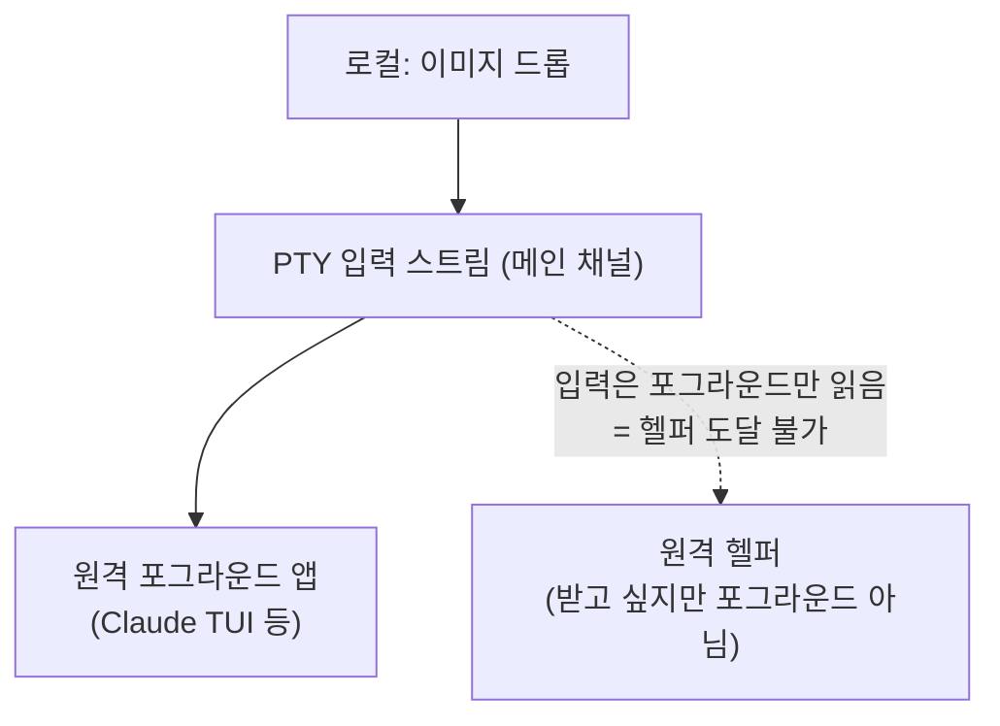
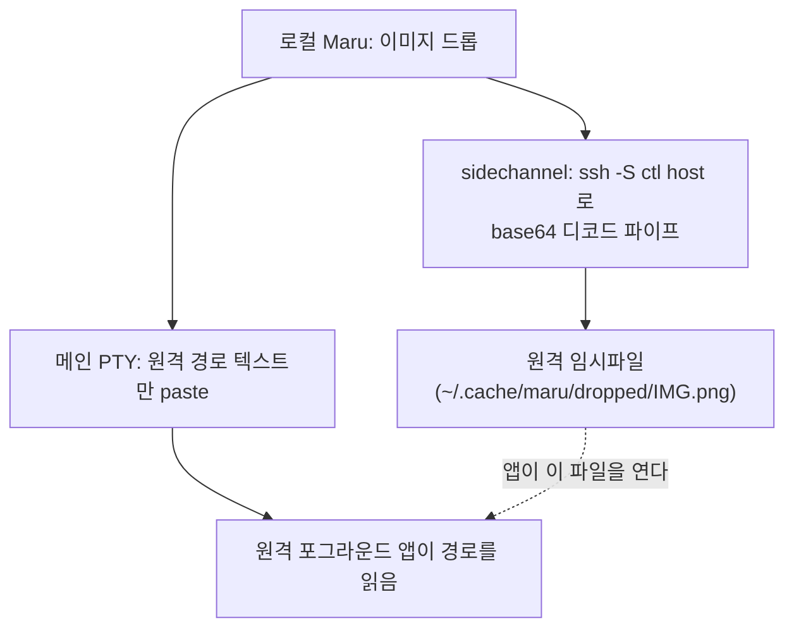

# Maru SSH 통합 전략

작성일: 2026-06-21
배경: `maru ssh` terminfo 스택은 이미 구현돼 있으나(`src/cli/ssh.zig`) 그 설계/현황이 어느 docs에도 기록돼 있지 않았다. 이 문서는 (1) 기존 ssh 통합 현황을 문서화해 문서 부채를 해소하고, (2) "로컬에서 드래그한 이미지/파일을 SSH 원격에서 도는 앱(예: Claude Code·Codex 같은 CLI, 또는 임의의 경로-소비 프로그램)에 전달"하는 기능의 설계를 결정 로그로 남긴다.

## 0. 범위와 단일 출처

이 문서는 **Maru의 SSH 통합**(terminfo 전파, 자기식별, 원격 cwd 인식, 드롭/paste 파일 전송)의 단일 출처다. 인접 주제는 각자의 단일 출처를 따른다.

- SSH **테스트** 전략(무엇을 `ssh localhost`/VM으로 검증하나): [터미널 전략 #13](../terminal-strategy.md#13-ssh-테스트)
- 클립보드·OSC 보안 정책(OSC 52 쓰기 allow·읽기 deny 등): [터미널 호환성/보안 정책](terminal-compatibility-policy.md)
- 단계별 구현 순서와 완료 기준: [실제 구현 계획](implementation-plan.md)
- 드롭/paste의 셸 이스케이프 경계(Swift 읽기 → Zig 이스케이프, ABI v67): [macOS 앱 호스트 경계](macos-app-host-boundary.md)

이 문서에 없는 결정이 필요하면 임의로 진행하지 않고 사용자와 먼저 논의한다([필수 프로젝트 규칙](project-rules.md)).

## 1. 현황: `maru ssh` terminfo·자기식별·ControlMaster 스택 (구현 완료)

> 이 절은 이미 구현된 동작의 기록이다. 단일 출처는 코드(`src/cli/ssh.zig`, `src/terminal/core.zig`)이고, 여기서는 설계 의도를 보존한다.

`maru ssh`는 **opt-in 래퍼**다. 사용자의 평소 `ssh`는 건드리지 않고, `maru ssh <ssh args...>`라고 명시할 때만 동작한다. 인자는 파싱하지 않고 그대로 `ssh`에 넘기며, 마지막엔 항상 `exec`로 진짜 `ssh`가 되어 세션 중 오버헤드가 0이다. 감싸는 그 한 번에 일반 `ssh`가 하지 않는 일을 한다.

- **terminfo 자동 전파**: `xterm-maru` terminfo 소스를 바이너리에 `@embedFile`로 embed하고(`embedded_terminfo`), 접속 직전 `printf '%s' '<소스>' | ssh ... 'tic -x -o "$HOME/.terminfo"'`로 원격에 컴파일한다. 로컬 설치 없이 자기완결적이고, 로컬/원격 terminfo 버전이 항상 일치한다. 동기 출력(Sync) 등 maru 캡을 원격 tmux/vim이 인식해 SSH+tmux 레이아웃 플리커가 사라진다.
- **단일 연결(ControlMaster)**: 부트스트랩 ssh가 `-o ControlMaster=auto -o ControlPath="$ctl" -o ControlPersist=10`으로 master가 되고, 세션 ssh가 같은 `$ctl` 소켓을 재사용해 **인증이 한 번**만 일어난다.
- **설치 캐시**: 설치한 목적지를 `${XDG_CACHE_HOME:-$HOME/.cache}/maru/ssh-terminfo-hosts`에 기록해, 재접속 시 부트스트랩 round-trip을 건너뛴다.
- **안전 폴백**: 원격 command가 붙은 경우(`bootstrapEligible`이 false)는 이중 실행을 피하려 부트스트랩을 건너뛰고, `tic`이 없거나 설치 실패면 `TERM=xterm-256color`로 폴백한다.
- **자기식별**(`src/terminal/core.zig`): XTVERSION(`CSI > q`) → `maru`, XTGETTCAP(`DCS + q TN ST`) → `xterm-maru`.

**베이스/clean-room**: terminfo `tic`은 공개 도구, ControlMaster는 OpenSSH 공개 기능이다. 같은 문제를 푸는 Ghostty `ghostty +ssh`(MIT)는 **동작 비교**로만 확인했고 셸 구절·idiom은 maru가 독립 작성했다(코드 미복사).

### 1.1 현재 한계 (이 문서가 다루는 출발점)

- **원격 호스트 식별이 약하다.** OSC 7 cwd 보고는 `file://<host>/<path>`의 **host(authority)를 버리고 path만** 저장한다(`implementation-plan.md` ⑥, 로컬 단일 호스트 가정). 원격/로컬 cwd 구분과 호스트 인식은 후속으로 미뤄져 있다.
- **control socket이 세션 내내 유지되지 않는다.** `$ctl`은 `mktemp -u`로 만든 **랜덤 경로**라 로컬 Maru(터미널 앱)가 그 경로를 모른다. 게다가 **캐시 hit 경로**(재접속)에서는 control socket을 아예 만들지 않고 `exec ssh "$@"`로 끝난다 — 즉 첫 설치 접속에만 잠깐 존재한다.

이 두 한계가 아래 이미지 전송 설계의 핵심 변경 지점이다.

## 2. 문제: 로컬에서 드래그한 이미지를 원격 앱에 전달

로컬에서 이미지를 드래그하면 Maru는 **파일 경로 텍스트**를 paste한다(`MaruAppHost.swift`가 읽고 `app_session.zig::pasteText`가 셸 이스케이프, ABI v67). 로컬 앱은 그 경로를 **로컬 파일시스템에서 직접** 읽는다 — 데이터가 PTY를 거치지 않고 파일시스템이라는 out-of-band 채널로 전달되는 것이다.

SSH면 이 전제가 깨진다.

- paste되는 건 여전히 **로컬 경로**인데, 그 경로를 읽어야 할 앱은 **원격**에 있다.
- 원격 프로세스는 로컬 파일시스템에 접근할 수 없으니 경로가 무의미하다.
- SSH는 본질적으로 **바이트 파이프(PTY)**다. 이미지 바이트가 건너가려면 (a) in-band로 입력 스트림을 타거나, (b) 터미널이 직접 연 별도 채널로 가야 한다.

목표는 **범용 드롭/paste 파일 전송**이다. AI CLI가 주 수혜자이지만 AI 전용 기능이 아니라 "터미널이 드롭한 파일을 원격에 올리고 경로를 넘긴다"는 일반 동작이며, 이는 제품 방향("AI 터미널 아님", `terminal-strategy.md` §1)과 충돌하지 않는다. iTerm2의 드래그-업로드와 같은 부류다.

## 3. 접근 분석 — A / B / C

세 가지 경로를 검토했고, 결론은 **B(ControlMaster 사이드채널)**다.

### A. 앱이 in-band 이미지 데이터를 디코딩

터미널이 이미지를 base64로 인코딩해 입력 스트림에 흘려보내고 앱이 디코딩하는 방식. SSH가 투명하게 운반하므로 로컬/원격 구분이 사라지는 게 장점이다.

- **불가(현재)**: "TUI 앱에 이미지를 *입력*"하는 표준이 없다. kitty graphics는 *출력*(표시)용이다. 받는 앱(예: Claude Code)은 이미지를 OS 클립보드 직접 읽기(`pbpaste`/NSPasteboard) 또는 파일 경로로만 받지, 입력 스트림의 in-band 이미지를 디코딩하지 않는다. → **앱(업스트림) 지원이 전제**라 Maru 혼자 못 한다. 장기적으로 가장 깔끔하므로 [후속](#8-후속비범위)으로 추적한다.

### C. 원격 헬퍼가 in-band로 받기

PTY로 바이트를 보내고 원격의 작은 수신 프로그램이 파일로 쓰는 방식(iTerm2 `it2ul`/OSC 1337 류).

- **불가(이 시나리오)**: 이미지를 드롭하는 순간 **앱(예: Claude TUI)이 포그라운드로 PTY 입력을 점유**한다. 원격엔 PTY(커널)만 있고 터미널 에뮬레이터 레이어가 없어(에뮬레이터는 로컬 Maru다), in-band로 보낸 바이트는 그대로 포그라운드 프로세스의 stdin으로 꽂힌다. 헬퍼가 그 바이트를 받으려면 헬퍼가 포그라운드여야 하는데 앱과 동시에 불가능하다. `it2ul`도 사용자가 셸 프롬프트에서 직접 실행할 때만 받는다.

### B. ControlMaster 사이드채널 (채택)

데이터를 메인 PTY가 아니라 **SSH 전송계층의 별도 채널**로 보낸다. `maru ssh`가 심어둔 control socket으로 부가 명령을 실행해 원격에 파일을 쓰고, 메인 PTY로는 **원격 경로 텍스트만** paste한다.

- 데이터는 control socket으로 가므로 **포그라운드 앱과 무관**(C의 충돌 없음).
- **tmux와도 독립**이다. control socket은 ssh 레벨이고, 그 위에서 tmux가 돌든 말든 별도 채널을 연다. 메인 PTY로 가는 건 경로 텍스트뿐이라 tmux가 정상 전달한다. → tmux control mode 통합 같은 큰 작업이 불필요하다.
- 받는 앱은 **경로만 이해하면 되므로 앱 수정 불필요**(A의 업스트림 의존 없음).

## 4. 설계: ControlMaster 사이드채널 드롭 업로드

§1.1의 두 한계를 메우고 로컬 드롭 로직을 더하면 된다. 새 인프라가 아니라 **기존 ControlMaster 사용법의 확장**이다.

### 4.1 필요한 변경 (3가지)

1. **control socket을 세션 내내 유지하고 경로를 안정화한다.**
   - 현재: 첫 설치 접속에만 `mktemp -u` 랜덤 `$ctl`. 캐시 hit 경로엔 없음.
   - 변경: 캐시 hit 경로에서도 `-o ControlMaster=auto -o ControlPath=<경로>`로 master를 유지하고, 경로는 **목적지 해시 기반 결정론적 경로**로 만들어 Maru가 계산으로 안다(§6 결정 — `maru ssh`와 Maru가 같은 dest 해시로 동일 경로 도출).
2. **로컬 Maru가 "이 세션이 maru ssh 원격 세션"임을 안다. ✅ 2단계 구현**
   - `maru ssh`가 `OSC 5379 ; ssh ; <dest>`로 목적지를 통지하고(`wrapper_script`의 `notify`, `$TMUX`면 DCS passthrough), Maru가 `dispatchOscMaru`로 받아 `ssh_remote_dest`에 저장한다(`sshRemoteDest()` getter). dest로 `controlSocketPath`를 계산하므로 control socket 경로를 따로 알릴 필요가 없다. control socket이 살아있는 maru exec 경로(캐시 hit·부트스트랩 성공)에서만 통지한다.
3. **드롭 핸들러가 분기한다 (1차: 드롭만, paste 업로드는 후속).**
   - 로컬 세션: 지금처럼 로컬 경로 paste.
   - maru ssh 원격 세션: 드롭 바이트를 control socket으로 업로드(`ssh -S <ctl> <host> 'mkdir -p ... && base64 -d > <원격경로>'`에 base64 파이프) → 성공하면 **원격 경로**를 메인 PTY로 paste. 실패하면 명확히 보고(조용한 실패 금지, `project-rules.md` §전략 유지).

### 4.2 원격 의존성

- `base64 -d`는 사실상 보편(coreutils/BSD 모두). **원격에 헬퍼 설치 불필요** — terminfo 부트스트랩처럼 in-band 셸 구절로 충분하다.
- 따라서 "원격에 Maru를 깐다"는 일은 없다. 터미널은 로컬 전용이고, 원격엔 셸 + `base64`만 있으면 된다.

### 4.3 경계 (어느 계층이 무엇을)

- **Swift(`MaruAppHost.swift`)**: 드롭 바이트를 읽어 ABI로 넘긴다(이미 드롭을 읽는 경로 재사용). 네이티브 I/O만.
- **Zig(`app_session.zig` + ssh 통합)**: 세션이 maru ssh 원격인지 판정, 업로드 명령 조립, 원격 경로 생성, paste 트리거. 결정 로직은 전부 Zig(테스트 가능, `macos-app-host-boundary.md` 정책).
- **ssh 래퍼(`cli/ssh.zig`)**: control socket 경로 안정화 + 세션 유지.

## 5. 보안·정책

- **원격 파일 쓰기**는 새 권한면이다. 위치를 한정하고(`~/.cache/maru/dropped/` 등), 파일명을 예측 가능·비충돌로 만들며, 정리 정책(세션 종료 시/용량 상한)을 정한다.
- Maru의 OSC 정책은 보수적이다(OSC 52 쓰기 allow·읽기 deny, 로컬 단일 사용자, 사용자 결정 2026-06-20, `terminal-compatibility-policy.md`). 드롭 업로드도 같은 보수성을 따른다 — **명시적 사용자 행동(드롭)으로만** 트리거되고 자동 업로드는 없다. 세부 정책(기본 on/off, 크기 상한, 확장자 제한)은 사용자 결정 사항(§6).
- 업로드는 **사용자가 이미 인증한 control socket**으로만 간다(새 자격증명·새 연결 없음). control socket 경로 자체가 다른 사용자에게 노출되지 않도록 권한을 좁힌다.
- trace/로그에 호스트·경로·바이트가 남을 수 있으므로 `project-rules.md` §민감정보 redaction을 따른다(기본 local-only).

## 6. 결정과 미결정

### 결정 (사용자 결정 2026-06-21)

- **접속 방식 = `maru ssh` 전용.** 이미지/파일 드롭 전송은 `maru ssh`로 접속한 세션에서만 동작한다. control socket이 그 경로에서만 확보되고, 구현이 단순하며, tmux 유무와 무관하기 때문이다. 맨 `ssh`(사용자가 직접 친) 지원은 **비범위** — Maru가 개입할 지점이 없어 control socket을 심을 수 없고, 지원하려면 tmux control mode 통합 등 별도 큰 트랙이 필요하므로 [후속](#8-후속비범위)으로 둔다. 사용자는 접속을 `maru ssh <dest>`로 통일한다(`maru ssh`는 ssh 인자를 그대로 넘기므로 `~/.ssh/config` 호스트 별칭도 동일하게 쓴다).
- **control socket 경로 규약 = 목적지 기반 결정론적 해시.** `maru ssh`와 로컬 Maru가 같은 규약으로 목적지(dest) 문자열을 해시해 **동일 경로**를 도출한다(예: `~/.cache/maru/ctl-<dest 해시 앞부분>`). Maru가 경로를 OSC 통지 없이 **계산으로** 알 수 있고, 같은 host 재접속이 같은 master를 공유한다. unix socket 경로 길이 제한(macOS 약 104바이트)을 넘지 않게 해시를 짧게 자른다.
- **트리거 = 드롭만 (1차).** 파일/이미지 드래그앤드롭만 업로드한다. paste(클립보드 이미지) 업로드는 [후속](#8-후속비범위)으로 둔다.
- **원격 인식 토대 = `maru ssh` 전용 OSC 통지 (OSC 5379).** `maru ssh`가 `exec` 직전에 `OSC 5379 ; ssh ; <dest> BEL`을 emit하고(`cli/ssh.zig` `wrapper_script`의 `notify` — control socket이 살아있는 maru exec 경로에서만), **`$TMUX`가 있으면 DCS tmux passthrough로 감싸** tmux 안에서도 로컬 Maru까지 도달하게 한다. Maru(`terminal/core.zig` `dispatchOscMaru`)는 이를 받아 `ssh_remote_dest`에 dest를 저장하고(`sshRemoteDest()` getter), dest로 control socket 경로 해시를 계산한다. **5379**는 표준/벤더(iTerm 1337 등) 충돌을 피한 사설 번호이고, payload는 `<서브커맨드>;<인자>` 형식(현재 `ssh;<dest>`)이라 확장 가능하다. 모르는 터미널은 무시하므로 안전하다. RIS에선 유지한다(ssh 연결은 터미널 리셋과 무관, maru ssh가 재보고하지 않음). OSC 7 host 보관은 원격 cwd 표시용 보조로만 남긴다.

### 미결정 (구현 전 합의 필요)

아래는 보안에 영향을 주는 결정이라 구현(드롭 업로드 단계) 전 합의가 필요하다(`pr-checklist.md` §전략 수정 규칙).

1. **보안 기본값.** 기능 기본 on/off, 파일 크기 상한, 허용 확장자, 원격 저장 위치·정리 주기.

## 7. 검증·관측

- **통합 테스트**: `ssh localhost`로 업로드→원격 파일 존재→경로 paste 왕복을 검증한다(`terminal-strategy.md` #13 연장). control socket 유무·캐시 hit/miss 분기를 단위로 고정.
- **순수 로직 단위**: 세션이 maru ssh 원격인지 판정, 업로드 명령 조립, 원격 경로 생성은 I/O 없는 순수 Zig로 TDD(`ssh.zig`의 기존 셸-구절 단위 테스트와 같은 결).
- **관측 가능성**: 업로드 시작/성공/실패를 공통 도메인 이벤트로 남겨 로그·trace·E2E가 같은 데이터를 본다(`project-rules.md` §관측 가능성). 자동 검증이 불가능한 부분(실제 GUI 드롭)은 완료 전 수동 검증 방법과 함께 보고.

## 8. 후속·비범위

- **A(앱 in-band 이미지 입력)**: 전송 계층에 무관한 유일한 길이므로 장기 추적. Claude Code 등에 "stdin in-band 이미지" 또는 OSC 52/5522 기반 입력이 생기면 재검토.
- **paste(클립보드 이미지) 업로드**: 1차 트리거는 드롭만(사용자 결정 2026-06-21). 클립보드 이미지 paste 업로드는 같은 ControlMaster 사이드채널 위에 얹는 후속이다.
- **맨 ssh + tmux control mode 통합**: 사용자 결정(2026-06-21)으로 접속 방식이 `maru ssh` 전용이 되어 **비범위**다. 맨 ssh(사용자가 직접 친)까지 지원하려면 tmux control mode 통합 등 별도 큰 트랙이 필요하며, 기본 설계(B)는 tmux 유무와 무관하므로 이 트랙 없이도 tmux 환경에서 동작한다.
- **kitty graphics(이미지 *표시*, `implementation-plan.md` K1~K4)와의 관계**: 방향이 반대다(출력 vs 입력). 별개 기능이며 본 설계와 인프라를 공유하지 않는다.
- **bash/fish용 ssh 통합·`.app` 메뉴 진입점**: 선행 작업 의존으로 별도 추적.

**clean-room 근거**: ControlMaster는 OpenSSH 공개 기능, OSC 7은 VTE 정의 사실상 표준, 드래그-업로드 동작은 iTerm2를 **동작 비교**로만 참고한다. 레퍼런스 코드 표현은 옮기지 않는다(`project-rules.md`).
